# SWIFTGS: ALGORITHM AND SYSTEM CO-OPTIMIZATION FOR FAST 3D GAUSSIAN SPLATTING ON GPUS

Lingjun Gao 1 Zhican Wang 1 Zhiwen Mo 1 Hongxiang Fan 1

## ABSTRACT

Recent advances in 3D Gaussian Splatting (3DGS) have enabled high-quality and efficient novel view synthesis, demonstrating great potential in real-world applications such as robotic perception and digital-twin construction. However, 3DGS requires processing up to millions of Gaussians in parallel, imposing significant computational and memory demands that limit its deployment on resource-constrained platforms. Through systematic profiling and analysis, this paper identifies several redundancy at both the algorithmic and system implementation levels. These insights motivate us to explore several novel optimizations, including adaptive early sorting, GPU-efficient axis-shared rasterization, and dynamic thresholding. Unlike prior work that focuses only on either algorithmic improvements or systems optimization, our approach explores a joint algorithm and system co-optimization to push the performance limits of 3DGS on GPUs. Comprehensive evaluation demonstrates that our co-optimization approach, named SwiftGS achieves a speed-up of up to 1.41× with negligible algorithmic performance drop in rendering image quality compared with the gsplat baseline. Importantly, our co-optimization is orthogonal to most existing 3DGS acceleration methods, allowing for synergistic performance gains when used in combination. The code has been released in: https://github.com/LingjunGao/SwiftGS

## 1 INTRODUCTION

Novel view synthesis has attracted significant interest in recent years. Traditional scene representation methods, such as points (Qi et al., 2017a;b), meshes (Loper & Black, 2014; Kato et al., 2018), and voxels (Maturana & Scherer, 2015), offer relatively high rendering speeds but suffer from noticeable artifacts and limited resolution. The Neural Radiance Field (NeRF) (Mildenhall et al., 2022) addresses this issue by representing scenes using continuous 5D coordinates. However, this method suffers from long training and inference times, which pose a challenge to achieving real-time view synthesis.

In this context, 3D Gaussian Splatting (3DGS) (Kerbl et al., 2023) was introduced, as illustrated in Fig. 1. This rendering technique utilizes elliptical 3D Gaussians to represent the scene and projects (splats) them onto the 2D image plane to generate rendered images. In this manner, it achieves high rendering quality through the continuous Gaussian splatting function (Zwicker et al., 2001), while maintaining relatively short training times due to its discrete Gaussian representation. This makes 3DGS an effective compromise between training time and rendering quality.

Despite the superior performance of the 3DGS compared with previous approaches, the algorithm employs millions of Gaussians, and aggregating them during inference can be challenging for devices with limited computational resources. 3DGS pipeline is typically constructed through three main stages: projection, sorting, and rasterization, as illustrated in Fig. 1. Our profiling results shown in Fig. 2 indicate that sorting and rasterization account for the majority of rendering time, consistent with previous studies (Lee et al., 2024; Lin et al., 2025).

Existing studies (Fan et al., 2024; Zhang et al., 2024; Ali et al., 2024) have focused on reducing the number of 3D Gaussians through pruning, but provide limited consideration of operations within each stage of the pipeline. (Lee et al., 2024) provides a more detailed analysis of sorting and rasterization but overlooks both the intricacy of the sorting process and the computational burden of rasterization. These limitations motivate us to perform a deeper analysis of rasterization and sorting on commercial GPU platforms, leading to three key challenges outlined below:

• Challenge-1: Sorting Redundancy. The primary purpose of the sorting stage is to group Gaussians that interact with the same tile and, within each tile, arrange them in a depth-aware order. However, since each Gaussian may intersect multiple tiles, its relative depth position can be repeatedly sorted across different tiles. Fig. 3 provides a quantitative illustration of this redundancy. As shown in the figure, the length of the intersection list can be up to 7.61× greater than the number of Gaussians. This observation supports our argument that the existing sorting method exhibits substantial redundancy (see Section 3.1).

• Challenge-2: Computational Redundancy in Rasterization. In the existing CUDA implementation, rasterization is performed on a per-pixel basis, with each thread responsible for computing the color contribution of a single pixel. This approach leverages the GPU’s parallel processing capabilities and enables an efficient rasterization pipeline. However, it also introduces significant computational redundancy. Specifically, during the α-compute stage, approximately 37.50% of the SASS (Streaming Assembler) instructions—the low-level GPU assembly instructions—executed by a thread are identical to those executed by other threads in the same column, while an additional 29.17% are repeated by threads in the same row. In total, this corresponds to 66.67% of the SASS instructions in the α-compute stage. Given that the α-compute stage is the most computationally intensive process in the rasterization kernel, this represents a considerable amount of redundant computation (see Section 3.2).

• Challenge-3: Redundant Computation from Filtered Gaussians. At the end of the α-compute stage, the computed opacity α is compared against a predefined threshold. If α falls below this threshold, the corresponding Gaussian is skipped, as it does not contribute to the color of the pixel. However, this implies that all prior computations performed for this Gaussian during the α-compute were wasted. Although such filtering is necessary to ensure rendering correctness, the wasted computation is redundant and increases the computational burden of the rasterization stage (see Section 3.3).

To address Challenge 1, we propose an algorithm-level optimization based on an adaptive early-sorting strategy. The early-sorting method divides the existing sorting procedure into two steps. First, the Gaussians are sorted by depth, and a lookup table is created. Second, a depth-aware intersection list is constructed based on the lookup table, grouping Gaussians that intersect the same tile. While implementing this method, we observed that the interaction step may occasionally exhibit longer processing time than the original approach due to data coalescing issues. Therefore, we introduce an adaptive workflow that enables the 3DGS pipeline to dynamically switch between sorting methods for optimal performance. Overall, implementing the early-sorting method reduces the sorting complexity by an average of 28.90%, with a maximum reduction of 43.56%, depending on the scene.

To address Challenges 2 and 3, we propose a system-level optimization of the rasterization kernel, referred to as GPUbased axis-shared rasterization. In this approach, an additional shared-term computation stage is introduced to handle redundant intermediate computations. During the subsequent α-compute phase, these intermediate values are reused, thereby significantly reducing redundant computation. This shared-term reuse results in a 19.79% reduction in the number of SASS instructions required for α- computation. Furthermore, we introduced dynamic thresholding to reduce redundant computations from filtered Gaussians. Specifically, this method decomposes the α-compute process into pixel-independent and pixel-dependent components. By moving the pixel-independent computation before the filtering step, we avoid executing unnecessary instructions for Gaussians that are subsequently filtered out, achieving an additional 25% reduction in SASS operations for these Gaussians.

In summary, the main contributions of this paper are as follows:

• We identify previously overlooked challenges in accelerating 3D Gaussian Splatting, namely: (i) sorting redundancy, (ii) computational redundancy in rasterization, and (iii) redundant computation from filtered gaussians (Section 3).

• We propose an adaptive early-sorting approach, a twostage sorting pipeline that reduces sorting complexity by up to 43.56% (Section 4).

• We propose a GPU-based axis-shared rasterization, which eliminates redundant SASS operations in the α- compute stage by 19.79% and further reduces computation by 25% using dynamic thresholding for skipped Gaussians (Section 5).

## 2 BACKGROUNDS

## 2.1 3D Gaussian Splatting

## 2.1.1 3D Gaussian Basis

3D Gaussian Splatting represents a 3D scene using elliptical 3D Gaussians (Kerbl et al., 2023). This discrete Gaussian representation enables fast training and inference, while the continuous Gaussian splatting formulation supports highquality rendering. An elliptical 3D Gaussian is defined as shown in Equation 1:

$$
\tag{1}
$$

where x denotes a point in a 3D space, µ is the Gaussian centre and Σ is the covariance matrix. In this formulation, Σ can be expressed by eigen-decomposition as Σ = RΛR⊺, where R is a rotation matrix, and Λ is a diagonal matrix containing the eigenvalues. This parameterisation guarantees that Σ is positive semi-definite, giving it a valid physical interpretation.

Apart from the position and shape of the Gaussian, each Gaussian also has an opacity parameter o, and a set of spherical harmonics (SH) coefficients to capture the color. For each RGB channel, the 3DGS algorithm employed a thirdorder SH, which yields 16 parameters per channel, and 48 parameters in total. By summation, each 3D Gaussian is thus represented by the 59 parameters.

## 2.1.2 Rendering Pipeline & Implementation

The rendering pipeline consists of three main stages: projection, intersection & sorting, and rasterization. In this section, we provide a brief overview of the stage and how these functions have been implemented through CUDA kernel.

Projection. In this stage, the 3D Gaussians and the view direction are used as input parameters, and the Gaussians are projected onto a 2D plane. The projected 2D Gaussian will therefore have a position parameter µ∗ ∈ R2, a covariance matrix Σ∗ ∈ R2×2 and a scaler depth value d. In the meanwhile, frustum culling is applied to prune Gaussians whose 99.7% confidence intervals fall outside the view frustum.

In the projection kernel, all Gaussian in the scene are processed in parallel, with each Gaussian assigned to a separate thread block. Each thread block is responsible for performing frustum culling and determining the corresponding projected Gaussian parameters.

Intersection & Sorting. For efficient rasterization, the screen is divided into multiple 16 × 16 tiles, and each Gaussian may intersect with one or more of these tiles. To enable fast intersection detection, an axis-aligned bounding box (AABB) is used to approximate the Gaussian footprint, rather than performing an exact intersection check using the elliptical Gaussian boundary.

For each Gaussian–tile intersection pair, a 64-bit key is generated. The upper 32 bits encode the tile ID, while the lower 32 bits store the encoded Gaussian depth. The list constructed by these intersection keys is then sorted using a radix sort algorithm. During the intersection kernel, all Gaussians are processed in parallel, with each thread block handling a single Gaussian. At this stage, before sorting, the intersection list is constructed in Gaussian-major order, as shown in Figure 1. In this case, all tiles intersecting the first Gaussian appear first, followed by the tiles corresponding to the second Gaussian, and so forth.

rasterization. While launching the rasterization kernel, the number of active thread blocks matches the number of tiles, with each block processing one tile. Each thread block is configured with a size of 16 × 16, such that each thread maps to a single pixel within the tile.

Within each thread block, the total number of Gaussian–tile intersections assigned to a tile is divided into batches of 256. In this case, each thread could load parameters of one Gaussian from global memory into shared memory. The Gaussians in the batch are then processed iteratively in frontto-back order.

For each Gaussian, every thread computes the opacity α using Equation 2 with an intermediate computation of σ.

$$
\tag{2}
$$

A filtering condition is applied to discard Gaussians with an opacity less than 1 . If a Gaussian satisfies this condition, 255   
each thread evaluates its transmittance Ti using Equation 3 and computes its color contribution to the pixel using Equation 4.

$$
\tag{3}
$$

$$
\tag{4}
$$

## 2.2 Efficient Rendering in 3D Gaussian Splatting

Despite the significantly faster rendering speed of 3DGS compared to earlier volumetric rendering methods such as NeRF (Mildenhall et al., 2022), the original implementation of 3DGS still suffers from various redundancies. This results in long inference times on lower-end or edge GPUs, which typically have constrained computational and memory resources. This limitation has motivated subsequent research on optimizing and accelerating 3DGS for efficient deployment across diverse hardware platforms.

Gaussian Pruning. A 3DGS model is typically composed of millions of 3D Gaussians, each represented by 59 parameters. The aggregation of these parameters is both timeconsuming and computationally intensive. Consequently, one major research direction focusses on reducing the number of Gaussians within the model. (Fan et al., 2024; Girish et al., 2024; Hanson et al., 2025b) compute an influence score for each Gaussian with respect to its contribution to the rendered image. (Zhang et al., 2024; Liu et al., 2024; Qiu et al., 2025) employs a learnable mask function to identify and remove Gaussians that do not significantly affect image quality. Meanwhile, (Ali et al., 2024) evaluates the contribution of each Gaussian based on backpropagation gradients.

Tight Bounding Box. The AABB used in the original 3DGS implementation often leads to false-positive intersections between Gaussians and tiles, resulting in unnecessary sorting and rasterization computations. To address this issue, (Lee et al., 2024) introduced a stricter oriented bounding box (OBB) to replace the AABB. (Feng et al., 2024; Wang et al., 2024) incorporated the minimum opacity value ( 1255 ) in the calculation of the radius of the bounding box, while (Wang et al., 2024; Hanson et al., 2025a) further explored the formulations of the bounding box that account for the horizontal and vertical extents of the ellipse.

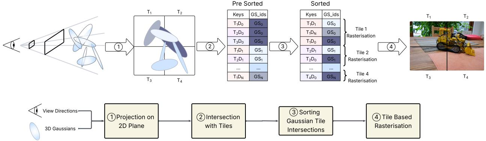  
Figure 1. An overview of the 3DGS pipeline.

Efficient Parallel Scheduling. To fully utilize GPU resources during rendering, 3DGS employs customised CUDA kernels. However, due to the Single-Instruction, Multiple-Thread (SIMT) execution model of GPUs, load imbalance can arise between threads, thread blocks, and streaming multiprocessors (SMs). To address the workload imbalance between threads, (Zhao et al., 2025) introduces a dynamic load-balancing approach, while (Gui et al., 2025) proposes Gaussian-wise parallelism for rendering. To mitigate the imbalance within thread blocks, (Wang et al., 2024) incorporates the standard deviation of the number of Gaussians per pixel into the loss function, and (Lin et al., 2025) adopts a dynamic tile-merging scheme to combine thread blocks with low workloads. (Wei et al., 2025) predicts the workload for each thread block based on the viewpoint transformation. Finally, (Gui et al., 2025) presents a dynamic workload distribution scheme to reduce the imbalance across SMs.

Unexplored Redundancy in Rendering. While prior works have improved efficiency through various approaches, they largely operate at a coarse granularity. In particular, limited attention has been paid to fine-grained computational redundancy within the sorting and rasterisation stages. Existing methods typically retain per-pixel or per-Gaussian computation patterns, overlooking shared structure across neighbouring pixels and tiles, Similarly, although sorting has been optimised through pruning or improved key design, redundancy from repeated depth-based ordering across tiles remains under explored. These inefficiencies are inherent to the 3DGS formulation and persist even after prior optimisations, highlighting the need for a more detailed investigation of redundancy within the rendering pipeline.

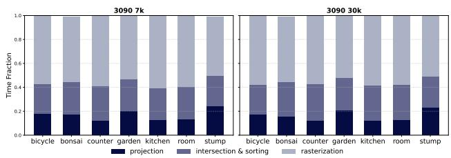  
Figure 2. Time ratio for three separate process during the rendering pipeline for different scene under different training iterations (7k on the left, 30k on the right)

## 3 CHALLENGE ANALYSIS AND MOTIVATION

We conducted a detailed analysis of the percentage of time spent by each stage of the 3DGS pipeline as shown in Figure 2. The analysis was carried out using an RTX 3090 with the real-world Mip NeRF 360 dataset (Barron et al., 2022). The results indicate that rasterization consistently takes the longest time, accounting for 55.47% of the total rendering time on average. This is followed by intersection and sorting, which further contributes 27.31% in average. Since these two processes collectively occupy over 80% of the total rendering time, our work primarily focusses on reducing the computational cost within these stages.

## 3.1 Challenge 1: Sorting Redundancy

The radix sort algorithm used to sort the list of intersections has a computational complexity of O(64m). This can be expressed as O(32m + 32m), where the first O(32m) corresponds to sorting by tile IDs and the second O(32m)

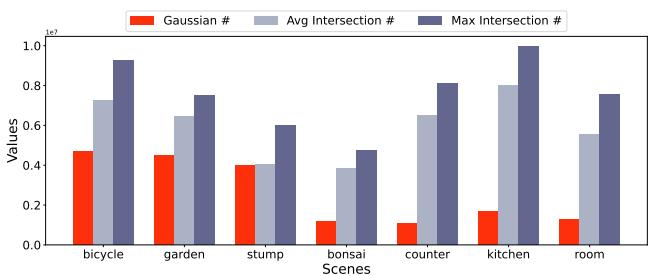  
Figure 3. Number of Gaussians, average intersections, and maximum intersections per scene under different training iterations

corresponds to sorting by Gaussian depth. As the number of intersections always exceeds the number of Gaussians, the sorting process ends up sorting the Gaussian depth multiple times across different tiles. Specifically, sorting the Gaussians by depth has a complexity of only O(32n), where n represents the number of Gaussians. As O(32n) < O(32m) always holds, this highlights the inefficiency of the existing sorting procedure.

To quantitatively evaluate this difference and assess the impact of sorting redundancy, we plotted the average number of Gaussians and intersections for each scene. The results, shown in Figure 3, indicate that the average intersectionto-Gaussian ratio is 2.37, and in the most extreme case, this ratio reaches 7.68. This implies that, under the current 3DGS pipeline, the complexity of depth sorting based on intersections can be more than seven times higher than sorting Gaussian depths beforehand.

## 3.2 Challenge 2: Computational Redundancy in Rasterization

rasterization is the most time-consuming process in 3DGS, we therefore conducted a roofline analysis using NVIDIA Nsight Compute to identify the bottleneck of this kernel. As shown in Figure 4, the result indicates that the rasterization kernel is under compute-bound, which direct us to analyze the computation process within the kernel.

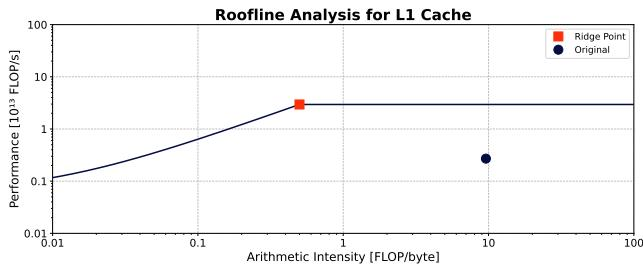  
Figure 4. Roofline analysis of original rasterization kernel. The achieved value is on the right-hand side of the ridge point, representing that the kernel is compute bound.

Building on this insight, we analyzed the Streaming Assembler (SASS) instructions of the rasterization kernel and found that the α-compute stage is the most computationally intensive component. Specifically, for each Gaussian, each thread performs the following operations: two addition (ADD) instructions to compute the delta terms; five multiplication (MUL) and two fused multiply-add (FMA) instructions for the intermediate σ calculation; and an additional two MUL and one multi-function (MUFU) instruction to evaluate the exponential component. In total, this corresponds to 12 SASS instructions per Gaussian per thread and the detail of the computation has shown on the top right of Figure 5. Given its dominant computational cost, we further examined the per-thread execution pattern and identified significant redundancy arising from repeated calculations.

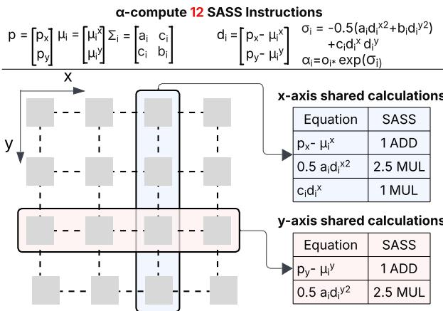  
Figure 5. A toy example of a single thread block in the rasterization kernel. For the total 12 SASS instructions, 4.5 instructions are shared between threads in the same column, and 3.5 of instructions are shared between threads in the same row.

Since pixels within the same column share the same x-axis index p , threads within a column perform 4.5 identical calculations for each Gaussian. The additional 0.5 SASS instruction arises because a constant factor of 0.5 is applied to both the x-axis and y-axis shared terms. Similarly, threads within the same row execute 3.5 identical calculations. Overall, approximately 66.67% of the SASS instructions executed during the α-compute stage are redundant across threads.This signifies a substantial amount of unnecessary calculations, which results in the kernel operating under compute-bound conditions.

This observation aligns with previous research (Ye et al., 2025b; Wang et al., 2025). However, those implementations were designed for domain-specific accelerators and therefore follow a different logic from CUDA programming and general-purpose GPUs. To the best of our knowledge, this is the first work to discuss and implement such an optimization on general purpose NVIDIA GPUs.

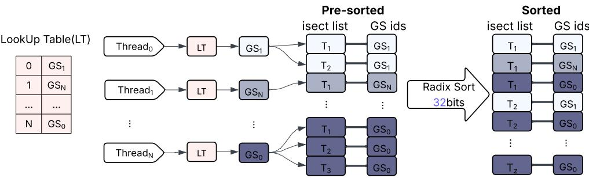  
Figure 6. The workflow of early-sorting.

## 3.3 Challenge 3: Redundant Computation from Filtered Gaussians

During the α-compute stage, if a Gaussian’s opacity at a given pixel falls below the threshold α < 1255 , this specific Gaussian will not contribute to the color of the pixel and, therefore, will be skipped. This means that all computations in Equation 2 have been wasted, leading to a substantial amount of computational redundancy.

However, this filtering step remains necessary for two main reasons. Firstly, the current AABB introduces a large number of false-positive intersections, meaning that many Gaussians identified as intersecting with a tile do not actually overlap with any of its pixels. Omitting the filtering condition in such cases would produce low-quality images. Secondly, even for correctly detected intersections, not all pixels within a tile are actually covered by the corresponding Gaussian. Consequently, recent efforts to employ stricter bounding box formulations have not fully resolved this limitation.

Based on this analysis, it is crucial to explore new filtering conditions that filters non-contributive Gaussians, as well as minimise redundant computation conducted by these Gaussians.

## 4 ADAPTIVE EARLY-SORTING

Inspired by the observation in Challenge 1, we propose an early-sorting method to eliminate redundant depth sorting of Gaussians (Section 4.1). To further optimize sorting across different scenes, we design an adaptive early-sorting workflow, ensuring that the 3DGS pipeline consistently employs the most efficient sorting strategy (Section 4.2).

## 4.1 Early-Sorting

The key idea behind early-sorting is to sort Gaussians by depth before constructing the Gaussian–tile intersection list. Gaussian depth sorting is performed using a radix sort algorithm with computational complexity of O(32n), where n is the number of Gaussians. This produces a lookup table that contains the Gaussian indices ordered from front to back, as shown in Figure 6.

This lookup table will then be transferred as the input variable to the kernel conducting the intersection relationships. Each thread within a thread block accesses the lookup table according to its thread index, ensuring that the thread with the smallest index processes the Gaussian with the lowest depth value. Consequently, the tiles intersected by this Gaussian are positioned at the beginning of the intersection list. Through this mechanism, the resulting intersection list inherently preserves the Gaussian depth order.

In contrast to the original intersection list, our proposed list preserves the Gaussian depth order and therefore no longer requires embedding the Gaussian depth into the sorting keys. Instead, only the tile ID is encoded as a 32-bit key, and the intersection list is sorted solely on this key. As a result, the sorting complexity on tile ID remained as O(32m). When combined with the O(32n) complexity of sorting the Gaussians by depth, the overall complexity of the proposed early-sorting method becomes O(32(n + m)). In comparison, the original sorting process has a complexity of O(64m). By substituting the average and maximum intersection-to-Gaussian ratios from Figure 3, we conclude that, on average, implementing early sorting reduces the sorting complexity by 28.90%, with a maximum reduction of 43.56% in the most extreme case.

## 4.2 Adaptive Workflow

Although the early-sorting algorithm exhibits lower theoretical complexity compared with the original sorting method, we observed an increased sorting time in certain scenarios. This inefficiency arises from a loss of data coalescing caused by the introduction of the lookup table. As different scenes have different sensitivities toward the data coalescing issue, we need to develop an adaptive workflow to match the right scene with the appropriate sorting method.

To implement the adaptive workflow, at the final iteration of model training, we randomly select 20% of the training dataset as test cases, with half evaluated using the earlysorting method and the other half using the original sorting method. For each test case, we record the time taken by the intersection and sorting stage, and then compute the average runtime for each sorting strategy. These statistics are used to guide the subsequent inference phase by determining which sorting approach is more optimal for the corresponding scene.

## 5 GPU-BASED AXIS-SHARED RASTERIZATION

Motivated by the observations in Challenges 2 and 3, we propose a GPU-based axis-shared rasterization method, as illustrated in Fig. 7. This approach introduces a sharedterm computation stage within the α-compute pipeline and incorporates a dynamic threshold for each Gaussian. The combination of these techniques effectively eliminates redundant computations and reduces redundant processing caused by filtered Gaussians.

## 5.1 Shared-term Calculation

The primary objective of the shared-term calculation is to consolidate multiple redundant operations and evaluate them in parallel. To implement this mechanism, we first identify the unique shared terms associated with each Gaussian within a thread block. Given that each thread block has a size of 16 × 16, there are 16 distinct shared-term computations along the x-axis and another 16 along the y-axis. Consequently, rather than assigning the entire thread block to perform repetitive computations, only two rows of threads are designated to compute the distinct shared terms along the x- and y-axis, respectively.

Since only two rows are required to calculate the shared terms for each Gaussian, performing the computation for a single Gaussian at a time results in substantial thread idling. To mitigate this issue, we introduce the concept of a mini-batch, where the shared terms of eight Gaussians are computed simultaneously within each thread block. This design choice ensures full utilization of the available computational resources. Meanwhile, as shown in Equation 5, our proposed approach reduces the complexity of shared-term computation by a factor of 12.8 compared with the original rasterization kernel.

$$
\tag{5}
$$

On NVIDIA GPUs, Streaming Multiprocessors (SMs) are responsible for launching thread blocks, which are executed in groups known as warps. Each warp typically consists of 32 threads. Because the rasterization kernel adopts a row-major configuration with 16 threads per row, two consecutive rows are executed concurrently within a single warp. When threads within a warp execute different instructions, such as evaluating distinct terms or functions, warp divergence occurs, thereby reducing overall efficiency. To prevent this issue, as illustrated in Fig. 7, we assign the computation of shared x-terms to the first eight rows of threads and that of shared y-terms to the remaining eight rows. This arrangement effectively mitigates warp divergence and enhances the efficiency of shared-term computation.

Among the three equations used in the x-axis shared-term computation shown in Fig. 5, only the results from the lower two are required for the subsequent α-compute stage. In contrast, both equations from the y-axis shared-term computation are required. Consequently, each thread stores two terms in shared memory, resulting in a total of 64 terms per warp. If all terms were stored in single precision, bank conflicts would arise, necessitating additional instructions for shared-memory read and write operations. To address this issue, both shared terms are stored in half precision. As demonstrated in Section 7.2, this reduction in precision for intermediate computations has a negligible effect on the final rendering quality.

## 5.2 Dynamic Thresholding

To minimise wasted computation, we conducted a detailed review of Equation 2 and decomposed it into two components: a pixel-dependent term (σ) and a pixel-independent term (the rest of the computations). Based on this observation, we introduced a dynamic threshold computed for each Gaussian using only the pixel-independent terms. Each thread then evaluates the pixel-dependent term and compares it against this threshold. This approach removes the need to fully conduct α-compute for pixels that fail the threshold test, thereby reducing two MUL and one MUFU instruction per thread in cases where the Gaussian does not contribute to the pixel.

The dynamic thresholding is derived from a reformulation of the filtering condition shown in Equation 6:

$$
\tag{6}
$$

The dynamic threshold, ln(255 · o), is computed once per Gaussian and stored in shared memory. During the α- compute stage, the pixel-dependent term σ computed by each thread is compared against this threshold. If the condition is not satisfied, the remaining pixel-independent MUL and MUFU operations are skipped, thereby reducing the per-thread computational cost.

Although calculating the dynamic threshold for each Gaussian introduces an additional operation, this is performed while loading the Gaussian parameters, where each thread processes one Gaussian in parallel. Since 256 Gaussians are processed concurrently per thread block, the per-Gaussian overhead corresponds to only 1256 of the cost of performing the same computation inside the α-compute stage. Consequently, the additional workload is negligible and does not affect the overall kernel performance.

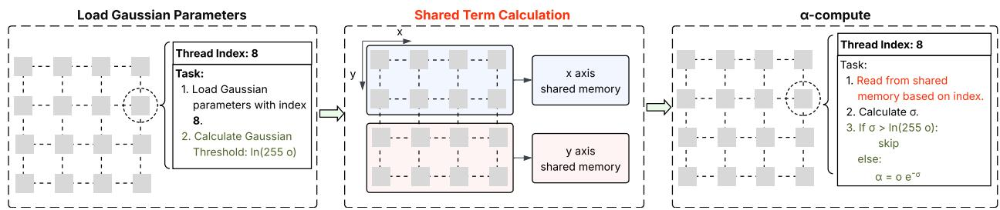  
Figure 7. GPU-based Axis-shared rasterization. The reddish text indicates the shared-term computation, while the greenish text highlights the dynamic thresholding approach.

## 5.3 Efficiency Analysis

During the shared-term calculation, each thread executes five SASS instructions. Since these computations are performed in parallel across eight Gaussians, the effective computational cost per Gaussian is reduced to 58 5 = 0.625. In addition, two extra instructions are required, one for determining the Gaussian index within the mini-batch and another to handle the boundary case in the final mini-batch. In total, this stage requires approximately 2.625 SASS instructions per thread.

For subsequent calculations in the α-compute stage, two FMA instructions are required to retrieve the shared terms from shared memory, followed by five additional instructions to complete the α-computation. Combining these steps, our proposed axis-shared rasterization requires a total of 9.625 SASS instructions. Compared to the original rasterization kernel, this represents a 19.79% reduction in the total number of SASS instructions.

Among the five subsequent α-compute instructions, three are axis-independent. In our proposed dynamic thresholding, these operations are no longer required for skipped Gaussians, resulting in an additional 25% reduction in the number of α-compute instructions.

## 6 IMPLEMENTATION

SwiftGS is implemented using approximately 800 lines of CUDA code and 100 lines of Python, built on top of the gsplat framework (Ye et al., 2025a), a well-optimized CUDA accelerated 3DGS library featuring a modular design of the rendering pipeline. Modifications were made to both the training and evaluation pipelines. During training, we injected a data collection module that records the time consumed by the intersection and sorting stages. This information is later used to guide the adaptive workflow in selecting the optimal sorting method. During inference, we implemented the proposed early-sorting kernel alongside the original intersection and sorting kernels, enabling the 3DGS models to dynamically switch between them for optimal performance. In addition, the original pixel-based rasterization kernel was replaced with the proposed axisshared rasterization, integrated with dynamic thresholding. This combination reduces computational complexity while maintaining comparable rendering quality.

## 7 EVALUATION

## 7.1 Experimental Setup

Testbed. We conducted our experiments on two NVIDIA GPUs: the consumer-grade RTX 3090 (Ampere architecture, 24 GB VRAM, 10,752 CUDA cores) and the data-centregrade L40S (Ada Lovelace architecture, 48 GB VRAM, 18,176 CUDA cores). This setup allows us to evaluate the sensitivity of the proposed method across different hardware configurations. The implementation combines Python and CUDA, using Python 3.10 and PyTorch 2.1.2, with CUDA code compiled using GCC 9.4.0 and NVCC from CUDA 11.8.

Dataset. We evaluated the rendering performance on realworld scenes from the MipNeRF360 dataset (Barron et al., 2022). The dataset comprises three outdoor scenes (bicycle, garden, stump) and four indoor scenes (bonsai, counter, kitchen, room). As illustrated in Figure 3, outdoor scenes typically contain a larger number of Gaussians, whereas indoor scenes tend to exhibit a higher intersection-to-Gaussian ratio. This setup allows us to assess the performance of our model across scenes with varying characteristics. In addition, for each GPU device, we collected checkpoints at both 7,000 and 30,000 iterations per scene. Analysing results from different checkpoints enables us to investigate the effect of model complexity on the performance of the proposed method.

Benchmarks and Metrics. While FlashGS (Feng et al., 2024) is closely aligned with our work, it introduces substantial changes to the kernel structure, making direct comparison less straightforward. Therefore, we adopt the 3DGS pipeline implemented by the gsplat library as the benchmark for our experiments. For each test case, the Peak Signal-to-Noise Ratio (PSNR) is used as the evaluation metric, where a higher PSNR indicates better rendered image quality. To demonstrate that our approach is orthogonal to prior work with algorithmic level redundancy elimination, such as PUP-GS (Hanson et al., 2025b) and FlashGS (Feng et al., 2024), we conducted evaluation with PUP-GS (Hanson et al., 2025b) in Sec.7.4 to show the compatibility of our method.

## 7.2 Overall Performance

As shown in Table 1, our proposed SwiftGS consistently outperforms the benchmark in rendering time across both checkpoints and all tested scenes. On the RTX 3090, the speed-up ratio ranges from 1.11× to 1.31×, with an average of approximately 1.20×. When comparing different types of scene, indoor scenes achieve a higher average speed-up ratio of 1.25×, significantly outperforming outdoor scenes, which average 1.12×. The observed improvement is attributable to the higher intersection-to-Gaussian ratios, which are typically found in indoor scenes, as illustrated in Figure 3. This allows indoor scenes to have a better utilization of the early-sorting method. The kernel-level analysis presented in Section 7.3.2 further reinforces this interpretation.

There are no significant differences in the speed-up ratio between using the 7, 000 and 30, 000 iteration checkpoints. This demonstrates that our proposed method consistently reduces the computational complexity between models of varying sizes. However, we observed that while the PSNR remained constant in the 7, 000 iterations, it decreased slightly from 29.17 to 29.04 when using the 30, 000 iteration checkpoint. This minor drop is likely caused by the use of half-precision storage during shared-term calculations, where the accumulated effect across millions of Gaussians amplifies rounding errors. Given that a small PSNR variation produces no perceptible visual difference, this is regarded as an acceptable trade-off between rendering speed and image quality.

Through a comparison of the speed-up ratios between the RTX 3090 and L40S in Table 1. On the L40S, the results across different checkpoints and scenes exhibit a trend similar to that observed on the RTX 3090. In addition, the L40S achieves both a higher average of 1.24× and a greater maximum speed-up ratio up to 1.41×. This improvement is attributed to its significantly larger L2 cache, a factor that will be discussed in more detail in Section 7.3.2.

## 7.3 Ablation Study

Optimization Breakdown. To analyse the impact of each proposed optimization techniques on rendering speed and image quality, we conduct an ablation study with the following configurations: (1) Baseline, the vanilla gsplat implementation; (2) AR (Axis-shared rasterization), where we replace the original rasterization kernel with our proposed axis-shared version; (3) AR+AT, where we integrate the dynamic thresholding as the new filtering condition into AR; (4) ES (Early-Sorting), where the original rasterization kernel is retained but the early-sorting strategy is applied; and (5) ES+AES (Adaptive Early-Sorting), where the earlysorting method is combined with the adaptive workflow to improve sorting efficiency. Since AR and AT are applied to the rasterization kernel, while ES and AES influence only the intersection and sorting stage, this breakdown allows us to more clearly evaluate how each proposed optimization contributes to the overall end-to-end performance of the 3DGS pipeline. The speed-up ratio corresponding to each configuration is reported in Table 2.

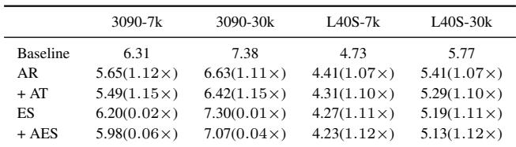  
Table 2. Average rendering time and speed-up across seven scenes.

## 7.3.1 Rasterization

The results show that the axis-shared rasterization method achieves a greater acceleration on the RTX 3090 than on the L40S. This is because the L40S has more CUDA cores and a higher baseline computational throughput than the RTX 3090. As a result, reducing computation intensity leads to a less pronounced speed-up on the L40S, whereas the optimization has a more noticeable effect on the comparatively less powerful RTX 3090. On top of the axis-based rasterization, the dynamic thresholding shows comparable performance gains across the two GPUs.

From the perspective of rendering quality, as shown in Table 3. The reduction in PSNR though only apply the axisshared rasterization is identical with number in Table 1. We can therefore conclude that the loss in rendering quality is entirely due to the use of half-precision.

A comparison across different scenes has shown in Figure 8. This figure shows that when applying only the axis-shared rasterization, indoor scenes exhibit a higher speed-up compared with outdoor scenes on both GPUs, achieving an average improvement of 20.08% versus 13.71%, respectively. In addition, the dynamic thresholding consistently provides further acceleration of the rasterization kernel, delivering an additional 6.73% speed-up for indoor scenes and 5.67% for outdoor scenes.

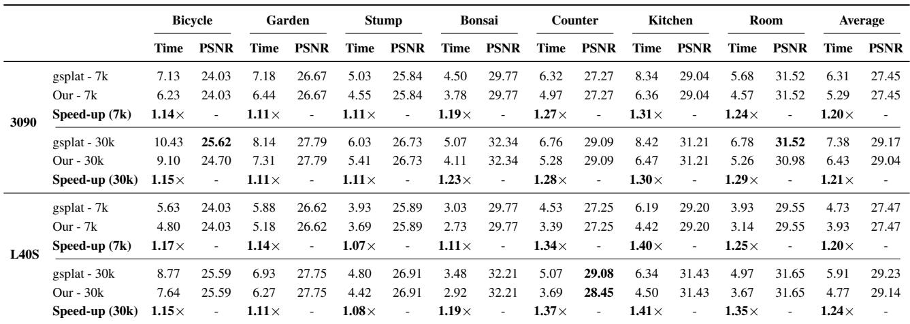  
Table 1. Comparison of our proposed method against the gsplat implementation across seven scenes, evaluated on RTX 3090 and L40S.

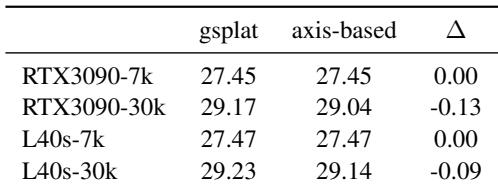  
Table 3. Averaged PSNR variation across seven scenes. Only the axis-shared rasterization has been implemented in this table.

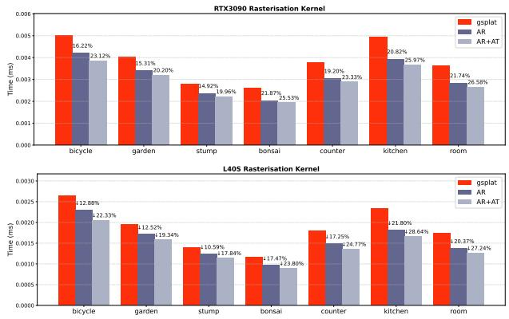  
Figure 8. Comparison of time taken by the rasterization kernel on both GPU devices. In the order of baseline, AR and AR+AT.

## 7.3.2 Intersection & Sorting

In contrast to the rasterization kernel, early-sorting yields a more pronounced speed-up on the L40S than on the RTX 3090. This is because the L40S, as a server-grade GPU, features a significantly larger L2 cache (96 MB) compared with the RTX 3090 (6 MB). As a result, the L40S experiences less performance loss from loss in data coalescing and therefore benefits more from the reduction in sorting complexity introduced by early-sorting. Conversely, due to its smaller cache size and stronger sensitivity to coalesced memory access, the RTX 3090 benefits more from the adaptive workflow.

As shown in Figure 9, the performance of early-sorting varies significantly across different scenes. In outdoor scenes, particularly on the RTX 3090, the intersection and sorting time can increase by up to 28.39%. In contrast, on the L40S, applying early-sorting to indoor scenes can lead to a reduction in time of up to 46.94%. This matches the result in Figure3, where the indoor scene often has a greater intersection-to-Gaussian ratio. By introducing the adaptive workflow, the time required for the intersection and sorting stages is always aligned with the minimum time achieved between the original sorting method and early-sorting. This demonstrates the effectiveness of our strategy for dynamically selecting the optimal sorting method.

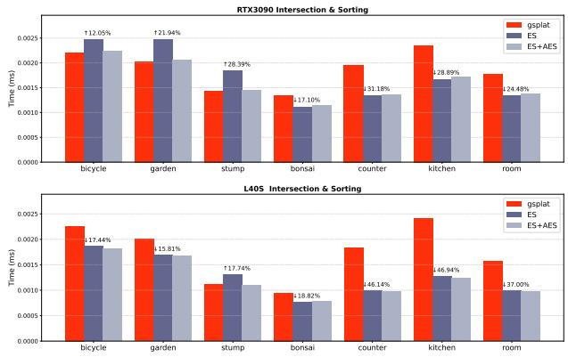  
Figure 9. Comparison of time taken by the intersection and sorting on both GPU devices. In the order of baseline, ES and ES+AES.

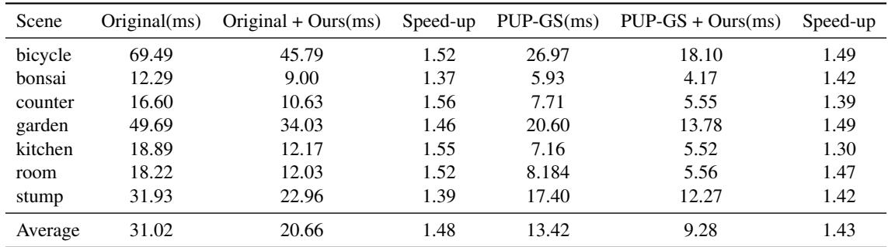  
Table 4. Per-scene comparison of average rendering time for the vanilla 3DGS and PUP-GS, with and without our proposed method.

## 7.4 Compatibility with Existing 3DGS Acceleration Methods

To evaluate the adaptability of our method to existing 3DGS acceleration algorithms, we conduct experiments by integrating it with PUP-GS (Hanson et al., 2025b). As PUP-GS is implemented on the vanilla 3DGS pipeline, we first reimplement it under the same setting and then apply our proposed optimisations on top. PUP-GS performs an additional training stage that prunes approximately 90% of the Gaussians in each scene. The result of the comparison has been shown on Table 4.

On the vanilla 3DGS pipeline, our method reduces the average rendering time from 31.02 ms to 20.66 ms, achieving a 1.48× speed-up. When combined with PUP-GS, the rendering time further decreases from 13.42 ms to 9.28 ms, corresponding to a 1.43× speed-up. The slightly lower gain is expected due to the reduced number of Gaussians and Gaussian–tile intersections after pruning. Nevertheless, the results demonstrate that our method remains effective when integrated with existing acceleration approaches.

## 8 FUTURE WORK

Despite the strong performance and general applicability of our method, several promising directions remain to be explored, which we defer to future work.

Primarily, an important direction is to combine our proposed method with a broader range of 3DGS acceleration algorithms. In this work, we evaluate our approach with gsplat, the vanilla 3DGS pipeline, and PUP-GS. However, many existing methods involve substantial redesigns of the thread block structure, and the effectiveness of our method under these configurations remains unexplored. Assessing its benefits in these settings requires careful, case-by-case analysis.

A secondary concern is the irregular memory access pattern introduced by the early sorting pipeline. While this method reduces sorting time, it also leads to irregular memory access within a warp, requiring multiple independent memory transactions where a single coalesced load would otherwise be enough. Empirically, the arithmetic savings from reducing radix sorting via early sorting outweigh this access penalty, which is further mitigated on GPUs with larger L2 caches or higher memory bandwidth. Nevertheless, we identify as a promising direction for future work the design of memory access strategies that preserve depth-ordered traversal while restoring coalescing, enabling subsequent per-Gaussian loads to become fully coalesced.

Furthermore, another direction is to extend our method beyond 3DGS pipelines to more dynamic, application-driven settings. In approaches such as 4D Gaussian Splatting, where temporal dynamics are introduced, redundancy may arise across both space and time. Our axis-shared rasterisation could be adapted to exploit such spatio-temporal coherence, reducing repeated computations across frames. In addition, applying our method to robotics and real-time perception systems presents an important opportunity, where strict latency constraints demand efficient processing. In these scenarios, early sorting can reduce pipeline overhead and improve responsiveness, further demonstrating the adaptability of our method across practical applications.

## 9 CONCLUSION

In this work, we present an algorithm and system cooptimization that accelerates inference in the 3DGS pipeline. We identify three overlooked challenges: (i) sorting redundancy, (ii) computational redundancy during rasterization, and (iii) redundant computation from filtered Gaussians. To address these, we introduce adaptive early sorting, reducing sorting complexity by up to 43.56%, and a GPU-based axis-shared rasterization method that decreases α-compute SASS operations by 19.79% and further reduces redundant computation for filtered Gaussians by 25%. Experiments show that combining these techniques achieves an average speed-up of 1.20×, reaching 1.41× on real-world scenes, with negligible impact on visual quality. Moreover, our method demonstrates strong compatibility, delivering consistent gains across the vanilla 3DGS pipeline and when combined with approaches such as PUP-GS.

## REFERENCES

Ali, M. S., Qamar, M., Bae, S.-H., and Tartaglione, E. Trimming the fat: Efficient compression of 3d gaussian splats through pruning, June 2024. URL https: //arxiv.org/abs/2406.18214.

Barron, J. T., Mildenhall, B., Verbin, D., Srinivasan, P. P., and Hedman, P. Mip-nerf 360: Unbounded anti-aliased neural radiance fields. CVPR, 2022.

Fan, Z., Wang, K., Wen, K., Zhu, Z., Xu, D., and Wang, Z. Lightgaussian: Unbounded 3d gaussian compression with 15x reduction and 200+ fps, 2024. URL https: //arxiv.org/abs/2311.17245.

Feng, G., Chen, S., Fu, R., Liao, Z., Wang, Y., Liu, T., Pei, Z., Li, H., Zhang, X., and Dai, B. Flashgs: Efficient 3d gaussian splatting for large-scale and high-resolution rendering, 2024. URL https://arxiv.org/abs/ 2408.07967.

Girish, S., Gupta, K., and Shrivastava, A. Eagles: Efficient accelerated 3d gaussians with lightweight encodings. In Computer Vision – ECCV 2024: 18th European Conference, Milan, Italy, September 29–October 4, 2024, Proceedings, Part LXIII, pp. 54–71, Berlin, Heidelberg, 2024. Springer-Verlag. ISBN 978-3-031-73035-1. doi: 10.1007/978-3-031-73036-8 4. URL https://doi. org/10.1007/978-3-031-73036-8\_4.

Gui, H., Hu, L., Chen, R., Huang, M., Yin, Y., Yang, J., Wu, Y., Liu, C., Sun, Z., Zhang, X., and Zhan, K. Balanced 3dgs: Gaussian-wise parallelism rendering with finegrained tiling, 2025. URL https://arxiv.org/ abs/2412.17378.

Hanson, A., Tu, A., Lin, G., Singla, V., Zwicker, M., and Goldstein, T. Speedy-splat: Fast 3d gaussian splatting with sparse pixels and sparse primitives, 2025a. URL https://arxiv.org/abs/2412.00578.

Hanson, A., Tu, A., Singla, V., Jayawardhana, M., Zwicker, M., and Goldstein, T. Pup 3d-gs: Principled uncertainty pruning for 3d gaussian splatting. In Proceedings of the Computer Vision and Pattern Recognition Conference (CVPR), pp. 5949–5958, June 2025b. URL https:// pup3dgs.github.io/.

Kato, H., Ushiku, Y., and Harada, T. Neural 3d mesh renderer. In Proceedings of the IEEE/CVF Conference on Computer Vision and Pattern Recognition (CVPR), pp. 3907–39–6, 2018.

Kerbl, B., Kopanas, G., Leimkuehler, T., and Drettakis, G. 3d gaussian splatting for real-time radiance field rendering. ACM Transactions on Graphics, 42:1–14, 2023.

Lee, J., Lee, S., Lee, J., Park, J., and Sim, J. Gscore: Efficient radiance field rendering via architectural support for 3d gaussian splatting. ASPLOS ’24, pp. 497–511. Association for Computing Machinery, 2024. doi: 10. 1145/3620666.3651385. URL https://doi.org/ 10.1145/3620666.3651385.

Lin, W., Feng, Y., and Zhu, Y. Metasapiens: Realtime neural rendering with efficiency-aware pruning and accelerated foveated rendering. ASPLOS ’25, pp. 669–682, New York, NY, USA, 2025. Association for Computing Machinery. ISBN 9798400706981. doi: 10. 1145/3669940.3707227. URL https://doi.org/ 10.1145/3669940.3707227.

Liu, X., Wu, X., Zhang, P., Wang, S., Li, Z., and Kwong, S. Compgs: Efficient 3d scene representation via compressed gaussian splatting. In Proceedings of the 32nd ACM International Conference on Multimedia, MM ’24, pp. 2936–2944, New York, NY, USA, 2024. Association for Computing Machinery. ISBN 9798400706868. doi: 10.1145/3664647.3681468. URL https://doi. org/10.1145/3664647.3681468.

Loper, M. and Black, M. J. Opendr: An approximate differentiable renderer. In European Conference on Computer Vision (ECCV), pp. 154–169, 2014.

Maturana, D. and Scherer, S. Voxnet: A 3d convolutional neural network for real-time object recognition. In IEEE/RSJ International Conference on Intelligent Robots and Systems (IROS), pp. 922–928, 2015.

Mildenhall, B., Srinivasan, P. P., Tancik, M., Barron, J. T., Ramamoorthi, R., and Ng, R. Nerf: representing scenes as neural radiance fields for view synthesis. Commun. ACM, 65(1):99—-106, 2022.

Qi, C. R., Su, H., Mo, K., and Guibas, L. J. Pointnet: Deep learning on point sets for 3d classification and segmentation. In Proceedings of the IEEE/CVF Conference on Computer Vision and Pattern Recognition (CVPR), pp. 77–85, 2017a.

Qi, C. R., Yi, L., Su, H., and Guibas, L. J. Pointnet++: Deep hierarchical feature learning on point sets in a metric space. In Advances in Neural Information Processing Systems (NeurIPS), pp. 5099–5108, 2017b.

Qiu, S., Wu, C., Wan, Z., and Tong, S. High-fold 3d gaussian splatting model pruning method assisted by opacity. Applied Sciences, 15(3):1535, 2025. doi: 10.3390/app15031535.

Wang, X., Yi, R., and Ma, L. Adr-gaussian: Accelerating gaussian splatting with adaptive radius. In SIG-GRAPH Asia 2024 Conference Papers, SA ’24, pp. 1–10.

ACM, December 2024. doi: 10.1145/3680528.3687675. URL http://dx.doi.org/10.1145/3680528. 3687675.

Wang, Z., He, G., Liu, D., Gao, L., Hu, S. X., Zhang, C., Song, Z., Lane, N., Luk, W., and Fan, H. Accelerating 3d gaussian splatting with neural sorting and axisoriented rasterization, 2025. URL https://arxiv. org/abs/2506.07069.

Wei, L., Tang, J., Fei, F., Shi, B., Wang, R., and Li, M. No redundancy, no stall: Lightweight streaming 3d gaussian splatting for real-time rendering, 2025. URL https: //arxiv.org/abs/2507.21572.

Ye, V., Li, R., Kerr, J., Turkulainen, M., Yi, B., Pan, Z., Seiskari, O., Ye, J., Hu, J., Tancik, M., and Kanazawa, A. gsplat: An open-source library for gaussian splatting. Journal of Machine Learning Research, 26(34): 1–17, 2025a.

Ye, Z., Fu, Y., Zhang, J., Li, L., Zhang, Y., Li, S., Wan, C., Wan, C., Li, C., Prathipati, S., and Lin, Y. C. Gaussian blending unit: An edge gpu plug-in for real-time gaussianbased rendering in ar/vr. In 2025 IEEE International Symposium on High Performance Computer Architecture (HPCA), pp. 353–365, 2025b. doi: 10.1109/HPCA61900. 2025.00036.

Zhang, Z., Song, T., Lee, Y., Yang, L., Peng, C., Chellappa, R., and Fan, D. LP-3DGS: Learning to prune 3d gaussian splatting. In The Thirty-eighth Annual Conference on Neural Information Processing Systems, 2024. URL https: //openreview.net/forum?id=kzJ9P7VPnS.

Zhao, H., Weng, H., Lu, D., Li, A., Li, J., Panda, A., and Xie, S. On scaling up 3d gaussian splatting training. In The Thirteenth International Conference on Learning Representations, 2025. URL https://openreview. net/forum?id=pQqeQpMkE7.

Zwicker, M., Pfister, H., van Baar, J., and Gross, M. Ewa volume splatting. In Proceedings of IEEE Visualization (VIS), pp. 29–538, 2001.

## A ARTIFACT APPENDIX

## A.1 Abstract

This artifact provides the complete source code, build scripts, and evaluation workflow for SwiftGS, an accelerated implementation of 3D Gaussian Splatting (3DGS) on GPUs. The two key components of the system, early sorting and axisshared rasterization, are implemented as custom CUDA kernels integrated into a fork of the gsplat library.

The artifact enables reviewers to reproduce the main experimental results of the paper. In particular, the provided scripts allow users to install the system from source, download the Mip-NeRF 360 benchmark dataset, train 3DGS models on the benchmark scenes, and evaluate both rendering quality (PSNR, SSIM, LPIPS) and rendering performance (runtime speed-up of the optimized rasterisation pipeline).

## A.2 Artifact check-list (meta-information)

• Algorithm: 3D Gaussian Splatting with early sorting and axis-shared rasterisation.

• Program: Python training / evaluation driver; custom CUDA C++ rasterisation kernels.

• Compilation: CUDA 11.8, GCC/G++ 11, PyTorch 2.1.2 C++ extensions.

• Transformations: None beyond standard 3DGS scene representation (Structure-from-Motion initialisation via COLMAP).

• Data set: Mip-NeRF 360 dataset

• Run-time environment: Linux (Ubuntu 20.04.5 LTS) ; Conda (Python 3.10); CUDA 11.8; PyTorch 2.1.2+cu118.

• Hardware: Experiments were conducted on NVIDIA RTX 3090 GPUs with 24 GB memory (CUDA compute capability 8.6).

• Execution: Automated via shell scripts (Training.sh, Evaluation.sh).

• Metrics: Rendering quality — PSNR (dB), SSIM, LPIPS; Rendering speed — total rendering time (seconds) and optimised/unoptimised speed-up ratio.

• Output: Per-scene JSON files with quality metrics and timing statistics.

• Experiments: Train 3DGS on 7 Mip-NeRF 360 scenes; evaluate at checkpoint steps 7 000 and 30 000.

• How much time is needed to prepare workflow (approximately)?: ∼1 hour (Conda setup, compilation, dataset download).

• How much time is needed to complete experiments (approximately)?: ∼6–8 hours for training all 7 scenes (30 000 steps each on an RTX 3090); ∼1–2 hours for evaluation.

• Publicly available?: Yes.

## A.3 Description

## A.3.1 How delivered

The artifact is delivered as a public Git repository:

https://github.com/LingjunGao/SwiftGS

Clone the repository using git clone.

## A.3.2 Hardware dependencies

We recommend running the artifact on a system equipped with an NVIDIA RTX 3090 GPU with 24 GB of GPU memory, which was the hardware used for our experiments. Systems with similar CUDA-capable GPUs with comparable memory capacity may also work, but exact runtime performance may vary.

In addition, we recommend at least 32 GB of system RAM to ensure stable execution during training and evaluation. Approximately 50 GB of free disk space is required to store the dataset, software environment, and experiment outputs.

## A.3.3 Software dependencies

The artifact was tested on Ubuntu 20.04.5 LTS with a standard 64-bit Linux environment. Similar recent Linux distributions should also work, although the installation scripts were developed and verified on this configuration.

The installation assumes the availability of a Condabased Python environment manager (e.g., Miniconda or Anaconda). The software stack uses Python 3.10 together with PyTorch 2.1.2 compiled for CUDA 11.8 (torch==2.1.2+cu118, torchvision==0.16.2+cu118), CUDA Toolkit 11.8, and GCC/G++ 11 for compiling the CUDA extensions.

Additional Python dependencies required for training and evaluation (e.g., numpy, fused-ssim, tyro, nerfview, and pycolmap) are automatically installed by the setup script. A complete list of Python dependencies is provided in examples/requirements.txt.

## A.3.4 Data sets

The primary benchmark dataset is Mip-NeRF 360, containing 7 scenes used in our experiments: bicycle, bonsai, counter, garden, kitchen, room, stump. The dataset is downloaded automatically during installation.

## A.4 Installation

We provide a pre-built Docker image that contains all required dependencies, compiled CUDA extensions, and the SwiftGS rendering pipeline. The image is available at: https://hub.docker.com/repository/ docker/lingjun0203/swiftgs.

The source code is hosted on GitHub and includes all scripts required to initialize the environment and reproduce the experiments:

```powershell
$ git clone https://github.com/LingjunGao/
SwiftGS.git
$ cd SwiftGS
```

To complete the setup, run the following script, which will download the Mip-NeRF 360 dataset used in the experiments, along with the required checkpoints:

```shell
$ bash docker_setup.sh
```

The dataset and checkpoints will be automatically downloaded and extracted, occupying approximately 30 GB of disk space.

## A.5 Experiment workflow

All experiments are driven by two shell scripts located in examples/benchmarks/:

Training (optional) — trains a 3DGS model for each scene and produces the checkpoints used in our experiments.

\$ cd examples   
\$ bash benchmarks/Training.sh

Running this command trains each scene for 30,000 steps and produces several outputs per scene. Running this step is optional for artifact evaluation. To facilitate reproducibility and reduce evaluation time, we also provide pre-trained checkpoints at https: //zenodo.org/records/18943926/files/ Benchmark\_Training.tar.gz?download=1 that can be used directly for the evaluation step.

Evaluation — loads each trained checkpoint and runs the rendering pipeline using both our optimized configuration (early sorting with axis-shared rasterization) and the original pipeline, reporting rendering quality metrics and runtime speed-up.

```shell
$ bash benchmarks/Evaluation.sh
```

Running this command evaluates each checkpoint 10 times under both configurations. For each scene and checkpoint step, aggregated results are written to results/Evaluation/<scene>/stats/ step<step>/summary.json. This file reports the average rendering time for both configurations and their speedup ratio. Detailed per-run timing logs are stored in the same directory in optimized.jsonl and unoptimized. jsonl.

## A.6 Evaluation and expected results

The evaluation verifies that the proposed SwiftGS rasterisation improves rendering performance while preserving rendering quality.

Quality: For all evaluated scenes, the rendered image quality (PSNR, SSIM, LPIPS) recorded in each line of optimized.jsonl and unoptimized.jsonl should remain nearly identical between the two configurations. Small numerical differences may occur due to the use of single-precision arithmetic during intermediate calculations.

Performance: The summary.json file in each results/Evaluation/<scene>/stats/ step<step>/ directory reports the average rendering time for both configurations and their speed-up ratio. These values can be compared with the speed-up results reported in the corresponding tables and figures of the paper for the RTX 3090 GPU.

## A.7 Experiment customization

The provided scripts are configurable to allow experiments to be run under different conditions. Key parameters can be modified through environment variables in the training and evaluation scripts.

Experiments can be restricted to a single scene by setting the SCENE LIST variable to the desired scene name (for example, SCENE LIST="garden"). Similarly, the number of training iterations can be reduced by setting MAX STEPS (e.g., MAX STEPS=7000) to produce a faster but less converged run.

The scripts also allow experiments to be executed on different GPUs by setting the CUDA DEVICE variable to the appropriate GPU index. While the artifact was tested on an NVIDIA RTX 3090 GPU, the code can be run on other CUDA-capable GPUs with sufficient memory.

The dataset location can be modified by setting SCENE DIR to a directory containing COLMAP-processed scenes with the same directory structure as the Mip-NeRF 360 dataset. This allows the training and evaluation pipeline to be applied to additional scenes beyond those included in the artifact.

Finally, the number of evaluation repetitions used for runtime measurement can be adjusted through the EVAL NUM RUNS parameter. Increasing this value improves the stability of timing measurements, while reducing it shortens the overall evaluation time.