# BEAT THE LONG TAIL: DISTRIBUTION-AWARE SPECULATIVE DECODING FOR RL TRAINING

Zelei Shao \* 1 2 Vikranth Srivatsa \* 2 3 Sanjana Srivastava 2 Qingyang Wu 2 Alpay Ariyak 2 Xiaoxia Wu 2 Ameen Patel 4 Jue Wang 2 Percy Liang 2 Tri Dao 2 Ce Zhang 2 Yiying Zhang 3 Ben Athiwaratkun 2 Chenfeng Xu 2 Junxiong Wang 2

## ABSTRACT

Reinforcement learning (RL) post-training has become essential for aligning large language models (LLMs), yet its efficiency is increasingly constrained by the rollout phase, where long trajectories are generated token by token. We identify a major bottleneck: the long-tail distribution of rollout lengths, where a small fraction of long generations dominates wall-clock time , and a complementary opportunity: the availability of historical rollouts that reveal stable prompt-level patterns across training epochs. Motivated by these observations, we propose DAS, a Distribution-Aware Speculative decoding framework that accelerates RL rollouts without altering model outputs. DAS integrates two key ideas: an adaptive, nonparametric drafter built from recent rollouts using an incrementally maintained suffix tree, and a length-aware speculation policy that allocates more aggressive draft budgets to long trajectories that dominate the total time. This design exploits rollout history to sustain acceptance while balancing base and token level costs during decoding. Experiments on math and code reasoning tasks show that DAS reduces rollout time up to 50% while preserving identical training curves, demonstrating that distribution-aware speculative decoding can significantly accelerate RL post-training without compromising learning quality. Our code is opensource at https://github.com/togethercomputer/das.

## 1 INTRODUCTION

Reinforcement learning (RL) has emerged as a cornerstone of large language model (LLM) post-training. By directly optimizing for desired behaviors, RL enables models to align with human preferences and verifiable objectives through reward signals derived from task-specific feedback (Ouyang et al., 2022; Bai et al., 2022). With the success of in-production RL-trained models like DeepSeek-R1 (Guo et al., 2025), we are seeing increasing interest and needs for RL training for large models and for more complex tasks like deep reasoning.

As model size and context length grow, the computation bottleneck of RL training is shifting. Unlike classical finetuning, where the training (model weight updates) phase is the most time-consuming, modern RL training for LLMs is often dominated by the “rollout” phase, where the training dataset is tested with model inferencing. Our study, as well as other recent studies (Verl Contributors, 2024), show that in practice, the rollout phase accounts for more than

70% of the total training time, often exceeding the cost of backpropagation and parameter updates. The dominating rollout-phase time arises from a few factors: (1) the inherently autoregressive nature of LLM decoding, (2) increased LLM generation length (Guo et al., 2025), and (3) increasing sample size to achieve higher accuracy (Wang et al., 2025).

Despite the dominance of the rollout phase, most existing RL systems are not designed to maximize rollout efficiency and instead allocate computing resources primarily for optimization or backpropagation phases (Zhong et al., 2025b). A natural step to take to optimize the rollout phase is to borrow techniques from LLM serving systems, such as prefill-decode disaggregation (Zhong et al., 2024), quantization (Lin et al., 2024), and speculative decoding (Leviathan et al., 2023a).

Unfortunately, what works well for serving systems does not translate directly to the rollout phase in RL training for several reasons. Insight-1: All samples in the training dataset need to complete their model inference before the next training phase can start. Today’s serving systems optimize for Time-to-First-Token (TTFT) and Time-per-Output-Token (TPOT), resulting in long sequences taking more time to complete their generation and causing long tail latency in RL rollout phase. Insight-2: The RL training process reuses the same set of samples in each training iteration, while LLM serving systems assume each user request is different. As a result, serving systems today do not leverage the nature of reappeared requests that could otherwise be used to improve RL rollout speed. Insight-3: Unlike model serving where the LLMs are fixed, in RL training, the model weights keep getting updated. In such a dynamic environment, approaches that work in traditional serving may not work anymore.

An emerging set of works, some concurrent with our work, target to improve rollout efficiency (Zhang et al., 2025; Liu et al., 2025; Zhong et al., 2025a). While making progress, they do not fully solve the rollout bottleneck and do not properly leverage the three key rollout properties listed above. Another line of work attempts to accelerate rollouts from the ML perspective by relaxing training fidelity constraints, for instance, through truncation or quantization strategies (Zhong et al., 2025a). These methods often compromise learning stability or degrade performance in reasoning-heavy tasks where long-term rollouts are essential.

This paper proposes a comprehensive systems-ML codesign approach rooted from the unique properties of rollout in LLM RL training. Specifically, we build DAS, an RL system that adapts traditional speculative decoding (SD) for RL rollout in three key different ways.

First, we propose an adaptive, nonparametric drafter method for drafting speculation tokens. From Insight-3, during RL training, the model being trained (i.e., the target model) keeps changing, and using a pre-trained draft model would not work. Our proposal is to take advantage of the reuse nature (Insight-2) to perform speculative decoding based on suffix trees (Ukkonen, 1995; Oliaro et al., 2025). To remain aligned with the current policy, we prune the suffix structure dynamically, retaining only recent and relevant historical rollouts for improved locality and reliability.

Second, based on Insight-1, we propose a distribution-aware speculative decoding method that allocates draft budget preferentially to high-difficulty, long-horizon prompts, those that dominate the rollout makespan rather than speculating uniformly. Instead of maintaining a single global suffix tree, we construct and update per-problem trees. This design better captures domain-specific patterns and improves the accuracy of speculation in heterogeneous tasks.

We implement DAS on top of slightly modified versions of VeRL (Sheng et al., 2024) and vLLM (Kwon et al., 2023), which are state-of-the-art RL training, speculative decoding implementation, and LLM inference engines, respectively. We evaluate the DAS system on math (Luo et al., 2025b) and code datasets (Luo et al., 2025a) using up to six NVIDIA H100 GPU servers, with model sizes ranging from 1.5B to

8B parameters. Our results show that DAS outperforms VeRL by up to 50% in generation time, with no degradation in training accuracy.

Overall, this paper makes the following contributions:

• Three key insights regarding the unique properties of the RL rollout phase and their system-level implications.

• DAS, a full RL system that achieves up to 50% rollout time reduction than the SoTA RL system.

• The proposal of a training-free, self-evolved speculative decoding method designed specifically for RL rollout.

• A distribution-aware speculative decoding method that effectively reduces tail latency in RL rollout.

## 2 RELATED WORKS

RL post-training. Field-standard RL post-training frameworks include VeRL (Sheng et al., 2024) and Open-RLHF (Hu et al., 2024). RL post-training generally follows three phases: generation of trajectories (autoregressive generation); preparation of trajectories, such as reward labeling; and training. These frameworks integrate various parallelism strategies, but the inference-heavy generation and preparation phases present opportunities for further performance gains through SD.

We note two key discrepancies between RL post-training and serving workloads: (i) RL post-training is more structured, with the number of rollouts per iteration being known and the dataset being available a priori; and (ii) because the dataset is revisited across epochs, it exposes global and historical signals about current rollout behavior. Using this information, our work aims to accelerate rollouts from a holistic, training-wide perspective.

Speculative decoding in throughput-oriented scenarios. Speculative decoding (Leviathan et al., 2023b; Miao et al., 2023) accelerates autoregressive generation by trading additional computation for reduced latency. In throughputoriented settings such as online serving, the primary objective is to maximize the number of accepted tokens per second under a fixed compute budget. Prior works have formulated this as an optimization problem over speculative configurations: Liu (Liu et al., 2024b) defines goodput as the effective throughput and employs simulation-based search, while Huang (Huang et al., 2025) presents an analytical model to derive optimal draft and verify lengths.

However, these studies primarily target online-serving workloads and overlook properties unique to RL post-training. First, they do not exploit the global and historical information available across RL training epochs. Second, they treat all requests as homogeneous, whereas in synchronous on-policy RL training, longer generations dominate total latency while shorter ones contribute little. Our work identifies and models this imbalance, introducing differentiated optimization strategies for requests of varying lengths.

Online learning of drafters. Online SD adapts the drafter during use. Online Speculative Decoding periodically distills the drafter on-the-fly from target-model corrections using spare FLOPs, reducing latency under distribution shift without growing the drafter (Liu et al., 2024c). Self-speculative approaches eliminate external drafters by reusing the target model with layer skipping; later work (SWIFT) makes this selection adaptive at run time, avoiding offline tuning (Zhang et al., 2024; Xia et al., 2024). Modelfree variants replace neural drafters with retrieval or symbolic structures—e.g., Prompt Lookup Decoding+ (PLD+) selects spans from the input and early-layer signals, while suffix-structure methods, SuffixDecoding (Oliaro et al., 2025) builds a suffix tree (Weiner, 1973) over the tokens from the current and previous requests and uses it to generate speculative tokens. The root denotes the start of any stored suffix; each child represents a token that can follow its parent; and the path from the root to any node encodes a distinct subsequence.

Unlike these serving-oriented approaches, RL post-training presents a distinct adaptation challenge. Prior online SD methods adjust to input-distribution drift or varying system load, whereas RL post-training features stable inputs but an evolving policy, leading to staleness in neural drafters. Conversely, repeated rollouts of the same problems provide a unique opportunity for nonparametric, history-driven draft structures that can be refreshed each epoch. Our framework exploits this property to maintain high acceptance rates and to schedule speculation into the idle GPU slack exposed during batched rollouts.

Speculative decoding for RL. Some concurrent works have explored various uses of speculative decoding in RL post-training. SPEC-RL (Liu et al., 2025) uses prior trajectories as drafts, but introduces a lenience parameter for acceptance that changes the output distribution. Unlike DAS, it does not recover non-SD-level accuracy. Furthermore, it does not consider differences in the contributions of various requests to latency. FastGRPO (Zhang et al., 2025) updates a neural draft model alongside the target model, consuming a considerable memory budget and compromising the scalability of the method. Finally, RhymeRL (He et al., 2025) takes advantage of trajectory similarity over time and considers batch-length skew. However, it lacks problem difficultyand window-awareness. Problem difficulty-awareness is important for efficiently decoding valid trajectories and not token-wise similar invalid ones. Window-awareness is crucial for adapting to policy distribution shift, as trajectories from early policies lack similarity to those from later poli-

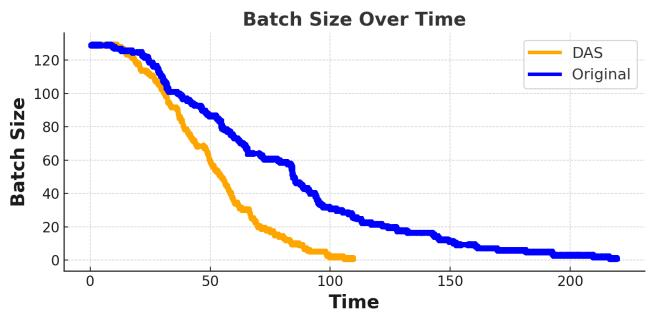  
Figure 1. Effective batch size collapse during rollout w/o DAS. Measured on the DeepSeek-distilled 7B model (Guo et al., 2025) (DeepScaleR (Luo et al., 2025b) prompts). As decoding progresses, short sequences finish first and the effective batch size shrinks, leaving a few long stragglers to determine the step makespan. With our method, we reduce the total latency by 50%. cies (Fig. 2).

## 3 ROLLOUTS IN RL TRAINING

In this section, we present the unique characteristic of the RL workload.

Long-tail bottleneck in RL rollouts. RL post-training runs in iterations where the actor generates a fixed set of trajectories, and the learner updates the policy. In practice, systems like VeRL (Sheng et al., 2024) and OpenRLHF (Hu et al., 2024) favor data-parallel (DP) rollout workers to scale decoding throughput, resorting to tensor-parallelism (TP) only if the training model cannot fit into memory.

Decoding begins at full parallelism, but as short sequences finish the effective batch collapses and a few long responses (stragglers) determine the step time which is the classic long-tailed behavior also observed in LLM systems. This yields poor GPU utilization as workers idle while stragglers continue decoding; multiple RL studies report decoding dominating wall-clock time and under-utilizing accelerators despite sophisticated batching. Figure 1 profiles the effective batch size running for a representative setup: after roughly 100 decode steps, the parallelism drops sharply, confirming the long-tail runtime bottleneck in RL training settings.

This motivates speculative decoding (Leviathan et al., 2023b): by drafting multiple tokens and verifying them in parallel, we can shrink straggler runtimes and reclaim idle GPU time, yielding substantial end to end speedups without changing model outputs. While speculative decoding is typically evaluated in small batch, latency-sensitive serving, RL training exhibits effective batch collapse during decoding—short sequences complete first and stragglers dominate the step. This exposes idle capacity that speculation can utilize.

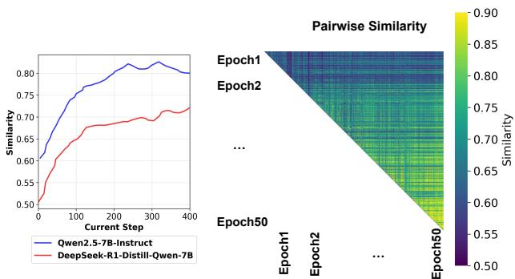  
Figure 2. (Left) Content similarity per iteration using an N-gram to calculate this reuse ratio. (Right) Pairwise similarity across epochs for Qwen2.5-7B-Instruct. The block structure concentrated near the diagonal shows that rollouts are most similar to those from recent epochs, and similarity decays with temporal distance. This reflects policy drift: as the policy is continually updated, older generations become less predictive of current behavior.

High Similarity of RL Rollouts to Recent History Across epochs, trajectories for the same prompts exhibit pronounced lexical and schematic reuse. In Figure 2, we observe elevated similarity with recent trajectories and reduced similarity with distant ones, consistent with policy drift. This recency bias implies that a history-indexed, model-free drafter (e.g., suffix array (Manber & Myers, 1993) or suffix tree (Ukkonen, 1995)) can mine recent continuations to propose high-quality drafts, even as the policy evolves.

## 4 DISTRIBUTION-AWARE SPECULATIVE DECODING FRAMEWORK

We introduce a distribution-aware speculative decoding framework (DAS), an RL post-training approach that accelerates rollout by adapting speculative decoding. Figure 3 provides an overview of the system. Building on RL pipelines that optimize a policy with preference- or verifiable rewards, DAS maintains a history-indexed, nonparametric drafter that is continually refreshed from recent rollouts to preserve high acceptance as the policy evolves. The distribution-aware speculative decoding component then decides how much speculative budget to allocate to each request, favoring long, high-latency problems. By combining adaptive budget allocation with an online, distributionaligned speculator (updated incrementally in the spirit of online suffix tree construction), the system reduces rollout latency without modifying the reward loop.

We motivate our choice of an adaptive, non-parametric drafting approach in Section 4.1 and describe how to allocate the draft budget to reduce the runtime of long-tail sequences in Section 4.2.

## 4.1 Distribution-aware Drafter

## 4.1.1 Parameterized static drafter

EAGLE (Li et al., 2024a), EAGLE-2 (Li et al., 2024b) and EAGLE-3 (Li et al., 2025) are state-of-the-art inference-time serving techniques by speculative decoding. A lightweight EAGLE head extrapolates internal features to construct a token draft tree that the target model then verifies in parallel, yielding substantial latency reductions during inference (Li et al., 2024a;b; 2025). EAGLE-2 in particular depends on a well-calibrated drafter whose confidence closely predicts token acceptance, and it grows a dynamic draft tree accordingly (Li et al., 2024b).

In RL training, however, the policy is non-stationary: model weights change after every learner update, so this calibration rapidly drifts. Figure 2 implies that the trajectories collected from earlier epoch models would lead to significantly lower acceptance rates than the trajectories collected from later checkpoints. In practice, EAGLE must either tolerate decreasing acceptance (and thus reduced speedup), or repeatedly retrain the draft, adding compute and engineering overhead to an already rollout-dominated stage.

In addition, EAGLE’s tree drafting and parallel verification kernels are engineered for high throughput inference serving. Integrating these components into a RL pipeline, where actors evolve over time, is substantially more complex than deployment in a standard, fixed policy inference setting. For these reasons, despite its strong inference results, EAGLE is difficult to scale efficiently in nonstationary RL training regimes.

The high overhead of continuously updating neural models motivates a model-free approach based on text indexes, specifically suffix trees (Ukkonen, 1995) and suffix arrays (Manber & Myers, 1993).

## 4.1.2 Adaptive nonparametric drafter

Building on the motivation above, we explore an adaptive nonparametric drafter. We utilize a suffix based drafter constructed from a sliding window of recent rollouts by maintaining a compact suffix tree over past generations. At rollout time, we locate the longest match between the current context and the tree (top down in O(m) time for a context of length m, where m is the length of the query/pattern we look up, e.g., the current decode prefix), and then propose a multi-token draft along the matched path. The target model verifies proposals in one or a few batched steps. After verification, we update the tree online, so that the speculator continuously adapts to the evolving policy.

This design captures recurring motifs across training epochs while avoiding the need to train or maintain a separate training based neural drafter. Importantly, the construction of the suffix tree and updates of the online suffix tree are run in lin-

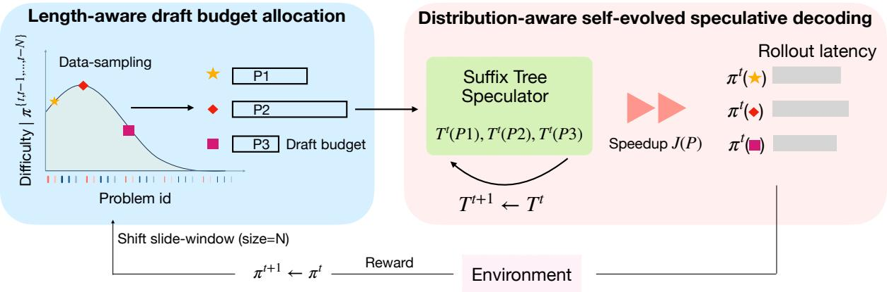

Figure 3. Overview of our rollout acceleration framework in RL training. (Left) Length-aware draft budget allocation. We estimate per-problem length from recent rollouts and assign a draft budget accordingly: problems predicted to be long or hard are allocated a more aggressive speculative budget, while easy problems receive little or no speculation. This policy is updated over a sliding window of recent trajectories, so it adapts as the policy changes over training. (Right) Distribution-aware, self-evolving speculative decoding. For each problem shard, we maintain a suffix tree speculator that is incrementally updated from most recent rollouts. At decode time, the speculator proposes multi-token drafts drawn from high-frequency suffix matches, and the target model verifies them in parallel; accepted tokens advance generation with reduced rollout latency.  
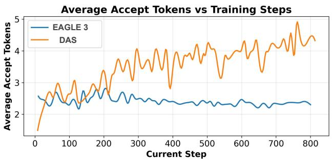

Figure 4. Average accepted tokens per verification round on Qwen2.5-Math-7B in RL training. We compare a static learned drafter, EAGLE (Li et al., 2024b) with our training free drafter. While the static drafter’s acceptance stays flat, our non-parametric drafter updates with recent rollouts and tracks the evolving policy, yielding higher accepted length over time. Higher accepted length implies fewer target forward passes per generated token and thus lower rollout latency.

ear time through the Ukkonen algorithm (Ukkonen, 1995), which makes it suitable for the incremental intake of new routes. Most importantly, suffix trees can be implemented efficiently on CPUs, which makes them more feasible than EAGLE, which requires additional GPUs, for large scale RL training.

Figure 4 compares a parameterized static drafter (EAGLE) with our nonparametric adaptive drafter in RL training. We plot the average accepted tokens per verification round. Although EAGLE maintains a roughly flat acceptance curve, the acceptance of our drafter continues to improve as training progresses, because it is continuously updated from recent rollouts.

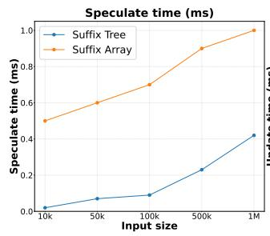

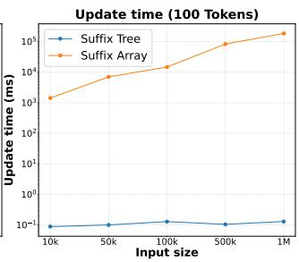  
Figure 5. Performance comparison of suffix tree and suffix array data structures. Left: Speculation time across different corpus sizes. Right: Update time for inserting 100 tokens (log scale).

Suffix tree and suffix array. In addition to the suffix tree, it is natural to utilize a suffix array (SA), inspired by Infinigram (Liu et al., 2024a), as a more space efficient alternative. A standard SA supports the search for substrings by binary search in O(m log n) time for a pattern of length m (Manber & Myers, 1993), where n is the number of tokens in the corpus. Augmenting the SA with an LCP array (Kasai et al., 2001) reduces the number of comparisons, and using an enhanced suffix array (ESA) (Abouelhoda et al., 2004) enables pattern matching in O(m) time by effectively simulating suffix tree traversal with better constants and cache locality. However, SAs and ESAs are fundamentally static: dynamic updates typically require (partial) O(n) rebuilding, which is undesirable in RL training, where fresh trajectories arrive every iteration.

Our online suffix tree index instead trades modest additional space for fast incremental updates and O(m) longest match queries, which aligns naturally with the nonstationary policy setting.

We compare the speculative time and the update cost for the suffix tree versus the suffix array in Figure 5. The suffix tree demonstrates superior performance on both metrics: speculative times are 2-20× faster, while update costs show a dramatic advantage, remaining sub-millisecond compared to the suffix array’s escalating reconstruction times. This over three orders of magnitude difference in update performance confirms that suffix arrays, despite their space efficiency, are impractical for online RL training, where fresh trajectories must be rapidly updated each iteration.

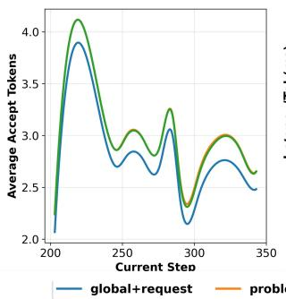

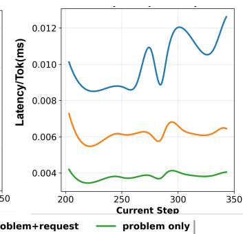  
Figure 6. (Left) Average accepted tokens per verification round vs. training step. We compare three histories for building the drafter: global+request, problem+request, and problem only; problemscoped histories exceed global in acceptance. (Right) Speculative decoding latency (ms/token); global+request is consistently slower due to the cost of querying and maintaining a single large global index, whereas problem-scoped shards stay cheaper to query and thus lower latency.

Global suffix trees. A single, ever-growing global index over all past rollouts fails along both statistical and systems axes. Statistically, policy drift causes older continuations to become poorly aligned with the model’s current conditional distribution, which lowers speculative decoding acceptance rates — the very quantity that determines speedup (see Figure 2). Moreover, although all questions in the RL may lie within the same domain, their diversity means that patterns from one problem rarely transfer reliably to another. Consistent with this, Figure 6 shows that enabling a global tree yields smaller gains than maintaining a tree per-problem but increase additional overheads because of larger tree.

Per-request suffix trees. Building on the above analysis, we adopt a per-request suffix tree together with a lightweight per-request prefix trie for routing. Intuitively, the advantage of the per-problem structure is that it can retrieve previous outputs for the same problem, while the per-request structure captures patterns specific to the current request. The key advantage of the per-problem design is that when the model tends to repeat a pattern, the prefix trie can quickly recognize that pattern and route to the corresponding suffix tree since it is constructed from prior generations. However, the benefit of prefix routing is workload and model-dependent. For smaller models like 1.5B model, the additional CPU overhead of prefix routing can outweigh its gains. In such regimes, we disable the per-request trie and only query the per-problem suffix tree directly. Figure 6 shows that using a per-request tree may lead to a higher acceptance rate but incurs more speculative time.

Sliding window selection tree. Across epochs and models, we observe substantial similarity among generations for the same prompts (Fig. 2). Nearby trajectories tend to produce longer accepted drafts, while trajectories from much earlier epochs yield shorter accepted lengths, indicating reduced match quality as the policy drifts.

Because policy evolves over time, long-history generations become less predictive. We therefore construct the drafter from a sliding window of recent trajectories and refresh the index for each iteration. The window size controls a bias stability trade-off: shorter windows adapt quickly but offer fewer matches, whereas longer windows improve coverage but risk staleness.

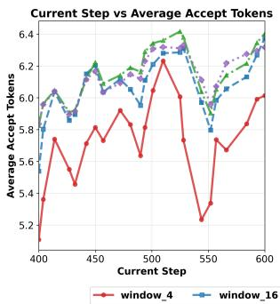

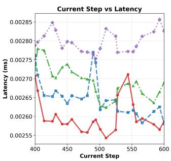  
Figure 7. (Left) Average accepted tokens per verification round versus training step for different history window sizes used to build the drafter. Larger windows (e.g., 16, 32, all) give higher acceptance because they offer more matching continuations, and higher acceptance is known to translate directly into fewer target forward passes and lower decoding cost. (Right) Per-token speculative decoding latency versus training step. window all shows the highest latency because querying and maintaining a full global history is more expensive and includes stale trajectories, so in practice moderate windows (16 or 32) strike a better balance between acceptance and latency than window all.

## 4.2 Length-aware Speculation Policy

## 4.2.1 Rollout Latency Estimation

We estimate end-to-end rollout latency by first modeling the per–forward-pass latency and then accumulating it across all forward passes. From profiling, we find that a simple linear model is capable of capturing the main behavior (mean relative error ≈ 12%):

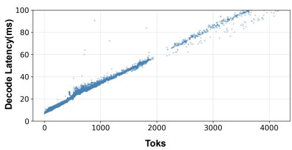  
Figure 8. Decode latency vs. token number on DeepSeek-R1- Distill-Qwen-7B. It shows clear linear relationship.

$$
\tag{1}
$$

where ntoks is the number of tokens processed (accepted + speculative). The term cbase captures per-pass overheads such as moving parameters/activations (global → shared memory), kernel launches, and temporary allocations. The term ctok represents the average compute cost per-token on the GPU/CPU.

The total rollout latency is

$$
\tag{2}
$$

where C includes non-forward overheads such as input preparation, and output formatting.

Thus, rollout latency decomposes into three parts: (1) nonforward overhead C, (2) base (per-pass) cost cbaseNfwd, and (3) token-dependent cost ctokNtoks. To reduce latency, we should minimize both the number of forward passes Nfwd and the total number of decoded tokens Ntoks (speculative and non-speculative). In speculative decoding, there is a trade-off: increasing speculative tokens can reduce Nfwd, but proposing too many tokens can introduce extra system overhead (see Fig. 8). An optimal strategy must therefore balance the speculative-token budget to maximize overall rollout speedup.

This formulation also highlights why long generations dominate total latency: they not only incur higher tokendependent cost, but also determine the number of forward passes required for the entire batch, thereby amplifying the base-cost component.

## 4.2.2 Optimal Speculative-Token Budget

To derive a good configuration for the speculative-token budget, consider a batch of n requests {ri}ni=1, each characterized by:

• Target generation length li,

• Accept efficiency parameter αi > 0,

• Total proposed token count pi (including speculative

and non speculative tokens).

• drafter capacity factor ki ∈ (0, 1], which denotes the maximal achievable fraction of accepted tokens for request ri.

The total number of accepted tokens follows a saturating form:

$$
\tag{3}
$$

where Ai(pi) → kili as pi → ∞, reflecting the intrinsic mismatch limit between the two models. The remaining tokens to be generated are

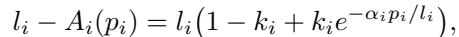

and the total number of forward passes needed to finish all requests is

$$
\tag{4}
$$

The corresponding rollout latency is modeled by

$$
\tag{5}
$$

subject to pi ≥ 0 and any system-level constraints on speculative expansion.

Using Nfwd to denote the effective number of forward passes after speculation, we can reformulate the optimization as

$$
\tag{6}
$$

At optimality, the constraint is tight for active requests:

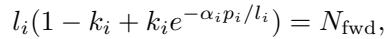

which gives a closed-form solution for the speculative budget:

$$
\tag{7}
$$

p∗ = 0 otherwise.

Observations. From this formulation, we make three key observations:

1. The optimal speculative budget p∗i grows with the request length li, and requests with similar lengths receive similar speculative token budgets.

2. Short generations with li ≤ Nfwd should skip speculation.

3. The capacity factor ki bounds the maximum speculative gain. When ki is small (weak drafter), p∗ and the achievable speedup both shrink, as additional speculative tokens yield diminishing returns.

These findings align with intuition: the more overhead a request incurs, the more compute effort should be allocated to it. Long generations contribute disproportionately to total latency and therefore warrant more aggressive speculative decoding, whereas short generations impose minimal overhead and thus benefit little from speculation.

## 4.2.3 Dynamic Draft Budget via Runtime Length Prediction

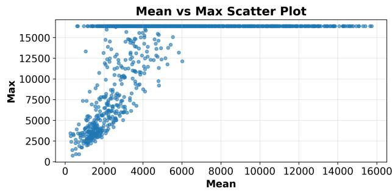  
Figure 9. Each point represents one problem, where the x-axis shows the mean generation length across 90 epochs and the y-axis shows the maximum generation length observed. The wide spread and high upper bound indicate that generation length behavior is highly dynamic.

From the previous section in 4.2.2, we learned that accurate length prediction is crucial to selecting an appropriate budget draft. However, generation dynamics are highly stochastic (see Fig. 9), making direct prediction difficult. We therefore propose a hierarchical heuristic that combines historical statistics with runtime signals:

1. Length-class policy. We partition requests into three length classes—Long, Medium, and Short—each mapped to a corresponding speculative budget. Long requests use a larger (more aggressive) speculative budget, Medium requests use an intermediate budget, and Short requests disable speculative decoding.

2. Initialization from history. The initial class is chosen from the historical distribution for requests similar to r:

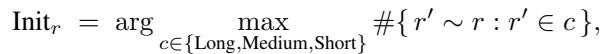

where #{·} counts historical requests comparable to r falling in class c.

3. Runtime update. During generation, we update the class dynamically based on the observed partial length l:

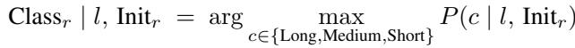

We estimate P (c | l, Initr) from historical rollout statistics to obtain a practical prior for online length classification. The speculative decoding settings are then adjusted to match the current class.

The difficulty levels are determined during training based on rollout statistics. From Sec. 4.2.2, we define short generations as those whose length is shorter than total number of forward steps of the whole batch. In practice, we compute this threshold Tshort as the moving average of the total forward steps over the most recent rollouts, and use it to separate the short class.

We then set the medium threshold heuristically as the midpoint between the short threshold and the maximum sequence length:

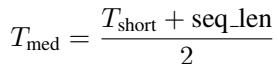

With this definition, to ensure we can finish the batch generation within Tshort times model forward, a long request must accept at most (seq len − Tshort) tokens, while a medium request must accept at most 1 (seq len−Tshort). Therefore, we allocate twice the draft budget to the long class compared to the medium class. In practice, we can further refine this scheme by splitting these classes into multiple sub-classes.

Runtime updates work as follows. Using historical rollout data, we estimate the posterior P (class | length). During execution, we dynamically promote a request’s class based on this posterior: we upgrade short → medium once P (Short | length) < 0.4, and medium → long once P (Long | length) > 0.6.

## 5 END TO END SPEEDUP EXPERIMENTS

We evaluate our system on the SOTA RL training framework VeRL (Sheng et al., 2024), which implements the core generation, reward, and training loop.

We validate DAS on two representative post-training RL workloads: mathematical reasoning and code generation. For math, we follow recent One-Shot-RLVR (Wang et al., 2025) training recipes, where a policy is optimized for verifiable reasoning quality on competition-level problems using reinforcement learning and structured reward shaping. DAS plugs into this loop without changing the reward model or optimizer.

For code, we adopt an RL setup similar to DeepCoder (Luo et al., 2025a) pipelines: prompts specify a programming task, and reward is assigned by unit-test pass/fail of the generated program, a standard verifiable outcome signal in program synthesis and code RL.

In both cases, generation is data-parallel across actors, and .speculation is only applied at decode time; the policy update step itself (e.g., GRPO (Guo et al., 2025) optimization in frameworks such as VeRL (Sheng et al., 2024)) is left unchanged.

To ensure sufficient trajectory reuse for effective speculation, we perform a short warmup phase at the beginning of training to populate the suffix cache with recent rollout history. All reported results are measured after this warmup stage, where the cache has reached a stable regime.

We scaled the experiments to models with parameters ∼8B and ran them on clusters of up to two 8xH100 nodes. Unless otherwise noted, all reported timing numbers are measured as actual wall-clock rollout step time, including batching, scheduling, and verification overhead.

## 5.1 MATH RL

In Figure 10, we evaluate the DSR-sub dataset (Wang et al., 2025), which consists of 1,209 examples from Deep-ScaleR (Luo et al., 2025b). We train using DeepScaleR’s setting: GRPO, AdamW optimizer (Loshchilov & Hutter, 2017), with a maximum sequence length of 16K tokens, a training batch size of 128, temperature T of 0.6, and 16 samples per question on a single 8×H100 node, yielding an effective rollout batch size of 128 × 16/8 = 256. Training runs for 30 steps with a sampling temperature of T = 0.6. Because speculative decoding is a lossless acceleration approach aiming to preserve the rollout distribution, our DAS system achieves an identical reward to the VeRL baseline. Our approach shows more than a 50% reduction in total rollout time.

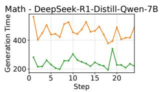

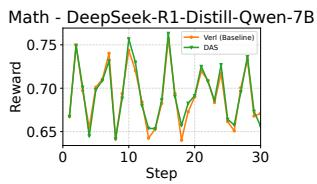  
Figure 10. Training curves for the DeepSeek-R1-Distill-Qwen-7B model comparing the VeRL baseline (orange) and our DAS approach (green). Left: Generation time (rollout latency) per training step. DAS consistently reduces generation time by more than 50% relative to the baseline. Right: Reward per training step. DAS closely matches the baseline reward across all steps, indicating no loss in training quality despite the speedup.

## 5.2 Code RL

We evaluate DeepCoder (Luo et al., 2025a) on multi-step code execution with 8 samples per question, a per-GPU training batch size of 32, a maximum sequence length of 16K tokens, and a sampling temperature of T = 0.6. At each training step, the LLM generates code and executes it on a Ray cluster. The cluster consists of nodes with Intel(R) Xeon(R) Platinum 8468V CPUs. We configure Ray to schedule execution across all available CPU cores, ensuring that code execution is not bottlenecked by the environment.

We train the Qwen3-8B model on two 8×H100 nodes using data parallelism. This yields an effective rollout batch size of 32 × 8/16 = 16. In Figure 11, we observe roughly a 25% reduction in the rollout time while maintaining a comparable reward.

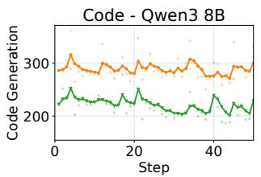

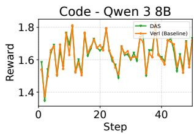  
Figure 11. Training curves for the Qwen3-8B model comparing the VeRL baseline (orange) and our DAS approach (green). Left: Generation time (rollout latency) per training step. DAS achieves substantially lower generation time throughout training. Right: Reward per training step. DAS closely matches the baseline reward across steps, indicating no degradation in learning quality despite the speedup.

## 5.3 Ablation Study

Distribution Aware Speculative Decoding We evaluate the Distribution Aware Speculative decoding with the Qwen3- 8B Model. We provide a second baseline DAS Unlimited budget that represents an unbounded speculate budget, enabling the suffix tree to propose as many tokens as possible. However, by proposing too many tokens, the cost of verification increases significantly, which reduces the potential improvement of speculative decoding. From Figure 12, we can see that DAS performs up to 15% better than a budgetagnostic implementation.

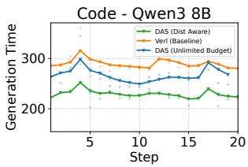  
Figure 12. Rollout generation time per training step for the Qwen3- 8B policy under three settings: the VERL baseline (orange), DAS with an unlimited speculative budget (blue), DAS (green) with distribution aware. The unlimited budget variant (blue) allows the drafter to propose arbitrarily long continuations, which increases verification cost and reduce the end-to-end gain by 15% compared with distribution aware (green).

Batch and Sequence Length. We test robustness along two operational axes for Qwen3-8B code training. First, we adjust the maximum decode length from 8k to 16k tokens and still see over 30% rollout speedup, confirming that our approach continues to attack the long-tail prompts that dominate makespan in RL rollout. Second, we adjust the effective batch size from 32 to 16 and observe similar proportional savings, meaning our method does not rely on a specific batching regime to deliver latency reduction. This invariance matters because speculative decoding delivers speed by cutting the number of sequential target-model forward passes per generated token, and that benefit should hold even as sequence length grows or batch size shrinks.

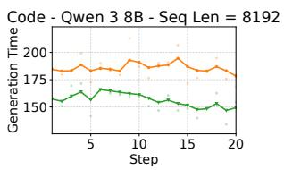

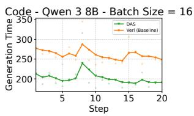

Figure 13. Training curves for the Qwen3-8B model comparing the VeRL baseline (orange) and DAS (green) under different sequence lengths (8k) and batch sizes (16). Left: Reducing the maximum generation length from 16k to 8k tokens still yields > 30% end-toend rollout speedup, indicating that DAS continues to accelerate long, high-latency trajectories. Right: Reducing the effective batch size from 32 to 16 preserves a similar fractional speedup, showing that DAS remains effective across different batch sizes. We omit the reward figure, as it was shown previously and follows from the distribution-preserving property of speculative decoding.  
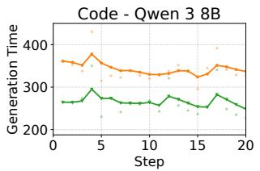

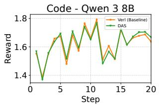  
Figure 14. Training curves for the Qwen3-8B model comparing the VeRL baseline (orange) and our DAS approach (green) using the DAPO training policy. Left: Generation time (rollout latency) per training step. DAS consistently reduces generation time by more than 30% relative to the baseline. Right: Reward per training step. DAS closely matches the baseline reward across all steps, indicating no loss in training quality despite the speedup regardless of reward manager.

## Scalability and System Overhead of Suffix Trees

A potential concern is that suffix trees, while asymptotically linear-time, may incur non-trivial constant factors and memory overhead. We show via profiling that in DAS, both the memory footprint and runtime overhead of maintaining

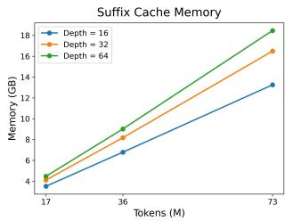

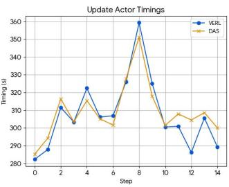  
Figure 15. Suffix-tree overhead analysis. (Left) Suffix-cache memory scales approximately linearly with the number of stored tokens, while increasing tree depth leads to only a modest increase in memory footprint. (Right) Actor update latency shows no noticeable change with suffix-tree construction and release enabled, indicating the overhead is off the critical path.

Memory overhead: Our suffix tree implementation requires ∼200 bytes per stored token. Under the Deep-ScaleR training configuration (batch size 128, nsampling=16, seq len=16k, window size=16), the suffix cache within a single training step is bounded by ∼100 GB per CPU node, which fits within modern multi-socket server memory budgets (TB-scale). Crucially, suffix trees are constructed before rollout and released immediately after each training step, preventing memory accumulation over long training horizons.

Runtime overhead and GPU interaction: Suffix-tree construction and release are parallelized across CPU cores at the problem level, since each problem maintains an independent tree. We further overlap these operations with actor updates, during which CPU utilization is typically light. As a result, we observe less than 5% fluctuations in actor update latency before and after enabling suffix-tree construction and release.

## 6 CONCLUSION

Reinforcement learning has become central to post-training large language models, but at current, scales most of the wall-clock cost comes from rollouts. Generating long trajectories is slow and the worst few samples in each batch set the step time. Speculative decoding is a proven way to cut generation latency by having a fast drafter propose multiple tokens and letting the main model verify them in parallel without changing its output distribution. We adapt speculative decoding to RL by (i) replacing a fixed neural drafter with a non-parametric, adaptive drafter that is continuously refreshed from recent rollouts, and (ii) introducing a distribution-aware draft budgeting policy that allocates more speculative budget to harder, longer problems that dominate rollout time. We validate this on both math reasoning and code RL settings, where rollouts are rewarded by verifiable signals (solution correctness or unit-test pass). In both cases, our method cuts rollout wall-clock time by over 30% relative to a no-speculation baseline while matching the baseline reward curve, showing that adaptive speculative decoding can accelerate RL training without degrading policy quality.

## REFERENCES

Abouelhoda, M. I., Kurtz, S., and Ohlebusch, E. Replacing suffix trees with enhanced suffix arrays. Journal of discrete algorithms, 2(1):53–86, 2004.

Bai, Y., Kadavath, S., Kundu, S., Askell, A., Kernion, J., Jones, A., Chen, A., Goldie, A., Mirhoseini, A., McKinnon, C., Chen, C., Olsson, C., Olah, C., Hernandez, D., Drain, D., Ganguli, D., Li, D., Tran-Johnson, E., Perez, E., Kerr, J., Mueller, J., Ladish, J., Landau, J.,

Ndousse, K., Lukosuite, K., Lovitt, L., Sellitto, M., Elhage, N., Schiefer, N., Mercado, N., DasSarma, N., Lasenby, R., Larson, R., Ringer, S., Johnston, S., Kravec, S., Showk, S. E., Fort, S., Lanham, T., Telleen-Lawton, T., Conerly, T., Henighan, T., Hume, T., Bowman, S. R., Hatfield-Dodds, Z., Mann, B., Amodei, D., Joseph, N., McCandlish, S., Brown, T., and Kaplan, J. Constitutional ai: Harmlessness from ai feedback, 2022. URL https://arxiv.org/abs/2212.08073.

Guo, D., Yang, D., Zhang, H., Song, J., Zhang, R., Xu, R., Zhu, Q., Ma, S., Wang, P., Bi, X., et al. Deepseek-r1: Incentivizing reasoning capability in llms via reinforcement learning. arXiv preprint arXiv:2501.12948, 2025.

He, J., Li, T., Feng, E., Du, D., Liu, Q., Liu, T., Xia, Y., and Chen, H. History rhymes: Accelerating llm reinforcement learning with rhymerl. arXiv preprint: arXiv:2508.18588, 2025.

Hu, J., Wu, X., Shen, W., Liu, J. K., Zhu, Z., Wang, W., Jiang, S., Wang, H., Chen, H., Chen, B., et al. Openrlhf: An easy-to-use, scalable and high-performance rlhf framework. arXiv preprint arXiv:2405.11143, 2024.

Huang, K., Wu, H., Shi, Z., Zou, H., Yu, M., and Shi, Q. Specserve: Efficient and slo-aware large language model serving with adaptive speculative decoding. arXiv preprint arXiv:2503.05096, 2025.

Kasai, T., Lee, G., Arimura, H., Arikawa, S., and Park, K. Linear-time longest-common-prefix computation in suffix arrays and its applications. In Annual Symposium on Combinatorial Pattern Matching, pp. 181–192. Springer, 2001.

Kwon, W., Li, Z., Zhuang, S., Sheng, Y., Zheng, L., Yu, C. H., Gonzalez, J. E., Zhang, H., and Stoica, I. Efficient memory management for large language model serving with pagedattention. In Proceedings of the ACM SIGOPS 29th Symposium on Operating Systems Principles, 2023.

Leviathan, Y., Kalman, M., and Matias, Y. Fast inference from transformers via speculative decoding. In Proceedings of the 40th International Conference on Machine Learning, ICML’23. JMLR.org, 2023a.

Leviathan, Y., Kalman, M., and Matias, Y. Fast inference from transformers via speculative decoding. In International Conference on Machine Learning, pp. 19274– 19286. PMLR, 2023b.

Li, Y., Wei, F., Zhang, C., and Zhang, H. Eagle: Speculative sampling requires rethinking feature uncertainty. arXiv preprint arXiv:2401.15077, 2024a.

Li, Y., Wei, F., Zhang, C., and Zhang, H. Eagle-2: Faster inference of language models with dynamic draft trees. arXiv preprint arXiv:2406.16858, 2024b.

Li, Y., Wei, F., Zhang, C., and Zhang, H. Eagle-3: Scaling up inference acceleration of large language models via training-time test. arXiv preprint arXiv:2503.01840, 2025.

Lin, J., Tang, J., Tang, H., Yang, S., Chen, W.-M., Wang, W.-C., Xiao, G., Dang, X., Gan, C., and Han, S. Awq: Activation-aware weight quantization for on-device llm compression and acceleration. In Gibbons, P., Pekhimenko, G., and Sa, C. D. (eds.), Proceedings of Machine Learning and Systems, volume 6, pp. 87–100, 2024.

Liu, B., Wang, A., Min, Z., Yao, L., Zhang, H., Liu, Y., Zeng, A., and Su, J. Spec-rl: Accelerating on-policy reinforcement learning via speculative rollouts. arXiv preprint: arXiv:2509.23232, 2025.

Liu, J., Min, S., Zettlemoyer, L., Choi, Y., and Hajishirzi, H. Infini-gram: Scaling unbounded n-gram language models to a trillion tokens. arXiv preprint arXiv:2401.17377, 2024a.

Liu, X., Daniel, C., Hu, L., Kwon, W., Li, Z., Mo, X., Cheung, A., Deng, Z., Stoica, I., and Zhang, H. Optimizing speculative decoding for serving large language models using goodput. arXiv preprint arXiv:2406.14066, 2024b.

Liu, X., Hu, L., Bailis, P., Cheung, A., Deng, Z., Stoica, I., and Zhang, H. Online speculative decoding. arXiv preprint: arXiv:2310.07177, 2024c.

Loshchilov, I. and Hutter, F. Decoupled weight decay regularization. arXiv preprint arXiv:1711.05101, 2017.

Luo, M., Tan, S., Huang, R., Patel, A., Ariyak, A., Wu, Q., Shi, X., Xin, R., Cai, C., Weber, M., et al. Deepcoder: A fully open-source 14b coder at o3-mini level. Notion Blog, 2025a.

Luo, M., Tan, S., Wong, J., Shi, X., Tang, W. Y., Roongta, M., Cai, C., Luo, J., Zhang, T., Li, L. E., Popa, R. A., and Stoica, I. Deepscaler: Surpassing o1-preview with a 1.5b model by scaling rl. Notion blog post, 2025b. Accessed 2025.

Manber, U. and Myers, G. Suffix arrays: a new method for on-line string searches. siam Journal on Computing, 22 (5):935–948, 1993.

Miao, X., Oliaro, G., Zhang, Z., Cheng, X., Wang, Z., Zhang, Z., Wong, R. Y. Y., Zhu, A., Yang, L., Shi, X., Shi, C., Chen, Z., Arfeen, D., Abhyankar, R., and Jia, Z. Specinfer: Accelerating large language model serving with tree-based speculative inference and verification. arXiv preprint arXiv:2305.09781v4, 2023.

Oliaro, G., Jia, Z., Campos, D., and Qiao, A. Suffixdecoding: Extreme speculative decoding for emerging ai applications. arXiv preprint arXiv:2411.04975, 2025.

Ouyang, L., Wu, J., Jiang, X., Almeida, D., Wainwright, C., Mishkin, P., Zhang, C., Agarwal, S., Slama, K., Ray, A., Schulman, J., Hilton, J., Kelton, F., Miller, L., Simens, M., Askell, A., Welinder, P., Christiano, P. F., Leike, J., and Lowe, R. Training language models to follow instructions with human feedback. In Koyejo, S., Mohamed, S., Agarwal, A., Belgrave, D., Cho, K., and Oh, A. (eds.), Advances in Neural Information Processing Systems, volume 35, pp. 27730–27744. Curran Associates, Inc., 2022.

Sheng, G., Zhang, C., Ye, Z., Wu, X., Zhang, W., Zhang, R., Peng, Y., Lin, H., and Wu, C. Hybridflow: A flexible and efficient rlhf framework. arXiv preprint arXiv: 2409.19256, 2024.

Ukkonen, E. On-line construction of suffix trees. Algorithmica, 14(3):249–260, 1995.

Verl Contributors. Recipe: One step off policy async trainer, 2024. URL https://verl.readthedocs.io/ en/latest/advance/one\_step\_off.html. Accessed: 2025-10-30.

Wang, Y., Yang, Q., Zeng, Z., Ren, L., Liu, L., Peng, B., Cheng, H., He, X., Wang, K., Gao, J., et al. Reinforcement learning for reasoning in large language models with one training example. arXiv preprint arXiv:2504.20571, 2025.

Weiner, P. Linear pattern matching algorithms. In 14th Annual Symposium on Switching and Automata Theory (swat 1973), pp. 1–11. IEEE, 1973.

Xia, H., Li, Y., Zhang, J., Du, C., and Li, W. Swift: On-thefly self-speculative decoding for llm inference acceleration. arXiv preprint: arXiv:2410.06916, 2024.

Zhang, J., Wang, J., Li, H., Shou, L., Chen, K., Chen, G., and Mehrotra, S. Draft & verify: Lossless large language model acceleration via self-speculative decoding. In Proceedings of the 62nd Annual Meeting of the Association for Computational Linguistics (Volume 1: Long Papers), 2024.

Zhang, Y., Lv, N., Wang, T., and Dang, J. Fastgrpo: Accelerating policy optimization via concurrency-aware speculative decoding and online draft learning. arXiv preprint: arXiv:2509.21792, 2025.

Zhong, Y., Liu, S., Chen, J., Hu, J., Zhu, Y., Liu, X., Jin, X., and Zhang, H. DistServe: Disaggregating prefill and decoding for goodput-optimized large language model serving. In 18th USENIX Symposium on Operating Systems Design and Implementation (OSDI 24), pp. 193–210, Santa Clara, CA, July 2024. USENIX Association. ISBN 978-1-939133-40-3. URL https://www.usenix.org/conference/ osdi24/presentation/zhong-yinmin.

Zhong, Y., Zhang, Z., Song, X., Hu, H., Jin, C., Wu, B., Chen, N., Chen, Y., Zhou, Y., Wan, C., Zhou, H., Jiang, Y., Zhu, Y., and Jiang, D. Streamrl: Scalable, heterogeneous, and elastic rl for llms with disaggregated stream generation, 2025a. URL https://arxiv.org/abs/ 2504.15930.

Zhong, Y., Zhang, Z., Wu, B., Liu, S., Chen, Y., Wan, C., Hu, H., Xia, L., Ming, R., Zhu, Y., and Jin, X. Optimizing rlhf training for large language models with stage fusion. In Proceedings of the 22nd USENIX Symposium on Networked Systems Design and Implementation, NSDI ’25, USA, 2025b. USENIX Association. ISBN 978-1-939133- 46-5.

## A DERIVATION OF THE NONLINEAR ACCEPTANCE MODEL

Per-round Acceptance Dynamics. During speculative decoding, each request ri proceeds through several draft rounds. Let di,k denote the number of speculative tokens proposed in round k, and ai,k the acceptance rate in that round. Empirical traces (e.g., DYSPEC, DEEPSEEK-R1) suggest that acceptance decays exponentially with round depth:

$$
\tag{8}
$$

where βi quantifies how quickly the draft–main-model mismatch grows.

Aggregating over Rounds. Assuming a fixed proposal length di per round (i.e., di,k = di) and pi = Kidi, the total number of accepted tokens after Ki rounds is

$$
\tag{9}
$$

Substituting Ki = pi/di gives

$$
\tag{10}
$$

Normalization and Simplification. We re-parameterize constants to express the same exponential-saturation behavior:

$$
\tag{11}
$$

where αi encodes the effective draft efficiency of request i, and ki ∈ (0, 1] denotes the maximal achievable fraction of accepted tokens relative to li.

## B ROBUSTNESS, LIMITATIONS, AND FUTURE WORK

Robustness DAS remains stable under realistic RL training dynamics. Modern RL algorithms (e.g., PPO, KLregularized RLHF) constrain policy updates, leading to gradual rather than abrupt distribution shifts. Combined with the sliding-window cache update, DAS adapts online to evolving policies. While DAS benefits from trajectory reuse, its core components, length-aware budget allocation and runtime length prediction, do not rely on history and continue to mitigate long-tail stragglers even under lowreuse regimes.

Limitations DAS provides the largest gains in long-horizon workloads with significant straggler effects. In short generation regimes, speculative decoding may introduce extra token overhead without reducing model forward passes. Additionally, performance may degrade when historical reuse is extremely limited, although memory overhead remains manageable and scales linearly with token count.

Future Work Future directions include integrating DAS with asynchronous RL to jointly address rollout and synchronization bottlenecks, exploring hybrid or learned drafters for low reuse settings, and extending beyond path based speculation to tree based decoding for improved parallelism.

## C RUNTIME LENGTH PREDICTION

Our runtime length prediction consists of a history-based prior and a runtime update. Table 1 reports the prediction accuracy for both components.

Table 1. Accuracy of runtime length prediction using history prior and runtime updates.  
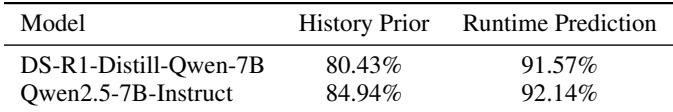

This improvement primarily comes from correcting misclassified long requests early in execution, which would otherwise be treated as short and assigned insufficient speculative budgets. Such misclassifications disproportionately affect batch-level makespan, as long requests tend to dominate the critical path; runtime correction allows DAS to reallocate budgets adaptively and mitigate straggler-induced stalls.

## D SPECULATIVE DECODING ANALYSIS

Speculative decoding is applied to Medium and Long requests, while Short requests are executed without speculation to avoid unnecessary overhead. As shown in Table 2, Medium and Long requests together account for approximately 80% of the training workload.

Table 2. Short, Medium, and Long ratio in different models.  
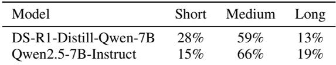