# DEMYSTIFYING THE MIXTURE OF EXPERTS SERVING TAX

Pratyush Patel 1 2 Dayeol Lee 2 Shintaro Iwasaki 2 Arvind Krishnamurthy 1

## ABSTRACT

Mixture-of-Experts (MoEs) enable massive model sizes but incur higher serving overheads than dense models at the same per-token compute cost. This MoE tax varies with the model architecture, inference phase, and parallelism strategy. We comprehensively study the tax for different MoE models, finding that they perform 2–3× worse than FLOP-equivalent dense models. Using microbenchmarks, we analyze and categorize the underlying tax sources and show how they manifest differently under different configurations. Our key result is that prefill and decode phases incur vastly different taxes; counterintuitively, load imbalance across experts that harms prefill performance can benefit decode by activating fewer experts. We decompose the tax into analytically separable components and propose a balls-bins-buckets framework to study recent MoE developments like fine-grained experts and data parallel attention. We conclude by discussing existing and new techniques to reduce the MoE tax and their associated trade-offs.

## 1 INTRODUCTION

The Mixture-of-Experts (MoE) model architecture has become a leading paradigm for scaling Large Language Models (Shazeer et al., 2017). By incorporating multiple “expert” feed-forward networks (FFNs) and activating only a subset for each token, MoEs can significantly increase parameter counts and output quality without a proportional increase in computational cost. For inference, this architecture carries a compelling promise: the ability to deliver the superior quality of a big model at the performance and cost of a much smaller dense model that activates the same number of parameters per token (Mistral AI Team, 2023).

However, this promise is not easily realized in practice. While MoEs often demonstrate clear quality benefits (Dai et al., 2024; Qwen Team, 2024; Jiang et al., 2024), their conditional computation introduces a host of system-level overheads that are not captured by FLOP counts alone. These inefficiencies, which we collectively term the “MoE tax”, make MoEs significantly more complex and expensive to deploy at scale (Zhao et al., 2025a). For example, as shown in Figure 1, cloud providers charge customers 2.5–10× more for MoE model inferences than for dense models that activate the same number of parameters per token. This paper systematically characterizes the MoE tax, measures it to be significant across different models, identifies the underlying issues that affect it, and provides effective optimization guidelines for serving systems.

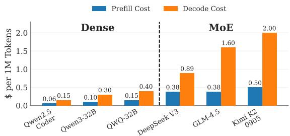  
Figure 1. Token pricing for Dense and MoE models (DeepInfra). All models activate 32B–37B parameters per token.

We analyze MoE performance using a combination of endto-end tax measurements and targeted microbenchmarks to identify tax sources. We evaluate the tax across three key dimensions that define any real-world serving deployment: the inference phase (i.e., prefill vs. decode), the parallelism strategy (i.e., TP and DP for attention, TP and EP for MoE), and the model architecture (i.e., the number of experts). Our analysis reveals that the MoE tax is not a single, uniform penalty but rather consists of distinct, often competing, overheads related to computation, communication, and token distribution effects.

A key finding is the stark dichotomy in the MoE tax across inference phases and how it interacts with other system configurations. In the prefill phase, performance is primarily limited by lower arithmetic intensity from batch subdivision across experts and by token distribution effects. The choice of parallelism strategy determines how the system pays the tax: token-to-expert mappings create a “padding tax” under both TP and EP, which is typically worse for models with many fine-grained experts. EP also incurs a “straggler tax” from non-uniform routing, which is higher for models with fewer experts.

Table 1. MoE tax sources compared to FLOP-equivalent dense models. Baseline overheads arise from the MoE architecture itself; token distribution effects modulate them in phase-dependent ways.  
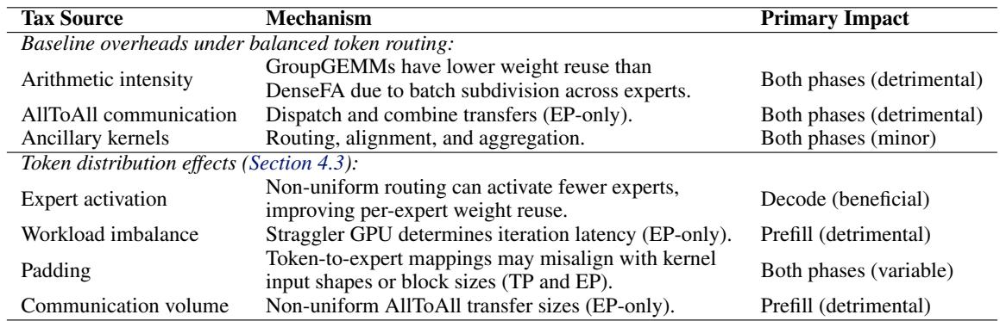

In contrast, the memory-bound decode phase is overwhelmingly dominated by a “weight amplification” tax, where the need to load a large volume of expert weights for small batches significantly lowers arithmetic intensity. This tax causes MoEs to perform almost as poorly as enormous dense models with the same total parameter count. Here, we also uncover a counterintuitive insight: skewed routing can improve decode performance by activating fewer overall experts, since the savings from mitigating the dominant weight amplification tax and reducing the padding overheads outweigh the minor costs of imbalance.

Our work provides a comprehensive framework for quantifying and reasoning about the MoE tax. We show that MoE models perform 2–3× worse than FLOP-equivalent dense models, and that this varies under different configurations. We decompose the MoE tax into analytically separable components, validate the model against measured data, and introduce a balls-bins-buckets framework to analyze token distribution effects across different configurations spanning expert granularity, parallelism strategy, and deployment size. Finally, based on our analysis, we contextualize prior MoEtax-reduction techniques and propose new approaches to improve MoE serving efficiency.

## 2 THE MIXTURE OF EXPERTS TAX

MoE models incur additional overheads compared to dense models due to conditional computation. To contextualize the tax for a given MoE, we consider two types of dense models. A FLOP-aligned dense (DenseFA) model activates the same number of parameters per token as the MoE model. It replaces each MoE layer with a dense FFN whose intermediate size is scaled by the MoE’s top-K value, ensuring the same per-token compute cost. It represents the ideal performance feasible if all sparsity overheads were eliminated.

Conversely, a parameter-aligned dense (DensePA) model has the same total number of parameters as the MoE model and estimates a lower performance bound. This model replaces the MoE block with an FFN whose intermediate size is scaled by the total number of experts. It has the same memory needs as the MoE but incurs much higher compute since every weight in the FFN is used for every token.

We define the MoE tax (τ ) as the latency (T ) degradation of serving an MoE model relative to a DenseFA model at a given batch size (b):

$$
\tag{1}
$$

This metric captures the combined overheads of conditional computation, communication, and other system effects. A tax of 1.0 implies that the MoE model performs identically to its ideal dense counterpart, while a higher value indicates a greater performance penalty.

Note that the MoE tax is a relative metric that is sensitive to the execution environment, model configuration, and workload. Its primary utility is to help understand how different architectural and system choices contribute to overall efficiency. Although we focus on latency, the tax could be similarly defined in terms of throughput degradation.

Table 1 previews the key MoE tax sources we identify in our analysis (Section 4). MoEs differ from dense models in computation (per-expert GEMMs lower arithmetic intensity) and communication (AllToAll transfers under DP+EP). The token distribution modulates both through differences in expert activation, workload balance, padding, and communication volume, creating the phase-dependent tax we characterize below. The performance bottleneck depends on the inference phase, model architecture, and parallelism strategy, making it important to characterize diverse configurations to guide efficiency optimizations.

## 3 MOE TAX CHARACTERIZATION

We measure the MoE tax in terms of the time taken to process a batch of tokens. We analyze prefill and decode phases separately, since different workloads (e.g., summarization, chat, reasoning) exercise them to different extents. The overall tax can be modeled by appropriately combining perphase analyses. This separation also mirrors disaggregated inference, which is commonly deployed at scale (DeepSeek-AI, 2024b; Mitra et al., 2025; Patel et al., 2024). All end-toend measurements report whole-model forward step latency.

Setup. We evaluate three open-source MoE models: Mixtral-8x7B (Jiang et al., 2024), Qwen2-MoE (Qwen Team, 2024; Yang et al., 2024), and DeepSeek-V3 (DeepSeek-AI, 2024b), shown in Table 2. These models capture distinct architectural designs, which broadens our analysis. Mixtral and Qwen are run on a single server with eight NVIDIA A100 GPUs, whereas DeepSeek-V3 is run on eight NVIDIA B200 GPUs, both interconnected with NVLink.

Frameworks. We use vLLM under both TP and EP (Kwon et al., 2023). We compare MoE and dense baselines at the same parallelism degree, ensuring all use the same hardware resources per instance. For example, a sufficiently small DenseFA model could use a single GPU without any model parallelism, which we do not consider in this work. Mixtral and Qwen are run using vLLM’s Triton FusedMoE and AllReduce implementations, whereas DeepSeek uses Deep-GEMM and DeepEP (Zhao et al., 2025b; DeepSeek-AI, 2025). Where feasible, we tune the kernels for our hardware and enable CUDA graphs to minimize launch overhead. For robust statistics, we clip the top and bottom 1% of the measurements to remove outliers before reporting the mean and standard deviation of the engine step latencies.

Workloads. MoE routing is data-dependent, so we evaluate three different input datasets: language understanding (MMLU (Hendrycks et al., 2020)), code generation (HumanEval (Chen et al., 2021)), and random tokens generated within the model vocabulary. Despite differences in routing patterns across datasets (e.g., the random dataset has higher skew likely because the model router is trained on coherent sentences), overall MoE tax trends are similar. We show results from HumanEval. The token distribution’s effect on individual tax sources is analyzed in Section 4.3.

Table 2. MoE models used in our analysis.  
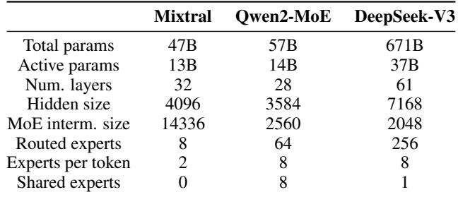

## 3.1 Prefill Phase Tax

Figure 2 shows the prefill iteration latency for our MoE models and their dense counterparts across different batch sizes and parallelisms. Figure 2d shows the corresponding MoE tax under the best parallelism configuration. For Mixtral and Qwen, TP generally outperforms EP, whereas for DeepSeek, their performance is similar.

We observe that the tax varies substantially with batch size: it is higher at small batch sizes and generally reduces as the batch size increases. This can be attributed to better amortization of overheads and a shift towards an increasingly compute-bound regime. Mixtral and Qwen follow similar trends and incur a minimum tax of around 1.28× at a batch size of 1024 and 2048, respectively. DeepSeek reaches its minimum tax of 1.7× at 1024 tokens, although its trend differs: DeepSeek uses DeepGEMM+DeepEP kernels optimized for its 256 fine-grained experts, and its much larger model size shifts the compute-memory trade-off compared to Mixtral and Qwen.

With increased sparsity and finer-grained experts, we observe that Qwen and DeepSeek generally exhibit a higher prefill tax than Mixtral. In fact, until a batch size of 1024, DeepSeek performs similarly to its DensePA equivalent. Although MoE designs with more experts are often motivated by quality gains (Dai et al., 2024), they can incur poorer hardware utilization and introduce overheads unless large batch sizes are used.

Insight: The prefill tax is higher at smaller batch sizes, whereas larger batches incur lower tax. MoE models with higher sparsity tend to incur a higher prefill tax than those with fewer experts.

## 3.2 Decode Phase Tax

Figure 3 plots decode iteration latencies and the corresponding MoE tax. The MoE tax is generally higher and more persistent during the decode phase than during the prefill phase. For example, at a batch size of 32, the MoE tax reaches 2.08× for Mixtral and 2.57× for Qwen. For DeepSeek, which typically uses bigger batches (Zhao et al., 2025a), the peak tax of nearly 3× occurs at a batch size of 128 tokens.

The decode phase tax exhibits a bell-shaped curve. It is minimal for a single request (as low as 1.05× for Mixtral), rises sharply to a peak at medium batch sizes, and then gradually decreases for larger batches. Comparing the models, we find that DeepSeek and Qwen generally incur a higher tax than Mixtral due to their higher sparsity.

Under common operating points, the MoE decode latency closely matches, or even exceeds, that of the DensePA models. This severe performance penalty arises due to the memory-bound nature of the decode phase. Medium-tolarge decode batches likely activate most experts in each iteration, so most expert weights must be loaded from memory for relatively minimal computation. Conditional computation overheads such as routing, alignment, and padding can further push MoE latency above DensePA; for DeepSeek, AllToAll communication adds to this. This makes memory bandwidth the critical bottleneck for MoE decode phases, even more so than for dense LLM inference.

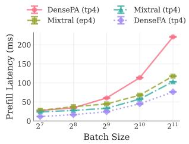  
(a) Mixtral

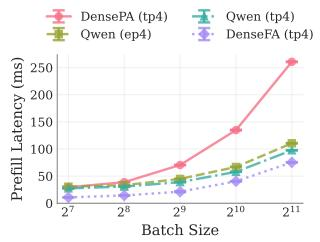  
(b) Qwen

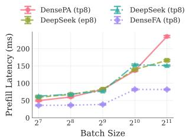  
(c) DeepSeek

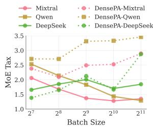  
(d) MoE Tax

Figure 2. Prefill iteration latency and MoE tax ratio with a varying number of batched tokens.  
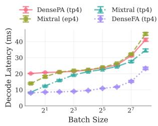  
(a) Mixtral

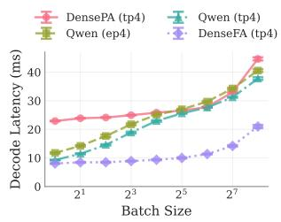  
(b) Qwen

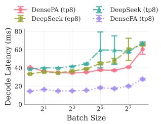  
(c) DeepSeek

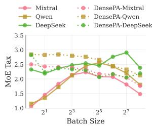  
(d) MoE Tax  
Figure 3. Decode iteration latency and MoE tax ratio with a varying number of batched tokens.

Insight: The decode phase tax follows a bell-shaped curve, peaking at medium batch sizes, which are common in practice. This high tax severely impacts overall performance since decode phases are typically longer than prefill phases.

## 4 TAX SOURCE ANALYSIS

We decompose the MoE tax into its constituent sources through microbenchmark analysis. We first characterize the baseline overheads under uniform token distributions: lower arithmetic intensity in GroupGEMM, ancillary kernel costs, and AllToAll communication under DP+EP. We then analyze how the token distribution modulates these through expert activation, workload imbalance, kernelspecific padding, and communication bottlenecks.

We microbenchmark MoEs under different configurations and use Nsight (NVIDIA, a;b) to measure the achieved FLOPS and memory bandwidth. First, we identify the kernels corresponding to MoE computation steps in vLLM, i.e., routing, dispatch, experts computation, and combine. For each step, we then study the efficiency impact of various factors, including top-K, expert skew, token padding, etc.

For computation microbenchmarks, we focus on Mixtral and Qwen, as they have similar sizes but different architectures. Our analysis includes Triton FusedMoE (Kwon et al., 2023) and DeepGEMM (DeepSeek-AI, 2025) kernels, which are widely used in production. Our methodology generalizes to other kernel backends. For communication microbenchmarks, we focus on the larger DeepSeek model using vLLM’s symmetric memory AllReduce and DeepEP AllToAll kernels (Zhao et al., 2025b), benchmarked on 8×H200 GPUs. The identified tax sources are architectureindependent, though magnitudes may differ across GPU generations.

Microbenchmarks are driven using token routing traces collected from end-to-end inference with different datasets. Specifically, we record expert assignments for each token in each layer and use them as input to our microbenchmarks.

## 4.1 Computation

The dominant computation cost in an MoE layer is expert computation via GroupGEMM kernels. Several ancillary kernels (routing, top-K selection, token alignment, output aggregation) contribute a smaller overhead, which we quantify separately.

GroupGEMM arithmetic intensity. The fundamental source of the MoE computation tax is lower arithmetic intensity. The MoE router selects K of the E total experts for each of the m input tokens, activating K ≤ Eactive ≤ E experts in total. Under a uniform token distribution, each active expert processes mK/Eactive tokens on average, whereas DenseFA processes all m tokens through a single K-scaled FFN with the same total FLOPs. The MoE arithmetic intensity is therefore K/Eactive ≤ 1 of DenseFA’s, i.e., always lower. Since each token is routed to K experts, Eactive ≥ K, and Eactive increases with batch size.

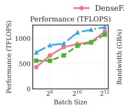

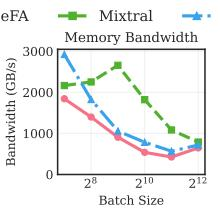  
(a) Mixtral Prefill.

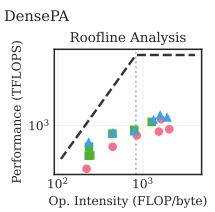

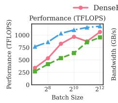

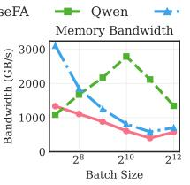

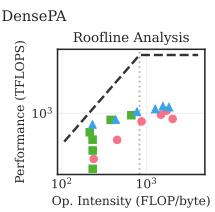  
(b) Qwen Prefill.

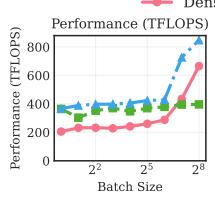

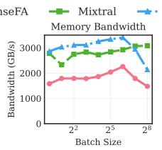  
(c) Mixtral Decode.

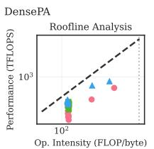

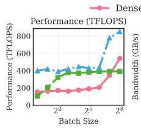

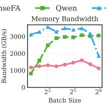  
(d) Qwen Decode.

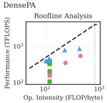  
Figure 4. Mixtral and Qwen DeepGEMM microbenchmarks on H200 using uniform token distributions.

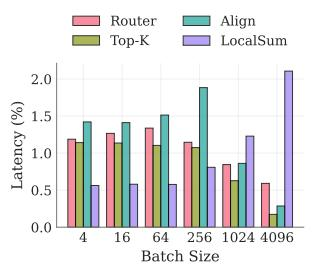

The lower arithmetic intensity affects both inference phases, but the bottleneck resource determines which aspect dominates. In prefill, throughput is limited by how well the kernel saturates GPU compute; the smaller per-expert batches lower GroupGEMM efficiency, causing compute units to saturate at higher batch sizes than DenseFA (batch subdivision). In memory-bound decode, latency is limited by weight loading from HBM; MoE loads Eactive/K times the weight volume of DenseFA, causing decode latency to approach that of the much larger DensePA model when Eactive ≈ E (weight amplification).

Figure 4 confirms this empirically. In the prefill phase, MoE GroupGEMMs achieve lower TFLOPS than dense GEMMs due to batch subdivision. In the decode phase, MoE kernel TFLOPS closely track those of the much larger DensePA FFN, confirming weight amplification. In practice, even small batches activate nearly all experts for smaller models, requiring the system to load most expert weights from HBM (Section 4.3). Both phases can additionally suffer from padding overheads needed to align tokens to specific block sizes, which can further reduce arithmetic intensity.

Ancillary kernels. Beyond the expert computation itself, MoEs require several ancillary kernels to enable conditional computation. Figure 5 shows the latency of these kernels (router, top-k, align, and local sum) as a percentage of the total MoE layer computation time. Collectively, these overheads constitute a small fraction of the total tax, typically under 5% for Mixtral and under 8% for Qwen. However, their behavior varies with batch size. The align kernel, which permutes and pads tokens, is most significant at small batch sizes, while the local sum kernel, which aggregates expert outputs, becomes more prominent at very large batch sizes as the output tensors grow. Because the local sum kernel latency scales up quickly with the number of activated experts, Qwen (K = 8) has a higher aggregate overhead from ancillary computations than Mixtral (K = 2). Fusing these operations (e.g., combine with local sum (Zhao et al., 2025b)) can help reduce the cumulative overhead.

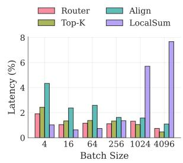  
(a) Mixtral  
(b) Qwen  
Figure 5. Latency breakdown of ancillary computation in Mixtral and Qwen as a fraction of the overall MoE block computation time. Uses uniform token distributions.

## 4.2 Communication

Under TP, both MoE and DenseFA shard weights across GPUs and use AllReduce to aggregate partial results. Both models incur two AllReduces per layer (one after attention, one after expert/FFN computation), each reducing a matrix of size m × dmodel. Since these are identical for MoE and DenseFA, there is no communication tax under TP.

Under DP+EP, experts are distributed across GPUs, and tokens must be routed to the GPUs hosting their assigned experts via AllToAll dispatch; results are returned via All-ToAll combine. For mg local tokens, the per-GPU dispatch buffer is mg ⋅ K ⋅ dmodel, compared to AllReduce’s input of m ⋅ dmodel. Since AllToAll volume scales with the routing fan-out K while AllReduce does not, AllToAll sends K× more data at the API level (8× for DeepSeek-V3). Adding more GPUs reduces the per-GPU volume (since mg decreases) but increases the number of peer-to-peer messages, each incurring a fixed latency overhead that compounds at multi-node scale.

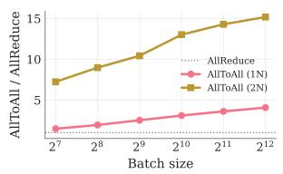  
(a) Prefill

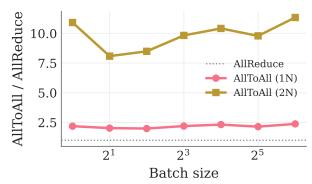  
(b) Decode  
Figure 6. AllToAll/AllReduce latency ratio at DeepSeek-V3 transfer sizes (NCCL, H200 GPUs). Decode uses NCCL with symmetric memory; prefill uses default NCCL. Values >1 indicate AllToAll is more expensive. 1N = 8×H200; 2N = 16×H200.

The actual data traversing the network differs from the APIlevel volumes for both collectives. Ring AllReduce (ReduceScatter + AllGather) transfers 2(n−1)/n of its input per GPU, which is ∼1.75× for n=8 GPUs. For AllToAll, a fraction 1/n of token-expert assignments target local experts and do not traverse the network, reducing the effective transfer to (n−1)/n of the dispatch buffer. Accounting for both effects, the network volume ratio narrows from K to approximately K ⋅ n/(2(n−1)), which is ∼4.6× for DeepSeek-V3.

Figure 6 shows the measured NCCL AllToAll/AllReduce latency ratio at DeepSeek-V3 transfer sizes, using singlenode AllReduce as the baseline (since TP stays intra-node). Decode uses NCCL with symmetric memory, which reduces communication overhead at small transfer sizes. Within a single node, the ratio is around 2× during decode and grows to 3–4× at large prefill batches, consistent with the network volume ratio as bandwidth dominates over fixed overheads. Across two nodes, the ratio reaches 7–15× because RDMA inter-node latency and bandwidth become the bottleneck compared to NVLink.

## 4.3 Token Distribution Effects

Our analysis so far assumed uniform token distributions. In practice, the token distribution modulates the above tax sources. The impact is phase-dependent: for prefill, per-GPU time scales with the token count, so workload imbalance and kernel-specific padding directly inflate latency. In decode, weight loading from activated experts dominates,

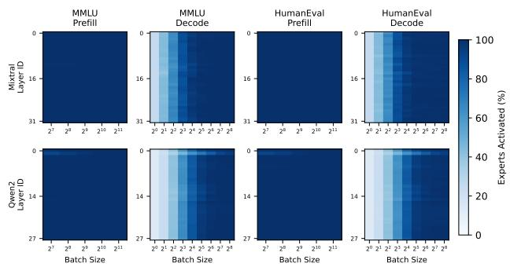  
Figure 7. Average expert activation per iteration for Mixtral and Qwen at different batch sizes in the prefill and decode phases.  
and the performance is less sensitive to the token imbalance. For communication under DP+EP, the token distribution determines per-GPU AllToAll transfer volumes.

Expert activation. The token distribution determines how many of the E total experts are activated (Eactive), directly modulating the GroupGEMM arithmetic intensity ratio K/Eactive: fewer activated experts means higher per-expert arithmetic intensity, closer to DenseFA.

In practice, expert activation saturates rapidly with batch size (Figure 7). Even medium-sized batches activate nearly all experts, especially for models with fewer total experts like Mixtral (E=8). At smaller batch sizes, non-uniform distributions can concentrate tokens onto fewer experts, reducing Eactive. During decode, this directly reduces weight loading, making non-uniform distributions beneficial. During prefill, most experts are activated regardless and the kernel is compute-bound, so the effect is less significant.

Padding. MoE routing creates irregular per-expert token counts, which causes a ragged input tensor shape. GPU GEMM kernels often require aligned dimensions for efficient execution, so the input tensor must be padded, potentially wasting compute and memory on empty slots. Unlike dense models, where all tokens pass through a single FFN with a uniform batch, the irregularity introduced by routing makes padding an MoE-specific overhead that affects both TP and EP. The overhead depends not on skew per se, but on the interaction between the token distribution and the kernel’s padding mechanism.

The padding scheme is kernel-specific. We identify two common schemes in production kernels. Blockwise padding independently rounds each expert’s tokens to a block boundary (used by FusedMoE and DeepGEMM prefill). Max padding pads all experts to a single shared dimension equal to the maximum per-expert token count (used by Deep-GEMM decode). These have opposite worst cases: blockwise padding is maximized by spread distributions (many experts with few tokens each), while max padding is maximized by concentrated distributions (one expert with many tokens inflates the shared dimension for all). Other kernel implementations may use different schemes. Even a perfectly uniform token distribution can incur padding, since the overhead depends on block alignment rather than skew.

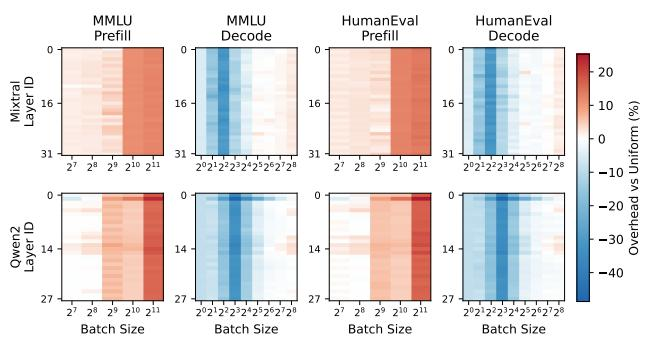  
(a) FusedMoE kernels under TP.

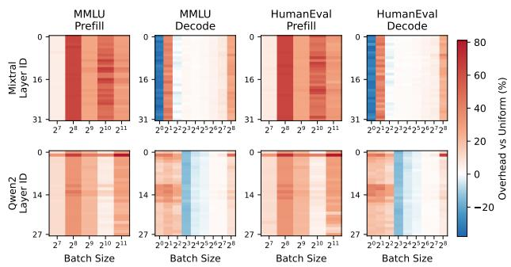  
(b) DeepGEMM kernels under EP.  
Figure 8. Latency overhead of profiled vs. uniform token distributions for Mixtral and Qwen on H200.

Figure 8a quantifies the padding tax under TP using Fused-MoE kernels with profiled token distributions. During prefill, the padding tax grows with batch size, reaching around 15–25%. The tax is greater for Qwen than for Mixtral, since its larger number of experts creates more padding opportunities. During decode, the latency impact of padding is smaller for both models across batch sizes. Non-uniform distributions can yield a net benefit by activating fewer experts, which outweighs the padding overheads.

Worker stragglers. The straggler tax is unique to expert parallelism. When an uneven distribution of tokens is routed to experts distributed across different GPUs, some workers are assigned more tokens than others. Since the end-to-end latency is determined by the slowest worker, this workload imbalance can severely degrade performance. Figure 8b quantifies this tax by measuring the latency overhead of realistic expert distributions compared to a perfectly balanced load.

Straggler tax dominates during the prefill phase, where it can increase MoE kernel latency by 40–80% compared to a uniform token distribution. Padding amplifies the imbalance: the hot GPU’s token count is further inflated by block alignment, compounding the overhead. The effect is less severe for Qwen, since its larger number of experts allows the workload to be spread more evenly.

The straggler tax is minimal during decode because per-GPU time is dominated by fixed kernel launch overheads and weight loading, which depend on Eg (the number of active experts on each GPU) rather than the token count Rg. When each GPU hosts many experts, Eg is roughly balanced, and token imbalance has little effect. Under wider EP with fewer experts per rank, Eg can become more variable: some GPUs may have all their experts activated while others have none, creating a weight loading imbalance that directly translates to straggler overhead.

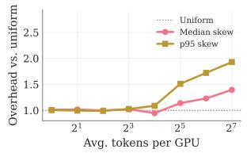  
(a) Dispatch

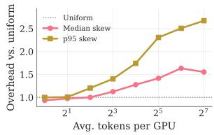  
(b) Combine  
Figure 9. AllToAll dispatch and combine overhead under profiled vs. uniform token distributions for DeepSeek-V3 decode using DeepEP low latency kernels on 8×H200.

Communication imbalance. Under DP+EP, the per-GPU AllToAll cost under non-uniform token distributions is determined by max(Sg, Rg), the larger of the token-expert assignments sent and received by GPU g. Two sources of imbalance interact differently across dispatch and combine. Expert popularity determines how many tokens each GPU’s experts receive: during dispatch, GPUs hosting popular experts receive more data (receiver-side imbalance); during combine, these same GPUs send more results back (senderside imbalance). The DP token count determines how many tokens each rank contributes: during dispatch, this is the sender-side load; during combine, it is the receiver-side load. Under decode, per-rank token counts are approximately balanced due to DP load balancing, so the dominant imbalance comes from expert popularity. Under prefill or mixed batching (e.g., chunked prefill), DP ranks may contribute different numbers of tokens, introducing imbalance on the DP token count side as well.

Figure 9 quantifies the impact of this imbalance on All-ToAll performance for DeepSeek-V3 decode, showing the overhead relative to a uniform baseline under profiled token distributions from traced routing. The median and p95 skew lines represent the communication overhead at the median and tail token distribution skew across profiled batches. At small batch sizes (1–8 tokens per rank), the overhead is minimal since fixed per-transfer latency dominates. At larger batch sizes, imbalance grows substantially: at 128 tokens per rank, the p95 combine overhead reaches 2.7×, compared to 1.9× for dispatch. Combine is more sensitive because DeepSeek-V3 dispatches in FP8 but combines in

BF16, nearly doubling the per-token transfer volume and amplifying the effect of routing imbalance.

## 4.4 Summary

Table 1 summarizes the key tax sources identified above. These sources explain the end-to-end tax profiles from Section 3. The prefill tax decreasing with batch size (Figure 2) is driven by batch subdivision: larger batches improve perexpert arithmetic intensity, approaching DenseFA efficiency. Models with more experts (Qwen, DeepSeek) incur a higher prefill tax because finer-grained experts create more padding opportunities and lower per-expert batch sizes. The decode bell curve (Figure 3) reflects weight amplification: at batch size 1, few experts are activated, and weight loading is minimal; at medium batches, nearly all experts are activated, maximizing weight loading; at large batches, compute begins to catch up.

The token distribution modulates these baseline overheads in phase-dependent ways. During prefill, non-uniform routing creates stragglers under EP and interacts with padding, compounding the overhead. During decode, non-uniform routing can actually reduce the tax by concentrating tokens onto fewer experts, lowering weight loading. Under DP+EP, AllToAll communication adds an MoE-specific overhead that scales with the routing fan-out K and grows significantly at multi-node scale. The relative dominance of the tax sources shifts with the inference phase, batch size, parallelism strategy, and token distribution, motivating an analytical model to reason about them jointly.

## 5 MODELING THE MOE TAX

We develop an analytical model to decompose the MoE tax τ at a given batch size of m tokens from architecture and hardware parameters. We model routed-expert computation, ancillary MoE kernels, and communication; we do not model compute-communication overlap. We derive the model for each parallelism strategy below, then detail two supporting inputs: the padding overhead and the token distribution model.

Hardware parameters. Let We be the weight bytes per expert, dact the activation bytes per token-expert, Fe the FLOPs per token-expert, and s the bytes per token for network transfer. Weight loading takes α = We/BWHBM per expert, activation I/O takes αact = dact/BWHBM per tokenexpert, computation takes β = Fe/FLOPSpeak per tokenexpert, and network transfer takes γ = dmodel ⋅ s/BWnet per token, where BWnet is the effective link bandwidth. We denote the TP, DP, and EP parallelism degrees by ntp, ndp, and nep, respectively.

DenseFA baseline. We compare against a TP DenseFA baseline throughout. The DenseFA FFN block processes all m tokens through K experts’ worth of weights. Per GPU:

Table 3. MoE tax model parameters.  
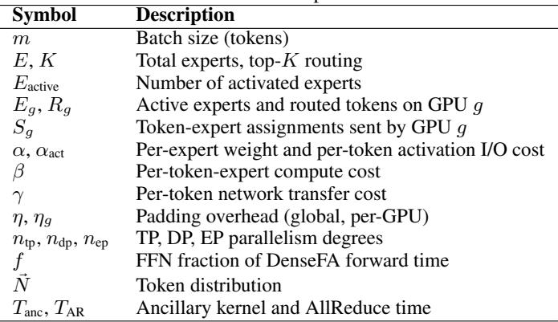

$$
\tag{2}
$$

The full block time adds AllReduce: T TPFFN = TFFN,c +TAR. A DP DenseFA deployment would instead process mg=m/ndp tokens per GPU with no communication overheads.

TP+TP. We compare MoE and DenseFA at the same TP degree ntp, so both use identical sharding and communication. Each GPU holds a 1/ntp shard of every expert and processes all m tokens. All GPUs see symmetric workloads, so per-GPU time equals block time. The non-FFN computation Tother (attention, norms, embeddings) is identical. Letting TMoE and TFFN denote block times:

$$
\tag{3}
$$

where f = TFFN/(Tother + TFFN) is the fraction of DenseFA time in FFN computation. The MoE block performs mK routed token-expert computations, loading Eactive experts. Kernel padding introduces an overhead η ≥ 1 that depends on the token distribution and padding scheme:

$$
\tag{4}
$$

Comparing with TFFN,c, the 1/ntp factors cancel. Weight loading differs (Eactive vs. K); without padding (η=1), total FLOPs are equal (mK⋅Fe). This yields three regimes. In the memory-bound regime (decode, small m), TMoE,c/TFFN,c ≈ Eactive/K. When Eactive ≈ E, this reaches E/K, explaining why MoE decode approaches DensePA latency. In the compute-bound regime (prefill, large m), weight loading is hidden behind compute. Since total FLOPs match, the ratio reduces to the padding overhead: TMoE,c/TFFN,c ≈ η. In between, a transition regime occurs where MoE is memory-bound but DenseFA is compute-bound, giving TMoE,c/TFFN,c = α ⋅ Eactive/(β ⋅ mK), decreasing with m.

The full MoE block time is T TP+TPMoE = TMoE,c + Tanc + TAR, mirroring T TPFFN with the addition of Tanc.

TP+EP. Attention remains TP, so the τ decomposition still applies. Experts are partitioned across nep GPUs. Unlike TP+TP, per-GPU workloads are now asymmetric: GPU g hosts Eg active experts and receives Rg routed token-expert assignments, with padding overhead ηg ≥ 1. Its compute time is Tc,g = max(α ⋅ Eg + αact ⋅ ηgRg, β ⋅ ηgRg). Because per-GPU workloads vary with the token distribution, the straggler GPU sets the block latency:

$$
\tag{5}
$$

DP+EP. Under DP+EP, attention uses DP while experts use EP. Unlike TP+TP and TP+EP, attention parallelism now differs between the MoE and DenseFA deployments: DP processes mg = m/ndp tokens per GPU with no communication ( other T DP ≈ Tattn(mg)), while TP DenseFA shards attention across ntp GPUs (T TPother ≈ Tattn(m)/ntp). Because Tother no longer cancels, the tax depends on both the block ratio and the attention overhead:

$$
\tag{6}
$$

DP feeds m = ndp ⋅ mg total tokens to the MoE block, so experts see a larger effective batch than any single GPU’s attention.

The per-GPU expert compute follows TP+EP, but AllToAll replaces AllReduce (Section 4.2). The per-phase AllToAll cost on GPU g is Ta2a,g = γ ⋅ max(Sg, Rg), where Sg is the token-expert assignments sent. Each GPU runs dispatch, compute, and combine in sequence; the overall latency is the slowest GPU’s total:

$$
\tag{7}
$$

## 5.1 Padding Model

The padding overheads η and ηg from the tax model depend on how the kernel handles irregular per-expert token counts. Given the token distribution N⃗ = [N1, . . . , NE ] (∑i Ni = mK), kernels pad tokens to fixed block sizes B for efficient execution, creating additional effective work Pg on each GPU. We model the two padding schemes identified in Section 4.

Under blockwise padding, each expert’s tokens are independently padded to block size B, giving effective work Pg = ∑Egi=1⌈Ni/B⌉ × B. Spread distributions (many experts with few tokens each) maximize padding waste. Under max padding, all experts share a padded dimension equal to the largest per-expert count rounded up to B, giving

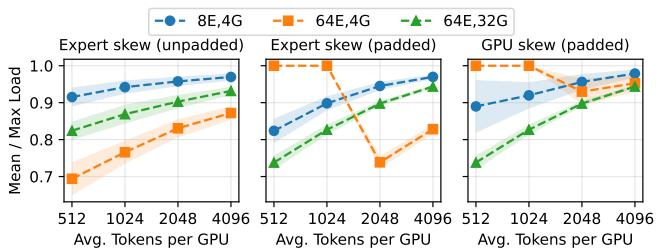

(a) Prefill.  
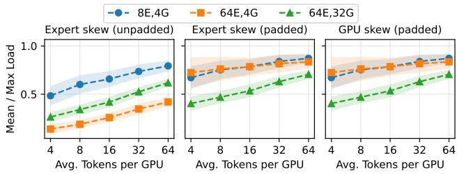  
(b) Decode.  
Figure 10. Simulated token load under different configurations (e.g., 8E,4G = 8 experts on 4 GPUs), assuming uniform random token routing. Padded using DeepGEMM kernels (Section 5.1). Higher is more balanced (1.0 = perfect). Each data point is averaged over 1000 runs.

Pg = Eg × ⌈max(Ni)/B⌉ × B. Concentrated distributions (one expert with many tokens) maximize waste. The two schemes thus have opposite worst cases. In both cases, Pg connects to the tax model: η = Pg/(mK) under TP; ηg = Pg/Rg under EP. The blockwise padding model predicts kernel latency with R2 > 0.99 against the microbenchmarks in Section 4.

## 5.2 Token Distribution Model

The token distribution N⃗ determines per-GPU workloads. Under uniform random routing, the expected number of activated experts is E[Eactive] = E ⋅(1−(1−K/E)m) (Mazurek & Schreiber, 2025), which approaches E rapidly with batch size m. For models with fewer experts, such as Mixtral and Qwen, expert activation closely tracks the expected formula and saturates quickly. For models with many fine-grained experts like DeepSeek-V3, the uniform assumption often overestimates Eactive, especially if the trained router concentrates tokens on a subset of experts (e.g., via grouped topk routing (DeepSeek-AI, 2024b)).

Balls-and-bins theory further gives analytical bounds on the expected worst-case per-expert load under uniform random routing: log Elog log E when m ∼ E (decode) and mE + 2m log EE when m ≫ E (prefill). However, the classic balls-and-bins setting does not capture MoE routing because (1) experts are housed in GPUs, creating a three-level hierarchy of tokens (balls), experts (bins), and GPUs (buckets) with two sources of imbalance; and (2) batches are padded for efficient kernel implementations, introducing performance non-linearities.

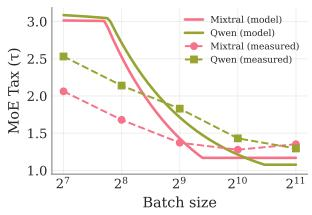

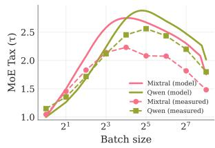  
(a) Prefill.  
(b) Decode.  
Figure 11. MoE tax model predictions vs. measured tax for Mixtral and Qwen on A100 from Section 3.

We therefore use an augmented balls-bins-buckets (BBB) model that applies the analytical worst-case formulas at both expert and GPU levels to bound the expected straggler ratio. To capture the non-linear effect of kernel padding on per-GPU workloads, we additionally use Monte Carlo simulation.

Figure 10 shows simulated token loads under uniform random routing. Finer-grained experts (8E,4G vs. 64E,4G) increase per-expert skew but GPU-level skew remains similar, since the bins-and-buckets averaging compensates. Adding DP attention (64E,4G vs. 64E,32G) increases worst-case GPU load, which padding can further worsen; such deployments require load balancing strategies like EPLB (DeepSeek-AI, 2024b).

Under EP, the straggler GPU determines iteration latency. The ratio maxg Rg/(mK/nep) measures how much the most-loaded GPU exceeds the mean. This ratio matters most during prefill, where each GPU’s compute time scales with its token load Rg. During decode, per-GPU time is instead dominated by weight loading, and token load imbalance has a lesser impact on decode latency.

The analysis above assumes uniform random routing. Practical routing can deviate: as noted, DeepSeek-V3’s router can concentrate tokens, reducing Eactive below the uniform random prediction. Straggler loads similarly diverge from the analytical bounds under non-uniform routing. The MoE tax model accepts profiled token distributions N⃗ as inputs for such cases.

## 5.3 Model Validation

The model’s primary purpose is to analytically decompose the MoE tax and identify the dominant tax source for a given configuration, rather than serve as a precise latency predictor. To verify that it captures the right tax trends, Figure 11 compares TP+TP tax predictions against end-to-end tax measurements from Section 3 for Mixtral and Qwen on A100-40GB GPUs. We instantiate the model with each architecture’s expert dimensions, A100 hardware parameters (BWHBM=1500 GB/s, FLOPSpeak=312 TFLOPS BF16), constant padding overheads (ηdecode=1.05, ηprefill=1.25), the uniform random formula for Eactive, and f estimated at each batch size from performance profiles using a performance projection tool.

The model reproduces the qualitative tax trends: the decode tax bell curve driven by Eactive/K and the prefill tax decrease from improving arithmetic intensity. Tax predictions are within 10–30% of measured values across most batch sizes for both models and phases. The remaining gap can be attributed to several factors, such as using a constant η rather than batch-dependent padding, fixed per-invocation latencies not captured in the throughput-only cost model, and differences in achieved FLOPS and HBM utilization between GroupGEMM and dense GEMM kernels.

## 6 REDUCING THE MOE TAX

MoE inference is bottlenecked by distinct, often competing, overheads, making a single system configuration inherently suboptimal. Table 4 summarizes key tax reduction strategies and trade-offs for each tax source. Many of these have been proposed by prior work. Our analysis contextualizes them in terms of the MoE tax and identifies new optimization opportunities. By carefully optimizing the dominant tax sources for each phase, we can improve the efficiency of serving MoE models at scale.

## 6.1 Prefill Optimizations

Prefill phase optimizations primarily target token distribution effects and batch subdivision (Sections 4 and 5).

Load balancing. The optimization goal depends on parallelism: under EP, the goal is to minimize the combination of straggler and padding taxes; under TP, only padding applies. Straggler tax can be reduced via load-aware routing or by replicating popular experts (He et al., 2022; DeepSeek-AI, 2024b; Li et al., 2023). Padding tax can be addressed at the batching, router, or kernel levels, e.g., by minimizing the number of padding tokens across experts. Padding tax is a less-explored but significant optimization opportunity. Routers could also be trained to penalize routing decisions that cause high straggler or padding taxes, co-designing model quality with system efficiency.

DeepSeek-V3’s Expert Parallel Load Balancer (EPLB) (DeepSeek-AI, 2024b) replicates popular experts across GPUs to reduce the straggler tax. This improves prefill latency but can worsen decode latency, since replication increases the number of activated experts and thus the weight amplification tax (Yu et al., 2025). Furthermore, EPLB balances raw token counts (Rg) rather than padded workloads (Pg = ηg ⋅ Rg, Section 5.1). A padding-aware and activation-aware EPLB that balances Pg would more effectively minimize straggler compute time.

Fine-grained experts. Expert granularity is a key factor for prefill performance. Finer-grained experts help reduce straggler tax by enabling a more balanced load distribution. However, they can simultaneously increase the padding tax and exacerbate the computational inefficiency from batch subdivision. Thus, the optimal number of experts is not just a modeling decision, but a system-dependent parameter that should be co-designed with the target parallelism strategy.

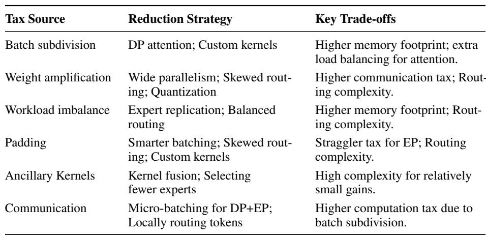

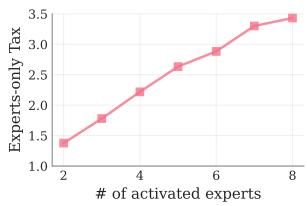

(a) Fewer experts  
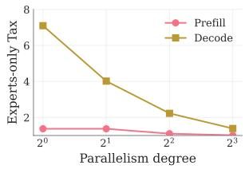  
(b) Wider parallelism  
Table 4. MoE tax sources, key reduction strategies, and associated trade-offs.  
Figure 12. Reducing the decode tax for Mixtral.

## 6.2 Decode Optimizations

Decode phase optimizations focus on memory bandwidth due to the dominant weight amplification tax.

Skewed routing. As shown in Figure 12a, activating fewer experts improves performance since it reduces the volume of weights loaded from memory. This could be achieved in different ways. For example, routers could be trained to reduce the number of activated experts per batch. Alternatively, decode phases could batch requests that are predicted to use the same set of experts (Qian et al., 2024). At the cluster level, a scheduler could co-locate requests that share expert subsets to reduce the effective number of activated experts per batch.

Wide parallelism. Increasing the available memory bandwidth is an alternative strategy to address the weight amplification tax. Figure 12b shows how increasing the degree of parallelism reduces the memory bandwidth required per device. Large-scale MoE serving systems (DeepSeek-AI, 2024b; Perplexity AI Team, 2025) have similarly shown the effectiveness of distributing model weights across a large number of devices. However, wider parallelism incurs extra communication tax, can leave some GPUs idle during decode, and is brittle to GPU failures.

Quantization. Weight quantization is even more critical for MoEs than for dense models, especially for the decode phase. Quantization directly reduces the total volume of data that must be loaded from HBM, thus lowering the weight amplification tax. This can make it feasible to serve MoEs with a smaller degree of parallelism, reducing costs and communication demands.

## 6.3 Cross-phase Optimizations

DP attention. Batch subdivision is a key cause of poor performance in medium-batch prefill and decode. By processing multiple sequences in parallel, DP attention helps ensure that the MoE layer processes a larger batch of tokens (DeepSeek-AI, 2024b). This not only mitigates the subdivision effect, but it also helps enable wider parallelism for the MoE layer to reduce decode phase taxes.

Batch size interactions. Techniques that alter the effective batch size interact directly with the MoE tax. Speculative decoding increases the decode batch size during verification, shifting toward a prefill-like tax regime. Dual-batch overlap splits a batch into two microbatches and overlaps compute with communication to hide transfer latency (DeepSeek-AI, 2024b). However, the halved per-microbatch size shifts toward a more decode-like tax regime, increasing the weight amplification overhead.

Disaggregated MoE serving. Since MoE models approach DensePA performance during decode, a disaggregated system (Patel et al., 2024; Zhong et al., 2024a) could use the MoE architecture for prefill and a dense model architecture for decode, avoiding the dominant weight amplification tax. This requires phase-specific model architecture specialization, introducing unique challenges in maintaining output quality across different architectures for prefill and decode.

## 7 LIMITATIONS

Our analysis has several limitations. MoE tax is a relative metric that can mask poor hardware utilization; e.g., low tax at small batch sizes can be deceptive, since inference is simply memory-bound. Our scope is limited to steady-state latency, omitting JIT compilation overheads that can cause significant latency spikes in dynamic MoE systems. We do not compare accuracy between MoE and dense models, focusing exclusively on system-level performance. Our endto-end evaluation uses relatively short sequences; in longcontext scenarios, attention dominates, and the MoE tax becomes proportionally smaller. Our end-to-end evaluation uses single-node NVLink-connected GPUs; a full multinode end-to-end tax characterization remains future work. While our microbenchmarks show that the multi-node communication tax can be substantial (Figure 6), newer GPU architectures with larger NVLink scale-up domains (e.g., GB200, GB300) can significantly reduce this overhead. We also ignore the significant engineering tax of MoEs, since their specialized kernels, routing, and load balancing are far harder to implement and maintain than dense models.

## 8 RELATED WORK

Our analysis provides a holistic framework to reason about the MoE tax. Prior works typically address only a subset of these taxes using various techniques across the stack.

Computation tax. System-level solutions mitigate the batch subdivision tax by creating larger expert batches. For example, MegaScale-Infer decouples expert and attention servers, enabling bigger expert batches (Zhu et al., 2025). DeepSeek-V3 uses DP attention to feed larger batches to the MoE layers (Zhao et al., 2025a). At the kernel level, specialized block-sparse operations and GroupGEMM kernels directly improve hardware utilization for these fragmented workloads (Gale et al., 2023; DeepSeek-AI, 2025).

Weight amplification tax. DeepSeek-V3 uses wide expert parallelism on decode instances to increase total available bandwidth (Zhao et al., 2025a; Perplexity AI Team, 2025). At the scheduling layer, Lynx uses batch-aware expert selection to minimize the number of activated experts (Gupta et al., 2024). Model co-design techniques include pruning experts to reduce the weight amplification tax (Huber et al., 2025; Liu et al., 2024), and using predictive prefetching to hide memory latency by proactively loading experts before they are needed (Hwang et al., 2024).

Straggler tax. Training techniques reduce skew using loss functions that encourage balanced routing, with potentially reduced model quality (Zoph et al., 2022; Chen et al., 2022; DeepSeek-AI, 2024a; Zhong et al., 2024b). Model-system co-design techniques explore decoupling the router from the MoE to facilitate better load balancing (Cai et al., 2024). Fine-grained experts improve model quality but introduce complex trade-offs between straggler and padding taxes (Dai et al., 2024). Inference systems manage skew by replicating popular experts (He et al., 2022; Liu et al., 2023), using load-aware routing (He et al., 2022; Huang et al., 2023), or dynamically adjusting parallelism (Hwang et al., 2023; Zhai et al., 2023; Qian et al., 2024) to reduce straggler tax. To our knowledge, prior works have not similarly addressed the padding tax.

## 9 CONCLUSION

We systematically characterize the performance tax inherent to serving MoEs, and show that it causes them to perform 2– 3× worse than FLOP-equivalent dense models. Our analysis shows that the MoE tax consists of interlinked overheads across computation, communication, and token distribution effects that manifest differently across inference phases and parallelism strategies. For example, non-uniform token distributions create a straggler tax under EP and a padding tax under both TP and EP, both of which primarily affect prefill. During decode, reducing the number of activated experts can mitigate the dominant weight amplification tax. We decompose the MoE tax into analytically separable components and use a balls-bins-buckets framework to analyze distribution-dependent effects across configurations like fine-grained experts and DP attention. Our analytical tax model identifies three compute regimes, and its predictions are within 10–30% of measured tax values. Our results indicate a critical need for phase-specific, tax-aware serving systems designed to mitigate the MoE tax.

## ACKNOWLEDGEMENTS

We thank Lequn Chen, Esha Choukse, Iñigo Goiri, Theo Gregersen, Yile Gu, Keisuke Kamahori, Aditya Kamath, Stephanie Wang, Zihao Ye, Chaojie Zhang, and Liangyu Zhao for early discussions that motivated this work. We thank Preyas Shah for helping secure resources for our experiments. We thank the reviewers for their insightful feedback which helped improved our paper. This work was supported in part by ACE, one of the seven centers in JUMP 2.0, a Semiconductor Research Corporation (SRC) program sponsored by DARPA.

## REFERENCES

Cai, R., Ro, Y., Kim, G.-W., Wang, P., Bejnordi, B. E., Akella, A., and Wang, Z. Read-ME: Refactorizing LLMs as Router-Decoupled Mixture of Experts with System Co-Design. In Advances in Neural Information Processing Systems (NeurIPS), 2024.

Chen, C., Li, M., Wu, Z., Yu, D., and Yang, C. TA-MoE: Topology-aware Large Scale Mixture-of-Expert Training. In Advances in Neural Information Processing Systems (NeurIPS), 2022.

Chen, M., Tworek, J., Jun, H., Yuan, Q., de Oliveira Pinto, H. P., Kaplan, J., Edwards, H., Burda, Y., Joseph, N., Brockman, G., Ray, A., Puri, R., Krueger, G., Petrov, M., Khlaaf, H., Sastry, G., Mishkin, P., Chan, B., Gray, S., Ryder, N., Pavlov, M., Power, A., Kaiser, L., Bavarian, M., Winter, C., Tillet, P., Such, F. P., Cummings, D., Plappert, M., Chantzis, F., Barnes, E., Herbert-Voss, A., Guss, W. H., Nichol, A., Paino, A., Tezak, N., Tang, J., Babuschkin, I., Balaji, S., Jain, S., Saunders, W., Hesse, C., Carr, A. N., Leike, J., Achiam, J., Misra, V., Morikawa, E., Radford, A., Knight, M., Brundage, M., Murati, M., Mayer, K., Welinder, P., McGrew, B., Amodei, D., McCandlish, S., Sutskever, I., and Zaremba, W. Evaluating Large Language Models Trained on Code. arXiv preprint arXiv:2107.03374, 2021.

Dai, D., Deng, C., Zhao, C., Xu, R. X., Gao, H., Chen, D., Li, J., Zeng, W., Yu, X., Wu, Y., Xie, Z., Li, Y. K., Huang, P., Luo, F., Ruan, C., Sui, Z., and Liang, W. DeepSeekMoE: Towards Ultimate Expert Specialization in Mixture-of-Experts Language Models. arXiv preprint arXiv:2401.06066, 2024.

DeepInfra. Token Pricing. https://deepinfra.com/ pricing.

DeepSeek-AI. Deepseek-V2: A Strong, Economical, and Efficient Mixture-of-Experts Language Model. arXiv preprint arXiv:2405.04434, 2024a.

DeepSeek-AI. Deepseek-V3 Technical Report. arXiv preprint arXiv:2412.19437, 2024b.

DeepSeek-AI. DeepGEMM: Clean and Efficient FP8 GEMM Kernels with Fine-grained Scaling. https: //github.com/deepseek-ai/DeepGEMM, 2025.

Gale, T., Narayanan, D., Young, C., and Zaharia, M. MegaBlocks: Efficient Sparse Training with Mixtureof-Experts. In Proceedings of Machine Learning and Systems (MLSys), 2023.

Gupta, V., Sinha, K., Gavrilovska, A., and Iyer, A. P. Lynx: Enabling Efficient MoE Inference Through Dynamic Batch-aware Expert Selection. arXiv preprint arXiv:2411.08982, 2024.

He, J., Zhai, J., Antunes, T., Wang, H., Luo, F., Shi, S., and Li, Q. FasterMoE: Modeling and Optimizing Training of Large-scale Dynamic Pre-trained Models. In ACM SIG-PLAN Symposium on Principles and Practice of Parallel Programming (PPoPP), 2022.

Hendrycks, D., Burns, C., Basart, S., Zou, A., Mazeika, M., Song, D., and Steinhardt, J. Measuring Massive Multitask Language Understanding. arXiv preprint arXiv:2009.03300, 2020.

Huang, H., Ardalani, N., Sun, A., Ke, L., Lee, H.-H. S., Sridhar, A., Bhosale, S., Wu, C.-J., and Lee, B. Towards MoE Deployment: Mitigating Inefficiencies in Mixture-of-Expert (MoE) Inference. arXiv preprint arXiv:2303.06182, 2023.

Huber, P., Shrivastava, A., Chang, E., Sankar, C., Aly, A., and Sagar, A. CoSMoEs: Compact Sparse Mixture of Experts. arXiv preprint arXiv:2503.00245, 2025.

Hwang, C., Cui, W., Xiong, Y., Yang, Z., Liu, Z., Hu, H., Wang, Z., Salas, R., Jose, J., Ram, P., Chau, J., Cheng, P., Yang, F., Yang, M., and Xiong, Y. Tutel: Adaptive Mixture-of-Experts at Scale. In Proceedings of Machine Learning and Systems (MLSys), 2023.

Hwang, R., Wei, J., Cao, S., Hwang, C., Tang, X., Cao, T., and Yang, M. Pre-Gated MoE: An Algorithm-System Co-Design for Fast and Scalable Mixture-of-Expert Inference. In ACM/IEEE International Symposium on Computer Architecture (ISCA), 2024.

Jiang, A. Q., Sablayrolles, A., Roux, A., Mensch, A., Savary, B., Bamford, C., Chaplot, D. S., de las Casas, D., Hanna, E. B., Bressand, F., Lengyel, G., Bour, G., Lample, G., Lavaud, L. R., Saulnier, L., Lachaux, M.- A., Stock, P., Subramanian, S., Yang, S., Antoniak, S., Scao, T. L., Gervet, T., Lavril, T., Wang, T., Lacroix, T., and Sayed, W. E. Mixtral of Experts. arXiv preprint arXiv:2401.04088, 2024.

Kwon, W., Li, Z., Zhuang, S., Sheng, Y., Zheng, L., Yu, C. H., Gonzalez, J., Zhang, H., and Stoica, I. Efficient Memory Management for Large Language Model Serving with PagedAttention. In Proceedings of the Symposium on Operating Systems Principles (SOSP), 2023.

Li, J., Jiang, Y., Zhu, Y., Wang, C., and Xu, H. Accelerating Distributed MoE Training and Inference with Lina. In USENIX Annual Technical Conference (ATC), 2023.

Liu, E., Zhu, J., Lin, Z., Ning, X., Blaschko, M. B., Yan, S., Dai, G., Yang, H., and Wang, Y. Efficient Expert Pruning for Sparse Mixture-of-Experts Language Models: Enhancing Performance and Reducing Inference Costs. arXiv preprint arXiv:2407.00945, 2024.

Liu, J., Wang, J. H., and Jiang, Y. Janus: A Unified Distributed Training Framework for Sparse Mixture-of-Experts Models. In Conference of the ACM Special Interest Group on Data Communication (SIGCOMM), 2023.

Mazurek, P. and Schreiber, E. DeepSeek Inference Theoretical Model: Deriving the Performance from Hardware Primitives. Technical report, Aleph Alpha GmbH, September 2025.

Mistral AI Team. Mixtral of Experts. https: //mistral.ai/news/mixtral-of-experts, 2023.

Mitra, T., Borkar, R., Bhatia, N., Matas, R., Raj, S., Mudigere, D., Zhao, R., Golub, M., Dutta, A., Madduri, S., Jani, D., Pharris, B., and Rouhani, B. D. Beyond the Buzz: A Pragmatic Take on Inference Disaggregation. arXiv preprint arXiv:2506.05508, 2025.

NVIDIA. NSight Compute. http://developer. nvidia.com/nsight-compute, a.

NVIDIA. NSight Systems. http://developer. nvidia.com/nsight-systems, b.

Patel, P., Choukse, E., Zhang, C., Shah, A., Goiri, Í., Maleki, S., and Bianchini, R. Splitwise: Efficient Generative LLM Inference Using Phase Splitting. In ACM/IEEE International Symposium on Computer Architecture (ISCA), 2024.

Perplexity AI Team. Lower Latency and Higher Throughput with Multi-node DeepSeek Deployment, 2025.

Qian, Y., Li, F., Ji, X., Zhao, X., Tan, J., Zhang, K., and Cai, X. EPS-MoE: Expert Pipeline Scheduler for Cost-efficient MoE Inference. arXiv preprint arXiv:2410.12247, 2024.

Qwen Team. Qwen1.5-MoE: Matching 7B Model Performance with 1/3 Activated Parameters. https:// qwenlm.github.io/blog/qwen-moe/, 2024.

Shazeer, N., Mirhoseini, A., Maziarz, K., Davis, A., Le, Q., Hinton, G., and Dean, J. Outrageously Large Neural Networks: The Sparsely-Gated Mixture-of-Experts Layer. arXiv preprint arXiv:1701.06538, 2017.

Yang, A., Yang, B., Hui, B., Zheng, B., Yu, B., Zhou, C., et al. Qwen2 Technical Report. arXiv preprint arXiv:2407.10671, 2024.

Yu, Y., Ma, H., Agarwal, K., Oswald, N., Huang, Q., Linsenmaier, H., Mei, C., Zhao, R., Borkar, R., Rouhani, B. D., Nellans, D., Krashinsky, R., and Khandelwal, A. Efficient MoE Serving in the Memory-Bound Regime: Balance Activated Experts, Not Tokens. arXiv preprint arXiv:2512.09277, 2025.

Zhai, M., He, J., Ma, Z., Zong, Z., Zhang, R., and Zhai, J. SmartMoE: Efficiently Training Sparsely-Activated Models through Combining Offline and Online Parallelization. In USENIX Annual Technical Conference (ATC), 2023.

Zhao, C., Deng, C., Ruan, C., Dai, D., Gao, H., Li, J., Zhang, L., Huang, P., Zhou, S., Ma, S., Liang, W., He, Y., Wang, Y., Liu, Y., and Wei, Y. Insights into DeepSeek-V3: Scaling Challenges and Reflections on Hardware for AI Architectures. In ACM/IEEE International Symposium on Computer Architecture (ISCA), 2025a.

Zhao, C., Zhou, S., Zhang, L., Deng, C., Xu, Z., Liu, Y., Yu, K., Li, J., and Zhao, L. DeepEP: An Efficient Expert-Parallel Communication Library. https://github. com/deepseek-ai/DeepEP, 2025b.

Zhong, Y., Liu, S., Chen, J., Hu, J., Zhu, Y., Liu, X., Jin, X., and Zhang, H. DistServe: Disaggregating Prefill and Decoding for Goodput-optimized Large Language Model Serving. In USENIX Symposium on Operating Systems Design and Implementation (OSDI), 2024a.

Zhong, Z., Xia, M., Chen, D., and Lewis, M. Lory: Fully Differentiable Mixture-of-Experts for Autoregressive Language Model Pre-training. arXiv preprint arXiv:2405.03133, 2024b.

Zhu, R., Jiang, Z., Jin, C., Wu, P., Stuardo, C. A., Wang, D., Zhang, X., Zhou, H., Wei, H., Cheng, Y., Xiao, J., Zhang, X., Liu, L., Lin, H., Chang, L.-W., Ye, J., Yu, X., Liu, X., Jin, X., and Liu, X. MegaScale-Infer: Serving Mixture-of-Experts at Scale with Disaggregated Expert Parallelism. arXiv preprint arXiv:2504.02263, 2025.

Zoph, B., Bello, I., Kumar, S., Du, N., Huang, Y., Dean, J., Shazeer, N., and Fedus, W. ST-MoE: Designing Stable and Transferable Sparse Expert Models. arXiv preprint arXiv:2202.08906, 2022.