# MORPHSERVE: EFFICIENT AND WORKLOAD-AWARE LLM SERVING VIA RUNTIME QUANTIZED LAYER SWAPPING AND KV CACHE RESIZING

Zhaoyuan Su 1 Zeyu Zhang 1 Tingfeng Lan 1 Zirui Wang 1 Haiying Shen 1 Juncheng Yang 2 Yue Cheng 1

## ABSTRACT

Efficiently serving large language models (LLMs) under dynamic and bursty workloads remains a key challenge for real-world deployment. Existing serving frameworks and static model compression techniques fail to adapt to workload fluctuations, leading to either service-level objective (SLO) violations under full-precision serving or persistent accuracy degradation with static quantization. To deal with these issues, we present MorphServe, a dynamic, workload-aware LLM serving framework based on morphological adaptation. MorphServe introduces two asynchronous, token-level runtime mechanisms: quantized layer swapping, which selectively replaces less impactful layers with quantized alternatives during high-load periods, and pressure-aware KV cache resizing, which dynamically adjusts KV cache capacity in response to memory pressure. These mechanisms enable state-preserving transitions with minimum runtime overhead and are fully compatible with modern scheduling and attention techniques. Extensive experiments on Vicuna and Llama family models with real-world workloads demonstrate that MorphServe reduces average SLO violations by 92.45% and improves the P95 TTFT latency by 2.2-3.9× compared to full-precision serving, without compromising generation quality. These results establish MorphServe as a practical and elastic solution for LLM deployment in dynamic environments.

## 1 INTRODUCTION

The rise of large language models (LLMs) has made efficient and reliable serving a core challenge in modern AI infrastructure. Systems like vLLM (Kwon et al., 2023) and Orca (Yu et al., 2022) optimize throughput via PagedAttention (Kwon et al., 2023) and continuous batching (Yu et al., 2022; Sun et al., 2024; He et al., 2024b), but assume fixed-precision execution and stable workloads. In contrast, real-world LLM workloads are dynamic and bursty (Wang et al., 2024; Patel et al., 2024; Azure, 2024), with fluctuating request rates and context lengths. Even brief load spikes can cause memory exhaustion or queueing delays, leading to SLO violations—such as increased time-tofirst-token (TTFT) and time-per-output-token (TOPT)—that degrade both user experience and system throughput.

One naive solution is to statically over-provision GPU resources to accommodate worst-case traffic spikes. However, over-provisioning leads to substantial cost inefficiencies during underutilized periods (Jaiswal et al., 2025; Fu et al., 2024). Moreover, edge deployments lack the flexibility for dynamic scaling altogether (Cai et al., 2024a). Thus, the inability to elastically match model resource usage to realtime demand results in either SLO violations under pressure, or significant resource waste during low-load intervals.

Model compression techniques, such as quantization (Lin et al., 2024b; Frantar et al., 2022; Lin et al., 2024a; Shao et al., 2023), pruning (Ma et al., 2023; Sreenivas et al., 2024; Gao et al., 2024b), or low-rank approximation (Hu et al., 2022; Wu et al., 2024), offer an alternative approach by statically reducing the resource footprint of deployed LLMs. While these methods are effective in lowering memory and compute demands, they introduce irreversible accuracy degradation that persists even during periods of low load, when full-precision inference could be served without penalty. This results in a rigid, suboptimal quality–efficiency tradeoff that fails to align with workload variability. Keyvalue cache (KVC) compression (Cai et al., 2024b; Zhou et al., 2024; Li et al., 2024b) and eviction (Liu et al., 2023; Feng et al., 2024) methods have been proposed to further reduce memory usage. However, these techniques often rely on fixed heuristics, cannot adapt to different workloads, lack compatibility with modern attention variants like Grouped Query Attention (GQA) (Ainslie et al., 2023; Chen et al., 2024b; Chinnakonduru & Mohapatra, 2024) and Multi-Head Latent Attention (MLA) (Meng et al., 2025; Liu et al., 2024), and remain inflexible to runtime serving conditions.

To handle dynamic workloads and address the above issues, in this paper, we present MorphServe, a dynamic, workloadaware LLM serving framework based on morphological adaptation. MorphServe continuously monitors system load and morphs model components—transformer layers and KVC blocks—on the fly in response to real-time memory pressure. When resource usage surges, MorphServe reduces model footprint by replacing selected full-precision layers with lightweight quantized alternatives and expands KVC capacity by dynamically attaching additional memory blocks. These adaptations are reversed as pressure subsides, restoring full precision and reclaiming memory from KVC without interrupting inference.

MorphServe contributes the following: (1) A runtime layer swapping mechanism that enables workload-aware mixedprecision serving, allowing quantized and full-precision layers to coexist and be dynamically reconfigured based on runtime pressure without model flushing or architectural changes. (2) A pressure-aware KVC resizing mechanism that elastically adjusts KV cache capacity, supporting efficient batch prefilling and decoding under bursty traffic. (3) A tunable runtime policy that navigates the accuracy–latency Pareto frontier, balancing high-fidelity and low-latency objectives. (4) Full compatibility with existing KVC compression and eviction schemes, enabling further efficiency gains with minimal accuracy degradation.

To achieve this, MorphServe introduces two complementary morphing mechanisms, both designed to support asynchronous and compatible kernel executions with minimal overhead: LayerSwapper identifies low-impact transformer layers by a sensitivity-based profiling, selectively and asynchronously replacing them with lower-precision alternatives at runtime. KVResizer adaptively adjusts KVC capacity under memory pressure and runs in parallel with decoding using separate CUDA streams, ensuring seamless execution.

Across extensive experiments on Llama 2, Llama 3, CodeLlama, and Vicuna using four datasets (Huang et al., 2021a; Zhong et al., 2021; He et al., 2017; Fabbri et al., 2019) under Azure LLM Inference (Azure, 2024) and BurstGPT (Wang et al., 2024) traces, MorphServe reduces average SLO violations by 92.45% and P95 TTFT latency by 2.2×–3.9× over full-precision serving, while preserving comparable accuracy. Compared to static quantization via AWQ (Lin et al., 2024b), MorphServe reduces F1 and Rouge-L degradation by up to 88.85% and improves memory utilization by 29.29%. These results demonstrate MorphServe’s ability to adapt to dynamic workloads while balancing latency and accuracy.

## 2 RELATED WORK

LLM Serving Systems. TorchServe (PyTorch, 2023) and NVIDIA Triton (NVIDIA Corporation, 2019b) provide general-purpose serving frameworks for parallel inference. Recent systems specialize in LLM serving (NVIDIA Corporation, 2019a; Hugging Face), improving scheduling and memory management. Orca (Yu et al., 2022) introduces continuous batching, and vLLM (Kwon et al., 2023) proposes PagedAttention, both aimed at improving throughput. SARATHI (Agrawal et al., 2024) and FastServe (Wu et al., 2023) further reduce queuing delays via chunked prefill or preemptive scheduling. Despite these advances, existing systems assume fixed precision and static memory provisioning, which limits their responsiveness to bursty workloads. In contrast, MorphServe enables fully online, workload-aware adaptation through runtime quantized layer swapping and elastic KV cache resizing, achieving smooth performanceaccuracy tradeoffs under overload.

LLM Post-Training Quantization. Post-training quantization (PTQ) reduces inference cost by compressing model weights (Dettmers et al., 2023; Kim et al., 2023; Li et al., 2024a; Zhao et al., 2024; Lin et al., 2024b; Frantar et al., 2022; Xiao et al., 2023; Lin et al., 2024a). Round-to-nearest schemes (Yao et al., 2023; Nagel et al., 2021) are simple but inaccurate for outlier-heavy layers. Non-uniform and calibration-based methods, including AdaRound (Nagel et al., 2020), ZeroQuant (Yao et al., 2022), GPTQ (Frantar et al., 2022), and AWQ (Lin et al., 2024b), achieve higher fidelity via adaptive rounding or activation statistics. Activation quantization has also been explored (e.g., SmoothQuant (Xiao et al., 2023), QServe (Lin et al., 2024c), DuQuant (Lin et al., 2024a)), but remains static and incurs irreversible degradation even when resources permit full precision. MorphServe provides a systematic solution that dynamically switches between different precision layers based on real-time service pressure, compatible with any weight quantization method, such as GPTQ and AWQ.

Mixed-Precision and Adaptive-Depth Inference. Mixedprecision execution improves efficiency by leveraging lowerbit operations (Reggiani et al., 2023; Huang et al., 2021b; Wang et al., 2020; Chen et al., 2024a; Frantar et al., 2025; Dong et al., 2019; Risso et al., 2022). Hardware-level methods (Mix-GEMM (Reggiani et al., 2023), Bit-Split (Wang et al., 2020)) and prompt-aware schemes (PMPD (Chen et al., 2024a), MARLIN (Frantar et al., 2025)) adjust precision based on token entropy or pre-computed sensitivity. Recent adaptive-depth and early-exit frameworks (e.g., FlexiDepth (Luo et al., 2025), LayerSkip (Elhoushi et al., 2024)) reduce computation via layer skipping but require architectural modification and lack real-time adaptation. In contrast, MorphServe achieves dynamic, workload-aware mixed-precision serving guided by runtime telemetry, coupling token-level precision with system load for smooth efficiency–accuracy balancing.

## 3 MOTIVATION

Real-world LLM workloads are highly bursty. LLM serving systems face highly dynamic and bursty traffic patterns in real-world scenarios. As shown in Figure 1a, the production workloads of Microsoft Azure LLM services (Azure, 2024; Stojkovic et al., 2025) and BurstGPT (Wang et al., 2024) reveal rapid fluctuations in both the request arrival rates (i.e., request bursts) and the volumes of tokens. These fluctuations reflect the non-stationary nature of practical LLM inference workloads, which deviates from the traditional assumptions of most serving schemes (Kwon et al., 2023; Yu et al., 2022; Jaiswal et al., 2025).

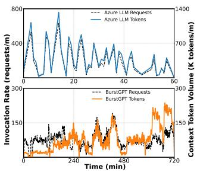  
(a)

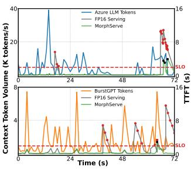  
(b)

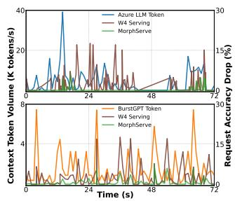  
(c)

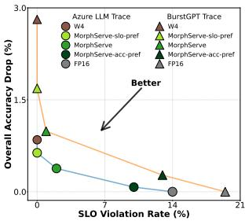  
(d)  
Figure 1. Motivation for dynamic adaptation design in LLM serving. (a) Real-world LLM workloads are highly dynamic and bursty in request and token volume. (b) Full-precision serving suffers TTFT spikes and SLO violations when workload exceeds the saturation point. (c) Statically quantized model causes constant accuracy degradation even during low-load periods when it is possible to serve full-precision models. (d) MorphServe dynamically adapts to resource pressure and consistently achieves an optimal balance between SLO compliance and accuracy.

Request burst leads to long TTFT and SLO violation. As system load increases, even small surges can cause sharp spikes in TTFT latency. In this work, we set the TTFT SLO threshold to 2 seconds, consistent with prior work (Xiong et al., 2024; Gao et al., 2024a; Qiao et al., 2024). As shown in Figure 1b, full-precision serving quickly exceeds the SLO threshold once it reaches the saturation point: defined as the load level at which GPU memory becomes insufficient to schedule new requests for prefilling or to continue decoding for the ongoing batch. At this point, incoming requests are forced to wait until memory is reclaimed, incurring significant queueing latency with SLO violation.

Static quantization trades quality for efficiency irrespective of load. To mitigate resource constraints, static quantization methods (Lin et al., 2024b; Frantar et al., 2022; Lin et al., 2024a) have been widely adopted. However, these methods introduce persistent accuracy degradation across all conditions, regardless of whether the system is overloaded. As shown in Figure 1c, the INT4 quantized model with AWQ (Lin et al., 2024b) consistently degrades accuracy, measured by F1 score following (Lin et al., 2024a), on the GovReport dataset from LongBench (Bai et al., 2023), even during periods when full-precision inference is feasible. This demonstrates that static quantization over-prioritizes efficiency, sacrificing quality during low-load intervals.

Workload-aware adaptation achieves optimal tradeoffs. As shown in the Pareto analysis in Figure 1d, MorphServe achieves superior tradeoffs by aligning dynamic quantization with real-time workload conditions. A key insight in MorphServe is adaptive mixed-precision LLM serving, where quantized and full-precision layers can coexist and are dynamically reconfigured. This contrasts with static quantization and recent dynamic methods (Chen et al., 2024a; Frantar et al., 2025; Reggiani et al., 2023), which prioritize serving performance or hardware efficiency but overlook runtime workload variability. Most importantly, MorphServe enables smooth navigation along the accuracy—efficiency Pareto frontier, from uncompressed, high-accuracy models to highly quantized, efficient ones.

## 4 SYSTEM DESIGN

MorphServe is designed with three primary objectives: (1) Dynamic adaptation: Respond to real-time workload demands and GPU memory pressure by dynamically adjusting model layer configuration and KVC capacity on the fly during inference. (2) Accuracy preservation: Ensure no degradation under light or moderate load, and introduce only minimal, necessary, and fine-grained token-level accuracy loss to sustain serving performance beyond the saturation point. (3) Low overhead: Minimize the performance impact of dynamic adaptation by leveraging asynchronous execution and overlapping.

## 4.1 Architecture and Workflow

System Architecture. As illustrated in Figure 2, MorphServe consists of three core components—Serving Monitor, Morphing Controller, and Morphing Executor, which together form a feedback-driven control loop for dynamic adaptation.

• Serving Monitor collects runtime metrics from all workers, including GPU memory utilization, request queue depth, throughput, and token-level latency (TTFT and TPOT). These metrics are smoothed over short time windows to identify workload shifts and early signs of system saturation.

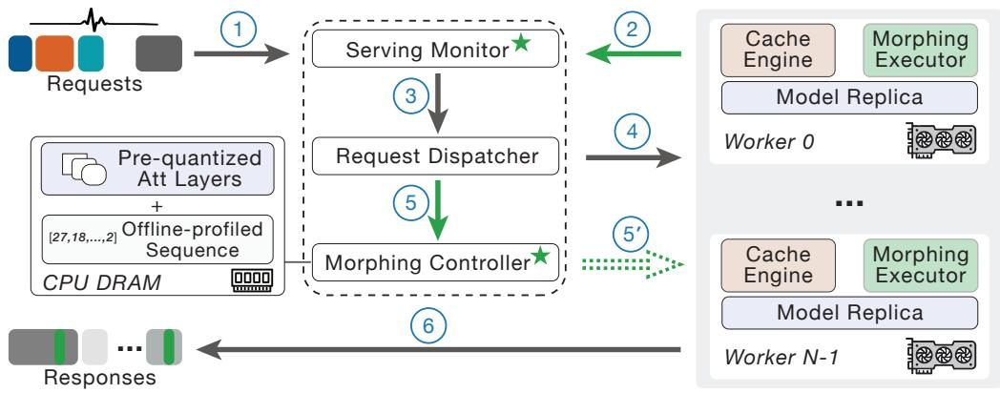  
Figure 2. MorphServe dynamic adaptation workflow. Incoming requests (1) and real-time telemetry from workers (2) are aggregated by the Serving Monitor and sent to the Request Dispatcher (3). The Dispatcher routes requests to workers (4) and forwards runtime metrics to the Morphing Controller (5), which detects resource pressure and issues adaptation commands (5’). Responses (6) are returned to users, with only a small portion of tokens (in green) generated by mixed-precision layers.

• Morphing Controller serves as the global GPU memory manager. When monitored metrics exceed userpredefined thresholds (e.g., KVC memory usage over 85%, queueing delay over 100 ms), it decides whether to trigger selective layer swapping (Section 4.3) and elastic KVC resizing (Section 4.4), and dispatches corresponding instructions to the target workers.

• Morphing Executor resides on each worker and executes adaptation commands locally. It dynamically reconfigures the model using LayerSwapper (Section 4.3), which switches a selective set of layers between full-precision and pre-quantized layers, or between different quantization levels (e.g., from INT8 to INT4) to reduce resource usage and improve inference latency under pressure. In addition, it applies KVResizer (Section 4.4) to adjust KVC memory allocation by elastically expanding or shrinking the number of KVC blocks as needed. All adaptations are asynchronous overlapping communication and computation (Steve Rennich) with preallocated memory buffers to seamlessly overlap with ongoing inference.

MorphServe’s adaptive and versatile architecture enables efficient and timely operation across diverse and bursty workloads, ensuring serving quality under pressure while avoiding unnecessary degradation during underloaded periods.

Token-level Workload Adaptation. Unlike existing model and KVC compression schemes, which affect the entire request (Polino et al., 2018; Lin et al., 2024b; Frantar et al., 2022; Lin et al., 2024a; Zhao et al., 2024), MorphServe enables fine-grained, token-level workload adaptation. During a single request’s decoding phase, MorphServe may temporarily replace a subset of layers. For example, switching 2 layers from full-precision to INT4 when saturation is detected (examples shown in Section 4.3). This allows early tokens to be generated at full precision, while only later tokens experience minimal accuracy degradation. Once the pressure subsides, the affected layers are restored to full precision, enabling continued decoding at the original accuracy. As a result, accuracy degradation is confined to a small portion of tokens, even within a single request.

State-Preserving Morphing During Inference. A key feature of MorphServe’s serving workflow is its ability to seamlessly adapt model layer precision and elastically resize KVC capacity on-the-fly during request execution, without model flushing or re-prefilling. When system pressure triggers adaptation, the Morphing Controller can selectively swap model layers without disrupting the attention state or decoding progress, avoiding expensive serving pauses and recomputation. This design allows MorphServe to intervene mid-inference at the token level, preserving continuity in generation and enabling real-time adaptation with minimal runtime interference.

## 4.2 Offline Profiling for Layer Swapping Sequence

To identify a layer swapping sequence that minimizes accuracy impact during runtime, MorphServe performs offline profiling to construct a prioritized swapping order based on sensitivity analysis. In this subsection, we describe how MorphServe profiles and ranks layers to establish this sequence with a focus on accuracy and robustness.

Problem Statement. The objective is to minimize cumulative accuracy degradation over the time interval during which one or more layers are quantized.

Let $f ( x _ { t } )$ denote the full-precision model output at time $t ,$ and $f ^ { ( Q _ { t } ) } ( x _ { t } )$ the output when a subset of layers $Q _ { t }$ are quantized at that time. The cumulative degradation over the interval $[ t _ { 1 } , t _ { n } ]$ can be formulated as:

$$
\operatorname* { m i n } _ { \{ n _ { k } \} } \sum _ { t = t _ { 1 } } ^ { t _ { n } } \Delta ( f ( x _ { t } ) , f ^ { ( Q _ { t } ) } ( x _ { t } ) )\tag{1}
$$

This problem has a sequential and state-dependent structure: each swapping decision impacts downstream accuracy until the corresponding layer is restored to full precision. Selecting which layers to replace introduces combinatorial complexity, making exact optimization intractable. To address this, MorphServe performs offline profiling using hybrid sensitivity metrics to evaluate the accuracy impact of each layer. The resulting sequence provides a prioritized order of layers that can be replaced with minimal expected accuracy degradation. We now describe the sensitivity metrics and the greedy policy used to construct this sequence.

Independence of Layer Quantization Effects. To validate the independence of layer-wise quantization effects, we incrementally quantized the early layers of Llama 2 7B. We observed that the additional perplexity from quantizing a layer remained nearly constant across all settings. This supports the assumption that quantization impact is approximately additive across layers. For detailed results, please refer to Appendix Table 4.

Sensitivity Analysis for Layer Swapping. To construct the swapping sequence, MorphServe estimates the sensitivity of each decoder layer using cosine similarity-based local and global metrics that capture its impact on overall model accuracy. These sensitivity scores are used to rank layers, providing a prioritized order that approximates the optimal swapping strategy.

• Layer Transformation Sensitivity (LTS) measures the direct change between a layer’s input and output:

$$
\mathrm { L T S } _ { p } = \cos { ( h _ { p } ( x ) , x _ { p } ) }\tag{2}
$$

where $x _ { p }$ is the input and $h _ { p } ( x )$ is the output of layer p. Lower similarity indicates stronger transformations and higher potential sensitivity to layer swapping.

• Layer Replacement Sensitivity (LRS) quantifies the output distortion caused by replacing the original layer with its quantized version:

$$
\mathrm { L R } \mathbf { S } _ { p } = \cos \left( h _ { p } ( x ) , h _ { p } ^ { Q } ( x ) \right)\tag{3}
$$

where $h _ { p } ^ { Q } ( x )$ is the output of layer p with quantized weights. Lower similarity implies greater deviation due to replacement.

• Model Degradation Sensitivity (MDS) measures the model-level accuracy impact from replacing a layer $p$ given the current set of quantized layers Q:

$$
\mathrm { { \bf M D S } } _ { p } ^ { ( Q ) } = \cos \left( f ^ { ( Q ) } ( x ) , f ^ { ( Q \cup \{ p \} ) } ( x ) \right)\tag{4}
$$

where $f ^ { ( Q ) } ( x )$ is the model output with layers Q replaced. This state-aware metric captures the incremental global degradation introduced by swapping layer p in the current context.

We combine these metrics into a unified Layer Importance Score (LIS):

$$
\mathrm { L I S } _ { p } = \alpha _ { 1 } \cdot \mathrm { L T S } _ { p } + \alpha _ { 2 } \cdot \mathrm { L R S } _ { p } + \beta \cdot \mathrm { M D S } _ { p } ^ { ( Q ) }\tag{5}
$$

In this formulation, $\mathrm { L T S } _ { p }$ and $\mathrm { L R S } _ { p }$ are local sensitivity metrics that evaluate the behavior of the layer p in isolation, while $\mathrm { M D S } _ { p } ^ { ( Q ) }$ is a global metric that measures the model-level degradation when replacing p, given the current replaced layer set Q. For a given model, the LIS for each layer is computed offline during profiling, and the resulting sequence is stored and used directly at runtime. This design avoids any runtime recomputation or decision-making overhead. We use a weighted combination of three sensitivity metrics to compute the LIS: weight sensitivity (α1), quantization distortion $\left( \alpha _ { 2 } \right)$ , and end-to-end degradation (β), with $\alpha _ { 1 } = \alpha _ { 2 } = 0 . 2 5$ and $\beta = 0 . 5$ . This configuration emphasizes stability and user-perceived quality while retaining fine-grained layer-local signals. Compared to a uniform weighting scheme, our setting yields more consistent layer rankings and improved performance. Full results and ablations appear in Appendix Table 1.

Metric Choice in Sensitivity Computation. We use cosine similarity instead of the L2 norm to assess layer sensitivity, as it captures direction-based shifts across transformer layers and mitigates scale noise. This choice follows analyses of layer relevance in Transformers (He et al., 2024a; Sun et al., 2025; Jiang et al., 2025). Cosine-based LIS yields lower perplexity than L2 variants across quantization levels, confirming its suitability for layer profiling. Our detailed evaluation comparison is in Appendix Table 2.

## 4.3 LayerSwapper: Runtime Layer Swapping

To enable efficient and non-disruptive layer replacement during inference, MorphServe leverages the precomputed layer swapping sequence from offline profiling to guide the dynamic runtime adaptation mechanism. This mechanism consists of two key components: (1) model preloading with kernel precompilation, which ensures that both full-precision and quantized versions of layers are memoryresident and ready for execution; and (2) asynchronous layer swapping, which allows selected layers to be swapped between CPU and GPU memory on-the-fly without blocking inference.

• Model Preloading and Kernel Precompilation. Prior to serving, all decoder layer variants (e.g., FP16, INT8, INT4, and INT3)1 are preloaded into a contiguous, pinned CPU memory region, while the full-precision model replica is loaded into a preallocated contiguous GPU memory, as shown in the Figure 2. MorphServe tracks the memory addresses of all layer variants, enabling efficient direct memory copies for layer swapping. To avoid runtime latency, inference kernels corresponding to precision levels are precompiled in advance. We also implement kernel fusion to optimize performance, while the rest of the serving pipeline reuses state-of-the-art techniques—such as PagedAttention (Kwon et al., 2023) and FLASHATTEN-TION (Dao et al., 2022; Dao, 2023)—to ensure compatibility and efficiency.

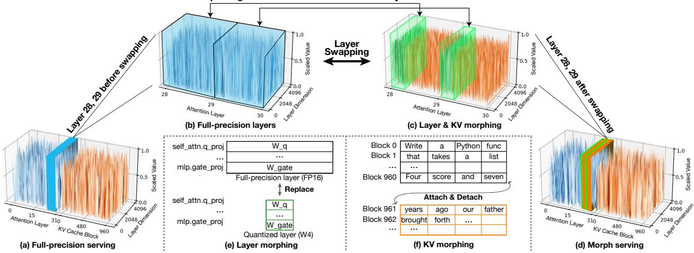  
Figure 3. Synergy of dynamic layer swapping and elastic KVC resizing. Figure (a)–(d) illustrate the model state morphing process: starting from full-precision serving (a), selected layers (b) are replaced with quantized versions (c) without disrupting the inference computation. This process leads to mixed-precision layer serving (d). Figure (e) shows the detailed decoder layer swapping mechanism. Figure (f) demonstrates KVC block management under KVResizer, where newly vacant memory blocks are dynamically reallocated to KVC or deallocated from KVC based on real-time workload shifts. KVResizer reduces the request preemption rate for decoding and incoming request queueing time for prefilling.

• Asynchronous In-place Layer Swapping. At runtime, MorphServe performs in-place layer swapping using asynchronous CUDA streams to avoid interference with ongoing decoding. As illustrated in Figure 3, when layers 28 and 29 are selected for replacement, the swapping process is launched asynchronously while earlier layers (e.g., 0–27) continue computation without interruption. Fullprecision layers are safely discarded from GPU memory since their backup copies reside in pinned CPU memory, and quantized variants are copied into the same memory addresses to avoid pointer remapping. Due to the relatively compact size of each decoder layer (e.g., 0.4 GB for FP16 and 0.1 GB for INT4 in Llama 2 7B), the PCIe transfer latency is minimal - approximately 4 ms for INT4 and 16 ms for FP16 for Llama2 7B on PCIe Gen4 with up to 26-28 GB/s bandwidth. In practice, the complete layer swapping process for an INT4 variant—including memory transfer and reconstruction—takes approximately 6 ms and is fully overlapped with decoding, resulting in negligible TPOT overhead. Additional performance breakdowns are provided in Section 5.

## 4.4 KVResizer: Elastic KVC Resizing

To support bursty workloads and fluctuating memory demands, MorphServe integrates dynamic layer swapping with KVResizer, a mechanism for elastic resizing of KVC blocks. KVResizer does not quantize or compress existing KV caches. It reallocates GPU memory freed by weight quantization (e.g., FP16→W4) to elastically expand the KV cache capacity during high load. This section addresses two key questions: (1) how KVResizer dynamically allocates and releases KVC blocks in response to runtime memory pressure, and (2) how it collaborates with layer swapping to maintain serving efficiency under peak load.

KVResizer is triggered when the Serving Monitor detects insufficient GPU memory to allocate KVC blocks for incoming request prefilling or ongoing decoding. To free memory, MorphServe initiates layer swapping, replacing selected full-precision layers with quantized variants. This reduces the model’s memory footprint—e.g., replacing an FP16 layer with INT4 can save up to 75% memory, as shown in Figure 3—enabling allocation of new KVC blocks.

KVResizer extends PagedAttention (Kwon et al., 2023) with kernel-level support for on-demand KVC block allocation/deallocation, implemented through memory mapping without requiring kernel recompilation. All resizing operations are executed asynchronously using separate CUDA streams to avoid interference with ongoing decoding.

Unlike static preallocation strategies (e.g., in vLLM (Kwon et al., 2023)), KVResizer adjusts KVC capacity dynamically based on real-time memory availability. Once the pressure subsides, both temporary KVC blocks and quantized layers are released and restored to their full-precision state, ensuring memory reuse and accuracy recovery.

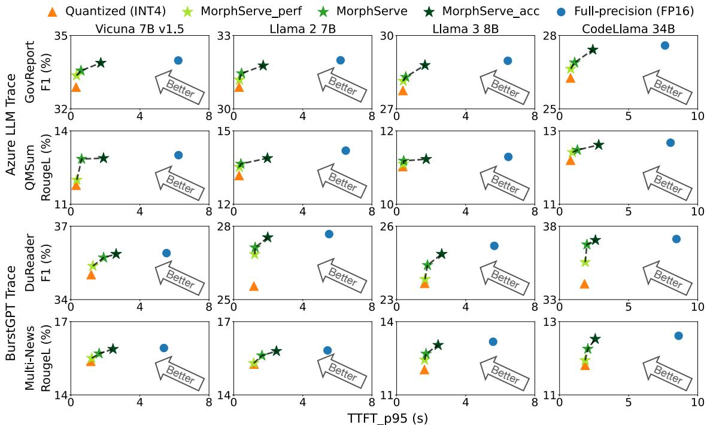  
Figure 4. MorphServe provides the best latency–accuracy tradeoff across four models and two traces, with four datasets. MorphServe in accuracy mode (dark green) reduces P95 TTFT by 2.2×–3.9× compared to full-precision serving while maintaining comparable generation quality. In performance mode (light green), MorphServe consistently outperforms INT4 quantized models in output quality with no additional latency overhead.

As a result, KVResizer enhances system efficiency across both the prefilling and decoding phases under high-load conditions.

• Reducing Queueing Time and TTFT During Prefilling. Under static scheduling, incoming requests may queue indefinitely when no GPU memory is available for KV allocation. Since FIFO schedulers typically release memory only after a request finishes decoding, long queueing delays directly translate into TTFT violations. In MorphServe, KVResizer is triggered when the queue length or wait time exceeds a threshold, proactively attaching new KV blocks to admit pending requests. This significantly reduces queueing time and improves TTFT under bursty traffic.

• Reducing Preemption and Improving TPOT During Decoding. In the decoding phase, requests are preempted if no KV blocks are available, forcing swaps to host memory or full recomputation, both of which introduce delays and degrade TPOT and end-to-end latency. By dynamically attaching KV blocks at runtime, MorphServe reduces preemption events and maintains decoding continuity, leading to better overall system responsiveness.

Together, these improvements enable MorphServe to utilize

GPU memory more efficiently across load conditions, mitigate bottlenecks under saturation, and achieve a balanced trade-off between accuracy and responsiveness in volatile serving scenarios.

## 5 EXPERIMENT

Evaluation Setup. We evaluate MorphServe across a diverse range of LLM architectures, workload traces, and tasks. We consider four representative models: Vicuna 7B v1.5 (lmsys), Llama 2 7B (Touvron et al., 2023), Llama 3 8B (Grattafiori et al., 2024), and CodeLlama 34B (Roziere et al., 2023), spanning multiple scales and attention types— including Multi-Head Attention (MHA) (Vaswani et al., 2017) and Grouped-Query Attention (GQA) (Ainslie et al., 2023). We test two real-world LLM inference workload traces: the BurstGPT trace (Wang et al., 2024) and the Azure LLM Inference trace (Stojkovic et al., 2025; Azure, 2024). We report results from a representative 72-second trace snippet (Figure 1) for both workloads, though MorphServe is effective across the full traces. The request arrival rates of each trace are downscaled by 1.75× and 4.75× to fit our hardware environment. To evaluate generation quality, we use four public datasets: GovReport (Huang et al., 2021a) and Multi-News (Fabbri et al., 2019) (long-form summarization), QMSum (Zhong et al., 2021) (query-based summarization), and DuReader (He et al., 2017) (reading comprehension). For each test, we align workload timestamps with context passages from the datasets. Prompt and response lengths are set to 512 and 256 tokens for Vicuna 7B v1.5 and Llama 2 7B, and to 1024 and 512 tokens for Llama 3 8B and CodeLlama 34B. We report F1 and Rouge-L scores to assess generation quality. End-to-end experiments for Vicuna 7B v1.5, Llama 2 7B, and Llama 3 8B are conducted on an NVIDIA L4 GPU with 24 GB HBM and 256 GB of CPU DRAM, while CodeLlama 34B is evaluated on an A100 server with 80 GB HBM and 2 TB of CPU DRAM.

Table 1. Impact of mixed-precision serving on Llama 3 8B (BookSum Chapters dataset, 6K input / 2K output tokens).
<table><tr><td rowspan=1 colspan=1>Generation Strategy</td><td rowspan=1 colspan=1>F1 Score</td><td rowspan=1 colspan=1>ROUGE-L</td><td rowspan=1 colspan=1>Within Accuracy Bound</td></tr><tr><td rowspan=1 colspan=1>All tokens with INT4 (W4)</td><td rowspan=1 colspan=1>14.4716</td><td rowspan=1 colspan=1>12.1598</td><td rowspan=1 colspan=1>Lower Bound</td></tr><tr><td rowspan=1 colspan=1>First 1K tokens FP16,Last 1K tokens W4</td><td rowspan=1 colspan=1>16.6112</td><td rowspan=1 colspan=1>15.2346</td><td rowspan=1 colspan=1>Yes</td></tr><tr><td rowspan=1 colspan=1>First1K tokensW4,Last1K tokensFP16</td><td rowspan=1 colspan=1>14.7101</td><td rowspan=1 colspan=1>12.3213</td><td rowspan=1 colspan=1>Yes</td></tr><tr><td rowspan=1 colspan=1>First 512FP16,Middle1K W4,Last512FP16</td><td rowspan=1 colspan=1>16.0802</td><td rowspan=1 colspan=1>14.4013</td><td rowspan=1 colspan=1>Yes</td></tr><tr><td rowspan=1 colspan=1>First 512W4,Middle1KFP16,Last 512W4</td><td rowspan=1 colspan=1>16.0413</td><td rowspan=1 colspan=1>13.1127</td><td rowspan=1 colspan=1>Yes</td></tr><tr><td rowspan=1 colspan=1>Switch precision every 256 tokens,starting with W4</td><td rowspan=1 colspan=1>15.2634</td><td rowspan=1 colspan=1>13.0353</td><td rowspan=1 colspan=1>Yes</td></tr><tr><td rowspan=1 colspan=1>Switch precision every 256 tokens, starting with FP16</td><td rowspan=1 colspan=1>16.0012</td><td rowspan=1 colspan=1>14.0146</td><td rowspan=1 colspan=1>Yes</td></tr><tr><td rowspan=1 colspan=1>All tokens with full precision (FP16)</td><td rowspan=1 colspan=1>17.6458</td><td rowspan=1 colspan=1>15.4847</td><td rowspan=1 colspan=1>Upper Bound</td></tr></table>

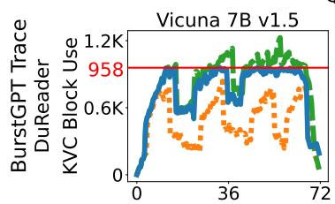

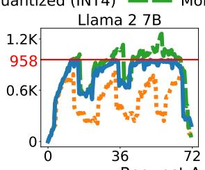

Request Arrival Time (s)  
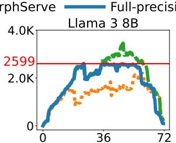

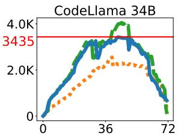  
Figure 5. MorphServe dynamically adapts KVC block capacity to workload fluctuations. The red line indicates the KV cache capacity under full-precision serving. MorphServe (green) elastically attaches new KV blocks during peak loads, pushing the saturation boundary and preventing request preemption or KVC swapping in the full-precision baseline (blue). Static quantization (orange) underutilizes memory due to its fixed configuration, even when resource headroom is available.

Implementation. MorphServe is implemented on top of SwiftLLM (Jiang et al., 2024; shengyu Liu and Jover Qian), a lightweight and modular LLM inference framework that reproduces vLLM (Kwon et al., 2023) performance with simplified components. We added approximately 2,200 lines of Python and 500 lines of C++/CUDA to support MorphServe’s optimized KVC management and attention kernel extensions, which enable efficient layer swapping and KVC resizing at runtime.

Comparison Scope and Baselines. LLM serving frameworks differ widely in objectives: static systems like vLLM (Kwon et al., 2023), Sarathi (Agrawal et al., 2024), and FastServe (Wu et al., 2023) focus on fixed-precision serving, while speculative or input-aware approaches like MARLIN (Frantar et al., 2025), LayerSkip (Elhoushi et al., 2024), and FlexiDepth (Luo et al., 2025) optimize inference paths offline. In contrast, MorphServe adapts in real time, dynamically navigating the performance–accuracy tradeoff during live serving. We benchmark against two representative baselines: FP16 (upper-bound accuracy) and INT4 (performance-optimized static quantization). MorphServe is evaluated in two runtime modes: accuracy mode, which conservatively triggers layer swapping to preserve quality, and performance mode, which aggressively swaps layers to improve throughput under memory pressure. All setups use the same inference engine, and AWQ (Lin et al., 2024b) is adopted for its efficient kernel support, though MorphServe is quantization-method agnostic.

## 5.1 Main Results

TTFT and Accuracy. As shown in Figure 4, MorphServe significantly reduces P95 TTFT latency (95th-percentile TTFT latency) while preserving output quality in all model-trace-dataset configurations. Compared to fullprecision baselines, MorphServe reduces the P95 TTFT by 2.9×–15.7× (2.2×–3.9× in accuracy mode and 3.4×–19.5× in performance mode) while maintaining quality within 0.51%–3.82% degradation on F1 or Rouge-L scores, as low as 0.11%–2.18% in accuracy mode. In contrast, static quantization exhibits 2.34%-9.47% degradation compared to full-precision inference, due to suffering from persistent quality loss across the entire serving lifetime. In particular, MorphServe excels in long-context datasets such as GovReport, leveraging LayerSwapper and KVResizer to optimize memory and computing efficiency. MorphServe with different configurations (green stars) visualizes the ability to navigate the latency-accuracy Pareto frontier, offering the best balance of performance and quality based on real-time workload shifts.

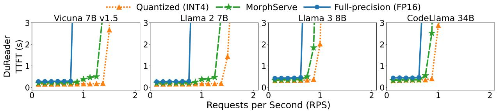

Figure 6. MorphServe delays saturation and achieves up to 1.83× throughput than full-precision serving under increasing request rates.  
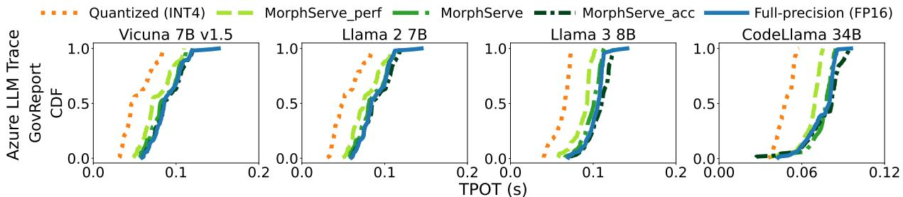  
Figure 7. MorphServe incurs negligible runtime overhead while improving tail TPOT latency. MorphServe (green) achieves comparable average TPOT latency to the full-precision baseline (blue), while reducing P99 latency by up to 1.23×. Performance mode (light green) improves the average TPOT by up to 1.17× through aggressive layer morphing.

Generation Quality under Mixed-Precision Serving. MorphServe adopts a conservative adaptation strategy, replacing full-precision layers with high-quality quantized counterparts (e.g., AWQ) rather than skipping them at the token level (et al.). This design preserves stable and bounded generation quality during dynamic adaptation. As shown in Table 1, even for long-context tasks (BookSum Chapters, 6K input and 2K output tokens), all mixed-precision configurations maintain performance between the fully quantized and full-precision bounds, ensuring controllable quality under frequent precision switching. Additional perplexity evaluations across models are provided in Appendix. A verbatim example of MorphServe’s output under mixed-precision serving is also in the Appendix.

Workload Adaptation and Saturation Resilience. As shown in Figure 5, MorphServe adaptively manages KVC block capacity in response to fluctuating load. In the fullprecision baseline, KVC usage saturates the static capacity during peak periods, resulting in elevated queueing delays, request preemption, and frequent KVC swapping, which can lead to SLO violations. Static quantization, while reducing the memory footprint, degrades model accuracy and underutilizes GPU memory, even during low-load periods. MorphServe attaches new blocks during bursty traffic and releases them as load subsides, enabled by the synergistic LayerSwapper and KVResizer mechanism. MorphServe improves overall KVC memory utilization and output accuracy by 29.29% and 3.58%, respectively, compared to static quantization. The adaptation allows MorphServe to expand KVC usage by up to 32.97% beyond the full-precision limit when needed, and reduce the queueing delay by up to 3.8×. MorphServe also mitigates request preemption and KVC swapping under saturation conditions. This enhances system responsiveness and improves token-level efficiency, contributing to reduced end-to-end request latency.

Throughput. In Figure 6, we compare MorphServe with baselines on DuReader under varying request rates. All configurations maintain low TTFT at low RPS, but as load increases, full-precision inference encounters the threshold, where TTFT spikes abruptly due to memory exhaustion and queueing delays. In contrast, MorphServe consistently pushes back this saturation point, achieving 1.6×–1.83× higher throughput than full-precision serving across all evaluated models.

TPOT Tail Latency. Figure 7 presents the cumulative distribution (CDF) of time-per-output-token (TPOT) across two datasets and four models under the Azure LLM trace. MorphServe delivers average TPOT comparable to fullprecision serving while improving P95 and P99 tail latency by up to 1.06× and 1.23×, respectively. These gains arise from eliminating preemption stalls and avoiding KVC swapping or recomputation, the main sources of long-tail delays. In performance mode, TPOT decreases by 1.11-1.17×, whereas accuracy mode adds up to 1.06× overhead due to preserving more FP16 layers and applying stricter layerswapping thresholds, occasionally causing short queuing under load. The improvement results from faster inference on quantized layers and highly efficient swapping kernels, confirming that MorphServe introduces negligible runtime overhead while effectively reducing tail latency.

Table 2. Performance of MorphServe with AWQ and uniform INT4 quantization vs. FP16 on Llama 2 7B, using the DuReader dataset and BurstGPT trace. MorphServe improves accuracy over static quantization, reducing accuracy degradation by 83.57% for AWQ, 74.67% for Uniform, while lowering P95 TTFT by over 77% compared to FP16.
<table><tr><td rowspan=1 colspan=1>Quantization (INT4)</td><td rowspan=1 colspan=1>Metric</td><td rowspan=1 colspan=1>Static Quantization</td><td rowspan=1 colspan=1>MorphServe</td><td rowspan=1 colspan=1>Full Precision</td></tr><tr><td rowspan=3 colspan=1>AWQ</td><td rowspan=1 colspan=1>TTFT P95 (s)</td><td rowspan=1 colspan=1>1.1686</td><td rowspan=1 colspan=1>1.2420</td><td rowspan=1 colspan=1>5.5223</td></tr><tr><td rowspan=1 colspan=1>TPOT P99 (s)</td><td rowspan=1 colspan=1>0.0735</td><td rowspan=1 colspan=1>0.1064</td><td rowspan=1 colspan=1>0.1241</td></tr><tr><td rowspan=1 colspan=1>F1 Score</td><td rowspan=1 colspan=1>25.55</td><td rowspan=1 colspan=1>27.33</td><td rowspan=1 colspan=1>27.68</td></tr><tr><td rowspan=3 colspan=1>Uniform</td><td rowspan=1 colspan=1>TTFT P95 (s)</td><td rowspan=1 colspan=1>1.1321</td><td rowspan=1 colspan=1>1.2144</td><td rowspan=1 colspan=1>5.5223</td></tr><tr><td rowspan=1 colspan=1>TPOT P99 (s)</td><td rowspan=1 colspan=1>0.0728</td><td rowspan=1 colspan=1>0.1053</td><td rowspan=1 colspan=1>0.1241</td></tr><tr><td rowspan=1 colspan=1>F1 Score</td><td rowspan=1 colspan=1>24.87</td><td rowspan=1 colspan=1>26.94</td><td rowspan=1 colspan=1>27.68</td></tr></table>

Table 3. Cross-dataset evaluation of LIS profiles—perplexity on C4 using LIS calibrated on WikiText-2.
<table><tr><td rowspan=1 colspan=1>Method</td><td rowspan=1 colspan=1>1</td><td rowspan=1 colspan=1>2</td><td rowspan=1 colspan=1>4</td><td rowspan=1 colspan=1>8</td><td rowspan=1 colspan=1>16</td><td rowspan=1 colspan=1>32 (Fully Quantized)</td></tr><tr><td rowspan=1 colspan=1>Front-to-Back</td><td rowspan=1 colspan=1>7.0793</td><td rowspan=1 colspan=1>7.0822</td><td rowspan=1 colspan=1>7.0933</td><td rowspan=1 colspan=1>7.1119</td><td rowspan=1 colspan=1>7.1524</td><td rowspan=1 colspan=1>7.2463</td></tr><tr><td rowspan=1 colspan=1>Back-to-Front</td><td rowspan=1 colspan=1>7.0871</td><td rowspan=1 colspan=1>7.0938</td><td rowspan=1 colspan=1>7.1031</td><td rowspan=1 colspan=1>7.1224</td><td rowspan=1 colspan=1>7.1712</td><td rowspan=1 colspan=1>7.2463</td></tr><tr><td rowspan=1 colspan=1>Random</td><td rowspan=1 colspan=1>7.0871</td><td rowspan=1 colspan=1>7.0913</td><td rowspan=1 colspan=1>7.1012</td><td rowspan=1 colspan=1>7.1234</td><td rowspan=1 colspan=1>7.1676</td><td rowspan=1 colspan=1>7.2463</td></tr><tr><td rowspan=1 colspan=1>LIS</td><td rowspan=1 colspan=1>7.0801</td><td rowspan=1 colspan=1>7.0818</td><td rowspan=1 colspan=1>7.0912</td><td rowspan=1 colspan=1>7.1107</td><td rowspan=1 colspan=1>7.1497</td><td rowspan=1 colspan=1>7.2463</td></tr></table>

## 5.2 Ablation Study

Effectiveness Across Quantization Algorithms. MorphServe is agnostic to specific quantization schemes. We evaluate it under both AWQ and uniform INT4 using identical datasets and traces. As shown in Table 2 (and Table 5 in the appendix), MorphServe consistently improves F1 and Rouge-L over static quantization while maintaining significant latency advantages over full-precision serving. These results confirm that its gains arise from runtime adaptation rather than the choice of quantization algorithm.

Generalization of Layer Importance Score. Table 3 shows the generalization of LIS profiles, which consistently outperforms front-to-back, back-to-front, and random layer orders on C4 with calibration on Wiki2, indicating that LIS captures intrinsic layer importance and generalizes across datasets without re-profiling.

## 6 DISCUSSION AND FUTURE WORK

User Tolerance. Since fully quantized models (e.g., AWQ) are widely acceptable, MorphServe’s outputs remain within user tolerance. It maintains full-precision decoding under light load and bounds quality variation under adaptation, achieving stable perceptual quality with adaptive efficiency.

Scalability. MorphServe scales naturally to distributed serving with data, tensor, pipeline, and sequence parallelism. Each GPU runs an independent executor that swaps layers and resizes KV caches locally.

Fairness. The continuous batching (Yu et al., 2022) preserves FIFO ordering, while chunked prefill (Agrawal et al., 2024) and fine-grained KV management (Kwon et al., 2023) prevent starvation. Combined with these, MorphServe serving ensures fair and stable serving under bursty conditions.

Future Work. MorphServe can extend beyond weightonly quantization to include activation and KV quantization. Such extensions promise higher efficiency but raise calibration and scheduling challenges. We plan to explore these for edge deployment and robust, energy-efficient adaptation.

## 7 CONCLUSION

This paper presents MorphServe, a novel workload-aware LLM serving framework based on morphological adaptation. Guided by a unified Layer Importance Score, MorphServe dynamically adjusts model precision through LayerSwapper and KV cache memory capacity through KVResizer, in a coordinated manner based on real-time resource usage. MorphServe maintains high-quality inference under normal conditions and adapts gracefully during overload periods. Extensive experiments show that MorphServe improves SLO compliance, memory efficiency, and robustness, while maintaining high generation quality along the efficiency–accuracy Pareto frontier.

## REFERENCES

Agrawal, A., Kedia, N., Panwar, A., Mohan, J., Kwatra, N., Gulavani, B., Tumanov, A., and Ramjee, R. Taming Throughput-Latency tradeoff in LLM inference with Sarathi-Serve. In 18th USENIX Symposium on Operating Systems Design and Implementation (OSDI 24), pp. 117–134, Santa Clara, CA, July 2024. USENIX Association. ISBN 978-1-939133-40-3. URL https://www.usenix.org/conference/ osdi24/presentation/agrawal.

Ainslie, J., Lee-Thorp, J., De Jong, M., Zemlyanskiy, Y., Lebron, F., and Sanghai, S. Gqa: Training generalized ´ multi-query transformer models from multi-head checkpoints. arXiv preprint arXiv:2305.13245, 2023.

Azure. Azure llm inference traces, 2024. URL https://github.com/Azure/ AzurePublicDataset/blob/master/ AzureLLMInferenceDataset2023.md. Accessed: May 15, 2025.

Bai, Y., Lv, X., Zhang, J., Lyu, H., Tang, J., Huang, Z., Du, Z., Liu, X., Zeng, A., Hou, L., et al. Longbench: A bilingual, multitask benchmark for long context understanding. arXiv preprint arXiv:2308.14508, 2023.

Cai, F., Yuan, D., Yang, Z., and Cui, L. Edge-llm: A collaborative framework for large language model serving in edge computing. In 2024 IEEE International Conference on Web Services (ICWS), pp. 799–809. IEEE, 2024a.

Cai, Z., Zhang, Y., Gao, B., Liu, Y., Liu, T., Lu, K., Xiong, W., Dong, Y., Chang, B., Hu, J., et al. Pyramidkv: Dynamic kv cache compression based on pyramidal information funneling. arXiv preprint arXiv:2406.02069, 2024b.

Chen, H. M., Tan, F., Kouris, A., Lee, R., Fan, H., and Venieris, S. I. Progressive mixed-precision decoding for efficient llm inference. arXiv preprint arXiv:2410.13461, 2024a.

Chen, Y., Zhang, C., Gao, X., Mullins, R. D., Constantinides, G. A., and Zhao, Y. Optimised grouped-query attention mechanism for transformers. arXiv preprint arXiv:2406.14963, 2024b.

Chinnakonduru, S. S. and Mohapatra, A. Weighted grouped query attention in transformers. arXiv preprint arXiv:2407.10855, 2024.

Dao, T. Flashattention-2: Faster attention with better parallelism and work partitioning. arXiv preprint arXiv:2307.08691, 2023.

Dao, T., Fu, D., Ermon, S., Rudra, A., and Re, C. Flashat-´ tention: Fast and memory-efficient exact attention with

io-awareness. Advances in neural information processing systems, 35:16344–16359, 2022.

Dettmers, T., Svirschevski, R., Egiazarian, V., Kuznedelev, D., Frantar, E., Ashkboos, S., Borzunov, A., Hoefler, T., and Alistarh, D. Spqr: A sparse-quantized representation for near-lossless llm weight compression. arXiv preprint arXiv:2306.03078, 2023.

Dong, Z., Yao, Z., Gholami, A., Mahoney, M. W., and Keutzer, K. Hawq: Hessian aware quantization of neural networks with mixed-precision. In Proceedings of the IEEE/CVF international conference on computer vision, pp. 293–302, 2019.

Elhoushi, M., Shrivastava, A., Liskovich, D., Hosmer, B., Wasti, B., Lai, L., Mahmoud, A., Acun, B., Agarwal, S., Roman, A., Aly, A., Chen, B., and Wu, C.-J. Layerskip: Enabling early exit inference and self-speculative decoding. In Proceedings of the 62nd Annual Meeting of the Association for Computational Linguistics (Volume 1: Long Papers), pp. 12622–12642. Association for Computational Linguistics, 2024. doi: 10.18653/v1/ 2024.acl-long.681. URL http://dx.doi.org/10. 18653/v1/2024.acl-long.681.

et al., T. G. Dynamic layer selection in decoder-only transformers. URL https://neurips.cc/virtual/ 2024/106468. Accessed: Oct 13, 2025.

Fabbri, A. R., Li, I., She, T., Li, S., and Radev, D. R. Multi-news: A large-scale multi-document summarization dataset and abstractive hierarchical model. arXiv preprint arXiv:1906.01749, 2019.

Feng, Y., Lv, J., Cao, Y., Xie, X., and Zhou, S. K. Adakv: Optimizing kv cache eviction by adaptive budget allocation for efficient llm inference. arXiv preprint arXiv:2407.11550, 2024.

Frantar, E., Ashkboos, S., Hoefler, T., and Alistarh, D. Gptq: Accurate post-training quantization for generative pretrained transformers. arXiv preprint arXiv:2210.17323, 2022.

Frantar, E., Castro, R. L., Chen, J., Hoefler, T., and Alistarh, D. Marlin: Mixed-precision auto-regressive parallel inference on large language models. In Proceedings of the 30th ACM SIGPLAN Annual Symposium on Principles and Practice of Parallel Programming, pp. 239–251, 2025.

Fu, Y., Xue, L., Huang, Y., Brabete, A.-O., Ustiugov, D., Patel, Y., and Mai, L. {ServerlessLLM}:{Low-Latency} serverless inference for large language models. In 18th USENIX Symposium on Operating Systems Design and Implementation (OSDI 24), pp. 135–153, 2024.

Gao, B., He, Z., Sharma, P., Kang, Q., Jevdjic, D., Deng, J., Yang, X., Yu, Z., and Zuo, P. {Cost-Efficient} large language model serving for multi-turn conversations with {CachedAttention}. In 2024 USENIX Annual Technical Conference (USENIX ATC 24), pp. 111–126, 2024a.

Gao, S., Lin, C.-H., Hua, T., Tang, Z., Shen, Y., Jin, H., and Hsu, Y.-C. Disp-llm: Dimension-independent structural pruning for large language models. Advances in Neural Information Processing Systems, 37:72219–72244, 2024b.

Grattafiori, A., Dubey, A., Jauhri, A., Pandey, A., Kadian, A., Al-Dahle, A., Letman, A., Mathur, A., Schelten, A., Vaughan, A., et al. The llama 3 herd of models. arXiv preprint arXiv:2407.21783, 2024.

He, S., Sun, G., Shen, Z., and Li, A. What matters in transformers? not all attention is needed, 2024a. URL https://arxiv.org/abs/2406.15786.

He, W., Liu, K., Liu, J., Lyu, Y., Zhao, S., Xiao, X., Liu, Y., Wang, Y., Wu, H., She, Q., et al. Dureader: a chinese machine reading comprehension dataset from real-world applications. arXiv preprint arXiv:1711.05073, 2017.

He, Y., Lu, Y., and Alonso, G. Deferred continuous batching in resource-efficient large language model serving. In Proceedings of the 4th Workshop on Machine Learning and Systems, pp. 98–106, 2024b.

Hu, E. J., Shen, Y., Wallis, P., Allen-Zhu, Z., Li, Y., Wang, S., Wang, L., Chen, W., et al. Lora: Low-rank adaptation of large language models. ICLR, 1(2):3, 2022.

Huang, L., Cao, S., Parulian, N., Ji, H., and Wang, L. Efficient attentions for long document summarization. In Proceedings of the 2021 Conference of the North American Chapter of the Association for Computational Linguistics: Human Language Technologies, pp. 1419– 1436, Online, June 2021a. Association for Computational Linguistics. doi: 10.18653/v1/2021.naacl-main. 112. URL https://aclanthology.org/2021. naacl-main.112.

Huang, S., Ankit, A., Silveira, P., Antunes, R., Chalamalasetti, S. R., El Hajj, I., Kim, D. E., Aguiar, G., Bruel, P., Serebryakov, S., et al. Mixed precision quantization for reram-based dnn inference accelerators. In Proceedings of the 26th Asia and South Pacific Design Automation Conference, pp. 372–377, 2021b.

Hugging Face. Text generation inference. URL https://huggingface.co/docs/ text-generation-inference/en/index. Accessed: May 15, 2025.

Jaiswal, S., Jain, K., Simmhan, Y., Parayil, A., Mallick, A., Wang, R., Amant, R. S., Bansal, C., Ruhle, V., Kulkarni, ¨ A., et al. Serving models, fast and slow: optimizing heterogeneous llm inferencing workloads at scale. arXiv preprint arXiv:2502.14617, 2025.

Jiang, J., Zhou, J., and Zhu, Z. Tracing representation progression: Analyzing and enhancing layer-wise similarity. In The Thirteenth International Conference on Learning Representations, 2025. URL https://openreview. net/forum?id=vVxeFSR4fU.

Jiang, X., Zhou, Y., Cao, S., Stoica, I., and Yu, M. Neo: Saving gpu memory crisis with cpu offloading for online llm inference. arXiv preprint arXiv:2411.01142, 2024.

Kim, S., Hooper, C., Gholami, A., Dong, Z., Li, X., Shen, S., Mahoney, M. W., and Keutzer, K. Squeezellm: Dense-and-sparse quantization. arXiv preprint arXiv:2306.07629, 2023.

Kwon, W., Li, Z., Zhuang, S., Sheng, Y., Zheng, L., Yu, C. H., Gonzalez, J., Zhang, H., and Stoica, I. Efficient memory management for large language model serving with pagedattention. In Proceedings of the 29th Symposium on Operating Systems Principles, pp. 611–626, 2023.

Li, L., Li, Q., Zhang, B., and Chu, X. Norm tweaking: High-performance low-bit quantization of large language models. In Proceedings of the AAAI Conference on Artificial Intelligence, volume 38, pp. 18536–18544, 2024a.

Li, Y., Huang, Y., Yang, B., Venkitesh, B., Locatelli, A., Ye, H., Cai, T., Lewis, P., and Chen, D. Snapkv: Llm knows what you are looking for before generation. Advances in Neural Information Processing Systems, 37:22947– 22970, 2024b.

Lin, H., Xu, H., Wu, Y., Cui, J., Zhang, Y., Mou, L., Song, L., Sun, Z., and Wei, Y. Duquant: Distributing outliers via dual transformation makes stronger quantized llms. Advances in Neural Information Processing Systems, 37: 87766–87800, 2024a.

Lin, J., Tang, J., Tang, H., Yang, S., Chen, W.-M., Wang, W.-C., Xiao, G., Dang, X., Gan, C., and Han, S. Awq: Activation-aware weight quantization for on-device llm compression and acceleration. Proceedings of Machine Learning and Systems, 6:87–100, 2024b.

Lin, Y., Tang, H., Yang, S., Zhang, Z., Xiao, G., Gan, C., and Han, S. Qserve: W4a8kv4 quantization and system co-design for efficient llm serving. arXiv preprint arXiv:2405.04532, 2024c.

Liu, A., Feng, B., Wang, B., Wang, B., Liu, B., Zhao, C., Dengr, C., Ruan, C., Dai, D., Guo, D., et al. Deepseek-v2: A strong, economical, and efficient mixture-of-experts language model. arXiv preprint arXiv:2405.04434, 2024.

Liu, Z., Desai, A., Liao, F., Wang, W., Xie, V., Xu, Z., Kyrillidis, A., and Shrivastava, A. Scissorhands: Exploiting the persistence of importance hypothesis for llm kv cache compression at test time. Advances in Neural Information Processing Systems, 36:52342–52364, 2023.

lmsys. vicuna-7b-v1.5. URL https://huggingface. co/lmsys/vicuna-7b-v1.5. Accessed: May 15, 2025.

Luo, X., Wang, W., and Yan, X. Adaptive layer-skipping in pre-trained llms, 2025. URL https://arxiv.org/ abs/2503.23798.

Ma, X., Fang, G., and Wang, X. Llm-pruner: On the structural pruning of large language models. Advances in neural information processing systems, 36:21702–21720, 2023.

Ma, Y., Li, H., Zheng, X., Ling, F., Xiao, X., Wang, R., Wen, S., Chao, F., and Ji, R. Affinequant: Affine transformation quantization for large language models. arXiv preprint arXiv:2403.12544, 2024.

Meng, F., Yao, Z., and Zhang, M. Transmla: Multihead latent attention is all you need. arXiv preprint arXiv:2502.07864, 2025.

Nagel, M., Amjad, R. A., Van Baalen, M., Louizos, C., and Blankevoort, T. Up or down? adaptive rounding for post-training quantization. In International conference on machine learning, pp. 7197–7206. PMLR, 2020.

Nagel, M., Fournarakis, M., Amjad, R. A., Bondarenko, Y., Van Baalen, M., and Blankevoort, T. A white paper on neural network quantization. arXiv preprint arXiv:2106.08295, 2021.

NVIDIA. GPUDirect Storage: A Direct Path Between Storage and GPU Memory. URL https://developer. nvidia.com/blog/gpudirect-storage/. Accessed: May 15, 2025.

NVIDIA Corporation. Fastertransformer: Transformer related optimization, including bert, gpt., 2019a. URL https://github.com/NVIDIA/ FasterTransformer. Accessed: May 15, 2025.

NVIDIA Corporation. Triton inference server: An optimized cloud and edge inferencing solution., 2019b. URL https://github.com/ triton-inference-server/server. Accessed: May 15, 2025.

Patel, P., Choukse, E., Zhang, C., Shah, A., Goiri, ´I., Maleki, S., and Bianchini, R. Splitwise: Efficient generative llm inference using phase splitting. In 2024 ACM/IEEE 51st Annual International Symposium on Computer Architecture (ISCA), pp. 118–132. IEEE, 2024.

Polino, A., Pascanu, R., and Alistarh, D. Model compression via distillation and quantization. arXiv preprint arXiv:1802.05668, 2018.

PyTorch. Serve, optimize and scale pytorch models in production, 2023. URL https://github.com/ pytorch/serve. Accessed: May 15, 2025.

Qiao, Y., Anzai, S., Yu, S., Ma, H., Wang, Y., Kim, M., and Xu, H. Conserve: Harvesting gpus for low-latency and high-throughput large language model serving. arXiv preprint arXiv:2410.01228, 2024.

Reggiani, E., Pappalardo, A., Doblas, M., Moreto, M., Olivieri, M., Unsal, O. S., and Cristal, A. Mix-gemm: An efficient hw-sw architecture for mixed-precision quantized deep neural networks inference on edge devices. In 2023 IEEE International Symposium on High-Performance Computer Architecture (HPCA), pp. 1085– 1098. IEEE, 2023.

Risso, M., Burrello, A., Benini, L., Macii, E., Poncino, M., and Pagliari, D. J. Channel-wise mixed-precision assignment for dnn inference on constrained edge nodes. In 2022 IEEE 13th International Green and Sustainable Computing Conference (IGSC), pp. 1–6. IEEE, 2022.

Roziere, B., Gehring, J., Gloeckle, F., Sootla, S., Gat, I., Tan, X. E., Adi, Y., Liu, J., Sauvestre, R., Remez, T., et al. Code llama: Open foundation models for code. arXiv preprint arXiv:2308.12950, 2023.

Shao, W., Chen, M., Zhang, Z., Xu, P., Zhao, L., Li, Z., Zhang, K., Gao, P., Qiao, Y., and Luo, P. Omniquant: Omnidirectionally calibrated quantization for large language models. arXiv preprint arXiv:2308.13137, 2023.

shengyu Liu and Jover Qian. Swiftllm. URL https:// github.com/interestingLSY/swiftLLM. Accessed: May 15, 2025.

Sreenivas, S. T., Muralidharan, S., Joshi, R., Chochowski, M., Mahabaleshwarkar, A. S., Shen, G., Zeng, J., Chen, Z., Suhara, Y., Diao, S., et al. Llm pruning and distillation in practice: The minitron approach. arXiv preprint arXiv:2408.11796, 2024.

Steve Rennich. Cuda c/c++ streams and concurrency. URL https://developer. download.nvidia.com/CUDA/training/ StreamsAndConcurrencyWebinar.pdf. Accessed: May 15, 2025.

Stojkovic, J., Zhang, C., Goiri, ´I., Torrellas, J., and Choukse, E. Dynamollm: Designing llm inference clusters for performance and energy efficiency. In 2025 IEEE International Symposium on High Performance Computer Architecture (HPCA), pp. 1348–1362. IEEE, 2025.

Sun, B., Huang, Z., Zhao, H., Xiao, W., Zhang, X., Li, Y., and Lin, W. Llumnix: Dynamic scheduling for large language model serving. In 18th USENIX Symposium on Operating Systems Design and Implementation (OSDI 24), pp. 173–191, 2024.

Sun, Q., Pickett, M., Nain, A. K., and Jones, L. Transformer layers as painters. Proceedings of the AAAI Conference on Artificial Intelligence, 39(24): 25219–25227, Apr. 2025. doi: 10.1609/aaai.v39i24. 34708. URL https://ojs.aaai.org/index. php/AAAI/article/view/34708.

Touvron, H., Martin, L., Stone, K., Albert, P., Almahairi, A., Babaei, Y., Bashlykov, N., Batra, S., Bhargava, P., Bhosale, S., et al. Llama 2: Open foundation and finetuned chat models. arXiv preprint arXiv:2307.09288, 2023.

Vaswani, A., Shazeer, N., Parmar, N., Uszkoreit, J., Jones, L., Gomez, A. N., Kaiser, Ł., and Polosukhin, I. Attention is all you need. Advances in neural information processing systems, 30, 2017.

Wang, P., Chen, Q., He, X., and Cheng, J. Towards accurate post-training network quantization via bit-split and stitching. In International Conference on Machine Learning, pp. 9847–9856. PMLR, 2020.

Wang, Y., Chen, Y., Li, Z., Kang, X., Tang, Z., He, X., Guo, R., Wang, X., Wang, Q., Zhou, A. C., et al. Burstgpt: A real-world workload dataset to optimize llm serving systems. arXiv preprint arXiv:2401.17644, 2024.

Wu, B., Zhong, Y., Zhang, Z., Liu, S., Liu, F., Sun, Y., Huang, G., Liu, X., and Jin, X. Fast distributed inference serving for large language models. arXiv preprint arXiv:2305.05920, 2023.

Wu, B., Zhu, R., Zhang, Z., Sun, P., Liu, X., and Jin, X. {dLoRA}: Dynamically orchestrating requests and adapters for {LoRA}{LLM} serving. In 18th USENIX Symposium on Operating Systems Design and Implementation (OSDI 24), pp. 911–927, 2024.

Xiao, G., Lin, J., Seznec, M., Wu, H., Demouth, J., and Han, S. Smoothquant: Accurate and efficient post-training quantization for large language models. In International Conference on Machine Learning, pp. 38087–38099. PMLR, 2023.

Xiong, Y., Wu, H., Shao, C., Wang, Z., Zhang, R., Guo, Y., Zhao, J., Zhang, K., and Pan, Z. Layerkv: Optimizing large language model serving with layer-wise kv cache management. arXiv preprint arXiv:2410.00428, 2024.

Yao, Z., Yazdani Aminabadi, R., Zhang, M., Wu, X., Li, C., and He, Y. Zeroquant: Efficient and affordable posttraining quantization for large-scale transformers. Advances in Neural Information Processing Systems, 35: 27168–27183, 2022.

Yao, Z., Li, C., Wu, X., Youn, S., and He, Y. A comprehensive study on post-training quantization for large language models. arXiv preprint arXiv:2303.08302, 2023.

Yu, G.-I., Jeong, J. S., Kim, G.-W., Kim, S., and Chun, B.- G. Orca: A distributed serving system for {Transformer-Based} generative models. In 16th USENIX Symposium on Operating Systems Design and Implementation (OSDI 22), pp. 521–538, 2022.

Zhao, Y., Lin, C.-Y., Zhu, K., Ye, Z., Chen, L., Zheng, S., Ceze, L., Krishnamurthy, A., Chen, T., and Kasikci, B. Atom: Low-bit quantization for efficient and accurate llm serving. Proceedings of Machine Learning and Systems, 6:196–209, 2024.

Zhong, M., Yin, D., Yu, T., Zaidi, A., Mutuma, M., Jha, R., Awadallah, A. H., Celikyilmaz, A., Liu, Y., Qiu, X., et al. Qmsum: A new benchmark for query-based multi-domain meeting summarization. arXiv preprint arXiv:2104.05938, 2021.

Zhou, X., Wang, W., Zeng, M., Guo, J., Liu, X., Shen, L., Zhang, M., and Ding, L. Dynamickv: Task-aware adaptive kv cache compression for long context llms. arXiv preprint arXiv:2412.14838, 2024.

## APPENDIX OVERVIEW

• Section A: Layer Swapping Sequence Profiling

• Section B: Additional Experimental Results

• Section C: Implementation Details

• Section D: Limitations and Broader Impacts

## A LAYER SWAPPING SEQUENCE PROFILING

MorphServe supports an optional offline profiling for the layer swapping sequence to further preserve model accuracy during runtime layer adaptation. This process consists of two key components: The Layer Importance Score (LIS), which ranks layers by combining the individual characteristics of each layer and its cumulative impact on overall model output; and a greedy selection policy that constructs the layer swapping sequence used during inference.

## A.1 Layer Importance Score (LIS)

Motivation and Design. The Layer Importance Score (LIS) is defined as:

$$
\mathrm { L I S } _ { p } = \alpha _ { 1 } \cdot \mathrm { L T S } _ { p } + \alpha _ { 2 } \cdot \mathrm { L R S } _ { p } + \beta \cdot \mathrm { M D S } _ { p } ^ { ( Q ) }\tag{6}
$$

Here, $p$ indexes the candidate layer, $Q$ denotes the current set of quantized layers, and $\alpha _ { 1 } , \alpha _ { 2 }$ , and $\beta$ are weighting coefficients. LIS combines both layer-level and model-level sensitivity metrics to achieve accurate and generalizable layer ranking. Layer-level sensitivity captures how critical a single layer is by evaluating the degree of change between its input and output, and quantization distortion. However, relying solely on layer-level metrics may lead to locally optimal sequences that ignore the cumulative impact on model output. In contrast, model-level sensitivity measures the overall accuracy degradation introduced by swapping a given layer within the current model state. While this provides global awareness, depending exclusively on it risks overfitting to the specific calibration dataset. To balance generality and robustness, LIS combines both global and local sensitivity metrics, without relying on backpropagation or reconstruction. This design ensures that the resulting layer swapping sequence preserves model accuracy while remaining data-agnostic and transferable across workloads.

Hyperparameter Selection. To balance robustness and accuracy, we define the hyperparameters of LIS as follows: $\alpha _ { 1 }$ captures weight sensitivity (e.g., norm-based changes after quantization), $\alpha _ { 2 }$ measures quantization distortion in activation space (e.g., cosine similarity), and $\beta$ reflects modellevel degradation (e.g., perplexity under greedy layer removal).

We empirically choose $\alpha _ { 1 } = \alpha _ { 2 } = 0 . 2 5$ and $\beta \ : = \ : 0 . 5 ,$ ensuring $\alpha _ { 1 } + \alpha _ { 2 } + \beta = 1 . 0$ . This heuristic gives slightly more emphasis to $\beta$ due to its stability across inputs and its direct alignment with user-perceived output quality. Relying only on $\beta ,$ however, risks overlooking layers with high local distortion, while $\alpha _ { 1 }$ and $\alpha _ { 2 }$ alone are more sensitive to input variance. We compare this configuration to a baseline with uniform weighting $( \alpha _ { 1 } = \alpha _ { 2 } = \beta = 0 . 3 3 )$ . As shown in the Table $^ { 4 , }$ our setting produces lower perplexity across quantization levels and leads to more stable LIS rankings.

Cosine Similarity. LIS adopts cosine similarity as a lightweight and stable proxy for semantic drift during profiling. All sensitivity metrics are derived by quantifying the directional change between intermediate or final representations before and after layer morphing. Specifically, the cosine similarity between two vectors a and b is computed as:

$$
\cos ( \mathbf { a } , \mathbf { b } ) = { \frac { \mathbf { a } \cdot \mathbf { b } } { \left\| \mathbf { a } \right\| \left\| \mathbf { b } \right\| } }\tag{7}
$$

A higher similarity indicates smaller representational deviation and thus lower sensitivity to swapping.

Interpreting Layer-level and Model-level Sensitivity. Layer Transformation Sensitivity (LTS) measures the angular distance between a layer’s input and output. A high LTS indicates weak transformation, suggesting the layer contributes minimally to representation learning. Layer Replacement Sensitivity (LRS) quantifies the similarity between the outputs of the full-precision and quantized versions of the same layer. A high LRS implies low distortion and minimal risk of quality degradation upon replacement. Both LTS and LRS are computed independently of model outputs and remain consistent across input samples, making them robust to dataset shifts. Model Degradation Sensitivity (MDS) captures the similarity between model outputs with and without a candidate layer replaced, conditioned on the current swapped set $Q .$ A high MDS indicates minimal incremental impact when replacing the layer in context. MDS preserves overall model accuracy during sequential morphing. By combining local (LTS, LRS) and global (MDS) sensitivity metrics, MorphServe avoids overfitting to specific calibration and achieves generalizable layer importance rankings across diverse datasets.

## A.2 Greedy Selection Policy

Due to the combinatorial complexity of searching for the optimal layer swapping order, MorphServe adopts a heuristic greedy strategy that incrementally constructs the morphing sequence based on the Layer Importance Score (LIS).

Profiling Setting. Following the setup in (Lin et al., 2024a; Shao et al., 2023; Ma et al., 2024), we use a small calibration subset from the WikiText2 dataset, with the sequence length of 2,048. While LIS incorporates static layer-level metrics and model-level output feedback, its design avoids overfitting the specific calibration set. Once computed, the LIS ranking is fixed and reused across deployments, requiring no online re-tuning.

Table 4. Perplexity comparison of LIS under different $( \alpha _ { 1 } , \alpha _ { 2 } , \beta )$ hyperparameter settings across quantization levels on Llama 2 7B using WikiText-2.
<table><tr><td rowspan=1 colspan=1># Layers Quantized</td><td rowspan=1 colspan=1>1</td><td rowspan=1 colspan=1> $\overline { { 2 } }$ </td><td rowspan=1 colspan=1> $^ 4$ </td><td rowspan=1 colspan=1> $^ 8$ </td><td rowspan=1 colspan=1>16</td><td rowspan=1 colspan=1>32 (Fully Quantized)</td></tr><tr><td rowspan=1 colspan=1>LIS (0.33,0.33,0.33)</td><td rowspan=1 colspan=1>5.4732</td><td rowspan=1 colspan=1>5.4748</td><td rowspan=1 colspan=1>5.4786</td><td rowspan=1 colspan=1>5.4905</td><td rowspan=1 colspan=1>5.5257</td><td rowspan=1 colspan=1>5.6002</td></tr><tr><td rowspan=1 colspan=1>LIS (0.25,0.25,0.5)</td><td rowspan=1 colspan=1>5.4732</td><td rowspan=1 colspan=1>5.4743</td><td rowspan=1 colspan=1>5.4779</td><td rowspan=1 colspan=1>5.4875</td><td rowspan=1 colspan=1>5.5215</td><td rowspan=1 colspan=1>5.6002</td></tr></table>

Table 5. Perplexity comparison of LIS using L2 Norm vs. cosine similarity across quantization levels on Llama 2 7B with WikiText-2.
<table><tr><td rowspan=1 colspan=1># Layers Quantized</td><td rowspan=1 colspan=1>1</td><td rowspan=1 colspan=1>2</td><td rowspan=1 colspan=1>4</td><td rowspan=1 colspan=1>8</td><td rowspan=1 colspan=1>16</td><td rowspan=1 colspan=1>32 (Fully Quantized)</td></tr><tr><td rowspan=1 colspan=1>LIS - L2 Norm</td><td rowspan=1 colspan=1>5.4733</td><td rowspan=1 colspan=1>5.4776</td><td rowspan=1 colspan=1>5.4848</td><td rowspan=1 colspan=1>5.5021</td><td rowspan=1 colspan=1>5.5321</td><td rowspan=1 colspan=1>5.6002</td></tr><tr><td rowspan=1 colspan=1>LIS - Cosine Similarity</td><td rowspan=1 colspan=1>5.4732</td><td rowspan=1 colspan=1>5.4743</td><td rowspan=1 colspan=1>5.4779</td><td rowspan=1 colspan=1>5.4875</td><td rowspan=1 colspan=1>5.5215</td><td rowspan=1 colspan=1>5.6002</td></tr></table>

Algorithm 1 Swapping Sequence Profiling Based on Layer   
Importance Scoring (LIS)   
Require: Full-precision model M, quantized model $\mathcal { M } ^ { Q }$   
calibration dataset $\mathcal { D } ,$ params $( \alpha _ { 1 } , \alpha _ { 2 } , \beta )$   
1: for each layer i do   
2: Compute LTSi = CosSim(Inputi, Outputi)   
3: Compute $\mathbf { L R S } _ { i } = \mathbf { C o s S i m } ( \mathbf { O u t p u t } _ { i } , \mathbf { O u t p u t } _ { i } ^ { Q } )$   
4: end for   
5: Initialize set of quantized layers $Q  \emptyset$   
6: for t = 1 to $L$ do   
7: for each unquantized layer $j \not \in Q$ do   
8: Temporarily quantize layer $j$ and evaluate   
model outputs   
9: Compute MDS $\mathbf { \Sigma } _ { j } ^ { ( Q ) }$   
CosSim( ${ \bigl ( } f ^ { ( Q ) } ( x ) , f ^ { ( Q \cup \{ j \} ) } ( x ) { \bigr ) }$   
10: Compute $\mathrm { L I S } _ { j } = \alpha _ { 1 } \cdot \mathrm { L T S } _ { j } + \alpha _ { 2 } \cdot \mathrm { L R S } _ { j } + \beta$   
MDS $_ { j } ^ { ( Q ) }$   
11: end for   
12: Select $j ^ { * } =$ arg maxj LISj   
13: Add $j ^ { * }$ to $Q$ and replace corresponding layer in M   
14: end forreturn Ordered layer swap sequence $Q$

Greedy Selection. MorphServe employs a greedy selection policy guided by sensitivity metrics to construct an effective layer morphing sequence. The goal is to minimize cumulative degradation by progressively swapping the least impactful layers based on the LIS.

As shown in Algorithm 1, we first compute two inputindependent metrics, LTS and LRS, for each layer using a small calibration dataset. Then, in each iteration, the algorithm evaluates every candidate layer by computing its MDS, conditioned on the current quantized set $Q .$ . The layer with the highest LIS is selected, added to $Q ,$ , and swapped into the model. This process continues until all layers are ranked. The final sequence is fixed and reused at runtime.

## A.3 Evaluation

To evaluate the effectiveness and generalizability of the LIS-based layer selection strategy, we compare it against several ordering baselines using perplexity across four models: Vicuna (lmsys), Llama 2 (Touvron et al., 2023), Llama 3 (Grattafiori et al., 2024), and CodeLlama (Roziere et al., 2023). The comparison includes the following baselines: Front-to-Back—layers are swapped sequentially from the input (first layer) to the output (last layer); Back-to-Front—the reverse order, starting from the final layer and proceeding backward; Random—a randomly shuffled layer order, averaged over multiple runs to reduce variance.

As shown in Table 6, the LIS-based greedy selection strategy achieves strong and consistent perplexity results across all models and layer swapping levels, outperforming or matching heuristic baselines. Notably, the Front-to-Back strategy remains highly competitive, likely due to the model’s ability to correct errors introduced in early swapped layers, making them safer to morph first. Due to its simplicity and effectiveness, MorphServe adopts Front-to-Back as the default swapping policy when deploying new models or offline profiling is unavailable.

The LIS-based profiling is an optional, offline process that requires no runtime computation. For a 32-layer model, generating the full LIS sequence takes under 15 minutes on a single GPU. The process is efficiently parallelizable and only needs to be performed once per model. Once computed, the LIS ranking is reused during inference without incurring any runtime performance overhead. This design ensures that profiling enhances accuracy without sacrificing MorphServe’s practicality in large-scale, latency-sensitive deployments.

Table 6. Perplexity results on WikiText2 under different layer swapping strategies for Vicuna 7B v1.5, Llama 2 7B, Llama 3 8B, and CodeLlama 34B. Each method is evaluated as the number of quantized (INT4) layers increases from 0 (fully FP16) to 32 or 48 (fully INT4).
<table><tr><td rowspan="2">Model</td><td rowspan="2">Method</td><td colspan="7"># Swapped Decoder Layer</td></tr><tr><td>0 (FP16)</td><td>1</td><td>2</td><td>4</td><td>8</td><td>16</td><td>32 (INT4)</td></tr><tr><td rowspan="4">Vicuna 7B</td><td>Front-to-Back Back-to-Front</td><td rowspan="4">6.78</td><td>6.79</td><td>6.78</td><td>6.79</td><td>6.80</td><td>6.84</td><td rowspan="4">6.98</td></tr><tr><td></td><td>6.82</td><td>6.83</td><td>6.84</td><td>6.86</td><td>6.91</td></tr><tr><td>Random</td><td>6.78</td><td>6.79</td><td>6.80</td><td>6.82</td><td>6.87</td></tr><tr><td>LIS (ours)</td><td>6.78</td><td>6.78</td><td>6.79</td><td>6.79</td><td>6.84</td></tr><tr><td rowspan="4">Llama 2 7B</td><td>Front-to-Back</td><td rowspan="4">5.47</td><td>5.47</td><td>5.47</td><td>5.48</td><td>5.50</td><td>5.54</td><td rowspan="4">5.60</td></tr><tr><td>Back-to-Front</td><td>5.48</td><td>5.48</td><td>5.49</td><td>5.50</td><td>5.53</td></tr><tr><td>Random</td><td>5.47</td><td>5.48</td><td>5.48</td><td>5.50</td><td>5.53</td></tr><tr><td>LIS (ours)</td><td>5.47</td><td>5.47</td><td>5.48</td><td>5.49</td><td>5.52</td></tr><tr><td rowspan="4">Llama 3 8B</td><td>Front-to-Back</td><td rowspan="4">6.14</td><td>6.15</td><td>6.16</td><td>6.19</td><td>6.23</td><td>6.34</td><td rowspan="4">6.53</td></tr><tr><td>Back-to-Front</td><td>6.17</td><td>6.18</td><td>6.20</td><td>6.24</td><td>6.33</td></tr><tr><td>Random</td><td>6.15</td><td>6.16</td><td>6.18</td><td>6.24</td><td>6.34</td></tr><tr><td>LIS (ours)</td><td>6.15</td><td>6.15</td><td>6.18</td><td>6.22</td><td>6.32</td></tr><tr><td rowspan="4">CodeLlama 34B</td><td>Front-to-Back</td><td rowspan="4">5.47</td><td>5.47</td><td>5.47</td><td>5.48</td><td>5.48</td><td>5.49</td><td></td></tr><tr><td>Back-to-Front</td><td>5.47</td><td>5.48</td><td>5.48</td><td>5.48</td><td></td><td></td></tr><tr><td>Random</td><td></td><td></td><td></td><td></td><td>5.49</td><td rowspan="2">5.53 (48 INT4)</td></tr><tr><td>LIS (ours)</td><td>5.47 5.47</td><td>5.47 5.47</td><td>5.48 5.47</td><td>5.48 5.48</td><td>5.49 5.49</td></tr></table>

## B ADDITIONAL EXPERIMENTAL RESULTS

## B.1 Independence of Layer Quantization Effects

To demonstrate the independence of layer quantization effects, we conducted a direct validation using Llama 2 7B on the WikiText dataset. We progressively quantized the first N layers (N = 0, 1, 2, 4, 8, 16) and measured the additional perplexity increase by further quantizing either layer 19 or layer 24. As shown in Table 7, the added perplexity from quantizing layer 19 remains consistently around 0.0035, regardless of how many earlier layers were already quantized. A similar pattern holds for layer 24 (0.0018-0.0020). This result provides support for the independence of layer-wise quantization effects.

## B.2 A Verbatim Example for Mixed-Precision Serving

We further conducted a verbatim experiment to show MorphServe’s mixed-precision performance using Llama 3 8B Instruct, generating 128 output tokens under different serving scenarios with the following input prompt: “Zebras are primarily grazers and can subsist on lower-quality vegetation. They are preyed on mainly by lions, and typically flee when threatened but also bite and kick.”

• Response (FP16): That’s correct! Zebras are indeed primarily grazers, and they are able to survive on a diet of lower-quality vegetation, such as grasses and shrubs. This is because they have a specialized digestive system...

• Response (Mixed-serving case 1): That’s correct! Zebras are indeed primarily grazers (FP16), and they are well adapted to survive on a diet of grasses, leaves (W4), and other low-quality vegetation. Their digestive system is designed (FP16)...

• Response (Mixed-serving case 2): That’s correct! Zebras are indeed primarily grazers (W4), and they are able to survive on a diet of lower-quality vegetation (FP16). Their digestive system is specially designed to break down and extract nutrients (W4)...

• Response (W4): That’s correct! Zebras are indeed primarily grazers, and they are well adapted to survive on a diet of grasses, leaves, and other low-quality vegetation. Their digestive system is designed to break down...

MorphServe’s mixed-precision serving allocates compute budget adaptively, ensuring robust performance without compromising user experience.

## B.3 Effectiveness Across Quantization Algorithms

Table 8 shows the performance of MorphServe with AWQ and Uniform INT4 quantization vs. FP16 on Vicuna 7B v1.5, using the QMSum dataset and Azure trace.

## C IMPLEMENTATION DETAILS

Implementation. MorphServe is built on top of SwiftLLM (shengyu Liu and Jover Qian; Jiang et al., 2024), with approximately 2,200 lines of Python and 500 lines of C++/CUDA. It adds runtime support for dynamic layer swapping and elastic KVC resizing with minimal changes to the scheduler and attention mechanisms, such as FLASHATTENTION (Dao et al., 2022; Dao, 2023) and PagedAttention (Kwon et al., 2023), and remains compatible with state-of-the-art LLM inference engines such as vLLM (Kwon et al., 2023). At initialization, full-precision and quantized transformer layer weights (FP16, W8, W4) are preloaded into pinned CPU memory, and all GEMM kernels are precompiled using dummy data to eliminate runtime compilation overhead. GPU memory regions for each layer are preallocated, enabling in-place weight swapping via cudaMemcpyAsync without pointer remapping. For KV cache resizing, we extend PagedAttention to support blocklevel reallocation and remapping through dynamic memory registration. Morphing and decoding are executed on separate CUDA streams to ensure efficient asynchronization and minimize interference with token generation.

Table 7. Evaluating independence of layer-wise quantization effects on perplexity under different quantization conditions.
<table><tr><td rowspan=1 colspan=1>Quantized Layers</td><td rowspan=1 colspan=1>None</td><td rowspan=1 colspan=1>First 1 Layer</td><td rowspan=1 colspan=1>First 2 Layers</td><td rowspan=1 colspan=1>First 4</td><td rowspan=1 colspan=1>First 8</td><td rowspan=1 colspan=1>First 16</td></tr><tr><td rowspan=1 colspan=1>PPL</td><td rowspan=1 colspan=1>5.472089</td><td rowspan=1 colspan=1>5.473293</td><td rowspan=1 colspan=1>5.474974</td><td rowspan=1 colspan=1>5.484205</td><td rowspan=1 colspan=1>5.503622</td><td rowspan=1 colspan=1>5.539723</td></tr><tr><td rowspan=1 colspan=1>PPL (+ layer 19 quant.)</td><td rowspan=1 colspan=1>5.475612</td><td rowspan=1 colspan=1>5.476802</td><td rowspan=1 colspan=1>5.478512</td><td rowspan=1 colspan=1>5.487739</td><td rowspan=1 colspan=1>5.507146</td><td rowspan=1 colspan=1>5.543575</td></tr><tr><td rowspan=1 colspan=1>Effect (layer 19)</td><td rowspan=1 colspan=1>0.003523</td><td rowspan=1 colspan=1>0.003509</td><td rowspan=1 colspan=1>0.003538</td><td rowspan=1 colspan=1>0.003533</td><td rowspan=1 colspan=1>0.003524</td><td rowspan=1 colspan=1>0.003852</td></tr><tr><td rowspan=1 colspan=1>PPL (+ layer 24 quant.)</td><td rowspan=1 colspan=1>5.473969</td><td rowspan=1 colspan=1>5.475141</td><td rowspan=1 colspan=1>5.476794</td><td rowspan=1 colspan=1>5.486121</td><td rowspan=1 colspan=1>5.505570</td><td rowspan=1 colspan=1>5.541744</td></tr><tr><td rowspan=1 colspan=1>Effect (layer 24)</td><td rowspan=1 colspan=1>0.001880</td><td rowspan=1 colspan=1>0.001848</td><td rowspan=1 colspan=1>0.001820</td><td rowspan=1 colspan=1>0.001916</td><td rowspan=1 colspan=1>0.001948</td><td rowspan=1 colspan=1>0.002021</td></tr></table>

Table 8. Performance of MorphServe with AWQ and Uniform INT4 quantization vs. FP16 on Vicuna 7B v1.5, using the QMSum dataset and Azure trace.
<table><tr><td rowspan=1 colspan=1>Quantization (INT4)</td><td rowspan=1 colspan=1>Metric</td><td rowspan=1 colspan=1>Static Quantization</td><td rowspan=1 colspan=1>MorphServe</td><td rowspan=1 colspan=1>Full Precision</td></tr><tr><td rowspan=3 colspan=1>AWQ</td><td rowspan=1 colspan=1>TTFT P95 (s)</td><td rowspan=1 colspan=1>0.4086</td><td rowspan=1 colspan=1>0.7281</td><td rowspan=1 colspan=1>6.2376</td></tr><tr><td rowspan=1 colspan=1>TPOT P99 (s)</td><td rowspan=1 colspan=1>0.0846</td><td rowspan=1 colspan=1>0.1123</td><td rowspan=1 colspan=1>0.1384</td></tr><tr><td rowspan=1 colspan=1>F1 Score</td><td rowspan=1 colspan=1>11.77</td><td rowspan=1 colspan=1>12.85</td><td rowspan=1 colspan=1>13.01</td></tr><tr><td rowspan=3 colspan=1>Uniform</td><td rowspan=1 colspan=1>TTFT P95 (s)</td><td rowspan=1 colspan=1>0.3958</td><td rowspan=1 colspan=1>0.7034</td><td rowspan=1 colspan=1>6.2376</td></tr><tr><td rowspan=1 colspan=1>TPOT P99 (s)</td><td rowspan=1 colspan=1>0.0820</td><td rowspan=1 colspan=1>0.1095</td><td rowspan=1 colspan=1>0.1384</td></tr><tr><td rowspan=1 colspan=1>F1 Score</td><td rowspan=1 colspan=1>11.32</td><td rowspan=1 colspan=1>12.57</td><td rowspan=1 colspan=1>13.01</td></tr></table>

Experiment Settings. We evaluate MorphServe on four representative open-weight LLMs: Vicuna 7B, Llama 2 7B, Llama 3 8B, and CodeLlama 34B. Models with 7B/8B parameters are run on NVIDIA L4 GPUs (24 GB), while the 34B model is evaluated on an NVIDIA A100 GPU (80 GB). For models using Multi-Head Attention (MHA), we set context lengths to 512 for prompts and 256 for responses; for Grouped-Query Attention (GQA) models, we use 1024/512. All models are loaded with pre-quantized AWQ INT4 weights.

Serving Traces. The Azure LLM Inference Dataset 2023 trace (Azure, 2024; Patel et al., 2024) is a publicly released dataset capturing anonymized LLM request logs from Azure’s cloud infrastructure. It includes request arrival times, prompt, and output lengths statistics. The dataset is publicly available at https://github.com/Azure/ AzurePublicDataset. For our evaluation, we sample 72 seconds of traffic with a downscaling factor of 4.75× to match the hardware memory footprint and enable simulation of large-batch request bursts. BurstGPT (Wang et al., 2024) is a real-world LLM inference workload trace collected from a university campus. It captures naturally occurring burst patterns resulting from student and faculty interactions with deployed chatbots and LLM-based tools. The trace includes detailed request metadata such as arrival timestamps, prompt lengths, and session-level characteristics, enabling realistic simulation of latencysensitive serving conditions. It is publicly available at https://github.com/HPMLL/BurstGPT. For our evaluation, we also extract a 72-second segment and apply a 1.75× downscaling factor to simulate saturation-level conditions. This trace is used to benchmark MorphServe’s responsiveness and adaptation under real-world burst traffic.

Evaluation Datasets. GovReport (Huang et al., 2021a) is a long-form summarization dataset consisting of U.S. government reports paired with expert-written summaries. It is publicly available at https://huggingface.co/ datasets/launch/gov\_report. We use it to benchmark summarization quality and stress-test long input handling. Average document length exceeds 2,000 tokens, making it suitable for evaluating memory-intensive generation. QMSum (Zhong et al., 2021) is a query-based meeting summarization dataset comprising multi-party meeting transcripts with user-specified queries and corresponding abstractive summaries. Available at https://github. com/Yale-LILY/QMSum, it tests both summarization and task-oriented comprehension under long-context inputs. DuReader (He et al., 2017) is a Chinese machine reading comprehension dataset with over human-annotated question-answer pairs from Baidu search logs. It covers open-domain QA with a range of answer formats. We use the English-translated version and evaluate factual correctness. The dataset is hosted at https://github.com/ baidu/DuReader. Multi-News (Fabbri et al., 2019) is a multi-document summarization dataset containing news articles from multiple sources clustered around the same event, with human-written summaries. It is accessible at https: //github.com/Alex-Fabbri/Multi-News. This dataset evaluates the model’s ability to synthesize content across multiple documents and is especially useful for benchmarking performance on broad-context summarization.

To construct realistic evaluation workloads, we align request arrival traces–which provide only timestamps and arrival rates–with benchmark datasets that contain task-specific input contexts but no temporal information, pairing each incoming request with a sampled context to form a complete sequence of timestamped, content-rich requests.

## D LIMITATIONS AND BROADER IMPACTS

Limitations. While MorphServe is practical and effective for dynamic LLM serving, several limitations remain. To support runtime layer swapping, MorphServe stores both full-precision and quantized variants in host memory. Although this increases memory usage, the overhead is typically under 2× the model size and is well accommodated by modern LLM serving clusters. Future work may further reduce this cost by streaming layers from SSD to host memory on demand or directly fetching them from SSD via GPUDirect Storage (GDS) (NVIDIA). MorphServe currently applies morphing at the transformer layer level. While effective, finer-grained adaptation, such as independently adjusting attention and MLP submodules, could unlock additional efficiency and precision flexibility. MorphServe reacts to system pressure in real time but does not anticipate upcoming surges. Integrating lightweight workload forecasting could enable proactive morphing decisions and further improve responsiveness under bursty traffic.

Broader Impacts. MorphServe is designed to improve the efficiency and elasticity of LLM serving under real-world, dynamic workloads. Its ability to reduce tail latency and alleviate memory pressure during high-traffic scenarios enhances the responsiveness and accessibility of language models, especially in environments with constrained compute resources such as edge devices or public-serving infrastructures. By allowing runtime trade-off navigation between accuracy and latency, MorphServe enables system designers to align inference behavior with user-facing service priorities, such as delivering faster responses for interactive applications, without requiring permanently quantized models or over-provisioned compute clusters. This flexibility supports broader deployment of LLMs across diverse platforms and use cases, contributing to the democratization of AI capabilities.