# BOOST: BOTTLENECK-OPTIMIZED SCALABLE TRAINING FRAMEWORK FOR LOW-RANK LARGE LANGUAGE MODELS

Zhengyang Wang \* 1 Ziyue Liu \* 1 Ruijie Zhang 1 Avinash Maurya 2 Paul Hovland 2 Bogdan Nicolae 2 Franck Cappello 2 Zheng Zhang 1

## ABSTRACT

The scale of transformer model pre-training is constrained by the increasing computation and communication cost. Low-rank bottleneck architectures offer a promising solution to significantly reduce the training time and memory footprint with minimum impact on accuracy. Despite algorithmic efficiency, bottleneck architectures scale poorly under standard tensor parallelism. Simply applying 3D parallelism designed for full-rank methods leads to excessive communication and poor GPU utilization. To address this limitation, we propose BOOST, an efficient training framework tailored for large-scale low-rank bottleneck architectures. BOOST introduces a novel Bottleneck-aware Tensor Parallelism, and combines optimizations such as online-RMSNorm, linear layer grouping, and low-rank activation checkpointing to achieve end-to-end training speedup. Evaluations on different low-rank bottleneck architectures demonstrate that BOOST achieves 1.46–1.91× speedup over full-rank model baselines and 1.87–2.27× speedup over low-rank model with naively integrated 3D parallelism, with improved GPU utilization and reduced communication overhead.

## 1 INTRODUCTION

Large Language Models (LLMs) continue to evolve and are increasingly becoming an integral part of a wide range of industrial and scientific applications. More generally, modern transformer-based foundation models that combine multi-modal data, use domain-specific information, and being integrated into complex AI workflows are pushing the limits of scientific discovery. Such models become more useful as they grow larger and ingest more training data (Kaplan et al., 2020; Hoffmann et al., 2022). Unfortunately, this unprecedented scale of growth also poses a major challenge: pre-training such models is exceptionally costly. For example, GPT-3 (175B) was trained on roughly 300B tokens (Brown et al., 2020); BLOOM-176B required 1.08M A100 GPU-hours (Luccioni et al., 2023); Meta’s LLaMA-3.1-405B model was trained on 15T tokens with 30.84M H100 GPU hours (Dubey et al., 2024). As the trend continues, it takes hundreds of millions of US dollars to develop such a state-of-the-art foundation model. For example, the cost of developing Grok-4 is estimated to be ∼\$500M (Sanders et al., 2025). These realities motivate both academia and industry to actively develop efficient training techniques for foundation models.

Motivation: Driven by the need of scalability, major stateof-the-art advancements have targeted both system-level and algorithmic considerations. From the system-level perspective, a key challenge is how to distribute the computations and data on multiple GPUs in order to parallelize computations and aggregate the GPU memory (and other memory tiers) while reducing coordination costs and communication overheads. In this regard, techniques such as 3D parallelism (a combination of data, tensor/sequence, and pipeline) (Shoeybi et al., 2019; Korthikanti et al., 2023; Huang et al., 2019; Narayanan et al., 2019; Qi et al., 2023) are indispensable in modern training frameworks such as DeepSpeed (Rasley et al., 2020), Nanotron (Tazi et al., 2025) and TorchTitan (Liang et al., 2024). Reduced communication costs and coordination overheads are often achieved by using high-performance communication libraries (e.g., NCCL and MPI (Walker & Dongarra, 1996; Gabriel et al., 2004)) and asynchronous I/O techniques that hide the cost of processing messages and GPU-host memory movements in the background. From the algorithmic perspective, a large number of efforts have targeted various aspects: leveraging sparsity with techniques such as Mixtureof-Experts (MoE) (Jacobs et al., 1991; Jordan & Jacobs, 1994), quantization-based methods that achieve high accuracy despite reduced precision (Micikevicius et al., 2022; Peng et al., 2023; Chmiel et al., 2025; Abecassis et al., 2025; Xi et al., 2023), improved attention mechanisms (Wang et al., 2020; Shazeer, 2019; Ainslie et al., 2023; Yuan et al., 2025).

Low-rank methods that either project gradients/activations to low-dimensional space (Zhao et al., 2024; Zhu et al., 2024; Shamshoum et al., 2024; Chen et al., 2025) or have partial/entire weights factorized in low-rank matrix/tensor format (Lialin et al., 2023; Loeschcke et al., 2024; Han et al., 2024; Yang et al., 2024; Liu et al., 2025; Zhanfeng Mo, 2025; Zhang et al., 2025; Kong et al., 2025; Li et al., 2025) are a particular class of algorithmic methods specifically targeted at balancing accuracy with performance and resource utilization. Thanks to a unified bottleneck architecture (Figure 1 left), examples such as CoLA (Liu et al., 2025), LORO (Zhanfeng Mo, 2025) and LaX (Zhang et al., 2025) can simultaneously reduce parameter count, memory, compute and runtime compared with a full-rank architecture while preserving comparable accuracy. Unfortunately, a large part of these efforts have only been explored at small scale (e.g., below 7B parameters), in which case both the full-rank and the corresponding low-rank model can fit in the memory of a single GPU. Without a co-design with system-level approaches, the scalability potential of lowrank methods remains limited. Specifically, one difficult challenge is how to enable efficient tensor parallelism for low-rank methods, which, unlike data and pipeline parallelism, features a tightly coupled pattern with all-to-all dependencies. In this paper, we aim to address this challenge.

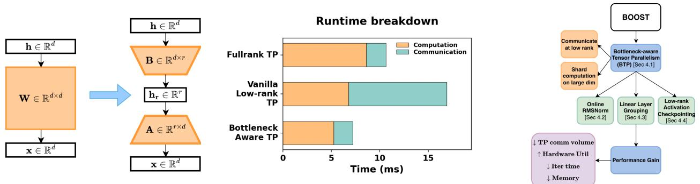

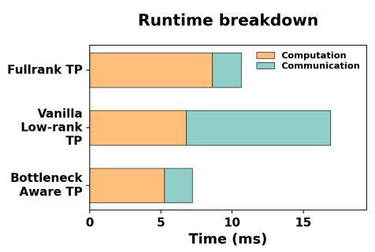  
Figure 1. (Left) Linear layer in Bottleneck Architecture; (Middle) Decoder block runtime breakdown among different TP strategy; (Right) Overview of our framework BOOST.

Limitations of state of the art: We cannot simply apply vanilla tensor parallelism techniques that were originally designed for full-rank methods to low-rank methods. As can be observed in Figure 1 (middle), a full-rank training iteration on four GPUs within one node (details in § 5.1) has less than 20% communication overhead, while an equivalent low-rank method experiences an explosion in the communication overhead. This is because the bottleneck architecture is based on smaller but deeper structures that feature more synchronization points, which increase the communication latency and volume. Additionally, the GPU utilization is also sub-optimal due to inefficient shapes of the weight matrices as partitioned by vanilla tensor parallelism onto individual devices, eroding algorithmic efficiency. Together, these limitations restrict the theoretical algorithmic scalability potential.

Contributions: To bridge this gap, we design and implement scalable tensor-parallel training strategy for efficient pre-training of low-rank (bottleneck) foundation models. We leverage the idea that synchronization points can either be avoided or placed strategically where the bottleneck architecture is narrow to reduce communication overheads. And we boost computation by sharding along the large dimensions to preserve healthy GEMM reduction sizes thus improving GPU utilization. We summarize our key contributions as follows:

• We present a theoretical analysis of bottleneck architectures in 3D parallelism, quantifying arithmetic intensity and communication volume in distributed training to reveal the scaling challenges of vanilla designs and the benefits of our approach.

• We propose a novel tensor parallelism strategy, namely, Bottleneck-aware Tensor Parallelism (BTP), which optimizes partitioning of low-rank weight matrices to facilitate efficient communication on low-rank activations. BTP also significantly increases the computational intensity of GEMM kernels, thus improving GPU utilization.

• We implement BOOST, a high-performance distributed training framework to take advantage of BTP in several ways: Online-RMSNorm to facilitate sharded-safe global normalization and reduce latency, Layer Grouping to improve computational intensity and lower the number of collective operations, and Low-rank Activation Checkpointing to reduce re-computation cost and eliminate additional collectives.

• We demonstrate a 1.46–1.91× speedup over full-rank baselines and a 1.87–2.27× speedup over vanilla tensor parallel implementations of bottleneck architectures. The ablation study further confirms efficiency gains on both the computation and communication axes.

## 2 RELATED WORK

Low-rank methods have been extensively explored in the literature from different perspectives, the most relevant of which we discuss below.

Low-Rank Matrix Factorization. Classical low-rank training schemes (Khodak et al., 2021; Kamalakara et al., 2022) replace a weight matrix W ∈ Rdout×din with W ≈ BA, where A ∈ Rr×din , B ∈ Rdout×r, r ≪ min(dout, din) determines the rank and thus the compression ratio. However, naively applying this low-rank matrix factorization often harms model accuracy in pre-training setting. Recent work proposed various modifications to improve model capacity. For example, ReLoRA (Lialin et al., 2023) adopted the LoRA (Hu et al., 2022) adapter with constantly merged and reinitialized low-rank factors. SLTrain (Han et al., 2024) combined an unstructured sparse matrix with low-rank factors to approximate W. LORO (Zhanfeng Mo, 2025) preserved the classical low-rank formulation but perform some optimization steps directly on the Riemannian manifold.

Low-Rank Activation via Auto-Encoder. Observing that the activation function of every layer stays in a low-rank space, CoLA (Liu et al., 2025) proposed to replace both an MLP layer σ(Wx) and a linear projection layer Wx by an auto-encoder layer Bσ(Ax). This method has achieved simultaneous reduction of perplexity, model size, memory cost and runtime in pre-training BERT and LLaMA. Recently LOST (Li et al., 2025) further modified CoLA by incorporating an unstructured sparse matrix S, similar to the ones in SLTrain, as αBσ(Ax) + (1 − α)Sx.

Low-Rank Models Enhanced by Residual Connection. Another promising direction is to boost the accuracy of existing low-rank architecture with some plug-in residual blocks. LaX (Zhang et al., 2025) proposed to fuse cross-layer lowrank features to boost model capacity without increasing their physical rank, i.e., Bi(Aixi + Ai−1xi−1). This method can improve the accuracy of low-rank matrix/tensorcompressed models as well as CoLA with negligible parameter and computing overhead. CR-Net (Kong et al., 2025) proposed a similar approach from a different perspective: the difference of activations between adjacent layers exhibit low-rank property, thus BiAixi + Bi−1Ai−1xi−1, with the exception of the first layer being full-rank.

Additionally, pre-training LLMs also requires sophisticated large-scale system-level optimizations. Two complementary paradigms dominate large-scale training:

Redundancy Elimimation using Model/Optimizer State Sharding. Methods such as ZeRO (Rajbhandari et al., 2020), ZeRO-Offload (Ren et al., 2021), ZeRO-Infinity (Rajbhandari et al., 2021) and PyTorch FSDP (Zhao et al., 2023) partition optimizer states, gradients, and parameters across devices to reduce memory footprint and enable training larger models. Representative implementations include DeepSpeed ZeRO (Rasley et al., 2020) and FairScale’s sharded optimizers (FairScale authors, 2021). Such techniques are complementary to our own work.

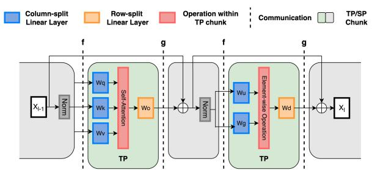  
Figure 2. Megatron-LM style Tensor Parallelism

3D Parallelism. Frameworks such as Megatron-LM and Megatron-DeepSpeed combine data (DP), tensor (TP), and pipeline (PP) parallelism to distribute memory and computation across devices for billion-parameter pre-training (Shoeybi et al., 2019; Narayanan et al., 2021). DP accelerates training by replicating the model across GPUs, processing different mini-batches in parallel, and synchronizing by gradient all-reduce once per iteration before the optimizer step. PP splits layers vertically into stages so micro-batches stream through as an assembly line, communicates activations/gradients at stage boundaries. Efficiency hinges on schedules such as GPipe/PipeDream (Huang et al., 2019; Narayanan et al., 2019) and on minimizing warm-up/drain bubbles. TP partitions the model horizontally, sharding individual weight matrices and corresponding activations across GPUs. Each device computes partial results that are later combined via tightly-coupled collective communication. TP builds on matrix/activation sharding (e.g., Mesh-TensorFlow, GShard, GSPMD) (Shazeer et al., 2018; Lepikhin et al., 2020; Xu et al., 2021). Megatron-LM adopts a standard column–row pattern: each TP chunk (two linears plus the intervening op such as SDPA/SwiGLU) issues one collective per pass, row-parallel all-reduce in forward, and column-parallel in backward (Figure 2) (Shoeybi et al., 2019).

To the best of our knowledge, we are the first to tackle the problem of how to optimize tensor parallelism for low-rank methods. In this sense, we aim to design and implement a general framework that focuses on low-rank methods that have unified bottleneck architecture such as CoLA, LORO and LaX. In practice, this class of methods typically provide the most training speed-up and memory footprint reduction with minimum impact on accuracy. Furthermore, although outside the scope of this work, our approach can be easily complemented by pipeline and data parallelism, in addition to other techniques such as redundancy elimination.

## 3 PRELIMINARIES

As shown in Figure 1 (Middle), naively scaling a bottleneck architecture exhibits both communication and computation inefficiencies. We quantify system efficiency with two complementary metrics:

Table 1. Per-iteration communication volume (Vcomm) under different parallelism strategies for full-rank and bottleneck architecture in LLaMA-like models.  
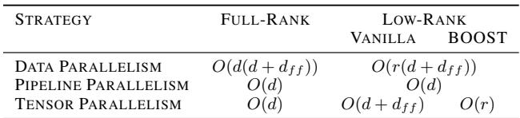

• Communication Volume Vcomm: bytes moved by collectives, lower Vcomm indicates reduced synchronization overhead and better scalability across devices;

• Arithmetic Intensity (A.I.): FLOPs per byte moved by kernels, a proxy for how close execution is to computebound. A higher A.I. indicates a compute-bound operation capable of saturating GPU compute units, while a lower A.I. denotes a memory-bound kernel limited by memory bandwidth. For a matrix multiplication C = A × B with A ∈ RM×K, B ∈ RK×N , and C ∈ RM×N , the total number of FLOPs is 2MNK. Assuming ideal memory reuse, the total memory traffic consists of reading A and B and writing C, yielding:

$$
\tag{1}
$$

DP and PP in Bottleneck Architectures. Table 1 summarizes the communication volume across different parallelism strategy. Low-rank bottleneck architectures intrinsically benefit DP and PP due to smaller parameter size and lowrank activations. Because factorized weights yield smaller gradients, bottleneck models reduce gradient all-reduce traffic. In LLaMA with r = d4 , this corresponds to an ∼ 2.5× reduction in communication volume. For pipeline parallelism, factorized layers lower per-stage FLOPs, which shortens per micro-batch compute and shrinks the pipeline bubble; the smaller footprint also permits larger micro-batches, improving arithmetic intensity and hardware utilization.

TP in Bottleneck Architectures. Contrary to being mostly model-agnostic in DP and PP, TP interacts directly with model structure: it shards activations and parameters in architecture-aware ways to balance compute intensity and communication. In the following section we will analyze why a naive low-rank TP degrades efficiency and motivates our bottleneck-aware TP design.

## 4 BOOST: BOTTLENECK-OPTIMIZED SCALABLE TRAINING

In this section, we introduce our BOOST framework and present the details of how it addresses scalability issues of low-rank (bottleneck) LLM training under 3D parallelism.

## 4.1 Bottleneck-aware Tensor Parallelism

Tensor parallelism is non-trivial for bottleneck layers. Replacing a single d×d projection with consecutive d×r and r×d projections (r ≪ d) doubles linear stages per block and raises two design questions: (i) Where to place TP chunks in deeper block? Since each TP chunk incurs one collective, adding stages increases the number of collectives per block. (ii) How to shard efficiently given the low-rank structure? Conventional TP reduces per-rank hidden width, but the bottleneck factorization already shrinks effective dimension, inefficient sharding can therefore harm hardware utilization by having a lower arithmetic intensity.

Vanilla low-rank Tensor Parallelism. A straightforward baseline follows the Megatron-LM pattern: treat each pair of low-rank layers (d×r then r×d) as a TP chunk: columnparallel for the down-projection, row-parallel for the upprojection. We refer to this as vanilla TP (top of Figure 3). However, this vanilla design introduces both communication and computation inefficiencies.

On the communication side, a full-rank Megatron style decoder block issues two activation-sized collectives of payload [b, s, d], i.e., V fullcomm = 2bsd (one in attention, one in MLP). In contrast, vanilla TP triggers a collective at each linear: 4 bsd in the attention block and bsd + 2 bs df f in the MLP, for a total of

$$
\tag{2}
$$

Thus the per-block volume grows by 5× when df f ≈2.5d, and up to 6.5× when df f ≈4d. This explains the large communication time observed in the breakdowns for naively scaled bottleneck models.

On the computation side, bottleneck architecture already reduces the effective hidden dimension, and vanilla TP further shards along the low rank r, shrinking the GEMM reduction dimension. This results in kernels that move a lot of data but perform little compute, lowering arithmetic intensity and pushing execution into the memory-bound regime. Although vanilla low-rank TP reduces FLOPs, its A.I. remains very low due to disproportionate data movement; for example, in LLaMA-7B MLP blocks it attains only 0.2× the A.I. of full-rank TP, leading to poor GPU utilization. This also explains why at scale the reduction in computation time is smaller than in the single-GPU setting.

Additionally, the up-projection materializes a full, unsharded activation even though each TP rank consumes only its local shard, leading to redundant allocation and unnecessary data movement.

Bottleneck-aware Tensor Parallelism (BTP). To address the inefficiencies of vanilla TP, we propose a bottleneckaware sharding strategy that leverages the low-rank rdimensional output of each pair of bottleneck layers to issue lightweight collectives. Concretely, this sharding strategy shifts the TP chunk boundary by exactly one individual bottleneck layer. The bottleneck-aware TP chunk starts with the up-projection layer (r × d) being column-parallel and the next down-projection layer (d × r) being row-parallel, while the intervened operations being executed on sharded activations. To shard along the large dimension and communicate at the low dimension, BTP improves both the communication efficiency and computation efficiency.

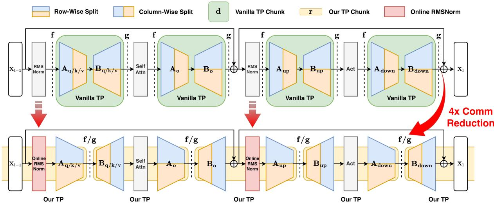  
Figure 3. Modularized Tensor Parallelism Design for Bottleneck Architecture

Effectively, BTP improves communication efficiency by reducing its workload. In BTP chunk, the collective operates on a low-rank activation of size [b, s, r] rather than [b, s, d]. Per decoder block, this yields a total payload of

$$
\tag{3}
$$

Thus BTP reduces communication volume by more than 5.7× versus vanilla low-rank TP (when r = d ) and by 1.14× versus the full-rank TP baseline, substantially lowering communication time in practice.

From the computation side, BTP shards along the hidden dimension rather than the low-rank dimension r, producing kernels with a larger GEMM reduction dimension and thus higher arithmetic intensity. Although BTP and vanilla TP perform the same FLOPs, BTP moves less data, yielding higher arithmetic intensity. For example, in LLaMA-7B MLP blocks, BTP achieves 2.5× the A.I. of vanilla TP, translating into substantially better hardware utilization.

## 4.2 Online RMSNorm

Sharded-safe vs. sharded-unsafe operators. In tensor parallelism, we assume no extra collectives inside a TP chunk: a single all-reduce is issued at the end of each chunk. Under this assumption, any operation inside the chunk that can be correctly performed on sharded activations is shardedsafe, e.g., element-wise functions (activations, dropout) and attention heads when the head count is divisible by the TP degree. Conversely, ops that require cross-shard data are sharded-unsafe; a canonical example is normalization, which depends on global mean and variance computations and therefore cannot be placed inside a TP chunk without additional synchronization.

A simple design principle is to avoid sharded-unsafe operations inside the chunk. However, with BTP the RMSNorm [Eq. (4)] naturally falls in the middle of a TP chunk, so we must handle it explicitly. We therefore introduce and compare two variants: Sync RMSNorm (explicit in-place statistic synchronization) and Online RMSNorm (fused statistic exchange with recovery).

$$
\tag{4}
$$

Sync RMSNorm. A straightforward approach is to compute per-rank local statistics RMS(Xi) and use a collective to aggregate the global statistic before normalizing. Although the payload is tiny (the statistic exchange at [b, s, 1]), many such calls incur nontrivial launch overhead, are latencydominated and achieve poor effective bandwidth, resulting in significant communication time.

Online RMSNorm. To eliminate the standalone smallpayload collective, we compute normalization using local statistics and fuse the statistic exchange into the TP collective that follows the next GEMM. This mirrors the insight of online-softmax in FlashAttention (Dao et al., 2022): defer global normalization and recover the exact result afterward.

Algorithm 1 Online RMSNorm   
Input: dlocal = d/TP size; sharded activation Xi ∈   
Rs×b×dlocal on TP rank i; row-split weight Wi ∈ Rdlocal×r ;   
scaling factor γi; numerical constant ϵ   
Output: Final output Y ∈ Rs×b×r   
1: rmslocal ← q dlocal 1 Pdlocalj=1 Xi[:, :, j]2 + ϵ (ci:d   
2 : Xi ← rmslocal Xi × γi   
3: Hi ← Xi · Wi   
4: [Hglobal, rmsglobal] ← AllReduce([Hi, rmslocal])   
5: α ← rmslocal   
rmsglobal   
6: Y ← Hglobal · α   
7: return Y

In effect, the previously sharded-unsafe RMSNorm becomes a sharded-safe online RMSNorm.

The online-RMSNorm operator consists of three main steps (Alg. 1): Step 1: Local norm computation. Compute and record the local RMS on sharded activations (Line 1) and calculate local RMSNorm (Line 2). Step 2: Rowsplit GEMM with fused all-reduce. Apply the following row-parallel GEMM (Line 3), then all-reduce together the GEMM output and the local statistic (Line 4). Step 3: Recovery. Form a per-row correction factor from the ratio of local/global statistics and rescale the reduced GEMM output (Line 5,6).

Online RMSNorm preserves mathematical equivalence: although the GEMM is performed using locally normalized inputs, the output can be rescaled by a per-row correction factor derived from the ratio of local to global statistics, making the result equivalent to standard RMSNorm. Specifically, we can show in Equation (5):

$$
\tag{5}
$$

It also improves numerical stability as computing norms locally on sharded activations reduces the chance of extreme values that could cause overflow or underflow. From a performance standpoint, local normalization reduces per-rank work via smaller dimension, and fusing the statistic exchange with the GEMM all-reduce removes a separate kernel launch and increases effective bandwidth by aggregating it into a larger message. The recovery is a cheap per-row scaling. Empirically, the recovery compute overhead is small relative to the latency-domiated statistic collective in Sync RMSNorm, making the computation-communication trade-off favorable.

## 4.3 Linear Layer Grouping

Although BTP outperforms vanilla TP, its extra sync point and small GEMMs still degrade efficiency. To translate

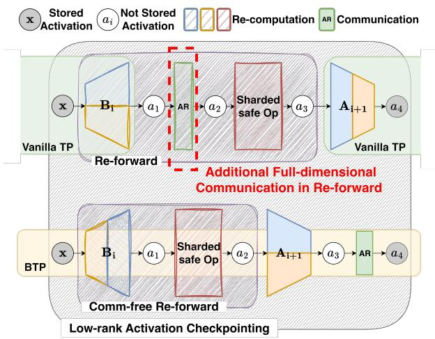  
Figure 4. Low-rank efficient activation checkpointing under BTP

BTP’s analytical gains into consistent per-layer speedups, we apply linear-layer grouping optimization.

In a full-rank model, we group parallel linears into a single fused operation (e.g., QKV in attention; gate+up in MLP) to reduce kernel launches and enlarge GEMMs. However, grouping is more challenging for bottleneck layers because branch inputs differ: while down-projections share X and can be grouped by concatenating weights, up-projections use distinct inputs (X1, X2, X3), so we use a batched GEMM over (input, weight) pairs in one fused kernel.

Under BTP, grouping delivers even larger benefits. On the compute path, it cuts kernel count and eliminates redundant reads of X, reducing total data movement, raising arithmetic intensity (A.I.) and hardware utilization. On the communication path, it lowers the number of collectives and improves effective bandwidth by increasing per-call payload, together producing a substantial boost in end-to-end efficiency.

## 4.4 Comm-free Low-rank Activation Checkpointing

As the model scales up, we use PP to span across nodes. However, standard 1F1B scheduling requires multiple microbatches in flight to fill pipeline bubbles, which inflates activation memory. Activation checkpointing is a common remedy, where intermediate results are partially saved in forward, and re-computed when needed in backward. When integrating with the bottleneck architecture, its low-rank activations provide a better choice for choosing the checkpointing interval that favors the tradeoff between memory and compute, as exemplified by CoLA-M (Liu et al., 2025).

However, vanilla-TP would weaken such benefit by introducing additional communications. From Figure 4, we see that its re-forward path contains the collective operation that lives between two consecutive TP chunks. Effectively, this triggers an extra synchronization point during re-forward.

In contrast, our BTP amplifies the benefit of low-rank checkpointing by aligning its boundaries with the checkpoint interval: the re-forward stays entirely within-chunk and requires no additional communication. As shown in Figure 4, within each BTP chunk (yellow) we checkpoint only low-rank activations (x and a4). In backward, we locally re-forward x → Bi → a1 → sharded-safe → a2 to reconstruct the input needed for the gradient computation of the subsequent up-projection Ai+1, resulting in a completely communication-free re-forward.

## 4.5 Implementation

Software Stack. We integrate BOOST into Nanotron (Tazi et al., 2025)1 pre-training framework as composable engines. Nanotron provides column/row-parallel linear APIs, a 3D (DP/TP/PP) execution engine, NCCL-based collectives that run on a dedicated communication stream, with built-in activation checkpointing. In our setup we operate in allreduce mode (no sequence-parallel chunks), and Nanotron currently do not support fine-grained overlapped all-reduces.

Model Implementation. For full-rank baseline we use Nanotron’s reference model. Low-rank variants factorize d×d→d×r, r×d and select matching col/row-parallel linears. For BTP, we shard the embedding output to row-split the first down-projection layer; the final up-projection layer is replicated on every TP rank. Online RMSNorm computes on sharded activations, returns local RMS, and piggybacks local stats in the next TP collective via all reduce coalesced. Grouping adds (i) concatenated down-projections (shared X) and (ii) batched-GEMM up-projections (distinct inputs) to cut launches and traffic. Checkpointing stores only lowrank boundaries via Nanotron’s decorator.

Configuration. Building on Nanotron’s example configs, we expose minimal knobs to toggle BOOST components: lowrank-architecture-type, enable-btp, enable-onlinermsnorm, enable-grouping, enable-lowrank-ckpt. When preconditions fail, we fall back to unfused operators or Sync RMSNorm; unsupported cases are auto-disabled safely.

Profiling. We use Nsight Systems for kernel time and Nanotron logs for step time, enabling end-to-end and micro-level attribution of speedups.

## 5 EVALUATION

## 5.1 Experimental Setup

Testbed. Our evaluations are conducted on the NERSC-Perlmutter supercomputer. Each node contains 192 CPU cores, 256 GB DDR4 memory, and 4×A100 GPUs, each containing 80GB HBM2 memory (320GB per node), with intra-node connection NVLink Gen3 and inter-node Slingshot 11. Following practice in BLOOM (Workshop et al., 2022), OPT (Zhang et al., 2022), and LLaMA (Dubey et al., 2024), we use tensor-parallelism for scaling within a node, and pipeline-parallelism for scaling across nodes. Because our optimizations mainly target TP and apply per pipeline stage, we report results on up to 4 nodes (16 GPUs) to highlight per-node performance and resource utilization use.

## 5.2 Methodology

Compared Approaches. Throughout our experiments, we compare three different tensor-parallellism strategies. FullRank-TP is representative of real-world TP deployments that do not perform low-rank compression, due to which they incur higher memory and runtime overheads. Vanilla-TP is a direct adaptation of the tensor-parallelism strategy proposed in Megatron-LM (Shoeybi et al., 2019) for lowrank architectures such as SVD, CoLA (Liu et al., 2025), and LAX (Zhang et al., 2025), which show reduced memory consumption and faster runtimes compared to full-rank in single GPU case. Lastly, we compare our proposed approach– BOOST, which incorporates the design principles discussed in § 4 to accelerate the training of low-rank bottleneck LLM architectures using tensor-parallelism.

Models, Dataset, and Runtime Configuration. We evaluate 5 different models of sizes 1B, 3B, 7B, 13B, and 30B parameters, all from the LLaMA-2 family under pure bf16 training. For system performance checks we use WikiText dataset with sequence length 4096, matching real-world settings (Lang et al., 2024). Unless stated, we use a batch size of 4, tensor-parallelism of degree 4 (equal to the number of GPUs per node), pipeline and data-parallelism of 1, and disable activation checkpointing for faster iterations. As a representative of bottleneck architecture LLM, we primarily use CoLA (Liu et al., 2025) as its algorithmic effectiveness has been most thoroughly validated across different bottleneck architectures. Nonetheless, we demonstrate the generalizability of our proposed design principles to other low-rank approaches such as SVD (Zhanfeng Mo, 2025; Wang et al., 2025), and LAX (Zhang et al., 2025). For each experiment, we run 10 training iterations, of which the first 2 are considered as warm-up, and we report an average of the remainder 8 iterations.

Key Performance Metrics. Throughout our evaluations, we study the compared approaches using different metrics. First, we consider the Average Iteration Time, which captures the holistic performance impacts, and is representative of the end-to-end time taken throughout the training process. Next, we measure the Kernel Execution Time to break down the computational time taken by different GEMM operations, which also yields the corresponding FLOPS for understanding the kernel efficiency. Third, we study the Hardware Utilization, measured as a percentage of the peak computational capability of the GPU, to understand resource usage by different approaches. Fourth, to study TP communication overheads, we measure the communication volume and time of data transfers. Finally, we measure the memory saving and runtime overheads when enabling activation checkpointing.

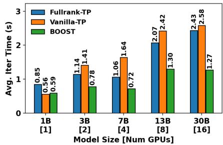

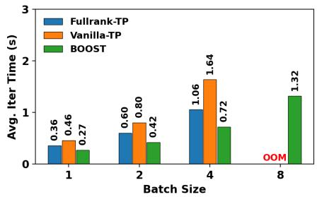

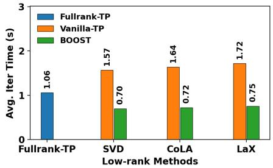  
Figure 5. System-wide scalability and generality. (Left) Average iteration time on scaling model sizes with #GPUs; (Middle) Average iteration time on scaling micro-batch size; (Right) Average iteration time on different low-rank architecture.

## 5.3 Overall Training Performance

Scaling Model Sizes. In our first set of experiments, we evaluate the impact of weak scaling model sizes from 1B to 30B. For smaller models– 1B, 3B, 7B, that fit in a single node, we keep increasing the tensor-parallelism degree, and beyond the 7B model, we use pipeline parallelism of degree 2 and 4 for the 13B and 30B models, respectively. We use the iteration time to study the scalability behavior for different model sizes.

As shown in Figure 5(left), the 1B model (with no TP) is 1.4× faster with low rank, confirming baseline efficiency of bottleneck architectures for LLMs. On scaling to 3B model with 2 GPUs or higher, FullRank-TP outperforms Vanilla-TP by ∼25% because vanilla’s extra collectives and low-A.I. kernels offsets FLOP savings (§4.1). In contrast, BOOST achieves up to 1.91× over FullRank-TP and 2.28× over Vanilla-TP. Even with cross-node PP at 13B/30B, BOOST ’s TP optimizations significantly reduce iteration time, demonstrating end-to-end scalability.

Scaling Batch Sizes. In the next set of experiments, we study the impact of increasing batch sizes on different approaches. We consider the 7B model running with a tensorparallelism degree of 4, and scale the micro-batch size from 1· · · 8, until every approach runs out of memory (OOM). As depicted in Figure 5(middle), with increasing batch sizes of 1, 2, and 4, we see BOOST outperforms the FullRank-TP by 1.3×, 1.42×, and 1.48×, respectively, showing a linear acceleration in performance due to better hardware utilization of larger batches. Similar to scaling of models, Vanilla-TP shows the worst performance across the compared approaches because it collects full hidden states and holds redundant activations (§ 4.1), while BOOST avoids these memory overheads, preserving the memory efficiency of low-rank bottleneck architectures for tensor-parallel setups, resulting in accommodating larger batch sizes. Finally, we observe that BOOST’s reduced memory footprint allows us to train larger batches while showing a superlinear scalability trend.

Extending Across Different Bottleneck Architectures. Next, we demonstrate the generality of our approach across different LLM bottleneck architectures- SVD, CoLA, and LaX. We use the 7B model with 4 GPUs and compare the average iteration time for all approaches. Given the diversity of factorization methods used for producing low-rank architectures, through this experiment, we study whether the different underlying bottleneck structure of transformer blocks impact training performance when scaling across tensor-parallel ranks. As seen in Figure 5(right), BOOST outperforms Vanilla-TP and FullRank-TP approaches by 1.5× and 2.2×, respectively, for all low-rank approaches. The slight variations in the iteration times are a result of differences in their respective low-rank architectures– SVD runs fastest because of no intervening operations, CoLA is slower due to a nonlinearity between the low-rank linear layers, and LaX is slowest owing to an added residual path. These results underpin the versatility of the design formulations proposed in FullRank-TP to optimize the communication and computations across different bottleneck architectures, irrespective of how the layers were factorized.

## 5.4 Computation Efficiency

In the next series of experiments, we study the computation efficiency introduced by BOOST and quantify its impact on GEMM time and hardware utilization. We instrument each linear layer (attention QKV/out and MLP gate/up/down) in LLaMA-7B/13B and compare FullRank-TP, Vanilla-TP, and our approach BOOST. For each linear layer, we report (i) theoretical work (FLOPs) alongside measured GEMM time, and (ii) the resulting hardware utilization. This analysis explains why our design accelerates computation and verifies alignment with the predictions in § 4.1.

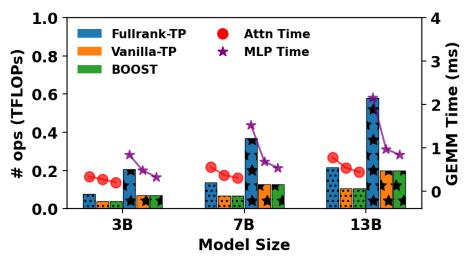

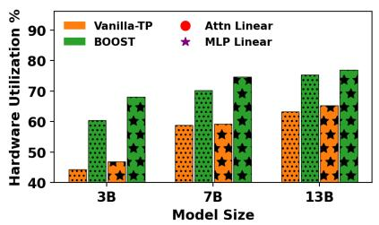

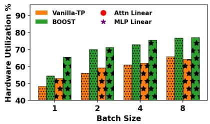

Figure 6. Computation Efficiency. (Left) Linear layer FLOPs and GEMM kernel time under different TP designs; (Middle) Hardware utilization of vanilla TP and BOOST for each linear layer; (Right) Hardware utilization on scaling micro-batch size for each linear layer.  
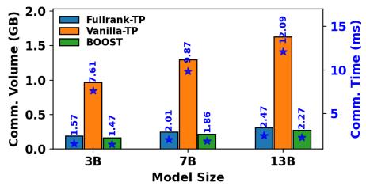

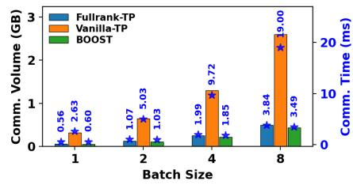

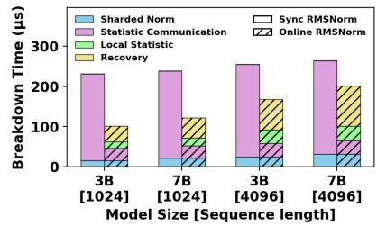  
Figure 7. (Left) Communication volume and time on different TP strategy; (Middle) Communication volume and time on scaling microbatch size; (Right) Online-RMSNorm breakdown.

Figure 6 (left) shows that both low-rank designs, including Vanilla-TP and BOOST, perform substantially fewer FLOPs and achieve shorter GEMM times than FullRank-TP. The reductions are more pronounced in the MLP linears, where the factorization targets the larger df f dimension, yielding a bigger drop in work than in attention. This explains why low-rank methods are faster than fullrank in computation. Importantly, Vanilla-TP and BOOST have the same FLOP counts and do the same amount of math.

Figure 6 (middle) shows why BOOST finishes the GEMMs faster than Vanilla-TP despite their identical FLOP counts. From the figure we can see that BOOST sustains higher hardware utilization in both attention and MLP linears. The improvement comes from a more hardware-friendly shard layout: BOOST splits along the larger dimension, yielding GEMMs with larger reduction dimension, which are more compute-bound and less memory-bound. This aligns well with our arithmetic intensity analysis in § 4.1.

From Figure 6 (right), we observe that as the micro-batch size increases, utilization rises for all methods because of more work per launch and better arithmetic intensity. BOOST remains consistently higher than Vanilla-TP across batches and layers, demonstrating the efficiency of its kernels to stay closer to the compute-bound regime and achieving end-to-end speedups.

Together, these results show that BOOST not only preserves the algorithmic efficiency of low-rank models, but also substantially improves hardware utilization—bridging the gap between theoretical compression and practical speedup.

## 5.5 Communication Efficiency

We instrument TP collectives and report the total communication volume per decoder block per pass and the corresponding wall-clock communication time. We compare FullRank-TP, Vanilla-TP, and BOOST across 7B/13B model sizes and varying micro-batch sizes.

From Figure 7 (left), we can see that Vanilla-TP communicates far more than FullRank-TP because each bottleneck block adds an extra TP chunk, making two activation allreduces per block with payloads at the full hidden size d or even the intermediate size df f (§ 4.1). This inflates both communication volume and time. In contrast, BOOST also increases the number of collectives, but performs them on low-rank activations (bsr instead of bsd), leading to a communication volume smaller than FullRank-TP and orders of magnitude below Vanilla-TP. The measured time reflects the same reduction, up to 8% faster than FullRank-TP and 5.3× faster than Vanilla-TP in communication.

As the micro-batch size grows (Figure 7 (middle)), communication volume increases roughly linearly for all methods. The slope for Vanilla-TP is steep because of extra full-hidden activations. BOOST ’s growth grows much gentler because it communicates on low-rank payloads, and it remains consistently faster than FullRank-TP across batch sizes.

These measurements show that our BOOST substantially reduces TP communication volume and time compared to Vanilla-TP, and keeps it below FullRank-TP. This communication efficiency is a key contributor to the end-to-end throughput gains observed as models and batch size scale.

Table 2. Per-decoder-block time (µs) for Default vs.Grouped linearlayer on CoLA LLaMA-7B model.  
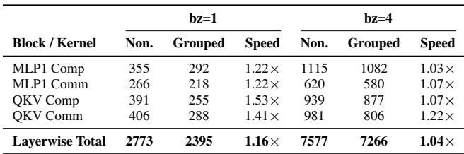

## 5.6 Optimization Ablations

Online RMSNorm. Repositioning the TP chunk places sharded-unsafe RMSNorm inside the chunk, we therefore compare Sync vs. Online RMSNorm. Communication overhead for Online RMSNorm is measured as the difference between communication time with fusion and without fusion; per-step breakdowns are in Figure 7(right).

From this figure, we can observe that: 1) Normalization compute on sharded activations is effectively identical for both methods, the performance gap stems from communication, not arithmetic. 2) Sync RMSNorm is dominated by statistic communication, although its volume is tiny, it suffers high latency from kernel-launch overhead and poor effective bandwidth, so the pink bar is large and nearly flat across model sizes. With longer sequences, it grows modestly for the same reason, it is now launch/latency-bound instead of throughput-bound. 3) Online RMSNorm introduces minimal communication overhead because the statistic exchange is fused into the TP collective, adding little extra traffic when bandwidth is already saturated. Its runtime increase with model size/sequence length is driven primarily by the extra compute in recovery step, not by communication.

Overall, this highlights a clear communication–computation tradeoff: Online RMSNorm replaces the latency-dominated statistic exchange with a fused path, dramatically reducing communication time; the modest extra compute is more than offset by the lower communication cost.

Linear Layers Grouping. As shown in Table 2, grouping improves both compute and communication for the QKV projection and the MLP gate–up path. On compute, grouping amortizes activation reads and enlarges the effective GEMM, raising A.I. and utilization (e.g., 1.53× for QKV at bz=1, 1.07× at bz=4). On communication, it reduces kernel launches and increases per-call payload, improving effective bandwidth (e.g., 1.41× for QKV at bz=1, 1.22× at bz=4). Aggregated per block, this yields a 1.16× speedup at bz=1 and 1.04× at bz=4, confirming that grouping translates analytical gains into end-to-end savings across batch sizes.

Table 3. Activation checkpointing efficiency on LLaMA-7B. ∆Mem and + Time are measured with no ckpt. at the same batch size. Effckpt = ∆Mem/(+Time) (MB per ms; higher is better).  
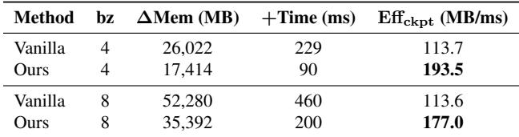

Note that the gains are larger at bz=1 than at bz=4. With a smaller per-GPU workload, kernels are more memorybound and exhibit lower hardware utilization, so grouping’s effects in larger effective GEMMs and fewer launches will translate into a bigger speedup.

Efficient Activation Checkpointing. Table 3 compares low-rank activation checkpointing under Vanilla-TP and BOOST. For each batch size, we report activation memory saved by checkpointing (∆Mem), extra re-forward time (+Time), and efficiency Effckpt = ∆Mem/(+Time). Larger values indicate more memory saved per unit of reforward.

Our method consistently yields higher Effckpt: for bz=4, 193.5 MB/ms for BOOST vs. 113.7 MB/ms for Vanilla-TP (1.70×); for bz=8, 177.0 for BOOST vs. 113.6 MB/ms for Vanilla-TP (1.56×). Although the absolute ∆Mem of the BOOST is smaller because Vanilla-TP incurs extra activation memory (§ 4.1), its substantially lower re-forward cost (+Time) yields a higher Effckpt.

This gain of Effckpt stems from BOOST eliminating extra communication in the re-forward path (§4.4), making activation checkpointing more efficient.

## 6 CONCLUSION

We have introduced BOOST, a framework for efficiently training large-scale low-rank bottleneck transformer models. By analyzing the computation and communication characteristics of bottleneck architectures, we identified key inefficiencies in naive tensor parallelism, including low arithmetic intensity and excessive communication volume. Our Bottleneck-aware Tensor Parallelism (BTP) design addresses these challenges by redefining TP chunk boundaries to raise GEMM efficiency and cut communication, while Online RMSNorm, linear grouping, and low-rank checkpointing further reduce launches and syncs. Across multiple low-rank architectures and model sizes, BOOST delivers consistent speedups over full-rank TP and vanilla low-rank TP, approaching high hardware utilization while preserving compression benefits, making it a practical, scalable solution for low-rank LLM pre-training.

## REFERENCES

Abecassis, F., Agrusa, A., Ahn, D., Alben, J., Alborghetti, S., Andersch, M., Arayandi, S., Bjorlin, A., Blakeman, A., Briones, E., et al. Pretraining large language models with nvfp4. arXiv preprint arXiv:2509.25149, 2025.

Ainslie, J., Lee-Thorp, J., De Jong, M., Zemlyanskiy, Y., Lebron, F., and Sanghai, S. Gqa: Training generalized ´ multi-query transformer models from multi-head checkpoints. arXiv preprint arXiv:2305.13245, 2023.

Brown, T., Mann, B., Ryder, N., Subbiah, M., Kaplan, J. D., Dhariwal, P., Neelakantan, A., Shyam, P., Sastry, G., Askell, A., et al. Language models are few-shot learners. Advances in neural information processing systems, 33: 1877–1901, 2020.

Chen, Y., Zhang, Y., Liu, Y., Yuan, K., and Wen, Z. A memory efficient randomized subspace optimization method for training large language models. arXiv preprint arXiv:2502.07222, 2025.

Chmiel, B., Fishman, M., Banner, R., and Soudry, D. Fp4 all the way: Fully quantized training of llms. arXiv preprint arXiv:2505.19115, 2025.

Dao, T., Fu, D. Y., Ermon, S., Rudra, A., and Re, C. FlashAt-´ tention: Fast and memory-efficient exact attention with IO-awareness. In Advances in Neural Information Processing Systems (NeurIPS), 2022.

Dubey, A., Jauhri, A., Pandey, A., Kadian, A., Al-Dahle, A., Letman, A., Mathur, A., Schelten, A., Yang, A., Fan, A., et al. The llama 3 herd of models. arXiv e-prints, pp. arXiv–2407, 2024.

FairScale authors. Fairscale: A general purpose modular pytorch library for high performance and large scale training. https://github.com/ facebookresearch/fairscale, 2021.

Gabriel, E., Fagg, G. E., Bosilca, G., Angskun, T., Dongarra, J. J., Squyres, J. M., Sahay, V., Kambadur, P., Barrett, B., Lumsdaine, A., et al. Open mpi: Goals, concept, and design of a next generation mpi implementation. In European Parallel Virtual Machine/Message Passing Interface Users’ Group Meeting, pp. 97–104. Springer, 2004.

Han, A., Li, J., Huang, W., Hong, M., Takeda, A., Jawanpuria, P. K., and Mishra, B. Sltrain: a sparse plus low rank approach for parameter and memory efficient pretraining. Advances in Neural Information Processing Systems, 37: 118267–118295, 2024.

Hoffmann, J., Borgeaud, S., Mensch, A., Buchatskaya, E., Cai, T., Rutherford, E., Casas, D. d. L., Hendricks, L. A., Welbl, J., Clark, A., et al. Training compute-optimal

large language models. arXiv preprint arXiv:2203.15556, 2022.

Hu, E. J., Shen, Y., Wallis, P., Allen-Zhu, Z., Li, Y., Wang, S., Wang, L., Chen, W., et al. Lora: Low-rank adaptation of large language models. ICLR, 1(2):3, 2022.

Huang, Y., Cheng, Y., Bapna, A., Firat, O., Chen, D., Chen, M., Lee, H., Ngiam, J., Le, Q. V., Wu, Y., et al. Gpipe: Efficient training of giant neural networks using pipeline parallelism. Advances in neural information processing systems, 32, 2019.

Jacobs, R. A., Jordan, M. I., Nowlan, S. J., and Hinton, G. E. Adaptive mixtures of local experts. Neural computation, 3(1):79–87, 1991.

Jordan, M. I. and Jacobs, R. A. Hierarchical mixtures of experts and the em algorithm. Neural computation, 6(2): 181–214, 1994.

Kamalakara, S. R., Locatelli, A., Venkitesh, B., Ba, J., Gal, Y., and Gomez, A. N. Exploring low rank training of deep neural networks. arXiv preprint arXiv:2209.13569, 2022.

Kaplan, J., McCandlish, S., Henighan, T., Brown, T. B., Chess, B., Child, R., Gray, S., Radford, A., Wu, J., and Amodei, D. Scaling laws for neural language models. arXiv preprint arXiv:2001.08361, 2020.

Khodak, M., Tenenholtz, N., Mackey, L., and Fusi, N. Initialization and regularization of factorized neural layers. arXiv preprint arXiv:2105.01029, 2021.

Kong, B., Liang, J., Liu, Y., Deng, R., and Yuan, K. Crnet: Scaling parameter-efficient training with cross-layer low-rank structure. arXiv preprint arXiv:2509.18993, 2025.

Korthikanti, V. A., Casper, J., Lym, S., McAfee, L., Andersch, M., Shoeybi, M., and Catanzaro, B. Reducing activation recomputation in large transformer models. Proceedings of Machine Learning and Systems, 5:341–353, 2023.

Lang, J., Chen, F., Fan, H., Zhou, H., Wang, Y., and Huan, J. End-to-end llm training on instance clusters with over 100 nodes using aws trainium. Amazon Web Services Machine Learning Blog, 2024. Available online: https://aws.amazon.com/blogs/machinelearning/end-to-end-llm-trainingon-instance-clusters-with-over-100- nodes-using-aws-trainium/ (accessed Oct 2025).

Lepikhin, D., Lee, H., Xu, Y., Chen, D., Firat, O., Huang, Y., Krikun, M., Shazeer, N., and Chen, Z. Gshard: Scaling giant models with conditional computation and automatic sharding, 2020.

Li, J., Yin, L., Shen, L., Xu, J., Xu, L., Huang, T., Wang, W., Liu, S., and Wang, X. Lost: Low-rank and sparse pre-training for large language models. arXiv preprint arXiv:2508.02668, 2025.

Lialin, V., Shivagunde, N., Muckatira, S., and Rumshisky, A. Relora: High-rank training through low-rank updates. arXiv preprint arXiv:2307.05695, 2023.

Liang, W., Liu, T., Wright, L., Constable, W., Gu, A., Huang, C.-C., Zhang, I., Feng, W., Huang, H., Wang, J., et al. Torchtitan: One-stop pytorch native solution for production ready llm pre-training. arXiv preprint arXiv:2410.06511, 2024.

Liu, Z., Zhang, R., Wang, Z., Yang, Z., Hovland, P., Nicolae, B., Cappello, F., and Zhang, Z. Cola: Computeefficient pre-training of llms via low-rank activation. arXiv preprint arXiv:2502.10940, 2025.

Loeschcke, S., Toftrup, M., Kastoryano, M., Belongie, S., and Snæbjarnarson, V. Loqt: Low-rank adapters for quantized pretraining. Advances in Neural Information Processing Systems, 37:115282–115308, 2024.

Luccioni, A. S., Viguier, S., and Ligozat, A.-L. Estimating the carbon footprint of bloom, a 176b parameter language model. Journal of machine learning research, 24(253): 1–15, 2023.

Micikevicius, P., Stosic, D., Burgess, N., Cornea, M., Dubey, P., Grisenthwaite, R., Ha, S., Heinecke, A., Judd, P., Kamalu, J., et al. Fp8 formats for deep learning. arXiv preprint arXiv:2209.05433, 2022.

Narayanan, D., Harlap, A., Phanishayee, A., Seshadri, V., Devanur, N. R., Ganger, G. R., Gibbons, P. B., and Zaharia, M. Pipedream: Generalized pipeline parallelism for dnn training. In Proceedings of the 27th ACM symposium on operating systems principles, pp. 1–15, 2019.

Narayanan, D., Shoeybi, M., Casper, J., LeGresley, P., Patwary, M., Korthikanti, V., Vainbrand, D., Kashinkunti, P., Bernauer, J., Catanzaro, B., et al. Efficient large-scale language model training on gpu clusters using megatronlm. In Proceedings of the international conference for high performance computing, networking, storage and analysis, pp. 1–15, 2021.

Peng, H., Wu, K., Wei, Y., Zhao, G., Yang, Y., Liu, Z., Xiong, Y., Yang, Z., Ni, B., Hu, J., et al. Fp8-lm: Training fp8 large language models. arXiv preprint arXiv:2310.18313, 2023.

Qi, P., Wan, X., Huang, G., and Lin, M. Zero bubble pipeline parallelism. arXiv preprint arXiv:2401.10241, 2023.

Rajbhandari, S., Rasley, J., Ruwase, O., and He, Y. Zero: Memory optimizations toward training trillion parameter models. In SC20: International Conference for High Performance Computing, Networking, Storage and Analysis, pp. 1–16. IEEE, 2020.

Rajbhandari, S., Ruwase, O., Rasley, J., Smith, S., and He, Y. Zero-infinity: Breaking the gpu memory wall for extreme scale deep learning. In Proceedings of the international conference for high performance computing, networking, storage and analysis, pp. 1–14, 2021.

Rasley, J., Rajbhandari, S., Ruwase, O., and He, Y. Deepspeed: System optimizations enable training deep learning models with over 100 billion parameters. In Proceedings of the 26th ACM SIGKDD international conference on knowledge discovery & data mining, pp. 3505–3506, 2020.

Ren, J., Rajbhandari, S., Aminabadi, R. Y., Ruwase, O., Yang, S., Zhang, M., Li, D., and He, Y. {Zero-offload}: Democratizing {billion-scale} model training. In 2021 USENIX Annual Technical Conference (USENIX ATC 21), pp. 551–564, 2021.

Sanders, J., Emberson, L., and Edelman, Y. What did it take to train grok 4?, 2025. URL https://epoch.ai/data-insights/grok-4-training-resources. Accessed: 2025-10-25.

Shamshoum, Y., Hodos, N., Sieradzki, Y., and Schuster, A. Compact: Compressed activations for memory-efficient llm training. arXiv preprint arXiv:2410.15352, 2024.

Shazeer, N. Fast transformer decoding: One write-head is all you need. arXiv preprint arXiv:1911.02150, 2019.

Shazeer, N., Cheng, Y., Parmar, N., Tran, D., Vaswani, A., Koanantakool, P., Hawkins, P., Lee, H., Hong, M., Young, C., Sepassi, R., and Hechtman, B. Mesh-TensorFlow: Deep learning for supercomputers. In Neural Information Processing Systems, 2018.

Shoeybi, M., Patwary, M., Puri, R., LeGresley, P., Casper, J., and Catanzaro, B. Megatron-lm: Training multibillion parameter language models using model parallelism. arXiv preprint arXiv:1909.08053, 2019.

Tazi, N., Mom, F., Zhao, H., Nguyen, P., Mekkouri, M., Werra, L., and Wolf, T. The ultra-scale playbook: Training llms on gpu clusters, 2025.

Walker, D. W. and Dongarra, J. J. Mpi: a standard message passing interface. Supercomputer, 12:56–68, 1996.

Wang, S., Li, B. Z., Khabsa, M., Fang, H., and Ma, H. Linformer: Self-attention with linear complexity. arXiv preprint arXiv:2006.04768, 2020.

Wang, X., Zheng, Y., Wan, Z., and Zhang, M. SVD-LLM: Truncation-aware singular value decomposition for large language model compression. In International Conference on Learning Representations (ICLR), 2025. URL https://openreview.net/forum? id=LNYIUouhdt.

Workshop, B., Scao, T. L., Fan, A., Akiki, C., Pavlick, E., Ilic, S., Hesslow, D., Castagn ´ e, R., Luccioni, A. S., Yvon, ´ F., et al. Bloom: A 176b-parameter open-access multilingual language model. arXiv preprint arXiv:2211.05100, 2022.

Xi, H., Li, C., Chen, J., and Zhu, J. Training transformers with 4-bit integers. Advances in Neural Information Processing Systems, 36:49146–49168, 2023.

Xu, Y., Lee, H., Chen, D., Hechtman, B., Huang, Y., Joshi, R., Krikun, M., Lepikhin, D., Ly, A., Maggioni, M., et al. Gspmd: general and scalable parallelization for ml computation graphs. arXiv preprint arXiv:2105.04663, 2021.

Yang, Z., Liu, Z., Choudhary, S., Xie, X., Gao, C., Kunzmann, S., and Zhang, Z. Comera: Computing-and memory-efficient training via rank-adaptive tensor optimization. Advances in Neural Information Processing Systems, 37:77200–77225, 2024.

Yuan, J., Gao, H., Dai, D., Luo, J., Zhao, L., Zhang, Z., Xie, Z., Wei, Y., Wang, L., Xiao, Z., et al. Native sparse attention: Hardware-aligned and natively trainable sparse attention. arXiv preprint arXiv:2502.11089, 2025.

Zhanfeng Mo, Long-kai Huang, S. J. P. Parameter and memory efficient pretraining via low-rank riemannian optimization. In The Thirteenth International Conference on Learning Representations, 2025. URL https:// openreview.net/forum?id=i0zzO7Hslk.

Zhang, R., Liu, Z., Wang, Z., and Zhang, Z. Lax: Boosting low-rank training of foundation models via latent crossing. arXiv preprint arXiv:2505.21732, 2025.

Zhang, S., Roller, S., Goyal, N., Artetxe, M., Chen, M., Chen, S., Dewan, C., Diab, M., Li, X., Lin, X. V., et al. Opt: Open pre-trained transformer language models. arXiv preprint arXiv:2205.01068, 2022.

Zhao, J., Zhang, Z., Chen, B., Wang, Z., Anandkumar, A., and Tian, Y. Galore: Memory-efficient llm training by gradient low-rank projection. arXiv preprint arXiv:2403.03507, 2024.

Zhao, Y., Gu, A., Varma, R., Luo, L., Huang, C.-C., Xu, M., Wright, L., Shojanazeri, H., Ott, M., Shleifer, S., et al. Pytorch fsdp: experiences on scaling fully sharded data parallel. arXiv preprint arXiv:2304.11277, 2023.

Zhu, H., Zhang, Z., Cong, W., Liu, X., Park, S., Chandra, V., Long, B., Pan, D. Z., Wang, Z., and Lee, J. Apollo: Sgdlike memory, adamw-level performance. arXiv preprint arXiv:2412.05270, 2024.

## A APPENDIX

## A.1 Detailed Performance Analysis

Communication volume analysis. We report per-iteration communication volume Vcomm for a LLaMA-style decoder in Table 4 with l layers, microbatch size b, sequence length s, hidden size d, MLP expansion df f , low-rank size r ≪d, and pipeline degree p. The counts assume Megatron-style implementations, no sequence parallelism, constants and embedding/norm traffic are omitted for clarity.

DP. Gradient synchronization volume scales with parameter size. For full rank, each layer’s attention contributes 4d2 (Q,K,V,O) and MLP contributes 3ddf f (gate, up, down), giving l(4d2 + 3ddf f ). For low-rank variants (both Vanilla and Ours), replace d2 → 2dr and ddf f → dr + df f r consistent with factorized weights across the same 4+3 linear maps, yielding l(11dr + 3df f r).

PP. Pipeline activations of size [b, s, d] traverse stage boundaries in forward/backward. Abstracting per-edge factors and schedule details, volume scales as pbsd (with p stages) per pass, the same for full rank and low rank because boundary tensors are at width d in this configuration.

TP. In Megatron’s column–row pattern, each decoder block issues one activation-sized collective in attention and one in MLP per pass, i.e., 2 × [b, s, d] per layer. Accounting for forward and backward gives 2l(2bsd). Vanilla Low-rank TP treats each low-rank linear separately increases collective count. Per pass, attention triggers 4bsd (one per d×r/r×d linear) and MLP triggers bsd + 2bs df f (down plus up), totaling (5bsd + 2bsdf f ); forward+backward yields 2l(5bsd + 2bsdf f ). With BOOST, the TP chunk boundary is shifted so the single collective happens at low-rank tensor [b, s, r]. Summing over chunks gives 7 bsr per pass and thus 2l(7bsr) per iteration. This replaces O(d) activation-sized traffic with O(r), explaining the large reduction relative to full rank and Vanilla low rank.

Arithmetic Intensity analysis. We report per-MLP–block arithmetic intensity (A.I. = FLOPs / data moved) under three TP designs (Table 5. Let hidden size be d, expansion df f = αd, low-rank size r with d = βr (β = d/r), microbatch b, sequence length s, and TP degree TP. We count forward only GEMMs and the dominant activation/weight traffic; constants, bias/elementwise ops, and embedding/norm terms are omitted.

The result separates algorithmic vs. system effects. First, both low-rank variants (Vanilla and BOOST) have strictly fewer FLOPs than Full-rank TP, this is the algorithmic efficiency of bottleneck factorization (d × d → d × r, r × d with r ≪ d). Second, within the low-rank family, Vanilla and BOOST have the same FLOPs: the TP design does not change the amount of math, only how it is scheduled and communicated. Third, BOOST’s advantage comes from lower data movement: by sharding along the large dimension and communicating on the low-rank path, BOOST reduces activation traffic and yields higher arithmetic intensity (more FLOPs per byte). Hence, the performance gap between Vanilla and BOOST is a system-level gain (communication/memory traffic), not an algorithmic one.

## A.2 Model Configuration

Table 6 lists the LLaMA-style model settings used in our experiments. For each size (1B–30B), we specify the number of transformer layers, hidden width d, and MLP expansion df f , alongside a canonical low rank r = d/4 for the bottleneck variants (SVD/CoLA/LaX). These configurations follow common scaling rules while keeping r proportional to d so that accuracy remains comparable and the system effects of low-rank factorization (communication volume and arithmetic intensity) are isolated. We use these fixed shapes across all TP/PP settings to ensure that reported performance differences stem from the parallelism design rather than architectural changes.

## A.3 Low-rank Training Algorithm

Common setup. Unless noted otherwise, we use pure bf16 for training with AdamW and a single fused CUDA kernel that updates parameters and optimizer states.

SVD baseline (system baseline). To establish a systemperformance lower bound with minimal algorithmic changes, we mechanically replace every full-rank linear W with two low-rank linears:

$$
\tag{6}
$$

No nonlinearity is introduced between B and A. This variant isolates the effect of reduced arithmetic/memory while keeping the computation graph closest to the full-rank case.

CoLA variant (nonlinear bottleneck). For CoLA, we insert a nonlinearity in the low-rank pathway. Concretely, with SwiGLU as the nonlinearity, following the original paper setting,

$$
\tag{7}
$$

LaX variant (residual low-rank). For LaX, we implement a residual low-rank path using an Identity Gate and inter-layer LaX (low-rank residual):

$$
\tag{8}
$$

Table 4. Per iteration communication volume (Vcomm) under different parallelism strategies for full-rank and bottleneck architecture in Llama-like models.  
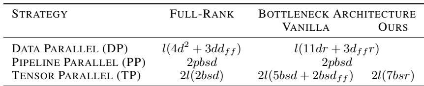

Table 5. Per MLP block GEMM arithmetic intensity (A.I.) for fullrank TP, vanilla low-rank TP and bottleneck-aware TP (Assuming dff = αd, d = βr).  
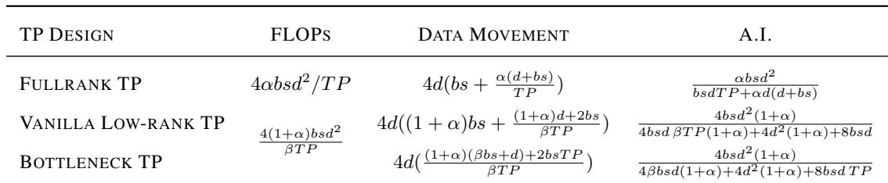

Table 6. Model configuration (LLaMA-style). We use a canonical low rank r =d/4.  
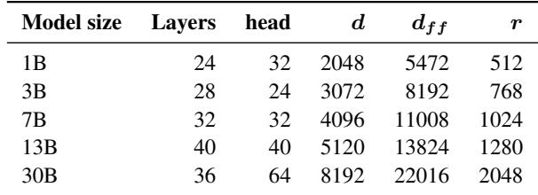

## A.4 Linear Grouping Details

Figure 8 details our linear-grouping implementation. In BTP, the first down-projection is row-parallel; we therefore concatenate the weights along the rank dimension and execute a single GEMM to produce a wider activation, which is then split per path. The subsequent all-reduce remains unchanged. For the column-parallel up-projections, we stack weights/activations and use a batched GEMM (e.g., einsum) to accommodate the stacked shapes.

## A.5 Framework Details

Process groups and topology. Nanotron exposes a ParallelContext that constructs and tracks all process groups for 3D parallelism (DP/TP/PP) alongside a world group. It provides rank mapping utilities (world rank matrix, local rank queries) and lets modules invoke collectives on the correct subgroup granularity.

Tensor parallelism (TP). Nanotron implements Megatron-style column/row-parallel linears, parallel vocabulary, cross-entropy over sharded logits, and distributed samplers. Different sharding patterns trade duplicated compute for reduced communication; engines select the appropriate collective (e.g., all-reduce or all-gather) over the TP group.

Pipeline parallelism (PP). Models are assembled from PipelineBlocks, a lightweight wrapper that pins a submodule to a PP rank and routes tensors via TensorPointer when a rank is not responsible for compute. We use One-Forward-One-Backward (1F1B) scheduling.

Parameter metadata. To make sharding and tying explicit, Nanotron augments nn.Parameter with metadata: (i) Sharded parameters carry ShardedInfo (global ranks, local/global slices, and the unsharded shape), enabling precise slicing and regrouping; (ii) Tied parameters carry TiedInfo (a canonical name, scope root, involved ranks, and an optional reduce op for gradient syncing). A parameter may be both sharded (across TP) and tied (across PP endpoints).

Recomputation utilities. A @checkpoint method decorator enables activation recomputation on a per-module basis, reducing activation memory at the cost of controlled recompute. We implement the low-rank activation checkpointing with this.

On-device initialization. Context managers allow constructing modules directly on cuda (bf16) or on meta and then materializing on device, avoiding large CPU-side allocations and speeding up initialization.

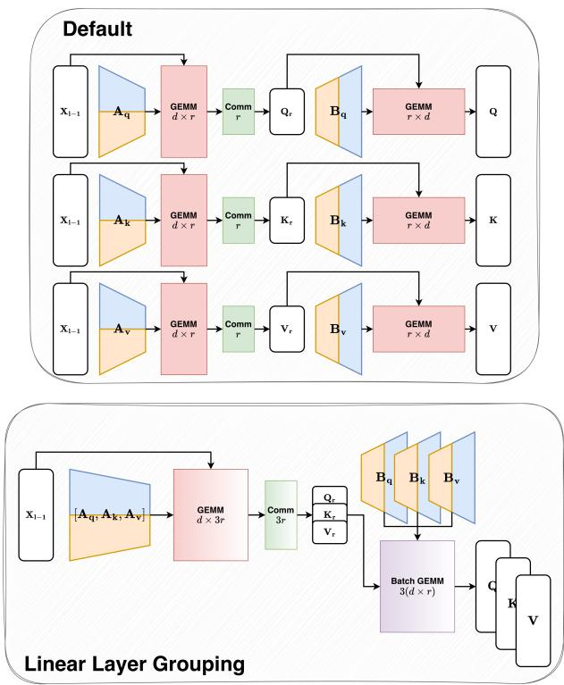  
Figure 8. Linear layer grouping implementation

Collectives. All DP/TP/PP communication uses NCCL collectives (e.g., all-reduce, all-gather, reduce-scatter) on a dedicated communication stream. Fine-grained overlap of all-reduce with compute is not currently supported in Nanotron.