# SuperServe: Fine-Grained Inference Serving for Unpredictable Workloads

Alind Khare and Dhruv Garg, Georgia Tech; Sukrit Kalra, UC Berkeley; Snigdha Grandhi, Adobe; Ion Stoica, UC Berkeley; Alexey Tumanov, Georgia Tech https://www.usenix.org/conference/nsdi25/presentation/khare

This paper is included in the   
Proceedings of the 22nd USENIX Symposium on   
Networked Systems Design and Implementation. April 28–30, 2025 • Philadelphia, PA, USA 978-1-939133-46-5

Open access to the Proceedings of the 22nd USENIX Symposium on Networked Systems Design and Implementation is sponsored by

King Abdullah University of Science and Technology

# SuperServe: Fine-Grained Inference Serving for Unpredictable Workloads

Alind Khare1, Dhruv Garg1, Sukrit Kalra2, Snigdha Grandhi∗3∗, Ion Stoica2, and Alexey Tumanov1

1Georgia Tech 2UC Berkeley 3Adobe {alindkhare, dgarg39, sgrandhi32, atumanov}@gatech.edu {sukrit.kalra, istoica}@berkeley.edu

## Abstract

The increasing deployment of ML models on the critical path of production applications requires ML inference serving systems to serve these models under unpredictable and bursty request arrival rates. Serving many models under such conditions requires a careful balance between each application’s latency and accuracy requirements and the overall efficiency of utilization of scarce resources. Faced with this tension, state-of-the-art systems either choose a single model representing a static point in the latency-accuracy tradeoff space to serve all requests or incur latency target violations by loading specific models on the critical path of request serving. Our work instead resolves this tension through a resource-efficient serving of the entire range of models spanning the latencyaccuracy tradeoff space. Our novel mechanism, SubNetAct, achieves this by carefully inserting specialized control-flow operators in pre-trained, weight-shared super-networks. These operators enable SubNetAct to dynamically route a request through the network to actuate a specific model that meets the request’s latency and accuracy target. Thus, SubNetAct can serve a vastly higher number of models than prior systems while requiring upto 2.6× lower memory. More crucially, SubNetAct’s near-instantaneous actuation of a wide-range of models unlocks the design space of fine-grained, reactive scheduling policies. We design one such extremely effective policy, SlackFit, and instantiate both SubNetAct and Slack-Fit in a real system, SuperServe. On real-world traces derived from a Microsoft workload, SuperServe achieves 4.67% higher accuracy for the same latency targets and 2.85× higher latency target attainment for the same accuracy.

## 1 Introduction

Recent advancements in machine learning (ML) techniques have unlocked vast improvements in both accuracy and efficiency of a wide-variety of tasks [5, 11, 19, 31, 41, 50]. As a result, ML models have been quickly deployed across a widerange of applications in both datacenters [26, 40, 44, 49, 62] and the edge [6, 20, 35, 42], where they are subjected to the stringent requirements of production applications.

Notably, ML models on the critical path of these applications must deal with unpredictable request rates that rapidly change at a sub-second granularity. For example, web applications in datacenters increasingly rely on ML models [49, 62], and have extremely bursty request rates, with a 50× higher peak demand than average [34]. Similarly, request rates in autonomous vehicles change rapidly as a function of the terrain (city vs. freeway driving), time of the day etc. [20].

In the presence of these unpredictable request rates, ML inference serving systems that cater to production applications must strike a careful balance between three key requirements: R1: Latency. Production applications have extremely stringent latency requirements, quantified through a Service-Level Objective (SLO) [33]. For example, both web serving [25, 44, 49] in datacenters and autonomous vehicles [20, 35] on the edge must maximize the number of requests completed within a specified SLO ranging from 10 − 100 ms [20, 60].

R2: Accuracy. Production applications demand the highestaccuracy results possible within the latency targets of their requests. For example, higher accuracy has been intricately tied to a better user experience for web applications [26, 56]. Similarly, the safety of an autonomous vehicle heavily relies on the accuracy of its different ML models [20, 21].

R3: Resource-Efficiency. Web applications at Facebook process 200 trillion ML model requests daily [53] – a significant fraction of datacenter usage [44]. The proliferation of ML models and their reliance on expensive resources such as GPUs, TPUs [1], AWS Inferentia [2] etc. has led to resource tensions in both datacenters and the edge [42]. Thus, inference serving systems must make judicial use of these resources.

The first-generation of inference serving systems [13, 14, 25, 32, 39, 40, 60] resolve this tension by choosing a static point in the tradeoff space between R1-R3 and serving all requests of an application using the chosen model. As a result, applications either miss their SLO targets (R1) under bursty request rates or suffer degraded accuracy (R2) under normal conditions. More recently, state-of-the-art inference serving systems [45, 61] enable applications to register multiple ML models spanning the entire pareto frontier of latency (R1) and accuracy (R2) targets, and automatically choose a model based on the incoming request rates. To achieve this, these systems must either keep the entire set of models in memory or rely on model switching to load the required models at runtime [61]. As GPU memory remains the key resource bottleneck in both datacenter and edge [34, 42], these systems choose between R3 – effectively utilizing the resources (by incurring the prohibitive latency penalties of switching models), or R1 – meeting SLO targets under bursty request rates.

Conventional wisdom in inference serving literature touts the “non-negligible provisioning time [for ML models due to switching], which can exceed the request processing times" as a “key characteristic of ML workloads", and "rules out reactive techniques" for responding to bursty request rates [24]. This wisdom has been widely accepted [14, 25, 45] leading to the development of coarse-grained scheduling policies for inference serving that must account for the enormous latency penalty of switching models when reacting to bursty request rates. As a result, these coarse-grained policies typically avoid or minimize switching models by design [45], and are hence, unable to optimally navigate the tradeoff space between R1- R3 under rapidly-changing, unpredictable request rates.

In this work, we challenge this conventional wisdom that forces a choice between R1 and R3. We describe a mechanism, SubNetAct, to simultaneously serve the entire range of models spanning the latency-accuracy tradeoff space (R1- R2) in a resource-efficient manner (R3). At the core of our mechanism are novel control flow operators that SubNetAct carefully inserts into trained super-network [8, 47, 58] (Su perNet) neural architectures. SuperNets enable a fine-grained latency-accuracy tradeoff (R1-R2) by training a set of shared model weights for many neural networks, without duplication. Prior works [8, 47] propose efficient mechanisms for training SuperNets for both vision and NLP tasks, but require each model instance to be individually extracted for inference. This leads inference serving systems to a similar choice as before – either load all individual models or switch between them at runtime. However, SubNetAct’s novel operators obviate the need to extract individual models and load them at runtime. Instead, SubNetAct dynamically routes requests within one SuperNet deployment with negligible overhead, enabling near instantaneous actuation of different models. Thus, it unlocks orders of magnitude improvements in the navigation of the latency-accuracy tradeoff space (R1-R2), while substantially reducing the memory footprint (R3) (see §2).

In addition to being resource-efficient (R3), SubNetAct’s agility in navigating the latency-accuracy tradeoff space (R1- R2) fundamentally changes the design space of scheduling policies. Instead of complex scheduling policies that must reason about future request rates in a bid to avoid paying the latency of switching ML models dynamically under bursts, SubNetAct enables the specification of simple policies that directly optimize for the key success metrics: R1-R3. While conventional wisdom deems such reactive policies infeasible, we explore one example point in this design space with a simple, yet effective policy that we call SlackFit. SlackFit is a reactive scheduling policy that exploits the near-instantaneous actuation property of SubNetAct to make fine-grained decisions about how many requests to serve in a batch, and which latency/accuracy choice to select for serving in real-time.

We summarize the contributions of this paper as follows:

• We introduce SubNetAct (§3), a novel mechanism that enables a resource-efficient, fine-grained navigation of the latency-accuracy tradeoff space. SubNetAct achieves this by carefully inserting novel control flow operators that dynamically route requests through a single SuperNet.

• We unlock the design of fine-grained, reactive scheduling policies and provide a mathematical formulation of their objective (§4.1). We then propose SlackFit (§4.2), a simple, yet effective greedy heuristic scheduling policy , and show how it accurately approximates the optimal objective.

• We instantiate SubNetAct and SlackFit in a real-world system, SuperServe, a real-time asynchronous model serving system with pluggable scheduling policies (§5).

• We evaluate SuperServe with both SlackFit and several state-of-the-art scheduling policies (§6). We find that Super Serve achieves 4.67% higher accuracy for the same SLO attainment and 2.85× higher SLO attainment for the same accuracy on the real-world Microsoft Azure Functions trace.

## 2 Motivation

In §2.1, we first motivate the need for a reactive, fine-grained scheduling policy for handling unpredictable, bursty request rates. To meet the SLO of the requests while maximizing the accuracy of the responses, we motivate the use of SuperNets (§2.2) that enable a fine-grained exploration of the latencyaccuracy tradeoff space (R1-R2) for multiple latency targets.

## 2.1 Reactive, Fine-Grained Scheduling

Prior works in inference serving systems [34,60] have exhaustively analyzed both production traces from Microsoft Azure Functions (MAF) [48] and synthetic application traces with a goal of highlighting their bursty request arrival patterns. For example, Zhang et al. [60] underscore the high coefficient of variance in request arrivals in production traces [48]. Further, the authors claim that the bursty “sub-second request arrival patterns [are] nearly impossible to predict", thus frustrating the goal of meeting the stringent SLO requirements (R1) of requests in an ML-based production applications.

A strawman solution to meeting SLOs under bursty request rates requires these systems to load the entire set of models spanning the latency-accuracy tradeoff space into GPU memory and switch between them as request rate fluctuates. While this reduces the latency of switching models, allowing serving systems to rapidly degrade accuracy (R2) under bursts to meet SLO targets (R1), it is resource-inefficient (R3).

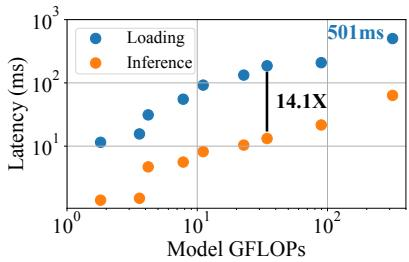  
(a) Model switching is expensive

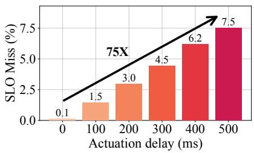  
(b) SLO misses wrt. actuation delay

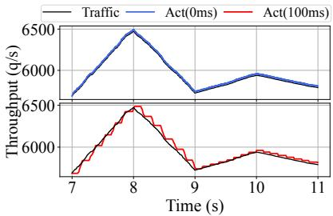  
(c) Fine-grained scheduling

Fig. 1: Fine-grained scheduling policies are beneficial. (a) The latency of loading convolutional neural networks [27,38,59] and transformerbased neural networks [37] is greater than their inference latency across multiple batch sizes, making model switching expensive. This gap widens as model sizes increase, with a peak difference of up to 14.1×. (b) The higher actuation delay (due to model loading) leads to up to 75× higher SLO misses while serving the entire real-world, bursty MAF [48] trace. (c) A high actuation delay on a snapshot of the MAF trace shows 2% of the requests missing their SLO (R1) as request rates increase, and an inefficient utilization of resources (R3) as request rates decrease.  
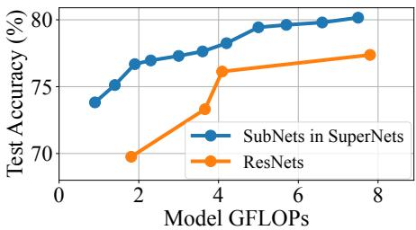  
Fig. 2: Enhanced, fine-grained latency-accuracy tradeoff with SuperNets. The accuracy of SubNets extracted from OFAResNet SuperNet [8] is vastly superior to the hand-tuned ResNets from Fig. 1a for the same FLOP requirements (R1). Moreover, SuperNets can instantiate vastly higher number of points in the space.

As a result, state-of-the-art inference serving systems [45, 61] page models in and out when required, to efficiently utilize GPU memory (R3). However, Fig. 1a shows that the loading time of ML models into GPU memory is vastly more than the inference time, and the gap widens as the model sizes increase. Thus, reactive approaches that either provision resources or switch models upon arrival of bursty request rates must incur an actuation delay (i.e., the latency penalty of loading ML models) on the critical path of request serving, leading to an order-of-magnitude increase in missed SLOs (see Fig. 1b). In a bid to offset this latency penalty, inference serving systems rely on predictive scheduling policies that make coarse-grained estimations of future request arrival patterns [24]. Such policies are bound to be suboptimal owing to the difficulty of predicting the short bursts in request arrival rates coupled with their stringent SLO requirements [60].

We believe that the key to optimally serving bursty request rates instead lies in the ability to rapidly switch between ML models thus obviating the need for coarse-grained predictive scheduling policies. To validate our hypothesis, we simulate a coarse-grained policy with an actuation delay of 100ms and an ideal fine-grained policy with an actuation delay of 0ms. Fig. 1c plots the effects of these policies on a small bursty subtrace from the MAF trace. We observe that the coarse-grained policy leads to higher SLO misses (R1) under increasing request rates and wasted resources (R3) under decreasing request rates. Conversely, the fine-grained policy is able to instantaneously adjust to the request rates leading to no missed SLOs and effective utilization of the GPU.

## 2.2 Weight-Shared SuperNets

The problem of navigating the pareto-optimal frontier of the latency-accuracy tradeoff space (R1-R2) by finding highest accuracy ML models for a specific latency target is well stud ied in ML literature. Conventional Neural Architecture Search (NAS) [10, 36, 51, 63, 64] couple the search and training of ML models to produce a single architecture with the highest accuracy for a particular latency target. To satisfy multiple latency targets, these approaches must repeat the entire train and search procedure, thus becoming prohibitively expensive.

To solve this issue, recent NAS works [8, 28, 47, 58] decouple the search and training procedures by allowing multiple architectures to share their weights while training. These approaches first train one SuperNet and then extract subsets of its layers to form multiple SubNets, without requiring any further retraining. These SubNets are extracted to target vastly superior points in the latency-accuracy tradeoff space (R1- R2), as compared to hand-tuned ML models. For example, Fig. 2 highlights the accuracy benefits of SubNets extracted from a ResNet-based SuperNet when compared to the handtuned ResNets for an equivalent number of FLOPs.

SuperNets enable a fine-grained exploration of the latencyaccuracy tradeoff space (R1-R2) by yielding specialized ML model architectures for a wide-variety of latency targets. This is enabled by a search for multiple architectures, which relies on the following parameters: (i) Depth (D), which describes the depth of a SubNet, and (ii) Width Multiplier (W), which describes the width of a SubNet i.e., the number of heads in a multi-head attention layer or the number of channels in a convolution layer to be used. These parameters create a combinatorially large architecture space, Φ (|Φ| ≈ 1019) [8], from which SubNets are extracted statically for inference. However, this static extraction in prior work [8, 28, 47, 58] again yields individual models that must either be simultaneously deployed (wasting resources; R3) or paged in as request rates fluctuate (missing SLOs; R1).

## 3 SubNetAct: Instantaneous Model Actuation

Motivated by §2, we seek to exploit SuperNets’ fine-grained exploration of the latency-accuracy tradeoff to unlock the development of reactive scheduling mechanisms. To achieve our goal, we introduce SubNetAct, which addresses the challenges posed by static extraction of individual models in SuperNets, which force a choice between R1 and R3.

Key Idea. To resolve this fundamental tension, we make the key observation that by virtue of performing architectural search post training, a SuperNet subsumes the entire architectural space of SubNets. Specifically, we follow the training procedure of prior NAS approaches [8, 28, 47, 58] to retrieve the architecture of the SuperNet, M , along with its weights W 1. The architecture of the SuperNet, M , captures the set of all layers and weights that can be used in inference. Thus, instead of performing the search procedure and extracting individual SubNets, SubNetAct automatically modifies M to introduce its novel control flow operators. This allows Sub-NetAct to deploy the entire SuperNet M , and dynamically route requests to the appropriate SubNet. §3.1 provides an overview of SubNetAct’s novel control flow operators, and Appendix A.1 describes the procedure by which SubNetAct automatically inserts these operators into M .

SubNetAct exploits the weight-sharing among the SubNets of a SuperNet to enable a memory-efficient model actuation mechanism (R3). Its fine-grained control flow operators nearinstantaneously switch between SubNets in order to pick the optimal point in the latency-accuracy tradeoff space (R1-R2).

## 3.1 SubNetAct’s Operators

SubNetAct’s key insight lies in the introduction of the three novel operators (Fig. 3) that enable it to route requests to the required subnet dynamically and selectively use the trained supernet’s weights. SubNetAct works on both convolution [8] and transformer-based [28] supernets. The three operators introduced in SubNetAct are as follows:

LayerSelect operates at a block level in M , where each block is a collection of multiple layers. The LayerSelect operator enforces control flow by either passing the input activation to the wrapped layers in the block or skipping the block and directly forwarding the input to the next block.

• Convolution-Based SuperNet. A convolution-based supernet [8] contains multiple stages, with each stage consisting of set of repeating blocks (bottleneck in OFAResNets [9]). The LayerSelect operator dynamically selects the first Dm blocks within mth stage of the supernet. Dm is an external input provided to SubNetAct, as shown in Fig. 3 (2nd row) for 2-stage supernet where D takes depth values per stage (m=2).

• Transformer-Based SuperNet. Unlike convolution-based supernets, transformer-based supernets [28] have a single stage. Hence, these supernets contain repeatedly stacked transformer blocks. The LayerSelect operator selects or deselects transformer blocks based on a single external input D that specifies the number of layers to use for inference. The block selection is based on the "every-other" strategy [17, 28]. In this strategy, nth block is selected for inference if n mod L(L−D) ≡ 0, where L is the maximum number of stacked transformer blocks.

Overall, this operator enables layer-sharing among subnets that differ in depth (ΦD ⊂ Φ), which helps reduce GPU memory consumption (R3). For example, in a subnet with depth D = 1, the blocks selected for execution by SubNetAct are shared with those in a subnet with depth D = 2.

WeightSlice operates at each layer in a block of M . For each layer, it dynamically selects the slice of the SuperNet’s trained weights that participate in inference.

• Convolution-Based SuperNet. Each block in this supernet contains convolution layers. WeightSlice operator dynamically selects the number of channels of the convolution layer weights in a block (1st row and 1st column in Fig. 3). Precisely, the operator selects the first ⌈Wk ∗ Ck⌉ channels in the kth block (Ck represents the maximum channels). Wk is an input to the operator that is specified independently for each block. It denotes the fraction of channels to use in the weights of the convolution layers of the kth block.

• Transformer-Based SuperNet. The blocks in this supernet consist of multi-head attention (MHA) and feed-forward layers [52]. WeightSlice operator dynamically selects the number of attention heads in the MHA layers (1st row and 2nd column in Fig. 3). Particularly, WeightSlice selects the first ⌈Wk ∗ Hk⌉ heads, Hk represents the maximum heads in the kth block. Here, Wk denotes the fraction of attention heads to use for inference in the kth transformer block.

The operator enables partial layer-sharing among SubNets (ΦW ⊂ Φ, ), thus increasing the number of available Sub-Net architectures. For example, for a SubNet with W0 = 0.5, WeightSlice selects the first 50% heads and shares its weights with the SubNet with W = 0.75. Together, LayerSelect and

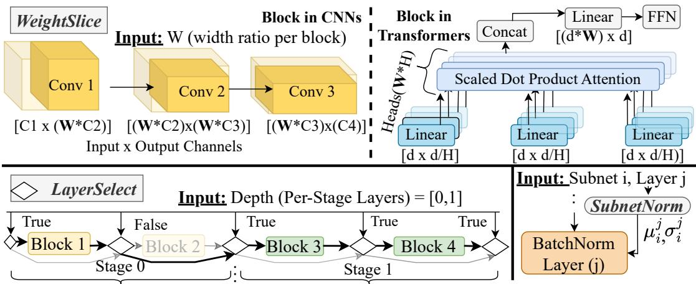  
Fig. 3: SubNetAct’s novel operators (LayerSelect, WeightSlice, SubnetNorm) dynamically actuate SubNets by routing requests through weight-shared layers and non weight-shared components.

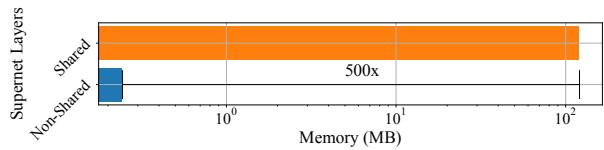  
Fig. 4: SubNetAct’s memory savings. The memory used by the normalization statistics is 500× smaller than the non-normalization layers. SubnetNorm decouples the normalization statistics for each SubNet and provides accurate bookeeping thus enabling high accuracy (R1), with minimal increase in memory consumption (R3).

WeightSlice enable SubNetAct to dynamically actuate the entire set of latency-accuracy options (R1-R2).

SubnetNorm is specifically implemented only for convolution-based SuperNets. We observe that naively introducing the LayerSelect or WeightSlice operator leads to a significant drop in SubNet accuracy (as low as 10%) in the convolution-based SuperNet. This is due to the incorrect tracking of the mean (µ) and variance (σ) in normalization layers such as BatchNorm [29]. The transformer-based SuperNet uses LayerNorm [7] which doesn’t require tracking of mean and variances, and hence doesn’t face this issue. To account for the discrepancy in BatchNorm layers, SubNetAct introduces the SubnetNorm operator that precomputes and stores µ and σ for each possible SubNet by performing forward pass inference on the training data. SubnetNorm takes as input a unique SubNet ID (i) and a layer ID ( j) and outputs the pre-computed normalization statistics µi, j and σi, j. The layer j then uses these statistics to perform normalization of activations, effectively specializing j for each SubNet i.

Although this bookkeeping increases the memory requirements of deploying the SuperNet, Fig. 4 shows that the overhead of these non-shared normalization statistics is 500× smaller than the memory requirement of the shared layers. SubNetAct can host thousands of SubNets in memory by only keeping the statistics unique to each subnet and sharing the non-normalization weights amongst all the SubNets.

Finally, we note that the input to these control flow operators (i.e., D, W) remains similar to the inputs for architectural search in NAS [8]. Moreover, these inputs are independent from the request served by the actuated SubNets, and are declaratively specified by a scheduling policy (§4). Given the arrival rate, the scheduling policy chooses a specific SubNet for a request (by specifying the control tuple D and W), which is then actuated by SubNetAct near-instantaneously.

## 3.2 Discussion: Efficacy of SubNetAct

We now highlight SubNetAct’s efficacy in achieving key application requirements (R1-R3) under bursty request rates. Reduced Memory Requirements. SubNetAct’s novel operators enable SubNets to share layers in place and dynamically route requests to the appropriate SubNet based on the control tuple (D, W). Thus, SubNetAct can simultaneously serve the entire range of models spanning the latency-accuracy tradeoff space while drastically reducing memory requirements. Fig. 5a demonstrates the requirements of serving the same accuracy range by comparing: (i) four different hand-tuned ResNets [27] (publicly available from prior literature), (ii) six uniformly sampled individual SubNets [8] from a ResNetbased SuperNet, and (iii) SubNetAct that enables dynamic actuation of 500 SubNets. We highlight that SubNetAct reduces memory usage by up to 2.6×, while serving vastly more fine-grained latency-accuracy tradeoff points.

Near-Instantaneous Model Actuation. While switching between individual models requires loading their weights to the GPU, SubNetAct’s operators enable scheduling policies to actuate any SubNet in place without incurring additional loading overhead. Fig. 5b compares the time taken to perform on-demand loading of individual SubNets versus in-place actuation of a SubNet in SubNetAct. We highlight that Sub-NetAct’s model actuation is orders-of-magnitude faster than on-demand loading of ML models. This allows scheduling policies that use SubNetAct to rapidly actuate lower-accuracy models under bursty conditions (R1) and switch to higheraccuracy models under normal load (R2), without coarsegrained predictions about future request rates.

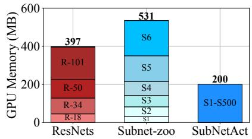  
(a) Reduced Memory Requirements.

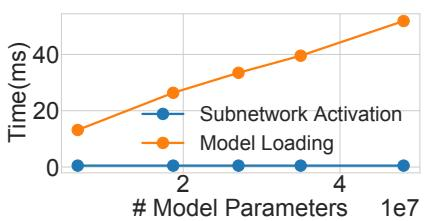  
(b) Instantaneous Model Actuation.

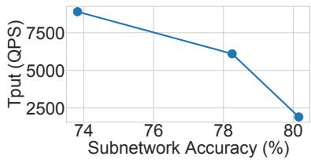  
(c) High dynamic throughput range.  
Fig. 5: Efficacy of SubNetAct. (a) SubNetAct requires upto 2.6× lower memory to serve a higher-range of models when compared to the ResNets from Fig. 1a and six individual SubNets extracted from SuperNet [8] (b) SubNetAct actuates different SubNets near-instantaneously (< 1ms), which is orders of magnitude faster than the model switching time. (c) SubNetAct’s instantaneous actuation of models enables it to sustain higher ingest rates thus inducing a wide dynamic throughput range (≈ 2 − 8k queries per second) within a narrow accuracy range.

Increased Throughput & Accuracy. Through its instant model actuation, SubNetAct allows scheduling policies to rapidly scale the throughput of the system, thus inducing a broad throughput range within a narrow range of accuracy to help meet SLOs (R1-R2). Fig. 5c compares the maximum sustained ingest throughput for a point-based open-loop arrival curve for serving the largest, smallest, and a median SubNet on 8 GPUs. We observe that SubNetAct can serve a wide throughput range from 2000-8000 QPS, while being able to increase accuracy between 74% to 80%.

## 4 Fine-Grained Scheduling Policies

SubNetAct’s resource-efficient (R3) near-instantaneous actuation of the entire latency-accuracy tradeoff space unlocks the development of fine-grained, reactive scheduling policies. These policies can quickly scale an inference serving system’s throughput upon arrival of bursty request rates to ensure that the requests meet their SLO (R1) with the maximum possible accuracy (R2). Specifically, upon a query’s2 arrival to an inference serving system, it invokes the scheduling policy, which must decide the following four decision variables:

• SubNet φ from the set of all possible SubNets Φ available for actuation by SubNetAct. As discussed in §3, a SubNet φ ∈ Φ is uniquely identified by the control tuple (D, W).

• Batch B of size |B| which groups the queries that are executed together on a GPU using the SubNet φ.

• GPU n upon which the batch B is executed.

• Time t at which the batch B must be executed on GPU n. In this section, we first start with the mathematical formulation of an optimal scheduling policy that decides the above parameters (§4.1). We then describe our proposed policy SlackFit that approximates the optimal policy and aims to achieve both high accuracy and SLO attainment (§4.2).

## 4.1 Optimal Scheduling Policy

We formulate an optimal scheduling policy with an oracular knowledge about all queries as a Zero-One Integer Linear Program (ZILP). The policy’s decision is captured by the variable I(φ, B, n,t) ∈ {0, 1}, which represents the decision to execute all queries q ∈ B (from the set of all possible batches B) on GPU n at time t with the SubNet φ. The SubNet φ has an accuracy Acc(φ) and a latency profile lφ(|B|), which is the latency of φ on the batch size |B|. We use a(B) to refer to the earliest arrival time of all the queries q ∈ B, and d(B) to refer to the earliest deadline. Intuitively, the policy’s goal is to maximize the accuracy of the responses (to queries) within their SLO (R1-R2). This is represented in ZILP as follows:

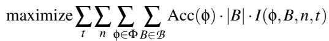

(1)

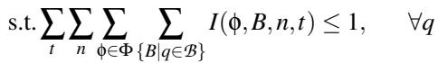

(1a)

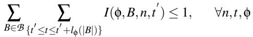

(1b)

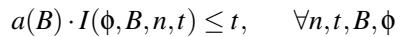

(1c)

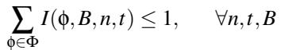

(1d)

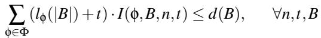

(1e)

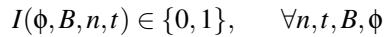

(1f)

The ZILP maximizes the number of queries that satisfy their latency SLOs with the highest possible accuracy across all the selected query batches i.e., ∀(φ, B) : I(φ, B, n,t) = 1, Acc(φ) · |B| is maximized. The constraints of the ZILP denote:

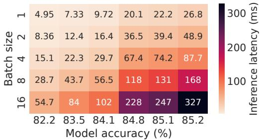

(a) Transformer-Based SuperNet  
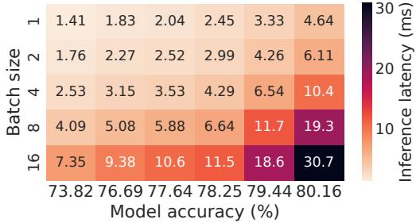  
(b) Convolution-Based SuperNet  
Fig. 6: SlackFit control parameter space. Latencies for six different (uniformly sampled w.r.t. FLOPs) pareto-optimal SubNets in SubNetAct as a function of accuracy (x-axis) and batch size (y-axis) shown for transformer and convolution-based SuperNet. The latency increases monotonically with batch size (P1) and accuracy (P2).

(1a) A query q can be assigned to at most one batch B.

(1b) A GPU n can only execute a single SubNet φ on a single batch B at a particular time t.

(1c) Batch B can only execute after its arrival time a(B).

(1d) Each batch B can be served with a maximum of one SubNet φ on a GPU n at a time t.

(1e) The batch B should complete before its deadline d(B).

(1f) The choice variable I(φ, B, n,t) is a boolean indicator.

Given that solving the above ZILP is NP-Hard [43, 60] and it is impractical to expect oracular query arrival knowledge, it cannot be used to serve models online. Instead, we approximate its behavior with a heuristic, online scheduling policy.

## 4.2 SlackFit: Online Scheduling Policy

We introduce SlackFit—a simple yet effective scheduling policy that aims to maximize the accuracy (R1) with which the requests meet their latency SLO (R2). SlackFit approximates the ILP-based policy in Eq. (1) and makes the decision making tractable by operating in two phases:

Offline Phase triggered upon the registration of a SuperNet M modified by SubNetAct (Appendix A.1) that the inference serving system must serve. This phase consists of two stages:

1. Profile pareto-optimal SubNets Φpareto: To make Sub-

Net choices in reasonable time, SlackFit makes the design decision to operate on Φpareto instead of Φ. Φpareto is the set of pareto-optimal SubNets w.r.t. latency and accuracy obtained by using the search stage of prior NAS methods [8]3. The size of |Φpareto| ≈ 103 is orders of magnitude smaller than |Φ| ≈ 1019, contributing to rapid scheduling decisions.

2. Bucketize SubNet φ and batch size |B| choices: As discussed in §4, SlackFit must decide the SubNet φ ∈ Φpareto and the batch size |B| for the incoming queries. To reduce the search space for this decision, SlackFit relies on three key properties of SubNets in Φpareto (visualized in Fig. 6): P1: the latency increases monotonically with batch size as observed by prior works [13, 14, 25], P2: the latency increases monotonically with accuracy due to the choice of SubNets retrieved by NAS in Φpareto, and P3: lower accuracy Sub-Nets can serve higher batch sizes at similar latencies to lower batch sizes in higher accuracy SubNets, due to the SubNet’s FLOPs distribution shown in Appendix A.2.

These properties enable SlackFit to reduce the search space of choices for φ and |B| to a single dimension – batch latency. Thus, SlackFit constructs evenly-spaced buckets between the minimum and maximum latency of all SubNets in Φpareto (i.e., lφmin (|B| = 1) and lφmax (|B| = 16) respectively, where φmin and φmax are the lowest and highest accuracy Sub-Nets; using properties P1-P2). Within each bucket, SlackFit chooses the (φ′, |B′|) with the highest |B′| such that l (|B′|) is less than the bucket’s latency. By P3, low latency buckets contain lower accuracy φ, higher |B| (leading to higher throughput), and higher latency buckets contain higher accuracy φ and lower |B| (leading to lower throughput).

Online Phase of SlackFit is triggered upon the arrival of queries or the availability of a GPU n to the serving system. The key insight of the online phase is that the remaining slack of the query with the earliest deadline provides a proxy to changes in the traffic. Specifically, bursts in traffic increase queuing delays which reduces the available slack, while slack remains high under normal conditions.

Thus, SlackFit chooses a bucket (φ, |B|), where lφ(|B|) is closest to but less than the slack of the query with the earliest deadline. It then packs |B| queries with the earliest deadline into a batch B and executes it on an available GPU n at time t.

By making decisions based on the minimum remaining slack, SlackFit can automatically adjust accuracy (R2) and throughput of the system by choosing appropriate latency bucket on variable arrival traffic to maintain high SLO attainment (R1). Under normal conditions, a higher slack leads to the choice of buckets with higher l (|B|), which is strongly correlated with the choice of higher accuracy models (P2). Conversely, bursty request arrivals lead to buckets with lower lφ(|B|), as SlackFit operates under reduced latency slack. These buckets maximize |B| (due to P3), thus opportunistically maximizing accuracy while satisfying SLO.

## 4.2.1 SlackFit’s Approximation of Optimal Offline ZILP

We now provide insights on how SlackFit emulates behavior of the optimal offline ZILP. To understand the behavior of ZILP, we formulate a proxy utility function that captures the inner-term of the ZILP objective function in Eq 1, the utility function is defined for a SubNet φ, batch size |B| and the earliest deadline dB among all queries:

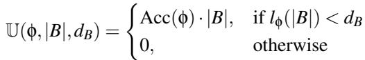

(2)

This utility is non-zero iff SubNet φ performs inference on batch size |B| within the deadline dB, and is zero otherwise. This maximizes both the number of queries processed within their SLO (R1) and the accuracy of their responses (R2).

A. ZILP and SlackFit prefer pareto-optimal SubNets. SlackFit’s key design choice is to operate on pareto-optimal SubNets w.r.t. latency, accuracy (Φpareto) (§4.2). We claim that the ZILP also tends towards pareto-optimal SubNets , as these SubNets yield higher utility.

Lemma 4.1. The utility of pareto-optimal SubNets is higher than non pareto-optimal SubNets if they have similar inference latency for a batch of queries.

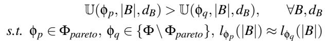

This validates SlackFit’s design choice to operate on paretooptimal SubNets only.

Proof By Contradiction. Assume a non-pareto optimal subnet (φq) such that it has higher utility than pareto optimal subnet (φp) for a batch B and lφ (B) ≈ lφ (B) i.e., U(φp, B, dB) < U(φq,B,dB). Now, due to the pareto optimal property Acc(φp) > Acc(φq), this implies Acc(φp) · |B| > Acc(φq) · |B| which implies U(φp,B,dB) ≥ U(φq,B,dB) for any delay dB as l (B) ≈ l (B). This is contradiction. Hence Proved.

B. ZILP and SlackFit prioritize lower accuracy & higher batch sizes under bursts. We make a key observation that the utility of a lower accuracy, higher batch size (φlow, |Bhigh|) configuration is higher than a higher accuracy, lower batch size (φhigh, |Blow|) configuration in Φpareto.

This is because the factor difference in accuracy of SubNets in Φ (< 1) is less than the factor differences of batch sizes as seen in Fig. 6 i.e., Acc(φhigh)Acc(φ ) |Bhigh||B | ⇒ Acc(φhigh) · |Blow| ≤ Acc(φlow) · |Bhigh|. Therefore, U(φlow, |Bhigh|, dq) ≥ U(φhigh, |Blow|, dq) may hold true under bursts, in cases where the query q with the earliest deadline in a batch of k queries (q ∈ Bk) can be served either by: a) low accuracy model (φmin) with batch size |Bk| or b) higher accuracy model (φmax) on a subset of queries (say m, q ∈ Bm) with remaining queries (Bk \ B ) missing the deadline due to high load. In such cases, the optimal offline ILP will tend to option (a), similar to SlackFit.

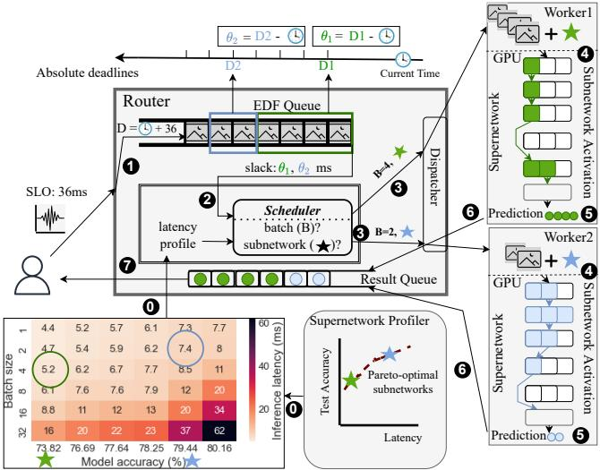  
Fig. 7: SuperServe’s Architecture comprises of a SuperNet profiler, a router, a fine-grained scheduler (SubNetAct), and GPUenabled workers. Clients register SuperNets for SuperServe to serve, whose profiling and insertion of control-flow operators is done before queries arrive. Clients submit queries to the router with a specified SLO asynchronously. The query follows the critical path ❶ - ❼.

C. ZILP and SlackFit prefer higher accuracy under normal conditions. The utility of serving more requests with a high-accuracy subnet and fewer requests with a low-accuracy subnet is more than serving all the requests with a mediumaccuracy subnet.

We make another observation from the latency profiles of SubNets from Φpareto in Fig. 6. For a batch size |B|, such that |B| = |B1| + |B2| where |B1| > |B2|, the following holds true in many cases - B1 · Acc(φhigh) + B2 · Acc(φlow) > B · Acc(φmid). Therefore, U(φhigh, B1, dq) + U(φlow, B2, d(B2)) ≥ U(φmid, B, dq), may hold true under low load, where the query q in batch B can be served by either: a) mid accuracy model (φmid) with batch size B, or b) high accuracy model (φhigh) with larger partition B1 (q ∈ B1) with rest of the queries in batch B2 served with the low accuracy model (φ ) and meeting deadline d(B ). In such cases, ILP will tend to option (b) i.e., an option with higher average accuracy, simiar to SlackFit (as described in §4.2).

## 5 SuperServe: System Implementation

SuperServe is a system that instantiates both the SubNetAct mechanism and the SlackFit policy. SuperServe’s architecture is illustrated in Fig. 7. Clients first register the SuperNet that they want SuperServe to serve, which invokes SubNetAct to automatically insert the control flow operators for dynamic actuation of SubNets (Appendix A.1). SuperServe then profiles the SuperNet to enable SubNetAct to operate on the pareto-optimal SubNets.

SuperNet Profiler. The profiler employs neural architecture search (NAS) [8] to find pareto-optimal SubNets from the SuperNet for each latency target. The latency of each SubNet is a function of the batch size and the environment of execution (i.e., the GPUs on the available workers). NAS and the model profiling is efficient, taking ≤ 2 minutes to complete, and providing significant benefits for the online phase of SlackFit.

Post SuperNet registration, the clients submit queries to the SuperServe router with a deadline via RPC asynchronously. These queries are enqueued to a global earliest-deadline-first (EDF) queue (❶). As soon as any worker becomes available, SuperServe’s fine-grained scheduler is invoked (❷). It decides on the query-batch (B) and the subnet (φ) which are then dis patched to the worker (❸). Upon receiving this query-batch, the worker that instantiates the supernet instantaneously actuates the chosen subnet in-place on the GPU using SubNetAct (❹), performs inference (❺), and returns predictions for the query-batch (❻). The router redirects these predictions to the client (❼). We discuss the components of SuperServe below: Router. The router runs the fine-grained scheduling policy and interacts with workers via RPCs. All queries are received, enqueued, and dequeued asynchronously in the router. It maintains pending queries in a global EDF queue, ordered by query deadlines (SLOs). The router invokes the scheduler whenever (a) a worker signals availability and (b) the EDF queue is not empty. It sends query-batches decided by the scheduler to workers and returns the predictions to the clients.

Fine-grained Scheduler. The scheduler’s control decision is a batch-size and subnet (φ = (D, W)). The scheduler provide pluggable APIs for different policy implementations. SlackFit is one such policy implemented in the scheduler. All policies in scheduler leverage two key properties to make control decisions: (a) predictability of DNN inference latency, (b) fast actuation of SubNetAct on the query’s critical path.

Worker. The DNN worker employs the SubNetAct mechanism to host a SuperNet (R3). SubNetAct’s operators are implemented in TorchScript’s intermediate representation (IR) [16]. After receiving a query-batch and subnet (D, W) from the router, the worker actuates the desired SubNet using SubNetAct. A forward pass on the actuated SubNet produces predictions that are returned to the router.

## 6 Evaluation

We assess SuperServe’s end-to-end performance i.e., its ability to maximize SLO attainment (R1) and accuracy (R2) under a variety of traffic conditions, on a real-world Microsoft Azure Functions (MAF) trace (§6.2) and synthetic traces (§6.3). SuperServe is resource-efficient (R3) due to the use of SubNetAct mechanism, already established in §3.2. We conclude with microbenchmarks (§6.4).

## 6.1 Experimental Setup

Success metrics. SLO attainment is the fraction of queries that finish within the deadline (R1). Mean serving accuracy is calculated for queries meeting their SLO and is the average of models’ profiled accuracy used to serve them (R2).

Traces. We evaluate SuperServe on three sets of traces: realworld, bursty and time-varying. MAF [48] provides a realworld trace. Bursty and time-varying traces are synthetic, similar to those used in InferLine [13]. Bursty traces have a base traffic with mean ingest rate λ (CV 2 = 0) and a variant traffic with mean ingest rate λv drawing inter-arrival times from a gamma distribution (Fig. 13a). We vary λb, λv and CV 2. Time-varying traces differ from bursty by varying the mean ingest rate over time. We change the mean from µ = 1/λ1 to µ = 1/λ2 at rate τ q/s2 with a fixed CV 2a . Higher ingest acceleration τ q/s2 denotes faster change from λ1 → λ2.

Baselines. We compare SuperServe with the single model serving systems that don’t perform accuracy trade-offs (and the models are manually selected by users, non-automated serving systems in §7). These systems are represented as Clipper+ baseline and include systems like Clipper [14], Clockwork [25], and TF-serving [40]. Clipper+ is manually configured to serve six different accuracy points (SubNets) that uniformly span the SuperNet’s accuracy range and result in its six different versions. We also compare SuperServe with INFaaS and note that INFaaS is designed to “pick the most cost-efficient model that meets the [specified] accuracy constraint” [18,45,46]. However, in the presence of unpredictable, bursty request rates, the choice of the model accuracy to serve in order to meet the SLO requirements is unknown. Since, unlike SuperServe, INFaaS does not automatically discover the accuracy of the model to serve under unpredictable request rates and instead requires queries to be hand-annotated with accuracy thresholds, we choose to run INFaaS with no accuracy thresholds provided (§6.3.1,§6.3.2). In such a scenario, it reduces to serving the most cost-efficient model (which is the model with the minimum accuracy). We confirmed this behavior with the INFaaS authors, who agree that “[our] representation of INFaaS as a baseline that always chooses the same model is correct in the absence of an accuracy threshold, or a fixed (never changing) accuracy threshold.” [18].

Subnet-Profiling. We use a ResNet-based SuperNet trained on ImageNet [15] and Transformer-based SuperNet trained on MNLI [55]. We extract pareto-optimal SubNets (Φpareto) by running NAS (publicly released by [8]) on the trained SuperNet. The pareto-optimal SubNets in the ResNet-based and Transformer-based SuperNet span accuracy ranges of 73 − 80% and 82 − 85% respectively. The SubNets are profiled with varied batch sizes on Nvidia RTX2080Ti.

Test bed. SuperServe is implemented in 17.5k lines of C++. gRPC [23] is used for communication between the client, the router and workers. The experiments use 8 RTX2080Ti GPUs and 24 CPU cores, with each worker assigned one GPU.

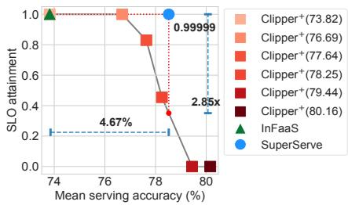  
(a) Serving CNNs on MAF Trace

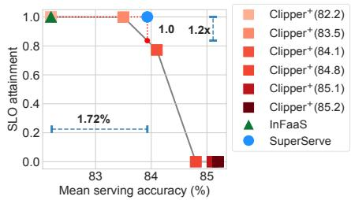  
(b) Serving Transformers on MAF Trace

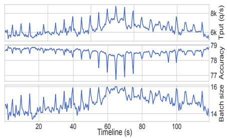  
(c) SuperServe System Dynamics  
Fig. 8: SuperServe on Real World Trace. SuperServe on Microsoft Azure Functions (MAF) [48] trace. (a, b) SuperServe achieves the best tradeoffs w.r.t. SLO attainment and accuracy when serving both Convolution and Transformer neural networks. (c) System dynamics w.r.t. batch size and subnet activation control decisions over time in response to ingest rate in (a).

## 6.2 End-to-End: Real Workloads

We investigate if: (a) SlackFit is capable of achieving a better trade-off between SLO attainment and mean serving accuracy on real workloads (R1-R2), and (b) SubNetAct contributes to serve highly unpredictable workloads at high SLO attainment. We use the MAF trace [48] to evaluate SuperServe (similar to Clockwork [25]). The trace is collected on Microsoft’s serverless platform and serves as a reasonable workload to evaluate SuperServe as serverless ML inference is an active research area [30, 57]. It consists of number of invocations made for each function per minute and contains nearly 46,000 different function workloads that are bursty, periodic, and fluctuate over time. We use 32,700 function workloads from the MAF trace. The 24-hour-long trace is shrunk to 120 seconds using shape-preserving transformations to match our testbed. We use the mean ingest rate of 6400 qps and 1150 qps to serve convolution and transformer networks respectively on MAF. Result. Fig. 8a compares SuperServe with Clipper+ and In-FaaS when convolution and transformer networks are served on the real-world MAF trace. While serving CNNs, Super-Serve achieves an SLO attainment (R1) of 0.99999 (five ’9’s). Compared to Clipper+ and InFaaS , SuperServe is 4.65% more accurate (R2) at the same level of SLO attainment. It also achieves a 2.85x factor improvement in SLO attainment at the same mean serving accuracy. While serving transformers, SuperServe achieves a 1.2x factor improvement in SLO attainment at the same mean serving accuracy or 1.72% higher accuracy at the same SLO attainment level.

System Dynamics. Fig. 8c shows the ingest throughput (qps), serving accuracy, and batch size control decisions made by SlackFit for serving CNNs on the MAF trace. As seen in the figure, the trace contains periodic short-interval spikes that reach upto 8750 qps, demonstrating the agility of the system. SlackFit selects both smaller accuracy model and higher batch size during the load spikes to meet the deadline (R1). SlackFit makes such control decisions because it uses query’s slack as a signal to maximize batch size. As the query slack decreases, it selects maximum batch size control parameters in the lower latency buckets. Furthermore, these control decisions increase the system throughput instantly through SubNetAct. Lastly, SlackFit serves higher accuracy models when the ingest rate is low and hence, achieves better mean serving accuracy (R2).

## 6.3 End-to-End: Synthetic

We aim to answer the following questions, whether Super-Serve (a) automatically serves queries using appropriate models (accuracy) for different traces (R2), (b) achieves a better trade-off w.r.t. the success metrics (R1-R2), (c) withstands sharp bursts while maintaining high SLO attainment (R1) and (d) instantaneously changes system throughput. To answer these questions, we evaluate SuperServe by serving CNNs on the bursty and time-varying traces (§6.1).

## 6.3.1 Baseline comparison with burstiness

Fig. 9 compares SuperServe with the baselines over a range of traces increasing mean ingest rate λ across and CV 2 down. All traces are configured with 36ms SLO. Achieving high SLO attainment (R1) and high mean serving accuracy (R2) is desirable, which implies the best trade-off is in the top-right corner of the graph. We demonstrate that no single choice of a model is sufficient for different mean arrival rates and CV 2. For instance, the SLO attainment of Clipper+(76.69) decreases as the CV 2 increases for λv = 5550 (row 3). Similarly, the SLO attainment of Clipper+(78.25) decreases with increase in λv for CV 2 = 2 (column 1). We draw the following takeaways: (1) SuperServe achieves a significantly better trade-off between SLO attainment and accuracy (R1-R2) than the baselines (Clipper+ and InFaaS). It is 4.33% more accurate than the baselines at an SLO attainment level of 0.9999 and 2.06x higher SLO attainment at the same accuracy level. SuperServe is consistently at the top-right corner in Fig. 9 across all the traces. (2) SlackFit automatically selects appropriate models for sustaining different traffic conditions. As λ increases, SuperServe reduces serving accuracy while maintaining high SLO attainment (columns).

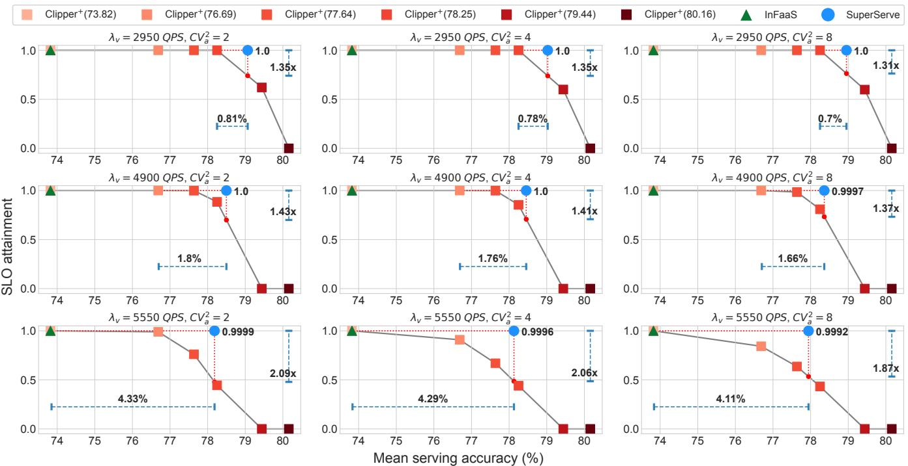  
Fig. 9: SuperServe with variable burstiness. SuperServe outperforms Clipper+ and INFaaS baselines by finding better tradeoffs and consistently achieving > 0.999 SLO attainment on bursty traces. Variable ingest rate λv = { 2950, 4900, 5550} q/s increases vertically (down). CV 2 = {2, 4, 8} increases horizontally (across). SuperServe achieves a better trade-off in SLO attainment (y-axis) and mean serving accuracy (x-axis) in all cases. SuperServe consistently achieves high SLO attainment > 0.999.

Note that, across all the traces, InFaaS achieves an optimal SLO attainment but with a significantly smaller mean serving accuracy (by up to 4.33%) than SuperServe. InFaaS’s policy serves the min-cost (and hence min accuracy) model for the trace without accuracy constraints. Whereas, Super-Serve achieves a better trade-off between the success metrics because (a) SubNetAct allows in place activation of different subnetworks without affecting SLO attainment (R1); (b) SlackFit opportunistically selects higher accuracy models based on query’s slack (R2). Also, the difference between SuperServe and Clipper+ narrows w.r.t. accuracy as CV 2a increases, since SlackFit switches to lower accuracy models more frequently with burstier traffic. The system dynamics are detailed in Appendix A.3.

## 6.3.2 Baseline comparison with arrival acceleration

Fig. 10 evaluates SuperServe’s performance at different levels of arrival rate change (i.e., arrival acceleration). Traces start at λ1 and increase to λ2 with acceleration τ. Traces fix λ1 = 2500qps and CV 2a = 8 but change λ2 and acceleration τ .

The τ and λ2 are chosen to demonstrate that single, preconfigured model choices are inadequate to sustain different rates of arrival (mean λ) and acceleration (τ). Clipper+(79.44) starts diverging as τ increases ( λ is 6800 qps (row 2)). Similarly, Clipper+(79.44) starts diverging with increase in λ2 (τ = 250 q/s2 (column 1)). The key takeaways are:

• SuperServe rapidly scales system throughput and achieves a high SLO attainment (0.991-1.0) even with high values of τ (5000 q/s2). The experiment demonstrates two key properties of SuperServe— (a) the actuation delay in SuperServe is indeed negligible, (b) the lower actuation delay helps achieve higher SLO attainments for time-varying traces (R1). Super-Serve empirically demonstrates “agile elasticity” (§2), and withstands high acceleration in arrival rate (τ).

• SlackFit dynamically adjusts the serving accuracy over time (R2) and achieves a better trade-off between success metrics (R1-R2). When the mean ingest throughput is low (λ1), SuperServe uses higher accuracy models. It quickly switches to lower accuracy models when mean arrival rate is high (λ ), as evident in system dynamics Fig. 13b.

Fig. 10 experiments exhibit interesting trends. As the τ increases, the gap between SuperServe and Clipper+ w.r.t. mean serving accuracy narrows. This is because SlackFit selects smaller accuracy sooner with the increase in τ. Lower τ values give enough time to SuperServe to serve intermediate mean arrival rates with higher accuracy models while gradually moving to lower accuracy models as mean ingest rate increases to λ2 qps. Whereas, InFaaS continues to serves min accuracy model for all traces as its policy doesn’t maximize accuracy by design.

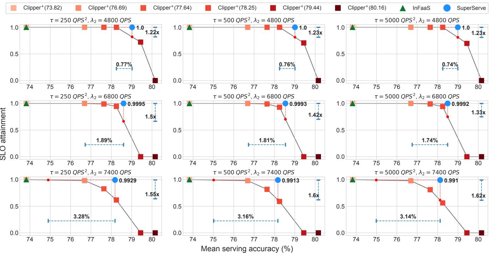  
Fig. 10: SuperServe with arrival acceleration. SuperServe outperforms Clipper+ and INFaaS baselines by finding better tradeoffs on time varying traces. Mean ingest rate accelerates from λ to λ q/s with τ q/s2. τ = {250,500,5000} increases horizontally (across), while λ = {4800, 6800, 7800} increases vertically (down) with λ = 2500 q/s and CV 2 = 8 staying constant. SuperServe finds a better trade-off in SLO attainment (y-axis) and mean serving accuracy (x-axis).

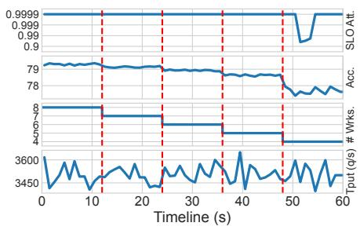  
(a) Fault-Tolerance

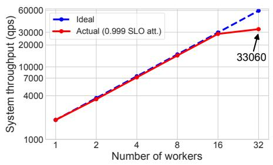  
(b) Scalability

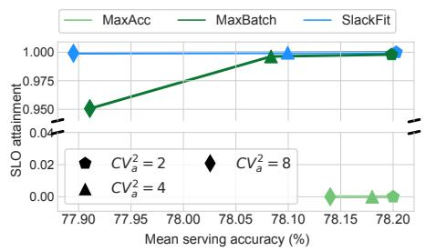  
(c) Policy-SE  
Fig. 11: SuperServe’s Micro-benchmarks. (a) SuperServe resiliency to faults. The system maintains high SLO attainment by dynamically adjusting served accuracy as workers drop out over time. The trace stays statistically the same (λ = 3500 qps, CV 2a = 2 (last row)). (b) SuperServe scales linearly with the number of workers, achieving up to 33000 qps while maintaining high .999 SLO attainment. (c) SlackFit finds the best tradeoff on the SLO attainment/ accuracy maximization continuum automatically (§6.4).

## 6.4 Microbenchmarks

Fault Tolerance. SubNetAct mechanism provides an additional advantage of transparent fault tolerance. We run Super-Serve with 100% capacity (8 workers) with a bursty traffic trace (λ = 3500 qps, CV 2a = 2) for 60 seconds and gradually kill a worker every 12 seconds to simulate faults. SuperServe shows resilience to decreases in system throughput to as low as 50% by maintaining SLO attainment as high as 0.999 for the unchanging trace as it leverages subnetwork activation to serve lower accuracy models automatically. Similar method ology was used in [54]. Fig. 11a shows SLO attainment as a function of time (along with other system dynamics). As the faults occur (workers killed, dotted red lines), SuperServe automatically transitions to lower accuracy models to maintain high SLO attainment. We attribute SuperServe’s fault tolerance to (a) a wide-dynamic throughput range afforded by SubNetAct (Fig. 5c) that allows SuperServe to serve the workload even with 50% capacity, and (b) SubNetAct’s low actuation delay that provides agility to rapidly increase systemthroughput (during faults) without SLO violations (R1).

Scalability. We assess if SuperServe reaches high SLO attain ment at scale. To show this, we scale the number of workers and observe the maximum throughput SuperServe sustains to reach SLO attainment of 0.999. We serve ResNet-18 [27] across all the workers with clients providing a batch of 8 images4. Scalability experiments are conducted with CV 2 = 0. Fig. 11b shows sustained ingest throughput with the increase in workers. SuperServe achieves an SLO attainment of 0.999 while reaching throughputs as high as ≈ 33000 qps.

Policy Space Exploration. We compare different policies implemented in SuperServe (Fig. 11c). We show that Slack-Fit achieves the best tradeoff w.r.t. our success metrics compared to both MaxAcc (greedily maximizes accuracy) and MaxBatch (greedily maximizes throughput) as CV 2a is varied. Details of the policies and the experiment are in §A.5.

## 7 Related Work

Training SuperNets was first proposed by OFA [8]. Recent works such as CompOFA [47] and BigNAS [58] propose improvements to the SuperNet training. CompOFA makes the training of SuperNets faster and more accurate by training a fewer number of SubNets simultaneously. On the other hand, BigNAS trains the SuperNet in one-shot with a wider range of SubNets. DynaBERT [28] trains a SuperNet based on the Transformer architecture for text datasets. Similarly, Auto-Former [12] trains SuperNets derived from vision transformers. NasViT [22] trains the SuperNet for semantic segmentation tasks and achieves a better trade-off between accuracy and latency. SuperServe provides system support for serving Supernets trained using any existing technique. We believe that SuperNets are an emerging phenomenon, and system support for serving them is the need of the hour.

Model serving systems can be divided into two categorizes — a) Non-Automated, and b) Automated. Non-automated serving system expect developers to provide the prediction models and make explicit choices in the accuracy-latency trade-off space. TensorFlow Serving [40] serves the models trained in TensorFlow framework while Clipper [14] and Triton [39] support models trained from multiple frameworks. Clockwork [25] guarantees predictable tail latency for DNN inference by making cross-stack design decisions explicitly for worst case predictability. Inferline [13] provides support for provisioning inference pipelines that consist of multiple models, but the models are still hard coded in the pipeline vertices. Prior works in this category are complementary to SuperServe. For instance, SuperServe’s workers can be made more predictable by consolidating choices like Clockwork. Inferline’s autoscaling policy can be used on top of SuperServe. Triton’s model optimizations can be done to the SuperNet itself.

In contrast, automated serving systems [3, 4, 45, 61] automate the navigation of the accuracy-latency trade-off space with a policy, resulting in automatic DNN selection at runtime.

However, both [45] and [61] use state-of-the-art DNNs (e.g., ResNets, MobileNets) and rely on model loading mechanisms instead of SuperNets, which offers better pareto-optimality and orders of magnitude faster model switching enabled via proposed SubNetAct. More importantly, these mechanisms implicitly bias their policies to avoid model switching, which limits their ability to respond to bursty request rates in an agile fashion. Specifically, InFaaS’s DNN switching policy is biased towards selecting the least accurate DNNs that satisfy accuracy constraints, as the goal of the stated goal of the system is to satisfy constraints instead of treating accuracy as an optimization objective. Proteus [3] formulates the accuracy scaling problem as an MILP. However, the accuracy scaling action remains coarse-grained as MILP solver is invoked every 30 seconds in Proteus. Such coarse-grained decisionmaking has limitations like InFaaS: SLO violations with high actuation delays. Moreover, Proteus’s batching technique is complementary to SlackFit. It introduces a delay in scheduling to account for heterogeneous resources. Such delays can be introduced in SlackFit to extend it to heterogeneous resources. Loki [4] tackles accuracy and hardware selection for ML inference pipelines. Extending fine-grained decisionmaking to ML inference pipelines is future work. SuperServe supports model serving via SubNet activation, thus addressing the model switching overhead and enabling fine-grained decision-making for bursty workloads.

## 8 Conclusion

We describe a novel mechanism SubNetAct that carefully inserts specialized control flow operators into SuperNets to enable a resource-efficient, fine-grained navigation of the latency-accuracy tradeoff space. SubNetAct unlocks the design space of reactive scheduling policies. We design a simple, yet effective greedy heuristic-based scheduling policy Slack-Fit. SuperServe, which uses SubNetAct and SlackFit, achieves 4.67% better accuracy at the same level of SLO attainment or 2.85x better SLO attainment at the same level of accuracy compared to state-of-the-art inference serving systems.

## Acknowledgments

This material is based upon work partially supported by the National Science Foundation (NSF) under Grant Number CNS-2420977 as well as a sponsored research award from Cisco Research. We would also like to sincerely thank the NSDI reviewers and, especially, our shepherd, Seo Jin Park, for their insightful comments that significantly improved the quality of this paper.

Disclaimer: Any opinions, findings, and conclusions or recommendations expressed in this material are those of the authors and don’t necessarily reflect the views of the NSF.

## References

[1] Accelerate ai development with google cloud tpus. https://cloud.google.com/tpu.

[2] Aws inferentia. https://aws.amazon.com/ machine-learning/inferentia/.

[3] Sohaib Ahmad, Hui Guan, Brian D. Friedman, Thomas Williams, Ramesh K. Sitaraman, and Thomas Woo. Proteus: A high-throughput inference-serving system with accuracy scaling. In Proceedings of the 29th ACM International Conference on Architectural Support for Programming Languages and Operating Systems, Volume 1, ASPLOS ’24, page 318–334, New York, NY, USA, 2024. Association for Computing Machinery.

[4] Sohaib Ahmad, Hui Guan, and Ramesh K. Sitaraman. Loki: A system for serving ml inference pipelines with hardware and accuracy scaling. In Proceedings of the 33rd International Symposium on High-Performance Parallel and Distributed Computing, volume 1 of HPDC ’24, page 267–280. ACM, June 2024.

[5] Waleed Ali, Sherif Abdelkarim, Mahmoud Zidan, Mohamed Zahran, and Ahmad El Sallab. Yolo3d: End-toend real-time 3d oriented object bounding box detection from lidar point cloud. In Proceedings of the European Conference on Computer Vision (ECCV) Workshops, pages 0–0, 2018.

[6] Ganesh Ananthanarayanan, Paramvir Bahl, Peter Bodík, Krishna Chintalapudi, Matthai Philipose, Lenin Ravindranath, and Sudipta Sinha. Real-time video analytics: The killer app for edge computing. computer, 50(10):58– 67, 2017.

[7] Jimmy Lei Ba, Jamie Ryan Kiros, and Geoffrey E. Hinton. Layer normalization, 2016.

[8] Han Cai, Chuang Gan, Tianzhe Wang, Zhekai Zhang, and Song Han. Once-for-all: Train one network and specialize it for efficient deployment. In International Conference on Learning Representations, 2020.

[9] Han Cai, Chuang Gan, Tianzhe Wang, Zhekai Zhang, and Song Han. Ofa pretained models. https://drive.google.com/drive/folders/ 10leLmIiMtaRu4J46KwrBaMydvQt0qFuI?usp= sharing, 2022.

[10] Han Cai, Ligeng Zhu, and Song Han. Proxylessnas: Direct neural architecture search on target task and hardware. arXiv preprint arXiv:1812.00332, 2018.

[11] Liang-Chieh Chen, George Papandreou, Florian Schroff, and Hartwig Adam. Rethinking atrous convolution for semantic image segmentation. arXiv preprint arXiv:1706.05587, 2017.

[12] Minghao Chen, Houwen Peng, Jianlong Fu, and Haibin Ling. Autoformer: Searching transformers for visual recognition. In Proceedings of the IEEE/CVF international conference on computer vision, pages 12270– 12280, 2021.

[13] Daniel Crankshaw, Gur-Eyal Sela, Corey Zumar, Xiangxi Mo, Joseph E. Gonzalez, Ion Stoica, and Alexey Tumanov. Inferline: ML inference pipeline composition framework. CoRR, abs/1812.01776, 2018.

[14] Daniel Crankshaw, Xin Wang, Guilio Zhou, Michael J Franklin, Joseph E Gonzalez, and Ion Stoica. Clipper: A Low-Latency online prediction serving system. In 14th USENIX Symposium on Networked Systems Design and Implementation (NSDI 17), pages 613–627, 2017.

[15] Jia Deng, Wei Dong, Richard Socher, Li-Jia Li, Kai Li, and Li Fei-Fei. Imagenet: A large-scale hierarchical image database. In 2009 IEEE conference on computer vision and pattern recognition, pages 248–255. Ieee, 2009.

[16] Facebook. Torchscript. https://pytorch.org/docs/ stable/jit.html, 2022.

[17] Angela Fan, Edouard Grave, and Armand Joulin. Reducing transformer depth on demand with structured dropout. In International Conference on Learning Representations, 2020.

[18] Romero Francisco, Qian Li, and Christos Kozyrakis. Personal Communication, December 2022.

[19] Shen Gao, Xiuying Chen, Piji Li, Zhaochun Ren, Lidong Bing, Dongyan Zhao, and Rui Yan. Abstractive text summarization by incorporating reader comments. In Proceedings of the AAAI Conference on Artificial Intelligence, volume 33, pages 6399–6406, 2019.

[20] Ionel Gog, Sukrit Kalra, Peter Schafhalter, Joseph E Gonzalez, and Ion Stoica. D3: a dynamic deadlinedriven approach for building autonomous vehicles. In Proceedings of the Seventeenth European Conference on Computer Systems, pages 453–471, 2022.

[21] Ionel Gog, Sukrit Kalra, Peter Schafhalter, Matthew A Wright, Joseph E Gonzalez, and Ion Stoica. Pylot: A modular platform for exploring latency-accuracy tradeoffs in autonomous vehicles. In 2021 IEEE International Conference on Robotics and Automation (ICRA), pages 8806–8813. IEEE, 2021.

[22] Chengyue Gong, Dilin Wang, Meng Li, Xinlei Chen, Zhicheng Yan, Yuandong Tian, Vikas Chandra, et al. Nasvit: Neural architecture search for efficient vision transformers with gradient conflict aware supernet training. In International Conference on Learning Representations, 2021.

[23] Google. gRPC. https://grpc.io/docs/languages/ cpp/quickstart/, 2022.

[24] Arpan Gujarati, Sameh Elnikety, Yuxiong He, Kathryn S. McKinley, and Björn B. Brandenburg. Swayam: Distributed autoscaling to meet slas of machine learning inference services with resource efficiency. In Proceedings of the 18th ACM/IFIP/USENIX Middleware Conference, Middleware ’17, page 109–120, New York, NY, USA, 2017. Association for Computing Machinery.

[25] Arpan Gujarati, Reza Karimi, Safya Alzayat, Wei Hao, Antoine Kaufmann, Ymir Vigfusson, and Jonathan Mace. Serving DNNs like clockwork: Performance predictability from the bottom up. In 14th USENIX Symposium on Operating Systems Design and Implementation (OSDI 20), pages 443–462. USENIX Association, November 2020.

[26] Kim Hazelwood, Sarah Bird, David Brooks, Soumith Chintala, Utku Diril, Dmytro Dzhulgakov, Mohamed Fawzy, Bill Jia, Yangqing Jia, Aditya Kalro, et al. Applied machine learning at Facebook: A datacenter infrastructure perspective. In 2018 IEEE International Symposium on High Performance Computer Architecture (HPCA), pages 620–629. IEEE, 2018.

[27] Kaiming He, Xiangyu Zhang, Shaoqing Ren, and Jian Sun. Deep residual learning for image recognition. In Proceedings of the IEEE conference on computer vision and pattern recognition, pages 770–778, 2016.

[28] Lu Hou, Zhiqi Huang, Lifeng Shang, Xin Jiang, Xiao Chen, and Qun Liu. Dynabert: Dynamic bert with adaptive width and depth. In H. Larochelle, M. Ranzato, R. Hadsell, M.F. Balcan, and H. Lin, editors, Advances in Neural Information Processing Systems, volume 33, pages 9782–9793. Curran Associates, Inc., 2020.

[29] Sergey Ioffe and Christian Szegedy. Batch normalization: Accelerating deep network training by reducing internal covariate shift. In International conference on machine learning, pages 448–456. PMLR, 2015.

[30] Vatche Ishakian, Vinod Muthusamy, and Aleksander Slominski. Serving deep learning models in a serverless platform. CoRR, abs/1710.08460, 2017.

[31] Haoming Jiang, Pengcheng He, Weizhu Chen, Xiaodong Liu, Jianfeng Gao, and Tuo Zhao. SMART: Robust and efficient fine-tuning for pre-trained natural language models through principled regularized optimization. In Proceedings of the 58th Annual Meeting of the Association for Computational Linguistics, pages 2177–2190, Online, July 2020. Association for Computational Lin guistics.

[32] Ameet V Joshi. Amazon’s machine learning toolkit: Sagemaker. In Machine Learning and Artificial Intelligence, pages 233–243. Springer, 2020.

[33] Sangeetha Abdu Jyothi, Carlo Curino, Ishai Menache, Shravan Matthur Narayanamurthy, Alexey Tumanov, Jonathan Yaniv, Ruslan Mavlyutov, Inigo Goiri, Subru Krishnan, Janardhan Kulkarni, et al. Morpheus: towards automated SLOs for enterprise clusters. In 12th USENIX Symposium on Operating Systems Design and Implementation (OSDI 16), pages 117–134, 2016.

[34] Zhuohan Li, Lianmin Zheng, Yinmin Zhong, Vincent Liu, Ying Sheng, Xin Jin, Yanping Huang, Zhifeng Chen, Hao Zhang, Joseph E Gonzalez, et al. AlpaServe: Statistical multiplexing with model parallelism for deep learning serving. In 17th USENIX Symposium on Operating Systems Design and Implementation (OSDI 23), pages 663–679, 2023.

[35] Shih-Chieh Lin, Yunqi Zhang, Chang-Hong Hsu, Matt Skach, Md E Haque, Lingjia Tang, and Jason Mars. The architectural implications of autonomous driving: Constraints and acceleration. In Proceedings of the Twenty-Third International Conference on Architectural Support for Programming Languages and Operating Systems, pages 751–766, 2018.

[36] Hanxiao Liu, Karen Simonyan, and Yiming Yang. DARTS: Differentiable architecture search. arXiv preprint arXiv:1806.09055, 2018.

[37] Yinhan Liu, Myle Ott, Naman Goyal, Jingfei Du, Mandar Joshi, Danqi Chen, Omer Levy, Mike Lewis, Luke Zettlemoyer, and Veselin Stoyanov. RoBERTa: A robustly optimized bert pretraining approach. arXiv preprint arXiv:1907.11692, 2019.

[38] Zhuang Liu, Hanzi Mao, Chao-Yuan Wu, Christoph Feichtenhofer, Trevor Darrell, and Saining Xie. A convnet for the 2020s. In Proceedings of the IEEE/CVF conference on computer vision and pattern recognition, pages 11976–11986, 2022.

[39] Nvidia. Triton inference system. https: //github.com/triton-inference-server/ server/tree/v2.21.0, 2020.

[40] Christopher Olston, Noah Fiedel, Kiril Gorovoy, Jeremiah Harmsen, Li Lao, Fangwei Li, Vinu Rajashekhar, Sukriti Ramesh, and Jordan Soyke. Tensorflow-serving: Flexible, high-performance ml serving. arXiv preprint arXiv:1712.06139, 2017.

[41] Kalin Ovtcharov, Olatunji Ruwase, Joo-Young Kim, Jeremy Fowers, Karin Strauss, and Eric S Chung. Accelerating deep convolutional neural networks using

specialized hardware. Microsoft Research Whitepaper, 2(11):1–4, 2015.

[42] Arthi Padmanabhan, Neil Agarwal, Anand Iyer, Ganesh Ananthanarayanan, Yuanchao Shu, Nikolaos Karianakis, Guoqing Harry Xu, and Ravi Netravali. Gemel: Model merging for memory-efficient, real-time video analytics at the edge. In 20th USENIX Symposium on Networked Systems Design and Implementation (NSDI 23), pages 973–994, 2023.

[43] Christos H Papadimitriou and Kenneth Steiglitz. Combinatorial optimization: algorithms and complexity. Courier Corporation, 1998.

[44] Jongsoo Park, Maxim Naumov, Protonu Basu, Summer Deng, Aravind Kalaiah, Daya Khudia, James Law, Parth Malani, Andrey Malevich, Satish Nadathur, et al. Deep learning inference in facebook data centers: Characterization, performance optimizations and hardware implications. arXiv preprint arXiv:1811.09886, 2018.

[45] Francisco Romero, Qian Li, Neeraja J Yadwadkar, and Christos Kozyrakis. INFaaS: Automated model-less inference serving. In 2021 USENIX Annual Technical Conference (USENIX ATC 21), pages 397–411, 2021.

[46] Francisco Romero, Qian Li, Neeraja J Yadwadkar, and Christos Kozyrakis. InFaaS policy’s decisions with respect to accuracy constraints. https: //github.com/stanford-mast/INFaaS/blob/ 02ad2b86bcbc66d55b17baaef608c4e864b03918/ src/master/queryfe\_server.cc#L342-L356, 2022.

[47] Manas Sahni, Shreya Varshini, Alind Khare, and Alexey Tumanov. CompOFA – Compound Once-For-All Networks for Faster Multi-Platform Deployment. In International Conference on Learning Representations, 2021.

[48] Mohammad Shahrad, Rodrigo Fonseca, Íñigo Goiri, Gohar Chaudhry, Paul Batum, Jason Cooke, Eduardo Laureano, Colby Tresness, Mark Russinovich, and Ricardo Bianchini. Serverless in the wild: Characterizing and optimizing the serverless workload at a large cloud provider. In 2020 USENIX Annual Technical Conference (USENIX ATC 20), pages 205–218, 2020.

[49] Jonathan Soifer, Jason Li, Mingqin Li, Jeffrey Zhu, Yingnan Li, Yuxiong He, Elton Zheng, Adi Oltean, Maya Mosyak, Chris Barnes, et al. Deep learning inference service at microsoft. In 2019 USENIX Conference on Operational Machine Learning (OpML 19), pages 15– 17, 2019.

[50] Martin Sundermeyer, Ralf Schlüter, and Hermann Ney. LSTM neural networks for language modeling. In Thirteenth annual conference of the international speech communication association, 2012.

[51] Mingxing Tan, Bo Chen, Ruoming Pang, Vijay Vasudevan, Mark Sandler, Andrew Howard, and Quoc V Le. Mnasnet: Platform-aware neural architecture search for mobile. In Proceedings of the IEEE Conference on Com puter Vision and Pattern Recognition, pages 2820–2828, 2019.

[52] Ashish Vaswani, Noam Shazeer, Niki Parmar, Jakob Uszkoreit, Llion Jones, Aidan N Gomez, Łukasz Kaiser, and Illia Polosukhin. Attention is all you need. Advances in neural information processing systems, 30, 2017.

[53] Prahlad Venkatapuram, Zhao Wang, and Chandra Mallipedi. Custom silicon at facebook: A datacenter infrastructure perspective on video transcoding and machine learning. In 2020 IEEE International Electron Devices Meeting (IEDM), pages 9–7. IEEE, 2020.

[54] Stephanie Wang, John Liagouris, Robert Nishihara, Philipp Moritz, Ujval Misra, Alexey Tumanov, and Ion Stoica. Lineage stash: fault tolerance off the critical path. In Proceedings of the 27th ACM Symposium on Operating Systems Principles, pages 338–352, 2019.

[55] Adina Williams, Nikita Nangia, and Samuel Bowman. A broad-coverage challenge corpus for sentence understanding through inference. In Proceedings of the 2018 Conference of the North American Chapter of the Association for Computational Linguistics: Human Language Technologies, Volume 1 (Long Papers), pages 1112–1122. Association for Computational Linguistics, 2018.

[56] Carole-Jean Wu, David Brooks, Kevin Chen, Douglas Chen, Sy Choudhury, Marat Dukhan, Kim Hazelwood, Eldad Isaac, Yangqing Jia, Bill Jia, et al. Machine learning at Facebook: Understanding inference at the edge. In 2019 IEEE international symposium on high performance computer architecture (HPCA), pages 331–344. IEEE, 2019.

[57] Yanan Yang, Laiping Zhao, Yiming Li, Huanyu Zhang, Jie Li, Mingyang Zhao, Xingzhen Chen, and Keqiu Li. Infless: A native serverless system for low-latency, highthroughput inference. In Proceedings of the 27th ACM International Conference on Architectural Support for Programming Languages and Operating Systems, AS-PLOS ’22, page 768–781, New York, NY, USA, 2022. Association for Computing Machinery.

[58] Jiahui Yu, Pengchong Jin, Hanxiao Liu, Gabriel Bender, Pieter-Jan Kindermans, Mingxing Tan, Thomas Huang,

[59] Sergey Zagoruyko and Nikos Komodakis. Wide residual networks. arXiv preprint arXiv:1605.07146, 2016.

[60] Hong Zhang, Yupeng Tang, Anurag Khandelwal, and Ion Stoica. SHEPHERD: Serving DNNs in the wild. In 20th USENIX Symposium on Networked Systems Design and Implementation (NSDI 23), pages 787–808, 2023.

[61] Jeff Zhang, Sameh Elnikety, Shuayb Zarar, Atul Gupta, and Siddharth Garg. Model-Switching: Dealing with fluctuating workloads in Machine-Learning-as-a-Service systems. In 12th USENIX Workshop on Hot Topics in Cloud Computing (HotCloud 20), 2020.

[62] Minjia Zhang, Samyam Rajbandari, Wenhan Wang, Elton Zheng, Olatunji Ruwase, Jeff Rasley, Jason Li, Junhua Wang, and Yuxiong He. Accelerating large scale deep learning inference through DeepCPU at microsoft. In 2019 USENIX Conference on Operational Machine Learning (OpML 19), pages 5–7, 2019.

[63] Barret Zoph and Quoc V Le. Neural architecture search with reinforcement learning. arXiv preprint arXiv:1611.01578, 2016.

[64] Barret Zoph, Vijay Vasudevan, Jonathon Shlens, and Quoc V Le. Learning transferable architectures for scalable image recognition. In Proceedings of the IEEE conference on computer vision and pattern recognition, pages 8697–8710, 2018.

## A Appendix

## A.1 SubNetAct: Automatic Operator Insertion

We introduce SubNetAct’s control flow operators automatically. Specifically, the LayerSelect operator is introduced at every stage of M , and each block within the stage (such as Bottleneck in OFAResNets [8] or TransformerBlock in Dynabert [28]) is converted to a boolean module whose boolean handle is tracked by the LayerSelect operator. Each convolution or attention layer of M is modified by wrapping it with the WeightSlice operator. Finally, all the batchnorm layers in M are converted to the SubnetNorm operator with additional information provided to it about each subnet’s tracked statistics. The algorithm to automatically enable control flow operations in M is provided in Alg. 1.

Input: Supernet Arch. M , Supernet Weights W , Tracked   
Mean and Variances TrackedStats   
1 newOperators = {}   
2 for s ∈ STAGES(M ) do   
3 // layerSelect operator selects layers within each stage   
4 ls = LAYERSELECT()   
5 newOperators[s] = {}   
6 for m ∈ GETMODULES(M ,s) do   
7 if m.type == Bottleneck || m.type ==   
TransformerLayer then   
8 bool select // boolean switch for layer   
9 mnew = TOBOOLMODULE(m,selectm)   
10 // layerSelect controls boolean of stage’s layers   
11 ls.REGISTERBOOL(selectm)   
12 end   
13 else if m.type == Attention || m.type == Conv then   
14 // WeightSlice applied to attn or conv layers   
15 mnew = WEIGHTSLICE(m.type,W [m.id])   
16 newOperators[s][m.id] = mnew   
17 end   
18 else if m.type == BatchNorm then   
19 // SubnetNorm only applied to BatchNorm   
20 mnew=SUBNETNORM(W [m.id],TrackedStats)   
21 newOperators[s][m.id] = mnew   
22 end   
23 MODIFYMODULE(M ,m,mnew)   
24 newOperators[s]["layerSelect"] = ls   
25 end   
26 end   
27 REGISTERCONTROLFLOWOPS(M ,newOperators)

Algorithm 1: Introducing SubNetAct Operators in Supernets. The algorithm introduces control-flow operates to enable SubNetAct for latency/accuracy navigation. The pre-requisites to enable SubNetAct are trained weights and architecture of the supernet that are obtained from existing NAS approaches [8, 28, 47, 58].

## A.2 SubNet Profiled GFLOPs

As discussed in §4.2, SlackFit bucketizes SubNet φ ∈ Φpareto and batch size |B| using three properties. While Fig. 6 showed that inference latency increases monotonically with both batch size (P1) and accuracy (P2), the analytical basis for it is shown in Fig. 12. This heatmap of GFLOPs (Giga Floating Point Op erations) quantifies the computational demand for each pair of neural network model architecture (SubNet φ) and batch size (|B|). Fig. 12a and Fig. 12b demonstrate that the computational demand for any SubNet φ increases as its batch size increases. Moreover, SubNets with higher accuracy require more FLOPs in both Transformer-based and Convolutionbased SuperNets. Thus, given a specific hardware (in our case NVIDIA RTX2080Ti GPU), the inference latency increases as computational demand from (SubNet φ, |B|) increases, validating properties P1 and P2.

Finally, the FLOPs distribution also shows multiple instances where the FLOP count for lower accuracy SubNet with higher batch size is similar to or less than the FLOP for a higher accuracy SubNet with lower batch size. For e.g., in Fig. 12b, (73.82, BS16) requires FLOPs slightly less than (80.16, BS2). This reduced GFLOP demand influences the inference latency, and allows lower accuracy SubNets to serve higher batch sizes at similar latencies as higher accuracy Sub-Nets with lower batch sizes, validating P3.

## A.3 System Dynamics: Synthetic Traces

We also derive key observations from the dynamics to understand how SuperServe achieves high SLO attainment and better trade-offs (R1-R2) for synthetic traces.

Fig. 13 shows the system dynamics of SuperServe for both bursty and time-varying traces. The mean ingest rate of the bursty traces is 7000 qps and they vary in CV 2a = {2, 8}. Similarly, in case of the time-varying traces, the ingest rate is increased from λ qps to λ qps at varying accelerations τ = {250 q/s2, 5000 q/s2}. The control decisions made by Slack-Fit (subnetwork (accuracy) and batch size) are shown over time.

Fig. 13a shows system dynamics for the bursty traces. The trace with CV 2 = 8 (blue line) has higher spikes than the trace with CV 2 = 2 (orange line). First, note that SuperServe operates at an accuracy range of 76 − 78% and never selects a higher accuracy subnetwork such as the subnetwork of 80.16% accuracy. This is because the subnetwork of 80.16% accuracy diverges at the mean ingest rate of 7000 qps (also seen in Fig. 9 last row). Hence, SuperServe automatically selects appropriate subnetworks for different mean ingest rates. Moreover, SuperServe uses lower accuracy models more frequently with increasing CV 2. This is because increased jitter reduces query slack, causing SlackFit to pick lower latency buckets more often. This corroborates the trend seen in Fig. 9 where the mean serving accuracy of SuperServe monotonically decreases as CV 2a increases. Lastly, during the load spikes, SlackFit usually selects control parameters with high batch size and smaller subnetwork (§4.2.1). This control decision allows SuperServe to drain the queue faster, resulting in a high SLO attainment on the traces (R1).

Fig. 13b shows the system dynamics for the time-varying traces. τ = 5000 q/s2 (blue line) increases the ingest rate from 2500 qps to 7400 qps faster than τ = 250 q/s2. For both the traces, SuperServe dynamically changes the accuracy from ≈ 79.2 to ≈ 77.5 as mean ingest rate increases. SuperServe’s ability to dynamically adjust accuracy helps it achieve a higher mean serving accuracy (R2) compared to serving a single model statistically. Moreover, for τ = 5000 q/s2, SuperServe jumps to lower accuracy and higher batch size control parameters quickly. While, for for τ = 250 q/s2, SuperServe uses intermediate models to serve the intermediate ingest rate during ≈ 60 − 80 seconds. A higher τ value forces query’s slack to reduce drastically. Hence, SlackFit rapidly switches to selecting control parameters of smaller subnetwork and higher batch size from the low latency buckets (§4.2) to satisfy deadlines (R1). Therefore, increase in τ decreases mean serving accuracy (a trend observed in Fig. 10 across the rows).

## A.4 Scheduling policies

The core functionality of the SuperServe’s scheduler is to maximize (a) SLO attainment and (b) prediction accuracy for any arrival trace dynamics. The scheduler offers a pluggable policy framework to support any application sensitivity to these metrics by allowing arbitrarily different trade-offs between them. SuperServe policy interface dictates that control decisions are made w.r.t. the batch size and subnetwork to activate. Both of these control parameters affect SLO attainment and serving accuracy. This is because the scheduler a) perpetually operates under a latency constraint and b) these control decisions have a cumulative effect over time (e.g., higher accuracy affects queue build-up later). Finding a globally optimal set of batch size and subnetwork control tuples over time is NP-hard. As our control decisions must be made on the critical path of queries’ end-to-end latency, quick sub-millisecond control decision making is a key performance requirement. Thus, to meet the real time requirements, we primarily consider scheduling policies that are greedy w.r.t. time. The policies decide the batch size and subnetwork based on the remaining slack of the most urgent query. The slack is calculated using a fast (sub-ms) O(1) EDF queue lookup operation.

## A.5 Policy Design Space

MaxBatch Policy. This policy first maximizes the batch size and then the accuracy. It greedily finds a maximal batch size (b) for the smallest accuracy subnetwork that fits within latency slack θ.Within the chosen batch size MaxBatch finds

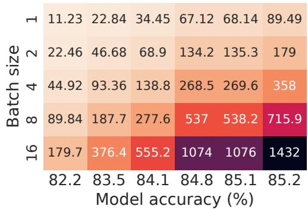  
(a) Transformer-Based SuperNet

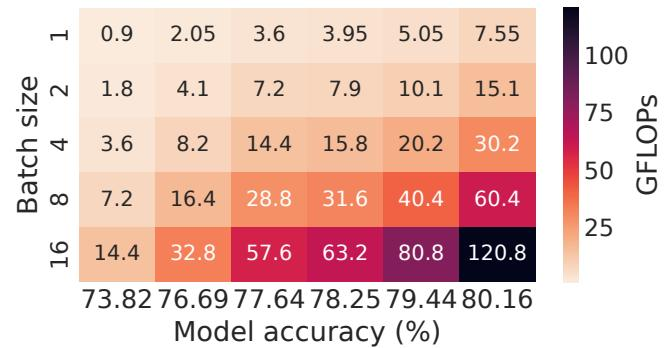  
(b) Convolution-Based SuperNet

Fig. 12: SlackFit control parameter space. FLOPs for six different pareto-optimal SubNets in SubNetAct as a function of accuracy (x-axis) and batch size (y-axis) shown for both transformer and convolution-based supernet. The FLOPs are monotonic with batch size and accuracy This trend in FLOPs forms the analytical basis of the trend in the inference latency of these models (as shown in Fig. 6).  
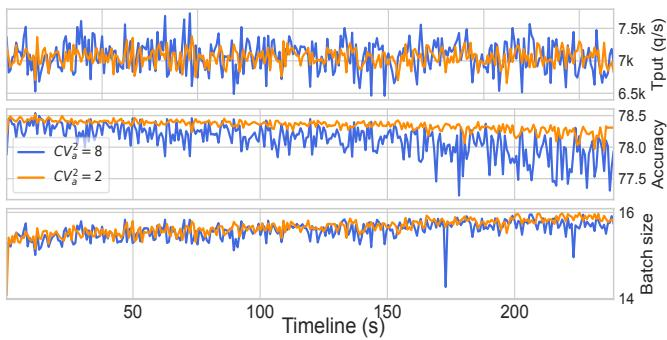

(a) Dynamic accuracy and batch size control: bursty traces  
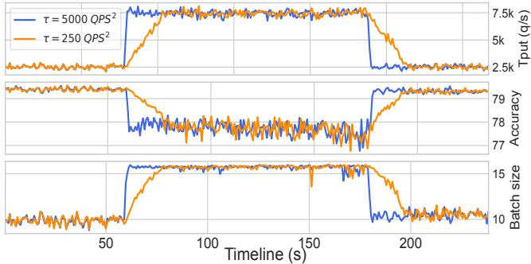  
(b) Dynamic accuracy and batch size control: time-varying

Fig. 13: System Dynamics on Synthetic Traces. Accuracy and batch size control decisions shown over time in response to ingest throughput (q/s). (a) bursty traces λ = 7000 = (λb = 1500) + (λv = 5500) with burstiness of CV 2 = 2 (orange) and CV 2 = 8 (blue). (b) time varying traces accelerate from λ1 = 2500 q/s to λ2 = 7400 q/s with acceleration τ = 250q/s2 (orange) and τ = 5000q/s2 (blue). Batch size and subnetwork activation control choices over time show how SuperServe reacts to each of the four plotted traces in real time. This illustrates dynamic latency/accuracy space navigation.

the maximum accuracy subnetwork (s) such that the profiled latency L(b, s) < θ . It returns the control choice (b, s). This policy leverages insights (I1) and (I2). It takes O(log(B))

operations to find b and O(log(S)) operations to find s (binary search on monotonically increasing latency w.r.t. batch size and accuracy). As a result, this lightweight policy scales well with the profile table, taking only O(log(B) + log(S)) operations to make control decisions.

MaxAcc Policy. MaxAcc first maximizes the accuracy and then the batch size. Mirroring MaxBatch, MaxAcc performs a binary search for the largest accuracy (s′) with L(1, s′) < θ first. Then, it finds the maximal batch size (b′) keeping the subnetwork choice fixed to the chosen s′, such that L(b′, s′) < θ ms. Similarly to MaxBatch policy, it leverages insights (I1) and (I2) and takes O(log(B) + log(S)) operations to return the control choice (b′, s′).

The proposed SlackFit Policy. This is our best performing policy. At a high level, SlackFit partitions the set of feasible profiled latencies into evenly sized latency buckets. Each bucket consists of control tuples (b, s) with L(b, s) within the range of bucket width. Then the policy chooses a bucket with latency ≤ θ. Finally, from the choices within the selected bucket, it picks the control choice that maximizes batch size. Intuitively, selecting control parameters closest to slack θ configures the system to operate as close to capacity as possible.In other words, choices with latency less than that either reduce the throughput capacity or the serving accuracy, eventually lowering system’s SLO attainment and accuracy. This draws on the monotonicity insights (I1) and (I2). SlackFit’s novelty is in insight (I3). We observe that SlackFit dynamically detects and adapts to the runtime difficulty of the trace. A well-behaved trace (e.g., low ingest rate, variation, acceleration) results in higher θ. Higher θ leads to the choice of higher latency buckets. And higher latency buckets are correlated strongly with fewer control tuple choices (Fig. 6), maximizing the probability of choosing higher accuracy models. Conversely, mal-behaved traces (higher ingest rate, variation, acceleration) lead to lower latency bucket choices, as the scheduler is operating under much lower θ conditions. There are more control choices in lower latency buckets, which leads to control tuples within those buckets to favor higher batch sizes. This leads to processing the queue faster.

Experiment Result. In Fig. 11c we show that SlackFit achieves the best tradeoff w.r.t. our success metrics compared to both MaxAcc – a policy that greedily maximizes accuracy and MaxBatch — a policy that greedily maximizes batches. The traces used mean λ = 7000 qps ((λb = 1500) + (λv = 5550)) and CV 2 ∈ {2, 4, 8}. SlackFit reaches the highest SLO attainment(0.999) for all CV 2. MaxBatch starts under performing w.r.t. SLO attainment with CV 2 increase. The Slack-Fit and MaxBatch difference is most pronounced at the highest CV 2a , eventually causing a significant 5% drop in the SLO attainment. Both policies maximize the batch size within latency slack θ when operating under small θ. When θ increases, however, MaxBatch continues to maximize the batch size unconditionally—a greedy choice that leads to packing larger batches. This greedy decision causes more time to be spent in a worker compared to SlackFit, which adaptively shifts to higher accuracy models under larger θ conditions with compound effect on queued queries, eventually missing their SLOs. maxAcc is unable to keep up with this trace. It never switches to policy decisions that process the queue faster. This policy comparison shows a continuum between faster queue processing and serving higher accuracy, with SlackFit automatically finding the best point in this continuum.