THE ADVANCED COMPUTING SYSTEMS ASSOCIATION

# ODRP: On-Demand Remote Paging with Programmable RDMA

Zixuan Wang, Xingda Wei, Jinyu Gu, Hongrui Xie, Rong Chen, and Haibo Chen, Institute of Parallel and Distributed Systems, SEIEE, Shanghai Jiao Tong University

https://www.usenix.org/conference/nsdi25/presentation/wang-zixuan

This paper is included in the Proceedings of the 22nd USENIX Symposium on Networked Systems Design and Implementation.

April 28–30, 2025 • Philadelphia, PA, USA

978-1-939133-46-5

Open access to the Proceedings of the 22nd USENIX Symposium on Networked Systems Design and Implementation is sponsored by

King Abdullah University of Science and Technology

# ODRP: On-Demand Remote Paging with Programmable RDMA

Zixuan Wang, Xingda Wei, Jinyu Gu, Hongrui Xie, Rong Chen, Haibo Chen

Institute of Parallel and Distributed Systems, SEIEE, Shanghai Jiao Tong University

## ABSTRACT

Memory disaggregation with OS swapping is becoming popular for next-generation datacenters. RDMA is a promising technique for achieving this. However, RDMA does not support dynamic memory management in the data path. Current systems rely on RDMA’s control path operations, which are designed for coarse-grained memory management. This results in a trade-off between performance and memory utilization and also requires significant CPU usage, which is a limited resource on memory nodes.

This paper introduces On-Demand Remote Paging, the first system that smartly chains native RDMA data path primitives to offload all memory access and management operations onto the RDMA-capable NIC (RNIC). However, efficiently implementing these operations is challenging due to the limited capability of RNIC. ODRP leverages the semantics of OS swapping and adopts a client-assisted principle to address the efficiency and functionality challenges. Compared to the state-of-the-art system, ODRP can achieve significantly better memory utilization, no CPU usage while introducing only a 0.8% to 14.6% performance overhead in real-world applications.

## 1 INTRODUCTION

Memory-intensive applications [4, 6, 9, 44] have been widely deployed in modern datacenters. However, accurately predicting their memory requirements is challenging due to fluctuations over time [37, 27]. Over-provisioning memory for host servers would significantly decrease memory utilization. To address this issue, memory disaggregation has been proposed [32, 19, 11, 37, 21, 22, 14, 36, 29, 18, 26, 43]. This architecture separates the CPU and memory resources into CPU and memory pools. Applications running on the CPU pool (CNodes) can dynamically allocate and access memory in the memory pool (MNodes) on demand, thereby improving overall memory utilization.

RDMA is a popular interconnect for bridging CNodes and MNodes. It provides efficient data path primitives, namely one-sided RDMA, which allow RNICs to directly read and write to MNode memory without involving their CPUs. This is particularly beneficial for memory disaggregation because MNodes often have limited or no CPU resources to ensure better cost efficiency [45]. Unfortunately, RDMA is not a panacea for memory disaggregation, which requires more than simple memory access. CNodes need to dynamically allocate and deallocate remote memory during runtime, which is not supported by one-sided RDMA. Even worse, dynamic allocation necessitates registering memory to the RNIC, an RDMA control path operation that is not optimized for performance and can only be performed by the CPU. As a result, naively performing memory (de)allocation in the data path would significantly degrade application performance and overwhelm the wimpy MNode CPU (§2.3).

Due to the above limitation of RDMA, previous systems [19, 11, 40, 25] have chosen to over-provision remote memory with large memory slabs (1 GB or larger) to amortize the memory (de)allocation overhead and reduce CPU usage on MNodes. However, using large memory slabs would significantly reduce the memory utilization of MNodes due to internal fragmentation. Therefore, current RDMA-based memory disaggregation systems face a fundamental trade-off between high remote memory utilization, no MNode CPU usage and high performance.

This paper demonstrates that it is possible to achieve high memory utilization, no MNode CPU usage, and high performance on commodity RDMA hardware. It describes the design and implementation of On-Demand Remote Paging, allowing CNodes to swap pages to the MNode with 4 KB allocation granularity—the same as Linux swapping granularity for ideal memory utilization. ODRP achieves fine-grained remote memory management in the data path by efficiently offloading memory access and (de)allocation operations to the MNode’s RNIC, bypassing its CPU. Our key insight is to fully exploit a less-explored chaining feature of RDMA that allows developers to combine various one-sided primitives to offload complex functionalities onto the RNIC (§2.4).

Although RDMA offloading has recently been proven to be Turing complete in theory [34], meaning that it can offload arbitrary programs, efficiently offloading the complex functionalities of a swap device presents challenges due to the following three issues: First, a function may require offloading multiple RDMA work requests (WRs) for implementation. However, offloading performance decreases as the number of WRs increases. Therefore, we need to design data structures and operations that minimize the number of offloaded WRs. Second, RDMA primitives are primarily designed for networking and have limited semantics. Consequently, it is challenging or even impossible to implement certain functions efficiently with a relatively small number of WRs, such as the modulo operation. Finally, RNIC drains the offloaded WRs after execution. Re-executing them requires proactive refilling with the help of the MNode CPU. However, the MNode CPU has limited processing power and can therefore become a performance bottleneck.

To address the aforementioned issues, first, ODRP adopts a client-assisted principle, which splits the offloaded functions and shifts part of the computation to the CNode for better performance (§4.3). Choosing how to split the functions is non-trivial, because we need to minimize the computation and storage overhead added to the CNode, as well as cope with compromised CNodes. Second, we propose utilizing the novel features offered by recent RNICs to efficiently implement several high-level primitives (referred to as meta WR) (§4.2). These include modulo and endianness conversion operators, which are critical for offloading complex functions. Finally, we discover that the RNIC only “logically” drains WRs, meaning that we can reactivate them by properly updating the RNIC’s driver data structures. We are the first to propose a method to recycle executed WRs without requiring additional WRs or CPU intervention (§4.4).

We have implemented ODRP on Linux as a standard swap backend, making it transparent to applications. Compared to the state-of-the-art swap-based memory disaggregation system, namely Fastswap [11], ODRP achieves 1.72× to 12× better memory utilization with zero MNode CPU usage, and at the cost of slight performance overhead (up to 14.2%) on real-world applications including Quicksort, Kmeans, Memcached, GAPBS, and VoltDB. Moreover, it demonstrates superior performance, memory utilization, and scalability compared to other RDMA alternatives.

In summary, this paper makes the following contributions:

• We identify the issues with memory utilization and MNode CPU usage in existing RDMA alternatives for realizing swap-based memory disaggregation. (§2).

• We present a novel system design to efficiently offload memory management onto the RNIC, achieving better memory utilization and zero MNode CPU usage. (§4).

• An implementation and evaluation of ODRP to demonstrate its effectiveness and efficiency. (§5).

Although we focus on swap-based memory disaggregation, we believe that the methodology and principle summarized in our work can provide guidance for future offloading functions onto the RNIC. ODRP is available at https://github.com/SJTU-IPADS/ODRP.

## 2 BACKGROUND AND MOTIVATION

## 2.1 Memory Disaggregation with RDMA

Memory disaggregation is a promising paradigm to improve overall memory utilization in datacenters [19, 11, 37, 21, 22, 14, 36, 29, 18, 26]. It separates servers into a CPU pool and a memory pool, namely CNodes and MNodes. When CNodes require additional memory, they can allocate it on MNodes and access it as needed. We focus on the asymmetric architecture, in which CNodes have powerful CPUs but limited memory, while MNodes have a large amount of memory but limited (or no) CPU power. It is worth noting that some systems adopt a symmetric architecture (i.e., a node can be both a CNode and an MNode at the same time). ODRP could be extended to support this symmetric architecture.

RDMA is a popular interconnect for CNodes to access MNode memory. One-sided primitives enable direct read, write, compare-and-swap (CAS), and fetch-and-add (FAA) operations on MNode memory, bypassing the MNode CPU. Two-sided primitives (i.e., SEND and RECV) facilitate message exchanges between CNodes and MNodes.

Our target: Swap-based memory disaggregation. We target a setup where CNodes leverage Linux’s swap subsystem for memory disaggregation [19, 11, 28, 43, 39, 33, 40]. This approach offers the advantage of transparency compared to other alternatives [16, 17, 36, 21]. In this setup, if a CNode faces memory pressure, the kernel will swap out cold pages to the MNode. Likewise, if the application needs to read a swapped-out page, the kernel retrieves it from the MNode.

## 2.2 RDMA Alternatives to Implement Swapbased Memory Disaggregation

To support swap-based memory disaggregation, we need to implement the following functionalities on the MNode: (1) Read and write memory pages. (2) Verify the validity of the page address, i.e., whether the CNode has permission to access the page and (3) Memory allocation and deallocation. RNIC has been optimized for (1) and (2) through its data path one-sided primitives and memory region registration (MRR). However, it does not have efficient native support for (3). Specifically, MRR is a control path operation, which is inefficient and requires intensive CPU involvement. Therefore, current RDMA hardware only provides the following alternatives for existing systems to implement swap-based memory disaggregation.

• One-sided (Static). The MNode registers coarse-grained memory slabs (e.g., 1 GB or the same size as the CNode’s swap device) and allocates them to CNodes statically [11, 19, 40, 25, 33]. CNodes can directly access remote memory with one-sided primitives and require few or no memory allocation operations during runtime, making this approach highly efficient. However, this leads to poor memory utilization on the MNode due to severe internal fragmentation and the lack of elasticity.

• One-sided (Dynamic). To improve memory utilization and support elasticity, the MNode can register its memory as fine-grained (e.g., 1 MB) memory regions (MRs) in advance and dynamically allocate them to CNodes. Specifically, if a CNode requires more (or less) remote memory, it can send an RPC message to the MNode using two-sided primitives. The MNode then allocates (or frees) an MR and returns its metadata (i.e., address and rkey) to the CNode. Afterwards, the CNode can use one-sided primitives to access the allocated memory like in the first approach.

Table 1: A comparison between ODRP and other RDMA alternatives. Util: utilization.  
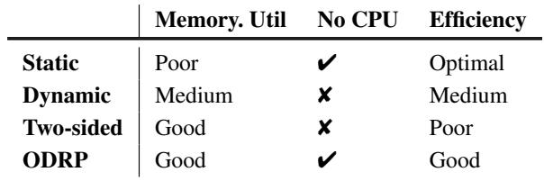

Note that a freed MR must be re-registered before being allocated to other CNode for safety.

However, determining the appropriate memory allocation granularity is challenging due to the inefficiency of RDMA’s control path (i.e., memory registration) and the limited CPU power of MNodes. For example, registering a 4 KB or 1 MB MR takes about 80 µs or 600 µs, respectively. Using a smaller memory slab size can improve remote memory utilization but incurs higher management overhead on MNodes and necessitates more frequent memory allocation requests from CNodes. Additionally, the limited CPU power of the MNode may become a performance bottleneck in the system.

• Two-sided. To minimize the cost of remote memory (de)allocation, CNodes can utilize two-sided primitives in the data path. The MNode CPU can always mediate the memory accesses from CNodes and then manage the remote memory at a fine granularity. However, this approach suffers from poor performance as two-sided primitives are less efficient than one-sided primitives [41] and requires more intensive involvement of the MNode CPU.

## 2.3 Issues with RDMA Alternatives for Swapbased Memory Disaggregation

This section conducts an experiment to analyze the issues of aforementioned alternatives. Detailed setup can be found in §5. Figure 1 shows the results of running increasing numbers of Quicksort tasks (each with 50% local memory) on 4 CNodes. For One-sided (dynamic), we adopt a 1 MB allocation granularity. Table 1 summarizes the comparison between ODRP and other RDMA alternatives.

Poor memory utilization of One-sided (Static). Figure 1 (a) illustrates the memory utilization of different alternatives. Memory utilization is measured as the ratio of actually used remote memory to allocated remote memory. As expected, One-sided (static) has the lowest utilization because MNode memory is pre-allocated based on the CNodes’ swap space size. While One-sided (dynamic) alleviates this problem, the average remote memory utilization is still 24% lower than Two-sided due to larger allocation granularity (1 MB vs. 4 KB). It is worth noting that recent RNIC provides an ondemand-paging (ODP) MR [5] feature that provides transparent dynamic memory allocation for One-sided (static). However, this feature relies on the in-kernel driver’s page fault handler for memory allocation, which is orders of magnitude slower than one-sided primitives. In our experiment, it even fails to complete the application benchmark.

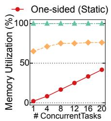

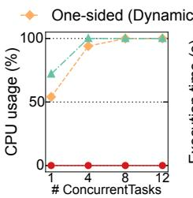

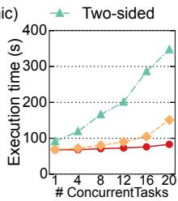  
Figure 1: A comparison of RDMA alternatives in terms of (a) remote memory utilization, (b) remote CPU usage, and (c) execution time.

High MNode CPU usage of One-sided (Dynamic) and Two-sided. Figure 1(b) shows that as the number of running tasks increases, CNodes send more frequent allocation and swap requests, causing One-sided (dynamic) and Two-sided to quickly saturate the MNode CPU. As a result, the MNode CPU becomes the bottleneck and consequently slows down application performance due to request queuing.

Poor application performance of One-sided (Dynamic) and Two-sided. As shown in Figure 1(c), the average execution time for 20 Quicksort tasks in One-sided (dynamic) and Two-sided is 1.82× and 4.18× longer than One-sided (static), respectively. The performance degradation in Onesided (dynamic) can be attributed to the extra latency from waiting for memory allocation requests to complete. Moreover, Two-sided faces even more competition for the MNode CPU as every swap request needs to be queued up.

## 2.4 Programmable RDMA

This section presents necessary background for how to offload complex functionalities onto the RNIC.

Offloading arbitrary logic onto RNIC with WR chains. RNICs are designed to execute simple primitives posted by the CPU, known as work requests (WRs). These WRs can be linked together by recording the address of the next WR in the next field. When the RNIC executes the first WR, it will proceed to the next one in the chain. As a result, developers can chain multiple WRs together to offload more complex function onto the RNIC. We refer to a function offloaded to the RNIC as a WR chain. RDMA provides WAIT and ENABLE WRs to control execution timing. By linking a WAIT WR and an ENABLE WR after the first RECV WR in a chain, the RNIC will automatically execute the WR chain after receiving an RDMA SEND, bypassing the CPU.

An interesting property of the WR chain is its Turing completeness [34], which means we can offload arbitrary logic onto the RNIC, bypassing the CPU. Intuitively, the CAS WR provides branching, and the READ/WRITE WRs handle state reads and writes. Finally, we can implement while loops by reusing previously executed WR chains, i.e., after

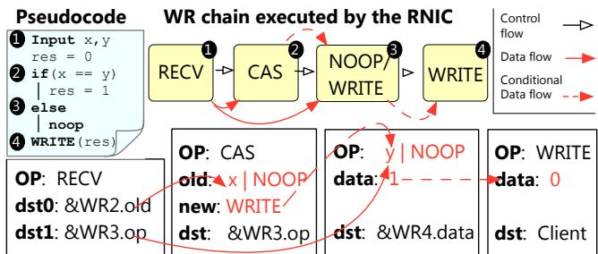  
Figure 2: An illustration of how to execute the pseudocode with four RDMA WRs. For simplicity, we omit the WAIT and ENABLE.

RNIC finishes executing the last WR chain in the work queue (WQ), it wraps around to execute the first one again.

Example. Figure 2 depicts how to offload a simple conditional execution program onto the RNIC with a 4-WR chain (not counting WAIT and ENABLE). The chain checks whether x is equal to y using a CAS WR. Since the values of x and y are arguments and unknown to the WR chain before execution, the RECV WR will receive them and fill the old field of the CAS and the op field of the third WR with x|NOOP and y|NOOP , respectively. Then, we can compare them with CAS. If x is equal to y, the CAS changes the third WR’s op field (i.e., opcode) from NOOP to WRITE1, causing the first branch to execute and update the final result (WR4.data). Otherwise, the third WR remains NOOP, and the RNIC takes no action (the second branch). Finally, the WRITE WR writes the result back to a client-side buffer.

## 3 ODRP OVERVIEW

Design goals. ODRP is a kernel-space swapping system that can transparently swap cold pages to the MNode. It has three main design goals: (1) Fine-grained memory management on the MNode, allocating and deallocating remote memory at page granularity to improve remote memory utilization; (2) No remote CPU usage, preventing the wimpy MNode CPU from becoming a performance bottleneck and realizing true disaggregation; (3) Good performance, achieving comparable performance to existing coarse-grained memory management solutions.

System architecture and high-level execution flow. Figure 3 presents the system components of ODRP. On the CNode side, ODRP provides a Linux swap backend that faithfully implements the Linux frontswap [3] API (see Table 2). On the MNode side, ODRP registers all of its provisioned memory as a large MR at initialization. The MNode maintains two types of swap metadata (detailed in §4.1): (1) it divides provisioned memory into 4 KB pages and manages them with a free page queue; (2) it maintains a translation table, initially unmapped, for each CNode that maps CNode swap addresses to page addresses. During runtime, memory pages are allocated from the free page queue and mapped in CNodes’ translation tables on demand.

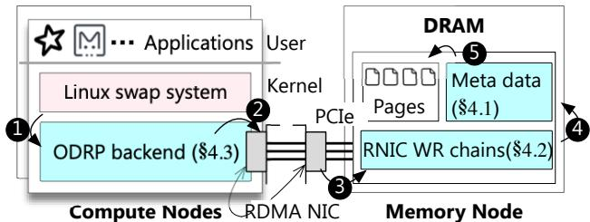  
Figure 3: An overview of system components of ODRP.

When the CNode’s backend receives swap commands from the swap system (❶), it sends these requests to the MNode with swap addresses (❷). The MNode’s RNIC then serves these requests by executing the pre-programmed logic (i.e., WR chains) stored in work queues (WQs) (❸). Each type of WR chain implements a specific high-level function (see Table 2). The WR chains leverage the swap metadata (❹) to perform address translation (swap address to page address), page access, and page (de)allocations (❺). Since all requests are handled by WR chains, there is no need for CPU intervention on the MNode.

Offloading challenges and solutions overview. While RDMA offloading presents opportunities for bypassing the CPU in fine-grained memory management, it is challenging to implement these logics efficiently and achieve full-fledged programmability due to the limited RDMA WR semantics.

C#1. Efficiency. Executing a new WR requires the RNIC to retrieve it from the work queue (WQ) in host memory via PCIe, which is relatively slow. There are two main sources of overhead that can degrade the performance of WR chains. First, more complex logic requires more WRs per chain. Second, the execution of each chain consumes all its WRs. To serve future requests, existing work [34] necessitates additional FAA and READ WRs to reactivate the executed WRs.

To minimize the number of WRs per chain, ODRP adopts a client-assisted principle, as detailed in §4.4. Specifically, to eliminate the need for the WR chain to calculate the address of the translation table entry (tt addr) corresponding to a CNode’s swap address, the MNode shares the base address of the CNode’ translation table (tt base) with it. Then the CNode can calculate and directly use tt addr as an argument when invoking WR chains. To simplify the design of the page store WR chain, we categorize it into two cases based on whether the swap address is mapped or not (see Table 2), and have the CNode’s backend determine which WR chain should be invoked. Additionally, we use the CNode as a helper to reactivate executed WR chains.

C#2. Functionality. Although RDMA offloading is theoretically Turing complete, it is non-trivial to offload complex logic onto the RNIC. First, the RNIC lacks support for the modulo operation (%), which is critical for avoiding overflow during computation. Second, the RNIC’s endianness mismatches that of the host, meaning that the RNIC cannot directly use its computed value as an address to access host memory.

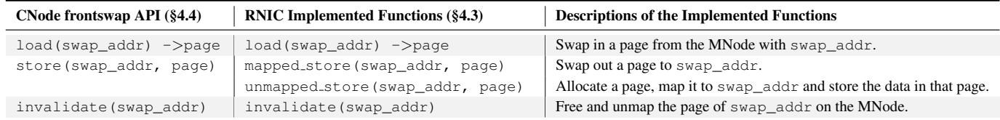  
Table 2: The CNode API and the corresponding implementation on the RNIC.

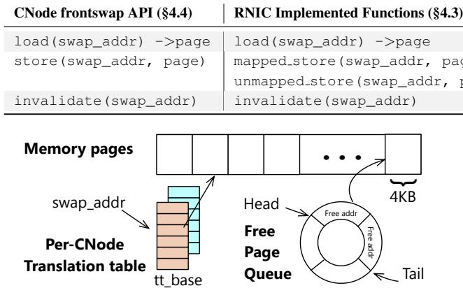  
Figure 4: An illustration of the MNode-side data structures.

To address these challenges, ODRP has implemented two built-in chains as Meta WRs, as detailed in §4.2: one for the modulo operation and one for endianness conversion. By leveraging new RNIC features [2], we show that these operators can be supported efficiently, greatly simplifying the offloading of complex logic onto the RNIC.

## 4 DESIGN AND IMPLEMENTATION

## 4.1 Data Structures at the MNode

Free Page Queue. As shown in Figure 4, the MNode divides its memory into 4 KB pages and organizes them with a FIFO free page queue. During initialization, it inserts all the free pages into that queue. The queue is implemented as a fixed-sized ring buffer, determined by the number of pages the MNode can provide, and has one head pointer and one tail pointer. Each queue element is 8 bytes (8 B) in size, holding the address of a free page. When allocating a free page to a CNode, ODRP performs a dequeue operation to obtain a free page address, i.e., leverages the RDMA atomic FAA WR on the queue head pointer. When a page is freed, ODRP performs an enqueue operation, i.e., uses atomic FAA on the queue tail pointer and stores the page address in the fetched queue element.

This results in O(1) complexity for (de)allocation operations, making it well-suited for the WR chain. In contrast, using other structures like bitmap to maintain free pages requires a more complex WR chain, which would harm efficiency. For example, allocating a page with a bitmap requires multiple RDMA WRs to search for a free bit and a CAS WR to update the free bit.

Translation Table (TT). ODRP provides each CNode with a swap space and maintains a TT for it, which records the mapping between swap addresses and allocated page addresses on the MNode. Each entry in the TT starts out empty.

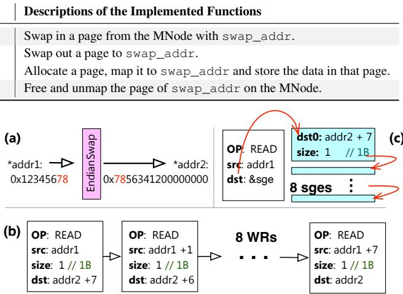  
Figure 5: (a) An overview of EndianSwap meta WR. (b) A naive implementation using an 8 READ WRs. (c) ODRP utilizes 8 scatter/gather entries to achieve EndianSwap with one READ WR.

Pages are allocated from the free page queue and mapped to the TT on demand during CNode runtime. The TT is necessary to ensure memory isolation, as each WR chain can access all the MNode memory to enable fine-grained memory management and sharing (i.e., a freed page can be allocated and mapped to another CNode’s swap space). Moreover, we use a single-level page table design for efficient offloading: it requires only one READ WR for address translation (see Figure 6). Finally, since the swap requests are initiated by the Linux swap subsystem in a coordinated manner (i.e., a CNode’s concurrent swap requests will not target the same swap address), ODRP does not need to coordinate concurrent operations targeting the same TT entry.

## 4.2 Meta WRs

Before diving into the details of WR chains, we first describe the design and implementation of two meta WRs that are essential for the WR chains. Although these operations could be performed by the MNode CPU, this approach would require an interrupt from the RNIC to the CPU, which is less efficient. Therefore, we choose to implement these operations within the WR chains as meta WRs.

The modulo WR. The modulo (%) operation is crucial to prevent overflow in the enqueue and dequeue operations of ring buffer. However, without proper hardware support, it is impossible to implement the modulo operator with just a few WRs. Fortunately, recent RNICs provide an Enhanced Atomic Operations [10] feature, which includes a Masked FAA WR that allows users to split the target value into multiple fields of selectable length for addition. By using this feature, we can mask the upper bits of the value to implement FAA with modulo support.

The endianness conversion WR (EndianSwap). Network protocols, including RDMA [1], traditionally use big-endian format, which differs from the little-endian format used by most host CPUs (e.g., x86-64). This mismatch can lead to subtle issues in RDMA offloading. For example, the FAA WR performed on the host memory returns the result in littleendian format (e.g., the fetched value of the queue head pointer). However, a READ WR expects its source field in big-endian format. As a result, the fetched value of the queue head pointer by FAA cannot be directly used for a subsequent READ WR without endianness conversion.

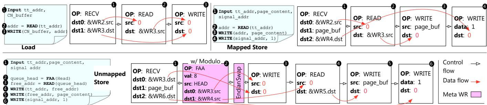  
Figure 6: A simplified illustration of the WR chain design in ODRP. We omit fields like size and WAIT and ENABLE WRs. In the Load, Mapped Store, and Unmapped Store WR chains, the number of omitted WAIT and ENABLE WRs is 3, 4, and 5, respectively. The WRITE writes the memory from src to dst.

To efficiently address this issue without involving the MNode CPU, we designed an EndianSwap WR to simplify endianness conversion. A naive implementation would involve using N READ WRs to convert an N-bytes value. Figure 5 (b) shows an example of converting an 8-byte value from little-endian to big-endian: the first WR moves the first byte to the last byte, and so on. However, this approach is inefficient due to the excessive use of WRs. ODRP leverages the scatter-gather entry (SGE) feature provided by RNICs to reduce the number of WRs to just one. As presented in Figure 5 (c), the RNIC can scatter a continuous memory block into multiple destination buffers using SGEs. By filling the dst fields of multiple SGEs in reverse order, we can achieve endianness conversion with just one READ WR.

## 4.3 MNode-side WR Chains

Figure 6 presents the pseudocode and WR chains of offloaded functions (see Table 2). When CNodes need to swap in or out a page, they use RDMA SEND with arguments to trigger these WR chains. We assume the arguments are valid for now. Handling invalid arguments will be detailed in §4.5. Notably, instead of directly providing the swap address, we request CNodes to compute the TT entry address (tt base+swap addr/P AGE SIZE) as an argument to all WR chains. This approach eliminates the need for an additional FAA and an EndianSwap WR in the WR chain to perform this calculation. This optimization incurs zero memory overhead for the CNode, as each CNode only needs to store its own tt base.

Page load. Page load takes a TT entry address (tt addr) (❶), looks up the page address stored in that entry (❷), and writes the page stored at that address back to the CNode’s buffer—CN buffer (❸). To look up the page address, the RECV fills the source field of the next READ with tt addr. The READ then places the result of address translation (i.e., the page address on the MNode) in the source of the subsequent WRITE. Finally, the WRITE writes the page data back from the MNode memory to the destination buffer, which has been set to CN buffer by the RECV.

Mapped page store. The WR chain receives a tt addr and stores the received page data (page content) at the address specified in that entry. The WRs used in this chain are similar to page load: the RECV (❶) fills the source field of the next READ with tt addr and places the page content in a temporary page buffer (page buf). Then, the READ WR looks up the page address (❷) stored in the TT entry. Subsequently, the next WRITE writes the page content to that page from page buf (❸). Finally, we use an additional WRITE (❹) to notify the CNode of the completion of this request by writing a magic number to a CNode-provided buffer (signal addr).

Unmapped page store. This is the most complicated WR chain in ODRP, which is responsible for allocating a free page, mapping it in the TT, and storing the received page.

At a high level, this WR chain receives a tt\_addr and allocates a page from the free page queue (❷). It then maps the allocated page address to the TT entry (❸) and stores the received page data (page content) in the newly allocated page (❹–❺). To pop a free page address from the page queue, the chain uses an atomic FAA with modulo support to increment the head pointer by 8 (head = head + 8). The fetched old value of the head pointer (old head) points to the allocated queue element that contains a free page address.

Note that the FAA retrieves old head in little-endian format, which is consistent with that of a typical host CPU (e.g., x86-64). However, the subsequent WRs assume that their src or dst fields are in big-endian format. To correctly read the allocated page address (∗old head), we use the aforementioned EndianSwap WR to convert it to big-endian format. Given the free page address, it is straightforward to map it in the TT entry (❸) and store the page content with WRITE (❹–❺). Finally, we notify the CNode with another

WRITE (❻), similar to the mapped page store WR chain.

Page invalidation. Due to space limitations, we omit this chain in Figure 6, which is similar to the unmapped page store WR chain. At a high level, we first read the address of the page to be released from the TT entry. Next, we insert the address back to the page queue by incrementing the tail pointer with FAA (tail = tail + 8) and using WRITE to store the freed page address to the old tail (∗old tail = page addr). Finallyt, we unmap this page in the CNode’s TT by setting the TT entry to zero.

Handling empty free page queue and crashed CNodes. There are two corner cases in ODRP: all memory pages on the MNode are allocated (i.e., the free page queue is empty) and a CNode crashes unexpectedly. First, we use an invalidation-based mechanism to detect the empty free page queue and abort the allocation if necessary. Specifically, after each allocation, we clear the allocated queue element (∗old head = 0). As a result, the first allocation attempt on the empty queue will return a null page address, causing the subsequent WRs to throw an RDMA protection error. To this end, we add a WRITE WR after the fifth WRITE WR (❺) of the unmapped store chain to set the queue element to zero. A limitation of this approach is that if such an error occurs, we need to use the MNode CPU to recover the state of the free page queue (i.e., reset the head pointer to the correct value), as page invalidation requests may continue pushing free pages into the corrupted page queue.

Second, when a CNode crashes unexpectedly, ODRP needs to recycle the resources allocated to it, including memory pages and its TT. In ODRP, the MNode detects crashed CNodes via heartbeat signals. Upon detecting a crashed CNode, the MNode scans its TT and releases the pages contained in the mapped TT entries. Then, the MNode releases the crashed CNode’s TT.

## 4.4 CNode-side ODRP Backend

For each type of WR chain, the CNode backend has an RDMA connection to the MNode, and the MNode-side work queue (WQ) is pre-populated with corresponding WR chains to handle requests.

Swap API implementation. ODRP provides a Linux frontswap [3] backend, which operates as a swap device at the CNode. The API implementation is as follows:

• load: The backend calculates the tt addr based on the swap address and invoke the page load WR chain by posting an RDMA SEND.

• store: The backend checks whether the swap address is mapped. If it is, the mapped page store chain is called; otherwise, the unmapped page store chain is invoked.

• invalidate: The backend invokes the page invalidation chain.

In the cases of load and invalidate operations, the swap address has a valid mapping in the TT because it must have been previously stored. However, store lacks this information. A naive approach would be to add extra logic in the WR chain to look up the TT and allocate a page if the target swap address is unmapped. However, it is inefficient due to the extra WRs per chain. Our observation is that a CNode’s swap backend actually has full knowledge of the remote allocation status: (1) the entire swap space is unmapped initially (i.e., the whole TT starts out empty), and (2) an allocated page can only be freed by the CNode’s page invalidation request, meaning the CNode controls the unmapping operation. Therefore, each CNode can maintain a bitmap to record the allocation state of each page in its swap space. With this information,store can determine whether the target swap address is mapped and invoke the appropriate WR chain (mapped page store or unmapped page store).

CNode-assisted MNode WR recycle. After a WR chain is executed, the WRs in it are logically dequeued from the WQ. To serve future requests, an intuitive approach is to post new WRs with the CPU. However, this would cause unexpected stalls in the RNIC’s processing pipeline since the wimpy MNode CPU can only post asynchronously at a relatively low rate. To bypass the MNode CPU, ODRP makes a key observation that executed WRs are not physically erased from the WQs. Thus, by modifying the WR metadata, which is stored in WQs, we can reactivate executed WRs2.

More specifically, to make the RNIC wrap around to the beginning of the WQ, we only need to modify the index field of the RNIC’s ordering primitives, namely WAIT and EN-ABLE. This field indicates the index of the WR affected by these ordering primitives. Special attention needs to be paid to the RECV WR, which serves as the triggering WR of each WR chain. We discovered that to inform the RNIC that the consumed RECV is ready for re-execution, it is only necessary to modify the doorbell record value of the WQ.

Putting it all together, to recycle executed WRs without involving the MNode CPU, a straightforward way is to inject additional FAA and EndianSwap WRs in the chain to update the index field [34] and the doorbell record. However, this adds extra WRs to the WR chains and introduces a performance penalty. To avoid using additional WRs for index calculation and updating, we shift this calculation to CNodes. To be specific, the CNode will piggyback the calculated values with other arguments when sending requests. The RECV WR in the WR chain will use these values to update the index field and the doorbell record. As a result, no extra WR is needed for recycling.

## 4.5 Correctness under Benign and Malicious CNodes

We define the correctness of ODRP in two aspects. First, the TTs and the free page queue must always be consistent.

Specifically, these data structures are consistent if and only if (1) the free pages in the free page queue cannot be mapped to any TTs, and (2) each allocated page can only be mapped in exactly one TT. Second, requests from different CNodes must be isolated; i.e., a load or store can only access the page mapped in the CNode’s own TT, even in the presence of malicious CNodes.

## 4.5.1 Correctness under Benign CNodes

Consistency. We informally argue that our WR chains can ensure consistency via induction. We first initialize the MNode to a consistent state by ensuring each page exists exactly once in the free page queue, and leave all the TTs empty. We then demonstrate that the execution of CNode requests will maintain the consistency of these data structures. This is straightforward when not considering concurrent requests. Executing a load or a mapped store operation, which does not modify the TT and the free page queue, naturally preserves this consistency. For the unmapped store operation, since it faithfully performs a dequeue operation, we only need to ensure that the free page address popped from the queue is consistent with the address written to the TT entry, which is obvious under our assumption of benign CNodes. Finally, page invalidation is the reverse operation of an unmapped store, so the argument is the same.

For concurrent unmapped store and invalidation operations, we use RDMA’s atomic FAA to avoid race conditions, similar to other concurrent queues [31]. Concurrent load/- store operations targeted on the same tt\_addr are inherently avoided due to the semantics of the swap subsystem. One tricky case is when the unmapped store and invalidation operations are executed concurrently. Ideally, there is no race condition between them because the ummapped store operation only modifies the queue head, while the invalidation modifies the queue tail. However, a potential race condition emerges when the queue is empty, i.e., the queue head and tail point to the same address. In this scenario, an unmapped store operation may read the queue head while an invalidation operation concurrently writes to this head. We require RDMA to provide atomic 8 B read and write for correctness, which is ensured by hardware with cache-aligned accesses [15, 16, 30, 42]. With this atomicity guarantee, the unmapped store operation will either get the latest invalidated page or a null address. Both cases are correct.

Isolation. Since all load and store requests can only access pages mapped in the CNode’s own TT, requests from different CNodes are isolated as long as their TTs are consistent, which has been demonstrated above.

## 4.5.2 Handling Malicious CNodes

Security model. We assume MNodes are trustworthy, while CNodes can be compromised, the same as existing systems [11, 19, 22]. A malicious CNode might send illegal requests with invalid arguments (e.g., invalid tt\_addr), or try to exhaust the memory resources of the MNode by continuously sending unmapped store requests. We show that malicious CNodes requests will be rejected by the MNode.

Correctness under illegal requests. Such requests can be categorized into two types: one with an illegal operand code (e.g., an RDMA READ instead of SEND) or one with an invalid argument. For the first one, we can configure the RDMA connection permission such that they will be rejected by the RNIC. For the latter, we only need to handle the invalid tt\_addr, as the WRs manipulate TTs and the free page queue based on it (see Figure 6). Specifically, an invalid tt\_addr can be (1) misaligned, (2) out-of-range and (3) being unmapped in a request that assumes mapped tt\_addr. For (1), we can configure the RECV WR to only use the upper bits of the tt\_addr to efficiently avoid misaligned tt\_addr. For (2), we use RDMA’s memory registration to ensure that all the WRs in WR chains can only access the CNode’s own TT. For (3), we ensure the unmapped TT entries are zero through proper initialization and clean-up. As a result, such an argument will cause an RDMA protect error due to null access, which will abort execution. Additionally, we insert a conditional check similar to the one described in Figure 2 to rule out unmapped tt\_addr in page invalidation operations.

Fairness. To ensure fairness, we follow existing works [11, 19] that set a budget for the maximum allocated memory for CNodes. If the budget is exhausted, the MNode will reject allocation requests from the CNode to maintain fairness. The challenge is how to keep track of each CNode’s usage. Existing systems can leverage the CPU to actively record it before allocating memory to a CNode. However, in ODRP, we bypass the MNode CPU in memory allocation. To address this, we leverage a lazy detection method to periodically check whether a CNode exceeds its budget. Specifically, we use one CPU core at the MNode to monitor the memory usage of each CNode. The challenge is how to efficiently perform this bookkeeping. A naive solution would be scanning the TTs, which would incur significant CPU overhead. Fortunately, we can leverage the RDMA hardware counters [35] for this calculation. These counters record the completion of WRs in the unmapped store and invalidation WR chains. By comparing these counters, we can efficiently get the number of allocated pages of a CNode.

## 5 EVALUATION

## 5.1 Evaluation Setup.

Testbed. Our experiments are conducted on a cluster with one MNode and up to 8 CNodes, all connected with an Infini-Band switch. Each node has a 12-core Intel Xeon E5-2650 CPU (hyper-threading is disabled), 128 GB DDR4 RAM, and a 100 Gbps Mellanox ConnectX-5 RNIC. Each node runs Mellanox OFED 4.9 and Linux 4.15. Each CNode is configured with 12 GB swap space.

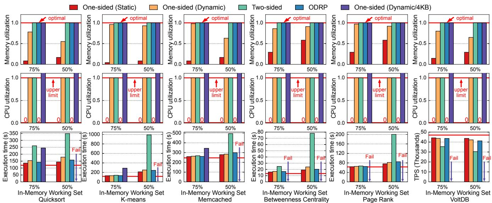  
Figure 7: Remote memory utilization (higher is better), remote CPU usage (lower is better), and the execution time (throughput) of ODRP and other four baseline systems under different workloads with 8 CNodes accessing one shared MNode.

Baselines. We compare ODRP with four baselines as described in § 2.2: 1) One-sided (static), pre-registering 12 GB of remote memory for each CNode; 2) One-sided (dynamic), preparing 1 MB MRs in advance while allocating them to the CNode on-demand; 3) Two-sided, using two-sided RDMA operations in the data path to implement 4 KB-granularity memory management; 4) One-sided (dynamic/4KB), same as One-sided (dynamic) but performing 4 KB allocation. The MNode only uses one CPU core to simulate the weak processing power, unless otherwise specified. We implement all the baselines based on Fastswap [11] and compare them to ODRP, aiming to demonstrate that ODRP outperforms baselines regarding application performance, remote memory utilization, and remote CPU usage.

Evaluated applications. We evaluate the applications used in prior memory disaggregation studies [19, 11, 43]. 1) Quicksort with a 4 GB working set; 2) Kmeans with a 2 GB working set; 3) Memcached v1.4.25 with Facebook ETC workload [12] (4 GB working set), a server thread and four client threads; 4) Page rank (PR) and 5) betweenness centrality (BC) from GAPBS [13] on a Twitter dataset [24], 4 threads and a 14 GB working set; 6) VoltDB with TPC-C [8], 8 threads and a 7 GB working set.

## 5.2 Application Benchmarks

We run the applications on all available hardware in our cluster, which consists of 8 CNodes and one shared MNode. This cluster setup aligns with the typical deployment of memory disaggregation, such as in cloud environments [26].

Memory utilization. The first row of Figure 7 illustrates the average remote memory utilization during application runtime, which is measured as the ratio of actually used remote memory to allocated remote memory. One-sided (static) can only achieve up to 58.3% remote memory utilization because of its coarse-grained static allocation. One-sided (dynamic) can significantly improve remote memory utilization by adopting fine-grained allocation. However, it still cannot achieve ideal utilization because of the fragments within 1 MB memory slabs. It achieves about 95% remote memory utilization for workloads where internal fragmentation is not significant, such as Kmeans, betweenness centrality, and page rank. More severe internal fragmentation can lead to worse remote memory utilization. For example, One-sided (dynamic) can only achieve 55% remote memory utilization in the case of Quicksort with 50% local memory.

In contrast, thanks to the page-granularity memory management, ODRP, Two-sided, and One-sided (dynamic/4KB) can achieve ideal remote memory utilization (100%). This results in up to 1.82× improvement over One-sided (dynamic) and a 1.72× to 12× enhancement compared to Onesided (static).

Remote CPU usage. As shown in the second row of Figure 7, both One-sided (dynamic) and Two-sided reach the upper limit of one MNode CPU core in all workloads. The saturated MNode CPU turns into a performance bottleneck, as discussed in more detail in § 5.3. Some workloads even fail to complete in One-sided (dynamic/4KB). If we use a single-CNode evaluation setup, One-sided (dynamic) results in a maximum of 67% remote CPU usage because the MNode CPU needs to serve memory (de)allocation requests. Twosided requires higher remote CPU usage because it involves the MNode CPU in every swap in/out request. In Kmeans and graph processing workloads, which involve more frequent swap operations, Two-sided leads to 86% and 99% remote CPU usage, respectively.

For One-sided (dynamic/4KB), we removed the restriction of providing only one MNode CPU core, otherwise the applications fail to complete. One-sided (dynamic/4KB) requires the most intensive MNode CPU involvement and can use up to 3 MNode CPU cores in the single-CNode setup. In the 8- CNode setup, some applications even fail to complete due to poor performance.

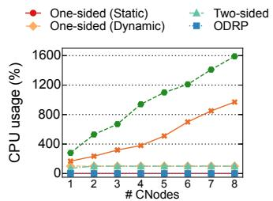

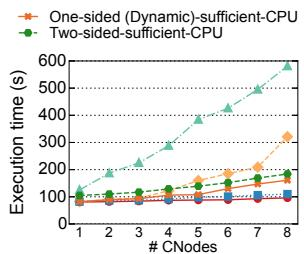  
Figure 8: The impact of increasing the number of CNodes (each with 4 Quicksort tasks) on (a) Remote CPU usage and (b) Execution time

In contrast, One-sided (static) does not require the MNode CPU during runtime due to its static allocation (i.e., all remote memory is provisioned at initialization time). ODRP implements all of its memory management logic through RDMA offloading, thereby also bypassing the MNode CPU.

Performance. The third row of Figure 7 presents the application performance (execution time or throughput). The red line indicates the performance with 100% local memory (optimal). For Quicksort, compared to One-sided (static), ODRP shows a modest performance overhead of 9.7%. In contrast, One-sided (dynamic) experiences a 24.3% performance overhead because the MNode CPU becomes saturated, causing allocation requests to queue up. Two-sided encounters substantial performance degradation, primarily due to significantly slower remote access and swap request queuing. resulting in a 142.4% overhead. One-sided (dynamic/4KB) shows the worst performance due to frequent MR registering. It introduces an 80.1% performance overhead with 75% local memory, and the application fails to complete with 50% local memory.

For Kmeans, reducing the in-memory working set has a more severe impact on its execution time because it triggers the most frequent major page faults that need swap operations in all evaluated workloads, averaging 6,400 times per second (46.7% higher than Quicksort). Compared to Onesided (static), ODRP experiences slightly higher swapping latency due to more frequent swap requests, as detailed in § 5.4. In this swapping-intensive workload, ODRP introduces a 14.2% performance overhead compared to Onesided (static).

For Memcached, both ODRP and One-sided (dynamic) demonstrate negligible performance overhead when local memory is decreased, because the swap operations are less frequent. ODRP incurs a 7.2% performance overhead compared with One-sided (static). Additionally, in terms of the query latency, the average and maximum latency increases introduced by ODRP always remain below 2%.

For BC and PR, ODRP’s performance overhead is 6.3% and 11.5% compared to One-sided (static), respectively. It can outperform One-sided (dynamic) by up to 15.4%. For VoltDB, ODRP reduces throughput by 4.1% compared to One-sided (static). Regarding transaction latency, ODRP modestly elevates both the average and maximum latencies by less than 1% and 4.9%, respectively.

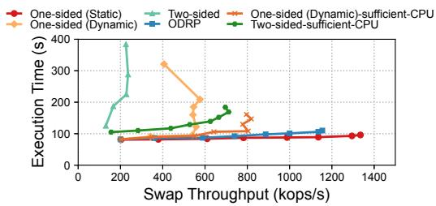  
Figure 9: The average swap throughput (i.e., the number of swap in/out requests per second) and the application execution time increase as the number of CNodes (each running 4 Quicksort tasks) increases from 1 to 8.

## 5.3 Scalability Analysis

In this section, we analyze the scalability of ODRP by increasing the number of CNodes and compare it to other baselines. We choose Quicksort because its swap frequency is relatively high, which can more effectively demonstrate the sensitivity of ODRP under different scales of swap frequency.

Scalability with the increasing number of CNodes. Figure 8 shows the average execution time and remote CPU usage as we increase the number of CNodes from 1 to 8, each running four Quicksort tasks (50% local memory). Despite achieving ideal remote memory utilization, Two-sided exhibits the poorest performance and scalability. The MNode CPU has been saturated with just one CNode. With 8 CNodes (i.e., 32 Quicksort tasks), it results in a 505% performance overhead compared to One-sided (static). Although One-sided (dynamic) can attain up to 77% remote memory utilization, it also overwhelms the MNode CPU with just one CNode and introduces a 234% performance overhead at 8 CNodes compared to One-sided (static). In contrast, ODRP offloads all memory management operations to the RNIC and is not limited by the wimpy MNode CPU. Consequently, ODRP demonstrates superior performance and scalability compared to Two-sided and One-sided (dynamic).

Throughput-latency. To demonstrate that ODRP can scale, we measure the overall swap throughput with respect to the application execution time. As shown in Figure 9, both Onesided (static) and ODRP reach a saturation point for the swap throughput at 8 CNodes, with ODRP achieving 87.3% of the swap throughput of One-sided (static). Consequently, ODRP incurs performance overheads of 5.7% and 14.6% at 4 and 8 CNodes, respectively. Nevertheless, ODRP significantly improves remote memory utilization, achieving 3 × better utilization than One-sided (static).

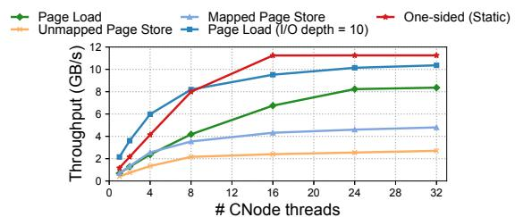  
Figure 10: The throughput of different data path operations in ODRP and One-sided (static).

Microbenchmark analysis. To further analyze the scalability of ODRP, we evaluate the throughput of various data path operations in ODRP and One-sided (static). As shown in Figure 10, the throughput of page load operation with high I/O depth reaches 92.1% of the throughput achieved by RDMA READ/WRITE operations, i.e., data path operations in One-sided (static). The unmapped page store operation exhibits the lowest throughput because the throughput of RDMA atomic FAA, which is required by it, is an order of magnitude lower than that of RDMA READ/WRITE [34].

Even though ODRP introduces overhead to swap requests, application performance in ODRP is still on par with that in One-sided (static). This can be attributed to two reasons. First, page load requests account for the majority of all requests (more than 60% of the swap requests are page load) and they are sent by the CNode’s swap backend in a batched manner due to page prefetching, where the performance of ODRP and One-sided (static) is similar. Meanwhile, the least efficient unmapped page store operation only accounts for approximately 10% of the requests. Second, the RNIC supports a high throughput of RDMA requests, such that even applications with high swap frequency can barely saturate it (see Figure 9).

Comparisons with baselines with sufficient MNode CPU. We further include two baselines where enough MNode CPU cores are provisioned to One-sided (dynamic) and Twosided. As shown in Figure 8, Two-sided costs up to 16 MNode CPU cores, but it still cannot achieve the throughput of ODRP and incurs up to a 67.3% performance overhead compared to ODRP. One-sided (dynamic), being less demanding on the MNode CPU, can achieve higher throughput with up to 10 MNode CPU cores. Nevertheless, it remains 46.4% slower compared to ODRP at 8 CNodes due to additional time spent on memory (de)allocation. This is because the (de)allocation operations are costly when executed with the MNode CPU, and they are not rare during execution, occurring on average 3,000 times per second.

## 5.4 Factor Analysis

Figure 11 shows the latency of various data path operations in ODRP and baseline systems. When there is only one worker issuing requests (without resource competition), the one-sided RDMA READ/WRITE in One-sided (static) exhibits the lowest latency, measuring at 2.9 µs. In ODRP, the most frequent operations, namely load and mapped store, have latencies of 5.5 µs and 4.6 µs, respectively. Note that such an increase in latency can be mitigated by the swap system, e.g., with page prefetching and asynchronous page store. In comparison, the data path operations in Two-sided have significantly higher latency, 3.8× than that of the native one-sided operations. Note that One-sided (dynamic) also utilizes native one-sided operations in the data path, and the latency of Allocation is not excessive. This explains why One-sided (dynamic) does not introduce substantial performance overhead when the MNode CPU is not overly overwhelmed.

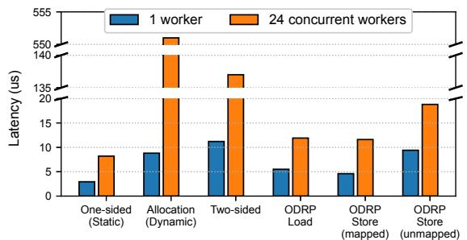  
Figure 11: Latency of various data path operations. Allocation refers to acquiring a 1 MB memory slab (i.e., MR) in One-sided (dynamic).

When there are 24 concurrent workers issuing requests, there is an order of magnitude increase in the latency of Allocation and Two-sided data path operations due to the overloaded MNode CPU. This explains why both Onesided (static) and Two-sided experience a sharp decrease in performance as the number of CNode rises (see Figure 8).

The effect of ODRP optimizations. To quantify ODRP’s optimizations for WR chains, we break down the execution time of the unmapped page store WR chain. The naive unmapped page store exhibits an unacceptable latency of 35.9 µs. StoreDecision (§ 4.4) splits the page store operation into mapped page store and unmapped page store to avoid an if statement in the WR chain, saving one CAS and one WRITE and reducing the latency by 1.9 µs. CalcTTAddr (§ 4.3) avoids calculating tt\_addr in the WR chain, saving one FAA WR and one EndianSwap WR and reducing latency the by 2.4 µs. RecycleHelper (§ 4.4) prevents the use of additional FAA and EndianSwap WRs for reactivating WR chains, reducing the latency by 16 µs. Finally, EndianSwap (§ 4.2) reduces the number of WRs needed for the endian conversion from 8 READ to 1 READ with 8 SGEs, further reducing the latency by 6.2 µs.

## 6 DISCUSSION

Extensibility. We implemented ODRP’s CNode backend and the WR chain offloading (based on the RedN framework [34]) with about 1,300 and 2,400 lines of C code, respectively. Our prototype implementation only considers a setup where multiple CNodes share one MNode. However,

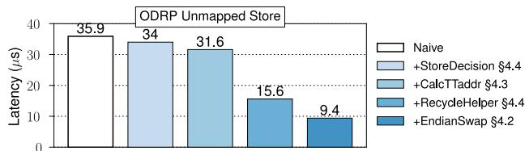  
Figure 12: Analysis of ODRP optimizations to the average latency of unmapped store.

ODRP can be easily extended to support a multi-CNodemulti-MNode setup. To achieve this, a CNode only needs to partition its swap space across different MNodes and then locates the respective MNodes accordingly during runtime.

Furthermore, ODRP supports configurable allocation and access granularity, making it compatible for integration with other memory disaggregation systems [36, 43, 20, 33] that focus on optimizing CNode runtime. ODRP can improve their remote memory utilization while preserving the benefits of an optimized CNode runtime.

Memory Overhead of Translation Table. In ODRP, the MNode maintains a TT for each CNode that connects to it. The TT size depends on the size of the swap space provisioned to CNodes. Each TT entry stores an 8 B free page address. For a 32 GB swap space, the TT only occupies 64 MB of memory (0.2% memory overhead). Furthermore, this memory overhead can be alleviated by registering TTs as On-Demand-Paging MRs [5].

Suggestions to Future RNIC Vendors. Currently, the RNIC can only fetch and execute WRs one-by-one from the WQ in host memory if preceding WRs need to update subsequent WRs. This hampers efficiency when offloading complex functionalities. In the future, RNICs could incorporate a prefetching mechanism to speed up the execution of the self-modifying WR chains. Additionally, we encourage RNIC vendors to provide primitives with richer semantics. We have demonstrated that implementing this would not be overly challenging based on the current RNIC hardware. By introducing more powerful WRs, the length of WR chain can be reduced, and the development effort can be saved.

## 7 RELATED WORK

RDMA-based Remote Swapping. Previous research studies have adopted RDMA remote memory as a swap backend [19, 11, 33, 28, 43, 40]. Infiniswap [19] places frequently accessed area of its swap space in remote memory to boost performance. Fastswap [11] further improves swapping performance by utilizing frontswap [3] interfaces. It makes non-critical operations asynchronous and creates a dedicated thread for asynchronous page reclamation. Leap [28] designs a more efficient page prefetching policy suited for remote memory, which is based on majority-based pattern detection. DiLOS [43] proposes to use a single address space operating system (SASOS) to reduce kernel-user switching overhead and improve performance with user-space semantics.

However, none of these studies fully utilize remote memory due to their static and coarse-grained remote memory management. ODRP focuses on providing fine-grained memory management with RDMA offloading.

Fine-grained Remote Memory Management. CoRM [38] reduces memory fragmentation by leveraging Mellanox’s ODP feature [5] to achieve remote memory compaction. However, CoRM requires intensive CPU involvement to compact memory, which is not suitable for wimpy MNode CPU cores. Programmable hardware devices have also been adopted to support complex computation offloading, such as SmartNICs and FPGAs. Clio [21] relies on dedicated FP-GAs and network to virtualize and manage remote memory at a 4 MB granularity. TDMem [22] also utilizes specialized FPGAs and backbone network to support fine-grained and secure memory disaggregation. However, utilizing such specialized programmable hardware comes with higher costs, additional maintenance burdens, and longer deployment cycles [7]. ODRP aims to provide fine-grained memory management on commodity RNICs.

RDMA Offloading. Hyperloop [23] was the first to demonstrate that offloading complex functionality to RNICs can be achieved by combining native RDMA WRs. It leverages this offloading capability to eliminate CPU’s involvement from the critical path of replicated transactions in storage systems. Furthermore, RedN [34] has recently proven that RDMA is actually Turing-complete by carefully chaining self-modifying and data-dependent RDMA WRs. RedN provides a blueprint for offloading arbitrary computation logic onto RNICs, and demonstrates its effectiveness and efficiency with two simple use cases: hash lookup and list traversal. ODRP utilizes RDMA offloading to provide finegrained and efficient remote memory management, bringing ideal remote memory utilization.

## 8 CONCLUSION

ODRP demonstrates the viability of fully offloading a complex system (remote swap device) to RNIC, which achieves nearly zero remote CPU usage, high remote memory utilization, and low performance overhead. We highlight the advantages and limitations of RDMA offloading and, more importantly, we propose the use of client-assisted principle to mitigate many of the limitations.

## ACKNOWLEDGMENT

We sincerely thank all the anonymous reviewers, whose reviews, feedbacks, and suggestions have significantly strengthened our work. This research was supported in part by the National Natural Science Foundation of China (No. 62202292), the National Key Research & Development Program of China (No. 2022YFB4500700), the Fundamental Research Funds for the Central Universities, and research grants from Huawei Technologies and Intel. Corresponding author: Jinyu Gu (gujinyu@sjtu.edu.cn).

## REFERENCES

[1] Enabling the Modern Data Center – RDMA for the Enterprise. https://www.infinibandta.org/.

[2] Extended Atomics Support. https://docs.nvidia.com/ networking/display/rdmacore50/Extended+Atomics.

[3] Frontswap. https://www.kernel.org/doc/html/v5.5/vm/ frontswap.html.

[4] memcached - a distributed memory object caching system. https://memcached.org/.

[5] RDMA On-Demand-Paging (ODP). https: //docs.nvidia.com/networking/display/ OFEDv501000/Optimized+Memory+Access# OptimizedMemoryAccess-On-Demand-Paging(ODP).

[6] Redis. https://redis.io/.

[7] Shop End-to-End High-Speed Ethernet and InfiniBand Solutions. https://store.nvidia.com/en-us/networking/.

[8] TPC-C is an On-Line Transaction Processing Benchmark. https://www.tpc.org/tpcc/.

[9] VoltDB. Volt Active Data. https://github.com/VoltDB/ voltdb.

[10] Advanced transport. https://docs.nvidia.com/ networking/display/OFEDv502180/Advanced+ Transport, 2023.

[11] Emmanuel Amaro, Christopher Branner-Augmon, Zhihong Luo, Amy Ousterhout, Marcos K. Aguilera, Aurojit Panda, Sylvia Ratnasamy, and Scott Shenker. Can far memory improve job throughput? In Proceedings of the Fifteenth European Conference on Computer Systems, EuroSys ’20, New York, NY, USA, 2020. Association for Computing Machinery.

[12] Berk Atikoglu, Yuehai Xu, Eitan Frachtenberg, Song Jiang, and Mike Paleczny. Workload analysis of a large-scale key-value store. In Proceedings of the 12th ACM SIGMETRICS/PERFORMANCE Joint International Conference on Measurement and Modeling of Computer Systems, SIGMETRICS ’12, page 53–64, New York, NY, USA, 2012. Association for Computing Machinery.

[13] Scott Beamer, Krste Asanovic, and David A. Patterson. The GAP benchmark suite. CoRR, abs/1508.03619, 2015.

[14] Irina Calciu, M. Talha Imran, Ivan Puddu, Sanidhya Kashyap, Hasan Al Maruf, Onur Mutlu, and Aasheesh Kolli. Rethinking software runtimes for disaggregated memory. In Proceedings of the 26th ACM International Conference on Architectural Support for Programming Languages and Operating Systems, ASPLOS ’21, page 79–92, New York, NY, USA, 2021. Association for Computing Machinery.

[15] Alexandros Daglis, Dmitrii Ustiugov, Stanko Novakovic, Edouard Bugnion, Babak Falsafi, and Boris Grot. Sabres: Atomic object reads for in-memory rack-

scale computing. In 49th Annual IEEE/ACM International Symposium on Microarchitecture, MICRO 2016, Taipei, Taiwan, October 15-19, 2016, pages 6:1–6:13. IEEE Computer Society, 2016.

[16] Aleksandar Dragojevic, Dushyanth Narayanan, Miguel´ Castro, and Orion Hodson. FaRM: Fast remote memory. In 11th USENIX Symposium on Networked Systems Design and Implementation (NSDI 14), pages 401–414, Seattle, WA, April 2014. USENIX Association.

[17] Aleksandar Dragojevic, Dushyanth Narayanan, Ed- ´ mund B. Nightingale, Matthew Renzelmann, Alex Shamis, Anirudh Badam, and Miguel Castro. No compromises: Distributed transactions with consistency, availability, and performance. In Proceedings of the 25th Symposium on Operating Systems Principles, SOSP ’15, page 54–70, New York, NY, USA, 2015. Association for Computing Machinery.

[18] Donghyun Gouk, Sangwon Lee, Miryeong Kwon, and Myoungsoo Jung. Direct access, High-Performance memory disaggregation with DirectCXL. In 2022 USENIX Annual Technical Conference (USENIX ATC 22), pages 287–294, Carlsbad, CA, July 2022. USENIX Association.

[19] Juncheng Gu, Youngmoon Lee, Yiwen Zhang, Mosharaf Chowdhury, and Kang G. Shin. Efficient memory disaggregation with infiniswap. In 14th USENIX Symposium on Networked Systems Design and Implementation (NSDI 17), pages 649–667, Boston, MA, March 2017. USENIX Association.

[20] Zhiyuan Guo, Zijian He, and Yiying Zhang. Mira: A program-behavior-guided far memory system. In Proceedings of the 29th Symposium on Operating Systems Principles, SOSP ’23, page 692–708, New York, NY, USA, 2023. Association for Computing Machinery.

[21] Zhiyuan Guo, Yizhou Shan, Xuhao Luo, Yutong Huang, and Yiying Zhang. Clio: A hardware-software co-designed disaggregated memory system. In Proceedings of the 27th ACM International Conference on Architectural Support for Programming Languages and Operating Systems, ASPLOS ’22, page 417–433, New York, NY, USA, 2022. Association for Computing Machinery.

[22] Taekyung Heo, Seunghyo Kang, Sanghyeon Lee, Soojin Hwang, and Jaehyuk Huh. Hardware-assisted trusted memory disaggregation for secure far memory. CoRR, abs/2108.11507, 2021.

[23] Daehyeok Kim, Amirsaman Memaripour, Anirudh Badam, Yibo Zhu, Hongqiang Harry Liu, Jitu Padhye, Shachar Raindel, Steven Swanson, Vyas Sekar, and Srinivasan Seshan. Hyperloop: Group-based nic-offloading to accelerate replicated transactions in multi-tenant storage systems. In Proceedings of the

2018 Conference of the ACM Special Interest Group on Data Communication, SIGCOMM ’18, page 297–312, New York, NY, USA, 2018. Association for Computing Machinery.

[24] Haewoon Kwak, Changhyun Lee, Hosung Park, and Sue Moon. What is Twitter, a social network or a news media? In WWW ’10: Proceedings of the 19th international conference on World wide web, pages 591–600, New York, NY, USA, 2010. ACM.

[25] Youngmoon Lee, Hasan Al Maruf, Mosharaf Chowdhury, Asaf Cidon, and Kang G. Shin. Hydra : Resilient and highly available remote memory. In 20th USENIX Conference on File and Storage Technologies (FAST 22), pages 181–198, Santa Clara, CA, February 2022. USENIX Association.

[26] Huaicheng Li, Daniel S. Berger, Lisa Hsu, Daniel Ernst, Pantea Zardoshti, Stanko Novakovic, Monish Shah, Samir Rajadnya, Scott Lee, Ishwar Agarwal, Mark D. Hill, Marcus Fontoura, and Ricardo Bianchini. Pond: Cxl-based memory pooling systems for cloud platforms. In Proceedings of the 28th ACM International Conference on Architectural Support for Programming Languages and Operating Systems, Volume 2, ASPLOS 2023, page 574–587, New York, NY, USA, 2023. Association for Computing Machinery.

[27] Chengzhi Lu, Kejiang Ye, Guoyao Xu, Cheng-Zhong Xu, and Tongxin Bai. Imbalance in the cloud: An analysis on alibaba cluster trace. In 2017 IEEE International Conference on Big Data (Big Data), pages 2884– 2892, 2017.

[28] Hasan Al Maruf and Mosharaf Chowdhury. Effectively prefetching remote memory with leap. In 2020 USENIX Annual Technical Conference (USENIX ATC 20), pages 843–857. USENIX Association, July 2020.

[29] Hasan Al Maruf, Hao Wang, Abhishek Dhanotia, Johannes Weiner, Niket Agarwal, Pallab Bhattacharya, Chris Petersen, Mosharaf Chowdhury, Shobhit Kanaujia, and Prakash Chauhan. Tpp: Transparent page placement for cxl-enabled tiered-memory. In Proceedings of the 28th ACM International Conference on Architectural Support for Programming Languages and Operating Systems, Volume 3, ASPLOS 2023, page 742–755, New York, NY, USA, 2023. Association for Computing Machinery.

[30] Jacob Nelson-Slivon, Reilly Yankovich, Ahmed Hassan, and Roberto Palmieri. Brief announcement: Rome: Wait-free objects for rdma. In Proceedings of the 36th ACM Symposium on Parallelism in Algorithms and Architectures, SPAA ’24, page 371–373, New York, NY, USA, 2024. Association for Computing Machinery.

[31] Ruslan Nikolaev. A scalable, portable, and memoryefficient lock-free fifo queue. Schloss Dagstuhl – Leibniz-Zentrum fur Informatik, 2019.¨

[32] Nathan Pemberton. Exploring the disaggregated memory interface design space. In Workshop on Resource Disaggregation (WORD), 2019.

[33] Yifan Qiao, Chenxi Wang, Zhenyuan Ruan, Adam Belay, Qingda Lu, Yiying Zhang, Miryung Kim, and Guoqing Harry Xu. Hermit: Low-Latency, High-Throughput, and transparent remote memory via Feedback-Directed asynchrony. In 20th USENIX Symposium on Networked Systems Design and Implementation (NSDI 23), pages 181–198, Boston, MA, April 2023. USENIX Association.

[34] Waleed Reda, Marco Canini, Dejan Kostic, and Simon´ Peter. RDMA is turing complete, we just did not know it yet! In 19th USENIX Symposium on Networked Systems Design and Implementation (NSDI 22), pages 71– 85, Renton, WA, April 2022. USENIX Association.

[35] Benjamin Rothenberger, Konstantin Taranov, Adrian Perrig, and Torsten Hoefler. ReDMArk: Bypassing RDMA security mechanisms. In 30th USENIX Security Symposium (USENIX Security 21), pages 4277–4292. USENIX Association, August 2021.

[36] Zhenyuan Ruan, Malte Schwarzkopf, Marcos K. Aguilera, and Adam Belay. AIFM: High-Performance, Application-Integrated far memory. In 14th USENIX Symposium on Operating Systems Design and Implementation (OSDI 20), pages 315–332. USENIX Association, November 2020.

[37] Yizhou Shan, Yutong Huang, Yilun Chen, and Yiying Zhang. LegoOS: A disseminated, distributed OS for hardware resource disaggregation. In 13th USENIX Symposium on Operating Systems Design and Implementation (OSDI 18), pages 69–87, Carlsbad, CA, October 2018. USENIX Association.

[38] Konstantin Taranov, Salvatore Di Girolamo, and Torsten Hoefler. Corm: Compactable remote memory over rdma. In Proceedings of the 2021 International Conference on Management of Data, SIGMOD ’21, page 1811–1824, New York, NY, USA, 2021. Association for Computing Machinery.

[39] Chenxi Wang, Haoran Ma, Shi Liu, Yuanqi Li, Zhenyuan Ruan, Khanh Nguyen, Michael D. Bond, Ravi Netravali, Miryung Kim, and Guoqing Harry Xu. Semeru: A Memory-Disaggregated managed runtime. In 14th USENIX Symposium on Operating Systems Design and Implementation (OSDI 20), pages 261–280. USENIX Association, November 2020.

[40] Chenxi Wang, Yifan Qiao, Haoran Ma, Shi Liu, Wenguang Chen, Ravi Netravali, Miryung Kim, and Guoqing Harry Xu. Canvas: Isolated and adaptive swapping for Multi-Applications on remote memory. In 20th USENIX Symposium on Networked Systems Design and Implementation (NSDI 23), pages 161–179, Boston, MA, April 2023. USENIX Association.

[41] Xingda Wei, Zhiyuan Dong, Rong Chen, and Haibo Chen. Deconstructing rdma-enabled distributed transactions: Hybrid is better! In 13th USENIX Symposium on Operating Systems Design and Implementation, OSDI ’18, pages 233–251, 2018.

[42] Xingda Wei, Jiaxin Shi, Yanzhe Chen, Rong Chen, and Haibo Chen. Fast in-memory transaction processing using rdma and htm. In Proceedings of the 25th Symposium on Operating Systems Principles, SOSP ’15, page 87–104, New York, NY, USA, 2015. Association for Computing Machinery.

[43] Wonsup Yoon, Jisu Ok, Jinyoung Oh, Sue Moon, and Youngjin Kwon. Dilos: Do not trade compatibility for performance in memory disaggregation. In Proceedings of the 18th European Conference on Computer Systems, EuroSys ’23, Rome, Italy, May 2023.

[44] Matei Zaharia, Mosharaf Chowdhury, Tathagata Das, Ankur Dave, Justin Ma, Murphy McCauly, Michael J. Franklin, Scott Shenker, and Ion Stoica. Resilient distributed datasets: A fault-tolerant abstraction for inmemory cluster computing. In Steven D. Gribble and Dina Katabi, editors, Proceedings of the 9th USENIX Symposium on Networked Systems Design and Implementation, NSDI 2012, San Jose, CA, USA, April 25- 27, 2012, pages 15–28. USENIX Association, 2012.

[45] Pengfei Zuo, Jiazhao Sun, Liu Yang, Shuangwu Zhang, and Yu Hua. One-sided rdma-conscious extendible hashing for disaggregated memory. In 2021 USENIX Annual Technical Conference (USENIX ATC 21), pages 15–29. USENIX Association, July 2021.