USENIX

THE ADVANCED COMPUTING SYSTEMS ASSOCIATION

OneSidedMW:

# Managing Disaggregated Memory Efficiently, Flexibly, and Securely with RNIC Offloading

Zixuan Wang, Jinyu Gu, Xingda Wei, and Yubin Xia, Shanghai Jiao Tong University https://www.usenix.org/conference/nsdi26/presentation/wang-zixuan

# This paper is included in the Proceedings of the 23rd USENIX Symposium on Networked Systems Design and Implementation.

May 4–6, 2026 • Renton, WA, USA

ISBN 978-1-939133-54-0

Open access to the Proceedings of the 23rd USENIX Symposium on Networked Systems Design and Implementation is sponsored by

# OneSidedMW: Managing Disaggregated Memory Efficiently, Flexibly, and Securely with RNIC Offloading

Zixuan Wang, Jinyu Gu, Xingda Wei, Yubin Xia

Institute of Parallel and Distributed Systems, School of Computer Science, Shanghai Jiao Tong University

## ABSTRACT

RDMA-based memory disaggregation is gaining popularity in modern datacenters to improve memory efficiency. However, existing memory management approaches for the disaggregated memory (DM) architecture face a critical tradeoff: they either suffer from poor memory utilization due to coarse-grained allocation, or encounter significant challenges in terms of performance, memory node CPU overhead, security vulnerabilities, and limited flexibility.

In this paper, we present OneSidedMW, a novel system that combines two advanced RDMA features—RDMA NIC (RNIC) offloading and memory windows—to provide finegrained and highly efficient one-sided memory management primitives for DM. Specifically, it leverages RNIC offloading to perform MW binding and unbinding operations, achieving remote memory allocation and deallocation without involving the memory node’s CPU. To demonstrate the efficiency of OneSidedMW, we evaluate it over two representative DM systems: swap-based systems and disaggregated key-value stores. OneSidedMW achieves up to 10.6× better performance in disaggregated key-value stores and up to 32.3% performance improvement in swap-based systems, compared with the state-of-the-art approaches.

## 1 INTRODUCTION

Disaggregated memory (DM) architecture is a promising solution to improve memory efficiency in modern datacenters [7, 40, 18, 10, 55, 42, 17, 30]. This architecture separates compute and memory resources into two hardware pools: compute nodes (CNs) with strong CPUs but little local memory, and memory nodes (MNs) with abundant memory capacity but minimal CPU resources. It enables independent scaling of compute and memory resources while enhancing overall memory utilization. Leveraging RDMA networks [2], CNs can directly access MN memory with microsecond-level latency, bypassing the weak MN CPU. In this paper, we focus on memory management in DM systems: how MNs efficiently allocate and release memory for CNs while balancing performance, memory utilization, and security. Our research begins with a comprehensive analysis of existing memory management approaches.

First, the conventional approach relies on RDMA memory region (MR) registration. To maximize memory utilization, a MN have to frequently register fine-grained MRs and allocate them to CNs on demand. However, MR registration is prohibitively time-consuming, especially on the MN’s weak

CPU. To amortize this overhead, most DM systems adopt coarse-grained MR registration [10, 18, 36, 15, 55, 42, 32], which causes severe memory underutilization due to internal fragmentation. Prior work reveals that this approach only achieves extremely low memory utilization—between 8.3% and 58.3% in real-world applications [49].

Second, systems such as Patronus [51] use a lightweight memory management mechanism called memory windows (MWs) to improve memory efficiency. MWs can be bound to small memory chunks with significantly lower overhead compared to MR registration. This enables finergrained memory allocation while maintaining better performance than MR-based approaches. However, MW-based approaches still rely on RPCs for memory management, which are slow and can become a bottleneck due to the limited CPU power of MNs. For example, they can introduce a 27.7% performance overhead in real-world applications [51].

Moreover, RDMA offers two types of MWs, each with different trade-offs. Type-1 MWs support rebinding, allowing allocation and deallocation requests to be merged and thus reducing MN CPU overhead. However, they introduce serious security vulnerabilities that may allow malicious CNs to access memory belonging to other CNs (detailed in §2.3). In contrast, type-2 MWs enforce stronger security guarantees, but incur higher performance overhead.

Third, ODRP [49] leverages RNIC offloading capabilities to implement memory management and access logic on the MN’s RNIC. This enables efficient page-level memory allocation without involving the MN’s CPU. However, every remote memory access in ODRP must go through address translation implemented with the offloaded logic, adding substantial latency (3.2× higher than one-sided RDMA) [49]. Additionally, it only supports fixed-size (e.g., 4 KB) allocations and accesses, which is inflexible and limits its applicability to diverse DM applications.

To address the limitations of prior approaches, it is necessary to design a memory management system for DM that is efficient, flexible, and secure. Our key insight is that we can retrofit RNIC offloading to perform MW binding/unbinding operations, achieving remote memory allocation/deallocation without involving MNs’ CPUs. In this paper, we present OneSidedMW, a system that combines RNIC offloading with type-2 MWs to achieve efficient fine-grained and secure memory management. OneSidedMW partitions a MN’s memory into chunks of configurable size and maintains metadata structures such as an MW information table and a free MW queue. When a CN requests remote memory, it triggers the offloaded logic on the MN’s RNIC, which allocates memory chunks, binds MWs, and returns the necessary metadata to the CN—all without involving the MN CPU.

However, this approach faces two key challenges. First, to guarantee strong memory isolation, a type-2 MW is assigned exclusively to the QP that performed the MW binding operation. As a result, all access requests to the same memory chunk must use the same QP (enforced by RNIC hardware), which can lead to performance interference. Second, offloading memory management logic to the RNIC can degrade the performance of one-sided RDMA accesses, particularly as the number of QPs with offloaded logic increases. This negative performance impact is overlooked in prior RNIC-offloading-based studies [24, 37, 49].

To address the above challenges, we propose two novel techniques: (1) QP and MW Grouping, which allows multiple MWs to be bound to the same memory chunk so that it can be accessed through multiple QP connections to prevent performance interference; (2) Management-Access QP Separation, which reduces the negative performance impact of RNIC offloading by maintaining a very small number of QPs dedicated to memory management operations while allowing memory access operations through separate QPs.

We have implemented OneSidedMW on commodity RNICs and evaluated its effectiveness in two representative DM systems: a swap-based system [10] and a disaggregated key-value store [55]. In the swap-based system, OneSidedMW achieves up to 2.38× higher memory utilization than the MR-based approach, while incurring only up to 6.3% performance overhead in real-world workloads. Compared to other fine-grained memory management approaches, OneSidedMW outperforms the RNIC-offloadingbased ODRP [49] by up to 32.3% and the RPC-MW-based approach [51] by up to 21.5%. In the disaggregated keyvalue store, OneSidedMW delivers throughput improvements of up to 10.6× over the RPC-MW-based approach.

In summary, this paper makes the following contributions:

• We identify critical efficiency, flexibility, and security limitations in existing fine-grained memory management approaches for DM systems.

• We present a novel system design that combines RNIC offloading with type-2 MWs, enabling efficient, flexible, and secure fine-grained memory management for DM.

• We implement and thoroughly evaluate OneSidedMW across multiple DM applications, demonstrating substantial improvements in both memory utilization and application performance compared to state-of-the-art approaches.

## 2 BACKGROUND AND MOTIVATION

## 2.1 DM Architecture and Systems

Modern datacenters are adopting DM to enhance memory efficiency [44, 10, 15, 49, 40, 55, 42, 8, 39]. This approach separates compute and memory resources of host servers into compute nodes (CNs) and memory nodes (MNs). CNs have powerful CPUs but limited local memory, while MNs have abundant memory but weak (or no) CPU power [9, 55, 49, 31, 51]. CNs can allocate memory on MNs and access it via high-performance interconnects such as RDMA [2].

Most RDMA-based DM systems can be categorized into two types. Swap-based systems [10, 18, 36, 49, 34, 29, 15, 45] leverage the kernel’s swap subsystem to transparently swap application pages between local and remote memory. Object-based systems [55, 42, 31, 23, 32, 47, 46, 27] directly expose a key-value store interface to user-level applications to avoid page fault handling and reduce I/O amplification.

## 2.2 Existing DM Management Approaches

In DM systems, MNs need to perform memory management by handling memory allocation and deallocation requests from CNs and ensuring memory isolation among CNs.

## 2.2.1 MR-based Memory Management

RDMA provides a control path operation called memory region (MR) registration for memory management. When handling an allocation request, the MN registers a memory chunk with its RNIC and sends the MR metadata back to the CN, including its address and a 32-bit access token (rkey).

Traditional OS kernels use page faults and on-demand mapping to achieve high memory utilization. To replicate this in DM systems, frequent and fine-grained remote memory (de)allocation is necessary. However, MR registration is time-consuming and CPU-intensive because it must pin memory pages and set up a page table for the RNIC. This can lead to significant performance overhead, and the weak MN CPU may become a performance bottleneck. Prior work [49, 51, 48] has demonstrated the inefficiency of finegrained MR registration for DM management.

As a result, most DM systems adopt coarse-grained MR registration to minimize memory management overhead. For example, swap-based systems [18, 36, 45, 29, 15] register large MRs (e.g., 1 GB) and allocate them to CNs, while object-based systems such as RACE [55] and Aceso [23] pre-register the entire memory required for future insertions. However, extensive studies have demonstrated that this coarse-grained allocation leads to significant memory waste due to fragmentation. For example, ODRP [49] reports that swap-based systems using coarse-grained allocation achieve only 8.3% to 58.3% memory utilization. Similarly, FineMem [48] and CoRM [43] show that coarsegrained allocation in disaggregated key-value stores results in substantial memory inefficiency. These findings highlight the importance of supporting fine-grained memory allocation in DM systems to improve memory utilization.

## 2.2.2 RPC-MW-based Memory Management

To improve memory efficiency over the MR-based approach, Patronus [51] uses a lightweight memory protection mechanism called memory window (MW) [3]. An MW also has an rkey and can be bound to a fine-grained region within a preregistered MR. Binding an MW grants access permissions to the specified memory area, while unbinding it revokes those permissions. Compared to MR registration, MW binding and unbinding are much more efficient—they can be performed asynchronously in user space and typically complete within microseconds [51, 48]. In this approach, a CN requests remote memory by sending an RPC to the MN, which then allocates a small memory chunk, binds a pre-allocated MW to it, and returns the address and the MW’s rkey to the CN.

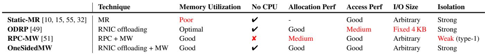  
Table 1: Comparison of OneSidedMW and other disaggregated memory management approaches.

Notably, RDMA supports two types of MWs, each with different trade-offs: Type-1 MWs allow access from any queue pair (QP—the communication channel of RDMA) after the MW binding operation, as long as the correct rkey is provided. This introduces a potential security vulnerability (detailed in § 2.3). Compromised CNs can exploit this vulnerability to gain unauthorized access to MN memory owned by other CNs. However, type-1 MWs support MW rebinding operations, which allow merging allocation (MW binding) and deallocation (MW unbinding) requests to reduce MN CPU overhead. In contrast, type-2 MWs provide much stronger security guarantees. After the MW binding operation, a type-2 MW is exclusively assigned to the QP that performed the MW binding operation, meaning only this QP can access its memory area or unbind the MW [5, 38, 50].

While MWs alleviate the memory management burden for the MN compared to the MR-based approach, the RPCbased memory allocation process remains orders of magnitude slower than one-sided RDMA (§6.3), primarily due to the costly RNIC-to-CPU notification path. This dependency on the MN CPU not only introduces substantial latency but also risks severe performance degradation if the already limited MN CPU resources become saturated.

## 2.2.3 RNIC-offloading-based Memory Management

Background on RNIC offloading. Figure 1 presents a simple illustration of RNIC offloading. RDMA communication is based on QP connections. Each QP has a pair of work queues (WQs), namely send queue (SQ) and receive queue (RQ). RDMA applications communicate with each other by posting work requests (WRs) to these WQs. RNIC offloading is enabled by a native WR called WAIT [1]. It allows RNICs to suspend execution on the SQ, wait for another WR to complete, and trigger subsequent pre-posted WRs. By waiting on the first RECV WR, the RNIC will automatically execute the following WRs after receiving an RDMA

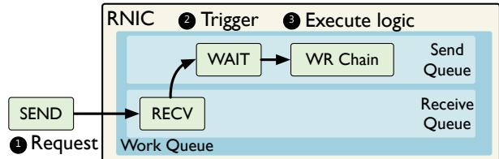  
Figure 1: A simple illustration of RNIC offloading.

SEND, bypassing the CPU. The following WRs (i.e., WR chain) consist of multiple basic RDMA WRs such as READ, WRITE, CAS, and FAA to perform pre-programmed logic without involving the CPU.

ODRP [49] focuses on swap-based systems and leverages RNIC offloading to implement all memory access and management logic on the MN’s RNIC. The MN divides its memory into 4 KB pages and provides each CN with a translation table that maps the CN’s swap addresses to the MN-side page addresses to enforce memory isolation. A swap request sent from a CN triggers the MN’s RNIC to execute the offloaded WR chain, which performs address translation. If the swap address is unmapped, the WR chain also allocates a memory page, updates the CN’s translation table, and then returns the result. As a result, ODRP achieves optimal memory utilization through its page-level allocation.

However, performing additional address translation on every access introduces extra WR executions and PCIe roundtrips, increasing the access latency to 11.9 µs—3.2× higher than one-sided RDMA. This prolonged latency results in noticeable end-to-end performance degradation, especially under swap-intensive workloads with multiple CNs, leading to a 40.6% performance overhead, as shown in §2.3.

## 2.3 Quantitative Analysis

We apply the above approaches to a swap-based system [10] and conduct experiments with a real-world application, Kmeans. Figure 2 presents the results of running 48 Kmeans tasks (with 50% local memory) on 6 CNs with one shared MN. MR-based approach (Static-MR) adopts 1 GB allocation, the same as prior systems [18, 36, 45, 15, 29]. RPC-MW-based approach (RPC-MW) and RNICoffloading-based approach (ODRP) employ finer-grained granularities of 1 MB and 4 KB, respectively. Detailed setup can be found in § 6. Table 1 summarizes the comparison between different approaches.

Poor memory efficiency of Static-MR. Figure 2(a) illustrates the average memory utilization during application runtime, which is defined as the ratio of actually used remote memory to the allocated remote memory. Static-MR leads to the worst memory utilization due to its 1 GB allocation granularity and the inevitable internal fragmentation. In contrast, ODRP and RPC-MW can significantly improve memory efficiency owing to their finer-grained allocation. They achieve memory utilization of 100% and 97%, respectively.

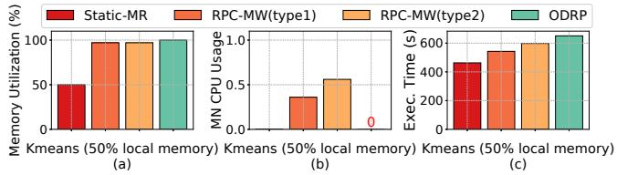  
Figure 2: A comparison of existing memory management approaches in terms of (a) memory efficiency, (b) MN CPU usage, and (c) performance.

High MN CPU usage of RPC-MW. As shown in Figure 2(b), RPC-MW imposes significant CPU overhead on the MN, with type-1 and type-2 MWs consuming 36% and 56% of the MN CPU resources, respectively. Moreover, the contention for the weak MN CPU can delay memory allocation requests, causing severe performance degradation. In our scalability test with a disaggregated key-value store, RPC-MW causes up to 16.6× throughput degradation compared to Static-MR (§ 6.1.2). This demonstrates that the MN’s weak CPU can become a critical performance bottleneck.

Non-optimal performance of RPC-MW and ODRP. As shown in Figure 2(c), RPC-MW using type-2 MWs introduces a 29.2% performance overhead compared to Static-MR. Although switching to type-1 MWs reduces this overhead to 17.3%, it introduces a serious security vulnerability and remains dependent on the MN CPU. ODRP suffers from even higher performance degradation (40.6% overhead) due to its slower memory access path.

Weak memory isolation of RPC-MW (type-1). Although type-1 MWs can reduce the MN CPU overhead and improve performance by merging memory allocation and deallocation requests through MW rebinding, they introduce a severe security vulnerability. Specifically, after an MW rebinding operation, a new rkey is assigned to the MW, invalidating the previous one. However, only the lower 8 bits of the MW’s rkey are modified, while the upper 24 bits remain unchanged, as the RNIC hardware uses these 24 bits to index the MW’s on-chip metadata [5]. This limitation enables a malicious CN to gain unauthorized access to an MW after it has been reallocated to another CN by simply enumerating all 256 (28) possible rkeys, since type-1 MWs permit any QP to access their memory area if the correct rkey is provided.

Inflexibility of ODRP. The offloaded logic in ODRP is tailored for swap requests, confining it to fixed 4 KB size allocation and access. This design constraint limits its applicability to diverse DM applications such as disaggregated keyvalue stores, which require variable-sized memory access.

## 3 OVERVIEW

The limitations of existing memory management approaches motivate the need for new primitives in DM architectures that eliminate MN CPU involvement, deliver high-performance memory access, support flexible I/O sizes, and guarantee strong memory isolation.

Our key insight is that we can retrofit RNIC offload ing to perform MW binding/unbinding operations, achieving remote memory allocation/deallocation without involving MNs’ CPUs. By combining the benefits of RNIC offloading with type-2 MWs, we achieve fast one-sided memory allocation and deallocation while preserving the performance advantages of one-sided RDMA READ/WRITE operations, and ensuring strong memory isolation.

## 3.1 System Architecture and Workflow

System architecture. OneSidedMW is a fine-grained memory management approach designed for DM architectures. Figure 3 illustrates the system architecture and workflow. On the CN side, OneSidedMW provides a set of APIs for CN runtime systems (e.g., disaggregated key-value stores or the Linux swap subsystem) to efficiently allocate, free, and access remote memory without involving the MNs’ CPU.

On the MN side, OneSidedMW organizes memory into fine-grained chunks of configurable size and pre-allocates an initially unbound type-2 memory window (MW) for each chunk. Each MN maintains two types of metadata to manage its memory chunks. First, it maintains an MW information table (MWTable) that stores metadata for all MWs, where each entry records the base address of a memory chunk and the rkey of its corresponding MW. Second, it utilizes a circular-buffer-based queue (free MW queue) to record all available MWs, with each queue element pointing to an entry in the MWTable. Additionally, OneSidedMW offloads the memory (de)allocation logic (i.e., WR chains) to the RNIC. When handling memory allocation requests, the offloaded logic allocates an MW from the free MW queue, binds the MW to its corresponding memory chunk, and returns the MW’s metadata (i.e., address and rkey) to the requesting CN.

Workflow. When a CN requires additional remote memory, it invokes the OneSidedMW API to send a memory allocation request via its QP connection with the MN (❶). This request triggers the MN’s RNIC to fetch and execute the preoffloaded WR chain from the work queue (WQ) (❷). The detailed design of WR chains is described in §4.3. At a high level, the WR chain implements the memory allocation logic by first allocating an MWTable entry from the free MW queue (❸) and then binding the corresponding MW to the target memory chunk (❹). The MW binding operation also exclusively assigns the MW to the requesting QP connection. Finally, the WR chain sends the metadata of the allocated memory chunk—specifically, its base address and the MW’s rkey— to the CN (❺). With this metadata, the CN can access the allocated memory chunk through its associated MW. Memory deallocation follows a similar process.

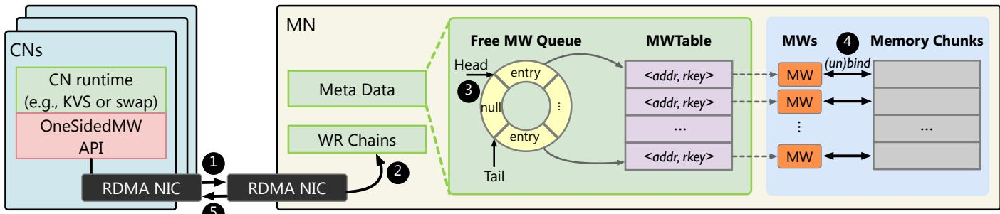  
Figure 3: OneSidedMW architecture and workflow overview.

## 3.2 Challenges and Solutions

RDMA access requests within a single QP are processed in order by the RNIC processing units. Therefore, CNs in existing DM systems typically establish multiple QP connections with an MN, which provides two key advantages: (1) Isolating latency-sensitive requests from latency-insensitive ones to minimize performance interference. For example, swap-based systems [10, 36] send swap-in, swap-out, and page prefetch requests through separate QPs to prevent interference. (2) Leveraging the RNIC’s internal parallelism to improve concurrent access performance. However, OneSidedMW’s adoption of type-2 MWs for strong memory isolation introduces a significant constraint: a type-2 MW can only be accessed or unbound through the specific QP that originally performed its binding operation.

Challenge #1: Performance interference within a QP. This restriction can cause latency-sensitive requests (e.g., swap-in) to be delayed by latency-insensitive ones (e.g., page prefetch) when they access the same remote memory chunk, as they must share the same QP.

To address this issue, we propose a technique called QP and MW Grouping. This approach pre-allocates multiple MWs—forming an MW group—for a memory chunk and binds all these MWs to the chunk during its allocation. This allows a CN to access the same remote memory chunk through multiple, distinct QP connections (detailed in § 4.1).

Challenge #2: Offloading overhead with multiple QPs. To exploit the parallel processing capability of the MN’s RNIC, a CN typically establishes multiple QP connections with the MN for memory access—often on a per-CPU-core or per-thread basis. Due to the exclusive assignment of type-2 MWs, each QP connection would require its own offloaded memory allocation logic. However, we discovered that offloading logic to the RNIC can impair its efficiency in handling one-sided RDMA operations. We confirmed with NVIDIA engineers that this is expected behavior since RNIC offloading consumes hardware resources. This performance impact, overlooked by previous RNIC-offloadingbased studies [24, 37, 49], becomes more pronounced as the number of QPs containing offloaded logic increases. With

96 MN-side QPs containing offloaded logic, the latency of one-sided READ operations increases by 12.6%.

To solve this challenge, we propose Management-Access QP Separation, which separates memory management QPs from memory access QPs. This approach significantly reduces the number of QPs that contain offloaded logic by allowing a few dedicated memory management QPs to allocate memory while assigning MWs to other memory access QPs without compromising memory isolation (detailed in § 4.2).

## 4 DETAILED DESIGN

## 4.1 QP and MW Grouping

With type-2 MWs, memory access requests targeting the same MW must use the same QP that performed the MW binding operation (i.e., the QP through which the CN originally sent the allocation request). This constraint can cause latency-sensitive requests to be delayed by latencyinsensitive ones if they target the same memory chunk.

To overcome this limitation, we make a key observation that different MWs can be bound to overlapping memory areas. Based on this observation, we propose QP and MW Grouping. As shown in Figure 4, this technique extends the one-to-one binding between MWs and memory chunks to a many-to-one relationship. To be specific, the MN in OneSidedMW pre-allocates multiple MWs for each memory chunk, forming an MW group. The number of MWs in a group is configurable based on application requirements (see §5). Correspondingly, QPs are organized into QP groups with the same number of QPs as MWs in an MW group.

MN-side metadata extension. This technique extends the MWTable so that each entry now represents an entire MW group. Specifically, each entry stores the base address of the associated memory chunk, along with the rkeys for all MWs within the MW group.

Group-based allocation. When handling an allocation request, the WR chain allocates an MWTable entry from the free MW queue, which contains the metadata of an MW group. The WR chain then binds each MW in the group to the same memory chunk and assigns each MW to a different QP from the CN-specified QP group. The process of posting the MW binding WR in one QP while assigning the MW to another QP is detailed in §4.2. Finally, the WR chain returns the metadata of the allocated MW group to the CN, including the base address and all MWs’ rkeys.

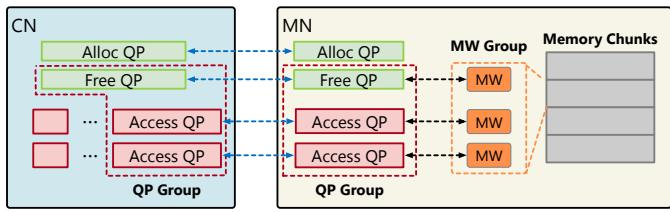  
Figure 4: An illustration of QP and MW Grouping and Management-Access QP Separation techniques.

Access through multiple QPs. Each MW in the MW group provides a distinct access path through its assigned QP. When accessing the allocated memory chunk, the CN can use any QP from the QP group along with its corresponding MW’s rkey. This flexibility enables applications to implement intelligent request routing strategies. For instance, a CN can direct latency-sensitive and latency-insensitive requests through different QPs, effectively preventing performance interference between different request types.

## 4.2 Management-Access QP Separation

To fully leverage RNIC’s internal parallelism, a CN typically establishes multiple QP connections with the MN for memory access—often on a per-CPU core or per-thread basis. However, the exclusive assignment of type-2 MWs requires each QP connection to include its own offloaded MW binding logic. This approach leads to an excessive number of QPs containing offloaded logic, which significantly degrades memory access performance, as mentioned in §3.2.

To address this challenge, we make a key observation that memory allocation, as a control path operation, occurs less frequently than memory access operations. Therefore, a small number of memory management QPs can adequately serve each CN’s needs. Based on this observation, we propose Management-Access QP Separation, which separates memory management QPs from memory access QPs. As shown in Figure 4, instead of offloading memory allocation logic to every QP, OneSidedMW designates a small number of QPs (Alloc QPs and Free QPs) to handle memory (de)allocation requests. The remaining QPs, organized into QP groups, are dedicated to memory access operations. This separation significantly reduces the number of QPs containing offloaded memory management logic, thereby minimizing their negative performance impact.

Cross-QP MW assigning. A key technical challenge is how to assign type-2 MWs to Access QPs when the MW binding WRs are performed by the Alloc QP during allocation. We found that the MW binding WR includes a qpn (queue pair number) field, which determines the QP to which the MW is assigned. By default, this field is set to the qpn of the Alloc QP that performs the WR. However, because posted WRs in offloaded WR chains are not executed immediately, the qpn field can be updated prior to execution. By explicitly setting this field to the qpn of an Access QP, we can bind the MW to a memory chunk and assign it to the Access QP. As a result, only the designated Access QP can subsequently access the memory chunk via this MW.

When handling an allocation request, the WR chain in the Alloc QP binds each MW in the MW group to the same memory chunk while assigning each MW to a distinct QP within the CN-specified QP group. Each QP group also contains a Free QP to ensure secure memory deallocation (as detailed in § 4.4). The Free QP can be shared among different QP groups, as shown in Figure 4, and is responsible for releasing the memory chunk and unbinding the MWs.

## 4.3 Detailed WR Chain Design

Memory allocation WR chain. Figure 5 illustrates the pseudocode and detailed WR chain design for memory allocation operations, exemplified with an MW group size of 3. A CN allocates a remote memory chunk by posting an RDMA SEND to its Alloc QP with arguments, including the qpns of its specified Access QPs (access qpn1 and access qpn2) and CN buff. The CN buff is used to receive the metadata of the allocated memory chunk.

The request triggers the MN’s RNIC to execute the offloaded WR chain. The initial RECV WR receives the CN’s arguments, filling the qpn fields of subsequent BIND MW WRs with access qpn1 and access qpn2, and updating the destination field (dst) of the final WRITE WR to CN buff (❶). The chain then allocates a queue element from the free MW queue by performing a fetch-and-add (FAA) WR on the queue head (❷), and reads the address of the corresponding MWTable entry from the allocated queue element (❸). A subsequent READ retrieves the MWTable entry and uses the MW group metadata to update the rkey and addr fields of the following BIND MW WRs (❹). The BIND MW WRs proceed to bind each MW in the group to the memory chunk, assigning them to the specified Access QPs (❺∼❼). Importantly, the first MW in the group is mandatorily assigned to the Free QP (as shown in Figure 4), which is essential for validating memory free requests (see §4.4). Finally, the last WRITE WR returns the MW group metadata to the CN (❽). Additionally, the address of the allocated MWTable entry is also returned to the CN, serving as an argument for subsequent memory free operations.

Memory free WR chain. The memory free WR chain takes the MWTable entry address as an argument. It first reads the MW group metadata from the entry and uses this metadata to update the subsequent UNBIND MW WRs. Since the first MW in the group is assigned to the Free QP, it can successfully unbind this MW from the memory chunk. The subsequent UNBIND MW WRs are configured by the MN to skip qpn checks during unbinding, allowing the WR chain in the Free QP to unbind the remaining MWs that are assigned to

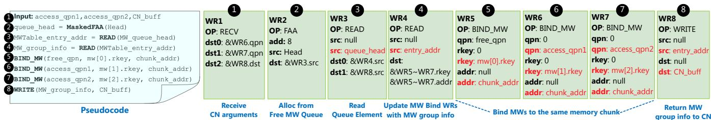  
Figure 5: An illustration of the memory allocation WR chain. The red characters represent that these fields are modified during execution by previous WRs.

Access QPs. Finally, the WR chain performs a FAA operation on the tail pointer of the free MW queue and inserts the released entry back into the free MW queue.

Detecting empty free MW queue. We include a WRITE WR in the memory allocation WR chain to zero out the allocated queue element. When the first allocation attempt occurs on an empty free MW queue, it will encounter a null pointer, triggering an RDMA protection error during subsequent WR execution. This error notifies the MN CPU, which then broadcasts the empty free MW queue state to all CNs. Then the MN CPU continuously checks the tail pointer of the free MW queue. Once a series of memory free operations replenish the free MW queue, the MN CPU broadcasts to all CNs, signaling that free MWs are available again.

Handling crashed CNs. To handle unexpected CN crashes, OneSidedMW implements an efficient memory reclamation mechanism. We introduce an owner id field in each MWTable entry to track the owning CN. The memory allocation WR chain includes a WRITE WR that sets the owner id to the requesting CN’s ID during allocation. Similarly, the owner id is set to zero during deallocation. This design enables the MN to promptly identify and reclaim memory chunks allocated to crashed CNs.

## 4.4 Security Analysis

To ensure memory isolation among CNs, OneSidedMW enforces the following three security properties: (1) A memory chunk (along with its associated MW group) must either be unallocated or exclusively owned by a single CN. (2) A memory chunk can only be released by the CN that currently owns it. (3) A CN cannot access memory chunks allocated to other CNs. We first define our security model and then demonstrate that OneSidedMW satisfies these three security properties even in the presence of malicious CNs.

Security model. As in existing systems [49, 51, 21], we assume MNs are trusted, while CNs could be compromised and mutually distrust each other. A CN can only interact with the MN by sending memory allocation/free requests or performing one-sided RDMA operations to access remote memory via its own QP connections.

Protection against memory allocation interference. Memory allocation in OneSidedMW is managed through dedicated QPs with carefully designed WR chains. The atomic operations (FAA) used in the allocation process ensure that each MWTable entry is allocated to exactly one CN, even if multiple CNs request memory simultaneously. If a malicious CN provides invalid arguments in its memory allocation request, the impact is limited to the malicious CN itself. For example, providing invalid access qpn only makes the CN itself unable to access the allocated memory. Providing invalid CN buff only prevents the CN from receiving the returned metadata. As such, a malicious CN can, at worst, exhaust memory resources by continuously issuing memory allocation requests. The mitigation strategy for this resource exhaustion attack is described in a later paragraph.

Protection against unauthorized memory free. A malicious CN could attempt to free memory chunks owned by other CNs by submitting an invalid MWTable entry address (i.e., the address of an MWTable entry not owned by the malicious CN). To defend against such attacks, the memory free WR chain incorporates a crucial validation mechanism that ensures memory free requests originate only from the legitimate owner. In our design, the first MW in each MW group is assigned to the Free QP during memory allocation. If a malicious CN attempts to provide an invalid MWTable en try address to the memory free WR chain, this illegal operation will trigger an error event on the RNIC. This is because the first MW being unbound is not assigned to the malicious CN’s Free QP, and a type-2 MW can only be unbound by its assigned QP.

Protection against unauthorized memory access. As previously demonstrated, a memory chunk and its associated MW group can be allocated to at most one CN at any given time. After memory allocation, the MWs are exclusively assigned to the Access QPs of the CN that submitted the allocation request. This exclusive assignment, facilitated by type-2 MWs and enforced by RNIC hardware, ensures that a malicious CN cannot access the allocated memory chunk of another CN through one-sided RDMA operations.

Protection against DoS attack. A malicious CN could try to exhaust memory resources by sending an excessive number of memory allocation requests. To ensure allocation fairness, we impose a limit on the number of memory chunks that a CN can allocate. The MN CPU periodically reads the RDMA hardware counters [6] of a CN’s memory management QPs to track the number of executed memory (de)allocation requests. If the number of allocated memory chunks for a CN exceeds the budget, the MN CPU will disconnect the memory management QP connections of the CN, effectively preventing it from executing DoS attacks.

## 5 IMPLEMENTATION

We implement OneSidedMW based on RedN [37] and libibverbs (version 4.9). At initialization, the MN registers all its memory and divides it into multiple memory chunks with configurable size. Then it pre-allocates an MW group for each memory chunk and initializes the MWTable and the free MW queue. When receiving an Alloc QP or Free QP connection request from a CN, it offloads WR chains to the QP’s work queue to handle future memory allocation and free requests. On the CN side, OneSidedMW can be integrated with various types of CN runtime systems, as it supports flexible memory allocation granularity and arbitrary I/O sizes. Next, we explain how to apply OneSidedMW to the two most representative DM systems.

## 5.1 Swap-based System

We integrate OneSidedMW with Fastswap [10], a state-ofthe-art swap-based DM system. Instead of coarse-grained MR registration, OneSidedMW adopts a 1 MB allocation granularity, which is sufficient to significantly improve remote memory utilization in our practice. The MN partitions its memory into 1 MB chunks, while each CN divides its swap space into 1 MB segments and maps them to remote memory on demand. Each CN establishes an Alloc QP and a Free QP connection with the MN, and creates an Access QP group for each CPU core for remote access. We configure the MW group size to 3, which effectively prevents performance interference. When accessing remote memory, the CN selects the appropriate QP group based on the target chunk, using different QPs within the QP group to separate synchronous swap requests from asynchronous prefetches.

## 5.2 Disaggregated Key-Value Store

We integrate OneSidedMW with RACE hashing [55], a state-of-the-art hash index designed for DM architecture and widely adopted in disaggregated key-value stores [42, 23, 54, 41]. To support efficient memory management, OneSidedMW adopts a two-level allocation similar to FUSEE [42]. The MN divides its memory into fine-grained chunks (e.g., 16 KB). Each CN allocates remote memory chunks from the MN and organizes them into multiple size classes to minimize internal fragmentation. For each insert or write operation, the CN allocates memory for the value from the smallest size class that fits it. Similar to the swap-based system, each CN establishes an Alloc QP and a Free QP connection with the MN, and creates Access QP group connections according to its number of worker threads. We set the MW group size to 2, which is sufficient for KV operations.

## 6 EVALUATION

Testbed. We perform our evaluations on a cluster consisting of one MN and 6 CNs, interconnected via an InfiniBand switch. This setup is consistent with prior studies [51, 49] and real-world deployments [30], which show that pooling memory across a modest number of CNs (typically 8–16 CPU sockets) is sufficient to realize most of the benefits of disaggregated memory. Each node is equipped with two 12- core Intel Xeon E5-2650 CPUs and a 100 Gbps Mellanox ConnectX-5 IB RNIC. Each CN is provisioned with 32 GB of swap space, while the MN is equipped with 224 GB of DRAM. Hyper-threading and dynamic frequency scaling are disabled unless otherwise specified. All nodes run Mellanox OFED 4.9 and Linux 4.15 with transparent huge page (THP) disabled. We only use one CPU core on the MN to simulate the weak processing power, following previous studies [49, 42, 32, 33, 31], unless otherwise specified.

Comparison. We evaluate OneSidedMW against four baselines as outlined in § 2.2: (1) Static-MR, pre-registering coarse-grained MRs for memory management, representing the approach adopted by most current DM systems. (2) RPC-MW(type-1), using RPC and fine-grained MW (un)binding for memory management, adopted by Patronus [51]. (3) RPC-MW(type-2), similar to RPC-MW(type-1) but using type-2 MW to enforce stronger memory isolation. (4) ODRP [49], offloading memory access and management logic to the MN’s RNIC.

## 6.1 Disaggregated Key-Value Store

Experimental setting. In this evaluation, we set the allocation granularity of Static-MR to 16 MB, the same as previous studies [42]. We vary the allocation granularity of other baselines from 512 B to 32 KB. ODRP is not included in this test, as it only supports fixed 4 KB allocation and access.

Workloads. To effectively evaluate the effects of different memory management approaches on both performance and memory efficiency, we use the fillsync and deleterandom traces from RocksDB’s db bench test suite [4]. The workload first inserts 1 million key-value pairs in random order, then randomly deletes 90% of them to simulate an allocation spike, which is a representative pattern in bursty function-asa-service workloads [53]. Additionally, we use a YCSB-Dlike trace that performs a mix of 50% reads and 50% inserts, followed by randomly deleting 90% of the inserted keys.

## 6.1.1 End-to-end performance and memory efficiency

We run the workload using 24 threads on a single CN. Figure 6 presents throughput, memory efficiency, P99 tail latency, and peak MN CPU usage across different KV block sizes and allocation granularities. Memory efficiency is measured by the deallocation rate—the ratio of MN memory freed after the workload completes.

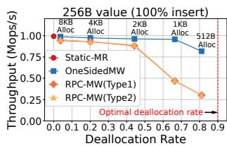

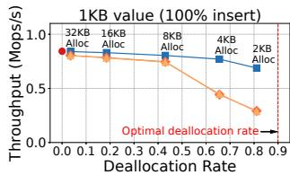

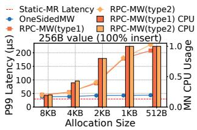

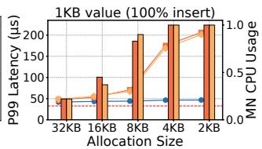

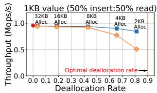

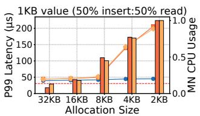  
Figure 6: Performance and memory efficiency comparison. The left column shows throughput and deallocation rate (higher is better). The right column shows P99 tail latency and peak MN CPU usage (lower is better).

Throughput and memory efficiency. The left column in Figure 6 shows the throughput with different allocation granularities. Static-MR achieves the highest throughput across all scenarios because it involves much fewer memory allocation requests compared to other baselines. However, it exhibits the worst memory efficiency. Its coarse-grained memory management causes severe internal fragmentation, preventing any MN memory from being reclaimed.

OneSidedMW, RPC-MW(type-1), and RPC-MW(type-2) all deliver much better memory efficiency than Static-MR thanks to their fine-grained memory management. However, this improvement comes at a substantial performance cost for RPC-MW(type-1) and RPC-MW(type-2). In the insert-only workload with 1 KB value size, RPC-MW(type-2) with 2 KB allocation size achieves just 33.9% of Static-MR’s throughput. Even with a mixed workload of 50% reads and 50% inserts, its throughput only reaches 53.7% of Static-MR. This performance penalty is mainly due to two factors: (1) RPC-based memory allocation incurs expensive RNICto-CPU notification overheads, and (2) the high frequency of allocation requests can easily overwhelm the weak MN CPU. Additionally, the MW rebinding capability of type-1 MWs does not alleviate this overhead in these workloads, since allocation and deallocation do not occur concurrently.

By comparison, OneSidedMW enjoys the memory efficiency benefit with minimal throughput degradation. As allocation granularity decreases, OneSidedMW consistently sustains high throughput. For example, in the insert-only workload with 1 KB value size, OneSidedMW with 4 KB allocation size achieves a 65.6% deallocation rate while incurring only an 8.73% throughput overhead. With 2 KB allocation size, it saves 81.1% of MN memory at the cost of 18.4% throughput overhead. Compared to RPC-MW(type-1) and RPC-MW(type-2), OneSidedMW delivers up to 2.71× higher throughput, highlighting its ability to balance performance and memory efficiency. This performance advantage of OneSidedMW comes from efficient one-sided memory allocation that bypasses the MN CPU. Even under high contention, allocation latency remains around 20 µs (see §6.3), and this overhead is negligible when amortized over each key-value request.

Tail latency and remote CPU usage. The right column of Figure 6 presents the P99 tail latency and peak MN CPU usage across different allocation granularities. OneSidedMW maintains tail latency close to that of Static-MR, introducing only a modest 10–15 µs increase due to memory allocation. In contrast, RPC-MW(type-1) and RPC-MW(type-2) exhibit substantially higher tail latencies: when the MN CPU is not saturated, their P99 tail latency is 2.17× that of OneSidedMW; once the weak MN CPU becomes saturated, their tail latency increases up to 5.26× that of OneSidedMW. This disparity arises because OneSidedMW bypasses the weak MN CPU during memory allocation and prevents it from becoming a performance bottleneck.

## 6.1.2 Scalability

In this section, we analyze the scalability of OneSidedMW by increasing the number of worker threads running on 6 CNs, using an insert-only workload, until peak throughput is reached. We enable CPU hyper-threading to create 48 threads on each CN to saturate the MN’s RNIC. We use 1 KB value size, which is representative of real-world workloads [14, 16]. Figure 7 shows the throughput, P99 tail latency, and MN CPU usage. We include only RPC-MW in this figure since both RPC-MW(type-1) and RPC-MW(type-2) exhibit similar performance.

Although RPC-MW enhances memory efficiency, it suffers from poor scalability. As the number of CN threads increases, the weak MN CPU quickly becomes a bottleneck, causing significant degradation in both throughput and tail latency. With a 4 KB allocation size, RPC-MW achieves only 6.0% of Static-MR’s peak throughput, and its P99 tail latency increases by orders of magnitude.

In contrast, OneSidedMW delivers highly efficient onesided memory allocation that is not limited by the weak MN CPU. With 8 KB and 4 KB allocation sizes, OneSidedMW achieves 80.2% and 63.8% of Static-MR’s peak throughput, respectively, while substantially improving memory efficiency—reducing MN memory usage by 43% and 65.6% compared to Static-MR. Compared to RPC-MW, OneSidedMW lowers P99 tail latency by up to 97.7% and achieves up to 10.6× higher throughput.

To further understand the impact of CPU constraints, we also evaluate RPC-MW with unlimited MN CPU cores, as shown by the “-unlimited-CPU” baselines in Figure 7. Even in this idealized scenario, RPC-MW remains bottlenecked by its expensive RPC-based memory allocation, reaching only up to 44.9% of OneSidedMW’s peak throughput.

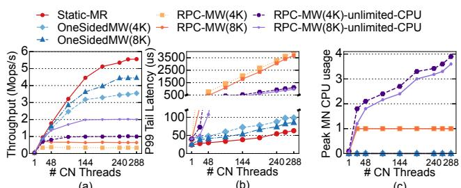  
(a)  
(b)  
(c)  
Figure 7: (a) Throughput, (b) P99 tail latency, and (c) peak MN CPU usage with 1 KB value size as the number of CN threads increases.

## 6.2 Swap-based System

Experimental setting. We configure Static-MR with a 1 GB allocation granularity, consistent with prior MR-based approaches [18, 36, 45, 15, 29]. For OneSidedMW, RPC-MW(type-1), and RPC-MW(type-2), we use a 1 MB allocation granularity, which in practice provides a substantial improvement in memory efficiency. ODRP is evaluated with its default 4 KB allocation size. Note that OneSidedMW and all other baselines perform swap operations using 4 KB page I/O, independent of their memory allocation granularity.

Evaluated applications. We evaluate a variety of cloud applications representative of those used in prior studies [49, 10, 52]: (1) Kmeans with a 32 GB working set; (2) Memcached with the Facebook ETC workload [11], configured with one server thread and four client threads, using a 32 GB working set; (3) PageRank and (4) Betweenness Centrality from GAPBS [12], both executed on the Twitter dataset [26] with 4 threads and a 14 GB working set.

## 6.2.1 End-to-end performance and memory efficiency

We run the applications on 6 CNs and one shared MN with 50% and 25% local memory available, measuring their average execution time, peak MN CPU usage, and memory efficiency. In this test, we also include two fine-grained MR registration baselines, Fine-MR(1 MB) and Fine-MR(4 MB), to illustrate their impracticality.

Performance. The first row of Figure 8 presents the execution time of tested applications under different local memory ratios. The execution time is normalized to that with 100% local memory. OneSidedMW demonstrates performance comparable to Static-MR. Even with only 25% local memory, it introduces merely up to 3.8% overhead, thanks to its highly efficient memory (de)allocation operations, without affecting memory access performance.

In contrast, RPC-MW(type-2) experiences up to 23.6% performance degradation compared to Static-MR due to its prolonged RPC-based memory (de)allocation operations.

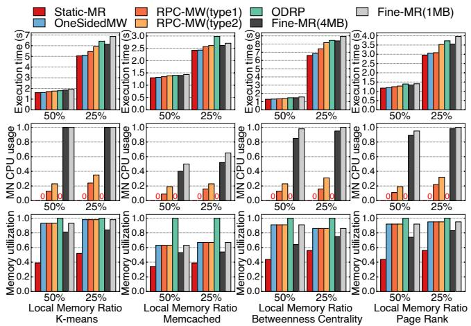  
Figure 8: Normalized execution time, peak MN CPU usage (lower is better), and MN memory utilization (higher is better) under different workloads with 6 CNs accessing one MN.

Using type-1 MW can improve performance to a certain extent, with RPC-MW(type-1) showing a maximum performance overhead of 12.2% compared to Static-MR. This improvement stems from two factors: (1) type-1 MW enables the use of MW rebinding operations to reduce memory deallocation overhead and the number of MW operations, and (2) type-1 MW avoids the performance interference issues introduced by type-2 MW. However, using type-1 MWs poses significant security risks as discussed in §2.3. OneSidedMW outperforms RPC-MW(type-1) by 8.7% while providing stronger security guarantees. Compared to RPC-MW(type-2), OneSidedMW delivers a substantial 19.7% performance improvement while maintaining the same security guarantees.

ODRP exhibits the worst performance except for Fine-MR(1 MB), because each memory access is implemented through RNIC offloading, which introduces considerable latency compared to one-sided RDMA (as detailed in §6.3). Compared to ODRP, OneSidedMW delivers a significant 25.8% performance improvement. This demonstrates the efficiency of OneSidedMW’s approach in balancing memory management granularity with access performance.

MN CPU overhead. The second row of Figure 8 presents the peak MN CPU usage for each baseline during application execution. Both RPC-MW(type-1) and RPC-MW(type-2) require the MN CPU to process memory (de)allocation requests, with RPC-MW(type-1) able to mitigate some of this overhead through MW rebinding. However, when CN workloads are heavy, contention for the limited MN CPU resources can significantly impact application performance (see §6.2.2). Among all baselines, Fine-MR incurs the highest MN CPU usage due to the CPU-intensive MR registration, with Fine-MR(1 MB) exhibiting the worst performance.

On the other hand, ODRP and OneSidedMW bypass the MN CPU during runtime thanks to their one-sided memory allocation. Static-MR also achieves near zero MN usage due to its coarse-grained allocation.

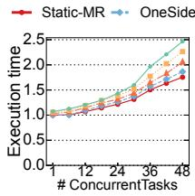  
(a)

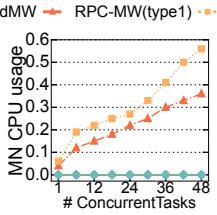  
(b)

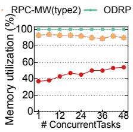  
(c)  
Figure 9: The impact of increasing the number of tasks running on 6 CNs on (a) execution time, (b) MN CPU usage, and (c) MN memory utilization.

Memory utilization. We measure memory efficiency by the average MN memory utilization during application runtime, which represents the ratio of actually used MN memory to allocated MN memory. Static-MR achieves only 34% to 56% MN memory utilization because of its coarse-grained memory management.

In contrast, OneSidedMW, RPC-MW(type-1), and RPC-MW(type-2) achieve over 90% memory utilization in most cases. They achieve 1.54× to 2.38× higher memory utilization compared to Static-MR. This significant improvement can be attributed to their finer-grained allocation granularity. It is worth noting that using fine-grained MR registration (e.g., Fine-MR(1 MB) and Fine-MR(4 MB)) can also improve memory utilization. However, this time-consuming MR registration incurs significant performance overhead. Specifically, Fine-MR(4 MB) is inferior to OneSidedMW in terms of performance, memory utilization, and MN CPU overhead. Fine-MR(1 MB) achieves memory utilization comparable to OneSidedMW, but it incurs a substantial 34.5% performance overhead.

ODRP achieves ideal memory utilization (100%) because its 4 KB allocation matches the swap granularity. However, it incurs non-negligible performance overhead.

## 6.2.2 Scalability.

In this test, we analyze the scalability of OneSidedMW by increasing the number of Kmeans tasks (the most swapintensive workload) and compare it to other baselines.

Figure 9 presents the normalized execution time (relative to 1 task on Static-MR), MN CPU usage, and MN memory utilization as the number of Kmeans tasks increases from 1 to 48 (8 tasks per CN). Each task uses a 2 GB working set and is restricted to 50% local memory. Although RPC-MW(type-1) and RPC-MW(type-2) achieve over 90% MN memory utilization, they introduce 17.3% and 29.2% performance overhead, respectively, compared to Static-MR when running 48 tasks. This occurs because high contention on the weak MN CPU exacerbates the overhead of already time-consuming RPC-based memory (de)allocation operations.

In contrast, OneSidedMW delivers 1.67× higher memory utilization than Static-MR, incurring only a modest 6.3% performance overhead. While ODRP achieves optimal memory utilization, OneSidedMW outperforms it by 32.3% in execution time, while sustaining over 90% memory utilization. Compared to RPC-MW(type-2), OneSidedMW achieves a 21.5% performance improvement, and compared to RPC-MW(type-1), it delivers 10.4% better performance alongside stronger security guarantees.

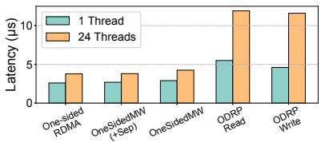  
(a) Memory Access Latency

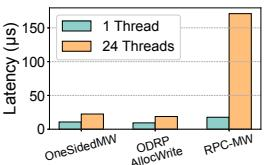  
(b) Memory Allocation Latency  
Figure 10: Latency of (a) memory access and (b) allocation operations in OneSidedMW and other baselines. OneSidedMW(+Sep) means that Management-Access QP Separation is enabled.

## 6.3 Factor Analysis

Memory access and allocation performance. We use a microbenchmark to evaluate the latency of memory access and allocation operations in OneSidedMW and competing systems. We run either 1 or 24 worker threads on the CN, each performing remote memory allocation and access, to simulate both low and high contention scenarios on the MN’s resources (CPU or RNIC). Figure 10 illustrates the results.

Static-MR exhibits the best end-to-end performance because it involves minimal memory allocation requests during runtime, and its memory access operation (one-sided RDMA in Figure 10(a)) shows the lowest latency.

RPC-MW also adopts one-sided RDMA for memory access, and the latency of its RPC-based memory allocation (Figure 10(b)) is reasonable without contention. This explains why RPC-MW(type-1) and RPC-MW(type-2) do not introduce substantial performance overhead when allocation granularity is relatively coarse (e.g., 32 KB) in disaggregated key-value stores or when local memory is limited to 50% in swap-based systems. However, under high contention on the weak MN CPU, the latency of RPC-based memory allocation operations increases dramatically (170 µs with 24 threads), resulting in unacceptable end-to-end performance overhead.

ODRP has comparable latency to OneSidedMW in memory allocation operations, i.e., ODRP AllocWrite in Figure 10(b). However, its memory access latency increases significantly compared to one-sided RDMA, especially when RNIC resources are contended. As shown in Figure 10(a), ODRP exhibits 3.2× higher access latency with 24 threads than one-sided RDMA. This explains why ODRP incurs non-negligible end-to-end performance overhead.

In OneSidedMW, memory allocation operations incur just 10.7 us latency with 1 thread, and even under high contention on the MN’s RNIC with 24 threads, the latency rises modestly to 22.5 us—far less dramatic than the increase observed in RPC-MW. Moreover, OneSidedMW preserves the lowlatency benefits of one-sided RDMA for memory access, outperforming ODRP. Together, these results account for OneSidedMW’s better performance and scalability.

The effect of OneSidedMW optimizations. To address the limitations imposed by type-2 MWs, OneSidedMW introduces two key optimizations: QP and MW Grouping QP and MW Grouping, which mitigates performance interference among requests targeting the same MW, and Management-Access QP Separation, which reduces RNIC offloading overhead. As illustrated in Figure 10(a), enabling Management-Access QP Separation (i.e., OneSidedMW(+Sep)) lowers memory access latency by 10.6%, bringing it in line with the latency observed without RNIC offloading. Note that QP and MW Grouping is not evaluated in this microbenchmark, as each thread accesses a distinct memory area.

To further quantify the impact of these optimizations on end-to-end performance, we evaluate two additional baselines: one with Management-Access QP Separation disabled, and another with both optimizations disabled. In swap-based systems, enabling QP and MW Grouping reduces the average latency of synchronous swap requests by 24.3% during application execution, leading to up to 6.9% improvement in overall performance by alleviating request interference. Enabling Management-Access QP Separation further improves end-to-end performance by up to 7.6% by minimizing the overhead of RNIC offloading on regular onesided memory accesses.

## 7 DISCUSSIONS AND LIMITATIONS

Resource requirements on RNIC. The (de)allocation operations in OneSidedMW require additional RNIC resources, which could potentially introduce overhead and affect memory access performance. However, our evaluation methodology already implicitly considers these resource demands. The scalability experiments in § 6.1.2 measure the performance of OneSidedMW under scenarios where the MN’s RNIC is fully saturated. Even in these conditions, OneSidedMW delivers performance comparable to Static-MR, and consistently outperforms other fine-grained allocation baselines that are constrained by the limited MN CPU power.

Memory allocation primitives on RNIC. MWs supported by current RNICs are well-suited for fine-grained memory management, but they only allow binding from the local side. Therefore, previous systems had to use RPCs and involve the MN CPU for memory allocation. This limitation motivated the design of OneSidedMW. We hope that future RNICs will support native memory allocation primitives without requiring the MN CPU. PRISM [13] has already explored the hardware feasibility of such primitives and demonstrated that they can benefit many other distributed storage systems.

Key access limitation. Our design only allows each memory chunk and its MW group to be accessed by one CN at a time. As a result, in a disaggregated KVS, queries to a given key can only originate from a single CN. We believe this limitation can be addressed through key space partitioning, which is employed by previous work [27] to avoid metadata consistency overheads and achieve high scalability.

## 8 OTHER RELATED WORK

Disaggregated memory management. FineMem [48] is the most related disaggregated memory management system and was developed concurrently with OneSidedMW. FineMem depends on a trusted allocation service running on each CN to enforce memory isolation, and its design requires the use of type-1 MWs. In contrast, OneSidedMW offers stronger security guarantees and eliminates the need for MN CPU involvement. Other systems [28, 21, 25, 20] leverage customized hardware to provide efficient memory management. However, these solutions depend on specialized hardware, which comes with higher cost and inflexibility. In contrast, OneSidedMW only relies on commodity RNICs.

CN runtime optimizations. An active line of research has focused on developing high-performance CN runtime for DM architecture [36, 15, 19, 32]. For example, Hermit [36] and Mage [35] speed up RDMA-based swapping by moving non-critical functions off the page-fault path. Atlas [15] reduces I/O amplification and page-faults with a user-kernel co-design. For disaggregated key-value stores, CHIME [32] uses B+ trees and hopscotch hashing [22] for efficient indexing. However, these studies focus on CN runtime and do not address efficient memory management on the MN, which is the primary focus of OneSidedMW.

RNIC-offloading. Hyperloop [24] uses RNIC offloading to speed up replicated transactions. RedN [37] shows that RDMA is Turing-complete and demonstrates RNIC offloading for simple tasks like hash lookups and list traversal. However, these systems only offload basic RDMA operations (e.g., READ and WRITE). OneSidedMW is the first to offload MW binding and unbinding to the RNIC, enabling efficient memory allocation.

## 9 CONCLUSION

In this paper, we present OneSidedMW, a novel system that combines RNIC offloading and memory windows to achieve highly efficient and fine-grained one-sided memory management primitives for disaggregated memory architecture.

## ACKNOWLEDGMENT

We sincerely thank our shepherd Chenxi Wang and the anonymous reviewers whose reviews, feedback, and suggestions have significantly strengthened our work. This research was supported in part by the National Natural Science Foundation of China (No. 62432010, 62472279) and the Fundamental Research Funds for the Central Universities. Corresponding author: Jinyu Gu (gujinyu@sjtu.edu.cn).

## REFERENCES

[1] Cross-Channel Communications Support. https: //docs.nvidia.com/networking/display/rdmacore50/ Cross+Channel.

[2] Enabling the Modern Data Center – RDMA for the Enterprise. https://www.infinibandta.org/.

[3] Memory Window (MW). https://docs.nvidia.com/ networking/display/rdmacore50/memory+window+ (mw).

[4] RocksDB In Memory Workload Performance Benchmarks. https://github.com/facebook/rocksdb/wiki/ Benchmarking-tools.

[5] The InfiniBand Architecture Specification Volume 1 Release 1.4. https://www.infinibandta.org/ ibta-specification/.

[6] Understanding mlx5 Linux Counters and Status Parameters. https://enterprise-support.nvidia.com/s/article/ understanding-mlx5-linux-counters-and-status-parameters.

[7] Marcos K. Aguilera, Emmanuel Amaro, Nadav Amit, Erika Hunhoff, Anil Yelam, and Gerd Zellweger. Memory disaggregation: why now and what are the challenges. SIGOPS Oper. Syst. Rev., 57(1):38–46, June 2023.

[8] Marcos K. Aguilera, Nadav Amit, Irina Calciu, Xavier Deguillard, Jayneel Gandhi, Stanko Novakovic, Arun´ Ramanathan, Pratap Subrahmanyam, Lalith Suresh, Kiran Tati, Rajesh Venkatasubramanian, and Michael Wei. Remote regions: a simple abstraction for remote memory. In 2018 USENIX Annual Technical Conference (USENIX ATC 18), pages 775–787, Boston, MA, July 2018. USENIX Association.

[9] Hasan Al Maruf and Mosharaf Chowdhury. Memory disaggregation: Advances and open challenges. SIGOPS Oper. Syst. Rev., 57(1):29–37, June 2023.

[10] Emmanuel Amaro, Christopher Branner-Augmon, Zhihong Luo, Amy Ousterhout, Marcos K. Aguilera, Aurojit Panda, Sylvia Ratnasamy, and Scott Shenker. Can far memory improve job throughput? In Proceedings of the Fifteenth European Conference on Computer Systems, EuroSys ’20, New York, NY, USA, 2020. Association for Computing Machinery.

[11] Berk Atikoglu, Yuehai Xu, Eitan Frachtenberg, Song Jiang, and Mike Paleczny. Workload analysis of a large-scale key-value store. In Proceedings of the 12th ACM SIGMETRICS/PERFORMANCE Joint International Conference on Measurement and Modeling of Computer Systems, SIGMETRICS ’12, page 53–64, New York, NY, USA, 2012. Association for Computing Machinery.

[12] Scott Beamer, Krste Asanovic, and David A. Patterson. The GAP benchmark suite. CoRR, abs/1508.03619, 2015.

[13] Matthew Burke, Sowmya Dharanipragada, Shannon

Joyner, Adriana Szekeres, Jacob Nelson, Irene Zhang, and Dan R. K. Ports. Prism: Rethinking the rdma interface for distributed systems. In Proceedings of the ACM SIGOPS 28th Symposium on Operating Systems Principles, SOSP ’21, page 228–242, New York, NY, USA, 2021. Association for Computing Machinery.

[14] Zhichao Cao, Siying Dong, Sagar Vemuri, and David H.C. Du. Characterizing, modeling, and benchmarking RocksDB Key-Value workloads at facebook. In 18th USENIX Conference on File and Storage Technologies (FAST 20), pages 209–223, Santa Clara, CA, February 2020. USENIX Association.

[15] Lei Chen, Shi Liu, Chenxi Wang, Haoran Ma, Yifan Qiao, Zhe Wang, Chenggang Wu, Youyou Lu, Xiaobing Feng, Huimin Cui, Shan Lu, and Harry Xu. A tale of two paths: Toward a hybrid data plane for efficient Far-Memory applications. In 18th USENIX Symposium on Operating Systems Design and Implementation (OSDI 24), pages 77–95, Santa Clara, CA, July 2024. USENIX Association.

[16] Brian F. Cooper, Adam Silberstein, Erwin Tam, Raghu Ramakrishnan, and Russell Sears. Benchmarking cloud serving systems with ycsb. In Proceedings of the 1st ACM Symposium on Cloud Computing, SoCC ’10, page 143–154, New York, NY, USA, 2010. Association for Computing Machinery.

[17] Donghyun Gouk, Sangwon Lee, Miryeong Kwon, and Myoungsoo Jung. Direct access, High-Performance memory disaggregation with DirectCXL. In 2022 USENIX Annual Technical Conference (USENIX ATC 22), pages 287–294, Carlsbad, CA, July 2022. USENIX Association.

[18] Juncheng Gu, Youngmoon Lee, Yiwen Zhang, Mosharaf Chowdhury, and Kang G. Shin. Efficient memory disaggregation with infiniswap. In 14th USENIX Symposium on Networked Systems Design and Implementation (NSDI 17), pages 649– 667, Boston, MA, March 2017. USENIX Association.

[19] Zhiyuan Guo, Zijian He, and Yiying Zhang. Mira: A program-behavior-guided far memory system. In Proceedings of the 29th Symposium on Operating Systems Principles, SOSP ’23, page 692–708, New York, NY, USA, 2023. Association for Computing Machinery.

[20] Zhiyuan Guo, Yizhou Shan, Xuhao Luo, Yutong Huang, and Yiying Zhang. Clio: a hardware-software co-designed disaggregated memory system. In Proceedings of the 27th ACM International Conference on Architectural Support for Programming Languages and Operating Systems, ASPLOS ’22, page 417–433, New York, NY, USA, 2022. Association for Computing Machinery.

[21] Taekyung Heo, Seunghyo Kang, Sanghyeon Lee, Soo-

jin Hwang, Joongun Park, and Jaehyuk Huh. Supporting trusted virtual machines with hardware-based secure remote memory. In Proceedings of the 2024 ACM SIGPLAN International Symposium on Memory Management, ISMM 2024, page 43–56, New York, NY, USA, 2024. Association for Computing Machinery.

[22] Maurice Herlihy, Nir Shavit, and Moran Tzafrir. Hopscotch hashing. In Proceedings of the 22nd International Symposium on Distributed Computing, DISC ’08, page 350–364, Berlin, Heidelberg, 2008. Springer-Verlag.

[23] Zhisheng Hu, Pengfei Zuo, Yizou Chen, Chao Wang, Junliang Hu, and Ming-Chang Yang. Aceso: Achieving efficient fault tolerance in memory-disaggregated keyvalue stores. In Proceedings of the ACM SIGOPS 30th Symposium on Operating Systems Principles, SOSP ’24, page 127–143, New York, NY, USA, 2024. Association for Computing Machinery.

[24] Daehyeok Kim, Amirsaman Memaripour, Anirudh Badam, Yibo Zhu, Hongqiang Harry Liu, Jitu Padhye, Shachar Raindel, Steven Swanson, Vyas Sekar, and Srinivasan Seshan. Hyperloop: Group-based nic-offloading to accelerate replicated transactions in multi-tenant storage systems. In Proceedings of the 2018 Conference of the ACM Special Interest Group on Data Communication, SIGCOMM ’18, page 297–312, New York, NY, USA, 2018. Association for Computing Machinery.

[25] Vamsee Reddy Kommareddy, Clayton Hughes, Simon David Hammond, and Amro Awad. Deact: Architecture-aware virtual memory support for fabric attached memory systems. In 2021 IEEE International Symposium on High-Performance Computer Architecture (HPCA), pages 453–466, 2021.

[26] Haewoon Kwak, Changhyun Lee, Hosung Park, and Sue Moon. What is Twitter, a social network or a news media? In WWW ’10: Proceedings of the 19th international conference on World wide web, pages 591–600, New York, NY, USA, 2010. ACM.

[27] Sekwon Lee, Soujanya Ponnapalli, Sharad Singhal, Marcos K. Aguilera, Kimberly Keeton, and Vijay Chidambaram. Dinomo: An elastic, scalable, highperformance key-value store for disaggregated persistent memory. Proc. VLDB Endow., 15(13):4023–4037, September 2022.

[28] Seung-seob Lee, Yanpeng Yu, Yupeng Tang, Anurag Khandelwal, Lin Zhong, and Abhishek Bhattacharjee. Mind: In-network memory management for disaggregated data centers. In Proceedings of the ACM SIGOPS 28th Symposium on Operating Systems Principles, SOSP ’21, page 488–504, New York, NY, USA, 2021. Association for Computing Machinery.

[29] Youngmoon Lee, Hasan Al Maruf, Mosharaf Chowdhury, Asaf Cidon, and Kang G. Shin. Hydra : Resilient and highly available remote memory. In 20th USENIX Conference on File and Storage Technologies (FAST 22), pages 181–198, Santa Clara, CA, February 2022. USENIX Association.

[30] Huaicheng Li, Daniel S. Berger, Lisa Hsu, Daniel Ernst, Pantea Zardoshti, Stanko Novakovic, Monish Shah, Samir Rajadnya, Scott Lee, Ishwar Agarwal, Mark D. Hill, Marcus Fontoura, and Ricardo Bianchini. Pond: Cxl-based memory pooling systems for cloud platforms. In Proceedings of the 28th ACM International Conference on Architectural Support for Programming Languages and Operating Systems, Volume 2, ASPLOS 2023, page 574–587, New York, NY, USA, 2023. Association for Computing Machinery.

[31] Pengfei Li, Yu Hua, Pengfei Zuo, Zhangyu Chen, and Jiajie Sheng. ROLEX: A scalable RDMA-oriented learned Key-Value store for disaggregated memory systems. In 21st USENIX Conference on File and Storage Technologies (FAST 23), pages 99–114, Santa Clara, CA, February 2023. USENIX Association.

[32] Xuchuan Luo, Jiacheng Shen, Pengfei Zuo, Xin Wang, Michael R. Lyu, and Yangfan Zhou. Chime: A cacheefficient and high-performance hybrid index on disaggregated memory. In Proceedings of the ACM SIGOPS 30th Symposium on Operating Systems Principles, SOSP ’24, page 110–126, New York, NY, USA, 2024. Association for Computing Machinery.

[33] Xuchuan Luo, Pengfei Zuo, Jiacheng Shen, Jiazhen Gu, Xin Wang, Michael R. Lyu, and Yangfan Zhou. SMART: A High-Performance adaptive radix tree for disaggregated memory. In 17th USENIX Symposium on Operating Systems Design and Implementation (OSDI 23), pages 553–571, Boston, MA, July 2023. USENIX Association.

[34] Hasan Al Maruf and Mosharaf Chowdhury. Effectively prefetching remote memory with leap. In 2020 USENIX Annual Technical Conference (USENIX ATC 20), pages 843–857. USENIX Association, July 2020.

[35] Yueyang Pan, Yash Lala, Musa Unal, Yujie Ren, Seung-seob Lee, Abhishek Bhattacharjee, Anurag Khandelwal, and Sanidhya Kashyap. Scalable far memory: Balancing faults and evictions. In Proceedings of the ACM SIGOPS 31st Symposium on Operating Systems Principles, SOSP ’25, page 136–152, New York, NY, USA, 2025. Association for Computing Machinery.

[36] Yifan Qiao, Chenxi Wang, Zhenyuan Ruan, Adam Belay, Qingda Lu, Yiying Zhang, Miryung Kim, and Guoqing Harry Xu. Hermit: Low-Latency, High-Throughput, and transparent remote memory via

Feedback-Directed asynchrony. In 20th USENIX Symposium on Networked Systems Design and Implementation (NSDI 23), pages 181–198, Boston, MA, April 2023. USENIX Association.

[37] Waleed Reda, Marco Canini, Dejan Kostic, and Simon´ Peter. RDMA is turing complete, we just did not know it yet! In 19th USENIX Symposium on Networked Systems Design and Implementation (NSDI 22), pages 71–85, Renton, WA, April 2022. USENIX Association.

[38] Benjamin Rothenberger, Konstantin Taranov, Adrian Perrig, and Torsten Hoefler. ReDMArk: Bypassing RDMA security mechanisms. In 30th USENIX Security Symposium (USENIX Security 21), pages 4277–4292. USENIX Association, August 2021.

[39] Zhenyuan Ruan, Malte Schwarzkopf, Marcos K. Aguilera, and Adam Belay. AIFM: High-Performance, Application-Integrated far memory. In 14th USENIX Symposium on Operating Systems Design and Implementation (OSDI 20), pages 315–332. USENIX Association, November 2020.

[40] Yizhou Shan, Yutong Huang, Yilun Chen, and Yiying Zhang. LegoOS: A disseminated, distributed OS for hardware resource disaggregation. In 13th USENIX Symposium on Operating Systems Design and Implementation (OSDI 18), pages 69–87, Carlsbad, CA, October 2018. USENIX Association.

[41] Jiacheng Shen, Pengfei Zuo, Xuchuan Luo, Yuxin Su, Jiazhen Gu, Hao Feng, Yangfan Zhou, and Michael R. Lyu. Ditto: An elastic and adaptive memorydisaggregated caching system. In Proceedings of the 29th Symposium on Operating Systems Principles, SOSP ’23, page 675–691, New York, NY, USA, 2023. Association for Computing Machinery.

[42] Jiacheng Shen, Pengfei Zuo, Xuchuan Luo, Tianyi Yang, Yuxin Su, Yangfan Zhou, and Michael R. Lyu. FUSEE: A fully Memory-Disaggregated Key-Value store. In 21st USENIX Conference on File and Storage Technologies (FAST 23), pages 81–98, Santa Clara, CA, February 2023. USENIX Association.

[43] Konstantin Taranov, Salvatore Di Girolamo, and Torsten Hoefler. Corm: Compactable remote memory over rdma. In Proceedings of the 2021 International Conference on Management of Data, SIGMOD ’21, page 1811–1824, New York, NY, USA, 2021. Association for Computing Machinery.

[44] Chenxi Wang, Haoran Ma, Shi Liu, Yuanqi Li, Zhenyuan Ruan, Khanh Nguyen, Michael D. Bond, Ravi Netravali, Miryung Kim, and Guoqing Harry Xu. Semeru: A Memory-Disaggregated managed runtime. In 14th USENIX Symposium on Operating Systems Design and Implementation (OSDI 20), pages 261– 280. USENIX Association, November 2020.

[45] Chenxi Wang, Yifan Qiao, Haoran Ma, Shi Liu, Wen-

guang Chen, Ravi Netravali, Miryung Kim, and Guoqing Harry Xu. Canvas: Isolated and adaptive swapping for Multi-Applications on remote memory. In 20th USENIX Symposium on Networked Systems Design and Implementation (NSDI 23), pages 161– 179, Boston, MA, April 2023. USENIX Association.

[46] Jing Wang, Qing Wang, Yuhao Zhang, and Jiwu Shu. Deft: A scalable tree index for disaggregated memory. In Proceedings of the Twentieth European Conference on Computer Systems, EuroSys ’25, page 886–901, New York, NY, USA, 2025. Association for Computing Machinery.

[47] Qing Wang, Youyou Lu, and Jiwu Shu. Sherman: A write-optimized distributed b+tree index on disaggregated memory. In Proceedings of the 2022 International Conference on Management of Data, SIGMOD ’22, page 1033–1048, New York, NY, USA, 2022. Association for Computing Machinery.

[48] Xiaoyang Wang, Yongkun Li, Kan Wu, Wenzhe Zhu, Yuqi Li, and Yinlong Xu. FineMem: Breaking the allocation overhead vs. memory waste dilemma in Fine-Grained disaggregated memory management. In 19th USENIX Symposium on Operating Systems Design and Implementation (OSDI 25), pages 57–74. USENIX Association, 2025.

[49] Zixuan Wang, Xingda Wei, Jinyu Gu, Hongrui Xie, Rong Chen, and Haibo Chen. Odrp: On-demand remote paging with programmable rdma. In 22nd USENIX Symposium on Networked Systems Design and Implementation (NSDI 25), Philadelphia, PA, 2025. USENIX Association.

[50] Jiarong Xing, Kuo-Feng Hsu, Yiming Qiu, Ziyang Yang, Hongyi Liu, and Ang Chen. Bedrock: Programmable network support for secure RDMA systems. In 31st USENIX Security Symposium (USENIX Security 22), pages 2585–2600, Boston, MA, August 2022. USENIX Association.

[51] Bin Yan, Youyou Lu, Qing Wang, Minhui Xie, and Jiwu Shu. Patronus: High-performance and protective remote memory. In Proceedings of the 21st USENIX Conference on File and Storage Technologies, FAST’23, USA, 2023. USENIX Association.

[52] Wonsup Yoon, Jisu Ok, Jinyoung Oh, Sue Moon, and Youngjin Kwon. Dilos: Do not trade compatibility for performance in memory disaggregation. In Proceedings of the 18th European Conference on Computer Systems, EuroSys ’23, Rome, Italy, May 2023.

[53] Tianyi Yu, Qingyuan Liu, Dong Du, Yubin Xia, Binyu Zang, Ziqian Lu, Pingchao Yang, Chenggang Qin, and Haibo Chen. Characterizing serverless platforms with serverlessbench. In Proceedings of the 11th ACM

Symposium on Cloud Computing, SoCC ’20, page 30–44, New York, NY, USA, 2020. Association for Computing Machinery.

[54] Ming Zhang, Yu Hua, and Zhijun Yang. Motor: Enabling Multi-Versioning for distributed transactions on disaggregated memory. In 18th USENIX Symposium on Operating Systems Design and Implementation (OSDI 24), pages 801–819, Santa Clara, CA, July 2024. USENIX Association.

[55] Pengfei Zuo, Jiazhao Sun, Liu Yang, Shuangwu Zhang, and Yu Hua. One-sided rdma-conscious extendible hashing for disaggregated memory. In 2021 USENIX Annual Technical Conference (USENIX ATC 21), pages 15–29. USENIX Association, July 2021.