# FalconFS: Distributed File System for Large-Scale Deep Learning Pipeline

Jingwei Xu1,2, Junbin Kang2, Mingkai Dong1, Mingyu Liu2, Lu Zhang2, Shaohong Guo2, Ziyan Qiu2, Mingzhen You1, Ziyi Tian1, Anqi Yu2, Tianhong Ding2, Xinwei Hu2, and Haibo Chen1,2 1Institute of Parallel and Distributed Systems, Shanghai Jiao Tong University 2Huawei Technologies

## Abstract

Client-side metadata caching has long been considered an effective method for accelerating metadata operations in distributed file systems (DFSs). However, we have found that client-side state (e.g., caching) is not only ineffective but also consumes valuable memory resources in the deep learning pipelines. We thus propose FalconFS, a DFS optimized for deep learning pipelines with the stateless-client architecture. Specifically, instead of performing client-side path resolution and caching, FalconFS efficiently resolves paths on the server side using hybrid metadata indexing and lazy namespace replication. FalconFS also boosts server concurrency with concurrent request merging and provides easy deployment with VFS shortcut. Evaluations against CephFS and Lustre show that FalconFS achieves up to 5.72× throughput for small file read/write and up to 12.81× throughput for deep learning model training. FalconFS has been running in Huawei autonomous driving system’s production environment with 10,000 NPUs for one year and has been open-sourced.

## 1 Introduction

Distributed file systems (DFSs) are essential components of modern data centers. By providing POSIX-compliant file interfaces within a unified, hierarchical directory structure, DFSs enable general access to underlying storage resources, thereby simplifying storage management and facilitating data sharing among diverse applications [3, 36]. As a result, DFSs form the foundational storage layer for critical data center services, such as block storage and object storage [25,28], as well as for a broad array of applications, including data processing and analysis [39, 43], high-performance computing [26, 53], and artificial intelligence pipelines [35, 47, 52].

However, the POSIX interface and tree-structured directory organization of DFSs are a double-edged sword, particularly in the context of deep learning (DL) workloads. On one hand, the POSIX interface is valued for its generality and convenience, facilitating integration with existing applications and frameworks. On the other hand, the POSIX interface and hierarchical directory organization are not well-suited for distributed environments, leading to inefficiencies in many key use cases. Specifically, the tree-structured organization requires frequent path resolution in DFSs. Before any file operation, the DFS client must resolve the complete path to locate the target file’s inode, which involves verifying the existence and permissions of every directory along the path (Fig. 1). As modern DFSs typically distribute directory metadata across multiple metadata servers for scalability, path resolution entails multiple round-trips between the client and metadata servers. This leads to significant request amplification: a single file operation entails multiple network requests.

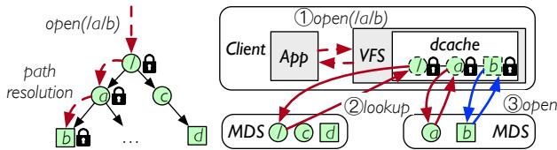

Fig. 1: Path resolution in a typical distributed file system operation. The client checks path existence and permission by looking up each path component, which may involve multiple remote requests.  
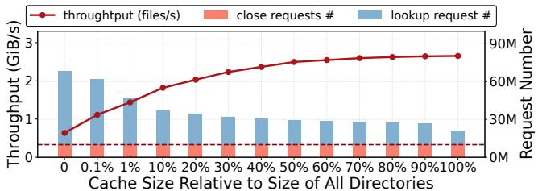  
Fig. 2: CephFS performance of randomly traversing 64 KiB files in a large directory tree under different client metadata cache sizes. The left y-axis represents the read throughput, and the right yaxis represents the number of requests sent to the MDSs (i.e., lookup and close). The dashed line denotes the file number.

To mitigate path resolution overhead, existing DFSs employ client-side metadata caching, where clients maintain a local cache of directory/file metadata to avoid frequent remote lookups [4,14,15,26,28,35,37,38,47,49]. We refer to clients with client-side caching as stateful clients, as they maintain metadata state locally. By caching resolved paths, stateful clients reduce network round-trips for previously resolved and locally cached file operations, improving performance.

However, this stateful-client architecture is inefficient for DL training workloads. Unlike general-purpose workloads that exhibit strong locality and thus achieve high path resolution cache hit rates, DL training workloads demonstrate multiple traversals of massive directory trees, containing billions of directories and hundreds of billions of files in production environments, all accessed in random order.

When accessing such massive directory structures, the stateful-client architecture faces an inherent trade-off: either consume excessive client memory to cache the large directory tree or suffer a severe performance drop due to request amplification. To present this trade-off, we evaluate how the metadata cache size affects the performance of random file traversal in a large directory tree (shown in Fig. 2 and further explained in §2.3). Compared to a cache that can hold all directories, a cache only 10% as large results in a 32.5% throughput re duction, primarily because the lookup requests increase by 1.50×. The dilemma is exacerbated by the fact that a cache that can hold 10% of the directories is prohibitively expensive in production, considering the large directory tree and the number of clients. Even when the cache can hold 90% of the directories, an average of 1.70 network hops (i.e., the lookup requests in Fig. 2) are required for a file open.

In this paper, we propose the stateless-client architecture, which achieves one-hop access for most file operations in DL workloads while requiring no client-side caching. The core difference is that the stateless client shifts path resolution to the server side. However, to realize the stateless-client architecture for an efficient DFS, two key problems remain to be addressed. First, to enable one-hop access for most file operations, the client needs an approach to finding the correct metadata server that stores the target file’s inode. Second, as the path resolution is now on the server side, each meta data server should be able to resolve paths locally, without involving additional network hops when processing clients file operation requests.

We realize the stateless-client architecture in FalconFS, a POSIX-like high-performance DFS designed for DL workloads. FalconFS proposes hybrid metadata indexing to address the first key problem of locating the appropriate metadata server (§4.2). This approach leverages filename hashing to place file inodes to metadata servers while achieving load balance with selective redirections.

To address the second problem of resolving path locally, FalconFS proposes lazy namespace replication, replicating the whole namespace (i.e., the directory tree) to all metadata servers (§4.3). To amortize synchronization overhead, namespace updates are lazily synchronized, and an invalidationbased mechanism is adopted for concurrency control.

FalconFS further adopts concurrent request merging to amortize operation overhead and improve concurrency (§4.4) and VFS shortcut to keep the stateless-client architecture compatible with Linux VFS for easy deployment (§5).

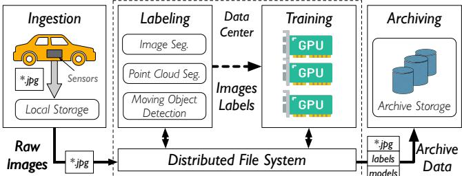  
Fig. 3: Overview of a DL Pipeline for Autonomous Driving.

Evaluations show that FalconFS completely eliminates request amplification and improves performance of large directory tree random traversal by up to 4.72× over CephFS [49] and up to 3.34× over Lustre [4]. End-to-end experiments show that FalconFS improves the throughput of DL model training by up to 11.81× and 1.23× over CephFS and Lustre, respectively. FalconFS has been deployed in Huawei’s AI clusters with 10,000 NPUs for data labeling and model training of the autonomous driving solution for one year.

Our main contributions are as follows.

• Analyzing IO characteristics of deep learning workloads, pointing out the inefficiency of the traditional stateful-client architecture.

• Proposing the stateless-client architecture and addressing the challenges of designing an efficient DFS.

• Building FalconFS, a high-performance DFS designed for DL workloads, and a thorough evaluation on it.

FalconFS is open-sourced at https://github.com/fal con-infra/falconfs and https://gitee.com/openeu ler/FalconFS.

## 2 DL Pipelines: IO Patterns and Challenges

## 2.1 Deep Learning Pipeline

Deep learning (DL) models are widely employed in autonomous driving, computer vision, and big data analysis. To meet evolving quality demands, training pipelines have been developed to continuously retrain models using large, iteratively updated datasets.

Fig. 3 illustrates the architecture of the deep learning (DL) training pipeline employed in Huawei’s autonomous driving (AD) systems. The pipeline consists of four key stages: The ingestion stage collects raw data from real-world environments. The labeling stage generates labels for the raw data with a sequence of model inference tasks, including moving objects detection, lane detection, traffic sign detection, etc. Then, the training stage uses a labeled dataset to train the target model for vehicle deployment. In the final archiving stage, the dataset is moved into low-cost storage systems such as cloud data lakes for future reference [16,31,50,52]. Similar architectures also exist in other DL workloads [2, 32, 52].

## 2.2 Workload Patterns in DL pipelines

We take the DL pipeline for autonomous driving in Huawei as an example to present its unique workload patterns.

Numerous small objects in large directories. The autonomous driving pipeline consumes multimodal data, including images, point clouds, etc. During labeling and training, these objects are stored as individual files, whose size ranges from a few KiB to a few MiB, mostly within 256KiB. In production, an in-flight dataset scales up to hundreds of petabytes and is composed of over 300 billion small files. These files are grouped into directories by timestamps, vehicle ID, camera ID, etc., forming a directory tree with billions of directories and large directory sizes. The huge number of files and directories stresses the DFS’s metadata scalability and performance.

Random file traversal. In the training stage, tasks access the dataset in a traversal and random manner. In particular, each file is accessed exactly once in each training epoch, and the access order is random. Such a random access pattern is unfriendly to client caching, which we further discuss in §2.3.

Burst file access. In the labeling stage, the inference tasks read and write files from/to FalconFS in a pipeline, involving massive small file IO and directory lists. To fully utilize the GPU’s parallelism, data objects are accessed and processed in batches, resulting in burst file access in the same directory, which can lead to instantaneous load imbalance on the metadata servers and downgrade the performance, which we further discuss in §2.4.

Tight resource budget. CPU and memory are scarce resources for computing nodes. Training tasks perform data augmentation on CPUs, consuming significant CPU cycles and memory resources. In production, CPU for data augmentation is often the bottleneck, and it is typical to store and reuse intermediate results in memory to reduce CPU load [16, 22]. Therefore, the resources available to DFS clients are limited.

## 2.3 Challenge 1: Lookup Tax

For small-file intensive workloads like DL pipelines, metadata performance often becomes the bottleneck. To accelerate metadata operations, most DFSs employ a stateful client architechture that caches metadata on the client side [4, 14, 15, 26, 28, 35, 37, 38, 47, 49]. However, this approach is inefficient for DL training workloads, as their large directory working sets are inefficient to cache, leading to the following dilemma.

Challenge 1: Large working sets in deep learning training tasks create a dilemma between performance degradation due to request amplification and excessive client memory consumption required for caching directory metadata.

To illustrate this dilemma, we replay a trace of Resnet-50 model training on a small dataset, comprising 10 million 64KiB files in 1 million 7-level directories, stored in a CephFS instance with four MDSs and twelve OSDs1. A total of 512 IO threads iterate through the files in random order. As shown in Fig. 2, the client cache size significantly impacts both read throughput and the number of remote requests generated.

The experiment shows that the read throughput is highly sensitive to the client’s metadata cache size. Compared to a cache that can hold 10% of the directories, a cache that can hold all directories achieves 1.46× higher throughput. Furthermore, throughput increases significantly as the cache size grows from 10% to 100%, indicating that optimal performance requires allocating sufficient memory to cache all directories. Otherwise, performance degrades proportionally with reductions in cache size.

The DL training workload’s sensitivity to cache size comes from its random access nature. During each epoch, training tasks access every data object exactly once in a random order. When all directories are cached, all directory lookups are served by the cache, reducing each file open operation to a single metadata lookup request. However, with a small cache size, the LRU policy preferentially retains near-root directories, while the hit rate of last-level directories — which constitute 90% of accesses in the experiment —- is proportional to the cache size. As shown in Fig. 2, smaller caches correlate with increased lookup requests due to cache misses. This effect causes request amplification: each file open operation triggers multiple lookup requests to the metadata server, bottlenecking read throughput.

In production environments, caching a significant portion of working-set directories proves prohibitively expensive. For instance, a production cluster in Huawei can scale over 1000 client nodes, and a typical production dataset contains billions of directories. Given that in Linux VFS, caching a directory takes 800 bytes (608 bytes for inode and 192 bytes for dentry), caching 10% of 1 billion directories on each node would require 80 GiB per node and 80 TiB in total, which is prohibitively expensive.

## 2.4 Challenge 2: Transient Skewness

During the labeling stage, inference tasks scan and load/store data objects in a per-directory manner, accessing all the files in one directory and then another. This per-directory IO pattern causes transient load imbalances, which limit performance scalability. We illustrate this issue by performing per-directory file access on a CephFS cluster with four MDSs and twelve OSDs and present the results in Fig. 4(a).

We observe that when the directory size exceeds the IO parallelism of the tasks, the DFS’s performance degrades. Analysis of load distribution (Fig. 4(b)) shows that at a directory size of 100, the MDSs experience severe load imbalance during read operations. This issue arises because CephFS tends to store metadata for files within the same directory together; consequently, burst operations on files in the same directory can congest a single MDS, leading to performance bottlenecks. Similar patterns also exist in other DFSs like [15, 28, 35, 37, 47].

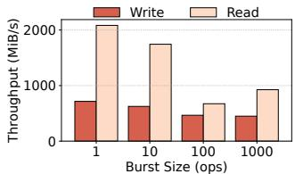  
(a) Throughput.

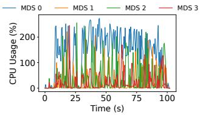  
(b) Load Variance.  
Fig. 4: CephFS performance of accessing 64KiB files with different burst size. Large burst size leads to load imbalance and performance degradation. Fig. 4(b) shows the load variance of the MDSs when performing read operations with burst size 100.

Challenge 2: Concurrent operations on files within the same directory suffer from MDS congestion, hindering performance scalability.

## 3 Proposal: DFS with Stateless Client

Given the challenges brought by DL workloads, we propose the stateless-client architecture for DFS under DL workloads. The stateless-client architecture abandons the cache on the client side and moves path resolution to the server side. The proposal is based on the following three observations. (1) A typical DL cluster usually has far more clients than metadata servers. In Huawei’s deployment environment, the ratio of clients to servers exceeds 40:1. Considering that all clients share the same dataset in DL pipelines, a server-side dentry can serve more clients than a client-side cache. (2) Stateful client DFSs typically use VFS dcache and inode cache to cache directory attributes [1, 4, 15, 49], which takes 800 bytes for each directory. On the server side, a directory entry can be maintained in a custom format that takes less than 100 bytes. (3) The server has more memory resources than the clients due to the tight resource budget of the computing node, as we described in §2.2. However, to realize the stateless-client architecture for an efficient DFS, two key problems remain.

How to find the right server? First, the client needs an approach to finding the correct metadata server that stores the target file’s inode. Since DFS usually partitions all inodes to multiple metadata servers for scaling out, only the server containing the file’s inode can complete its file operations. DFS thus needs to maintain the path-to-server mapping (i.e., the indexing), which is usually implemented in two ways.

• Path-walk indexing. Most DFSs use indexing methods that are related to the parent directories, for example, using the parent directory ID as (part of) the key [15, 26, 28, 35, 47] for hashing, or indexing files in different directories with different hashing rules [4,14,37]. These approaches require a full-path walk to resolve inode location, and need caching directory entries on clients to achieve better performance, suffering the trade-off in §2.3.

• Full-path hashing [40, 42] determines the target inode location by hashing the full path. It does not require cache, but makes directory rename prohibitively expensive due to the relocation of all inodes in the subtree.

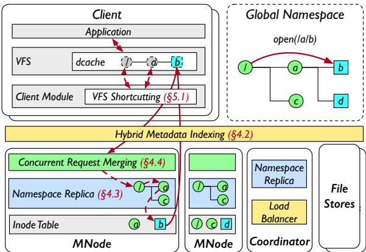  
Fig. 5: Architecture of FalconFS

Tab. 1: Scheme of FalconFS’s metadata.  
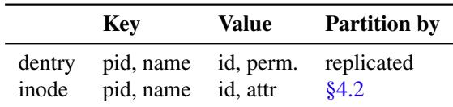

However, none of these indexing approaches meet the requirements of an efficient DFS with the stateless-client architecture, including no client cache, no extra network hops, and practical support of directory renames. Nevertheless, these approaches inspire us to build a hybrid indexing of hashing and path-walking to solve the problem.

How to resolve path locally? Second, as the path resolution is now on the server side, each metadata server should be able to resolve the path locally, without involving another network hop when processing the client’s file operation request. Since DFS scatters directory entries across multiple metadata servers for scaling out, the dentry information of components in a path is also scattered across multiple servers. A server resolving the path thus needs to communicate with other servers to complete the resolution, which can be expensive.

Considering the characteristics of DL workloads (random file traversal) and DL clusters (high client-server number ratio and rich server memory resource), we thus propose to replicate the whole directory tree (i.e., the namespace) on all metadata servers, so that each server can resolve path locally.

We build FalconFS with the stateless-client architecture, which eliminates client-side caching while providing onehop access for most operations in DL workloads with hybrid metadata indexing and lazy namespace replication.

## 4 System Design

## 4.1 FalconFS Overview

Architecture. Fig. 5 shows the FalconFS architecture, consisting of Client Module, MNode, Coordinator, and File Store.

FalconFS’s client module is a kernel module that provides POSIX interfaces through Linux VFS. Unlike most Linux file systems, FalconFS client avoids performing path resolution at the client side. Specifically, FalconFS client shortcuts VFS path walk (§5) and forwards the operation request with full path to MNodes according to hybrid metadata indexing (§4.2).

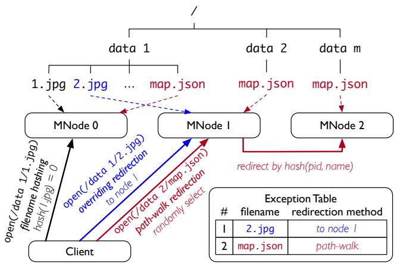  
Fig. 6: Hybrid Metadata Indexing.

Metadata nodes (MNode) are PostgreSQL databases [7] with customized extensions. We manage metadata for FalconFS in the extensions using the database’s table and transaction management, B-link tree index, xlog (write-ahead logging), and primary-secondary replication. Each MNode maintains a lazily synchronized directory tree structure (namespace replica) and a partition of file attributes (inodes). Leveraging the merits of central location as servers, MNode merges concurrent requests (§4.4) to de-duplicate shareable execution processes for higher throughput.

The central coordinator is responsible for managing namespace changes (§4.3). It also runs a load balancing algorithm to balance inode distribution across MNodes (§4.2).

File Store is a distributed block storage system that stores file data. File chunks are distributed across a set of file store nodes that use local file systems on SSDs to store data.

Replicated directory namespace FalconFS replicates the file system directory structure across all MNodes, enabling each MNode to resolve file paths and check permissions locally. The namespace replica contains entries of directory attributes required for path resolution, i.e., dentries in Tab. 1, and does not include file attributes. With one billion directories, the storage footprint for the namespace replica is less than 100 GiB per MNode, which is acceptable.

Sharded file metadata In contrast to directories, we distribute all the file metadata, i.e., inodes in Tab. 1, across the metadata servers by hybrid metadata indexing for scaling up metadata capacity and throughput.

## 4.2 Hybrid Metadata Indexing

In this section, we present hybrid metadata indexing (§4.2.1) and how to maintain load balance (§4.2.2).

## 4.2.1 Hybrid Indexing Methods

Hybrid metadata indexing adopts filename hashing in the common case. However, for generality, hybrid metadata indexing considers situations where filename hashing may bring uneven inode distribution, and adopts two fallback mechanisms to mitigate the problem. Fig. 6 presents an overview.

Common case fast: filename hashing. To accelerate the path resolution, FalconFS adopts filename hashing as the indexing method for most cases. With filename hashing, all files are placed via the hashing of the filename. Such an indexing method is easy and efficient — it requires no client state and supports efficient rename. However, filename hashing cannot guarantee that the files are distributed evenly among different servers, potentially causing load-imbalance issues.

Fortunately, we find that DL workloads’ large directory size facilitates the filename hashing, significantly reducing the occurrence of load imbalance. Specifically, DL datasets usually have a large directory size, which can be multiple times larger than the number of MNodes. We analyze Huawei’s in-production datasets and popular open-sourced datasets that contain more than ten thousand files [11,13,17,27,45], finding their directory size ranging from several hundred to hundreds of thousands. According to the law of large numbers, given such large directory sizes, the distribution of files in each directory to MNodes is likely to be uniform. Consequently, the entire namespace is statistically uniformly distributed as the superposition of the distributions for each directory. This forms the basis of using filename hashing as the indexing method for the common cases in DL workloads.

Corner cases correct: selective redirection. However, there are situations where filename hashing can bring uneven file distribution. (a) Hot filenames: The naming convention of applications can cause certain filenames to be more frequent than others. (b) Hash variance: The number of unique filenames is not far more than that of MNodes, which can lead to unbalanced distribution due to hash variance.

To handle these corner cases, FalconFS adopts selective redirection as a complement. For this, FalconFS maintains a shared data structure — exception table, which specifies which and how filenames should be redirected. There are two kinds of redirection, targeting hot filenames and hash variance, respectively.

• Path-walk redirection. To place files with hot filenames, FalconFS calculates the hashing value by not only the filename, but also its parent directory ID. Thus, even if a hot filename exists in many directories, the corresponding files are placed on different MNodes. When clients identify a file marked for path-walk redirection in the exception table, they send requests to random MNodes. The receiving node utilizes its local namespace replica to walk the path, obtains the parent directory ID, and forwards the request to the target node determined by hashing both the filename and the parent directory ID.

• Overriding redirection. When hash variance causes uneven filename distribution across nodes, FalconFS can reassign selected filenames to designated nodes, shifting load from overloaded to underutilized nodes. These placement overrides are maintained in the exception table. Clients encountering files marked for such redirection in the exception table send requests directly to their designated MNodes.

FalconFS maintains copies of the exception table on each MNode, clients, and the coordinator. The coordinator updates the exception table according to the scheduling policy detailed in §4.2.2. Once the exception table is updated, the latest table is eagerly pushed to all MNodes, and clients lazily fetch the updates from MNodes when they get responses to operation requests. The lazy fetching mechanism creates a time window where clients may operate with stale exception tables and direct requests to incorrect nodes. However, MNodes validate all requests by checking their local exception table and forward misdirected requests to the proper destinations.

A constant number of exception table entries is sufficient to balance the distribution of inodes for arbitrary directory structures. We provide a theoretical analysis in §A.1.

## 4.2.2 Statistical Load Balancing

The coordinator uses the statistics periodically reported by MNodes to make rebalancing decisions.

Statistics. Each MNode periodically reports its local inode count and the most frequent O(nlogn) local filenames with their occurrence counts, where n is the number of MNodes.

Load balancing algorithm. The coordinator leverages an algorithm to maintain load balance across nodes. The algorithm aims to keep each node’s inode count below ( 1 + ε) n of the total inode count, while minimizing the size of the exception table. ε is a parameter specified by the user used to control the effect of load balancing.

When the coordinator detects a load imbalance using statistics reported by MNodes, it conducts the load balancing algorithm as follows.

1. Identify the most and least loaded nodes. Let Nmax and Nmin denote the nodes with the highest and lowest inode counts, respectively, where the inode counts are denoted as ⟨Nmax⟩ and ⟨Nmin⟩.

2. Select the most frequent filename in Nmax as F.

3. Redistribute F. The coordinator selects from the two redirection methods to approach load balancing. If we use pathwalk redirection, assuming it evenly distributes all files with filename F to all nodes, the inode numbers of Nmax and Nmin will be ⟨Nmax⟩ − n−1n |F| and ⟨Nmin⟩ + 1n |F|, respectively, where |F| represents the number of files named F in node Nmax. If using overriding redirection for F, we will transfer all |F| files from Nmax to Nmin, yielding the inode numbers of ⟨Nmax⟩ − |F| and ⟨Nmin⟩ + |F|, respectively. The coordinator chooses the method that minimizes the maximum inode count. After the method is chosen, the redirection entry is inserted into the exception table, and the corresponding files are migrated among nodes. To ensure metadata consistency, access to the corresponding inodes is temporarily blocked during the migration.

4. Repeat the procedure until no further imbalance is detected.

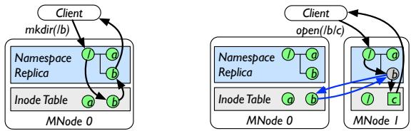

(a) Directory creation. (b) Directory lookup and miss handling.  
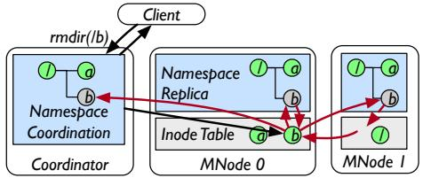  
(c) Directory change permission, removal and rename  
Fig. 7: Namespace Synchronization. Blue arrows represent remote lookup and red arrows represent invalidation.

Moreover, the coordinator periodically attempts to shrink the exception table to reduce redirection overhead. Specifically, it iterates all path-walk redirection entries in random order, and removes the entry if removing it does not lead to load imbalance. It then checks and removes overriding redirection entries similarly.

## 4.3 Lazy Namespace Replication

Lazy namespace replication is another key enabler of the stateless-client architecture. FalconFS maintains a consistent but not necessarily complete namespace replica on each MNode and the coordinator, enabling local path resolution. To reduce the overhead of maintaining consistency across all replicas, modifications to the namespace are lazily synchronized, and an invalidation-based mechanism is adopted, inspired by cache coherence protocols and Hermes [20]. The design is guided by two principles:

• Delaying synchronization until access. Directory creation is critical for DL dataset initialization, so the performance is important. Eagerly replicating directory creation across all MNodes would require expensive and unscalable twophase commits (2PC). Instead, FalconFS amortizes the overhead by deferring synchronization until access.

• Using invalidation as lightweight locking. When operations modify directory structures or permissions, concurrent operations in the sub-tree under the modified directory must be blocked for consistency. We invalidate the corresponding replica entry on all nodes for this instead of using traditional two-phase locking, saving a round of request broadcast.

We will then introduce how the namespace replicas are maintained during related operations, including creating/removing a directory, changing the permissions, and renaming.

Creating a directory. Fig. 7(a) shows an example of how to create the directory /b. The client calculates the location of /b via the hybrid metadata indexing, and then sends a mkdir request to the corresponding MNode, i.e., MNode0. Upon receiving the request, MNode0 resolves the path by querying its local namespace replica to check the path existence and permissions. It also checks its inode table to confirm /b does not already exist. Once all checks are passed, MNode0 creates an inode for /b in the inode table, adds a dentry for /b to its local namespace replica, and responds to the client.

Note that to retain the efficient single-hop processing of mkdir, MNode0 does not proactively broadcast the new dentry to namespace replicas on other MNodes. Instead, the dentry information is fetched by other namespace replicas on demand. Specifically, when an MNode queries its local namespace replica for path resolution and finds a missing dentry, it fetches the information from the owner MNode calculated via the hybrid metadata indexing.

Fig. 7(b) shows an example. When MNode resolves the path /b/c, it finds the dentry for /b missing in its local namespace replica. It then sends a lookup request to MNode (i.e., the owner MNode) to fetch the missing dentry to complete the path resolution and continues subsequent processing.

Removing a directory. The centralized coordinator is responsible for removing a directory and invalidating corresponding dentries from all namespace replicas.

In the example shown in Fig. 7(c), the client sends an rmdir(/b) request to the coordinator. The coordinator acquires shared locks on all ancestor directories and an exclusive lock on the target directory to ensure path validity during execution. It then forwards the request to the directory inode’s owner, i.e., MNode1 in the figure. MNode1 locks /b’s inode to block subsequent lookup requests and broadcasts an invalidation request to other MNodes. Upon receipt, each MNode invalidates its local dentry of the target directory if it exists in the local namespace replica. Each MNode searches its inode table for entries whose key’s pid equals /b’s ID (i.e., /b’s children), and responds to MNode1 the existence of any children. MNode1 aggregates these responses. If /b has no children, MNode1 deletes the inode and notifies the coordinator, which will release locks and respond to the client. Otherwise, MNode returns -ENOTEMPTY to abort the rmdir.

Changing permissions. Operations altering file permissions are also handled by the centralized coordinator in a similar approach. The difference is that the owner MNode will broadcast the invalidation requests and change the permission in its inode table.

Rename. FalconFS ensures rename consistency by employing the central coordination via conventional two-phase locking and two-phase commit protocols. The client will send rename(A, B) request to the coordinator, who will acquire locks and conduct checks on whether the rename can proceed. Once all checks are passed, the coordinator broadcasts to invalidate dentries of path A and transfers the inode of A to the MNode who is responsible for path B.

Locking and conflict resolving. FalconFS leverages namespace replicas to coordinate concurrent requests. When a server (the coordinator or an MNode) processes a request, it first resolves the path component by component in its local namespace replica. Dentry locks are acquired during the resolution. To improve parallelism, the coordinator acquires shared locks on intermediate dentries and an exclusive lock on the last component, while MNodes acquire shared locks on all dentries. If a dentry is missing in the local namespace replica, the server locks the dentry after it is retrieved from its owner MNode. Thus, concurrent requests on the same server are serialized by these locks. Concurrent requests on two different MNodes will not incur a data race and thus can be executed in parallel. The last case is a request being processed on the coordinator (ReqC) and a request on an MNode (ReqM).

For simplicity and without loss of generality, we assume Req is removing /a/b, whose inode is on MNode , and ReqM is opening /a/b/c on MNodeM. During processing ReqC, MNode will lock /a/b’s inode and broadcast to invalidate the dentries of /a/b in all namespace replicas. To handle the invalidation request, an MNode will first lock the corresponding dentry and then mark it as invalid. Then there are two possible cases on MNodeM.

The first case is that ReqM already holds the lock of /a/b when the invalidation arrives. In this case, the invalidation will be blocked until ReqM completes, thus ReqC is serialized to happen after ReqM.

The second case is that the invalidation is processed before ReqM locks /a/b. In this case, MNodeM will find the /a/b dentry invalid during path resolution of Req . MNode then sends a lookup request to retrieve the dentry from MNodeC, who owns the /a/b inode. On MNodeC, the lookup will acquire a shared lock of the /a/b inode, which has already been locked by ReqC. Thus, ReqM will be blocked until ReqC completes, forming a correct serialization of the two requests. Note that when processing the invalidation request, MNodeM will discard all lookup responses whose requests are issued before the invalidation is received.

Discussion. Lazy namespace replication introduces one remote lookup for access to a non-existent path. However, in DL workloads, such negative access is rare.

## 4.4 Concurrent Request Merging

To further optimize the performance, FalconFS leverages the advantages of stateless-client architecture and adopts concurrent request merging to scale up per-MNode throughput for higher metadata performance. In large-scale deep learning clusters, thousands of compute nodes generate concurrent requests. This presents an opportunity to batch request handling opportunistically, amortizing per-operation overhead — particularly lock contention and write-ahead logging costs.

Fig. 8 illustrates the metadata servers’ request-handling mechanism, which employs concurrent request merging. Each MNode initializes a fixed number of database worker threads to serve as the backend for metadata storage and prepares a connection pool. The connection pool accepts incoming requests and puts them into request queues according to the request type. An idle worker thread retrieves a queue and executes all requests in the queue in a single database transaction, with the following optimizations.

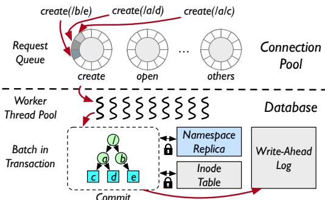  
Fig. 8: Concurrent request merging overview.

Lock coalescing. During path resolution, the worker thread acquires shared locks for all directories along the path to maintain path validity during operations, akin to the implementation of VFS and existing DFS. Prior research demonstrates that lock overhead can be significant even without actual blocking [47]. FalconFS mitigates this through lock coalescing, combining lock acquisition and release operations at per-batch granularity to reduce overhead.

Due to the tree-structured nature of the file system namespace, requests can share common near-root path prefixes. As the request queue accumulates multiple operations, the worker coalesces shared path prefixes and eliminates redundant lock acquisitions. In Fig. 8, the three create operations each walk two directories and one file. Rather than acquiring nine locks separately, the worker eliminates redundant lock acquisitions and acquires only six locks instead.

Write-ahead-log coalescing. Operations such as mkdir, create, and close modify the inode table. To maintain file system metadata consistency, DFSs typically warp each operation into a separate transaction to persist in atomic [28, 34, 47]. When a transaction commits, it synchronously appends the write-ahead log, leading to small writes that are unfriendly for storage. In FalconFS, as concurrent operations are batched into a single transaction, the worker coalesces small log appends into larger ones, improving the storage efficiency.

## 4.5 Reliability and Reconfiguration

In this section, we discuss how FalconFS supports crash consistency, high availability, and system reconfiguration.

Crash consistency. FalconFS adopts write-ahead logging (WAL) to ensure crash consistency and atomicity of operations. Any persistent updates to the MNodes are first recorded in the WAL before being applied and visible. If an MNode fails during path resolution, update, or migration, uncommitted operations will be rolled back, and committed operations will be recovered from the log. We leverage PostgreSQL’s WAL mechanism to support single-node transactions and build a customized two-phase commit protocol upon it to ensure the consistency of operations that span multiple MNodes. Coordinator failure is treated the same as an MNode failure.

High availability. For the high availability of the metadata service, FalconFS supports majority-based replication for MNodes and the coordinator. Each MNode and the coordinator have multiple replicas, with one primary replica serving requests and multiple secondary replicas synchronizing the primary’s state. The state synchronization is achieved by using PostgreSQL’s physical streaming replication mechanism to ship the primary’s WAL to the secondaries continuously. Once a primary replica becomes unavailable, FalconFS elects a secondary replica with the longest WAL as the new primary. FalconFS is available as long as a majority of each MNode’s replicas are available. Note that the majority-based replication is orthogonal to lazy namespace replication in §4.3.

Cluster reconfiguration. FalconFS adopts consistent hashing to compute inode location and supports cluster reconfiguration (i.e., MNode joining and leaving) accordingly. Once the cluster needs to be resized, FalconFS migrates involved inodes to/from the added/removed MNodes. During migration, FalconFS stops serving requests. FalconFS does not support live migration since it introduces extra overhead for checking migration status on the critical path of accessing inodes.

## 5 Implementation of VFS Compatibility

Compatibility with the Linux virtual file system (VFS) is important for easy deployment. However, the VFS embeds path resolution and metadata caching logic within the kernel, which hinders our stateless-client design. To address this, we shortcut VFS path resolution by leveraging the semantics the VFS already provides, enabling users to benefit from FalconFS’s design without invasive kernel modifications.

Basic idea. The idea behind VFS shortcut is simple — when the VFS invokes lookup() method provided by the client module for intermediate directories in a path, the method returns directory attributes with permission 0777 to pass VFS checks, and when the VFS triggers the operation on the last path component, the client module sends the full path to the metadata servers, which perform the actual path resolution and execute the requested operation. To implement this approach, two challenges need to be addressed:

• Distinguishing lookup requests to intermediate directories and the final component. The client module returns fake attributes to the former for shortcutting path resolution and real attributes to the latter for correctness, respectively

• Avoiding fake attributes being exposed to users. A previously returned fake attribute may be cached in the kernel and exposed to users during subsequent operations, which violates correctness and should be avoided.

Distinguish intermediate and final lookups. We observe that the existing semantics provided to the lookup() method are sufficient to distinguish lookup intentions.

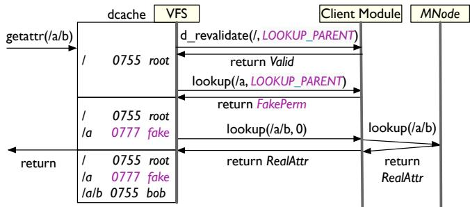  
Fig. 9: Workflow of VFS shortcut in FalconFS. In the figure, The method interfaces and the dcache is simplified for clarity.

Since Linux kernel 5.7, the VFS sets the global state flag LOOKUP\_PARENT during path walk to indicate that the final component has not yet been reached — a feature designed initially for the kernel audit subsystem [6], and the flag is passed to the lookup() method. If the flag is set, the client module knows that the lookup is for an intermediate directory and returns fake attributes (e.g., mode = 0777, along with special uid and gid values) to pass VFS checking.

Avoid exposing fake attributes. To avoid fake attributes being exposed to users due to cache reuse, the client module leverages the VFS d\_revalidate() method. We reserve a pair of uid and gid to identify fake attributes. Upon a dcache hit, the VFS invokes d\_revalidate() method to validate the cached entry. The client module then checks whether the hit entry is a fake one via uid and gid, and whether the entry is being used to resolve a final path component via the LOOKUP\_PARENT flag. If both conditions are met, the module fetches the real attributes from the MNode and updates the dcache entry.

Example. Fig. 9 illustrates an example of VFS shortcut. During a getattr operation for the path /a/b, the VFS resolves each component sequentially. It first looks up /, which results in a dcache hit. The VFS invokes the d\_revalidate() method to validate the entry, receiving a positive response. Then, the VFS looks up /a, which misses the dcache. The lookup() method is called with the LOOKUP\_PARENT flag set, returning a fake attribute. Finally, the VFS looks up /a/b, which also misses the dcache. Here, the lookup() method is invoked without flags. The module then issues a remote lookup request with the full path (/a/b) to the MNode, which executes the real path checking, executes the lookup operation, and returns the result to the module. The module returns the result to the VFS, completing the getattr operation.

Discussion and limitations. Our client-side implementation preserves path resolution correctness and file system operation integrity, as the MNode re-executes all shortcut checks and prevents user exposure to fake attributes. VFS shortcut has two limitations. First, symbolic link is not supported because the clients do not follow links. Second, nested mount points under FalconFS need special handling (i.e., recheck directory permissions when passing the nested mount point), which is not supported yet.

Tab. 2: Hardware configuration of the cluster.  
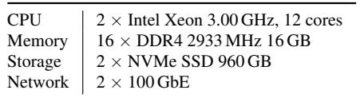

## 6 Evaluation

We evaluate in this section to present the following results.

1. FalconFS provides scalable, high-performance metadata operations (§6.2) and file IO ( §6.3).

2. FalconFS is robust under adverse conditions like client memory limitations (§6.4) and load skewness (§6.5).

3. FalconFS achieves balanced inode distribution across diverse workloads with minimal exception table size (§6.6).

4. The contribution of each design component to overall performance and the impact of unfavorable conditions (§6.7).

5. The performance in real-world DL workloads (§6.8).

## 6.1 Environment Setup

Testbed. We conduct experiments on a cluster of 13 dualsocket machines (configurations detailed in Tab. 2). To expand the test scale, we abstract each machine into two independent nodes, with each node bound to one socket, one SSD, and one NIC, scaling the testbed to 26 nodes. We restrict server resources to 4 cores per node to ensure clients can saturate the servers’ capabilities.

Baseline Systems. We compare FalconFS with CephFS 12.2.13 [49], JuiceFS 1.2.1 [1] and Lustre 2.15.6 [4]. CephFS is a widely deployed DFS in data centers. JuiceFS is an opensource DFS targeting AI and data analytics workloads, and we deploy it with TiKV 1.16.1 [8] as its metadata engine and data storage. Lustre is a high-performance DFS widely used in HPC and data centers. CephFS is accessed via the libcephfs library due to observed instability in performance when using a VFS mount point. JuiceFS and Lustre are accessed through VFS mount points, as is FalconFS unless stated otherwise. FalconFS utilizes a modified FUSE kernel module and library that incorporates the optimizations described in §5. All DFSs disable metadata and data replication.

## 6.2 Metadata Performance

We first evaluate the performance of individual metadata operations in the best case, where each client accesses its own private directory and all directory lookups hit the client-side cache. We measure five key metadata operations, namely, create, unlink, getattr, mkdir and rename.

Throughput scalability. We scale the number of metadata servers from 4 to 16 and measure the peak throughput achievable by each file system. To saturate the metadata servers’ capacity, we gradually increase the number of client threads until the throughput no longer increases. When mounting with FUSE clients, we observe that 13 client nodes are insufficient to saturate FalconFS due to bottlenecks in FUSE, so we present FalconFS’s performance using the LibFS interface, enabling each client node to generate higher concurrency. We ensure that the FUSE client and the LibFS client generate identical requests to the metadata servers; thus, given sufficient client nodes, FUSE clients would achieve comparable performance. In production environments, client nodes typically outnumber metadata servers and can fully saturate them. Fig. 10 shows the results.

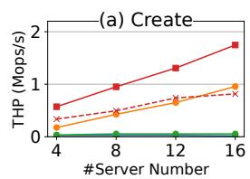

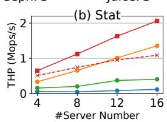

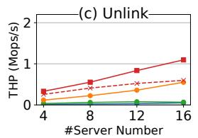

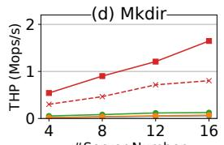

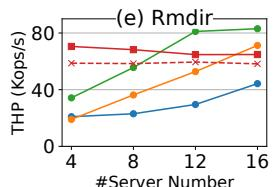

Fig. 10: Performance and scalability of metadata operations.  
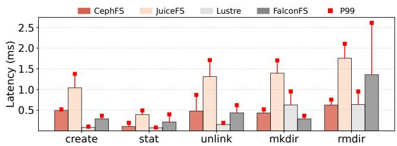  
Fig. 11: Average latency of metadata operations.

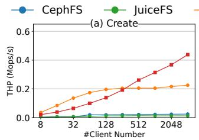

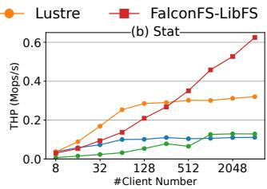  
Fig. 12: Scalability with regard to concurrent clients.

For the operations create and unlink, FalconFS achieves speedups of 0.82–2.26× on Lustre and higher gains on CephFS and JuiceFS. This performance improvement stems from two factors: (a) FalconFS does not maintain directories atime and mtime, eliminating the need to update directory metadata; (b) Concurrent request merging consolidates and persists multiple write-ahead-logging operations together, enhancing I/O efficiency. In contrast, JuiceFS and Lustre rely on expensive distributed transactions to update both the file and directory metadata. CephFS does not use distributed transactions but logs writes to remote OSDs — both of which incur significant overhead.

For getattr, FalconFS achieves 0.52–0.93× speedup over Lustre. The performance gain comes from that (a) concurrent request merging boosts server concurrency and reduces request dispatching overhead, and (b) FalconFS’s statelessclient architecture eliminates the need for acquiring cache coherence locks (e.g., CephFS’s capabilities and Lustre’s in tent locks).

FalconFS demonstrates scalable performance for mkdir, due to efficient invalidation-based synchronization. However, for rmdir, FalconFS’s throughput declines as the number of metadata servers increases. This is because rmdir requires invalidating the directory record and querying child inodes across all servers—an overhead proportional to the cluster size. In contrast, CephFS, JuiceFS, and Lustre exhibit constant overhead for rmdir, so their performance is scalable.

We observe imbalanced CPU utilization across JuiceFS’s metadata engine nodes, indicating inefficient load distribution, which explains JuiceFS’s poor performance scalability.

Latency. Fig. 11 presents the latency of metadata operations across different DFSs. We deployed four metadata servers with a single client thread issuing requests.

While FalconFS demonstrates superior throughput compared to other DFSs, its latency is higher than Lustre’s. This trade-off occurs because FalconFS employs concurrent request merging to batch operations, optimizing throughput at the cost of increased latency. Besides, FalconFS shows high p99 latency for rmdir for broadcasting invalidation requests to all MNodes and waiting for the slowest response. Nevertheless, FalconFS’s latency is comparable to CephFS and better than JuiceFS for operations other than rmdir.

Scalability with regard to concurrent clients. Fig. 12 presents the throughput of metadata operations with an increasing number of client threads, using four metadata servers. Due to space limitations, we only present the results of create and getattr. FalconFS’s throughput scales well for both operations. When the client number is no more than 256, FalconFS’s throughput is lower than Lustre’s due to higher latency. However, as the number of clients continues to increase, Lustre’s performance saturates and FalconFS outperforms it. FalconFS’s good scalability over client number comes from that (a) the connection pool allows serving a large number of connections with a few threads, and (b) the concurrent request merging efficiently batches request executions.

## 6.3 Data Performance

In this section, we evaluate the performance of small-file access. We deploy four metadata servers and twelve data nodes, each equipped with one NVMe SSD. We saturate the DFSs using 2560 client threads distributed across 10 client nodes. Each thread accesses 1024 pre-created files within its own private directory. To access a file, a client first opens it with the O\_DIRECT flag, reads or writes all data, and then closes the file. We vary the file size from 4 KiB to 1 MiB and report the normalized throughput in Fig. 13.

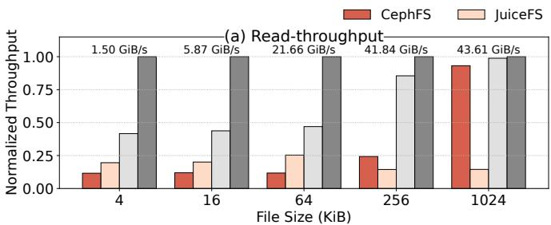

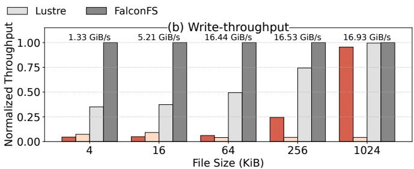  
Fig. 13: Throughput of file data IO. Y-axis is the throughput normalized to that of FalconFS.

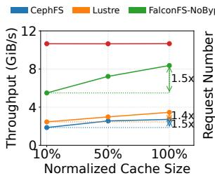  
(a) Throughput.

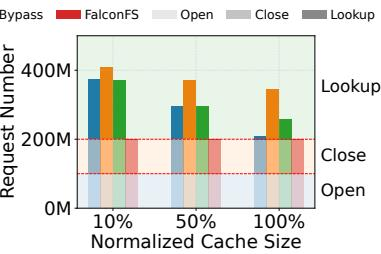  
(b) Request number.  
Fig. 14: Random file traversal in a large directory tree. The x-axis represents the ratio of client metadata cache size to the total size of all directories’ inodes and dentries.

When the file size is smaller than 256 KiB, the throughput increases proportionally with the file size, indicating that the metadata operation IOPS is the bottleneck. When the file size is larger than 256 KiB, CephFS, Lustre and FalconFS’s throughput hits the SSD bandwidth bottleneck of 43 GiB/s for read and 16 GiB/s for write. Thanks to FalconFS’s higher metadata performance, it outperforms other DFSs in small-file access. For files no larger than 64 KiB, FalconFS achieves 7.35–21.23× speedup over CephFS, 2.94– 23.53× over JuiceFS and 1.12–1.85× over Lustre. JuiceFS does not perform well in small file access due to the inefficiency of the data storage.

## 6.4 Impact of Client Memory Budget

In this section, we evaluate the impact of client memory budget on DFS performance under typical DL training workloads — specifically, random file traversal in a large directory tree. We initialize an 8-level directory tree structure where each intermediate directory contains ten subdirectories and each last-level directory contains ten 64 KiB files. This configuration yields a total of 11.1 million directories and 100 million files. Each DFS runs four metadata servers and twelve data nodes. Ten client nodes, each running a 256-thread client process, read all files in independent random orders.

We limit the metadata cache size on each client node based on the ratio of the total size of all directories’ inodes and dentries. For CephFS, we set the ceph.conf parameter client\_cache\_size to enforce this limit. For other DFSs, we use Control Group v2 to restrict the cache size. The cgroup monitors the process’s userspace and kernel memory usage, and reclaims kernel objects (e.g., dentries and inodes) when memory consumption exceeds the threshold.

In addition to CephFS and Lustre, we evaluate FalconFS-NoBypass, a variant of FalconFS without the VFS shortcut, to highlight the benefit of the client-stateless design. FalconFS-NoBypass relies on the VFS dentry and inode caches to perform client-side path resolution. We omit the results for JuiceFS, as its throughput drops to zero before completing the initialization of the directory tree.

Fig. 14(a) shows the throughput of each DFS under different memory budgets, and Fig. 14(b) presents the composition of metadata requests. Notably, while Lustre and FalconFS explicitly send open requests to open files, CephFS sends lookup requests for file open. For simplicity, we count CephFS’s lookup requests to files as open in Fig. 14(b).

We make the following observations: First, the performance of stateful-client DFSs, including CephFS, Lustre, and FalconFS-NoBypass, is sensitive to the client memory budget. There is a 1.4–1.5× performance gap between the 10% and 100% memory budget configurations. When the memory budget is constrained, fewer directories can be cached on the client-side, leading to more frequent lookups, which increase the number of requests per file access and degrade throughput.

Second, FalconFS achieves high performance even under tight memory budgets and outperforms FalconFS-NoBypass, demonstrating that stateless-client design effectively boosts performance. As shown in Fig. 14(b), FalconFS generates a constant number of requests to the metadata servers as the cache size varies. Compared with FalconFS-NoBypass, FalconFS reduces the number of metadata requests by 22.7%– 45.9%, and improves the throughput by 0.24–0.94×. Compared with CephFS and Lustre, FalconFS improves the throughput by 2.92–4.72× and 2.08–3.34× respectively.

Notably, even with a 100% cache, FalconFS-NoBypass is still 19.4% slower than FalconFS. Although this cache is large enough to hold all directory inodes in the workload, file inodes contend for the cache. Consequently, directory lookups still frequently miss the cache and generate remote requests.

## 6.5 Impact of Transient Skewness

We evaluate the impact of transient skewness on DFS performance, a common access pattern in DL labeling workloads (§2.4). We deploy four metadata servers and twelve data nodes, and use a single 256-thread client node to access pre-created 64 KiB files in bursts. A burst is defined as a sequence of accesses to files within the same directory, with adjacent bursts targeting different directories. Fig. 15 presents the results.

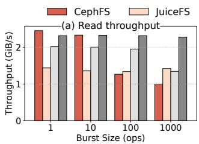

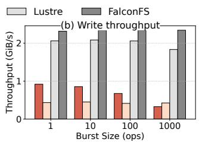  
Fig. 15: Throughput of burst file IO.

Tab. 3: File and directory inode distribution of various directory structures over 16 metadata servers.  
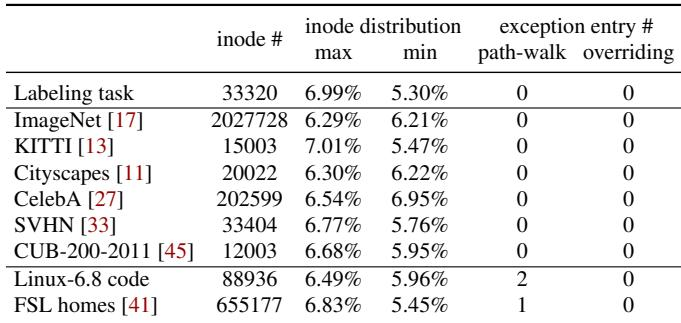

We observe a degradation in the read and write performance of CephFS and Lustre, as the burst size increases. This occurs because large bursts cause instantaneous load imbalance across the metadata servers. In contrast, FalconFS does not suffer from large bursts, as it evenly distributes the metadata of files within the same directory, achieving good scalability. JuiceFS’s performance also does not degrade with increasing burst size, as there is a constant load imbalance among its metadata engine nodes.

## 6.6 Load Balance in Real Workloads

In this section, we demonstrate that hybrid metadata indexing achieves a balanced distribution of inodes across diverse directory structures, with only a small portion of filenames requiring special treatment. We evaluate inode distribution on both DL workloads and general-purpose workloads. For DL workloads, we analyze a dataset collected from Huawei’s production environment, as well as six popular open-source image datasets used in deep learning. We select these opensource datasets by listing the most popular image datasets on a dataset summary website [5], and choose the first six datasets containing more than 10,000 files. For general-purpose workloads, we select the Linux 6.8 source tree and FSL home traces [41], the latter being a snapshot of students’ home directories from a shared NFS on a university campus.

Tab. 3 summarizes, for each workload, the number of files, the maximum and minimum ratios of inodes on metadata servers, and the number of exception entries utilized to achieve the distribution. As shown in the table, most workloads exhibit a small max–min gap with zero exception entries, indicating that filename hashing alone is sufficient to achieve balanced inode distribution in these cases. This is because such workloads — typically datasets — have a large directory size, which is friendly to filename hashing.

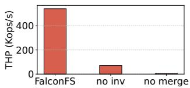  
(a) Contribution breakdown.

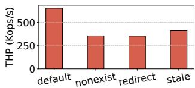  
(b) Corner-case analysis.  
Fig. 16: Performance analysis.

We further examine the three workloads that require exception entries. The “Linux 6.8 code tree” contains many files with identical names. However, applying path-walk redirection to the two most frequent filenames (i.e., “Makefile” and “Kconfig”) suffices to balance the distribution. These two filenames occur 2,945 and 1,690 times, respectively, accounting for 5.55% of all files in total. In the FSL home traces, FalconFS achieves balanced load after applying path-walk redirection to the most frequent filename, which appears 8,112 times and accounts for 1.24% of all files.

## 6.7 Performance Analysis

Design contributions. The contribution of the statelessclient architecture to overall performance is demonstrated by comparing FalconFS with FalconFS-NoBypass in §6.4. In this experiment, we further analyze other design configurations by evaluating three setups: the full FalconFS, no inv, and no merge, incrementally reducing the design features. The no inv configuration disables invalidation-based synchronization, wrapping mkdir operations in a distributed transaction to atomically create all dentry replicas across all MNodes. The no merge setup disables concurrent request merging in addition to the changes in no inv, requiring worker threads to fetch and execute requests one at a time. For this evaluation, we deploy four MNodes and use LibFS clients to saturate them, with each client accessing its own private directory. Fig. 16(a) presents the peak throughput of the mkdir operation.

Compared to the full FalconFS, no inv decreases throughput by 86.9%, as the distributed transaction requires multiple rounds of broadcasts, incurring significant overhead. no merge reduces throughput by an additional 91.8% due to increased per-request overhead.

Corner case analysis. In most cases, hybrid metadata indexing enables one-hop operations. However, there are corner cases that require two hops: (a) operations on non-existent paths, (b) operations on path-walk redirected filenames, and (c) operations issued with a stale exception table. Fig. 16(b) illustrates how these scenarios affect the performance of the getattr operation. Compared to the one-hop common case, these corner cases result in a 36.8%–49.6% decrease in performance due to the additional hop.

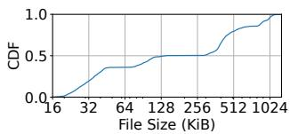  
(a) Distribution of file size.

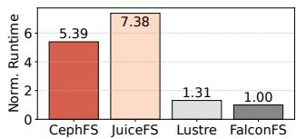  
(b) Normalized trace runtime.

Fig. 17: File size pattern and runtime for labeling task replay.  
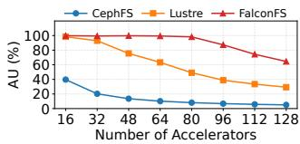  
(a) Accelerator utilization.

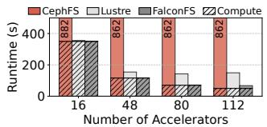  
(b) Runtime breakdown.  
Fig. 18: Accelerator utilization and runtime breakdown for Resnet-50 model training. In Fig. 18(b), the stripes mark the computation time, and the bars above the stripes represent the time waiting for I/O.

## 6.8 End-to-End Performance

We evaluate the end-to-end performance of DFSs in DL workloads for both labeling and training tasks. Each DFS has four metadata servers and twelve data nodes.

The labeling task. We replay a trace from Huawei’s labeling cluster. In this trace, labeling tasks read raw images from the DFS and write segmented images back to the DFS. Fig. 17(a) shows the distribution of file sizes in the trace, and Fig. 17(b) presents the runtime of the trace replay. Although we do not replay the computation, the replay runtime closely approximates the end-to-end runtime, as computation overlaps with I/O, and I/O is the bottleneck. Compared to other DFSs, FalconFS reduces the runtime by 23.8%–86.4%.

The training task. We evaluate the training performance with the MLPerf Storage Benchmark [29]. The benchmark is configured to simulate training a ResNet-50 model on 10 million files distributed across 1 million directories, with each file sized at 112 KiB. The total dataset size is 1,064 GiB, and files are read using direct I/O. Fig. 18(a) shows the accelerator utilization (AU) of each DFS as the number of GPUs increases. JuiceFS is omitted because its throughput drops to zero during dataset initialization. Taking 90% AU as the threshold, FalconFS supports up to 80 GPUs, while Lustre supports only 32 GPUs, and CephFS does not meet the threshold. With 80 to 128 GPUs, FalconFS achieves training throughput speedups of 11.09–11.81× over CephFS and 0.99–1.23× over Lustre. Fig. 18(b) presents the runtime breakdown of the training task. Due to FalconFS’s high performance for random small-file access, its I/O overlaps with computation, spending significantly less time waiting for I/O compared to other DFSs, thereby reducing the overall training runtime.

## 7 Related Works

Path resolution optimizations. Path resolution overhead has drawn research attention for a long time. In the context of local file systems, a series of studies propose optimizations like full-path indexing [10,23,44] and VFS modifications [48]. These approaches optimize local data structures and cannot be directly applied to distributed file systems (DFSs).

To accelerate path resolution, DFSs typically adopt clientside metadata caching [4, 15, 26, 28, 37, 38, 49]. InfiniFS [28] reduces the cache misses penalty by resolving multiple path components in parallel; however, it cannot mitigate request amplification. Giraffa [40] and CalvinFS [42] locate inodes by full path hashing, which makes directory renaming hard to implement. HDFS [39] performs path resolution on a centralized namenode and thus has scalability issues. HopsFS [34] performs path resolution at a proxy layer, which looks up all path components in parallel from a distributed database, but still suffers from constant request amplification. Our approach differs in that FalconFS addresses scalability, request amplification, and metadata indexing issues through a client-stateless architecture and hybrid metadata indexing. Mantle [24], a concurrent work of FalconFS, adopts a similar client-stateless metadata service to object storage services. While FalconFS scales out path resolution to all NModes, Mantle resolves path in a per-namespace single node and has scalability issues.

Storage systems for deep learning. Previous studies propose various data loading frameworks for DL training tasks [19, 21, 22, 30, 51]. These works optimize DL data loading by unifying data access, reusing pre-processed data, and leveraging data caching, etc. These works are task-specific and can be deployed on top of FalconFS. DIESEL [46] is a DFS designed for DL training tasks. Its design is based on the assumption that the dataset’s directory tree is small enough to be cached on every client, whereas FalconFS makes the opposite assumption and focuses on eliminating client-side caching. 3FS [9] is a recent DFS for AI workloads. Unlike FalconFS, it is optimized for large data access and focuses on optimizing the data path, while FalconFS optimizes the metadata architecture for small-file performance.

## 8 Conclusion

We propose FalconFS, a distributed file system with a clientstateless architecture for DL workloads. Evaluations show that FalconFS achieves up to 4.72× better throughput of small file random access and up to 11.81× higher GPU utilization in deep learning model training over CephFS and Lustre.

## Acknowledgements

We sincerely thank our shepherd, Ken Birman, and the anonymous reviewers for their constructive comments and insightful suggestions. This work is supported in part by the National Natural Science Foundation of China (No. 62132014), the Fundamental Research Funds for the Central Universities, the Fundamental and Interdisciplinary Disciplines Breakthrough Plan of the Ministry of Education of China (JYB2025XDXM113), and Huawei Technologies. Mingkai Dong (mingkaidong@sjtu.edu.cn) and Junbin Kang (kangjunbin1@huawei.com) are the corresponding authors.

## References

[1] A High-Performance, Cloud-Native, Distributed File System. https://juicefs.com/en. Accessed April 9, 2025.

[2] Building a data pipeline for deep learning. https: //www.netapp.com/pdf.html?item=/media/6750 -wp-7264.pdf. Accessed April 9, 2025.

[3] Fire-Flyer File System - Design Notes. https://gith ub.com/deepseek-ai/3FS/blob/main/docs/des ign\_notes.md. Accessed April 9, 2025.

[4] Lustre Filesystem. https://www.lustre.org. Accessed April 9, 2025.

[5] Machine Learning Datasets | Papers with Code. https: //paperswithcode.com/datasets?mod=images. Accessed April 9, 2025.

[6] Pathname lookup. https://docs.kernel.org/fi lesystems/path-lookup.html. Accessed April 9, 2025.

[7] PostgreSQL: The World’s Most Advanced Open Source Relational Database. https://www.postgresql.org.

[8] TiKV is a highly scalable, low latency, and easy to use key-value database. https://tikv.org. Accessed April 9, 2025.

[9] Wei An, Xiao Bi, Guanting Chen, Shanhuang Chen, Chengqi Deng, Honghui Ding, Kai Dong, Qiushi Du, Wenjun Gao, Kang Guan, Jianzhong Guo, Yongqiang Guo, Zhe Fu, Ying He, Panpan Huang, Jiashi Li, Wenfeng Liang, Xiaodong Liu, Xin Liu, Yiyuan Liu, Yuxuan Liu, Shanghao Lu, Xuan Lu, Xiaotao Nie, Tian Pei, Jun jie Qiu, Hui Qu, Zehui Ren, Zhangli Sha, Xuecheng Su, Xiaowen Sun, Yixuan Tan, Minghui Tang, Shiyu Wang, Yaohui Wang, Yongji Wang, Ziwei Xie, Yiliang Xiong, Yanhong Xu, Shengfeng Ye, Shuiping Yu, Yukun Zha, Liyue Zhang, Haowei Zhang, Mingchuan Zhang, Wentao Zhang, Yichao Zhang, Chenggang Zhao, Yao Zhao, Shangyan Zhou, Shunfeng Zhou, and Yuheng Zou. Fire-Flyer AI-HPC: A Cost-Effective Software-Hardware Co-Design for Deep Learning. In Proceedings of the International Conference for High Performance Comput ing, Networking, Storage, and Analysis, SC ’24, Atlanta, GA, USA, 2024. IEEE Press.

[10] Miao Cai, Junru Shen, Bin Tang, Hao Huang, and Baoliu Ye. FlatFS: Flatten Hierarchical File System Namespace on Non-volatile Memories. In 2022 USENIX Annual Technical Conference (USENIX ATC 22), pages 899– 914, Carlsbad, CA, July 2022. USENIX Association.

[11] Marius Cordts, Mohamed Omran, Sebastian Ramos, Timo Rehfeld, Markus Enzweiler, Rodrigo Benenson, Uwe Franke, Stefan Roth, and Bernt Schiele. The Cityscapes Dataset for Semantic Urban Scene Understanding. In Proc. of the IEEE Conference on Computer Vision and Pattern Recognition (CVPR), 2016.

[12] Bin Fan, Hyeontaek Lim, David G. Andersen, and Michael Kaminsky. Small cache, big effect: provable load balancing for randomly partitioned cluster services. In Proceedings of the 2nd ACM Symposium on Cloud Computing, SOCC ’11, Cascais, Portugal, 2011. Association for Computing Machinery.

[13] Andreas Geiger, Philip Lenz, and Raquel Urtasun. Are we ready for Autonomous Driving? The KITTI Vision Benchmark Suite. In Conference on Computer Vision and Pattern Recognition (CVPR), 2012.

[14] Gluster. Storage for Your Cloud. https://www.glus ter.org, 2019. Accessed April 9, 2025.

[15] ThinkParQ GmbH. BeeGFS Documentation 7.4.2. https://doc.beegfs.io/latest/index.html. Accessed November 17, 2023.

[16] Dan Graur, Damien Aymon, Dan Kluser, Tanguy Albrici, Chandramohan A. Thekkath, and Ana Klimovic. Cachew: Machine Learning Input Data Processing as a Service. In 2022 USENIX Annual Technical Conference (USENIX ATC 22), pages 689–706, Carlsbad, CA, July 2022. USENIX Association.

[17] Addison Howard, Eunbyung Park, and Wendy Kan. ImageNet Object Localization Challenge. https://kagg le.com/competitions/imagenet-object-local ization-challenge, 2018. Kaggle.

[18] Xin Jin, Xiaozhou Li, Haoyu Zhang, Robert Soulé, Jeongkeun Lee, Nate Foster, Changhoon Kim, and Ion Stoica. NetCache: Balancing Key-Value Stores with Fast In-Network Caching. In Proceedings of the 26th Symposium on Operating Systems Principles, SOSP ’17, pages 121–136, Shanghai, China, 2017. Association for Computing Machinery.

[19] Aarati Kakaraparthy, Abhay Venkatesh, Amar Phanishayee, and Shivaram Venkataraman. The Case for Unifying Data Loading in Machine Learning Clusters. In 11th USENIX Workshop on Hot Topics in Cloud Computing (HotCloud 19), Renton, WA, July 2019. USENIX Association.

[20] Antonios Katsarakis, Vasilis Gavrielatos, M.R. Siavash Katebzadeh, Arpit Joshi, Aleksandar Dragojevic, Boris Grot, and Vijay Nagarajan. Hermes: A Fast, Fault-Tolerant and Linearizable Replication Protocol. In Proceedings of the Twenty-Fifth International Conference

on Architectural Support for Programming Languages and Operating Systems, ASPLOS ’20, page 201–217, Lausanne, Switzerland, 2020. Association for Computing Machinery.

[21] Abhishek Vijaya Kumar and Muthian Sivathanu. Quiver: An Informed Storage Cache for Deep Learning. In 18th USENIX Conference on File and Storage Technologies (FAST 20), pages 283–296, Santa Clara, CA, February 2020. USENIX Association.

[22] Gyewon Lee, Irene Lee, Hyeonmin Ha, Kyunggeun Lee, Hwarim Hyun, Ahnjae Shin, and Byung-Gon Chun. Refurbish Your Training Data: Reusing Partially Augmented Samples for Faster Deep Neural Network Training. In 2021 USENIX Annual Technical Conference (USENIX ATC 21), pages 537–550. USENIX Association, July 2021.

[23] Paul Hermann Lensing, Toni Cortes, and André Brinkmann. Direct lookup and hash-based metadata placement for local file systems. In Proceedings of the 6th International Systems and Storage Conference, SYS TOR ’13, Haifa, Israel, 2013. Association for Computing Machinery.

[24] Jiahao Li, Biao Cao, Jielong Jian, Cheng Li, Sen Han, Yiduo Wang, Yufei Wu, Kang Chen, Zhihui Yin, Qiushi Chen, Jiwei Xiong, Jie Zhao, Fengyuan Liu, Yan Xing, Liguo Duan, Miao Yu, Ran Zheng, Feng Wu, and Xi anjun Meng. Mantle: Efficient Hierarchical Metadata Management for Cloud Object Storage Services. In Proceedings of the ACM SIGOPS 31st Symposium on Operating Systems Principles, SOSP ’25, Seoul, Republic of Korea, October 2025. Association for Computing Machinery.

[25] Qiang Li, Qiao Xiang, Yuxin Wang, Haohao Song, Ridi Wen, Wenhui Yao, Yuanyuan Dong, Shuqi Zhao, Shuo Huang, Zhaosheng Zhu, Huayong Wang, Shanyang Liu, Lulu Chen, Zhiwu Wu, Haonan Qiu, Derui Liu, Gexiao Tian, Chao Han, Shaozong Liu, Yaohui Wu, Zicheng Luo, Yuchao Shao, Junping Wu, Zheng Cao, Zhongjie Wu, Jiaji Zhu, Jinbo Wu, Jiwu Shu, and Jiesheng Wu. More Than Capacity: Performance-oriented Evolution of Pangu in Alibaba. In 21st USENIX Conference on File and Storage Technologies (FAST 23), pages 331–346, Santa Clara, CA, February 2023. USENIX Association.

[26] Siyang Li, Youyou Lu, Jiwu Shu, Yang Hu, and Tao Li. LocoFS: A Loosely-Coupled Metadata Service for Distributed File Systems. In Proceedings of the International Conference for High Performance Computing, Networking, Storage and Analysis, SC ’17, Denver, Col orado, 2017. Association for Computing Machinery.

[27] Ziwei Liu, Ping Luo, Xiaogang Wang, and Xiaoou Tang. Deep Learning Face Attributes in the Wild. In Proceedings of International Conference on Computer Vision (ICCV), December 2015.

[28] Wenhao Lv, Youyou Lu, Yiming Zhang, Peile Duan, and Jiwu Shu. InfiniFS: An Efficient Metadata Service for Large-Scale Distributed Filesystems. In 20th USENIX Conference on File and Storage Technologies (FAST 22), pages 313–328, Santa Clara, CA, February 2022. USENIX Association.

[29] MLCommons. MLPerf Storage Benchmark Suite. ht tps://github.com/mlcommons/storage. Accessed April 9, 2025.

[30] Jayashree Mohan, Amar Phanishayee, Ashish Raniwala, and Vijay Chidambaram. Analyzing and mitigating data stalls in DNN training. Proc. VLDB Endow., 14(5):771–784, January 2021.

[31] Derek G. Murray, Jiˇrí Šimša, Ana Klimovic, and Ihor Indyk. tf.data: a machine learning data processing framework. Proc. VLDB Endow., 14(12):2945–2958, July 2021.

[32] NetApp. How to Build a Data Pipeline for Autonomous Driving. https://www.netapp.com/blog/how-t o-build-a-data-pipeline-for-autonomous-dri ving. Accessed April 9, 2025.

[33] Yuval Netzer, Tao Wang, Adam Coates, A. Bissacco, Bo Wu, and A. Ng. Reading Digits in Natural Images with Unsupervised Feature Learning. 2011.

[34] Salman Niazi, Mahmoud Ismail, Seif Haridi, Jim Dowling, Steffen Grohsschmiedt, and Mikael Ronström. HopsFS: Scaling Hierarchical File System Metadata Using NewSQL Databases. In 15th USENIX Conference on File and Storage Technologies (FAST 17), pages 89–104, Santa Clara, CA, February 2017. USENIX Association.

[35] Satadru Pan, Theano Stavrinos, Yunqiao Zhang, Atul Sikaria, Pavel Zakharov, Abhinav Sharma, Shiva Shankar P, Mike Shuey, Richard Wareing, Monika Gangapuram, Guanglei Cao, Christian Preseau, Pratap Singh, Kestutis Patiejunas, JR Tipton, Ethan Katz-Bassett, and Wyatt Lloyd. Facebook’s Tectonic Filesystem: Efficiency from Exascale. In 19th USENIX Conference on File and Storage Technologies (FAST 21), pages 217–231. USENIX Association, February 2021.

[36] Shi Qiu, Weinan Liu, Yifan Hu, Jianqin Yan, Zhirong Shen, Xin Yao, Renhai Chen, Gong Zhang, and Yiming Zhang. GeminiFS: A Companion File System for GPUs.

In 23rd USENIX Conference on File and Storage Technologies (FAST 25), pages 221–236, Santa Clara, CA, February 2025. USENIX Association.

[37] Kai Ren, Qing Zheng, Swapnil Patil, and Garth Gibson. IndexFS: Scaling File System Metadata Performance with Stateless Caching and Bulk Insertion. In SC ’14: Proceedings of the International Conference for High Performance Computing, Networking, Storage and Analysis, pages 237–248, 2014.

[38] S. Shepler, B. Callaghan, D. Robinson, R. Thurlow, Inc. Sun Microsystems, C. Beame, Hummingbird Ltd., M. Eisler, D. Noveck, and Inc. Network Appliance. Network File System (NFS) version 4 Protocol. https: //www.ietf.org/rfc/rfc3530.txt, 2003.

[39] Konstantin Shvachko, Hairong Kuang, Sanjay Radia, and Robert Chansler. The Hadoop Distributed File System. In 2010 IEEE 26th Symposium on Mass Storage Systems and Technologies (MSST), pages 1–10, 2010.

[40] Konstantin V Shvachko and Yuxiang Chen. Scaling Namespace Operations with Giraffa File System. USENIX; login, 2017.

[41] Vasily Tarasov, Amar Mudrankit, Will Buik, Philip Shilane, Geoff Kuenning, and Erez Zadok. FSL-Dedup Traces (SNIA IOTTA Trace Set 5228)". In Geoff Kuen ning, editor, SNIA IOTTA Trace Repository. Storage Networking Industry Association, May 2016.

[42] Alexander Thomson and Daniel J. Abadi. CalvinFS: Consistent WAN Replication and Scalable Metadata Management for Distributed File Systems. In 13th USENIX Conference on File and Storage Technologies (FAST 15), pages 1–14, Santa Clara, CA, February 2015. USENIX Association.

[43] Ashish Thusoo, Joydeep Sen Sarma, Namit Jain, Zheng Shao, Prasad Chakka, Suresh Anthony, Hao Liu, Pete Wyckoff, and Raghotham Murthy. Hive: a warehousing solution over a map-reduce framework. Proc. VLDB Endow., 2(2):1626–1629, August 2009.

[44] Chia-Che Tsai, Yang Zhan, Jayashree Reddy, Yizheng Jiao, Tao Zhang, and Donald E. Porter. How to get more value from your file system directory cache. In Proceedings of the 25th Symposium on Operating Systems Principles, SOSP ’15, page 441–456, Monterey, California, 2015. Association for Computing Machinery.

[45] C. Wah, S. Branson, P. Welinder, P. Perona, and S. Belongie. Caltech-UCSD Birds-200-2011 (CUB-200- 2011). Technical Report CNS-TR-2011-001, California Institute of Technology, 2011.

[46] Lipeng Wang, Songgao Ye, Baichen Yang, Youyou Lu, Hequan Zhang, Shengen Yan, and Qiong Luo. DIESEL: A Dataset-Based Distributed Storage and Caching System for Large-Scale Deep Learning Training. In Proceedings of the 49th International Conference on Parallel Processing, ICPP ’20, Edmonton, AB, Canada, 2020. Association for Computing Machinery.

[47] Yiduo Wang, Yufei Wu, Cheng Li, Pengfei Zheng, Biao Cao, Yan Sun, Fei Zhou, Yinlong Xu, Yao Wang, and Guangjun Xie. CFS: Scaling Metadata Service for Distributed File System via Pruned Scope of Critical Sections. In Proceedings of the Eighteenth European Conference on Computer Systems, EuroSys ’23, page 331–346, Rome, Italy, 2023. Association for Computing Machinery.

[48] Ying Wang, Dejun Jiang, and Jin Xiong. Caching or Not: Rethinking Virtual File System for Non-Volatile main memory. In 10th USENIX Workshop on Hot Topics in Storage and File Systems (HotStorage 18), Boston, MA, July 2018. USENIX Association.

[49] Sage A. Weil, Scott A. Brandt, Ethan L. Miller, Darrell D. E. Long, and Carlos Maltzahn. Ceph: A Scalable, High-Performance Distributed File System. In Proceedings of the 7th Symposium on Operating Systems Design and Implementation, OSDI ’06, pages 307–320, Seattle, Washington, 2006. USENIX Association.

[50] Matei A. Zaharia, Ali Ghodsi, Reynold Xin, and Michael Armbrust. Lakehouse: A New Generation of Open Platforms that Unify Data Warehousing and Advanced Analytics. In Conference on Innovative Data Systems Research, 2021.

[51] Hanyu Zhao, Zhenhua Han, Zhi Yang, Quanlu Zhang, Mingxia Li, Fan Yang, Qianxi Zhang, Binyang Li, Yuqing Yang, Lili Qiu, Lintao Zhang, and Lidong Zhou. SiloD: A Co-design of Caching and Scheduling for Deep Learning Clusters. In Proceedings of the Eighteenth European Conference on Computer Systems, EuroSys ’23, page 883–898, Rome, Italy, 2023. Association for Computing Machinery.

[52] Mark Zhao, Niket Agarwal, Aarti Basant, Bugra Gedik,˘ Satadru Pan, Mustafa Ozdal, Rakesh Komuravelli, Jerry Pan, Tianshu Bao, Haowei Lu, Sundaram Narayanan, Jack Langman, Kevin Wilfong, Harsha Rastogi, Carole-Jean Wu, Christos Kozyrakis, and Parik Pol. Understanding Data Storage and Ingestion for Large-Scale Deep Recommendation Model Training: Industrial Product. In Proceedings of the 49th Annual International Symposium on Computer Architecture, ISCA ’22, pages 1042–1057, New York, New York, 2022. Association for Computing Machinery.

[53] Qing Zheng, Charles D. Cranor, Gregory R. Ganger, Garth A. Gibson, George Amvrosiadis, Bradley W. Settlemyer, and Gary A. Grider. DeltaFS: a scalable noground-truth file system for massively-parallel computing. In Proceedings of the International Conference for High Performance Computing, Networking, Storage and Analysis, SC ’21, St. Louis, Missouri, 2021. Association for Computing Machinery.

## A Appendix

## A.1 Theoretical Analysis

We demonstrate that hybrid metadata indexing (§4.2) achieves an even distribution of inodes with at most O(nlogn) exception table entries — not only for DL workloads but also for arbitrary directory structures, where n denotes the number of MNodes. We start our discussion with strong assumptions on the directory structure and progressively relax them.

Many filenames, identical frequency. First, we assume that the file system namespace contains significantly more unique filenames than MNodes, with each filename appearing an equal number of times. Under this condition, filename hashing ensures a statistically even distribution of inodes across MNodes, as dictated by the law of large numbers.

Many filenames, varying frequency. Then we remove the assumption that all filenames appear with equal frequency. We demonstrate that by applying path-walk redirection to the O(nlogn) most frequent filenames and applying filename hashing to the remainder, an even distribution of inodes across MNodes can be achieved — regardless of the underlying filename frequency distribution.

Our proof builds upon a theorem from caching literature [12, 18], which states: for m objects randomly partitioned across n nodes with a total query load of n · t, if a cache absorbs all queries to the hottest O(nlogn) items, then no node exceeds t load with high probability, independent of the query distribution. We adapt this through constructive proof.

Consider n · t files with m distinct filenames, randomly partitioned across n nodes via filename hashing, and a query load accessing each file uniformly. Now we think of the filenames as the objects in the theorem. The query load on each filename is proportional to the number of files with that filename. The theorem guarantees that after removing queries for the hottest O(nlogn) filenames, the remaining load is evenly distributed across nodes. It indicates that files not among these hottest O(nlogn) filenames must themselves be evenly distributed across nodes.

Now that the theorem guarantees that files not among the hottest O(nlogn) filenames are evenly distributed across nodes and that we apply path-walk redirection to the O(nlogn) most frequent filenames to ensure their even distribution, the entire namespace must be evenly distributed.

A few filenames, varying frequency. Finally, we relax the assumption that filenames significantly outnumber MNodes, considering instead the case where only O(n) distinct filenames exist in the namespace. A trivial solution for achieving even inode distribution with at most O(n) exception entries would be to apply path-walk redirection to all filenames, thus completing our theoretical proof.

In practice, we avoid path-walk redirection since it introduces an additional hop for file operations. Instead, our load balancing algorithm (§4.2.2) prioritizes overriding redirection over path-walk redirection, resorting to the latter only when necessary.

## A.2 Orthogonal Task-Level Optimizations

Previous studies have proposed task-level optimizations that change the way in which data is shuffled to make the I/O pattern more friendly to the DFS [21, 46]. Specifically, they group data objects into partitions, and shuffle the order of partitions and the order of objects in each partition separately for each epoch, in order to reduce the scope of the random access footprint.

FalconFS’s optimization is orthogonal to these task-level optimizations. While the task-level optimizations require engineering efforts on the training framework layer to implement and constrain the way in which data are shuffled, FalconFS satisfies the data demand of training tasks through filesystemlevel optimization, which is transparent to upper-layer tasks and leaves sufficient room for the tasks to conduct orthogonal designs and optimizations.