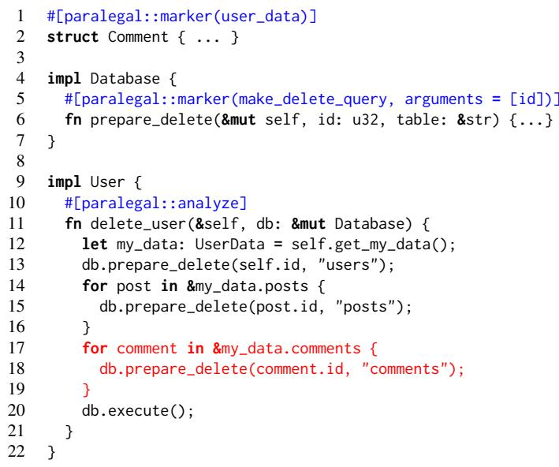
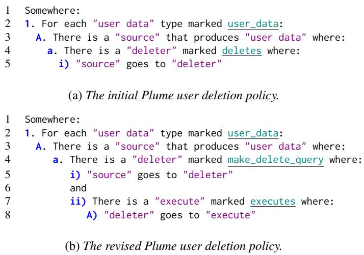
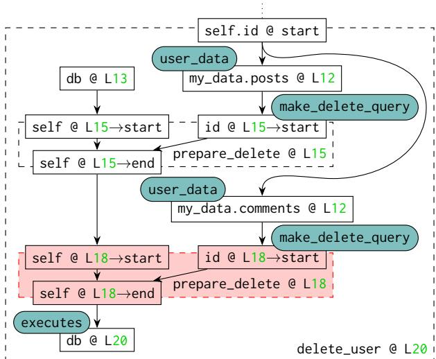
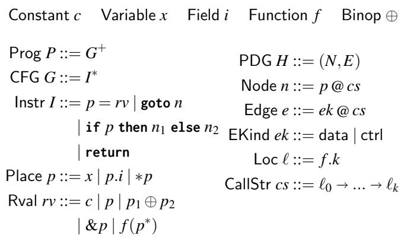
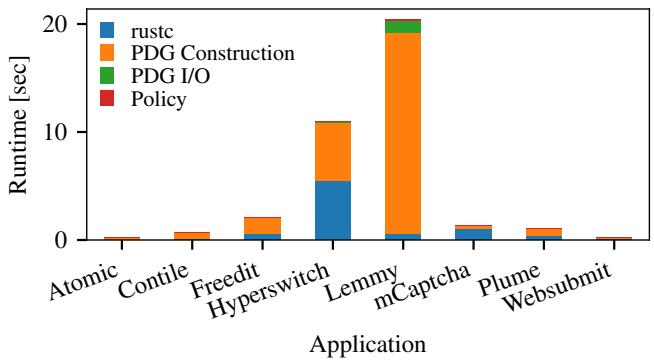
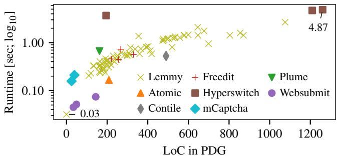
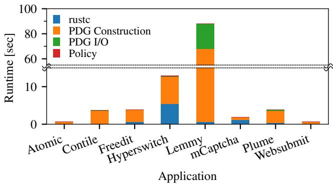
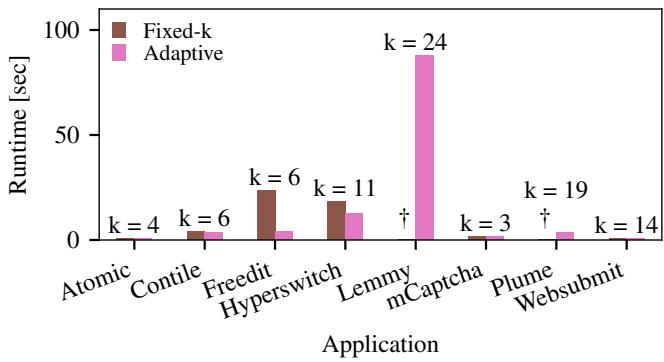

①

USENIX

THE ADVANCED COMPUTING SYSTEMS ASSOCIATION

## Paralegal: Practical Static Analysis for Privacy Bugs

Justus Adam, Carolyn Zech, Livia Zhu, Sreshtaa Rajesh, Nathan Harbison, Mithi Jethwa, Will Crichton, Shriram Krishnamurthi, and Malte Schwarzkopf, Brown University

https://www.usenix.org/conference/osdi25/presentation/adam

# This paper is included in the Proceedings of the 19th USENIX Symposium on Operating Systems Design and Implementation.

July 7–9, 2025 • Boston, MA, USA

ISBN 978-1-939133-47-2

Open access to the Proceedings of the 19th USENIX Symposium on Operating Systems Design and Implementation is sponsored by

# Paralegal: Practical Static Analysis for Privacy Bugs

Justus Adam Mithi Jethwa

Carolyn Zech Will Crichton

Livia Zhu Sreshtaa Rajesh Nathan Harbison Shriram Krishnamurthi Malte Schwarzkopf Brown University

## Abstract

Finding privacy bugs in software today usually requires onerous manual audits. Code analysis tools could help, but existing tools aren’t sufficiently practical and ergonomic to be used.

Paralegal is a static analysis tool to find privacy bugs in Rust programs. Key to Paralegal’s practicality is its distribution of work between the program analyzer, privacy engineers, and application developers. Privacy engineers express a high-level privacy policy over markers, which application developers then apply to source code entities. Paralegal extracts a Program Dependence Graph (PDG) from the program, leveraging Rust’s ownership type system to model the behavior of library code. Paralegal augments the PDG with the developers’ markers and checks privacy policies against the marked PDG.

In an evaluation on eight real-world applications, Paralegal found real privacy bugs, including two previously unknown ones. Paralegal supports a broader range of policies than information flow control (IFC) and CodeQL, a widely-used code analysis engine. Paralegal is fast enough to deploy interactively, and its markers are easy to maintain as code evolves.

## 1 Introduction

Applications that handle sensitive user data must comply with privacy policies and legal frameworks like the GDPR [35], access control, and data retention limitations. Even within a single organization, the number of developers modifying a shared codebase on a daily basis makes it difficult to correctly implement and adhere to these requirements [36, 84]. Today, organizations rely on manual audits by privacy experts or external consultants to check if their code respects privacy properties. Such manual audits are laborious, error-prone, and unlikely to happen frequently [69, 72].

Paralegal is a program analysis tool that helps developers find possible privacy problems in their code before deployment. For example, an organization might want to check that all data associated with a user is deleted when they remove their account. With Paralegal, application developers provide meaning to abstractions like “user data” by annotating concrete code elements with markers. Privacy engineers meanwhile articulate a high-level policy saying that deletion functions must exist for all types that represent user data, and that the program must call those functions (e.g., “all types marked as user data must flow into deletion functions”). Paralegal models the application by generating its marked Program Dependence Graph (PDG), i.e., a PDG with markers propagated to the appropriate nodes. It then evaluates the policy against the PDG and reports violations to developers.

Paralegal aims to be a practical system for daily use by developers in an integrated development environment (IDE) or a continuous integration (CI) toolchain. While Paralegal is based on a rich literature on bug finding and policy enforcement tools, it contributes two key ideas that improve the practical applicability of such tools on real-world software.

First, Paralegal introduces markers as a layer of separation between policy and code that distributes the specification effort between respective experts. Privacy engineers author policies over markers as a vocabulary of semantically meaningful terms, but developers maintain the association of code elements to markers as the code base evolves. This results in policies that are easier to read and robust to code changes. It also allows Paralegal to precisely identify the code relevant to the policy, which it uses to optimize the analysis.

Second, Paralegal leverages the Rust programming language for scalability, precision, and reduced specification effort. Rust’s ownership type system controls aliasing and mutation and allows Paralegal to approximate a function’s effects by its type. Paralegal leverages such approximations to deal with third party library code when source code is unavailable or when the code is complex and hard to analyze, e.g., as is the case in standard library code. Both these cases traditionally require non-trivial, manual modeling effort. Paralegal further relies on these approximations for scalability. Since markers identify the policy-relevant parts of the codebase, Paralegal cheaply approximates a function’s effects via its type signature if no marker is reachable in the function’s body or its callees. Rust also encourages static dispatch via its trait system, and aliasing-restricted references via its ownership model. Both make data and control flow analysis, as employed

by Paralegal, more precise.

We have four success criteria for Paralegal: (i) Paralegal should find real privacy bugs, (ii) policies should be expressive, maintainable, and independent from the application code minutiae, (iii) policies should be auditable by non-developers, and (iv) Paralegal should scale to real-world applications.

We evaluate our prototype on eight real-world Rust web applications. Paralegal finds both known and unknown privacy issues in them: Paralegal would have caught five known bugs and found two previously unknown bugs. We compare Paralegal’s approach with IFC and CodeQL, a practical code analysis tool supported by GitHub [15]. We find that Paralegal can express a broader range of policies than IFC, that Paralegal finds bugs more reliably than CodeQL, and that Paralegal’s markers reduce the complexity of policies compared to CodeQL. We also investigate Paralegal’s maintenance effort in evolving applications by applying it to 1,000+ commits spanning 2.5 years of development of Atomic [5], and find that marker changes are rare and no modifications to the policy were needed to keep enforcing it. Finally, we find that Paralegal’s optimizations to reduce PDG size allow it to run in seconds, making it suitable for frequent and interactive use.

Paralegal is open-source [33] and our prototype is currently being evaluated for use at a large internet company. This company already has extensive static analysis tooling, but sees value in Paralegal as a complement to it. Specifically, teams at the company are exploring applications of Paralegal to ensure secrecy of cryptographic keys, to enforce encryptionat-rest, and to check that mitigations for speculative execution attacks are executed in hypervisor code.

In summary, this paper makes four key contributions:

1. The Paralegal static analyzer, which checks high-level properties against low-level, evolving code bases.

2. The marker abstraction to decouple policies and code; and techniques to efficiently generate precise marked PDGs from Rust code and model the behavior of library code.

3. A flexible policy framework that compiles policies in a high-level language into queries on marked PDGs.

4. Case studies reporting on our experience of applying Paralegal to eight real-world Rust web applications.

Paralegal has some limitations. As a static analyzer, it can only reason about information known at compile time and must abstract over all possible executions. Paralegal’s policy flexibility also means that there is no universally sound approximation during PDG construction. As such, Paralegal’s soundness and completeness are policy-dependent (see §4.1.3).

## 2 Motivation and Background

A practical privacy bug finder must be ergonomic for developers and deal with the realities of real-world codebases, including widespread use of libraries and frequent code change.

Specialized tools achieve practicality by targeting a single domain or type of policy. These systems operate on widelyused programming languages (e.g., Java, Python, Javascript, or SQL) and bake an understanding of the domain into the system—e.g., Android apps in DroidSafe [42], tabular data analytics in PrivGuard [77], or ORM-based MERN (MongoDB, Express.js, React.js, NodeJS) apps in RuleKeeper [38]. Importantly, this domain modeling helps these systems understand the semantics of API functions, libraries, and frameworks without having to analyze their code. However, these tools are limited to checking domain-specific properties and cannot support libraries outside their domain model.

At the other extreme are general security-typed programming languages. This category includes languages designed for information flow control [47, 63, 67] and security-typed ORMs [49], as well as proof assistants that encode security policies into dependent types [11]. These languages generally require a purely-functional programming style or extensive annotations on application and libraries, may require manuallyauthored proofs, and are not widely used in practice.

Prior code analyzers let users encode policies as queries over an Abstract Syntax Tree (AST) or a flow-based model of a codebase. Systems that target common programming languages (e.g., C [79], Java [46], PHP [10], Node.js [57], and Ethereum contracts [73]), exist, but all suffer from practicality limitations around library code and policy ergonomics. All of these systems either ignore library code or require developers to provide and maintain manually-written models to convey its behavior. For example, consider CodeQL [9], a “semantic code analysis engine” maintained by GitHub that has backends for languages including C++, Java, and Python. CodeQL’s developers maintain extensive, manuallywritten models of C++ libraries such as std and boost [16, 17], and users must equally model other libraries they use. Code analyzers also rarely integrate with the codebase being analyzed, but instead encourage policy writers to query syntactic code constructs. For example, CodeQL policies often use regular expressions over identifiers to select source code elements. While helpful for use cases where the goal is to identify syntactic patterns (e.g., retry loops [71]), this design makes CodeQL brittle for enforcing custom semantic properties over changing code.

Paralegal targets Rust, a mainstream programming language whose ownership type system provides Paralegal with the ability to usefully approximate the effects of external library code. Paralegal thus avoids domain-specificity or a need for pervasive flow models to enforce policies over data flowing in and out of library code. Paralegal decouples policies and source code using lightweight markers that developers attach to program elements and maintain with their code.

## 3 Paralegal Overview

Paralegal catches privacy bugs in Rust programs by extracting a model of the dependency relationships between values at compile time and checking whether this model satisfies a policy written by a privacy engineer. We illustrate Paralegal’s workflow using an example based on a real-life bug in Plume, a federated blogging application [66].

  
Figure 1: Paralegal alerts developers to missing code (red) to delete a user’s comments when deleting their account in Plume [66]. (Code simplified and error handling omitted.)

Plume lets users create posts and comments. If a user deletes their account, the application must delete their posts, comments, and the user metadata. Figure 1 shows the user deletion code. delete\_user on User takes a database handle as an argument. It constructs deletion queries for the user themselves and each of their posts and comments, then executes those queries. This function contained a privacy bug: the code in red was missing, so user comments were not deleted [64]. Given a suitable privacy policy, Paralegal catches this bug.

First, a privacy engineer formalizes a policy in Paralegal’s policy language (Figure 2a). They express the policy in terms of markers. Here, the marker user\_data describes the concept of personal data, and deletes describes the concept of deleting data. Markers allow privacy engineers to formulate the policy at the level of the design of a program, rather than its concrete implementation. The privacy engineer produces the policy in Figure 2a and sends it to a developer.

The developer leverages her application knowledge to apply the policy’s markers to relevant program entities. She applies the user\_data marker to the types Post, Comment, and User. When she tries to apply the deletes marker, however, she discovers that there is no correct place to put it. If she applies it to the prepare\_delete function, the policy would pass if a deletion query is simply constructed; nothing ensures that the application actually executes the query. She cannot put it on execute either: execute is a generic function that handles all types of queries, so applying the deletes marker here would allow any executed query to satisfy the policy.

Since the privacy engineer is unfamiliar with implementation details, they wrote a policy that does not quite fit with the application logic. The developer is faced with a choice: she can either refactor the application to work with the policy as written, or she can work with the privacy engineer to revise the policy. She goes back to the privacy engineer, explains the problem, and both together revise the markers and write a new policy—for all types of user data, there must exist a query to delete them, and that query must be executed (Figure 2b). The developer applies the new markers to the application. This give-and-take between privacy engineers and developers is a common Paralegal workflow.

  
Figure 2: Example specification for user data deletion written in Paralegal’s policy language (§4.3). Policy clauses,"variables", and markers are highlighted.

The developer then regularly runs Paralegal to check the policy as she works on the application (e.g., in CI or as an IDE plugin). When faced with the erroneous delete\_user function, Paralegal reports the error shown in Figure 4. Internally, Paralegal produced the marked PDG shown in Figure 3 and detected that there is no path from a node marked Comment to a node marked make\_delete\_query (and from make\_delete\_query to executes). The developer fixes the bug by adding the red code in Figure 1, and Paralegal’s check passes again.

## 4 Design

Paralegal is comprised of three components: PDG construction (§4.1) as an abstraction of the program, markers (§4.2) as a semantic vocabulary, and policies (§4.3) that constrain how marked entities in the program can interact.

## 4.1 Program Dependence Graph

The PDG [37] is a generic representation of a program that can be reliably extracted for applications in any domain. For example, Figure 3 shows a simplified PDG for the Plume application in Figure 1. Paralegal constructs this PDG from Rust’s MIR, a control-flow graph (CFG) intermediate representation in the Rust compiler.

  
Figure 3: Partial and simplified PDG for the Figure 1 example. Solid rectangles are PDG nodes, dashed rectangles are function scopes, and teal bubbles are markers. The red subgraph represents the missing comment-deletion code. “Lk” = line k in Figure 1. “start” and “end” refer to the function entry and exit locations, respectively.

To check policies on realistic codebases with reasonable accuracy, the PDG must be sensitive to dependencies at a fine granularity. Specifically, the PDG needs three properties:

Flow-sensitivity allows the PDG to distinguish between the values of data at different program locations. For instance, the value of db at Line 13 is not the same as the value of db on Line 20, so the PDG has separate nodes for each. By contrast, a flow-insensitive PDG would represent db with a single node, only reflecting the value of db at the end of the program, once all of the queries have been prepared and executed. This single-node representation would allow a program that calls execute before preparing the queries to pass the policy, even though such a program would not actually delete any data.

Context-sensitivity allows the PDG to distinguish between different calling contexts to the same function. Without context sensitivity, the PDG would represent the body of the prepare\_delete function only once. This would mean that, for instance, its self argument is only one PDG node. Each call to prepare\_delete (Lines 13, 15 and 18) then connects its inputs to that one self node in the PDG. It would therefore appear as though self.id, post.id, and comment.id are all arguments to the first prepare\_delete call (Line 13), even though only self.id is. As a consequence, the policy could not detect a bug where a developer moves the execute call to Line 14.

Field-sensitivity allows the PDG to distinguish between different fields of a structure. For example, a field-sensitive PDG distinguishes posts and comments, even though they belong to a single variable, my\_data. A field-insensitive PDG would not be able to detect the original bug (shown in red), because my\_data (and therefore comments) does flow to delete.

```python
1 'Deletion Policy' not satisfied.
2 No entrypoints satisfied rule 1.A.a.i
3 Entrypoint `delete_user'
4 Did not satisfy (Rule 1.A.a.i)
5 "source" goes to "deleter"
6 for this "source": (Rule 1.A)
7 12 | let my_data = self.get_my_data();
8 | ^^^^^^^
9 for the "user data" type: "Comments" (Rule 1)
10 Help: There is a "deleter" here:
11 13 | db.prepare_delete(self.id, "users");
12 | AAAAAAA
```  
Figure 4: Paralegal’s error for the Plume deletion bug.

Each kind of sensitivity increases the cost of PDG generation for both runtime and memory consumption. Paralegal mitigates these costs with the optimizations discussed in §4.1.2.

## 4.1.1 Definitions

Formally, the Rust CFG follows a superset of the grammar in Figure 5 (left). In this simplified model, instructions are either assignments, unconditional jumps, conditional jumps, or returns. The left-hand side of an assignment is a place, or an expression that refers to a specific region of memory (a variable, a field of a place, or a dereference of a place). The right-hand side can be constants, places, operations on places (including address-of), or function calls. The actual Rust CFG contains more details such as array indexing, but this subset is sufficient to illustrate Paralegal’s behavior.

The Paralegal PDG follows the exact grammar in Figure 5 (right). A node in the PDG is a place p at a call string $^ { c s , }$ and an edge is an operation of kind ek at a call string. A call string represents the sequence of locations $\ell _ { 0 } \ldots \ell _ { k }$ that uniquely identify a given instruction in a call tree.

The fundamental goal of the Paralegal PDG is to encode dependence within a Rust program. Dependence is a hyperproperty [14] of a program: informally, a variable y depends on a variable x if there exists two executions of a program such that changing x as input changes y as output, with all else held equal. There are two kinds of dependencies: datadependencies, where the value of x directly affects y (such as y = x + 1), and control-dependencies, where the value of x indirectly affects y (such as if x then y = 0 else y = 1).

A PDG represents dependencies as paths between nodes. Say a PDG contains the edge:

$$
p _ { \mathsf { s r c } } \ @ c s _ { \mathsf { s r c } } \xrightarrow [ ] { e k @ c s _ { \mathsf { e f f } } } p _ { \mathsf { d s t } } \ @ c s _ { \mathsf { d s t } }
$$

then it should be the case that $p _ { \mathtt { d s t } }$ at $c s _ { \mathsf { d s t } }$ directly depends on the value of $p _ { \mathsf { s r c } }$ at $c s _ { \mathsf { s r c } }$ due to the effect ek at $c s _ { \mathsf { e f f } }$ . For example, a PDG for the instruction $y = x + 1$ would contain the edge x $\xrightarrow { \mathsf { d a t a } } y$ (ignoring call strings). If there exists a path from $p _ { \mathsf { s r c } }$ to $p _ { \mathrm { d s t } }$ in the PDG, or more formally:

$$
p _ { \mathsf { s r c } } @ c s _ { \mathsf { s r c } } \stackrel { * } {  } p _ { \mathsf { d s t } } @ c s _ { \mathsf { d s t } }
$$

  
Figure 5: Grammar for a core subset of the Rust CFG (top and left) and for the Paralegal PDG (right).

then it should be the case that $p _ { \mathrm { d s t } }$ at $c s _ { \mathsf { d s t } }$ transitively depends on $p _ { \mathsf { s r c } }$ at $c s _ { \mathsf { s r c } } .$ . We use the phrase “it should be” to indicate that this is the ideal case where the PDG faithfully represents dependencies. Paralegal’s PDG contains all true dependencies for programs that use no unsafe features (e.g., FFI or pointer arithmetic). §4.1.3 discusses cases outside this guarantee.

## 4.1.2 Analysis

To construct a PDG, Paralegal statically analyzes each instruction that is reachable from the entrypoints of the analysis. Much of the PDG construction is standard practice—for details, see Ferrante et al. [37]. Our analysis benefits from the choice of Rust as a host language in three key ways.

Monomorphization. Given a function call $f ( p 1 , \ldots , p _ { n } )$ Paralegal must determine which function f refers to. For example, the expression x.to\_string() dispatches the trait method to\_string based on the type of x. Paralegal monomorphizes function calls using context-sensitive staticallyavailable type information. For example, if x has type i32, then Paralegal recursively analyzes the implementation of <i32 as ToString>::to\_string. Here, Paralegal leverages Rust as the target language for analysis. By design, Rust strongly encourages the use of static over dynamic dispatch—most popular Rust libraries do not use dynamic dispatch at all [74]. Therefore, Paralegal can frequently monormophize function calls, which increases precision around libraries.

Modular approximation. For third-party libraries without source code available, Paralegal cannot know the implementation of f . In these cases, prior systems have either asked users to manually model the behavior of f (e.g., CodeQL maintains a large model of the C++ standard library), or made unsound assumptions about the behavior of f (e.g., Pidgin [46] assumes such functions have no side effects).

Paralegal instead uses the Rust type system to approximate the behavior of f soundly and precisely. At its core , the approximation conservatively assumes that all arguments to a function will influence all outputs of the function. However, Paralegal builds on the technique used in the Flowistry information flow analyzer for Rust [28], which provides two key pieces of information that refine this approximation:

1. Mutability: In Rust, a program is not allowed to mutate data accessible from an immutable reference. Paralegal can therefore assume that function calls do not mutate values behind immutable references, which limits the set of plausible outputs and therefore the data flows introduced by the approximation. For example, Rust’s HashMap<K, V> has a method (slightly simplified) for removing a value:

Paralegal can assume that HashMap::remove only mutates self and not key.

2. Aliases: In most languages it must be assumed that, in addition to the described data flows, a function may introduce arbitrary aliasing relationships on pointers it has access to. In practice, such an assumption causes too many false positives to make for a useable analysis. In Rust however, all references (the most common pointer-like type) are annotated with a lifetime that indicates a precise, limited set of possibly aliased objects. For example, HashMap<K, V> has a method for getting a value by key:

fn get<'a, 'b>(&'a self, key: &'b K) -> Option<&'a V> This method returns a reference to a value of type &V. Because the reference has lifetime 'a and not 'b, Paralegal can assume that &V points to self and not key.

This modular approximation of a function’s behavior is highly accurate compared to precise analysis with access to the function’s source code [28]. Therefore, this technique helps Paralegal retain precision while reducing developer burden.

Similarly, resolving function calls with dynamic dispatch is challenging. Paralegal leverages the same modular approximation to approximate the effects of a function behind dynamic dispatch; with additional engineering, Paralegal could analyze all possible function bodies to improve soundness [4].

Function cloning. Paralegal achieves context-sensitivity via function cloning [78], where each call-site duplicates the sub-graph of the called function. This technique is maximally precise, but it risks exponential growth in the size of the call graph. We found in practice that PDGs for realistic Rust applications are nonetheless small enough such that Paralegal runs reasonably fast, even for codebases with 198k LOC (§7.4). Two key factors enable this scalability. First, Paralegal uses markers to reduce PDG size, which we will describe in §4.2. Second, Paralegal uses a context-insensitive alias analysis based on Rust’s lifetimes, which allow Paralegal to reuse the PDG for a function across all call sites to that function.

## 4.1.3 Limitations

Paralegal’s PDG construction is similar to most static analyses in that it may include false dependencies by abstracting away relevant details of the code. For example, Paralegal will assume a branch could always reach both targets. This causes a false dependency in cases like $z ~ = ~ \mathbf { i } \mathbf { f } \texttt { e } \{ \texttt { x } \}$ else { y } where e is an expression that always evaluates to false. The impact of such inaccuracies on soundness or completeness depends on the policy being checked. For example, including a false dependency can cause a false-positive for policies like “secure sources cannot flow to insecure sinks,” while it may cause a false-negative for policies like “user data must flow to a deletion function.”

Paralegal errs on the side of including false dependencies rather than omitting true dependencies. Specifically, Paralegal’s guarantee is that in Rust code without unsafe blocks, all true dependencies will be reflected in the PDG.

In general, developers should treat Paralegal output similar to that of a linter or bug finder. That is, a developer should not assume, “if Paralegal says my app is okay, then it is 100% secure or bug-free.” Rather, the developer should assume, “if Paralegal says my app contains a policy violation, then I should investigate it.” Some sources of inaccuracy are incidental and can be addressed with further engineering (see §5). Others are fundamental and discussed next.

Unsafe code. Rust uses unsafe blocks to permit operations that cannot be verified safe by the compiler, including FFI (e.g., calling C libraries) and use of raw pointers (as opposed to compiler-checked references). Paralegal may omit true dependencies induced by unsafe code, such as aliases induced by pointer arithmetic, because Paralegal reasons about aliasing via Rust’s lifetimes.

Paralegal mitigates this limitation by using its type-based approximation. A common pattern in Rust FFI is to carefully encapsulate unsafe code within an API presenting a safe interface. Paralegal can analyze such an API just at the interface level without observing the unsafe internals.

Interior mutability. Rust provides “interior mutability” primitives like RefCell<T> which permit mutating data behind an immutable reference—that is, one can turn an &RefCell<T> into an &mut T. This special case violates the assumption of the type-based approximation that a function cannot mutate immutable references. Therefore, Paralegal may omit true dependencies when approximating calls to functions using interior mutability. This limitation also extends to sharedmemory constructs, such as locks and mutexes.

This limitation is mitigated by two factors. First, interior mutability is rare in idiomatic Rust. For example, the largest application in our evaluation (HyperSwitch, about 198k LOC) contains no interior mutability in its application logic. Second, interior mutability impacts Paralegal’s typebased approximation, not the dependency analysis. For example, a directly observed mutation \*cell.borrow\_mut() = 1 is registered correctly as mutating cell, but if it takes place in fn foo(cell: &RefCell<T>) and foo get approximated, it is not.

External effects. Paralegal may omit true dependencies induced by effects on external systems like a file system, OS, or database. For example, if f is a File called foo.txt, then Paralegal understands that f.write(bytes) affects f because write requires a mutable reference to f. But Paralegal does not understand that f2 = File::open("foo.txt") is effectively an alias on f, and that f2.read() should depend on f.write(bytes).

## 4.2 Markers

To articulate privacy policies in terms of a PDG, privacy engineers need to refer to nodes of interest. Most prior systems keep policy-related information entirely outside the codebase, and consequently require policies to embed direct references to functions or types. Such direct references make policies more complex and brittle, as §7.2.2 will show.

Paralegal instead uses markers to abstract categories of related nodes in the PDG. A marker is an abstract label, such as “sensitive data” or “public sink.” Application developers attach markers to code elements, either via source-level annotations (e.g., #[marker(user\_data)]) or an external configuration file. Developers can mark functions, function arguments, return values, and type definitions. The basic concept of a marker is relatively straightforward, but the subtleties lie in two areas: how Paralegal propagates markers to the PDG, and how Paralegal uses markers to optimize PDG generation.

Marker propagation. After generating the PDG, Paralegal assigns markers to the concrete nodes in the PDG that represent the abstract marked code elements. A parameter p of $f ,$ marked with m is a straightforward case. Paralegal assigns m to all PDG nodes that represent the actual parameter p at call sites of f . Paralegal handles markers on return values of functions analogously.

The type case is more complex. The simplest situation is as follows: say a marker m is attached to a type τ, and say a node $n = p \mathcal {  }$ cs has $p : \tau .$ . Then Paralegal propagates m to n.

However, this algorithm may not always capture a privacy engineer’s intent. For example, say a Password type is marked sensitive, and a User struct contains a field of type Password. Then say the code has a variable u : User and calls f(&mut u) on some black-box function $f .$ The modular approximation will create one node for u at this call site, but not a node for every field in $u . ^ { 1 }$ The simple propagation strategy therefore neglects to attach m to $n _ { u } .$ . However, the privacy engineer likely expects that because Password could have been mutated by $f ,$ the node $n _ { u }$ should be treated as $i f$ it were of type Password. To capture this expectation, Paralegal’s actual algorithm propagates the marker. Say a node has p : τ′. If marked type τ appears anywhere within $\tau ^ { \prime }$ (e.g., the User struct, or $\tau ^ { \prime } = \mathsf { v e c } < \tau > )$ ), Paralegal propagates m to $p .$

Adaptive Approximation. In Paralegal, policies can only talk about application entities that are marked. Paralegal may therefore soundly assume that only code interacting with marked entities influences policy enforcement outcomes. Paralegal leverages this assumption when analyzing an instruction that calls a function f by checking if there are markers reachable from the body of f , and if not, approximates f ’s effects via type signature instead of generating its subgraph. Paralegal determines reachable markers by visiting all code reachable from f with a cheap call graph traversal. Paralegal fully monomorphizes f and all other functions during the traversal to prevent ambiguity as to what code is called for trait methods. Paralegal caches and reuses the results of markerreachability traversals for each function. This optimization substantially improves PDG generation speed (§7.5).

## 4.3 Policies

Paralegal policies are assertions about either necessary or impermissible paths in the marked PDG. For example, a highlevel privacy policy such as “a user must be able to delete all of their user data” can be encoded as the assertion “for all types marked userdata, there must exist a path from a node with that type to a node marked as a deletion function.”

To express such assertions, Paralegal provides a policy language with a controlled natural language syntax that mimics the structure of legal documents. Paralegal compiles policies into Rust programs that use a low-level API to query the marked PDG. The primitives of the DSL are markers, variables, and PDG relations. Primitive relations include:

• a "value" marked sensitive

binds PDG nodes marked sensitive to the name "value".

• "value" goes to "sink" Checks if a data flow path from "value" to "sink" exists in the PDG.

• "value" affects whether "operation" happens Checks if "operation" has a control flow dependency on "value".

• "value" goes to "sink" only via "disclosure" Holds if every data flow path from "value" to "sink" contains at least one node in the set "disclosure". This primitive allows policies to describe instances of declassification.

Privacy engineers than compose these primitives in first-order logical formulas. For example, a formula like this:

$$
\forall x \in X . \exists y \in Y . P ( y ) \implies ( P ( x ) \lor S ( x , y ) )
$$

is expressed in the policy language as the program on the left, which Paralegal compiles into the Rust code on the right:

```javascript
1. For each "x" in X: X.iter().all(|x|
A. There is a "y" in Y where: Y.iter().any(|y|
a. If P("y") then: !P(y) || P(x)
i. P("x") || S(x, y)))
or
ii. S("x", "y")
```

The policy language requires policy writers to delineate the scope of each line in their policy with clauses (e.g., 1, A.). This structure of nested clauses, inspired by legal writing, seeks to achieve readable and unambiguous properties. The policy language is decidable because all primitive relations are decidable (the PDG is finite, so reachability is decidable), all quantifiers are decidable (they range over finite subsets of nodes), and recursive policies are inexpressible. Appendix A.3 has the full grammar for the policy language.

Paralegal allows policy writers to author policies as graph queries using the low-level Rust API. This primarily helps policy writers customize error messages, for example by emitting traces and paths through the PDG.

## 4.4 Error Messages

Paralegal’s error reporting helps developers diagnose a failing policy. Error messages print the violated rules and the source code location that instantiated a given quantified variable (as in Figure 4). Paralegal reports them with a diagnostics framework inspired by the Rust compilers’s error messages, relating graph nodes to snippets of the source code. Policies written with the low-level API can use this diagnostics framework directly to create customized error messages.

## 5 Implementation

Our Paralegal prototype consists of 15.1k lines of Rust and is implemented as a Rust compiler plugin.

Multi-crate support. Paralegal extends analysis across multiple crates by persisting the Rust MIR, the “outlives” relationships of lifetimes, output of the Rust type checker, and any Paralegal marker annotations. In one of our largest case studies (the social media application Lemmy [55]) this metadata for all crates combined is 411MB. (For context: rustc produces 258MB of metadata for the same application.) During PDG construction, Paralegal lazily loads the MIR for reachable functions and generates their PDG if markers are reachable. Paralegal’s PDGs can span all crates for which cargo initiates compilation in the process of building the target application. Developers can limit this set for performance. This approach preserves source location information and error messages may reference locations in any loaded crate. A PDG cannot extend to external shared or precompiled libraries; in such cases, Paralegal uses the modular approximation.

Await. Paralegal deliberately discards all control flow introduced by the state machine created by await. This control flow is needed for Rust’s async runtime, but it causes confusing false positives because privacy engineers do not expect these dependencies due to their transparent nature. The consequence of removing them is more predictable policy behavior at the cost of being unable to check for certain malicious async patterns, such as futures that hang indefinitely.

Marker limitations. Paralegal’s marker annotations currently only support functions, function arguments, function return values, and type definitions. While these represent the common boundaries for semantic meaning of source code elements, policies would be more ergonomic if Paralegal allowed markers to be attached to fields of a type or global constants. Expanding the set of markable elements is feasible with additional engineering.

## 6 Case Studies

We now discuss our experience applying Paralegal to eight real-world Rust applications. We tried to pick popular, production-level Rust applications that cover a range of domains and coding styles (Figure 6). The source code for these applications exercises language features and data-structures typically found in realistic software, including loops, traits, type parameterization, closures, higher-order functions, error handling, vectors, hash maps, strings, and async. We marked between four and 145 program locations, roughly proportionally to the amount of application code covered by policies.

<table><tr><td>Application</td><td>Type</td><td>LoC</td><td>Policies</td><td>Unique Markers</td><td>Marked Locations</td><td>Entry pts.</td></tr><tr><td>Atomic [8] (v0.34.2)</td><td>Graph DB</td><td>9.6k</td><td>Access Control</td><td>4</td><td>4</td><td>1</td></tr><tr><td>Contile [27] (v1.11.0)</td><td>Advertising</td><td>4.9k</td><td>Purpose Limitation</td><td>3</td><td>5</td><td>1</td></tr><tr><td>Freedit [41] (v0.6.0-rc.3)</td><td>Social</td><td>6.6k</td><td>Data Retention/Expiration</td><td>5</td><td>5</td><td>4</td></tr><tr><td>Hyperswitch [44] (v0.2.0)</td><td>Payments</td><td>198.9k</td><td>Credential Security,Limited Collection</td><td>6</td><td>7</td><td>3</td></tr><tr><td>mCaptcha [59] (v0.1.0)</td><td>Authentication</td><td>10.6k</td><td>Data Deletion, Limited Collection</td><td>5</td><td>5</td><td>2</td></tr><tr><td>Lemmy [55] (v0.16.6)</td><td>Social</td><td>31.4k</td><td>Access Control</td><td>8</td><td>145</td><td>72</td></tr><tr><td>Plume [66] (v0.7.2)</td><td>Blogging</td><td>21.4k</td><td>Data Deletion</td><td>7</td><td>7</td><td>1</td></tr><tr><td>WebSubmit [68] (v1.0)</td><td>Homework</td><td>1.6k</td><td>Data Deletion,Access Control</td><td>11</td><td>18</td><td>3</td></tr></table>

Figure 6: Case study applications with code size, policies, and Paralegal marker statistics. “Marked Locations” indicates the number of source code entities (arguments, returns, etc.) we marked; “Entry pts.” is the number of analysis entry points.

Policies cover privacy properties from classic access control and security to data deletion and expiration, as well as purpose limitation (rules about what purposes data can be used for). We formalize 11 policies (1–2 per application), each with several clauses and nesting up to three quantifiers per clause (median: 3). The source code for all case studies, as analyzed in this paper, is available in our artifact [3].

## 6.1 Policies

We initially developed policies by examining source code, then directly writing policies about the expected flows in the PDG. But these policies used more markers and were more closely tied to source code than necessary. Hence, we switched to defining the policy first, using application functionality and documentation (as a privacy engineer would), then applying those policies to source code.

We found this approach made it easier to define policies, and that these new policies were clearer, more concise, and more portable to other applications. Privacy-related properties of applications are often obvious from the UI, functionality (e.g., account deletion), or documentation. By contrast, navigating a large, unfamiliar codebase to search for privacyrelevant sections is much harder. This experience inspired us to design the policy DSL. In two of eight cases we studied (see §6.3) our DSL policies, written without knowledge of source code, matched application semantics without revision.

We found that Paralegal is expressive enough to represent all the policies we wanted to check. Two applications (mCaptcha and Plume) use identical data deletion policies, except for their application-specific marker names. For policies that are fundamentally dynamic, we were able to define static approximations. For instance, Freedit, a social media platform, stores a user’s viewing history, but deletes the data after three days. Since the current time is only available at runtime, Paralegal cannot directly verify that Freedit obeys the three day expiration limit. However, it can approximate this policy by checking that viewing\_history flows to an expiration\_check and that expiration\_check has control flow influence on a deletes.

## 6.2 Markers

We found it easiest to apply markers to applications with modularized code that has clearly defined semantics. Applications with specialized delete or authorization check functions were simpler to apply markers to than applications that inline such logic inside large functions. We also found that many of our markers (e.g., user\_data) could be applied to types alone. Idiomatic Rust programs often define fine-grained, custom types that are clearly named for the type of data they represent.

We mainly made two types of source code change. The first is because our prototype cannot apply markers to constants or to fields of a type, so we defined no-op functions mark\_{marker\_name}(&data), whose sole purpose is to apply the appropriate marker to data. Second, if applications inlined privacy-critical functionality inside a larger function, there was no way of applying a marker to just the relevant lines. While this is not fundamental—a more complex policy could handle it—we extracted the logic into a helper function and marked that function. Via this process, Paralegal encouraged us to cleanly demarcate privacy-relevant code.

Appendix A.2 describes four other minor changes we made.

## 6.3 Selected Experiences

Two cases in our experience of developing policies stand out.

Atomic is a graph database that lets users create, edit, and share graph-structured data [5, 8]. Each time a user modifies a database resource, Atomic stores a signed commit record. Before creating a commit, the application must verify that the user has permission to modify that resource. Crucially, this authorization must happen before updating the database resource [7]. Our Paralegal policy asserts that a resource that will be modified first flows to an authorization check, which has control flow influence on the modification.

When we first ran this policy on the application, it failed, even after the developers fixed the bug. Upon investigation, we realized that we had missed an edge case: if a resource is new, the application first modifies the resource to set default permissions, then executes the permission check. We missed this logic initially because it was unclear in the application’s documentation. In this situation, we had two options: (i) change the policy to exempt modifications that don’t depend on user-provided data; or (ii) extract this benign modification into a helper function with an exception marker, and exempt this marker in the policy. The first choice burdens the policy with matching a specific code pattern; the second (which we chose) exempts only a specific code instance and clearly delineates the exception in the code itself.

<table><tr><td rowspan=1 colspan=1>Application</td><td rowspan=1 colspan=1>Bug Description</td><td rowspan=1 colspan=1>Reference</td><td rowspan=1 colspan=1>Paralegal Policy</td></tr><tr><td rowspan=1 colspan=1>Plume [66]</td><td rowspan=1 colspan=1>Comments and Media not deleted when a useris deleted.</td><td rowspan=1 colspan=1>commit 19f1842,issue 806</td><td rowspan=1 colspan=1>If a user flows into a delete function,all typesmarked as user data flow into a delete function.</td></tr><tr><td rowspan=1 colspan=1>Atomic [8]</td><td rowspan=1 colspan=1>Users can grant themselves write access to datawithout prior access.</td><td rowspan=1 colspan=1>commit 46a503a</td><td rowspan=1 colspan=1>Write permissions must be checked before a re-source is updated.</td></tr><tr><td rowspan=4 colspan=1>Lemmy [55]</td><td rowspan=1 colspan=1>Banned or deleted users can log into a server.</td><td rowspan=1 colspan=1>commit b78826c</td><td rowspan=4 colspan=1>(1)A user deletion check and a ban check mustinfluence every database access,except thosereading the active user.(2) Community deletion check and user ban checkmust influence every database write to acommunity.</td></tr><tr><td rowspan=1 colspan=1>Deleted users can perform actions in a server.</td><td rowspan=1 colspan=1>commit 2966203</td></tr><tr><td rowspan=1 colspan=1>Users can write to a deleted community.</td><td rowspan=1 colspan=1>commit 2402515,issue 2372</td></tr><tr><td rowspan=1 colspan=1>Banned users can act in communities.</td><td rowspan=1 colspan=1>issue 2372</td></tr></table>

Figure 7: Paralegal found seven bugs, including two previously unknown ones, in three applications: Plume [66], Atomic [8], and Lemmy [55]. The rightmost column summarizes, in prose, the Paralegal policy we used to find each bug.

mCaptcha is a proof-of-work (PoW) CAPTCHA service focused on privacy [59]. Website owners register sites with mCaptcha and embed mCaptcha API calls into their sites. mCaptcha’s PoW algorithm features a tunable “difficulty”, designed to balance security and latency.

In addition to adding a data deletion policy, which we reused from Plume (Figure 2a), we observed that mCaptcha collects optional consent to “gather performance statistics [...] and make them available to other mCaptcha installations” for difficulty tuning [45]. We wrote a policy to enforce that mCaptcha checks whether a user has opted in before storing their data, but the code failed this policy.

On discussing the issue with the mCaptcha developers, it turned out that we had misinterpreted their privacy goals— statistics are always collected, even if website owners don’t opt into sharing them. The developers, however, indicated that they would be open to reconsidering this choice [58]. In addition, the discussion helped the mCaptcha developers find a (related) data integrity bug: they deleted all statistics when a user revoked their opt-in consent, rather than just the consent. This illustrates how the discipline enforced by Paralegal helps developers reflect on their code and find issues.

## 7 Evaluation

Our evaluation of Paralegal seeks to answer five questions: 1. Does Paralegal find bugs that result in privacy violations

in real applications? (§7.1)

2. How does Paralegal compare to IFC and CodeQL in terms of expressiveness, practicality, and ergonomics? (§7.2)

3. Does Paralegal’s decoupling of code and policies improve ergonomics for evolving applications? (§7.3)

4. Is Paralegal fast enough for interactive use, and how does its runtime scale with the amount of code analyzed? (§7.4)

5. How does Paralegal’s adaptive approximation optimization contribute to its effectiveness and speed? (§7.5)

Setup. All experiments run on a server with an Intel Xeon E3-1230v5 CPU (3.4 GHz) and 64 GiB RAM, on Ubuntu 20.04 using Rust nightly-2023-08-25.

## 7.1 Finding Privacy Bugs with Paralegal

We applied Paralegal to eight applications (Figure 6) to investigate its ability to discover bugs. A good result for Paralegal would show that it finds previously reported bugs as well as new bugs, without generating many false positives.

Figure 7 summarizes the bugs Paralegal found: Paralegal found two previously unknown privacy bugs that were confirmed by the developers, as well as five previously known privacy bugs that the developers had already fixed.

Atomic and Plume. Paralegal found three known bugs in Plume and Atomic [6, 64, 65]. In Atomic, the policy passes Paralegal after the fix [6]. In Plume, however, the policy still fails after the developers’ fix [64], since even though the application now deletes comments correctly, it still fails to delete users’ uploaded media (a separate, known bug [65]).

Lemmy. We ran Paralegal on 72 HTTP endpoints in Lemmy. Paralegal found two bugs previously fixed by the Lemmy developers and two new additional bugs.

Known Bugs. A user may not access a Lemmy instance if their account has been banned or deleted. However, Lemmy’s helper for authorizing already logged-in users omitted a check for whether their account is deleted [50]. Consequently, Paralegal flagged the instance authorization policy in all endpoints. After the fix [30], 71 endpoints passed the policy, but Paralegal still reported a failure in the login endpoint. Since the the login endpoint doesn’t use the authorization helper for loggedin users, it still did not check for account deletion [53]. The login endpoint was also missing a check if the user had been banned. After a second fix by the Lemmy developers [31], all 72 endpoints passed the policy.

<table><tr><td>Application</td><td>Policy</td><td>IFC</td><td>CodeQL</td><td>Paral.</td></tr><tr><td>Atomic Plume Hyperswitch Hyperswitch Websubmit Websubmit mCaptcha mCaptcha Freedit Lemmy Contile</td><td>Authorization Data Deletion Credential Security Limited Collection Data Deletion Access Control Data Deletion Limited Collection Data Retention Access Control Purpose Limitation</td><td> $\overline { { \downarrow \mathcal { S } ^ { \varepsilon } } }$  ×  $\checkmark ^ { \pmb { \mathscr { s } } }$  X  $\checkmark ^ { \pmb { \mathscr { s } } }$  X  $\checkmark ^ { \pmb { \mathscr { s } } }$ </td><td> $\overline { { \phantom { 1 } \dagger *  { \mathrm { T } } \ P } }$   $\pmb { x } ^ { \sharp \mathrm { A } }$   $*$   $\checkmark \mathrm { T \mathbb { I } }$   $\checkmark \mathrm { T \mathbb { I } }$   $\ddag$   $( \checkmark ) ^ { \dag \mathparagraph }$ </td><td> $\checkmark ^ { \pmb { \mathscr { s } } }$ </td></tr></table>

Figure 8: Paralegal expresses and enforces properties that baseline approaches (classic IFC and CodeQL) struggle with. √ indicates success, (✓) success on some versions, ✗ failure; rdenotes required code changes beyond annotations, and we indicate CodeQL results affected by †control flow analysis, ‡hidden source code, ∗taint propagation to/from structures, Aalias analysis, Tunconstrained templates, and ¶async code. “—” means the application was too large to translate to C++.

New Bugs. Lemmy prohibits users to write in deleted communities: if a community was removed for problematic content, for example, users must not be able to make new posts. The Lemmy developers already found missing community deletion checks in five endpoints [32, 51], but Paralegal found 16 further endpoints lacking these checks.

In addition, a banned user should not be able to write to a community. Paralegal reported that some Lemmy controllers are missing these community ban checks. This allows bypassing access control: for example, a banned community moderator can immediately unban themselves. The Lemmy developers confirmed both bugs [52, 54].

## 7.2 Comparison with Related Work

Next, we evaluate how Paralegal’s expressiveness and ergonomics compare to prior approaches, using the eleven policies from our case studies. We consider two baselines: (i) classic IFC based on a lattice of security labels; and (ii) CodeQL, a recent code analysis engine deployed at GitHub [15]. We tried to express the policies of our case study applications for both baselines. In IFC, this boils down to imposing a label hierarchy and determining declassification points. For CodeQL, we implemented appropriate queries.

## 7.2.1 Comparison with IFC

In classic IFC, labels applied to data form a lattice, and the system ensures that data with low-security labels is free of influence from values with high-security labels (the “noninterference” property). Some security and privacy concerns fit into this model, but its expressivity is limited compared to generic tools (CodeQL and Paralegal). As such, we expect IFC to be able to express some, but not all policies.

Figure 8 shows that IFC can enforce six of the eleven policies. Two properties, in Contile and Hyperswitch, directly fit IFC’s notion of restricting flows of high-security values into low-security sinks. Policies in Lemmy, Atomic, Hyperswitch and mCaptcha require access control or consent checks prior to operations on data, which IFC can approximate via selective declassification. However, this strategy requires code changes beyond the usual addition of annotations $( ^ { \bullet } ) !$ ; in this case, turning the check into a data flow operation, as IFC cannot declassify (i.e., remove a label) via control flow. Web-Submit’s Access Control policy is a complex, data-dependent property that requires a list to contain only “blessed” receiver email addresses. Since IFC never prohibits upgrading a security label (e.g., from the low security “external” to high security “blessed”), IFC alone is insufficient to enforce this policy. Disciplined use of data types, combined with IFC, can enforce this property, but would require a substantial code rewrite. (Freedit’s Data Retention policy contains a similar pattern.) Finally, Data Deletion and Retention policies rely on a “must reach” pattern that requires a value to reach a sink (i.e., deletion). IFC can enforce safety but not liveness properties, i.e., it can only check the absence of prohibited flows, but not mandate the existence of data flows. Thus, IFC fails to express and enforce these policies.

## 7.2.2 Comparison with CodeQL

CodeQL extracts a program’s AST and derived information into a database, and developers write queries against it in a Datalog-like language. Since CodeQL lacks support for Rust, we translated the relevant parts of each application into C++, the most similar language to Rust with CodeQL support. Two applications (Hyperswitch and Contile) have policies that touch large amounts of code (1.3–1.5k LoC, plus library functions), so we omit them. For Lemmy, we translate one representative endpoint, but omit 71 structurally similar ones. Our ports seek to faithfully reproduce the control and data flow of the Rust code, but replace Rust’s Result with C++ exceptions. We implement the queries using CodeQL’s libraries for data flow [18] and control flow analysis [19].

CodeQL’s query language can express all eight relevant policies, but its analysis engine fails to enforce some of them; when this happened, we debugged the issue sufficiently to pin it down to one or more limitations in CodeQL or its libraries, and stopped investigating further (i.e., our analysis may have missed further problems masked by the initial failure).

Policy Effectiveness. Figure 8 shows the outcome of each CodeQL policy. Plume’s Data Deletion policy works; as do mCaptcha’s policies (with caveats, see below) and Lemmy’s Access Control policy in some versions of the code. Other properties fail due to combinations of limitations in CodeQL,

identified by symbols:

(†) Control flow analysis in CodeQL is not inter-procedural. This causes a false positive with Lemmy’s access control policy, which uses a helper function for access control checks. CodeQL’s control flow analysis also (intentionally [21]) ignores certain complex control flow patterns [22], which causes a false positive in Atomic.

(‡) CodeQL assumes no data flows exist through library calls whose source code is unavailable. This affects Websubmit’s Data Deletion policy, which hinges on detecting data flow into a value-type constructor provided by a database library; similarly in Freedit’s Data Retention, CodeQL misses data flow through a database method. While CodeQL allows developers to write manual models for library functions, this is onerous and error-prone.

(∗) Taint propagation to fields within a structure and from fields to the structure itself requires manual modeling [20]. This complicates policies over markers on a structure that expect to detect flows of that structure’s fields into a sink; or policies over markers on elements of a container that expect to detect flows of the container itself. The CodeQL developers manually model taint propagation for collection elements for some standard library data structures but do not (yet) model std::unordered\_map, which Atomic and Websubmit’s Access Control use.

(A) CodeQL currently lacks an alias analysis for C++, due to performance issues [24]. As a workaround, the developers manually model methods, e.g., for std::vector::push\_back, but CodeQL lacks a default model for initializer lists, which show up in Websubmit’s code checked by the Data Deletion property, and require reasoning about aliasing.

(T) Our C++ ports replace trait-constrained Rust types with C++ templates. CodeQL cannot analyze code with uninstantiated template parameters [23], even when constrained by concepts. By contrast, Paralegal can analyze uninstantiated, parameterized code by exploiting trait constraints with the modular approximation.

(¶) C++ has no language-level async support, but provides an async library function. When we use it in place of Rust’s async, CodeQL misses data and control flow dependencies through this function [25], causing false positives and false negatives in Atomic, mCaptcha, and Lemmy. As a workaround, we use synchronous C++ code.

The last two limitations in part result from impedance mismatches between C++ and Rust, so we report them in Figure 8, but still consider the affected policies to succeed.

By contrast, Paralegal has an inter-procedural control flow analysis, models the effects of unknown library code via modular approximation, collapses taints in and out of structures without developer effort, and relies on Flowistry’s modular alias analysis for Rust. It also handles uninstantiated type variables constrained on traits by approximating the effect of trait methods, and handles async Rust. As a result, Paralegal successfully expresses and enforces all these policies.

Policy Structure. Paralegal is designed to distribute work between markers, program analysis, and policy. CodeQL does not have markers (or a marked PDG), and it provides only low-level program analysis primitives. Therefore, we investigated how much of a CodeQL query corresponds to work done by Paralegal outside of the policy. We answered this question by qualitatively labeling each chunk of a CodeQL query (precisely, a CodeQL predicate) as either “policy” or “not policy” code. For instance, this CodeQL predicate in the Plume policy to find deletion functions is labeled as “not policy” because it serves the same function as a Paralegal marker:

predicate is\_delete(DataFlow::Node n) {   
n.asParameter().getFunction().getName()   
.regexpMatch(".\*deleteAny.\*") and   
n.asParameter().getIndex() = 0   
}

To check the reliability of this qualitative judgment, two authors of this paper independently labeled 30 predicates and, after resolving one conflict, achieved 96% agreement.

Across all CodeQL policies, we labeled only 36% of predicates as policy code. From our observations, the remaining 64% of code fall roughly into three categories: (i) predicates identifying code elements (i.e., markers), (ii) predicates defining the semantics of external code (i.e., models), or (iii) predicates defining primitives for code analysis. This result shows that Paralegal’s design effectively separates concerns that are otherwise mixed together in existing systems.

## 7.3 Developer Ergonomics

We now evaluate the maintenance effort Paralegal imposes on developers as a codebase evolves. A developer may need to update her Paralegal configuration as follows:

1. she may need to move a marker, e.g., because argument order changes or a function is renamed;

2. she may need to add markers to new code elements;

3. she may need to adjust marker names because of changes to the semantic meaning of a code element; or

4. the privacy engineer may need to change the policy because it made assumptions about application semantics that no longer hold or because the policy goal changed.

Mechanical marker movement is easy, but changes to what markers mean impose higher cognitive developer burden, and policy changes require involving the privacy engineer.

To evaluate this, we run Paralegal on all commits of Atomic, starting with the introduction of the (buggy) permission model, using the same policy and markers as in §7.1. A good result for Paralegal would show that changes to markers are rare and the policy code is robust—i.e., that the policy is abstracted away from code details, and that the markers are at a granularity that avoids frequent changes.

The experiment covers 1,024 commits between June 9, 2021—when Atomic introduced the feature that our policy targets—and March 26, 2024. 87 commits failed to compile and we skip them. The code Paralegal analyzes for the policy is a subsection of the entire application, but changes over the course of the experiment. We confirmed with the developers that the intent of the policy remains the same throughout. Since all markers assignments are within Atomic’s workspace crates, only changes to code in the workspace can require adjustments to markers. On average, Paralegal’s analysis touches 907 lines of within-workspace code (min: 411, max: 1,196). Within the 936 functional commits, 66 commits modify one or more analyzed lines, with 60 lines changed on average. Over the entire codebase, Paralegal’s analysis touches 22k lines of code affected by 84 commits, with a mean of 1,165 lines changed per commit.

Paralegal detects the permission bug in each commit before the developers’ fix (46a503a, 186/936 commits in; June 27, 2021) and passes on every commit thereafter. We found two commits that impacted markers: (i) a renaming of the marked function (aba49fe); and (ii) replacing a previouslymarked function with one that takes additional configuration arguments (e0cf2d1). The former commit required no developer intervention2 and the second commit caused Paralegal’s policy checks to fail. Hence, Paralegal would have alerted the developer even if she neglected to move/adjust the markers previously. The policy itself required no modifications to accommodate code changes—unlike what might be expected if the policy targeted syntactic elements. This indicates that Paralegal’s policy/code decoupling is robust.

## 7.4 Performance and Scalability

We now investigate Paralegal’s performance and scalability on the eight case-study applications (Figure 6). We explore three setups that are representative of how we imagine Paralegal will be used in practice: (i) running locally on a project’s workspace (“Workspace Only”); (ii) running interactively on a specific subset of code (e.g., in an IDE plugin); and (iii) running across a project’s code and its entire dependency tree (“All Dependencies”, e.g., in CI). These setups represent different trade-offs in terms of performance and soundness: the first two prioritize low latency, while the third minimizes false negatives as it check properties over all reachable code.

Paralegal is a rustc compiler plugin that operators on Rust’s MIR. As a consequence, creating PDGs for a target crate requires first compiling all dependencies to make metadata and MIR for each function available. The applications with the largest dependency corpus (Lemmy and Hyperswitch) each take about two minutes to compile. This time is independent of Paralegal configuration and incurred only once, unless dependencies change. Most of this time is in rustc and applies to any compiler plugin: at most 4% of time is related to Paralegal-specific tasks, such as persisting the MIR to disk. In the following experiments, we omit this one-off cost and focus on the time Paralegal spends generating the PDGs and checking policies over them.

  
Figure 9: In the “Workspace Only” setup, which runs Paralegal’s analysis only over crates in the current workspace, Paralegal’s end-to-end runtime is under 2.2 seconds for most applications. The two exceptions are Lemmy, which has many analysis entrypoints (72) and Hyperswitch, which is a large crate (≈200k LoC). PDG construction dominates runtime.

We ran all performance experiments ten times. Variance is generally low, with maximum outliers deviating 0.1 seconds from the mean in the “Workspace Only” configuration and 1.2 seconds in the “All Dependencies” configuration.

End-to-End Runtime for “Workspace Only”. Most policy-relevant code is usually concentrated in a few crates, such as the workspace a developer is actively working on. In the “Workspace Only” configuration, we set Paralegal to only include code from the current workspace in the PDG and use the modular approximation for functions from other crates. Focusing the analysis on the workspace potentially sacrifices some precision, as it will miss markers assigned in crates outside the workspace, but reduces latency as PDGs are smaller and faster to construct in this setting than when considering all dependencies. Paralegal finds all bugs reported in §7.1, even in this less-precise setup. There are no false positives except in Contile, where adaptive approximation causes a loss of field sensitivity for a helper function, leading to overtaint. Paralegal offers a mitigation strategy for this case, where a developer can configure the analysis to include k+ more layers of the call tree than adaptive approximation would include in the PDG. In this and all further experiments, we run Contile with k+ = 1, which eliminates the false positive at the cost of 0.3 seconds (9%) additional end-to-end runtime.

We separately measure the time spent in various stages of the analysis: (i) rustc time outside of the compiler plugin, (ii) PDG construction time, (iii) time spent (de)serializing PDGs, (iv) time spent checking policies over the PDGs. A good result would have Paralegal run in seconds.

Figure 9 shows the results. Most applications finish in under 2.2 seconds, with the exception of Hyperswitch at 12 seconds and Lemmy at 22.5 seconds. This is likely sufficiently fast for interactive CLI or IDE use by a developer.

  
Figure 10: Paralegal takes a mean of 0.8 seconds per endpoint and around five seconds in the worst case (Hyperswitch), enabling interactive use. Note the log scale y-axis.

However, the restriction to workspace crates trades soundness for speed, as a missed marker in a dependency could result in properties spuriously passing (a false negative). While none of our case studies encounter this situation, even simple changes can introduce false-negatives when analyzing only workspace code. For example, Contile’s metric data sending logic uses a crate-local error handling function that we marked; if the Contile developers were to switch to an equivalent error handling function provided by a library, Paralegal would miss the marker. Hence, Paralegal deployments might choose to complement quick, local analysis in the “Workspace Only” setup with a CI job that runs the analysis over the full dependency set, as described below (“All Dependencies”).

Per-endpoint Runtime. In an interactive setting like an IDE plugin, Paralegal only needs to run on the code that changed at any given time (e.g., the endpoint the developer is editing). We therefore measure the per-endpoint runtime for the “Workspace Only” configuration, and report it as a function of the number of lines of code analyzed. The runtime for each endpoint excludes the overhead of running rustc on the target crate, as an IDE setting would use an incremental compiler such as rust-analyzer.

Figure 10 shows the results. Most endpoints take a few seconds (mean: 0.8 seconds), and runtime generally grows with the size of the analyzed code. Hyperswitch has the most expensive endpoints, caused by the policy requiring Paralegal to build a large, slow-to-construct PDG, but remains under five seconds. These results suggest that Paralegal, with incremental compilation, is fast enough for interactive use.

End-to-End Runtime for “All Dependencies”. We now consider Paralegal’s runtime when analyzing all reachable code, including all dependencies for which source code is available. In our example applications, this results in Paralegal analyzing between 88 and 878 crates (mean: 540). Paralegal still uses the modular approximation for the Rust standard library (std, alloc, etc.), because the cargo package manager uses a precompiled version by default. All runs use the adaptive approximation optimization (§4.2) to reduce the size of the PDG. A good result for Paralegal would show CI-appropriate runtimes of at most several minutes.

  
Figure 11: In the “All Dependencies” setup, which runs Paralegal’s analysis over the full codebase (including libraries), Paralegal’s end-to-end runtime remains under 20 seconds for all applications except Lemmy (94 seconds), where Paralegal must construct a large PDG for each of the 72 entrypoints.

Figure 11 shows the results. Most applications finish in less than five seconds and PDG construction dominates runtime in all applications except for mCaptcha. Hyperswitch and mCaptcha have the largest target crates, so rustc time is highest for them. Lemmy takes about 94 seconds, as its large number of endpoints (72) results in Paralegal constructing many PDGs (72 PDGs at ≈1.3 seconds each). Overall, the runtime of Paralegal’s “All Dependencies” configuration is acceptable for a CI setting.

## 7.5 Drilldown Experiment

Finally, we measure the impact of Paralegal’s adaptive approximation optimization (§4.2).

The optimization determines the smallest prefix of the call tree3 to be included in the PDG, such that all markers are reached. Paralegal approximates all function calls deeper in the call tree by their type signature. We compare this approach to a setup where the prefix is instead determined via a global depth limit, k. To achieve the same policy accuracy as with adaptive approximation, we assume an (unrealistic) oracle that, for each application, returns the minimal k such that Paralegal reaches all markers. In our setup, the oracle is the maximum depth observed in the adaptively-created PDG. This approach compares Paralegal’s adaptive approximation to the strongest possible baseline, since any larger k will result in strictly longer runtime and no improvement in precision. A good result for Paralegal would show that adaptive approximation substantially reduces end-to-end runtime.

In the “Workspace Only” configuration, the gains from adaptive approximation are small, with a 10% mean speedup.

  
Figure 12: The adaptive approximation optimization reduces end-to-end runtime by 35% on average and is necessary for Lemmy and Plume to terminate. The label on each bar indicates the oracle-provided minimum k call string length value to match the precision of adaptive approximation. † indicates that the fixed-k version times out after 15 minutes.

Adaptive approximation makes a much larger difference for the “All Dependencies” configuration. Figure 12 shows the results for this setting. We label each bar with the oracleprovided k value used in the baseline. Most importantly, the adaptive approximation is necessary for PDG construction to terminate in two cases: Lemmy and Plume time out after 15 minutes the fixed-k setting, indicated by a dagger (†) in the figure. For Plume, the buggy version of the application finishes PDG construction in tens of seconds, but the fixed version times out, as it contains more code. In the other applications, the adaptive approximation reduces runtime by 35% on average compared to the idealized fixed-k baseline, with greater gains for applications with larger PDGs.

These results show that adaptive approximation, while always beneficial, is particularly critical when running Paralegal over the full codebase of large applications and their dependencies (e.g., in CI).

## 8 Related Work

§2 covered closely-related prior work in static analysis tools;   
we now discuss other approaches that relate to Paralegal.

Information Flow Control (IFC) enforces security policies by attaching security labels to values and propagating them through the program. Static IFC [47, 63, 67] is most comparable to Paralegal, but on its own fails to express important privacy properties (§7.2) and is difficult for developers to adopt [34]. Dynamic IFC can increase precision [13], enforce policies that depend on runtime knowledge, and handle languages which are difficult to analyze statically [76, 80, 82]. However, the tracking incurs runtime overheads which increase with the level of precision used and requires a runtime buy-in. In addition, violation cases lead either to crashes or confusing application behavior in deployment. Paralegal uses static analysis avoid both of these problems.

Bug-finding tools intelligently explore the state space of a program or API to find bugs. Bug finders are easy to adopt and handle a variety of code styles but are usually specialized to a domain such as concurrency [70], distributed systems [75], or file systems [12, 48, 62], and while some offer customization, such as the file-system bug finder eXplode [81], their properties are ultimately hard-coded. Paralegal requires some annotation effort, but allows checking flexible policies while retaining the compatibility with arbitrary code styles.

Code linters identify issues by looking for syntactic patterns such as AST fragments [61] or function names [56]. This approach is simple and practical, but limited in expressiveness and precision. Paralegal uses a more semantic model of the code (a dependency graph) to permit more expressive policies and more robust enforcement.

Policy enforcement tools check policies over data, usually based on runtime mechanisms. The often target domainspecific problems, such as preventing buggy queries [60, 83] or serverless functions [43] from leaking data. Sesame [29] enforces more general policies by leveraging Rust’s types and limited static analysis, but requires runtime mechanisms. Paralegal is general and entirely based on static analysis.

## 9 Conclusion

Paralegal is a practical static analysis tool for checking highlevel privacy properties against Rust applications. Paralegal extracts a marked Program Dependence Graph (PDG) from Rust programs annotated with markers, and checks privacy properties written in a high-level DSL against it.

Our evaluation shows that Paralegal finds privacy bugs in real Rust programs, requires modest developer effort as code evolves, and runs in tens of seconds, making it suitable for interactive and CI use. Paralegal is open-source software and available at: https://github.com/brownsys/paralegal.

## Acknowledgements

We thank Kinan Dak Albab, Nicholas DeMarinis, Franco Solleza, and the members of the ETOS and Systems groups at Brown for their helpful feedback on drafts of this paper. David Fryd contributed several improvements to Paralegal and completed the mCaptcha case study; Tim Nelson helped with an initial version of Paralegal that was based on Forge [39]; and Tim Edgar provided input that inspired the original idea for Paralegal and its auditable, human-readable policy language. Feedback from the anonymous reviewers and Clément Pit-Claudel, our shepherd, greatly improved the paper.

This research was partially supported by NSF awards CNS-2045170, DGE-2208731, and DGE-2335625, by the DARPA under Agreement No. HR00112420354, by a Google Research Scholar Award, a Microsoft Grant for Customer Experience Innovation, an Amazon Research Award, and a gift from VMware. Any opinions, findings, and conclusions or recommendations expressed in this material are those of the authors and do not reflect the views of our funders.

## References

[1] Actix Web is a powerful, pragmatic, and extremely fast web framework for Rust. URL: https://actix.rs/ (visited on 04/19/2024).

[2] Justus Adam, Carolyn Zech, Livia Zhu, Sreshtaa Rajesh, Mithi Jethwa, Nathan Harbison, Will Crichton, Shriram Krishnamurthi, and Malte Schwarzkopf. Paralegal OSDI 2025 Artifact (GitHub). May 2025. URL: https : / / github . com / brownsys / paralegal - osdi-2025-artifact/tree/final.

[3] Justus Adam, Carolyn Zech, Livia Zhu, Sreshtaa Rajesh, Mithi Jethwa, Nathan Harbison, Will Crichton, Shriram Krishnamurthi, and Malte Schwarzkopf. Paralegal OSDI 2025 Artifact (Zenodo). May 2025. URL: https://doi.org/10.5281/zenodo.15374862.

[4] Artem Agvanian. “PEAR: Practical Interprocedural Analyses in Rust”. Honors Thesis. Brown University, May 2025.

[5] Atomic Data is a modular specification for sharing, modifying and modeling graph data. URL: https : / / github . com / atomicdata - dev (visited on 04/19/2024).

[6] AtomicServer (Initial Bug Fix): Prevent Unauthorized Commits. URL: https://github.com/atomicdatadev/atomic- server/commit/46a503a (visited on 04/19/2024).

[7] AtomicServer Privacy Policy. URL: https://github. com / atomicdata - dev / atomic - server / blob / 46a503a / lib / src / commit . rs # L109 (visited on 04/19/2024).

[8] AtomicServer: a lightweight, yet powerful CMS / Graph Database. URL: https : / / github . com / atomicdata - dev / atomic - server (visited on 04/19/2024).

[9] Pavel Avgustinov, Oege de Moor, Michael Peyton Jones, and Max Schäfer. “QL: Object-oriented Queries on Relational Data”. In: Proceedings of the 30th European Conference on Object-Oriented Programming (ECOOP). Edited by Shriram Krishnamurthi and Benjamin S. Lerner. Volume 56. Dagstuhl, Germany: Schloss Dagstuhl – Leibniz-Zentrum für Informatik, 2016, 2:1–2:25. URL: https : / / drops . dagstuhl . de/entities/document/10.4230/LIPIcs.ECOOP. 2016.2.

[10] Michael Backes, Konrad Rieck, Malte Skoruppa, Ben Stock, and Fabian Yamaguchi. “Efficient and Flexible Discovery of PHP Application Vulnerabilities”. In: Proceedings of the 2017 IEEE European Symposium on Security and Privacy (EuroS&P). Paris, France, Apr. 2017, pages 334–349.

[11] Karthikeyan Bhargavan, Barry Bond, Antoine Delignat-Lavaud, Cédric Fournet, Chris Hawblitzel, Catalin Hritcu, Samin Ishtiaq, Markulf Kohlweiss, K. Rustan M. Leino, Jay R. Lorch, Kenji Maillard, Jianyang Pan, Bryan Parno, Jonathan Protzenko, Tahina Ramananandro, Ashay Rane, Aseem Rastogi, Nikhil Swamy, Laure Thompson, Peng Wang, Santiago Zanella Béguelin, and Jean Karim Zinzindohoue. “Everest: Towards a Verified, Drop-in Replacement of HTTPS”. In: Proceedings of the 2nd Summit on Advances in Programming Languages (SNAPL). Edited by Benjamin S. Lerner, Rastislav Bodík, and Shriram Krishnamurthi. Volume 71. Asilomar, California, USA: Schloss Dagstuhl - Leibniz-Zentrum für Informatik, May 2017, 1:1–1:12. URL: https://doi.org/10. 4230/LIPIcs.SNAPL.2017.1.

[12] James Bornholt, Antoine Kaufmann, Jialin Li, Arvind Krishnamurthy, Emina Torlak, and Xi Wang. “Specifying and Checking File System Crash-Consistency Models”. In: Proceedings of the 21st International Conference on Architectural Support for Programming Languages and Operating Systems (ASPLOS). Atlanta, Georgia, USA, Apr. 2016, pages 83–98. URL: https: //doi.org/10.1145/2872362.2872406.

[13] Pablo Buiras, Dimitrios Vytiniotis, and Alejandro Russo. “HLIO: Mixing Static and Dynamic Typing for Information-Flow Control in Haskell”. In: Proceedings of the 20th ACM SIGPLAN International Conference on Functional Programming (ICFP). Vancouver, British Columbia, Canada, Aug. 2015, pages 289– 301. URL: https://doi.org/10.1145/2784731. 2784758 (visited on 01/02/2023).

[14] Michael R. Clarkson and Fred B. Schneider. “Hyperproperties”. In: Journal of Computer Security 18.6 (Sept. 2010). Edited by Andrei Sabelfeld, pages 1157– 1210. URL: http : / / dx . doi . org / 10 . 3233 / JCS - 2009-0393.

[15] CodeQL. URL: https://codeql.github.com/ (visited on 12/03/2024).

[16] CodeQL Developers. CodeQL C++ library models. URL: https://github.com/github/codeql/tree/ 39a67b6e2e6490a9bd010db50e148f647765e9f7 cpp/ql/lib/ext (visited on 12/03/2024).

[17] CodeQL Developers. CodeQL C++ Semmle models. URL: https://github.com/github/codeql/tree/ 39a67b6e2e6490a9bd010db50e148f647765e9f7 cpp / ql / lib / semmle / code / cpp / models / implementations (visited on 12/03/2024).

[18] CodeQL Documentation: Analyzing data flow in C and C++. URL: https://codeql.github.com/docs/ codeql - language - guides / analyzing - data - flow-in-cpp/ (visited on 12/03/2024).

[19] CodeQL Documentation: Using the guards library in C and C++: The controls predicate. URL: https : //codeql.github.com/docs/codeql- languageguides / using - the - guards - library - in - cpp/ (visited on 12/03/2024).

[20] CodeQL Github Issue #18098. [C++] How to detect taint on elements in a collection. URL: https : / / github . com / github / codeql / issues / 18098 # issuecomment-2504050120 (visited on 12/03/2024).

[21] CodeQL Github Issue #18099. [C++] Fails to detect control flow influence of nested "if". URL: https: / / github . com / github / codeql / issues / 18099 # issuecomment-2500005480 (visited on 12/03/2024).

[22] CodeQL Github Issue #18100. [C++] Control Flow Influence not detected interprocedurally. URL: https: / / github . com / github / codeql / issues / 18100 (visited on 12/03/2024).

[23] CodeQL Github Issue #18122. [C++] Templatized code not found. URL: https://github.com/github/ codeql/issues/18122 (visited on 12/03/2024).

[24] CodeQL Github Issue #18151. [C++] Taint analysis does not appear to handle aliasing. URL: https: / / github . com / github / codeql / issues / 18151 # issuecomment-2506541314 (visited on 12/03/2024).

[25] CodeQL Github Issue #18171. [C++] Support for std::async and std::thread. URL: https://github. com / github / codeql / issues / 18171 (visited on 12/03/2024).

[26] Contile: README.md. URL: https : / / github . com / mozilla - services / contile / blob / 8170ad2626ddc96a6f74ca794a9c33e9cb76e6e3 README . md # contile - tile - server (visited on 04/19/2024).

[27] Contile: The back-end server for the Mozilla Tile Service. URL: https : / / github . com / mozilla - services/contile (visited on 04/19/2024).

[28] Will Crichton, Marco Patrignani, Maneesh Agrawala, and Pat Hanrahan. “Modular Information Flow through Ownership”. In: Proceedings of the 43rd ACM SIG-PLAN International Conference on Programming Language Design and Implementation (PLDI). San Diego, California, USA, June 2022, pages 1–14. URL: https: //doi.org/10.1145/3519939.3523445 (visited on 01/09/2023).

[29] Kinan Dak Albab, Artem Agvanian, Allen Aby, Corinn Tiffany, Alexander Portland, Sarah Ridley, and Malte Schwarzkopf. “Sesame: Practical End-to-End Privacy Compliance with Policy Containers and Privacy Regions”. In: Proceedings of the 30th ACM SIGOPS Symposium on Operating Systems Principles (SOSP).

Austin, Texas, USA, Nov. 2024, pages 709–725. URL: https://doi.org/10.1145/3694715.3695984.

[30] Don’t allow deleted users to do actions. URL: https: //github.com/LemmyNet/lemmy/commit/2966203 (visited on 04/19/2024).

[31] Don’t allow login if account is banned or deleted. URL: https://github.com/LemmyNet/lemmy/commit/ b78826c2 (visited on 04/19/2024).

[32] Don’t allow posts to deleted / removed communities. URL: https : / / github . com / LemmyNet / lemmy / commit/2402515 (visited on 04/19/2024).

[33] Efficient and Trustworty Operating Systems Group @ Brown University. Paralegal. July 2025. URL: https: / / github . com / brownsys / paralegal (visited on 04/16/2024).

[34] Petros Efstathopoulos and Eddie Kohler. “Manageable fine-grained information flow”. In: Proceedings of the 3rd ACM SIGOPS European Conference on Computer Systems (EuroSys). Glasgow, Scotland, UK, Apr. 2008, pages 301–313. URL: https://doi.org/10.1145/ 1352592.1352624.

[35] “Regulation (EU) 2016/679 of the European Parliament and of the Council of 27 April 2016 on the protection of natural persons with regard to the processing of personal data and on the free movement of such data, and repealing Directive 95/46/EC (General Data Protection Regulation)”. In: Official Journal of the European Union L119 (May 2016), pages 1–88. URL: http://eur-lex.europa.eu/legal-content/EN/ TXT/?uri=OJ:L:2016:119:TOC.

[36] Ming Fan, Le Yu, Sen Chen, Hao Zhou, Xiapu Luo, Shuyue Li, Yang Liu, Jun Liu, and Ting Liu. “An Empirical Evaluation of GDPR Compliance Violations in Android mHealth Apps”. In: Proceedings of the 31st IEEE International Symposium on Software Reliability Engineering (ISSRE). Coimbra, Portugal, Oct. 2020, pages 253–264.

[37] Jeanne Ferrante, Karl J. Ottenstein, and Joe D. Warren. “The Program Dependence Graph and Its Use in Optimization”. In: ACM Transactions on Programming Languages and Systems 9.3 (July 1987), pages 319– 349. URL: https://dl.acm.org/doi/10.1145/ 24039.24041 (visited on 04/16/2023).

[38] Mafalda Ferreira, Tiago Brito, José Fragoso Santos, and Nuno Santos. “RuleKeeper: GDPR-Aware Personal Data Compliance for Web Frameworks”. In: Proceedings of the 2023 IEEE Symposium on Security and Privacy (SP). San Francisco, California, USA, Dec. 2022, pages 1014–1031. URL: https:// www.computer.org/csdl/proceedings-article/ sp / 2023 / 933600b014 / 1Js0DzhaXNm (visited on 01/05/2023).

[39] Forge: A language built for teaching formal methods and modeling. URL: https://github.com/tnelson/ Forge.

[40] Freddit: Pageview data retention. URL: https : / / github . com / freedit - org / freedit / blob / f5905db9ea3c8630d61c80143d5f2553ee654b15 src / controller / user . rs # L1096 (visited on 04/19/2024).

[41] Freedit: The safest and lightest forum, powered by rust. URL: https://github.com/freedit-org/freedit (visited on 04/19/2024).

[42] Michael I. Gordon, Deokhwan Kim, Jeff H. Perkins, Limei Gilham, Nguyen Nguyen, and Martin C. Rinard. “Information-Flow Analysis of Android Applications in DroidSafe”. In: Proceedings of the 2015 Network and Distributed System Security Symposium (NDSS). San Diego, California, USA, Feb. 2015. URL: https: / / www . ndss - symposium . org / ndss2015 / ndss - 2015- programme/information- flow- analysisandroid - applications - droidsafe/ (visited on 04/26/2023).

[43] Praveen Gupta, Arshia Moghimi, Devam Sisodraker, Mohammad Shahrad, and Aastha Mehta. “Growlithe: A Developer-Centric Compliance Tool for Serverless Applications”. In: Proceedings of the 2025 IEEE Symposium on Security and Privacy (SP). Los Alamitos, California, USA, May 2025, pages 3161–3179. URL: https : / / doi . ieeecomputersociety . org / 10 . 1109/SP61157.2025.00099.

[44] Hyperswitch: An open source payments switch written in Rust to make payments fast, reliable and affordable. URL: https://github.com/juspay/hyperswitch (visited on 04/19/2024).

[45] Introducing mCaptcha net. URL: https://mcaptcha. org/blog/introducing-mcaptcha-net (visited on 04/19/2024).

[46] Andrew Johnson, Lucas Waye, Scott Moore, and Stephen Chong. “Exploring and Enforcing Security Guarantees via Program Dependence Graphs”. In: Proceedings of the 36th ACM SIGPLAN Conference on Programming Language Design and Implementation (PLDI). Portland, Oregon, USA, June 2015, pages 291– 302. URL: https://dl.acm.org/doi/10.1145/ 2737924.2737957 (visited on 04/16/2023).

[47] Ada Lamba, Max Taylor, Vincent Beardsley, Jacob Bambeck, Michael D. Bond, and Zhiqiang Lin. “Cocoon: Static Information Flow Control in Rust”. In: Proceedings of the ACM on Programming Languages 8.OOPSLA1 (Apr. 2024). URL: https://doi.org/ 10.1145/3649817.

[48] Hayley LeBlanc, Shankara Pailoor, Om Saran K R E, Isil Dillig, James Bornholt, and Vijay Chidambaram. “Chipmunk: Investigating Crash-Consistency in Persistent-Memory File Systems”. In: Proceedings of the 18th European Conference on Computer Systems (EuroSys). Rome, Italy, May 2023, pages 718–733. URL: https : //doi.org/10.1145/3552326.3567498.

[49] Nico Lehmann, Rose Kunkel, Jordan Brown, Jean Yang, Niki Vazou, Nadia Polikarpova, Deian Stefan, and Ranjit Jhala. “STORM: Refinement Types for Secure Web Applications”. In: Proceedings of the 15th USENIX Symposium on Operating Systems Design and Implementation (OSDI). Virtual Event, July 2021, pages 441–459. URL: https://www.usenix.org/ conference/osdi21/presentation/lehmann (visited on 04/15/2023).

[50] Lemmy #1656: Deleted users can still make comments and posts. URL: https://github.com/LemmyNet/ lemmy/issues/1656 (visited on 04/19/2024).

[51] Lemmy #1827: Posting to removed community isn’t disallowed. URL: https://github.com/LemmyNet/ lemmy/issues/1827 (visited on 04/19/2024).

[52] Lemmy #2372: Banned users can act in communities. URL: https : / / github . com / LemmyNet / lemmy / issues/2372 (visited on 04/19/2024).

[53] Lemmy #2372: Deleted account error. URL: https: / / github . com / LemmyNet / lemmy / issues / 2372 (visited on 04/19/2024).

[54] Lemmy #2372: Deleted users can act in communities. URL: https : / / github . com / LemmyNet / lemmy / issues/2372 (visited on 04/19/2024).

[55] Lemmy: A link aggregator and forum for the fediverse. URL: https://github.com/LemmyNet/lemmy (visited on 04/19/2024).

[56] Baptiste Lepers, Josselin Giet, Willy Zwaenepoel, and Julia Lawall. “OFence: Pairing Barriers to Find Concurrency Bugs in the Linux Kernel”. In: Proceedings of the 18th European Conference on Computer Systems. Rome, Italy, May 2023, pages 33–45. URL: https : //doi.org/10.1145/3552326.3567504.

[57] Song Li, Mingqing Kang, Jianwei Hou, and Yinzhi Cao. “Mining Node.js Vulnerabilities via Object Dependence Graph and Query”. In: Proceedings of the 31st USENIX Security Symposium. Boston, Massachusetts, USA, Aug. 2022, pages 143–160. URL: https : / / www.usenix.org/conference/usenixsecurity22/ presentation/li-song.

[58] mCaptcha #161: Privacy Bug: Over-collection in Optin Performance Statistics. URL: https : / / github . com/mCaptcha/mCaptcha/issues/161.

[59] mCaptcha: Proof of work based, privacy respecting CAPTCHA system. URL: https : / / github . com / mCaptcha/mCaptcha (visited on 04/19/2024).

[60] Aastha Mehta, Eslam Elnikety, Katura Harvey, Deepak Garg, and Peter Druschel. “Qapla: Policy compliance for database-backed systems”. In: Proceedings of the 26th USENIX Security Symposium. USENIX Security ’17. Vancouver, British Columbia, Canada, Aug. 2017, pages 1463–1479. URL: https://www.usenix. org/conference/usenixsecurity17/technicalsessions/presentation/mehta.

[61] Naouel Moha, Yann-Gael Gueheneuc, Laurence Duchien, and Anne-Francoise Le Meur. “DECOR: A Method for the Specification and Detection of Code and Design Smells”. In: IEEE Transactions on Software Engineering 36.1 (Jan. 2010), pages 20–36.

[62] Jayashree Mohan, Ashlie Martinez, Soujanya Ponnapalli, Pandian Raju, and Vijay Chidambaram. “Finding crash-consistency bugs with bounded black-box crash testing”. In: Proceedings of the 13th USENIX Symposium on Operating Systems Design and Implementation (OSDI). Carlsbad, California, USA, Oct. 2018, pages 33–50.

[63] Andrew C. Myers. “JFlow: Practical Mostly-Static Information Flow Control”. In: Proceedings of the 26th ACM SIGPLAN-SIGACT Symposium on Principles of Programming Languages (POPL). San Antonio, Texas, USA, Jan. 1999, pages 228–241. URL: https: / / doi . org / 10 . 1145 / 292540 . 292561 (visited on 02/02/2023).

[64] Plume #1144: delete comments when deleting users. URL: https : github com / Plume - org / Plume / commit / 19f18421bcd9cb9d1654de24f9a04747691036b7 (visited on 04/16/2023).

[65] Plume #806: Media not deleted after account deletion. URL: https : / / github . com / Plume - org / Plume / issues/806 (visited on 04/19/2024).

[66] Plume: A federated blogging engine based on Activity-Pub. URL: https://github.com/Plume-org/Plume (visited on 04/19/2024).

[67] François Pottier and Vincent Simonet. “Information flow inference for ML”. In: Proceedings of the 29th ACM SIGPLAN-SIGACT Symposium on Principles of Programming Languages (POPL). Portland, Oregon, USA, Jan. 2002, pages 319–330. URL: https://doi. org/10.1145/503272.503302.

[68] Malte Schwarzkopf. Websubmit-rs: A Simple Class Submission System. URL: https : / / github . com / ms705/websubmit-rs (visited on 04/06/2022).

[69] Oliver Smith. The GDPR Racket: Who’s Making Money From This \$9bn Business Shakedown. URL: https://www.forbes.com/sites/oliversmith/ 2018 / 05 / 02 / the - gdpr - racket - whos - making - money - from - this - 9bn - business - shakedown/ (visited on 02/01/2023).

[70] Bogdan Alexandru Stoica, Shan Lu, Madanlal Musuvathi, and Suman Nath. “WAFFLE: Exposing Memory Ordering Bugs Efficiently with Active Delay Injection”. In: Proceedings of the 18th European Conference on Computer Systems (EuroSys). Rome, Italy, May 2023, pages 111–126. URL: https://doi.org/10.1145/ 3552326.3567507.

[71] Bogdan Alexandru Stoica, Utsav Sethi, Yiming Su, Cyrus Zhou, Shan Lu, Jonathan Mace, Madanlal Musuvathi, and Suman Nath. “If At First You Don’t Succeed, Try, Try, Again...? Insights and LLM-informed Tooling for Detecting Retry Bugs in Software Systems”. In: Proceedings of the 30th ACM SIGOPS Symposium on Operating Systems Principles (SOSP). Austin, Texas, USA, Nov. 2024, pages 63–78. URL: https://doi. org/10.1145/3694715.3695971.

[72] The Cost of Continuous Compliance. Feb. 2020. URL: https://www.datagrail.io/resources/reports/ gdpr-ccpa-cost-report/ (visited on 02/01/2023).

[73] Petar Tsankov, Andrei Dan, Dana Drachsler-Cohen, Arthur Gervais, Florian Bünzli, and Martin Vechev. “Securify: Practical Security Analysis of Smart Contracts”. In: Proceedings of the 2018 ACM SIGSAC Conference on Computer and Communications Security (CCS). Toronto, Canada, Oct. 2018, pages 67–82. URL: https://doi.org/10.1145/3243734.3243780.

[74] Alexa VanHattum, Daniel Schwartz-Narbonne, Nathan Chong, and Adrian Sampson. “Verifying Dynamic Trait Objects in Rust”. In: Proceedings of the 44th International Conference on Software Engineering: Software Engineering in Practice (ICSE-SEIP). Pittsburgh, Pennsylvania, USA, Oct. 2022, pages 321–330. URL: https://doi.org/10.1145/3510457.3513031.

[75] Dong Wang, Wensheng Dou, Yu Gao, Chenao Wu, Jun Wei, and Tao Huang. “Model Checking Guided Testing for Distributed Systems”. In: Proceedings of the 18th European Conference on Computer Systems (EuroSys). Rome, Italy, May 2023, pages 127–143. URL: https: //doi.org/10.1145/3552326.3587442.

[76] Frank Wang, Ronny Ko, and James Mickens. “Riverbed: Enforcing User-defined Privacy Constraints in Distributed Web Services”. In: Proceedings of the 16th USENIX Symposium on Networked Systems Design and Implementation (NSDI). Boston, Massachusetts, USA, Feb. 2019, pages 615–630. URL:

https://www.usenix.org/conference/nsdi19/ presentation/wang-frank (visited on 04/07/2022).

[77] Lun Wang, Usmann Khan, Joseph Near, Qi Pang, Jithendaraa Subramanian, Neel Somani, Peng Gao, Andrew Low, and Dawn Song. “PrivGuard: Privacy Regulation Compliance Made Easier”. In: Proceedings of the 31st USENIX Security Symposium. Boston, Massachusetts, USA, Aug. 2022, pages 3753–3770. URL: https : / / www . usenix . org / conference / usenixsecurity22/presentation/wang- lun (visited on 12/29/2022).

[78] John Whaley and Monica S. Lam. “Cloning-based context-sensitive pointer alias analysis using binary decision diagrams”. In: Proceedings of the ACM SIG-PLAN 2004 Conference on Programming Language Design and Implementation (PLDI). Washington DC, USA, June 2004, pages 131–144. URL: https://doi. org/10.1145/996841.996859.

[79] Fabian Yamaguchi, Nico Golde, Daniel Arp, and Konrad Rieck. “Modeling and Discovering Vulnerabilities with Code Property Graphs”. In: Proceedings of the 2014 IEEE Symposium on Security and Privacy. San Jose, California, USA, May 2014, pages 590–604. URL: https://ieeexplore.ieee.org/abstract/ document/6956589.

[80] Jean Yang, Travis Hance, Thomas H. Austin, Armando Solar-Lezama, Cormac Flanagan, and Stephen Chong. “Precise, dynamic information flow for databasebacked applications”. In: Proceedings of the 37th ACM SIGPLAN Conference on Programming Language Design and Implementation. Santa Barbara, California, USA, June 2016, pages 631–647. URL: https://doi. org/10.1145/2908080.2908098.

[81] Junfeng Yang, Can Sar, and Dawson Engler. “Explode: a lightweight, general system for finding serious storage system errors”. In: Proceedings of the 7th Symposium on Operating Systems Design and Implementation (OSDI). Seattle, Washington, USA, Nov. 2006, pages 131–146. URL: https://www.usenix.org/ legacy/event/osdi06/tech/full\_papers/yang\_ junfeng/yang\_junfeng.pdf.

[82] Alexander Yip, Xi Wang, Nickolai Zeldovich, and M. Frans Kaashoek. “Improving Application Security with Data Flow Assertions”. In: Proceedings of the ACM SIGOPS 22nd Symposium on Operating Systems Principles (SOSP). Big Sky, Montana, USA, Oct. 2009, pages 291–304. URL: https://doi.org/10.1145/ 1629575.1629604.

[83] Wen Zhang, Eric Sheng, Michael Chang, Aurojit Panda, Mooly Sagiv, and Scott Shenker. “Blockaid: Data Access Policy Enforcement for Web Applications”. In:

Proceedings of the 16th USENIX Symposium on Operating Systems Design and Implementation (OSDI). Carlsbad, California, USA, July 2022, pages 701–718. URL: https : / / www . usenix . org / conference / osdi22/presentation/zhang.

[84] Sebastian Zimmeck, Ziqi Wang, Lieyong Zou, Roger Iyengar, Bin Liu, Florian Schaub, Shomir Wilson, Norman Sadeh, Steven Bellovin, and Joel Reidenberg. “Automated Analysis of Privacy Requirements for Mobile Apps”. In: Proceedings of the 2017 Network and Distributed System Security Symposium (NDSS). San Diego, California, USA, Feb. 2017. URL: https:// www.ndss-symposium.org/wp-content/uploads/ 2017/09/ndss2017\_05A-5\_Zimmeck\_paper.pdf.

## A Appendix

## A.1 Case Studies In Depth

(1) Atomic is a graph database server that lets users create, edit, and share graph-structured data [5, 8]. It uses the Actix web framework [1].

Each time that a user modifies a database resource, Atomic stores a signed commit record. Before creating a commit, the application must verify that the user has permissions to modify that resource. Earlier “parent” commits for the resource specify permissions for later commits. For instance, a commit that creates a new resource must also specify which users are allowed to edit that resource. For each commit, the application must check the permissions on the commit’s parent. Crucially, this authorization must happen before updating the in-memory copy of the database resource [7]. If the authorization check happened after applying the commit, the user could first change their parent commit to one that gives them the requisite permissions, thereby guaranteeing that they pass the permission check.

To encode this policy in Paralegal, we define a commit marker for the Commit type. We then create a modify\_resource marker for all operations that modify in-memory references to resources. We add a sink marker to the write operation that flushes the modified resource back to the database. Finally, we add an auth\_check marker for checking the user’s permissions. The Paralegal policy enforces that if a resource flows to a modify\_resource then to a sink, the resource flows to an auth\_check, and there is a control flow influence from the auth\_check to the modify\_resource.

(2) Contile is the backing server of the Mozilla Tile Service, which serves as an intermediary between advertisers and the landing page of the Firefox web browser to “ensure customer privacy” in the advertising context [26]. Contile services small ads, called tiles, to Firefox users.

The information available to the application is centered around the Tags struct, which features the following comment referencing the fields tags and extra of the struct:

Not all tags are distributed out. ‘tags‘ are searchable and may cause cardinality issues. ‘extra‘ are not searchable, but may not be sent to [Metrics].

The Paralegal policy ensures that the data from the extra field is withheld from advertiser search and that it is never sent to the metrics server. We marked the extra field as sensitive data. We then marked the sinks to which extra should not flow: the first argument of both MetricsBuilder::try\_send from the cadence library and RequestBuilder::send from the reqwest HTTP library.

(3) Freedit is a forum application that supports both Twitter and Reddit-like interaction modes [41]. Freedit’s code comments state that it only retains a user’s viewing history for three days [40].

We write two Paralegal policies. The first requires that when page view data is stored, a timestamp for its expiration date is stored alongside it. The second requires that there exists code that checks the database for expired page view data and deletes it. We marked the identifier for the table that stores pageview data for a user. We also marked the library functions that insert and delete data from the data store, as well as a library function for getting the current time.

(4) Hyperswitch is a payment router that provides a unified interface for interacting with common payment processors.

Hyperswitch’s UI asks users to opt-in to saving their credit card information for future transactions. We write a policy that mandates the user’s selection determines (via control flow) whether the credit card details are indeed stored. Hyperswitch’s documentation also states that plain-text API keys are only available at creation. We write a Paralegal policy that states that an API key may only be released once to the user creating it, and that it can only be access through its hash afterwards.

We marked the type identifying credit card details and the function returning the user’s storage decision. Additionally, we marked the API key type, the permissible hash function, and the response type for the key’s initial creation. We also marked the return values of all endpoints to ensure that Paralegal captures all data sent to users. We analyze the the controller that creates API keys and two controllers that handle credit card data.

(5) Lemmy is a federated Reddit-like platform [55]. Rather than providing a single centralized website, anyone can create an instance tailored to their interests and moderation preferences. Users create communities within those instances and post content to them.

Our Lemmy policies focus on its access control rules: (i) if a user is banned or deleted from an instance, they may not read nor write data in that instance; and (ii) if a user is banned from a community or the community is permanently removed, users may not write data to that community.

We define four authorization check markers: one for an instance ban check, one for an instance deletion check, and two more for the respective community checks. We define instance and community markers for database accesses pertaining to data relevant to instances or communities respectively. Authorization checks need to happen in 72 HTTP endpoints in Lemmy that perform database reads and writes. Our policy stipulates that respective authorization checks need to take place in each controller where instance or community database accesses take place and that such checks must happen before the access and have a control flow influence. In addition to the bugs we report, we also found two more controllers that violate this policy. The controllers in question create new sites or communities. In this special circumstance, a limited number of database accesses are performed before the checks to complete the initial setup of the new site or community. We manually verified that performing these accesses is safe and then marked these locations as exceptions from the policy.

(6) mCaptcha is a proof-of-work based CAPTCHA service focused on privacy [59]. Website developers register their sites with mCaptcha and invoke the mCaptcha service API when end-users visit those sites. If a developer deletes their mCaptcha account, mCaptcha must remove all data associated with it. We realize this with a policy similar to §3’s example and mark the Identity type from actix\_identity as well as the delete\_user method.

mCaptcha’s PoW based algorithm features a tunable “difficulty factor”, designed to balance security and accessibility to legitimate users. To optimize this parameter, mCaptcha can share statistics with other mCaptcha installations. Publishing this data requires explicit developer opt-in [45]. We initially wrote a policy to enforce that performance data could only be collected from websites that opted in. This verifybefore-collect policy failed, and after discussing the issue mCaptcha developers, it turned out that we misinterpreted their privacy goals: statistics are always collected, even if developers don’t opt into sharing them. A corrected verifybefore-sharing policy passes Paralegal. However, the discussion helped the mCaptcha developers find a (related) data integrity bug: they deleted statistics when a user revoked their opt-in consent, even though they didn’t intend to [58]. This illustrates that Paralegal-induced discussions can be helpful to developers.

(7) Plume. Plume is a federated blogging service [66], and the basis of our example in §3. If a user deletes their Plume account, the application must delete their personally identifiable data. We formalize this policy with Paralegal by marking the user and the types of user data: Comment, Blog, Post, Media, and Notification. Additionally, we placed a marker on the delete function in the diesel database ORM, for a total of seven markers.

(8) WebSubmit [68] is a homework submission system deployed at a U.S. university and written in 1.6k LoC of Rust using Rocket.rs. We consider three policies: (i) data deletion, which tests compliance with a GDPR-style “right to be forgotten” by ensuring that an endpoint for deleting all of a user’s data exists; (ii) scoped storage, which ensures that the user’s identity is stored alongside their data; and (iii) authorized disclosure, which encodes the access-control policy: students may view their own answers, TAs and instructors may view all students’ answers, and instructors may view course feedback.

We marked the data type containing student answers, deletion functions, the return value of each controller (to cover externalizing data), user identifiers provided by the framework as well as functions that retrieve instructors and TA’s from the config.

The analysis covers the endpoint that stores student submitted answers and the deletion controller.

## A.2 Source Code Changes

The following table lists, for each application, how many noop functions we had to introduce to attach markers and how often they needed to be called.

<table><tr><td>Application</td><td># Marker Functions (calls)</td></tr><tr><td>Contile</td><td>2(5)</td></tr><tr><td>Freedit</td><td>1 (4)</td></tr><tr><td>mCaptcha</td><td>1(1)</td></tr><tr><td>Hyperswitch</td><td>1(1)</td></tr><tr><td>WebSubmit</td><td>2 (2)</td></tr></table>

In addition, we had to make the following adjustments to make analysis feasible or work around prototype limitations:

• Contile: We inlined one call to Result::map\_err. This is a small function critical to the policy, but because it is in the (precompiled) standard library our multi-crate analysis could not access its code.

• Hyperswitch: We changed the type PlaintextApiKey to use an explicit prefix and key fields instead of a single string and a marked accessor function for the sensitive key field.

• Lemmy: We created (generalized) model for actix::web::block to ensure the closure it receives can be analyzed without having to deal with the unsafe code of block.

• mCaptcha: We stubbed compile time generated code by the "cachebust" utility as it failed to run on our machine and is irrelevant to the policy.

• Freedit: We moved the user\_cron\_job function (11 LoC) from the binary to the library. This works around a limitation in the Somewhere: policy scope, which can currently only see the entry points from one crate at a time and was causing a false positive.

We also made the following changes to be able to express a cleaner policy, as described in §6:

• Atomic: We factored a benign modification of the parent of a commit into a helper function that we marked.

• Freedit: We factored a comparison used for checking expired data into a helper function that is explicitly marked.

• Lemmy: We added calls to a policy\_exception function that exempts a limited number of accesses from the policy check ⟨relation⟩ ::= ⟨variable⟩ does not influence ⟨variable⟩

as described in Appendix A.1.   
A.3 Policy DSL Grammar   
⟨paralegal policy⟩ ::= Scope: ⟨scope⟩   
[ Definitions: ⟨definitions⟩ ]   
Policy: ⟨exprs⟩   
⟨definitions⟩ ::= ⟨definition⟩ ⟨definitions⟩ | ⟨definition⟩   
⟨definition⟩ ::= ⟨bullet⟩ ⟨variable⟩ is each ⟨variable\_intro⟩   
where: (⟨exprs⟩ | ⟨body⟩)   
⟨scope⟩ ::= Everywhere: | Somewhere: | In ⟨controller⟩:   
⟨exprs⟩ ::= ⟨clause⟩ ⟨operator⟩ ⟨exprs⟩   
| ⟨clause⟩   
| ⟨only via relations⟩   
⟨bullet⟩ ::= ⟨number⟩. | ⟨number⟩) | ⟨letter⟩. | ⟨letter⟩)   
⟨operator⟩ ::= and | or   
⟨clause⟩ ::= ⟨clause intro⟩ ⟨clause body⟩   
⟨clause intro⟩ ::= ⟨for each⟩ | ⟨there is⟩   
⟨for each⟩ ::= ⟨bullet⟩ For each ⟨variable intro⟩:   
⟨there is⟩ ::= ⟨bullet⟩ There is a ⟨variable intro⟩ where:   
⟨variable intro⟩ ::= ⟨variable⟩ input   
| ⟨variable⟩ item   
| ⟨variable⟩ type marked ⟨marker⟩   
| ⟨variable⟩ that produces ⟨variable⟩   
| ⟨constrained variable⟩   
⟨clause body⟩ ::= (⟨clause⟩ | ⟨body⟩) ⟨operator⟩ ⟨clause body   
| ⟨clause⟩   
| ⟨body⟩   
⟨body⟩ ::= ⟨bullet⟩ ⟨relation⟩ ⟨operator⟩ ⟨body⟩   
| ⟨conditional⟩   
| ⟨bullet⟩ ⟨relation⟩   
⟨conditional⟩ ::= ⟨bullet⟩ If ⟨relation⟩ then: ⟨clause body⟩   
⟨only via relations⟩ ::= ⟨only via relation⟩   
| ⟨only via relation⟩ ⟨operator⟩ ⟨only via relations⟩   
⟨constrained variable⟩ ::= ⟨variable⟩   
| ⟨variable⟩ marked ⟨marker⟩   
⟨only via relation⟩ ::= Each ⟨variable intro⟩   
goes to a ⟨constrained variable⟩   
only via a ⟨constrained varaiable⟩   
marked ⟨marker⟩

| ⟨variable⟩ influences ⟨variable⟩

| ⟨variable⟩ goes to ⟨variable⟩

| ⟨variable⟩ does not go to ⟨variable⟩

| ⟨variable⟩ affects whether ⟨variable⟩ happens

| ⟨variable⟩ does not affect whether ⟨variable⟩ happens

| ⟨variable⟩ is marked ⟨marker⟩

| ⟨variable⟩ is not marked ⟨marker⟩

## B Artifact Appendix

## Abstract

Our artifact contains the code for the Paralegal analyzer, policy compiler, supporting libraries, the set of applications we evaluate on, the benchmarker used to run evaluations, and the plotting script to generate the figures in the paper.

## Scope

The artifact allows reproducing the following results:

1. Comparison with CodeQL (column three in Figure 8).

2. Policy structure and coding claims (paragraph “Policy Structure” in §7.2.2).

3. Bugs found by Paralegal (§7.1).

4. The ergonomics report from §7.3.

5. All claims made in performance evaluations in §7.4, such as Figures 9 to 12.

## Contents

## The artifact contains:

1. Source code for the Paralegal code analyzer, policy compiler, and supporting libraries for annotations and the lowlevel Rust API for policies.

2. The source code for all case study applications mentioned in the paper, as well as their Paralegal policies.

3. C++ translations for the case study applications and the CodeQL policies we tried on them.

4. Source code for the benchmarker used to run the evaluations.

5. The plotting script used to generate the figures in the paper. The Docker container version of the artifact additionally contains the CodeQL version we used and all dependencies needed for any software that runs or is analyzed during the benchmarks.

## Hosting

We provide two versions of the artifact: a Docker image hosted on Zenodo [3] and a GitHub repository [2] (tag: final).

The container is intended as an everything-included solution that allows for validation without any (online) dependencies.

The GitHub repository contains only the immediate source code for the programs and use cases, as well as instructions and lockfiles to replicate the environment used for the evaluation.

## Requirements

Please refer to the README distributed with the artifact for detailed explanations of the requirements for both artifact versions. The Docker container version requires an x86\_64 machine with Docker.

## B.1 Installation and Experiment Workflow

We provide detailed instructions for installation, running experiments, and interpreting results in the README files for both the Docker/Zenodo and GitHub versions of the artifact.