①

USENIX

THE ADVANCED COMPUTING SYSTEMS ASSOCIATION

# Okapi: Decoupling Data Striping and Redundancy Grouping in Cluster File Systems

Sanjith Athlur and Timothy Kim, Carnegie Mellon University; Saurabh Kadekodi, Google; Francisco Maturana and Xavier Ramos, Carnegie Mellon University; Arif Merchant, Google; K. V. Rashmi and Gregory R. Ganger, Carnegie Mellon University

https://www.usenix.org/conference/osdi25/presentation/athlur

# This paper is included in the Proceedings of the 19th USENIX Symposium on Operating Systems Design and Implementation.

July 7–9, 2025 • Boston, MA, USA

ISBN 978-1-939133-47-2

Open access to the Proceedings of the 19th USENIX Symposium on Operating Systems Design and Implementation is sponsored by

# Okapi: Decoupling Data Striping and Redundancy Grouping in Cluster File Systems

Sanjith Athlur†∗, Timothy Kim†∗, Saurabh Kadekodi§, Francisco Maturana†, Xavier Ramos†, Arif Merchant§, K. V. Rashmi†, Gregory R. Ganger† †Carnegie Mellon University §Google

## Abstract

The Okapi cluster file system decouples how data is spread across disks (data striping) for IO efficiency from how data is erasure coded together (redundancy grouping) for durability. Existing systems couple these two mechanisms’ configurations, inducing significant inefficiencies. Decoupling allows grouping to be configured based on reliability and space efficiency goals, while simultaneously allowing striping to be configured based on performance goals. Decoupling also allows redundancy scheme changes from one EC scheme to another (e.g., to react to data temperature or disk failure rate changes) to occur without having to re-write data. Evaluation of an Okapi prototype shows that decoupling can be accomplished with <1% increase in metadata size and file manager memory, and minimal file creation and degraded read resource increase. Experiments demonstrate that decoupling can improve read throughput by 80% and reduce seeks per second by up to 70%, without yielding any data reliability, and reduce the overhead of redundancy transitions by up to 70%.

## 1 Introduction

Cluster file systems store data of a single file across multiple disks for IO efficiency and use redundancy to provide fault tolerance [7, 16, 50]. Although many environments use SSD caches and/or data replication for hot data, most data is stored via erasure codes on mechanical disks at lower costper-byte [4, 5, 48]. Generally speaking, k-of-n erasure codes (ECs) compute r = (n − k) parity blocks over k blocks of data, and then store the n blocks on distinct disks. Such codes protect data from r failures at a space overhead of nk .

Most existing systems spread each file’s data across k data blocks, in units called cells, in a round-robin manner akin to RAID-4 [17]. This is called “striping”. The size of a data block is typically 8MB or higher, and the size of a cell is typically 1MB. A file may consist of one or more of these arrays of k data blocks. Such striping improves degraded-mode read performance, decreases tail latencies, reduces buffer sizes for parity computation, and reduces capacity overhead for smaller files (< k × 8 MB). The above described cell-level striping is used in Google’s Colossus [25], Lustre [47], Ceph [11], HDFS [14] and many others [22, 39, 46, 57].

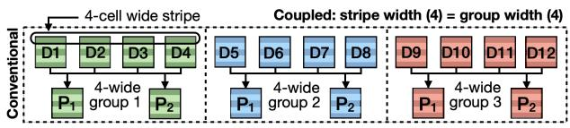

(a) Coupled: 4-of-6 grouping implies 4-wide striping  
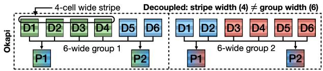  
(b) Decoupled: 6-of-8 grouping while choosing 4-wide striping  
Figure 1: 1a shows a file in a coupled architecture with a 4-of-6 EC scheme and 4-wide striping. Data is striped across 4 data blocks in a round-robin fashion as seen by the alternating light and dark colors. Parities are computed for every 4 data blocks. 1b shows the same file in Okapi’s decoupled architecture with a 6-of-8 EC scheme and 4-wide striping. Data is striped across 4 data blocks, but parities are computed for every 6 data blocks. See Figures 3 and 4 for detailed examples.

In existing systems, each file’s EC configuration (i.e., the values of k and r) dictates two decisions: how the file’s data is spread across storage servers (i.e., data striping) and which blocks are encoded into the same parities (i.e., redundancy grouping). Specifically, data is striped over k blocks (stripe width = k), and those same k blocks (group width = k) are encoded together to form parities. Fig. 1a shows a file with 4-of-6 scheme where each row of 4 cells from 4 data blocks D1–D4, D5–D8 and D9–D12 are encoded to form parity cells (of the same size as data cells) in the two corresponding parity blocks. Thus, striping and grouping are tightly coupled. However, forcing stripe width and group width to be equal creates two fundamental problems: (1) an often too-limited set of options in a complex trade-off space between performance, space efficiency, and data reliability; and (2) worst-case reencoding IO overhead when new circumstances dictate EC (grouping) changes.

First, with today’s coupling, a file’s values for k, r significantly affect its IO performance, space efficiency, and data reliability. For instance, wider stripes (e.g., 30–96 wide [23, 25, 28]) allow higher bandwidth for huge sequential IOs, but can result in higher tail latencies and IO time used (due to extra seeks) when accessing smaller file ranges (e.g., <100MB), exacerbating the ever-worsening IO-per-TB-stored bottleneck [29]. Simultaneously, wider groups reduce storage overhead compared to narrower alternatives, such as 6-of-9 [13] or 10-of-14 [43], but increase reconstruction IO and can reduce data reliability. Many applications desire the performance benefits of narrow striping and storage overhead of wide grouping (such as video streaming services), or vice-versa. At Google, we observe many files use group width k > 50 to achieve space efficiency but suffer consequent IO inefficiencies, and other files use narrow schemes to reduce reconstruction overheads but suffer lower sequential bandwidth.

Second, coupling implies that changing a file’s EC config, and hence group width (say from $k _ { 1 }$ to k2), requires re-striping its data contents. That is, all data units must be read and rewritten (striped across $k _ { 2 }$ blocks), in addition to writing the newly computed parities. This overhead grows increasingly important as grouping changes become more common to reduce space overhead as data cools [29, 54], to maintain data reliability as disks age [25–27], and to address black swan events. One recent example of the latter at Google was a sudden failure rate increase of one disk make/model that dictated an emergency reduction of group width, overwhelming some storage clusters with a massive IO burst.

Recent work reported that millions of files transition to increasingly wider erasure codes every hour in Google clusters [29]. It highlights the massive scale of resulting IO demands and proposes efficient approaches to avoid them. However, unfortunately the IO savings are unrealizable for many systems using data striping because of the need for re-striping.

This paper introduces the Okapi cluster file system, which decouples each file’s data striping configuration from its redundancy grouping configuration, enabling independent tuning. For example, Fig. 1b shows each range (e.g., 32 MB) of a file’s data being striped over 4 data blocks (D1–D4, D5–D8 and D9–D12) while parities are computed over 6 blocks. And, if circumstances dictate a redundancy group width change (e.g., from Fig. 1b’s 6-of-8 to Fig. 1a’s 4-of-6 to increase data protection), it can be done without changing the stripe width or re-striping the data.

Achieving this increased flexibility requires careful design to avoid metadata blowup and minimize file creation and degraded read overheads, all without introducing complexities that might hinder adoptability. First, Okapi curbs metadata blowup by creating redundancy groups with sequential blocks of the file, which allows it to infer group constituencies from the existing stripe mappings instead of maintaining two different metadata structures. Second, Okapi uses partial parities to bound the client memory required during file creation. Specifically, when sequentially writing a file, computing parities can require data from multiple stripes containing data blocks for a given group. Rather than caching all data until enough is written (which could easily be hundreds of MBs in wide groups), partial parities computed over accumulated data are kept instead. Third, Okapi smartly caches data during degraded-mode reads to limit read amplification.

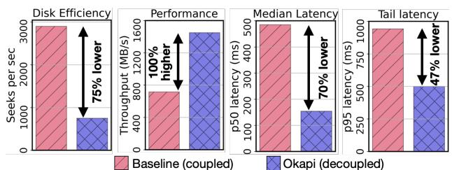  
Figure 2: Decoupling improves cluster throughput, disk efficiency and workload latency. The graphs compare coupled and decoupled architectures for 8 MB reads on 12-of-15 EC files. While stripes are forced to be 12- wide in a coupled system, in Okapi, stripe widths could be optimally tuned independently of the EC scheme. See Sec 6 for detailed experimental setup.

We describe an implementation of Okapi in HDFS1 to show how its concepts can be incorporated into an existing DFS that couples striping and grouping and to enable an apples-toapples comparison to a coupled baseline. We note that other production scalable DFSs (e.g., Ceph, Panasas’s PanFS and Google’s Colossus) couple in a similar way, and could become decoupled with similar mechanisms. Experiments comparing to a coupled architecture with 6-of-9 EC scheme show that decoupling can increase read throughput by up to 80% (by reducing seeks by up to 70%) when matching stripe width to data access patterns, without compromising data reliability or space efficiency. With wider erasure codes such as 12-of-15 schemes, we observe up to 115% throughput improvement.

Fig. 2 shows a summary of performance benefits of tailoring stripe widths for 8 MB reads to 12-of-15 erasure-coded files. As a result of better IO efficiency, end-to-end client latency for a Google-derived read-only workload decreases by 36% when each file uses tailored stripe widths. Additionally, Okapi reduces IO for EC transitions by up to 50% compared to read–re-encode–write, and by up to 70% when used with other smart EC-transitioning techniques [29]. Analyzing a real emergency group width reduction scenario from Google and long-term disk-adaptive redundancy using failure logs from Backblaze production cluster confirm 38–45% less IO required for redundancy changes.

This paper makes five primary contributions. First, it exposes the unnecessary coupling of data striping and redundancy grouping in cluster file systems, analyzing resulting inefficiencies. Second, it provides insights into hyperscalar access patterns and workload trends through real-world application characteristics, and highlights the timely need to improve IO efficiency and reduce IO demand. Third, it introduces the decoupled approach, and identifies challenges in building a decoupled cluster file system—increased metadata, expensive file creation and degraded-mode access overheads. Okapi overcomes them by (1) re-using existing structures and inferring EC group constituencies, (2) partial parity caching to curb client memory overhead, and (3) data caching to limit read amplification during degraded-mode reads. Fourth, it demonstrates that Okapi’s ideas are easily adoptable in existing DFS by implementing them in HDFS. Fifth, via comprehensive evaluation on a real (academic) cluster using micro-benchmarks and Google-derived synthetic workloads, it shows that Okapi increases IO efficiency and reduces redundancy change costs.

## 2 Striping and grouping in cluster storage

Large cluster storage systems store exabytes of data on hundreds of thousands of mechanical disks (HDDs) housed in tens of thousands of servers. Data of a single file is divided into logically consecutive stripes. Each one of these stripes spreads its data in the cluster by striping the data across a number of disks and storing parities computed from that data grouping on other disks. This section serves to distinguish between striping and grouping in cluster file systems.

Striping: spreading data and accesses. Cluster storage systems break files into ranges and spread them among disks as discussed above. Indeed, most cluster storage systems go further, striping data among data blocks in a round-robin fashion within each range at a finer granularity (generally referred to as a cell or a striping unit) to improve performance without increasing metadata overheads. The number of data blocks a stripe spans across is called the stripe width. Fig. 3 shows a 64 MB file with a stripe width of 4 and a cell size of 1 MB. Note that 4 MBs can be read by fetching 1 MB from 4 disks in parallel.

The striping configuration (cell size and stripe width) dictates important aspects of disk efficiency and performance observed by clients. For every IO, a disk must position the read/write head (seek plus rotational latency) and then transfer the data to/from the disk surface. While both consume “disk time”, a highly constrained and shared resource, only the data transfer part is useful. Thus, fewer larger transfers are more efficient, as they amortize positioning time over more useful work. Also, wider stripes can increase tail latency, since a client request is not complete until all involved disks are done. But larger transfers do take longer to complete, and thus can increase latency for clients when cluster load is low (i.e., when extra seeks wouldn’t cause queueing delays). Generally, wider striping can be better at low load and worse at high loads, with the trade-off being most relevant for mid-sized requests. We define mid-sized requests as those that access more than one data cell but not so large that any choice will involve all disks containing relevant data blocks.

Grouping: erasure-code redundancy. Device failures are common in exascale cluster storage. Thus, data is stored redundantly to protect against permanent data loss. While certain hot data may be replicated, most data is erasure-coded [13] with each group of data blocks encoded into parity blocks stored on other disks in the cluster (Fig. 3).

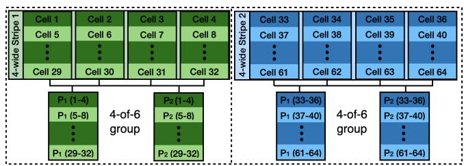  
Figure 3: Coupled Architecture of a striped 64 MB file with 1 MB cells. Each column of cells is a data block, and data blocks of a stripe are stored on unique disks. The file consists of two stripes: blue and green. This coupled file is forced to use 4-wide striping due to using 4-of-6 grouping.

When using k-of-n Reed-Solomon erasure codes (EC), each of the k data blocks are encoded into $r = \left( n - k \right)$ parity blocks such that any k of the n blocks can provide all k data blocks. Naturally, when possible, a system will read the data blocks rather than using the parities to reconstruct.

The grouping configuration (k and n) dictates important aspects of data reliability, capacity efficiency, and reconstruction overheads. Parities add a capacity overhead of ${ \frac { r } { k } } .$ . Unsurprisingly, more redundancy increases data reliability. In addition, reconstruction of missing data requires k of the n blocks of data. The reconstruction costs are therefore directly proportional to the value of k. In most environments, a lower bound of r (e.g., 3) is fixed due to factors such as datacenter makeup or planned maintenance outages [27, 28], while the group width (k) can vary. Widths like 6 [13] and 10 [43] and beyond [3] are now common, with 95 and 150 recently being reported [12, 28]. Data requiring higher reliability or being stored on more failure-prone disks is usually stored using narrower groups, accepting higher capacity overhead.

## 3 Why decouple striping from grouping?

Several factors related to IO efficiency determine the best stripe width for a given file, while independent factors related to reliability and space efficiency determine the best group width. Due to today’s coupled striping and grouping, applications must choose among limited options (i.e., stripe width must equal group width) often inducing sub-optimal configurations for one or both widths. Furthermore, a coupled architecture forces all data to be re-written when changing EC schemes, inducing significant IO overheads. Emerging storage hardware trends, insights into datacenter workload access patterns, and modern redundancy management techniques further motivate the need for decoupling.

Storage hardware trends. HDDs are becoming denser without becoming proportionately faster [29]. Due to the decrease in IO-per-capacity, disk seeks and disk bandwidth are becoming an increasingly scarce resource. Thus, it becomes critical to improve both the IO efficiency of workloads (by tailoring stripe widths) and reduce IO from workloads that consume high disk bandwidth (e.g., EC transitions).

To demonstrate the impacts of coupling on IO efficiency, consider reading 12 MBs of data from a 6-of-9 erasure-coded file. Assuming 10 ms average positioning time (seek plus rotation) and sustained 150 MB/s data transfer rate, reading 2 MBs from 6 disks consumes 40% more aggregate disk time than reading 6 MBs from 2 disks2. To optimize for IO efficiency, if stripe width is set to 2, the file would need to use a 2-of-5 redundancy scheme (to be able to sustain 3 failures), resulting in an unacceptable 2.5× storage overhead.

Hyperscalar workload trends. As hyperscalars store more total data, the average temperature (popularity) of data in their storage clusters gets colder. The steady proportionate growth of cold data has promoted the adoption of wide erasure codes (n ≥ 20) [3,28], which offers excellent capacityefficiency but suffers from poor IO efficiency. This is especially true for mid-sized reads (>1 MB and ≤≈50 MB) where reading from wide EC incurs several 1-2 MB IOs, each one paying heavily in positioning time. At Google, we observe that such mid-sized requests contribute to 65% of total bytes read (see Fig. 6a for read-size distribution), which would immensely benefit if stripe widths are tailored to access patterns.

Moreover, we observe several real-world examples of this tension: (1) user-facing media streaming services want narrow stripes for IO efficiency and lower tail latency but wide groups for capacity efficiency; and (2) big-data processing workloads favor wide stripes to increase bandwidth for their large sequential reads but prefer narrow groups to reduce reconstruction costs upon failure. A coupled design locks in fundamental tensions between performance and capacity.

Redundancy adaptation trends. Recently proposed diskadaptive redundancy systems [25–27] improve capacity efficiency by dynamically tailoring data redundancy to changing disk failure rates. Other systems [29] optimize transition IO overheads over a file’s lifetime as it cools. However, these systems all fail to address the implicit degradation of IO efficiency due to these changes. For e.g., a 10 MB read to a 10-of-13 file after transition incurs a 2× increase in disk seeks v/s a 10 MB read to the same file in 5-of-8 before transition.

At Google, although the redundancy scheme of a file commonly changes throughout its stored life, the file’s access pattern usually remains constant. We measured request-sizes of reads to uniformly sampled subset of files across three large Google storage clusters. Across these clusters, we found that 64%–94% of the sampled files were accessed using the exact same read size over a period of 150 days, whereas its EC scheme changed up to 4 times in the same duration. Furthermore, the per-file read size distribution exhibited very low variance with most reads heavily concentrated around the mean. This highlights the opportunity to tailor stripe widths of a file to improve throughput and resource efficiency. This result is unsurprising as most accesses in exascale cloud environments are issued by internal services or applications, which have known access patterns, and not direct user reads.

Increasing EC transitions trends. Transitioning data from one k-of-n scheme to another has become increasingly common. At Google, the most common transitions involve increasing group width for data as it cools. We observe over 100K EC-to-EC file transitions per day, resulting in multiple petabytes of disk IO every day in large clusters at Google.

Bulk redundancy transitions can also happen in response to datacenter emergencies. For example, in late 2020, one exascale cluster observed sudden HDD failures (>4× the usual rate), triggering an unusually high number of data reconstruction events. To mitigate the issue, the data was transitioned from k ≈ 50, which has high reconstruction-IO costs, to a smaller k (≈15) which is more reconstruction-IO-efficient.

The above redundancy adaptive systems heavily rely on redundancy transitions for realizing their benefits. These scenarios have elevated redundancy transitions to a first-class operation akin to reads and writes. However, despite the many optimizations proposed for reducing transition IO in the above systems [26, 29, 35, 36, 59], they are rendered inconsequential when files are striped in a coupled architecture since re-encoding forces re-striping. Not only does this reorganization make transitions costlier, it also induces unnecessary IO efficiency problems (i.e., the new stripe width can be less IO-efficient for the workload) as stated above.

We now present Okapi, a decoupled system that gracefully tackles the aforementioned trends.

## 4 Okapi’s Design for Decoupling

The Okapi cluster file system allows independent configuration of data striping and redundancy grouping for each file. Okapi stripes a file across blocks and encodes blocks into parities like existing cluster file systems, but does not restrict group width to equal stripe width. Each file’s contents are stored in one or more fixed-size blocks. Unlike existing systems, applications specify stripe width, in addition to grouping configuration (k and r). Data is striped MB-by-MB over each consecutive set of stripe-width blocks in a round robin fashion, and r parities are computed over each consecutive k blocks of the same file, no matter how the data is striped. For performance and durability purposes, Okapi requires blocks in a stripe and blocks in a group to be stored on unique nodes/failure domains. As described later in this section, such a design allows for lower per-file metadata, and curbs file creation and degraded-mode read access overheads. Fig. 4 illustrates the data layout for 4-wide stripes, but with two different grouping schemes: 6-of-8 and 3-of-5.

Next we describe key challenges involved with decoupling and how they are addressed in Okapi.

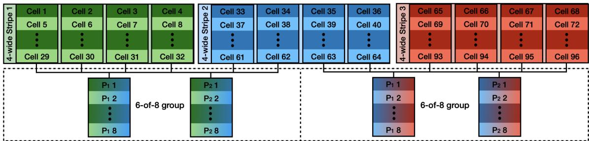

(a) 96 MB file with 4-wide stripes and 6-wide groups.  
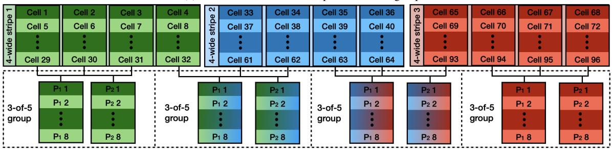  
Figure 4: Decoupled Architecture: A 96 MB file striped 4-wide but shown with two different EC schemes - (a) 6-wide and (b) 3-wide. Each color—green, blue and red, represents a different stripe. Each 4-wide stripe is composed of 4 data blocks storing 32 MB. A group is composed of consecutive data blocks of the file, that may cross stripe boundaries. Block x is mapped to stripe d xstripe width e and group d x group width e.

## 4.1 Challenges: decoupling stripes and groups

Increased metadata. Conventionally, EC file metadata contains the redundancy scheme configuration and location information (list of the disks) for each stripe. In a decoupled design, the DFS must also track the location information for each EC group. This additional metadata (usually stored in main memory) must have a small footprint, as memory is a valuable resource in any large-scale storage cluster.

Expensive file creation/appends. In a decoupled design, multiple groups can be incomplete at any given time while writing a new file, as opposed to just one in conventional systems. All data of incomplete groups need to be retained in memory until the parities are computed and flushed to the disk. This results in an increased client-memory footprint. A decoupled design must minimize memory requirements, and reduce unnecessary buffering of large amounts of data.

Increased work during degraded mode reads. During degraded mode reads, it is necessary to fetch at least k out of the n chunks from the group, even if they are not directly requested. This read amplification can be exacerbated in some decoupled configurations, since contents of stripes accessed is different from contents of groups required for reconstructing missing data. Such read amplification due to decoupling must have minimal impact on cluster throughput and latency.

Adoption-friendly design changes. Large-scale DFS usually take upwards of ten years to fully mature and become widely adopted. Proposing a design that warrants a DFS to be built from ground-up is therefore non-viable. A decoupled system should introduce straightforward design changes such that they can be readily incorporated into existing DFS.

## 4.2 Reducing metadata by inferring groups

Traditionally, DFS maintain the list of stripes that make up a file, along with the set of nodes where the data and parity blocks of each stripe can be found. Since stripes and groups are distinct in Okapi, we now need to maintain location information for both components separately, doubling the per-file metadata, which may be prohibitive.

Since redundancy groups in Okapi are comprised of consecutive data blocks, Okapi simply infers the redundancy group mapping from the existing data stripe mapping based on the stripe width and the file’s EC scheme. Imagine the data blocks of a file (across all stripes) sequentially numbered from 1 to X. Then, data block x is mapped to stripe $\lceil \frac { \mathbf { x } } { \mathrm { s t r i p e ~ w i d t h } } \rceil$ and group $\left\lceil { \frac { \mathbf { x } } { \mathrm { g r o u p ~ w i d t h } } } \right\rceil$ within a file. Given the ordered sequence of data and parity blocks, irrespective of the corresponding stripe information, Okapi can easily map the $i ^ { t h }$ set of k data blocks to $i ^ { t h }$ set of r parity blocks using simple modulo operations to identify redundancy groups of the file. We show the marginal metadata overhead incurred from using this inference logic in a live cluster instance in Sec. 6.

## 4.3 Partial parities for efficient file append

A common client access pattern is to create an EC file, write sequentially, and never modify the file once it is closed. Indeed, this access pattern is so dominant that popular DFS (e.g. HDFS, Ceph, Microsoft Azure) do not support modify or append operations on EC files [11, 14, 24].

In most DFS, when a file is written in this pattern, the system will wait to compute parities until all k data cells of the row of a group are available. Although the written cells remain unprotected until the kth cell is received and the parities are computed and written out, this approach is much easier and more efficient than stricter durability semantics. Okapi retains the same semantic to allow for fair comparison with a coupled system to focus on the effects of decoupling.

To achieve the expected efficiency, the client must keep a copy of yet-unprotected cells in memory. For instance, consider writing the group shown in Fig. 3. The first 3 cells are written out to disks but also buffered in client memory until the $4 ^ { t h }$ cell becomes available to compute the first parity cell $P _ { 1 } 1 ( 1 - 4 )$ . Using this approach, decoupling can increase the load on client memory in some configurations. For example, for 6-of-8 groups with 4-wide striping as shown in Fig. 4a, the client would need to buffer the first 34 cells in order to compute the first parities. Okapi mitigates this overhead by computing intermediate partial parities. Rather than waiting for all data in a redundancy group to be written, Okapi greedily computes parity blocks with currently available data, which it keeps in memory instead of the more numerous data cells. We describe Okapi’s partial parity computation below.

For a k-of-n erasure code, parity blocks for a vector of k data blocks are computed by using a $( n - k ) \times k$ generator matrix. This generator matrix $( G _ { ( n - k ) \times k } )$ is simply multiplied with the data vector $( D _ { k \times 1 } )$ over a Galois Field to produce the parity vector $( P _ { ( n - k ) \times 1 } )$ . For a simple 3-of-5 EC scheme, the parities are computed as follows:

$$
G _ { 2 \times 3 } \times \left[ D _ { 0 } D _ { 1 } D _ { 2 } \right] ^ { T } = \left[ P _ { 0 } P _ { 1 } \right] ^ { T }
$$

Okapi breaks this into k independent partial computations.

$$
\begin{array} { c } { G _ { 2 \times 3 } \times \left[ D _ { 0 } ~ 0 ~ 0 \right] ^ { T } + G _ { 2 \times 3 } \times \left[ 0 ~ D _ { 1 } ~ 0 \right] ^ { T } + G _ { 2 \times 3 } \times \left[ 0 ~ 0 ~ D _ { 2 } \right] ^ { T } } \\ { = \left[ P _ { 0 } ~ P _ { 1 } \right] ^ { T } } \end{array}
$$

A partial parity block can be computed for every data block as soon as they become available without needing any of the other data blocks. For example, for $D _ { 0 }$

$$
G _ { 2 \times 3 } \times { \left[ D _ { 0 } \mathrm { ~ 0 ~ } 0 \right] } ^ { T } = { \left[ P _ { 0 } ^ { \prime } P _ { 1 } ^ { \prime } \right] } ^ { T }
$$

Rather than buffering all the data, Okapi instead buffers partial parities in client memory. Computed partial parity blocks are then simply added, as they become available, to eventually form the final parities. Breaking up the computation of parities by exploiting the associativity of a linear operation is an optimization that has been used in several prior contexts [32, 37, 40, 60]. Okapi re-uses the concept in the write path to mitigate the overhead introduced by decoupling.

Note that only the final parities are flushed to disk. Storing partial parities in client memory does not change or compromise the durability guarantees in the case of a client failure. In a coupled DFS, a client failure triggers a background recovery process which checks the last stripe in the file and generates parities if the stripe is under-protected. Similarly in Okapi, the recovery process checks for any under-protected redundancy groups and generates new parities for each by reading from data blocks. The recovery process in Okapi makes no use of partial parities and maintains the same durability semantics.

Distributed file systems such as HDFS and Okapi can be modified to support sync-on-write semantic, but doing so would hurt write performance substantially. Client write latency would not only see the time to receive a response for data written out to servers but also the time to send new data to update existing parities. Furthermore, the file system would need to support atomic read-modify-writes to incrementally update parities, either via shadow-paging or versioning. The required functionality and associated overheads would be necessary in systems both with and without decoupling.

## 4.4 Caching to reduce degraded read cost

If some blocks are unavailable during a read (e.g. due to a failed disk that is yet to be recovered), they have to be reconstructed on the fly at the client. Such degraded reads need to access both the data stripe (for read) and redundancy group (for reconstruction).

In a normal read operation, the client only reads the required cells. For degraded reads, at least k of n cells from the group containing the missing data need to be fetched, which may not have been read by the client otherwise, causing read amplification. In certain scenarios, Okapi’s decoupling can increase this read amplification. Consider a 6 MB read in 6-of-8 EC file shown in Fig. 4a. Cells 1-6 need to be accessed (across two stripe rows). If the first block is missing, Okapi will read 12 MB of total data for on-the-fly recovery. A coupled system, with 6-wide group, would only read 6 MB. However, such an increase in read amplification occurs rarely.

For reads requesting less than one stripe row worth of data (small-sized requests), the degraded mode behaviour remains unchanged. For larger reads, in particular, reads spanning multiple stripes of data or an entire file (large sequential requests), the data required for reconstruction will either have been recently read by the client or will be fetched by subsequent reads. Okapi exploits this by anticipating a degraded mode read and caching the required data as it is read to avoid fetching the same data multiple times, eliminating read amplification.

For other mid-sized requests, although degraded-read performance in decoupled cases can be worse, we find that the overhead with Okapi’s design is minimal and is an acceptable trade-off. We quantify these overheads in Sec. 6.4.

## 4.5 Re-grouping to minimize EC transition IO

EC transitions are commonplace in large-scale storage clusters (Sec. 3). We describe how Okapi’s decoupled design helps in significantly reducing the IO cost of transitioning.

Storage clusters require sequential data to be written over consecutive stripes to exploit maximum parallelism and to ensure maximum disk efficiency while reading any range of bytes of data. In a coupled system, this strict restriction gets unnecessarily imposed on redundancy groups too. As a result, when transitioning a file from $k _ { 1 } { \mathrm { - o f } } { \mathrm { - } } n _ { 1 }$ to k2-of-n2, conventional file systems are forced to re-stripe the file - read the entirety of the file’s contents and write them back according to the new striping layout like a new file. For example, if the stripe width of the file needs to be changed from 4 to 6 in Fig. 3, almost all the cells need to be moved from their original disk locations to different disks, incurring significant disk IO and network overhead.

A decoupled system allows us to instead re-group the file and change the EC groups without modifying the striping layout. Okapi simply determines which data blocks will make up the new groups and recomputes new parities for them without moving any of the data blocks. All data blocks are read, but only parities (and not data) are re-written. Consecutive sets of $k _ { 2 }$ data blocks that may be spread across multiple stripes of the file are chosen to form $C = L C M ( k _ { 1 } , k _ { 2 } ) / k _ { 2 }$ new redundancy groups. The amount of data to read can be further reduced with smart EC transitioning techniques [29].

In order to ensure maximum durability, the physical blocks that make up an EC group must exist on disks in different failure domains. When such re-grouping is performed, new groups may end up with multiple physical blocks that reside on disks in the same failure domain. In such situations, Okapi simply relocates those blocks such that a group is composed of blocks on distinct disks and incurs the cost of this extra data movement. However, these overheads can be completely eliminated by being cognizant of the possibility of redundancy transitions and allocating data of successive groups of a file to distinct disks during its creation. Such mindful placement mechanisms should be straightforward since mechanisms already exist to form n-wide groups.

## 4.6 Choosing stripe widths and group widths

Most data in hyperscalars are created and used by large applications/services that have engineers dedicated to maximizing their efficiency. Such engineers measure their system in operation and analyze trade-offs to tune their coupled stripe/group width configuration to meet desired reliability targets, minimize byte overhead, and achieve needed throughput/latency and disk-time efficiency [53, 55, 58].

At Google, for instance, engineers for large-scale data services periodically choose a space-efficient (coupled) EC scheme for their data that meets their reliability and performance SLOs. Reliability SLO is described using MTTDL. MTTDL, governed by the group width, can be calculated either analytically (using Markov chains) or experimentally (using Monte-Carlo simulations) [49]. Meeting the performance SLO on the other hand requires careful benchmarking. This entails generating artificial data using the proposed EC scheme using the application’s preferred read size distribution. Average and tail read latencies are then calculated for normal reads and degraded reads performed by injecting failures. These reads are performed at normal and high cluster load to ensure that system performance continues to remain stable.

Okapi can make such selection processes easier in that a single width choice does not have to satisfy all reliability and performance goals. Our experiments indicate that a stripe width of d median read request sizeblock size e works well in optimizing throughput and median latency with various group widths (which can be chosen for reliability), by amortizing seeks over substantial data transfer (see Sec. 6.5). But, consistent with current practice, we expect most applications/services to use benchmarking in configuring their (now-decoupled) stripe and group widths. We extract salient features from the aforementioned Google EC scheme selection process into a generalized strategy:

1. Choose an EC scheme k-of-n. Balance target MTTDL, byte overhead, and reconstruction costs [17, 20, 26, 27].

2. Record IO patterns. Randomly sample f representative application files. For each, log read request sizes over a representative time window that captures typical usage patterns, such as a full day during steady-state operation. Many organizations already have well-established observability infrastructure [51] which can be readily leveraged to collect and analyze I/O read sizes.

3. For each candidate stripe width x:

(a) Generate test files. Create and write f files with group width k and stripe width x.

(b) Replay IO logs. Issue the recorded read requests against test files in the same live cluster environment to capture realistic performance. Measure per-request latency.

(c) Analyze performance. Measure median, tail latencies.

4. Choose the group and stripe width that satisfies all SLOs and offers the best balance of read performance (throughput, median latency, and tail latency) for future files to be created. Additional metrics such as seek count and write throughput may also be recorded and taken into account. There may be no single configuration that is optimal across all metrics; application engineers make subjective decisions based on which performance aspects are most critical for their specific use case.

Since IO requests to real, existing application files are sampled to collect the IO logs, access patterns, read size distribution and file size distribution are all inherently captured in this benchmarking process. If it is infeasible to record IO access patterns, or if IO access patterns are known to frequently change over time (a rare occurrence, see Sec.3), applications can default to setting stripe width equal to group width, performing no worse than coupled systems.

## 5 Okapi’s Implementation

Okapi is implemented by modifying the Hadoop Distributed File System (HDFS). We use existing data structures and tried-and-tested pipelines as a conscious choice to not hurt the current performance or integrity of existing mechanisms in HDFS3. This section describes how Okapi efficiently decouples stripes and groups, and the mechanisms that enable file read/write, data protection, and EC transitions. We briefly describe how decoupling can be implemented in few other popular DFS in Appendix A.

## 5.1 Simple, efficient decoupling

Traditional HDFS maintains metadata for a stripe of data blocks and its corresponding set of parity blocks in a data structure called striped block groups (SBG), which is tracked as a single entity in the Namenode’s BlockManager.

Metadata. Okapi splits a conventionally coupled SBG into two structures: a data stripe and a parity group. A data stripe is a logical ordering of data blocks and a parity group is a set of parity blocks. This split allows the structures to have a O(1) lookup time in the BlockManager as they were for SBG’s.

To minimize metadata overheads, Okapi saves 8 bits per block by eliminating the pointer to the EC policy and leverages the previously unused replication field instead. Additionally, it ensures sequential ordering of storage information, removing the need for internal physical block ordering in the new data structures. To minimize inode metadata, Okapi uses a single byte (max value=127, easily extendable) to track the stripe width per file in the header. This approach supports most widely published schemes to date [28].

Writes. Okapi allows files to be written with any arbitrary stripe width and EC scheme. It uses partial parities to avoid buffering large amounts of data between stripes. The partial parities are stored in a r-wide array of byte buffers, each of which stores data worth 1 block. This guarantees that the client will buffer at any point at most block size · r + cell size · k of data. When updating partial parities, Okapi multiplies only the relevant subsection of the encoding matrix with the data vectors to eliminate extraneous computation. This aspect of the implementation ensures that encoding and combining partial parities is computationally equivalent to encoding full parities in a single operation.

Normal reads. Normal reads in Okapi work exactly like in HDFS. Okapi simply looks at data stripes to inform clients where to read data from, similar to how SBG’s are used, Parity groups are not needed and remain unused. This ensures that normal read performance in Okapi is not impacted at all by decoupling and that no additional necessary computation is required to retrieve physical block locations.

Degraded reads. A degraded read will infer the redundancy grouping for the failed block to reconstruct missing data. Okapi’s design prioritizes efficiency and attempts to re-use any data that was already buffered in from the read when decoding the corrupt or missing data.

Under-replication detection and recovery. Data stripes and parity groups are managed in the exact same way as

SBG’s. Okapi therefore re-uses existing block reporting system for under-replication detection, with no loss in performance. The BlockManager lazily computes the redundancy grouping once under-replication is identified using constant time look-ups and modulo arithmetic.

Efficient and safe EC transitions Okapi computes new grouping based on the file’s array of data stripes and the new EC scheme. After the new groups are determined, the new parity groups are added to the BlocksMap and the new grouping is sent to the Datanodes using HDFS’s existing EC recovery pipeline. The new parities are encoded and reported by the Datanodes, and the old parities are atomically removed from the Namenode. This ensures that files are protected even during a transition as the old parity groups are available until the new parity groups are completed.

## 6 Evaluation

This section evaluates Okapi and confirms three main takeaways: (1) configuring a file’s stripe width to match data access pattern provides significant IO efficiency improvements without compromising reliability. (2) decoupling stripe width from group width significantly reduces the IO required for EC scheme transitions. (3) Okapi does not introduce significant metadata, file creation or degraded-read overheads.

## 6.1 Experimental setup

Both Okapi and coupled experiments run on a 20-node cluster with one Namenode and 19 Datanodes. Each machine has a Quad-Core AMD Opteron Processor and 128 GB RAM. Each Datanode has a 1 TB Ext4 file system atop a 7200 RPM Hitachi Ultrastar HDD. The physical block size and file IO buffer size in HDFS are set to 8 MB (default block size at Google). The underlying Ext4 file system uses a 1 MB block size, which is the same as the cell size. Cluster nodes are connected via a 40GbE network. We measure throughput with DFS-perf [21]. For each workload, we measure aggregate throughput and median, p95, and p99 client request latency. We examine block device IO and disk seek behavior using blktrace [6] and seekwatcher [33]. We measure IO and CPU/memory costs by aggregating per-node data exposed by Ganglia [34]. We compare Okapi’s performance with HDFS with micro-benchmarks and then with a synthetic trace generated using read-size distribution drawn from Google’s cluster.

## 6.2 Decoupling improves IO performance

Our results demonstrate a significant benefit to total cluster read bandwidth and client latency when configuring the data striping to be tuned for their specific access patterns, without impacting factors such as storage overhead, reconstruction costs, which are controlled by grouping. We first compare read throughput and IO efficiency across varying access patterns with/without decoupling. Then, we characterize the benefits of decoupling in a realistic read-only system workload. Finally, we show the impact of decoupling on write throughput.

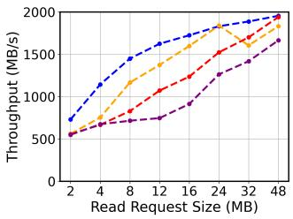  
(a) Cluster Throughput.

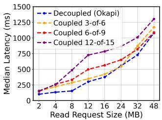  
(c) Client Median Latency.

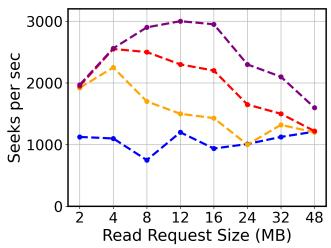  
(b) Cluster IO Efficiency.

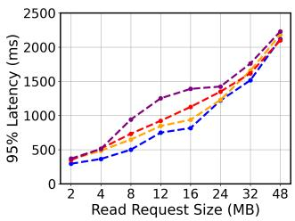  
(d) Client 95p Latency.  
Figure 5: Performance measurements for requests ranging from 2 MB– 48 MB for files grouped 3-of-6, 6-of-9, and 12-of-15 (and thus striped 3-, 6-, and 12-wide respectively for HDFS) and pre-determined stripe width with 6-of-9 grouping for Okapi. Compared to 6-of-9 coupled configuration, throughput improves by up to 80% and seeks/sec reduce by up to 70% when decoupling with similar benefits to median and tail latency.

Tuning stripe width improves read performance. We present cluster and client metrics of a read workload in which both HDFS and Okapi use 6-of-9 grouping (a popular EC scheme [13, 27]), which means that both systems have the same storage overhead. While this forces files in a HDFS to be striped 6-wide, Okapi faces no such limitation and allows clients to set the file’s striping width based on its most common access pattern. In addition to 6-of-9 grouping, to evaluate alternate options, we include results for HDFS when files are grouped 3-of-6 (half the group width) and 12-of-15 (double the group width).

For our experiments, we benchmark throughput for different read sizes in the manner described in Sec. 4.6, and set stripe width for each read request size to optimize for cluster throughput and IO efficiency. For example, we use 1-wide and 6-wide stripes for 8-MB and 48 MB requests respectively.

Okapi provides high throughput at low byte overhead. Fig. 5a shows total cluster throughput with and without decoupling for each access pattern. For the configurations we examine, Okapi observes up to 80% increase in throughput and never performs worse than coupled 6-of-9 for any request size; without sacrificing any space efficiency or durability. Okapi performs the same as 6-of-9 coupled for only 48 MB requests, and same as 3-of-6 coupled for only 24 MB requests which is expected since Okapi’s decision to stripe 6-wide and 3-wide coincides with the coupled cases’ grouping width.

HDFS’s poor throughput for smaller read requests sizes is a consequence of coupling data stripes and groups. For example, a file is generally chosen to be written in 6-of-9 to provide a certain level of space efficiency. However, 6- wide striping for a 4 MB client read suffers from request fan-out and poor IO efficiency as it splits into four 1 MB disk reads, an unfortunate consequence of a decision made with only grouping in mind. A naive solution would be to ignore grouping and blindly choose a narrower group width, say 3- of-6. Not only does this increase storage overhead by 2×, but also the 3-wide striping still loses between 6–34% throughput compared to Okapi. Note that coupled 3-of-6 exhibits greater cluster throughput than coupled 6-of-9 for requests up to 24 MB, but eventually performs worse for larger requests since 3-of-6 requires an extra round-trip to Datanodes to retrieve data past the first data stripe, making 6-of-9 more favorable in these cases. If storage capacity dictates files must be grouped wider, say 12-of-15, then the coupled cluster loses up to half its bandwidth. Moreover, note that by decoupling, it is still possible to achieve 12-of-15 space efficiency while meeting the same IO performance.

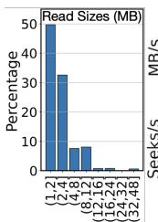  
(a) Read-sizes.

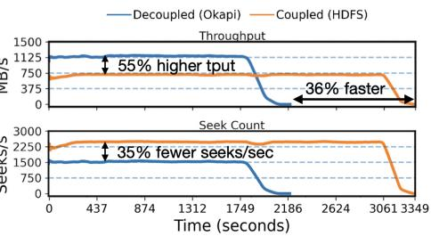  
(b) Cluster metrics.  
Figure 6: Read performance for a realistic read-only workload. 6a shows the distribution of read-sizes >1 MB and ≤48 MB for erasure-coded files in Google’s production storage cluster. 6b shows throughput and seek count for a trace of read requests pulled from the distribution in 6a.

Okapi reduces seeks dramatically. Fig. 5b shows the benefits in cluster’s total seeks per second. Okapi promotes user’s ability to choose a stripe width that maximizes sequential IO, thereby reducing the spindle usage by as much as 70% between Okapi and coupled 6-of-9. By tuning the stripe width to be suited for smaller sized reads, clients maximize sequential IO and enable disks to spend less time on seeks and more time on data transfer. The drastic reduction in total seeks promotes greater disk bandwidth, even when disk utilization is constant. Moreover, Okapi minimizes the variance in seeks/sec across different read sizes, reducing peak usage by up to 60% which significantly reduces resource provisioning costs.

Okapi lowers client response time. Fig. 5c shows Okapi provides a substantial reduction in median latency compared to both 3-of-6 and 6-of-9. This is a consequence of both improved cluster throughput and minimizing the fan-out effect. A similar, albeit less significant trend is observed in the 95th percentile latencies (Fig. 5d).

Okapi requires no compromises! Okapi does not sacrifice space efficiency or durability for these improvements. For example, to achieve the same read performance while maintaining durability for 16 MB reads in HDFS, the file would need to be written in 2-of-5, which has worse space efficiency than 2-way replication. On the other hand, to achieve the same read performance while maintaining space efficiency in HDFS, the file would need to be written in 2-of-3, which has insufficient durability. Even when comparing against coupled 3-of-6, which has the same space efficiency as 2-way replication, most access patterns still perform noticeably worse than when decoupled. A coupled architecture simply cannot achieve the best of both worlds as Okapi can by decoupling these independent decisions.

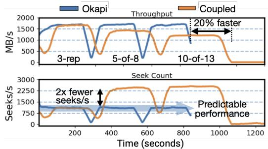  
Figure 7: Performance and resource efficiency of file accesses as they transition to wider EC schemes over their lifetimes. Figure shows seeks/s and throughput observed for 16 MB file reads, first when files are in a 3-way replicated format, second in 5-of-8 and then in 10-of-13 EC scheme.

Okapi enhances performance for a realistic workload. In this experiment, we measure the read performance in a testbed environment for a workload that uses the read-size distribution of EC files in a production storage cluster at Google as shown in Fig. 6a. We compare cluster performance in decoupled and coupled architectures while executing the same set of random-reads. In this scenario, we use 64 client threads each performing 10K reads. All files conservatively use a 6-of-9 grouping, although today’s average EC group is typically wider for space efficiency. Since IO efficiency decreases for mid-sized requests with wider groups, we expect that in practice, the coupled case would actually perform worse than shown in our experiments for this workload.

Fig. 6b shows throughput, seeks/s, and end-to-end run completion time for a realistic read-only workload. Okapi shows a 55% increase in sustained throughput (MB/s) and 65% fewer number of total seeks (35% decrease in seeks/s) due to smarter striping decisions. Note that most read requests in Fig. 6a are smaller than 12 MB, a range of read-sizes that finds the most benefit from decoupling as seen in Fig. 5a. Despite both clusters running identical traces, Okapi’s clients completed their work 36% faster than the HDFS’s clients. The increase in throughput and decrease in end-to-end run-time shows how a decoupled storage cluster could handle both bursty and extended client traffic better than a coupled architecture.

Okapi maintains IO efficiency despite EC transitions. Morph [29] improves EC transition overheads but overlooks the impact on resource efficiency of accesses to such files. Accesses to same files post-transition to wider EC schemes result in poor IO efficiency. Unlike coupled systems, Okapi remains unaffected by EC transitions. We duplicate their experiment of file EC lifetime transitions from replication to 5-of-8 to 10- of-13 and measure throughput and seeks consumed for 16 MB read accesses to 25000 files in each phase of the file’s lifetime. Okapi is able to achieve better throughput, uses 2× fewer seeks/s and achieves predictable performance and resource efficiency as shown in Fig. 7. This issue is further exacerbated in Disk Adaptive Redundant storage clusters, since even hot files can be transitioned to wider schemes, which directly impacts the latencies of user facing applications.

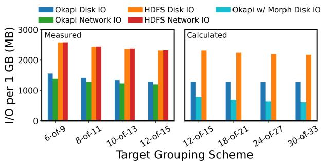  
Figure 8: IO cost to transition 1 GB 6-of-9 files to varying target EC schemes. Left shows measured disk and network IO cost to transition to wider grouping schemes and then back to 6-of-9. Right shows calculated disk IO cost to transition to wider schemes.

Okapi’s benefits improve with median seek distance. The experimental setup has each disk filled with about 315 GB out of 1 TB of disk space. As the disk becomes more full, the median rotational and positioning latency would likely increase, further emphasizing the impact of each seek and making the reduction of seeks-per-second even more significant to cluster throughput.

## 6.3 Decoupling reduces EC transition IO

Redundancy transitions are common and have varying degrees of urgency and bandwidth/compute requirements. This subsection quantifies this benefit for three major sources of transitions and then experimentally compares Okapi’s re-grouping to a coupled system’s read-re-encode-write (RRW).

1. Making groups wider as data cools. Large storage clusters perform hundreds-of-thousands of transitions per day. Most of these transitions increase group widths to increase space efficiency for data that has cooled (in terms of access frequency). Okapi can reduce the IO required for such transitions by up to 50%. For example, for 100K 30 MB file transitions from 6-of-9 to 30-of-33 in a day, RRW would require 6.3 PB of total IO ( 5 × 6 × 100K = 3 PB of data read, 3 PB of data write and 300 TB of parity write). Regrouping in Okapi only requires 3.3 PB IO for the same transitions.

2. Urgent transitions to address emergencies. Sec. 3 describes an emergency bulk transition situation at Google caused by a sudden increase in the failure rate of a particular disk model. To avoid future reconstruction IO overload, all high-k data on those disks were transitioned to use narrower groups (k ≈ 50 to k ≈ 15).

Suppose 66% of the data was in ≈50-wide groups on ≈90K disks in the cluster.4 Disks had an average capacity of 8 TB and capacity utilization of ≈75%. Transitioning to a 15-of-18 scheme using RRW requires 784.08 PB of transition IO (356.4 PB of data read5, 356.4 PB of data re-write, and 71.28 PB of parity write). Assuming a 100 MB/s sustained disk bandwidth, with a 5% IO budget for EC transitions, 90K disks can transition at the rate of 90000×5 = 450000 MB/s = 0.43 TB/s. It would require over 21 days to transition all 784.08 PB without violating the IO budget. Even if we commission the entire cluster to perform transitions, with each disk issuing transition IO at 100 MB/s, it would take over 1 entire day! In contrast, Okapi incurs an IO traffic of 427.68 PB (45% less) for transitioning via regrouping, i.e. 12 days to complete without violating the 5% IO budget, and <14 hours if the entire cluster was commissioned.

3. Adapting group widths to disk failure rates. Diskadaptive redundancy (DARE) systems use file transitions to maximize space efficiency based on observed disk failure rates, saving ≈ 20% of disk capacity [25–27]. As with other transition causes, Okapi reduces the IO required.

We simulate DARE for a production storage cluster (Backblaze [2]) over a period of 6 years to evaluate the transition costs of re-grouping versus RRW. Data is arranged into files, represented by an ordered array of redundancy groups, and the policies for reacting to failures and AFR changes were adopted from previous work [25]. When a group is marked for transition, the file that it is part of (and hence all groups part of the file) are transitioned together as described in Sec. 4.5.

The simulation showed that Okapi reduces mean disk transition IO cost by approximately 38%. This reduction is lower than earlier examples because it includes IO for block relocation to ensure that all blocks within each group are distributed across different failure domains even after transitions (Sec. 4.5). This overhead can be avoided by being cognizant of such potential re-groupings during file creation, and by placing blocks of adjacent groups of a file across different failure domains. We did not make any assumptions about failure domains in our simulation, placed blocks of a group randomly assuming each disk to be a separate failure domain.

Further, storage clusters typically rate limit background tasks like file EC transitions to prevent interference with foreground IO operations. However, these IO limits are sometimes violated for urgent transitions during risk of data loss. Assuming a 5% daily IO limit for EC transitions [26], we observe that RRW approach results in almost twice as many disks violating this IO cap when compared to Okapi.

Measured transition savings in Okapi. Okapi’s regrouping approach for redundancy transitions is more efficient than the traditional RRW approach used in HDFS. In this experiment, we transition a 6-of-9 1GB file to wider groups and then back to 6-of-9. Fig. 8 (left) shows disk and network IO incurred in the two systems as measured in our experimental cluster setup.

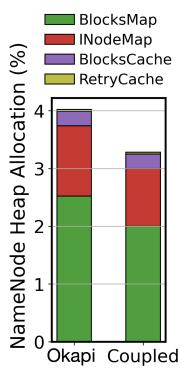

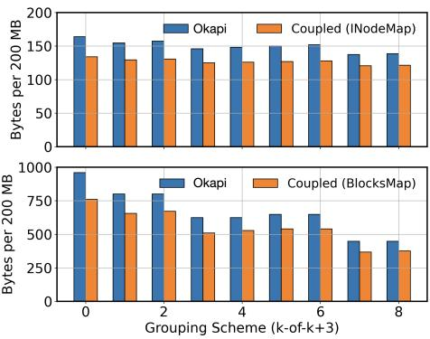  
(a) Heap percentage  
(b) Byte overhead per file.  
Figure 9: Calculated (a) total Java heap allocation overhead in the Namenode for decoupling 200 MB 6-of-9 files and measured (b) byte overhead of 200 MB files in the BlocksMap (bottom) and INodeMap (top) for increasing group widths. Metadata overhead decreases with increasing stripe and group width, eventually converging at very wide groups in both data structures.

Limited by available cluster size, we calculate results for transitions to wider groups analytically. Fig. 8 (right) shows calculated disk IO traffic for transitioning the same 6-of-9 1GB file using Okapi versus RRW.

We observe almost 50% decrease in disk and network IO across all transitions with Okapi. This decrease stems primarily from reduction in bytes written to disk. Note that Morph sees the same transition IO traffic as coupled in Fig. 8. Although Morph uses Convertible Codes to reduce IO overheads by computing new parities from old parites, it only helps when cell-striping is disabled; otherwise, re-striping the file necessitates rewriting it. Okapi overcomes the need to re-write file data, which can be combined with Morph to further reduce transition overheads by up to 70%.

Okapi uses slightly more disk than network IO. Okapi schedules new parity encoding on a target Datanode, so some new parities need not traverse the network. HDFS’s RRW implementation instead does this on a client, in part because it must re-write the file data in addition to the new parities.

Okapi shows memory and compute savings. We compare memory and CPU utilization for the Namenode and client by performing 20 concurrent 200 MB EC transitions. With RRW, the client buffers file data in memory before writing to DFS and then clears its cache. With regrouping, the client uses no extra memory to make an RPC call. In Okapi, CPU utilization does not exceed 5.7% compared to 13.5% in HDFS, with ≈75% reduction of average CPU utilization.

## 6.4 Quantifying decoupling overhead

Namenode metadata memory overhead. We measure the memory footprint of decoupling by analyzing Java heap dumps on the Namenode process in Okapi and HDFS with 6-wide striped, 6-of-9 grouped 200 MB files. Fig. 9a depicts the metadata difference in total heap allocation. HDFS, by default, allocates 2% of the total Java heap to the BlocksMap and 1% to the INodeMap. Okapi compensates for the increase in block objects by allocating 2.52% and 1.22%, respectively, for a collective heap usage increase of 0.74%. This increase allows Okapi to maintain the same number of objects and files in the cluster as conventional DFS with less than a 1% increase in overall Java heap usage.

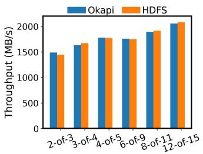

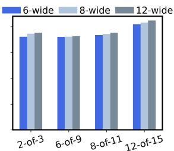  
Grouping Scheme  
Figure 10: Measured (left) write throughput of files with stripe width equals group width in Okapi and HDFS and (right) decoupled write throughput of files in Okapi with varying stripes and EC schemes.

Fig. 9b presents the memory footprint in the Namenode data structures per file. Okapi uses less than 1 KB per file in the BlocksMap and 170 B per file in the INodeMap, a respective 26% and 22% increase from their former values. These values shrink with wider groups as there are fewer blocks per file and, therefore, less overhead per block object. For example, if files were grouped 12-of-15 as opposed to 6-of-9, the overhead decreases to 20% and 18% respectively. These measurements reflect a reasonable increase in metadata per-byte which only improves with wider grouping schemes.

Minimal impact of decoupling on write throughput. Fig. 10 (left) shows write throughput across various EC schemes when stripe width equals group width. Despite the slight additional complexity in Okapi’s decoupled write logic, we do not observe any noticeable decrease to write throughput between HDFS and Okapi.

Fig. 10 (right) compares write throughput with different stripe widths across varying EC schemes. There is no noticeable difference in performance as a direct result of decoupling. 6-of-9 grouping achieves the same write throughput with both 6-wide (coupled) and 8-wide striping (decoupled) despite the fact that 8-wide striping uses partial parities to compute the final parities. This result is consistent with Okapi’s implementation, which guarantees the same number of linear operations to compute the final parities, regardless of stripe width.

Further, we observe a small increase in write throughput across all EC schemes as a result of increasing stripe width. A wider stripe can leverage a greater degree of parallelism when writing large amounts of data. However, we find that the difference in throughput across EC schemes can be primarily attributed to the amount of write amplification.

Client write memory overhead. Okapi uses partial parities to avoid buffering copious amounts of data in memory to write a complete group (Sec. 4.3). Fig. 11 shows the memory overhead when striping 6-wide with varying grouping schemes in a decoupled case and when striping/grouping 6- wide in HDFS. With decoupling, naive buffering of client data to eventually compute final parities requires clients to buffer up to 150 MB at 20-of-23. With partial parities, clients buffer at most an acceptable 25 MB.

In fact, the write memory overhead of Okapi with partial parities eventually converges with and passes (i.e., less memory required) coupled schemes beginning from 25-of-28 grouping. In conventional HDFS, the entire stripe of data must be buffered, even for extremely large groups, so the memory overhead scales with group width. With partial parities, however, the overhead is capped at r · block size + 1.

However, when stripe width is greater than group width, in certain instances, it is more cost-effective to opt out of partial parities. This is because buffering all unprotected data cells is more economical than buffering partial parities of size r · block size. Okapi can dynamically determine at runtime whether to employ partial parities based on striping and grouping configuration.

Degraded mode read overhead. We show, both analytically and empirically, that degraded read overheads are minimal. Fig. 12 (left) quantifies the average read amplification and (mid) the average number of disks read during degradedmode reads using 12-wide groups across varying stripe and read request sizes (assuming that reads can be made at any cell-aligned file offset with equal probability).

Case (1) when stripes are wider than groups. The read amplification is minor (3.23% worse on average for 18-wide stripes; and 4% better for 24-wide stripes). Although it may appear that the expected number of disks read is higher, the cause is the wider stripes(a conscious choice by file writer)— the number of additional disks read in degraded-mode is very small (2.73% more disks than coupled 18-wide groups).

Case (2) when groups are wider than stripes. Although read-amplification is higher in Okapi, probability of degradedmode reads is proportionately lower (since fewer disks are accessed). The impact on total cluster throughput is hence commensurately lower. In addition, the required data is fetched from fewer disks (implying fewer seeks and higher IO efficiency), further amortizing the impact on cluster throughput.

Fig. 12 (right) experimentally compares single-failure degraded read latency for 6-of-9 EC files for Okapi (3-wide and 12-wide stripes) with coupled system (6-wide stripes). For small-sized (1 MB) and large sequential (96 MB) degradedmode reads, Okapi observes no hit in performance. For midsized requests (24 MB), Okapi performs 33% worse with 3-wide stripes due to reading 2× more data. Note, however, that degraded reads occur half as often with 3-wide stripes than with 6-wide stripes. Okapi performs 16% worse with 12- wide stripes, because it is a poor stripe width for the given (24 MB) access pattern—it performs worse than 6-wide striping even for 24 MB non-degraded mode reads (see Fig. 5). Worstcase read amplification, and hence tail latency, may be worse in some striping configurations though the average read amplification remains consistent. Benchmarking the stripe/group choices (Sec. 4.6) can help avoid unacceptable overheads.

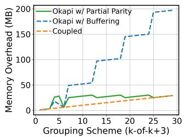  
Figure 11: Maximum memory overhead during file creation for varying group widths. For coupled, we set stripe width = group size (k). For decoupled, we set stripe width = 6.

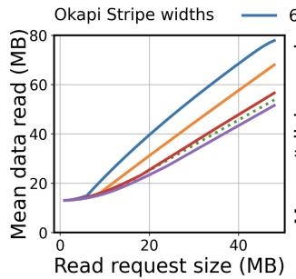

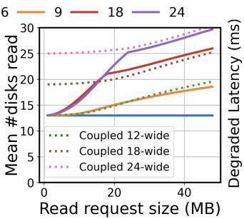

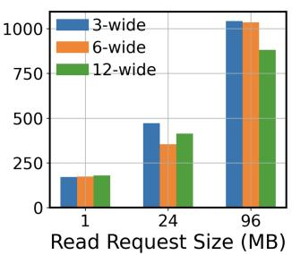  
Figure 12: Expected total data read (left) and disks accessed (mid) during degraded reads for group width=12 and varying stripe sizes, with single block failures. The dotted lines refer to coupled configurations. Measured degraded read latency (right) for 6-of-9 files across stripe widths for three read sizes. Okapi’s degraded-reads for 24 MB are 33% worse with 3-wide (but occurs half as often), 16.6% worse with 12-wide (due to poor stripe width choice).

## 6.5 Choosing group and stripe widths

This section follows the benchmarking process from Sec. 4.6 and presents performance results for 12 MB and 24 MB read requests under different cluster loads, for degradedmode, and for different variances in request sizes. Based on our experiments, we recommend a stripe width of (d median read request sizeblock size e) for optimizing cluster throughput and median latency. However, it may be sub-optimal for tail latency in some cases, such as with lots of degraded-mode reads. Application engineers must make a subjective trade-off based on which metric (e.g., throughput, median or tail latency) is most critical for their use case.

Fig. 13a shows throughput and 99th percentile tail latency for 12 MB reads to 6-of-9 erasure-coded files for four stripe widths (1,2,3 and 6) under different cluster loads. As described, the recommended stripe width of $\lceil \frac { 1 2 } { 8 } \rceil = 2$ maximizes throughput and minimizes median, p95, p99 tail latencies by reducing disk seeks and improving disk efficiency. For instance, under heavy load, stripe width of 2 yields ≈40% higher throughput than a coupled configuration (stripe width=6) and achieves 6.8% lower 99% tail latency.

Tail latencies grow with more degraded-mode reads, and degraded-mode reads with decoupled stripe/group widths can cause even greater read amplification and higher latencies. Fig. 13a shows throughput and tail latency for 12 MB reads when one of the nineteen disks has failed. Even in this extreme scenario, where 5% of the disks have failed, the recommended stripe width continues to be the best for throughput, median and p95 latencies, but p99 tail latencies are ≈9% worse than coupled. For latency-sensitive applications, the engineer may choose to stripe 6-wide, accepting ≈16.6% lower throughput to avoid a 9% increase to the tail. Another acceptable tradeoff might be to use 1-wide stripes, which exhibit 1.6% higher p99 latency than 6-wide stripes, but only incurs 7% hit in throughput compared to 1-wide stripes.

We make similar observations with 24 MB requests in Fig. 13b. As with 12 MB reads, we find that the recommended stripe width of of $\lceil \frac { 2 4 } { 8 } \rceil = 3$ consistently maximizes throughput across load levels. For optimizing p99 latencies, 6-wide stripes generally turn out to be the best.

Fig. 14 shows throughput and latency when request sizes vary under heavy load. We assume request sizes to be normally distributed. We consider two access patterns, 12 MB and 24 MB, and vary standard deviation of request sizes (bounded between 0.5 MB and the file size) to files to study the performance impact. We observe that the recommended stripe widths consistently achieve the highest throughput although the improvements over other widths decrease with increasing variance. While the recommended stripe widths minimize p50 and p95 latencies, the best configuration for p99 latencies can vary depending on the variance in requestsize. When request sizes follow a uniform distribution (a rare occurrence, see Sec.3), we observe little difference in performance with different stripe widths.

Although we used 8 MB blocks in our experiments, we observe similar trends for block sizes as large as 128 MB. Note that the performance trade-offs will vary depending on cluster setups, software implementations, HDD models, disk capacity utilization, stragglers among many other factors. To find optimal configurations, one must benchmark their applications in their clusters as described in Sec. 4.6.

## 7 Related Work

Data striping and redundancy grouping have long histories in data storage, beginning in the context of disk arrays [8, 15]. Most disk array configurations couple striping and grouping, such as by using an n-of-n + 1 RAID5 scheme, with the stripeunit choice being a target of optimization [9, 44]. One notable exception [19] proposed using parity (grouping) without data striping, an extreme form of decoupling the two.

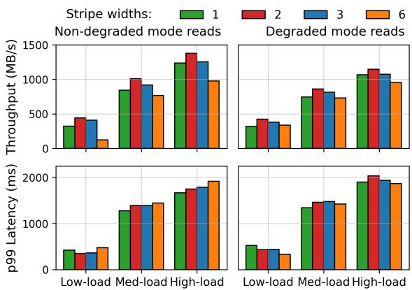

(a) 12 MB reads  
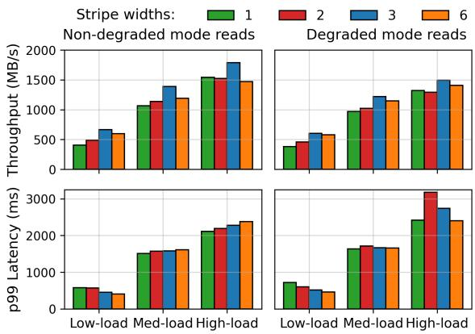  
(b) 24 MB reads  
Figure 13: Throughput (top) and p99 latency (bottom) for (a) 12 MB reads and (b) 24 MB reads to 6-of-9 EC files with stripe widths 1, 2, 3 and 6 for different cluster loads, during normal-mode read operation (left) and during degraded-mode read operation induced by disk failure (right).

In both research [1,18,22] and production [13,24,42,47,57, 61], DFSs couple stripes and groups. Various research efforts have proposed approaches to tune the striping+grouping configuration based on access patterns and data \*-ability goals, given the trade-offs created by the coupling [53, 55, 58].

Many blob/object stores [24, 38, 41] pack several small objects into a single large file, which is in turn striped/erasure coded across disks. These systems decouple the user’s view and filesystem’s view of how data is stored to avoid small-file inefficiencies. This is orthogonal to Okapi’s decoupling of stripe and group widths of the resulting large file to improve read efficiency and decrease EC transition overheads.

The prevalent architecture used by hyperscalers (e.g., Google, Microsoft, Facebook) and HPC (e.g., PanFS, Lustre, HDFS) involves the DFS layer managing both striping and grouping. But one could conceivably build a DFS that stripes data across blocks stored in a block-storage layer that separately uses parities to protect groups of blocks. This decouples stripes and groups by having each layer manage one of them. The closest example we can think of is Frangipani-atop-Petal, where Frangipani [52] was a DFS that stored file contents in blocks stored in the Petal [31] replication-based (k=1) block store. However, such an architecture is not adopted by any of the popular DFSs due to its complexity when using EC (k>1) and the fact that it does not allow file-level control for important choices like EC configuration and data placement, all of which are key elements of modern DFS. Okapi retains the benefits of the current DFS architecture while allowing per-file, independent tuning of striping and grouping configurations.

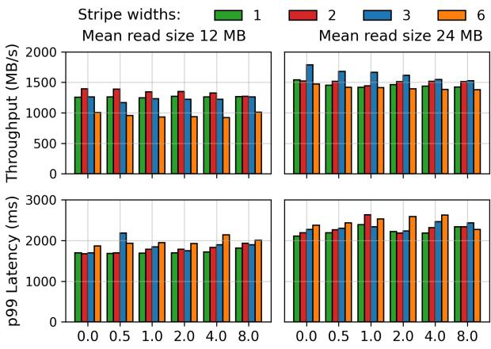  
Standard deviation for read size (in MB)  
Figure 14: Throughput and p99 latency for reads to 6-of-9 erasure-coded files with different stripe widths as variance in request sizes increases. We consider two access patterns, where requests are normally distributed around (1) 12 MB (left) and (2) 24 MB (right), and vary standard deviation on x-axis.

## 8 Conclusion

Existing DFSs couple data striping and redundancy grouping, resulting in IO performance inefficiencies due to limited options in a complex trade-off space as well as high re-encoding IO overhead . Okapi overcomes these problems by decoupling stripes and groups. The design is simple and adoption-friendly. Experiments confirm significant improvement in IO performance (throughput, seeks and latency) and IO reduction for redundancy transitions.

## 9 Acknowledgements

We thank our shepherd and the anonymous reviewers for their invaluable feedback. We extend special thanks to Larry Greenfield, Mustafa Uysal, and numerous other researchers and engineers at Google. This research is generously supported in part by NSF grants CNS1956271, CNS1901410, and CAREER 1943409, by a Sloan Foundation Fellowship, and by a VMware Systems Research Award. We also thank the members and companies of the PDL consortium (Amazon, Bloomberg, Datadog, Google, Honda, Intel, Jane Street, LayerZero Research, Meta, Microsoft, Oracle, Oracle Cloud Infrastructure, Pure Storage, Salesforce, Samsung, Western Digital) for their interests, insights, feedback, and support.

## References

[1] Thomas E Anderson, Michael D Dahlin, Jeanna M Neefe, David A Patterson, Drew S Roselli, and Randolph Y Wang. Serverless network file systems. In Proceedings of the fifteenth ACM symposium on Operating systems principles, pages 109–126, 1995.

[2] Backblaze. Disk Reliability Dataset. https://www. backblaze.com/b2/hard-drive-test-data.html, 2013-2018.

[3] Backblaze. Erasure coding used by Backblaze. https: //www.backblaze.com/blog/reed-solomon/, 2013- 2018.

[4] Eric Brewer. Spinning Disks and Their Cloudy Future. https://www.usenix.org/node/194391, 2018.

[5] Eric Brewer, Lawrence Ying, Lawrence Greenfield, Robert Cypher, and Theodore T’so. Disks for data centers. Technical report, Google, 2016.

[6] Alan D Brunelle. Block I/O layer tracing: blktrace. HP, Gelato-Cupertino, CA, USA, 57, 2006.

[7] Brad Calder, Ju Wang, Aaron Ogus, Niranjan Nilakantan, Arild Skjolsvold, Sam McKelvie, Yikang Xu, Shashwat Srivastav, Jiesheng Wu, Huseyin Simitci, et al. Windows Azure storage: a highly available cloud storage service with strong consistency. In Proceedings of the Twenty-Third ACM Symposium on Operating Systems Principles, pages 143–157, 2011.

[8] Peter M Chen, Edward K Lee, Garth A Gibson, Randy H Katz, and David A Patterson. Raid: High-performance, reliable secondary storage. ACM Computing Surveys (CSUR), 26(2):145–185, 1994.

[9] Peter M Chen and David A Patterson. Maximizing performance in a striped disk array. In Proceedings of the 17th annual international symposium on Computer Architecture, pages 322–331, 1990.

[10] HG Data. Apache hadoop hdfs insights. URL https://discovery.hgdata.com/product/apache-hadoophdfs, 2024.

[11] Erasure Code Ceph Documentation. https: //docs.ceph.com/docs/master/rados/ operations/erasure-code/, 2019.

[12] Facebook. VAST Erasure Coding. https://vastdata. com/blog/introducing-rack-scale-resilience, 2020.

[13] Daniel Ford, François Labelle, Florentina I Popovici, Murray Stokely, Van-Anh Truong, Luiz Barroso, Carrie

Grimes, and Sean Quinlan. Availability in Globally Distributed Storage Systems. In USENIX Symposium on Operating Systems Design and Implementation (OSDI), 2010.

[14] Apache Software Foundation. HDFS Erasure Coding. https://hadoop.apache.org/docs/ r3.0.0/hadoop-project-dist/hadoop-hdfs/ HDFSErasureCoding.html, 2017.

[15] Gregory R Ganger, Bruce L Worthington, Robert Y Hou, and Yale N Patt. Disk arrays: high-performance, highreliability storage subsystems. Computer, 27(3):30–36, 1994.

[16] S. Ghemawat, H. Gobioff, and S.T. Leung. The Google File System. In ACM SIGOPS Operating Systems Review, volume 37, pages 29–43. ACM, 2003.

[17] Garth A Gibson. Redundant disk arrays: Reliable, parallel secondary storage. The MIT Press, 1992.

[18] Garth A Gibson, David F Nagle, Khalil Amiri, Jeff Butler, Fay W Chang, Howard Gobioff, Charles Hardin, Erik Riedel, David Rochberg, and Jim Zelenka. A costeffective, high-bandwidth storage architecture. ACM SIGOPS operating systems review, 32(5):92–103, 1998.

[19] Jim Gray, Bob Horst, and Mark Walker. Parity striping of disk arrays: Low-cost reliable storage with acceptable throughput. In VLDB, volume 90, pages 148–161, 1990.

[20] Kevin M Greenan, James S Plank, and Jay J Wylie. Mean time to meaningless:{MTTDL}, markov models, and storage system reliability. In 2nd Workshop on Hot Topics in Storage and File Systems (HotStorage 10), 2010.

[21] Rong Gu, Qianhao Dong, Haoyuan Li, Joseph Gonzalez, Zhao Zhang, Shuai Wang, Yihua Huang, Scott Shenker, Ion Stoica, and Patrick PC Lee. DFS-PERF: A scalable and unified benchmarking framework for distributed file systems. EECS Dept., Univ. California, Berkeley, Berkeley, CA, USA, Tech. Rep. UCB/EECS-2016-133, 2016.

[22] John H Hartman and John K Ousterhout. The Zebra striped network file system. ACM Transactions on Computer Systems (TOCS), 13(3):274–310, 1995.

[23] Yuchong Hu, Liangfeng Cheng, Qiaori Yao, Patrick PC Lee, Weichun Wang, and Wei Chen. Exploiting combined locality for {Wide-Stripe} erasure coding in distributed storage. In 19th USENIX Conference on File and Storage Technologies (FAST 21), pages 233–248, 2021.

[24] Cheng Huang, Huseyin Simitci, Yikang Xu, Aaron Ogus, Brad Calder, Parikshit Gopalan, Jin Li, Sergey Yekhanin, et al. Erasure Coding in Windows Azure Storage. In USENIX Annual Technical Conference (ATC), 2012.

[25] Saurabh Kadekodi, Francisco Maturana, Sanjith Athlur, Arif Merchant, KV Rashmi, and Gregory R Ganger. Tiger: Disk-Adaptive redundancy without placement restrictions. In 16th USENIX Symposium on Operating Systems Design and Implementation (OSDI 22), pages 413–429, 2022.

[26] Saurabh Kadekodi, Francisco Maturana, Suhas Jayaram Subramanya, Juncheng Yang, KV Rashmi, and Gregory Ganger. Pacemaker: Avoiding heart attacks in storage clusters with disk-adaptive redundancy. In Proceedings of the 14th USENIX Symposium on Operating Systems Design and Implementation, 2020.

[27] Saurabh Kadekodi, K V Rashmi, and Gregory R Ganger. Cluster storage systems gotta have HeART: improving storage efficiency by exploiting disk-reliability heterogeneity. In USENIX File and Storage Technologies (FAST), 2019.

[28] Saurabh Kadekodi, Shashwat Silas, David Clausen, and Arif Merchant. Practical Design Considerations for Wide Locally Recoverable Codes (LRCs). In 21st USENIX Conference on File and Storage Technologies (FAST 23), pages 1–16, 2023.

[29] Timothy Kim, Sanjith Athlur, Saurabh Kadekodi, Francisco Maturana, Dax Delvira, Arif Merchant, Gregory R Ganger, and KV Rashmi. Morph: Efficient file-lifetime redundancy management for cluster file systems. In ACM Symposium on Operating Systems Principles (SOSP), 2024.

[30] Spencer Kimball. roadmap: Blob storage. https://github.com/cockroachdb/cockroach/ issues/243#issuecomment-73365370, 2015.

[31] Edward K Lee and Chandramohan A Thekkath. Petal: Distributed virtual disks. In Proceedings of the seventh international conference on Architectural support for programming languages and operating systems, pages 84–92, 1996.

[32] Xiaolu Li, Zuoru Yang, Jinhong Li, Runhui Li, Patrick PC Lee, Qun Huang, and Yuchong Hu. Repair pipelining for erasure-coded storage: Algorithms and evaluation. ACM Transactions on Storage (TOS), 17(2):1–29, 2021.

[33] Chris Mason. Seekwatcher. URL http://oss. oracle. com/˜ mason/seekwatcher, 2008.

[34] Matt Massie, Bernard Li, Brad Nicholes, Vladimir Vuksan, Robert Alexander, Jeff Buchbinder, Frederiko Costa, Alex Dean, Dave Josephsen, Peter Phaal, et al. Monitoring with Ganglia: tracking dynamic host and application metrics at scale. " O’Reilly Media, Inc.", 2012.

[35] Francisco Maturana and KV Rashmi. Convertible codes: new class of codes for efficient conversion of coded data in distributed storage. In 11th Innovations in Theoretical Computer Science Conference (ITCS 2020). Schloss Dagstuhl-Leibniz-Zentrum für Informatik, 2020.

[36] Francisco Maturana and KV Rashmi. Convertible codes: Enabling efficient conversion of coded data in distributed storage. IEEE Transactions on Information Theory, 68(7):4392–4407, 2022.

[37] Subrata Mitra, Rajesh Panta, Moo-Ryong Ra, and Saurabh Bagchi. Partial-parallel-repair (ppr). In Proceedings of the Eleventh European Conference on Computer Systems. ACM, 2016.

[38] Subramanian Muralidhar, Wyatt Lloyd, Sabyasachi Roy, Cory Hill, Ernest Lin, Weiwen Liu, Satadru Pan, Shiva Shankar, Viswanath Sivakumar, Linpeng Tang, et al. f4: Facebook’s warm blob storage system. In Proc. of USENIX OSDI, pages 383–398, 2014.

[39] Michael Ovsiannikov, Silvius Rus, Damian Reeves, Paul Sutter, Sriram Rao, and Jim Kelly. The quantcast file system. Proceedings of the VLDB Endowment, 6(11):1092– 1101, 2013.

[40] Lluis Pamies-Juarez, Anwitaman Datta, and Frederique Oggier. Rapidraid: Pipelined erasure codes for fast data archival in distributed storage systems. In 2013 Proceedings IEEE INFOCOM, pages 1294–1302. IEEE, 2013.

[41] Satadru Pan, Theano Stavrinos, Yunqiao Zhang, Atul Sikaria, Pavel Zakharov, Abhinav Sharma, Mike Shuey, Richard Wareing, Monika Gangapuram, Guanglei Cao, et al. Facebook’s tectonic filesystem: Efficiency from exascale. In 19th USENIX Conference on File and Storage Technologies (FAST 21), pages 217–231, 2021.

[42] K V Rashmi, Nihar B Shah, Dikang Gu, Hairong Kuang, Dhruba Borthakur, and Kannan Ramchandran. A Solution to the Network Challenges of Data Recovery in Erasure-coded Distributed Storage Systems: A Study on the Facebook Warehouse Cluster. In USENIX Workshop on Hot Topics in Storage and File Systems (HotStorage), 2013.

[43] K V Rashmi, Nihar B Shah, Dikang Gu, Hairong Kuang, Dhruba Borthakur, and Kannan Ramchandran. A hitchhiker’s guide to fast and efficient data reconstruction in

erasure-coded data centers. ACM Special Interest Group on Data Communication (SIGCOMM), 2014.

[44] AL Narasimha Reddy and Prithviraj Banerjee. A study of parallel disk organizations. ACM SIGARCH Computer Architecture News, 17(5):40–47, 1989.

[45] Howard Gobioff Sanjay Ghemawat and Shun-Tak Leung. The google file system. pages 1–2, 2003.

[46] Frank Schmuck and Roger Haskin. {GPFS}: A {Shared-Disk} file system for large computing clusters. In Conference on file and storage technologies (FAST 02), 2002.

[47] Philip Schwan et al. Lustre: Building a file system for 1000-node clusters. In Proceedings of the 2003 Linux symposium, volume 2003, pages 380–386, 2003.

[48] Seagate. The digitization of the world from edge to core. https://www.seagate.com/ files/www-content/our-story/trends/files/ idc-seagate-dataage-whitepaper.pdf, 2018.

[49] Zhirong Shen, Yuhui Cai, Keyun Cheng, Patrick PC Lee, Xiaolu Li, Yuchong Hu, and Jiwu Shu. A survey of the past, present, and future of erasure coding for storage systems. ACM Transactions on Storage, 21(1):1–39, 2025.

[50] Konstantin Shvachko, Hairong Kuang, Sanjay Radia, Robert Chansler, et al. The Hadoop distributed file system. In IEEE/NASA Goddard Conference on Mass Storage Systems and Technologies (MSST), 2010.

[51] Benjamin H Sigelman, Luiz André Barroso, Mike Burrows, Pat Stephenson, Manoj Plakal, Donald Beaver, Saul Jaspan, and Chandan Shanbhag. Dapper, a largescale distributed systems tracing infrastructure. 2010.

[52] Chandramohan A Thekkath, Timothy Mann, and Edward K Lee. Frangipani: A scalable distributed file system. In Proceedings of the sixteenth ACM symposium on Operating systems principles, pages 224–237, 1997.

[53] Eno Thereska, Michael Abd-El-Malek, Jay J Wylie, Dushyanth Narayanan, and Gregory R. Ganger. Informed data distribution selection in a self-predicting storage system. In IEEE International Conference on Autonomic Computing (ICAC), 2006.

[54] Zizhong Wang, Haixia Wang, Airan Shao, and Dongsheng Wang. An adaptive erasure-coded storage scheme with an efficient code-switching algorithm. In Proceedings of the 49th International Conference on Parallel Processing, pages 1–11, 2020.

[55] Hakim Weatherspoon and John D Kubiatowicz. Erasure coding vs. replication: A quantitative comparison. In International Workshop on Peer-to-Peer Systems, pages 328–337. Springer, 2002.

[56] Sage A Weil, Scott A Brandt, Ethan L Miller, and Carlos Maltzahn. CRUSH: Controlled, scalable, decentralized placement of replicated data. In ACM / IEEE High Performance Computing Networking, Storage and Analysis (SC), 2006.

[57] Brent Welch, Marc Unangst, Zainul Abbasi, Garth A Gibson, Brian Mueller, Jason Small, Jim Zelenka, and Bin Zhou. Scalable performance of the Panasas parallel file system. In FAST, volume 8, pages 1–17, 2008.

[58] Jay J Wylie, Mehmet Bakkaloglu, Vijay Pandurangan, Michael W Bigrigg, Semih Oguz, Ken Tew, Cory Williams, Gregory R Ganger, and Pradeep K Khosla. Selecting the right data distribution scheme for a survivable storage system. Technical report, Technical Report CMU-CS-01-120, Sch. of Computer Science, Carnegie Mellon . . . , 2001.

[59] Qiaori Yao, Yuchong Hu, Liangfeng Cheng, Patrick PC Lee, Dan Feng, Weichun Wang, and Wei Chen. Stripemerge: Efficient wide-stripe generation for largescale erasure-coded storage. In 2021 IEEE 41st International Conference on Distributed Computing Systems (ICDCS), pages 483–493. IEEE, 2021.

[60] Mi Zhang, Qiuping Wang, Zhirong Shen, and Patrick PC Lee. Pocache: Toward robust and configurable straggler tolerance with parity-only caching. Journal of Parallel and Distributed Computing, 167:157–172, 2022.

[61] Zhe Zhang, Amey Deshpande, Xiaosong Ma, Eno Thereska, and Dushyanth Narayanan. Does erasure coding have a role to play in my data center. Microsoft research MSR-TR-2010, 52, 2010.

## Supplemental material for Okapi The appendix is not peer-reviewed.

## A Okapi can be easily adopted by other DFS

Most publicly-described distributed file systems, both opensource and proprietary, that we are aware of couple data stripes and redundancy groups. Okapi’s design for decoupling is applicable to and beneficial for all distributed file systems that stripe their files. We describe below the coupled design of a few other contemporary distributed file systems, and show that Okapi’s ideas can be adopted into their system.

Colossus File System (Google). The architecture of Colossus File System (Google’s distributed file system) is similar to that of HDFS. A k.r erasure-coded file stripe maintains r parity chunks for k (group width) data chunks. The data within the stripe is broken into small (typically 1MB) blocks which are spread across the k (stripe width) disks in round robin fashion [30]. The metadata of the file comprises of the list of file segments, and a mapping of the file segments to chunk locations, which indicate where each of k + r chunks are stored in the storage cluster [45], just like in HDFS. Okapi’s design can therefore be directly adopted into Colossus.

Panasas File System. Data is stored in objects that are spread across Object Storage Devices (OSDs). Files are striped across objects in a RAID-5 layout. Note that all RAID layouts inherently couple stripes and groups. In RAID-5, one parity chunk is maintained for three data chunks, and each row of blocks is spread across three chunks. Similar to HDFS, per-file metadata stores the storage map. The storage map maintains the striping strategy and location information for each object of the stripe. Okapi’s design can therefore be directly adopted into Panasas.

Ceph. The reliability and layout of a file is dictated by EC profiles in Ceph. A profile, among other things, is defined by number of data chunks (k), number of parity chunks (m) and the stripe unit size. The stripe units refers to the logically contiguous pieces of data that get spread across the k data chunks in a round-robin fashion.

Unlike HDFS, which stores the mapping of chunk to node locations for each group, Ceph uses CRUSH [56], a nearuniform hashing function, to compute the locations of the chunks of an erasure-coded group. For an erasure-coded stripe/group of a file, CRUSH uses the file inode number and the index of the stripe (within a file) to compute k + m unique node locations to store the chunks. Each chunk in a group (for durability), as well each chunk in a stripe (for optimal parallelism) must exist on a unique node. Since stripes and groups are no longer the same in Okapi, the algorithm must be modified to ensure node locations are unique across both stripes as well as groups. A naive way to achieve this is to use the existing CRUSH function to find l = LCM(stripewidth, k + m) unique nodes. All chunks in each of the l/stripe\_width stripes and l/group\_width nodes will then be on unique nodes.