①

USENIX

THE ADVANCED COMPUTING SYSTEMS ASSOCIATION

Low End-to-End Latency atop a Speculative Shared Log with Fix-Ante Ordering

Shreesha G. Bhat, Tony Hong, Xuhao Luo, Jiyu Hu, Aishwarya Ganesan, and Ramnatthan Alagappan, University of Illinois Urbana-Champaign

https://www.usenix.org/conference/osdi25/presentation/bhat

# This paper is included in the Proceedings of the 19th USENIX Symposium on Operating Systems Design and Implementation.

July 7–9, 2025 • Boston, MA, USA

ISBN 978-1-939133-47-2

Open access to the Proceedings of the 19th USENIX Symposium on Operating Systems Design and Implementation is sponsored by

# Low End-to-End Latency atop a Speculative Shared Log with Fix-Ante Ordering

Shreesha G. Bhat, Tony Hong, Xuhao Luo, Jiyu Hu, Aishwarya Ganesan, Ramnatthan Alagappan

University of Illinois Urbana-Champaign

Abstract. Today’s shared logs incur expensive coordination to globally order records across storage shards before they can deliver records to applications. This makes them unsuitable for many modern applications that must process ingested data as early as possible and realize low end-to-end (e2e) latencies. We propose SpecLog, a new shared log abstraction that delivers records by speculating the global order, allowing the application’s computation and shared-log coordination to be overlapped, thus reducing e2e latency. To enable accurate speculations, we introduce fix-ante ordering, a novel ordering mechanism that predetermines the global order and makes the shards adhere to the predetermined order. With fix-ante ordering, shards, except in rare cases, can accurately predict where their records will sit in the total order before global coordination. We build Belfast, an implementation of the SpecLog abstraction and fix-ante ordering. Our experiments show that Belfast offers lower e2e latencies than current shared logs while preserving their elasticity, flexibility, and scalability.

## 1 Introduction

Shared logs play a central role in many modern, datadriven applications like high-speed trading [27, 28], real-time search [54,60], IoT analytics [24,49], fraud detection [15,46], and others [3, 59]. At a high level, in all these applications, a set of upstream components ingest data into the shared log, and a set of downstream tasks consume and process the data.

Shared logs ease the construction of the above applications by providing an abstraction of a durable and ordered sequence of records. Many shared logs [1, 4, 16, 29, 36, 61] provide this abstraction while storing records on multiple storage shards, i.e., they offer a total order of records across shards.

Early total-order logs like Corfu [16, 17] first obtain a position from a sequencer and then use a fixed position-to-shard mapping to write to the shard responsible for that position. This architecture fundamentally leads to three problems for applications [29, §2.2]: inability to seamlessly add or remove shards (to elastically adapt to demands), inflexible data placement, and limited scalability. Fortunately, a family of shared logs [29,32,36], starting from Scalog [29], address these problems by taking a durability-first approach. Here, clients first make records durable on the shards of their choice; the shards then periodically contact a sequencing layer to establish total order for a batch of records. This design enables one to add or remove shards without downtime, allows clients to choose the location of records, and enhances scalability [29].

Unfortunately, the design choices that enable these desirable properties in today’s shared logs fundamentally lead to high delivery latency (§2). Delivery latency refers to the time between when upstream components produce records and the earliest point when the shared log can deliver these records to downstream tasks. The key reason for high delivery latency is the overhead to determine the global order and doing so in a batched manner. Specifically, the shards periodically batch and report the number of records made durable so far to the sequencing layer; the sequencing layer then determines a “global cut”, which dictates how to assign positions to durable records across shards. Only after the shards coordinate with the sequencing layer and receive the global cut, can they assign positions to their records and serve them to downstream tasks, increasing delivery latency.

Such high delivery latency, in turn, leads to high application end-to-end (e2e) latency, which refers to the time between when records are produced and when the downstream task completes processing them. This is because only after the shared log orders and delivers records, can the application’s downstream computations start, increasing e2e latency. Realizing low e2e latency, however, is critical for many real-world applications. Consider the following: a financial application that must flag fraudulent activity as soon as transactions are ingested [25, 62]; real-time analytics that must derive insights from new data as early as possible [6, 56]; high-speed trading that must trade quickly based on market feed [28, 34]. All these applications desire low e2e latency in addition to elasticity, flexible placement, and scalability from the shared log. Although today’s shared logs like Scalog satisfy the latter needs, they cannot help realize low e2e latency.

SpecLog Abstraction and Fix-Ante Ordering. To enable applications atop shared logs realize low e2e latency, we identify an opportunity for speculative execution. Given that high delivery latency stems from global ordering, we observe that if a shared log can speculate the global order and deliver records quickly, downstream computation can start based on the speculated order. Thus, the shared log’s coordination and the downstream application’s computation can be overlapped, reducing e2e latency. This approach suits real-world applications because they typically perform computation over the consumed records (e.g., computing aggregates [26], updating indexes [14, 19], performing analysis [31]).

Based on this observation, we propose SpecLog, a new shared-log abstraction (§3.1). SpecLog offers the same interface as current shared logs but with one difference. SpecLog first delivers records in a predicted order, and later confirms whether or not the prediction is correct. If correct, SpecLog enables low e2e latency; otherwise, SpecLog notifies applications to recompute based on the actual order, preserving correctness. While SpecLog’s idea can benefit any shared-log design, our focus is on durability-first architectures that offer elasticity, flexibility, and scalability which are critical to applications in addition to low e2e latency. In such a durability-first SpecLog system, shards operate the same way as today’s logs, periodically coordinating with the sequencing layer to determine the actual order. However, they predict the global order and deliver records earlier before coordination. Later, when the actual order arrives, shards confirm or fail the speculation.

Using speculation to reduce latency is not new; many prior distributed systems have done so [23, 33, 38, 39, 48, 65]. However, SpecLog is the first to offer a speculative interface for today’s shared logs, helping applications realize low e2e latency while preserving the other properties of today’s shared logs. Further, a key innovation in SpecLog is how it virtually eliminates misspeculations except in very rare cases via a novel ordering mechanism called fix-ante ordering.

To realize low e2e latency, SpecLog must be able to correctly predict record positions at the shards before global coordination. Such correct prediction in current logs like Scalog, however, is inherently difficult. This is because shards have the free will to make durable and report however many records they wish in each report to the sequencing layer. Because the positions assigned to records at a shard depend upon how many records other shards report, it is hard for the shard to predict where its local records will sit in the total order.

Fix-ante† ordering solves this problem (§3.2). The key idea behind fix-ante ordering is to predetermine beforehand the global order and try to enforce the shards to adhere to this order. Fix-ante order is specified as a series of predetermined global cuts. The shards adhere to each predetermined cut by making durable and reporting exactly the number of records as dictated by that cut (which we refer to as the shards’ quotas). Because each shard knows that other shards will report precisely the number of records dictated by their quotas, each shard can accurately predict the positions of its local records in the total order without waiting for the actual global order (which is determined after coordinating with the sequencer).

Note that fix-ante ordering does not mean order is established before durability; rather, fix-ante ordering simply offers a way for predicting the global order in durability-first architectures.

As long as the shards adhere to their quotas, the actual global order will match the fix-ante one, ensuring that the positions speculated by the shards remain correct. Fortunately, SpecLog can ensure that shards can adhere to their quotas except in rare cases. Specifically, in failure-free cases, shards can adhere to their quotas even when they have fewer or more records than their quotas by filling in no-op records or by delaying records to subsequent reports, respectively. Even when a few shard replicas fail, quotas can be adhered to because shards are internally fault tolerant. Only in the rare case where an entire shard fails or if no shard replica can contact the sequencing layer, will the shard be unable to adhere to its quota, resulting in incorrect predictions. While SpecLog loses some performance under such rare cases, it still preserves correctness by failing the speculation.

Belfast System. We build Belfast, an implementation of the SpecLog abstraction and fix-ante ordering (§4). While fixante ordering provides a basic framework for accurate predictions, a real system must solve several performance challenges while still preventing misspeculations. First, Belfast must assign quota for a shard such that it is neither too high (which will add many no-ops) nor too low (which will delay records); Belfast achieves this by setting quotas based on ingestion rates. Second, even with the right quotas, Belfast must handle cases where shards experience bursts. Belfast handles bursts via a new lag-fix mechanism; without this, appends and confirmations will incur higher latencies. Third, Belfast must handle longer-term rate changes. Belfast does this by dynamically adjusting predetermined cuts and quotas. Importantly, it does so without misspeculations via a novel speculation lease window technique that ensures that all shards use the same predetermined cuts for predictions and that they uniformly move to the new cuts at the window boundaries. Belfast also adds or removes shards without downtime and misspeculations using the speculation lease windows. Finally, Belfast can dynamically exclude shards from some cuts to mitigate straggler shards and to maintain low latencies with many shards.

Results. Our experiments (§6) show that Belfast delivers records ∼3× earlier than Scalog, thereby reducing e2e latency by 1.6× over Scalog. Belfast offers significant benefits in e2e latency even with varying amounts of downstream computation. Belfast achieves low e2e latency while incurring minimal overhead in append latency over Scalog (5.8% with 10 shards). We also show that Belfast can effectively handle bursts, adjust to rate changes, mitigate straggler shards, and handle shard failures, all while maintaining low e2e latency. We show that, like Scalog, Belfast can add and remove shards without any downtime and scale throughput with shards while reducing e2e latencies. Finally, we build three applications (§5): intrusion detection, fraud monitoring, and high-frequency trading, and show that Belfast enables these applications to realize

1.4×-1.6× lower e2e latency than Scalog.

Contributions. This paper makes four contributions.

• We propose SpecLog, a shared-log abstraction that delivers records by predicting their order, overlapping global coordination and computation, thus reducing e2e latency.

• We introduce fix-ante ordering, a novel ordering approach that enables shards to accurately speculate global positions.

• We build Belfast, an implementation of SpecLog and fixante ordering. Belfast is the first shared log to offer elasticity, flexible placement, and scalability with low e2e latencies.

• We experimentally demonstrate Belfast’s benefits.

## 2 Motivation

We explain why today’s shared logs incur high delivery latencies, making them unsuitable for realizing low e2e latency.

## 2.1 State-of-the-Art Shared Logs: Background

Shared logs [16–18, 29] offer a powerful abstraction: a faulttolerant, ordered record sequence that many clients can simultaneously append to and read from. Upon appends, the shared log makes records durable and linearizably [35] orders them: if an append A completes before another append B starts, then A will precede B in the log. Clients can read records at positions or subscribe to receive records in order.

With this abstraction and simple interface, shared logs ease building modern applications like real-time analytics [52, 54, 59, 60], high-frequency trading [27, 28], and many others [15, 31, 37, 46, 49, 51]. In all these applications, a set of upstream components ingest data into the shared log which provides strong durability and ordering guarantees. Downstream tasks then consume the records and compute over them.

Popular shared logs like Kafka [13] and others [5, 50] do not provide a total order across shards. Corfu [16, 17], an early shared log, offers total order. Corfu adopts an orderfirst approach, where clients first obtain a position from a sequencer. Then, using a fixed position-to-shard mapping, clients write the record to the shard responsible for the obtained position. As others have noted [29, §2.2], the order-first approach is harmful in three ways. First, it introduces holes because clients can fail after getting the position but before writing. Readers must fill such holes, which requires a systemwide mapping from positions to where records are stored, and clients and servers must agree upon this mapping. This means adding or removing shards requires agreeing upon the new mapping, which leads to system-wide unavailability. Second, the fixed mapping also means that clients cannot flexibly write records to shards of their choice. Finally, obtaining a position for every write makes the sequencer a scalability bottleneck.

State-of-the-art shared logs like Scalog [29] address these limitations. Scalog takes a durability-first approach, where clients first store records on a shard of their choice. After batching many records, the shards contact a sequencing layer which determines the total order of records across shards. By avoiding Corfu’s fixed mapping, Scalog can add or remove shards without downtime, enabling it to elastically grow or shrink throughput and capacity [29, §6.1]; such seamless elasticity is important for applications to adapt to dynamic demands [29,41]. Scalog also enables flexible data placement as clients can choose record locations; this is greatly useful because applications can assign records to shards based on application-level semantics (e.g., records of a particular user can go to one shard) or based on proximity. Finally, the batched communication with the sequencing layer allows Scalog to scale better than Corfu [29, §6.3]; such scalability is important for applications that must ingest and process data at high rates [29, 34]. Given these benefits, many systems like Boki [36] and FlexLog [32] adopt a Scalog-like design.

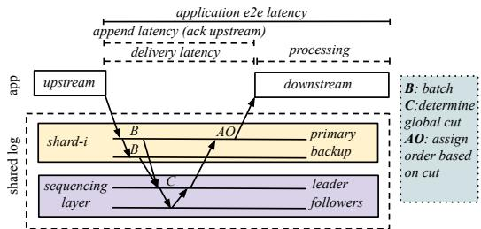  
Figure 1: Delivery and E2E Latency in Today’s Shared Logs.

## 2.2 High Delivery Latency in Today’s Shared Logs

Although today’s shared logs offer desirable properties, the design choices that enable them to achieve these properties is fundamentally at odds with low delivery latency, which is the time between when records are produced into the log and the earliest point they can be delivered to downstream tasks.

Figure 1 shows this problem in Scalog. Clients first send records to the primary of a shard. The shard primary logs the records locally and replicates them to the shard backup. A record is durable once it has been logged by both the shard primary and backup. The shard servers then report their local log lengths to a sequencing layer. To amortize the cost of contacting the sequencing layer, the shards batch (B in Figure 1) and only report log lengths periodically; such periodic reports incur a batching delay. The sequencing layer then assembles the local reports from shards and determines the number of durable records within each shard. It then computes a global cut: the global order of durable records across shards (C), and makes the cut fault-tolerant via Paxos [40]. The sequencer then sends the global cut to all shards, using which each shard assigns global positions to records in its local log (AO). Only after this point, in addition to acknowledging the appends, the shared log can deliver the records to downstream consumers, which then can start processing. Thus, between upstream ingestion and downstream consumption, applications incur batching delays and the cost of global ordering.

High delivery latencies are not merely a result of how today’s shared logs are implemented, but rather a fundamental cost of the durability-first approach. This is because the design choice to have clients first write records to shards of their choice and then have the shards report to the sequencing layer in a batched manner (which enables seamless elasticity, flexibility, and scalability) is what leads to high delivery latencies. Order-first shared logs like Corfu do not incur some of the above overheads like batching and coordination within the sequencing layer. However, they also deliver records only after the global order is established which takes multiple roundtrips [16, 43], thus still incurring high delivery latencies (besides suffering from other limitations for applications).

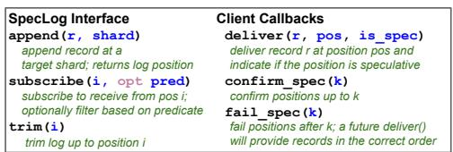  
Figure 2: SpecLog Interface.

Unfortunately, high delivery latencies negatively impact application e2e latency. As shown in the figure, e2e latency includes the delivery latency and the time to process the records. Thus, to applications, the high delivery latencies of today’s shared logs is a major obstacle to realizing low e2e latencies.

## 2.3 Demand for Low E2E Latency

Low e2e latencies are critical for many modern, data-driven applications. High-speed trading applications must execute trades in real-time based on incoming data feeds [27, 28, 34, 42], where shaving off even milliseconds of latency can save millions of dollars [9, 10]. Financial fraud detection systems need to flag suspicious transactions as quickly as possible [25, 55, 62], with every millisecond being crucial [2, 12]. Real-time analytics engines [52, 59] require rapid insights from fresh data, while real-time search systems must minimize the delay before new data appears in results [54, 60]. Similar low e2e latency requirements exist for event sourcing [37, 51], IoT analytics [24, 31, 49], and fleet management applications [58]. Unfortunately, current shared logs cannot meet these demanding latency requirements. Further, the importance of low e2e latency and thus the need for low delivery latency is evident from RedPanda’s recent survey [11], where 100s of practitioners reported the vital metrics in their sharedlog deployments. Among them, ∼35% cited delivery as the most critical latency metric.

## 3 SpecLog and Fix-Ante Ordering

We describe the SpecLog abstraction and explain how it uses fix-ante ordering to enable accurate speculations.

## 3.1 SpecLog Abstraction

Our goal is to design a shared log that enables low e2e latency. To this end, we first observe that in many modern, data-driven applications, downstream tasks typically perform computation over the consumed records. For example, IoT analytics performs aggregations, detects outliers, updates database views, or runs ML algorithms [20, 26, 49]. Real-time search platforms [54] incrementally update multiple indexes (e.g., document, columnar) as new data is ingested [14, 19]. Similarly, high-speed trading computes online aggregations and runs regression to predict expected profit and loss [42].

Current shared logs incur high delivery latencies and only after this delay, can downstream computations start, increasing e2e latencies. Given that high delivery latency stems from global ordering, we observe that if the shared log predicts global positions and delivers records earlier, downstream computation can start based on the speculated order. This allows the shared log’s global coordination and downstream computation to be overlapped. That is, by the time the processing completes, the shared log could have determined the actual order after global coordination. If the predicted order matches the actual one, then applications realize low e2e latency.

Based on this observation, we propose the SpecLog abstraction. SpecLog offers a similar interface to today’s shared logs [29] as shown in Figure 2. Applications can append records at a shard of their choice, subscribe† to records starting from a position (optionally filtering based on a predicate), and trim the log. The only difference is that when a record is delivered for a position, a bit indicates whether or not the position is speculative. If speculative, SpecLog will later confirm or fail the speculation. Applications require little changes to work with SpecLog’s interface. First, applications must wait until they receive the confirmation before externalizing outputs (e.g., trigger alerts). Next, if downstream tasks perform state updates, they must roll them back if speculation fails.

SpecLog’s idea can benefit any shared-log architecture, even order-first ones. However, our focus is on today’s durability-first logs that offer elasticity, flexibility, and scalability because applications require these properties in addition to low e2e latency. Figure 3 shows how SpecLog would reduce e2e latencies in such durability-first shared logs. In SpecLog, once the records are durable, the shards predict their order (P) and deliver them to downstream tasks, which begin processing. Shards continue to process appends the same way as existing logs: they coordinate with the sequencing layer in a batched manner (B) to determine the actual order. Once the actual global cut is determined (C), SpecLog checks if the predicted order matches the actual one (CO). If the prediction is correct, SpecLog sends a confirmation; otherwise, the speculation fails and records are supplied in the correct order. Properties. SpecLog reduces e2e latency compared to today’s shared logs regardless of compute time. However, the extent of benefit depends upon how big or small the compute time is. Intuitively, SpecLog offers the most benefit when global ordering and computation effectively overlap; in other cases, SpecLog still offers lower e2e latencies. SpecLog preserves the seamless elasticity, flexibility, and scalability of today’s shared logs. First, in SpecLog, clients still flexibly choose shards to write records. This, in turn, allows SpecLog to add or remove shards seamlessly without any downtime [29]. Finally, because appends are batched at the shards which then contact the sequencing layer periodically, SpecLog would scale well.

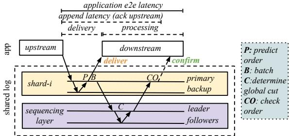  
Figure 3: Delivery and E2E Latency in SpecLog.

## 3.2 Fix-Ante Ordering

SpecLog can lead to low e2e latencies only when the shards can correctly predict the position of their records. Unfortunately, making such correct predictions is difficult in durability-first shared-log designs. We observe that the freewill nature of reports is what makes correct predictions hard.

To understand this, consider Scalog with three shards $S _ { 1 }$ $S _ { 2 } ,$ , and $S _ { 3 }$ . Suppose, initially, $S _ { 1 } , S _ { 2 }$ , and $S _ { 3 }$ report 2, 3, and 2 durable records to the sequencing layer, respectively. As a result, the sequencing layer would produce the global cut ⟨2,3,2⟩. Scalog uses a deterministic, lexicographic scheme to assign order, where records in lower-numbered shards go before records in higher-numbered shards [29]. Thus, from the global cut, shards would assign positions to their local records as $S _ { 1 } : [ 1 , 2 ] , S _ { 2 } : [ 3 , 4 , 5 ] , S _ { 3 } : [ 6 , 7 ]$ . One approach to predict the positions for subsequent records is to use the information from the previous cut (that $S _ { 1 } , S _ { 2 }$ , and $S _ { 3 }$ sent 2, 3, and 2 records, respectively). If such a scheme is used, $S _ { 2 }$ would predict that its next local record would get position 10 (because it anticipates that $S _ { 1 }$ would report 2 records and thus positions 8 and 9 would go to $S _ { 1 } )$ . However, in the next report, $S _ { 1 }$ could report 3 records (because it has the free-will to do so); thus, $S _ { 2 } ' \mathrm { s }$ next local record will actually be assigned position 11 (not 10), making $S _ { 2 } ' \mathrm { s }$ prediction incorrect.

Fix-ante Ordering Insight. Fix-ante ordering, in contrast, enables shards to accurately predict the positions of their records. The main idea behind fix-ante ordering is to predetermine in advance the global order and make the shards adhere to this order. Fix-ante order is a sequence of predetermined global cuts that the system is expected to produce. Each cut dictates how many records shards must include in their reports, which we refer to as the shards’ quotas. Shards then adhere by exactly meeting their quotas in each report. The key insight is that, because each shard knows that the other shards will report precisely the number of records dictated by their quotas, each shard can accurately predict the positions of its records in the total order before global coordination. We make this idea more concrete below.

Predetermined Cuts, Quotas, and Predictions. The fix-ante order is specified as a sequence of predetermined global cuts $P _ { 1 } , P _ { 2 } , P _ { 3 } , P _ { 4 }$ ... that the shards know beforehand. The $i ^ { t h }$ predetermined cut is given by $P _ { i } : \langle d _ { i 1 } , d _ { i 2 } , d _ { i 3 } . . . d _ { i n } \rangle$ , where $d _ { i j }$ is the expected number of durable records at shard $j$ as of the $i ^ { t h }$ cut and n is the number of shards. The quota for a shard j to satisfy the $i ^ { t h }$ predetermined cut, $q _ { i j }$ , is the exact amount of new records that shard j must make durable and include in its $i ^ { t h }$ report. That is, $q _ { i j } = d _ { i j } - d _ { ( i - 1 ) j }$

Given this, the shards predict positions of their local records in the total order as follows. Intuitively, the positions for the $j ^ { t h }$ shard for the $i ^ { t h }$ cut will start after all the positions covered by the $( i - 1 ) ^ { t h }$ cut and the quotas for all the shards that precede j in the $i ^ { t h } \mathrm { \ c u t } ^ { \dagger }$ . Precisely, the predicted positions for the $j ^ { \dot { t } h }$ shard for the $i ^ { t h }$ cut will be $[ S + 1 , . . . , E ]$ , where $\begin{array} { r } { S = \sum _ { k = 1 } ^ { n } d _ { ( i - 1 ) k } + \sum _ { k < j } q _ { i k } } \end{array}$ and $E = S + q _ { i j }$

As an example, consider the predetermined cuts for three shards $S _ { 1 } , S _ { 2 }$ , and $S _ { 3 }$ to be $\langle 1 , 2 , 2 \rangle , \langle 2 , 4 , 4 \rangle , \langle 3 , 6 , 6 \rangle$ and so on. In this simple example, the quotas remain constant for all cuts with $S _ { 1 } , S _ { 2 } ,$ and $S _ { 3 }$ having a quota of 1, 2, and $^ { 2 , }$ respectively. Given this, $S _ { 1 } , S _ { 2 } ,$ and $S _ { 3 }$ would predict their record positions for the first cut to be $[ 1 ] , [ 2 , 3 ]$ , and [4, 5], respectively. For the second cut, they would predict the positions of their subsequent records as [6], [7, 8], and [9, 10], and so on.

Although SpecLog shards predict the positions based on fix-ante order, it does not mean that order comes before durability in fix-ante ordering. The system still determines the actual order by coordinating with the sequencing layer after durability. Determining the actual order is required because, in rare cases (as we describe below), shards may not be able to meet their quotas. To know the actual order, like in other durability-first logs, SpecLog shards periodically report to the sequencing layer the number of records they have made durable. The sequencing layer then sends the actual cut. As long as the shards adhere to their quotas, the actual cuts sent by the sequencing layer will match the predetermined cuts. Adhering to Quotas and Fix-ante Order. Can shards always adhere to quotas? Fortunately, shards in SpecLog can adhere to their quotas except in rare cases. During normal operation, three cases are possible when a shard tries to meet its quota. First, the shard could have received from clients and made durable precisely the number of records as its quota; in this case, the shard naturally meets the quota and so simply reports all records. Second, a shard could have received and made durable fewer records than its quota. In this case, it adds noop records to satisfy the quota; no-op records are ignored by downstream consumers. Third, a shard could have made durable more records than its quota. In this case, the shard delays the additional records to the next report.

Even when a few shard replicas fail, the shard can keeping meeting its quota; this is because shards are fault tolerant [16, 29, 43] as they internally use primary-backup replication [21] or Paxos [40]. Only in the very rare case where an entire shard fails or if no replica within the shard can contact the sequencing layer, the shard will not be able to adhere to its quota and thus the actual cut will be different from the predetermined cut, making the predictions incorrect. While SpecLog loses some performance under such cases, it still preserves correctness by failing the speculation.

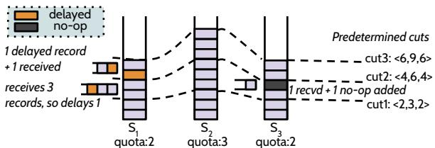  
Figure 4: Adhering to the Fix-ante Ordering.

Figure 4 shows how shards can meet their quotas, which enables correct speculations. In this example, the predetermined cuts are ⟨2, 3, 2⟩, ⟨4, 6, 4⟩, ⟨6, 9, 6⟩ and so on, and the shards $S _ { 1 } , S _ { 2 }$ , and $S _ { 3 }$ have a constant quota of 2, 3, and 2, respectively. As shown in the figure, initially, $S _ { 1 } , S _ { 2 }$ , and $S _ { 3 }$ have received and made durable 2, 3, and 2 records, respectively, allowing them to meet the quota by simply reporting all records. Next, $S _ { 1 } , S _ { 2 }$ , and $S _ { 3 }$ have received 3, 2, and 1 records, respectively. To meet its quota, $S _ { 1 }$ delays one record to the next report (the orange record); similarly, $S _ { 3 }$ adheres to its quota by adding one no-op record (the gray record). $S _ { 2 }$ can thus accurately predict that its next local record will be assigned a global position of 10 because it knows that positions 8 and 9 would go to $S _ { 1 }$ based on the predetermined cuts. This is in contrast to the free-will nature of reports in today’s shared log, which makes correct predictions hard (as we described earlier).

While each shard adheres to its quota, the sequencing layer waits to receive reports from all the shards to ensure that the entire system followed the fix-ante order. Only when it knows that they have collectively adhered to the predetermined cut $P _ { i } ;$ can the sequencer send the corresponding actual cut $A _ { i }$ In the above example, suppose in the second report, the sequencer only received reports from $S _ { 1 }$ and $S _ { 3 }$ and has not heard from $S _ { 2 }$ . Then, it cannot send the second actual cut. If it sends the actual cut now, it would be ⟨4, 3, 4⟩ instead of the predetermined cut ⟨4,6,4⟩, which would make the predictions wrong. Thus, to match the predetermined cut, the sequencer waits until it knows that the shards have adhered to their quotas. Note that if any shards have a quota of 0 for a predetermined cut, then the sequencing layer does not wait for those shards. If the sequencer finds that it did not receive a report from a shard for a long duration (e.g., due to a failure), the sequencing layer will determine the actual cut based on the received reports; in such a case, the actual cut will be different from the predetermined one, which will be handled as a misspeculation.

Append Linearizability. With fix-ante order, although the cuts are predetermined, appends still cannot be acknowledged without coordinating with the sequencing layer; acknowledging appends before that will violate linearizability. Consider a scenario with two shards $S _ { 1 }$ and $S _ { 2 } .$ , and the first predetermined cut ⟨1,1⟩. Suppose an append B happens at shard $S _ { 2 }$ (which will be assigned position 2 according to the predetermined cut). Assume that the system incorrectly acknowledges the append right away. Now, it is possible for another append A to start after this and be written to $S _ { 1 } ,$ which will be assigned global position 1 (again according to the cut). Such ordering violates linearizability because A follows B in real time but is assigned a position before B in the total order. Thus, even with predetermined cuts, SpecLog waits for the actual cuts from the sequencing layer before acknowledging appends. In the above example, append B will be acknowledged only after receiving the actual global cut from the sequencing layer; the same cut will also cover append A, essentially making A and B concurrent, thus preserving linearizability.

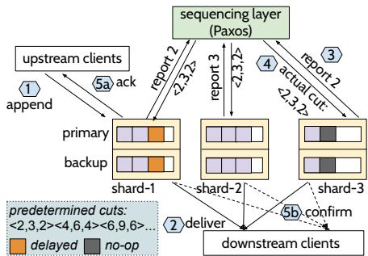  
Figure 5: Belfast Overview, Append and Delivery Path.

Implication of Waiting to Satisfy Fix-ante Order. In Scalog, shards send however many records they have made durable at a fixed periodic interval. Also, Scalog’s sequencing layer determines and sends the global cut at periodic intervals by including whichever shards have reported in that interval. Fixante ordering changes this behavior to keep the predictions correct. First, shards only report after they meet their quotas. Also, the sequencing layer sends the actual global cut after it waits for the shards to adhere to the corresponding predetermined cut. Thus, when shards do not report in a timely manner (e.g., because shards do not have enough records or are simply slow), it delays the actual global cut from the sequencing layer. Thus, fix-ante ordering in its original form (described thus far) will incur overhead in append latencies and the time to confirm the speculations. We next describe how with careful techniques, a system that uses fix-ante ordering, can alleviate this issue.

## 4 Belfast Design and Implementation

Belfast is an implementation of the SpecLog abstraction and fix-ante ordering. Although fix-ante ordering provides a basic framework for predictions, Belfast must ensure high performance under realistic settings, while enabling accurate predictions. We first describe Belfast’s basic operation (§4.1), then how it addresses performance challenges (§4.2-§4.7), and finally how it handles failures (§4.8).

## 4.1 Basic Operation

Architecture. Figure 5 shows Belfast’s architecture. Like Scalog, Belfast has a set of shards, a sequencing layer, and clients. Each Belfast shard runs standard primary-backup replication [21] and is therefore fault-tolerant. The sequencing layer is a Paxos [40] group that determines actual global cuts and makes them fault-tolerant. Upstream clients can append records to shards of their choice and downstream clients subscribe to receive records from the shards.

Append Path. Figure 5 shows Belfast’s append and record delivery path. The append path is similar to that of Scalog but has two differences. Like Scalog, clients first write records to shards, which then make the records durable (step-1). In Scalog, the shards contact the sequencer every ordering interval $( T _ { o r d } )$ , which enables them to batch and report many records. Belfast also does the same (step-3). The first difference is that Belfast shards adhere to quotas dictated by the predetermined cuts when reporting to the sequencer; the shards adhere by either reporting all new records, filling in no-ops, or delaying records. The second difference is how Belfast determines the actual global cut. In Scalog, the sequencer determines the global cut once roughly every $T _ { o r d } .$ , including the records of whichever shards have reported in that interval. In contrast, Belfast’s sequencing layer sends the $i ^ { t h }$ actual global cut only when it knows that the shards have adhered up to the $i ^ { t h }$ predetermined cut (step-4). Finally, the upstream clients are acknowledged (step-5a).

Delivery Path. In Scalog, shards deliver records only after receiving the global cut (i.e., after step-4). In contrast, in Belfast, shards deliver records once they are durable by predicting their positions using the predetermined cuts without waiting to contact the sequencer (step-2). Once a shard receives the actual global cut (after steps 3 and 4), it checks if the actual cut matches the predetermined cut. If so, it sends a confirmation (step 5b); otherwise, it fails the speculation for the delivered records, after which the downstream clients would rollback and recompute based on the correct order.

## 4.2 Rate-based Quotas

A key factor that affects Belfast’s performance is the shards’ quotas. A shard’s quota must be “right-sized”. If too high, many no-ops will be added leading to extra work; if too low, many records will be delayed to subsequent reports, increasing the append and confirmation latencies for delayed records.

Belfast addresses this problem by predetermining cuts in such a way that the quotas match the shards’ ingestion rates. With such rate-based quotas, each shard can naturally meet its quota in every report. That is, a shard will receive from clients and make durable roughly the same number of records as its quota every $T _ { o r d }$ . However, even with a stable ingestion rate, there could be variations and thus the shard could have received and made durable more or fewer records than its quota. Belfast handles this by delaying records to subsequent reports or filling no-ops.

Rate-based quotas work well when rates are roughly stable and if shards are never added or removed. However, in reality, shards could experience bursts or drops in rates. The rates could also increase or decrease more permanently. Shards could be added or removed to meet dynamic application demands. Finally, a shard could be straggling, affecting the append and confirmation latencies for other shards. In the rest of this section, we describe how Belfast handles these problems, and importantly, how it does so without any misspeculation, preserving the e2e latency benefits of fix-ante ordering.

## 4.3 Handling Bursts and Drops via Lag Fix

When a shard experiences a burst, if the additional records in the burst are delayed to the subsequent ordering intervals, then it may take several intervals to drain the burst. This will increase the append and confirmation latencies for those records. Thus, instead of delaying additional records to subsequent intervals, Belfast shards report to the sequencing layer immediately once its quota is met. With this, in the normal case, when the rate is stable, a shard would report roughly once per $T _ { o r d }$ . However, during a burst, the shard will send many reports in one ordering interval, draining the burst.

Such high-frequency reports alone, however, do not ensure that the requests in the burst can be acknowledged. This is because other shards would still be reporting once every $T _ { o r d }$ satisfying one predetermined cut every $T _ { o r d }$ . Thus, the sequencing layer cannot send the actual cuts for the additional reports sent by the bursty shard. For example, if a bursty shard (say $S _ { 1 } )$ sends five reports while another shard $( S _ { 2 } )$ has sent one report, the sequencer can only send the first actual cut and cannot yet send the actual cuts for $S _ { 1 } \mathrm { ^ { * } s }$ last four reports, delaying appends and confirmations of records in the burst.

To reduce the append and confirmation latencies, Belfast uses a lag-fix technique. Belfast first detects the burst at the sequencing layer by observing the high frequency of reports from a shard. It then realizes that the other shards are “lagging” and thus asks them to send more reports. The lagging shards then do so with client requests that they have and additionally filling no-ops as needed. This enables Belfast’s sequencer to send the subsequent actual cuts. In the above example, once the sequencing layer informs $S _ { 2 }$ about the lag and $S _ { 2 }$ sends four additional reports, the next four actual cuts can be sent.

The lag-fix mechanism also helps Belfast handle sudden drops in ingestion rates. When a shard experiences a drop, it cannot meet its quota naturally. Although the shard will fill no-ops to meet the quota, doing so takes time because Belfast is conservative about filling no-ops (to minimize its overhead); this can result in delayed reports. Meanwhile, the other shards could have progressed more, causing this shard to lag behind. But fortunately, the lag-fix mechanism would instruct the shard to fill in no-ops immediately to satisfy many subsequent cuts and report them in one ${ \bf g o ; }$ this helps the lagging shard quickly catch up with the rest of the system.

## 4.4 Speculation Lease Windows

The ingestion rate at a shard might change more permanently (for example, as clients join or leave). The mechanisms described so far help Belfast handle slight variations and bursts. However, relying on them for long-term change will lead to performance overhead. In particular, if a long-term rate increase is handled by just high-frequency reports and lag fix, then it will introduce too many no-ops from the lagging shards; the sustained high frequency of reports will also increase the load on the sequencing layer. Similarly, a long-term rate decrease cannot just be handled by filling no-ops.

Thus, the system must periodically adjust predetermined cuts and quotas. Belfast’s sequencing layer acts as a convenient place to do this because it can estimate the rates based on the frequency of reports. Further, since the shards periodically contact the sequencing layer, it can conveniently inform the shards of any changes in the cuts and quotas.

The key challenge is to change cuts without misspeculations. In particular, we must avoid cases where some shards use the old predetermined cuts, while others use the new cuts; if not misspeculations can arise. Suppose the current quotas for three shards $S _ { 1 } , S _ { 2 }$ , and S3 are 2, 3, and 2, respectively. Suppose the rate at $S _ { 1 }$ increases, requiring a quota of 4. Assume the sequencer sets $S _ { 1 } \mathrm { \ ' } _ { \mathrm { s } }$ quota to 4 immediately after determining the first actual cut and sends the updated quota to the shards. However, based on the previous predetermined cuts, shard $S _ { 2 }$ might have already delivered records for positions 10, 11, and 12 speculatively. But, with the new quota, $S _ { 1 }$ would assign positions 8, 9, 10, and 11 to its records, which would lead to misspeculations in the predicted positions for $S _ { 2 } ' \mathrm { s }$ records.

To avoid this problem, Belfast predetermines cuts and quotas for a window. All shards use the same predetermined cuts to make predictions within the window. Conceptually, the window is a lease on how long the shards can and must use the current predetermined cuts to make predictions. Belfast allows changes to predetermined cuts and quotas only at window boundaries. Thus, all shards uniformly use the new cuts and quotas after the current window ends.

Belfast realizes the speculation lease windows as follows. First, instead of time-based lease windows, Belfast measures windows in terms of number of predetermined cuts. That is, W cuts form a lease window. Shards can only speculate positions covered by W cuts. When the previous window nears completion, the sequencing layer informs shards of the predetermined cuts and quotas for the next window. In the previous example, $S _ { 1 } , S _ { 2 }$ , and $S _ { 3 } ,$ would move to the new cuts only when the current window ends. Thus, $S _ { 1 }$ will not use the new quota of 4 in the current window and will do so only from the next window, preventing the above misspeculation.

Belfast determines the need for a quota change and the new quota as follows. When the ingestion rate increases (or decreases), a shard will report more (or less) frequently to the sequencing layer. The sequencing layer uses this change in frequency to detect the need for a quota change. Belfast decides the new quota in such a way that every shard, after the quota change, would report roughly once every $T _ { o r d }$

## 4.5 Adding and Removing Shards Seamlessly

To meet the dynamic needs of applications, Belfast must be able to add and remove shards, and do so without misspeculations. The speculation window mechanism described above provides a good substrate to achieve this goal. The idea is that shards can be added or removed only at the speculation window boundaries. The sequencing layer decides the new quota assignments in the new window and the predetermined cuts will now include the newly added shard or exclude the removed shard. The only difference from Scalog’s seamless elasticity is that shards must wait till the current speculation window to end to join or leave. However, window sizes are sufficiently small, such operations need not wait for long.

In Belfast, when a shard wishes to leave or join, it sends a request to the sequencing layer. A leaving shard waits until the current window is over and keeps meeting its quota until then. A joining shard can demand a quota, which the sequencing layer uses to determine the cuts for the new window with the shard included; eventually, the quota is adjusted appropriately.

## 4.6 Mitigating Straggler Shards

Belfast’s mechanisms can help lagging shards catch up with the rest of the system. However, a shard could be slow for reasons other than it not being able to meet its quota. For example, the network could delay the reports or the reporting thread could be de-scheduled for a long time. Belfast must handle such straggler shards; otherwise appends and confirmations for records at other shards will be delayed.

Belfast mitigates straggler shards by first detecting them at the sequencer and then assigning their quotas to be zero in the next speculation window, similar to the quota-change mechanism. In the new window, the other shards can make progress without waiting for the straggler. In the next window, the straggler shard is given a small non-zero quota to see if it can meet it in a timely manner. If it is able to meet, the sequencer can ramp up the quota; otherwise, the shard is not given quotas for the subsequent windows.

## 4.7 Reducing Latencies with Many Shards

Rate-based quotas, no-op filling, and lag fixes help reduce append and confirmation latencies despite waiting for all shards to adhere to a predetermined cut. However, with a large number of shards, if Belfast assigns quotas for all shards in all cuts, then the possibility of actual cuts getting delayed because of a few slow shards becomes high.

However, the basic fix-ante ordering framework does not necessitate that all shards must report for all cuts. That is, the predetermined cuts could be set such that some shards don’t have to report records for a cut to be satisfied (i.e., their quota can be 0 in that cut). The sequencer waits only for reports from those shards that have a non-zero quota before it sends the actual cut. Belfast leverages this fundamental property of fix-ante ordering to keep latencies lower with many shards. The idea is to “stagger” the cuts, where the sequencing layer waits only for reports from a subset of shards to satisfy a cut and waits for different subsets in different cuts.

Belfast’s current implementation realizes this idea via a simple strategy, where shards are grouped into g groups. The predetermined cuts are fixed such that the $i ^ { t h }$ cut waits for only shards in group i mod $g .$ This enables the sequencer to send the actual cuts without waiting for all shards but only a subset for every cut, which reduces append and confirmation latencies. More sophisticated policies can be used to stagger the cuts (e.g., by assigning groups in a more dynamic manner); we leave such policies to future work.

## 4.8 Failure Handling

Belfast retains Scalog’s behavior under sequencing-replica failures: the system is unaffected by follower failures but correctly remains unavailable until re-election if the primary fails. Each storage shard is internally replicated and thus can mask up to f failures. Belfast shards use primary-backup; a consensus group can also be used. Thus, Belfast remains unaffected in the presence of shard-internal failures as well.

Belfast’s operation, however, is affected when the shard as a whole experiences a failure. This is a very rare scenario in practice, that can occur when more than f replicas within a shard crash or get partitioned, rendering the shard incapable of masking internal failures. Belfast handles whole-shard failures via a view-change protocol. Belfast’s sequencing layer triggers a view change when it suspects a shard has failed (i.e., the shard is unresponsive to the sequencing layer’s lagfix instruction). During normal operation, Belfast stamps all speculatively delivered records, actual cuts, and confirmations with the view number. For correctness during whole-shard failures, any records speculatively delivered in the old view for which confirmations are pending must be failed.

We call the last position covered by the latest actual cut sent in the old view the confirmed-gp; intuitively, records for positions that precede confirmed-gp will not change. On a view change, Belfast fails speculations for all positions after confirmed-gp and informs the clients of the same. Clients rollback their computation up to the confirmed-gp and then re-consume records from the confirmed-gp and recompute.

To avoid re-sending the records from other alive shards or reassigning their positions, Belfast optimizes the above procedure. Instead of excluding a failed shard, $S _ { F }$ , immediately, Belfast fills the log slots that belong to $S _ { F }$ with no-ops for the remainder of the current window. The sequencer assigns this responsibility to an alive shard $S _ { A }$ . With this, speculations for all positions after confirmed-gp are failed and clients still rollback. The only change is that the earlier delivered records from other shards and their positions are retained at the clients’ buffers; $S _ { A }$ then only delivers no-ops for positions belonging to $S _ { F } , S _ { A }$ also makes durable and includes these no-ops in its reports. This helps all the shards make progress and eventually these positions will be confirmed. In the next window, $S _ { F }$ is excluded and $S _ { A }$ no longer needs to fill no-ops. Note that $S _ { F }$ will stop receiving actual cuts from the sequencing layer and so it will not be able to confirm or acknowledge records for the positions for which $S _ { A }$ filled no-ops. Shard $S _ { A }$ is also responsible for delivering failure notifications and mis-speculations to clients on behalf of $S _ { F }$ . Since all shards are made aware of $S _ { F }$ and $S _ { A }$ from the sequencer through the actual cuts, clients that were only connected to $S _ { F }$ will eventually timeout waiting for confirmations and get re-routed to shard $S _ { A }$ to receive the no-ops and confirmations. The client-side failure handling logic, including the timeout and re-routing, is hidden within the client library.

```go
// compute thread state
var lastCompIdx uint64 // last computed log index
func HandleFailSpec(k uint64) {
pauseCompute()
for i := lastCompIdx; i > k; i-- {
undoStateChange(i)
}
lastCompIdx = min(k, lastCompIdx)
resumeCompute()
}
```  
Figure 6: Application Rollback

## 4.9 Implementation

We implemented Belfast by modifying open-source Scalog [7]. Our code is publicly available [8]. We introduce only one additional RPC for shards to register with the sequencer and join a Belfast cluster, while all other mechanisms, such as lag-fix and quota change, are realized by piggybacking onto existing RPCs (reports and cuts). Belfast makes all control information (e.g., quotas) also fault tolerant at the sequencer (without extra Paxos rounds). We set the window size to 100 cuts and ordering interval $( T _ { o r d } )$ to 1ms. We turn on staggered cuts when we have more than 6 shards. To ensure progress, shards begin to fill no-ops to satisfy their quota after $1 . 5 \times T _ { o r d }$ since the last report. To minimize the overhead of no-ops, we coalesce consecutive no-ops in the shard-internal log into one on-disk entry and one message for replication; thus, shards can efficiently fill many no-ops.

## 5 Applications

We built three applications atop SpecLog to demonstrate its viability. These applications run atop conventional shared logs and can be ported to SpecLog’s interface with minimal changes. The applications differ in sharding policies, downstream computations, and rollback actions.

IoT Intrusion Detection. Upstream sensors ingest readings into the shared log; different groups of sensors ingest values into different shards. There are many downstream tasks, one per shard. Each task calculates moving statistics, stores them in a local database, and raises alerts if they exceed a threshold value (hinting an intrusion). The cross-shard ordering helps establish the order of intrusion events across sensor groups. With Belfast, a downstream task speculatively calculates the statistics and writes them to a database, but waits for confirmation before it can raise an alert. If the speculation fails, tasks revert their database writes and reset statistic values.

Fraud Monitoring. This application analyzes users’ transactions to detect fraudulent activity. Each transaction is tagged with the originating user’s id. Upstream components can ingest transactions into any shard (e.g., the nearest one). There are several downstream tasks, each handling a subset of userids. Unlike the previous application, here, each downstream task consumes records from all shards but filters records based on a predicate (user-id). Each task examines if a transaction amount exceeds a threshold to raise alerts. The reader also updates a local database with the running statistics for each user and reverts this state if the speculation fails.

High-Frequency Trading. This application predicts the relationships between stocks based on their prices, which are then used to create pair-trading strategies. Upstream components update the real-time prices of stocks. Appenders can append to any shard or map stock-ids to shards. Downstream tasks subscribe to different stock-ids to receive live price data. Even if incoming data is sharded by stock-id, global ordering across shards is required, as downstream tasks must know the order of price changes across stocks. Downstream tasks predict price relationships via online linear regression. Stock prices are used to update the weights of the model in batches. These intermediate weights are stored in a database to create trading strategies. For rolling back, downstream tasks delete the stored weights, recompute them, and insert the new weights.

Porting Applications to Belfast. For porting applications, Belfast prescribes a few simple guidelines. Firstly, the application must wait for confirmation before externalizing outputs or taking actions. For example, the high-frequency trading application must not execute trades or take decisions based on unconfirmed results. Similarly, the fraud monitoring application cannot flag a transaction as fraudulent until it receives confirmations. Secondly, to deal with mis-speculations, applications have to maintain in-memory state of unconfirmed changes made to the application state in-order to correctly implement rollbacks. This in-memory state is small as there are only a few computed but unconfirmed records at any time. For example, in the fraud-monitoring application, each transaction updates a few rows of the user statistics database, therefore, for each unconfirmed application state change, the in-memory state contains the list of updated rows and their old states.

Implementing these guidelines require minimal changes to the application code for existing shared logs. This primarily includes a thread subscribing to the speculation confirmation or failure callbacks from Belfast and marking unconfirmed results as ready, or performing rollbacks respectively. On receiving a fail\_spec(k), the thread pauses compute, undoes the state changes for unconfirmed modifications beyond index k and instructs the compute thread to resume from that point onwards. The code snippet in Figure 6 shows how rollbacks are typically implemented with Belfast.

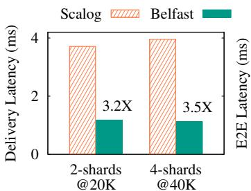  
(a) Avg. Delivery Latency

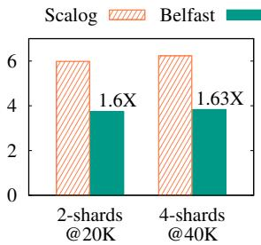  
(b) Avg. E2E Latency

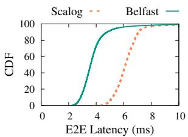  
(c) CDF of E2E Latency  
Figure 7: Delivery and E2E Latency

## 6 Evaluation

Our evaluation answers the following questions:

• What are the e2e latency benefits of Belfast? (§6.1)

• How do the benefits vary with computation time? (§6.2)

• What are the overheads in append latency? (§6.3)

• How does lag-fix help Belfast with bursts? (§6.4)

• How does Belfast adapt to rate changes? (§6.5)

• How does the speculation lease window size affect Belfast? (§6.6)

• Does Belfast enable seamless elasticity like Scalog? (§6.7)

• Does Belfast scale with shards while maintaining low latencies? (§6.8)

• Does Belfast effectively handle stragglers? (§6.9)

• Do real-world applications benefit from Belfast? (§6.10)

• What is the impact of failures on applications with Belfast? (§6.11)

Setup. We run our experiments on a CloudLab cluster. Each machine has an Intel 10-Core E5-2640v4 CPU, 64GB DRAM, a 25Gb ConnectX-4 NIC, and a SATA SSD. Belfast’s sequencing layer has one leader and two followers. Each shard has one primary and one backup. Our main baseline is Scalog; in some experiments, we also compare against variants of Belfast. In Belfast, only the shard primary contacts the sequencer, reporting durable records; further, the reports adhere to the fix-ante ordering. In the original Scalog implementation, both the shard primary and backup contact the sequencer, which then determines which records are durable; also, the shard servers report in a free-will manner. To correctly compare fix-ante ordering and the free-will nature, we modify Scalog so that only the primary reports durable records to the sequencer. In all experiments, we use 4KB records and calculate Belfast’s throughput by including only actual records (because clients don’t have throughput benefit from no-ops).

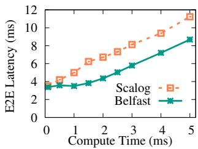  
(a) E2E Latency

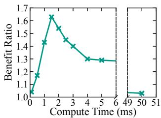  
(b) Benefit Ratio

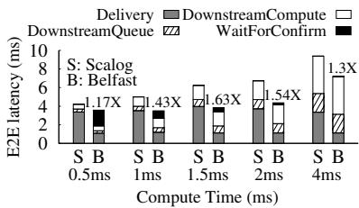  
(c) Latency Breakdown  
Figure 8: Compute Time vs. E2E Latency Benefits

## 6.1 E2E Latency Benefits

We first demonstrate the fundamental benefit of early speculative delivery and fix-ante ordering. We run a workload where upstream clients ingest records and downstream clients consume and compute over them. For a batch of consumed records, computation takes 1.5ms on average. We run with 2 and 4 shards and compare the delivery and e2e latencies of Belfast and Scalog. As shown in Figure 7(a), Belfast delivers records 3.2×-3.5× earlier than Scalog; downstream computation thus can speculatively start. Because of fix-ante ordering, the speculated and the actual order of the delivered records match. Thus, as shown in 7(b), Belfast reduces average e2e latency by 1.6×; we also note improvements in p99 e2e latencies (1.4× and 1.17× with 2 and 4 shards). Figure 7(c) shows the e2e latency CDFs for Scalog and Belfast for 4 shards. In contrast, Scalog delivers records only after global ordering, leading to high delivery and e2e latencies.

## 6.2 Compute Time vs. E2E Latency

We next examine how compute time impacts e2e latency. We run the same experiment as above with 4 shards but vary the compute time. First, as shown in Figure 8(a), for all compute times, Belfast offers lower e2e latency than Scalog. However, as shown in 8(b), the benefit varies with compute time (e.g., 1.17× with 0.5ms but 1.63× with 1.5ms compute).

We show why benefits vary with compute time by breaking down the e2e latency (8(c)). In Scalog, e2e latency comprises the time to deliver (Delivery), the time records wait in a downstream queue before they are picked for processing (DownstreamQueue), and the compute time (DownstreamCompute). In Belfast, additionally, tasks may have to wait for the order to be confirmed (WaitForConfirm). First, when computation and coordination effectively overlap (e.g., with 1.5ms compute), Belfast offers the most benefit. Second, with shorter compute (e.g., 0.5ms), the benefits decrease, because, although Belfast delivers earlier, once compute finishes, it waits for a while for the order to be confirmed. Next, as compute increases, the wait time for confirmation reduces. However, when the compute is long (4ms), compute exceeds ordering time, reducing benefits. With very high compute times (50ms), the benefit ratio approaches 1. Overall, with all compute times, Belfast offers lower e2e latencies than Scalog; the benefit is maximized when compute and coordination overlap effectively.

## 6.3 Append Latency

We now analyze Belfast’s append latency. We run a workload with a few upstream clients and measure the append latency in Belfast and Scalog with 2, 4, and 10 shards. As shown in Figure 9, Belfast does incur an overhead compared to Scalog. This is due to the shards adhering to the quotas and the sequencing layer waiting to satisfy the predetermined cuts before it sends the actual cuts. However, mechanisms like rate-aware quotas, no-op filling, lag fix, and staggered cuts (for 10 shards as described in §4.9) help Belfast to keep this overhead to a minimum (5.8% with 10 shards). This is a small cost to pay for the significant reduction in e2e latencies, which is critical for many real-time applications (§2.3).

## 6.4 Handling Bursts with Lag-Fix

We now analyze how Belfast behaves under bursts and the efficacy of lag-fix. We run a workload with an average compute time of 0.8ms with two shards $S _ { 1 }$ and $S _ { 2 } ,$ , and in the middle, introduce a burst of client requests on $S _ { 1 }$ and measure e2e latencies. We compare Belfast against Scalog and a Belfast variant with lag-fix disabled (no-lf). As shown in Figure 10(a), first, Belfast’s e2e latency is lower than Scalog throughout. Second, lag-fix generally helps maintain low e2e latencies by constantly fixing lagging shards. Third, lag-fix alleviates the effect of bursts notably. When the burst starts, in no-lf, even though $S _ { 1 }$ reports more frequently, S2 lags behind, delaying confirmations and thus leading to high e2e latencies. The lag persists even after the burst ends. In Belfast, while there is a small increase in latencies when the burst starts (which is also seen in Scalog), lag-fix kicks in, which helps $S _ { 2 }$ to catch up and thus reduce latency. Figure 10(b) illustrates the lag-fix behavior by showing the timing of reports in Belfast. Once burst starts, $S _ { 1 }$ reports more frequently (blue circles); Belfast detects $S _ { 2 } ' \mathrm { s }$ lag and asks it to send more reports. $S _ { 2 }$ does so (orange squares), resolving the lag.

Dealing with High Burstiness. As seen above, the lag-fix mechanism helps Belfast handle small bursts, drops and variability well. However, repeated bursts could cause many lagfixes which can increase the load on the sequencing layer and affect client latencies. In such high-burstiness scenarios, Belfast can adopt a couple of techniques to remain performant. One approach is for the sequencing layer to detect such scenarios (based on the frequency of reports) and transition the system into a “high-burstiness” mode, where shards are assigned quotas based on the peak of the bursts and are instructed to proactively fill no-ops to match the quota. Under extreme scenarios, Belfast could also dynamically turn-off fix-ante ordering and fall back to Scalog’s mode of operation. We leave these approaches as an avenue for future work.

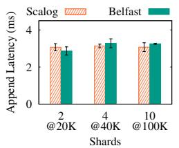  
Figure 9: Append Latencies

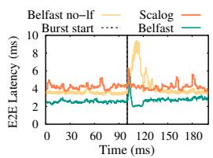  
(a) E2E Latency

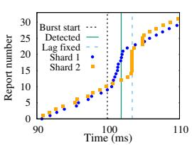  
(b) Reports with Lag-Fix  
(a) Throughput

Figure 10: Lag-Fix Benefits  
(b) E2ELatency  
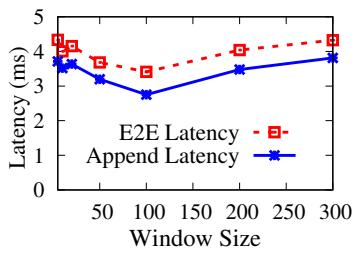  
Figure 12: Lease Window

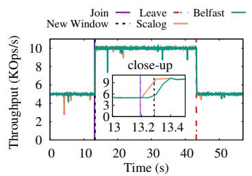  
(a) Throughput

## 6.5 Changing Quotas Upon Rate Changes

We next examine Belfast’s behavior under rate changes using the same setup as §6.4, but in the middle, we add sustained load to $S _ { 1 }$ , which increases its rate. We compare Belfast to Scalog and a variant with quota-changes disabled but lagfix enabled (no-qc). Figure 11(a) shows the throughput. For Belfast and no-qc, R+N is the throughput that includes both actual records and no-ops, while R includes only actual records.

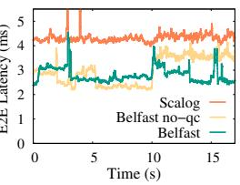

Initially, when the rates are stable, no-ops are minimal in both no-qc and Belfast, and they offer the same R and R+N throughput. However, when the rate increases at $S _ { 1 }$ , in noqc, lag-fix kicks in, which makes $S _ { 2 }$ fill in no-op records. In no-qc, $S _ { 1 } \mathrm { \ ' } _ { \mathrm { s } }$ quota is not changed and it keeps reporting more frequently to drain its “burst”. As a result, S2 keeps filling more no-ops (as can be seen from the higher R+N throughput for no-qc). In contrast, although initially Belfast fills no-ops (due to lag-fix), it quickly adjusts the quota for $S _ { 1 }$ and thus $S _ { 2 }$ doesn’t fill many no-ops; thus, the no-op throughout comes down, keeping R+N close to R†. We also noted that in no-qc, the sequencer load was about 2× higher than in Belfast (because of its sustained high-frequency reports). Also, throughout, Belfast’s throughput (R) matches Scalog’s.

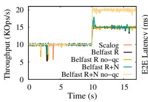

Figure 11(b) shows the e2e latency. Initially, both no-qc and Belfast offer the same e2e latency. However, after the rate change, no-qc suffers from higher e2e latencies because it takes a while to detect the lag and fill no-ops. In contrast, Belfast by changing the quota of $S _ { 1 }$ to match its rate, avoids this overhead, leading to lower e2e latencies. Throughout, both Belfast and no-qc offer lower e2e latencies than Scalog.

Figure 11: Quota Changes  
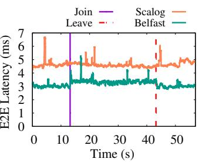  
(b) E2E Latency  
Figure 13: Seamless Elasticity

## 6.6 Impact of Speculation Lease Window

We next examine the impact of the speculation lease window size on Belfast. We run a stable workload with 2 shards at 20K throughput at 1.5ms compute with varying sizes for the speculation lease window. As shown in Figure 12, very low window sizes impact both e2e and append latencies. With low window sizes, Belfast incurs frequent synchronization costs where the shards are blocked waiting for the sequencing layer to provide the quota for the next lease window. For instance, we observe that with a window size of 5, the shards spend about an entire ordering interval $( T _ { o r d } )$ at the end of each lease window waiting for the next quota.

A large lease window size reduces the synchronization cost significantly (∼0.07% of $T _ { o r d }$ at window size 100), however, Belfast is slower to react. For instance, at 10K throughput per shard, each shard reports 10 records on average every $T _ { o r d }$ . Due to a transient drop, the ordering layer could assign a quota of 9 to a shard, leaving it in an undesirable state where the incoming rate exceeds the quota assigned for a very large window. This consequently affects client latencies. Furthermore, with a large lease window size, Belfast would also be slower to react to long term rate changes, incurring frequent lagfixes (approximating the behaviour of the no-qc variant in Figure 11). We see that a window size of 100 achieves a good balance and works well for us. In all cases, the e2e latency remains well under the 5.9ms value (see Figure 7(b)) for Scalog under the same workload.

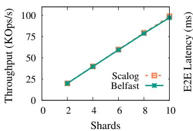  
(a) Throughput

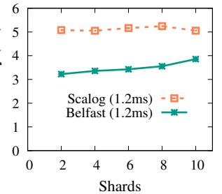  
(b) E2E Latency

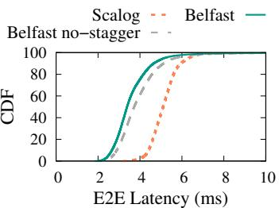  
(c) E2E CDF (10-shards)

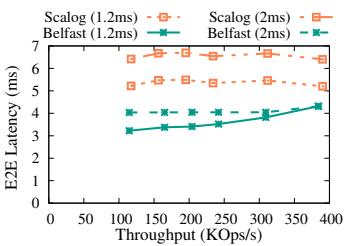  
(d) Emulation Latency vs. Throughput

Figure 14: Throughput and Latency vs. Shards  
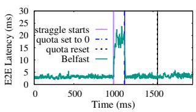  
Figure 15: Straggler Mitigation

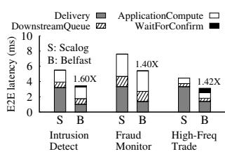  
Figure 16: Applications

## 6.7 Seamless Elasticity

We next answer if Belfast offers elasticity without any downtime like Scalog. We also examine if Belfast can do so without causing misspeculations, thus continuing to offer low e2e latency as shards are added and removed. We run an experiment with two shards initially, add two shards on the fly, and then remove them. Figure 13 shows the throughput and e2e latency.

First, as shown in 13(a), when shards are added or removed, Belfast, like Scalog, has no downtime and no drop in throughput. The only difference is that records from the new shards are included only after the current speculation window ends, thus the throughput increase comes a bit late. The close-up shows this: Belfast’s throughput increase is delayed but only slightly (< 100ms). Belfast also removes shards without downtime. Next, as shown in 13(b), Belfast offers lower e2e latency than Scalog even as shards are added and removed. This is because Belfast adds or removes shards at window boundaries, which prevents misspeculations, keeping e2e latencies low.

## 6.8 Throughput and Latency vs. Shards

We next analyze if Belfast can scale throughput with shards like Scalog while offering lower e2e latencies (with 1.2ms compute). As shown in Figure 14(a), Belfast, like Scalog, increases throughput with shards. Next, as shown in 14(b), it does so while offering lower e2e latencies than Scalog (1.66× and 1.4× with 2 and 10 shards). This is also evident from the e2e latency distribution for 10 shards in 14(c). 14(c) also shows the effect of staggered cuts, which helps Belfast to send actual cuts without waiting for all shards; as shown, staggered cuts improve latencies compared to the no-stagger variant.

To evaluate scalability beyond 10 shards, we build an emulation framework similar to Scalog [29]. The framework retains the sequencer and shard protocol, but the shards are emulated. Emulated shards report records at the same throughput and latency as real shards but do not receive actual records from clients. Client perceived latency is obtained by adding a delta measured from the real system to latencies measured at the emulated shards. To measure e2e latency, along with the compute, we add the time spent in the downstream queue as obtained in the real experiments. As seen in 14(d), Belfast’s throughput scales similarly to Scalog’s upto 40 shards. For compute of 1.2ms, Belfast’s e2e latencies show a slope as they are limited by the confirmation latencies. For higher compute (2ms), Belfast is at a constant offset from Scalog. In all cases, e2e latency benefits are retained even at 40 shards.

## 6.9 Mitigating Straggler Shards

We now examine if Belfast can mitigate straggler shards effectively. In the middle of a workload, we inject delays into one shard, which significantly delays its reports. Figure 15 shows the e2e latency. When the shard starts to straggle, e2e latency temporarily goes high. Once the shard repeatedly sends significantly delayed reports, Belfast’s sequencer sets the quota of the straggler shard to be zero for the next five windows, and therefore the actual cuts can be sent without waiting for the straggler, which reduces e2e latencies. Eventually, the straggler’s quota is reset, and since we remove the injected delay at this point, low e2e latency is maintained.

## 6.10 Benefits for End Applications

We now evaluate the applications from §5. In all applications, several upstream components ingest data and downstream tasks subscribe to shards according to the application’s sharding policy (described in §5) and compute over the consumed records. We run atop Scalog and Belfast, and measure application e2e latencies. As shown in Figure 16, IoT intrusion detection attains the maximum benefit. The breakdown shows that the average compute time for a batch of consumed records in this application is around 1.4ms, which enables almost the entire computation to be overlapped with shared log’s coordination. The benefits are less pronounced in fraud monitoring and high-frequency trading which have an average compute time of 2.2ms and 800us, respectively. Thus, in fraudmonitoring, confirmation arrives before computation finishes, while, in HFT, downstream tasks wait for confirmation.

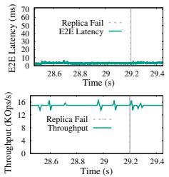  
(a) Shard Internal Failure

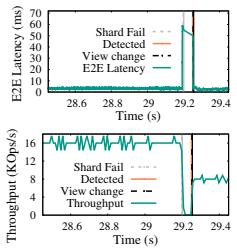  
(b) Shard Failure

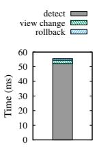  
(c) Breakdown  
Figure 17: Application under Failure

## 6.11 Application Behavior under Failures

Sequencing-replica failures do not change the behavior of Belfast compared to Scalog. We thus evaluate the fraudmonitoring application under two shard failure scenarios; shard-replica failures and whole shard failures. We run the shard-replica failure experiment with 3-way replicated shards ( f = 1) and kill a shard replica in the middle of the run. Figure 17(a) shows that the throughput and e2e latency remain unaffected as the shard internally masks the failure. In the second experiment, we run 2-way replicated shards and fail the entire shard in the middle of the run. This scenario triggers misspeculations, which the application handles by performing rollbacks (see §5). As shown in Figure 17(a), e2e latency increases after the shard fails as misspeculations arise. However, once the view is changed and an alive shard fills no-ops on behalf of the failed shard (§4.8), the latency becomes low again. Similar behavior can also be seen with throughput. The breakdown in Figure 17(c) shows that detecting the failure takes up the most time between failure and recovery. More importantly, the time spent by the application to rollback, i.e., undo the state changes and resume is marginal.

## 7 Related Work

Shared Logs. Corfu [16, 17] cannot seamlessly reconfigure or flexibly place data, and has limited scalability. vCorfu [63] offers flexible placement for readers but still has the other problems. While Scalog [29], Boki [36], and FlexLog [32] address the above problems via a durability-first design, they do not enable low e2e latency, a critical need for applications. Our work is the first to build a shared log that enables low e2e latencies (while preserving the other properties). While we focus on durability-first logs given their desirable properties, Corfu-like logs also suffer from high e2e latencies. SpecLog’s idea could enable such logs to offer low e2e latencies as well; specifically, such a system can allow clients to speculatively read ordered but non-durable records from the shard primary.

LazyLog [43], a recent shared log abstraction, reduces append latencies by avoiding eager ordering upon appends. However, LazyLog makes a crucial assumption that most reads are decoupled in time from the appends. For the class of applications we target, this assumption does not hold since records are consumed as soon as they are ingested. Furthermore, LazyLog enforces ordering before reads and therefore does not allow records to be delivered to downstream consumers before ordering completes. In contrast, SpecLog allows record delivery even before ordering is established and hides this cost by overlapping ordering with downstream computation. As a result, unlike SpecLog, the LazyLog abstraction does not fundamentally help reduce e2e latencies which will always include the cost of ordering.

Prior work [47] reduces subscription latency in pubsub [30] systems; however, it does not build upon total-order shared logs or reduce e2e latencies.

Speculative Execution. Many distributed systems use speculation in other contexts like consensus [48], replicated stores [33], blockchains [23], BFT [39, 65], distributed file systems [45], transactions [57], atomic broadcast [38], and MapReduce [22]. However, our work is the first to offer a speculative interface for today’s total-order shared logs to overlap their expensive coordination with application computation. More importantly, our work shows how to accurately speculate positions via a novel fix-ante ordering scheme.

Pre-partitioning in Consensus. Protocols like Mencius [44, 64] overcome Paxos’ leader bottleneck by statically partitioning the consensus log across replicas. Each replica proposes client commands or special skip commands (i.e., no-ops) in its slots. While Belfast bears some similarity to these protocols (predetermining slots, filling no-ops), it differs in key ways. First, although Belfast’s fix-ante cuts effectively pre-partition the shared log, these cuts are speculative in nature (unlike in Mencius). Second, Mencius’s pre-partitioning is for replicas within a shard, whereas fix-ante ordering predetermines an expected total order across many shards. Our work also differs in context and purpose: Mencius-like systems pre-partition the log to overcome the leader bottleneck in consensus, whereas Belfast predetermines shared-log slots to enable speculative delivery for low e2e latency in durability-first shared logs.

## 8 Conclusion

Today’s shared logs incur high delivery latency and thus cannot enable low e2e latency, a critical need for applications. SpecLog, a new shared-log abstraction, speculatively delivers records, thus overlapping computation and coordination. Fix-ante ordering enables SpecLog to accurately speculate positions before global ordering. We build Belfast based on these ideas and show that it enables low e2e latencies for applications without sacrificing today’s shared logs’ properties.

## Acknowledgments

We thank our shepherd and the OSDI ’25 reviewers for their insightful comments. We also thank the other DASSL members for their discussions and feedback. This material was supported by funding from NSF grants CNS-2340218 and CNS-2339784, an IIDAI grant, as well as a gift from NetApp. We also thank CloudLab [53] for providing a great environment to run our experiments.

## References

[1] Apache DistributedLog. https://github.com/apache/ distributedlog.

[2] Fighting Fraud in Real-Time: North’s Journey to Smarter, Faster ML. https://www.tecton.ai/blog /fighting-fraud-in-real-time-norths-journey-t o-smarter-faster-ml/.

[3] Kafka Use Cases - Messaging. https://kafka.apache .org/uses#uses\_messaging.

[4] LogDevice: distributed storage for sequential data. ht tps://logdevice.io/.

[5] Pravega: A Reliable Stream Storage System. https: //cncf.pravega.io.

[6] Real-Time Analytics Explained. https://rockset.co m/real-time-analytics-explained/.

[7] Scalog Github Repository. https://github.com/scalo g.

[8] SpecLog Github Repository. https://github.com/das sl-uiuc/speclog-artifact.

[9] The Cost of Latency in High-Frequency Trading. https: //moallemi.com/ciamac/papers/latency-2009.pdf.

[10] The Milliseconds Market: The Money-Making on High-Frequency Trading. https://fondexx.pro/blog/milli seconds-market-money-making-high-frequency-tra ding.

[11] The State of Streaming Data Report 2023-24. https: //go.redpanda.com/state-of-streaming-data-repor t-2023-24.

[12] TinyBird: How to Build a Real-Time Fraud Detection System. https://www.tinybird.co/blog-posts/how-t o-build-a-real-time-fraud-detection-system.

[13] Apache. Kakfa. http://kafka.apache.org/.

[14] Danial Asif. Building Faster Indexing with Apache Kafka and Elasticsearch. https://careersatdoordash. com/blog/open-source-search-indexing/.

[15] Gourav Singh Bais. How to detect fraudulent clicks in a real-time ad system. https://www.redpanda.com/blo g/detect-fraudulent-clicks-real-time-ads.

[16] Mahesh Balakrishnan, Dahlia Malkhi, Vijayan Prabhakaran, Ted Wobber, Michael Wei, and John D. Davis. CORFU: A Shared Log Design for Flash Clusters. In Proceedings of the 9th Symposium on Networked Systems Design and Implementation (NSDI ’12), San Jose, CA, April 2012.

[17] Mahesh Balakrishnan, Dahlia Malkhi, Ted Wobber, Ming Wu, Vijayan Prabhakaran, Michael Wei, John D Davis, Sriram Rao, Tao Zou, and Aviad Zuck. Tango: Distributed Data Structures over a Shared Log. In Proceedings of the 24th ACM Symposium on Operating Systems Principles (SOSP ’13), Farmington, Pennsylvania, October 2013.

[18] Philip A Bernstein, Colin W Reid, and Sudipto Das. Hyder – A Transactional Record Manager for Shared Flash. In CIDR, volume 11, pages 9–20, 2011.

[19] Shruti Bhat and Kai Waehner. Real-Time Analytics and Monitoring Dashboards with Apache Kafka and Rockset. https://www.confluent.io/blog/analytic s-with-apache-kafka-and-rockset/.

[20] Juxhin Dyrmishi Brigjaj. Using Redpanda to build a realtime security IoT platform. https://www.redpanda.com /blog/real-time-security-iot-customer-story.

[21] Navin Budhiraja, Keith Marzullo, Fred B Schneider, and Sam Toueg. The Primary-backup Approach. Distributed systems, 2, 1993.

[22] Qi Chen, Cheng Liu, and Zhen Xiao. Improving MapReduce Performance Using Smart Speculative Execution Strategy. IEEE Transactions on Computers, 63(4):954– 967, 2014.

[23] Yang Chen, Zhongxin Guo, Runhuai Li, Shuo Chen, Lidong Zhou, Yajin Zhou, and Xian Zhang. Forerunner: Constraint-based Speculative Transaction Execution for Ethereum. In Proceedings of the 28th ACM Symposium on Operating Systems Principles (SOSP ’21), Virtual, October 2021.

[24] Confluent. Motion in Motion: Building an End-to-End Motion Detection and Alerting System with Apache Kafka and ksqlDB. https://www.confluent.io/blog/ build-real-time-iot-application-with-apache-kaf ka-and-ksqldb/.

[25] Confluent. Real-Time Fraud Detection in Banking. ht tps://assets.confluent.io/m/4d949142ef12c4c2/o riginal/20230906-WP-Fraud\_Detection.pdf.

[26] Dunith Danushka. Building a scalable IoT data processing architecture with Redpanda. https://www.redpan da.com/blog/streaming-data-platform-for-iot-edg e/.

[27] Dunith Danushka. Understanding Event Stream Processing. https://www.redpanda.com/blog/data-strea ming-for-financial-services.

[28] Alex Davies. Jump Trading Drives Faster Insights at Scale with Redpanda. https://thenewstack.io/jum p-trading-drives-faster-insights-at-scale-wit h-redpanda/.

[29] Cong Ding, David Chu, Evan Zhao, Xiang Li, Lorenzo Alvisi, and Robbert Van Renesse. Scalog: Seamless Reconfiguration and Total Order in a Scalable Shared Log. In Proceedings of the 17th Symposium on Networked Systems Design and Implementation (NSDI ’20), Santa Clara, CA, February 2020.

[30] Patrick Th Eugster, Pascal A Felber, Rachid Guerraoui, and Anne-Marie Kermarrec. The many faces of publish/- subscribe. ACM computing surveys (CSUR), 35(2):114– 131, 2003.

[31] Expeed. Get Real-Time IOT Data Analytics Using Apache Kafka And Apache Spark. https://expeed .com/get-real-time-iot-data-analytics-using-apa che-kafka-and-apache-spark/.

[32] Dimitra Giantsidi, Emmanouil Giortamis, Nathaniel Tornow, Florin Dinu, and Pramod Bhatotia. Flexlog: A shared log for stateful serverless computing. pages 195–209, 08 2023.

[33] Rachid Guerraoui, Matej Pavlovic, and Dragos-Adrian Seredinschi. Incremental Consistency Guarantees for Replicated Objects. In Proceedings of the 12th USENIX Conference on Operating Systems Design and Implementation (OSDI ’16), Savannah, GA, November 2016.

[34] Himanshu Gupta. Unlocking a Competitive Edge in Hedge-fund Trading, Right Down to the Data Specifics. https://www.rtinsights.com/unlocking-a-competi tive-edge-in-hedge-fund-trading-right-down-t o-the-data-specifics/.

[35] Maurice P. Herlihy and Jeannette M. Wing. Linearizability: A Correctness Condition for Concurrent Objects. ACM Trans. Program. Lang. Syst., 12(3), July 1990.

[36] Zhipeng Jia and Emmett Witchel. Boki: Stateful Serverless Computing with Shared Logs. In Proceedings of the 28th ACM Symposium on Operating Systems Principles (SOSP ’21), Virtual, October 2021.

[37] Joe Karlsson. Event sourcing with Kafka. https://www. tinybird.co/blog-posts/event-sourcing-with-kaf ka.

[38] Bettina Kemme, Fernando Pedone, Gustavo Alonso, and André Schiper. Processing transactions over optimistic atomic broadcast protocols. In International Symposium on Distributed Computing (DISC 99), Bratislava, Slovak Republic, September 1999.

[39] Ramakrishna Kotla, Lorenzo Alvisi, Mike Dahlin, Allen Clement, and Edmund Wong. Zyzzyva: Speculative Byzantine Fault Tolerance. In ACM SIGOPS Operating Systems Review, volume 41, pages 45–58. ACM, 2007.

[40] Leslie Lamport. Paxos Made Simple. ACM Sigact News, 32(4):18–25, 2001.

[41] Joey Lei. Leveraging Modern Services to Drive Business Agility, Elasticity, and Mobility. https://www.rt insights.com/modern-services-drive-business-agi lity-elasticity-mobility/.

[42] Jacob Loveless, Sasha Stoikov, and Rolf Waeber. Online Algorithms in High-Frequency Trading. Communications of the ACM, 56(10):50–56, 2013.

[43] Xuhao Luo, Shreesha G. Bhat, Jiyu Hu, Ramnatthan Alagappan, and Aishwarya Ganesan. Lazylog: A new shared log abstraction for low-latency applications. In Proceedings of the ACM SIGOPS 30th Symposium on Operating Systems Principles, SOSP ’24, page 296–312, New York, NY, USA, 2024. Association for Computing Machinery.

[44] Yanhua Mao, Flavio P. Junqueira, and Keith Marzullo. Mencius: Building efficient replicated state machines for wans. In Proceedings of the 8th Symposium on Operating Systems Design and Implementation (OSDI ’08), San Diego, CA, December 2008.

[45] Edmund B Nightingale, Peter M Chen, and Jason Flinn. Speculative Execution in a Distributed File System. October 2005.

[46] Artem Oppermann. Detecting fraud in real time using Redpanda and Pinecone. https://www.redpanda.com/b log/fraud-detection-pipeline-redpanda-pinecone.

[47] Filipa Pedrosa and Luís Rodrigues. Reducing the subscription latency in reliable causal publish-subscribe systems. In Proceedings of the 36th Annual ACM Symposium on Applied Computing, pages 203–212, 2021.

[48] Dan RK Ports, Jialin Li, Vincent Liu, Naveen Kr Sharma, and Arvind Krishnamurthy. Designing Distributed Systems Using Approximate Synchrony in Data Center Networks. In Proceedings of the 12th Symposium on Networked Systems Design and Implementation (NSDI ’15), Oakland, CA, May 2015.

[49] Shyam Purkayastha. Building a real-time data processing pipeline for IoT. https://www.redpanda.com/blog/ analyzing-iot-telemetry-data-apache-spark.

[50] RedPanda. RedPanda. https://redpanda.com/.

[51] Redpanda. Understanding event stream processing. ht tps://www.redpanda.com/guides/event-stream-pro cessing-event-sourcing-database.

[52] Dheeraj Remella. How Volt and RedPanda Help Companies Take Real-Time Actions on Streaming Data. https: //www.voltactivedata.com/blog/2023/09/volt-red panda-real-time-actions-on-streaming-data/.

[53] Robert Ricci, Eric Eide, and CloudLab Team. Introducing CloudLab: Scientific infrastructure for advancing cloud architectures and applications. USENIX ;login:, 39(6), 2014.

[54] Rockset. Real-Time Analytics on Kafka. https://rock set.com/sql-on-kafka/.

[55] Raj Sagiraju. Simple, fast, and scalable serverless stream processing with DeltaStream and Redpanda. https: //www.redpanda.com/blog/simple-fast-scalable-s tream-processing-deltastream.

[56] Salvatore Salamone. Enabling Real-time Analytics At-Scale Use Cases. https://www.rtinsights.com/enabl ing-real-time-analytics-at-scale-use-cases/.

[57] Weihai Shen, Ansh Khanna, Sebastian Angel, Siddhartha Sen, and Shuai Mu. Rolis: a software approach to efficiently replicating multi-core transactions. In Proceedings of the Seventeenth European Conference on Computer Systems, EuroSys ’22, page 69–84, 2022.

[58] Gang Tao. Case Study: Real-time Fleet Monitoring with Timeplus. https://www.timeplus.com/post/case-stu dy-real-time-fleet-monitoring-with-timeplus.

[59] Gang Tao. Realizing low latency streaming analytics with Timeplus and Redpanda. https://redpanda.com /blog/low-latency-streaming-analytics-timeplu s-redpanda.

[60] Rajkumar Venkatasamy. Building a real-time search application with Redpanda and ZincSearch. https: //www.redpanda.com/blog/real-time-data-search-r edpanda-zincsearch.

[61] VMWare. CorfuDB. https://github.com/CorfuDB/C orfuDB.

[62] Kai Waehner. Fraud Detection with Apache Kafka, KSQL and Apache Flink. https://www.kai-waehner.d e/blog/2022/10/25/fraud-detection-with-apache-k afka-ksql-and-apache-flink/.

[63] Michael Wei, Amy Tai, Christopher J. Rossbach, Ittai Abraham, Maithem Munshed, Medhavi Dhawan, Jim Stabile, Udi Wieder, Scott Fritchie, Steven Swanson, Michael J. Freedman, and Dahlia Malkhi. vcorfu: a cloud-scale object store on a shared log. In Proceedings of the 14th USENIX Conference on Networked Systems Design and Implementation, NSDI’17, page 35–49, USA, 2017. USENIX Association.

[64] Wei Wei, Harry Tian Gao, Fengyuan Xu, and Qun Li. Fast mencius: Mencius with low commit latency. In 2013 Proceedings IEEE INFOCOM, pages 881–889. IEEE, 2013.

[65] Benjamin Wester, James A Cowling, Edmund B Nightingale, Peter M Chen, Jason Flinn, and Barbara Liskov. Tolerating Latency in Replicated State Machines Through Client Speculation. In Proceedings of the 6th Symposium on Networked Systems Design and Implementation (NSDI ’09), Boston, MA, April 2009.