①

USENIX

THE ADVANCED COMPUTING SYSTEMS ASSOCIATION

# EMT: An OS Framework for New Memory Translation Architectures

Siyuan Chai, Jiyuan Zhang, Jongyul Kim, Alan Wang, Fan Chung, and Jovan Stojkovic, University of Illinois Urbana-Champaign; Weiwei Jia, University of Rhode Island; Dimitrios Skarlatos, Carnegie Mellon University; Josep Torrellas and Tianyin Xu, University of Illinois Urbana-Champaign

https://www.usenix.org/conference/osdi25/presentation/chai-siyuan

# This paper is included in the Proceedings of the 19th USENIX Symposium on Operating Systems Design and Implementation.

July 7–9, 2025 • Boston, MA, USA

ISBN 978-1-939133-47-2

Open access to the Proceedings of the 19th USENIX Symposium on Operating Systems Design and Implementation is sponsored by

# EMT: An OS Framework for New Memory Translation Architectures

Siyuan Chai, Jiyuan Zhang\*, Jongyul Kim, Alan Wang, Fan Chung, Jovan Stojkovic,

Weiwei Jia†, Dimitrios Skarlatos‡, Josep Torrellas, Tianyin Xu

University of Illinois Urbana-Champaign †University of Rhode Island ‡Carnegie Mellon University

## Abstract

With terabyte-scale memory capacity and memory-intensive workloads, memory translation has become a major performance bottleneck. Many novel hardware schemes are developed to speed up memory translation, but few are experimented with commodity OSes. A main reason is that memory management in major OSes, like Linux, does not have the extensibility to empower emerging hardware schemes.

We develop EMT, a pragmatic framework atop Linux to empower different hardware schemes of memory translation such as radix tree and hash table. EMT provides an architectureneutral interface that 1) supports diverse memory translation architectures, 2) enables hardware-specific optimizations, 3) accommodates modern hardware and OS complexity, and 4) has negligible overhead over hardwired implementations. We port Linux’s memory management onto EMT and show that EMT enables extensibility without sacrificing performance. We use EMT to implement OS support for ECPT and FPT, two recent experimental translation schemes for fast translation; EMT enables us to understand the OS perspective of these architectures and further optimize their designs.

## 1 Introduction

“It so happens that a tree format is the only sane format...” [105] —Linus Torvalds, 2002

Virtual memory translation has become a major performance bottleneck of emerging memory-intensive computing [34, 56, 63, 69, 77, 87, 98]. With unprecedented growth of memory capacity, driven by terabyte-scale memory [31, 52] and memory expanders like CXL [71, 96], TLBs cannot scale in the same way as memory. Moreover, emerging workloads like machine learning, graph processing, and bioinformatics have irregular memory access patterns with weak locality, making TLBs and other MMU caches less efficient. As a result, TLB misses are inevitably increasing, resulting in expensive address translation across the memory system.

However, today’s translation architectures were designed at a time of scarce memory, and optimize space-efficiency over performance. The de facto schemes organize translations into a multi-level radix tree [11, 17, 19]; upon a TLB miss, the MMU must sequentially walk the tree, resulting in multiple memory accesses. The x86-64 architecture uses a four-level tree, with a fifth level added in recent hardware [3, 110]. In virtualized environments, translation overhead is magnified by nested translation [39, 79] which takes a two-dimensional walk over the guest and host page tables, resulting in up to 24 sequential memory accesses on four-level page tables.

To address this pressing problem, many new hardware architectures for MMUs have been developed to realize fast translation for today’s terabyte-scale, heterogeneous memory. For example, hashing-based translation schemes are revisited [35, 53, 68, 98–100, 109], as hashing is inherently more scalable than walking a tree [109]; a recent hashing scheme, based on Elastic Cuckoo Page Table (ECPT), is reported to reduce translation overhead significantly by enabling parallel lookups of page table entries [98, 100]. New translation schemes using flattened or linear page tables [65, 87] have also been developed. In addition, recent studies advocate for hybrid translation architectures that use different schemes collectively or selectively [26, 27, 49, 57, 63, 111].

Unfortunately, OS support for hardware innovations falls short; few aforementioned new hardware schemes were experimented with commodity OSes like Linux. Instead, evaluations of experimental architectures mostly use performance models to estimate OS overhead [28, 65, 77, 95, 109, 111], or trace-driven simulation with traces collected by running workloads on unmodified Linux [77, 95, 98, 109]. The assumption is that OS overhead on different translation architectures is constant. However, our paper shows that translation architectures could have significant impacts on OS performance.

In fact, the difficulties of OS support has affected hardware research—disruptive hardware designs are often considered “undesirable” and lose to incremental approaches (see [77]). Our discussions with hardware vendors tell us that the lack of commodity OS support and evaluation is a major barrier to assessing and adopting new hardware translation schemes.

The unsatisfactory OS effort is largely due to memory management systems in commodity OSes not having the extensibility for emerging translation architectures. For example, Linux assumes a radix-tree based page table structure and lacks extensibility to support hardware schemes that cannot fit in its tree definition. As a result, supporting a new architecture often requires heavy modifications of memory management code in architecture-independent modules. Essentially, Linux provides no extensible interface for memory translation, unlike its other subsystems (e.g., VFS for file systems [51]).

Contributions. We develop a pragmatic OS framework and toolchains atop Linux to embrace new hardware translation architectures for today’s memory technologies. We term our framework Extensible Memory Translation (EMT). We target Linux as it is still the de facto commodity OS and is mostly assumed by architecture research on memory systems.

EMT provides an architecture-neutral Linux interface that 1) supports diverse memory translation architectures, 2) enables hardware-specific optimizations, 3) accommodates modern hardware and OS complexity, and 4) has negligible overhead over Linux’s hardwired implementation. By abstracting translation-related operations, EMT simplifies the effort to support and experiment with new translation architectures on Linux. With EMT, developers only need to implement an MMU driver as a hardware-specific implementation of translation logic, without modifying the architecture-independent memory management code. EMT also makes it easy to profile and analyze OS performance with regard to hardware translation schemes as it abstracts translation-related operations.

We implement EMT on Linux (v5.15), referred to EMT-Linux. We modularize architecture-independent code with EMT API, removing hardwired assumptions. EMT realizes negligible overhead through careful engineering and optimizations (with less than 0.5% overhead on average across key OS operations). Moreover, EMT-Linux realizes all existing features and hardware-specific optimizations in vanilla Linux.

We build on EMT-Linux to add OS support for ECPT [98] and FPT [87], two new translation schemes. Porting these new hardware schemes on Linux without a framework like EMT would require major rewriting of Linux’s memory management module. With EMT, supporting them on Linux is modularized with manageable engineering efforts.

Evaluating new hardware schemes on EMT-Linux faces a common challenge of hardware-software codesign—the hardware is not yet available to run the OS. To address this problem, we assemble a toolchain that runs EMT-Linux on QEMU with an emulated MMU where we implement the hardware translation logic. Our toolchain enables us to understand the OS perspective of new translation architectures, such as its OS overhead over x86. The toolchain also supports cycle-accurate hardware simulation.

We share our experience of supporting new translation schemes on EMT-Linux, which enables us to understand OS memory management challenges beyond hardware perspectives. We present our reflection on the ECPT design and address correctness challenges such as managing the kernel page table (kECPT) and the paradox involved in changing the translations of the kECPT itself and of the kernel code that manages kECPT, as well as performance challenges like efficient locking and memory scanning. Arguably, OS framework support is essential to encourage and embrace disruptive hardware innovations, and EMT is an important step forward.

Summary. This paper makes the following contributions:

• A discussion on empowering new, experimental hardwareassisted translation architectures on commodity OSes.

• EMT as an extensible framework for developing and evaluating OS memory management on new translation architectures, and its implementation on Linux.

• An experience of building ECPT and FPT on Linux using EMT and the reflection on hardware/OS designs.

• An open platform for developing, testing, and evaluating OS kernels on new memory translation architectures.

• Our artifacts: https://github.com/xlab-uiuc/emt.

## 2 Background

## 2.1 Memory Translation Hardware

Modern computer systems use hardware-assisted memory translation, where the translation schemes are defined by the hardware architecture. Upon a TLB miss, the MMU searches the translation structures (e.g., a page table) to obtain the translation—the virtual-to-physical address mapping.

x86 Translation Scheme. All x86 processors since Intel 80386 have used a radix tree, as depicted in Figure 1. The depth of this tree has increased from two levels in 80386 to four levels in x86-64, with the fifth level upcoming [3, 110] and already supported in Linux [43].

Virtual Address (VA)  
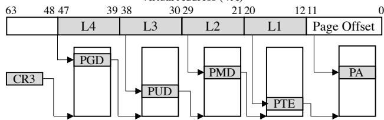  
Figure 1: Radix-tree based page table walk in x86-64 ISA.

The main advantage of radix-tree based translation is space efficiency—tables at each level are created on demand—if at any level, no page is allocated within an address range, the sub-tree is not allocated. This yields significant memory savings, as the address space of typical applications is sparse.

However, tree-based translation suffers from a major performance drawback—it must sequentially walk the tree with multiple memory accesses. Page walk caches [32, 40, 87] and huge pages [69, 81] are used to reduce the length of the walks, but struggle to address emerging workloads with large memory footprints and weak-locality access patterns. The overhead is further magnified in nested translation for virtualized environments. The MMU performs a two-dimensional walk over the guest and the host page tables. A nested translation takes up to 24 sequential memory accesses with four-level page tables, and up to 35 with five-level tables. It is reported that nested translation can take more than 50% of the execution time of memory-intensive workloads [27, 48, 77].

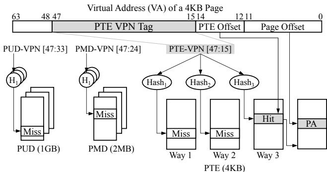  
Figure 2: Parallel page-table lookup in an ECPT-based architecture [98] using three-way cuckoo hashing.

Flattened Page Table (FPT). Recently, extensive efforts are being made to optimize memory translation architectures. A common principle is to shorten page table walks of the x86-64 scheme [26, 28, 48, 65, 77, 87, 111]. A recent proposal from Arm, known as Flattened Page Table or FPT [87, 106], flattens the x86 page tables by dynamically merging intermediate tree levels to reduce indirections and prioritize caching of page table entries. Specifically, FPT tries to merge L4 and L3, as well as L2 and L1, in Figure 1, shortening the walk by half.

Hashing-based Translation and ECPT. Hashing is being actively revisited for translation [35, 53, 63, 68, 98–100, 109]. We focus on ECPT (Elastic Cuckoo Page Table) [98], a new hashing-based scheme which effectively speeds up translation with fully parallel lookups of page table entries.

Figure 2 depicts ECPT-based memory translation. Different from conventional hashed page tables [46, 54, 60, 104, 109], ECPT uses process-private hashed page tables that are dynamically resized based on occupancy. ECPT uses Cuckoo Hashing [83] and maintains multiple tables (called ways) to proactively resolve hash collisions by moving entries across ways. During a page table walks, the MMU computes hashes of the Virtual Page Number (VPN) to look up the ways in parallel. It eliminates the need for sequential tree walks. ECPT supports multiple page sizes (e.g., 1GB, 2MB, and 4KB pages) by maintaining a set of hash page tables for each page size.

To reduce parallel lookups, ECPT uses an in-memory data structure named Cuckoo Walk Table (CWT); each CWT maintains metadata (size and way) of ECPT translation entries. CWTs are cached in special MMU caches named Cuckoo Walk Caches (CWCs). During translation, if a requested page hits a CWC, the MMU can directly look up the specific page table (with the size) or the specific way.

## 2.2 OS Memory Management

The OS manages in-memory translation structures like page tables and other auxiliary structures (e.g., CWT in ECPT), defined by the hardware architecture. The OS is also responsible for managing translation data (virtual-to-physical address mappings and metadata like protection and dirty bits).

Translation information is consumed by almost all OS memory management operations. Hence, translation architectures have strong implications on OS performance. For example, recent work [108] shows that the majority of page migration cost is from OS memory management on translationrelated operations like unmapping/remapping pages and demoting huge pages, instead of actual page copies.

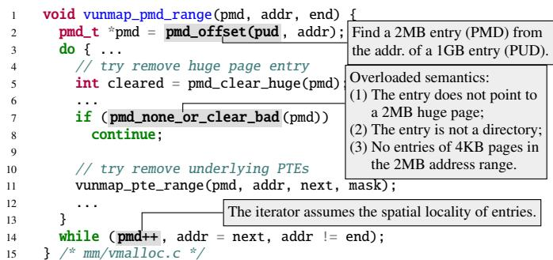  
Figure 3: Examples of Linux memory management code that is hardwired to radix-tree based translation.

Modern OSes separate architecture-independent OS memory management and architecture-dependent hardware support. Mach [25] designed a machine-independent memory manager where its architecture-independent code makes few assumptions about MMUs [91]; the design is inherited by BSD kernels [45]. EMT is inspired by Mach/BSD, but focuses on empowering new, experimental translation schemes.

Linux layers machine-independent/dependent code differently. It maintains a multi-level tree-based page table in the architecture-independent module. This design achieves highperformance memory management: 1) it enables optimizations that need to directly manipulate page tables and translation entries, and 2) it avoids overhead due to indirections. However, it lacks extensibility to different translation architectures especially those that do not fit its tree definition such as ECPT or even the conventional hashed page tables.1

## 3 The Need for a New OS Framework

Emerging memory technologies and research on MMU architectures pose a strong need of developing and evaluating OS memory management on new translation schemes. The current practice of evaluating new translation schemes mostly relies on hardware simulation, either using performance models to estimate OS overhead [28, 65, 77, 95, 109, 111], or replaying traces collected by running workloads on vanilla Linux [77, 95, 98, 109]. Such approaches can hardly capture complex OS-architecture interactions [29]. We argue that the lack of OS effort is largely due to memory management systems in commodity OSes not providing an extensible interface for new, different translation architectures.

```c
void walk_pte_range(pmd, addr, end, walk) {Lock 2MB address range only
2 spinlock_t *ptl; once for batched operations.
3 pte_t *pte = pte_offset_map_lock (mm, pmd, addr, &ptl);
4
5 for (;;) {
6 err = ops-> pte_entry (pte, addr, addr + PAGE_SIZE, walk);
7 8 ...addr += PAGE_SIZE; A custom function uses entry pointers to
9 pte++; perform in-place attribute updates.
10 } Exploit page table entry adjacency to reduce page walk overhead.
12 pte_unmap_unlock(pte, ptl);
13 } /* mm/pagewalk.c */
```  
Figure 4: Hardware-specific optimizations in Linux.

Hardwiring Translation Schemes Is Untenable. Linux’s memory management code is currently hardwired to a fivelevel tree. Without an extensible framework, it can hardly embrace new translation architectures that use different lookup structures such as hash tables [98, 99, 109], flattened or range tables [26, 65, 87], and hybrid schemes [27, 63].

Figure 3 shows a representative example in Linux, where a memory operation for unmapping a virtual address range at PMD level (vunmap\_pmd\_range in vmalloc.c) makes the following assumptions specific to Linux’s tree definition:

• A translation entry of a 2MB virtual address range (PMD) can be found from the entry of a 1GB address range.

• An entry of a 2MB address range (PMD) either points to a 2MB huge page or a directory of 4KB pages.

• The translation entry of the next 2MB address range can be iterated by increasing the pointer.

Such implementation patterns are commonplace in Linux’s current architecture-independent memory management module. Hence, supporting a different translation architecture would require heavy rewriting of existing Linux code.

In fact, it is also nontrivial for Linux to support translation schemes that use a different tree. Evidently, adding the fifth level took 715 lines of code changes across 23 files [97], all in the architecture-independent modules of Linux. Similarly, though FPT’s design strives to limit OS changes [87], it still introduces nontrivial changes of Linux’s architectureindependent code to fold the intermediate levels of the tree.

Furthermore, without a well-defined interface, memory management code becomes hard to maintain due to implicit assumptions and semantic overloads with continuous optimizations and fixes. In Figure 3, pmd\_none\_or\_clear\_bad() overloads three semantics, making the code hard to maintain.

Hardware-Specific Optimizations Are Desired. Inspired by Mach/BSD [13, 45, 91] that have clean separation of machineindependent and dependent code, we started from a pmap-like interface for Linux. In Mach/BSD, architecture-indepedent memory management code uses pmap interface to manage virtual memory mappings. pmap [91] represents a virtual-tophysical address map, which can point to a VAX linear page table [70] or segment registers in IBM RT PC. With pmap, different translation schemes can be supported by writing pmap modules. Typical pmap operations include creation, deletion, and update of address mappings [13, 91].

Unfortunately, we find that a map interface like pmap is not sufficiently expressive to write hardware-specific optimizations, especially in the Linux context. For example, pmap routines for inserting or finding a translation, only reference a virtual address without exposing translation entries. Figure 4 shows three common patterns of optimizations in existing Linux code: 1) batching with fine-grained locks for range operations, 2) in-place translation entry updates with no data copy, and 3) direct fetching of translation entries by offsets. None of them are easy to write using a map, as they need to directly manipulate translation entries. As optimizations of memory management are critical to Linux performance— 27.8% of Linux kernel patches to memory management are for performance optimizations [59]—a simple map interface makes it hard to fully empower translation architectures.

Existing Frameworks Do Not Target Translation. Driven by new memory technologies like tiered memory, several new memory management frameworks [61, 92, 103] have been developed to improve the extensibility of Linux’s memory manager. However, few of them concern hardware translation architectures, but focus on application-specific page prefetching and replacement policies. FBMM [103] proposes to reuse VFS [51] and write memory managers as file systems. It exposes the page\_fault VFS callback for managing page table entries. However, FBMM relies on Linux’s existing code that is hardwired to the multi-level radix tree structure, and thus cannot support different hardware translation schemes. Fundamentally, file system interfaces can hardly serve as an effective framework for memory translation.

## 4 EMT Design

Extensible Memory Translation (EMT) is an OS framework built atop Linux with the goal of empowering new, experimental memory translation architectures. Figure 5 gives a highlevel overview of EMT. EMT currently focuses on supporting new memory translation architectures in the OS kernel, instead of exposing them to userspace [47]. The design and implementation of EMT achieves the following goals:

• EMT is an architecture-neutral framework. EMT is not hardwired to specific translation structures such as multilevel tree in Linux. Supporting a new memory translation scheme should not change architecture-independent code.

• EMT enables hardware-specific optimizations. EMT allows architecture-dependent code to customize routines for hardware-specific optimizations. The ability to customize differs EMT from high-level interfaces like pmap in Mach/BSD [91] and hat in SunOS [50].

• EMT is modularized and improves maintainability. EMT provides well-defined translation semantics and organizes them with an object-oriented design. The interface eliminates architecture-specific or overloaded semantics. EMT also makes it easy to profile and analyze OS performance with regard to translation architectures.

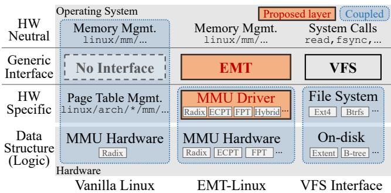  
Figure 5: Overview of the EMT framework, compared with vanilla Linux and analogized to VFS.

• EMT has negligible overhead. EMT is carefully implemented with compiler optimization, cache efficiency, and the ability to inline functions. EMT-Linux serves as a performance baseline for new architectures or OS modules.

• EMT accommodates modern hardware and OS complexity. EMT aims to develop insights into complex OSarchitecture interactions. EMT supports all Linux’s memory management features related to CPU MMU translation such as huge pages, swapping, DAX memory, etc.

## 4.1 EMT API

EMT exposes an object-oriented API that organizes translation related kernel routines around three architecture-neutral primitives: 1) translation object that maintains all the information of a virtual-to-physical address translation, 2) translation database that stores translation objects of an address space, and 3) translation service that manages the MMU states.

In EMT, all architecture-dependent code is implemented in drivers for MMU architectures, referred to as MMU drivers. To support a new translation scheme on EMT-Linux, one needs to write the MMU driver that implements EMT API without the need to modify architecture-independent code.

A key design principle of the EMT API is to abstract the functions of translation for OS memory management from hardware-defined shapes. Despite many different translation architectures (§2), the essential function of memory translation is to output the virtual-to-physical address mapping and all associated metadata, which is abstracted as a translation object in EMT. EMT avoids assuming shapes of translation data like translation entry schema or translation data structures. How to encode translation information of hardwaredefined shapes into the EMT API is the job of MMU drivers.

The EMT API is organized as 1) basic functions that must be implemented by each MMU driver for its supporting translation architecture, and 2) customizable functions that have a default implementation that is architecture-independent; the default implementation only uses basic functions and other common code. These routines can be customized by MMU drivers for hardware-specific optimizations.

```c
//// Translation Object
// Read the attribute of an object based on the attribute key
tobj_read_attr(tobj, attr_key) -> (error, attr_value)
// Update the value of a given attribute in an object.
tobj_write_attr(tobj, attr_key, new_val) -> (error, old_val)
//// Translation Database
// Find a translation object in a translation database
tdb_find_tobj(tdb, vaddr) -> (error, tobj)
// Update a translation object matching tobj's va
// by copying attributes of tobj.
tdb_update_tobj(tdb, tobj) -> (error, old_tobj)
// Remove the given translation object from the database.
tdb_remove_tobj(tdb, tobj) -> (error, old_tobj)
//// Translation Service
// Switch the translation database of the current address space
tsvc_switch_tdb(tdb) -> (error, out_tdb)
// Read the translation database of a given address space
tsvc_read_tdb(cpu) -> (error, out_tdb)
```  
Figure 6: Examples of basic functions in the EMT API. EMT exposes 15 basic functions in total.

The basic functions represent the minimal set of functions to support a new translation architecture. Developers can start with basic functions to achieve a functional kernel and then iteratively add optimizations via customizable functions. Basic functions free developers from sophisticated optimizations in Linux; it leads to a more friendly development and test cycle.

## 4.1.1 Basic Functions

Basic functions are expected to be architecture-dependent and are required to be implemented by each MMU driver. Figure 6 gives examples of basic function APIs. The API design avoids assuming specific hardware schemes like the five-level radix tree (§2) or page table entry schema. It also prevents overloaded semantics like pmd\_none\_or\_clear\_bad (Figure 3) due to software evolution.

Translation Object. A translation object encodes a virtual-tophysical address mapping and all its associated metadata. For paged architectures, it encodes translation information stored in page table entries. For tree-based architectures, a translation object encodes information in page table entries that point to the physical page (see §5). A translation object can also represent segments or variable-length memory regions. Translation metadata are encoded as attributes such as size, protection, presence, swap, etc., which are queried by general OS memory management. EMT lets MMU drivers encode metadata into architecture-dependent bits. MMU drivers can also encode architecture-specific attributes and use them to implement architecture-specific features like protection keys and capabilities [19, 21, 107].

Translation Database. Translation objects of an address space are stored in a conceptual database. The database is commonly implemented by a page table (which can be of various shapes) in an MMU driver. It can also be implemented by multiple co-existing page tables (e.g., ECPT needs separate page tables for each userspace process and for a shared kernel space across processes; see §6), or by segments or VMA registers [63, 111]. EMT requires a translation database to return one and only one translation object for a virtual address, as the function of the database. EMT does not concern the shape of the database. Its basic functions abstract away architecture-specific structures.

```c
//// Translation Object Iterator
// Return the current translation object and advance the iterator
tobj_iter_next(iter) -> (error, tobj)
//// Huge Page
// Check if a given virtual address range can be a huge page
thp_eligible(tobj, pg_size, vma) -> eligible
//// Address Range
// Check if the given virtual address range has no mapping in it
addr_range_void(tdb, start, end) -> is_void
//// Lock
// Get a lock to protect all translation objects in the range
addr_range_get_lock(tdb, start, end) -> (error, tlock)
//// Swap
// Get the Linux swp_entry_t from a translation object
tobj_to_swap(tdb, tobj) -> (error, swp_entry)
```  
Figure 7: Example customizable functions in the EMT API. EMT exposes 35 customizable functions in total in 7 groups.

The EMT API decouples translation objects from translation databases; the former does not concern how translation data are stored, while the latter does not interpret translation objects. The benefit is modularity, making it easy to reuse existing code (as shown by the FPT and ECPT MMU drivers).

Translation Service. A translation service abstracts the MMU of a system. It is the root of the EMT API, and manages the creation, destruction, and switching of address spaces. Upon a context switch, the translation service is called to switch the databases. Translation service decouples translation management from task management.

## 4.1.2 Customizable Functions

Customizable functions provide an interface for MMU drivers to implement hardware-specific optimizations. Each customizable function has a default architecture-neutral implementation using basic functions and other architecture-independent code. Figure 7 gives examples of customizable function APIs.

Customizable functions are exposed to MMU drivers via a combination of redefinable macros, following Linux’s convention. The architecture-neutral version is wrapped in #ifndef so that it can be used if no architecture-specific implementation is available. If an MMU driver wants to implement a customizable function, it defines the customizable function name to its own implementation; otherwise, the #ifndef redirects the interface to the default implementation. Since customizable functions always have an architecture-neutral implementation, adding new customizable functions in EMT (if needed in the future) will not break existing MMU drivers.

In principle, customizable functions are those that can benefit from architecture-specific optimizations. The choice now is through high-level reasoning together with profiling that identifies performance-critical code. Currently, EMT exposes different groups of customizable functions, as exemplified by Figure 7. We discuss the iterator group as an example.

```c
1 int tobj_iter_next(struct tobj_iter *iter, struct tobj *tobj)
2 {
3 int ret = tdb_find_tobj(iter->tdb, iter->va, tobj);
4 ret = tobj_read_attr(tobj, TOBJ_ATTR_SIZE, &size);
5 if (!ret) iter->va += size;
6 return ret;
7 } /* mm/emt-generic.c */
(a) Default (architecture neutral)
1 int tobj_iter_next(struct tobj_iter *iter, struct tobj *tobj)
2 { ...
3 // handling the most common case of iterating in a 2MB range
4 if (iter->ptep) {
5 tobj->va = iter->va;
6 tobj->pte = iter->pte;
7 if ((iter->va + PAGE_SIZE) & (~PMD_MASK)) {
8 iter->va += PAGE_SIZE;
9 iter->pte++; // Exploit radix's spatial locality
10 return 0;
11 }
12 // Cross 2MB boundary, update ptep based on pmd
13 }
14 ... // handling other cases.
15 } /* arch/x86/mm/radix.c */
```  
(b) x86-64 radix MMU driver  
Figure 8: A customizable function of the iterator.

Translation-Object Iterator. Iterating over a large number of translation objects is a common management pattern when the OS scans a memory region (e.g., for page migration [14] and huge-page promotion [16]). The performance of such operations is critical, e.g., an optimized iterator can reduce page fault handling cost by 52.5% (§8.4). EMT provides a translation-object iterator with customizable functions. Figure 8a shows the default implementation of the iterator’s tobj\_iter\_next() function, which is not efficient—the OS needs to walk from the root to the leaves of the page-table tree in every iteration using tdb\_find\_tobj. Note that such OS walks cannot benefit from hardware caches like PWCs as they are done by software. Figure 8b shows the customized implementation of the x86-64 MMU driver that leverages spatial locality of the radix tree to directly increment the pointer to get the next object. We discuss the implementation of the ECPT MMU driver in §6.2.

EMT’s iterator functions differ from Linux’s page-table iterator [90]—it does not assume the radix tree structure. EMT’s iterator does not return intermediate entries (which are specific to tree schemes), but returns translation objects.

## 4.2 Generality

It is hard to prove generality, but our effort on supporting x86- 64 radix tree, FPT, and ECPT indicates that EMT can express different hardware schemes, and all related optimizations. These schemes represent tree- and hashing-based translation designs, which ground many emerging architectures. A few new architectures [27, 56, 63, 111] propose hybrid designs which often use a fast scheme for common patterns and a slow scheme for correctness [56, 63, 111], or expose multiple schemes to userspace [27, 47]. For pure hardware-based fast schemes [56, 111], the translation is still the traditional one from an OS perspective (e.g., Midgard [56] uses radix tree as its backend). For architectures that use multiple schemes for different address space segments, the MMU drivers can manage multiple page tables under the hood of a database.

From a metadata perspective, EMT can support address translation schemes with coupled or separate metadata management. For metadata that are separately stored from translation structures, the MMU driver encodes and updates the translation entry and its metadata separately in the translation object. For example, EMT supports protection keys like Intel MPK [21] and hardware capabilities [107] by encoding keys as attributes of translation objects. EMT naturally supports capability-based translation [42, 107] which encodes permissions into capabilities (protected pointers).

EMT also supports mechanisms that manage cache modes like PAT [74] and MTRR [72]. EMT views the cache modes of a page as attributes of its translation object. When the cache mode of a page is changed, the MMU driver updates the attributes. For example, the x86 MMU driver will update the PAT, PCD, and PWT bits of its translation entry [82].

Limitations. EMT only concerns translation, and does not change operations on physical memory pages. EMT focuses CPU virtual-to-physical translation and does not target IOMMU translation for DMA requests. Linux code for IOMMU translation is also hardwired to the radix-tree scheme; the EMT approach can potentially apply. EMT assumes that programs run with virtual addresses; EMT currently does not support designs that make program use physical addresses directly [101, 102].

EMT currently only supports the native environment; virtualization support is on the roadmap. As the extended page table [19] (EPT) has a similar structure as the native page table, we plan to create a virtualization-specific MMU driver to manage EPT. The driver creates a translation database for each VM and handles tasks like changing EPTP registers upon VM switches and allocating EPT tables. KVM can call EMT APIs accordingly. We expect paravirtualization support (pv\_ops.mmu [73, 75] in particular) to be encapsulated in the MMU driver: MMU drivers with paravirtualization support can call pv\_ops.mmu for function patching.

## 5 EMT-Linux with x86-64 MMU Drivers

We develop EMT on Linux, referred to as EMT-Linux. Conceptually, it took four steps: 1) identifying memory management code in architecture-independent modules that are hardwired to x86-like, tree-based translation scheme; 2) rewriting them using the EMT API; 3) moving architecture-specific optimizations into the x86-64 MMU driver, and 4) writing default implementations of customizable functions.

The EMT implementation on Linux (v5.15) takes 9.5K lines of code changes (7.3K for interface refactoring and 2.2K for the x86-64 MMU driver) in 15 person-months. We changed 196 kernel functions in the mm directory of Linux— most memory management code interacts with the page table.

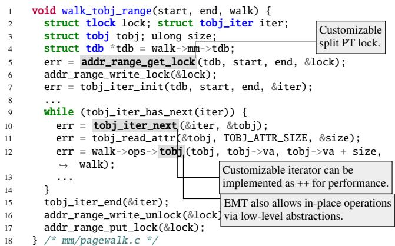  
Figure 9: Rewriting code in Figure 4 with EMT.

We use macros and inline functions to minimize interface overhead as per Linux’s coding style [20]; #ifndef-based function redirections are used otherwise. Specifically, we turn functions no more than three lines into macro or inline functions. We ensure that EMT does not break performance characteristics, e.g., no increase of stack size or call stacks, and no decrease of instruction cache hit rates in most cases (§8.3).

Moreover, we preserve all of Linux’s existing architecturespecific optimizations and realize them in the x86-64 MMU driver. Hence, EMT supports all virtual memory features of vanilla Linux and is transparent to user applications.

OS Memory Management with EMT. In EMT-Linux, OS memory management is no longer hardwired to specific translation schemes. Meanwhile, EMT-Linux reserves hardwarespecific optimizations like in Linux—both basic and customizable functions can be instantiated by different MMU drivers. Figure 9 shows the code in EMT-Linux that implements the hardwired Linux routine in Figure 4. It uses the translationobject iterator (see Figure 8) to scan all the pages in a memory region. This is a common pattern used in many OS memory management operations such as page promotion and migration, as well as page eviction (e.g., using LRU and MGLRU).

Figure 10 shows a skeleton of the page fault handler in EMT-Linux. In vanilla Linux, the page fault handler walks down the page-table tree level by level to determine the type of faults and dispatch them to corresponding subroutines (e.g., a leaf-level PMD entry implies a 2MB page). Differently, EMT-Linux’s page fault handler decouples page sizes from the translation data structures (the radix tree). It looks at the translation object and the corresponding page size based on the faulting address, and decides the subroutine to invoke.

Swapping operates on translation objects that map pages to be swapped. Different architectures may encode swap-page information differently. x86-64 MMU driver stores swap information in a page table entry if the present bit is cleared; huge page swapping [44] is done by encoding PMD entries. ECPT and FPT use the same mechanism. EMT provides customizable functions if architectures need different encoding.

```c
static vm_fault_t __handle_mm_fault(vma, vaddr, flags)
2 { ..
3 struct tobj tobj;
4 struct tdb *tdb = vma->vm_mm->tdb;
5 err = tdb_find_tobj(tdb, vaddr, &tobj);
6 err = tobj_read_attr(&tobj, TOBJ_ATTR_MAPPED, &mapped);
7
8 if (mapped) {
9 if (flags & FAULT_FLAG_WRITE) { // fix the write fault
10 err = tobj_read_attr(&tobj, TOBJ_ATTR_WRITE, &write);
11 if (!write)
12 return do_wp_page(&vmf);
13 }
14 ... // many other fixes
15 } else { // mapping does not exist;
16
17 while (pg_size > BASE_PAGE_SIZE) { // try huge page
18 if (thp_eligible(tobj, pg_size, vma)) {
19 int ret = create_huge_page(&vmf, pg_size);
20 ...
21 }
22 pg_size = dec_page_size(tdb, pg_size);
23 }
24 if(vma_is_anonymous(vma)) { // handle anon page fault
25 struct page *page = alloc_page_vma(...);
26 if (!page) goto oom;
27 struct tobj old_tobj;
28 err = tobj_update_attr(&tobj, TOBJ_ATTR_PA,
29 page_to_pfn(page) << BASE_PAGE_SHIFT);
30 // update other attributes like permissions
31 err = addr_range_get_lock(tdb, vaddr,
32 vaddr + BASE_PAGE_SIZE, &lock);
33 addr_range_write_lock(&lock); // lock the range
34 err = tdb_update_tobj(tdb, &tobj, &old_tobj);
35 addr_range_write_unlock(&lock);
36 addr_range_put_lock(&lock);
37 return 0;
38 }
39 .. // handle other type of base page faults
40 }
41 ... // error handling (e.g., oom)
42 } /* mm/memory.c */
```  
Figure 10: Snippet of EMT-Linux’s page fault handler.

EMT encapsulates translation cache management in MMU drivers, as the cache structure is architecture-specific. For example, ECPT does not use x86-64 PWCs but has CWCs to cache page size and way information [98]. TLB-related code is handled with the same principle. The MMU driver performs TLB flushes and guarantees the consistency of cache state. Batch invalidation is supported by customizable functions.

x86-64 MMU Driver. For the x86-64 radix-tree translation scheme, our x86-64 MMU driver maintains the multi-level tree page table. The MMU driver encodes page table entries at all levels of the radix tree for a given virtual-to-physical address mapping in the translation object. This encoding enables the MMU driver to realize all the optimizations specialized for the tree-based x86-64 page table, while making architecture-neutral code agnostic. For example, the MMU driver can directly operate on the PMD or PUD entries to implement Linux’s split page table lock [15] through the addr\_range\_get\_lock customizable function (Figure 9). The MMU driver can also implement optimizations that leverage spatial locality of the tree structure, as exemplified by the iterator (Figure 8). Encoding attributes of x86 page table entries via translation object API is straightforward by reading/writing bits in the entries, and our x86-64 MMU driver supports hardware-specific features like Intel MPK.

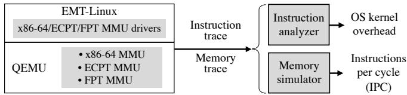  
Figure 11: Emulator toolchain for OS development and evaluation on experimental memory architectures.

FPT MMU Driver. We implemented an MMU driver for a new translation scheme based on Flattened Page Table (FPT) [87]. The FPT design aims to minimize OS changes [106] and is based on the x86-64 radix-tree page table. Without an interface like EMT, it needs nontrivial changes to Linux’s architecture-independent code, including changing macros that define bits in page table entries and checking if a level needs to be folded. The Linux prototype in the FPT paper [87] supports flattening of L3+L2 only. We wrote the FPT MMU driver by reusing the x86-64 MMU driver code with 664 lines of C code. With the EMT API, no architectureneutral OS code needs to be changed. Our FPT MMU driver supports all three types of flattening patterns of tree levels, and it co-exists with the x86-64 radix MMU driver.

## 6 ECPT on EMT-Linux

## 6.1 Emulator-based Toolchain

It is challenging to develop OSes for new translation architectures without manufactured MMU hardware. We did not find an available toolchain for developing and evaluating OS kernels with experimental architectures like ECPT. The original evaluation of ECPT [98] collects memory traces from simulation using Simics [76] on vanilla Linux and replays traces in SST [94] that simulated an ECPT MMU. Simics is closed-source and only supports existing ISAs.

We develop an emulator-based toolchain using QEMU [5] (Figure 11). We use QEMU’s software MMU mechanism [4] to develop an emulated ECPT MMU where we implement ECPT translation logic and hardware caches in 3.1K lines of C code. QEMU offers an emulated x86-64 MMU which serves as a baseline for performance evaluation.

Our toolchain can connect to trace-driven hardware simulators (QEMU provides no cycle-accurate simulation). We developed instruction and memory tracers using QEMU’s TCG plugin [23]. The instruction trace helps analyze kernel and userspace behavior (§8.4), as well as hardware simulation.

## 6.2 ECPT MMU Driver

We implement an ECPT MMU driver on EMT based on the hardware architecture design [98]. We use a three-way

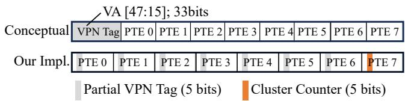  
Figure 12: Implementation of 64-byte PTE-ECPT entry clusters consists of eight 8-byte PTE entries. Each entry contributes five bits for the VPN tag or a cluster count.

ECPT for each page size (4KB/2MB/1GB) so the translation database manages nine control registers, one per way; registers are updated upon a process context switch. The driver also manages nine registers for the kernel page tables (§7.1). The ECPT MMU driver takes 7.4K lines of C code.

The ECPT structures are implemented in the ECPT MMU driver. For memory efficiency, we allocate ECPTs of a specific size on demand. We follow the ECPT design of clustering eight translation entries into a 64-byte cache line to improve locality. To do so, we construct the VPN tag (Figure 2) with bits from multiple translation entries, as shown in Figure 12. For the PTE VPN tag, each entry contributes five bits so the first seven entries together make up the VPN tag, and the last entry contributes five bits as the count of valid entries in the cluster. The count is used to calculate occupancy (for table resizing) and for freeing the cluster. These metadata are managed by basic functions. PUD and PMD entries use the same design but with 24 bits and 15 bits for the VPN tag.

When a table’s occupancy exceeds a threshold (0.6 as in [98]), a background kernel thread resizes the table and migrates entries from the old table to the new table gradually.

Except for the repurposed five bits for metadata, ECPT’s translation entry by design follows x86-64 PTE format. We reuse the PTE encoding from the x86 radix MMU driver, enjoying the benefit of EMT’s object-oriented design.

Cuckoo Walk Tables (CWTs) are implemented in the ECPT MMU driver, invisible to architecture-independent code. We follow the ECPT design [98] to use a 5-bit section header (a section is the address range translated by one ECPT translation entry) and cluster 64 headers into a 64-byte cache line. Each header is one byte and contributes three bits to encode the VPN tag and count of valid section headers.

Optimizations. We implemented a series of optimizations through the customizable functions, driven by benchmarking and profiling (§8.4). For example, we customize the iterator with architecture-specific optimizations to accelerate range operations. The idea is to exploit locality within a translation entry cluster: the iterator finds the next entry by pointer arithmetic, instead of hashing-based lookups, when the entry is not the last one in its cluster. One common optimization pattern is to minimize the cost of range operations—the default implementation (e.g., Figure 8a) often takes too many fine-grained hashing-based operations.

## 7 Reflection on ECPT Design

We show that building OS components is essential to understanding architecture designs. The efforts on developing and evaluating ECPT with EMT-Linux reveals OS challenges of using a fast translation scheme, which were unexpected (undocumented in the original hardware design).

## 7.1 Managing Kernel Page Tables

In modern OSes like Linux, the kernel address space is shared across processes [9]. In tree-based translation, sharing is realized by having high-level page table entries pointing to the shared subtree of the kernel address space [22]. This design does not apply to hashing-based translation. One option is to maintain one ECPT for each process containing both user- and kernel-space addresses. However, such a design is memory inefficient and leads to high overhead, e.g., once a translation of a kernel-space address is updated, the OS must update the corresponding entries in ECPTs of all processes.

Our ECPT MMU driver maintains a global kernel-space ECPT (kECPT) shared among processes and an independent user-space ECPT (uECPT) for every process. The kECPT has the same page size and way configuration as each uECPT. The kECPT and uECPTs are managed independently. When KPTI (kernel page table isolation) [22] is enabled, two independent global kECPTs are managed (a complete kECPT and a minimal kECPT). This design requires ECPT MMUs to expose another nine control registers that point to kECPT(s).2

Self-Reference Paradox. Managing kECPTs is more challenging than uECPTs. Different from uECPTs that are mandated by the kernel, the kECPT manages the kernel’s own code and data—translations for kECPT management code and kECPT itself are stored in kECPT. This creates a challenge for ECPT which needs to move translation entries across ways for resolving hash collisions—in the moving window, if the entries map the kECPT itself or the kernel code for moving entries are missing, the kernel crashes due to missing translation of the kECPT or code, as shown in Figure 13. Frequent triggers are kernel’s huge page promotion/demotion which remove entries and insert new entries in different tables.

We term the issue self-reference paradox. The root cause is a lack of hardware support for atomic updates on multiple memory locations. Radix-tree page tables do not face this paradox, because they do not move entries and the hugepage promotion/demotion is done by updating one PUD/PMD entry. In general, the self-reference paradox can happen in kernel page tables that need to move entries (many advanced index schemes need to move entries [36, 113]). Note that other kernel structures like forwarding table [112] do not face this paradox if they do not map kernel code/data.

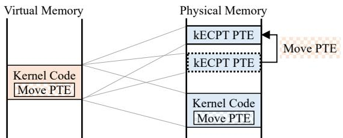  
Figure 13: An example of self-reference paradox caused by the need of moving kECPT entries that are needed to find kernel code for moving kECPT entries (§7.1).

We address the paradox via a series of software-hardware endeavors. First, we always copy the entry to the new location before removing it at the old location, which may cause duplicated entries but no missing entries. We instruct the MMU to handle duplicate entries that have the same virtual-to-physical address mapping and the same protection bits; the deduplication policy also works for huge-page promotion/demotion as it does not change the mapping or protection. We avoid location-changing read-update-write operations in OS code so that duplicated entries always have the same mapping and protection. For ECPT, any operation that may change the content of an entry can only be done after the entry is locked.

Atomic kECPT Switching. Another form of self-reference paradox manifests via KPTI [22]—when switching between the kernel space and the user space, the OS needs to switch between a full kECPT and a minimal kECPT. One potential implementation is to use multiple mov instructions to redirect control registers from the old kECPT ways to the new ways. However, this may lead to an inconsistent ECPT state during the switch window, where some registers point to new ways and the others point to old ways. This leads to issues when the translations of currently executing kernel code are stored in different ways across the new and old kECPTs. Note that simply keeping context switch code covered by both kECPT is not enough since the instructions can reside in different ways of the old and new tables. Instructions might not be successfully fetched when kECPT state is inconsistent.

Solving this problem needs a mechanism for atomic switching from all old kECPT ways to the new kECPT ways. Such an atomic switching mechanism can be realized with hardware support. Our solution is to add additional sets of kECPT control registers and the hardware switches between the two sets of control registers, in a similar vein as the VMLAUNCH and VMRESUME instructions of x86 on updating multiple registers together. The switch is a serializing instruction to ensure that all instructions after it will use the new kECPT.

## 7.2 Implications on OS Performance

Managing Sparse Address Space. A fundamental efficiency property of tree-based page tables is the ability to manage sparse address space, which is critical for OS memory management which commonly needs to scan large, but sparse address ranges. In tree page tables, a high-level entry can encode properties of a large address range, e.g., a nonexistent PMD entry indicates no valid page allocated in the corresponding 2MB range. Hashed page tables have no such hierarchical relationship between entries; hence, the OS may go through all the possible entries in the large, sparse address range.

One optimization is to enable a similar property in ECPT by designing special entries that are not for translation, but for encoding states. The OS checks the entry to learn the states of the corresponding address range, e.g., the OS can query such an entry to check if the corresponding 2MB address range has any allocated page, instead of checking all possible PTE entries. The design would need to cooperate with the MMU.

Multicore Scalability. We find it nontrivial to implement efficient locking primitives similar to Linux’s split page table lock [15] in ECPT, because the location of an ECPT entry can be moved due to insertion or rehashing. The movement of entries makes it prone to deadlocks, e.g., one thread t holding a lock l and inserting a new entry, thus consequently requires moving an existing entry e (see [83]) which is locked by another thread that waiting on l. One solution is to let t release all its acquired locks and retry later when deadlock. The complexity lies in recording and rewinding states changed by t. We are exploring an alternative design that introduces a separate lock table to provide the OS with the flexibility of implementing lock primitives, which has the semantic of locking both an address range and the related entries. Our implementation of the ECPT MMU driver has no correctness issue, as we use a coarse-grained lock.

## 8 Evaluation

## 8.1 Methodology

We validate the correctness of the EMT-Linux implementation using Linux tests. Since EMT supports all virtual memory features in Linux, EMT-Linux should pass any userspace tests.

We also measure the interface overhead of EMT by running the same set of performance benchmarks on EMT-Linux (§5) and vanilla Linux running upon the same hardware.

We then measure the performance of EMT-Linux on ECPT. We run EMT-Linux with the ECPT MMU driver on top of an emulated ECPT MMU using our emulation framework (§6.1). We compare the performance of EMT-Linux with the Radix MMU driver running on an emulated x86-64 MMU.

Benchmarks. We use LEBench [93] as a micro benchmark to measure the performance of core OS operations such as page fault handling, context switching, and system calls.

We use nine memory-intensive macro benchmarks that stress the TLB and need off-TLB translation. We use the same set of macro benchmarks from the ECPT paper [98, 100] except two where we failed to reproduce the working set.

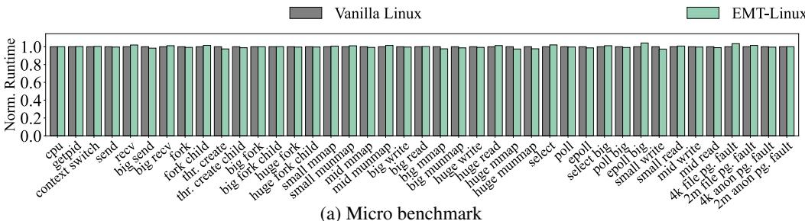

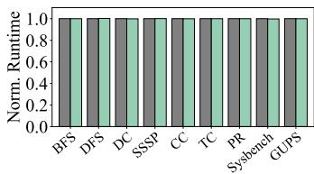  
(b) Macro benchmark  
Figure 14: Performance overhead of EMT-Linux over vanilla Linux (measured by the micro and macro benchmarks).

The macro benchmarks include seven applications from the GraphBIG benchmark suite [80]: Breadth First Search (BFS), Depth First Search (DFS), Degree Centrality (DC), Single Source Shortest Path (SSSP), Connected Components (CC), Triangle Count (TC), and PageRank (PR); they use the LDBC-1000K dataset [2], with working sets of about 8.5 GB. We also run the GUPS benchmark [58] which issues random memory updates, and a memory test from Sysbench [66]. Both GUPS and Sysbench have 64 GB working sets.

We also evaluate three memory-intensive applications: Redis, Memcached, and PostgreSQL. Table 1 shows the workloads. All these applications are multithreaded programs.

## 8.2 Functional Correctness

We show that EMT supports all memory management features of Linux by running Linux Test Project (LTP) [12] against EMT-Linux. We use the default kernel configuration for the generic kernel (5.15.0-125-generic) of Ubuntu 20.04. LTP includes 1,405 tests in total and 1,208 of them apply to the kernel configuration. EMT-Linux with Radix, ECPT, and FPT MMU drivers both pass all 1,208 tests which covers 376 system calls. We also cross-validated program outputs of the micro and macro benchmarks across EMT-Linux and vanilla Linux. We use testing as a continuous effort throughout our development, rather than a one-time effort, which helped capture bugs in a timely manner.

## 8.3 EMT Interface Overhead

EMT introduces negligible overhead. We run the benchmarks and application workloads on vanilla Linux and EMT-Linux running on the same hardware. The hardware is a dual-socket Intel Xeon Gold 6346 server at 3.10GHz with 16 cores and 256GB DDR4-3200 DRAM. We disable hyperthreading and fix core frequency to make the measurement stable. The overhead of EMT is calculated by normalizing the results of EMT-Linux to vanilla Linux. We experimented with various kernel configurations (e.g., enabling THP); the results are consistent.

Figure 14a shows the results of kernel micro benchmarks LEBench [93]. EMT-Linux exhibits an average normalized kernel-routine performance of 99.9% relative to vanilla Linux (with a standard deviation of 1.1%) across the 41 LEBench microbenchmarks. The largest overhead comes from the “epoll big” benchmark, where EMT-Linux slows the benchmark by 4.2%. It was caused by not inlining certain functions due to coding style restriction, which can be further optimized by restructuring the code or forcing inlining. Figure 14b shows that the overhead of EMT-Linux is less than 0.1% on the macro benchmarks. Figure 15 shows the normalized throughput, average latency, and tail latency of three real-world applications (with workloads in Table 1) on EMT-Linux, normalized to their performance on vanilla Linux. The measured differences of the three metrics are within 0.1%, 0.1%, and 0.2%, respectively. The results of the real-world application show that the EMT interface does not affect system responsiveness.

<table><tr><td>Application</td><td>Working Set</td><td>#Records</td><td>Read:Write</td><td>#Requests</td></tr><tr><td>Redis</td><td>128 GB</td><td>536M</td><td>50:50</td><td>60M</td></tr><tr><td>Memcached</td><td>69 GB</td><td>56M</td><td>80:20</td><td>10M</td></tr><tr><td>PostgreSQL</td><td>64 GB</td><td>21M</td><td>100:0</td><td>25M</td></tr></table>

Table 1: Application workloads used in the evaluation.  
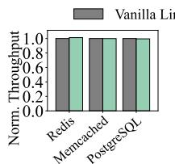  
(a) Throughput

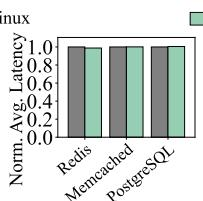

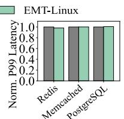  
(b) Avg. Latency  
(c) P99 Latency  
Figure 15: Performance overhead of EMT-Linux over vanilla Linux on real-world applications

The negligible overhead is attributed to two kinds of endeavors. First, we carefully engineered the EMT interface to preserve the performance characteristics—we minimize increased stack size or deepened call stacks, and maintain cache efficiency. Instruction cache hit rates on EMT-Linux differ from those on vanilla Linux by at most 0.8%. Second, EMT enables us to implement all the hardware-specific optimizations in the MMU drivers.

## 8.4 OS Performance on ECPT

We show that EMT enables us to understand OS performance on new translation architectures using ECPT as an example. We evaluate ECPT by running EMT-Linux with the ECPT MMU driver on our emulation framework and comparing its performance with the x86-64 radix MMU driver. We run macro benchmarks and application workloads and record all kernel and user instructions (with both 4KB pages and THP).

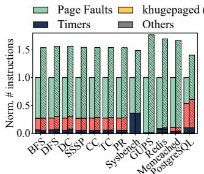  
(a) 4KB

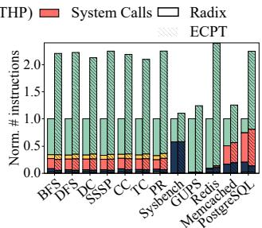  
(b) THP

Figure 16: Distribution of kernel instructions of EMT-Linux with the Radix and ECPT MMU drivers.  
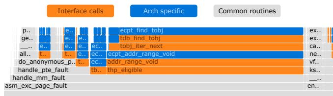

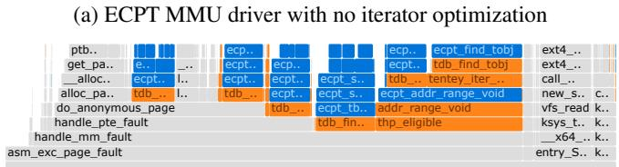  
(b) ECPT MMU driver with iterator optimization  
Figure 17: Flame graph of EMT-Linux kernel instructions when running GraphBig BFS (THP enabled).

Understanding OS Overhead of ECPT. Figure 16 shows the distribution of kernel instructions; most of them are for page fault handling. Compared with Radix, ECPT spends 1.74x more instructions on page fault handling on average for 4KB pages, and 2.59x more with THP enabled. When THP is enabled, ECPT leads to relatively more work than Radix because Linux’s THP implementation uses a few expensive operations to check if there exist valid entries in a given address range. These checks are on the critical path of page fault handling when THP is enabled since the kernel needs to know if the 2MB range has any mappings before it can decide if a 2MB huge page mapping should be built. For Radix, these checks are cheap (0.39% of total kernel work) because a PMD entry has information on PTE tables. If the entry is not valid or present, then neither 2MB nor 4KB mappings exist; the huge-page bit tells if the entry points to a huge page or a directory of 4KB pages. However, these checks are expensive in ECPT, as ECPT’s entries are independent, the kernel may need to check all 512 4KB entries of pages in the 2MB range, which requires many expensive lookup operations. We discussed the potential solution in §7.2.

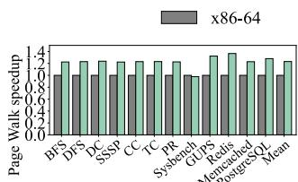  
(a) Page table walk latency

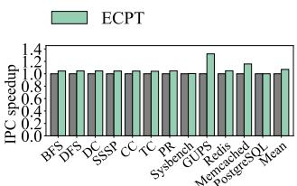  
(b) IPC

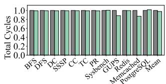  
(c) Total cycles

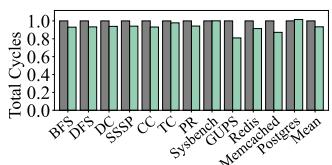  
(d) Total cycles (running phase)  
Figure 18: ECPT hardware simulation results— Page Table Walk Latency, Instruction Per Cycle (IPC) and Total Cycles—with the ECPT system and the x86-64 system, running EMT-Linux. All results are normalized to those of the x86-64 system as the baselines.

Effectiveness of Optimizations. EMT exposes optimization opportunities for MMU drivers using customizable functions. Figure 17 uses flame graphs to show the effectiveness of iterator optimization running GraphBIG BFS with THP. With the iterator optimization (§6.2), ECPT can save 49.0% of total kernel work, and 52.5% of the page fault handling work. The optimization drastically saves the work of hashing and lookups of the architecture-neutral default implementation, by incrementing the pointer to an entry directly, as long as the entry is within an entry cluster (Figure 12). Note that such kernel work as software overhead cannot benefit from hardware caches such as TLBs or PWCs.

## 8.5 Hardware Simulation

## 8.5.1 ECPT

EMT’s emulator toolchain provides an open platform of hardware simulation for experimental architectures where silicon implementations are not available. To demonstrate this, we run hardware simulations for EMT-Linux with the x86-64 radix and ECPT MMU drivers using the DynamoRIO simulator [41]. We use the hardware configuration described in the ECPT paper [98]. For PWC configuration, we follow more recent works [77, 111] to use 3 levels of PWC with 2-4-32 entries per level. We use the macro benchmarks and the three application workloads described in §8.1.

Traditional Hardware Metrics. Our toolchain measures traditional hardware metrics, namely Page Table Walk Latency and Instructions Per Cycle (IPC), which are considered key performance metrics of hardware translation architectures (see [87, 98]). As shown in Figures 18a and 18b, ECPT has significant performance advantages over x86-64 (Radix). On average, ECPT speeds up page table walks by 23.1%, and increases IPC by 7.0%. For most benchmarks, ECPT shows nontrivial page table walk and IPC speedups, as it directly accesses the last-level PTEs. The only exception is Sysbench whose workload has a high PWC hit rate of 99.8% at the PMD level on x86-64, i.e., the x86-64 page table walks skip most intermediate steps and directly accesses last-level PTEs; meanwhile, ECPT pays extra cycles for hash computation in addition to CWC accesses, so it slightly slows down Sysbench’s page table walk by 2.2%

New Metrics with OS Overhead. We find that IPC, which measures instruction throughput, does not fully reflect application runtime—though ECPT increases IPC, our ECPT MMU driver introduces more kernel instructions than the x86-64 MMU driver (§8.4). Hence, we measure the total cycles for running macro benchmarks and applications, including the OS overhead (mostly page-fault handling as shown in Figure 16). Figure 18c shows that, on average, the ECPT system reduces total cycles by 2.3% across the workloads. GUPS and Memcached show major benefits, where the ECPT system reduces the total cycles by 11.5% and 12.9%, because page table walks account for over 66% of their execution time.

The aforementioned analysis shows that the OS can play an important role in application performance, which could be overlooked with hardware metrics. Without building the OS memory management, it is hard to evaluate OS overhead accurately. Prior work assumed that OS overhead is constant under different memory-translation architectures. In the initial modeling, the memory trace is collected from running benchmarks on vanilla Linux on x86-64; the trace is then replayed in a simulator of ECPT MMU. As shown in §8.4, memory translation architectures can have profound implications for OS performance. EMT aims to enable OS experience for new translation architectures. We believe that EMT effectively lowers the barrier to implement OS support for new memory-translation architectures by making the kernel developers focus on MMU driver implementations.

IPC as a metric aligns with application’s execution time when OS overhead is minimal. All the evaluated workloads have two phases: a loading phase that loads data from the disk to memory, and a running phase that runs the computation or serves user requests. The running phase involves less kernel work with kernel instructions accounting for less than 1.3% of the total instructions. With only the running phase considered, ECPT improves IPC by 7.5% and reduces total cycles by 6.6% compared to the x86-64 system (Figure 18d).

The results could be different with different hardware simulators. We expect the impact of kernel instructions to become smaller when using SST [94] which models OoO execution more precisely. The SST evaluation remains future work.

## 8.5.2 FPT

We start with a FPT configuration that flattens L3+L2 tables (see Figure 1) which was implemented by the original OS prototype [87]. Our evaluation shows that the benefit of flattening L3+L2 is limited: only L3 entries were saved, which were cached effectively in x86-64. As shown in Figures 19a, 19b, 19c, compared with Linux on x86-64 (baseline), on average, the FPT-based system speeds up page table walk latency by 5.5%, IPC by 1.0%, and the total cycles by 1.1%.

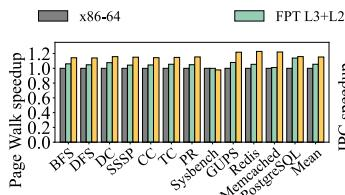  
(a) Page table walk latency

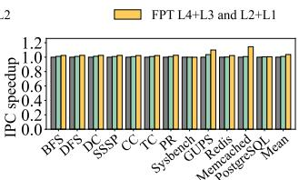  
(b) IPC

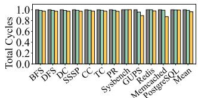  
(c) Total cycles

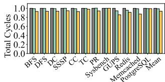  
(d) Total cycles (running phase)  
Figure 19: Hardware simulation results of the FPT system and the x86-64 system, running EMT-Linux. All results are normalized to those of the x86-64 system as the baselines.

We then implemented the FPT configuration that flattens both L4+L3 and L2+L1. This configuration was not implemented in [87] due to its difficulties of supporting 2MB huge pages. We implemented a 4KB-only version and evaluated it with only 4KB base pages (no huge page). With this configuration, compared with Linux on x86-64, the FPT-based system speeds up page table walk latency by 15.3%, IPC by 3.6%, and total cycles by 3.7% (Figures 19a, 19b, and 19c).

Flattening both L4+L3 and L2+L1 in FPT yields performance comparable to ECPT in the running phase. Compared with radix, ECPT and FPT reduce total cycles by 6.6% and 6.4%, respectively (Figures 18d and 19d). For hardware metrics (page table walk latency and IPC), the FPT-based system matched ECPT-based system’s performance: ECPT is only faster than FPT by 2.4% in page table walk latency and 0.4% in IPC. On the other hand, ECPT inherently supports huge pages of varying sizes, unlike this FPT configuration.

## 9 Experience and Lessons Learned

Developing EMT-Linux and the MMU drivers together with the emulated MMU took extensive engineering efforts. Specifically, we had to develop interacting moving parts across the hardware-software boundary.

A key principle is to enable incremental, contiguous engineering practice. For example, when implementing ECPT, our first milestone is to write a basic per-process hashed page table (BHPT) using EMT, without features like collision resolution, elastic resizing, CWT/CWC, etc. We implement BHPT logic in both EMT-Linux and the MMU and have a running system that only supports a tiny microbenchmark. Despite being basic, the running system serves as a foundation for gradually adding features and eventually evolving into a fullfledged system. For features that need both hardware and software support, we start from the hardware, which typically has simpler logic and mostly reads translation data.

We continuously test and evaluate our system, not only for correctness (§8.2) but also for performance. Continuous profiling helped us quickly observe performance regression over vanilla Linux; when developing ECPT, profiling helped us identify major inefficiencies compared to the radix-pagetable-based system. We developed the instruction analysis with flame graphs [55] in our emulator toolchain. and use them extensively. We also added GDB support for the ECPTbased system (QEMU’s GDB was hardcoded with radix).

We largely reuse the existing Linux compiler toolchain to keep the effort manageable. We leverage x86’s model-specific registers (MSR) [19] as the control registers for ECPT, which is supported by GCC (x86’s read/write MSR instruction allows access to arbitrary MSR with a 32-bit identifier). We use Clang’s static analysis tools (e.g., clang-query [18]) to search for error-prone code patterns during refactoring.

One mistake we made was to start from Linux’s boot-time kernel page table [6, 8], which is legacy code without debugging tools. Developing boot-time kECPT requires implementation in assembly and build mappings of kernel code/data from a bootstrap address space. We spent four months to understand the details of the boot-time kernel page table. Retrospectively, we should have started from runtime kECPTs (by switching the system to it after boot [7]) so we could have a running system quicker to parallelize our efforts.

## 10 Related Work

As memory translation has become a major bottleneck of emerging memory-hungry, irregular workloads such as generative models, graph analytics, and recommendation systems, translation architecture has been an immensely active research topic recently. Extensive efforts are made on new designs of TLB [33, 86, 88, 89] and page walk caches [32, 40], and more efficient huge page management [62, 69, 81, 84, 85].

To fundamentally resolve translation bottlenecks, recent work [53, 56, 63, 98, 109] is actively rethinking translation architectures; a common thread is to prioritize speed over space efficiency (with abundant memory) and use fast lookup structures to reduce tail latency (avoiding pointer chasing).

Memory translation architectures have profound implications on OS reliability and performance, but unfortunately have not been well explored in prior work. EMT is designed to enable development and evaluation of OS support for emerging translation architectures to formulate an OS perspective.

Note that memory management and its extensibility were well studied in OS research [24, 38, 47, 67, 91] and are continuously revisited, driven by the growth of memory capacity and the heterogeneity introduced by memory tiering [37, 61, 71, 78, 92, 103]. So far, extensibility refers to the ability for user space to customize memory management features, e.g., page fault handler. Few prior studies considered extensibility in terms of empowering memory translation architectures or studied their implications on OS performance.

We are inspired by machine-independent memory management designs in Mach [91] and SunOS [50]. The goal of EMT is to enable the OS development for emerging, experimental memory translation architectures and demonstrate the value with our experience. We attempted to simplify the EMT interface, e.g., to a map interface [50, 91]; however, we find it hard to balance architecture neutrality and low-level optimizations. One way is to add hints, but hints are not expressive for passing information to different MMU drivers.

Virtuoso [64] is a recent hardware simulation framework that considers OS overhead (mostly the overhead of page fault handling) using an imitated MimicOS in the user space. EMT and Virtuoso are fundamentally different but are complementary. Unlike Virtuoso which is designed for architecturecentric simulations, EMT is an OS interface for enabling OS developement and evaluation with regard to new translation architectures. EMT benefits architecture designs from an OS perspective by running real MMU drivers on Linux.

## 11 Concluding Remarks

EMT is an OS framework for developing and evaluating OS memory management for new memory translation architectures. Our work shows the importance of understanding hardware translation schemes from the OS perspective. Specifically, we show that fast translation schemes like ECPT can incur new challenges for the OS. We will release and make EMT and the emulator toolchains as an open platform and encourage new hardware architectures to experiment with modern OSes. With the significant diversity of emerging workloads and increasing heterogeneity of interconnected memory devices, it becomes harder to foresee a one-size-fits-all translation scheme. Hence, OS extensibility for different translation schemes is critical to enable specialized translation. We hope that EMT design starts a practical journey towards extensible OS kernels for translation of heterogeneous devices.

## Acknowledgement

We thank the anonymous reviewers, and our shepherd, Haggai Eran, for their insightful comments. We thank Chloe Alverti, Ren Wang, Andrea Arcangeli, Jinghao Jia, and Kaiyang Zhao for their feedback and discussion. We are very grateful to Shanbo Zhang and Rubin Du who helped prepare the EMT artifacts and earn the Reproducibility badge. We also thank Divyam Arora, Logan Cudia, and Yuchen Tang for their participation. This work was funded in part by NSF CNS-1956007, CNS-2145295, CNS-2239311, CNS-2107307, an IBM-Illinois Discovery Accelerator Institute (IIDAI) grant, an Intel TSA grant, and an Intel SRS Award.

## References

[1] Intel® IA-64 Architecture Software Developer’s Manual. ht tp://refspecs.linux-foundation.org/IA64-softd evman-vol2.pdf, July 2000.

[2] GraphBIG Dataset. https://github.com/graphbig/gr aphBIG/wiki/GraphBIG-Dataset, Mar. 2015.

[3] 5-Level Paging and 5-Level EPT White Paper. https://so ftware.intel.com/content/www/us/en/develop/d ownload/5-level-paging-and-5-level-ept-white -paper.html, May 2017.

[4] Features/SoftMMU. https://wiki.qemu.org/Features /SoftMMU, Jan. 2018.

[5] QEMU: A generic and open source machine emulator and virtualizer. http://www.qemu.org, June 2020.

[6] arch/x86/boot/compressed/head\_64.S. https://github.c om/torvalds/linux/blob/v5.15/arch/x86/boot/c ompressed/head\_64.S, Aug. 2021.

[7] arch/x86/kernel/cpu/common.c. https://github.com/t orvalds/linux/blob/v5.15/arch/x86/kernel/cpu /common.c, Oct. 2021.

[8] arch/x86/kernel/head64.c. https://github.com/torva lds/linux/blob/v5.15/arch/x86/kernel/head64.c, May 2021.

[9] Memory Management. https://www.kernel.org/doc/h tml/v5.15/x86/x86\_64/mm.html, Aug. 2021.

[10] Power ISA™ Version 3.1B. https://openpowerfoundat ion.org/specifications/isa/, Sept. 2021.

[11] AMD64 Architecture Programmer’s Manual. https://www. amd.com/content/dam/amd/en/documents/process or-tech-docs/programmer-references/40332.pdf, June 2023.

[12] Linux Test Project. https://github.com/linux-tes t-project/ltp/tree/20230929, Sept. 2023.

[13] Machine address mapping definitions – machine-independent section. https://github.com/freebsd/freebsd-src /blob/release/14.0.0/sys/vm/pmap.h, Aug. 2023.

[14] Page migration. https://www.kernel.org/doc/html/ next/mm/page\_migration.html, Aug. 2023.

[15] Split page table lock. https://www.kernel.org/doc /html/next/mm/split\_page\_table\_lock.html, Aug. 2023.

[16] Transparent Hugepage Support. https://docs.kernel. org/admin-guide/mm/transhuge.html, Dec. 2023.

[17] Arm® Architecture Reference Manual for A-profile architecture. https://developer.arm.com/documentation/ ddi0487/latest/, Mar. 2024.

[18] clang-query tool. https://github.com/llvm/llvm-pro ject/tree/main/clang-tools-extra/clang-query, Jan. 2024.

[19] Intel® 64 and IA-32 Architectures Developer’s Manual. http s://www.intel.com/content/www/us/en/developer/ articles/technical/intel-sdm.html, Mar. 2024.

[20] Linux kernel coding style - The Linux Kernel documentation. https://www.kernel.org/doc/html/v6.12/process/ coding-style.html#the-inline-disease, Sept. 2024.

[21] Memory Protection Keys. https://docs.kernel.org/co re-api/protection-keys.html, Oct. 2024.

[22] Page Table Isolation (PTI). https://www.kernel.org/d oc/html/next/x86/pti.html, Jan. 2024.

[23] QEMU TCG Plugins. https://www.qemu.org/docs/ma ster/devel/tcg-plugins.html, Feb. 2024.

[24] ABROSSIMOV, E., ROZIER, M., AND SHAPIRO, M. Generic Virtual Memory Management for Operating System Kernels. In Proceedings of the 12th ACM Symposium on Operating Systems Principles (SOSP ’89) (Nov. 1989).

[25] ACCETTA, M., BARON, R., BOLOSKY, W., GOLUB, D., RASHID, R., TEVANIAN, A., AND YOUNG, M. Mach: A New Kernel Foundation For UNIX Development. In Proceedings of the 1986 Summer USENIX Technical Conference (USENIX Summer ’86) (July 1986).

[26] AHN, J., JIN, S., AND HUH, J. Revisiting Hardware-Assisted Page Walks for Virtualized Systems. In Proceedings of the 39th Annual International Symposium on Computer Architecture (ISCA-39) (June 2012).

[27] ALAM, H., ZHANG, T., EREZ, M., AND ETSION, Y. Do-It-Yourself Virtual Memory Translation. In Proceedings of the 44th Annual International Symposium on Computer Architecture (ISCA-44) (June 2017).

[28] ALVERTI, C., PSOMADAKIS, S., KARAKOSTAS, V., GANDHI, J., NIKAS, K., GOUMAS, G., AND KOZIRIS, N. Enhancing and Exploiting Contiguity for Fast Memory Virtualization. In Proceedings of the 47th Annual International Symposium on Computer Architecture (ISCA-47) (June 2020).

[29] ANDERSON, T. E., LEVY, H. M., BERSHAD, B. N., AND LAZOWSKA, E. D. The Interaction of Architecture and Operating System Design. In Proceedings of the Fourth International Conference on Architectural Support for Programming Languages and Operating Systems (ASPLOS-IV) (Apr. 1991).

[30] BALASUBRAMONIAN, R., KAHNG, A. B., MURALI-MANOHAR, N., SHAFIEE, A., AND SRINIVAS, V. CACTI 7: New Tools for Interconnect Exploration in Innovative Off-Chip Memories. ACM Transactions on Architecture and Code Optimization (TACO) (2017).

[31] BARR, J. EC2 High Memory Update - New 18 TB and 24 TB Instances. https://aws.amazon.com/blogs/aws/e c2-high-memory-update-new-18-tb-and-24-tb-i nstances/, Oct. 2019.

[32] BARR, T. W., COX, A. L., AND RIXNER, S. Translation Caching: Skip, Don’t Walk (the Page Table). In Proceedings of the 37th Annual International Symposium on Computer Architecture (ISCA-37) (June 2010).

[33] BARR, T. W., COX, A. L., AND RIXNER, S. SpecTLB: A Mechanism for Speculative Address Translation. In Proceedings of the 38th Annual International Symposium on Computer Architecture (ISCA-38) (Sept. 2011).

[34] BASU, A., GANDHI, J., CHANG, J., HILL, M. D., AND SWIFT, M. M. Efficient Virtual Memory for Big Memory Servers. In Proceedings of the 40th Annual International Symposium on Computer Architecture (ISCA-40) (June 2013).

[35] BENDER, M. A., BHATTACHARJEE, A., CONWAY, A., FARACH-COLTON, M., JOHNSON, R., KANNAN, S., KUSZ-MAUL, W., MUKHERJEE, N., PORTER, D., TAGLIAVINI, G., VOROBYEVA, J., AND WEST, E. Paging and the Address-Translation Problem. In Proceedings of the 33rd ACM Symposium on Parallelism in Algorithms and Architectures (SPAA ’21) (July 2021).

[36] BENDER, M. A., CONWAY, A., FARACH-COLTON, M., KUSZMAUL, W., AND TAGLIAVINI, G. Iceberg Hashing: Optimizing Many Hash-Table Criteria at Once. Journal of the ACM 70, 6 (Nov. 2023), 1–55.

[37] BERGMAN, S., FALDU, P., GROT, B., VILANOVA, L., AND SILBERSTEIN, M. Reconsidering OS Memory Optimizations in the Presence of Disaggregated Memory. In Proceedings of the 2022 ACM SIGPLAN International Symposium on Memory Management (ISMM ’22) (June 2022).

[38] BERSHAD, B. N., SAVAGE, S., PARDYAK, P., SIRER, E. G., FIUCZYNSKI, M. E., BECKER, D., CHAMBERS, C., AND EGGERS, S. Extensibility, Safety and Performance in the SPIN Operating System. In Proceedings of the 15th ACM Symposium on Operating Systems Principles (SOSP ’95) (Dec. 1995).

[39] BHARGAVA, R., SEREBRIN, B., SPADINI, F., AND MANNE, S. Accelerating Two-Dimensional Page Walks for Virtualized Systems. In Proceedings of the 13th International Conference on Architectural Support for Programming Languages and Operating Systems (ASPLOS-XIII) (Mar. 2008).

[40] BHATTACHARJEE, A. Large-reach Memory Management Unit Caches. In Proceedings of the 46th Annual IEEE/ACM International Symposium on Microarchitecture (MICRO-46) (Dec. 2013).

[41] BRUENING, D. L. Efficient, Transparent, and Comprehensive Runtime Code Manipulation. PhD thesis, Massachusetts Institute of Technology, Sept. 2004.

[42] CARTER, N. P., KECKLER, S. W., AND DALLY, W. J. Hardware Support for Fast Capability-based Addressing.

[43] CORBET, J. Five-level page tables. https://lwn.net/Ar ticles/717293/, Mar. 2017.

[44] CORBET, J. The final step for huge-page swapping. https: //lwn.net/Articles/758677/, July 2018.

[45] CRANOR, C. D., AND PARULKAR, G. M. The UVM Virtual Memory System. In Proceedings of the 1999 USENIX Annual Technical Conference (USENIX ’99) (June 1999).

[46] DOUGAN, C., MACKERRAS, P., AND YODAIKEN, V. Optimizing the Idle Task and Other MMU Tricks. In Proceedings of the 3rd Symposium on Operating Systems Design and Implementation (OSDI ’99) (Feb. 1999).

[47] ENGLER, D. R., GUPTA, S. K., AND KAASHOEK, M. F. AVM: Application-Level Virtual Memory. In Proceedings of the 5th Workshop on Hot Topics in Operating Systems (HotOS-V) (May 1995).

[48] GANDHI, J., HILL, M. D., AND SWIFT, M. M. Agile Paging: Exceeding the Best of Nested and Shadow Paging. In Proceedings of the 43nd Annual International Symposium on Computer Architecture (ISCA-43) (June 2016).

[49] GHOSE, S., BOROUMAND, A., KIM, J. S., GÓMEZ-LUNA, J., AND MUTLU, O. Processing-in-memory: A workloaddriven perspective. IBM Journal of Research and Development 63, 6 (Aug. 2019), 3:1–3:19.

[50] GINGELL, R. A., MORAN, J. P., AND SHANNON, W. A. Virtual Memory Architecture in SunOS. In Proceedings of the 1987 Summer USENIX Technical Conference (USENIX Summer ’87) (June 1987).

[51] GOOCH, R., AND ENBERG, P. Overview of the Linux Virtual File System. https://www.kernel.org/doc/html/ne xt/filesystems/vfs.html, Feb. 2024.

[52] GOOGLE CLOUD. Memory-optimized machine family for Compute Engine. https://cloud.google.com/compute /docs/memory-optimized-machines, Apr. 2024.

[53] GOSAKAN, K., HAN, J., KUSZMAUL, W., MUBAREK, I. N., MUKHERJEE, N., SRIRAM, K., TAGLIAVINI, G., WEST, E., BENDER, M. A., BHATTACHARJEE, A., CONWAY, A., FARACH-COLTON, M., GANDHI, J., JOHNSON, R., KAN-NAN, S., AND PORTER, D. E. Mosaic Pages: Big TLB Reach with Small Pages. In Proceedings of the 28th International Conference on Architectural Support for Programming Languages and Operating Systems (ASPLOS ’23) (Mar. 2023).

[54] GRAY, C., CHAPMAN, M., CHUBB, P., MOSBERGER-TANG, D., AND HEISER, G. Itanium – A System Implementor’s Tale. In Proceedings of the 2005 USENIX Annual Technical Conference (USENIX ’05) (Apr. 2005).

[55] GREGG, B. CPU Flame Graphs. https://www.brendang regg.com/FlameGraphs/cpuflamegraphs.html, Aug. 2021.

[56] GUPTA, S., BHATTACHARYYA, A., OH, Y., BHATTACHAR-JEE, A., FALSAFI, B., AND PAYER, M. Rebooting Virtual Memory with Midgard. In Proceedings of the 48th Annual International Symposium on Computer Architecture (ISCA-48) (June 2021).

[57] HOANG, G., BAE, C., LANGE, J., ZHANG, L., DINDA, P., AND JOSEPH, R. A Case for Alternative Nested Paging Models for Virtualized Systems. IEEE Computer Architecture Letters 9, 1 (Jan. 2010), 17–20.

[58] HPC CHALLENGE BENCHMARK. RandomAccess: GUPS (Giga Updates Per Second). https://hpcchallenge.o rg/projectsfiles/hpcc/RandomAccess.html, Aug. 2022.

[59] HUANG, J., QURESHI, M. K., AND SCHWAN, K. An Evolutionary Study of Linux Memory Management for Fun and Profit. In Proceedings of the 2016 USENIX Annual Technical Conference (USENIX ATC ’16) (June 2016).

[60] HUCK, J., AND HAYS, J. Architectural Support For Translation Table Management In Large Address Space Machines. In Proceedings of the 20th Annual International Symposium on Computer Architecture (ISCA-20) (May 1993).

[61] JALALIAN, S., PATEL, S., HAJIDEHI, M. R., SELTZER, M., AND FEDOROVA, A. ExtMem: Enabling Application-Aware Virtual Memory Management for Data-Intensive Applications. In Proceedings of the 2024 USENIX Annual Technical Conference (USENIX ATC ’24) (July 2024).

[62] JIA, W., ZHANG, J., SHAN, J., DU, Y., DING, X., AND XU, T. HugeGPT: Storing Guest Page Tables on Host Huge Pages to Accelerate Address Translation. In Proceedings of the 32nd International Conference on Parallel Architectures and Compilation Techniques (PACT’23) (Oct. 2023).

[63] KANELLOPOULOS, K., BERA, R., STOJILJKOVIC, K., BOSTANCI, F. N., FIRTINA, C., AUSAVARUNGNIRUN, R., KUMAR, R., HAJINAZAR, N., SADROSADATI, M., VI-JAYKUMAR, N., AND MUTLU, O. Utopia: Fast and Efficient Address Translation via Hybrid Restrictive & Flexible Virtualto-Physical Address Mappings. In Proceedings of the 56th Annual IEEE/ACM International Symposium on Microarchitecture (MICRO-56) (Oct. 2023).

[64] KANELLOPOULOS, K., SGOURAS, K., BOSTANCI, F. N., KAKOLYRIS, A. K., KONAR, B. K., BERA, R., SADROSA-DATI, M., KUMAR, R., VIJAYKUMAR, N., AND MUTLU, O. Virtuoso: Enabling Fast and Accurate Virtual Memory Research via an Imitation-based Operating System Simulation Methodology. In Proceedings of the 30th ACM International Conference on Architectural Support for Programming Languages and Operating Systems (ASPLOS’25) (Mar 2025).

[65] KARAKOSTAS, V., GANDHI, J., AYAR, F., CRISTAL, A., HILL, M. D., MCKINLEY, K. S., NEMIROVSKY, M., SWIFT, M. M., AND ÜNSAL, O. Redundant Memory Mappings for Fast Access to Large Memories. In Proceedings of the 42rd Annual International Symposium on Computer Architecture (ISCA-42) (June 2015).

[66] KOPYTOV, A. SysBench: Scriptable database and system performance benchmark. https://github.com/akopyto v/sysbench/tree/1.0.20, Apr. 2020.

[67] KRUEGER, K., LOFTESNESS, D., VAHDAT, A., AND AN-DERSON, T. Tools for the Development of Application Specific Virtual Memory Management. In Proceedings of the Eighth Annual Conference on Object-Oriented Programming Systems, Languages, and Applications (OOPSLA ’93) (Sept. 1993).

[68] KWON, O., LEE, Y., PARK, J., JANG, S., TAK, B., AND HONG, S. Distributed Page Table: Harnessing Physical Memory as an Unbounded Hashed Page Table. In Proceedings of the 57th Annual IEEE/ACM International Symposium on Microarchitecture (MICRO-57) (Oct. 2024).

[69] KWON, Y., YU, H., PETER, S., ROSSBACH, C. J., AND WITCHEL, E. Coordinated and Efficient Huge Page Management with Ingens. In Proceedings of the 12th USENIX Symposium on Operating Systems Design and Implementation (OSDI ’16) (Nov. 2016).

[70] LEVY, H. M., AND LIPMAN, P. H. Virtual Memory Management in the VAX/VMS Operating System. IEEE Computer 15, 3 (Mar. 1982), 35–41.

[71] LI, H., BERGER, D. S., HSU, L., ERNST, D., ZARDOSHTI, P., NOVAKOVIC, S., SHAH, M., RAJADNYA, S., LEE, S.,

AGARWAL, I., HILL, M. D., FONTOURA, M., AND BIAN-CHINI, R. Pond: CXL-Based Memory Pooling Systems for Cloud Platforms. In Proceedings of the 28th International Conference on Architectural Support for Programming Languages and Operating Systems (ASPLOS ’23) (Mar. 2023).

[72] Memory Type Range Registers in Linux Kernel. https: //docs.kernel.org/arch/x86/mtrr.html.

[73] Paravirtualization in Linux Kernel. https://docs.kerne l.org/virt/paravirt\_ops.html.

[74] Page Attribute Table in Linux Kernel. https://docs.ker nel.org/next/x86/pat.html.

[75] pv\_ops.mmu in linux kernel. https://elixir.bootlin .com/linux/v5.15/source/arch/x86/kernel/para virt.c#L290.

[76] MAGNUSSON, P., CHRISTENSSON, M., ESKILSON, J., FORSGREN, D., HALLBERG, G., HOGBERG, J., LARSSON, F., MOESTEDT, A., AND WERNER, B. Simics: A Full System Simulation Platform. IEEE Computer 35, 2 (Feb. 2002), 50–58.

[77] MARGARITOV, A., USTIUGOV, D., BUGNION, E., AND GROT, B. Prefetched Address Translation. In Proceedings of the 52nd Annual IEEE/ACM International Symposium on Microarchitecture (MICRO-52) (Oct. 2019).

[78] MARUF, H. A., WANG, H., DHANOTIA, A., WEINER, J., AGARWAL, N., BHATTACHARYA, P., PETERSEN, C., CHOWDHURY, M., KANAUJIA, S., AND CHAUHAN, P. TPP: Transparent Page Placement for CXL-Enabled Tiered-Memory. In Proceedings of the 28th International Conference on Architectural Support for Programming Languages and Operating Systems (ASPLOS ’23) (Mar. 2023).

[79] MERRIFIELD, T., AND TAHERI, H. R. Performance Implications of Extended Page Tables on Virtualized x86 Processors. In Proceedings of the 12th ACM SIGPLAN/SIGOPS International Conference on Virtual Execution Environments (VEE ’16) (Apr. 2016).

[80] NAI, L., XIA, Y., TANASE, I. G., KIM, H., AND LIN, C.-Y. GraphBIG: Understanding Graph Computing in the Context of Industrial Solutions. In Proceedings of SC15: The International Conference for High Performance Computing, Networking, Storage and Analysis (SC ’15) (Nov. 2015).

[81] NAVARRO, J., IYER, S., DRUSCHEL, P., AND COX, A. Practical, Transparent Operating System Support for Superpages. In Proceedings of the 5th Symposium on Operating Systems Design and Implementation (OSDI ’02) (Dec. 2002).

[82] Paging in OSDev Wiki. https://wiki.osdev.org/Pag ing.

[83] PAGH, R., AND RODLER, F. F. Cuckoo Hashing. Journal of Algorithms 51, 2 (May 2004), 122–144.

[84] PANWAR, A., BANSAL, S., AND GOPINATH, K. HawkEye: Efficient Fine-grained OS Support for Huge Pages. In Proceedings of the 24th International Conference on Architectural Support for Programming Languages and Operating Systems (ASPLOS ’19) (Apr. 2019).

[85] PANWAR, A., PRASAD, A., AND GOPINATH, K. Making Huge Pages Actually Useful. In Proceedings of the 23rd International Conference on Architectural Support for Programming Languages and Operating Systems (ASPLOS ’18) (Mar. 2018).

[86] PARK, C. H., HEO, T., JEONG, J., AND HUH, J. Hybrid TLB Coalescing: Improving TLB Translation Coverage under Diverse Fragmented Memory Allocations. In Proceedings of the 44th Annual International Symposium on Computer Architecture (ISCA-44) (June 2017).

[87] PARK, C. H., VOUGIOUKAS, I., SANDBERG, A., AND BLACK-SCHAFFER, D. Every Walk’s a Hit: Making Page Walks Single-Access Cache Hits. In Proceedings of the 27th International Conference on Architectural Support for Programming Languages and Operating Systems (ASPLOS ’22) (Feb. 2022).

[88] PHAM, B., BHATTACHARJEE, A., ECKERT, Y., AND LOH, G. H. Increasing TLB Reach by Exploiting Clustering in Page Translations. In Proceedings of the 20th IEEE International Symposium on High-Performance Computer Architecture (HPCA-20) (Feb. 2014).

[89] PHAM, B., VAIDYANATHAN, V., JALEEL, A., AND BHAT-TACHARJEE, A. CoLT: Coalesced Large-Reach TLBs. In Proceedings of the 45th Annual IEEE/ACM International Symposium on Microarchitecture (MICRO-45) (Dec. 2012).

[90] PIGGIN, N. page table iterators. https://lwn.net/Arti cles/124037/, Feb. 2005.

[91] RASHID, R., TEVANIAN, A., YOUNG, M., GOLUB, D., BARON, R., BLACK, D., BOLOSKY, W., AND CHEW, J. Machine-Independent Virtual Memory Management for Paged Uniprocessor and Multiprocessor Architectures. In Proceedings of the Second International Conference on Architectural Support for Programming Languages and Operating Systems (ASPLOS-II) (Oct. 1987).

[92] RAYBUCK, A., STAMLER, T., ZHANG, W., EREZ, M., AND PETER, S. HeMem: Scalable Tiered Memory Management for Big Data Applications and Real NVM. In Proceedings of the 28th ACM Symposium on Operating Systems Principles (SOSP ’21) (Oct. 2021).

[93] REN, X. J., RODRIGUES, K., CHEN, L., VEGA, C., STUMM, M., AND YUAN, D. An Analysis of Performance Evolution of Linux’s Core Operations. In Proceedings of the 27th ACM Symposium on Operating Systems Principles (SOSP ’19) (Oct. 2019).

[94] RODRIGUES, A., HEMMERT, K. S., BARRETT, B. W., KERSEY, C., OLDFIELD, R., WESTON, M., RIESEN, R., COOK, J., ROSENFELD, P., COOPER-BALIS, E., AND JA-COB, B. The Structural Simulation Toolkit. ACM SIGMET-RICS Performance Evaluation Review 38, 4 (Mar. 2011), 37– 42.

[95] RYOO, J. H., GULUR, N., SONG, S., AND JOHN, L. K. Rethinking TLB Designs in Virtualized Environments: A Very Large Part-of-Memory TLB. In Proceedings of the 44th Annual International Symposium on Computer Architecture (ISCA-44) (June 2017).

[96] SHARMA, D. D. Compute Express Link (CXL): Enabling Heterogeneous Data-Centric Computing With Heterogeneous Memory Hierarchy. IEEE Micro 43, 2 (Mar. 2023), 99–109.

[97] SHUTEMOV, K. A. mm: convert generic code to 5-level paging. https://github.com/torvalds/linux/comm it/c2febafc67734a62196c1b9dfba926412d4077ba, Mar. 2017.

[98] SKARLATOS, D., KOKOLIS, A., XU, T., AND TORRELLAS, J. Elastic Cuckoo Page Tables: Rethinking Virtual Memory Translation for Parallelism. In Proceedings of the 25th International Conference on Architectural Support for Programming Languages and Operating Systems (ASPLOS ’20) (Mar. 2020).

[99] STOJKOVIC, J., MANTRI, N., SKARLATOS, D., XU, T., AND TORRELLAS, J. Memory-Efficient Hashed Page Tables. In Proceedings of the 29th IEEE International Symposium on High-Performance Computer Architecture (HPCA-29) (Feb. 2023).

[100] STOJKOVIC, J., SKARLATOS, D., KOKOLIS, A., XU, T., AND TORRELLAS, J. Parallel Virtualized Memory Translation with Nested Elastic Cuckoo Page Tables. In Proceedings of the 27th International Conference on Architectural Support for Programming Languages and Operating Systems (ASPLOS ’22) (Feb. 2022).

[101] SUCHY, B., CAMPANONI, S., HARDAVELLAS, N., AND DINDA, P. CARAT: A Case for Virtual Memory through Compiler- and Runtime-Based Address Translation. In Proceedings of the 41st ACM SIGPLAN Conference on Programming Language Design and Implementation (PLDI ’20) (June 2020).

[102] SUCHY, B., GHOSH, S., KERSNAR, D., CHAI, S., HUANG, Z., NELSON, A., CUEVAS, M., BERNAT, A., CHAUDHARY, G., HARDAVELLAS, N., CAMPANONI, S., AND DINDA, P. CARAT CAKE: Replacing Paging via Compiler/Kernel Cooperation. In Proceedings of the 27th International Conference on Architectural Support for Programming Languages and Operating Systems (ASPLOS ’22) (Feb. 2022).

[103] TABATABAI, B., SORENSON, J., AND SWIFT, M. M. FBMM: Making Memory Management Extensible With Filesystems. In Proceedings of the 2024 USENIX Annual Technical Conference (USENIX ATC ’24) (July 2024).

[104] TALLURI, M., HILL, M. D., AND KHALID, Y. A. A New Page Table for 64-bit Address Spaces. In Proceedings of the 15th ACM Symposium on Operating Systems Principles (SOSP ’95) (Dec. 1995).

[105] TORVALDS, L. Re: [Lse-tech] Re: 10.31 second kernel compile. https://yarchive.net/comp/linux/page\_tab les.html, Mar. 2002.

[106] VOUGIOUKAS, I. How about a short walk? https://comm unity.arm.com/arm-research/b/articles/posts/h ow-about-a-short-walk, Mar. 2022. ARM Blogs.

[107] WOODRUFF, J., WATSON, R. N. M., CHISNALL, D., MOORE, S. W., ANDERSON, J., DAVIS, B., LAURIE, B., NEUMANN, P. G., NORTON, R., AND ROE, M. The CHERI capability model: Revisiting RISC in an age of risk. In Proceedings of the 41st Annual International Symposium on Computer Architecture (ISCA-41) (June 2014).

[108] YAN, Z., LUSTIG, D., NELLANS, D., AND BHATTACHAR-JEE, A. Nimble Page Management for Tiered Memory Systems. In Proceedings of the 24th International Conference on Architectural Support for Programming Languages and Operating Systems (ASPLOS ’19) (Apr. 2019).

[109] YANIV, I., AND TSAFRIR, D. Hash, Don’t Cache (the Page Table). In Proceedings of the 2016 ACM SIGMETRICS International Conference on Measurement and Modeling of Computer Systems (SIGMETRICS ’16) (June 2016).

[110] YE, H. Introduction to 5-Level Paging in 3rd Gen Intel Xeon Scalable Processors with Linux. https://lenovopress. lenovo.com/lp1468.pdf, May 2021.

[111] ZHANG, J., JIA, W., CHAI, S., LIU, P., KIM, J., AND XU, T. Direct Memory Translation for Virtualized Clouds. In Proceedings of the 29th International Conference on Architectural Support for Programming Languages and Operating Systems (ASPLOS ’24) (Apr. 2024).

[112] ZHOU, D., FAN, B., LIM, H., KAMINSKY, M., AND ANDER-SEN, D. G. Scalable, High Performance Ethernet Forwarding with CuckooSwitch. In Proceedings of the 9th ACM Conference on Emerging Networking Experiments and Technologies (CoNEXT ’13) (Dec. 2013).

[113] ZUO, P., HUA, Y., AND WU, J. Write-Optimized and High-Performance Hashing Index Scheme for Persistent Memory. In Proceedings of the 13th USENIX Symposium on Operating Systems Design and Implementation (OSDI ’18) (Oct. 2018).