USENIX

THE ADVANCED COMPUTING SYSTEMS ASSOCIATION

# Fork in the Road: Reflections and Optimizations for Cold Start Latency in Production Serverless Systems

Xiaohu Chai, Tsinghua University; Ant Group; Tianyu Zhou, Ant Group; Keyang Hu, Tsinghua University; Jianfeng Tan, Tiwei Bie, Anqi Shen, Dawei Shen, Qi Xing, Shun Song, Tongkai Yang, Le Gao, Feng Yu, and Zhengyu He, Ant Group; Dong Du and Yubin Xia, Shanghai Jiao Tong University; Kang Chen, Tsinghua University; Yu Chen, Quan Cheng Laboratory and Tsinghua University

https://www.usenix.org/conference/osdi25/presentation/chai-xiaohu

# This paper is included in the Proceedings of the 19th USENIX Symposium on Operating Systems Design and Implementation.

July 7–9, 2025 • Boston, MA, USA

ISBN 978-1-939133-47-2

Open access to the Proceedings of the 19th USENIX Symposium on Operating Systems Design and Implementation is sponsored by

# Fork in the Road: Reflections and Optimizations for Cold Start Latency in Production Serverless Systems

Xiaohu Chai1,2, Tianyu Zhou2, Keyang Hu1, Jianfeng Tan2, Tiwei Bie2, Anqi Shen2, Dawei Shen2, Qi Xing2, Shun Song2, Tongkai Yang2, Le Gao2, Feng Yu2, Zhengyu He2, Dong Du3, Yubin Xia3, Kang Chen1, and Yu Chen4,1

1Tsinghua University, 2Ant Group, 3Shanghai Jiao Tong University, 4Quan Cheng Laboratory

## Abstract

Serverless computing has seen widespread adoption in public cloud environments. However, it continues to suffer from long cold start latency, which remains a key performance bottleneck. We have conducted an in-depth investigation of existing cold start optimizations and evaluated their effectiveness in large-scale industrial deployments. Our study reveals several common limitations in prior research: (1) reliance on simplified assumptions that overlook the complexities of large-scale systems; (2) a narrow focus on optimizing isolated components of the cold start process, while ignoring end-toend workflow interactions; and (3) insufficient attention to the challenges introduced by concurrent execution environments. As a result, despite incorporating prior techniques, cold start latency on the Ant Group serverless platform remains in the range of hundreds of milliseconds to several seconds.

This paper identifies three previously overlooked sources of latency: (1) control path latency, stemming from interactions within the serverless runtime; (2) resource contention latency, arising under high concurrency and sustained execution; and (3) user code initialization latency, which reflects the trade-off between resource efficiency and startup performance. To address these challenges, we propose a suite of novel techniques that overcome key limitations in existing approaches. These techniques are designed to be both adaptable to real-world workloads and scalable to large deployments. Our system, AFaaS (short for Ant FaaS), reduces cold start latency to the millisecond level. AFaaS has been deployed in production for over 18 months and has consistently demonstrated stable performance at scale.

## 1 Introduction

Serverless computing is a cloud paradigm that has significantly transformed how applications are developed and deployed. By abstracting away infrastructure management, it enables developers to focus solely on application logic, while the serverless platform automatically handles resource allocation, scaling, and cost optimization. This paradigm has been widely adopted by major cloud providers, including AWS Lambda [10], Azure Functions [47], Google Cloud Serverless [36], Alibaba Serverless Application Engine [7], and Huawei Cloud Functions [39].

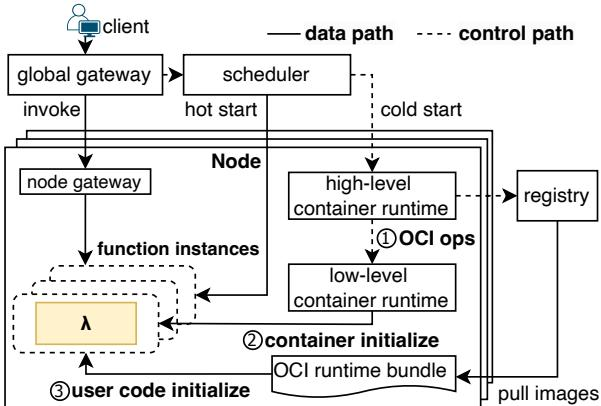  
Figure 1: Application start procedure in AFaaS. This is simplified to show the key components of the OCI (Open Container Initiative) [41] specification.

However, the on-demand and pay-as-you-go nature of serverless computing introduces a persistent challenge: cold start latency. When a request arrives and no pre-warmed instance is available, the platform must initialize a new instance to run the target function—typically incurring a delay of over one second. Given that serverless functions often execute within just 50–100ms, such startup latency has become a wellknown performance bottleneck in contemporary serverless platforms [6, 27, 28, 58, 96].

To address this challenge, researchers have proposed various optimizations. Checkpoint/restore techniques [12, 28, 89] and fork-based approaches [6, 27, 28, 68, 96] aim to bypass initialization by reusing state from pre-initialized templates. Caching-based methods [1, 2, 6, 11, 33] accelerate response time by reserving instances for frequently invoked (“hot”) functions. Additionally, customized serverless runtimes [5, 58, 64] reduce cold start overhead by removing unnecessary features from the execution environments.

Figure 1 illustrates the current cold start procedure within a node, including three main phases: (1) Control-path Interaction: A high-level runtime (e.g., containerd) requests a low-level runtime (e.g., runc) to create a new instance, typically involving several binary calls and RPC operations based on the OCI (Open Container Initiative) [41] specification. (2) Container Initialization: The low-level runtime creates a function instance and completes its initialization — this has been the primary focus of previous research on cold starts in serverless computing. (3) User Code Initialization: After the function instance is ready, the instance must load and initialize the user code provided by the application developers.

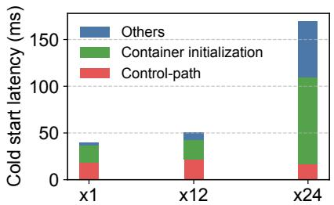  
Figure 2: Control-path costs. Time spent on the control path when a function instance starts (excluding the initialization and execution of user code). ×1, ×12, and ×24 represent different concurrency levels (the number of functions that can be executed in parallel on a single serverless server).

Through real-world deployments, we identify three critical gaps in existing research on serverless cold starts. These factors significantly impact user-perceived latency but are widely overlooked. As a result, cold start latency on the Ant Group serverless platform remains in the range of hundreds of milliseconds to several seconds.

Gap-1: Control-path latency. The cold start involves more than just setting up the function instance itself; the controlpath is equally critical. As shown in Figure 2, when the initialization of the function instance is optimized to a short duration, the latency on the control-path becomes prominent. Specifically, in our environment, the control-path latency takes 18ms–25ms, constituting approximately 30%–40% of the overall cold start period with Catalyzer [28]. The major source of these costs comes from the interaction between high-level and low-level runtimes, following the OCI specification [41]. For example, the shim-based invocation and binary call conventions (§2.2) incur overhead due to excessive interaction between multi-layer components.

Gap-2: Resource contention latency. Within the complex circumstances of the production environment, we witness performance instability. As illustrated in Figure 3, two scenarios are discerned: (1) Under high concurrency, the distribution of response time is significantly dispersed, presenting considerable tail latency. (2) During sustained execution, there is a marked decline in request throughput. Our profiling shows that the performance decline is primarily caused by resource contention within the host operating system during container startup. This issue has been largely overlooked in prior work and becomes especially critical under heavy workloads with intense contention.

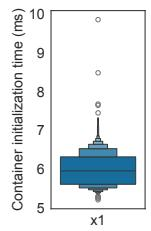

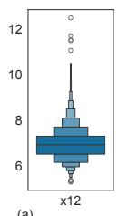

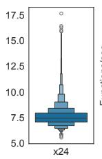

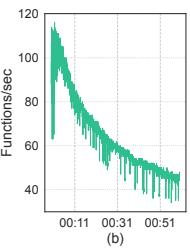  
Figure 3: Resource contention leads to unstable performance. (a) Tail latency exhibits a clear positive correlation with concurrency levels, with ranges of [5.21ms, 9.85ms] for ×1, [5.27ms, 12.49ms] for ×12, and [5.53ms, 17.67ms] for ×24. (b) Under sustained high concurrency (×24 for 1 hour), throughput gradually decreased from an initial rate of 110 FPS (Functions Per Second) to 45 FPS.

Gap-3: User code initialization latency. Beyond initializing the container instance itself, the execution of user code introduces additional delays. For example, Just-In-Time (JIT) compilation or language runtime-specific code loading can significantly affect startup latency, especially when dealing with complex application frameworks or extensive dependencies (e.g., Spring [72], AngularJS [35]). User code initialization latency depends on user-specific behaviors. This makes it challenging for current optimization methods, such as provisioning [11] and SnapStart [12], to balance cost and efficiency.

Based on reflections from previous efforts and our experience in large-scale industrial environments, we develop a series of innovative techniques that overcome significant challenges to build a system, AFaaS, that adapts to real-world workloads and supports large-scale deployment.

First, we discover that the current cloud-native OCI [69] is not well-suited for serverless scenarios. Instead, we propose the Function Runtime Interface (FRI), which simplifies and optimizes the control path for function instances to reduce communication overhead between high-level and low-level components (§4.1).

Second, we identify bottlenecks caused by resource contention and conduct an in-depth analysis of the factors leading to performance instability. To address these issues, we propose strategies to mitigate contention. For inheritable and sharable resources, we integrate them into a seed (sandbox template, a sandbox contains the initialized state to skip the initialization [28] ) to minimize redundant operations. For pre-allocatable resources, we use a pooling strategy to allocate them in advance, reducing concurrent conflicts. These strategies ensure consistent performance during concurrency and continuous execution (§4.2).

Finally, we extend the seed to include user code, preloading frequently invoked and time-consuming routines. To optimize memory usage, seeds are managed using a hierarchical tree structure, where Copy-on-Write (CoW) is employed to efficiently create child nodes from the parent seed. This design reduces memory footprint while preserving fast startup performance (§4.3).

To our knowledge, AFaaS is the first commercial serverless system to achieve millisecond-level start latency. Our evaluation shows that AFaaS achieves a substantial reduction in end-to-end latency, ranging from 1.80× to 8.14× compared to the state-of-the-art Catalyzer in production scenarios, while maintaining a consistent start time between 5.45 ms and 9.41 ms. Under heavy workloads with high concurrency and sustained execution, AFaaS continues to deliver stable startup performance, with latencies between 6.97 ms and 14.55 ms, significantly outperforming Catalyzer’s 38.39 ms to 74.05 ms. The system has been running reliably in production for over 18 months. All traces used in this paper are available at https://github.com/antgroup/AFaaS.

## 2 Characterizing Cold Start in Production Serverless Systems

## 2.1 Reflections for Cold Start in the Wild

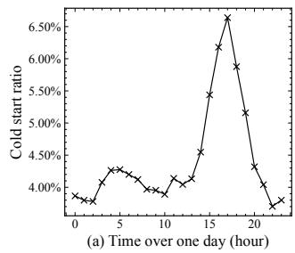

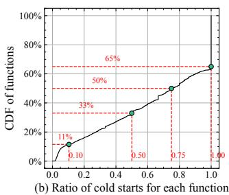  
Figure 4: Cold start pattern. (a) The ratio of cold starts during a 24-hour period. (b) CDF of the cold start probability for each function.

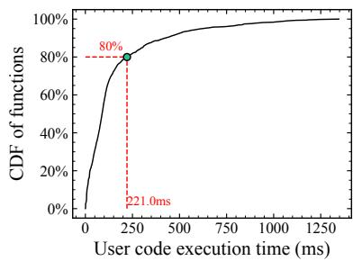  
Figure 5: User code execution time in Ant Group.

Rapid Growth of FaaS in Ant Group. Currently, there are over 50,000 unique functions running on the public cloud in Ant Group, with approximately 100 million function calls per day. These functions are implemented in a variety of programming languages, including Node.js, PHP, Python, Java, and

C++, and are executed on various runtime versions of each language. The scale is continuously growing.

Implication-1: Cold start is still significant as more than 50% of the functions exhibit a cold start probability exceeding 0.75. For security reasons, Ant Group deploys each function in a (micro) VM-based secure container [28,40]. Figure 4(a) illustrates the proportion of cold starts for a specific tenant over a given period in Ant Group. While over 95% of requests benefit from hot start, we observe that a significant portion of these hot requests are concentrated in a small number of frequently invoked functions (such disparities have also been observed in [44, 78]). As shown in Figure 4(b), more than 50% of the functions exhibit a cold start probability exceeding 0.75, while over 35% of the functions have a cold start probability of 1.

Implication-2: Caching-based hot start is insufficient to address the start latency issue (mainly) because of resource constraints. Like most cloud providers, to serve user requests more efficiently, Ant Group does not immediately destroy function instances after completing a request. Instead, these instances are retained for a period in the cache, enabling subsequent requests to be handled immediately if the function instances are still active. This process, known as a hot start, significantly enhances FaaS performance. AWS, Azure, and OpenWhisk keep containers alive for 10, 20, and 30 minutes, respectively, before terminating idle function instances [75,78]. However, caching infrequent functions would consume excessive memory. To achieve more flexible memory utilization, Ant Group limits hot instances to 1 minute, ensuring support for high-frequency functions. We still need to optimize the cold start performance, as over 60% of functions experience cold starts more frequently than hot starts.

Implication-3: Fork-based optimizations are essential but (still) insufficient to optimize end-to-end start latency. Figure 5 shows the user code execution time distribution in Ant Group— more than 80% of requests are processed within 221ms, highlighting the importance of optimizing cold start latency. This observation differs from prior ones in [77]. To optimize cold start, we built secure container designs with the sfork (sandbox fork) mechanism of Catalyzer [28], which introduces optimizations to fork secure containers. This mechanism enables the creation of new function instances in < 1ms under optimal conditions. Through long-term deployment and practical use of Catalyzer in production environments, several shortcomings have been identified. Firstly, Catalyzer primarily focuses on the fork operation of the sandbox process but overlooks key steps in the end-to-end container cold start sequence. These missing steps include the control path between the high-level runtime and the Catalyzer runtime, as well as the loading of user code after sandbox initialization. Secondly, in high-concurrency environments, resource contention leads to significant performance fluctuations during both the sandbox fork and initialization phases.

Revisiting End-to-End Cold Start Latency in Production.

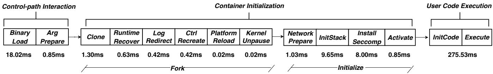  
Figure 6: End-to-end latency of cold start. The numbers represent the latency of each phase of a Node.js-based function (nunjucks—rendering the template to HTML), detailed experimental setup can be found in §6. The entire end-to-end start-up process consists of three main stages: (1) Control-path Interaction. ① BinaryLoad: The runtime shim [22] loads the Catalyzer engine binary and starts the client process. ② ArgPrepare: The client process prepares fork-related parameters and invokes the seed sandbox. (2) Container Initialization. ① Clone: The seed sandbox invokes the clone() syscall to fork a new sandbox. ② RuntimeRecover: The forked sandbox initializes the Go runtime. ③ LogRedirect: The stdout and stderr of the sandbox are redirected. ④ CtrlRecreate: The sandbox recreates the control server. ⑤ PlatformReload: The sandbox transitions from VMX root mode to VMX non-root mode. ⑥ KernelUnpause: The guest OS is unpaused to resume execution. ⑦ NetworkPrepare: The client process prepares the network interface and creates a raw socket that binds to this network interface, then sends the raw socket to the sandbox. ⑧ InitStack: The guest OS initializes the network stack. ⑨ InstallSeccomp: The sandbox parses and installs a seccomp filter. ⑩ Activate: The sandbox is attached to the host cgroups and mounts the rootfs. (3) User Code Execution. ① InitCode: The sandbox loads the appropriate language runtime, compiles the user code, and also loads the function’s dependency framework and libraries. ② Execute: The sandbox executes user code and provides a response.

End-to-end latency is a critical metric from the customer’s perspective, yet it is often overlooked in existing works [61]. We define end-to-end (E2E) latency as the complete process encompassing the following steps: when a node receives a scaling request from the scheduler/auto-scaler, it initiates a cold start for a function instance, loads the corresponding code, retrieves the request from the node gateway, executes the function, and ultimately sends the response back to the end-user. Figure 6 illustrates the latency associated with each phase in a typical production function cold start using Catalyzer. The end-to-end latency consists of three main stages: (1) The control-path interaction stage involves command execution (e.g., sandbox fork) between high-level runtime (e.g., containerd) and low-level runtime (e.g., Catalyzer). (2) The container initialization stage sets up an isolated container from scratch. This stage involves two steps: first, cloning a new VM-process based on a template sandbox using the sfork mechanism [28], and second, installing container-related components such as namespace, virtual ethernet interface (veth), and seccomp rules for the VM-process. (3) The user code execution stage has undergone significant variation and typically includes initiating the language runtime (e.g., Python or PHP), initializing the code framework (e.g., Django [3] or Spring [72]), loading the function code and common libraries into memory for JIT compilation, and finally executing the user code.

## 2.2 Gaps from an Industry Perspective

Through real-world deployments, we identify three critical gaps overlooked by existing research on serverless cold starts that significantly impact user request latency.

Gap-1: Control-path latency. In containerized environments, interactions between high-level and low-level runtimes involve a long control path, introducing significant latency. When a creation request is received, the high-level runtime does not directly manage the instance. Instead, it spawns a runtime shim process to act as an adapter (containerd-shimcatalyzer), delegating the actual operations to this shim. Communication between the high-level runtime and the shim occurs via RPC requests. The shim uses the binary call convention [22], i.e., loading a runtime binary first (e.g., Catalyzer runtime) and then calling a function in the binary to manage the container. The loaded runtime binary, provided by the lower-level runtime, is responsible for starting and stopping the container. This shim+engine architecture simplifies the integration of various runtimes, particularly those adhering to the OCI specification [30].

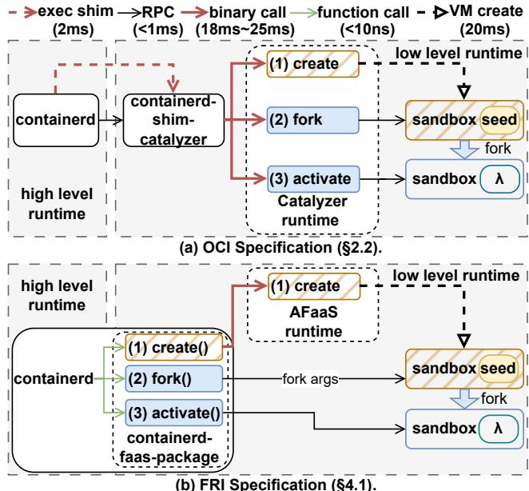  
Figure 7: Interactions between the high-level container runtime and the low-level container runtime. Operations in the hatched boxes are only performed once during the creation of seeds.

Though Catalyzer has optimized the creation of the sandbox for user code using the sandbox seed, avoiding creating from scratch, the extended invocation chain is still too long. As illustrated in Figure 7(a), the control path from the highlevel runtime (containerd [23]) to the Catalyzer runtime primarily consists of three steps: (1) containerd communicates with the Catalyzer shim via RPCs. (2) Catalyzer shim loads and executes the Catalyzer runtime engine (one binary call for each serverless function invocation), and establishes communication with it via RPCs. (3) Catalyzer runtime engine creates the Catalyzer container instance, or triggers operations such as fork() and activate() through RPC calls. Though in a forkbased scenario, the seed containers are only prepared once during initialization, and subsequent operations are based on forking from the seed, ⃝a the costly binary loading process for each serverless function invocation still consumes 18.02ms (as shown in Figure 6). Also, ⃝b the use of the shim and Catalyzer runtime has extended the control path for high-level runtime (containerd) to create a sandbox for user code.

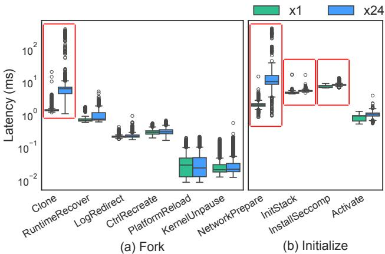  
Figure 8: Comparison of performance fluctuations caused by concurrent scenarios in key phases of container cold start. The ones in the red boxes have longer delays and are the focus of our optimization.

Gap-2: Resource contention latency. Figure 3(a) shows significant latency fluctuations during each stage of container cold start under high concurrency. We perform a breakdown analysis of the latency fluctuations in different phases of container cold start at various concurrency levels, as shown in Figure 8. Compared to serial execution (×1), cold start latency and fluctuations increase substantially during concurrent execution (×24). We identify four key latency-intensive phases:

First, the latency of clone() operation during the sandbox fork stage degrades significantly under high-concurrency, increasing from 1.45ms to nearly 418ms in the worst case. The primary overhead comes from the clone() system call which requests new network and IPC namespaces. This process results in contention for host OS kernel locks. Through further profiling, we also discover that the performance degradation shown in Figure 3(b) is also related to the creation of IPC namespaces. IPC namespace creation is tied to POSIX message queues, as each IPC namespace requires a separate mount point for message queues. These mount points depend on VFS operations, including the lookup or allocation of superblocks. Although the Linux kernel employs a superblock caching mechanism, the cache hit rate is relatively low because each IPC namespace usually requires a unique superblock. Under high concurrency scenarios, contention over global locks (such as sb\_lock) and mount locks (like mount\_lock) increases synchronization overhead, further exacerbating performance degradation.

Second, the network preparation phase exhibits substantial latency degradation (from 2ms to 21.14ms). During this phase, Catalyzer engine parses the config.json file provided by containerd, switches into the specified network namespace via setns(), profiles the network interface’s IP address, route, and device index, and creates a raw socket binding to this network interface. After setting up the raw socket, Catalyzer engine exits the network namespace using setns(). These operations involve intensive interactions with Linux kernel resources and impose a high CPU load, leading to contention and performance fluctuations in concurrent scenarios.

Third, in the network stack initialization phase, the sandbox instance uses the raw socket fd passed from the Catalyzer engine through RPC to initialize the container’s network stack, which involves creating protocol stack ring buffers and initializing complex data structures. This process incurs substantial memory access and frequent VM exits to the host OS, leading to the latency fluctuations from 4.82ms to 6.94ms.

Last, the seccomp installation phase experiences severalfold latency spikes under high concurrency. Seccomp filters (seccomp-bpf) are used to restrict the system call privileges of the sandbox process to enhance container platform security. This phase involves parsing seccomp configurations, compiling seccomp rules, and installing the compiled seccomp rules into the kernel, leading to contention for host kernel locks and resulting in the latency fluctuations from 7.58ms to 13.01ms. Gap-3: User code initialization latency. User code initialization involves loading the language runtime (e.g., Node.js, Python, Java), compiling the code, and loading dependent libraries. These phases are time-consuming, often exceeding the function’s execution time and significantly impacting cold start latency. For example, in a Node.js-based function, 275.53ms of the user code execution phase includes 238.73ms spent on loading and initializing dependencies.

## 2.3 Cold Start Optimizations

By revisiting prior cold-start optimization approaches in the context of the industry challenges discussed in §2.2, we derive key insights that guide the design of AFaaS, as summarized in

Table 1: Review of prior work and our design in AFaaS.
<table><tr><td rowspan=1 colspan=1>Code Path</td><td rowspan=1 colspan=1>Prior Work</td><td rowspan=1 colspan=1>Design in AFaaS</td></tr><tr><td rowspan=1 colspan=1>Control Path</td><td rowspan=1 colspan=1>Liu et al. [61] surveys orchestration bottlenecks. Dirigent [26] proposes inter-node orches-tration strategies.Analysis:Both overlook intra-node orchestration.</td><td rowspan=1 colspan=1>FRI: An efficient intra-node control paththat replaces OCI(§4.1).</td></tr><tr><td rowspan=1 colspan=1>Clone</td><td rowspan=1 colspan=1>Catalyzer [28],Molecule [27],and MITOSIS [96] leverage fork/clone mechanisms to ac-celerate container startup.Analysis:Performance degradation arises from host resource contention,such as networkand IPC namespaces,under high concurrency or sustained execution.</td><td rowspan=1 colspan=1>An enhanced cloning mechanism withpooling and sharing enables faster cold startsunder high concurrency and sustainedexecution while preserving security (84.2).</td></tr><tr><td rowspan=1 colspan=1>Network</td><td rowspan=1 colspan=1>PCPM [65] uses pause containers to retain and reuse the network stack,including IPconfiguration,virtual Ethernet (veth),and namespaces.Analysis:Sharing veth is an effective practice but with limitations:(1) it only supportstraditional containers,as supporting secure containers incurs high memory overhead,and(2) it introduces security risks by reusing the TCP/IP stack from previous containers.</td><td rowspan=1 colspan=1>Lightweight veth sharing is achieved throughpre-created,independent veth pairs; eachfork initializes a clean TCP/IP stack toeliminate security risks (§4.2.1).</td></tr><tr><td rowspan=1 colspan=1>Cgroup</td><td rowspan=1 colspan=1>RunD[58] and TrENV[38] reuse cgroups with reconfiguration.Analysis:Cgroup reuse is an effective practice and is adopted in AFaaS.</td><td rowspan=1 colspan=1>Utilize a cgroup pool to assign and recycle acgroup for each instance (84.2.1).</td></tr><tr><td rowspan=1 colspan=1> Seccomp</td><td rowspan=1 colspan=1>Catalyzer [28] and Firecracker [5] install a strict seccomp filter to enhance security.Analysis: Parsing seccomp configurations,compiling seccomp rules,and installing thecompiled rules each time can lead to a slowdown under high concurrency.</td><td rowspan=1 colspan=1>Seccomp rules are pre-compiled during seedpreparation (84.2.2).</td></tr><tr><td rowspan=1 colspan=1>User CodeInitialization</td><td rowspan=1 colspan=1>(1)fork: SAND [6] and Catalyzer [28] share initialized code (e.g.,language runtimes andloaded libraries) via fork.Analysis: SAND does not support multi-process runtimes (e.g., Java,Node.js). Catalyzer&#x27;sseed can include user code.However,supporting user code fork in Catalyzer is inefficientsince each seed consumes a large amount of memory.(2) C/R(Checkpoint/Restore): AWS SnapStart [12],SEUSS[19],and Sabre [56] lever-age C/R techniques to reduce cold start latency.Analysis: SnapStart achieves only sub-second performance [12]. Unikernels [19] andhardware acceleration [56] face significant hurdles for adoption in production.(3) Caching: RainbowCake [99] adopts layer-wise pre-warming and keep-alive strategy.Analysis:A practical approach,but unfriendly to infrequent functions due to user templatedowngrades,leaving the cold start issue unresolved.Reusing the same language containeralso poses data leakage risks.(4)TrENV[38] and MITOSIS [96] share initialized code across nodes via RDMA/CXL.Analysis:A reasonable approach,but it requires specialized hardware that is not availablein AFaaS.Deploying such hardware would also increase deployment costs.</td><td rowspan=1 colspan=1>Tree-structured seeds reduce overallresource usage, while multi-level forkingoffers best-effort performance withacceptable latency (§4.3).All instances are cloned from a clean-stateseed and destroyed after execution forsecurity enhancement (§5).</td></tr></table>

Table 1. While AFaaS incorporates several proven techniques, such as cgroup reuse [38, 58], our analysis also reveals three fundamental limitations in existing solutions.

Limitation-1: Insufficient Full-Stack Optimization for End-to-End Latency. While prior work focuses on optimizing specific cold-start stages (e.g., container initialization), it often overlooks systemic bottlenecks like control path overhead. Although inter-node orchestration issues have been explored [26, 61], intra-node control path inefficiencies remain largely unaddressed.

Limitation-2: Inconsistent Performance under Stress. Real-world deployments require strict adherence to SLOs [62]. Although recent efforts (e.g., recycled network stacks [65]) partially mitigate kernel-induced degradation, they still overlook critical bottlenecks, such as resource contention during fork/clone [27, 28, 96] and the latency of seccomp rule compilation [5, 28] under high load, leading to unstable tail latency.

Limitation-3: Intensified Complexity in Code Reuse. To achieve low-latency starts, FaaS platforms often cache specific function states for reuse (e.g., checkpoint/restore or fork) [11–13, 28, 99]. However, supporting the caching of user-level code presents challenges, including high memory requirements [11, 28], the need for specialized hardware [38, 56, 96], and vulnerable deployment strategies [99].

## 3 AFaaS Overview

System Architecture. Figure 9 shows the AFaaS architecture. First, there is a node gateway to receive requests from global control plane components (e.g., schedulers), forward the requests to the node’s components like high-level runtime or function instances, and respond to external requests. Second, similar to other serverless platforms, the AFaaS platform deploys two levels of runtimes: a high-level runtime (containerd), and a low-level runtime (AFaaS). The high-level runtime will directly handle requests from the node gateway, while the low-level runtime focuses on managing secure containers. We implement our secure containers based on Catalyzer [28]. Notably, to resolve Gap-1, the high-level runtime and low-level runtime communicate efficiently through a new interface called FRI (Function Runtime Interface). Moreover, AFaaS employs strategies of resource pooling and sharing.

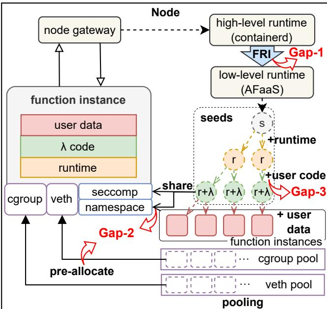  
Figure 9: AFaaS Design.

Resources related to container allocation are managed to mitigate resource contention latency (Gap-2). Lastly, each node will maintain a tree-structured seeds (the template instance of functions) with different levels to resolve Gap-3, balancing performance and memory overhead. Next, we present three key insights that address the gaps identified earlier.

Insight-1: Many of the cross-runtime interactions are shim-calls that can be safely optimized. For Gap 1, we analyze the interaction requirements between high-level runtime and low-level runtime and propose FRI, a general bespoke control interface for serverless functions to shorten the control path (§4.1). A key observation is that cross-runtime interactions can be classified into two types: shim-calls (forwarding requests to another component) and service-calls (handling requests). For example, in the case of the fork() interface, the low-level runtime simply forwards the invocations from high-level runtime to the sandbox but does not perform any specific tasks, which is one of the shim-calls [22]. In contrast, the low-level runtime will perform complex work for create() to create a sandbox, which is classified as a service-call in our system. Based on this observation, we choose to replace the shim-calls, which are implemented by binary calls (18.02ms) now, with function calls by adopting a plugin-based method. The control path latency can be reduced accordingly.

Insight-2: Contended resources are more suitable to be reused or shared, rather than being created from scratch. For Gap 2, we observe that contended resources are usually low-level system resources; although their creation is not easily contention-free, they can be effectively reused and shared among instances. We adopt a resource pooling strategy for resources like cgroups and veth pairs to minimize allocation latency and mitigate resource contention. For resources that can be prepared in advance, such as seccomp filters and namespaces, we integrate them into the seed. When forking a new instance, these states can be inherited and reused directly [28, 96].

Insight-3: Fork can achieve both latency-efficient and resource-efficient with multi-level templates (or seeds). For Gap 3, we extend the seed to include user code, i.e., incorporating frequently used and time-intensive functions as templates. To manage the resource overhead of numerous seeds, we implement a hierarchical tree structure, using CoW to efficiently create child seeds from parent seeds and reduce memory usage (§4.3).

## 4 Detailed Design

In the following sections, we present detailed optimizations addressing each identified gap.

## 4.1 Shortening Control Path (Gap-1)

Current cloud-native standards, such as OCI [30], are tailored for long-running workloads. The numerous modules and lengthy control path defined by this standard make it ill-suited for serverless scenarios with high-concurrency startups and short container lifecycles. Catalyzer [28] enhances container startup by leveraging fork-based technology in the runtime engine. However, it still introduces a delay of 18ms– 25ms due to executing the Catalyzer runtime engine binary, which sends an RPC to trigger the fork operation in the sandbox seed. This delay diminishes the impact of Catalyzer’s sub-millisecond startup speed.

Function Runtime Interface (FRI). AFaaS introduces a lightweight serverless interface, FRI, to reduce the controlpath latency between the high-level and low-level runtimes. The key innovation of FRI is the use of a plugin-based interaction model, replacing binary calls with direct function calls for frequently invoked interfaces in the serverless platform. Specifically, the low-level runtime implements the FRI interface, and the integrated plugin inside the high-level runtime interacts with it via RPC calls. As shown in Figure 7(b), we implement a containerd-faas-package plugin for containerd, which includes three main methods: create(), fork(), and activate(). The create() method instantiates a sandbox by loading the low-level runtime binary. Only the root seed (level-0 seed, §4.3) requires creation via create(), and this step is performed only once. After the root seed is created, the AFaaS runtime is never needed again, and the seed hierarchy is built accordingly. Subsequently, fork() and activate() are used to fork and activate new sandbox instances to run user code, which do not need to load the runtime binary as AFaaS will invoke these interfaces directly from the high-level runtime via RPCs. Thus, control latency is reduced due to ⃝a the avoidance of loading the AFaaS runtime binary each time a new serverless function is invoked, and ⃝b the shortened path where the high-level runtime directly invokes a corresponding seed to create a new sandbox for user code. Furthermore, this design enables resource pooling for veth (§4.3), as AFaaS can reuse network resources by sharing the network namespace (netns) and reclaiming the network interface after the sandbox exits. The high-level runtime retains the netns and interface information and passes them via fork arguments.

Decision: FRI demonstrates that strategic interface specialization for FaaS — sacrificing little modularity versus OCI — unlocks significant efficiency gains in cold starts, a transformative trade-off for serverless systems.

## 4.2 Resource Pooling and Sharing (Gap-2)

To reduce resource contention latency, we design two forkfriendly optimizations without breaking the isolation guarantee of secure container (security analysis provided in §7): (1) Resource Pooling: Resources that can be pre-allocated are allocated or recycled in advance and stored in pools, reducing concurrent conflicts. (2) Resource Sharing: Resources that can be inherited and shared from the seed are integrated into the seeds, avoiding unnecessary reallocations.

## 4.2.1 Resource Pooling

Virtual Ethernet. AFaaS assigns a network device to each container for isolation. To minimize overhead, we pre-allocate a sufficient number of network devices, which are dynamically assigned during container creation and recycled once the container exits. This approach eliminates the significant overhead of network device creation.

Cgroup. Cgroups are used to limit container resource usage. In traditional cloud-native environments, new cgroups are created for each container and removed after the container is destroyed. This management mechanism can be time-consuming under high concurrency. AFaaS introduces a cgroup pool that recycles cgroups when the sandbox instance is deleted. When creating a new instance, an available cgroup will be selected from the pool and assigned to the instance.

## 4.2.2 Resource Sharing

Namespaces. Linux namespaces isolate containers on the host OS. In Catalyzer, each fork creates and configures new network and IPC namespaces, causing significant resource contention under high concurrency and sustained execution. AFaaS allows seeds and function instances to share the same network and IPC namespaces. Cross-VM instance sharing is secure, as user code runs within the guest OS of secure containers, ensuring isolation and preventing interference.

Seccomp. Seccomp is a Linux kernel feature that restricts the system calls a process can make. Secure containers enforce strict seccomp rules to prevent attacks, but installing seccomp involves parsing configurations, compiling rules, and installing them into the kernel, leading to contention and performance fluctuations. In practice, seccomp rules are generally fixed, as seen in gVisor [40] and Firecracker [5], which use predefined rules. In AFaaS, seccomp configuration parsing and compilation are completed during the seed preparation phase, so that when a new instance is forked, only a simple installation step is required.

Network Stack. The network protocol stack requires substantial memory for ring buffers and the initialization of complex data structures. Since each instance requires its own configuration, sharing the network stack is challenging. However, we observe that most operations are similar across instances. To avoid redundancy after forking, we divide the network module into shareable and non-shareable parts. The shareable components include key TCP/IP stack elements like clock, random seed, protocol handlers, TCP/UDP control blocks, and ARP tables. Non-shareable components, such as IP/MAC addresses and backend devices, must be assigned separately. Memory allocation and structure initialization are performed during the seed preparation phase. After forking, the raw socket is passed to the instance, which is then probed, bound to the veth interface, and the network stack is initialized.

Decision: Contention bottlenecks are eliminated by decoupling key resources: pooling/sharing high-contention elements while retaining the sandbox fork’s low-latency initialization, achieving faster cold starts in high-density deployments without sacrificing security.

## 4.3 Seeding User Code (Gap-3)

To reduce application initialization overhead, Catalyzer uses language runtime templates with pre-initialized runtimes (e.g., Python, Node.js, JVM). As discussed in §2, initializing the runtime alone is insufficient for production workloads. User code initialization latency is influenced by factors such as dependent library loading, JIT compilation, and framework initialization (e.g., parsing large XML configuration files in Spring). In AFaaS, frequently invoked functions are optimized with dedicated seeds containing user code to reduce cold start latency. However, maintaining numerous container seeds can increase memory overhead. To balance performance and resource usage, AFaaS employs tree-structured seeds and multi-level fork mechanism.

Tree-structured Seeds. As illustrated in Figure 10, function seeds in AFaaS are organized hierarchically in a tree structure; the child seeds reuse the memory of their parents. During seed preparation, the high-level runtime performs a hierarchical search to select an appropriate seed for forking. The newly forked instance completes incremental tasks (e.g., language runtime initialization, dependency imports, JIT compilation) and then enters a paused state, becoming a new seed. Incremental updates are managed using a CoW mechanism.

Multi-Level Fork. When a new user request requires a function instance, the high-level runtime searches the seed tree for a suitable seed. If a seed with the user code exists, it forks a container from that seed. Otherwise, it searches higher-level nodes to locate seeds with the language runtime, which typically fulfill the request.

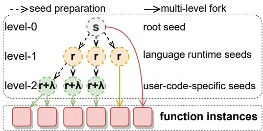  
Figure 10: Seed organization of AFaaS. There are three types of seeds. The level-0 seed (root seed) contains data from the guest OS and is unique to each computing node. The level-1 seeds (language seeds) are forked from the level-0 seed and initialize the language runtime. The level-2 seeds (user-code-specific seeds) initialize the framework, import libraries, and compile user code.

Benefits. Our design offers two distinct advantages compared to previous approaches [11, 12] for caching user code: (1) State Reusing: The tree structure of seeds enables the sharing of physical memory pages across levels and nodes, leading to a reduction in global resource consumption; (2) Best-effort fork: In contrast to previous methods limited to forking from user-code seeds or starting from scratch, our multi-level fork approach based on the seed tree allows for best-effort provisioning. Even if a function lacks user-code-specific seeds, it can still be served with language runtime seeds or root seeds, ensuring acceptable performance.

Decision: Tree-structured seeds with multi-level forking enable adaptive cold starts — initializing instances from the nearest viable ancestor to reduce resource overhead while maintaining low latency via granular state reuse.

## 5 Implementation

We implement AFaaS based on Catalyzer [28] with the following enhancements for production.

Container Early Destroy. Container shutdown is also a critical concern, as the procedure can take over 10 seconds due to factors such as language runtime shutdowns (e.g., JVM), file system flushing, and kernel exit. AFaaS addresses this with container early destroy. Since serverless functions execute user code through a unified handler, the function is considered complete once the handler returns. At this point, AFaaS pauses the guest OS, disconnects TCP connections, and shuts down the container to reclaim resources. Due to the inherently ephemeral and stateless nature of functions in serverless computing, ensuring state correctness is relatively straightforward. For example, database access is typically performed via remote calls to centralized storage. By simply and properly terminating all TCP connections, the integrity of data consistency can be effectively safeguarded. Most production functions adhere to this pattern, enabling early destroy without affecting execution correctness.

EPT Prefill. EPT Prefill is used to reduce overhead from Extended Page Table (EPT) violations. The EPT translates Guest Physical Addresses (GPA) to Host Physical Addresses (HPA). When a seed forks a new instance, the instance transitions from root to non-root mode before executing user code. Although the seed and instance share physical memory pages, the EPT page table is uninitialized, leading to EPT violations when the guest OS accesses memory. Each violation triggers a VM-exit for page table reconstruction, causing significant overhead due to the short execution time of serverless functions. To address this, AFaaS employs EPT Prefill. During the fork, the seed copies its EPT page table to the new instance and marks the last level of the page table directory as read-only. This prevents EPT violations for memory reads.

## 6 Evaluation

Our evaluation aims to answer the following questions:

• Q1: How much improvement does AFaaS offer in reducing end-to-end latency and enhancing performance stability under heavy workloads? (§6.2)

• Q2: How does each technique in AFaaS optimize the endto-end latency and performance stability? (§6.2 & §6.3)

• Q3: How does performance scale with varying levels of concurrency? (§6.4)

• Q4: How much memory can be saved by organizing FaaS instances in a tree structure? (§6.5)

• Q5: How is the performance of the production system after deploying AFaaS? (§6.6)

## 6.1 Methodology

Experimental Setup. We conduct all our experiments on an x86-64 machine with 24 cores Intel(R) Xeon(R) Platinum 8163 CPU @ 2.50GHz server and 512GB of RAM. The server runs Linux 5.10. The wrk benchmarking tool [91] is used to test end-to-end latency with varying concurrent requests. The evaluation takes the following systems as baselines.

1. CataOnly is the Catalyzer system augmented with our enhancements and optimizations described in §5. This configuration establishes the baseline serverless platform that exclusively leverages Catalyzer’s capabilities while deliberately excluding other platform-level optimizations.

2. CataOPT1 1 represents an upgraded version of Catalyzer, to deal with resource contention latency (CataOPT1 =

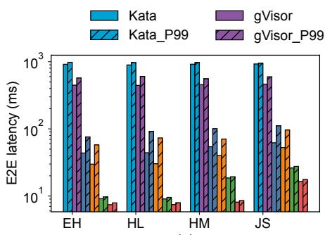  
(a)

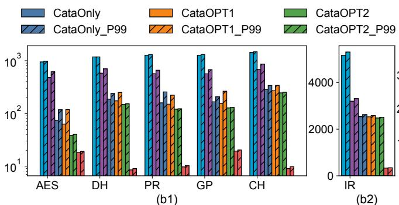

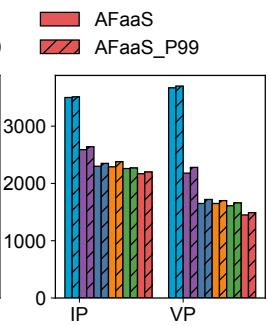  
(c)  
Figure 11: End-to-end latency (sequential). The hatched bar represents P99 latency, and the un-hatched bar indicates average latency. To enhance clarity, a logarithmic scale is employed for (a) and (b1), whereas a linear scale is utilized for (b2) and (c).

CataOnly + Gap2-OPT).

3. CataOPT2 utilizes the FRI mechanism to optimize control path (CataOPT2 = CataOPT1 + Gap1-OPT).

4. AFaaS is our final production platform that further optimizes the user code initialization (AFaaS = CataOPT2 + Gap3-OPT).

5. Kata (v3.15.0) initializes by cloning from a pre-created VM (Kata-template [46]).

6. gVisor (release-20250414.0) starts from scratch [40].

We select Catalyzer as our baseline for its state-of-the-art submillisecond startup performance for secure containers. We also include gVisor and Kata as baselines because they are production-proven and open-source, and support the same hardware configurations.

Functions Evaluated. We select functions from representative serverless benchmarks, such as Function-Bench [49] and SeBS [25], which encompass a diverse range of scenarios. These include EH (Echo: response without any operation), HL (Hello: print “Hello, World”), HM (High Memory: malloc 1GB memory), JS (JSON Serde: deserialize and serialize JSON), AES (PyAES: encrypt messages), DH (Dynamic HTML: generate dynamic web pages), PR (PageRank: PageRank algorithm), CH (Chameleon: render HTML tables), IP (Image Processing: apply image processing algorithms to an image), VP (Video Processing: convert a video into grayscale), and IR (Image Recognition: image recognition using ResNet).

## 6.2 End-to-End Latency

End-to-End Latency. We first assess the average end-to-end execution time of typical functions in a sequential mode, as shown in Figure 11. Each function was tested for a duration of 1 minute. Based on the user code initialization and execution durations, we classify these typical functions into three distinct groups.

Figure 11(a) illustrates the functions with both short user code initialization and execution time. For these functions, the latency of control-path and container initialization accounts for a significant proportion. AFaaS achieves a speedup of 3.76×–6.68× for average latency and $6 . 3 1 \times - 1 1 . 7 4 \times$ for

P99 latency, compared with CataOnly. These improvements are largely attributed to the reduction in the control-path time facilitated by the FRI mechanism, coupled with optimizations during the container initialization phase. The differences between CataOPT2 and AFaaS are not significant.

Figure 11(b1/b2) illustrates functions that have longer initialization time for user code but with shorter execution time. This pattern is observed in functions that necessitate the onetime loading of large datasets or complex initialization operations. The performance enhancement of the AFaaS is remarkable. It pre-initializes user code in seeds, facilitating subsequent requests to execute promptly through forking. Compared to CataOnly, CataOPT2 reduces average latency by 1.02×–1.92× and P99 latency by 1.04×–2.92×. AFaaS reduces average latency by 4.09×–31.48× and P99 latency by 6.19×–34.51×.

Figure 11(c) illustrates functions with longer execution time. The performance optimizations of AFaaS in controlpath, container initialization, and user code initialization are less noticeable compared to the function execution time. The performance improvements are about 1.05×–1.14× on average latency and 1.07×–1.15× on P99 latency.

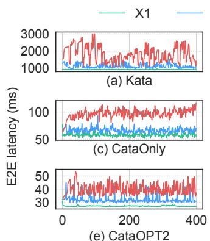

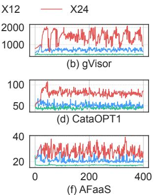  
Figure 12: E2E latency under different levels of concurrency. 400 continuous samples for each system.

Concurrency and Sustained Traffic Performance. We evaluate the performance stability of AFaaS under different concurrency levels and sustained traffic using the JS function. Figure 12 contrasts the E2E latency and fluctuations under diverse levels of concurrency using JS. At concurrency levels ranging from 1 to 24, AFaaS demonstrates superior E2E latency and stability. The E2E latency of AFaaS falls within the range of [16.34 ms,39.56 ms], compared to CataOnly’s latency range of [51.32 ms, 117.92 ms]. Furthermore, the cold start time for AFaaS ranges from 6.97ms to 14.55ms, while for CataOnly, it spans from 38.39ms to 74.05ms. Kata and gVisor exhibit orders-of-magnitude worse E2E performance under high concurrency.

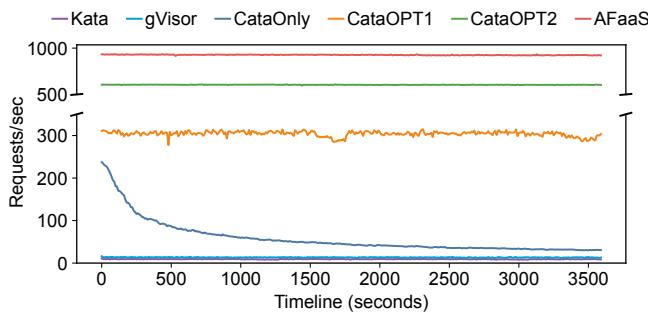  
Figure 13: Throughput variation over time at high sustained concurrency (×24).

Figure 13 shows a notable decline in CataOnly’s performance over time. The degradation is attributed to superblock cache misses and kernel lock contention (analyzed in §2.2), leading to a transition from the fast path to the slow path for newly created IPC namespaces, while other versions maintain relatively stable performance.

## 6.3 Optimization Breakdown

This section examines how CataOPT1 improves latency compared to CataOnly. The JS test function is used.

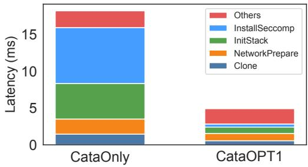  
Figure 14: Latency of CataOPT1 and CataOnly. The “Others” category includes the remaining phases in the container initialization stage shown in Figure 6.

End-to-End Latency Optimizations. Figure 14 illustrates the optimization across various stages in sequential mode, highlighting key improvements from the Clone, NetworkPrepare, InitStack, and InstallSeccomp phases. In the Clone phase, Catalyzer invokes clone() with CLONE\_NEWNET and

CLONE\_NEWIPC, placing the new instance into an independent network namespace (netns) and IPC namespace. CataOPT1 reduces namespace creation latency by sharing the namespace with the seed. During the NetworkPrepare phase, AFaaS minimizes the latency involved in parsing the specified netns path in config.json and executing setns(). In the InitStack phase, AFaaS decreases the initialization time of the network protocol stack. Finally, in the InstallSeccomp phase, AFaaS reduces the latency required to compile and load the seccomp rules.

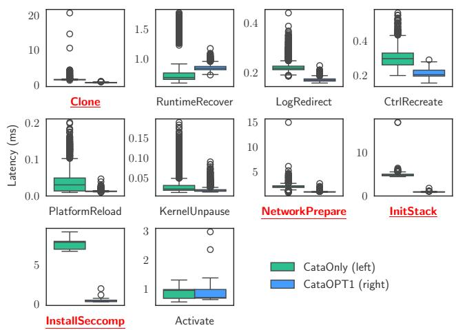  
Figure 15: Latency fluctuation of different phases during container initialization (10 phases in Figure 6). Evaluated under sustained high concurrency (×24). The underlined phases are optimized.

Resource Contention Optimizations. We measure the fluctuation of various phases in the container initialization phase of CataOnly and CataOPT1 under high sustained concurrency (×24), as shown in Figure 15. Sharing the namespace reduces fluctuation during the Clone phase. The veth pool and FRI can decrease the fluctuation in parsing config.json during the NetworkPrepare phases. Pre-initialization of the protocol stack can mitigate the fluctuation in the InitStack phase, and the use of seccomp pre-compile technology can reduce the fluctuation associated with seccomp rule compiling and loading. After mitigating the main resource contentions, fluctuations in other phases are also reduced.

## 6.4 Scalability

We evaluate the throughput and end-to-end latency of different systems as the degree of concurrency gradually increased with the JS function. The results in Figure 16 show that the throughput of AFaaS scales significantly with increasing concurrency, demonstrating the best scalability. AFaaS also maintains the lowest end-to-end latency across all concurrency levels, with the least gradual increase. For comparison, CataOnly shows relatively high end-to-end latency and quickly hits a performance bottleneck, with a slight decline as the number of concurrent requests increases. Both Kata and gVisor exhibit poor performance in terms of throughput and latency.

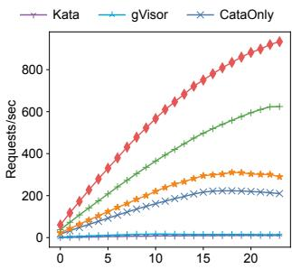

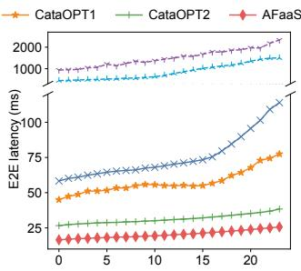  
Figure 16: Throughput (left) and E2E latency (right) with varying levels of concurrency.

## 6.5 Memory Consumption of Multi-Level Fork

As shown in Figure 17(a), for seeds with the same user code, AFaaS reduces memory usage by 28.11%–84.91% compared to CataOnly. This is because the seeds share the guest OS and language runtime. For functions with long initialization time and a high execution volume, this approach is both costeffective and efficient. When the user code size is large (e.g., VP, IR in Figure 17(b)), the shared components have a minimal impact, and the benefit is less noticeable.

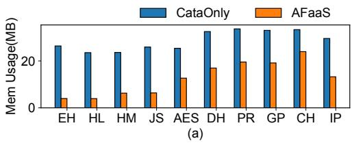

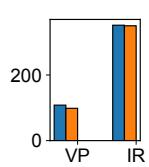  
Figure 17: Memory costs of level-2 seeds.

## 6.6 Real-World Workload in Production

End-to-End Latency. AFaaS is widely deployed in Ant Group. To demonstrate the effectiveness of AFaaS, we compare the performance of AFaaS with CataOnly in production environment. We select eight representative Node.js functions for comparison (Table 2). For AFaaS, we perform a statistical analysis of the average end-to-end latency on the server for one day. For CataOnly, we test on the same hardware machine and follow the same pattern (mocked peer call responses).

As shown in Figure 18, the overall speedup ranges from 1.80× to 8.14×. Among them, the encoder achieves a lower speedup of 1.80× because its user code incurs higher execution latency. The cc function achieves a higher speedup of 8.14× due to reduced module load time. AFaaS maintains a stable startup latency from 5.45ms to 9.41ms.

Deployment Cost. Table 3 summarizes the memory sizes of seeds at different levels in production. Most functions achieve millisecond-level startup with a memory cost ranging from 6.9MB − 135.03MB. This approach offers a better costeffective alternative compared to hot start solutions that cache instances (for 1 minute).

<table><tr><td>Func</td><td>Description</td></tr><tr><td>mongo</td><td>Import an SDK and query the backend DB service.</td></tr><tr><td>bff</td><td>A service coordinates requests to multiple interfaces. [9].</td></tr><tr><td>CC</td><td>Schema-based code generator.</td></tr><tr><td>png</td><td>An image tool merges existing images to create new ones.</td></tr><tr><td>nunjucks</td><td>Render the template to HTML using Nunjucks [67].</td></tr><tr><td>mock</td><td>Generate random user data for unit testing.</td></tr><tr><td>encoder</td><td>Generate the base64 data for a QR code image.</td></tr><tr><td>compile</td><td>Input a JS file,and build the JS file into V8 code cache.</td></tr></table>

Table 2: Representative functions in production.  
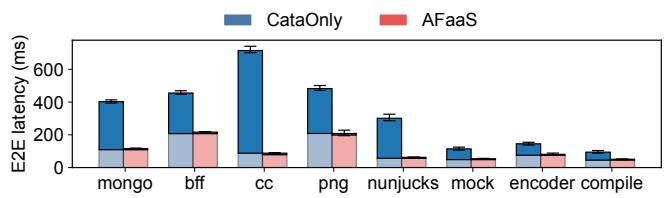  
Figure 18: End-to-end latency of the representative functions in production. Each bar has two parts: the upper dark part shows the total time for control-path, container initialization, and user code initialization, while the lower light part indicates user code execution time.

<table><tr><td>Seeds</td><td>Memory</td><td>Seeds</td><td>Memory</td></tr><tr><td>level0</td><td>14.31MB</td><td></td><td></td></tr><tr><td>level 1 (Node.js)</td><td>54.01MB</td><td>level 1 (Python)</td><td>29.05MB</td></tr><tr><td>level2(mongo)</td><td>54.40MB</td><td>level2(bff)</td><td>63.84MB</td></tr><tr><td>level2 (cc)</td><td>135.03MB</td><td>level2 (png)</td><td>90.20MB</td></tr><tr><td>level2(nunjucks)</td><td>63.70MB</td><td>level2 (mock)</td><td>51.40 MB</td></tr><tr><td>level2(encoder)</td><td>9.46MB</td><td>level2 (compile)</td><td>6.90 MB</td></tr></table>

Table 3: Memory cost of different level seeds in production.

## 7 Discussion

Security Analysis. AFaaS follows the threat model of existing secure containers (e.g., Catalyzer [28], FireCracker [5], RunD [58], Kata Containers [31], gVisor [40]), where apps within the container could be compromised or malicious [37, 97, 98] and the sandbox and underlying host kernel are considered potential attack targets. Secure containers reduce the attack surface caused by traditional containers sharing the host kernel. Compared to gVisor, which both Catalyzer and AFaaS are based on, we make design choices to enhance performance. Below, we first examine the security implications of resource pooling and sharing strategies, followed by analyzing other security limitations in the current implementation.

(1) Security of Resource Pooling: (a) veth pool: AFaaS ensures that long-lived connections are gracefully terminated before reclaiming the device to prevent new users of the device from receiving unexpected data packets. (b) cgroup pool:

There is only one container inside the cgroup, and each cgroup is properly released after the exit of the function. Similar mechanisms have been used in previous work [38, 58].

(2) Security of Resource Sharing: (a) network namespaces: Network resources in AFaaS, such as devices, IP addresses and routing tables, are controlled within the guest OS. Therefore, sharing the host’s network namespace between seed and sandbox does not pose any security issues. (b) IPC namespaces: The IPC namespace on the host is used mainly to isolate communication through shared memory. It is secure because there are no use cases for inter-sandbox (VM-process) IPC communication through shared memory in AFaaS.

AFaaS enables memory pages to be shared across different levels of seeds and instances, which may result in potential leakage of seeding data. However, instances can only access their own seed data, not that of others. This aligns with prior seed-based works (e.g., Catalyzer [28], Molecule [27], MITO-SIS [96]) and does not introduce new side-channel attack risks. To enhance security, we audit function behavior, including IP addresses, ports, and protocols for ingress and egress.

Overall Impact. AFaaS achieves near hot-start performance with minimal additional resource consumption. Compared to strict cold starts, optimization techniques such as pooling, sharing, and seeding incur predictable overhead — a controlled trade-off inherent in production-grade serverless platforms. Beyond the memory footprint of the seed, AFaaS preallocates specific kernel objects, such as veths and cgroups, to alleviate contention bottlenecks. This allocation is limited and lightweight. Specifically, we pre-allocate 1,000 veths and 600 cgroups, resulting in negligible impact on the host OS. Moreover, the scheduler guarantees that function instances remain within the resource capacity of the node.

Generality. The design of AFaaS is broadly applicable to other platforms. First, AFaaS transforms the standard, generalpurpose OCI into the specialized and efficient FRI that prioritizes performance over flexibility. Though this tight coupling with FaaS requirements necessitates runtime-specific adaptations, FRI’s containerd-plugins architecture proves especially advantageous in performance-critical scenarios. Second, veth, cgroup, namespace, and seccomp are essential components of containers. Current container solutions also experience performance degradation under high stress. Our proposed solutions in this work are practical and deployable. Third, Google Cloud, AWS, and Alibaba Cloud could also benefit from our tree-structured seeds and multi-level fork design by integrating with VM fork [54].

## 8 Lessons Learned and Experiences

Workload Diversity. Serverless workloads exhibit behavioral divergence across cloud environments. In private clouds, Meta’s XFaaS [75] emphasizes resource efficiency for latencytolerant, non-interactive triggers (e.g., queues, events, and timers) through batched execution. In contrast, public clouds highlight diverse cold-start challenges: 80% of functions in Alibaba’s FaasNet and 50% in Microsoft Azure run for over one second [78, 92], while AWS reports that 1% of invocations face cold starts lasting 100ms to 1s [8]. AFaaS operates under distinct constraints: short-lived functions and frequent cold starts demand millisecond-level initialization, a gap this work aims to address.

Fork’s Renaissance in Serverless Systems. While prevailing approaches like caching [11, 99] and C/R [12, 19, 20, 56] achieve sub-second cold starts, they face fundamental limitations: caching relies on pre-warmed containers but struggles with unpredictable invocation patterns, while C/R incurs state restore overheads that cap latency reductions. Our production experience demonstrates that fork, when augmented with systematic optimizations, redefines viability for latencycritical workloads. Unlike probabilistic caching or I/O-bound C/R, fork enables deterministic millisecond-level cold starts through direct memory inheritance while preserving security via CoW semantics. This paper details how we overcome fork’s limitations (e.g., resource contention) through system optimizations, achieving production-scale deployment with many daily forks at millisecond-level (and even submillisecond) latency.

AFaaS Deployment Experience. While fork-based approaches offer advantages, there are still some issues that went wrong or were unexpected. We present insights that could be beneficial to know in advance for deployments.

(1) Special handling of uniqueness states is necessary to prevent unexpected behavior. While reusing a running seed’s state can reduce startup latency, unique states such as random numbers or cryptographic tokens must be reinitialized carefully instead of being reused directly. For example, gVisor [40] uses a buffered I/O mechanism to batch getrandom() syscalls from the host kernel, reducing the frequency of host syscalls. However, this approach unintentionally duplicates random sequences in forked instances due to inherited states. To prevent security risks, AFaaS must ensure proper isolation and re-initialization of these states after fork operations. Similar issues exist in other systems, e.g., Firecracker explicitly warns against entropy reuse in restored microVM snapshots [29] due to the same risk.

(2) Bottlenecks under ultra-high concurrency and co-located deployment. Although AFaaS has optimized the main resource contention, some competition situations can still be observed in extremely high concurrency and colocated deployment scenarios [43]. First, the seed itself may become a bottleneck because only one instance can be cloned from it at a time (serially) as concurrency increases. AFaaS further enhances concurrency by deploying multiple instances of the same seed type. Second, when functions are repeatedly created and destroyed at a high frequency over an extended period, seccomp installation failures may arise due to bpf\_jit\_limit leaks [16]. Third, in co-located deployment environments, other workloads (e.g., long-running microservices, large-scale data processing) on the node may acquire and hold the global lock of a cgroup. While AFaaS utilizes a cgroup pool to mitigate resource conflicts, the assignment or recycling of a cgroup to an instance still requires lightweight locks. This can potentially lead to performance jitter under high-concurrency scenarios.

(3) Don’t be a noisy neighbor during preparation. AFaaS needs to prepare seed trees and resource pools, such as veth pairs and cgroups, in advance for function requests. Although the allocation is lightweight, the preparation process must avoid disrupting other workloads. First, not all kernel resources require pooling; it is crucial to identify the minimal necessary set. For example, resources like cpuset and cpuacct within cgroups do not need to be pooled. Second, creating resource pools (e.g., cgroup pools or veth pools) for AFaaS during system initialization can affect node workloads. For instance, the netlink operation when initializing the veth pool may lead to contention over the cb\_mutex, resulting in spikes in both pod and node loads. To mitigate this, initialization should be performed serially. Lastly, if there are too many user-specific seeds, the system’s memory pressure will increase, and AFaaS will swap some data to disk.

## 9 Related Work

Optimizations for Cold Start. Besides Catalyzer [28], other techniques also adopt fork-based methods [27, 68, 90, 96] to optimize cold start, but often overlook end-to-end life cycle gaps in production environments. These gaps are relevant to various cold start technologies, including lightweight virtualization [5, 31, 40, 58, 64], unikernels [50, 53, 71, 85], new container types [24,52,86], container C/R [13,19,28,38,51,55, 56,70,79–81,89,94,95], caching [17,33,63,73,74,93,99], provisioning [15,60,66,92], and sharing [38,48,59,76,100,101]. Notably, SOCK [68], SEUSS [19], and RainbowCake [99] share similarities with our tree-based hierarchical design and also incorporate user code into the seed. For example, RainbowCake [99] introduces a layer-wise container pre-warming and keep-alive strategy. However, unlike these systems, we prepare seeds exclusively during seed preparation (§4.3) and do not support dynamic seed scaling. Our approach is simpler and more practical, having been validated for effectiveness in industrial deployments.

Hot Function Optimizations. There are works that optimize hot functions for throughput and concurrency. Nightcore [42] focuses on efficient processing of internal function calls generated during the execution of a serverless function. MX-FaaS [84] shares CPU, I/O, and memory between concurrent invocations of the same function. 95% of the requests on our platform are related to high-frequency functions with hot starts, which can be improved with these works. This paper addresses the remaining 5% infrequent requests (covering over 50% of functions) related to cold start issues.

Control Plane and Orchestration. Most FaaS orchestration efforts, beyond mainstream solutions like Kubernetes [14,18], focus on improving scheduling policies [21, 32, 42, 57, 82, 87, 88] and load balancing [4, 34]. Studies like Dirigent [26] and [61] highlight control plane bottlenecks in current FaaS cluster management. Dirigent [26] introduces a container orchestration system designed specifically for FaaS, aiming to reduce communication overhead and maximize throughput. These approaches are orthogonal to AFaaS and can complement each other effectively.

Industry Perspective. Recently, platforms such as Azure Functions [78], Alibaba Cloud Functions [58, 92], AWS Lambda [17, 83], Meta [75], and Huawei Cloud [20, 44, 45] have reported their serverless practices, workload characteristics, and optimization strategies [77]. However, prior studies have not thoroughly analyzed cold start issues within complex production environments or addressed unresolved real-world gaps from an end-to-end perspective, which are the key contributions of this paper.

## 10 Conclusion

This paper addresses the cold start challenge in serverless computing, focusing on industrial-scale deployment. Through an in-depth analysis of existing solutions, we identify three key bottlenecks: (1) inefficient control-path interactions, (2) resource contention under concurrency, and (3) user code initialization overhead. To mitigate these issues, we propose AFaaS. AFaaS replaces the heavyweight OCI with an efficient FRI in the control path, pools and shares resources to alleviate contention, and uses tree-structured seeds with multi-level forking for fast forks and efficient memory use. Our evaluations show that AFaaS reduces the cold start latency by 1.8× to 8.14× compared to state-of-the-art solutions, achieves <15 milliseconds at 24x concurrency, and decreases memory usage by up to 84.9%. Deployed in Ant Group’s production environment for over 18 months, AFaaS demonstrates robustness and cost-effectiveness.

## Acknowledgments

We sincerely thank our shepherd Tianyin Xu and the anonymous reviewers, whose reviews and suggestions greatly strengthened our work. We also thank Jialiang Huang, Chao Dong, Mingzhi Zhou, Xiaoying Liu, and Lin Zhu for their valuable help and support. This work was supported by Quan Cheng Laboratory (QCLZD202305), National Science and Technology Major Project (2024ZD0803000), National Natural Science Foundation of China (NSFC) under grant 92467102 and national key laboratory under grant 231HFD0501. Correspondence to: Dong Du (Dd\_nirvana@ sjtu.edu.cn), Yu Chen (yuchen@tsinghua.edu.cn).

## References

[1] Aws lambda execution environments. https: //docs.aws.amazon.com/lambda/latest/ operatorguide/execution-environments.html. Accessed: 2024-10-31.

[2] Min instances for cloud functions. https: //cloud.google.com/functions/docs/ configuring/min-instances. Accessed: 2024-10- 31.

[3] Django. https://www.djangoproject.com/, Dec 2024. Accessed: 2024-12-02.

[4] Mania Abdi, Samuel Ginzburg, Xiayue Charles Lin, Jose Faleiro, Gohar Irfan Chaudhry, Inigo Goiri, Ricardo Bianchini, Daniel S Berger, and Rodrigo Fonseca. Palette load balancing: Locality hints for serverless functions. EuroSys ’23, New York, NY, USA, 2023. Association for Computing Machinery.

[5] Alexandru Agache, Marc Brooker, Alexandra Iordache, Anthony Liguori, Rolf Neugebauer, Phil Piwonka, and Diana-Maria Popa. Firecracker: Lightweight virtualization for serverless applications. In 17th USENIX Symposium on Networked Systems Design and Implementation (NSDI 20), pages 419–434, Santa Clara, CA, February 2020. USENIX Association.

[6] Istemi Ekin Akkus, Ruichuan Chen, Ivica Rimac, Manuel Stein, Klaus Satzke, Andre Beck, Paarijaat Aditya, and Volker Hilt. SAND: Towards High-Performance serverless computing. In 2018 USENIX Annual Technical Conference (USENIX ATC 18), pages 923–935, Boston, MA, July 2018. USENIX Association.

[7] Alibaba. Alibaba function compute. https:// alibabacloud.com/product/function-compute, 2023. Accessed: 2024-11-20.

[8] Amazon Web Services. Understanding the lambda execution environment lifecycle. https://docs.aws.amazon.com/lambda/ latest/dg/lambda-runtime-environment. html#cold-start-latency. Accessed: 2025-03-10.

[9] Amazon Web Services. Backends for Frontends Pattern. https://aws.amazon.com/cn/blogs/ mobile/backends-for-frontends-pattern/, 2023. Accessed: 2024-06-20.

[10] Amazon Web Services. Aws lambda. https://aws. amazon.com/lambda, 2024. Accessed: 2024-11-20.

[11] Amazon Web Services. Configuring provisioned concurrency for a function. https: //docs.aws.amazon.com/lambda/latest/dg/ provisioned-concurrency.html, 2024. Accessed: 2024-12-1.

[12] Amazon Web Services. Improving startup performance with Lambda SnapStart. https: //docs.aws.amazon.com/lambda/latest/dg/ snapstart.html, 2024. Accessed: 2024-11-20.

[13] Lixiang Ao, George Porter, and Geoffrey M. Voelker. Faasnap: Faas made fast using snapshot-based vms. In Proceedings of the Seventeenth European Conference on Computer Systems, EuroSys ’22, page 730–746, New York, NY, USA, 2022. Association for Computing Machinery.

[14] The Kubernetes Authors. Kubernetes. https:// kubernetes.io/, 2024. Accessed: 2024-11-20.

[15] Vivek M. Bhasi, Jashwant Raj Gunasekaran, Prashanth Thinakaran, Cyan Subhra Mishra, Mahmut Taylan Kandemir, and Chita Das. Kraken: Adaptive container provisioning for deploying dynamic dags in serverless platforms. In Proceedings of the ACM Symposium on Cloud Computing, SoCC ’21, page 153–167, New York, NY, USA, 2021. Association for Computing Machinery.

[16] Daniel Borkmann. Adjust insufficient default bpf\_jit\_limit. https:// github.com/torvalds/linux/commit/ a4bbab27c4bf69486f5846d44134eb31c37e9b22, 2021. Accessed: 2025-05-28.

[17] Marc Brooker, Mike Danilov, Chris Greenwood, and Phil Piwonka. On-demand container loading in AWS lambda. In 2023 USENIX Annual Technical Conference (USENIX ATC 23), pages 315–328, Boston, MA, July 2023. USENIX Association.

[18] Brendan Burns, Brian Grant, David Oppenheimer, Eric Brewer, and John Wilkes. Borg, omega, and kubernetes: Lessons learned from three container-management systems over a decade. Queue, 14(1):70–93, January 2016.

[19] James Cadden, Thomas Unger, Yara Awad, Han Dong, Orran Krieger, and Jonathan Appavoo. Seuss: skip redundant paths to make serverless fast. In Proceedings of the Fifteenth European Conference on Computer Systems, EuroSys ’20, New York, NY, USA, 2020. Association for Computing Machinery.

[20] Qiong Chen, Jianmin Qian, Yulin Che, Ziqi Lin, Jianfeng Wang, Jie Zhou, Licheng Song, Yi Liang, Jie Wu, Wei Zheng, Wei Liu, Linfeng Li, Fangming Liu, and

Kun Tan. Yuanrong: A production general-purpose serverless system for distributed applications in the cloud. In Proceedings of the ACM SIGCOMM 2024 Conference, ACM SIGCOMM ’24, page 843–859, New York, NY, USA, 2024. Association for Computing Machinery.

[21] Wei Chen, Jia Rao, and Xiaobo Zhou. Preemptive, low latency datacenter scheduling via lightweight virtualization. In 2017 USENIX Annual Technical Conference (USENIX ATC 17), pages 251–263, Santa Clara, CA, July 2017. USENIX Association.

[22] containerd. Containerd runtime v2. https: //github.com/containerd/containerd/tree/ main/core/runtime/v2, 2024. Accessed: 2024-12- 1.

[23] Containerd contributors. Containerd: An industry-standard core container runtime. https://containerd.io/, 2024. Accessed: 2024-11-13.

[24] Marcin Copik, Alexandru Calotoiu, Gyorgy Rethy, Roman Böhringer, Rodrigo Bruno, and Torsten Hoefler. Process-as-a-service: Unifying elastic and stateful clouds with serverless processes. In Proceedings of the 2024 ACM Symposium on Cloud Computing, SoCC ’24, page 223–242, New York, NY, USA, 2024. Association for Computing Machinery.

[25] Marcin Copik, Grzegorz Kwasniewski, Maciej Besta, Michal Podstawski, and Torsten Hoefler. Sebs: a serverless benchmark suite for function-as-a-service computing. In Proceedings of the 22nd International Middleware Conference, Middleware ’21, page 64–78, New York, NY, USA, 2021. Association for Computing Machinery.

[26] Lazar Cvetkovic, François Costa, Mihajlo Djokic, ´ Michal Friedman, and Ana Klimovic. Dirigent: Lightweight serverless orchestration. In Proceedings of the ACM SIGOPS 30th Symposium on Operating Systems Principles, SOSP ’24, page 369–384, New York, NY, USA, 2024. Association for Computing Machinery.

[27] Dong Du, Qingyuan Liu, Xueqiang Jiang, Yubin Xia, Binyu Zang, and Haibo Chen. Serverless computing on heterogeneous computers. In Proceedings of the 27th ACM International Conference on Architectural Support for Programming Languages and Operating Systems, Feb 2022.

[28] Dong Du, Tianyi Yu, Yubin Xia, Binyu Zang, Guanglu Yan, Chenggang Qin, Qixuan Wu, and Haibo Chen.

Catalyzer: Sub-millisecond startup for serverless computing with initialization-less booting. In Proceedings of the Twenty-Fifth International Conference on Architectural Support for Programming Languages and Operating Systems, ASPLOS ’20, page 467–481, New York, NY, USA, 2020. Association for Computing Machinery.

[29] Firecracker Maintainers. Firecracker snapshotting: Randomness for clones, 2023. Accessed: 2025-05-23.

[30] The Linux Foundation. Open container initiative (oci). https://opencontainers.org/, 2023. Accessed: 2024-11-20.

[31] The OpenStack Foundation. Kata Containers Architecture. https://github.com/ kata-containers/documentation/blob/master/ design/architecture.md.

[32] Alexander Fuerst, Abdul Rehman, and Prateek Sharma. Ilúvatar: A fast control plane for serverless computing. In Proceedings of the 32nd International Symposium on High-Performance Parallel and Distributed Computing, HPDC ’23, page 267–280, New York, NY, USA, 2023. Association for Computing Machinery.

[33] Alexander Fuerst and Prateek Sharma. Faascache: keeping serverless computing alive with greedy-dual caching. ASPLOS ’21, page 386–400, New York, NY, USA, 2021. Association for Computing Machinery.

[34] Alexander Fuerst and Prateek Sharma. Localityaware load-balancing for serverless clusters. In Proceedings of the 31st International Symposium on High-Performance Parallel and Distributed Computing, HPDC ’22, page 227–239, New York, NY, USA, 2022. Association for Computing Machinery.

[35] GeeksforGeeks. Angularjs tutorial. https://www. geeksforgeeks.org/angularjs/, July 2024. Accessed: 2024-12-1.

[36] Google. Google serverless computing. https:// cloud.google.com/serverless, 2022. Accessed: 2024-11-20.

[37] Yi He, Roland Guo, Yunlong Xing, Xijia Che, Kun Sun, Zhuotao Liu, Ke Xu, and Qi Li. Cross container attacks: The bewildered eBPF on clouds. In 32nd USENIX Security Symposium (USENIX Security 23), pages 5971– 5988, Anaheim, CA, August 2023. USENIX Association.

[38] Jialiang Huang, MingXing Zhang, Teng Ma, Zheng Liu, Sixing Lin, Kang Chen, Jinlei Jiang, Xia Liao, Yingdi Shan, Ning Zhang, Mengting Lu, Tao Ma,

Haifeng Gong, and YongWei Wu. Trenv: Transparently share serverless execution environments across different functions and nodes. In Proceedings of the 30th ACM Symposium on Operating Systems Principles (SOSP), 2024.

[39] Huawei. Huawei cloud functions. https: //developer.huawei.com/consumer/en/ agconnect/cloud-function/, 2022. Accessed: 2024-11-20.

[40] Google Inc. What is gVisor? https://gvisor.dev/ docs/.

[41] Open Containers Initiative. Open container initiative runtime specification. https: //github.com/opencontainers/runtime-spec/ blob/main/runtime.md, 2024. Accessed: 2024-11- 20.

[42] Zhipeng Jia and Emmett Witchel. Nightcore: efficient and scalable serverless computing for latency-sensitive, interactive microservices. ASPLOS ’21, page 152–166, New York, NY, USA, 2021. Association for Computing Machinery.

[43] Congfeng Jiang, Yitao Qiu, Weisong Shi, Zhefeng Ge, Jiwei Wang, Shenglei Chen, Christophe Cérin, Zujie Ren, Guoyao Xu, and Jiangbin Lin. Characterizing colocated workloads in alibaba cloud datacenters. IEEE Transactions on Cloud Computing, 10(4):2381–2397, 2022.

[44] Artjom Joosen, Ahmed Hassan, Martin Asenov, Rajkarn Singh, Luke Darlow, Jianfeng Wang, and Adam Barker. How does it function? characterizing longterm trends in production serverless workloads. In Proceedings of the 2023 ACM Symposium on Cloud Computing, SoCC ’23, page 443–458, New York, NY, USA, 2023. Association for Computing Machinery.

[45] Artjom Joosen, Ahmed Hassan, Martin Asenov, Rajkarn Singh, Luke Darlow, Jianfeng Wang, Qiwen Deng, and Adam Barker. Serverless cold starts and where to find them. In Proceedings of the Twentieth European Conference on Computer Systems, EuroSys ’25, page 938–953, New York, NY, USA, 2025. Association for Computing Machinery.

[46] Kata Containers Contributors. What is vm templating and how do i use it. https://github.com/kata-containers/ kata-containers/blob/main/docs/how-to/ what-is-vm-templating-and-how-do-I-use-it. md. Accessed: 2025-05-10.

[47] Benjamin Kettner and Frank Geisler. Azure Functions, pages 49–78. Jan 2022.

[48] Alexey Khrabrov, Marius Pirvu, Vijay Sundaresan, and Eyal de Lara. JITServer: Disaggregated caching JIT compiler for the JVM in the cloud. In 2022 USENIX Annual Technical Conference (USENIX ATC 22), pages 869–884, Carlsbad, CA, July 2022. USENIX Association.

[49] Jeongchul Kim and Kyungyong Lee. Practical cloud workloads for serverless faas. In Proceedings of the ACM Symposium on Cloud Computing, Nov 2019.

[50] Avi Kivity, Dor Laor, Glauber Costa, Pekka Enberg, Nadav Har’El, Don Marti, and Vlad Zolotarov. OSv—Optimizing the operating system for virtual machines. In 2014 USENIX Annual Technical Conference (USENIX ATC 14), pages 61–72, Philadelphia, PA, June 2014. USENIX Association.

[51] Sumer Kohli, Shreyas Kharbanda, Rodrigo Bruno, Joao Carreira, and Pedro Fonseca. Pronghorn: Effective checkpoint orchestration for serverless hot-starts. In Proceedings of the Nineteenth European Conference on Computer Systems, EuroSys ’24, page 298–316, New York, NY, USA, 2024. Association for Computing Machinery.

[52] Tom Kuchler, Michael Giardino, Timothy Roscoe, and Ana Klimovic. Function as a function. In Proceedings of the 2023 ACM Symposium on Cloud Computing, SoCC ’23, page 81–92, New York, NY, USA, 2023. Association for Computing Machinery.

[53] Simon Kuenzer, Vlad-Andrei Badoiu, Hugo Lefeuvre, ˘ Sharan Santhanam, Alexander Jung, Gaulthier Gain, Cyril Soldani, Costin Lupu, ¸Stefan Teodorescu, Costi Raducanu, Cristian Banu, Laurent Mathy, R ˘ azvan Dea- ˘ conescu, Costin Raiciu, and Felipe Huici. Unikraft: fast, specialized unikernels the easy way. In Proceedings of the Sixteenth European Conference on Computer Systems, EuroSys ’21, page 376–394, New York, NY, USA, 2021. Association for Computing Machinery.

[54] Horacio Andrés Lagar-Cavilla, Joseph Andrew Whitney, Adin Matthew Scannell, Philip Patchin, Stephen M. Rumble, Eyal de Lara, Michael Brudno, and Mahadev Satyanarayanan. Snowflock: rapid virtual machine cloning for cloud computing. In Proceedings of the 4th ACM European Conference on Computer Systems, EuroSys ’09, page 1–12, New York, NY, USA, 2009. Association for Computing Machinery.

[55] Yuqiao Lan, Xiaohui Peng, and Yifan Wang. Snapipeline: Accelerating snapshot startup for faas containers. In Proceedings of the 2024 ACM Symposium on Cloud Computing, SoCC ’24, page

144–159, New York, NY, USA, 2024. Association for Computing Machinery.

[56] Nikita Lazarev, Varun Gohil, James Tsai, Andy Anderson, Bhushan Chitlur, Zhiru Zhang, and Christina Delimitrou. Sabre: Hardware-Accelerated snapshot compression for serverless MicroVMs. In 18th USENIX Symposium on Operating Systems Design and Implementation (OSDI 24), pages 1–18, Santa Clara, CA, July 2024. USENIX Association.

[57] Suyi Li, Wei Wang, Jun Yang, Guangzhen Chen, and Daohe Lu. Golgi: Performance-aware, resourceefficient function scheduling for serverless computing. In Proceedings of the 2023 ACM Symposium on Cloud Computing, SoCC ’23, page 32–47, New York, NY, USA, 2023. Association for Computing Machinery.

[58] Zijun Li, Jiagan Cheng, Quan Chen, Eryu Guan, Zizheng Bian, Yi Tao, Bin Zha, Qiang Wang, Weidong Han, and Minyi Guo. RunD: A lightweight secure container runtime for high-density deployment and highconcurrency startup in serverless computing. In 2022 USENIX Annual Technical Conference (USENIX ATC 22), pages 53–68, Carlsbad, CA, July 2022. USENIX Association.

[59] Zijun Li, Linsong Guo, Quan Chen, Jiagan Cheng, Chuhao Xu, Deze Zeng, Zhuo Song, Tao Ma, Yong Yang, Chao Li, and Minyi Guo. Help rather than recycle: Alleviating cold startup in serverless computing through Inter-Function container sharing. In 2022 USENIX Annual Technical Conference (USENIX ATC 22), pages 69–84, Carlsbad, CA, July 2022. USENIX Association.

[60] Zhen Lin, Kao-Feng Hsieh, Yu Sun, Seunghee Shin, and Hui Lu. Flashcube: Fast provisioning of serverless functions with streamlined container runtimes. In Proceedings of the 11th Workshop on Programming Languages and Operating Systems, PLOS ’21, page 38–45, New York, NY, USA, 2021. Association for Computing Machinery.

[61] Qingyuan Liu, Dong Du, Yubin Xia, Ping Zhang, and Haibo Chen. The gap between serverless research and real-world systems. In Proceedings of the 2023 ACM Symposium on Cloud Computing, SoCC ’23, page 475–485, New York, NY, USA, 2023. Association for Computing Machinery.

[62] Google LLC. Site reliability engineering: Service level objectives. https://sre.google/sre-book/ service-level-objectives/, 2024. Accessed: 2024-01-17.

[63] Ashraf Mahgoub, Edgardo Barsallo Yi, Karthick Shankar, Sameh Elnikety, Somali Chaterji, and Saurabh Bagchi. ORION and the three rights: Sizing, bundling, and prewarming for serverless DAGs. In 16th USENIX Symposium on Operating Systems Design and Implementation (OSDI 22), pages 303–320, Carlsbad, CA, July 2022. USENIX Association.

[64] Filipe Manco, Costin Lupu, Florian Schmidt, Jose Mendes, Simon Kuenzer, Sumit Sati, Kenichi Yasukata, Costin Raiciu, and Felipe Huici. My vm is lighter (and safer) than your container. In Proceedings of the 26th Symposium on Operating Systems Principles, SOSP ’17, page 218–233, New York, NY, USA, 2017. Association for Computing Machinery.

[65] Anup Mohan, Harshad Sane, Kshitij Doshi, Saikrishna Edupuganti, Naren Nayak, and Vadim Sukhomlinov. Agile cold starts for scalable serverless. In 11th USENIX Workshop on Hot Topics in Cloud Computing (HotCloud 19), Renton, WA, July 2019. USENIX Association.

[66] Anup Mohan, Harshad Sane, Kshitij Doshi, Saikrishna Edupuganti, Naren Nayak, and Vadim Sukhomlinov. Agile cold starts for scalable serverless. In Proceedings of the 11th USENIX Conference on Hot Topics in Cloud Computing, HotCloud’19, page 21, USA, 2019. USENIX Association.

[67] Mozilla. Nunjucks. https://mozilla.github.io/ nunjucks/. Accessed: 2024-12-10.

[68] Edward Oakes, Leon Yang, Dennis Zhou, Kevin Houck, Tyler Harter, Andrea Arpaci-Dusseau, and Remzi Arpaci-Dusseau. SOCK: Rapid task provisioning with Serverless-Optimized containers. In 2018 USENIX Annual Technical Conference (USENIX ATC 18), pages 57–70, Boston, MA, July 2018. USENIX Association.

[69] Open Containers Initiative. About the open container initiative. https://opencontainers.org/about/ overview/, 2023. Accessed: 2023-10-23.

[70] Xingguo Pang, Yanze Zhang, Liu Liu, Dazhao Cheng, Chengzhong Xu, and Xiaobo Zhou. Expeditious High-Concurrency MicroVM SnapStart in persistent memory with an augmented hypervisor. In 2024 USENIX Annual Technical Conference (USENIX ATC 24), pages 985–998, Santa Clara, CA, July 2024. USENIX Association.

[71] Federico Parola, Shixiong Qi, Anvaya B. Narappa, K. K. Ramakrishnan, and Fulvio Risso. Sure: Secure unikernels make serverless computing rapid and efficient. In Proceedings of the 2024 ACM Symposium on Cloud Computing, SoCC ’24, page 668–688, New

York, NY, USA, 2024. Association for Computing Machinery.

[72] Pivotal Software. Spring Framework. https: //spring.io/projects/spring-framework, 2024. Accessed: 2024-11-27.

[73] Francisco Romero, Gohar Irfan Chaudhry, Íñigo Goiri, Pragna Gopa, Paul Batum, Neeraja J. Yadwadkar, Rodrigo Fonseca, Christos Kozyrakis, and Ricardo Bianchini. Faa\$t: A transparent auto-scaling cache for serverless applications. In Proceedings of the ACM Symposium on Cloud Computing, SoCC ’21, page 122–137, New York, NY, USA, 2021. Association for Computing Machinery.

[74] Rohan Basu Roy, Tirthak Patel, and Devesh Tiwari. Icebreaker: warming serverless functions better with heterogeneity. ASPLOS ’22, page 753–767, New York, NY, USA, 2022. Association for Computing Machinery.

[75] Alireza Sahraei, Soteris Demetriou, Amirali Sobhgol, Haoran Zhang, Abhigna Nagaraja, Neeraj Pathak, Girish Joshi, Carla Souza, Bo Huang, Wyatt Cook, Andrii Golovei, Pradeep Venkat, Andrew Mcfague, Dimitrios Skarlatos, Vipul Patel, Ravinder Thind, Ernesto Gonzalez, Yun Jin, and Chunqiang Tang. Xfaas: Hyperscale and low cost serverless functions at meta. In Proceedings of the 29th Symposium on Operating Systems Principles, SOSP ’23, page 231–246, New York, NY, USA, 2023. Association for Computing Machinery.

[76] Divyanshu Saxena, Tao Ji, Arjun Singhvi, Junaid Khalid, and Aditya Akella. Memory deduplication for serverless computing with medes. In Proceedings of the Seventeenth European Conference on Computer Systems, EuroSys ’22, page 714–729, New York, NY, USA, 2022. Association for Computing Machinery.

[77] Carlos Segarra, Ivan Durev, and Peter Pietzuch. Is it time to put cold starts in the deep freeze? In Proceedings of the 2024 ACM Symposium on Cloud Computing, SoCC ’24, page 259–268, New York, NY, USA, 2024. Association for Computing Machinery.

[78] Mohammad Shahrad, Rodrigo Fonseca, Inigo Goiri, Gohar Chaudhry, Paul Batum, Jason Cooke, Eduardo Laureano, Colby Tresness, Mark Russinovich, and Ricardo Bianchini. Serverless in the wild: Characterizing and optimizing the serverless workload at a large cloud provider. In 2020 USENIX Annual Technical Conference (USENIX ATC 20), pages 205–218. USENIX Association, July 2020.

[79] Simon Shillaker and Peter Pietzuch. Faasm: Lightweight isolation for efficient stateful serverless computing. In 2020 USENIX Annual Technical Conference (USENIX ATC 20), pages 419–433. USENIX Association, July 2020.

[80] Wonseok Shin, Wook-Hee Kim, and Changwoo Min. Fireworks: a fast, efficient, and safe serverless framework using vm-level post-jit snapshot. In Proceedings of the Seventeenth European Conference on Computer Systems, EuroSys ’22, page 663–677, New York, NY, USA, 2022. Association for Computing Machinery.

[81] Paulo Silva, Daniel Fireman, and Thiago Emmanuel Pereira. Prebaking functions to warm the serverless cold start. In Proceedings of the 21st International Middleware Conference, Middleware ’20, page 1–13, New York, NY, USA, 2020. Association for Computing Machinery.

[82] Arjun Singhvi, Arjun Balasubramanian, Kevin Houck, Mohammed Danish Shaikh, Shivaram Venkataraman, and Aditya Akella. Atoll: A scalable low-latency serverless platform. In Proceedings of the ACM Symposium on Cloud Computing, SoCC ’21, page 138–152, New York, NY, USA, 2021. Association for Computing Machinery.

[83] Josef Spillner. Quantitative analysis of cloud function evolution in the aws serverless application repository. 05 2019.

[84] Jovan Stojkovic, Tianyin Xu, Hubertus Franke, and Josep Torrellas. Mxfaas: Resource sharing in serverless environments for parallelism and efficiency. In Proceedings of the 50th Annual International Symposium on Computer Architecture, ISCA ’23, New York, NY, USA, 2023. Association for Computing Machinery.

[85] Syswonder. Ruxos: A rust-based unikernel framework. https://github.com/syswonder/ruxos, 2023. Accessed: 2025-05-25.

[86] Ariel Szekely, Adam Belay, Robert Morris, and M. Frans Kaashoek. Unifying serverless and microservice workloads with sigmaos. In Proceedings of the ACM SIGOPS 30th Symposium on Operating Systems Principles, SOSP ’24, page 385–402, New York, NY, USA, 2024. Association for Computing Machinery.

[87] Wenda Tang, Yutao Ke, Senbo Fu, Hongliang Jiang, Junjie Wu, Qian Peng, and Feng Gao. Demeter: Qosaware cpu scheduling to reduce power consumption of multiple black-box workloads. SoCC ’22, page 31–46, New York, NY, USA, 2022. Association for Computing Machinery.

[88] Huangshi Tian, Suyi Li, Ao Wang, Wei Wang, Tianlong Wu, and Haoran Yang. Owl: performance-aware scheduling for resource-efficient function-as-a-service cloud. In Proceedings of the 13th Symposium on Cloud Computing, SoCC ’22, page 78–93, New York, NY, USA, 2022. Association for Computing Machinery.

[89] Dmitrii Ustiugov, Plamen Petrov, Marios Kogias, Edouard Bugnion, and Boris Grot. Benchmarking, analysis, and optimization of serverless function snapshots. In Proceedings of the 26th ACM International Conference on Architectural Support for Programming Languages and Operating Systems, ASPLOS ’21, page 559–572, New York, NY, USA, 2021. Association for Computing Machinery.

[90] Michael Vrable, Justin Ma, Jay Chen, David Moore, Erik Vandekieft, Alex C. Snoeren, Geoffrey M. Voelker, and Stefan Savage. Scalability, fidelity, and containment in the potemkin virtual honeyfarm. In Proceedings of the Twentieth ACM Symposium on Operating Systems Principles, SOSP ’05, page 148–162, New York, NY, USA, 2005. Association for Computing Machinery.

[91] Gil Walker. wrk: A modern http benchmarking tool. https://github.com/wg/wrk, 2024. Accessed: 2024-04-05.

[92] Ao Wang, Shuai Chang, Huangshi Tian, Hongqi Wang, Haoran Yang, Huiba Li, Rui Du, and Yue Cheng. FaaS-Net: Scalable and fast provisioning of custom serverless container runtimes at alibaba cloud function compute. In 2021 USENIX Annual Technical Conference (USENIX ATC 21), pages 443–457. USENIX Association, July 2021.

[93] Ao Wang, Jingyuan Zhang, Xiaolong Ma, Ali Anwar, Lukas Rupprecht, Dimitrios Skourtis, Vasily Tarasov, Feng Yan, and Yue Cheng. InfiniCache: Exploiting ephemeral serverless functions to build a Cost-Effective memory cache. In 18th USENIX Conference on File and Storage Technologies (FAST 20), pages 267–281, Santa Clara, CA, February 2020. USENIX Association.

[94] Kai-Ting Amy Wang, Rayson Ho, and Peng Wu. Replayable execution optimized for page sharing for a managed runtime environment. EuroSys ’19, New York, NY, USA, 2019. Association for Computing Machinery.

[95] Ziqi Wang, Chul-Hwan Choo, Michael A. Kozuch, Todd C. Mowry, Gennady Pekhimenko, Vivek Seshadri, and Dimitrios Skarlatos. Nvoverlay: Enabling efficient and scalable high-frequency snapshotting to nvm. In 2021 ACM/IEEE 48th Annual International

Symposium on Computer Architecture (ISCA), pages 498–511, 2021.

[96] Xingda Wei, Fangming Lu, Tianxia Wang, Jinyu Gu, Yuhan Yang, Rong Chen, and Haibo Chen. No provisioned concurrency: Fast RDMA-codesigned remote fork for serverless computing. In 17th USENIX Symposium on Operating Systems Design and Implementation (OSDI 23), pages 497–517, Boston, MA, July 2023. USENIX Association.

[97] Jietao Xiao, Nanzi Yang, Wenbo Shen, Jinku Li, Xin Guo, Zhiqiang Dong, Fei Xie, and Jianfeng Ma. Attacks are forwarded: Breaking the isolation of MicroVM-based containers through operation forwarding. In 32nd USENIX Security Symposium (USENIX Security 23), pages 7517–7534, Anaheim, CA, August 2023. USENIX Association.

[98] Nanzi Yang, Wenbo Shen, Jinku Li, Yutian Yang, Kangjie Lu, Jietao Xiao, Tianyu Zhou, Chenggang Qin, Wang Yu, Jianfeng Ma, and Kui Ren. Demons in the shared kernel: Abstract resource attacks against oslevel virtualization. Proceedings of the 2021 ACM SIGSAC Conference on Computer and Communications Security, 2021.

[99] Hanfei Yu, Rohan Basu Roy, Christian Fontenot, Devesh Tiwari, Jian Li, Hong Zhang, Hao Wang, and Seung-Jong Park. Rainbowcake: Mitigating cold-starts in serverless with layer-wise container caching and sharing. In Proceedings of the 29th ACM International Conference on Architectural Support for Programming Languages and Operating Systems, Volume 1, ASP-LOS ’24, page 335–350, New York, NY, USA, 2024. Association for Computing Machinery.

[100] Xinmin Zhang, Qiang He, Hao Fan, and Song Wu. Faascale: Scaling microvm vertically for serverless computing with memory elasticity. In Proceedings of the 2024 ACM Symposium on Cloud Computing, SoCC ’24, page 196–212, New York, NY, USA, 2024. Association for Computing Machinery.

[101] Yifei Zhang, Tianxiao Gu, Xiaolin Zheng, Lei Yu, Wei Kuai, and Sanhong Li. Towards a serverless java runtime. In Proceedings of the 36th IEEE/ACM International Conference on Automated Software Engineering, ASE ’21, page 1156–1160. IEEE Press, 2022.