USENIX

THE ADVANCED COMPUTING SYSTEMS ASSOCIATION

# PipeThreader: Software-Defined Pipelining for Efficient DNN Execution

Yu Cheng, Lei Wang, and Yining Shi, School of Computer Science, Peking University; Yuqing Xia, Lingxiao Ma, Jilong Xue, and Yang Wang, Microsoft Research; Zhiwen Mo, Imperial College London and Microsoft Research; Feiyang Chen, Shanghai Jiao Tong University and Microsoft Research; Fan Yang and Mao Yang, Microsoft Research; Zhi Yang, School of Computer Science, Peking University

https://www.usenix.org/conference/osdi25/presentation/cheng

# This paper is included in the Proceedings of the 19th USENIX Symposium on Operating Systems Design and Implementation.

July 7–9, 2025 • Boston, MA, USA

ISBN 978-1-939133-47-2

Open access to the Proceedings of the 19th USENIX Symposium on Operating Systems Design and Implementation is sponsored by

# PipeThreader: Software-Defined Pipelining for Efficient DNN Execution

Yu Cheng†∗ Lei Wang† Yining Shi† Yuqing Xia⋄ Lingxiao Ma⋄ Jilong Xue⋄

Yang Wang⋄ Zhiwen Mo‡⋄ Feiyang Chen¶⋄ Fan Yang⋄ Mao Yang⋄ Zhi Yang†

†School of Computer Science, Peking University ⋄Microsoft Research

‡Imperial College London ¶Shanghai Jiao Tong University

## Abstract

To effectively utilize heterogeneous specialized hardware units in modern GPUs, such as TensorCores and Tensor Memory Accelerators, this paper introduces PipeThreader, a new DNN compiler. PipeThreader proposes shifting scheduling functionality from hardware to software so as to enable more efficient and sophisticated computation pipelining with minimal manual effort. This is achieved through sTask-graph, a new DNN computation abstraction, a hierarchical hardware abstraction that captures the capabilities of specialized units, and new scheduling primitives. As a result, PipeThreader can discover efficient pipeline scheduling for well-studied DNN architectures like FlashAttention, achieving comparable or even superior performance. Additionally, it can uncover novel pipeline schemes for emerging models like Mamba2, delivering significantly better performance compared to stateof-the-art hand-crafted implementations. The code is opensourced at https://github.com/tile-ai/tilelang.

## 1 Introduction

The increasing size of deep neural networks (DNNs) imposes significant computation and memory pressure on modern AI accelerators, such as GPUs. To meet the growing compute demands, hardware vendors have introduced specialized heterogeneous hardware units, such as TensorCores [14–16, 20–22] and Tensor Memory Accelerators (TMA) [22]. Meanwhile, software developers tend to fuse multiple DNN operators, a compute-intensive unit such as matrix multiplication, into one single GPU kernel to maximize data reuse so as to alleviate memory pressure [27, 47].

However, these emerging hardware and software trends present new challenges for efficient DNN execution. First, maximizing utilization of the specialized hardware units requires careful scheduling of the DNN computation pipeline. Previously, GPUs relied on hardware schedulers for thread execution, amortizing potential stalls within individual pipelines through massive concurrent threads. However, this approach is no longer effective, as the number of available concurrent threads has decreased significantly due to the inherently larger tensor granularity required by specialized units to achieve higher computation density. Second, operator fusion introduces deeper computation pipelines. Hardware schedulers struggle to comprehend such sophisticated pipelines, making effective scheduling challenging. As a result, stateof-the-art DNN kernels, such as FlashAttention [26], are hand-crafted to carefully organize the execution pipeline. However, this approach is hard to generalize. New handcrafted implementations are required for every GPU type, e.g., the NVIDIA Hopper GPU or AMD GPU [46], emerging DNN models, e.g., Mamba [31], and even new tensor shapes of DNN models, e.g., FlashAttention2/3 [26, 46].

Given the growing complexity of software and hardware pipelines, coupled with the inherent limitations of hardware scheduling, this paper proposes PipeThreader, a DNN compiler that supports software-defined pipelining for efficient DNN execution on modern GPU architectures with specialized heterogeneous hardware units. PipeThreader abstracts DNN computation as an sTask-graph. Each node in the graph denotes an sTask, a fine-grained task that can be scheduled to a specialized unit; and directed edges in the graph specify dependencies across sTasks. sTasks compute on tiles, which are portions of a tensor. The concept of tiling is widely adopted by modern DNN compilers [11, 23, 43, 49, 53, 54, 56]. Using the sTask-graph, PipeThreader can extract sophisticated computation pipelines that are well-suited for execution on specialized hardware units.

To expose fine-grained scheduling capabilities of hardware, PipeThreader abstracts the GPU device as hierarchical hardware units, including the virtualized homogeneous parallel execution units (i.e., EU) and the heterogeneous specialized units within each EU (i.e., sEU). An sTask can then be scheduled using three primitives, append, wait, and propagate, thereby enabling sophisticated pipelining through software. PipeThreader also incorporates a two-layer scheduling policy to find effective scheduling schemes, given the new optimization space defined by an sTask-graph and the new exposed hardware capabilities.

We have implemented PipeThreader with 8.5k lines of C++ and Python code, based on open-source DNN compilers: TVM [19] and Ladder [51]. Evaluation shows that PipeThreader can discover the pipelining scheme resembling that of FlashAttention in new hardware like NVIDIA H100 or AMD MI300X GPUs, achieving comparable or better performance without manual implementations. PipeThreader can also find effective pipeline scheduling for emerging models like Mamba2 [28], producing significantly better performance than the state-of-the-art hand-crafted implementation. We believe that PipeThreader is a further step toward defining a complete scope of tile-based software/hardware abstraction, which well aligns with modern tile-based programming efforts (e.g., Triton [49], CuTe abstraction from CUTLASS [23], etc.) and the evolution of new hardware architectures.

## 2 Motivation

The growing hardware and software complexity. The rapid growth of large DNN models, particularly large language models (LLMs) [44], has driven hardware vendors to develop specialized heterogeneous hardware units, such as TensorCores and Tensor Memory Accelerators (TMA), to meet the escalating computational demands. Meanwhile, sophisticated operator fusion techniques like FlashAttention [27] are increasingly employed to reduce memory overhead and maximize data locality (details in §3.3). While these trends enhance computational density and efficiency, they also introduce significant challenges in scheduling and execution, particularly on modern GPUs with heterogeneous units.

Under-utilization in traditional data-parallel GPU execution. Traditional GPU programming models like CUDA [3] dispatch threadblocks across Streaming Multiprocessors (SMs), treating each SM as a uniform, isolated execution unit. This abstraction assumes all SMs are interchangeable and hides their internal structure, which worked well for earlier architectures like NVIDIA V100 [20]. However, modern GPUs like the NVIDIA H100 [22] integrate heterogeneous components within each SM, including TensorCores for matrix operations, CUDA cores for general-purpose computation, and TMAs for memory movement. These components have distinct roles and execution characteristics. Uniformly dispatching threadblocks without awareness of these internal differences leads to inefficient resource usage. To fully exploit such architectures, it is crucial to be aware of the heterogeneous units within each SM and to coordinate task placement, scheduling, and pipelining accordingly. Without this level of control, significant performance remains untapped.

Figure 1 reports per-unit utilization on H100 across different implementations of MatMul, FlashAttention, and Mamba2. For MatMul, the TensorCore utilization is only 40% due to the bottleneck on memory movement without the pipelined execution, while expert-optimized cuBLAS achieves 97% TensorCore utilization. FlashAttention-3 [46] improves the utilization of TensorCore from 40% to 72% with manual optimizations compared to Triton-based FlashAttention2 [26]. Notably, evolving from FlashAttention-2 to FlashAttention-3 took nearly one year. However, the emerging manually optimized Mamba2 [28] still underutilizes the units with only

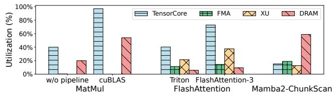  
Figure 1: Per-unit hardware utilization on NVIDIA H100 for different implementations of representative AI workloads, including MatMul, FlashAttention, and Mamba2’s ChunkScan. Each bar shows the utilization of individual hardware units for a specific workload implementation. Note that FMA and XU units are not used in MatMul.

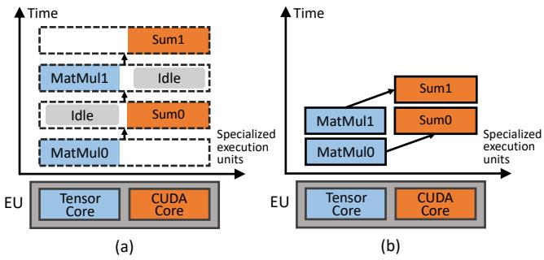  
Figure 2: An illustration of (a) inefficient scheduling in existing approaches; (b) optimized scheduling that leverages pipelined execution across specialized execution units.

15% TensorCore utilization. Therefore, it is challenging to fully utilize the modern hardware for emerging DNN models.

Manually managing pipelined execution in kernels is notoriously challenging due to the vast and hardware-sensitive design space. Developers must carefully balance tile size and pipeline depth while adhering to tight on-chip resource constraints. These challenges are further amplified by architectural variability, including differences in memory hierarchies and specialized compute units. As manual reasoning quickly becomes intractable, automated inference and scheduling become essential for achieving both performance and portability. However, existing compilers such as TVM [19] and Triton [49] lack explicit mechanisms to express pipelined tile execution. By abstracting away low-level control, they limit the developer’s ability to specify execution order, resource allocation, and compute-communication overlap—hindering the exploitation of full performance potential. Realizing efficient pipelined tile execution requires a new compiler that can systematically explore this design space, generate optimized schedules, and adapt across diverse hardware platforms.

Observations and opportunities. In light of these facts, we observe a unique opportunity to address the issue. Given that the new hardware units process data at a large granularity, such as tensor tiles, previous works [11, 23, 43, 49, 53, 54, 56] have demonstrated that tile-level execution can be efficiently scheduled at the software layer due to its deterministic performance at the tile level. By leveraging this trend, we advocate shifting pipeline scheduling from implicit hardware behavior to explicit software control. Here, pipeline scheduling refers not to low-level thread or warp dispatching by the GPU, but to the software-guided mapping of tile-level operations onto specialized units such as TensorCores, CUDA cores, or TMAs within each SM.

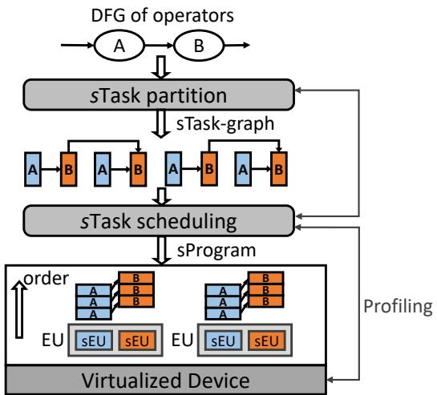  
Figure 3: System overview of PipeThreader.

Figure 2(a) shows the execution of fused MatMul-Sum where MatMul is executed on TensorCore and Sum is executed on CUDA core. Due to the homogeneous abstraction in existing approaches, the scheduling serializes the execution despite the inherent parallelism between TensorCores and CUDA cores, leading to inefficiencies. In contrast, Figure 2(b) demonstrates the optimized scheduling that leverages specialized execution units, enabling pipelined execution and fully utilizing the heterogeneous hardware.

Unfortunately, neither the existing DNN model representations nor the hardware interfaces in existing GPUs explicitly expose the scheduling capabilities required for tile-level pipeline execution.

## 3 PipeThreader Abstraction

The observations in §2 motivate PipeThreader, a DNN compiler framework that integrates tile-based data parallelism with pipelined scheduling. Figure 3 provides an overview of the system. State-of-the-art DNN compilers (e.g., Triton [49], Roller [56], Welder [47]) abstract hardware accelerators as collections of homogeneous execution units (EUs) for SPMDstyle parallelism. This approach overlooks the hardware heterogeneity inherent in modern GPUs. For example, TensorCores and CUDA cores within an SM are optimized for different workloads, a diversity that existing compilers fail to utilize. To address these limitations, PipeThreader introduces two key abstractions: specialized tasks (sTasks) and specialized execution units (sEUs). Starting with a data flow graph (DFG) of operators as input, PipeThreader converts these operators into sTasks, which are designed to exploit the heterogeneous capabilities of sEUs, enabling MPMD-style parallelism. Details of sTasks and sEUs are discussed in §3.1. sTasks preserve the data dependencies of the original DFG at task granularity, forming an sTask-graph. PipeThreader organizes the mapping of the sTask-graph to sEUs into an sTask-program, a structured representation for execution. With the sTask-program abstraction, PipeThreader opens up a new search space. Details of the sTask-graph, sTask-program, and search space are discussed in §3.2.

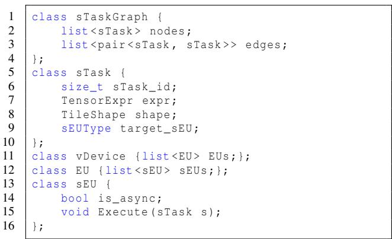  
Figure 4: The abstraction of sTask and sEU.

## 3.1 Specialized Tasks and Execution Units

sTask. PipeThreader introduces sTasks (short for specialized tasks) as the basic computation unit in an operator to be executed on a specific execution unit (sEU) of the accelerator device. The concept of sTask naturally aligns with the heterogeneous, specialized processors of modern DNN accelerators, e.g., TMA, CUDA cores, and TensorCores in H100 GPU. To maximize efficiency, the computation on such an accelerator needs to be divided into multiple parallel (heterogeneous) tasks for each type of specialized processor. Each type of these parallel tasks can be represented by an sTask, thereby exposing the potential task parallelism not only to specialized processors of the underlying hardware but also to the PipeThreader compiler.

As shown in Figure 4, an sTask processes a data tile sliced from the input tensors and produces a data tile in the output tensors, with its computation described by an index-based tensor expression. The shape (line 8) of an sTask is defined along each loop axis of the tensor expression expr (line 7). Additionally, the target\_sEU (line 9) attribute specifies the type of specialized units on which the sTask can execute. In contrast, traditional tile-based tasks are not explicitly categorized, limiting their ability to exploit the parallelism of specialized processors. As illustrated in Figure 5, on a specific EU, a traditional MatMul-Sum task (a fused operation in FlashAttention) would sequentially compute a [2 × 2] data tile from A and a [2 × 2 × 2] data tile from B, producing a [2 × 2] output tile for C. PipeThreader introduces two types of sTasks: mma sTasks executing matrix multiply-accumulate on TensorCores, and Sum sTasks running on CUDA cores.

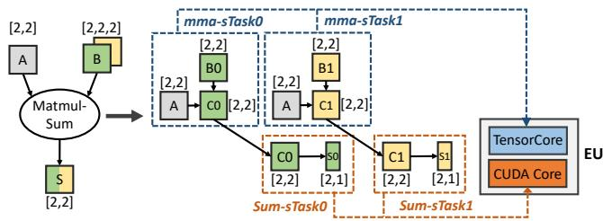  
Figure 5: sTask MatMul-Sum on NVIDIA GPU.

This enables pipelining, as the second mma sTask, multiplying A with the partition B1 to produce C1 on TensorCores, can overlap with the first Sum sTask, reducing C0 to S0 on CUDA cores. This pipelined execution allows task parallelism, significantly improving hardware utilization.

sEU. Modern accelerators lack interfaces to map an sTask to a specific execution unit. To address this, PipeThreader explicitly exposes the execution units within GPUs and abstracts them as a hierarchical execution array, capturing both parallelism and the capability to support data-dependent execution with pipelining.

As illustrated in Figure 4, the abstracted device consists of multiple parallel execution units (EUs) (line 11), each containing several heterogeneous specialized execution units (sEUs) (line 12). These sEUs serve as the hardware foundation for PipeThreader to effectively schedule data-dependent tasks with pipelining. For instance, on a modern H100 GPU, a Streaming Multiprocessor (SM) is an EU that includes Tensor Memory Accelerators (TMAs) for load sTasks and TensorCores for mma sTasks. An sEU executes a given sTask using the Execute interface (line 15). The is\_async attribute (line 14) specifies whether the sEU operates synchronously (e.g., CUDA cores) or asynchronously (e.g., TMAs). An asynchronous sEU can be executed concurrently with either asynchronous or synchronous sEUs.

## 3.2 From sTask-Graph to sProgram

To execute a DNN, PipeThreader transforms the input DFG into a specialized representation tailored to modern heterogeneous hardware. This process involves two key steps: constructing an sTask-graph that captures computation and dependency, and mapping this graph to specialized execution units (sEUs) as an sTask-program (sProgram), which orchestrates efficient execution.

sTask-Graph. As illustrated in Figure 3, operators from the input DFG are converted into sTasks via sTask-partition, forming an sTask-graph. This graph preserves the computation and data dependencies of the original DFG, with nodes representing sTasks and edges capturing their fine-grained dependencies at the task level. The sTask-partition process partitions each operator by configuring the TileShape (i.e., Map<Axis, Dim>) of sTasks, specifying their divisible dimensions and sizes. Traditional compilers primarily focus on spatial partitioning to achieve data parallelism. PipeThreader extends to support both spatial and reduction partitioning, unlocking new opportunities for pipelined execution. This flexibility allows PipeThreader to generate diverse sTaskgraphs based on different partitioning strategies, enabling more versatile and efficient execution planning.

sProgram. Given the sTask-graph, PipeThreader maps it onto the hardware’s sEUs in the form of an sTask-program (sProgram). The sProgram is a two-dimensional array, sProg[sEU][order], where each entry specifies the assignment of an sTask to a particular sEU and its execution order. This structured representation facilitates efficient scheduling and execution of tasks. To maintain correct execution order for dependent sTasks, PipeThreader introduces barrier-sTasks, which synchronize execution by referencing a list of sTasks identified by <EU\_id, sEU\_id, order> in the program. A barrier-sTask waits for the completion of all referenced sTasks before proceeding.

Search Space. The search space of PipeThreader is structured as the set of sPrograms, where each is a two-dimensional array sProg[sEU][order] defining tiling size and execution order (with synchronization barriers) for each sTask in the graph. There might be many combinations of sTask ordering and tiling sizes. PipeThreader’s search space includes all valid sPrograms where operators can be executed while respecting data dependency. For example, FlashAttention’s search space includes 37,440 valid sPrograms. For complex fused operators, sTask scheduling often contributes more significantly to the search space. With more types of sTasks, there might be many valid sPrograms of different sTask execution orders. For example, in FlashAttention, there are 36 sTask size (i.e., tiling) configurations, but 1,040 sTask ordering configurations for each tiling size.

## 3.3 Running Examples

Mamba2. Mamba is a popular DNN model that processes sequences using chunk-wise scanning with a linear attention mechanism. Its linear attention comprises multiple modules; here, we illustrate its key ChunkScan operator.

Frontend. For the ChunkScan function, PipeThreader takes a simple IR represented in Figure 6(a) as input. It multiplies cb by the product of the exponential of dA and dt (line 6), then accumulates the result of the matrix multiplication of cb and x into acc\_o (line 8). PipeThreader treats load\_cb (line 3), load\_dA (line 4), load\_dt (line 5), exp (line 6), load\_x (line 7), and mma (line 8) as individual sTasks.

sTask-graph. PipeThreader constructs a corresponding sTask-graph based on their dependencies. The sTask-graph can be partitioned along both spatial and reduction dimensions. Spatial partitioning (i.e., batch size) splits the graph into smaller subgraphs distributed across EUs for tile-based data parallelism. Reduction partitioning (i.e., sequence length)

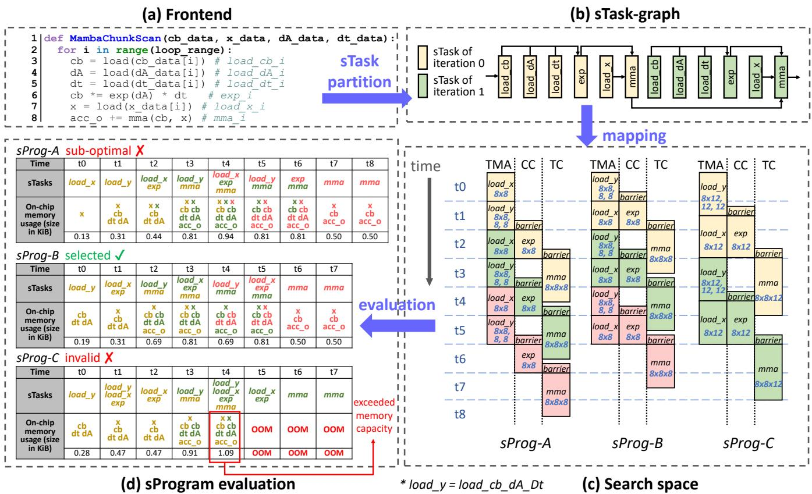  
Figure 6: Running example of Mamba2-ChunkScan. (a) shows the user-facing frontend. (b) presents the sTask-graph constructed from (a), with colors indicating different iterations. (c) illustrates various sPrograms derived from the sTask-graph in (b), and (d) compares their evaluation to identify the most efficient sProgram.

creates finer-grained sTasks within an EU, exposing opportunities for pipelined execution. Given acc\_o (line 8 in Figure 6(a)) of size (M, N) and X of size (K, N), PipeThreader partitions the spatial dimensions (M, N) as usual, assigning each sTask a tile of (m, n). It also partitions the reduction dimension (K) into loop\_range iterations, allowing computations to overlap across iterations1. Figure 6(b) shows the sTask-graph derived from reduction-dimension partitioning.

sPrograms. Given the sTask-graph, PipeThreader can have different choices of mapping sTasks to sEUs in the form of multiple sPrograms. Figure 6(c) illustrates three sPrograms derived from the sTask-graph. In sProg-A, load\_x is scheduled before other load sTasks, whereas sProg-B and sProg-C schedule these operations in reverse order. Compared to sProg-B, sProg-C employs a larger tiling size.

Evaluation. Figure 6(d) illustrates the evaluation of the three sPrograms. The table shows the sTasks running at each time step, along with the corresponding on-chip memory usage. Here, we assume an on-chip memory capacity of 1 KiB. In sProg-A, load\_x is scheduled earlier, but since the exp sTask depends on the completion of load\_cb\_dA\_dt, this results in delayed scheduling of exp, leading to lower overall efficiency compared to sProg-B. Although sProg-C employs larger sTasks, this increases the on-chip memory usage of its workspace. We observe that at time step t4, the workspace exceeds the available on-chip memory capacity, rendering this sProgram invalid. Consequently, sProg-B is selected as the final scheduling strategy.

PipeThreader’s task partitioning follows the principles of tiling but elevates new reduction tiling as a key optimization strategy. Traditionally, tiling prioritizes spatial partitioning for data reuse, while reduction tiling is often treated as secondary. PipeThreader, however, actively exploits reduction tiling to enable pipelining, improving execution efficiency. This ensures efficient pipelined execution while maintaining data reuse. By making reduction tiling a first-class optimization, PipeThreader unlocks performance improvements beyond conventional tiling strategies, particularly in pipeline-heavy workloads. Also, traditional tiling strategies tend to use larger tile sizes, which may conflict with increasing pipeline parallelism due to both demanding on-chip memory. PipeThreader further makes the trade-off between tiling and pipelining.

FlashAttention-3. FlashAttention is an efficient implementation of the original full attention mechanism, in which the input nodes of the DNN operator graph are three tensors: Q, K, and V . First, a matrix multiplication MatMulQK is performed to compute $a c c _ { - } s = Q K ^ { \mathrm { T } }$ . Next, acc\_s is passed through a Softmax operation to produce P. Finally, P and V are used as inputs for the second matrix multiplication MatMulPV to compute the output O.

```python
1 def FlashAttention ( q_data , k_data , v_data ):
2 3 q = load ( q_data )
for i in range( loop_range ):
4 k = load ( k_data [i ]) # load_k_i
5 acc_s = mma (q , k) # mma_qk_i
6 P = softmax ( acc_s ) # softmax_i
7 v = load ( v_data [i ]) # load_v_i
8 acc_o = rescale ( acc_o , param ) # rescale_i
9 acc_o += mma (P , v) # mma_pv_i
```  
Figure 7: Pseudocode of the FlashAttention sTask-graph.

In FlashAttention, these three operators are fused into a single kernel. PipeThreader annotates the pattern to derive dependent sTasks, forming an sTask-graph (Figure 7). After partitioning, PipeThreader assigns load\_k (line 4) and load\_v (line 7) to TMA, mma\_qk (line 5) and mma\_pv (line 9) to TensorCores, and softmax (line 6) and rescale (line 8) to CUDA cores. PipeThreader applies its two-level scheduling policy to explore the space and generates an sProgram where sTasks execute in parallel on their respective sEUs, leveraging the asynchrony and heterogeneity of sEUs. It is worth noting that our scheduling space includes the pipeline plans of the latest FlashAttention-3 [46].

## 4 PipeThreader Scheduling

The sProgram abstraction opens up a large optimization space. PipeThreader aims to generate high-quality sPrograms in this space. To this end, PipeThreader separates the scheduling mechanism from its policy. On the mechanism side, it provides two capabilities: (1) Scheduling interfaces for a policy to generate a sProgram. (2) A profiler to supply profiling information requested by a scheduling policy. On the policy side, PipeThreader provides a two-layer policy that balances tiling and pipeline parallelism. This simple policy can already outperform the state-of-the-art, sometimes significantly. We believe this mechanism lays a foundation for future research into more sophisticated policies that further exploit the optimization space exposed by sPrograms.

## 4.1 Scheduling Interfaces

PipeThreader provides three interfaces to generate a highquality sProgram in the new space, as shown in Figure 8. The Append interface assigns a specific sTask to a particular sEU within an EU. The Wait interface allows an sTask s to wait for sTasks in list<sTask\_uid> to complete, which implicitly appends a barrier-sTask right before the sTask s. The above interfaces allow for explicit control of the placement and execution order of sTasks across sEUs (i.e., sProgram) to explore parallelization space.

1 void Append ( sTask s , <EU u , sEU v >) ;   
2 3 void Wait ( sTask\_id s , list < sTask\_id > t);   
void Propagate ( sTaskGraph g , TileShape shape );  
Figure 8: The scheduling interfaces.

PipeThreader provides a Propagate interface to explore the sTask partition space by automatically inferring the TileShape of each sTask in an sTask-graph. Starting from the output tile shape of the final sTask, Propagate performs a chain of shape inferences backward through the graph, determining the dependent input regions for each sTask based on its tensor expression and output tile shape. For example, if [4 × 128] output tile shape is required for a Softmax sTask, Propagate deduces that its input tile shape must also be [4 × 128]. Treating this as the output tile shape of a preceding mma sTask, the input tiles are inferred as [4 × k] and [k × 128], where k is the reduction size.

## 4.2 Scheduling Policy

Our scheduling policy is inspired by the two-layer hardware abstraction described in Figure 3, where homogeneous EUs enable SPMD-style parallelism, and heterogeneous sEUs within each EU support MPMD-style parallelism. Figure 9 outlines the two-level scheduling algorithm used in PipeThreader. At the inter-EU level, the policy minimizes latency by partitioning the model into sTask-subgraphs, which are evenly distributed across EUs (lines 1-10). At the intra-EU level, the policy optimizes the execution cost of each sTasksubgraph on a given EU by constructing an efficient pipelining plan (lines 11-32). The inter-EU schedule is informed by execution cost estimates for each partition, as provided by the intra-EU schedule.

Initially, the policy represents each operator as one or more sTasks based on its computational stages (e.g., MatMul is split into load and mma sTasks). In the inter-EU pass, the scheduler enumerates different partitions of the output sTask in the function GetsTaskPartitions (line 2). For each sTask partition, the scheduler uses Propagate (line 4) to derive other sTask partitions across the graph and assigns sTasks evenly across EUs, leveraging their equivalent compute capability. This SPMD-style approach significantly reduces the complexity of inter-EU parallelism plans. The policy invokes the intra-EU pass to optimize the execution of assigned sTasks within an EU (i.e., an sTask-subgraph). During the intra-EU pass, the policy employs a greedy approach to schedule sTasks onto sEUs, iteratively performing the following steps until all sTasks assigned to the EU are scheduled: 1) selects the sTask t with the endtime earlier than the current time cur\_time in get\_complete\_sTask (line 15); 2) identifies the set of ready sTasks whose predecessors have been scheduled (line 17- 20) and dequeues the sTask u with the highest priority using get\_high\_priority (line 22); 3) appends the selected sTask to the sEU with Append() (line 23) and ensures sTask-level dependencies by invoking Wait() (line 25). We also call

1 Func InterEUScheduling(G:operator-graph, D:vDevice):   
2 S = GetsTaskPartitions(out\_op);   
3 for out\_tiles ∈ S.TileShape do   
4 sTask\_set = Propagate(G, out\_tiles);   
5 sTask\_subgraph = Partition(sTask\_set, D);   
IntraEUScheduling(sTask\_subgraph, EU, plan);   
7 if Profile(plan).latency < best\_latency   
8 best\_latency = Profile(plan).latency;   
9 best\_plan = plan;   
10 return best\_plan;   
11 Func IntraEUScheduling(g:sTask-graph, EU, Plan):   
12 scheduled\_set =0/ ;   
13 curr\_time = 0;   
14 while scheduled\_set ̸= g.nodes do   
15 t = get\_complete\_sTask(Plan, curr\_time);   
16 t.state = COMPLETE;   
17 for n ∈ g.nodes \scheduled\_set do   
18 if all sTasks in Predecessor(n) are COMPLETE   
19 n.state = READY;   
20 ready\_sTasks.add(n);   
21 for ready\_sTasks̸= 0/ do   
22 u= get\_high\_priority(ready\_sTasks, Plan, g);   
23 P = Plan.Append(u, <EU, sEU>);   
24 if check\_valid(P)   
25 P.Wait(u, Predecessor(u).sTasks);   
26 if t ∈/ Predecessor(u)   
27 P.Wait(u, t);   
28 u.endtime = max{sEU.time, curr\_time} +   
Profile(u, sEU);   
29 sEU.time = u.endtime;   
30 scheduled\_set.add{u};   
31 Plan = P;   
32 curr\_time = curr\_time + δ;   
Figure 9: Scheduling algorithm.

Wait(u, t) to handle cases where the scheduling of u must wait for the completion of t to release memory (line 26- 27). To improve pipeline efficiency, we prioritize scheduling asynchronous sTasks with minimal dependencies on already scheduled tasks and high potential to unlock downstream sTasks. As illustrated in Figure 6(c), scheduling load\_x early delays the execution of exp, whereas scheduling load\_y earlier enables exp to proceed sooner. As a result, our algorithm assigns a higher priority to load\_y, naturally favoring the construction of sProg-B and sProg-C over sProg-A.

Increasing sTask overlap (i.e., pipeline parallelism) requires additional on-chip memory (e.g., shared memory and registers on GPUs) to buffer intermediate results between stages. However, this demand may conflict with the use of larger tiling sizes. Our method balances these competing demands through a joint search strategy guided by profiling feedback. To ensure memory feasibility, we invoke check\_valid to verify (based on the current sProgram and profiler) whether a selected sTask fits within the memory constraints of the target sEU (line 24).

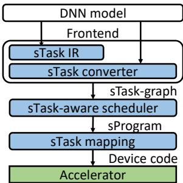  
Figure 10: Implementation of PipeThreader.

Candidates that exceed the limit are skipped. For example, in Figure 6, sProg-C employs a larger tiling size, which exceeds the available on-chip memory. The check\_valid step detects this violation and avoids generating such invalid schedules.

Profiler. PipeThreader introduces a profiler to guide efficient sProgram generation (Figure 9) in the search space. The profiler provides the following information of individual sTasks to generate a valid execution timeline of the sProgram: (1) the execution time of individual sTasks on specific sEUs, (2) the resource usage of sTasks, including local memory and register consumption, and (3) the overall execution time of the sProgram. The profiler automatically handles a new tensor expression by leveraging the code generation backend of existing compilers like TVM, and measures the execution time and resource usage of the device code of an isolated sTask. During scheduling, PipeThreader uses these profiling results to estimate when a task should be launched to maintain pipeline efficiency and minimize idle time. After completing sTask scheduling, the profiler also measures the performance of the entire generated schedule, providing the ground-truth latency. This profiling data informs the scheduling policy and guides the generation of efficient scheduling plans.

## 5 PipeThreader Implementation

PipeThreader is implemented with 8.5k lines of C++ and Python code, based on open-source DNN compilers: TVM [19] and Ladder [51]. Figure 10 summarizes the overall workflow of PipeThreader. The frontend produces the sTaskgraph, which is then processed by the sTask-aware compiler (scheduler) to generate the sProgram. Finally, the mapping optimizer generates the device code for the sProgram.

## 5.1 Frontend

The PipeThreader frontend includes an sTask-IR for expressing the sTask-level DNN computations, and an sTaskconverter to transform DNN model into sTask-graph.

sTask IR. The sTask intermediate representation (IR) provides the programmer and the compiler with a flexible way to express sTask-level computation that cannot be easily captured by the existing compiler IRs (e.g., expression-oriented

IR). The pseudocode in Figure 6(a) and Figure 7 can be viewed as a simplified form of the sTask IR. The pseudocode illustrates how complex deep learning kernels can be modeled as data-flow patterns, including memory operations (e.g., moving sTasks between DRAM and SRAM) and sequences of computations on sTasks.

sTask converter with sEU. The PipeThreader frontend can also convert the DNN model expressed by both sTask IR and ONNX graphs into an sTask-graph. In this process, we leverage Ladder [51], a state-of-the-art DNN compiler for operator fusion. The output of Ladder is a tile-graph, which is expressed in TVM’s TIR as an intermediate representation. We annotate the target\_sEU attribute of each tile-based task to transform it into sTasks based on sEU information. For instance, on the NVIDIA H100 GPU, we treat a Streaming Multiprocessor (SM) as an EU. Within each SM, the sEUs include the TensorCores for matrix multiply-accumulate mma, CUDA cores for general floating-point computations such as reduce and parallel, and the TMA for bulk memory copy operations between global and shared memory. These basic operations can be composed to represent data operations in most common deep learning kernels. For example, data movement is translated into a parallel operator which can represent arbitrary element-wise tile operations. Also, users can define customized functions to describe other sTasks.

Although programmers need to write a simple IR to generate kernels (e.g., Figure 7 for the FlashAttention kernel), they do not have to be aware of tasks, how to divide their graphs (or IRs) into sTasks, and which sTasks can run on which sEUs. PipeThreader can infer this information, for example, setting attributes such as tiling shape and target sEU in the sTask class in Figure 4. The sTask converter annotates each operation (e.g., mma) on which types of sEU to execute (i.e., target\_sEU attribute). The scheduler then automatically determines how to divide it into sTasks (e.g., tiling shape) and which sTasks run on which sEUs (e.g., sEU assignment in sProgram). Therefore, PipeThreader can help reduce the tedious manual effort and strong domain expertise required for hand-crafted implementation. For the FlashAttention kernel, PipeThreader only needs 68 lines of Python code, as compared to 840 lines of CUDA kernel code from the hand-crafted implementation FlashAttention-3.

## 5.2 sTask Mapping on NVIDIA CUDA GPUs

For both TMA and TensorCore sEUs, the is\_async attribute is set to true, as we can leverage the cp.async.bulk and wgmma.mma\_async instructions. In contrast, the is\_async attribute for CUDA cores is set to false because they do not support any asynchronous instructions. The fact that instructions for CUDA Cores and TensorCores can be dispatched simultaneously is officially confirmed by NVIDIA [8]. Interference can occur as both units utilize the same set of registers. We alleviate the potential interference by implementing double buffering on registers to overlap the execution of TensorCore and CUDA Core. We implement barrier-sTask using the mbarrier object in PTX [9]. To efficiently implement the Execute function in sEU, we decide how sTask operations and data map to different threads and physical memory through layout inference. We also use hardware-specific instructions (hardware intrinsics) to accelerate operations. PipeThreader does not require significant engineering effort to support different GPU models from the same vendor. When targeting different architectures such as A100 [21], H100 [22], or B100 [24], only lightweight updates to hardware-specific configurations, including sEU layouts, intrinsics, and resource limits, are needed. The core compilation and scheduling logic remains fully reusable.

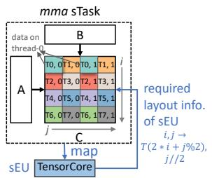  
(a) Align the sTask’s layout with sEU requirements.

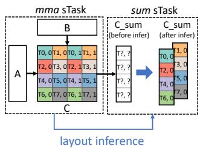  
(b) Infer the layouts of connected sTasks on the sTask-subgraph.  
Figure 11: An example of simplified layout inference for the mma-sum sTask-subgraph.

Layout inference. Efficient execution of sTasks on specialized execution units (sEUs) requires adherence to specific layout and thread-binding constraints. To address this, PipeThreader introduces a Layout object, which describes the data layout and thread-binding for sTasks. The Layout defines a mapping function and an iterator domain, specifying how logical data elements are translated to physical memory and, optionally, assigned to threads.

PipeThreader performs layout inference fully automatically, eliminating the need for manual specification. Figure 11a shows a simplified version of layout inference. The sTask mma is assigned to sEU TensorCore with strict layout constraints. Based on the layout constraints, we can derive the corresponding layout mapping function. Here, {T (m),n} denotes the data element mapped to the n-th position of thread m.

In the sTask-graph, the layouts of connected sTasks must align to ensure compatibility. Using the layout requirements of specific sEUs, PipeThreader infers the Layout of sTasks and propagates these requirements throughout the graph. Conflicts between layouts are resolved through a prioritybased inference algorithm, where high-priority sTasks, such as mma, dictate the layouts of dependent sTasks. For instance, in Figure 11b, the mma and sum sTasks are connected. Given that the layout of the mma sTask has already been determined, we can infer the layout of the sum sTask accordingly. In this example, the tensor C\_sum needs to be duplicated.

Hardware intrinsic. For sTasks requiring bulk operations on sEUs, we lower the sTask into tile-level function templates. For example, matrix multiply-accumulate operations are lowered using the CUTLASS/CuTe templates, which integrate hardware-specific TensorCore intrinsics. Further instructionlevel optimizations, such as register allocation, are delegated to low-level compilers like LLVM [38]. For NVIDIA H100, we apply Warp Specialization [17, 25] to optimize execution. This technique divides threads into producer and consumer warps, with each warp responsible for different pipeline stages. By allowing producer warps to release unused registers for reuse by consumer warps, Warp Specialization improves register allocation and efficiency. Based on the features of the TMA unit in H100, we assign the load sTasks, which copy data between global and shared memory, to producer warps. The remaining sTasks, such as mma and Softmax, are handled by consumer warps. Synchronization between producers and consumers is achieved using barrier-sTasks implemented with mbarrier to ensure correct data dependencies.

## 5.3 sTask Mapping on AMD ROCm GPUs

We also implement PipeThreader on MI300X [16], AMD’s latest high-performance GPU. The MI300X GPU features parallel execution units known as compute units (CUs), analogous to NVIDIA’s SMs. Each CU contains multiple sEUs, including MatrixCores for matrix multiply-accumulate, Arithmetic Logic Units (ALUs), and asynchronous copy units. Similar to CUDA GPUs, PipeThreader performs layout inference on ROCm GPUs to map sTask data to physical addresses and threads. Additionally, we explicitly utilize the lgkmcnt and s\_waitcnt instructions to manage asynchronous barriers, enabling precise control over instruction dependencies and synchronization of memory operations.

## 6 Evaluation

In this section, we evaluate PipeThreader on both DNN microbenchmarks and end-to-end models by comparing with state-of-the-art DNN compilers, frameworks, and libraries to demonstrate the effectiveness of PipeThreader. We first summarize our findings: (1) PipeThreader can discover efficient scheduling for well-established DNN architectures (e.g., FlashAttention) and achieve performance comparable to or even surpassing state-of-the-art; (2) PipeThreader can uncover novel scheduling for emerging models (e.g., Mamba2), delivering significantly improved performance; (3) PipeThreader’s abstraction and design are adaptable to hardware beyond NVIDIA GPUs (e.g., AMD MI300X), achieving notable performance gains.

## 6.1 Experimental Setup

Hardware platforms. We evaluate PipeThreader on both NVIDIA and AMD GPUs, as they are currently the most popular hardware platforms. Our evaluation includes two of the latest high-performance GPUs: the NVIDIA H100 (80GB) [22] and the AMD Instinct MI300X GPU (192GB) [16]. We use CUDA version 12.4 with the H100 GPU and ROCm version 6.1.0 with the MI300X GPU. Both GPUs are evaluated on the operating system Ubuntu 20.04.

<table><tr><td>Operator</td><td>Configuration</td><td>Model</td><td>Note</td></tr><tr><td>MatMul</td><td>M=4096,N=1024K=4096</td><td>LLAMA3-8B</td><td>M0</td></tr><tr><td>MatMul</td><td>M=8192,N=14336,K=4096</td><td>LLAMA3-8B</td><td>M6</td></tr><tr><td>MatMul</td><td>M=8192,N=8192,K=28672</td><td>LLAMA3-70B</td><td>M15</td></tr><tr><td>Conv2D</td><td>D=(1,2048,7,7),K=(2048,512,1,1),S=1</td><td>ResNet-50</td><td>CO</td></tr><tr><td>Conv2D</td><td>D=(128,512,14,14),K=(512,512,3.3), S=2</td><td>ResNet-50</td><td>C10</td></tr><tr><td>Conv2D</td><td>D=(128,512,28,28),K=(512,128,1,1), S1</td><td>ResNet-50</td><td>C14</td></tr><tr><td>WFP4AFP16MatMul</td><td>M=64,N=1024,K=8192</td><td>LLAMA3-70B</td><td>DM0</td></tr><tr><td>WFP4AFP16 MatMul</td><td>M=128,N=28672,K=8192</td><td>LLAMA3-70B</td><td>DM6</td></tr><tr><td>FlashAttention</td><td>BS=1,SEQ=4096,causal=true</td><td>LLAMA3-8B</td><td>FA4</td></tr><tr><td>FlashAttention</td><td>BS=64, SEQ=4096,causal=false</td><td>LLAMA3-70B</td><td>FA19</td></tr><tr><td>FlashDecoding</td><td>BS=1,SEQ=1, causal=false</td><td>LLAMA3-8B</td><td>FD0</td></tr><tr><td>FlashDecoding</td><td>BS=1, SEQ=1,causal=false</td><td>LLAMA3-70B</td><td>FD2</td></tr><tr><td>ChunkScan</td><td>BS=1,SEQ=8192</td><td>Mamba2-1.3B</td><td>CC2</td></tr><tr><td>ChunkScan</td><td>BS=64,SEQ=16384</td><td>Mamba2-1.3B</td><td>CC7</td></tr><tr><td>ChunkState</td><td>BS=1, SEQ=8192</td><td>Mamba2-1.3B</td><td>CT2</td></tr><tr><td>ChunkState</td><td></td><td></td><td></td></tr><tr><td></td><td>BS=64,SEQ=16384</td><td>Mamba2-1.3B</td><td>CT7</td></tr></table>

Table 1: A subset of operator configurations in our microbenchmark.

DNN workloads. Our evaluation benchmark uses six typical DNN models, including LLAMA3-8B [29], LLAMA3- 70B [29], Mamba2-1.3B [28], RetNet-65B [48], ResNet-50 [32], and UNet [45]. For large language models like LLAMA3-8B, LLAMA3-70B, and RetNet-65B, we perform tests using the (BS, SEQ) configurations of (1, 1), (32, 1), and (1, 4096); other models like ResNet-50 and UNet are evaluated with batch sizes of 1 and 128, which can comprehensively cover both online and offline inference scenarios. For Mamba, we evaluate BS=1 with sequence lengths of 1k, 2k, 4k, and 8k, and BS=32 or 128 with a sequence length of 1. These configurations are chosen because Mamba’s primary advantage over transformers is its superior computational efficiency with long sequence lengths, and these settings represent the most commonly used scenarios. From each model, we choose the most frequent and expensive operations to construct our microbenchmark. Table 1 lists representative operators, their configurations, and corresponding abbreviations of each operator.

Baselines. We compare PipeThreader with DNN framework ONNXRuntime (v1.19.2) [7], as well as state-of-the-art DNN compilers such as Ladder [51] and PyTorch-Inductor (v2.4.0, with Triton v3.0.0) [10, 49]. PyTorch integrates bitsandbytes [30], an official backend in HuggingFace transformers, for WFP4AFP16 precision. Additionally, we evaluate PipeThreader against TensorRT (v10.0.1) [6], a vendor-specific inference library for NVIDIA GPUs. We also compare PipeThreader with libraries cuBLAS [2] and rocBLAS (on ROCm GPUs) [1] for MatMul, Ladder and bitsandbytes library for lowprecision MatMul operations, MIOpen [36] for Conv2D, and expert-optimized FlashAttention-3 [46] kernel written using CUTLASS [5] templates for attention operation. For LLM and Mamba models, we further benchmark PipeThreader against vLLM (v0.6.3) [37], the most popular library for LLM inference. Average performance metrics, such as speedup, are calculated using the geometric mean across all experiments. All evaluations begin with warm-up iterations, followed by repeated execution of each workload for a minimum of 5 seconds to ensure accurate and stable results.

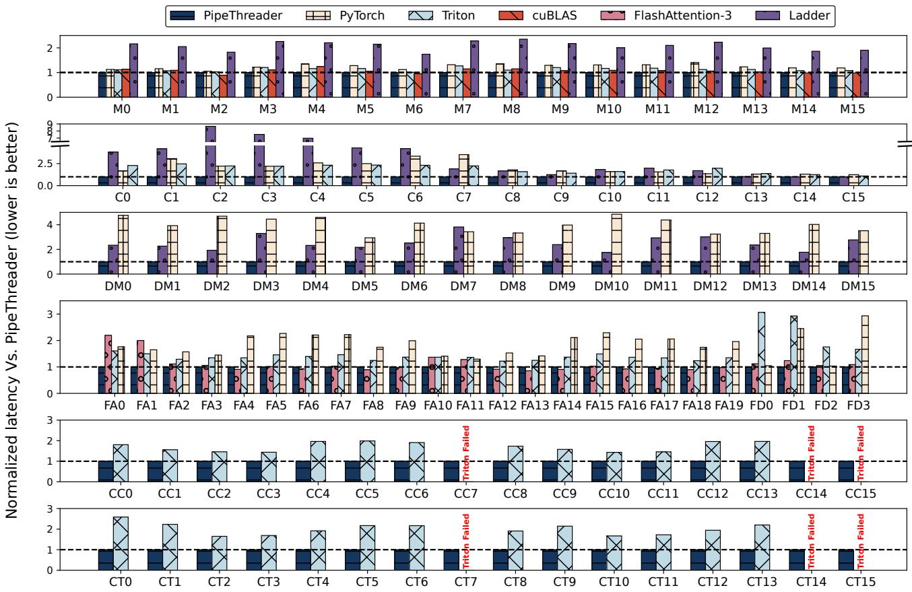  
Figure 12: Operator performance on NVIDIA H100 GPU.

## 6.2 Operator Performance on NVIDIA H100

Figure 12 shows the performance of all operator configurations in the microbenchmark. The x-axis represents different operators, and the y-axis indicates the normalized latency relative to PipeThreader.

MatMul. The first row of Figure 12 shows the performance of PipeThreader and other baselines on MatMul operators derived from LLAMA3-8B (M0-M7) and LLAMA3-70B (M8-M15). Although the existing compiler or libraries already provide well-optimized MatMul kernels, the result shows that PipeThreader still obtains a significant speedup. Compared to PyTorch, Triton, and Ladder, PipeThreader achieves average speedups of 1.24× (up to 1.40×), 1.13× (up to 1.26×), and 2.07× (up to 2.25×), respectively. This improvement stems from PipeThreader’s ability to leverage its sTask abstraction to model MatMul as a pipeline of load and mma sTasks and fully explore advanced scheduling opportunities. Notably, PipeThreader matches cuBLAS MatMul performance, with an average speedup of 1.06×. It also achieves over 750 TFLOPS on most of these MatMul operators, approaching the theoretical TensorCore peak performance of the H100 GPU.

Convolution. PipeThreader implements convolutions using implicit GEMM [39], which also leverages the pipeline optimization of the load and mma. As demonstrated in the second row of Figure 12, PipeThreader significantly outperforms the baselines on the convolution operators derived from the ResNet-50 model (with batch sizes of 1 and 128). PipeThreader achieves an average performance improvement of 1.94× (up to 3.52×) over PyTorch and 2.56× (up to 8.66×) over Ladder, respectively. Since the official Conv2D implementation is not provided, we implement a Conv2D kernel using Triton and perform auto-tuning to achieve its best performance. Compared to Triton, PipeThreader delivers an average speedup of 1.85× (up to 2.47×).

Low-bit MatMul. The third row of Figure 12 shows the performance of low-bit MatMul operators derived from WFP4AFP16-quantized LLAMA3-8B (DM0-DM7) and LLAMA3-70B (DM8-DM15). As current TensorCores do not directly support WFP4AFP16 MatMul, the low-bit MatMul must first cast data to FP16 on CUDA cores, which introduces an additional dequant stage. With more pipeline stages, we observe that PipeThreader gains larger speedups than the ones achieved on standard MatMul. For example, PipeThreader outperforms PyTorch (with bitsandbytes) and Ladder by 3.92× (up to 4.76×) and 2.48× (up to 3.81×) on low-bit MatMul, while the average speedups on standard MatMul are only 1.24× and 2.07×, respectively.

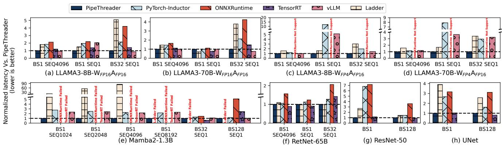  
Figure 13: End-to-end performance on the NVIDIA H100 GPU.

<table><tr><td>Configuration</td><td>Pipe- Threader</td><td>PyTorch- Inductor</td><td>ONNX- Runtime</td><td>TensorRT</td><td>vLLM</td><td>Ladder</td></tr><tr><td>BS=1, SEQ=4k</td><td>3.29</td><td>6.06</td><td>7.01</td><td>3.99</td><td>3.05</td><td>5.96</td></tr><tr><td>BS=1,SEQ=1</td><td>0.29</td><td>0.56</td><td>0.63</td><td>0.40</td><td>0.59</td><td>0.43</td></tr><tr><td>BS=32, SEQ=1</td><td>1.29</td><td>2.78</td><td>5.47</td><td>1.84</td><td>1.11</td><td>6.62</td></tr></table>

Table 2: Latency (in milliseconds) of LLAMA3-8B-$W _ { \mathrm { F P 1 6 } } A _ { \mathrm { F P 1 6 } }$ on the NVIDIA H100 GPU.

FlashAttention and FlashDecoding. Compared to MatMul and low-bit MatMul, FlashAttention involves even deeper computation stages, opening up a larger optimization space for PipeThreader. PipeThreader can automatically find effective scheduling schemes by exploring the new optimization space defined by an sTask-graph and the new exposed hardware capabilities. The fourth row of Figure 12 shows the performance of FlashAttention operators derived from LLAMA3-8B (FA0-FA9) and LLAMA3-70B (FA10-FA19). The evaluations cover sequence lengths ranging from 512 to 8k, with batch sizes of 1 and 64, including configurations with and without causal masking. PipeThreader demonstrates an average performance improvement of 1.36× (up to 1.50×) over Triton, compared to 1.13× (up to 1.26×) for MatMul operation. This highlights the system’s ability to exploit the larger optimization space inherent in FlashAttention’s more complex computation pipeline.

Such a general scheduling capability enables PipeThreader to achieve comparable performance to model-specific implementations optimized by experts, and in some configurations, even outperform them. FlashAttention-3, a manually optimized attention kernel tailored for NVIDIA Hopper GPUs, is an example of such an expert-designed approach. PipeThreader achieves an average performance improvement of 1.07× (up to 2.18×) over FlashAttention-3. As a handcrafted approach, FlashAttention-3 cannot efficiently optimize for varying workloads. We observe that, particularly for smaller sequence lengths, FlashAttention-3 performs suboptimally due to fixed tile sizes. PyTorch uses the hand-crafted FlashAttention-2 kernel without incorporating finer-grained pipelining. Compared to PyTorch, PipeThreader achieves an average speedup of 1.82× (up to 2.29×).

FlashDecoding operators are selected from the LLAMA3- 8B (FD0, FD1) and LLAMA3-70B (FD2, FD3) models with batch size set to 1 and context length set to 8192 to simulate decoding scenarios. Compared to FlashAttention-3 and Triton, PipeThreader achieves an average speedup of 1.12× (up to 1.23×) and 2.27× (up to 3.06×), respectively.

Linear Attention. The fifth and sixth rows of Figure 12 present the key linear attention operations of the Mamba2 model: ChunkScan and ChunkState operations, respectively. We compare PipeThreader with the official Triton implementation. The configurations we test have sequence lengths ranging from 1k to 16k, with batch sizes of 1 or 64. PipeThreader achieves average speedups of 1.71× (up to 1.99×) and 1.98× (up to 2.59×) over Triton for ChunkScan and ChunkState operations, respectively. Also, Triton fails on some configurations, such as sequence lengths of 8k (CC14, CT14) and 16k (CC7, CC15, CT7, CT15). These results emphasize PipeThreader’s adaptability in handling emerging DNN operations, eliminating the need for hand-crafted implementations.

## 6.3 End-to-end Performance on NVIDIA H100

Figure 13 shows the end-to-end performance of all eight DNN models on the NVIDIA H100 GPU. Due to GPU memory constraints, we evaluate the inference latency of large language models like LLAMA3, Mamba2, and RetNet using a single decoder layer, which serves as a proxy for fullmodel performance, as all layers are identical and latency scales linearly with the number of layers.

LLM models. On the FP16-precision LLAMA3-8B and LLAMA3-70B models, PipeThreader achieves average speedups of 2.17× and 2.45× over Ladder and ONNXRuntime, respectively. Ladder’s schedule policy is unable to effectively represent and generate the FlashAttention kernel, while ONNXRuntime does not natively provide support for FlashAttention, leading to suboptimal performance. Although PyTorch-Inductor, TensorRT, and vLLM integrate industrially popular FlashAttention kernel as their backend, PipeThreader on average outperforms them by 1.79× (up to 2.15×), 1.28× (up to 1.47×), and 1.10× (up to 2.05×), respectively. This improvement is attributed to PipeThreader’s ability to explore more efficient pipeline configurations tailored to operations in the model (e.g., MatMul and FlashAttention). In WFP4AFP16 quantization scenarios, PipeThreader outperforms Ladder, PyTorch-Inductor, and vLLM with an average speedup of 2.01× (up to 3.39×), 3.03× (up to 11.98×), and 2.16× (up to 5.16×), respectively, as it optimizes the pipeline scheduling for both low-bit MatMul and FlashAttention. We also include a subset of absolute performance in Table 2.

<table><tr><td>Pattern</td><td>Configuration</td><td>Triton</td><td>PT-Decouple</td><td>PT-Joint</td></tr><tr><td>ChunkScan</td><td>BS=1,SEQ=8k</td><td>0.158</td><td>0.198</td><td>0.108</td></tr><tr><td>ChunkScan</td><td>BS=64,SEQ=8k</td><td>13.332</td><td>12.150</td><td>6.981</td></tr><tr><td>FlashAttention</td><td> ${ \bf B } { \bf S } { = } 1 , { \bf S } { \bf E } { \bf Q } { = } 4 { \bf k }$ </td><td>0.639</td><td>0.851</td><td>0.438</td></tr><tr><td>FlashAttention</td><td>BS=64,SEQ=4k</td><td>41.681</td><td>48.762</td><td>30.416</td></tr></table>

Table 3: Latency (in milliseconds) comparison for decouple and joint sTask-graph optimization.
<table><tr><td>Pattern</td><td>Configuration</td><td>PipeThreader</td><td>Triton</td><td>CUTLASS</td></tr><tr><td>MatMul</td><td>M,N,K=8k,8k,8k</td><td>0.13</td><td>0.17</td><td>3.36</td></tr><tr><td>FlashAttention</td><td>BS=64,SEQ=8k</td><td>5.26</td><td>0.74</td><td>/</td></tr><tr><td>ChunkScan</td><td> $\mathrm { B S } { = } 1 , \mathrm { S E Q } { = } 1 6 \mathrm { k }$ </td><td>3.92</td><td>1.28</td><td>/</td></tr><tr><td>ChunkState</td><td> $\mathrm { B S } { = } 1 , \mathrm { S E Q } { = } 1 6 \mathrm { k }$ </td><td>3.71</td><td>1.05</td><td>/</td></tr></table>

Table 4: Compilation time (in minutes) on H100.

Linear Attention models. On the Mamba2-1.3B model, Ladder, ONNXRuntime, and TensorRT fail to generate efficient linear attention kernels, leading to memory errors under certain configurations. PyTorch-Inductor, which uses Triton as the backend, is capable of running fused linear attention but delivers suboptimal performance compared to PipeThreader. PipeThreader outperforms PyTorch-Inductor, ONNXRuntime, TensorRT, vLLM, and Ladder by 1.92× (up to 2.76×), 2.71× (up to 5.10×), 1.21× (up to 2.44×), 1.78× (up to 2.41×), and 45.93× (up to 84.41×), respectively, given its ability to explore more efficient pipeline configurations tailored to operations in the model.

For the linear attention model RetNet-65B, compared to PyTorch-Inductor, ONNXRuntime, TensorRT, and Ladder, PipeThreader achieves speedups by 1.16× (up to 1.31×), 1.60× (up to 2.12×), 1.06× (up to 1.46×), and 1.04× (up to 1.10×), respectively. On the RetNet-65B model, the speedup achieved by PipeThreader is relatively modest. This is because the RetNet-65B model’s large attention head dimensions (256 for query and key, 432 for value) lead to high shared memory usage, limiting pipeline scheduling optimization.

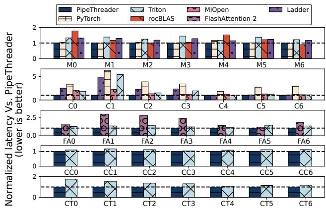  
Figure 14: Operator performance on AMD MI300X GPU.

CNN models. For ResNet-50 and UNet, by generating more efficient Conv2D kernels, PipeThreader achieves speedups of 2.01×, 2.54×, and 3.99× in end-to-end inference latency over Ladder, PyTorch-Inductor, and ONNXRuntime, respectively. Compared to TensorRT, PipeThreader achieves comparable performance (0.97×).

## 6.4 Evaluation on Scheduling Policy

Joint optimization. Our scheduling policy jointly optimizes partitioning and pipeline scheduling of the sTaskgraph. To demonstrate the benefits, we create a variant of PipeThreader: “PT-decouple”, which optimizes the partitioning (e.g., for high memory utilization in a single sTask) and pipeline scheduling (e.g., for high overlapping) in independent optimization passes. As shown in Table 3, on the Mamba2- ChunkScan (BS=64, SEQ=8k) operator, with the PT-decouple, the compiler focuses on maximizing data reuse and selects a larger tile shape (e.g., 64×128). However, this larger tile shape limits the sTask-graph’s ability to achieve effective pipeline parallelism on one EU, resulting in an execution time of 12.150 ms. By jointly optimizing both the sTask-graph partitioning and scheduling, the compiler selects a smaller tile shape (e.g., 64×64), which facilitates more efficient pipelining and reduces the execution time to 6.981 ms.

Compilation time. The joint optimization would require a relatively longer compilation time. Table 4 presents the compilation times of PipeThreader for several typical configurations in FlashAttention and Mamba2. Since all task partitions are generated in line 2 of Figure 9, the scheduling process can be parallelized to accelerate compilation. For simple kernels with few pipeline depths, such as MatMul, PipeThreader compilation takes only 0.13 minutes, compared to 0.17 minutes and 3.36 minutes for Triton and CUTLASS, respectively. For complex fused kernels such as FlashAttention, PipeThreader still achieves a short compilation time of 5.26 minutes, even though it explores a large pipeline search space over Triton.

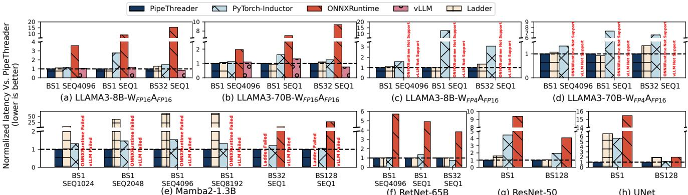  
Figure 15: End-to-end performance on AMD Instinct MI300X GPU.

## 6.5 Evaluation on AMD ROCm GPUs

Operator performance. We benchmark the AMD MI300X GPU using a subset of operators selected from the microbenchmark suite originally designed for the NVIDIA H100 GPU. The evaluation focuses on key operators: MatMul (compared against PyTorch, rocBLAS, Triton, and Ladder), Conv2D (compared against PyTorch, MIOpen, Triton, and Ladder), FlashAttention (compared against FlashAttention-2 and Triton), and Linear Attention (compared against Triton).

Figure 14 shows that PipeThreader achieves speedups of 1.16× to 5.42× over Triton, and up to 6.21× over PyTorch, across different types of operators. PipeThreader surpasses rocBLAS and MIOpen on MatMul and Conv2D, with gains of up to 1.77× and 2.21×, respectively. PipeThreader also achieves up to 2.82× speedup over FlashAttention-2. Furthermore, PipeThreader outperforms Ladder with an average speedup of 1.45×, demonstrating its efficiency and scalability.

End-to-end performance. We evaluate PipeThreader on the AMD Instinct MI300X GPU against Ladder, PyTorch-Inductor, ONNXRuntime, and vLLM. Figure 15 shows the end-to-end performance results across eight models, including LLAMA3-8B and LLAMA3-70B in both WFP16AFP16 and WFP4AFP16 formats, as well as Mamba2-1.3B, RetNet-65B, ResNet-50, and UNet.

On the FP16-precision LLAMA3-8B and LLAMA3-70B models, PipeThreader achieves speedups of 1.48× (up to 2.77×), 6.33× (up to 15.51×), 1.02× (up to 1.32×), and 1.07× (up to 1.29×) over PyTorch-Inductor, ONNXRuntime, vLLM, and Ladder, respectively. On the WFP4AFP16 LLAMA3-8B and LLAMA3-70B models, PipeThreader achieves speedups of 3.97× (up to 12.66×) and 1.12× (up to 1.34×) over PyTorch-Inductor and Ladder, respectively, while ONNXRuntime and vLLM do not support WFP4AFP16 quantization on the ROCm platform.

For Mamba2-1.3B, PipeThreader achieves an impressive average speedup of 32.93× (up to 61.33×) compared to Ladder. This significant performance gain is primarily attributed to Ladder’s inability to fuse the Linear Attention component. In comparison to PyTorch-Inductor, PipeThreader delivers an average speedup of 1.31× (up to 1.54×). On the RetNet-65B model, PipeThreader achieves speedups of 1.03× (up to 1.36×), 4.75× (up to 5.73×), and 1.01× (up to 1.02×) over PyTorch-Inductor, ONNXRuntime, and Ladder, respectively.

On traditional CNN models (ResNet-50 and UNet), PipeThreader achieves speedups of 2.74× (up to 5.66×), 5.84× (up to 15.47×), and 2.14× (up to 6.54×) compared to PyTorch-Inductor, ONNXRuntime, and Ladder, respectively.

MI300X GPU has relatively lower asynchronous capabilities and smaller shared memory than the NVIDIA H100 GPU, which reduces the potential performance (e.g., speedups over baselines) for pipeline parallelism enabled by PipeThreader.

## 7 Discussion

Advantages over hand-crafted kernels. PipeThreader demonstrates fundamental advantages over hand-crafted implementations, especially in automated pipeline scheduling and cross-architecture portability.

First, it eliminates the need for expert-level manual tuning. Designing efficient pipeline schedules by hand is error-prone, time-consuming, and sensitive to input configurations. Even expert-crafted kernels like FlashAttention-3 (FA3) initially lacked support for certain dimensions (e.g., head size 256), illustrating the difficulty. PipeThreader automates this process, systematically exploring the scheduling space under hardware constraints. It achieves up to 2.18× speedup over FA3 and outperforms vLLM’s Triton-based Mamba2 by 2.41×.

Second, it generalizes well across hardware. While handtuned kernels are often tightly coupled to specific platforms, especially NVIDIA GPUs, PipeThreader can achieve significant gains on AMD hardware. Its abstraction also maps naturally to TPU-like architectures [34, 35] (e.g., TPU cores and DMA engines), enabling efficient pipelined execution.

Finally, it lowers the barrier to high performance. On Multihead Latent Attention (MLA) [40, 41], PipeThreader delivers up to 5× speedup over Triton with only 80 lines of Python, matching DeepSeek’s 500+ line CUDA implementation [4], but with far less development effort.

Scale to multi-GPU. PipeThreader can naturally scale to multi-GPU and interplay with collective communications introduced by tensor parallelism, through including the 1) communication units (e.g., RDMA, NVLINK, IB) between GPUs as sEUs, and 2) collective communications as sTasks. In this way, PipeThreader can reuse the policy to search for the efficient pipelining between collective communication and computation at the GPU kernel level, and scale to multi-GPU or multi-node environments. Current results show that PipeThreader performs on par with state-of-the-art systems such as TileLink [55] on common communication patterns.

Supporting new devices. We find that widely used hardware (e.g., NVIDIA/AMD GPUs or TPUs) aligns with the sEU abstractions, which contain even sets of all the sEUs. To compile sTask-graphs onto the device, the programming model only requires implementing the Execute interface of each sEU with their own load/store/compute instructions (Figure 4). The device virtualization resembles the hardware abstraction of Roller [56] and Welder [47], but further exposes the fine-grained heterogeneous sEUs.

MoE FFN kernels. PipeThreader can also support grouped MatMul in MoE FFN kernels. Unlike batched MatMul, each group can have a different shape. To handle this, PipeThreader can decompose each group into an independent sTask-subgraph with its own input shapes and apply policies separately, rather than sharing a single schedule.

## 8 Related Work

Deep learning compiler and frameworks. Most existing DNN compilers abstract hardware as homogeneous execution units (EUs). Rammer [43] introduces the concept of rTasks, designed for parallel execution across EUs, while Welder [47] focuses on holistic memory optimization through vertical fusion. In contrast, PipeThreader introduces sTasks and sEUs, explicitly exposing the heterogeneity of hardware to enable the optimization and scheduling of pipeline parallelism.

Operator fusion has been widely adopted in DNN compilers such as TVM [19], Ansor [54], XLA [13], and TensorRT [6] to reduce memory overhead, resulting in deeper computational stages. Compilers like Triton [49], Welder [47], Roller [56], Cocktailer [52], TensorIR [11], ThunderKittens [12], FractalTensor [42], and Ladder [51] base their scheduling optimizations on tile abstractions. However, these primarily focus on spatial tiling to enhance data locality, enabling data parallelism across EUs but neglecting opportunities for pipeline parallelism across sEUs.

While efforts like Triton [49] and CUTLASS [5] incorporate pipelined execution, they rely on ad hoc rules for specific operators and fail to generalize across diverse workloads. PipeThreader addresses these limitations by introducing abstractions that enable automatic scheduling and optimization of pipeline parallelism.

Frameworks like ALCOP [33] focus on pipelining between data loading and computation to optimize memory hierarchy utilization. However, they fail to fully exploit the heterogeneity of modern computation units or to explore pipeline scheduling for workloads with deep computational stages, such as FlashAttention. PipeThreader addresses this gap by introducing finer-grained abstractions that enable comprehensive pipeline optimization across heterogeneous hardware components.

Optimizations for specific patterns. Due to the lack of sTask and sEU abstractions in existing compilers, pipeline parallelism optimization is often manually tailored to specific patterns. For instance, FlashAttention [46] and Hopper Mat-Mul in CUTLASS [5] provide pattern-specific schedules but require significant manual effort. Additionally, FlashAttention provides separate schedules for different inputs, while CUTLASS [5] requires users to profile and select the best schedule. In comparison, PipeThreader generalizes pipeline parallelism by leveraging sTask and sEU abstractions, enabling automatic scheduling across a wide range of operators and configurations without requiring manual intervention.

Distributed deep learning frameworks. Centauri [18], PrimePar [50], and TileLink [55] improve communicationcomputation overlap through hierarchical scheduling, temporal tensor partitioning, and tile-based abstractions, respectively. PipeThreader can model communication and computation as separate sTasks, allowing it to represent the scheduling strategies proposed in these works, while enabling broader scheduling optimization.

## 9 Conclusion

As DNN models grow larger and specialized heterogeneous hardware units emerge, hardware schedulers are no longer sufficient for efficient pipeline execution. This paper introduces PipeThreader, a DNN compiler that enables software-defined pipelining via an sTask-graph abstraction and hierarchical hardware capabilities, combining virtualized EUs and specialized sEUs. With key scheduling primitives, PipeThreader automates pipeline scheduling, achieving comparable or superior performance to state-of-the-art methods like FlashAttention on H100 and AMD GPUs, while generalizing to emerging models such as Mamba2. We believe PipeThreader lays the groundwork for further advancements in compiler-based optimizations, paving the way for efficient utilization of evolving GPU architectures and DNN workloads.

## Acknowledgement

We thank anonymous reviewers and our shepherd, Deepti Raghavan, for their extensive suggestions. This work was partially supported by National Natural Science Foundation of China under Grant No. 92464301. Zhi Yang is the corresponding author.

## References

[1] A BLAS implementation on top of ROCm. https://rocmdocs.amd.com/en/latest/ROCm\_ Tools/rocblas.html.

[2] CUDA Basic Linear Algebra Subroutine library. https: //docs.nvidia.com/cuda/cublas/index.html.

[3] CUDA Driver API. http://docs.nvidia.com/cuda/ cuda-driver-api.

[4] FlashMLA. https://github.com/deepseek-ai/ FlashMLA.

[5] NVIDIA cutlass. https://github.com/NVIDIA/ cutlass.

[6] NVIDIA TensorRT. https://developer.nvidia. com/tensorrt.

[7] ONNX Runtime. https://github.com/microsoft/ onnxruntime.

[8] Overlapping CUDA Cores and Tensor Cores. https://forums.developer.nvidia.com/t/ overlapping-cuda-cores-and-tensor-cores/ 288774/2.

[9] PTX ISA. https://docs.nvidia.com/cuda/ parallel-thread-execution/.

[10] PyTorch. https://pytorch.org/.

[11] TensorIR. https://discuss.tvm.apache.org/ t/rfc-tensorir-a-schedulable-ir-for-tvm/ 7872.

[12] ThunderKittens. https://github.com/ HazyResearch/ThunderKittens.

[13] XLA. https://www.tensorflow.org/xla.

[14] Inc. Advanced Micro Devices. Introducing amd cdna™ architecture. Technical report, Advanced Micro Devices, Inc., 2020.

[15] Inc. Advanced Micro Devices. Introducing amd cdna™ 2 architecture. Technical report, Advanced Micro Devices, Inc., 2021.

[16] Inc. Advanced Micro Devices. Amd cdna™ 3 architecture. Technical report, Advanced Micro Devices, Inc., 2023.

[17] Michael Bauer, Sean Treichler, and Alex Aiken. Singe: Leveraging warp specialization for high performance on gpus. In Proceedings of the 19th ACM SIGPLAN symposium on Principles and practice of parallel programming, pages 119–130, 2014.

[18] Chang Chen, Xiuhong Li, Qianchao Zhu, Jiangfei Duan, Peng Sun, Xingcheng Zhang, and Chao Yang. Centauri: Enabling efficient scheduling for communicationcomputation overlap in large model training via communication partitioning. In Proceedings of the 29th ACM International Conference on Architectural Support for Programming Languages and Operating Systems, Volume 3, pages 178–191, 2024.

[19] Tianqi Chen, Thierry Moreau, Ziheng Jiang, Lianmin Zheng, Eddie Yan, Haichen Shen, Meghan Cowan, Leyuan Wang, Yuwei Hu, Luis Ceze, Carlos Guestrin, and Arvind Krishnamurthy. TVM: An automated endto-end optimizing compiler for deep learning. In 13th USENIX Symposium on Operating Systems Design and Implementation (OSDI 18), pages 578–594, Carlsbad, CA, 2018. USENIX Association.

[20] NVIDIA Corporation. Nvidia tesla v100 gpu architecture. Technical report, NVIDIA Corporation, 2017.

[21] NVIDIA Corporation. Nvidia a100 tensor core gpu architecture. Technical report, NVIDIA Corporation, 2020.

[22] NVIDIA Corporation. Nvidia h100 tensor core gpu architecture. Technical report, NVIDIA Corporation, 2023.

[23] NVIDIA Corporation. Cutlass: Cuda templates for linear algebra subroutines. https://github.com/ NVIDIA/cutlass, 2024.

[24] NVIDIA Corporation. Nvidia blackwell architecture. Technical report, NVIDIA Corporation, 2025.

[25] Neal C Crago, Sana Damani, Karthikeyan Sankaralingam, and Stephen W Keckler. Wasp: Exploiting gpu pipeline parallelism with hardware-accelerated automatic warp specialization. In 2024 IEEE International Symposium on High-Performance Computer Architecture (HPCA), pages 1–16. IEEE, 2024.

[26] Tri Dao. Flashattention-2: Faster attention with better parallelism and work partitioning. arXiv preprint arXiv:2307.08691, 2023.

[27] Tri Dao, Dan Fu, Stefano Ermon, Atri Rudra, and Christopher Ré. Flashattention: Fast and memoryefficient exact attention with io-awareness. Advances in Neural Information Processing Systems, 35:16344– 16359, 2022.

[28] Tri Dao and Albert Gu. Transformers are ssms: Generalized models and efficient algorithms through structured state space duality. arXiv preprint arXiv:2405.21060, 2024.

[29] Abhimanyu Dubey, Abhinav Jauhri, Abhinav Pandey, Abhishek Kadian, Ahmad Al-Dahle, Aiesha Letman, Akhil Mathur, Alan Schelten, Amy Yang, Angela Fan, et al. The llama 3 herd of models. arXiv preprint arXiv:2407.21783, 2024.

[30] Bitsandbytes Foundation. bitsandbytes, 2024.

[31] Albert Gu and Tri Dao. Mamba: Linear-time sequence modeling with selective state spaces. arXiv preprint arXiv:2312.00752, 2023.

[32] Kaiming He, Xiangyu Zhang, Shaoqing Ren, and Jian Sun. Deep residual learning for image recognition. In Proceedings of the IEEE conference on computer vision and pattern recognition, pages 770–778, 2016.

[33] Guyue Huang, Yang Bai, Liu Liu, Yuke Wang, Bei Yu, Yufei Ding, and Yuan Xie. Alcop: Automatic loadcompute pipelining in deep learning compiler for aigpus. Proceedings of Machine Learning and Systems, 5:680–694, 2023.

[34] Norman P. Jouppi, Doe Hyun Yoon, Matthew Ashcraft, Mark Gottscho, Thomas B. Jablin, George Kurian, James Laudon, Sheng Li, Peter Ma, Xiaoyu Ma, Thomas Norrie, Nishant Patil, Sushma Prasad, Cliff Young, Zongwei Zhou, and David Patterson. Ten lessons from three generations shaped google’s tpuv4i : Industrial product. In 2021 ACM/IEEE 48th Annual International Symposium on Computer Architecture (ISCA), pages 1–14, 2021.

[35] Norman P. Jouppi, Cliff Young, Nishant Patil, David Patterson, Gaurav Agrawal, Raminder Bajwa, Sarah Bates, Suresh Bhatia, Nan Boden, Al Borchers, Rick Boyle, Pierre-luc Cantin, Clifford Chao, Chris Clark, Jeremy Coriell, Mike Daley, Matt Dau, Jeffrey Dean, Ben Gelb, Tara Vazir Ghaemmaghami, Rajendra Gottipati, William Gulland, Robert Hagmann, C. Richard Ho, Doug Hogberg, John Hu, Robert Hundt, Dan Hurt, Julian Ibarz, Aaron Jaffey, Alek Jaworski, Alexander Kaplan, Harshit Khaitan, Daniel Killebrew, Andy Koch, Naveen Kumar, Steve Lacy, James Laudon, James Law, Diemthu Le, Chris Leary, Zhuyuan Liu, Kyle Lucke, Alan Lundin, Gordon MacKean, Adriana Maggiore, Maire Mahony, Kieran Miller, Rahul Nagarajan, Ravi Narayanaswami, Ray Ni, Kathy Nix, Thomas Norrie, Mark Omernick, Narayana Penukonda, Andy Phelps, Jonathan Ross, Matt Ross, Amir Salek, Emad Samadiani, Chris Severn, Gregory Sizikov, Matthew Snelham, Jed Souter, Dan Steinberg, Andy Swing, Mercedes Tan, Gregory Thorson, Bo Tian, Horia Toma, Erick Tuttle, Vijay Vasudevan, Richard Walter, Walter Wang, Eric Wilcox, and Doe Hyun Yoon. In-datacenter performance analysis of a tensor processing unit. In Proceedings of

the 44th Annual International Symposium on Computer Architecture, ISCA ’17, page 1–12, New York, NY, USA, 2017. Association for Computing Machinery.

[36] Jehandad Khan, Paul Fultz, Artem Tamazov, Daniel Lowell, Chao Liu, Michael Melesse, Murali Nandhimandalam, Kamil Nasyrov, Ilya Perminov, Tejash Shah, Vasilii Filippov, Jing Zhang, Jing Zhou, Bragadeesh Natarajan, and Mayank Daga. Miopen: An open source library for deep learning primitives, 2019.

[37] Woosuk Kwon, Zhuohan Li, Siyuan Zhuang, Ying Sheng, Lianmin Zheng, Cody Hao Yu, Joseph Gonzalez, Hao Zhang, and Ion Stoica. Efficient memory management for large language model serving with pagedattention. In Proceedings of the 29th Symposium on Operating Systems Principles, pages 611–626, 2023.

[38] Chris Lattner and Vikram Adve. Llvm: A compilation framework for lifelong program analysis & transformation. In International symposium on code generation and optimization, 2004. CGO 2004., pages 75–86. IEEE, 2004.

[39] Xiaqing Li, Guangyan Zhang, H Howie Huang, Zhufan Wang, and Weimin Zheng. Performance analysis of gpu-based convolutional neural networks. In 2016 45th International conference on parallel processing (ICPP), pages 67–76. IEEE, 2016.

[40] Aixin Liu, Bei Feng, Bin Wang, Bingxuan Wang, Bo Liu, Chenggang Zhao, Chengqi Dengr, Chong Ruan, Damai Dai, Daya Guo, et al. Deepseek-v2: A strong, economical, and efficient mixture-of-experts language model. arXiv preprint arXiv:2405.04434, 2024.

[41] Aixin Liu, Bei Feng, Bing Xue, Bingxuan Wang, Bochao Wu, Chengda Lu, Chenggang Zhao, Chengqi Deng, Chenyu Zhang, Chong Ruan, et al. Deepseek-v3 technical report. arXiv preprint arXiv:2412.19437, 2024.

[42] Siran Liu, Chengxiang Qi, Ying Cao, Chao Yang, Weifang Hu, Xuanhua Shi, Fan Yang, and Mao Yang. Uncovering nested data parallelism and data reuse in dnn computation with fractaltensor. In Proceedings of the ACM SIGOPS 30th Symposium on Operating Systems Principles, pages 160–177, 2024.

[43] Lingxiao Ma, Zhiqiang Xie, Zhi Yang, Jilong Xue, Youshan Miao, Wei Cui, Wenxiang Hu, Fan Yang, Lintao Zhang, and Lidong Zhou. Rammer: Enabling holistic deep learning compiler optimizations with rtasks. In 14th USENIX Symposium on Operating Systems Design and Implementation (OSDI 20), pages 881–897. USENIX Association, November 2020.

[44] OpenAI. Introducing chatgpt, 2022. Available: https://openai.com/blog/chatgpt.

[45] Olaf Ronneberger, Philipp Fischer, and Thomas Brox. Unet: Convolutional networks for biomedical image segmentation. In Medical Image Computing and Computer-Assisted Intervention – MICCAI 2015, pages 234–241, Cham, 2015. Springer International Publishing.

[46] Jay Shah, Ganesh Bikshandi, Ying Zhang, Vijay Thakkar, Pradeep Ramani, and Tri Dao. Flashattention-3: Fast and accurate attention with asynchrony and lowprecision. arXiv preprint arXiv:2407.08608, 2024.

[47] Yining Shi, Zhi Yang, Jilong Xue, Lingxiao Ma, Yuqing Xia, Ziming Miao, Yuxiao Guo, Fan Yang, and Lidong Zhou. Welder: Scheduling deep learning memory access via tile-graph. In 17th USENIX Symposium on Operating Systems Design and Implementation (OSDI 23), pages 701–718, 2023.

[48] Yutao Sun, Li Dong, Shaohan Huang, Shuming Ma, Yuqing Xia, Jilong Xue, Jianyong Wang, and Furu Wei. Retentive network: A successor to transformer for large language models. arXiv preprint arXiv:2307.08621, 2023.

[49] Philippe Tillet, H. T. Kung, and David Cox. Triton: An Intermediate Language and Compiler for Tiled Neural Network Computations, page 10–19. Association for Computing Machinery, New York, NY, USA, 2019.

[50] Haoran Wang, Lei Wang, Haobo Xu, Ying Wang, Yuming Li, and Yinhe Han. Primepar: Efficient spatialtemporal tensor partitioning for large transformer model training. In Proceedings of the 29th ACM International Conference on Architectural Support for Programming Languages and Operating Systems, Volume 3, pages 801– 817, 2024.

[51] Lei Wang, Lingxiao Ma, Shijie Cao, Quanlu Zhang, Jilong Xue, Yining Shi, Ningxin Zheng, Ziming Miao, Fan Yang, Ting Cao, et al. Ladder: Enabling efficient {Low-Precision} deep learning computing through hardwareaware tensor transformation. In 18th USENIX Symposium on Operating Systems Design and Implementation (OSDI 24), pages 307–323, 2024.

[52] Chen Zhang, Lingxiao Ma, Jilong Xue, Yining Shi, Ziming Miao, Fan Yang, Jidong Zhai, Zhi Yang, and Mao Yang. Cocktailer: Analyzing and optimizing dynamic control flow in deep learning. In 17th USENIX Symposium on Operating Systems Design and Implementation (OSDI 23), pages 681–699, Boston, MA, July 2023. USENIX Association.

[53] Jie Zhao and Albert Cohen. Flextended tiles: A flexible extension of overlapped tiles for polyhedral compilation. ACM Transactions on Architecture and Code Optimization (TACO), 16(4):1–25, 2019.

[54] Lianmin Zheng, Chengfan Jia, Minmin Sun, Zhao Wu, Cody Hao Yu, Ameer Haj-Ali, Yida Wang, Jun Yang, Danyang Zhuo, Koushik Sen, Joseph E. Gonzalez, and Ion Stoica. Ansor: Generating high-performance tensor programs for deep learning. In 14th USENIX Symposium on Operating Systems Design and Implementation (OSDI 20), pages 863–879. USENIX Association, November 2020.

[55] Size Zheng, Jin Fang, Xuegui Zheng, Qi Hou, Wenlei Bao, Ningxin Zheng, Ziheng Jiang, Dongyang Wang, Jianxi Ye, Haibin Lin, et al. Tilelink: Generating efficient compute-communication overlapping kernels using tile-centric primitives. arXiv preprint arXiv:2503.20313, 2025.

[56] Hongyu Zhu, Ruofan Wu, Yijia Diao, Shanbin Ke, Haoyu Li, Chen Zhang, Jilong Xue, Lingxiao Ma, Yuqing Xia, Wei Cui, Fan Yang, Mao Yang, Lidong Zhou, Asaf Cidon, and Gennady Pekhimenko. ROLLER: Fast and efficient tensor compilation for deep learning. In 16th USENIX Symposium on Operating Systems Design and Implementation (OSDI 22), pages 233–248, Carlsbad, CA, July 2022. USENIX Association.