①

USENIX

THE ADVANCED COMPUTING SYSTEMS ASSOCIATION

# Decentralized, Epoch-based F2FS Journaling with Fine-grained Crash Recovery

Yaotian Cui and Zhiqi Wang, The Chinese University of Hong Kong, China; Renhai Chen, College of Intelligence and Computing, Tianjin University, China; Zili Shao, The Chinese University of Hong Kong, China

https://www.usenix.org/conference/osdi25/presentation/cui

# This paper is included in the Proceedings of the 19th USENIX Symposium on Operating Systems Design and Implementation.

July 7–9, 2025 • Boston, MA, USA

ISBN 978-1-939133-47-2

Open access to the Proceedings of the 19th USENIX Symposium on Operating Systems Design and Implementation is sponsored by

# Decentralized, Epoch-based F2FS Journaling with Fine-grained Crash Recovery

Yaotian Cui1, Zhiqi Wang1, Renhai Chen2, Zili Shao1

1The Chinese University of Hong Kong, China

2College of Intelligence and Computing, Tianjin University, China

## Abstract

F2FS, a log-structured filesystem, has gained widespread adoption in Android systems. However, F2FS relies on coarsegrained checkpointing for crash recovery. When triggered, this mechanism significantly degrades system performance by blocking file writes. Additionally, F2FS’s checkpointing approach may not fully recover file data and metadata to a consistent state after a crash. Given these limitations, it is crucial to design a new journaling mechanism for F2FS that provides fine-grained crash recovery. While journaling methods are well-studied for in-place-update filesystems (such as JBD2 for EXT4), directly applying these state-of-the-art techniques to F2FS - an out-of-place-update filesystem - does not yield similar benefits.

In this paper, we propose a novel journaling technique, called F2FSJ, for F2FS with ordered journal mode. Catering to the out-of-place update features of F2FS, F2FSJ incorporate several innovative designs. First, in F2FSJ, only metadata changes are journaled and committed after data flushing, by which I/O and storage overheads can be mitigated. Second, we propose a decentralized journal design by embedding journal logs into inodes, which significantly reduces lock contention and interference when recording metadata changes. Third, we propose an epoch-based approach with a novel data/controlplane decoupling mechanism, which eliminates waiting times during journal period transfers. Finally, for journal apply, we propose a fast-forward-to-latest approach to consolidate multiple small updates into one update for reducing small writes. We have implemented a fully functional prototype of F2FSJ and conducted extensive experiments. Our experimental results demonstrate that F2FSJ can effectively reduce the checkpointing time by up to 4.9x and reduce the latency by up to 35% compared with F2FS. F2FSJ is open-sourced for public access.

## 1 Introduction

F2FS (Flash-Friendly File System) is widely adopted in Android systems due to its specially-tailored designs for flash storage such as append-only writes and hot/cold data separation with multi-head logging [10, 36, 39]. Despite the presence of battery power in Android smartphones, power failure remains a significant concern. For instance, Android smartphones may shut down in cold environments due to powerrelated issues [1, 13]. Furthermore, outdated applications or system updates can cause system freezes or crashes. As a result, ensuring effective crash recovery for F2FS is vital.

F2FS, however, relies on coarse-grained checkpointing for crash recovery, which once triggered, severely degrades the system performance by blocking file reads/writes, as all dirty data and metadata need to be written back to the disk as a checkpoint pack. For instance, as shown in §2.3, the worsecase latencies caused by checkpoints can be up to 293 ms, which is intolerable for user interaction or system responses. To address these issues, one effective approach is to utilize journaling that can mitigate these overheads by first recording file updates as logs and then applying logs to their original area. Thus, designing a new journaling mechanism for F2FS with fine-grained crash recovery is crucial.

Journaling mechanisms are well studied for in-place-update filesystems (e.g., JBD2 for EXT4 [7,44,45,52,53]). Nevertheless, directly applying these state-of-the-art journal methods for F2FS, which is an out-of-place-update filesystem, does not yield similar benefits. As illustrated in Figure 3, in an in-place-update filesystem, with fixed on-disk inode locations, in-memory changed inodes can be first journaled and then applied or recovered to on-disk inodes; by contrast, in F2FS, as inode locations are not fixed due to out-of-place-updates, by only journaling in-memory inodes, inodes cannot be correctly recovered due to outdated on-disk filesystem metadata. On the other hand, if both in-memory filesystem metadata and inodes are journaled, it incurs too much overhead as filesystem metadata and inodes need to be written twice.

In this paper, we propose a novel journaling technique, called F2FSJ, for F2FS with ordered journal mode. Ordered journal mode is widely adopted in practice by only committing changed metadata to the journal after data are flushed (each data flushing with its corresponding changed metadata is denoted as one journal period in this paper). To the best of our knowledge, this is the first work to tackle F2FS ordered journaling.

In F2FSJ, we journal changes of filesystem and file metadata instead of the whole metadata pages employed in existing journal mechanisms such as JBD2. Specifically, F2FSJ includes several novel designs to address the following challenges: (1) How to organize a large volume of metadata changes so as to minimize lock contention with good scalability? (2) How to manage journal logging of each period and eliminate the waiting time when transferring from one journal period to another? (3) How to efficiently apply small changes recorded in the journal file and perform crash recovery with the change-based journaling for the out-of-placeupdate filesystem?

To address the first challenge, we propose a decentralized journal design by embedding journal logging into inodes. Specifically, for each inode, a per-inode log list is devised to record all of its related logging (i.e., file metadata changes from the inode and corresponding filesystem metadata changes from Segment Information Table (SIT), Node Address Table (NAT) and Segment Summary Area (SSA)). Compared with existing centralized approaches such as that employed by JBD2 in EXT4, our decentralized per-inode logging significantly reduces lock contention and interference among inodes when recording metadata changes, thus enabling higher efficiency and better scalability.

For the second challenge, we propose an epoch-based approach with a novel data/control-plane decoupling journal mechanism. Specifically, each journal period is associated with a new epoch; inside each epoch, journal’s data and control planes are decoupled by logging metadata changes of an inode into its per-inode list (data plane) and only registering the inode information into the epoch (control plane). The data/control decoupling brings two benefits. First, it enables our decentralized journal design, i.e., for each new epoch, first storing metadata changes into per-inode lists and then collecting all changes of this journal period based on the registered inodes in the epoch for committing. Second, there is almost no waiting time when we transfer from one journal period to another. Particularly, when data flushing triggers the committing of the current epoch, we can immediately generate a new journal period with a new epoch to accommodate new metadata changes with negligible waiting time. On the contrary, the control and data planes are coupled with existing journal methods so the waiting time is inevitable during a period transfer (e.g., in JBD2, a new running transaction can only be issued after all file operations related to the current running transaction have been finished).

For the third challenge, when applying changes in the journal file, we adopt a fast-forward-to-latest approach to consolidate multiple small updates, caused by cross-epoch log records that operate on the same metadata, into one update, thus significantly reducing small writes. Specifically, we propose a new journal process design with a new page flag so a page with “dirty” metadata can be kept in memory without being flushed by the kernel page cache manager. Then when following the epoch order to apply changes, with a log record, we will directly flush its corresponding in-memory metadata and subsequently altering the page flag to “clean”, thus avoiding future unnecessary flushing and enabling possible eviction as well. Note that our fast-forward-to-latest approach does not incur inconsistency due to the unique characteristic in out-of-place-update filesystems, i.e., old information will be kept without modification with out-of-place updates. Thus, in crash recovery, when there is no corresponding in-memory metadata when applying a log record, following the epoch order, metadata changes in log records can be applied one by one to the disk and finally reach to a consistent state.

We have implemented a fully functional prototype of F2FSJ and released the source code for public access. Our prototype involves minor changes (about 3,000 lines of C code) based on F2FS with Linux (Kernel Version 5.15). A series of experiments have been conducted to evaluate F2FSJ with benchmarks and real-world applications on both an Intel-based desktop and an ARM-based embedded development board. Experimental results show that F2FSJ can effectively reduce the checkpointing time by up to 4.9x and reduce the latency by up to 35% compared with F2FS. Additionally, F2FSJ, with its fine-grained crash recovery mechanism, can recover more files and data than F2FS checkpointing.

In summary, we make the following contributions:

• We for the first time propose a novel journaling technique for F2FS with ordered journal mode. F2FSJ eliminates the long checkpoint latency and provides fine-grained crash recovery.

• F2FSJ incorporates several innovative designs by leveraging the out-of-place-update features of F2FS as follows:

1. F2FSJ only journals the changes of filesystem/file metadata so as to mitigate IO and storage overheads.

2. In contrast to existing centralized approaches such as that employed by JBD2, a decentralized journal design is proposed to embed journal logs into inodes, which can significantly reduce lock contention and interference among inodes when recording metadata changes.

3. An epoch-based approach with a novel data/control-plane decoupling journal mechanism is proposed to eliminate waiting times during journal period transfers that are inherent in existing methods (e.g., JBD2) with data/control coupling.

4. A fast-forward-to-latest approach to consolidate multiple small updates into one update for reducing small writes in journal.

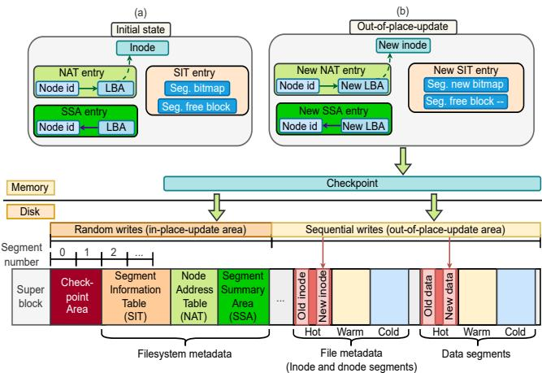  
Figure 1: Overview of F2FS.

• We have implemented a fully functional prototype of F2FSJ in Linux kernel. The source code and detailed evaluation have been released for public access [8].

## 2 Background and Motivation

## 2.1 F2FS Overview

F2FS manages storage space at the unit of segments (e.g., 2MB per segment) and divides the whole space into the random writes area (in-place-update) and the sequential writes area (out-of-place-update). As shown in Figure 1, the random writes area stores F2FS filesystem metadata with fixed on-disk locations, such as SIT, NAT and SSA. Specifically, SIT records bitmap of each segment; NAT maintains the mapping from node IDs to logical block addresses (LBA) for node pages; SSA stores the number of valid blocks and the mapping from block addresses to node IDs. The sequential writes area stores file metadata and data in an append-only pattern. Specifically, inodes and dnodes (LBA of data blocks) are stored in node segments and data blocks are stored in data segments. F2FS separates node blocks and data blocks with three static temperatures (hot, warm, and cold) to exploit IO parallelism [28–30, 42] of multiple flash channels.

At runtime, on-disk filesystem metadata, file metadata and data are loaded into memory as illustrated in Figure 1(a). Then file operations can be performed. For instance, we can look up inodes by querying NAT and modify in-memory SIT and SSA for space management of each segment. In the sequential writes area, file metadata/data are managed using out-of-place updates. For instance, as illustrated in Figure 1(b), for regular file operations (e.g., file data writes) that modify file metadata and data, the updated inode is put to a new LBA rather than the original location.

In-memory and on-disk data/metadata will become inconsistent as they are first changed in memory. For instance, in Figure 1(b), to write the updated inode to a new LBA, a new LBA needs to be allocated, for which the in-memory NAT/SIT/SSA entries will be changed first, while the old versions are kept in the on-disk NAT/SIT/SSA. Such in-memory modifications will be lost if a crash happens before checkpointing.

## 2.2 Three Journaling Modes

In filesystems, there are typically three journaling modes, each offering a different level of data consistency and recovery capacity, as follows: (1) The first is ordered journal mode, in which only metadata are journaled and data flushing strictly precedes committing metadata journals. Ordered journal mode can ensure data integrity once metadata journals are committed to disk. (2) The second is writeback journal mode, which only journals metadata but the order of data flushing and metadata journals committing is not strictly enforced. Writeback mode can improve performance compared to the ordered mode since data can be written to disk quickly. However, it may introduce a risk of data inconsistency in a crash, as there is a possibility that the metadata journals may reach the disk before flushed data. (3) The third is data journal mode, in which journals both data and metadata. This mode ensures both data and metadata consistency during recovery. However, it has a performance impact due to the additional overhead of journaling data. In this paper, we focus on ordered journaling mode, which is widely adopted in practice (e.g., it is the default journaling mode in EXT4 [24]).

## 2.3 F2FS Checkpointing and Problem

F2FS utilizes checkpointing for crash recovery. Checkpoints can be triggered by either the thresholds of dirty inmemory metadata (e.g., the cached NAT entries or dirty node pages exceed a setting ratio) or a timeout (e.g., 60 seconds by default). When a checkpoint is triggered, all write activities will be blocked until it is completed. During a checkpoint, in-memory file data, file metadata and filesystem metadata (i.e., NAT, SIT, and SSA) will be flushed to disk in order to form a checkpoint pack that is stored in the on-disk checkpoint area as a snapshot. Based on F2FS checkpointing, for crash recovery, F2FS can roll back to a consistent checkpoint with its roll-back recovery mechanism. There are three critical issues associated with F2FS checkpointing.

Problem 1: Time Overhead. We have conducted preliminary experiments to reveal the overheads with the experimental setup in §5.1. In the experiments, four benchmarks, mkdir, rmdir, create-4KB and unlink-4KB, from filebench [9], are utilized, which all contain intensive file operations on filesystem metadata and file metadata, and the total execution time, the checkpoint time are measured. Figure 2(a) shows the time breakdown of the average execution time for F2FS and F2FSJ. It can be observed that with F2FS, as checkpoints are frequently triggered with intensive filesystem/file metadata operations, the checkpoint time occupies a significant proportion of the total execution time, ranging from 37.2%, 17.2%, 47.3% to 44.2%. By contrast, F2FSJ, with its fine-grained journaling, can significantly reduce the total execution time

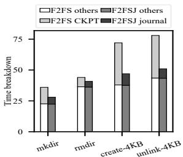  
(a) Average execution time (s).

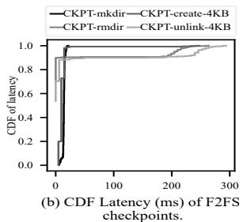

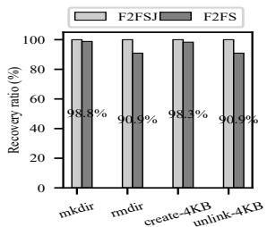  
(c) Recovery ratio.

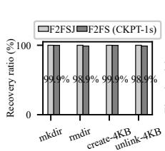  
(1) Recovery ratio.

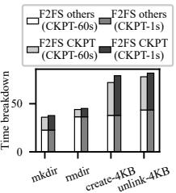  
(2) F2FS Average execution time (s).  
(d) Trade-off between recovery ratio and average execution time.

Figure 2: Preliminary experiments with the four benchmarks (mkdir, rmdir, create-4KB, unlink-4KB) from filebench, which contain intensive filesystem/file metadata operations. (a) Time breakdown of the average execution time for F2FS and F2FSJ. (b) CDF latencies of the F2FS checkpoints. (c) Recovery ratio comparison of F2FS and F2FSJ. (d) Trade-off between recovery ratio and average execution time: (1) Recovery ratio comparison of F2FS with the one-second checkpointing interval (denote as CKPT-1s) and F2FSJ; (2) Average execution time comparison of F2FS with the sixty-second and one-second checkpointing intervals (denote as CKPT-60s and CKPT-1s, respectively).  
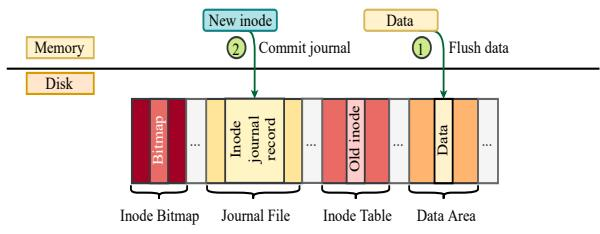  
(a) JBD2 in EXT4.

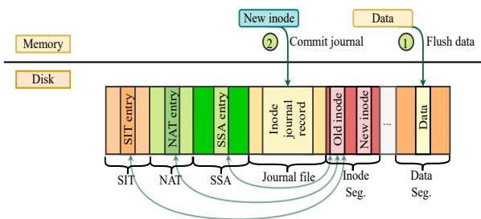  
(b) Only journal the inode for F2FS.  
Figure 3: Journaling in EXT4 and F2FS. (a) In EXT4, as on-disk inode locations are fixed, a changed inode can be first stored in the journal file and then applied or recovered to on-disk inode. (b) In F2FS, inode locations are not fxed due to out-of-place-updates, so by only journaling in-memory inodes, inodes cannot be correctly recovered due to outdated on-disk fliesystem metadata.

across the board.

Another critical issue for F2FS checkpointing is its long tail latency. Figure 2(b) shows the CDF (Cumulative Distribution Function) latencies of the F2FS checkpoints. For instance, the worst-case latency reaches to 247ms, 233ms, 293ms, 26ms for create-4KB, rmdir, unlink-4KB and mkdir, respectively, which is intolerable for user interaction or system responses.

Problem 2: Data and Metadata Loss. F2FS checkpointing is triggered by either the thresholds of dirty in-memory metadata or a timeout (e.g., 60 seconds by default), so only coarsegrained crash recovery can be performed and newly modified metadata and data are lost in a crash between two checkpoints. Note that in F2FS, fsync() will not trigger checkpoints for performance efficiency, so flushed file data could be lost. To demonstrate file data/metadata loss, we have conducted crash experiments for F2FS checkpointing and F2FSJ. Specifically, for F2FS, a sudden power failure is made after the last checkpoint is triggered, and for F2FSJ, at the same crash point, a power failure is made with poweroff [18]. Figure 2(c) shows the recovery ratio comparison of F2FS checkpointing and F2FSJ. It can be observed that F2FS with the default checkpointing interval (i.e., 60 seconds) incurs more data/metadata loss (up to 9.1%) compared with F2FSJ.

A simple solution to reduce data/metadata loss is to shorten the checkpointing interval, which, however, is a trade-off between metadata/data loss and performance degradation. As shown in Figure 2(d), when the checkpointing interval is set to one second, F2FS has less data/metadata loss (up to 1.1%). Nevertheless, it comes at the cost of the increased checkpointing execution time, i.e., the average execution time of checkpointing increases 12.2%, 14.5%, 21.2%, and 11.0% for the four benchmarks, respectively.

Problem 3: Inconsistency with Roll-forward Recovery. In F2FS, any persistent data or metadata beyond a checkpoint cannot be recovered in the event of a crash using its rollback recovery mechanism. To address this limitation, F2FS implements a roll-forward recovery mechanism [4, 14, 15], which tags inodes and dnodes in fsync and utilizes this tag information for data and metadata recovery. However, in nobarrier and POSIX fsync modes, the unordered nature of the I/O stack [16, 31, 40, 55] can lead to inconsistencies, as the persistence order of file data and its associated inode/dnode tags is not guaranteed. For instance, if the inode/dnode tags are successfully written while the corresponding file data fails to persist due to reordering, the recovered state may become inconsistent - resulting in a newer inode pointing to outdated data.

## 2.4 Motivaton

To address the above issues of F2FS checkpointing, we propose F2FSJ that is a journaling technique with fine-grained crash recovery. Next, we first present the problems with existing journal methods in designing F2FS journaling and then introduce new challenges for applying our metadata-changebased journaling method in F2FSJ.

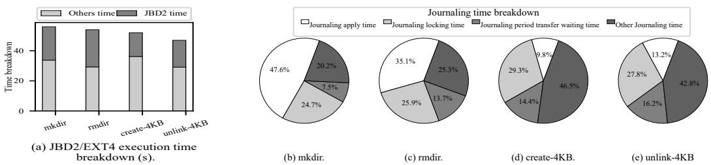  
Figure 4: Preliminary experiments with the four benchmarks (mkdir, rmdir, create-4KB, unlink-4KB) from filebench for comparing the execution time with time breakdown on JBD2 in EXT4 (a), and journaling time breakdown for (b) mkdir, (c) rmdir, (d) create-4KB, and (e) unlink-4KB.

## 2.4.1 Problems with Existing Journal Methods

While journaling methods are well-studied for in-placeupdate filesystems (such as JBD2 for EXT4) [35, 37, 41, 47, 48, 51, 54], directly applying these state-of-the-art techniques to F2FS does not yield similar benefits. Specifically, as illustrated in Figure 3(a), for EXT4, as an in-place-update flesystem, its on-disk inode locations are fixed, so a changed inode in memory can be first journaled and then correctly applied or recovered to on-disk inodes without filesystem metadata modification. By contrast, for F2FS, as its inodes and data are managed using out-of-place updates, inode locations are not fixed. Thus, as shown in Figure 3(b), by only journaling the inode, it cannot be correctly recovered as the corresponding on-disk filesystem metadata (e.g., SIT/NAT/SSA entries) are outdated. On the other hand, if we store both in-memory filesystem metadata and inodes in the journal file, it incurs more overheads than JBD2, since both filesystem metadata and inodes need to be written twice.

Another problem in existing journal methods is to journal changed metadata based on pages (blocks). For instance, even if only the file size information is updated in an inode, JBD2 will journal the whole 4KB page that stores the inode. This incurs both runtime and storage overheads. First, at runtime, subsequent file operations that operates on the page will be held up when a journal commit involving that page occurs. As shown in Figure 4 (a), the average execution time of JBD2 accounts for a significant portion, ranging from 39.7%, 45.7%, 30.3%, to 38.8% for the four benchmarks, respectively. Second, not only more space is occupied in journal files, but also garbage collection will be triggered earlier, during which journal commit will be blocked so extra runtime overheads are introduced. In the journaling, time breakdowns are shown in Figures 4(b), 4 (c), 4(d), 4(e), it can be observed that JBD2 apply, which operates on journal files, occupies a big portion of the total journaling time, e.g., about 47.6% and 35.1% in benchmarks mkdir and rmdir, respectively.

## 2.4.2 Challenges for Journaling Metadata Changes

Motivated by §2.4.1, in F2FSJ, we propose a metadatachange-based journaling policy, in which we only journal the changed part instead of the whole page for in-memory metadata. However, designing F2FS journaling with such a policy poses new challenges as follows: (1) Lock contention;

(2) Long waiting times during journal period transfers.

Challenge1: Intensive Locking. Existing journal methods utilize a centralized approach that leads to intensive locking contention. For instance, such an approach is employed by JBD2, in which a transaction is used to represent a journal period, and a global journal ticket (t\_updates) and a log list is maintained for journaling management. Once a file operation triggers data or metadata to be journaled, it must first obtain a journal ticket, and then add the data/metadata pages into the log list of the running transaction. Correspondingly, two locks are provided for mutually exclusive accesses for the journal ticket and the journal log list, respectively. Lock contention for them becomes one of the performance bottlenecks in JBD2 [53]. Figures 4(b), 4 (c), 4 (d), 4(e) show the time breakdown of the locking overheads, in which (1) j\_state\_lock is the lock contention time for the journal ticket; (2) j\_list\_lock is the lock contention time for the log list. It can be observed that such lock contention occupies 24.7%, 25.9%, 29.3%, 27.8% of the total journaling time for the four benchmarks, respectively. Instead, in F2FSJ, we adopt a decentralized approach by storing logs into each inode (i.e., via per-inode log lists), thus significantly mitigating lock contention and interference among inodes.

Challenge2: Long waiting Times During Journal Period Transfers. Existing journal designs like JBD2 couples the control and data planes, thus incurring long waiting times during journal period transfers. For instance, in JBD2, a new running transaction cannot be issued when the previous one starts to commit. The reason is that for each transaction, the data plane (the log list) and the control plane (e.g., journal ticket, journal committing, etc.) are coupled, so a new transaction (for generating new data in the data plane) must wait for the completion of the previous one (for committing in the control plane). As shown in Figures 4(b), 4(c), 4(d), 4(e), in JBD2, the waiting time for the journal period transfers occupies about 7.5%, 13.7%, 14.4%, 16.2% of the total journaling time, respectively. In F2FSJ, this is solved by our epoch-based approach with data/control-plane decoupling.

## 3 F2FSJ Design

## 3.1 Overview

F2FSJ incorporates several novel designs. First, we employ epochs to manage control plane journaling, which can effectively represent a journal period and decouple the control/data planes of journaling. Second, we adopt decentralized per-inode log lists to manage journaling data plane, by which metadata changes caused by file operations are inserted into corresponding per-inode log lists without intensive locking competition and inter-inode interference. Third, we propose an asynchronous journal commit mechanism that does not block ongoing file operations modifying the same metadata. Finally, we propose a fast-forward-to-latest journal applying scheme that can consolidate multiple small updates into one update for reducing small writes in journal apply.

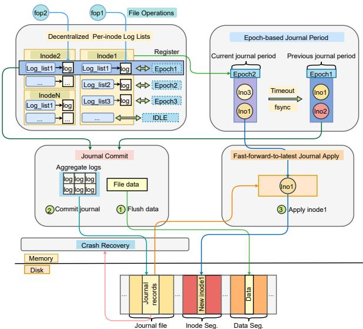  
Figure 5: Workflow Illustration of F2FSJ.

Figure 5 illustrates the workflow of F2FSJ. First, when file operations modify metadata, metadata changes are inserted into inode log lists as log records and the inode information related to the changes is registered into the epoch of the current journal period (e.g., Epoch2 in Figure 5). Second, when an fsync or timeout is invoked, a new journal period with a new epoch (e.g., Epoch2) is generated to accommodate new metadata changes, while the changes can be aggregated based on the inode information in the previous epoch (e.g., Epoch1) and then committed after data flushing. Third, on-disk journals can be applied in epoch order, in which we adopt a fastforward-to-latest approach by directly flushing in-memory metadata pages for the same metadata in logs. Finally, for crash recovery, we can replay on-disk journal records and reach to a consistent state.

## 3.2 Epoch-based Journaling

We use epochs to manage control plane journaling, and an epoch is represented with an ID that is a monotonically increasing number. Specifically, when an fsync or timeout is invoked, we will transfer to a new journal period with a new epoch and then the previous epoch can enter the commit phase. With a new epoch, for an inode, when its metadata changes occur for the first time in this epoch, its inode number is registered into the epoch (on the other side, in the inode, based on the e2l\_mapping table, with the epoch ID, the log list that stores metadata changes can be found as discussed in Section §3.3). In our implementation, inside an epoch, we utilize a linked list to record inode numbers and a lock is employed to ensure atomic inode registration. Note that for one epoch, inodes only need to register once (when its metdata changes occurs for the first time in this epoch). Thus, the lock contention overhead is negligible.

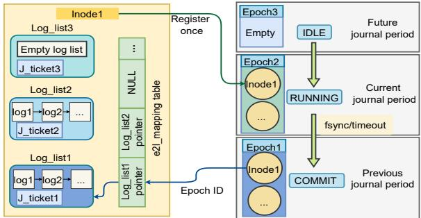  
Figure 6: Illustration of epoch-based journaling and per-inode log lists.

To align epochs with journal phases, each epoch has three states: (1) IDLE signifies availability for future journal periods without registered inodes; (2) RUNNING indicates that the epoch is being used for the current journal period; (3) COMMIT signifies that the epoch has entered the journal commit state. Specifically, as illustrated in Figure 6, each epoch maintains inode information, and the same inode can be registered in different epochs if it is involved in multiple journal periods. After inode registration, the logs can be efficiently stored in decentralized per-inode log lists. When an epoch is triggered to commit by fsync or timeout, it stops registering new inodes and transitions to the COMMIT state. Simultaneously, a new epoch is immediately issued for the next journal period, thus incurring negligible waiting times for journal period transfers.

There are three benefits of utilizing epoch. First, by decoupling the data/control planes, an epoch only records the inodes involved in journaling, while metadata changes are stored separately in the data plane (i.e., per-inode log lists, as discussed in Section §3.3). With such a design, lock contention can be effectively reduced due to the small-sized and simplified control plane. Second, based on the decoupled control/data planes, the new epoch for the next journal period can be issued immediately without having to wait for ongoing file operations belonging to the current epoch. Third, the ACID property [25] can be ensured in journal committing as the logs belonging to the same epoch can be committed as a single transaction.

## 3.3 Decentralized Per-inode Log Lists

In F2FSJ, decentralized per-inode log lists are utilized to efficiently manage journaling data plane. Specifically, when file operations modify the metadata of an inode (e.g., the file size), based on the modified parts (i.e., metadata changes), log records are generated and inserted into the corresponding log list in the inode. An inode may contain multiple log lists that are associated with different epochs, but only one log list is corresponding to the RUNNING epoch. Inside an inode, an epoch-to-log-list mapping table (i.e., e2l\_mapping) is maintained, so for a given epoch ID, its corresponding log list can be found, as illustrated in Figure 6.

Based on e2l\_mapping tables, we can do inode registration and store metadata changes as log records in per-inode log lists. Specifically, when inserting log records into an inode, based on the epoch ID of the RUNNING epoch, we first check the e2l\_mapping table of the inode. If this is the first time to insert log records for this inode in this epoch, NULL will be returned. In this case, we first register the inode number into the RUNNING epoch, and then create a new log list (e.g., implemented by a linked list) and put the list address (e.g., the head of the linked list) into the e2l\_mapping table, after which the log records can be inserted into the log list accordingly. Otherwise, if we can find the address of the log list from the e2l\_mapping table, log records can be directly inserted into the list.

In F2FSJ, for filesystem metadata such as SIT, NAT and SSA, their changes are stored into per-inode log lists as well. Specifically, when collecting and storing metadata changes of an inode, if they are related to file data (e.g., data allocation, data deletion, etc.), the fliesystem metadata changes associated with the file data (i.e., SIT and SSA entries) will be recorded into the log list by associating with the corresponding metadata changes of the inode. On the other hand, the filesystem metadata of an inode (i.e., NAT, SIT and SSA entries of the inode) will be appended to journal records during journal commit (discussed in Section §3.5). As such, in journal apply and crash recovery, with both file and filesystem metadata in journal records, we can reach to a consistent state.

During epoch transition (from RUNNING to COMMIT), to determine whether file operations have completed journaling, a counter (e.g., J\_ticket as shown in Figure 6) is associated with each log list, which represents the number of ongoing file operations. The commit thread can only aggregate the logs of a log list when the counter equals to zero.

Our design with decentralized per-inode log lists brings several benefits. First, it is convenient for log collection because each inode can naturally collect its own logs (i.e., metadata changes) in file-operation paths. Second, with our decentralized design, metadata changes are distributed to different inodes, thus eliminating the need for global locks in journaling data plane and significantly reducing lock contention and inter-inode interference. Third, the memory overhead is minimized as only metadata changes are journaled, and log lists are created on demand (only when metadata changes occur for inodes in epochs) and reclaimed after journal commit.

## 3.4 Non-blocking Journal Commit

COMMIT epochs are committed based on their commit order. Specifically, a journal commit process has two phases, namely, log aggregation and journal committing. In the first phase for log aggregation, log records are aggregated from the log list of each inode in the epoch for subsequent journal writes. Specifically, for each inode registered in the epoch, the commit thread locates the corresponding log list through e2l\_mapping using the COMMIT epoch ID. Subsequently, the logs are aggregated together by iterating through the log list. Finally, the SIT/NAT/SSA entries of this inode will be appended to the end of the aggregated logs.

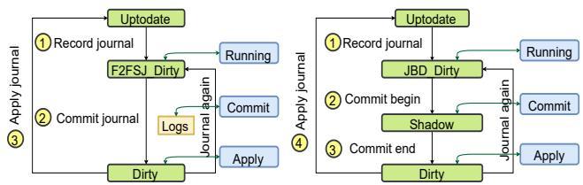  
(a) Page state changes in F2FSJ. (b) Page state changes in JBD2/EXT4. Figure 7: Journal process with page state changes.

The second phase is journal committing, by which aggregated logs in the first phase are written into an on-disk journal file with the following three steps. First, a journal descriptor block (JD) is written, which is a journal header that contains the metadata such as the epoch ID and the log-record length. Second, aggregated logs are persisted. Finally, a journal commit block (JC) is persisted to denote the completion of the journal committing. This three-step process can guarantee that all logs of one epoch can be applied or restored atomically.

In F2FSJ, we can provide non-blocking journal commit, meaning that journal committing does not block ongoing file operations that operate on the same metadata, since only metadata changes in log lists are journaled. By contrast, in JBD2, journaling is based on metadata pages that are locked during the DMA transfer in journal commit, so ongoing file operations on these metadata pages will be blocked.

## 3.5 Journal Apply

For journal apply, we adopt a fast-forward-to-latest approach, which can consolidate multiple small updates, caused by cross-epoch log records that operate on the same metadata, into one update. The key idea is to directly flush corresponding in-memory metadata instead of applying log records one by one. It consists of two components: (1) Journal process with page state changes, and (2) Fast-forward-to-latest journal apply, as follows.

Journal Process with Page State Changes. We propose a new journal process design with a new page flag so a page with “dirty” metadata can be kept in memory without being flushed by the kernel page cache manager. Specifically, in F2FSJ, each in-memory page has three states: (1) Uptodate that represents this page has the same content as its on-disk counterpart; (2) F2FSJ\_Dirty that represents this page has been modified and the changes have been recorded but not committed, while the data has not been flushed to disk; and (3) Dirty that represents this page has been modified and the changes have been committed but not applied, while the corresponding data has been flushed. The state changes are illustrated in in Figure 7(a). Particularly, the kernel page cache manger can only evict Uptodate pages, while it cannot do Dirty or F2FSJ\_Dirty pages. During journal apply, Dirty pages will be utilized for reducing small writes as shown next.

For ordered journal mode, data should be persisted before metadata. For F2FSJ\_Dirty metadata pages, their data have not been flushed, while after journal commit that happens after data flushing, metadata pages are changed to Dirty. Thus, Dirty metadata pages can be used for journal apply. Compared with JBD2, which uses two page states JBD\_Dirty (before journal commit) and Shadow (during journal commit for preventing ongoing file operations from modifying the committed metadata pages) as shown in Figure 7(b), F2FSJ only requires one state (i.e., F2FSJ\_Dirty), thus simplifying the design and implementation in journal apply.

Fast-forward-to-latest Journal Apply. In journal apply, following the commit order, for each journal record, by checking its corresponding in-memory metadata page, we perform as follows: (1) If the page is found in memory and its state is Dirty: we directly flush the Dirty page and subsequently altering its state to Uptodate; (2) If the page is not found in memory or the page state is Uptodate, we skip this record (based on our state changes, only Uptodate pages can be evicted so this is the case that its corresponding Dirty page has been flushed to disk); (3) If the page state is F2FSJ\_Dirty, we apply the journal record by updating its on-disk data accordingly. Note that in journal apply, after an inode is updated, the filesystem metadata of the inode (i.e. SIT, NAT and SSA) may need to be updated as shown in Figure 8. Conceptually, only two states - Dirty and Uptodate - may seem sufficient. However, an additional state, F2FSJ\_Dirty, is essential for implementing the fast-forward-to-latest approach. This state specifically indicates that an in-memory metadata page associated with a journal record is also involved in committing another ongoing journal record, making it unavailable for use. In such cases, the journal record in the journal file is applied directly, with the file data and metadata appended in F2FS.

An example is given in Figure 8. In Figure 8(a), we apply epoch1’s journal record as follows: (1) Read the epoch1’s journal record to memory and find that one log record of inode1 (i.e., 4KB file size) needs to be applied; (2) Use the inode number recorded in the log to find the in-memory Dirty inode1 (with 8KB file size); (3) Apply the in-memory Dirty inode1 to a new location to disk and change the page state of the in-memory inode1 to Uptodate; and (4) Update the corresponding NAT entry and write the new NAT entry to disk. In Figure 8(b), after applying epoch1’s journal, we apply epoch2’s journal record, in which after we read epoch2’s journal to memory and find that one log record of inode1 (8KB file size) needs to be applied, we use the inode number to locate the in-memory inode1 and find its state is Uptodate, then we skip applying this log and move to next epoch.

Journal apply is conducted following the commit order. Specifically, we always start with the current epoch indicated by the starting offset of the journal file that is recorded on disk. Only after all journal records of the current epoch have been applied, the offset can be updated so we can move to next epoch. Following this, with the unique characteristic in out-of-place-update file systems, i.e., old information will be kept without modification with out-of-place updates (e.g., Old inode1 is not replaced by New inode1 as shown in Figure 8), the fast-forward-to-latest approach does not incur inconsistency even with system crash. Journal apply is triggered and stopped based on the low and high watermarks based on the free space of the journal file. With a normal system shutdown, all journal records in the journal file will be applied before the close.

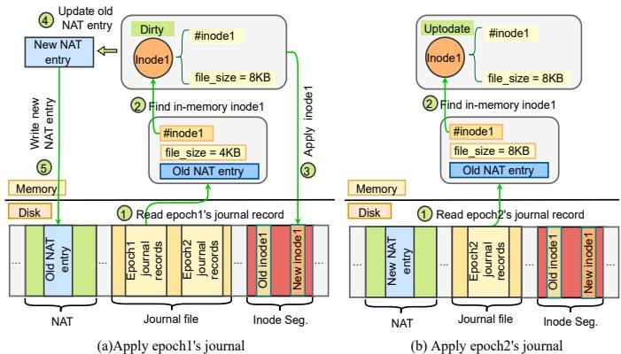  
Figure 8: Illustration of the fast-forward-to-latest journal apply.

## 3.6 Crash Recovery

Crash recovery will be performed when we find there are journal records that are not applied during system booting. Similar to journal apply, we read journal records from the journal file and apply them one by one. However, in contrast to journal apply, we can directly apply journal records without checking in-memory pages. Specifically, based on the filesystem metadata of an inode (i.e., the SIT/NAT/SSA entries) recorded in the journal file, we can locate and read the old inode to memory, apply metadata changes based on logs and then update the new inode and its SIT/NAT/SSA entries to disk.

In the event of a crash during journal apply, the out-ofplace-update mechanism in F2FS ensures that old data remains intact. This feature enables the filesystem to recover by replaying on-disk journals in epoch order, thereby maintaining data consistency and integrity. For instance, as illustrated in Figure 8(b), if a system crash occurs during epoch2, recovery will resume from epoch2. Using the filesystem and file metadata from epoch2’s journal records, the system can then restore a consistent state.

## 4 Implementation

We have implemented F2FSJ with minor modifications to F2FS with about 3,000 lines of code, summarized as follows.

First, we define various log types and structures for different file operations, which contain the type of file operations and the contents of metadata changes. We implement interfaces for logging and integrate them into file operations.

<table><tr><td rowspan=1 colspan=1>Categories</td><td rowspan=1 colspan=1>Name</td><td rowspan=1 colspan=1>Description</td></tr><tr><td rowspan=1 colspan=1>Metadata-intensiveworkloadswith Filebench [9]</td><td rowspan=1 colspan=1>mkdirrmdircreate-emptyunlink-empty</td><td rowspan=1 colspan=1>Create 4Mdirectories.Delete 4M directories.Create 4M empty files.Delete 4M empty files.</td></tr><tr><td rowspan=1 colspan=1>Small-file-intensiveworkloadswith Filebench</td><td rowspan=1 colspan=1>create-4KBunlink-4KBcopy-4KB</td><td rowspan=1 colspan=1>Create 4M 4KB-files.Delete 4M 4KB-files.Create and copy 2M 4KB-files.</td></tr><tr><td rowspan=1 colspan=1>Data-intensiveworkloadsfor a 32GB-filewith FIO [11]</td><td rowspan=1 colspan=1>Seq_writeRand_writeSeq_readRand_readSeqWR_WSeqWR_RRanWR_WRanWR_R</td><td rowspan=1 colspan=1>Sequentially write.Randomly Write.Sequentially read.Randomly read.Write bandwidth of mixed Sequential writes/reads.Read bandwidth of mixed Sequential writes/reads.Write bandwidth of mixed random write/reads.Read bandwidth of mixed random write/reads.</td></tr><tr><td rowspan=1 colspan=1>Realistic applicationswith Filebenchand APP commands</td><td rowspan=1 colspan=1>VarmailOLTPFileserverWebserverWebproxygit clonecp-rmake Linux</td><td rowspan=1 colspan=1>Frequently create and delete small files with fsync.Intensively write and append data to files.Intensively write and read small files.Intensively read small files with fewer writes.Intensively read small files with fewer writes and deletions.Download a remote 4.7GB code repository.Copy a local 3.9GB linux source code.Compile Linux with local source code.</td></tr><tr><td rowspan=1 colspan=1>Android workloadswith Mobibench [21]</td><td rowspan=1 colspan=1>TwitterFacebookSQlite</td><td rowspan=1 colspan=1>Replay I/O trace of Twitter.Replay I/O trace of Facebook.SQlite performance with varying journal mode.</td></tr></table>

Table 1: Benchmarks introduction.

Second, we modify struct f2fs\_inode\_info to implement per-inode log lists and e2l\_mapping mapping tables. Specifically, for each log list, we set a journal ticket counter to record ongoing file operations. We also use an array to implement the e2l\_mapping table and implement epochs with linked lists.

Third, we implement a kernel thread for journal commit that has a linked list for COMMIT epochs. We use another kernel thread for journal apply, which is triggered and stopped based on the low and high watermarks of the free journal space. Considering garbage collection (GC) may migrate inodes and data, thus changing the locations of old inodes, all journal records need to be applied before GC.

Finally, F2FSJ requires a contiguous disk area to store journal records, for which an on-disk journal file with a configurable size (e.g., 256 MB in our experiments) is created and utilized in round-robin fashion. During each epoch, metadata changes are collectively appended to the journal file, effectively avoiding random writes. Furthermore, by journaling only metadata changes instead of entire metadata pages, it significantly reduces write amplification.

## 5 Evaluation

In this section, we present evaluation results on F2FSJ and seek to answer the following questions: (1) Does F2FSJ eliminate the long tail latency of F2FS checkpointing? (2) Does F2FSJ provide better performance under various workloads than F2FS? (3) Does F2FSJ gain better performance compared with JBD2? (4) What are the overheads of memory, CPU and storage in F2FSJ?

## 5.1 Experiment Setup

Experiment Environment. All the experiments are performed on a desktop machine equipped with Intel’s i9-10850K CPU (19 cores running at 3.6 GHz), 64 GB DRAM and a

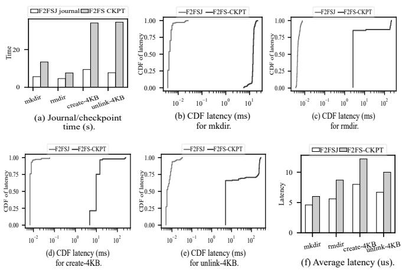  
Figure 9: Journaling and checkpointing time comparison with filebench: (a) The journal time of F2FSJ versus the checkpoint time of F2FS checkpointing. (b)-(e) CDF latency comparison between F2FSJ and F2FS checkpointing for mkdir, rmdir, create-4KB and unlink-4KB. (f) Average latency comparison between F2FSJ and F2FS checkpointing for mkdir, rmdir, create-4KB and unlink-4KB.

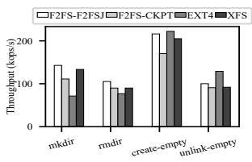

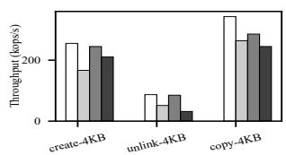

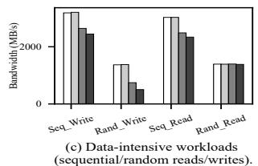

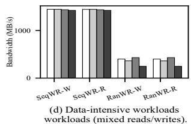  
Figure 10: End-to-end performance: Throughput comparison with filebench for (a) Metadata-intensive workloads and (b) Small-file-intensive workloads. Bandwidth comparison with FIO for (c) Data-intensive workloads and (d) Data-intensive workloads with mixed reads/writes.

256GB Samsung 980pro PCIe 4.0 NVMe SSD [27, 57] that can provide up to 7.0 GB/s and 5.0 GB/s throughput for sequential reads and sequential writes, respectively. Clearlinux with Linux kernel v5.15.39 [20] is used as operating system.

Experiment Benchmarks. As shown in Table 1, we categorize the benchmarks into five classes, all of which have different file and directory access patterns, ranging from metadata-intensive workloads, small-file-intensive workloads, data-intensive workloads, realistic applications and Android workloads.

For evaluation results, all the tests are started with a clean filesystem and all reported numbers are the mean of at least ten runs and the standard deviation in all cases is less than 5% of the mean. We use flame [12], perf [22], and bcc-tools (eBPF based) [3], Top [19] and Free [17] to measure and breakdown the experiment results.

## 5.2 Journal and Checkpoint Time Comparison

We begin by comparing journal time and checkpoint time. In this context, journal time in F2FSJ refers to the execution duration of journaling for a specific benchmark, while checkpoint time in F2FS checkpointing represents the execution duration of the checkpointing process. Next, we evaluate latency, where latency indicates the execution time of a single operation, and average latency reflects the mean execution time of all such operations within a given benchmark.

We use four filebench benchmarks: mkdir, rmdir, create-4KB, unlink-4KB. As shown in Figure 9(a), F2FSJ has the minimal time overhead. For instance, the checkpoint time with F2FS checkpointing is 2.4x, 1.7x, 3.6x, and 4.9x longer than the journaling time with F2FSJ across the four benchmarks. Additionally, in Figures 9(b)-9(e), F2FSJ significantly reduces tail latencies compared to F2FS checkpointing, with the latter exhibiting tail latencies that are three orders of magnitude higher. Finally, as shown in Figure 9(f), F2FSJ outperforms F2FS checkpointing in terms of the average latency (e.g., 23%, 35%, 13% and 33% reductions for mkdir, rmdir, create-4KB and unlink-4KB, respectively).

## 5.3 End-to-end Performance

In this section, we use a diverse set of workloads, along with the throughput (operations per second) and IO bandwidth (MB/second) metrics, to assess and compare the end-to-end performance of multiple filesystem combinations. These combinations include F2FS integrated with F2FSJ (referred to as F2FS-F2FSJ), F2FS utilizing its checkpointing mechanism (denoted as F2FS-CKPT), EXT4 in conjunction with JBD2 (simply called EXT4), and XFS with logical journaling (simply named XFS). In addition, filesystems are set to the default working mode. Specifically, F2FS operates in POSIX mode, EXT4 with JBD2 runs in ordered mode, and XFS is configured with metadata journaling and asynchronous transactions. We first evaluate end-to-end performance using microbenchmarks (§5.3.1) and real applications (§5.3.2). We then present the results for scalability (§5.3.3) and long-term/aged filesystem testing (§5.3.4).

## 5.3.1 Results with Micro-benchmarks

Metadata-intensive workloads. Figure 10(a) presents the throughput results. F2FS-F2FSJ outperforms F2FS-CKPT by 1.29x, 1.16x, 1.27x, 1.11x on mkdir, rmdir, create-empty and unlink-empty, respectively. For mkdir and rmdir, F2FS-F2FSJ (2.0x and 1.37x higher throughtput) and F2FS-CKPT (1.56x and 1.17x higher throughput) have better performance than EXT4. This is because EXT4 requires journaling 6 metadata pages for each create or delete operation, leading to more IO operations with more storage space. Additionally, file operations need to wait for JBD2 checkpoint in order to recycle space. But for create-empty and unlink-empty, EXT4 outperforms F2FS-F2FSJ (1.03x and 1.29x), because the longer query time on NAT is required in F2FS-F2FSJ and file operations will not be blocked by JBD2 checkpoint in EXT4. On the other hand, F2FS-F2FSJ outperforms XFS (i.e., 1.05x-1.17x higher throughput) for all benchmarks.

<table><tr><td rowspan=1 colspan=1>Name</td><td rowspan=1 colspan=1>Avg. filesize</td><td rowspan=1 colspan=1>Num.offiles</td><td rowspan=1 colspan=1>R/W/C/Uratio</td><td rowspan=1 colspan=1>Total fileoperations</td></tr><tr><td rowspan=1 colspan=1>Varmail</td><td rowspan=1 colspan=1>16 KB</td><td rowspan=1 colspan=1>1M</td><td rowspan=1 colspan=1>2:2:1:1</td><td rowspan=1 colspan=1>128.8K</td></tr><tr><td rowspan=4 colspan=1>OLTPFileserverWebserverWebproxy</td><td rowspan=1 colspan=1>10 MB</td><td rowspan=1 colspan=1>3.2k</td><td rowspan=1 colspan=1>1:10:0:0</td><td rowspan=4 colspan=1>33M1.1 M12.4 M3.8M</td></tr><tr><td rowspan=3 colspan=1>128KB16 KB16 KB</td><td rowspan=1 colspan=1>800k</td><td rowspan=2 colspan=1>1:2:1:110:1:0:0</td></tr><tr><td rowspan=1 colspan=1>1.6M</td></tr><tr><td rowspan=1 colspan=1>2M</td><td rowspan=1 colspan=1>5:1:1:1</td></tr></table>

Table 2: Filebench realistic workloads parameters. R/W/C/U represents the ratio of read, write, create and unlink, respectively.  
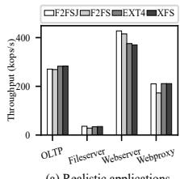  
(a) Realistic applications.

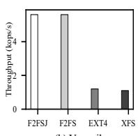  
(b) Varmail.

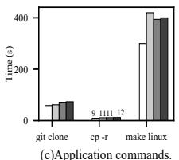  
Figure 11: Throughput comparison with filebench for (a) Realistic applications and (b) Varmail. (c) Time comparison with APP commands.

Small-file-intensive workloads. As shown in Figure 10 (b), F2FS-F2FSJ outperforms F2FS-CKPT by 1.14x, 1.69x and 1.30x on create-4KB, unlink-4KB and copy-4KB, respectively. Compared to EXT4, F2FS-F2FSJ demonstrates similar throughput to EXT4 in create-4KB and unlink-4KB. However, it outperforms EXT4 in copy-4KB, benefiting from F2FS’s inherent advantage in sequential read/write performance. Conversely, F2FS-F2FSJ consistently outperforms XFS across all tested scenarios, achieving 1.21x, 2.7x, and 1.40x higher throughput on create-4KB, unlink-4KB and copy-4KB, respectively. This advantage stems from F2FSJ’s decentralized journal architecture and its decoupled control and data planes.

Data-intensive workloads. As shown in Figure 10(c), for Seq\_write and Rand\_write, F2FS-F2FSJ drives IO bandwidth comparable with F2FS-CKPT. The reasons are that F2FS-F2FSJ incurs additional journal I/Os during data flush, and large file writes do not frequently trigger F2FS checkpoints. For Seq\_read and Ran\_read, F2FS-F2FSJ and F2FS-CKPT have almost the same bandwidth because large file read operations only modify one inode, resulting in negligible overhead for both journaling and checkpoint processes. Due to the appending nature, F2FS-F2FSJ and F2FS-CKPT have higher throughput than EXT4 and XFS on Seq\_write, Rand\_write and Seq\_read. For Ran\_read, all four filesystems exhibit the same bandwidth performance. Then, for mixed workloads in Figure 10(d), all four filesystems demonstrate similar bandwidth performance on SeqWR\_W and SeqWR\_R. Conversely, for RanWR\_W and RanWR\_R, F2FS-F2FSJ outperforms F2FS-CKPT, while EXT4 attains higher bandwidth than F2FS-F2FSJ due to interference on NAT in F2FS.

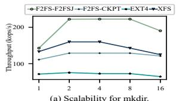  
(a) Scalability for mkdir.

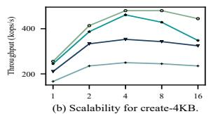  
Figure 12: Scalability comparison for (a) mkdir and (b) create-4KB.

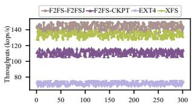  
(a) Long time testing for mkdir.

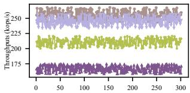

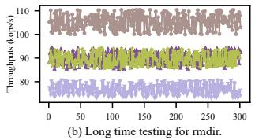

(c) Long time testing for create-4KB.  
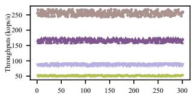  
(d) Long time testing for unlink-4KB.  
Figure 13: Long-term testing for (a) mkdir, (b) rmdir, (c) create-4KB and (d) unlink-4KB.

## 5.3.2 Results with Realistic Applications

Filebench workloads. Figures 11(a) and 11(b) shows the results with the filebench workloads. First, OLTP is a dataintensive workload and frequently invokes fdatasync, resulting in many I/Os to flush data. F2FS-F2FSJ has comparable throughput with F2FS-CKPT because checkpointing is not triggered frequently. Second, Fileserver is a small-file intensive workload, for which F2FS-F2FSJ shows 1.27x, 1.06x and 1.03x higher throughput than F2FS-CKPT, EXT4 and XFS, respectively. Then, Webserver primarily involves sequential read and write operations, for which F2FS-F2FSJ achieves 1.16x higher throughput compared to F2FS-CKPT, while both F2FS-F2FSJ and F2FS-CKPT demonstrate higher throughput than EXT4 and XFS due to F2FS’s log structured design. For Webproxy,which is characterized by a high volume of file deletion and creation operations across 100 threads, F2FS-F2FSJ achieves 1.10x higher throughput compared to F2FS-CKPT but has lower performance compared to EXT4 and XFS. This is due to significant locking overhead in the filesystem metadata of F2FS, particularly in NAT and SIT, which leads to reduced performance. Finally, Varmail calls fsync every time after writes, incurring many I/Os to storage. For F2FS-F2FSJ and F2FS-CKPT, their performances are adversely affected by the frequent occurrence of I/Os during data flushing. EXT4 and XFS exhibits the lowest throughput due to the time overhead of journal period transfer.

Real-world applications. Figure 11(c) presents the results from real applications, including git, cp and make. First, for git clone, F2FS-F2FSJ incurs the lowest time cost and is approximately 5%, 18.3% and 21% faster than F2FS-CKPT, EXT4 and XFS, respectively. Second, for cp -r and make linux, which involve numerous reads and the creation of small files and directories, F2FS-F2FSJ achieves shortest execution times compared to F2FS (14.0% and 22.1% reductions), EXT4 (18.8% and 23.% reductions), and XFS (22.2% and 25.0% reductions).

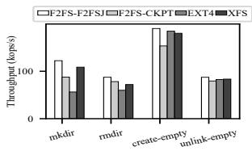  
(a) Metadata-intensive

workloads on aged system.  
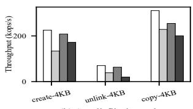  
(b) Small-file-intensive  
workloads on aged system.  
Figure 14: Throughput comparison on aged system for (a) Metadata-intensive workloads and (b) Small-file-intensive workloads.

## 5.3.3 Scalability

We use mkdir and create-4KB to evaluate the scalability of F2FS-F2FSJ, F2FS-CKPT, EXT4 and XFS by setting the thread number from 1 to 16. Figures 12(a) and 12(b) show the results. For mkdir, F2FS-F2FSJ has the best scalability and throughput (e.g., 1.72x, 2.96x and 1.38x higher than F2FS-CKPT, EXT4 and XFS with 2 threads). Moreover, the performance of all filesystems begins to degrade when the number of threads exceeds eight [32, 46, 49]. For create-4KB, F2FS-F2FSJ has the best scalability and throughput (e.g., 1.92x, 1.03x and 1.35x higher than F2FS-CKPT, EXT4 and XFS with 4 threads). Conversely, F2FS-CKPT has the worst scalability because of its time-consuming and single-threaded checkpointing process.

## 5.3.4 Long-term and Aged Filesystem Testing

For long-term testing, we use four benchmarks: mkdir, rmdir, create-4KB, and unlink-4KB. We extend the original benchmark runtime by a factor of 300 (exceeding six hours for each long-term test). As shown in 13(a)–(d), the throughput performance of each filesystem remains stable, with fluctuations occurring within a consistent range throughout the long-term evaluation. Overall, F2FS-F2FSJ sustains the best performance without any sudden drops.

Aged filesystem testing is conducted using the Geriatrix [34] tool to simulate real-world fragmentation by distributing files of varying sizes across the filesystem. To evaluate performance under these conditions, we employ metadata-intensive and small-file-intensive workloads. As shown in Figures 14(a) and (b), F2FS-F2FSJ consistently outperforms F2FS-CKPT in an aged system environment, achieving 1.1x to 1.7x higher throughput. Furthermore, F2FS-F2FSJ demonstrates superior performance compared to EXT4 and XFS, as fragmentation significantly increases I/O overhead in JBD2 and XFS logging. Specifically, fragmentation causes excessive inode dispersion on the disk, leading to a rise in the number of bitmap pages requiring journaling. In contrast, F2FSJ’s fine-grained journaling, which is based on metadata changes, remains unaffected by fragmentation.

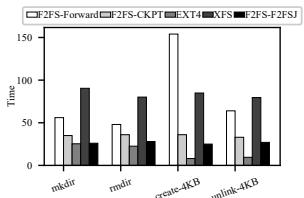  
(a) Recovery time (ms) comparison.

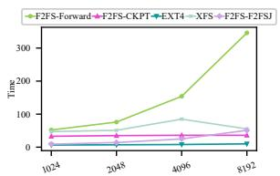  
(b) Recovery time (ms) with increasing files.  
Figure 15: Recovery time comparison for mkdir, rmdir, create-4KB and unlink-4KB: Recovery times for (a) creating or deleting 4,096 directories/files and (b) varying numbers of files.

## 5.4 Crash Recovery

In this section, we assess the crash recovery performance of various file systems and mechanisms, including F2FS-F2FSJ (F2FS with F2FSJ), EXT4 (EXT4 with JBD2), and XFS (XFS with its logging). Additionally, we evaluate F2FS-CKPT (F2FS with its default checkpointing and rollback recovery mechanism) and F2FS-Forward (F2FS with its roll-forward recovery mechanism).

Recovery time comparison. We utilize four benchmarks: mkdir, rmdir, create-4KB and unlink-4KB. Specifically, we create or delete 4,096 directories or files, then execute a checkpoint/journal commit, followed by a power failure. As shown in Figure 15(a), F2FS-F2FSJ reduces recovery time compared to F2FS-CKPT and F2FS-Forward. Under the create-4KB benchmark, F2FS-Forward has an unusually long recovery time. This is because it compares inodes before and after tagging to restore the data index, generating random I/Os that degrade performance. EXT4 has the shortest recovery time, as it writes back journaled metadata pages directly without reading the original metadata from the disk. In contrast, XFS has the longest recovery time because it replays the log twice - first to identify canceled items and then to process the remaining log entries while skipping the canceled ones.

Figure 15(b) shows the recovery time comparison across file numbers ranging from 1K to 8K. As observed, F2FS-CKPT maintains a stable recovery time of approximately 35ms, as it only restores a limited amount of filesystem metadata recorded in the checkpoint pack. Compared to F2FS-CKPT, F2FS-F2FSJ recovers faster when the file count is below 4K but experiences a 1.4x increase when handling 8K files. Additionally, F2FS-F2FSJ journal recovery significantly reduces recovery time - by 5.4x to 6.8x - compared to F2FS roll-forward recovery. Among all tested systems, EXT4 exhibits the shortest recovery time, as it only writes back journaled metadata pages without reading additional disk data. Meanwhile, XFS has a longer recovery time than both F2FS-F2FSJ and EXT4. Interestingly, when the file count reaches 8K, XFS recovery time decreases due to its proactive mechanism to apply certain log entries.

Crash consistency. We use CrashMonkey [43] to validate the correctness of F2FSJ recovery. Specifically, we evaluate rename workloads (renam\_root\_to\_sub) and create/delete workloads (create\_delete). The recovery results confirm that F2FS-F2FSJ successfully passes all test cases, demonstrating its consistency performance.

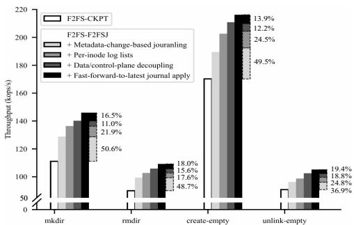  
Figure 16: Throughput breakdown of each F2FSJ component for Metadataintensive workloads.

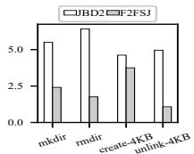  
(a) Journaling locking time (s).

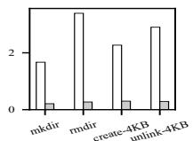  
(b) Journal period transfer waiting time (s).

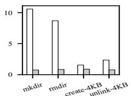  
(c) Journaling apply time (s).  
Figure 17: JBD2 and F2FSJ journaling time breakdown: (a) Journal locking time. (b) Journal period transfer waiting time. (c) Journal apply time.

## 5.5 Breakdown Analysis of F2FSJ

In this section, we present a breakdown analysis of F2FSJ. First, we examine the contributions of its four components to the filesystem. Next, we compare the journaling time breakdown of F2FSJ with JBD2. Finally, we assess the impact of varying journal periods.

Effects of individual F2FSJ components. We analyze the throughput breakdown of each F2FSJ component using metadata-intensive workloads to assess their contributions. Figure 16 presents the throughput results of F2FS-CKPT (F2FS with default checkpointing) and F2FS-FSFSJ (F2FS with F2FSJ), highlighting the impact of each F2FSJ component: metadata-change-based journaling, per-inode log lists, data/control-plane decoupling, and fast-forward-to-latest journal apply. Among the total performance improvement, on average, metadata-change-based journaling contributes the most (approximately 49%) by leveraging fine-grained journaling to delay journal application, thereby reducing file operation blocking time. Per-inode log lists effectively minimize locking overhead during log collection, leading to a performance gain of approximately 21%. Data/control-plane decoupling reduces journal period transfer waiting time, resulting in a performance improvement of about 14%. Lastly, fast-forward-to-latest journal apply eliminates the overhead of across-epoch metadata application, contributing approximately 16% to overall system performance enhancement.

Journaling time breakdown. First, as shown in Figure 17(a), the locking time of F2FSJ is significantly reduced compared to JBD2, reduced by 18.8% - 78.2%. Second, the waiting time for journal period transfers in F2FSJ is noticeably less than that of JBD2, reduced by 86.8% - 92.0% in Figure 17(b). Third, in Figure 17(c), F2FSJ significantly reduces journal applying time (reduced by 68.4% - 95.3%).

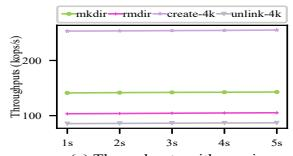  
(a) Throughputs with varying journal periods.

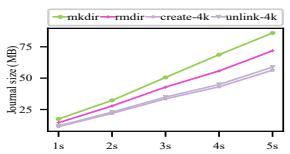  
(b) Average committed journal size with varying journal periods.

Figure 18: Throughput and journal size with varying journal periods.  
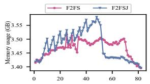  
(a) Memory usage with time (s).

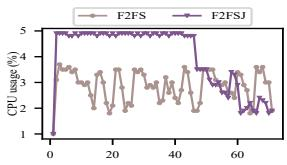  
(b) CPU usage with time (s).  
Figure 19: Overhead analysis: (a) Memory usage comparison. (b) CPU usage comparison.

Effects of varying journal periods. We evaluate the impact of varying journal periods on throughput and journal storage consumption. As shown in Figure 18(a), throughput across different benchmarks shows an increase (1.1%, 1.8%, 0.08%, and 1.6% for each benchmark) as journal periods extend from 1 second to 5 seconds, demonstrating that our decoupled control/data plane journal design imposes minimal overhead. In Figure 18(b), the average log size per journal commit exhibits an approximately linear increase, with maximum log sizes recorded at 85.9MB for mkdir, 71.8MB for rmdir, 56.4MB for create-4KB, and 58.8MB for unlink-4KB.

## 5.6 Overheads Analysis

In this section, we analyze the overheads associated with F2FSJ, specifically its impact on CPU usage, memory consumption, and storage utilization.

To assess CPU usage and memory consumption, we compare F2FSJ with F2FS checkpointing using create\_4KB, which requires the highest memory and CPU resources. As illustrated in Figure 19(a), the memory usage of F2FS checkpointing ranges from 3.45GB to 3.50GB during the test, whereas F2FSJ exhibits a higher range of 3.50GB to 3.55GB, reflecting a modest 1.4% increase compared to F2FS checkpointing. For CPU usage, as shown in Figure 19(b), F2FS checkpointing averages around 3%, while F2FSJ reaches approximately 4.8% during the test. Consequently, F2FSJ exhibits 1.8% increase in CPU usage compared to F2FS checkpointing, which remains negligible.

For storage utilization, we compare F2FSJ (F2FSJ with F2FS) and JBD2 (JBD2 with EXT4), as both employ journaling mechanisms. In all the experiments discussed above, F2FSJ allocates 256MB for its journal file, representing only 0.1% of the total 256GB SSD capacity. In contrast, JBD2 requires 1GB of storage due to its page-based journaling approach. By leveraging metadata-change-based journaling, F2FSJ reduces storage usage to 25% of that required by JBD2.

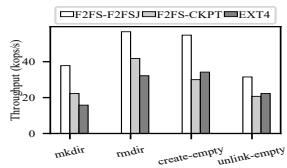  
(a) Metadata-intensive workloads.

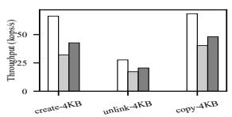  
(b) Small-file-intensive workloads.

Figure 20: Throughput comparison for (a) Metadata-intensive-workloads and (b) Small-file-intensive workloads on ARM embedded board.  
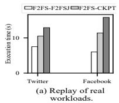

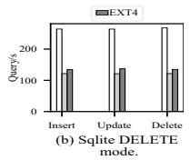

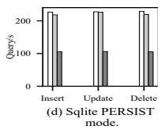

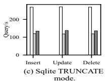

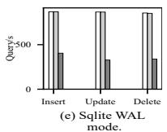

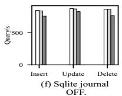  
Figure 21: Real application experiments with Mobibench on ARM embedded board: (a) Execution time comparison for Twitter and Facebook workloads. Sqlite performance comparison for (b) DELETE mode, (c) TRUNCATE mode, (d) PERSIST mode, (e) WAL mode and (f) Journal-off.

## 5.7 Evaluation on ARM Embedded Board

For a more comprehensive evaluation, we expand our experiments to include micro-benchmarks and real-world Android applications on an ARM embedded board (Rockchip RK3588S [23]). This board features 4 Cortex-A76 and 4 Cortex-A55 CPU cores (8nm), 16GB LPDDR4 memory, and 128GB eMMC storage [6], running Linux kernel v5.10 and Android version 12 [2]. Specifically, we first compare the endto-end throughput performance of F2FS-F2FSJ (F2FS with F2FSJ), F2FS-CKPT (F2FS with checkpointing), and EXT4 (EXT4 with JBD2) using micro-benchmarks. We then present results from Android applications, including execution time comparisons for Twitter and Facebook, as well as throughput comparisons for SQLite across different modes. Our evaluation shows that F2FSJ delivers superior performance improvements in micro-benchmark experiments compared to those observed in the desktop environment.

Metadata-intensive workloads. As shown in Figure 20(a), for metadata-intensive workloads, F2FS-F2FSJ significantly outperforms F2FS-CKPT by 1.70x, 1.36x, 1.83x and 1.52x and EXT4 by 2.39x, 1.76x, 1.60x and 1.41x for mkdir, rmdir, create-empty and unlink-empty, respectively.

Small-file-intensive workloads. As illustrated in Figure 20(b), F2FS-F2FSJ demonstrates significant throughput improvements compared to F2FS-CKPT, with gains of 2.06×, 1.60×, and 1.69× for create-4KB, unlink-4KB, and copy-4KB, respectively. Similarly, it outperforms EXT4 by 1.55×, 1.35×, and 1.42× for the same benchmarks.

Android workloads. First, F2FS-F2FSJ exhibits minimal time overhead for both Twitter and Facebook workloads, achieving time reductions of 28.5% and 47.3% compared to F2FS-CKPT, and 41.9% and 62.0% compared to EXT4, as shown in Figure 21(a). Next, we evaluate SQLite throughput performance in terms of queries per second across different journal modes. Specifically, in Figures 21(b) and 21(c), F2FS-F2FSJ outperforms F2FS-CKPT by up to 2.24× and EXT4 by up to 1.96× for Insert, Update, and Delete workloads under both the DELETE and TRUNCATE modes. For the PERSIST and WAL modes, F2FS-F2FSJ demonstrates comparable performance to F2FS-CKPT while achieving up to 2.17× improvement over EXT4, as depicted in Figures 21(d) and (e). Finally, in Figure 21(f), F2FS-F2FSJ and F2FS-CKPT exhibit similar performance when SQLite journaling is disabled.

## 6 Related Work

JBD2. JBD2 utilizes a centralized approach with data/control coupling, where each epoch is associated with a global ticket and a lock. During file operations’ journaling initiation/completion, acquiring the ticket lock to increment/decrement the ticket number is essential. Consequently, waiting times are inevitable during journal period transfers as the ticket lock must be obtained and the ticket number must become zero. In contrast, F2FSJ journals metadata changes in per-inode log lists, registering only the inode number in the epoch. Thus, it can issue the next epoch immediately during a journal period transfer without waiting for a global ticket.

NOVA. The per-inode log mechanism of NOVA [56] is tailored for NVM, which directly writes logs to the per-inode log area on NVM. In contrast, F2FSJ employs per-inode log lists for journaling, requiring different data organization and management mechanisms for log-structured filesystems.

WineFS. WineFS [33] is optimized for NVM. With undo journaling, it incurs more overheads for write transactions (i.e., record both old metadata/data); however, upon transaction completion, the associated logs can be discarded, eliminating the need for journal apply. This approach is effective for NVM, but slower I/O in flash storage may introduce more write overheads. In contrast, F2FSJ only journals metadata changes, enhancing journal write performance. Additionally, journal apply is not in the critical paths of data reads/writes, allowing it to be scheduled with minimal system impact.

BtrFS. Btrfs [50] optimizes updates to the copy-on-write trees [5] by journaling modified data and metadata related to a specific file in a dedicated log-tree. In contrast, in F2FSJ, we aim to design a novel journaling mechanism so as to provide fine-grained crash recovery for F2FS with different log organization and management schemes.

NV\_LOG. NV\_LOG [26] is a logging mechanism based on NVRAM (Non-Volatile Random Access Memory), which is not currently utilized in read-world products. In contrast, F2FSJ focuses on typical usage scenarios, offering a universal journaling approach tailored for flash storage devices.

I-journaling. I-journaling [48] enhances fsync performance through a hybrid journaling approach that combines JBD2 transactions with I-transactions. Per-CPU core Itransactions handle fsync operations, including the necessary metadata logs for crash recovery, while JBD2 transactions manage other file operations. This reduces fsync latency by committing I-transactions but still suffers from JBD2’s locking overhead and extended journal transfer periods for nonfsync operations. In contrast, F2FSJ addresses these JBD2 limitations by employing a decentralized design and an epochbased journaling mechanism, effectively eliminating locking overhead and journal transfer delays.

Z-journal. Z-journal [38] resolves JBD2’s scalability challenges by introducing per-core journaling, allowing each CPU core to maintain its own transaction and using coherence commits for transactions that modify the same metadata pages. In contrast, F2FSJ separates journal data and control planes through per-inode log lists and epochs, achieving superior scalability and avoiding contention for journal operations on the same CPU core. Additionally, F2FSJ registers inodes into epochs, maintaining consistency without requiring complex coherence commits.

Fast-commit. Fast-commit [52] improves fsync performance and reduces I/O overhead in cloud environments by employing a hybrid journaling approach. JBD2 commits periodically (e.g., every 5 seconds), while Fast-commit logically journals filesystem updates within these intervals. It centralizes inode and dentry lists for journaling and uses compact logging to minimize journal size. However, as JBD2 continues running in the background, Fast-commit cannot fully eliminate JBD2’s overhead and primarily optimizes fsync performance. In contrast, F2FSJ mitigates I/O overhead by journaling only metadata changes. Its decoupled data/control plane design enables fast journal period transfers, offering a more efficient solution than Fast-commit’s hybrid approach.

## 7 Conclusion

In this paper, we propose a novel journaling technique, called F2FSJ, for F2FS with ordered journal mode. F2FSJ eliminates the long tail latency of checkpoint and provides fine grained crash recovery. F2FSJ incorporates several innovative designs. First, it only journals the metadata changes to reduce I/O and storage overheads. Second, it employs a decentralized journal design featuring per-inode log lists to minimize lock contention and interference. Third, it advocates an epoch-based strategy with decoupled data/control planes to eradicate waiting times during journal period transfer. Finally, it uses fast-forward-to-latest journal apply to consolidate multiple small writes. Evaluation results indicate that F2FSJ outperforms F2FS checkpointing.

## Acknowledgments

We thank our shepherd, Kiran-Kumar Muniswamy-Reddy, and the anonymous reviewers for their constructive feedback and insightful comments. The work described in this paper is supported by the grants from the Research Grants Council of the Hong Kong Special Administrative Region, China (GRF 14202123, GRF 14200224).

## References

[1] Android devices shut down in freezing weather. https://www.the-sun.com/tech/10094443/androidshutdown-keep-running-battery-cold-snow-weather.

[2] Android system wiki. https://en.wikipedia.org/wiki/ Android\_(operating\_system).

[3] Bpf compiler collection. https://github.com/iovisor/bcc.

[4] Code comments of three scenarios cannot be rollforwarded recovered of fsync in f2fs/recovery.c. https://git.kernel.org/pub/scm/linux/kernel/git/jaegeuk/ f2fs.git/.

[5] Copy-on-write wiki. https://en.wikipedia.org/wiki/ Copy-on-write.

[6] Emmc wiki. https://en.wikipedia.org/wiki/ MultiMediaCard#eMMC.

[7] Ext4 wiki. ext4 disk layout. https://ext4.wiki.kernel.org/ index.php/Ext4\_Disk\_Layout.

[8] F2FSJ source code. https://github.com/10033908/F2FS-J.

[9] Filebench website. https://github.com/filebench/ filebench.

[10] Filesystems supportted by android. https: //source.android.com/docs/core/architecture/androidkernel-file-system-support.

[11] Fio documents. https://fio.readthedocs.io/en/latest/ fio\_doc.html.

[12] Flame graph. https://www.brendangregg.com/ flamegraphs.html.

[13] Freezing weather can harm your phone. https://metro.co.uk/2024/01/17/iphone-androidbattery-warning-issued-uk-users-20127874.

[14] fsync in linux man page. https://man7.org/linux/manpages/man2/fsync.2.html.

[15] Fsync introduction. https://pubs.opengroup.org/ onlinepubs/009695399/functions/fsync.html.

[16] Introduction of f2fs fsync mode. https: //www.kernel.org/doc/Documentation/filesystems/ f2fs.txtl.

[17] Introduction of free command. https://man7.org/linux/ man-pages/man1/free.1.html.

[18] Introduction of poweroff command. https://man7.org/ linux/man-pages/man8/halt.8.html.

[19] Introduction of top command. https://man7.org/linux/ man-pages/man1/top.1.html.

[20] Linux source code. https://www.kernel.org/.

[21] Mobibench. https://github.com/ESOS-Lab/Mobibench.

[22] perf: Linux profiling with performance counters. https: //perf.wiki.kernel.org/index.php/Main\_Page.

[23] Product specification document of rk3588s. https: //www.t-firefly.com/product/industry/rocrk3588spc.

[24] Three journal modes for jbd2. https://www.kernel.org/ doc/html/latest/filesystems/ext4/journal.html.

[25] What are acid transaction? https://www.databricks.com/ glossary/acid-transactions.

[26] Write anywhere file layout. https://en.wikipedia.org/ wiki/Write\_Anywhere\_File\_Layout.

[27] ALCORN, P. . Samsung releases new 12 gb/s sas, m.2aic and 2.5 nvme ssds: 1 million iops, up to 15.63 tb. http://www.tomsitpro.com/articles/samsungsm953- pm1725-pm1633-pm1633a,1-2805.html, 2013.

[28] BJØRLING, M., AXBOE, J., NELLANS, D., AND BON-NET, P. Linux block io: introducing multi-queue ssd access on multi-core systems. In Proceedings of the 6th international systems and storage conference (2013), pp. 1–10.

[29] CHEN, F., HOU, B., AND LEE, R. Internal parallelism of flash memory-based solid-state drives. ACM Transactions on Storage (TOS) 12, 3 (2016), 1–39.

[30] CHEN, F., LEE, R., AND ZHANG, X. Essential roles of exploiting internal parallelism of flash memory based solid state drives in high-speed data processing. In 2011 IEEE 17th International Symposium on High Performance Computer Architecture (2011), IEEE, pp. 266–277.

[31] CHIDAMBARAM, V., SHARMA, T., ARPACI-DUSSEAU, A. C., AND ARPACI-DUSSEAU, R. H. Consistency without ordering. In FAST (2012), vol. 12, pp. 101– 116.

[32] EQBAL, R. ScaleFS: A multicore-scalable file system. PhD thesis, Massachusetts Institute of Technology, 2014.

[33] KADEKODI, R., KADEKODI, S., PONNAPALLI, S., SHIRWADKAR, H., GANGER, G. R., KOLLI, A., AND CHIDAMBARAM, V. Winefs: a hugepage-aware file system for persistent memory that ages gracefully. In Proceedings of the ACM SIGOPS 28th Symposium on Operating Systems Principles (2021), pp. 804–818.

[34] KADEKODI, S., NAGARAJAN, V., AND GANGER, G. R. Geriatrix: Aging what you see and what you {don’t} see. a file system aging approach for modern storage systems. In 2018 USENIX Annual Technical Conference (USENIX ATC 18) (2018), pp. 691–704.

[35] KIM, D., MIN, K., OH, J., AND WON, Y. {ScaleXFS}: Getting scalability of {XFS} back on the ring. In 20th USENIX Conference on File and Storage Technologies (FAST 22) (2022), pp. 329–344.

[36] KIM, J. f2fs: introduce flash-friendly file system. https: //lwn.net/Articles/518718/.

[37] KIM, J., CAMPES, C., HWANG, J.-Y., JEONG, J., AND SEO, E. {Z-Journal}: Scalable {Per-Core} journaling. In 2021 USENIX Annual Technical Conference (USENIX ATC 21) (2021), pp. 893–906.

[38] KIM, J., CAMPES, C., HWANG, J.-Y., JEONG, J., AND SEO, E. {Z-Journal}: Scalable {Per-Core} journaling. In 2021 USENIX Annual Technical Conference (USENIX ATC 21) (2021), pp. 893–906.

[39] LEE, C., SIM, D., HWANG, J., AND CHO, S. {F2FS}: A new file system for flash storage. In 13th USENIX Conference on File and Storage Technologies (FAST 15) (2015), pp. 273–286.

[40] LEE, E., SON, I., AND KIM, J.-S. An efficient order-preserving recovery for f2fs with zns ssd. In Proceedings of the 15th ACM Workshop on Hot Topics in Storage and File Systems (2023), pp. 116–122.

[41] LU, L., ARPACI-DUSSEAU, A. C., ARPACI-DUSSEAU, R. H., AND LU, S. A study of linux file system evolution. ACM Transactions on Storage (TOS) 10, 1 (2014), 1–32.

[42] MAO, B., WU, S., AND DUAN, L. Improving the ssd performance by exploiting request characteristics and internal parallelism. IEEE Transactions on Computer-Aided Design of Integrated Circuits and Systems 37, 2 (2017), 472–484.

[43] MARTINEZ, A., AND CHIDAMBARAM, V. {CrashMonkey}: A framework to automatically test {File-System} crash consistency. In 9th USENIX Workshop on Hot Topics in Storage and File Systems (HotStorage 17) (2017).

[44] MATHUR, A., CAO, M., BHATTACHARYA, S., DILGER, A., TOMAS, A., AND VIVIER, L. The new ext4 filesystem: current status and future plans. In Proceedings of the Linux symposium (2007), vol. 2, Citeseer, pp. 21– 33.

[45] MATHUR, A., CAO, M., AND DILGER, A. ext4: the next generation of the ext3 file system. Usenix Association 32, 3 (2007), 25–30.

[46] MIN, C., KASHYAP, S., MAASS, S., AND KIM, T. Understanding manycore scalability of file systems. In 2016 USENIX Annual Technical Conference (USENIX ATC 16) (2016), pp. 71–85.

[47] OH, J., YOO, S. W., NAM, H., MIN, C., AND WON, Y. {CJFS}: Concurrent journaling for better scalability. In 21st USENIX Conference on File and Storage Technologies (FAST 23) (2023), pp. 167–182.

[48] PARK, D., AND SHIN, D. {iJournaling}:{Fine-Grained} journaling for improving the latency of fsync system call. In 2017 USENIX Annual Technical Conference (USENIX ATC 17) (2017), pp. 787–798.

[49] PARK, J., HWANG, T., CHOI, J., MIN, C., AND WON, Y. {LODIC}: Logical distributed counting for scalable file access. In 2021 USENIX Annual Technical Conference (USENIX ATC 21) (2021), pp. 907–921.

[50] RODEH, O., BACIK, J., AND MASON, C. Btrfs: The linux b-tree filesystem. ACM Transactions on Storage (TOS) 9, 3 (2013), 1–32.

[51] SELTZER, M. I., GANGER, G. R., MCKUSIC, M. K., SMITH, K. A., SOULES, C. A., AND STEIN, C. A. Journaling versus soft updates: Asynchronous meta-data protection in file systems. In 2000 USENIX Annual Technical Conference (USENIX ATC 00) (2000).

[52] SHIRWADKAR, H., KADEKODI, S., AND TSO, T. {FastCommit}: resource-efficient, performant and costeffective file system journaling. In 2024 USENIX Annual Technical Conference (USENIX ATC 24) (2024), pp. 157–171.

[53] SON, Y., KIM, S., YEOM, H. Y., AND HAN, H. {High-Performance} transaction processing in journaling file systems. In 16th USENIX Conference on File and Storage Technologies (FAST 18) (2018), pp. 227–240.

[54] SWEENEY, A., DOUCETTE, D., HU, W., ANDERSON, C., NISHIMOTO, M., AND PECK, G. Scalability in the xfs file system. In USENIX Annual Technical Conference (1996), vol. 15.

[55] WON, Y., JUNG, J., CHOI, G., OH, J., SON, S., HWANG, J., AND CHO, S. {Barrier-Enabled}{IO} stack for flash storage. In 16th USENIX Conference on File and Storage Technologies (FAST 18) (2018), pp. 211–226.

[56] XU, J., AND SWANSON, S. {NOVA}: A log-structured file system for hybrid {Volatile/Non-volatile} main

memories. In 14th USENIX Conference on File and Storage Technologies (FAST 16) (2016), pp. 323–338.

[57] XU, Q., SIYAMWALA, H., GHOSH, M., SURI, T., AWASTHI, M., GUZ, Z., SHAYESTEH, A., AND BAL-AKRISHNAN, V. Performance analysis of nvme ssds and their implication on real world databases. In Proceedings of the 8th ACM International Systems and Storage Conference (2015), pp. 1–11.