USENIX

THE ADVANCED COMPUTING SYSTEMS ASSOCIATION

# Kamino: Efficient VM Allocation at Scale with Latency-Driven Cache-Aware Scheduling

David Domingo, Rutgers University; Hugo Barbalho and Marco Molinaro, Microsoft Research; Kuan Liu, Abhisek Pan, David Dion, and Thomas Moscibroda, Microsoft Azure; Sudarsun Kannan, Rutgers University; Ishai Menache, Microsoft Research

https://www.usenix.org/conference/osdi25/presentation/domingo

# This paper is included in the Proceedings of the 19th USENIX Symposium on Operating Systems Design and Implementation.

July 7–9, 2025 • Boston, MA, USA

ISBN 978-1-939133-47-2

Open access to the Proceedings of the 19th USENIX Symposium on Operating Systems Design and Implementation is sponsored by

# Kamino: Efficient VM Allocation at Scale with Latency-Driven Cache-Aware Scheduling

David Domingo∗ Rutgers University

Abhisek Pan Microsoft Azure

Hugo Barbalho Microsoft Research

David Dion Microsoft Azure

Marco Molinaro Microsoft Research

Thomas Moscibroda Microsoft Azure

Kuan Liu Microsoft Azure

Sudarsun Kannan Rutgers University

Ishai Menache Microsoft Research

## Abstract

In virtual machine (VM) allocation systems, caching repetitive and similar VM allocation requests and associated resolution rules is crucial for reducing computational costs and meeting strict latency requirements. While modern allocation systems distribute requests among multiple allocator agents and use caching to improve performance, current schedulers often neglect the cache state and latency considerations when assigning each new request to an agent. Due to the high variance in costs of cache hits and misses and the associated processing overheads of updating the caches, simple load-balancing and cache-aware mechanisms result in high latencies. We introduce Kamino, a high-performance, latencydriven and cache-aware request scheduling system aimed at minimizing end-to-end latencies. Kamino employs a novel scheduling algorithm grounded in theory which uses partial indicators from the cache state to assign each new request to the agent with the lowest estimated latency. Evaluation of Kamino using a high-fidelity simulator on large-scale production workloads shows a 42% reduction in average request latencies. Our deployment of Kamino in the control plane of a large public cloud confirms these improvements, with a 33% decrease in cache miss rates and 17% reduction in memory usage.

## 1 Introduction

Large cloud providers invest billions of dollars in infrastructure to accommodate the growing demand for different forms of virtual machines (VMs) [16]. The VM allocation systems, which assign VM requests to the physical hardware, are therefore considered critical in the cloud stack. These systems are designed to satisfy two main goals: (i) complete the VM assignment within a stringent latency upper bound (in the order of tens of milliseconds); (ii) achieve “high quality" allocations, which accounts for a variety of provider and customer preferences; one example here is placing the VMs in a way that servers are highly utilized, which leads to high infrastructure Return of Investment (ROI) [16]. Unfortunately, these two design goals are inherently at odds as high-quality allocations require considering numerous objectives and constraints that must be evaluated over huge inventories (e.g., hundreds of thousands of servers). This typically makes the process computationally intensive [13, 31, 36], and a potential bottleneck at high-load scenarios [6, 16].

Cloud providers have dedicated substantial efforts to sustaining low VM allocation latencies without giving up on adequate quality. One standard approach is to utilize multiple allocation agents (or instances) over the same hardware inventory (e.g., an availability zone). A common design choice is to include multiple such allocator agents (henceforth referred to as AA) in a single node (a physical server) and further scale out by using multiple nodes [16, 36, 41]. Intra-node scaling of AAs exploits multicore parallelism and reduces the communication, consistency, and resource usage overheads that arise from scaling AAs across multiple nodes. This paper focuses on the mechanism for deciding which AA should be assigned to handle each incoming request.

In addition to having multiple AAs, a complementary approach to reduce latency and increase throughput when resolving allocation requests is to employ in-memory caching. State-of-the-art VM allocators, such as those employed in Azure, use a domain-specific caching layer [16, 41, 43]. However, unlike traditional caches that store only data objects, VM allocators store a combination of rules with fully or partially computed inventory state and a preferred set of servers for each allocation request type. Additionally, each cache entry size can vary from 10 to 100 MB, which enforces limits on the number of in-memory cache slots. A cache hit involves a combination of cache lookups and minor computations. In contrast, a cache miss might increase the latency to hundreds of milliseconds due to computational and data access costs, which vary significantly based on the complexity of allocation request types. Finally, some VM allocators use private AA caches to avoid concurrency control and synchronization overheads [16].

A key limitation of the state-of-the-art VM allocator designs is the lack of synergy between scheduling a request to an AA and the underlying caching mechanism. More precisely, state-of-the-art VM allocators resort to standard load balancing techniques [16, 43], where requests are scheduled to an AA even if the request type does not reside in the AA’s cache. The schedulers use simple strategies such as round-robin, work-stealing, uniform random assignment, or more complex hashing-based approaches to balance requests across the AA. Unfortunately, these strategies might lead to cache misses and computational overheads at production scale, with thousands of request types over a large inventory of up to hundreds of thousands servers, resulting in excess allocation latencies.

A different approach is to take inspiration from other domains, such as processor caches [26], content delivery networks (CDNs) [48], and storage caching [4], to design cacheaware request scheduling to the AAs. A plausible cache-aware scheduling policy would send requests of the same type to the same set of AAs. However, such simple cache-aware scheduling results in the following critical challenges: 1 Popular requests in certain workloads could create hot spots by scheduling requests to the same AA, increasing queuing delays and raising both average and tail latency. 2 A distinct challenge specific to VM allocators is that caches are generally hierarchical, with a smaller top-level cache that stores the information about the request type and a lower-level cache whose content may be consumed by different request types. Consequently, it is hard to a-priori estimate the resulting outcome of assigning a request to an AA; for example, partial hits are common, latencies are highly variable as a function of the request type, cache state, and system load, and different parts of that cache require more processing time to get up-to-date.

In view of the above challenges, we design and implement Kamino – a hybrid latency- and cache-aware VM allocation request scheduling framework for minimizing end-to-end request latency. At a high level, each AA is augmented with a request queue, and Kamino assigns each request to one of the queues based on latency considerations. The underlying algorithmic problem turns out to be a generalization of the classical problem of optimal online job scheduling for latency minimization [5], which is known to be notoriously hard in theory [5, 7]. Intuitively, our problem is even harder than the classical one because now the requests’ processing times are not fixed and depend on which information is in the cache, which in turn depends on the scheduler’s previous decisions. Nonetheless, the theoretical conceptualization allows us to design our scheduling algorithm based on first principles. We design a novel hybrid algorithm called LatCache, a latencydriven request scheduling algorithm that estimates latency even with access to only a set of partial indicators such as the type of requests in each queue and their cache hit predictions.

At its core, the key insight of the LatCache algorithm is to estimate the request latency within the target AAs’ queues based on estimated processing time of the requests in each queue, and assign a new request to the queue where the endto-end latency (queuing time + processing time) would be minimal. The processing time estimates are derived by an efficient analysis of the current cache state and how the queued requests effect the cache state as they are processed. This enables Kamino to dynamically adapt to any arrival pattern, while exploiting the AA caches (§2.2.1). While cache-aware load-balancing has been applied in previous works (see §7), a key novelty in our approach is considering the cache state, and in particular cache hit rates, as only one of the components contributing to end-to-end request latency, which is our actual metric of interest. Thus, we need to combine the state of different components (e.g., cache and queue) to efficiently estimate the request latency on the fly, also taking into account our hierarchical cache structure.

We implement and validate the effectiveness of Kamino and LatCache, first through high-fidelity simulations and then on Azure’s production control plane. Kamino’s architecture preserves a clear separation between the internal logic of VM assignments to physical machines and LatCache to isolate frequent modifications of the former. To sustain high throughput, we pipeline individual stages of Kamino, such as the request classification and queue assignment.

We compare Kamino against state-of-the-art techniques, including Protean, Azure’s VM allocation system, and consistent hashing, which is widely used for workload balancing in other distributed systems [47]. Our simulation using multiregion production allocation traces indicate that Kamino obtains an average 42% reduction in latency over the latency agnostic scheduler. As a by product, LatCache accommodates up to 2x more throughput, which is especially significant in bursty load periods.

We deployed Kamino with a simple version of the Lat-Cache algorithm in all production zones (with up to hundreds of thousands of machines each), reducing allocation latency by 11.9% at the 90th percentile and reducing cache misses by 33%. Additionally, the memory footprint per AA is reduced by up to 17%, enabling more AAs and other services per control-plane machine.

In more detail, the practical significance of these improvements is the following: the tail latency reduction ensures that resource provisioning remains reliable, especially for latency-sensitive workloads like data analytics platforms, online gaming, and virtual desktops. High tail latency in VM allocation can delay autoscaling, causing unpredictable instance availability and degrading application performance. The improved cache miss rate reduces the number of machines required for AA, which decreases contention and communication overheads, and in turn conflicts and retries in the allocation system. This results in more efficient request handling and overall system stability. The AAs run in ringfenced control plane nodes instead of the general cloud fleet for better predictability and security, and share resources with hundreds of other control-plane microservices. Thus, having resource efficiency solutions, specifically memory efficiency, is critical.

The combined improvements in latency, throughput and resource consumption are enabling Azure to consistently serve hundreds of thousands VM requests in a zone, while freeing up compute for a growing number of other control-plane services.

Beyond VM allocators, we believe that our approach can extend to systems with variable request latencies, including Log-Structured Merge Trees (LSMs), distributed databases, content delivery networks (CDNs), and microservices architectures. Indeed, we conducted preliminary experiments employing latency and cache-centric mechanisms in an LSMbased key-value store. By accounting for the differing request latencies and locality awareness across multiple levels (as in Kamino), our results show a reduction in the overall request latencies (§A.1).

In summary, we make the following contributions:

• We provide a detailed analysis of the challenges in handling VM allocation requests at scale, zooming-in on issues related to latency and resource consumption.

• We propose novel latency- and cache-aware (LatCache) request scheduling algorithms that are theoretically sound and are based on careful estimation of latencies based on cache and queue state.

• We realize the algorithms by designing and implementing the Kamino framework. We first develop a high-fidelity request scheduling simulator and subsequently deploy the scheduling framework in production zones.

• We evaluate the benefits and implications of Kamino through an exhaustive simulation study of various plausible algorithmic approaches, followed by measurements from our large-scale production zones.

## 2 Background and Motivation

We provide a background on VM allocation followed by challenges on reducing VM allocation request latency, resource inefficiencies, and scaling the number of AAs.

## 2.1 Background on VM allocation systems

Designing low-latency VM (or container) allocators is critical for reducing the instantiation time of application services. It is crucial to do so while also satisfying the large variety of VM/container deployment requirements. State-of-theart VM allocators like Protean and resource managers, such as Omega [36], Kubernetes [27], Twine [41], and VMWare DRS [15], achieve this through the use of filter predicates or policies that encapsulate allocation constraints to narrow down the available inventory into a set of candidate machines for a given request. Subsequently, these systems implement designated preferences and priorities to sort these candidate machines, ultimately establishing a preferred pool from which a machine can be selected.

Computationally-intensive rule-based allocations. VM allocators, like Protean, utilize rule-based allocations, where

<table><tr><td rowspan=1 colspan=1>Time</td><td rowspan=1 colspan=1>Request</td><td rowspan=1 colspan=1>Cached objects</td><td rowspan=1 colspan=1>Hits</td><td rowspan=1 colspan=1>Misses</td></tr><tr><td rowspan=1 colspan=1>1</td><td rowspan=1 colspan=1>req(a1,b1)</td><td rowspan=1 colspan=1>None</td><td rowspan=1 colspan=1></td><td rowspan=1 colspan=1>cons(a,b1) $R _ { 1 } ( a _ { 1 } , b _ { 1 } ) { R _ { 2 } ( a _ { 1 } ) }$ </td></tr><tr><td rowspan=1 colspan=1>2</td><td rowspan=1 colspan=1>req(a1,b2)</td><td rowspan=1 colspan=1> $\overline { { c o n s ( a _ { 1 } , b _ { 1 } ) } }$ R1(a1,b1）R2(a1)</td><td rowspan=1 colspan=1>R2(a1)</td><td rowspan=1 colspan=1>cons(a1,b2) $R _ { 1 } ( a _ { 1 } , b _ { 2 } )$ </td></tr><tr><td rowspan=1 colspan=1>3</td><td rowspan=1 colspan=1>req(a1,b1)</td><td rowspan=1 colspan=1>cons(a1,bi）cons(a1,b)R(a1,b1）R(a1) $R _ { 1 } ( a _ { 1 } , b _ { 2 } )$ </td><td rowspan=1 colspan=1>cons(a1,b1)</td><td rowspan=1 colspan=1></td></tr></table>

Table 1: Illustration of the hierarchical cache for a system with 2 rules, $R _ { 1 } , R _ { 2 } ,$ , where the latter depends on only one the a-attribute of the request. Each request has 2 attributes, a and b. cons(·) denotes the consolidated node list for a given request. When a request comes, both its consolidated list and rule evaluation for $R _ { 1 }$ and $R _ { 2 }$ are brought into the cache, if not already present.

each rule defines the logic for filtering and ranking available inventory based on specified allocation constraints or preferences. These constraints and preferences can either be userdefined, such as VM type, or internally defined to enhance allocation strategies. Rules can be added to accommodate additional constraints or preferences as platform offerings grow and allocation strategies evolve.

Evaluating and fulfilling an allocation request and its constraints is computationally intensive, involving the following steps: First, relevant rules are selected and sorted by priority, with constraints taking precedence. Then, each rule is applied to the inventory, yielding machine sets that satisfy specific constraints. The intersection of these sets is calculated and ordered using preference rules, resulting in a final candidate set that is ranked by both quality and preference, from which one of the top-ranked machine(s) is selected.

The benefits of hierarchical caching. To speed up allocation and reduce computation costs, state-of-the-art cluster managers use caching techniques [16, 36, 41, 43]. The cache design is centered around the observation that requests submitted close in time exhibit locality regarding constraints. State-of-the-art VM allocators like Protean use cache slots (logical cache entries) for minimizing re-computation. Specifically, Protean uses hierarchical caching, with two levels of caching: a top-level cache (fast path), which is used for resolving identical allocation requests, and a lower-level cache (slow path), used for requests that are non-identical but have a subset of identical traits or constraints (e.g., requests for the same VM size, but with different priority); see Table 1 for an illustration, and §4.2.3 for details. A fast path cache hit can have a significantly lower rule computation cost than a slow path hit. Ultimately, the fast path reduces the hit latency of identical requests, whereas the slow path reduces miss latency for non-identical requests. Finally, each cache slot could have a variable memory size, typically ranging from 10 to 100s of megabytes, depending on the complexity of the rules. This limits the number of slots reserved for an AA.

Cluster-level and node-level scaling of AAs. To operate at a large scale and serve thousands of allocation requests per second, scaling the number of allocators is critical. Scaling increases throughput and, importantly, can reduce request latency by increasing cache hits and reducing time spent waiting for requests to be served. Protean employs two levels of scaling: (1) deploying multiple allocation agents (AAs) on nodes distributed across multiple clusters; (2) using multiple AAs within a single node to exploit multi-core parallelism. In the case of multi-node AAs, a frontend load-balancer dispatches requests to a specific node with one or more AAs. Within a node, multiple AAs form a pool, and agents in the pool pull and serve requests from the head of a global queue when they become free.

The distributed AAs operate concurrently and optimistically without frequent synchronization. However, concurrency may lead to conflicts in placement decisions. Hence, after evaluating requests, AA commits assignments as transactions to a global inventory store, establishing the inventory state. Conflicts are detected in the inventory store, prompting failed requests to be returned to AAs for rapid reevaluation. Successful allocations are committed, and changes are transmitted to an inventory pub/sub service, updating all AAs.

Despite these steps, distributing the AAs across multiple nodes increases communication costs, conflict resolution costs, and under-utilization of per-node system resources. Therefore, increasing the number of AAs within a single system is critical to exploit resources such as multi-core CPUs and reduce the communication and synchronization cost incurred by distributed AAs. The number of AAs in a node is dependent on the core count and memory available for caching besides using them for other management services.

Challenges of shared caches in scaling AAs. When scaling AAs, managing caches becomes a critical challenge. Sharing caches across multiple AAs can increase capacity and reduce redundancy but introduces significant drawbacks. First, shared caches incur heavy locking and synchronization overheads, limiting multi-core CPU efficiency and negating scalability benefits. These challenges are amplified in hierarchical caching, where distinct operations for fast and slow levels with substantially different cache hit and miss costs increase contention. Third, shared caches require periodic synchronization with a shared database, adding latency and communication costs. Compared to private caches, these issues make shared caches less efficient and more prone to stalling under high throughput, ultimately hindering scalability and performance. To our knowledge, state-of-the-art systems do not share caches across AAs. For example, Protean divides cache memory into slots and partitions it across AAs for maximum concurrency. However, reducing the number of per-AA cache slots to increase AA counts can lead to higher cache misses and poor request scaling (see §2.2).

Request assignment and scheduling algorithms. Request scheduling strategies play a crucial role in allocating incoming requests to AAs to achieve objectives such as latency reduction, throughput maximization, or resource utilization efficiency. While large-scale cloud providers often lack documentation on VM allocation request scheduling methods, systems like Protean utilize cache-oblivious scheduling policies like Round-Robin. Although effective in distributing requests with simplicity and generality, this approach’s lack of cache awareness may lead to suboptimal performance. Similar strategies are employed in widely deployed systems like Kubernetes for container POD allocator scheduling [27, 29].

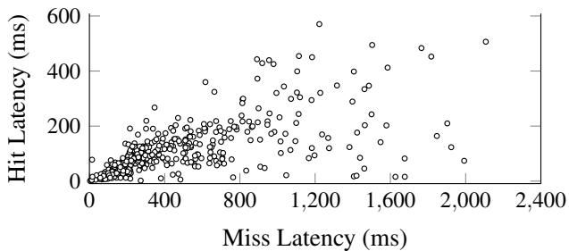  
Figure 1: Scatter plot of avg. hit/miss latencies of 400 popular request types.

Cache-aware scheduling policies can leverage information about the AAs’ caches and request types to assign each request type to a specific AA, maximizing cache hits and reducing request latencies. Prior works [9, 25, 47] on various other domains, including processor caches, CDNs, web caches, and distributed data caches, optimize performance by relying on cache affinity and utilizing dynamic mechanisms to handle potential load imbalances and adapting to workload changes. However, for VM allocation such strategies might lead to significantly higher latencies (see §6.2). Instead, our design primarily takes a latency-centric approach incorporating cache awareness, utilizing latency estimation to induce lower latencies. Intuitively, our approach can be viewed as ‘load-balancing’ in terms of the total ‘work’ done by each allocation agent (rather than traditional load-balancing, e.g., based on queue sizes or request types).

## 2.2 Evidence from production

To understand the challenges and limitations in state-of-theart VM allocators, we characterize the latency performance of Protean, followed by assessing resource inefficiencies. We use traces from over 50 allocator nodes for our analysis, each containing a day’s worth of requests.

## 2.2.1 Need for latency-driven scheduling

Our comprehensive study of latency characteristics in largescale production traces emphasizes the necessity for a latencydriven scheduling framework.

Observation 1: Cache hit and miss latencies vary substantially across heterogeneous request types: In contrast to traditional data caching systems, the latencies for hit-andmiss events vary significantly based on the complexity of VM allocation queries among different request types. Figure 1 illustrates the distribution of hit/miss latencies observed by a single allocator node (hit and miss here refer to the top level of the cache). Some request types incur higher cache-hit latency than miss latency for others, contradicting typical assumptions that a cache hit is always faster than a miss. This variability arises from two primary reasons. Firstly, as discussed earlier, caches are hierarchical, and a request’s constraints and preference rules may necessitate partial recomputation upon a cache hit or full recomputation in the case of a miss. Our analysis reveals up to a 5x variation in hit-and-miss latency across request types. Secondly, bursts in allocation requests stall and amplify the time it takes to resolve a request due to inventory updates, regardless of a cache hit or miss, further adding to variable request latency.

<table><tr><td>Node</td><td>Avg.Memory Usage</td><td>Avg. Peak CPU Usage</td></tr><tr><td>Node 1</td><td>~92%</td><td>~50%</td></tr><tr><td>Node 2</td><td>~92%</td><td>~61%</td></tr><tr><td>Node 3</td><td>~90%</td><td>~74%</td></tr><tr><td>Node 4</td><td>~90%</td><td>~39%</td></tr></table>

Table 2: Approximate resource usage within 4 nodes running allocation agents in a large availability zone.

## 2.2.2 Need for cache-aware, latency-driven scheduling

Cache-awareness is critical for exploiting locality by placing similar requests on the same AAs. Consider a scenario with two request types (type 1 and type 2) and two AAs, each with a single cache slot for a specific request type, and a cache policy that adds to the cache the last request type processed by the AA. While cache-oblivious scheduling algorithms like Round-Robin could result in 0% cache hit rate (e.g., on the sequence with request types 1,2,2,1,1,2,2,...), the cacheaware scheduling that pins a request type to a specific AA could achieve a 100% cache hit rate, minimal queue lengths, and low total latency.

Indeed, Figure 6 in §6.2 shows that simple strategies are not effective enough: Round-Robin and random assignments have respectively ≈ 30% and ≈ 60% higher tail latency than Protean, which is essentially a pure work-stealing strategy.

Observation 2: Latency-driven cache-aware scheduling is critical for handling dynamic workloads: Unfortunately, just a cache-aware strategy like request-pinning or consistenthashing is not sufficient. As discussed in §2.2.1, under higher load, with only a cache-aware approach, bursts of certain requests could significantly affect the request-type distributions across AAs. In contrast, an effective latency-driven scheduler would dynamically adapt to changes in latency and, if needed, spread out requests to other AAs even if it impacts locality.

## 2.2.3 Allocator scalability challenges

Increasing the number of AAs can reduce request wait times and latencies by using multicore CPU and available memory while ensuring sufficient throughput. However, scaling AAs across nodes or even within a node can lead to resource inefficiencies or increased latencies.

Observation 3: Resource imbalance between memory and CPU use limits the number of AAs: Increasing the number of AAs to reduce latency and improve throughput poses a challenge of resource utilization imbalance. The majority of nodes exhibit high memory usage while under-utilizing CPU resources, as shown in Table 2. This imbalance arises from two main factors: first, hierarchical request evaluation caches require significant memory, with top-level slots encompassing the entire feasible inventory for a specific request type and lower-level slots containing feasible sets for each constraint. Second, as discussed above, to maximize parallelism and avoid synchronization bottlenecks, each AA maintains its private cache instead of using a shared cache. Due to these factors, our analysis system uses a maximum of four AAs per node to avoid exceeding the available memory limit, even for the largest zones. While scaling AAs across additional nodes is a potential solution, it would exacerbate CPU waste and communication and synchronization overheads.

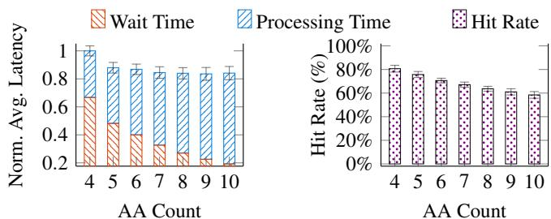  
Figure 2: Performance as the number of AAs increases.

Observation 4: Naively increasing the number of AAs by dividing cache slots affects latency: An alternative approach to increasing the number of AAs within a node is to divide the total available memory for caching across them further. However, reducing individual cache sizes can lead to more misses and, consequently, higher latency. To illustrate this, we simulate Protean and compare its performance with different AA counts using a day’s worth of requests. We start with the baseline configuration of 4 AAs, increasing the AA count and keeping the cache size constant by reducing the size of each AA’s private cache. We measure hit rate and latency and present the results in Figure 2. Increasing the AA count to 6-8 reduces request wait times in the queue, improving average latencies compared to the baseline (4 AAs). However, further increases in AA counts lead to smaller cache sizes, resulting in degraded hit rates and increased processing times due to a lack of cache-aware scheduling, where AAs indiscriminately pull requests off the node queue, failing to exploit locality across the AAs’ caches.

The aforementioned four observations drive the design of Kamino’s latency-driven, cache-aware algorithm and supporting system implementation.

## 3 Kamino overview

We next provide a high-level overview of our VM allocation system, focusing on the allocation path. In §5, we describe the details of the actual architecture.

System overview. Kamino is designed to minimize VM request latencies through concurrency and latency- and cacheaware scheduling; see Fig. 3. Each allocation node employs multiple concurrent AAs tasked with evaluating rules and assigning VM requests to machines. AAs utilize hierarchical private caches for the evaluations and maintain queues for pending requests. Additionally, AAs have access to real-time data about the machines in the inventory, including available resources like CPU cores and memory.

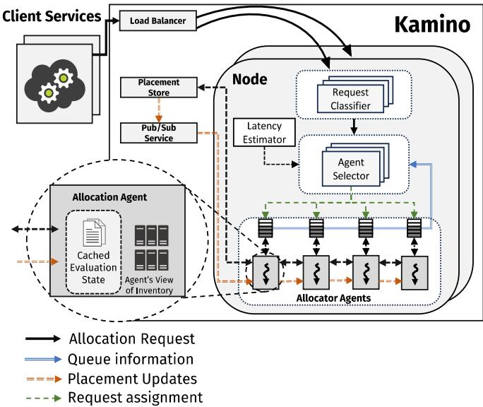  
Figure 3: System Architecture with Kamino

Request allocation path. When a request enters the system, a gateway/load-balancer routes it to an allocator node. Within the node, the request’s estimated latency is computed based on historical latencies as well as the current queue and cache states of each AA. The request is assigned to the AA that is estimated to complete processing the request the earliest. The selected agent runs the rules on the traits of the request, using its hierarchical cache where possible. This results in a list of machines that can receive the VM request, sorted by preference (according to the rules). The VM request is sent to one of the top-ranked machines of this list. The placement decision is committed to a central placement store, and the update is propagated across AAs.

## 4 LatCache Agent Assignment Algorithm

We now zoom in on a central part of our work: directing the incoming VM requests to the AAs in a way that reduces average and tail request latency by best utilizing their memory (i.e., cache) and computing resources. Since each allocator node is treated independently, we focus on a single node and on selecting which of its AAs agents should handle a given VM request, i.e., the design of the agent assigner algorithm.

## 4.1 Agent Assignment Task

We introduce the following task that captures the main elements of the situation at hand and is used as a guide in the design of our assignment algorithm.

An instance of the task consists of multiple AAs, and a sequence of heterogeneous incoming requests to be processed by the AAs. The AAs are identical and run in parallel. Each AA can only process one request at a time, and no preemptions are allowed. Requests cannot be dropped, and each AA has a queue with enough space to hold its pending requests; queued requests are processed in FIFO order.

Each AA has a private cache of bounded size that influences the processing time of a request. At a high level, the current state of the cache affects the processing time in a non-trivial way: it partially reduces the processing time, the extent of which depends on how much of the request is cached (i.e., which of its rule evaluations are cached, see §2.1), and the same portion of the cache (i.e., rules) may help different requests. In addition, even with the same cache state, the processing time of a request may change over time. This is because evaluating a cached rule depends on the changes to the inventory since the last update, which depends on the load of the system. Here, we abstract some of these details and refer the reader to §4.2.3, where we provide lower-level details of our hierarchical cache and how exactly its state affects processing time. Each AA also runs an independent caching policy that decides what data is evicted when the cache is full. Typically, after a request is processed by an AA, it is brought into the AA’s cache, but this is not a required assumption.

When a new request arrives, it needs to be immediately assigned to one of the AAs. The goal is to assign the incoming requests to AAs so as to minimize the average latency, i.e., completion time (which includes waiting time) minus release time, of the requests.

Figure 4 provides an illustration of the agent assignment task. In this example, there are 2 AAs, each having a simplified single-slot cache, and two request types (green and orange). The left figure shows the state of the AAs’ caches, queues, and current execution of AA 2 at time t1, when a new request arrives, it needs to be assigned to one of the AAs; in this case, it is assigned to AA 1. The middle figure shows the state at time t2, when AA 2 finishes its first request and will start processing the one in its queue; in this example, the cache of AA 2 was updated upon completion of the first request. The right figure shows the state at a later time t3. Notice that the processing time of the second request of AA 2 is smaller, since its type was present in the cache when it started being processed (time t2). Also, notice that the cache of AA 1 was updated due to the completion of the green request.

## 4.2 Latency-driven Cache-aware Assignment

## 4.2.1 Basic algorithm

We now describe LatCache, our proposed algorithm for this agent assignment task. Being latency-driven, the main component for making its decision is a careful estimation of what would be the latency incurred by the incoming request if it were assigned to a given AA.

To perform this estimation, we first break the latency into 3 separate components: processing time, queue time, and the remaining processing time. Processing time is the estimated time it would take to process the incoming request on a given AA, once it starts processing. Queue time is the estimated time for processing all the requests in the queue of the AA. Remaining processing time is the time left for the AA to finish the request currently being processed. The estimated latency of the request on an AA is obtained by adding the estimates for these three components.

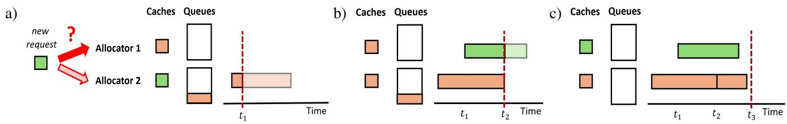  
Figure 4: Illustration of the agent assignment task.

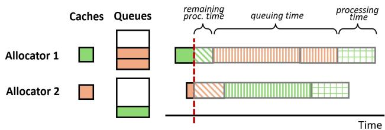  
Figure 5: Illustration of LatCache’s latency estimation. A new green request (marked by a green square pattern) is considered to be placed on one of the two AAs, each with a single cache slot. Non-solid colors represent estimations.

Notice that all these 3 component depend non-trivially on the cache dynamics of the AA under consideration. For example, the processing time of the request does not depend on whether it is currently found (either fully or partially) in the cache of the AA, but whether the request would be there by the time it would start processing. This, in turn, depends on the current cache of the AA, the requests in its queue, and the caching policy it uses. Also note that a similar effect happens with the queue time of an AA, which depends on the processing times of the requests in the queue, which in turn depend on the extent that each request’s information is present in the cache when processed. Thus, a crucial step in the algorithm is to obtain an adequate cache-aware estimate of each of the 3 latency components. We defer the description of how we estimate these components to §4.2.2.

Once the estimation of the latency of the request on each of the AAs is performed, LatCache simply assigns the request to the AA with the lowest estimated latency; see Algorithm for the pseudo-code.

Algorithm 1 LatCache (req : request)

1: Compute cache-aware estimates queueTime(a), processingTime(a), and remainingProcTime(a) for each allocation agent a

2: Assign req to the allocation agent a∗ where it has minimum estimated latency queueTime(a∗) + processingTime(a∗) + remainingProcTime(a∗)

The design of LatCache addresses the challenges highlighted in the previous section. First, being latency-driven, it performs an adaptive load-balancing of requests to AAs, regardless of the identity of incoming requests (contrasting with the request-pinning strategy discussed in §2.2.2). Indeed, we establish that our algorithm maintains the queue waiting times of the AAs almost perfectly balanced; intuitively, if the queue of an AA grows too long, this is factored into the latency estimation of the algorithm which then chooses another AA for future requests.

Theorem 1 (LatCache’s load-balancing). Consider the algorithm LatCache with perfect latency estimation. Then, at all times, it guarantees that for every pair of AAs, their queue waiting times are within maxProcTime of each other, where maxProcTime is the largest request processing time.

Moreover, no scheduler can guarantee that for every pair of AAs a, a′ the difference in their queue waiting times is strictly less than maxProcTime at all times.

We note that the assumption of perfect latency estimation can be relaxed, and was made to simplify the bounds. In addition, with adequate cache-aware latency estimates LatCache also promotes co-location of similar requests, which should lead to higher cache hit rates and thus lower processing times: By construction, LatCache only prefers an AA that does not have (or has less of) the request in its cache over an AA that has the request in the cache if the latter has worse latency, e.g., due to significantly longer queuing time.

## 4.2.2 Cache-aware latency estimation

This desired behavior of LatCache is contingent on the algorithm computing adequate estimates for the three latency components, which we now address. Following up on previous discussion, the two key challenges here are: (1) It is not obvious whether the current request and the queued requests will be (fully or partially) found on an AA’s cache, given that the state of the cache can change by the time each request is processed; (2) Estimation errors on the hit and miss latencies might accumulate (e.g., in the estimated queuing times) and lead to highly-suboptimal decisions. With this in mind, the latency components are estimated as follows:

Processing time. This is the main component to be estimated and is used to compute the other components. To estimate the processingTime(a) of the incoming request on AA a, we employ optimism and assume that when this request is processed on a (if assigned to it), the cache will still contain all of its current content (i.e., none of it is evicted) and will also completely contain all the requests that are currently in the queue of a (we call this the “augmented cache state”). The estimated processingTime(a) is then a function of this “augmented cache state” and the traits of the current request (exact details of how this is computed in our situation are presented in §4.2.3, Algorithm 2).

We note that this optimistic cache state prediction is quite accurate as long as the number of distinct type of requests in the AAs’ queues is small compared to how many types a cache can accommodate (which is what we see in practice for VM allocations). In particular, we tested an alternative estimation procedure that simulates future cache states and did not find significant improvement in estimation quality.

Queuing time. Next, the queueTime(a) of an AA is obtained by estimating the processing time for each request in its queue, using the strategy outlined above. This is done without the need to traverse the queues: when a request is added to the queue of the AA a, the estimated processingTime of the request is added to the current queueTime(a), and when a request is dequeued its estimated processingTime is subtracted. Note that by subtracting the estimated processing time on dequeue, as opposed to the real processing time, limits the accumulation of errors: once a request is dequeued, the effect that any estimation error on its processing time had on the queuing time is erased.

Remaining processing time. Finally, the estimation of the remainingProcTime(a) of an AA is based on start and proc\_time information that is updated by the AA as follows: whenever it starts processing a request, it sets start to be the current time, and proc\_time to be the estimated processing time based on the current state of the cache (not the “augmented cache state”). With this information, remainingProcTime(a) at time t is estimated as max(0, start + proc\_time − t) if the AA a is currently busy, else it is estimated as 0. Figure 5 illustrates these estimations.

## 4.2.3 Hierarchical cache structure and processing time computation

We next discuss rule-based allocations and the cache structure, essential for computing estimated processing times in Kamino.

Rule-based allocations. Our system utilizes rule-based allocations, as discussed in §2.1. A rule evaluated over a request returns a filtered (sorted) list of the current inventory based on specified constraints or preferences (e.g., the list of machines with enough free memory to accommodate the request). Each rule only depends on a subset of the traits of the request; requests with the same value on these traits produce the same evaluation, and thus are considered equivalent with respect to this rule. To fulfill a request, all rules are evaluated and lists consolidated, and the request is placed on one of the top-ranked machine(s) from the final list. These steps are performed by the AA handling the request.

Cache structure. The cache present in the AAs is used to speed up these steps. We employ a 2-level hierarchical cache: The top level (fast path) stores the consolidated list of machines for (equivalent) requests, and the lower level (slow path) stores the result of rule evaluations for equivalent requests (with respect to the rule). The latter allows for “partial cache hits” that benefit more requests since more requests are equivalent relative to a single rule than relative to the consolidated evaluation. See Table 1 for an illustration.

Since rule evaluations and their consolidated result depend on the current state of the inventory, they need to be updated even when present in cache; that is, both cache hits and misses add to the latency of processing the request. An un-cached rule evaluation (rule-miss) is computed from scratch, while cached rule evaluations (rule-hit) are updated with only the changes in the inventory change since its last update; this incremental update is significantly faster than computing it from scratch. If the consolidated evaluation for a given request is present in the top-level cache (hit), then all of the rules it depends on are updated, and the updates are inserted to/removed from the consolidated result. We note that while a consolidated result is present in the top-level cache, all rules that it depends on are pinned to the lower-level cache, i.e., all are rule-hits.

Processing time computation. Given this cache structure, Algorithm 2 describes our estimation of the processing time of a request req on a given AA. This procedure receives as input the “augmented cache state” augCache of the AA, as defined in §4.2.2, estimate hit for a cache top-level hit processing time, and vectors rule-hits and rule-misses with estimates for the rule-hit and rule-miss times of each rule. These input estimates can be computed, for example, using historical data, see §5. If the request is a top-level hit in the augCache, its estimated latency is only hit. In case of a top-level miss, we consider the “partial hit” based on the rules present in the lower level of augCache.

Algorithm 2 ProcessingTime (req, augCache, hit, rule-hits   
and rule-misses)   
1: If the req is a top-level hit in augCache, then set   
procTime to be equal hit   
2: Else #top-level miss   
3: For each rule r, add to procTime either its hit   
time rule-hits[r] or miss time rule-misses[r] depending   
whether augCache contains the evaluation of R for re  
quest (equivalent to) req   
4: Return procTime

## 5 System Implementation

We describe the details of the Kamino request scheduling framework implemented within the Protean system and highlight some practical challenges of the implementation. Overall system organization. A logical instance of the Protean system is responsible for handling all requests in a zone or a region. The system consists of a pool of stateless AAs backed by a persisted placement store for VM placement decisions. Each AA uses a dedicated thread and private inmemory state and caches to place VM requests to appropriate servers in the inventory. It uses a specified number of cache slots to limit its memory usage. Multiple AAs are grouped within a process in an allocator node, and multiple nodes can be employed to satisfy peak system demand.

The AAs follow an optimistic concurrency model: an agent makes placement decisions based on its (potentially stale) view of the inventory and persists each placement result to the placement store. The placement store rejects results that are invalid because of the staleness of the AA’s view so that the requests can be retried. VM deletes are also persisted in the placement store. The AAs learn about updates to the placement store and other relevant inventory updates, such as those related to server health and power consumption, through a publish-subscribe platform. As an optimization, placement decisions made by the AAs within an allocator node are shared among each other through fast in-memory transfer. Figure 3 shows the overall system architecture.

Kamino request scheduling framework. The front-end gateway/load-balancer service accepts the requests and routes them to an allocator node, but Kamino is responsible for mapping the requests to AAs within a node. Kamino aims to minimize overall request latency and improve the resource efficiency of the AAs while incurring negligible computation and memory overheads. To that end, Kamino is implemented as part of the process the AA itself runs on, thus avoiding any inter-process communication overheads. In addition, we designed our scheduling logic in a computationally efficient manner, resulting in minimal overhead in the order of microseconds per request, which is orders of magnitude lower than request latencies (tens to hundreds ms); thus, the scheduler has negligible overhead on the total latency. Additionally, slower time-scale computations required for making scheduling decisions are done outside the request-handling critical path and so do not introduce any relevant computational overhead. Kamino consists of the Request classifier, Agent selector, and Latency estimator modules. The Request classifier and Agent selector processes each request in the critical path, whereas the Latency estimator runs outside the critical path. We describe these modules below.

Request classifier. A request arriving at the node remains queued until an instance of the request classifier becomes available to handle it. The request classifier computes the equivalence class key of the request depending on the rules relevant to the request and the request traits they depend on (see §2.1). The key uniquely identifies a class of requests that are equivalent to each other as far as the allocation logic is concerned. In other words, each key denotes a request type and determines if an AA has a cached consolidated result for the type. It decorates the request metadata with the computed key and queues the request for further processing. The framework allows for multiple instances of the request classifier (and agent selector) modules in order to concurrently process the requests, but in practice just one or two of these are enough because the processing latency of these modules is negligible compared to that of the AA.

Agent selector. Each AA has its own private queue to hold pending requests. The agent selector assigns each request to an AA’s queue. Once a request is assigned to a queue, the assignment is never changed. This module implements the core request scheduling algorithm LatCache. As described in §4.2, this algorithm requires a few inputs: 1 It needs estimates of top-level cache hit times and hit and miss times for the rules. This is obtained from the Latency estimator module. 2 It needs to check whether an incoming request type is cached in an AA or is already queued in its private queue. The agent selector probes the AA’s caches with the request type’s key to check if it is cached. As part of the queue metadata for each agent, it maintains a map of <Request type key, Count> for the requests in the queue. This map is used to check if a request type is already present in the queue and is updated when requests are enqueued or dequeued. 3 It needs to check if an agent is busy. The agent selector holds a reference to the last dequeued work item for each agent and probes the work item to check if the agent is busy.

Latency estimator. This module is responsible for estimating the hit and miss times. In its simplest form, it can provide estimated hit or miss times from preset service configurations. However, a more practical implementation takes the form of a background task on each allocator node that tracks hit and miss times and periodically produces an updated estimate of their averages. The latest estimates are not only sent to the Agent selector but are also persisted in order to have a good initial estimate on process restart. Although we only use a rough estimate of central tendency for hit and miss times, LatCache is able to make good assignments and yield a significant improvement in the relevant metrics (see §6.4). Cache management policy. The AAs employ a hybrid cache eviction policy – objects are evicted from the cache if it is full, using a standard LRU replacement policy, or if they reach a certain age. Age-based eviction allows us to reduce the agent memory footprint during periods of low load.

## 6 Evaluation

We conduct extensive experiments to evaluate Kamino using both a high-fidelity simulator and the production system. The simulator experiments utilize real traces from production across various geographical regions. Our experiments aim to address the following questions:

• Does Kamino and its latency-driven LatCache algorithm reduce VM allocation request latency over standard, wellknown algorithmic baselines?

• How effective is LatCache in reducing cache misses and the overall cache memory consumption?

• How does LatCache perform across different loads, cache sizes, and number of AAs?

• Do the benefits of the LatCache algorithm translate to production-scale systems?

## 6.1 Workloads and Methodology

Our simulations utilize six real traces collected from hightraffic allocator nodes across various zones. These traces encompass a diverse range of unique request types, with counts varying between 500 and 1.7k. Additionally, certain zones exhibit notably higher request rates and burstiness than others. Each trace spans a 24-hour horizon and includes all VM requests, providing information such as request id, arrival time, and request traits. The trace also contains information about the actual processing time of each request, which are used to simulate hit and miss times. We have also deployed Kamino with LatCache in all production zones and measure performance in a subset of representative zones.

## 6.2 Effectiveness of LatCache on Latency

We first use our simulator to understand the impact of Lat-Cache on reducing average and tail VM allocation request latency. We compare it against the load-balancing algorithm used by the state-of-the-art VM allocator Protean. We also compare it against classical cache-oblivious load-balancing algorithms (random assignment and round-robin). Finally, we compare it against a cache-aware solution consisting of using consistent-hashing assignment augmented with work-stealing to reduce hotspots [47]. Thus, we compare LatCache against:

1 Protean with a shared queue. This consists of a single FIFO per allocator node that receives all requests, and AAs pull requests from this queue when idle. This is the algorithm previously used in Protean.

2 Random assignment (Random). Assigns the incoming requests uniformly at random to one of the AAs.

3 Round-Robin. Assign the incoming requests to the AAs in a Round-Robin fashion.

4 Hash+WS. This uses consistent hashing + work stealing, employed in other systems, to determine data location and task execution [47]. The assignment to an AA is computed by hashing the request traits, ensuring that requests with the same cache objects are assigned to the same AA [21, 32], which promotes data locality and reduces cache replication. Additionally, when an AA is idle, it steals a pending request from the AA with the largest queue, if any, which helps reduce hot spots caused by skewed request distributions.

Unfortunately, the scheduling algorithms of other largescale VM allocators [36, 41] have not been openly documented, preventing us from recreating and evaluating them.

We also evaluate two versions of LatCache: In addition to LatCache-rule, the algorithm as described in §4, we consider the variant LatCache-request that uses a simpler estimation of the processing time of a request based only on its presence at the top-level of the cache of the given AA, i.e., on a top-level miss, instead of looking up the presence of individual rule on the lower-level cache as in Algorithm 2, it assumes that none of them is present in the lower-level cache. Its main advantage is that it requires fewer and simpler (i.e., to a single level) cache lookups. For this analysis, we fix the number of AAs on each node to 4 to match our current production system. We also reserve the total cache memory based on production configuration (up to 58% of the node’s total memory); in §6.6, we vary these parameters in our simulated environment.

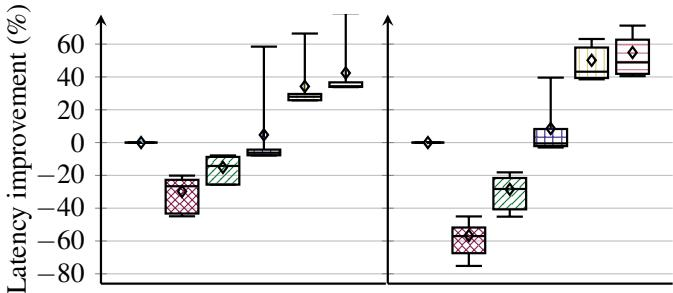  
Figure 6: Latency improvements for each algorithm

Fig. 6 illustrates the percentage improvement in average and 90th percentile tail allocation latency of the different algorithms compared to the baseline Protean. Standard loadbalancing algorithms Random and Round-Robin exhibit approximately 20% worse performance on average compared to the baseline. The cache-aware Hash+WS algorithm, which promotes request co-location plus simple load-balancing, achieves only 4.4% average latency improvement with high variance and 9.1% improvement in tail latency. In contrast, our LatCache-request and LatCache-rule algorithms achieve significant improvements in both average and tail latency compared to all other algorithms, with over 50% tail latency improvement over the baseline Protean. Notably, lighter-weight LatCache-request is competitive with LatCache-rule, despite ignoring lower-level cache content during processing time estimation.

While request allocation latency is our main metric, the superiority of our algorithms also holds in terms of throughput, albeit in a less striking manner. Nonetheless, in periods of bursts of requests, we consistently see a 2x throughput improvement compared to Protean. Fig. 7 plots the throughput profiles of the algorithms in a window with a burst of requests (for clarity’s sake, Random, Round-Robin, and LatCacherequest were omitted).

## 6.3 Explaining why LatCache works well

Table 3 (second column) shows the top-level cache hit rates for various algorithms. LatCache-rule and LatCache-request achieve the highest hit rates (≈ 94%), significantly higher than the cache-friendly Hash+WS (≈ 87%) and the cacheoblivious Protean, Random, and Round-Robin (≈ 81%). This validates LatCache’s superior ability to promote data locality, as a consequence of careful latency predictions that use both current and projected cache states.

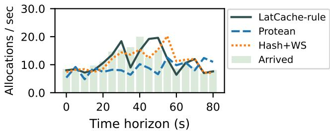

Figure 7: Throughput Comparison. Results are shown for two consecutive bursts of requests.
<table><tr><td>Algorithms</td><td>Hit ratio (%)</td><td>Norm.cache memory</td></tr><tr><td>Protean</td><td> $8 0 . 7 \pm 2 . 9$ </td><td> $1 . 0 0 \pm 0 . 0 0$ </td></tr><tr><td>Random</td><td> $8 1 . 1 \pm 3 . 0$ </td><td> $0 . 9 8 \pm 0 . 0 0$ </td></tr><tr><td>Round-Robin</td><td> $8 0 . 6 \pm 3 . 0$ </td><td> $1 . 0 0 \pm 0 . 0 0$ </td></tr><tr><td>Hash+WS</td><td> $8 7 . 4 \pm 3 . 1$ </td><td> $0 . 9 4 \pm 0 . 0 5$ </td></tr><tr><td>LatCache-request</td><td> $9 3 . 1 \pm 3 . 2 $ </td><td> $0 . 8 5 \pm 0 . 0 9$ </td></tr><tr><td>LatCache-rule</td><td> $9 5 . 0 \pm 2 . 3$ </td><td> $0 . 7 7 \pm 0 . 0 6$ </td></tr></table>

Table 3: Cache hit ratio and normalized memory use.

Next, Fig. 8 shows the breakdown of the average request latency of the algorithms into the time waiting in the queue of an AA and request processing time. LatCache algorithms have the smallest processing times, due to their high cache hit rates. However, the major part of LatCache’s latency improvement comes from a significant reduction in waiting time. Two main reasons contribute to lower wait times: 1) higher hit rates have a compounding effect on the multiple requests in a queue, leading to faster turnaround; 2) the latency-driven design with careful latency prediction accomplishes an effective request load-balancing across the AAs, as supported by Theorem 1. This highlights the benefits of combining latencydriven scheduling with cache-awareness.

## 6.4 Estimation accuracy and its impact

As mentioned earlier, the two main sources of inaccuracy that might affect the total latency estimation quality are: (1) (top-level) hit and miss event prediction; (2) estimation of the individual hit and miss times of the requests. We now quantify the accuracy of these estimations and their impact on the quality of the assignments of LatCache-rule.

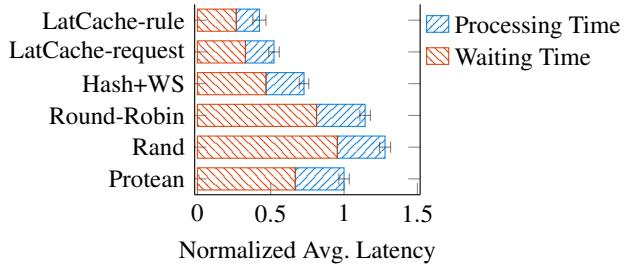  
Figure 8: Latency breakdown.

First, our optimistic prediction for hit/miss events using the augmented cache state is highly accurate (99.1% across both cache levels). Given that hit times are significantly lower than miss times (average miss/hit time ratio: 5–10) and that hit/miss predictions directly affect queue latencies estimates, this level of accuracy is crucial for effective assignments.

Regarding the estimation of hit and miss times, we have an average prediction error of 29%. While the error is not small, using these estimates in conjunction with the accurate hit/miss event predictions leads to good allocation decisions: LatCache-rule selects the best allocator for 91.9% of the requests (best allocator = lowest actual total latency for the incoming request). Even when the best allocator is not selected, the scheduling decision is nearly optimal – the total latency percentage-gap between the selected allocator to the best allocator is only 2.3% on average. To put these numbers into perspective, a naive version of LatCache-rule that ignores the rule-level cache, future hit prediction, and allocators’ remaining processing time chooses the best allocator only 65.4% of the time and the resulting total latency can be even 2x more than that of the best allocator.

We note that it is certainly possible to use more sophisticated machinery for estimating hit and miss times, such as applying machine learning techniques [12]. We observe, however, that the added value is not substantial. To quantify the possible gains, we ran LatCache-rule fed with perfect predictions of hit and miss times, and observed an additional improvement of 1.1% in tail allocation latency (vs. ≈ 50% improvement that both versions of our algorithm have compared to the baseline). We conclude that the absolute hit and miss time predictions matter less than predicting the actual hit/miss event as well as capturing key elements of the allocation process, particularly the hierarchical-cache dynamics (see §4.2.2-4.2.3). The net outcome is that Kamino’s scheduler has a simple yet effective and robust latency estimation that makes near-optimal allocation decisions.

## 6.5 Reduction in Memory Footprint

Table 3 presents the average cache memory size used by the algorithms, normalized to the baseline Protean. All cache-oblivious algorithms (Protean, Random, and Round-Robin) exhibit very similar memory occupation. In contrast, the cache-friendly Hash+WS demonstrates reduced usage (94% of Protean’s memory usage), while our cache-aware LatCache-request and LatCache-rule show significantly lower usage (85% and 77% of Protean’s, respectively). This reduction is attributed to the LatCache algorithms, which enhance cache hit rates and facilitate better reuse of cached rule objects by co-locating similar requests on the AAs. Notably, LatCache-rule achieves the smallest memory usage by promoting such co-location at the rule level, leveraging information about the objects present on the lower cache level. Overall, LatCache’s memory overhead is negligible: cache states are probed at runtime, and hit/miss latencies are already tracked for monitoring. Reduced memory use effectively allows to increase the number of AAs on the same node by decreasing the required cache-per-AA to store the necessary items, a particularly important consideration in our production system (see §2.2.3).

## 6.6 Sensitivity to System Parameters

Next, we analyze the performance of the algorithms across different system parameters. For brevity, we drop Round-Robin and Random from the analysis due to their highly suboptimal performance observed earlier.

Sensitivity to the number of AAs: We vary the number of AAs (R) on a node while keeping the total memory cache (M) fixed, thereby changing the per-AA cache memory $( M / R )$ As shown in Fig. 9a, Protean and Hash+WS algorithms scale poorly with increasing AA count. The benefits of parallelism from additional AAs are negated by cache fragmentation, as smaller private caches reduce effectiveness. In contrast, LatCache-request and LatCache-rule algorithms sustain their performance, with reduced per-agent cache having a smaller impact, consistent with their lower memory usage.

Sensitivity to allocation request load: We evaluate the performance of the algorithms under high load. We reduce the requests’ interarrival time by multiplying each request’s arrival time by a parameter $\varepsilon \leq 1$ . The lower this ε parameter, the higher the frequency of requests. For analysis, we pick ε values that increase request frequency by 25%, 50%, 75%, and 100%. Fig. 9b shows tail latency improvement over Protean baseline. As shown, the benefits of cache-aware algorithms over Protean increase as the load increases, with LatCache algorithms exhibiting scalability and consistent gains over Hash+WS across all loads.

Sensitivity to cache size: We evaluate the performance of the algorithms under varying system memory for caching across AAs. Fig. 9c shows tail latency gains over Protean for each cache size, where 100% represents the size used in previous experiments. First, even with smaller cache sizes, cache-friendly algorithms like Hash+WS, LatCache-request, and LatCache-rule outperform the cache-oblivious Protean. Furthermore, LatCache algorithms consistently exceed both Protean and Hash+WS, even under limited cache memory. Second, for larger reserved cache sizes, LatCache-request and LatCache-rule still outperform Protean and Hash+WS, albeit with more modest gains. The gains diminish as larger caches accommodate more objects, reducing the importance of data locality.

## 6.7 Performance on Production Zones

We evaluate Kamino’s performance impact with LatCache in production on a subset of zones. We deploy the LatCacherequest algorithm due to its simpler integration with the current cache API and plan to roll out LatCache-rule later. We collect performance metrics across 5 production zones, comprising tens of thousands of nodes, over 15 days before and after deployment with LatCache-request (Kamino-LatCache).

<table><tr><td>Latency</td><td>Protean</td><td>Kamino-LatCache</td><td>Improve.</td></tr><tr><td>Avg. (ms)</td><td> $1 8 5 . 6 \pm 2 0 . 4$ </td><td> $1 4 6 . 3 \pm 1 7 . 4$ </td><td>21.1%</td></tr><tr><td>90p (ms)</td><td> $3 7 8 . 8 \pm 9 0 . 8$ </td><td> $3 3 3 . 5 \pm 6 4 . 7$ </td><td>11.9%</td></tr></table>

Table 4: Allocation latencies before (Protean) and after deploying Kamino.

Impact on latency. We compare allocation latencies before (Protean) and after deploying Kamino-LatCache. Table 4 shows average and 90th percentile latencies with standard deviations. We observe a 21.1% reduction in average latency and an 11.9% reduction at the 90th percentile, aligning with simulation results. However, modest gains arise from factors not modeled in the simulator, such as conflicts and retries when multiple AAs place VMs on the same physical machine, causing infeasible placements. Fig. 10 shows disaggregated latency performances of Protean and Kamino, highlighting consistent gains across all zones.

Impact on cache hit rate. To display the impact of Kamino-LatCache on cache hit ratios, we aggregate the measurements of the five zones and plot in Fig. 11 the hit rate over 2 months; the dotted line (in early Feb.) marks where Kamino-LatCache replaces Protean. Overall, cache hits increase from 80% to 86.6% on average across the five zones; thus, the total cache misses reduced by 33%. Two main factors contribute to the differences in cache hit gains between the simulation and production systems: (a) varying memory cache sizes across the fleet and (b) dynamic workload changes over 15 days on production compared to 24-hour simulation traces.

We also observed that a significant reduction in cache misses reduces the number of AA nodes, lowers contention and communication overhead, and minimizes allocation retries, yielding more efficient request handling and improved system stability.

Reduction in CPU and memory resource usage. We evaluate Kamino-LatCache’s impact on resource efficiency in allocator nodes, focusing on aggregate working memory and CPU usage across AAs per node. On average, Kamino-LatCache reduces memory usage by 17% and CPU usage by 18.6%, consistent with simulation results (Table 3). By promoting data locality through co-locating similar requests on AAs, Kamino-LatCache reduces cache content replication, saving memory. This reduction also lowers CPU usage, as less computation is needed for cache updates. Measurements confirm this, showing a 10–20% drop in cache updates per minute.

## 7 Related Work

In addition to our earlier overview of allocator systems, we survey related work in resource management.

Request scheduling and cache-awareness. Prior research has focused on efficient request scheduling and loadbalancing to minimize latency, especially for sub-second latencies. They include using OS techniques like per-CPU caches, optimizing CPU allocation for application threads, reducing queue wait times and scheduling costs [20, 33, 34]. Web services research explores static and adaptive scheduling strategies to address latency and throughput challenges [23, 28, 39]. However, techniques like preemptive work suspension and network queue polling are unsuitable for VM request scheduling. Cache-aware scheduling has been explored, with Google’s search system using hypergraph partitioning for load-balancing [4], and [37] proposing similar methods for Facebook’s web traffic and storage sharding. Other studies improve latencies through dynamic cache partitioning of shared caches or adapting cache policies, often using hit rates as latency proxies [10, 48]. To our knowledge, Kamino is the first publicly reported VM allocation framework integrating cache awareness and latency considerations for scheduling.

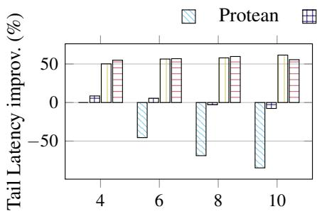  
(a) Number of AAs

Hash+WS LatCache-request  
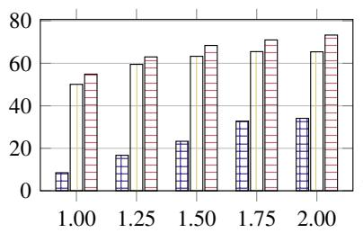  
(b) Trace scale up factor

LatCache-rule  
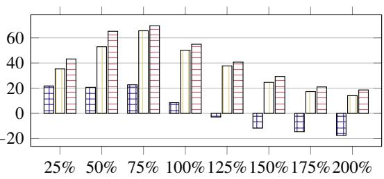  
(c) Cache Sizes

Figure 9: Sensitivity to System Parameters: Tail Latency p90 improvement (%)  
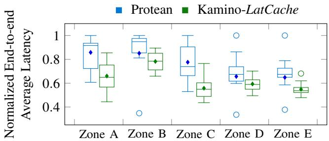

Figure 10: Production: Average latencies before and after deployment, normalized by the largest latency in the zone.  
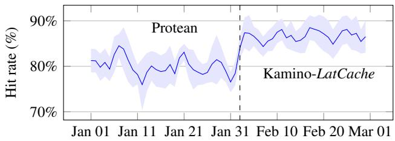  
Figure 11: Production: Hit rates before and after deployment day. Dashed line indicates deployment day.

Cluster and resource scheduling. A huge body of work addresses sharing distributed resources across computations. Frameworks like Omega [36], Twine [41], and others [13, 14, 17, 18, 31, 44, 46] optimize resource utilization for jobs or tasks. Similar approaches target container scheduling (e.g., Kubernetes [27, 29]) and VM deployment (e.g., Protean [16]). Others focus on resource allocation with service-level objectives (SLOs) [19] and dynamic allocation policies leveraging predictions and continual optimization [6, 11, 12, 22, 24, 30, 35, 38, 40, 50]. However, no prior work integrates caching with resource efficiency for VM or container allocation.

Algorithms for scheduling and paging. There is a rich body of theoretical work on page replacement algorithms for singlecache systems [3, 8, 26] and scheduling algorithms for latency minimization, though most focus on systems without caches (e.g., job scheduling models) [5, 7]. The intersection of these areas remains underexplored. [45] addresses scheduling in multi-cache systems but focuses on minimizing cache misses.

## 8 Conclusion

We design and implement Kamino – a latency-driven and cache-aware VM request scheduling framework. Our algorithm, LatCache, relies on clever estimates of latency based on the cache state. An extensive simulation study with real traces, followed by measurements from large-scale production zones show increased resource efficiency and sizeable reductions in end-to-end latency. One interesting direction for future work is examining incorporating fast and persistent storage devices such as SSDs to serve as a secondary cache to alleviate memory bottlenecks [4, 42, 49].

## Acknowledgments

We would like to thank our shepherd, Akshitha Sriraman, and the anonymous OSDI reviewers for their detailed and insightful feedback that has improved the presentation of the paper. We also want to thank Esaias E Greeff, Ricardo Binachini and Johannes Gehrke for helpful discussions.

Sudarsun Kannan and David Domingo were supported in part by NSF CNS grants 1910593, 2231724, 2319944, and NSF CAREER grant 2443438. A part of this work also used the experimental platform funded by the NSF II-EN grant 1730043.

## A Appendix

## A.1 Applying LatCache Principles Beyond VM Allocators

To evaluate the generalizability and feasibility of applying LatCache ’s principles—combining locality awareness with latency-aware queuing—to systems with hierarchical data tiers, we built a proof-of-concept prototype that applies LatCache scheduling to log-structured merge (LSM) trees.

To test latency- and cache-aware scheduling beyond virtual machine allocation, we adapt LatCache’s principles to optimize lookups in Log-Structured Merge (LSM) Trees [1, 2]. Our prototype shows reduced lookup latency and lower computational overhead. Below, we briefly review LSM trees, followed by our approach for latency and cache-sensitive scheduling.

LSM background. LSM trees underpin many key–value stores, including LevelDB and RocksDB [1, 2]. An LSM tree is organized into multiple levels that grow in size from top (level 0) to bottom. New writes buffer in memory and flush as sorted table files at level 0. As levels fill, files merge and compact downward. This design yields high write throughput but can slow reads: each lookup may scan levels sequentially until the key is found or all levels are exhausted. To mitigate read amplification, each SSTable maintains a Bloom filter—a compact, probabilistic structure that can definitively rule out a key or indicate it might be present. By checking the Bloom filter before probing an SSTable, lookups skip files unlikely to contain the key, reducing unnecessary I/O and cache pollution. However, Bloom filters can produce false positives and still require sequential filter checks across levels, so lookups may probe multiple levels and incur latency and cache churn.

Latency and cache-sensitive request scheduling. Our design uses Bloom-filter–based locality hints in LSM trees to direct lookups to the levels most likely to contain the target key and incorporates per-level latency estimates to decide when parallel searches are warranted. This approach reduces redundant computation and cache pollution while still exploiting parallelism.

In our LevelDB-based LSM prototype, this approach achieves a 22% reduction in average lookup latency compared to searching serially across LSM tiers. Although this prototype uses a single worker thread for each level, increasing CPU assignments and refining latency models should yield further gains. These preliminary results confirm that combining locality awareness with latency-aware queuing strikes an effective balance between throughput and resource efficiency in hierarchical storage. Our future work will characterize the trade-offs under mixed read–write and tail-latency–sensitive workloads and generalize LatCache ’s benefits across diverse architectures.

## References

[1] Google/leveldb: Leveldb is a fast key-value storage library written at google that provides an ordered mapping from string keys to string values.

[2] Rocksdb: A persistant key-value store.

[3] Susanne Albers. Online algorithms: a survey. Math. Program., 97(1-2):3–26, 2003.

[4] Aaron Archer, Kevin Aydin, MohammadHossein Bateni, Vahab Mirrokni, Aaron Schild, Ray Yang, and Richard Zhuang. Cache-aware load balancing of data center applications. 2019.

[5] Nikhil Bansal. Minimum Flow Time, pages 531–533. Springer US, Boston, MA, 2008.

[6] Hugo Barbalho, Patricia Kovaleski, Beibin Li, Luke Marshall, Marco Molinaro, Abhisek Pan, Eli Cortez, Matheus Leao, Harsh Patwari, Zuzu Tang, et al. Virtual machine allocation with lifetime predictions. Proceedings of Machine Learning and Systems, 5:232–253, 2023.

[7] Luca Becchetti, Stefano Leonardi, Alberto Marchetti-Spaccamela, and Kirk Pruhs. Flow Time Minimization, pages 320–322. Springer US, Boston, MA, 2008.

[8] L. A. Belady. A study of replacement algorithms for a virtual-storage computer. IBM Systems Journal, 5(2):78– 101, 1966.

[9] Ben Berg, Daniel Berger, Sara McAllister, Isaac Grosof, Sathya Gunasekar, Jimmy Lu, Michael Uhlar, Jim Carrig, Nathan Beckmann, Mor Harchol-Balter, et al. The cachelib caching engine: Design and experiences at scale. In 14th USENIX Symposium on Operating Systems Design and Implementation (OSDI 2020), 2020.

[10] Daniel S Berger, Benjamin Berg, Timothy Zhu, Siddhartha Sen, and Mor Harchol-Balter. RobinHood: Tail latency aware caching–dynamic reallocation from Cache-Rich to Cache-Poor. In 13th USENIX Symposium on Operating Systems Design and Implementation (OSDI 18), pages 195–212, 2018.

[11] Niv Buchbinder, Yaron Fairstein, Konstantina Mellou, Ishai Menache, and Joseph Naor. Online virtual machine allocation with lifetime and load predictions. ACM SIGMETRICS Performance Evaluation Review, 49(1):9– 10, 2021.

[12] Eli Cortez, Anand Bonde, Alexandre Muzio, Mark Russinovich, Marcus Fontoura, and Ricardo Bianchini. Resource central: Understanding and predicting workloads for improved resource management in large cloud platforms. In Proceedings of the 26th Symposium on Operating Systems Principles, pages 153–167, 2017.

[13] Christina Delimitrou, Daniel Sanchez, and Christos Kozyrakis. Tarcil: Reconciling scheduling speed and quality in large shared clusters. In Proceedings of the Sixth ACM Symposium on Cloud Computing, pages 97– 110, 2015.

[14] Ionel Gog, Malte Schwarzkopf, Adam Gleave, Robert NM Watson, and Steven Hand. Firmament: Fast, centralized cluster scheduling at scale. In 12th USENIX Symposium on Operating Systems Design and Implementation (OSDI 16), pages 99–115, 2016.

[15] Ajay Gulati, Anne Holler, Minwen Ji, Ganesha Shanmuganathan, Carl Waldspurger, and Xiaoyun Zhu. Vmware distributed resource management: Design, implementation, and lessons learned. VMware Technical Journal, 1(1):45–64, 2012.

[16] Ori Hadary, Luke Marshall, Ishai Menache, Abhisek Pan, Esaias E Greeff, David Dion, Star Dorminey, Shailesh Joshi, Yang Chen, Mark Russinovich, et al. Protean:VM allocation service at scale. In 14th USENIX Symposium on Operating Systems Design and Implementation (OSDI 20), pages 845–861, 2020.

[17] Benjamin Hindman, Andy Konwinski, Matei Zaharia, Ali Ghodsi, Anthony D Joseph, Randy Katz, Scott Shenker, and Ion Stoica. Mesos: A platform for Fine-Grained resource sharing in the data center. In 8th USENIX Symposium on Networked Systems Design and Implementation (NSDI 11), 2011.

[18] Michael Isard, Vijayan Prabhakaran, Jon Currey, Udi Wieder, Kunal Talwar, and Andrew Goldberg. Quincy: fair scheduling for distributed computing clusters. In Proceedings of the ACM SIGOPS 22nd symposium on Operating systems principles, pages 261–276, 2009.

[19] Sangeetha Abdu Jyothi, Carlo Curino, Ishai Menache, Shravan Matthur Narayanamurthy, Alexey Tumanov, Jonathan Yaniv, Ruslan Mavlyutov, Inigo Goiri, Subru Krishnan, Janardhan Kulkarni, et al. Morpheus: towards automated SLOs for enterprise clusters. In 12th USENIX Symposium on Operating Systems Design and Implementation (OSDI 16), pages 117–134, 2016.

[20] Kostis Kaffes, Timothy Chong, Jack Tigar Humphries, Adam Belay, David Mazières, and Christos Kozyrakis. Shinjuku: Preemptive scheduling for µsecond-scale tail latency. In 16th USENIX Symposium on Networked Systems Design and Implementation (NSDI 19), pages 345–360, 2019.

[21] David Karger, Eric Lehman, Tom Leighton, Rina Panigrahy, Matthew Levine, and Daniel Lewin. Consistent hashing and random trees: Distributed caching protocols

for relieving hot spots on the world wide web. In Proceedings of the twenty-ninth annual ACM symposium on Theory of computing, pages 654–663, 1997.

[22] Ajaykrishna Karthikeyan, Nagarajan Natarajan, Gagan Somashekar, Lei Zhao, Ranjita Bhagwan, Rodrigo Fonseca, Tatiana Racheva, and Yogesh Bansal. Selftune: Tuning cluster managers. In 20th USENIX Symposium on Networked Systems Design and Implementation (NSDI 23), pages 1097–1114, 2023.

[23] Jing Li, Kunal Agrawal, Sameh Elnikety, Yuxiong He, I-Ting Angelina Lee, Chenyang Lu, and Kathryn S McKinley. Work stealing for interactive services to meet target latency. In Proceedings of the 21st ACM SIGPLAN Symposium on Principles and Practice of Parallel Programming, pages 1–13, 2016.

[24] Jianheng Ling, Pratik Worah, Yawen Wang, Yunchuan Kong, Chunlei Wang, Clifford Stein, Diwakar Gupta, Jason Behmer, Logan A. Bush, Prakash Ramanan, Rajesh Kumar, Thomas Chestna, Yajing Liu, Ying Liu, Ye Zhao, Kathryn S. McKinley, Meeyoung Park, and Martin Maas. Lava: Lifetime-aware vm allocation with learned distributions and adaptation to mispredictions. Proceedings of Machine Learning and Systems, 2025.

[25] Zaoxing Liu, Zhihao Bai, Zhenming Liu, Xiaozhou Li, Changhoon Kim, Vladimir Braverman, Xin Jin, and Ion Stoica. DistCache: Provable load balancing for Large-Scale storage systems with distributed caching. In 17th USENIX Conference on File and Storage Technologies (FAST 19), pages 143–157, 2019.

[26] Alejandro López-Ortiz and Alejandro Salinger. Paging for multi-core shared caches. In Proceedings of the 3rd Innovations in Theoretical Computer Science Conference, ITCS ’12, page 113–127, New York, NY, USA, 2012. Association for Computing Machinery.

[27] Marko Luksa. Kubernetes in action. Simon and Schuster, 2017.

[28] Sarah McClure, Amy Ousterhout, Scott Shenker, and Sylvia Ratnasamy. Efficient scheduling policies for Microsecond-Scale tasks. In 19th USENIX Symposium on Networked Systems Design and Implementation (NSDI 22), pages 1–18, 2022.

[29] Tarek Menouer. Kcss: Kubernetes container scheduling strategy. The Journal of Supercomputing, 77(5):4267– 4293, 2021.

[30] Andrew Newell, Dimitrios Skarlatos, Jingyuan Fan, Pavan Kumar, Maxim Khutornenko, Mayank Pundir, Yirui Zhang, Mingjun Zhang, Yuanlai Liu, Linh Le, et al. Ras: Continuously optimized region-wide datacenter resource allocation. In Proceedings of the ACM SIGOPS

28th Symposium on Operating Systems Principles, pages 505–520, 2021.

[31] Kay Ousterhout, Patrick Wendell, Matei Zaharia, and Ion Stoica. Sparrow: distributed, low latency scheduling. In Proceedings of the twenty-fourth ACM symposium on operating systems principles, pages 69–84, 2013.

[32] M. Tamer Özsu and Patrick Valduriez. Principles of Distributed Database Systems, 4th Edition. Springer, 2020.

[33] George Prekas, Marios Kogias, and Edouard Bugnion. Zygos: Achieving low tail latency for microsecond-scale networked tasks. In Proceedings of the 26th Symposium on Operating Systems Principles, pages 325–341, 2017.

[34] Henry Qin, Qian Li, Jacqueline Speiser, Peter Kraft, and John Ousterhout. Arachne: Core-Aware thread management. In 13th USENIX Symposium on Operating Systems Design and Implementation (OSDI 18), pages 145–160, 2018.

[35] Sultan Mahmud Sajal, Luke Marshall, Beibin Li, Shandan Zhou, Abhisek Pan, Konstantina Mellou, Deepak Narayanan, Timothy Zhu, David Dion, Thomas Moscibroda, and Ishai Menache. Kerveros: Efficient and scalable cloud admission control. In 17th USENIX Symposium on Operating Systems Design and Implementation (OSDI 23), pages 227–245, Boston, MA, July 2023. USENIX Association.

[36] Malte Schwarzkopf, Andy Konwinski, Michael Abd-El-Malek, and John Wilkes. Omega: flexible, scalable schedulers for large compute clusters. In Proceedings of the 8th ACM European Conference on Computer Systems, pages 351–364, 2013.

[37] Alon Shalita, Brian Karrer, Igor Kabiljo, Arun Sharma, Alessandro Presta, Aaron Adcock, Herald Kllapi, and Michael Stumm. Social hash: An assignment framework for optimizing distributed systems operations on social networks. In 13th USENIX Symposium on Networked Systems Design and Implementation (NSDI 16), pages 455–468, Santa Clara, CA, March 2016. USENIX Association.

[38] Junjie Sheng, Yiqiu Hu, Wenli Zhou, Lei Zhu, Bo Jin, Jun Wang, and Xiangfeng Wang. Learning to schedule multi-numa virtual machines via reinforcement learning. Pattern Recognition, 121:108254, 2022.

[39] Bhavana Vannarth Shobhana, Srinivas Narayana, and Badri Nath. Load balancers need in-band feedback control. In Proceedings of the 21st ACM Workshop on Hot Topics in Networks, pages 76–84, 2022.

[40] Suruchi Talwani, Jimmy Singla, Gauri Mathur, Navneet Malik, NZ Jhanjhi, Mehedi Masud, and Sultan Aljahdali. Machine-learning-based approach for virtual machine allocation and migration. Electronics, 11(19):3249, 2022.

[41] Chunqiang Tang, Kenny Yu, Kaushik Veeraraghavan, Jonathan Kaldor, Scott Michelson, Thawan Kooburat, Aravind Anbudurai, Matthew Clark, Kabir Gogia, Long Cheng, et al. Twine: A unified cluster management system for shared infrastructure. In 14th USENIX Symposium on Operating Systems Design and Implementation (OSDI 20), pages 787–803, 2020.

[42] Linpeng Tang, Qi Huang, Wyatt Lloyd, Sanjeev Kumar, and Kai Li. RIPQ: Advanced photo caching on flash for facebook. In 13th USENIX Conference on File and Storage Technologies (FAST 15), pages 373–386, 2015.

[43] Muhammad Tirmazi, Adam Barker, Nan Deng, Md E Haque, Zhijing Gene Qin, Steven Hand, Mor Harchol-Balter, and John Wilkes. Borg: the next generation. In Proceedings of the fifteenth European conference on computer systems, pages 1–14, 2020.

[44] Vinod Kumar Vavilapalli, Arun C Murthy, Chris Douglas, Sharad Agarwal, Mahadev Konar, Robert Evans, Thomas Graves, Jason Lowe, Hitesh Shah, Siddharth Seth, et al. Apache hadoop yarn: Yet another resource negotiator. In Proceedings of the 4th annual Symposium on Cloud Computing, pages 1–16, 2013.

[45] Rahul Vaze and Sharayu Moharir. Paging with multiple caches. In 2016 14th International Symposium on Modeling and Optimization in Mobile, Ad Hoc, and Wireless Networks (WiOpt), pages 1–8, 2016.

[46] Abhishek Verma, Luis Pedrosa, Madhukar Korupolu, David Oppenheimer, Eric Tune, and John Wilkes. Largescale cluster management at google with borg. In Proceedings of the Tenth European Conference on Computer Systems, pages 1–17, 2015.

[47] Midhul Vuppalapati, Justin Miron, Rachit Agarwal, Dan Truong, Ashish Motivala, and Thierry Cruanes. Building an elastic query engine on disaggregated storage. In Proceedings of the 17th Usenix Conference on Networked Systems Design and Implementation, NSDI’20, page 449–462, USA, 2020. USENIX Association.

[48] Gang Yan and Jian Li. Towards latency awareness for content delivery network caching. In 2022 USENIX Annual Technical Conference (USENIX ATC 22), pages 789–804, 2022.

[49] Tzu-Wei Yang, Seth Pollen, Mustafa Uysal, Arif Merchant, and Homer Wolfmeister. CacheSack: Admission optimization for google datacenter flash caches. In 2022

USENIX Annual Technical Conference (USENIX ATC 22), pages 1021–1036, 2022.

[50] Yunqi Zhang, George Prekas, Giovanni Matteo Fumarola, Marcus Fontoura, Inigo Goiri, and Ricardo Bianchini. History-Based harvesting of spare cycles and storage in Large-Scale datacenters. In 12th USENIX Symposium on Operating Systems Design and Implementation (OSDI 16), pages 755–770, 2016.