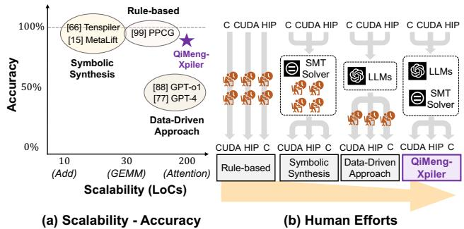
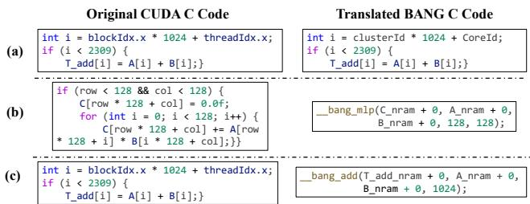
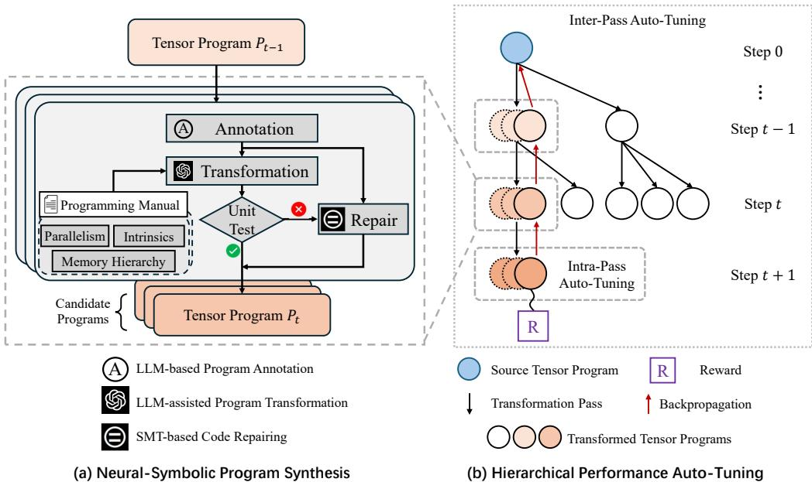
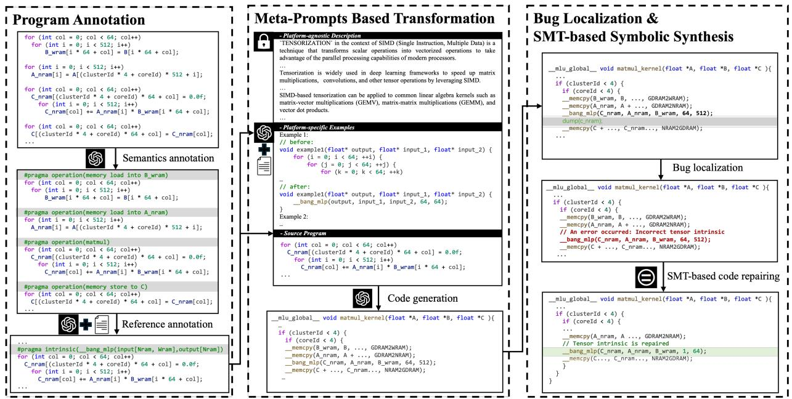
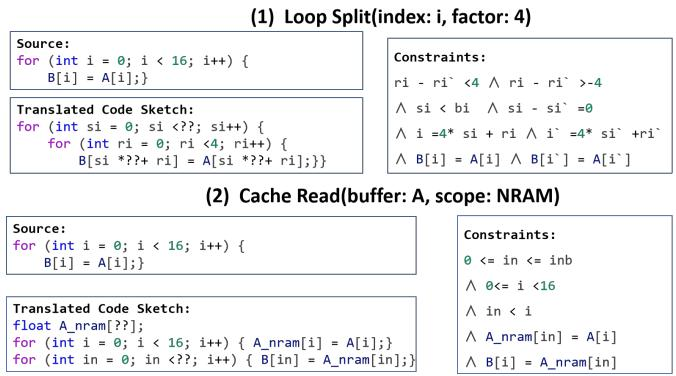
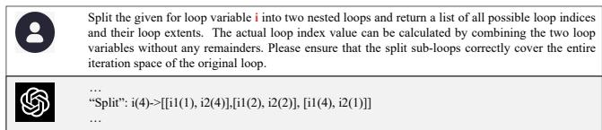
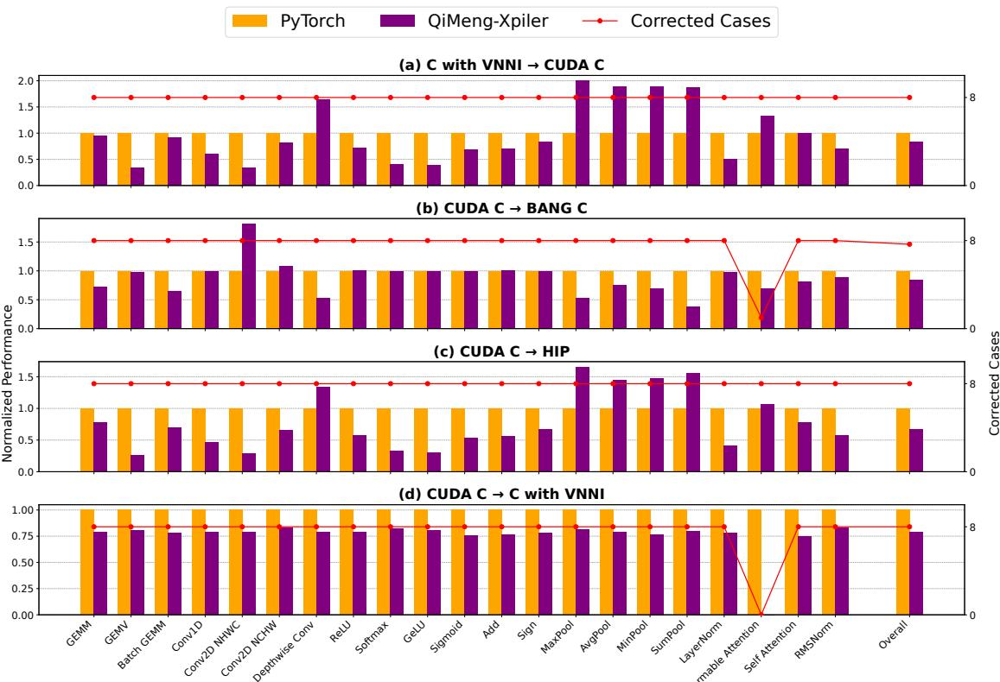
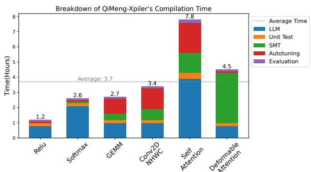
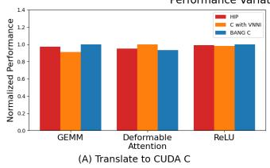
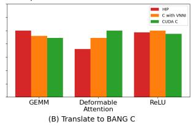

USENIX

THE ADVANCED COMPUTING SYSTEMS ASSOCIATION

# QiMeng-Xpiler:

# Transcompiling Tensor Programs for Deep Learning Systems with a Neural-Symbolic Approach

Shouyang Dong, University of Science and Technology of China, Cambricon Technologies, and   
Institute of Computing Technology, Chinese Academy of Sciences; Yuanbo Wen, Jun Bi, Di Huang, and Jiaming Guo, Institute of Computing Technology, Chinese Academy of Sciences; Jianxing Xu   
and Ruibai Xu, University of Science and Technology of China, Cambricon Technologies, and Institute of Computing Technology, Chinese Academy of Sciences; Xinkai Song and Yifan Hao, Institute of   
Computing Technology, Chinese Academy of Sciences; Ling Li, Institute of Software, Chinese Academy of Sciences, and University of Chinese Academy of Sciences; Xuehai Zhou, University of Science and Technology of China; Tianshi Chen, Cambricon Technologies; Qi Guo, Institute of Computing Technology, Chinese Academy of Sciences; Yunji Chen, Institute of Computing Technology, Chinese Academy of Sciences, and University of Chinese Academy of Sciences

https://www.usenix.org/conference/osdi25/presentation/dong

This paper is included in the Proceedings of the 19th USENIX Symposium on Operating Systems Design and Implementation.

July 7–9, 2025 • Boston, MA, USA

ISBN 978-1-939133-47-2

Open access to the Proceedings of the 19th USENIX Symposium on Operating Systems Design and Implementation is sponsored by

# QiMeng-Xpiler: Transcompiling Tensor Programs for Deep Learning Systems with a Neural-Symbolic Approach

Shouyang Dong1,2,3, Yuanbo Wen3, Jun Bi3, Di Huang3, Jiaming Guo3, Jianxing Xu1,2,3, Ruibai Xu1,2,3 Xinkai Song3, Yifan Hao3, Ling Li4,5, Xuehai Zhou1, Tianshi Chen2, Qi Guo3, Yunji Chen3,5∗

1University of Science and Technology of China, 2Cambricon Technologies

3SKL of Processors, Institute of Computing Technology, Chinese Academy of Sciences 4Institute of Software, Chinese Academy of Sciences, 5University of Chinese Academy of Sciences

## Abstract

Heterogeneous deep learning systems (DLS) such as GPUs and ASICs have been widely deployed in industrial data centers, which requires to develop multiple low-level tensor programs for different platforms. An attractive solution to relieve the programming burden is to transcompile the legacy code of one platform to others. However, current transcompilation techniques struggle with either tremendous manual efforts or functional incorrectness, rendering “Write Once, Run Anywhere” of tensor programs an open question.

We propose a novel transcompiler, i.e., QiMeng-Xpiler, for automatically translating tensor programs across DLS via both large language models (LLMs) and symbolic program synthesis, i.e., neural-symbolic synthesis. The key insight is leveraging the powerful code generation ability of LLM to make costly search-based symbolic synthesis computationally tractable. Concretely, we propose multiple LLM-assisted compilation passes via pre-defined meta-prompts for program transformation. During each program transformation, efficient symbolic program synthesis is employed to repair incorrect code snippets with a limited scale. To attain high performance, we propose a hierarchical auto-tuning approach to systematically explore both the parameters and sequences of transformation passes. Experiments on 4 DLS with distinct programming interfaces, i.e., Intel DL Boost with VNNI, NVIDIA GPU with CUDA, AMD MI with HIP, and Cambricon MLU with BANG, demonstrate that QiMeng-Xpiler correctly translates different tensor programs at the accuracy of 95% on average.

## 1 Introduction

Due to the ever-increasing demand for computation from neural network workloads, various deep learning systems (DLS), e.g., NVIDIA GPU with Tensor Core [12], Google TPU [32], GraphCore IPU [9], and Cambricon MLU [3], have been deployed in data centers of cloud and internet service companies such as Microsoft [10], Google [6], and Amazon [4]. To fully exploit various DLS, it is required to develop multiple highperformance tensor programs, i.e., low-level implementations of tensor operators in deep learning, for different platforms, which are notoriously challenging because of the complicated architecture and programming models. Ideally, if we only need to write one copy of a program, and can run it on different platforms, that is, “Write Once, Run Anywhere”, it is feasible to address the programming problem in data centers with heterogeneous DLS.

  
Figure 1: Comparing QiMeng-Xpiler to existing transcompilation techniques on (a) scalability-accuracy axis and (b) human efforts

One of the most attractive solutions to achieve “Write Once, Run Anywhere” on heterogeneous platforms is source-tosource compilation, i.e., transcompilation, which automatically compiles the code written with one high-level language to another. Existing transcompilation efforts fall into three categories, i.e., rule-based, symbolic synthesis, and data-driven approaches. The rule-based approaches require experts to manually define a set of transformation rules, typically applied to Abstract Syntax Tree (AST), between different programming languages, and then employ pattern matching to parse the input source programs [26, 31]. For example, a CUDAto-FPGA translator, i.e., FCUDA, defines a set of transformation rules for data communication, compute optimization, and parallelism mapping [40]. The symbolic synthesis approaches generate semantic-preserving target code from either domain-specific languages [41] or input/output examples [52]. Since they typically rely on a costly search-based SMT (Satisfiability Modulo Theories) solver [37], it is hard to scale to large-size general-purpose programs. The data-driven approaches, which typically train neural networks from a large amount of source code for code generation, have emerged recently [16,44,53]. Notable examples include TransCoder [43], StarCoder [34], GPT-4 [15], and OpenAI-o1 [8] which automatically translate programs written in different high-level languages such as C++, Java, and Python.

However, the above transcompilation techniques are not applicable to DLS due to their complicated architecture and programming models. Regarding the rule-based approaches, the huge architectural discrepancy between different platforms makes it infeasible to manually define efficient transformation rules. Regarding the symbolic synthesis approaches, in addition to their limited scalability, it is infeasible to handle different parallel semantics, e.g., SIMT in CUDA C and SIMD in BANG C [2], for the SMT solver. Meanwhile, it also requires considerable manual efforts to accurately specify the input constraints for the SMT solver. Regarding the data-driven approaches, even with pre-trained large language models (LLMs), tensor program semantics cannot be fully preserved and thus the translation accuracy only achieves 29.6% [35], which requires considerable manual efforts for code correction. In summary, existing transcompilation techniques for tensor programs face challenges such as tremendous manual efforts, limited scalability, or functional incorrectness, as shown in Figure 1.

To automatically translate tensor programs across DLS with a correctness guarantee, we propose to exploit both the flexibility of data-driven approaches, specifically, via LLMs, and the soundness of symbolic synthesis approaches. However, the challenge of collaboration between LLM and symbolic synthesis is three-fold: (1) it is difficult to generate highly accurate code via LLM due to the scarcity of tensor programs, (2) it is non-trivial to determine which code snippets should be formally generated by search-based symbolic synthesis, in order to balance the computational costs and achieved accuracy, and (3) performance optimizations are hard to specify either with LLM prompts or synthesis specifications, making the performance of generated code significantly lags behind that of human experts.

## 1.1 Our Proposal

To address the above challenges, we propose to build a novel transcompiler, i.e., QiMeng-Xpiler, for translating tensor programs across DLS via both LLM (i.e., GPT-4 [20]) and searchbased symbolic synthesis. The key of QiMeng-Xpiler is that the program translation is automatically conducted as a series of LLM-assisted transformation passes, where incorrect code snippets are repaired by small-scale symbolic synthesis, and the optimal transformation passes are identified via hierarchical auto-tuning. The advantages of proposed neuralsymbolic synthesis are: (1) the entire transcompilation is decomposed into multiple transformation passes via a chain of LLM prompting, instead of a single prompt in traditional LLM-assisted code generation, to significantly improve the accuracy, (2) the problem size for symbolic synthesis is constrained to a limited scale so that the SMT solver can handle it efficiently, and (3) the performance optimization is achieved by exploring both the parameters and sequences of transformation passes.

Concretely, by considering the high parallelism, memory hierarchy, and specialized ISA of DLS, the proposed approach consists of three categories of transformation, i.e., sequentialization/parallelization, memory conversion, and (de)tensorization. Each transformation pass is first performed with LLM-based code transformation, then validated with unit-test, and finally repaired with an SMT-solver if necessary. Then, a hierarchical auto-tuning approach consisting of the intra-pass and inter-pass auto-tuning is conducted to improve the performance. The intra-pass auto-tuning uses brute-force search to find the optimal parameters (e.g., tiling sizes) for program transformation, and the inter-pass auto-tuning uses MCTS (Monte Carlo Tree Search) [19] to determine the optimal sequence of passes with maximized performance.

To demonstrate the generality of QiMeng-Xpiler, we conduct experiments on 4 different DLS with their interfaces, i.e., Intel DL Boost with VNNI intrinsics, NVIDIA GPU with CUDA C, AMD MI with HIP code, and Cambricon MLU with BANG C. Experimental results show that QiMeng-Xpiler correctly translates different programs at the accuracy of 95% on average, and the performance of translated programs achieves an average of 0.78× of vendor-provided manually-optimized libraries including cuDNN/cuBLAS [1,11] and oneDNN [14]. Moreover, the programming productivity of 2 representative DLS, i.e., NVIDIA GPU and MLU, is improved by up to 34.3× and 96.0×, respectively.

## 1.2 Key Contributions

To our best knowledge, this work is the first to automatically translate tensor programs of deep learning systems with different programming models. This paper makes the following contributions:

• Neural-symbolic program synthesis. We propose to use LLMs for generating high-level program sketches via pre-defined meta-prompts and repair the incorrect low-level details through SMT-based symbolic synthesis with limited scale, which achieves automatic program translation with a correctness guarantee.

• Hierarchical performance auto-tuning. We propose a hierarchical auto-tuning approach, where the intra-pass and inter-pass auto-tuning are used for exploring pass parameters and pass sequences, respectively, to maximize the performance of synthesized programs.

• Extensive evaluation. We conduct extensive evaluations on 4 different deep learning systems, and experimental results on accuracy, execution performance, and productivity improvement well demonstrate the effectiveness and efficiency of this work.

Table 1: Comparison of deep learning systems (Intel DL Boost, NVIDIA GPU, AMD MI, and Cambricon MLU) and their programming interfaces. The characteristics fall into three categories: Parallelism, Memory Hierarchy, and Specialized Intrinsics.
<table><tr><td>Platforms</td><td>Interfaces</td><td>Categories</td><td>Examples</td></tr><tr><td>Intel DL Boost</td><td>C with VNNI extensions</td><td>Specialized Intrinsic</td><td>_mm_dpbusds_epi32(...)，_mm512_dpbusd_epi32(...)</td></tr><tr><td rowspan="4">NVIDIA GPU with Tensor Core</td><td rowspan="4">CUDA C</td><td>Parallelism</td><td>blockIdx，threadIdx</td></tr><tr><td>Memory Hierarchy</td><td>registers，__shared__，--global_</td></tr><tr><td></td><td>matrix_a, matrix_b,and accumulator in Tensor Core fragments</td></tr><tr><td>Specialized Intrinsics</td><td>wmma::mma_sync(d，a，b，c)</td></tr><tr><td rowspan="4">AMD MI with Matrix Core</td><td rowspan="4">HIP</td><td>Parallelism</td><td>blockIdx，threadIdx</td></tr><tr><td>Memory Hierarchy</td><td>registers，__shared__，--global__</td></tr><tr><td></td><td>matrix_a, matrix_b,and accumulator in Matrix Core fragments</td></tr><tr><td>Specialized Intrinsics</td><td>d= __builtin_amdgcn_mfma_f32_16x16x4f32(a，b，c，...)</td></tr><tr><td rowspan="6">Cambricon MLU</td><td rowspan="6">BANG C</td><td>Parallelism</td><td>taskId for task-level parallelism</td></tr><tr><td rowspan="2">Memory Hierarchy</td><td>clusterId,coreId for multi-core parallelism</td></tr><tr><td>registers，__mlu_shared__，__mlu_device__</td></tr><tr><td></td><td>__nram__，__wram__</td></tr><tr><td>Specialized Intrinsics</td><td></td></tr><tr><td></td><td>__bang_mlp(...),__bang_conv(...)</td></tr></table>

## 2 Background and Motivation

## 2.1 Background

Programming Deep Learning Systems. Deep learning systems (DLS) adopt different programming languages tailored to their hardware, such as CUDA C for NVIDIA GPU, HIP for AMD MI, BANG C for Cambricon MLU, and VNNI intrinsics for Intel DL Boost CPU. However, programming DLS poses substantial challenges due to their inherent high parallelism, intricate memory hierarchies, and specialized instruction sets. First, DLS typically follows parallel programming models, like SIMT or multi-core, diverging from conventional serial programming. This paradigm shift necessitates a deep understanding of task and data parallelism from programmers. Furthermore, DLS are designed with complex on-chip memory hierarchies to process diverse data types efficiently. For instance, Cambricon MLU uses separate neuron and weight storage for different memory types (i.e., NRAM and WRAM space), while NVIDIA GPU utilizes various memory spaces (e.g., local and shared memory) for multi-level dataflow. Such designs require programmers to explicitly manage complicated memory hierarchies. Additionally, to suit deep learning’s computational demands, DLS often incorporate specialized instruction sets. Examples include Intel’s DL Boost VNNI for specific operations and Cambricon’s tensor intrinsics. These specialized intrinsics often come with intricate constraints, adding extra complexity to programming. Table 1 illustrates the stated programming difficulty for various DLS.

Search-based Program Synthesis. Researchers have studied how to use search-based program synthesis to transform legacy code to high-performance code with minimal manual efforts [17, 18, 30, 49]. The idea is to obtain programs that satisfy semantic correctness by searching through a predefined domain-specific language (DSL) or using an SMT solver for constraint solving. The main advantage of searchbased program synthesis is to ensure the semantic equivalence between the original code and the translated code. However, these approaches always struggle with large search spaces, which means that they can only be applied to pre-defined DSL and thus cannot generate code for commodity deep learning systems. Additionally, they can only handle computational instructions and are unable to meet optimization requirements for hierarchical storage and parallel capabilities. Thus, the source-to-source translation across different deep learning systems remains an open problem.

LLM-assisted Program Generation. LLMs such as Codex [21] and StarCoder [34] are being increasingly used to assist in programming. They can generate programs based on problem descriptions and generate possible code snippets based on the provided code context, helping programmers write code quickly. They also allow programmers to describe problems in natural language without following specific programming language syntax. However, these LLMs have several limitations. Firstly, they lack a deep understanding of program semantics and cannot comprehend the intent of the code. This means that the generated code may be incorrect or incomplete, requiring further adjustment and optimization. Secondly, these models perform poorly in specific domains or complex problems, because it is typically difficult to obtain high-quality and diverse training data for these problems.

## 2.2 Motivation

To understand the design principle of QiMeng-Xpiler, we evaluate transcompilation of real-world tensor programs by stateof-the-art LLM (i.e., GPT-4) and program synthesis tools.

Taxonomy of the transcompilation errors. We first classified all errors introduced in the transcompilation process into 3 categories, each corresponding to specific characteristics of DLS mentioned above: (1) Parallelism-related errors, where the transcompilation fails to analyze the loop semantics and generates the incorrect loops or builtin variables of DLS, (2) Memory-related errors, where the transcompilation cannot deal with the intricate memory hierarchies for the DLS, resulting in incorrect memory declarations and usage, and (3) Instruction-related errors, which occur when the translated code utilizes incorrect instructions or parameters that cannot perform the same computation. Figure 2 illustrates examples of different errors when transcompiling from CUDA C to BANG C code by GPT-4. In Figure 2(a), LLM blindly reuses the GPU’s parallel index (e.g., blockIdx.x \* 1024 + threadIdx.x) on the MLU, ignoring the fact that the MLU’s clusterId and coreId dimensions differ. Figure 2(b) fails to correctly place the B Tensor in the original GEMM operation into the required memory hierarchy, as \_\_bang\_mlp expects the B to be stored in WRAM, not NRAM. Figure 2(c) tends to replace the original SIMT-based scalar operations with SIMD-based tensorized instructions, but the parameter that indicates the tensor length should be 2309 rather than 1024.

  
Figure 2: The unsuccessful transcompilation examples of GPT-4: (a) Parallelism-related. (b) Memory-related. (c) Instruction-related.

Based on the transcompilation error taxonomy, we examine the existing methods and draw the following observations.

Observation #1: The single-step LLM-based transcompilation exhibits significant error rates across all three categories, posing challenges for accurately transcompiling programs across DLS.

Table 2 presents the detailed results for transcompiling CUDA C code to BANG C for real-world operators (detailed in Sec.7) using GPT-4. Note that these categories are not mutually exclusive, which means a single program may trigger multiple types of errors. For the zero-shot, the compilation error rate was 100%, primarily because the LLM struggled with the complex memory hierarchy (100%) and special instructions (100%) due to its insufficient training on DLS-specific datasets. For the few-shot which provided several examples in prompts, although the translated code compiled successfully, it showed functional errors, particularly with parallelism (97.2%) and instruction-related issues (94.4%), resulting in an overall computation error rate of 92.3%. These findings highlight the limitations of single-step LLM-based transcompilations, even with the most advanced LLMs.

Observation #2: Search-based program synthesis excels at optimizing loop bounds and indexing but struggles with highlevel program sketches generation, while LLMs are proficient at generating high-level program sketches but prone to errors in low-level details such as loop bounds and indexing.

Table 2: Breakdown of the unsuccessful transcompilations produced by GPT-4 based on outcome.(%)
<table><tr><td rowspan="2">Errors</td><td colspan="3">Compilation</td><td rowspan="2">Total</td><td colspan="2">Computation</td><td rowspan="2">Total</td></tr><tr><td>|Parallelism Memory Instruction|</td><td></td><td></td><td>|Parallelism Memory Instruction|</td><td></td></tr><tr><td>Zero-Shot</td><td>3</td><td>100</td><td>100</td><td>100</td><td>1 1</td><td>1</td><td>1</td></tr><tr><td>Few-Shot</td><td>2.3</td><td>27.1</td><td>76.5</td><td>49.4</td><td>97.2 2.8</td><td>94.4</td><td>92.3</td></tr></table>

Table 3: Taxonomy of the search-based program synthesis approach.
<table><tr><td></td><td>Method</td><td>Inputs</td><td>|Solving Time</td></tr><tr><td>High-level Program Sketchs|Verified Lifting (Tenspiler [42])| Custom IR</td><td></td><td></td><td>+++</td></tr><tr><td>Low-level Program Details</td><td>SMT Solver (Z3 [37])</td><td>SMTQuery</td><td>+</td></tr></table>

We analyze the strengths and limitations of search-based program synthesis and LLMs in tensor program transcompilation, highlighting their complementary roles. Search-based synthesis, as shown in Table 3, excels at synthesizing and verifying low-level details such as loop bounds and indexing, leveraging its ability to handle mathematical constraints. However, it struggles with generating high-level structures like control flow and efficiently utilizing the memory hierarchy and specialized intrinsics. In contrast, LLMs are highly effective at generating high-level program skeletons but prone to errors in low-level details, such as loop bounds and indexing. As illustrated in Figure 2(c), although the LLM correctly captures the semantics and utilizes the \_\_bang\_add intrinsic, it mistakenly sets the tensor length to 1024 instead of passing the actual scalar loop bound (i.e., 2309). By combining both approaches, LLMs generate the high-level program structure, while search-based synthesis refines the low-level details, leading to more accurate, efficient, and reliable program synthesis.

These observations motivate us to decompose the program translation process into a series of LLM-assisted transformations, where program synthesis tools can further enhance the correctness of transcompilation.

## 3 Overview

To automatically translate tensor programs across DLS with a correctness guarantee, as shown in Figure 3, QiMeng-Xpiler consists of two parts, i.e., Neural-Symbolic Program Synthesis and Hierarchical Performance Auto-Tuning.

Neural-Symbolic Program Synthesis. QiMeng-Xpiler first decomposes the entire transcompilation process into a series of LLM-assisted transformation passes. Among these, the 11 passes as listed in Table 4 can be categorized into 3 classes, i.e., (1)sequentialization/parallelization, (2)memory conversion, and (3)(de)tensorization. Specifically, the sequentialization/parallelization passes directly convert a parallel program into its sequential counterpart (e.g., from CUDA C to C) or vice versa, by appropriately mapping built-in parallel variables (e.g., threadIdx.x in CUDA C) to indexing variables. The memory conversion passes bridge the semantic gap between the memory hierarchies of different DLS by employing suitable strategies for data movement and access patterns. The (de)tensorization passes either convert sequential code into its parallel equivalent by invoking corresponding tensor intrinsics, automatically retrieved from the target system’s programming manuals, or restore the original sequential code from the tensor intrinsics. Overall, these passes, each addressing a key characteristic of different DLS, i.e., parallelism, memory hierarchy, and specialized intrinsics, are sufficient to perform tensor program transcompilation across DLS.

  
Figure 3: The overview of QiMeng-Xpiler, a novel transcompiler for automatic transcompilation of tensor programs across different programming models. The transcompiler consists of two parts: (a) neural-symbolic program synthesis, which utilizes LLM to transform code and repair incorrect transformation through symbolic synthesis with limited scales, and (b) hierarchical performance auto-tuning, which systemically explores both the parameters and sequences of transformation passes.

Table 4: The transformation passes and their description.
<table><tr><td></td><td>Name</td><td>Decription</td></tr><tr><td rowspan="6">(1)</td><td>Loop Recovery</td><td>Convert parallel variables to sequential for loops</td></tr><tr><td>Loop Bind</td><td>Assign a sequential loop to parallel variables</td></tr><tr><td>Loop Split</td><td>Divide a loop into several sub-loops</td></tr><tr><td>Loop Fuse</td><td>Merge several loops into a hyper-loop</td></tr><tr><td>Loop Reorder</td><td>Change the execution orders of loops</td></tr><tr><td>Loop Expansion Loop Contraction</td><td>Split a loop body into several loop bodies</td></tr><tr><td rowspan="3">(2)</td><td>Cache</td><td>Merge the producer in the loop body of consumer Adapt to the memory hierarchy for effcient</td></tr><tr><td>Pipeline</td><td>load/store inputs/outputs</td></tr><tr><td></td><td>Pipeline of data load/store and computation</td></tr><tr><td rowspan="2">(3)</td><td>Tensorize</td><td>Replacea specific loop body to leverage special intrinsics</td></tr><tr><td>Detensorize</td><td>Restore a specific loop body from special intrinsics</td></tr></table>

To ensure both flexibility and correctness, each program transformation pass in QiMeng-Xpiler adopts a neuralsymbolic approach, i.e., utilizing LLM to transform code and repair incorrect transformation through symbolic synthesis with limited scales. In each transformation pass, the LLM first generates transformed code, and this transformed code is then validated by unit tests; if it fails, it is repaired using small-scale SMT-based symbolic synthesis. We will detail this in Section 4.

Hierarchical Performance Auto-Tuning. To achieve automatic transcompilation and maximize the performance of transformed programs, QiMeng-Xpiler employs a hierarchical auto-tuning approach to systemically explore both the parameters (intra-pass auto-tuning) and sequences (inter-pass auto-tuning) of transformation passes. Specifically, the intrapass auto-tuning utilizes brute-force search to identify the optimal parameters (e.g., tiling sizes) for program transformation. The inter-pass auto-tuning, on the other hand, leverages MCTS to automatically discover both functionally correct and optimal sequences of transformation passes for translating tensor programs across different DLS. Concretely, the MCTS in the inter-pass auto-tuning consists of four components: tensor programs, transformation pass, backpropagation, and reward. At each step t − 1, the MCTS selects a candidate node (i.e., tensor program Pt−1) based on its score and expands the node by transforming it with an available transformation pass, resulting in tensor program Pt . Then, by executing Pt , a reward related to execution time is obtained. This reward is backpropagated to all ancestor nodes along the expansion path, updating their scores for the selection in the next step t. We will detail this in Section 5.

## 4 Neural-Symbolic Program Synthesis

QiMeng-Xpiler breaks down the traditional program transformation process into multiple transformation passes, with each pass covering a full workflow of neural-symbolic program synthesis containing program annotation, meta-prompts based transformation, bug localization, and SMT-based code repairing. The neural processes, program annotation, and meta-prompts based transformation, leverage the programming manual and the prior knowledge within the LLM to enhance the flexibility of program transformation, enabling QiMeng-Xpiler to handle larger-scale code compared to traditional methods. Meanwhile, the symbolic processes, bug localization, and SMT-based code repairing, ensure the correctness of the transformed program. These four processes are illustrated in Figure 4.

  
Figure 4: An illustrative example of the proposed neural-symbolic program synthesis on a tensorization case.

## 4.1 Program Annotation

For a specific transformation pass, the program annotation process marks code blocks with semantics related to the transformation pass, assisting in the subsequent program transformation process.

As shown in Algorithm 1, program annotation consists of two parts. The first part (lines 2-3) is semantics annotation which involves identifying computational operations with semantics (e.g., operation(matmul)). This part is performed by an LLM. The second part (lines 4-11) is reference annotation which involves performing an information retrieval in the programming manual based on each identified computational operation to obtain the corresponding target operation and parameters (e.g., intrinsic(\_\_bang\_mlp(input[Nram, Wram], output[Nram])). This part is first performed by a BM25 search engine [48] which can retrieve related information from the programming manual. Then, the retrieved information and the source program are sent to an LLM to annotate the operator with references.

Program annotation serves two main purposes. First, by identifying the computation operations in the source program, semantics annotation abstracts the platform-agnostic functional semantics of the source program instead of focusing on platform-specific details, which can help LLMs generate semantically correct programs in the subsequent LLM-assisted program transformation. Second, by applying reference annotation, the identified computational operations and their associated hardware characteristics (e.g., memory or computation shape constraints for special intrinsics) can be used in the subsequent meta-prompts based transformation process, aiding LLMs in generating more accurate programs.

Algorithm 1: Program Annotation Algorithm   
Input :A source program P   
Output :An annotated program   
1 Given: LLM, BM25 search engine (SE), programming manual M   
//Annotate program with identified computation   
2 Pd ← LLM(P)   
//Get the list of computation information   
3 L ← TraverseComputation(Pd)   
4 for n in L do   
//Retrieve the programming manual of each   
computation   
5 D ← SE(n, M)   
//Annotate program with memory spaces or tensor   
intrinsics   
6 Pd ← LLM(Pd,D)   
7 end   
8 return Pd

## 4.2 Meta-Prompts based Transformation

Meta-prompts-based transformation uses LLMs to convert the source program into the target program with a correct program sketch. In this approach, meta-prompt is a high-level prompt template that can be adapted to different source programs based on the results of the previous program annotation process. The adapted prompt, along with the source program, is then provided as input to the LLMs. Each transformation pass has its own meta-prompt. Meta-prompts mainly consist of three parts: platform-agnostic description, platform-specific examples, and tuning knobs.

Platform-agnostic description. The platform-agnostic part describes the program’s functionality and detailed constraints that must be considered during implementation. For example, in the case of Figure 4, the platform-agnostic part refers to the functionality of the tensorization in the context of SIMD and the application scenarios like deep learning frameworks and common linear algebra kernels. This part of the prompt remains the same across different platforms.

Platform-specific examples. Although operators on different platforms share similar functional semantics, their implementation details, e.g., function names and parameters, can vary significantly. As a result, directly transforming programs across platforms with LLMs often leads to incorrect programs. To address this, we utilize the annotated source program and the LLM to search for platform-specific implementation examples in the target platform’s programming manual that are functionally related to the source program. These examples are incorporated into the meta-prompt as the platformspecific component, bridging the gap between the high-level functional semantics of the operators and target platform. For instance, in Figure 4, the search results include an example of how to transcompile a matmul from C to BANG C.

Tuning knobs. The loop split pass and loop reorder pass require more constraints related to the target platform. This information is included in the meta-prompt optionally. For example, loop split needs to determine the loop split alignment size for the target platform and use this as the minimum unit to expand into a corresponding search space, which is then used for the auto-tuning of the generated program. Please refer to details in Section 5.

Based on the meta-prompt, the LLM can generate the transformed code with a generally correct program sketch but error-prone values. Then, we fix these buggy values with symbolic approaches, including bug localization and SMT-based code repairing, which will be introduced as follows.

## 4.3 Bug Localization

The feasibility of QiMeng-Xpiler relies on effectively reducing the code repair problem scale through precise bug localization during unit testing. The process begins by validating the transformed code against the provided unit tests. When a test failure occurs, Algorithm 2 is employed to systematically identify faulty code segments. The localization mechanism first traverses all buffers and applies binary search to pinpoint the initial faulty buffer. For each candidate buffer during the search, the algorithm identifies the corresponding pretransformation buffer through name similarity matching, then compares the buffer values to determine the search direction. Value matches indicate downstream errors, prompting forward search, while mismatches suggest upstream errors, triggering backward tracing. This iterative process continues until the exact faulty buffer is identified, which subsequently helps determine the buggy code block. For the identified buggy code block, we perform further analysis by categorizing errors into two distinct types: index-related errors (such as inconsistent loop bounds, out-of-bounds accesses, or misaligned indices) and tensor instruction-related errors (including incorrect tensor intrinsic parameters or invalid instructions). Index-related errors are detected through control-flow graph (CFG) analysis, while tensor instruction-related errors are inferred when the CFG appears correct but tensor instructions are present. This localization approach is feasible because each transformation pass introduces only small-step changes while largely preserving the control flow and buffer structure, enabling effective comparative analysis as described.

Figure 4 demonstrates a bug localization example, where inserting a dump function after computing C\_nram reveals a mismatch, while the input, i.e., A\_nram and B\_wram remain correct. This discrepancy confirms that the bug resides in the computation of C\_nram. Since no control-flow changes are involved, the error is precisely attributed to the bang\_mlp instruction.

Algorithm 2: Bug Localization Algorithm   
Input :Source program S, Transcompiled program E   
Output :Faulty code blocks Ne with error type   
1 $S _ { \mathrm { a s t } } $ BuildAST(S); East ← BuildAST(E)   
//Step 1: Faulty Buffer Localization   
2 $B _ { S } \gets$ ← ExtractBufferSequence $( S _ { \mathrm { a s t } } ) { : } B _ { E } \ ^ { . }$ ←   
ExtractBufferSequence $\left( E _ { \mathrm { a s t } } \right)$   
3 $b _ { \mathrm { e r r } }  \emptyset$   
4 for $b _ { e } \in$ BinarySearch $\left( { B _ { E } } \right)$ do   
5 bs ← MatchByNameSimilarit $\mathbf \Lambda _ { / ( b _ { e } , B _ { S } ) }$   
6 if CompareBufferValues(be, bs) = False then   
7 $b _ { \mathrm { e r r } }  b _ { e }$   
8 break   
9 end   
10 end   
//Step 2: Code Block Mapping   
11 NE ← FindBufferAccessNodes $( E _ { \mathrm { a s t } } , b _ { \mathrm { e r r } } )$   
12 NS ← MatchControlFlowBlocks $( S _ { \mathrm { a s t } } , N _ { E } )$   
//Step 3: Error Type Classification   
13 foreach $( N _ { s } , N _ { E } ) \in \dot { N _ { m } } { \bf { d } }$ o   
14 if Compare $C F G ( N _ { S } , N _ { E } ) \neq \emptyset$ then   
15 $T _ { \mathrm { e r r } } ^ { ' } $ IndexError   
16 else if HasTensorIntrinsic(Ne) then   
17 Terr ← TensorInstructionError   
18 end   
19 return $( N _ { e } , T _ { e r r } )$   
20 end

## 4.4 SMT-based Code Repairing

Once the bug is located, QiMeng-Xpiler introduces SMTbased methods for code repairing. For index-related errors, QiMeng-Xpiler leverages an SMT solver to perform automatic repairs. As illustrated in Algorithm 3, QiMeng-Xpiler constructs symbolic constraints over loop bounds and buffer access indices, and encodes them as SMT queries. The SMT solver then searches for solutions that satisfy these constraints. Figure 5 presents examples of such constraints in two representative scenarios: in loop splitting, the solver guarantees that the transformed loops cover the same iteration space; in cache read insertion, it must align reused access indices. It is worth noting that when the loop nest is deep or the control flow is highly complex, the generated constraints can become too large to solve efficiently. For tensor instruction-related errors, QiMeng-Xpiler extracts the scalar computation logic and its corresponding semantics and passes them to Tenspiler [42], which automatically synthesizes semantically equivalent target code containing the appropriate tensor instruction.

  
Figure 5: The SMT constraints for loop split and cache read.

By applying the above repair strategies, QiMeng-Xpiler effectively corrects LLM-generated programs and outputs the fixed version as the final result of a transformation pass.

Algorithm 3: SMT-based Code Repairing Algorithm   
Input :A source program P, error program E   
Output :A repaired program F   
1 Given: Error code snippet S   
2 Ts ← AST(P); Ss ← extract(Ts, S)   
3 Te ← AST(E); Se ← extract(Te, S)   
//Generate the sketch according to transformation   
definition   
4 Sk ← GenerateCodeSketch(Ss, Se)   
//Generate the smt query   
5 Q ← CreateSMTQuery(Ss, Se)   
//Generate the verified code snippet   
6 R ← SynthesisCode(Q)   
7 F ← StitchBack(P, R, S)   
8 return F

## 5 Hierarchical Performance Auto-Tuning

To fully automate code transcompilation and achieve higher performance, QiMeng-Xpiler employs a hierarchical autotuning approach, which effectively decouples high-level code structures from low-level details, enabling flexible enumeration of high-level program sketches (i.e., strategizing parallelization and thread bindings), as well as efficient sampling of low-level specifics (i.e., tiling size and loop orders). As a result, transcompilation exploration space can be formalized as follows:

$$
S = \left\{ \begin{array} { l l l } { \quad } & { S ^ { ( t ) } = \mathrm { a p p l y } ( \mathrm { a p p l y } ( S ^ { ( t - 1 ) } , d _ { t } ) , k _ { t } ) , } \\ { S ^ { ( n ) } \mid } & { \forall d _ { t } \in D _ { t } , 1 \leq i \leq n , } \\ & { \forall k _ { t } \in K _ { t } , 1 \leq t \leq n } \end{array} \right\}\tag{1}
$$

where $s ^ { 0 }$ denotes the source tensor program, and $d _ { t }$ represents a random selected pass from the pre-defined passes $D _ { t }$ ， $k _ { t }$ represents a tuning option from the pre-defined tuning knobs $K _ { t } .$ , and n is number of transformation. Thus, the size of the exploration space aligns with the number of pass sequences and tuning knobs. We have:

$$
| S | = | D _ { 1 } | \times | K _ { 1 } | \times | D _ { 2 } | \times | K _ { 2 } | \times \ldots \times | D _ { n } | \times | K _ { n } |\tag{2}
$$

To explore this huge search space, QiMeng-Xpiler puts forward a hierarchical performance auto-tuning consisting of two main components creatively: (1) Intra-Pass Auto-Tuning, which focuses on fine-tuning the performance of translated programs; and (2) Inter-Pass Auto-Tuning with MCTS, which is responsible for constructing a vast valid search space to identify the most optimal code transcompilation.

  
Figure 6: The auto-tuning prompt for loop split.

## 5.1 Intra-Pass Auto-Tuning

During the transformation process, passes such as loop split and loop reorder are tasked with making a series of critical decisions, including the split size and loop order, which significantly affect the performance of the resulting tensor program. To address these challenges, we consider implementing auto-tuning, an effective technique for automatically generating high-performance programs. Specifically, auto-tuning is implemented as a functional module that interacts with the aforementioned passes to create a search space consisting of multiple candidate programs. It then explores this space to identify the optimal program configuration.

Search space generation. The basis of intra-pass autotuning is to construct a search space with a large number of candidate programs, and our approach generates such space with the help of LLM and programming manuals. As shown in Figure 3, the auto-tuning module first interacts with the loop split to generate multiple programs with different adjustable parameters including: (1) the number of blocks for each logical loop, (2) the loop order after making decisions on (1). This is achieved by using specially designed metaprompts as shown in Figure 6, which are then transferred to the prompts of the loop split and loop reorder pass. Then, the intra-pass auto-tuning module interacts with other passes to generate different program sketches, such as different loop binding strategies.

Search space exploration. Depending on the characteristics of the target code, e.g., in the case of BANG C language with larger instruction granularity resulting in a small search space, we directly employ a brute-force search approach for exploring the program with optimal performance. Actually, the size of the search space varies significantly for different DLS. Take the Matmul operation (512 × 512 × 512) as an example, on GPU the size of search space (K in Equation 1) is 150 while on MLU the size is only 10.

## 5.2 Inter-Pass Auto-Tuning with MCTS

We employs MCTS, which formulates the transcompilation as a Markov decision process where each intermediate program is represented as a state and the actions are the different passes that could be applied next. The reward is proportional to the execution time improvement, but any transformation that fails a unit test yields a reward of zero. The solution would be the actions that lead to the optimal pass sequence.

Reward function. To enhance the accuracy of the cost model while minimizing additional overhead, we add real execution time measurements each time a new transformation pass is declared. While the program is not fully translated, MCTS runs in parallel with the current programs, records the best real throughput as the reward of the current transformation sequence and its corresponding program. At step t, the reward function is

$$
T _ { t i } = { \left\{ \begin{array} { l l } { T ( p _ { t i } ) , } & { { \mathrm { i f ~ } } p _ { t i } } \\ { 0 , } & { { \mathrm { o t h e r w i s e } } } \end{array} \right. }\tag{3}
$$

$$
R _ { t } = \operatorname* { m a x } ( T _ { t i } )\tag{4}
$$

where $p _ { t }$ denotes the transformed programs at iteration t, i is the index of transformed program within intra-pass auto-tuning search space, and T is the throughput of program.

Searching parameters setting. MCTS may fail to effectively reach a terminal node in a given iteration or even fail to generate the final transcompiled program. Therefore, to determine the appropriate maximum search depth(i.e., n in Equation 1) and the total number of simulations, we conducted design space exploration to balance search time and reward. Specifically, the maximum search depth of MCTS should exceed 11 passes, as all passes are crucial and may be repeated, with the number of simulations directly impacting both search time and reward. Ultimately, we selected N = 13 and 512 simulations for MCTS with early stopping mechanism, achieving competitive performance of the transcompiled program within a reasonable search time (e.g., hours).

## 6 Implementations

## 6.1 Implementation Details

QiMeng-Xpiler is implemented with ∼ 35k lines of Python code, encompassing the following core modules: LLMbased program annotation, LLM-assisted program transformation passes, an automated compilation, verification, and performance-benchmarking framework for bug localization, SMT-based code repair, an MCST search algorithm for inter-pass auto-tuning, and a search module for intrapass auto-tuning. In addition, we constructed a test suite of ∼ 38k lines of CUDA C, HIP, C with VNNI, and BANG C kernel code, with 85.7% of the test cases sourced from TVM-generated kernels and the rest (e.g., LLM operation Deformable Attention, Self Attention and RMSNorm as listed in Table 6) sourced from open-source GitHub repositories, to comprehensively evaluate QiMeng-Xpiler’s transcompilation performance across multiple DLS.

## 6.2 Expanding to New DLS

QiMeng-Xpiler consists of two parts: Neural-Symbolic Program Synthesis and Hierarchical Performance Auto-Tuning. The latter maintains platform independence, enabling seamless expansion to new DLS without modification. The former currently implements 11 transformation passes, each pass consists of up to four processes: Program Annotation,

Table 5: Manual effort required for QiMeng-Xpiler.
<table><tr><td rowspan="2">Pass</td><td colspan="4">Processes</td></tr><tr><td></td><td>Annotation Transformation Bug Localization</td><td></td><td>Repair(SMT)</td></tr><tr><td>Loop Recovery Loop Bind</td><td></td><td>Specify threads or cores if needed</td><td>Auto</td><td>Specify threads or cores if needed</td></tr><tr><td>Loop Split</td><td></td><td>Auto</td><td></td><td></td></tr><tr><td>Loop Fuse</td><td></td><td>Auto</td><td></td><td></td></tr><tr><td>Loop Reorder</td><td></td><td>Auto</td><td></td><td></td></tr><tr><td>Loop Expansion</td><td></td><td>Auto</td><td></td><td></td></tr><tr><td>Loop Contraction</td><td></td><td>Auto</td><td>Auto</td><td>Auto</td></tr><tr><td>Pipeline</td><td></td><td>Provide examples if needed</td><td></td><td></td></tr><tr><td>Detensorize</td><td>1</td><td>Provide examples if needed</td><td></td><td></td></tr><tr><td>Cache</td><td>Auto</td><td>Specify memory space if needed</td><td></td><td></td></tr><tr><td>Tensorize</td><td>Auto</td><td>Provide examples if needed</td><td>Auto</td><td>Extend Tenspiler for new DLS</td></tr></table>

Meta-Prompts based Transformation, Bug Localization, and SMT-based Code Repairing, as described in Section 4.

We report the manual effort required for each process when adapting QiMeng-Xpiler to a new DLS, shown in Table 5. In the table, entries marked with “Auto” indicate that the process is fully automated without requiring manual intervention, while “–” means the process does not apply to that particular pass. Concretely, the passes also fall into two categories: platform-agnostic passes and platform-specific passes. Platform-agnostic passes (i.e., Loop Split, Loop Fuse, Loop Reorder, Loop Expansion, and Loop Contraction) primarily operate on loop structures, do not depend on platform semantics, and can be applied across all target platforms using the same prompts and universal examples. Platform-specific passes like Loop Recovery, Loop Bind, Pipeline, Tensorize, Detensorize, and Cache, rely on the hardware characteristics of the target platform. Specifically, in cases where QiMeng-Xpiler cannot automatically reliably extract parameters from the DLS manual (i.e., parallel variables for Loop Recovery and Loop Bind, or the memory scope (e.g., local buffer) used for reads and writes in the Cache pass), users need to explicitly specify these details. For example, we manually specify the number of clusters and cores for MLU and define memory scopes across all platforms. For more complex transformations like Pipeline, Tensorize, and Detensorize, representative code examples are essential for improving transformation quality. While QiMeng-Xpiler attempts to automatically extract such examples from programming manuals, manual efforts become necessary when the available examples are insufficient or ineffective. For example, we provide Matrix Core samples for Tensorize on AMD MI. Furthermore, during Tensorize passes, LLMs may generate incorrect tensor instructions or parameters. We address this by employing Tenspiler [42] for automated tensorization repairing, thus its code generation backend requires extension when adapting to new DLS targets.

Note that this porting effort is only a one-time task with minimal overhead. For example, specifying the parallel variables and memory scope typically demands just a single additional line prompt. Similarly, extending Tenspiler for instructions like TensorCore, MatrixCore, or AVX-VNNI typically requires only a few lines of code. Once this setup is complete, QiMeng-Xpiler can fully support the new platform through its end-to-end fully automated transcompilation flow without requiring further user intervention.

## 7 Evaluation Methodology

Evaluated Platforms. We conduct experiments on 4 different DLS with distinct programming models as follows: 1) Intel Gold 6348 CPU with VNNI Extension, which utilizes a special instruction set for deep learning; 2) NVIDIA A100 GPU with CUDA C, which follows the SIMT programming model; 3) AMD MI200 with HIP, which provides an alternative to CUDA language; and 4) Cambricon MLU with BANG C, which follows SIMD programming model on a DSA.

Evaluated Benchmarks. We evaluate QiMeng-Xpiler on 21 widely-used deep learning operators (shown in Table 6), which can be grouped into 6 types of operations including MatMul, Convolution, Activation, Pooling, Element-wise, and LLM operation. Each operator is further evaluated by 8 typical shapes extracted from real network networks such as GPT [39], LLaMA-2 [47], DAT [54], BERT [25], ResNet [27], and MobileNet [28], VGG [45] and thus there are 168 test cases in total for evaluation. The test cases range from 7 to 214 lines of code and cover various types and shapes from real-world applications, which can comprehensively assess QiMeng-Xpiler’s capabilities.

Table 6: Evaluated Benchmark for QiMeng-Xpiler
<table><tr><td rowspan="2">Type</td><td rowspan="2">Operators</td><td colspan="4">Lines of Code</td><td rowspan="2">Cases</td></tr><tr><td>CUDA C BANG C</td><td></td><td>Hip</td><td>C with VNNI</td></tr><tr><td rowspan="2">MatMul</td><td>GEMM,GEMV Batch GEMM</td><td>26,12 29</td><td>15,11 16</td><td>25,12 28</td><td>41,34 47</td><td>24</td></tr><tr><td>Conv1D</td><td>10</td><td>14</td><td>10</td><td>9</td><td></td></tr><tr><td rowspan="2"></td><td>Convolution Conv2D NHWC,NCHW</td><td>32,30</td><td>23,30</td><td>32,30</td><td>83,85</td><td rowspan="2">32</td></tr><tr><td>Depthwise Conv</td><td>27</td><td>24</td><td>27</td><td>17</td></tr><tr><td rowspan="2">Activation</td><td>ReLU, Softmax</td><td>7,24</td><td>18,18</td><td>7,24</td><td>14,28</td><td rowspan="2">32</td></tr><tr><td>GeLU, Sigmoid</td><td>7,10</td><td>29,30</td><td>7,10</td><td>14,14</td></tr><tr><td>Elementwise</td><td>Add, Sign</td><td>20,12</td><td>26,29</td><td>18,12</td><td>17,14</td><td>16</td></tr><tr><td rowspan="2">Pooling</td><td>MaxPool,AvgPool</td><td>25,30</td><td>25,25</td><td>25,30</td><td>31,34</td><td rowspan="2">32</td></tr><tr><td>MinPool,SumPool</td><td>23,29</td><td>25,25</td><td>23,29</td><td>33,30</td></tr><tr><td rowspan="3">LLM</td><td>LayerNorm</td><td>42</td><td>35</td><td>42</td><td>46</td><td rowspan="2">32</td></tr><tr><td>Deformable Attention</td><td>139</td><td>191</td><td>139</td><td>214</td></tr><tr><td>Self Attention,RMSNorm 54,25</td><td></td><td>64,18</td><td>54,25</td><td>111, 18</td><td></td></tr></table>

Comparison Baselines. The comparison baselines for evaluations on accuracy include state-of-the-art LLM-based approaches and rule-based approaches. Regarding the LLMbased approaches, we select the GPT-4 Zero-Shot, GPT-4 Few-Shot, OpenAI o1 Zero-Shot, and OpenAI o1 Few-Shot as baselines for each transcompilation direction. Regarding the rule-based approaches, we compare QiMeng-Xpiler with two established approaches: PPCG [50] and HIPIFY [7]. PPCG utilizes polyhedral models for auto-parallelization from

C to CUDA HIPIFY is a vendor-provided tool to migrate CUDA code to AMD HIP code. Note that rule-based approaches are not available for other transcompilation directions, primarily due to the complexity and significant human effort required in developing such tools. In contrast, searchbased program synthesis methods struggle with the large search space and therefore are not suitable for direct transcompilation across different DLS. Furthermore, we evaluate execution performance by comparing the code generated by QiMeng-Xpiler with its manually optimized counterparts (e.g., PyTorch with backend libraries such as cuDNN/cuBLAS, CNNL, rocBLAS, and oneDNN). All experiments were conducted using PyTorch as the baseline framework. The corresponding backend libraries of Pytorch for each platform are listed in Table 7.

Table 7: The versions of the performance comparison baselines.
<table><tr><td>Baselines</td><td>Version</td><td>Description</td></tr><tr><td>PyTorch</td><td>v2.5</td><td>Deep Learning framework</td></tr><tr><td>cuDNN</td><td>v9.2.1</td><td>Backend library for NVIDIA GPU</td></tr><tr><td>CNNL</td><td>v2.0.3</td><td>Backend library for Cambricon MLU</td></tr><tr><td>OneDNN</td><td>v3.6</td><td>Backend library for Intel DL Boost</td></tr><tr><td>rocBLAS</td><td>v4.4.0</td><td>Backend library for AMDMI</td></tr></table>

Evaluation Metrics. We use three key metrics to evaluate the performance and accuracy of QiMeng-Xpiler: (1) Compilation accuracy is the ratio of programs that are correctly compiled. This metric gauges QiMeng-Xpiler’s ability to successfully pass compiler checks, reflecting its proficiency in processing source code to generate error-free programs. (2) Computation accuracy is introduced in this paper as a crucial metric that assesses the functional correctness of the translated code, deeming a generated code correct if it passes a set of unit tests. (3) Execution performance evaluates the performance of the translated code, highlighting the significance and practicality of the proposed method in real-world applications. In these metrics, we execute the translated code on real platforms and verify its correctness.

## 8 Experimental Results

## 8.1 Evaluations on Accuracy

We present the evaluations on compilation/computation accuracy in Table 8 and Table 9, where we compare QiMeng-Xpiler with state-of-the-art methods in different transcompilation directions. We conclude that (1) QiMeng-Xpiler performs the best in all directions with close to 100% accuracy for compilation and 86.9% to 100% accuracy for computation. This clearly indicates that QiMeng-Xpiler is capable of handling source-to-source code translation tasks on various DLS with minimal human efforts, bringing revolutionary advancements to the DLS programming domain. (2) QiMeng-Xpiler performs better than the SOTA LLMs (Table 8). While the SOTA LLMs have achieved high accuracy in some cases, their inherent uncertainty makes it impossible to guarantee 100% correctness. This limitation prevents them from being reliably applied to transcompilers, which demand extremely high accuracy. In contrast, our approach combines LLM-assisted program transformation with SMT-based repairing, enabling automatic program translation with guaranteed correctness. (3) QiMeng-Xpiler performs better than the SOTA rule-based methods (Table 9). For C → CUDA C, QiMeng-Xpiler achieves 100% compilation and 98.2% computation accuracy which is ∼ 50% higher than PPCG. For the easier CUDA C → HIP task, QiMeng-Xpiler successfully converts and executes with 100% accuracy, outperforming HIPIFY, which achieves 85.7%. Also, this result shows that QiMeng-Xpiler’s flexibility across various DLS without much adaptation cost while rule-based methods cannot.

Table 8: Experimental results on different transcompilation directions. (%)
<table><tr><td rowspan="2">Source</td><td rowspan="2">Method</td><td colspan="4">Compilation Accuracy</td><td colspan="4">Computation Accuracy</td></tr><tr><td>CUDA C</td><td>BANG C</td><td>Hip</td><td>C with VNNI</td><td>CUDA C</td><td>BANG C</td><td>Hip</td><td>C with VNNI</td></tr><tr><td rowspan="7">CUDA C</td><td>GPT-4 Zero-Shot</td><td></td><td>0</td><td>82.7</td><td>9.5</td><td></td><td>0</td><td>82.7</td><td>4.2</td></tr><tr><td>OpenAIol Zero-Shot</td><td></td><td>0</td><td>85.7</td><td>61.9</td><td></td><td>0</td><td>82.7</td><td>60.7</td></tr><tr><td>GPT-4 Few-Shot</td><td></td><td>50.6</td><td>97.0</td><td>84.5</td><td></td><td>7.7</td><td>96.4</td><td>30.4</td></tr><tr><td>OpenAIol Few-Shot</td><td></td><td>51.8</td><td>98.2</td><td>85.1</td><td></td><td>48.2</td><td>98.2</td><td>55.4</td></tr><tr><td>QiMeng-Xpiler w/o SMT</td><td></td><td>82.7</td><td>98.2</td><td>88.1</td><td></td><td>54.2</td><td>98.2</td><td>58.3</td></tr><tr><td>QiMeng-Xpiler w/o SMT+Self-Debugging</td><td></td><td>87.5</td><td>98.8</td><td>89.3</td><td></td><td>54.8</td><td>98.2</td><td>58.9</td></tr><tr><td>QiMeng-Xpiler</td><td></td><td>100</td><td>100</td><td>100</td><td></td><td>91.7</td><td>100</td><td>95.2</td></tr><tr><td rowspan="7">BANG C</td><td>GPT-4 Zero-Shot</td><td>24.4</td><td>1</td><td>26.8</td><td>0</td><td>0</td><td>1</td><td>0</td><td>0</td></tr><tr><td>OpenAI ol Zero-Shot</td><td>27.4</td><td>1</td><td>97.0</td><td>9.5</td><td>0</td><td>1</td><td>0</td><td>4.2</td></tr><tr><td>GPT-4 Few-Shot</td><td>69.0</td><td>1</td><td>66.1</td><td>23.8</td><td>6.5</td><td>一</td><td>6.5</td><td>13.1</td></tr><tr><td>OpenAIol Few-Shot</td><td>71.4</td><td>1</td><td>97.0</td><td>41.7</td><td>10.1</td><td></td><td>7.7</td><td>23.2</td></tr><tr><td>QiMeng-Xpiler w/o SMT</td><td>85.1</td><td></td><td>84.5</td><td>47.6</td><td>77.4</td><td></td><td>78.6</td><td>41.1</td></tr><tr><td>QiMeng-Xpiler w/o SMT+Self-Debugging</td><td>88.1</td><td>一</td><td>88.7</td><td>50.6</td><td>77.4</td><td>一</td><td>78.6</td><td>41.1</td></tr><tr><td>QiMeng-Xpiler</td><td>100</td><td>一</td><td>100</td><td>100</td><td>95.8</td><td>1</td><td>97.0</td><td>95.2</td></tr><tr><td rowspan="7">Hip</td><td>GPT-4 Zero-Shot</td><td>97.0</td><td>0</td><td>1</td><td>23.8</td><td>97.0</td><td>0</td><td>1</td><td>5.4</td></tr><tr><td>OpenAIol Zero-Shot</td><td>98.2</td><td>0</td><td></td><td>45.8</td><td>98.2</td><td>0</td><td></td><td>4.2</td></tr><tr><td>GPT-4 Few-Shot</td><td>97.0</td><td>35.1</td><td></td><td>85.1</td><td>97.0</td><td>5.4</td><td></td><td>24.4</td></tr><tr><td>OpenAIo1 Few-Shot</td><td>98.8</td><td>42.3</td><td></td><td>88.7</td><td>98.2</td><td>9.0</td><td></td><td>30.4</td></tr><tr><td>QiMeng-Xpiler w/o SMT</td><td>98.2</td><td>60.7</td><td></td><td>65.5</td><td>97.6</td><td>52.4</td><td></td><td>57.1</td></tr><tr><td>QiMeng-Xpiler w/o SMT +Self-Debugging</td><td>98.8</td><td>62.5</td><td></td><td>66.1</td><td>98.2</td><td>52.4</td><td></td><td>57.1</td></tr><tr><td>QiMeng-Xpiler</td><td>100</td><td>100</td><td>1</td><td>100</td><td>100</td><td>86.9</td><td>1</td><td>96.4</td></tr><tr><td rowspan="7">C with VNNI</td><td>GPT-4 Zero-Shot</td><td>57.1</td><td>0</td><td>60.1</td><td>1</td><td>8.3</td><td>0</td><td>8.9</td><td>1</td></tr><tr><td>OpenAIol Zero-Shot</td><td>66.1</td><td>0</td><td>97.0</td><td></td><td>10.1</td><td>0</td><td>96.4</td><td></td></tr><tr><td>GPT-4 Few-Shot</td><td>81.5</td><td>41.7</td><td>74.4</td><td></td><td>14.3</td><td>6.0</td><td>12.5</td><td></td></tr><tr><td>OpenAIol Few-Shot</td><td>87.5</td><td>55.4</td><td>97.0</td><td></td><td>51.2</td><td>10.7</td><td>96.4</td><td></td></tr><tr><td>QiMeng-Xpiler w/o SMT</td><td>95.8</td><td>78.0</td><td>87.5</td><td></td><td>83.9</td><td>58.3</td><td>85.7</td><td></td></tr><tr><td>QiMeng-Xpiler w/o SMT+Self-Debugging</td><td>97.0</td><td>84.5</td><td>89.3</td><td></td><td>83.9</td><td>58.3</td><td>85.7</td><td></td></tr><tr><td>QiMeng-Xpiler</td><td>100</td><td>99.4</td><td>100</td><td></td><td>98.2</td><td>88.7</td><td>99.4</td><td></td></tr></table>

Table 9: Accuracy comparison to rule-based methods.(%)
<table><tr><td>Direction</td><td>Method</td><td>Compilation</td><td>Computation</td></tr><tr><td rowspan="2">CUDA C→ HIP</td><td>Hipify</td><td>85.7</td><td>85.7</td></tr><tr><td>QiMeng-Xpiler</td><td>100</td><td>100</td></tr><tr><td rowspan="2">c→ CUDA C</td><td>PPCG</td><td>47.6</td><td>47.6</td></tr><tr><td>QiMeng-Xpiler</td><td>100</td><td>98.2</td></tr></table>

We conduct an ablation study to further analyze our neuralsymbolic synthesis paradigm, shown in Table 8. Without the SMT solver, although QiMeng-Xpiler still achieves better accuracy than pure LLM-based methods, it cannot reach 100% accuracy (e.g., 52.4% computation accuracy in HIP → BANG C direction). This situation persists even after incorporating QiMeng-Xpiler with the SOTA LLM-based code generation method, Self-Debugging [22]. Due to transcompilers’ high demand for accuracy, the methods that cannot achieve or close to 100% accuracy can be hardly applied in practice. In contrast, leveraging SMT-based code repairing can significantly improve the computation accuracy of program transcompilation, achieving a range of 86.9% to 100%. This underscores the necessity of the SMT solver or, more broadly, neural-symbolic synthesis for the transcompiler.

## 8.2 Evaluations on Execution Performance

We evaluate the performance on the four most common program transcompilation directions, i.e., C with VNNI → CUDA C, CUDA C → BANG C, CUDA C → HIP, and CUDA C → C with VNNI, in Figure 7. Note that we also show the functionally correct cases on each type of operator in the line chart and report the average performance across them. Results show that QiMeng-Xpiler achieves an average performance of 0.78× than its manually optimized counterparts across the four transcompilation directions and various operators. This performance gap stems from manually optimized operators can leverage highly specialized techniques tailored to specific hardware, such as handwritten assembly, deeply pipelined execution (e.g., 5-stage pipeline on MLU, multi-stage pipeline on GPU [29]), and aggressive loop unroll on CPU or GPU.

## 8.3 Case Study: Trancompilation from CUDA C to BANG C

We further demonstrate the superiority and effectiveness of QiMeng-Xpiler by comparing the transcompilation results of different methods in the CUDA C → Bang C transcompilation direction. This task is particularly challenging and representative because 1) it involves transcompiling between two distinct programming models, namely translating from SIMT programs to SIMD programs, and 2) it targets an uncommon language, which has significantly less training data available for LLMs.

  
Figure 7: Performance evaluations on four common transcompilation directions and various operators. The performance of programs generated by QiMeng-Xpiler is compared to its manually optimized counterparts, PyTorch, with backend libraries such as cuDNN/cuBLAS, CNNL, rocBLAS, and oneDNN.

  
Figure 8: Breakdown of QiMeng-Xpiler’s compilation time.

Overall, QiMeng-Xpiler achieves much more improvements in compilation/computation accuracy in CUDA C → BANG C compared to other transcompilation directions. While OpenAI o1 Zero-Shot shows excellent performance in some transcompilation directions, such as CUDA C → HIP, with compilation and computation accuracy of 85.7% and 82.7% respectively, its performance in CUDA → Bang translation is notably lacking, with results at 0%. This shortfall is primarily due to the aforementioned two challenges, which exceeds OpenAI o1 Zero-Shot’s capabilities.

Although OpenAI o1 Few-Shot manages to boost compilation and computation accuracy substantially from 0% to 50.6% and 0% to 7.7%, respectively, by providing CUDA → Bang translations examples, there still exists a large room attaining the complete accuracy. In contrast, QiMeng-Xpiler w/o SMT achieves much higher compilation and computation accuracy of 82.7% and 54.2% correspondingly. This improvement stems from two key approaches adopted in QiMeng-Xpiler w/o SMT : 1) it gains a comprehensive understanding of the target language’s keywords, syntax, and programming APIs by automatically annotating programs via document retrieval, thus compensating for the lack of domain-specific knowledge, and 2) whereas typical transcompilers attempt intricate inter-language translations in a single synthesis step, QiMeng-Xpiler w/o SMT splits the entire process into a series of LLM-based transformation passes. This enables QiMeng-Xpiler w/o SMT to effectively facilitate smooth translations between two substantially different source and target languages. Crucially, with the integration of SMT methods, QiMeng-Xpiler attains remarkable accuracy in the CUDA C → BANG C translation, achieving 100% in compilation and 91.7% in computation. This accuracy is largely due to QiMeng-Xpiler’s implementation of small-scale symbolic synthesis, which ensures the functional equivalence of each transformation pass guided by the LLM. In conclusion, our experiments prove that QiMeng-Xpiler successfully accomplishes transcompiler tasks across different DLS, even for a new and relatively uncommon DLS.

## 8.4 Compilation Time

Figure 8 shows the compilation time of 6 typical operators when translating from CUDA C to BANG C, which ranges from 1.2 to 7.8 hours, with 3.7 hours on average. We further analyze the breakdown of QiMeng-Xpiler’s compilation time and conclude that: 1) SMT is only triggered when the LLM fails to produce a correct translation, so for simpler programs, the proportion of time spent on SMT is smaller; 2) For matrix multiplication-like operators with a larger search space, the proportion of time spent on autotuning significantly increases; 3) Compilation time increases as the number of special intrinsics used in the program grows.

## 8.5 Productivity Improvement

We further evaluate how QiMeng-Xpiler improves programming productivity in real-world scenarios on 2 representative DLS, i.e., GPU and MLU. Specifically, we compare the development costs and performance achieved by manually implementing tensor programs versus those generated by QiMeng-Xpiler through automatic transcompilation, on the most challenging operator, Deformable Attention, with ∼ 200 LoCs.

We invited two CS master’s students and two software engineers as junior and senior coders, respectively. Note that performance is normalized against the manually implemented programs by the senior coders. Table 10 shows that, programming productivity is improved by 34.3× for GPU and 96.0× for MLU via transcompiling legacy tensor program. Although QiMeng-Xpiler fails to automatically generate a functional-correct program for MLU, both junior and senior coders could debug the program with minimal effort, requiring an additional 3 hours and 0.5 hours, respectively.

Table 10: Productivity Improvement by QiMeng-Xpiler.
<table><tr><td rowspan="2" colspan="2">Deformable Attention (~ 200LoCs)</td><td colspan="2">CUDA C-&gt; BANG C</td><td colspan="2">C with VNNI -&gt; CUDA C</td></tr><tr><td>Costs</td><td>Performance</td><td>Costs</td><td>Performance</td></tr><tr><td rowspan="2">Senior Coder</td><td>Manual</td><td>~6d</td><td>100%</td><td>~1d</td><td>100%</td></tr><tr><td>Ours Time Saving</td><td>4.5 + 0.5 h ~28.8×</td><td>69.20%</td><td>2.1 h ~11.4×</td><td>132.50 %</td></tr><tr><td rowspan="2">Junior Coder</td><td>Manual</td><td>~30d</td><td>49.85%</td><td>~3d</td><td>75.76%</td></tr><tr><td>Ours Time Saving</td><td>4.5 +3 h ~96.0×</td><td>65.17%</td><td>2.1 h ~34.3x</td><td>132.50 %</td></tr></table>

## 8.6 Case Study on FlashAttention

To evaluate QiMeng-Xpiler’s effectiveness on real-world, performance-critical kernels, we conducted a case study on FlashAttention (FA1) [24] and FlashAttention-2 (FA2) [23], a memory-efficient attention algorithm widely used in LLMs. Note that FlashAttention kernels require fine-grained parallelism and high-throughput shared memory access, capabilities that are not efficiently supported by CPUs. Table 11 shows the normalized performance of QiMeng-Xpiler on FA1 and



  
Figure 9: Normalized performance of GEMM, Deformable Attention, and ReLU across different trancompilation directions.

FA2 compared to vendor-optimized implementations on different transcompilation directions. Results show that QiMeng-Xpiler achieves 0.61×-0.81× the performance of its native implementations on all transcompilation directions, primarily due to its limited ability to match the intricate sharedmemory tiling and data movement strategies employed in hand-optimized implementations.

Table 11: Normalized performance of QiMeng-Xpiler on FA1 and FA2 compared to vendor optimized implementations. Configuration: Batch Size = 8, Number of Heads = 16, Head Dimension = 32, Sequence Length = 1024.
<table><tr><td rowspan="2">Source</td><td rowspan="2">Operator</td><td colspan="3">Target</td></tr><tr><td>HIP</td><td>BANG C</td><td>CUDA C</td></tr><tr><td rowspan="2">HIP</td><td>FA1</td><td>1</td><td>0.74</td><td>0.71</td></tr><tr><td>FA2</td><td>1</td><td>0.76</td><td>0.74</td></tr><tr><td rowspan="2">BANG C</td><td>FA1</td><td>0.77</td><td>1</td><td>0.75</td></tr><tr><td>FA2</td><td>0.78</td><td>1</td><td>0.61</td></tr><tr><td rowspan="2">CUDA C</td><td>FA1</td><td>0.69</td><td>0.70</td><td>1</td></tr><tr><td>FA2</td><td>0.81</td><td>0.63</td><td>1</td></tr></table>

## 8.7 Performance Variations Comparisons

In this experiment, we evaluate how QiMeng-Xpiler’s performance varies across different source platforms when targeting the same target platform. Figure 9 shows the normalized performance of three representative operators, GEMM, Deformable Attention, and ReLU, when transcompiled to CUDA C (left) and BANG C (right) from various source platforms. Results show that the transcompiled programs achieve comparable performance because QiMeng-Xpiler first converts all source programs into a unified intermediate representation (e.g., scalar C code), decoupling subsequent optimizations from source-specific tuning. The only exception is the transcompilation of Deformable Attention from HIP to BANG C, which achieves only 72% performance. This is mainly because a conditional statement in the HIP source code hinders optimization during conversion, preventing the generated BANG C program from being effectively optimized.

## 8.8 Failure Case

Since QiMeng-Xpiler cannot guarantee 100% correct translation in all cases, we analyzed the failure cases in depth and summarized key limitations as directions for future work.

Complex control flow. When the input program involves complex control structures like multiple nested loops and conditionals, both LLMs and SMT tools struggle to capture the correct parallel semantics, resulting in translation or repair failures. For example, when transcompiling Deformable Attention from CUDA C to BANG C (as shown in Figure 10), the code snippet involves highly complex control flow. As a result, the neural component (i.e., LLMs) of QiMeng-Xpiler fails to generate the required SIMD intrinsics for BANG C, and the symbolic component (i.e., SMT solver) cannot infer the mathematical constraints needed for repair.

Difficult-to-understand computations. Although GPT-4 can recognize a wide range of scalar computations, it struggles to comprehend arbitrary special instructions, hindering its ability for accurate annotation.

To address these limitations, we plan to incorporate more advanced LLMs and SMT techniques, which are expected to significantly enhance QiMeng-Xpiler’s capability in handling complex, real-world deep learning kernels.

```c
for (int32_t i_m_5 = 0; i_m_5 < 8; ++i_m_5) {
if ((((((int32_t *)xy_rounded)[(i_m_5 + 8)] < 0) || (((int32_t *)height_width)[0] <= ((int32_t *)xy_rounded)[(i_m_5 + 8)])) ||
(((int32_t *)xy_rounded)[(i_m_5 + 24)] < 0)) || (((int32_t *)height_width)[1] <= ((int32_t *)xy_rounded)[(i_m_5 + 24)])) {
for (int32_t i_d_7 = 0; i_d_7 < 512; ++i_d_7) {
((float *)corner_values)[(((i_m_5 * 512) + i_d_7) + 12288)] = 0.000000e+00f;
}
```  
Figure 10: The complex control flow in Deformable Attention.

## 9 Related Work

Rule-based approaches. These methods focus on transcompiling source programs to target languages using expertdefined rules [5, 7, 13, 50]. For instance, C2Rust [13] and CxGo [5] translate C code to Rust and Go, respectively, while HIPIFY [7] converts CUDA to HIP. PPCG [50] extracts the polyhedral model from the source program, applies predefined rules for scheduling and parallelization, and generates code from the transformed model. These approaches are labor-intensive, relying on manual rules that require extensive knowledge of both the source and target languages, limiting their applicability to specific platforms. Moreover, they often struggle with irregular code structures, reducing their robustness and general applicability.

Data-driven approaches. Data-driven methods, which train neural networks using supervised or unsupervised corpora, have gained prominence following the success of Neural Machine Translation (NMT). Tools like TransCoder [43] use sequence-to-sequence models for translating between C++, Java, and Python. More recent works leverage LLMs (e.g., CodeX [21], StarCoder [34], CodeGen [38], CodeT5 [51], CodeGeeX [55], LLaMA [47], Gemini [46], GPT-4 [15], and OpenAI o1 [8]) for program translation, achieving superior performance. However, while these methods reduce human effort, they often fail to guarantee the functional correctness of the translated code, especially across different DLS.

Symbolic synthesis approaches. Symbolic synthesis approaches generate semantically equivalent code from inputoutput pairs or formal semantic specifications. For example, C2TACO [36] uses a guided enumerative synthesizer and automatically generated I/O examples to translate C tensor code into the TACO DSL [33]. Recent methods like MetaLift [18] and Tenspiler [42] adopt a more extensible approach by first converting the source program into a unified intermediate representation (IR) and then synthesizing target programs in the same IR domain. These approaches reduce the need for manual transformation rules and are effective for smallscale projects. However, they rely on expensive search-based SMT solvers, which makes them less scalable for larger, realworld applications. Additionally, methods like MetaLift and Tenspiler require users to manually define the semantics of the target language using the specification IR, which is both challenging and error-prone.

In summary, existing approaches either demand significant manual effort, suffer from functional correctness issues, or have limited scalability, making them ineffective for automatically translating programs across DLS with different programming models. In contrast, QiMeng-Xpiler is the first work to tackle this challenge by proposing a novel neural-symbolic synthesis framework, where translation is performed through a series of LLM-assisted transformations, with functional equivalence ensured for each transformation via small-scale symbolic synthesis.

## 10 Conclusion

We propose a neural-symbolic synthesis approach, QiMeng-Xpiler, for automatically translating tensor programs across heterogeneous DLS with different programming models. QiMeng-Xpiler conducts the program translation as a series of LLM-assisted transformation passes, where incorrect code snippets are repaired by small-scale symbolic synthesis. In addition to ensuring functional correctness, QiMeng-Xpiler also employs hierarchical auto-tuning to improve the performance of translated programs. Experimental results on 4 different DLS demonstrate that QiMeng-Xpiler correctly translates different tensor programs at the accuracy of 95% on average, and the performance of the translated program achieves an average of 0.78× of vendor-provided manually-optimized libraries. Moreover, the programming productivity of DLS is improved by up to 96.0×.

## Acknowledgments

We would like to extend our most sincere gratitude to our shepherd, Shan Lu, and the reviewers for their feedback and suggestions. This work is partially supported by Strategic Priority Research Program of the Chinese Academy of Sciences (Grants No.XDB0660300, XDB0660301, XDB0660302), Science and Technology Major Special Program of Jiangsu (Grants No. BG2024028), the NSF of China (Grants No.U22A2028, 62302483, 6240073476, 62302482, 62302478), CAS Project for Young Scientists in Basic Research (YSBR-029) and Youth Innovation Promotion Association CAS.

## References

[1] Basic Linear Algebra on NVIDIA GPUs. https:// developer.nvidia.com/cublas.

[2] Cambricon BANG C Developer Guide. https://www. cambricon.com/docs/sdk\_1.13.0/cntoolkit\_3.5. 2/cambricon\_bang\_c\_4.5.1/index.html.

[3] Cambricon MLU. https://www.cambricon.com/.

[4] Cloud Computing Services - Amazon Web Services (AWS). https://aws.amazon.com/.

[5] cxgo. https://github.com/gotranspile/cxgo.

[6] Google Cloud: Cloud Computing Services. https:// cloud.google.com/.

[7] HIPIFY. https://github.com/ROCm/HIPIFY.

[8] Introducing OpenAI o1. https://openai.com/o1/.

[9] IPU Processors. https://www.graphcore.ai/ products/ipu.

[10] Microsoft Azure: Cloud Computing Services. https: //azure.microsoft.com/.

[11] NVIDIA cuDNN. https://developer.nvidia.com/ cudnn.

[12] NVIDIA Tensor Core. https://www.nvidia.cn/ data-center/tensor-cores/.

[13] C2Rust, [n.d]. https://github.com/immunant/ c2rust.

[14] oneAPI Deep Neural Network Library (oneDNN), [n.d]. https://github.com/intel/mkl-dnn.

[15] Josh Achiam, Steven Adler, Sandhini Agarwal, Lama Ahmad, Ilge Akkaya, Florencia Leoni Aleman, Diogo Almeida, Janko Altenschmidt, Sam Altman, Shyamal Anadkat, et al. Gpt-4 technical report. arXiv preprint arXiv:2303.08774, 2023.

[16] Dzmitry Bahdanau, Kyunghyun Cho, and Yoshua Bengio. Neural machine translation by jointly learning to align and translate. arXiv preprint arXiv:1409.0473, 2014.

[17] Manya Bansal, Olivia Hsu, Kunle Olukotun, and Fredrik Kjolstad. Mosaic: An interoperable compiler for tensor algebra. Proceedings of the ACM on Programming Languages, 7(PLDI):394–419, 2023.

[18] Sahil Bhatia, Sumer Kohli, Sanjit A. Seshia, and Alvin Cheung. Building Code Transpilers for Domain-Specific Languages Using Program Synthesis. In Karim Ali and Guido Salvaneschi, editors, 37th European Conference on Object-Oriented Programming (ECOOP 2023), volume 263 of Leibniz International Proceedings in Informatics (LIPIcs), pages 38:1–38:30, Dagstuhl, Germany, 2023. Schloss Dagstuhl – Leibniz-Zentrum für Informatik.

[19] Cameron B. Browne, Edward Powley, Daniel Whitehouse, Simon M. Lucas, Peter I. Cowling, Philipp Rohlfshagen, Stephen Tavener, Diego Perez, Spyridon Samothrakis, and Simon Colton. A survey of monte carlo tree search methods. IEEE Transactions on Computational Intelligence and AI in Games, 4(1):1–43, 2012.

[20] Sébastien Bubeck, Varun Chandrasekaran, Ronen Eldan, Johannes Gehrke, Eric Horvitz, Ece Kamar, Peter Lee, Yin Tat Lee, Yuanzhi Li, Scott Lundberg, et al. Sparks of artificial general intelligence: Early experiments with gpt-4. arXiv preprint arXiv:2303.12712, 2023.

[21] Mark Chen, Jerry Tworek, Heewoo Jun, Qiming Yuan, Henrique Ponde De Oliveira Pinto, Jared Kaplan, Harri Edwards, Yuri Burda, Nicholas Joseph, Greg Brockman, et al. Evaluating large language models trained on code. arXiv preprint arXiv:2107.03374, 2021.

[22] Xinyun Chen, Maxwell Lin, Nathanael Schärli, and Denny Zhou. Teaching large language models to selfdebug. arXiv preprint arXiv:2304.05128, 2023.

[23] Tri Dao. FlashAttention-2: Faster attention with better parallelism and work partitioning. In International Conference on Learning Representations (ICLR), 2024.

[24] Tri Dao, Daniel Y. Fu, Stefano Ermon, Atri Rudra, and Christopher Ré. FlashAttention: Fast and memoryefficient exact attention with IO-awareness. In Advances in Neural Information Processing Systems (NeurIPS), 2022.

[25] Jacob Devlin, Ming-Wei Chang, Kenton Lee, and Kristina Toutanova. Bert: Pre-training of deep bidirectional transformers for language understanding. arXiv preprint arXiv:1810.04805, 2018.

[26] Ruobing Han, Jaewon Lee, Jaewoong Sim, and Hyesoon Kim. Cox: Exposing cuda warp-level functions to cpus. ACM Trans. Archit. Code Optim., 19(4), sep 2022.

[27] Kaiming He, Xiangyu Zhang, Shaoqing Ren, and Jian Sun. Deep residual learning for image recognition. In Proceedings of the IEEE Conference on Computer Vision and Pattern Recognition (CVPR), pages 770–778, 2016.

[28] Andrew G Howard, Menglong Zhu, Bo Chen, Dmitry Kalenichenko, Weijun Wang, Tobias Weyand, Marco Andreetto, and Hartwig Adam. Mobilenets: Efficient convolutional neural networks for mobile vision applications. arXiv preprint arXiv:1704.04861, 2017.

[29] Guyue Huang, Yang Bai, Liu Liu, Yuke Wang, Bei Yu, Yufei Ding, and Yuan Xie. Alcop: Automatic loadcompute pipelining in deep learning compiler for aigpus. Proceedings of Machine Learning and Systems, 5:680–694, 2023.

[30] Yuka Ikarashi, Gilbert Louis Bernstein, Alex Reinking, Hasan Genc, and Jonathan Ragan-Kelley. Exocompilation for productive programming of hardware accelerators. In Proceedings of the 43rd ACM SIGPLAN International Conference on Programming Language Design and Implementation, pages 703–718, 2022.

[31] Alister Johnson, Camille Coti, Allen D Malony, and Johannes Doerfert. Martini: The little match and replace tool for automatic application rewriting with code examples. In European Conference on Parallel Processing, pages 19–34. Springer, 2022.

[32] Norman P Jouppi, Cliff Young, Nishant Patil, David Patterson, Gaurav Agrawal, Raminder Bajwa, Sarah Bates, Suresh Bhatia, Nan Boden, Al Borchers, et al. Indatacenter performance analysis of a tensor processing unit. In Proceedings of the 44th ACM/IEEE Annual International Symposium on Computer Architecture (ISCA), pages 1–12, 2017.

[33] Fredrik Kjolstad, Stephen Chou, David Lugato, Shoaib Kamil, and Saman Amarasinghe. Taco: A tool to generate tensor algebra kernels. In 2017 32nd IEEE/ACM International Conference on Automated Software Engineering (ASE), pages 943–948. IEEE, 2017.

[34] Raymond Li, Loubna Ben Allal, Yangtian Zi, Niklas Muennighoff, Denis Kocetkov, Chenghao Mou, Marc Marone, Christopher Akiki, Jia Li, Jenny Chim, Qian Liu, Evgenii Zheltonozhskii, Terry Yue Zhuo, Thomas Wang, Olivier Dehaene, Mishig Davaadorj, Joel Lamy-Poirier, João Monteiro, Oleh Shliazhko, Nicolas Gontier, Nicholas Meade, Armel Zebaze, Ming-Ho Yee, Logesh Kumar Umapathi, Jian Zhu, Benjamin Lipkin, Muhtasham Oblokulov, Zhiruo Wang, Rudra Murthy, Jason Stillerman, Siva Sankalp Patel, Dmitry Abulkhanov, Marco Zocca, Manan Dey, Zhihan Zhang, Nour Fahmy, Urvashi Bhattacharyya, Wenhao Yu, Swayam Singh, Sasha Luccioni, Paulo Villegas, Maxim Kunakov, Fedor Zhdanov, Manuel Romero, Tony Lee, Nadav Timor, Jennifer Ding, Claire Schlesinger, Hailey Schoelkopf, Jan Ebert, Tri Dao, Mayank Mishra, Alex Gu, Jennifer Robinson, Carolyn Jane Anderson, Brendan Dolan-Gavitt, Danish Contractor, Siva Reddy, Daniel Fried,

Dzmitry Bahdanau, Yacine Jernite, Carlos Muñoz Ferrandis, Sean Hughes, Thomas Wolf, Arjun Guha, Leandro von Werra, and Harm de Vries. Starcoder: may the source be with you!, 2023.

[35] Yujia Li, David Choi, Junyoung Chung, Nate Kushman, Julian Schrittwieser, Rémi Leblond, Tom Eccles, James Keeling, Felix Gimeno, Agustin Dal Lago, et al. Competition-level code generation with alphacode. Science, 378(6624):1092–1097, 2022.

[36] José Wesley de Souza Magalhães, Jackson Woodruff, Elizabeth Polgreen, and Michael FP O’Boyle. C2taco: Lifting tensor code to taco. In Proceedings of the 22nd ACM SIGPLAN International Conference on Generative Programming: Concepts and Experiences, pages 42–56, 2023.

[37] Leonardo De Moura and Nikolaj Bjørner. Z3: an efficient smt solver. In In Proceedings of the Theory and practice of software, 14th international conference on Tools and algorithms for the construction and analysis of systems, ASPLOS ’21, pages 337–340, 2008.

[38] Erik Nijkamp, Bo Pang, Hiroaki Hayashi, Lifu Tu, Huan Wang, Yingbo Zhou, Silvio Savarese, and Caiming Xiong. Codegen: An open large language model for code with multi-turn program synthesis. arXiv preprint arXiv:2203.13474, 2022.

[39] OpenAI. GPT-4 technical report. CoRR, abs/2303.08774, 2023.

[40] Alexandros Papakonstantinou, Karthik Gururaj, John A Stratton, Deming Chen, Jason Cong, and Wen-Mei W Hwu. Efficient compilation of cuda kernels for highperformance computing on fpgas. ACM Transactions on Embedded Computing Systems (TECS), 13(2):1–26, 2013.

[41] Phitchaya Mangpo Phothilimthana, Tikhon Jelvis, Rohin Shah, Nishant Totla, Sarah E. Chasins, and Rastislav Bodík. Chlorophyll: synthesis-aided compiler for lowpower spatial architectures. In Michael F. P. O’Boyle and Keshav Pingali, editors, In Proceedings of International Conference on Programming Language and Design Implementation (PLDI), pages 396–407, 2014.

[42] Jie Qiu, Colin Cai, Sahil Bhatia, Niranjan Hasabnis, Sanjit A. Seshia, and Alvin Cheung. Tenspiler: A verifiedlifting-based compiler for tensor operations. In Jonathan Aldrich and Guido Salvaneschi, editors, 38th European Conference on Object-Oriented Programming, ECOOP 2024, September 16-20, 2024, Vienna, Austria, volume 313 of LIPIcs, pages 32:1–32:28. Schloss Dagstuhl - Leibniz-Zentrum für Informatik, 2024.

[43] Baptiste Roziere, Marie-Anne Lachaux, Lowik Chanussot, and Guillaume Lample. Unsupervised translation of programming languages. In H. Larochelle, M. Ranzato, R. Hadsell, M.F. Balcan, and H. Lin, editors, Advances in Neural Information Processing Systems, volume 33, pages 20601–20611. Curran Associates, Inc., 2020.

[44] Harshil Shah and David Barber. Generative neural machine translation. In S. Bengio, H. Wallach, H. Larochelle, K. Grauman, N. Cesa-Bianchi, and R. Garnett, editors, Advances in Neural Information Processing Systems, volume 31. Curran Associates, Inc., 2018.

[45] K. Simonyan and A. Zisserman. Very Deep Convolutional Networks for Large-Scale Image Recognition. In International Conference on Learning Representations, May 2015.

[46] Gemini Team, Rohan Anil, Sebastian Borgeaud, Yonghui Wu, Jean-Baptiste Alayrac, Jiahui Yu, Radu Soricut, Johan Schalkwyk, Andrew M Dai, Anja Hauth, et al. Gemini: a family of highly capable multimodal models. arXiv preprint arXiv:2312.11805, 2023.

[47] Hugo Touvron, Louis Martin, Kevin Stone, Peter Albert, Amjad Almahairi, Yasmine Babaei, Nikolay Bashlykov, Soumya Batra, Prajjwal Bhargava, Shruti Bhosale, et al. Llama 2: Open foundation and fine-tuned chat models. arXiv preprint arXiv:2307.09288, 2023.

[48] Andrew Trotman, Antti Puurula, and Blake Burgess. Improvements to bm25 and language models examined. In Proceedings of the 19th Australasian Document Computing Symposium, ADCS ’14, page 58–65, New York, NY, USA, 2014. Association for Computing Machinery.

[49] Alexa VanHattum, Rachit Nigam, Vincent T Lee, James Bornholt, and Adrian Sampson. Vectorization for digital signal processors via equality saturation extended abstract.

[50] Sven Verdoolaege, Juan Carlos Juega, Albert Cohen, José Ignacio Gómez, Christian Tenllado, and Francky Catthoor. Polyhedral parallel code generation for cuda. ACM Trans. Archit. Code Optim., 9(4), jan 2013.

[51] Yue Wang, Weishi Wang, Shafiq Joty, and Steven CH Hoi. Codet5: Identifier-aware unified pre-trained encoder-decoder models for code understanding and generation. arXiv preprint arXiv:2109.00859, 2021.

[52] Jackson Woodruff, Jordi Armengol-Estapé, Sam Ainsworth, and Michael F. P. O’Boyle. Bind the gap: Compiling real software to hardware fft accelerators. In In Proceedings of International Conference on Programming Language and Design Implementation (PLDI), page 687–702, 2022.

[53] Yonghui Wu, Mike Schuster, Zhifeng Chen, Quoc V Le, Mohammad Norouzi, Wolfgang Macherey, Maxim Krikun, Yuan Cao, Qin Gao, Klaus Macherey, et al. Google’s neural machine translation system: Bridging the gap between human and machine translation. arXiv preprint arXiv:1609.08144, 2016.

[54] Zhuofan Xia, Xuran Pan, Shiji Song, Li Erran Li, and Gao Huang. Vision transformer with deformable attention. In Proceedings of the IEEE/CVF Conference on Computer Vision and Pattern Recognition (CVPR), pages 4794–4803, 2022.

[55] Qinkai Zheng, Xiao Xia, Xu Zou, Yuxiao Dong, Shan Wang, Yufei Xue, Zihan Wang, Lei Shen, Andi Wang, Yang Li, et al. Codegeex: A pre-trained model for code generation with multilingual evaluations on humanevalx. arXiv preprint arXiv:2303.17568, 2023.