①

USENIX

THE ADVANCED COMPUTING SYSTEMS ASSOCIATION

# Picsou: Enabling Replicated State Machines to Communicate Efficiently

Reginald Frank, Micah Murray, Chawinphat Tankuranand, Junseo Yoo, Ethan Xu, and Natacha Crooks, UC Berkeley; Suyash Gupta, University of Oregon; Manos Kapritsos, University of Michigan

https://www.usenix.org/conference/osdi25/presentation/frank

# This paper is included in the Proceedings of the 19th USENIX Symposium on Operating Systems Design and Implementation.

July 7-9, 2025·Boston, MA, USA

ISBN 978-1-939133-47-2

Open access to the Proceedings of the 19th USENIX Symposium on Operating Systems Design and Implementation is sponsored by

# Picsou: Enabling Replicated State Machines to Communicate Efficiently

Reginald Frank, Micah Murray,

Chawinphat Tankuranand, Junseo Yoo, Ethan Xu,

Natacha Crooks, Suyash Gupta†, Manos Kapritsos\*

UniversityofCalifornia,Berkeley;\* University ofOregon; \*University of Michigan

## Abstract

Replicated state machines (RSMs) cannot communicate effectively today as there is no formal framework or efficient protocol to do so.To address this issue, we introduce a new primitive,Cross-Cluster Consistent Broadcast (C3B) and present PICsOU,a practical implementation of the C3B primitive. PICSOU draws inspiration from networking and TCP to allow two RSMs to communicate with constant metadata overhead in the failure-free case and a minimal number of message resends in the case of failures.PIcsoU is flexible and allows both crash fault tolerant and Byzantine fault tolerant consensus protocols to communicate.At the heart of PICsOU's good performance and generality is the concept of QUACKs (quorum acknowledgments).QUACKs allow nodes in each RSM to precisely determine when messages have definitely been received, or likely lost. Our results are promising: we obtain up to 24× better performance than prior solutions on microbenchmarks and applications,ranging from disaster recovery to data reconciliation.

## 1 Introduction

Many organizations today use replicated state machines (RSM) underpinned by consensus protocols to provide reliability, fault isolation,and disaster recovery. This includes key-value stores [37,50, 79], cluster managers [25],and microservices [21, 66,70]. These RSMs frequently need to communicate with each other in an efficient and timely manner. Etcd [37] to Etcd mirroring over Kafka, for instance, is a popular approach for disaster recovery across clusters [33]. Similarly,autonomous organizations often run their replicated keyvalue store locally for ease of management, but share access with other entities.For example,conversations with government agencies reveal that,for operational sovereignty,services cannot be managed across agency borders.Instead,any shared information must be communicated across RSMs and explicitly reconciled [75]. Furthermore, in the blockchain ecosystem,there is a growing push towards interoperability, which requires distinct RSMs (blockchains) to communicate [20, 90].

These examples speak of a common need: RSMs must support the ability to effciently and reliably exchange messages with other RSMs that may or may not implement the same consensus protocol internally.

Unfortunately,existing solutions are either ad-hoc,offer vague or evolving guarantees [2O],rely on a trusted thirdparty [92]), or require an expensive all-to-all broadcast [9, 34]. For instance,Apache Kafka,the most popular approach for exchanging data across organizations,internally relies on a third RSM for safely sharing state.

All-to-all broadcast is even more problematic: while RSMs usually run within the same datacenter, there exist many RSMs which are geographically distributed.In these cases, cross-RSM communication will take place over WAN, which offers significantly reduced bandwidth at a much higher dollar cost. This frequently causes communication to become a bottleneck.

Any system that allows RSMs to communicate should satisfy four requirements: 1) strong guarantees: there should be a precise and formal way to discuss RSM-RSM communication 2)robustness under failures: actively malicious or crashed nodes should neither affect correctness nor cause system throughput to drop [32] 3) low-overhead in the common-case: for efficiency,an RSM to RSM communication protocol should send a single message with constant metadata in the failure-free case 4) generality: arbitrary RSMs with heterogeneous sizes,communication,and fault models should be able to communicate.It should, for instance, be possible to link a Byzantine Fault Tolerant (BFT) consensus protocol with a Crash Fault Tolerant (CFT) consensus algorithm

To this effect, we first propose a new primitive, Cross-Cluster Consistent Broadcast (C3B),which can be used by two arbitrary RSMs to communicate. C3B generalizes Reliable Broadcast to guarantee that if RSM A sends m, at least one correct replica in RSM B should receive m.

We then introduce PICsOU, a practical C3B protocol that allows arbitrary RSMs with heterogeneous communication and failure models to communicate efficiently. Designing a C3B protocol that provides good performance in the failure-free case is fairly simple as a simple leader-to-leader broadcast suffices.The challenges instead arise from designing an efficient protocol that remains robust to failures [32]. The key to PICsOU's good and robust performance lies in observing that the C3B problem shares similar goals to TCP [80]. TCP seeks to offer reliable,ordered delivery between two hosts in a way that dynamically reacts to congestion and anomalies in the network.To do so at low cost, TCP leverages full-duplex communication and cumulative acknowledgments (ACKs) to asynchronously detect when messages have been received. In contrast, repeated ACKs of the same message reveal message loss. PICsoU takes inspiration from these techniques and modifies them to account for the differences between C3B and TCP:1) unlike TCP, which is exclusively designed for point-to-point messaging,PICsOU must handle many-to-many communication and disseminate knowledge of failed/successful message deliveries across many nodes, 2)PICsOU must ensure that no Byzantine participant will violate correctness or cause excessive retransmissions.In contrast, TCP does not consider malicious failures.

To address these challenges,PICsoU introduces the notion of QUACKs.A QUACK is a cumulative quorum acknowledgment for a message m.It concisely communicates the fact that all messages up to m have been reliably received byat least one correct node; repeated QUACKs for m indicate that the next message in the sequence was not received at the receiving RSM.

Using QUACKs in PICsOU yields multiple benefits.First, it ensures generality.It allows for PICsoU to seamlessly work for crash fault tolerant systems as well as for both traditional and stake-based Byzantine fault tolerant protocols.PICSOU makes no synchrony or partial synchrony assumption. Second,PICsoU's QUACK-driven implementationhas low overhead.In the failure-free case,PICsOU sends each message only once,and requires only two additional counters per message.When failures do arise,PICsOU remains robust as its resend strategy minimizes the number of messages resent: no Byzantine node can unilaterally cause spurious message retransmissions.

Our results confirm PICsOU's strong guarantees.PICSOU allows disparate protocols such as PBFT [28], Raft [69] and Algorand [40] to communicate. On two real-world applications,Etcd Disaster Recovery [33] and a data reconciliation application [75], PICsOU achieves 2× better performance than Kafka.In our microbenchmarks,when consensus is not the bottleneck,PICsoU achieves 3.2× better performance than a traditional All-to-All broadcast for small networks (4 nodes),and up to 24× for large networks (19 nodes). In summary,this paper makes the following contributions:

1.We introduce Cross-Cluster Consistent Broadcast primitive,which allows for two RSMs to communicate robustly and efficiently.

2. We present PICsOU,a practical C3B protocol. Key to PICsoU's good performance is the use of QUACKs (cumulative quorum acknowledgments),which precisely determines when messages have definitely been received,or likely lost.

3.We evaluate PICsOU on realistic workloads, showing that it can successfully allow disparate RSMs to communicate more effectively that prior solutions.

## 2Formalising the C3B primitive

We first introduce and formalize the C3B primitive. C3B is the blueprint for any communication protocol between RSMs and should be sufficiently general to support various communication and failure models.

## 2.1 System Model

We first discuss the necessary formalism. Consider a pair of communicating RSMS.For the sake of exposition, we denote the sending RSM as Rs and the receiving RSM as $\mathcal { R } _ { \mathrm { c } }$ In practice, communication between these RSMs is full-duplex: both RSMs can send and receive messages.

Most modern RSMs are either crash fault tolerant (they guarantee consensus when up to f nodes crash) or Byzantine fault tolerant (they guarantee consensus when up to f nodes behave arbitrarily). In line with PICsOU's stated generality and efficiency goals, we adopt the UpRight failure model [31]. It allows us to consider Byzantine nodes and crashed nodes in a unified model, letting us design a system that optimizes for each type of failure.In the UpRight failure model, Byzantine nodes may exhibit commission failures； they may deviate from the protocol.All other faulty nodes may suffer from omission failures only: they follow the protocol but may fail to send/receive messages.Crashed nodes,for instance,suffer from permanent omission failures once crashed. Correct nodes,by definition,never faill.In this setup,each RSM consists of n replicas.We denote the j-th replica at the i-th RSM as ${ \mathrm { R } } _ { i j }$ (where i is either the sender or the receiver RSM). Each RSM interacts with a set of clients,of which arbitrarily many can be faulty.

We say that an RSM is safe despite up to r commission failures and live despite up to u failures of any kind. For example,using the UpRight model, we can describe traditional BFT and CFT RSMs using just one equation: 2u+r+1; Setting u=r=f yields a 3f+1 BFT RSM and setting r=O yields a 2f+1 CFT RSM. Safety and liveness of any RSM are defined as follows:

Safety. If two correct replicas $\mathrm { R } _ { i 1 }$ and ${ \bf R } _ { i 2 }$ in RSM $\mathcal { R } _ { i }$ commit transactions T and $T ^ { \prime }$ at sequence number k, then $T = T ^ { \prime }$   
Liveness.If a client sends a transaction T to RSM Ri, correct replicas in $\mathcal { R } _ { i }$ will eventually commit T.

Note that we make no assumptions about the communication model of the underlying RSM. We only assume messages are eventually delivered and that the receiving RSM Rr can verify whether a transaction was in fact committed by the sender RSM $\mathcal { R } _ { \mathrm { s } }$ (more details in Section 3).

We generalize our system model to support shares. The notion of share is used in stake-based BFT consensus protocols where the value of a share determines the decision-making power of a replica [42]. For a replica ${ \mathrm { R } } _ { i j }$ in RSM $\textstyle { \mathcal { R } } _ { i } .$ we write $\delta _ { i j }$ to represent the replica's stake; the total amount of share in RSM $\mathcal { R } _ { i }$ is then $\textstyle \sum _ { l = 1 } ^ { | \mathbf { n } _ { i } | } \delta _ { i l } . \operatorname { A }$ stake-based consensus algorithm is safe as long as replicas totaling no more than $\mathbf { r } _ { i }$ shares deviate from the protocol. The system is live as long as no more than $\mathbf { u } _ { i }$ shares fail to send/receive messages Traditional CFT and BFT algorithms simply set all shares equal to one.

Adversary Model.We assume the existence of a standard adversary which can corrupt arbitrary nodes,delay and reorder messages but cannot break cryptographic primitives. As is standard, we assume that reconfigurations are possible[7,38] and that there exists a mechanism for an RSM to reliably learn of the new configuration and/or share assignments.We provide more detail on how such a mechanism can be implemented in Section 4.4

## 2.2Cross-Cluster Consistent Broadcast

The C3B primitive enables efficient and reliable communication between a sender RSM and a receiver RSM.

To formalize C3B,we first need to define two new communication primitives that express exchanging messages between RSMs. These operations are at a coarser granularity than the traditional send and receive operations,which define the operations performed by a specific node or replica.

Transmit. If a correct replica in $\mathcal { R } _ { \mathrm { s } }$ invokes C3B on message m, we say that RSM $\mathcal { R } _ { s }$ transmits message m to RSM $\mathcal { R } _ { \mathrm { c } }$   
Deliver. If a correct replica from $\mathcal { R } _ { \mathrm { c } }$ outputs message m, we say that RSM $\mathcal { R } _ { \mathrm { c } }$ delivers message m from $\mathcal { R } _ { s }$

We can then define the two correctness properties that all C3B implementations must satisfy:

Eventual Delivery. If RSM Rs transmits message m to RSM $\mathcal { R } _ { \mathrm { c } }$ ,then $\mathcal { R } _ { \mathrm { c } }$ will eventually deliver m.

Integrity. For every message m,an RSM $\mathcal { R } _ { \mathrm { c } }$ delivers m from $\mathcal { R } _ { s }$ if and only if $\mathcal { R } _ { \mathrm { s } }$ transmitted m to $\mathcal { R } _ { \mathrm { c } }$

Note that the deliver operation requires only that one correct node receives the message,not that all correct nodes receive it. This is by design: our goal is to make the C3B condition as flexible as possible to suit application needs.In practice, it is easy to strengthen this condition to either guarantee delivery to all nodes or to establish ordering between RSMs,as correct nodes in the receiving RSM can simply broadcast or invoke consensus on delivered messages.In the name of generality, the C3B primitive talks about a single message only, and does not worry about ordering across messages. PICSOU, nonetheless,uses knowledge of ordering for efficiency,as we describe next.

## 3Design Overview

PICSOU efficiently implements the C3B primitive while remaining general and robust under failures. The design of PICSOU is centered around three pillars:

(P1） Eficiency. In the (common) failure-free case,where messages are received ina timely fashion,PicsOU should only send a single copy of each message across RSMs,and no more than $O ( n )$ copies within a cluster.Any additional metadata sent as part of PICsOU should have constant size.

(P2）Generality. PICsOU should support RSMs of arbitrary sizes, with diverse failure models and communication models, including crash and Byzantine faults as well as synchronous and asynchronous networks.The protocol logic must also work well for both traditional BFT systems and newer Proofof-Stake protocols,where a replica's share determines the weight that its vote carries.

(P3)Robustness.PICsOU should remain robust to failures. Crashed or malicious replicas should have minimal impact on performance [32]. There is a tension here: while the protocol should aggressively resend dropped messages to minimize latency, Byzantine nodes should not cause correct nodes to resend messages,which can spuriously hurt throughput.

Much like TCP flows,communication between RSMs is streaming,long-running and often full-duplex.PiCsoU thus draws inspiration from TCP's approach to congestion control and message loss to guarantee efficiency and robustness.

Two ideas are central to TCP's good performance: 1) leveraging full-duplex communication and 2） cumulative ACKing. In TCP, nodes simultaneously exchange messages, and TCP leverages this bidirectional communication to piggyback acknowledgments onto messages and minimize bandwidth requirements. Cumulative ACKing then keeps these acknowledgments small: with a single counter $k ,$ a receiver informs a sender that it has received all packets with sequence number up to k. Receiving a repeated counter with value k instead informs the sender that the packet with sequence number k+1 is either lost or delayed.

For efficiency, PICsoU also leverages full-duplex communication and cumulative ACKing.However, PICsOU must also handle many-to-many communication as each RSM consists of multiple replicas. For generality, PICsOU must support crashed nodes,Byzantine nodes,as well as Byzantine nodes whose stake determines their voting power; PICsOU makes use of the UpRight fault model to simultaneously handle crash and Byzantine nodes,and leverages the mathematics of apportionment to work seamlessly with staked-based systems.For robustness,PiCsOU must ensure that replicas cannot trigger spurious message retransmissions.PICsOU uses QUACKs to determine when a message has definitely been received or is likely lost.

Overview. PICsoU's protocol logic can be divided into the following logical components.

(1) Consensus: On either side of PICsoU lies a replicated state machine.Each RSM receives requests from clients and runs a consensus protocol that commit these requests on each RSM replica. PICsOU assumes two properties of consensus to guarantee correctness: first, all replicas eventually receive all messages,and second,all replicas agree on the content of each slot in the log.

(2)Invoking PICsOU: If an RSM wants to transmit a request, each replica forwards the committed request to the co-located PICsOU library. RSMs are not required to forward every committed message to PICsOU. This step is application-specific.For example,if two organizations only share a subset of their data, the RSM will only transmit messages that touch these particular objects.

(3) Transmitting a message: PICsoU sends the message on behalf of the sending RSM. In line with our stated efficiency goals,PICsOU ensures that,in the absence of failures and during periods of synchrony,a single sender forwards each request to a single replica in the receiving RSM.To minimize the risk of repeated failures caused by a faulty sender or receiver, PICsOU carefully rotates sender-receiver pairs. In doing so, it ensures that every sender will eventually communicate with a correct receiver and vice-versa.

(4) Detecting successful or failed sends: PICsoU must quickly determine whether a message has definitely been received (and thus can be garbage collected) or has definitely been dropped or delayed (distinguishing between message drops and delays is not possible in an asynchronous system). Failure detection must be accurate to prevent Byzantine nodes from causing spurious re-transmissions; it must be efficient and should not require additional communication between nodes.PICsoU adapts TCP's cumulative acknowledgment approach to detect when messages have been received or dropped,even when malicious replicas can lie.These acknowledgments are piggybacked on incoming messages, thus minimizing overhead.

(5）Retransmissions: When the protocol detects that a message has been dropped (with high confidence),PICsOU intelligently chooses the node responsible for resending the message.Unfortunately, concurrent node failures can cause multiple messages to be dropped simultaneously. To address this issue,PICsOU includes (constant size) information about which messages have been lost,allowing the protocol to recover multiple dropped messages in parallel. Traditional TCP can eschew this constraint as it assumes failures are rare and considers point-to-point communication only.

Correctness We defer a full description of correctness and proofs to Appendix A.1 and A.2 [1].

## 4Protocol Design

We now describe each component of the protocol: transmitting a message,detecting successful/failed sends,and retransmissions.For clarity of exposition,we describe the protocol as consisting of a sender RSM $\mathcal { R } _ { s }$ and a receiver RSM $\mathcal { R } _ { \mathrm { c } }$ proceeding in synchronous timesteps.In practice, nodes operate independently and act as both the sender and the receiver.We start by describing PICsOU's behavior in the common case(§4.1) before considering failures(§4.2).We add support for stake in \$5.We include protocol pseudocode in Appendix A.3 [1].

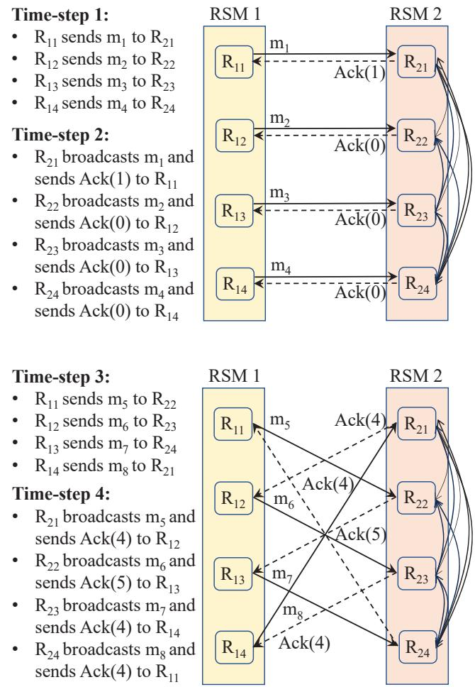  
Figure 1: Example failure-free run in PICSOU

## 4.1Failure-free behavior

Sending a message. PICsOU's send logic has three goals: 1) minimize the number of nodes sending the same message 2) maximize the chances that a message will be received quickly 3）asynchronously disseminate knowledge of received messages to other nodes.PICsOU achieves these goals by round-robin partitioning the set of requests across all sending RSM replicas and rotating receiver nodes every round.

By definition,each replica in an RSM contains a log of committed requests,a subset of which should be transmitted to the other RSM. PICsOU assumes that each request transmitted through PICsOU is of the form $\langle m , k , k ^ { \prime } \rangle _ { Q _ { s } }$ ,where m is a request committed at sequence number k by a quorum of replicas in RSM Rs.Each protocol sets a specific threshold t above which the request has acquired sufficiently many signatures $Q _ { s }$ to be deemed committed. $k ^ { \prime }$ is an optional sequence number that denotes the position of the message in the stream of messages that will be transmitted through PICsOU. $k ^ { \prime }$ must be sequentially increasing; $k ^ { \prime } = \bot$ indicates that the message should not be transmitted. Including both k and $k ^ { \prime }$ allows $\mathcal { R } _ { s }$ to filter which messages will be transmitted to $\mathcal { R } _ { \mathrm { c } }$

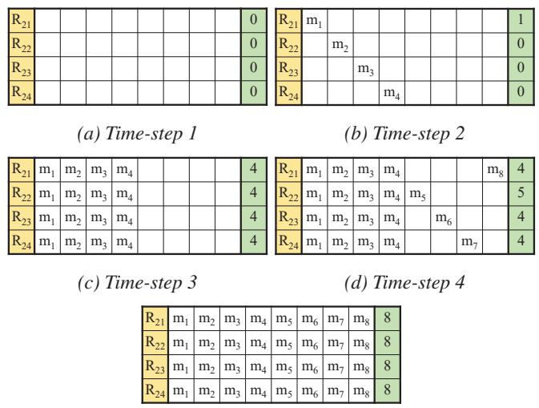  
(e) Time-step 5  
Figure 2: Receiver's view of events in Figure l in time-steps.

PICSOU evenly partitions the task of transmitting committed messages across all replicas such that each message is sent by a single node: replica $\mathrm { R } _ { s l }$ sends messages with sequence number $( k ^ { \prime }$ mod $\mathbf { n } _ { s } \equiv l )$ ．Additionally, each sender rotates receivers on every send: if RSM $\mathcal { R } _ { \mathrm { c } }$ has size ${ \bf n } _ { r }$ and replica $\mathrm { R } _ { s l }$ last sent to replica $\mathrm { R } _ { r j }$ , then $\mathrm { R } _ { s l }$ will next send to $\mathrm { R } _ { r J }$ where $J \equiv j + 1$ mod ${ \bf n } _ { r }$ . Node IDs themselves are assigned byPICsOU usinga verifiable source of randomness [4O] such that malicious nodes cannot choose specific positions in the rotation.Note that,as is standard in TCP,we allow senders to transmit a window of messages in parallel.

Receiving a message Upon receiving a message, the j-th replica $\mathrm { R } _ { r j }$ checks that the message $\langle m , k , k ^ { \prime } \rangle _ { Q _ { s } }$ is valid (the message has provably been committed by the sender RSM) and if so,broadcasts it to the other nodes in its RSM. Importantly, the receiving node does not need to recommit the message.It can simply apply it to its local state as mandated by the application logic.

Rotating sender-receiver pairs in this way guarantees that every pair of replicas will eventually exchange messages and ensures that（1） information about the state of each node is propagated to every other node in the system,and (2) no sender is continuously sending to a faulty replica (or vice-versa).This process is also essential to bounding the number of retransmissions needed with failures (§4.2).

We illustrate PICsOU's logic in Figure 1. For clarity of exposition,we assume that 1) in each time-step,each replica completes all relevant tasks in parallel, 2) all sent messages are received in the next time-step,and 3) only one RSM sends, the other only acks.In our implementation,acks are piggybacked on messages.Consider a system with ${ \mathbf n } _ { s } = { \mathbf n } _ { r } = 4$ replicas $( \mathbf { u } = \mathbf { r } = 1 )$ . In time-step 1,replicas ${ \sf R } _ { 1 1 } , { \sf R } _ { 1 2 } , { \sf R } _ { 1 3 }$ ,and $\mathrm { R } _ { 1 4 }$ of ${ \mathrm { R S M } } _ { 1 }$ send messages m1,m2,m3,and $m _ { 4 }$ to receivers $\mathrm { R } _ { 2 1 } , \mathrm { R } _ { 2 2 } , \mathrm { R } _ { 2 3 }$ ,and $\mathrm { R } _ { 2 4 }$ ,respectively.In time-step 2, these receivers internally broadcast these messages to the other nodes in their RSM. Concurrently, $\mathrm { R } _ { 2 1 } , \mathrm { R } _ { 2 2 } , \mathrm { R } _ { 2 3 }$ ,and $\mathrm { R } _ { 2 4 }$ acknowledge receipt of these messages and send $\mathbf { A C K } ( 1 )$ ,ACK(0), ACK(O),and AcK(O) to senders $\mathbf { R } _ { 1 1 } , \mathbf { R } _ { 1 2 } , \mathbf { R } _ { 1 3 }$ ,and $\mathrm { R } _ { 1 4 }$ .We discuss acknowledgments later in the section.In time-step 3 $, { \bf R } _ { 1 1 } , { \bf R } _ { 1 2 } , { \bf R } _ { 1 3 }$ ,and $\mathrm { R } _ { 1 4 }$ rotate receivers and send messages m5, m6, m7, and $m _ { 8 }$ to ${ \tt R } _ { 2 2 }$ ,R23， $\mathrm { R } _ { 2 4 }$ ,and $\mathrm { R } _ { 2 1 }$ . In time-step 4, receivers once again broadcast the received messages in their RSM. Simultaneously, ${ \bf R } _ { 2 1 }$ ,R22,R23,and $\mathrm { R } _ { 2 4 }$ rotate receivers for their acknowledgements,and send AcK(4)，AcK(5), ACK(4),and AcK(4) to senders ${ \mathrm { R } } _ { 1 2 }$ , $\mathrm { R } _ { 1 3 }$ $\mathrm { R } _ { 1 4 }$ ,and $\mathrm { R } _ { 1 1 }$

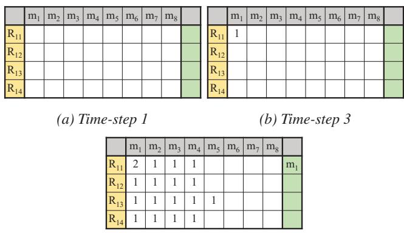  
(c) Time-step 5  
Figure 3: Sender's view of events in Figure l in time-steps.

Detecting successful sends. To guarantee correctness, committed messages must eventually be received by a correct node in the receiving RSM. Every node in the sending RSM (not just the sender) must thus learn whether a message has definitely been received by a correct node.This is necessary to preclude correct nodes from unnecessarily resending messages.There are three primary challenges: (1) malicious nodes may lie about the set of messages received,(2) for efficiency, PICsoU should not require nodes within an RSM to exchange information beyond the necessary message broadcast,and (3) any additional metadata should be small. PICSOU realizes these goals through cumulative quorum acknowledgments (or QUACKs).A cumulative quorum acknowledgment with value k proves to the sending RSM that all messages with sequence number up to k have been received by at least one correct replica. More specifically, each replica, upon receiving a message with sequence number k, inserts it into a sorted list containing all previously received messages. The replica then identifies the highest message $m _ { p }$ in the list for which all messages with a smaller sequence number have been received. It then crafts an acknowledgment ACK(p) that cumulatively acknowledges receipt of messages 1 to $p .$ PICsOU takes advantage of the full-duplex nature of the protocol to piggyback these acknowledgments onto the messages that the receiving RSM is itself sending to the sending RSM.If no such message exists,the RSM sends a no-op.

On the sender side,each replica eventually receives messages and acknowledgments from all ny receiving replicas, thanks to PIcsOU's round-robin strategy. Each replica maintains an ny sized array that summarizes the highest acknowledgment received from each replica of receiving RSM. A message $m _ { p }$ is QUACKed if at least ${ \bf u } _ { r } + 1$ replicas have acknowledged receipt of all messages up to $p .$ As there are only ${ \bf u } _ { r }$ failed replicas,one of these replicas must be correct. We thus have the guarantee that this correct replica will broadcast the message to all other remaining correct replicas. Note that PICsOU additionally uses MACs to safely transmit ACKs when configured to handle Byzantine failures (r > O).

Example. Continuing with our example in Figure 1, we highlight the protocol logic for both the receiver RSM (Figure 2) and the sender RSM(Figure 3).Each row in Figure 2 describes a sorted list of messages received at each replica, with the last column denoting the highest cumulative acknowledgment for this node. At time-step 1,all lists are empty and cumulative acknowledgment values are all set to 0 (2a).At time-step 2, receivers $\mathbf { R } _ { 2 1 } , \mathbf { R } _ { 2 2 }$ ,and ${ \mathrm { R } } _ { 2 3 }$ (2b) store messages m1,m2 and m3.R21's cumulative acknowledgment counter thus increases to 1,while others stay at O as they are still missing $m _ { 1 }$ .R21,R22,and ${ \mathrm { R } } _ { 2 3 }$ thus send ACK(1), ACK(O) and ACK(O) to the sender RSM.At time-step 3,each receiver, thanks to the internal broadcast mechanism,receives all four messages.All cumulative acknowledgment counters thus go to 4 (2c).By time-step 4, receivers $\mathbf { R } _ { 2 1 } , \mathbf { R } _ { 2 2 }$ ,and ${ \mathrm { R } } _ { 2 3 }$ have all received $m _ { 8 } , m _ { 5 }$ and $m _ { 6 } . \mathrm { R } _ { 2 2 }$ has received messages $m _ { 1 }$ to $m _ { 5 }$ ,and thus updates its cumulative acknowledgment to 5.In contrast, ${ \bf R } _ { 2 1 }$ and ${ \mathrm { R } } _ { 2 3 }$ have received messages mg and $m _ { 6 }$ respectively, they are missing $m _ { 5 }$ and thus cannot yet update their cumulative acknowledgment counter. ${ \mathrm { R } } _ { 2 1 }$ ${ \tt R } _ { 2 2 }$ ,and ${ \mathrm { R } } _ { 2 3 }$ send ACK(4),ACK(5) and $\operatorname { A C K } ( 4 )$ back to the sending RSM.Finally, at time-step 5,the internal broadcast mechanism disseminates all these messages; each replica can update its cumulative acknowledgment to 8.

Now consider the sender-side logic (Figure 3),which processes these cumulative acknowledgments and determines when a QUACK has formed. Recall that a message is QUACKed at a replica if this replica receives $\mathbf { u } + 1 = 2$ acknowledgments for m. Initially,all QUACK counters are empty (3a). At time-step 3 (3b), $\mathrm { R } _ { 1 1 }$ records that it has received an acknowledgment for m1 (AcK(1)） from ${ \bf R } _ { 2 1 }$ . At time-step 5, (3c), $\mathrm { R } _ { 1 1 }$ receives AcK(4) from $\mathrm { R } _ { 2 4 }$ It updates its local array, indicating that it has received acknowledgments for $m _ { 1 }$ by two unique nodes,and marks $m _ { 1 }$ as QUACKed.It also records the received acks for $m _ { 2 } , m _ { 3 }$ and $m _ { 4 }$ 、Similarly,all other replicas indicate that they have received an ack for $m _ { 1 } , m _ { 2 } , m _ { 3 }$ ,and $m _ { 4 }$ ，Additionally, $\mathrm { R } _ { 1 3 }$ indicates it received an ack for $m _ { 5 }$ as it received ACK(5).

Summary The joint techniques of full-duplex communication, cumulative acking,and rotation of sender/receiver pairs allow PICsOU to ensure that all RSM replicas eventually learn which committed requests have been delivered. The protocol achieves this with only two additional counters and with no additional communication between replicas of an RSM beyond the necessary broadcast.

## 4.2Handling Failures

Faulty replicas can: 1） fail to send or broadcast messages sends and broadcasts,2) send invalid messages to DDoS the network, 3) collude to repeatedly drop messages,and 4) send incorrect acknowledgments to break correctness or trigger spurious retransmissions.PICsOU must effectively handle these failures without sacrificing correctness or performance. To this effect, PICsOU must quickly and reliably detect when a message has definitely been dropped or delayed and quickly retransmit it. The system must do so without any additional communication beyond resending the message itself.

Detecting failed sends. The protocol once again leverages QUACKs to detect failed sends.Recall that all sender replicas eventually obtain a QUACK for every message that has definitely been delivered. One can instead leverage duplicate QUACKs to learn when a correct replica has not received a specific message. In more detail, let us assume that a QUACK for message $m _ { k }$ has formed at $\mathrm { R } _ { s l }$ .This QUACK indicates that at least u+1 (at least one correct) replicas have received every message up to message m with sequence number k.A duplicate acknowledgment $\operatorname { A C K } ( k )$ from one of these replicas implies that this replica claims not to have received the message at sequence number k+1. Once a duplicate QUACK forms for the k-th message at replica $\mathrm { R } _ { s l } , \mathrm { R } _ { s l }$ learns that a correct replica is complaining about missing message (k+1),and thus that the message has legitimately been lost or delayed.All other replicas of the sending RSM $\mathcal { R } _ { s }$ will eventually receive a duplicate QUACK and thus detect the failed exchange.The use of the UpRight failure model, which distinguishes actively malicious failures r from all other failures,allows us to reduce the size of the duplicate QUACK: while the initial QUACK is of size u+1, duplicate QUACKs must be of size r+1 as they must be large enough to preclude actively malicious nodes from triggering spurious resends.In a system with only crash failures (when r=O),a single duplicate AcK() is sufficient to trigger a message resend: nodes may crash but do not lie.

Retransmitting the dropped message. Upon detecting a failed send, the message must be quickly retransmitted. Just as a single replica was responsible for sending the initial message,PICsOU ensures that a single replica is "elected" as the re-transmitter. It does so without requiring additional communication between replicas. The protocol logic hinges on three observations:1） all correct replicas know about all the messages that must be transmitted (by definition of an RSM) and know who initially sent the message,2) all correct replicas eventually learn about which messages have been QUACKed,and 3) the number of repeated QUACKs indicates the number of failed retransmissions.PICsoU uses this information to compute the ID of the re-transmitter as: $s e n d e r _ { n e w } = ( s e n d e r _ { o r i g i n a l } + \# _ { r e t r a n s m i t } )$ mod ns.Each correct replica computes this function and retransmits the message if its ID matches $s e n d e r _ { n e w }$ ，Each retransmission round thus has a single sender.

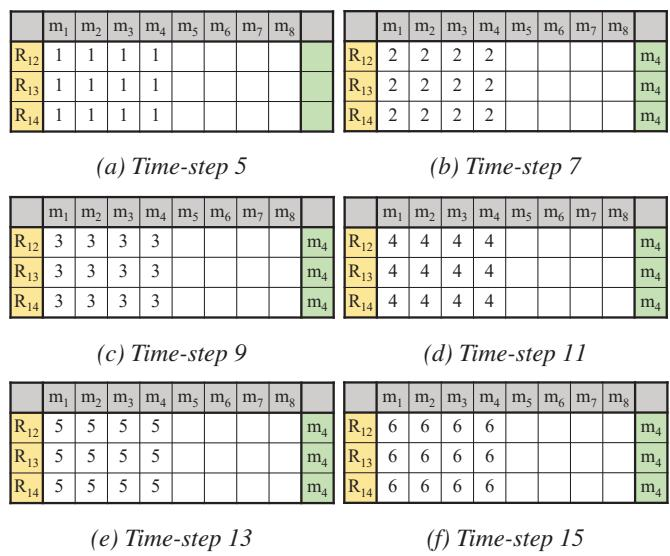  
Figure 4: Sender's view of events.R11 fails after TS2 in Figure 1.

To illustrate,consider once again our initial example (Figure 1),but this time,let us assume that sender replica $\mathrm { R } _ { 1 1 }$ fails in time-step 2,after sending message $m _ { 1 }$ but before sending messages m5 and m9.As a result, no receiver receives these messages.In Figure 4,we time-step through this failure scenario.For simplicity,we assume that the receiving RSM sends periodic acks every time-step.As before,all non-failed replicas of ${ \mathrm { R S M } } _ { 1 }$ receive their first $\operatorname { A C K } ( 4 )$ in time-step 5(Figure 1); In time-step 7,all replicas receive a second ACK(4） message,from a different node,allowing them to mark messages $m _ { 1 }$ to $m _ { 4 }$ as QUACKed. They continue receiving AcK(4) from distinct replicas in time-step 9 and 11. Receivers cannot acknowledge any message greater than $m _ { 4 }$ as they are yet to receive $m _ { 5 }$ .In time-step 13, the senders receive their first duplicate AcK(4) message.By the end of time-step 15,the senders have received at least $\mathbf { r } _ { r } + 1 = 2$ duplicate AcK(4) messages, confirming that $m _ { 5 }$ is missing. R12 proceeds to resend $m _ { 5 }$

The pitfalls of sequential recovery. Unlike traditional TCP in which message drops are not adversarial, faulty replicas can carefully select which messages to drop.For instance, in $\mathbf { \tau } _ { \mathbf { { l } } } \mathbf { \eta } \mathbf { n } = 2 \mathbf { u } + \mathbf { r } + 1$ setup with $\mathbf { u } = \mathbf { r } = 1$ ,if a node omits all received messages, every fourth message will need to be resent.In this setup,PICsOU can hit a throughput bottleneck. A QUACK conveys information about the lowest message that has been dropped by the system, but says nothing about later messages.This approach is optimal metadata-wise but serializes recovery: if messages $m _ { i } , m _ { i + 4 } , m _ { i + 8 }$ ,etc.have all been dropped, resending $m _ { i + 8 }$ first requires detecting the failed send of message $m _ { i }$ ，retransmitting mi, QUACK $m _ { i } .$ before repeating the same process for $m _ { i + 4 }$ . Only then can the failed send of $m _ { i + 8 }$ be handled.

Parallel Cumulative Acknowledgments.To address this is-sue,we must augment our cumulative acknowledgments with a limited form of selective repeat [93]. Each receiver sends both a cumulative acknowledgment and a list summarizing the delivery status of up to Φ messages past the sent cumulative acknowledgment. The cumulative acknowledgment counter concisely summarizes the set of contiguous messages received so far. The Φ-list instead captures any "in-flight" missing messages. Sending Φ-lists over the network is efficient as the delivery status of each message takes at most one bit to encode.This list can further be reduced with techniques such as compression or bloom filters.

Sender replicas can now,concurrently, form QUACKs for Φ concurrent messages and thus retransmit Φ messages in parallel. This reduces latency without resorting to eager message resends. The maximum size of φ-lists is an experiment-specific parameter. The actual number of elements in a 𝜙-list depends on the number of in-flight messages at the time of sending a cumulative acknowledgment.

Analysis During periods of synchrony (when messages are not dropped or delayed by the network),PiCsoU retransmits messages at most $\mathbf { u } _ { s } + \mathbf { u } _ { r } + 1$ times.This limitation is fundamental to all C3B protocols (Lemma 1 in Appendix [1]).The number of resends can become a concern for latency if the number of failures is large.In practice,however, the probability of actually hitting this bound is small. Intuitively, in a CFT or BFT system,each node is more likely than not to be correct.As such,the probability of continually selecting incorrect nodes in every sender-receiver pair decreases exponentially every retry. One can use this reasoning to provide strong bounds on the maximum number of retries when the network is well-behaved. We prove, for instance (in Appendix A.2 [1]) that PICsOU needs to resend a message at most eight times to ensure that a message be delivered with 99% probability, and at most 72 times to ensure a $1 0 0 { - } 1 0 ^ { - 9 } \%$ success probability.

## 4.3Garbage Collection

At first glance,garbage collecting messages in PICSOU appears straightforward. The sending RSM, upon receiving a QUACK for m,can garbage collect m as the message has been received by a correct replica. Unfortunately, this approach can lead to scenarios in which PICsOU stalls.Consider, for instance,an execution in which sender $\mathrm { R } _ { s l }$ sends a message $m _ { k }$ (at sequence number k) to replica $\mathrm { R } _ { r j }$ of RSM $\mathcal { R } _ { \mathrm { c } }$ Now, consider the case in which $\mathrm { R } _ { r j }$ is faulty and broadcasts $m _ { k }$ to precisely ${ \bf u } _ { r } + 1$ replicas, ${ \bf u } _ { r }$ of which are faulty. These replicas reply to the sender RSM that m has been successfully received,allowing fora QUACK to form at the sender,and for message m to be garbage collected. Unfortunately, if these uy replicas then stop participating in the protocol, no QUACK will ever form for any message with sequence number greater than k (only one correct replica has seen m).Instead, the sending RSM will receive repeated duplicate acknowledgments for m,a message which it has already garbage collected!

We must consequently modify the garbage collection algorithm slightly. If a sending replica ever receives a duplicate QUACK for message mk where K' <k after having quacked and garbage collected message $m _ { k } ,$ it includes,as additional metadata, the sequence number k of its highest quacked message. This information conveys to the receiving RSM that all messages up until k (included) have been received by some correct node in the receiving RSM, but not necessarily the same one.Replicas in the receiving RSM, after having received $\mathbf r _ { s } + 1$ such messages (ensuring that at least one correct node is in the set),can then either(1) advance their cumulative acknowledgment counter to k and mark message m as received,or (2) obtain m from other replicas in the RSM. Only then can m be garbage collected. We offer both strategies in PICSOU.

## 4.4Reconfiguration

PICSOU assumes that reconfigurations are possible but rare.It assumes that there exists a service indicating the set of nodes associated with each configuration. This is standard practice in the literature [7, 37, 38]. Knowledge of membership is either maintained internally in the RSM [87] or using an external configuration service [37, 87]. Most existing state-ofthe-art blockchain systems [3, 10, 40,51, 59, 67,75,83, 94] also require known node membership.To deal with churn and scale,these systems work in epochs where it is assumed both node membership and relative stake are both publicly known and fixed.PICsOU piggybacks on this assumption.PICsOU then only needs to ensure that the set of ACKs received for a particular message all match the same view and that the relevant $( \mathbf { u } + 1 / \mathbf { r } + 1 )$ threshold has been reached (for that view).

Messages acknowledged as delivered before a reconfiguration occurs do not need to be resent. Reconfiguration in an RSM, by definition, preserves any state across configurations. Messages not acknowledged as delivered before the reconfiguration begins must be resent as they may or may not have persisted.After reconfiguration completes,PICsOU simply resends messages for which it did not receive a quorum of acknowledgments in the prior configuration.

## 5Weighted RSMs - Stake

The current description of the protocol assumes that replicas have equal weight in the system.When considering proofof-stake systems like Algorand, each replica can instead hold differing amounts of stake or shares in the system.We write $\delta _ { i j }$ for the share of $\mathrm { R } _ { i j } ;$ the total amount of stake in RSM $\mathcal { R } _ { i }$ is then $\begin{array} { r } { \pmb { \Delta } _ { i } = \sum _ { l = 1 } ^ { { \mathbf { n } } _ { i } } \delta _ { i l } } \end{array}$ . The RSM is safe as long as replicas totalling no more than $\mathbf { r } _ { i }$ shares deviate from the protocol;

the RSM is live as long as replicas totalling no more than ui shares omit messages. The existence of stakes changes: (1) when a replica can establish a QUACK,and (2) to whom a particular message must be sent.

## 5.1Weighted QUACK

It is straightforward to modify QUACKs to deal with stake. Each cumulative acknowledgment message simply becomes weighted. The acknowledgment message from replica $\mathrm { R } _ { i l }$ with share $\delta _ { i l }$ has a weight $\delta _ { i l }$ and a QUACK forms for message m when the total weight of the cumulative QUACK for m from RSM $\mathcal { R } _ { i }$ is equal to ui +1.

## 5.2 Sending a message

Identifying the appropriate sender-receiver pair for sending a message requires more care.Traditional BFT systems couple voting power, physical node and computation power. This is no longer the case with stake: different nodes can have arbitrarily different stakes. This problem is compounded by the fact that stake is unbounded and often in the billions [40]. A single physical node can effectively carry both arbitrarily large or arbitrarily small stake.

We want to ensure that we maintain the same correctness and performance guarantees as in non-staked systems. Unfortunately, the round-robin approach we described in §4.1 no longer works well. Consider for instance a system with ${ \bf n } _ { i } = 1 0 0 0$ total stake, spread over two machines. $\mathrm { R } _ { i 1 }$ is Byzantine and has $\mathbf { \delta } \mathbf { \delta } \mathbf { 1 } = \mathbf { u } _ { i } = 3 3 3$ ,while ${ \bf R } _ { i 2 }$ has $\delta _ { 2 } = 6 6 7$ Using round-robin across these replicas disproportionately favors ${ \bf R } _ { i 1 }$ which represents only 33.3% of the shares in the system,yet is tasked with sending/receiving half the total messages.We must thus skew choosing sender-receiver pairs towards nodes with higher stake.To highlight the challenges involved, we first sketch two strawmen designs:

· Version 1: Skewed Round-Robin. The most straightforward approach is to have replica $\mathrm { R } _ { i l }$ with stake $\delta _ { i l }$ use round-robin scheduling to send $\delta _ { i l }$ messages on its turn. This is,eventually, completely fair since all nodes send precisely as many messages as they have stake in the system.Unfortunately, this solution suffers from very poor performance under failure as it has no parallelism: if stake is in the order of billions in the system,a single faulty node may fail to send large contiguous portions of the message stream, triggering long message delivery delays.Rounding stake is unfortunately not an option: as stake is unbounded,each physical node can,in effect, have infinitely small (or arbitrarily large) stake in the system. One physical node can have $\delta _ { l } = 1$ while another has $\dot { \delta } _ { l } = 1 \times 1 0 ^ { 9 }$ Rounding errors weaken liveness as more retransmissions may be needed to identify a correct sender-receiver pair.

· Version 2: Lottery Scheduling. For our next attempt, we consider lottery scheduling,a probabilistic scheduling algorithm [89]. Each node is allocated a number of tickets accord-ing to its stake; the scheduler then draws two random tickets to choose the next sender and the next receiver.Lottery scheduling addresses the parallelism concern mentioned above. Over long periods of time,the protocol is completely fair,and each sender-receiver sends/receives according to its stake.Unfortunately,due to the randomized nature of the protocol, over short periods of time,the proportion of sender and receiver pairs chosen may skew significantly from their shares in the system.

Dynamic Sharewise Scheduler. Our solution must (1) offer good parallelism; trustworthy replicas should be able to send messages in a bounded unit of time,(2) ensure fairness over both short and long periods；each node should send messages proportional to its shares,and (3) tolerate arbitrary stake values.These properties are exactly those that the Linux Completely Fair Scheduler (CFS） seeks to enforce. CFS defines a configurable time quantum during which each process is guaranteed to be scheduled; each process then gets CPU time proportional to its priority.

Our dynamic sharewise scheduler (DSS) adopts a similar strategy with one key modification.As stake is unbounded, DSS cannot guarantee as easily as CFS that all nodes will send a message within a fixed time period t.Instead, DSS maximizes the following objective: given a fixed time period t,how can PICsOU schedule sender-receiver pairs such that each node sends/receive messages proportionally to its shares.While this may appear straightforward, the ability for nodes to have arbitrarily large (or small) stake makes reasoning about proportionality challenging.DSS turns to the mathematics of apportionment to handle this issue [19,81]. Note that PICsOU uses DSS to identify both senders and receivers in the same way. For simplicity,we thus discuss apportionment from the perspective of senders only.

Apportionment is used to fairly divide a finite resource between parties with different entitlements or weights².Formally,an apportionment method M defines a multivalued function $M ( \vec { t } , q )$ .Here,f represents the entitlement of node $\mathrm { R } _ { i l } .$ that is the amount of messages that it should send or receive. In our case, this corresponds to its stake $\vec { t } _ { i l } = \delta _ { i l } . \mathrm { ~ } q$ denotes the total number of messages that can be sent in the specified time quantum t.DSS makes use of Hamilton's method of apportionment [19,81],which proceeds in four steps:

·First,DSS finds the standard divisor $( S D _ { i } )$ , the ratio of the total amount of stake over the number of messages in a quantum, $S D _ { i } = \frac { \Delta _ { i } } { q }$ .Intuitively, this defines how much stake must "back" each message.

· Next, DSS computes the standard quota $( S Q _ { i l } )$ for each node $\begin{array} { r } { \mathsf { R } _ { i l } , S Q _ { i l } = \frac { \delta _ { i l } } { S D _ { i } } } \end{array}$ ，which indicates how many messages each replica should send.As this number may not be a whole number, DSS also computes the matching lower quota $( L Q _ { i l } )$ which takes the floor of the standard quota. The difference between the standard quota and the lower quota is called the penalty ratio $P R _ { i l }$

<table><tr><td rowspan=1 colspan=1>DSS</td><td rowspan=1 colspan=1>Stake</td><td rowspan=1 colspan=1>q</td><td rowspan=1 colspan=1>80</td><td rowspan=1 colspan=1>8</td><td rowspan=1 colspan=1>S</td><td rowspan=1 colspan=1>8</td><td rowspan=1 colspan=1>C</td><td rowspan=1 colspan=1>C1</td><td rowspan=1 colspan=1>C</td><td rowspan=1 colspan=1>C</td></tr><tr><td rowspan=1 colspan=1>d</td><td rowspan=1 colspan=1>100</td><td rowspan=1 colspan=1>100</td><td rowspan=1 colspan=1>25</td><td rowspan=1 colspan=1>25</td><td rowspan=1 colspan=1>25</td><td rowspan=1 colspan=1>25</td><td rowspan=1 colspan=1>25</td><td rowspan=1 colspan=1>25</td><td rowspan=1 colspan=1>25</td><td rowspan=1 colspan=1>25</td></tr><tr><td rowspan=1 colspan=1>d</td><td rowspan=1 colspan=1>1000</td><td rowspan=1 colspan=1>100</td><td rowspan=1 colspan=1>250</td><td rowspan=1 colspan=1>250</td><td rowspan=1 colspan=1>250</td><td rowspan=1 colspan=1>250</td><td rowspan=1 colspan=1>25</td><td rowspan=1 colspan=1>25</td><td rowspan=1 colspan=1>25</td><td rowspan=1 colspan=1>25</td></tr><tr><td rowspan=1 colspan=1>d</td><td rowspan=1 colspan=1>1000</td><td rowspan=1 colspan=1>100</td><td rowspan=1 colspan=1>214</td><td rowspan=1 colspan=1>262</td><td rowspan=1 colspan=1>262</td><td rowspan=1 colspan=1>262</td><td rowspan=1 colspan=1>22</td><td rowspan=1 colspan=1>26</td><td rowspan=1 colspan=1>26</td><td rowspan=1 colspan=1>26</td></tr><tr><td rowspan=1 colspan=1>d4</td><td rowspan=1 colspan=1>100</td><td rowspan=1 colspan=1>10</td><td rowspan=1 colspan=1>97</td><td rowspan=1 colspan=1>1</td><td rowspan=1 colspan=1>1</td><td rowspan=1 colspan=1>1</td><td rowspan=1 colspan=1>10</td><td rowspan=1 colspan=1>0</td><td rowspan=1 colspan=1>0</td><td rowspan=1 colspan=1>0</td></tr></table>

Figure 5:Apportionment Example. $c _ { 0 } , . . . c _ { 3 }$ refers to the number of messages that must be sent (or received) by each node per quanta

·DSS adds up these lower quotas to find the number of messages that will be sent $\begin{array} { r } { q _ { w h o l e } = \sum _ { l } ^ { { \bf n } _ { i } } L Q _ { i l } . } \end{array}$ ,without worrying about any unfairness introduced by rounding.

$\mathrm { I f } ~ q _ { w h o l e } < q ,$ that is if there is still space to send additional messages,DSS decides to increment the allocation of each $R _ { i l }$ ,in decreasing order of penalty ratio $P R _ { i l }$

Worked Example.Intuitively, the algorithm described above splits messages fairly across nodes while minimizing the degree of imbalance introduced by the need to round stake up or down. Consider for instance the stake distribution and message quanta in Figure 5.The first two scenarios are straightforward as each replica has equal amounts of stake. In both settings,running Hamilton methods,with a SD of 1 in $d _ { 1 }$ and of 10 in $d _ { 2 }$ reveals that each node should send 25 messages. $d _ { 3 }$ highlights where apportionment shines.In this example, stake is not distributed equally among replicas. The SD is 1O as before.Replicas obtain $L Q s$ respectively of 21 for $\mathrm { R } _ { i 0 } \ ( P R _ { i 0 } = 0 . 4 )$ and 26 for the other three replicas $( P R _ { i 1 } = P R _ { i 2 } = P R _ { i 3 } = 0 . 2 )$ . The sum of all $L Q$ yields only 99. As such, there is one message left to assign after considering the“easily partitionable”work. $\mathrm { R } _ { i 0 }$ has the highest PR and is thus furthest away from a fair assignment.Hence,we increase its message assignment by 1, from 21 to 22.

## 5.3Retransmissions

Two issues remain to ensure eventual delivery with stake: (1) the process of apportionment may select so few senders and receivers $( q < { \mathbf { u } } _ { s } + { \mathbf { u } } _ { r } + 1 )$ that reliable delivery is not guaranteed.(2) if the total stake across both RSMs is large, then all safe $q > \mathbf { u } _ { s } + \mathbf { u } _ { r } + 1$ may be too large to achieve parallelism.For example,if the total stake of RSM $\mathcal { R } _ { s }$ is $\Delta _ { s } = 4$ and RSM $\mathcal { R } _ { \mathrm { c } }$ is $\Delta _ { r } = 4 , 0 0 0 , 0 0 0$ then $q > \mathbf { u } _ { s } + \mathbf { u } _ { r } + 1 = 1 , 3 3 3 , 3 3 5$ which is an unrealistic number of messages to generate in a time quantum.

The core issue present is that for reliable delivery, every message $m _ { k } .$ ,across all resends,must be sent and received by nodes whose stake, together, exceeds $\mathbf { u } _ { s } + \mathbf { u } _ { r } + 1$ . This couples the number of resends needed to the (effectively unbounded) amount of stake in a network,and forces us to use increasingly large time quanta. Consider two networks with identical large stake values. If $\mathcal { R } _ { s }$ and $\mathcal { R } _ { \mathrm { c } }$ both have $\pmb { \Delta } _ { s } = \pmb { \Delta } _ { r } = 4 , 0 0 0 , 0 0 0$ ，with each node having 1,Oo0,000 stake, each message send would pair replicas with 1,Oo0,000 stake and we would reach $\mathbf { u } _ { s } + \mathbf { u } _ { r } + 1 = 2 , 6 6 6 , 6 6 7$ stake after 3 message sends even without apportionment. This contrasts with our original example $( \pmb { \Delta } _ { s } = 4 , \pmb { \Delta } _ { r } = 4 , 0 0 0 , 0 0 0 )$ · Each replica in $\mathcal { R } _ { s }$ and $\mathcal { R } _ { \mathrm { c } }$ is equally trusted, but we require $\mathbf { u } _ { s } + \mathbf { u } _ { r } + 1 = 1 , 3 3 3 , 3 3 5$ resends solely because the relative value of stake in the two RSMs has changed.

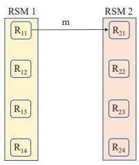  
(a)OST

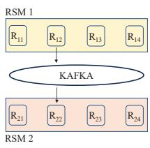  
(b)LL

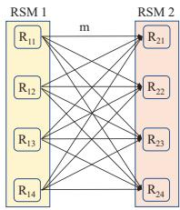  
(d) KAFKA

(c) ATA  
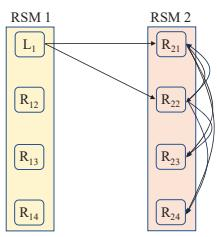  
(e)OTU

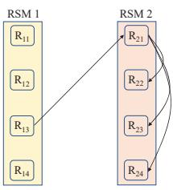  
(f) PICSOU  
Figure 6: C3B baseline summary.

Thankfully, this is not fundamental. To sidestep this issue, PICSOU proportionally scales up the weights of the two communicating RSMs to their Least Common Multiple (LCM),and handles failures with the scaled stake values independent of apportionment. For instance,assume that the total stake of RSM $\mathcal { R } _ { s }$ is $\Delta _ { s }$ ,RSM $\mathcal { R } _ { \mathrm { c } }$ is $\Delta _ { r }$ and the $\begin{array} { r } { L C M { = } \mathrm { l c m } ( \Delta _ { s } , \Delta _ { r } ) } \end{array}$ . PICSOU scales the two RSMs as follows: 1.Compute the multiplicative factor Ψ for each RSM: $\Psi _ { S } = \mathbf { \dot { \frac { L C M } { \Delta _ { s } } } }$ and $\Psi _ { r } = \frac { \hat { L } C M } { \Delta _ { r } }$

2.Multiply the stake of éach replica with the multiplicative factor of its RSM.

Scaling up RSMs is only necessary during message failures, allowing to keep message quanta small in the common-case. A replica thus uses the scaled up RSM weights upon receiving its first duplicate quack for a message m.

## 6Evaluation

PICSOU aims to offer good performance in the common-case, while remaining robust to faults when failures do arise.We aim to answer the following three questions.

1. How does PIcsoU perform in the common case (86.1)?

2.How does PICsoU remain robust to failures (86.2)?

3.How does PICsoU perform in real applications (§6.3)?

Implementation We implemented PICsoU in ≈ 4500 lines of C++20 code with Google Protobuf v3.10.0 for serialization and NNG v1.5.2 for networking [2]. PICSOU is designed to be a plug-and-play library that can be easily integrated with existing RSMs. We evaluate PICsOU against five other comparable protocols (Figure 6).

1. One-Shot (OST): In OST, a message is sent by a single sender to a single receiver. OST is only meant as a performance upper-bound. It does not satisfy C3B as message delivery cannot be guaranteed.

2. All-To-All (ATA): In ATA, every replica in the sending RSM sends all messages to all receiving replicas $( O ( \mathbf { n } _ { s } \times \mathbf { n } _ { r } )$ message complexity). Every correct receiver is guaranteed to eventually receive the message.

3.Leader-To-Leader(LL): The leader of the sending RSM sends a message to the leader of the receiving RSM, who then internally broadcasts the message.This protocol does not guarantee eventual delivery when leaders are faulty.

4.KAFKA: Apache KAFKA is the de-facto industrystandard for exchanging data between services [56]. Producers write data to a Kafka cluster, while consumers read data from it.Kafka, internally, uses Raft [69] to reliably disseminate messages to consumers.We use Kafka 2.13-3.7.0.

5.OTU: GeoBFT [42, 44] breaks down an RSM into a set of sub-RSMs.Much like LL,GeoBFT's cross-RSMcommunication protocol, OTU,has the leader of the sender RSM send its messages to at least ${ \mathbf u } _ { r } + 1$ receiver RSM replicas. Each receiver then internally broadcast these messages.When the leader is faulty, replicas timeout and request a resend. OTU thus guarantees eventual delivery after at most ${ \bf u } _ { s } + 1$ resends in the worst-case (for $O ( \mathbf { u } _ { r } * \mathbf { u } _ { s } )$ total messages).

RSMs.We consider four representative RSM.

1.File: An in-memory file from which a replica can generate committed messages infinitely fast. This is a baseline to artificially saturate the C3B protocols.

2.Raft [37]: A widely used CFT RSM, used in services like Kubernetes Cluster. We run Etcd's Raft version v3.0.

3.ResilientDB [45]: A high performance implementation of PBFT [28], a well-known representative BFT protocol.

4.Algorand [40]: A popular PoS blockchain protocol [40].

Experimental Setup.We deploy up to 45 GCP c2-standard-8 nodes (Intel Cascade Lake, 8vCPU,32 GiB RAM,15 GBits/s).Each experiment runs for 180 seconds (30 second warmup/cool down). All experiments run PICsOU with a Φ-list of 200k and 256 bits for 0.1kB and 1MB messages, respectively (best results for our specific network setup).We further assume that RSMs forward all messages to the other RSM, as this represents a worst-case scenario for PICSOU. As is standard [43,68, 78, 84, 97], unless stated otherwise, replicated operations in our experiments are no-ops ,which ensures that the bottleneck is not execution.

Metrics.RSM throughput is the number of consensus invocations completed at an RSM per second; C3B throughput is the number of completed C3B invocations per second. When baselines, like OST,do not acknowledge received messages, we calculate C3B throughput as the number of unique messages sent from sender RSM to receiver RSM.

## 6.1File RSM Common Case Performance

Our first set of experiments aim to stress test the six C3B protocols (PICsOU, OST,ATA,LL, OTU,and Kafka) without failures.We use the“infinitely fast”File RSM to saturate all C3B implementations.In all cases,we include the OST line as the upper-bound of our networking implementation.

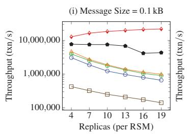

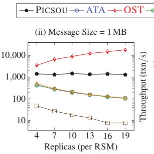

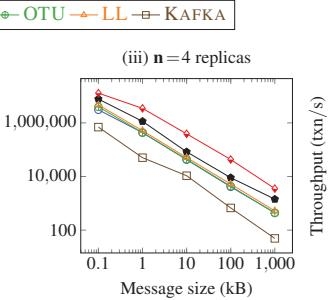

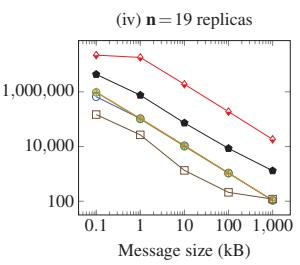  
Figure 7: Throughput of C3B protocols as a function of network size and message size

Varying number of replicas in each RSM.We first consider the relative performance of PICsoU as a function of the network size.We fix the message size to O.1kB and1 MB and increase the number of replicas in each RSM from 4 to 19 (Figure 7(i)-(i)). For small network sizes,PICsoU outperforms ATA by a factor of 2.5× (small messages) and 3.2× (large messages) and in larger networks it increases to 6.6× and 12.1×.PICsOU sends only a linear number of messages, while ATA must send a quadratic number of messages.Like PICSOU,LL and OTU send a linear number of messages,but quickly bottleneck at the leader since it needs to send every message. OST's performance,as expected, increases with network size as increasing the number of replicas increases the number of parallel messages. Kafka performs significantly worse in all cases,as it internally runs consensus.

Varying Message Size.In Figure 7 (ii)-(iv),we fix the size of each RSM to n=4 (small) and n=19 replicas (large) and increase the message size from O.1kB to 1 MB.As expected, the performance of each C3B implementation drops as a linear function of the message size.Note that PICsOU performs relatively better than other protocols for large message sizes as they hide the moderate compute overheads introduced by the system.For instance,on a large network PICsOU performs over 12× better than ATA,LL,and OTU for large messages. Instead, for small messages,PicsoU only performs 6.6×, 4.4×,and 4.9× better (respectively).

Impact of Stake Next, in Figure 8 (i), we study how well PICsOU performs for weighted RSMs when stake distribution becomes unequal. We fix the message size to 100 B.

Consider 1) two RSMs where the throughput is throttled and one replica in each RSM gets increasingly more stake; 2） two RSMs where throughput is not throttled, but one replica still gets a larger share of stake over time. Our aim is to demonstrate that PICsoU does not lose any performance under unequal stake distributions.

We run two experiments.First,we artificially throttle the File RSM such that PICsOU cannot transmit over 1M txns/s,regardless of the stake distribution (flat 1M lines on the graph). Next, we allow each node to have access to an unmodified File RSM.In these experiments PICsOUi refers to the setting where the high-stake node has i× more stake than other nodes.Initially, shifting the stake distribution to one node does not affect performance as the high stake node can handle the additional load. Eventually, however, this node becomes a bottleneck, thus causing throughput to decrease.

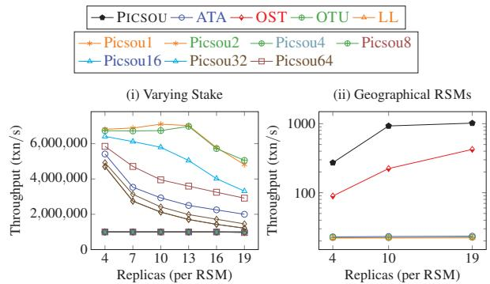  
Figure 8: Impact of Stake and Geo-replication.

Geo-replication In Figure 8(ii),we run geo-replicated experiments by deploying one RSM in US-West and the other RSM in Hong Kong (cross-region bandwidth, pair-wise is 170 Mbits/sec, RTT 133 ms). We fix the message size to 1 MB and vary RSM size from 4 to 19.The lower bandwidth across pairs of machines disproportionally affects ATA, LL,and OTU. PICsOU outperforms ATA,by 12×(for network size 4) and 44×,(for network size 19). Somewhat counter-intuitively, the performance of both PICsOU and OST increase as a function of network size; increasing the number of receivers gives senders access to more bandwidth in Google Cloud.PICsOU intentionally has its senders send to multiple receivers and thus (artificially) outperforms OST, which fixes unique sender-receiver pairs.

## 6.2Impact of failures

We now consider performance under failures.

Crash Failures.In this experiment, we crash 33% of the replicas in each RSM (Figure 9 (i)); message size set to 1 MB and φ-list size as 256. PICsoU's performance drops by a factor of 22.8% -30.5%. This is expected: PICSOU, by default, fully maxes out links with "useful" information. Removing a third of the links thus removes a third of the available bandwidth.Nonetheless,PICsOU continues to outperform ATA,OTU,and LL by at least 2× on small networks,and up to 8.9× on larger networks.

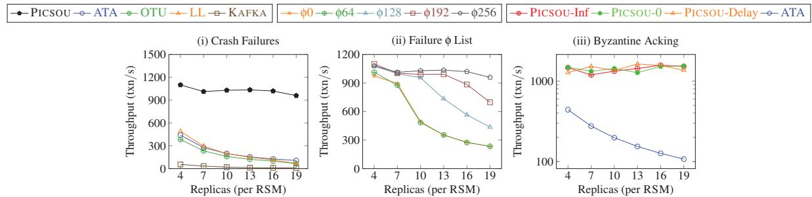  
Figure9: Effects ofFailures on PICSOU.

Byzantine Failures.Next, we consider the impact of Byzantine failures in the system.While it is impossible to model all arbitrary failures,we consider four main classes of attacks. Malicious nodes can (1) send invalid, uncommitted messages, (2) collude to drop long sequences of messages ${ \mathbf { u } } _ { s } + { \mathbf { u } } _ { r }$ times,(3) selectively drop messages,and(4) send incorrect acknowledgments.The first attack amounts to a DDOS attack (as correct replicas will discard invalid messages) and is thus out of scope.PICsOU defends against the second attack by assigning node IDs using a verified source of randomness (the probability that all byzantine nodes get assigned contiguous node IDs is negligible).We focus on the last two scenarios.

1.Impact of 𝜙-list scaling on Byzantine failures. Φ-lists bound the possible performance drop from malicious nodes selectively dropping messages.We again assume 33% of replicas are faulty in both RSMs (Figure 9 (ii)), this time Byzantine.We consider a message size of 1MB. Our results illustrate that the larger φ-list size helps PICsOU quickly recover from Byzantine failures,despite the larger 𝜙-list increasing metadata sizes.We observe that a Φ-list size of 256 is optimal for recovering from the 33% Byzantine attacks. As the network gets larger, the time it takes to complete a full broadcast gets longer, which increases the latency to confirm a delivery. Thus, more messages can be dropped before we can detect that they are dropped, hence the larger 𝜙-list.

2.Sending incorrect acks.Malicious nodes can choose to lie in their acknowledgments.We simulate this behavior in Figure 9 (ii) by having malicious nodes send acks for overly high sequence numbers (Picsou-Inf),overly low ones (Picsou-O) or offset by 𝜙 (Picsou-Delay).We find that this behavior is much less harmful than simply crashing. Correct nodes wait for a quorum of u,+1 matching acks in order to consider the message delivered,and thus already assume that u of those acks will be lies.Lying about an ack thus only temporarily delays the formation of a quorum.

## 6.3Application Case Study

We now study impact on real-world applications (Section 1).

Disaster Recovery. Disaster recovery (DR) ensures continued fault-tolerance in the presence of full datacenter outages, and is a popular feature of modern cloud environments [14,16, 33,41].DR deployments often implement cross-datacenter RSM mirroring over Kafka, where the Kafka cluster is located in the receiving datacenter. We run Etcd DR [33] by deploying two Etcd RSMs in two distinct datacenters, one in GCP region us-west-4 and the other in us-east-5.Communication is unidirectional for DR, since only a single sending RSM is sending data to the mirrored RSM and the mirrored RSM does not have any information to send back (other than acks).

Etcd DR invokes PICsoU on all put transactions and assigns them a new, sequential, internal sequence number.This new sequence number is necessary as DR only applies to a subset of Etcd transactions (just puts, not gets or reconfiguration). The receiving RSM thus simply applies all put transactions in sequence number order.

In Figure 1O (i),we plot the throughput of Etcd DR (in MB/s）with various C3B protocols for different message sizes; each RSM has 5 replicas.OST achieves maximum theoretical throughput for an Etcd cluster running a C3B protocol; ETCD is the baseline for maximum throughput from a single Etcd RSM without any communication; one can only transmit messages as fast as Etcd commits them.There are two primary resource bottlenecks in the system: the crossregion network bandwidth and Etcd's disk goodput (since it synchronously writes each transaction it commits to disk). ATA broadcasts every message to all machines,so its throughputis bottlenecked by the cross-region network bandwidth (50 MB/s). Similarly, OTU and LL are bottlenecked because they limit the number of nodes sending unique messages over the network in parallel.In contrast, PICsOU shards the set of messages across all sending nodes,so each node uses 5O MB/s bandwidth to send 1/5-th of the messages (5 nodes per RSM). Thus,PICsOU has an effective 25O MB/s of bandwidth available, resulting in saturating Raft's disk goodput of 7O MB/s. In case of KAFKA,we can only deploy 3 nodes,at most 3 shards,so it can achieve at most 15O MB/s.KAFKA can still can achieve potentially the same goodput as PICsOU.However, in our testing,KAFKA was still unable to achieve optimal performance given its sensitivity to high network latency.

Data Sharing and Reconciliation As described in \$1 (Figure 1O(ii)), there are operational and sovereignty concerns associated with managing a single RSM across trust domains. We implement the data reconciliation application described in [75]. In this setup,two distinct entities,Agency A and Agency B,run their own Etcd RSM but exchange data to ensure that any shared state remains consistent. Specifically, eachRSM sends key-value updates for shared data. The receiver then checks whether the values match and takes remedial action if not. Communication between RSMs is bidirectional.ATA,LL,OTU,and PICsOU all behave similarly to the performance discussed in the disaster recovery experiment, albeit with a lower starting goodput since there is extra processing time needed for looking up keys and comparing their values. KAFKA had unusually low performance since we were running into a known issue with high latency KAFKA consumers which are not addressed in these result. We are in the process of addressing this.

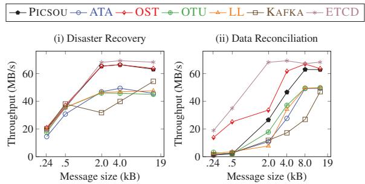  
Figure lO: Disaster Recovery and Data Reconciliation.

Decentralized Finance. Our final application implements a blockchain bridge,designed to foster interoperability between chains [29], for instance for asset transfer. We implement an asset transfer application across three types of wallets: (1) two PoS Algorand chains,(2) two traditional permissioned PBFTResilientDB [44,45] chains,and (3) interoperability between ResilientDB to Algorand chains.Algorand's base throughput with another Algorand instance is 12O blocks/second.ResilientDB's base throughput when communicating with another ResilientDB cluster is \~6OoO batches/second (of size 5kB). The cross-chain throughput when Algorand sends to ResilientDB is 135 blocks/second.PiCsoU has minimal impact on the throughput of any of the RSMs,with less than 15% decrease in throughput in the worst case.This decrease in throughput is independent of node stake.Latency will instead increase proportionally to network size- this property is fundamental to PICsoU's high throughput, but may be unacceptable in some large scale blockchain or RSM deployments. (2) PICsOU successfully handles throughput differences between RSMs; the slow Algorand RSM efficiently communicates with the much faster ResilientDBRSM.

## 7Related Work

The problem of reliably sending messages within groups of participants through reliable broadcast or group communication is well-studied [22,24,26,39,47, 48,62, 76], in both the CFT and BFT setting [4,5,23,24, 26,86]. These works consider communication among groups but do not consider communication between groups.PICsOU leverages the internal guarantees provided by these communication primitives to build a group-to-group communication primitive, C3B.

Logging Systems. Shared logs are a popular way for reliably exchanging messages [18, 27,36,52, 53,56, 61, 88, 91]. Systems such as Kafka [56], RedPanda [73], Delos [17] have become industry standards [17].While these systems work well in the CFT setting,they are not directly applicable to the BFT setting: this log becomes a central point of attack.Moreover,most of these systems use relatively heavyweight fault tolerance: Kafka, for instance, internally makes use of Raft.

Communication between RSMs.Two lines of work have considered communication between RSMs,but in different contexts.First,Aegean [6] makes a similar observation as this paper: it highlights that replicated services rarely operate in a vacuum and must instead frequently communicate.However, Aegan solves a strictly orthogonal problem.It focuses on how to correctly replicate services that can issue nested requests to other (possibly replicated） services.Aegean presents the design of a shim layer that exists between replicated service and backend service and manages all the communication/data storage. Second, Byzantine fault tolerant communication between RSMs has been a topic of interest in the context of sharded BFT systems that view each shard as an independent RSM.These shards periodically need to communicate with each other to process cross-shard transactions [9,35,42,58,71,74,78,98,100]. Most of these systems simply adopt the all-to-all communication pattern between the shards that we evaluate in §6.GeoBFT[44] and Steward [8] are two exceptions.Steward uses a hierarchical consensus architecture;all communication between the clusters is managed by a designated primary cluster, which internally replicates requests via Paxos.GeoBFT uses OTU.

Blockchain bridges.With the rise of blockchain technology and cryptocurrencies [11,12, 13, 46,54, 60,64, 65, 77, 85] there is a new found interest in blockchain interoperability [20, 29,30, 49,55, 90, 92, 99]. These works focus on the correct conversion of assets from one blockchain to the other. They can be broadly clustered into two groups (1) blockchain bridges,and (2） trusted operators.A blockchain bridge requires a replica of the sending RSM to send a committed contract to a replica of the receiving RSM.Recently, several such blockchain bridges have popped up [15,72,82]. Unfortunately, they provide few formal guarantees, which has led to massive financial attacks and hacks [92, 96, 99]. Moreover, these bridges continue to be impractical because of their high cost [96]. Trusted operator systems are,in contrast, much more practical [57, 90, 95], but as the name suggests, they require centralized management.Works like Thema [63] instead use BFT RSMs to communicate between two non-replicated services.

## 8Conclusion

This paper introduces the C3B primitive and proposes PICsOU,an efficient implementation of C3B.We show that, by borrowing techniques from TCP and adapting these to the crash and BFT context,we can develop a solution that allows RSMs to efficiently exchange messages.

## References

[1] Picsou: Appendix. https://arxiv.org/abs/2312. 11029.

[2] Picsou:Artifact. https://github.com/ gupta-suyash/BFT-RSM.

[3] TheAptosBlockchain:Safe,Scalable,and UpgradeableWeb3Infrastructure. https: //aptosfoundation.org/whitepaper# view-whitepaper-pdf.

[4] Ittai Abraham, Srinivas Devadas,Danny Dolev, Kartik Nayak,and Ling Ren. Synchronous byzantine agreement with expected o(1） rounds,expected communication,and optimal resilience.In Financial Cryptography and Data Security: 23rd International Conference,FC 2019,Frigate Bay, St. Kitts and Nevis, February 18-22,2019,Revised Selected Papers, page 320-334, Berlin,Heidelberg,2019.Springer-Verlag.

[5] Ittai Abraham, Kartik Nayak,Ling Ren,and Zhuolun Xiang.Good-case latency of byzantine broadcast: A complete categorization. In Proceedings of the 2021 ACM Symposium on Principles of Distributed Computing,PODC'21, page 331-341, New York, NY, USA,2021. Association for Computing Machinery.

[6] Remzi Can Aksoy and Manos Kapritsos. Aegean: Replication beyond the client-server model. In Proceedings of the 27th ACM Symposium on Operating Systems Principles,SOSP '19, page 385-398, New York,NY, USA, 2019.Association for Computing Machinery.

[7] Algorand Foundation. General FAQ, 2022. https : //www.algorand.foundation/general-faq.

[8] Yair Amir, Claudiu Danilov, Danny Dolev, Jonathan Kirsch, John Lane, Cristina Nita-Rotaru, Josh Olsen, and David Zage. Steward: Scaling byzantine faulttolerant replication to wide area networks.IEEE Transactions on Dependable and Secure Computing, 7(1):80-93,2010.

[9] Mohammad Javad Amiri, Divyakant Agrawal, and Amr El Abbadi. SharPer:Sharding Permissioned Blockchains Over Network Clusters,page 76-88. Association for Computing Machinery, New York, NY, USA,2021.

[10] Elli Androulaki,Artem Barger,Vita Bortnikov, Christian Cachin, Konstantinos Christidis,Angelo De Caro,David Enyeart, Christopher Ferris, Gennady Laventman, Yacov Manevich, Srinivasan Muralidharan, Chet Murthy,Binh Nguyen,Manish Sethi, Gari Singh,Keith Smith,Alessandro Sornioti, Chrysoula

Stathakopoulou,Marko Vukolic, Sharon Weed Cocco, and Jason Yellick.Hyperledger Fabric:A distributed operating system for permissioned blockchains.In Proceedings of the Thirteenth EuroSys Conference, pages 30:1-30:15.ACM,2018.

[11] Maria Apostolaki. Routing Security of Cryptocurrencies.PhD thesis,ETH Zurich,Zürich, Switzerland, 2021.

[12] Pierre-Louis Aublin, Sonia Ben Mokhtar,and Vivien Quéma. RBFT: Redundant byzantine fault tolerance. In Proceedings of the 2013 IEEE 33rd International Conference on Distributed Computing Systems, pages 297-306.IEEE,2013.

[13] Alex Auvolat, Yérom-David Bromberg,Davide Frey, and Frangois Taiani. BASALT: A rock-solid foundation for epidemic consensus algorithms in very large, very open networks. CoRR,abs/2102.04063,2021.

[14] AWS. Disaster RecoveryofWorkloads onAWS: Recovery in the Cloud. https: //docs.aws.amazon.com/whitepapers/latest/ disaster-recovery-workloads-on-aws/ disaster-recovery-options-in-the-cloud. html.

[15] Axelar. Axelar network: Connecting applications with blockchain ecosystems,2021. https: //axelar.network/axelar\_whitepaper.pdf.

[16] Azure.Backup and disaster recovery. https: //azure.microsoft.com/en-us/solutions/ backup-and-disaster-recovery.

[17] Mahesh Balakrishnan,Jason Flinn,Chen Shen, Mihir Dharamshi,Ahmed Jafri,Xiao Shi, Santosh Ghosh, Hazem Hassan,Aaryaman Sagar, Rhed Shi, Jingming Liu, Filip Gruszczynski, Xianan Zhang, Huy Hoang,Ahmed Yossef,Francois Richard,and Yee Jiun Song. Virtual consensus in delos. In 14th USENIX Symposium on Operating Systems Design and Implementation (OsDl 20)，pages 617-632. USENIX Association,November 2020.

[18] Mahesh Balakrishnan,Dahlia Malkhi,Ted Wobber, Ming Wu,Vijayan Prabhakaran,Michael Wei, John D Davis, Sriram Rao, Tao Zou,and Aviad Zuck. Tango: Distributed data structures over a shared log.In Proceedings of the twenty-fourth ACM symposium on operating systems principles,pages 325-340,2013.

[19] M.L. Balinski and H.P. Young. Chapter 15 apportionment. In Operations Research and The Public Sector, volume 6 of Handbooksin Operations Research and Management Science, pages 529-560. Elsevier, 1994.

[20] Rafael Belchior, André Vasconcelos, Sérgio Guerreiro, and Miguel Correia. A survey on blockchain interoperability: Past, present, and future trends. ACM Comput. Surv., 54(8), oct 2021.

[21] Philip A. Bernstein, Sebastian Burckhardt, Sergey Bykov,Natacha Crooks,Jose MFaleiro,Gabriel Kliot,Alok Kumbhare,Muntasir Raihan Rahman, Vivek Shah,Adriana Szekeres,and Jorgen Thelin. Geo-distribution of actor-based services.Proc.ACM Program. Lang.,1(OOPSLA), oct 2017.

[22] Kenneth P.Birman and Thomas A. Joseph.Reliable communication in the presence of failures. ACM Trans. Comput. Syst., 5(1):47-76, jan 1987.

[23] Gabriel Bracha.Asynchronous byzantine agreement protocols. Inf. Comput., 75(2):130-143,1987.

[24] Gabriel Bracha and Sam Toueg.Asynchronous consensus and broadcast protocols. J.ACM,32(4):824-840, oct 1985.

[25] Brendan Burns, Joe Beda,Kelsey Hightower,and Lachlan Evenson. Kubernetes: up and running. 1 O'Reilly Media, Inc.",2022.

[26] C.Cachin and J.A.Poritz. Secure intrusion-tolerant replication on the internet. In Proceedings International Conference on Dependable Systems and Networks, page 167,Los Alamitos, CA, USA, jun 2002. IEEE Computer Society.

[27] Wei Cao, Zhenjun Liu,Peng Wang, Sen Chen, Caifeng Zhu, Song Zheng, Yuhui Wang,and Guoqing Ma. Polarfs:an ultra-low latency and failure resilient distributed file system for shared storage cloud database. Proceedings of the VLDB Endowment, 11(12):1849-1862,2018.

[28] Miguel Castro and Barbara Liskov.Practical byzantine fault tolerance and proactive recovery. ACM Trans. Comput. Syst., 20(4):398-461,2002.

[29] Chainlink.Chainlink cross-chain interoperability protocol, 2023.

[30] Joao Otavio Massari Chervinski, Diego Kreutz, Xiwei Xu,and Jiangshan Yu. Analyzing the performance of the inter-blockchain communication protocol. CoRR, abs/2303.10844,2023.

[31] Allen Clement, Manos Kapritsos, Sangmin Lee, Yang Wang,Lorenzo Alvisi, Mike Dahlin,and Taylor Riche. Upright cluster services. In Proceedings of the ACM SIGOPS 22nd Symposium on Operating Systems Principles,pages 277-290. ACM,2009.

[32] Allen Clement, Edmund Wong,Lorenzo Alvisi, Mike Dahlin,and Mirco Marchetti.Making byzantine fault tolerant systems tolerate byzantine faults. In Proceedings of the 6th USENIX Symposium on Networked Systems Design and Implementation, pages 153-168.USENIX,2009.

[33] Confluent. Geo-replication with Cluster Linking on Confluent Cloud, 2024.

[34] James C. Corbett, Jeffrey Dean,Michael Epstein, Andrew Fikes,Christopher Frost, JJ Furman, Sanjay Ghemawat, Andrey Gubarev, Christopher Heiser, Peter Hochschild,Wilson Hsieh,Sebastian Kanthak,Eugene Kogan,Hongyi Li, Alexander Lloyd, Sergey Melnik, David Mwaura, David Nagle, Sean Quinlan, Rajesh Rao,Lindsay Rolig,Yasushi Saito,Michal Szymaniak, Christopher Taylor, Ruth Wang,and Dale Woodford. Spanner: Google's Globally-Distributed database. In 10th USENIX Symposium on Operating Systems Design and Implementation (OSDI12), pages 261-264, Hollywood, CA, October 2012. USENIX Association.

[35] Hung Dang,Tien Tuan Anh Dinh,Dumitrel Loghin, Ee-Chien Chang,Qian Lin,and Beng Chin Ooi. Towards scaling blockchain systems via sharding. In Proceedings of the 2O19 International Conference on Management of Data, pages 123-140. ACM,2019.

[36] Cong Ding,David Chu, Evan Zhao, Xiang Li,Lorenzo Alvisi,and Robbert Van Renesse.Scalog: Seamless reconfiguration and total order in a scalable shared log. In Proceedings of the l7th Usenix Conference on Networked Systems Design and Implementation,NSDI'20, page 325-338,USA,2020. USENIX Association.

[37] etcd. Etcd raft. https://github.com/etcd-io/ raft.

[38] Ethereum Foundation. Staking withdrawls,2023.

[39] P.T. Eugster, R. Guerraoui, and P. Kouznetsov. /spl delta/-reliable broadcast:a probabilistic measure of broadcast reliabillity.In 24th International Conference on Distributed Computing Systems,2004. Proceedings., pages 636-643,2004.

[40] Yossi Gilad,Rotem Hemo, Silvio Micali, Georgios Vlachos,and Nickolai Zeldovich. Algorand: Scaling byzantine agreements for cryptocurrencies. In Proceedings of the 26th Symposium on Operating Systems Principles, SOSP '17, page 51-68,New York, NY, USA,2017. Association for Computing Machinery.

[41] Google Cloud. What isa disaster recoveryplan? https://cloud.google.com/ learn/what-is-disaster-recovery?hl=en# what-is-a-disaster-recovery-plan.

[42] Suyash Gupta,Jelle Hellings,and Mohammad Sadoghi. Fault-Tolerant Distributed Transactions on Blockchain. Synthesis Lectures on Data Management. Morgan & Claypool Publishers,2021.

[43] Suyash Gupta,JelleHellings,and Mohammad Sadoghi.RCC: resilient concurrent consensus for high-throughput secure transaction processing. In 37th IEEE International Conference on Data Engineering, ICDE 2021,pages1392-1403.IEEE,2021.

[44] Suyash Gupta, Sajjad Rahnama, Jelle Hellings,and Mohammad Sadoghi.ResilientDB:Global scale resilient blockchain fabric.Proc.VLDB Endow., 13(6):868-883,2020.

[45] Suyash Gupta, Sajjad Rahnama,and Mohammad Sadoghi. Permissioned blockchain through the looking glass: Architectural and implementation lessons learned. In 40th IEEE International Conference on Distributed Computing Systems, ICDCS 2020, pages 754-764.IEEE,2020.

[46] Suyash Gupta and Mohammad Sadoghi.Blockchain transaction processing. In Encyclopedia of Big Data Technologies, pages 1-11. Springer, 2019.

[47] Vassos Hadzilacos.Issues of Fault Tolerance in Concurrent Computations (Databases,Reliability, Transactions，AgreementProtocols，Distributed Computing). PhD thesis,Harvard University, USA, 1985.AAI8520209.

[48] Vassos Hadzilacos and Sam Toueg. Fault-Tolerant Broadcasts and Related Problems,page97-145.ACM Press/Addison-Wesley Publishing Co.,USA,1993.

[49] Maurice Herlihy. Atomic cross-chain swaps. CoRR, abs/1801.09515,2018.

[50] Dongxu Huang,Qi Liu, Qiu Cui, Zhuhe Fang, Xiaoyu Ma,Fei Xu, Li Shen,Liu Tang, Yuxing Zhou, Menglong Huang, Wan Wei, Cong Liu, Jian Zhang, Jianjun Li, Xuelian Wu,Lingyu Song,Ruoxi Sun, Shuaipeng Yu, Lei Zhao, Nicholas Cameron, Liquan Pei, and Xin Tang. Tidb: a raft-based htap database. Proc.VLDB Endow.,13(12):3072-3084,aug 2020.

[51] IBM. Blockchain for supply chain solutions.https : //www.ibm.com/blockchain-supply-chain.

[52] Zhipeng Jia and Emmett Witchel.Boki: Stateful serverless computing with shared logs. In Proceedings of the ACM SIGOPS 28th Symposium on Operating Systems Principles,pages 691-707,2021.

[53] Anuj Kalia,Michael Kaminsky,and David G Andersen.Design guidelines for high performance

{RDMA} systems.In 2016 USENIX Annual Technical Conference (USENIX ATC 16), pages 437-450, 2016.

[54] Dakai Kang, Suyash Gupta,Dahlia Malkhi,and Mohammad Sadoghi. Hotstuff-1: Linear consensus with one-phase speculation. CoRR,abs/2408.04728,2024.

[55] Aggelos Kiayias and Dionysis Zindros.Proof-of-work sidechains.In Financial Cryptography and Data Security,pages 21-34, Cham, 2020. Springer International Publishing.

[56] Jay Kreps,Neha Narkhede, Jun Rao, et al. Kafka: A distributed messaging system for log processing. In Proceedings of the NetDB,volume 11, pages 1-7. Athens,Greece,2011.

[57] Jae Kwon and Ethan Buchman.A network of distributed ledgers,2016.

[58] Chenxing Li, Peilun Li, Dong Zhou,Wei Xu, Fan Long,and Andrew Yao. Scaling nakamoto consensus to thousands of transactions per second, 2018.

[59] Shengyun Liu, Wenbo Xu, Chen Shan, Xiaofeng Yan, Tianjing Xu,Bo Wang,Lei Fan, Fuxi Deng, Ying Yan,and Hui Zhang.Flexible advancement in asynchronous bft consensus. In Proceedings of the 29th Symposium on Operating Systems Principles, SOSP '23, page 264-280, New York, NY, USA,2023. Association for Computing Machinery.

[60] Yang Liu, Yuxi Zhang, Zhiyuan Lin, Zhaoguo Wang, and Xuan Wang. Simulation method for blockchain systems with a public chain. Sensors,22(24):9750, 2022.

[61] Joshua Lockerman,Jose M.Faleiro,Juno Kim, Soham Sankaran,Daniel J.Abadi, James Aspnes, Siddhartha Sen,and Mahesh Balakrishnan．The FuzzyLog:A partially ordered shared log.In 13th USENIX Symposium on Operating Systems Design and Implementation (OsDI 18),pages 357-372, Carlsbad, CA, October 2018.USENIX Association.

[62]D.Malkhi,M.K.Reiter, O.Rodeh,and Y. Sella. Efficient update diffusion in byzantine environments. In Proceedings 2Oth IEEE Symposium on Reliable Distributed Systems,pages 90-98,2001.

[63] M.G. Merideth,Arun Iyengar, T.Mikalsen,S. Tai, I. Rouvellou,and P. Narasimhan. Thema: Byzantinefault-tolerant middleware for web-service applications. In 24th IEEE Symposium on Reliable Distributed Systems (SRDS'05), pages 131-140,2005.

[64] Ines Messadi,Markus Horst Becker, Kai Bleeke, Leander Jehl, Sonia Ben Mokhtar,and Rüdiger

Kapitza. Splitbft: Improving byzantine fault tolerance safety using trusted compartments.In Middleware '22: 23rd International Middleware Conference, pages 56-68.ACM,2022.

[65]Johnnatan Messias,Vabuk Pahari, Balakrishnan Chandrasekaran, Krishna P.Gummadi,and Patrick Loiseau. Dissecting bitcoin and ethereum transactions: On the lack of transaction contention and prioritization transparency in blockchains. CoRR,abs/2302.06962,2023.

[66] Microsoft. Azure service fabric, 2024.

[67] Microsoft. Microsoft Azure confidential ledger, 2025.

[68] Ray Neiheiser, Miguel Matos,and Luis Rodrigues. Kauri: Scalable BFT Consensus with Pipelined Tree-Based Dissemination and Aggregation.In Proceedings of the ACM SIGOPS 28th Symposium on Operating Systems Principles, SOSP '21, page 35-48,New York,NY,USA,2021.Association for Computing Machinery.

[69] Diego Ongaro and John Ousterhout. In search of an understandable consensus algorithm. In Proceedings of the 2O14 USENIX Conference on USENIX Annual Technical Conference, pages 305-320. USENIX,2014.

[70] Paxos.Blockchain infrastructure for enterprises,2024.

[71] Sajjad Rahnama, Suyash Gupta, Rohan Sogani, Dhruv Krishnan,and Mohammad Sadoghi.Ringbft: Resilient consensus over sharded ring topology. In Proceedings of the 25th International Conference on Extending Database Technology,EDBT 2022,pages 2:298-2:311. OpenProceedings.org,2022.

[72] RainbrowBridge.Eth - near rainbow bridge,2020.

[73] RedPanda. The state of streaming data, 2023.

[74] Pingcheng Ruan,Tien Tuan Anh Dinh,Dumitrel Loghin,Meihui Zhang,Gang Chen, Qian Lin,and Beng Chin Ooi.Blockchains vs. distributed databases: Dichotomy and fusion.In SIGMOD'21: International Conference on Management of Data, Virtual Event, China, June 20-25,2021,pages 1504-1517.ACM, 2021.

[75] Mark Russinovich, Edward Ashton, Christine Avanessians,Miguel Castro,Amaury Chamayou, Sylvan Clebsch,Manuel Costa, Cédric Fournet,Matthew Kerner, Sid Krishna, Julien Maffre,Thomas Moscibroda, Kartik Nayak, Olya Ohrimenko, Felix Schuster, Roy Schwartz,Alex Shamis,Olga Vrousgou,and Christoph M.Wintersteiger. Ccf: A framework for building confidential verifiable replicated services. Technical Report MSR-TR-2019-16,Microsoft,April 2019.

[76] Fred B．Schneider, David Gries,and Richard D. Schlichting. Fault-tolerant broadcasts. Sci. Comput. Program.,4(1):1-15, may 1984.

[77] Lili Su, Quanquan C.Liu,and Neha Narula.The power of random symmetry-breaking in nakamoto consensus.In 35th International Symposium on Distributed Computing,DISC 2021, October 4-8,2021, Freiburg，Germany(Virtual Conference),volume 209 of LIPIcs,pages 39:1-39:19. Schloss Dagstuhl - Leibniz-Zentrum fur Informatik,2021.

[78] Florian Suri-Payer, Mathew Burke, Zheng Wang, Yunhao Zhang,Lorenzo Alvisi,and Natacha Crooks. Basil: Breaking up bft with acid (transactions). In Proceedings of the ACM SIGOPS 28th Symposium on Operating Systems Principles, SOSP '21, page 1-17,New York,NY,USA,2021． Association for Computing Machinery.

[79] Rebecca Taft, Irfan Sharif,Andrei Matei,Nathan VanBenschoten, Jordan Lewis,Tobias Grieger, Kai Niemi,Andy Woods,Anne Birzin,Raphael Poss, Paul Bardea,Amruta Ranade,Ben Darnell, Bram Gruneir, Justin Jaffray,Lucy Zhang,and Peter Mattis. Cockroachdb:The resilient geo-distributed sql database.In Proceedings of the 2020 ACM SIGMOD International Conference on Management of Data, SIGMOD '20, page 1493-1509, New York,NY, USA, 2020.Association for Computing Machinery.

[80] AndrewS.Tanenbaum and David Wetherall. Computer networks, 5th Edition.Pearson,2011.

[81] Peter Tannenbaum. Excursions in modern mathematics. Pearson, Upper Saddle River, NJ, 9 edition, December 2008.

[82] Poly Team. Polynetwork: An interoperability protocol for heterogeneous blockchains,2015.

[83] The MystenLabs Team.The sui smart contracts platform. https://docs.sui.io/paper/sui.pdf.

[84] Pasindu Tennage, Cristina Basescu,Lefteris Kokoris-Kogias,Ewa Syta, Philipp Jovanovic,Vero Estrada-Galinanes,and Bryan Ford. Quepaxa: Escaping the tyranny of timeouts in consensus. In Proceedings of the 29th Symposium on Operating Systems Principles, SOSP '23, page 281-297,New York,NY, USA,2023. Association for Computing Machinery.

[85] Sarah Tollman, Seo Jin Park,and John K. Ousterhout. Epaxos revisited.In James Mickens and Renata Teixeira, editors,18th USENIX Symposiumon Networked Systems Design and Implementation,NSDI 2021,April 12-14,2021,pages 613-632.USENIX Association, 2021.

[86] Sam Toueg. Randomized byzantine agreements. In Proceedings of the Third Annual ACM Symposium on Principles of Distributed Computing, PODC '84, page 163-178, New York,NY, USA,1984. Association for Computing Machinery.

[87] Robbert Van Renesse and Deniz Altinbuken.Paxos made moderately complex. ACM Comput. Surv., 47(3), February 2015.

[88] Shivaram Venkataraman,Aurojit Panda, Kay Ousterhout,Michael Armbrust,Ali Ghodsi,Michael J Franklin,Benjamin Recht, and Ion Stoica. Drizzle: Fast and adaptable stream processing at scale. In Proceedings of the 26th Symposium on Operating Systems Principles,pages 374-389,2017.

[89] Carl A. Waldspurger and William E. Weihl.Lottery scheduling:Flexible Proportional-Share resource management.In First Symposium on Operating Systems Design and Implementation (OsDl 94), Monterey, CA,November 1994. USENIX Association.

[90] Gang Wang, Qin Wang,and Shiping Chen. Exploring blockchains interoperability: A systematic survey. ACM Comput. Surv., 55(13s), jul 2023.

[91] Guozhang Wang,Joel Koshy, Sriram Subramanian, Kartik Paramasivam,Mammad Zadeh,Neha Narkhede, Jun Rao, Jay Kreps,and Joe Stein. Building a replicated logging system with apache kafka.Proceedings of the VLDB Endowment, 8(12):1654-1655,2015.

[92] Xuechao Wang,Peiyao Sheng,Sreeram Kannan, Kartik Nayak,and Pramod Viswanath. Trustboost: Boosting trust among interoperable blockchains. CoRR,abs/2210.11571,2022.

[93]E.Weldon． An improved selective-repeat arq strategy. IEEE Transactions on Communications, 30(3):480-486,1982.

[94] Gavin Wood.Ethereum: A secure decentralised generalised transaction ledger. 2015.

[95] Gavin Wood. Polkadot: Vision for a heterogeneous multi-chain framework, 2016.

[96] Tiancheng Xie, Jiaheng Zhang,Zerui Cheng,Fan Zhang,Yupeng Zhang,Yongzheng Jia, Dan Boneh, and Dawn Song.zkbridge: Trustless cross-chain bridges made practical. In Heng Yin, Angelos Stavrou, Cas Cremers,and Elaine Shi, editors,Proceedings of the 2022 ACM SIGSAC Conference on Computer and Communications Security, CCS 2022, Los Angeles, CA,USA, November 7-11,2022,pages 3003-3017. ACM,2022.

[97] Maofan Yin,Dahlia Malkhi,Michael K.Reiter, Guy Golan Gueta,and Ittai Abraham.HotStuff: BFT consensus with linearity and responsiveness. In Proceedings of the ACM Symposium on Principles of Distributed Computing,pages 347-356. ACM,2019.

[98] Mahdi Zamani,Mahnush Movahedi,and Mariana Raykova. RapidChain: Scaling blockchain via full sharding. In Proceedings of the 2018 ACM SIGSAC Conference on Computer and Communications Security, pages 931-948.ACM, 2018.

[99] Alexei Zamyatin,Mustafa Al-Bassam,Dionysis Zindros,Eleftherios Kokoris-Kogias,Pedro Moreno-Sanchez, Aggelos Kiayias,and William J. Knottenbelt. Sok: Communication across distributed ledgers.In Nikita Borisov and Claudia Diaz, editors,Financial Cryptography and Data Security, pages 3-36,Berlin, Heidelberg,2021. Springer Berlin Heidelberg.

[100] Yuanzhe Zhang, Shirui Pan,and Jiangshan Yu. Txallo: Dynamic transaction allocation in sharded blockchain systems. In 39th IEEE International Conference on Data Engineering,ICDE,pages 721-733.IEEE,2023.