USENIX

THE ADVANCED COMPUTING SYSTEMS ASSOCIATION

# Stripeless Data Placement for Erasure-Coded In-Memory Storage

Jian Gao, Jiwu Shu, Bin Yan, and Yuhao Zhang, Tsinghua University; Keji Huang, Huawei Technologies Co., Ltd

https://www.usenix.org/conference/osdi25/presentation/gao

# This paper is included in the Proceedings of the 19th USENIX Symposium on Operating Systems Design and Implementation.

July 7–9, 2025 • Boston, MA, USA

ISBN 978-1-939133-47-2

Open access to the Proceedings of the 19th USENIX Symposium on Operating Systems Design and Implementation is sponsored by

# Stripeless Data Placement for Erasure-Coded In-Memory Storage

Jian Gao†

Jiwu Shu∗†

Bin Yan†

Yuhao Zhang†

Keji Huang‡

†Tsinghua University

‡Huawei Technologies Co., Ltd

## Abstract

Erasure coding plays a crucial role in distributed storage systems to provide fault tolerance at a low storage cost. Conventional erasure coding schemes determine data placement based on stripes. However, placing data into stripes can incur non-negligible performance overheads that will manifest in emerging fast in-memory storage systems, making conventional erasure coding schemes suboptimal in such scenarios.

Aiming to eliminate such overheads, we present Nos, a stripeless placement scheme for erasure-coded in-memory storage. It lets each node independently replicate data to other nodes and encode received data replicas into parities with XOR. Thus, it avoids the overheads caused by stripes. To enable failure recovery, Nos uses a combinatoric structure called symmetric balanced incomplete block design (SBIBD) to decide primary-to-backup node affinities during replication. Atop Nos, we further build Nostor, a distributed in-memory key-value store. Evaluations demonstrate that Nostor achieves 1 61× to 2 60× throughputs with similar or . .lower latencies than stripe-based erasure coding baselines.

## 1 Introduction

Fault tolerance is crucial for emerging distributed in-memory storage systems whose nodes can experience multiple types of failures [24]. These systems, built atop the fast Remote Direct Memory Access (RDMA) networks, provide orders of magnitude faster access to numerous latency-sensitive hot data objects than disks [6,7,13,26,30,53]. However, they still need to reload data from the underlying slow storage upon failure recovery, during which the system can experience significant performance degradations [15, 25, 40] or data unavailability. Hence, in-memory storage systems need fault tolerance to preserve availability and performance during partial failures.

Redundancy is the key to fault tolerance. There are two major approaches to achieving data redundancy: replication and erasure coding. Replication is well-known for its simplicity but also high storage overhead. Erasure coding offers a tradeoff: it has much less storage overhead than replication, which comes at a cost in performance by incurring extra computation. Since main memory is significantly more expensive than disks, erasure coding becomes an appealing fault tolerance solution for in-memory storage systems as it allows accommodating much more objects than replication [47, 56].

Stripe is a basal concept of virtually all existing erasure coding schemes. It consists of a set of chunks, some of which are data chunks and the others are parity chunks. Stripe requires that every piece of data must be assigned to exactly one stripe, and all methods to perform such assignments fall in two categories: intra-object [9, 25, 27] and inter-object [6, 55]. Intra-object means that a stripe contains only one object, while inter-object means that a stripe contains multiple objects.

However, we find that on the fast main memory, the stripe concept tarnishes the performance-storage tradeoff by incurring high costs in the storage systems when they need to determine data placement. Here, existing erasure coding schemes either pay more on performance or save less memory:

• With intra-object methods, they must split objects into chunks, bringing significant overheads due to the high I/O fanout when accessing the objects.

• With inter-object methods, they either deploy a metadata service (MDS) to group objects into stripes, or they assign objects to stripes following a statically determined policy. The former introduces the MDS as a centralized bottleneck, while the latter wastes memory as there is no guarantee that objects are evenly distributed across stripes without any centralized coordination.

The main memory is fast and expensive, so we can afford the costs of neither choices. Still, the stripe concept forces us to choose one, putting us into a dilemma.

To circumvent these drawbacks, abandoning stripes seems like a good idea. However, precedent research has never taken this approach. Stripes are critical when they need to tolerate multiple chunk failures: failed chunks (within a threshold) can always be expressed as linear combinations of other living chunks and, thus, get recovered. Without stripes, this property might not hold, causing data loss risks.

In this paper, however, we argue that with a proper data placement policy, it is possible to tolerate multiple chunk failures without stripes. Thus, we can avoid stripe’s drawbacks and make erasure coding’s performance-storage tradeoff favorable for in-memory storage systems again. Without stripes, each node can independently replicate data chunks on it to other nodes; at the same time, they independently encode received data chunk replicas into their XOR sums, i.e., parity chunks. This greatly simplifies the write path.

Guided by the principle above, we present Nos, a stripeless data placement scheme for erasure coding. Like the famous

Reed-Solomon code [37], Nos has two parameters $( k , p ) { \mathrm { : } }$

• Parameter p determines the fault tolerance threshold. Each data chunk is replicated for $( p + 2 )$ times – one primary and (p + 1) backups, to tolerate p node failures.

• Parameter k determines the storage overhead. Each node independently XORs k data chunk replicas into a parity chunk, bringing a storage amplification factor of $( p + 1 ) / k$

The key of Nos is that it selects backup nodes for each primary node according to a combinatoric structure called symmetric balanced incomplete block design (SBIBD). We prove that this model guarantees a successful recovery of any data chunk upon any p node failures. The amortized cost to reconstruct a lost chunk is no more than reading k chunks, also similar to the Reed-Solomon code.

Atop Nos, we build Nostor, a distributed key-value store. Nostor’s server nodes store objects in their main memory and communicate via remote procedure calls (RPC) atop RDMA. Nostor employs Nos flexibly to achieve both low latency and high throughput. It also ensures data consistency for common-case I/Os, degraded I/Os, and node repairs with a versioning-based approach.

We implemented Nostor in Rust and make it open-source at GitHub. Our evaluation shows that, under real-world workloads, Nostor outperforms conventional stripe-based erasure coding schemes with 1 61× to 2 60× throughput improvements and similar or lower latencies. It consumes 18.7% to 57.4% less memory than primary-backup replication but is often as performant as it. Nostor also improves the node repair time by 16.4%. Nevertheless, as a performance tradeoff, Nostor’s degraded read latency can be 35.0% to 62.4% higher than conventional erasure coding in the worst case.

## 2 Background

## 2.1 Erasure Coding and Stripes

Erasure coding is an established data redundancy mechanism. Many distributed storage systems, both experimental [17, 41, 42] and productional [16, 18, 23, 32, 43, 50], have erasure coding enabled or provide it as an option for ensuring fault tolerance for data in them. Stripe is the fundamental concept of virtually all existing erasure coding schemes. We use the Reed-Solomon code [37], one of the most widely adopted coding schemes, as an example to elaborate on.

The Reed-Solomon code has two parameters: $( k , p )$ . Both ,are positive integers. The parameter p determines the fault tolerance threshold: the coding scheme can tolerate up to p simultaneous failures. The parameter k governs the storage overhead: the storage amplification factor is $p / k$

/Specifically, the Reed-Solomon code partitions all data chunks into groups of size k. Within each group, it multiplies a p×k encode matrix to the k data chunks to get p parity chunks. These k data and p parity chunks together form a stripe. The stripe can recover any p failed chunks by multiplying an inversion of the encode matrix to the remaining chunks.

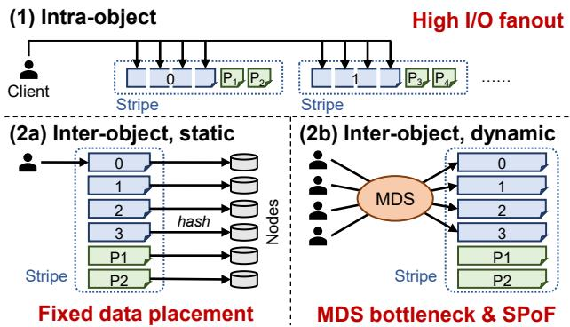  
Figure 1: Summary of the drawbacks of stripes.

An essential characteristic of the Reed-Solomon code is that each chunk belongs to exactly one stripe. This characteristic is universal: it applies to all existing erasure coding schemes despite their diverse designs. Specifically, each data chunk must be assigned to a stripe, and each parity chunk originates only from the data chunks within the same stripe.

## 2.2 Drawbacks of Stripes

Stripe is the basic concept of erasure coding in conventional disk-based storage systems. However, when we move to the fast in-memory storage, its drawbacks start to manifest. The root cause is that data placement is limited by stripes. With a stripe-based coding scheme, determining data placement it is a difficult task that no existing solution can handle perfectly.

We still take the Reed-Solomon code as an example and focus on how it determines data placement in practice in an erasure-coded key-value store. There are two types of placement policies: intra-object and inter-object. We discuss them below and summarize their drawbacks in Figure 1.

## 2.2.1 Intra-object

Each object is first split into k chunks (each placed on a different node) and takes up an entire stripe. Data from different objects will not mix together in the same stripe. Examples include Ceph [50], EC-Cache [36], Giza [8], and Hydra [25].

For data availability, chunks in a stripe must be placed on different nodes, which means that reading or writing an object requires contacting k or $( k + p )$ nodes. Such a high I/O fanout can put significant strain on the network and cut down the maximum throughput proportionally (§6.2). Also, recent analyses revealed that small objects are prevalent in real-world workloads on in-memory key value stores [54]. It is unacceptable to access multiple nodes only to read/write a value that is smaller than 1 KB in around 80% of the cases [5].

## 2.2.2 Inter-object

Objects encode with each other; each stripe contains k objects. Examples include Cocytus [6] and LogECMem [9]. Here, we must assign k objects on different nodes to a stripe. There are two common assignment policies: static and dynamic.

Static assignment. For any object, we decide its belonging stripe only by its metadata (e.g., key hash) with a static policy. A significant drawback of this policy is that it does not respect the storage system’s current state. In practice, this means that we cannot adapt to real-time placement constraints. For example, some nodes may suffer from temporary slowdowns, which can affect a wide range of user requests accessing objects whose primaries or parities are stored on these nodes.

Hash-based policies are also prone to the storage space waste caused by the empty chunks in stripes. It might, for example, hash objects 0, 1, 2, and 3 into the same stripe, but objects 1, 2, and 3 may never exist in the workload. This can cause the memory overheads to far exceed our expectations. Cocytus [6] alleviates this problem by manually allocating objects and encoding at virtual address level. However, in exchange, its allocation policy brings performance overheads (§6.2) and can cause memory wastes (§6.5).

Dynamic assignment. For any object, we dynamically decide its belonging stripe and placement at runtime, usually by consulting a metadata service (MDS) or proxy [9,27,55]. The MDS can choose a proper node (e.g., with the lowest load) to store the object and group it with other existing objects into a stripe, thus circumventing the drawbacks of static policies.

The problem is that we do not know an object’s placement in advance, so every attempt to access the object has to first contact the MDS to get its metadata. This not only adds a network roundtrip’s latency to the read/write critical paths but also makes the MDS a bottleneck and a single point of failure (SPoF). While replicating the MDS [9] solves the SPoF, it again aggravates the performance bottleneck due to the overheads brought by replication. Also, because objects are often small, the memory overheads brought by the (possibly replicated) MDS are non-negligible since the metadata size can be comparable to the object itself.

## 2.2.3 Summary

Stripes forces us to assign objects to them. However, every possible assignment scheme has significant drawbacks, making the stripe concept itself problematic.

## 3 Motivation

## 3.1 Abandoning Stripes

Stripe is the root cause of all the problems described in the previous section. Therefore, we can immediately solve them by abandoning the stripe concept. This is an unprecedented idea by now, but we can imagine how an erasure-coded storage system without stripes will look like:

• For availability, each object is stored on one primary node and replicated to multiple backup nodes. The primary node can independently and dynamically determine the object’s backup nodes without having to consult a separate MDS.

• For low memory overhead, each node encodes received object replicas into parities. It can simply XOR the objects together instead of multiplying them with some complicated encode matrix. To recover a specific object, we find the parity encoding it, read all other objects encoded in the parity, and XOR them up to reconstruct the object.

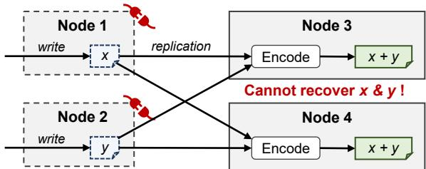  
Figure 2: Demonstration of a strawman stripeless placement scheme. It risks data loss because it replicates data from two primary nodes to the same two backup nodes.

The imagination above is intuitively correct when only one node fails. But how can we perform failure recovery when multiple nodes fail simultaneously? Take the case in Figure 2 as an example. Objects x and y are stored on primary nodes 1 and 2, respectively, and they are both replicated to nodes 3 and 4 in case of two node failures. However, the system still risks data loss because if nodes 3 and 4 both XOR these objects together into $P _ { 1 } = P _ { 2 } = x \oplus y$ , when nodes 1 and 2 fail, we cannot decode x and y from the remaining x ⊕ y.

We find that the cause of this problem is that x and y, with different primary nodes, are replicated to the same two backup nodes 3 and 4. To eliminate this problem, we can assign different backup nodes for different primary nodes, so that if two objects have different primary nodes, they cannot be replicated to the same two backup nodes.

Formally, for a (symmetric) cluster of v nodes, we define a primary-backup affinity matrix $A _ { \nu \times \nu }$ whose every element is 0 or 1. $A _ { i j } = 1$ iff node i can replicate its primary objects to node j. Our requirement is: for any two rows $r _ { 1 } , r _ { 2 }$ , there may exist at most one column c such that $A _ { r _ { 1 } c } = A _ { r _ { 2 } c } = 1$

The final problem that remains is how to find the matrix A. Fortunately, it turns out that combinatorial mathematicians have already found it for us. Specifically, A should be a symmetric balanced incomplete block design (SBIBD). Below, we briefly introduce SBIBD and explain its connection with our stripeless data placement scheme.

## 3.2 SBIBD Primer

SBIBD is a combinatoric structure that was born in the 19th century [21, 22, 45] and can be found in most combinatorics textbooks today [4]. We only introduce necessary parts of the SBIBD theory here; more can be found in the textbooks.

SBIBD has three parameters: (v k ). A (v k )-SBIBD is a 0/1 matrix $A _ { \nu \times \nu } .$ , , λ , , λ. It has exactly k ones in each row and column; also, for any two rows $r _ { 1 } , r _ { 2 }$ in A, we have:

$$
\left| \left\{ c \mid A _ { r _ { 1 } c } = A _ { r _ { 2 } c } = 1 \right\} \right| = \lambda
$$

i.e., there are exactly  column(s) with ones at both rows. We λare particularly interested in the case where $\lambda = 1$ , in which λour requirement described in §3.1 is innately satisfied.

(v k 1)-SBIBD has an important implication: v and k are , ,not independent parameters. To show this, consider the number of ways to pick two rows $r _ { 1 } , r _ { 2 }$ and a column c such that $A _ { r _ { 1 } c } = A _ { r _ { 2 } c } = 1$ ,. Since every column has k ones, this number is obviously $\nu { \binom { k } { 2 } }$ . Also, by definition, for every distinct row pair $( r _ { 1 } , r _ { 2 } )$ there exist exactly one such c, so the number is also , v2. Therefore,

$$
{ \binom { \nu } { 2 } } = \nu { \binom { k } { 2 } } \quad \Rightarrow \quad \nu = k ^ { 2 } - k + 1\tag{1}
$$

i.e., the SBIBD must be a $( k ^ { 2 } - k + 1 , k , 1 )$ -SBIBD. We redefine $\nu = k ^ { 2 } - k + 1$ , ,1 hereinafter for convenience.

(v k 1)-SBIBDs exist and can be efficiently computed for all $k = q + 1$ , where q is a prime power. As a result, they exist for most commonly-used k values in erasure coding, e.g., 3, 4, 5, 6, 8, 10, 12, and 14. To construct such a SBIBD, we first construct its topmost row $r _ { 1 }$ and then cyclic-rotate it by (i − 1) units to get the row $r _ { i }$ [44]. Since SBIBD does not require an order among the rows in A, we can choose $r _ { 1 }$ properly such that $A _ { 1 1 } = 0$ . This will ensure that A has a zero main diagonal. For example, when $k = 4 , \nu = 1 3$ , an SBIBD constructed by ,the method above is shown as follows.

$$
\begin{array} { c c c c c c c c c c c c c c c c c c c c c c c c c c c c c c c c c c c c c c c c c c c c c c c c c c c c } { { } } & { { } } & { { } } & { { } } & { { } } & { { } } & { { } } & { { } } & { { } } & { { } } & { { } } & { { } } & { { } } & { { } } & { { } } & { { } } & { { } } & { { } } & { { } } & { { } } & { { } } & { { } } & { { } } & { { } } & { { } } & { { } } & { { } } & { { } } & { { } } & { { } } & { { } } & { { } } & { { } } & { { } } & { { } } & { { } } & { { } } & { { } } & { { } } & { { } } & { { } } & { { } } & { { } } & { { } } & { { } } & { { } } & { { } } & { { } } & { { } } & { { } } & { { } } & { { } } & { { } } & { { } } & { { } } & { { } } & { { } } & { { } } & { { } } & { { } } & { { } } & { { } } & { { } } & { { } } & { { } } & { { } } & { { } } & { { } } & { { } } & { { } } & { { } } & { { } } & { { } } & { { } } & { { } } & { { } } & { { } } & { { } } & { { } } & { { } } & { { } } & { { } } & { { } } & { { } } & { { } } & { { } } & { { } } & { { } } & { { } } & { { } } & { { } } & { { } } & { { } } & { { } } & { { } } & { { } } & { { } } & { { } } & { { } } & { { } } & { { } } & { { } } & { { } } & { { } } & { { } } & { { } } & { { } } & { { } } & { { } } & \end{array}
$$

For example, for $r _ { 1 } , r _ { 2 }$ , no column except $c = 1 3$ satisfies $A _ { 1 c } = A _ { 2 c } = 1$ ,, verifiying SBIBD’s property.

## 4 Nos

$\mathrm { N o s ^ { 1 } }$ is an stripeless and inter-object data placement scheme for erasure coding, which is designed following the ideas discussed in the previous section. It tolerates $p < k$ failures in a cluster of size $\nu = k ^ { 2 } - k + 1$ <. We first present its design (§4.1) and give it a demonstration (§4.2). Then, we briefly discuss its benefits and limitations (§4.3).

## 4.1 Code Design

Consider a cluster of v server nodes numbered $1 , 2 , \ldots , \nu .$ Nos , , . . . ,views a (v k 1)-SBIBD as its primary-to-backup affinity matrix, which is in correspondence with our discussion in §3. Specifically, for an object whose primary is node i, we can send its replica to node j iff $A _ { i j } = 1$ . For any specific node j, the set $\{ i \mid A _ { i j } = 1 \}$ is called its replication source set. Conversely, for any specific node i, the set $\{ j | A _ { i j } = 1 \}$ is called its replication target set. Both sets have sizes of k.

Like the Reed-Solomon code, Nos has two parameters $( k , p )$ . Parameter k represents how many objects we encode ,into a parity and is co-dependent with the cluster size v following Equation (1). Parameter p represents the fault tolerance threshold. As a precondition, we require $k > p .$ . Most real-world storage systems naturally meet this precondition because $p \geq k$ would result in a relative storage overhead of at least 100%, which is usually undesirable.

The storage cluster must ensure data availability despite no more than p node failures. To this end, Nos stores each object on one primary node in its original form and encodes it with other objects on $( p + 1 )$ backup nodes using the following two-step erasure coding policy:

• The primary node replicates an object to nodes in its replication target set. There are k choices, and the primary node may select any $( p + 1 )$ out of them. This step is virtually equivalent to $( p + 2 )$ -way replication. Since $A _ { i i } = 0$ (zero main diagonal), object replicas are guaranteed not to be sent back to their primary nodes.

• Each node can receive object replicas from k other nodes. These replicas are temporarily buffered. In the background, when there is an object replica from every replication source node, the node collects one from each replication source and replaces them with their XOR sum, i.e., a parity.

Since the primary copy is the unchanged original data, Nos should be viewed as a systematic erasure coding scheme [29].

Primary nodes serve reads to the corresponding objects. If there are failed nodes, clients cannot directly access an object – let us call it x – whose primary node has failed. They need to contact living backup nodes of x to retrieve the parities and recover x. Each parity P of x is the XOR sum of x and other (k − 1) objects $x _ { 1 } , x _ { 2 } , \ldots , x _ { k - 1 }$ . If, fortunately, all these (k − 1) , , . . . ,objects are alive, then the client can read them to decode x:

$$
\boldsymbol { x } = P \oplus x _ { 1 } \oplus x _ { 2 } \oplus . . . \oplus x _ { k - 1 }
$$

We say x is directly recoverable by P in this case because P encodes only one failed object, that is, x.

However, when there are many failed nodes (no fewer than $( p + 3 ) / 2$ , to be precise), every living parity P of x might /encode some failed object y other than x itself, making direct recoveries impossible. In that case, we need to recursively recover y to finally recover x with P.

The key point is that because we select backup nodes according to a (v k 1)-SBIBD, it is guaranteed that there exists a P such that y is directly recoverable with it. As a result, even if we cannot recover x directly, we can still recover x in two steps: first, recover y; second, recover x.

Proof. Without loss of generality, let node 1 be the primary node of object x. Let $\mathcal { P }$ be the set of backup nodes where x is replicated to; $\vert \mathcal { P } \vert = p + 1$

To start recovery, node 1 must fail first. Each failed node in $\mathcal { P }$ can prevent up to two parities of x from being able to directly recover it (which we denote as disabling a parity below). For example, if $u \in \mathcal { S }$ fails, then a parity on u gets lost, and another parity that encodes x and an object from u now cannot directly recover $x ;$ by SBIBD’s property, there cannot exist a third parity that encodes x and an object from u. This means that at least $1 + ( p + 1 ) / 2 = ( p + 3 ) / 2$ failures are necessary to render x not directly recoverable.

Suppose we make f nodes in $\mathcal { P }$ fail such that x is no longer directly recoverable; let $\mathcal { F }$ be the set of these nodes. x now has $( p - f + 1 )$ living parities encoding it. Let Y be the set of failed objects other than x encoded in these parities. Consider any $y \in { \mathcal { Y } } ;$ let v be the primary node of y and $P _ { x y }$ be the parity that encodes both x and y. Object y also has $( p + 1 )$ parities encoding it; one parity might be on node 1 and get lost, and f parities are disabled by objects replicated from nodes in $\{ 1 \} \cup \mathcal { F } - \{ \nu \}$ . By SBIBD’s property, nodes in $\mathcal { F }$ except the one storing $P _ { x y }$ do not accept objects from node v. Therefore, there are $( p - f )$ remaining parities of y.

We still have a quota of $( p - f - 1 )$ further node failures. To prevent the recovery of $x ,$ we must select $( p - f + 1 )$ objects from $y ,$ one for each living parity of $x ,$ and make them not directly recoverable. These objects have $( p - f + 1 ) ( p - f )$ non-overlapping parities available. Similar to the discussion above, by SBIBD’s property, each failed node not in $\{ 1 \} \cup \mathcal { F }$ can disable up to two parities of a certain $y ^ { \prime } \in { \mathcal { Y } } ;$ at the same time, it can also disable one parity for every other object in Y. Hence, using the remaining node failure quota, we can disable up to $( p - f - 1 ) ( p - f + 2 )$ parities for the $( p - f + 1 )$ objects mentioned above. Because

$$
( p - f - 1 ) ( p - f + 2 ) < ( p - f + 1 ) ( p - f )
$$

we conclude that there exist at least one living parity of $x ,$ in which all failed objects except x are directly recoverable. Therefore, x is also recoverable. □

The proof’s idea can also explain why Nos replicates objects to $( p + 1 )$ backup nodes. Intuitively, to tolerate p failures, each object should only replicate to $p$ backup nodes. However, it can be shown that this can make the degraded read recursion infinite. An extra replica solves this problem.

## 4.2 Demonstration with k = 4

We demonstrate Nos with an example. Here, $k = 4 , \nu = 1 3 .$ and we use the same SBIBD shown in §3.2. We assume that node 1 has failed, and a client now wants to access an object x whose primary node is node 1. Nodes 4, 10, 12, and 13 can accept backups of objects from node 1 and hold parities that encode x. Since we require $k > p , p$ can only be 1, 2, or 3.

• When $p = 1$ , the recovery is trivial: we can use any parity that encodes x since it cannot encode other failed objects.

• When $p = 2 .$ , there can be one failed node other than node 1, which can prevent up to two parities from being able to directly recover x (e.g., if node 4 fails, the parity on it gets lost, and the parity on node 13 encoding an object from node 4 is also affected). Since we have three parities for $x ,$ one will be unaffected and can directly recover x.

• When $p = 3 .$ , exhaustive search verifies that x is directly recoverable except when nodes 4 and 12 fail. In that case, x has two living parities: $P _ { 1 }$ on node 10 and $P _ { 2 }$ on node 13. They can both decode x, and we only discuss $P _ { 1 }$ here for example. Besides $x , P _ { 1 }$ encodes a failed object y from node 12, which we can directly recover with the parity on node 8 (encoding objects from nodes {5 9 10 12}). Therefore, we can first decode y and then use $P _ { 1 }$ , ,to decode x.

## 4.3 Discussions

Nos aims at solving the drawbacks of stripes described in §2.2. It offers flexibility in data placement without an MDS by allowing the selection of backup nodes when replicating objects. It replaces matrix computation with XOR compared with the Reed-Solomon code, and hides parity encoding overheads in the background. The most important advantage is that despite the complex SBIBD theory behind it, Nos is easy to implement and deploy: primary nodes simply replicate data to backup nodes, and backup nodes encode received data into parities, both without any coordination with other nodes.

Nevertheless, such advantages come with some limitations, which we list and discuss below.

Ineffectiveness with slow storage. The goal of Nos is to accelerate fast in-memory storage systems. For conventional storage systems built atop slow disks, Nos can have limited benefits since the disks dominate their performance.

Incompatibility with large k values. Some code schemes, like the wide-stripe erasure codes [17], have large k values $( \mathrm { e . g . , } \geq 1 0 0 )$ . It would be hard for these codes to adopt the idea of Nos because Nos requires $\Theta ( k ^ { 2 } )$ failure domains to function correctly, which is prohibitive when k is large.

Fortunately, Nos and wide-stripe erasure codes target distinct scenarios. Nos optimizes common-case I/Os for fast storage systems with frequent reads and updates, where values of k are moderate. In contrast, wide-stripe erasure codes aim at ultra-low storage consumption and recovery cost for cold storage systems with few reads or updates.

Further, modern datacenters can have tens of thousands of independent servers in a cluster [1, 48]. They can deploy Nos with reasonably large k values if they want. Still, this can be a challenging task as a large cluster face a lot more failure modalities than a small one. To keep the cluster small, one may, for example, place two failure domains on each node, which halves the cluster size but doubles p.

Extra network bandwidth consumption. Nos consumes extra network bandwidth because of two intrinsic problems.

• First, in each write, Nos replicates data one more time than the Reed-Solomon code. Since the replicas can be transmitted in parallel, it has a limited impact on latencies. Future work may mitigate this problem by multicast to reduce outbound bandwidth consumption.

• Second, Nos needs to read $O ( k p )$ objects to recover a desired object when direct recovery is impossible. Though there are no workarounds for this problem, as shown in §4.1, we can reconstruct other lost objects during the recovery. The amortized recovery cost (i.e., number of objects to read) of a lost object is still no more than k.

Also, fortunately, the extra bandwidth overheads are limited since objects are usually small in real-world workloads.

Rigid placement constraints. The most significant limitation of Nos is that it imposes a rigid data placement policy on the cluster. In a cluster of size v, each node can only send/receive data to/from $\Theta ( { \sqrt \nu } )$ nodes, leaving the remaining Θ(v) nodes unused. Also, since v depends on k, it can be difficult to use two coding schemes with different k values for different data in the same cluster. As a result, Nos is far less flexible than conventional coding schemes like the Reed-Solomon code. This is a consequence of the fact that Nos uses a raw SBIBD as its affinity matrix without modification. We hope future work can solve this problem with more advanced theory designs.

## 5 Nostor

To compare Nos with existing erasure coding schemes, we build Nostor, an in-memory key-value store prototype that employs Nos for fault tolerance. Nostor is implemented in Rust with around 16K lines of code.

## 5.1 Overview

Nostor adopts a C/S architecture. Servers maintain objects and parities in DRAM-resident hashmaps; for this, we use an existing implementation, DashMap [51], which is a sharded hashmap with each shard protected by a reader-writer lock. Clients and servers communicate via remote procedure calls (RPCs) atop fully-userspace RDMA.

Subclusters. Nostor employs a unified Nos policy in the entire storage system, i.e., with the same parameters $( k , p )$ and SBIBD instance. There must be at least $\nu = k ^ { 2 } - k + 1$ server nodes. If there are more nodes, Nostor will create subclusters in the entire cluster, each of size v. Subclusters may overlap with each other on some nodes, but Nostor will not encode objects from different subclusters together.

Nostor divides the key space by hashing for (1) subclusters and (2) primary nodes within each subcluster. Objects do not have predetermined backup servers; instead, primary servers decide backups for objects upon insertion.

Thread model. Nostor runs two types of threads on each server: foreground and background.

Foreground threads are RPC threads that perform reads and writes to primaries and dispatch backup write RPCs to other servers. For backup writes, foreground threads only push them into waiting queues to shorten the critical path, instead of digesting them synchronously. Each server maintains a replication queue (denoted as $q _ { i } )$ for each replication source i that buffers backup writes from server i. Nostor also maintains an index for items in the replication queues to query the yet-to-be-encoded objects during degraded reads.

Background threads pop items from replication queues and digest them. Its tasks include encoding new parities and updating existing parities. We will elaborate on the concrete jobs of background threads in §5.3.

## 5.2 Handling Client Requests

Client requests consist of PUTs and GETs. A client sends an RPC to the object’s primary server to perform a request.

PUT. Nostor regards insertions, updates, and deletions as PUTs. It complies with the following contract: PUTs are committed (i.e., visible and fault-tolerant) by the time they return. To this end, Nostor employs a versioning mechanism:

• Each server locally maintains a monotonically increasing sequence number (SN) and assigns it to write requests. Each server also maintains a committed SN (CSN): all writes with SNs no larger than the CSN are committed.

• Instead of a single object, Nostor maintains a version queue for each primary object in the hashmap. Accesses to the queues are protected by reader-writer locks.

The detailed PUT procedure is as follows. ① Append to the object’s version queue and fetch an SN. ② Compute the delta between the new value and its previous version. If this is an insertion/deletion, we regard the previous/new value as zero. ③ Replicate the delta to this object’s (p + 1) backup servers. If this is an insertion, we first select the backup servers. Here, Nostor can run arbitrary selection policies and adapt to dynamic data placement requirements, e.g., avoiding unavailable or slow backup servers. ④ Update the CSN when replication finishes. Then, remove outdated versions of the object.

GET. The server first queries its hashmap for the object’s version queue. If the queue is empty or the queue head is not yet committed (i.e., SN larger than the CSN), the server reports that the object is not found. Otherwise, it finds the object stored in the queue head and replies to the client.

## 5.3 Digesting Deltas

Background threads (BGTs) digest object deltas sent from their primary servers from the replication queues. To ensure failure consistency, BGTs only process committed deltas iden-

tified by their primaries’ SNs and the CSNs, which are piggybacked in the RPCs. Uncommitted deltas will be pushed back into their corresponding replication queues.

Term definition. For convenience, we define several terms that we will frequently use in our following discussion.

• Encodee of a parity is an object encoded into this parity. In Nos, all parities should have exactly k encodees, but Nostor relaxes this constraint.

• Full parity is a parity with k encodees.

• Partial parity is a parity with fewer than k encodees. Nostor consistently attempts to convert partial parities into full parities to lower its storage overheads.

We elaborate on the jobs of BGTs as follows.

## 5.3.1 Encoding new objects into parities

Each BGT will repeatedly scan all replication queues and try to collect a delta from each queue to encode them together. Specifically, when it pops a delta from a replication queue, it first checks the hashmap for the delta’s key. If no such entry exists, i.e., this is a new object, the delta is recognized as an insertion. The BGT will collect this delta and switch to the next replication queue. When it successfully collects k deltas, one from each queue, it will replace them with their XOR sum, i.e., a full parity. Finally, the BGT inserts the full parity, together with the keys of its encodees, into the hashmap.

Avoiding blocking. In practice, a server can temporarily block on some replication sources with no incoming new objects, which can prevent data in other replication queues from being digested and bloat Nostor’s memory usage. To address this problem, BGTs do not wait indefinitely to receive from a replication queue; if they timeout, they will skip that queue and move forward. The timeout must be short to reduce CPU cycles wasted on waiting (10 µs in our implementation).

In this case, a BGT will collect fewer than k deltas when it finishes a round of scan, and the XOR sum will become a partial parity. Partial parities do not affect Nos’s correctness since they add no extra dependencies among the objects. However, they must get converted into full parities as soon as possible. To this end, each server maintains a parity queue, denoted as ${ \bar { q } } _ { i } ,$ , for each replication source i to record partial parities. ${ \bar { q } } _ { i }$ has the following admission rule: it holds partial parities whose encodees are not from primary server i. A partial parity can reside in one of all the valid parity queues.

BGTs will actively try to convert partial parities into full parities. Upon collecting a new object from the replication queue $q _ { i } ,$ , a BGT will first check whether ${ \bar { q } } _ { i }$ is empty. If not, it will pop a partial parity from ${ \bar { q } } _ { i }$ and encode the delta into it. The resulting parity will be pushed into another valid parity queue ${ \bar { q } } _ { j }$ if it is still a partial parity.

Handling concurrent PUTs. Multiple BGTs can concurrently digest deltas of the same object, of which only one may be recognized as an insertion. To this end, the BGT inserts a placeholder entry for the corresponding key in the hashmap if it recognizes a delta as insertion. Therefore, other BGTs will see this placeholder and recognize their deltas as updates. When the BGT finishes encoding the collected deltas, it will replace the placeholders with pointers to the encoded parity.

## 5.3.2 Updating existing parities

If a BGT pops a delta from a replication queue and finds a corresponding entry in the hashmap, it will recognize the delta as an update. The entry should (eventually) be a parity encoding the delta’s belonging object. It will encode the delta into the parity, i.e., replace it with its XOR sum with the delta.

Handling deletions. Deletions can convert full parities into partial parities. Upon deleting an encodee from a full parity, the BGT inserts its metadata into a valid parity queue.

Will partial parities heap up? As long as objects are evenly distributed (which can be achieved with a good key hash algorithm), Nostor can prevent partial parities from heaping up because it is expected that every node will receive the same number of objects from its each replication source. Skewed update traffic will be non-blockingly digested into existing parities and, thus, is not a problem here.

## 5.4 Failure Recovery

Nostor needs to recover itself if there are failed servers in a subcluster. This task contains three jobs: ① ensuring failure consistency, ② providing degraded read service during the failure, and ③ repairing failed server nodes.

## 5.4.1 Failure model

Like previous work [6, 25, 36, 56], Nostor assumes fail-stop failures only. Partial network failures or network partitions will likely prevent Nostor from performing PUTs, but since Nostor has no centralized components, clients can still perform GETs on reachable nodes without worrying about splitbrain. Byzantine failures are out of the scope of this paper.

## 5.4.2 Failure consistency

When a server i fails, Nostor must ensure the consistency of its replication targets. Replication target servers of server i do the following steps to ensure consistency. ① Notify all BGTs to stop digesting deltas in $q _ { i }$ and spawn a dedicated thread to collect the SNs of the deltas in $q _ { i } .$ . ② Exchange the collected SN information with other replication targets. Thus, the server can find the largest CSN for server i. ③ Discard all deltas in $q _ { i }$ with SNs larger than the CSN. ④ Notify all BGTs to restart digesting deltas in $q _ { i }$ and wait for $q _ { i }$ to become empty.

Note that in step ②, replication targets of node i exchange all collected SNs, instead of the maximum, to correctly find all committed PUTs. After the steps above, all living replication targets of server i will reach a consistent state.

## 5.4.3 Degraded I/O

Nostor can serve degraded reads to objects whose primaries have failed as soon as Nostor completes the procedure described in §5.4.2 and reaches a consistent state. For simplicity,

Nostor disallows degraded writes. In other words, if a write request matches one of the following conditions, it will be blocked: ① the primary has failed, or ② it cannot replicate to (p + 1) living backup nodes.

To perform a degraded read to object x whose primary is server i (failed), the client sends a read RPC to any living server. The server performs the following steps. ① Send RPCs to all living replication targets of server i, which query their hashmaps for the given key and return the metadata of the parities encoding the corresponding object. If the object exists, at least one backup node should reply with non-empty metadata. ② Find the parity that encodes the fewest failed objects, which is the best parity to recover x. ③ Read the parity and all its encodees except x. This may trigger recursive degraded reads, but the recursion will not go deeper, as proved in §4.1. ④ XOR the parity and all the encodees together to decode x.

## 5.4.4 Node repair

When a new server joins the subcluster to replace a failed one, Nostor starts the node repair procedure. It becomes online and starts serving client requests only after it finishes the following two recovery tasks.

Recover primaries. The server contacts all its replication targets to get a complete list of objects to store a primary copy of. Then, it sends degraded reads requests to them to recover the objects and store the results. Since decoding is performed by other servers, the recovering server will not suffer from inbound network traffic bottleneck.

Recover parities. The server contacts all its replication sources to retrieve all objects that should have been replicated to it. Retrieved objects are pushed into the corresponding replication queues. Then, the server encodes them into parities in the same way as we have discussed in §5.3. There is no need for Nostor to encode objects into the same parities before the failure. The server can perform object retrieval and encoding in parallel to reduce the recovery time.

## 6 Evaluation

We seek to answer the following questions.

• How does Nostor perform in common cases, and whether it performs well or not, why (§6.2, §6.3)?

• How does Nostor perform in failure recovery (§6.4)?

• How much memory does Nostor use (§6.5)?

## 6.1 Experiment Setup

We evaluate Nostor on CloudLab [12]. The testbed consists of 16 c6525-100g nodes. Every node has the following hardware and software configuration:

• CPU: 1× 24-core AMD 7402P, running at 2 80 GHz;

• RAM: 128 GB (8× 16 GB 3200 MT s);

/• NIC: Mellanox ConnectX-5 Ex 100 Gb (one port);

• OS: Ubuntu 22.04 LTS, kernel version 5.19;

• NIC Driver: DOCA-OFED 2.10.0;

• Coding Library: Intel ISA-L 2.31.1 [19] (AVX2 enabled).

We run two servers on each node so that we can evaluate Nostor with up to $k = 6 \left( \nu = k ^ { 2 } - k + 1 = 3 1 \right)$ . Note that in deployment, each server should run on a separate failure domain; our setting is due to the lack of physical servers.

Baseline systems. We evaluate Nostor mainly against:

Cocytus: An inter-object erasure-coded in-memory object store based on Memcached and TCP/IP network [6]. It uses the Reed-Solomon code. For fairness in comparison, we identified the main logic in its source code and ported it line-by-line into our evaluation framework. Cocytus has a similar write path with Nostor: compute the deltas, replicate them, and commit asynchronously. It differs from Nostor in encoding and stripe allocation.

• PQ: An inter-object object store similar to Cocytus, except that it switches from the Reed-Solomon code to the P+Q code in RAID-6 [33]. It uses XOR instead of matrix computation to encode data.

• Split: An intra-object scheme that splits each object into smaller chunks and encode them into a stripe. It represents Ceph [49, 50], EC-Cache [36], and Hydra [25].

• Repl: Ignores k and uses (p + 1)-way replication for fault tolerance. It offers high performance at the cost of high memory consumption.

We evaluate the systems under three configurations: (k p) = ,(4 2), (6 2), and (6 3). Note that PQ does not work with (6 3) , , , ,since it only supports p = 2. All baselines use static data placement policies; we will explain this choice in §6.2.4.

Thread configuration. With hyperthreading enabled, we have 24×2 = 48 cores on each node. The two servers each use 18 cores, with 12 foreground and 6 background threads. Repl and Split do not need background threads to digest object deltas, so they use all 18 cores to run foreground threads. We run a client on each node that uses the remaining 12 cores, with 32 coroutines multiplexing each thread.

## 6.2 Microbenchmarks

We evaluate Nostor with the following microbenchmarks:

• 100%-GET and 100%-PUT with fixed value sizes;

• YCSB [10] A, B, and D (C omitted since it is 100%-GET).

The size of the key space is 50 million. Objects are accessed following a Zipfian-0.99 distribution.

## 6.2.1 100%-GET & 100%-PUT

Figure 3 shows the throughputs. For GET, all evaluated systems except Split perform similarly well because they only query the hashmap once per GET. With value sizes ≤ 256 B, Nostor’s GET throughputs are 3 92× and 6 06× of Split for . .k = 4 and k = 6, respectively. These ratios are very close to k, implying that the network IOPS is the bottleneck when objects are small and that we have pushed the systems to their maximum throughputs. For 1 KB and 4 KB values, the performance bottleneck shifts to the network bandwidth. Still, Nostor delivers 2 40× to 3 57× throughput of Split.

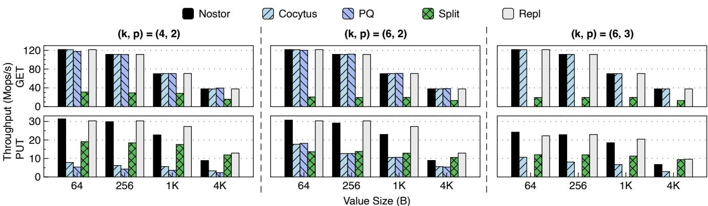  
Figure 3: Performance of 100%-GET and 100%-PUT microbenchmarks.

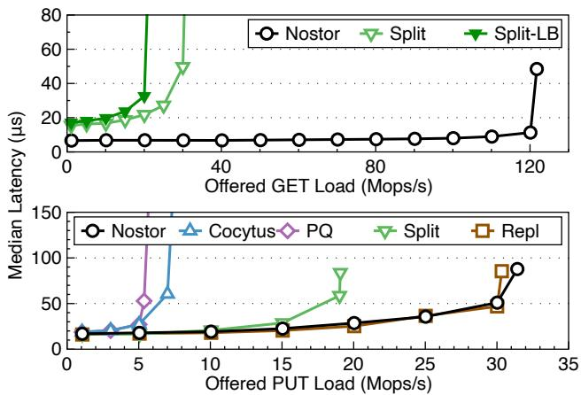  
Figure 4: Latency-throughput curves under 100%-GET and 100%-PUT microbenchmarks.

For PUT, as expected, Repl shows the overall best performance. Nostor performs similarly well for 64 B values; for 1 KB and 4 KB values, it delivers 87.4% and 69.7% throughputs to Repl, respectively. This is because the overhead of the one extra replica per PUT starts to manifest as value sizes increase. Also, due to the lowest network bandwidth consumption, Split outperforms Nostor for 4 KB values. Cocytus and PQ perform the worst (37.3% to 56.6% lower than Nostor on average); we find that it is the synchronized space allocation that hampers their performance the most. They allocate objects in one large stripe using the first-fit policy, serializing all PUTs and severely harming their performance. In Nostor, instead, objects are independent, and such synchronization overhead does not exist in the first place. Overall, Nostor achieves relatively good PUT performances.

Figure 4 shows latency-throughput curves with (k p) = ,(4 2) and 64 B values. For GET, Nostor’s curve also repre-,sents Cocytus, PQ, and Repl, which all deliver the best performance. Split has higher latencies and lower throughputs due to its high I/O fanout. For PUT, Nostor also has the lowest latencies; interestingly, it even slightly outperforms Repl. The reason is that Nostor stores fewer parities than Repl’s replicas, resulting in reduced pressure on the hashmap index. We also make some additional comments to the baselines:

• For Split, previous work proposed late-binding, a GET latency optimization technique: fetch one more chunk in the stripe and use the first k that arrive to decode the original data. However, late-binding is unfavorable here because network is always the performance bottleneck, and latebinding can only aggravate it. With (k p) = (4 2), Split’s throughputs decrease by 15.6% to 28.4% for different value sizes with late-binding. We draw a curve for Split with late-binding in Figure 4 (Split-LB) which shows that there is no improvement in median latency. Worse, the 99% tail latency even increases by more than 2 2×.

.• For Cocytus, our implementation delivers 78.5% and 17.9% lower latencies for GETs and PUTs than the original implementation, respectively, with at least a 9 5× through-.put improvement, even if we assume the original implementation has 100% scalability. Therefore, we believe that our implementation and evaluations of Cocytus are fair.

## 6.2.2 YCSB

Figure 5 shows the performance of YCSB workloads, where we use 1 KB values as in its original specification. For the write-intensive YCSB-A, Nostor performs similarly to Repl and significantly better than Cocytus, PQ, and Split due to its simplified write path. For the read-intensive YCSB-B and YCSB-D, all systems except Split have good performances. These results are all consistent with our conclusions drawn in §6.2.1. Also, overall, all evaluated systems deliver higher throughputs on the YCSB-D workload than on YCSB-B. This is because YCSB-D reads recently inserted objects, which should improve cache efficiency at the servers.

## 6.2.3 Sensitivity analysis

Figure 6 shows how the performances of the evaluated systems vary with different (k p) parameters. We run YCSB-A workload under each configuration. Note that we cannot evaluate PQ here since it only works with $p = 2 .$

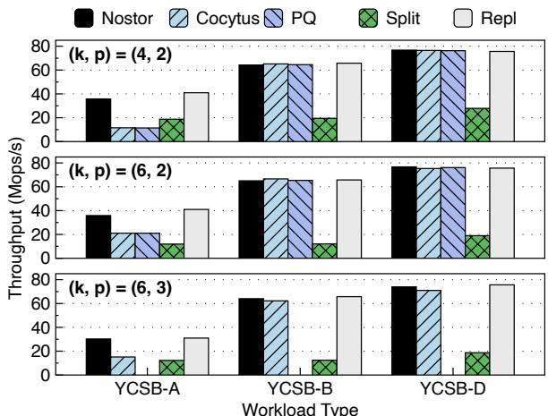  
Figure 5: Performance of YCSB workloads.

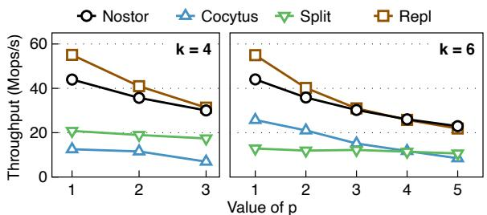  
Figure 6: Performance with different (k p) configurations.

We make the following two observations. First, Nostor’s performance highly depends on p, but k has little impact on Nostor’s performance. This is due to Nos’s design: its write critical path is similar to primary-backup replication and unaware of k. Second, as p becomes large, the performance gap between Nostor and Repl closes. This is because the impact of the extra replica of Nostor has diminishing marginal effects as the total number of replications increases.

## 6.2.4 How about dynamic data placement?

One may wonder why we only evaluate static data placement policies. To answer this question, we implemented a baseline that adds a dummy MDS to the I/O critical paths to simulate dynamic data placement policies. The MDS just adds a centralized point in the I/O critical paths and does nothing more. It must replace the position of a server (since there are no more cores), so we evaluated all other systems with one fewer server to compare them with it. Figure 7 shows the results. Bottlenecked by the MDS, the baseline delivers the lowest throughputs among the evaluated systems: 89.2% and 72.4% less than Nostor for GETs and PUTs, respectively. This convinces us that we must avoid the centralized MDS and opt for static data placement policies to achieve high performance.

## 6.2.5 Adaption to runtime data placement constraints

We evaluate how Nostor and other systems can adapt to dynamic data placement constraints at runtime. We run the

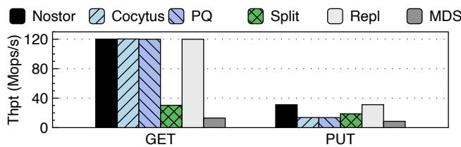  
Figure 7: Performance comparison with a baseline system that has an MDS on its I/O critical paths.

YCSB-D workload under $( k , p ) = ( 6 , 2 )$ and simulate a tempo-, ,rary node slowdown scenario, during which two nodes incur 1 ms extra latency for PUTs (by sleeping). The node slowdown information is broadcasted to every server. Figure 8 shows the results, in which the slowdown starts at $t = 1 0 \mathrm { s }$ and ends at t = 35 s. Cocytus also represents PQ since they are similar.

Nostor can avoid replicating objects to slow nodes in PUTs, so it only suffers from millisecond-level tail latencies caused by objects whose primary nodes are slowed down. In contrast, Cocytus suffers from skyrocketed tail latencies (48 2×) .because it cannot dynamically place its stripe or circumvent the slow nodes. Due to the read-recently-inserted access pattern of the YCSB-D workload, Cocytus’s slow nodes also severely affect its GET operations and result in a significant throughput drop of 98.9%. Repl suffers from 25.0% lower throughput and 47 7× higher tail latencies due to similar rea-.sons. Split is special here because it already suffers from high, millisecond-level tail latencies due to its high network IOPS pressure. The presence of the slow nodes decreases the pressure, causing no negative effects to the tail latencies. However, we observe significantly higher (10 8×) PUT me-.dian latencies. This is because Split’s PUT operation has a higher fanout than all other evaluated systems; thus, more PUTs are affected by the slow nodes.

Despite the results above, we find that it is possible for Cocytus, Split, and Repl to avoid replicating to slow nodes and, thus, reduce their performance penalties. Specifically,

Cocytus and Split can allow dynamic placement of parity chunks in each stripe. For example, when $p = 2 ,$ , they can choose 2 nodes out of (2 + s) candidates to place parity chunks, which allows us to tolerate s slow nodes. Here, s is the “degree-of-freedom” of node choices. We use $s = k - ( p + 1 ) = 3$ in this experiment, the same as Nos.

• Repl can adopt strategies like hinted handoff [11] to avoid replicating data to slow nodes. Specifically, if an original backup node is slow, the primary node can hand off the object replica to another backup node. The new backup node monitors the state of the original backup node, and hand back the object replica when it becomes normal.

We implement variants of Cocytus, Split, and Repl with features above enabled (denoted as Cocytus+, Split+, and Repl+, respectively) to compare Nostor against them. They are plotted as dotted lines in Figure 8. During the slowdown event, the tail latencies of Cocytus+ and Repl+ are similar to Nostor. Split+ performs nearly the same with its original version in the figure, while its PUT median latencies now remain stable. Nevertheless, these methods also incur other significant overheads. Specifically,

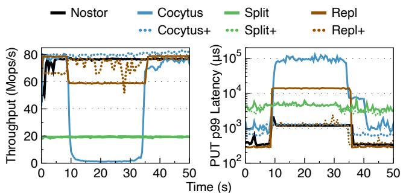  
Figure 8: Performance with runtime data placement constraints (two nodes slowed down). Latency is log-scale.

Cocytus+’s memory consumption markably increases (16.2% to 62.6% with different object sizes) compared with its original version. This is because allowing dynamic candidates is equivalent to splitting each stripe in Cocytus splits into multiple new stripes with the same primary nodes but different backup nodes. With many more stripes, our worry in §2.2.2 about the static assignment policy becomes true: a stripe might, with a high chance, contain empty chunks and result in a significant memory waste.

• Split+ also consumes more memory because, to avoid aggravating the request fan-out problem, it need to store parity chunks’ positions along with the object splits, so that it can retrieve them quickly during degraded reads. This leads to 6.1% to 78.4% extra memory usage.

• Repl+ suffers from two problems. First, its throughput is unstable during the slowdown event because hinted handoff causes load imbalance among normal nodes. Second, after the slow nodes recover, its tail latencies are 28.9% higher than Repl on average since the object hand-back traffic interferes with the client request traffic.

Overall, we observe that it is difficult to perfectly augment these baselines to gracefully tolerate slow nodes. In contrast, Nostor can achieve this goal with little extra efforts.

As a final comment, “broadcasting node slowdown to every server” is only for the convenience of this experiment. In practice, slowdown detection can work in a decentralized manner: each server monitors the performance of object delta replication RPCs and dynamically identifies slow nodes.

## 6.3 Real-World Trace Benchmarks

We evaluate Nostor with Twitter’s Twemcache trace [54] with (k p) = (4 2). We select four representative traces covering small/large objects and read/write-intensive workloads; see Table 1. Figures 9 and 10 show the median latencythroughput curves for GET and PUT operations, respectively.

Nostor consistently outperforms other erasure-coded systems with 1 61× to 2 60× throughput improvements. It also . .slightly outperforms Repl on Cluster-31 for the same reason described in §6.2.1. Nostor and Repl’s median latencies are not significantly affected by object sizes: despite the two orders of magnitude difference in average sizes, most objects still fit in one MTU (9000 B in our testbed) and therefore have limited impact on networking overheads.

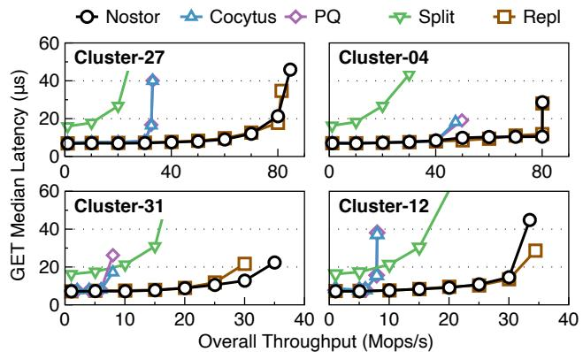  
Figure 9: GET performance of Twemcache workloads.

We observe that all systems except Split perform similarly when the load is low. As the load increases, Cocytus and PQ start to meet throughput bounds due to their poor PUT performance. This also explains why Cocytus and PQ deliver lower throughputs on Cluster-27 than Cluster-12, even if the former has much smaller objects: the higher write ratio significantly hampers their overall performance.

Due to space limits and the fact that Nostor does not specially optimize tail latencies, we omit the tail latencythroughput curve figures. Here, we present some important details about tail latencies. First, Nostor’s PUT p99 latencies are superior to all baselines except Repl. On Cluster-31, Nostor outperforms Cocytus/PQ by 33.9% and Split by 6.4%; it underperforms Repl by 26.8%. On Cluster-12, Nostor outperforms Cocytus/PQ by 77.1% and Split by 23.4%; it underperforms Repl by 39.6%. Second, Nostor’s GET p99 latencies are similar to Cocytus/PQ/Repl and 68.5% lower than Split. Third, in contrast to the median latencies, the p99 latencies are visibly affected by object sizes. From small objects (Cluster-27/31) to large objects (Cluster-4/12), Nostor’s GET/PUT p99 latencies increase by 3 69× and 1 35× on average, respectively. This is because the object sizes shown in Table 1 are the average sizes, while p99 latencies are dominated objects larger than the average. Also, these large objects are more affected by temporary request bursts.

To sum up, Nostor is superior to all evaluated erasurecoded systems in both latency and throughput. It also delivers similar median latencies to Repl, but its tail latencies can sometimes be higher.

<table><tr><td rowspan=1 colspan=1></td><td rowspan=1 colspan=1>Small objects</td><td rowspan=1 colspan=1>Large objects</td></tr><tr><td rowspan=1 colspan=1>Read-intensive</td><td rowspan=1 colspan=1>Cluster-27(15% write, object size 74B,α =1.07)</td><td rowspan=1 colspan=1>Cluster-04 (7% write,object size 2506 B,α= 1.10)</td></tr><tr><td rowspan=1 colspan=1>Write-intensive</td><td rowspan=1 colspan=1>Cluster-31 (94% write,object size 56B,α = 0.00)</td><td rowspan=1 colspan=1>Cluster-12 (80% write,object size 1074B,α = 0.30)</td></tr></table>

Table 1: Summary of Twemcache traces used in evaluation. Object size = key + value (averaged).  is the Zipfian parameter.

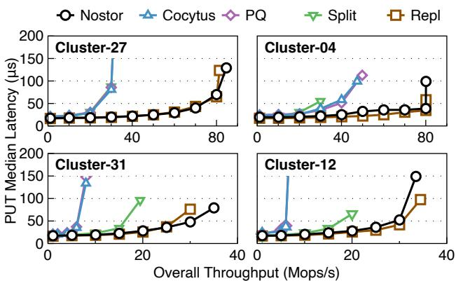  
Figure 10: PUT performance of Twemcache workloads.

## 6.4 Recovery Performance

## 6.4.1 Node repair time

We make two servers fail under (k p) = (4 2) and then restart , ,them. Each server recovers itself as described in §5.4. Figure 11(a) shows the average time to recover a node. Other (k p) configurations yield similar trends and are omitted.

Nostor and Repl have the highest node repair speed. Repl is fast because it does not need to decode any data; instead, it only reads object replicas from backup nodes. Nostor needs to perform decoding, but it has a smaller number of parities ((p + 1) k× object count) than Repl’s replicas (p× object /count). This results in reduced performance overheads caused by inserting into the hashmaps, so Nostor is also fast.

For Split, Cocytus, and PQ, the amount of data to recover is the same. Split is slightly (16.4%) slower than Nostor because its data are split into finer-grained chunks, incurring more metadata-related overheads. Cocytus and PQ are more (88.2%) slower than Nostor because they naturally have low PUT performances. Also, Cocytus recovers (9.1%) slower than PQ with value sizes ≥ 256 B. We attribute this to their coding scheme difference: Cocytus decodes data with matrix multiplication, while PQ uses XOR. ISA-L performs XOR and matrix multiplication similarly fast on 64 B data, but when data is larger, XOR becomes 4 06× faster than matrix multiplication. This reduces the decode time of PQ.

## 6.4.2 Degraded read latency

We measure 64 B degraded read latency under each (k p) ,configuration with p failed nodes. Figure 11(b) shows the results. Repl is the fastest since it only needs to read a replica. Split is the second fastest since the amount of data it reads is only 1 k to other erasure-coded systems. For (4 2) and (6 2) configurations, Nostor’s degraded read latency is 16.5% higher than Split on average. However, it is also 11.0% faster than Cocytus and PQ because it only uses XOR to decode data (PQ also performs bit-shift and bitwise-AND).

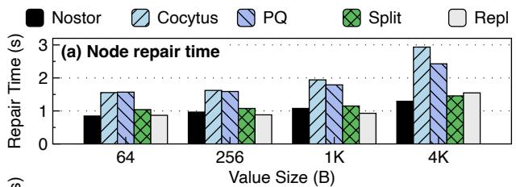

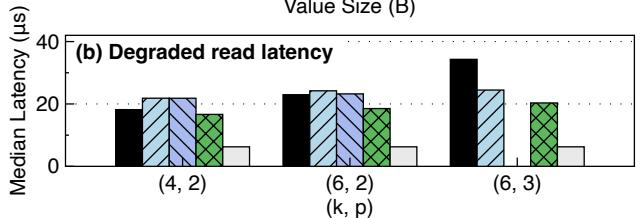  
Figure 11: Recovery performance.

For Nostor with $( k , p ) = ( 6 , 3 )$ , we carefully choose the , ,failed nodes such that the worst case, i.e., recursive degraded read, will be triggered. In this case, due to an extra round of recovery, Nostor’s degraded read latency rises to the highest, 35.0% higher than Cocytus and 62.4% higher than Split. Since such degraded reads should be rare among all read operations, we believe the increased latency is acceptable.

## 6.5 Memory Consumption

We populate the systems with 50 million objects and measure their memory consumption. Figure 12 shows the results, in which Nostor’s memory usage (in GBs) is labeled above the bars. Cocytus also represents PQ since they are similar.

We make the following observations. First, Nostor incurs extra metadata overheads because it must store the encodees’ keys along with each parity, which explains why it consumes more memory from $( k , p ) = ( 4 , 2 ) \tan { ( 6 , 2 ) }$ . As the value size in-, , ,creases, the overheads become negligible. Second, Cocytus’s memory usage is the lowest with 64 B values but rises as the value size increases, showing that its memory allocator produces “holes” in the stripes and wastes memory: as value sizes increase, metadata overheads become negligible, and the wastes start to manifest. Third, Repl consumes 1 23× to .2 35× memory compared with Nostor. With the performance .similarity of Nostor and Repl in mind, we believe Nostor offers a favorable performance-storage tradeoff over replication. Finally, even if we continuously apply a skewed (Zipfian-0.99) write-intensive workload to Nostor, its memory usage still keeps stable. This shows that Nostor can digest object deltas fast enough and avoid bloating its memory usage.

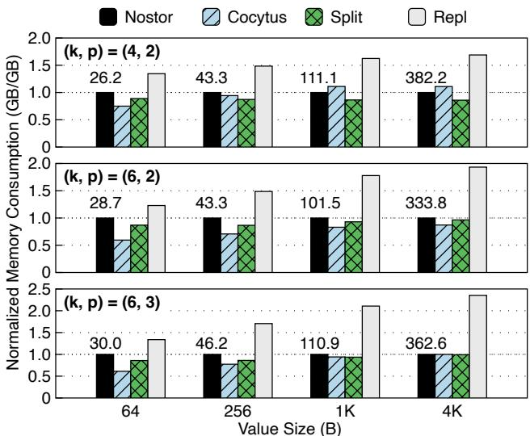  
Figure 12: Normalized memory consumption.

In §6.2.5 we discussed slowdown-tolerant variants of the baselines, namely Cocytus+, Repl+, and Split+. Here, we discuss a bit more about their memory consumption. Compared to Nostor, Cocytus+ consumes 30 9% less to 35 1% more memory. Its relative memory usage increases as the object size grows, consistent to our observation of Cocytus above. Split+ consumes 9 4% less to 57 4% more memory. . .In contrast to Cocytus+, its relative memory usage decreases as the object size grows. The reason is that the amount of memory to store parity chunks’ positions are constant, which becomes less significant when objects grows larger.

## 7 Related Work

Block designs and codes. Block design is a combinatorics concept with a long history dating back to the mid-19th century; the SBIBD used in this paper is a special kind of block design. In the 1950s, it became clear that block designs are strongly related to erasure coding and error-correcting codes (ECCs) [3, 35, 38]. For example, (7 3 1)-SBIBD corresponds , ,to the well-known 7-bit Hamming code with 4 data bits and 3 parity bits. Other block designs can also be used to design codes like the Low-Density Parity-Check (LDPC) code [2].

While block designs have been used in the design of coding schemes since decades ago, their usage is still limited to conventional stripe-based codes. These coding schemes are unfit for new high-speed storage systems. To our knowledge, Nos is the first to use the block design theory to construct an erasure coding scheme without stripes.

Erasure coding for in-memory storage systems. There have been many efforts to apply erasure coding to in-memory storage systems. Some are similar to Nostor in that they ensure all returned writes are fault-tolerant. Cocytus [6] preallocates large empty stripes and allocates objects of different sizes within the chunks, which is shown to be inefficient.

RE-Store [28] combines replication and erasure coding by replicating each object into two copies to reduce one parity. Though faster in recovery, this approach suffers from both replication’s high memory consumption and erasure coding’s computation overheads. EC-Cache [36] encodes each object into a stripe by splitting them into chunks. It mainly targets load balance in a system atop the relatively slow TCP/IP network, but falls short in performance-critical scenarios atop the fast RDMA network.

Other systems do not offer the contract that returned writes are committed. BCStore [27] buffers writes at clients until there is enough data to form a stripe, risking the loss of buffered data. Hydra [25] and Carbink [56] assume the far memory model, i.e., only one process running on a single node can access the storage system. Therefore, they do not need to encode data on the same node as the process. However, all data is immediately lost if that node or process fails.

Different encode methods. Erasure coding schemes mainly fall into two categories according to their methods of encoding data: matrix multiplication [17,18,20,29,37,46] and XOR [14, 33, 34, 38]. In §6, we have shown with Cocytus and PQ that the encode method does not greatly affect the performance; instead, the write path design does.

From replication to erasure coding. Nos consists of a synchronous replication phase and an asynchronous coding phase. Many existing systems adopt similar ideas, including f4 [31], HDFS [43], HACFS [52], and RCStor [39]. In these systems, objects are first stored in a replicated storage pool and then moved to an erasure-coded pool in the background. Nos’s approach differs from theirs in that it only has one storage pool and encodes object replicas directly into parities. This avoids the movement of the objects’ primary copies and reduces the complexity of the entire storage system.

## 8 Conclusion

This paper proposes Nos, a stripeless data placement scheme for erasure-coded storage systems. It enables failure recovery by selecting backup nodes for objects according to a combinatoric structure called SBIBD. Atop of Nos, we build Nostor, a fault-tolerant distributed in-memory key-value store, to demonstrate the effectiveness of Nos. Evaluations show that Nostor outperforms existing erasure-coded systems on throughput and write latency.

## Acknowledgment

We sincerely thank our shepherd for helping us improve the paper. We are also grateful to all reviewers of this paper for their helpful comments and feedback. This work is supported by the National Natural Science Foundation of China (Grant No. U22B2023). This work would not have been possible without the guidance of Prof. Yuchun Ma, who teaches Combinatorics at Tsinghua University with great dedication.

## A Artifact Appendix

## Abstract

The artifact consists of the Rust code of Nostor and baseline systems used in evaluation, runner scripts to validate their functionalities and reproduce the experiments, and related description files. It is intended for validating the claims made in the paper and facilitating further research on stripeless data placement in erasure-coded storage.

## Scope

At a high level, the artifact allows its users to validate the following claims in the paper:

• Nostor outperforms stripe-based erasure-coded storage systems in terms of common-case performance.

• Nostor performs similarly with Repl (replication) with significantly less memory consumption.

• Nostor can recover from client failures.

These claims correspond to the questions raised at the start of the Evaluation section (§6).

The main purpose of the artifact is to validate the claims above. Aside from that, since the artifact contains full implementations of Nostor and baselines, it can be used as a starting point for further research on erasure coding and distributed in-memory storage systems.

## Contents

The artifact contains source code, scripts, and other necessary components. Below, we explain the contents aside from the README. More detailed descriptions can be found in HOWTOUSE.md in the artifact repository.

Source code. The nos directory contains the source code of Nostor and baseline system servers. The nos-cli directory contains the source code of the client. Nostor’s implementation is in nos/src/objstore, while the baseline systems are in nos/src/bin. Experiment infrastructure is in nos-cli/src/runners.

Scripts. The scripts directory contains runner scripts for running experiments and plotter scripts for visualizing the results. Scripts for validating the functionalities (i.e., AE scripts) are in the ae-functional subdirectory. Other scripts serve as building blocks of the AE scripts, such as running a single experiment. The configuration files used by the scripts are in the config directory.

Other components. The trace-preprocess directory contains the preprocessor for Twitter’s Twemcache trace. For the real trace files, please refer to Twitter’s original repository. After being processed, the traces can be consumed and replayed by the clients. The rrppcc directory contains the RPC engine implementation. The data directory contains the original data. Other directories and files are miscellaneous components, e.g., C library bindings and documentation.

## Hosting

Nostor’s artifact repository is hosted on GitHub at https: //github.com/IcicleF/Nos on the master branch. The first usable commit version is the initial commit (f6f9741). However, due to possible future bugfixes and updates, please always use the latest commit.

## Requirements

To reproduce the experiments, the testbed must have:

• At least 16 Linux servers with Internet access

• One server has password-less SSH access to all servers

• RDMA network + Mellanox ConnectX-5 or newer RNICs

• CPUs with AVX-2 support

• DOCA-OFED, which can be downloaded here

• Rust 1.86 or newer

• Intel ISA-L 2.31.1 or newer

Fewer servers or less advanced RNICs can be used if the user only wants to verify Nostor’s functionalities. For detailed instructions, please refer to the README file in the artifact repository.

## References

[1] Alibaba Cloud MaxCompute. The Big Data Platform Behind Alibaba’s E-Commerce Systems - Alibaba Cloud Community. https://www.alibabacloud.c om/blog/the-big-data-platform-behind-ali babas-e-commerce-systems\_595931, March 2020.

[2] B. Ammar, B. Honary, Y. Kou, and S. Lin. Construction of low density parity check codes: a combinatoric design approach. In Proceedings of the IEEE International Symposium on Information Theory, page 311. IEEE, June 2002. https://ieeexplore.ieee.org/docu ment/1023583.

[3] E. F. Assmus and J. D. Key. Designs and their Codes. Cambridge University Press, 1 edition, August 1992. https://www.cambridge.org/core/product/i dentifier/9781316529836/type/book.

[4] Richard A. Brauldi. Introductory Combinatorics. Pearson Education, 5 edition, 2010.

[5] Zhichao Cao, Siying Dong, Sagar Vemuri, and David H. C. Du. Characterizing, Modeling, and Benchmarking RocksDB Key-Value Workloads at Facebook. In 18th USENIX Conference on File and Storage Technologies (FAST 20), pages 209–223, 2020. https://www.usen ix.org/conference/fast20/presentation/ca o-zhichao.

[6] Haibo Chen, Heng Zhang, Mingkai Dong, Zhaoguo Wang, Yubin Xia, Haibing Guan, and Binyu Zang. Efficient and Available In-Memory KV-Store with Hybrid

Erasure Coding and Replication. In Proceedings of the 14th USENIX Conference on File and Storage Technologies (FAST ’16), pages 167–180, Santa Clara CA USA, June 2016. USENIX. https://www.usenix.org/c onference/fast16/technical-sessions/pres entation/zhang-heng.

[7] Jiqiang Chen, Liang Chen, Sheng Wang, Guoyun Zhu, Yuanyuan Sun, Huan Liu, and Feifei Li. HotRing: A Hotspot-Aware In-Memory Key-Value Store. In Proceedings of the 18th USENIX Conference on File and Storage Technologies (FAST ’20), pages 239–252, Santa Clara CA USA, February 2020. USENIX. https: //www.usenix.org/conference/fast20/prese ntation/chen-jiqiang.

[8] Yu Lin Chen, Shuai Mu, Jinyang Li, Cheng Huang, Jin Li, Aaron Ogus, and Douglas Phillips. Giza: Erasure Coding Objects across Global Data Centers. In 2017 USENIX Annual Technical Conference (USENIX ATC ’17), pages 539–551, 2017. https://www.usenix.o rg/conference/atc17/technical-sessions/pr esentation/chen-yu-lin.

[9] Liangfeng Cheng, Yuchong Hu, Zhaokang Ke, Jia Xu, Qiaori Yao, Dan Feng, Weichun Wang, and Wei Chen. LogECMem: coupling erasure-coded in-memory keyvalue stores with parity logging. In Proceedings of the International Conference for High Performance Computing, Networking, Storage and Analysis (SC ’21), pages 1–15, St. Louis Missouri, November 2021. ACM. https://dl.acm.org/doi/10.1145/3458817.3 480852.

[10] Brian Cooper. Yahoo! Cloud Serving Benchmark. ht tps://github.com/brianfrankcooper/YCSB, February 2022.

[11] Giuseppe DeCandia, Deniz Hastorun, Madan Jampani, Gunavardhan Kakulapati, Avinash Lakshman, Alex Pilchin, Swaminathan Sivasubramanian, Peter Vosshall, and Werner Vogels. Dynamo: Amazon’s Highly Available Key-value Store. In Proceedings of twenty-first ACM SIGOPS symposium on Operating systems principles, pages 205–220, Stevenson Washington USA, October 2007. ACM. https://dl.acm.org/doi/10. 1145/1294261.1294281.

[12] Dmitry Duplyakin, Robert Ricci, Aleksander Maricq, Gary Wong, Jonathon Duerig, Eric Eide, Leigh Stoller, Mike Hibler, David Johnson, Kirk Webb, Aditya Akella, Kuangching Wang, Glenn Ricart, Larry Landweber, Chip Elliott, Michael Zink, Emmanuel Cecchet, Snigdhaswin Kar, and Prabodh Mishra. The Design and Operation of CloudLab. In 2019 USENIX Annual Technical Conference (USENIX ATC ’19), pages

1–14, Renton WA USA, July 2019. USENIX. https: //www.usenix.org/conference/atc19/presen tation/duplyakin.

[13] Brad Fitzpatrick. Distributed caching with memcached. Linux Journal, 2004(124):5, August 2004. https:// www.linuxjournal.com/article/7451.

[14] R. Gallager. Low-density parity-check codes. IRE Transactions on Information Theory, 8(1):21–28, January 1962.

[15] Juncheng Gu, Youngmoon Lee, Yiwen Zhang, Mosharaf Chowdhury, and Kang G Shin. Efficient Memory Disaggregation with InfiniSwap. In Proceedings of the 14th USENIX Symposium on Networked Systems Design and Implementation (NSDI ’17), pages 649–667, Boston MA USA, March 2017. https://www.usenix.org/con ference/nsdi17/technical-sessions/presen tation/gu.

[16] David Hildebrand and Denis Serenyi. Colossus under the hood: a peek into Google’s scalable storage system. https://cloud.google.com/blog/products/s torage-data-transfer/a-peek-behind-colos sus-googles-file-system, April 2021.

[17] Yuchong Hu, Liangfeng Cheng, Qiaori Yao, Patrick P C Lee, Weichun Wang, and Wei Chen. Exploiting Combined Locality for Wide-Stripe Erasure Coding in Distributed Storage. In Proceedings of the 19th USENIX Conference on File and Storage Technologies (FAST ’21), pages 233–248. USENIX, February 2021. https://www.usenix.org/conference/fast21 /presentation/hu.

[18] Cheng Huang, Huseyin Simitci, Yikang Xu, Aaron Ogus, Brad Calder, Parikshit Gopalan, Jin Li, and Sergey Yekhanin. Erasure Coding in Windows Azure Storage. In Proceedings of the 2012 USENIX Annual Technical Conference (USENIX ATC ’12), pages 15– 26, Boston MA USA, June 2012. USENIX. https: //www.usenix.org/conference/atc12/techni cal-sessions/presentation/huang.

[19] Intel Corporation. Optimizing Storage Solutions Using the Intel® Intelligent Storage Acceleration Library. ht tps://www.intel.com/content/www/us/en/de veloper/articles/technical/optimizing-s torage-solutions-using-the-intel-intel ligent-storage-acceleration-library.html, September 2014.

[20] Saurabh Kadekodi, Shashwat Silas, David Clausen, and Arif Merchant. Practical Design Considerations for Wide Locally Recoverable Codes (LRCs). In Proceedings of the 21st USENIX Conference on File and

Storage Technologies (FAST ’23), pages 1–16, Santa Clara CA USA, February 2023. USENIX. https: //www.usenix.org/conference/fast23/prese ntation/kadekodi.

[21] Thomas P Kirkman. On a problem in combinations. Cambridge and Dublin Mathematical Journal, 2:191– 204, 1847.

[22] Thomas P Kirkman. On the perfect r-partitions of r2-r+1. Transactions of the Historical Society of Lancashire and Cheshire, 9:127–142, 1857. https://www.hslc.org .uk/wp-content/uploads/2017/10/9-12-Kirkm an.pdf.

[23] Chunbo Lai, Song Jiang, Liqiong Yang, Shiding Lin, Guangyu Sun, Zhenyu Hou, Can Cui, and Jason Cong. Atlas: Baidu’s key-value storage system for cloud data. In IEEE 31st Symposium on Mass Storage Systems and Technologies (MSST ’15), pages 1–14. IEEE, May 2015. https://ieeexplore.ieee.org/document/720 8288.

[24] Sangmin Lee, Zhenhua Guo, Omer Sunercan, Jun Ying, Thawan Kooburat, Suryadeep Biswal, Jun Chen, Kun Huang, Yatpang Cheung, Yiding Zhou, Kaushik Veeraraghavan, Biren Damani, Pol Mauri Ruiz, Vikas Mehta, and Chunqiang Tang. Shard Manager: A Generic Shard Management Framework for Geo-distributed Applications. In Proceedings of the ACM SIGOPS 28th Symposium on Operating Systems Principles (SOSP ’21), pages 553–569, New York, NY, USA, October 2021. Association for Computing Machinery. https://dl.acm .org/doi/10.1145/3477132.3483546.

[25] Youngmoon Lee, Hasan Al Maruf, Mosharaf Chowdhury, Asaf Cidon, and Kang G Shin. Hydra: Resilient and Highly Available Remote Memory. In Proceedings of the 20th USENIX Conference on File and Storage Technologies (FAST ’22), pages 181–197, Santa Clara, CA, February 2022. https://www.usenix.org/con ference/fast22/presentation/lee.

[26] Bojie Li, Zhenyuan Ruan, Wencong Xiao, Yuanwei Lu, Yongqiang Xiong, Andrew Putnam, Enhong Chen, and Lintao Zhang. KV-Direct: High-Performance In-Memory Key-Value Store with Programmable NIC. In Proceedings of the 26th Symposium on Operating Systems Principles (SOSP ’17), pages 137–152, Shanghai China, October 2017. ACM. https://dl.acm.org/d oi/10.1145/3132747.3132756.

[27] Shenglong Li, Quanlu Zhang, Zhi Yang, and Yafei Dai. BCStore: Bandwidth-Efficient In-memory KV-Store with Batch Coding. In IEEE 33rd International Conference on Massive Storage Systems and Technology (MSST ’17), pages 1–13, Santa Clara CA USA, May

2017. IEEE. https://storageconference.us/201 7/Papers/BCStore-BandwidthEfficientKV-Sto re.pdf.

[28] Yuzhe Li, Jiang Zhou, Weiping Wang, and Yong Chen. RE-Store: Reliable and Efficient KV-Store with Erasure Coding and Replication. In 2019 IEEE International Conference on Cluster Computing (CLUSTER), pages 1–12, September 2019. https://ieeexplore.ieee. org/document/8891013.

[29] Qing Liu, Dan Feng, Hong Jiang, Yuchong Hu, and Tianfeng Jiao. Systematic Erasure Codes with Optimal Repair Bandwidth and Storage. ACM Transactions on Storage, 13(3):26:1–26:27, September 2017. https://dl.acm.org/doi/10.1145/3109479.

[30] Youyou Lu, Jiwu Shu, Tao Li, and Youmin Chen. Octopus: an RDMA-enabled Distributed Persistent Memory File System. In Proceedings of the 2017 USENIX Annual Technical Conference (USENIX ATC ’17), pages 773–785, Santa Clara, CA, July 2017. USENIX. https: //www.usenix.org/conference/atc17/techni cal-sessions/presentation/lu.

[31] Subramanian Muralidhar, Wyatt Lloyd, Sabyasachi Roy, Cory Hill, Ernest Lin, Weiwen Liu, Satadru Pan, Shiva Shankar, Viswanath Sivakumar, Linpeng Tang, and Sanjeev Kumar. f4: Facebook’s Warm BLOB Storage System. In Proceedings of the 11th USENIX Symposium on Operating Systems Design and Implementation (OSDI ’14), pages 383–398, Broomfield CO USA, October 2014. USENIX. https://www.usenix.org/c onference/osdi14/technical-sessions/pres entation/muralidhar.

[32] Michael Ovsiannikov, Silvius Rus, Damian Reeves, Paul Sutter, Sriram Rao, and Jim Kelly. The quantcast file system. Proceedings of the VLDB Endowment, 6(11):1092– 1101, August 2013. https://dl.acm.org/doi/10. 14778/2536222.2536234.

[33] James S. Plank. The RAID-6 Liberation Codes. In 6th USENIX Conference on File and Storage Technologies (FAST 08), pages 97–110, San Jose CA USA, 2008. USENIX. https://www.usenix.org/conference/ fast-08/raid-6-liberation-codes.

[34] James S. Plank. Erasure Codes for Storage Systems: A Brief Primer. ;login: USENIX Mag., 38(6):44–50, December 2013. https://www.usenix.org/syste m/files/login/articles/10\_plank-online.pd f.

[35] Eugene Prange. The use of coset equivalence in the analysis and decoding of group codes. https://apps .dtic.mil/sti/pdfs/AD0226767.pdf, June 1959.

[36] K. Vinayak Rashmi, Mosharaf Chowdhury, Jack Kosaian, Ion Stoica, and Kannan Ramchandran. EC-Cache: Load-Balanced, Low-Latency Cluster Caching with Online Erasure Coding. In Proceedings of the 12th USENIX Symposium on Operating Systems Design and Implementation (OSDI ’16), Savannah GA USA, November 2016. USENIX. https://www.usenix.org/confe rence/osdi16/technical-sessions/presenta tion/rashmi.

[37] I. S. Reed and G. Solomon. Polynomial Codes Over Certain Finite Fields. Journal of the Society for Industrial and Applied Mathematics, 8(2):300–304, June 1960. http://epubs.siam.org/doi/10.1137/0108018.

[38] L. Rudolph. A Class of Majority Logic Decodable Codes. IEEE Transactions on Information Theory, 13(2):305–307, April 1967. https://ieeexplore .ieee.org/document/1053994.

[39] Yingdi Shan, Kang Chen, Tuoyu Gong, Lidong Zhou, Tai Zhou, and Yongwei Wu. Geometric Partitioning: Explore the Boundary of Optimal Erasure Code Repair. In Proceedings of the ACM SIGOPS 28th Symposium on Operating Systems Principles (SOSP ’21), pages 457–471, Virtual Event Germany, October 2021. ACM. https://dl.acm.org/doi/10.1145/3477132.3 483558.

[40] Yizhou Shan, Yutong Huang, Yilun Chen, and Yiying Zhang. LegoOS: A Disseminated, Distributed OS for Hardware Resource Disaggregation. In Proceedings of the 13th USENIX Symposium on Operating Systems Design and Implementation (OSDI ’18), pages 69–87, Carlsbad CA USA, 2018. USENIX. https://www.us enix.org/conference/osdi18/presentation/ shan.

[41] Zhirong Shen and Patrick P. C. Lee. Cross-Rack-Aware Updates in Erasure-Coded Data Centers. In Proceedings of the 47th International Conference on Parallel Processing, ICPP ’18, pages 1–10, New York, NY, USA, August 2018. Association for Computing Machinery. https://dl.acm.org/doi/10.1145/3225058.3 225065.

[42] Haiyang Shi and Xiaoyi Lu. INEC: Fast and Coherent In-Network Erasure Coding. In Proceedings of the International Conference for High Performance Computing, Networking, Storage and Analysis (SC ’20), pages 1– 17, Atlanta GA USA, November 2020. IEEE. https: //ieeexplore.ieee.org/document/9355252/.

[43] Konstantin Shvachko, Hairong Kuang, Sanjay Radia, and Robert Chansler. The Hadoop Distributed File System. In IEEE 26th Symposium on Mass Storage Systems and Technologies (MSST’10), pages 1–10. IEEE, May

2010. https://ieeexplore.ieee.org/document /5496972.

[44] James Singer. A Theorem in Finite Projective Geometry and Some Applications to Number Theory. Transactions of the American Mathematical Society, 43(3):377–385, 1938. https://www.jstor.org/stable/1990067.

[45] Jacob Steiner. Combinatorische Aufgaben. Journal für die reine und angewandte Mathematik (Crelles Journal), 1853(45):181–182, 1853. https://www.degruyter. com/document/doi/10.1515/crll.1853.45.18 1/html.

[46] Myna Vajha, Vinayak Ramkumar, Bhagyashree Puranik, Ganesh Kini, Elita Lobo, Birenjith Sasidharan, P. Vijay Kumar, Alexandar Barg, Min Ye, Srinivasan Narayanamurthy, Syed Hussain, and Siddhartha Nandi. Clay Codes: Moulding MDS Codes to Yield an MSR Code. In Proceedings of the 16th USENIX Conference on File and Storage Technologies (FAST ’18), pages 139– 154, Santa Clara CA USA, 2018. USENIX. https: //www.usenix.org/conference/fast18/prese ntation/vajha.

[47] Ao Wang, Jingyuan Zhang, Xiaolong Ma, Ali Anwar, Lukas Rupprecht, Dimitrios Skourtis, Vasily Tarasov, Feng Yan, and Yue Cheng. InfiniCache: Exploiting Ephemeral Serverless Functions to Build a Cost-Effective Memory Cache. In Proceedings of the 18th USENIX Conference on File and Storage Technologies (FAST ’20), pages 267–281, Santa Clara CA USA, 2020. USENIX. https://www.usenix.org/conference/ fast20/presentation/wang-ao.

[48] Andy Warfield. Building and Operating a Pretty Big Storage System (My Adventures in Amazon S3). In The 21st USENIX Conference on File and Storage Technologies (FAST ’23), Santa Clara CA USA, February 2023. USENIX. https://www.usenix.org/conference/ fast23/presentation/warfield.

[49] Sage Weil. Ceph.io — New in Luminous: Erasure Coding for RBD and CephFS. https://ceph.io/en/n ews/blog/2017/new-luminous-erasure-codin g-rbd-cephfs/, October 2017.

[50] Sage A Weil, Scott A Brandt, Ethan L Miller, Darrell D E Long, and Carlos Maltzahn. Ceph: A Scalable, High-Performance Distributed File System. In Proceedings of the 7th Symposium on Operating Systems Design and Implementation (OSDI ’06), pages 307–320, Seattle WA USA, November 2006. USENIX. https://www.usen ix.org/legacy/events/osdi06/tech/weil.ht ml.

[51] Joel Wejdenstål. DashMap. https://github.com/x acrimon/dashmap, November 2023.

[52] Mingyuan Xia, Mohit Saxena, Mario Blaum, and David A Pease. A Tale of Two Erasure Codes in HDFS. In Proceedings of the 13th USENIX Conference on File and Storage Technologies (FAST ’15), pages 213– 226, Santa Clara CA USA, February 2015. USENIX. https://www.usenix.org/conference/fast15 /technical-sessions/presentation/xia.

[53] Jian Yang, Joseph Izraelevitz, and Steven Swanson. Orion: A Distributed File System for Non-Volatile Main Memories and RDMA-Capable Networks. In Proceedings of the 17th USENIX Conference on File and Storage Technologies (FAST ’19), pages 221–234, Boston MA USA, February 2019. USENIX. https: //www.usenix.org/conference/fast19/prese ntation/yang.

[54] Juncheng Yang, Yao Yue, and K. V. Rashmi. A large scale analysis of hundreds of in-memory cache clusters at Twitter. In 14th USENIX Symposium on Operating Systems Design and Implementation (OSDI 20), pages 191–208, 2020. https://www.usenix.org/confe rence/osdi20/presentation/yang.

[55] Matt M. T. Yiu, Helen H. W. Chan, and Patrick P. C. Lee. Erasure Coding for Small Objects in In-Memory KV Storage. In Proceedings of the 10th ACM International Systems and Storage Conference, pages 1–12, Haifa Israel, May 2017. ACM. https://dl.acm.org/doi/1 0.1145/3078468.3078470.

[56] Yang Zhou, Hassan M. G. Wassel, Sihang Liu, Jiaqi Gao, James Mickens, Minlan Yu, Chris Kennelly, Paul Turner, David E. Culler, Henry M. Levy, and Amin Vahdat. Carbink: Fault-Tolerant Far Memory. In Proceedings of the 16th USENIX Symposium on Operating Systems Design and Implementation (OSDI ’22), pages 55–71, Carlsbad CA USA, 2022. USENIX. https://www.usenix.org/conference/osdi22 /presentation/zhou-yang.