USENIX

THE ADVANCED COMPUTING SYSTEMS ASSOCIATION

# QOS: Quantum Operating System

Emmanouil Giortamis, Francisco Romão, Nathaniel Tornow, and Pramod Bhatotia, TU Munich

https://www.usenix.org/conference/osdi25/presentation/giortamis

# This paper is included in the Proceedings of the 19th USENIX Symposium on Operating Systems Design and Implementation.

July 7–9, 2025 • Boston, MA, USA

ISBN 978-1-939133-47-2

Open access to the Proceedings of the 19th USENIX Symposium on Operating Systems Design and Implementation is sponsored by

# QOS: Quantum Operating System

Emmanouil Giortamis Francisco Romão Nathaniel Tornow Pramod Bhatotia Technical University of Munich

## Abstract

Quantum computers face challenges due to hardware constraints, noise errors, and heterogeneity, and face fundamental design tradeoffs between key performance metrics such as quantum fidelity and system utilization. This substantially complicates managing quantum resources to scale the size and number of quantum algorithms that can be executed reliably in a given time.

We introduce QOS, a modular quantum operating system that holistically addresses the challenges of quantum resource management by systematically exploring key design tradeoffs across the stack. QOS exposes a hardware-agnostic API for transparent quantum job execution, mitigates hardware errors, and systematically multi-programs and schedules the jobs across space and time to achieve high quantum fidelity in a resource-efficient manner. QOS’s modular design enables synergistic cross- and intra-layer optimizations, while introducing new concepts such as compatibility-based multi-programming and effective utilization.

We evaluate QOS on real quantum devices hosted by IBM, using 7000 real quantum runs of more than 70.000 benchmark instances. We show that the QOS achieves 2.6–456.5× higher fidelity, increases resource utilization by up to 9.6×, and reduces waiting times by up to 5× while sacrificing only 1–3% fidelity, on average, compared to the baselines.

## 1 Introduction

Quantum computing promises to solve computationally intractable problems with classical computers [2, 12, 25, 68]. Thanks to remarkable technological advances in materials science and engineering,quantum hardware has become a reality in the form of quantum processing units (QPUs) [19,27,69]. Interestingly, QPUs are now readily available in a quantum-as-aservice fashion offered by all major cloud providers [3,5,24,32].

However, QPUs present fundamentally unique hardwarelevel challenges that cannot be directly mapped to classical accelerator-oriented computing (we empirically detail these hardware challenges in § 3). In particular, QPUs operate in the NISQ-fashion (Noisy Intermediate-Scale Quantum [57]), leading to strict hardware constraints and a non-deterministic computing platform [50, 61].

More specifically, QPUs are inherently noisy and small in computational capacity, which limits the size of the problems they can solve [57]. Second, the degree of noise differs across QPUs and time, even of identical architecture and model, making it difficult to decide which QPUs should execute a quantum program with good performance [61]. In addition, we can not trivially multi-program multiple quantum jobs on the same QPU to increase utilization without them interfering with each other in undesirable and unpredictable ways [45], severely degrading performance [40]. Last, scheduling quantum jobs on heterogeneous noisy QPUs exhibits a fundamental tension between quantum performance metrics, such as fidelity [21], and classical performance metrics, such as utilization and load balance (i.e., resource efficiency).

Unfortunately, these problems are amplified by the current state of software, where QPUs are managed through rudimentary interfaces, despite the ever-increasing demand for these scarce resources [1, 50, 61]. Researchers have proposed specialized approaches to address some of the aforementioned OS and QPU challenges individually, for instance, fidelity without runtime support [4],basic multi-programming via FIFO or random job selection [16],orheuristics-based scheduling [62]. Unfortunately, these systems are designed in isolation, are tightly coupled to specific policies, and lack the architectural flexibility and interoperability needed for cross-stack coordination.

At the same time, in industry platforms like IBM Cloud [32] and AWS Braket [3], multi-programming is not supported, and users must improve fidelity and select QPUs manually. However, the noisy, scarce, and heterogeneous nature of QPUs naturally motivates users to select the best-performing QPUs, further amplifying the already high QPU load imbalance and queue waiting times [50, 61].

In total, there is still no operating system that addresses quantum job and resource management in a unified and systematic way, i.e., an architecture that supports composable, cross-layer mechanisms designed specifically for the constraints of quantum computing. Such a system must integrate error mitigation techniques to improve fidelity, fidelity-aware performance estimation to handle the spatiotemporal variability of QPUs, multi-programming to increase utilization through compatibility-aware co-location of quantum jobs, and a scheduler that balances QPU load and reduces queue times—all under a single, unified stack.

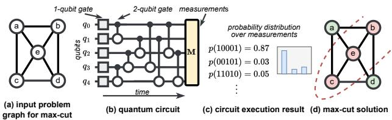  
Figure 1: Foundational example (§ 2.1). (a) Input graph to max-cut. (b) A quantum circuit encoding the max-cut formulation for the graph. (c) The execution result is a probability distribution of bitstrings. (d) The result is interpreted as a max-cut between vertices {a,d} and {b,c,e}.

To fill this gap, we propose QOS, a quantum operating system for holistically tackling quantum computing challenges through a modular, cross-layer architecture. At the core of QOS lies the Qernel abstraction—the common denominator that enables the seamless composition of diverse system mechanisms and facilitates cross-layer optimizations.

QOS abstracts away the underlying complexity of quantum resource management and systematically explores the associated tradeoffs of quantum computing. To achieve this, QOS exposes hardware-agnostic APIs and comprises four main components: (1) the error mitigator, a component that composes complementary techniques to increase fidelity by mitigating hardware noise, (2) the estimator, which predicts fidelity performance across heterogeneous QPUs to guide scheduling decisions, (3) the multi-programmer that bundles compatible jobs on the same QPU to improve QPU utilization while minimizing fidelity loss, and (4), the scheduler, which performs fidelity-aware, multi-objective job scheduling to reduce queueing latency and balance QPU load.

We implement QOS in Python by building on the Qiskit framework [33]. We evaluate QOS on IBM’s 27-qubit QPUs [32], using a dataset of more than 7000 quantum runs and 70.000 state-of-the-art quantum benchmark instances used in popular quantum algorithms [38, 60, 76]. Our evaluation shows that the error mitigator improves execution fidelity by 2.6–456.5× on average, depending on the problem size (§ 9.2), the estimator correctly identifies high-fidelity QPUs (§ 9.3), the multi-programmer fidelity by 1.15–9.6× for a target utilization (§ 9.4), and the scheduler reduces the waiting times by 5× while sacrificing at most 3% of fidelity (§ 9.6). Contributions. Our main contributions include:

1. QOS is the first quantum operating system to holistically address the challenges of quantum computing. Its modular architecture and the introduction of the Qernel abstraction enable a clean separation of mechanism and policy, enabling flexible integration of evolving techniques without modifying system interfaces.

2. QOS enables both cross-layer and intra-layer optimizations through its end-to-end system design. QOS’s components synergistically optimize fidelity and resource efficiency while supporting composable techniques within individual layers.

3. QOS systematically explores and manages key quantum computing tradeoffs, including: (i) fidelity vs. runtime overheads in error mitigation and performance estimation; and (ii) fidelity vs. QPU utilization, as well as job waiting times, in multi-programming and scheduling.

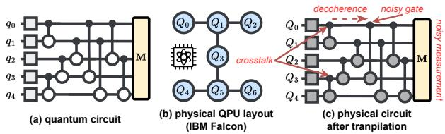  
Figure 2: Technical Foundations (§ 2.2). (a) The quantum circuit of Figure 1. (b) The physical layout of an IBM Falcon QPU. (c) The transpiled circuit with the QPU’s noise sources.

4. QOS introduces technical novelties across the quantum software stack: (i) the Qernel abstraction as a unifying execution unit, (ii) the composable error mitigation pipeline that is the first to combine circuit cutting, qubit reuse, and qubit freezing—techniques that amplify each other when composed non-trivially, (iii) a multi-programming model introducing the concepts of compatibility scoring and effective utilization, enabling higher-fidelity circuit co-location, and (iv) the first multi-objective, fidelity-aware scheduler that jointly considers fidelity and waiting times.

Artifact availability. QOS is publicly available at https://github.com/TUM-DSE/QOS.

## 2 Background

## 2.1 Quantum Computing 101

Quantum computers solve specific computationally hard problems exponentially faster than classical computers by leveraging the quantum mechanics principles of superposition and entanglement. Specifically, the basic units of quantum computation are qubits, which during quantum computation are both 0 and 1 at the same time (recall Schrodinger’s cat experiment [65]), and when entangled, they can interact with each other even over large distances [41].

To solve NP-hard problems (e.g., maximum-cut) with quantum computers, we use algorithms such as the Quantum Approximate Optimization Algorithm (QAOA) [20]. This algorithm is considered practical for today’s quantum hardware capabilities and influential towards achieving quantum advantage [63].

Foundational example. Figure 1 shows how QAOA solves an example max-cut problem for an input graph (a). First, the graph is encoded as a quantum circuit. Quantum circuits comprise qubits and quantum gates, akin to logical gates in classical circuits (e.g. NOT, XOR), which are applied over time (from left to right). In the max-cut case, each graph vertex corresponds to a qubit and each edge to a 2-qubit gate in the circuit (b). At the end of the circuit, we measure each qubit to read its value, which gives bitstrings as output. Notably, measurements collapse the superposition state to a definite binary value.

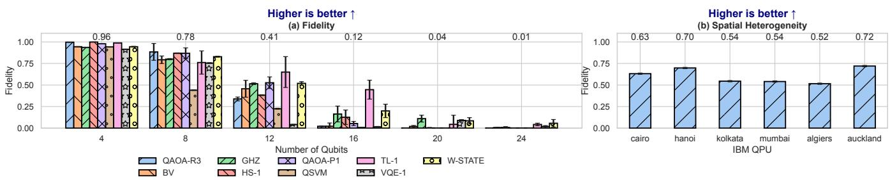  
Figure 3: (a) Challenge #1, Fidelity (§ 3.1). Impact of the number of qubits (circuit size) on fidelity. There is an average 98.9% reduction in fidelity from 4 to 24 qubits. (b) Challenge #2, Spatial heterogeneity (§ 3.2). Fidelity of a 12-qubit GHZ circuit on different IBM QPUs. There is a 38% fidelity difference from best to worst QPU.

Since quantum mechanics is inherently probabilistic, the bitstring we get is truly random, but due to the algorithm structure, it follows a probability distribution, which ultimately renders quantum computers useful. Thus, we execute the circuit in many trials (“shots” ), with each trial providing a specific bitstring from the qubit measurements. The solution of the quantum calculation is, therefore, a probability distribution over all possible bitstrings of the measured qubits, where high probability maps to the solution, while low (∼ 0) does not represent a solution (c). In our example, the bitstring 10001 represents the max-cut solution that contains the partitions {a, d} and {b, c, e} (d).

## 2.2 Technical Foundations

Execution Model. The technology and engineering required to build QPUs renders them an expensive resource, i.e., there are less than 100 QPUs globally offered in the cloud in a quantum-as-a-service fashion [3, 5, 24, 32]. To run quantum programs, users typically write circuit-level code (Figure 2 (a)), which then transpile on the QPU to make it executable, send it to the cloud for execution, and finally get the results back. Specifically, the transpilation process performs three key steps: (1) converting the gates of the circuit to the native gate set of the QPU, (2) mapping the logical qubits of the circuit to the physical qubits of the QPU, (3) routing the qubits to the physical qubits with restrictive connectivity by inserting additional costly gates. Figure 2 (b) shows the physical layout of an IBM Falcon QPU. Vertices are the physical qubits, and the edges capture their connectivity, i.e., between which qubits we can apply 2-qubit gates. Figure 2 (c) shows the physical circuit after transpilation with the QPU’s noise characteristics, which we detail next.

QPU characteristics. Today’s QPUs are described as noisy intermediate-scale quantum (NISQ) devices [57] since they exhibit low qubit numbers (e.g., up to a few 100s [32]) and are susceptible to hardware and environmental noise. Specifically, when measuring a qubit, there is a chance to read the opposite value, and when applying gates, there is a chance the gate performs a wrong operation [23]. On top of that, when qubits are left idle (no gates applied) for more than a few hundred microseconds, the superposition decoheres to the |0⟩ state [35], similar to resetting a register to 0. Lastly, qubits destructively interfere with each other via crosstalk effects [45]. Figure 2 (c) shows qubits $Q _ { 0 }$ and Q3 that influence each other via crosstalk, noisy gates, qubit $Q _ { 0 }$ that is left idle for long enough to decohere, and noisy measurements.

QPU heterogeneity. Additionally, QPUs are vastly heterogeneous across space and time, unlike classical accelerators. Across space, QPUs vary in terms of technology, e.g., superconducting qubits [19, 69] or trapped ions [30], architectures of the same technology, e.g., Falcon or Osprey superconducting QPUs [32], and noise properties (formally called noisemodel) even for the same architecture [23], e.g., two identical QPUs exhibit different noise errors, etc. Across time, the QPUs are calibrated regularly to maintain their performance [31, 77, 82], a process that generates calibration data. These data quantify the noise errors and change unpredictably after each calibration cycle.

Performance metric. To measure the quality of a circuit execution on NISQ QPUs, we use the fidelity metric [21], which measures the similarity between the noisy probability distribution and the ideal probability distribution that noiseless, ideal QPUs can obtain. Given two probability distributions over measurement outcomes, the ideal $P _ { i d e a l }$ and the noisy $P _ { n o i s y }$ distributions, fidelity is computed as: $F ( P _ { i d e a l } , P _ { n o i s y } ) =$ $\begin{array} { r l } { } & { { } ( \sum _ { i } \sqrt { P _ { i d e a l } ( i ) \cdot P _ { n o i s y } ( i ) } ) ^ { 2 } } \end{array}$ . Fidelity is a number in the [0, 1] range, where a higher fidelity means a better quality result.

Circuit properties. Execution fidelity is impacted by the aforementioned QPU noise model and the circuit properties that describe the circuit’s complexity and, thus, susceptibility to errors. Circuit width refers to the number of logical qubits involved in the circuit and typically also the physical (H/W) qubits required to execute it. Circuit depth denotes the largest number of layers of gates applied to the qubits and quantifies the circuit runtime. A larger depth typically indicates a higher chance for decoherence errors. Last, the number of non-local gates refers to the gates that act on non-adjacent qubits, which are particularly susceptible to errors in NISQ devices. Generally, larger circuits (larger width, depth, or number of non-local gates) equals lower fidelity.

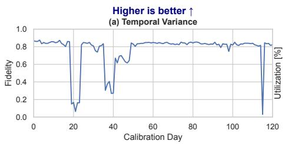

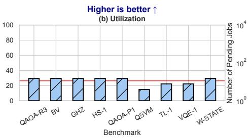

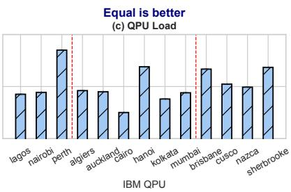  
Figure 4: (a) Challenge #2, Temporal variance (§ 3.2). Fidelity of a 6-qubit GHZ circuit on IBM Perth, across 120 calibration days. There are 20 pairs of days with more than 5% difference in fidelity. (b) Challenge #3, Utilization (§ 3.3). Maximum utilization achieved on a 27-qubit QPU for nine benchmarks while maintaining at least 0.75 fidelity. The average utilization is 26.3%, and the max is 29.6%. (c) Challenge #4, QPU Load (§ 3.4). Number of pending jobs on different IBM QPUs. The groups separated by vertical red lines indicate QPUs of the same size. There is up to 57× difference in number of jobs between QPUs of the same size.

Circuit feature vectors. While circuit properties are useful, sometimes they fail to characterize the structural and computational properties of quantum circuits. Thus, we can use the Supermarq feature vectors, a set of six metrics proposed by Tomesh et al. [76] with the initial goal of quantifying quantum benchmark coverage. These features quantify the parallelism and speedup potential, the lower bound on execution time, QPU connectivity requirements, entanglement (i.e. complexity), and susceptibility to decoherence and measurement errors.

## 3 Motivation and Key Ideas

To motivate QOS, we present a set of unique challenges that distinguish QPUs from classical accelerators. We categorize our findings into four challenges that must be addressed to improve the practicality of quantum computing: fidelity, utilization, spatial and temporal heterogeneities, and load imbalance. The experimental methodology used is the same for the final system evaluation and is explained in detail in § 9.1.

## 3.1 Fidelity

Executing quantum programs with high fidelity is challenging since QPUs are characterized by relatively small numbers of qubits and noise, which leads to computation errors (§ 2.2). As the number of qubits and gates in a quantum circuit increases, the noise errors accumulate and the overall fidelity decreases. Results. Our results are highlighted in Figure 3 (a). The x axis shows the circuit size as the number of qubits while the y axis shows the fidelity, where higher is better. The experiment is run on the IBM Kolkata 27-qubit QPU. For each increase in qubits, the average fidelity decreases, up to 98.9% from 4 to 24 qubits. Moreover, it is physically impossible to run circuits with a size larger than 27 qubits, since we cannot map them. Implication. NISQ devices are limited due to size and noise and, therefore, cannot be practically used for large quantum circuits, either logically because the circuit doesn’t fit in the device or the execution results would be degraded from noise-induced errors, which translates to low fidelity.

## 3.2 Spatial and Temporal Heterogeneity

In the classical domain, two identical CPUs perform similarly for all applications at each point in time. In contrast, QPUs exhibit differences in the layout and connectivity of qubits [26] and variations in noise errors even for QPUs of the same model, which leads to spatial performance variance. Moreover, QPUs are calibrated regularly (§ 2.2), and after each calibration, the noise properties change [61]. As a result, the execution fidelity can vary across different calibration cycles, leading to temporal performance variance.

Results. Figure 3 (b) shows a 12-qubit GHZ circuit’s fidelity on different IBM QPUs. Fidelity varies across the QPUs, with a maximum difference of 38% from best to worst. Notably, all six QPUs are of the same model (Falcon r5.11).

Figure 4 (a) shows a 6-qubit GHZ circuit’s fidelity over 120 calibration days executed on the IBM Perth 7-qubit QPU, where each data point represents a single day’s fidelity. The largest single-day difference in fidelity is 96.5%, and there are 20 instances of a single-day fidelity drop of more than 5%. Note that there is no way to predict a QPU’s future calibration data to expect such performance differences.

Implications. Due to structural differences across QPUs, quantum circuits perform differently across them. Additionally, there is a high degree of temporal performance variance across calibration cycles, as the fidelity might change significantly from day to day with no discernible pattern.

## 3.3 Utilization

The fidelity of circuits decreases as their size increases (§ 3.1), and as a result, it becomes more challenging to utilize a QPU effectively. In contrast to the classical domain, where a CPU can be fully utilized, to get high-fidelity results in the quantum domain, we necessarily under-utilize QPUs.

Results. Figure 4 (b) shows the maximum utilization of the IBM Kolkata 27-qubit QPU for nine benchmarks while targeting at least 0.75 fidelity. No benchmark exceeds 30% utilization, while the average is 26.3%. Higher fidelity targets would yield even lower utilization and vice-versa.

Implications. There is a tradeoff between QPU utilization and fidelity. In general, the lower utilization, the higher fidelity, and vice-versa. In contrast to the classical domain, the tension between these metrics is vastly larger.

## 3.4 QPU Load Imbalance

The quantum cloud faces QPU load imbalance. The root cause is spatiotemporal heterogeneity (§ 3.2), combined with the manual QPU selection offered by the current quantum cloud model [32]. These naturally motivate users to select the highest fidelity QPU(s) for that calibration cycle [61].

Results. Figure 4 (c) shows the average number of pending jobs for different IBM QPUs across October 2023. The groups of QPUs (separated by the red dashed line) have a size of 7, 27, and 127 qubits, respectively. There is a 49×, 57×, and 5.7× maximum load difference across the groups, respectively.

Implications. Load imbalance leads to long waiting times for the users and thus, low quality of service. However, the performance difference does not always justify the load differences between QPUs. For instance, the 12-qubit GHZ circuit in Figure 3 (b) performs 1.1× better on IBM Hanoi than IBM Cairo, yet the former exhibits 57× higher load.

## 4 Overview

We propose QOS, an operating system for quantum computing. In this context, we define a quantum operating system as a software layer that transparently manages quantum jobs and resources efficiently with respect to job fidelity and waiting times (user’s goals) and QPU utilization and load-balance (cloud operator’s goals). Therefore, QOS strives for three design goals: (1) QOS’s architecture should be general and modular, cleanly separating mechanism from policy while enabling both cross-layer coordination and within-layer optimizations. (2) QOS should enable the execution of large quantum jobs with high fidelity. (3) QOS should be resource efficient by achieving high QPU utilization and balancing QPU load to minimize queue waiting times.

## 4.1 The QOS Architecture

Figure 5 shows the overview of our system’s design. QOS comprises a layered architecture that consists of an API and four main components: the error mitigator, the estimator, the multi-programmer, and the scheduler, which we detail next. Qernel abstraction. QOS implements a wide range of mechanisms with different abstraction requirements, from error mitigation to scheduling level. To enable the composability of these mechanisms in a unified architecture, we propose the Qernel abstraction that acts as a common denominator for the QOS mechanisms to apply their policies. QOS API. The QOS API abstracts away the underlying complexity of the noisy and heterogeneous quantum resources by exposing hardware-agnostic functions for configurable quantum job execution. The API transforms the user’s input circuits into Qernels for QOS to apply its mechanisms.

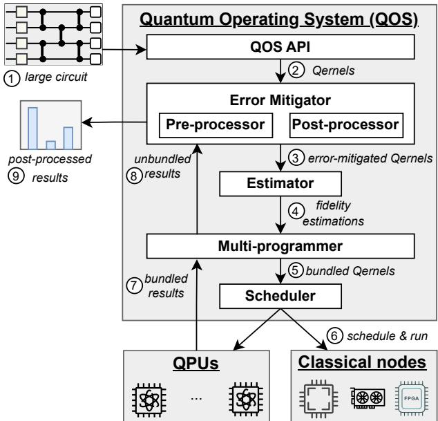  
Figure 5: QOS overview (§ 4): QOS consists of four main components: the error mitigator, estimator, multi-programmer, and scheduler.

Error mitigator. To increase the fidelity of quantum programs, the error mitigator applies pre- and post-processing error mitigation techniques. However, there exists an abundance of such techniques, and they typically incur high runtime overheads that scale with the amount of error mitigation used. Thus, the error mitigator automatically selects and composes a subset of techniques given budget constraints to limit the associated runtime costs.

Estimator. To make informed scheduling decisions in the landscape of QPU spatiotemporal performance variance, we require accurate fidelity estimations that do not depend on expensive simulations or trial runs. The estimator leverages analytical models to predict the execution fidelity on the underlying QPUs in a scalable manner.

Multi-programmer. There is an inherent tradeoff between QPU utilization (proxy of program size) and fidelity. To increase QPU utilization without significantly compromising fidelity, the multi-programmer spatially multiplexes multiple quantum programs on a single QPU with careful consideration for fidelity performance loss.

Scheduler. There is a fundamental tradeoff between job waiting times and fidelity that arises from the underlying spatial performance variance. The scheduler trades minimal fidelity for significant waiting time improvement by optimizing for this conflicting objective.

Table 1: QOS programming API.
<table><tr><td>QOS API</td><td>Description</td></tr><tr><td>run(circ，cnfgs) results(jID)</td><td>Run circuit with config.options. Retrieve the job results.</td></tr><tr><td>status(jID)</td><td>Retrieve the job status.</td></tr><tr><td>backends()</td><td>Retrieve the available backends.</td></tr><tr><td>backend_props(bID)</td><td>Retrieve the backend properties.</td></tr></table>

## 4.2 QOS Programming Model

We introduce the QOS programming model designed to abstract away the underlying complexity of managing heterogeneous and noisy quantum resources. QOS exposes hardware-agnostic APIs and leverages the Qernel unified abstraction that acts as a common denominator across its components to enable the application of its diverse mechanisms.

QOS APIs. Table 1 shows the QOS APIs that abstract away quantum job execution and resource management. To run a quantum circuit, users simply call run with the circuit and configuration options, such as the error mitigation budget, which controls the runtime overheads and thus cost (in \$). This function returns a unique job id, jID. Users can call result and status with the returned jID to retrieve the execution results and status, respectively. Last, users call backends and backend\_props to retrieve the available QPUs and their properties.

The Qernel abstraction. The Qernel implements data structures that store the static and dynamic properties of the quantum job. Specifically, to apply error mitigation techniques optimally, we must leverage the characteristics of the quantum circuit, such as the circuit’s size (number of qubits), depth, number and types of 2-qubit gates, the number of measurements, etc. Additionally, we include the six Supermarq features vectors [76] since they are potentially useful for heuristic-based optimizations or regression-based prediction models [59]. This information is described as the static properties of the Qernel. The dynamic properties include the Qernel’s execution status (done,failed, running,scheduled), the estimator’s output, i.e., fidelity estimations (§ 6), and the final post-processed results.

System workflow. Users submit a large circuit using the QOS API 1 . Then, QOS transforms the circuit into a Qernel, the common denominator of QOS, and submits it to the error mitigator 2 . This component outputs error-mitigated Qernels and submits them to the estimator 3 . The estimator predicts the fidelity of running the Qernel(s) on the QPUs to guide scheduling 4 . Next, the multi-programmer bundles Qernels with low utilization and sends them to the scheduler 6 , who schedules and runs the bundled Qernels, optimizing for maximal fidelity and minimal waiting times 6 . After the execution, the bundled results are unbundled by the multiprogrammer into separate results and are sent to the error mitigator for post-processing 8 . Finally, the post-processor synthesizes the final results and returns them to the user 9 .

## 5 Error Mitigator

Quantum computers are characterized by hardware and environmental noise errors, which hinder their practicality and scalability (§ 3). The error mitigator applies pre- and post-processing to the Qernels and execution results, respectively, to mitigate these noise errors.

Challenges. Currently, there is a plethora of individual error mitigation techniques that require their own sub-systems to operate, with no common infrastructure to compose them. However, composability is essential for fidelity improvement since error mitigation techniques can complement each other, if stacked together in the correct order, to further improve performance [9, 11]. Additionally, some techniques spawn an exponential number of sub-circuits and, after execution, require post-processing using classical resources [44, 55]. There are two main challenges in efficiently leveraging error mitigation: (1) Which error mitigation techniques must be used and in which order? (2) How to balance the tradeoff between fidelity improvement and exponential overheads with respect to runtime and resources?

Key ideas. The error mitigator automatically applies error mitigation techniques, abstracting this complexity away from the user. The key idea is that not all gates and qubits are equal; some of them are noise hotspots, lowering the fidelity significantly more than others. We constrain the exponential overheads by (1) setting an error mitigation budget b to be spent, and (2) greedily applying error mitigation techniques on the hotspots in the order that maximizes fidelity improvement with the least added overheads.

## 5.1 Pre-Processor

The pre-processor first analyzes the Qernel to generate important metadata, identifies the error mitigation opportunities, and then prepares the Qernel for the respective techniques.

Qernel analysis. Qernel analysis generates two main pieces of information that guide the application of error mitigation techniques: (1) Qernel metadata and (2) optimization opportunities such as hotspot qubits or gates, i.e., qubits and gates that can be removed to reduce noise errors significantly. Specifically, we generate the key Qernel static properties and the six SupermarQ feature vectors as stated in § 4.2.

Error mitigation techniques. We focus on two existing error mitigation techniques: circuit divide-and-conquer and qubit reuse, since these techniques increase fidelity and enable the execution of large quantum jobs on small(er) QPUs. However, QOS supports any technique that achieves the same goals [10, 15, 43, 75].

At a high level, techniques in the former category divide (large) circuits into smaller fragments that can be executed on small QPUs, and the fragmented execution results are post-processed back to a single value. The advantages are two-fold: (1) We can scale the size of circuits that are executable on the current small QPUs beyond the H/W qubit limit, and (2) we can improve fidelity since smaller and less complex circuits achieve higher fidelity (§ 2.2, § 3.1). Unfortunately, these techniques incur exponential quantum and/or classical overheads with respect to the number of divisions; therefore, they must be used conservatively.

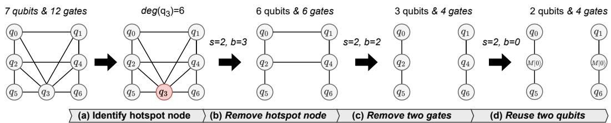  
Figure 6: Error mitigator pre-processor workflow (§ 5.1). The initial Qernel has 7 qubits and 12 gates, and budget b = 3. (a) We identify q3 as a hotspot node with a degree of 6. (b) We remove this node, which reduces the qubit and gate counts to 6. (c) We remove two gates, giving two fragments of 3 qubits each. (d) The budget is depleted, so we use qubit reuse to further reduce the qubits by two.

More specifically, circuit divide-and-conquer comprises circuit cutting and knitting [44, 55] and qubit freezing [4]. Circuit cutting can simplify the circuit’s structure by virtualizing noisy non-local gates into (less noisy) local gates [44] or cutting a qubit (wire) in the temporal dimension to shorten its runtime [55]. Thus, circuit cutting can improve the circuit’s width, depth, and number of non-local gates at once (§ 2.2). During knitting, the original (full) circuit results are reconstructed through classical post-processing of the subcircuit results. We refer interested readers to CutQC [73] and QVM [78] for details on how circuit cutting works in practice. Comparably, qubit freezing identifies qubits with significantly more connections to other qubits (hotspots) and partitions the circuit by replacing the hotspot qubits with binary values, effectively dropping their noisy non-local gates. Since every qubit can be replaced by a binary value, this process generates 2m smaller circuits for m frozen qubits.

In both cases, we automatically find the cut locations that achieve the smallest sub-circuits possible with the fewest cuts possible. To maximize the synergy between techniques, we first apply qubit freezing to remove multiple non-local gates at once with a relatively small cost, and then we greedily apply circuit cutting. To restrict the exponential overheads that scale exponentially with the number of cuts, we use the budget b to cut up to b times. Typically, we set the budget b = 3 by default, and the overheads scale as $O ( 2 ^ { b } ) - O ( 8 ^ { b } )$ depending on the divide-and-conquer technique.

On the other hand, qubit reuse (also referred to as recycling) reduces qubit requirements by reusing physical qubits after resetting them [18, 29, 34]. Once a qubit’s role in computation is complete, it is measured, reset to a known state (typically |0⟩), and reassigned to another logical qubit later in the circuit. This approach enables more efficient use of limited hardware resources and allows execution of larger circuits than the QPU’s qubit limit. This method, however, increases the circuit depth (i.e., execution duration), which can lead to quantum decoherence errors (§ 2.2); therefore, the tradeoff, in this case, is between circuit size and runtime. To restrict the runtime increase, we use qubit reuse as a last resort to render the Qernel executable by at least one QPU in the system (i.e., the optimized Qernel fits at least one QPU’s size constraints). Workflow example. Figure 6 shows the pre-processing workflow for a QAOA circuit (§ 2.1) with 7 qubits and 12 gates. The pre-processor aims to achieve a maximum Qernel size of two qubits with a budget of b = 3. To achieve this, it takes the following steps:

Step 1: The pre-processor applies analysis to identify a hotspot node; in this case, q3 is a hotspot with a degree of 6 gates (Figure 6, (a)).

Step 2: Then, the pre-processor removes q3 and its gates with qubit freezing. The new Qernel size is 6 qubits with 6 gates. Then, it updates the budget to $b { = } b { - } m ,$ , where m = 1 is the number of qubits frozen (Figure 6, (b)).

Step 3: Next, the pre-processor applies circuit cutting on two gates and updates the budget to b = 0. The new Qernel consists of two fragments, each with a size of 3 qubits and 4 gates (Figure 6, (c)).

Step 4: Since b = 0, the pre-processor applies qubit reuse to achieve a size of 2 qubits and identifies qubits q0, q1 as reusable. Here, M|0⟩ denotes measurement and reset to the |0⟩ state. The final Qernel now has two fragments of 2 qubits and 4 gates (Figure 6, (d)).

The final output is a Qernel with a 42.8% smaller size and 66% less noisy gates. Notably, this result is only attainable through the synergy of techniques, as no individual method alone can achieve comparable improvements.

## 5.2 Post-Processor

The post-processor reconstructs the final error-mitigated results by classically stitching together intermediate outcomes from sub-Qernel executions. In circuit knitting, each virtualized gate (i.e., cut) is expanded into a linear combination of basis gates with associated coefficients. When multiple such gates are virtualized, the global coefficient vector becomes the tensor product of the individual gate vectors, resulting in an exponentially large space of up to 8k bitstring-weight pairs for k virtualized gates. The post-processing then requires computing a weighted sum over all 8k combinations, with each term involving a product of subcircuit results. As such, this process requires a scalable post-processing infrastructure. The map phase. To efficiently process the large number of results, we follow a divide-and-conquer approach. Specifically, we split the results into k equal sizes and distribute them to k classical nodes to be processed in parallel. We parallelize across k to increase data locality and reduce communication overheads since all results for each of the k cuts will be in the memory of the same node. Locally, each node performs tensor product (N) operations on the probability distributions, which are parallelizable across the node’s threads. If available in the node, QOS leverages GPUs or TPUs to accelerate the tensor products. Following this process, the k nodes output k intermediate results, ready to be reduced into a single result. The reduce phase. QOS selects any of the k nodes to perform the reduce step. The rest of the nodes send the intermediate results to this node, which performs a thread-parallel sum of k results. Equivalent to the map phase, the parallel sum can also be executed on GPUs. This produces the final output to be returned to the user.

## 6 Estimator

The estimator is responsible for predicting the fidelity performance of a given Qernel on the underlying QPUs without executing the Qernel, which would be extremely costly. This prediction will be the leading decision factor for the scheduler when assigning the Qernel to a QPU.

Challenges. Estimating fidelity a priori faces three key challenges: (1) Fidelity is a non-deterministic metric affected by the hardware’s probabilities of errors, which change across QPUs and time unpredictably (§ 3). (2) Simulating a Qernel to obtain fidelity estimates is intractable since the complexity of simulating quantum systems scales exponentially with the number of qubits [22]. (3) Fidelity can be approximated numerically [47]; however, there is an accuracy-cost tradeoff. The more complex the analytical model becomes, the higher the runtime overhead of estimation.

Key idea. The estimator leverages analytical and regression models that do not require real execution or simulation of the Qernel. Specifically, the estimator’s models compute a score for each Qernel-QPU assignment that captures the potential fidelity of that assignment, and the estimator supports configurable scoring policies with different runtime-cost tradeoffs. These policies consider (1) the Qernels’ properties generated from the error mitigator, (2) the QPUs’ calibration data (i.e., noise model), which are available to quantum cloud providers since they perform the calibration cycles.

For (1), important properties include the number and types of gates,depth,and the number ofmeasurements (§ 4.2). For(2), recall that QPUs are characterized by calibration data that describe the exact error rates of the QPU for that calibration cycle (§ 2.2), specifically, the individual qubit readout errors, the individual gate errors,and the T 2 coherence times. In this work,we implement two scoring policies: a numerical approach for finegrained control over the estimations and a regression model approach for abstracting away the complexity of estimation. Numerical cost policy. This policy estimates execution fidelity by transpiling the circuit for the target QPU (§ 2.2). Target transpilation enables fine-grained fidelity estimation by producing the mapping between logical and physical qubits and the gate (instruction) schedule. The mapping captures the expected readout and gate errors, while the gate schedule captures the order and exact timing that the gates will be applied on the qubits, which reveals the hardware decoherence and crosstalk errors, as explained in § 2.2. This method has been explored before, and there are multiple variants, but we base our implementation on Mapomatic [47].

To compute the score, we need the following information: (1) The readout/measurement error probabilities that describe the probability of a bit-flip during measurement, (2) the gate error probabilities, (3) the T2 time, which measures for how long a qubit can stay in an excited state (i.e., |1⟩), thus quantifying the decoherence error probability, and (4) the crosstalk error which is measured through crosstalk characterization [45]. With this information, we can multiply the probabilities of the respective sources of errors to get an estimate of the total error/fidelity.

Formally, for each qubit $q _ { i }$ the readout error is $e _ { r ( i ) }$ , for each gate $g _ { j }$ the error is $e _ { g ( j ) }$ , and the decoherence error is $e _ { d ( t ) } = 1 - e ^ { - t / T 2 _ { i } }$ , where t is the idle time of the qubit $q _ { i }$ (no gates act on it [14]) and T 2 is the decoherence time of $q _ { i }$ . The crosstalk error between gates gk and gl is $e _ { c t ( k , l ) }$ . Putting it all together, the final fidelity score is computed as follows: $\begin{array} { r } { f i d = 1 - \prod _ { i = 0 } ^ { N } e _ { r ( i ) } e _ { d ( i ) } \prod _ { j = 0 } ^ { M } e _ { g ( j ) } \prod _ { j = 0 , k = 0 } ^ { M \times M } e _ { c t ( j , k ) } } \end{array}$ , where N is the circuit’s number of qubits and M is the number of gates. Since all hardware error information is known a priori, and quantum errors accumulate multiplicatively, this policy produces high-accuracy estimations, as we show in § 9.3.

Regression modelpolicy. Since the impact ofnoise errors on fidelity during quantum computation can be described numerically, we can train a regression model to predict the fidelity of a transpiled Qernel on a possible QPU using the QPU’s calibration data and the Qernel’s static properties as features. Specifically, we use the aforementioned errors we defined in the numerical cost policy as QPU features and the static properties (§ 4.2) as Qernel features. Even simple regression models such as linear regression achieve high prediction accuracy, up to 99%. Although this policy is simple to use without detailed knowledge of the relationship between errors, in QOS, we use the numerical cost policy by default for estimation to have a clear understanding and full control of the process.

## 7 Multi-programmer

The size of quantum programs that run with high fidelity is small,leading to QPU underutilization (§ 3.3). To increase QPU utilization, QOS multi-programs two or more Qernels, potentially from different users, to run on the same QPU. We refer to this multi-programming as bundling the Qernels together. Challenges. Bundling Qernels faces three distinct challenges: (1) Trivially bundling Qernels together will deteriorate fidelity because qubits interfere with each other via crosstalk errors (§ 2.2). (2) On top of that, bundled Qernels with unequal runtimes do not optimally increase utilization since effective utilization is measured in space and time (number of QPU qubits used and duration that they are non-idle). (3) Qernel compilation involves several NP-hard processes [70], so we need to minimize it.

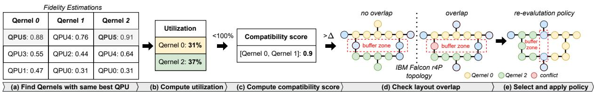  
Figure 7: QOS multi-programmer example workflow (§ 7). (a) We use the estimator’s output to find Qernels with the same best QPU. (b) We compute their independent utilization, and (c) their compatibility score. If compatible, (d) we check for layout overlap, and (e) apply the appropriate multi-programming policy.

Key ideas. To tackle these challenges, we introduce new ideas unexplored by prior multi-programming work [16, 40]. First, we define a new utilization metric, namely effective utilization, that captures the temporal dimension of utilization, i.e., H/W qubit usage during computation time. Next, we compute Qernel compatibility functions that quantify how well-suited any two Qernels are to run together, to minimize fidelity loss and re-compilation times. Last, we create buffer zones between two bundled Qernels to minimize crosstalk errors.

## 7.1 Qernel Compatibility

Qernel compatibility quantifies crosstalk errors and the effective utilization of bundled Qernels by considering the Qernels’ static properties (§ 4.2).

Effective utilization. The trivial way to compute utilization in the case of bundled Qernels is by dividing their total number of qubits over the QPU’s number of qubits, $N _ { t o t a l } / N _ { Q P U } .$ However, this is not accurate when the bundled Qernels have unequal runtimes. In order to accurately quantify QPU usage in the context of multi-programming, we define effective utilization as spatial plus temporal utilization. To quantify spatial utilization, it suffices to compute the ratio of allocated QPU qubits (of the longest Qernel in terms of depth) over the QPU’s number of qubits.

To quantify temporal utilization, we scale the spatial utilization of each allocated Qernel with a weight that is the ratio of the Qernel’s duration over the longest Qernel’s duration. Recall that, to measure the Qernels’ durations, we use the depth property that reflects the longest sequence of gates the Qernel consists of (§ 2.2).

More technically, we define effective utilization as $\begin{array} { r } { u _ { e f f } = \frac { N _ { C _ { m a x } } } { N _ { Q P U } } \cdot 1 0 0 + \sum _ { k = 1 } ^ { n } \frac { D _ { k } } { D _ { m a x } } \cdot \frac { N _ { C _ { k } } } { N _ { Q P U } } } \end{array}$ ·100, where $N _ { C _ { m a x } } , N _ { Q P U }$ are the number of qubits of the longest Qernel and the QPU, respectively, k is the number bundled Qernels excluding the longest Qernel, and D is the depth of the Qernel. The first term, $\frac { N _ { C _ { m a x } } } { N _ { Q P U } } * 1 0 0 .$ , captures the spatial utilization. The right term (sum) captures the temporal dimension, and $\frac { D _ { n } } { D _ { m a x } }$ is the relative depth of Qernel k compared to the longest Qernel, and $\frac { N _ { C _ { k } } } { N _ { Q P U } }$ is the fraction of QPU qubits used by Qernel k.

For example, a 10-qubit Qernel $Q _ { 0 }$ spatially utilizes 50% of a 20-qubit QPU. Now assume that $Q _ { 0 }$ runs 3× longer than a 10-qubit Qernel $Q _ { 1 }$ . During $\frac { 2 } { 3 }$ of $Q _ { 0 }$ ’s runtime, the qubits allocated to $Q _ { 1 }$ will be idle, decreasing the effective utilization to only 66%.

Quantifying crosstalk. To quantify crosstalk without running the bundled Qernels, we use the entanglement ratio and parallelism Qernel feature vectors of [76], where higher values indicate a higher chance for crosstalk errors (§ 2.2). Intuitively, the entanglement ratio captures the proportion of 2-qubit gates over all gates, and parallelism captures how many gates run in parallel per time unit. Thus, more parallel 2-qubit gates equal a higher chance of crosstalk errors [45]. Compatibility formula. To quantify the compatibility of two candidate Qernels, we consider their effective utilization, as well as their joint entanglement ratio and parallelism scores. This is because we ideally want high effective utilization (not just higher spatial) and fewer crosstalk-induced errors.

Formally, we score a possible Qernel pair as follows: $q c = \propto u _ { e f f } + \beta E R _ { b } + \gamma P A _ { b } \mapsto [ 0 , 1 ]$ . Higher score is better, $\alpha + \beta + \gamma = 1$ (the weights add up to one), $u _ { e f f }$ is effective utilization, ER is entanglement ratio, PA is parallelism, and b denotes bundled, i.e., $E _ { b }$ is the entanglement ratio of the bundled Qernels. The four variables are tunable to give priorities on different objectives, e.g., prioritize effective utilization or minimize crosstalk. After experimenting and fine-tuning, we found that $\alpha = 0 . 2 5 , \beta = 0 . 2 5 , \gamma = 0 . 5$ , and $q c { \ge } 0 . 7 5$ gives balanced results, as we show in § 9.4.

Buffer zone. Crosstalk characterization studies on real machines have shown that the probability of crosstalk errors drops exponentially with the distance between any two qubits [45]. We leverage this to minimize crosstalk errors by creating a buffer zone between any two bundled Qernels, i.e., at least one hardware qubit between the two sets of allocated qubits must be free. Given the hardware constraints and limited number of available qubits, we limit the buffer size to up to two qubits of distance.

## 7.2 Multi-programming Policies

In this work, we implement two multi-programming policies; the first is the fast path multi-programming while the second requires re-compilation and re-estimation.

Restrict policy. The restrict policy checks if there is no overlap in the Qernel mappings on the QPU, including the buffer zone. For example, in Figure 7 (d) in the left case, the logical qubits of the Qernels are mapped to disjoint sets of physical qubits on the QPU, and there is a buffer zone between the two sets. In that case, the policy simply bundles the Qernels together, and fidelity loss is minimized through the aforementioned compatibility score.

Re-evaluation policy. This policy is the fallback of the restrict policy. If the Qernel mappings overlap, the two Qernels are transpiled again for the target QPU, and their new fidelity is estimated. If the new fidelity is lower up to a fixed ε > 0 value compared to the original independent fidelities, the bundling is kept. Otherwise, the multi-programmer selects the next most compatible Qernel pair.

Example. Figure 7 shows an example where the multiprogrammer receives three Qernels with three estimations each and identifies Qernel 0 and Qernel 2 as a possible pair since their best QPU is the same (QPU5) (a). It computes their independent utilization (31% and 37%, respectively), and the combined utilization is under 100% (b). It computes the compatibility score that surpasses the threshold $( 0 . 9 > 0 . 7 5 )$ (c). In (d), the right case shows an overlap in the buffer zone (the red qubit), so we apply the re-evaluation policy.

Unbundling. To unbundle the results, the multi-programmer keeps a record that maps the initial (solo) Qernel IDs to the new, bundled Qernel ID, as well as the Qernels’ sizes. Therefore, when receiving a new result from a Qernel with an ID i, it scans the record to find an entry i, and if found, it splits the probability distribution bitstrings (§ 2.1) into two parts: the left-most and the right-most bits based on the Qernel sizes.

## 8 Scheduler

Scheduling quantum programs involves fundamental tradeoffs between conflicting objectives; specifically, users ideally want the fidelity of the best fidelity QPU and the waiting time of least busy QPU.

Challenges. Scheduling quantum tasks faces three key challenges: (1) To maximize fidelity, most programs must be scheduled on the same subset of best-performing QPUs (§ 3.2), forming hotspots and necessarily increasing user waiting times. (2) The scheduler must at least know estimates of the quantum task durations. However, similar to fidelity estimation (§ 6), quantum execution time estimation must be fast, without real execution or simulation. (3) Job scheduling is a well-known NP-hard problem; therefore,every heuristic orgreedy solution will present a tradeoff between optimality and performance. Key ideas. Our scheduler leverages an analytical model to estimate the Qernel execution time quickly. Then, based on the fidelity predictions from the estimator, it assigns and runs Qernels across space (which QPUs) and time (when). Last, our scheduler supports configurable policies for managing the aforementioned tradeoffs, prioritizing maximal fidelity, minimal waiting times, or a balanced approach. Our two main policies are a fast heuristic algorithm, similar to [62], and the first genetic-based multi-objective optimization algorithm.

Execution time estimation. To optimize for minimal waiting times, the scheduler must first estimate each Qernel’s execution time and then aggregate the execution time estimations in each QPU’s queue to compute the total waiting times. To estimate the execution time, we iterate the longest path (depth) of a Qernel (§ 4.2) that corresponds to the longest-duration gate chain and thus defines the Qernel’s execution time. By summing the gate durations of each node in the longest path, we get the Qernel’s total execution time.

Formula-based policy. Optimizing for conflicting objectives involves comparing two possible solutions (e.g., maximal fidelity vs. minimal waiting times). In the formulabased policy, we use the following scoring formula to compare and select between two possible assignments: $\begin{array} { r } { s c o r \hat { e } = c \frac { f _ { 2 } - f _ { 1 } } { f _ { 1 } } - ( 1 - c ) \frac { t _ { 2 } - t _ { 1 } } { t _ { 1 } } + \beta \frac { u _ { 2 } - u _ { 2 } } { u _ { 1 } } } \end{array}$ . This formula factors fidelity, waiting time, and utilization to determine which assignment is better, given priorities. The parameters are as follows: fi: fidelity of the estimation result i, ti: waiting time for the QPU from estimation result i, ui: utilization of the QPU for estimation result $i , c \in ( 0 , 1 )$ : a system-defined constant that weighs the fidelity difference between estimations and finally, β: a system-defined constant acting as a weighting factor for utilization difference, balancing system throughput and fidelity. By selecting higher $^ { c , }$ the system prioritizes fidelity over waiting times, and vice versa, and by selecting higher β the system prioritizes utilization over fidelity, and vice versa. By default, $c = \beta = 0 . 5 ,$ , which aims for balanced fidelity, waiting times, and utilization. Notably, prior work does not include utilization in the scheduling decisions [62].

Genetic algorithm policy. Genetic algorithms excel at optimizing for conflicting objectives by efficiently searching over vast search spaces, and for that, they can be used in the context of QOS. We formulate a multi-objective optimization problem with the conflicting objectives of fidelity vs. waiting times and use the NSGA-II genetic algorithm [17] to solve it. The algorithm creates a Pareto front of possible solutions (schedules), each achieving a different combination of average fidelity and average waiting times. Then, to select one of those schedules, we use the aforementioned formula to score each schedule and select the schedule with the highest score.

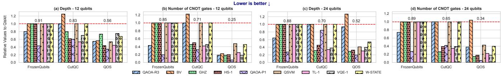  
Figure 8: Errormitigator(§ 9.2). Impact of the errormitigatoron the circuit depth and the numberof CNOTs. The circuits are optimized using budget b = 3, and we compare against Qiskit (red horizontal line), FrozenQubits [4] and CutQC [73]. There is an average 46%, 38.6%, and 29.4% reduction in circuit depth, and 70.5%, 66% and 56.6% reduction in the number of CNOTs, respectively.

## 9 Evaluation

## 9.1 Experimental Methodology

Experimental setup. We conduct two types of experiments: (1) classical tasks, such as circuit transpilation and trace-based simulations, and quantum tasks (2), which run on real QPUs for measuring the circuits’ fidelities.

For (1), we use a server with a 64-core AMD EPYC 7713P processor and 512 GB ECC memory. For (2), we conduct our experiments on IBM Falcon r5.11 QPUs. Unless otherwise noted, we use the real Kolkata 27-qubit QPU hosted by IBM. Framework and configuration. We use the Qiskit [33] Python SDK for compiling quantum circuits and running simulations. We compile quantum circuits with the highest optimization level (3) and run with 8192 shots. Each data point presented in the figures is the median of five runs.

Benchmarks. We study QOS on a set of circuits used in state-of-the-art NISQ algorithms, adopted from the 3 benchmark suits of Supermarq [76], MQT-Bench [60] and QASM-Bench [39]. The algorithms’ circuits can be scaled by the number of qubits and depth. Specifically. We study 9 benchmarks: GHZ, W-State, Bernstein Vazirani (BV), Hamiltonian Simulation (HS-t), Quantum-enhanced Support Vector Machine (QSVM), Two Local Ansatz (TL-n), Variational Quantum Eigensolver (VQE-n), and Approximate Optimization Algorithm (QAOA-R/P), these benchmarks cover a wide range of relevant criteria for evaluating QOS.

For the TL and VQE circuits, we use circular and linear entanglement, respectively. The HS, VQE, and TL benchmarks are scalable by their circuit depth with the number of time-steps t and layers in the ansatz n. The QAOA-R/P circuits are initialized using regular/power-law graphs, respectively, with degree d ∈ {1,3}.

Metrics. We evaluate the following metrics: (1) Hellinger Fidelity. As defined in [21], where it ranges in [0, 1] and higher is better. (2) Static Properties. Number of CNOT gates and depth (§ 2.2). (3) Utilization. The effective QPU utilization (§ 7). (4) Waiting Time. The time a Qernel spends in a QPU’s queue, waiting for execution, in seconds. (5) Classical Overhead. The error mitigation classical overheads as a factor of runtime increase (×). (6) Quantum Overhead. The error mitigation quantum overheads as a factor of numbers of circuits increase (×).

Baselines. We evaluate the error mitigator against the standalone fidelity-improving frameworks Qiskit v0.41, CutQC [73] and FrozenQubits [4]. We evaluate QOS’s multi-programmer against [16], and we evaluate the synergy between the error mitigator,estimator,and multi-programmer vs. CutQC and [16] as a single baseline. Regarding QOS scheduler, to the best of your knowledge, [62] is the only peerreviewed quantum scheduler, but it doesn’t provide source code or enough technical details to faithfully implement it.

## 9.2 Error Mitigator

RQ1: How well does the error mitigator improve the fidelity of circuits that run on NISQ QPUs? We evaluate the performance of the error mitigator w.r.t the post-mitigation properties and fidelity of the circuits while also analyzing the classical and quantum costs of our approach.

Effect on the circuit depth and number of CNOTs. In Figure 8, we show the performance of the error mitigator on the circuits’ depth and number of CNOTs, where we plot the relative difference in post-optimization circuit depth and the number of CNOTs between Qiskit (the red horizontal line) and FrozenQubits [4], CutQC [73], and our error mitigator. Figures 8 (a) and (c) show that the circuit depth decreases by 46%, 38.6%, and 29.4%, respectively. Figures 8 (b) and (d) show that the number of CNOTs decreases by 70.5%, 66%, and 56.6%, respectively. The improvement in both metrics against the baselines is attributed to the composability of our error mitigator, where the combined techniques achieve better results than any standalone technique. In cases where QOS under-performs compared to the baselines (e.g., BV benchmark for 24 qubits), it is because the error mitigator achieved the desired circuit size with the qubit reuse technique, which incurs additional costs (§5.1).

Impact on fidelity. Figure 9 shows the error-mitigated circuits’ fidelity against Qiskit [58], CutQC [73], and Frozen-Qubits [4]. The results show a mean 2.6×, 1.6×, and 1.11× improvement for 12-qubit circuits, respectively, and a 456.5×, 7.6×, and 1.67× improvement for circuits of 24 qubits, respectively. The fidelity improvement is a consequence of lower circuit depths and fewer CNOTs, as shown in Figure 8. Classical and quantum overheads. Figure 10 (a) shows the average classical and quantum overheads of the error mitigator. The classical overhead is 16.6× and 2.5× for 12 and 24 qubits, respectively, and the quantum overhead is 31.3× and 12× for 12 and 24 qubits, respectively. However, fidelity improves by 2.6× and 456.5× for 12 and 24 qubits, respectively; therefore, for larger circuits, the fidelity improvement is worth the cost.

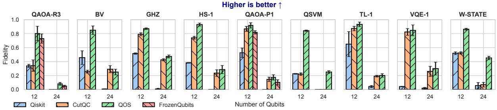

Figure 9: Error mitigator (§ 9.2). Impact of the error mitigator on the circuit fidelity against Qiskit [58], CutQC [73], and FrozenQubits [4]. The circuits are optimized using budget b = 3. There is a mean 2.6×, 1.6×, and 1.11× improvement for 12-qubit circuits, respectively. There is a 456.5×, 7.6×, and 1.67× improvement for circuits of 24 qubits, respectively.  
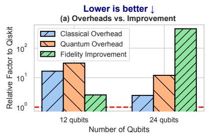

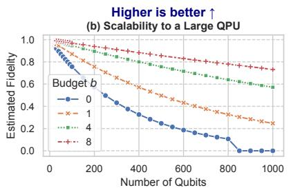

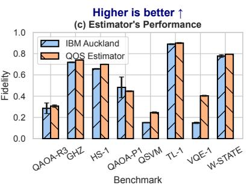  
Figure 10: Error mitigator (§ 9.2) and estimator (§9.3). (a) Error mitigator: classical and quantum overheads and fidelity improvement as a relative factor to Qiskit. For 24 qubits, the improvement outweighs the overheads. (b) Error mitigator: scalability to a large, hypothetical 1000-qubit QPU. Any budget b > 0 achieves higher quality results than using no optimizations. (c) Estimator’s performance: fidelity of IBM Auckland vs. the QPU automatically selected by the estimator.

Scalability. To demonstrate that the error mitigator is scalable, we run the VQE-1 benchmark on a hypothetical 1000-qubit QPU with one-qubit gate errors of 10−4, two-qubit gate errors of $1 0 ^ { - 3 }$ , and measurement errors of $1 0 ^ { - 2 }$ . We optimize with budget $b \in \{ 0 , 1 , 4 , 8 \}$ and report the estimated fidelity. Figure 10 (b) shows that all budget b values improve the estimated fidelity, where higher b equals higher fidelity. RQ1 takeaway. The error mitigator improves the properties of quantum circuits by 51% on average, leading to an improvement in fidelity of 2.6–456.5×, while incurring justifiable classical and quantum overheads.

## 9.3 Estimator

RQ2: How well does QOS’s estimator address spatial and temporal heterogeneities? We evaluate the estimator’s precision in selecting the top-performing QPU for each benchmark. We establish a baseline using the on-average best-performing machine every calibration day. On the day of the experiment, IBM Auckland was the best-performing machine (also with the highest number of pending jobs).

Estimator’s accuracy. Figure 10 (c) shows the fidelity of the eight benchmarks when run on QPUs selected by the estimator versus when run on the IBM Auckland QPU. The QPU selected for the BV benchmark is Auckland; therefore, we omit this result. For the rest of the benchmarks, the IBM Sherbrooke and Brisbane QPUs were automatically selected. Interestingly, the fidelity is on par or even higher than IBM Auckland, except for only one benchmark, the QAOA-P1, possibly because of its unique, power-law connectivity structure. RQ2 takeaway. QOS’s estimator automatically identifies QPUs with higher fidelity than the current standard practice.

## 9.4 Multi-programmer

RQ3: How well does QOS’s multi-programmer increase QPU utilization with minimum fidelity penalties? We evaluate the impact of the multi-programmer on the fidelity of co-scheduled circuits for certain utilization thresholds.

Utilization vs. fidelity. Figure 11 (a) shows the average fidelity of nine benchmarks with utilization of 30%, 60%, and 88%. The three bars represent: no multi-programming (No M/P) refers to large circuits that run solo, baseline multiprogramming (Baseline M/P) refers to [16], and QOS’s multiprogramming approach (QOS M/P). There is an average 9.6× improvement in fidelity compared to solo execution and an average 15% (1.15×) improvement compared to the baseline. Effective utilization. The results in Figure 11 (b) show that QOS achieves, on average, a 7.2% higher effective utilization (§ 7), with a maximum improvement of 10.1%. We attribute this improvement to the inclusion of temporal utilization. Fidelity penalty vs. solo execution. In Figure 11 (c), we evaluate the fidelity penalty of multiprogramming vs. solo circuit execution for utilization of 30%, 60%, and 88%. The fidelity loss is 2%, 9%, and 18%, respectively. The average fidelity loss is 9.6% compared to solo execution, which is in line with previous studies [16, 40]. In the worst case (18%), the fidelity loss is caused by the restrictions in high-quality qubit allocations and the crosstalk errors.

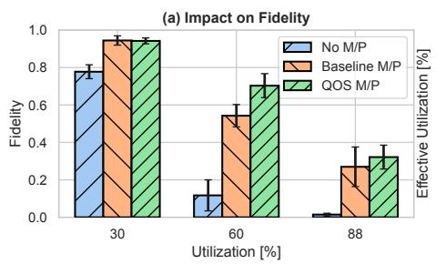

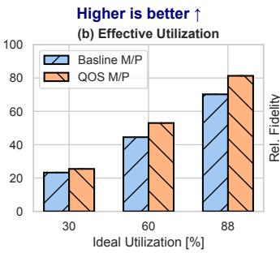

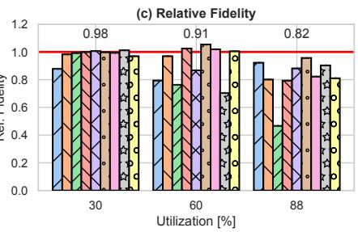  
Figure 11: Multi-programmer (§ 9.4). (a) Impact of multi-programming on fidelity. There is a 9.6× and 1.15× improvement compared to no multi-programming and the baseline, respectively. (b) Effective utilization. There is 7.2% higher effective utilization on average. (c) Relative fidelity w.r.t. solo circuit execution. There is an average 9.6% drop in fidelity due to QOS’s multi-programming.

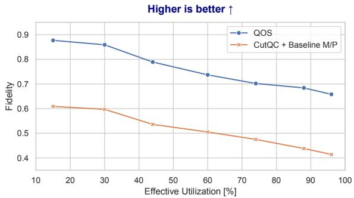  
Figure 12: QOS error mitigator, estimator, and multiprogrammer vs. CutQC [73] and the baseline multiprogramming framework [16]. QOS achieves 48% higher fidelity for the same utilization, on average.

RQ3 takeaway. The QOS multi-programmer improves fidelity by 1.15–9.6× and effective utilization by 7.2% compared to the baselines while incurring an acceptable fidelity penalty (<10%) compared to solo execution.

## 9.5 QOS vs. Combined Baseline

RQ4: What is the performance of the within- and cross-layer optimizations of QOS’s error mitigator, estimator, and multiprogrammer? We evaluate the impact of QOS’s components (without the scheduler) on the fidelity and utilization of the co-scheduled circuits for certain utilization thresholds.

Figure 12 shows the fidelity performance of QOS vs. CutQC [73] and the baseline multi-programming [16]. Here, we use a 27-qubit QPU, and a workload of all nine evaluation benchmarks with initial circuit sizes of 8-, 16-, and 24-qubits. We configure the error mitigator and CutQC to achieve a circuit size half of the original (i.e., 4, 8, and 12-qubit circuits). QOS achieves 48% higher fidelity than the baselines for the same utilization, on average. There are two main reasons for this: (1) the QOS components perform better individually as previously shown (§ 9.2, § 9.4) and (2) the synergy between the QOS components enables better (w.r.t. fidelity) co-scheduling decisions compared to standalone systems [16].

## 9.6 Scheduler

RQ5: How well does QOS’s scheduler balance fidelity vs. waiting times and balance the load across QPUs? We evaluate our scheduler by generating a representative workload consisting of a dataset we collected during the development of QOS.

Dataset collection. During our exploration of the motivational challenges (§ 3) and experimentation and evaluation of the QOS components and their policies, we collected a dataset of 70.000 benchmark circuits and more than 7000 job runs in the quantum cloud. We use this dataset to simulate representative workloads, as we detail next.

Workload generation. To generate realistic workloads, we monitored all available QPUs on the IBM Quantum Cloud [32] for ten days in November 2023 to estimate the hourly job arrival rate. The average hourly rate is 1500 jobs per hour and is the baseline system workload for our evaluation.

Fidelity vs. waiting time. Figure 13 (a) shows the performance of the formula-based scheduling policy. We show the average fidelity and waiting time as the fidelity weight, c, changes (§ 8). A weight of 0.7 achieves ∼5× lower waiting times than full priority of fidelity while sacrificing only ∼ 2% fidelity. Figure 13 (b) shows the Pareto front of scheduling solutions generated by the genetic algorithm policy. A weight c = 0.5 achieves 2× lower waiting times with 4% lower fidelity. QPU load balancing. Figure 13 (c) shows the QPU load as the total runtime each QPU was active, in seconds, for the formula-based policy. All QPUs handle similar loads, with a maximum difference of 15.2%.

RQ5 takeaway. QOS scheduler balances the trade-off between waiting times and fidelity by reducing them 5× and only 2%, respectively while balancing the load across QPUs.

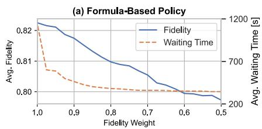

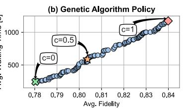

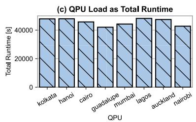  
Figure 13: Scheduler (§ 9.6). (a) Formula-based scheduling policy: Average fidelity vs. average waiting times. A fidelity weight c = 0.7 achieves ∼ 5× lower waiting time for only ∼ 2% lower fidelity. (b) Genetic algorithm policy: it creates a Pareto front of schedules, where a fidelity weight c = 0.5 achieves 2× lower waiting times for ∼ 4% fidelity decrease. (c) QPU load as the total runtime of each QPU for the formula-based policy. The maximum load difference between any two QPUs is 15.2%.

## 10 Related work

Quantum error mitigation. Error mitigation techniques can be categorized as (1) execution pre- and post-processing [13–15,42,51–54,71,74,75], (2) circuit divideand-conquer [4,6,54,73],and (3) qubit reuse [8,29,34,48,48,49]. Unfortunately, all these techniques are implemented standalone without any infrastructure to compose them. Instead, QOS integrates and composes at least one technique per category in a single software stack, achieving higher fidelity and abstracting away the complexity from the programmer. Quantum performance estimation. Prior work on quantum performance estimation has focused on resource estimation—predicting required physical qubits under fixed fidelity assumptions [7, 59]—and fidelity estimation using analytical models [47]. In contrast, QOS estimates fidelity under hardware constraints and supports both analytical and ML-based approaches.

Quantum multi-programming. Quantum multiprogramming work [16, 40] focuses solely on mapping two circuits on a single QPU while providing similar fidelity to both (allocation fairness). However, they lack a systematic strategy for selecting compatible jobs to co-locate, and do not consider temporal utilization. Furthermore, neither work supports buffer zones to reduce crosstalk noise between co-located circuits. The delayed instruction scheduling optimization proposed by [16] is already available in the Qiskit transpiler via the ALAP scheduling pass [58], and thus is inherently used by QOS. Finally, [40] introduces a cross-program SWAP optimization technique, which tightly couples its multi-programming and scheduling logic; this makes it incompatible with any separate, system-level scheduler like QOS’s, as relocating the bundled circuits to another QPU invalidates its core optimization technique.

Quantum job scheduling. Current quantum scheduling methods [62, 64, 72, 81] are limited because they (1) only perform single-to-many scheduling, (2) do not account for QPU utilization, (3) lack fine control over the fundamental design tradeoffs (§ 3.4), or (4) require manual input for final scheduling decisions. In contrast, QOS multiplexes circuits across space and time in a many-to-many fashion, increases QPU utilization, balances the inherent tradeoffs of quantum, and abstracts away the underlying resource management. Cloud OSes, resource management, and job scheduling. Classical cloud operating, resource management, and job scheduling systems have been extensively researched in the past decades [28, 36, 37, 46, 56, 66, 67, 79, 80, 83, 84]. However, the classical domain, even when addressing accelerator heterogeneity, does not face the unique challenges of quantum computing (§ 3) and, as such, cannot be trivially adapted to accommodate its needs.

## 11 Conclusion and Discussion

We presented QOS, the first quantum operating system to (1) holistically address quantum computing challenges through a modular, policy-mechanism-separated architecture, (2) enable cross- and intra-layer optimizations via end-to-end co-design, (3) systematically explore key tradeoffs between fidelity, utilization, and waiting times, and (4) introduce novel abstractions and techniques across the stack, including the Qernel, composable error mitigation, compatibility-based multi-programming, and multi-objective scheduling.

QOS establishes foundational principles for quantum operating systems that remain relevant as QPU technology evolves. While hardware will improve, core challenges like noise, heterogeneity, and resource scarcity will persist, requiring tradeoffs between fidelity, utilization, and latency. These principles naturally extend to fault-tolerant quantum computing, where QOS’s fidelity-aware scheduler and compatibility-based multi-programmer can guide logical qubit placement and error-corrected resource allocation.

## Acknowledgements

We sincerely thank our shepherd and the anonymous reviewers for their feedback. We thank Karl Jansen and Stefan Kühn from the Center for Quantum Technology and Applications (CQTA)- Zeuthen for supporting this work by providing access to IBM quantum resources. We also thank Ahmed Darwish and Dmitry Lugovoy for their contributions to this work. Funded by the Bavarian State Ministry of Science and the Arts as part of the Munich Quantum Valley (MQV).

## References

[1] Qiskit 600,000 registered users have run over 3 Trillion Circuit Executions. https://www.ibm.com/quantum/ blog/quantum-software-vision. Accessed: 2025-05-05.

[2] Frank Arute, Kunal Arya, Ryan Babbush, Dave Bacon, Joseph C Bardin, Rami Barends, Rupak Biswas, Sergio Boixo, Fernando GSL Brandao, David A Buell, et al. Quantum supremacy using a programmable superconducting processor. Nature, 574(7779):505–510, 2019.

[3] AWS Bracket. https://aws.amazon.com/braket/. Accessed: 2025-05-05.

[4] Ramin Ayanzadeh, Narges Alavisamani, Poulami Das, and Moinuddin Qureshi. Frozenqubits: Boosting fidelity of qaoa by skipping hotspot nodes. In Proceedings of the 28th ACM International Conference on Architectural Support for Programming Languages and Operating Systems, Volume 2, ASPLOS 2023, page 311–324, New York, NY, USA, 2023. Association for Computing Machinery.

[5] Azure Quantum. https://azure.microsoft.com/en-us/ products/quantum. Accessed: 2025-05-05.

[6] Luciano Bello, Agata M. Brańczyk, Sergey Bravyi, Almudena Carrera Vazquez, Andrew Eddins, Daniel J. Egger, Bryce Fuller, Julien Gacon, James R. Garrison, Jennifer R. Glick, Tanvi P. Gujarati, Ikko Hamamura, Areeq I. Hasan, Takashi Imamichi, Caleb Johnson, Ieva Liepuoniute, Owen Lockwood, Mario Motta, C. D. Pemmaraju, Pedro Rivero, Max Rossmannek, Travis L. Scholten, Seetharami Seelam, Iskandar Sitdikov, Dharmashankar Subramanian, Wei Tang, and Stefan Woerner. Circuit Knitting Toolbox. https://github.com/ Qiskit-Extensions/circuit-knitting-toolbox, 2023.

[7] Michael E. Beverland, Prakash Murali, Matthias Troyer, Krysta M. Svore, Torsten Hoefler, Vadym Kliuchnikov, Guang Hao Low, Mathias Soeken, Aarthi Sundaram, and Alexander Vaschillo. Assessing requirements to scale to practical quantum advantage, 2022.

[8] Benjamin Bichsel, Maximilian Baader, Timon Gehr, and Martin Vechev. Silq: A high-level quantum language with safe uncomputation and intuitive semantics. In Proceedings of the 41st ACM SIGPLAN Conference on Programming Language Design and Implementation, PLDI 2020, page 286–300, New York, NY, USA, 2020. Association for Computing Machinery.

[9] Sebastian Brandhofer, Ilia Polian, and Kevin Krsulich. Optimal partitioning of quantum circuits using gate cuts and wire cuts. arXiv preprint arXiv:2308.09567, 2023.

[10] Sergey Bravyi, Sarah Sheldon, Abhinav Kandala, David C. Mckay, and Jay M. Gambetta. Mitigating

measurement errors in multiqubit experiments. Phys. Rev. A, 103:042605, Apr 2021.

[11] Lukas Brenner, Christophe Piveteau, and David Sutter. Optimal wire cutting with classical communication, 2023.

[12] Andrew J Daley, Immanuel Bloch, Christian Kokail, Stuart Flannigan, Natalie Pearson, Matthias Troyer, and Peter Zoller. Practical quantum advantage in quantum simulation. Nature, 607(7920):667–676, 2022.

[13] Siddharth Dangwal, Gokul Subramanian Ravi, Poulami Das, Kaitlin N. Smith, Jonathan Mark Baker, and Frederic T. Chong. Varsaw: Application-tailored measurement error mitigation for variational quantum algorithms. In Proceedings of the 28th ACM International Conference on Architectural Support for Programming Languages and Operating Systems, Volume 4, ASPLOS ’23, page 362–377, New York, NY, USA, 2024. Association for Computing Machinery.

[14] Poulami Das, Swamit Tannu, Siddharth Dangwal, and Moinuddin Qureshi. Adapt: Mitigating idling errors in qubits via adaptive dynamical decoupling. In MICRO-54: 54th Annual IEEE/ACM International Symposium on Microarchitecture, MICRO ’21, page 950–962, New York, NY, USA, 2021. Association for Computing Machinery.

[15] Poulami Das, Swamit Tannu, and Moinuddin Qureshi. Jigsaw: Boosting fidelity of nisq programs via measurement subsetting. In MICRO-54: 54th Annual IEEE/ACM International Symposium on Microarchitecture, MICRO ’21, page 937–949, New York, NY, USA, 2021. Association for Computing Machinery.

[16] Poulami Das, Swamit S. Tannu, Prashant J. Nair, and Moinuddin Qureshi. A case for multi-programming quantum computers. In Proceedings of the 52nd Annual IEEE/ACM International Symposium on Microarchitecture, MICRO ’52, page 291–303, New York, NY, USA, 2019. Association for Computing Machinery.

[17] K. Deb, A. Pratap, S. Agarwal, and T. Meyarivan. A fast and elitist multiobjective genetic algorithm: Nsga-ii. IEEE Transactions on Evolutionary Computation, 6(2):182–197, 2002.

[18] Matthew DeCross, Eli Chertkov, Megan Kohagen, and Michael Foss-Feig. Qubit-reuse compilation with mid-circuit measurement and reset. Phys. Rev. X, 13:041057, Dec 2023.

[19] Leonardo DiCarlo, Jerry M Chow, Jay M Gambetta, Lev S Bishop, Blake R Johnson, DI Schuster, J Majer, Alexandre Blais, Luigi Frunzio, SM Girvin, et al. Demonstration of two-qubit algorithms with a superconducting quantum processor. Nature, 460(7252):240–244, 2009.

[20] Edward Farhi, Jeffrey Goldstone, and Sam Gutmann. A quantum approximate optimization algorithm, 2014.

[21] Qiskit Hellinger Fidelity. https://docs.quantum.ibm. com/api/qiskit/0.31/qiskit.quantum\_info.hellinger\_ fidelity. Accessed: 2025-05-05.

[22] I. M. Georgescu, S. Ashhab, and Franco Nori. Quantum simulation. Rev. Mod. Phys., 86:153–185, Mar 2014.

[23] Quantum computer datasheet. https://quantumai. google/hardware/datasheet/weber.pdf. Accessed: 2025-05-05.

[24] Google Quantum Computing Service . https: //quantumai.google/cirq/google/concepts. Accessed: 2025-05-05.

[25] Lov K Grover. A fast quantum mechanical algorithm for database search. In Proceedings of the twenty-eighth annual ACM symposium on Theory of computing, pages 212–219, 1996.

[26] Laszlo Gyongyosi and Sandor Imre. A survey on quantum computing technology. Computer Science Review, 31:51–71, 2019.

[27] David Hanneke, JP Home, John D Jost, Jason M Amini, Dietrich Leibfried, and David J Wineland. Realization of a programmable two-qubit quantum processor. Nature Physics, 6(1):13–16, 2010.

[28] Benjamin Hindman, Andy Konwinski, Matei Zaharia, Ali Ghodsi, Anthony D. Joseph, Randy Katz, Scott Shenker, and Ion Stoica. Mesos: a platform for fine-grained resource sharing in the data center. In Proceedings of the 8th USENIX Conference on Networked Systems Design and Implementation, NSDI’11, page 295–308, USA, 2011. USENIX Association.

[29] Fei Hua, Yuwei Jin, Yanhao Chen, Suhas Vittal, Kevin Krsulich, Lev S. Bishop, John Lapeyre, Ali Javadi-Abhari, and Eddy Z. Zhang. Caqr: A compiler-assisted approach for qubit reuse through dynamic circuit. In Proceedings of the 28th ACM International Conference on Architectural Support for Programming Languages and Operating Systems, Volume 3, ASPLOS 2023, page 59–71, New York, NY, USA, 2023. Association for Computing Machinery.

[30] H. Häffner, C.F. Roos, and R. Blatt. Quantum computing with trapped ions. Physics Reports, 469(4):155–203, 2008.

[31] IBM Quantum calibration jobs. https://docs.quantum. ibm.com/admin/calibration-jobs. Accessed: 2025-05-05.

[32] IBM Quantum. https://www.ibm.com/ quantum-computing/. Accessed: 2025-05-05.

[33] Ali Javadi-Abhari, Matthew Treinish, Kevin Krsulich, Christopher J. Wood, Jake Lishman, Julien Gacon, Simon Martiel, Paul D. Nation, Lev S. Bishop, Andrew W. Cross, Blake R. Johnson, and Jay M. Gambetta. Quantum computing with qiskit, 2024.

[34] Hanru Jiang. Qubit recycling revisited. Proc. ACM Program. Lang., 8(PLDI), June 2024.

[35] P. V. Klimov, J. Kelly, Z. Chen, M. Neeley, A. Megrant, B. Burkett, R. Barends, K. Arya, B. Chiaro, Yu Chen, A. Dunsworth, A. Fowler, B. Foxen, C. Gidney, M. Giustina, R. Graff, T. Huang, E. Jeffrey, Erik Lucero, J. Y. Mutus, O. Naaman, C. Neill, C. Quintana, P. Roushan, Daniel Sank, A. Vainsencher, J. Wenner, T. C. White, S. Boixo, R. Babbush, V. N. Smelyanskiy, H. Neven, and John M. Martinis. Fluctuations of energy-relaxation times in superconducting qubits. Phys. Rev. Lett., 121:090502, Aug 2018.

[36] Kubernetes. https://kubernetes.io/, 2024.

[37] Woosuk Kwon, Gyeong-In Yu, Eunji Jeong, and Byung-Gon Chun. Nimble: Lightweight and parallel gpu task scheduling for deep learning. In H. Larochelle, M. Ranzato, R. Hadsell, M.F. Balcan, and H. Lin, editors, Advances in Neural Information Processing Systems, volume 33, pages 8343–8354. Curran Associates, Inc., 2020.

[38] Ang Li,Samuel Stein,Sriram Krishnamoorthy,and James Ang. Qasmbench: A low-level quantum benchmark suite for nisq evaluation and simulation. ACM Transactions on Quantum Computing, 4(2), February 2023.

[39] Ang Li, Samuel Stein, Sriram Krishnamoorthy, and James Ang. Qasmbench: A low-level quantum benchmark suite for nisq evaluation and simulation. ACM Transactions on Quantum Computing, 4(2), feb 2023.

[40] Lei Liu and Xinglei Dou. Qucloud: A new qubit mapping mechanism for multi-programming quantum computing in cloud environment. In 2021 IEEE International Symposium on High-Performance Computer Architecture (HPCA), pages 167–178, Feb 2021.

[41] Xiao-Song Ma, Thomas Herbst, Thomas Scheidl, Daqing Wang, Sebastian Kropatschek, William Naylor, Bernhard Wittmann, Alexandra Mech, Johannes Kofler, Elena Anisimova, et al. Quantum teleportation over 143 kilometres using active feed-forward. Nature, 489(7415):269–273, 2012.

[42] Filip B Maciejewski, Zoltán Zimborás, and Michał Oszmaniec. Mitigation of readout noise in near-term quantum devices by classical post-processing based on detector tomography. Quantum, 4:257, 2020.

[43] Filip B. Maciejewski, Zoltán Zimborás, and Michał Oszmaniec. Mitigation of readout noise in near-term quantum devices by classical post-processing based on detector tomography. Quantum, 4:257, April 2020.

[44] Kosuke Mitarai and Keisuke Fujii. Constructing a virtual two-qubit gate by sampling single-qubit operations. New Journal of Physics, 23(2):023021, feb 2021.

[45] Prakash Murali, David C. Mckay, Margaret Martonosi, and Ali Javadi-Abhari. Software mitigation of crosstalk on noisy intermediate-scale quantum computers. In Proceedings of the Twenty-Fifth International Conference on Architectural Support for Programming Languages and Operating Systems, ASPLOS ’20, page 1001–1016, New York, NY, USA, 2020. Association for Computing Machinery.

[46] Deepak Narayanan, Keshav Santhanam, Fiodar Kazhamiaka, Amar Phanishayee, and Matei Zaharia. Heterogeneity-Aware cluster scheduling policies for deep learning workloads. In 14th USENIX Symposium on Operating Systems Design and Implementation (OSDI 20), pages 481–498. USENIX Association, November 2020.

[47] Paul Nation, Matthew Treinish, and Clemens Possel. mapomatic. https://github.com/Qiskit-Partners/ mapomatic, 2022.

[48] Alexandru Paler, Robert Wille, and Simon J. Devitt. Wire recycling for quantum circuit optimization. Phys. Rev. A, 94:042337, Oct 2016.

[49] Anouk Paradis, Benjamin Bichsel, Samuel Steffen, and Martin Vechev. Unqomp: Synthesizing uncomputation in quantum circuits. In Proceedings of the 42nd ACM SIGPLAN International Conference on Programming Language Design and Implementation, PLDI 2021, page 222–236, New York, NY, USA, 2021. Association for Computing Machinery.

[50] Tirthak Patel, Abhay Potharaju, Baolin Li, Rohan Basu Roy, and Devesh Tiwari. Experimental evaluation of nisq quantum computers: Error measurement, characterization, and implications. In SC20: International Conference for High Performance Computing, Networking, Storage and Analysis, pages 1–15, Nov 2020.

[51] Tirthak Patel and Devesh Tiwari. Disq: A novel quantum output state classification method on ibm quantum computers using openpulse. In Proceedings of the 39th International Conference on Computer-Aided Design, ICCAD ’20, New York, NY, USA, 2020. Association for Computing Machinery.

[52] Tirthak Patel and Devesh Tiwari. Veritas: Accurately estimating the correct output on noisy intermediate-scale

quantum computers. In SC20: International Conference for High Performance Computing, Networking, Storage and Analysis, pages 1–16, Nov 2020.

[53] Tirthak Patel and Devesh Tiwari. Qraft: Reverse your quantum circuit and know the correct program output. In Proceedings of the 26th ACM International Conference on Architectural Support for Programming Languages and Operating Systems,ASPLOS ’21,page 443–455,New York, NY, USA, 2021. Association for Computing Machinery.

[54] Tirthak Patel, Ed Younis, Costin Iancu, Wibe de Jong, and Devesh Tiwari. Quest: systematically approximating quantum circuits for higher output fidelity. In Proceedings of the 27th ACM International Conference on Architectural Support for Programming Languages and Operating Systems,ASPLOS ’22,page 514–528,New York, NY, USA, 2022. Association for Computing Machinery.

[55] Tianyi Peng, Aram W. Harrow, Maris Ozols, and Xiaodi Wu. Simulating large quantum circuits on a small quantum computer. Phys. Rev. Lett., 125:150504, Oct 2020.

[56] Yanghua Peng, Yixin Bao, Yangrui Chen, Chuan Wu, and Chuanxiong Guo. Optimus: an efficient dynamic resource scheduler for deep learning clusters. In Proceedings of the Thirteenth EuroSys Conference, EuroSys ’18, New York, NY, USA, 2018. Association for Computing Machinery.

[57] John Preskill. Quantum computing in the NISQ era and beyond. Quantum, 2:79, aug 2018.

[58] Qiskit Transpiler. https://qiskit.org/documentation/ apidoc/transpiler.html. Accessed: 2025-05-05.

[59] N. Quetschlich, L. Burgholzer, and R. Wille. MQT Predictor: Automatic Device Selection with Device-Specific Circuit Compilation for Quantum Computing. ACM Transactions on Quantum Computing (TQC), 2024.

[60] Nils Quetschlich, Lukas Burgholzer, and Robert Wille. MQT Bench: Benchmarking Software and Design Automation Tools for Quantum Computing. Quantum, 7:1062, July 2023.

[61] Gokul Subramanian Ravi, Kaitlin N. Smith, Pranav Gokhale, and Frederic T. Chong. Quantum computing in the cloud: Analyzing job and machine characteristics. In 2021 IEEE International Symposium on Workload Characterization (IISWC), pages 39–50, 2021.

[62] Gokul Subramanian Ravi, Kaitlin N. Smith, Prakash Murali, and Frederic T. Chong. Adaptive job and resource management for the growing quantum cloud. In 2021 IEEE International Conference on Quantum Computing and Engineering (QCE), pages 301–312, Oct 2021.

[63] Diego Ristè, Marcus P Da Silva, Colm A Ryan, Andrew W Cross, Antonio D Córcoles, John A Smolin, Jay M Gambetta, Jerry M Chow, and Blake R Johnson. Demonstration of quantum advantage in machine learning. npj Quantum Information, 3(1):16, 2017.

[64] Marie Salm, Johanna Barzen, Frank Leymann, and Benjamin Weder. Prioritization of compiled quantum circuits for different quantum computers. In 2022 IEEE International Conference on Software Analysis, Evolution and Reengineering (SANER), pages 1258–1265, March 2022.

[65] Schrödinger’s cat. https://en.wikipedia.org/wiki/Schr% C3%B6dinger%27s\_cat. Accessed: 2025-05-05.

[66] Malte Schwarzkopf, Andy Konwinski, Michael Abd-El-Malek, and John Wilkes. Omega: flexible, scalable schedulers for large compute clusters. In Proceedings of the 8th ACM European Conference on Computer Systems, EuroSys ’13, page 351–364, New York, NY, USA, 2013. Association for Computing Machinery.

[67] Omar Sefraoui, Mohammed Aissaoui, Mohsine Eleuldj, et al. Openstack: toward an open-source solution for cloud computing. International Journal of Computer Applications, 55(3):38–42, 2012.

[68] Peter W. Shor. Polynomial-time algorithms for prime factorization and discrete logarithms on a quantum computer. SIAM Review, 41(2):303–332, 1999.

[69] Irfan Siddiqi. Engineering high-coherence superconducting qubits. Nature Reviews Materials, 6(10):875–891, 2021.

[70] Marcos Yukio Siraichi, Vinícius Fernandes dos Santos, Caroline Collange, and Fernando Magno Quintao Pereira. Qubit allocation. In Proceedings of the 2018 International Symposium on Code Generation and Optimization, CGO 2018, page 113–125, New York, NY, USA, 2018. Association for Computing Machinery.

[71] Kaitlin N. Smith, Gokul Subramanian Ravi, Prakash Murali, Jonathan M. Baker, Nathan Earnest, Ali Javadi-Cabhari, and Frederic T. Chong. Timestitch: Exploiting slack to mitigate decoherence in quantum circuits. ACM Transactions on Quantum Computing, 4(1), oct 2022.

[72] Samuel Stein, Nathan Wiebe, Yufei Ding, Peng Bo, Karol Kowalski, Nathan Baker, James Ang, and Ang Li. Eqc: Ensembled quantum computing for variational quantum algorithms. In Proceedings of the 49th Annual International Symposium on Computer Architecture, ISCA ’22, page 59–71, New York, NY, USA, 2022. Association for Computing Machinery.

[73] Wei Tang, Teague Tomesh, Martin Suchara, Jeffrey Larson, and Margaret Martonosi. Cutqc: using small quantum computers for large quantum circuit evaluations. In

Proceedings of the 26th ACM International Conference on Architectural Support for Programming Languages and Operating Systems,ASPLOS ’21,page 473–486,New York, NY, USA, 2021. Association for Computing Machinery.

[74] Swamit S. Tannu and Moinuddin Qureshi. Ensemble of diverse mappings: Improving reliability of quantum computers by orchestrating dissimilar mistakes. In Proceedings of the 52nd Annual IEEE/ACM International Symposium on Microarchitecture, MICRO ’52, page 253–265, New York, NY, USA, 2019. Association for Computing Machinery.

[75] Swamit S. Tannu and Moinuddin K. Qureshi. Mitigating measurement errors in quantum computers by exploiting state-dependent bias. In Proceedings of the 52nd Annual IEEE/ACM International Symposium on Microarchitecture, MICRO ’52, page 279–290, New York, NY, USA, 2019. Association for Computing Machinery.

[76] Teague Tomesh, Pranav Gokhale, Victory Omole, Gokul Subramanian Ravi, Kaitlin N. Smith, Joshua Viszlai, Xin-Chuan Wu, Nikos Hardavellas, Margaret R. Martonosi, and Frederic T. Chong. Supermarq: A scalable quantum benchmark suite. In 2022 IEEE International Symposium on High-Performance Computer Architecture (HPCA), pages 587–603, 2022.

[77] Caroline Tornow, Naoki Kanazawa, William E. Shanks, and Daniel J. Egger. Minimum quantum run-time characterization and calibration via restless measurements with dynamic repetition rates. Phys. Rev. Appl., 17:064061, Jun 2022.

[78] Nathaniel Tornow, Emmanouil Giortamis, and Pramod Bhatotia. Scaling quantum computations via gate virtualization. Proceedings of the ACM on Programming Languages, 9(PLDI), June 2025. Accepted: 2025-03-06; Received: 2024-11-14.

[79] Vinod Kumar Vavilapalli, Arun C. Murthy, Chris Douglas, Sharad Agarwal, Mahadev Konar, Robert Evans, Thomas Graves, Jason Lowe, Hitesh Shah, Siddharth Seth, Bikas Saha, Carlo Curino, Owen O’Malley, Sanjay Radia, Benjamin Reed, and Eric Baldeschwieler. Apache hadoop yarn: yet another resource negotiator. In Proceedings of the 4th Annual Symposium on Cloud Computing, SOCC ’13, New York, NY, USA, 2013. Association for Computing Machinery.

[80] Abhishek Verma, Luis Pedrosa, Madhukar Korupolu, David Oppenheimer, Eric Tune, and John Wilkes. Large-scale cluster management at google with borg. In Proceedings of the Tenth European Conference on Computer Systems, EuroSys ’15, New York, NY, USA, 2015. Association for Computing Machinery.

[81] Meng Wang, Poulami Das, and Prashant J. Nair. Qoncord: A multi-device job scheduling framework for variational quantum algorithms. In 2024 57th IEEE/ACM International Symposium on Microarchitecture (MICRO), pages 735–749, 2024.

[82] Nicolas Wittler, Federico Roy, Kevin Pack, Max Werninghaus, Anurag Saha Roy, Daniel J. Egger, Stefan Filipp, Frank K. Wilhelm, and Shai Machnes. Integrated tool set for control, calibration, and characterization of quantum devices applied to superconducting qubits. Phys. Rev. Appl., 15:034080, Mar 2021.

[83] Wencong Xiao, Romil Bhardwaj, Ramachandran Ramjee, Muthian Sivathanu, Nipun Kwatra, Zhenhua

Han, Pratyush Patel, Xuan Peng, Hanyu Zhao, Quanlu Zhang, Fan Yang, and Lidong Zhou. Gandiva: Introspective cluster scheduling for deep learning. In 13th USENIX Symposium on Operating Systems Design and Implementation (OSDI 18), pages 595–610, Carlsbad, CA, October 2018. USENIX Association.

[84] Andy B. Yoo, Morris A. Jette, and Mark Grondona. Slurm: Simple linux utility for resource management. In Dror Feitelson, Larry Rudolph, and Uwe Schwiegelshohn, editors, Job Scheduling Strategies for Parallel Processing, pages 44–60, Berlin, Heidelberg, 2003. Springer Berlin Heidelberg.