①

USENIX

THE ADVANCED COMPUTING SYSTEMS ASSOCIATION

# Achieving Low-Latency Graph-Based Vector Search via Aligning Best-First Search Algorithm with SSD

Hao Guo and Youyou Lu, Tsinghua University https://www.usenix.org/conference/osdi25/presentation/guo

# This paper is included in the Proceedings of the 19th USENIX Symposium on Operating Systems Design and Implementation.

July 7–9, 2025 • Boston, MA, USA

ISBN 978-1-939133-47-2

Open access to the Proceedings of the 19th USENIX Symposium on Operating Systems Design and Implementation is sponsored by

# Achieving Low-Latency Graph-Based Vector Search via Aligning Best-First Search Algorithm with SSD

Hao Guo Youyou Lu∗

Tsinghua University

## Abstract

We propose PipeANN, an on-disk graph-based approximate nearest neighbor search (ANNS) system, which significantly bridges the latency gap with in-memory ones. We achieve this by aligning the best-first search algorithm with SSD characteristics, avoiding strict compute-I/O order across search steps. Experiments show that PipeANN has 1.14×–2.02× search latency compared to in-memory Vamana, and 35.0% of the latency of on-disk DiskANN in billion-scale datasets, without sacrificing search accuracy.

## 1 Introduction

High-dimensional vectors with tens or hundreds of dimensions are powerful data representations [17,19]. Vector search, which searches a dataset for the closest neighbors given a target vector, is used in various scenarios such as recommendation [14, 15, 27] and retrieval augmented generation (RAG) [12]. It is not efficient to do accurate vector searches for high-dimensional vectors [9], so approximate nearest neighbor search (ANNS) is preferred, which returns an approximated set of k nearest neighbors (i.e., top-k). Among all types of ANNS indexes, graph-based indexes [6, 16], where vectors are organized as a directed graph, are favored for their low search latency under high accuracy.

To support large-scale datasets (e.g., billions of vectors [6, 14, 21, 27]), an increasing number of organizations [4, 21, 33] prefer solid-state drives (SSDs) for storing ANNS indexes, due to their cost-efficiency. However, graph-based indexes fail to maintain low search latency on disk as in memory. As shown in Figure 1, the on-disk DiskANN has significantly higher search latency than the in-memory Vamana (e.g., 4.18× for 0.9 recall and 3.14× for 0.99 recall).

By analysis, we find the high latency is caused by the intrinsic mismatch between graph-based ANNS algorithms and the I/O characteristics of SSDs, namely long I/O latency and asynchronous, parallel I/O: Graph-based ANNS follow the

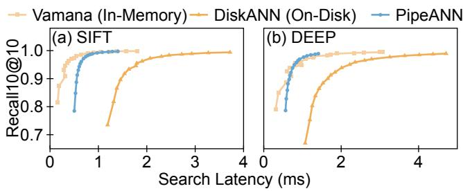

Figure 1: Latency gap between in-memory (Vamana [23]) and on-disk (DiskANN [23]) graph-based indexes in two datasets. Our system (PipeANN) significantly bridges the gap.

best-first search algorithm to explore vectors in the graph — in each search step, it explores the best neighbors (i.e., the nearest ones) of all the explored vectors, to reduce the number of accessed vectors per search. However, two issues prevent it from achieving low latency on disk. First, the best-first algorithm incurs ordered compute and I/O across search steps. It harms search latency because of the long (e.g., 7.43× than compute latency, §2.2) but wasted I/O latency which fails to overlap with compute. Second, the best-first algorithm forces synchronous I/O in each search step, where it batch-reads the nearest neighbors synchronously. It induces an underutilized I/O pipeline (e.g., 76% utilized, §2.2) when waiting for slow reads in the batch.

In this paper, we seek to align the search algorithm with SSD I/O characteristics. We find this idea feasible without affecting search convergence, by observing that the best-first algorithm is not a must: Unlike scalar indexes (e.g., B+-tree) where objects have one search path, graph-based ANNS indexes have multiple search paths for each vector, considering its multiple in-edges. The best-first algorithm only estimates one short search path, not the unique one. Thus, a tweaked search algorithm can exploit other paths for convergence.

We propose PipeSearch, an on-disk graph-based ANNS algorithm that achieves low latency by aligning the best-first search algorithm with SSD I/O characteristics. The key observation for such alignment is the pseudo-dependency of compute and I/O in best-first search: In each search step, the neighbors to be read can be decided by only the in-memory candidate pool containing the neighbor IDs, without waiting for ongoing I/O or compute (i.e., neighbor exploration) to finish. Thus, PipeSearch avoids strict compute-I/O order across search steps: When the I/O pipeline is not full, PipeSearch fills it by asynchronously reading the current nearest neighbors in the candidate pool, regardless of ongoing I/O or unfinished compute. Overlapped with I/O, PipeSearch explores the preread neighbors in a best-effort manner.

PipeSearch brings significant performance benefits. On the one hand, compute and I/O are overlapped, which accelerates ANNS as they show close (the same order of magnitude) latency. On the other hand, the I/O pipeline is better utilized. Experiments demonstrate the low latency of PipeSearch, which has ∼50% latency compared to best-first search.

PipeSearch achieves low latency but at the cost of throughput. There are two challenges to increasing its throughput. The first is how to dynamically adjust to suitable pipeline widths during a single search, in order to leverage the high throughput of narrow pipelines and the low latency of wide ones simultaneously. The second is how to avoid the accumulation of read-but-unexplored neighbor vectors caused by wide pipeline and slow neighbor exploration, which induces sub-optimal I/O decisions and reduced search throughput.

To this end, we implement PipeANN, a low-latency ANNS system with high search throughput. PipeANN tackles the two challenges in PipeSearch with two techniques:

First, we dynamically increase the I/O pipeline width during the search, instead of keeping a static pipeline width, to benefit from high throughput and low latency simultaneously. The throughput drop in large pipeline widths mainly arises from I/O waste, which makes it easier to saturate SSD IOPS because of more I/O per search. However, we find that I/O waste decreases as the search progresses. This is due to the growing number of unexplored top-k neighbors during the search. In later search steps, the candidate pool contains more unexplored top-k neighbors, which allows a wider I/O pipeline with little I/O waste.

Second, we ensure an upper bound for the number of missed neighbors (i.e., ongoing I/O and read-but-unexplored neighbors) when deciding on each I/O, instead of ensuring a full I/O pipeline at all times, to avoid neighbor accumulation. Specifically, when multiple I/Os finish simultaneously, we repeatedly explore one neighbor and issue one I/O, instead of issuing multiple I/Os to fill up the pipeline. Thus, we strike a balance between a full I/O pipeline (PipeSearch) and reduced I/O waste (best-first search), increasing throughput while sacrificing little latency.

We evaluate PipeANN to show its efficiency in low-latency ANNS. As shown in Figure 1, PipeANN significantly bridges the latency gap between in-memory and on-disk ANNS, especially for high recall (≥ 0.9). Compared with state-of-the-art

ANNS indexes on disk, PipeANN shows at least 70.6% lower latency and 1.35× higher throughput for 0.9 recall. In billionscale datasets, PipeANN has 35.0% latency and 1.71× higher throughput compared to DiskANN [23].

While primarily designed for SSDs, PipeANN’s techniques could also be adopted to other storage media, such as remote memory. These storage media exhibit similar I/O characteristics as SSDs, namely s-scale I/O latency and parallel I/O, so µANNS indexes stored on these media [5] could improve their performance by adopting PipeANN.

PipeANN has its limitations. Despite the techniques for throughput, PipeANN’s speculative I/O still leads to lower search throughput than the greedy I/O in best-first search. However, we believe PipeANN’s latency-throughput tradeoff is worthwhile in applications with ms-scale latency budgets (e.g., large-scale search and recommendation [6, 21]), where PipeANN could benefit from lower search latency or higher search accuracy with the same latency.

In summary, this paper makes the following contributions:

• We find the best-first search algorithm restricts the design space in exploiting SSD characteristics, inducing high latency for on-disk graph-based ANNS (§2).

• We design PipeSearch, a low-latency graph-based ANNS algorithm on disk by aligning the best-first search algorithm with SSD (§3).

• We implement PipeANN, a low-latency ANNS system with high search throughput. PipeANN increases the throughput of PipeSearch by dynamic pipeline and algorithm optimization (§4).

• We evaluate PipeANN to demonstrate its efficacy in achieving low-latency and high-throughput ANNS on disk (§5).

## 2 Background and Motivation

In this section, we first provide a primer for on-disk graphbased ANNS. Then, we characterize the best-first search algorithm to show its mismatch with SSD characteristics.

## 2.1 Graph-Based ANNS and Best-First Search

The k-nearest neighbor search problem aims to find the k nearest vectors of the target vector in a dataset. However, accurate search is challenging in high-dimensional vector spaces (e.g., hundreds of dimensions), which is known as the curse of dimensionality [9]. To tackle this challenge, approximate nearest neighbor search (ANNS) algorithms are proposed. Given the target vector, ANNS finds an approximate set of its top-k nearest vectors. Of all the ANNS algorithms, graph-based ones [6, 16, 23] show promising performance and accuracy. They organize the vectors as a directed graph, and vector search is conducted by graph traversal.

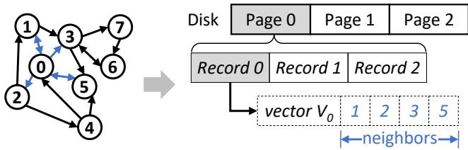

Figure 2: Index layout of on-disk graph-based ANNS.  
Algorithm 1 Best-first search   
1: G ← graph, q ← query vector, W ← I/O pipeline width   
2: procedure BestFirstSearch(G, q, W)   
3: s ← starting vector, L ← candidate pool length   
4: candidate pool P ← {<s>}, explored pool E ← ∅   
5: while P ⊊ E do   
6: V ← top-W nearest vectors to q in P, not in E   
7: Read V from memory or disk   
8: E.insert(V)   
9: for nbr in V.neighbors do   
10: P.insert(<nbr, Distance(nbr, q)>)   
11: end for   
12: P ← l nearest vectors to q in P   
13: end while   
14: return k nearest vectors to q in E   
15: end procedure

Graph layout. To support billion-scale vector search [6,21], existing systems [23, 25] store the graph index on disk and do on-disk graph-based ANNS. As shown in Figure 2, the graph is stored on disk as multiple records. Each record consists of a vector and all its neighbor IDs.

Best-first search algorithm. Existing graph-based vector search systems, either in memory [6, 16] or on disk [23, 25], take a best-first search algorithm for graph traversal [1, 26]

As shown in Algorithm 1, best-first search maintains a candidate pool with a fixed candidate pool length (denoted as L in this paper), containing current top-L nearest vectors. The search starts with a fixed starting vector and contains multiple search steps. Each step explores the top-W nearest unexplored vectors in the candidate pool, by reading them in a batch and inserting their neighbors into the candidate pool. The search terminates when all the vectors in the candidate pool are explored. We use W to represent I/O pipeline width (i.e., the maximum number of parallel I/O requests) in this paper. This definition equals the beam width in best-first search [23].

For in-memory indexes [6, 16], reading the vectors (line 7) takes a short time, so they use W = 1 to reduce the waste of compute and I/O. However, SSD has high I/O latency, so it takes more time to read a vector than explore it for on-disk indexes [23, 25]. Therefore, they use W  1 to utilize the >SSD I/O pipeline. Also, they use PQ-compressed vectors in memory to calculate the distance with neighbors (line 10), without disk reads. In each search step, only W disk reads are conducted. In this paper, best-first searches with W = 1 and W  1 are also called greedy search and beam search.

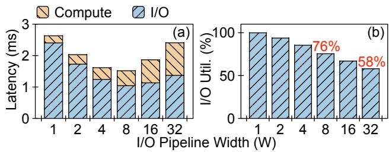  
Figure 3: (a) Search latency breakdown. (b) I/O pipeline utilization rate (average #ongoing I/O ÷ I/O pipeline width).

Low-latency ANNS. Achieving low latency ANNS is beneficial for real-world applications. First, real-world systems have strict latency demands. In large-scale search or recommendation systems [6,21], billion-scale, or even larger, vector searches should complete within ∼10ms to meet response time requirements. Second, for ANNS systems, a longer search time allows exploring more vectors, thus leading to higher search accuracy. Therefore, if we could reduce the search latency at the same accuracy, we could simultaneously increase search accuracy within the same latency demands.

## 2.2 Best-First Search Mismatches with SSD

Graph-based ANNS shows low latency in memory [6, 16], but fails to maintain such latency on disk. We conduct experiments to demonstrate this issue. We do best-first searches with different Ws, using a graph index built on 100 million vectors in the SIFT dataset [10]. The target recall is 90%, as recommended by the BigANN benchmark [20].

As shown in Figure 1(a), the search latency on disk is 4.18× compared to that in memory. By analysis, we find the cause of long latency is that best-first search algorithm mismatches with SSD I/O characteristics. Specifically, we focus on the following two SSD I/O characteristics:

• Long I/O latency. Microsecond or tens of microseconds latencies, common to flash-based SSDs.

• Asynchronous, parallel I/O. The ability to handle multiple (e.g., 32) in-flight read requests in parallel.

We find two issues as follows.

Issue 1: Ordered compute and I/O across search steps. The best-first search algorithm naturally causes data dependency, inducing ordered compute and I/O. In each search step, the best-first search batch reads and explores the W nearest unexplored neighbors to the target vector. Therefore, the current I/O batch depends on the previous search step, namely the previous compute and the previous I/O batch.

Such ordered compute and I/O show little overhead in memory but harm the ANNS latency on disk. This is because, when conducting ANNS in memory, the memory access latency is orders of magnitude lower than compute, which is typically executed serially in a search thread. When on disk, I/O latency is higher than compute, which shifts the bottleneck to I/O. Figure 3(a) demonstrates this issue by breaking down the latency. When W = 1 (i.e., greedy search), compute latency is only 9.5% of I/O latency. Even when using W = 8 (the lowest overall latency) to utilize I/O parallelism, compute latency is still 45.6% of I/O latency. Unfortunately, the long I/O latency is wasted, as it fails to overlap with compute.

Issue 2: Synchronous I/O in each search step. Best-first search uses W  1 to batch-read multiple records in each >search step, to utilize I/O parallelism. However, it still requires synchronously waiting for all the I/Os to finish.

Such synchronous I/O causes an under-utilized I/O pipeline. Figure 3(b) shows the I/O pipeline utilization rate (the average number of ongoing I/Os during I/O time ÷ W). During I/O time, the pipeline is only 76% full for W = 8, and 58% full for W = 32. This is because the I/O latency fluctuates in SSDs. Best-first search waits for a whole I/O batch to finish, so the latency depends on the tail latency of the I/Os. When waiting for some slow I/Os, the I/O pipeline is not fully utilized.

## 3 PipeSearch

Based on the observations above, we propose PipeSearch, a low-latency ANNS algorithm by aligning the best-first search algorithm with SSD hardware. In this section, we first show that this idea is feasible. Then, we introduce PipeSearch and analyze its performance benefits. Finally, we evaluate it to demonstrate its dilemma in latency and throughput.

## 3.1 Tweaking Best-First Search is Possible

One may think that tweaking the best-first search algorithm may prohibit the search from convergence. However, we argue that the best-first algorithm is not a must and can be tweaked without affecting search convergence.

This is enabled by multiple search paths in graph-based indexes: Unlike scalar indexes (e.g., B+-tree) where each object has only one search path, in graph-based ANNS indexes, each vector can be found in multiple paths using its multiple in-edges. The best-first search only estimates a short search path in the graph, but not the unique path. Therefore, tweaking the search algorithm is possible. Although it may lengthen the search path, it does not prohibit search from convergence and brings more opportunities for reducing latency.

## 3.2 PipeSearch Algorithm

We propose PipeSearch, a low-latency algorithm for graphbased ANNS on disk. The key idea of PipeSearch is to align the best-first search algorithm with SSD characteristics. As shown in Figure 4, best-first search executes compute and

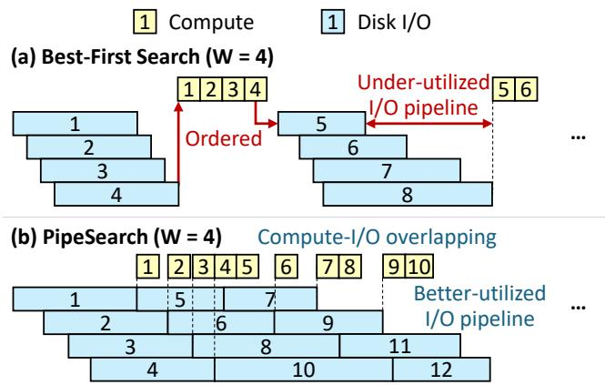  
Figure 4: Comparison of PipeSearch with best-first search.

I/O in order, unfriendly to SSDs. In contrast, PipeSearch tweaks the algorithm to avoid such strict order, thus achieving compute-I/O overlapping and a better-utilized I/O pipeline.

Key observation: pseudo-dependency of compute and I/O. In each search step, the best-first search issues I/O and explores the nearest neighbors in order. However, such an order is not necessary: I/O can be decided only by the in-memory candidate pool, regardless of ongoing I/O and unexplored neighbors. Thus, when there are ongoing I/O, we can directly issue I/O for the nearest unread neighbor in the candidate pool, there is no need to wait for all the ongoing I/O to finish (like best-first search). Neighbor exploration can be executed in a best-effort manner, independent from disk I/O.

Algorithm overview. PipeSearch avoids strict compute-I/O order across search steps. Specifically, it maintains a candidate pool with a fixed length L, similar to best-first search. Also, it maintains an I/O pipeline Q with a specific width W, containing ongoing I/O. The search iteratively executes the following steps: If the I/O pipeline is not full, PipeSearch issues I/O to fill up the pipeline based on the current candidate pool. Overlapped with I/O, it explores the nearest vector in an unexplored set U and updates the candidate pool using its neighbors. Then, it polls for I/O completion and adds all the vectors acquired to the unexplored set U.

## 3.3 PipeSearch Reduces Search Latency

PipeSearch achieves low-latency graph-based ANNS on disk by tackling the two issues in §2.2. We analyze it as follows.

PipeSearch achieves compute-I/O overlapping, which accelerates ANNS as they show close latency. Both short and long I/O latencies may make pipelining inefficient. If I/O latency is short like in memory, greedy search shows low latency. If I/O latency is long, pipelining will degrade to best-first search due to short compute. However, in graphbased ANNS on disk, compute and I/O latencies are of the same order of magnitude, making PipeSearch efficient. As shown in Figure 3(a), when W = 32, the compute latency is 75.6%/72.7% of the I/O latency. Overlapping them is possible to provide a 1.7× performance boost.

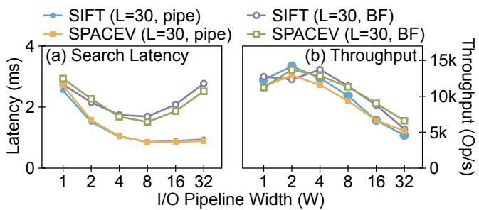

Figure 5: Latency and throughput of PipeSearch and best-first search (BF) with different Ws. With L = 30, both algorithms achieve 90% accuracy in terms of recall10@10.  
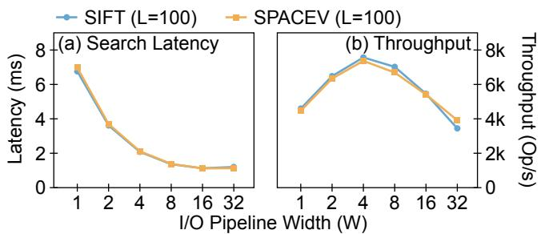  
Figure 6: Latency and throughput of PipeSearch with different Ws and L = 100. PipeSearch achieves 99%/97% accuracy in terms of recall10@10 in SIFT/SPACEV.

The I/O pipeline can be saturated by enough I/O, because of the navigation graph feature. In a typical navigation graph, each vector contains hundreds of neighbors, so the candidate pool contains hundreds of unexplored vectors after the first search step, which can be used to fill up the pipeline. It is possible to provide another 1.7× performance boost when W = 32, as in Figure 3(b). There may not be enough vectors to fill up the pipeline in the later search steps when most vectors are recalled. However, in §4.2, we find it does not last long.

## 3.4 Dilemma of Latency and Throughput

PipeSearch reduces the latency of best-first search but fails to achieve low latency and high throughput simultaneously. We evaluate PipeSearch using 100 million vectors in two datasets, SIFT [10] and SPACEV [4], using 1 thread for latency and 56 threads for throughput. As a comparison, we evaluate the best-first search with the same W. The results are shown in Figure 5, and we make the following observations:

(1) PipeSearch fails to ensure low latency and high throughput simultaneously, with a static pipeline width. On the one hand, the pipeline width with the lowest search latency (i.e.,

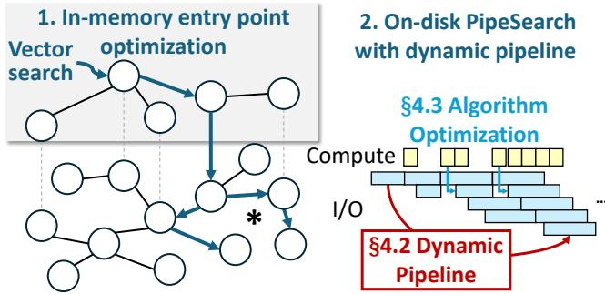  
Figure 7: PipeANN overview.

W = 8) fails to achieve high throughput simultaneously. It has 71.0%/72.4% lower throughput compared to W = 2. On the other hand, the optimal pipeline width varies in different configurations. Figure 6 shows the results with L = 100, where W = 16 shows the lowest latency (82.7%/81.1% compared to W = 8), and W = 4 delivers the highest throughput.

(2) Compared to best-first search, PipeSearch reduces latency but degrades throughput. When W = 8, PipeSearch has 50.7%/56.3% lower latency than best-first search in the SIFT/SPACEV dataset. However, the throughput degrades to 88.1%/82.5%. This issue is more significant for larger pipeline widths. When W = 16, PipeSearch only achieves 75.8%/73.8% of the throughput of best-first search.

The throughput degradation results from I/O waste. I/O waste, which increases average I/O per search, makes PipeSearch easier to saturate SSD bandwidth and thus causes a throughput drop. It arises from two aspects. The first is large pipeline widths. For PipeSearch, W = 32 has 2.44×/2.24× average I/O per search compared to W = 8, due to more speculative I/O. Although a small pipeline width reduces I/O waste, it leads to more sequential accesses, thus increasing the number of search steps and search latency.

The second is the accumulation of read-but-unexplored neighbor vectors. When the neighbor exploration is slow, the pre-read neighbors may be accumulated in memory but unexplored. This causes sub-optimal I/O decisions because of missed neighbor information, and thus intrinsic I/O waste of PipeSearch. Compared to best-first search, PipeSearch shows 1.34×/1.43× average I/O per search when W = 8.

We raise a question: Can we reduce the I/O waste in PipeSearch, to achieve low latency and high throughput simultaneously? Based on the analysis above, we summarize two challenges for this question. The first is to dynamically adjust to suitable pipeline widths in a single search. The second is to avoid the accumulation of neighbor vectors.

## 4 PipeANN Design and Implementation

We design PipeANN, a low-latency graph-based ANNS system on disk with high search throughput. PipeANN integrates

Algorithm 2 Optimized PipeSearch in PipeANN   
1: G ← graph, q ← query vector, L ← candidate pool length   
2: $L _ { m }$ ← candidate pool length of the in-memory index   
3: procedure PipeSearch(G, q, L)   
4: W ← 4 Starting pipeline width.   
5: ▷// Approach phase: entry point optimization.   
6: candidate pool P ← InMemSearch(q, min(L Lm))   
7: explored pool E ← ∅   
8: unexplored set U ← ∅, unfinished I/Os Q ← ∅   
9: // Converge phase: dynamic pipeline.   
10: while $P \subsetneq E$ do   
11: if Q.size() < W then I/O pipeline not full.   
12: ▷V ← top-1 nearest vectors to q in P, not in E   
13: Q.insert(V) send read requests.   
14: end if   
15: v ← nearest vector to q in U  overlap with I/O.   
16: E.insert(v), U.remove(v) explore v.   
17: for nbr in v.neighbors do   
18: dis ← PQ\_distance(nbr, q)   
19: P.insert(<nbr, dis>)   
20: end for update candidate pool.   
21: ▷P ← l nearest vectors to q in P  PQ distance.   
22: ▷F ← finished I/Os in Q  poll for completion.   
23: ▷W ← AdaptPipelineWidth(P, F)   
24: U.insert(F), Q.remove(F)   
25: end while   
26: return k nearest vectors to q in E  exact distance.   
27: end procedure

PipeSearch and improves it using dynamic pipeline width (§4.2) and algorithm optimization (§4.3).

## 4.1 PipeANN Overview

Figure 7 shows the overview of PipeANN.

Graph layout. On disk, PipeANN stores the graph as adjacent lists (§2.1). In memory, it stores PQ-compressed vectors for neighbor distance comparison and a small graph-based index for entry point optimization.

Vector search. PipeANN uses PipeSearch for vector search but increases its throughput (Algorithm 2). It separates a single vector search into two phases, approach phase and converge phase, based on the key observation that I/O waste decreases across steps (§4.2).

In the approach phase, the vector search gradually approaches the target vector, when I/O waste is significant and thus PipeSearch is inefficient. Therefore, PipeANN uses an inmemory index (line 6) for entry point optimization, and then starts PipeSearch (lines 7–25) with a small pipeline width.

In the converge phase, the vector search recalls vectors near the target vector, when I/O waste gradually decreases and thus PipeSearch shows efficiency. Thus, PipeANN dynamically increases the pipeline width (line 23) by estimating the number of recalled vectors and the current I/O waste, based on the candidate pool state and the finished I/O.

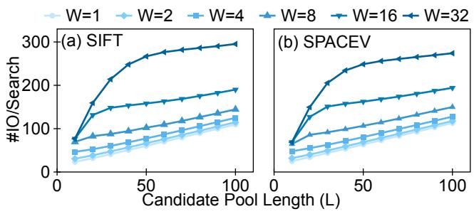  
Figure 8: I/O waste of PipeSearch decreases across search steps. In general, it contains a turning point for each W, after which the I/O waste is similar to the ideal case (i.e., W = 1).

Also, PipeANN reduces the I/O waste of PipeSearch by not ensuring a perfect pipeline at all times (lines 11–14, §4.3). When multiple I/Os finish simultaneously, PipeANN does not immediately fill up the pipeline. Instead, PipeANN repeatedly issues one I/O and explores one vector in the candidate pool. In this way, it ensures that the nth I/O is decided by the neighbor information of the (n − W)th compute, thus increasing the I/O accuracy. The perfect pipeline can be finally ensured, as the I/O completion times tend to differ in this strategy.

## 4.2 Dynamic Pipeline

PipeSearch fails to ensure low latency and high throughput simultaneously with a fixed pipeline width. Therefore, we propose to adapt the pipeline width dynamically in search. In this section, we first introduce the key observation that motivates us to adapt the pipeline width. Then, we describe the two phases of vector search separately.

## 4.2.1 I/O Waste Decreases Across Search Steps

In §3.4, we demonstrate the dilemma of PipeSearch in latency and throughput. With higher pipeline width, PipeSearch shows low latency but low throughput, because of high I/O waste. However, we observe that this dilemma is not fundamental: It considers ANNS at a coarse granularity of a whole search, instead of each search step.

To consider ANNS at the granularity of each step, we evaluate the average I/O per search with different Ls, as shown in Figure 8. This evaluation is based on an observation: PipeSearch with a small L is approximately a subprocess (in other words, an early termination) of one with a large L. Therefore, the slope in Figure 8 reveals the average I/O for recalling the Lth vector; a smaller slope means less I/O waste.

In Figure 8, we observe that the I/O waste across search steps shows two stages. At the beginning of the search, PipeSearch shows a significant I/O waste, which increases with W. Then, it reaches a turning point, after which the I/O waste is similar to the ideal case (i.e., W = 1). The turning point arrives later (i.e., a larger L) for a larger W.

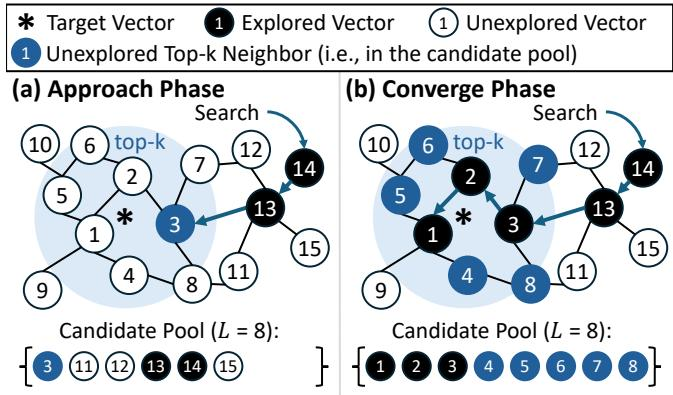  
Figure 9: Two-phase search of graph-based ANNS indexes.

We use Figure 9 to further demonstrate this observation. The best-first policy of vector search naturally divides it into two phases, approach phase and converge phase. In the approach phase, the vectors in the candidate pool quickly approach the target vector. During this phase, PipeSearch with large pipeline widths fails to recall more vectors that are likely in the search’s critical path, inducing I/O waste.

In the converge phase, the nearest vector in the candidate pool remains stable, and the top-k nearest vectors are gradually recalled. The more recalled vectors (larger L in Figure 8), the more top-k neighbors they connect. Thus, there are more "unverified" top-k vectors in the candidate pool, which allows using a large pipeline width for fast verification. During this phase, the average I/O for each vector remains stable.

Method: two-phase graph traversal. Based on the observations above, we use different approaches in the two phases, in order to reduce the I/O waste in PipeSearch. We seek to quickly pass the approach phase, where PipeSearch shows inefficiency. Therefore, we optimize the entry point (§4.2.2) and start PipeSearch with a small pipeline width. In the converge phase, we dynamically increase the pipeline width of PipeSearch, based on the candidate pool state (§4.2.3).

Pipeline draining does not last long. This recalls the Observation 2 in §3.1. In the later search steps, most vectors are recalled, so PipeANN fails to ensure a full pipeline. However, as shown in Figure 8, the I/O waste is not significant in the later search steps. We conclude that most remaining vectors are accurate top-k neighbors of the target vector: New vectors are less likely to be inserted into the candidate pool when reading them. Therefore, this process does not last long.

## 4.2.2 Approach Phase: Entry Point Optimization

PipeANN uses an in-memory graph-based index for entry point optimization, similar to previous works [25]. Specifically, PipeANN samples a portion of entry points in the dataset and builds an in-memory graph-based index using them. The index is built offline and is thus static. For the online vector search, PipeANN first traverses the in-memory index to select entry points and then conducts on-disk PipeSearch.

Parameter selection. In-memory index traversal lies in the critical path of the whole vector search. Therefore, we should carefully select its parameters to ensure its low latency.

Following previous work [25], PipeANN uses a 1% sample rate for the entry points to balance entry point quality and memory usage. We use Vamana (i.e., in-memory DiskANN) as the graph index structure. The index is only used to efficiently find the top-k sampled entry points, so other indexes (e.g., HNSW [16] and NSG [6]) show similar tradeoffs to Vamana. This is also demonstrated in previous work [25].

Here, we discuss the maximum out-degree, which contributes most to the search latency. We build the in-memory index using the Vamana algorithm [23], which is an approximation of a Monotonic Relative Neighborhood Graph (MRNG) [6]. Its search complexity linearly increases with the average out-degree. As this in-memory index is only used for entry point selection, not the overall indexing, we can use a smaller maximum out-degree, tolerating the connectivity loss of some points for lower search latency. By default, we use 32 as the maximum out-degree of in-memory indexes, smaller than in previous works [6, 25].

## 4.2.3 Converge Phase: Pipeline Width Adjustment

PipeANN dynamically adjusts the pipeline width during the search. To achieve this, two questions should be answered. The first is when to start adjusting the pipeline width, and the second is which pipeline width should be selected.

When to start adjusting. We approximate the number of vectors that are already recalled $n _ { \nu } .$ . When the number reaches a threshold, we consider the search to reach the converge phase and start to increase the pipeline width.

Specifically, after exploring one vector, we iterate over the candidate pool to find the first vector whose read request has not been issued. Its index is used as an approximation of nv’s upper bound. This is not an accurate estimation because there may be unexplored vectors that have been already read. Exploring them may add new nearer neighbors.

We further understand this estimation. In the approach phase, there are usually new nearest neighbors after exploring a vector, so the estimated $n _ { \nu }$ typically equals 0. In the converge phase, it is hard to find nearer neighbors than the already explored ones by exploring a new vector, so the estimated $n _ { \nu }$ gradually increases.

After the estimated $n _ { \nu }$ reaches a threshold (5 in our evaluation), we start adjusting the pipeline width. Before that, the pipeline width is set to a fixed value of 4 to reduce I/O waste.

How to adjust. We propose two approaches for this, static approach and dynamic approach, and we use the dynamic approach by default.

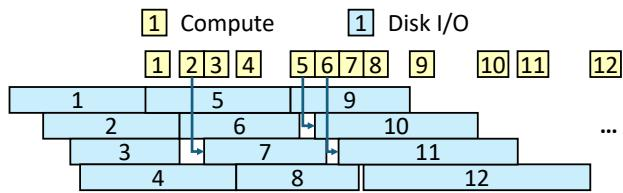  
Figure 10: When multiple I/O finish simultaneously, we issue one I/O after exploring one record, instead of issuing multiple I/O to saturate the pipeline. Therefore, every disk I/O misses the neighbor information in no more than W records.

The static approach first profiles the dataset by PipeSearch with different Ws and Ls to get the results like Figure 8. Then, it generates a fixed (#vectors recalled – W) mapping based on the results. In this mapping, each "#vectors recalled" corresponds to the largest W after its turning point. During a vector search, it adjusts W based on the estimated nv.

The dynamic approach uses another metric: the percentage of I/O that the vector fetched is in the candidate pool. Specifically, after starting pipeline width adjustment, we re-calculate this ratio when there exists finished I/O. When the ratio is greater than a threshold (0.9 in our evaluation), we increase the pipeline width by 1.

## 4.3 Algorithm Optimization

Compared to beam search, naive PipeSearch shows a throughput drop, especially with large pipeline widths, due to I/O waste caused by accumulated neighbor vectors. Here, we describe this in detail.

The root cause of I/O waste is missing neighbor information in the fetched vectors. Less missed neighbor information induces more accurate I/O decisions, thus less I/O waste. For example, greedy search issues I/O after exploring all the vectors, so it misses no neighbor information and shows less I/O waste compared to beam search and PipeSearch.

Ideally, if compute and I/O are perfectly overlapped, each I/O in PipeSearch misses the neighbor information in no more than W records (in W on-flight I/Os). However, this is based on the assumption that I/Os are finished uniformly in the timeline, which is not true in SSDs.

When multiple I/Os finish simultaneously, filling up the pipeline may make I/O miss the neighbor information in more records (W on-flight I/Os and multiple read-but-unexplored vectors). To avoid this, we limit the I/O rate by handling multiple I/Os one by one, as shown in Figure 10. Specifically, after multiple I/O finishes, we repeatedly send one I/O, explore one nearest vector, and update the neighbor set. This way can reduce I/O waste and gradually scatter the I/Os uniformly in the timeline, thus not incurring much overhead.

## 4.4 Implementation and Other Optimizations

Overlapping initialization. PipeANN needs to wait for the first disk I/O to finish, to get neighbor information for filling up the pipeline. This process has a latency of ∼ 50 s in our µNVMe SSD. We overlap it with local PQ table initialization, which is performed for each query to enable fast PQ distance lookup. However, local PQ table initialization needs to read the global PQ table, which is not used in search and thus causes cache pollution. We use non-temporal load in AVX512 instruction to avoid this issue.

Asynchronous I/O. PipeANN uses io\_uring [11] to issue I/O requests, due to its performance and compatibility. Specifically, each thread uses its private io\_uring to send I/O requests asynchronously, with the prep\_read command (line 13 in Algorithm 2). It polls for I/O completion (line 22) using the non-blocking peek\_batch\_cqe command.

Polling-based I/O. Existing systems adopt interrupt-based I/O for best-first search. They do not use polling-based I/O as its latency advantage does not boost the performance. They synchronously wait for all the I/Os in a batch to finish before compute, thus interrupt overhead is minor compared to I/O latency. However, PipeANN needs to issue and poll I/O with low latency, as it could use the saved I/O time for computation. Hence, we enable SQ polling of the io\_uring engine.

## 4.5 Discussion

Beyond SSD. PipeSearch is designed for on-disk graphbased ANNS but is not restricted to it. The mechanisms can be used for other hardware with s-scale access latency, such as remote memory using remote direct memory access (RDMA) or compute express link (CXL). In this case, the whole graphbased index is stored in remote memory. PQ-compressed vectors and the small index for entry point optimization are stored in local memory. Asynchronous I/O could be implemented by replacing io\_uring commands with corresponding remote memory commands (e.g., using RDMA read or CXL prefetch instead of prep\_read). As the remote memory latency (e.g., 2 s for RDMA) is still the same order of magnitude with compute ( s-scale for each record), PipeSearch is expected µto boost ANNS performance on remote memory.

Two-phase search in other works. VBASE [31] also observes a similar phenomenon of two-phase vector indexing, called relaxed monotonicity. It leverages this for efficient similarity search with tags, by designing an interface that returns the next vector in replace of the interface that returns top-k vectors. We exploit this phenomenon to reduce I/O waste in PipeSearch, aiming to ensure both low latency and high throughput. Specifically, we observe that I/O waste decreases during the search process, given a fixed pipeline width.

Memory usage. PipeANN requires 40GB of memory for billion-scale datasets, including:

• 32GB for PQ-compressed vectors, 32 bytes per vector.

• 4GB for the in-memory graph index. In our evaluation, <it uses 2.4GB for the SIFT1B [10] dataset and 3.1GB for the SPACEV1B dataset [4].

• Minor overheads for other in-memory data structures.

In comparison, DiskANN [23] requires ∼32GB of memory, mainly for the PQ-compressed vectors.

PipeANN’s memory-to-disk size ratio is ∼1:15, considering that billion-scale graph indexes on disk typically require over 600GB of disk space (e.g., 636GB for SIFT1B and 892GB for SPACEV1B). PipeANN’s primary memory constraint lies in the PQ-compressed vectors, similar to DiskANN. Therefore, memory-efficient quantization (e.g., RaBitQ [7]) methods could reduce their memory usage.

## 5 Evaluation

In the evaluation, we seek to answer the following questions:

• How does PipeANN perform in latency and throughput compared to other on-disk ANNS indexes? (§5.2)

• Can PipeANN scale to billion-scale datasets? (§5.3)

• Is PipeANN comparable with the in-memory graph-based ANNS index in terms of search latency? (§5.4)

• How do the techniques in PipeANN contribute to its performance? (§5.5)

• How do the approaches for pipeline width adjustment impact search performance? (§5.6)

• How much does PipeANN trades throughput and accuracy with the same search parameters for latency? (§5.7)

## 5.1 Experimental Setup

Basic configuration. We use one server for evaluation, which has the following configuration:

• CPU: 2× 28-core Intel Xeon Gold 6330 @ 2.00GHz;

• RAM: 512GB (16× 32GB DDR4 2933MT/s);

• SSD: 1× Samsung PM9A3 3.84TB;

• OS: Ubuntu 22.04 LTS with Linux kernel 5.15.0.

Compared systems. We compare PipeANN with on-disk ANNS indexes, including graph-based DiskANN [23] and Starling [25], as well as cluster-based SPANN [4]. DiskANN is a graph-based ANNS index using best-first search. Starling optimizes the I/O of DiskANN by reordering the on-disk records to improve search locality and using an in-memory index to optimize the entry point.

SPANN is an on-disk cluster-based index. It separates the vectors into clusters and maintains an in-memory navigation graph to index the cluster centroids. To conduct ANNS, it first searches the nearest clusters in the in-memory graph and then re-ranks all the vectors in the clusters to get the results.

Parameters. We use the same in-memory and on-disk graph indexes for PipeANN, DiskANN, and Starling, except that Starling reorders the on-disk records. The graph indexes are built using the parameters in Table 1. For search parameters, the candidate pool size of in-memory index traversal Lmem is fixed to 10 for PipeANN and Starling. We use io\_uring [11] as the I/O engine of PipeANN and enable SQ polling. For fairness, we also replace the original I/O engine (libaio) with io\_uring for DiskANN and Starling. We disable SQ polling for them. We use W = 8 for DiskANN and W = 4 for Starling, which shows the lowest latency separately. We limit the maximum W of PipeANN to 32.

<table><tr><td>Graph Type</td><td>R</td><td>L</td><td>B</td></tr><tr><td>On-Disk (100M)</td><td>96</td><td>128</td><td>32</td></tr><tr><td>On-Disk (1B)</td><td>128</td><td>200</td><td>32</td></tr><tr><td>In-Memory</td><td>32</td><td>64</td><td>/</td></tr></table>

Table 1: Parameters used for Vamana (i.e., DiskANN) graph building [23]. R: maximum out-degree. L: candidate pool size for finding neighbors. B: PQ-compressed vector size (bits/vector). The in-memory index is used by PipeANN and Starling for entry point optimization.

<table><tr><td>Name</td><td>#Vectors</td><td>Type</td><td>Dim</td><td>#Queries</td></tr><tr><td>SIFT1B[10]</td><td>1B</td><td>uint8</td><td>128</td><td>10,000</td></tr><tr><td>SPACEV1B [4]</td><td>1.4B</td><td>int8</td><td>100</td><td>29,316</td></tr><tr><td>SIFT100M[10]</td><td>100M</td><td>uint8</td><td>128</td><td>10,000</td></tr><tr><td>DEEP100M[2]</td><td>100M</td><td>float</td><td>96</td><td>10,000</td></tr><tr><td>SPACEV100M[4]</td><td>100M</td><td>int8</td><td>100</td><td>29,316</td></tr></table>

Table 2: Datasets used in the evaluation. SIFT100M, DEEP100M, and SPACEV100M are subsets of SIFT1B, DEEP1B, and SPACEV1B.

For SPANN, we build cluster-based indexes using the same parameter in the SPFresh [29] repository. Specifically, for SIFT and SPACEV, we set their maximum cluster size to 16KB. For DEEP, we set it to 48KB. Each vector is replicated to its nearest 8 clusters.

Datasets. We use five public datasets in the evaluation, including 100M-scale and billion-scale datasets. Detailed configurations of the datasets are shown in Table 2.

Metrics. We mainly compare the latency and throughput for 0.9 recall, which is recommended by the BigANN benchmark [20]. Low recall (e.g., 0.8) and high recall (e.g., 0.99) are also used in some experiments for more thorough comparison. We evaluate the recall by searching the top 10 nearest neighbors (i.e., recall10@10).

## 5.2 Overall Performance

In this section, we evaluate the latency and throughput of PipeANN using datasets with 100M vectors. We do not use billion-scale datasets, where the graph reordering algorithm in Starling has huge time and memory overhead. We will show the results in billion-scale datasets in §5.3.

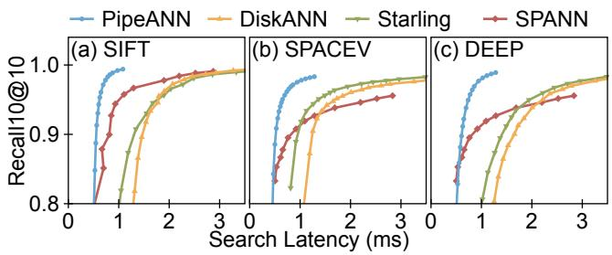

Figure 11: Search latency on datasets with 100M vectors.  
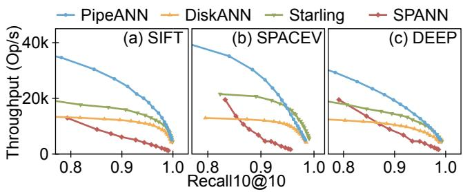  
Figure 12: Search throughput on datasets with 100M vectors.

## 5.2.1 Latency

We use 1 thread to conduct ANNS in the compared systems. Figure 11 shows the results. From the figure, we make the following observations:

(1) Compared with graph-based indexes, PipeANN shows lower latency. To achieve 0.9 recall10@10, PipeANN has 39.1%/48.5% latency on average, compared to DiskANN/Starling. This is because PipeANN efficiently uses dynamic PipeSearch to overlap compute and I/O and increase the average I/O depth, thus reducing latency. Starling has lower latency compared to DiskANN. This is because Starling uses the in-memory index for entry point optimization and reorders the on-disk graph to reduce the average I/O per search.

(2) Compared with cluster-based indexes, PipeANN shows lower latency when recall ≥ 0.9. To achieve 0.9 recall10@10, PipeANN has 70.6% lower latency compared to SPANN. SPANN shows lower latency than other graph-based indexes, because of its I/O friendliness. SPANN first traverses an inmemory graph-based index for the nearest clusters of the target vector. Then, it sends I/O to fetch the clusters in parallel. In contrast, existing graph-based indexes traverse the graph by issuing I/O batches in sequential, where I/O latency significantly harms the overall search latency. PipeANN greatly eliminates this issue by pipelining, which makes it faster than SPANN for recall ≥ 0.9. However, when the recall is smaller (e.g., 0.8), PipeANN suffers from the overhead of approaching the target vector, making it slower than SPANN.

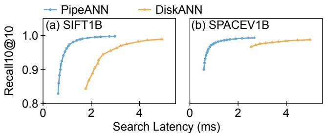  
Figure 13: Search latency in billion-scale datasets.

## 5.2.2 Throughput

We use 56 threads (all the cores of our CPU) to conduct ANNS in the compared systems. Figure 12 shows the results. From the figure, we make the following observations:

(1) When recall = 0.9, PipeANN consistently shows the highest throughput. To achieve 0.9 recall10@10, PipeANN outperforms other systems by 1.35× on average. In this case, the disk bandwidth is not saturated, because other tasks (e.g., PQ table initialization) account for a high time percentage. The extra I/O of PipeANN does not harm the overall throughput much. PipeANN’s high throughput owes to its shorter critical path, because of pipelining.

(2) For higher recall, PipeANN has a lower throughput than Starling. To achieve 0.99 recall10@10, PipeANN has 0.80× lower throughput than Starling on average, because of the wasted disk I/O. In this case, the search procedure takes up most of the time, which saturates the disk bandwidth. For each search, PipeANN requires 1.94× average disk I/O on average compared to Starling, which results in lower throughput. This is because of the reordering technique of Starling. Starling reorders the on-disk index for more neighboring records on the same page, thus reducing disk I/O.

Note that the design of PipeANN is orthogonal with Starling. In PipeANN, we can directly adopt the same reordering technique to reduce I/O. However, considering the huge time and memory overhead for reordering in billion-scale datasets, we do not adopt this technique in PipeANN.

Compared with DiskANN, PipeANN shows higher throughput. PipeANN has a similar (0.98× for 0.99 recall) average I/O per search compared to DiskANN, but it can better utilize the disk bandwidth because of pipelining. This results in PipeANN’s higher throughput.

## 5.3 Overall Performance: Billion-Scale

In this section, we show the performance of PipeANN in billion-scale datasets. We compare PipeANN with DiskANN. We do not compare PipeANN to other baselines because building or searching them exceeds the memory capacity in our setup. Figures 13 and 14 show the results. In SPACEV1B, we do not show DiskANN with accuracies less than 96%, because its accuracy only achieves 60% using a smaller L.

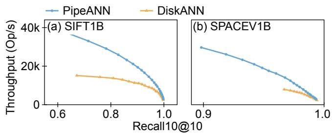

Figure 14: Search throughput in billion-scale datasets.  
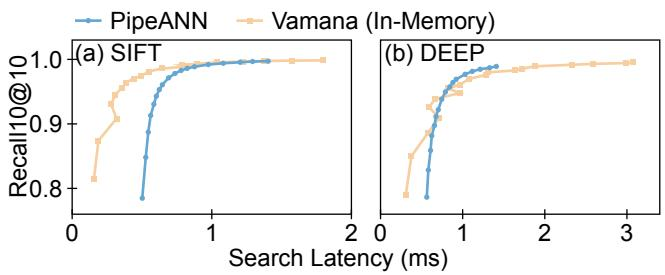  
Figure 15: Search latency of PipeANN compared with Vamana (in-memory DiskANN).

Latency. As shown in Figure 13, to achieve 0.9 recall10@10, PipeANN has latencies of 0.719 ms and 0.578 ms in SIFT1B and SPACEV1B, which are 1.28×/1.09× compared to SIFT100M and SPACEV100M. Compared to DiskANN, PipeANN achieves 35.0% latency in SIFT.

Throughput. As shown in Figure 14, to achieve 0.9 recall10@10, PipeANN has 19.4K and 26.1K QPS in SIFT1B and SPACEV1B, which are 79.9% and 98.0% compared to SIFT100M and SPACEV100M. Compared to DiskANN, PipeANN achieves 1.71× higher throughput.

Analysis. The search path is longer for billion-scale datasets than 100M-scale datasets, which incurs a higher search latency to achieve the same recall. However, it also brings more opportunities for pipelining, which contributes to a more significant performance boost compared to DiskANN.

## 5.4 Compare with In-Memory Index

In this section, we show the performance gap of PipeANN with an in-memory graph-based index. We directly store the on-disk index of PipeANN in memory and use it for searching. We call this baseline Vamana. We compare PipeANN with Vamana using SIFT100M and DEEP100M datasets. Figure 15 shows the results, and we make the following observations:

(1) For low recall, PipeANN shows higher latency than the in-memory index. To achieve 0.8 recall10@10 in SIFT100M, PipeANN has 3.38× higher latency than Vamana. Because of a small L (e.g., 10), the search is mainly in the approach phase, where PipeSearch cannot maintain a large pipeline width. Therefore, PipeANN fails to hide all the I/O latency, which makes the performance of PipeANN lower than the in-memory index.

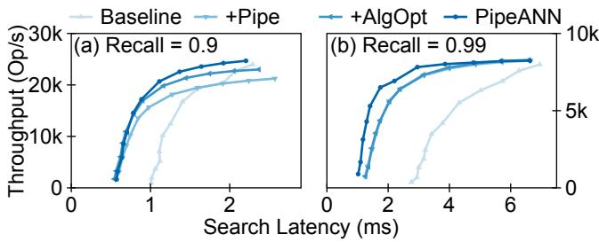  
Figure 16: Breakdown analysis of PipeANN.

(2) For recall ≥ 0.9, the performance of PipeANN is close to the in-memory index. To achieve 0.9 recall10@10, PipeANN has 2.02×/1.14× latency compared to Vamana. In this case, both PipeANN and Vamana use a large L (e.g., 30). The converge phase accounts for a higher ratio, where PipeSearch maintains a large pipeline width for better overlapping of compute and I/O. Therefore, the performance gap between PipeANN and Vamana reduces.

PipeANN’s slowdown is less significant in DEEP100M. This is because, in DEEP, distance comparison for Vamana is more costly than in SIFT. DEEP calculates 96 floats per vector, which has a higher overhead than the 128 uint8s per vector in SIFT. In contrast, PipeANN uses PQ distance for neighbors, which has similar overheads for distance comparison in the two datasets. We conclude that PipeANN is expected to have more comparable performance with in-memory ANNS with higher vector dimensions.

## 5.5 Breakdown Analysis

In this section, we break down the performance gap of Baseline and PipeANN. We accumulate key techniques into the Baseline and evaluate the latency-throughput graph with 0.9 and 0.99 recall10@10. We use the index built on the SIFT100M dataset, and the same configurations as in §5.2.

Baseline. We implement the Baseline based on the framework of PipeANN. It uses best-first search like DiskANN with W = 8 and adopts the same in-memory index as PipeANN for entry point optimization. As shown in Figure 16(a), the Baseline shows ms-scale latency to achieve 0.9 recall. Although adopted entry point optimization, its best-first search algorithm still incurs high search latency on disk.

+Pipe. We use PipeSearch (§3) with W = 8 in replace of best-first search in Baseline. It reduces latency to 55.1% for 0.9 recall. However, the throughput is also reduced to 88.5%. This is because PipeSearch has a 1.11× average I/O per search compared to best-first search. The I/O waste and throughput drop are less significant than in $\ S 3 . 4 ,$ as entry point optimization reduces the I/O waste during the approach phase.

<table><tr><td>#Vectors Recalled</td><td>0 10 20 30</td><td></td><td>40</td></tr><tr><td>Pipeline Width</td><td>4 8 16</td><td>24</td><td>32</td></tr></table>

Table 3: Pipeline width used by static approach.

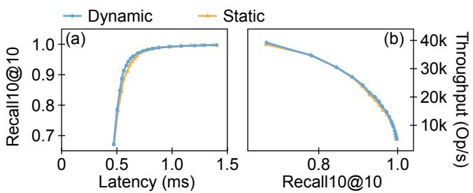  
Figure 17: Performance of dynamic approach and static approach for pipeline width adjustment. Dataset: SIFT100M.

+AlgOpt. We adopt the algorithm optimization for multiple finished I/Os (§4.3). It increases the throughput to 1.08× because it reduces the average I/O per search to 91.8%. The performance boost is more significant in high-throughput cases, which concludes that multiple I/Os are more frequent to finish simultaneously in such cases. The latency is slightly reduced to 97.5%, as the performance degradation of the unsaturated I/O pipeline is less significant than the performance boost of reduced I/O.

PipeANN. We adopt the dynamic pipeline (§4.2) in replace of the static one with W = 8. It reduces the latency to 81.1% for 0.99 recall and increases the throughput to 1.07×. This is because, in the converge phase, a large W allows more compute and I/O overlapping, while not inducing much I/O waste. It does not show much performance boost for 0.9 recall, as the search terminates early in the converge phase when W is not significantly larger than 8.

## 5.6 Approaches for Pipeline Adjustment

In this section, we compare the two approaches for pipeline width adjustment (§4.2.3), namely the static approach and the dynamic approach. For the static approach, we set the pipeline width according to the profiling results similar to Figure 8(a). The parameters used are shown in Table 3.

Figure 17 shows the results. We find that the dynamic approach slightly outperforms the static approach by up to 6.1%/9.1% for latency and throughput. This demonstrates that PipeANN is not sensitive to the approach for pipeline width adjustment. The dynamic approach successfully follows the decreasing trend of I/O waste to increase the pipeline width across the search steps.

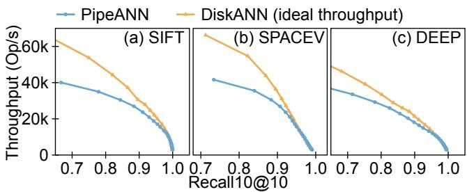  
Figure 18: Throughput of PipeANN and DiskANN with ideal throughput (best-first search with W = 1).

## 5.7 Tradeoffs in PipeANN

PipeANN tweaks the best-first search algorithm for lower latency, but with some tradeoffs. In this section, we demonstrate them using experiments.

Throughput. Although PipeANN introduces techniques to reduce I/O waste, its W  1 could still waste more I/O com->pared to the ideal best-first search with W = 1 (note that we use W = 8 for lower latency in §5.2), and thus lead to lower throughput. We implement this ideal baseline using DiskANN, which we call DiskANN (ideal throughput). To saturate SSD, this baseline uses asynchronous I/O; one CPU core executes multiple search requests simultaneously and switches across them to avoid I/O waiting. We compare PipeANN with this baseline using the same datasets as in §5.2.

Figure 18 shows the results. From the figure, we observe that: First, PipeANN shows lower throughput than the ideal DiskANN at low accuracy. When recall = 0.8, the throughput drop of PipeANN is 31.6%/34.1%/17.5% separately in the three datasets. This is because the approach phase accounts for a large percentage, when PipeANN’s W  1 leads to I/O >waste. Second, the throughput drop becomes less significant at higher accuracy. When the recall reaches 0.95, the throughput drop becomes 14.7%/6.15%/4.90%. In such cases, the converge phase lasts longer, and some wasted I/O in the approach phase are also explored in best-first search. These two reasons contribute to less I/O waste of PipeANN. Third, at the same accuracy, PipeANN shows less I/O waste in DEEP than the other two datasets. This is because DEEP requires a larger candidate pool length $L ,$ and thus a longer converge phase. This leads to less I/O waste.

Search accuracy with the same parameters. PipeANN tweaks the best-first search algorithm, which may lead to an accuracy drop under the same search parameters. Here, we evaluate this issue in terms of quantity. We compare PipeANN with the same L as DiskANN, which uses best-first search with W = 8. Figure 19 shows the results. From the figure, we make the following observations:

(1) PipeANN shows little accuracy drop. PipeANN has at least 95.9% recall compared to DiskANN. When recall ≥ 0 9, .this value is further increased to 98.8%. The accuracy drop is because PipeANN approximates the best-first search algorithm. However, the modification is slight enough to ensure similar behavior for search convergence.

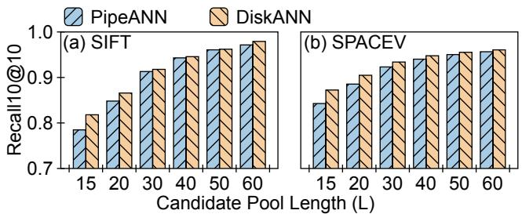  
Figure 19: Accuracy of PipeANN and DiskANN with the same L. Note that the Y-axis does not start at zero.

(2) The accuracy drop is less significant for larger L. We understand this by regarding PipeANN as a "best-first search" with a candidate pool length L − W, noticing that each I/O in PipeANN misses at most W vectors. The search accuracy increases slower for larger L, so the accuracy gap of best-first searches with L − W and L becomes less significant.

PipeANN achieves the same accuracy with DiskANN using a larger L, but benefits from lower latency.

## 6 Related Work

PipeANN targets on-disk graph-based ANNS with low latency. In this section, we introduce two types of related work, namely graph search optimization and on-disk ANNS.

Graph search optimization. Traditional graph-based indexes do ANNS in memory. They typically use greedy search to traverse from the starting vector to the target vector [6, 16]. Compared to distance comparison, memory access for vectors has orders of magnitude lower latency, so the greedy-based approach is favored for reduced vectors accessed per search. In such a scenario, distance comparison is the major bottleneck of graph-based ANNS, so some works focus on reducing the overhead of distance comparison for high performance [3,30].

On disk, the best-first algorithm incurs high search latency when exploring one vector at a time (i.e., W = 1). Therefore, DiskANN [23] proposes to use beam search, where it reads the best k vectors in parallel for each search step. Beam search is also used by iQAN [18] to do intra-query parallelism among multiple cores, where each core explores one vector. Compared to greedy search, beam search reduces the latency but still follows a best-first algorithm, which induces compute-I/O order and limits the performance.

Some other works accelerate graph search by reducing the length of the search path, using entry point optimization and early termination. LSH-APG [32] and Starling [25] optimize the fixed entry point using an LSH table or a sub-graph. Proxima [28] and learned adaptive early termination [13] determine the search termination condition based on the search state and an ML model, separately. The design of PipeANN is orthogonal to these works. These works can be directly adopted by PipeANN for acceleration.

In contrast, PipeANN reduces the search latency by aligning the best-first search algorithm with SSD characteristics.

On-disk ANNS. To support larger datasets, recent works store ANNS indexes on disk. They can be mainly divided into two types, graph-based indexes and cluster-based indexes.

Graph-based indexes are favored for their search accuracy and I/O efficiency, which are suitable for high-throughput ANNS. They typically store compressed vectors in memory for navigation, and the full index on disk [8, 23, 25]. However, due to the best-first search algorithm, the critical path in search includes tens of sequential I/O. Therefore, graph-based indexes suffer from high search latency on disk, which motivates the designs of PipeANN. Also, updating the graph-based indexes induces high overheads [22, 29].

Cluster-based indexes [4, 24] have a simpler structure than graph-based indexes. They divide the vectors into multiple clusters, each of which contains tens of vectors. The clusters are stored on disk, and indexed by an in-memory graph. Vector search first finds the nearest clusters in memory and then reads them on disk in parallel. Therefore, only one parallel disk I/O lies in the critical path, which contributes to its low search latency. Also, updating the cluster-based indexes incurs a lower cost than graph-based ones [29]. However, clusterbased indexes are more coarse-grained than graph-based ones, which induces lower search throughput.

## 7 Conclusion

We propose PipeSearch, a low-latency algorithm for on-disk graph-based ANNS. PipeSearch accelerates on-disk ANNS by aligning the best-first search algorithm with SSD features. It benefits from compute-I/O overlapping and a betterutilized I/O pipeline compared to best-first search. We optimize PipeSearch and implement PipeANN, a low-latency ANNS system with high search throughput. Experiments show that PipeANN significantly bridges the latency gap between in-memory ANNS and on-disk ANNS. This work demonstrates that aligning the algorithm with the hardware characteristics brings performance benefits.

## Acknowledgments

We sincerely thank our shepherd, Patrick P. C. Lee, and the anonymous reviewers for their valuable feedback. This work is supported by the National Key R&D Program of China (Grant No. 2024YFE0203300), the National Natural Science Foundation of China (Grant No. 62332011), and Beijing Natural Science Foundation (Grant No. L242016).

## References

[1] Ilias Azizi, Karima Echihabi, and Themis Palpanas. Graph-Based Vector Search: An Experimental Evaluation of the State-of-the-Art. In Proceedings of the ACM on Management of Data, SIGMOD ’25, Berlin, Germany, 2025. Association for Computing Machinery.

[2] Artem Babenko and Victor S. Lempitsky. Efficient Indexing of Billion-Scale Datasets of Deep Descriptors. In 2016 IEEE Conference on Computer Vision and Pattern Recognition, CVPR ’16, pages 2055–2063, Las Vegas, NV, USA, 2016. IEEE Computer Society.

[3] Patrick Chen, Wei-Cheng Chang, Jyun-Yu Jiang, Hsiang-Fu Yu, Inderjit Dhillon, and Cho-Jui Hsieh. FINGER: Fast Inference for Graph-based Approximate Nearest Neighbor Search. In Proceedings of the ACM Web Conference 2023, WWW ’23, pages 3225–3235, Austin, TX, USA, 2023. Association for Computing Machinery.

[4] Qi Chen, Bing Zhao, Haidong Wang, Mingqin Li, Chuanjie Liu, Zengzhong Li, Mao Yang, and Jingdong Wang. SPANN: highly-efficient billion-scale approximate nearest neighbor search. In Proceedings of the 35th International Conference on Neural Information Processing Systems, NIPS ’21, Red Hook, NY, USA, 2021. Curran Associates Inc.

[5] Rongxin Chen, Yifan Peng, Xingda Wei, Hongrui Xie, Rong Chen, Sijie Shen, and Haibo Chen. Characterizing the Dilemma of Performance and Index Size in Billion-Scale Vector Search and Breaking It with Second-Tier Memory. CoRR, abs/2405.03267, 2024.

[6] Cong Fu, Chao Xiang, Changxu Wang, and Deng Cai. Fast approximate nearest neighbor search with the navigating spreading-out graph. In Proceedings of the VLDB Endowment, VLDB ’19, pages 461–474, Los Angeles, CA, USA, 2019. VLDB Endowment.

[7] Jianyang Gao and Cheng Long. RaBitQ: Quantizing High-Dimensional Vectors with a Theoretical Error Bound for Approximate Nearest Neighbor Search. In Proceedings of the ACM on Management of Data, SIGMOD ’24, Santiago, Chile, 2024. Association for Computing Machinery.

[8] Siddharth Gollapudi, Neel Karia, Varun Sivashankar, Ravishankar Krishnaswamy, Nikit Begwani, Swapnil Raz, Yiyong Lin, Yin Zhang, Neelam Mahapatro, Premkumar Srinivasan, Amit Singh, and Harsha Vardhan Simhadri. Filtered-diskann: Graph algorithms for approximate nearest neighbor search with filters. In Proceedings of the ACM Web Conference 2023, WWW ’23, pages 3406–3416, Austin, TX, USA, 2023. Association for Computing Machinery.

[9] Piotr Indyk and Rajeev Motwani. Approximate nearest neighbors: towards removing the curse of dimensionality. In Proceedings of the Thirtieth Annual ACM Symposium on Theory of Computing, STOC ’98, pages 604–613, Dallas, TX, USA, 1998. Association for Computing Machinery.

[10] Hervé Jégou, Romain Tavenard, Matthijs Douze, and Laurent Amsaleg. Searching in one billion vectors: rerank with source coding. In 2011 IEEE International Conference on Acoustics, Speech and Signal Processing, ICASSP ’11, pages 861–864, Prague, Czech Republic, 2011. IEEE Computer Society.

[11] Kanchan Joshi, Anuj Gupta, Javier Gonzalez, Ankit Kumar, Krishna Kanth Reddy, Arun George, Simon Lund, and Jens Axboe. I/O Passthru: Upstreaming a flexible and efficient I/O Path in Linux. In 22nd USENIX Conference on File and Storage Technologies, FAST ’24, pages 107–121, Santa Clara, CA, 2024. USENIX Association.

[12] Patrick Lewis, Ethan Perez, Aleksandra Piktus, Fabio Petroni, Vladimir Karpukhin, Naman Goyal, Heinrich Küttler, Mike Lewis, Wen-tau Yih, Tim Rocktäschel, Sebastian Riedel, and Douwe Kiela. Retrieval-augmented generation for knowledge-intensive NLP tasks. In Proceedings of the 34th International Conference on Neural Information Processing Systems, NIPS ’20, Red Hook, NY, USA, 2020. Curran Associates Inc.

[13] Conglong Li, Minjia Zhang, David G. Andersen, and Yuxiong He. Improving Approximate Nearest Neighbor Search through Learned Adaptive Early Termination. In Proceedings of the 2020 ACM SIGMOD International Conference on Management of Data, SIGMOD ’20, pages 2539–2554, Portland, OR, USA, 2020. Association for Computing Machinery.

[14] Jie Li, Haifeng Liu, Chuanghua Gui, Jianyu Chen, Zhenyuan Ni, Ning Wang, and Yuan Chen. The Design and Implementation of a Real Time Visual Search System on JD E-commerce Platform. In Proceedings of the 19th International Middleware Conference Industry, Middleware ’18, pages 9–16, Rennes, France, 2018. Association for Computing Machinery.

[15] Sen Li, Fuyu Lv, Taiwei Jin, Guli Lin, Keping Yang, Xiaoyi Zeng, Xiao-Ming Wu, and Qianli Ma. Embeddingbased Product Retrieval in Taobao Search. In Proceedings of the 27th ACM SIGKDD Conference on Knowledge Discovery & Data Mining, KDD ’21, pages 3181– 3189, Virtual Event, 2021. Association for Computing Machinery.

[16] Yu A. Malkov and D. A. Yashunin. Efficient and Robust Approximate Nearest Neighbor Search Using Hierarchical Navigable Small World Graphs. IEEE Transactions

on Pattern Analysis and Machine Intelligence (TPAMI), 42(4):824–836, 2020.

[17] Tomás Mikolov, Kai Chen, Greg Corrado, and Jeffrey Dean. Efficient Estimation of Word Representations in Vector Space. In 1st International Conference on Learning Representations, Workshop Track Proceedings, ICLR ’13, Scottsdale, Arizona, USA, 2013.

[18] Zhen Peng, Minjia Zhang, Kai Li, Ruoming Jin, and Bin Ren. iQAN: Fast and Accurate Vector Search with Efficient Intra-Query Parallelism on Multi-Core Architectures. In Proceedings of the 28th ACM SIGPLAN Annual Symposium on Principles and Practice of Parallel Programming, PPoPP ’23, pages 313–328, Montreal, QC, Canada, 2023. Association for Computing Machinery.

[19] Alec Radford, Jong Wook Kim, Chris Hallacy, Aditya Ramesh, Gabriel Goh, Sandhini Agarwal, Girish Sastry, Amanda Askell, Pamela Mishkin, Jack Clark, Gretchen Krueger, and Ilya Sutskever. Learning Transferable Visual Models From Natural Language Supervision. In Proceedings of the 38th International Conference on Machine Learning, ICML ’21, pages 8748–8763, Virtual Event, 2021. PMLR.

[20] Harsha Simhadri. Results of the NeurIPS’21 Challenge on Billion-Scale Approximate Nearest Neighbor Search. In Proceedings of the 35th International Conference on Neural Information Processing Systems, NIPS ’21, Red Hook, NY, USA, 2021. Curran Associates Inc.

[21] Harsha Simhadri. Research talk: Approximate nearest neighbor search systems at scale. https://www.yout ube.com/watch?v=BnYNdSIKibQ&list=PLD7HFc N7LXReJTWFKYqwMcCc1nZKIXBo9&index=9, 2022.

[22] Aditi Singh, Suhas Jayaram Subramanya, Ravishankar Krishnaswamy, and Harsha Vardhan Simhadri. FreshDiskANN: A Fast and Accurate Graph-Based ANN Index for Streaming Similarity Search. CoRR, abs/2105.09613, 2021.

[23] Suhas Jayaram Subramanya, Devvrit, Rohan Kadekodi, Ravishankar Krishaswamy, and Harsha Vardhan Simhadri. DiskANN: fast accurate billion-point nearest neighbor search on a single node. In Proceedings of the 33rd International Conference on Neural Information Processing Systems, NIPS ’19, Red Hook, NY, USA, 2019. Curran Associates Inc.

[24] Bing Tian, Haikun Liu, Zhuohui Duan, Xiaofei Liao, Hai Jin, and Yu Zhang. Scalable Billion-point Approximate Nearest Neighbor Search Using SmartSSDs. In 2024 USENIX Annual Technical Conference, USENIX ATC ’24, pages 1135–1150, Santa Clara, CA, 2024. USENIX Association.

[25] Mengzhao Wang, Weizhi Xu, Xiaomeng Yi, Songlin Wu, Zhangyang Peng, Xiangyu Ke, Yunjun Gao, Xiaoliang Xu, Rentong Guo, and Charles Xie. Starling: An I/O-Efficient Disk-Resident Graph Index Framework for High-Dimensional Vector Similarity Search on Data Segment. In Proceedings of the ACM on Management of Data, SIGMOD ’24, Santiago, Chile, 2024. Association for Computing Machinery.

[26] Mengzhao Wang, Xiaoliang Xu, Qiang Yue, and Yuxiang Wang. A comprehensive survey and experimental comparison of graph-based approximate nearest neighbor search. In Proceedings of the VLDB Endowment, VLDB ’21, pages 1964–1978, Copenhagen, Denmark, 2021. VLDB Endowment.

[27] Chuangxian Wei, Bin Wu, Sheng Wang, Renjie Lou, Chaoqun Zhan, Feifei Li, and Yuanzhe Cai. AnalyticDB-V: a hybrid analytical engine towards query fusion for structured and unstructured data. In Proceedings of the VLDB Endowment, VLDB ’20, pages 3152–3165, Tokyo, Japan, 2020. VLDB Endowment.

[28] Weihong Xu, Junwei Chen, Po-Kai Hsu, Jaeyoung Kang, Minxuan Zhou, Sumukh Pinge, Shimeng Yu, and Tajana Rosing. Proxima: Near-storage Acceleration for Graph-based Approximate Nearest Neighbor Search in 3D NAND. CoRR, abs/2312.04257, 2023.

[29] Yuming Xu, Hengyu Liang, Jin Li, Shuotao Xu, Qi Chen, Qianxi Zhang, Cheng Li, Ziyue Yang, Fan Yang, Yuqing Yang, Peng Cheng, and Mao Yang. SPFresh: Incremental In-Place Update for Billion-Scale Vector Search. In Proceedings of the 29th Symposium on Operating Systems Principles, SOSP ’23, pages 545–561, Koblenz, Germany, 2023. Association for Computing Machinery.

[30] Mingyu Yang, Jiabao Jin, Xiangyu Wang, Zhitao Shen, Wei Jia, Wentao Li, and Wei Wang. Effective and General Distance Computation for Approximate Nearest Neighbor Search. CoRR, abs/2404.16322, 2024.

[31] Qianxi Zhang, Shuotao Xu, Qi Chen, Guoxin Sui, Jiadong Xie, Zhizhen Cai, Yaoqi Chen, Yinxuan He, Yuqing Yang, Fan Yang, Mao Yang, and Lidong Zhou. VBASE: Unifying Online Vector Similarity Search and Relational Queries via Relaxed Monotonicity. In 17th USENIX Symposium on Operating Systems Design and Implementation, OSDI ’23, pages 377–395, Boston, MA, USA, 2023. USENIX Association.

[32] Xi Zhao, Yao Tian, Kai Huang, Bolong Zheng, and Xiaofang Zhou. Towards Efficient Index Construction and Approximate Nearest Neighbor Search in High-Dimensional Spaces. In Proceedings of the VLDB Endowment, VLDB ’23, pages 1979–1991, Vancouver, Canada, 2023. VLDB Endowment.

[33] Xiaoyao Zhong, Haotian Li, Jiabao Jin, Mingyu Yang, Deming Chu, Xiangyu Wang, Zhitao Shen, Wei Jia, George Gu, Yi Xie, Xuemin Lin, Heng Tao Shen, Jingkuan Song, and Peng Cheng. VSAG: An Optimized Search Framework for Graph-based Approximate Nearest Neighbor Search. CoRR, abs/2503.17911, 2025.