①

USENIX

THE ADVANCED COMPUTING SYSTEMS ASSOCIATION

# Neutrin o: Fine-grained GPU Kernel Profiling via Programmable Probing

Songlin Huang and Chenshu Wu, The University of Hong Kong https://www.usenix.org/conference/osdi25/presentation/huang-songlin

# This paper is included in the Proceedings of the 19th USENIX Symposium on Operating Systems Design and Implementation.

July 7–9, 2025 • Boston, MA, USA

ISBN 978-1-939133-47-2

Open access to the Proceedings of the 19th USENIX Symposium on Operating Systems Design and Implementation is sponsored by

# NEUTRINO: Fine-grained GPU Kernel Profiling via Programmable Probing

Songlin Huang The University of Hong Kong huangs0@connect.hku.hk

Chenshu Wu The University of Hong Kong chenshu@cs.hku.hk

## Abstract

As GPUs play an increasingly important role in computer systems in the scaling laws era, understanding fine-grained GPU runtime behavior is more crucial than ever. However, existing GPU kernel profilers, typically kernel-exclusive or hardware-dependent, often fail to capture fine-grained measurements. This paper presents NEUTRINO, a programmable interface for GPU kernel profiling that leverages assemblylayer probing to achieve instruction-level fine granularity, profiling versatility across time and value domains, and hardware independence. To better visualize the rich details captured by NEUTRINO, we introduce the Densified Memory Access Timeline (DMAT), a novel representation that offers new insights into GPU runtime behavior. We implement NEUTRINO in Linux for both NVIDIA and AMD GPUs and conduct extensive evaluations and analyses. The results demonstrate NEUTRINO’s superior capabilities in GPU kernel profiling with low overhead. We envision NEUTRINO as a valuable tool for the community and have open-sourced it to facilitate future research at https://github.com/open-neutrino/ neutrino.

## 1 Introduction

With the emergence of artificial intelligence under the scaling laws [41] in data, parameters, and computation, the underlying computer systems have been scaling rapidly, primarily driven by GPUs, parallelism-oriented computing devices that are heterogeneous from the traditional OS running on CPUs. The huge system scale and the unique parallelism-oriented design open many research challenges on GPU systems, such as communication [16,36,67,70], memory efficiency [43,78], computation pipelining [35, 46, 63, 65, 75], and GPU cluster scheduling [3, 37, 47, 52, 99]. To address these challenges, researchers would greatly benefit from comprehensive measurements and in-depth insights into the runtime behavior of real workloads on GPU systems. Demystifying the otherwise opaque GPU programs can promise new opportunities for optimizing machine learning (ML) systems.

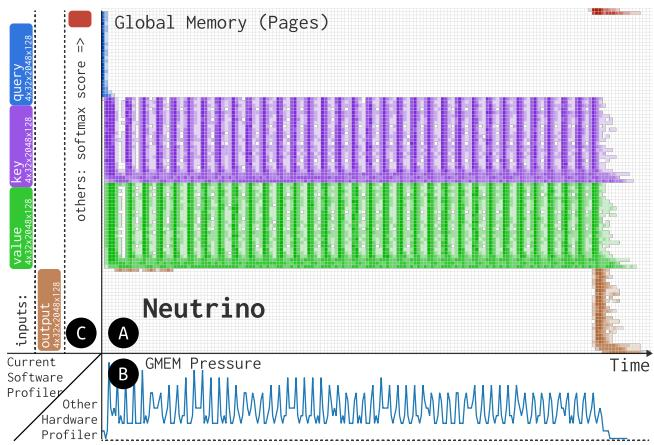  
Figure 1: NEUTRINO’s Densified Memory Access Timeline Plot. ●A NEUTRINO expands new dimensions from previous ●B hardware-dependent profilers and ●C kernel-exclusive software profilers. Color depth in ●A shows density from parallel threads, profiled from Flash-Attn-v2 [19] (non-causal).

However, profiling real GPU workloads at a fine granularity has been well-recognized as a significant challenge from previous attempts [5, 7, 23, 55, 58, 93]: ❶ The proprietary and heterogeneous hardware, coupled with the huge system scales (e.g., 10,000+ cores), limits the capability to probe finegrained information. ❷ GPU kernels are treated as atomic to the host OS, which largely prevents profiling GPU kernels through the mature OS profiling techniques [24]. ❸ Many profilers [12, 15, 18, 50, 74] rely on concurrency mechanisms like timer interrupts and locks, which are either unsupported or inefficient on GPUs due to the parallelism-oriented architecture. These challenges are further amplified by the rapid development of GPU systems with many new features introduced over the past few decades, such as matrix core [1, 73] in execution model and asynchronous copy [2] for memory access, which continuously introduce new runtime behaviors, performance issues, and profiling needs.

These unique challenges make existing GPU profilers either kernel-exclusive [87], only capturing coarse-grained metrics like FLOP/s, or hardware-dependent [5,7,55,58], relying on physical hardware features such as Performance Monitor (PM) counters, as shown in Tab. 1. Additionally, these hardware profilers are sampling-based: They use hardware counter readings at certain intervals to capture statistics such as memory throughput, and cannot support more informative profiles like the page reference map [22] for capturing the spatial and temporal patterns of memory access. There are also explorations on GPU instrumentation [14, 77, 80, 82], such as NvBit [93] that manipulates proprietary machine code or HIPAnalyzer [21] that instruments compilers [44]. Yet these efforts still only focus on statistics such as memory access divergence among threads or reusable distance. To the best of our knowledge, there exist no tools for a fine-grained and general-purpose programmable interface of GPU profiling, just like eBPF [24] for Linux Kernel tracing.

To bridge this gap, we present NEUTRINO, a GPU assembly probing tool for fine-grained, versatile, and programmable GPU kernel runtime profiling. Inspired by eBPF [24], NEU-TRINO’s design aims to attach small snippets (probes) to GPU programs to expose runtime details of program executions. Specifically, NEUTRINO extracts, instruments, and reassembles GPU assemblies [4,30,60], rather than machine code [57] or compilers [44,45], allowing fine-granularity, versatility, and programmability in one framework:

■ Fine-granularity: NEUTRINO directly works on assemblies, the lowest software level, to offer the finest granularity at the instruction level that can be effectively mapped to particular hardware units such as tensor cores and memory I/Os.

■ Versatility: NEUTRINO supports GPU kernel profiling from both perspectives of value, i.e., capturing runtime values such as memory addresses and of time, i.e., recording event timestamps or even intra-kernel micro-benchmarking by differencing timestamps. By covering these two dimensions, NEUTRINO supports versatile profiling tasks from warp/block scheduling to memory access patterns.

■ Programmability: NEUTRINO extends the programmability of previous GPU instrumentation frameworks [14, 21, 77, 80, 82, 93] to cooperative probes by leveraging registers as the temporal storage between probes. By doing so, NEU-TRINO enables more complicated and flexible profiling tasks by cooperating probes at different tracepoints and time.

NEUTRINO excels with its distinct probe design (§3) of three key components, namely snippet, tracepoint, and structured map, corresponding to the probe’s target functionality, injection point, and output format, respectively. At runtime, NEUTRINO probes will be injected into tracepoints of the original program, and snippets use logically independent registers to place temporal results. This design, together with the GPU SIMT model, ensures the probes are virtual to the original program. Moreover, with eBPF-like structured maps, NEUTRINO probes can flexibly store metrics to one or more buffers via race-free saving without costly metadata.

We fully implement (§4) NEUTRINO for NVIDIA GPUs with the CUDA driver and AMD GPUs with the ROCm driver on Linux, consisting of three modules: the DSL compiler, the hook driver, and the probe engine. The DSL compiler compiles probes written in platform-independent Python Tracing DSL into raw low-level assembly probes wrapped in TOML [68]. The hook driver emulates symbolic links to the driver (shared library) to provide runtime support, including capturing GPU calls from the user, allocating probe maps, and saving results to the storage. The core probe engine validates, instruments, and reassembles the probed assembly code from wrapped low-level probes. Finally, NEUTRINO is encapsulated into an easy-to-use CLI similar to bpftrace [13] that can be run by neutrino -p <probe> <user/program>.

To better visualize the traces captured by NEUTRINO, we introduce a novel plot named Densified Memory Access Timeline (DMAT, §5), which improves the previous page reference map (strings) [11, 22] with physical time information and memory access density from parallelism. As illustrated in Fig. 1, DMAT expands new dimensions of observability compared with hardware-dependent profilers (Fig. 1B) and kernel-exclusive software profilers (Fig. 1C), enabling more comprehensive and intuitive GPU runtime analysis. For example, by comparing their DMAT profiles (Fig. 11), we can visually and quantitatively confirm that FlashAttn-v1 [20] improves memory efficiency and that FlashAttn-v2 [19] benefits from better pipelining.

We perform comprehensive evaluations (§6) to validate the trustworthiness, overhead, and applicability of NEUTRINO on profiling real GPU workloads. The results demonstrate that NEUTRINO ensures both execution correctness, i.e., probing will not change the original execution flow, and profiling accuracy, i.e., profiles are trustworthy. It also yields low overhead in both kernel slowdown (only 1.04x for most probes) and additional register usage (on average 4.11 more registers) Moreover, our extensive evaluations spotlight high system efficiency compared to other profilers and the capability to profile the whole model, even for LLMs. To showcase how NEUTRINO-profiled insights can help diagnose performance issues in GPU kernels, we conduct a case study (§7) on the impact of synchronization on GPU runtime behavior, which reveals an unnoticed tailing effect of shared GPU blocks on one compute unit and helps pinpoint different root causes of the performance bottlenecks.

NEUTRINO currently has limitations inherent to assemblylevel probing, such as the inability to access unprogrammable hardware like caches. Nonetheless, as a finegrained, versatile, and programmable framework for GPU kernel profiling, we envision NEUTRINO as a valuable tool for both research and industry communities. We have fully open-sourced NEUTRINO at https://github.com/ open-neutrino/neutrino, and hope to foster a global community for its continuous development.

<table><tr><td></td><td colspan="2">Design</td><td colspan="4">Fine-Granularity</td><td colspan="2">Versatility</td><td colspan="5">Programmability</td></tr><tr><td></td><td>Platform</td><td>Target</td><td></td><td>GridBlock</td><td>Thread</td><td>Instructions</td><td>Value(Register)</td><td>Time(Clock)</td><td>Memory</td><td>Programmable</td><td>Persistence</td><td>Cooperativeness</td><td>Verification</td></tr><tr><td></td><td></td><td></td><td></td><td></td><td></td><td></td><td>Instrumentation-based GPU Kernel Profilers</td><td></td><td></td><td></td><td></td><td></td><td></td></tr><tr><td>Neutrino</td><td>NVIDIA/AMD...</td><td>assembly</td><td>√</td><td>√</td><td>√</td><td>√</td><td>√</td><td>√</td><td>DMAT</td><td>DSL/TOML</td><td>eBPF-like Map</td><td>√</td><td>√</td></tr><tr><td>Nsight Compute [58]</td><td>NVIDIA</td><td>unclear</td><td>√</td><td>√</td><td>statistics</td><td>PC Sample</td><td>√</td><td>√</td><td></td><td>-</td><td>unknown</td><td></td><td></td></tr><tr><td>NvBit [93]</td><td>NVIDIA</td><td>machine code</td><td>√</td><td>√</td><td>√</td><td>statistics</td><td>√</td><td></td><td>PRM</td><td>C++</td><td>atomic</td><td></td><td></td></tr><tr><td>GTPin [80]</td><td>Intel</td><td>machine code</td><td>√</td><td>√</td><td>√</td><td>√</td><td></td><td>basic-block</td><td>PRM</td><td>C++</td><td>atomic</td><td></td><td></td></tr><tr><td>HIPAnlyzer [21]</td><td>AMD</td><td>compiler</td><td>√</td><td>√</td><td>√</td><td>√</td><td></td><td>basic-block</td><td>PRM</td><td>LLVM</td><td>event buffer</td><td></td><td></td></tr><tr><td></td><td></td><td></td><td></td><td></td><td></td><td></td><td>Hardware-based GPU SystemProfilers</td><td></td><td></td><td></td><td></td><td></td><td></td></tr><tr><td>CUPTI [55]</td><td>NVIDIA</td><td>-</td><td>√</td><td>√</td><td></td><td>PC Sample</td><td></td><td>PC Sample</td><td>PM Sample</td><td>=</td><td></td><td></td><td></td></tr><tr><td>RGP/GPA[7]</td><td>AMD</td><td></td><td>√</td><td>√</td><td></td><td>PC Sample</td><td></td><td>PC Sample</td><td>PM Sample</td><td></td><td></td><td></td><td></td></tr><tr><td></td><td></td><td></td><td></td><td></td><td></td><td></td><td>CPU-side Software-based Profilersand Benchmarkers</td><td></td><td></td><td></td><td></td><td></td><td></td></tr><tr><td>torch.profiler [87]</td><td>Independent</td><td></td><td></td><td></td><td></td><td>-</td><td></td><td></td><td></td><td></td><td></td><td></td><td></td></tr></table>

Table 1: NEUTRINO vs. other GPU Profilers. NEUTRINO is the only platform-independent runtime GPU kernel profiler and offers many unique features, e.g., the DMAT, programmability via Python DSL or TOML, cooperative probes, eBPF-like maps, etc. PM stands for performance monitor, PC stands for program counter, and PRM stands for thread-local page reference map.

## 2 Background and Design Choice

GPU Profiling: Profiling builds roadmaps for performance engineering. Different from CPU profiling [12, 18] emphasizing sequential execution efficiency like branch prediction, GPU profiling prioritizes parallel execution scalability like compute unit utilization and throughput. Taking memory access as an example, CPU profiling cares about temporal locality like the working set [22], while GPU profiling focuses more on coalescing access among threads to utilize the bandwidth, opening unique challenges and research opportunities. GPU Ecosystem: In modern computer systems, GPU has become a general-purpose computing unit (GPGPU) backed by a huge and complicated ecosystem covering numerous computing tasks, such as deep learning training [8, 27, 79] and inference [62, 94, 96]. However, from the perspective of compilation, the complicated ecosystem can roughly be divided into two branches: ❶ Ahead-of-Time (AOT) compiled operator libraries of hand-written codes [53] compiled by C++ compilers [6, 54], e.g., ATen [8]; ❷ Just-in-Time (JIT) compiled domain-specific languages (DSLs) such as triton [91] compiled by LLVM [44] / MLIR [45]. As shown in Fig. 2, these two branches diverge only above the parallel assembly. Consequently, to build a general-purpose profiler, it has to be on or below the parallel assembly layer.

GPU Organization Hierarchy: As the thread and memory organization on GPU significantly varies from CPU for parallelism, we present some key differences between CPU and GPU below that are related to our design. First, parallelism on GPUs is hierarchical: 32 or $6 4 ^ { 1 }$ threads are grouped into a warp, the scheduling unit of GPU, i.e., these threads share a single PC and must execute the same instruction at the same cycle. Warps are further grouped into blocks, the concurrent execution unit, i.e., threads in the same block are executed in one physical compute unit (CU)2 for communication and synchronization. Finally, blocks are grouped into grids mapped to the same GPU, which is the management unit for host side, and the measurement unit for kernel-exclusive profilers [87].

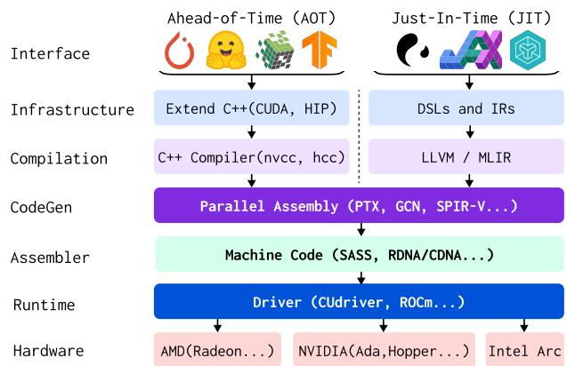  
Figure 2: Complex GPU Ecosystem divided in two branches AOT (left) and JIT (right) unified at parallel assembly layer.

Similarly, the GPU memory is also hierarchically organized. First, each thread holds private registers (RMEM, at most 255 32-bit regs per thread on A100) as a primary resource. Blocks have CU-level shared memory (SMEM, at most 164KB on A100) as the temporary buffer for results and communications. Finally, there’s GPU-level global memory (GMEM, 80GB on A100) for grid-level synchronization and kernel input/output. GPU in the Operating System Paradigm: Positioned as an accelerator that communicates with the host OS via the driver, GPU programs are centralized with kernel functions, the entry for GPU computing whose content will be executed on the GPU while the rest of the program remains on the host CPU. Specifically, GPU kernel is considered atomic to the host OS, i.e., the execution inside the kernel is managed by GPU hardware/firmware and is invisible and untouchable to the host OS, which prohibits observing GPU programs through mature OS technologies like ptrace or eBPF [24].

Apart from the host, profiling on GPU threads is also difficult as the systematic functionalities of GPU threads are highly limited. GPU programs are of direct execution without a management layer like the OS kernel. Particularly, there is no support for timer interrupts, a crucial feature for samplingbased profilers. Therefore, profiling techniques on traditional OSs, e.g., sampling and scanning the stack frame, are not applicable to GPUs. Moreover, there are no commonly supported disk I/Os, making it troublesome to save results.

Assembly as a Probing Interface: The unique characteristics of GPU programming pose great challenges in building NEU-TRINO, a fine-grained, versatile, and programmable GPU profiling tool that is kernel-inclusive and hardware-independent. The key question we need to answer is: at which layer should NEUTRINO be built and how? In this paper, among all the choices in Fig. 2, we choose the parallel assembly, such as PTX/GCNAsm [4, 60] designed to adapt to rapid changes in system and machine code, as the probing interface. Importantly, instead of static approaches, such as customizing profiling passes [21] via compilers or naive asm() in C, we employ a more capable but challenging approach, attaching probe(s) at runtime, which minimizes usage overhead (e.g., recompiling) for changing or enabling/disabling probes. This design choice not only allows forward- and backward-compatibility, but also promises distinct advantages in various aspects:

❶ Hardware-Oriented: As a low-level interface, assemblies can capture hardware events that are important for performance analysis but hard to track with high-level languages. For example, there are only four related instructions in PTX for memory access, i.e., ld, st, cp.async, and tensormap. In contrast, with objects and templates in CUDA C++, it is difficult to classify and capture all possible memory access.

❷ Special Registers / Instructions: Special registers of parallel assemblies contain useful runtime information for profiling. For instance, hwreg of GCNAsm tells which compute unit the thread is scheduled on, while PTX’s special registers %clock (in CU-local clock cycles) and %globaltimer (in GPU-local nanoseconds) are helpful to measure the timestamp and can be used as instruction-level timers as shown in Fig. 3.

❸ Compatibility: As shown in Fig. 2, parallel assemblies are the highest common layers of the AOT and JIT compilations. For example, PTX is the common output of CUDA C++ compiled by gcc-based nvcc [54] and DSLs, e.g., Triton backed by LLVM [86]. Thus, probing on assemblies can be compatible with most infrastructures, while compiler-based approaches are limited to the specific compiler or IR(s).

❹ Coverage: Compiler-based approaches require source code, assuming that users have located the poor-performing GPU kernel, which is uncommon as most programs have many kernels. Instead, runtime approaches can cover all user codes, capable of scanning poor-performing kernels.

The design choice of assembly-layer runtime probing also poses unique challenges, such as securing probes without compiler support, locating GPU code in the runtime, obtaining high-level contexts, etc. We overcome these challenges in NEUTRINO and enable it as a powerful GPU profiler.

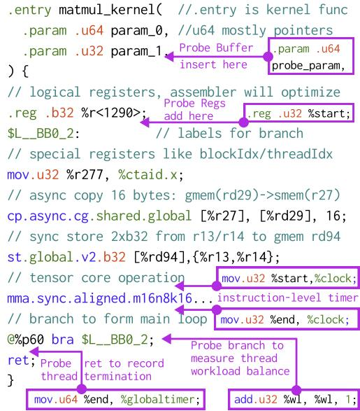  
Figure 3: Parallel assembly example (PTX) with possible probing positions and corresponding functionalities.

## 3 NEUTRINO Design

NEUTRINO aims to formulate a simple yet powerful probe design like eBPF probe [24] to profile GPU kernels with the finest granularity to capture instructions, versatility to cover time- and value-profiling, and programmability for users to customize probe(s). Due to the massive parallelism of GPUs, NEUTRINO targets lightweight probes that only operate at tracepoints with the least disturbance to the remaining.

## 3.1 Programmable Probing Interface

As shown in Fig. 4, NEUTRINO features three key elements in its probe design: snippet, tracepoint, and structured map: Snippet: Same as the probing target, NEUTRINO’s snippet is assemblies, with some helpers such as SAVE for logging results and OUT/IN1/IN2 for reading registers (instruction operands) for value profiling. Developers can also use other assembly features, especially S\_MEMTIME for time profiling.

Tracepoint: NEUTRINO formulates probe tracepoints primarily at the finest instruction level, which assures both temporal accuracy and hardware granularity such as wmma/mma for tensor core operation. By grouping instructions, NEUTRINO’s tracepoints can be extended to larger scales such as device function calls and thread start/end.

Map: Similar to eBPF [48], NEUTRINO’s map explicitly structures the saving format to address the problem of persistence, a troublesome issue on GPU due to race conditions from parallelism and huge metadata from hierarchical organization. NEUTRINO mainly defines maps at two levels (§3.3): ❶ thread-level: every thread saves, for value profiling; ❷ warp-level: only warp leader thread saves, for time profiling.

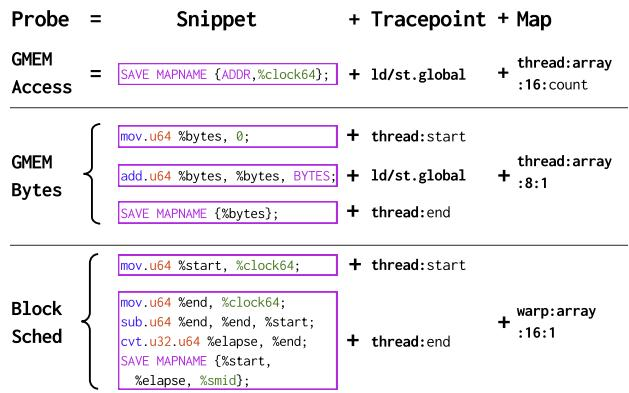  
Figure 4: NEUTRINO programmable probing interface. Probes consist of snippet, tracepoint and structured map. Snippet can use helpers such as SAVE for storing values to NEU-TRINO Map (§3.3). Multiple probes at different tracepoints can compose more comprehensive tasks like block\_sched.

Beyond the three components for formulating customizable probes, the key design of NEUTRINO’s programmability is cooperativeness: ❶ NEUTRINO probes of the same thread can cooperate by leveraging registers as temporal storage for advanced profiling tasks while maintaining efficiency as register usage is parallel in GPU cores. ❷ NEUTRINO probes can also cooperate with maps in GMEM, i.e., different probes can contribute to and cooperate through the same map.

## 3.2 Virtualized Probe Execution Model

Since the GPU program is static to the OS, i.e., all code (assembly) is loaded and known before execution, we choose to directly place probes in the original assembly without protection, e.g., stack, to achieve cooperativeness. We identify that by doing so, NEUTRINO probes are still executed virtually from the original program. As shown in Fig. 5A, such virtualization is achieved via time and resource separation:

Time Separation: The time virtualization of NEUTRINO originates from the SIMT execution model of GPGPU, where parallelism happens among threads while execution within a thread is generally sequential with one instruction at a cycle. Thus, as probes are directly inserted into assemblies, their time separation from the original program will be guaranteed. Resource Separation: Similar to CPU, GPU threads also have thread-private registers as their primary resources, which contain intermediate results from ALU, addresses of shared or global memories, etc. NEUTRINO virtualizes the probe registers by separating an independent register group, as well as other resources like GMEM. Thus, NEUTRINO probes can avoid affecting the original program’s resources, and the execution flow. It is worth noting that NEUTRINO’s probe register group is declared logically at the assembly level rather than physically. Therefore, NEUTRINO may not necessarily introduce extra physical register usage (Tab. 3) because the declared logical registers will be integrated into physical registers by the assembler in register allocation, with independence between probes and the original program preserved by dependency tracking algorithms [39, 72].

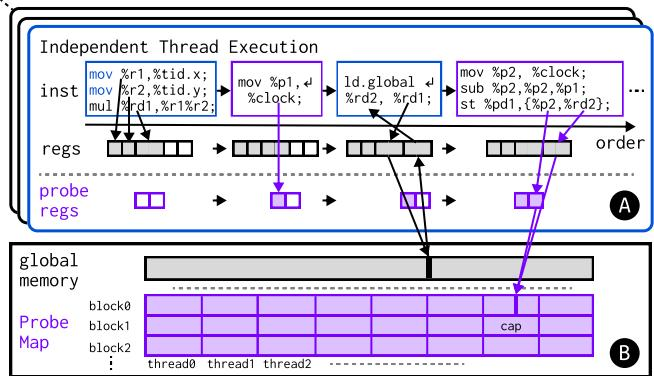  
Figure 5: NEUTRINO probe execution model. ●A Probes are executed virtually under time and resource (register and global memory) separation; ●B NEUTRINO’s Probe Map for racefree and metadata-efficient persistence: Each thread finds its segment of map via its threadIdx and blockIdx.

## 3.3 Structured Map for Persistence

Persistence is a critical challenge for GPU profiling. Although thread executions are parallel and independent, the underlying memory system is shared, leading to race conditions among concurrent savings. Thus, previous solutions [80, 93] widely use atomics for separating persistence spaces, which can become inefficient under massive parallelism. Moreover, the GPU hierarchical organization creates rich metadata such as threadIdx and blockIdx (24 bytes), which is informative for analysis but can be storage-hungry [93].

Inspired by the design of lock-free per-cpu eBPF maps [48] and event buffers of HIPAnalyzer [21], we explicitly structure NEUTRINO map to an ndarray layout, as shown in Fig. 5B, with the shape determined by launch configurations (blockDim, gridDim) and the map definitions (level, type, size, cap). This enables race-free saving as each thread has an independent segment and reduces storage pressure as most metadata can be inferred rather than directly saved. NEU-TRINO mainly formulates maps at two levels:

Thread-Level: The thread-level map is mainly designed for value profiling where every thread independently saves data. Its layout is in the form of [#Grid, #Block, cap] and each element is of size. #Grid and #Block can be inferred by launch config gridDim and blockDim, respectively. cap specifies the maximum number of savings per thread, which can be set to a suitable value, or measured dynamically by running a counter probe3 in the runtime.

Warp-Level: The warp-level map simplifies the thread-level map for time profiling with layout [#Grid, #Warp, cap]. Because threads within the same warp are scheduled together for the same instruction, recording event timestamp only needs one thread inside the warp other than all, which can significantly reduce the memory and storage pressure.

Based on these two levels, NEUTRINO can extend different types of maps, such as the simplest array, or advanced ring (ring buffer) and hash to support versatile user needs.

## 3.4 Verification for Security

Verification [28, 84] has been proven vital for programmable probes [24] as unsafe probes can break the execution flow of the original program and invalidate the profiling. The verifier can also help guide developers in writing correct probes. In NEUTRINO, we identify and prevent three key security issues: Overwrite Original Registers: As discussed in §3.2, GPU threads use registers as primary resources. Thus, modifications of registers used by the original program are unsafe. For example, modifying a register holding address to global memory could lead to illegal memory access (Fig. 6A). Thus, NEU-TRINO requires probes to use independent register groups, and prohibit probes that modify original registers.

Program Misorder: Although the SIMT program model guarantees that instructions within the thread are executed linearly, there are flow control instructions, such as S\_BRANCH (GCNAsm) or bra (PTX), that may change the execution order, which are unsafe for probes as they may break the original execution order (Fig. 6B). Thus, NEUTRINO prohibits probes from instructions that change the execution flow.

Shared Memory: As an important factor for acceleration, the shared memory has been highly optimized for storage [17,91] and access efficiency [89]. Thus, additional shared memory usage from the probes may greatly affect or fail the execution if the original usage is already at the hardware limit. Thus, NEUTRINO prohibits probes from using shared memory.

## 4 NEUTRINO Implementation

We implement NEUTRINO in Linux for NVIDIA GPU with CUDA driver and AMD GPU with ROCm/HIP runtime. Our implementation consists of three major components: ❶ a hook driver (§4.1, ≈2,500 lines of C code) to provide runtime support for assembly tracking, code caching, etc; ❷ a probe engine (§4.2, ≈2,000 lines of Python code) to instrument parallel assemblies; ❸ a DSL compiler (§4.3, ≈1,000 lines of Python code) to translate probes in platform-agnostic Python Tracing DSL into platform-specific assemblies (PTX for CUDA and GCNAsm for ROCm/HIP). We implement the core probing engine and the DSL compiler in Python to make the infrastructure more approachable and extensible for developers. Besides, we also provide utilities (§4.4), such as ecosystem integrations, analysis code generations, etc.

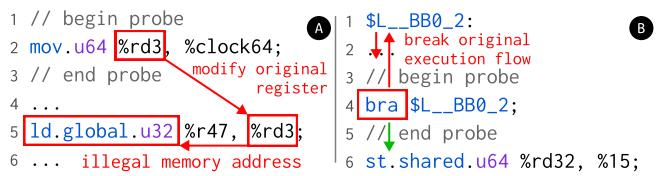  
Figure 6: NEUTRINO verification against two unsafe operations: ●A overwrite original regs; ●B change execution flow.

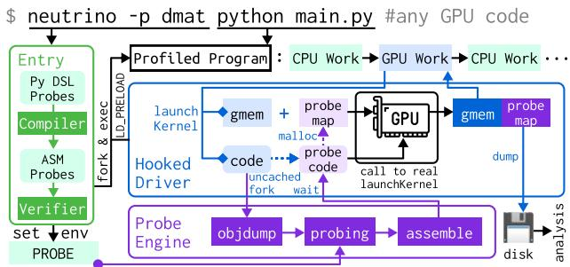  
Figure 7: NEUTRINO workflow. Entry loads and JIT compiles (§4.3) probes, and injects hook driver. Hook driver (§4.1) captures GPU workloads, invokes probe engine (§4.2), allocates probe buffers, launches probed kernel, and dumps results.

Finally, we wrap these modules as a command-line interface similar to bpftrace [13] and valgrind [74]. As shown in Fig. 7, when a user invokes neutrino with the probe dmat via -p/–probe argument, the entry will load, compile, and verify the probe (.py) into platform-specific assembly (.asm) wrapped in TOML [68]. Then the entry will set environment variables, such as NEUTRINO\_PROBE for probe contents and the special LD\_PRELOAD to inject the hook driver, and fork a child process to launch the workload. Throughout the execution, the hook driver will continuously capture the GPU workload, particularly the GPU kernels launched. For each uncached GPU kernel, the hook driver will invoke the probe engine, which objdump, probe, and reassemble the kernel. After loading back the probed kernel, the hook driver allocates probe buffers on CPU and GPU, and launches the probed kernel. Upon completion, the hook driver will dump probe buffers containing metrics and give back control to user programs.

## 4.1 Hook Driver

Though drivers in OS are mostly referred to kernel extensions exposed via read/write/ioctl syscall, such as nvidia.ko, most vendors also maintain higher-level user-space drivers as shared libraries such as libcuda.so or libamdhip.so in Linux. These driver shared libraries are often highly complex and closed-source. However, given that symbols in ELF are resolved via their signatures, we can build a clever hook driver by defining all functions with matching signatures and using dlfcn internally to locate and call the real function from the actual driver (More details in Appendix B). Compared with other approaches like eBPF uprobe [24], our hook driver is safer and more flexible as all code is executed in the user mode, supporting fork/wait that are important for interactions with the probe engine. We leverage the hook driver to provide the following supports:

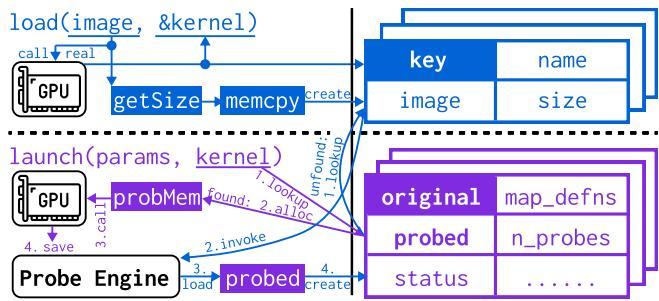  
Figure 8: NEUTRINO hook driver infrastructure. Hook driver catches load and launch API for loading images and launching kernels on GPU, respectively. Hook driver maintains two hash-based [33] storage for image (upper) to map kernel to binary image, and kernel (lower) to avoid repeated probing.

Code Tracking: Compared with CPU code implicitly loaded by the OS, GPU code, in the ELF [25] or FatBinary [56] format, requires an explicit load via cuModuleLoad. Other functions, such as cuModuleGetFunction may also be applied to locate the specific kernel from the module. We hook these APIs (Fig. 8) to capture all images loaded, kernels extracted, and the mapping from kernels to code. Each image is memcpyed into the image storage with size from its header to avoid being freed by resource management of user programs. Runtime Probing: As the execution is non-local, launching GPU kernel functions is not simply adding stack frames but requiring an explicit driver call to cuLaunchKernel or hipModuleLaunchKernel. We hook these APIs to provide runtime support: ❶ It searches for the probed kernel in the kernel storage via the original kernel (a pointer); ❷ It allocates probe buffer(s) according to the metadata; ❸ It launches the probed kernel and synchronizes for the finish, i.e., probe buffers on GPU are of metric readings; ❹ It memcpys probe buffer back to CPU, then fwrites and frees probe buffers.

More importantly, when the probed kernel is not found in the kernel storage, the hook driver is also responsible for interacting with the probe engine: ❶ It searches for the binary containing the kernel in the image storage. ❷ It fwrites the binary in the directory and forks a subprocess to invoke the probe engine. ❸ After waiting, it looks up the directory and loads back the probed kernel and metadata, e.g., number of probes. ❹ Finally, the probed kernel and metadata will be added to kernel storage. Failed kernels will also be added to kernel storage with status=false to avoid repeating.

Other functions are unhooked and we auto-generate them by parsing the header cuda.h/hip\_runtime.h and the symbol table of the shared library, such as libcuda.so.

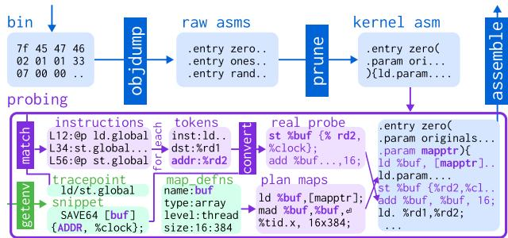  
Figure 9: NEUTRINO probe engine workflow. Probe engine objdumps and prunes the binary, and finally reassembles it. In probing, it uses map defns to plan probe buffers and tracepoints to match instructions. It also fills helpers in snippets with tokens before injecting them into assemblies.

## 4.2 Probe Engine

As shown in Fig. 9, NEUTRINO probe engine first objdumps the dumped GPU binary to extract parallel assemblies in text format. Then it will use the kernel name to match and prune the many-kernel raw assemblies into a single-kernel assembly while keeping global definitions and device functions.

Next, NEUTRINO will process and add the probes read from environmental variables, involving the following steps: ❶ It plans probe map(s) that directs each warp/thread to its segment(s) of map(s) according to the map definition (§3.3, level/type/size/cap) and thread indexes, e.g., threadIdx, as detailed in Appendix C. ❷ It coarsely parses the kernel assembly into parameters, register declarations, and instructions. Then it matches the tracepoints to specific instruction(s). ❸ It thoroughly parses each matched line (e.g., ld.global.u64 %rd1, [%rd2];//%rd1=\*%rd2) into tokens, such as opcode (ld.global.u64) and operands %rd1, %rd2. Then it fills the helpers in snippets, such as ADDR, to the real register %rd2. Finally, it places snippets before/after matched instructions, as well as the map addresses at the end of kernel parameters, and the assembly of map planning at the kernel beginning.

After probing, it converts the probed assemblies into machine code via assemblers such as ptxas [61]. The probe engine will also save kernel metadata useful for the hook driver, such as the probes, maps, callbacks, etc.

## 4.3 Probe DSL and Compiler

A practical issue of the probe engine is that probes are of assemblies, a low-level and hardware-dependent language. Direct assembly programming may be less friendly for general developers. Thus, to enhance NEUTRINO’s hardware independence and usability, we propose a minimalistic Python domain-specific language (DSL) as the high-level interface for NEUTRINO probes, similar to bpftrace [13] for eBPF [24]. Note that DSL is optional for NEUTRINO, experienced developers can still handcraft assemblies for advanced usages.

As shown in Fig. 10, the NEUTRINO DSL closely follows the Python syntax, allowing users to declare probes with the @probe decorator over functions with tracepoints specified as decorator arguments and the snippet as the function body. Similarly, maps can be declared with @Map decorator with the structure defined as class members. Moreover, contexted probe registers shared across probes can be defined via value assignment syntax with types annotated in the global scope. NEUTRINO probes are not allowed to use other functions like open. Instead, we provide helper operands like nl.addr for reading registers and helper functions like nl.clock() and Map.save() for getting device-side clocks and saving results.

This DSL will be just-in-time compiled into the platformspecific assembly-based probes in two steps, with a compilation example of Fig. 10 in Appendix D: ❶ It uses Python’s ast module to parse and transform the Tracing DSL to an intermediate representation (IR) similar to the eBPF ISA [90]. ❷ The IR will be translated into platform-specific assemblies, i.e., PTX Assembly and GCNAsm, and helper operands will be preserved for the probe engine. We design the IR to be eBPF-like, potentially enabling reuse of mature eBPF toolchains, such as the reputable eBPF verifier [28].

## 4.4 Utilities

Ecosystem Integration: Solely hooking onto the driver or probing at the assembly would lack high-level info like tensor shapes that are useful for analysis. Thus, we also implement utilities for ecosystem integrations like PyTorch [8] by Python sys.settrace to expose high-level tensor information.

Benchmarking Mode: To evaluate system overhead and provide time alignment for heavy probes, NEUTRINO provides a benchmark mode that launches both the probed kernel and the pruned kernel (stripped of probes and assembled with identical configurations) with CUDA/HIP event timers to benchmark the additional execution latency caused by probes.

Analysis Codegen and Callback: To facilitate analysis, NEU-TRINO supports generating tracing parsing code in Python based on the map definition (such as Fig. 10) to facilitate users extracting information from traces, with an example in Appendix E. Moreover, NEUTRINO supports adding callbacks (such as Line 3 of Fig. 10) for automated posterior analysis. Source Code Annotation: To give more precise control, we implement a source code annotation tool in NVTX-like API [59]. The probe engine can look up the lineinfo (special comments, e.g., ".file 1 example.py" and ".loc 1 33 45") and cross-reference with the source code (line 33 of 1st file, example.py) to include or exclude the instruction.

## 4.5 Extending NEUTRINO to Other Platforms

Though the current implementation only supports NVIDIA and AMD GPUs, NEUTRINO can be extended to other platforms, such as Intel oneAPI [26]. NEUTRINO’s hardware independence originates from its design on the two common components across platforms: parallel assembly to accommodate rapid architecture-level evolution, and the driver to control the execution from the host OS.

```python
from neutrino import probe, Map
import neutrino.language as nl
CALLBACK = "block_sched.py" # for trace analysis
# declare maps for persistence
@Map(level="warp", type="array", size=16, cap=1)
class block_sched:
start: nl.u64
elapsed: nl.u32
cuid: nl.u32
# declare probe registers shared across probes
start: nl.u64 = 0 # starting clock
elapsed: nl.u64 = 0 # elapsed time, initialized to 0
# define probes with decorator
@probe(pos="kernel", level="warp", before=True)
def thread_start():
start = nl.clock()
@probe(pos="kernel", level="warp")
def thread_end():
elapsed = nl.clock() - start
block_sched.save(start, elapsed, nl.cuid())
```  
Figure 10: NEUTRINO DSL probe example. Each warp has probe register, e.g., start, and saves a block\_sched.

In practice, to extend NEUTRINO to other platforms, one needs to implement the hook driver, probe engine, and (optional) DSL compiler backend. For the hook driver, as most functionalities are standardized to platform-agnostic modules, we expect most changes to be around API renaming and debugging, e.g., cuLoadModule to hipLoadModule for ROCm/HIP support. Regarding probe engine, a new parser and matcher for the different assembly syntax (e.g., GCNAsm [4]) shall be needed, but the overall infrastructure (Fig. 9) remains unchanged. The DSL compiler needs a backend to translate our eBPF-like IR into assembly. We expect this would be similar to how Triton [91] supports new hardware with extended codegen (like our probe engine and DSL compiler) and launcher (like our hook driver).

## 4.6 Usage: Putting It All Together

The above components shape a user-friendly and easy-to-use profiling tool of NEUTRINO. Compatible with many frameworks such as PyTorch [8], Triton [91] and JAX [27], the usage of NEUTRINO is as simple as bpftrace, with many builtin tools such as block\_sched (Fig. 10) to check the block scheduling cost of kernels. NEUTRINO’s user-friendliness is best demonstrated through a simple example, where we try to profile the following line of PyTorch code and gain insights:

torch.zeros((4096,4096),torch.float16,device="cuda")

To do so, a user just needs to run the NEUTRINO CLI with the –probe/-p option:

\$ neutrino -p block\_sched python -c "torch.zeros(...

Then, when finished, traces will be placed in a directory with a print-out message from the analysis callback as follows:

vectorized\_elementwise: # kernel name, truncated   
No.block:32768 Exec:680869 Sched:142674 (cycle/SM)

Here the vectorized\_elementwise kernel [88], widely used by unary tensor operations, is used for initializing allocated memory with zeros. We measure the scheduling time by simulating the block dispatching to CUs. For every recorded block on the CU, if its start clock is greater than any existing block’s end clock (start + elapsed), then a block replacement happens with scheduling cycles estimated by the next start - the previous end and execution cycles measured by the previous elapsed (Complete code in Appendix E).

The profiling results reveal a surprising ∼ 20% time spent on scheduling blocks to physical SMs as the kernel launches a huge number (32,768) of blocks and the execution time of each block is relatively small. Based on the insights, one can optimize the performance by reducing the number of blocks launched by the kernel. To do so, we can use the CUDA memset or instruct LLMs to write a persistent kernel (examples in Appendix F) that fixes the number of blocks to the hardware limit. To apply customized initialization, we replace torch.zeros with torch.empty that allocates memory without initialization, and add a line of cuMemset or zero\_persistent. This modification offers ∼ 28% speedup:

```julia
# Original kernel time: 34,493 ns
torch.zeros((4096,4096),torch.float16,device="cuda")
# Updated memset time: 24,630 ns
t=torch.empty((4096,4096),torch.float16,device="cuda")
driver.cuMemsetD16(t.data_ptr(), 0, 4096*4096)
# Updated zero_persistent kernel: 24,891 ns
zero_persistent(t) # code in Appendix F
```

The above one-line debugging example demonstrates the capability and simplicity of NEUTRINO to pinpoint performance bottlenecks within the kernel. Note that NEUTRINO also supports more advanced usage beyond the above example, including profiling the whole model with other interesting tools:

\$ neutrino -p tensorop\_count # number of tensor op   
\$ neutrino -p gmem\_bytes # number of GEMM bytes used   
\$ neutrino -p dmat # draw DMAT Plot   
\$ neutrino -p <to/be/contributed/by/you>

## 5 NEUTRINO Visualization

In this section, we introduce the Densified Memory Access Timeline (DMAT) plot, an insightful visualization of GPU runtime workload behavior, as presented in Fig. 1 and Fig. 11.

DMAT plot is inspired by the page reference map [11, 22], which shows the virtual time as the x-axis and page accesses as the y-axis, where a point represents an access to the page at the time. As a reference standard, page reference maps have proven to be a useful tool for research on virtual memory management [11] and replacement algorithms [10].

To accommodate the massive parallelism of GPU, DMAT extends the original page reference map in two perspectives: Physical Time: Page reference maps [11, 22] and general memory tracers [66, 74] commonly use a thread-local autoincremental index as the virtual time denoting the access order. However, we find that the virtual time is insufficient under parallelism where each thread only holds part of the entire page reference map. Because starting times and execution paces of threads diverge, there will be unavoidable misalignment among the virtual time when aggregating page reference maps from individual threads to form the complete trace.

Hence, for DMAT we use the device-side physical time to provide reliable aggregation. Specifically, we provide two types of DMAT: ❶ Normalized to the starting clock (Fig. 1, Fig. 11) of unsynchronized CU-level clocks, suitable for analyzing algorithm behavior; ❷ Synchronized to a less accurate (MHz) GPU-local timer (Fig. 15), representing actual memory access for hardware/cache analysis (Appendix G). Page Access Density: Previous page reference maps are in 2D, where a point denotes an access at the time to the page. However, for highly parallelized environments, there are likely many concurrent accesses to the same page at the same time from multiple threads. We record such parallel access intensity as density and mark it as color depth to distinguish it from the temporal frequency in traditional page reference maps [11, 22], highlighting the new informative dimension spanned for analyzing the effect of parallelism.

The proposed DMAT not only facilitates traditional memory analysis on GPU (e.g., data races, access anomalies), but also features unique benefits for GPU runtime analysis:

■ Color Depth: The color depth in DMAT denotes the density of parallelization. When aligned to the GPU-local timer, it reflects the real memory load, with shallow regions pinpointing uncoalesced access among threads and excessive intensity indicating potential memory I/O contention. When aligned with the starting clock, color depth reflects the divergence among threads where pale patterns usually indicate divergent thread executions or imbalanced workloads that may waste the computing power.

■ Empty Holes: Empty holes in DMAT demonstrate that pages remain unused for a significant amount of time, which includes two cases (Fig. 11b): ❶ Discrete empty holes usually reflect computing within CUs. The duration reflects the operational intensity [95] per main loop, where a too long empty holes might be inefficient in pipelining [20]; ❷ Structured empty holes usually reflect algorithm improvements, while extra-large structural empty holes may reflect time fragmentation and optimization opportunities.

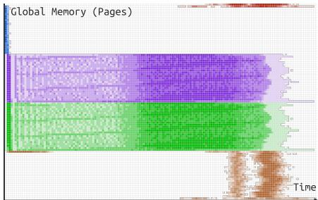  
(a) Flash-Attn v2 (Triton) [19] with shared block

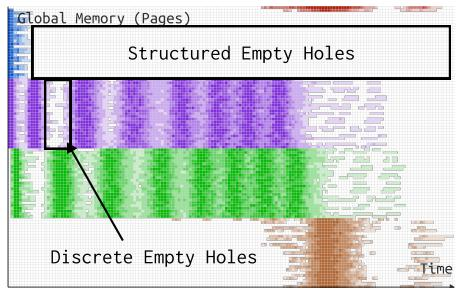  
(b) Flash-Attention-v1 [20]

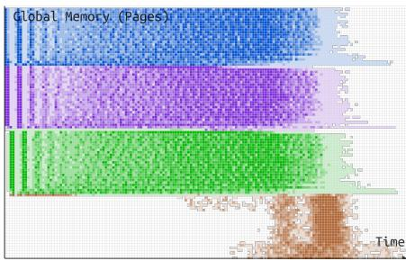  
(c) Memory-Efficient-Attention [69]  
Figure 11: NEUTRINO DMAT plot (captured on RTX3080, Appendix A) for different attention algorithms, which exhibit distinct memory access patterns. (a) differs from Fig. 1 with exclusive SM. By comparing the DMAT of different algorithms, we can visually identify the improvement of (b) FlashAttn-v1 [20] w.r.t. (c) Memory Efficient Attention [69] comes from I/O efficiency, while the gain of (a) FlashAttn-v2 (Fig. 1) comes from better pipelining, both consistent with their respective claims.

## 6 NEUTRINO Evaluation

We conduct evaluations to answer the following questions on the reliability and usability of NEUTRINO: Are NEUTRINO’s results trustworthy (§6.1)? How much performance and resource overhead does NEUTRINO introduce (§6.2)? How effective is NEUTRINO in profiling real applications (§6.3)?

Our evaluation is performed on two platforms, NVIDIA A100 80GB GPU and NVIDIA RTX4090 24GB GPU. NEU-TRINO is compiled with gcc-11.4.0. Other software used includes Python 3.11.4, CUDA 12.6, PyTorch 2.5.0, Triton 3.1.0, CUTLASS 3.5.0, and Ubuntu 22.04.

## 6.1 Correctness Validation

We identify and verify two types of correctness: ❶ Execution Correctness that ensures the probing will not alter the original execution flow; ❷ Profiling Accuracy that ensures the metric reading from NEUTRINO is reasonable and correct.

Execution Correctness: We validate the execution correctness by comparing output differences between the probed and original kernels, as any difference in execution flow will likely change the output or corrupt the system. To do so, we run each test twice, one with NEUTRINO probes and one without probes (i.e., the original execution) under identical input and configurations. The results show no significant differences between the probed and original outputs.

Profiling Accuracy: We verify the profiling accuracy from two perspectives. For metrics overlapped with other profilers like Nsight Compute [58], (block\_sched, gmem\_bytes, and tensorop\_count), we run the same program separately with NEUTRINO and Nsight Compute, and compare their metric readings. The captured results give consistent metric readings.

Regarding new metrics beyond the scope of existing profilers, particularly DMAT (§5), we validate their correctness by profiling carefully designed "micro-benchmarking" kernels having expected theoretical metric values, and comparing with the actual metric readings. We design micro-benchmarking kernels using ld/st instructions with L1 cache disabled, for memory access, and spin-based sleeping to controllably simulate computation inside CUs. We implement several memory access patterns: Linear, Strided, Gather, Scatter, and Random. We emulate these access patterns on the CPU, with addresses, normalized to base addresses, derived from the access pattern’s code, and intervals (in cycles) between consecutive accesses estimated by the sleeping time and memory latency.

We compare theoretical estimations and actual readings to evaluate: ❶ Address Consistency: Calculated as Hamming distance between emulated and profiled address sequences; ❷ Clock Errors: Measured as the differences of intervals between consecutive accesses within threads; ❸ DMAT Similarity: Computed as RMSE between DMAT (treated as matrices). Tab. 2 demonstrates that DMAT can correctly capture memory addresses (with Hamming distances of zeros) and achieve less than 200 cycles time resolution (< 7% of the loop time). Accumulated clock errors will lead to a misaligned timeline for DMAT, resulting in high RMSE errors, which are marginal for coalesced accesses (e.g., stride), yet become considerable for uncoalesced accesses, e.g., ∼ 60% error for linear. It is because uncoalesced accesses have a lower average intensity (∼ 16) as normalization bases and experience more variable memory latencies (∼ 190 cycles clock errors). As detailed in Appendix H, large DMAT errors are mainly due to the static emulation not considering memory system dynamics, e.g., cache, rather than profiling, which we reserve for future work.

Table 2: DMAT micro-benchmark w.r.t. theoretical metrics.
<table><tr><td>Kernel</td><td>Address Consistency Hamming Distance</td><td>Clock Errors Mean (Normalized)</td><td>DMAT Similarity RMSE (Normalized)</td></tr><tr><td>linear</td><td>0</td><td>190.1 (6.30%)</td><td>9.54 (59.62%)</td></tr><tr><td>stride</td><td>0</td><td>96.20 (3.42%)</td><td>277.4 (5.21%)</td></tr><tr><td>gather</td><td>0</td><td>58.11 (2.70%)</td><td>33.80 (0.44%)</td></tr><tr><td>broadcast</td><td>0</td><td>65.19 (3.01%)</td><td>192.5 (2.64%)</td></tr><tr><td>random</td><td>0</td><td>179.8 (5.98%)</td><td>221.7 (4.86%)</td></tr></table>

Table 3: Kernel slowdown and additional physical register usage of NEUTRINO: Kernel slowdown is normalized to original kernel latency and additional register usages are averaged based on assembler [61] debug information. NEUTRINO might lead to kernel speedup on lightweight probes, e.g., 0.9868x speedup of gmem\_bytes on GEMM, and we discuss this abnormal effect in §8 and Appendix K. dmat probe leads to different degrees of slowdown on different kernels, as discussed in depth in Appendix I.
<table><tr><td rowspan="2" colspan="2"></td><td colspan="2">block_sched warp:array:16:1</td><td colspan="2">gmem_bytes</td><td colspan="2">tensorop_count thread:array:8:1</td><td colspan="2">mem_trace</td></tr><tr><td>Kernel Slowdown</td><td>Additional</td><td>thread:array:8:1 Kernel</td><td>Additional</td><td>Kernel</td><td>Additional</td><td>thread:array:16:count Kernel</td><td>Additional</td></tr><tr><td rowspan="4">CUTLASS</td><td>Standard GEMM</td><td>0.9997x</td><td>Registers +4</td><td>Slowdown 0.9868x</td><td>Registers +4</td><td>Slowdown 0.9873x</td><td>Registers +4</td><td>Slowdown 8.8933x</td><td>Registers +1</td></tr><tr><td>Stream-KGEMM</td><td>1.0050x</td><td>+12</td><td>1.0022x</td><td>+12</td><td>1.0034x</td><td>+12</td><td>10.3709x</td><td>+6</td></tr><tr><td>Conv2D</td><td>1.0327x</td><td>+0</td><td>1.0934x</td><td>+0</td><td>1.1061x</td><td>+0</td><td>2.7463x</td><td>+28 (spill)</td></tr><tr><td>Group-GEMM</td><td>0.9804x</td><td>+8 (spill)</td><td>0.9798x</td><td>+8 (spill)</td><td>0.9796x</td><td>+8 (spill)</td><td>8.3589x</td><td>+516 (spill)</td></tr><tr><td rowspan="2">Triton</td><td>Flash-Attnv2</td><td>0.9999x</td><td>+2</td><td>1.0257x</td><td>+2</td><td>1.0256x</td><td>+2</td><td>2.9392x</td><td>+1.50</td></tr><tr><td>Batch/LayerNorm</td><td>1.0251x</td><td>+4.58</td><td>1.0951x</td><td>+3.54</td><td>1.0981x</td><td></td><td>5.4392x</td><td>+4.67</td></tr><tr><td rowspan="6">PyTorch</td><td>SoftMax</td><td>1.0004x</td><td>+4.5</td><td>1.0006x</td><td>+3.5</td><td>1.0006x</td><td>+3.25 +3.5</td><td>13.1630x</td><td>+8</td></tr><tr><td>Sum</td><td>1.0653x</td><td>+4</td><td></td><td>+2</td><td></td><td></td><td>4.4597x</td><td>+8.67</td></tr><tr><td>Max/AvgPool</td><td>1.0406x</td><td>+3</td><td>1.0389x 1.3882x</td><td>+2</td><td>1.0390x 1.3875x</td><td>+2.67 +2</td><td>7.2559x</td><td>+4</td></tr><tr><td>Embedding</td><td>1.0068x</td><td>+6</td><td>1.0009x</td><td>+4</td><td>0.9995x</td><td>+2</td><td>9.1155x</td><td>+6</td></tr><tr><td></td><td></td><td></td><td>0.9957x</td><td>+2</td><td>0.9782x</td><td>+2</td><td>5.5659x</td><td></td></tr><tr><td>Gather</td><td>0.9596x</td><td>+5</td><td></td><td></td><td></td><td></td><td></td><td>+6</td></tr></table>

## 6.2 Profiling Overhead

We evaluate two types of profiling overhead: ❶ Performance Overhead: the kernel slowdown due to probes can compromise the accuracy of time-related profiling; ❷ Resource Overhead: additional registers from probes, which may affect block dispatching or even lead to register spilling.

Performance Overhead: We formulate the kernel overhead as the slowdown from probe instructions normalized to the execution time of the original kernels. For better accuracy, we evaluate the kernel execution time via device event timers (§4.4). Results presented in each left column of Tab. 3 demonstrate the efficiency of NEUTRINO with controllable latency (1.04x on average) on lightweight probes i.e., block\_sched, gmem\_bytes and tensorop\_count, while heavy probes such as dmat introduce considerable slowdown (7.12x on average). And our analysis (Appendix I) shows that DMAT’s frequent memory I/O is the cause of the slowdown, and degrees of slowdown depend on the percentage of memory accesses and kernel execution time. Moreover, we identify that lightweight probes could abnormally accelerate the program, and our analysis (Appendix K) finds that it is because probe instructions can lead assemblers to better instruction flow (+5.88% IPC) and thus better performance (up to 0.94x faster).

Resource Overhead: We formulate the resource overhead as the difference in the number of physical registers used by the probed kernels compared to the original kernels. Results shown in each right column of Tab. 3 demonstrates the low overhead for NEUTRINO probes with 3.78 more registers used in lightweight probes and 5.09 more registers used in the heavy dmat probe. The phenomenon that each probe defines the same number of logical registers but uses varying and fewer physical registers also confirms the effectiveness of our design of using logical registers rather than physical ones, allowing potential optimization by the assembler.

## 6.3 Extensive Study

We further conduct two extensive studies evaluating NEU-TRINO’s applicability in evaluating real-world workloads: GMEM Usage in Model Profiling: In practice, developers need to profile the whole model, rather than a single kernel, to locate potential performance issues. GMEM usage becomes a constraint here as most GMEM is occupied by model parameters. Thus, we conduct an intensive test on NEUTRINO’s maximum GMEM usage in end-to-end profiling on the whole model inference pass. We select ResNet [34], Stable-Diffusion [71], Mamba-1.7B [31], and Llama3-1/3/8B [29].

The result shown in Fig. 12 demonstrates the efficiency of NEUTRINO’s memory usage, with lightweight probes being at least an order of magnitude smaller of the original memory footprint, especially for transformers like Llama. GMEM usage of the heavy dmat is mostly remains within the original memory usage, even under a large batch size (256). Moreover, by comparing the results of Llama-1B/3B/8B, we observe that the proportion of NEUTRINO’s GMEM usage relative to the original usage decreases surprisingly as the model scales. This finding demonstrates that the growth of NEUTRINO’s memory requirements is slower than model size scaling and highlights the usability of NEUTRINO in profiling larger models.

Profiler Exposed Latency: In addition to kernel slowdown, profilers also expose other noticeable latencies, including Prologue for allocating probe maps and calling the probe engine and Epilogue for copying back probe maps and saving traces to disk. The sum of these is the latency exposed to the upper layer. To evaluate the overall profiling efficiency of NEUTRINO, we compare their exposed latency with Nsight Compute [58] on overlapped metrics via application benchmarkers [8, 89, 91]. Results presented in Fig. 13 highlight the reduction of exposed latency and the efficiency of NEU-TRINO’s system design and implementation.

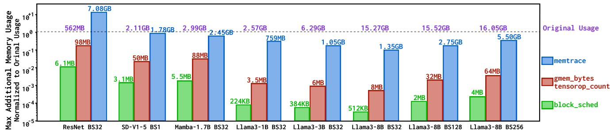  
Figure 12: Max probe memory usage of NEUTRINO in profiling model forward. Probe memory usage is log-scaled to original memory usage ((labeled in purple). gmem\_bytes and tensorop\_count have the same map definition and the same usage.

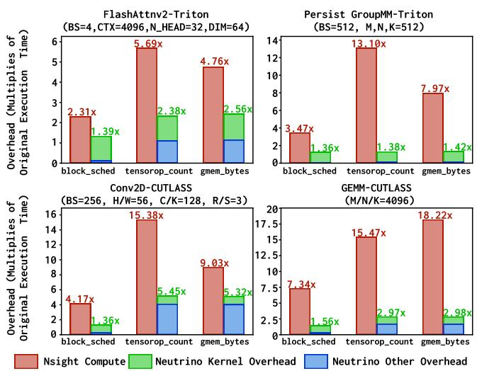  
Figure 13: Exposed latency comparison: NEUTRINO and Nsight Compute [58]. NEUTRINO latency is decomposed into prologue (<1%), kernel and epilogue latency.

## 7 Case Study with NEUTRINO Insights

We envision NEUTRINO to be a useful tool for GPU performance engineering, paving the way for optimizing ML systems with fine-grained runtime insights. This paper mainly focuses on the design and implementation of NEUTRINO, and thus, how to leverage profiles is not our primary goal. Nevertheless, to showcase how one could exploit NEUTRINO and DMAT plots for previously unavailable insights, we carry out one case study on the impact of synchronization:

Similar to hyper-threading on CPU, GPU SM Sub-Partition (the execution unit) also maintains multiple candidate warps (the scheduling unit in GPU), and in each cycle, one warp will be selected by the warp scheduler to run. Such a design can reduce blocked waiting of instruction completion, particularly for non-local operations like memory I/O, as other candidates can be scheduled to utilize the core. In practice, there could be two cases for these warps: ❶ All warps belong to the same block that might need synchronization; ❷ Warps belong to different blocks that are mutually independent.

To identify the potential runtime difference with respect to the difference in synchronization, we create a controlled pair on Flash-Attn-v2 [19] implemented by Triton [91]. We leverage Triton auto-tuner to create two kernels: ❶ Exclusive blocks: 128x128 tile, 2 stages, 8 warps, 1 block per SM (2 warps on each SMSP are of the same block); ❷ Shared blocks: 128x64 tile, 2 stages, 4 warps, 2 blocks per SM (2 warps on each SMSP can be of different block). The DMAT plot (aligned with kernel start time) traced by NEUTRINO on A100 are presented in Fig. 1A and Fig. 11a, respectively. Although these two configurations impose the same computational load on the SM and offer similar throughput, we can find that their memory access patterns are significantly different.

For exclusive blocks (Fig. 1A) with frequent synchronization, the memory access pattern is structured with a regular access pattern to K and V, confirming that the algorithm [19] uses one load for both K and V per main loop. However, for shared blocks with independent synchronization (Fig. 11a), the memory access pattern is unexpectedly unstructured with many tailing blocks (light-colored parts on the right).

To validate the tailing effect, we conduct more in-depth analysis via the block\_sched probe (Fig. 10) to analyze the elapsed time of blocks. From the CDF of elapsed time in Fig. 14A, we identify that the elapsed time of exclusive blocks is highly consistent, but varies significantly for sharing blocks (Fig. 14B) with a tailing effect of up to 24.69%4.

To further explore the tailing latency, we take a closer look at the program execution progress via probing the bra instruction (Fig. 3) that redirects the program to form the main loop. This probe samples program execution via recording the timestamp at each branching, which can be used to recover the timeline of the block’s working progress as shown in Fig. 14D. Furthermore, by taking the difference between sampled timestamps, we can further recover the intra-block-level throughput (TFLOP/s) timeline (presented in Fig. 14C).

From the sampled progress and throughput timeline, we observe an interesting phenomenon that every shared block experiences two stages: a slower stage at around 1.8 TFLOP/s followed by a faster stage at around 2.2 TFLOP/s till the termination. Moreover, by aligning the sampled timeline with start time and CU id, we identify that the transition from slow stage to fast stage is approximately when previously arrived shared block (executing at fast stage) terminates, suggesting an implicit FIFO-like prioritized scheduling policy. This finding explains the sparse-then-dense chaotic behavior in Fig. 11a and violates the common understanding of structured launch waves shown in Fig. 1A based on the algorithm [19]. Furthermore, we also identify similar effects on other kernels, e.g., GEMM (Appendix J), with 50.93% tailing effect and jumping from ∼ 5 TFLOP/s to ∼ 7.5 TFLOP/s, spotlighting the prevalence of the tailing effect in shared blocks.

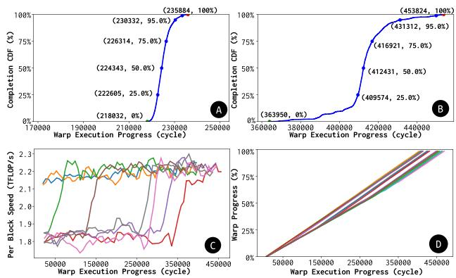  
Figure 14: ●A CDF of elapsed latency in exclusive blocks; ●B CDF of elapsed latency in shared blocks; ●C GFLOP/s distribution w.r.t. execution progress from left to right; ●D Progress timeline of shared blocks, with slope denoting speed. Every warp in shared blocks first experiences a slow stage (∼ 1.8 TFLOP/s) then jumps into a fast stage (∼ 2.2 TFLOP/s).

Regarding the performance, both exclusive and shared blocks are not optimal, yet have different performance statistics. Sharing blocks experience poor cache behavior due to the random-like memory access pattern, which can be verified by 5.85x higher stall cycles due to L1 miss from hardware profilers [55] in Tab. 4. Quite the opposite, exclusive blocks are so synchronized that they exhibit considerably peaked memory usage (Fig. 1B) and suffer from 4.47x higher exposed stall cycles due to memory bus busy and similarly, 1.45x more stall cycles for compute pipeline contention, both implying potential space for performance optimizations.

Table 4: Exposed stall cycles and reasons of FlashAttn-v2 under exclusive and shared blocks, collected from the Nsight Compute [58] PC Sampling.
<table><tr><td>Stall Reason</td><td>Exclusive Block</td><td>Shared Block</td></tr><tr><td>long_scoreboard (Waiting Global Memory)</td><td>41,055</td><td>268,941 (5.85x)</td></tr><tr><td>mio_throttle (Memory I/O High Pressure)</td><td>303,694 (4.47x)</td><td>68.005</td></tr><tr><td>math_pipe_throttle(Compute Unit Busy)</td><td>616,913 (1.45x)</td><td>425,026</td></tr></table>

## 8 Discussion and Future Work

NEUTRINO and GPU Scheduling: While we demonstrate the significance of NEUTRINO in revealing new insights from the runtime scheduling behavior in §4.6 and §7, current experiments are still far from completely understanding or reverse-engineering the GPU scheduling policies. This is because GPU scheduling is hardware-implemented, unlike OS schedulers like CFS or EEVDF [83,97], and is multi-level, including stream-, block-, and the finest warp-level instruction scheduling. Moreover, as a shared system, the behavior of the scheduler will be highly affected by runtime dynamics, which can also be reflected by the randomness of DMAT.

Impact of GPU Sharing: GPU sharing, i.e., concurrently executing multiple kernels, is a practical solution to utilize the GPU. Such sharing can be intra-process via CUDA/HIP streams, inter-process via MPS (Multi-Process Service), or with resource isolation via MIG (Multi-Instance GPU). NEU-TRINO is currently thread-local (will block thread until kernel finishes) and the scope is process-local (only profile the execution of the local process in MPS or MIG). We keep the impact of sharing as an interesting future direction.

Completeness of Probe Verification: We identified and prohibited three key factors of unsafe probes in §3.4, yet the current verification is not complete. ❶ There remain uncovered security factors, such as unreachable synchronization points that could pause programs. ❷ Current verification might be too strong, e.g., jmp could be supported if the target is within the probe [24]. GPU-kernel verification itself remains an open research problem, and existing works only address several perspectives, such as synchronization [76] or data races [40]. Thus, we keep probe verification as future work.

Abnormal Speedup of Probed Kernel: As shown in Tab. 3, NEUTRINO’s probed kernel might present better performance than the original kernel. Based on in-depth experiments (Appendix K), we attribute the speedup to the assembler optimization. In addition to translating assembly into machine code, modern assemblers also incorporate many optimizations, such as reordering instructions for better execution flow and merging reusable registers based on dependency tracking. Our analysis in Appendix K demonstrates that NEUTRINO probe’s additional registers and instructions may change register dependencies and can lead to better execution flow (with 5.88% IPC improvement) and better performance (up to 0.94x faster). We believe this counterintuitive observation promises new opportunities since assemblers and machine code are not widely explored due to their hardware-oriented nature. For example, recently, DeepSeek’s DeepGEMM [100] reported 10% speedup by flipping a control bit in machine code.

Towards Hardware-Software Profiler: As a pure-software profiling system primarily based on the assembly layer, NEU-TRINO cannot profile unprogrammable hardware events such as the cache miss, although the DMAT trace can be used for cache simulation [98]. Furthermore, its profiling is based on execution, so it is hard to trace stall cycles, i.e., no instruction scheduled, but it can still help diagnose stall cycles caused by memory I/O. Despite these drawbacks, NEU-TRINO can be an excellent complement to current hardwaredependent and kernel-exclusive kernel profilers by fusing the missing information on both sides. Moreover, from the big picture of observability, the multi-scale probing feature of NEUTRINO makes it an intermediate to bridge the gap between architecture-level hardware profilers [7, 55, 58] and application-level software profilers [12, 87]. Hence, we keep it as an exciting direction to integrate platform-specific hardware profilers and framework-specific software profilers to build a unified framework for GPU kernel profiling.

## 9 Related Work

GPU Hardware Profiler: Current GPU kernel profiling systems, such as NVIDIA NSight [58] / CUPTI [55] or AMD RGP [7] / GPA [5], are hardware-dependent that profiling features require corresponding hardware implementation support, such as performance counters like cache hit/miss rate. These features, though unique, are hard to adapt to new hardware, e.g., async tensor core that makes utilization metric [81] less reliable as computation is offloaded from threads to tensor cores. Moreover, they cannot be flexibly customized to meet the needs of developers. For example, hardware profilers can only profile the entire program in a sampling-based manner with low sampling frequency to control overhead in performance and resources, limiting its capability to trace user-specified events. Instead, NEUTRINO limits the profiling targets to only the desired tracepoints, achieving both fine-grained event tracing and low system overhead.

GPU Software Profiler: Other framework-specific software profilers, such as the built-in profiler of PyTorch [87] and JAX [27], are kernel-exclusive and can only capture higherlevel events, like measuring memory events (alloc/free) or timing the whole kernel (FLOP/s). Instead, NEUTRINO focuses on intra-kernel profiling at the instruction level.

GPU Micro-Benchmarking: Motivated to understand hardware design, GPU micro-benchmarking [1,38,51,64,85] tries to profile the idealized performance of specific hardware via specially designed workloads that only consist of interested instructions, such as mma to benchmark tensor core, without any other instructions (even those necessary in real workload, such as ld to read data) to reduce disturbance. Instead, NEU-TRINO aims to measure the performance of real workloads, rather than idealized workloads.

GPU Simulation: Another way to understand the performance is to use simulators [9,32,42,49,92] that emulate GPU execution at the cycle level on a CPU. The major problems of these simulators lie in the speed of both running simulations (which might need several days) and support for new hardware features and instructions (which might take several years). Moreover, various runtime dynamics, e.g., timing an instruction, may not be accurately profiled on simulators. GPU Instrumentation: Binary instrumentation [15, 24, 50, 74] that injects code, functions or interrupts, with program states as parameters has been proven powerful in building performance tools on the CPU. There are also some GPU binary instrumentation tools in compile-time such as Ocelot [23], HIPAnalyzer [21], CUDAAdvisor [77], CUDAFlux [14], or in runtime such as SASSI [82], NVBit [93] and GTPin [80]. Though compiler-based approaches may benefit from additional information in compilation, they are bound to a specific compiler, module, or IR, lacking generalizability. They also require source codes, limiting its compatibility with existing frameworks. Runtime approaches directly operating on machine code lacks sufficient virtualization, so they mostly rely on the protection of the stack via injecting pure device function, which prohibits cooperation between probes for advanced usages, making them hard to perform tasks such as timing instruction (subtracting two clock readings) because the start time has been cleared on return and is not visible in the end timer’s context. NEUTRINO persists runtime, rather than compiler, to advance its generalizability and targets parallel assemblies, other than machine code, to support more advanced and complex profiling tasks with cooperative probes.

## 10 Conclusion

The rapid development of AI systems has fostered an urgent need for comprehensive insights through advanced GPU kernel profiling. To address this, we present NEUTRINO, a GPU assembly probing infrastructure that enables fine-grained, versatile, and programmable GPU kernel runtime profiling with its distinct probe design of snippet, tracepoint, and map. We implement NEUTRINO, consisting of the hook driver, probe engine, and DSL compiler, for the CUDA and ROCm ecosystems. We introduce the novel Densified Memory Access Timeline (DMAT) to effectively visualize comprehensive GPU memory access patterns. We conduct extensive experiments, validating NEUTRINO’s reliability, low overhead, and applicability. Additionally, we conduct a case study on the impacts of synchronization, successfully pinpointing performance bottlenecks with new insights gained by NEUTRINO. To maximize the potentials of NEUTRINO, we have open-sourced it at https://github.com/open-neutrino/neutrino and plan to build a collaborative community to support its continuous growth towards a unified framework for GPU kernel profiling.

## Acknowledgement

We thank our shepherd, Xiaosong Ma, and the anonymous reviewers for their valuable feedback. We also thank Sheng Lyu, Manwen Liao, and Weiying Hou for the constructive discussion. This work is supported by NSFC Grant No. 62222216 and Hong Kong RGC ECS Grant No. 27204522.

## References

[1] Hamdy Abdelkhalik, Yehia Arafa, Nandakishore Santhi, and Abdel-Hameed Badawy. Demystifying the nvidia ampere architecture through microbenchmarking and instruction-level analysis, 2022.

[2] Chih-Chieh Yang Adnan Hoque, Less Wright. Deep Dive on the Hopper TMA Unit for FP8 GEMMs. https://pytorch.org/blog/hopper-tma-unit/, 2024.

[3] Amey Agrawal, Nitin Kedia, Ashish Panwar, Jayashree Mohan, Nipun Kwatra, Bhargav Gulavani, Alexey Tumanov, and Ramachandran Ramjee. Taming Throughput-Latency tradeoff in LLM inference with Sarathi-Serve. In 18th USENIX Symposium on Operating Systems Design and Implementation, OSDI ’24, pages 117–134, Santa Clara, CA, July 2024.

[4] AMD. GCN Assembly. https://gpuopen.com/ learn/amdgcn-assembly/, 2024.

[5] AMD. GPU Performance API. https://gpuopen. com/gpuperfapi/, 2024.

[6] AMD. HCC Compiler for ROCm. https://github. com/ROCm/hcc, 2024.

[7] AMD. Radeon GPU Profiler. https://gpuopen.com/ rgp/, 2024.

[8] Jason Ansel et al. Pytorch 2: Faster machine learning through dynamic python bytecode transformation and graph compilation. In the 29th ACM International Conference on Architectural Support for Programming Languages and Operating Systems, Volume 2, ASPLOS ’24, page 929–947, New York, NY, USA, 2024.

[9] Yuhui Bao, Yifan Sun, Zlatan Feric, Michael Tian Shen, Micah Weston, José L. Abellán, Trinayan Baruah, John Kim, Ajay Joshi, and David Kaeli. Navisim: A highly accurate gpu simulator for amd rdna gpus. In the International Conference on Parallel Architectures and Compilation Techniques, PACT ’22, page 333–345, New York, NY, USA, 2023.

[10] L. A. Belady. A study of replacement algorithms for a virtual-storage computer. IBM Systems Journal, 5(2):78–101, 1966.

[11] L. A. Belady, R. A. Nelson, and G. S. Shedler. An anomaly in space-time characteristics of certain programs running in a paging machine. Commun. ACM, 12(6):349–353, June 1969.

[12] Emery D. Berger, Sam Stern, and Juan Altmayer Pizzorno. Triangulating python performance issues with

Scalene. In 17th USENIX Symposium on Operating Systems Design and Implementation, OSDI ’23, pages 51–64, Boston, MA, July 2023.

[13] bpftrace: High-level tracing language for Linux. https://github.com/bpftrace/bpftrace, 2025.

[14] Lorenz Braun and Holger Fröning. Cuda flux: A lightweight instruction profiler for cuda applications. In 2019 IEEE/ACM Performance Modeling, Benchmarking and Simulation of High Performance Computer Systems (PMBS), pages 73–81, 2019.

[15] Derek Bruening, Timothy Garnett, and Saman Amarasinghe. An infrastructure for adaptive dynamic optimization. In the International Symposium on Code Generation and Optimization: Feedback-Directed and Runtime Optimization, CGO ’03, page 265–275, USA, 2003.

[16] Chang Chen, Xiuhong Li, Qianchao Zhu, Jiangfei Duan, Peng Sun, Xingcheng Zhang, and Chao Yang. Centauri: Enabling efficient scheduling for communication-computation overlap in large model training via communication partitioning. In the 29th ACM International Conference on Architectural Support for Programming Languages and Operating Systems, Volume 3, ASPLOS ’24, page 178–191, New York, NY, USA, 2024.

[17] Tianqi Chen, Thierry Moreau, Ziheng Jiang, Lianmin Zheng, Eddie Yan, Meghan Cowan, Haichen Shen, Leyuan Wang, Yuwei Hu, Luis Ceze, Carlos Guestrin, and Arvind Krishnamurthy. Tvm: an automated end-toend optimizing compiler for deep learning. In the 13th USENIX Conference on Operating Systems Design and Implementation, OSDI’18, page 579–594, USA, 2018.

[18] Inho Cho, Seo Jin Park, Ahmed Saeed, Mohammad Alizadeh, and Adam Belay. LDB: An efficient latency profiling tool for multithreaded applications. In 21st USENIX Symposium on Networked Systems Design and Implementation, NSDI ’24, pages 1497–1510, Santa Clara, CA, April 2024.

[19] Tri Dao. FlashAttention-2: Faster attention with better parallelism and work partitioning. In International Conference on Learning Representations, ICLR ’24, 2024.

[20] Tri Dao, Daniel Y. Fu, Stefano Ermon, Atri Rudra, and Christopher Ré. Flashattention: Fast and memoryefficient exact attention with io-awareness, 2022.

[21] Sébastien Darche and Michel R. Dagenais. Lowoverhead trace collection and profiling on gpu compute kernels. ACM Trans. Parallel Comput., 11(2), June 2024.

[22] Peter J. Denning. Working set analytics. ACM Comput. Surv., 53(6), February 2021.

[23] Gregory Frederick Diamos, Andrew Robert Kerr, Sudhakar Yalamanchili, and Nathan Clark. Ocelot: a dynamic optimization framework for bulk-synchronous applications in heterogeneous systems. In the 19th International Conference on Parallel Architectures and Compilation Techniques, PACT ’10, page 353–364, New York, NY, USA, 2010.

[24] eBPF. https://ebpf.io, 2024.

[25] Executable and Linkable Format. https: //en.wikipedia.org/wiki/Executable\_and\_ Linkable\_Format, 2024.

[26] Unified Acceleration Foundation. oneAPI Programming Model. https://oneapi.io/, 2025.

[27] Roy Frostig, Matthew James Johnson, and Chris Leary. Compiling machine learning programs via high-level tracing. Systems for Machine Learning, 4(9), 2018.

[28] Elazar Gershuni, Nadav Amit, Arie Gurfinkel, Nina Narodytska, Jorge A. Navas, Noam Rinetzky, Leonid Ryzhyk, and Mooly Sagiv. Simple and precise static analysis of untrusted linux kernel extensions. In the 40th ACM SIGPLAN Conference on Programming Language Design and Implementation, PLDI ’19, page 1069–1084, New York, NY, USA, 2019.

[29] Aaron Grattafiori, Abhimanyu Dubey, Abhinav Jauhri, and Abhinav Pandey et.al. The llama 3 herd of models, 2024.

[30] Khronos Group. SPIR: The Standard IR for Parallel Compute and Graphics. https://www.khronos.org/ spir/, 2024.

[31] Albert Gu and Tri Dao. Mamba: Linear-time sequence modeling with selective state spaces, 2024.

[32] Anthony Gutierrez, Bradford M. Beckmann, Alexandru Dutu, Joseph Gross, Michael LeBeane, John Kalamatianos, Onur Kayiran, Matthew Poremba, Brandon Potter, Sooraj Puthoor, Matthew D. Sinclair, Mark Wyse, Jieming Yin, Xianwei Zhang, Akshay Jain, and Timothy Rogers. Lost in abstraction: Pitfalls of analyzing gpus at the intermediate language level. In 2018 IEEE International Symposium on High Performance Computer Architecture, HPCA ’18, pages 608–619, 2018.

[33] Troy D. Hanson and Arthur O’Dwyer. uthash. https: //troydhanson.github.io/uthash/, 2024.

[34] Kaiming He, Xiangyu Zhang, Shaoqing Ren, and Jian Sun. Deep residual learning for image recognition, 2015.

[35] Guyue Huang, Yang Bai, Liu Liu, Yuke Wang, Bei Yu, Yufei Ding, and Yuan Xie. Alcop: Automatic loadcompute pipelining in deep learning compiler for aigpus. In D. Song, M. Carbin, and T. Chen, editors, the Machine Learning and Systems, volume 5, pages 680–694. Curan, 2023.

[36] Abhinav Jangda, Jun Huang, Guodong Liu, Amir Hossein Nodehi Sabet, Saeed Maleki, Youshan Miao, Madanlal Musuvathi, Todd Mytkowicz, and Olli Saarikivi. Breaking the computation and communication abstraction barrier in distributed machine learning workloads. In the 27th ACM International Conference on Architectural Support for Programming Languages and Operating Systems, ASPLOS ’22, page 402–416, New York, NY, USA, 2022.

[37] Suhas Jayaram Subramanya, Daiyaan Arfeen, Shouxu Lin, Aurick Qiao, Zhihao Jia, and Gregory R. Ganger. Sia: Heterogeneity-aware, goodput-optimized mlcluster scheduling. In the 29th Symposium on Operating Systems Principles, SOSP ’23, page 642–657, New York, NY, USA, 2023.

[38] Zhe Jia, Marco Maggioni, Jeffrey Smith, and Daniele Paolo Scarpazza. Dissecting the nvidia turing t4 gpu via microbenchmarking, 2019.

[39] S. Jourdan, R. Ronen, M. Bekerman, B. Shomar, and A. Yoaz. A novel renaming scheme to exploit value temporal locality through physical register reuse and unification. In the 31st Annual ACM/IEEE International Symposium on Microarchitecture, MICRO ’98, pages 216–225, 1998.

[40] Aditya K. Kamath and Arkaprava Basu. iguard: In-gpu advanced race detection. In the ACM SIGOPS 28th Symposium on Operating Systems Principles, SOSP ’21, page 49–65, New York, NY, USA, 2021.

[41] Jared Kaplan, Sam McCandlish, Tom Henighan, Tom B. Brown, Benjamin Chess, Rewon Child, Scott Gray, Alec Radford, Jeffrey Wu, and Dario Amodei. Scaling laws for neural language models, 2020.

[42] Mahmoud Khairy, Zhesheng Shen, Tor M. Aamodt, and Timothy G. Rogers. Accel-sim: an extensible simulation framework for validated gpu modeling. In the ACM/IEEE 47th Annual International Symposium on Computer Architecture, ISCA ’20, page 473–486. IEEE Press, 2020.

[43] Woosuk Kwon, Zhuohan Li, Siyuan Zhuang, Ying Sheng, Lianmin Zheng, Cody Hao Yu, Joseph Gonzalez, Hao Zhang, and Ion Stoica. Efficient memory management for large language model serving with pagedattention. In the 29th Symposium on Operating Systems Principles, SOSP ’23, page 611–626, New York, NY, USA, 2023.

[44] Chris Lattner and Vikram Adve. Llvm: A compilation framework for lifelong program analysis & transformation. In the International Symposium on Code Generation and Optimization: Feedback-Directed and Runtime Optimization, CGO ’04, page 75, USA, 2004.

[45] Chris Lattner, Mehdi Amini, Uday Bondhugula, Albert Cohen, Andy Davis, Jacques Pienaar, River Riddle, Tatiana Shpeisman, Nicolas Vasilache, and Oleksandr Zinenko. MLIR: Scaling compiler infrastructure for domain specific computation. In 2021 IEEE/ACM International Symposium on Code Generation and Optimization, CGO ’21, pages 2–14, 2021.

[46] Adnan Hoque Less Wright. Deep Dive on Cutlass Ping-Pong GEMM Kernel. https://pytorch.org/ blog/cutlass-ping-pong-gemm-kernel/, 2024.

[47] Zhuohan Li, Lianmin Zheng, Yinmin Zhong, Vincent Liu, Ying Sheng, Xin Jin, Yanping Huang, Zhifeng Chen, Hao Zhang, Joseph E. Gonzalez, and Ion Stoica. AlpaServe: Statistical multiplexing with model parallelism for deep learning serving. In 17th USENIX Symposium on Operating Systems Design and Implementation, OSDI ’23, pages 663–679, Boston, MA, July 2023.

[48] Chang Liu, Byungchul Tak, and Long Wang. Understanding performance of ebpf maps. In the ACM SIGCOMM 2024 Workshop on EBPF and Kernel Extensions, eBPF ’24, page 9–15, New York, NY, USA, 2024.

[49] Changxi Liu, Yifan Sun, and Trevor E. Carlson. Photon: A fine-grained sampled simulation methodology for gpu workloads. In the 56th Annual IEEE/ACM International Symposium on Microarchitecture, MICRO ’23, page 1227–1241, New York, NY, USA, 2023.

[50] Chi-Keung Luk, Robert Cohn, Robert Muth, Harish Patil, Artur Klauser, Geoff Lowney, Steven Wallace, Vijay Janapa Reddi, and Kim Hazelwood. Pin: building customized program analysis tools with dynamic instrumentation. In the 2005 ACM SIGPLAN Conference on Programming Language Design and Implementation, PLDI ’05, page 190–200, New York, NY, USA, 2005.

[51] Xinxin Mei and Xiaowen Chu. Dissecting gpu memory hierarchy through microbenchmarking. IEEE Transactions on Parallel and Distributed Systems, 28(1):72–86, 2017.

[52] Kelvin K. W. Ng, Henri Maxime Demoulin, and Vincent Liu. Paella: Low-latency model serving with software-defined gpu scheduling. In the 29th Symposium on Operating Systems Principles, SOSP ’23, page 595–610, New York, NY, USA, 2023.

[53] NVIDIA. CUDA C++. hhttps://docs.nvidia. com/cuda/cuda-c-programming-guide/, 2024.

[54] NVIDIA. CUDA Compiler Driver NVCC. https://docs.nvidia.com/cuda/ cuda-compiler-driver-nvcc/, 2024.

[55] NVIDIA. Cuda profiling tools interface. https:// docs.nvidia.com/cupti/index.html, 2024.

[56] NVIDIA. Fat Binaries. https://docs.nvidia.com/ cuda/nvfatbin/index.html, 2024.

[57] NVIDIA. Instruction Set Reference. https://docs. nvidia.com/cuda/cuda-binary-utilities/ index.html#instruction-set-reference, 2024.

[58] NVIDIA. NSight Compute System. https:// developer.nvidia.com/nsight-compute, 2024.

[59] NVIDIA. NVTX: NVIDIA Tools Extension SDK. https://github.com/NVIDIA/NVTX, 2025.

[60] NVIDIA. PTX ISA 8.5. https://docs.nvidia.com/ cuda/parallel-thread-execution, 2024.

[61] NVIDIA. PTXAS. https://docs.nvidia.com/ cuda/cuda-compiler-driver-nvcc/, 2024.

[62] NVIDIA. TensorRT. https://developer.nvidia. com/tensorrt, 2024.

[63] Muhammad Osama, Duane Merrill, Cris Cecka, Michael Garland, and John D. Owens. Stream-k: Workcentric parallel decomposition for dense matrix-matrix multiplication on the gpu. In the 28th ACM SIGPLAN Annual Symposium on Principles and Practice of Parallel Programming, PPoPP ’23, page 429–431, New York, NY, USA, 2023.

[64] M-M Papadopoulou, Maryam Sadooghi-Alvandi, and Henry Wong. Micro-benchmarking the gt200 gpu. Computer Group, ECE, University of Toronto, Tech. Rep, 2009.

[65] Jay H. Park, Gyeongchan Yun, Chang M. Yi, Nguyen T. Nguyen, Seungmin Lee, Jaesik Choi, Sam H. Noh, and

Young ri Choi. HetPipe: Enabling large DNN training on (whimpy) heterogeneous GPU clusters through integration of pipelined model parallelism and data parallelism. In 2020 USENIX Annual Technical Conference, ATC ’20, pages 307–321, July 2020.

[66] Mathias Payer, Enrico Kravina, and Thomas R. Gross. Lightweight memory tracing. In 2013 USENIX Annual Technical Conference, ATC ’13, pages 115–126, San Jose, CA, June 2013.

[67] Yanghua Peng, Yibo Zhu, Yangrui Chen, Yixin Bao, Bairen Yi, Chang Lan, Chuan Wu, and Chuanxiong Guo. A generic communication scheduler for distributed dnn training acceleration. In the 27th ACM Symposium on Operating Systems Principles, SOSP ’19, page 16–29, New York, NY, USA, 2019.

[68] Tom Preston-Werner and Pradyun Gedam. TOML. https://toml.io/en/, 2024.

[69] Markus N. Rabe and Charles Staats. Self-attention does not need o(n2) memory, 2022.

[70] Samyam Rajbhandari, Jeff Rasley, Olatunji Ruwase, and Yuxiong He. Zero: memory optimizations toward training trillion parameter models. In the International Conference for High Performance Computing, Networking, Storage and Analysis, SC ’20. IEEE Press, 2020.

[71] Robin Rombach, Andreas Blattmann, Dominik Lorenz, Patrick Esser, and Björn Ommer. High-resolution image synthesis with latent diffusion models, 2022.

[72] A. Roth and G.S. Sohi. Register integration: a simple and efficient implementation of squash reuse. In the 33rd Annual IEEE/ACM International Symposium on Microarchitecture., MICRO ’33, pages 223–234, 2000.

[73] Gabin Schieffer, Daniel Araújo De Medeiros, Jennifer Faj, Aniruddha Marathe, and Ivy Peng. On the rise of amd matrix cores: Performance, power efficiency, and programmability. In 2024 IEEE International Symposium on Performance Analysis of Systems and Software, ISPASS ’24, pages 132–143, 2024.

[74] Julian Seward and Nicholas Nethercote. Using valgrind to detect undefined value errors with Bit-Precision. In 2005 USENIX Annual Technical Conference, ATC ’05, Anaheim, CA, April 2005.

[75] Jay Shah, Ganesh Bikshandi, Ying Zhang, Vijay Thakkar, Pradeep Ramani, and Tri Dao. Flashattention-3: Fast and accurate attention with asynchrony and low-precision, 2024.

[76] Rahul Sharma, Michael Bauer, and Alex Aiken. Verification of producer-consumer synchronization in gpu programs. SIGPLAN Not., 50(6):88–98, June 2015.

[77] Du Shen, Shuaiwen Leon Song, Ang Li, and Xu Liu. Cudaadvisor: Llvm-based runtime profiling for modern gpus. In the 2018 International Symposium on Code Generation and Optimization, CGO ’18, page 214–227, New York, NY, USA, 2018.

[78] Yining Shi, Zhi Yang, Jilong Xue, Lingxiao Ma, Yuqing Xia, Ziming Miao, Yuxiao Guo, Fan Yang, and Lidong Zhou. Welder: Scheduling deep learning memory access via tile-graph. In 17th USENIX Symposium on Operating Systems Design and Implementation, OSDI ’23, pages 701–718, Boston, MA, July 2023.

[79] Mohammad Shoeybi, Mostofa Patwary, Raul Puri, Patrick LeGresley, Jared Casper, and Bryan Catanzaro. Megatron-lm: Training multi-billion parameter language models using model parallelism, 2020.

[80] Alex Skaletsky, Konstantin Levit-Gurevich, Michael Berezalsky, Yulia Kuznetcova, and Hila Yakov. Flexible binary instrumentation framework to profile code running on intel gpus. In 2022 IEEE International Symposium on Performance Analysis of Systems and Software, ISPASS ’22, pages 109–120, 2022.

[81] Benjamin Spector, Aaryan Singhal, Simran Arora, and Chris Re. GPUs Go Brrr. https://hazyresearch. stanford.edu/blog/2024-05-12-tk, 2024.

[82] Mark Stephenson, Siva Kumar Sastry Hari, Yunsup Lee, Eiman Ebrahimi, Daniel R. Johnson, David Nellans, Mike O’Connor, and Stephen W. Keckler. Flexible software profiling of gpu architectures. In 2015 ACM/IEEE 42nd Annual International Symposium on Computer Architecture, ISCA ’15, pages 185–197, 2015.

[83] I. Stoica and H. Abdel-Wahab. Earliest eligible virtual deadline first : A flexible and accurate mechanism for proportional share resource allocation. Technical report, Old Dominion University, USA, 1995.

[84] Hao Sun and Zhendong Su. Validating the eBPF verifier via state embedding. In 18th USENIX Symposium on Operating Systems Design and Implementation, OSDI ’24, pages 615–628, Santa Clara, CA, July 2024.

[85] Wei Sun, Ang Li, Tong Geng, Sander Stuijk, and Henk Corporaal. Dissecting tensor cores via microbenchmarks: Latency, throughput and numeric behaviors. IEEE Transactions on Parallel and Distributed Systems, 34(1):246–261, January 2023.

[86] LLVM Team. LLVM PTX Backend. https://llvm. org/docs/NVPTXUsage.html, 2024.

[87] PyTorch Team. PyTorch Profiler. https: //pytorch.org/tutorials/recipes/recipes/ profiler\_recipe.html, 2024.

[88] PyTorch Team. PyTorch Vectorized Elementwise Kernel. https://github.com/pytorch/ pytorch/blob/main/aten/src/ATen/native/ cuda/CUDALoops.cuh, 2024.

[89] Vijay Thakkar, Pradeep Ramani, Cris Cecka, Aniket Shivam, Honghao Lu, Ethan Yan, Jack Kosaian, Mark Hoemmen, Haicheng Wu, Andrew Kerr, Matt Nicely, Duane Merrill, Dustyn Blasig, Fengqi Qiao, Piotr Majcher, Paul Springer, Markus Hohnerbach, Jin Wang, and Manish Gupta. CUTLASS, January 2023.

[90] Dave Thaler. BPF Instruction Set Architecture (ISA). https://www.rfc-editor.org/info/ rfc9669, 2024.

[91] Philippe Tillet, H. T. Kung, and David Cox. Triton: an intermediate language and compiler for tiled neural network computations. In the 3rd ACM SIGPLAN International Workshop on Machine Learning and Programming Languages, MAPL ’19, page 10–19, New York, NY, USA, 2019.

[92] Oreste Villa, Daniel Lustig, Zi Yan, Evgeny Bolotin, Yaosheng Fu, Niladrish Chatterjee, Nan Jiang, and David Nellans. Need for speed: Experiences building a trustworthy system-level gpu simulator. In 2021 IEEE International Symposium on High-Performance Computer Architecture, HPCA ’21, pages 868–880, 2021.

[93] Oreste Villa, Mark Stephenson, David Nellans, and Stephen W. Keckler. Nvbit: A dynamic binary instrumentation framework for nvidia gpus. In the 52nd Annual IEEE/ACM International Symposium on Microarchitecture, MICRO ’52, page 372–383, New York, NY, USA, 2019.

[94] Patrick von Platen, Suraj Patil, Anton Lozhkov, Pedro Cuenca, Nathan Lambert, Kashif Rasul, Mishig Davaadorj, Dhruv Nair, Sayak Paul, William Berman, Yiyi Xu, Steven Liu, and Thomas Wolf. Diffusers: State-of-the-art diffusion models. https://github. com/huggingface/diffusers, 2022.

[95] Samuel Williams, Andrew Waterman, and David Patterson. Roofline: an insightful visual performance model for multicore architectures. Commun. ACM, 52(4):65–76, April 2009.

[96] Thomas Wolf, Lysandre Debut, Victor Sanh, Julien Chaumond, Clement Delangue, Anthony Moi, Pierric Cistac, Tim Rault, Rémi Louf, Morgan Funtowicz, Joe Davison, Sam Shleifer, Patrick von Platen, Clara Ma, Yacine Jernite, Julien Plu, Canwen Xu, Teven Le Scao, Sylvain Gugger, Mariama Drame, Quentin Lhoest, and Alexander M. Rush. Transformers: State-of-the-art natural language processing. In the 2020 Conference on Empirical Methods in Natural Language Processing: System Demonstrations, pages 38–45, Online, October 2020.

[97] Chee Siang Wong, Ian Tan, Rosalind Deena Kumari, and Fun Wey. Towards achieving fairness in the linux scheduler. SIGOPS Oper. Syst. Rev., 42(5):34–43, July 2008.

[98] Juncheng Yang, Yao Yue, and K. V. Rashmi. A large scale analysis of hundreds of in-memory cache clusters at twitter. In 14th USENIX Symposium on Operating Systems Design and Implementation, OSDI ’20, pages 191–208, 2020.

[99] Gyeong-In Yu, Joo Seong Jeong, Geon-Woo Kim, Soojeong Kim, and Byung-Gon Chun. Orca: A distributed serving system for Transformer-Based generative models. In 16th USENIX Symposium on Operating Systems Design and Implementation, OSDI ’22, pages 521–538, Carlsbad, CA, July 2022.

[100] Chenggang Zhao, Liang Zhao, Jiashi Li, and Zhean Xu. DeepGEMM: clean and efficient FP8 GEMM kernels with fine-grained scaling. https://github. com/deepseek-ai/DeepGEMM, 2025.

## A Artifact Appendix

## A.1 Abstract

The artifact of NEUTRINO is hosted at GitHub (in branch artifact), containing the source code, installation/collection/analysis scripts, collected traces that reproduce all the evaluation results in our paper. We also package the artifact evaluation as Jupyter Notebooks hosted on Google Colab, offering one-click results reproduction without local runtime setup. In addition, we also maintain an online documentation of NEUTRINO containing project highlights, user guides, roadmaps, and references for evaluating the functionality.

Artifact Claim: The collected traces and the codes are identical to our paper’s corresponding description. You can replicate all the major results using the traces and analysis codes we provided (details in the Expected Results section below). We also provide the trace collection code for you to collect your own traces on your own devices. It’s worth noticing that customized traces, particularly DMAT, can only yield similar results due to hardware and runtime dynamics.

## A.2 Scope (meta-information)

• Design: NEUTRINO is a GPU assembly probing tool designed to attach small snippets (probes) to GPU kernels at runtime to expose runtime execution details (profiling).

• System: NEUTRINO system consists of two parts, the probe engine to attach code snippets, and the hook driver to capture GPU kernels launched at runtime. The source code is available at GitHub and is installable as a Python package.

• Probes: NEUTRINO probes are small TOML files that define the profiling task via snippet, datamodel, position, and callback. Probes used in the paper are available at Github.

• Output: Fig. 1, Fig. 10 (A/B/C), Fig. 11, Fig. 12, Fig. 13, and Table. 2 in the paper.

• Evaluation: We arrange evaluations in notebooks structured linearly, allowing simple click Runtime -> Run All execution. Please refer to the README, and instructions in each Jupyter Notebook (Colab).

• Special Requirements: No special requirements for static trace analysis, For dynamic trace collection, a NVIDIA GPU, e.g., A100, and a PTX-included build of PyTorch v2.5.0 and CUTLASS v3.5.0 are required.

• Disk Space Requiremetns: Evaluating on Google Colab doesn’t require any disk space. Regarding local evaluation, please arrange 3GB for static traces and at least 10GB for collecting dynamic traces.

• Experiment Time Less than 30 minutes for static evaluations analyzing collected traces on CPU, and ≈ 10 hours for dynamic evaluation collecting traces on GPU.

• Environment Setup Time: For static evaluation, it takes ≈ 2 minutes to download traces. For dynamic evaluation, it takes ≈ 15 seconds to build NEUTRINO. Setting up

PyTorch and CUTLASS might take ≈ 3 minutes.

• Publicly Available: Yes.

• License: We use the Apache License, Version 2.0 for the system source code and the CC BY 4.0 license for probes used in the paper.

## A.3 Contents

NEUTRINO’s artifact evaluation is arranged in 6 parts, corresponding to different figures or tables in the paper:

1. block\_sched: §4.6

2. dmat: Fig. 1, Fig. 11

3. kernel\_overhead: Tab. 3

4. max\_mem: Fig. 12

5. exposed\_latency: Fig. 13

6. warp\_sched: Fig. 14

We arrange each part to correspond to a section in the Jupyter Notebook. Moreover, each evaluation is provided in two modes: the static that parses collected traces, suitable for Getting Started on local CPU-only devices without special hardware/software requirements, and the dynamic that collects the traces on the real GPU-enabled environment, suitable for Full Evaluation.

## A.4 Hosting and Requirements

## A.4.1 How to access

Please choose one of the following to access the artifact:

• Github:

1. Static evaluation: artifact/static.ipynb

2. Dynamic evaluation: artifact/dynamic.ipynb

• Colab:

1. Static evaluation (Use CPU as Runtime) is here.

2. Dynamic evaluation (Use GPU as Runtime) is here.

## A.4.2 Hardware Requirement

For static evaluation, only a CPU machine with Python 3 runtime is needed. You don’t need to install NEUTRINO for static evaluation.

For dynamic evaluation, you will need a NVIDIA GPU with the CUDA driver installed. Please note:

1. The choice of hardware will significantly affect results:

• Please use RTX3080 for all DMAT plot (Part. 2).

• Please use A100 for all the rest (Part. 1, Part. 3-6).

2. Please make sure no other workload is executing on the same GPU.

3. Please arrange enough disk space, at least 10GB, for dynamic traces collection.

## A.4.3 Software Requirements

NEUTRINO system only depends on GNU toolchain (gcc, file, git, nm), CUDA toolchain (cuobjdump, ptxas) and

Python 3.12 (pip, toml). But evaluation workload needs a PTX-included build of PyTorch and CUTLASS. We package the dependency checking and installation in prepare\_env.py for one-click installation.

## A.4.4 Installation

It’s recommended to use virtual environments, e.g., conda create -y -n ae\_env python=3.11 && conda activate ae\_env, for installation when not using Colab.

Automatic Installation:: We provide a helper script prepare\_env.py that one can python prepare\_env.py to install all dependencies and neutrino. Jupyter Notebooks (also Google Colab) use this way.

## Manual Installation::

1. Clone the Github repository: git clone -b artifact https://github.com/open-neutrino/neutrino.git

2. Build and install neutrino: cd neutrino && python setup.py install && cd ..

3. Test installation with neutrino –help

Please refer to the README file for detailed descriptions on installing PTX-included builds of PyTorch and CUTLASS.

## A.5 Evaluation Workflow

## A.5.1 Getting Started Instructions

Getting started instructions, taking <30 min, consist of:

1. All static evaluation that reproduces all figures and tables in the paper based on collected traces.

2. The block\_sched section (1st part) of the dynamic evaluation that collects and analyzes the block scheduling traces. This part takes <1 minute and helps justify the correct environment setup for detailed instructions.

You can use Colab to execute the evaluation scripts. To do this, first select the correct Runtime (CPU or GPU as stated above), then click the Runtime button at the top of the Colab web page, and click the Run All button in the dropdown menu to execute the scripts. Each section (of several blocks) can be executed independently. Statistics or figures will be displayed below each cell when execution finishes.

If you choose to evaluate locally, please download the Jupyter Notebooks and follow the same steps as the Colab execution instructions above.

## A.5.2 Detailed Instructions

The detailed instructions cover the rest five sections of the dynamic evaluation. They are also packaged in a Jupyter Notebook (also available on Colab), allowing one-click (Runtime -> Run All) execution and evaluation. Each section can also be executed independently. So you can clear up traces after each section to save disk space.

## A.5.3 Expected Results

Static evaluation on collected traces are expected to closely fit the figures and tables presented in the paper. To save disk space, we mistakenly deleted the original traces for these results. And because these results capture the finest runtime dynamics of the GPU, exact reproduction will be impossible. Our later experiments can only reproduce similar results. Please accept our apologies for the inconvenience, and we will update the revised paper to include the latest results.

Dynamic evaluation on customized traces is expected to produce similar results, i.e., similar numbers or figure shapes.

## A.5.4 Further Evaluation

After completing the above evaluation and reading the documentation, we recommend several ways for further evaluation:

1. Test your workloads: NEUTRINO supports most GPU workloads. You can import your GPU kernels (CUDA C++, Triton, etc) and test them via neutrino <your workload>. Check more on NEUTRINO’s support here.

2. Test your workloads: First, read the Programmable Probe guide, write and save your probe in .toml locally, and apply it using neutrino -p <path/to/probe>.

3. Investigate Implementation: NEUTRINO’s implementation is well organized, and it’s a good entry to understand how GPU code dispatches from OS. You can find the implementation of hook driver in neutrino/src/ and the probe engine in neutrino/probe/.

## A.5.5 Experiments Added in Shepherding

In the shepherding process, we have added several more experiments to address technical comments by reviewers. Though not required by AE, we also prepare the reproduction code:

• Microbenchmark (Tab. 2): microbench.ipynb

• Global DMAT (Fig. 15): dmat\_global.ipynb

• DMAT Slowdown (Fig. 16): dmat\_slowdown.ipynb

• Abnormal Speedup (Appendix K): speedup.ipynb

## B Hook Driver

Hook driver is implemented via exposing functions of the same signature and using dlfcn to call the original function with hooks (lines 6 & 8) left for adding functionalities.

```lisp
#define REAL_DRIVER // path to real driver
static void* dlib = NULL; // dlopen handle
CUresult cuInit(unsigned Flags){ //same signature
if (!dlib) {dlib = dlopen(REAL_DRIVER, RTLD_LAZY);}
CUresult (*real)(unsigned) = dlsym(dlib, "cuInit");
// insert code here := eBPF uprobe
CUresult ret = real(Flags);
// insert code here := eBPF uretprobe
return ret; }
```

Hook driver is injected into the program via LD\_PRELOAD like above for dynamic loading, e.g., PyTorch, or LD\_LIBRARY for static linking, e.g., Triton. This can also be extended to filter out proprietary products like cublas for legal safety.

```c
#define REAL_DRIVER ... // filled in make
#define HOOK_DRIVER ... // filled in make
void* dlopen(const char *filename, int flags) {
// RTLD_NEXT -> the real dlopen of libc
real_dlopen = dlsym(RTLD_NEXT, "dlopen");
if (strstr(filename, "libcuda.so.1") != NULL) {
void* tmp[STACK_TRACE_SIZE];
int size = backtrace(tmp, STACK_TRACE_SIZE);
char** syms = backtrace_symbols(tmp, size);
for (int i = 0; i < size; i++) {
// filter proprietaries like cublas
if (strstr(syms[i], "cublas") != NULL)
return dlopen(REAL_DRIVER, flags);
}
return dlopen(HOOK_DRIVER, flags);
}
return dlopen(filename, flags);
}
```

## C Probe Map Planning

Our probe engine will automatically plan the probe map according to the definition, e.g., thread:array:8:1. Its mechanism is similar to the following CUDA/HIP C++:

```c
#define NO_BYTES ... // filled by datamodel, 8*1 here
__global__ void tmp(void* buff) {
int thr_idx = (blockDim.y * threadIdx.z + \
threadIdx.y) * blockDim.x + threadIdx.x;
int blk_idx = (gridDim.y * blockIdx.z + \
blockIdx.y) * gridDim.x + blockIdx.x;
int blk_size = blockDim.x * blockDim.y * blockDim.z;
int buf_idx = blk_idx * blk_size + thr_idx;
void* buf_loc = buff + buf_idx * NO_BYTES;
}
```

In practice, the probe engine achieves it via formatting a Python string of assemblies with name and no\_bytes like the following example of PTX:

""".reg .b32 %loc<7>; // applies to all map   
mad.lo.s32 %loc7, %ntid.y, %tid.z, %tid.y;   
mad.lo.s32 %loc6, %loc7, %ntid.x, %tid.x;   
mad.lo.s32 %loc5, %nctaid.y, %ctaid.z, %ctaid.y;   
mad.lo.s32 %loc4, %loc5, %nctaid.x, %ctaid.x;   
mul.lo.s32 %loc3, %ntid.x, %ntid.y;   
mul.lo.s32 %loc2, %loc3, %ntid.z;   
mad.lo.s32 %loc1, %loc2, %loc4, %loc5;   
// following is unique for each map   
.reg .b64 %map\_{name}<5>;   
mul.wide.s32 %map\_{name}4, %loc1, {no\_bytes};   
ld.param.u64 %map\_{name}3, [param\_{name}];   
cvta.to.global.u64 %map\_{name}2, %map\_{name}3;   
add.s64 %map\_{name}1, %map\_{name}2, %map\_{name}4;"""

## D Probe DSL Compilation Example

Our compiler will first translate the DSL into eBPF-like IR:

```toml
callback =" block_sched .py"
[ map. block_sched ]
type = " array "
level = " warp "
size = "16"
cap = "1"
[ probe . thread_start_thread_end ]
position = " kernel "
level = " warp "
register = {" u32 ": 2 , " u64 ": 3}
before = " clock PD0 "
after = """ clock PD1
sub PD1 , PD0
cvt32 P0 , PD1
cuid P1
SAVE [ block_sched ] {PD0 , P0 , P1} """
```

This intermediate representation is inspired by the mature eBPF ISA [90] and can be translated into platform-specific assemblies like PTX:

```asm
[ probe . thread_start_thread_end ]
# other metadata truncated
before = """. reg .b64 %PD <3 >;
. reg . b32 %P <2 >;
mov .u64 %PD0 , % clock64 ; """
after = """ mov. u64 %PD1 , % clock64 ;
sub .u64 %PD1 , %PD1 , % PD0;
cvt .u32 .u64 %P1 , % PD1;
mov .u32 %P2 , % smid ;
SAVE [ block_sched ] {% PD0 , %P1 , %P2 }; """
```

and GCN Asm:

```toml
[ probe . thread_start_thread_end ]
.. # other metadata truncated
register ={" u32 ": 2 , "u64 ": 3 , " type ": " sgpr "}
before = " s_memrealtime PD0"
after = """ s_memrealtime PD1
SUB64 PD1 , PD1 , PD0
CVT32 P0 , PD1
s_getreg_b32 P1 , hwreg ( HW_REG_HW_ID )
SAVE [ block_sched ] {PD0 , P0 , P1} """
```

On AMD GPUs, scalar registers per warp and vector registers per thread are separated, which is reflected in the new type field in reigster. We also implement more helpers for AMD platform to cover the missing functionality, such as SUB64 for 64-bit subtraction as AMD doesn’t support 64bit add/sub for Scalar Registers [4] (We emulate it by s\_sub\_u32).

## E Trace Analysis Code Example

Typical NEUTRINO trace analysis code consists of two parts: ❶ (before line 32) Trace reading code auto-generated by NEU-TRINO probe engine, for reading binary traces into Python data structures via struct. ❷ (after line 32) Trace analysis code built upon read structures. The whole program can be registered to the hook driver as CALLBACK (Fig. 10), like the following example:

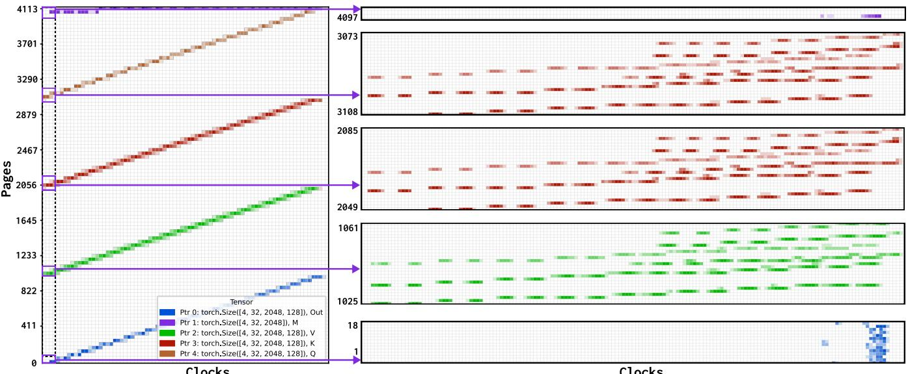  
Figure 15: NEUTRINO DMAT aligned to the GPU-local clock. Left: The overview; Right: the Zoom-in view of selected small proportions highlighted in the red rectangles.

```python
# Neutrino Generated Code for Reading Trace
import struct
from typing import NamedTuple, List, Tuple
from neutrino import TraceHeader, TraceSection
class block_sched(NamedTuple):
start: int
elapsed: int
cuid: int
def parse(path: str):
with open(path, "rb") as f:
header: TraceHeader = TraceHeader(
struct.unpack("iiiiiiii", f.read(32)))
sections: List[TraceSection] = []
for _ in range(header.numProbes):
size, offset = struct.unpack("QQ", f.read(16))
sections.append(TraceSection(size, offset))
gridSize = header.gridDimX * header.gridDimY
* header.gridDimZ
blockSize = header.blockDimX * header.blockDimY
* header.blockDimZ
records: List[List[block_sched]] = []
for i in range(gridSize):
records.append([])
for j in range(blockSize):
start, elapsed, cuid = struct.unpack(
"QII", f.read(16))
records[i].append(
block_sched(start, elapsed, cuid))
return header, sections, records
# END OF GENERATED CODE
import numpy as np
header, sections, records = parse(sys.argv[1])
unique_cus = set()
for block in records:
```

```python
unique_cus.add(block[0].cuid)
cu_timelines = [[]] * len(unique_cus)
sched_times = [0.0] * len(unique_cus)
work_times = [0.0] * len(unique_cus)
for cur in records:
sched_out = False
for block in cu_timelines[cur[0].cuid]:
if block.start+block.elapsed<=cur[0].start:
sched_times[cur[0].cuid]+=cur[0].start
- (block.start + block.elapsed)
cu_timelines[cur[0].cuid].remove(block)
cu_timelines[cur[0].cuid].append(cur[0])
work_times[cur[0].cuid] += cur[0].elapsed
sched_out = True
break
if not sched_out:
cu_timelines[cur[0].cuid].append(cur[0])
work_times[cur[0].cuid] += cur[0].elapsed
print(np.array(sched_times).mean(),
np.array(work_times).mean())
```

## F Persistent Kernel for torch.zeros

Following code is generated by GPT4o with prompt: "Write a Persistent Kernel to initialize a torch tensor to 0":

```python
import torch
import triton
import triton.language as tl
@triton.jit
def zero_persistent_kernel(output_ptr, numel,
BLOCK_SIZE: tl.constexpr, NUM_SMS: tl.constexpr):
start_pid = tl.program_id(axis=0)
num_blocks = tl.cdiv(numel, BLOCK_SIZE)
```

```python
blocks_per_sm = num_blocks // NUM_SMS
if start_pid < num_blocks % NUM_SMS:
blocks_per_sm += 1
block_id = start_pid - NUM_SMS
for _ in range(blocks_per_sm):
block_id += NUM_SMS
offsets=block_id*BLOCK_SIZE+tl.arange(0,BLOCK_SIZE)
mask = offsets < numel
tl.store(output_ptr + offsets,
tl.zeros([BLOCK_SIZE], dtype=tl.float16), mask)
def zero_persistent(x: torch.Tensor):
numel = x.numel()
NUM_SMS = torch.cuda.get_device_properties("cuda")\
.multi_processor_count
BLOCK_SIZE = 128
grid = lambda META: (min(NUM_SMS,
triton.cdiv(numel, META['BLOCK_SIZE'])),)
zero_persistent_kernel[grid](
x, numel, BLOCK_SIZE, NUM_SMS)
t=torch.empty((4096,4096),torch.float16,device="cuda")
zero_persistent(t)
```

## G Global Timer Aligned DMAT

NEUTRINO DMAT can also be synchronized to the GPU-local timer, i.e., different compute units share the same synchronized timer, rather than CU-local cycle timer. DMAT of the same configuration as Fig. 1 under global synchronization becomes Fig. 15. Under global synchronization, DMAT becomes terraced-like and each "step" represents a launch wave of virtual blocks, 32x128 in this case, to physical compute units (108 SM on A100). We recommend zooming in on each "step", for insightful analysis.

The zoomed-in view (right part of Fig. 15, note the y-axis value difference) reflects the actual memory access pattern applied to the hardware, and is insightful for hardware-level analysis and cache simulation.

## H Micro-benchmarking Details

Here we present more details behind the theoretical estimation, and the reasons for the varying clock estimation. Take the most complicated random access as an example, we use the Fisher–Yates shuffle to create reproducible random index sequences in A. At runtime, each thread reads the random index from A and writes to B accordingly, like the following:

```lisp
__global__ void random_kernel(
const int* A, int* B, // A has been shuffled
int M, int N, unsigned int NS) {
int col = blockIdx.x * blockDim.x + threadIdx.x;
if (col >= M) return; // boundary check
int* src = A + col;
for (int i = 0; i < M * N; i += M) {
int idx = src[i]; // get the random idx from A
B[idx] = i; // write to B[idx]
```

device\_sleep(NS); // spinloop inside   
}   
}

Then, in verification, we reconstruct the same random index and simulate the access as follows. We compare simulated addresses with collected addresses aligned to the base address.

```python
arr = fisher_yates_shuffle(...)
for blockIdx in range(blocks):
for threadIdx in range(threads):
start = blockIdx * threads + threadIdx
clock = LATENCY # 1st access doesn't sleep
for recordIdx in range(records):
index = start + recordIdx * blocks * threads
addr_A = (index * size) # >> 16 => page
addr_B = (arr[index] * size) # >> 16 => page
clock += NS + LATENCY
```

However, one critical challenge is the memory access latency (LATENCY in the above code), which, in practice, will vary from cache hit/miss. To be fair, we disable the L1 (via cg cache operator [60]) and choose the L1 disabled latency (570 cycles on A100) as LATENCY. Because different patterns have varying L1 hit rates (88% for linear and 0% for stride), resulting in unpredictable estimation errors.

## I Evaluating NEUTRINO probe slowdown

As presented in Tab. 3, NEUTRINO’s dmat probe leads to different degrees of slowdowns on different kernels, from 2.75x on Flash-Attn-v2 to 13.163x on SoftMax. We first analyze this effect from the perspective of memory I/O by sampling the DMAT access, i.e., adding a sampling counter to make DMAT save only 1/2 (save only once in two memory accesses), 1/3, 1/4, 1/8, and measuring the kernel slowdown.

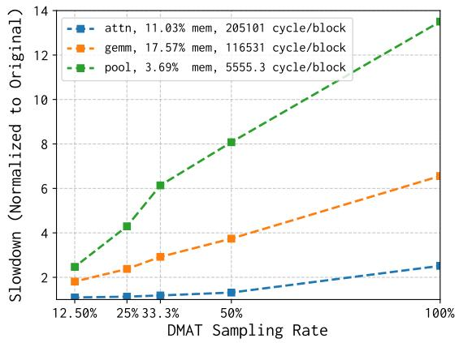

Figure 16: NEUTRINO DMAT Slowdown versus kernels and sampling frequency.

Results presented in Fig. 16 demonstrate that the slowdown of DMAT is mainly of a linear relationship w.r.t. the sampling frequency, highlighting that most DMAT cost comes from the I/O. Moreover, we also identify two major factors contributing to the exact slowdown ratio. First, smaller kernels, i.e., lower block time, suffer from larger slowdown as the proportion of dmat’s memory I/O would be larger w.r.t. the original block time (pool, ∼5555 cycles with 13x slowdown and attn, ∼205101 cycles with 2.75x slowdown). Second, for kernels of similar block time, the proportion of memory instructions significantly affects the slowdown (attn, 11.03% memory instructions with 2.75x slowdown, and gemm, 17.57% memory instructions with 6.55x slowdown).

## J Case Study on GEMM Kernel

Here, we also formulate two configurations of GEMM kernel (M=N=K=4096) issuing the same burden to the physical SM: ❶ 128x256x64 tile, 3 stages, 8 warps, 1 block per SM on A100; ❷ 128x128x64 tile, 3 stages, 4 warps, 2 blocks per SM on A100. And we present the cumulative distribution function of block completion time in Fig. 17A and Fig. 17B, respectively.

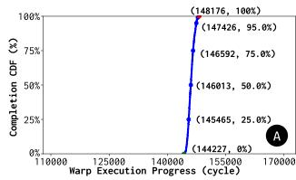

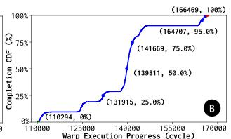

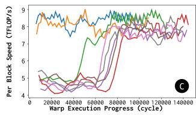

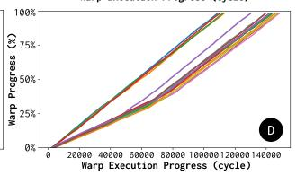  
Figure 17: ●A CDF of elapsed latency in exclusive blocks; ●B CDF of elapsed latency in shared blocks; ●C GFLOP/s distribution w.r.t. execution progress from left to right; ●D Progress timeline of shared blocks.

We can identify the same pattern as §7 that shared blocks suffered from tailing blocks. Similarly, we plot the intra-blocklevel throughput timeline and the warp execution timeline in Fig. 17A and Fig. 17B, yielding similar finding as §7. But different from the previous, here BLOCK\_N, 128 or 256, is a parallel dimension. Fig. 14 and Fig. 17 together demonstrate that the existence of tailing effects in shared blocks due to GPU synchronization and scheduling (§7) is general, regardless of kernels or tile organizations (parallel or sequential).

## K Analyzing Abnormal Speedup

As shown in Tab. 3, NEUTRINO probes can lead to abnormal speedup. One significant case of such speedup is GEMM with M=N=K=2048, where block\_sched can lead to up to 0.94x speedup on CUTLASS implementation and 0.96x speedup on Triton implementation. We pick the Triton implementation (BLOCK\_M=128, BLOCK\_N=128, BLOCK\_K=32, STAGES=3, WARPS=4), and block\_sched probe as it has the lowest interruption to the program (only thread start and end). We profiled the probed and original kernel (with the same -O3) with hardware profiler Nsight Compute [58] to validate their performance metrics, and the results suggest dramatic changes:

<table><tr><td>Metric</td><td>Probed</td><td>Original</td></tr><tr><td>Executed IPC Elapsed</td><td>1.08 (+5.88%)</td><td>1.02</td></tr><tr><td>Issue Slots Busy</td><td>30.41% (+4.97%)</td><td>28.97%</td></tr><tr><td>long_scoreboard (waiting global memory)</td><td>2,698,349 (-10.22%)</td><td>3,005,844</td></tr><tr><td>mio_throttle (waiting memory inst queue)</td><td>665,885 (-32.8%)</td><td>990,653</td></tr><tr><td>no_instruction (waiting instruction/register)</td><td>52,804 (-17.32%)</td><td>63,868</td></tr><tr><td>short_scoreboard (waiting shared memory)</td><td>1,311,106 (+148%)</td><td>528,495</td></tr></table>

Profiled metrics highlight a 5.88% IPC improvement with a 4.97% busier instruction scheduling. Moreover, we also identified that NEUTRINO probed kernel has 10.22% less waiting time for global memory, 32.8% less waiting time for memory instruction queue, and 17.32% less waiting time for instructions or register cache. To further address the improvement, we checked the assembled machine code, particularly the main loop with tensor core (HMMA) and async copy (LDGSTS):

<table><tr><td>/* Probed SASS */ LDGSTS.E.BYPASS</td></tr><tr><td>LDGSTS.E.BYPASS HMMA.16816.F32</td></tr><tr><td>IMAD R132，R236</td></tr><tr><td>HMMA.16816.F32 LDGSTS.E.BYPASS</td></tr><tr><td>HMMA.16816.F32 HMMA.16816.F32</td></tr><tr><td>HMMA.16816.F32 LDGSTS.E.BYPASS IMAD.MOV.U32 HMMA.16816.F32</td></tr><tr><td></td></tr><tr><td>HMMA.16816.F32 IMAD.MOV.U32</td></tr><tr><td>IMAD.MOV.U32 HMMA.16816.F32</td></tr><tr><td>IMAD R133，R236 IMAD.MOV.U32</td></tr><tr><td>HMMA.16816.F32 HMMA.16816.F32</td></tr><tr><td>LDGSTS.E.BYPASS LDGSTS.E.BYPASS</td></tr><tr><td>HMMA.16816.F32 IMAD.X R251,</td></tr><tr><td>HMMA.16816.F32 ISETP.LE.AND P5</td></tr><tr><td>HMMA.16816.F32 HMMA.16816.F32</td></tr><tr><td>IMAD R132，R236 LDGDEPBAR</td></tr><tr><td></td></tr><tr><td>IADD3 R134, P0, IADD3 R138,</td></tr><tr><td>IMAD.MOV.U32 HMMA.16816.F32</td></tr><tr><td>HMMA.16816.F32 LDGSTS.E.BYPASS</td></tr></table>

From the above truncated and optimized machine code, we can find the probed kernel’s HMMA instructions are more continuous, with more opportunities to reuse the register cache (as results are accumulated along K). Moreover, memory instructions LDGSTS are more distributed, possibly leading to a more balanced pressure on the memory system.

This experiment shows that new instructions from NEU-TRINO probe(s) may lead the assembler [61] to better execution flow. Though the current experiment is not comprehensive (only one kernel), we believe that this abnormal speedup and our analysis spotlight there are still unexplored opportunities in low-level assembler optimization.