USENIX

THE ADVANCED COMPUTING SYSTEMS ASSOCIATION

# Bayesian Code Diffusion for Efficient Automatic Deep Learning Program Optimization

Isu Jeong and Seulki Lee, Ulsan National Institute of Science and Technology https://www.usenix.org/conference/osdi25/presentation/jeong

# This paper is included in the Proceedings of the 19th USENIX Symposium on Operating Systems Design and Implementation.

July 7–9, 2025 • Boston, MA, USA

ISBN 978-1-939133-47-2

Open access to the Proceedings of the 19th USENIX Symposium on Operating Systems Design and Implementation is sponsored by

# Bayesian Code Diffusion for Efficient Automatic Deep Learning Program Optimization

Isu Jeong Seulki Lee

Ulsan National Institute of Science and Technology (UNIST)

## Abstract

We introduce Bayesian code diffusion, a new deep learning program optimization strategy devised to accelerate the autotuning process of deep learning compilers. Using the concepts of prior and posterior distributions in the Bayesian framework and reformulating them in the context of deep learning program optimization, the proposed approach efficiently searches for optimal program code in a significantly reduced search space through an iterative diffusion of program code. To further enhance the efficiency of program optimization, we propose pre-training and fine-tuning for the cost model, which improves both the model’s predictive accuracy and training efficiency. We implement Bayesian code diffusion in Ansor and evaluate its performance on a wide range of deep learning models on both CPUs and GPUs. Existing approaches struggle to reliably generate high-performing deep learning programs, i.e. achieving low program execution latency, across various configurations, including diverse deep learning model architectures and hardware platforms (CPU and GPU). In contrast, Bayesian code diffusion reduces the end-to-end compilation (optimization) time required to generate the equivalent program execution latency in various configurations, i.e., achieving up to 3.31× optimization speedup. This substantial improvement demonstrates that Bayesian code diffusion performs efficient and principled deep learning program optimization across a wide range of deep learning models, operators, and hardware (CPU and GPU).

## 1 Introduction

High-performance deep learning (tensor) programs are essential for constructing efficient deep learning systems. To achieve this, deep learning compilers, such as TVM [6], Glow [34], nGraph [10] and XLA [23], have been developed to generate deep learning programs optimized for various hardware architectures, such as CPUs, GPUs, and others. Without relying on hardware vendor-specific libraries, e.g., BLAS [22], Intel MKL [19], Nvidia cuBLAS [29], and cuDNN [30], they perform program optimizations by exploring the search space constructed from pre-defined rules and patterns, such as templates [6]. The search space is navigated by tuning its associated parameters, minimizing manual effort.

However, these deep learning compilers often result in suboptimal program performance, resulting in increased program execution latency. To generate improved deep learning (tensor) programs, the concept of auto-tuning [7] has been proposed, where a set of parameters that define the program codes are automatically searched and optimized. Notably, Ansor [47] constructs an expanded search space for each subgraph of the deep learning model through sketch generation, followed by random initialization and evolutionary search [41]. Although such auto-tuning techniques can identify deep learning programs that achieve lower execution latencies, extensive program exploration in an expanded search space often leads to increased program optimization time.

The increased optimization time observed in auto-tuning approaches highlights three opportunities for improvement. First, each subgraph is assigned an independent search space with a distinct set of optimizations, despite potential overlaps between them, which may be redundant. These redundancies present opportunities for improvement through reuse or shared optimization across subgraphs. Second, many existing auto-tuning methods [7, 47] perform a large number of random searches to identify optimal program codes, which can be time-consuming and cause inefficiencies in program optimization, despite the opportunity to start from better initial points. Lastly, the cost model used to predict the expected performance of the generated program, i.e., program execution latency, is trained without a learning strategy, presenting an opportunity to improve both predictive accuracy and learning efficiency through more principled training strategies. Although various approaches [12, 14, 26] have been proposed to exploit these opportunities, each has limited effectiveness in fully resolving these issues and presents its own set of limitations, as summarized in Tab. 1.

In this paper, we introduce the concept of Bayesian code diffusion and demonstrate its implementation, which enhances the efficiency of auto-tuning for optimizing deep learning (tensor) programs. We reformulate the problem of deep learning program optimization based on the Bayesian framework [27] and present an efficient solution for addressing it. Specifically, we leverage the concept of prior, represented by welloptimized program code for a specific subgraph, and propagate its parameter to a posterior subgraph—another similar subgraph to be optimized—to facilitate an efficient search for optimal programs in the program parameter space. Inspired by the observation that deep learning models often share similar subgraphs in their architectures, we iteratively transform the posterior program within the highly-likely parameter spaces close to the prior’s parameter distribution through the process we term code diffusion. This process enables an efficient and principled optimization of program parameters, in contrast to existing auto-tuning methods [7, 47] applying random search in an expansive program parameter space.

Table 1: The comparison of state-of-the-art auto-tuning methods for deep learning (tensor) program optimization relative to Ansor [47] shows that the proposed Bayesian code diffusion enhances all features.
<table><tr><td></td><td>Sample Program Sharing</td><td>Search Strategy Enhancement</td><td>CostModel Improvement</td><td>Online Learning</td><td>Applicable HW</td><td>GPU</td></tr><tr><td>SelectiveTuning (2019) [3]</td><td>√</td><td>√</td><td>X</td><td>【</td><td>CPU X</td><td>√</td></tr><tr><td>Ansor (2020) [47]</td><td>X</td><td>X</td><td>X</td><td></td><td>√</td><td>√</td></tr><tr><td>ETO (2021)[12]</td><td>√</td><td>√</td><td>X</td><td></td><td>X</td><td>√</td></tr><tr><td>DietCode (2022) [46]</td><td>√</td><td>X</td><td>X</td><td>√</td><td>X</td><td>√</td></tr><tr><td>TransferTuning (2022) [14]</td><td></td><td>√</td><td>X</td><td>X</td><td>√</td><td>X</td></tr><tr><td>OneShotTuner (2022) [35]</td><td>X</td><td>X</td><td>√</td><td>X</td><td>√</td><td></td></tr><tr><td>FamilySeer (2023) [26]</td><td>X</td><td>X</td><td>√</td><td></td><td></td><td></td></tr><tr><td>BayesianCodeDiffusion (ours)</td><td>√</td><td>√</td><td>√</td><td>√</td><td>√</td><td></td></tr></table>

We also propose a cost model learning strategy (i.e., pretraining and fine-tuning) that adjusts the optimization order of program subgraphs to improve the convergence and predictive accuracy of the cost model. Auto-tuning generates a large number of program candidates, but measuring their latency on hardware is costly. To reduce this overhead, a cost model is trained during program compilation (optimization) to estimate the program latency based on a small subset of hardware measurements, following an online learning approach. However, existing approaches, such as round-robin or gradient-based sampling [47], yield overly diverse data samples, hindering the cost model’s ability to generalize. In contrast, the proposed pre-training and fine-tuning strategy guides the cost model through a more structured data sequence, improving both learning efficiency and prediction quality. Initially, the cost model is trained using a set of prior program codes across subgraph clusters in a random order —we refer to as pretraining— to enhance its generalization capacity by learning diverse data generated through hardware measurements of heterogeneous prior subgraphs. Then, the cost model is trained with specific and homogeneous data generated by each cluster of similar subgraphs one by one —we refer to as fine-tuning— to improve its predictions on each subgraph cluster, on top of the generalization ability obtained during pre-training.

We implement the proposed Bayesian code diffusion on

Ansor [47], demonstrating that it can be seamlessly and easily integrated into existing auto-tuning frameworks with minimal modification and effort. We conduct extensive experiments across a wide range of deep learning models, such as ResNet [16] and BERT [11]. The experimental results show that Bayesian code diffusion accelerates the end-to-end compilation (optimization) time of deep learning models by up to 3.31× while producing programs with execution latencies up to 1.13× faster than those generated by state-of-the-art auto-tuning methods [47]. The reduced compilation time is achieved by effective program sharing, efficient and principled program search, and online optimization on both CPU and GPU, without compromising on program execution latency. In contrast, previous methods are often limited by inefficient program search capabilities [26, 47], or constrained hardware compatibility (CPU/GPU) [3, 12, 46], or limited support for operators [46]. Some also rely on pre-compiled programs [14] or offline-trained cost models [35].

## 2 Background and Opportunities

## 2.1 Deep Learning Compilers and Auto-Tuning

Deep Learning Compilers. To accelerate deep learning workloads on target hardware architectures, specialized hardware vendor libraries, such as BLAS [22], Intel MLK [19], Nvidia cuBLAS [29], and cuDNN [30], have been widely used to generate efficient deep learning programs. However, developing these hardware-dependent libraries requires significant time and resources, making it difficult to keep up with the rapid emergence of state-of-the-art deep learning models and new hardware platforms. Intermediate Representation (IR)- based deep learning compilers [6] try to tackle this problem by being designed to operate across various hardware architectures without being constrained by hardware dependencies, alleviating the burden of manual optimization. These deep learning compilers, such as TVM [6], Glow [34], nGraph [10] and XLA [23], take deep learning workloads as input and apply a range of optimizations at both high-level and low-level IR to generate efficient deep learning program code without relying on hardware vendor libraries.

Auto-Tuning. Auto-tuning [7, 47] is a technique that automates the hardware-specific optimizations of the low-level IR lowered from the high-level IR graph—e.g., Relay IR [33] in TVM and HLO IR [15] in XLA— of the deep learning model. In the backend of the compiler, it sketches for optimal program parameters, such as loop tile size, from a vast set of candidates to ensure that the final program code performs best on the target hardware. For example, to explore efficient code implementation for the given tensor operations, AutoTVM [7] builds the search space of the parameters based on manually defined templates which demand considerable time and effort in their design. Consequently, the search space becomes dependent on manually predefined templates, which restricts the search scope and range. To solve this problem, Ansor [47] automatically constructs the search space through program sampling and fine-tuning stages, finding optimal program code without being restricted by limited templates.

Fig. 1 illustrates the auto-tuning process of Ansor [47]. Ansor first constructs the search space by generating a set of optimization rules, named sketch, for each subgraph. It then selects a subgraph and performs random initialization for the parameters of optimization rules belonging to the sketch, followed by iterative fine-tuning to optimize the parameters of these rules and generate executable complete program code. Among the resulting candidates, only those predicted by the cost model to have low latency are retained and evaluated on the target hardware. The cost model is trained with these evaluation results from scratch in an online learning paradigm. This process is repeated until the time budget is exhausted.

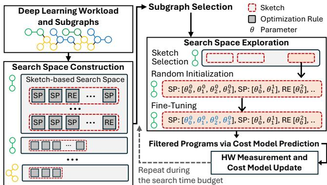  
Figure 1: An overview of auto-tuning process in Ansor [47]. The details of the optimization rule, SP (Split-Step), and its parameters θ (integers) are described in Sec. 4.3.

## 2.2 Opportunities of Auto-Tuning

Although Ansor [47] automates finding optimal hardwarespecific program code through program sampling and finetuning, it presents several opportunities, as described below. Opportunity 1: Ignored Subgraph Similarity. In autotuning, the computation graph (i.e., high-level IR) is divided into subgraphs that can be optimized via pattern mapping or specific logic. Ansor [47] constructs the search space for each subgraph by recursively applying predefined optimization rules, such as reordering, multi-level tiling, and node fusion. Since this set of rules, named sketch, lacks specific parameters that define tile sizes and loop annotations, they must be determined by tuning (optimizing) parameters to generate executable programs. However, each parameter is determined independently through random initialization to produce executable program code. As a result, the optimal program parameters identified by one subgraph are not shared with others, even though there is potential for reuse when subgraphs exhibit similarities.

To reuse optimized program code, TransferTuning [14] adapts parameters previously optimized for a different deep learning model and transforms them to fit the recipient subgraph of the target deep learning model. However, this approach requires a pre-compiled deep learning program that closely resembles the recipient deep learning program, which limits its usability and applicability in practice. Although DietCode [46] creates a unified search space for microkernel operations and collectively optimizes them, it supports only a limited set of operators (e.g., dense and batch matmul), requiring the development of each individual operation and restricting implementations to only GPUs.

Opportunity 2: Randomized Fine-Tuning Initialization. To fine-tune program codes, Ansor [47] begins with a set of candidate complete programs, known as schedules, obtained through a combination of sketch generation and random parameter initilization. These initial programs are then iteratively fine-tuned with search algorithms, such as evolutionary operations [41], to produce new programs that can achieve improved performance, typically lower program execution latency. However, since these initial candidate programs are generated randomly, a large number of fine-tuning iterations is typically required to identify the optimal program code.

To reduce extensive random sampling and fine-tuning, SelectiveTuning [3] selects a subgraph in the high-level IR and optimizes its parameters through sufficient searches. The optimized parameters are then adapted to other subgraphs of similar structure through a one-time transformation based on predefined rules. While this approach can reduce random search iterations, relying on a one-shot single transformation without sufficient fine-tuning often results in suboptimal program performance, thus limiting its overall effectiveness.

Opportunity 3: Learning Strategy of Cost Models. Autotuners employ a cost model [47] that predicts the expected performance of the generated programs (i.e., execution latency) to select ones anticipated to perform better than others. The cost model is trained from scratch during compilation using hardware measurements in an online learning setting. Since optimization depends on the cost model, both the quality and quantity of the training data are critical for effective autotuning. In general, the training set is derived from programs executed using the round-robin and gradient with respect to program latency, without considering similarities, resulting in the cost model being trained on overly broad and diverse data. If so, it must make predictions on a wide range of diverse programs, which may result in suboptimal prediction accuracy. Moreover, the diversity of data can prolong the training time, leading to unreliable predictions until the model convergence. Additionally, if there exist similar programs, they tend to produce similar data samples, causing the model to learn redundant and ineffective samples. This not only fails to enhance the model’s learning performance but also wastes time and resources [26, 32, 42].

To accelerate convergence and improve prediction performance of the cost model, FamilySeer [26] groups similar subgraphs and trains a separate cost model for each group. Although this approach can reduce program search time by using a dedicated cost model for each group, the limited range and diversity of training datasets can often result in suboptimal programs, as each group is likely to generate only similar program samples. Moreover, it does not reuse optimized parameters across subgraphs, resulting in inefficient search.

## 3 Methodological Idea

To take advantage of the aforementioned opportunities of auto-tuning in deep learning compilers, we propose Bayesian code diffusion, of which the key idea is illustrated in Fig. 2.

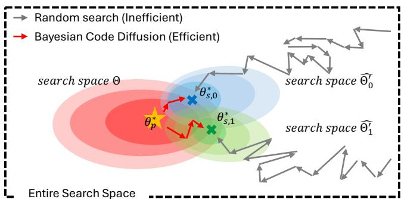  
Figure 2: The concept of Bayesian code diffusion: a sufficiently optimized prior parameter of one subgraph $( \theta _ { p } ^ { * } )$ i s propagated to similar subgraphs (posteriors). Then, posterior parameters $( \Theta _ { s , \{ 0 , 1 \} } ^ { * } )$ are derived and refined from the prior for each subgraph via code diffusion using a Bayesian formulation, enabling efficient deep learning program optimization.

It first selects a prior subgraph and performs a sufficient search to find its optimal program parameters. These optimized parameters are then propagated to structurally similar subgraphs, referred to as posterior subgraphs, from a Bayesian perspective. The initial search space of each posterior subgraph is restricted to that of the prior subgraph, and optimization is performed in the vicinity of the prior’s optimal parameters through prior propagation. Then these parameters are fine-tuned by adding some noise to find the optimal configuration for the posterior subgraph. This process is referred to as code diffusion. Repeating this code diffusion process enables the effective propagation of the most promising area of the search space among similar subgraphs, effectively reducing fine-tuning iterations. Also, in this process, the cost model undergoes pre-training using prior subgraphs and is subsequently fine-tuned on posterior subgraphs, allowing it to learn efficiently and effectively. The following subsection presents the hypothetical formulation of Bayesian code diffusion (Sec. 3.1) and empirical findings that support the idea and validity (Sec. 3.2).

## 3.1 Theoretical Formulation

Prior Parameters. Bayesian code diffusion first begins by clustering subgraphs of the deep learning model according to their similarities and selecting one of them as the prior subgraph $\mathcal { G } _ { p }$ for each cluster. Given $\mathcal { G } _ { p } .$ , the optimization task is to find the optimal parameter $\boldsymbol { \theta } _ { p } ^ { \ast }$ generating optimal program code for $\mathcal { G } _ { p } .$ . If we employ the Bayesian formulation to this, with an abuse of notations, the optimization task can be expressed as maximizing the following conditional likelihood.

$$
\boldsymbol { \Theta } _ { p } ^ { * } = \underset { \boldsymbol { \Theta } _ { p } } { \operatorname { a r g m a x } } f _ { \operatorname* { m i n } } ( c ( \boldsymbol { \Theta } _ { p } ) \mid \boldsymbol { \Theta } _ { p } )\tag{1}
$$

Here, $c ( \theta )$ is the program code defined by the parameter $\theta ,$ and $f _ { \mathrm { m i n } } ( c ( \theta ) )$ is defined as the hypothetical probability density regarding whether the execution latency of $c ( \theta )$ is the minimal or not among all $\theta \in \Theta$ explored so far, as follows:

$$
f _ { \mathrm { m i n } } \bigl ( c \bigl ( \theta \bigr ) \bigr ) = \left\{ \begin{array} { l l } { 1 } & { \mathrm { ~ i f ~ } l \bigl ( c \bigl ( \theta \bigr ) \bigr ) < l \bigl ( c \bigl ( \theta ^ { \prime } \bigr ) \bigr ) \ \forall \ \theta ^ { \prime } \in \Theta } \\ { 0 } & { \mathrm { ~ o t h e r w i s e } } \end{array} \right.\tag{2}
$$

where $l ( c ( \Theta ) )$ is the execution latency of $c ( \theta )$ , and Θ is the total set of schedules explored so far. Now assume a subgraph $\mathcal { G } _ { s } ^ { } .$ , presumed to be similar to $\mathcal { G } _ { p }$ , is given, and the task is to find its optimal parameter ${ \boldsymbol { \theta } } _ { s } ^ { * }$ . In principle, the optimal program code $c ( \theta _ { s } ^ { * } )$ , which yields the minimum latency for ${ \mathcal { G } } _ { s } ,$ can be found if all possible parameters θ ∈ Θˆ are explored. This can be expressed as a hypothetical marginal distribution over all possible $\theta \in { \hat { \Theta } } .$ , which is given by:

$$
f _ { \mathrm { m i n } } \big ( c \big ( \boldsymbol { \Theta } _ { s } ^ { * } \big ) \big ) = \sum _ { \boldsymbol { \Theta } \boldsymbol { \in } \boldsymbol { \hat { \Theta } } } f _ { \mathrm { m i n } } \big ( c \big ( \boldsymbol { \Theta } \big ) \mid \boldsymbol { \Theta } \big ) f ( \boldsymbol { \Theta } )\tag{3}
$$

In Ansor [47], the search space $\hat { \Theta }$ is defined by a sketch—a sequence of optimization rules—and consists of all possible parameter combinations for those rules, defined as $\begin{array} { r } { \hat { \Theta } = \prod _ { i = 0 } ^ { K } \Theta _ { i } , } \end{array}$ where K is the number of rules belonging in the sketch. However, due to the vastness of $\begin{array} { r } { \hat { \Theta } , } \end{array}$ exhaustively exploring all configurations $\theta \in { \hat { \Theta } }$ is infeasible, necessitating the derivation of a feasible yet effective subspace $\hat { \Theta } ^ { \prime } \subseteq \hat { \Theta }$

Prior Propagation. To reduce Θˆ into a feasible yet effective search space $\hat { \Theta } ^ { \prime } ,$ , we take ${ \boldsymbol { \theta } } _ { p } ^ { * }$ , optimized for the prior subgraph $\mathcal { G } _ { p }$ in Eq. (1), as the prior parameter for $\mathcal { G } _ { s }$ by setting $\hat { \Theta } ^ { \prime } = \left\{ \Theta _ { p } ^ { * } \right\}$ . Specifically, we may regard ${ \boldsymbol { \theta } } _ { p } ^ { * }$ as the mode of the hypothetical Gaussian distribution for $\theta _ { p } ,$ i.e., $f ( \boldsymbol { \Theta } _ { p } ) = \mathcal { N } ( \boldsymbol { \Theta } _ { p } ^ { * } , \boldsymbol { \sigma } _ { p } ^ { 2 } )$ with the mean ${ \boldsymbol { \theta } } _ { p } ^ { * }$ and variance $\sigma _ { p } ^ { 2 }$ . Based on our observations that ${ \boldsymbol { \theta } } _ { p } ^ { * }$ and ${ \boldsymbol { \theta } } _ { s } ^ { * }$ are likely to be close in the search space, i.e., $\theta _ { p } ^ { * } \simeq \theta _ { s } ^ { * }$ as $\mathcal { G } _ { p } \simeq \mathcal { G } _ { s }$ , we also assume the hypothetical distribution of $\theta _ { s }$ is also likely to be close to that of $\theta _ { p } .$ , and thus take $f ( \boldsymbol { \Theta } _ { p } ) = \mathcal { N } ( \boldsymbol { \Theta } _ { p } ^ { * } , \boldsymbol { \sigma } _ { p } ^ { 2 } )$ as the hypothetical prior distribution of $\theta _ { s }$ as $f ( \boldsymbol { \Theta } _ { s } ) = \dot { \mathcal { N } } ( \dot { \boldsymbol { \Theta } } _ { p } ^ { * } , \boldsymbol { \sigma } _ { s } ^ { 2 } )$ . From this, we can avoid computing the intractable marginal in $\operatorname { E q . } \left( 3 \right)$ over all possible θ ∈ $\hat { \Theta } ,$ but instead evaluate the following hypothetical posterior as a joint distribution:

$$
\varTheta _ { s } ^ { \ast } = \underset { \Theta _ { s } \in \hat { \Theta } ^ { \prime } } { \operatorname { a r g m a x } } f _ { \operatorname* { m i n } } \big ( c \big ( \Theta _ { s } \big ) , \Theta _ { s } \big ) = \underset { \Theta _ { s } \in \hat { \Theta } ^ { \prime } } { \operatorname { a r g m a x } } f _ { \operatorname* { m i n } } \big ( c \big ( \Theta _ { s } \big ) \mid \Theta _ { s } \big ) f \big ( \Theta _ { s } \big ) ( 4 )
$$

where $\hat { \Theta } ^ { \prime } = \left\{ \Theta _ { p } ^ { * } \right\}$ for the beginning. To identify ${ \boldsymbol { \theta } } _ { s } ^ { * }$ , we evaluate the hypothetical maximum joint probability in Eq. (4), as $f _ { \mathrm { m i n } } \big ( c \big ( \theta _ { s } ^ { * } \big ) \big )$ ) always returns one by definition as in Eq. (2), and it does not provide the confidence that ${ \boldsymbol { \theta } } _ { s } ^ { * }$ found so far is indeed the true optimum. However, when multiplied with $f ( \Theta _ { s } ) , f _ { \mathrm { m i n } } ( c ( \Theta _ { s } ) \mid \Theta _ { s } ) f ( \Theta _ { s } )$ can quantify the confidence that the found ${ \boldsymbol { \theta } } _ { s } ^ { * }$ is the true optimal parameters, i.e., the lower the value, the more likely that ${ \boldsymbol { \theta } } _ { s } ^ { * }$ is the true optimum.

Code (Parameter) Diffusion. After the prior propagation, the search space for $\mathcal { G } _ { s }$ is defined as $\hat { \Theta } ^ { \prime } = \big \{ \Theta _ { p } ^ { * } \big \}$ , where $\boldsymbol { \theta } _ { p } ^ { \ast }$ is considered the initial candidate for the optimal parameter for $\mathcal { G } _ { s } , \mathrm { i . e . , } \Theta _ { s } ^ { ( 0 ) } = \Theta _ { p } ^ { * }$ , and Eq. (4) is evaluated with it. to find an improved ${ \boldsymbol { \theta } } _ { s } ^ { * }$ , we apply code diffusion to $\boldsymbol { \theta } _ { p } ^ { \ast } .$ , which hypothetically generates the next posterior candidate $\boldsymbol { \Theta } _ { s } ^ { ( 1 ) }$ from $\theta _ { p } ^ { * } ,$ and subsequently the program code $c ( \mathsf { \theta } _ { s } ^ { ( 1 ) } )$ . At the tth optimization iteration, the posterior parameter $\boldsymbol { \Theta } _ { s } ^ { ( t ) }$ is obtained by hypothetically diffusing ${ \boldsymbol { \theta } } _ { p } ^ { * }$ as follows:

$$
\Theta _ { s } ^ { ( t ) } = \sqrt { 1 - \sigma _ { s , t } ^ { 2 } } \Theta _ { p } ^ { * } + \sqrt { \sigma _ { s , t } ^ { 2 } } \varepsilon\tag{5}
$$

where $\mathbf { \varepsilon } \mathbf { \sim } \mathcal { N } ( 0 , \mathbf { I } )$ , and $\sigma _ { s , t } ^ { 2 } < 1$ is the variance of the diffusion for $\boldsymbol { \Theta } _ { s } ^ { ( t ) }$ . The newly diffused parameter $\boldsymbol { \Theta } _ { s } ^ { ( t ) }$ is then appended to the search space as $\hat { \Theta } ^ { \prime } = \{ \hat { \Theta _ { s } ^ { ( 0 ) } } , \hat { \Theta _ { s } } ^ { ( 1 ) } , . . . , \hat { \Theta } _ { s } ^ { ( t - 1 ) } \} \cup \{ \hat { \Theta _ { s } ^ { ( t ) } } \}$ and evaluated using Eq. (4). If $\boldsymbol { \Theta } _ { s } ^ { ( t ) }$ yields the maximum value for Eq. (4), it is deemed the optimal, i.e., ${ \sf \theta } _ { s } ^ { * } = { \sf \theta } _ { s } ^ { ( t ) }$ . By repeating code diffusion, $\boldsymbol { \Theta } _ { s } ^ { ( t ) }$ gradually difusses from ${ \boldsymbol { \theta } } _ { p } ^ { * } .$ expanding the search space from the prior distribution $f ( \boldsymbol { \theta } _ { p } ^ { \cdot } )$ , in contrast to many existing approaches [3,14] that operate within a fixed search space. By searching for ${ \boldsymbol { \Theta } } _ { s } ^ { * }$ starting from the mode of the prior distribution ${ \boldsymbol { \theta } } _ { p } ^ { * }$ and iteratively diffusing θs around it, ${ \boldsymbol { \theta } } _ { s } ^ { * }$ can be efficiently found within highly likely search spaces.

## 3.2 Empirical Support

The concept Bayesian code diffusion is based on the following empirical findings, which form the basis of its core principles. Commonalities in Incomplete Programs (Sketches). Table 2 presents a list of subgraphs of BERT [11], indicating that five out of eight subgraphs share the same incomplete programs, i.e., the sets of optimization rules (sketches) $S _ { 0 }$ based on the similarity of their operations when utilizing Ansor [47]. Nevertheless, even though some subgraphs exhibit identical forms of sketches, independent program optimization tasks and distinct search spaces are assigned for each subgraph. This arises from potential differences in their details, e.g., tensor dimensions, resulting in a redundant and inefficient search process. Given that many deep learning models exhibit repetitive operations in their network architectures, there exists a potential for the proposed prior propagation, contingent upon the subgraphs sharing the same sketches from which program code parameters can be effectively diffused.

<table><tr><td>Subgraph</td><td>Subgraph Description</td><td>Sketches</td></tr><tr><td>90</td><td>batch_matmul_3</td><td>So</td></tr><tr><td>9</td><td>variance</td><td>S1</td></tr><tr><td>9</td><td>batch_matmul_1</td><td>So</td></tr><tr><td> $\mathcal { G } _ { 3 }$ </td><td>softmax_broadcast_to</td><td>S2</td></tr><tr><td> $\mathcal { G } _ { 4 }$ </td><td>batch_matmul</td><td>S</td></tr><tr><td> $\mathcal { G } _ { 5 }$ </td><td>batch_matmul_4</td><td>So</td></tr><tr><td> $\mathcal { G } _ { 6 }$ </td><td>batch_matmul_2</td><td>S</td></tr><tr><td> $\mathcal { G } _ { 7 }$ </td><td>mean</td><td>S</td></tr></table>

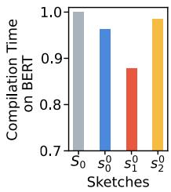  
Table 2: (Left) The subgraphs in BERT [11] and their sketches obtained by applying Ansor [47], where subgraphs $\mathcal { G } _ { 0 , 2 , 4 , 5 , 6 }$ produce the same sketches $\bar { S _ { 0 } } = \bar { \{ } s _ { 0 } ^ { 0 } , s _ { 1 } ^ { 0 } , s _ { 2 } ^ { 0 } \}$

Figure 3: (Right) The compilation time of the subgraphs $\mathcal { G } _ { 0 , 2 , 4 , 5 , 6 }$ taken by Ansor [47] on the operation batch\_matmul in BERT [11] using the sketches $S _ { 0 }$ and each sketch $s _ { i } ^ { 0 } \in S _ { 0 }$ on a GPU. Here, ‘1.0 (gray)’ denotes the time required when using all sketches $S _ { 0 } = \mathrm { \bar { \{ } }  s _ { 0 } ^ { 0 } , s _ { 1 } ^ { 0 } , s _ { 2 } ^ { 0 } \}$

Sketch-based Optimization. Figure 3 illustrates an example in which a set of subgraphs deriving the same sketches $\mathbf { \bar { \Gamma } } _ { 0 } = \{ s _ { 0 } ^ { 0 } , s _ { 1 } ^ { 0 } , s _ { 2 } ^ { 0 } \}$ , i.e., $\{ \mathcal { G } _ { 0 } , \mathcal { G } _ { 2 } , \mathcal { G } _ { 4 } , \mathcal { G } _ { 5 } , \mathcal { G } _ { 6 } \}$ , can be effectively optimized from the single sketch, $s _ { 1 } ^ { 0 } .$ . The bars in the figure present the optimization (compilation) time required to achieve the same program latency when using only a single sketch $( s _ { i } ^ { 0 } \in S _ { 0 } )$ , compared to using all sketches (S0). It is observable that rather than exhaustively exploring the parameter search space of all sketches, it is more efficient to focus on a single sketch. Thus, if one of the subgraphs sharing the same sketches identifies the optimal parameters for one of them, the others can also derive optimized parameters from the same sketch with reduced search time. This indicates that the parameter search space can be effectively reduced by optimizing a common single sketch among similar subgraphs. Parameter Distances. Fig. 4 (left) shows the distances between the optimized configuration, i.e., sketches and their parameters, for the subgraphs that have the same incomplete programs (sketches). It is compared with the distances between the configuration for subgraphs that have different sketches (right). The figure shows that the distances within the identical sketches cluster are significantly closer compared to those across the sketches cluster. This suggests that it is more likely to identify the optimal configuration by starting from one of the optimal parameters for the same sketch and taking it as a prior to explore in its vicinity through code diffusion.

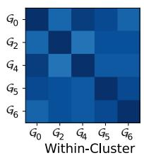

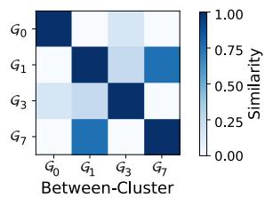  
Figure 4: The cosine similarities between configurations optimized by Ansor [47]. The subgraphs $\{ \mathcal { G } _ { 0 } , \mathcal { G } _ { 2 } , \mathcal { G } _ { 4 } , \mathcal { G } _ { 5 } , \mathcal { G } _ { 6 } \}$ are optimized from the same sketch, while $\{ \mathcal { G } _ { 0 } , \mathcal { G } _ { 1 } , \mathcal { G } _ { 3 } , \mathcal { G } _ { 7 } \}$ have different sketches. The darker, the higher similarity. The details of distance measurement is in Fig. 10.

```powershell
$\mathbb { C } _ { o } \mathbb { C } _ { 1 } \mathbb { C } _ { 2 } \mathbb { C } _ { 3 }$
$\scriptstyle { \mathcal { G } } _ { o }$ batch_matmul_3
$\mathcal { G } _ { 1 }$ variance
$\mathscr { G } _ { 2 }$ batch_matmul_1
?$ softmax_broadcast_to
$\mathcal { G } _ { 4 }$ batch_matmul
$\mathcal { G } _ { 5 }$ batch_matmul_4
$\scriptstyle { \mathcal { G } } _ { 6 }$ batch_matmul_2
$\mathscr { G } _ { 7 }$ mean
Sketch-based Cluster
```

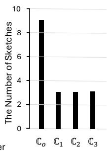  
Figure 5: An example of sketch clustering applied to BERT [11], comprising four clusters: $\mathbb { C } _ { 0 } , \mathbb { C } _ { 1 } , \mathbb { C } _ { 2 }$ , and $\mathbb { C } _ { 3 } .$ Subgraphs within the same cluster are linked by vertical lines. As shown in Fig. 3, subgraphs with identical sketches are grouped into the same cluster. The figure on the right shows the number of sketches for each cluster. For example, $\mathbb { C } _ { 3 }$ consists of subgraphs that have sketches $S _ { 0 } = \{ s _ { 0 } ^ { 0 } , s _ { 0 } ^ { 1 } , \bar { s } _ { 0 } ^ { 2 } \}$

## 4 Implementation

We describe how Bayesian code diffusion (Sec. 3.1) is implemented within deep learning compilers, based on Ansor [47]. The overall procedure of Bayesian code diffusion is summarized in Alg. 1, and an example is illustrated in Fig. 6.

## 4.1 Sketch-based Subgraph Clustering

The first step of Bayesian code diffusion is to cluster a set of subgraphs into distinct groups. Existing approaches, such as Nimble [21], SelectiveTuning [3], and FamilySeer [26], group subgraphs based on their operations, which do not necessarily produce identical sketches due to variations such as tensor dimensions. Since different sketches correspond to distinct optimization spaces and configurations, the optimal program code may vary accordingly, thus increasing the search space to explore. For this reason, we cluster subgraphs based on their sketches to enhance both the likelihood of discovering effective prior program parameter $\boldsymbol { \theta } _ { p } ^ { \ast }$ and the efficiency of code diffusion, motivated by the observations provided in Sec. 3.2. The search space of posterior subgraphs is initialized to the parameter search space for a sketch where $\boldsymbol { \theta } _ { p } ^ { \ast }$ is observed, thereby reducing the overall search space efficiently. As shown in Fig. 3, sketch-based optimization not only simplifies the optimization scopes and processes but also reduces the search space, as the proposed code diffusion occurs solely

Algorithm 1 Bayesian code diffusion. $\boldsymbol { \theta } ^ { * , i }$ denotes the optimal parameter for subgraph $\mathcal { G } ^ { i } .$ , and B indicates the time budget. Hyperparameters $\varepsilon _ { e }$ and $\varepsilon _ { m }$ define the number of iterations for fine-tuning and hardware measurement, respectively.

Input: Subgraphs $G = [ \mathcal { G } ^ { 0 } , \cdots , \mathcal { G } ^ { n } ]$   
Output: Optimal parameters ${ \boldsymbol { \theta } } ^ { * }$ fo r G   
BayesianCodeDiffusion begin   
[G1,⋯,Gm] ← SketchBasedClustering(G)   
for each cluster $\boldsymbol { G } ^ { i } \in [ G ^ { 1 } , \cdots , G ^ { m } ]$ do   
$G _ { \mathrm { p r i o r } }  G _ { \mathrm { p r i o r } } \cup \{ \mathcal { G } _ { \mathrm { p r i o r } } ^ { i } | \mathcal { G } _ { \mathrm { p r i o r } } ^ { i } \in G ^ { i } \}$ [Eq. 6, 7]   
Gposterior $ G _ { \mathrm { p o s t e r i o r } } \cup \{ \mathcal { G } ^ { i , j } \in G ^ { i } | \mathcal { G } ^ { i , j } \neq \mathcal { G } _ { \mathrm { p r i o r } } ^ { i } \}$   
for $\mathcal { G } _ { p r i o r } ^ { i } \in G _ { p r i o r }$ do   
PriorOptimization $( \mathcal { G } _ { \mathrm { p r i o r } } ^ { i } , \pmb { \varepsilon } _ { e } , \pmb { \varepsilon } _ { m } )$   
end   
for $\mathcal { G } ^ { i , j } \in G _ { p o s t e r i o r }$ do   
一 CodeDiffusion $( \mathcal { G } ^ { i , j } , \theta ^ { * , i } , { \frac { \mathfrak { E } _ { e } } { 2 } } , { \frac { \mathfrak { E } _ { m } } { 2 } } )$   
end   
end   
while $\boldsymbol { B } > 0$ do   
Gi, j ← GradientBasedSelection(G)   
CodeDiffusion $( \mathcal { G } ^ { i , j } , \theta ^ { * , i } , { \frac { \mathfrak { E } _ { e } } { 2 } } , { \frac { \mathfrak { E } _ { m } } { 2 } } )$   
end   
end   
PriorOptimization(G, $\mathfrak { E } e , \mathfrak { E } _ { m } )$ begin   
S ← SketchGeneration(G)   
RandomInitialization(G)   
FineTunin ${ \mathfrak { g } } ( { \mathcal { G } } , \varepsilon _ { e } )$   
$\boldsymbol { B } \gets \boldsymbol { B } - \boldsymbol { \varepsilon } _ { m }$   
end   
CodeDiffusion(G, $\boldsymbol { \Theta } ^ { * } , \boldsymbol { \varepsilon } _ { e } , \boldsymbol { \varepsilon } _ { m } )$ begin   
S ← SketchGeneration(G)   
$S \gets \{ s \in S \vert s$ is sketch for ${ \boldsymbol { \theta } } ^ { * } \}$   
PriorPropagation(G) [Fig. 8, Eq. 8, 9]   
FineTuning $( \mathcal { G } , \varepsilon _ { e } )$   
$\boldsymbol { B } \gets \boldsymbol { B } - \boldsymbol { \varepsilon } _ { m }$   
end

within the parameters, without involving optimization rules. This approach enables parameters to evolve efficiently during code diffusion, facilitating the automatic discovery of optimal parameters. Fig. 5 shows an example of sketch-based subgraph clustering. Nonetheless, Bayesian code diffusion can also be applied to operation-based clustering [3].

## 4.2 Prior Selection and Optimization

The second step of Bayesian code diffusion is to select a prior subgraph $\mathcal { G } _ { p }$ in each cluster and optimize it. Since subgraphs in the same cluster share structurally identical operations but differ in their tensor dimensions, we evaluate their similarity based on these tensor dimensions among them. For example, the subgraphs $\mathcal { G } _ { 0 , 2 , 4 , 5 , 6 }$ in Fig. 3 all perform the same operation, batch\_matmul, yet exhibit variations in their tensor dimensions. Then, the prior subgraph $\mathcal { G } _ { p }$ is selected such that its tensor dimensions are closest to those of all the other subgraphs in the cluster while maintaining distinction from the subgraphs in different subgraph clusters. It is based on the assumption that the subgraph with tensor dimensions most similar to those of all other subgraphs is expected to enhance the effectiveness of code diffusion for the posterior subgraphs (Sec. 3.2), which also improves the code compatibility.

<table><tr><td rowspan="8">Deep Learning Workload 010 Q O 0 ○ Q Q ↓ Subgraphs Clustering(Sec.4.1) C1</td><td colspan="8">Prior Subgraphs Optimization</td></tr><tr><td colspan="7">↓</td></tr><tr><td colspan="7">Code Diffusion (Sec.4.3) InitFillTileSize</td></tr><tr><td colspan="7">Parameter of Prior Subgraph: 0p Parameter of Posterior Subgraph :θs</td></tr><tr><td colspan="3">stage id iteration id extent split length</td><td colspan="2">stage id iteration id</td><td>extent</td><td>split length</td><td></td></tr><tr><td>2 3</td><td>1 1,1,1,1</td><td></td><td>2</td><td>3</td><td>1</td><td>1,1,1,1</td><td></td></tr><tr><td>2 5</td><td>14</td><td>1,7,1,2</td><td>2</td><td>5</td><td>16</td><td>1,8,1,2</td><td>(1)</td></tr><tr><td>2 10</td><td>768</td><td>1， 48</td><td>Propagation 2</td><td>10</td><td>96</td><td></td><td>1,6 (2)</td></tr><tr><td>Prior Subgraph Selection (Sec.4.2)</td><td></td><td></td><td></td><td>1</td><td>768</td><td>4,</td><td></td></tr><tr><td>。Prior Subgraphs</td><td>3 1 3072</td><td>6, 2</td><td>3</td><td></td><td></td><td></td><td>1 (3)</td></tr><tr><td> Posterior Subgraphs</td><td></td><td>Fine-Tuning</td><td>↑</td><td></td><td></td><td></td><td></td></tr></table>

Figure 6: Given a set of subgraphs from a deep learning model, they are first clustered according to their sketches derived by Ansor [47]. Within each subgraph cluster, a prior subgraph is selected and optimized. Subsequently, the remaining subgraphs are optimized through prior parameter propagation, followed by iterative code diffusion using the Bayesian implementation.

Table 3: The examples of parameter initialization rules for program sampling used in Ansor [47] for both CPU and GPU.
<table><tr><td>CPU</td><td>GPU</td></tr><tr><td>InitFillTileSize</td><td>InitFillTileSize</td></tr><tr><td>InitUnroll</td><td>InitUnroll</td></tr><tr><td>InitChangeComputeLocation</td><td></td></tr><tr><td>InitVectorization</td><td></td></tr><tr><td>InitParallel</td><td></td></tr></table>

Given a set of N subgraphs $G = \{ \mathcal { G } ^ { 0 } , \mathcal { G } ^ { 1 } , \cdots , \mathcal { G } ^ { N } \}$ in a subgraph cluster, each subgraph ${ \mathcal { G } } ^ { n }$ consists of an operator sequence $o ^ { n } = \left[ o _ { 0 } ^ { n } , o _ { 1 } ^ { n } , \cdots , o _ { K } ^ { n } \right]$ with their tensor dimensions $[ \mathbf { i } _ { 0 } ^ { n } , \mathbf { i } _ { 1 } ^ { n } , \cdots , \mathbf { i } _ { J } ^ { n } ]$ . To compose the tensor dimension vector in for $o ^ { \bar { n } } , [ \bar { \mathbf { i } } _ { 0 } ^ { n } , \mathbf { i } _ { 1 } ^ { n } , \cdots , \mathbf { i } _ { J } ^ { n } ]$ is concatenated as $\mathbf { i } ^ { n } = \mathrm { c o n c a t } ( \mathbf { i } _ { 0 } ^ { n } , \mathbf { i } _ { 1 } ^ { n } , \cdots , \mathbf { i } _ { J } ^ { n } )$ Then, cosine similarities between all pairs of $\mathbf { i } ^ { p }$ and iq are computed to construct the similarity matrix $\mathbf { S } \in \mathbb { R } ^ { N \times N }$ , where the (p,q)th element $s _ { p , q }$ is defined as:

$$
\begin{array} { r } { s _ { p , q } = \left[ \mathbf { i } ^ { p } \cdot \mathbf { i } ^ { q } / \left. \mathbf { i } ^ { p } \right. \cdot \left. \mathbf { i } ^ { q } \right. \right] \ \forall \ 1 \leq p , q \leq N . } \end{array}\tag{6}
$$

Given the similarity matrix S, the prior subgraph $\mathcal { G } _ { p }$ is chosen to maximize the average similarity of tensor dimensions across the elements of each row of S, which is given by:

$$
\underset { 1 \leq p \leq N } { \operatorname { a r g m a x } } \frac { 1 } { N } \sum _ { q = 1 } ^ { N } s _ { p , q } \ \forall \ s _ { p , q } \in \mathbf { S }\tag{7}
$$

For example, consider three simple subgraphs, $\{ \mathcal { G } _ { 0 } , \mathcal { G } _ { 1 } , \mathcal { G } _ { 2 } \}$ The operation in G0 is [[1, 1]] + [[2, 2]], whereas in G1, it is $[ [ 1 , 1 ] , [ 2 , 2 ] ] + [ [ 3 , 3 ] , [ \bar { 4 } , 4 ] ]$ . Additionally, the operation in G2 is defined as $[ [ 1 , \bar { 1 } , 1 ] , [ \bar { 2 } , 2 , 2 ] ] + [ [ 3 , 3 , 3 ] , [ 4 , 4 , 4 ] ]$ . Although these subgraphs are structurally identical, i.e., execute same operation, add, they differ in their tensor dimensions, i.e., the tensor in $\mathcal { G } _ { 0 }$ has dimension (1,2,1,2), in $\mathcal { G } _ { 1 }$ dimension (2,2,2,2), and in $\mathcal { G } _ { 2 }$ dimension (2,3,2,3).

Given tensor dimension similarities defined as $S i m ( \mathcal { G } _ { 0 } , \mathcal { G } _ { 1 } ) =$ $0 . 9 5 , S i m ( \mathcal { G } _ { 1 } , \mathcal { G } _ { 2 } ) = 0 . 9 8 , S i m ( \mathcal { G } _ { 2 } , \mathcal { G } _ { 3 } ) = 0 . 9 9$ . We select G2 as the prior subgraph due to its higher overall similarity to other subgraphs within the cluster.

In this way, $\mathcal { G } _ { p }$ becomes the subgraph exhibiting the highest similarity with the other subgraphs in terms of tensor dimensions. Once $\mathcal { G } _ { p }$ is chosen, the optimal parameter ${ \boldsymbol { \theta } } _ { p } ^ { * }$ is explored within the search space corresponding to $\mathcal { G } _ { p }$ by evaluating Eq. (1) through random search, with $\theta _ { p }$ sampled from a uniform distribution. This exploration is repeated in proportion to the size of the cluster, i.e., the number of subgraphs ∣G∣. During this process, the cost model is trained using diverse data samples generated by various prior subgraphs with differing configurations within each cluster, improving its potential generalization ability across clusters. We refer to this training phase as pre-training.

## 4.3 Code Diffusion for Posterior Optimization

The final step of Bayesian code diffusion is to propagate the prior parameters to the other subgraphs in the same cluster and apply code diffusion by iteratively searching for the optimal posterior parameters for each subgraph alongside the prior parameter distribution. In auto-tuning frameworks like Ansor [47], which comprises random parameter initialization and fine-tuning, code diffusion is applied to random parameter initialization, subsequently facilitating the efficient finetuning of sampled programs. Given a sketch, the parameter initialization rules, shown in Tab. 3, are applied for program sampling, performing optimization tasks such as tiling, parallelization, and vectorization. In existing methods [47], the parameters governing these rules are typically searched randomly, causing inefficiency in optimization, which can be accelerated by diffusing the prior parameter. Here, we describe how code diffusion is applied to InitFillTileSize in Ansor [47], which works on both CPU and GPU. The implementations for other rules are similar and thus omitted. The role of InitFillTileSize is to initialize the parameters of the split-step optimization rule (SP), which divides a loop (iterator) into two or more nested loops. It assigns tile sizes based on two parameters, i.e., extent and length, to fit the extent of each loop axis, as illustrated in Fig. 7. The extent refers to the length of the axis to split and length denotes the multiple split factors. Given extent, code diffusion searches for the optimal parameters for length by diffusing the prior parameter ${ \boldsymbol { \theta } } _ { p } ^ { * }$ to the posterior parameter $\theta _ { s }$ , as shown in Fig. 6.

<table><tr><td rowspan=1 colspan=1>Original Code</td><td rowspan=1 colspan=1>Transformed Codevia SP</td><td rowspan=1 colspan=1>e</td><td rowspan=1 colspan=1>extent:1024,</td></tr><tr><td rowspan=1 colspan=1>for i in 0..1024:.</td><td rowspan=1 colspan=1>for i_outer in 0...16:for i_inner in 0...64:..</td><td rowspan=1 colspan=2>length:16,64</td></tr></table>

Figure 7: An example code transformation using the split-step (SP) with extent=1024 and length=[16,64].

Although the optimization task for each subgraph executes the split-step at the same stage and iteration, the length of the loops to be split differ among subgraphs, which complicates the application of the prior parameters. To enable code diffusion across loops of varying length, we devise three mechanisms of code diffusion, which implement Eq. (5) in Sec. 3.1 without knowing the exact true probability distribution $f ( \boldsymbol { \Theta } _ { s } ) = \mathcal { N } ( \boldsymbol { \Theta } _ { p } ^ { * } , \boldsymbol { \sigma } _ { s } ^ { 2 } )$ .

First, if the extent of the split-step of the prior subgraph $\mathcal { G } _ { p }$ matches that of the posterior subgraph ${ \mathcal { G } } _ { s } ,$ the same length of ${ \boldsymbol { \theta } } _ { p } ^ { * }$ is applied to $\theta _ { s } .$ Conversely, if the extent differ, the length in the prior parameter ${ \boldsymbol { \theta } } _ { p } ^ { * }$ is diffused to $\theta _ { s }$ such that $\theta _ { s }$ is closest to the length of ${ \boldsymbol { \theta } } _ { p } ^ { * }$ among all length derivable from the extent of $\theta _ { s }$ . In particular, by using the rule that length consists of a set of divisors of the extent, we choose the divisor of the extent of $\theta _ { s }$ closest to length of $\boldsymbol { \theta } _ { p } ^ { \ast }$ . Let $e _ { p }$ and $e _ { s }$ be the extent of $\mathcal { G } _ { p }$ and $\mathcal { G } _ { s }$ , respectively, and the length of $e _ { p }$ is given as $\mathbf { l _ { s } } = \{ l _ { p } ^ { 0 } , \cdots , l _ { p } ^ { n } \}$ . Then, the length ¯ls of the posterior parameter θs is diffused as:

$$
\begin{array} { r l } & { \bar { \mathbf { I } } _ { s } = \big \{ \bar { l } _ { s } ^ { i } \in { \mathbf { I } } _ { s } \big | \forall l _ { p } ^ { j } \in \mathbf { I } _ { p } , { l } _ { s } ^ { i } = \operatorname* { m i n } \big | l _ { p } ^ { j } - l _ { s } ^ { i } \big | \big \} } \\ & { \qquad \mathrm { w h e r e } \ \mathbf { I } _ { s } = \big \{ l _ { s } ^ { i } \in \mathbb { Z } ^ { + } \big | l _ { s } ^ { i } \mathrm { d i v i d e s } e _ { s } \big \} . } \end{array}\tag{8}
$$

For example, the length $\mathbf { l } _ { p }$ of θ∗p:[1, 7, 1, 2] is diffused to the $\bar { \mathbf { l } } _ { s }$ of θs:[1, 8, 1, 2], as shown (1) in Fig. 6. The blue box in Fig. 8 shows the code implementation for this case.

Second, the length $\bar { \mathbf { l } } _ { s }$ of $\theta _ { s }$ is diffused based on the ratio of the extent and length of $\theta _ { p } ^ { * } .$ , as follows:

$$
\bar { \mathbf { l } } _ { s } = \left\{ \bar { l } _ { s } ^ { i } \in { \mathbf { l } _ { s } } \middle | l _ { s } ^ { i } = \operatorname* { m i n } \left| l _ { s } ^ { i } - \hat { l } _ { s } ^ { i } \right| , \hat { l } _ { s } ^ { i } = \left\lfloor l _ { p } ^ { i } \cdot \frac { e _ { s } } { e _ { p } } \right\rfloor \forall \ : l _ { p } ^ { i } \in { \mathbf { l } _ { p } } \right\}\tag{9}
$$

which corresponds to the green box in Fig. 8. For instance, $\mathbf { l } _ { p }$ of $\Theta _ { p } ^ { * } \colon [ 1 , 4 8 ]$ is diffused to θs:[1, 6], as shown (2) in Fig. 6. This ensures that the length of θs is proportionally aligned with that of ${ \boldsymbol { \theta } } _ { p } ^ { * }$ , thus diffusing them in close proximity to the hypothetical prior parameter distribution $f ( \theta _ { p } )$

Lastly, to ensure diversity in search spaces, the length of $\theta _ { s }$ is generated randomly, without code diffusion, as shown in the yellow box in Fig. 8 with an example given (3) in Fig. 6. Given that ${ \boldsymbol { \theta } } _ { s } ^ { * }$ can be possibly far from $\boldsymbol { \theta } _ { p } ^ { \ast } .$ , this diversification process should be considered in optimization.

```cpp
InitFillTileSize::Apply(search_policy, state){
_extent = prior ->extent;
_legnths = prior ->lengths;
if (_extent == extent){ lengths = _lengths}
else {
random_choice = random_device();
if (random_choice == 0){
if (extent % mul(_lengths) == 0){
lengths = _lengths;
} else {
divisors_of_extent = calculate_divisors(_extent);
lengths = map_lengths_to_cloest_divisors(_lengths);
} Reuse Prior ??∗ or diffuse ??∗ to ?? (closest to ??∗ )
else if (random_choice == 1){
divisors_of_extent = calculate_divisors(_extent);
lengths = map_lengths_to_cloest_divisors(
_lengths*(_extent/extent));
} Reuse Prior ??∗ or diffuse ??∗ to ?? (based on the extent )
else if (random_choice == 2){
/*** Randomly Select for Bias ***/
Random Selection for Bias
```  
Figure 8: The implementation of for InitFillTileSize in Ansor [47], showing three cases of code diffusion for posterior optimization (i.e., blue, green, and yellow boxes).

Among these three code diffusion methods, one of them is randomly chosen for the posterior subgraph optimization at every t-th search iteration. From this, the posterior parameter is diffused to $\{ \overline { { \mathbf { I } } } _ { s } \} \in \Theta _ { s } ^ { ( t ) }$ and then appended to the search space as $\hat { \Theta } ^ { \prime } = \{ \hat { \Theta } _ { s } ^ { ( 0 ) } , \Theta _ { s } ^ { ( 1 ) } , . . . , \Theta _ { s } ^ { ( t - 1 ) } \} \cup \bar { \{ \Theta _ { s } ^ { ( t ) } \} }$ }. In this way, $f ( \boldsymbol { \Theta } _ { s } ) = \mathcal { N } ( \boldsymbol { \Theta } _ { p } ^ { * } , \boldsymbol { \sigma } _ { s } ^ { 2 } )$ can be effectively implemented, allowing for identifying ${ \boldsymbol { \theta } } _ { s } ^ { * }$ that maximizes Eq. (4) and quantifying the confidence whether ${ \boldsymbol { \theta } } _ { s } ^ { * }$ is the true optimal parameter or not, i.e., the lower the value of $f _ { \mathrm { m i n } } ( \boldsymbol { p } ( \boldsymbol { \Theta } _ { s } ) \mid \boldsymbol { \Theta } _ { s } ) f ( \boldsymbol { \Theta } _ { s } )$ , the higher it is likely to be true optimal. Fig. 9 shows an example of the posterior program c(θ∗s ) optimized from the prior program $c ( \theta _ { p } ^ { * } )$ through code diffusion.

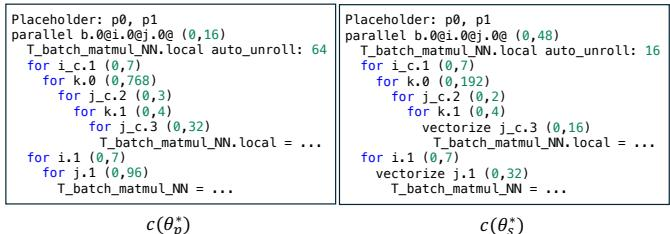  
Figure 9: An example of the posterior program code c(θ∗s ) (right) diffused from the prior program code $C ( \boldsymbol { \theta } _ { p } ^ { * } )$ (left).

The true distribution f (θs) described in Sec. 3.1 is challenging to obtain directly within the program parameter space. However, it can be estimated by evaluating the distance between the mode (mean) of the prior distribution, $\boldsymbol { \theta } _ { p } ^ { \ast } .$ , and the prior parameter $\theta _ { s } .$ . Fig. 10 illustrates the schedule encoding process used for distance measurement. The schedule comprises optimization rules (represented as text) and their corresponding parameters (represented as a list of numbers) [47]. Due to the combination of text and parameters existing within a dynamic range—caused by differences in the type and number of optimization rules across sketches—directly comparing distances or similarities between schedules becomes complex. Consequently, encoding these schedules as vectors is necessary. Here, a total of 11 optimization rules are employed, including SP (split-step), FU (fuse), among others [47]. The textual representations of these rules are converted into a one-hot vector of length 11. Subsequently, the corresponding parameters are zero-padded to transform the varying lists of numbers into a static length for uniformity. In Fig. 10, blue text denotes zero padding applied to specific parameters within identical rules, while green text represents zero padding applied to parameters across different rules. Finally, the one-hot and padded vectors are concatenated to form a unified representation. Figure 11 shows the correlation between the distance between the optimal parameter ${ \boldsymbol { \theta } } _ { a } ^ { * }$ and $\theta _ { b }$ of the other subgraph and the latency. This figure demonstrates that the program latency $l ( c ( \theta _ { b } ) )$ decreases as the distance between $\theta _ { b }$ and ${ \boldsymbol { \theta } } _ { a } ^ { * }$ diminishes, indicating that a more optimal program can be discovered when $\theta _ { b }$ is diffused from ${ \boldsymbol { \theta } } _ { a } ^ { * }$

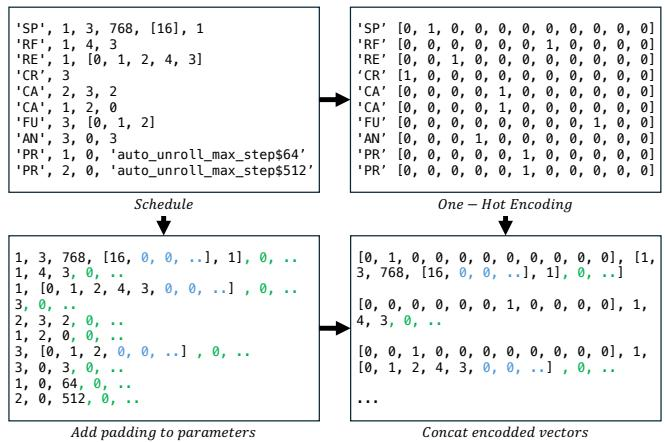

Figure 10: The process of converting a schedule [47] into a vector representation for measuring distances between schedules: the blue and green text indicate padding applied to standardize the vector’s shape.  
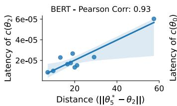

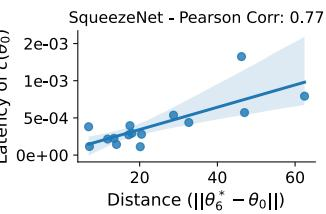  
Figure 11: The latencies (ms) of the generated programs measured on CPU over the norm distance between optimal parameter $\theta ^ { * }$ and the parameter θ of another subgraph in Ansor [47] for BERT [11] (left) and SqueezeNet [18] (right).

$$
\begin{array} { r } { \underset { \mathrm { \tiny ~ | ~ \mathscr { G } _ { 0 } ~ \mathscr { G } _ 1 ~ \mathscr { G } _ 2 ~ \mathscr { G } _ 3 ~ \mathscr { G } _ 4 ~ \mathscr { G } _ 5 ~ \mathscr { G } _ 6 ~ \mathscr { G } _ 7 ~ \mathscr { G } _ 4 ~ \mathscr { G } _ 5 ~ \mathscr { G } _ 4 ~ \mathscr { G } _ { 5 } ~ \mathscr { G } _ { 4 } ~ \mathscr { G } _ { 5 } ~ \mathscr { G } _ { 6 } ~ \mathscr { G } _ { 7 } ~ \mathscr { G } _ { 4 } ~ \mathscr { G } _ { 5 } ~ \mathscr { G } _ { 4 } ~ \mathscr { G } _ { 5 } } } { \mathrm { \normalfont ~ | ~ \mathscr { G } _ { 0 } ~ \mathscr { G } _ 1 ~ \mathscr { G } _ 2 ~ \mathscr { G } _ 2 ~ \mathscr { G } _ 3 ~ \mathscr { G } _ 2 ~ \mathscr { G } _ 4 ~ \mathscr { G } _ 5 ~ \mathscr { G } _ 3 ~ \mathscr { G } _ 2 ~ \mathscr { G } _ 3 ~ \mathscr { G } _ 2 ~ \mathscr { G } _ 4 ~ \mathscr { G } _ 5 ~ \mathscr { G } _ 3 ~ \mathscr { G } _ 4 ~ \mathscr { G } _ 3 ~ \mathscr { G } _ 4 ~ \mathscr { G } _ 5 ~ \mathscr { G } _ 3 ~ \mathscr { G } _ 3 ~ \mathscr { G } _ 4 ~ \mathscr { G } _ 3 ~ \mathscr { G } _ 4 ~ \mathscr { G } _ 5 } }  }  { \mathrm { \normalfont ~ | ~ \mathscr { G } _ { 4 } ~ \mathscr { G } _ 2 ~ \mathscr { G } _ 4 ~ \mathscr { G } _ 4 ~ \mathscr { G } _ 4 ~ \mathscr { G } _ 4 ~ \mathscr { G } _ 3 ~ \mathscr { G } _ 3 ~ \mathscr { G } _ 3 ~ \mathscr { G } _ 3 ~ \mathscr { G } _ 7 ~ \mathscr { G } _ 3 ~ \mathscr { G } _ 4 ~ \mathscr { G } _ 1 ~ \mathscr { G } _ 2 ~ \mathscr { G } _ 5 } }    \end{array}
$$

Figure 12: The optimization sequence of BERT [11] subgraphs of Ansor [47] and Bayesian code diffusion (Pre-Fine Tuning), which trains the cost model with datasets generated in different orders, with subgraphs optimized by Ansor.

## 5 Cost Model of Bayesian Code Diffusion

In auto-tuning, the cost model is essential for evaluating candidate programs by filtering out inefficient ones. Surviving candidates are executed on hardware, generating execution results used to refine the model’s prediction accuracy. By continuously learning from online execution results, the cost model gradually improves its predictive performance from scratch within the online learning paradigm With an accurate cost model, program execution can be selectively guided, substantially reducing the need for exhaustive hardware measurements and accelerating the compilation time. For example, Tenset [48] has demonstrated that a cost model pre-trained on a large-scale dataset can accelerate search time.

Two studies highlight the importance of the cost model from different perspectives. When the training data for the cost model is biased by the search method, the stability of its predictive accuracy can deteriorate [28], while Family-Seer [26] deliberately biases the data by grouping subgraphs and training a dedicated cost model for each group, allowing faster convergence and program selection. They show that prediction performance and learning efficiency can be improved depending on the learning strategy and cost model.

In optimizing process of prior and posterior subgraphs, the cost model of Bayesian code diffusion leverages strengths of the two approaches. First, during the optimization of prior subgraphs within each cluster, the cost model is trained using the execution data from prior programs across diverse clusters. We refer to this process as pre-training. Then, by tuning the posterior subgraphs, the cost model is further refined with execution data from posterior programs similar to their corresponding prior programs. We refer to this process as fine-tuning. This learning strategy enables the cost model to converge quickly while minimizing data bias.

Importantly, we do not modify the cost model architecture or input features and use XGBoost [4] as the cost model, following Ansor [47]. Instead, we adjust the sequence in which execution (training) data is generated. Fig. 12 depicts subgraph optimization sequences of Ansor [47] and Bayesian code diffusion, generating data in different orders for cost model training. As shown in Fig. 5, for the clusters $\mathbb { C } _ { 0 } , \mathbb { C } _ { 1 } , \mathbb { C } _ { 2 }$ and $\mathbb { C } _ { 3 } ,$ prior subgraphs are selected as $\mathcal { G } _ { 7 } , \mathcal { G } _ { 3 } , \mathcal { G } _ { 1 }$ and $\mathcal { G } _ { 4 } ,$ respectively. Bayesian code diffusion optimizes each prior in proportion to the size of the cluster it belongs to, assigning greater importance to larger clusters. This contrasts with Ansor’s cost model training sequence, which begins with a roundrobin over randomly ordered subgraphs and then proceeds with a gradient-based selection strategy.

## 6 Experiments

We implement the proposed Bayesian code diffusion on Ansor [47] (tvm@a340dbe), which is available at GitHub repository1, providing the detailed procedures. We evaluate it on an Intel Core i9-11900K@3.50GHz CPU and Nvidia A6000 GPU with a wide range of deep learning models, i.e., ResNet-18 [16], VGG-{16,19} [38], BERT [11], MobileNet [17], MobileNet-V2 [36], SqueezeNet-V1.1 [18], Inception-V3 [39], MXNet [5], and EfficientNet [40].

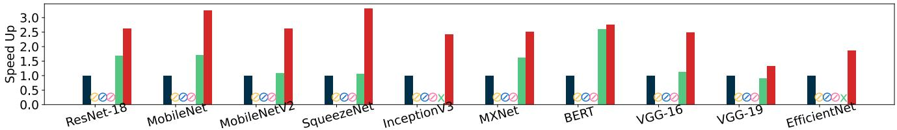  
(a) Compilation (optimization) speedup on CPU (Intel Core i9-11900K)

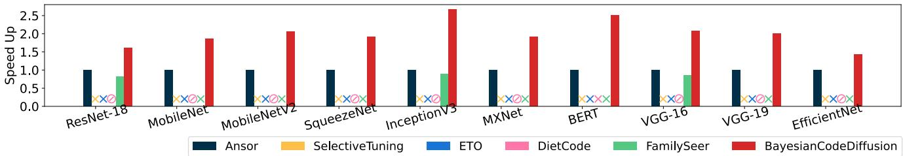  
(b) Compilation (optimization) speedup on GPU (Nvidia A6000)  
Figure 13: The compilation (optimization) time speedup in generating deep learning programs with execution latencies equivalent to the best latencies achieved by Ansor [47], normalized to a baseline of 1.0 (the blue bars). The symbol ‘×’ indicates that the corresponding method fails to generate a program with latency equivalent to Ansor’s best, while ‘⊘’ denotes that the corresponding method is not applicable to the target deep learning model or hardware (CPU/GPU).

## 6.1 End-to-end Model Compilation

Fig. 13 presents the end-to-end optimization (compilation) speedup achieved by Bayesian code diffusion in generating deep learning programs with execution latencies equivalent to the best-latency programs produced by Ansor [47] on both CPU and GPU. The results are compared with alternative approaches, i.e., Ansor [47], FamilySeer [26], DietCode [46], ETO [12], and SelectiveTuing [3]. On the CPU, the proposed Bayesian code diffusion outperforms Ansor [47] by an average of 2.52× speedup (arithmetic mean) and other methods by an average of 1.95× speedup, with a maximum speedup of up to 3.31×. Similarly, on the GPU, Bayesian code diffusion outperforms all other methods by an average of 2.00×, with a maximum speedup of up to 2.79×. The result also shows that previous methods are either (1) unable to generate programs with the equivalent execution latencies, such as ETO [12] and FamilySeer [26], which are marked as × in Fig. 13 or (2) inapplicable to specific subgraphs (operators) or hardware platforms (CPU or GPU), such as DietCode [46], ETO [12], and SelectiveTuning [3] marked as ⊘. In particular, DietCode [46] is designed with GPU architectural features, such as thread blocks, and thus is limited to supporting only GPUs and a subset of operators, rather than the full range of operators and CPUs. Notably, DietCode does not implement the support for convolutional operations, and consequently, it is only evaluated on BERT. Similarly, ETO [12] is also tailored for GPU architectures, and SelectiveTuning [3] has demonstrated effectiveness only on GPUs, with no reported evaluation conducted on CPUs. Unlike these existing methods, which lack applicability, compatibility, optimality, and hardware independence, the proposed Bayesian code diffusion consistently generates programs with the minimum optimization times across various models and hardware (both CPU and GPU), enabling reliable, versatile, and efficient deep learning program optimization.

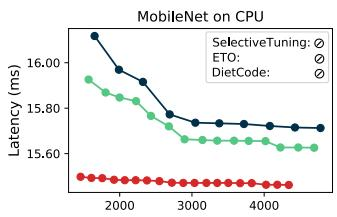

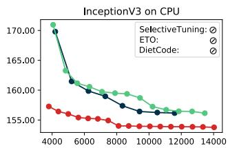

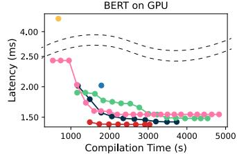

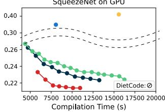  
·Ansor·SelectiveTuning·ETo·DietCode·FamilySeer·BayesianCodeDiffusion  
Figure 14: The execution latencies (ms) of the generated programs over compilation (optimization) time (s). The methods that are not applicable either to the target deep learning models or hardware (CPU/GPU) are indicated by the symbol ‘⊘’.

Fig. 14 presents program execution latencies over compilation (optimization) time on both CPU and GPU. It shows that Bayesian code diffusion provides enhanced performance in both program latency and compilation time when compared to alternative methods. For example, it provides optimization (compilation) speedups of 3.25× for MobileNet on CPU, 2.28× for InceptionV3 on CPU, 2.50× for BERT on GPU, and 1.91× for SqueezeNet on GPU, while generating programs whose execution latencies are consistently lower than those of other methods throughout the entire optimization. This is because Bayesian code diffusion and existing approaches, such as Ansor [47], explore the search space with distinct strategies. Notably, Bayesian code diffusion explicitly targets narrowed and more probable subsets of the search space. Although other approaches could find programs with comparable execution latencies to Bayesian code diffusion by continuously exploring the large entire search space, they would come at the cost of significantly increased time. As a result, Bayesian code diffusion can efficiently constrain and explore the search space, and identifies lower-latency programs more effectively compared to alternative methods, under the same time budget.

Table 4: The execution latency speedups of the programs generated by Bayesian code diffusion: the first diffused latency (left of the slash), measured at the first iteration, and the last diffused latency (right of the slash), measured after all iterations are completed. These are compared against alternative approaches, with Ansor’s optimal latency normalized to 1.0. The symbol ‘⊘’ denotes that the method is not applicable to the target deep learning model or hardware (CPU/GPU).
<table><tr><td rowspan="2">Hardware</td><td rowspan="2">Method</td><td colspan="10">Model</td></tr><tr><td>ResNet-18</td><td>MobileNet</td><td>MobileNetV2</td><td>SqeezeNet</td><td>InceptionV3</td><td>MXNet</td><td>BERT</td><td>VGG-16</td><td>VGG-19</td><td>EffcientNet</td></tr><tr><td rowspan="5">CPU</td><td>SelectiveTuning</td><td>0</td><td>①</td><td>①</td><td>0</td><td>①</td><td>①</td><td>①</td><td>①</td><td>①</td><td>0</td></tr><tr><td>ETO</td><td>0</td><td>0</td><td>0</td><td>①</td><td>0</td><td>0</td><td>0</td><td>0</td><td>0</td><td>0</td></tr><tr><td>DietCode</td><td>□</td><td>①</td><td>①</td><td>日</td><td>①</td><td>0</td><td>①</td><td>日</td><td>□</td><td>①</td></tr><tr><td>FamilySeer</td><td>1.02 / 1.01</td><td>1.01 /1.01</td><td>1.02 / 1.01</td><td>1.07 / 1.01</td><td>1.00 /1.01</td><td>1.02 /1.00</td><td>1.02 /1.01</td><td>0.99 /1.00</td><td>1.00 /1.01</td><td>1.00 / 1.00</td></tr><tr><td>Bayesian code diffusion</td><td>1.04 / 1.01</td><td>1.04 / 1.02</td><td>1.08 / 1.02</td><td>1.21 / 1.03</td><td>1.16 / 1.01</td><td>1.05 / 1.01</td><td>1.02 / 1.01</td><td>1.04 / 1.01</td><td>1.00 /1.00</td><td>1.03 / 1.01</td></tr><tr><td rowspan="5">GPU</td><td>SelectiveTuning</td><td>0.38/0.28</td><td>0.60/0.44</td><td>0.58/0.40</td><td>0.68 / 0.56</td><td>0.83 /0.56</td><td>1.03 / 0.58</td><td>0.47 /0.32</td><td>0.71/0.52</td><td>0.42/0.28</td><td>0.94 /0.72</td></tr><tr><td>ETO</td><td>0.94 / 0.68</td><td>0.55 /0.41</td><td>0.63 /0.43</td><td>0.80 / 0.65</td><td>1.18 /0.80</td><td>0.78 /0.44</td><td>1.04 /0.70</td><td>0.87/0.63</td><td>0.69 /0.47</td><td>1.04/0.80</td></tr><tr><td>DietCode</td><td>日</td><td>①</td><td>①</td><td>①</td><td>①</td><td>①</td><td>0.86</td><td>①</td><td>①</td><td>0</td></tr><tr><td>FamilySeer</td><td>1.00 /1.02</td><td>0.99 /0.98</td><td>1.03 / 0.98</td><td>1.00 / 1.00</td><td>1.00 /1.01</td><td>1.02/ 0.98</td><td>1.10 /0.97</td><td>1.00 /1.01</td><td>1.00 / 0.93</td><td>1.02/ 0.99</td></tr><tr><td>Bayesian code diffusion</td><td>1.26 / 1.06</td><td>1.29 / 1.07</td><td>1.36 / 1.05</td><td>1.15 / 1.05</td><td>1.39 / 1.08</td><td>1.65 / 1.07</td><td>1.47 / 1.03</td><td>1.16 /1.07</td><td>1.37 /1.13</td><td>1.20 / 1.01</td></tr></table>

Tab. 4 summarizes the program latency speedup achieved by Bayesian code diffusion at the first iteration (i.e., firstdiffused latency) and the last iteration of code diffusion (i.e., last diffused latency), respectively, in comparison with alternative methods. Following Ansor [47], Bayesian code diffusion allocates the total search time budget by dividing it among the subgraphs. After each subgraph is optimized through the pre-fine tuning process described in Sec. 5, the remaining time budget is used to further optimize the subgraphs in a gradient-based order [47]. We define the first-diffused latency as the program latency measured when all subgraphs have been tuned at least once. The last-diffused latency refers to the program latency obtained after fully utilizing the entire time budget to optimize all subgraphs. The first-diffused latency is compared against the program latency obtained when all subgraphs are tuned by each method. In contrast, the last-diffused latency is compared against the program latency achieved after each method has exhausted its entire search time budget. At the outset (Tab. 4, left of the slash), it begins from first diffused programs exhibiting the lowest latency across all cases, for instance 1.65× latency speedup for MXNet on GPU, compared to other approaches that either fail to generate programs with equivalent latencies or require significantly more time to achieve them. After full iterations of Bayesian code diffusion (Tab. 4, right of the slash), Bayesian code diffusion produces last diffused programs with the lowest program latency among all methods, e.g., 1.13× speedup for VGG-19 on GPU, while significantly reducing optimization time at the same time, as presented in Fig. 13. These results suggest that a series of mechanisms of Bayesian code diffusion, i.e., prior optimization, and code diffusion for posterior program generation, brings consistent improvements in both program compilation (optimization) time and the execution latency of the generated program.

## 6.2 Subgraph Cluster Optimization

Tab. 5 lists a set of operator sequences of several subgraph clusters in some deep learning models, and Fig. 15 presents their optimization speedup using Bayesian code diffusion, compared with Ansor [47]. As illustrated in the figure, the proposed Bayesian code diffusion optimizes deep learning operators to achieve latencies equivalent to Ansor’s best results, with an average optimization speedup of 2.11×. Fig. 16 shows the optimization efficiency of Bayesian code diffusion on several subgraph clusters (i.e., clusters A, B, C, and D) over the optimization time, indicating that it generates programs with lower execution latency using reduced subgraph compilation (optimization) time compared to that of Ansor.

Table 5: A set of operation sequences in subgraphs.
<table><tr><td>Idx</td><td>Operator Sequence</td><td>Model</td><td>HW</td></tr><tr><td>A</td><td>conv2d_add_nn_relu</td><td>MobileNet MXNet</td><td>CPU CPU</td></tr><tr><td>B C</td><td>conv2d_NCHWc_add_add_nn_relu conv2d_NCHWc_add_nn_relu</td><td>InceptionV3</td><td>CPU</td></tr><tr><td>D</td><td>conv2d_add_nn_relu</td><td>SqueezeNet</td><td>GPU</td></tr></table>

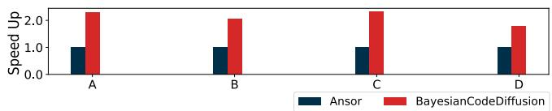  
Figure 15: The optimization speedups on subgraph clusters in Tab. 5, compared against Ansor [47].

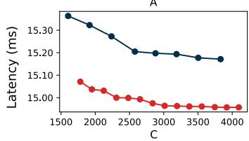

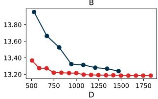

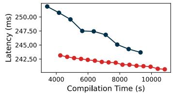

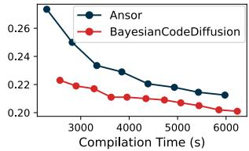  
Figure 16: The latencies of the generated programs (ms) over the subgraph cluster compilation (optimization) time (s).

## 6.3 Cost Model

Fig. 17 plots the program execution latency over the compilation (optimization) time, comparing the proposed pre-training strategy and fine-tuning with Ansor [47] that does not apply it. The sequences of subgraph optimization for both cases are illustrated in Fig. 12, which generates training data samples in different orders for training the cost model. To evaluate the cost model as an independent variable, we optimize the programs using Ansor without using code diffusion in both experiments. The cost model is then trained on data samples produced in different orders. As shown in the figure, the proposed pre-training and fine-tuning method reduces compilation time by producing programs with lower latencies, without requiring any modifications to the cost model. This result suggests that the effectiveness of the cost model can be enhanced by first improving its generalization ability with various datasets and subsequently learning and making predictions on specific subgraph clusters. We expect further improvements could be achievable by incorporating advancements in enhancing the learning capacity and prediction accuracy of the cost model [2, 35, 44] into the proposed Bayesian code diffusion. We leave this exploration for future work.

## 6.4 Subgraph Sparsity

The performance of Bayesian code diffusion can be influenced by the degree of similarity among subgraphs of models.

In particular, if each subgraph generates a distinct sketch, it leads to an excessively large number of small clusters. As a result, the selected prior subgraph receives fewer tuning opportunities, and fewer posterior subgraphs can benefit from prior propagation, possibly reducing its effectiveness. Additionally, high operator diversity can negatively affect the cost model’s pre-training and fine-tuning strategies. Even when sketches differ, subgraphs that share the same operator tend to produce similar program data. Consequently, fine-tuning results from one cluster can positively influence others that, despite having different sketches, share the same operator. However, when operator diversity is high, such cross-cluster generalization becomes limited, reducing the effectiveness of the cost model’s learning strategy.

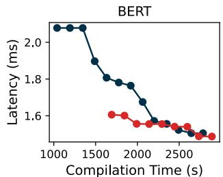

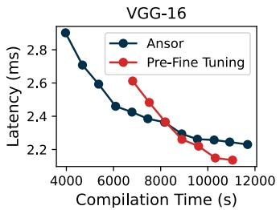  
Figure 17: The latency (ms) of generated programs for BERT [11] and VGG-16 [38] over the compilation (optimization) time (s), under different training orders of the cost model as illustrated in Fig. 12.

Table 6: A comparison between sketch sparsity $( \mathbb { S } _ { S } )$ , operator sparsity $( \mathbb { S } _ { O } )$ , and program optimization speedup.
<table><tr><td rowspan="3">Network</td><td rowspan="3"> $\mathbb { S } _ { O }$ </td><td colspan="2">CPU</td><td colspan="2">GPU</td></tr><tr><td> $\overline { { \mathbb { S } _ { S } } }$ </td><td>SpeedUp</td><td> $\overline { { \mathbb { S } _ { S } } }$ </td><td>SpeedUp</td></tr><tr><td>0.83</td><td>2.63</td><td>0.83</td><td>1.60</td></tr><tr><td>ResNet-18</td><td>0.83 0.14</td><td>0.57</td><td>3.25</td><td>0.14</td><td></td></tr><tr><td>MobileNet</td><td>0.44</td><td>0.76</td><td>2.62</td><td>0.71</td><td>1.85 2.05</td></tr><tr><td>MobileNetV2 SqueezeNet</td><td>0.22</td><td>0.43</td><td>3.30</td><td>0.22</td><td>1.92</td></tr><tr><td>InceptionV3</td><td>0.22</td><td>0.53</td><td>2.42</td><td>0.22</td><td>2.67</td></tr><tr><td>MXNet</td><td>0.62</td><td>0.86</td><td>2.51</td><td>0.62</td><td>1.91</td></tr><tr><td>BERT</td><td>0.38</td><td>0.50</td><td>2.75</td><td>0.50</td><td>2.50</td></tr><tr><td>VGG-16</td><td>0.40</td><td>0.93</td><td>2.48</td><td>0.87</td><td>2.08</td></tr><tr><td>VGG-19</td><td>0.40</td><td>0.93</td><td>1.33</td><td>0.87</td><td>2.01</td></tr><tr><td>EfficientNet</td><td>0.66</td><td>0.88</td><td>1.85</td><td>0.88</td><td>1.43</td></tr></table>

To quantify the diversity of sketch generation and operator across subgraphs, we define sketch sparsity and operator sparsity as shown in Eq. (10), where $G _ { \mathrm { a l l } }$ is the total number of subgraphs, max $( | G _ { S } ^ { i } | )$ is the number of subgraphs that belong to the largest cluster obtained via sketch-based clustering, and max $( | G _ { O } ^ { i } | )$ is the number of subgraphs containing the most frequent operator in the model. A higher sparsity value indicates lower subgraph similarity. Tab. 6 compares sketch sparsity, operator sparsity, and optimization speedup of Bayesian code diffusion in Fig. 13 across different models.

$$
\mathbb { S } _ { S } = 1 - \operatorname* { m a x } ( | G _ { S } ^ { i } | ) / G _ { \mathrm { a l l } } , \mathbb { S } _ { O } = 1 - \operatorname* { m a x } ( | G _ { O } ^ { i } | ) / G _ { \mathrm { a l l } }\tag{10}
$$

Fig. 18 presents the Pearson correlation [13] between subgraph sparsity (i.e., sketch sparsity and operator sparsity) and average program optimization speedup on various models on CPU and GPU. Overall, the sketch sparsity shows a stronger correlation with optimization speedup on CPU, while operator sparsity is more strongly correlated on GPU. This indicates that prior propagation has a large impact on compilation time on CPU, whereas pre-training and fine-tuning strategy in cost model are more impactful on GPU.

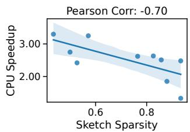

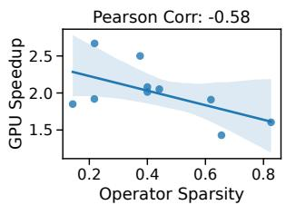  
Figure 18: The Pearson correlation [13] between subgraph sparsity and speedup on CPU and GPU. On CPUs, speedup is correlated more strongly with sketch sparsity, whereas on GPUs, it is more closely associated with operator sparsity.

## 6.5 Prior Selection

We evaluate the prior selection described in Sec. 4.2. Specifically, we compare the program execution latency of the first diffused code in Bayesian code diffusion; the prior subgraph is selected based on either high or low similarity to other subgraphs in the same cluster. Fig. 19 presents the mean latency of $l _ { h }$ and $l _ { l }$ across various models in Fig. 13, where $l _ { h }$ and $l _ { l }$ represent the program execution latency of the first diffused code obtained by selecting prior subgraphs with high and low similarity, respectively. In general, selecting a prior subgraph with high similarity enables Bayesian code diffusion to find lower-latency programs across both CPU and GPU. On average, the normalized latency $l _ { h } / l _ { l }$ is 0.99 on CPU and 0.91 on GPU, indicating consistent performance improvement of highsimilarity prior subgraph over low-similarity prior subgraph. Therefore, Bayesian code diffusion tends to be more effective when selecting the subgraph with the highest similarity to others as the prior subgraph within the cluster.

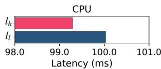

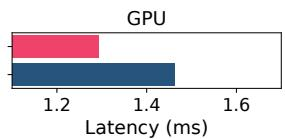  
Figure 19: A comparison of $l _ { h }$ and ll on CPU and GPU, where $l _ { h }$ and $l _ { l }$ denote the program execution latency of the first diffused code optimized using high- and low-similarity prior subgraphs, respectively. The bar lengths indicate the mean value of execution latencies of various deep learning models.

## 7 Discussions and Limitations

From Hypothetical Concept to Implementation. Applying the proposed concept of Bayesian code diffusion to the deep learning program optimization problem requires several considerations and presents some complexities in implementation. For instance, the true prior distribution $f ( \Theta _ { p } ) \stackrel { - } { = } \mathcal { N } ( \Theta _ { p } ^ { * } , \sigma _ { p } ^ { 2 } )$ is unknown and must be effectively approximated to conduct precise code diffusion for the posterior optimization. Although the optimal prior parameter $\boldsymbol { \theta } _ { p } ^ { \ast }$ is empirically estimated in our implementation by allocating a large search time budget proportional to the cluster size for sufficient search, there is no guarantee that the identified ${ \boldsymbol { \theta } } _ { p } ^ { * }$ is truly optimal.

While Eq. (4) in Sec. 3.1 provides a confidence measurement on the posterior optimal parameter ${ \boldsymbol { \theta } } _ { s } ^ { * }$ , a similar quantity needs to be devised for the optimal prior parameter ${ \boldsymbol { \theta } } _ { p } ^ { * }$ to improve the overall performance of subsequent code diffusion. Furthermore, implementing code diffusion for the posterior program optimization may not be straightforward in practical implementations. In this work, we demonstrate a concrete implementation of code diffusion for Ansor [47]; however, different deep learning compilers or optimization mechanisms may require modifications of the code diffusion approach, distinct from the approach presented here. We will investigate to bridge the gap between the hypothetical concept of Bayesian code diffusion and its practical implementations, aiming to develop a generalized solution that can address or mitigate these implementation challenges.

Prior Selection. Selecting the optimal prior subgraph within a subgraph cluster during online program optimization is a challenging task. That is because the prior subgraph capable of generating the optimal programs can only be identified after the full compilation (optimization) of the target deep learning model. In this work, we estimate the most suitable prior during the optimization process by measuring the tensor shape distances between subgraphs in a cluster in an online manner. Although this approach results in substantial improvements in both optimization time and program execution latency, we have observed that superior prior subgraphs exist in certain cases, which could further enhance program optimization performance. We will study alternative approaches that can more accurately select the prior subgraph to facilitate enhanced code diffusion for the posterior parameter optimization.

Cost Model. While Bayesian code diffusion proposes and employs pre-training and fine-tuning of the cost model, which enhances the program optimization performance, additional improvements could be achieved by enhancing the cost model itself. For instance, in this work, the cost model or learning algorithm is utilized as presented in Ansor [47] without modification. However, more advanced cost models, such as neural network-based approaches [44], could be employed to enhance the model prediction accuracy. Regarding learning strategies, active learning [2], which selects and focuses on learning from data examples expected to contribute to model performance, can be used to enhance both prediction accuracy and training efficiency. Additionally, we can leverage a large pre-collected dataset as pre-training data in an offline manner [35], followed by fine-tuning the cost model in an online context. Therefore, it is worth investigating how improvements to the cost model, including modeling methods and learning strategies, affect the performance of the proposed Bayesian code diffusion in a synergistic manner. However, we generally conjecture that improvements to the cost model could help further enhance program optimization, as these mechanisms are orthogonal to one another.

Applicability to Other Deep Learning Compilers. The core idea behind Bayesian code diffusion is that structurally similar subgraphs can share optimization patterns, enabling more efficient program tuning. This insight can extend beyond Ansor [47], to other deep learning program optimization frameworks such as MetaSchedule [37] and TASO [20], expanding its applicability. MetaSchedule [37], a stochastic search framework, probabilistically samples transformation rule parameters. Bayesian code diffusion can be integrated into MetaSchedule, where posterior program distributions follow prior distributions, or their parameters are diffused from prior programs. For TASO [20], a superoptimizer based on graph substitutions performs graph transformations independently by generating and comparing candidates. While TASO does not exploit subgraph similarity, its search space can be reduced by identifying and matching common subpatterns.

## 8 Related Work

Subgraph Similarity. Similar to Bayesian code diffusion, some existing works group subgraphs. TransferTuning [14] transfers an optimized schedule from one model to another running on CPU based on model similarity. However, it requires a pre-optimized schedule of a separate model, which differs from the proposed approach not requiring it. Instead, the prior is propagated in an online manner within the same model, which is applicable to both CPU and GPU. Family-Seer [26] groups subgraphs with identical operator sequences and assigns a cost model to each. However, the narrow dataset generated by a single group often leads to suboptimal program performance. The proposed approach addresses this by pre-training and fine-tuning the cost model, accelerating program optimization while ensuring optimal performance. The proposed approach can also be applied to reduce search spaces in dynamic tensor program optimizations, e.g., Nimble [21] and DietCode [46], which construct a shape-generic search space. SelectiveTuning [3] also clusters subgraphs and transfers schedules from representative subgraph to others. In contrast to this method, which provides suboptimal performance as it modifies the transferred schedule only once using pre-defined rules, the proposed approach employs iterative and adaptive code diffusion, producing optimal programs.

Efficient Search Space Exploration. Many studies try to facilitate efficient exploration of program search spaces. Being orthogonal to the proposed Bayesian code diffusion, they can be applied to further accelerate optimization in the reduced search space derived from the prior programs. For example, Chameleon [1] explores search spaces using reinforcement learning, and ALT [42] minimizes hardware measurements while exploring optimal compile time with active learning. Dynamic gradient descent search [24] improves the performance of the program by replacing traditional random sampling. Some works aim to address the inefficiencies of auto-schedulers. DynaTune [45] efficiently allocates time resources to optimization tasks, and AdaTune [25] reduces the hardware measurements needed to stabilize the performance of the program. However, these approaches do not utilize similarity between subgraphs, missing opportunities for more efficient exploration and program reuse. Thus, Bayesian code diffusion can complement them. Thus, integrating Bayesian code diffusion can reduce redundant searches by reducing exploration spaces, improving exploration efficiency, reducing hardware measurements, and enhancing cost model accuracy, leading to more effective deep learning program optimization. Cost Model. Cost models are typically trained online during compilation using data generated via hardware measurements [6, 47]. BALTO [2] reduces training data through diversity-based active learning, and TLP [44] uses a neural network and extracts features from primitives to ensure portability across various hardware and efficiently explore programs with limited data. In contrast, offline learning utilizes a pre-trained cost model using pre-collected data to reduce compile time. This includes approaches such as Tenset [48] and One-shot tuner [35] that train a neural network cost predictor offline. Although offline learning reduces compile time, it requires a substantial amount of data to train the model, which may not be available for heterogeneous hardware. This contrasts with the proposed approach for online training. In this work, we introduce the concept of online pre-training of the cost model using the prior s of different clusters, which is fine-tuned on cluster-specific data, one at a time. It enables the model to ensure generalizability while improving the predictions for each cluster, without modifying the cost model.

Large Language Models. Advances in large language models (LLMs) have prompted their adoption in code generation tasks [8, 9, 43]. In particular, TLM [43] proposes a tensor language model for deep learning program optimization and departs from traditional program sampling methods by reconstructing the search space through a generative compiler based on LLMs. However, this approach requires extensive computational resources due to the pre-training of huge models like GPT-2 [31] with large-scale datasets. Additionally, this offline learning paradigm struggles with heterogeneous hardware, differing fundamentally from the online learning approach adopted in Bayesian code diffusion.

## 9 Conclusion

We introduce Bayesian code diffusion, which enhances the auto-tuning efficiency for deep learning (tensor) programs by reformulating optimization as a distribution-based problem using Bayesian principles. By diffusing well-optimized program code as a prior across similar subgraphs, it enables an efficient search for optimal parameters for posterior programs compared to random search methods. Additionally, pre-training and fine-tuning the cost model improves prediction accuracy. Implemented on Ansor, the proposed Bayesian code diffusion accelerates compilation times and reduces the program latency for deep learning models on both CPUs and GPUs, outperforming state-of-the-art auto-tuning methods.

## Acknowledgments

This work was supported by the Institute of Information & communications Technology Planning & Evaluation(IITP) grant funded by the Korea government(MSIT) (No.RS-2024- 00508465) and Institute of Information & communications Technology Planning & Evaluation(IITP) grant funded by the Korea government(MSIT) (No.RS-2020-II201336, Artificial Intelligence Graduate School Program(UNIST)).

## References

[1] Byung Hoon Ahn, Prannoy Pilligundla, Amir Yazdanbakhsh, and Hadi Esmaeilzadeh. Chameleon: Adaptive code optimization for expedited deep neural network compilation. arXiv preprint arXiv:2001.08743, 2020.

[2] Jun Bi, Xiaqing Li, Qi Guo, Rui Zhang, Yuanbo Wen, Xing Hu, Zidong Du, Xinkai Song, Yifan Hao, and Yunji Chen. Balto: fast tensor program optimization with diversity-based active learning. In The Eleventh International Conference on Learning Representations, 2022.

[3] CH Yu. SelectiveTuning. https://github.com/ apache/tvm/issues/4188, 2019.

[4] Tianqi Chen and Carlos Guestrin. Xgboost: A scalable tree boosting system. In Proceedings of the 22nd acm sigkdd international conference on knowledge discovery and data mining, pages 785–794, 2016.

[5] Tianqi Chen, Mu Li, Yutian Li, Min Lin, Naiyan Wang, Minjie Wang, Tianjun Xiao, Bing Xu, Chiyuan Zhang, and Zheng Zhang. Mxnet: A flexible and efficient machine learning library for heterogeneous distributed systems. arXiv preprint arXiv:1512.01274, 2015.

[6] Tianqi Chen, Thierry Moreau, Ziheng Jiang, Lianmin Zheng, Eddie Yan, Haichen Shen, Meghan Cowan, Leyuan Wang, Yuwei Hu, Luis Ceze, et al. {TVM}: An automated {End-to-End} optimizing compiler for deep learning. In 13th USENIX Symposium on Operating Systems Design and Implementation (OSDI 18), pages 578–594, 2018.

[7] Tianqi Chen, Lianmin Zheng, Eddie Yan, Ziheng Jiang, Thierry Moreau, Luis Ceze, Carlos Guestrin, and Arvind Krishnamurthy. Learning to optimize tensor programs. Advances in Neural Information Processing Systems, 31, 2018.

[8] Chris Cummins, Volker Seeker, Dejan Grubisic, Mostafa Elhoushi, Youwei Liang, Baptiste Roziere, Jonas Gehring, Fabian Gloeckle, Kim Hazelwood, Gabriel Synnaeve, et al. Large language models for compiler optimization. arXiv preprint arXiv:2309.07062, 2023.

[9] Chris Cummins, Volker Seeker, Dejan Grubisic, Baptiste Roziere, Jonas Gehring, Gabriel Synnaeve, and Hugh Leather. Meta large language model compiler: Foundation models of compiler optimization. arXiv preprint arXiv:2407.02524, 2024.

[10] Scott Cyphers, Arjun K Bansal, Anahita Bhiwandiwalla, Jayaram Bobba, Matthew Brookhart, Avijit Chakraborty, Will Constable, Christian Convey, Leona Cook, Omar Kanawi, et al. Intel ngraph: An intermediate representation, compiler, and executor for deep learning. arXiv preprint arXiv:1801.08058, 2018.

[11] Jacob Devlin, Ming-Wei Chang, Kenton Lee, and Kristina Toutanova. Bert: Pre-training of deep bidirectional transformers for language understanding. In Proceedings of the 2019 Conference of the North American Chapter of the Association for Computational Linguistics: Human Language Technologies, Volume 1 (Long and Short Papers), pages 4171–4186, 2019.

[12] Jingzhi Fang, Yanyan Shen, Yue Wang, and Lei Chen. Eto: accelerating optimization of dnn operators by highperformance tensor program reuse. Proceedings of the VLDB Endowment, 15(2):183–195, 2021.

[13] David Freedman, Robert Pisani, and Roger Purves. Statistics (international student edition). Pisani, R. Purves, 4th edn. WW Norton & Company, New York, 2007.

[14] Perry Gibson and José Cano. Transfer-tuning: Reusing auto-schedules for efficient tensor program code generation. In Proceedings of the International Conference on Parallel Architectures and Compilation Techniques, pages 28–39, 2022.

[15] Google. Xla - high level optimizer. GitHub repository, 2024.

[16] Kaiming He, Xiangyu Zhang, Shaoqing Ren, and Jian Sun. Deep residual learning for image recognition. In Proceedings of the IEEE conference on computer vision and pattern recognition, pages 770–778, 2016.

[17] Andrew G Howard, Menglong Zhu, Bo Chen, Dmitry Kalenichenko, Weijun Wang, Tobias Weyand, Marco Andreetto, and Hartwig Adam. Mobilenets: Efficient convolutional neural networks for mobile vision applications. In Proceedings of the IEEE conference on computer vision and pattern recognition, 2017.

[18] Forrest N Iandola, Song Han, Matthew W Moskewicz, Khalid Ashraf, William J Dally, and Kurt Keutzer. Squeezenet: Alexnet-level accuracy with 50x fewer parameters and <0.5 mb model size. arXiv preprint arXiv:1602.07360, 2016.

[19] Intel Corporation. Intel® Math Kernel Library (Intel® MKL), 2024. Version 2024.0.

[20] Zhihao Jia, Oded Padon, James Thomas, Todd Warszawski, Matei Zaharia, and Alex Aiken. Taso: optimizing deep learning computation with automatic generation of graph substitutions. In Proceedings of the 27th ACM Symposium on Operating Systems Principles, pages 47– 62, 2019.

[21] Woosuk Kwon, Gyeong-In Yu, Eunji Jeong, and Byung-Gon Chun. Nimble: Lightweight and parallel gpu task scheduling for deep learning. Advances in Neural Information Processing Systems, 33:8343–8354, 2020.

[22] Chuck L Lawson, Richard J. Hanson, David R Kincaid, and Fred T. Krogh. Basic linear algebra subprograms for fortran usage. ACM Transactions on Mathematical Software (TOMS), 5(3):308–323, 1979.

[23] Chris Leary and Todd Wang. Xla: Tensorflow, compiled, 2017.

[24] Chendi Li, Yufan Xu, Sina Mahdipour Saravani, and Ponnuswamy Sadayappan. Accelerated auto-tuning of gpu kernels for tensor computations. In Proceedings of the 38th ACM International Conference on Supercomputing, pages 549–561, 2024.

[25] Menghao Li, Minjia Zhang, Chi Wang, and Mingqin Li. Adatune: Adaptive tensor program compilation made efficient. Advances in Neural Information Processing Systems, 33:14807–14819, 2020.

[26] Mingzhen Li, Hailong Yang, Shanjun Zhang, Fengwei Yu, Ruihao Gong, Yi Liu, Zhongzhi Luan, and Depei Qian. Exploiting subgraph similarities for efficient autotuning of tensor programs. In Proceedings of the 52nd International Conference on Parallel Processing, pages 786–796, 2023.

[27] Jonas Mockus and Jonas Mockus. The Bayesian approach to local optimization. Springer, 1989.

[28] Pranati Modumudi, Xiyou Zhou, and Sunghyun Park. Unveiling source of performance variance on searchbased compiler optimization. In Machine Learning for Computer Architecture and Systems 2022.

[29] NVIDIA Corporation. cuBLAS: The NVIDIA CUDA Basic Linear Algebra Subroutines library, 2024.

[30] NVIDIA Corporation. NVIDIA cuDNN. https:// developer.nvidia.com/cudnn, 2024. Version X.Y.Z.

[31] Alec Radford, Jeffrey Wu, Rewon Child, David Luan, Dario Amodei, Ilya Sutskever, et al. Language models are unsupervised multitask learners. OpenAI blog, 1(8):9, 2019.

[32] Sivaramakrishnan Rajaraman, Ghada Zamzmi, Feng Yang, Zhaohui Liang, Zhiyun Xue, and Sameer Antani. Semantically redundant training data removal and deep model classification performance: A study with chest x-rays. arXiv preprint arXiv:2309.09773, 2023.

[33] Jared Roesch, Steven Lyubomirsky, Marisa Kirisame, Logan Weber, Josh Pollock, Luis Vega, Ziheng Jiang, Tianqi Chen, Thierry Moreau, and Zachary Tatlock. Relay: A high-level compiler for deep learning. arXiv preprint arXiv:1904.08368, 2019.

[34] Nadav Rotem, Jordan Fix, Saleem Abdulrasool, Garret Catron, Summer Deng, Roman Dzhabarov, Nick Gibson, James Hegeman, Meghan Lele, Roman Levenstein, et al. Glow: Graph lowering compiler techniques for neural networks. arXiv preprint arXiv:1805.00907, 2018.

[35] Jaehun Ryu, Eunhyeok Park, and Hyojin Sung. Oneshot tuner for deep learning compilers. In Proceedings of the 31st ACM SIGPLAN International Conference on Compiler Construction, pages 89–103, 2022.

[36] Mark Sandler, Andrew Howard, Menglong Zhu, Andrey Zhmoginov, and Liang-Chieh Chen. Mobilenetv2: Inverted residuals and linear bottlenecks. In Proceedings of the IEEE conference on computer vision and pattern recognition, pages 4510–4520, 2018.

[37] Junru Shao, Xiyou Zhou, Siyuan Feng, Bohan Hou, Ruihang Lai, Hongyi Jin, Wuwei Lin, Masahiro Masuda, Cody Hao Yu, and Tianqi Chen. Tensor program optimization with probabilistic programs. Advances in Neural Information Processing Systems, 35:35783–35796, 2022.

[38] Karen Simonyan and Andrew Zisserman. Very deep convolutional networks for large-scale image recognition. arXiv preprint arXiv:1409.1556, 2014.

[39] Christian Szegedy, Vincent Vanhoucke, Sergey Ioffe, Jon Shlens, and Zbigniew Wojna. Rethinking the inception architecture for computer vision. In Proceedings of the IEEE conference on computer vision and pattern recognition, pages 2818–2826, 2016.

[40] Mingxing Tan and Quoc Le. Efficientnet: Rethinking model scaling for convolutional neural networks. In International conference on machine learning, pages 6105–6114. PMLR, 2019.

[41] Pradnya A Vikhar. Evolutionary algorithms: A critical review and its future prospects. In 2016 International conference on global trends in signal processing, information computing and communication (ICGTSPICC), pages 261–265. IEEE, 2016.

[42] Xi Zeng, Tian Zhi, Zidong Du, Qi Guo, Ninghui Sun, and Yunji Chen. Alt: Optimizing tensor compilation in deep learning compilers with active learning. In 2020 IEEE 38th International Conference on Computer Design (ICCD), pages 623–630, 2020.

[43] Yi Zhai, Sijia Yang, Keyu Pan, Renwei Zhang, Shuo Liu, Chao Liu, Zichun Ye, Jianmin Ji, Jie Zhao, Yu Zhang, and Yanyong Zhang. Enabling tensor language model to assist in generating High-Performance tensor programs for deep learning. In 18th USENIX Symposium on Operating Systems Design and Implementation (OSDI 24), pages 289–305, Santa Clara, CA, July 2024. USENIX Association.

[44] Yi Zhai, Yu Zhang, Shuo Liu, Xiaomeng Chu, Jie Peng, Jianmin Ji, and Yanyong Zhang. Tlp: A deep learningbased cost model for tensor program tuning. In Proceedings of the 28th ACM International Conference on Architectural Support for Programming Languages and Operating Systems, Volume 2, pages 833–845, 2023.

[45] Minjia Zhang, Menghao Li, Chi Wang, and Mingqin Li. Dynatune: Dynamic tensor program optimization in deep neural network compilation. In International Conference on Learning Representations, 2021.

[46] Bojian Zheng, Ziheng Jiang, Cody Hao Yu, Haichen Shen, Joshua Fromm, Yizhi Liu, Yida Wang, Luis Ceze, Tianqi Chen, and Gennady Pekhimenko. Dietcode: Automatic optimization for dynamic tensor programs. Proceedings of Machine Learning and Systems, 4:848–863, 2022.

[47] Lianmin Zheng, Chengfan Jia, Minmin Sun, Zhao Wu, Cody Hao Yu, Ameer Haj-Ali, Yida Wang, Jun Yang, Danyang Zhuo, Koushik Sen, et al. Ansor: Generating {High-Performance} tensor programs for deep learning. In 14th USENIX symposium on operating systems design and implementation (OSDI 20), pages 863–879, 2020.

[48] Lianmin Zheng, Ruochen Liu, Junru Shao, Tianqi Chen, Joseph E Gonzalez, Ion Stoica, and Ameer Haj Ali. Tenset: A large-scale program performance dataset for learned tensor compilers. In Thirty-fifth Conference on Neural Information Processing Systems Datasets and Benchmarks Track (Round 1), 2021.