USENIX

THE ADVANCED COMPUTING SYSTEMS ASSOCIATION

# Training with Confidence: Catching Silent Errors in Deep Learning Training with Automated Proactive Checks

Yuxuan Jiang, Ziming Zhou, Boyu Xu, Beijie Liu, Runhui Xu, and Peng Huang, University of Michigan

https://www.usenix.org/conference/osdi25/presentation/jiang

# This paper is included in the Proceedings of the 19th USENIX Symposium on Operating Systems Design and Implementation.

July 7–9, 2025 • Boston, MA, USA

ISBN 978-1-939133-47-2

Open access to the Proceedings of the 19th USENIX Symposium on Operating Systems Design and Implementation is sponsored by

# Training with Confidence: Catching Silent Errors in Deep Learning Training with Automated Proactive Checks

Yuxuan Jiang Ziming Zhou Boyu Xu Beijie Liu Runhui Xu Peng Huang

University of Michigan

## Abstract

Training deep learning (DL) models is a complex process, making it prone to silent errors that are challenging to detect and diagnose. This paper presents TRAINCHECK, a framework that takes a proactive checking approach to address silent training errors. TRAINCHECK automatically infers invariants tailored for DL training. It uses these invariants to proactively detect silent errors during the training process while providing debugging help. To evaluate TRAINCHECK, we reproduce 20 real-world silent training errors with diverse root causes. TRAINCHECK successfully detects 18 errors within a single training iteration. It also uncovers 6 unknown bugs in popular training libraries that lead to silent errors.

## 1 Introduction

Training deep learning (DL) models has become integral for many application domains [8, 17, 24]. DL training, however, is a complex process involving multiple steps and layers of components such as user code, compiler, training framework, optimization libraries, drivers, and distributed systems. Moreover, these components undergo frequent updates [9, 13] due to the rapid pace of DL research. Consequently, training jobs are prone to errors from various sources [51].

To make matters worse, while some errors cause immediate job failures and are relatively easy to identify (e.g., GPU out of memory or illegal argument exceptions), many others are silent or latent. Such errors do not cause obvious training disruptions but eventually produce suboptimal/incorrect models or cause noticeable failures much later.

Figure 1 shows a real-world silent training error in HuggingFace’s training of BLOOM-176B [4]. DeepSpeed’s BF16Optimizer was used in this training task, which had a logic bug in gradient clipping. This bug did not trigger any exception but caused parts of the model to diverge silently across GPUs, a problem that went undetected for 10 days.

Detecting such silent errors is inherently difficult due to the lack of clear signals. When they are detected, substantial training resources have been wasted. The problem is further compounded by the trend of training large models using massive resources. Moreover, during diagnosis, developers are often left in the dark and have to take a trial-and-error approach [53], such as tweaking hyperparameters and rerunning the task while the real root causes are elsewhere, which is tedious and time-consuming. Indeed, developers have expressed frustration with diagnosing these silent errors [7, 20, 37, 38, 46, 47].

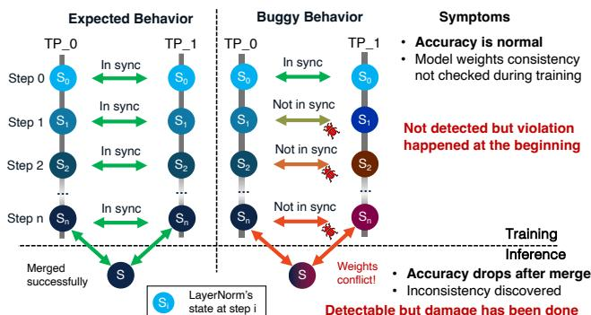  
Figure 1: Silent error in BLOOM-176B training.

Current practices rely on high-level model evaluation signals such as loss, accuracy, and gradient norms [1, 5]. While these signals provide useful information about overall training progress, they are not designed for error detection. They are often noisy and evaluated only periodically, leading to missed or delayed detection. Even when anomalies are observed, they provide little diagnostic value for identifying the root cause. The aforementioned BLOOM-176B training error, for example, did not manifest as abnormal loss or accuracy, and it took developers 12 days to diagnose and resolve the problem [4,6]. A few static solutions exist to detect certain errors with specific root causes, such as tensor shape mismatches [22], but they fail to cover many other types of silent training errors.

Our insight is that a fundamental reason behind the challenges is the lack of proactive checks to continuously validate a training task. We call such checks, training invariants, which are rules that should hold throughout the training. Violation of a training invariant indicates potential errors. The concept of invariants is not new and has been widely studied in traditional software. However, existing tools such as Daikon [16] focus on low-level variable relationships (e.g., var1 > var2) and fail to capture the high-level semantics of silent errors in DL training, making them ill-suited for this domain.

Based on this insight, we design an end-to-end framework, TRAINCHECK, that enhances a DL training job with training invariants to proactively detect a wide variety of silent errors. Compared to generic high-level signals, the training invariants TRAINCHECK introduces can more accurately and quickly detect anomalies. Upon detection, TRAINCHECK provides debugging information indicated through the violated invariant and relevant traces. Compared to static approaches, TRAINCHECK can provide stronger assurance. Its checks capture misbehavior caused by various root causes. It operates continuously with a running training task, enabling the detection of real errors in deployment, which may only occur under specific datasets, environments, or scales.

In designing TRAINCHECK, we aim to explore two key research questions. First, what kind of training invariants are effective to address silent training errors? We initially hypothesized that, due to the stochastic nature of DL training, the invariants would need to encode probabilistic predicates, which can be complex and unstable. Our further investigation leads to the insight that, by properly choosing the level of behavior to observe, a training invariant can be made simpler and more precise. Non-determinism is an artifact of checking at too high of a level. The invariants should operate at a level below model evaluation signals, but not as low as traditional software invariants. In the BLOOM-176B example, an effective training invariant is roughly: the weights of certain layers should stay consistent across tensor parallelism (TP) ranks. We thus focus on such rule-level training invariants.

Second, how can we automatically obtain and check training invariants? The above invariant description is informal. The actual invariant must be concrete and detailed enough to be directly checkable for a specific training task. It is impractical to ask developers to manually write and maintain such invariants. Deep learning frameworks and training practices evolve rapidly, introducing new APIs, model architectures, and algorithms that make handwritten invariants difficult to catch up. Moreover, invariants must match precisely with the actual implementation, not just high-level intent.

Automated inference is needed, but this is challenging. For example, to infer the above invariant, we need to collect information about each worker’s role (e.g., TP rank), tensor properties (replicated or partitioned), and observed values. The conditions under which this invariant applies are subtle: it only holds in distributed training when using tensor parallelism and LayerNorm, and only for weights replicated across TP ranks. This makes identifying the correct precondition critical—for example, the tensor must have tensor\_model\_parallel=False. These kinds of invariants go beyond what traditional invariant inference tools like Daikon [16] are designed to handle.

TRAINCHECK is designed to address these unique challenges and automatically infer concrete, checkable training invariants for assorted DL training tasks written on top of popular frameworks such as PyTorch [2] and DeepSpeed [40]. TRAINCHECK first instruments a given DL training program to collect traces. To achieve high usability and low overhead, we take a monkey-patching approach to dynamically inject the instrumentation code for framework API invocations and a proxy-based approach to intercept state updates.

To infer invariants from the collected traces, TRAINCHECK defines a set of generic relation templates. It uses an efficient algorithm that generates hypotheses based on a relation template and validates the hypotheses in the traces to generate invariants. TRAINCHECK further designs an algorithm to deduce the precondition, if any, for each invariant.

To use the inferred invariants for detecting silent training errors in a specific training pipeline, TRAINCHECK selectively instruments the pipeline for only information relevant to the invariants. A verifier continuously validates the traces from the instrumented training task to check violations.

Unlike traditional invariant inference tools that operate within a single program, a unique feature of TRAINCHECK is its ability to generate invariants transferable across different training programs and even different libraries. This makes TRAINCHECK broadly applicable and adaptable. Consequently, we can leverage high-quality DL training pipelines, such as those found in tutorials and example repositories, e.g., PyTorch examples [35], to infer the invariants and apply them to other training programs. This helps with both improving invariant accuracy and aggregating effective invariants.

For evaluation, we collect and reproduce 20 real-world silent training errors with diverse root causes. TRAINCHECK detects 18 cases within a single training iteration while providing debugging hints. TRAINCHECK additionally uncovers 6 previously unknown errors, all of which have been confirmed with 3 being fixed. We also share our experiences applying TRAINCHECK to various DL training scenarios and highlight challenges and opportunities in this domain. TRAINCHECK is open sourced at https://github.com/OrderLab/TrainCheck.

The contributions of this paper are as follows:

• We investigate the notorious yet under-explored problem of silent errors in DL training and conduct an empirical study to shed light on their characteristics.

• We propose an approach that uses training invariants to proactively validate DL training and catch silent errors.

• We design and implement TRAINCHECK, which, to the best of our knowledge, is the first framework that automatically infers and checks invariants tailored for DL training tasks.

• We evaluate TRAINCHECK in detecting real-world silent training errors and exposing unknown errors.

## 2 Silent Errors in DL Training

To gain a deeper understanding of silent training errors, we conduct an empirical study on real-world errors that DL practitioners encountered. We aim to provide insights regarding their root causes, impact, and current detection methods.

Methodology To ensure the study is representative, we inspect diverse sources: (1) GitHub issues from popular libraries such as PyTorch [36] and DeepSpeed [12], (2) discussion forums such as StackOverflow [41] and the PyTorch forums [34], and (3) papers and blog posts from DL practitioners [6, 52]. For GitHub, we search closed issues labeled or containing the keywords “correctness” or “silent”. For discussion forums, we search for posts with “silent” or “bug” in the title or description. We also examine DL training papers and blog posts from large organizations such as HuggingFace [4],

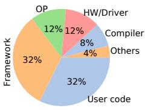  
(a) Location.

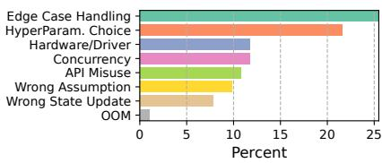  
(b) Type.  
Figure 2: Root cause locations and types of the studied errors.

Bloomberg [45], and Meta [14, 52], particularly those discussing widely deployed LLMs like Llama3 [14], OPT [52], and BLOOM [4]. These sources often describe errors arising in industrial-scale training pipelines. Many of the candidate reports from GitHub and user forums are incomplete or poorly understood, as silent errors are often difficult to diagnose. We carefully inspect each case and curate a set of high-quality instances that are well-documented, diagnosed with clear root causes, likely reproducible, and impactful.

In total, we collect 88 silent errors with known root causes. Among the sources, 70 are GitHub repository issues, 16 from discussion forums such as StackOverflow and the official PyTorch Forums, and 2 from industrial reports [4, 52].

## 2.1 Analyses and Observations

Diverse Root Causes The studied errors are caused by defects in a wide range of components involved in DL training, including user code, framework, compiler, mathematical operators for different hardware or from optimization libraries, and underlying system components such as driver or hardware.

Figure 2a shows the distribution of the locations of the root causes. The majority of the errors are caused by user code (32%) and framework (32%), followed by mathematical operations (12%), hardware (12%), compiler (8%), and other factors (4%). User code may contain missing or incorrect API calls or poorly chosen hyperparameters. Frameworks may have bugs in their Python components, often involving highlevel algorithm logic. Mathematical operations such as matrix multiplication can produce inaccurate results. Hardware failures are usually caused by driver or device faults that lead to communication errors or memory corruption. Compiler failures occur when Torch Dynamo, PyTorch’s JIT compiler, is unable to compile the pipeline correctly.

Figure 2b shows the root cause types for the studied cases. For user-code-induced silent errors, we identify two primary categories: (1) Incorrect Implementation and (2) Inappropriate Design Choices. The first includes incorrect, missing, or inconsistent API calls or parameter updates. For example, one error is caused by a missing zero\_grad() inside the training loop, resulting in noisy gradients; another stems from initializing the optimizer before model transformations, leaving the optimizer with incorrect parameters to update. The second category involves flawed design choices, such as selecting an unsuitable loss function, setting an overly aggressive dropout rate, or using a problematic data processing pipeline. While individual components may appear correct, their interaction often leads to numerical instability or divergence. For instance, BLOOM developers encountered repeated loss explosions when training with the float16 data type, which was mitigated by switching to bfloat16 and applying gradient clipping.

<table><tr><td>Iter</td><td>Type</td><td>Loss Diff</td><td>PPL Diff</td><td>Diff (Loss/PPL)</td></tr><tr><td>2000</td><td>Valid</td><td>+1.14%</td><td>+1.43%</td><td>+0.014/+0.050</td></tr><tr><td>2000</td><td>Test</td><td>+2.74%</td><td>+3.30%</td><td>+0.032/+0.107</td></tr><tr><td>4000</td><td>Valid</td><td>+3.05%</td><td>+3.36%</td><td>+0.033/+0.099</td></tr><tr><td>4000</td><td>Test</td><td>+4.67%</td><td>+4.79%</td><td>+0.047 /+0.131</td></tr></table>

Table 1: Reproducing DeepSpeed-1801 (the root cause of BLOOM-176B silent training error) in a small transformer-based language model. Due to resource constraints, we trained for only 2000 and 4000 iterations. However, the impact of the error—observed as differences in loss and perplexity due to weight merging—is already noticeable and increases with the number of training iterations.

Severe Consequences The impact of silent errors can be enormous. DL training tasks are often run on many GPUs for a long time. This is the case for the motivating example in Figure 1, which is a large-scale training task that involves 384 A100 GPUs for 3.5 months. Discovering errors late in the training result in significant waste of expensive resources.

The majority of the studied errors result in either suboptimal or incorrect models. In the former case, users may choose to accept the degraded outcome to avoid paying the expensive retraining cost, but must live with lower model performance. In the latter case, rerunning the job leads to a significant waste of costly training resources. Many errors also introduce severe performance impacts. For example, in PyTorch-Forum-84911, the data processing code in the user program mistakenly resizes the input images to 1024 × 1024 instead of the expected 224 × 224, significantly increasing per-iteration training time. Moreover, due to their silent nature, the effects of these errors often persist and accumulate over time.

Challenging Detection and Diagnosis Unlike other DL training failures that trigger explicit exceptions (e.g., Illegal Argument) or terminate jobs, silent training errors are challenging to detect. In many of our studied errors, although the root cause is triggered early on, the error remains undetected for a long time. Developers currently mainly rely on highlevel model evaluation metrics such as loss or accuracy. However, silent errors often do not cause immediate anomalies in such evaluation metrics. For example, in PyTorch-Forum-84911, the loss and accuracy metrics are still changing over time. For large-scale training jobs, it can take hours or even days for a silent error to show obvious signs of anomalies in these metrics. Moreover, these metrics can be highly noisy in real-world training tasks. Using them for detection can easily create false alarms. When a silent error causes a performance impact, it can also be difficult for developers to tell whether or not the long training iteration is expected. Even after the error is detected, developers often have no clear clues of the root cause. The diagnosis process is onerous and often based on ad-hoc trial-and-error changes (e.g., to hyperparameters) and rerunning the training job to check if the error is fixed, leading to both developer productivity loss and wasted resources.

## 2.2 Case Studies

We describe two representative cases from our study.

BLOOM-176B training (DeepSpeed-1801) This is the example described in § 1, which occurred in HuggingFace’s training of BLOOM-176B in 2022 [4]. Due to the large model size, 3D parallelism [31] was used to partition the model across multiple GPUs and nodes. Conceptually, tensor parallelism partitions the model by splitting individual layers into multiple GPUs. Thus the same layer on different GPUs is not the same. However, in implementation, due to the communication cost, certain layers that do not impose a memory bottleneck are not partitioned. In the Megatron-style tensor parallelism [31], LayerNorm layers are not partitioned as their size is small (<1% of the model weights) compared to the other layers, like attention layers. Thus, optimizers must be aware of this partition scheme, carefully distinguish between different kinds of layers, and perform updates accordingly. This leads to complex logic in the optimizer.

In this specific training task, DeepSpeed’s BF16Optimizer was used. It had a bug that causes the gradient clipping to be enabled on only the first GPU on layers that are not partitioned. This caused the LayerNorm layers’ weights to silently diverge, as these layers were updated with different gradients.

This bug neither triggers exceptions nor immediately affects loss or accuracy. Only when the model partitions across GPU need to be merged into one checkpoint file will users realize that the model has diverged. This happens in two scenarios: (1) when training completes, and the model needs to be served or further fine-tuned; (2) during training, there is a need to change the parallelism configuration, e.g., due to failure of a GPU. The developers of BLOOM-176B were lucky enough to catch this error before the model was served in production or further fine-tuned while investigating another error. The detection took 10 days, and it required 9 additional days to merge the weights and mitigate the impact of divergence.

We conduct an experiment to further confirm the impact of this error on a small scale. Specifically, we train a small transformer-based language model using the CodeParrot clean dataset [10], with 4 tensor parallel (TP) ranks and 2 data parallel (DP) ranks. The results are shown in Table 1.

At the initial steps (2000 and 4000) iterations, the loss and the perplexity of the model on the validation and test set are both noticeably affected by merging the weights, and the difference increases with the number of training iterations.

PyTorch-115607 Another interesting case is PyTorch-115607. It showcases situations when a silent training error can be detected, but the diagnosis is frustrating. torch.dynamo [2] is a new feature in PyTorch that provides a Just-In-Time (JIT) compiler for unmodified PyTorch programs. It transparently swaps bytecode to be executed with a more optimized version and thus can speed up the training process. It uses guards to ensure that when certain conditions change (e.g., the shape of a tensor changes), the bytecode is recompiled to reflect the changes. Ideally, every critical variable that can affect training should be guarded. However, in this case, a guard is missing, which causes the model to not update if a developer decides to only do a forward pass without a backward pass in a certain iteration. This error can be detected since the entire model is not updating. However, diagnosing it can be problematic: if the training program does not dump per-iteration loss and accuracy, the developer would have no idea where the model stopped updating.

## 2.3 Implications

Our study underscores the significant challenges posed by silent errors in DL training. It also reveals implications for designing solutions to address such errors.

Manual methods for detecting and diagnosing silent errors are time-consuming, ineffective, and impractical, given the scale and complexity of the DL training system stack. Automated approaches are essential to reduce the burden on developers while improving the reliability of training pipelines.

Monitoring high-level signals such as loss and accuracy is insufficient. These metrics are often noisy and periodic, leading to missed or delayed detection. They are also prone to false alarms because it is difficult to distinguish between expected fluctuations and true anomalies. Moreover, they provide few clues for debugging. Fundamentally, they are not designed for error detection. A true detection solution is required and needs to operate at a deeper level than such signals.

The diverse locations and root causes of silent errors call for systematic approaches. While point solutions, such as using differential testing [27, 33] to find bugs in DL compilers and frameworks, have been proposed, they offer only limited help in addressing the broad categories of silent errors.

Eliminating all bugs statically is ideal, but it is nearly impossible due to the complexities involved in DL training. Many bugs tend to only trigger in a specific environment, dataset, or scale. Continuous monitoring of a DL training task provides a safety net to detect silent errors at runtime.

## 3 System Design

Motivated by our study, we design TRAINCHECK, a framework that takes a proactive validation approach to quickly and reliably detect silent DL training errors with a wide variety of root causes, while providing diagnosis clues.

The designs of TRAINCHECK are guided by two key insights we have from analyzing real-world cases. First, while the symptoms of silent training errors take time to become visible and often appear non-deterministic in generic, highlevel signals such as loss, the root causes of many errors are triggered early on and detectable through specific, lower-level checks. Second, seemingly unrelated DL training programs can share similar correctness properties due to the heavy reliance on external libraries and similar training methods.

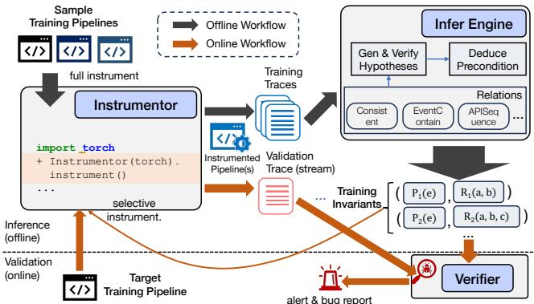  
Figure 3: Workflow of TRAINCHECK.

Based on these insights, TRAINCHECK introduces the notion of training invariants, which are rules that should hold during training, e.g., the model weights should stay consistent across distributed workers. These rules capture the semantics and correctness properties specific to a training task. Interestingly, we observe that a training invariant often only applies under specific conditions, e.g., to particular layers or parallelism settings, i.e., they have preconditions. TRAINCHECK automatically infers training invariants as well as their preconditions and enforces them to detect silent errors.

Scope. Silent errors in DL training span a broad spectrum, ranging from correctness violations such as buggy API implementations to optimization-sensitive issues like hyperparameter choices. This work specifically focuses on correctness violations, which directly affect the integrity and correctness of training outcomes, and are often high-impact and actionable, yet remain largely overlooked by existing tools. Within this scope, TRAINCHECK aims to provide early and accurate detection of silent training errors before they silently propagate and accumulate. While its detection results can offer useful diagnosis hints to developers, providing systematic debugging support for precisely identifying root causes deserves dedicated investigation in future work.

## 3.1 Overview

Figure 3 shows the workflow of TRAINCHECK, which operates in two phases. In the offline phase, it automatically infers a set of training invariants from high-quality training pipelines. In the online phase, these invariants are deployed to a given training job to check for violations during training. TRAINCHECK reports invariant violations with contextual information to assist confirmation and investigation.

TRAINCHECK comprises three major components: (1) Instrumentor, which dynamically instruments DL training programs to collect runtime traces with low overhead; (2) Infer Engine, which analyzes these traces to infer training invariants and their preconditions automatically; and (3) Verifier, which continuously validates a training task against the invariants. When Instrumentor is used in the online stage, it performs

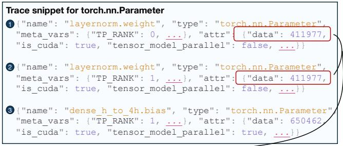

1. Generate hypothesis   
CONSISTENT(torch.nn.Parameter.data, torch.nn.Parameter.data)   
2. Validate hypothesis   
Passing samples: ( , ) 1 2 Failing samples: ( , ) ( , ) 1 3 2 3   
3. Deduce precondition   
UNEQUAL(meta\_vars.TP\_RANK) &&   
CONSTANT(attr.tensor\_model\_parallel, false) && EQUAL(name)

Figure 4: The invariant with preconditions TRAINCHECK infers for Bloom-176B error (§ 2.2), and the simplified trace it emits and uses.

<table><tr><td>Relation</td><td>Description</td></tr><tr><td>Consistent (Va, Vb)</td><td> $V _ { a }$  and  $V _ { b }$  should have the same values, while the values may change</td></tr><tr><td>EventContain(Ea,Eb)</td><td> $E _ { b }$  must happen in the duration of  $E _ { a }$ </td></tr><tr><td>APISequence(Ia,Ib,...)</td><td> $I _ { a } ,$  Ib,... must all occur and in the specified order</td></tr><tr><td>APIArg(Ia,is_distinct)</td><td>Ensures argument consistency or distinction in all calls to  $I _ { a }$ </td></tr><tr><td>APIOut put(Ia,bound_type)The output of</td><td>H  $I _ { a }$  must meet certain attribute constraints</td></tr></table>

Table 2: Sample relations TRAINCHECK defines and supports.  
selective instrumentation relevant to the inferred invariants.

In this section, we focus on Infer Engine. § 4 will describe the design of Instrumentor. Figure 4 shows a simplified example of the concrete training invariant with preconditions TRAINCHECK infers for the Bloom-176B training error.

## 3.2 Invariant Representation

TRAINCHECK focuses on capturing semantic rules related to DL training. Such rules can be expressed as logical relations involving key variables (e.g., model weights), and events (e.g., API invocations). Infer Engine defines a generic relation interface from which the specific relations can be implemented. An invariant is a relation instantiated with concrete variables and APIs that must satisfy the specified relationship.

Through analyzing silent training errors in practice, we identify and provide a set of representative relations often violated in these silent errors. Table 2 lists five relations TRAINCHECK supports. For example,

• Consistent relation establishes that two attributes of different variables should be equal despite how the value changes. This is effective for distributed training, where the model layers can be partitioned or duplicated across workers, and for model architectures that use shared parameters.

• EventContain relation establishes that when an API is invoked, a specified child event, such as another API call or a variable state change, occurs within that invocation. For example, calling Optimizer.step should always contain updates to the model parameters and the corresponding operations that perform those updates. This relation is effective for catching misconfigurations or unexpected arguments that otherwise lead to silent control-flow deviations.

• APISequence relation establishes (1) the group of APIs that should be called together and (2) the order in which they should be called. Users often forget to call certain APIs or call them in the wrong order, which can lead to silent errors. For example, in a few rookie mistakes collected from StackOverflow, users forgot to call Optimizer.zero\_grad before loss.backward, leading to training instability.

These relations are deterministic and encode strict semantics, enabling precise and timely detection of silent errors. Besides the built-in relations, TRAINCHECK is extensible, so developers can easily add new relations into the framework.

Invariant inference in TRAINCHECK begins by instantiating each relation with concrete descriptors. A descriptor is a predicate that selects which trace records or events an invariant should examine. API descriptors specify the API’s name and, optionally, the expected arguments or return values. Variable descriptors specify a variable’s type and attribute name, along with an optional expected value or value change.

## 3.3 Trace Representation

TRAINCHECK collects execution traces from a DL training program by instrumenting it to emit relevant runtime information. A raw trace consists of a sequence of records capturing API entry and exit points, as well as variable states. Each trace record is annotated with a timestamp and thread ID. TRAINCHECK further extracts high-level events from raw trace records to represent semantically meaningful behaviors. For example, an APICallEvent represents a complete API invocation, aggregating its entry and exit records along with derived attributes such as execution duration and nested events. These high-level events form the foundation for invariant inference by providing structure to raw trace data.

TRAINCHECK additionally introduces meta variables, contextual attributes for a trace record. These include properties such as the training iteration number, distributed training ranks, and active context managers. Users can also define custom meta variables, such as pipeline stage (e.g., initialization, training, or evaluation). These meta variables are essential for precondition inference (§ 3.5), enabling TRAINCHECK to generate invariants that are both precise and interpretable.

## 3.4 Invariant Inference

TRAINCHECK takes a hypothesis-based approach to infer training invariants from traces. As summarized in Algorithm 1, the inference workflow contains three main steps. (1) Hypothesis generation: The engine scans through all traces to instantiate a relation with potential concrete descriptors. (2) Hypothesis validation: For each hypothetical invariant, TRAINCHECK validates it against the trace and records entities that match the descriptors as passing/failing examples based on whether the relationship holds. (3) Precondition deduction: Try to deduce the distinction between passing/- failing examples. Such distinction, if found, will be used as the precondition for the property, and if not found, the hypothetical property is invalidated and dumped.

Algorithm 1: Invariant Inference   
Input: traces, relation\_pool   
Output: all\_invariants   
all\_invariants ← [];   
foreach relation ∈ relation\_pool do   
hypotheses ← [];   
foreach trace ∈ traces do   
hypotheses.extend(relation.GEN\_HYPOS(trace));   
foreach hypo ∈ hypotheses do   
foreach trace ∈ traces do   
relation.COLLECT\_EXAMPLES(trace, hypo);   
foreach hypo ∈ hypotheses do   
preconditions ← INFER\_PRECONDITION(hypo);   
if preconditions ̸= null then   
hypo.invariant.preconditions ← preconditions;   
all\_invariants.append(hypo.invariant);   
return all\_invariants;

Algorithm 2: Hypothesis Generation for Consistent   
Input: trace   
Output: Generated hypotheses   
variables ← trace.get\_all\_variables();   
foreach (var1, var2) ∈ Combinations(variables, 2) do   
foreach (attr1, attr2) ∈   
CartesianProduct(var1.attrs, var2.attrs) do   
if exists\_value\_match(attr1.states, attr2.states)   
hypo ←   
NEW\_HYPO(relation ← ConsistentRelation,   
entities ← [VarDesc(var1.type, attr1.name),   
VarDesc(var2.type, attr2.name)]);   
yield hypo;

Each relation type implements the methods to generate and validate hypotheses for that relation. These methods are invoked in the generic inference loop. For the motivating example, the Consistent relation can be instantiated with two torch.nn.Parameter object’s data attribute (Figure 4). Algorithm 2 shows how the hypotheses are generated for this relation. The other relations’ hypotheses generation and validation are defined in a similar vein.

## 3.5 Preconditions

Semantics in deep learning are often context-sensitive and can only be applied to a specific subset of the training pipeline. For example, the parameter consistency invariant in distributed training should only be checked for the same model layer across workers within the same training iteration and only for the parameters replicated instead of partitioned across workers. For another example, the output tensor dtype usually depends on the input tensor dtype, but when an autocast context manager is active, the output tensor dtype should be the autocast dtype instead of the input dtype.

TRAINCHECK thus defines preconditions for a training invariant. Preconditions provide various benefits: (1) confidence in the invariant’s accuracy, (2) reduction in false positives, (3) debugging, as when the invariant is violated, the precondition can help explain which part of the pipeline is causing the error, and (4) reduced overhead by only performing the applicable checks. In addition, preconditions enable transferable invariants, as they provide a very clear context of when the invariant should be applied and thus can be applied to other pipelines that share the same context.

## 3.6 Deducing Preconditions

We design an algorithm to deduce the weakest yet safe preconditions for each invariant. A precondition is considered safe if it provides a clean separation: evaluating to true for all passing examples and false for all failing examples.

A precondition consists of one or more conditions (predicates) that compare a field’s values across all trace records of a given example. TRAINCHECK supports four types: CONSTANT, where the field’s value is identical in every record and must match a specific required value; CONSISTENT, where the field’s value is identical in every record without a specific value constraint; UNEQUAL, where the field takes different values across records; and EXIST, where the field appears in every record.

The deduction algorithm first scans through the passing examples and produces conditions for each example. It then forms a candidate precondition by using the conditions found. For each example, the algorithm finds the conditions satisfied in all trace records of that example. The candidate precondition is then formed by taking the conjunction of the conditions satisfied in all passing examples. This conjunction is verified against the failing examples to see whether the precondition is safe; if so, the algorithm returns that precondition.

By restricting the candidate precondition to a conjunction of conditions that hold in all passing examples, the algorithm implicitly assumes the invariant applies to only a single scenario, which is often not the case. For instance, the parameter consistency invariant holds both across (1) data-parallel workers and (2) LayerNorm parameters on tensor-parallel workers.When the initial candidate precondition is unsafe, the algorithm attempts to split the passing examples into subgroups based on remaining non-overlapping conditions and performs inference on each subgroup. If no further splitting is possible, the algorithm terminates and reports an inference failure. If the preconditions inferred from these subgroups are safe and collectively cover all passing examples, they are combined disjunctively to form the final precondition.

Prune Irrelevant Conditions Numerous conditions can be inferred from the trace, but not all are relevant to the invariant. For example, in the parameter consistency invariant for distributed training, it is likely that all the parameters have the same is\_cuda attribute. TRAINCHECK prunes irrelevant conditions during the safety verification process by removing conditions not violated in any failing examples. These conditions evaluate to true in all examples and are not discriminative. This approach is simple yet effective in removing a good amount of noisy conditions unrelated to the invariant.

A more complex situation is when the irrelevant condition is an artifact of the invariant handled by the current algorithm. For example, all consistent model weights will also have the same gradient values to maintain consistency. However, using consistent gradient values as a condition for the parameter consistency invariant is not a good idea because, while safe, it is too shallow and prevents the algorithm from going deeper to find the multiple scenarios that the invariant holds. To fix this problem, we allow each relation to encode rules on what conditions should be avoided in the precondition inference process. For example, a Consistent invariant, if about attributes of type torch.Tensor, cannot use any other attributes of type torch.Tensor as a condition. Alternatively, static analysis can help determine correlated fields and remove them from the precondition inference process, but its complexity and overhead may not be justified by the benefits.

Example In the simplified example presented in Figure 4, there is one passing example and two failing examples. Each example contains two trace records of torch.nn.Parameter objects. The algorithm first generates the candidate precondition by finding the conditions that hold in the positive example, which is CONSTANT(tensor\_model\_parallel, False) && CONSTANT(is\_cuda, True) && UNEQUAL(meta\_vars.TP\_RANK)

Verifying the conjunction of these three conditions against the failing examples reveals that it is safe. However, the second condition of is\_cuda constantly True is not violated in any failing examples; thus, it is pruned from the precondition. The final precondition is CONSTANT(tensor\_model\_parallel, False) && UNEQUAL(meta\_vars.TP\_RANK)

When the candidate precondition is unsafe, we are in an under-constrained situation. This can happen for three reasons: (1) the precondition is fundamentally not expressible in the condition types we support, (2) the information in the trace is not enough to infer the precondition, or (3) the invariant holds under multiple preconditions. In our experience, (3) happens most of the time. This indicates that local attributes and meta variables are sufficient for most invariants and do not need a complex grammar to express the preconditions.

We enhance an unsafe candidate precondition by adding conditions not considered previously to further constraint it, as described in § 3.6. We choose the conditions to add based on decreasing order of statistical significance, i.e., the conditions that cover the most passing examples. In Figure 5, the candidate precondition is the conjunction of the two fully-covering conditions, cond1 && cond2. However, since it is unsafe, we attempt to add cond3 and cond4, resulting in a safe precondition of cond1 && cond2 && (cond3 || cond4). If this precondition is still unsafe, we repeat the process until we find a safe precondition, or the computation budget is exhausted. The statistical significance based search helps reduce the search space and find the majority scenarios that the invariant holds.

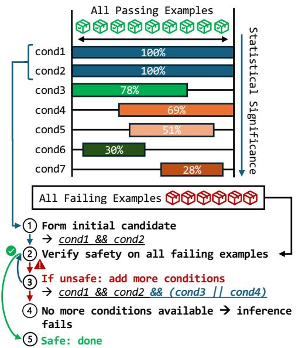  
Figure 5: Deduce precondition in under-constrained situations.

Our algorithm is not guaranteed to find strictly the weakest precondition, as the pruning strategy only looks at individual conditions, and we do not rely on any static program analysis to infer the preconditions. However, it provides a good tradeoff between simplicity and effectiveness.

## 3.7 Filtering Out Superficial Invariants

One challenge in invariant inference is distinguishing meaningful invariants from superficial ones—those that appear valid due to the limited information available in a trace. For example, two irrelevant APIs torch.cuda.is\_available() and torch.jit.is\_scripting() can have consistent return values.

TRAINCHECK deems an invariant superficial if it cannot deduce a precondition for this invariant. Such invariants will not be deployed because they may not hold in the target training task. Even if they hold, they are not effective as runtime checks because we do not know when to apply them due to the lack of precondition. This is a key design choice to reduce false positives and enhance explainability.

Our approach differs significantly from traditional invariant mining solutions. They typically use the number of passing examples and the number of failing examples to estimate the statistical significance and select likely invariants. This approach has two drawbacks in our context. In DL training, having a large number of failing examples does not mean the invariant is superficial due to the diverse and intricate training process. Local semantics might not be statistically representative in the global context. For example, in tensor parallelism, all major parameters in the attention layer are partitioned across workers. Only the LayerNorm parameters are replicated, which accounts for less than 0.1% of the total parameters in representative transformer models like GPT [39]. During inference, the invariant that torch.nn.Parameter objects should be consistent has a passing/failing ratio of

1:38. This can be pruned by a statistical significance-based approach, but in reality, this turns out to be an important invariant for catching the Bloom-176B error.

## 3.8 Scalability

DL training produces large traces due to frequent API calls and variable updates, posing significant challenges for analysis. For example, instrumenting a 2-GPU, 70M-parameter pretraining run for BLOOM-176B (using Megatron-DeepSpeed’s GPT-2 pipeline) generates approximately 92,000 trace records (50 MB) per training iteration.

TRAINCHECK adopts two key design choices to address this challenge. First, it restricts analysis to a predefined set of high-level semantic relations, significantly reducing the search space. Second, TRAINCHECK abstracts APIs and variables into descriptors. For variables, they are typically compound objects with multiple attributes. A variable descriptor consists of the variable’s type (as returned by type(obj)), attribute name (e.g., data, grad), and optional value constraints. This allows TRAINCHECK to reason over groups of variables sharing the same type and attribute, rather than enumerating individual instances. For example, when analyzing BLOOM-176B using a 2-GPU and 70M-parameter run, enumerating 104 variable instances such as 0.input\_layernorm.weight and 2.post\_attention\_layernorm.weight would yield 5,356 pairs to consider. In contrast, TRAINCHECK considers only the available PyTorch variable types relevant to training state, where the primary type is torch.nn.Parameter. This dramatically reduces the number of invariant candidates while preserving the properties needed for error detection. Descriptors can also encode constraints (e.g., requiring non-null values) to further generalize invariant specification.

## 3.9 Input Requirements

Importantly, while the inferred invariants are intended to validate large-scale training, generating them does not always require large-scale setups. In our experiments, effective invariants can often be inferred from small-scale runs. For example, although the original BLOOM training job spanned hundreds of GPUs, TRAINCHECK was able to infer the relevant invariant using only a 2-GPU run. All evaluated invariants in this paper were inferred from training jobs using at most 4 GPUs and 100 iterations. These results demonstrate that representative behaviors can be captured with lightweight workloads, making the inference phase practical and efficient.

## 4 Implementation

We implement TRAINCHECK in Python with 22.7 K lines of code. The system is composed of Instrumentor, Infer Engine, and Verifier. A key challenge in developing TRAINCHECK is to balance fine-grained trace collection for inferring effective invariants to detect silent errors and minimizing runtime overhead. We made extensive efforts to explore different techniques for achieving a good trade-off.

## 4.1 Instrumentor

Instrumentor collects traces from a training task for both Infer Engine and Verifier. It instruments a given DL training program to emit information as required by the relations we support (§ 3), specifically (1) API invocation trace: function entry, exit, arguments, and return values, (2) variable state trace: variable assignment, deletion, and modification, and (3) meta variables: steps, epochs, ranks, etc.

We implement it as a command-line tool that takes the path to the entry Python program and the libraries of interest (e.g., torch, deepspeed) as arguments. Instrumentor automatically scans the import statements and model definitions in the program and instruments the necessary functions and variables. The user can also provide a shell script that sets up the environment and arguments for the program. Trace logs are written to a specified directory using JSON format.

Instrumentor is designed with three key goals: (1) nonintrusiveness, (2) low overhead, and (3) high coverage. Instrumentor also aims to be flexible in instrumentation granularity, as different relations require different levels of detail. For example, the Consistent relation only requires a periodic sampling of model states, whereas the EventContain relation requires an eager model state logging whenever the variable is modified, as accurate timing of events is crucial for it.

One option is to use Python’s sys.settrace function, which installs a trace function that is invoked on every function call, return, and exception. However, this approach incurs prohibitively high overhead; we observed a 200× to 550× slowdown. It can also interfere with existing workflows that use tools relying on sys.settrace, such as pdb and cProfile.

Dynamic Monkey Patching To meet the above goals, we adopt a monkey-patching approach. Instrumentor is implemented as a Python package that dynamically instruments the target program by injecting hooks into relevant source code at runtime. It supports selective instrumentation, allowing users to specify which modules to instrument; only APIs defined in the specified modules are patched. During instrumentation, Instrumentor recursively traverses the namespace of each selected module and wraps identified methods. Each wrapper inserts logging and bookkeeping logic before and after invoking the original function. To minimize overhead, Instrumentor skips low-level internal functions, particularly those in torch.jit and torch.\_C, which are invoked frequently but rarely provide meaningful information for invariant inference.

Tracking Variables Instrumenting Python variables is more challenging than tracing APIs. In CPython, assignment operations occur at the C level and do not invoke any Pythonlevel hooks, making it infeasible to efficiently track arbitrary variable state changes. Our study shows that most non-trivial silent errors, despite their diverse root causes, affect a small set of key objects, such as the model and optimizer. If a silent error does not impact model quality, it is often inconsequential for training correctness. This leads to a key insight: tracking the state of only the model and optimizer is sufficient to detect meaningful silent errors. These objects are typically long-lived, and updates to them occur through attribute modifications rather than object replacement, which simplifies tracking. Therefore, Instrumentor focuses on tracking models and optimizers rather than arbitrary local variables.

To achieve this, models and optimizers are wrapped with a Proxy that intercepts state-changing operations via overridden magic methods such as \_\_setattr\_\_. These changes are logged to the trace eagerly upon execution. During instrumentation, Instrumentor scans the program’s AST to locate the initialization sites of these objects and replaces them with their corresponding Proxy instances. Alternatively, when precise timing of state changes is not required, Instrumentor supports a lower-overhead, sampling-based approach that registers a state-dump callback on Optimizer.step.

Logging Hashes of Tensors When dumping the model states, we are essentially doing checkpointing. The cost of this is unbearable as the model states are large and the overhead of serializing them, writing them to the log file, and reading them back is significant. Through our study, we observe that the actual values of the tensors are typically unimportant for inferring invariants. Silent errors typically arise from the shape, dtype, and the equality relationship between the tensors. Thus, Instrumentor only logs the hash of tensors.

Collecting Meta Variables Instrumentor also collects meta variables such as the current step, epoch, rank, etc. Whenever a trace record for a function call or variable state is dumped, Instrumentor walks through the call stack and finds the loop index local variable. This is a simple heuristic that works for most cases, as the loop index is usually a local variable in the outermost loop that is incremented in every iteration. Instrumentor further allows users to specify meta variables by calling the set\_meta API. Users may also annotate the program into different phases, such as training, validation, and testing. The general idea for collecting meta variables is to provide context for the invariants to deduce preconditions.

## 4.2 Infer Engine

Infer Engine processes the trace files generated by Instrumentor to infer training invariants and their preconditions. One key challenge is handling large input traces produced by the dataintensive nature of DL training. Typical training pipelines can generate several hundred megabytes of trace data per epoch. Our algorithms, as described in § 3, are designed to efficiently deduce invariants with preconditions from large traces.

We implement Infer Engine in Python to leverage its rich ecosystem of libraries for data processing and deep learning. In addition, our traces cannot be conveniently represented with a fixed schema. We implement multiple trace backends, including Pandas, Polars, and built-in dictionaries. From experimenting with these backends, we choose Pandas DataFrames with Python dynamic typing as the default based on its analysis performance and flexibility. We introduce optimizations with custom analysis functions that provide query caching, sampling, and pruning (e.g., pruning candidates related to torch.cuda.is\_available).

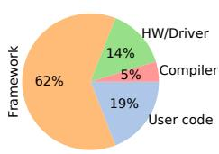

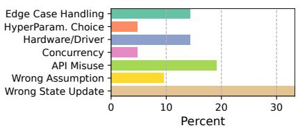  
(a) Error locations.  
(b) Root cause types.  
Figure 6: Root cause types of errors we reproduce for evaluation.

## 4.3 Verifier

During the online checking phase, TRAINCHECK consumes the stream of the trace generated by the instrumented program to detect silent errors in real-time. Different from the offline phase, the instrumentation is restrained to only the APIs and variables that are relevant to the deployed invariants and is thus lightweight. Verifier monitors the trace and triggers a check when a relevant piece of trace is available. It first evaluates whether the preconditions of an invariant are satisfied. If so, it checks whether the invariant holds. When an invariant violation is detected, Verifier reports the invariant and the corresponding trace to provide debugging help to developers.

## 5 Evaluation

We evaluate TRAINCHECK to answer several questions: (1) Can TRAINCHECK infer effective training invariants for detecting real silent errors? (2) How quickly can the invariants detect the errors? (3) Can TRAINCHECK help diagnose a detected silent training error? (4) Is the detection accurate? (5) What is the runtime overhead?

Our experiments are run on a server running Ubuntu 22.04, equipped with an Intel(R) Xeon(R) Silver 4310 CPU, 252 GB RAM, and one NVIDIA A40 GPU. For trace collection related to distributed training, we use another server with identical specifications but featuring 8 NVIDIA A2 GPUs. We use Python 3.10 and PyTorch 2.2.2 with CUDA 12.1.

## 5.1 Silent Error Detection

To assess TRAINCHECK’s effectiveness, we collect and reproduce 20 real-world silent errors. Of these, 6 are drawn from our prior study (§ 2), while the remaining 14 are newly gathered from GitHub issues for popular libraries (PyTorch, DeepSpeed, etc.), StackOverflow, and social media. These errors span a broad range of root cause locations and types, as illustrated in Figure 6a and Figure 6b. The complete descriptions of these errors are available in our technical report [23].

We compare TRAINCHECK with four baselines that represent the current practices and state-of-the-art research:

• Spike detector is used to monitor numerical instability in training where the loss or accuracy spikes to a large value.

• Trend detector is used to monitor the training process where the loss or accuracy is not decreasing or increasing as expected. A tolerance factor is set to allow some fluctuation.

• Anomaly Detection detector applies common algorithms like LOF, Isolation Forest, and Z Score to detect anomalies on the same high-level metrics like loss and accuracy.

• PyTea [22] and NeuRI [28] are two recent research artifacts. PyTea specifies constraints on APIs used in the training process, primarily focusing on the shaping constraint of the input and output tensors. NeuRI automatically infers such constraints encoded in PyTea’s syntax.

When implementing the first three detectors, we monitor signals as per industry practice [5] and apply the same configuration parameters to all errors for a fair and consistent comparison. For the spike detector, we set the threshold to 75, and for the trend detector, we set the tolerance to 3. The number of neighbors for LOF is set to 2, and the contamination factor is set to 0.1 for Isolation Forest. Other parameters use defaults provided by Scipy and Scikit-learn.

Methodology We prepare a reproduction script for each error and run them to emit (1) runtime trace for the checking of TRAINCHECK and PyTea/NeuRI, and (2) high-level metrics (loss, accuracy, gradient norm) for the anomaly detectionbased detectors. We then run the detectors on the traces and metrics and collect the detection results. The invariants used by TRAINCHECK are inferred from PyTorch’s official GCN, Autocast, and DDP examples, for PyTorch-related errors, and Megatron-DeepSpeed’s official GPT pretraining examples for DeepSpeed-specific errors, and the official Transformers trainer examples for Transformers-specific errors.

We focus on true detections (true positives) to avoid rewarding detectors that indiscriminately raise many alarms. This ensures the result reflects real error-detection capability. For example, we observe that when using the anomaly detection detector, no matter how we tune it, it raises numerous alarms throughout the training process, e.g., since the loss is dropping fast. To objectively determine the true positive, we run the fixed versions of each error and check if the detector also raises alarms in the error-free traces.

Detection TRAINCHECK successfully detects 18 out of the 20 errors. The invariants it infers and uses represent all five relations in Table 2. In all cases, detection occurs no later than one iteration after the root cause is triggered. For the motivating example, the incorrect gradient clipping logic is triggered in the second training iteration, and TRAINCHECK shortly detects it in the third iteration. Despite diverse root causes, TRAINCHECK achieves high detection coverage and timeliness. We attribute its effectiveness to our invariant checking approach and the precision of the inferred invariants.

TRAINCHECK fails to detect two errors: TF-33455 and TF-29903. TF-33455 involves the trainer stopping early due to an incorrectly calculated total number of training steps, while the training process itself is correct. Detecting this error would require monitoring the computed training steps and comparing them with the intended arguments. Currently, TRAINCHECK does not support tracking Python primitive variables, as doing so would incur prohibitive overhead and require modifications to the Python runtime. TF-29903 concerns a bug caused by a corrupted state dict constructed within the safe\_checkpoint function. TRAINCHECK fails to detect this case because (1) this error is confined to the checkpoint function and does not impact the main training logic, and (2) TRAINCHECK does not analyze local variables.

<table><tr><td>Bug Id</td><td>Synopsis</td></tr><tr><td>AC-2665</td><td>Initializing the optimizer prior to wrapping the model with DDP causes training to not progress.</td></tr><tr><td>DS-6770</td><td>A mismatch between the model and the parameters held by the optimizer causes a KeyError during initialization.</td></tr><tr><td>DS-5489</td><td>Freezing parameters prior to initializing DeepSpeed causes in- complete model checkpoints.</td></tr><tr><td>DS-6714</td><td>Using heterogeneous MoE architecture with pipeline parallelism causes inconsistent usage of communication primitives,leading to training stuck.</td></tr><tr><td>DS-6772</td><td>DeepSpeed initialization silently overwrites “id”attributes on models,causing wrong model-GPU placement.</td></tr><tr><td>DS-6089</td><td>The program is stuck on communication due to consistent “ca- pacity”value across workers.</td></tr></table>

Table 3: Six newly reported bugs that lead to silent errors, detected and diagnosed with the help of TRAINCHECK. AC: Accelerate. DS: DeepSpeed. Numbers refer to GitHub issue IDs.

In comparison, the signal-based detectors collectively only detect 2 errors, which are extreme cases where the model stops learning entirely and the loss is constant over epochs. The PyTea/NeuRI detector detects 1 error, which is from a bug in the transformers library where the processed data does not have the same batch size as the argument, falling into the shaping constraints supported by PyTea/NeuRI.

Diagnosis While diagnosis is not the primary goal of TRAINCHECK, we conduct analysis to understand whether invariant violations can aid in debugging. Among the 18 cases detected by TRAINCHECK, the violation reports can pinpoint the exact root cause in 10 cases and localize close to the root causes in 8 cases. The diagnosis hints for the one error detected by PyTea/NeuRI are on par with TRAINCHECK.

## 5.2 New Silent Errors

To further test TRAINCHECK’s effectiveness, we monitor recent open GitHub issues in DeepSpeed and Transformers. We focus on issues that have silent symptoms, are unresolved with unknown root causes, and reproducible. We create reproduction scripts based on the reports to ensure the issues occur with the latest library. We then apply the invariants TRAINCHECK infers from the sample pipelines to the issues.

During this exercise, TRAINCHECK detects 6 new silent errors at an early stage and aid in diagnosing their root causes, as summarized in Table 3. Three of these root causes have since been confirmed and fixed.

Case Study: AC-2665 It causes the model to not learn effectively during training. In the original issue report, the user adapted their original pipeline into DDP, but the model stopped learning at all. The user did not know the root cause, but found a setting that fixed the error, use\_orig\_param true.

We applied the invariants inferred from the GCN example to the user’s pipeline and inspected invariant violations. Below, we present three example true positives identified by the inferred invariants. Inv1: zero\_grad should contain changing of grad attributes from a non-zero tensor to a zero tensor or None. Inv2: step should contain changing of data attributes of the model parameters. Inv3: step should contain a number of invocations of mathematical operations on the model parameters, such as \_foreach\_add. Inv2 and Inv3 indicate that the optimizer is not performing updates to the model, while Inv1 indicates that no gradient was computed. The three invariants combined point out that the optimizer is likely not initialized with parameters that are actually used during forward and backward passes. We then checked the model parameters and the optimizer’s param\_groups and confirmed the hypothesis. Upon investigation of the model and optimizer initialization process, we found out that DDP automatically flattens the original model parameters and creates a new model with the flattened parameters. However, the user initialized the optimizer with the original model parameters, and thus the optimizer did not have the correct parameters to update. We reported the issue both to the user and to the transformers team, and the issue has been confirmed. A pull request has been under review to fix the issue.

## 5.3 False Positive

To measure false positive, we collect 63 diverse training programs drawn from existing tutorials, all without known bugs. They span different training scales (e.g., single-GPU vs. multi-GPU), frameworks (PyTorch, Transformers, Diffusers, etc.), tasks (image classification, language modeling, vision transformer pretraining, etc.), and configuration parameters (e.g., precision, batch size, dataset, and model architecture).

To minimize confounding effects from applying invariants across unrelated tasks, we group programs into four classes based on training task type, as shown in Figure 7. Transferability across task classes is evaluated separately in § 5.4. For each class, we split the programs into a training set (used to infer invariants) and a validation set (used to assess false positives). Validation programs are further categorized as either cross-configuration (differing from the training set only in configuration parameters) or cross-pipeline (different code with similar semantics). This categorization allows us to assess how well the inferred invariants generalize across both minor and structural variations in training programs.

Figure 7 shows that TRAINCHECK achieves consistently low false positive rates. In the primary evaluation setting, where invariants are inferred from representative workloads using 5 or 6 input programs, false positive rates remain below

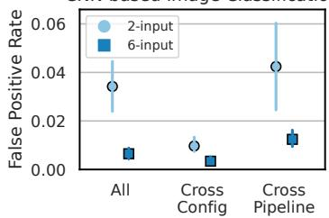

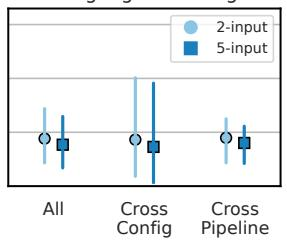  
Vision Transformer

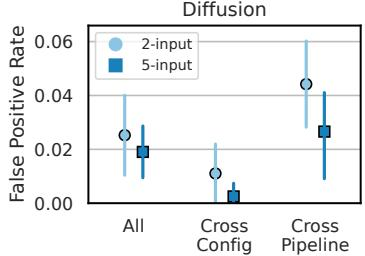

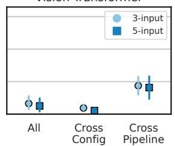  
Figure 7: False positive rates across four program classes, broken down by cross-configuration and cross-pipeline settings.

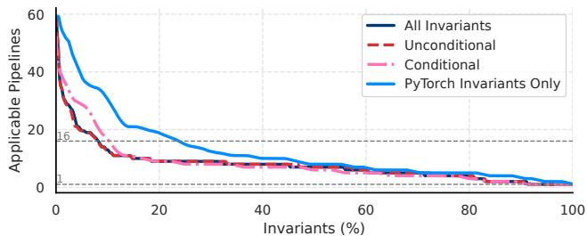  
Figure 8: Invariant applicability across all collected pipelines. The y-axis shows how many pipelines each invariant applies to. “All Invariants” shows overall coverage; “PyTorch Invariants Only” isolates PyTorch-specific APIs. “Conditional” and “Unconditional” indicate whether preconditions are present.

2% across all classes. Even in constrained settings with only   
2 or 3 input programs, the rate stays below 5%.

## 5.4 Invariant Transferability

TRAINCHECK infers transferable invariants, enabling those learned from a small set of input programs to generalize across different pipelines and library versions. To evaluate this transferability, we apply a set of valid invariants to all 63 collected pipelines. These invariants are inferred using a 5/6-input setup across all classes and exclude any that triggered false positives in § 5.3. For each invariant, we count how many pipelines it can be applied to without raising a false alarm.

As Figure 8 shows, many invariants exhibit broad transferability. All invariants apply to at least one additional pipeline beyond those used for inference. Notably, over 8% of invariants apply to more than 16 pipelines—the average number of pipelines per model class, demonstrating strong cross-class generalization despite semantic and structural differences. We also observe that invariants with preconditions are generally more transferable than unconditional ones, underscoring the importance of precise precondition inference.

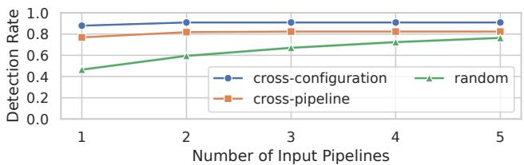  
Figure 9: Detection rate as the number of input pipelines increases under cross-configuration, cross-pipeline, and random settings.

We expect the transferability to be even higher in practice, as developers typically apply invariants only within the same framework or library context. For example, invariants involving Transformers-specific APIs would not be applied to a program that only uses PyTorch. Since all pipelines in our dataset use PyTorch, we isolate 8,172 invariants that capture only PyTorch-specific semantics. These exhibit significantly higher transferability: 23% of them apply to more than 16 pipelines. This result suggests that framework-level behavior is a strong source of reusable invariants.

We also evaluate the false positive rate of applying invariants across model classes to assess TRAINCHECK’s robustness in extreme transfer scenarios. Using the setup from § 5.3, we infer invariants from one class and apply them to all programs in the other classes, comparing the resulting false positive rate to the in-class baseline. Surprisingly, only the smallest-scale class, CNN, shows a higher false positive rate in the cross-class setting (2.62% vs. 0.65%). In all other cases, the rate is comparable or lower (e.g., 0.93% vs. 1.54% for language modelling). This is because many invariants become inapplicable due to differing API usage and training context.

## 5.5 False Negative

To study the trade-off between false negative and the input programs used for invariant inference, we evaluate three settings: cross-configuration, cross-pipeline, and random. In the crossconfiguration setting, invariants are inferred from historical runs of the same training pipeline executed under alternative configurations where the silent error was not observed. In the cross-pipeline setting, invariants are inferred from semantically similar training pipelines that do not exhibit the error. In the random setting, invariants are inferred from general tutorial pipelines collected from relevant frameworks.

For each silent error detected in § 5.1, we randomly sample k input pipelines for each setting and evaluate whether the error can be detected using the inferred invariants. The average detection rate for a given k is computed by repeating this process 100 times and averaging the results across all cases.

As Figure 9 shows, increasing the number of input pipelines consistently improves detection rates. Both the cross-configuration and cross-pipeline settings achieve high detection coverage (91% and 82%, respectively) even with only two input programs. The random setting starts with lower detection coverage, but improves steadily as more inputs are added (76% with five inputs). Further investigation of the undetected silent errors reveals that the violated semantics often involve specialized features that are underrepresented in the available example pipelines or not exercised in crossconfiguration or cross-pipeline inputs. For instance, detecting DeepSpeed-5794 requires invariants about DeepSpeed’s MoE features; however, only 1 out of 15 available DeepSpeed tutorial pipelines performs MoE training, making it infeasible to detect DeepSpeed-5794 with random sampling.

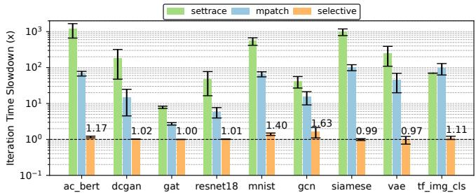  
Figure 10: Overhead of different instrumentation techniques.

## 5.6 Overhead

We evaluate the runtime overhead of invariant checking during training. TRAINCHECK uses selective instrumentation, which only instruments the APIs and variables relevant to the deployed invariants. We conduct experiments on a diverse set of training programs that vary in model size, task complexity, and framework usage. For each program, we deploy 100 randomly sampled invariants and compare the per-iteration training time before and after instrumentation. We compare our selective instrumentation against two baselines: (1) Python’s sys.settrace, using a simple trace function that logs API calls and arguments without variable tracking, and (2) TRAINCHECK’s full instrumentation mode, which instruments all API calls and variables regardless of invariant relevance.

Figure 10 shows the results. TRAINCHECK incurs low overhead in selective mode, typically less than 2%, and at most 1.6× slowdown across all workloads. GCN and MNIST exhibit higher relative overhead (1.6× and 1.4×, respectively), as they are toy workloads (e.g., training a 2-layer CNN) where per-iteration execution time is minimal, and any instrumentation incurs a larger proportional cost. In contrast, for the more realistic workloads, overhead is significantly lower, as a larger portion of the time is spent on GPU-bound computation.

The primary sources of overhead stem from trace data serialization into JSON, conversion of objects into dictionary representations, and handling of tracked objects. These operations occur at the Python level and introduce runtime costs, especially in tight CPU-side loops. While our current implementation is synchronous and prioritizes correctness and modularity, there are clear opportunities for reducing overhead further. Potential engineering optimizations include asynchronous or batched logging and minimizing redundant instrumentation through static analysis. We leave the exploration of these optimizations to future work.

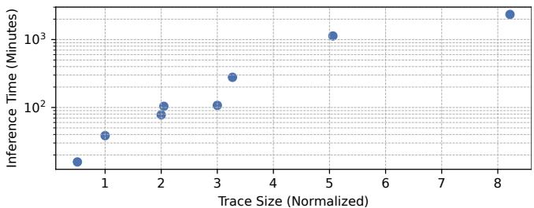  
Figure 11: Inference time vs. trace size (normalized to ResNet-18 pretraining trace size).

## 5.7 Inference Efficiency

To quantify the invariant inference efficiency, we reuse the traces from the false positive experiments (§ 5.3) and measure the inference time across traces of varying size and structural complexity. For consistency, we normalize trace size by treating the trace from a ResNet-18 pretraining run with 20 training iterations and 10 testing iterations as a standard program trace, corresponding to 66.2 MB or 93,686 records.

Figure 11 shows that inference time grows roughly quadratically with trace size in this setting. While the inference algorithm itself is linear in both trace size and the number of hypotheses, larger traces typically expose more semantic behaviors, resulting in a larger hypothesis set. In the worst case, TRAINCHECK completes inference in 38 hours when processing traces from 8.2 standard programs. Since inference runs offline and our current implementation is single-threaded, the performance remains acceptable for practical usage.

## 5.8 Examining Invariant Violations

Despite a low false positive rate, false alarms do occur, and developers must examine violation reports to extract actionable diagnostic information. We find that violations can often be inspected structurally rather than treated in isolation. They tend to cluster around specific APIs or components, which makes the review process more manageable. In practice, true positives are frequently supported by multiple related violations that reinforce the underlying issue, while false positives follow recognizable patterns and are easy to dismiss.

For example, in the AC-2665 case study (§ 5.2), using invariants inferred from PyTorch’s GCN pipeline alone, 100 violations were reported. Among these, 52 were true positives. Of those, 33 indicated that torch.optim.adamw.adamw was never invoked, highlighting a missing optimizer initialization. 18 showed that optimizer.step performed no mathematical operations, suggesting it was not linked to model parameters. The remaining 48 violations were quickly dismissed as irrelevant: 7 involved GCN-specific constants (e.g., dropout\_rate == 0.5), and 26 flagged missing ReLU invocations, which do not apply to the T5-based model used in AC-2665. The rest followed similar, non-impactful patterns.

## 6 Limitations

TRAINCHECK has a few limitations. First, its instrumentation interferes with JIT compilation tools like torch.compile, preventing the analysis of optimized code paths. Second, it is restricted to Python code, limiting its ability to analyze components with significant logic implemented in lower-level languages, such as the Flash Attention algorithm [11]. Finally, representing tensors in hash form prevents fine-grained numerical analysis, limiting its applicability to detecting instabilities caused by inappropriate hyperparameters. However, this can be complemented by existing research on hyperparameter tuning [50] and numerical defect detection [25].

## 7 Related Work

Testing Pipeline Code, Libraries, and Compilers CRA-DLE [33], AUDEE [18], LEMON [44], and NNSmith [27] employ differential testing to detect and diagnose failures across frameworks and compilers. PyTea [22] detects tensor shape mismatches using pre-specified API constraints, while NeuRI [28] enhances this by automating constraint inference. RANUM [25] targets numerical defects in deep neural networks. TRAINCHECK goes beyond framework inconsistencies or isolated error categories by inferring runtime invariants tailored to the training process. It automates error detection and debugging with automated invariant inference from example pipelines, addressing a broader range of silent failures across diverse training pipelines.

Monitoring Frameworks for Training Dynamics Tools like TensorBoard [1] and Weights & Biases [5] log high-level metrics such as loss and accuracy, enabling developers to visualize and compare experiments easily. However, these tools require manual and active monitoring, as seen during the training of BloombergGPT [45], where loss plateaued for seven days before the developer noticed it. These metrics are often noisy and can lead to many false alarms when used for detecting silent errors. They also do not help with diagnosis.

In contrast, TRAINCHECK provides an automated solution that captures the precise semantics of training as training invariants and proactively checks them, enabling reduced manual effort, early and accurate detection of silent training errors, and providing diagnosis hints for root-cause analysis.

Testing DL Models Extensive work exists to test trained DL models for robustness and fairness, such as DeepXplore [32] and DeepTest [43]. They are orthogonal to TRAINCHECK given their focus on testing and uncovering errors in the final model weights rather than validating the training process.

Fault-Tolerance in DL Systems Fault-tolerance mechanisms have been proposed, such as elastic resource scaling, task reallocation, pipeline parallelism, and efficient checkpointing [3, 21, 26, 42]. While these approaches improve fault tolerance, they do not address silent errors that arise from misconfigurations, bugs, or subtle correctness violations.

Invariant Mining Much work has explored mining likely program invariants for traditional single-component software with tools such as Daikon [16] and DIDUCE [19]. These invariants focus on low-level program variable relations at certain points of the program, such as idx < len for two local variables in a loop. Recent work such as I4 [30], DistAI [49], and DuoAI [48] infer inductive invariants, which are used in the verification of distributed protocols. Oathkeeper [29] infers event rules to detect silent failures in distributed systems.

Inferring rules is a general approach for bug detection. Engler et al. [15] notably propose inferring rules about programmer beliefs and show its effectiveness in large systems code.

TRAINCHECK targets a new domain of deep learning training systems and addresses various challenges unique to this domain. To the best of our knowledge, it is the first work for systematic invariant checking in DL training pipelines to detect silent training errors. The training invariants TRAINCHECK infers capture high-level semantics tailored to DL training. TRAINCHECK also deduces precise preconditions for these invariants. Moreover, prior work mainly infers invariants from a single system, and these invariants only apply to that system. In contrast, TRAINCHECK invariants from diverse and seemingly unrelated training pipelines. Its inferred invariants are transferable to different pipelines.

## 8 Conclusion

Silent errors are detrimental to DL training and yet notoriously difficult to address. This paper presents a study on such errors to understand their characteristics. Informed by the study, we propose a principle approach that uses precise training invariants to detect and diagnose silent training errors. We present TRAINCHECK, an end-to-end framework that automates the process of inferring training invariants and proactively checking them. TRAINCHECK shows effective and quick detection capability for real-world silent training errors with diverse root causes. It also uncovers previously unknown bugs leading to silent errors in popular training libraries. Its tailored approach and the transferability of its inferred invariants make it readily applicable to existing DL training pipelines.

## Acknowledgments

We thank our shepherd and the anonymous reviewers for their constructive feedback and guidance, which greatly improved the quality of the paper. We are grateful to Stas Bekman for sharing detailed insights into the Bloom-176B training issue. We thank Yijun Wang for his contribution to the empirical study. We appreciate the feedback from the members of OrderLab and Mosharaf Chowdhury. We thank the Chameleon Cloud for providing experiment machine resources. This work was supported in part by NSF grants CNS-2317698, CNS-2317751, and CCF-2318937.

## References

[1] Martín Abadi, Paul Barham, Jianmin Chen, Zhifeng Chen, Andy Davis, Jeffrey Dean, Matthieu Devin, Sanjay Ghemawat, Geoffrey Irving, et al. TensorFlow: a system for large-scale machine learning. In Proceedings of the 12th USENIX Conference on Operating Systems Design and Implementation, OSDI ’16, page 265–283, Savannah, GA, USA, November 2016. USENIX Association.

[2] Jason Ansel, Edward Yang, Horace He, Natalia Gimelshein, Animesh Jain, Michael Voznesensky, Bin Bao, Peter Bell, David Berard, Evgeni Burovski, et al. PyTorch 2: Faster Machine Learning Through Dynamic Python Bytecode Transformation and Graph Compilation. In 29th ACM International Conference on Architectural Support for Programming Languages and Operating Systems, Volume 2, ASPLOS ’24, page 929–947, La Jolla, CA, USA, April 2024. ACM.

[3] Sanjith Athlur, Nitika Saran, Muthian Sivathanu, Ramachandran Ramjee, and Nipun Kwatra. Varuna: scalable, low-cost training of massive deep learning models. In Proceedings of the Seventeenth European Conference on Computer Systems, EuroSys ’22, page 472–487, Rennes, France, April 2022. Association for Computing Machinery.

[4] Stas Bekman. BLOOM: Megatron-DeepSpeed. https: //huggingface.co/blog/bloom-megatron-deepspeed, 2022.

[5] Lukas Biewald. Weights and Biases. https://www. wandb.com/, 2020.

[6] BigScience Workshop. Chronicles of BigScience TR11- 176B-ML Training. https://github.com/bigscienceworkshop/bigscience/blob/master/train/tr11-176Bml/chronicles.md#2022-04-30-hanging-at-eval, 2022.

[7] Rishi Bommasani. Dropout with Theano. https://rishy.github.io/ml/2016/10/12/dropoutwith-theano/, 2016.

[8] Rishi Bommasani, Drew A. Hudson, Ehsan Adeli, and et al. On the opportunities and risks of foundation models, 2022.

[9] Junjie Chen, Yihua Liang, Qingchao Shen, Jiajun Jiang, and Shuochuan Li. Toward understanding deep learning framework bugs. ACM Trans. Softw. Eng. Methodol., 32(6), September 2023.

[10] CodeParrot. CodeParrot Clean Train Dataset, 2021.

[11] Tri Dao, Daniel Y. Fu, Stefano Ermon, Atri Rudra, and Christopher Ré. FlashAttention: fast and memoryefficient exact attention with IO-awareness. In Proceedings of the 36th International Conference on Neural Information Processing Systems, NIPS ’22, page 16344–16359, New Orleans, LA, USA, November 2022. Curran Associates Inc.

[12] DeepSpeed Contributors. DeepSpeed GitHub Issues. https://github.com/microsoft/DeepSpeed/ issues, 2024.

[13] Malinda Dilhara, Ameya Ketkar, and Danny Dig. Understanding software-2.0: A study of machine learning library usage and evolution. ACM Trans. Softw. Eng. Methodol., 30(4), July 2021.

[14] Abhimanyu Dubey, Abhinav Jauhri, Abhinav Pandey, Abhishek Kadian, Ahmad Al-Dahle, Aiesha Letman, Akhil Mathur, Alan Schelten, et al. The Llama 3 Herd of Models, 2024.

[15] Dawson Engler, David Yu Chen, Seth Hallem, Andy Chou, and Benjamin Chelf. Bugs as deviant behavior: a general approach to inferring errors in systems code. In Proceedings of the Eighteenth ACM Symposium on Operating Systems Principles, SOSP ’01, page 57–72, Banff, Alberta, Canada, 2001. Association for Computing Machinery.

[16] Michael D. Ernst, Jake Cockrell, William G. Griswold, and David Notkin. Dynamically Discovering Likely Program Invariants to Support Program Evolution. In Proceedings of the 21st International Conference on Software Engineering, ICSE ’99, page 213–224, Los Angeles, California, USA, May 1999. Association for Computing Machinery.

[17] Andre Esteva, Alexandre Robicquet, Bharath Ramsundar, Volodymyr Kuleshov, Mark DePristo, Katherine Chou, Claire Cui, Greg Corrado, Sebastian Thrun, and Jeff Dean. A guide to deep learning in healthcare. Nature Medicine, 25(1):24–29, January 2019.

[18] Qianyu Guo, Xiaofei Xie, Yi Li, Xiaoyu Zhang, Yang Liu, Xiaohong Li, and Chao Shen. Audee: automated testing for deep learning frameworks. In Proceedings of the 35th IEEE/ACM International Conference on Automated Software Engineering, ASE ’20, pages 486–498, Virtual Event, Australia, December 2020. ACM.

[19] Sudheendra Hangal and Monica S. Lam. Tracking down software bugs using automatic anomaly detection. In Proceedings of the 24th International Conference on Software Engineering, ICSE ’02, page 291–301, Orlando, Florida, May 2002. Association for Computing Machinery.

[20] Monica Heddneck. Dataloader not randomly sampling in PyTorch. https://stackoverflow.com/questions/ 50124712/dataloader-not-randomly-sampling-inpytorch, 2018.

[21] Insu Jang, Zhenning Yang, Zhen Zhang, Xin Jin, and Mosharaf Chowdhury. Oobleck: Resilient Distributed Training of Large Models Using Pipeline Templates. In Proceedings of the 29th Symposium on Operating Systems Principles, SOSP ’23, page 382–395, Koblenz, Germany, October 2023. Association for Computing Machinery.

[22] Ho Young Jhoo, Sehoon Kim, Woosung Song, Kyuyeon Park, DongKwon Lee, and Kwangkeun Yi. A static analyzer for detecting tensor shape errors in deep neural network training code. In Proceedings of the ACM/IEEE 44th International Conference on Software Engineering: Companion Proceedings, ICSE ’22, page 337–338, Pittsburgh, Pennsylvania, May 2022. Association for Computing Machinery.

[23] Yuxuan Jiang, Ziming Zhou, Boyu Xu, Beijie Liu, Runhui Xu, and Peng Huang. Training with Confidence: Catching Silent Errors in Deep Learning Training with Automated Proactive Checks (Technical Report). Technical report, University of Michigan, 2025. Technical Report.

[24] Yann LeCun, Yoshua Bengio, and Geoffrey Hinton. Deep learning. Nature, 521(7553):436–444, May 2015.

[25] Linyi Li, Yuhao Zhang, Luyao Ren, Yingfei Xiong, and Tao Xie. Reliability Assurance for Deep Neural Network Architectures against Numerical Defects. In Proceedings of the 45th International Conference on Software Engineering, ICSE ’23, page 1827–1839. IEEE Press, May 2023.

[26] Xinyu Lian, Sam Ade Jacobs, Lev Kurilenko, Masahiro Tanaka, Stas Bekman, Olatunji Ruwase, and Minjia Zhang. Universal Checkpointing: Efficient and Flexible Checkpointing for Large Scale Distributed Training, 2024.

[27] Jiawei Liu, Jinkun Lin, Fabian Ruffy, Cheng Tan, Jinyang Li, Aurojit Panda, and Lingming Zhang. NN-Smith: Generating Diverse and Valid Test Cases for Deep Learning Compilers. In Proceedings of the 28th ACM International Conference on Architectural Support for Programming Languages and Operating Systems, Volume 2, ASPLOS ’23, page 530–543, Vancouver, BC, Canada, March 2023. Association for Computing Machinery.

[28] Jiawei Liu, Jinjun Peng, Yuyao Wang, and Lingming Zhang. NeuRI: Diversifying DNN Generation via Inductive Rule Inference. In Proceedings of the 31st ACM

Joint European Software Engineering Conference and Symposium on the Foundations of Software Engineering, ESEC/FSE ’23, page 657–669, New York, NY, USA, November 2023. Association for Computing Machinery.

[29] Chang Lou, Yuzhuo Jing, and Peng Huang. Demystifying and Checking Silent Semantic Violations in Large Distributed Systems. In 16th USENIX Symposium on Operating Systems Design and Implementation, OSDI ’22, pages 91–107, Carlsbad, CA, July 2022. USENIX Association.

[30] Haojun Ma, Aman Goel, Jean-Baptiste Jeannin, Manos Kapritsos, Baris Kasikci, and Karem A. Sakallah. I4: incremental inference of inductive invariants for verification of distributed protocols. In Proceedings of the 27th ACM Symposium on Operating Systems Principles, SOSP ’19, page 370–384, Huntsville, Ontario, Canada, October 2019. Association for Computing Machinery.

[31] Deepak Narayanan, Mohammad Shoeybi, Jared Casper, Patrick LeGresley, Mostofa Patwary, Vijay Korthikanti, Dmitri Vainbrand, Prethvi Kashinkunti, Julie Bernauer, Bryan Catanzaro, Amar Phanishayee, and Matei Zaharia. Efficient large-scale language model training on GPU clusters using megatron-LM. In Proceedings of the International Conference for High Performance Computing, Networking, Storage and Analysis, SC ’21, page 1–15, St. Louis, Missouri, November 2021. Association for Computing Machinery.

[32] Kexin Pei, Yinzhi Cao, Junfeng Yang, and Suman Jana. DeepXplore: Automated Whitebox Testing of Deep Learning Systems. In Proceedings of the 26th Symposium on Operating Systems Principles, SOSP ’17, page 137–145, Shanghai, China, October 2017. ACM.

[33] Hung Viet Pham, Thibaud Lutellier, Weizhen Qi, and Lin Tan. CRADLE: Cross-Backend Validation to Detect and Localize Bugs in Deep Learning Libraries. In 2019 IEEE/ACM 41st International Conference on Software Engineering, ICSE ’19, pages 1027–1038, Montreal, QC, Canada, May 2019. IEEE.

[34] PyTorch Community. PyTorch Discussion Forum. https://discuss.pytorch.org/, 2024.

[35] PyTorch Contributors. PyTorch Examples. https:// github.com/pytorch/examples, 2024.

[36] PyTorch Contributors. PyTorch GitHub Issues. https: //github.com/pytorch/pytorch/issues, 2024.

[37] Tanel Pärnamaa. A Bug That Plagues Thousands of Open-Source ML Projects. https: //tanelp.github.io/posts/a-bug-that-plaguesthousands-of-open-source-ml-projects/, 2019.

[38] Tanel Pärnamaa. Using PyTorch & Numpy: A Bug That Plagues Thousands of Open-Source ML Projects. https: //www.reddit.com/r/MachineLearning/comments/ mocpgj/p\_using\_pytorch\_numpy\_a\_bug\_that\_plagues/, 2021.

[39] Alec Radford, Jeff Wu, Rewon Child, David Luan, Dario Amodei, and Ilya Sutskever. Language Models are Unsupervised Multitask Learners. OpenAI, 2019.

[40] Jeff Rasley, Samyam Rajbhandari, Olatunji Ruwase, and Yuxiong He. DeepSpeed: System Optimizations Enable Training Deep Learning Models with Over 100 Billion Parameters. In Proceedings of the 26th ACM SIGKDD International Conference on Knowledge Discovery & Data Mining, KDD ’20, page 3505–3506, Virtual Event, CA, USA, August 2020. Association for Computing Machinery.

[41] StackOverflow Contributors. StackOverflow - Questions and Answers on PyTorch. https://stackoverflow.com/ questions/tagged/pytorch, 2024.

[42] John Thorpe, Pengzhan Zhao, Jonathan Eyolfson, Yifan Qiao, Zhihao Jia, Minjia Zhang, Ravi Netravali, and Guoqing Harry Xu. Bamboo: Making Preemptible Instances Resilient for Affordable Training of Large DNNs. In 20th USENIX Symposium on Networked Systems Design and Implementation, NSDI ’23, pages 497–513, Boston, MA, April 2023. USENIX Association.

[43] Yuchi Tian, Kexin Pei, Suman Jana, and Baishakhi Ray. DeepTest: automated testing of deep-neural-networkdriven autonomous cars. In Proceedings of the 40th International Conference on Software Engineering, ICSE ’18, page 303–314, Gothenburg, Sweden, June 2018. Association for Computing Machinery.

[44] Zan Wang, Ming Yan, Junjie Chen, Shuang Liu, and Dongdi Zhang. Deep learning library testing via effective model generation. In Proceedings of the 28th ACM Joint Meeting on European Software Engineering Conference and Symposium on the Foundations of Software Engineering, ESEC/FSE 2020, page 788–799, Virtual Event, USA, November 2020. Association for Computing Machinery.

[45] Shijie Wu, Ozan Irsoy, Steven Lu, Vadim Dabravolski, Mark Dredze, Sebastian Gehrmann, Prabhanjan Kambadur, David Rosenberg, and Gideon Mann. BloombergGPT: A Large Language Model for Finance, 2023.

[46] Yuxin Wu. Unawareness of Deep Learning Mistakes. https://ppwwyyxx.com/blog/2017/Unawareness-Of-Deep-Learning-Mistakes/, 2017.

[47] Yuxin Wu. Fight Against Silent Bugs in Deep Learning Libraries. https://ppwwyyxx.com/blog/2020/Fight-Against-Silent-Bugs-in-Deep-Learning-Libraries/, 2020.

[48] Jianan Yao, Runzhou Tao, Ronghui Gu, and Jason Nieh. DuoAI: Fast, Automated Inference of Inductive Invariants for Verifying Distributed Protocols. In 16th USENIX Symposium on Operating Systems Design and Implementation, OSDI ’22, pages 485–501, Carlsbad, CA, July 2022. USENIX Association.

[49] Jianan Yao, Runzhou Tao, Ronghui Gu, Jason Nieh, Suman Jana, and Gabriel Ryan. DistAI: Data-Driven Automated Invariant Learning for Distributed Protocols. In 15th USENIX Symposium on Operating Systems Design and Implementation, OSDI ’21, pages 405–421, Virtual Event, USA, July 2021. USENIX Association.

[50] Tong Yu and Hong Zhu. Hyper-Parameter Optimization: A Review of Algorithms and Applications, 2020.

[51] Ru Zhang, Wencong Xiao, Hongyu Zhang, Yu Liu, Haoxiang Lin, and Mao Yang. An empirical study on program failures of deep learning jobs. In Proceedings of the ACM/IEEE 42nd International Conference on Software Engineering, ICSE ’20, page 1159–1170, Seoul, South Korea, May 2020. Association for Computing Machinery.

[52] Susan Zhang, Stephen Roller, Naman Goyal, Mikel Artetxe, Moya Chen, Shuohui Chen, Christopher Dewan, Mona Diab, Xian Li, Xi Victoria Lin, Todor Mihaylov, Myle Ott, Sam Shleifer, Kurt Shuster, Daniel Simig, Punit Singh Koura, Anjali Sridhar, Tianlu Wang, and Luke Zettlemoyer. OPT: Open Pre-trained Transformer Language Models, 2022.

[53] Tianyi Zhang, Cuiyun Gao, Lei Ma, Michael Lyu, and Miryung Kim. An Empirical Study of Common Challenges in Developing Deep Learning Applications. In 2019 IEEE 30th International Symposium on Software Reliability Engineering, ISSRE ’19, pages 104–115, Berlin, Germany, October 2019. IEEE.