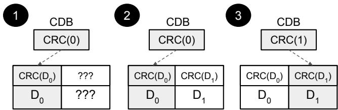
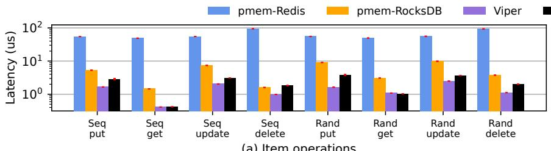
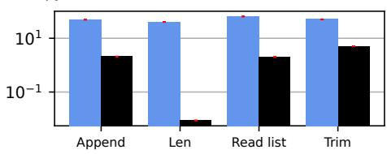
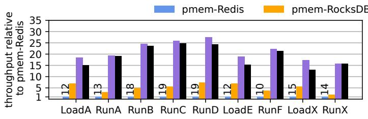
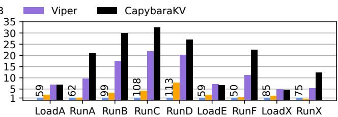
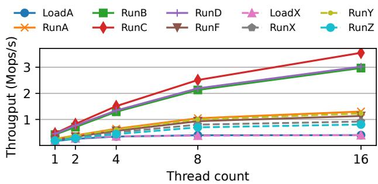

USENIX

THE ADVANCED COMPUTING SYSTEMS ASSOCIATION

# PoWER Never Corrupts: Tool-Agnostic Verification of Crash Consistency and Corruption Detection

Hayley LeBlanc, University of Texas at Austin; Jacob R. Lorch and Chris Hawblitzel, Microsoft Research; Cheng Huang and Yiheng Tao, Microsoft; Nickolai Zeldovich, MIT CSAIL and Microsoft Research; Vijay Chidambaram, University of Texas at Austin

https://www.usenix.org/conference/osdi25/presentation/leblanc

# This paper is included in the Proceedings of the 19th USENIX Symposium on Operating Systems Design and Implementation.

July 7–9, 2025 • Boston, MA, USA

ISBN 978-1-939133-47-2

Open access to the Proceedings of the 19th USENIX Symposium on Operating Systems Design and Implementation is sponsored by


# PoWER Never Corrupts: Tool-Agnostic Verification of Crash Consistency and Corruption Detection

Hayley LeBlanc University of Texas at Austin

Jacob R. Lorch Microsoft Research

Chris Hawblitzel Microsoft Research

Cheng Huang Microsoft

Yiheng Tao Microsoft

Nickolai Zeldovich MIT CSAIL and Microsoft Research

Vijay Chidambaram University of Texas at Austin

## Abstract

Storage systems must maintain integrity even after rare and difficult-to-test-for conditions like power losses and media errors. Formal verification presents a promising avenue to ensure storage systems are resilient, but current approaches involve significant complexity and rely on verification constructs or forms of logic beyond what most verifiers natively support. In this paper, we present two new verification techniques that rely only on standard constructs provided by most verification tools such as Hoare logic, ghost variables, and quantifiers. First, we introduce PoWER (Preconditions on Writes Enforcing Recoverability), a novel approach to verifying crash consistency that encodes its requirements in the preconditions of storage API methods. Second, we present a new model of media corruption for provable corruption detection on any type of storage device. To demonstrate the power of these new techniques, we use them to build two verified storage systems using two different verification frameworks. We build and verify the key-value (KV) store CAPYBARAKV using Verus and the notary server CAPYBARANS using Dafny. Both systems are built for persistent memory (PM), which we target due to new challenges it presents to building resilient storage systems. We develop new techniques to address these challenges, including the corruption-detecting Boolean, a new primitive for atomic checksum updates. Both systems verify in under a minute, and CAPYBARAKV achieves performance competitive with similar unverified PM KV stores.

## 1 Introduction

Storage systems must preserve the integrity of stored data even if rare events like power losses or media errors occur. However, ensuring that systems are crash consistent and can detect corruption is difficult. There has been extensive prior work on testing storage systems for these properties, but testing cannot guarantee the absence of bugs [14, 18–20, 35, 36, 44, 46–48, 50, 52, 69]. Program verification offers a promising alternative: use machine-checked proofs to ensure resiliency and correctness properties [1, 7, 9, 21, 22, 38, 57].

However, verifying that storage systems are crashconsistent and corruption-resistant is challenging for three reasons. First, verifying crash consistency requires specialized tools that exacerbate the learning curve for verification.

Second, prior work on provably detecting corruption makes strong assumptions about data layouts that are not compatible with all systems [21]. Third, verified storage systems have not been able to achieve state-of-the-art performance thus far [7–9, 21, 57]. As a result, mainstream adoption of verification for storage systems has been low.

In this paper, we present a novel approach for verifying that storage systems (1) are crash-consistent and (2) can provably detect corruption. Our approach is tool-agnostic: it only relies on Hoare logic [17, 25], ghost variables, and quantifiers, features supported by most verification tools. This enables us to implement our approach in existing verification tools, such as Dafny [45] and Verus [43], without changing the tools themselves. Our model of corruption enables provable corruption detection without imposing restrictions on data placement.

To demonstrate our approach, we build two verified storage systems, a key-value store and a notary service, using two different verification frameworks. We show that the keyvalue store achieves performance competitive with similar unverified systems.

Verifying crash consistency. A key challenge when verifying crash consistency is reasoning about intermediate system states that may occur when an operation is interrupted by a crash [9]. This is difficult because Hoare logic [17, 25], the basis of most verification tools, trades the ability to describe these intermediate states for efficient modular verification. In Hoare logic, a function is specified by preconditions that must hold when it is invoked and postconditions that must hold when it completes. Its internal behavior is otherwise unconstrained.

Prior verified storage systems have introduced new frameworks and features, beyond what standard verifiers support, to facilitate reasoning about intermediate states. For example, the FSCQ file system extends Hoare logic with crash conditions, predicates about intermediate disk states of a function [9], in the Rocq proof assistant [11]. The VeriBetrKV key-value store adds TLA-style [41] reasoning to Dafny [45] to support state machine refinement proofs about crash behaviors [21]. These approaches, while powerful, all have a steep learning curve and are tied to certain verification tools.

We introduce PoWER (Preconditions on Writes Enforcing Recoverability), a new approach to reasoning about storage system crashes that, unlike prior work, relies only on standard constructs provided by most verification tools. The key insight behind PoWER is that new forms of logic or TLA-style reasoning are not required to reason about crashes; we can instead add a precondition to methods that perform durable updates stating that all resulting crash states must be legal. This can be done with Hoare logic and quantifiers, which are supported by most verification tools. In PoWER, when developers call the write API, they are required to supply a proof that satisfies the precondition that the write will always leave the storage system in a crash-consistent state.

The need to write such proofs may seem daunting, but we show how it can be greatly simplified by turning common intuitions used by storage systems developers into a set of proof strategies based on system domain knowledge. These strategies are based on the insight that most crash-consistency proofs can be discharged only by reasoning about the location of the write, not its contents or specific crash states. For example, if a write only modifies bytes that are logically unreachable, it is clear that the write will not cause inconsistency.

PoWER does not sacrifice soundness for flexibility. We prove that its guarantees correspond to crash conditions in Crash Hoare logic [9] and to crash invariants in Perennial [6] using machine-checked proofs.

Verifying corruption detection. Many storage systems use cyclic redundancy checks (CRCs) to detect bit corruption due to media errors [4, 16, 21, 66, 67]. As with crash consistency, developers of verified systems must determine the expected model of corruption and CRC properties upon which to base their proofs. The only verified storage system supporting corruption detection, VeriBetrKV [21], assumes that the checksum is embedded with the data, and that both are updated atomically. This is not true of many real-world storage systems [58] (especially on byte-addressable memories), thus limiting its adoption.

We present a new model of data corruption based on the theoretical properties of CRCs and provide libraries and functions for developers writing verified corruption-detecting systems. Our model imposes no restrictions on where data and its checksum are stored and does not require them to be atomically updated together.

Verified systems. To demonstrate PoWER and our corruption model, we build two verified persistent memory (PM) storage systems: CAPYBARAKV, a key-value store written in Verus [43], and CAPYBARANS, a notary service written in Dafny [45]. PoWER and our CRC model are not restricted to PM; we target PM because it presents novel crash-consistency and corruption-detection challenges not encountered with traditional storage.

One such challenge is that PM’s fine-grained atomic write size (8 bytes) [64] makes it impossible to atomically update CRCs with data using standard techniques, which were developed for storage devices with much larger access granularity. We develop a new primitive, the corruption-detecting Boolean (CDB), to support provably crash-atomic CRC updates. We use CDBs in both CAPYBARAKV and CAPYBARANS and find that they simplify many crash-consistency proofs.

To illustrate that PoWER is compatible with coarse-grained concurrency (if used with a tool like Verus or Perennial that supports concurrency), we extend CAPYBARAKV to support two forms of concurrency. One extension uses a reader-writer lock to permit concurrent readers or a single writer at a time, and another extension uses sharding to permit concurrent writers to keys falling in different shards.

We focus our evaluation on CAPYBARAKV and find that it achieves competitive performance with state-of-the-art unverified PM KV stores, outperforming them on many benchmarks. CAPYBARAKV is designed for an Azure Storage system that uses battery-backed DRAM, and has been integrated with a prototype Rust version of that system.

Our proposed approaches and systems have several limitations. First, PoWER relies on features that are present in most, but not all, verifiers. Highly-automated tools like Yggdrasil [57] and TPot [5] have limited support for quantifiers, which makes them incompatible with PoWER. Second, while PoWER can be used to verify concurrent systems like those discussed above, it does not support arbitrary finegrained concurrency involving concurrent writes to the same storage region. Finally, as with all verified systems, the correctness of CAPYBARAKV and CAPYBARANS depends on the correctness of their specifications and of the verifiers and compilers themselves.

In summary, this work makes the following contributions:

1. PoWER, a tool-agnostic way to verify crash consistency (§3.1);

2. A set of proof strategies and library functions to simplify crash-consistency proofs based on domain knowledge and natural intuitions about storage systems (§3.3);

3. A flexible and sound model of data corruption that facilitates proofs about the absence of corruption (§4.1);

4. The corruption-detecting Boolean, a useful new primitive for reasoning about CRC updates on persistent memory (§4.2); and

5. CAPYBARAKV and CAPYBARANS, two new verified storage systems in different languages that demonstrate our new methods (§5).

## 2 Background and related work

In this section, we discuss how existing approaches establish crash consistency and corruption detection to motivate the need for our improved approaches.

## 2.1 Identification of storage system bugs

Crash-consistency and corruption-detection bugs impact even the most mature storage systems. Prior work on crashconsistency testing tools [36, 48, 52, 69] has found many previously undiscovered bugs in these systems.

Persistent memory (PM). Persistent memory devices provide byte-addressable durable storage at near-DRAM latencies [31, 68]. PM is generally mapped into an application or storage system’s address space and accessed via memory load and store instructions [54, 64]. Unlike block devices, PM uses fine-grained atomic writes (8 aligned bytes [64]), and updates must be explicitly flushed from volatile CPU caches to ensure persistence. Recent research on PM storage systems has shown that they are prone to subtle crash-consistency bugs [14, 18–20, 35, 44, 46, 47, 50]. These bugs arise due to both PM’s complex low-level interface and higher-level issues in new PM-specific design patterns.

Although PM is not yet widely deployed, cloud services like Azure Storage already use PM in production [40]. A variety of PM-related hardware offerings are currently in development [15, 24, 37, 63] and the CXL.mem protocol is expected to support PM [2].

## 2.2 Formal verification of crash consistency

Software verification tools are best suited for verifying properties encodable with Hoare logic [17,25], and crash consistency does not seem to fit this mold. In Hoare logic, one writes specifications for functions in the form of preconditions, which must be true when the functions are invoked, and postconditions, which must be true when the functions complete. However, crashes may occur partway through function execution, and Hoare logic does not let a developer directly specify conditions that must hold throughout the body of each function. For this reason, there has been much research proposing specialized methodologies for proving crash consistency.

Crash Hoare logic. Crash Hoare logic (CHL) is used by FSCQ [9], an xv6-like file system implemented and verified in Rocq [11]. CHL extends traditional Hoare reasoning with crash conditions that describe system state in the event of a crash. CHL’s support for crash conditions is based on separation logic [53], which enables describing disjoint resources (e.g., different parts of a disk) with separate predicates. CHL is currently only supported by Rocq-based verification tools, which have a steep learning curve. Furthermore, Rocq programs can only be run by first extracting them to Haskell or OCaml, which limits their run-time performance.

CHL requires built-in language support or the ability to perform meta-level reasoning about the language’s own semantics. Languages like Verus and Dafny would require a substantial overhaul, including changes to the core language, to support CHL. Indeed, some of us are part of the Verus development team, which has no plans to support CHL because it would require significant effort and would only be used by a small subset of users.

In contrast, PoWER can be used with any verifier that supports standard Hoare logic, ghost variables, and quantifiers, including verifiers like Verus [43] that produce fast code. Furthermore, we believe that PoWER would remain a valuable contribution even in the unlikely event that CHL support were added to Verus, because it could be used with any verification tool.

Crash invariants. GoJournal [7] and other systems built on top of Perennial [6] reason about crash safety as a form of concurrency, where a crash causes existing threads to stop executing and a new recovery thread to start executing. In particular, Perennial formalizes crash reasoning using crash invariants [6, §5.1], which are built on top of atomic invariants. Atomic invariants are properties that are verified to hold at the end of every atomic execution step. Many frameworks for verifying concurrent software (including Iris [33] and Verus) support such atomic invariants, but tools that do not handle concurrency (such as Dafny [45], Prusti [65], and Creusot [13]) lack this support. PoWER can thus be used even with tools that lack support for atomic invariants.

PoWER is also useful with tools that do support atomic invariants, but which make it cumbersome to directly state Perennial’s logically atomic crash specifications [7, §6.2], such as Verus. Parts of the code requiring concurrency reasoning must use atomic invariants, but other code only needs to reason about PoWER specifications and can thus avoid the complexity of logically atomic crash specifications. (See §3.4 and §5.1.2.)

State machine refinement. State machine refinement was originally developed for verification of distributed systems in the IronFleet project [22]. VeriBetrKV [21] applies the technique to verify a key-value store based on the intuition that storage software interacting with a disk is similar to unreliable nodes interacting in a distributed system. Anvil [59] uses it to verify liveness properties of cluster management controllers. In these systems, each component (e.g., a single node, or a storage system journal) is modeled as a state machine and proven correct in isolation using Hoare logic assuming a synchronous and crash-free environment. Components are then proven correct via a series of state machine refinement proofs using TLA-style reasoning, which can also prove properties related to asynchrony, crash consistency, and liveness. Iron-Fleet and VeriBetrKV are implemented and verified in Dafny with custom-built libraries for TLA-style reasoning.

These proofs require additional infrastructure on top of a TLA library. They are also labor intensive, since developers need to reason about low-level sequences of steps and write refinement proofs. In contrast, our techniques do not require additional infrastructure or separate refinement proofs, and let developers reason about their systems at a higher level.

Push-button verification. Push-button verification [51] trades expressivity for the ability to verify code without writing any proofs. Crash refinement [57] is a technique for pushbutton crash-consistency verification in which the developer specifies a (finite) set of all possible crash schedules and requires that all executions obey the specification. This significantly reduces annotation and proof burden but is limited to simple, bounded systems. Other highly-automated verification techniques, such as the approach taken in TPot [5], have not been applied to storage verification.

Summary of comparisons. In contrast to the above, PoWER relies only on standard verification constructs, letting developers use whatever verification tool they feel is best suited for their project. Indeed, based on the recent influx of Rust-based verification tools, we expect that future improvements in verification tooling may come in the form of new languages and verifiers. Techniques that require developers to build complex frameworks or rely on specific language features will be less useful than approaches like PoWER.

## 2.3 Formal verification of corruption detection

VeriBetrKV [21] formally reasons about the use of checksums for corruption detection. However, its corruption-detection axiom strongly dictates how data must be checksummed and where the checksum must be stored. VeriBetrKV does not allow checksumming data across blocks, and precludes storing the checksum separately from the data. As we discuss in §4.1, this is overly restrictive for the systems we target. In contrast, our proposed model imposes no limitations on what data is checksummed or on where the checksum and data are stored. Moreover, it is difficult to determine what actual constraints VeriBetrKV’s axiom implies for the underlying storage device, and whether it is sound, in contrast to our axioms that reason about the number of corrupted bits that CRC algorithms are designed to detect.

## 3 Verifying crash consistency using PoWER

This section discusses our novel, tool-agnostic technique PoWER for verifying crash consistency in storage systems. Unlike prior work, it can be used to concisely verify crash consistency with only basic verifier features.

## 3.1 PoWER

Our main contribution is Preconditions on Writes Enforcing Recoverability (PoWER), a way to verify crash consistency based on standard Hoare logic. This is challenging because while most verification tools let one specify what a method must satisfy upon completion (postconditions), one cannot generally specify what must be true throughout a method’s execution, and crashes can happen at any point.

Overall idea. The idea behind PoWER is to give a method that performs durable updates a storage handle with a special

```rust
pub exec fn write(&mut self, addr: u64,
bytes: &[u8], perm: Tracked<&Perm>)
requires
addr + bytes@.len() <= old(self)@.len(),
forall |s| can_result_from_partial_write(
6 s, old(self).durable_state,
addr as int, bytes@)
8 ==> perm@.permits(s),
ensures
10 self@.can_result_from_write(old(self)@,
11 addr as int, bytes@)
```  
Listing 1: A simplified signature of an asynchronous write method used with PoWER in Verus

API that ensures storage is always in a consistent, recoverable state. To do this, we add a single precondition to the API’s write method, which requires all new crash states introduced by the write to be crash consistent.

This is possible because one can describe all new crash states introduced by a write before it is invoked, even though asynchronous partial completion of those writes can occur at any time. By adding a precondition to the write method that forces the developer to reason about all such resulting crash states, we can ensure the developer cannot introduce crash-consistency bugs.

Modifying the API this way ensures correctness with no performance cost because all annotations involved in ensuring preconditions on writes are erased at compile time. The compiler generates an executable equivalent to what would exist with the standard, non-PoWER API.

The PoWER API. A standard storage API includes three main methods: read, which returns the most recently written bytes at a given address; write, which starts an asynchronous write but does not necessarily make it immediately durable; and flush, which ensures prior writes are durable. Their standard preconditions check properties like in-bounds addresses.

Listing 1 shows a simplified specification of a write method in the PoWER API in Verus. The requires clause specifies preconditions and the ensures clause specifies postconditions. old(x) is the contents of mutable reference x upon method invocation. x@ is shorthand for x.view() and represents an abstraction of x (e.g., the current state of a storage device including outstanding writes). The new precondition introduced by PoWER is on lines 5–8; it requires that all newly introduced potential crash states are permitted. In Verus, we express the set of permitted states with an unforgeable ghost (i.e., erased by the compiler) permission token perm. The set of newly introduced potential crash states is defined by the storage model, which accounts for device properties like atomic write granularity and alignment; we now discuss that model.

Storage model. The storage model we use is based on the prophecy-based asynchronous disk model [62] used in Perennial [6,7]. This model eases reasoning about crashes by letting proof code reason about possible future system states, akin to prophecy variables used in some refinement proofs [34, 42]. The Perennial authors have proven, in Rocq, that any system proven correct using the prophecy model is also correct using a natural model that cannot see the future [61]. We have also formally proven the soundness of our prophecy-based model by building it as a library atop a similar natural non-prophecy model, leveraging support for prophecy variables in Verus.

1 pub struct PersistentMemoryRegionView { pub read\_state: Seq<u8>, pub durable\_state: Seq<u8> }   
3 pub open spec fn chunk\_corresponds(s1: Seq<u8>, s2: Seq<u8>, chunk: int) -> bool {   
forall |i: int| 0 <= i < s1.len() && i / chunk\_size() == chunk ==> s1[i] == s2[i]   
}   
6 pub open spec fn can\_result\_from\_partial\_write(   
post: Seq<u8>, pre: Seq<u8>, addr: int, bytes: Seq<u8>) -> bool   
8 {   
post.len() == pre.len() && forall |chunk| {   
10 ||| chunk\_corresponds(post, pre, chunk)   
11 ||| chunk\_corresponds(post, update\_bytes(pre, addr, bytes), chunk)   
12 }}   
13 impl PersistentMemoryRegionView {   
14 pub open spec fn can\_result\_from\_write(self, pre: Self, addr: int, bytes: Seq<u8>) -> bool {   
15 &&& self.read\_state == update\_bytes(pre.read\_state, addr, bytes)   
16 &&& can\_result\_from\_partial\_write(self.durable\_state, pre.durable\_state, addr, bytes)   
17 }}  
Listing 2: Part of the specification used by the prophecy-based asynchronous storage model in Verus

To explain the prophecy model, we first describe the natural model. Storage is divided into chunks with size equal to the atomic persistence granularity of the device. For instance, persistent memory uses a granularity of 8 bytes, while hard drives generally use 512 B or 4 KiB sectors. A read returns the lastwritten contents, even if the asynchronous writes that wrote them are still outstanding and may never become durable. A flush completes all outstanding writes. On a crash, each outstanding write operation is divided into chunk-granularity subwrites and some of the subwrites are durably performed. This model is tricky to reason about because the state includes both a current readable state and a set of outstanding writes.

The prophecy model, given in Verus in Listing 2, is simpler in that the state consists of only two byte sequences: the read state and the durable state (line 1). The read state reflects all writes performed so far, including outstanding updates that may be lost in a crash. The durable state reflects all subwrites performed so far that will eventually become durable, due to either a subsequent flush or a crash that will nondeterministically choose to render them durable.

A write operation applies the entire write to the read state and a nondeterministically chosen subset of chunk-granularity subwrites to the durable state. This is shown in Listing 2, with can\_result\_from\_write (lines 13–15) specifying the possible prophesized results of a given write operation.

The flush operation’s postcondition says that the read state matches the durable state, and that neither of these is changed by the flush. That is, the durable state does not become the read state as a result of the flush; rather, the flush confirms that the prophesized durable state matches the read state. The intuition for why this is valid is that when reasoning about instructions past a flush, one need not consider possible branching timelines in which some subwrites were lost.

We switched from the natural model to the prophecy model partway through development of CAPYBARAKV and found that it made proving crash consistency much simpler. One must still reason, when calling a PoWER write, about all the possible new crash states the write can introduce. But after the write, thanks to the prophecy model, one need only reason about the single prophesized resulting durable state.

Specifying prophecy variables in a storage model requires the use of ghost variables, which are a feature of most verification tools including Dafny and Verus. Ghost variables can contain information known at verification time even if it cannot necessarily be known during execution, which is what makes them a standard tool for prophecy variables.

Specifying crash-consistent states. PoWER, like all crashconsistency specifications [7,9], requires that the specification writer formally specify the set of crash-consistent states. In theory, the developer may define this set however they like. We suggest the following approach, exemplified by Listing 3 which shows a simplified signature for a synchronous, crashatomic append operation in an append-only log. Have the code define a recovery function rec that maps a sequence of bytes to an abstract state. Then, make the set of crashconsistent states be the union of two sets: (1) the set of states abstractly equivalent to the initial state, and (2) the set of states permitted by the postcondition. In other words, when crashing mid-operation, the code may either atomically execute that operation or do nothing.

Specifying crash-consistent transitions. Another way to specify crash-consistency properties is to specify a set of

```rust
1 pub exec fn log_append(&mut self, ps: &mut PoWERStorage, bytes: &[u8], perm: Tracked<&Perm>)
requires forall |s| Self::rec(s) == Self::rec(old(ps)@) || Self::rec(s) == Self::rec(old(ps)@) + bytes@
==> perm@.permits(s),
ensures Self::rec(ps@) == Self::rec(old(ps)@) + bytes@,
```

Listing 3: Signature for a log-append method that enforces crash consistency with PoWER

Listing 4: Signature for a log-append method that uses a single-use PoWER permission permitting a transition

legal transitions between crash states. That is, a permission can express not a set of legal crash states but a set of legal pairs of states $\left( s _ { 1 } , s _ { 2 } \right)$ . If the current durable state is $s _ { 1 }$ then it permits introducing new crash state s2.

A useful case of this is a permission to transition from any s1 to s2 if they both recover to the same abstract state. Another case is that for a mutating operation, one can grant permission to transition from s1 to s2 if s2 recovers to a state that matches s1 except that the operation has been performed. Listing 4 shows an example of this use.

Blanket vs. single-use permissions. Some scenarios call for a blanket permission, i.e., a permission that can be used repeatedly. A key case of this is permission to transition between recovery-equivalent states. Such permission can be granted to the system when it starts, so that it can make such transitions throughout its lifetime. This simplifies the specification by reducing the number of permissions that must be granted. Other scenarios call for single-use permissions. A key case of this is permission to perform a transition corresponding to a state-mutating operation that should only happen once.

Single-use permissions are straightforward to implement, by having a write operation consume or otherwise invalidate any single-use permission passed to it. In such an implementation, a blanket permission is a factory that can generate an arbitrary number of single-use permissions.

Statically partitioning into multiple PoWER regions. For some systems, it is convenient to statically partition storage into multiple parts, each with its own PoWER handle. We call each such part a region. Such partitioning can be done by using multiple physical or virtual devices, or by treating each file in a file system as a separate region. This modularizes reasoning about storage state since each region becomes a separate object with its own crash constraints and permissions.

## 3.2 Correspondence to other approaches

To demonstrate the soundness of the PoWER approach for specifying crash consistency, we use mechanically-checked proofs to show correspondence to two other approaches: CHL and crash invariants. These are among the current state of the art for verified storage systems, but require additional verifier features beyond Hoare logic and are thus not tool-agnostic.

Correspondence to Crash Hoare logic. To validate the soundness of our PoWER specification approach, we produce a mechanically-checked Rocq proof of its correspondence to CHL. We prove that any code satisfying a PoWER specification satisfies a corresponding CHL specification, encoded as a crash weakest precondition (WPC) in Perennial, whose crash condition states that, if the system crashes, the storage will satisfy the recoverability predicate. The details of this theorem statement, along with the proof, are available as part of this paper’s artifact, described in §A.

Since we have not implemented PoWER in Rocq, this proof is metalogical and depends on a trusted translation of PoWER semantics into Rocq. This translation is fairly natural, so we feel confident in the correctness of this proof.

Correspondence to crash invariants. Crash consistency can also be specified using crash invariants, as in Perennial [6]. We prove that satisfying a PoWER specification implies the satisfaction of a crash invariant, in two steps. First, we implement the PoWER interface in Verus as a verified library on top of a lower-level interface that reasons about crash consistency using crash invariants. Second, we prove that, if an application adheres to the PoWER API, it implies that the PoWER library maintains a corresponding crash invariant on behalf of the application. We can do this because crash invariants can be built on top of atomic invariants, an advanced feature of some verification tools including Verus but not Dafny, Prusti [65], or Creusot [13]. Since both the PoWER interface and the invariant-based specification are in Verus, this proof is entirely machine-checked (unlike the CHL proof mentioned above). The details of this correspondence are available as part of this paper’s artifact, described in §A.

## 3.3 Strategies for satisfying preconditions

We next discuss how a developer can prove their code matches a PoWER specification. The challenge is proving, immediately before each write, that all new crash states that can result from partial application of the write are permitted. In this subsection, we describe four design patterns that simplify this reasoning, and libraries we provide that make it easy to apply them. We classify durable updates into four categories— tentative, committing, recovery, and in-place—and provide strategies to prove the crash consistency of each category.

Tentative writes. We call a write tentative if it has no effect on the abstract system state until some subsequent write happens. Tentative writes generally modify data at addresses that are unreachable during recovery (e.g., inodes unreachable from a file system’s root), and do not change system state regardless of which subwrites become durable. Their contents only become relevant after a subsequent, non-tentative write (e.g., storing a reachable pointer to the address).

The developer need not prove anything about the specific bytes in a tentative write to prove crash consistency. They must only prove that the addresses modified by the write are unreachable during recovery. We provide lemmas in our Verus and Dafny libraries (see Listing 5 for the Dafny version) that the developer can call to satisfy the precondition of the PoWER API.

Committing writes. We call a write committing if it changes the abstract state of the system using a single crash-atomic write. For example, such a write might update a pointer that causes a tree of objects on storage to become reachable by the recovery function. A committing write is typically done after a flush to ensure that a crash does not cause the state to be invalid due to lost tentative writes.

For committing writes, the developer only needs to reason about two possible crash states: the states that result from the committing write being dropped or applied. We provide, in our library, a lemma that ensures that for a committing write there are only these two possible crash states.

Recovery writes. Recovery writes are writes done as part of a recovery procedure (e.g., replaying a journal). Such writes are not tentative, as they can change the abstract view, and they are not committing, as they may not match the atomic write granularity. To prove that such writes are crash consistent, a developer must prove that they only modify bytes that will be written to by a completed recovery procedure, and that recovery is idempotent. If the system crashes while recovering from an earlier crash, all modifications made during the first recovery will be overwritten by the second recovery, ensuring that any torn writes are fixed when recovery completes.

We have written a generic redo journal component in Verus. Internally, this journal must reason about intermediate crash states, but the user of the journal component (e.g., CAPY-BARAKV) does not have to. The user just logs updates and eventually atomically commits (or aborts) the updates gathered in the log. The journal takes care of installing journaled operations on commit or when replaying its log after a crash.

In-place writes. In-place writes non-atomically modify uservisible state and can change the abstract state of the system. They thus leave the system in a nondeterministic abstract state. This may be reasonable for systems that provide weak crashconsistency guarantees, e.g., a file system that lets a read see a write that is then lost by a crash. Such a specification would permit a large set of possible crash states, so in-place writes could more easily be proven to produce states in that set.

We have not yet had experience verifying storage systems with weakly crash-consistent semantics, so we currently have no support in our libraries for reasoning about in-place writes. A developer of such a system would have to directly prove the PoWER preconditions.

## 3.4 Extending PoWER to concurrent contexts

So far, we have described how PoWER can verify nonconcurrent storage systems, building on Hoare logic. Some verification tools have additional features for concurrency reasoning, and while PoWER does not require such features, it can leverage them to reason about some forms of concurrency.

PoWER can easily support systems that issue concurrent reads to storage, such as an implementation that uses a readerwriter lock to protect access. PoWER supports this pattern because it only adds a precondition for write operations and does not change how reads are done.

PoWER can also support systems that concurrently issue reads and writes to multiple statically allocated storage regions, as long as there is never read-write or write-write concurrency on a single such region. An example of this is a KV store sharded over multiple storage regions. To enable proving a linearizable specification for such a system, we introduce mechanisms to formally reason about the linearization order of operations across multiple storage regions. To do this, we extend PoWER to support Perennial-style reasoning about crash safety using atomic invariants, which are also supported in Verus. Specifically, we make the following two extensions to PoWER, which together we call atomic PoWER.

First, we introduce ghost state representing the durable state of persistent storage, based on Perennial’s notion of durable resources. These durable resources can be owned by an atomic invariant, which enforces that some applicationlevel recovery predicate always holds on the durable state (and in particular, this invariant can refer to the durable state of multiple storage regions), and therefore this invariant will be true when the system crashes and initiates recovery.

Second, we introduce the notion of a completion object returned when a write consumes a single-use permission. Logically, this captures the fact that a write matching the permission’s permits\_transition() was issued, and lets an application prove that its operation was applied to durable storage. For example, when an application invokes a KV store with a permission to create a new key, the KV store can return a completion proving that it wrote the key to storage, even if some concurrent thread has since deleted that key.

In atomic PoWER, permissions are no longer a trusted object but rather a verified wrapper around a Perennial-style proof (in Verus, a proof-mode callback) that opens the atomic invariant holding the durable resource and updates it when the write is applied. With this change, PoWER’s API takes on the form of a logically atomic crash specification from

1 ghost predicate AddressesUnused<T>(s: seq<byte>, addrs: set<int>, rec: seq<byte> -> T) {   
forall s2: seq<byte> :: |s2| == |s| &&   
(forall i: int :: 0 <= i < |s| && i !in addrs ==> s[i] == s2[i]) ==> rec(s2) == rec(s)   
}   
5 lemma Lemma\_TentativeWritePermitted<T>(ps: PoWERStorage, addrs: set<int>, rec: seq<byte> -> T,   
bytes: seq<byte>, start: int)   
requires forall s :: rec(s) == rec(ps.View().durableState) ==> s in ps.StatesPermitted()   
requires AddressesUnused(ps.View().durableState, addrs, rec)   
requires forall addr: int :: start <= addr < start + |bytes| ==> addr in addrs   
10 ensures forall s :: CanResultFromPartialWrite(s, ps.View().durableState, start, bytes) ==>   
11 s in ps.StatesPermitted()

Listing 5: Dafny library lemma for proving that a tentative write satisfies the PoWER write API

Perennial [7, §6.2]. As a result, the application developer’s job becomes to first state an atomic invariant about the durable ghost state, then to implement (perhaps using the library discussed in §3.2) permissions for any write operations they want to issue via a PoWER API. Intermediate layers between the top-level application atomic invariant and the low-level storage device are unaffected by these changes. For instance, we can reuse nearly all of CAPYBARAKV’s single-threaded code for its concurrent variants because that reusable code satisfies a PoWER API and thus does not care how permissions it receives are implemented (see §5.1.2).

Limitations. The key limitation of PoWER’s design, in terms of concurrency, is that it cannot reason about writes executing concurrently with other reads or writes to the same storage region. The constraint comes from the fact that the PoWER API requires the caller to logically know the current state of the region (old(self)@ in Listing 1) at the time a read or write operation is issued. However, due to concurrent writes, the caller may not fully know that state.

## 4 Provably detecting corruption

Stored data may become corrupted over time due to media errors, so checking the integrity of data using cyclic redundancy checks (CRCs) is standard in many storage systems [4, 16, 66, 67]. A verified storage system should require that data read from the storage device is checked for corruption before it is used or returned to the user. In this section, we introduce a new model of media corruption, and a new corruption-resistant atomic primitive for persistent memory.

## 4.1 Modeling media corruption

To model possible data corruption, the postcondition of our read method specifies that the returned bytes may not match the last-written bytes, but rather are related to them via a maybe\_corrupted predicate shown in Listing 6. The developer must perform a CRC check to prove that the returned bytes are uncorrupted before using them.

Our model of device corruption is as follows. The device has a corruption bitmask with one bit per storage bit. Where the bitmask is 0, reads return correct data. Where it is 1, reads return arbitrary bits, not necessarily the same on each read. The population count of the bitmask, i.e., the number of 1s, is bounded by a constant c that is opaque to the code to be verified. However, that code has access to a trusted fast CRC library [12] and an axiom stating that any two byte sequences with Hamming distance in [1, c] have different CRCs. (For the ECMA variant of CRC-64 that we use, c = 1 for arbitrarylength data, i.e., it guarantees to catch any single-bit errors, but c can be higher for shorter lengths, such as c = 3 for data shorter than ∼1 GiB [39]. Our implementation currently does not take advantage of the higher c values for shorter lengths.) This means that, assuming c or fewer device bits are corrupted, the result of a CRC check on a given buffer definitively proves whether or not the buffer has been corrupted.

This model differs from VeriBetrKV’s “corruption cannot produce a block with a valid checksum” [21]. Our model is more fundamental, describing the behavior of the media at a lower level. It is also more flexible, allowing the contents protected by a checksum to be noncontiguous and to not be in the same block as the checksum. This flexibility is required when building PM systems like CAPYBARAKV and CAPYBARANS, as we discuss next.

## 4.2 Checking for PM corruption

Persistent memory presents new challenges for maintaining CRCs for corruption detection. Traditional storage systems often store a CRC of each block’s contents within the block itself [58]. However, PM’s finer write granularity (8 aligned bytes [64]) makes this technique crash-unsafe, as the hardware does not guarantee that the CRC will be written atomically with any non-trivial amount of data.

Prior work [44] on testing NOVA-Fortis [67], a corruptionresistant PM file system, shows that CRC management on PM is prone to crash consistency bugs. Furthermore, when trying to use and verify NOVA-Fortis’s Tick-Tock algorithm for updating CRCs, we find it is not correct in either our model of corruption or VeriBetrKV’s [21]. Tick-Tock maintains two copies (a primary and a replica) of each persistent data structure, each with its own CRC. To update the data structure, it updates the primary, then flushes, then updates the replica. On recovery, it uses whichever copy has a matching CRC, preferring the primary. However, CRC algorithms are designed to defend against media corruption in the form of a positive and bounded number of bit flips, not to distinguish between different user-level values. CRC collisions between such values, which can differ arbitrarily, are plausible (and indeed likely in scenarios where adversaries can manipulate values).

```rust
1 pub open spec fn maybe_corrupted(self, bytes: Seq<u8>, true_bytes: Seq<u8>, addrs: Seq<int>) -> bool {
&&& bytes.len() == true_bytes.len() == addrs.len()
&&& forall |i: int| 0 <= i < bytes.len()
==> exists |mask: u8| bytes[i] == (true_bytes[i] ^ (mask & self.corruption[addrs[i]]))
6 pub exec fn read(&self, addr: u64, num_bytes: u64) -> (bytes: Vec<u8>)
requires self.inv(), addr + num_bytes <= self@.len(),
ensures ({
let true_bytes = self@.read_state.subrange(addr as int, addr + num_bytes);
10 let addrs = Seq::<int>::new(true_bytes.len(), |i: int| i+addr);
self.constants().maybe_corrupted(bytes@, true_bytes, addrs) })
```

  
Figure 1: One way to use a CDB to atomically update a data structure and its CRC

For example, suppose we begin updating a data structure with value $D _ { 0 }$ to $D _ { 1 }$ . Tick-Tock writes $D _ { 1 }$ and ${ \mathsf { C R C } } ( D _ { 1 } )$ to the primary; suppose a crash occurs after $D _ { 1 }$ becomes durable but before CRC $\left( D _ { 1 } \right)$ becomes durable, so the primary CRC remains CRC(D0). Also suppose that the stored version of $D _ { 1 }$ is corrupted into $D _ { 1 } ^ { \prime }$ and that, by chance, CRC(D0) = CRC(D′ ). Tick-Tock’s primary CRC check will pass and it will not detect the corruption. This is plausible in both our and VeriBetrKV’s models, since $D _ { 1 } ^ { \prime }$ and $D _ { 0 }$ may have an arbitrary number of bit differences.

To address this challenge, we propose the following new primitive that enables atomic updates on PM. The corruptiondetecting Boolean (CDB) is an 8-byte integer that can only take on two specific values, one representing false and one representing true. These two values should be chosen carefully such that neither is likely to be corrupted into the other; we use CRC(0) and CRC(1). Since a CDB is 8 bytes, it can be written to PM atomically with respect to crashes. Since its valid values are statically known, it can be checked for corruption without needing to maintain a separate CRC.

Here is one way to use a CDB to implement an atomically mutable data structure D. Reserve space for an 8-byte CDB and two versions of D plus their CRCs. The CDB indicates which version is considered valid at recovery time. To update, tentatively write a new version and its CRC to the invalid location, then flush, then use a committing write to flip the CDB, then flush. Figure 1 illustrates this for the case where we start in step 1 with $D _ { 0 }$ as the valid version. In step 2 we write the new version to $D _ { 1 }$ and its CRC to CRC(D1), then flush. In step 3 we update the CDB to CRC(1) then flush. For the next update (not shown in the figure), we will go the other way: store the new version and CRC in $D _ { 0 }$ and CRC $( D _ { 0 } )$ ), then flush, then update the CDB to CRC(0).

We find the CDB to be a useful primitive, and use it in several places in CAPYBARAKV and CAPYBARANS to facilitate atomic updates. For instance, we use it in CAPYBARANS to atomically update the counter and last hash, using the steps in Figure 1. To our knowledge, ours is the first proven-correct algorithm for atomic updates on PM with corruption detection.

## 5 Verified systems

To demonstrate our support for multiple verification tools, we implement CAPYBARAKV, the first verified PM key-value (KV) store, in Verus and CAPYBARANS, the first verified persistent notary service, in Dafny.

## 5.1 CAPYBARAKV

CAPYBARAKV is an embedded PM key-value store with verified functional correctness, crash consistency, and corruption detection. It maps keys to values, where each value consists of an item and a list of elements. It is parameterized by key, item, and list-element types, with each of these types having a fixed size. It supports standard create, read, update, and delete operations on key-item pairs, as well as operations that update the list associated with a key. These list operations can append an element, trim a given number of elements from the front, or update the element at a given index. CAPYBARAKV supports crash-atomic transactions in which operations are visible immediately but not durable until committed.

<table><tr><td>Trait</td><td>Description</td><td>Generated code</td></tr><tr><td>PmSafe</td><td>Ensures safety of copying to storage</td><td>No methods; trivial PmSafe trait bounds on field types</td></tr><tr><td>PmSized</td><td>Ensures size known at verification time</td><td>Spec and exec size_of and align_of methods,and static asser- tions that their output matches compiler-generated type layout</td></tr><tr><td>Clone</td><td>Implements explicit copy method</td><td>Specification that copy equals original</td></tr><tr><td>PartialEq</td><td>Implements equality operator</td><td>Specification that operator is consistent with Verus equality</td></tr></table>

Table 1: Traits implemented by the #[derive(PmCopy)] macro in the pmcopy crate

Specification. Its abstract state is two maps from keys to values: the on-abort map and the on-commit map. The on-abort map represents what should result if an abort is requested or the system crashes. The on-commit map represents what should result if a commit completes. The abstract state’s operations include abort, commit, create, read, update, delete, and various list-updating operations. The abort operation sets the on-commit state to the on-abort state, representing both the expected behavior if a transaction aborts or if the system crashes. The commit operation sets the on-abort state to the on-commit state, and every other operation affects only the on-commit state. In the event of a crash, the commit operation may either abort or commit the current transaction; all other pending operations must abort.

Implementation. CAPYBARAKV has four main durable components: a main table, an item table, a list-element table, and a journal. Each row in the main table contains a key, the address of the corresponding row in the item table, the address of the row in the list-element table containing the first list element, a CRC of the key, a CRC of the address fields, and a CDB (§4.2) indicating if the row is valid. Each row in the item table contains an item and its CRC. Each row in the list-element table contains a list element, the address of the next item in the list if any, and a CRC of each of these fields. An item row is considered valid if it is pointed to by a valid main table row. A list-element row is considered valid if it is pointed to by a valid main table row or list-element row.

CAPYBARAKV uses a physical redo journal. When a transaction is committed, we tentatively append a single CRC for all pending entries, then commit by updating a CDB. Log entries are replayed using recovery writes. Once all entries have been installed, we clear the journal. The journal is designed to be of general use beyond CAPYBARAKV.

New records are created in CAPYBARAKV by tentatively writing new main and item table entries to free rows, then journaling an update to the main table entry’s CDB. Deletions only require journaling the invalidation of the target’s CDB. CAPYBARAKV uses copy-on-write to update an existing item or list element, i.e., it allocates a new row in the appropriate table and journals an update to the row that points to it.

CAPYBARAKV also has a volatile index, implemented as a Rust HashMap, that maps all keys to their main table addresses. Each table also maintains a volatile free list used for allocation.

These volatile structures are rebuilt at startup after log replay.

## 5.1.1 Safe reads and writes

In PM systems like CAPYBARAKV, PM’s low access latency makes minimizing overhead essential. In particular, I/O latency can easily be eclipsed by software overheads, so many systems memcpy data structures between DRAM and PM with no serialization. However, such low-level operations risk crash safety and can lead to undefined behavior. For example, structures that contain references (e.g., file handles or virtual addresses) cannot safely be stored on PM, as a reference may be invalid after a crash. And, when reading stored data, we must ensure that data is placed in a properly laid-out buffer and checked for corruption before casting to a more useful data structure to avoid undefined behavior.

Unfortunately, these properties are difficult to verify because compiler-generated type and layout information is not available to verifiers. We tackle this issue by using the powerful Rust compiler to check properties that Verus cannot. We are inspired by Corundum [26], a Rust crate that uses various Rust language features to enforce safety properties in PM storage systems, and SquirrelFS [44], a PM file system with crash-consistency properties checked by the Rust compiler.

We have developed pmcopy, a trusted Rust crate that provides a macro to help developers check these crucial safety properties. It generates Verus ghost code to facilitate proofs that rely on type layout information and provides executable functions specified by this ghost code. It also adds compiletime assertions that are checked by the Rust compiler, not Verus, to check that axioms it synthesizes match compilergenerated information. CAPYBARAKV uses pmcopy to enforce safety properties about all durable data structures. We expect pmcopy will also be valuable in the development of other PM storage systems in Verus.

To use pmcopy, a developer need only include two annotations on the definitions of durable data structures. The first is the directive to use the C representation (#[repr(C)]), as the default Rust representation is intentionally under-specified and is not safe for operations that rely on a known type layout [56]. The second is #[derive(PmCopy)], which causes pmcopy to generate an implementation of the PmCopy trait and several supertraits. Routines that copy to and from PM require that their parameters implement this trait. Table 1 describes four supertraits of PmCopy implemented by pmcopy. We assume that all Rust numeric types, bool, and char are safe to store on PM and mark them PmSafe. PmCopy can only be derived on structs and enums made up of PmSafe types.

Partway through development of CAPYBARAKV, an update to the Rust compiler changed the layout of u128 and i128, which caused an inconsistency between compiler- and pmcopy-generated layouts. Thanks to the static assertions pmcopy generated, this discrepancy was immediately flagged.

## 5.1.2 Concurrent variants

In addition to the single-threaded CAPYBARAKV, we build two concurrent variants, one that uses a reader-writer lock to enable concurrent reads and one that uses sharding to also enable concurrent writes, representing the two forms of concurrency described in §3.4. The API shared by the two variants is a linearizable specification that is formalized using logical atomicity [32, 60] and encoded using proof callbacks in Verus. This shared API is non-transactional, consisting of single atomic operations that create, read, update, etc.

All three implementations use a single component, UntrustedKvStoreImpl, to implement the main KV-store functionality. This includes nearly all of the code, including setup, recovery, transactions, and individual operations. That component exports a transactional API that uses atomic PoWER. That is, it only stores and recovers state via a PoWERStorage object supplied by its wrapper, so it cannot perform writes unless granted permission for all possible resulting crash states. That wrapper, either the single-threaded CAPYBARAKV or one of its two concurrent variants, creates permissions and passes them to the UntrustedKvStoreImpl as needed. The sharded variant uses multiple instances of UntrustedKvStoreImpl, one per shard, each using a separate PM file as a storage region.

At startup time, each wrapper provides a blanket permission allowing any number of writes that do not change the abstract post-recovery state. The UntrustedKvStoreImpl saves this for repeated use throughout its lifetime, for recovery and for all operations except commit. For commit operations, the wrapper supplies a one-shot permission permitting transitioning from the on-abort state to the on-commit state.

The reuse of UntrustedKvStoreImpl demonstrates a development advantage of using PoWER for systems with coarse-grained concurrency like the two we describe here. Nearly all the code, including all the complex mechanisms for recovery and transactions, can be written within components implementing a PoWER specification. As a result, most of the time, developers only need to think about how to satisfy that simple specification. They only have to devise atomic invariants and reason about crash-consistent concurrency outside of the component, in the relatively small wrappers.

## 5.1.3 Discussion

CAPYBARAKV is designed for a particular use case, storing small keys, items, and list elements on a small amount (tens of GiB) of dedicated PM, in a production cloud storage service. In targeting this use case, we make several simplifying design decisions that streamline both implementation and verification but impose limitations on functionality.

CAPYBARAKV requires users to statically allocate storage space and specify at initialization the maximum number and size of keys, items, and list elements. It does not currently support dynamic resizing and will waste space if the number of records is smaller than initially specified. CAPYBARAKV uses a volatile index that keeps all keys in memory, which grows its memory footprint (especially if large keys are used) and must be rebuilt each time the system is started.

## 5.2 CAPYBARANS

CAPYBARANS is a notary service similar to the verified notary in Ironclad Apps [23]. It securely assigns logical timestamps to hashes so they can be conclusively ordered, and stores its state on persistent storage. We build and verify it in Dafny, with a trusted C# wrapper that provides external methods for CRCs, cryptography, and serialization.

Its abstract state consists of a current logical timestamp (a 64-bit unsigned integer) and a last hash. Its interface has two main operations: (1) Advance increments the timestamp and updates the last hash. (2) Sign uses the service’s private key to sign a binding between the last hash and the timestamp. CAPYBARANS uses the CDB algorithm from §4.2 to atomically update its storage state during an Advance operation.

## 5.3 Persistent memory model

We have written a model of PM in Verus and Dafny and use it to reason about potential crash states in CAPYBARAKV and CAPYBARANS. This model uses the prophecy approach described in §3.1 and represents a PM resource using two sequences of bytes, a read state and a durable state. Our model is consistent with a storage API implementation that provides write and flush methods such that 8-byte chunks of a buffer written with write may be reordered until the next flush call. In our implementation, write calls a PMDK [30] function that uses non-temporal stores or mov followed by clflushopt or clwb, and flush performs an sfence.

There are two situations in which this model may overapproximate crash states. First, our model considers reorderings that are impossible if the implementation uses the stronglyordered clflush instruction to flush cache lines. clflush is less performant than the weakly-ordered instructions described above, so typically PMDK will not use it. Even if it does, the instructions PMDK uses for each write are not known at verification time, so our model considers these reorderings to ensure it does not underapproximate crash states.

<table><tr><td></td><td>Trusted</td><td>Spec+Proof</td><td>Impl</td></tr><tr><td>CAPYBARAKV</td><td></td><td></td><td></td></tr><tr><td>PoWERframework</td><td>1698</td><td>1079</td><td>138</td></tr><tr><td>pmcopy crate</td><td>964</td><td>0</td><td>0</td></tr><tr><td>Journal Concurrency layer</td><td>0</td><td>2234</td><td>611</td></tr><tr><td>Sharding layer</td><td>1142 395</td><td>473 265</td><td>620 332</td></tr><tr><td>KV store</td><td>1045</td><td>10204</td><td>3830</td></tr><tr><td>Total</td><td>5244</td><td>14255</td><td>5531</td></tr><tr><td>CAPYBARANS</td><td></td><td></td><td></td></tr><tr><td>PoWERframework</td><td></td><td></td><td></td></tr><tr><td></td><td>266</td><td>118</td><td>4</td></tr><tr><td>Notary server</td><td>148</td><td>555</td><td>274</td></tr><tr><td>Total</td><td>414</td><td>673</td><td>278</td></tr></table>

Table 2: Lines of code in each verified system

Second, our model considers states including those that are only reachable by reordering 8-byte chunks on the same cache line. Current Intel systems guarantee that such updates will not be reordered by hardware, making some of these crash states impossible in practice [55]. We choose the current model because it is simpler and more portable than a model that is tied to specific instructions or low-level hardware guarantees. It also accounts for the possibility that the compiler may reorder independent mov instructions.

We note that PoWER is not tied to any particular storage model, so these overapproximations are not fundamental to the technique. A developer could use a different model for a system that always uses clflush and/or that never causes reorderings on the same cache line.

## 6 Evaluation

This section addresses the following questions: How much effort does it take to build and verify a new system with PoWER (§6.1)? How does CAPYBARAKV compare to similar, but unverified, PM key-value stores (§6.2)?

## 6.1 Verification effort

Table 2 gives the number of lines of code in major components of CAPYBARAKV and CAPYBARANS, organized into trusted (i.e., unverified), specification/proof, and executable code. We count the unverified pmcopy crate towards CAPYBARAKV’s trusted code, but we do not count the lines of code it generates. The CAPYBARAKV PoWER trusted line count also includes a mock PM region using a byte vector and PM backends for Windows and Linux. Both systems have a low proof-to-code ratio (2.6 for CAPYBARAKV and 2.4 for CAPYBARANS).

Designing, implementing, and verifying CAPYBARAKV took approximately 1.5 years of work by a team consisting of both verification experts and newcomers. We built CAPY-BARANS when CAPYBARAKV was mostly complete, so its development benefitted from lessons learned when building CAPYBARAKV. It took less than one person-hour to port the PM specification to Dafny, about one hour to port the library supporting reasoning about tentative and committing writes, and about nine hours to implement and verify CAPYBARANS in Dafny after writing its specification and C# wrapper.

Verification time. On one of our development machines (Linux v6.9.3, Intel Core i7-11850H CPU, 8 physical cores, 32 GB memory), it takes 54 seconds to verify CAPYBARAKV with 1 thread and 23 seconds with 8 threads. It takes 12 seconds to verify CAPYBARANS with 1 thread; Dafny does not support multi-threaded verification.

## 6.2 CAPYBARAKV performance

We evaluate CAPYBARAKV against three unverified PM keyvalue stores: pmem-Redis [28], pmem-RocksDB [29], and Viper [3]. CAPYBARAKV is the first verified PM KV store, so we cannot compare to prior verified systems. VeriBetrKV [21], the most similar verified system, is designed for block devices.

Experimental setup. We run experiments on a two-socket machine with 32 physical cores, 128 GB memory, and one 128 GB Intel Optane DC PMM. The evaluation machine runs Debian Trixie and Linux 6.12.10. We run the pmem-Redis server and client on the same machine, enable its pointerbased append-only file, and configure it to store the AOF and all values on PM. We configure pmem-RocksDB to memorymap files for reading and writing and to use non-temporal stores when appending to its log. We set Viper to preallocate enough space for each experiment that dynamic resizing does not impact its performance. We use the sharded variant of CAPYBARAKV for all experiments, with one shard per thread.

Microbenchmarks. Figure 2(a) gives the average latency of various operations on items in the four evaluated KV stores with both sequential and random access patterns. Figure 2(b) gives the average latency of operations on lists in pmem-Redis and CAPYBARAKV; the other systems do not support lists.

Each experiment uses 25M records with 64-byte keys, 1 KiB values, and 8-byte list elements. The list “append” experiment appends a total of 16 list elements to all records, accessing the records in a random order. The “read list” operation returns the entire contents of the list as a vector, and “trim” removes all elements from the list. All operations except for list append are run once on each record.

Pmem-Redis has the highest latency on all operations due to communication overhead between its client and server. CAPYBARAKV achieves similar or better latency to pmem-RocksDB on all measured operations primarily due to its tiny (< 64 B) journal entries and its fast hash-map index. Pmem-RocksDB spends more time appending larger entries to its write-ahead log and managing its smaller but more complicated in-memory MemTable and cache structures. Key lookups in pmem-RocksDB involve searching the MemTable and potentially multiple durable files.

  
(a) Item operations

  
(b) List operations

Figure 2: Average operation latency in microseconds. Note the log scale. Error bars show 95% confidence intervals.  
  
(a) 1 thread

  
(b) 16 threads  
Figure 3: YCSB throughput relative to pmem-Redis. Numbers above pmem-Redis bars show absolute throughput in kops/s.

CAPYBARAKV’s random get latency is approximately 2× its sequential get latency in this microbenchmark because sequential loads are faster than random loads on Optane PM [31]. The sequential get workload runs on records that were inserted sequentially, whereas random get accesses keys that were inserted in a different random order.

Battery-backed DRAM. We also evaluate CAPYBARAKV in a testing environment in Azure Storage running Windows with 20 GiB battery-backed DRAM. We run the microbenchmarks shown in Figure 2(a) on CAPYBARAKV in this environment and find that operations are up to 2× faster on battery-backed DRAM and follow similar performance patterns. We are unable to evaluate the other systems in this environment as they do not support Windows.

Macrobenchmark: YCSB. We also measure each system’s performance on several workloads from the widely-used YCSB benchmark suite [10]. CAPYBARAKV and Viper do not currently support range queries, so we skip the YCSB workload that includes them (RunE). Several workloads (RunA and RunB) involve partial value updates, which these systems also do not support, so we modify the workloads to always update full values. We also introduce workload X, which is based on a trace of traffic to a production service similar to CAPYBARAKV at Azure Storage and consists of 75% updates, 5% read-modify-write operations, and 20% reads with a uniform access distribution. All YCSB workloads use 15M keys and are executed 5 times on each system. The CAPYBARAKV instances in these experiments use 24-byte keys and 1140-byte values, both structured as byte arrays.

Single-threaded performance. Figure 3(a) gives the av-



## Figure 4: Sharded CAPYBARAKV YCSB throughput with different thread counts

erage throughput of each system using one thread relative to pmem-Redis. CAPYBARAKV significantly outperforms pmem-Redis and pmem-RocksDB and achieves similar performance to Viper on these workloads. Pmem-Redis is unable to achieve high throughput on these operations due to its high per-operation latency. Multiple factors contribute to pmem-RocksDB’s lower performance: background threads performing LSM tree compaction slow down client threads; lookups and updates in its in-memory MemTable index take longer than in Viper and CAPYBARAKV’s hash maps; pmem-RocksDB uses per-block CRCs that take longer to compute than CAPYBARAKV’s smaller per-structure CRCs; and, unlike Viper and CAPYBARAKV, it logs all keys and values.

Viper and CAPYBARAKV achieve similar performance on these workloads because they have similar architectures. Both use in-memory hash map indexes and use simple durable data structures. Viper also includes optimizations for running concurrent workloads on interleaved PM, but our experiments use a single non-interleaved NVDIMM.

Sharded performance. Figure 3(b) gives average throughput using 16 threads (the number of physical cores in each

<table><tr><td rowspan="2"></td><td colspan="2"> Startup time</td><td colspan="2">Utilization (GiB)</td></tr><tr><td>Empty</td><td>Full</td><td>Memory</td><td>Storage</td></tr><tr><td>pmem-Redis</td><td>142 ms</td><td></td><td>12.3</td><td>22</td></tr><tr><td>pmem-RocksDB</td><td>9 ms</td><td>7ms</td><td>2.0</td><td>17</td></tr><tr><td>Viper</td><td>9s</td><td>75 s</td><td>1.1</td><td>23</td></tr><tr><td>CAPYBARAKV</td><td>7s</td><td>53 s</td><td>2.8</td><td>18</td></tr></table>

Table 3: Startup times and memory and storage utilization on YCSB LoadA on 128 GiB Optane PM

NUMA node on our test machine) and 16 CAPYBARAKV shards. Each record is placed in a shard based on a hash of its key, which results in a roughly uniform distribution. We do not shard the other three systems in this experiment, as they already support multiple concurrent clients. Figure 3(b) shows that with our simple sharding protocol, CAPYBARAKV outperforms the other systems on concurrent workloads including, suprisingly, Viper. CAPYBARAKV uses coarser-grained concurrency control with lower overhead than Viper. We also find that Viper’s performance in these workloads is impacted by the use of semaphores in its in-memory hash map implementation, CCEH [49]. CCEH protects hash buckets using per-bucket semaphores, and we observe via traces collected using magic-trace [27] that using these semaphores becomes slower with more workload threads (nearly doubling when going from 1 to 16 threads). CAPYBARAKV uses Rust’s standard library RwLock, which does not have this issue.

Figure 4 gives average throughput of CAPYBARAKV on each YCSB workload with different thread counts. We omit LoadE for readability and because it has the same performance as LoadA. We introduce two new workloads, Y (50% reads, 50% updates) and Z (5% reads, 95% updates), which both use a hotspot access distribution where 90% of the operations access 10% of the records. Read-heavy workloads (Runs B, C, and D) scale well because the per-shard locks allow concurrent reads. The more write-heavy workloads experience more lock contention and do not scale as well. Since our sharding policy evenly distributes keys across shards, Y and Z perform similarly to the non-hotspot workloads.

Startup times. Table 3 compares how long it takes for each key-value store to start up on both an empty instance and a completely full instance on a 128 GiB PM device. To measure full startup times, we insert records with 64-byte keys and 1 KiB values into each system until it returns an out-of-space error, then repeatedly start each system on those records. Attempting to start the pmem-Redis server on a full instance fails with a memory allocation error. CAPYBARAKV and Viper take much longer to start on both empty and full systems than pmem-Redis or pmem-RocksDB because they need to initialize or reconstruct their in-memory data structures. Viper takes longer than CAPYBARAKV because it memory-maps more files and hashes each key before inserting it into the index.

Memory and storage utilization. Table 3 also reports DRAM and PM utilization in YCSB’s LoadA workload. We use the same configurations as before for all systems but Viper, which starts with a 1 GiB pool and grows as keys are added. CAPY-BARAKV uses more memory than pmem-RocksDB because it maintains all keys in DRAM. Viper only keeps hashes of keys in DRAM, which reduces its memory footprint. Pmem-Redis also keeps all keys in DRAM, but has high per-key overhead (almost 700 bytes as reported by the server).

18 GiB is the minimum space required by CAPYBARAKV to store these records; note that unlike the other systems, this CAPYBARAKV instance cannot grow any further. In an optimally-provisioned instance, CAPYBARAKV has low storage space overheads due to its simple durable layout and does not use much more storage than pmem-RocksDB. Viper uses more storage space because it checkpoints some system metadata for use in crash recovery. To achieve durability guarantees similar to the other systems, we configure pmem-Redis to store mappings from keys to durable values as well as the values themselves, which adds additional storage overhead.

## 7 Conclusion

This paper presents new techniques for proving crash consistency and corruption detection in storage systems. We introduce PoWER, a way to prove that a system is crash consistent using only basic verifier features like Hoare logic, and a new model of storage corruption that forces developers to properly perform corruption detection while giving them flexibility in how to do so. We develop a new primitive, the corruption-detecting Boolean, and show how to use it to implement a novel algorithm for atomic updates to PM data structures. To demonstrate that our approach is useful and tool-agnostic, we build two verified PM storage systems, CAPYBARAKV in Verus and CAPY-BARANS in Dafny. We evaluate CAPYBARAKV and find that its performance is competitive with unverified PM KV stores. CAPYBARAKV and CAPYBARANS are available at https://github.com/microsoft/verified-storage.

## Acknowledgments

We would like to express our great appreciation to our anonymous shepherd and reviewers for their helpful feedback on the paper. Their disappointment with a lack of concurrency support moved us to devise, implement, and verify concurrency mechanisms, which we feel have substantially improved the work. We are also grateful to Tej Chajed, Travis Hance, Jon Howell, Jialin Li, Bryan Parno, Upamanyu Sharma, and Joseph Tassarotti, with whom we had useful conversations about the work and its relation to Perennial and VeriBetrKV. Hayley LeBlanc and Vijay Chidambaram were partially funded by donations from Toyota.

## A Artifact Appendix

## Abstract

The artifact for this paper includes the source code for CAPY-BARAKV and CAPYBARANS and proofs of correspondence between PoWER and other crash-consistency verification techniques. It also includes instructions and code to run the experiments described in §6 and generate the corresponding tables and graphs.

## Scope

The artifact can be used to validate all of the main claims of the paper. Specifically, it validates the following claims:

1. CAPYBARAKV and CAPYBARANS are correct, crash consistent, and corruption resistant, and can be verified using Verus and Dafny, respectively;

2. CAPYBARAKV and CAPYBARANS have low proof-tocode ratios and can be verified quickly;

3. CAPYBARAKV achieves competitive performance compared to state-of-the-art unverified PM key-value stores.

## Contents

The artifact has three main parts:

1. The source code for CAPYBARANS and instructions on how to build, verify, and run it. This part also includes information on how to manually audit CAPYBARANS’s specification.

2. The source code for CAPYBARAKV and for the three unverified systems we compare against, and scripts to compile these systems and to verify CAPYBARAKV. It also includes instructions and scripts to run the experiments and produce the figures and tables in §6, as well as information on how manually audit CAPYBARAKV’s specification.

3. Soundness proofs in Verus and Perennial that establish the correspondence between PoWER and CHL/crash invariants, and information on how to understand the proofs and verify that they hold. It does not include the formalization of the soundness proof in Perennial, but describes how to find that formalization in the Perennial repository and how to check it.

## Hosting

The artifact is hosted publicly on GitHub at https://github.com/microsoft/verified-storage/ tree/osdi25-artifact/osdi25 and on Zenodo at https://doi.org/10.5281/zenodo.15306499. The Zenodo artifact and the osdi25 directory in the osdi25-artifact branch on GitHub have the same contents and contain the version of the artifact used during the artifact-evaluation process.

## Requirements

Verifying and compiling CAPYBARAKV, CAPYBARANS, and the soundness proofs requires no special hardware and should work on most platforms. The CAPYBARAKV performance experiments are only compatible with Linux platforms, as the unverified systems we compare against only support Linux. The experiments are compatible with both real Intel Optane DC PMM hardware and emulated PM on DRAM; however, at least 128 GB of Intel Optane DC persistent memory is required to reproduce the results presented in the paper. To reproduce the results in the paper, we also recommend at least 128 GB of DRAM and at least 32 cores. The README files included in each part of the artifact describe specific requirements and recommendations in more detail.

## A.1 Installation

To install the artifact, either clone the GitHub repository and check out the osdi25-artifact branch, or download and unzip the Zenodo artifact. Follow the setup instructions in osdi25/capybaraNS/README.md to install dependencies for CAPYBARANS. Follow the setup instructions in osdi25/ capybaraKV/README.md to run a script that will install dependencies for CAPYBARAKV and build the systems used in performance experiments. Checking the proof of correspondence between PoWER and crash invariants is done automatically when verifying CAPYBARAKV (see below). The proof of correspondence between PoWER and Crash Hoare Logic is part of Perennial’s source code and can be checked by building Perennial; see osdi25/soundness\_proofs/README.md for instructions.

We include several “mini” versions of the full performance experiments described in §6 that take about 15 minutes to run. We suggest running these experiments after setting up CAPYBARAKV to check for issues before starting the longerrunning experiments.

## A.2 Experiment workflow

The files osdi25/capybaraNS/README.md and osdi25/ capybaraKV/README.md describe the workflow to compile and verify each system, obtain line counts, manually audit their specifications, run performance experiments, and validate the claims made in the paper.

## A.3 Expected results

CAPYBARAKV, CAPYBARANS, and the soundness proofs are expected to verify successfully using their respective verification tools. The time it takes to verify each system can vary significantly depending on the hardware being used; see each system’s README file for more information on expected verification times. In general, we expect that verifying CAPYBARANS will take under a minute, and verifying CAPY-BARAKV will take one to two minutes with one thread and between 15 and 40 seconds with 8 threads. We expect the lines of code outputted by the provided line-counting tools to exactly match those in Table 2.

When run in an environment similar to the experimental setup described in §6, we expect the PDFs and tables generated by scripts described in osdi25/capybaraKV/README.md to look similar to those presented in the paper. The default experiments provided by the artifact are smaller than those used in the paper, so we expect some variation in data collected from the artifact. Using different hardware (e.g., emulated PM or a smaller PM device) may result in noticeably different results. We describe expected differences in osdi25/capybaraKV/README.md.

## References

[1] Sidney Amani, Alex Hixon, Zilin Chen, Christine Rizkallah, Peter Chubb, Liam O’Connor, Joel Beeren, Yutaka Nagashima, Japheth Lim, Thomas Sewell, Joseph Tuong, Gabriele Keller, Toby Murray, Gerwin Klein, and Gernot Heiser. Cogent: Verifying highassurance file system implementations. In Proceedings of the ACM International Conference on Architectural Support for Programming Languages and Operating Systems (ASPLOS), pages 175–188, April 2016.

[2] Piotr Balcer. Exploring the Software Ecosystem for Compute Express Link (CXL) Memory. https://pmem.io/blog/2023/05/exploring-thesoftware-ecosystem-for-compute-expresslink-cxl-memory/, May 2023.

[3] Lawrence Benson, Hendrik Makait, and Tilmann Rabl. Viper: An efficient hybrid PMem-DRAM key-value store. Proceedings of the VLDB Endowment, 14(9):1544–1556, May 2021.

[4] BetrFS Developers. Checksumming. https://btrfs.readthedocs.io/en/latest/ Checksumming.html, 2024.

[5] Can Cebeci, Yonghao Zou, Diyu Zhou, George Candea, and Clément Pit-Claudel. Practical verification of system-software components written in standard C. In Proceedings of the ACM Symposium on Operating

Systems Principles (SOSP), pages 455–472, November 2024.

[6] Tej Chajed, Joseph Tassarotti, M. Frans Kaashoek, and Nickolai Zeldovich. Verifying concurrent, crash-safe systems with Perennial. In Proceedings of the ACM Symposium on Operating Systems Principles (SOSP), pages 243–258, 2019.

[7] Tej Chajed, Joseph Tassarotti, Mark Theng, Ralf Jung, M. Frans Kaashoek, and Nickolai Zeldovich. GoJournal: A verified, concurrent, crash-safe journaling system. In Proceedings of the USENIX Symposium on Operating Systems Design and Implementation (OSDI), pages 423– 439, July 2021.

[8] Tej Chajed, Joseph Tassarotti, Mark Theng, M. Frans Kaashoek, and Nickolai Zeldovich. Verifying the DaisyNFS concurrent and crash-safe file system with sequential reasoning. In Proceedings of the USENIX Symposium on Operating Systems Design and Implementation (OSDI), pages 447–463, Carlsbad, CA, July 2022. USENIX Association.

[9] Haogang Chen, Daniel Ziegler, Tej Chajed, Adam Chlipala, M. Frans Kaashoek, and Nickolai Zeldovich. Using Crash Hoare logic for certifying the FSCQ file system. In Proceedings of the ACM Symposium on Operating Systems Principles (SOSP), pages 18–37, October 2015.

[10] Brian F. Cooper, Adam Silberstein, Erwin Tam, Raghu Ramakrishnan, and Russell Sears. Benchmarking cloud serving systems with YCSB. In Proceedings of the ACM Symposium on Cloud Computing (SOCC), pages 143–154, June 2010.

[11] Coq Development Team. The Coq Proof Assistant. https://doi.org/10.5281/zenodo.8161141, June 2023.

[12] crc64fast Developers. crc64fast. https://crates.io/ crates/crc64fast, 2024.

[13] Xavier Denis, Jacques-Henri Jourdan, and Claude Marché. Creusot: A foundry for the deductive verification of Rust programs. In Proceedings of the International Conference on Formal Engineering Methods (ICFEM), pages 90–105, October 2022.

[14] Bang Di, Jiawen Liu, Hao Chen, and Dong Li. Fast, flexible, and comprehensive bug detection for persistent memory programs. In Proceedings of the ACM International Conference on Architectural Support for Programming Languages and Operating Systems (ASPLOS), pages 503–516, April 2021.

[15] Everspin Technologies, Inc. Spin-transfer Torque MRAM Technology. https://www.everspin.com/ spin-transfer-torque-mram-technology.

[16] ext4 Developers. ext4 Data Structures and Algorithms. https://docs.kernel.org/filesystems/ ext4/, 2024.

[17] Robert W. Floyd. Assigning meanings to programs. In Proceedings of the Symposium on Applied Mathematics, pages 19–32, 1967.

[18] Xinwei Fu, Wook-Hee Kim, Ajay Paddayuru Shreepathi, Mohannad Ismail, Sunny Wadkar, Dongyoon Lee, and Changwoo Min. Witcher: Systematic crash consistency testing for non-volatile memory key-value stores. In Proceedings of the ACM Symposium on Operating Systems Principles (SOSP), pages 100–115, October 2021.

[19] João Gonçalves, Miguel Matos, and Rodrigo Rodrigues. Mumak: Efficient and black-box bug detection for persistent memory. In Proceedings of the European Conference on Computer Systems (EuroSys), pages 734–750, May 2023.

[20] Hamed Gorjiara, Guoqing Harry Xu, and Brian Demsky. Jaaru: Efficiently model checking persistent memory programs. In Proceedings of the ACM International Conference on Architectural Support for Programming Languages and Operating Systems (ASPLOS), pages 415–428, April 2021.

[21] Travis Hance, Andrea Lattuada, Chris Hawblitzel, Jon Howell, Rob Johnson, and Bryan Parno. Storage systems are distributed systems (so verify them that way!). In Proceedings of the USENIX Conference on Operating Systems Design and Implementation (OSDI), pages 99– 115, November 2020.

[22] Chris Hawblitzel, Jon Howell, Manos Kapritsos, Jacob R. Lorch, Bryan Parno, Michael L. Roberts, Srinath Setty, and Brian Zill. IronFleet: Proving practical distributed systems correct. In Proceedings of the ACM Symposium on Operating Systems Principles (SOSP), pages 1–17, October 2015.

[23] Chris Hawblitzel, Jon Howell, Jacob R. Lorch, Arjun Narayan, Bryan Parno, Danfeng Zhang, and Brian Zill. Ironclad Apps: End-to-end security via automated fullsystem verification. In Proceedings of the USENIX Symposium on Operating Systems Design and Implementation (OSDI), pages 165–181, October 2014.

[24] Hewlett Packard Enterprise. HPE Persistent Memory. https://www.hpe.com/us/en/servers/persistentmemory.html.

[25] C. A. R. Hoare. An axiomatic basis for computer programming. Communications of the ACM, 12(10):576– 580, October 1969.

[26] Morteza Hoseinzadeh and Steven Swanson. Corundum: Statically-enforced persistent memory safety. In Proceedings of the ACM International Conference on Architectural Support for Programming Languages and Operating Systems (ASPLOS), pages 429–442, April 2021.

[27] Tristan Hume. magic-trace. https://github.com/ janestreet/magic-trace, 2024.

[28] Intel. Pmem-Redis. https://github.com/pmem/pmemredis.

[29] Intel. Pmem-RocksDB. https://github.com/pmem/ pmem-rocksdb.

[30] Intel Corporation. Persistent Memory Development Kit. https://pmem.io/pmdk/.

[31] Joseph Izraelevitz, Jian Yang, Lu Zhang, Juno Kim, Xiao Liu, Amir Saman Memaripour, Yun Joon Soh, Zixuan Wang, Yi Xu, Subramanya R. Dulloor, Jishen Zhao, and Steven Swanson. Basic performance measurements of the Intel Optane DC persistent memory module. arXiv, abs/1903.05714, August 2019.

[32] Bart Jacobs and Frank Piessens. Expressive modular fine-grained concurrency specification. In Proceedings of the 38th ACM Symposium on Principles of Programming Languages (POPL), pages 271–282, January 2011.

[33] Ralf Jung, Robbert Krebbers, Jacques-Henri Jourdan, Ales Bizjak, Lars Birkedal, and Derek Dreyer. Iris from ˘ the ground up: A modular foundation for higher-order concurrent separation logic. Journal of Functional Programming, 28(20):1–73, November 2018.

[34] Ralf Jung, Rodolphe Lepigre, Gaurav Parthasarathy, Marianna Rapoport, Amin Timany, Derek Dreyer, and Bart Jacobs. The future is ours: prophecy variables in separation logic. In Proceedings of the ACM SIGPLAN Symposium on Principles of Programming Languages (POPL), pages 45:1–32, January 2020.

[35] Samuel Kalbfleisch, Lukas Werling, and Frank Bellosa. Vinter: Automatic non-volatile memory crash consistency testing for full systems. In Proceedings of the USENIX Annual Technical Conference (ATC), pages 933–950, July 2022.

[36] Seulbae Kim, Meng Xu, Sanidhya Kashyap, Jungyeon Yoon, Wen Xu, and Taesoo Kim. Finding semantic bugs in file systems with an extensible fuzzing framework. In Proceedings of the ACM Symposium on Operating Systems Principles (SOSP), pages 147–161, October 2019.

[37] KIOXIA America, Inc. XL-Flash. https: //americas.kioxia.com/en-us/business/memory/ xlflash.html, 2024.

[38] Gerwin Klein, June Andronick, Kevin Elphinstone, Toby Murray, Thomas Sewell, Rafal Kolanski, and Gernot Heiser. Comprehensive formal verification of an OS microkernel. ACM Transactions on Computer Systems (TOCS), 32(1):1–70, February 2014.

[39] Philip Koopman. CRC Polynomial Zoo. https: //users.ece.cmu.edu/\~koopman/crc/crc64.html, November 2019.

[40] Greg Kramer. Direct Drive - Azure’s Next-generation Block Storage Architecture. https://www.sniadeveloper.org/events/agenda/ session/347, 2022. SNIA Developer Conference.

[41] Leslie Lamport. The temporal logic of actions. ACM Transactions on Programming Languages and Systems (TOPLAS), 16(3):872–923, May 1994.

[42] Leslie Lamport and Stephan Merz. Prophecy made simple. ACM Transactions on Programming Languages and Systems (TOPLAS), 44(2):1–27, April 2022.

[43] Andrea Lattuada, Travis Hance, Jay Bosamiya, Matthias Brun, Chanhee Cho, Hayley LeBlanc, Pranav Srinivasan, Reto Achermann, Tej Chajed, Chris Hawblitzel, Jon Howell, Jacob R. Lorch, Oded Padon, and Bryan Parno. Verus: A practical foundation for systems verification. In Proceedings of the ACM Symposium on Operating Systems Principles (SOSP), pages 438–454, November 2024.

[44] Hayley LeBlanc, Shankara Pailoor, Om Saran K R E, Isil Dillig, James Bornholt, and Vijay Chidambaram. Chipmunk: Investigating crash-consistency in persistentmemory file systems. In Proceedings of the European Conference on Computer Systems (EuroSys), pages 718– 733, May 2023.

[45] K. Rustan M. Leino. Dafny: An automatic program verifier for functional correctness. In Proceedings of the International Conference on Logic for Programming, Artificial Intelligence, and Reasoning (LPAR), pages 348– 370, April 2010.

[46] Sihang Liu, Korakit Seemakhupt, Yizhou Wei, Thomas Wenisch, Aasheesh Kolli, and Samira Khan. Crossfailure bug detection in persistent memory programs. In Proceedings of the ACM International Conference on Architectural Support for Programming Languages and Operating Systems (ASPLOS), pages 1187–1202, March 2020.

[47] Sihang Liu, Yizhou Wei, Jishen Zhao, Aasheesh Kolli, and Samira Khan. PMTest: A fast and flexible testing framework for persistent memory programs. In Proceedings of the ACM International Conference on Architectural Support for Programming Languages and Operating Systems (ASPLOS), pages 411–425, April 2019.

[48] Jayashree Mohan, Ashlie Martinez, Soujanya Ponnapalli, Pandian Raju, and Vijay Chidambaram. Crash-Monkey and ACE: Systematically testing file-system crash consistency. ACM Transactions on Storage, 15(2):1–34, April 2019.

[49] Moohyeon Nam, Hokeun Cha, Young-ri Choi, Sam H. Noh, and Beomseok Nam. Write-optimized dynamic hashing for persistent memory. In Proceedings of the USENIX Conference on File and Storage Technologies (FAST), pages 31–44, February 2019.

[50] Ian Neal, Ben Reeves, Ben Stoler, Andrew Quinn, Youngjin Kwon, Simon Peter, and Baris Kasikci. AG-AMOTTO: How persistent is your persistent memory application? In Proceedings of the USENIX Conference on Operating Systems Design and Implementation (OSDI), pages 1047–1064, November 2020.

[51] Luke Nelson, Helgi Sigurbjarnarson, Kaiyuan Zhang, Dylan Johnson, James Bornholt, Emina Torlak, and Xi Wang. Hyperkernel: Push-button verification of an OS kernel. In Proceedings of the ACM Symposium on Operating Systems Principles (SOSP), pages 252–269, October 2017.

[52] Thanumalayan Sankaranarayana Pillai, Vijay Chidambaram, Ramnatthan Alagappan, Samer Al-Kiswany, Andrea C. Arpaci-Dusseau, and Remzi H. Arpaci-Dusseau. All file systems are not created equal: On the complexity of crafting crash-consistent applications. In Proceedings of the USENIX Symposium on Operating Systems Design and Implementation (OSDI), pages 433–448, October 2014.

[53] John C. Reynolds. Separation logic: A logic for shared mutable data structures. In Proceedings of the IEEE Symposium on Logic in Computer Science (LICS), pages 55–74, July 2002.

[54] Andy Rudoff. Persistent memory programming. ;login:, 42(2):34–40, 2017.

[55] Andy Rudoff. Re: 8 byte atomicity & larger store operations. https://groups.google.com/u/1/g/pmem/c/ 6\_5daOuEI00/m/nY\_mtKd0CAAJ, October 2020.

[56] Rust Developers. Type Layout. https://doc.rustlang.org/reference/type-layout.html, 2024.

[57] Helgi Sigurbjarnarson, James Bornholt, Emina Torlak, and Xi Wang. Push-button verification of file systems via crash refinement. In Proceedings of the USENIX Conference on Operating Systems Design and Implementation (OSDI), pages 1–16, November 2016.

[58] Gopalan Sivathanu, Charles P. Wright, and Erez Zadok. Ensuring data integrity in storage: techniques and applications. In Proceedings of the ACM Workshop on Storage Security and Survivability, pages 26–36, November 2005.

[59] Xudong Sun, Wenjie Ma, Jiawei Tyler Gu, Zicheng Ma, Tej Chajed, Jon Howell, Andrea Lattuada, Oded Padon, Lalith Suresh, Adriana Szekeres, and Tianyin Xu. Anvil: verifying liveness of cluster management controllers. In Proceedings of the USENIX Conference on Operating Systems Design and Implementation (OSDI), pages 649– 666, July 2024.

[60] Kasper Svendsen, Lars Birkedal, and Matthew J. Parkinson. Modular reasoning about separation of concurrent data structures. In Proceedings of the 22nd European Symposium on Programming (ESOP), pages 169–188, Rome, Italy, March 2013.

[61] Joseph Tassarotti et al. Perennial asynchronous disk prophecy equivalence proof. https://github.com/mit-pdos/perennial/blob/ master/src/goose\_lang/ffi/async\_disk\_equiv.v, November 2021.

[62] Joseph Tassarotti et al. Perennial asynchronous disk prophecy model. https://github.com/mit-pdos/ perennial/blob/master/src/goose\_lang/ffi/ async\_disk\_proph.v, November 2021.

[63] Tom’s Hardware. Samsung’s Memory-Semantic CXL SSD Brings a 20X Performance Uplift. https://www.tomshardware.com/news/ samsung-memory-semantic-cxl-ssd-brings-20x-performance-uplift, August 2022.

[64] Doug Voigt. Persistent memory atomics and transactions. https://www.snia.org/educationallibrary/persistent-memory-atomics-andtransactions-2017, October 2017.

[65] Fabian Wolff, Aurel Bílý, Christoph Matheja, Peter Müller, and Alexander J. Summers. Modular specification and verification of closures in Rust. In Proceedings of the ACM Conference on Object Oriented Programming Systems Languages and Applications (OOPSLA), pages 1–29, October 2021.

[66] XFS Developers. XFS Self Describing Metadata. https://www.kernel.org/doc/

Documentation/filesystems/xfs-selfdescribing-metadata.txt, 2024.

[67] Jian Xu, Lu Zhang, Amirsaman Memaripour, Akshatha Gangadharaiah, Amit Borase, Tamires Brito Da Silva, Steven Swanson, and Andy Rudoff. NOVA-Fortis: A fault-tolerant non-volatile main memory file system. In Proceedings of the ACM Symposium on Operating Systems Principles (SOSP), pages 478–496, October 2017.

[68] Jian Yang, Juno Kim, Morteza Hoseinzadeh, Joseph Izraelevitz, and Steven Swanson. An empirical guide to the behavior and use of scalable persistent memory. In Proceedings of the USENIX Conference on File and Storage Technologies (FAST), pages 169–182, February 2020.

[69] Junfeng Yang, Paul Twohey, Dawson Engler, and Madanlal Musuvathi. Using model checking to find serious file system errors. In Proceedings of the USENIX Symposium on Operating Systems Design and Implementation (OSDI), pages 273–287, December 2004.