①

USENIX

THE ADVANCED COMPUTING SYSTEMS ASSOCIATION

# Tiered Memory Management Beyond Hotness

Jinshu Liu, Hamid Hadian, Hanchen Xu, and Huaicheng Li, Virginia Tech

https://www.usenix.org/conference/osdi25/presentation/liu

This paper is included in the Proceedings of the 19th USENIX Symposium on Operating Systems Design and Implementation.

July 7–9, 2025 • Boston, MA, USA

ISBN 978-1-939133-47-2

Open access to the Proceedings of the 19th USENIX Symposium on Operating Systems Design and Implementation is sponsored by

# Tiered Memory Management Beyond Hotness

Jinshu Liu Hamid Hadian Hanchen Xu Huaicheng Li

Virginia Tech

## Abstract

Tiered memory systems often rely on access frequency (“hotness”) to guide data placement. However, hot data is not always performance-critical, limiting the effectiveness of hotness-based policies. We introduce amortized offcore latency (AOL), a novel metric that precisely captures the true performance impact of memory accesses by accounting for memory access latency and memory-level parallelism (MLP). Leveraging AOL, we present two powerful tiering mechanisms: Soar, a profile-guided allocation policy that places objects based on their performance contribution, and Alto, a lightweight page migration regulation policy to eliminate unnecessary migrations. Soar and Alto outperform four state-of-the-art tiering designs across a diverse set of workloads by up to 12.4×, while underperforming in a few cases by no more than 3%.

## 1 Introduction

Driven by the growing demands of memory-intensive workloads, such as graph processing and machine learning, tiered memory architectures that integrate a fast-tier (e.g., DRAM) and slow-tier (e.g., CXL memory) are becoming standard in cloud datacenters [1–5]. While this approach improves memory capacity scaling, it also introduces significant performance challenges. Effective data tiering is critical to mitigating the 2–3× performance disparity between tiers [6–12].

Existing tiering designs are grounded in the assumption that frequently-accessed (“hot”) data is more performance-critical than cold data and should reside in the fast-tier. Thus, tiered memory management primarily focuses on hotness tracking, memory allocation, and migration policies to detect, allocate, and relocate hot data across tiers efficiently [4, 13–29].

We argue that hot data is not always performance-critical and can reside in the slow-tier without degrading performance (§2.1). In modern out-of-order CPU designs, latency mitigation techniques, such as memory-level parallelism (MLP), obscure the true cost of memory accesses [13, 30–32]. Not all memory accesses contribute equally to performance (vary by 4×, §3); overlapping requests (high MLP) often mask slow-tier latency penalties, leading to less pronounced slowdowns.

Although MLP is a well-established concept within the architecture community [30–32], its implications for tiered memory management have been largely overlooked. Prior classification efforts across objects, pages, and data structures [13, 19, 33, 34] often implicitly reflect the effects of MLP through coarse heuristics or indirect indicators of memory access costs. However, they do not explicitly model or quantify MLP impact. What remains missing is a principled, accurate, and MLP-aware performance metric that enables more effective, performance-driven tiering policies across online and offline scenarios, and generalizes to diverse workloads.

Existing tiering systems also suffer from heavyweight and imprecise hotness sampling and page migration mechanisms. Two key limitations are prevalent [1, 4, 16, 17, 19, 21–24, 35]: (a) Suboptimal data placement. Existing coarse-grained allocation policies prioritize fast-tier placement for newly allocated data, but under fast-tier pressure, performancecritical data is often displaced to the slow-tier, necessitating costly migrations later to correct the placement errors; (b) Excessive migration overhead. Existing systems often employ aggressive migration policies, incurring substantial overhead by frequently relocating non-critical pages. This overhead can erode or negate the performance benefits of tiering (§2.1).

We propose Amortized Offcore Latency (AOL), a novel performance metric that accurately quantifies the performance impact of memory accesses by integrating memory latency and MLP. While latency measures the impact of individual memory requests, it does not capture the latency-masking effects of MLP. By considering both factors, AOL, expressed as “Latency/MLP” combined with CPU stalls, offers a more precise representation of the true performance contribution of memory accesses (validated across 56 workloads, §3).

We leverage AOL to redesign memory allocation and migration policies, introducing two novel tiering mechanisms: a static memory allocation policy, Soar, and a dynamic page migration regulation policy, Alto. Soar employs AOL-based profiling to rank objects by assessing their accumulative contributions to application performance. High-ranking objects are placed in the fast-tier, achieving near-optimal placement while eliminating runtime migration overhead. Alto adaptively regulates page migrations based on AOL, ensuring that only performance-critical pages are promoted, regardless of their hotness. Alto seamlessly integrates with four representative tiering systems with minimal code changes, including TPP [4], Nomad [22], Linux NUMA Balancing Tiering (NBT) [36–38], and Colloid [23].

We evaluate Soar and Alto across a range of realistic graph, cloud, and HPC workloads on both NUMA and real CXL platforms, varying fast-to-slow tier ratios and bandwidth contention levels. Soar outperforms Nomad, NBT, Colloid, and TPP by 14–547%, 4–79%, -1–68%, and 31–1242%, respectively; Alto improves performance by -2–81%, 1–31%, -3–18%, and 2–471%. Negative improvements indicate that Soar/Alto underperform relative to baselines in a few cases (5 out of 182 in total). While Soar and Alto achieve strong results broadly, their performance gains are less pronounced under high bandwidth contention due to AOL inflation from queuing delays. Raising AOL thresholds can restore their performance gains but requires contention-aware tuning. We highlight this to clarify the scope of our approach and leave AOL tuning as future work.

In summary, we make the following contributions:

• We quantitatively demonstrate that hotness is an unreliable proxy for performance-criticality: the performance impact of memory accesses can vary by up to 4× across workloads.

• We introduce AOL, a performance metric that combines memory access latency and MLP, and leverages CPU stall cycles to accurately estimate tiered memory performance.

• We propose AOL-powered memory management policies: Soar for near-optimal data placement and Alto for adaptive migration control.

• We open-source Soar and Alto at https://github.com /MoatLab/SoarAlto.

The rest of the paper is organized as follows: §2 covers background and motivation, §3 introduces the AOL metric and predictor, §4–6 present Soar, Alto, and evaluation, followed by related work (§7) and conclusion (§8).

## 2 Background and Motivation

Hotness implicitly assumes that all memory accesses contribute equally to application performance, ignoring variations introduced by loaded latency and CPU-side latency-mitigation techniques [39]. A key dimension behind this disconnect is memory-level parallelism (MLP). MLP quantifies the number of outstanding memory requests awaiting completion by the memory controller. It plays a critical role in reducing CPU stall time [30]. Under high-MLP access patterns, such as array traversals, the CPU can issue many concurrent requests to minimize stalls. In contrast, serialized access patterns, as in pointer-chasing with depedent requests, exhibit low MLP and expose latency more directly, leading to greater slowdowns [13, 40]. In tiered memory systems, this implies that placing hot data in the fast-tier does not guarantee performance gains.

## 2.1 The Case Against Hotness-based Tiering

We design a microbenchmark to quantify the performance impact of different memory access patterns and illustrate how hotness-based tiering policies can lead to incorrect page migration decisions and performance degradation. Later, we show these findings extend to real-world applications with more complex memory access behaviors in §6.

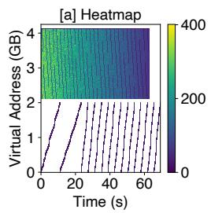

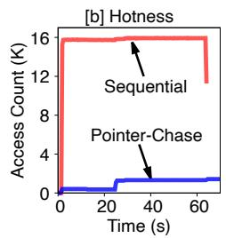

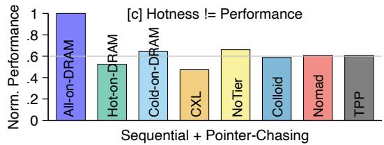  
Figure 1: Hotness vs. performance benchmark (§2.1). (a) presents the heatmap. (b) shows the access rates over time. (c) compares the performance of different tiering strategies (higher is better), showing that placing hot pages in the fast-tier can degrade performance when they are not performance-critical.

The benchmark comprises two types of memory accesses: one thread performs sequential reads (high MLP, “hot”, termed as “seq”), while the other executes pointer-chasing operations (low MLP, “cold”, termed as “pc”). Each thread operates on a dedicated 2GB buffer. The “pc” thread issues 4 billion load instructions, while “seq” thread issues 26 billion, resulting in comparable runtimes for both (Figure 1a&b). This design prevents either thread from dominating overall workload performance in a tiered memory setup. The total runtime of both threads serves as the application’s performance metric.

Figure 1a presents the heatmap highlighting the contrasting behaviors of the two memory access patterns. The sequential region (top half) demonstrates high memory access activity due to parallel memory reads (measured MLP=7 precisely), while the pointer-chasing region (bottom half) exhibits sparse memory accesses, reflecting its serialized nature (MLP=1). The difference is further quantified in Figure 1b, where “seq” pages are 13.6× hotter than “pc” pages on average.

Hotness-based tiering policies prioritize placing hot pages (in “seq”) in the fast-tier, while cold pages (in “pc”) are relegated to the slow-tier. Figure 1c shows the limitations of this approach. All the performance results are normalized to the fast-tier-only configuration (All-on-DRAM), where higher values represent better performance.

1 Placing “seq” pages in the fast-tier and “pc” pages in the slow-tier (Hot-on-DRAM) degrades the performance to 52.4% of All-on-DRAM, nearly doubling the runtime.

2 Placing cold “pc” pages in the fast-tier and hot “seq” pages in the slow-tier (Cold-on-DRAM) achieves a 34% performance gain over the “ideal” hotness-based placement in 1 .

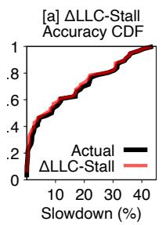

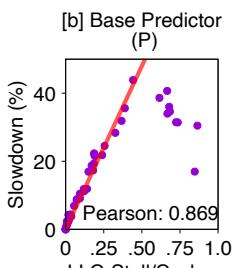

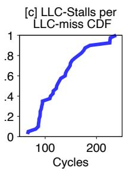

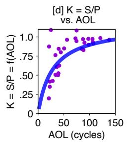

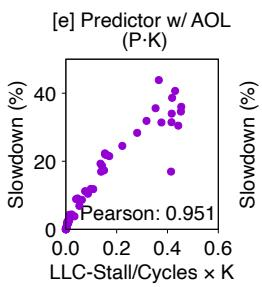

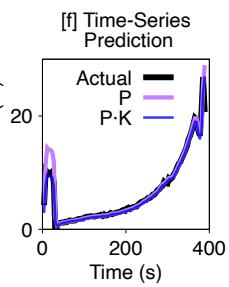  
Figure 2: AOL-based performance prediction (§3). (a) shows that LLC-Stalls effectively captures workload performance slowdowns on the slow-tier. (b) presents the base predictor (??) based on LLC-Stalls, but tends to overestimate slowdowns for high-MLP workloads. (c) reveals the average stalls per LLC-miss can vary by 4× across workloads. (d) models the workload-specific correction factor ?? as a function of AOL; the blue curve fits the observed hyperbolic relationship. (e) integrates ?? into the base predictor, yielding an AOL-based predictor that significantly improves prediction accuracy. (f) demonstrates that the AOL-based predictor generalizes to fine-grained time-series prediction.

3 When all pages are placed in the slow-tier (CXL bar), the performance is 47.4%, only slightly worse than 1 . Despite lower access frequency, the serialized nature of $\ " \mathrm { p c } \ " $ accesses dominates workload performance.

4 State-of-the-art tiering designs such as Colloid, Nomad, and TPP underperform the Cold-on-DRAM setup, despite employing various optimizations.

5 State-of-the-art also underperforms NoTier, a baseline that relies solely on the first-touch allocation policy without proactive page migrations. They fall behind NoTier by 12–14% and trail the ideal All-on-DRAM by 40%. This demonstrates that tiering can degrade performance due to the migration overhead and failure to identify truly performance-critical pages, which is not uncommon in real-world (§6).

The results highlight the inherent limitations of frequencybased hotness metrics and the corresponding hotness-driven tiering policies, where both incorrect data placement and migration overhead lead to suboptimal system performance.

## 3 Memory Performance Prediction

In this section, we define the Amortized Offcore Latency (AOL) metric for estimating the performance impact of slowtier accesses, and demonstrate that AOL is accurate and adaptive across workloads at fine granularity.

## 3.1 Relating Slow-tier Performance to CPU Stalls

We begin with an offline slowdown analysis of 56 workloads from SPEC CPU 2017 [41] and GAPBS [42]. We measure the slowdown of each workload on the slow-tier compared to the fast-tier, and collect key CPU performance counters (Table 1) for intra- and inter-workload analysis.

We find that performance degradation on the slow-tier is predominantly caused by increased CPU stalls due to LLC misses, which we refer to as LLC-Stalls (or $s _ { L L C }$ for simplicity) [11, 43]. The slowdown (??) can be approximated as: $\begin{array} { r } { \dot { S } = \frac { \dot { \Delta } c } { c } \approx \frac { \Delta s _ { L L C } } { c } } \end{array}$ , where ?? is the number of CPU cycles on fast-tier, and $\Delta s _ { L L C }$ is LLC-Stalls increase on the slow-tier.

Table 1: Intel PMU counters for AOL predictor (§3). ORO is short for OFFCORE REQUESTS OUTSTANDING. Requests are demand reads.  
```powershell
$s _ { L L C }$ CYCLE ACTIVITY.STALLS L3 MISS, # of LLC stall cycles
?? CPU CLK UNHALTED.THREAD, # of cycles
$A _ { 1 }$ ORO.CYCLES WITH DEMAND DATA RD, cycles w/ pending requests
$A _ { 2 }$ ORO.DEMAND DATA RD, # of pending requests per cycle
$A _ { 3 }$ OFFCORE REQUESTS.DEMAND DATA RD, # of requests to uncore
```

It is important to distinguish LLC-Stalls from LLC misses. While LLC misses count how often memory accesses reach fast-tier/slow-tier, LLC-Stalls measure the actual stalled CPU cycles waiting on such memory accesses. Thus, LLC-Stalls offer a more direct and actionable signal of slow-tier impact on application performance. Due to the 2–3× latency increase of the slow-tier [8, 22], each LLC miss results in more stall cycles, making LLC-Stalls a natural proxy for slowdown. Figure 2a shows the CDFs of actual and predicted slowdowns using $\scriptstyle { \frac { \Delta s _ { L L C } } { c } }$ for all the 56 workloads. Estimated slowdowns deviate by less than 4% from measured values, confirming that the added CPU stalls induced by slow-tier accesses largely explain workload slowdowns.

## 3.2 LLC-Stalls for Performance Prediction

While $\frac { \Delta s _ { L L C } } { c }$ accurately estimates slowdown, computing $\Delta s _ { L L C }$ requires measuring workload performance on both the fast-tier and the slow-tier, limiting its use to offline settings. To enable online prediction, we simplify it using the fast-tier metric $\scriptstyle { \frac { s _ { L L C } } { c } }$ based on the following observation.

Our analysis shows that $\Delta s _ { L L C }$ and $s _ { L L C }$ are strongly correlated: workloads with high LLC-Stalls on the fast-tier tend to incur proportionally more stalls on the slow-tier. This allows us to approximate $\Delta s _ { L L C } \approx k \times s _ { L L C } ,$ , where ?? is a constant. Substituting into the slowdown formula, we get $\begin{array} { r } { S = \frac { \Delta s _ { L L C } } { c } \approx k \times \frac { s _ { L L C } } { c } } \end{array}$ We define the base predictor $P$ as $\begin{array} { r } { P = \frac { s _ { L L C } ^ { \mathrm { c } } } { c } } \end{array}$ . Figure 2b shows that ?? and ?? are strongly correlated across 85% of workloads, with a Pearson coefficient of 0.869. The red line shows the fitted model; purple dots are measured slowdowns offline.

## 3.3 AOL for Accurate Prediction

Amortized Offcore Latency (AOL). ?? is accurate for low-MLP workloads but fails to model high-MLP workloads (outliers in Figure 2b). Upon further investigation, ?? tends to overestimate slowdown for high-MLP workloads (>4 on our platform). This overestimation stems from its implicit assumption that all LLC misses equally contribute to CPU stalls, ignoring the latency-masking effect of MLP. Figure 2c shows that the average LLC-Stalls per LLC miss vary significantly across workloads, ranging from 60 to 240 cycles (a 4× difference). High-MLP workloads exhibit fewer stalls per miss, reflecting reduced sensitivity to slow-tier latency.

While ${ \bf M L P } ^ { \prime } { \bf s }$ conceptual impact on performance is intuitive, its quantitative effect is much harder to model. Naively integrating MLP into the predictor $( e , g . , ~ \frac { P } { \mathsf { M L P } } )$ yields poor correlation with slowdown. Moreover, MLP alone is insufficient for modeling slowdown. Its latency-masking benefits diminish as memory latency increases. To address this, we define $\begin{array} { r } { \mathsf { A O L } = \frac { \mathsf { L a t e n c y } } { \mathsf { M L P } } } \end{array}$ and use it to enhance the predictor.

AOL-Based Prediction Model. We use AOL to refine the base predictor ?? by regulating its overestimation for high-MLP workloads. Specifically, we model slowdown as $S = P \times K$ where ?? is a function of AOL that quantifies how MLP amortizes the base predictor’s overestimation. $K \mathrm { - v s . - A O L }$ is derived via offline cross-workload modeling following an empirical approach. For each workload, given the measured slowdown ?? and $\begin{array} { r } { P = \frac { s _ { L L C } } { c } } \end{array}$ , we compute $\begin{array} { r } { K = { \frac { S } { P } } } \end{array}$ , resulting in the purple data points in Figure 2d (X-axis is AOL and Y-axis is ??). The nonlinear relationship between ?? and AOL indicates that MLP does not scale down ?? by a constant factor. This aligns with intuition, doubling MLP from 2 to 4 does not yield a 2× performance gain, as modern CPUs employ various latency-hiding optimizations that complicate MLP’s direct impact on slowdown.

Observing that ?? follows a hyperbolic trend with asymptotic growth behavior [44], we fit the curve using $K \ =$ $\textstyle f ( { \mathsf { A O L } } ) = { \frac { 1 } { a + { \frac { b } { { \mathsf { A O L } } } } } }$ , where ?? and ?? are constants. The resulting fit is shown as the blue curve in Figure 2d. Importantly, ?? and ?? are hardware-dependent (e.g., CPU and memory) but workload-independent. They can be calibrated offline using microbenchmarks with extreme access patterns (e.g., sequential vs. pointer-chasing), which represent two ends of the MLP spectrum, as discussed in §2.1. Users do not need to repeat the extensive benchmarking process we performed to profile and model $K = f ( \mathsf { A O L } )$ . This makes the model easy to deploy across platforms, enabling fast and accurate online prediction with minimal profiling overhead. Figure 2e shows that AOL significantly improves prediction fidelity, achieving a Pearson correlation of 0.951 (closer to 1 indicates stronger linear relationship). While our model is not perfect, evidenced by an outlier in the bottom right of Figure 2e, it generalizes well across diverse workloads (§6). We leave more accurate modeling to future work [43].

Lightweight Measurement. All components needed for AOL and the AOL-based predictor are derived from just four hardware counters (Table 1): $A _ { 1 } , A _ { 3 } , c ,$ and $s _ { L L C }$

1 $\begin{array} { r } { \mathsf { L a t e n c y } = \frac { A _ { 2 } } { A _ { 3 } } } \end{array}$ , where $A _ { 2 }$ is the accumulative number of inflight requests per cycle and $A _ { 3 }$ is total requests to uncore. 2 M $\begin{array} { r } { { \mathsf P } = \frac { A _ { 2 } } { A _ { 1 } } } \end{array}$ , where $A _ { 1 }$ counts cycles with ≥1 inflight request. 3 $\begin{array} { r } { \mathsf { A O L } = \frac { \mathsf { L a t e n c y } } { \mathsf { M L P } } = \frac { A _ { 1 } } { A _ { 3 } } . } \end{array}$

4 Base predictor $\begin{array} { r } { P = \frac { S _ { L L C } } { c } } \end{array}$ measures stall pressure.

5 We compute $\textstyle K = { \frac { S } { P } }$ and model it with $\begin{array} { r } { K = f ( \mathsf { A O L } ) = \frac { 1 } { a + \frac { b } { \mathsf { A O L } } } . } \end{array}$   
6 Final predictor is

$$
\begin{array} { r } { S = P \times K \approx \ \frac { s _ { L L C } } { c } \times \frac { 1 } { a + \frac { b } { \mathsf { A O L } } } } \end{array}
$$

Here, AOL captures how MLP and memory access latency jointly shape performance.

AOL vs. Slowdown. We now present the properties of $K = f ( \mathsf { A O L } )$ and how it relates to slowdown via $S = P \times K$ , by analyzing the (blue) curve in Figure 2d. The observed AOL range spans mostly (0, 130] cycles, with ?? values in mainly (0, 1] on our testbed (§6). This formulation captures how AOL reflects the impact of CPU stalls on slowdown: as AOL increases (i.e., high latency or low MLP), ?? approaches its upper bound of 1, making ?? nearly linear with ??. Conversely, small AOL values (e.g., high MLP) indicate that most stalls are masked, yielding smaller slowdowns with ?? closer to 0.

The curve also reveals diminishing returns at high AOL. For 70% of workloads with AOL below 90 cycles, ?? increases steeply from 0.2 to 0.8, indicating that ?? requires significant correction only when AOL is low. A small ?? (e.g., 0.5) implies that ?? must be scaled down by 2× to match observed slowdown. In contrast, the remaining 30% of workloads with higher AOL require less than 20% adjustment, suggesting that raw stall time already tracks slowdown closely. When memory bandwidth is unconstrained and latency is stable, MLP becomes the dominant factor in AOL and thus drives ??, quantifying its direct influence on slowdown.

AOL remains effective even under bandwidth contention. Under bandwidth pressure, queuing delays inflate latency, which raises AOL. This behavior reflects the growing performance cost, for both latency- and bandwidth-bound workloads.

Time-Series Prediction. Beyond workload-level modeling, the AOL-based predictor supports fine-grained, time-series slowdown prediction. This enables accurate performance estimation over short execution intervals, essential for adaptive, online/offline tiered memory management (§4–§5). Figure 2f shows the prediction results for a graph workload (tc-twitter). Compared to the base predictor ?? (pink), which fails to capture the dynamics, especially in the first ∼50s, the AOL-based predictor ??·?? (blue) closely matches the actual slowdown (black), demonstrating its effectiveness for interval-level prediction.

Next, we show how AOL and its predictors can be used to guide data placement and migration in tiered memory systems.

## 4 Soar: Rank-based Static Object Allocation

Existing tiered systems rely on the first-touch policy, supplemented by LRU-based page reclamation to maximize fast-tier usage [4, 45]. We argue tiered memory allocation should prioritize performance-critical objects for fast-tier placement.

We seek a near-optimal initial object placement strategy, eliminating the need for costly page migrations. Achieving this requires capturing object-level performance contributions across diverse object types and temporal dynamics. To this end, we introduce Soar1, an AOL-driven profiling-guided memory allocation policy based on object rankings according to their accumulative contribution to workload performance.

While AOL-based prediction (§3) is effective at the workload level, it falls short for individual objects due to the semantic gap between architectural events (Table 1) and object-level memory accesses. We develop a novel objectlevel profiling algorithm that refines AOL-based performance prediction to operate at object granularity. The key insight is to distribute CPU stalls across objects proportionally to their relative access frequencies based on the observed MLP and latencies, thereby approximating each object’s performance impact to application performance accurately.

## 4.1 Object-Level Performance Profiling

Figure 3 ( 1 – 8 ) illustrates Soar’s profiling workflow, which periodically collects and processes three types of metrics: object metadata via object tracking, memory accesses via PEBS-based LLC-miss sampling, and temporal performance via AOL-based prediction. Soar’s key innovation lies in associating these data streams to derive a quantified per-object performance impact (a “score”) for ranking. Soar profiler runs the workload once on the fast-tier to gather all required metrics with minimal performance overhead.

## 4.1.1 Object Profiling

We now describe the three data flows used for Soar’s object profiling in detail.

Object Tracking/Flow $( F _ { O } , \bullet \bf { \to } \bullet )$ : We track object metadata to analyze usage patterns. Using LD PRELOAD, we intercept (de)allocations via malloc()/free() and mmap()/munmap(). For each object, we record its lifespan $\left( [ T _ { \mathrm { a l l o c } } , T _ { \mathrm { f r e e } } ] \right)$ , virtual address (vaddr), size, allocation type such as malloc() or mmap(). We group objects by call chain via backtrace(), treating those with identical call stacks as the same object type, as they originate from the same code path and share access patterns. (De)allocations are then matched by vaddr, with each object represented as a five-element tuple, forming the object flow $( F _ { O } )$ L

Memory Access Tracking/Flow $( F _ { M } , \bullet \bf { \to } \bullet )$ : We use Intel Processor Event-Based Sampling (PEBS) to track the temporal and spatial distribution of memory accesses. Specifically, we

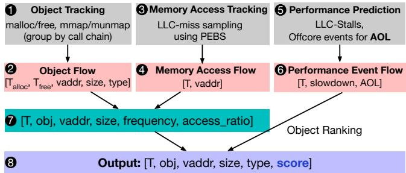

Figure 3: Soar profiling (§4.1). Soar tracks multiple flows of information to derive object rankings based on performance impact.

sample LLC misses, recording the access timestamp (??) and virtual address (vaddr). High-fidelity sampling is unnecessary: a low sampling rate (e.g., 3000) suffices, imposing negligible overhead and avoiding timing skew, which is critical for profiling short-lived objects. Each PEBS sample forms an entry in the memory access flow $\left( F _ { M } \right)$ ）

Performance Analysis/Flow $( F _ { P } , \bullet \bf { \to } \bullet )$ : We leverage AOLbased prediction to estimate memory access performance impact (§3). Performance is sampled periodically over workload execution (e.g., every one second, configurable). Each sample forms an entry in the performance flow $( F _ { P } )$ , including the timestamp, predicted performance, and AOL.

## 4.1.2 Unifying Object Flows

Next, we unify the three flows $( F _ { O } , F _ { M } , F _ { P } )$ for analyzing object characteristics and convert them into a comprehensive per-object performance profile.

We first merge $F _ { O }$ and $F _ { M }$ to associate memory accesses with objects. If the timestamp and address of a memory access in $F _ { M }$ fall within the lifecycle and address range of an object in $F _ { O }$ , the memory access is attributed to the corresponding object. All memory accesses in $F _ { M }$ are examined and matched to objects in $F _ { O }$ , constructing a memory access time-series flow $\left( T _ { M } \right)$ for each object (??).

For each object, the time-series flow $( T _ { M } , \bullet )$ is generated over its lifetime. Each entry in $T _ { M }$ includes the timestamp, ID, address, size, and access frequency between the current and previous timestamps. After constructing all $T _ { M }$ data flows, the number of memory accesses (??) to each object during each profiling period can be computed. The memory access ratio (??) for each object is defined as $\textstyle R = { \frac { c } { \sum _ { i } c _ { i } } }$ . It represents the weight of an object’s memory accesses relative to the total memory accesses, which will be used to assign object-level performance slowdowns (§4.2).

We then merge $T _ { M }$ with $F _ { P }$ to associate the predicted performance metrics with each object. The time-series predicted performance is derived from the performance events flow $( F _ { P } )$ , where the predicted performance and AOL are computed for each time interval, along with the timestamp, forming the time-series performance flow (????). By combining $T _ { M }$ and $T _ { P }$ (Algorithm 1, §4.2), the predicted performance and AOL are associated with live objects during each time period. This process results in a comprehensive time-series object flow/profile $( T _ { O } , \otimes )$ constructed for each object.

Algorithm 1 Object scoring (every profiling period)   
Input: 1) Access ratio (??); 2) Predicted perf (??); 3) AOL (??)   
Output: Object score (??).   
1: factor = ?? (??) ⊲ Decide perf scale-factor based on AOL   
2: if $R < R _ { m i n }$ and $l < L _ { 0 }$ then   
3: $s = R \times p \times$ factor ⊲ Low-MLP object   
4: else if $R > R _ { m a x }$ and $l < L _ { 0 }$ then   
5: $s = R \times p ~ /$ factor ⊲ High-MLP object   
6: else   
7: $s = R \times p$ ⊲ MLP=1, even hotness   
8: end if

## 4.2 Object Ranking

The object ranking process quantifies each object’s cumulative contribution to workload performance over its lifetime. For all active objects during a profiling interval, and given the predicted workload performance (§3.3), the core challenge is attributing performance impact to individual objects. This is non-trivial because modern hardware does not provide mechanisms to directly measure per-object performance contributions. While the AOL-based predictor accurately estimates slowdown at the workload level, it does not bridge this granularity gap. Furthermore, current CPUs do not expose per-access CPU stall information, making fine-grained attribution infeasible. Soar employs a simple yet effective heuristic: it estimates relative object contributions based on MLP and access frequency, detailed in Algorithm 1.

In an extreme scenario with no memory overlapping effect during the time period (i.e., MLP=1), the predicted performance slowdown can be distributed proportionally to the memory accesses (??) for each object. Let the predicted performance slowdown for the period be $p .$ . The score for each object is then computed as $p \times R$ (Lines 6–7). This is true because each memory access contributes equally to the overall predicted performance slowdown under MLP=1.

When memory overlapping effects are significant (high MLP), objects with a higher number of memory accesses dominate the memory overlapping behavior. Their performance contributions (and scores) should be amortized to account for their likely higher MLP compared to other objects. This scenario corresponds to Lines 4–5 in Algorithm 1. Similarly, for objects with lower MLP, their average per-access performance contribution is higher than that of objects with higher MLP. Therefore, their scores should be scaled up to reflect this increased performance contribution (Lines 2–3).

$R _ { m i n }$ and $R _ { m a x }$ are used to differentiate high- and lowfrequency accessed objects. The “hot” objects are more likely to be affected by memory overlapping when AOL is low, while the scores of “cold” objects need to be scaled up. For example, Figure 1b illustrates an extreme case: the score of a pointerchasing object should be higher than that of a sequential object due to the low AOL. $L _ { 0 }$ is the threshold used to determine whether the current time period exhibits significant MLP. This threshold is derived from our microbenchmark results, which establishes the relationship between ?? and AOL in Figure 2d. For instance, when AOL is more than 100 cycles, ?? stabilizes to a constant, thus we set $L _ { 0 }$ to be 100.

The scale factor ?? (??) (Line 1) adjusts per-object performance estimates based on access frequency (§3.3), analogous to how ?? in Figure 2d amortizes latency at the workload level. We use AOL to determine this scaling factor. When AOL is low, we set the factor to 8, corresponding to the MLP of access patterns with high parallelism (e.g., the sequential microbenchmark in §2, which has MLP=7). Dividing an object’s access count by 8 effectively cancels out the masking effects of MLP. For objects with very low access frequency (e.g., pointer-chasing), we amplify their estimated performance impact by multiplying their access count by a factor between 2 and 8, determined by a stepwise function of the observed AOL (higher AOL corresponds to a larger factor). We later show that a similar approach is also effective for regulating page migrations in §5.

Aggregating per-interval scores across all time intervals for each object is straightforward: Once a score (??) is assigned to an object at a given time interval, it is accumulated over the entire lifecycle of that object type. This approach aligns with the memory allocator’s primary objective, minimizing performance degradation when allocating objects by ensuring that all performance contributions are accounted for. This contrasts with online tiering policies, which often prioritize recent accesses by giving them more weight [17, 19].

After the entire process is complete, each object type is assigned a score ??. To account for varying object sizes, a unit score is introduced as $\begin{array} { r } { s ^ { \prime } = \frac { s } { \mathsf { s i z e o f } ( O ) } } \end{array}$ . When comparing two objects with the same score ??, the larger object is less valuable to place on fast-tier due to its lower unit score.

## 4.3 Object Allocation

Soar allocation decision is based on the rank of objects by their unit scores. It aims to place the top-?? objects in fast-tier, where it tries to maximize ?? while ensuring that the total size of the top-?? objects does not exceed fast-tier size. Since fast-tier size does not always match the total size of the top-?? objects, we attempt to bind as many top-ranking objects to fasttier as possible from a sorted list of objects $( O _ { 1 } , \ldots , O _ { n } )$ with unit scores $( s _ { 1 } ^ { \prime } , \ldots , s _ { n } ^ { \prime } )$ in descending order, where $s _ { i } ^ { \prime } \geq s _ { i + 1 } ^ { \prime }$ For short-lived objects that may be interleavingly allocated with others, the sum of their occupied size on the fast-tier is taken as the maximum of their individual sizes. If free space is insufficient to fully accommodate the next top-ranking object when the request arrives, Soar falls back to the first-touch approach: the object is placed in the fast-tier first and spills over to the slow-tier when the fast-tier becomes full.

The sorting order of objects by unit scores does not necessarily correspond to the order of their allocation requests. For instance, the $( k + 1 ) ^ { \mathsf { t h } }$ ranked object may be allocated before some of the top-?? objects. In such cases, pages of the $( k + 1 ) ^ { \mathtt { t h } }$ object are demoted to the slow-tier until enough space becomes available in the fast-tier for the top-?? objects. Page demotion is triggered only when space is insufficient for objects that’s destined to stay in fast-tier, making the total demotion overhead low as it occurs rarely. Objects that are neither fully nor partially allocated to the fast-tier are allocated to the slow-tier.

We use numa alloc() from libnuma to overload memory allocation functions and bind allocations to the fast-tier/slowtier. Objects that can be flexibly placed on either tier retain their original allocation path without being overloaded. This approach requires no changes to application code, making Soar non-intrusive and easy to use. To identify which allocation should be redirected, Soar inspects the call chain at each allocation site to distinguish object types. It supports various languages (e.g., C/C++, Python) and does not depend on specific memory allocators. For example, Soar can also integrate with heterogeneous memory-aware allocators such as memkind [46, 47], which mitigates potential fragmentation for small objects, as numa alloc() operates at page granularity.

## 4.4 Use Cases and Limitations

Modern applications such as graph processing, ML/AI, and HPC often pre-allocate objects that persist for extended periods, making them ideal candidates for Soar. Although Soar adopts static allocation based on offline profiling, it can be extended to support online profiling for long-running workloads. One approach is to use past profiling data to predict future object performance.

Although Soar requires a single run of the workload on the fast-tier for profiling object scores, profile-guided optimization is a widely adopted practice for improving datacenter efficiency [48–50]. Another limitation is that the current Soar ranking algorithm assumes uniform memory access distribution across each object, leaving room for future optimizations for objects with heterogeneous access patterns.

## 5 Alto: AOL-based Adaptive Page Migrations

In this section, we show that AOL can also address a key bottleneck in existing tiering designs: excessive page migrations that disregard performance impact, leading to unnecessary overhead and degraded performance. By prioritizing the migration of performance-critical pages and filtering out less impactful ones, AOL improves overall tiering efficiency.

## 5.1 Alto Overview

Existing tiering designs adopt aggressive page migration strategies: when a “hot” page is detected, it is immediately promoted to the fast-tier, either because space is available or by demoting cold pages to make room. This policy has several drawbacks. (a) Migrating hot but non-performancecritical pages yields no benefit, as these accesses do not induce CPU stalls. (b) Page migrations are long-latency, blocking operations that impose substantial overhead. Per our measurements, migrating a page takes on average 12µs, during which application threads are stalled if they access the migrating page. (c) This challenge is exacerbated on CXL, where the latency and bandwidth gap with DRAM is narrowing, making tiering overhead more pronounced. Consequently, many state-of-theart tiering systems underperform even naive first-touch-based baselines due to excessive migration overhead. (d) Worse, performance-critical cold pages are often ignored by accessfrequency heuristics, missing opportunities for performance gains. These limitations call for a fundamental reassessment of assumptions in current tiering policies.

Ideally, pages should be migrated only when they are truly performance-critical, and unnecessary migrations should be avoided when the workload is insensitive to slow-tier accesses.

To address these issues, we propose Alto2, an adaptive tiering orchestration policy that dynamically regulates page migration intensity. Alto leverages the AOL metric to detect periods of high memory access overlap, during which slow-tier accesses have minimal performance impact. By filtering out non-critical migrations, Alto reduces overhead and improves overall performance. Alto is lightweight and easily integrates into existing tiering systems, enhancing efficiency without requiring major architectural changes.

Non-Goal: While integrating AOL to track per-page performance and design AOL-centric migration policies is promising, it presents unique challenges, particularly in estimating page-granular performance using coarse-grained counters (out of scope for this work). We plan to explore the broader tiering design space enabled by AOL in future work.

## 5.2 Alto Design

Leveraging AOL, Alto regulates page migrations when the overlapping effect of memory accesses (high MLP) is evident. In other words, we can use AOL to identify non-performancecritical periods and adjust the intensity of tiering operations accordingly. The detailed Alto page migration regulation scheme is shown in Algorithm 2.

Let us first consider the case where memory bandwidth is not a bottleneck, so offcore latency remains stable and low, making MLP the dominant factor in AOL.

(a) Low AOL: Low AOL indicates high MLP, meaning memory latency is largely masked and potential slowdown is minimal. In this case, there is less need for page promotions. Alto limits the rate of hot page detection, page migrations, or both, to reduce unnecessary overhead.

(b) High AOL: High AOL suggests serialized, latencysensitive memory accesses where correct page promotions can yield significant performance gains. Alto responds by enabling more aggressive page detection and migration to alleviate critical bottlenecks.

Algorithm 2 AOL-regulated page migrations (e.g., every 1s)   
Input: $\mathsf { A O L 1 o w }  4 0 , \mathsf { A O L } _ { \mathsf { h i g h } }  1 0 0$ ⊲ Profiled offline   
Output: Adjusted page migration ratio (Scale).   
1: Profile the current AOL (??)   
2: $\textbf { i f } l \leq \mathsf { A O L } _ { \mathrm { 1 o w } }$ then   
3: Scale ← 0 ⊲ Disable page promotions   
4: else if $l \geq \mathsf { A O L } _ { \mathsf { h i g h } }$ then   
5: Scale ← 1 ⊲ Enable all page promotions   
6: else   
7: Scale ← ?? (??) ⊲ Partial page promotions   
8: end if

Based on the above observations, Alto employs two AOL thresholds to guide page migration regulations: a lower bound $( \mathsf { A O L } _ { \mathsf { l o w } } )$ and an upper bound $( A 0 \mathsf { L } _ { \mathsf { h i g h } } )$ . When AOL falls below the lower bound, Alto limits or disables tiering operations to reduce overhead (Lines 2–3). When AOL exceeds the upper bound, Alto enables full-speed tiering operations (i.e., no change to the default tiering migration policy, Lines 4–5).

Since the impact of AOL on performance follows a hyperbolic curve (Figure 2d), where small changes near the lower bound can lead to large performance differences (§3.3), a more fine-grained approach could involve dynamically adjusting tiering intensity based on the observed AOL value. This enables more nuanced and adaptive tiering decisions to better capture workload dynamics. We use a stepwise function to adjust page migration intensity. Specifically, Alto gradually reduces the page promotion rate as AOL decreases while AOL falls within $[ \mathsf { A O L } _ { \mathsf { l o w } } , \mathsf { A O L } _ { \mathsf { h i g h } } ]$ (Lines 6–7). The function ?? (??) (Line 7) mirrors the procedure used to determine the performance scale factor ?? (??) in Algorithm 1 in Soar (§4).

The AOL thresholds in Alto are derived from the blue curve in Figure 2d, modeled as $\begin{array} { r } { K = f ( \mathsf { A O L } ) = \frac { 1 } { a + \frac { b } { \mathsf { A O L } } } } \end{array}$ . We use an empirical approach based on two microbenchmarks representing extreme MLP cases: a pointer-chasing workload for low MLP and a sequential workload for high MLP (§2). These benchmarks yield low/high AOL values of 40/100 cycles and 25/95 cycles on our two experimental platforms. We conduct detailed sensitivity studies on these values in §6.

## 5.3 Alto Integration with Existing Tiering Systems

Alto can be seamlessly integrated into existing tiering systems, such as TPP [4], NBT [36, 37], Nomad [22], and Colloid [23], to enhance their efficiency and reduce overhead. This integration is straightforward as Alto builds upon their existing policies. Below, we provide a brief overview of how Alto can be incorporated into these systems.

Alto+TPP. TPP is a state-of-the-art tiering design for CXL, which adopts page reclamations for pages demotions and NUMA hinting faults for page promotions with a set of aggressive heuristics to identify hot pages. We implement Alto+TPP by constraining the page promotion rate proportionally to AOL based on offline-profiled thresholds.

To gradually reduce page promotion rate as AOL decreases, in our implementation, Alto+TPP periodically ignores certain potential promotion candidate pages. For instance, if we aim to allow 20% of TPP-identified candidate pages to be promoted, we allow the first two pages of every 10 pages to go through.

To monitor AOL, we utilize Linux perf to collect the CPU counters periodically (Table 1), e.g., every 1s. Subsequently, we calculate AOL based on these counters, enabling us to dynamically adjust the page promotion rate based on the observed AOL. Our user-level tool is lightweight and imposes no additional overheads. The kernel side only involves ∼30 LOC changes to page migration policies in the Linux memory subsystem. We use a default AOL sampling period of 1s for Alto. While lower sampling period possibly enables more fine-grained Alto-based migration regulations and better performance, we find that 1s is sufficient to capture AOL and workload dynamics.

Alto+NBT, Alto+Nomad, and Alto+Colloid. Unlike TPP, NBT, Nomad, and Colloid adopt less aggressive page migration strategies. They rely on NUMA hinting faults for tracking page accesses, which functions similarly to standard NUMA balancing (i.e., AutoNUMA [51]). Their page scanning mechanism sequentially examines all Virtual Memory Areas (VMAs) in each process. During VMA scanning, the system sets each page’s flag to PAGE NONE. Subsequently, when a page is accessed, a minor page fault is triggered. If the page resides on a node other than its preferred node, it is marked as a candidate for migration to the preferred node.

In both NBT and Nomad, only pages located in the slowtier are scanned, with the fast-tier serving as the preferred node for all pages. To optimize this process, we implement Alto by limiting the number of pages set to PAGE NONE during periods of significant memory access overlapping (low AOL), effectively regulating promotions. Colloid samples pages in both tiers following the same mechanism. For Alto+Colloid, we only regulate page migrations from slow-tier to fast-tier.

## 6 Evaluation

Our evaluation seeks to answer three key questions: (1) How do Soar (§6.2–§6.4) and Alto (§6.5–§6.7) compare to state-of-the-art tiering policies? (2) How sensitive are their performance gains to AOL threshold choices? (§6.8) (3) How do they perform under bandwidth contention? (§6.9–§6.10)

## 6.1 Experimental Setup

We evaluate Soar and Alto on two platforms. The first is a CloudLab dual-socket Intel Skylake server (“SKX”) with two 10-core CPUs and 96 GB DDR4 DRAM per socket [52]. We emulate CXL by lowering the uncore frequency and disabling cores on one NUMA node, resulting in fast/slow-tier latencies of 90/190 ns (2.1×) and bandwidths of 49/17 GB/s. The second platform is a local Intel Sapphire Rapids server (“SPR”), with a 32-core CPU per socket, 192 GB DDR5 DRAM, and an ASIC-based 128 GB CXL memory expander (PCIe 5 ×8). Fast/slow-tier latencies are 114/271 ns (2.4×), and bandwidths are 218/26 GB/s.

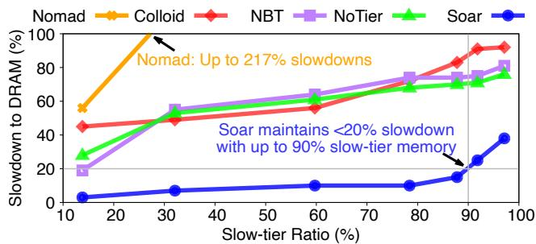  
Figure 4: Soar on SKX/NUMA (§6.2). Soar consistently outperforms all other schemes under bc-urand across various slow-tier ratios, whereas state-of-the-art approaches frequently underperform, even compared to NoTier, especially under higher slow-tier ratios.

We compare Soar and Alto against TPP [4], Nomad [22], NBT [36–38], Colloid [23], and a first-touch-only baseline (“NoTier”). NBT is the successor to AutoNUMA in Linux, with upstreamed optimizations from TPP. Colloid provides three implementations built on top of HeMem [17], Memtis [19], and TPP. We use the Colloid implementation built on top of TPP, which includes CXL-specific optimizations. Performance is reported as slowdown relative to fasttier-only (DRAM) performance, which provides a fair and consistent comparison across various target systems. Lower slowdown (closer to 0) indicates better performance. None of the tiering systems outperform the fast-tier-only configuration.

Our workloads span graph analytics [42], machine learning [53], caching [54], and HPC [41], running under various fast/slow-tier ratios (mainly 10–90%, relative to workload’s RSS). Each workload runs with 8 threads by default (unless otherwise noted), with bandwidth usage of 2.3–21 GB/s and RSS of 8–35 GB. We present detailed results for a few representative graph workloads and summarize the rest later.

## 6.2 Soar for Graph Processing

bc-urand is a betweenness centrality workload from the GAPBS benchmark suite [42], executed on a synthetic uniformly random undirected graph. We use the default configuration, which generates a graph with 134 million vertices and 2147 million edges. The algorithm estimates centrality by computing shortest paths from a subset of source vertices, resulting in irregular and sparse memory accesses. Its memory footprint is ∼20 GB. The combination of large working set size (∼17 GB) and random access patterns makes bc-urand a representative stress test for tiered memory systems. Figure 4 shows detailed Soar performance results compared to stateof-the-art tiering systems across various slow-tier ratios.

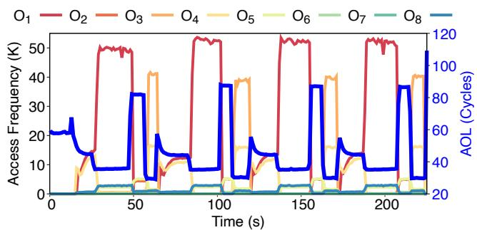  
Figure 5: Object-level accesses and AOL in Soar (§6.2). High object access frequency correspond to low AOL and crossobject access frequency correlates with MLP, which can be used to approximate object performance.

Table 2: Soar object statistics and rankings (§6.2). The object information includes size, lifetime, access frequency, and computed Soar score. Rankings are provided based on three distinct criteria: First-touch (FT), Frequency (Freq), and Soar.
<table><tr><td rowspan="2">#</td><td rowspan="2">Obj</td><td rowspan="2">Size</td><td rowspan="2">Time</td><td rowspan="2">Freq</td><td rowspan="2">Score</td><td colspan="3">Ranking</td></tr><tr><td>FT</td><td>Freq</td><td>SOAR</td></tr><tr><td> $O _ { 1 }$ </td><td>5fb2</td><td>536MB</td><td>139s</td><td>4.7M</td><td> $\overline { { 3 . 5 e ^ { - 8 } } }$ </td><td>8</td><td>1</td><td>1</td></tr><tr><td> $O _ { 2 }$ </td><td>6d68</td><td>536MB</td><td>208s</td><td>201K</td><td> $1 . 9 e ^ { - 8 }$ </td><td>6</td><td>6</td><td>2</td></tr><tr><td> $O _ { 3 }$ </td><td>6fe7</td><td>536MB</td><td>60s</td><td>1.3M</td><td> $1 . 8 e ^ { - 8 }$ </td><td>10</td><td>2</td><td>3</td></tr><tr><td> $O _ { 4 }$ </td><td>6d27</td><td>1073MB</td><td>208s</td><td>1.2M</td><td> $1 . 7 e ^ { - 8 }$ </td><td>5</td><td>3</td><td>4</td></tr><tr><td> $O _ { 5 }$ </td><td>b69c</td><td>1073MB</td><td>208s</td><td>420K</td><td> $1 . 4 e ^ { - 8 }$ </td><td>3</td><td>4</td><td>5</td></tr><tr><td> $O _ { 6 }$ </td><td>6cc3</td><td>536MB</td><td>208s</td><td>20.3K</td><td> $1 . 7 e ^ { - 9 }$ </td><td>4</td><td>7</td><td>6</td></tr><tr><td> $O _ { 7 }$ </td><td>6db6</td><td>536MB</td><td>208s</td><td>309K</td><td> $1 . 2 e ^ { - 9 }$ </td><td>7</td><td>8</td><td>7</td></tr><tr><td> $O _ { 8 }$ </td><td>b62e</td><td>17GB</td><td>223s</td><td>313K</td><td> $5 . 3 e ^ { - 1 0 }$ </td><td>2</td><td>5</td><td>8</td></tr><tr><td> $O _ { 9 }$ </td><td>5c24</td><td>327KB</td><td>14s</td><td>0</td><td>0</td><td>9</td><td>9</td><td>9</td></tr><tr><td> $O _ { 1 0 }$ </td><td>b5fb</td><td>1073MB</td><td>139s</td><td>0</td><td>0</td><td>1</td><td>10</td><td>10</td></tr></table>

Takeaway #1: Soar outperforms all baselines under bc-urand across all slow-tier ratios. Soar maintains less than 20% slowdown even under 90% slow-tier memory, demonstrating robust performance under aggressive tiering conditions.

In contrast, Nomad suffers up to 217% slowdown, and both NBT and Colloid degrade steadily (>60% slowdown) as the slow-tier ratio increases. Under high slow-tier ratios (>80%), all tiering baselines underperform NoTier by 10–20% due to excessive page migrations. Soar is the only system that outperforms NoTier consistently. We defer a detailed analysis of the inefficiencies in existing tiering designs to §6.5. These results highlight the effectiveness of Soar’s performance-criticality-aware object allocation in maintaining good performance even under severe memory pressure.

Understanding Soar object rankings. Table 2 and Figure 5 summarizes the object-level statistics and rankings. The left five columns report each object’s ID, address, size, lifetime, and access frequency. The “Score” column reflects the per-object unit-score computed using Algorithm 1, which determines Soar object rankings (Column 9). For comparison, we also include rankings based on first-touch (“FT”, Column 7) and frequency-only (“Freq”, Column 8) policies.

Table 3: Soar object placement (50% slow-tier ratio).
<table><tr><td></td><td>Fast-tier</td><td>Slow-tier</td></tr><tr><td>SOAR</td><td> $\overline { { O _ { 1 } { - } O _ { 8 } } }$ </td><td> $O _ { 8 ^ { - } } O _ { 1 0 }$ </td></tr><tr><td>FT</td><td> $O _ { 1 0 } , O _ { 8 }$ </td><td> $O _ { 1 } { - } O _ { 7 } , O _ { 9 }$ </td></tr><tr><td>Freq</td><td> $O _ { 1 } , O _ { 3 } – O _ { 5 } , O _ { 8 }$ </td><td> $O _ { 2 } , O _ { 6 } – O _ { 7 } , O _ { 9 } – O _ { 1 0 }$ </td></tr></table>

Object information is as follows: $O _ { 8 }$ represents the graph constructed after reading the input data. $O _ { 5 }$ is the index generated for the graph. $O _ { 1 } , O _ { 3 } , O _ { 4 }$ , and $O _ { 6 }$ are vectors used by bc algorithm. $O _ { 7 }$ is a shared queue among all threads. $O _ { 2 }$ is a bitmap to record the successors of each node during the back-propagation phase. The bitmap is shared by all the threads, but since each thread accesses the entries of the bitmap independently, its access exhibits high MLP.

Table 3 shows that under a 50% slow-tier setup, Soar places the top seven ranked objects $( O _ { 1 } { - } O _ { 8 } )$ in the fast-tier, while the remaining $( O _ { 8 } – O _ { 1 0 } )$ are assigned to the slow-tier (note that $O _ { 8 }$ spans both tiers). In contrast, “FT” and “Freq” produce different object placement decisions. NoTier allocates $O _ { 1 0 }$ and part of $O _ { 8 }$ to the fast-tier, while the top six most performancecritical objects are placed in the slow-tier. For frequency-based tiering systems, $O _ { 1 } , O _ { 3 } , O _ { 4 } , O _ { 5 }$ , and part of $O _ { 8 }$ are the likely targets for page promotion (per “Freq” rankings in Table 2). Meanwhile, some pages from $O _ { 8 }$ are also likely to be selected for demotion. This simultaneous promotion and demotion of $O _ { 8 }$ across tiers incurs unnecessary performance overhead due to the lack of object-level performance awareness.

The MLP characteristics of certain objects can mislead frequency-based ranking and cause incorrect page selection, resulting in additional migration overhead. Such effects are ignored by prior tiering designs. In particular, several objects that are ranked low by Soar but high by “Freq” exhibit high MLP. For example, $O _ { 2 }$ ranks $2 ^ { \mathsf { n d } }$ in unit score in Soar, but is ranked much lower $( 6 ^ { \mathsf { t h } } )$ by “Freq” and “FT” due to low AOL during its active periods ( Figure 5). Prior tiering systems will incorrectly prioritize $O _ { 3 } – O _ { 5 }$ and $O _ { 8 }$ over truly performancecritical objects like $O _ { 2 } .$ reducing the likelihood that these more important objects are promoted to the fast-tier.

Takeaway #2: Performance-aware object placement in Soar explains its advantage over state-of-the-art tiering designs, whose overhead is exacerbated by ignoring MLP effects.

## 6.3 Soar on CXL

Figure 6 presents the performance of Soar and baselines on CXL for bc-urand, and the trends mirror those observed on the SKX/NUMA setup (Figure 4). Soar consistently delivers the lowest slowdown across all slow-tier ratios. Nomad shows severe instability with up to 588% slowdown and Colloid experiences up to 92% slowdown, compared to the worstcase slowdown of only 42% in Soar. Nomad, Colloid, and NBT lose to NoTier almost uniformly across all slow-tier ratios while Soar is strictly better than NoTier. These results reaffirm that Soar is effective and robust across both emulated and real CXL environments.

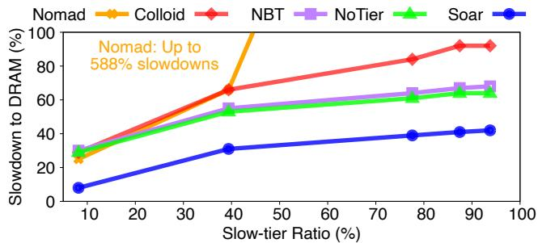  
Figure 6: Soar vs. others for bc-urand on CXL (§6.3). Soar performance on CXL is similar to that on SKX/NUMA, with Soar consistently outperforming all baselines across slow-tier ratios.

Table 4: Soar vs. others for more workloads (§6.4). Soar is robust across workloads and consistently delivers better performance compared to existing tiering designs.
<table><tr><td colspan="7">microbencn</td></tr><tr><td rowspan="5">SOAR Colloid NBT Nomad</td><td>34%</td><td>bc-urand 16%</td><td>bc-twitter 7%</td><td>bc-kron 18% 14%</td><td>ssp-kron 7%</td><td>tc-twitter 603.bwaves 4%</td></tr><tr><td>60%</td><td>58%</td><td>26%</td><td>40% 25%</td><td>6%</td><td>43%</td></tr><tr><td>58%</td><td>68%</td><td>13%</td><td>59% 18%</td><td>11%</td><td>13%</td></tr><tr><td>58%</td><td>123%</td><td>61%</td><td>105%</td><td>29% 24%</td><td>18%</td></tr><tr><td>58%</td><td>875% 495%</td><td>792%</td><td>760%</td><td>38%</td><td>1246%</td></tr><tr><td>TPP NoTier</td><td>46%</td><td>67%</td><td>63%</td><td>55%</td><td>39%</td><td>9% 9%</td></tr></table>

## 6.4 Soar for More Workloads

Table 4 shows that Soar consistently achieves the lowest slowdown (up to 18%) across all realistic workloads under a 50% slow-tier ratio. In contrast, state-of-the-art suffer significantly higher slowdowns, with Colloid, NBT, Nomad, TPP, and NoTier reaching up to 58%, 68%, 123%, 1246%, and 67%. “microbench” represents the microbenchmark from §2.1. Soar outperforms the next best system by 4–42% (except for tc-twitter). Even the baseline NoTier outperforms several tiering policies in many cases, highlighting the inefficiencies of page-based migrations. Among all the tiering baselines, no single approach consistently outperforms the others and their performance varies significant across workloads. These results further reinforce the effectiveness of Soar’s performanceaware object allocation across diverse workloads.

Takeaway #3: Soar’s performance advantage over stateof-the-art and NoTier hold across workloads except for tc-twitter where Soar loses by 1% to Colloid.

## 6.5 Alto Performance Evaluation

As the performance of existing tiering designs degrade with increasing slow-tier ratios, we evaluate Alto with a fast-tier size that is sufficient to accommodate the workload’s working set size, as determined by offline profiling, to demonstrate Alto benefits. This configuration is biased in favor of existing tiering systems. Figure 7a&b compares Alto with existing tiering policies across a range of workloads on both SKX/NUMA and SPR/CXL. In both environments, Alto reduces slowdowns across all tiering systems (TPP, NBT, Nomad, and Colloid) for majority of the workloads, often cutting performance degradation by more than half. On SKX/NUMA (left), Alto eliminates extreme outliers, resulting in significantly better performance of only 2% slowdown in the best case. On CXL (right), the overall performance trend remains similar: Altoenhanced policies outperform their baselines across majority of the workloads, highlighting Alto’s relative robustness across different system configurations.

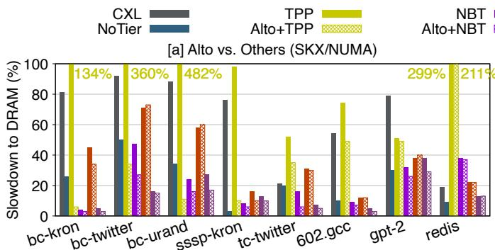

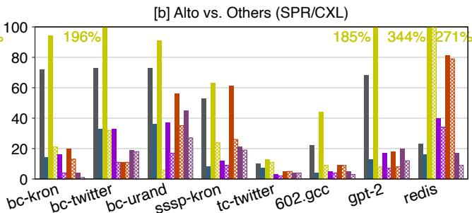  
Figure 7: Alto vs. TPP, NBT, Nomad, Colloid, and NoTier on SKX/NUMA and SPR/CXL across 8 workloads (§6.5–§6.7). (a) On SKX/NUMA, Alto+TPP outperforms TPP by 2–471%. Similarly, Alto+NBT outperforms NBT by 1–20%, Alto+Nomad surpasses Nomad by -2–11%, and Alto+Colloid achieves a performance gain over Colloid of 0–9%. (b) On SPR/CXL, Alto exhibits a similar trend to SKX/NUMA, outperforming TPP, NBT, Nomad, and Colloid by 2–178%, 1–23%, 0–35%, and 0–18%, respectively.

Table 5: Page promotion reductions of Alto compared to baseline (§6.5). Alto significantly reduces the number of page promotions by up to 127.4×.
<table><tr><td colspan="2">bc-kron bc-twitter bc-urand sssp-kron tc-twitter 602.gcc gpt-2 redis</td></tr><tr><td>TPP NBT</td><td>127.4× 40.0×</td></tr><tr><td>3.5× 1.1× 1.7× 9.4× 1.</td><td>83.9× 58.5× 1. .5× 2.5× 2.7× 1.8× .2× 1. .1× 1.9× 1.0×</td></tr><tr><td>Nomad Colloid 14.9×</td><td>1.2× 2.3× 2.1× 1.4× 1. 1.0× 4.4× 1.3× 1.4×</td></tr></table>

Among the four baselines, TPP exhibits the most aggressive migration behavior due to its intensive hot-page detection strategy. As a result, it performs poorly in our evaluation, reaching up to 482% slowdown, which is even worse than running the workloads entirely on the slow-tier (“CXL” bars).

Colloid focuses on balancing fast- and slow-tier latency under bandwidth saturation, based on the observation that fast-tier latency can exceed that of slow-tier in such cases. However, in our setup, none of the workloads saturate fast-tier bandwidth. By design, Colloid adopts a more aggressive page promotion policy than NBT, promoting hot pages not only to the fast-tier, but also to the slow-tier proactively. While this aggressiveness benefits certain workloads, it is not universally effective. As shown in Figure 7, Colloid performs worse than NBT on nearly half of the workloads.

Nomad adopts a non-exclusive page migration strategy, retaining pages in both tiers to avoid blocking migrations. As a result, reducing migration frequency has a more limited impact on performance compared to other systems. Additionally,

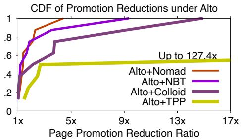  
Figure 8: CDFs of page promotion reductions in Alto (§6.5). Alto+Nomad promotion reduction is less than others.

Alto+Nomad regulates fewer page promotions than Alto with TPP, NBT, and Colloid, as shown in Table 5. These factors help explain the limited performance improvements of Alto+Nomad observed in several workloads. Alto+Nomad can underperform Nomad by up to 2% on several workloads, such as bc-twitter, bc-urand, and gpt-2. The underlying reasons are not yet clear to us and a deeper analysis is needed to understand the root causes as future work.

Alto’s adaptive page promotion regulation allows it to filter out unnecessary page migrations, thus achieving better performance than the corresponding baselines. Table 5 and Figure 8 shows the reduction in page promotions achieved by Alto compared to the corresponding baselines across all eight workloads. Alto significantly reduces the number of page migrations by up to 127.4× while maintaining superior performance for most of the cases.

Takeaway #4: Alto outperforms TPP, NBT, Nomad, and Colloid by 2–471%, 1–23%, -2–35%, and 0–18% across 8 workloads on NUMA and CXL by regulating unnecessary page promotions effectively. Alto+Nomad loses to Nomad for a few workloads by no more than 2%.

## 6.6 Understanding Alto Performance

Alto’s strength lies in the simplicity and accuracy of its AOL-based predictor, enabling it to significantly reduce page promotion overhead while improving performance. Figure

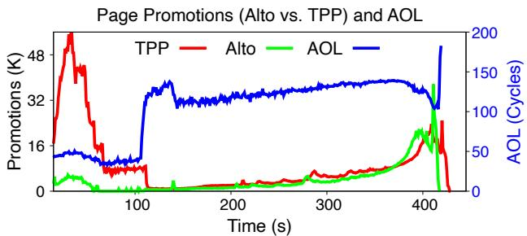  
Figure 9: Page promotions in Alto vs. TPP over time (§6.5–§6.6). Alto filters out unnecessary page migrations based on runtime AOL dynamically.

8 shows the CDFs of reductions in page promotions for Alto compared to the baselines. Specifically, Alto reduces promotions by up to 127.4×, 9.4×, 4.4×, and 14.9× for TPP, NBT, Nomad, and Colloid, respectively.

To better understand this improvement, we zoom in on the tc-twitter workload and examine how Alto adaptively regulates promotion behavior. Figure 9 plots the page promotion rate and AOL over time for both TPP and Alto+TPP. Two key observations highlight Alto’s effectiveness:

(1) Unlike TPP, which aggressively promotes pages in the first 100 seconds (red line) due to high LLC misses, Alto promotes far fewer pages (green line) during this phase. This is because AOL remains low (blue line), indicating high MLP and limited performance sensitivity to memory latency. By avoiding unnecessary migrations, Alto reduces the number of promoted pages from 1.6 million (in TPP) to just 190K, a reduction of 8.4×.

(2) As the workload progresses, Alto gradually increases its promotion rate in response to rising AOL values, whereas TPP simply follows access intensity without adaptive control. Ultimately, Alto outperforms TPP while migrating 3.5× fewer pages overall.

Other workloads in Figure 7 exhibit similar trends, demonstrating Alto’s ability to maintain performance while minimizing migration cost through adaptive, AOL-guided tiering.

## 6.7 Alto on CXL

Figure 7b details Alto’s performance on CXL, which closely mirrors the trends observed on the SKX/NUMA setup (Figure 7a). Across all workloads, Alto improves performance when layered over existing tiering systems, often achieving the lowest slowdown. The performance gains are even more stable on CXL due to improved bandwidth compared to the SKX/NUMA setup. These results highlight Alto’s robustness and portability across different hardware configurations. Alto’s performance benefits are similarly explanined as Figure 8. Note that while workloads run faster on SPR compared to SKX as the recent SPR CPU is more performant, the slowdown relative to DRAM performance is comparable, or slightly worse, due to the larger fast-tier/slow-tier latency gap (2.4× on SPR vs. 2.1× on SKX).

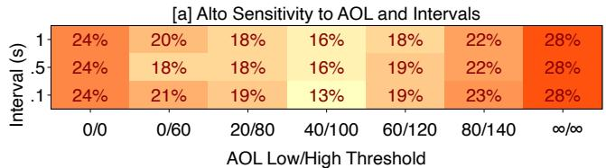

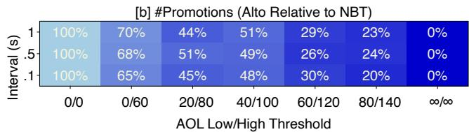  
Figure 10: Alto sensitivity to AOL and sampling intervals (§6.8). (a) Alto+NBT performance under varying AOL and intervals. (b) Relative number of promotions in Alto+NBT to NBT.

## 6.8 Sensitivity Study

In this section, we study Soar and Alto’s sensitivity to AOL and other parameters as well as justifying their default choices.

Soar. Algorithm 1 uses $R _ { \mathrm { m i n } } , R _ { \mathrm { m a x } } ,$ and $L _ { 0 }$ as thresholds to incorporate MLP effects into object scoring. We evaluate the sensitivity of Soar to these parameters. Varying $L _ { 0 }$ between 70, 80, 90, and 100 cycles results in minimal changes to the object ranking: only the ordering of $O _ { 2 } { - } O _ { 4 }$ in Table 2 differs. For a 50% slow-tier ratio in bc-urand, objects $O _ { 1 } { - } O _ { 6 }$ and part of $O _ { 7 }$ are always placed in fast-tier, yielding identical performance across the full range of $L _ { 0 }$ values. This indicates that the maximum AOL threshold in Algorithm 1 is robust.

Similarly, adjusting $R _ { \mathrm { m i n } }$ and $R _ { \mathrm { m a x } }$ to (0.02, 0.6), (0.03, 0.7), and $( 0 . 0 4 , 0 . 8 )$ results in minor changes, only the ranking of $O _ { 2 } { - } O _ { 5 }$ differs. Since the top objects remain unchanged (under the same slow-tier ratio), the object placement and performance are unaffected, confirming that Soar’s scoring is stable under reasonable threshold variations.

Takeaway #5: Soar is robust to $L _ { 0 }$ (from 70 to 100), $R _ { \mathrm { m i n } } ,$ and $R _ { \mathrm { m a x } }$ (from (0.02, 0.6) to (0.04, 0.8)).

Alto. We evaluate Alto’s sensitivity to the AOL thresholds $( \mathsf { A O L } _ { \mathsf { l o w } } , \mathsf { A O L } _ { \mathsf { h i g h } } ) .$ , and AOL sampling periods. Figure 10 shows the Alto results under a range of $( \mathsf { A O L } _ { \mathsf { l o w } } , \mathsf { A O L } _ { \mathsf { h i g h } } )$ threshold pairs and sampling intervals (100ms, 500ms, 1s).

In Figure 10a, we observe that Alto maintains stable performance across a wide range of threshold values. Slowdown remains within 16–22% for most parameter combinations, indicating robustness to threshold tuning. Extreme thresholds $( e . g . , 0 / \infty )$ lead to degraded performance, highlighting the importance of filtering based on AOL to avoid over- or undermigration. Figure 10b shows the relative number of page promotions compared to Colloid. Across most configurations, Alto reduces promotions by 30–70%, while preserving performance. With more conservative AOL thresholds (e.g., 60/120) and shorter sampling intervals, Alto eliminates majority of the page promotions (down to 30%) while still maintaining

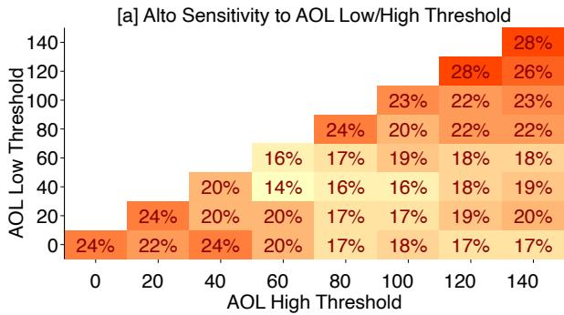

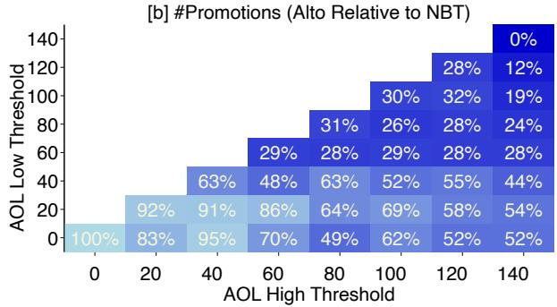  
Figure 11: Alto sensitivity to more detailed AOL low/high thresholds (§6.8). (a) Alto’s performance can vary by up to 14% across different combinations of AOL low/high thresholds, and its default threshold setting is close to the optimal configuration. (b) Alto reduces page promotions according to AOL low/high thresholds.

<table><tr><td rowspan="5">spreleethtto# 9630</td><td colspan="9">Soar/Alto under Bandwidth Contention</td></tr><tr><td>2%</td><td>6%</td><td>81%</td><td>70%</td><td>186%</td><td>105%</td><td>30%</td><td>33%</td></tr><tr><td>21%</td><td>28%</td><td>83%</td><td>52%</td><td>65%</td><td>38%</td><td>44%</td><td>35%</td></tr><tr><td>22%</td><td>55%</td><td>101%</td><td>78%</td><td>103%</td><td>70%</td><td>61%</td><td>50%</td></tr><tr><td>14%</td><td>55%</td><td>86%</td><td>60%</td><td>95%</td><td>65%</td><td>61%</td><td>58%</td></tr><tr><td>Soar NoTier</td><td colspan="6">NBT Nomad Colloid Alto+NBT Alto+Nomad</td><td>Alto+Colloid</td><td></td></tr></table>

Figure 12: Soar and Alto performance slowdown under bandwidth contention (§6.9–§6.10). Under bandwidth contention, Soar continues to outperform both NoTier and other tiering policies, and Alto+NBT, Alto+Nomad, and Alto+Colloid improve over their baselines by 11–26%, 27–81%, and -3–11%, respectively. acceptable performance (19% vs. 16% slowdown).

Figure 11 shows the sensitivity of Alto to varying AOL low/high threshold values, with combinations ranging from 0 to 140 (observed highest AOL). The two extreme cases (0/0 and 140/140) in Figure 11 represent no promotion regulation (i.e., equivalent to the NBT baseline) and full regulation (i.e., equivalent to NoTier), respectively. Across the threshold range from bottom left to top/bottom right, Alto’s performance typically correlates with the degree of regulation: more page promotion regulation (smaller numbers in Figure 11b) generally leads to better performance (smaller slowdowns in Figure 11a). The default setting used by Alto (40/100 on SKX/NUMA) delivers reasonably good, though not optimal, performance (16% vs. 14% slowdown). We observe a maximum performance difference of 14% between 40/60 and 140/140 (NoTier). While the number of regulated promotions generally reflects Alto’s efficiency, the exact performance impact of each regulation is hard to isolate and needs further investigation.

Takeaway #6: Alto is robust to sampling intervals from 100ms to 1s, and its default AOL low/high thresholds are near-optimal, thanks to the accurate modeling of ?? and AOL.

## 6.9 Soar under Bandwidth Contention

To evaluate the performance robustness of Soar to bandwidth pressure, we use Intel MLC [55] to generate memory traffic on the fast-tier by varying the number of threads from 0 to 9 on SKX. Each MLC thread sustains ∼8 GB/s. The remaining 1 core is reserved for bc-urand with 50% slow-tier ratio. With 9 MLC threads, the bandwidth reaches 48 GB/s, which is 98% of the total bandwidth. Latency increases to 180 ns, 2× of the unloaded latency, demonstrating significant queuing delays.

<table><tr><td rowspan="8">Titreliteiltititr</td><td colspan="7">[a]AltoPerformance GainoverColloid</td></tr><tr><td>2%</td><td>1%</td><td>4%</td><td>3%</td><td>2%</td><td>0%</td></tr><tr><td>1 6%</td><td>5%</td><td>4%</td><td>4%</td><td>2%</td><td>1%</td></tr><tr><td>1:1 3%</td><td>5%</td><td>10%</td><td>4%</td><td>4%</td><td>6%</td></tr><tr><td>2:1 6%</td><td>7%</td><td>4%</td><td>7%</td><td>4%</td><td>5%</td></tr><tr><td>6:1 7%</td><td>6%</td><td>1%</td><td>2%</td><td>1%</td><td>0%</td></tr><tr><td>0</td><td>1</td><td>2</td><td>3</td><td>4</td><td>5</td></tr></table>

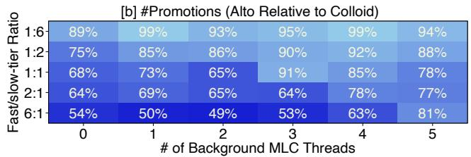  
Figure 13: Alto+Colloid performance gains over Colloid under bandwidth contention and different fast/slow-tier ratios (§6.10). Alto+Colloid outperforms Colloid by up to 10% under most fast/slow-tier ratios combined with bandwidth contention.

Figure 12 shows that Soar outperforms the second best by 4–41% under bandwidth contention. As contention increases (0–9 MLC threads), Colloid consistently outperforms Nomad and NBT, but underperforms NoTier, with the performance gap widening under higher contention. This indicates that tiering becomes less effective in bandwidth-bound scenarios. Soar maintains its performance lead over NoTier (the secondbest), though its gains diminish as contention intensifies (33% vs. 4% for 3 and 9 MLC threads).

Takeaway #7: State-of-the-art tiering designs consistently underperform NoTier due to elevated migration overhead under bandwidth contention. In contrast, Soar outperforms all of them on bc-urand, though its performance gains decrease as contention increases, reaching up to 2× inflated latency.

## 6.10 Alto under Bandwidth Contention

Figure 13a further compares Alto+Colloid and Colloid under varying fast/slow-tier ratios (ranging from 1:6 to 6:1) in a different MLC setup: 5 cores are reserved for bc-urand, and the remaining 5 cores run MLC threads. With 5 MLC threads, the system bandwidth reaches 40GB/s, approximately 81% of the total bandwidth, and latency increases to 140ns, which is 56% higher than the unloaded latency of 90ns.

Under moderate memory bandwidth contention in this case, even though overall system MLP increases, the background memory pressure does not alter the foreground workload’s MLP behavior. While contention raises memory latency, it does not reduce the workload’s inherent MLP (confirmed via our MLP measurements). However, as MLC threads increase from 0 to 5, the AOL range shifts from 30–140 to 40– 250. Alto remains effective at regulating page promotions, as only 14.2% of the runtime experiences AOL above 100. Figure 13a&b supports this claim, showing that Alto+Colloid outperforms Colloid under bandwidth contention while migrating up to 51% fewer pages. While contention narrows the latency gap between tiers (i.e., fast-tier latency approaches that of the slow-tier), the MLP-induced performance penalties of page promotion persist.

When further increasing the number of MLC threads to 9, Figure 12 shows somewhat diminished Alto performance gains over its baseline, in particular, Alto+Colloid vs. Colloid, with -3–81% improvement. Among all the baselines, Nomad shows the worst performance under extreme bandwidth contention, while Colloid performs the best (its target scenario). Note that bc-urand uses only 1 core here, as more cores are reserved for MLC, compared to 5 cores in Figure 13. Alto+Colloid falls behind Colloid by 3% under the 9-MLC-thread setup but outperforms it in all other cases. This behavior stems from increased fast-tier latency under bandwidth contention, which expands the AOL range from 40–140 (0 MLC threads) to 95–270 (9 MLC threads). With default AOL thresholds (40/100), Alto’s regulation becomes less aggressive (Algorithm 2) when AOL falls out of the target AOL range, as shown in Figure 13b. Only 2.3% of runtime phases exhibit AOL below 95. As a result, Alto regulates only 1.6% of pages under 9 MLC threads, leading to 3% negative performance gains. However, adjusting AOL thresholds to 90/150 and 90/270 to match the runtime AOL range improves Alto+Colloid’s slowdown from 33% to 23% and 20%, both outperforming Colloid (30%). Thus, adjusting AOL thresholds upward to match runtime AOL under high bandwidth contention can help preserve Alto’s benefits. This requires tuning AOL thresholds based on contention levels. Developing an auto-tuning mechanism for AOL thresholds for such scenarios is an interesting direction for future work.

Takeaway #8: Alto achieves improvements of -3% to 81% over Nomad, NBT, and Colloid for bc-urand under bandwidth pressure across various fast/slow-tier ratios. However,

Alto’s benefits diminish under extreme contention (e.g., 2× inflated latency), resulting in one case where Alto+Colloid underperforms Colloid by 3%. Raising AOL thresholds can help recover performance benefits in such scenarios.

## 7 Related Work

Heterogeneous Memory Management. Soar shares its profiling-based design goal with prior systems [13, 34, 49, 56], but differs in its use of performance metrics, leading to different design choices. Unlike X-Mem [13], which classifies memory access to static types of patterns and ranks coarsegrained memory regions using offline-profiled latency, Soar leverages an AOL-based predictor that accounts for MLP and latency inflation for accurate slowdown prediction (§3.2). Soar is application-transparent without code changes and is lightweight, imposing neglible runtime overhead, making it applicable to a wide range of workloads.

Memory Performance Modeling. Prior work has focused on modeling memory performance using various metrics, including CPU stalls, LLC misses, memory latencies, etc., as well as ML-driven predictors [7, 8, 11, 21, 23, 57]. However, these approaches often fall short due to accuracy and complexity issues. While CPU stalls on the fast-tier can intrinsically capture memory access performance impact, they serve as a poor metric to predict slow-tier performance due to their inability to account for shifting memory-overlap effects caused by increased latency and variable MLP in the slow-tier. In contrast, our AOL-based predictor explicitly models CPU stalls, latency, and MLP. AOL amortizes the overestimated CPU stall increases, ensuring high prediction accuracy and serving as the key to Soar/Alto’s effectiveness.

Memory Tiering. Memory tiering has been extensively studied from many angles, including efficient software- and hardware-based hotness tracking, memory allocation and migration policies across host and virtualized environments, and support for various slow-tier memory types [4, 13–28, 58, 59]. For instance, HeMem utilizes PEBS for fine-grained page access frequency sampling [17]. Most existing tiering systems rely on hotness for guiding data placement across tiers, ignoring the performance impact variability across memory accesses. Soar and Alto designs are orthogonal to existing tiering designs, acting as a general-purpose memory allocator and migration regulator that complements other optimizations such as better hotness tracking and migration policies.

## 8 Conclusion

Tiered memory management is becoming increasingly important with the rise of CXL, yet significant challenges persist. We demonstrate that hotness does not equate to performance, highlighting the need to revisit both the fundamental principles and strategies for memory tiering. We hope that our predictive metrics on AOL, static and dynamic tiering policies (Soar and Alto) will open up new directions for memory research.

## Acknowledgments

We thank Philip Levis, our shepherd, and the anonymous OSDI’25 reviewers for their constructive feedback, which significantly improved this paper. We also thank CloudLab for providing the infrastructure. This research was partially supported by an NSF CAREER Award (CNS-2339901), NSF Grant CNS-2312785, Samsung, Google, and Microsoft.

## References

[1] Andres Lagar-Cavilla, Junwhan Ahn, Suleiman Souhlal, Neha Agarwal, Radoslaw Burny, Shakeel Butt, Jichuan Chang, Ashwin Chaugule, Nan Deng, Junaid Shahid, Greg Thelen, Kamil Adam Yurtsever, Yu Zhao, and Parthasarathy Ranganathan. Software-Defined Far Memory in Warehouse-Scale Computers. In Proceedings of the 24th ACM International Conference on Architectural Support for Programming Languages and Operating Systems (ASPLOS), 2019.

[2] Johannes Weiner, Niket Agarwal, Dan Schatzberg, Leon Yang, Hao Wang, Blaise Sanouillet, Bikash Sharma, Tejun Heo, Mayank Jain, Chunqiang Tang, and Dimitrios Skarlatos. TMO: Transparent Memory Offloading in Datacenters. In Proceedings of the 27th ACM International Conference on Architectural Support for Programming Languages and Operating Systems (ASPLOS), 2022.

[3] Padmapriya Duraisamy, Wei Xu, Scott Hare, Ravi Rajwar, David Culler, Zhiyi Xu, Jianing Fan, Christopher Kennelly, Bill McCloskey, Danijela Mijailovic, Brian Morris, Chiranjit Mukherjee, Jingliang Ren, Greg Thelen, Paul Turner, Carlos Villavieja, Parthasarathy Ranganathan, and Amin Vahdat. Towards an Adaptable Systems Architecture for Memory Tiering at Warehouse-Scale. In Proceedings of the 28th ACM International Conference on Architectural Support for Programming Languages and Operating Systems (ASPLOS), 2023.

[4] Hasan Al Maruf, Hao Wang, Abhishek Dhanotia, Johannes Weiner, Niket Agarwal, Pallab Bhattacharya, Chris Petersen, Mosharaf Chowdhury, Shobhit Kanaujia, and Prakash Chauhan. TPP: Transparent Page Placement for CXL-Enabled Tiered Memory. In Proceedings of the 28th ACM International Conference on Architectural Support for Programming Languages and Operating Systems (ASPLOS), 2023.

[5] Daniel S. Berger, Daniel Ernst, Huaicheng Li, Pantea Zardoshti, Monish Shah, Samir Rajadnya, Scott Lee, Lisa Hsu, Ishwar Agarwal, Mark D. Hill, and Ricardo Bianchini. Design Tradeoffs in CXL-Based Memory Pools for Cloud Platforms. IEEE Micro Special Issue on Emerging System Interconnects, 43(2), 2023.

[6] Jacob Wahlgren, Gabin Schieffer, Maya Gokhale, and

Ivy Peng. A Quantitative Approach for Adopting Disaggregated Memory in HPC Systems. In Proceedings of International Conference on High Performance Computing, Networking, Storage and Analysis (SC), 2023.

[7] Huaicheng Li, Daniel S. Berger, Lisa Hsu, Daniel Ernst, Pantea Zardoshti, Stanko Novakovic, Monish Shah, Samir Rajadnya, Scott Lee, Ishwar Agarwal, Mark D. Hill, Marcus Fontoura, and Ricardo Bianchini. Pond: CXL-Based Memory Pooling Systems for Cloud Platforms. In Proceedings of the 28th ACM International Conference on Architectural Support for Programming Languages and Operating Systems (ASPLOS), 2023.

[8] Yan Sun, Yifan Yuan, Zeduo Yu, Zeduo Yu, Reese Kuper, Chihun Song, Jinghan Huang, Houxiang Ji, Siddharth Agarwal, Jiaqi Lou, Ipoom Jeong, Ren Wang, Jung Ho Ahn, Tianyin Xu, and Nam Sung Kim. Demystifying CXL Memory with Genuine CXL-Ready Systems and Devices. In 56th Annual IEEE/ACM International Symposium on Microarchitecture (MICRO-56), 2023.

[9] Yupeng Tang, Ping Zhou, Wenhui Zhang, Henry Hu, Qirui Yang, Hao Xiang, Tongping Liu, Jiaxin Shan, Ruoyun Huang, Cheng Zhao, Cheng Chen, Hui Zhang, Fei Liu, Shuai Zhang, Xiaoning Ding, and Jianjun Chen. Exploring Performance and Cost Optimization with ASIC-Based CXL Memory. In Proceedings of the 2024 EuroSys Conference (EuroSys), 2024.

[10] Debendra Das Sharma, Robert Blankenship, and Daniel Berger. An Introduction to the Compute Express Link (CXL) Interconnect. ACM Comput. Surv., 56(11), July 2024.

[11] Jinshu Liu, Hamid Hadian, Yuyue Wang, Daniel S. Berger, Marie Nguyen, Xun Jian, Sam H. Noh, and Huaicheng Li. Systematic CXL Memory Characterization and Performance Analysis at Scale. In Proceedings of the 30th ACM International Conference on Architectural Support for Programming Languages and Operating Systems (ASPLOS), 2025.

[12] Xi (Sherry) Wang, Jie Liu, Jianbo Wu, Shuangyan Yang, Jie Ren, Bhanu Shankar, and Dong Li. Performance Characterization of CXL Memory and Its Use Cases. In Proceedings of the 39th IEEE International Parallel and Distributed Processing Symposium (IPDPS), 2025.

[13] Subramanya R. Dulloor, Amitabha Roy, Zheguang Zhao, Narayanan Sundaram, Nadathur Satish, Rajesh Sankaran, Jeff Jackson, and Karsten Schwan. Data Tiering in Heterogeneous Memory Systems. In Proceedings of the 2016 EuroSys Conference (EuroSys), 2016.

[14] Neha Agarwal and Thomas F. Wenisch. Thermostat: Application-transparent Page Management for Two-

tiered Main Memory. In Proceedings of the 22nd ACM International Conference on Architectural Support for Programming Languages and Operating Systems (ASP-LOS), 2017.

[15] Sudarsun Kannan, Ada Gavrilovska, Vishal Gupta, and Karsten Schwan. HeteroOS: OS Design for Heterogeneous Memory Management in Datacenters. In Proceedings of the 44th Annual International Symposium on Computer Architecture (ISCA), 2017.

[16] Zi Yan, Daniel Lustig, David Nellans, and Abhishek Bhattacharjee. Nimble Page Management for Tiered Memory Systems. In Proceedings of the 24th ACM International Conference on Architectural Support for Programming Languages and Operating Systems (ASP-LOS), 2019.

[17] Amanda Raybuck, Tim Stamler, Wei Zhang, Mattan Erez, and Simon Peter. HeMem: Scalable Tiered Memory Management for Big Data Applications and Real NVM. In Proceedings of the 28th ACM Symposium on Operating Systems Principles (SOSP), 2021.

[18] Adnan Maruf, Ashikee Ghosh, Janki Bhimani, Daniel Campello, Andy Rudoff, and Raju Rangaswami. MULTI-CLOCK: Dynamic Tiering for Hybrid Memory Systems. In Proceedings of the 28th International Symposium on High Performance Computer Architecture (HPCA-28), 2022.

[19] Taehyung Lee, Sumit Kumar Monga, Changwoo Min, and Young Ik Eom. Memtis: Efficient Memory Tiering with Dynamic Page Classification and Page Size Determination. In Proceedings of the 29th ACM Symposium on Operating Systems Principles (SOSP), 2023.

[20] Jie Ren, Dong Xu, Junhee Ryu, Kwangsik Shin, Daewoo Kim, and Dong Li. MTM: Rethinking Memory Profiling and Migration for Multi-Tiered Large Memory. In Proceedings of the 2024 EuroSys Conference (EuroSys), 2024.

[21] Yuhong Zhong, Daniel S. Berger, Carl Waldspurger, Ryan Wee, Ishwar Agarwal, Rajat Agarwal, Frank Hady, Karthik Kumar, Mark D. Hill, Mosharaf Chowdhury, and Asaf Cidon. Managing Memory Tiers with CXL in Virtualized Environments. In Proceedings of the 18th USENIX Symposium on Operating Systems Design and Implementation (OSDI), 2024.

[22] Lingfeng Xiang, Zhen Lin, Weishu Deng, Hui Lu, Jia Rao, Yifan Yuan, and Ren Wang. NOMAD: Non-Exclusive Memory Tiering via Transactional Page Migration. In Proceedings of the 18th USENIX Symposium on Operating Systems Design and Implementation (OSDI), 2024.

[23] Midhul Vuppalapati and Rachit Agarwal. Tiered Memory Management: Access Latency is the Key! In Proceedings of the 30th ACM Symposium on Operating Systems Principles (SOSP), 2024.

[24] Zhe Zhou, Yiqi Chen, Tao Zhang, Yang Wang, Ran Shu, Shuotao Xu, Peng Cheng, Lei Qu, Jie Zhang, Yongqiang Xiong, and Guangyu Sun. NeoMem: Hardware/Software Co-Design for CXL-Native Memory Tiering. In 57th Annual IEEE/ACM International Symposium on Microarchitecture (MICRO-57), 2024.

[25] Dong Xu, Junhee Ryu, Jinho Baek, Kwangsik Shin, Pengfei Su, and Dong Li. FlexMem: Adaptive Page Profiling and Migration for Tiered Memory. In Proceedings of the 2024 USENIX Annual Technical Conference (ATC), 2024.

[26] Alan Nair, Sandeep Kumar, Aravinda Prasad, Ying Huang, Andy Rudoff, and Sreenivas Subramoney. Telescope: Telemetry for Gargantuan Memory Footprint Applications. In Proceedings of the 2024 USENIX Annual Technical Conference (ATC), 2024.

[27] Zhenlin Qi, Shengan Zheng, Ying Huang, Yifeng Hui, Bowen Zhang, Linpeng Huang, and Hong Mei. Chrono: Meticulous Hotness Measurement and Flexible Page Migration for Memory Tiering. In Proceedings of the 2025 EuroSys Conference (EuroSys), 2025.

[28] Yan Sun, Jongyul Kim, Zeduo Yu, Jiyuan Zhang, Siyuan Chai, Michael Jaemin Kim, Hwayong Nam, Jaehyun Park, Eojin Na, Yifan Yuan, Ren Wang, Jung Ho Ahn, Tianyin Xu, and Nam Sung Kim. M5: Mastering Page Migration and Memory Management for CXL-based Tiered Memory Systems. In Proceedings of the 30th ACM International Conference on Architectural Support for Programming Languages and Operating Systems (ASPLOS), 2025.

[29] Musa Unal, Vishal Gupta, Yueyang Pan, Yujie Ren, and Sanidhya Kashyap. Tolerate It if You Cannot Reduce It: Handling Latency in Tiered Memory. In Proceedings of the 20th Workshop on Hot Topics in Operating Systems (HotOS XX), 2025.

[30] Yuan Chou, Brian Fahs, and Santosh Abraham. Microarchitecture Optimizations for Exploiting Memory-Level Parallelism. In Proceedings of the 31st Annual International Symposium on Computer Architecture (ISCA), 2004.

[31] Moinuddin K. Qureshi, Daniel N. Lynch, Onur Mutlu, and Yale N. Patt. A Case for MLP-Aware Cache Replacement. In Proceedings of the 33rd Annual International Symposium on Computer Architecture (ISCA), 2006.

[32] Onur Mutlu and Thomas Moscibroda. Stall-Time Fair

Memory Access Scheduling for Chip Multiprocessors. In 40th Annual IEEE/ACM International Symposium on Microarchitecture (MICRO-40), 2007.

[33] Aditya Narayan, Tiansheng Zhang, Shaizeen Aga, Satish Narayanasamy, and Ayse Coskun. MOCA: Memory Object Classification and Allocation in Heterogeneous Memory Systems. In Proceedings of the 32th IEEE International Parallel and Distributed Processing Symposium (IPDPS), 2018.

[34] Sudarsun Kannan, Yujie Ren, and Abhishek Bhattacharjee. KLOCs: Kernel-Level Object Contexts for Heterogeneous Memory Systems. In Proceedings of the 26th ACM International Conference on Architectural Support for Programming Languages and Operating Systems (ASPLOS), 2021.

[35] Jonghyeon Kim, Wonkyo Choe, and Jeongseob Ahn. Exploring the Design Space of Page Management for Multi-Tiered Memory Systems. In Proceedings of the 2021 USENIX Annual Technical Conference (ATC), 2021.

[36] Memory Tiering: Hot Page Selection. https://lwn. net/Articles/898615/.

[37] mm/demotion: Memory Tiers and Demotion. https: //lwn.net/Articles/897026/.

[38] Better Support for Locally-attached-memory Tiering. https://lwn.net/Articles/974126/.

[39] Latency Oriented Processor Architecture. https://en .wikipedia.org/wiki/Latency oriented process or architecture.

[40] Adar Zeitak and Adam Morrison. Cuckoo Trie: Exploiting Memory-Level Parallelism for Efficient DRAM Indexing. In Proceedings of the 28th ACM Symposium on Operating Systems Principles (SOSP), 2021.

[41] SPEC CPU 2017. https://www.spec.org/cpu2017.

[42] GAP Benchmark Suite. https://github.com/sbeam er/gapbs.git, 2024.

[43] Jinshu Liu, Hamid Hadian, Hanchen Xu, Daniel S. Berger, and Huaicheng Li. Dissecting CXL Memory Performance at Scale: Analysis, Modeling, and Optimization. https://arxiv.org/abs/2409.14317, 2024.

[44] Michaelis-Menten Kinetics. https://en.wikipedia .org/wiki/Michaelis-Menten kinetics, 2024.

[45] NUMA Memory Policy. https://docs.kernel.org/ admin-guide/mm/numa memory policy.html.

[46] Memkind. https://github.com/memkind/memkind, 2024.

[47] Unified Memory Framework. https://github.com/o neapi-src/unified-memory-framework, 2024.

[48] Zhiyuan Guo, Zijian He, and Yiying Zhang. Mira: A Progam-Behavior-Guided Far Memory System. In Proceedings of the 29th ACM Symposium on Operating Systems Principles (SOSP), 2023.

[49] Han Shen, Krzysztof Pszeniczny, Rahman Lavaee, Snehasish Kumar, Sriraman Tallam, and Xinliang David Li. Propeller: A Profile Guided, Relinking Optimizer for Warehouse-Scale Applications. In Proceedings of the 28th ACM International Conference on Architectural Support for Programming Languages and Operating Systems (ASPLOS), 2023.

[50] Sotiris Apostolakis, Chris Kennelly, Xinliang David Li, and Parthasarathy Ranganathan. Necro-reaper: Pruning away Dead Memory Traffic in Warehouse-Scale Computers. In Proceedings of the 30th ACM International Conference on Architectural Support for Programming Languages and Operating Systems (ASPLOS), 2025.

[51] Huang Ying. AutoNUMA: Optimize Memory Placement for Memory Tiering System. https://lwn.net/Arti cles/835402/.

[52] The CloudLab Manual - Hardware. https://docs.c loudlab.us/hardware.html, 2025.

[53] GPT-2. https://en.wikipedia.org/wiki/GPT-2.

[54] Redis. https://redis.io.

[55] Intel Memory Latency Checker (Intel MLC). https: //www.intel.com/content/www/us/en/download/7 36633/intel-memory-latency-checker-intel-m lc.html.

[56] Renaud Lachaize, Baptiste Lepers, and Vivien Quema. ´ MemProf: A Memory Profiler for NUMA Multicore Systems. In Proceedings of the 2012 USENIX Annual Technical Conference (ATC), 2012.

[57] Haris Volos, Guilherme Magalhaes, Ludmila Cherkasova, and Jun Li. Quartz: A Lightweight Performance Emulator for Persistent Memory Software. In Proceedings of the 16th International Middleware Conference (Middleware), 2015.

[58] Samir Rajadnya and Durgesh Srivastava. CMS: Hotness Tracking Requirements. https://www.opencompute. org/documents/ocp-cms-hotness-tracking-req uirements-white-paper-pdf-1.

[59] Yang Li, Saugata Ghose, Jongmoo Choi, Jin Sun, Hui Wang, and Onur Mutlu. Utility-Based Hybrid Memory Management. In International Conference on Cluster Computing (Cluster), 2017.