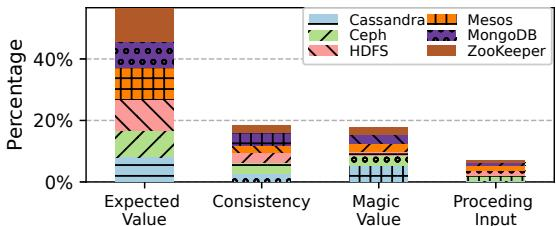
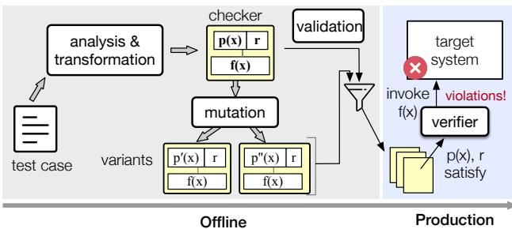
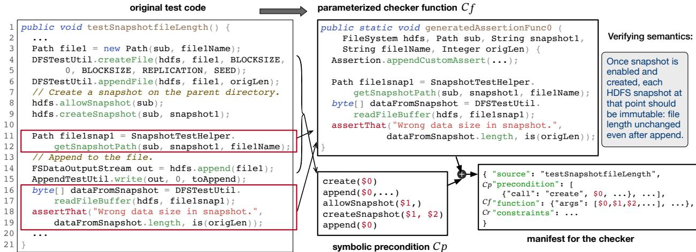
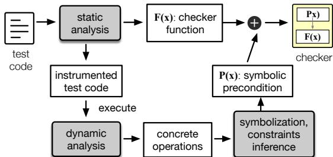
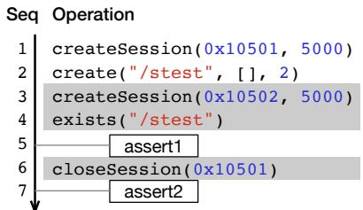
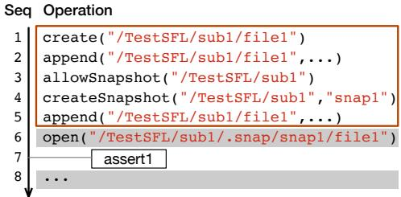
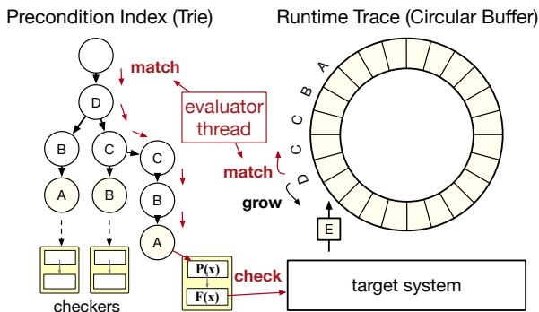
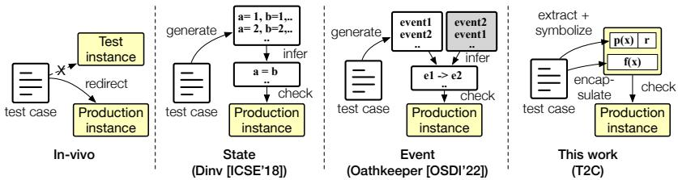
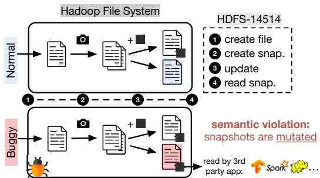

USENIX

THE ADVANCED COMPUTING SYSTEMS ASSOCIATION

# Deriving Semantic Checkers from Tests to Detect Silent Failures in Production Distributed Systems

Chang Lou, University of Virginia; Dimas Shidqi Parikesit, University of Virginia and Bandung Institute of Technology; Yujin Huang, The Pennsylvania State University;   
Zhewen Yang and Senapati Diwangkara, Johns Hopkins University; Yuzhuo Jing,   
University of Michigan; Achmad Imam Kistijantoro, Bandung Institute of Technology; Ding Yuan, University of Toronto; Suman Nath, Microsoft Research; Peng Huang, University of Michigan

https://www.usenix.org/conference/osdi25/presentation/lou

# This paper is included in the Proceedings of the 19th USENIX Symposium on Operating Systems Design and Implementation.

July 7–9, 2025 • Boston, MA, USA

ISBN 978-1-939133-47-2

Open access to the Proceedings of the 19th USENIX Symposium on Operating Systems Design and Implementation is sponsored by

# Deriving Semantic Checkers from Tests to Detect Silent Failures in Production Distributed Systems

Chang Lou1 Dimas Shidqi Parikesit1,2 Yujin Huang3 Zhewen Yang4 Senapati Diwangkara4 Yuzhuo Jing5 Achmad Imam Kistijantoro2 Ding Yuan6 Suman Nath7 Peng Huang5

1University of Virginia 2Bandung Institute of Technology 3Pennsylvania State University 4Johns Hopkins University 5University of Michigan 6University of Toronto 7Microsoft Research

## Abstract

Production distributed systems provide rich features, but various defects can cause a system to silently violate its semantics without explicit errors. Such failures cause serious consequences. Yet, they are extremely challenging to detect, as it requires deep domain knowledge and substantial manual efforts to write good checkers.

In this paper, we explore a novel approach that directly derives semantic checkers from system test code. We first present a large-scale study on existing system test cases. Guided by the study findings, we develop T2C, a framework that uses static and dynamic analysis to transform and generalize a test into a runtime checker. We apply T2C on four large, popular distributed systems and successfully derive tens to hundreds of checkers. These checkers detect 15 out of 20 real-world silent failures we reproduce and incur small runtime overhead.

## 1 Introduction

Distributed systems today provide rich features through hundreds to thousands of APIs, parameters, commands, etc. However, various faults can cause a system to silently violate its semantics without explicit errors. For instance, a distributed message service that provides a publish API promising atmost-once semantics may deliver some message twice.

Despite the silent symptoms, such failures lead to severe consequences including data loss, wrong results, inconsistency, and vulnerabilities. The failure impact is further propagated to applications that rely on the affected semantics. The lack of explicit error signals allows these failures escape existing failure detectors [57, 67, 76]. Moreover, with few error messages, developers are clueless in debugging failures.

Ideally, bugs causing silent failures should be eliminated in testing. However, it is elusive to eliminate all bugs in production distributed systems. Indeed, a recent study shows that silent failures are prevalent in mature, extensively-tested distributed systems [68]. They take up 39% of all studied failures. Recent studies from multiple cloud companies suggest that silent violations can come from not only software bugs but also mercurial CPU cores [37, 55, 84].

Therefore, there is a pressing need for runtime verification [53], a safeguard mechanism to continuously monitor a deployed distributed system and quickly detect silent failures at the scene. Central to this mechanism are a set of checkers that validate system semantics, e.g., at-most-once delivery. We call them semantic checkers and distinguish them from generic checks (e.g., for CPU usage, timeouts, and exceptions).

Since semantic checkers require system-specific knowledge, the conventional wisdom is that they have to be written manually. For large distributed systems, this is a daunting task. Unlike prior runtime checking works [32, 49, 65, 66] that focus on checking small programs or a handful of well-defined properties for protocols, the systems we target have abundant loosely-defined semantics. Even for semantics described in simple text informally, mapping them to a concrete, correct checker is not easy. One needs to deeply understand both the system code and behavior to decide what needs to be checked, what is expected, when should the check be triggered, etc.

The thesis of this paper is that it is feasible to automatically construct semantic checkers that are expressive and accurate for large distributed systems without significant manual efforts.

We observe that a distributed system’s test cases often contain valuable information about the system semantics, which we can leverage to synthesize semantic checkers. There are solutions [41, 47, 52] that use statistical methods to automatically infer likely invariants from software execution traces (often obtained from running a test suite). Those inferred invariants only express program variable relations, which are too low-level to check system semantics. Many of the inferred invariants are false due to inaccuracies in statistical inference. A recent work [68] leverages regression tests for past failures to infer event relationship, but it has the same limitations.

Our key insight is that the test code encodes rich information, including semantics-specific oracles—assertions, and carefully-designed workloads (e.g., Figure 1). This rich information is not leveraged in existing solutions. But if existing tests contain expressive checks, why do they still fail to prevent silent failures? This is because they are written in a way that is tied with specific input in a fixed setup, while the relevant semantics can be violated in production due to different bugs triggered by other inputs and dynamic conditions.

Based on the above observation and insight, we propose a novel approach that leverages the existing test codes developers already wrote and directly transforms them into semantic checkers. Our basic idea is to reuse the code skeleton of a test case, but we relax its strict constraints to generalize the test into a parameterized checker function. The generated checkers can then be deployed with the system to production and activate under workloads different from the original tests to detect new semantic violations.

We design an end-to-end framework, T2C, that realizes this idea. T2C reduces manual efforts and generates checkers that are expressive and accurate to cover various system semantics.

Achieving the above objectives is extremely challenging. First, test code contains a mixture of instructions and many instructions are not applicable to a semantic checker. Second, test code is inherently written to check specific instances, while a useful checker needs to apply in other instances. Third, a test only applies in certain scenarios. We need to determine the precondition for the derived checker, which is not clearly specified in the test. The practices of writing tests also vary, even for tests from the same system.

It is important to recognize that, without domain knowledge, automatically generalizing all test cases into checkers is impossible. T2C aims to synthesize a significant number of checkers from existing tests to provide comprehensive coverage of semantics.

To understand the feasibility of our approach, we conducted a large-scale study on 210 test cases from six distributed systems. The study found that interestingly many test codes in practice have clear patterns to leverage for transformation and generalization, e.g., the use of test utility function, simple relations between assertions and the workloads.

Guided by our study, T2C leverages a combination of static and dynamic analyses to transform existing test code into reusable semantic checkers. At a high level, T2C statically identifies the key checking logic embedded in test cases— typically assertions tied to important system behaviors—and repackages them into standalone checker functions. To ensure these checkers are meaningful beyond the original test context, T2C then dynamically analyzes the system and test code to trace relevant data and control flows. This enables T2C to extract the necessary preconditions under which the behavior should hold. By combining preconditions with checker functions, T2C produces semantic checkers that are both precise and generalizable. Finally, T2C performs multi-level validation on the synthesized checkers to ensure they are valid.

We have applied T2C on four widely-used distributed systems, ZooKeeper, Cassandra, HDFS and HBase. T2C successfully transforms 672 test cases in these systems into verified semantic checkers. We sample and reproduce 20 user-reported production silent failures, and the synthesized checkers detect 15 of them in a median of 0.188 seconds. Interestingly, most test cases from which the checkers are derived were added by developers long before the failures.

The main contributions of this work are as follows:

• We proposed a novel approach to synthesize semantic checkers from test code and presented a large-scale study on existing tests to validate the feasibility of this approach.

```java
1 public void testSessionTimeout() {
2 DisconnectableZooKeeper zk = createClient(TIMEOUT);
3 zk.create("/stest", new byte[0], OPEN_ACL, EPHEMERAL);
4 zk.close();
5 zk.disconnect();
6 zk = createClient(TIMEOUT);
7 Assert.assertTrue(zk.exists("/stest",false) != null);
8 Thread.sleep(TIMEOUT*2);
9 Assert.assertTrue(zk.exists("/stest",false) == null);
10 zk.close();
11 }
```

Figure 1: A test from ZooKeeper that validates the semantics of ephemeral znodes. The test creates an ephemeral znode (/stest), disconnects the client, and checks whether the znode is correctly removed after the session timeout.

• We designed T2C, an end-to-end framework that uses a hybrid of static and dynamic analysis techniques to realize the proposed approach for large distributed systems.

• We evaluated T2C on widely-used distributed systems, and showed its effectiveness on synthesizing expressive checkers that can detect production silent failures.

T2C is open-sourced at https://github.com/OrderLab/T2C.

## 2 Background and Motivation

In this section, we first use a real example to elaborate on our insight and proposed approach. We then present a feasibility study on existing test cases in popular distributed systems.

## 2.1 Example

ZooKeeper is a distributed coordination service that exposes hierarchical namespace of data called znodes. One feature it provides is ephemeral znode, the semantics of which guarantees that (i) an ephemeral znode exists for as long as the creating client’s session, and (ii) it is deleted once the associated session ends. In a real-world silent failure [22], users observed that some ephemeral znodes were not removed even after the client session was long gone. This failure occurred not because the ephemeral znode semantics was not tested. Like other popular distributed systems, ZooKeeper has test cases for all major features including ephemeral znode. Figure 1 shows a test that exists prior to this failure.

However, the test cases are written to check only a few specific examples, e.g., /stest in Figure 1, in a controlled setup. Passing the test cases does not imply that the system can obey the tested semantics once deployed. The production system in this case encountered a rare concurrency bug. This buggy condition does not appear in the test setup.

Nevertheless, the test does explicitly check the semantics. It includes two assertions (line 7 and 9) that describe the two guarantees of ephemeral znode. It also includes workloads that exercise the semantics (line 3–5).

To leverage this test for detecting failures in production, we may attempt to directly reuse it (with some changes so the zk client checks against the production instance instead of the testing instance). This would work if the ephemeral znode that violated the semantics happened to be exactly /stest, or if the bug affected all ephemeral znodes. Neither was the case: only some znodes were affected in the production failure and they did not have the tested example path /stest.

<table><tr><td>Software</td><td>Language</td><td>Category</td><td>Version</td><td colspan="2">Tests</td></tr><tr><td></td><td></td><td></td><td></td><td>Total</td><td>Sampled</td></tr><tr><td>ZooKeeper</td><td>Java</td><td>Coordination</td><td>3.4.11</td><td>434</td><td>35</td></tr><tr><td>Cassandra</td><td>Java</td><td>Database</td><td>3.11.5</td><td>4118</td><td>35</td></tr><tr><td>HDFS</td><td>Java</td><td>File Sys.</td><td>3.2.2</td><td>3265</td><td>35</td></tr><tr><td>MongoDB</td><td>C++</td><td>Database</td><td>7.1.0 1.11.0</td><td>1276</td><td>35</td></tr><tr><td>CephFS</td><td>C++</td><td>File Sys.</td><td></td><td>506</td><td>35</td></tr><tr><td>Mesos</td><td>C++</td><td>Cluster Mgr.</td><td>18.2.0</td><td>233</td><td>35</td></tr></table>

Table 1: Sampled test datasets from six studied systems.

The problem here is that the checking logic in the test is too restrictive. If we relax it, it is possible to retrofit the test into a more general checker. For example, by symbolizing the concrete arguments in it (/stest, etc.), we can transform the assertions and related statements into a parameterized checker function, which can be invoked with other arguments.

## 2.2 Feasibility Study

The example above is promising. However, not all tests are like it. Some tests may not have assertions for system semantics, or their assertions may be too specific to convert into a more general checker. To understand the feasibility of our approach, we conduct a study on existing test cases in six popular distributed systems shown in Table 1. We randomly sample 210 test cases to analyze, with 35 cases for each system.

For each case, we seek to answer the following main questions: (1) do tests contain useful semantic checks? (2) how is the checking done? (3) can the checking logic be generalized from tests to production settings?

The majority (87%) of the studied tests use standard assertions, such as assertTrue and assertEquals, as the checking mechanisms. The remaining tests do not have any explicit assertions. They are either performance benchmarks or checking by throwing an exception. These tests are typically not designed to expose semantic violations.

Finding 1: Most sampled tests contain explicit assertions to check the system semantics.

Hereinafter, we focus on the 183 tests that use assertions (which percentages presented will be based on). We summarize their checking approaches into several patterns (Figure 2):

• Check if the result of one operation matches the input to preceding operations, e.g., the test writes something to a file, and checks by reading from the same file and comparing if the result matches the argument in the write operation.

• Check the consistency of a workload. For example, one HDFS test case selects several target nodes for storing a file; it then uses an assertion to verify whether these target nodes reside in different racks.

• Check whether the return result matches the impact of some operation or expected status of the system. For example, testAbortNewFileAfterFlush writes a file but shortly aborts it; it then verifies that the destination directory is empty: assertEquals(0, testDir.list().length)

  
Figure 2: Assertion type distribution (Finding 1).

• Comparing the result of an operation with a “magic value”, which is a constant predefined by developers. For example, ASSERT\_EQ(url\_unescape("foo%20bar"), "foo bar") checks the url\_unescape operation correctly decodes the input string. The constant "foo bar" is a magic value.

In the first three patterns, the checking is based on contexts within the tests. For the last pattern, the magic value is hardcoded, so deducing why it is expected can be difficult. Among the 183 tests, 37 (20%) tests have the last pattern.

Finding 2: Checking is typically based on contexts within a test, but 20% tests check by comparing with magic values.

Since the assertion checking involves comparing with an expected value, we examine the constraints between the expected values in assertions and other values in the test to figure out how to get the expected value in a semantic checker.

Interestingly, in many tests, the expected values in assertions do not need to be changed even if the workload varies, such as true, 0, or system configuration. Figure 1 is an example: even if the path changes, the expected value null holds.

When the expected values do vary, it is common for them to have simple equality relation with other values in the test. For example, a Cassandra test uses an assertion assertEquals("CREATE ROLE role1",obfuscate("CREATE ROLE role1")). The expected value can be simply inferred from the argument to the obfuscate. In other cases, the assertions use a defined variable from the workload as the expected value. Thus, we can directly find the source of the expected value.

The constraints in 117 (64%) tests fall into the above three categories (constant, equality, same variable). In another 26 (14%) tests, the constraints are simple arithmetic relations, such as greater than, or smaller than.

Finding 3: In the majority of the tests, the constraints of the expected values are simple, because they do not need to change, or equal some other values, or directly use variables defined in the workload, or are basic arithmetic relations.

In the remaining 40 (22%) tests, the constraints cannot be inferred without domain knowledge. They use magic values that do not have simple relations with other values in the test. For example, in ZooKeeper test case testValues, to get the expected values in assertEquals(14L, values.get("sum\_key2\_test"), we need to guess the operation from the string, and then calculate the result. These steps cannot be automated without further knowledge. The assertion for url\_unescape is another example.

Finding 4: In a non-negligible number of tests, the expected values cannot be easily inferred from other values in a test.

Besides using assertions directly in the test function, 40 (22%) tests invoke some utility functions that perform the checking. These functions are written to ease setup or result checking and are modular. They contain rich domain-specific logic. One function is often used by multiple test cases.

Finding 5: Using utility functions is a common practice in tests, which can be leveraged in creating semantic checkers.

We explore if the checking logic can be generalized from tests to production by replacing specific instances. Some tests use magic values, making them hard to generalize. Even if expected values are replaceable, assertions may not apply in production due to special configurations. For example, in the Cassandra test createSuccess, the assertion assertFalse(tmd.params.compression.isEnabled()) only works if compression is disabled.

Interestingly, we find the tests to be more general than we anticipated. Of the 183 tests with explicit assertions, 65% satisfy both requirements of generalization: (1) the constraints of expected values are easy to infer; (2) the checked semantics are not limited to just special configurations or corner cases.

Finding 6: Almost two thirds of the tests have checking logic that can be generalized to production.

Finally, we examine if the assertions in the tests involve disruptive actions, such as deleting files or restarting the cluster. If so, invoking the checkers in production may pose risks. While many test cases involve such dangerous operations, they are part of the workload. When we retrofit a test into a semantic checker, the checker does not exercise the workload. It waits for the clients or users to execute these operations in production, and activates the assertions afterward.

Finding 7: Although a test workload may contain disruptive operations, the assertions do not perform such operations.

## 2.3 Implications

While transforming tests into runtime checkers is an ambitious goal, our study shows that it is promising. Existing tests contain valuable semantic information. Since most tests use assertions as the checking mechanisms (Finding 1), we can recognize their checks from standard interfaces. Findings 3 and 6 imply that deriving a checker function more general than the test is feasible, as the expected values can adapt to different instances. Moreover, the values used in assertions often have simple relations with other values in the workload, thus inferring the constraints to avoid over generalization is possible. The modularity from utility functions commonly used in test cases (Finding 5) also eases the transformation.

Nevertheless, we identify two primary challenges with this approach. First, a test contains code that both exercises a system and checks if the system behaves properly, while a checker is only responsible for the latter. Thus, our solution needs to decouple the two and make the checks standalone. Second, identifying the checker precondition is not easy. The checker should only be invoked when the production system exercises the semantics relevant to the test. In addition, the original test only uses a few example inputs, but the checker should also apply on inputs from production.

  
Figure 3: Workflow of T2C.

In the general case, both challenges are too hard to address automatically without domain knowledge. Some restrictive tests are also unnecessary or not applicable to run in production. We thus do not target transforming all tests but instead aim to transform a decent number of promising tests to fill the void of semantic checkers in large distributed systems.

## 3 Overview of T2C

Informed by our study, we design T2C, an end-to-end framework that transforms existing test cases into semantic checkers to detect silent failures in production distributed systems. Our framework assumes that checkers derived from specific test inputs or setups generalize reasonably well to broader scenarios encountered in production. This assumption is supported by our empirical study (Section 2.2).

Different from existing solutions, T2C directly leverages the test code and takes a transformation approach. It preserves the code structure of a test while extracting and generalizing the essential checking logic. T2C does not require a large number of traces for statistical inference. Moreover, unlike the state-of-the-art solution that relies on regression tests of past failures [68], T2C targets any unit tests or integration tests. T2C aims to not only reduce the manual effort but also generate checkers that are accurate and expressive enough to capture a wide variety of system semantics.

T2C is designed to be a monitoring system, where checkers only provide failure alerts and diagnosis clues to operators; they do not automatically mitigate failures (by crashing or restarting the system). This scope is the same as existing monitoring tools. T2C enhances existing solutions with stronger checks to reliably detect silent failures with low false alarms.

Problem Statement. Given a test case T, T2C aims to derive a runtime checker C that verifies the system semantics tested by T. The checker C consists of three components: (1) ?? ?? , the parameterized checker function; (2) $C _ { p }$ , the symbolic checker precondition; (3) $C _ { r }$ , the constraints that include relations between parameters, constant values for specific parameters, and system configurations.

  
Figure 4: Example of checker T2C generated for a test in HDFS.

Input and Output. To apply T2C on a new system, developers need to provide a configuration file that describes the code structure information (e.g., path to system packages and test packages) and the compilation instructions. T2C will use these information to automatically analyze and execute tests. In addition, developers need to specify a few core system classes for instrumentation.

T2C outputs a list of checker functions as well as one manifest file (in JSON format) for each checker function. The manifest file records metadata for the checker, such as the source test name, the precondition, and the constraints.

Workflow. Figure 3 shows the high-level workflow of T2C, which consists of two phases: offline and production.

In the offline phase, T2C performs static analysis and dynamic analysis on the given test case ??. Figure 4 shows an example of the semantic checker that T2C automatically derives from a non-trivial HDFS test case. It identifies the checking related instructions in the test, and transforms them into a standalone checker function $C _ { f } .$ . It also derives the symbolic precondition $C _ { p }$ as well as the constraints $C _ { r }$ . During this process, a key goal is to relax the constraints in ?? , so that the checker can apply on more general scenarios. However, if ?? is written too restrictively, the derived ?? may not be general enough. To address this problem, T2C further introduces a mutation step that aims to produce variant checkers by applying some changes to $C _ { p }$ and $C _ { f }$ . After generating a set of candidate checkers from existing tests, T2C performs a validation step to filter invalid checkers. Developers can then further inspect and select from the validated checkers to deploy together with the target system.

In the production phase, the system runs with the selected checkers and the T2C verifier. The verifier monitors the system workload, and evaluates whether any checker’s precondition

$C _ { p }$ and constraints $C _ { r }$ satisfy. If so, it activates the checker function $C _ { f }$ and passes the concrete arguments accordingly. When some checker fails, the verifier generates an alert and a debugging report about the semantic violation.

## 4 Checker Generation and Validation

This section describes the T2C designs for its offline stage (Figure 3): checker generation and validation. Checker generation contains several steps as Figure 5 shows.

## 4.1 Encapsulate Checker Function

A test case contains many instructions such as preparing input and invoking system APIs. To construct a semantic checker, T2C is most interested in extracting the essence—the test oracle instructions, which contain the correctness criteria for certain system semantics. As our study shows, most test oracles are written as assertion instructions.

However, a test oracle instruction alone cannot be directly used as a runtime checker. The checking logic in the test code typically contains a series of instructions, so only including the oracle instruction would be incomplete and not even executable. For example, in Figure 4, the test oracle is in line 18 (assertThat), but it depends on several other instructions including calling a helper function to get the snapshot file path, and defining variable dataFromSnapshot.

T2C uses static analysis to encapsulate the test oracle along with its related instructions into a standalone checker function. T2C identifies test oracle in the form of assertions. If a test does not contain any assertions, T2C will not generate checkers.

Algorithm 1 shows the core algorithm for the checker function construction. For a given test ??, T2C first constructs a control-flow graph (CFG). It then runs backward data-flow analysis on the CFG. The analysis’ goal is to construct a parameterized checker function $C _ { f } ,$ , and derive three things: (1) the set of parameters, $S _ { a } .$ , for $C _ { f } \mathrm { ' s }$ definition, (2) the set of intermediate variables, $S _ { i } ,$ to declare locally in $C _ { f }$ , and (3) the list of instructions in $T , S _ { s }$ , to copy to the $C _ { f }$ function body. Other concepts in the algorithm align with classic dataflow analysis: shouldExclude determines whether a statement should be omitted from the checker. It is used to filter out operations that are dangerous for runtime checking, such as system restarts. In[s] and Out[s] represent the input and output dependencies of a statement ??, capturing the relevant variables when ?? is reached (In[s]) and when ?? is exited (Out[s]). Kill(s) is a helper function that returns old variables removed by statement ??. Gen(s) is a helper function that returns new variables introduced by statement ??.

  
Figure 5: Checker generation workflow in T2C.

Algorithm 1: Checker function encapsulation.   
Input: the target test T   
Output: constructed checker functions, each $C _ { f }$   
consists of: Set $S _ { a }$ of parameters in the   
generated function, Set $S _ { i }$ of intermediate   
variables, Set $S _ { s }$ of instructions to copy to the   
generated function   
foreach $T _ { o } \in f i n d T e s t O r a c l e s ( T )$ do   
$S _ { a } \gets \emptyset ; S _ { i } \gets \emptyset ; S _ { s } \gets \emptyset ; W \gets \{ T _ { o } \} ;$   
do   
Take ?? from $W ;$ if ??ℎ??????????????????????(??) then   
continue;   
$\begin{array} { r } { O u t [ s ]  \bigcup _ { s ^ { \prime } \in s u c c ( s ) } I n [ s ^ { \prime } ] ; } \end{array}$   
$I n [ s ]  G e n ( s ) \cup ( O u t [ s ] \setminus K i l l ( s ) )$   
$S _ { i } \gets S _ { i } \cup I n [ s ] ; S _ { s } \gets S _ { s } \cup s ; W \gets W \cup p r e d ( s ) ;$   
$S _ { a } \gets I n [ s ] ;$   
while $W \neq \emptyset$   
$S _ { i } \gets S _ { i } \setminus S _ { a } ; C _ { f } \gets o u t p u t ( S _ { i } , S _ { s } , S _ { a } )$

The analysis starts by identifying the test oracle (assertion) $T _ { o } .$ To compute $S _ { s } .$ , we use the program slicing algorithm [86] which includes the $T _ { o }$ and its dependent instructions. The main dependencies are calculated based on $S _ { i }$

To compute $S _ { a }$ and $S _ { i } .$ , the analysis identifies all the values used in each expression in $T _ { o }$ . Those values are to be defined in $C _ { f }$ . We need to distinguish whether they should be local variables or function arguments.

Our basic idea is that a value by default is in $S _ { a }$ (an argument), but if it is derived from other values, we move it to $S _ { i }$ and add its source values to $S _ { a }$ . To do so, the analysis recursively follows the use-def chains until it reaches values that are “out-of-scope”—either constants or variables defined outside the test case function. Those values are put in $S _ { a } .$ while the values along the chains are in $S _ { i } .$ . The rationale for this analysis is that arguments naturally come from external sources, while local variables are to assist checker execution.

Take Figure 4 as an example. The algorithm will start from the assertion statement in line 18, which is simple to locate. This assertion includes two workloads with variables dataFromSnapshot and origLen. The algorithm’s goal is to identify how to construct these workloads for runtime checking. Thus, it traverses backwards, analyzing each preceding statement. For example, when analyzing line 16, the algorithm finds out dataFromSnapshot is generated by a function call readFileBuffer. Thus the algorithm marks this statement to include in the checker function, and add the parameters of hdfs and file1snap1 to the tracking set instead of dataFromSnapshot. This process continues until the start of the test is reached. Eventually the algorithm marks all related statements (lines 11, 16, 18) to include, as well as a list of parameters (hdfs, sub, snapshot1, file1Name, origLen) for this checker function.

T2C also includes relevant branch instructions to $S _ { s }$ and variables used in the branch conditions in computing $S _ { a }$ and $S _ { i }$ . Thus, the derived $C _ { f }$ preserves $T '$ s control-flow structure.

At the end,T2C defines $C _ { f }$ with $S _ { a }$ and construct the checker body with $S _ { s }$ and $S _ { i }$ . T2C automatically fills in the missing parts including variable initialization and type conversion. It also handles name aliases—any statements that introduce aliases are included through data-flow propagation, since the algorithm constructs slices based directly on explicit data and control dependencies.

Side Effects. Our slicing algorithm does not provide soundness guarantee. It may include operations with side effects, $e . g .$ write. Some test instructions could be even dangerous to apply in production, such as delete. Those instructions are part of the original test workload but should not be included in $C _ { f } .$ , because a checker should mainly observe production system state and not exercise workload. It should wait for some client or user to invoke such operations.

Our above algorithm is able to naturally exclude many of these instructions in computing backward slices for the assertions. The HDFS test in Figure 4 is an example. Although it includes instructions for creating snapshots, appending files, etc., the checker function T2C derives only reads the file.

However, some instructions may still be included. For example, if an assertion directly checks the return value of a write call, the slice will include the write instruction based on the dependency. To avoid this situation, we refine the slicing algorithm to stop if it reaches a method that may introduce side effects to the system. We use purity analysis [80, 88] to construct a list of side-effecting operations. At the start of the static analysis phase, T2C analyzes the system call graph and outputs the side-effecting operation list, which is used in the encapsulation phase. We also add additional operations for each system. For example, we add three operations for HBase: “compact”, “truncate” and “clean”. Even if the list mistakenly misses some side-effecting operations, these operations will be exposed in the validation phase (Section 4.4).

  
Figure 6: Concrete system operations from running test in Figure 1.

Multiple Assertions. One test may contain multiple assertions. T2C tries to derive one checker for each assertion separately. Although it can be appealing to combine multiple assertions in one checker function for efficiency reasons, it can introduce complexities. For example, if we encapsulate the two assertions in Figure 1 into one checker function, we need to decide whether to include the Thread.sleep instruction (line 8) in between them. By the slicing algorithm, we will not. But the second assertion will produce false alarms when the client session is not gone yet. Including this instruction is not perfect either, because the sleep timeout does not guarantee that the session is gone. The true operation to wait for before invoking the second assertion should be the system operation closeSession (seq. 6 in Figure 6), which is initiated by the system rather than the checker. By separating the two assertions into two checkers, we avoid the complexities. The second checker uses closeSession as its precondition.

Differences with Traditional Program Slicing. Our algorithm has a few key differences from traditional program slicing [86]. Program slicing includes all instructions that influence an assertion, even if they modify the system. T2C refines slicing by stopping at side-effecting operations using a combination of static purity analysis and a manually curated list of known unsafe operations, ensuring that the checker remains observational. Program slicing may include all control-flow branches affecting an assertion. Besides extracting relevant instructions $S _ { s }$ , T2C also identifies (1) the set of parameters, $S _ { a }$ and (2) the set of intermediate variables, $S _ { i }$ for checker construction. Program slicing merges all assertion-dependent statements into a single slice. T2C separates each assertion into its own checker to avoid unintended interactions.

## 4.2 Identify Checker Precondition

The checker function generated in the above step will be standalone. However, it should only be invoked when the production system exercises the semantics underlying the original test. For example, in Figure 4, it will check the HDFS snapshot’s file immutability semantics, but it is only applicable if some client in production has requested HDFS to take a snapshot using relevant APIs. Essentially, each $C _ { f }$ has a precondition $C _ { p }$ (our usage of the term slightly differs from Hoare logic), which T2C will derive.

Approach. Our basic idea is to extract code before the assertion that does not directly impact assertion values, treating it as preconditions. However, setup code like cluster startup is irrelevant to runtime checking and should be excluded. Therefore, T2C focuses on relevant operations after system runs, targeting system APIs used during tests. Since static analysis struggles with identifying target APIs and their arguments due to wrappers and polymorphism, T2C uses dynamic analysis on test code to derive preconditions.

  
Figure 7: Concrete system operations from running test in Figure 4.

## 4.2.1 Obtain Concrete Precondition

T2C includes an instrumentation library. It adds hooks to the system interfaces to record information including the operation type as well as the concrete arguments used. We focus on entry interfaces on the server code. For example, in HDFS, T2C instruments public methods in the NameNodeRpcServer class, such as create and createSnapshot. T2C then executes the test code and records the instrumented information.

After the test execution, T2C obtains an ordered sequence of system operation invocations, each with concrete arguments. The next question is how to determine the concrete precondition from this sequence? T2C treats the subsequence that occurs before the execution of $T _ { o }$ as the candidate precondition. To identify this subsequence, the instrumentation library adds hooks to $T _ { o }$ in the test code as well, which emits a record of $T _ { o } :$ s execution in the sequence. However, this subsequence likely also contains operations that are exercised to provide arguments to $T _ { o }$ . These operations should be excluded from the precondition, because they are initiated by the checking. In other words, they belong to the checker function $C _ { f }$ constructed in Section 4.1.

Take Figure 6 as an example, which is the sequence of operations T2C obtains when running the test in Figure 1. The 5th operation is the marker T2C emits for the assertion in line 7 of Figure 1, so that candidate precondition is the first four operations. However, the 3rd and 4th operations provide arguments to the assertion, so T2C excludes them. Similarly, for the sequence T2C obtains from the test in Figure 4, the precondition includes only the first five operations (Figure 7).

Figures 6 and 7 also show that the operations T2C obtains in the dynamic analysis are at the system side, which can have differences with the static names appearing in the test code, because the test uses many wrappers. Focusing on systemside operations provides a clean way for T2C to deduce the precondition despite many test-specific methods. It also allows the precondition to apply in the production system.

While our heuristic excludes computations that do not directly affect assertion parameters, these computations may still affect indirectly, e.g., sorting an array. Such operation will be either captured during dynamic analysis as precondition (if sorting is instrumented) or during encapsulation as part of the checker (if sorting is a library call used in the assertion).

## 4.2.2 Symbolize Concrete Precondition

The precondition determined from Section 4.2.1 is tied with the specific workloads in the test. Such precondition is not very helpful for the in-production checker, because it cannot apply to scenarios beyond the original test. For example, the concrete precondition T2C extracts for Figure 1 (also Figure 4) is tied with one fixed path and does not apply to other paths.

To address this problem, T2C uses a novel idea to symbolize the concrete values and turn $C _ { p }$ into a symbolic precondition. However, we cannot simply turn each concrete value into a separate symbolic value. We need to identify the constraints among them, which is challenging in the general case.

Fortunately, our study (Section 2.2) shows that many values in tests simply have an equality constraint, which is easy to infer. When encountering a concrete value in a clause that is equal to an earlier value, T2C assigns the same symbol rather than a new symbol. Besides equality, T2C also supports simple constraints such as less than and contains, which our study shows is also common. For such constraints, T2C will add them to the checker manifest file, which will be evaluated as part of the precondition at runtime.

Our constraint inference is not perfect. Two concrete values that are equal may be a coincidental choice by developers, which can over-constrain the $C _ { p }$ during symbolization. For example, we may symbolize foo("/stest","/stest") into foo(\$1,\$1), but the second argument can be arbitrary. It is possible to leverage more information in the test code to improve the accuracy and support more complex constraints. We leave this improvement as future work.

Our tool by default does not symbolize enum type parameters as workloads, based on the observation that enum type parameters are usually part of interface semantics.

## 4.2.3 Mutate Precondition

The above symbolization step generalizes the precondition. However, the symbolic precondition can be unnecessarily restrictive. This happens because the original test only uses one specific sequence of operations, while the tested semantics still applies when the sequence changes (slightly). Thus, the production system can violate the semantics under a similar triggering condition. For example, instead of calling append once after createSnapshot as the test in Figure 4 does, a client in production invokes append multiple times. In this case, the immutability semantics still applies. Concurrency may also affect the checker generation process. If the test execution is nondeterministic, the generated checker results may have different preconditions corresponding to different execution sequences. If we use the symbolic precondition exactly the same as the test, the derived checker will not be triggered when it can detect the violation.

To address this problem, T2C further relaxes the constraints of the precondition by mutating it. T2C currently supports four types of mutation: reduce (remove an operation), insert (add a wildcard that matches with any operation), duplicate, and reorder (swap the order of two adjacent operations). For the above example, we can apply the duplicate mutation to the append operation in the concrete sequence. T2C takes a simple enumerative (bounded) approach to try different mutations in different positions of the precondition sequence. Each mutation produces a variant precondition $C _ { p ^ { \prime } }$ . It then relies on the validation step (Section 4.4) to evaluate whether the variant preconditions are necessary and valid.

## 4.3 Additional Handling

Control Flow Assertion. We observe that control-flow assertions are also common in tests. Unlike other assertions, control-flow assertions are designed to be not executed, e.g., an Assert.fail. Thus, we can not simply instrument the assertion itself. To support this type of assertion, T2C flags the method call before such an assertion. When that statement is executed, T2C emits a special marker in the operation sequence to indicate that the next operation should fail.

String Queries. Some systems may not have clear operation interfaces. For example, Cassandra takes input queries as strings and uses ANTLR to generate parsers. The processing logic is complex and tightly coupled with other internals, making it difficult to find instrumentation points. We added a simple parser that interprets string queries to different system operations and extracts the operations’ parameters.

System Constraints. We observe that some tests are indented for only specific system configuration and do not apply when the system configuration is different. For example, write operations should not be allowed in “read-only” mode. Thus, we also need to extract such system configuration constraints. We find that most configurations are defined in the setup phase of tests, such as System.setProperty("readonlymode.enabled", "true"). Before the checker building phase, T2C will search in test class bytecodes with dynamic analysis libraries, identify such system property and record in the generated checkers.

## 4.4 Validate Checkers

Like manually written checkers, the checkers T2C generates may not always be correct. For example, the encapsulated checker function may miss some instructions due to the inaccuracies in static analysis; a complex constraint existing in the test may not be inferred, so the precondition is too loose.

T2C uses four levels of validations to prune invalid checkers. The first level is to ensure the derived checker function passes compilation, i.e., syntactic correctness. The second level is to ensure the checker function is runnable by leveraging JVM verifier, which performs various sanity checks.

The third level is a more interesting “self-validation” approach. T2C first replaces the original assertion statements in the test with the generated checker function. It then runs the modified test. The checker function is supposed to pass because a specific workload should apply in a generalized version. If the checker function cannot pass its own test, it is problematic, so T2C marks it as invalid.

Self-validation alone is not enough, so T2C includes a crossvalidation step that simulates a pre-production environment to assess checker quality. The cross-validation step aims to remove “over-generalized” checkers, meaning they incorrectly generalize test-specific invariants to broader runtime contexts. Specifically, during cross-validation, we run each checker against workloads from other passing tests (different from the test from which the checker originated). If a checker incorrectly triggers alarms during these unrelated but correct workloads, it indicates that the checker is overly general and thus producing false positives. Such problematic checkers are subsequently filtered before deployment. This cross-validation is particularly effective at filtering out checkers that overgeneralize semantic-specific workloads (e.g., creating a list of size 0 to check if it is empty, where 0 should remain a constant). Such checkers are triggered excessively and are invalidated during cross-validation.

We apply several performance optimizations for the validation phase. Running all tests with all derived checkers can be time-consuming. T2C runs tests that cover most system functionalities first, so a bad checker can be invalidated quickly. It discards a checker that is already invalidated by some test to avoid repeated invalidation. We also implement a parallel mode that distributes the tests to run on multiple nodes, which significantly speeds up the checker generation and validation.

## 5 Deployment of Checkers and Verifier

T2C deploys checkers that pass the validation together with the target system to production. Developers can also inspect and select a subset of validated checkers for deployment. T2C provides a verifier to manage the checkers in production. Its key components include an evaluator thread, a trace buffer and a precondition index, which are optimized with circular buffer and trie. For each checker, the evaluator uses the checker’s manifest file to evaluate the symbolic precondition $C _ { p }$ and the constraints $C _ { r }$ against production workload. If both satisfy, the evaluator gets the concrete value for each symbol, and use them to invoke the parameterized checker function $C _ { f }$

The precondition evaluation requires information about the system state. This information is obtained by the instrumentation library described in Section 4.2.1. T2C links this library with the target system, which performs dynamic instrumentation to emit system trace in production. To evaluate the system constraints, the T2C runtime reads the related system configurations at startup time (e.g., calling System.getProperty("readonlymode.enabled")) as part of the checker matching process. It then disables a checker if its required system constraint does not satisfy.

If $C _ { f }$ fails, T2C alerts operators about the possible failure along with debugging information such as the failed assertion and concrete arguments to help developers localize the bug.

  
Figure 8: T2C runtime architecture.

T2C implements optimized runtime data structures (Figure 8) to reduce runtime storage and computation costs. The storage overhead mainly comes from bookkeeping system traces. T2C uses a circular buffer to manage maximum memory usage to avoid excessive GCs and automatically discard expired traces. The circular buffer design also avoids races between worker threads and the verifier. The computation overhead mainly comes from matching checker preconditions with runtime traces, which can be costly if implemented poorly (e.g., loop through checkers) and generate backlogs. T2C implements a precondition index with a trie to accelerate matching. It reverses and inserts all checker preconditions (operation list) to the trie after loading checkers at the initialization stage. For example, to index three checkers, whose preconditions are {opA, opB, opD}, {opB, opC, opD}, {opA, opB, opC, opC, opD}, the tool constructs a trie as shown in Figure 8. The evaluator thread continuously matches patterns with the current trace suffix. This design effectively prunes unnecessary searches without traversing checkers one-by-one.

Dealing with Concurrency. Multiple clients may submit requests to the system simultaneously. As long as the preconditions satisfy, concurrency only affects the frequency of runtime checking since T2C checkers are activated based on the associated preconditions. For example, even if a checker is derived from a test that uses only a single client, if two clients issue requests to the same znode, they may also trigger the checker. Assume a checker’s precondition is s1, s2, s3. This checker will still be triggered even if client1 sends requests that produce events s1,s2 while s3 is produced by client2’s requests. Our evaluation benchmarks (Section 7) all use multiple clients and they do not prevent checkers from getting triggered. For concurrency in checker generation, T2C uses mutation to address this issue as described in Section 4.2.3.

Many system runtime properties, especially related to concurrency models, require special efforts to carefully design corresponding runtime checkers. T2C does not aim to check all system semantics—it automates the checker construction process by leveraging existing test assertions, significantly reducing developer effort. Although not every test assertion can be safely transformed into a runtime checker, our approach has shown that many practical semantic checks can be safely extracted and deployed.

Checking Distributed Semantics. Some semantics involve operations across multiple nodes, which requires aggregating operations from different nodes. T2C follows two principles: assertions should run on their respective nodes; if an assertion involves workloads from multiple nodes, it should rely on RPCs, using return values from these calls to avoid introducing new issues. T2C provides a cluster mode to manage related requests across nodes in distributed environments. It aggregates traces from various nodes and, if a checker matches, sends messages to trigger assertions across nodes. This is achieved through an additional message layer, utilizing a distributed log library to forward event traces to the appropriate nodes.

Supporting System Setup Workloads. Some workloads used in the tests do not originate from normal client requests but rather from internal system setup. We refer to these as system setup workloads. We still need to capture such workloads for the checkers. For example, HDFS developers commonly use “MiniDFSCluster”, a testing utility class that provides APIs for accessing internal system instances, state, configurations (e.g., replication factor), or queries. To support these in production, we implement adapter classes that mimic the same interfaces but redirect the logic to interact with the actual production system. These adapters reside in the testing package and are invoked via reflection at runtime.

## 6 Implementation

We implement T2C mainly in Java with around 8,000 SLOC. The analysis and transformation component is implemented with Soot [83] program analysis framework. The dynamic instrumentation is implemented based on Javassist [34] bytecode editing library. The core designs of T2C, e.g., the encapsulation algorithm, symbolizing arguments, are general and do not rely on Java-specific features. We believe porting T2C to support other languages, while requiring non-trivial engineering effort, will be relatively straightforward (e.g., using LLVM for C/C++). T2C includes tests for its static analysis and runtime matching algorithms, as well as scripts to automate the library installation and test execution.

## 7 Evaluation

We conduct a comprehensive evaluation of our proposed approach. Our evaluation addresses several questions: (1) can T2C transform test cases in large distributed systems? (2) are the generated checkers useful in detecting silent failures? (3) do T2C checkers incur high false positives? (4) how fast is the T2C checker construction workflow? (5) what is the runtime overhead? The experiments are done in servers with 20-core 2.2 GHz CPUs, 64 GB memory, running Ubuntu 18.04.

## 7.1 Manual Effort of Using T2C

To use T2C, developers mainly need to provide information about the code structure (e.g., paths to system and test packages) and compilation instructions. T2C uses this to automatically analyze and execute tests. Additionally, a few core system classes must be specified for instrumentation. This setup is minimal and a one-time effort. As a system adds new tests, T2C can generate more checkers without extra manual input. T2C also simplifies checker validation by automatically filtering out incorrect checkers, so developers only need to review noisy checkers flagged during pre-production testing.

Supporting a new system is straightforward. Our initial development of T2C uses ZooKeeper as the target system. Since then, T2C has evolved to be more general. Beyond the configuration file, developers supply a few side-effecting operations (around six per system) and testing utility adapters (about three classes per system). For example, integrating HBase took one person-week, mostly for testing and debugging.

## 7.2 T2C Checker Generation

To evaluate the effectiveness of T2C approach on real-world software, we apply the tool on four large systems: ZooKeeper (ZK), Cassandra (CS), HDFS (HF), and HBase (HB). We choose these systems because they are representative, widely used and have many user-reported silent failures [68]. These systems provide large test cases for T2C to analyze and generate checkers from. Each system is configured using a property file that contains 42 lines of codes on average.

T2C generates checkers for all four systems (Table 2). Each evaluated system has extensive tests (①) but not all tests are suitable for checker conversions. T2C targets a subset of the tests (②) that check system-level semantics and contain useful assertions. The excluded tests are either unit tests for data structures, or performance/stress tests tests with no assertions. We use package names to identify groups of the system tests instead of hand-picking individual tests. For example, most system tests in Cassandra are under org.apache.cassandra.db and org.apache.cassandra.cql3.

T2C succeeds in constructing checker functions for the majority of the target tests (③). It fails to convert about 7% target tests due to analysis errors in dealing with complex control flows for excluding side-effecting instructions. T2C runs the successful tests to obtain the preconditions. Upon finish generating the checkers, T2C performs sanity checks, e.g., the checker structure must be complete, so only healthy checkers (④) remain. T2C then validates those checkers (Section 4.4), and retains only valid checkers (⑤). In the end, T2C generates 672 verified checkers in total. These checkers have 4.3 assertions on average. Note that this set does not include any tests that can reproduce failures in Table 5.

We manually inspect the generated checkers. They cover various system semantics, including request processing, storage, replication, compaction, etc. We observe that the completeness of the generated checkers depends on the coverage of the system tests. With developers’ continuous efforts of adding new tests, the checkers’ completeness will further improve.

<table><tr><td rowspan="2">System</td><td rowspan="2">Version</td><td rowspan="2">Classes</td><td colspan="3">Tests</td><td colspan="2">Checkers</td></tr><tr><td>①</td><td>②</td><td>③</td><td>④</td><td>5</td></tr><tr><td>ZK</td><td>3.4.11</td><td>123</td><td>428</td><td>109</td><td>100</td><td>90</td><td>46</td></tr><tr><td>CS</td><td>3.11.5</td><td>604</td><td>3283</td><td>257</td><td>242</td><td>232</td><td>100</td></tr><tr><td>HF</td><td>3.2.2</td><td>803</td><td>4304</td><td>816</td><td>729</td><td>707</td><td>230</td></tr><tr><td>HB</td><td>2.4</td><td>980</td><td>4287</td><td>990</td><td>948</td><td>904</td><td>296</td></tr></table>

Table 2: T2C checker generation overview.

  
Figure 9: Comparison with the state-of-the-art semantic checkers (baseline).

## 7.3 Detecting Silent Failures

T2C is designed to be a failure detection tool, which focuses on identifying abnormal symptoms at runtime. The key metric for a failure detection tool is once a bug is triggered in a running system and causing a failure, whether and how quickly can the tool detect the failure. This is different from bug-detection tools (e.g., fuzzing), which focuses on creating the conditions, such as inputs and thread interleaving, to trigger a bug.

Failure Benchmark To evaluate generated checker effectiveness, we collect and reproduce 20 real-world silent failures from four systems. These failures are collected using the following methodology. We first query the evaluated systems’ issue trackers with keywords “silent”, “corrupt”, “inconsistent”, “unexpected”, and “incorrect”. This yields 6,190 issues (ZooKeeper: 410, Cassandra: 2054, HDFS: 1754, HBase: 1972). Then we randomly select 56 of them to inspect more closely. We read their descriptions to confirm whether the failures are indeed silent semantic violations. We exclude issues that are crashes, aborts, out-of-memory errors, or failures with explicit error signals (e.g., an exception). This leads to a total of 24 cases. We attempt to reproduce each case and succeed for 20 cases (the four remaining cases lack the necessary information to reproduce). They become our evaluation failure dataset. Table 5 shows the list of evaluated cases. All of these failures lead to severe consequences. Each case takes one week on average to reproduce.

Baseline Detectors We evaluate each failure and compare T2C with three baselines (Figure 9): two state-of-the-art research solutions—Dinv [48] and Oathkeeper [68]—and one new semantic detector we develop.

• We design in-vivo checkers, a new checking method that continuously executes test cases (e.g., create znodes) in the background. We implement such checkers by modifying the test case setup codes, and redirecting test workloads and assertions from simulated test instances to production server instances, so that tests can expose production issues.

• We implement state checkers based on Dinv [48], which infers key system state relations based on traces collected from test suite execution, e.g., ???????? ????????1 ∩ ???????? ????????2 = ∅. Dinv only supports systems written in Go language. We add support for Java programs.

<table><tr><td colspan="2"></td><td>ZooKeeper</td><td>Cassandra</td><td>HDFS</td><td>HBase</td></tr><tr><td rowspan="3">OAIA-UI</td><td>Tests (total)</td><td>428</td><td>3283</td><td>4304</td><td>4287</td></tr><tr><td>Tests (in-vivo)</td><td>391</td><td>56</td><td>1497</td><td>278</td></tr><tr><td>Checkers (tests*)</td><td>94</td><td>46</td><td>73</td><td>78</td></tr><tr><td rowspan="3">eis</td><td>States</td><td>131</td><td>470</td><td>1,244</td><td>691</td></tr><tr><td>Data points</td><td>91,423</td><td>76,865</td><td>143,069</td><td>327,344</td></tr><tr><td>Checkers (state invs.)</td><td>47,466</td><td>11,083</td><td>23,159</td><td>35,144</td></tr><tr><td rowspan="2">Jueg</td><td>Inferred failures</td><td>8</td><td>10</td><td>10</td><td>9</td></tr><tr><td>Checkers (event invs.)</td><td>285</td><td>129</td><td>1209</td><td>1641</td></tr></table>

Table 3: Baseline checker metrics. ∗tests are sampled.

• We evaluate event checkers proposed by Oathkeeper [68], which infers semantic rules (e.g., ???????? → ????????????) from past failures and uses the inferred rules to detect new failures. Oathkeeper supports ZooKeeper and HDFS. We port it to Cassandra and HBase.

We show the baseline checker metrics in Table 3. Similar to T2C, our methodology of converting in-vivo checkers targets tests that are applicable to intercept requests in client setup codes to redirect. This approach aligns better with test style in ZooKeeper and HDFS, which results in a higher applicable percentage in these two systems. We then sample a subset (291) of in-vivo checkers to deploy in production to shorten the time for checking a full round. For state checkers, their quantity is determined not by the number of test cases, but by the number of system states the tool monitors. More test cases yield additional traces of these states and enhance the inference accuracy. We generate 116,852 state checkers, most of which perform a simple arithmetic operation. For event checkers, their number is related to the number of past failures input into the tool. We generate a total of 3,264 event checkers.

Results Table 4 shows the detection results by different checkers. T2C detects most failures,in total 15 cases,compared to the baseline checkers. Tests we use to generate useful checkers were added long time ago by developers before the failures (3.9 years on average). In comparison, event checkers (based on Oathkeeper [68]) and state checkers (based on Dinv [48]) only detect five and three cases, respectively. Even the combination of all baseline checkers only detect eight cases. In general, T2C is particularly effective in detecting cases that require fine-grained assertions. While event and state checkers can expose some failures, they are limited to relatively simple relations. The in-vivo checkers are derived directly from unit tests without generalization—they reuse the exact concrete inputs and workloads originally used in tests, rather than generalizing to variable runtime conditions as T2C does. As a result, in-vivo checkers only detect issues when the production workload exactly matches the specific scenario encoded in the original test.

<table><tr><td></td><td>ZK1</td><td>ZK2</td><td>ZK3</td><td>ZK4</td><td>ZK5</td><td>ZK6</td><td>ZK7</td><td>CS1</td><td>CS2</td><td>CS3</td><td>CS4</td><td>HF1</td><td>HF2</td><td>HF3</td><td>HF4</td><td>HB1</td><td>HB2</td><td>HB3</td><td>HB4 HB5</td></tr><tr><td>T2C</td><td>0.112</td><td>1.018</td><td>0.460</td><td>×</td><td>0.311</td><td></td><td>×</td><td>0.177</td><td>0.035</td><td>0.304</td><td>0.029</td><td>0.570</td><td>2.459 ×</td><td>0.039</td><td>1.715</td><td>×</td><td>0.188</td><td>0.041</td><td>0.021</td></tr><tr><td>In-vivo</td><td>×</td><td>×</td><td>×</td><td>X</td><td></td><td>×</td><td>×</td><td></td><td>X</td><td>×</td><td>X</td><td>×</td><td>×</td><td>37.05</td><td>×</td><td>X</td><td>×</td><td>×</td><td>×</td></tr><tr><td>State [47]</td><td>1.154</td><td>1.183</td><td>×</td><td>×</td><td>X 0.561</td><td>×</td><td></td><td></td><td>×</td><td>×</td><td>×</td><td>×</td><td>×</td><td>×</td><td>X</td><td>×</td><td>×</td><td>X</td><td>×</td></tr><tr><td>Event [68]</td><td>X</td><td>×</td><td>×</td><td>X</td><td>X</td><td>3.433 3.569</td><td></td><td></td><td>X</td><td>×</td><td>X</td><td>3.982</td><td>4.783</td><td>3.221</td><td>×</td><td>X</td><td>×</td><td>×</td><td>×</td></tr></table>

Table 4: Detection results on 20 real-world semantic violations. ZK: ZooKeeper; CS: Cassandra; HF: HDFS; HB: HBase.

<table><tr><td>Id.</td><td>System</td><td>Sys. Feature</td><td>Description</td></tr><tr><td>ZK1 [17]</td><td>ZooKeeper</td><td>Ephemeral Node</td><td>Wrong Results</td></tr><tr><td>ZK2 2[15]</td><td>ZooKeeper</td><td>Ephemeral Node</td><td>Wrong Results</td></tr><tr><td>ZK3 [16]</td><td>ZooKeeper</td><td>Read-only Mode</td><td>Illegal Operation</td></tr><tr><td>ZK4 4[18]</td><td>ZooKeeper</td><td>Multi Request</td><td>Inconsistency</td></tr><tr><td>ZK5 [20]</td><td>ZooKeeper</td><td>Transaction</td><td>Inconsistency</td></tr><tr><td>ZK6 [19]</td><td>ZooKeeper</td><td>Deletion</td><td>Data Corruption</td></tr><tr><td>ZK7 [21]</td><td>ZooKeeper</td><td>Transaction</td><td>Data Loss</td></tr><tr><td>CS1 [4]</td><td>Cassandra</td><td>Range Query</td><td>Wrong Results</td></tr><tr><td>CS2 [3]</td><td>Cassandra</td><td>Static Row</td><td>Wrong Results</td></tr><tr><td>CS3 [1]</td><td>Cassandra</td><td>Time-to-live Data</td><td>Data Loss</td></tr><tr><td>CS4 [2]</td><td>Cassandra</td><td>Read Query</td><td>Wrong Results</td></tr><tr><td>HF1[10]</td><td>HDFS</td><td>Snapshot</td><td>Broken Redundancy</td></tr><tr><td>HF2 [11]</td><td>HDFS</td><td>Erasure Coding</td><td>Data Loss</td></tr><tr><td>HF3 3[12]</td><td>HDFS</td><td>Storage Management</td><td>Redundant Workloads</td></tr><tr><td>HF4 [13]</td><td>HDFS</td><td>Replication</td><td>Broken Redundancy</td></tr><tr><td>HB1 [5]</td><td>HBase</td><td>Memstore</td><td>Incorrect State</td></tr><tr><td>HB2 [7]</td><td>HBase</td><td>Table Update</td><td>Omission</td></tr><tr><td>HB3 [9]</td><td>HBase</td><td>Table Creation</td><td>Wrong Results</td></tr><tr><td>HB4 [8]</td><td>HBase</td><td>Time-to-live Data</td><td>Data Corruption</td></tr><tr><td>HB5 [6]</td><td>HBase</td><td>Reversed Scan</td><td>Wrong Results</td></tr></table>

Table 5: 20 real-world silent semantic failures reproduced for evaluation. ZK: ZooKeeper; CS: Cassandra; HF: HDFS; HB: HBase.

T2C misses five failures. This is unsurprising since T2C cannot guarantee detecting all silent failures. It aims to extract semantics developers have implicitly encoded in the existing test code and generalize the checks for detecting a class of failures. For the missed failures, we find either the system lacks tests that cover the violated semantics, or there is some related test but contains no useful assertions or the test workloads are written in a spaghetti style (usually a result of several ad-hoc patches) that are hard to generalize. For such cases, if developers improve the test coverage and quality, the failures can still be likely detected. To demonstrate this, we add a test (Figure 10) for the missing detected case HB2. T2C successfully detects the case with the newly generated checker.

Case Studies HF1 [10]: This is a running example in this paper. The constructed checker is shown in Figure 4. Developers observe that snapshots were modified after appending original files (Figure 11) due to a buggy implementation under certain configurations, which violates the immutable snapshot semantics. T2C detects the issue by comparing the returned snapshot size with the written size. State checkers cannot detect this issue since there is no corrupt state (the bug is in the read function implementation). Event checkers cannot detect the issue since normal and buggy traces are identical. CS1 [4]: During an upgrade of Cassandra from 2.1.17 to 3.11.4, developers observe incomplete results from range queries due to a bug in the mixed mode implementation, which violates the semantics of range queries. T2C successfully detects and alerts on the incomplete result. State checkers cannot detect this failure since the bug lies in the query logic. Event checkers report no violations due to event traces.

ZK1 [23]: A transient network issue causes a delete proposal packet from the ZooKeeper leader to the follower to be dropped. A logic bug then prevents ephemeral nodes from being removed on the follower, even though the owner session has already expired. This violates the semantics that ephemeral nodes should exist as long as the session that creates the znode is active. T2C detects the ephemeral node still exists after the session expiration. State checkers detects this issue using ownership relations between ephemeral nodes and owner sessions. Event checkers cannot detect the issue since the deletion still happens, but the node is put back due to buggy synchronization.

ZK-new [24]: T2C is intended as a monitoring service for failures instead of bug finding, which is a complementary direction that focuses on crafting inputs and triggering conditions to test a system. Our evaluation thus focuses on evaluating T2C’s ability to detect known, real-world failures from widelyused distributed systems. Nevertheless, during our evaluation, T2C successfully exposes a new bug in the latest ZooKeeper release (3.9.2). During our fault injection testing, T2C reports violations. With a close inspection, we observed that the ZooKeeper cluster was experiencing data inconsistency among different nodes (some ephemeral nodes never expire on certain followers). It is caused by loadDatabase loading a snapshot with a higher transaction id than the truncated log, causing the transaction replay to fail. T2C provided traces to help locate the root cause. We reported this bug to developers. This new bug is marked as “critical” (P1), which leads to data corruption and inconsistency, a severe consequence.

## 7.4 False Alarms and Side Effects

We evaluate the false alarm ratios of different checkers. To expose the corner cases that over time could occur in a real deployment, we run the system on Jepsen [14], a widely used testing framework for distributed systems. We implement clients in Clojure for all evaluated systems and define common APIs. Jepsen then generates random workloads and automatically injects network faults every 10 seconds. We calculate the false alarm rate as the ratio of total alarms reported in failure-free scenarios to the total times the checkers are triggered in a 30-minute duration.

```java
1 public void testModifyTableSize() {
2 TableName tableName = TableName.valueOf("/test");
3 TableDescriptor desc = TestUtils.setupDesc();
4 admin.createTable(desc);
5 TableDescriptor newDesc =
TableDescriptorBuilder.newBuilder(desc)
6 .setMaxFileSize(MAX_FILE_SIZE).build();
7 admin.modifyTable(newDesc);
8 assertEquals(MAX_FILE_SIZE,
admin.getDescriptor(tableName).getMaxFileSize());
9 }
```  
Figure 10: The test added for HB2.

  
Figure 11: HDFS Snapshot Violation (HF1).

The results are shown in Table 6. Overall, in-vivo checkers incur the highest false alarm rates (on average 47.4%) due to their inflexibility in adapting to differences between test and production environments. Meanwhile, with two filtering policies, static (exclude tests using specific APIs or configurations), and dynamic (exclude checkers report violations in dry runs), their false alarms can be reduced. State checkers also produce a high ratio of false alarms, which include false rules from test environments, such as REQUEST\_PREPROCESS\_SAMPLE\_RATE=0.1. Some state rules are statistically probable but lack semantic soundness, e.g., the value of readRespCache.cacheSize is not equal to cnxnExpiryQueue.expirationInterval, which involves two totally unrelated variables. Event checkers and T2C have a lower false alarm rate compared to the previous two types of checkers, thanks to the validation mechanism. The absolute numbers of failed T2C checks are: ZooKeeper (403), Cassandra (100), HDFS (24), and HBase (258). It is unnecessary for developers to analyze individual checking results, as most false alarms originate from a few noisy checkers. For ZooKeeper, nearly all false alarms come from two tests. Developers can address these by running a profiling test before deployment or adding a dynamic ban list.

On average, 56% of checkers generated by T2C are activated. The checkers T2C generates usually have more expressive and more complex preconditions, thus most of them will not be triggered at a high frequency. Thus, T2C does not need to incorporate probabilistic detection unlike other works such as Dinv. The absolute numbers of T2C checking are: ZooKeeper (31997), Cassandra (9905), HDFS (752), and HBase (41547).

<table><tr><td></td><td>In-vivo Orig.</td><td>In-vivo +Sta.</td><td>In-vivo +Dyn.</td><td>State</td><td>Event</td><td>T2C</td></tr><tr><td>ZooKeeper</td><td>2.6</td><td>1.7</td><td>0</td><td>14.2</td><td>3.9</td><td>1.3</td></tr><tr><td>Cassandra</td><td>55.3</td><td>11.5</td><td>0.5</td><td>4.7</td><td>9.6</td><td>1.0</td></tr><tr><td>HDFS</td><td>68.9</td><td>35.4</td><td>0.1</td><td>6.2</td><td>9.3</td><td>3.2</td></tr><tr><td>HBase</td><td>62.6</td><td>44.0</td><td>1.9</td><td>22.8</td><td>17.9</td><td>0.6</td></tr></table>

Table 6: False alarms (%).

False negatives require a systematic approach to trigger silent semantic failures (which is a major research challenge) and an oracle to tell if a silent failure has happened. Our result in Table 4 provides some insights on what types of failures cannot be detected by T2C (e.g., if the system does not have a test checking the violated semantics, or the test is of poor quality). Systems installed with T2C checkers do not experience noticeable anomalies, e.g., file corruption, thanks to the filtering of unsafe APIs during checker construction.

## 7.5 Performance and Overhead

Offline Performance We measure the performance of each step in T2C ’s workflow. Table 7 shows the results. The retrofitting phase usually finishes within minutes, which shows our static analysis algorithm is efficient even for large systems. The building and validation phase are more time-consuming as they require executing all test cases with intense instrumentation and logging.

Online Setup We next measure the runtime overhead of different detectors. We use popular benchmarks configured as follows: for ZooKeeper, we use an open-source benchmark with 15 clients sending 15 K requests (40% read); for Cassandra and HBase, we use YCSB with 40 clients sending 100 K requests (50% read); for HDFS, we use built-in benchmark NNBenchWithoutMR which creates and writes 100 files, each file has 160 blocks and each block is 1 MB.

Online Results As shown in Table 8, state checkers incur the highest overhead on system throughput, more than 50% on average. Its overhead does not come from the large number of invariants (most checker executions are arithmetic) but rather recordings for all tracked states. In-vivo checkers incur a 2.4% overhead, which comes from test workloads and checking in the background. Event checkers show a 1.8% overhead on throughput, since they only los event types and their the instrumentation is selective. In comparison, T2C generates a 4.0% overhead on average. The main contributing factor is low frequency of checker activation. As discussed in the previous experiment, T2C-generated checkers typically have precise and complex preconditions and the preconditions of many checkers are only infrequently satisfied at runtime. As a result, these checkers only run infrequently and this significantly reduces the overhead. Another key factor is from the efficient searches through our data structure optimizations.

We measure the CPU and memory usage under the baseline and T2C. The results show a moderate CPU usage increase: ZK (637.9% to 705.5%), CS (305.3% to 336.0%), HDFS (42.3% to 46.7%), and HBase (232.6% to 253.1%). The memory usage increase is within 6%,with ZK from 1156.3 MB to 1219.3 MB, CS from 1209.7 MB to 1276.2 MB, HDFS from 684.8 MB to 722.7 MB, and HBase from 777.9 MB to 794.5 MB.

<table><tr><td>Retrofit</td><td>Build</td><td>Validate</td></tr><tr><td>ZK 25</td><td>4487</td><td>3837</td></tr><tr><td>CS 121</td><td>6774</td><td>6054</td></tr><tr><td>HF 78</td><td>23551</td><td>25170</td></tr><tr><td>HB 149</td><td>14401</td><td>13331</td></tr></table>

Table 7: Processing time in each step (s).

<table><tr><td></td><td>In-vivo</td><td>State</td><td>Event</td><td>T2C</td></tr><tr><td>ZK</td><td>0.1</td><td>24.8</td><td>1.9</td><td>1.4</td></tr><tr><td>CS</td><td>3.0</td><td>59.0</td><td>1.8</td><td>9.1</td></tr><tr><td>HF</td><td>4.4</td><td>61.6</td><td>2.7</td><td>3.8</td></tr><tr><td>HB</td><td>1.9</td><td>93.3</td><td>0.7</td><td>1.5</td></tr></table>

Table 8: Throughput overhead (%).

## 8 Limitations and Future Work

While T2C can generate expressive checkers from tests, our methodology relies on certain assumptions on test quality. T2C is less effective when the test: (1) does not target checking system semantics, e.g., low-level data structure correctness; (2) does not include useful assertions; (3) requires complex preconditions which cannot be easily expressed or generalized. Additionally, automatically generating accurate and flexible checkers remains challenging due to limitations in existing program analysis techniques. Our precondition mutation process and the heuristics used for inferring the generalized relation constraints in checkers can also introduce inaccuracies. We plan to explore new solutions such as large language models (LLMs) to address these limitations.

T2C minimizes the safety risks of side effects by using static analysis to exclude dangerous system operations and dynamic cross-validation mechanism to filter poorly generalized checkers. However, these measures do not fully guarantee generated checkers side-effect free. To use runtime checkers in real deployment, operators could employ additional safeguards through integrating stronger isolation mechanisms (e.g., sandboxing) or formal verifying generated checkers—a direction we plan to explore in future work. We also consider initially deploying T2C in testing or pre-production environments (e.g., staging deployment) to be a practical way of gaining confidence before production deployment.

## 9 Related Work

Understanding failures in distributed systems have been a classic topic. Recent efforts pay increasing attention to complex failure patterns [25, 28, 45, 58, 69, 74, 77, 95, 96], such as failslow faults [50,70,94], metastable failures [56], and silent data corruption [85]. Lou et al. conduct a study on characteristics of silent semantic failures [68], which provides evidence about the prevalence and severity of such failures. Researchers have explored various testing [38, 44, 46, 64, 71, 87, 97] and verifying [31,43,51,54,59,60,75,82,91–93] techniques in software systems. Nevertheless, bugs can still occur in production due to complexity, limited resources, and scalability challenges. T2C complements existing approaches by offering a practical and low-effort approach to expose failures that escape testing.

Several solutions have been proposed to detect non-crash failures [62, 63, 76]. Panorama [57] converts components to external observers. OmegaGen [67] generates mimic checkers to detect faults within component internals. They rely on error indicators (exceptions/timeouts) to detect failures. T2C identifies silent semantic failures without explicit errors.

Many works [26,29,33,66,73,79] provide models for developers to write runtime checks. D3S [65] allows developers to write functions that check distributed predicates as relations between states. SQCK [49] uses a declarative query language to check and repair a file system image. This manual approach is time-consuming and error-prone. These checks typically focus on well-known properties. T2C does not require excessive manual efforts. It scales to large systems and keeps the checkers up-to-date. The derived checkers capture loosely-defined semantics in modern distributed systems.

A line of work [27, 30, 35, 36, 42, 52, 61, 90] automatically mines likely invariants from software execution traces. Daikon [40] and Dinv [48] infer key state relations from test suite execution. Oathkeeper [68] infers relations between semantic-related events from test runs on buggy and patched code versions. These systems suffer from high inaccuracies due to the statistical approach. The inferred invariants have limited expressiveness to capture the diverse system semantics. T2C provides more expressive and accurate runtime checks.

PCheck [89] extracts configuration usage codes in a program as configuration checks. Ctests [81] connects the existing tests with configurations from production. ZebraConf [72] runs tests to find heterogeneous-unsafe configuration parameters. Zodiac [78] mines semantic checks from online resources for infrastructure deployment configurations. They target at detecting misconfigurations, thus address fundamentally different challenges. While Ctests also transforms a test, it focuses on configuration parameters. In contrast, T2C targets system semantics and performs more complex transformation. T2C also determines the checker precondition.

## 10 Conclusion

This paper explores an ambitious approach to automatically construct expressive semantic checkers for large distributed systems from existing test code. We present a study to provide insights on the feasibility. The study guides us to design and implement a practical framework T2C using static and dynamic analyses. Our evaluation of T2C on large distributed systems and real-world silent failures demonstrates its efficacy.

## Acknowledgments

We thank our shepherd, Andi Quinn, and the OSDI reviewers for their valuable feedback. This work was supported in part by NSF grants CNS-2317698, CNS-2317751, CCF-2318937, CNS-2441284, and a 4VA research grant. We thank CloudLab [39] and Google for the resources and cloud credits to support our experiments. Authors from Indonesia are supported by the MoECRT ACE Open Research program.

## References

[1] CASSANDRA-14092: Max ttl of 20 years will overflow localdeletiontime. https://issues.apache. org/jira/browse/CASSANDRA-14092.

[2] CASSANDRA-14803: Rows that cross index block boundaries can cause incomplete reverse reads in some cases. https://issues.apache.org/jira/browse/ CASSANDRA-14803.

[3] CASSANDRA-14873: Fix missing rows when reading 2.1 sstables with static columns in 3.0. https://issues.apache.org/jira/browse/ CASSANDRA-14873.

[4] CASSANDRA-15072: Range query should return full results. https://issues.apache.org/jira/browse/ CASSANDRA-15072.

[5] HBASE-21041: Memstore’s heap size will be decreased to minus zero after flush. https://issues.apache. org/jira/browse/HBASE-21041.

[6] HBASE-21621: Reversed scan does not return expected number of rows. https://issues.apache. org/jira/browse/HBASE-21621.

[7] HBASE-21644: Modify table procedure runs infinitely for a table having region replication > 1. https:// issues.apache.org/jira/browse/HBASE-21644.

[8] HBASE-25827: Per cell ttl tags get duplicated with increments causing tags length overflow. https:// issues.apache.org/jira/browse/HBASE-25827.

[9] HBASE-28481: Prompting table already exists after failing to create table with many region replications. https://issues.apache.org/jira/browse/ HBASE-28481.

[10] HDFS-14514: Snapshots should be immutable. https: //issues.apache.org/jira/browse/HDFS-14514.

[11] HDFS-14699: Erasure coding should guarantee enough alive blocks. https://issues.apache.org/jira/ browse/HDFS-14699.

[12] HDFS-16633: Reserved space for replicas is not released on some cases. https://issues.apache.org/jira/ browse/HDFS-16633.

[13] HDFS-16942: Send error to datanode if fbr is rejected due to bad lease. https://issues.apache.org/jira/ browse/HDFS-16942.

[14] Jepsen: Distributed systems safety research. https: //jepsen.io/.

[15] ZK-1208: Ephemeral node should be removed after session dead. https://issues.apache.org/jira/ browse/ZOOKEEPER-1208.

[16] ZK-1754: Read-only server allows to create znode. https://issues.apache.org/jira/browse/ ZOOKEEPER-1754.

[17] ZK-2355: Ephemeral node should be removed after session dead. https://issues.apache.org/jira/ browse/ZOOKEEPER-2355.

[18] ZK-4026: Datatree.processtxn ignores ‘opcode.create2‘ in ‘opcode.multi‘. https://issues.apache.org/ jira/browse/ZOOKEEPER-4026.

[19] ZK-4325: Recursively deletion is disallowed when trying on "/". https://issues.apache.org/jira/ browse/ZOOKEEPER-4325.

[20] ZK-4362: Zkdatabase.txncount logged non transactional requests. https://issues.apache.org/jira/ browse/ZOOKEEPER-4362.

[21] ZK-4646: Committed txns may still be lost if followers crash after replying ack-ld but before writing txns to disk. https://issues.apache.org/jira/browse/ ZOOKEEPER-4646.

[22] ZooKeeper-1208: Ephemeral node not removed after the client session is long gone. https://issues.apache. org/jira/browse/ZOOKEEPER-1208.

[23] ZooKeeper-2355: Ephemeral node is never deleted if follower fails while reading the proposal packet. https://issues.apache.org/jira/browse/ ZOOKEEPER-2355.

[24] ZOOKEEPER-4837: Network issue causes ephemeral node unremoved after the session expiration.

[25] Ramnatthan Alagappan, Aishwarya Ganesan, Jing Liu, Andrea Arpaci-Dusseau, and Remzi Arpaci-Dusseau. Fault-Tolerance, fast and slow: Exploiting failure asynchrony in distributed systems. In 13th USENIX Symposium on Operating Systems Design and Implementation (OSDI 18), pages 390–408, Carlsbad, CA, October 2018. USENIX Association.

[26] Kalev Alpernas, Aurojit Panda, Leonid Ryzhyk, and Mooly Sagiv. Cloud-scale runtime verification of serverless applications. In Proceedings of the ACM Symposium on Cloud Computing, SoCC ’21, page 92–107, New York, NY, USA, 2021. Association for Computing Machinery.

[27] Glenn Ammons, Rastislav Bodík, and James R. Larus. Mining specifications. In Proceedings of the 29th ACM SIGPLAN-SIGACT Symposium on Principles of Programming Languages, POPL ’02, page 4–16, New York, NY, USA, 2002. Association for Computing Machinery.

[28] George Amvrosiadis and Medha Bhadkamkar. Getting back up: Understanding how enterprise data backups fail. In 2016 USENIX Annual Technical Conference (USENIX ATC 16), pages 479–492, Denver, CO, June 2016. USENIX Association.

[29] Peter C. Bates. Debugging heterogeneous distributed systems using event-based models of behavior. ACM Trans. Comput. Syst., 13(1):1–31, feb 1995.

[30] Ivan Beschastnikh, Yuriy Brun, Michael D. Ernst, and Arvind Krishnamurthy. Inferring models of concurrent systems from logs of their behavior with csight. In Proceedings of the 36th International Conference on Software Engineering, ICSE 2014, page 468–479, New York, NY, USA, 2014. Association for Computing Machinery.

[31] James Bornholt, Rajeev Joshi, Vytautas Astrauskas, Brendan Cully,Bernhard Kragl,Seth Markle,Kyle Sauri,Drew Schleit, Grant Slatton, Serdar Tasiran, Jacob Van Geffen, and Andrew Warfield. Using lightweight formal methods to validate a key-value storage node in amazon s3. In Proceedings of the ACM SIGOPS 28th Symposium on Operating Systems Principles, SOSP ’21, page 836–850, New York, NY, USA, 2021. Association for Computing Machinery.

[32] Feng Chen and Grigore Roşu. Mop: An efficient and generic runtime verification framework. In Proceedings of the 22nd Annual ACM SIGPLAN Conference on Object-Oriented Programming Systems and Applications, OOPSLA ’07, page 569–588, New York, NY, USA, 2007. Association for Computing Machinery.

[33] Alvin Cheung and Samuel Madden. Performance profiling with endoscope, an acquisitional software monitoring framework. Proc. VLDB Endow., 1(1):42–53, aug 2008.

[34] Shigeru Chiba. Load-time structural reflection in java. In Proceedings of the 14th European Conference on Object-Oriented Programming, ECOOP ’00, page 313–336, Berlin, Heidelberg, 2000. Springer-Verlag.

[35] Mihai Christodorescu, Somesh Jha, and Christopher Kruegel. Mining specifications of malicious behavior. In Proceedings of the the 6th Joint Meeting of the European Software Engineering Conference and the ACM SIGSOFT Symposium on The Foundations of Software Engineering, ESEC-FSE ’07, page 5–14, New York, NY, USA, 2007. Association for Computing Machinery.

[36] Christoph Csallner, Nikolai Tillmann, and Yannis Smaragdakis. Dysy: dynamic symbolic execution for invariant inference. In Proceedings of the 30th International Conference on Software Engineering, ICSE ’08, page 281–290, New York, NY, USA, 2008. Association for Computing Machinery.

[37] Harish Dattatraya Dixit, Sneha Pendharkar, Matt Beadon, Chris Mason, Tejasvi Chakravarthy, Bharath Muthiah, and Sriram Sankar. Silent data corruptions at scale, 2021.

[38] David Domingo and Sudarsun Kannan. pFSCK: Accelerating file system checking and repair for modern storage. In 19th USENIX Conference on File and Storage Technologies (FAST 21), pages 113–126. USENIX Association, February 2021.

[39] Dmitry Duplyakin, Robert Ricci, Aleksander Maricq, Gary Wong, Jonathon Duerig, Eric Eide, Leigh Stoller, Mike Hibler, David Johnson, Kirk Webb, Aditya Akella, Kuangching Wang, Glenn Ricart, Larry Landweber, Chip Elliott, Michael Zink, Emmanuel Cecchet, Snigdhaswin Kar, and Prabodh Mishra. The design and operation of CloudLab. In 2019 USENIX Annual Technical Conference, USENIX ATC ’19, pages 1–14, Renton, WA, July 2019. USENIX Association.

[40] Michael D. Ernst, Jake Cockrell, William G. Griswold, and David Notkin. Dynamically discovering likely program invariants to support program evolution. In Proceedings of the 21st International Conference on Software Engineering, ICSE ’99, pages 213–224, New York, NY, USA, 1999. ACM.

[41] Michael D. Ernst, Jeff H. Perkins, Philip J. Guo, Stephen McCamant, Carlos Pacheco, Matthew S. Tschantz, and Chen Xiao. The daikon system for dynamic detection of likely invariants. Sci. Comput. Program., 69(1–3):35–45, December 2007.

[42] Andrea Fioraldi, Daniele Cono D’Elia, and Davide Balzarotti. The use of likely invariants as feedback for fuzzers. In 30th USENIX Security Symposium (USENIX Security 21), pages 2829–2846. USENIX Association, August 2021.

[43] Pedro Fonseca, Kaiyuan Zhang, Xi Wang, and Arvind Krishnamurthy. An empirical study on the correctness of formally verified distributed systems. In Proceedings of the Twelfth European Conference on Computer Systems, EuroSys ’17, page 328–343, New York, NY, USA, 2017. Association for Computing Machinery.

[44] Xinwei Fu, Wook-Hee Kim, Ajay Paddayuru Shreepathi, Mohannad Ismail, Sunny Wadkar, Dongyoon Lee, and Changwoo Min. Witcher: Systematic crash consistency testing for non-volatile memory key-value stores. In Proceedings of the ACM SIGOPS 28th Symposium on Operating Systems Principles, SOSP ’21, page 100–115, New York, NY, USA, 2021. Association for Computing Machinery.

[45] Aishwarya Ganesan, Ramnatthan Alagappan, Andrea C. Arpaci-Dusseau, and Remzi H. Arpaci-Dusseau. Redundancy does not imply fault tolerance: Analysis of distributed storage reactions to single errors and corruptions. In 15th USENIX Conference on File and Storage Technologies (FAST 17), pages 149–166, Santa Clara, CA, February 2017. USENIX Association.

[46] Sishuai Gong, Dinglan Peng, Deniz Altınbüken, Pedro Fonseca, and Petros Maniatis. Snowcat: Efficient kernel concurrency testing using a learned coverage predictor. In Proceedings of the 29th Symposium on Operating Systems Principles, SOSP ’23, page 35–51, New York, NY, USA, 2023. Association for Computing Machinery.

[47] Stewart Grant, Hendrik Cech, and Ivan Beschastnikh. Inferring and asserting distributed system invariants. In Proceedings of the 40th International Conference on Software Engineering, ICSE ’18, page 1149–1159, New York, NY, USA, 2018. Association for Computing Machinery.

[48] Stewart Grant, Hendrik Cech, and Ivan Beschastnikh. Inferring and asserting distributed system invariants. In Proceedings of the 40th International Conference on Software Engineering, pages 1149–1159, 2018.

[49] Haryadi S. Gunawi, Abhishek Rajimwale, Andrea C. Arpaci-Dusseau, and Remzi H. Arpaci-Dusseau. SQCK: A declarative file system checker. In Proceedings of the 8th USENIX Conference on Operating Systems Design and Implementation, OSDI ’08, page 131–146, USA, 2008. USENIX Association.

[50] Haryadi S. Gunawi, Riza O. Suminto, Russell Sears, Casey Golliher, Swaminathan Sundararaman, Xing Lin, Tim Emami, Weiguang Sheng, Nematollah Bidokhti, Caitie McCaffrey, Gary Grider, Parks M. Fields, Kevin Harms, Robert B. Ross, Andree Jacobson, Robert Ricci, Kirk Webb, Peter Alvaro, H. Birali Runesha, Mingzhe Hao, and Huaicheng Li. Fail-slow at scale: Evidence of hardware performance faults in large production systems. In Proceedings of the 16th USENIX Conference on File and Storage Technologies, FAST’18, pages 1–14, Berkeley, CA, USA, 2018. USENIX Association.

[51] Travis Hance, Andrea Lattuada, Chris Hawblitzel, Jon Howell, Rob Johnson, and Bryan Parno. Storage systems are distributed systems (so verify them that Way!). In 14th USENIX Symposium on Operating Systems Design and Implementation (OSDI 20), pages 99–115. USENIX Association, November 2020.

[52] Sudheendra Hangal and Monica S. Lam. Tracking down software bugs using automatic anomaly detection. In Proceedings of the 24th International Conference on Software Engineering, ICSE ’02, page 291–301, New

York, NY, USA, 2002. Association for Computing Machinery.

[53] Klaus Havelund and Grigore Roşu. Runtime verification. Computer Aided Verification (CAV ’01) satellite workshop (ENTCS), 55, 2001.

[54] Chris Hawblitzel, Jon Howell, Manos Kapritsos, Jacob R. Lorch, Bryan Parno, Michael L. Roberts, Srinath Setty, and Brian Zill. Ironfleet: proving practical distributed systems correct. In Proceedings of the 25th Symposium on Operating Systems Principles, SOSP ’15, page 1–17, New York, NY, USA, 2015. Association for Computing Machinery.

[55] Peter H. Hochschild, Paul Turner, Jeffrey C. Mogul, Rama Govindaraju, Parthasarathy Ranganathan, David E. Culler, and Amin Vahdat. Cores that don’t count. In Proceedings of the Workshop on Hot Topics in Operating Systems, HotOS ’21, page 9–16, New York, NY, USA, 2021. Association for Computing Machinery.

[56] Lexiang Huang, Matthew Magnusson, Abishek Bangalore Muralikrishna, Salman Estyak, Rebecca Isaacs, Abutalib Aghayev, Timothy Zhu, and Aleksey Charapko. Metastable failures in the wild. In 16th USENIX Symposium on Operating Systems Design and Implementation (OSDI 22), pages 73–90, Carlsbad, CA, July 2022. USENIX Association.

[57] Peng Huang, Chuanxiong Guo, Jacob R. Lorch, Lidong Zhou, and Yingnong Dang. Capturing and enhancing in situ system observability for failure detection. In 13th USENIX Symposium on Operating Systems Design and Implementation, OSDI ’18, pages 1–16. USENIX Association, October 2018.

[58] Peng Huang, Chuanxiong Guo, Lidong Zhou, Jacob R. Lorch, Yingnong Dang, Murali Chintalapati, and Randolph Yao. Gray failure: The Achilles’ heel of cloudscale systems. In Proceedings of the 16th Workshop on Hot Topics in Operating Systems, HotOS XVI, British Columbia, Canada, May 2017. ACM.

[59] Gerwin Klein, Kevin Elphinstone, Gernot Heiser, June Andronick, David Cock, Philip Derrin, Dhammika Elkaduwe, Kai Engelhardt, Rafal Kolanski, Michael Norrish, Thomas Sewell, Harvey Tuch, and Simon Winwood. sel4: formal verification of an os kernel. In Proceedings of the ACM SIGOPS 22nd Symposium on Operating Systems Principles, SOSP ’09, page 207–220, New York, NY, USA, 2009. Association for Computing Machinery.

[60] Andrea Lattuada, Travis Hance, Jay Bosamiya, Matthias Brun, Chanhee Cho, Hayley LeBlanc, Pranav Srinivasan, Reto Achermann, Tej Chajed, Chris Hawblitzel, Jon Howell, Jacob R. Lorch, Oded Padon, and Bryan Parno.

Verus: A practical foundation for systems verification. In Proceedings of the ACM SIGOPS 30th Symposium on Operating Systems Principles, SOSP ’24, page 438–454, New York, NY, USA, 2024. Association for Computing Machinery.

[61] Choonghwan Lee, Feng Chen, and Grigore Roşu. Mining parametric specifications. In Proceedings of the 33rd International Conference on Software Engineering, ICSE ’11, page 591–600, New York, NY, USA, 2011. Association for Computing Machinery.

[62] Joshua B. Leners, Trinabh Gupta, Marcos K. Aguilera, and Michael Walfish. Improving availability in distributed systems with failure informers. In Proceedings of the 10th USENIX Conference on Networked Systems Design and Implementation, NSDI ’13, pages 427–442, April 2013.

[63] Joshua B. Leners, Hao Wu, Wei-Lun Hung, Marcos K. Aguilera, and Michael Walfish. Detecting failures in distributed systems with the Falcon spy network. In Proceedings of the 23rd ACM Symposium on Operating Systems Principles, SOSP ’11, pages 279–294, October 2011.

[64] Gushu Li, Li Zhou, Nengkun Yu, Yufei Ding, Mingsheng Ying, and Yuan Xie. Projection-based runtime assertions for testing and debugging quantum programs. Proc. ACM Program. Lang., 4(OOPSLA), November 2020.

[65] Xuezheng Liu, Zhenyu Guo, Xi Wang, Feibo Chen, Xiaochen Lian, Jian Tang, Ming Wu, M. Frans Kaashoek, and Zheng Zhang. D3s: Debugging deployed distributed systems. In Proceedings of the 5th USENIX Symposium on Networked Systems Design and Implementation, NSDI ’08, page 423–437, USA, 2008. USENIX Association.

[66] Xuezheng Liu, Wei Lin, Aimin Pan, and Zheng Zhang. WiDS checker: Combating bugs in distributed systems. In Proceedings of the 4th USENIX Symposium on Networked Systems Design and Implementation, NSDI ’07, Cambridge, MA, April 2007. USENIX Association.

[67] Chang Lou, Peng Huang, and Scott Smith. Understanding, detecting and localizing partial failures in large system software. In 17th USENIX Symposium on Networked Systems Design and Implementation (NSDI 20), pages 559–574, Santa Clara, CA, February 2020. USENIX Association.

[68] Chang Lou, Yuzhuo Jing, and Peng Huang. Demystifying and checking silent semantic violations in large distributed systems. In 16th USENIX Symposium on Operating Systems Design and Implementation, OSDI ’22, pages 91–107, Carlsbad, CA, July 2022.

[69] Jie Lu, Chen Liu, Lian Li, Xiaobing Feng, Feng Tan, Jun Yang, and Liang You. Crashtuner: Detecting crashrecovery bugs in cloud systems via meta-info analysis. In Proceedings of the 27th ACM Symposium on Operating Systems Principles, SOSP ’19, page 114–130, New York, NY, USA, 2019. Association for Computing Machinery.

[70] Ruiming Lu, Yunchi Lu, Yuxuan Jiang, Guangtao Xue, and Peng Huang. One-size-fits-none: Understanding and enhancing slow-fault tolerance in modern distributed systems. In Proceedings of the 22nd USENIX Symposium on Networked Systems Design and Implementation, NSDI ’25, pages 359–378. USENIX Association, April 2025.

[71] Tao Lyu, Liyi Zhang, Zhiyao Feng, Yueyang Pan, Yujie Ren, Meng Xu, Mathias Payer, and Sanidhya Kashyap. Monarch: A fuzzing framework for distributed file systems. In 2024 USENIX Annual Technical Conference (USENIX ATC 24), pages 529–543, Santa Clara, CA, July 2024. USENIX Association.

[72] Sixiang Ma, Fang Zhou, Michael D. Bond, and Yang Wang. Finding heterogeneous-unsafe configuration parameters in cloud systems. In Proceedings of the Sixteenth European Conference on Computer Systems, EuroSys ’21, page 410–425, New York, NY, USA, 2021. Association for Computing Machinery.

[73] Michael Martin, Benjamin Livshits, and Monica S. Lam. Finding application errors and security flaws using pql: a program query language. In Proceedings of the 20th Annual ACM SIGPLAN Conference on Object-Oriented Programming, Systems, Languages, and Applications, OOPSLA ’05, page 365–383, New York, NY, USA, 2005. Association for Computing Machinery.

[74] Suman Nath, Haifeng Yu, Phillip B. Gibbons, and Srinivasan Seshan. Subtleties in tolerating correlated failures in wide-area storage systems. In Proceedings of the 3rd Conference on Networked Systems Design & Implementation - Volume 3, NSDI’06, page 17, USA, 2006. USENIX Association.

[75] Aurojit Panda, Mooly Sagiv, and Scott Shenker. Verification in the age of microservices. In Proceedings of the 16th Workshop on Hot Topics in Operating Systems, HotOS ’17, page 30–36, New York, NY, USA, 2017. Association for Computing Machinery.

[76] Biswaranjan Panda, Deepthi Srinivasan, Huan Ke, Karan Gupta, Vinayak Khot, and Haryadi S. Gunawi. IASO: A fail-slow detection and mitigation framework for distributed storage services. In 2019 USENIX Annual Technical Conference (USENIX ATC 19), pages 47–62, Renton, WA, July 2019. USENIX Association.

[77] Shangshu Qian, Wen Fan, Lin Tan, and Yongle Zhang. Vicious cycles in distributed software systems. In 2023 38th IEEE/ACM International Conference on Automated Software Engineering (ASE), pages 91–103. IEEE, 2023.

[78] Yiming Qiu, Patrick Tser Jern Kon, Ryan Beckett, and Ang Chen. Unearthing semantic checks for cloud infrastructure-as-code programs. In Proceedings of the ACM SIGOPS 30th Symposium on Operating Systems Principles, SOSP ’24, page 574–589, New York, NY, USA, 2024. Association for Computing Machinery.

[79] Andrew Quinn, Jason Flinn, Michael Cafarella, and Baris Kasikci. Debugging the OmniTable way. In 16th USENIX Symposium on Operating Systems Design and Implementation (OSDI 22), pages 357–373, Carlsbad, CA, July 2022. USENIX Association.

[80] Alexandru Sălcianu and Martin Rinard. Purity and side effect analysis for Java programs. In Radhia Cousot, editor, Verification, Model Checking, and Abstract Interpretation, pages 199–215, Berlin, Heidelberg, 2005. Springer Berlin Heidelberg.

[81] Xudong Sun, Runxiang Cheng, Jianyan Chen, Elaine Ang, Owolabi Legunsen, and Tianyin Xu. Testing configuration changes in context to prevent production failures. In 14th USENIX Symposium on Operating Systems Design and Implementation, OSDI ’20, pages 735–751. USENIX Association, November 2020.

[82] Xudong Sun, Wenjie Ma, Jiawei Tyler Gu, Zicheng Ma, Tej Chajed, Jon Howell, Andrea Lattuada, Oded Padon, Lalith Suresh, Adriana Szekeres, and Tianyin Xu. Anvil: Verifying liveness of cluster management controllers. In 18th USENIX Symposium on Operating Systems Design and Implementation (OSDI 24), pages 649–666, Santa Clara, CA, July 2024. USENIX Association.

[83] Raja Vallée-Rai, Phong Co, Etienne Gagnon, Laurie Hendren, Patrick Lam, and Vijay Sundaresan. Soot - a java bytecode optimization framework. In Proceedings of the 1999 Conference of the Centre for Advanced Studies on Collaborative Research, CASCON ’99, pages 13–, Mississauga, Ontario, Canada, 1999. IBM Press.

[84] Shaobu Wang, Guangyan Zhang, Junyu Wei, Yang Wang, Jiesheng Wu, and Qingchao Luo. Understanding silent data corruptions in a large production cpu population. In Proceedings of the 29th Symposium on Operating Systems Principles, SOSP ’23, page 216–230, New York, NY, USA, 2023. Association for Computing Machinery.

[85] Shaobu Wang, Guangyan Zhang, Junyu Wei, Yang Wang, Jiesheng Wu, and Qingchao Luo. Understanding silent data corruptions in a large production cpu population. In Proceedings of the 29th Symposium on Operating

Systems Principles, SOSP ’23, page 216–230, New York, NY, USA, 2023. Association for Computing Machinery.

[86] Mark Weiser. Program slicing. In Proceedings of the 5th International Conference on Software Engineering, ICSE ’81, page 439–449. IEEE Press, 1981.

[87] Mingyuan Wu, Minghai Lu, Heming Cui, Junjie Chen, Yuqun Zhang, and Lingming Zhang. Jitfuzz: Coverageguided fuzzing for jvm just-in-time compilers. In Proceedings of the 45th International Conference on Software Engineering, ICSE ’23, page 56–68. IEEE Press, 2023.

[88] Haiying Xu, Christopher J. F. Pickett, and Clark Verbrugge. Dynamic purity analysis for Java programs. In Proceedings of the 7th ACM SIGPLAN-SIGSOFT Workshop on Program Analysis for Software Tools and Engineering, PASTE ’07, page 75–82, New York, NY, USA, 2007. Association for Computing Machinery.

[89] Tianyin Xu, Xinxin Jin, Peng Huang, Yuanyuan Zhou, Shan Lu, Long Jin, and Shankar Pasupathy. Early detection of configuration errors to reduce failure damage. In 12th USENIX Symposium on Operating Systems Design and Implementation, OSDI ’16, pages 619–634, Savannah, GA, November 2016. USENIX Association.

[90] Wei Xu, Ling Huang, Armando Fox, David Patterson, and Michael I. Jordan. Detecting large-scale system problems by mining console logs. In Proceedings of the ACM SIGOPS 22nd Symposium on Operating Systems Principles, SOSP ’09, page 117–132, New York, NY, USA, 2009. Association for Computing Machinery.

[91] Xieyang Xu, Yifei Yuan, Zachary Kincaid, Arvind Krishnamurthy, Ratul Mahajan, David Walker, and Ennan Zhai. Relational network verification. In Proceedings of the ACM SIGCOMM 2024 Conference, ACM SIG-COMM ’24, page 213–227, New York, NY, USA, 2024. Association for Computing Machinery.

[92] Jianan Yao, Runzhou Tao, Ronghui Gu, and Jason Nieh. DuoAI: Fast, automated inference of inductive invariants for verifying distributed protocols. In Marcos K. Aguilera and Hakim Weatherspoon, editors, 16th USENIX Symposium on Operating Systems Design and Implementation, OSDI 2022, Carlsbad, CA, USA, July 11-13, 2022, pages 485–501. USENIX Association, 2022.

[93] Jianan Yao, Runzhou Tao, Ronghui Gu, Jason Nieh, Suman Jana, and Gabriel Ryan. DistAI: Data-driven automated invariant learning for distributed protocols. In Angela Demke Brown and Jay R. Lorch, editors, 15th USENIX Symposium on Operating Systems Design and Implementation, OSDI 2021, July 14-16, 2021, pages 405–421. USENIX Association, 2021.

[94] Andrew Yoo, Yuanli Wang, Ritesh Sinha, Shuai Mu, and Tianyin Xu. Fail-slow fault tolerance needs programming support. In Proceedings of the Workshop on Hot Topics in Operating Systems, HotOS ’21, page 228–235, New York, NY, USA, 2021. Association for Computing Machinery.

[95] Ennan Zhai, Ang Chen, Ruzica Piskac, Mahesh Balakrishnan, Bingchuan Tian, Bo Song, and Haoliang Zhang. Check before you change: Preventing correlated failures in service updates. In 17th USENIX Symposium on Networked Systems Design and Implementation (NSDI 20), pages 575–589, Santa Clara, CA, February 2020. USENIX Association.

[96] Yongle Zhang, Junwen Yang, Zhuqi Jin, Utsav Sethi, Kirk Rodrigues, Shan Lu, and Ding Yuan. Understanding and detecting software upgrade failures in distributed systems. In Proceedings of the ACM SIGOPS 28th Symposium on Operating Systems Principles, SOSP ’21, page 116–131, New York, NY, USA, 2021. Association for Computing Machinery.

[97] Li Zhong, Chengcheng Xiang, Haochen Huang, Bingyu Shen, Eric Mugnier, and Yuanyuan Zhou. Effective bug detection with unused definitions. In Proceedings of the Nineteenth European Conference on Computer Systems, EuroSys ’24, page 720–735, New York, NY, USA, 2024. Association for Computing Machinery.