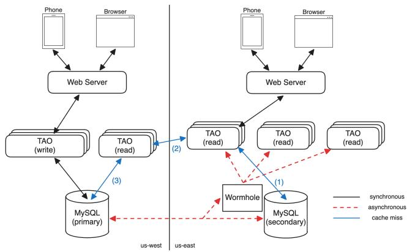
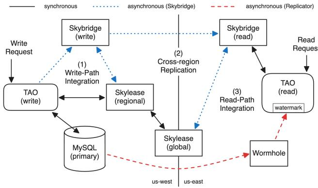
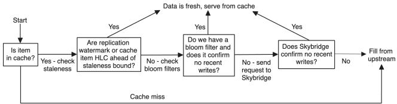
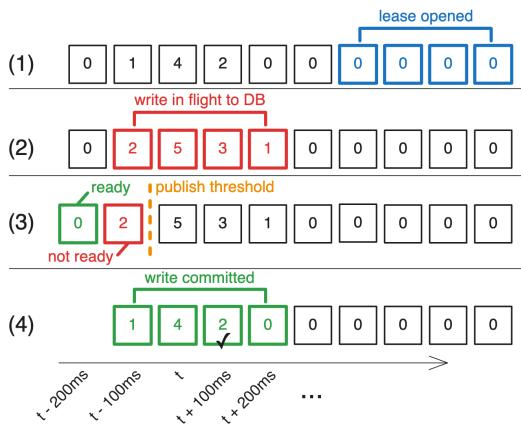
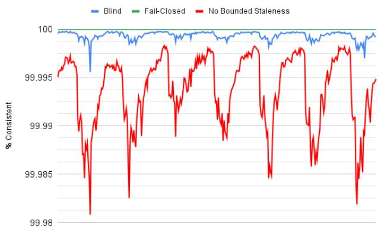
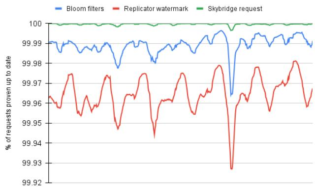
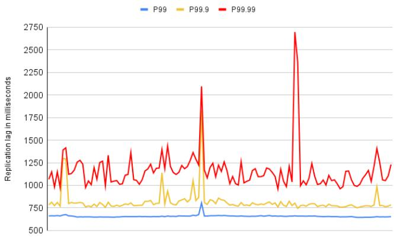
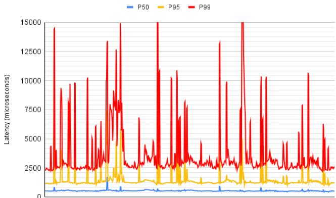

①

USENIX

THE ADVANCED COMPUTING SYSTEMS ASSOCIATION

# Skybridge: Bounded Staleness for Distributed Caches

Robert Lyerly, Meta Platforms Inc.; Scott Pruett, unaffiliated; Kevin Doherty and Greg Rogers, Meta Platforms Inc.; Nathan Bronson, OpenAI; John Hugg, Meta Platforms Inc.

https://www.usenix.org/conference/osdi25/presentation/lyerly

# This paper is included in the Proceedings of the 19th USENIX Symposium on Operating Systems Design and Implementation.

July 7–9, 2025 • Boston, MA, USA

ISBN 978-1-939133-47-2

Open access to the Proceedings of the 19th USENIX Symposium on Operating Systems Design and Implementation is sponsored by

# Skybridge: Bounded Staleness for Distributed Caches

Robert Lyerly Meta Platforms Inc.

Scott Pruett∗

Kevin Doherty Meta Platforms Inc.

Greg Rogers Meta Platforms Inc.

Nathan Bronson∗OpenAI

John Hugg Meta Platforms Inc.

## Abstract

Meta Platforms Inc. is a social media company whose products require high availability and low latency. Meta’s services run in multiple geographic locations around the world and use asynchronous replication to keep the numerous cached copies of the datastore in sync. This setup reduces consistency in order to meet availability and latency requirements. Eventual consistency due to asynchronous replication causes issues for Meta’s services, ranging from minor annoyances to product-breaking bugs. Therefore, we ask: can we put meaningful bounds on how long it takes writes to be visible while maintaining the scalability afforded by eventual consistency?

In this work we present Skybridge, an out-of-band replication stream for providing bounded staleness for distributed caches. Skybridge takes advantage of the fact that Meta’s systems already have a reliable delivery stream and instead focuses on real-time delivery of updates. Skybridge is complementary to the main replication pipeline and avoids correlated failures while being lightweight. We show that Skybridge helps provide 2-second bounded staleness for 99.99998% of writes, while the main replication pipeline only achieves this 99.993% of the time. Skybridge is able to achieve this while only being 0.54% the size of cache deployments.

## 1 Introduction

Meta Platforms, Inc. is a social media company whose products are used by people around the world. Like other web-scale serving stacks, Meta’s datastore hosts millions of database shards and handles billions of queries per second at sub-second latency [11, 15, 19, 45, 63]. Because of these stringent requirements, Meta operates instances of the serving stack in multiple geographic regions worldwide. Each region stores numerous copies of the data in the form of database (DB) replicas [19, 41, 44], in-memory caches [11, 22, 52, 63] and indexing systems [9, 57]. This architecture provides high scalability and close proximity to users for low latency.

While this architecture is highly scalable, it means there are dozens of copies of millions of shards around the world that are kept up to date. Meta uses asynchronous replication [15] to keep copies synchronized in order to meet our strict latency and high scalability requirements. Asynchronous replication provides eventual consistency [6] for clients, meaning all updates will eventually be reflected in all replicas but without bounds on how long it may take. Eventual consistency is problematic when there is non-trivial replication lag that delays when updates are visible to clients. Due to the scale of Meta’s serving stack (both in traffic and geographic size), it is almost impossible to eliminate all sources of lag. An overloaded publisher, a hotly-written shard or a congested network hop can all cause replication lag for multiple shards and many downstream replicas.

Eventual consistency is a recurring pain point in many previous works [2, 39, 57]. For Meta, eventual consistency causes bad user experiences in products. Visibility controls are a prime example – for instance, Alice may add Bob to a closed group. However if the group’s membership data is read from a lagging replica, Bob will not be able to participate in the group until the replica catches up. This violates Alice and Bob’s user expectations and causes frustration with our products. Eventual consistency can also have more serious side-effects. For example, Meta’s serving stack allow triggering asynchronous actions outside of web request handling to avoid blocking when returning a response. Asynchronous actions may read from different replicas or even execute in different regions. In one instance a content enforcement system using asynchronous actions experienced an outage due to sustained replication lag. The action could not see data written during the web request, leading to a surge of retries that clogged up execution queues and caused system downtime.

Meta’s product developers are aware there is replication lag in the system, but without stronger guarantees they build workarounds to deal with distributed systems issues that leak through datastore abstractions. Developers often ask “what is the maximum cross-region replication lag?” Infrastructure teams struggle to provide useful answers as lag can vary from milliseconds to hours (or longer). Developers cope with lag via patterns like retry loops, racy state machines and buggy distributed locks. For example, one developer added a retry loop that would poll the datastore for up to 40 minutes waiting for data. Better guarantees on when writes become visible obviate a whole class of developer issues. Thus, we ask how can we put reliable and tight bounds on how long it takes for a write to be visible while maintaining the serving stack’s high scalability and low latency?

  
Figure 1: System architecture for Meta’s serving stack.

In this work we present Skybridge, an out-of-band replication system for providing 2-second bounds on eventual consistency. Meta’s existing replication system, which provides strong durability and ordering guarantees, already replicates updates within 2 seconds in most cases. Skybridge instead targets the long-tail of lagging shards, where the strong guarantees of traditional replication systems cause replication lag. Our core insight is that Skybridge can implement replication with weaker guarantees while still enabling the system to holistically enforce staleness bounds. The weaker semantic, named replication with gap detection, allows out-of-order replication and known data loss. These properties allow Skybridge to side-step common sources of replication lag and focus on real-time replication, complementing the existing replication stream. While Skybridge builds upon existing distributed systems mechanisms, it combines them to provide a new replication guarantee and occupies a novel point in the replication system design space.

Skybridge is designed to be used by in-memory distributed caches, including TAO [11], the cache fronting Meta’s serving stack. When the replication stream is lagging, TAO consults Skybridge to determine which individual cache items are stale and need refilling from the source of truth. Skybridge’s protections are enabled by default for all TAO requests, transparently boosting consistency with minimal overhead.

In this work we make the following contributions:

• Explain why bounded staleness is important for TAO’s users and why we did not target other forms of consistency,

• Define a novel replication guarantee called replication with

gap detection that focuses on detecting cache staleness,

• Describe Skybridge’s design and implementation, a system that provides fine-grained and efficient bounded staleness for distributed in-memory caches,

• Evaluate Skybridge’s ability to provide reliable bounded staleness for TAO users, including demonstrating that TAO’s 2-second consistency increases from 99.993% to 99.99998% using Skybridge. Skybridge helps TAO prove data is fresh without having to refill from the primary source for 99.9996% of requests while only requiring 0.54% of TAO’s server footprint.

## 2 Background

## 2.1 Meta’s system architecture

Meta’s serving stack is similar to other web serving stacks like PNUTs [15] or Espresso [51]. The serving stack prioritizes high availability and low latency, meaning Meta operates many deployments around the world.

Storage. Meta stores its user data in MySQL [43]. The database is partitioned into millions of shards and replicated across regions. Meta uses primary-secondary replication [44] to keep regions up to date. For each shard, one region hosts the primary replica that accepts both read and write requests. Other regions host secondary replicas, which only accept read requests. Writes to the primary are asynchronously replicated to secondaries, i.e., MySQL acknowledges completed writes to the client before the change is guaranteed to have been replicated to all secondaries.

Caching. Meta’s workload is skewed towards reads. This workload is amenable to caching, which allows scaling throughput with low latency. Meta operates an in-memory caching service named TAO [11] in every region. TAO is similar to Memcached [22] or Redis [52], but provides a graph [67] API for querying vertices and edges. TAO is separated into read and write tiers, which allows specialization (DB connection management for writers, high-throughput caching for readers) and independent scaling of resources. TAO uses a read- and write-through architecture. For writes, web servers issue requests to the in-region TAO write tier. If the primary replica for the shard is in-region, the write tier directly issues a request to MySQL; otherwise, the request is proxied to the write tier in the primary region to perform the write. Web servers similarly send read requests to the local TAO read tier. On cache misses, TAO goes “upstream” to fetch the data. Figure 1 shows the upstream path – TAO first attempts to obtain the data from the local replica (1), and if unsuccessful, attempts to obtain the data from the read tier in the primary region (2) before going to the primary DB replica (3).

Keeping caches up to date. Keeping caches up to date is a known difficult problem [49]. One strategy is to use timeto-live (TTL) caching [14]. However, TTLs cause caches to either hold updated data too long (stale data) or throw away unchanged data (spurious misses). Another strategy is to rely on read/write-through architectures to update caches on the request handling path. However, relying on a fixed topology for consistency prevents evolving the architecture for operational benefits like availability and scalability [57].

Instead, Meta uses a pub-sub system named Wormhole [56], a system similar to Apache Kafka [3] or LinkedIn’s Databus [18], to stream updates to caches. Wormhole ingests MySQL’s replication stream and distributes updates to subscribers such as TAO read tiers. Wormhole guarantees atleast-once and in-order delivery of updates to subscribers. While Wormhole’s strong guarantees ensure the system can reliably replicate data around the world, enforcing those guarantees often leads to replication lag. For example, a hot shard or an overloaded publisher will cause lag (and data staleness) on a large number of subscribers. While average replication lag is low, Wormhole provides no bounds on maximum lag. Because both the MySQL secondaries and caches are updated asynchronously with no bound on replication lag, users are subject to eventual consistency with unbounded staleness [6].

Load-based subscriptions. There are multiples types of TAO tiers per region, including main and “failover” tiers. Failover tiers help improve availability and handle traffic during maintenance events. Failover tiers lazily subscribe to shard replication streams when a shard’s traffic reaches a minimum threshold. These load-based subscriptions reduce resource usage but are frequent sources of staleness.

Write versioning. Meta’s datastores use hybrid-logical clocks (HLC) [32] as a building block for consistency primitives. HLCs are versioning metadata about writes that have both a physical and logical clock component. HLCs achieve properties of both types of clocks – they capture causality between events (like Lamport clocks [35]) while also being tied to the physical time when the write was performed. HLCs can be used to detect when a data item is stale and needs to be refreshed from a more up-to-date source.

Meta’s MySQL deployment mints HLCs as part of committing transactions. MySQL guarantees HLCs are monotonically increasing per shard using the formula $H L C _ { n e w } =$ $m a x ( T i m e _ { n o w } , H L C _ { P r e \nu } + 1 )$ (where $T i m e _ { n o w }$ is the host’s current physical time). Meta uses NTP [42] to synchronize physical time. HLCs propagate alongside changed data through Wormhole to TAO, which caches them alongside the data. Additionally, MySQL injects a heartbeat [31] message (with HLC) into the replication stream every 500ms. This allows downstream subscribers to disambiguate between inactive shards and unhealthy replication – a subscriber should at least see a heartbeat every 500ms, regardless of whether there are any writes to the shard. If the subscriber does not see one, the replication stream may be unhealthy.

TAO tracks per-shard heartbeats as monotonically increasing watermarks indicating the shard’s replication progress. Because Wormhole guarantees in-order delivery, when TAO processes a heartbeat with HLC Tj, TAO is guaranteed to have processed all updates $T _ { i }$ where $T _ { i } ~ < ~ T _ { j }$ In essence, TAO is guaranteed to be “up to date” as of the watermark.

## 2.2 Bounded staleness

Bounded staleness [40] is a read consistency level exposed by asynchronously-replicated datastores. Unlike eventual consistency, which specifies that reads to the datastore will observe a write at some point without any conditions on timeliness, bounded staleness guarantees that reads will observe any write within some system-provided time bound. Concretely, if write $W _ { T }$ is performed at time T and the system provides staleness bound S, then any read R performed at or after $T + S$ is guaranteed to observe $W _ { T }$ regardless of whether the read is to the primary or a replica. Note that under bounded staleness the reader is allowed to observe subsequent writes $W _ { T + 1 } , W _ { T + 2 } .$ .. (i.e., fresher data) but reads must reflect all older writes $W _ { T - 1 } , \dots$ that preceded $W _ { T }$

Why bounded staleness? Bounded staleness is strong enough to be useful for developers while still being scalable enough to be enabled by default for all TAO reads. Bounded staleness matches most users’ mental model of the system. Enabling it by default provides highly leveraged benefits for all of Meta’s developers, including reducing product raciness and eliminating debugging pain. Others have recognized bounded staleness as a powerful consistency level for users – for example, Azure Cosmos DB [41] and Spanner [23] support bounded staleness (although they target DB replicas, not the caches fronting them).

Stronger forms of consistency like linearizability [27], sequential consistency [36] and causal consistency [1] are nonstarters as defaults at Meta’s scale as they introduce too much communication and synchronization overhead. Previously, Meta built and deployed FlightTracker [57] to provide read-your-writes (RYW) consistency for Meta’s social graph. While RYW is enabled for all TAO reads, we observed several limitations that made us turn to bounded staleness. First, users are only provided guarantees about their own writes; they still get eventual consistency for writes performed by other users or non-users like automation. Second, RYW protections are only provided by default within a region, as adding cross-region latency on every session fetch adds too much overhead to be enabled by default [57]. Finally, integrating a FlightTrackerlike system in the long tail of products and services operated by Meta is time consuming and not scalable.

We have found that RYW and bounded staleness together form a compelling semantic for datastore users – a user’s writes are visible to them immediately and all other writes are visible within a reasonable delay.

Picking a staleness bound. The target staleness bound must both be useful for users and be achievable considering Meta’s global deployment. Setting the bound to 2 seconds struck the right compromise between usability and feasibility – it is both a useful human-scale time bound and is achievable given speed-of-light delays for cross region replication.

We evaluate Skybridge’s ability to reliably provide 2 second bounded staleness in Section 5.

Bounded staleness without Skybridge. TAO in principle can implement a simple form of bounded staleness on cache hits by comparing the staleness bound S against the physical component of the watermark $H L C _ { w m }$ and cached-item $H L C _ { i t e m }$ . When checking a cache item:

1. $\left[ \mathrm { f } \ T i m e _ { n o w } - \left( S - \varepsilon \right) < m a x ( H L C _ { w m } , H L C _ { i t e m } ) \right.$ (where ε is max NTP clock skew1) then the cache item is fresh

2. Otherwise, the cache item is stale and needs to be refilled

Note that TAO uses the max of the watermark and cache item HLC. In some instances, the cache item HLC may be older than the staleness bound. This does not necessarily mean that the item is stale – it may simply have not been written recently. The replication watermark helps TAO prove these cache items as up to date.

This condition can be checked upstream all the way to the primary DB, where the data is guaranteed to be fresh. This check is local to each cache host, meaning it adds minimal overhead to reads. However, this baseline implementation causes significant operational issues. It is not fine-grained – if the shard temporarily lags beyond the staleness bound, TAO will treat all data on the shard as stale and go upstream to guarantee freshness (even though all data has likely not changed). This degrades TAO into a proxy rather than a cache. It can also add significant latency as requests that should be served locally may be forced to go cross-region. Finally, it creates thundering herds [37] on the primary, adding additional DB load and potentially exacerbating replication lag.

Importantly, almost all cache misses due to staleness in this implementation are false positives. Because Meta’s workload is highly read-skewed, most data on a shard has not been recently written and is actually up to date. The problem is TAO does not have fine-grained information about which particular cache items have changed since the last replication watermark. What TAO needs is a staleness oracle to identify which cache items have been recently written. When the replication stream is lagging, TAO could check the oracle to see whether a cache item has recently changed. This would allow TAO to filter out spurious staleness misses and only refill data that is truly stale.

## 3 Design

Skybridge’s goal is to be a fine-grained staleness oracle for TAO. When TAO receives a read request for a cache item and the replication stream backing that item is lagging, TAO consults Skybridge to determine if the item has recently changed. Skybridge responds with HLCs of writes to that item, if any; usually, however, it responds there are no recent writes. With this information, TAO can figure out whether the cache is up to date or whether it needs to refill from upstream. TAO, Wormhole and Skybridge work together to enforce 2-second bounded staleness by default for all reads.

Skybridge is complementary to the existing Wormhole replication stream, helping make bounded staleness enforcement precise and scalable. Wormhole is able to replicate most DB updates within 2 seconds. Skybridge provides the most benefit for the problematic long tail of lagging shards, where Wormhole’s strong replication guarantees cause lag. Skybridge implements an independent replication pipeline and is designed to avoid the same sources of replication lag. Skybridge achieves this by relaxing its replication guarantees, which allows it to focus on real-time replication instead of durability and in-order delivery.

Skybridge has several other goals in order to support bounded staleness checking for TAO’s workload. Checking against Skybridge must be low latency, as TAO cannot spend significant time doing expensive bounded staleness checks that regress request latency for clients. Additionally Skybridge must prevent as many spurious upstream fills as possible, both to avoid cross-region latency and to avoid overloading the upstream path. This means that the vast majority of bounded staleness checks must be satisfied locally on TAO hosts. Finally, Skybridge should ideally require significantly fewer resources than either TAO or Wormhole so that it can be efficiently deployed alongside existing systems.

We first describe Skybridge’s replication semantics. Then, we describe Skybridge’s architecture and how it implements this semantic to enforce bounded staleness.

## 3.1 Replication with gap detection

Skybridge implements a replication semantic called replication with gap detection (RGD). Systems that implement RGD have several unique properties that avoid common sources of replication lag while still enabling caches like TAO to enforce bounded staleness.

Replicating write metadata. The first property relates to who is responsible for filling stale cache entries. RGD systems only focus on identifying which cache items are stale. They leave the responsibility of refilling cache to others, e.g., TAO’s upstream fills. RGD systems only need the write metadata, i.e., cache key (node or edge ID) and DB HLC minted by the DB, to identify stale cache entries. Note that if RGD systems wanted to instead fill cache, they would need to replicate the changed data in addition to metadata. This would require significantly more CPU, memory and network resources. Additionally, this effort would be mostly wasted – recall from Section 2.2 that most cache items are up to date even if the backing replication stream is lagging. Only a small number of reads would actually use the changed data. It is more resource efficient to instead focus only on replicating write metadata; we evaluate the resource savings in Section 5.3.

  
Figure 2: Cross-region replication architecture as (1) Skybridge ingests writes as they flow through TAO, (2) Skybridge replicates metadata across regions, and (3) Skybridge indexes metadata for reading from TAO.

Known data loss. The second property is that RGD allows data loss as long as it is detectable. When using an RGD system to check staleness, caches expect a “yes, write at HLC X” or “no recent writes” answer. However if the RGD system reports an “indeterminate” result (i.e., it is missing data), the cache can always conservatively assume it is stale and refill the entry. While the cache may have been unnecessarily refilled, the system as a whole still enforces bounded staleness. The system is correct as long as the RGD system can reliably detect when it is missing data. If, however, the RGD system cannot detect when it is missing data, it may falsely report “no recent writes” to the cache. The cache would silently return stale results to clients in violation of bounded staleness. Therefore the RGD system must be able to detect these “gaps” in order to provide bounded staleness. Note that this property follows directly from the first – data loss is allowable because the RGD system is not responsible for filling cache (the cache provides its own refill mechanism).

Out-of-order replication. The third property is that RGD allows out-of-order replication. This is possible because the data in the replication stream is a conflict-free replicated data type (CRDT) [55]. CRDTs are replicated data structures whose replicas are guaranteed to converge to the same state once all updates have been delivered, regardless of the delivery ordering. This requires updates be idempotent, associative and commutative. Because RGD systems implement a CRDT, they can replicate data in whatever order is most effective.

RGD replication streams are add-only set CRDTs [55] containing write metadata represented by <key, HLC> tuples. Essentially RGD systems implement a set that only ever accumulates knowledge of recent writes. The order in which write metadata is added does not matter – the set will have the same state if write A is added before write B or vice-versa. Additionally, the set will de-duplicate write metadata added more than once since the set already contains the tuple.

At read time, clients query the RGD system by key. If there are multiple <key, HLC> tuples in the set, the writes are merged using a last-write-wins strategy [50]. This is because the RGD system’s only responsibility is to give the cache the versioning information required to produce a bounded staleness-compliant refill. Only the latest HLC matters – all previous writes will be reflected in the latest write. The RGD system returns the max of all found HLCs in order to make sure the cache observes the latest update.

Putting it all together. These three properties allow Skybridge to focus on replicating metadata about the most recent writes while de-prioritizing or even dropping older data. Skybridge’s replication stream is significantly smaller than traditional replication streams and side-steps many of the traditional sources of replication lag. Because of these properties, Skybridge can focus on real-time replication of write metadata in under two seconds.

## 3.2 Skybridge architecture

Figure 2 shows an overview of Skybridge’s architecture. Skybridge has three main components: 1) an integration with TAO’s write tier to ingest write metadata about all DB writes, 2) a replication layer to fan-out write metadata to all read regions, and 3) an integration with TAO’s read tier to check which cache items are stale.

Skybridge’s write path (Section 3.4) ingests write metadata from TAO writers and detects gaps in the ingestion. Skybridge uses leases, which indicate when a TAO writer may write to a shard, to determine data completeness. Skybridge’s client inside of TAO writers is responsible for opening leases with a system called Skylease and batching writes to send to Skybridge. Skybridge’s write path receives these batches and reads lease holders from Skylease to determine when it has complete data and is therefore safe to replicate downstream.

Skybridge’s replication layer (Section 3.5) is responsible for real-time replication of write metadata from the write path to the read path. Skybridge uses a pull-based model for replication – Skybridge readers pull batches of writes from the write path. This gives readers the flexibility to prioritize what data to fetch, including focusing on the newest metadata and de-prioritizing older data. The replication layer is designed to search for write metadata across multiple replicas, including write-path hosts and in-region read-path peers. If a particular window of data cannot be replicated, the replication layer will eventually give up and move on to newer data.

Skybridge’s read-path (Section 3.3) indexes write metadata about all recent writes to all shards performed globally. Skybridge’s indexes are designed for fast querying from TAO’s read handling request path. TAO readers implement bounded staleness checks by first comparing replication watermarks to the staleness threshold (Section 2.2). If the cache item cannot be proven fresh, TAO calls into the Skybridge client for fine-grained checking. Skybridge’s client sends requests to Skybridge to determine whether a cache item is stale. Additionally the client preloads Skybridge’s indexes on the TAO host for lagging shards to minimize the number of required external requests. If Skybridge reports the item is stale or if Skybridge has missing data, TAO goes upstream to refill cache. Otherwise TAO serves the cache to clients.

  
Figure 3: Request handling flow for TAO reads

## 3.3 Read path

TAO interacts with Skybridge during handling of read requests. The main goal is to determine whether the item that TAO has in cache is fresh with respect to the 2-second staleness bound. TAO achieves this through a combination of Wormhole watermarks, Skybridge requests and local caching of Skybridge metadata. This checking is designed to be precise and lightweight, limiting bounded staleness cache misses only to those cache items that have actually recently changed and without adding significant cache request latency.

Figure 3 shows TAO’s bounded staleness control flow. First, TAO checks whether the item is in cache; if it is a cache miss, bounded staleness checking is not required. Next, TAO constructs a cache HLC, $H L C _ { c a c h e }$ from the max of the watermark and cache item HLC (Section 2.2). If the physical component of this HLC is newer than the staleness bound, the item is fresh and TAO returns it to the caller. If not, TAO consults with Skybridge to determine whether the item was written between [HLCcache, StalenessBound], where StalenessBound = Timenow − (2 seconds − ε). This interval is referred to as the lag interval. Listing 1 shows the two Skybridge APIs that TAO uses to check whether there were any recent writes to the cache item within the lag interval.

Querying recent writes. Skybridge’s main API, getWrites, takes a cache item key and lag interval as arguments and returns the latest HLC of all DB writes to that key within that interval (TAO also supports range scans [47], for which Skybridge returns the latest HLC for all keys in the range). getWrites also indicates whether it had complete data for the interval (discussed further below). If Skybridge’s indexes were complete then TAO compares the cache HLC to the list of recent HLCs. If there are no recent writes or if the cache HLC is greater than any HLC in the list, then TAO can serve the data. If Skybridge returns an HLC higher than the cache HLC, TAO sends an HLC-conditional request upstream with that HLC; any upstream host that satisfies the HLC can fill the data. Finally, if Skybridge’s indexes are incomplete or there was an error talking to Skybridge, TAO refills from upstream using StalenessBound as the condition.

Note that Skybridge is only checked by the first cache host – other upstream hosts simply forward the request upstream if their cache HLC is too old. It adds too much latency to re-check Skybridge on every hop.

Bloom filters. TAO can only send getWrites requests to Skybridge after calculating cache HLCs, meaning Skybridge requests are on the cache read request critical path. However, TAO can actually predict when it will have to start checking staleness with Skybridge by monitoring replication stream lag. If TAO can proactively load Skybridge’s indexes for lagging shards, it can perform staleness checks locally rather than sending requests to Skybridge. The main downside of this approach is that even though Skybridge’s indexes are small, they are still large enough to compete with TAO’s caches for memory. Storing Skybridge’s indexes locally could regress TAO’s hit rate and cache request latency.

Instead, Skybridge uses bloom filters [58] built from its indexes. Bloom filters can have false positives, i.e., the bloom filter may indicate the data has changed even when it actually has not. The bloom filters do not, however, have false negatives. This allows TAO to correctly enforce bounded staleness. The set of recent writes on a shard is sparse, meaning the generated bloom filters are minimal in size. TAO pre-loads bloom filters for lagging shards, helping prove a significant portion of read requests up to date without having to send a request to Skybridge. This also significantly reduces the request load on Skybridge. Note that Skybridge only sends bloom filters for complete windows; there is no reason to send them for incomplete windows since TAO would have to consult Skybridge or go upstream anyway.

Listing 1 shows Skybridge’s bloom filter streaming API. Skybridge chunks its indexes into discrete intervals and builds bloom filters that are continuously streamed to clients. TAO monitors replication lag across all shards and opens a bloom filter stream for a shard when its replication watermark is older than 1.5 seconds. This allows TAO to pre-load bloom filters for checking if lag increases beyond 2 seconds. When the replication stream’s lag drops below 1.5 seconds, TAO closes the bloom filter stream.

Similarly to getTicket requests, TAO checks local bloom filters for writes within the lag interval. If TAO has bloom filters covering the entire lag interval and they indicate no recent writes, TAO can prove it has fresh data and serve it from cache. Otherwise, TAO sends a getTicket request to Skybridge to get a definitive answer.

Skybridge server-side indexes. Skybridge’s indexes are sharded by DB shard and store write windows. A write window is composed of a lower HLC bound, an upper HLC bound and a list of write metadata for all writes to that shard performed in that write window. Skybridge hosts replicate metadata from DB primary regions, where TAO hosts publish metadata about writes they performed to the local Skybridge tier. getTicket requests scan write windows overlapping the lag interval to search for any writes to the specified cache key.

struct Interval { i64 lower ; i64 upper ;};   
struct Response {   
list < tuple < string , i64 >> hlcs ; bool complete ;};   
struct BloomFilter {   
Interval interval ; binary serializedFilter ;};   
6 // Read recent writes from Skybridge   
Response getWrites( string key , Interval lag );   
8 // Stream bloom filters from Skybridge   
9 stream < BloomFilter > openBloomFilterStream(   
10 i64 dbShard , i64 start );  
Listing 1: Skybridge read API. TAO can request recent writes for a key and interval or stream serialized bloom filters constructed from Skybridge’s indexes.

When responding to queries, Skybridge needs to determine whether it has complete knowledge of all writes to a shard (i.e., no gaps). Given a lag interval $I _ { l a g } ,$ , index interval $I _ { i n d e x }$ (formed by the union of all write windows indexed by Skybridge), and write window D, Skybridge has complete data if:

1. $I _ { l a g } \subseteq I _ { i n d e x }$ (the lag interval is covered by write windows indexed by Skybridge)

2. For all $D \in I _ { l a g } \cap I _ { i n d e x } , D . c o m p l e t e = t r u e$ (all indexed windows covering the lag interval are complete)

If both criteria are satisfied, Skybridge has complete information about every write to the shard for the lag interval and can provide definitive cache freshness answers to TAO. Section 3.4 describes how Skybridge’s write-path integration determines whether write windows are complete and Section 3.5 describes how Skybridge drives replication of write windows from primary regions for every DB shard.

## 3.4 Write path

Skybridge’s goal on the write path is to ingest metadata about all writes committed to the DB. Skybridge ingests write metadata by collecting heartbeats from TAO write hosts. TAO writer heartbeats are defined by a lower and upper HLC bound and a list of writes committed by that TAO writer within those bounds. TAO writers guarantee that heartbeats sent to Skybridge contain all writes to the DB performed by that writer during that interval. Skybridge hosts aggregate heartbeats from TAO writers into write windows to publish downstream.

Skybridge uses a leasing system called Skylease to track which hosts are writing to which shards. Any single TAO writer only serves traffic for a small fraction of DB shards. Leases [24], which indicate the time period when a writer may be writing to a shard, make heartbeating efficient by only requiring TAO writers to send heartbeats for shards they own (i.e., avoid sending heartbeats from the cross-product of TAO writers and DB shards). Skybridge’s client is responsible for opening leases on hosted shards and batching write metadata into heartbeats to send to Skybridge. Skybridge must collect heartbeats from all of a shard’s lease holders, i.e., writers, in order to have complete data for that shard.

Leases. Leases are a contract between TAO writers and Skybridge. A writer is only allowed to write to a shard if it has an open lease and the host promises to send heartbeats for the duration of the lease. If for whatever reason a lease holder fails to send a heartbeat (e.g., host crash), Skybridge will detect data loss by observing a gap in expected heartbeats. This is the core of how Skybridge implements replication with gap detection’s known data loss guarantee.

Leases are denoted by a lease holder (e.g., TAO host), lease object (e.g., DB shard) and HLC interval. Leases are non-exclusive since multiple TAO writers may be handling writes for a given DB shard for higher availability. Lease HLC ranges are minted by Skylease hosts based on their physical clock and the lease duration requested by the client, i.e., [Now, Now + Duration). We describe why using physical clocks does not violate correctness below.

Skylease must be 1) highly available to avoid blocking write handling, 2) durable to avoid losing leases and causing unknown data loss, 3) strongly consistent so that Skybridge knows the exact set of lease holders at a given time, and 4) scalable to leases on millions of lease objects. To satisfy these requirements, Skylease acts as a batching and sequencing control plane on top of strongly-consistent distributed consensus systems like Apache Zookeeper [60] or Delos [8].

Skylease employs a number of techniques to scale heavyweight consensus rounds to millions of leases. First, Skylease’s protocol uses delta compression [30]. Because a writer’s shards do not frequently change, Skylease’s protocol only records changes between subsequent open lease requests. Second, Skylease scales out by using its own sharding, where lease objects are hashed to a Skylease shard and each Skylease shard is backed by a consensus group. Finally, Skylease batches writes to a Skylease shard from multiple writers to reduce the number of consensus rounds.

Skybridge must handle the situation where reading lease holders races with writers opening leases. For example, if a TAO writer is allowed to open a lease on a shard after Skybridge has read the lease holders, Skybridge could experience unknown data loss by missing a lease holder and therefore missing heartbeats. To prevent this situation, Skylease periodically seals leases on a shard by bumping a monotonically increasing watermark as part of consensus rounds. This watermark represents the lowest valid HLC of any newly opened leases. If a TAO writer tries to mint a new lease with an interval below or overlapping the watermark, Skylease rejects the lease by sequencing the operation through storage. Skylease also responds to Skybridge queries (e.g., “read lease holders for shard S between [Tx,Ty)”) with “not sealed” until the interval is completely sealed. This ensures Skybridge sees the full lease holder set when building write windows.

Skylease maintains an in-memory view of lease holders, including materializing the current watermark and full set of TAO leases from delta compressed storage. Read queries against this view are fast enough to allow frequent polling by

  
Figure 4: Skybridge’s client maintains heartbeats (shown as boxes) sorted from old to new with counts of in-flight writes. (1) Leases opened with Skylease are divided into heartbeats and added to storage. (2) Before writing to the DB, TAO acquires and creates HLC bounds from heartbeats. (3) The client asynchronously scans for heartbeats to publish that are older than a threshold and do not have any in-flight writes. (4) After the write is committed, TAO releases heartbeats and stores the write in the appropriate heartbeat (check mark).

Skybridge until the queried interval is sealed. Skylease maintains watermarks per Skylease shard; watermarks apply to all lease objects on the shard. When advancing the seal watermark, Skylease keeps the new watermark behind the current physical time to avoid impacting open lease availability.

Building heartbeats. Leases ensure Skybridge is able to determine which writers should be sending heartbeats for which shards. TAO writers are responsible for sending complete heartbeats for the entire opened lease duration to Skybridge. A heartbeat H is complete if all writes W committed by the writer between the heartbeat’s lower and upper HLC bounds are contained in the heartbeat’s write set:

For all W such that $H _ { l o w e r } \leq W . h l c < H _ { u p p e r } , W \subseteq H$ .writes

Note that this implies that once a heartbeat is sent to Skybridge, no more writes may be committed within that heartbeat’s bounds so as to avoid violating the completeness property for the sent heartbeat.

TAO writers must only write to the DB within valid lease bounds to ensure that Skybridge correctly tracks all writers. To achieve this, TAO writers call into the Skybridge client before writing to the DB in order to read the current lease or block until one is acquired. TAO then attaches the lease HLC bounds to the DB request. Meta’s MySQL deployment allows specifying HLC bounds on transactions – if the HLC minted by the DB for a transaction does not fall within the bounds, MySQL will abort the transaction. This ensures MySQL respects the leases opened by TAO writers. This HLC coordination with the DB is why it is okay to mint leases based on

Skylease host physical times - the HLC bounds will ensure the write falls into the appropriate time range.

In order to build complete heartbeats, Skybridge’s client 1) maintains HLC bounds for DB write requests to avoid minting new write HLCs outside of leases or already-sent heartbeats and 2) tracks outstanding writes (including in which heartbeats a write may land). The Skybridge write client achieves both goals using an in flight write storage for tracking heartbeats and writes. This data structure maintains a list of heartbeats to be sent to Skybridge for each DB shard. Each heartbeat in storage tracks how many in-progress writes that could land within that heartbeat’s bounds. This storage ensures heartbeats are complete before being sent to Skybridge.

Figure 4 shows how the client uses this storage. (1) shows heartbeats getting added to storage based on leases opened with Skylease. Each lease gets divided into smaller discrete heartbeats since lease durations are much longer than individual heartbeats. The heartbeats in storage are what TAO promised to send to Skybridge but has not yet sent. Any interval outside of storage either does not correspond to an open lease or represents a heartbeat that has already been sent to Skybridge. In other words, future writes to be committed by the DB must land in one of the heartbeats in storage.

(2) shows a write request coordinating with the storage before going to the DB. The client generates HLC bounds for the transaction based on heartbeats in storage. To track outstanding writes, the client acquires heartbeats in which the write could land. This operation (maintained as a reference count on the heartbeat) blocks the heartbeat from being published until the write has been committed by the DB. (4) shows the post-DB processing – all heartbeats acquired in (2) are released and the completed write’s metadata is stored in the heartbeat containing its HLC. If there was an error writing to the DB, the heartbeats are simply released without storing any metadata. While the client could acquire every single heartbeat in storage, most writes have HLCs that fall within a narrow range of heartbeats near the current physical time. The client is configured to only acquire a small subset of heartbeats, which also helps prevent straggler writes from blocking large numbers of heartbeats from being published.

(3) shows how the client determines when heartbeats are ready to be published to Skybridge. The client periodically scans all shards in storage looking for heartbeats that are older than a publish threshold (which lags the host’s current physical time) and that do not have any outstanding writes. If there are still writes in flight that may land in a particular heartbeat, the client skips it. Otherwise the heartbeat is dequeued from storage and sent to Skybridge. At this point the heartbeat is sealed and all future writes will be prevented from landing in it through the HLC bounds created in (2). Note that the client takes advantage of out-of-order publishing to avoid delaying the sending of heartbeats. The client can send any heartbeat once it is ready for publishing, even if there are older heartbeats blocked due to straggler writes.

Tuning lease and HLC bound sizes. Lease durations and HLC bounds represent a trade-off between Skylease load and “blast radius” for when things go wrong. Lease duration should ideally be as low as possible, but is bounded by how quickly Skylease can run consensus rounds. Alternatively, TAO could open very long leases, e.g., on the order of minutes, to minimize Skylease load. However if the TAO host crashed shortly after opening a long lease, Skybridge would have minutes of data incompleteness. Similarly, for heartbeats acquired before going to the DB, the bounds should be as small as possible to minimize the number of heartbeats blocked on stragglers, but large enough to give the DB ample time to process the write (too small HLC bounds will cause spurious aborts). The Skybridge client is tuned to open leases on the order of tens of seconds and acquire HLC bounds on the order of hundreds of milliseconds.

Aggregating heartbeats. Skybridge aggregates heartbeats from in-region writers into write windows for a shard by 1) polling Skylease for the (sealed) list of all lease holders, and 2) waiting for heartbeats from TAO writers covering those leases. Skybridge knows it has a complete write window D if for Skylease watermark $S _ { w a t e r m a r k }$ and heartbeats H corresponding to lease L:

1. $D _ { u p p e r } < S _ { w a t e r m a r k }$ (Skylease has sealed the lease holder set past the write window’s bounds)

2. For all L such that $D _ { l o w e r } \leq L _ { l o w e r } < L _ { u p p e r } \leq D _ { u p p e r } , H _ { L } \subseteq$ D (Skybridge has all heartbeats from all lease holders for the write window interval)

Once Skybridge has all heartbeats from all lease holders for a given shard and interval, it builds a complete write window ready for publishing. Skybridge is configured with a timeout on how long it will wait for heartbeats. If the timeout expires and it still has not received all heartbeats, Skybridge will publish an incomplete write window to give subscribers some information about recent writes. Skybridge will, however, continue waiting and if the heartbeats later arrive it will republish the complete window downstream. Skybridge again takes advantage of out-of-order replication to avoid blocking complete windows from replication if an older window is waiting for data from TAO.

## 3.5 Cross-region replication

Skybridge’s replication layer is responsible for replicating write windows from all primary regions to regions serving read traffic within 2 seconds. While Skybridge’s correctness criteria allows gaps, Skybridge tries to replicate complete data as frequently as possible to be effective on TAO’s read path. Because of the real-time nature of replication, Skybridge’s replication layer fetches missing data out of order and from multiple replicas using a publisher-subscriber [3] model.

While TAO writers push windows to the local Skybridge tier, cross-region subscribers pull a continuous stream of write windows from publishers to fill their indexes. Using a pull model gives subscribers the ability to quickly detect gaps and re-fetch windows from another source. Because write windows are conflict-free replicated data types, subscribers have a lot of flexibility to reorder and retry data fetches. Using a push model would require publishers to discover missing data from subscribers, requiring too much coordination.

The replication layer builds a continuous stream of write windows with newer windows sent first. Early versions of the replication layer opened a single long-lived stream per shard using a protocol similar to gRPC streams [25]. However Skybridge frequently experienced head-of-line blocking and could not prioritize newer data while the stream tried to flush out older windows. Additionally, long-running streams caused load imbalance over time as Skybridge deployments rotated hosts through maintenance. Long-lived publishers accumulated more streams and eventually became overloaded until they were restarted (and streams moved to other hosts).

Instead, Skybridge’s replication layer opens short secondslong streams. This gives more load balancing opportunities across publishers and allows subscribers to de-prioritize older sections of the stream by either delaying re-fetching them or not re-fetching at all. Subscribers periodically open new streams to primary regions to stream the most recent data. Publishers may send write windows out-of-order, publish duplicate or incomplete windows or even leave gaps. None of these block subscribers from continuing to stream newer data. However when a subscriber detects missing data (e.g., an incomplete write window), it schedules another attempt to stream the data after some delay. This helps when heartbeats from TAO are delayed, e.g., blocked waiting on a DB write. Additionally this allows subscribers to try re-fetching from other sources. Each primary region contains two Skybridge replicas, meaning there are two possible sources of writes. Inregion replicas (“peers”) will also exchange write windows, which helps quickly warm up Skybridge hosts after a restart.

Finding primary regions. Subscribers need to know each shard’s primary region in order to fetch that shard’s writes. Similarly to TAO’s write path, Skybridge uses leases at the global level to track each shard’s primary region. For Skybridge to guarantee completeness, regional leases must only be opened within a global lease and therefore the region must have a global lease before any regional leases can be opened. When handling an open lease request from TAO, regional Skylease hosts implicitly open global leases for the DB shard and region with Global Skylease. Global leases are typically opened for much longer intervals (e.g., on the order of minutes) as shards rarely move between regions.

Subscribers drive replication for a shard by reading global leases from Global Skylease. The replication layer uses the region name (i.e., lease holder) and lease bounds to stream data from the appropriate primary region.

## 4 Implementation

Skybridge provides a means for TAO to enforce bounded staleness on read requests. Below we discuss a number of practical considerations regarding TAO and Skybridge.

Circuit breakers. Although TAO aims to provide bounded staleness for all requests, Skybridge cannot regress TAO’s availability and performance. On the write path, too many writes blocked waiting for leases from Skylease will trip a circuit breaker and TAO will let writes proceed without leases. Similarly, too many read requests trying to go through the high-overhead portion of bounded staleness checking (requests to Skybridge, consistency misses upstream) will trip a circuit breaker and TAO will serve whatever is in cache. These circuit breakers prevent cascading failure modes. For example, if there is widespread Wormhole lag, bounded staleness checking can create a thundering herd on the upstream path towards the DB which could make lag worse.

TAO “fails open” when tripping circuit breakers. TAO fires an alarm whenever these rate limits are hit to notify Meta engineers about issues that need investigation. In fact these alerts have notified us about Wormhole and TAO problems before either of the teams knew there was an issue.

Fail-closed vs. fail-open While TAO defaults to failing open if it hits rate limits, sometimes product developers want stronger consistency at the expense of availability – they would prefer the request failed if TAO cannot guarantee bounded staleness. TAO provides a “fail-closed” API for this scenario. Clients opt in to the API by setting a flag on the TAO request that tells TAO to fail the request if it cannot guarantee bounded staleness. TAO reserves a portion of its rate limit budget for fail-closed requests to prioritize their availability.

Extended retention Skybridge is an in-memory service and is memory-capacity bound (see Section 5.3). Skybridge adjusts retention of its indexes to keep memory usage stable as write traffic fluctuates over time. Skybridge maintains a baseline retention for all DB shards, but TAO shard lag is not uniform – individual shards may have worse lag than others. Skybridge can selectively extend retention for a small set of these longer-lagging shards. Skybridge detects these shards based on TAO queries – if it sees multiple requests for a shard where the lag interval is approaching retention limits, Skybridge marks the shard as “extended” and maintains write windows for that shard for a significantly longer interval.

Clock skew Meta’s hosts use NTP [42] to synchronize physical clocks. NTP is known to have on the order of hundreds of milliseconds of clock skew. Meta is investigating using more precise clock synchronization such as PTP [46, 54], but for now we move the staleness bound forward by 50ms to try to account for clock skew.

Emulating primary-only and causal reads TAO provides linearizable reads that bypass cache and read from the primary DB. To avoid DB overload issues, TAO actively discourages using them unless absolutely necessary. With fail-closed bounded staleness reads, however, TAO has a lightweight drop-in replacement. When clients call this replacement API, the web server sleeps for 2 seconds to wait out the staleness bound and then sends a fail-closed request to TAO. TAO either guarantees consistency or returns an error to the client if it cannot (e.g., hit upstream rate limits or network errors). This means clients get linearizable reads. Similarly, bounded staleness can provide a limited form of causal reads. If the client knows when a write occurred (i.e., HLC of the write) then it can wait until 2 seconds have passed to perform the read. TAO and Skybridge will ensure the write is visible. These APIs are highly efficient from TAO’s perspective since the client waits for replication and TAO likely serves data from cache.

Clients can also use these APIs as a stronger backup when regular reads are not able to see a relevant write. Clients first issue a regular read, which succeeds most of the time. On the infrequent occasion that TAO is stale (e.g., clients do not see an object they created), they wait for 2 seconds then retry the read with stronger consistency. Bounded staleness enables these new APIs without any external synchronization or forcing clients to pass around HLCs.

Failure scenarios and fault tolerance. Like most distributed systems, Skybridge must contend with single-node failures. However, because of replication with gap detection semantics, individual Skybridge host failures do not cascade into replication lag or other outages. Skybridge’s replication layer is resilient to these issues. There are multiple Skybridge write-path hosts per DB replica from which downstream subscribers can stream updates. Similarly, there are multiple Skybridge read-path hosts per DB replica from which TAO readers can open bloom filter streams and query for recent writes. Skybridge’s replication layer is free to stream updates from multiple sources in whatever order is best.

While network partitions between TAO and Skybridge are technically feasible, we have not noticed them. Region drains and cuts are more likely in practice, especially as part of routine testing [10]. However, Skybridge’s leasing system gracefully works around them. Recall that TAO writers (and Skybridge write-path hosts) are co-located in the same region as primary DB replicas. During a region cut, the region no longer receives any write requests. TAO writers no longer open leases and subscribers stop attempting to subscribe to updates from that region soon after. Therefore Skybridge, TAO and MySQL all share the same fate in a region outage and Skybridge in other regions still functions correctly.

Skybridge’s read path has showcased several priority inversion [4] failures. A priority inversion exists when a higher priority task is impacted by a lower priority task. For Skybridge’s read path, this manifests as read traffic from TAO affecting Skybridge’s replication health. This typically occurs when Skybridge hosts have temporary spikes of incomplete data (e.g., a TAO writer crashing leading to a gap). In this scenario, Skybridge cannot send bloom filters to TAO since it has incomplete data. This causes TAO hosts to fall back to getWrites queries to Skybridge. getWrites queries are more expensive than publishing bloom filters, especially since bloom filters help TAO elide further getWrites calls. The increase in getWrites traffic starves hosts of processing resources to drive replication, leading to more data incompleteness, fewer bloom filters and more getWrites traffic. Skybridge gets stuck in a metastable failure state [29] in which the service is degraded until remediated by outside intervention. To avoid this cycle, we added a priority queue for threads in Skybridge hosts to prioritize replication, then bloom filter streams and finally getWrites traffic. This ensures replication and bloom filter streams are healthy, minimizing the number of getWrites calls from TAO.

  
Figure 5: Bounded staleness consistency over 7 days with no bounded staleness (red), blind (blue) and fail-closed (green) reads. TAO’s 2-second consistency without Skybridge is 99.993% but frequently drops below 99.985%. Skybridge significantly increases consistency to 99.9993% for blind and 99.99998% for fail-closed reads.

Similarly, Skybridge write-path hosts also experienced priority inversion. Skybridge write-path hosts ingest heartbeats from TAO writers and publish write windows downstream to subscribers. As mentioned in Section 3.5, the replication layer attempts to re-fetch missing windows. Many downstream subscribers re-fetching data can compete with TAO writer heartbeats, causing Skybridge write-path hosts to drop heartbeats. This causes data loss, leading to more subscribers attempting to re-fetch and further competition for resources. Skybridge again solves this problem using a priority queue to ensure heartbeat ingestion takes precedence over downstream subscribers. Additionally, Skybridge write-path hosts rate limit the number of subscribers re-fetching windows.

Skylease demonstrated another interesting failure mode. When Skylease is unhealthy and cannot provide leasing functionality, TAO writers fail-open on write requests and handle writes without leases. Additionally, Skybridge is not able to read lease holders (since Skylease cannot seal shards), leading to Skybridge publishing all of its write windows as incomplete. Skylease can become overloaded when the mapping of DB shards to TAO writers rapidly changes. For example, in one instance a buggy TAO release caused write requests to get misrouted to TAO writers. Because TAO writers handle misrouted requests to maintain availability, they opened leases for the misrouted requests as well. Skylease’s delta compression was ineffective in this situation, leading to a spike in throughput to Skylease’s storage backend and out-ofmemory crashes when materializing the set of lease holders. This caused excessive downstream incompleteness, leading to a large number of fail-open reads and writes. To prevent this situation, we added rate limits on how many lease changes can be sent per request. While this means there occasionally may be a brief spike in fail-open writes, it ensures Skylease is still able to seal shards and Skybridge is able to publish write windows downstream in a timely manner.

## 5 Evaluation

In this section we evaluate Skybridge’s ability to reliably and efficiently provide bounded staleness for TAO.

Experimental setup. TAO runs in tens of regions around the world, handling millions of write queries and billions of read queries per second. For Skybridge to be effective on TAO’s read path, it must be able to improve staleness for recently written data while filtering out almost all spurious staleness misses that would cause TAO to go upstream (and likely out of region). Below we describe Skybridge’s effectiveness for Meta’s production workload.

## 5.1 2-second staleness improvements

We built a staleness checking service (referred to as the checker) to monitor 2-second consistency. TAO writers send a sample of writes to an in-region checker instance. On receiving a write, the checker sleeps for 2 seconds from the write’s HLC and then issues read requests for that write to all TAO tiers in all regions. The checker sends three types of requests:

• No bounded staleness. The checker explicitly disables bounded staleness protections. This is what users experience without Skybridge.

• Blind. The checker issues a normal read request. TAO implicitly applies bounded staleness protections but can fail open if it hits rate limits.

• Fail-closed. The checker issues a fail-closed request – TAO returns an error if it cannot guarantee bounded staleness.

Figure 5 shows the difference in 2-second consistency observed by the checker over a 7 day period. By default, TAO provides 99.993% 2-second consistency relying solely on Wormhole and frequently drops below 99.985%. With besteffort Skybridge, however, consistency jumps to 99.9993%, reducing the number of inconsistent reads without any user intervention. The main limiting factor preventing better consistency is TAO’s bounded staleness rate limits, which limit the number of Skybridge and upstream queries and causes the read to fail open. When the checker opts into fail-closed mode however, the consistency rate climbs to 99.99998%. This means only a couple thousand out of billions of requests are stale after 2 seconds. At this scale, clock skew begins to make a difference (recall staleness thresholds are created by a host’s physical time). Additionally the checker does not have a way to opt the associated writes into fail-closed behavior since it only observes writes after the fact, meaning it may be checking writes that are not tracked by leases. Regardless, this number has proven to be high enough to be used by products that require strong consistency guarantees for correctness.

<table><tr><td rowspan=1 colspan=1>Fail-open reason</td><td rowspan=1 colspan=1>% of fail-open requests</td></tr><tr><td rowspan=1 colspan=1>Long shard lag</td><td rowspan=1 colspan=1>95.9%</td></tr><tr><td rowspan=1 colspan=1>No replication stream</td><td rowspan=1 colspan=1>3.3%</td></tr><tr><td rowspan=1 colspan=1>Skybridge replication lag</td><td rowspan=1 colspan=1>0.3%</td></tr><tr><td rowspan=1 colspan=1>Missing data from write path</td><td rowspan=1 colspan=1>0.2%</td></tr><tr><td rowspan=1 colspan=1>Skybridge request error</td><td rowspan=1 colspan=1>0.2%</td></tr></table>

Table 1: Fail-open reasons by % of all fail-open requests

We further investigated the reasons for inconsistency in the blind/fail open case. Table 1 shows fail-open reasons as reported by TAO. The biggest cause of inconsistency was long shard lag. Because Skybridge is an in-memory service, it only maintains the most recent writes (see Section 5.3 below). Skybridge’s retention cannot cover shards that are lagging beyond several minutes, meaning TAO must fall back to going upstream. TAO hits upstream rate limits when a significant number of shards lag by more than several minutes.

The next biggest cause of inconsistency is reads to shards without a replication stream, i.e., shards whose load was too low to trigger a subscription (Section 2). Without a subscription, there is no replication watermark and the TAO host cannot check staleness (including using Skybridge) for that shard. The host must fall back to going upstream. Traffic on TAO failover tiers frequently hit these rate limits.

The remaining causes of inconsistency are lag in Skybridge’s replication layer, missing heartbeats from TAO’s write path and errors talking to Skybridge. Missing heartbeats from TAO writers is outside of Skybridge’s control as windows cannot be sent to Skybridge until all outstanding writes are acknowledged by the DB. We are continuing to optimize the replication layer and Skybridge’s request handling to address the other two sources of inconsistency, although they comprise only a small fraction of fail-open requests.

TAO’s rate limits are tuned to avoid overloading the upstream path and regressing serving latency. Sending too many requests upstream can regress aggregate latency and cause an increase in timeouts for products. Because we wanted bounded staleness enabled by default, we tightened the rate limits to minimize user impact; the current limits strike a good balance between strong consistency without user-visible performance impact.

  
Figure 6: Percent of read queries proven up to date using the Wormhole watermark (red), host-local bloom filters (blue) and an in-region request to Skybridge (green)

## 5.2 Traffic analysis

Skybridge helps TAO provide bounded staleness for all read queries because it dramatically reduces the number of queries that must be sent upstream to guarantee freshness. We evaluated how frequently Skybridge is involved in TAO’s read handling and how effective Skybridge is in helping filter out upstream requests. Figure 6 shows the percentage of read requests proven up to date solely based on the watermark (i.e., the Wormhole replication stream is not lagging), percent of up-to-date requests with the addition of Skybridge’s eagerlystreamed bloom filters (i.e., the bloom filter says there are no recent changes), and percent of up-to-date requests with an authoritative request to Skybridge. Note that these numbers exclude requests to shards without a replication subscription, i.e., load-based subscription.

Using Wormhole watermarks allows TAO to prove 99.96% of reads up to date. Checking against host-local bloom filters increases that to 99.98%, meaning tens of millions of additional read queries per second can be proven up to date. Because bloom filters are in-memory on the TAO host, they incur almost no additional latency on the request handling critical path. Including requests to Skybridge, TAO is able to prove 99.9996% of requests up to date. While a request requires a network hop, it is low latency since it is an in-region request. Figure 7b shows P50, P95 and P99 request latency to Skybridge. Requests take on the order of milliseconds, meaning TAO can quickly get a staleness answer from Skybridge. Overall, Skybridge is able to provide staleness bound checking with low-overhead, with only 0.0004% of requests needing to go upstream to get fresh data.

## 5.3 Replication and footprint

Figure 7a shows Skybridge’s P99, P99.9 and P99.99 replication lag, defined as the difference between the Skybridge host’s physical time and the upper bound of the replicated write window. P99 replication lag is stable at around 700ms. Even at P99.99, Skybridge is able to replicate windows around the world within 1.5 seconds outside a few spikes. This realtime delivery is a combination of small payload size and outof-order replication. Delivering 99% of the data in ∼700ms opens up possibilities for sub-2-second staleness bounds. For example, the primary read emulation API could offer tighter latency bounds for use cases that cannot tolerate waiting for 2 seconds, although there may need to be a cap on max throughput to avoid hitting rate limits and triggering errors.

(a) Skybridge replication lag at P99, P99.9 and P99.99  
  
(b) Skybridge latency at P50, P95 and P99 percentiles  
Figure 7: Skybridge replication and query performance

Skybridge requires a relatively small number of servers. The entire Skybridge ecosystem (Skybridge read and write path, regional and global Skylease) uses 0.54% of TAO’s server footprint. Skybridge is able to retain between 93 and 109 seconds’ worth of recent writes as write traffic fluctuates throughout the day (Skybridge is memory-capacity bound). A single Skybridge tier pulls information about all committed writes from all primary regions, requiring between 4.8-7.9GB/s of network bandwidth. Wormhole’s replication stream to TAO, meanwhile, requires between 170-300GB/s. These numbers demonstrate that Skybridge is lightweight compared to TAO and Wormhole.

RGD semantics allow Skybridge to be minimal in size while still providing staleness information about recent writes in real time. Skybridge takes full advantage of its core principles (only replicate metadata, known data loss, out-of-order replication, decoupling from Wormhole) to drastically boost TAO’s 2-second bounded staleness up to 99.99998%. It is able to achieve these benefits while helping TAO avoid going upstream for 99.9996% of queries. Skybridge is a reliable and efficient means for boosting TAO’s user experience.

## 6 Limitations and future work

Increased retention. Skybridge’s indexes are memory capacity bound and only cover several minutes’ worth of replication lag. Increasing the number of hosts or memory capacity per host would boost retention. Another strategy would be to spill older sections of indexes onto disk (e.g., flash drives). This would allow Skybridge to expand retention into the tens of minutes range but would require care to avoid regressing query latency. Other systems like Memcached [20] are able to support disk storage with minimal regressions, meaning it is likely a feasible solution for Skybridge.

Dynamic sharding. TAO statically assigns data to shards, but systems like Cockroach DB [33], BigTable [12], Spanner [16] and TiDB [28] are able to dynamically reshard data to balance load. Skybridge’s leasing mechanism could be extended to handle dynamic resharding, but would likely require integration with the resharding control plane to safely coordinate changes.

Global secondary indices. Meta uses global secondary indices [9] to materialize queries that would require many TAO requests, e.g., inverted indexes on fields. A shuffle service ingests updates from Wormhole and generates updates for global secondary index leaf hosts. Skybridge would need to tackle several problems to provide bounded staleness for these indices. First, indexing systems need a way to track a replication watermark across the large fan-in (potentially millions) of input DB shards. Second, indexing systems must have a way to “repair” a given index when determined to be missing some writes (similarly to TAO filling from upstream). We leave both of these problems as future work.

## 7 Related Work

Strong consistency on eventually-consistent datastores. There are many works that augment eventually-consistent datastores with stronger consistency. Riak [53] and Cassandra [34] provide opt-in linearizability through quorum reads of replicas. Gemini [38] uses logical clocks to direct crossreplica reads for serializability. RAMP [5] (and Facebook’s RAMP-TAO [13] variant) provides read atomicity for transactions. All of these these systems require opting in to heavyweight protocols, meaning only a small fraction of requests see improved consistency. Skybridge instead focuses on enabling bounded staleness by default for all reads.

Bounded staleness in datastores. There are a number of datastores that implement bounded staleness. Azure Cosmos DB [41] and Google Spanner [23] implement bounded staleness in multi-region setups. Both datastores provide bounded staleness as an opt-in mechanism and backpressure (i.e., throttle or block) if the local replica is stale. Skybridge instead provides on-by-default bounded staleness for distributed caches, which significantly more traffic.

C5 [26] and CRAQ [59] propose new replication and concurrency protocols for ensuring DB replicas are kept up to date and provide strong consistency. Query Fresh [61], Harmonia [68] and IONIA [62] propose using new networking and storage technologies to either prevent lag or eliminate conflicts between replicas. None of these works address lag in large-scale pub-sub systems such as faulty publishers or network congestion like what is present in Meta’s serving stack (and what causes replication lag for TAO).

PolarDB-SCC [64], similarly to Skybridge, uses granular staleness information to allow serving consistent reads from replicas. The main difference between PolarDB-SCC and Skybridge are the target workloads – PolarDB-SCC targets strong consistency for a single DB replicated across multiple machines, whereas Skybridge targets bounded staleness for millions of DBs spread around the world. There are also implementation differences such as deriving staleness bounds by reading from the primary vs. using local physical time and waiting for the replica to become up to date vs. refilling from upstream. Nevertheless, both approaches optimize for workloads where most data on replicas is consistent.

Distributed cache consistency. Web-scale systems [11,19, 34] frequently optimize for low latency and high availability at the expense of consistency. Many systems use caching to scale out to high throughput with low latency. While some systems use time-based mechanisms like leases [24] or TTLs [63] for cache consistency, others use invalidations [66] to keep caches up to date [11, 18, 56]. Even with invalidation streams, users are subject to replication lag without additional mechanisms for improved consistency. For example, FlightTracker [57] provides RYW consistency for users within a region by maintaining tickets representing the user’s writes in a lookaside store. Similarly, Antipode [21] provides cross-datastore causal consistency by propagating lineage metadata alongside requests. These systems target different points in the consistency spectrum than Skybridge, but share common motivation in improving user experiences in a scalable manner.

Lu et al. [39] describe measuring consistency in Facebook’s serving stack using both offline and online checking. Their offline framework reports a significantly lower rate of consistency violations vs. Skybridge’s checker – this is likely due to their checker sampling user read requests (which may happen significantly later than writes) whereas Skybridge’s checker injects read requests after 2 seconds. Their online checker injects reads similarly to Skybridge’s checker and reports a significantly higher rate of inconsistency.

An and Cao describe monotonic consistent caching [2], a set of cache eviction policies that take consistency and atomicity into consideration. Like Skybridge, their lazy version selection strategy provides bounded staleness for users. MCC however is focused on cache evictions and targets lookaside cache systems whereas Skybridge targets systems with invalidation streams.

Bounded staleness variations. Bailis et al. describe probabilistic bounded staleness [7], a framework for users to determine “good enough” staleness for quorum-replicated datastores. Similarly, Ouyang et al. propose probabilistic atomicity with well-bounded staleness [48] for providing a probabilistic consistency level between eventual and strong consistency. While Skybridge does not guarantee bounded staleness by default due to rate limits, it seeks to provide as strong a bound as possible rather than forcing developers to reason about an acceptable probability of enforcement. Additionally none of these works target web-scale workloads like Meta. ACT [65] proposes a framework for application-specific consistency, but requires developers to augment applications to define the logical consistency units. There are other non-web workloads that benefit from bounded staleness, e.g., Cipar et al. [17] propose using bounded staleness for iterative AI algorithms.

## 8 Conclusion

In this work we introduced Skybridge, a system for providing bounded staleness for distributed in-memory caches. Skybridge acts as a staleness oracle, providing per-cache item staleness information when the DB replication stream is lagging. Skybridge is designed to complement the existing replication stream, optimizing for a flexible and compact replication format that enables real-time replication. Skybridge is efficient enough to enabled by default on billions of read requests per second, while simultaneously requiring only a small fraction of hosts. Skybridge is also effective, helping boost TAO’s 2-second consistency up 99.99998%. Skybridge can provide significant developer and user experience benefits for Meta.

## Acknowledgments

We would first like to thank the anonymous SOSP reviewers, OSDI reviewers and our shepherd Michael Stumm for their technical and editorial insights on improving the paper. We would also like to thank Audrey Chang, Aaron Kabcenell, Shilpa Lawande and Matt Pugh for their thorough review of the paper. Finally we would like to thank Amol Bhave, Arthur Charlton, Jinyu Han, Anwesh Joshi, Qiegang Long, Morgan McLain-Smith, Tushar Pankaj and Ilya Smirnov for their technical contributions to the systems in this paper.

## References

[1] Mustaque Ahamad, Gil Neiger, James E Burns, Prince Kohli, and Phillip W Hutto. Causal Memory: Defini-

tions, Implementation, and Programming. Distributed Computing, 9(1):37–49, 1995.

[2] Shuai An and Yang Cao. Making Cache Monotonic and Consistent. Proceedings of the VLDB Endowment, 16(4):891–904, December 2022.

[3] Apache Software Foundation. Apache Kafka, 2024. https://kafka.apache.org/.

[4] Özalp Babaoglu, Keith Marzullo, and Fred B Schnei- ˘ der. A Formalization of Priority Inversion. Real-Time Systems, 5(4):285–303, 1993.

[5] Peter Bailis, Alan Fekete, Joseph M. Hellerstein, Ali Ghodsi, and Ion Stoica. Scalable Atomic Visibility with RAMP Transactions. In Proceedings of the 2014 ACM SIGMOD International Conference on Management of Data, SIGMOD ’14, page 27–38, New York, NY, USA, 2014. Association for Computing Machinery.

[6] Peter Bailis and Ali Ghodsi. Eventual Consistency Today: Limitations, Extensions, and Beyond: How Can Applications Be Built on Eventually Consistent Infrastructure Given No Guarantee of Safety? Queue, 11(3):20–32, March 2013.

[7] Peter Bailis, Shivaram Venkataraman, Michael J. Franklin, Joseph M. Hellerstein, and Ion Stoica. Probabilistically bounded staleness for practical partial quorums. Proceedings of the VLDB Endowment, 5(8):776–787, April 2012.

[8] Mahesh Balakrishnan, Jason Flinn, Chen Shen, Mihir Dharamshi, Ahmed Jafri, Xiao Shi, Santosh Ghosh, Hazem Hassan, Aaryaman Sagar, Rhed Shi, Jingming Liu, Filip Gruszczynski, Xianan Zhang, Huy Hoang, Ahmed Yossef, Francois Richard, and Yee Jiun Song. Virtual Consensus in Delos. In Proceedings of the 14th USENIX Conference on Operating Systems Design and Implementation, OSDI’20, USA, 2020. USENIX Association.

[9] Elena Baralis, Stefano Paraboschi, and Ernest Teniente. Materialized Views Selection in a Multidimensional Database. In Proceedings of the 23rd International Conference on Very Large Data Bases, VLDB ’97, page 156–165, San Francisco, CA, USA, 1997. Morgan Kaufmann Publishers Inc.

[10] Ali Basiri, Niosha Behnam, Ruud de Rooij, Lorin Hochstein, Luke Kosewski, Justin Reynolds, and Casey Rosenthal. Chaos Engineering. IEEE Software, 33(3):35–41, 2016.

[11] Nathan Bronson, Zach Amsden, George Cabrera, Prasad Chakka, Peter Dimov, Hui Ding, Jack Ferris, Anthony Giardullo, Sachin Kulkarni, Harry Li, Mark Marchukov,

Dmitri Petrov, Lovro Puzar, Yee Jiun Song, and Venkat Venkataramani. TAO: Facebook’s Distributed Data Store for the Social Graph. In 2013 USENIX Annual Technical Conference (USENIX ATC 13), pages 49–60, San Jose, CA, June 2013. USENIX Association.

[12] Fay Chang, Jeffrey Dean, Sanjay Ghemawat, Wilson C. Hsieh, Deborah A. Wallach, Mike Burrows, Tushar Chandra, Andrew Fikes, and Robert E. Gruber. Bigtable: A Distributed Storage System for Structured Data. ACM Transactions on Computer Systems, 26(2), June 2008.

[13] Audrey Cheng, Xiao Shi, Lu Pan, Anthony Simpson, Neil Wheaton, Shilpa Lawande, Nathan Bronson, Peter Bailis, Natacha Crooks, and Ion Stoica. RAMP-TAO: Layering Atomic Transactions on Facebook’s Online TAO Data Store. Proceedings of the VLDB Endowment, 14(12):3014–3027, July 2021.

[14] Edith Cohen, Eran Halperin, and Haim Kaplan. Performance Aspects of Distributed Caches Using TTL-Based Consistency. Theoretical Computer Science, 331(1):73– 96, 2005. Automata, Languages and Programming.

[15] Brian F. Cooper, Raghu Ramakrishnan, Utkarsh Srivastava, Adam Silberstein, Philip Bohannon, Hans-Arno Jacobsen, Nick Puz, Daniel Weaver, and Ramana Yerneni. PNUTS: Yahoo!’s hosted data serving platform. Proceedings of the VLDB Endowment, 1(2):1277–1288, August 2008.

[16] James C. Corbett, Jeffrey Dean, Michael Epstein, Andrew Fikes, Christopher Frost, J. J. Furman, Sanjay Ghemawat, Andrey Gubarev, Christopher Heiser, Peter Hochschild, Wilson Hsieh, Sebastian Kanthak, Eugene Kogan, Hongyi Li, Alexander Lloyd, Sergey Melnik, David Mwaura, David Nagle, Sean Quinlan, Rajesh Rao, Lindsay Rolig, Yasushi Saito, Michal Szymaniak, Christopher Taylor, Ruth Wang, and Dale Woodford. Spanner: Google’s Globally Distributed Database. ACM Transactions on Computer Systems, 31(3), August 2013.

[17] Henggang Cui, James Cipar, Qirong Ho, Jin Kyu Kim, Seunghak Lee, Abhimanu Kumar, Jinliang Wei, Wei Dai, Gregory R. Ganger, Phillip B. Gibbons, Garth A. Gibson, and Eric P. Xing. Exploiting Bounded Staleness to Speed Up Big Data Analytics. In 2014 USENIX Annual Technical Conference (USENIX ATC 14), pages 37–48, Philadelphia, PA, June 2014. USENIX Association.

[18] Shirshanka Das, Chavdar Botev, Kapil Surlaker, Bhaskar Ghosh, Balaji Varadarajan, Sunil Nagaraj, David Zhang, Lei Gao, Jemiah Westerman, Phanindra Ganti, Boris Shkolnik, Sajid Topiwala, Alexander Pachev, Naveen Somasundaram, and Subbu Subramaniam. All Aboard the Databus! LinkedIn’s Scalable Consistent Change Data Capture Platform. In Proceedings of the Third

ACM Symposium on Cloud Computing, SoCC ’12, New York, NY, USA, 2012. Association for Computing Machinery.

[19] Giuseppe DeCandia, Deniz Hastorun, Madan Jampani, Gunavardhan Kakulapati, Avinash Lakshman, Alex Pilchin, Swaminathan Sivasubramanian, Peter Vosshall, and Werner Vogels. Dynamo: Amazon’s Highly Available Key-Value Store. In Proceedings of Twenty-First ACM SIGOPS Symposium on Operating Systems Principles, SOSP ’07, page 205–220, New York, NY, USA, 2007. Association for Computing Machinery.

[20] Dormando. Caching beyond RAM: the case for NVMe, June 2018. https://memcached.org/blog/nvm-caching/.

[21] João Ferreira Loff, Daniel Porto, João Garcia, Jonathan Mace, and Rodrigo Rodrigues. Antipode: Enforcing Cross-Service Causal Consistency in Distributed Applications. In Proceedings of the 29th Symposium on Operating Systems Principles, SOSP ’23, page 298–313, New York, NY, USA, 2023. Association for Computing Machinery.

[22] Brad Fitzpatrick. Distributed caching with memcached. Linux Journal, 2004(124):5, 2004.

[23] Google Cloud. Timestamp bounds | Spanner, 2024. https://cloud.google.com/spanner/docs/timestampbounds#bounded\_staleness.

[24] Cary G. Gray and David R. Cheriton. Leases: An efficient fault-tolerant mechanism for distributed file cache consistency. SIGOPS Operating Systems Review, 23(5):202–210, November 1989.

[25] gRPC Authors. gRPC, 2024. https://grpc.io/.

[26] Jeffrey Helt, Abhinav Sharma, Daniel J. Abadi, Wyatt Lloyd, and Jose M. Faleiro. C5: Cloned Concurrency Control That Always Keeps Up. Proceedings of the VLDB Endowment, 16(1):1–14, September 2022.

[27] Maurice P. Herlihy and Jeannette M. Wing. Linearizability: A correctness condition for concurrent objects. ACM Transactions on Programming Languages and Systems, 12(3):463–492, July 1990.

[28] Dongxu Huang, Qi Liu, Qiu Cui, Zhuhe Fang, Xiaoyu Ma, Fei Xu, Li Shen, Liu Tang, Yuxing Zhou, Menglong Huang, Wan Wei, Cong Liu, Jian Zhang, Jianjun Li, Xuelian Wu, Lingyu Song, Ruoxi Sun, Shuaipeng Yu, Lei Zhao, Nicholas Cameron, Liquan Pei, and Xin Tang. TiDB: A Raft-Based HTAP Database. Proceedings of the VLDB Endowment, 13(12):3072–3084, August 2020.

[29] Lexiang Huang, Matthew Magnusson, Abishek Bangalore Muralikrishna, Salman Estyak, Rebecca Isaacs, Abutalib Aghayev, Timothy Zhu, and Aleksey Charapko. Metastable Failures in the Wild. In 16th USENIX Symposium on Operating Systems Design and Implementation (OSDI 22), pages 73–90, Carlsbad, CA, July 2022. USENIX Association.

[30] James J. Hunt, Kiem-Phong Vo, and Walter F. Tichy. Delta algorithms: An empirical analysis. ACM Transactions on Software Engineering and Methodology, 7(2):192–214, April 1998.

[31] Marcos Kawazoe Aguilera, Wei Chen, and Sam Toueg. Heartbeat: A Timeout-Free Failure Detector for Quiescent Reliable Communication. In Distributed Algorithms, pages 126–140, Berlin, Heidelberg, 1997. Springer Berlin Heidelberg.

[32] Sandeep S Kulkarni, Murat Demirbas, Deepak Madappa, Bharadwaj Avva, and Marcelo Leone. Logical physical clocks. In Principles of Distributed Systems: 18th International Conference, OPODIS 2014, Cortina d’Ampezzo, Italy, December 16-19, 2014. Proceedings 18, pages 17–32. Springer, 2014.

[33] Cockroach Labs. Cockroach DB - Load-Based Splitting, 2020. https://www.cockroachlabs.com/docs/stable/loadbased-splitting.

[34] Avinash Lakshman and Prashant Malik. Cassandra: A Decentralized Structured Storage System. SIGOPS Operating Systems Review, 44(2):35–40, April 2010.

[35] Leslie Lamport. Time, Clocks, and the Ordering of Events in a Distributed System. Communications of the ACM, 21(7):558–565, July 1978.

[36] Leslie Lamport. How to Make a Multiprocessor Computer That Correctly Executes Multiprocess Programs. IEEE Transactions on Computers, C-28(9):690–691, 1979.

[37] Federico Larumbe and Abhishek Mathur. Under the Hood: Broadcasting Live Video to Millions, December 2015. https://engineering.fb.com/2015/12/03/ios/underthe-hood-broadcasting-live-video-to-millions/.

[38] Cheng Li, Daniel Porto, Allen Clement, Johannes Gehrke, Nuno Preguiça, and Rodrigo Rodrigues. Making Geo-Replicated Systems Fast as Possible, Consistent when Necessary. In 10th USENIX Symposium on Operating Systems Design and Implementation (OSDI 12), pages 265–278, Hollywood, CA, October 2012. USENIX Association.

[39] Haonan Lu, Kaushik Veeraraghavan, Philippe Ajoux, Jim Hunt, Yee Jiun Song, Wendy Tobagus, Sanjeev Kumar, and Wyatt Lloyd. Existential Consistency: Measuring and Understanding Consistency at Facebook. In Proceedings of the 25th Symposium on Operating Systems Principles, SOSP ’15, page 295–310, New York, NY, USA, 2015. Association for Computing Machinery.

[40] Prince Mahajan, Srinath Setty, Sangmin Lee, Allen Clement, Lorenzo Alvisi, Mike Dahlin, and Michael Walfish. Depot: Cloud Storage with Minimal Trust. In 9th USENIX Symposium on Operating Systems Design and Implementation (OSDI 10), Vancouver, BC, October 2010. USENIX Association.

[41] Microsoft, Inc. Consistency Level Choices - Azure Cosmos DB, 2024. https://learn.microsoft.com/enus/azure/cosmos-db/consistency-levels#boundedstaleness-consistency.

[42] David L. Mills. RFC0958: Network Time Protocol (NTP), 1985.

[43] MySQL. MySQL, 2024. https://www.mysql.com/.

[44] MySQL. MySQL :: MySQL 8.0 Reference Manual :: 20.1.1.1 Source to Replica Replication, 2024. https://dev.mysql.com/doc/refman/8.0/en/groupreplication-primary-secondary-replication.html.

[45] Rajesh Nishtala, Hans Fugal, Steven Grimm, Marc Kwiatkowski, Herman Lee, Harry C. Li, Ryan McElroy, Mike Paleczny, Daniel Peek, Paul Saab, David Stafford, Tony Tung, and Venkateshwaran Venkataramani. Scaling Memcache at Facebook. In 10th USENIX Symposium on Networked Systems Design and Implementation (NSDI 13), pages 385–398, Lombard, IL, April 2013. USENIX Association.

[46] Oleg Obleukhov and Ahmad Byagowi. How Precision Time Protocol is Being Deployed at Meta, November 2022. https://engineering.fb.com/2022/11/21/productionengineering/precision-time-protocol-at-meta/.

[47] Oracle. Range Optimization, April 2025. https://dev.mysql.com/doc/refman/8.4/en/rangeoptimization.html.

[48] Lingzhi Ouyang, Yu Huang, Hengfeng Wei, and Jian Lu. Achieving Probabilistic Atomicity With Well-Bounded Staleness and Low Read Latency in Distributed Datastores. IEEE Transactions on Parallel and Distributed Systems, 32(4):815–829, 2021.

[49] Lu Pan. Cache made consistent. In Systems@Scale Summer 2022, 2022. https://engineering.fb.com/2022/06/08/coreinfra/cache-made-consistent/.

[50] Nuno Preguiça, Carlos Baquero, and Marc Shapiro. Conflict-Free Replicated Data Types (CRDTs), pages 1–10. Springer International Publishing, Cham, 2018.

[51] Lin Qiao, Kapil Surlaker, Shirshanka Das, Tom Quiggle, Bob Schulman, Bhaskar Ghosh, Antony Curtis, Oliver Seeliger, Zhen Zhang, Aditya Auradar, Chris Beaver, Gregory Brandt, Mihir Gandhi, Kishore Gopalakrishna, Wai Ip, Swaroop Jgadish, Shi Lu, Alexander Pachev, Aditya Ramesh, Abraham Sebastian, Rupa Shanbhag, Subbu Subramaniam, Yun Sun, Sajid Topiwala, Cuong Tran, Jemiah Westerman, and David Zhang. On Brewing Fresh Espresso: LinkedIn’s Distributed Data Serving Platform. In Proceedings of the 2013 ACM SIGMOD International Conference on Management of Data, SIG-MOD ’13, page 1135–1146, New York, NY, USA, 2013. Association for Computing Machinery.

[52] Redis, Ltd. Redis, 2024. https://redis.io/.

[53] Riak. Strong Consistency, 2024. https://docs.riak.com/riak/kv/latest/developing/appguide/strong-consistency/index.html.

[54] Vinay Shankarkumar, Laurent Montini, Tim Frost, and Greg Dowd. RFC 8173: Precision Time Protocol Version 2 (PTPv2) Management Information Base, 2017.

[55] Marc Shapiro, Nuno Preguiça, Carlos Baquero, and Marek Zawirski. Conflict-Free Replicated Data Types. In Stabilization, Safety, and Security of Distributed Systems, pages 386–400, Berlin, Heidelberg, 2011. Springer Berlin Heidelberg.

[56] Yogeshwer Sharma, Philippe Ajoux, Petchean Ang, David Callies, Abhishek Choudhary, Laurent Demailly, Thomas Fersch, Liat Atsmon Guz, Andrzej Kotulski, Sachin Kulkarni, Sanjeev Kumar, Harry Li, Jun Li, Evgeniy Makeev, Kowshik Prakasam, Robbert Van Renesse, Sabyasachi Roy, Pratyush Seth, Yee Jiun Song, Benjamin Wester, Kaushik Veeraraghavan, and Peter Xie. Wormhole: Reliable Pub-Sub to Support Georeplicated Internet Services. In 12th USENIX Symposium on Networked Systems Design and Implementation (NSDI 15), pages 351–366, Oakland, CA, May 2015. USENIX Association.

[57] Xiao Shi, Scott Pruett, Kevin Doherty, Jinyu Han, Dmitri Petrov, Jim Carrig, John Hugg, and Nathan Bronson. FlightTracker: Consistency across Read-Optimized Online Stores at Facebook. In 14th USENIX Symposium on Operating Systems Design and Implementation (OSDI 20), pages 407–423. USENIX Association, November 2020.

[58] Sasu Tarkoma, Christian Esteve Rothenberg, and Eemil Lagerspetz. Theory and Practice of Bloom Filters for

Distributed Systems. IEEE Communications Surveys & Tutorials, 14(1):131–155, 2012.

[59] Jeff Terrace and Michael J. Freedman. Object Storage on CRAQ: High-Throughput Chain Replication for Read-Mostly Workloads. In 2009 USENIX Annual Technical Conference (USENIX ATC 09), San Diego, CA, June 2009. USENIX Association.

[60] The Apache Software Foundation. Apache Zookeeper, 2020. https://zookeeper.apache.org/.

[61] Tianzheng Wang, Ryan Johnson, and Ippokratis Pandis. Query fresh: Log shipping on steroids. Proceedings of the VLDB Endowment, 11(4):406–419, December 2017.

[62] Yi Xu, Henry Zhu, Prashant Pandey, Alex Conway, Rob Johnson, Aishwarya Ganesan, and Ramnatthan Alagappan. IONIA: High-Performance Replication for Modern Disk-based KV Stores. In 22nd USENIX Conference on File and Storage Technologies (FAST 24), pages 225– 241, Santa Clara, CA, February 2024. USENIX Association.

[63] Juncheng Yang, Yao Yue, and K. V. Rashmi. A Large Scale Analysis of Hundreds of In-Memory Cache Clusters at Twitter. In 14th USENIX Symposium on Operating Systems Design and Implementation (OSDI 20), pages 191–208. USENIX Association, November 2020.

[64] Xinjun Yang, Yingqiang Zhang, Hao Chen, Chuan Sun, Feifei Li, and Wenchao Zhou. PolarDB-SCC: A Cloud-Native Database Ensuring Low Latency for Strongly Consistent Reads. Proceedings of the VLDB Endowment, 16(12):3754–3767, August 2023.

[65] Haifeng Yu and Amin Vahdat. Design and Evaluation of a Continuous Consistency Model for Replicated Services. In Fourth Symposium on Operating Systems Design and Implementation (OSDI 2000), San Diego, CA, October 2000. USENIX Association.

[66] Haobo Yu, Lee Breslau, and Scott Shenker. A Scalable Web Cache Consistency Architecture. In Proceedings of the Conference on Applications, Technologies, Architectures, and Protocols for Computer Communication, SIGCOMM ’99, page 163–174, New York, NY, USA, 1999. Association for Computing Machinery.

[67] Ping Zhang and Gary Chartrand. Introduction to Graph Theory, volume 2. Tata McGraw-Hill New York, 2006.

[68] Hang Zhu, Zhihao Bai, Jialin Li, Ellis Michael, Dan R. K. Ports, Ion Stoica, and Xin Jin. Harmonia: Near-Linear Scalability for Replicated Storage with In-Network Conflict Detection. Proceedings of the VLDB Endowment, 13(3):376–389, November 2019.