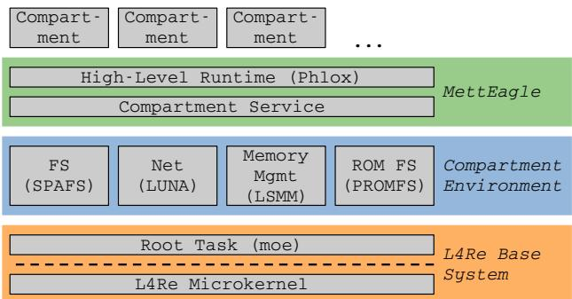
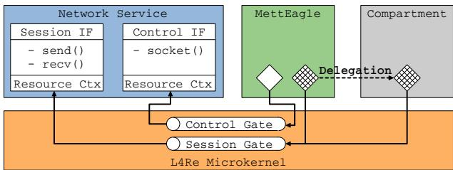
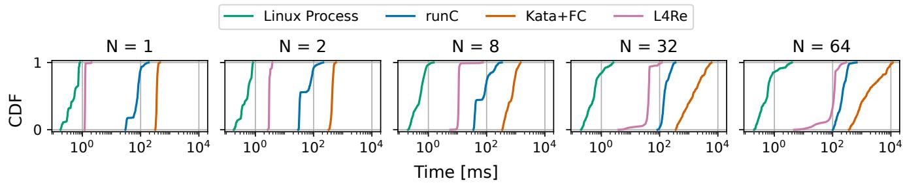
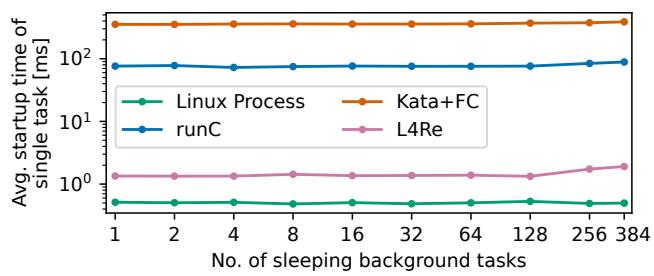
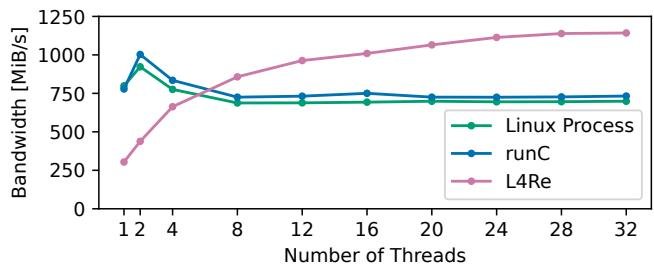
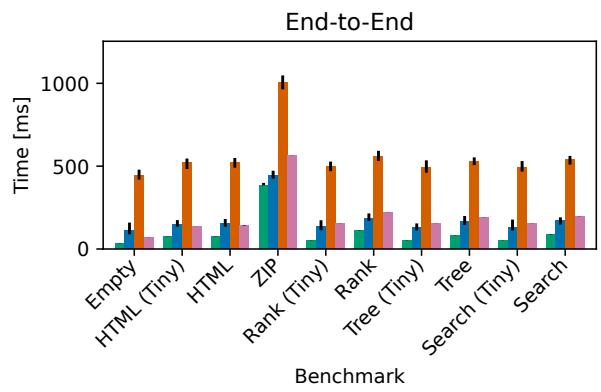
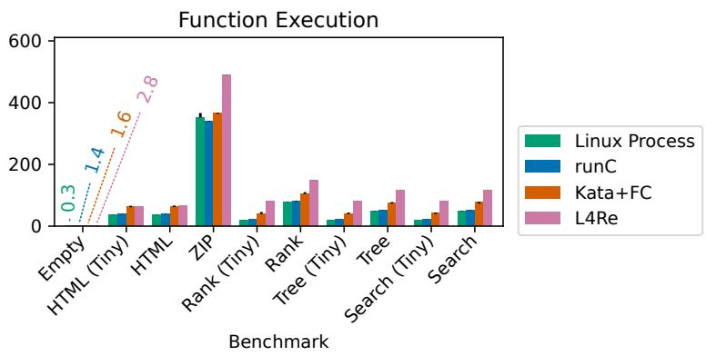
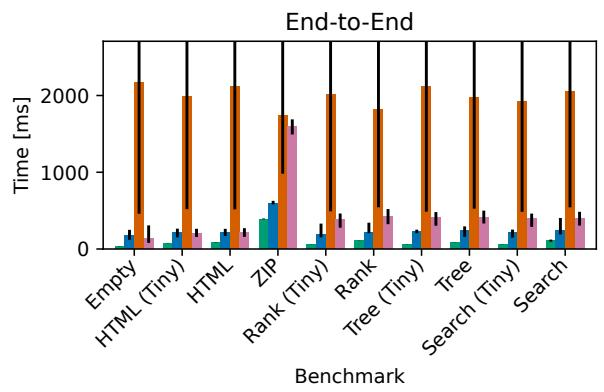
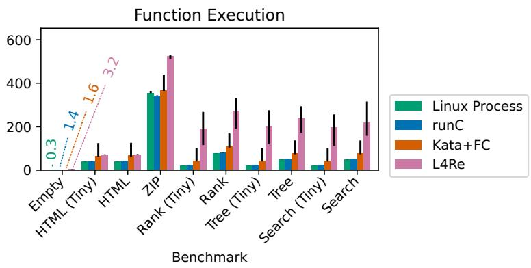

USENIX

THE ADVANCED COMPUTING SYSTEMS ASSOCIATION

# MettEagle: Costs and Benefits of Implementing Containers on Microkernels

Till Miemietz, Viktor Reusch, and Matthias Hille, Barkhausen Institut;   
Lars Wrenger, Leibniz-Universität Hannover; Jana Eisoldt, Barkhausen Institut;   
Jan Klötzke, Kernkonzept GmbH; Max Kurze, Technische Universität Dresden;   
Adam Lackorzynski, Technische Universität Dresden and Kernkonzept GmbH;   
Michael Roitzsch, Barkhausen Institut; Hermann Härtig, Barkhausen Institut and Technische Universität Dresden

https://www.usenix.org/conference/osdi25/presentation/miemietz

# This paper is included in the Proceedings of the 19th USENIX Symposium on Operating Systems Design and Implementation.

July 7–9, 2025 • Boston, MA, USA

ISBN 978-1-939133-47-2

Open access to the Proceedings of the 19th USENIX Symposium on Operating Systems Design and Implementation is sponsored by

# MettEagle: Costs and Benefits of Implementing Containers on Microkernels

Till Miemietz† Viktor Reusch† Matthias Hille† Lars Wrenger∗ Jana Eisoldt† Jan Klötzke‡ Max Kurze♯ Adam Lackorzynski♯‡ Michael Roitzsch† Hermann Härtig†♯

†Barkhausen Institut, Germany ∗Leibniz-Universität Hannover, Germany

‡Kernkonzept GmbH, Germany ♯Technische Universität Dresden, Germany

## Abstract

Today, many applications are hosted by cloud providers. In order to isolate the workloads of different clients, cloud enterprises mostly rely on containers rather than standard processes, since the latter are able to exercise a lot of ambient authority. Containers counter this deficiency by sandboxing processes. To this end, they use dedicated security mechanisms such as seccomp-bpf. However, these mechanisms add complexity to the kernel and increase its attack surface, thus prompting new security challenges.

Processes in microkernel-based systems do not have ambient authority. Thus, they do not require additional security mechanisms to build sandboxes. In this paper, we try to answer the question whether a microkernel-based OS architecture enables a leaner and more secure container infrastructure. Based on a CVE analysis, we show that the conceptual simplicity of containers on microkernels results in a better security posture than that typically found on monolithic systems.

We furthermore demonstrate the practical feasibility of implementing containers on state-of-the-art microkernels by building MettEagle, a prototype container service running on L4Re. We found that applications running in containers on L4Re expose performance characteristics comparable to that of containers on Linux for both synthetic and real-world benchmarks. In some cases, the container implementation of L4Re even outperforms Linux, accelerating container startup latency and improving network performance.

## 1 Introduction

Currently, virtual machines (VMs) and containers are the two prevalent mechanisms for isolating untrusted workloads running on a shared system. Generally speaking, containers are a more lightweight approach to isolation as they do not attempt to emulate an entire computing platform. Instead of spawning distinct operating system instances, multiple containers running on the same host share a single kernel and only expose separate instances of userland to applications.

This allows them to achieve runtime performance close to that of the bare metal system [48]. Moreover, starting a container is much faster than booting a virtual machine [42]. These advantages made containers the premier choice for isolating workloads in settings such as serverless computing [38].

Interestingly, when looking at containers from the perspective of an OS engineer, they are only little more than hardened processes (or process groups) that are restricted in their resource utilization through dedicated in-kernel mechanisms such as cgroups or seccomp-bpf [1]. These facilities however, add a lot of complexity to core OS abstractions. This additional complexity in turn harms cross-container isolation by exposing a larger in-kernel code base that is shared between distrusting containers [4, 5].

In fact, the intricacies of implementing an isolation mechanism equivalent to that of containers on traditional, monolithic OSes largely stems from the fact that these architectures do not adhere to the principle of least authority (PoLA) by design. Hence, on such systems, the implementation of containers needs to prevent applications from exercising ambient authority that they should not have in the first place. One example of this problem is the use of seccomp-bpf to retroactively restrict the set of system calls (and their parameters) that is available to a container. This does not only add complexity to the kernel but also introduces a slight performance penalty since the respective checks need to be carried out at runtime [34]. Even though this overhead has been reduced recently [2], it will never disappear completely.

Modern microkernel-based OS designs [35, 37], in contrast, enforce PoLA by default. On such systems, processes have to explicitly request access to any system service like drivers or file systems instead of implicitly having the authority to use them. As a consequence, implementing container-style isolation on such platforms does not require additional resource constraining mechanisms as the OS itself provides strong compartmentalization of processes by default. Hence we argue, that on a microkernel-based OS, the use of processes can provide better isolation properties than containers on monolithic systems.

From a security perspective, a microkernel design can significantly decrease the amount of code that mutually distrusting containers need to share since the core system that each process has to rely on is small. Moreover, as all other system services are implemented as separate processes in userspace, the trusted computing base (TCB) of a container running on a microkernel only includes services that it actually uses [30]. This is different from monolithic approaches where kernel parts that are only used by some containers contribute to the TCB of all clients running on the same machine. Consequently, microkernels enable container implementations with an improved security posture.

However today, microkernel-based OS architectures are mostly used in embedded systems with statically configured workloads. First, this raises the question of how well microkernel concepts scale to large hardware platforms – the type of hardware that containers are usually deployed on. Second, to the best of our knowledge, the performance implications of using capability-based microkernels to host highly dynamic workloads like serverless computing services have not been studied so far.

In order to answer these questions and investigate the cost and benefits of our concept for containers on microkernels, we built a prototype container engine on top of L4Re [27], a stateof-the-art microkernel-based OS. We show how to provide container-grade isolation, including resource restriction and the necessary system services on such a system. Following a detailed discussion on the security properties of the resulting approach, we analyze its performance for both microbenchmarks as well as in a function-as-a-service (FaaS) setting, using the SeBS benchmark suite [16] as an evaluation platform.

In summary, this paper makes the following contributions:

• An analysis of what is needed to provide container-grade isolation to applications (Section 2).

• The design (Section 3) and implementation (Section 4) of a container-style isolation mechanism on L4Re, a microkernel-based OS. This includes modifications of L4Re to improve its performance when facing dynamic workloads on server-grade hardware.

• A detailed evaluation of our approach from both a security perspective (Section 5) as well as from a performance angle (Section 6), with a particular focus on a comparison to standard frameworks for lightweight virtualization on Linux, namely runC and Firecracker.

## 2 Background

Containers or lightweight virtual machines are used for isolating workloads in cloud environments. In the following we will discuss their general properties and implementation on monolithic OSes. Afterwards, we introduce L4Re and its capability-based access-control mechanism which we leverage for our secure container architecture.

## 2.1 Containers on a Monolithic OS

Broadly speaking, a container is an OS mechanism that virtualizes the execution environment of applications while sharing a single kernel. Examples for such facilities can be found on a variety of operating systems such as BSD (Jails [33]), Solaris (Zones [52]), and Linux [22]. Even though the exact implementation differs, containers on all platforms rely on three common kernel mechanisms with respect to security: 1. Deny access to unnecessary (kernel) interfaces. 2. For necessary interfaces, the visibility of resources is restricted. 3. Where resources have to be shared, resource accounting is enforced.

Interface Restrictions: As shown by Canella et al. [14], many cloud applications indeed only require a fraction of the rather large kernel interface exposed by monolithic OS designs. Container implementations exploit this fact to increase security by preventing a container from executing certain system calls, thus reducing the attack surface of the shared kernel. Current solutions like seccomp-bpf on Linux are built on top of the Berkeley Packet Filter (BPF) [43] and allow administrators to specify small filtering programs that the kernel executes upon every system call of a container to determine whether it adheres to the container’s security policy.

Visibility Restrictions: Containers typically impose additional visibility restrictions on top of traditional processes. By using kernel features like Linux’ namespaces, the administrator is able to hide certain parts of the system from applications running inside a container.

Within the scope of containers, visibility restrictions are applied e.g. to the file system by setting a separate root directory using the chroot system call. Container implementations often use visibility restriction mechanisms to virtualize network interfaces, process IDs, and mount points. Also, visibility restriction measures assure that processes running inside a container cannot communicate across container boundaries.

Resource Restrictions: For reasons of performance isolation, operating systems also restrict the resource usage of containers using dedicated mechanisms. One prominent example of such resource constraining frameworks is Linux’ cgroups feature. Resource restriction frameworks for containers are often capable of organizing restrictions in a hierarchical manner, allowing containers to pass on a fraction of their already constrained resource budget [10]. Furthermore, they can prioritize access to system resources, thus guaranteeing a minimum share of a certain resource to each container.

Beyond these three core mechanisms, most implementations of containers also provide an ecosystem for managing containerized applications. For instance on Linux, a high-level container runtime like containerd [24] manages container images and the resources that a container requests for execution such as access to the network. The Open Container Initiative (OCI) provides standards for the container runtime interface and container images, which allows OCI-compliant container managers to interact with any OCI-compliant low-level container runtime. Low-level container runtimes like runC [32] are responsible for setting up a container by configuring the lightweight virtualization mechanisms provided by the OS. After a container is launched by the low-level container runtime, the container manager takes over monitoring and life cycle management of the container.

## 2.2 Lightweight Virtual Machines

Virtual machines (VMs) provide a higher degree of isolation than containers, as distrusting applications do not share a kernel instance. Lightweight virtual machine implementations like Firecracker [7] and Cloud Hypervisor [6] try to overcome traditional performance shortcomings of VMs by optimizing virtual machine monitors for use cases like serverless computing, thus providing performance close to that of containers [9]. For instance, reducing the hardware emulated by the hypervisor is one way how Firecracker optimized its boot time.

The use of unikernels as a VM guest [42] is another way to increase the performance of VMs, as unikernels run in a single privilege level, saving context switches during execution. Furthermore, a unikernel can strip unused parts from the OS and userspace components, reducing the size of the TCB [54]. However, the missing isolation between the OS components and the application inside a unikernel contradicts the objective of a multi-layered security approach.

## 2.3 A Primer on the L4Re Microkernel OS

Being a microkernel, the L4Re kernel itself only implements functionality that cannot be realized in userspace, such as page table manipulation or mechanisms for inter-process communication (IPC). The L4Re microkernel (also known as the Fiasco kernel) represents each of the abstractions that it offers to userspace processes as kernel objects. Prominent examples for kernel objects are threads, IRQs, the scheduler and IPC gates which represent an IPC channel to a process.

Every other component of the operating system such as the memory management or device drivers run as processes in userspace (dubbed tasks in L4Re). During bootup the L4Re microkernel starts a root task called moe. Moe provides the basic system abstractions of L4Re such as RAM allocation or access to the read-only boot file system to other applications. Moe allows defining quotas for resource allocations, thus being able to constrain the resource consumption of application tasks. After initialization, moe starts ned, a service task that loads actual L4Re applications as specified by a startup script which is a part of an L4Re boot image. The components of L4Re we base our system on have single-threaded implementations.

## 2.4 Capabilities

L4Re, like most modern microkernel-based operating systems, uses capabilities [18] for implementing access control. A capability is an unforgeable token of authority, that grants the possessing process the power of carrying out operations on objects. For instance such an operation could be an IPC call to another process.

A central feature of capability-based access control is the absence of ambient authority. Tasks in L4Re start with no authority, i.e., no capabilities by default. This is crucial for a secure container infrastructure. To perform useful work and interact with the system, tasks must be granted the required capabilities explicitly. Other parts of the system cannot be accessed and are in fact not even visible to said task. Sharing object access is simple, as the owner of a capability is free to grant it to other tasks (delegation) with equal or less rights (for example, restricting read/write to read). Contrary to delegation, the owner of a capability can revoke (i.e., void) it, preventing its future use for authorization.

In L4Re, capabilities manifest as the permission to interact with a certain kernel object. Depending on the type of the respective object and the rights of the capability pointing to it, such interactions may configure the CPU scheduler, send an IPC message to another thread via an IPC gate, or destroy a kernel object. With L4Re, a capability can be delegated by sending it over an IPC gate connected to another process, whereupon the kernel takes care of copying the capability into the target process of the IPC. Similarly, the owner of a capability can instruct the kernel to revoke it at any time. Consequently, the L4Re microkernel is responsible for maintaining the system’s security by shielding the capabilities of all processes against unauthorized manipulation.

## 3 Containers on L4Re

This section describes how the functional features and the security properties of Linux containers can be implemented on a microkernel-based OS like L4Re. In the following, we will use the term compartment for referring to an entity with container-style isolation running on L4Re, differentiating it from the Linux equivalent which we keep calling container. We start with an overview of our architecture and exemplify the interaction of the components by walking through the life cycle of a compartment. Finally, we explain how the isolation mechanisms used by containers on Linux can be transcribed to a microkernel-based OS, and whether these mechanisms already exist in L4Re, need to be introduced, or can be omitted entirely.

## 3.1 L4Re Compartment Architecture

Figure 1 depicts the components of our microkernel-based compartment system, which runs on top of the L4Re base system. This base system contains the L4Re microkernel and the root task moe which manages initial memory allocations to our services at system boot and provides other L4Re system primitives. The compartment environment contains all services required to run applications inside L4Re compartments. This includes services for file systems, networking, and scalable memory management.

  
Figure 1: A sketch of L4Re’s compartment architecture. Each gray box represents an L4Re process (task).

The management of compartments on L4Re is handled by a compartment engine called MettEagle. Similar to the container stack on Linux, MettEagle comprises two subservices. The compartment service sets up the OS mechanisms required for running a compartment and manages the tasks associated with it. In Linux terminology, the compartment service is similar to a low-level container runtime like runC.

The compartment service is accompanied by a high-level runtime called Phlox. Phlox provides a more abstract interface to the compartment engine and implements a FaaS API that allows to spawn compartments remotely via network. For simplicity, we use the term compartment engine to refer to the service pair consisting of both the compartment service and the high-level runtime.

As common for microkernel architectures, each of the services depicted in Figure 1 runs in a separate task, yielding strong isolation between them as well as modularity. Note however, that a microkernel design does neither reduce the complexity of these services nor the effort of implementing them.

## 3.2 Life Cycle of a Compartment

Upon receiving a request for launching a compartment, MettEagle first gathers the resources that the respective compartment needs to run. In detail this means that Phlox creates new sessions with each of the system services in charge of managing the requested resources. For instance, this could be a network or a file system service. As a result of creating a new session with a system service, Phlox receives a capability to a new IPC gate via which the compartment is going to access the system service.

Now, Phlox instructs the compartment service to launch the compartment. Along with this request, Phlox sends the compartment service the set of capabilities gathered during the resource allocation phase. As shown in Figure 2, the compartment service delegates this set of capabilities to each task of the new compartment. These initial capabilities allow the tasks of a compartment to access the system services required for running an application. Now, the compartment service launches the compartment’s tasks and monitors their exit status.

As the last step in the life cycle of a compartment, the compartment service collects the artifacts left over from the execution of a compartment. This includes closing all remaining sessions allocated for a compartment by revoking the corresponding capabilities. This in turn triggers the deletion of the associated kernel objects and frees the resources attached to them. MettEagle finally reports the compartment’s exit status and optionally statistics on the compute time consumed by a compartment.

## 3.3 Isolating Compartments

With the general operation of MettEagle clarified, we now detail how microkernel-based compartments differ from Linux’ containers.

Visibility Restrictions: Just as with Linux, at the core, a compartment on L4Re consists of a set of processes. All tasks of a compartment share a set of capabilities, hereinafter called the compartment’s capabilities. These capabilities define which parts of the system are visible to the tasks of the compartment. Thus, by carefully choosing which capabilities are delegated to a compartment, MettEagle can restrict the system surface exposed to a compartment in a manner similar to Linux’ namespaces. MettEagle can for instance constrain the set of processes a compartment can communicate with, or the network interfaces that are accessible to a compartment.

Another cornerstone for providing visibility restrictions in MettEagle is the absence of globally shared resources and identifiers on L4Re. For example, L4Re has no notion of PIDs or shared memory keys. Instead in L4Re, the respective objects are referred to by capabilities. As a consequence, MettEagle does not need to implement the respective virtualization layers found in visibility restriction mechanisms on monolithic kernels.

In order for an application to easily discover the parts of the system accessible to its compartment, we leverage L4Re’s namespaces that allow a task to refer to a capability using a name. Similar to namespaces on Linux, this abstraction provides some form of virtualization as the compartment engine can set the mapping of names to capabilities for each compartment individually. For instance, two compartments could both see a capability named “/usr”, but for each compartment the capability linked to the name could grant access to a different file system service. This mechanism enables MettEagle to present different views of the system to compartments. Each compartment on L4Re has access to a namespace containing its initial capabilities. Namespaces can be extended at runtime by adding new mappings to them, e.g. for capabilities that a compartment receives during its lifetime. Contrary to Linux’ namespaces, which require to be integrated for various resource types, L4Re’s implementation uses capabilities — a generic OS mechanism — to provide namespaces for any kind of resource.

  
Figure 2: Example for an L4Re system service exposing different interfaces (IF) in multiple sessions (white boxes). The diamonds represent capabilities to the respective IPC gates.

System Call Restriction: Dedicated mechanisms for restricting the system interface available to a compartment (such as seccomp-bpf on Linux) are not required with L4Re. Instead, system services limit the interface they offer to a certain group of clients via dedicated IPC gates. This is possible because a system service in L4Re can securely identify a client based on the IPC gate used by the client for sending messages [37]. As shown in Figure 2, system services often expose a dedicated IPC gate for invoking control plane operations like the creation of a new session. In the context of compartments, only the compartment engine gets access to such gates, as untrusted applications running inside a compartment must not be able to spawn arbitrary sessions and thus get access to arbitrary resources, e.g. by creating unrestricted sessions. The compartments receive capabilities to session-specific gates that merely expose data-plane operations such as sending or receiving data from the network. This scheme allows for a fine-grained limitation of the API accessible to a compartment.

Resource Budgets: The secure identification of clients furthermore allows L4Re services to implement resource constraining mechanisms similar to Linux’ cgroups. Usually, system services on L4Re create a dedicated IPC gate for each client session. During a session creation request, the caller specifies the resource restrictions of the new session and receives the capability to a session-specific IPC gate in return. Depending on the type of service, the session resource restrictions could be a bandwidth limitation, a priority, or a limit for memory allocations. The system service reflects the resource restrictions of a session by attaching a resource consumption context to the session’s IPC gate as shown in Figure 2. Whenever a request arrives via a certain gate, a service first decides on whether to admit it by examining the remaining resource budget in the resource consumption context of the corresponding IPC gate.

As explained in Section 3.2 the compartment engine takes care of creating sessions with each system service required by a compartment before launching it. While doing so, the compartment engine adds a description of the respective resource limits to each session creation request and delegates the resulting capabilities to the new compartment. Reusing a session for multiple compartments and thus letting them share a common resource limit is possible as well. Note that unlike with cgroups, there is no uniform resource constraining mechanism across all L4Re system services. Instead, our compartment engine provides a transparent way to translate a compartment’s resource limits into service-specific session creation requests.

## 4 Implementing a Prototype Compartment Infrastructure

This section describes the implementation aspects of components necessary for supporting compartments on L4Re.

## 4.1 The L4Re Compartment Environment

One option to implement the services of the compartment environment would be the use of a paravirtualized Linux (L4Linux) VM running on top of the L4Re base system. L4Re integrates such an L4Linux instance as a system service, allowing the latter to donate functions like device drivers to other L4Re applications [31].

In the context of compartments however, we chose to reimplement the required system services as native L4Re applications to avoid the drawback of the huge TCB that is entangled with using a single Linux VM as a provider for functionality. Mitigating this problem would be possible by spawning a dedicated L4Linux VM per compartment, but we discarded this approach as it would foil the benefits of lightweight virtualization. We thus started from L4Re’s public development repository1 and extended the L4Re base system with the multiple components to enable compartments.

First, we wrote an in-memory file system service called SPAFS. Unlike L4Re’s ROM FS, SPAFS has write support and implements directories. These changes also required extending L4Re’s VFS to support SPAFS functionality.

In order to make the MettEagle service accessible remotely, we equipped L4Re with a native network stack. To this end, we ported the driver for a 10 GBit Ethernet NIC from the Ixy driver framework [20] to L4Re. We also designed and implemented LUNA, a network service that multiplexes a NIC between multiple applications and implements a simple UDP/IP stack.

For the purpose of demonstrating compartments with an endto-end benchmark, we integrated a simple FaaS agent into the Phlox high-level runtime. Phlox allows remote users to execute code on an L4Re system. To do so, a function needs to be registered with MettEagle by uploading a code archive and assigning a name to it. Later on, users can instruct MettEagle to execute this function with input sent over the network. MettEagle sandboxes each function instance in a separate compartment.

Often, FaaS clients use interpreted languages for implementing function code [16]. We thus ported python3 to L4Re to offer some form of standardized and widely used runtime that is also found with major cloud providers. Python3 for L4Re was built using a novel cross-compiler that generates L4Re executables from standard Linux source packages.

Lastly, we implemented parallelized versions of both moe’s memory management (called LSMM) and its ROM FS (dubbed PROMFS) to increase the performance of L4Re on large machines. To this extent, we ported the LLFree page frame allocator [55] to L4Re and wrapped it in a user-level service in charge of managing the majority of the system’s memory. The use of both LSMM and PROMFS is transparent to compartments, letting them act as a refinement of selected services usually offered directly by moe. We also enabled moe to run on multiple cores, avoiding cross-core IPC when interacting with it. As L4Re implements cross-core IPC synchronously using inter-processor interrupts (IPIs), this modification increases the overall system performance. However, unlike with LSMM and PROMFS, the internals of moe are still serialized and protected by a single lock.

## 4.2 Implementing Compartment Restrictions

As pointed out in Section 3, MettEagle implements visibility restrictions and virtualization by providing a minimal set of capabilities to compartments. If a compartment requires networking, MettEagle spawns a dedicated session with LUNA and passes the resulting capability to the compartment. LUNA sessions are bound to a specific address upon creation, forcing the compartment to use a fixed network endpoint.

For each compartment, MettEagle spawns a separate file system instance for data that the respective compartment needs to modify. In the future, this could be optimized by implementing overlay file systems. Read-only files (e.g., the python binary for executing the scripts of function) are hosted in a file system shared between all compartments.

Resource restrictions are implemented using quotas. In the current implementation, MettEagle can configure limits on resources like CPU allocation, memory consumption, or network bandwidth for each compartment. The concrete resource restriction mechanism is implemented in the system service that manages a resource. For instance, the scheduler in the L4Re microkernel allows to configure the set of CPU cores the threads of a task can use. MettEagle leverages this mechanism to restrict the CPU core allocation of a compartment according to a user-defined policy.

## 4.3 Lessons Learned

When implementing MettEagle, we came across a number of performance issues in the implementation of L4Re. We describe selected issues here which we consider generally insightful for the development of microkernel-based OSes.

Callbacks and Resource Pools: It turned out that L4Re’s policy of having only a single reply capability limits performance. As the implicit reply capability of a thread voids when receiving the next IPC message, a server thread in L4Re can only serve one client at a time. Thus, each request arriving at the compartment service requires spawning a new thread for the execution and monitoring of a compartment. We avoided this overhead by using a callback mechanism. Upon invoking the compartment service, a client specifies a capability to an IPC gate to which the service communicates the result of the operation. The client then waits for messages on this gate to receive an answer from the compartment service.

Resource Reclamation on Critical Path: We observed that unmap (i.e., capability revocation) operations dramatically slow down the system when occurring on the critical path. The reason for this is the RCU-based implementation of the L4Re kernel. Threads revoking a capability can be blocked for an entire scheduling tick (10 ms by default) to ensure that a safe time point for deleting a kernel object is reached. Consequently, we implemented the compartment service and the auxiliary system services in a way to never carry out revocations on the hot path. We mitigated this issue by reusing system resources. For example, in the compartment service, instead of spawning new threads for monitoring the exit status of a compartment, we deployed thread pools to avoid the recurring overhead of spawning and deleting monitoring threads. Likewise, we carried out deletion operations in dedicated threads that do not block the actual service interfaces.

Locking of Capability Data Structures: We noticed a scalability bottleneck in map and unmap operations (i.e., capability delegation and revocation). For a delegation, the task structures of the source and destination task were locked, preventing parallel mapping from one task to multiple other tasks. We removed the lock for the source task due to the fact that the affected capabilities are already locked in the kernel’s capability data structures. A similar optimization could be done for the unmap operation. However, even with these optimizations map and unmap do not scale well for highly parallel workloads, requiring further improvements. This demonstrates that even on a microkernel, sophisticated fine-grained locking strategies are needed to provide good performance for parallel workloads.

<table><tr><td>Component of MettEagle</td><td>SLOC</td></tr><tr><td>L4Re kernel SigmaO (root pager) Moe (root task)</td><td>41,406 1,249 4,810</td></tr><tr><td>Ned (system loader) IO (PCI driver)</td><td>2,870 22,012 4,289</td></tr><tr><td>LSMM (parallelized memory manager) PROMFS (parallelized boot FS) SPAFS (file system) LUNA (NIC driver &amp; UDP stack)</td><td>780 501 8,735</td></tr></table>

Table 1: TCB size of MettEagle container infrastructure.

<table><tr><td>Component of Linux</td><td>SLOC</td></tr><tr><td>Linux kernel v6.7.4 (including ramfs)</td><td>1,454,290</td></tr><tr><td>NIC driver module</td><td>31,675</td></tr><tr><td>containerd</td><td>922,901</td></tr><tr><td>runc</td><td>290,946</td></tr><tr><td>£</td><td>2,699,812</td></tr></table>

Table 2: TCB size of Linux container infrastructure.

## 5 Security Evaluation

To the best of our knowledge, there is no hard and precise metric on the trustworthiness of a computing base. First, by the very nature of it, one does not know how many undiscovered security bugs are present in a given system. Second, it is hard to judge how many of these security bugs would be (partially) mitigated by the isolation architecture of a given platform. And third, the real-world security posture of a code base also depends on the activeness of development and the thoroughness with which bugs are investigated.

Because of these difficulties, we decided on using two proxy metrics as evidence that a container infrastructure based on a microkernel is more secure compared to Linux implementations. We provide a rough estimate of overall TCB size by counting lines of code and a vulnerability study based on past CVEs. At the end of this chapter we furthermore give insights on how a microkernel-based container architecture can mitigate timing-based attacks.

## 5.1 Trusted Computing Base Comparison

Table 1 and Table 2 list the TCB sizes of the MettEagle and Linux container implementations. We show source lines of code (SLOC, generated using SLOCCount [53]) as an established proxy metric for TCB complexity. Although SLOC does not directly measure the likelihood of code vulnerabilities, it gives an order-of-magnitude impression of the relative differences between the two systems. A significantly smaller number of code lines indicates that a software project might contain less bugs and it might be easier to uncover bugs as there are fewer moving parts. For our approach, we list the L4Re kernel and the userspace components sigma0, moe, ned, and IO as fundamental L4Re services. The network service LUNA, the SPAFS file system, and both MettEagle services constitute new components developed for this paper. On the Linux side, a kernel 6.7.4 was measured, limited to those C files actually contributing to the running kernel binary. In addition, the NIC driver module is listed. Contrary to L4Re, these components all run in kernel mode. We also mention the two pieces of container infrastructure containerd and runC (Go code counted using cloc [17]), although caveats apply as these components clearly offer more functionality compared to our research prototype. However, splitting that functionality in multiple isolated components, where only some are part of the core infrastructure TCB, may be possible.

In general, the microkernel implementation runs less code in CPU privileged mode compared to Linux. The small size of the kernel makes it easier to reason about it as part of a certification process. For instance, L4Re is certified according to both security (EAL4+ [13], SECRET level by the the German Federal Office for Information Security [12]) and safety (ASIL B [26]) standards. Outside the kernel, microkernel-based systems benefit from the absence of an all-powerful root account, and capability-based access control which encourages a system design following the principle of least authority.

## 5.2 Vulnerability Study

The small TCB size and privilege-reduced components of MettEagle should result in a better security posture. To demonstrate this point, we conducted a study of existing vulnerabilities in container infrastructure on Linux. Our approach is inspired by Biggs et al. [11]. We evaluated Common Vulnerabilities and Exposures (CVEs) collected by NIST [46], which describe known cybersecurity vulnerabilities in present and past software versions and assign vulnerability scores. The scoring follows the Common Vulnerability Scoring System (CVSS) [3], ranging from 0 (low) to 10 (critical).

To find relevant CVEs, we searched the NIST database for the terms ‘linux kernel seccomp’, ‘bpf’, ‘ebpf’, ‘linux kernel namespace’, and ‘linux kernel cgroups’. We limit our study to isolation compromises between containers, which we consider to be the highest impact vulnerabilities. The most prominent avenue are severe kernel-level exploits, so we filter our search results for Linux kernel exploits with high (CVSS 7.0–8.9) and critical (CVSS 9.0–10) scores according to CVSS scoring system v3.1.

The resulting list of 33 vulnerabilities is shown in Table 3. This number may seem small, but these are potential high-severity exploits as they directly affect the Linux kernel. Mistakes in the userspace container infrastructure may contribute additional vulnerabilities, but these are not considered here as our FaaS runtime is not feature-comparable to the Linux implementation. For the 33 vulnerabilities considered, we categorize our findings the following way:

<table><tr><td>CVE</td><td>Cat.</td><td>Eval.</td><td>CVE</td><td>Cat.</td><td>Eval.</td><td>CVE</td><td>Cat.</td><td>Eval.</td></tr><tr><td>CVE-2023-39191</td><td>SC</td><td>FM</td><td>CVE-2021-4197</td><td>cg</td><td>PM</td><td>CVE-2017-18509</td><td>ns</td><td>FM</td></tr><tr><td>CVE-2023-35001</td><td>ns</td><td>PM</td><td>CVE-2021-3600</td><td>SC</td><td>FM</td><td>CVE-2017-18367</td><td>SC</td><td>FM</td></tr><tr><td>CVE-2023-31248</td><td>ns</td><td>PM</td><td>CVE-2021-3493</td><td>ns</td><td>PM</td><td>CVE-2017-17450</td><td>ns</td><td>N</td></tr><tr><td>CVE-2022-34918</td><td>ns</td><td>PM</td><td>CVE-2020-25220</td><td>cg</td><td>PM</td><td>CVE-2017-17448</td><td>ns</td><td>N</td></tr><tr><td>CVE-2022-32250</td><td>ns</td><td>PM</td><td>CVE-2019-11815</td><td>ns</td><td>N</td><td>CVE-2016-4805</td><td>ns</td><td>PM</td></tr><tr><td>CVE-2022-30594</td><td>SC</td><td>FM</td><td>CVE-2019-10639</td><td>ns</td><td>PM</td><td>CVE-2016-2853</td><td>ns</td><td>PM</td></tr><tr><td>CVE-2022-24122</td><td>ns</td><td>N</td><td>CVE-2019-9893</td><td>SC</td><td>FM</td><td>CVE-2016-1576</td><td>ns</td><td>PM</td></tr><tr><td>CVE-2022-1055</td><td>ns</td><td>FM</td><td>CVE-2019-2054</td><td>SC</td><td>FM</td><td>CVE-2015-1328</td><td>ns</td><td>PM</td></tr><tr><td>CVE-2022-0492</td><td>cg</td><td>PM</td><td>CVE-2018-16884</td><td>ns</td><td>PM</td><td>CVE-2015-8709</td><td>ns</td><td>FM</td></tr><tr><td>CVE-2022-0185</td><td>ns</td><td>PM</td><td>CVE-2018-18955</td><td>ns</td><td>FM</td><td>CVE-2014-1733</td><td>SC</td><td>FM</td></tr><tr><td>CVE-2021-4204</td><td>SC</td><td>FM</td><td>CVE-2017-1000111</td><td>ns</td><td>PM</td><td>CVE-2011-2189</td><td>ns</td><td>N</td></tr></table>

Table 3: List of CVEs classified by category (Cat.) and evaluation (Eval.). The categories consist of seccomp and / or eBPF (sc), namespaces (ns) and cgroups (cg) on Linux. The evaluation is marked as FM (fully mitigated), PM (partially mitigated), and N (not mitigated).

Fully Mitigated by MettEagle (FM): We do not see a possibility how a similar exploit could be constructed on our microkernel-based system.

Partially Mitigated by MettEagle (PM): If a similar implementation mistake is made, a similar vulnerability may exist in our system. However, immediate, total container-isolation compromise would not occur.

Not Mitigated by MettEagle (N): Our system would be affected the same way as the Linux system. In the following, we will discuss some sample vulnerabilities individually.

## 5.2.1 seccomp-bpf

Seccomp-bpf uses the extended Berkeley Packet Filter (eBPF), to restrict available system calls at kernel level [1]. With eBPF being a code interpreter at kernel level and seccomp-bpf using eBPF to express its filter rules, security issues can arise from flaws in either seccomp-bpf itself or the underlying eBPF. MettEagle does not require such filtering mechanisms. Only interfaces, for which capabilities are granted are visible to a container. To bypass this access control, the capability implementation itself would need to be compromised, which is part of the microkernel. While implementation bugs in the capability management may exist, we consider these less likely due to the lower complexity compared to a complete code interpreter and checking mechanism as required for seccomp-bpf. To substantiate this claim we gathered the SLOC count for the BPF directory in the Linux source. We counted 50,200 lines of code which is more than our entire microkernel (41,406 SLOC). While the SLOC of the BPF directory includes BPF debugging tools in addition to the eBPF interpreter and checker, we note that the microkernel also includes much more than the capability management. We found six CVEs directly related to seccomp-bpf and two CVEs related to eBPF in the Linux kernel. We argue that all of them are fully mitigated by MettEagle as the capability system provides seccomp-bpf functionality.

## 5.2.2 namespaces

We found 22 CVEs related to Linux namespaces. Out of these, we classified four as fully mitigated by MettEagle, 13 as partially mitigated, and five as not mitigated. Two more CVEs are actually related to cgroups and are therefore included in Section 5.2.3. As an example, we consider CVE-2018-18955 to be fully mitigated by MettEagle. It describes a vulnerability in the implementation of namespace restrictions, allowing privilege escalation via mishandling of nested user namespaces. In L4Re, resource access is enforced by capabilities, so such an escalation can only occur by compromising the capability system itself. Other vulnerabilities are only partially mitigated. An example is CVE-2018-16884, a vulnerability in the Linux kernel’s NFS41+ subsystem, in which NFS41+ shares are simultaneously mounted in different network namespaces. We consider this to be a bug in the NFS component, causing it to misconfigure the isolation afforded by namespaces. Such misconfigurations by a resource provider component like NFS can occur in MettEagle as well. However, this specific CVE on Linux causes memory corruption and privilege escalation in the kernel. On MettEagle, such a mistake would only compromise a userspace component and thus does not immediately allow containers to access each other’s memory. Inter-container isolation on MettEagle still holds, thus our ranking as partially mitigated.

CVE-2022-24122 is an example of the third category, not mitigated. It describes a use-after-free bug in the implementation of unprivileged user namespaces. This could lead to compromise of the Linux kernel. Equivalently, the L4Re could contain a memory bug in the code for capability management, compromising the kernel. However, the smaller size and certification of L4Re suggest that these kinds of bugs are less likely to occur.

## 5.2.3 cgroups

We found three CVEs related to Linux cgroups. These can all be partially mitigated by MettEagle. CVE-2022-0492 for instance describes an exploit, where a container can escalate privileges and bypass namespace isolation due to a flaw in a cgroups feature, allowing to execute arbitrary code with root privileges. In MettEagle, resource restrictions are implemented by resource contexts in userspace components. As these components may exhibit similar implementation flaws, resource restrictions may be equally evadable. However, such a compromise would only affect a single resource and would not result in breaking the kernel or inter-container memory isolation due to root privilege escalation as there is no all-powerful root on a capability-based OS.

## 5.3 Timing-Based Attacks

In this section, we discuss classes of security problems that are related to time, which are underrepresented in the CVE analysis. These issues include performance-related denial-of-service and timing side-channel attacks. In general, these problems can occur when an attacker and a victim share some state in a system for which timing properties can change based on the behavior of tenants.

One example of such an attack is KernelSnitch [41]. This attack can leak process information by observing the variance in access time to Linux kernel data structures. This variance in access time is due to the variable occupancy of such structures depending on the behavior of other processes. Similarly, Patel et al. [47] use this correlation to attack the performance of victim processes. They strategically trigger worst-case execution time of operations on kernel data structures. The attack described by Mergendahl et al. [44] targets a different, but also shared, component, the scheduler. The authors discovered that a low-priority adversary can arbitrarily delay a specific scheduling instance of an attacked thread by exploiting non-constant operation latency in scheduling data structures on seL4.

There are also shared data structures in L4Re, like the scheduler or capability inheritance trees. Consequently, similar attacks might also exist for L4Re. However, two properties of L4Re make it more resilient to these kinds of attacks. First, the L4Re kernel is real-time capable. Thus, many kernel operations are guaranteed to have bounded execution time, which reduces the likelihood of cross-process timing influences. Second, the microkernel approach offers fewer opportunities for such attacks than traditional systems as the amount of data structures that applications inevitably share can be reduced by careful system design, e.g., by using a separate instance of each system service per compartment. A downside of such mitigation strategies is their increased memory demand. However, the extent of this overhead is to be evaluated in future studies.

The idea of using separate system service instances for each container can also be extended to the kernel itself. For example, Ge et al. [25] implement temporal isolation of applications by running them in fully cloned kernel instances. Thus, we believe that the architecture of MettEagle can provide a better resilience against timing-based attacks compared to Linux-based approaches.

## 6 Performance Evaluation

In the following, we compare the implementation of compartments on L4Re with standard solutions for lightweight virtualization from a performance perspective. As we want to focus on the bare OS mechanisms, i.e. the isolation and virtualization of containers, we did not deploy warm start optimizations such as provisioning of standby containers with pre-initialized runtimes. In our evaluation we answer the following questions:

• What is the startup time of compartments on L4Re compared to their Linux counterparts?

• Is it possible to build I/O services on L4Re with a performance competitive to monolithic systems?

• What is the end-to-end performance of an application benchmark using standard runtimes running in L4Re compartments?

As a comparison for L4Re compartments, we measured Linux stock processes, runC [32], and Kata Containers [23] with Firecracker [7]. While Linux processes do not guarantee container-grade security properties, they represent an optimal baseline with respect to performance. RunC is the OCI’s reference implementation for a low-level container runtime on Linux. It deploys the aforementioned Linux mechanisms like seccomp-bpf, cgroups, and namespaces to create sandboxed execution environments. Firecracker is a lightweight VM framework that builds on top of KVM. It is used with cloud providers like AWS. In our setup, both runC and Firecracker use containerd [24] as high-level container runtime. To integrate Firecracker in a containerd-based system we used Kata Containers [23] as a backend.

## 6.1 System Setup

All measurements were done on two identical dual-socket servers that are equipped with two Intel Xeon Platinum 8358 CPUs (32 cores per CPU) and 500 GiB of main memory each. For all benchmarks, we disabled both hyperthreading (SMT) and temporary overclocking (TurboBoost). We furthermore set the CPU’s pstate configuration to maximum performance mode. Additionally, the servers both feature a 10 Gbit (Intel 82599 / Intel X540) Ethernet NIC.

The results for benchmark setups running on Linux were recorded using kernel version 6.7.4, runC version 1.1.10, containerd version 1.7.9 and Kata version 3.3.0 with a small patch to enable the measurement of startup times in Firecracker. As SPAFS currently lacks a disk backend, we used in-memory file systems on all platforms.

## 6.2 Container Startup Latency

First, we measured the startup latency of a container. In this benchmark, the containers started consist of a single process and do nothing but recording a timestamp directly after booting. For runC the startup latency reported includes the setup of cgroups, seccomp filters, and file systems. To measure best-case performance, we set empty seccomp filters. For Kata Containers with Firecracker we measure the time from starting the microVM until the container inside prints its first message. To ensure a fair comparison, meta operations for spawning a compartment on L4Re, such as creating a new session with the MettEagle service, contribute to the startup latency.

Figure 3 shows the cumulative distribution function (CDF) of container cold start latency when starting multiple instances in parallel. The benchmark launches N containers at once and then waits for all containers to terminate before starting the next iteration. Note that in practice, many workloads are less extreme with regards to concurrency and rather launch containers in a staggered fashion, making the results shown in Figure 3 an estimation of worst-case performance.

Linux processes have an almost constant startup time, independent of the number of processes spawned in parallel (roughly 200 µs). Similarly, Kata Containers remain constant in their startup latency, albeit at a higher level, as the setup of a VM is more costly than launching a process. On L4Re, it takes 1 ms to start a container on an empty and idle system (N = 1). This startup latency gradually increases when more containers are launched in parallel peaking at 100 ms for 64 parallel launches. With runC, it takes around 70 ms to start a single container. Like with L4Re compartments, this number grows with increasing parallelism, reaching up to 200 ms when starting 64 containers in parallel.

The difference between the cold start latency of a Linux process and an L4Re compartment for N = 1 largely stems from the fact that L4Re loads two binaries when starting a task. Due to the implementation of L4Re’s memory management, a task always starts with executing a common helper binary. This helper runs in the first thread of a task and in turn loads the binary of the actual application, effectively doubling the startup overhead. Note however, that this procedure is not intrinsic to a microkernel OS and could be optimized e.g. by running the helper’s code directly in the application threads.

The reasons for the growing startup latency of L4Re compartments when facing increased parallelism are rooted in system components not optimized for parallel workloads. We verified that the increase in startup latency is not a consequence of growing IPC latency. However, the L4Re kernel uses coarse-grained locking on its internal data structures which affects the performance of carrying out capability delegation and revocation operations in parallel, which occur a lot when spawning a compartment. A similar issue can be found with moe, which uses a single lock to protect its internals. While LSMM and PROMFS parallelize the memory management and the boot file system, moe is still needed for creating objects like scheduling quotas, causing another bottleneck.

In addition to our previous benchmark, Figure 4 shows the startup latency of a single container as a function of idle containers that are present in the system. In this context idle means that all threads of the respective containers are blocked. The container whose startup time is measured and the idle containers are not started in parallel. Figure 4 thus gives insight into whether the management data structures of a specific container engine or OS themselves become a bottleneck when many containers are present. The results of the benchmark show that on all platforms, the number of idle containers does not significantly impact their startup latency.

## 6.3 I/O Performance

To evaluate I/O performance, we compare the network performance available to L4Re compartments to that of Linux processes and containers. We measured the latency of a UDPbased ping-pong benchmark over a 10 GiB/s Ethernet interface. The remote host that was pinged ran Linux, while the latency was recorded on the respective platform. On all platforms the latency was roughly the same with an average value of 40 µs.

Figure 5 shows the bandwidth achieved using multiple sockets in parallel. As expected, Linux and runC perform similarly as they use the same network stack. With a low degree of parallelism, Linux achieves a higher bandwidth than L4Re (900 MiB/s vs. 350 MiB/s) since L4Re does not implement advanced NIC features such as receive side scaling, and all driver processing is done on a single core, which is also used by the first thread of the benchmark. With increasing parallelism and thus more threads sending traffic from different cores, this effect diminishes. While L4Re was able to achieve throughput at line rate using many sockets, Linux performance decreased when using the NIC in parallel. Our efforts to tune Linux’ network stack did not significantly improve its performance. This is surprising as a bandwidth test using iperf [21] achieved line rate throughput for many parallel TCP connections but yielded results similar to our custom benchmark when using UDP.

## 6.4 Application Benchmark

We chose SeBS [16], a client for benchmarking serverless execution environments, to simulate an application workload.

  
Figure 3: Cumulative distribution function of the container startup latency when launching N containers in parallel. The leftmost subplot (N = 1) shows the startup latency of a single container on an empty system.

  
Figure 4: Average startup latency of a single container as function of the number of idle containers present in the system.

  
Figure 5: Bandwidth for transmitting data over a 10 GBit Ethernet interface (using 1472 B UDP packets) as a function of the number of parallel data streams.

SeBS deploys a set of benchmarks written in python to benchmark a FaaS server running on a remote machine. To avoid performance advantages for L4Re due to missing functionality, we implemented service similar to MettEagle’s FaaS agent on Linux. This custom FaaS agent executes the benchmarks as a process, a container, or a Kata Container using a Firecracker backend respectively.

The use of a python-based benchmark yields multiple insights: First, it demonstrates that L4Re is capable of running a standardized runtime. This allows for executing unmodified code written for a platform like Linux on L4Re, giving a hint on how to deploy existing applications in compartments. Second, python is a program that makes heavy use of OS services. During startup, python interacts with dozens of files and performs a lot of memory allocation and deallocation. Due to their intrinsic communication overhead, microkernel OSes are known to have performance deficits for such operations. Hence, from a microkernel perspective, the use of a python benchmark approximates a worst-case example with respect to performance, allowing us to explore L4Re’s limits.

In the following, we present results for a subset of the SeBS benchmark suite. We omitted benchmarks for uploading data to cloud storage, as this workload does not relate to our work. Also, we refrained from porting both the pytorch machine learning library and squiggle, a python library for DNA visualization to L4Re. Both benchmarks are compute-heavy and thus do not exercise the operating system. Lastly, we also had to omit an FFMPEG benchmark since it assumed support for the fork system call which does not exist on L4Re. In the end, we evaluated benchmarks for executing an empty python function, HTML manipulation, file compression, and several graph processing algorithms, whose dependencies were ported to L4Re.

Whenever possible, we ran the SeBS benchmarks with both a standard problem size as well as with a tiny problem size. While the tiny size is too small to represent a real-world use case, it provides us with an approximation for the runtime initialization overhead introduced by python, which differs for each benchmark due to a different set of python modules being loaded. The empty function and the file compression benchmark do not offer a configurable problem size.

Figure 6 depicts the latency for sequentially executing the SeBS benchmark. For all benchmarks except ZIP, the end-to-end performance of L4Re compartments is at most 15% worse than that of runC. When running the HTML benchmark, L4Re was 10% faster than runC. The right subplot reveals that the pure execution time spent in python (execution time of python code with module loading, excluding the startup latency of the core interpreter) is higher with L4Re compartments than on any other platform. However, the fast startup latency of compartments levels out this disadvantage, leading to a comparable end-to-end latency of function execution. For all benchmarks, the end-to-end latency for Kata was the highest which we attribute to the slower startup of the VM and the fact that the container images Kata is copying into the VM upon initialization are much larger for a python benchmark than those used in the microbenchmark.

  
Figure 6: Median latency for sequential execution of the SeBS serverless benchmark. The left subfigure depicts end-to-end latency as observed by the client, while the right subfigure shows the execution time in python. Benchmarks run with the tiny size are marked by the Tiny suffix. The whiskers show the 5th and 95th percentile, respectively.

Interestingly, the absolute difference in execution time between L4Re and the other platforms is the same for both benchmark sizes, regardless of the benchmark type. For instance, the latency difference between running the page rank benchmark (Rank) in L4Re compartments and runC is around 45 ms for both the tiny benchmark size (graph with 10 nodes) and the standard size (graph with 10,000 nodes). Since the benchmark function script itself loads several modules and this time is included in the function execution latency, it is likely that the performance disadvantage of L4Re is caused by a slower initialization of python modules. This in turn indicates that the execution of python code on L4Re is not slow per se.

While investigating the numbers for python on L4Re, it turned out that L4Re’s file system performance is much worse compared to Linux. For instance, a single call to stat takes around 4 µs on L4Re, but only 460 ns on Linux. This roughly tenfold performance disadvantage also applies to other file-related operations such as open or read. As even running an empty python script involves hundreds of calls to these functions, L4Re’s shortcomings in file system performance strongly influence the benchmark as a whole. This also explains the weakness of L4Re in the ZIP benchmark, which executes many file operations also after the initialization phase.

Lastly, Figure 7 shows the results for running the SeBS benchmark in burst mode. In this mode, the client triggers 16 function invocations in parallel, leading to the parallel execution of 16 container instances with python on the server side. In general, all platforms performed worse than in the sequential setting. Comparing runC and L4Re, the end-to-end latency for an empty function and for the HTML benchmark is again similar. The ZIP and the graph processing benchmarks, however, take one to two times longer on L4Re than on runC. Yet again, the performance deficits are not caused by the compartment mechanism itself, but rather by the execution of the python code. However, L4Re consistently outperforms Kata containers.

As with the sequential pattern of the SeBS benchmarks, our file system implementation accounts for a large share of the performance deficits of L4Re compared to runC. The increase in function execution latency of the graph benchmarks (rank, tree, and search) is caused by the dynamic loading of shared objects required by the python scripts. Surprisingly, loading shared objects from within different tasks in parallel appears to slow this procedure as a whole. The exact reason for this is still subject to investigation.

## 7 Discussion

As the performance evaluation in Section 6 has shown, the implementation of containers on microkernels is feasible. Also on large machines, a microkernel-based container framework is able to provide performance competitive to standard solutions for most workloads. While the microkernel architecture introduces some intrinsic overhead, we believe that implementation optimizations could further improve the performance of L4Re compartments significantly. For example, L4Re’s file system overhead could be reduced by deploying a file system design similar to approaches used with persistent memory where most file operations are implemented as accesses to shared memory instead of IPC [15].

Also, the FaaS agent of MettEagle currently lacks warm start optimizations [8, 19] found in current production-grade lightweight virtualization solutions. We do not see conceptual limitations that would prevent the adaptation of these optimizations with the compartment framework of L4Re. In fact, microkernels conceptually offer means of optimization even beyond those of monolithic kernels. On a microkernel-based system, different compartments could be using separate instances of system services such as storage or network stacks. Each instance could be tuned to its specific container workload, offering bespoke interfaces and abstractions. We did not explore such optimizations in MettEagle, but its overall architecture can be adapted to support such container-specific service instances.

  
Figure 7: Median latency for starting 16 functions of each SeBS benchmark in parallel. The left subfigure shows end-to-end latency as recorded at the client. The right subfigure depicts the pure execution time in python. Benchmarks run with the tiny size are marked with a corresponding suffix. The whiskers denote the 5th and 95th percentile. The whiskers for Kata+FC in the left subplot extend to values between 3000 and 4000 ms but have been cropped to improve readability of the plot.

In terms of interfaces, MettEagle currently does not support the execution of compartments loaded from OCI-compliant images. With an effort to enhance L4Re’s POSIX Compatibility Layer, there are no fundamental limitations that prevent supporting OCI images on L4Re. However, this requires a lot of implementation and standardization effort, as OCI containers rely on many Linux-specific features like certain sysfs files.

Lastly, we believe that the findings of this paper could also be transferred to other microkernel platforms. For instance implementing containers on seL4 would work similarly on a conceptual level and grant additional security benefits as the seL4 kernel is formally verified [35]. The researchers developing seL4 also showed that their system is able to provide protection against a variety of timing-based side-channel attacks [28], which is of particular concern when running containers of mutually distrusting clients on the same hardware.

## 8 Related Work

The emergence of microservices motivated research for optimizing lightweight virtualization with respect to performance and security. For container-based systems, Cntr [51] introduced a mechanism for dynamically adding rarely used tools to production container images, reducing their size and deployment time. On the security side, dedicated interest groups work on hardening containers on Linux [40]. Additionally, chestnut [14] allows for automatically generating seccomp-bpf filters from application binaries, only granting access to system calls the application needs. Many such Linuxrelated container-hardening techniques become superfluous with MettEagle because a capability-based approach like L4Re promotes adherence to the principle of least authority.

Nakata et al. proposed to mitigate attacks exploiting the weaker security guarantees of containers by transplanting Linux containers across different OS types, thus thwarting attacks that only work when running on specific kernels [45]. The same reasoning applies to running containers on L4Re.

BlackBox [29] implements secure container execution on an untrusted operating system. Containers are shielded against the operating system using virtualization and system call sanitization. Although BlackBox achieves a small TCB for confidentiality, the otherwise large, untrusted operating system needs to be relied on to guarantee availability. The same applies to MettEagle, albeit with a much smaller TCB contributing to availability.

In pursuit of increasing the security of lightweight virtualization, lightweight VMs gained traction. Shen et al. used a library OS as a guest operating system running in lightweight VMs, increasing their performance by saving mode and context switches in the guest [49]. Their approach also reduced the interface between the guest OS and the hypervisor, shrinking the attack surface of the latter. For frameworks like Kata, Li et al. proposed runD [39], a set of optimizations for reducing the performance impact of container isolation mechanisms like cgroups when an application is already isolated in a lightweight VM. Manco et al. demonstrated the use of unikernels together with carefully designed VM infrastructure, yielding startup times and application performance even better than that of containers on Linux [42]. We believe that MettEagle also offers a high degree of isolation, like VMs do. The attack surface between containers and the microkernel is far smaller than under a monolith, like Linux. But in contrast to unikernelbased VMs, containers in MettEagle have native access to operating system features like multithreading for performance and address-space-based compartmentalization for security.

Lastly, Koller and Williams argue that FaaS applications are less dependent on the Linux environment than traditional applications [36]. As an example, Szekely et al. required little effort to port FaaS applications to their new σOS API [50]. We argue in a similar way that porting real-world FaaS code to MettEagle will be manageable and not hinder adoption.

## 9 Conclusion

MettEagle has demonstrated the feasibility of implementing containers on the L4Re microkernel. Due to the fundamental security benefits of microkernels, our container design awards a more robust security posture compared to containers on Linux. While Linux needs to implement additional restriction mechanisms for providing container-grade isolation to processes, such mechanisms are either not needed or conceptually much simpler on a capability-based microkernel, since it fully isolates processes by default. We have demonstrated this security advantage with a study of past CVEs, many of which are mitigated on L4Re because the attacked restriction mechanisms are not present.

Further, we have shown that the simplicity of microkernelbased systems can even result in improved performance. Although some performance deficiencies remain, these are mostly caused by implementation issues rather than being inherent to the microkernel-based design. While we applied only limited optimizations for server-grade workloads to L4Re, we still achieve raw container startup times outperforming Linux containers. With these results, we believe a microkernel-based cloud infrastructure is worth developing further, as the security benefits are apparent and performance is competitive.

## Acknowledgments

We would like to thank our shepherd, Yuvraj Patel, and the anonymous reviewers of SOSP’24 and OSDI’25 for their helpful suggestions. This research was funded by the German Research Council DFG through grants 502457159 (FOSSIL) and 501887536 (ParPerOS). The project was furthermore partially supported by the German federal ministry of research, technology, and space (BMFTR) within the MANNHEIM CeCaS project.

## References

[1] Seccomp BPF (SECure COMPuting with filters) — the linux kernel documentation. https://www.kernel.org/doc/html/v4.18/ userspace- api/seccomp\_filter.html, August 2018. [Online; last accessed on November 28, 2024].

[2] New seccomp mode aims to improve performance. https://lore.kernel.org/linux-security-mod ule/c22a6c3cefc2412cad00ae14c1371711@huawe i.com/t/, 2020. [Online; last accessed on November 28, 2024].

[3] CVSS v3.1 specification document. https://www.fi rst.org/cvss/v3.1/specification-document, August 2021. [Online; last accessed on November 28, 2024].

[4] NVD — CVE-2022-0492. https://nvd.nist.gov /vuln/detail/CVE-2022-0492, 2022. [Online; last accessed on November 28, 2024].

[5] NVD — CVE-2022-30594. https://nvd.nist.gov /vuln/detail/CVE-2022-30594, 2022. [Online; last accessed on November 28, 2024].

[6] Cloud Hypervisor: A virtual machine monitor for modern cloud workloads. https://github.com/clo ud-hypervisor/cloud-hypervisor, 2024. [Online; last accessed on November 28, 2024].

[7] Alexandru Agache, Marc Brooker, Alexandra Iordache, Anthony Liguori, Rolf Neugebauer, Phil Piwonka, and Diana-Maria Popa. Firecracker: Lightweight virtualization for serverless applications. In 17th USENIX Symposium on Networked Systems Design and Implementation, NSDI 2020, Santa Clara, CA, USA, February 25-27, 2020, pages 419–434. USENIX Association, 2020. URL https://www.usenix.org /conference/nsdi20/presentation/agache.

[8] Mohamed Alzayat, Jonathan Mace, Peter Druschel, and Deepak Garg. Groundhog: Efficient request isolation in FaaS. In Proceedings of the Eighteenth European Conference on Computer Systems, EuroSys 2023, Rome, Italy, May 8-12, 2023, pages 398–415. ACM, 2023. doi: 10.1145/3552326.3567503. URL https://doi.org/10.1145/3552326.3567503.

[9] Anjali, Tyler Caraza-Harter, and Michael M. Swift. Blending containers and virtual machines: a study of firecracker and gVisor. In Proceedings of the 16th ACM SIGPLAN/SIGOPS International Conference on Virtual Execution Environments, VEE ’20, page 101–113. Association for Computing Machinery, 2020. ISBN 9781450375542. doi: 10.1145/3381052.3381315. URL https://doi.org/10.1145/3381052.3381315.

[10] Gaurav Banga, Peter Druschel, and Jeffrey C. Mogul. Resource containers: A new facility for resource management in server systems. In Proceedings of the Third USENIX Symposium on Operating Systems Design and Implementation (OSDI), New Orleans, Louisiana, USA, February 22-25, 1999,

pages 45–58. USENIX Association, 1999. URL https://dl.acm.org/citation.cfm?id=296810.

[11] Simon Biggs, Damon Lee, and Gernot Heiser. The jury is in: Monolithic OS design is flawed: Microkernel-based designs improve security. In Proceedings of the 9th Asia-Pacific Workshop on Systems, APSys ’18, New York, NY, USA, 2018. Association for Computing Machinery. ISBN 9781450360067. doi: 10.1145/3265723.3265733. URL https://doi.org/10.1145/3265723.3265733.

[12] BSI. BSI-Schrift 7164: Liste der zugelassenen IT-Sicherheitsprodukte und -systeme. https://www.bsi.bund.de/SharedDocs/Zul assung/DE/Produkte/L4Re\_Secure\_Separation\_ Kernel\_VS\_BSI-VSA-10624.html, . [Online; last accessed on November 28, 2024; in German].

[13] BSI. BSI-DSZ-CC-1177-2025. h t t p s : //www.bsi.bund.de/SharedDocs/Zertifika te\_CC/CC/Betriebssysteme/1177.html, . [Online; last accessed on April 16, 2025].

[14] Claudio Canella, Mario Werner, Daniel Gruss, and Michael Schwarz. Automating seccomp filter generation for linux applications. In CCSW@CCS ’21: Proceedings of the 2021 on Cloud Computing Security Workshop, Virtual Event, Republic of Korea, 15 November 2021, pages 139–151. ACM, 2021. doi: 10.1145/3474123.3486762. URL https://doi.org/10.1145/3474123.3486762.

[15] Youmin Chen, Youyou Lu, Bohong Zhu, Andrea C. Arpaci-Dusseau, Remzi H. Arpaci-Dusseau, and Jiwu Shu. Scalable persistent memory file system with kernel-userspace collaboration. In Marcos K. Aguilera and Gala Yadgar, editors, 19th USENIX Conference on File and Storage Technologies, FAST 2021, February 23-25, 2021, pages 81–95. USENIX Association, 2021. URL https://www.usenix.org/conference/fast 21/presentation/chen-youmin.

[16] Marcin Copik, Grzegorz Kwasniewski, Maciej Besta, Michal Podstawski, and Torsten Hoefler. SeBS: A serverless benchmark suite for functionas-a-service computing. In Proceedings of the 22nd International Middleware Conference, Middleware ’21, page 64–78, New York, NY, USA, 2021. Association for Computing Machinery. ISBN 9781450385343. doi: 10.1145/3464298.3476133. URL https://doi.org/10.1145/3464298.3476133.

[17] Al Danial. cloc. https://github.com/AlDanial/cl oc, 2024. [Online; last accessed on November 29, 2024].

[18] Jack B. Dennis and Earl C. Van Horn. Programming semantics for multiprogrammed computations. Commun. ACM, 9(3):143–155, 1966. doi: 10.1145/365230.365252. URL https://doi.org/10.1145/365230.365252.

[19] Dong Du, Tianyi Yu, Yubin Xia, Binyu Zang, Guanglu Yan, Chenggang Qin, Qixuan Wu, and Haibo Chen. Catalyzer: Sub-millisecond startup for serverless computing with initialization-less booting. In AS-PLOS ’20: Architectural Support for Programming Languages and Operating Systems, Lausanne, Switzerland, March 16-20, 2020, pages 467–481. ACM, 2020. doi: 10.1145/3373376.3378512. URL https://doi.org/10.1145/3373376.3378512.

[20] Paul Emmerich, Maximilian Pudelko, Simon Bauer, Stefan Huber, Thomas Zwickl, and Georg Carle. User space network drivers. In 2019 ACM/IEEE Symposium on Architectures for Networking and Communications Systems, ANCS 2019, Cambridge, United Kingdom, September 24-25, 2019, pages 1–12. IEEE, 2019. doi: 10.1109/ANCS.2019.8901894. URL https://doi.org/10.1109/ANCS.2019.8901894.

[21] Jon Dugan et al. iPerf. https://iperf.fr/, 2024. [Online; last accessed on December 9, 2024].

[22] Wes Felter, Alexandre Ferreira, Ram Rajamony, and Juan Rubio. An updated performance comparison of virtual machines and linux containers. In 2015 IEEE International Symposium on Performance Analysis of Systems and Software, ISPASS 2015, Philadelphia, PA, USA, March 29-31, 2015, pages 171–172. IEEE Computer Society, 2015. doi: 10.1109/ISPASS.2015.7095802. URL https: //doi.org/10.1109/ISPASS.2015.7095802.

[23] OpenInfra Foundation. Kata containers. https://katacontainers.io/, 2024. [Online; last accessed on November 28, 2024].

[24] The Linux Foundation. Containerd: An open and reliable container runtime. h t t p s : //github.com/containerd/containerd, 2024. [Online; last accessed on November 29, 2024].

[25] Qian Ge, Yuval Yarom, Tom Chothia, and Gernot Heiser. Time protection: The missing OS abstraction. In George Candea, Robbert van Renesse, and Christof Fetzer, editors, Proceedings of the Fourteenth EuroSys Conference 2019, Dresden, Germany, March 25-28, 2019, pages 1:1– 1:17. ACM, 2019. doi: 10.1145/3302424.3303976. URL https://doi.org/10.1145/3302424.3303976.

[26] Elektrobit Automotive GmbH. EB corbos Hypervisor Certified for ASIL B - ISO 26262. https://www.elektrobit.com/newsroom/el

ektrobit-continues-acceleration-toward-s afe-and-secure-software-defined-mobility/. [Online; last accessed on April 16, 2025].

[27] Hermann Härtig, Michael Hohmuth, Jochen Liedtke, Sebastian Schönberg, and Jean Wolter. The performance of µkernel-based systems. In Proceedings of the Sixteenth ACM Symposium on Operating System Principles, SOSP 1997, St. Malo, France, October 5-8, 1997, pages 66–77. ACM, 1997. doi: 10.1145/268998.266660. URL https://doi.org/10.1145/268998.266660.

[28] Gernot Heiser, Gerwin Klein, and Toby Murray. Can we prove time protection? In Proceedings of the Workshop on Hot Topics in Operating Systems, HotOS ’19, page 23–29, New York, NY, USA, 2019. Association for Computing Machinery. ISBN 9781450367271. doi: 10.1145/3317550.3321431. URL https://doi.org/10.1145/3317550.3321431.

[29] Alexander Van’t Hof and Jason Nieh. BlackBox: A container security monitor for protecting containers on untrusted operating systems. In 16th USENIX Symposium on Operating Systems Design and Implementation, OSDI 2022, Carlsbad, CA, USA, July 11-13, 2022, pages 683–700. USENIX Association, 2022. URL https://www.usenix.org/conference/osdi22/p resentation/vant-hof.

[30] Michael Hohmuth, Michael Peter, Hermann Härtig, and Jonathan S. Shapiro. Reducing tcb size by using untrusted components: small kernels versus virtual-machine monitors. In Proceedings of the 11th Workshop on ACM SIGOPS European Workshop, EW 11, page 22–es, New York, NY, USA, 2004. Association for Computing Machinery. ISBN 9781450378079. doi: 10.1145/1133572.1133615. URL https://doi.org/10.1145/1133572.1133615.

[31] Hermann Härtig, Jork Löser, Frank Mehnert, Lars Reuther, Martin Pohlack, and Alexander Warg. An i/o architecture for microkernel-based operating systems. September 2003. URL https://os.inf.tu-dresd en.de/papers\_ps/tr-ioarch-2003.pdf.

[32] Open Container Initiative. RunC. h t t p s : //github.com/opencontainers/runc, 2024. [Online; last accessed on November 28, 2024].

[33] Peter Van Der Kamp and Robert N. M. Watson. Jails: confining the omnipotent root. In Proceedings of the 2nd International SANE Conference, 2000. URL https://people.freebsd.org/\~bapt/pdfdocs/pa pers/jail.pdf.

[34] Taesoo Kim and Nickolai Zeldovich. Practical and effective sandboxing for non-root users. In 2013 USENIX

Annual Technical Conference, San Jose, CA, USA, June 26-28, 2013, pages 139–144. USENIX Association, 2013. URL https://www.usenix.org/conference/ atc13/technical-sessions/presentation/kim.

[35] Gerwin Klein, Kevin Elphinstone, Gernot Heiser, June Andronick, David Cock, Philip Derrin, Dhammika Elkaduwe, Kai Engelhardt, Rafal Kolanski, Michael Norrish, Thomas Sewell, Harvey Tuch, and Simon Winwood. seL4: formal verification of an OS kernel. In Proceedings of the ACM SIGOPS 22nd Symposium on Operating Systems Principles, SOSP ’09, page 207–220, New York, NY, USA, 2009. Association for Computing Machinery. ISBN 9781605587523. doi: 10.1145/1629575.1629596. URL https://doi.org/10.1145/1629575.1629596.

[36] Ricardo Koller and Dan Williams. Will serverless end the dominance of linux in the cloud? In Proceedings of the 16th Workshop on Hot Topics in Operating Systems, HotOS ’17, page 169–173, New York, NY, USA, 2017. Association for Computing Machinery. ISBN 9781450350686. doi: 10.1145/3102980.3103008. URL https://doi.org/10.1145/3102980.3103008.

[37] Adam Lackorzynski and Alexander Warg. Taming subsystems: capabilities as universal resource access control in L4. In Proceedings of the Second Workshop on Isolation and Integration in Embedded Systems, IIES ’09, page 25–30, New York, NY, USA, 2009. Association for Computing Machinery. ISBN 9781605584645. doi: 10.1145/1519130.1519135. URL https://doi.org/10.1145/1519130.1519135.

[38] Yongkang Li, Yanying Lin, Yang Wang, Kejiang Ye, and Cheng-Zhong Xu. Serverless computing: State-of-the-art, challenges and opportunities. IEEE Trans. Serv. Comput., 16(2):1522–1539, 2023. doi: 10.1109/TSC.2022.3166553. URL https://doi.org/10.1109/TSC.2022.3166553.

[39] Zijun Li, Jiagan Cheng, Quan Chen, Eryu Guan, Zizheng Bian, Yi Tao, Bin Zha, Qiang Wang, Weidong Han, and Minyi Guo. RunD: A lightweight secure container runtime for high-density deployment and high-concurrency startup in serverless computing. In 2022 USENIX Annual Technical Conference, USENIX ATC 2022, Carlsbad, CA, USA, July 11-13, 2022, pages 53–68. USENIX Association, 2022. URL https://www.usenix.org/c onference/atc22/presentation/li-zijun-rund.

[40] Linux Container Hardening Project. Linux container hardening. https://containerhardening.org/. [Online; last accessed on November 28, 2024].

[41] Lukas Maar, Jonas Juffinger, Thomas Steinbauer, Daniel Gruss, and Stefan Mangard. KernelSnitch: Side channel-

attacks on kernel data structures. In 32nd Annual Network and Distributed System Security Symposium, NDSS 2025, San Diego, California, USA, February 24-28, 2025. The Internet Society, 2025. URL https://www.ndss-sym posium.org/ndss-paper/kernelsnitch-side-c hannel-attacks-on-kernel-data-structures/.

[42] Filipe Manco, Costin Lupu, Florian Schmidt, Jose Mendes, Simon Kuenzer, Sumit Sati, Kenichi Yasukata, Costin Raiciu, and Felipe Huici. My VM is lighter (and safer) than your container. In Proceedings of the 26th Symposium on Operating Systems Principles, Shanghai, China, October 28-31, 2017, pages 218–233. ACM, 2017. doi: 10.1145/3132747.3132763. URL https://doi.org/10.1145/3132747.3132763.

[43] Steven McCanne and Van Jacobson. The BSD packet filter: A new architecture for user-level packet capture. In USENIX winter, volume 46, pages 259–270, 1993.

[44] Samuel Mergendahl, Samuel Jero, Bryan C. Ward, Juliana Furgala, Gabriel Parmer, and Richard Skowyra. The thundering herd: Amplifying kernel interference to attack response times. In 28th IEEE Real-Time and Embedded Technology and Applications Symposium, RTAS 2022, Milano, Italy, May 4-6, 2022, pages 95–107. IEEE, 2022. doi: 10.1109/RTAS54340.2022.00016. URL https: //doi.org/10.1109/RTAS54340.2022.00016.

[45] Yuki Nakata, Shintaro Suzuki, and Katsuya Matsubara. Reducing attack surface with container transplantation for lightweight sandboxing. In Proceedings of the 14th ACM SIGOPS Asia-Pacific Workshop on Systems, APSys 2023, Seoul, Republic of Korea, August 24-25, 2023, pages 58–64. ACM, 2023. doi: 10.1145/3609510.3609820. URL https://doi.org/10.1145/3609510.3609820.

[46] NIST. National vulnerability database. h t t p s : //nvd.nist.gov/vuln. [Online; last accessed on November 28, 2024].

[47] Yuvraj Patel, Chenhao Ye, Akshat Sinha, Abigail Matthews, Andrea C. Arpaci-Dusseau, and Michael M. Swift. Using Trat¯ r to tame adversarial synchronization. In Kevin R. B. Butler and Kurt Thomas, editors, 31st USENIX Security Symposium, USENIX Security 2022, Boston, MA, USA, August 10-12, 2022, pages 3897–3916. USENIX Association, 2022. URL https://www.usenix.org/conference/usenixse curity22/presentation/patel.

[48] Prateek Sharma, Lucas Chaufournier, Prashant J. Shenoy, and Y. C. Tay. Containers and virtual machines at scale: A comparative study. In Proceedings of the 17th International Middleware Conference, Trento, Italy,

December 12 - 16, 2016, page 1. ACM, 2016. URL http://dl.acm.org/citation.cfm?id=2988337.

[49] Zhiming Shen, Zhen Sun, Gur-Eyal Sela, Eugene Bagdasaryan, Christina Delimitrou, Robbert van Renesse, and Hakim Weatherspoon. X-Containers: Breaking down barriers to improve performance and isolation of cloud-native containers. In Proceedings of the Twenty-Fourth International Conference on Architectural Support for Programming Languages and Operating Systems, ASPLOS 2019, Providence, RI, USA, April 13-17, 2019, pages 121–135. ACM, 2019. doi: 10.1145/3297858.3304016. URL https://doi.org/10.1145/3297858.3304016.

[50] Ariel Szekely, Adam Belay, Robert Morris, and M. Frans Kaashoek. Unifying serverless and microservice workloads with SigmaOS. In Proceedings of the ACM SIGOPS 30th Symposium on Operating Systems Principles, SOSP ’24, page 385–402, New York, NY, USA, 2024. Association for Computing Machinery. ISBN 9798400712517. doi: 10.1145/3694715.3695947. URL https://doi.org/10.1145/3694715.3695947.

[51] Jörg Thalheim, Pramod Bhatotia, Pedro Fonseca, and Baris Kasikci. Cntr: Lightweight OS containers. In 2018 USENIX Annual Technical Conference, USENIX ATC 2018, Boston, MA, USA, July 11-13, 2018, pages 199–212. USENIX Association, 2018. URL https://www.usenix.org/conference/atc18/pr esentation/thalheim.

[52] Andrew Tucker and David Comay. Solaris zones: Operating system support for server consolidation. In Proceedings of the 3rd Virtual Machine Research and Technology Symposium, May 6-7, 2004, San Jose, CA, USA. USENIX, 2004. URL http://www.usenix.org/publication s/library/proceedings/vm04/wips/tucker.pdf.

[53] David A. Wheeler. SLOCCount. h t t p s : //dwheeler.com/sloccount/, 2024. [Online; last accessed on November 29, 2024].

[54] Dan Williams and Ricardo Koller. Unikernel monitors: Extending minimalism outside of the box. In 8th USENIX Workshop on Hot Topics in Cloud Computing (HotCloud 16), Denver, CO, June 2016. USENIX Association. URL https://www.usenix.org/conference/hotcloud 16/workshop-program/presentation/williams.

[55] Lars Wrenger, Florian Rommel, Alexander Halbuer, Christian Dietrich, and Daniel Lohmann. LLFree: Scalable and optionally-persistent page-frame allocation. In Proceedings of the 2023 USENIX Annual Technical Conference, USENIX ATC 2023, Boston, MA, USA, July 10-12, 2023, pages 897–914. USENIX Association,

## A Artifact Appendix

## Abstract

The artifact contains every custom component that is needed to recreate the measurements presented in the paper. It is a bundle of source files of the individual projects created for this paper. This includes the MettEagle software and benchmark code. However, external, unmodified software (like Linux or Firecracker) is not included.

## Scope

The artifact strives to achieve artifact available. It only contains source files and some documentation but no all-in-one script for fitting all the individual projects together. Thus, this artifact does not claim easy functional evaluation. Unfortunately, due to the large number of moving parts and long compilation times, setting up the benchmark environment takes some time. If any question arise while using the provided artifact, please contact the authors.

The artifact contains the code of the MettEagle FaaS runtime including the surrounding L4Re. It is thus possible to run MettEagle using this artifact. Furthermore, all the benchmark scripts for exercising MettEagle are included. Most importantly, a modified version of the SeBS benchmark suite is included to run functions on MettEagle. All code used to create comparative benchmarks on Linux is also included.

## Contents

For a precise description of the provided artifacts, please refer to the README.md inside of the artifact.

## Hosting

The artifact is available via Zenodo: h t t p s : //doi.org/10.5281/zenodo.15211297.

## Requirements

The artifact is designed for the x86-64 architecture. It is tested to run inside of Qemu and on the machine described in Section 6.1. The network benchmarks can either run via emulated NICs in Qemu or via connecting two physical machines.