USENIX

THE ADVANCED COMPUTING SYSTEMS ASSOCIATION

# Fast and Synchronous Crash Consistency with Metadata Write-Once File System

Yanqi Pan, Wen Xia, Yifeng Zhang, Xiangyu Zou, and Hao Huang, Harbin institute of Technology, Shenzhen; Zhenhua Li, Tsinghua University; Chentao Wu, Shanghai Jiao Tong University

https://www.usenix.org/conference/osdi25/presentation/pan

# This paper is included in the Proceedings of the 19th USENIX Symposium on Operating Systems Design and Implementation.

July 7–9, 2025 • Boston, MA, USA

ISBN 978-1-939133-47-2

Open access to the Proceedings of the 19th USENIX Symposium on Operating Systems Design and Implementation is sponsored by

# Fast and Synchronous Crash Consistency with Metadata Write-Once File System

Yanqi Pan†, Wen Xia†B, Yifeng Zhang†, Xiangyu Zou†, Hao Huang†, Zhenhua Li‡, Chentao Wu¶

†Harbin Institute of Technology, Shenzhen

‡Tsinghua University ¶Shanghai Jiao Tong University

B Corresponding Author: Wen Xia (xiawen@hit.edu.cn)

## Abstract

Low-latency persistent memory (PM) encourages file systems to pursue synchronous crash consistency. However, existing crash consistency approaches, such as journaling and log structure file system, incur many small, random, and ordered metadata I/Os, failing to exploit PM I/O potential. We propose a new file system model called metadata write-once file system (WOFS) to achieve fast and synchronous crash consistency. The key idea is to generate specific metadata for each file operation as a checksum-protected package and write it once with a single ordering point. The package is then managed to provide file abstractions through a package translation layer without extra writes. Using an array of techniques to generate, organize, and recover from packages, WOFS can provide practical, efficient, and reliable file system services. We implement WOLVES as a WOFS prototype in Linux kernel. Experiments using benchmarks and applications suggest that WOLVES can recover from crashes, improve operation throughput, and potentially reach PM I/O bandwidth limits.

## 1 Introduction

Persistent Memory (PM) technologies, such as 3D-XPoint [1, 2] and CXL-SSD [3–5], have shown the merits to supercharge data-related scenarios [6–9]. Specifically, PM can be attached to the memory bus through specific protocols and accessed via CPU loads/stores without the block layer [4, 10–12].

While conventional block-based file systems require orchestrating I/O orders across many layers and using expensive disk flushes for durability [13–15], PM file systems enable fast synchronous I/Os by waiting for I/Os to reaching PM interfaces without intermediate layers. This encourages PM file systems to pursue synchronous crash consistency [16–29], which ensures file operations are immediately durable without explicit synchronization (e.g., fsync), thereby promising to greatly simplify application crash consistency efforts [30–33].

Existing PM file systems follow two existing methodologies to achieve synchronous crash consistency. The first kind advocates additional writes for simplicity [34]. Journaling file system (JFS) is a representative approach [16,17,20,22,23, 35, 36], which reserves a contiguous PM area as the journal. JFS conducts an ordered metadata write to journal followed by an ordered commit block, and then issues multiple orderless in-place updates to file system metadata. As a result, system failures can be fixed by replaying metadata update backups from transactions. However, journaling with redundant metadata I/Os, even with optimizations such as transactional checksum [15, 20], reduces PM throughput dramatically.

The second kind carefully orders I/O sequences without additional writes. Approaches such as log-structured file system [21, 28] and synchronous soft update [25] enforce update ordering on different file system metadata (e.g., inode, dentry, etc.). For instance, creating a file in SquirrelFS [25] involves first allocating and initializing a new inode, and then filling in a dentry to point to the inode. These ordering points [37] ensure that crash points are reasoned and can be fixed for recovery, thereby eliminating additional metadata writes; however, they unfortunately incur many small, random, and ordered metadata I/Os that hinder PM performance [10, 11].

Our motivational experiments on three representative PM file systems with different crash consistency techniques show that these metadata I/Os (for crash consistency) dominate more than 70% of the total I/O time, causing a severe PM bandwidth waste. We thus propose a new file system model, metadata write-once file system (WOFS), which aims to minimize metadata I/Os and ordering points for fast and synchronous crash consistency. The key idea is to generate specific metadata for a file operation as a checksum-protected package and write it once with a single ordering point (i.e., one synchronous I/O). Consequently, WOFS ensures that every metadata I/O (or package) is atomic and durable, and that WOFS can rely on replaying them for reliable recovery.

However, designing a file system that manages metadata as packages is non-trivial. We thus present a range of techniques: (1) to generate packages for various file system operations in Linux, we abstract packages for basic operations and use them to build complex operations; (2) to parse packages to provide metadata objects (e.g., inode) for upper file/dir abstractions, we propose a package translation layer to gather fields from written packages; (3) to organize packages/data blocks in PM, we deploy a non-log layout and use reallocation to reclaim invalidated space; (4) to recover from packages after crashes, we propose coarse persistence to enable quick location of a group of packages for fast recovery. Consequently, these techniques make WOFS practical, efficient, and reliable.

We built WOLVES as a WOFS prototype on Intel PM. By applying two other techniques tailored to PM, i.e., huge allocation and read ahead, WOLVES further improves sequential I/O throughput. Finally, we port WOLVES to another PM platform (i.e., an emulated memory-semantic SSD platform [3]) to show the generality of WOFS. Experiments show that WOLVES can achieve 97.3%–99.1% PM I/O bandwidth under several write-intensive benchmarks. Using realworld RocksDB, we further show that WOLVES achieves 1.20– 6.73× throughput compared to existing PM file systems.

In a nutshell, the contributions of this paper are three-fold:

• We make an in-depth analysis of existing crash consistency design principles atop PM (§2) and reveal that their many small, random, and ordered metadata I/Os squander fast PM bandwidth, and become bottlenecks for file operations (§3).

• We propose a WOFS model for fast and strong crash consistency. WOFS generates specific metadata for each file operation as a checksum-protected package and writes it once with a single ordering point. A series of techniques are proposed to generate, organize, and recover from packages, making WOFS practical, efficient, and reliable (§4).

• We have implemented the WOLVES file system to realize the efficiency of WOFS (§5). Experiments show that WOLVES can reliably recover from system crashes, outperform existing PM file systems across a range of workloads, and potentially reach PM I/O bandwidth upper limits (§6).

## 2 Background

## 2.1 Fast and Synchronous PM I/O Stack

PM characteristics. PM offers performance comparable to DRAM and data persistence similar to storage [1, 2, 4, 38, 39]. PM can be accessed via CPU load/store instructions through specific protocols (e.g., DDR-T [10]). Compared to traditional HDDs/SSDs, PM is superior due to two unique characteristics: (1) byte-addressability that enables file systems to use direct access to bypass the block layer, and (2) a persistent buffer (e.g., XPBuffer in Intel PM [10]) to ensure immediate durability when I/Os reach the PM interface [11, 40].

Fast synchronous PM I/O stack. The above PM features enable fast synchronous I/Os [25]: for each issued I/O request, PM file systems only require issuing a PCOMMIT (i.e., CPU flush plus a memory barrier, such as clwb+sfence) to wait for the I/O to reach the persistent buffer (e.g., 50–300 ns [11]). In contrast, traditional block-based file systems require waiting for data transfer across multiple layers to the media [13, 15], which is time-consuming (e.g., tens of microseconds [41]).

## 2.2 Synchronous Crash Consistency

With its fast synchronous I/Os, PM file systems pursue synchronous crash consistency [16–29]: each file operation is durable after its return without synchronization. This contrasts with the optimistic approach for slow disks [13,15,37], which allows operation loss for higher I/O throughput. Achieving synchronous crash consistency is important and charming as it can simplify application crash consistency efforts, especially for databases that suffer incorrect fsync behaviors [31, 32] and the strict NFS protocol that issues fsync for every operation [30]. Existing PM file systems follow two conventional methodologies for synchronous crash consistency, as below.

<table><tr><td rowspan=1 colspan=1>Tech.</td><td rowspan=1 colspan=1>I/O order (e.g., write)</td><td rowspan=1 colspan=1>MOrd</td><td rowspan=1 colspan=1>MIOs</td><td rowspan=1 colspan=1>GC</td></tr><tr><td rowspan=2 colspan=1>JFS [22,36]CK [20]</td><td rowspan=2 colspan=1> $\overline { { { D \to J _ { M } \to J _ { C } \to M } } }$  $D \to \overline { { J _ { M } | J _ { C } } } \to M$ </td><td rowspan=2 colspan=1>32</td><td rowspan=1 colspan=1> $\overline { { > 3 } }$ </td><td rowspan=1 colspan=1>Reuse</td></tr><tr><td rowspan=1 colspan=1> $> 2$ </td><td rowspan=1 colspan=1>Reuse</td></tr><tr><td rowspan=2 colspan=1>LFS [21]SSU [25]WOFS</td><td rowspan=2 colspan=1> $D  ( G C )  m _ { e }  m _ { t }$  $D \to m _ { 1 } \to m _ { 2 } \dotsm m _ { N }$  $D  { \overline { { J _ { M } | J _ { C } | } } } ( m _ { c p } ) ^ { b }$ </td><td rowspan=2 colspan=1> $\overline { { \geq 2 } }$  $_ \mathrm { N }$ 1</td><td rowspan=1 colspan=1> $\overline { { \geq 2 } }$  $\mathbf { N }$ </td><td rowspan=2 colspan=1>CopyReuseReuse</td></tr><tr><td rowspan=1 colspan=1> ${ \sim } 1$ </td></tr></table>

a: M is short for $m _ { 1 } | m _ { 2 } | \cdots | m _ { N } ,$ where mi is one metadata update.  
b $m _ { c p }$ denotes coarse bitmap persistence used for fast recovery (§4.5).

Table 1: Crash consistency techniques in PM file systems. MOrd and MIOs denote the number of metadata ordering points and metadata I/Os. The line below CK separates techniques w/ and w/o additional writes. CK and SSU denote transactional checksum and synchronous soft update. WOFS is our proposed crash consistency method. The parentheses, e.g., (GC), indicate that the I/O does not always occur. The Copy-GC indicates that the file systems rely on data migration to reclaim invalidated space, while Reuse-GC indicates that the invalidated space is simply reallocated.

Synchronous crash consistency with additional writes. These approaches back up metadata before updating them, which are simple but incur redundant writes. The most representative one is journaling file system (JFS). JFS first writes data blocks (D), then wraps metadata updates as a transaction and writes it to a journal area $\left( J _ { M } \right)$ . Afterward, JFS writes a commit flag $( J _ { C } )$ atomically to the journal. Finally, JFS conducts orderless metadata updates in place (M). This entails an I/O order of $D \to J _ { M } \to J _ { C } \to M ^ { 1 }$ . As a result, JFS can recover by checking and replaying transactions after crashes [13,15]. Many PM file systems [22, 23, 36] leverage journaling for crash consistency.

To optimize JFS I/O, transactional checksum (CK) [42] is proposed. Specifically, CK writes $J _ { M } , J _ { C }$ , and their checksum together without ordering $( i . e . , \overline { { J _ { M } | J _ { C } } } ^ { 2 } )$ . As a result, incomplete writes can be verified by recalculating the checksum of $J _ { M }$ and $J _ { C }$ and comparing it with the stored one. Thus, CK has an I/O order of $D \to { \overline { { J _ { M } | J _ { C } } } } \to M$ . Recent SplitFS [20] is a representative that leverages CK to accelerate journaling.

Synchronous crash consistency without additional writes. These approaches carefully order metadata updates to eliminate additional metadata writes. Log-structured file system (LFS) is the most representative one used in PM file systems, such as NOVA [21]. Specifically, LFS conducts metadata writes in an append manner [21, 43–45]. LFS regards the storage as a log and appends file/dir metadata to the log as a log entry $( m _ { e } )$ ; it then maintains log tail (mt ) to preserve the current write pointer. As a result, LFS can recover by scanning and checking log entries until the log tail. To accommodate the ever-growing log layout, LFS leverages the copy-based garbage collection (GC) to compact the valid log entries. As a result, the I/O order of LFS is $D  ( G C )  m _ { e }  m _ { t }$ , where the parentheses indicate that the GC is not always triggered.

Another approach is synchronous soft update (SSU) proposed by SquirrelFS [25]. SSU is similar to LFS that performs ordered updates on multiple different metadata objects (e.g., inode, m1, dentry, m2, etc.) to satisfy three basic rules [34]: (1) never point to a structure before it has been initialized; (2) never re-use a resource before nullifying all previous pointers to it; and (3) never reset the old pointer to a live resource before the new pointer has been set. With these rules, SSU ensures that incomplete writes will never be visible to the file system, thus achieving crash consistency. Consequently, these rules form an I/O order as $D \to m _ { 1 } \to m _ { 2 } \cdot \cdot \cdot m _ { N }$

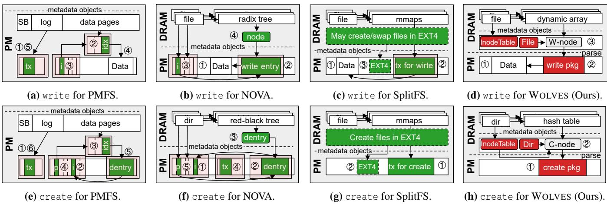  
Figure 1: Analysis of I/O ordering on write and create of existing PM file systems. i and p are inode and parent inode; tx is transaction. The light-red squares indicate disaggregated in-PM metadata I/Os. The circled numbers denote update orders. PMFS, SplitFS, and NOVA represent JFS, JFS with transactional checksum, and LFS. Our WOLVES (§5) writes metadata once with a single ordering point.

Summary. Table 1 summarizes existing crash consistency techniques, which suggests that these techniques incur multiple metadata I/Os and ordering points in critical paths.

## 3 Observations and Motivations

Nevertheless, unorchestrated I/Os and ordering points are essentially deficient in PM: (1) the coarse flush unit of persistent buffers (e.g., 256-byte XPLine [10]) mismatches with small metadata, and thus can introduce I/O amplifications; (2) ordering points lead to wait for previous I/O operations, reducing I/O parallelism. Thus, we ask: what exacts the toll on metadata I/Os in crash consistency processing for PM? To answer this, we make an in-depth analysis of three PM file systems.

## 3.1 Analyzing I/O Path of PM File Systems

We analyze PMFS and SplitFS for JFS and CK with additional writes, and NOVA for LFS without additional writes. We omit SSU as it is similar to LFS, and we report SquirrelFS in §6.11.

PMFS I/O path analysis. PMFS is a classic JFS in PM [22]. It reserves a log space at the start of the PM for journaling, and the remaining space is organized as a B-tree for storing inodes and data blocks. For write, as Figure 1a shows, ① PMFS wraps metadata updates as a transaction $\left( J _ { M } \right)$ , ② allocates blocks by traversing the B-tree and ③ updates the inode (M). Finally, ④ PMFS persists data (D) and ⑤ writes a commit entry to the log (JC). The create is similar to write but needs to create a new inode (see ② in Figure 1e). Note that PMFS changes the original JFS order to $J _ { M } \to M \to D \to J _ { C }$ but its metadata I/Os and ordering points remain the same.

<table><tr><td>Workload</td><td>Avg.fsize</td><td>R/W size</td><td>R:W</td><td>#.files</td></tr><tr><td>FIO-SW</td><td>32GiB</td><td>0KiB/4KiB</td><td>0:1</td><td>1</td></tr><tr><td>FIO-RW</td><td>32GiB 128KiB</td><td>0KiB/4KiB</td><td>0:1 1:2</td><td>1 10K</td></tr><tr><td>Fileserver</td><td></td><td>4KiB/4KiB</td><td>1:1</td><td></td></tr><tr><td>Varmail</td><td>32KiB</td><td>1MiB/16KiB</td><td></td><td>10K</td></tr><tr><td>Webserver Webproxy</td><td>64KiB 32KiB</td><td>1MiB/8KiB 1MiB/16KiB</td><td>10:1 5:1</td><td>1K 10K</td></tr></table>

Table 2: Characteristics of the evaluated six workloads. The first two FIO workloads perform write operations. The last four Filebench workloads perform various open/create/write/read/- close/delete/fsync file operations to emulate real-world scenarios.

NOVA I/O path analysis. NOVA [21] is the first LFS designed for PM. It associates each inode with a linked metadata log and leverages DRAM for fast indexing. For write, as Figure 1b shows, NOVA ① persists the data (D), ② appends a write entry to its inode log $( m _ { e } ) ,$ ③ updates the log tail in the inode (mt), ④ creates a DRAM node to index the entry. For multi-inode operations, such as create, NOVA introduces journals to protect the atomicity of affected log tails. As Figure 1f shows, create involves journal writes (④), inode updates (① and ⑤), and dentry appends (②). NOVA triggers GC whenever the log is full and needs to be extended.

SplitFS I/O path analysis. SplitFS is a user-space file system that utilizes transactional checksums for fast journaling [20]. It further accelerates data writes (D) via mmap provided by underlying EXT4, and EXT4 assists its metadata updates (M), as shown in Figures 1c (③) and 1g (②).

## 3.2 Analyzing Crash Consistency Overheads

Methodology. We break down the I/O path of PMFS, SplitFS, and NOVA (by inserting timing code around I/O operations) to learn the overheads. We run six widely-used single-threaded micro- and macro-benchmarks [21, 22] as listed in Table 2.

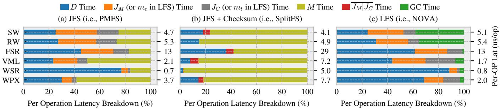  
Figure 2: The study of crash consistency techniques in PM. The right y-axis presents the average per-operation latency. Note that in RW and WSR, SplitFS does not write transactions (i.e., $\overline { { J _ { M } | J _ { C } } } = 0 )$ . SW and RW are FIO sequential/random 32 GiB write with 4 KiB per I/O and sync engine. FSR, VML, WSR, and WPX are short for Filebench workloads: fileserver, varmail, webserver, and webproxy. Note that NOVA’s GC is significant in FIO workloads as it triggers GC upon log extensions [21]; consequently, larger files trigger more frequent GC, incurring higher overhead. In comparison, in Filebench workloads where files are small, GC overhead remains low.

Observation. Figure 2 suggests that metadata I/O time for synchronous crash consistency can even exceed the data I/O time. Specifically, PMFS, SplitFS, and NOVA spend 22.9%– 76.5%, 63.8%–97.4%, and 11.3%–75.5% of the total I/O time on metadata in the six evaluated workloads. We find that these metadata overheads come from three main aspects:

• Random metadata I/Os lead to persistent buffer hit misses, which causes I/O amplifications. We study I/O amplifications of PMFS in the SW workload. Using ipmctl [46], we find that metadata I/Os of PMFS are increased from a theoretical ∼2.9 GiB (by calculating all issued metadata I/Os) to a measured ∼8.0 GiB, leading to 2.8× amplifications.

• Ordered metadata I/Os lead to waiting for previous data transfer and limit PM I/O concurrency. As Figure 2a and 2b show, PMFS spends 6.73%–49.2% metadata I/O time on transaction write and commit (steps ① and ⑤ in Figure 1a), while the overheads are reduced to 3.99%–6.27% in SplitFS with transactional checksum that eliminates ordering.

• Increasing metadata I/Os further exacerbate the overheads. For NOVA, the GC exacerbates metadata I/O numbers, causing an average of ∼13 metadata accesses per block I/O. This, as shown in Figure 2c, leads to ∼38.0% GC overheads. Meanwhile, metadata I/Os are increased from a theoretical ∼4.2 GiB to a measured ∼11.1 GiB (2.8×).

Significance. In a nutshell, many small, random, and ordered metadata I/Os lead to severe overheads. Consequently, in SW, existing PM file systems achieve less than 50% (not shown in the figure) of PM write bandwidth (∼2.26 GiB/s on our machine). This observation significantly challenges existing crash consistency techniques under the synchronous context.

## 3.3 Motivation

Intuitively, one solution to the above deficiency is to minimize metadata I/Os and ordering points for crash consistency.

Attempts. While many existing crash consistency designs attempt to achieve this goal, they ultimately fall short. Particularly, (1) transactional checksum achieves one $\overline { { J _ { M } | J _ { C } } }$ transaction write, but it fails to eliminate multiple, random, orderless metadata updates; (2) LFS successfully eliminates redundant journal writes via ordered log entry writes $( m _ { e } )$ and tail commit $\left( m _ { t } \right)$ . However, further attempts to eliminate GC are failed as LFS must use a copy-based GC to compact the layout; (3) although SSU does not have to trigger GC [25], it still suffers from small, random, and ordered metadata I/Os as existing file systems manage multiple metadata objects (e.g., inode) for file/directory abstractions, leading to significant I/O overheads (i.e., ∼30% degradation as shown in Figure 15 in §6.11).

Insight. We note that existing crash consistency techniques struggle to orchestrate and optimize I/Os across a range of metadata objects (e.g., inode, log entry/tail, etc.). This methodology, however, misaligns with the goal of minimal metadata I/Os and ordering points. Consequently, we are motivated to rethink file system metadata itself. Intuitively, by designing specific metadata for each file operation (similar to $J _ { M } )$ and attaching a checksum header to protect it (similar to $J _ { C } )$ , the file system can write the metadata (i.e., $m _ { o p } = \overline { { J _ { M } | J _ { C } } } )$ once with a single ordering point: $D \to { \overline { { J _ { M } | J _ { C } } } }$

Challenges. However, designing metadata for each operation is non-trivial, as reflected in four key questions: (1) How to practically design $m _ { o p }$ considering various Linux file operations [47, 48]? (2) How to manage $m _ { o p }$ to be compatible with traditional file/dir abstractions (e.g., inode)? (3) How to organize $m _ { o p }$ in PM efficiently? (4) How to recover from $m _ { o p }$ reliably? We answer these questions in the next Section.

## 4 Metadata Write-Once File System Model

Motivated by §3, we propose metadata write-once file system (WOFS). The key idea of WOFS is to generate specific, aggregated metadata for each file operation as a checksumprotected package (corresponding to the $m _ { o p }$ described in §3.3), and write the package once with a single ordering point.

## 4.1 Overview and Design Principles

The WOFS overview is shown in Figure 3, as described below.

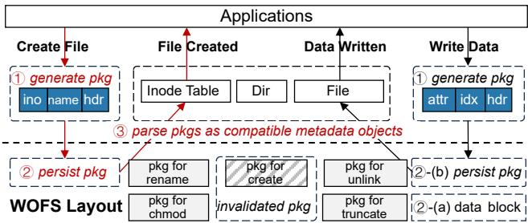  
Figure 3: WOFS overview. Each file operation corresponds to a package that contains necessary metadata fields, which can be written once. The packages are then parsed for file/dir abstractions.

Package overview. In WOFS, a generated package contains necessary fields (denoted as JM) for a file operation (e.g., name for create). Further, a header is reserved for each package as a commit flag (denoted as JC), which stores a magic number, a type for package type, a timestamp, and a CRC32 checksum3 for package write once (i.e., JM|JC), as shown in Listing 1.

Workflow overview. As illustrated in Figure 3, for metadata operations such as create, WOFS ① generates a package for create, ② writes it once using a PCOMMIT, i.e., JM|JC, and ③ parses it to organize inode, inode table, and directory hierarchy. Data operations (e.g., write) have a different I/O mechanism: WOFS first persists data (②-(a)) and then writes the package that references them (②-(b)), i.e., D → JM|JC.

Crash consistency overview. With packages and the metadata write-once scheme, WOFS can achieve fast and synchronous crash consistency with minimal metadata I/Os and ordering points. First, metadata operations involve only JM|JC; therefore, once a failure occurs, WOFS can detect incomplete packages by checking the checksum of JM and JC, and discard invalid ones during recovery. Second, data operations follow D → JM|JC; therefore, a crash before or during the JM|JC leads to an incomplete package, which can be discarded; meanwhile, as data blocks are not referenced by any valid package, they can be regarded as free space without consistency issues.

Design principles. The overall workflow and crash consistency principles of WOFS seem simple, but it requires further design considerations regarding packages, as guided below.

• Generate minimal packages. It is partially unnecessary to generate the specific package for each file operation as many operations share a similar semantic [47, 48]. Thus, WOFS aims to generate minimal packages that can represent or be combined to represent file operations (§4.2).

• Parse packages to provide compatible metadata objects. As packages upend the traditional file system metadata objects (e.g., inode), WOFS aims to provide compatible metadata objects for efficient file/directory abstractions (§4.3).

• Organize packages and data blocks in a non-log manner. WOFS aims to allocate packages/data blocks across PM rather than in a log manner to avoid copy-based GC (§4.4).

```c
hdr = pkg ->hdr;
hdr ->type = WRITE; hdr ->ts = current_time () ;
// fill other attributes inside pkg ...
hdr ->CRC32 = CRC32(pkg , pkg ->size); // checksum
// write package once with a single ordering point
PCOMMIT(pkg , pkg ->size); // clwb+sfence
```  
Listing 1: Package write once I/O scheme. WOFS uses the transactional checksum scheme [20, 42] to persist the package with a single ordering point (i.e., one PCOMMIT).

• Recover from packages after crashes efficiently. The nonlog layout complicates failure recovery as WOFS stores packages across the whole PM. WOFS aims to provide a coarse bitmap to quickly locate and check packages without frequent random I/Os to support fast recovery (§4.5).

## 4.2 WOFS Package Design

Considering 15+ file system operations in modern Linux [47, 48], it is partially unnecessary to generate the specific package for each file operation as many operations have similar semantics, which also increases complexity and reduces flexibility. Our goal is to abstract the most fundamental file operations, similar to CRUD operations in database [49].

Generate atomic package. We observe that file system operations can be categorized into CRUD: create (e.g., create), read (e.g., read, lstat), update (e.g., write, chown), and delete (e.g., rm). As read operations do not alter file system states, we omit read packages. For update operations, we find that they can be further divided into data (e.g., write) and metadata modification (e.g., chown). Therefore, we abstract the following four packages as the atomic package.

• Create pkg (256 bytes) for the operations that create new inodes, such as create and link. It contains 64 byte static file attributes, e.g., create time and inode number (ino). The next 128 bytes store the parent ino, the linked ino, and the name entry. The remaining 64 bytes store the attributes of the parent inode (e.g., link changes) and the package header.

• Write pkg (64 bytes) for the operations that allocate new data blocks, such as write and fallocate. It uses the extent [14, 21] to index the continuously allocated data blocks and records the time and size changes of the inode.

• Attr pkg (64 bytes) for the operations that change the attributes (e.g., mode, uid, etc.) of an inode.

• Unlink pkg (64 bytes) for the operations that reduce the link of an inode. It contains the changed attributes of both parent (e.g., time and size) and unlinked inode (e.g., link counts and the inode number that is to be unlinked).

Generate compound package with crash consistency. We use multiple atomic sub-packages to represent complex file operations, e.g., rename (=link+unlink). To ensure the crash consistency of compound packages, we reserve a forward-pointer in the package header to link sub-packages. We assign sub-packages an extra compound operation type to distinguish them from normal ones. For example, we assign the type CREATE|RENAME to the create pkg used in a rename operation. Consequently, WOFS can write sub-packages without ordering points, $i . e . , P _ { 1 } | P _ { 2 } | . . . | P _ { N }$ , where Pi is short for a sub-package $\mathrm { I } / \mathrm { O } ( i . e . , \overline { { J _ { M } | J _ { C } } } )$ and Pi points to $P _ { i + 1 }$

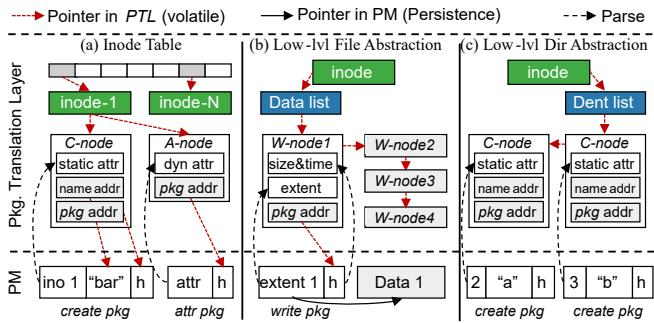  
Figure 4: Package translation layer. h is package header. PTL parses packages as pkg-nodes (e.g., C-node/A-node/W-node for the create/attr/write pkg) and organizes different pkg-nodes to provide compatible metadata objects for file/dir abstractions (§5.2).

We run rename as an example. rename can be regarded as first hard linking a new file to the old one and then unlinking the old one [37]; therefore, it can be represented using create pkg $( P _ { c r e a t e } )$ and unlink pkg $( P _ { u n l i n k } )$ . We now show that WOFS can safely issue $P _ { c r e a t e } | P _ { u n l i n k } ;$ If only $P _ { u n l i n k }$ is partially written, WOFS can detect the incompleteness by following the forward-pointer in $P _ { c r e a t e }$ and then discard rename. If only $P _ { c r e a t e }$ is partially written, WOFS detects the incompleteness by determining that there is a $P _ { u n l i n k }$ with rename type, but no $P _ { c r e a t e }$ pointing to it. Note that using a dual-pointer can simplify this reverse detection, but it would misalign the atomic packages from the 64-byte cache line, which is currently avoided in our design. Finally, if both of them are partially written, WOFS cannot detect valid sub-packages, which is equivalent to the case where rename has never happened.

## 4.3 Package Translation Layer

By aggregating metadata of an operation as a package, WOFS upends the traditional metadata objects (e.g., inode, dentry, etc.). Consequently, WOFS should parse packages to provide compatible file/directory abstractions. We introduce package translation layer (PTL) to achieve this goal. The basic management unit in PTL is pkg-node, which contains the parsed data from the package for fast access and the address of the package for reclamation (§4.4). These nodes are organized to form the compatible metadata objects, as shown in Figure 4.

• Inode table. To construct an inode, PTL combines the pkgnodes of create pkg and attr pkg to represent its static and variable attributes. PTL maps the inode number to the inode as the inode table for fast search. An inode manager is introduced to allocate/free the inode number.

• Low-level file abstraction. PTL is responsible for locating data blocks to provide low-level file abstraction. As Figure 4b shows, PTL associates a list of W-nodes for each regular file (i.e., data list), where the W-node contains the extent structure parsed from the write pkg. The upper file abstraction can reorganize these nodes for fast data access.

• Low-level directory abstraction. Similarly, PTL maintains a list of C-nodes (i.e., dent list) to locate the sub-inodes under a directory. These nodes are further organized by the upper directory abstraction to provide high search performance (e.g., using a hash table for name searching).

## 4.4 Non-log Layout and Package Reclamation

WOFS introduces a non-log layout that allocates blocks/packages across PM similar to malloc, which has two benefits: (1) allocate space anywhere to exploit PM fast I/O and erase-free nature [10]; (2) reclaim space via reusing (instead of heavy copy-based GC), which reasons invalidations by determining the causal-order of operations in the critical path, and reallocates invalidated space (similar to free), as follows.

• Create pkg. The deletion of a file (by writing an unlink pkg) invalidates its create pkg. After that, the space of create pkg recorded in the C-node (i.e., pkg addr) is marked as free and can be reallocated for new packages.

• Write pkg. Size change (e.g., truncate) leads to the invalidation of the write pkg and corresponding data blocks. Overwrite might also lead to invalidation but it depends on the implementation. For example, if the file system adopts Copy-on-Write (COW) for data atomicity, overwrite will invalidate the old write pkg accordingly (see details in §5.2).

• Attr pkg. Any attribute changes result in the persistence of a new attr pkg of the file, which leads to the invalidation of the old attr pkg that belongs to the same file.

• Unlink pkg. WOFS checks whether to invalidate an unlink pkg during the creation of a file. This is because the unlink pkg cannot be reclaimed until its pointing create pkg is reallocated and overwritten, or WOFS might find a stale but valid create pkg during the recovery. Specifically, WOFS maintains an order map in the PTL, which maps the address of create pkg to that of unlink pkg. Whenever a create pkg is durable, WOFS looks up its written address in the order map to reclaim the associated unlink pkg.

• Compound package cannot be reclaimed until all the atomic packages are invalidated. To track this, we extend PTL by generating each compound package a comp-pkg-node and adding a reverse mapping from the pkg-node to the comppkg-node to notify the reclaiming of the atomic packages.

## 4.5 Fast Recovery with Coarse Persistence

For recovery, WOFS requires locating packages to check consistency and rebuilding PTL to manage packages. However, it is non-trivial to quickly locate packages as they are distributed across the PM due to the non-log layout design. We thereby first explore package locating approaches.

Locate packages with dump-restore. A naïve approach is dump-restore (DR) [21]: WOFS dumps the addresses of packages in a bitmap (where each bit for a 64-byte slot, as packages are 64-byte aligned) at the unmount time. During recovery,

WOFS uses this bitmap to locate and parse the packages. However, this approach still causes a PM scan after the system crashes due to the failure to timely dump the bitmap. DR can be optimized (i.e., DR-OPT) by “tagging” unallocated blocks during format, allowing them to be skipped during recovery, but it cannot avoid scanning allocated data blocks.

Locate package with coarse persistence. We argue that a centralized structure is a must for fast locating, but its impact can be minimized. We propose Coarse Persistence (CP), which allocates a coarse pkg-group (e.g., 4 KiB) to hold multiple packages and timely persists the address of pkg-group into the bitmap once it is allocated (i.e., a bit for a group). Therefore, WOFS can scan the bitmap to locate the pkg-group, then probe to check valid packages, and finally rebuild PTL.

To ensure the crash consistency of CP, a straightforward approach is to insert an ordering point between bitmap update $( m _ { c p } )$ and the package I/O $( P = \overline { { J _ { M } | J _ { C } } } )$ , i.e., $D  m _ { c p }  P$ However, this ordering is unnecessary $( i . e . , P | m _ { c p } )$ . Particularly, (1) if $m _ { c p }$ is durable, P can be detected through the bitmap and checked for completeness; (2) Otherwise, P cannot be accessed through the bitmap and is simply discarded. This is safe as $m _ { c p }$ occurs only when a new pkg-group is allocated; therefore, discarding P is equivalent to handling a normal data operation crash as described in §4.1.

Recovery with coarse persistence. After locating packages using CP, WOFS fixes inconsistencies and re-parses packages to rebuild the PTL. To fix inconsistencies, WOFS must identify and reclaim stale packages. It does so by determining the causal order between packages, treating logically reclaimed packages as invalidated, e.g., a newer unlink pkg invalidates its corresponding older create pkg. Specifically, WOFS first detects successfully written packages using the magic number and checksum, then tracks their versions using timestamps in headers, and finally determines their causal order based on operation semantics (following rules similar to those in §4.4). Compound packages are checked and fixed using the forward-pointer mechanism, as described in §4.2.

Crash safety semantics. Consequently, WOFS’s crash safety guarantees that packages preserve the same causal order as before the crash, rather than their issue order. For example, assume Thread-1 writes a create pkg C1 for a file, followed by a write pkg $W _ { 1 }$ , and Thread-2 writes a write pkg W2 to another file. These writes are issued in the order $C _ { 1 } ( t _ { 1 } )$ , W2(t2), and $W _ { 1 } ( t _ { 3 } )$ , where $t _ { i }$ denotes the timestamp and $t _ { 1 } { < } t _ { 2 } { < } t _ { 3 }$ . A crash may leave $W _ { 2 }$ partially written but $C _ { 1 }$ and $W _ { 1 }$ fully written; in this case, WOFS treats $C _ { 1 } ( t _ { 1 } )$ and $W _ { 1 } ( t _ { 3 } )$ as valid to preserve the correct causal order. On the other hand, WOFS does not require $W _ { 2 } ( t _ { 2 } )$ for recovery since $W _ { 2 }$ has no causal dependency on $W _ { 1 }$ (i.e., they operate on different files).

## 5 WOFS Implementation

We built WOLVES as a WOFS prototype in Linux kernel 5.1.0 with 12,000+ lines of C code. We also introduce several

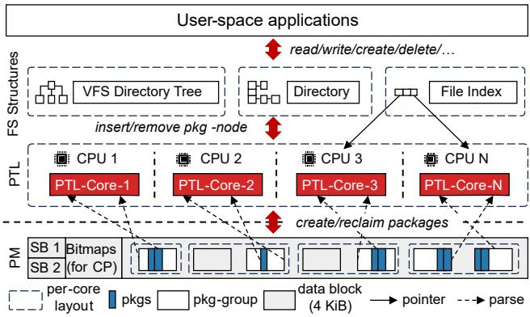  
Figure 5: WOLVES file system architecture. Packages are allocated within pkg-groups for fast recovery. WOLVES then writes packages with one PCOMMIT. PTL is then built to manage packages as traditional metadata objects for upper file/dir abstractions. To enable multi-core scalability, PTL is deployed in a per-core manner.

techniques to optimize I/O performance by leveraging Intel PM characteristics (e.g., XPLine size and memory interface).

## 5.1 Architecture and WOFS Properties

Data layout. As Figure 5 shows, WOLVES manages PM at a 4 KiB block granularity and reserves the first two blocks for superblock and its redundant copy. The subsequent few blocks are reserved for bitmaps that persist pkg-group addresses for fast recovery (§4.5). The rest of the space stores data blocks and packages. WOLVES allows only one type of package in a pkg-group to reduce bitmap size and simplify space management. Thus, WOLVES reserves $\frac { 4 } { ( 4 0 9 6 \times 8 ) } \approx 0 . 0 1 2 \%$ PM space for bitmaps, where $" 4 "$ denotes four types of atomic packages.

Space management. WOLVES adopts a two-level allocator (tl-allocator) for space allocation on each CPU, and each allocator manages a contiguous area R where $\begin{array} { r } { R = \frac { P M \ S i z e } { N u m O f C P U } } \end{array}$ Specifically, the allocator maintains a list of free data blocks in the current area using a red-black tree. If no blocks are available, WOLVES allocates space by consulting other core allocators in a round-robin manner. To reclaim a data block, since the allocated space never crosses allocator boundaries, WOLVES determines the corresponding allocator by simple address division, and reinserts the block number into it.

To allocate packages, tl-allocator first allocates a data block as the pkg-group and then allocates a package in the group. Specifically, tl-allocator tracks each allocated $p k g  – g r o u p$ with a memory node, which uses a small 64-bit bitmap to manage its space (i.e., 64=4096/64). The memory nodes are maintained in a mapping where the key is the address of the pkggroup, and the value is the node itself. To reclaim a package, tl-allocator first calculates the address of the pkg-group, then finds the tracked node according to the mapping, and clears the associated bits for further allocation.

PTL implementation and space reclamation. PTL builds the inode table as a global hash table with fine-grained perbucket locks for concurrency. It manages the data list and dent list in a per-CPU manner similar to tl-allocator, where each core maps inode numbers to the corresponding list for fast access. To manage pkg-nodes (in these lists) across different cores, high-level file system structures (e.g., file/directory) index pkg-nodes to produce a global file system view. These structures are protected by per-file locks (i.e., inode locks), ensuring concurrent consistency. The effects of written packages remain invisible until these high-level structures are atomically updated to reference the pkg-nodes via locking. Finally, PTL reclaims space by reasoning about operations along the critical path (§4.4). Note that the reclamation overheads are negligible as no extra PM I/O is required: PTL simply notifies the tl-allocator that the space is available for reuse.

Concurrency model. WOLVES follows the causal-ordering concurrency protocol [50] to align with WOFS’s crash safety semantics, meaning that the independent packages can be persisted in parallel even if they are ordered by timestamp (e.g., create two files under two different directories). For causally related packages, such as deleting a file after creating it, WOLVES serializes them for correctness. This is consistent with the virtual file system (VFS) framework.

## 5.2 Handling File System Operations

Directory abstraction and operations. Overall, the file system name hierarchy is based on VFS dentry-formed tree, so that WOLVES only maintains the parent-child name hierarchy: It deploys a 128-slot hash table for the directory inode to reorganize dent list based on name hashes. The table size is configurable to meet different demands. Given this organization, the operations for creating an inode, such as mkdir, can be achieved by writing a create pkg once using a PCOMMIT, generating a C-node in PTL, and updating the parent’s hash table. Deleting an inode can be similarly achieved by writing an unlink pkg and removing related memory objects. For inode deletion/creation, order map should be updated or checked to track and reclaim the invalidated unlink pkg; moreover, the create pkg should be reclaimed after inode deletion (§4.4).

File abstraction and operations. WOLVES adopts dynamic arrays [16, 51] for files to reorganize data list. Therefore, the read operation is simple: WOLVES calculates the array slot for the given offset and copies the data to the user buffer. We now introduce how WOLVES handles the write operations.

• Non-overlap write. Typically, a non-overlap write is done by writing data using non-temporal stores (i.e., movnti) to bypass CPU cache [11], writing a write pkg once, inserting a new W-node, and updating the dynamic array.

• Overlap write. WOLVES writes data in a COW manner [21]. After generating a new write pkg [c, d] and a W-node [c, d], the overlapped write pkg (pointed by W-node ranging [a, b]) is handled in three ways: (1) if $[ c , d ] \supset [ a , b ]$ , WOLVES reclaims the old write pkg and data blocks; (2) if $c < a , d <$ $) ( \mathrm { o r } c > a , d > b )$ , WOLVES reclaims the overlapped data blocks and modifies the old W-node to [d, b] (or [a, c]); (3) if $[ c , d ] \subset [ a , b ]$ , WOLVES modifies the old W-node to [a, c], and generates a new write pkg and W-node for [d, b].

<table><tr><td rowspan=1 colspan=1>Ops</td><td rowspan=1 colspan=1>Package ($4.2)</td><td rowspan=1 colspan=1>Implementation Details</td></tr><tr><td rowspan=1 colspan=1>create,mkdir,mknod</td><td rowspan=1 colspan=1>Create pkg</td><td rowspan=1 colspan=1>①Persist create pkg,②update inode map andparent&#x27;s hash table,③ check order map to deter-mine whether to reclaim an unlink pkg (§4.4).</td></tr><tr><td rowspan=1 colspan=1>read</td><td rowspan=1 colspan=1>None</td><td rowspan=1 colspan=1>① Search the fle index to obtain data addresses,② copy the data from PM to the user buffer.</td></tr><tr><td rowspan=1 colspan=1>write,fallocate</td><td rowspan=1 colspan=1>Write pkg</td><td rowspan=1 colspan=1>①Persist write pkg,②update data list and fileindex,③ reclaim overwritten write pkg (§4.4)</td></tr><tr><td rowspan=1 colspan=1>unlink,rmdir,rm</td><td rowspan=1 colspan=1>Unlink pkg</td><td rowspan=1 colspan=1>①Persist unlink pkg,②unlink C-node from thehash table and dentry list and free A-node,③update inode map and order map (§4.4).</td></tr><tr><td rowspan=1 colspan=1>link</td><td rowspan=1 colspan=1>Create pkg</td><td rowspan=1 colspan=1>Similarto create,butchangesthelinked inodeof the name entry to the linked one (§4.2).</td></tr><tr><td rowspan=1 colspan=1>chmod,chown,truncate</td><td rowspan=1 colspan=1>Attr pkg</td><td rowspan=1 colspan=1>①Persist attr pkg,② replace the newly gener-ated A-node for the inode,③ reclaim the old attrpkg associated with the file (§4.4).</td></tr><tr><td rowspan=1 colspan=1>rename</td><td rowspan=1 colspan=1>Create+Unlink</td><td rowspan=1 colspan=1>Reuse link and unlink operations with preal-located create+unlink pkg.Assigna forward-pointer from createpkg to unlink pkg.</td></tr><tr><td rowspan=1 colspan=1>symlink</td><td rowspan=1 colspan=1>Create+Write</td><td rowspan=1 colspan=1>Reuse create and write operationswith pre-allocated create+writepkg.Assign a forward-pointer from create pkg to write pkg.</td></tr></table>

Table 3: Implementation of 15 typical file system operations. This table shows the four atomic package abstractions are fairly enough for most of the file operations.

• Append write. For an append-like operation (i.e., offset = size), instead of creating a write pkg, WOLVES appends the new data to the blocks that are already allocated to the file, and writes the changed file size in an 8-byte atomic reserved field of the write pkg header without recalculating the CRC32. To verify the validity of a write pkg, WOLVES first assigns zero to the reserved field and then checks CRC32.

Other operations. The implementations of 15 typical file system operations with packages are shown in Table 3. Other operations, such as cp, are omitted as they are handled by VFS once WOLVES has implemented the above operations. Note that the implementation of these file operations may vary. For example, if a file system needs to maintain timestamps for read, it can simply write an attr pkg to update the timestamps.

## 5.3 Recovery

Atomic package recovery. For atomic packages, WOLVES reasons their causal ordering to fix inconsistencies and rebuild PTL: It first scans the create bitmap to locate create pkg to rebuild the inode table and then the unlink bitmap to reclaim the invalidated inode. Dent list is rebuilt along with the inode table by parsing the name entry in the create pkg. Next, WOLVES scans the write bitmap to recover data lists. When constructing data lists, the overlaps of write pkgs are reasoned based on their timestamp, and W-nodes are updated accordingly. Finally, WOLVES scans the attr bitmap to update the attributes of the inode and reclaims the truncated data.

Compound package recovery. For the compound packages, WOLVES verifies integrity by checking the forward-pointers:

the compound package is valid unless all the linked packages are valid. This verification is integrated into the package scanning process. As an example, we consider the rename operation, which combines create and unlink pkgs. For brevity, we denote the create and unlink pkgs as $P _ { c | r }$ and $P _ { u | r } ,$ respectively. The recovery of rename proceeds in two phases.

First, validate the first package during the create bitmap scan. If a $P _ { c | r }$ is found, follows its forward-pointer. If it points to a valid $P _ { u | r } ,$ , the rename operation is successful, and a mapping from $P _ { u | r }$ to $P _ { c | r }$ is inserted into a temporary hash table. In this case, $P _ { c | r }$ is treated like a normal create pkg. Otherwise, the pointed package is invalid $( e . g .$ , broken checksum) or is not a $P _ { u | r }$ , the pointer is deemed stale, and the $P _ { c | r }$ is discarded. This is safe since a compound package can be reclaimed only if all its components are reclaimed. Second, validate the second package during the unlink bitmap scan. If a $P _ { u | r }$ is found but no $P _ { c | r }$ points to it (by checking the hash table), it is reclaimed. Otherwise, it is processed normally.

A similar process applies to other compound packages, though it is integrated into different package scanning phases. For example, the symlink operation requires first verifying the create pkg (i.e., create pkg scanning), followed by the write pkg (i.e., write pkg scanning), to ensure integrity.

Allocator recovery. During package scanning, WOLVES recovers the allocators by marking all space as free, then restoring the allocated space for valid packages and data blocks.

## 5.4 Other Optimizations

Huge allocation (HA). WOLVES allocates 2 MiB huge blocks for append-like writes. Hence, smaller writes (e.g., KV) can be appended to the huge block by updating existing write pkg (see §5.2), which reduces PM buffer pollution by increasing buffer hits. If huge blocks are not available, WOLVES allocates as many contiguous blocks as possible.

Read ahead (RA). For read, WOLVES can prefetch the to-beread data in an XPLine (i.e., 256 bytes) stride for acceleration. Specifically, to read size data at offset, WOLVES first issues a number of size/256 prefetcht0 from offset with a 256- byte stride; then, it copies the data to the user buffer. This enables copy I/O to be overlapped with the prefetching I/O.

## 6 Evaluation

We design experiments on WOLVES (i.e., our WOFS implementation) to answer the following questions:

• Can WOLVES achieve robust crash consistency?

• Can WOLVES fully release the I/O performance of the PM and achieve optimal metadata operation performance?

• How does WOLVES perform under the aged scenarios?

• How expensive are WOLVES recovery procedures, memory overheads, and storage space consumption?

• How does WOLVES compare to (synchronous) soft update?

• Does the WOFS/WOLVES design generalize to future platforms beyond Intel PM (e.g., Memory-Semantic SSD [3])?

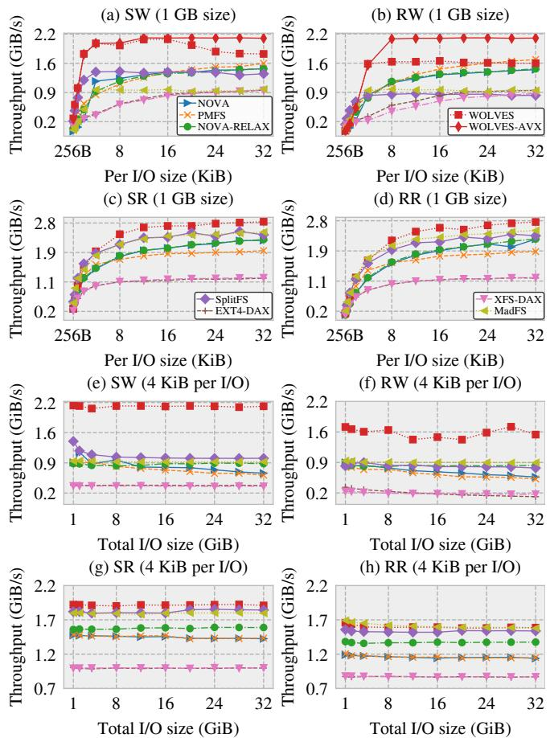  
Figure 6: I/O performance comparison under different I/O patterns. Sub-figures (a)–(d) study the I/O throughput varying per I/O size when populating a 1 GiB file. Sub-figures (e)–(h) study the I/O scalability under different file sizes with per I/O size 4KiB.

## 6.1 Experimental Setup

Testbed. The experiments are conducted on a server with a 16-core Intel Xeon Gold 5218 CPU, 128 GiB DRAM, and 2×256 GiB Intel Optane PM configured in non-interleaved mode4, running atop Linux Kernel 5.1.0 [52].

Competitors. We compare seven PM file systems that apply different synchronous crash consistency techniques: PMFS, NOVA, NOVA-RELAX (NOVA w/o data atomicity), SplitFS, MadFS, EXT4-DAX, and XFS-DAX. PMFS is equipped with a huge-page-aware technique from WineFS [18] to resist file system aging. SplitFS is configured in POSIX mode for the highest performance. MadFS [28] is a recent userspace PM LFS built atop EXT4-DAX. The last two file systems are production-ready and mounted in ordered mode. We also compare WOLVES with soft update file systems in §6.11, including (asynchronous) SoupFS [53], (asynchronous) HUNTER [51], and (synchronous) SquirrelFS [25]. Note that despite our best efforts, we only successfully run MadFS in FIO, single-threaded Filebench, and several FxMark workloads, using their provided configurations.

<table><tr><td rowspan=1 colspan=1>%ile (us/op)</td><td rowspan=1 colspan=1>WOLVES</td><td rowspan=1 colspan=1>NOVA</td><td rowspan=1 colspan=1>PMFS</td><td rowspan=1 colspan=1>SplitFS</td><td rowspan=1 colspan=1>MadFS</td></tr><tr><td rowspan=4 colspan=1>90%99%99.9%99.99%</td><td rowspan=1 colspan=1>2.21</td><td rowspan=1 colspan=1>5.22</td><td rowspan=1 colspan=1>5.00</td><td rowspan=1 colspan=1>1.76</td><td rowspan=1 colspan=1>1.70</td></tr><tr><td rowspan=2 colspan=1>3.1612.84</td><td rowspan=1 colspan=1>7.12</td><td rowspan=1 colspan=1>6.00</td><td rowspan=1 colspan=1>4.24</td><td rowspan=2 colspan=1>4.081095.00</td></tr><tr><td rowspan=1 colspan=1>19.38</td><td rowspan=1 colspan=1>21.00</td><td rowspan=1 colspan=1>951.09</td></tr><tr><td rowspan=1 colspan=1>18.92</td><td rowspan=1 colspan=1>23.27</td><td rowspan=1 colspan=1>329.4</td><td rowspan=1 colspan=1>1125.58</td><td rowspan=1 colspan=1>1302.53</td></tr></table>

Table 4: Tail latency comparison. The table is measured under the single-threaded 32 GiB SW workload with 4 KiB per I/O.

Methodology. We ran each test at least five times and reported the average value. The standard deviation was less than 5%, suggesting the experiments are repeatable.

## 6.2 Crash Consistency

We have used a formal logical model [37,54,55] to prove that WOLVES can provide robust crash consistency. The proof is attached to the Appendix A. In this subsection, we measure if WOLVES recovers correctly against crashes via three steps: (1) run workloads for specific I/O patterns, (2) trace I/Os and reorder them, and (3) create images with random crash points and remount WOLVES. We manually trace PM I/Os at the instruction level, including store+clwb, movnti, and sfence; traces are written to a file for reordering (between sfences) and replaying (until a random crash point).

Exhaustive crash consistency verification is practically infeasible due to the infinite space of workloads. Thus, we adopt three representative workloads, following OptFS [15] and BarrierFS [13], to show that WOLVES can recover from common random crash scenarios: an append workload that keeps appending 4 KiB data to a file, create\_delete that creates then deletes 10 files, and rename\_root\_to\_sub that creates and renames (mv) a file to a sub-dir. These workloads cover most I/O patterns in WOLVES: $D  P | ( m _ { c p } ) , P | ( m _ { c p } )$ and $P _ { u n l i n k } | P _ { c r e a t e }$ . To see if WOLVES recovers to the latest consistent state, we create checkpoint for every file operation and compare the recovered system with the latest checkpoint. For each workload, we test 1000 random crash points. The results show that WOLVES consistently recovers to the latest consistent state prior to the crash, suggesting that it can correctly handle most common crash scenarios.

## 6.3 I/O Performance

We leverage FIO [56] to study WOLVES I/O characteristics.

I/O patterns. As Figures 6a–6d show, all file systems ramp up throughput with the per I/O size increases until the PM buffer is exhausted [10, 57]. For SW/RW, WOLVES shows significant benefits when the per I/O size is less than 16 KiB since it writes package once, but collapses afterward due to the deficiency of movnti, making data I/O dominated [23]. We address this by integrating vmovntdq into kernel (i.e., WOLVES-AVX), and the throughput scales to PM bandwidth limits with the increasing I/O size. In SR/RR, WOLVES demonstrates the read performance of a kernel file system can even exceed that of user-space SplitFS thanks to the read-ahead (RA) technique. Notably, without RA (not shown in the figure), WOLVES has a similar read performance to other PM kernel file systems due to their similar read code paths.

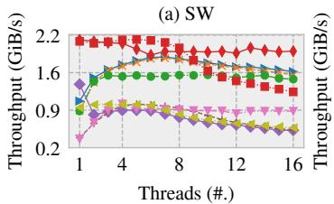

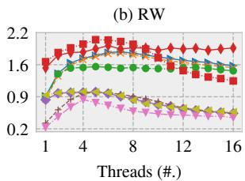

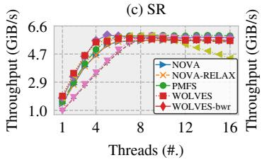

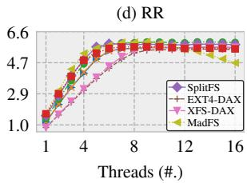

Figure 7: Concurrency performance comparison. The experiment compares the 4 KiB per I/O write throughput of different PM file systems under 1–16 threads. Each thread populates a distinct 1 GiB file under the same directory.  
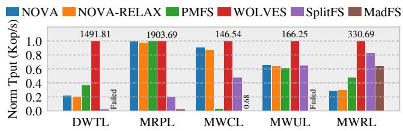  
Figure 8: FxMark evaluation. DWTL reduces the file size by 4 KiB; MRPL opens a file in five-depth dirs; MWCL creates an empty file; MWUL unlinks an empty file, and MWRL renames a file.

File size scalability. As Figures 6e and 6f show, in the SW workload, the write throughput of WOLVES stabilizes at 2.20– 2.24 GiB/s, achieving 97.3%–99.1% of the throughput of raw PM [2]. WOLVES fails to achieve similar performance in RW as RW cannot benefit from the huge allocation (HA), but it still achieves 1.65–9.44× throughput compared to others due to the minimized metadata I/Os and ordering points for the metadata write-once scheme.

Tail latency. As Table 4 shows, WOLVES achieves the lowest tail latency compared to NOVA and PMFS, but SplitFS and MadFS outperform WOLVES before the 99.0 percentile since they persist data in the user space. However, SplitFS and MadFS suffer severe tail latency afterward due to their occasional kernel metadata access, which becomes bottlenecks.

Concurrency. As shown in Figure 7, WOLVES outperforms competitors in 1–8 threads. Nevertheless, WOLVES suffers performance degradation when thread numbers ≥ 9. The observation is consistent with prior reports that PM has limited concurrency due to its hardware contentions [11,16,17,51,57]. To address this, we sample the I/O latency and insert delay when the I/O latency > 3000 ns to alleviate the contention (i.e., WOLVES-bwr). Consequently, WOLVES can scale to PM bandwidth limits with the increasing thread numbers.

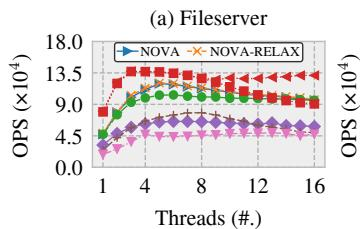

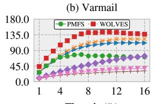

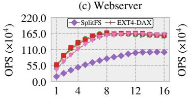

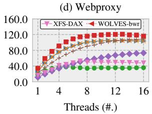

Figure 9: Filebench evaluation. Each workload runs for 60 seconds under 1–16 threads. Operations per second (OPS) is reported.  
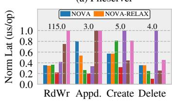

(b) Varmail  
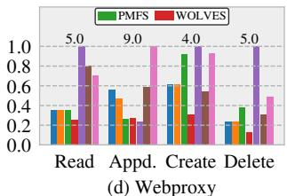

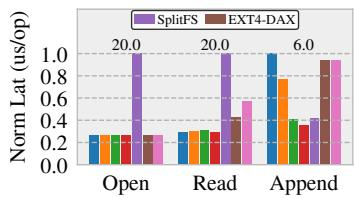

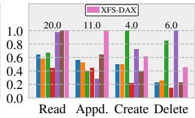  
Figure 10: Filebench operation latency breakdown. We report single-threaded performance breakdown. The numbers above the bars show WOLVES latency. Note that the open latency is similar under four workloads, and thus we only report it under Webserver.

## 6.4 Metadata Operation Performance

We study metadata operations using FxMark [58] under a single thread. For the concurrent metadata operations, VFS’ locking scheme limits the parallelism [16,35], and optimizing its locking is beyond the scope of this paper. Figure 8 shows that WOLVES achieves the highest throughput for most metadata operations thanks to the metadata (i.e., package) writeonce scheme. In the MRPL workload, all the evaluated file systems, except for SplitFS and MadFS, show similar throughput since they rely on VFS directory traversing. SplitFS and MadFS, however, suffer from their own traversing and inkernel traversing, thereby reducing the overall throughput.

## 6.5 Macrobenchmarks

We evaluate four workloads in Filebench [59] (see Table 2). As Figure 9 shows, WOLVES achieves the highest throughput under both write- and read-intensive workloads. In Fileserver, WOLVES can alleviate I/O contention by regulating bandwidth (i.e., WOLVES-bwr). Figure 10 studies the latency breakdown of critical file operations. WOLVES achieves the lowest latency when performing file creation/deletion due to its metadata write-once scheme. We observe that PMFS has a similar append performance as WOLVES because PMFS uses a similar append approach. SplitFS, however, suffers severe metadata overheads due to its in-kernel metadata operations.

<table><tr><td>Workload</td><td>MadFS</td><td>WOLVES</td><td>Speedup</td></tr><tr><td>Fileserver</td><td>5.57 Kops/s</td><td>80.4 Kops/s</td><td>14.4×</td></tr><tr><td>Varmail</td><td>7.13 Kops/s</td><td>438 Kops/s</td><td>61.4×</td></tr><tr><td>Webserver</td><td>63.6 Kops/s</td><td>581 Kops/s</td><td>9.14×</td></tr><tr><td>Webproxy</td><td>9.6 Kops/s</td><td>344 Kops/s</td><td>35.8×</td></tr><tr><td></td><td></td><td></td><td></td></tr></table>

Table 5: Filebench comparison with MadFS. Here, we report single-threaded Filebench performance for MadFS.

We also compare WOLVES with MadFS in Table 5 and find that MadFS suffers extremely low throughput due to its heavy metadata overheads, which is consistent with FxMark results.

## 6.6 Performance Breakdown

I/O breakdown. Comparing Figure 11 with Figure 2, WOL-VES reduces latency by 5%–86% compared to NOVA, SplitFS, and PMFS. Furthermore, CP overhead is less than 0.5%. Notably, in SW, WOLVES reduces data time by 42.2%; the reason is that the metadata write-once and HA reduce XPBuffer pollution; as a result, even the metadata time accounts for nearly 40%, it can achieve more than 97% of PM bandwidth. Using ipmctl, we confirm that WOLVES reduces per-operation metadata I/O by 70%–17.3× compared to PMFS and NOVA.

Technique breakdown. Figure 12 studies how the metadata write-once (WO), huge allocation (HA), and read ahead (RA) contribute to WOLVES. First, the metadata write-once scheme improves 1.01–1.66× and 72%–1.30× throughput under SW and RW compared to other PM file systems, which is the main source of performance improvement. We observe that sometimes WOLVES can reach 2.01 GiB/s under SW, primarily because the CPU has the potential to reorder movntis (for data I/O, §5.2) to improve I/O parallelisms and reduce PM contention. Second, HA further improves throughput by 20.2% for SW, but it is less effective for RW due to the lack of sequential I/O patterns in RW. Finally, RA can improve SR and RR by 22%–27% due to the improved read parallelism.

## 6.7 Real-world Applications

LevelDB. Figure 13a shows the performance of different PM file systems on LevelDB using YCSB workloads (driven by built-in db\_bench) [20]. WOLVES achieves the most significant improvement under write-intensive workloads (Load A, E, and Run A). On the read-intensive workloads, WOLVES’s throughput is still higher than others, thanks to the RA.

RocksDB. Figure 13b runs RocksDB [23] (1M key-value pairs), which is configured with no preallocate. Despite our best efforts, we fail to run SplitFS [20] on RocksDB. WOLVES has 1.26–6.73×, 1.36–5.21×, 1.26–3.93×, and 1.20–4.46× the throughput of other PM file systems for the Sequential Fill, Random Fill, Random Append, and Random Update.

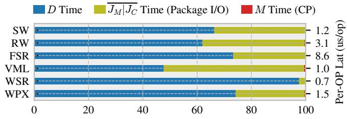  
Per Operation Latency Breakdown (%)

Figure 11: WOLVES I/O breakdown. SW and RW are both 32 GiB with 4 KiB per I/O. FSR, VML, WSR, and WPX are short for fileserver, varmail, webserver, and webproxy running for 60 seconds.  
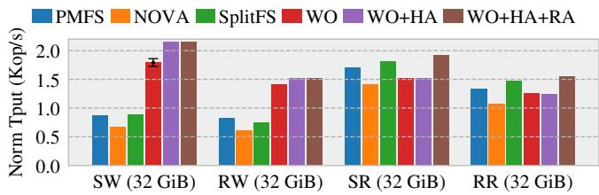  
Figure 12: WOLVES techniques breakdown. We show the single-threaded I/O performance with 4 KiB per I/O. WO denotes WOLVES without HA and RA. WO+HA+RA is the final WOLVES.

## 6.8 Aging and Fragmentation

During frequent file creations/deletions (i.e., aging), WOLVES incurs data/package fragmentation. To retrieve WOLVES aging performance, we use Geriatrix and widely cited Agrawal profile [60] to age WOLVES at 80% PM utilization until convergence in relative age distribution [61]. Following aging process, we stress SW and RW on WOLVES.

Figure 14a suggests that under the SW, (1) WOLVES has an unstable throughput 1.85–1.95 GiB/s due to fragmentation; (2) the performance degradation is minor as ∼50% of the Agrawal profile’s files are ≥8 KiB, and their deletions free up many contiguous space (e.g., more than 50% free contiguous block numbers are in [19,384]), which is then leveraged by HA to alleviate fragmented package writes. To show an extreme case, we set all files in the Agrawal profile to 4 KiB, resulting in an extremely fragmented space (e.g., all available contiguous block numbers ≤8). However, even under this profile, WOLVES still outperforms NOVA and PMFS, and obtains 1.70–1.82 GiB/s throughput thanks to its metadata write-once scheme. Figure 14b shows that under the RW, WOLVES throughput is 1.31–1.44 GiB/s. Here, the performance degradation mainly comes from the fragmented packages as WOLVES has no HA optimization for RW.

In summary, though performance degradation occurs during aging, WOLVES still outperforms other PM file systems. Note that WOLVES does not apply any defragmentation techniques currently, which we plan to explore as a future work.

<table><tr><td>Category</td><td>Workload</td><td>NOVA</td><td>DR</td><td>DR-OPT</td><td>WOLVES</td></tr><tr><td>Large file</td><td>FIO-32G</td><td>24.2 s</td><td>70.1 s</td><td>60.4s</td><td>2.61 s</td></tr><tr><td>Write intensive</td><td>Fileserver</td><td>2.48 s</td><td>71.9s</td><td>45.8 s</td><td>3.99 s</td></tr><tr><td>Read intensive</td><td>Webserver</td><td>2.52 s</td><td>70.5 s</td><td>43.1 s</td><td>2.75 s</td></tr></table>

Table 6: Failure recovery time. DR dumps package addresses into bitmaps when unmount; DR-OPT tags unallocated blocks during format and skips scanning them when recovery. Note that (writeintensive) Varmail and (read-intensive) Webproxy have similar results to Fileserver and Webserver, thus we omit them in the table.

## 6.9 Recovery Overhead

Common scenarios. Table 6 compares the failure recovery time of NOVA, DR, DR-OPT, and WOLVES under three representative evaluated workloads. Thanks to CP (§4.5), WOLVES can only scan bitmaps and pkg-groups, thus achieving a failure recovery time comparable to that of NOVA. Note that the extremely slow recovery of NOVA under FIG-32G is due to its engineering deficiency: For files larger than 1 GiB, NOVA must scan its inode-log multiple times, as it can only replay entries for 1 GiB of data per pass.

Worst scenario. We build a worst-case workload to show that WOLVES can recover quickly thanks to the metadataonly scanning: We assume the file system is fully populated with non-empty files (i.e., PM is fully occupied). Each file is written with a single data block, modified via chown, and eventually deleted. This process generates for each PM data block one 256-byte create pkg, one 64-byte write pkg, one 64-byte attr pkg, and one 64-byte unlink pkg, leading to the highest metadata (packages) scanning overhead. Even in this case, WOLVES scans only around (256+64+64+64)/4096=10.9% of the total 256 GiB PM space with ∼60 million files (which is similar to NOVA), and the overall recovery time for WOLVES is ∼21.6 seconds. We believe that this overhead is acceptable as it remains faster than the traditional fsck for SSD file systems, which can take more than 2 miniutes for 60 million files [62–64], thanks to PM’s high read bandwidth (∼2 GiB/s).

## 6.10 Resource Consumption

Memory overhead. We measure memory usage by hooking in-kernel memory allocation. In Fileserver and Varmail, WOLVES and NOVA achieve comparable memory consumption: WOLVES uses ∼8.93 MiB and ∼10.82 MiB memory, while NOVA uses 10.48 MiB and 8.31 MiB memory. Unlike NOVA, which consumes no memory for closed files, WOLVES maintains 3.8 MiB–5.12 MiB of memory for PTL even when all files are closed. This modest memory overhead (i.e., around 0.3%–1.6% of the workload’s size) enables significant performance benefits, with WOLVES achieving 68% and 65% higher throughput in Fileserver and Varmail, respectively.

Space overhead. Adding headers for packages incurs extra space overheads, but we argue that it is acceptable: conducting a total of 128 GiB 4 KiB I/Os requires (1K+1)–(512K+1) pkggroups for one create pkg plus 64K–32M write pkg (with or w/o HA), leading to 0.0015%–0.7% space in a 256 GiB PM.

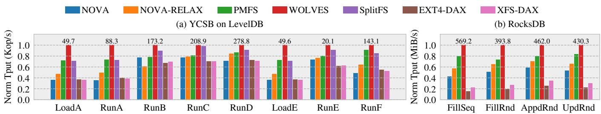

Figure 13: Real-world application performance comparison. We measure the performance using the application’s built-in db\_bench tool. The numbers above the bars indicate the absolute throughput of WOLVES.  
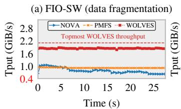

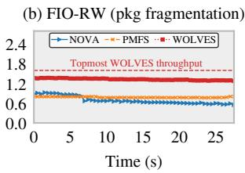  
Figure 14: Aging/Fragmentation performance. We measure the single-threaded sequential/random write throughput with 4 KiB per I/O under the Agrawal-profile-aged file system.

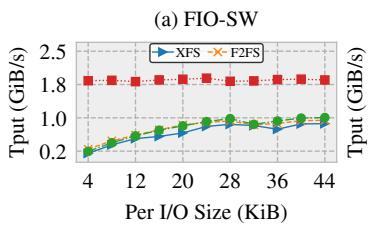

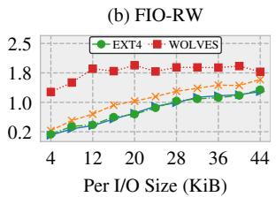  
Figure 16: Performance comparison in MS-SSD. We measure sequential/random write throughput in a single thread. The maximal write throughput of MS-SSD is ∼1900 MiB/s.

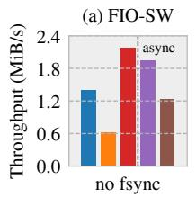

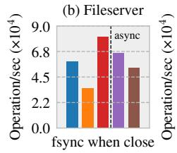

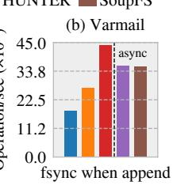  
Figure 15: Comparison with (synchronous) soft update. We hack HUNTER to support ordered synchronous soft update (i.e., HUNTER-SSU). SquirrelFS is written in Rust to support compiletime consistency check, and is measured under Linux kernel 6.3.0.

## 6.11 Case Study: Beyond (Sync.) Soft Update

We use workloads with no/heavy/real-fsync to show that WOFS crash consistency outperforms SSU and even asynchronous soft update (ASU): (1) Figure 15a shows that ASU can outperform most of SSU, but WOLVES outperforms ASU as the former minimizes metadata I/Os while the latter periodically flushes metadata orderly, interfering with foreground I/Os. (2) By modifying FIO to issue fsync for every system call, we emulate the I/O behavior in RocksDB. The results (not shown) suggest that SSU has no performance degradation, while HUNTER drops to 762 MiB/s due to synchronization and I/O overheads. (3) Figures 15b and 15c show that WOLVES outperforms ASU by 21%–52% in workloads with occasional fsync, while other SSU suffers severe overheads due to many small, random, and ordered metadata I/Os.

## 6.12 Case Study: Memory-Semantic SSD

In this subsection, we show the generality of WOFS/WOLVES on Samsung Memory Semantic (MS) SSD [3], which is an emerging commercial PM backed by SSD. To simulate MS-SSD, we use io\_uring [65] (with 128 depths) to emulate the byte-addressable interface, which allows the host to issue I/O to the io\_uring buffers using loads/stores. The buffer is protected by a Castle UPS [66] and regarded as persistent buffers. The backend is a 1.6 TB Intel DC P4610 Series SSD; the issued I/Os are digested to SSD in a 4 KiB I/O unit through background threads (using O\_DIRECT). Under this platform, the maximal write throughput is around 1900 MiB/s.

We add several lines of code to emulate a PM-like interface, and thus porting WOLVES to the MS-SSD platform is trivial. We compare the write throughput of WOLVES with XFS, EXT4 and F2FS using FIO. For fairness, they are all configured to use direct-I/O and io\_uring engine without fsync calls. Unsurprisingly, Figure 16 verifies similar results as in the Intel PM platform that WOLVES can achieve the highest write throughput thanks to the metadata write-once scheme.

## 7 Discussions and Future Work

Why do prior file systems manage metadata separately? Separating file system metadata with different responsibilities, such as inode, bitmap, and dentry, inherits the old wisdom of file system designs [67,68]. Modern LFS, F2FS [45], also employs multiple tables (e.g., SIT and NAT) to manage metadata objects. Such design enables simplified crash consistency, easy/clear file abstraction, and avoidance of the wandering tree in flash memories [45]. However, it meets limitations for exploiting fast synchronous PM I/Os.

Distinguishing from LFS. The key novelty of WOFS lies in generating the specific, aggregated package for each file operation, which is different from the scattered metadata produced by modern LFSes, such as NOVA [21] and F2FS [45]. This write-once scheme minimizes metadata I/Os, resulting in a considerable improvement over LFS competitors. Moreover, WOFS’s non-log layout and immediate package reclamation also distinguish it from LFS. These designs facilitate PM’s relatively good random I/O (compared to HDDs/SSDs) and avoid significant GC overhead typically associated with LFS.

Shall WOFS eliminate data ordering? It is charming to eliminate data ordering via data checksum [15] (i.e., D|JM|JC). However, we find that data checksums, which cause user-tokernel memory copies and computation overheads on large content, outweigh the benefits of eliminating ordering in fast PM. Specifically, we find that using CRC32 and faster xxHash [57,69] as data checksum inversely adds ∼40.1% and ∼32.3% overheads in the write path. Moreover, WOFS can already reach the PM bandwidth limit without data checksum. Hence, we leave exploring data checksums for future work.

Shall WOFS use checkpoint to accelerate recovery? Periodically checkpointing the PTL can alleviate package scan/rebuild overhead. However, we do not intend to use it for three reasons. First, checkpointing interferes with foreground PM I/Os, thereby degrading file system throughput [70], which we aim to avoid. Second, package/metadata occupy a small portion of storage, and scanning them is fast as no data block involved [21]. Finally, PM enables a much faster scanning performance than SSDs/HDDs, and reconstructing PTL is also fast as it merely manipulates DRAM. As a result, WOFS can recover in less than 30 seconds even in the worst scenario (§6.9). We do acknowledge the opportunity to checkpoint the PTL during system idle time, which we leave for future work.

Can memory overheads in WOFS be reduced? If memory overhead for PTL maintenance is a concern (e.g., for memorysensitive scenarios), it is feasible to use a PM-DRAM hybrid approach for PTL to reduce memory overheads while retaining performance, since PTL does not require flush/fence for ordering and durability. Specifically, we allocate 25%, 50%, 75%, and 100% of PTL metadata directly from PM and find that the performance degradation is negligible in SW, while only 3.1%, 6.3%, 8.8%, and 12.5% degradation in RW.

Performance considerations for compound packages. Currently, even the most complex operation [21], such as rename, involves only two packages, and the overhead of writing them concurrently with the forward-pointer is comparable to that of writing a single package. Figure 8 also shows that WOLVES’s rename operation significantly outperforms existing PM file systems. Besides, such operations are infrequent. Particularly, rename operations account for ∼1%–10% of operations in many realistic/synthetic workloads [71, 72].

## 8 Related Work

Optimizing ordering points. NOFS leverages back-pointers to eliminate the order between metadata and data [37]. OptFS introduces data checksum to eliminate the ordering between data and transactions for slow HDD [15]. BarrierFS redesigns the block I/O stack to enforce I/O order through multi-layer collaboration without waiting for persistence [13]. Hardware Transactional Memory (HTM) is an attractive hardware technique to eliminate software ordering. However, HTM-based crash consistency is currently only applicable on the eADR platform [24], which limits its usage. In contrast, our WOFS redesigns metadata as packages to minimize metadata I/Os and ordering points for fast synchronous crash consistency.

Metadata-optimized file systems. BPFS [73] novelly employs shadow paging that uses a COW scheme for metadata updates, but it leads to cascade of updates, which can be even more costly than JFS [21]. TableFS [74] and BetrFS [75] deploy write-optimized indexes to defer and batch small metadata writes [76]. Several works aim to use supercapacitors to protect asynchronous metadata I/Os, but these devices are not widely available [27, 77]. In contrast, WOFS generates specific metadata for a file operation as one compact package to minimize metadata overheads without trading off durability.

Data-optimized file systems. OdinFS [17] and ArckFS [16] are two PM file systems designed to stripe data across multiple nodes to avoid single PM contention. However, these works follow traditional crash consistency mechanisms, leading to unorchestrated metadata I/Os. As a result, ArckFS (which even updates metadata in the user space) achieves only around 1400 MiB/s throughput under the single-threaded SW in our machine. We believe that these works are complementary to WOFS for machines with multiple nodes and PM arrays.

## 9 Conclusion

We introduce WOFS, a new file system model for fast and synchronous crash consistency. WOFS generates and manages specific metadata for a file operation as a checksum-protected package, and writes it once with a single ordering point. Experiments driven by various benchmarks and applications show that WOLVES, a WOFS prototype, outperforms existing file systems on PM platforms (e.g., both Intel PM and MS-SSD), and can potentially reach PM bandwidth limits. The source code and test scripts are publicly available at https://github.com/WOFS-for-PM/.

## Acknowledgment

We sincerely thank our shepherd, Jon Howell, and the anonymous reviewers in OSDI for their constructive comments and insightful suggestions. This research was partly supported by the National Key R&D Program of China under Grant 2023YFB4502900, National Natural Science Foundation of China under Grant 62472127, Shenzhen Science and Technology Program under Grants RCYX20210609104510007, GXWD20231128111309001 and KJZD20230923114610021, and GuangDong Basic and Applied Basic Research Foundation under Grant 2023A1515110072.

## References

[1] Intel Announces Optane Storage Brand for 3D XPoint Products. https://www.anandtech.com/show/954 1/intel-announces-optane-storage-brand-for -3d-xpoint-products, 2015.

[2] Intel@ Optane DCTM Persistent Memory. https://ww w.intel.com/content/www/us/en/products/mem ory-storage/optane-dc-persistent-memory.ht ml, 2019.

[3] Samsung Electronics Unveils Far-Reaching, Next-Generation Memory Solutions at Flash Memory Summit 2022. https://news.samsung.com/global/sa msung-electronics-unveils-far-reaching-nex t-generation-memory-solutions-at-flash-mem ory-summit-2022, 2022.

[4] Understand How the CXL SSD can Aid Performance. https://www.techtarget.com/searchstorage/f eature/Understand-how-the-CXL-SSD-can-aidperformance, 2023.

[5] Jonas Rabenstein et al. On the Performance of NVRAMbased Operating Systems: A Case Study with Linux and FreeBSD. https://doi.org/10.25593/issn.2191 -5008/CS-2023-01, 2023.

[6] Available First on Google Cloud: Intel Optane DC Persistent Memory. https://cloud.google.com/blo g/topics/partners/available-first-on-googl e-cloud-intel-optane-dc-persistent-memory., 2018.

[7] For Enterprise Storage, Persistent Memory is Here to Stay. https://www.networkworld.com/article/3 398988/for-enterprise-storage-persistent-m emory-is-here-to-stay.html, 2019.

[8] Tao Cai, Yueming Ma, Peiyao Liu, Dejiao Niu, and Lei Li. A New NVM Device Driver for IoT Time Series Database. Micromachines, 13(3):385, 2022.

[9] Persistent Memory-based Storage Node for HPC Domain. https://www.snia.org/educational-libra ry/persistent-memory-based-storage-node-hp c-domain-2022, 2022.

[10] Lingfeng Xiang, Xingsheng Zhao, Jia Rao, Song Jiang, and Hong Jiang. Characterizing the Performance of Intel Optane Persistent Memory: A Close Look at Its On-DIMM Buffering. In Proceedings of the 17th European Conference on Computer Systems (EuroSys), pages 488– 505, Rennes, France, 2022.

[11] Jian Yang, Juno Kim, Morteza Hoseinzadeh, Joseph Izraelevitz, and Steve Swanson. An Empirical Guide

to the Behavior and Use of Scalable Persistent Memory. In Proceedings of the 18th USENIX Conference on File and Storage Technologies (FAST), pages 169–182, Santa Clara, CA, USA, 2020.

[12] Shashank Gugnani, Arjun Kashyap, and Xiaoyi Lu. Understanding the Idiosyncrasies of Real Persistent Memory. The VLDB Endowment (PVLDB), 14(4):626–639, 2021.

[13] Youjip Won, Jaemin Jung, Gyeongyeol Choi, Joontaek Oh, Seongbae Son, Jooyoung Hwang, and Sangyeun Cho. Barrier-Enabled IO stack for flash storage. In Proceedings of 16th USENIX Conference on File and Storage Technologies (FAST), pages 211–226, Oakland, CA, USA, 2018.

[14] Mingming Cao, Suparna Bhattacharya, and Ted Ts’o. Ext4: The Next Generation of Ext2/3 Filesystem. In Proceedings of 2007 Linux Storage & Filesystem Workshop (LSF), pages 1–36, San Jose, CA, USA, 2007.

[15] Vijay Chidambaram, Thanumalayan Sankaranarayana Pillai, Andrea C. Arpaci-Dusseau, and Remzi H. Arpaci-Dusseau. Optimistic Crash Consistency. In Proceedings of the 24th ACM Symposium on Operating Systems Principles (SOSP), pages 228–243, Farmington, PA, USA, 2013.

[16] Diyu Zhou, Vojtech Aschenbrenner, Tao Lyu, Jian Zhang, Sudarsun Kannan, and Sanidhya Kashyap. Enabling High-Performance and Secure Userspace NVM File Systems with the Trio Architecture. In Proceedings of the 29th Symposium on Operating Systems Principles (SOSP), pages 150–165, Koblenz, Germany, 2023.

[17] Diyu Zhou, Yuchen Qian, Vishal Gupta, Zhifei Yang, Changwoo Min, and Sanidhya Kashyap. ODINFS: Scaling PM Performance with Opportunistic Delegation. In Proceedings of the 16th USENIX Symposium on Operating Systems Design and Implementation (OSDI), pages 179–193, Carlsbad, CA, USA, 2022.

[18] Rohan Kadedodi, Saurabh Kadekodi, Soujanya Ponnapalli, Harshad Shirwadkar, Greg Ganger, Aasheesh Kolli, and Vijay Chidambaram. WineFS: a Hugepage-aware File System for Persistent Memory that Ages Gracefully. In Proceedings of the 28th ACM Symposium on Operating Systems Principles (SOSP), Virtual Event, Germany, 2021.

[19] Edwin H.-M. Sha, Xianzhang Chen, Qingfeng Zhuge, Liang Shi, and Weiwen Jiang. A New Design of In-Memory File System Based on File Virtual Address Framework. IEEE Transactions on Computers (TC), 65(10):2959–2972, 2016.

[20] Rohan Kadekodi, Se Kwon Lee, Sanidhya Kashyap, Taesoo Kim, Aasheesh Kolli, and Vijay Chidambaram. SplitFS: Reducing Software Overhead in File Systems for Persistent Memory. In Proceedings of the 27th ACM Symposium on Operating Systems Principles (SOSP), pages 494–508, Huntsville, Ontario, Canada, 2019.

[21] Jian Xu and Steven Swanson. NOVA: A Log-structured File System for Hybrid Volatile/Non-volatile Main Memories. In Proceedings of the 14th USENIX Conference on File and Storage Technologies (FAST), pages 323–338, Santa Clara, CA, USA, 2016.

[22] Subramanya R. Dulloor, Sanjay Kumar, Anil Keshavamurthy, Philip Lantz, Dheeraj Reddy, Rajesh Sankaran, and Jeff Jackson. System Software for Persistent Memory. In Proceedings of the 9th European Conference on Computer Systems (EuroSys), pages 1–15, Amsterdam, The Netherlands, 2014.

[23] R. Li, R. Xiang, Z. Xu, et al. ctFS: Replacing File Indexing with Hardware Memory Translation through Contiguous File Allocation for Persistent Memory. In Proceedings of the 20th USENIX Conference on File and Storage Technologies (FAST), pages 35–50, Santa Clara, CA, USA, 2022.

[24] Jifei Yi et al. HTMFS: Strong Consistency Comes for Free with Hardware Transactional Memory in Persistent Memory File Systems. In Proceedings of the 20th USENIX Conference on File and Storage Technologies (FAST), pages 17–34, Santa Clara, CA, USA, 2022.

[25] Hayley LeBlanc, Nathan Taylor, James Bornholt, and Vijay Chidambaram. SquirrelFS: Using the Rust Compiler to Check File-System Crash Consistency. In Proceedings of the 18th USENIX Symposium on Operating Systems Design and Implementation (OSDI), pages 387– 404, Santa Clara, CA, USA, 2024.

[26] Mingkai Dong, Heng Bu, Jifei Yi, Benchao Dong, and Haibo Chen. Performance and Protection in the ZoFS User-space NVM File System. In Proceedings of the 27th ACM Symposium on Operating Systems Principles (SOSP), pages 478–493, Huntsville, Ontario, Canada, 2019.

[27] Yanqi Pan, Hao Huang, Yifeng Zhang, Wen Xia, Xiangyu Zou, and Cai Deng. Delaying Crash Consistency for Building A High-Performance Persistent Memory File System. IEEE Transactions on Computer-Aided Design of Integrated Circuits and Systems (TCAD), 43(9):2620–2634, 2024.

[28] Shawn Zhong, Chenhao Ye, Guanzhou Hu, Suyan Qu, Andrea Arpaci-Dusseau, Remzi Arpaci-Dusseau, and Michael Swift. MadFS:Per-File Virtualization for

Userspace Persistent Memory Filesystems. In Proceedings of the 21st USENIX Conference on File and Storage Technologies (FAST), 2023.

[29] Youngjin Kwon, Henrique Fingler, Tyler Hunt, Simon Peter, Emmett Witchel, and Thomas Anderson. Strata: A Cross Media File System. In Proceedings of the 26th Symposium on Operating Systems Principles, pages 460– 477, 2017.

[30] Harshad Shirwadkar, Saurabh Kadekodi, and Theodore Tso. FastCommit: Resource-efficient, Performant and Cost-effective File System Journaling. In Proceedings of 2024 USENIX Annual Technical Conference (USENIX ATC), pages 157–171, Santa Clara, CA, 2024.

[31] Anthony Rebello, Yuvraj Patel, Ramnatthan Alagappan, Andrea C. Arpaci-Dusseau, and Remzi H. Arpaci-Dusseau. Can applications recover from fsync failures? In Proceedings of 2020 USENIX Annual Technical Conference (USENIX ATC), pages 753–767, Virtual Event, USA, 2020.

[32] Tomas Vondra. PostgreSQL vs. fsync. How is it possible that PostgreSQL used fsync incorrectly for 20 years, and what we’ll do about it. https://archive.fosd em.org/2019/schedule/event/postgresql\_fsync /, 2019.

[33] Filesystems and Crash Resistance. https://lwn.net/ Articles/788938/, 2019.

[34] Marshall K McKusick, Gregory R Ganger, et al. Soft Updates: A Technique for Eliminating Most Synchronous Writes in the Fast Filesystem. In Proceedings of 1999 USENIX Annual Technical Conference, FREENIX Track (USENIX ATC), pages 1–17, Monterey, CA, USA, 1999.

[35] Youmin Chen, Youyou Lu, Bohong Zhu, Andrea C Arpaci-Dusseau, Remzi H Arpaci-Dusseau, and Jiwu Shu. Scalable Persistent Memory File System with Kernel-Userspace Collaboration. In Proceedings of the 19th USENIX Conference on File and Storage Technologies (FAST), pages 81–95, Virtual Event, USA, 2021.

[36] Re: [PATCH v10 00/21] Support ext4 on NV-DIMMs. https://lwn.net/Articles/610184/, 2014.

[37] Vijay Chidambaram et al. Consistency Without Ordering. In Proceedings of the 10th USENIX Conference on File and Storage Technologies (FAST), pages 1–16, San Jose, CA, USA, 2012.

[38] Richard Fackenthal, Makoto Kitagawa, Wataru Otsuka, Kirk Prall, Duane Mills, Keiichi Tsutsui, Jahanshir Javanifard, Kerry Tedrow, Tomohito Tsushima, Yoshiyuki Shibahara, and Glen Hush. 19.7 A 16Gb ReRAM with 200MB/s Write and 1GB/s Read in 27nm Technology.

In Proceedings of 2014 IEEE International Solid-State Circuits Conference Digest of Technical Papers (ISSCC), pages 338–339, San Francisco, CA, USA, 2014.

[39] Benjamin C. Lee, Engin Ipek, Onur Mutlu, and Doug Burger. Architecting Phase Change Memory as a Scalable DRAM Alternative. ACM Special Interest Group on Computer Architecture (SIGARCH), 37(3):2–13, 2009.

[40] Mohammad Alshboul, Prakash Ramrakhyani, William Wang, James Tuck, and Yan Solihin. BBB: Simplifying Persistent Programming using Battery-Backed Buffers. In Proceedings of 2021 IEEE International Symposium on High-Performance Computer Architecture (HPCA), pages 111–124, Seoul, Korea (South), 2021.

[41] Gyusun Lee, Seokha Shin, Wonsuk Song, Tae Jun Ham, Jae W. Lee, and Jinkyu Jeong. Asynchronous I/O Stack: A Low-latency Kernel I/O Stack for Ultra-Low Latency SSDs. In Proceedings of 2019 USENIX Annual Technical Conference (USENIX ATC), pages 603–616, Renton, WA, 2019.

[42] Vijayan Prabhakaran, Lakshmi N Bairavasundaram, Nitin Agrawal, Haryadi S Gunawi, Andrea C Arpaci-Dusseau, and Remzi H Arpaci-Dusseau. IRON File Systems. In Proceedings of the 20th ACM Symposium on Operating Systems Principles (SOSP), pages 206– 220, Brighton, United Kingdom, 2005.

[43] David Woodhouse. JFFS: The Journalling Flash File System. In Proceedings of 2001 Ottawa Linux Symposium (OLS), pages 1–12, Ottawa, Canada, 2001.

[44] UBIFS: Unsorted Block Images File System. http://www.linux-mtd.infradead.org/doc/ubifs.html,2006.

[45] Changman Lee, Dongho Sim, Jooyoung Hwang, and Sangyeun Cho. F2FS: A New File System for Flash Storage. In Proceedings of the 13th USENIX Conference on File and Storage Technologies (FAST), pages 273– 286, Santa Clara, CA, USA, 2015.

[46] Ipmctl. https://github.com/intel/ipmctl, 2018.

[47] Libfuse. https://github.com/libfuse/libfuse, 2023.

[48] linux/fs.h. https://elixir.bootlin.com/linux/v 6.10.7/source/include/linux/fs.h, 2024.

[49] Younghwan Go, Nitin Agrawal, Akshat Aranya, and Cristian Ungureanu. Reliable, Consistent, and Efficient Data Sync for Mobile Apps. In Proceedings of the 13th USENIX Conference on File and Storage Technologies (FAST), pages 359–372, Santa Clara, CA, USA, 2015.

[50] Mustaque Ahamad, Gil Neiger, James E Burns, Prince Kohli, and Phillip W Hutto. Causal Memory: Definitions, Implementation, and Programming. Distributed Computing (DISC), 9(1):37–49, 1995.

[51] Yanqi Pan, Yifeng Zhang, Wen Xia, Xiangyu Zou, and Cai Deng. HUNTER: Releasing Persistent Memory Write Performance with A Novel PM-DRAM Collaboration Architecture. In Proceedings of the 60th Annual Design Automation Conference (DAC), pages 1–6, San Francisco, CA, USA, 2023.

[52] SplitFS-5.1. https://github.com/rohankadekodi /SplitFS-5.1.git, 2023.

[53] Mingkai Dong and Haibo Chen. Soft Updates Made Simple and Fast on Non-volatile Memory. In Proceedins of 2017 USENIX Annual Technical Conference (USENIX ATC), pages 719–731, Santa Clara, CA, USA, 2017.

[54] Muthian Sivathanu, Andrea C Arpaci-Dusseau, Remzi H Arpaci-Dusseau, and Somesh Jha. A Logic of File Systems. In Proceedings of the 3rd USENIX Conference on File and Storage Technologies (FAST), pages 1–15, San Francisco, CA, USA, 2005.

[55] Vijay Chidambaram et al. Consistency Without Ordering. Technical Report 1709, University of Wisconsin-Madison Computer Sciences, 2012.

[56] Flexible I/O Tester. https://github.com/axboe/f io, 2017.

[57] Jiansheng Qiu, Yanqi Pan, Wen Xia, Xiaojia Huang, Wenjun Wu, Xiangyu Zou, Shiyi Li, and Yu Hua. Light-Dedup: A Light-weight Inline Deduplication Framework for Non-Volatile Memory File Systems. In Proceedings of 2023 USENIX Annual Technical Conference (USENIX ATC), pages 101–116, Boston, MA, USA, 2023.

[58] Changwoo Min, Sanidhya Kashyap, Steffen Maass, and Taesoo Kim. Understanding Manycore Scalability of File Systems. In Proceedings of 2016 USENIX Annual Technical Conference (USENIX ATC), pages 71– 85, Denver, CO, USA, 2016.

[59] Filebench File System Benchmark. http://sourcefo rge.net/projects/filebench, 2016.

[60] Nitin Agrawal, Andrea C. Arpaci-Dusseau, and Remzi H. Arpaci-Dusseau. Generating Realistic Impressions for File-system Benchmarking. ACM Transactions on Storage (TOS), 5(4):1–30, dec 2009.

[61] Saurabh Kadekodi, Vaishnavh Nagarajan, and Gregory R. Ganger. Geriatrix: Aging What You See and

What You don’t See. A File System Aging Approach for Modern Storage Systems. In Proceedings of 2018 USENIX Annual Technical Conference (USENIX ATC), pages 691–704, Boston, MA, July 2018.

[62] David Domingo and Sudarsun Kannan. pFSCK: Accelerating File System Checking and Repair for Modern Storage. In Proceedings of the 19th USENIX Conference on File and Storage Technologies (FAST), pages 113–126, Santa Clara, CA, USA, 2021.

[63] Ao Ma, Charlotte Dragga, Andrea C Arpaci-Dusseau, and Remzi H Arpaci-Dusseau. ffsck: The Fast File System Checker. In Proceedings of the 11th USENIX Conference on File and Storage Technologies (FAST), pages 1–15, San Jose, CA, USA, 2013.

[64] Marshall Kirk McKusick. Improving the Performance of FSCK in FreeBSD. login Usenix Mag., 38(2), 2013.

[65] The Rapid Growth of io\_uring. https://lwn.net/Ar ticles/810414/, 2020.

[66] Castle 3C Series UPS (10 20kVA). https://www.sant ak.com/product/online-ups-10\~20k.html, 2024.

[67] Remy Card. Design and Implementation of the Second Extended Filesystem. In Proceedings of the 1st Dutch International Symposium on Linux (DISL), Amsterdam, The Netherlands, 1995.

[68] Dr. Marshall Kirk McKusick. Keynote Address: A Brief History of the BSD Fast Filesystem. In Proceedings of 13th USENIX Conference on File and Storage Technologies (FAST), Santa Clara, CA, 2015.

[69] xxHash: Extremely Fast Non-cryptographic Hash Algorithm. https://github.com/Cyan4973/xxHash.g it, 2023.

[70] Vinay Banakar, Kan Wu, Yuvraj Patel, Kimberly Keeton, Andrea C Arpaci-Dusseau, and Remzi H Arpaci-Dusseau. WiscSort: External Sorting For Byte-Addressable Storage. Proceedings of VLDB Endow (PVLDB), 16(9):2103–2116, 2023.

[71] Wenhao Lv, Youyou Lu, Yiming Zhang, Peile Duan, and Jiwu Shu. InfiniFS: An Efficient Metadata Service for Large-Scale Distributed Filesystems. In Proceedings of the 20th USENIX Conference on File and Storage Technologies (FAST), pages 313–328, Santa Clara, CA, USA, 2022.

[72] Dohyun Kim, Kwangwon Min, Joontaek Oh, and Youjip Won. ScaleXFS: Getting Scalability of XFS Back on the Ring. In Proceedings of the 20th USENIX Conference on File and Storage Technologies (FAST), pages 329– 344, Santa Clara, CA, USA, 2022.

[73] Jeremy Condit, Edmund B. Nightingale, Christopher Frost, Engin Ipek, Benjamin Lee, Doug Burger, and Derrick Coetzee. Better I/O through Byte-Addressable, Persistent Memory. In Proceedings of the ACM SIGOPS 22nd Symposium on Operating Systems Principles (SOSP), pages 133–146, Big Sky, Montana, USA, 2009.

[74] Kai Ren and Garth Gibson. TABLEFS: Enhancing Metadata Efficiency in the Local File System. In Proceedings of the 2013 USENIX Annual Technical Conference (USENIX ATC), pages 145–156, San Jose, CA, USA, 2013.

[75] William Jannen, Jun Yuan, Yang Zhan, Amogh Akshintala, John Esmet, Yizheng Jiao, Ankur Mittal, Prashant Pandey, Phaneendra Reddy, Leif Walsh, et al. BetrFS: A Right-Optimized Write-Optimized file system. In Proceedings of 13th USENIX Conference on File and Storage Technologies (FAST), pages 301–315, Santa Clara, CA, USA, 2015.

[76] Jun Yuan, Yang Zhan, William Jannen, Prashant Pandey, Amogh Akshintala, Kanchan Chandnani, Pooja Deo, Zardosht Kasheff, Leif Walsh, Michael Bender, et al. Optimizing Every Operation in a Write-Optimized File System. In Proceedings of the 14th USENIX Conference on File and Storage Technologies (FAST), pages 1–14, Santa Clara, CA, USA, 2016.

[77] Dushyanth Narayanan and Orion Hodson. Whole-System Persistence. In Proceedings of the 17th International Conference on Architectural Support for Programming Languages and Operating Systems (ASP-LOS), London, England, UK, 2012.

## A Proof of Crash Consistency in WOLVES

WOLVES achieves fast and synchronous crash consistency. In terms of crash consistency, there are three advanced levels: (1) metadata consistency that avoids dangling files, duplicate pointers, and storage leaks [37], (2) data consistency that further guarantees a file will not contain data blocks belonging to another file [54], and (3) version consistency that guarantees the version of metadata matches with the version of pointed data blocks [37]. This appendix focuses on formally proving that the proposed WOLVES based on the metadata write-once scheme can achieve both data consistency and version consistency5 by using the existing logical framework [54, 55].

## A.1 Notations

File system entities are containers, pointers, and generations. In WOLVES, package and data blocks are containers, which can be freed and reused. Containers are linked to each other by pointers (e.g., write-pkg maps data blocks). The generation of a container is incremented after each allocation while the epoch of a container is incremented whenever the contents are modified. Table 7 lists the notations. Specifically, we use belief to represent the in-memory and in-PM states of WOLVES, which are denoted as $\{ \} _ { M }$ and $\{ \} _ { D } ,$ , respectively; we use write() to persist a container. We use before $( \ll )$ and precedes (≺) to indicate the ordering, for example, $A \ll B$ means A occurs before B, while $A \prec B$ means A occurs before B and holds until B occurs. Therefore, $A \prec B \Rightarrow A \ll B$

## A.2 Axioms

We reuse most rules in Sivathanu’s logical framework [54] denoted by S#, as listed below.

• If a container B points to A in memory, its current generation also points to A in memory.

$$
\{ B ^ { x } \to A \} _ { M } \Leftrightarrow \{ g ( B ^ { x } ) \to A \} _ { M }\tag{S1}
$$

• If the on-disk contents of container A pertain to epoch y, some generation c should have pointed to generation $g ( A ^ { y } )$ in memory followed by write(A). The converse also holds:

$$
\{ A ^ { y } \} _ { D } \Rightarrow \{ c  g ( A ^ { y } ) \} _ { M } \prec w r i t e ( A ) \ll \{ A ^ { y } \} _ { D }\tag{S2}
$$

$$
\{ c  A _ { k } \} _ { M } \prec w r i t e ( A ) \Rightarrow \{ A ^ { y } \} _ { D } \wedge ( g ( A ^ { y } ) = k )\tag{S3}
$$

• If B points to A in memory, A is unshared and exclusive [54], a write of B will lead to the disk belief that B points to A:

$$
\begin{array} { c } { { \{ B  A \} _ { D } \Rightarrow \{ B  A \} _ { M } \nonumber { \prec } } } \\ { { \ ( w r i t e ( B ) \ll \{ B  A \} _ { D } ) } } \end{array}\tag{S4}
$$

• A file system exhibits pointer ordering if it ensures that before writing a container B to disk, the file system writes all containers that are pointed to by B.

$$
\begin{array} { r l } & { \{ B \to A \} _ { M } \prec w r i t e ( B ) } \\ & { \Rightarrow \{ B \to A \} _ { M } \prec ( w r i t e ( A ) \ll w r i t e ( B ) ) } \end{array}\tag{S5}
$$

We then present crucial axioms in WOLVES denoted by W # that govern the beliefs of WOLVES as follows.

• WOLVES believes that B logically points to A in PM only if B points to A physically with the correct checksum and no other entities are pointing to A with a larger timestamp.

$$
\begin{array} { c } { { \{ B  A \} _ { D } \Leftrightarrow \neg \forall C ( \{ C \mathrm { - } \mathrm { - } \mathrm { - } A \} _ { D } \wedge t s ( C ) > t s ( B ) ) } } \\ { { \wedge \{ B \mathrm { - } \mathrm { - } A \} _ { D } \wedge c k ( B ) } } \end{array}\tag{W1}
$$

• WOLVES ensures that if $\left\{ B \to A _ { k } \right\}$ and $\{ C \to A _ { j } \}$ hold in memory at two different points in time, container A should have been freed by persisting a newer C to invalidate B.

$$
\begin{array} { c } { { \{ B  A _ { k } \} _ { M } \ll \{ C  A _ { j } \} _ { M } \Rightarrow \{ B  A _ { k } \} _ { M } } } \\ { { \ll \{ C  A _ { j } \} _ { D } \land t s ( C ) > t s ( B ) } } \\ { { \ll \{ C  A _ { j } \} _ { M } } } \end{array}\tag{W2}
$$

<table><tr><td>Symbol</td><td>Description</td></tr><tr><td>&amp;A  $A ^ { x }$   $A _ { k }$   $g ( A ^ { x } )$   $\{ A ^ { x } \} _ { M }$ </td><td>set of entities that point to container A the  $x ^ { t h }$  version of epoch of A the  $k ^ { t h }$  version of generation of A the e generationof the  $x ^ { t h }$  epoch of A the  $x ^ { t h }$  version of A in the memory</td></tr></table>

Table 7: Notation used. The table describes the basic symbols and operators used for consistency proof.

• WOLVES ensures the data blocks A can be only pointed by one entity thanks to its CoW data update mechanism, which means:

$$
\{ B ^ { x }  A ^ { y } \} _ { M } \Rightarrow \{ \& A = \{ B ^ { x } \} \} _ { M }\tag{W3}
$$

## A.3 Data Consistency

Data consistency ensures that a file will not contain data blocks belonging to another file [54]. Hence, we prove that if B points to A in PM (by scanning during recovery), then the generation of A is the same as the generation that was pointed to in memory, which can be reflected by the following rules:

$$
\{ B ^ { x }  A _ { k } \} _ { M } \prec \{ B ^ { x }  A \} _ { D } \wedge \{ A ^ { y } \} _ { D } \Rightarrow g ( A ^ { y } ) = k
$$

We follow a similar process in §7.1 of [54]. We assume $g ( A ^ { y } ) \neq k$ (the content of A does not belong to generation k) and prove that this assumption leads to a contradiction, i.e.,

$$
\neg ( \{ B ^ { x } \to A _ { k } \} _ { M } \prec \{ B ^ { x } \to A \} _ { D } \wedge \{ A ^ { y } \} _ { D } )
$$

By applying eq. S2, we can obtain two possible sequences of the above assumption:

$$
1 . \{ B ^ { x } \to A _ { k } \} _ { M } \prec \{ B ^ { x } \to A \} _ { D } \ll \{ C \to g ( A ^ { y } ) \} _ { M } \prec w r i t e ( A )
$$

$$
2 . \{ C \to g ( A ^ { y } ) \} _ { M } \prec w r i t e ( A ) \ll \{ B ^ { x } \to A _ { k } \} _ { M } \prec \{ B ^ { x } \to A \} _ { D }
$$

We then prove these two sequences lead to a contradiction.

• Case 1. Applying eq. S1,

$$
\begin{array} { r } { \Rightarrow \{ g ( B ^ { x } )  A _ { k } \} _ { M } \prec \{ B ^ { x }  A \} _ { D } } \\ { \ll \{ C  g ( A ^ { y } ) \} _ { M } \prec w r i t e ( A ) } \end{array}
$$

Applying eq. W2, we have

$$
\begin{array} { r l } & { \Rightarrow \{ g ( B ^ { x } )  A _ { k } \} _ { M } \prec \{ B ^ { x }  A \} _ { D } \ll } \\ & { \quad ( \{ C  g ( A ^ { y } ) \} _ { D } \land t s ( C ) > t s ( B ) ) \ll \{ C  g ( A ^ { y } ) \} _ { M } } \\ & { \quad \prec w r i t e ( A ) } \\ & { \Rightarrow ( \{ C  g ( A ^ { y } ) \} _ { D } \land t s ( C ) > t s ( B ) ) \land \{ A \} _ { D } } \end{array}
$$

By applying eq. W1, it is easy to show that our initial assumption $\{ B ^ { x }  A \} _ { D } ~ ( \mathrm { i . e . , B }$ points to A) and $\{ C $ $g ( A ^ { y } ) \} _ { D }$ lead to a contradiction, as below.

$$
\begin{array} { c } { { \{ B ^ { x }  A \} _ { D } \Rightarrow \lnot \forall C \ l ( \{ C \mathrm { ~ -- } A \} _ { D } \land t s ( C ) > t s ( B ) ) } } \\ { { \{ C \mathrm { ~ }  g ( A ^ { y } ) \} _ { D } \Rightarrow \ l ( \{ C \mathrm { ~ -- } g ( A ^ { y } ) \} _ { D } \land ( t s ( C ) > t s ( B ) ) ) } } \end{array}
$$

where $\neg \forall C ( \{ C \ \xrightarrow { } C \land A \} _ { D } )$ means there is no entity C that points to A in PM, but $\{ C \mathrm { ~ -- } \theta ( A ^ { y } ) \} _ { D }$ means there is an entity C that points to $g ( A ^ { y } )$ in PM.

• Case 2. Applying eq. S1 and eq. W2,

$$
\begin{array} { r l } & { \Rightarrow \{ C \to g ( A ^ { y } ) \} _ { M } \prec w r i t e ( A ) } \\ & { \quad \ll \{ g ( B ^ { x } ) \to A _ { k } \} _ { M } \prec \{ B ^ { x } \to A \} _ { D } } \\ & { \Rightarrow \{ C \to g ( A ^ { y } ) \} _ { M } \prec w r i t e ( A ) } \\ & { \quad \ll \{ \{ g ( B ^ { x } ) \to A _ { k } \} _ { D } \land t s ( B ) > t s ( C ) \} } \\ & { \quad \ll \{ g ( B ^ { x } ) \to A _ { k } \} _ { M } \prec \{ B ^ { x } \to A \} _ { D } } \end{array}
$$

Applying eq. S4,

$$
\begin{array} { r l } { \quad } & { { } \Rightarrow \{ C \to g ( A ^ { y } ) \} _ { M } \prec w r i t e ( A ) } \\ { \quad } & { { } \ll ( \{ g ( B ^ { x } ) \to A _ { k } \} _ { D } \wedge t s ( B ) > t s ( C ) ) } \\ { \quad } & { { } \ll \{ g ( B ^ { x } ) \to A _ { k } \} _ { M } \prec w r i t e ( B ) \ll \{ B ^ { x } \to A \} _ { D } } \end{array}
$$

Applying eq. S5 (as WOLVES obeys pointer ordering, $i . e . ,$ all the pointed data blocks/packages are written before the pointers are written),

$$
\begin{array} { r l } {  { \Rightarrow \{ C \to g ( A ^ { y } ) \} _ { M } \prec w r i t e ( A ) } } \\ & { \ll ( \{ g ( B ^ { x } ) \to A _ { k } \} _ { D } \wedge t s ( B ) > t s ( C ) ) } \\ & { \ll \{ g ( B ^ { x } ) \to A _ { k } \} _ { M } \prec ( w r i t e ( A ) \ll w r i t e ( B ) ) } \\ & { \ll \{ B ^ { x } \to A \} _ { D } } \end{array}
$$

By eq. S3,

$$
\begin{array} { r l } & { \Rightarrow \{ C \to A \} _ { M } \preccurlyeq w r i t e ( A ) } \\ & { \quad \ll ( \{ g ( B ^ { x } ) \to A _ { k } \} _ { D } \wedge t s ( B ) > t s ( C ) ) } \\ & { \quad \ll \{ A ^ { y } \} _ { D } \wedge ( k = g ( A ^ { y } ) ) } \\ & { \quad \ll w r i t e ( B ) \ll \{ B ^ { x } \to A \} _ { D } } \\ & { \quad \Rightarrow \{ A ^ { y } \} _ { D } \wedge \{ B ^ { x } \to A \} _ { D } \wedge k = g ( A ^ { y } ) } \end{array}
$$

This again leads to a contradiction since this implies that the contents of A on PM belong to the same generation $A _ { k } ,$ while we started out with the assumption that $g ( A ^ { y } ) \neq k .$

## A.4 Version Consistency

Version consistency ensures that the version of metadata x matches with the version of pointed data blocks y [15], which is a stricter consistency than data consistency. Given an in-PM beliefs $\{ B ^ { x } \to A \} _ { D } \land \{ A ^ { y } \} _ { D }$ , we need to prove that there exists an in-memory belief $\{ B ^ { x } \to A ^ { y } \} _ { M }$ before the crash. This can be reflected by the following rules:

$$
\{ B ^ { x }  A \} _ { D } \wedge \{ A ^ { y } \} _ { D } \Rightarrow \{ B ^ { x }  A ^ { y } \} _ { M } \ll \{ B ^ { x }  A \} _ { D } \wedge \{ A ^ { y } \} _ { D }
$$

To prove this, we follow a similar process in Appendix of [55]. If the L.H.S holds, by applying eq. S4 and S2, we have:

$$
\begin{array} { c } { { \{ B ^ { x }  A \} _ { D } \wedge \{ A ^ { y } \} _ { D } \Rightarrow \bigr ( \{ B ^ { x }  A \} _ { M } \prec w r i t e ( B ) \bigr ) } } \\ { { \wedge ( \{ C  A ^ { y } \} _ { M } \prec w r i t e ( A ) ) } } \end{array}
$$

This also implies two possible sequences and to prove the version consistency, we need to show that both sequences lead to $\{ B ^ { x }  A ^ { y } \} _ { M } \ll \{ B ^ { x }  A \} _ { D } \land \{ A ^ { y } \} _ { D } .$

$$
1 . ( \{ B ^ { x } \to A \} _ { M } \prec w r i t e ( B ) ) \ll ( \{ C \to A ^ { y } \} _ { M } \prec w r i t e ( A ) )
$$

$$
2 . ( \{ C  A ^ { y } \} _ { M } \prec w r i t e ( A ) ) \ll ( \{ B ^ { x }  A \} _ { M } \prec w r i t e ( B ) )
$$

• Case 1. We show that $A = A ^ { y }$ and C = Bx . If A 6= Ay , by applying eq. S1 and eq. W2,

$$
\begin{array} { r l } & { \Rightarrow ( \{ g ( B ^ { x } )  A \} _ { M } \prec w r i t e ( B ) ) } \\ & { \quad \ll ( \{ C  A ^ { y } \} _ { M } \prec w r i t e ( A ) ) } \\ & { \Rightarrow ( \{ g ( B ^ { x } )  A \} _ { M } \prec w r i t e ( B ) ) } \\ & { \quad \ll ( \{ C  A ^ { y } \} _ { D } \wedge t s ( C ) > t s ( B ) ) } \\ & { \quad \ll ( \{ C  A ^ { y } \} _ { M } \prec w r i t e ( A ) ) } \\ & { \Rightarrow \{ C  A ^ { y } \} _ { D } } \end{array}
$$

This leads to a contradiction in our start assumption $\{ B ^ { x } $ $A \} _ { D } .$ . Therefore, $A = A ^ { y }$ . On the other hand, using eq. W3

$$
\begin{array} { l } { { \{ B ^ { x }  A ^ { y } \} _ { M } \Rightarrow \{ \& A = \{ B ^ { x } \} \} _ { M } } } \\ { { \{ C  A ^ { y } \} _ { M } \Rightarrow \{ \& A = \{ C \} \} _ { M } } } \\ { { \Rightarrow B ^ { x } = C } } \end{array}
$$

Hence,

$$
( \{ B ^ { x } \to A ^ { y } \} _ { M } \prec w r i t e ( B ) ) \ll ( \{ B ^ { x } \to A ^ { y } \} _ { M } \prec w r i t e ( A ) )
$$

Hence, $\{ B ^ { x } \to A ^ { y } \} _ { M } \ll ( \{ B ^ { x } \to A \} _ { D } \land \{ A ^ { y } \} _ { D } ) .$

• Case 2. If A 6= Ay, by applying eq. S5 to $( \{ B ^ { x }  A \} _ { M } \prec$ write(B)),

$$
\begin{array} { r l } & { \Rightarrow \{ B ^ { x } \to A \} _ { M } \prec ( w r i t e ( A ) \ll w r i t e ( B ) ) } \\ & { \Rightarrow \{ A ^ { z } \} _ { D } \wedge z \neq y } \end{array}
$$

This contradicts the start assumption $\{ A ^ { y } \} _ { D }$ . Therefore, $A = A ^ { y }$ . At the same time,

$$
\begin{array} { r l } & { \Rightarrow \{ B ^ { x } \to A ^ { y } \} _ { M } \prec ( w r i t e ( A ) \ll w r i t e ( B ) ) } \\ & { \Rightarrow \{ B ^ { x } \to A ^ { y } \} _ { M } \prec ( \{ A ^ { y } \} _ { D } \ll w r i t e ( B ) ) } \\ & { \Rightarrow \{ A ^ { y } \} _ { D } \wedge \{ B ^ { x } \to A \} _ { D } } \end{array}
$$

Thus, we have shown case 2 also leads to $\{ B ^ { x } \to A ^ { y } \} _ { M } \ll$ $\{ B ^ { x }  A \} _ { D } \wedge \{ A ^ { y } \} _ { D }$ . Hence, WOLVES achieves version consistency.