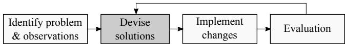
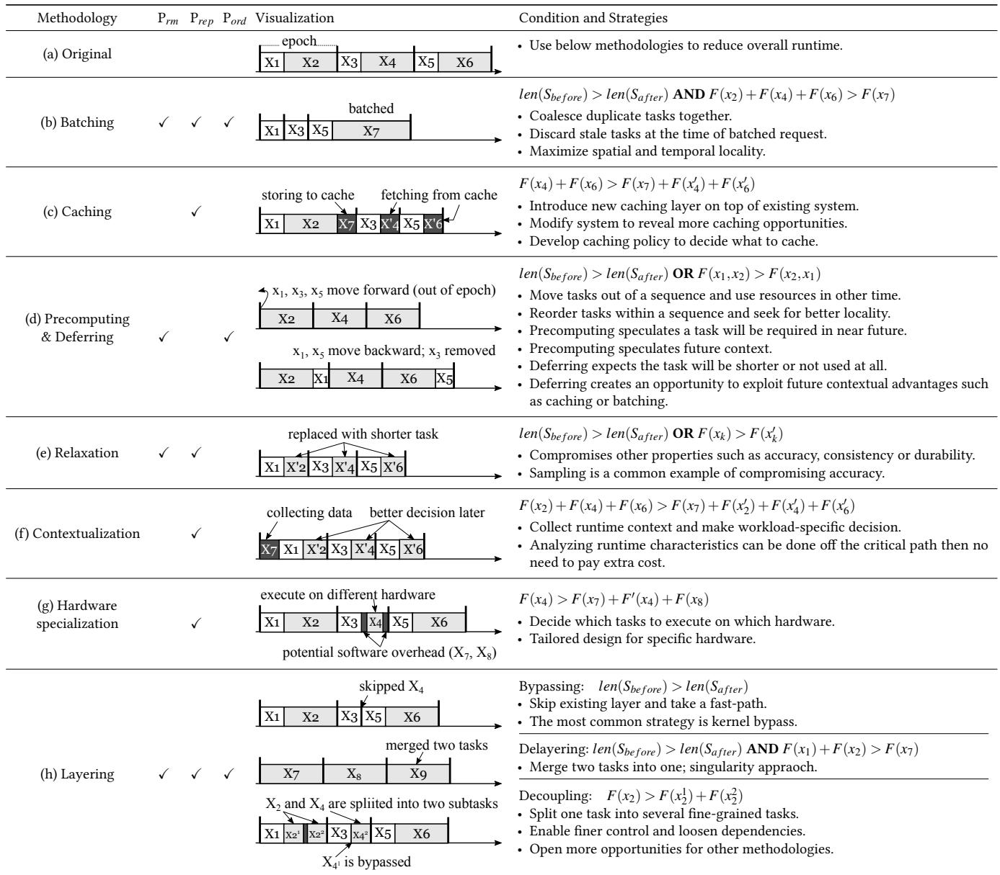
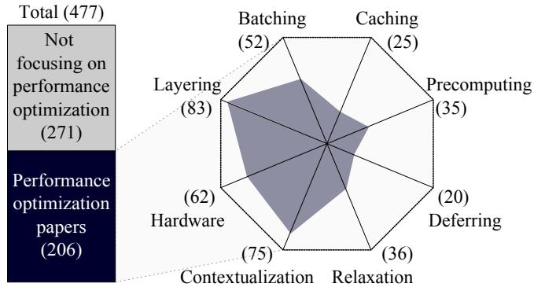
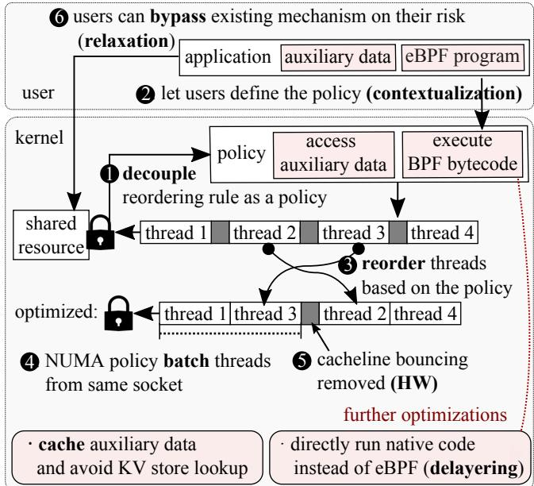
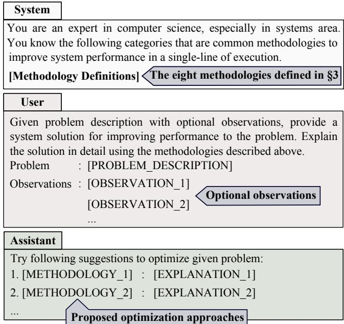
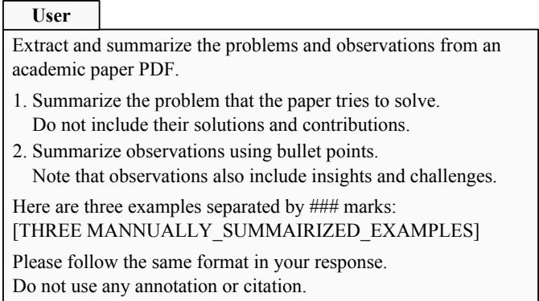
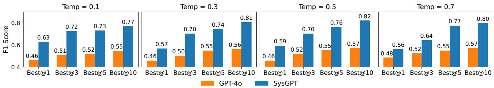

USENIX

THE ADVANCED COMPUTING SYSTEMS ASSOCIATION

# Principles and Methodologies for Serial Performance Optimization

Sujin Park, Mingyu Guan, Xiang Cheng, and Taesoo Kim, Georgia Institute of Technology

https://www.usenix.org/conference/osdi25/presentation/park-sujin

# This paper is included in the Proceedings of the 19th USENIX Symposium on Operating Systems Design and Implementation.

July 7–9, 2025 • Boston, MA, USA

ISBN 978-1-939133-47-2

Open access to the Proceedings of the 19th USENIX Symposium on Operating Systems Design and Implementation is sponsored by

# Principles and Methodologies for Serial Performance Optimization

Sujin Park Mingyu Guan

Xiang Cheng Taesoo Kim

Georgia Institute of Technology

## Abstract

Throughout the history of computer science, optimizing existing systems to achieve higher performance has been a longstanding aspiration. While the primary emphasis of this endeavor lies in reducing latency and increasing throughput, these two are closely intertwined, and answering the how question has remained a challenge, often relying on intuition and experience.

This paper introduces a systematic approach to optimizing sequential tasks, which are fundamental for overall performance. We define three principles—task removal, replacement, and reordering—and distill them into eight actionable methodologies: batching, caching, precomputing, deferring, relaxation, contextualization, hardware specialization, and layering. Our review of OSDI and SOSP papers over the past decade shows that these techniques, when taken together, comprehensively account for the observed sequential optimization strategies.

To illustrate the framework’s practical value, we present two case studies: one on file and storage systems, and another analyzing kernel synchronization to uncover missed optimization opportunities. Furthermore, we introduce SysGPT, a fine-tuned GPT model trained on curated literature analysis, which offer context-aware performance suggestions. SysGPT’s outputs are more specific and feasible than GPT-4’s, aligning with core strategies from recent research without direct exposure, demonstrating its utility as an optimization assistant.

## 1 Introduction

Improving the performance of computer systems has been a pivotal objective within the field of computer science, profoundly influencing user experience, operational efficiency, and cost reduction. High-performance systems process tasks with greater speed and efficiency, thereby minimizing response times for user applications and enhancing the throughput of computational operations.

The optimization of sequential execution is particularly crucial, as Amdahl’s law [8] highlights that the maximum potential speedup of a system is constrained by the fraction of the program that must remain sequential. Despite advances in parallel processing, addressing the sequential bottleneck remains foundational for achieving meaningful performance gains.

In response to this challenge, this paper proposes a structured approach to optimizing sequential performance. Our approach is founded on three key principles: the removal, replacement, or reordering of tasks within a sequence. The performance of sequential execution is inherently defined by the sequence itself, as each task’s execution time directly contributes to the total runtime, and tasks must be completed in a specific order. This deterministic nature implies that modifying the sequence—either by removing tasks to reduce the overall sequence length, replacing slower tasks with faster alternatives, or reordering tasks for more efficient execution— constitutes the only practical means to improve sequential performance under a fixed hardware and execution environment.

Building upon these principles, we define eight actionable methodologies for sequential performance optimization: batching, caching, precomputing, deferring, relaxation, contextualization, hardware specialization, and layering. Each methodology can be systematically explained through one or more of the three fundamental principles, providing clear reasoning as to why and how it improves sequential performance.

While each methodology may be individually familiar to the systems community, our key contribution lies in synthesizing them into a unified framework that captures the full space of observed optimization opportunities for sequential execution. By distilling common optimization patterns into a systematic and actionable set of methodologies, our work clarifies the space of existing optimization opportunities and transforms the inherently open-ended challenge of performance optimization into a fully structured and tractable process.

To investigate the completeness of this framework, we conducted an empirical analysis by reviewing every system paper published at OSDI and SOSP over the past decade. Our goal was to examine whether the eight methodologies could sufficiently account for the diverse optimization techniques proposed in these papers, thereby demonstrating that the methodologies form a complete set of common patterns for sequential performance optimization. These eight methodologies are not intended to represent the only means of achieving sequential performance optimization, but rather to provide a comprehensive account of the common patterns observed over the past decade.

We envision these methodologies serving as a checklist for researchers and developers, helping them to systematically explore known optimization strategies, reduce the risk of overlooking opportunities, and recognize when a true algorithmic breakthrough may be required.

Finally, to bridge the gap between conceptual principles and practical application, we present SysGPT, a fine-tuned GPT model [2] trained on a curated analysis of a decade’s literature. Through both qualitative and quantitative evaluation, we demonstrate that SysGPT consistently outperforms the base model and few-shot learning approaches. Our qualitative analysis shows that SysGPT generates more specific and actionable suggestions that better align with groundtruth solutions, while quantitative results demonstrate significant improvements in precision, recall, and F1-score across various temperature settings and sampling configurations. This combination of conceptual rigor and practical utility ensures that the insights gleaned from our analysis do not remain only theoretical, but instead become a tangible tool for improving system performance.

In summary, this paper has the following contributions:

• Formalizes the performance of sequential execution and defines three principles to optimize it. (§2)

• Establishes eight methodologies that systematically guide sequential performance improvements.(§3)

• Empirically validates the completeness of the framework through a comprehensive analysis of OSDI and SOSP papers over the past decade. (§3)

• Demonstrates the potential of AI-assisted performance optimization through the development of SysGPT. (§5)

## 2 Problem Definition

$$
S _ { p a r a l l e l } = \frac { 1 } { F _ { s e r i a l } + ( F _ { p a r a l l e l } / \# \operatorname { t h r e a d s } ) }\tag{1}
$$

Optimizing sequential performance is a fundamental challenge in system design. Amdahl’s law (Equation 1)[8] provides an insight into the potential speedup achievable through the utilization of multiple processors in a computing task. The law states that the maximum possible speedup from parallelizing a program $( S _ { p a r a l l e l } )$ is limited by the fraction of the program that must be executed sequentially, denoted as the serial fraction $( F _ { s e r i a l } )$ . In other words, it highlights the fact that not all parts of a program can be parallelized, so even with infinite additional resources, there will always be a limit to how much faster a program can run. It’s obvious that augmenting $F _ { p a r a l l e l }$ (and diminishing $F _ { s e r i a l } )$ leads to better performance. However, there has been a lack of systematic approach to optimize $F _ { s e r i a l }$ of a program. Moreover, many problems (programs) cannot be parallelized due to computational dependencies among constituent tasks, making the optimization of $F _ { s e r i a l }$ the only way to accelerate programs.

$$
S _ { n } = \{ t _ { i } \} _ { i = 1 } ^ { n } = { \mathrm { S e q u e n c e ~ o f ~ t a s k s ~ f o r ~ o n e ~ } } e p o c h\tag{2}
$$

The serial fraction of a program plays a pivotal role in determining the overall runtime and is of significant importance in optimizing performance. We define the serial fraction of a program $( F _ { s e r i a l } )$ as a sequence of tasks, t1, t2, $\cdots ^ { t _ { n } }$ as represented in Equation 2.

$$
l a t e n c y = F ( S _ { n } ) = F ( \{ t _ { i } \} _ { i = 1 } ^ { n } )\tag{3}
$$

$$
t h r o u g h p u t = N , \mathrm { w h e r e } N \cdot F ( S _ { n } ) < t i m e\tag{4}
$$

In many common scenarios, a sequence of tasks is executed iteratively, with the optimization of repetitive tasks being the primary focus for performance enhancement. Each iteration is referred to as an epoch, and Equation 3 signifies the elapsed time to execute one epoch, typically denoting latency. $S _ { n }$ represents the sequence of tasks defined above, and $F$ represents the execution time required to process $S _ { n } .$ where n is the number of tasks (length of $S _ { n } )$ . Equation 4 defines throughput, providing insight into the number of epochs that can be executed within a given time frame.

## 2.1 Principles for performance optimization

In pursuit of enhancing system performance for sequential workloads, the focus lies on optimizing the sequence of tasks, $S _ { n }$ , to ultimately reduce the runtime $F ( S _ { n } )$ . Given that the optimization target is sequential, $F ( S _ { n } )$ is deterministically influenced by the sequence $S _ { n }$ and the hardware executing it. Aside from completely rewriting $S _ { n }$ , there are three strategic approaches: removal, replacement, or reordering of tasks within the sequence. The following three principles delineate these strategies:

$\mathbf { P } _ { r m } \colon$ Remove ti from $S _ { n } .$ . Upon optimization, the length of the optimized sequence $S _ { m } ^ { \prime }$ is shorter than the original sequence $S _ { n } ,$ thereby satisfying m $< n$

$\mathbf { P } _ { r e p } \colon$ Replace ti with $t _ { j }$ within $S _ { n } .$ . While the length of the sequence $S _ { n }$ may remain unchanged, the optimized sequence $S _ { n } ^ { \prime }$ yields a better overall runtime performance, denoted as $F ( S _ { n } ) > F ( S _ { n } ^ { \prime } )$

$\mathbf { P } _ { o r d } \colon$ Explore alternative permutations of $S _ { n } .$ . Different permutations of $S _ { n }$ indicates different execution order of given tasks, which can impact overall runtime.

  
Figure 1: Steps in performance optimization.

## 2.2 Research scope

Our research targets optimizing the sequential fraction of system performance, focusing specifically on throughput and latency. Throughput reflects the system’s capacity to process tasks within a given timeframe, such as request handling rates, model trainig speed, or data scanning speed. Latency measures responsiveness, including per-request or per-operation time, and offers insights into real-time performance and user experience. We focus solely on optimizing existing systems, excluding concerns such as security, energy use, space efficiency, fault tolerance, and maintainability. We also exclude the design of entirely new algorithms, as our goal is to optimize existing ones.

## 2.3 Steps in performance optimization

Performance optimization is a multi-step, iterative process involving inefficiency identification, solution design, implementation, and evaluation. While tools and benchmarks for problem identification and evaluation have matured over time, the intermediate steps—designing and implementing solutions—remain largely reliant on the researcher’s expertise, creativity, and experience. These stages are often the most challenging, as they require both deep system knowledge and the ability to predict how changes will interact with the broader system dynamics. Within this context, this paper focuses on establishing a systematic approach for the second step: devising solutions.

## 3 The Eight Optimization Methodologies

The landscape of system optimization techniques is vast and often discussed informally, with little consensus on how many distinct strategies exist or how they relate to each other. In this section, we distill a decade of performance optimization research in the systems community and define eight actionable methodologies that together form a structured framework for sequential performance optimization: batching (§3.1), caching (§3.2), precomputing (§3.3), deferring (§3.4), relaxation (§3.5), contextualization (§3.6), hardware specialization (§3.7), and layering (§3.8). We explain each methodology through the principles of removal, replacement, and reordering, detailing its rationale and impact on sequential performance, and illustrating it with examples from representative system papers.

To empirically validate the coverage of our framework, we conducted a exhaustive review of 477 papers published at OSDI and SOSP over the past decade. Our analysis indicates that these eight methodologies collectively encompass all common patterns of sequential performance improvements observed in practice over the last ten years.

## 3.1 Batching

When the cost for computing a batch of items is lower than the total cost for computing each item individually, combining these items into batches will enhance overall efficiency. As shown in Table 1 (a), for every epoch, duplicate costs (x2, x4 and x6) are incurred across epochs, and these costs are repetitively accrued with each iteration of epochs. With batching, depicted in Table 1 (b), these individual blocks are merged into one big block (x7). To ensure the efficacy of batching, two conditions must be satisfied: the length of the optimized sequence should be shorter than that of the original sequence, and the running time for batched items should be shorter.

In terms of the three principles (§2.1), batching is a methodology which can effectively leverage all the three principles. First, batching commonly yields benefits through coalesced computation. By coalescing duplicate tasks together, particularly when each task incurs significant overhead, the overall runtime can be reduced. Upon comparing of the original and batched sequences, the latter removes x2 and x4 $\left( \mathrm { P } _ { r m } \right)$ , and replaces $x _ { 6 }$ with x7 $( { \mathrm P _ { r e p } } )$ . Alongside $\mathrm { P } _ { r m }$ and $\mathrm { P } _ { r e p }$ , the overall runtime improves. NEVE ( 1 ) is an example of this approach (see Table 2 for details).

Batching also inherently defers earlier tasks until a batch of tasks is gathered. Consequently, it has the potential to decrease the overall number of tasks to be processed by discarding stale tasks at the time of batched request $\left( \mathrm { P } _ { r m } \right)$ , thereby reducing the overall runtime. For instance, group commit and write buffer batch multiple updates and apply modifications in a deferred and batched manner, thereby some stale data that has already been deleted or updated does not need to be committed anymore. EAW ( 2 ) implements this approach by enabling applications to update batched items in the log prior to commit.

In addition, when batching is applied, the order of tasks is reordered $( \mathrm { P } _ { o r d } )$ . For example, initially x2 was located between $x _ { 1 }$ and $x _ { 3 } ,$ , but after optimization, x1 and x3 will be executed consecutively. Therefore, batching might be employed to maximize the spatial and temporal locality of data. IX ( 3 ) efficiently adopts this strategy to batch requests at every stage of the network stack.

This concept is also closely interwined with caching (§3.2) as batching eventually provides greater caching opportunities with the improved locality.

In general, batched items can achieve higher bandwidth and throughput by eliminating redundant costs across tasks. Nevertheless, this approach can lead to extended latency, as initial earlier tasks in a batch might wait for subsequent tasks to arrive, and processing a batch usually takes longer than processing an individual task.

  
Table 1: Summary of the eight methodologies, detailing their underlying principles, visual representations, necessary conditions, and strategic applications.

## 3.2 Caching

While batching removes redundant costs across tasks, caching addresses redundant costs over time. The fundamental idea behind caching is to keep computational results in memory and reuse them at a later time, thereby avoiding redundant computation and leveraging previously computed values. Table 1 (c) illustrates how caching optimizes costs over time. For caching to be effective, the computational redundancy $( x _ { 4 }$ and $x _ { 6 } )$ must outweigh the overhead of using and maintaining the cache. This overhead involves the cost for storing computed results in the cache (x7) and retrieving old results from it $( x _ { 4 } ^ { \prime }$ and $x _ { 6 } ^ { \prime } ) .$ In other words, caching leverages $\mathrm { P } _ { r e p }$ by replacing redundant computation with cached results. Consequently, caching inherently reduces the overall runtime at the expense of increased memory usage.

Introducing a new caching layer on top of existing system involves identifying common operations that can be strategically cached for enhanced performance. Table 2 shows such examples to optimize stream processing ( 4 ) and VM allocation ( 5 ). Beyond introducing additional caching layer to the current system, it is also possible to reveal more caching opportunities by modifying existing structures ( 6 ).

Furthermore, numerous endeavors have been made to optimize caching policy, determining what to cache. The selective caching of frequently accessed (hot) data stands out as a particularly effective method for improving cache hit rates in environments having uneven access patterns ( 7 ).

<table><tr><td></td><td>System</td><td>Description</td></tr><tr><td rowspan="3">Brateg</td><td>①NEVE [44]</td><td>Coalesceand defer traps tothe hypervisorbylogingtoavoid contextswitch overhead betweenaVMandthe hypervisor.</td></tr><tr><td>②EAW[13]</td><td>Exclude outdated data from the batch by allowing modifications in the log before committing.</td></tr><tr><td>③IX[11]</td><td>Applybatchingateverystageofthenetworkstack,includingsystemcallandhardwarequeuestoenhanceinstructionanddatalocality.</td></tr><tr><td rowspan="4">Ceoaei</td><td>④Drizzle [60]</td><td>Reuse scheduling decisions across micro-batches as computation is largely static and undergoes infrequent changes.</td></tr><tr><td>⑤Protean [27]</td><td>Cache previous virtual machine allocation result and reuse the placement across multiple requests.</td></tr><tr><td>Tasi et al [58]</td><td>Decouple permission checking from locating adirectory and memoizes permission check resuls to enable fast path.</td></tr><tr><td>⑦ NetCache [32]</td><td>Let programmable switches to cache hot data for key-value store architectures.</td></tr><tr><td rowspan="4">-eooerd Sunnd</td><td>Duet [9]</td><td>Reorder storage maintenance to prioritize data already cached in memory.</td></tr><tr><td>⑨Itasks[18]</td><td>Proactivelytriggermemoryreclaiminguondetectingthefirstsignofmemorypressure toreducegarbagecollctionduringcriticalpath.</td></tr><tr><td> Correctables [26]</td><td>]Prefetchdependentojectsbasedonpreliminaryviewinsteadofwaitingforfullyconsistentonetodetelatencyoftrongconsistency.</td></tr><tr><td>① Sparrow [51]</td><td>Delayasignmentoftaskstoorkermacheuntilorkersareprepared,itigatigaceconditionsamongutipleditributedeulers.</td></tr><tr><td rowspan="3">Beiieg</td><td>2 PACTree [35]</td><td>With optimistic versionlock,performan operation optimisticaly without holdingalockand thenchecktheversion number.</td></tr><tr><td>3 SKYROS [23]</td><td>Defer expensive ordering and operation execution until their effects are externalized.</td></tr><tr><td>4 KnightKing [65]</td><td>Allow for sampling the next edge inrandom walkalgorithms without scanning allout-edges atthe walker&#x27;scurrnt vertex.</td></tr><tr><td rowspan="3">rrgeeeran</td><td></td><td> RSS and RSC28]Relax certainreal-time guarantesoftrictserializabilityforcausallyunrelated transactions oroperations.</td></tr><tr><td>①6 SAUCR [6]</td><td>Relaxdurabilityandavailabilitywhenmostserverscrashsimultaneouslytoachieveperformancecomparable tomemory-durableone.</td></tr><tr><td> MemLiner [61]</td><td>Letapplicationthreadsnotify garbagecolection tracing threadsaboutaccessedobjects forbeteralignmentofmemoryaccesses.</td></tr><tr><td rowspan="3">ceeett niieraen</td><td>8 Syrup[34]</td><td>Use eBPF to have customized scheduling policies defined by applications.</td></tr><tr><td>CLoF[15]</td><td>Automatically generates various hierarchical combinations oflocks and selects the most performant configuration.</td></tr><tr><td>20 Nap [62]</td><td>IntroduceNUMA-awarelayerover existing persistentmemory (PM)indexes tomanagehotitemsandavoidcostlyremotePMace.</td></tr><tr><td rowspan="3">Hararae</td><td>@ FAERY [66]</td><td>AdoptPGAtoacelerate embeddng-basedretrieval system whichrequiresboth high memorybandwidthand pipeline paralelism.</td></tr><tr><td>2 KV-Direct [40]</td><td>Use programmable NICs to extend RDMA primitives and directly handle key-value operations in the host memory.</td></tr><tr><td></td><td></td></tr><tr><td rowspan="3">Brer</td><td></td><td>The nanoPU9]Route incoming messages directly totherunningthreads&#x27;rgisters,bypassing traditionalmemoryeracies.</td></tr><tr><td> TinyNF[5]</td><td>Simplifybufermanagementlayersbyemovingbuferpool.Mergereception,processngandtransmissionintsinglelogicalflow.</td></tr><tr><td></td><td>Rachedodliframeooulesterseeediiackidtreehece</td></tr></table>

Table 2: List of example papers adopting each methodology to improve either latency or throughput.

## 3.3 Precomputing

Precomputing optimizes performance by strategically moving tasks to an earlier time, allowing them to be executed in advance of their actual need. Tasks can be moved to earlier time even before epochs start, as illustrated in Table 1 (d). Although moving a task forward may not directly reduce its execution time, it can optimize the performance of future performance-sensitive executions by moving the task off the critical paths $\left( \mathrm { P } _ { r m } \right)$ and leverages resources that would otherwise be idle or less contended. On the other hand, task can be rearranged within an epoch to seek better opportunity for locality and reduce their execution time $( \mathrm { P } _ { o r d } )$ . Duet ( 8 ) in Table 2 serves as an exemplary case which reorder tasks to better utilize caching.

Executing work earlier relies on two types of speculations. Firstly, it involves speculating that the task will be required in the near future. For example, proactive task execution serves as a preventive measure against unexpected overhead during critical operations, ensuring better control over their execution ( 9 ). Secondly, precomputing speculatively executes tasks based on current information, rather than waiting until a complete view of information is available ( 10 ). This proactive approach can significantly enhance system performance by ensuring the tasks are ready when needed, thus minimizing waiting times and accelerating overall workflow. However, to fully leverage the benefits of precomputing, it is crucial to make precise decisions about when and which tasks to execute ahead of time, as incorrect speculation may introduce overhead.

## 3.4 Deferring

In contrast to precomputing, deferring postpones a task to a later time, employing a lazy approach. Tasks can either be delayed to beyond an epoch $\left( \mathrm { P } _ { r m } \right)$ or shifted to a later time within an epoch $( \mathrm { P } _ { o r d } )$

One primary motivation for deferring a task is the anticipation of its eventual reduction of runtime when postponed. For instance, deferring a task allows it to make better decisions with the most up-to-date information available ( 11 ). Furthermore, as previously mentioned, the strategy of deferring tasks can be effectively combined with batching opportunities, since multiple deferred tasks can be executed together. NEVE ( 1 ), given as a batching example, also exploits deferring, demonstrating the close relation between these two methodologies (§4.2).

Some deferring examples even anticipate that the task may eventually be canceled. If there’s a possibility that a task could be useless, it can be considered to be deferred. Should it indeed prove unnecessary, the task can then be skipped, thereby preventing the system from wasting resources on tasks that were never required. Optimistic decision exemplifies this scenarios, rooted in the assumption that certain events such as concurrency conflicts ( 12 ) or crash will not occur, thereby deferring their handling until they actually happen.

Another rationale for deferring tasks is to prioritize the performance-sensitive sequence $S _ { n } ,$ even if it may compromise later performance. In scenarios where a task within the $S _ { n }$ isn’t immediately necessary and can be deferred, it can be executed lazily after $S _ { n }$ has been completed ( 13 ).

## 3.5 Relaxation

In some cases, precise or thorough answers are unnecessary while a reasonably accurate approximation suffices. When the workload and context can tolerate a modest degree of inaccuracy or inconsistency, existing system can be modified to reduce task size through approximate execution, thus delivering faster results. As depicted in Table 1 (e), relaxation substitutes existing tasks with significantly shorter tasks $( { \mathrm P _ { r e p } } )$ , or even completely skips them $\left( \mathrm { P } _ { r m } \right)$

For example, sampling, a prevalent method of relaxation, analyzes a small subset of data instead of the entire dataset ( 14 ). Despite working with a smaller portion of the data, sampling aims to provide insights that reflect the overall dataset, thereby facilitating faster analysis and decision-making. In addition to the accuracy, other software requirements such as consistency ( 15 ) or availability ( 16 ) may be compromised in pursuit of performance.

## 3.6 Contextualization

There is typically a semantic gap between system design and the execution of real workloads. Design decisions often aim to meet general requirements due to uncertainty about future usage, but this lack of workload awareness can hinder optimal performance. To bridge this gap, existing systems are often customized by incorporating runtime context into their decision process. This context is often obtained by collecting data available during execution ( 17 ). Table 1 (f) illustrates a case where a system performs additional tasks to inform future decisions. While these may incur runtime overhead (denoted as x7), the resulting performance $( { \mathrm P _ { r e p } } )$ improvements generally justify the cost. Alternatively, profiling workload characteristics off the critical path enables specialization without runtime penalties ( 18 ). eBPF also helps bridge the semantic gap by letting applications guide the kernel toward more efficient, workload-aware behavior ( 19 ).

## 3.7 Hardware specialization

Customizing the general system design for specific hardware configurations is another common approach. Optimization for hardware primarily involves determining which tasks should be executed on which hardware, taking into account the workload characteristics and hardware specifications. For example, numerous studies tailor existing general systems for specific hardware requirements such as non-volatile memory, non-uniform memory access ( 20 ), FPGA ( 21 ), or SmartNIC ( 22 ). In Table 1 (g), task $x _ { 4 }$ is executed on different hardware $( \breve { F ^ { \prime } } )$ which can execute it more efficiently, resulting in reduced runtime $( F ( x _ { 4 } ) > F ^ { \prime } ( x _ { 4 } ) )$ . When optimizing an existing system for particular hardware, the advantage of utilizing the hardware must outweigh the software overhead (x7, x8) incurred in transitioning to that hardware.

## 3.8 Layering

A layer is a logical division or abstraction defined during system design to organize and structure a system’s components. Each layer encapsulates a specific set of functionalities or services, helping to modularize the system and making it easier to understand, maintain, and scale. While layers provide clear structural benefits, they also introduce performance overhead, stemming from additional processing, communication, or indirection across layers.

Layering, the final methodology, optimizes sequential performance by reducing the overhead associated with layers— through merging multiple layers, decomposing layers more efficiently, or selectively bypassing layers where appropriate.

Bypassing. It involves creating shortcuts or alternative paths in a system to avoid unnecessary steps or processes, thus reducing latency and improving overall performance. In Table 1 (h), x4 is completely skipped through a fast-path $\left( \mathrm { P } _ { r m } \right)$ Many existing works bypass the kernel stack [5, 16, 19, 21, 29, 37, 40, 46, 48, 54, 57, 68] and handle operations within the user space to eliminate context switching overhead between user and kernel, thereby having more flexible control for runtime requirements ( 23 ).

Delayering. It reduces the number of layers in a system’s architecture. This simplification consolidates multiple abstraction layers and removes software overhead between them ( 24 ). Delayering often sacrifices generality, flexibility or functionality to achieve improved performance in specific scenario. Table 1 (h) shows a scenario where two tasks are merged into a single, larger layer, effectively reducing overall runtime. Delayering not only combines existing layers into one but also minimizes the intermediate overhead, leveraging both $\mathrm { P } _ { r m }$ and $\mathrm { P } _ { r e p }$

While both delayering and bypassing aim to reduce the number of layers being executed, their approaches differ. Delayering restructures the system architecture itself to have fewer layers, thereby simplifying the system. In contrast, bypassing selectively skips over existing layers without modifying the underlying architecture—the skipped layers remain present and may still be executed in other contexts.

  
Figure 2: Number of papers leveraging each methodology. Since each paper may employ multiple methodologies, the cumulative count of methodologies exceeds the total number of papers within our scope.

Decoupling. In contrast to delayering, decoupling splits one layer into multiple ones. Decoupling aims to minimize dependencies between different components or modules within a system. This strategy enhances finer control and execution by loosening the coupling between parts, allowing changes to be made to one component without affecting others. Furthermore, by loosening dependencies between layers, it opens more opportunity for parallelization. In Table 1 (h), x2 is decoupled into $x _ { 2 } ^ { 1 }$ and x22. Despite the potential for additional overhead between the layers due to having more layers, the benefit arises from the finer control it provides. For example, it becomes possible to execute either $x _ { 2 } ^ { 1 }$ or x2 individually rather than executing the larger $x _ { 2 } ,$ or to implement different logic for each task ( 25 ).

## 4 Case Study

## 4.1 Statistics

To empirically evaluate the completeness of the eight methodologies in enhancing system performance, we systematically analyzed entire papers from the OSDI and SOSP conferences over the last decade, from 2013 to 2022. The review process was rigorously conducted, with each paper independently reviewed by two different reviewers to ensure accuracy and minimize bias. Papers from 2023 and 2024 were intentionally excluded from this analysis to serve as a fresh dataset for evaluating our fine-tuned model, as discussed in Section §5.

As depicted in Figure 2, our analysis of 477 papers reveals that 271 do not focus on performance optimization of sequential tasks. Among the remaining 206 performance-related papers, every technique employed to enhance existing performance aligns with one of our eight methodologies. Furthermore, these methodologies are often used in tandem. On average, research papers utilize approximately 2.01 methodologies, demonstrating the necessity of a multidimentional approach for improving system performance.

Table 2 provides a detailed breakdown of file and storage system papers presented at SOSP 2021, serving a case study to illustrate the practical application of the methodologies within the given domain. It provides insights into how the eight methodologies are leveraged in practice to address challenges within file and storage systems. Additionally, we provide suggestions for further performance optimization directly derived from the methodologies.

## 4.2 Relations between methodologies

The optimization of system performance through the eight methodologies is not isolated; rather, these strategies often interrelate and amplify one another when applied together.

Batching and deferring are closely interwined optimization strategies. Batching aggregates multiple operations to execute them collectively, inherently modifying their execution timing. For instance, a write buffer exemplifies the combined use of batching and deferring, as it accumulates multiple write operations to execute them together at a later time, improving data transfer and write efficiency. This approach not only minimizes repetitive, immediate operations but also strategically defers execution to a more opportune moment, thereby leveraging both batching and deferring for enhanced performance.

Decoupling separates tightly integrated components into finer-grained subtasks, enhancing modularity and flexibility. This separation facilitates a more targeted optimization of individual components. Often, specialization tailored for specific hardware configurations or software requirements necessitates initial decoupling of integrated mechanisms. This ensures that modifications are minimal and do not inadvertently impact any other system components. For example, Akkio [10] introduces an intermediary layer between client applications and the datastore systems to separate the allocation of shard data from its management. Consequently, this allows application to specify their own shard sizes much smaller than existing one, and determines the distribution of data across shards, facilitating customized shard assignment tailored to the needs of each application. Similarly, decoupling can enable more effective caching opportunities, especially when only a subset of a task’s output is reused over time. For instance, Tsai et al. [58] first decouple permission checking from directory lookup, allowing permission results to be cached and reused independently, creating a fast path for common operations.

## 4.3 Applying methodologies to real problem

In exploring practical applications of the methodologies to improve system performance, we bring one case study for a paper, Application-informed kernel synchronization primitives [53] from OSDI’22. The paper introduces SynCord, a framework enabling application developers to deploy custom behaviors for kernel locks. Kernel locks are synchronization primitives within the kernel, to ensure that concurrent threads do not simultaneously access shared resources or critical sections of code. When multiple threads simultaneously request the same lock to enter a critical section, the lock implementation internally organizes these threads into a waiting queue. This process ensures orderly lock acquisition and allows only one thread to enter the critical section at any moment. Consequently, the critical section and the lock implementation are fundamentally serial $( F _ { s e r i a l } )$ and cannot benefit from parallelization. Optimizing these serial components, therefore, holds the potential to significantly improve performance.

<table><tr><td>Paper</td><td>Methodologies used in the paper</td><td>Suggestions for further optimization</td></tr><tr><td>ccNVMe 43]</td><td>OInsteadofhaving per-requestcommunication,batchrequestsandringOInsteadofalwayschaining thecompletiondoorbeltoder doorbellpertransactiontoreduce MMOsandeterutilizethewritecom-transactions,enforceitonlyfordependenttransactions. bining buffer. OLeverage data dissemination mechanisms of NVMe for crash consistency.</td><td></td></tr><tr><td>Kangaroo [49]</td><td>Batch multipleobjects inlog-structuredcachefrstand moveobjects toObjects arealways writentwice: onceinKLog andonce set-associative cache as a group to reduce write amplification.</td><td>in KSet.Having additional fast-path to bypass KLog and write directly to KSet could be beneficial in certain scenarios.</td></tr><tr><td>IODA [41]</td><td>is not triggered during predictable window. 6 To reduce semantic gap between host and SSD for predictable latency,add new fields to I/O submission command and quickly get contextual status.</td><td>?Proactivelyreclaimenoughspacevia garbagecolectionto guaranteit@Introduceacachinglayertosrvehtitemswhile theunder- lying flash storage is busy.</td></tr><tr><td>HeMem [56]</td><td>O Sampled memory events are processed in batches. O Migrate memory pages in batches. 56? Monitor applications&#x27; memory usage by sampling and make memory management decisions based on these patterns and hardware characteristics.</td><td>③ Based on the memory access pattern,speculatively prefetch memory page from NVM to DRAM to lower the access latency.</td></tr><tr><td>J-NVM [39]</td><td>runtime garbage collection. 8 Remove the cost of converting data back and forth between NVMM and access latency to NVMM. Javarepresentation.</td><td>Decoupleobjectintoproxyanddata todirectlyaccessNVMMwithoutSince persistentobjectsareseparated intopersistentdata and a proxy in J-NVM,cache only the persistent data to hide</td></tr><tr><td>PACTree [35]</td><td>③A reader optimistically performs a read on a data node. Decouplesearchlayeranddatalayeandsynchronouslyexecute sruc-ostsprealocate memoryinbatches todealocationlatency tural modification operations. ? Take into account the specific characteristics of Non-Volatile Memory (NVM) to design an efficient persistent index.</td><td>① Given that allocating persistent memory incurs significant in critical path.</td></tr><tr><td>Aurora [59]</td><td>8Insteadofhavingvolatile memoryand persistent storageseparately，Auroracanleveragebatching topersistrelevantPOSIXob- transparently persists all application states at regular intervals.</td><td>jects together and reduce the latency of persistence.</td></tr><tr><td>WineFS [33]</td><td>① More huge pages to have less number of TLB entries ③ Proactively take actions to prevent future fragmentation. 6 Collects more runtime information for better allocation.</td><td>② Instead of traversing red-black trees repeatedly to find un- aligned free space,cache the results of the traversals for faster allocation of small memory requests.</td></tr><tr><td>uFS [46]</td><td>8ThuFS serversareimplementedonuserspaceandbypass xistingoper-Preemptivelyreads moredata thanrequestedwhenthedata ating system stack.</td><td>access patterns are predictable.</td></tr><tr><td></td><td>FragPickeruilsadsa consolidate them by migrating data to contiguous storage locations. MonitorapplicationsOactivitiesadselectielyigratedataforde-mightexpeditetheaalysispaseinsubsequentexecutiosfor fragmentation.</td><td>operate periodically. Caching previously observed I/O patterns instance,predict which data blocks are more prone to fragmen-</td></tr><tr><td>Witcher [22]</td><td>Propose automatic testing framework to detect correctnessand performance The goal of the paper is out of our scope. bugs in NVM-based persistent key-value stores.</td><td>tation.</td></tr></table>

Table 3: A complete list of file and storage system papers presented at SOSP’21. Each paper is annotated with the corresponding methodologies employed to improve performance: (1) batching, (2) caching, (3) precomputing, (4) deferring, (5) relaxation, (6) contextualization, (7) hardware, and (8) layering. Suggestions for further optimizations, derived from these methodologies, are also provided.

Figure 3 demonstrates the strategies employed by Syn-Cord to enhance lock performance and how they align with our methodologies. Primarily, SynCord maintains concurrent threads in a waiting queue and allows dynamic rearrangement of the waiters. A key contribution of SynCord is its decoupling of the reordering policy from lock mechanism, allowing the policy part to be managed in userspace ( 1 ). Consequently, it allows userspace to create its own rule for lock acquiring order, facilitating the specialization of kernel lock behaviors to meet specific workload demands or requirements ( 2 ). With user-defined policy, SynCord dynamically reorders threads in a waiting queue instead of conventional first-in-first-out policy ( 3 ). For instance, a thread may be prioritized and moved to the front if it has a short critical section, or it can be deferred to the back if it operates on a slower core. This strategic reordering is carried out with the underlyig hardware in mind, as illustrated by batching threads from the same NUMA node together ( 4 ) to remove cacheline bouncing between them ( 5 ). Moreover, SynCord provides an API to completely bypass the kernel lock, allowing it to be redefined in userspace at the user’s own risk ( 6 ). While this approach relaxes the safety guarantee, it unveils opportunities for performance enhancements.

  
Figure 3: SynCord [53]’s strategies with integration of our methodologies. SynCord leverages most of the methodologies to optimize the performance of kernel locks. Moreover, using the methodologies, we identified two potential optimization opportunities: caching and delayering.

While SynCord incorporates the majority of our methodologies, two methodologies are still not directly adopted in their work, which hold potential for further optimization. The first one is caching. To accommodate various user-defined lock policies, SynCord provides auxiliary data through shadow variables [45], stored as a key-value store in the kernel. In scenarios where lock performance is crucial, it is common for threads to repeatedly acquire and release locks aggressively. Therefore, introducing a caching mechanism for this auxiliary data would allow for the reuse of previously accessed data upon subsequent accesses, thereby further reducing the overhead associated with repeatedly searching the key-value store every time using a lock.

Another overlooked opportunity is delayering. To protect the kernel from potentially faulty user code, SynCord compiles user-defined policies into eBPF [20] bytecode, allowing for static analysis through the eBPF verifier. However, the execution of eBPF program introduces additional overhead with each use of a lock. One potential optimization involves compiling user-defined policy programs into native code once they pass the static verifier, enabling their direct execution. This approach would eliminate the intermediary overhead between lock mechanism and user-provided policies.

In summary, this case study illustrates a successful application of methodologies. Moreover, exploring additional methodologies such as caching and delayering presents potential avenues for further optimization. It not only demonstrates that these methodologies are applicable in real research works, but also highlights its role as a checklist to maximize performance optimization and minimize any potential opportunities to be missed.

## 5 SysGPT: Hints for System Performance

Devising effective solutions for system performance optimization remains an open-ended and intuition-driven, often relying on experience rather than structured guidance. While tools for identifying bottlenecks and evaluating outcomes are mature, the intermediate step—formulating an actionable solution—often lacks systematic support. To address this gap, we introduce SysGPT, a fine-tuned [4] large language model (LLM) that provides context-aware optimization suggestions.

Our goal is to make our methodologies more applicable to real-world optimization workflows. While standard LLMs like GPT-4 [3] are trained on broad corpora, they often produce vague or overly verbose outputs that lack the specificity required for system-level decisions. We thus investigate whether a model that internalizes the distilled insights from a decade of systems research can provide more targeted and practically feasible suggestions.

## 5.1 Implementation

To build SysGPT, we first constructed a fine-tuning dataset based on our comprehensive review of all SOSP and OSDI papers published from 2013 to 2022. This corpus contains a wide range of system performance problems, each annotated with a problem description, observations, and the solution strategy employed in the original paper. The solution is annotated with both the applicable methodology from our taxonomy defined in §3, and a concise explanation of how it was used to address the problem. The dataset spans diverse systems domains, including file and storage systems, databases, machine learning infrastructure, and more. Notably, we excluded papers from 2023 and 2024 to use them exclusively for evaluation purposes, as described in §5.2 and §5.3, ensuring that SysGPT is tested on unseen examples.

Using this dataset, we fine-tuned GPT-4o [2] to produce SysGPT, a domain-specialized LLM that provides structured suggestions for optimizing sequential system performance.

  
Figure 4: The prompt used for fine-tuning SysGPT. Observations can include background, existing challenges, related work, and more. Based on the descriptions provided by system and user, the assistant proposes multiple suggestions for optimizing system performance. Each suggestion is explicitly tied to the eight methodologies, accompanied by a brief explanation of its application.

The prompt format used during training is illustrated in Figure 4. Once fine-tuned, SysGPT can be used interactively. Given a system performance problem and context, the model returns a set of optimization strategies, each rooted in our methodology and supported by brief justifications.

To support reproducibility and facilitate future research at the intersection of systems and LLMs, we release our complete dataset and evaluation benchmark [1].

## 5.2 Qualitative results

We first examine whether SysGPT produces more feasible and meaningful suggestions than baseline models. Evaluating the quality of optimization suggestions is inherently challenging. There is currently no well-established benchmark for this task, and much of the utility of a suggestion depends on how it is interpreted and applied in practice. Since the effectiveness of a response often becomes clear only when a user reads and reasons about the suggestion in context, we include in this section the actual outputs generated by SysGPT and baseline GPT-4 for direct inspection and comparison.

Table 4 compares responses from SysGPT and baseline GPT-4. The test set consists of all database-related papers from SOSP and OSDI in 2023, which were excluded from our training data. To ensure comprehensive coverage and eliminate selection bias, we include the complete list of database papers, even those that do not primarily focus on performance optimization. Among the 10 papers, six address performance-related problems, while the remaining ones focus on topics such as security, privacy, or maintainability. To ensure scientific rigor, we use only the first model output for each case, with the temperature set to 0 to ensure deterministic behavior. Due to space constraints, the table contains summarized sentences, although most are directly extracted from the full model outputs.

  
Figure 5: The prompt to automatically extract problem descriptions and observations from uploaded papers. The prompt explicitly instruct the model to identify and extract only the relevant problems and observations, while excluding any proposed solutions.

To eliminate human bias in preparing inputs for test set, we automatically extracted problem statements and observations from each paper using a separate GPT-4o model with knowledge retrieval capabilities. The extraction prompt shown in Figure 5 explicitly instructs the model to include only the problem and relevant observations, while omitting any solutions or contributions described in the paper. This setup ensures that both models are evaluated solely based on their own reasoning given the same input, and that the evaluation pipeline is fully automated without any human intervention.

Since the problems and observations are directly derived from the original papers, a strong model should generate suggestions that meaningfully align with the solutions proposed by the authors. In this context, SysGPT consistently produces outputs that exhibit a high degree of correspondence with the ground-truth solutions, often matching not only the methodology but also specific implementation details.

Examples include concrete recommendations such as “set different lifetimes for hot/cold data by storing them separately in cache” or “decouple range index into frontend staging buffers and backend index update”. In contrast, GPT-4 tends to produce more generic responses, such as “leverage runtime heuristics” or “implement an in-memory caching layer”, which are less specific and often lack actionable guidance.

<table><tr><td rowspan="4">DeToX [12]</td><td>P+0</td><td>Traditionalcachingpoliciesfocusonecthitateuttransactonalorkladsneedtocheallconcurrentlyrequestedectsto reducelatencyansactiosmodeledasAGsquroringforeviction,ichisstlyeasible,ndomplicatedyg</td></tr><tr><td>GPT-4</td><td>object usage. Designacaching policythat prioritizes key groups intransactional DAGs,leveraging runtime heuristics tobalance latencyand</td></tr><tr><td>SysGPT</td><td>computational complexity. Infertransactional DAGs usingdynamic profling tocapture transactionlocality().Pre-fllthecache withkeys ()basedon</td></tr><tr><td>Solution</td><td>dependency tracking. Tolimittheumberofgroupssoredeysiterchangeableinducingciticallengtharetreatedasoegoup.Damicaller</td></tr><tr><td rowspan="4">VBASE [67]</td><td>P+0</td><td>groups when DAGs are inaccessible (O). Preemptively cache related items based on dependency tracking (). Relationaldatabsesrelysrictmotoithilectorstemseapproxiateto-Kacngtisproprtyisdiore hybridqeries,ikefdingtop-Kvectorsmeetingeationalconditions,tandlesiilaritysarchandelatioalflterigsparately</td></tr><tr><td>GPT-4</td><td>resulting in inefficiencies. Dynamicallyadjust indicesbasedonquerypaterns and embedding techniques.Employadaptive sampling strategies to balance</td></tr><tr><td>SysGPT</td><td>precision and computation.Integrate scalar and vector constraints to minimize computational overhead. Integratevectorsearchwithrelational databasesbydevelopingaqueryenginetailoredforhybridworkloads (O).Cachetentative</td></tr><tr><td>Solution</td><td>results toavoidredundantcomputation()whileincrementallexploring newdata.Useanadaptivesearch modelthatallws early termination based on the size of the result set during the search (O). Insteadofhaving twoseparate phases-oneforfinding top-Kvectorsandanotherforappyingrelationalqueryflters-unifythese stepsintoasingleexecutionengine()that incrementallexpandstraversalandterminates earlyonce thequeryconditionsaremet.</td></tr><tr><td rowspan="4">Falcon [30]</td><td>P+0</td><td>Use runtime information to traverse high-quality indices more frequently (O). The introductionofpersistentcachechallnges existingdesignsofonlinetransaction processngengines onnon-volatilememory. Cache-NVM granularity mismatchcauses writeamplification,andout-of-placeupdatesincreaseNVMwritesandrequirefrequent</td></tr><tr><td>GPT-4</td><td>index updates. Eliminatetraditionallgingbyensuringatomicupdatesdirectlyinpersistentcache.Employfegrainedin-placeupdatestoiize</td></tr><tr><td>SysGPT</td><td>NVM writes and integrate cache-aware index structures. Eliminateexplicitcachelineflushingbyintroducing persistentcache(O.Setdiferentlifetimesforhot/colddatabystroingthem</td></tr><tr><td>Solution</td><td>separately in cache(②).Align cache eviction policies with NVM write block sizes (O). Withpersistentcache,nneedtoexplicitlyflushogsforpersistency(O.Toeduce writeamplifcationfromgranularitymisatch multiplecachelinesare mergedintooneNMwrite(.AsmallLUcacheabsorbshottuples,avoiding manualflushngandreducing</td></tr><tr><td rowspan="4">SPFresh [64]</td><td>P+0</td><td>NVM writes (②). UpdatinghighdimensionalvectoridicesischalengingduetotecostofmaintainingindexqualityduringfrequentupdatesExisting methods rely on costly periodic global rebuilds,result in fluctuating query latency and accuracy.</td></tr><tr><td>GPT-4</td><td>Adoptahybridapproachcombiningcluster-basedocalupdates withlightweight graphpruning.Cluster-basedindexing minimizes the costof local modifications,whileperiodic,asynchronous graph pruning ensures global quality withoutfrequentfullrebuilds.</td></tr><tr><td>SysGPT</td><td>Incrementallyupdate graph indices withminimaldistortiononglobalindices().Onlymanageshortrangeconnectionsaccuratelyat</td></tr><tr><td>Solution</td><td>runtime (O)and move partition maintenance tasks offthe critical search path (O). Batch updates locally(). Performincrementalupdatesbyreasessingonlyvectorsafectedbylocalchanges,rather thanrebalancing theentireindex(). Accumulatesmallupdateslocally inpartitions ()anduseexistingcentroidsanddatadistribution toexpediteebalancing(.Move</td></tr><tr><td rowspan="4">Chardo- nnay [17]</td><td>P+0</td><td>ExistingsystemsrelyontwophasecommitforatomicityausingperformancelimitationsduetohighRPCandlogflushingatencies. Modernhardware withμs-evellatencyalleviatestheseissues,shiftingthebotteneck todiskread.Thiscreatescontentionduring lock-holding periods,particularly under high workloads.</td></tr><tr><td>GPT-4</td><td>Implementanin-memorycachinglayerforfrequentlyacceseddata.Leveragelow-latencystorageandfastRPCstoasynchroously synchronize disk-based storage.</td></tr><tr><td>SysGPT</td><td>Relaxsynchronizationforreadsandeliminatedependenciesbetwee transactions().Premptivelyaggregate informationabout transaction participants and prefetch data (O). Group read and write operations requesting same locks (, ).</td></tr><tr><td>Solution</td><td>UsefastRPCs toreadacounterforstrictserializabilitywithoutlocks(O.Dryruntransactions toapproximatereadsetsandprefetch them().Reorder lock acquisition order based on the precomputed read/write sets to avoid deadlocks (O).</td></tr><tr><td rowspan="4">ScaleDB [50]</td><td>P+0</td><td>Scaling n-memorydatabasesonmulti-orearchitecturesihinderedbycontentiononange-indexstructuresikeB+treecausedby</td></tr><tr><td>GPT-4</td><td>synchronous updates for consistency. However,range scans typically operate on stale dataand readafew records. Decoupleupdatesandreadsbyleveraging append-onlylogsforwriteoperations.Largeread-onlyrangescans canbypassthe indexto</td></tr><tr><td>SysGPT</td><td>directly access the underlying data. Decouplerange indexintostagingbufersforfront-endandbackendindexupdate (O).Applyindexupdatesinbatches whilecaching</td></tr><tr><td>Solution</td><td>them inthe staging bufers (O,). Delay updating index from the critical path of transaction processing (). Decouple transactionexecution fromupdating theafectedrangeindex (O). Asynchronouslyapplybatchedupdates torangeindexes</td></tr><tr><td rowspan="2">Trubo [36] TxCheck [31]</td><td></td><td>with optimistic concurrencty control (O, 4). Cache recently committed transactions separately ().</td></tr><tr><td>P+0 P+0</td><td>The goal of the paper is user privacy,which is out of our scope.</td></tr><tr><td>K9db [7]</td><td></td><td>The goal of the paper is finding transactional bugs,which is out of our scope.</td></tr><tr><td></td><td>P+0</td><td>The paper focuses on tracking data ownership in database and easier maintenance based on it.</td></tr><tr><td>HEDB [42]</td><td>P+0</td><td>The goal of the paper is security and maintainability,which are out of our scope.</td></tr></table>

Table 4: A complete list of database papers from SOSP’23 and OSDI’23, showing the problem and observations (P+O), suggestions from standard GPT-4 and SysGPT, and the actual solution. Solutions and suggestions are tagged with corresponding methodologies: (1) batching, (2) caching, (3) precomputing, (4) deferring, (5) relaxation, (6) contextualization, (7) hardware, (8) layering.

User   
Evaluate two answers to a system performance problem by   
comparing them to the standard solution. Your goal is to   
determine which answer aligns more closely with the standard   
solution and explain your reasoning.   
Problem statement : [problem description]   
Observations : [observations]   
Standard solution : [Actual solutions used in the paper]   
Answer to evaluate : Answer 1 = [Answer from GPT-4]   
Answer 2 = [Answer from SysGPT]  
Figure 6: Prompt. LLM-based comparative evaluation.

To further validate this distinction, we conducted an LLMbased comparative analysis following standard practices in language model evaluation. In this setting, GPT-4o [2] serves as an independent evaluator, tasked with judging which of the two model outputs more closely aligns with the actual solution from the paper. The prompt for this evaluation is shown in Figure 6.

For 37 out of 42 papers (88%) in the test set (§5.3.2), the evaluator preferred SysGPT’s output over that of the baseline. This strong preference stems from SysGPT’s ability to provide more relevant and detailed suggestions that better align with the actual solutions devised by systems researchers. For example, in the case of Nomad [63], the evaluator noted that SysGPT’s response “directly addresses two of the three key strategies: contextualization and deferring, with a clear focus on optimizing memory management based on application behavior and reducing unnecessary migrations.” This demonstrates how SysGPT’s methodologies enable it to generate more targeted and actionable suggestions for real system problems.

For the remaining 5 papers where GPT-4o’s output was preferred, the evaluator’s rationale primarily focused on broader strategy coverage rather than suggestion quality. For instance, in the case of CHIME [47], the evaluator noted that while GPT-4o’s response covered all three components (batching, contextualization, and precomputing), it lacked critical implementation details like RDMA usage and hotspot buffer design. In contrast, SysGPT provided more practical and detailed suggestions for batching and precomputing, though it missed the contextualization aspect. This highlights SysGPT’s strength in delivering concrete, actionable recommendations, even if it occasionally prioritizes depth over breadth in its coverage of optimization strategies.

## 5.3 Quantitative results

While the qualitative results in §5.2 highlight the specificity and feasibility of model-generated suggestions, it is inherently interpretive. To provide more objective evidence, we also include a quantitative evaluation that assesses how accurately models can identify applicable optimization methodologies given a system performance problem.

## 5.3.1 Task definition

We frame the evaluation as a multi-label classification task: given a system performance problem and its associated observations, the model must predict a set of applicable methodologies from the eight defined in §3. We then evaluate how well these predictions align with the methodologies actually used in the corresponding paper.

This formulation enables measurable evaluation using standard classification metrics such as precision, recall, and F1-score. It also helps reduce the subjectivity involved in open-ended solution generation by focusing on whether the model correctly identifies the underlying optimization principles.

## 5.3.2 Evaluation setup

The test set consists of all performance-related papers published at OSDI and SOSP in 2024 (42 out of 96). These papers were not only excluded from the fine-tuning dataset, but also released after the knowledge cutoff date (September 30, 2023) of both the base GPT-4o model [2] and SysGPT. As a result, neither model has access to the content of these papers, ensuring a fair evaluation on truly unseen examples.

Each paper is annotated with ground-truth methodologies based on the actual solution described by the authors. We compare three approaches: (1) the baseline GPT-4o model, (2) GPT-4o with few-shot prompting using 3, 5, and 10 examples, and (3) our fine-tuned SysGPT.

Few-shot examples are drawn from our training set and are carefully selected to cover all eight methodologies when 10 examples are given (N = 10). Each prompt builds on the structure shown in Figure 4. It includes a brief description of the taxonomy in the system prompt, along with N representative input-output examples and formatting instructions for the model’s output.

All models are evaluated using the same inputs—problem descriptions and observations—automatically extracted as described in Figure 5. This ensures that any performance differences reflect the models’ reasoning capabilities rather than differences in prompt quality, output format, or prior exposure to the test cases.

Metrics. We report micro-averaged precision (the fraction of predicted methodologies that are correct), recall (the fraction of ground-truth methodologies that are correctly identified), and F1-score (the harmonic mean of the precision and recall) over the eight methodology labels. Partial matches are accounted for; for example, if the ground truth is (batching, caching) and the model predicts (batching, precomputing), this counts as one true positive, one false negative, and one false positive.

<table><tr><td>Model</td><td>N</td><td> Output</td><td>Precision</td><td>Recall</td><td>F1-score</td></tr><tr><td>GPT-40</td><td>0</td><td></td><td>0.277</td><td>0.934</td><td>0.426</td></tr><tr><td>GPT-40</td><td>0</td><td>Top-2</td><td>0.476</td><td>0.377</td><td>0.421</td></tr><tr><td>GPT-40</td><td>3</td><td>-</td><td>0.342</td><td>0.840</td><td>0.486</td></tr><tr><td>GPT-40</td><td>3</td><td>Top-2</td><td>0.560</td><td>0.443</td><td>0.495</td></tr><tr><td>GPT-40</td><td>5</td><td>-</td><td>0.344</td><td>0.802</td><td>0.482</td></tr><tr><td>GPT-40</td><td>5</td><td>Top-2</td><td>0.547</td><td>0.434</td><td>0.484</td></tr><tr><td>GPT-40</td><td>10</td><td>1</td><td>0.345</td><td>0.868</td><td>0.479</td></tr><tr><td>GPT-40</td><td>10</td><td>Top-2</td><td>0.536</td><td>0.425</td><td>0.474</td></tr><tr><td>SysGPT</td><td>1</td><td>-</td><td>0.758</td><td>0.651</td><td>0.701</td></tr></table>

Table 5: Methodology prediction evaluation on the SOSP/OSDI’24 test set. We compare SysGPT and GPT-4o under few-shot prompting (N = 0, 3, 5, 10) with/without top-2 output constraint.

## 5.3.3 Results

Table 5 summarizes the results of our evaluation. SysGPT clearly outperforms all GPT-4o configurations in F1-score, demonstrating that fine-tuning with methodology-aware supervision leads to more accurate and relevant predictions. In its default form, GPT-4o tends to enumerate nearly all methodologies regardless of input context, resulting in an average of 6.23 suggestions per query. This behavior leads to a high number of false positives—resulting in low precision and high recall—and ultimately producing noisy and unhelpful outputs.

To compensate for GPT-4o’s tendency to overgenerate, we added a constraint limiting its output to the top-2 most promising methodologies. While this adjustment improves GPT-4o’s precision, now the recall drops significantly, and the overall F1-score remains lower than that of SysGPT. We believe this improvement stems from SysGPT’s exposure during fine-tuning to realistic solution patterns with properly labeled methodologies. This training enables SysGPT to more effectively filter out irrelevant suggestions and focus on feasible strategies grounded in the problem and observations.

To assess robustness under non-deterministic sampling, we evaluate performance (Best@k) across multiple temperature settings $( T = 0 . 1 , 0 . 3 , 0 . 5 , 0 . 7 )$ and trials (k = 1, 3, 5, 10), reflecting what an average user might expect from multiple trials. For each temperature, we generate k samples and report the best-scoring prediction relative to ground truth. As shown in Figure 7, SysGPT consistently achieves higher scores across all temperature settings and trial counts, with an average F1-score improvement of 39.1% over GPT-4o. This demonstrates that SysGPT’s methodology-aware training enables more stable and reliable predictions even under varying sampling conditions.

These results validate that SysGPT’s performance gains are not simply due to stylistic alignment with the training data, but stem from its improved capability to identify relevant optimization principles. The methodology-aware finetuning improves both precision (fewer irrelevant suggestions) and recall (more comprehensive coverage), and generalizes to unseen papers from a later publication year. This demonstrates that SysGPT is not merely reproducing past solutions, but learning transferable reasoning patterns applicable to new system performance problems.

## 6 Discussion

## 6.1 Complementing causal profiling

Performance optimization is a multifaceted challenge. Optimizing sequential code is not a panacea, and improvements on one task do not always translate to end-to-end performance gains. As demonstrated by Coz [14] paper, accelerating a component may have little or no effect on overall performance if it is not on the critical path. Coz introduces causal profiling, a technique that quantifies the potential impact of speeding up different parts of a program to identify where optimizations will be most effective. Once such regions are identified, however, the challenge becomes how to optimize them effectively. This is where our work contributes. While Coz identifies high-impact optimization targets, our methodology provides a systematic framework for realizing those optimizations. Together, they form a complementary performance optimization pipeline guiding both where to focus and how to proceed.

## 6.2 Coordination between tasks

While our framework models performance in terms of individual sequences, coordinating multiple tasks is often crucial for achieving system-wide performance improvements. In multi-threaded and distributed environments, interactions between tasks—such as contention for shared resources, scheduling delays, or communication overhead—can dominate execution time, even when individual operations are optimized. Strategies that align task execution to reduce contention, schedule work based on hardware topology, or overlap communication and computation are widely-recognized techniques for improving throughput and latency.

These coordination strategies, however, typically require reasoning across multiple execution contexts, extending beyond the assumptions of our sequential model. Although some coordination effects—such as improved locality or deferred execution—can be partially captured through batching or reordering, a full treatment of inter-task dynamics remains beyond the current scope. Extending our methodology to incorporate coordination-aware techniques represents a promising direction for future work.

  
Figure 7: F1-scores under non-deterministic sampling with temperature values set to 0.1, 0.3, 0.5 and 0.7. For each temperature, we generate k responses and report the best score among the k trials (Best@k).

## 6.3 Limitations of SysGPT

SysGPT targets the second step of performance optimization: devising solutions. Its effectiveness therefore depends on input quality and the subsequent implementation. Well-defined problems and detailed observations yield precise, actionable suggestions, whereas vague inputs can lead to generic ones. SysGPT offers conceptual guidance in natural language but does not directly modify code. As such, implementation and evaluation still require developer expertise.

We envision a future where the entire optimization pipeline—from performance monitoring and solution design to code generation and evaluation—is automated. Realizing this vision will require significant advances across program analysis, synthesis, and systems tooling. Our work takes a step toward this goal, providing a foundation for automated performance optimization.

## 7 Related Work

Optimizing system performance has been a longstanding aspiration of computer systems research. Alongside countless studies aimed at enhancing performance across various systems through diverse strategies, there have also been some efforts to explore high-level methodologies for performance optimization.

Lampson [38] provides hints and principles for computer system design, suggesting principles such as simplicity, timeliness, efficiency, adaptability, dependability and desirability. While Lampson’s discussion of efficiency partially aligns with our goal of system performance optimization, it largely relies on intuition and high-level ideas. In contrast, our work takes a systematic approach to optimize system performance in terms of sequential execution, by defining fundamental principles and empirically validating the completeness of the four methodologies with scrutiny over a decade. We illustrate how these methodologies can be practically applied to solve real-world problems efficiently, with case study and SysGPT, significantly extending the existing literature on performance optimization.

The Systems Performance book [25] also provides methodologies to improve performance and reduce latency. However, it targets system administrators and explains practical tools for better system monitoring. Based on the introduction of various performance analysis tools and background to understand them, the book guides how to use existing system and tools better, rather than fundamentally optimizing system designs itself, as our work does.

Similar to the CAP theorem [24], which states that a distributed system can optimize only two of consistency, availability, and partition tolerance, our methodologies define the boundaries of system performance optimization. Both frameworks help narrow the scope of exploration, guiding developers toward feasible and practical improvements.

## 8 Conclusion

Optimizing sequential system performance remains a fundamental yet often understructured task in systems research. We proposed a systemized framework based on three core principles—removal, replacement, and reordering—and distilled them into eight actionable methodologies commonly used across a decade of systems literature. This taxonomy clarifies the space of optimization opportunities and offers a systematic language for reasoning about performance. Built on this foundation, we introduced SysGPT, a fine-tuned LLM trained to suggest strategies grounded in this methodology. Evaluated on unseen papers, SysGPT significantly outperformed GPT-4 baselines in both qualitative and quantitative evaluations, demonstrating its superior ability to generate targeted, actionable suggestions for real-world system performance problems.

## 9 Acknowledgment

We thank our shepherd and the anonymous reviewers for their valuable feedback. We are also grateful to Changwoo Min and Sanidhya Kashyap for insightful discussions during the early stages of this work. This research was supported by ONR under grant N00014-23-1-2095, DARPA V-SPELLS N66001-21-C-4024, and gifts from Facebook, Mozilla, Intel, VMware, and Google. This work was also supported by IITP grant funded by the Korean government Ministry of Science and ICT (MSIT) under the project titled RISC-V based system software development for open ecosystem of SDR (No.RS-2024-00459774).

## References

[1] Sysgpt. https://github.com/sslab-gatech/SysGPT, 2025.

[2] OpenAI Models: GPT-4o. https://platform.openai.com/docs/ models/gpt-4o, accessed April, 2025.

[3] OpenAI Models: GPT-4. https://platform.openai.com/docs/ models/gpt-4, accessed December, 2024.

[4] Fine-tuning. https://platform.openai.com/docs/guides/ fine-tuning#preparing-your-dataset, accessed December, 2024.

[5] A. Aghayev, S. Weil, M. Kuchnik, M. Nelson, G. R. Ganger, and G. Amvrosiadis. File systems unfit as distributed storage backends: Lessons from 10 years of Ceph evolution. In Proceedings of the 27th ACM Symposium on Operating Systems Principles, SOSP ’19, pages 353–369, New York, NY, USA, Oct. 2019. Association for Computing Machinery. ISBN 978-1-4503-6873-5. doi: 10.1145/3341301.3359656.

[6] R. Alagappan, A. Ganesan, J. Liu, A. Arpaci-Dusseau, and R. Arpaci-Dusseau. {Fault-Tolerance}, Fast and Slow: Exploiting Failure Asynchrony in Distributed Systems. In 13th USENIX Symposium on Operating Systems Design and Implementation (OSDI 18), pages 390–408, 2018. ISBN 978-1-939133-08-3.

[7] K. D. Albab, I. Sharma, J. Adam, B. Kilimnik, A. Jeyaraj, R. Paul, A. Agvanian, L. Spiegelberg, and M. Schwarzkopf. K9db: Privacy-Compliant storage for web applications by construction. In 17th USENIX Symposium on Operating Systems Design and Implementation (OSDI 23), pages 99–116, Boston, MA, July 2023. USENIX Association. ISBN 978-1-939133-34-2. URL https://www.usenix.org/conference/ osdi23/presentation/albab.

[8] G. M. Amdahl. Validity of the single processor approach to achieving large scale computing capabilities. In Proceedings of the April 18-20, 1967, spring joint computer conference, pages 483–485, 1967.

[9] G. Amvrosiadis, A. D. Brown, and A. Goel. Opportunistic storage maintenance. In Proceedings of the 25th Symposium on Operating Systems Principles, SOSP ’15, pages 457–473, New York, NY, USA, Oct. 2015. Association for Computing Machinery. ISBN 978-1-4503-3834-9. doi: 10.1145/2815400.2815424.

[10] M. Annamalai, K. Ravichandran, H. Srinivas, I. Zinkovsky, L. Pan, T. Savor, D. Nagle, and M. Stumm. Sharding the Shards: Managing Datastore Locality at Scale with Akkio. In 13th USENIX Symposium on Operating Systems Design and Implementation (OSDI 18), pages 445–460, 2018. ISBN 978-1-939133-08-3.

[11] A. Belay, G. Prekas, A. Klimovic, S. Grossman, C. Kozyrakis, and E. Bugnion. {IX}: A Protected Dataplane Operating System for High Throughput and Low Latency. In 11th USENIX Symposium on Operating Systems Design and Implementation (OSDI 14), pages 49–65, 2014. ISBN 978-1-931971-16-4.

[12] A. Cheng, D. Chu, T. Li, J. Chan, N. Crooks, J. M. Hellerstein, I. Stoica, and X. Yu. Take out the TraChe: Maximizing (tra)nsactional ca(che) hit rate. In 17th USENIX Symposium on Operating Systems Design and Implementation (OSDI 23), pages 419–439, Boston, MA, July 2023. USENIX Association. ISBN 978-1-939133-34-2. URL https: //www.usenix.org/conference/osdi23/presentation/cheng.

[13] J. Coburn, T. Bunker, M. Schwarz, R. Gupta, and S. Swanson. From ARIES to MARS: Transaction support for next-generation, solid-state drives. In Proceedings of the Twenty-Fourth ACM Symposium on Operating Systems Principles, SOSP ’13, pages 197–212, New York, NY, USA, Nov. 2013. Association for Computing Machinery. ISBN 978-1-4503- 2388-8. doi: 10.1145/2517349.2522724.

[14] C. Curtsinger and E. D. Berger. Coz: Finding code that counts with causal profiling. In Proceedings of the 25th Symposium on Operating Systems Principles, pages 184–197, 2015.

[15] R. L. de Lima Chehab, A. Paolillo, D. Behrens, M. Fu, H. Härtig, and H. Chen. Clof: A compositional lock framework for multi-level numa systems. In Proceedings of the ACM SIGOPS 28th Symposium on Oper-

ating Systems Principles, SOSP ’21, page 851–865, New York, NY, USA, 2021. Association for Computing Machinery. ISBN 9781450387095. doi: 10.1145/3477132.3483557. URL https://doi.org/10.1145/ 3477132.3483557.

[16] M. Dong, H. Bu, J. Yi, B. Dong, and H. Chen. Performance and protection in the ZoFS user-space NVM file system. In Proceedings of the 27th ACM Symposium on Operating Systems Principles, SOSP ’19, pages 478–493, New York, NY, USA, Oct. 2019. Association for Computing Machinery. ISBN 978-1-4503-6873-5. doi: 10.1145/3341301.3359637.

[17] T. Eldeeb, X. Xie, P. A. Bernstein, A. Cidon, and J. Yang. Chardonnay: Fast and general datacenter transactions for On-Disk databases. In 17th USENIX Symposium on Operating Systems Design and Implementation (OSDI 23), pages 343–360, Boston, MA, July 2023. USENIX Association. ISBN 978-1-939133-34-2. URL https://www.usenix.org/ conference/osdi23/presentation/eldeeb.

[18] L. Fang, K. Nguyen, G. Xu, B. Demsky, and S. Lu. Interruptible tasks: Treating memory pressure as interrupts for highly scalable dataparallel programs. In Proceedings of the 25th Symposium on Operating Systems Principles, SOSP ’15, pages 394–409, New York, NY, USA, Oct. 2015. Association for Computing Machinery. ISBN 978-1-4503-3834-9. doi: 10.1145/2815400.2815407.

[19] G. Feng, H. Cao, X. Zhu, B. Yu, Y. Wang, Z. Ma, S. Chen, and W. Chen. {TriCache}: A {User-Transparent} Block Cache Enabling {High-Performance} {Out-of-Core} Processing with {In-Memory} Programs. In 16th USENIX Symposium on Operating Systems Design and Implementation (OSDI 22), pages 395–411, 2022. ISBN 978-1-939133- 28-1.

[20] M. Fleming. A thorough introduction to eBPF, 2017. https:// lwn.net/Articles/740157/.

[21] J. Fried, Z. Ruan, A. Ousterhout, and A. Belay. Caladan: Mitigating Interference at Microsecond Timescales. In 14th USENIX Symposium on Operating Systems Design and Implementation (OSDI 20), pages 281–297, 2020. ISBN 978-1-939133-19-9.

[22] X. Fu, W.-H. Kim, A. P. Shreepathi, M. Ismail, S. Wadkar, D. Lee, and C. Min. Witcher: Systematic Crash Consistency Testing for Non-Volatile Memory Key-Value Stores. In Proceedings of the ACM SIGOPS 28th Symposium on Operating Systems Principles, SOSP ’21, pages 100– 115, New York, NY, USA, Oct. 2021. Association for Computing Machinery. ISBN 978-1-4503-8709-5. doi: 10.1145/3477132.3483556.

[23] A. Ganesan, R. Alagappan, A. C. Arpaci-Dusseau, and R. H. Arpaci-Dusseau. Exploiting Nil-Externality for Fast Replicated Storage. In Proceedings of the ACM SIGOPS 28th Symposium on Operating Systems Principles, SOSP ’21, pages 440–456, New York, NY, USA, Oct. 2021. Association for Computing Machinery. ISBN 978-1-4503-8709-5. doi: 10.1145/3477132.3483543.

[24] S. Gilbert and N. Lynch. Brewer’s conjecture and the feasibility of consistent, available, partition-tolerant web services. SIGACT News, 33(2):51–59, jun 2002. ISSN 0163-5700. doi: 10.1145/564585.564601. URL https://doi.org/10.1145/564585.564601.

[25] B. Gregg. Systems performance: enterprise and the cloud. Pearson Education, 2014.

[26] R. Guerraoui, M. Pavlovic, and D.-A. Seredinschi. Incremental Consistency Guarantees for Replicated Objects. In 12th USENIX Symposium on Operating Systems Design and Implementation (OSDI 16), pages 169–184, 2016. ISBN 978-1-931971-33-1.

[27] O. Hadary, L. Marshall, I. Menache, A. Pan, E. E. Greeff, D. Dion, S. Dorminey, S. Joshi, Y. Chen, M. Russinovich, and T. Moscibroda. Protean: {VM} Allocation Service at Scale. In 14th USENIX Symposium on Operating Systems Design and Implementation (OSDI 20), pages 845–861, 2020. ISBN 978-1-939133-19-9.

[28] J. Helt, M. Burke, A. Levy, and W. Lloyd. Regular Sequential Serializability and Regular Sequential Consistency. In Proceedings of the ACM SIGOPS 28th Symposium on Operating Systems Principles, SOSP ’21, pages 163–179, New York, NY, USA, Oct. 2021. Associ-

ation for Computing Machinery. ISBN 978-1-4503-8709-5. doi: 10.1145/3477132.3483566.

[29] S. Ibanez, A. Mallery, S. Arslan, T. Jepsen, M. Shahbaz, C. Kim, and N. McKeown. The nanoPU: A Nanosecond Network Stack for Datacenters. In 15th {USENIX} Symposium on Operating Systems Design and Implementation ({OSDI} 21), pages 239–256, 2021. ISBN 978-1-939133- 22-9.

[30] Z. Ji, K. Chen, L. Wang, M. Zhang, and Y. Wu. Falcon: Fast oltp engine for persistent cache and non-volatile memory. In Proceedings of the 29th Symposium on Operating Systems Principles, SOSP ’23, page 531–544, New York, NY, USA, 2023. Association for Computing Machinery. ISBN 9798400702297. doi: 10.1145/3600006.3613141. URL https://doi.org/10.1145/3600006.3613141.

[31] Z.-M. Jiang, S. Liu, M. Rigger, and Z. Su. Detecting transactional bugs in database engines via Graph-Based oracle construction. In 17th USENIX Symposium on Operating Systems Design and Implementation (OSDI 23), pages 397–417, Boston, MA, July 2023. USENIX Association. ISBN 978-1-939133-34-2. URL https://www.usenix.org/conference/ osdi23/presentation/jiang.

[32] X. Jin, X. Li, H. Zhang, R. Soulé, J. Lee, N. Foster, C. Kim, and I. Stoica. NetCache: Balancing Key-Value Stores with Fast In-Network Caching. In Proceedings of the 26th Symposium on Operating Systems Principles, SOSP ’17, pages 121–136, New York, NY, USA, Oct. 2017. Association for Computing Machinery. ISBN 978-1-4503-5085-3. doi: 10.1145/3132747.3132764.

[33] R. Kadekodi, S. Kadekodi, S. Ponnapalli, H. Shirwadkar, G. R. Ganger, A. Kolli, and V. Chidambaram. WineFS: A hugepage-aware file system for persistent memory that ages gracefully. In Proceedings of the ACM SIGOPS 28th Symposium on Operating Systems Principles CD-ROM, pages 804–818, Virtual Event Germany, Oct. 2021. ACM. ISBN 978-1-4503-8709-5. doi: 10.1145/3477132.3483567.

[34] K. Kaffes, J. T. Humphries, D. Mazières, and C. Kozyrakis. Syrup: User-Defined Scheduling Across the Stack. In Proceedings of the ACM SIGOPS 28th Symposium on Operating Systems Principles, SOSP ’21, pages 605–620, New York, NY, USA, Oct. 2021. Association for Computing Machinery. ISBN 978-1-4503-8709-5. doi: 10.1145/ 3477132.3483548.

[35] W.-H. Kim, R. M. Krishnan, X. Fu, S. Kashyap, and C. Min. PACTree: A High Performance Persistent Range Index Using PAC Guidelines. In Proceedings of the ACM SIGOPS 28th Symposium on Operating Systems Principles, SOSP ’21, pages 424–439, New York, NY, USA, Oct. 2021. Association for Computing Machinery. ISBN 978-1-4503-8709-5. doi: 10.1145/3477132.3483589.

[36] K. Kostopoulou, P. Tholoniat, A. Cidon, R. Geambasu, and M. Lécuyer. Turbo: Effective caching in differentially-private databases. In Proceedings of the 29th Symposium on Operating Systems Principles, SOSP ’23, page 579–594, New York, NY, USA, 2023. Association for Computing Machinery. ISBN 9798400702297. doi: 10.1145/3600006.3613174. URL https://doi.org/10.1145/3600006.3613174.

[37] C. Kulkarni, A. Kesavan, T. Zhang, R. Ricci, and R. Stutsman. Rocksteady: Fast Migration for Low-latency In-memory Storage. In Proceedings of the 26th Symposium on Operating Systems Principles, SOSP ’17, pages 390–405, New York, NY, USA, Oct. 2017. Association for Computing Machinery. ISBN 978-1-4503-5085-3. doi: 10.1145/3132747.3132784.

[38] B. Lampson. Hints and Principles for Computer System Design, May 2021.

[39] A. Lefort, Y. Pipereau, K. Amponsem, P. Sutra, and G. Thomas. J-NVM: Off-heap Persistent Objects in Java. In Proceedings of the ACM SIGOPS 28th Symposium on Operating Systems Principles, SOSP ’21, pages 408– 423, New York, NY, USA, Oct. 2021. Association for Computing Machinery. ISBN 978-1-4503-8709-5. doi: 10.1145/3477132.3483579.

[40] B. Li, Z. Ruan, W. Xiao, Y. Lu, Y. Xiong, A. Putnam, E. Chen, and L. Zhang. KV-Direct: High-Performance In-Memory Key-Value Store

with Programmable NIC. In Proceedings of the 26th Symposium on Operating Systems Principles, SOSP ’17, pages 137–152, New York, NY, USA, Oct. 2017. Association for Computing Machinery. ISBN 978-1- 4503-5085-3. doi: 10.1145/3132747.3132756.

[41] H. Li, M. L. Putra, R. Shi, X. Lin, G. R. Ganger, and H. S. Gunawi. IODA: A Host/Device Co-Design for Strong Predictability Contract on Modern Flash Storage. In Proceedings of the ACM SIGOPS 28th Symposium on Operating Systems Principles, SOSP ’21, pages 263–279, New York, NY, USA, Oct. 2021. Association for Computing Machinery. ISBN 978-1-4503-8709-5. doi: 10.1145/3477132.3483573.

[42] M. Li, X. Zhao, L. Chen, C. Tan, H. Li, S. Wang, Z. Mi, Y. Xia, F. Li, and H. Chen. Encrypted databases made secure yet maintainable. In 17th USENIX Symposium on Operating Systems Design and Implementation (OSDI 23), pages 117–133, Boston, MA, July 2023. USENIX Association. ISBN 978-1-939133-34-2. URL https://www.usenix.org/ conference/osdi23/presentation/li-mingyu.

[43] X. Liao, Y. Lu, Z. Yang, and J. Shu. Crash Consistent Non-Volatile Memory Express. In Proceedings of the ACM SIGOPS 28th Symposium on Operating Systems Principles, SOSP ’21, pages 132–146, New York, NY, USA, Oct. 2021. Association for Computing Machinery. ISBN 978-1-4503-8709-5. doi: 10.1145/3477132.3483592.

[44] J. T. Lim, C. Dall, S.-W. Li, J. Nieh, and M. Zyngier. NEVE: Nested Virtualization Extensions for ARM. In Proceedings of the 26th Symposium on Operating Systems Principles, SOSP ’17, pages 201–217, New York, NY, USA, Oct. 2017. Association for Computing Machinery. ISBN 978-1-4503-5085-3. doi: 10.1145/3132747.3132754.

[45] Linux. Shadow Variables, 2018. https://www.kernel.org/doc/ Documentation/livepatch/shadow-vars.txt.

[46] J. Liu, A. Rebello, Y. Dai, C. Ye, S. Kannan, A. C. Arpaci-Dusseau, and R. H. Arpaci-Dusseau. Scale and Performance in a Filesystem Semi-Microkernel. In Proceedings of the ACM SIGOPS 28th Symposium on Operating Systems Principles, SOSP ’21, pages 819–835, New York, NY, USA, Oct. 2021. Association for Computing Machinery. ISBN 978-1- 4503-8709-5. doi: 10.1145/3477132.3483581.

[47] X. Luo, J. Shen, P. Zuo, X. Wang, M. R. Lyu, and Y. Zhou. Chime: A cache-efficient and high-performance hybrid index on disaggregated memory. In Proceedings of the ACM SIGOPS 30th Symposium on Operating Systems Principles, pages 110–126, 2024.

[48] M. Marty, M. de Kruijf, J. Adriaens, C. Alfeld, S. Bauer, C. Contavalli, M. Dalton, N. Dukkipati, W. C. Evans, S. Gribble, N. Kidd, R. Kononov, G. Kumar, C. Mauer, E. Musick, L. Olson, E. Rubow, M. Ryan, K. Springborn, P. Turner, V. Valancius, X. Wang, and A. Vahdat. Snap: A microkernel approach to host networking. In Proceedings of the 27th ACM Symposium on Operating Systems Principles, SOSP ’19, pages 399–413, New York, NY, USA, Oct. 2019. Association for Computing Machinery. ISBN 978-1-4503-6873-5. doi: 10.1145/3341301.3359657.

[49] S. McAllister, B. Berg, J. Tutuncu-Macias, J. Yang, S. Gunasekar, J. Lu, D. S. Berger, N. Beckmann, and G. R. Ganger. Kangaroo: Caching Billions of Tiny Objects on Flash. In Proceedings of the ACM SIGOPS 28th Symposium on Operating Systems Principles, SOSP ’21, pages 243–262, New York, NY, USA, Oct. 2021. Association for Computing Machinery. ISBN 978-1-4503-8709-5. doi: 10.1145/3477132.3483568.

[50] S. A. Mehdi, D. Hwang, S. Peter, and L. Alvisi. ScaleDB: A scalable, asynchronous In-Memory database. In 17th USENIX Symposium on Operating Systems Design and Implementation (OSDI 23), pages 361–376, Boston, MA, July 2023. USENIX Association. ISBN 978-1-939133-34-2. URL https://www.usenix.org/conference/ osdi23/presentation/mehdi.

[51] K. Ousterhout, P. Wendell, M. Zaharia, and I. Stoica. Sparrow: Distributed, low latency scheduling. In Proceedings of the Twenty-Fourth ACM Symposium on Operating Systems Principles, SOSP ’13, pages 69–84, New York, NY, USA, Nov. 2013. Association for Computing Machinery. ISBN 978-1-4503-2388-8. doi: 10.1145/2517349.2522716.

[52] J. Park and Y. I. Eom. Fragpicker: A new defragmentation tool for mod-

ern storage devices. In Proceedings of the ACM SIGOPS 28th Symposium on Operating Systems Principles, SOSP ’21, page 280–294. Association for Computing Machinery, 2021. doi: 10.1145/3477132.3483593. URL https://doi.org/10.1145/3477132.3483593.

[53] S. Park, D. Zhou, Y. Qian, I. Calciu, T. Kim, and S. Kashyap. {Application-Informed} Kernel Synchronization Primitives. In 16th USENIX Symposium on Operating Systems Design and Implementation (OSDI 22), pages 667–682, 2022. ISBN 978-1-939133-28-1.

[54] S. Peter, J. Li, I. Zhang, D. R. K. Ports, D. Woos, A. Krishnamurthy, T. Anderson, and T. Roscoe. Arrakis: The Operating System is the Control Plane. In 11th USENIX Symposium on Operating Systems Design and Implementation (OSDI 14), pages 1–16, 2014. ISBN 978-1-931971-16-4.

[55] S. Pirelli and G. Candea. A Simpler and Faster {NIC} Driver Model for Network Functions. In 14th USENIX Symposium on Operating Systems Design and Implementation (OSDI 20), pages 225–241, 2020. ISBN 978-1-939133-19-9.

[56] A. Raybuck, T. Stamler, W. Zhang, M. Erez, and S. Peter. HeMem: Scalable Tiered Memory Management for Big Data Applications and Real NVM. In Proceedings of the ACM SIGOPS 28th Symposium on Operating Systems Principles, SOSP ’21, pages 392–407, New York, NY, USA, Oct. 2021. Association for Computing Machinery. ISBN 978-1-4503-8709-5. doi: 10.1145/3477132.3483550.

[57] S. Seshadri, M. Gahagan, S. Bhaskaran, T. Bunker, A. De, Y. Jin, Y. Liu, and S. Swanson. Willow: A {User-Programmable} {SSD}. In 11th USENIX Symposium on Operating Systems Design and Implementation (OSDI 14), pages 67–80, 2014. ISBN 978-1-931971-16-4.

[58] C.-C. Tsai, Y. Zhan, J. Reddy, Y. Jiao, T. Zhang, and D. E. Porter. How to get more value from your file system directory cache. In Proceedings of the 25th Symposium on Operating Systems Principles, SOSP ’15, pages 441–456, New York, NY, USA, Oct. 2015. Association for Computing Machinery. ISBN 978-1-4503-3834-9. doi: 10.1145/2815400.2815405.

[59] E. Tsalapatis, R. Hancock, T. Barnes, and A. J. Mashtizadeh. The Aurora Single Level Store Operating System. In Proceedings of the ACM SIGOPS 28th Symposium on Operating Systems Principles, SOSP ’21, pages 788– 803, New York, NY, USA, Oct. 2021. Association for Computing Machinery. ISBN 978-1-4503-8709-5. doi: 10.1145/3477132.3483563.

[60] S. Venkataraman, A. Panda, K. Ousterhout, M. Armbrust, A. Ghodsi, M. J. Franklin, B. Recht, and I. Stoica. Drizzle: Fast and Adaptable Stream Processing at Scale. In Proceedings of the 26th Symposium on Operating Systems Principles, SOSP ’17, pages 374–389, New York, NY, USA, Oct. 2017. Association for Computing Machinery. ISBN 978-1-4503-5085-3. doi: 10.1145/3132747.3132750.

[61] C. Wang, H. Ma, S. Liu, Y. Qiao, J. Eyolfson, C. Navasca, S. Lu, and G. H. Xu. {MemLiner}: Lining up Tracing and Application for a {Far-

Memory-Friendly} Runtime. In 16th USENIX Symposium on Operating Systems Design and Implementation (OSDI 22), pages 35–53, 2022. ISBN 978-1-939133-28-1.

[62] Q. Wang, Y. Lu, J. Li, and J. Shu. Nap: A {Black-Box} Approach to {NUMA-Aware} Persistent Memory Indexes. In 15th USENIX Symposium on Operating Systems Design and Implementation (OSDI 21), pages 93–111, 2021. ISBN 978-1-939133-22-9.

[63] L. Xiang, Z. Lin, W. Deng, H. Lu, J. Rao, Y. Yuan, and R. Wang. Nomad:{Non-Exclusive} memory tiering via transactional page migration. In 18th USENIX Symposium on Operating Systems Design and Implementation (OSDI 24), pages 19–35, 2024.

[64] Y. Xu, H. Liang, J. Li, S. Xu, Q. Chen, Q. Zhang, C. Li, Z. Yang, F. Yang, Y. Yang, P. Cheng, and M. Yang. Spfresh: Incremental in-place update for billion-scale vector search. In Proceedings of the 29th Symposium on Operating Systems Principles, SOSP ’23, page 545–561, New York, NY, USA, 2023. Association for Computing Machinery. ISBN 9798400702297. doi: 10.1145/3600006.3613166. URL https: //doi.org/10.1145/3600006.3613166.

[65] K. Yang, M. Zhang, K. Chen, X. Ma, Y. Bai, and Y. Jiang. KnightKing: A fast distributed graph random walk engine. In Proceedings of the 27th ACM Symposium on Operating Systems Principles, SOSP ’19, pages 524–537, New York, NY, USA, Oct. 2019. Association for Computing Machinery. ISBN 978-1-4503-6873-5. doi: 10.1145/3341301.3359634.

[66] C. Zeng, L. Luo, Q. Ning, Y. Han, Y. Jiang, D. Tang, Z. Wang, K. Chen, and C. Guo. {FAERY}: An {FPGA-accelerated} Embedding-based Retrieval System. In 16th USENIX Symposium on Operating Systems Design and Implementation (OSDI 22), pages 841–856, 2022. ISBN 978-1-939133-28-1.

[67] Q. Zhang, S. Xu, Q. Chen, G. Sui, J. Xie, Z. Cai, Y. Chen, Y. He, Y. Yang, F. Yang, M. Yang, and L. Zhou. VBASE: Unifying online vector similarity search and relational queries via relaxed monotonicity. In 17th USENIX Symposium on Operating Systems Design and Implementation (OSDI 23), pages 377–395, Boston, MA, July 2023. USENIX Association. ISBN 978-1-939133-34-2. URL https://www.usenix.org/ conference/osdi23/presentation/zhang-qianxi.

[68] Y. Zhong, H. Li, Y. J. Wu, I. Zarkadas, J. Tao, E. Mesterhazy, M. Makris, J. Yang, A. Tai, R. Stutsman, and A. Cidon. {XRP}: {In-Kernel} Storage Functions with {eBPF}. In 16th USENIX Symposium on Operating Systems Design and Implementation (OSDI 22), pages 375–393, 2022. ISBN 978-1-939133-28-1.

[69] H. Zhu, K. Kaffes, Z. Chen, Z. Liu, C. Kozyrakis, I. Stoica, and X. Jin. {RackSched}: A {Microsecond-Scale} Scheduler for {Rack-Scale} Computers. In 14th USENIX Symposium on Operating Systems Design and Implementation (OSDI 20), pages 1225–1240, 2020. ISBN 978-1-939133- 19-9.