①

USENIX

THE ADVANCED COMPUTING SYSTEMS ASSOCIATION

# Disentangling the Dual Role of NIC Receive Rings

Boris Pismenny, EPFL & NVIDIA; Adam Morrison, Tel Aviv University; Dan Tsafrir, Technion – Israel Institute of Technology

https://www.usenix.org/conference/osdi25/presentation/pismenny

# This paper is included in the Proceedings of the 19th USENIX Symposium on Operating Systems Design and Implementation.

July 7–9, 2025 • Boston, MA, USA

ISBN 978-1-939133-47-2

Open access to the Proceedings of the 19th USENIX Symposium on Operating Systems Design and Implementation is sponsored by

# Disentangling the Dual Role of NIC Receive Rings

Boris Pismenny∗ EPFL and NVIDIA

Adam Morrison Tel Aviv University

Dan Tsafrir Technion – Israel Institute of Technology

## Abstract

CPUs parallelize packet processing across cores via per-core receive (Rx) rings, which are typically sized to absorb bursts with ≥1Ki entries by default. The combined I/O working set (packet buffers pointed to by all Rx rings) easily exceeds the LLC capacity, thus degrading performance due to high memory bandwidth pressure. Recent work has reduced the I/O working set size by sharing Rx rings among cores with the “shRing” system. But this approach suffers from a bottleneck under imbalanced loads, which are common.

We contend that the bottleneck stems from an unnecessary entanglement of two orthogonal producer-consumer structures: (1) memory allocation, where the core produces empty buffers that the NIC consumes to store packets; and (2) packet delivery, where the NIC produces incoming packets that the core consumes. We propose rxBisect, a new CPU-NIC interface that decouples these structures. RxBisect replaces each Rx ring with two separate rings corresponding to the two structures, allowing memory allocation to be performed independently of packet reception. RxBisect can thus pass empty buffers efficiently between cores upon imbalance, thereby eliminating the aforementioned bottleneck. We implement rxBisect with software emulation and find that it improves throughput by up to 20% and 37% relative to the state-of-theart (shRing) and state-of-the-practice (per-core Rx rings).

## 1 Introduction

With Ethernet speeds growing to hundreds of gigabits per second (Gbps), the performance of network-intensive applications depends on the effectiveness of technologies such as direct data I/O (DDIO) [15]. DDIO enables the network interface card (NIC) to perform direct memory accesses (DMAs) that read from and write to the last-level cache (LLC) instead of main memory. Software can thus access packets more quickly and conserve main memory bandwidth [1,13,18,23,51,54,64,65,74,79], enabling applications to achieve higher throughput and lower latency.

The effectiveness of DDIO depends on the size of the I/O working set, which consists of the memory regions DMAed by the NIC for packet exchange [66]. If the I/O working set exceeds the LLC capacity, newly arriving packets written by the NIC can evict from the LLC other packets that have not yet been processed [22, 79]. As a result, CPU accesses to packet data slow down because they are served from main memory, which can then become a bottleneck resource [46, 54], degrading both throughput and latency.

The I/O working set is determined by the CPU-NIC packet exchange interface (§2), which consists of two types of producer-consumer queues: one for transmission (Tx) and another for reception (Rx). These queues are circular arrays, known as “rings,” whose entries are architected descriptor structures that point to packet buffers. To support high data rates, NICs distribute incoming traffic across multiple percore Rx rings, enabling systems to sustain ≥ 100 Gbps rates using multicore parallelism [25, 27, 53, 54, 59, 67, 78].

Each Rx ring is initially filled by software with empty 1500 B buffers, matching the network’s maximum transmission unit (MTU). As packets arrive, the NIC consumes empty buffers in cyclic order by populating them with incoming packets. Software then consumes the full buffers in the same cyclic order, removing each for processing and immediately replacing it with an empty buffer.

This producer-consumer NIC-CPU interaction implies that every empty buffer in an Rx ring must be used before any can be re-used. Consequently, the I/O working set size is at least N × R × 1500 B, where N is the number of rings and R is the size of each ring. The default ring size for ≥100 Gbps NICs is R = 1,024 entries [11, 16, 47, 55, 73, 73, 80], required to absorb packet bursts caused by increasing network speeds [2, 40, 56]. Since CPUs typically provide less than R×1500 B ≈ 1.5 MiB of LLC capacity per core, multicore network processing can easily exceed the overall LLC capacity.

Keeping the I/O working set in the LLC thus requires reducing the number or size of Rx rings. Reducing size means rings might be unable to absorb packet bursts, which degrades the throughput a single core can sustain without incurring packet loss [66, 83]. We therefore rule this alternative out.

The other alternative is more practical: reducing the number of Rx rings by sharing a single ring among two or more cores, as we proposed in the shRing system [66]. The problem is that shRing requires software synchronization, which adds overhead to packet processing. Moreover, shRing can be effective only when packet processing is roughly computationally balanced across the sharing cores. But if some cores are consistently overloaded while others are not, queueing theory dictates that packet loss is inevitable: overloaded cores impede packet delivery to underloaded cores by monopolizing the shared Rx entries. Accordingly, shRing disables itself upon detecting such situations, falling back on default-size private rings, which can exceed the LLC capacity.

<table><tr><td>structure</td><td>producer</td><td>consumer</td><td>elements</td></tr><tr><td>memory allocation</td><td>CPU core</td><td>NIC</td><td>empty buffers</td></tr><tr><td>packet reception</td><td>NIC</td><td>CPU core</td><td>full buffers</td></tr></table>

Table 1: The canonical Rx interface between the NIC and the CPU entangles two producer-consumer structures in one ring.

In §3, we explain and demonstrate the I/O working set problem and show that real-world imbalance capable of nullifying the potential benefits of shRing is widespread—although it has been referred to as “pathological” [66].

Our new insight is that the root cause of the problem—the inability to shrink or share Rx rings without the aforementioned undesirable side effects—is the canonical Rx interface, which unnecessarily entangles two orthogonal producerconsumer structures: one for allocating empty buffers, with the CPU core acting as producer and the NIC as consumer; and another for delivering full buffers (housing newly arriving packets), where the roles are reversed as summarized in Table 1. Due to this entanglement, we cannot simply reduce the number of buffers allocated per core without also impairing the core’s ability to absorb bursts. Nor can we share allocated buffers among cores without simultaneously forcing them to share (and compete over) packet reception capacity.

To solve this problem, we propose rxBisect, which redesigns the Rx NIC interface to disentangle packet allocation from reception (§4). RxBisect splits the traditional circular Rx array into separate allocation (Ax) and bisected reception (Bx) rings, which are independent and may have different sizes. RxBisect supports cross-core receive buffer sharing: the NIC may consume a buffer from any Ax ring to store an incoming packet, regardless of the destination Bx ring, as long as both rings belong to the same software entity and reside on the same NUMA node. To replenish allocated buffers, the NIC posts a notification to a core’s Bx ring whenever it consumes a buffer from that core’s Ax ring. Commonly, the Ax and Bx rings of a newly arriving packet belong to the same core, so this notification is included in the new packet’s Bx descriptor. When processing this notification, the core places a fresh empty buffer into its Ax ring.

With rxBisect, each core can employ a 1 Ki Bx ring, which may be empty or full if, respectively, none or most of the incoming traffic is directed at that core. Allocation rings can then be smaller, reducing the overall I/O working set and achieving the desired effect. Fewer Ax buffers are needed because rxBisect implements cross-core buffer sharing, quickly moving Ax buffers between cores and using them to populate Bx rings as needed, even when a buffer’s source Ax and destination Bx are associated with different cores. Notably, rxBisect frees software from synchronization overheads associated with cross-core buffer sharing (which shRing suffers from), offloading them to the NIC.

We prototype rxBisect using emulation on top of a software NIC framework we developed, which also emulates other NIC models: the private per-core ring baseline and shRing. These allow us to compare the performance of emulated and nonemulated versions and assess the emulation fidelity (§5). We show that emulated performance is similar to real performance or worse, reducing throughput by up to 12% and increasing latency by up to 94%. We therefore gain confidence in experimental results that compare emulated rxBisect performance to non-emulated baseline and shRing performance and find rxBisect to be preferable.

Our evaluation setup employs two 100 Gbps NICs. We show that rxBisect improves throughput by up to 37% and reduces packet latency by up to 11x compared to the defaultsized per-core Rx baseline. (The significant latency gains occur when rxBisect sustains line-rate whereas the baseline is unable to.) Under load imbalance, rxBisect improves throughput by up to 20% relative to an idealized shRing (§6).

## 2 The NIC-CPU Interface Today

Software interacts with NICs via per-core logically cyclic arrays called receive (Rx) and transmit (Tx) rings. We focus on Rx rings as they dictate the I/O working set (see §3). The NIC spreads incoming traffic among cores using receive side scaling (RSS [59]). With RSS, when a packet arrives from the network, the NIC selects its destination Rx ring according to a hash computed over packet header fields.

Rx rings combine two producer-consumer functionalities: (1) software producing empty buffers for the NIC to consume by storing incoming packets (memory allocation) and (2) the NIC producing incoming packets for software to consume (packet reception).

Software configures the Rx ring size and allocates it in main memory, prepopulating ring entries, called descriptors, with pointers to MTU-sized buffers. When a packet arrives, the NIC writes it to the buffer pointed to by the head (“next empty”) descriptor index and advances the head unless it reaches the tail (“next full”) descriptor index. Software processes packets in order, swapping the buffer pointed to by the tail (with the received packet) for a new empty buffer and incrementing the tail unless it reaches the head.

Software informs the NIC about new free buffers (ring tail advances) by means of an MMIO write to a NIC register, known as “ringing a doorbell.” In contrast, software does not poll the ring head to detect new packets, as such polling would result in cache line bounces between the NIC and the CPU (if the head were stored in memory) or expensive MMIO reads (if it were stored in a NIC register). Instead, the NIC informs software of produced packets by means of a cache-friendly memory-based protocol, described next.

Completion Rings Modern NICs notify software of delivered packets via per-core in-memory completion ring (CR) structures [24, 35, 57]. (Intel NICs have used CRs since 2022 [30].) CRs, like descriptor rings, are circular buffers. Each CR is associated with one or more descriptor rings. CR entries indicate which Rx ring descriptors are ready for software processing by specifying their ring and index.

To optimize cache coherence traffic, the NIC exclusively writes CR entries while software only reads them, coordinating access via a sense reverse mechanism [60]. Both the NIC and software maintain a “generation” bit that flips on every pass through the ring. Each CR entry has a “done” bit that the NIC fills with its “generation” bit when a new packet arrives. Software polls the head CR entry, comparing its “done” bit with its internal “generation” bit to detect new packets.

Figure 1 depicts packet reception with CRs. Initially (Figure 1a), three packets arrive for a core whose Rx ring and CR are empty. Packet delivery (Figure 1b) consists of (1) the NIC using RSS to find the Rx ring and CR matching the packet; (2) writing the packet to an Rx descriptor, and (3) writing a CR entry, indicating the index of the Rx descriptor that holds the packet. These entries have “done” set to 1, because the CR’s generation is 1. Packet processing (Figure 1c) occurs when the core, polling the head CR entry, notices its “done” flag has changed. It starts traversing “done” CR entries, processing packets pointed to by the Rx descriptors indicated by them, replenishing these buffers, and advancing both rings’ tails. Once the core reaches a CR entry with “done” set to 0, it stops and resumes polling the CR.

We remark that a separate CR is used instead of piggybacking this protocol on Rx descriptors to avoid having both the NIC and software writing to the same cache line concurrently (by updating different descriptors in the same cache line), which creates cache contention and hazards [72].

## 3 Motivation

We focus on kernel-bypass applications that interact directly with the NIC using, e.g., the data plane development kit (DPDK) [38]. These applications process packets in a runto-completion manner and employ polling to receive packets [3, 39, 43]. The I/O working set problem has been shown to affect socket-based applications as well [66, §6]

## 3.1 The I/O Working Set Problem

Network-intensive applications depend on DDIO [15] and similar technologies to keep up with network rates of hundreds of Gbps and to enable low-latency packet processing. DDIO allows I/O devices to perform DMAs directly to/from the CPU’s LLC, bypassing main memory when possible. With DDIO, DMA reads are satisfied by the LLC if the requested bytes are present. DMA writes place data into the LLC, either overwriting existing cached contents of the receive buffer or allocating new cache lines for it. By default, DDIO may allocate new cache lines in up to 10% of the LLC ways (two ways in the setup described in §6).

When DDIO allocates new cache lines, it evicts existing entries, writing them back to main memory. If this evicted data is later needed for further processing or transmission, a. Rx populated with empty buffers. Three packets arrive.

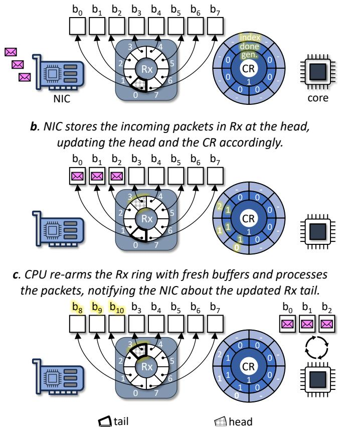  
Figure 1: PrivRing packet reception using a single private receive ring and associated completion ring. Highlighted regions indicates changes relative to the previous stage. For simplicity, we depict only the Rx ring’s head and tail positions, assuming identical head/tail positions in the CR (which is not necessarily the case).

it must be fetched from memory. At high data rates, the resulting increase in memory traffic—from both evictions and re-accesses—can create memory bandwidth bottlenecks.

DDIO effectiveness depends on the size of the I/O working set, defined as the memory regions DMAed by an I/O device over some time interval [66]. When an I/O-intensive workload has a working set that exceeds LLC capacity, it leads to the “leaky DMA” problem [22, 79]: new packets written by the NIC evict not-yet-processed packets from the LLC. As a result, CPU accesses to packet data are served from main memory, which is slower and may even become a bottleneck [1, 13, 21, 23, 42, 51, 54, 62, 64, 65, 69, 74, 79, 82]. If slower memory accesses cause a core to fall behind the packet arrival rate, its Rx ring fills up, and latency becomes proportional to the ring size, as each new packet must wait for an entire ring’s worth of packets to be processed.

Ideally, the I/O working set would depend only on software processing time, i.e., buffers could be reused by the NIC immediately when released by software. However, the NIC interface creates a dependency on the number (N) and size (R) of Rx rings. Rx rings are prepopulated with buffers, and as ring descriptors are cyclically accessed, an Rx buffer b can be reused only after the NIC uses all other buffers in the ring, even if software has released b earlier. In contrast, Tx rings contain only in-flight packets, so they are usually empty or partially full. Thus, the I/O working set size is at least the union of all Rx buffers, which is of size |Rx| = N × R × 1500 B.

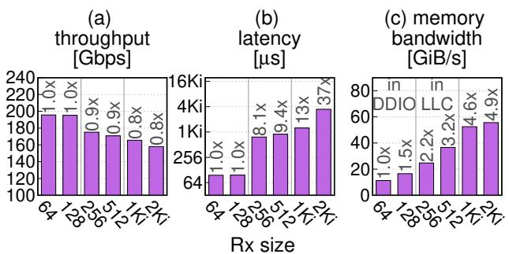  
Figure 2: Large I/O working set causes high memory bandwidth (c), degrading throughput (a) and latency (b). Top labels compare to Rx size of 64. Vertical lines delimit where the I/O working set size fits in DDIO’s portion of the LLC, in the LLC, or exceeds the LLC.

The growing gap between stagnant CPU speed and everincreasing NIC bandwidth results in |Rx| growing with hardware advances, thus exceeding LLC capacity [28,66, 74]. The reason is that this gap necessitates increasing both the size R and number N of the Rx rings, because: (1) packet bursts experienced by individual cores become bigger and should be absorbed to avoid packet loss [20, 37, 81], and (2) packet processing requires additional cycles, disallowing any single core from driving the NIC to its full capacity [27, 65].

We demonstrate the I/O working set problem by evaluating the impact of increasing the Rx ring size on a stateful load balancer (LB) network function (NF). In each experiment, LB uses all cores of a 16-core CPU, which has a 22 MiB LLC and two 100 Gbps NVIDIA ConnectX-5 NICs, for processing 1500 B packets (§6 details the full experimental setup). Figure 2 shows that enlarging the I/O working set worsens throughput by up to 0.8×, latency by up to 37× (due to rings filling, as explained above), and memory bandwidth by up to 4.9×. Line rate throughput is achieved when the I/O working set fits in the two LLC ways used by DDIO (ring size R ≤ 128). Results degrade in two steps: when the I/O working set exceeds the DDIO ways but fits in the LLC (128 < R < 1024) and when it exceeds the LLC (R ≥1024). Other NF applications behave similarly (not shown).

One may wonder why NFs should use all cores, if the result is an excessive I/O working set. The answer is that systems often do not have fixed workloads, and all cores are necessary to maximize throughput in certain workloads. Figure 3 demonstrates this issue by showing LB throughput under maximal rates of either 1500 B or 64 B packets, as the number of

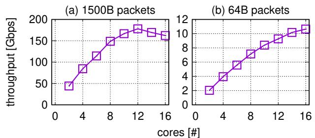  
Figure 3: NF throughput scales with small 64 B packets but not with large 1500 B packets due to the increased I/O working set.

LB cores varies. For 1500 B packets, maximal throughput is reached at 12 cores. But for 64 B packets, throughput peaks at 16 cores, as the I/O working remains small. Thus, our goal is to address the I/O working set problem in the most demanding cases—for the benefit of all workloads.

## 3.2 Limitations of Existing Solutions

We next discuss various approaches for shrinking the I/O working set to fit in the LLC and explain why they are unsatisfactory. In §4.3, after introducing rxBisect, we detail how it avoids the limitations discussed here.

Few Dispatchers This approach, showcased by Shinjuku [42] and Shenango [62], uses a few “dispatcher” cores, each with a large Rx ring, to distribute packets among the remaining worker cores. While such systems can saturate ≈40 GbE links, the dispatcher cores become the bottleneck as link speeds increase to 100 Gbps and beyond [27].

Small Private Rings (PrivRings) A privRing system can employ smaller private per-core rings, such that the I/O working set fits in the LLC. But reducing the Rx ring size below the default (1 Ki) makes rings unable to absorb packet bursts, resulting in packet loss that degrades the performance of loss sensitive protocols such as TCP [66].

ShRing ShRing reduces the I/O working set by sharing default-sized Rx rings among multiple cores [66].1 ShRing associates several per-core CRs with a single Rx ring, enabling the NIC to spread packets among the sharing cores in a lockless manner. But shRing still necessitates locking and atomic instructions when cores update the shared Rx ring, which adds overhead to packet processing compared to the lockless privRing design (as we show in §6.2).

A major problem with shRing is that it leads to packet loss under load imbalance, where some application cores are consistently overloaded (receiving packets faster than they can process) while others are not. In such conditions, by queueing theory, the overloaded cores monopolize the shared Rx queue and starve their underloaded counterparts for space.

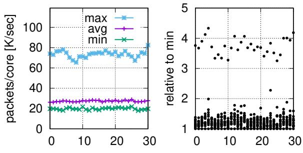  
time (sec)  
Figure 4: Imbalanced RSS distribution across 16 cores during a 30-second segment of a real-world packet trace.

Consequently, shRing is necessarily a dynamic heuristic that should be turned off upon such imbalance.

## 3.3 Imbalanced Load in the Wild

Imbalance is uncommon in IETF (Internet Engineering Task Force [34]) benchmarks and academic network function (NF) studies. But it does occur in NF workloads [6, 43] and is widespread in other contexts like microsecond-scale remote procedure calls [17, 42, 45, 50, 67, 77].

Figure 4 exemplifies real-world imbalance by analyzing a 30-second sequence from the 2018-03-15 NYC CAIDA dataset [12]. We compute the per-packet Receive Side Scaling (RSS) [59] hash values that the NIC uses to assign packets to 16 cores, and we display the number of packets per second received by each core (left), along with the ratio between the minimum and maximum per-core packet rates (right). The ratio stays between 325–433% throughout. In §6.2, we evaluate dynamic shRing and rxBisect by replaying this trace, and we show that rxBisect throughput is 20% higher as it accommodates imbalance, whereas shRing turns itself off.

## 4 RxBisect

RxBisect is a new NIC-CPU interface designed to address the I/O working set problem. RxBisect disentangles the traditional Rx ring’s empty buffer allocation and packet reception functionalities, allowing them to be managed independently. RxBisect supports two types of rings: allocation (Ax) rings, where a core produces empty buffers for the NIC, and bisected reception (Bx) rings, where the NIC produces incoming packets, stored in buffers it consumes from allocation rings.

The crux of rxBisect is that each bisected reception ring r can be associated with several allocation rings (of different cores), enabling the NIC to deliver packets to r as long as some allocation ring is not empty. This association is not exclusive—multiple Bx rings can be associated with overlapping (or identical) sets of Ax rings. In this way, rxBisect turns the union of the set of empty buffers produced by each core into a globally shared resource, co-managed by the NIC and software in a lockless manner. This design allows each core to maintain a large bisected reception ring (for absorbing bursts) without having to independently maintain a large set of empty buffers—it only requires a small allocation ring. Thus, rxBisect ensures that the I/O working set size is kept below LLC capacity.

In the following, we detail rxBisect’s receive-side processing in the NIC (§4.1) and by software (§4.2). RxBisect does not modify the Tx side and so we do not discuss it. We then pinpoint how rxBisect addresses the limitations of the privRing and shRing designs (§4.3). Next, we discuss NIC hardware implementation issues (§4.4). Finally, we present rxBisect parameter configuration guidelines (§4.5).

## 4.1 NIC Side

An rxBisect NIC supports two types of receive-side rings: allocation (Ax) and bisected reception (Bx) rings. Each Ax ring entry points to an empty buffer for the NIC to consume in order to store an arriving packet. Each Bx ring entry holds a descriptor through which the NIC notifies software of packet delivery and/or consumption of an empty buffer. Each Bx ring entry holds a pointer to a received packet and the index of the Ax entry and Ax ring that produced the packet’s buffer. Bx entries also hold a “done” flag and a corresponding sensereverse indication flag, whose purpose is the same as in the CRs of the existing NIC interface described in §2.

Figure 5 depicts rxBisect’s flow. Initially (Figure 5a), software allocates memory for allocation and bisected reception rings. Allocation rings are filled with entries pointing to MTUsized buffers to receive packets and bisected reception ring entries are left empty, as the NIC will overwrite them. Crucially, the number of allocated buffers in each Ax ring can be smaller than the size of the Bx rings, which is the key to reducing the I/O working set size (§4.3).

Software then associates each Bx ring r with several Ax rings, indicating to the NIC that buffers from these allocation rings can be used to store packets destined to r. Software also links each Ax ring a with some Bx ring r, indicating to the NIC that notifications about buffers consumed from a should be delivered through r. For simplicity, assume for now that software (1) allocates per-core Ax and Bx rings, (2) links a core’s Ax ring to its Bx ring, and (3) associates every Bx ring in an application with all the Ax rings of that application. (We discuss another software usage model in §4.2.)

When packets arrive (Figure 5b), an rxBisect NIC maps each incoming packet to a Bx ring exactly as a packet is mapped to an Rx ring in today’s NICs, e.g., using RSS. For each packet, the NIC chooses an Ax ring with available buffers according to some policy (e.g., the linked Ax ring or a random non-empty Ax ring if it is empty), and consumes a buffer from that Ax ring to store the packet. In the depicted scenario, a burst of five packets arrives for core 0. The first four packets exhaust its Ax ring, and thus the fifth packet is placed in a buffer allocated from core 1’s Ax ring. To deliver each packet, a. Ax rings populated with empty buffers. Bx rings are empty.

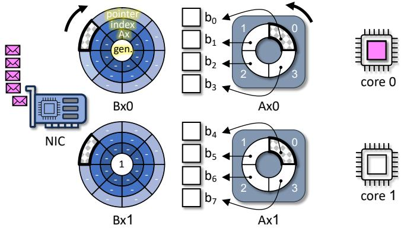

b. While populating Bx0, Ax0 bufs run out, so NIC uses Ax1.  
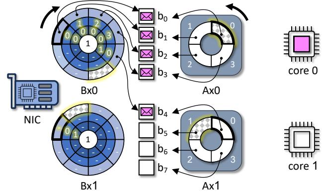

c. Each core re-arms its Ax and processes its packets, if any.  
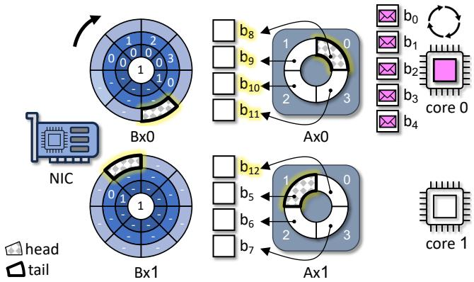  
Figure 5: RxBisect packet reception using two allocation (Ax) rings and two bisected reception (Bx) rings. Ax ring buffers are shared by both Bx rings through NIC hardware. Highlighted text indicates changes relative to the previous stage. The Ax head advances counterclockwise and the Bx head advances clockwise.

the NIC first DMA-reads a packet buffer address from the Ax head descriptor entry, and then DMA-writes the packet’s data to the packet buffer.

The NIC notifies the receiving core about a delivered packet by DMA-writing the packet buffer’s address to the target Bx ring’s head descriptor entry. The NIC notifies the allocating core about the consumed buffer by DMA-writing the buffer’s Ax ring and entry to the head descriptor of the Bx ring linked to it. In the common case, in which the receiving core is also the allocating core, these notifications are combined into a single descriptor, as shown in Figure 5b for buffers $b _ { 0 } , \ldots , b _ { 3 }$ Finally, the NIC updates the Ax and Bx ring head indexes, optionally raising an interrupt for both. Importantly, packet delivery latency that is determined by the number of dependent DMAs, which we call the “critical path,” is the same in privRing, shRing, and rxBisect (§4.4).

Finally (Figure 5c), each core processes notifications in its Bx ring (either by polling or following the aforementioned interrupt). It processes delivered packets and/or replenishes buffers consumed from its Ax ring with empty buffers that it allocates, including notifying the NIC (by means of updating the Ax ring’s tail) that new buffers are available. After processing a packet, its buffer is freed back to the system allocator. We expand on software-side processing in §4.2.

## 4.2 Software Side

Our discussion relates to software that directly interacts with the NIC, i.e., kernel-bypass applications or in-kernel drivers. Software has flexibility in how it leverages rxBisect to minimize the I/O working set by configuring Ax rings such that the aggregated size of their buffers does not exceed LLC capacity. For example, software can use small (e.g., 128-entry) per-core Ax rings. Or, software can employ a small number of large Ax rings, which are served by a few dedicated allocation cores while the remaining cores focus on packet reception. The discussion below does not assume a specific configuration. In any case, the buffer-free bisected receive rings should remain large, to absorb bursts. We detail Ax and Bx configuration guidelines in §4.5.

Allocation Mechanism The only constraint rxBisect makes on the software architecture is that it support allocation and freeing of a buffer by different threads/cores. This scenario can occur when a buffer allocated from one core’s Ax ring is used to hold a packet destined to a different core, which will then have to free this buffer after processing the packet. Fortunately, many modern multicore allocators support this allocator capability [9]. In particular, both the Linux kernel and DPDK already use such allocators [4,19]. At a high level, these allocators employ a two-level design consisting of a shared buffer pool with a per-core caching level, which reduces contention on the shared pool. Caches are filled from the shared pool when they run out of buffers and caches drain excess buffers to the shared pool when they grow beyond some threshold of the cache’s expected size (e.g., 1.5× in DPDK). The two-level allocator design is important for amortizing the cost of buffer transfer between cores. Due to it, we observe a difference of at most 15 cycles in average allocator call latency between rxBisect and privRing (where buffers never move across cores).

```c
1 int RxBisect(Ring *ax , Ring *bx ,
2 void **pkts , int len) {
3 uint32_t idx , npkts = 0, nalloc = 0;
4 BXEntry *bxe;
5 while (npkts < len && bxe = consumeBXE(bx)) {
6 if (bxe ->buf != NULL)
7 pkts[npkts ++] = bxe ->buf;
8 if (bxe ->idx == ax ->idx) {
9 ax ->desc[bxe ->idx]. buf = alloc_buf () ;
10 nalloc ++;
11 }
12 }
13 if (nalloc > 0) {
14 ax ->tail += nalloc;
15 *ax ->doorbell = ax ->tail;
16 }
17 return npkts;
18 }
```  
Listing 1: RxBisect disentangled ring receive code.

Receive Flow Listing 1 shows the rxBisect receive function, which dequeues a batch of packets for processing as well as handles notifications about allocated buffers that require replenishing. The function receives an allocation ring (ax), a bisected reception ring (bx), and an output array of packet pointers (pkts) of length len. It returns the number of received packets. Multiple cores run this code in parallel with different ring arguments, which are all interlinked by NIC hardware to share Rx buffers.

Lines 5–12 check the Bx ring for new entries. The Bx ring check in consumeBXE(bx) uses the sense reverse technique (§2) to identify ready entries without writing to Bx descriptors. When no Bx entry is ready, this function returns NULL; otherwise, it returns the first ready entry and updates the Bx ring’s tail. (We omit consumeBXE’s code.)

Each returned Bx entry indicates both the pointer of a received buffer, if there is one, and an Ax ring and entry index of a buffer consumed by the NIC. If the Bx entry contains a packet buffer, the packet is stored for processing (lines 6–7). If the Bx entry describes a buffer originating from the core’s Ax ring, then a new Ax buffer is allocated in its stead (lines 8– 10). Lines 13–16 check if allocation requests were handled and advance the Ax ring’s tail index if necessary. It is correct to advance the tail because the NIC consumes buffers in ring order and enqueues all the related notifications to this Bx ring in the same order. The code does not limit the number of allocations, to replenish as many buffers as possible. Nevertheless, the number of allocation iterations is bounded by the Ax ring size, because once it becomes empty, only this function can replenish it.

## 4.3 Comparison to PrivRing and ShRing

By disentangling buffer allocation from reception, rxBisect obtains three advantages: (1) the total number of allocated buffers in Ax rings can be smaller than the total size of the Bx rings, which reduces the I/O working set size; (2) the NIC can use buffers from any Ax ring to populate any Bx ring, so buffer sharing is achieved similarly to shRing; but (3) in contrast to shRing, sharing buffers is achieved without sharing the cores’ packet reception capacity or software synchronization.

Figure 6 depicts these differences. The figure compares the minimal I/O working set of two cores running privRing, shRing, and rxBisect. In privRing (Figure 6a), each core can work independently, without synchronization or other dependencies on other cores’ behavior. However, the existing NIC ring interface necessitates that an Rx ring able to absorb packet bursts must also hold many empty buffers, resulting in an excessive I/O working set.

ShRing (Figure 6b) solves privRing’s I/O working set problem by sharing a default-sized Rx ring, which can absorb packet bursts, between the cores, but it requires synchronization (with locks) to serialize reposting of buffers to the shared ring and advancing the ring’s tail. Crucially, shRing always incurs this latency-increasing per-packet overhead, even if the workload does not suffer from the I/O working set problem (e.g., because the packet rate allows a packet’s processing to complete before its eviction from the LLC).

In addition, with shRing, traffic destined to an overloaded core can monopolize the shared ring, preventing other cores from receiving packets. E.g., in Figure 6c, because the overloaded core 2 cannot sustain its packet rate, packets destined to it start queueing, eventually filling the ring. Thus, packets to core 1 get dropped, despite it being able to process them.

RxBisect (Figure 6d) combines the advantages of privRing and shRing without inheriting their disadvantages. Disentangling the existing Rx ring functionality into bisected reception and allocation rings with independent sizes allows rxBisect to realize a shared buffer pool, based on small per-core allocation rings—but with cores still working independently, without software synchronization or inter-core dependence. Synchronization is only required when moving freed buffers between cores, but as explained in §4.2, this synchronization is infrequent and its cost is low.

Handling of Imbalanced Load Like shRing, RxBisect reduces the minimal I/O working set by relying on a shared buffer pool, which avoids the over-provisioning of Rx buffers that occurs in privRing. It is therefore natural to ask how rxBisect responds to load imbalance that, in shRing, causes the ring to be monopolized by overloaded cores. As discussed next, thanks to rxBisect’s disentanglement of packet reception from buffer allocation, overloaded cores can only “hog” packet buffers, leading to more buffers being allocated, but they cannot interfere with packet reception by other cores.

In rxBisect, per-core Ax rings guarantee the availability of vacant receive buffers for the NIC to consume as long as there is at least one underloaded core with an Ax ring and the buffer allocator can satisfy allocation requests. For allocators preconfigured with a fixed number of buffers, their buffer pool must be large enough to keep satisfying allocation requests even when Bx rings of overloaded cores are full.

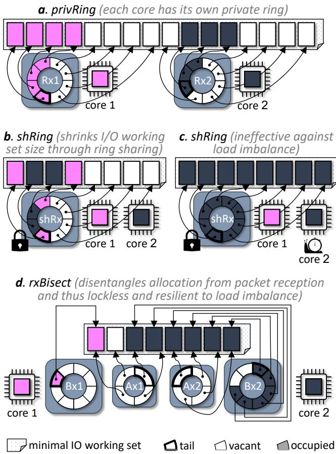  
Figure 6: RxBisect and shRing reduce the I/O working set size compared to privRing. Unlike shRing, rxBisect shares buffers without software locks, and it allows each reception ring to consume buffers from any allocation ring belonging to the same application.

Let us denote cores 1 and 2 as $C _ { 1 }$ and $C _ { 2 }$ , and consider, for example, the scenario in Figure 6d, where C2’s Ax is exhausted and its Bx is nearly full. Suppose this Bx becomes completely full—which necessarily means it contains buffers from C1’s Ax—and then $C _ { 2 }$ stalls. In this case, $C _ { 1 } \mathrm { { ' } s }$ Bx contains notifications to repopulate its Ax buffers, and because $C _ { 1 }$ is not overloaded, it can process them. Subsequently, $C _ { 1 } \mathrm { { ' } s }$ Bx can continue to receive packets using buffers allocated from its own Ax. Meanwhile, the lack of empty Bx entries on $C _ { 2 }$ causes the NIC to drop packets of $C _ { 2 } .$ . The important property here is that cores with available cycles can receive packets, which is not true of shRing (Figure 6c). Note, however, that the I/O working set might grow due to the additional buffer allocations, beyond the minimal set depicted in the figure.

## 4.4 Hardware Design Considerations

RxBisect is a new NIC-CPU interface whose complete implementation in ASIC is beyond our scope. Instead, we contrast rxBisect with existing NIC ASICs and show that the necessary changes are compatible with existing NIC mechanisms.

Packet Delivery Mechanically, rxBisect’s packet delivery algorithm is analogous to that of existing NICs, which already access two rings (Rx and CR) on packet delivery (§2). Consequently, the critical path of packet delivery in rxBisect is identical to that which current NICs use for privRing and shRing. In all hardware designs, the NIC DMA-reads (and can prefetch) buffer addresses populated by software in ring structures (an Rx ring in current NICs and an Ax ring in rxBisect). RxBisect selects the destination ring in the same way as privRing and shRing when buffers are available, and otherwise it finds a ring with available descriptors based on availability information known from Ax and Bx doorbells. Subsequently, all types of NICs DMA-write packet data followed by DMA-writing a notification in a descriptor of a target ring (a CR in current NICs and a Bx ring in rxBisect). When rxBisect needs to notify different Bx rings about packet delivery and buffer consumption, it performs these DMAwrites in parallel, without increasing the critical path length.

While such parallel writes might increase PCIe bandwidth consumption, this issue can be mitigated by batching notifications. The NIC will delay writing a Bx entry that describes only a buffer consumption until a packet for that Bx ring arrives (or a timeout). Because the waiting Bx entry and the new Bx entry (for packet arrival) are adjacent, they can typically be written with the same PCIe transaction. Similar “completion compression” mechanisms already exist in NVIDIA NICs [32, 33], indicating that this technique is practical.

Hardware vs. Software Synchronization Both rxBisect and shRing implement a shared buffer pool, but shRing places the synchronization burden on software, whereas rxBisect offloads it to hardware as follows. NIC ASICs use pipeline parallelism to meet line-rate speeds. The pipeline stage that assigns packets to ring entries processes them sequentially, one at a time. The rxBisect pipeline stage operates like privRing when both Ax and Bx rings corresponding to an arriving packet have available entries. But it must consume a buffer from another Ax/Bx pair when the destination Ax is empty. This decision can be made efficiently using combinatorial logic circuits, such as priority encoders. We discussed rxBisect applicability to real ASIC NICs with NVIDIA NIC architects, who made the following statement regarding rxBisect’s applicability to the ConnectX NIC pipeline [52]:

“An rxBisect implementation in ConnectX fits within the existing pipeline stage [that implements shRing] while maintaining current performance for multiple rings with available entries. In the worst case, when a single [Ax] ring provides buffers to several reception rings, performance will be limited by the allocation rate of the single ring.”

## 4.5 Parameter Configuration Guidelines

We propose the following guidelines to configure Ax and Bx rings. We first discuss the case of a single NIC and subsequently generalize to multiple NICs.

Ax/Bx Association For maximum flexibility, an application should use an all-to-all association of Ax/Bx rings. The reason rxBisect supports configurable Ax-to-Bx associations is to allow different applications (with disjoint Ax/Bx-sets) to work concurrently on disjoint core-sets.

Bx Ring Size (|Bx|) The primary consideration in setting |Bx| is that it will be large enough to absorb packet bursts. For 100 Gbps NICs, Figure 3a in the shRing paper [66] shows that $| B x | = 1 0 2 4$ is necessary and sufficient. This size is also the default for many systems and NIC vendors.

Ax Ring Size (|Ax|) The Ax ring should be sized to achieve two goals: (1) the I/O working set should fit into the LLC’s DDIO capacity, i.e., $k \times | A x | \times 1 5 0 0 B \leq | D D I O |$ , where k is the total number of Ax rings and |DDIO| is the DDIO capacity; and (2) the Ax rings should have enough buffers to absorb a packet burst without software buffer re-filling, i.e., $k \times \left| A x \right| \geq \left| B x \right|$ . In addition, |Ax| cannot be smaller than the vendor-enforced minimum (e.g., 64 in NVIDIA NICs).

In theory, the number of cores may be so large or DDIO capacity so small that |Ax| constraints (1) and (2) cannot both be satisfied, but we did not encounter this issue in practice.

Multiple NICs Cores should be divided among NICs in proportion to traffic demands. For example, if traffic is balanced among the NICs, cores should be equally divided between the NICs. When setting |Ax|, the total number of Ax rings over all NICs should be used for k in condition (1) above, but k in condition (2) should remain the number of per-NIC Ax rings.

## 5 Prototype

Implementing rxBisect requires changes to the NIC ASIC. Therefore, like other related studies [5, 31, 44, 63, 75, 76], we evaluate rxBisect using a software NIC framework, which we developed in DPDK. The framework allows us to run unmodified DPDK applications and emulate all NIC architectures of interest for comparison purposes.

Implementation We implement the emulation using a dedicated core, referred to as the emulator, which acts as the NIC for all worker (application) cores. The emulator uses either multiple physical Rx rings when emulating privRing (one per worker; see emulator in Figure 7a), or a single physical Rx ring shared by multiple workers when emulating shRing and rxBisect (Figures 7b and 7c). Multiple physical Rx rings are required for privRing to ensure strict separation of packet buffers between workers, as placing empty buffers from different workers in the same Rx ring would allow incoming packets for one worker to be stored in buffers allocated by another—violating privRing’s isolation property.

The emulator mediates incoming traffic by exposing virtual rings to worker cores (queues on top of the emulator in Figures 7a–7c). It does so by executing an infinite loop that: (1) reads a batch of packet pointers from the physical

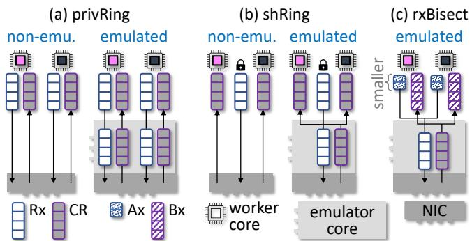  
Figure 7: An emulated NIC uses twice as many Rx entries as the corresponding non-emulated architecture, thereby doubling the I/O working set size. This also applies to rxBisect (as Σ |Ax| = |Rx| in Figure c), so comparing rxBisect to the emulated versions is fairer.

Rx ring(s); (2) dispatches packets to the appropriate virtual queues (completion rings for privRing and shRing, Bx rings for rxBisect); and (3) replenishes the physical ring(s) with buffers taken from virtual Rx or Ax rings. Dispatching determines the target virtual queues by the least significant bits of RSS hash values, which are computed from each packet’s 5- tuple. For privRing, the value is always the same per physical Rx ring, which corresponds to a single virtual ring. In contrast, for shRing and rxBisect, packets from the same physical Rx ring may yield different RSS values.

Usage The I/O working set of each emulated version is twice that of its non-emulated counterpart because: (1) it doubles the number of Rx entries by maintaining a virtual Rx ring in addition to using a physical one; (2) each physical or virtual Rx ring is fully populated by design; and (3) each Rx entry must be used before it can be reused. The 2× ratio also applies to rxBisect, as the combined size of all Ax rings is set equal to that of the physical Rx ring used by the emulator—a ring that would not exist in a hardware implementation.

Thus, methodologically, it is fairer to compare rxBisect to its emulated counterparts, which better isolates performance differences due to changing I/O working sets, constituting an apples-to-apples comparison. Frequently, however, emulated rxBisect performs similarly to or better than non-emulated versions, in which case we prefer to compare it to the latter. These results likely underestimate the benefit of rxBisect.

DDIO DDIO effects (§3.1) are reflected in the emulated setup. To avoid competing with worker cores, the emulator runs on a separate CPU located on a different NUMA node than the workers (Figure 8). DDIO, however, operates only within the node directly connected to the physical NIC (denoted N0). Nevertheless, running the emulation code on another node, remote from the NIC, is not problematic in our framework for two reasons. First, the emulator only manipulates pointers to packet buffers and never accesses the packet contents. As a result, packets remain on N0—local to the NIC—ensuring DDIO functions normally from the workers’ perspective with respect to packet data. Second, our evaluation focuses on larger (≤ 1500 B) packets to stress the memory subsystem. Unlike packets, the virtual queue descriptors that point to them ping-pong between nodes. But the size of each descriptor (one cache line) is small compared to the associated packet, so the effect is limited.

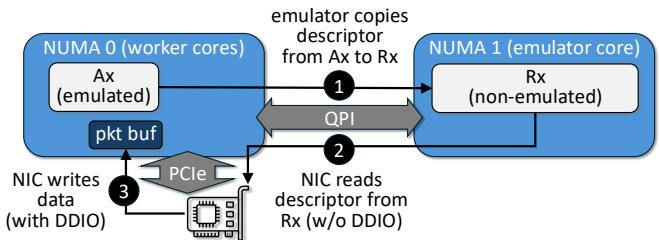  
Figure 8: Emulation captures DDIO effects as packet buffers and worker cores reside on the same NUMA node as the physical NIC.

<table><tr><td colspan="3"></td><td colspan="3">throughput (Gbps)</td><td colspan="3">latency (usec)</td></tr><tr><td>NF</td><td></td><td>setup</td><td>non</td><td>emu</td><td>dif</td><td>non</td><td>emu</td><td>dif</td></tr><tr><td>LB</td><td></td><td>privRing</td><td>162</td><td>145</td><td>-11%</td><td>1,224</td><td>1,432</td><td>+17%</td></tr><tr><td rowspan="3"></td><td> small privRing</td><td>195</td><td>192</td><td>-2%</td><td>110</td><td></td><td>96</td><td>+15%</td></tr><tr><td>shRing</td><td>194</td><td>195</td><td></td><td>-0%</td><td>69</td><td>69</td><td>+0%</td></tr><tr><td>privRing</td><td>155</td><td></td><td>136</td><td>-12%</td><td>1,256</td><td>2.431</td><td>+94%</td></tr><tr><td rowspan="3">NAT</td><td></td><td></td><td>196</td><td>179</td><td>-9%</td><td>89</td><td>124</td><td>+39%</td></tr><tr><td>small privRing</td><td></td><td></td><td>195</td><td></td><td></td><td></td><td></td></tr><tr><td>shRing</td><td>195</td><td></td><td></td><td>-0%</td><td>67</td><td>67</td><td>-0%</td></tr></table>

Table 2: Emulation fidelity (non, emu, and dif stand for nonemulated, emulated, and difference, respectively).

Overheads To faithfully emulate the overhead of hardware NIC packet delivery, we emulate worker doorbell writes via MMIO writes to NIC memory. Additionally, we emulate the extra DMA write to the Bx ring that occurs when a packet’s buffer does not originate from the receiving core’s Bx ring by issuing 64 B self-target RDMA writes from NIC memory to host memory.

Fidelity To be useful, the emulation should underestimate the performance achievable with a real hardware NIC, while remaining comparable. We assess whether this is the case in Table 2, which compares the performance of the emulated and non-emulated versions of default privRing, small privRing, and shRing (described in §3.2) using the NAT and LB NFs. Full experimental details are provided in §6. We observe that emulated throughput and latency indeed underperform by up to 12% and 94%, respectively. Emulation latency nearly doubles in the NAT/privRing case as workers are overloaded and each packet must wait through two full Rx rings (virtual and physical) before being processed. Throughput, in contrast, is insensitive to such queueing delays.

## 6 Evaluation

We evaluate rxBisect using network function benchmarks and the MICA key-value store [49], when load is balanced and shRing performs well (§6.1) and when it does not (§6.2).

System Setup We use two Dell PowerEdge R640 servers. One server is the system under test and the other is the load generator. The load generator runs the stateless Cisco T-Rex packet generator [14], modified to improve latency measurement accuracy [68]. Each server has dual 2.1 GHz Xeon Silver 4216 CPUs, each with 16 cores and an 11-way 22 MiB LLC, and 128 GiB (=4 × 16 GiB) 2933 MHz DDR4 memory. The servers are connected back-to-back via two pairs of 100 Gbps NVIDIA ConnectX-5 Ethernet NICs [58] and are configured following NVIDIA’s DPDK best performance guidelines [61].

All experiments use the default system and application settings. We report trimmed means of ten runs, i.e., with the minimum and maximum discarded. Standard deviation is always below 5%. Throughput results reflect the traffic rate sent back to the load generator after processing, i.e., they discount packets dropped by the server.

Applications We use address translation (NAT) and load balancing (LB) NFs, implemented with FastClick [7]. NAT remaps network addresses. LB assigns flows to one of 32 servers. Both rewrite packet IP headers, using a 10 M-entry hash table to maintain state. As a macrobenchmark, we use the MICA key-value store [49]. Applications run on one CPU of the test server (the other CPU is reserved for emulation). Unless noted otherwise, we dedicate 8 cores to each NIC.

Evaluated Architectures We compare five architectures: (1) rxBisect, with 128-entry Ax ring and 1 Ki-entry Bx ring for each core (emulated); (2) privRing, with the default 1 Kientry Rx ring per core; (3) small privRing, which decreases the per-core ring size by 8× (from 1 Ki to 128) to obtain the same I/O working set size as rxBisect and shRing (proven impractical, as it impedes burst absorption, but included as a yardstick); (4) shRing, with two shared default-sized (1 Kientry) Rx rings, one per NIC, such that each is shared by 8 cores (implemented using the RxArr variant [66]); and, when relevant, (5) an idealized version of dynamic shRing, which does not run but instead reports the better result between privRing and shRing.

Comparison Methodology As explained in §5, rxBisect should be compared to the emulated variants. We nevertheless compare it to the non-emulated executions, showing the emulated counterparts (with patterned bars or dashed lines) only when non-emulated execution outperforms rxBisect.

## 6.1 Balanced Load

This section shows that rxBisect, like shRing, performs well when load is balanced or bursty and it outperforms privRing even when rxBisect is emulated and privRing runs natively.

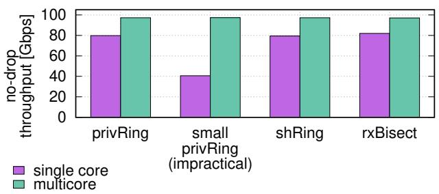  
Figure 9: Buffer sharing allows single-core rxBisect and shRing to achieve the same no-drop throughput as 1 Ki privRing with only 1/8 of its buffers, in contrast to small privRing, which does not share.

No-Drop Throughput Figure 9 shows the DPDK l3fwd RFC2544 no-drop throughput of one 100 Gbps NIC with 1500 B packets when using an individual core (“single core”) and 8 cores combined (“multicore”). RxBisect and shRing’s buffer sharing enables them to match privRing’s throughput with only 1/8 of its I/O working set, both with multiple cores (each of which handles 1/8 of the traffic) and with a single core, which can absorb bursts by using all available buffers. In contrast, small privRing does not share and thus fails to similarly absorb bursts, which makes it impractical [66].

NAT and LB We run NAT and LB on all 16 cores and load them with 200 Gbps using 1500 B packets. Figure 10 shows (a) throughput, (b) latency, (c) ring occupancy, (d) DDIO hit rate, and (e) memory bandwidth. The latter two are measured using Intel PCM [36]. At this load, architectures with a small I/O working set achieve line rate throughput and comparable average latency (100 µs–119 µs). This is due to their effective use of the 2 LLC ways assigned by default to DDIO (Figure 10e). Since rxBisect is emulated while others run natively, its latency, ring occupancy, memory bandwidth, and DDIO miss rate are higher than the rest (see also §5).

Due to its large I/O working set, privRing throughput collapses by up to 20% compared to rxBisect. As a result of failing to sustain line rate, privRing’s Rx rings fill up, causing latency to increase by 11× due to the additional queueing time. PrivRing can achieve line rate in LB if DDIO’s LLC portion is increased to 8 LLC ways, but fails to achieve line rate for NAT even if all the LLC is assigned to DDIO. (Of course, exposing more LLC ways to DDIO is a double-edged sword, as I/O and application memory accesses compete [83].)

Key-Value Store We use the MICA key-value store [49] to evaluate the effect of rxBisect beyond NFs. We run MICA on 8 cores (using a single NIC) with 128 B keys and 1024 B values. MICA maps incoming requests to processing cores by hashing the target key. We use workloads with 95% PUT requests at the highest possible rate.

Figure 11 shows throughput obtained when the key distribution is (a) uniform or (b) skewed (Zipf with parameter 0.99).

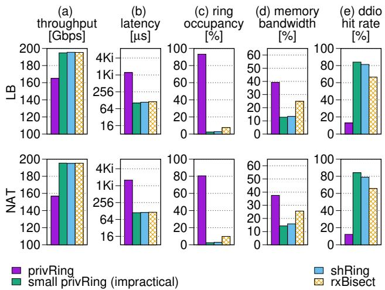  
Figure 10: LB and NAT performance.

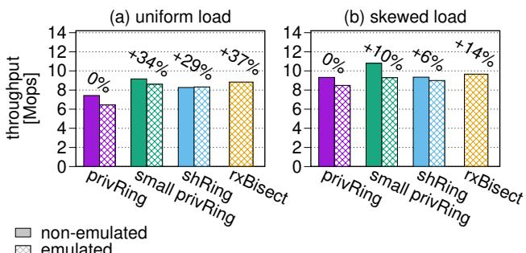  
Figure 11: MICA key-value store throughput with uniform and skewed key distributions. Top labels compare to emulated privRing.

The throughput of rxBisect is higher than privRing, small privRing, and shRing (all emulated) by up to 37%, 3% and 7%, respectively. The throughput of rxBisect is also higher than non-emulated privRing and shRing by up to 18% and 6%, respectively. RxBisect underperforms (by up to 12%) only the yardstick non-emulated small privRing, which is not a practical architecture.

## 6.1.1 Impact of Ring Sizes

This section shows the impact of varying Ax and Bx ring sizes. It demonstrates that buffer sharing enables improved burst absorption with small Ax rings, and that the I/O working set is not sensitive to the size of Bx rings.

Varying Ax ring size We evaluate the impact of Ax ring size on no-drop throughput using the RFC2544 [10] benchmark in DPDK l3fwd. The test uses 1500 B packets from a single flow directed at an application running on four cores, while varying the size of rxBisect Ax rings and non-emulated privRing Rx rings. The size of rxBisect Bx rings is fixed at 1 KiB. Figure 12 shows the results.

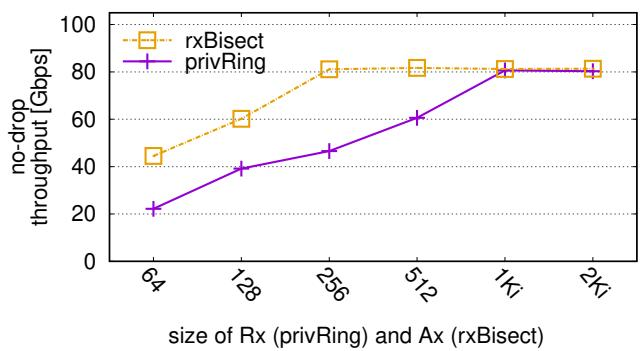  
Figure 12: DPDK l3fwd no-drop throughput, utilizing 4 cores and a single 100 Gbps NIC while varying the size of Ax rings (rxBisect) and Rx rings (privRing). RxBisect Bx rings are set to 1 Ki entries for all runs, similarly to Rx rings. RxBisect buffer sharing improves burst absorption, leading to higher no-drop throughput.

RxBisect leverages buffer sharing across the four Ax rings, allowing a single core’s Bx ring to absorb bursts up to four times larger than a single Ax ring and up to the size of the Bx ring. Consequently, rxBisect achieves the maximum singleflow no-drop throughput of ≈80 Gbps with just 256 Ax ring entries, whereas privRing requires four times more—1 Ki entries—to reach the same performance.

Varying Bx ring size We evaluate the sensitivity of the I/O working set to Bx ring size using the following experiment. NAT and LB run on all 16 cores under a 200 Gbps load with 1500 B packets. Figure 13 shows throughput as we vary the size of rxBisect Bx rings and non-emulated privRing Rx rings, with rxBisect Ax rings fixed at 128 entries.

As expected, increasing privRing Rx ring size grows the I/O working set, reducing throughput—first as it exceeds the DDIO-allocated portion of the LLC (at 256 entries), and more significantly when it exceeds the total LLC capacity (at 1 Ki entries). In contrast, increasing rxBisect Bx ring size does not increase the working set, sustaining line-rate throughput.

## 6.2 Unbalanced Load: ShRing Limitations

Next, we show that rxBisect remains effective even when shRing is not. ShRing is ineffective upon imbalance that leads to overload, which may occur because incoming traffic is spread unevenly across cores, or because per-packet processing times are highly-skewed. Additionally, shRing is ineffective when its smaller I/O working set does not compensate for its synchronization overheads.

The dynamic shRing variant addresses these limitations by switching between shRing and privRing at run time using a heuristic that assesses which is currently more beneficial [66]. We therefore compare to this variant as well.

Conceivably, dynamic core frequency scaling can mitigate imbalance by helping overloaded cores at the expense of less busy cores. But when using DPDK, dynamic core scaling is irrelevant due to core busy polling. We confirm this by running with and without scaling and observing similar results.

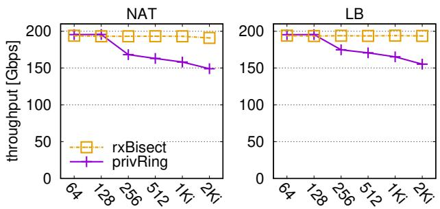  
size of Rx (privRing) and Bx (rxBisect)  
Figure 13: Throughput at 200 Gbps load while varying the size of Bx rings (rxBisect) and Rx rings (privRing). The size of rxBisect Ax rings is 128 entries for all runs. The rxBisect I/O working set size is constant and small, regardless of Bx size, avoiding the performance degradation experienced by privRing with ≥256 Rx entries.

Processing Variability We evaluate a synthetic NF workload running on all 16 cores and processing 1500 B packets. Packet processing consists of accessing two random addresses in a 40 MiB buffer, performing a routing table lookup (similarly to the l3fwd NF), and sending the packet out. We designate one core per each NIC as the “target core.” We modify the load generator to send only 1 Gbps of traffic to the target core while the rest is spread between the other cores. We also tweak the target core’s packet processing routine to access memory a configurable number of times per packet (other cores’ processing remains unchanged).

Figure 14 presents the resulting throughput. RxBisect and small privRing attain line rate throughput. However, shRing’s throughput degrades by up to 60% as the target core’s processing slows down, clogging the shared ring with its traffic and blocking other cores from receiving packets (which thus get dropped). Dynamic shRing only offers the best of shRing and privRing, and thus it declines from shRing’s line rate speed to privRing’s throughput (never above 178 Gbps, due to its I/O working set) when the target core’s processing exceeds 100 memory accesses per packet. Consequently, rxBisect outperforms dynamic shRing by up to 12%.

Traffic Variability We use the same synthetic NF as above. Only now, all cores run the same packet processing logic, but we modify the load generator configuration to vary the percentage of packets directed at the target core. We use 64 B packets for traffic directed at the target core and 1500 B packets for traffic directed at all other cores, to minimize the target core’s impact on overall throughput.

Figure 15 shows the resulting throughput. RxBisect and small privRing attain line rate throughput. RxBisect experiences a 6% throughput degradation when the target core’s packet rate exceeds 20%, as a result of the emulator core becoming a bottleneck. To demonstrate this, we also show small privRing emulation, whose performance degrades at a rate similar to rxBisect when the target core’s packet rate exceeds 25%. ShRing throughput declines by up to 49% as the target core’s incoming packet rate increases, again due to its traffic clogging the shared ring. PrivRing throughput never exceeds 175 Gbps, and so dynamic shRing is outperformed by rxBisect.

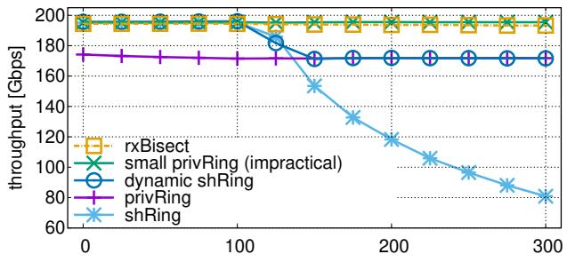  
target core memory accesses (#)

Figure 14: Processing variability caused by increased memory accesses has no effect on rxBisect throughput despite ring sharing, whereas shRing’s sharing degrades throughput when faced with such increased variability.
<table><tr><td rowspan="2">tgt packets total</td><td rowspan="2">tgt alloc total</td><td rowspan="2">tgt</td><td rowspan="2"> $\frac { \overline { { f r e e } } } { t o t a l }$ </td><td rowspan="2"> $\overline { { n o n - t g t ~ } } \frac { a l l o c } { t o t a l }$ </td><td rowspan="2">non-tgt free total</td></tr><tr><td></td></tr><tr><td>1% (minimum)</td><td>0.140%</td><td></td><td>0.000%</td><td>0.002%</td><td>0.003%</td></tr><tr><td>31% (maximum)</td><td>0.001%</td><td>0.010%</td><td></td><td>0.039%</td><td>0.000%</td></tr></table>

Table 3: RxBisect inter-core memory allocator cycles out of all cycles on target (tgt) and non-target (non-tgt) cores during minimum (1%) and maximum traffic imbalance (31%) to target core.

Inter-Core Memory Allocator RxBisect depends on intercore memory allocators (e.g., DPDK’s pktmbuf\_pool), which use per-core caches to reduce synchronization. However, rxBisect packet buffer sharing can transfer buffers between cores, potentially stressing the memory allocator (allocating on one core and releasing on another core can deplete the per-core cache on the former).

We analyze the global allocator cycles from the traffic variability experiment. Table 3 presents results for rxBisect at the extremes of imbalance. For other architectures, allocator cycles are always under 0.001% of total cycles (not shown). Overall, the allocator uses less than 0.2% of total cycles in all cases. At minimal target core load, it processes fewer packets, spending 0.14% of cycles in the allocator providing buffers to other cores. At maximal load, non-target cores spend 0.039% cycles allocating buffers to be used by the target core, which spends 0.01% cycles’ returning buffers to the global allocator.

Real Packet Trace Figure 16 shows NAT and LB throughput when processing the CAIDA trace analyzed in §3.3, co-located with PageRank [8] to increase memory bandwidth pressure. Dynamic shRing selects the better option between privRing and shRing, but both perform suboptimally: the added memory bandwidth pressure degrades privRing, while the imbalanced load (highlighted in Figure 4) degrades shRing. Thus, rxBisect outperforms dynamic shRing throughput for LB and NAT by 16% and 20%, respectively.

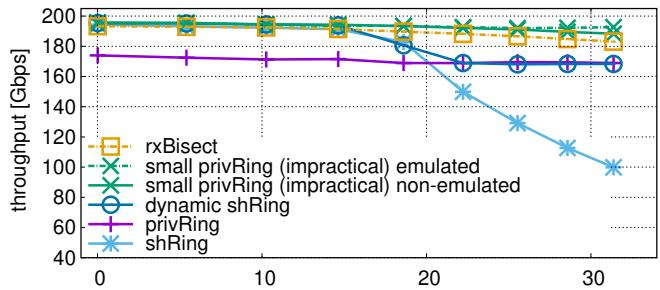  
incoming target core pkts out of total pkts (%)

Figure 15: Traffic variability caused by increased packet arrival rate on a single core has no effect on rxBisect throughput despite ring sharing. In contrast, shRing’s approach to ring sharing degrades throughput in this case.  
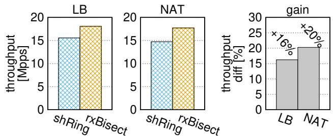  
Figure 16: RxBisect outperforms dynamic shRing when processing the imbalanced CAIDA trace (see §3.3) with PageRank co-location.

Figure 17 shows results from a similar set of experiments, this time with a varying number of co-located STREAM triad [41] instances, which are memory bandwidth intensive. RxBisect throughput exceeds dynamic shRing by up to 16% (emulated) and up to 8% and 13% (non-emulated) for NAT and LB, respectively. We show both emulated and nonemulated results because, unlike other workloads we studied, CAIDA trace processing slows down under emulation. As a result, non-emulated privRing—and therefore non-emulated dynamic shRing—can outperform (emulated) rxBisect by up to 7% in the absence of memory contention.

With no memory bandwidth contention, dynamic shRing defaults to privRing, which performs well with the imbalanced trace. But as contention increases, shRing begins to outperform privRing, prompting the dynamic variant to switch to shRing. In both cases, when making an apples-to-apples comparison of emulated NICs only (by “usage” in §5), rxBisect performs better, as it uses less memory bandwidth and is resilient to imbalanced load.

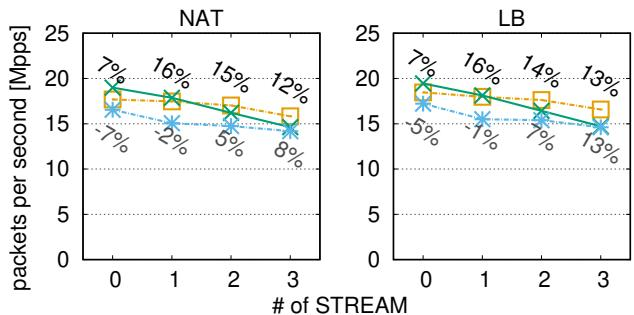  
rxBisect dyn. shRing (non-emulated) dyn. shRing (emulated)

Figure 17: When comparing emulated setups (apples-to-apples), rxBisect outperforms dynamic shRing regardless of the number of colocated STREAM instances. Top and bottom labels compare rxBisect to emulated and non-emulated dynamic shRing, respectively.  
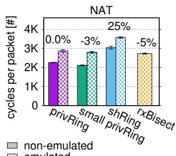

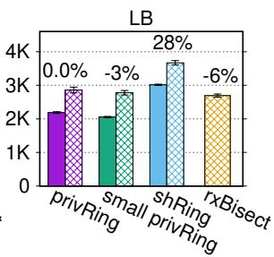  
Figure 18: Under low load, shRing yields no benefit and demonstrates its synchronization overhead. In contrast, rxBisect’s overhead is minimal. Top labels compare against emulated privRing.

Low Traffic Rate Figure 18 shows the per-packet processing time (in CPU cycles) for NAT and LB when arriving traffic consists of 1 Gbps of 1500 B packets, which are spread evenly among all cores. Non-emulated shRing’s synchronization overhead results in it spending up to 34% and 46% more cycles per packet than non-emulated privRing and small privRing, respectively. In contrast, rxBisect (which runs under emulation) requires ≈ 10% fewer cycles to process a packet than non-emulated shRing. We can safely conclude that with rxBisect hardware, rxBisect will leverage Rx buffer sharing for a small I/O working set with faster packet processing than in shRing. Based on rxBisect’s design, which is similar to privRing, and emulation results, we hypothesize that native rxBisect packet processing efficiency will be comparable to privRing’s.

## 7 Related Work

Leaky DMA NICs write directly to two LLC ways with DDIO. Poor I/O working set management causes incoming packets to unnecessarily evict LLC data including other packets being processed; this is also called the “leaky DMA” problem [79]. Several works, complementary to ours, tackled the leaky DMA problem by partitioning the LLC between I/O and applications to avoid interference [83] and by placing only packets headers in the LLC [29, 65, 71].

Host-NIC Interfaces Recently, Enso [ ¯ 70] proposed a streaming interface for NIC that reduces PCIe overheads which enables line-rate processing of small packets. Enso¯ is, however, orthogonal to rxBisect because it still suffers from the I/O working set problem which rxBisect solves. The two are complementary: Enso helps with small I/O working ¯ sets and rxBisect helps with large I/O working sets.

Sharing Receive Buffers ShRing [66] and RDMA shared receive queues (SRQ) [35], like rxBisect, share Rx buffers between cores. But both shRing and SRQ perform poorly with load imbalance. Mellanox receive memory pools (RMP) is a hardware abstraction that can be used to share buffers between several Rx rings that reside on the same core [48] or to implement shRing, but RMP still employs a traditional, entangled Rx ring through which both allocation and reception are done. As a result, RMP cannot share buffers between several cores without locking to advance the shared ring’s tail pointer. Junction [26] shares receive buffers via RMP and handles load imbalance by using work stealing and a dedicated core that monitors workers and refills ring buffers. RxBisect, in contrast, allows all cores to be workers, improving total packet processing capacity.

Load Imbalance Load imbalance is a fundamental problem in parallel processing. In end-host networking, packets are typically spread among cores using receive side scaling (RSS), which assigns packets to cores based on a hash value computed from packet header fields [59]. Custom RSS functions can rebalance the load between cores [6], but this approach is inherently static and cannot address dynamic load imbalance. Several recent works tackle the dynamic imbalance problem by offloading transport or application layers to the NIC, such that it can rebalance incoming messages among cores according to their load [17, 50, 77]. RxBisect is complementary to these approaches as it helps reduce the I/O working set size by sharing packet buffers without synchronization.

## 8 Conclusion

Today’s NIC interface needlessly overcrowds the LLC with I/O buffers to absorb worst-case packet bursts, degrading the performance of high-throughput applications. RxBisect absorbs bursts with much fewer buffers by untangling the dual role of Rx rings.

## References

[1] Saksham Agarwal, Rachit Agarwal, Behnam Montazeri, Masoud Moshref, Khaled Elmeleegy, Luigi Rizzo,

Marc Asher de Kruijf, Gautam Kumar, Sylvia Ratnasamy, David Culler, and Amin Vahdat. Understanding host interconnect congestion. In ACM Workshop on Hot Topics in Networks (HotNets), 2022. https://doi.org/10.1145/3563766.3564110.

[2] Mohammad Alizadeh, Abdul Kabbani, Tom Edsall, Balaji Prabhakar, Amin Vahdat, and Masato Yasuda. Less is more: Trading a little bandwidth for ultra-low latency in the data center. In USENIX Symposium on Networked Systems Design and Implementation (NSDI), 2012. https://www.usenix.org/conference/nsdi12/te chnical-sessions/presentation/alizadeh.

[3] Fabien André, Stéphane Gouache, Nicolas Le Scouarnec, and Antoine Monsifrot. Don’t share, don’t lock: Large-scale software connection tracking with krononat. In USENIX Annual Technical Conference (ATC), pages 453–466, 2018. https://www.usenix .org/conference/atc18/presentation/andre.

[4] Ilias Apalodimas. Page pool API. https://www.kernel.org/doc/html/latest/net working/page\_pool.html, 2019. Accessed: 2020-07-14.

[5] Wei Bai, Li Chen, Kai Chen, and Haitao Wu. Enabling ECN in Multi-Service Multi-Queue data centers. In USENIX Symposium on Networked Systems Design and Implementation (NSDI), pages 537–549, 2016. https://www.usenix.org/conference/nsdi16/te chnical-sessions/presentation/bai.

[6] Tom Barbette, Georgios P. Katsikas, Gerald Q. Maguire, and Dejan Kostic. RSS++: Load and ´ state-aware receive side scaling. In ACM Conference on Emerging Networking Experiments and Technologies (CoNEXT), pages 318–333, 2019. https://doi.org/10.1145/3359989.3365412.

[7] Tom Barbette, Cyril Soldani, and Laurent Mathy. Fast userspace packet processing. In ACM/IEEE Symposium on Architectures for Networking and Communications Systems (ANCS), pages 5–16, 2015. https://doi.org/10.1109/ANCS.2015.7110116.

[8] Scott Beamer, Krste Asanovic, and David Patterson. ´ The GAP Benchmark Suite. arXiv e-prints, page arXiv:1508.03619, Aug 2015.

[9] Emery D. Berger, Kathryn S. McKinley, Robert D. Blumofe, and Paul R. Wilson. Hoard: A scalable memory allocator for multithreaded applications. In ACM International Conference on Architectural Support for Programming Languages and Operating Systems (ASPLOS), pages 117–128, 2000.

[10] S. Bradner and J. McQuaid. Benchmarking methodology for network interconnect devices. RFC 2544, Internet Engineering Task Force, March 1999. http://www.rfc-editor.org/rfc/rfc2544.txt.

[11] Jesse Brandeburg. ice: change default number of receive descriptors. https://marc.info/?l=linux -netdev&m=156771568024262&w=2, 2019. Intel. Accessed: Jun 2021.

[12] CADIA: Center for Applied Internet Data Analysis. The CAIDA UCSD statistical information for the CAIDA anonymized internet traces. https://www.ca ida.org/catalog/datasets/trace\_stats/. Accessed: May 2025.

[13] Qizhe Cai, Shubham Chaudhary, Midhul Vuppalapati, Jaehyun Hwang, and Rachit Agarwal. Understanding host network stack overheads. In ACM SIGCOMM Conference on Applications Technologies Architecture and Protocols for Computer Communications, pages 65–77, 2021. https://doi.org/10.1145/3452296.3472888.

[14] Cisco. TRex: Realistic Traffic Generator. https://trex-tgn.cisco.com/. Accessed: May 2021.

[15] Intel Corporation. Intel data direct i/o technology (intel DDIO): A primer. https://www.intel.com/content/dam/www/publ ic/us/en/documents/technology-briefs/data -direct-i-o-technology-brief.pdf, 2012. Accessed: 2020-07-18.

[16] Nithin Dabilpuram. [dpdk-dev] [patch 00/44] marvell CNXK ethdev driver. https://inbox.dpdk.org/dev/20210306153404. 10781-4-ndabilpuram@marvell.com/T, 2021. Marvell. Accessed: 2022-11-28.

[17] Alexandros Daglis, Mark Sutherland, and Babak Falsafi. Rpcvalet: Ni-driven tail-aware balancing of µs-scale rpcs. In ACM International Conference on Architectural Support for Programming Languages and Operating Systems (ASPLOS), pages 35–48, 2019. https://doi.org/10.1145/3297858.3304070.

[18] Mihai Dobrescu, Katerina Argyraki, and Sylvia Ratnasamy. Toward predictable performance in software packet-processing platforms. In USENIX Symposium on Networked Systems Design and Implementation (NSDI), pages 141–154, 2012. https://www.usenix.org/conference/nsdi12/te chnical-sessions/presentation/dobrescu.

[19] DPDK memory pool library. https://doc.dpdk.org /guides/prog\_guide/mempool\_lib.html, 2014. Accessed: 2023-08-30.

[20] Matt Faraclas. Received packets have been dropped by NIC. https://indeni.com/blog/cross-vendor-a lert-of-the-week-some-received-packets-hav e-been-dropped-by-nic/, 2014. Accessed: Jun 2021.

[21] Alireza Farshin, Tom Barbette, Amir Roozbeh, Gerald Q. Maguire Jr., and Dejan Kostic. Packetmill: ´ Toward per-core 100-Gbps networking. In ACM International Conference on Architectural Support for Programming Languages and Operating Systems (ASPLOS), pages 1–17, 2021. https://doi.org/10.1145/3445814.3446724.

[22] Alireza Farshin, Amir Roozbeh, Gerald Q. Maguire Jr., and Dejan Kostic. Reexamining direct cache access to ´ optimize I/O intensive applications for multi-hundred-gigabit networks. In USENIX Annual Technical Conference (ATC), pages 673–689, 2020. https://www.usenix.org/conference/atc20/pr esentation/farshin.

[23] Alireza Farshin, Amir Roozbeh, Gerald Q Maguire Jr, and Dejan Kostic. Make the most out of last level cache ´ in intel processors. In ACM Eurosys, pages 1–17, 2019. https://doi.org/10.1145/3302424.3303977.

[24] Bailey Forrest. [patch net-next 00/16] gve: Introduce DQO descriptor format. https://lore.kernel.org/netdev /20210624180632.3659809-1-bcf@google.com/, 2021. Google Virtual Ethernet NIC. Accessed: 2022-11-28.

[25] FreeBSD. Network RSS. https://wiki.freebsd.org/NetworkRSS, 2014. Accessed: Jan 2017.

[26] Joshua Fried, Gohar Irfan Chaudhry, Enrique Saurez, Esha Choukse, Inigo Goiri, Sameh Elnikety, Rodrigo Fonseca, and Adam Belay. Making kernel bypass practical for the cloud with junction. In USENIX Symposium on Networked Systems Design and Implementation (NSDI), pages 55–73, 2024. https://www.usenix.org/conference/nsdi24/pr esentation/fried.

[27] Joshua Fried, Zhenyuan Ruan, Amy Ousterhout, and Adam Belay. Caladan: Mitigating interference at microsecond timescales. In USENIX Symposium on Operating System Design and Implementation (OSDI), pages 281–297, 2020. https://www.usenix.org/c onference/osdi20/presentation/fried.

[28] Fritz Kruger. CPU bandwidth - the worrisome 2020 trend. https://blog.westerndigital.com/cpu-b andwidth-the-worrisome-2020-trend/, 2020. Accessed: 2021-06-09.

[29] Swati Goswami, Nodir Kodirov, Craig Mustard, Ivan Beschastnikh, and Margo Seltzer. Parking packet payload with p4. In ACM Conference on Emerging Networking Experiments and Technologies (CoNEXT), pages 274–281, 2020. https://doi.org/10.1145/3386367.3431295.

[30] Junfeng Guo. [patch 01/13] net/idpf/base: introduce base code. https://yhbt.net/lore/dpdk-dev/L V2PR11MB5997FEBB6B1EC4B900EF6CFFF7379@LV2P R11MB5997.namprd11.prod.outlook.com/T/, 2022. Intel IDPF. Accessed: 2022-11-28.

[31] Sangjin Han, Keon Jang, Aurojit Panda, Shoumik Palkar, Dongsu Han, and Sylvia Ratnasamy. SoftNIC: A software NIC to augment hardware. Technical Report UCB/EECS-2015-155, EECS Department, University of California, Berkeley, May 2015. http://www2.eecs.berkeley.edu/Pubs/TechRpt s/2015/EECS-2015-155.html.

[32] Ofer Hayut, Noam Bloch, Michael Kagan, and Ariel Shachar. Efficient delivery of completion notifications. https: //patents.google.com/patent/US8924605B2, 2012. Accessed: Nov 2024.

[33] Ofer Hayut, Noam Bloch, Michael Kagan, and Ariel Shachar. Reducing size of completion notifications. https: //patents.google.com/patent/US8959265B2, 2012. Accessed: Nov 2024.

[34] Internet engineering task force (IETF). https://www.ietf.org/.

[35] InfiniBand Trade Association (IBTA). What is InfiniBand. https: //www.infinibandta.org/ibta-specification/. Accessed: Dec 2021.

[36] Intel. Processor Counter Monitor (PCM). https://github.com/opcm/pcm. Accessed: 2021-02-05.

[37] Intel. Tuning the buffers: a practical guide to reduce or avoid packet loss in dpdk applications. https://indeni.com/blog/cross-vendor-alert -of-the-week-some-received-packets-have-b een-dropped-by-nic/, 2017. Accessed: Jun 2021.

[38] Intel Corporation. DPDK: Data plane development kit. http://dpdk.org, 2010. Accessed: May 2016.

[39] Rishabh Iyer, Katerina Argyraki, and George Candea. Performance interfaces for network functions. In USENIX Symposium on Networked Systems Design and Implementation (NSDI), pages 567–584, 2022. https://www.usenix.org/conference/nsdi22/pr esentation/iyer.

[40] Van Jacobson. Evolving from AFAP: Teaching NICs about time. https://legacy.netdevconf.info/0x 12/session.html?evolving-from-afap-teachin g-nics-about-time, 2018. Accessed: 2023-02-03.

[41] John McCalpin. STREAM: Sustainable memory bandwidth in high performance computers. https://www.cs.virginia.edu/stream/, 1996. Accessed: Mar 2024.

[42] Kostis Kaffes, Timothy Chong, Jack Tigar Humphries, Adam Belay, David Mazières, and Christos Kozyrakis. Shinjuku: Preemptive scheduling for µsecond-scale tail latency. In USENIX Symposium on Networked Systems Design and Implementation (NSDI), pages 345–360, 2019. https://www.usenix.org/conference/nsdi 19/presentation/kaffes.

[43] Georgios P. Katsikas, Tom Barbette, Dejan Kostic,´ Rebecca Steinert, and Gerald Q. Maguire Jr. Metron: NFV service chains at the true speed of the underlying hardware. In USENIX Symposium on Networked Systems Design and Implementation (NSDI), pages 171–186, 2018. https://www.usenix.org/confere nce/nsdi18/presentation/katsikas.

[44] Antoine Kaufmann, SImon Peter, Naveen Kr. Sharma, Thomas Anderson, and Arvind Krishnamurthy. High performance packet processing with FlexNIC. In ACM International Conference on Architectural Support for Programming Languages and Operating Systems (ASPLOS), pages 67–81, 2016. http://dx.doi.org/10.1145/2872362.2872367.

[45] Marios Kogias, George Prekas, Adrien Ghosn, Jonas Fietz, and Edouard Bugnion. R2P2: Making RPCs first-class datacenter citizens. In USENIX Annual Technical Conference (ATC), pages 863–880, 2019. https://www.usenix.org/conference/atc19/pr esentation/kogias-r2p2.

[46] Maciek Konstantynowicz, Patrick Lu, and Shrikant M. Shah. Benchmarking and analysis of software data planes. https://fd.io/wp-content/uploads/sit es/34/2018/01/performance\_analysis\_sw\_data \_planes\_dec21\_2017.pdf, 2017. White paper from FD.io – The Fast Data I/O Project.

[47] Kevin Laatz. [dpdk-dev] [PATCH v2 0/3] Increase default RX/TX ring sizes. https://mails.dpdk.org

/archives/dev/2018-January/086889.html, 2018. Intel DPDK. Accessed: Jun 2021.

[48] Xueming Li. [dpdk-dev] [patch v11 0/7] ethdev: introduce shared rx queue. https://lore.kernel.org/all/20211020075319. 2397551-1-xuemingl@nvidia.com/, 2021. Accessed: 2023-04-13.

[49] Hyeontaek Lim, Dongsu Han, David G. Andersen, and Michael Kaminsky. MICA: A holistic approach to fast in-memory key-value storage. In USENIX Symposium on Networked Systems Design and Implementation (NSDI), pages 429–444, 2014. https://www.usenix.org/conference/nsdi14/te chnical-sessions/presentation/lim.

[50] Jiaxin Lin, Adney Cardoza, Tarannum Khan, Yeonju Ro, Brent E. Stephens, Hassan Wassel, and Aditya Akella. RingLeader: Efficiently offloading Intra-Server orchestration to NICs. In USENIX Symposium on Networked Systems Design and Implementation (NSDI), pages 1293–1308, 2023. https://www.usenix.org /conference/nsdi23/presentation/lin.

[51] Antonis Manousis, Rahul Anand Sharma, Vyas Sekar, and Justine Sherry. Contention-aware performance prediction for virtualized network functions. In ACM SIGCOMM Conference on Applications Technologies Architecture and Protocols for Computer Communications, pages 270–282, 2020. https://doi.org/10.1145/3387514.3405868.

[52] Daniel Marcovitch et al. NVIDIA NIC architecture view on rxBisect, 2024. Private communication with NVIDIA NIC architects.

[53] Ilias Marinos, Robert N.M. Watson, and Mark Handley. Network stack specialization for performance. In ACM SIGCOMM Conference on Applications Technologies Architecture and Protocols for Computer Communications, pages 175–186, 2014. http://doi.acm.org/10.1145/2619239.2626311.

[54] Ilias Marinos, Robert N.M. Watson, Mark Handley, and Randall R. Stewart. Disk|Crypt|Net: Rethinking the stack for high-performance video streaming. In ACM SIGCOMM Conference on Applications Technologies Architecture and Protocols for Computer Communications, pages 211–224, 2017. https://doi.org/10.1145/3098822.3098844.

[55] Marvell. FastLinQ 41000 Series Adapters. https://www.marvell.com/content/dam/marvel l/en/public-collateral/ethernet-adaptersa ndcontrollers/marvell-ethernet-adapters-f astlinq-41000-series-user-guide.pdf, 2020. Accessed: Jun 2021.

[56] Rob McGuinness and George Porter. Evaluating the performance of software nics for 100-gb/s datacenter traffic control. In ACM/IEEE Symposium on Architectures for Networking and Communications Systems (ANCS), pages 74–88, 2018. https://doi.org/10.1145/3230718.3230728.

[57] Mellanox. Mellanox adapters programmer’s reference manual (PRM). https://network.nvidia.com/files/doc-2020/ ethernet-adapters-programming-manual.pdf, 2016. Accessed: Nov 2022.

[58] Mellanox. Connectx®-5 en card product brief. https://www.mellanox.com/sites/default/fil es/related-docs/prod\_adapter\_cards/PB\_Conn ectX-5\_EN\_Card.pdf, 2017. Accessed: 2019-08-06.

[59] Microsoft. Introduction to receive side scaling. https://docs.microsoft.com/en-us/windows-h ardware/drivers/network/introduction-to-r eceive-side-scaling, 2017. Accessed: Jan 2020.

[60] Shubhendu S. Mukherjee, Babak Falsafi, Mark D. Hill, and David A. Wood. Coherent network interfaces for fine-grain communication. In ACM International Symposium on Computer Architecture (ISCA), pages 247–258, 1996. https://doi.org/10.1145/232973.232999.

[61] NVIDIA. NVIDIA NICs performance report with DPDK 23.03. https://fast.dpdk.org/doc/perf/DPDK\_23\_03\_ NVIDIA\_NIC\_performance\_report.pdf, 2023. Accessed: 2023-08-08.

[62] Amy Ousterhout, Joshua Fried, Jonathan Behrens, Adam Belay, and Hari Balakrishnan. Shenango: Achieving high CPU efficiency for latency-sensitive datacenter workloads. In USENIX Symposium on Networked Systems Design and Implementation (NSDI), pages 361–378, 2019. https://www.usenix.org/c onference/nsdi19/presentation/ousterhout.

[63] Amy Ousterhout, Jonathan Perry, Hari Balakrishnan, and Petr Lapukhov. Flexplane: An experimentation platform for resource management in datacenters. In USENIX Symposium on Networked Systems Design and Implementation (NSDI), pages 438–451, 2017. https://www.usenix.org/conference/nsdi17/te chnical-sessions/presentation/ousterhout.

[64] Boris Pismenny, Haggai Eran, Aviad Yehezkel, Liran Liss, Adam Morrison, and Dan Tsafrir. Autonomous NIC offloads. In ACM International Conference on Architectural Support for Programming Languages and Operating Systems (ASPLOS), pages 18–35, 2021. https://doi.org/10.1145/3445814.3446732.

[65] Boris Pismenny, Liran Liss, Adam Morrison, and Dan Tsafrir. The benefits of general purpose on-NIC memory. In ACM International Conference on Architectural Support for Programming Languages and Operating Systems (ASPLOS), pages 1130–1147, 2022. https://doi.org/10.1145/3503222.3507711.

[66] Boris Pismenny, Adam Morrison, and Dan Tsafrir. ShRing: Networking with shared receive rings. In USENIX Symposium on Operating System Design and Implementation (OSDI), pages 949–968, 2023. https://www.usenix.org/conference/osdi23/pr esentation/pismenny.

[67] George Prekas, Marios Kogias, and Edouard Bugnion. Zygos: Achieving low tail latency for microsecond-scale networked tasks. In ACM Symposium on Operating Systems Principles (SOSP), pages 325–341, 2017. https://doi.org/10.1145/3132747.3132780.

[68] Mia Primorac, Edouard Bugnion, and Katerina Argyraki. How to measure the killer microsecond. In Proceedings of the Workshop on Kernel-Bypass Networks, pages 37–42, 2017. https://doi.org/10.1145/3098583.3098590.

[69] Deepti Raghavan, Shreya Ravi, Gina Yuan, Pratiksha Thaker, Sanjari Srivastava, Micah Murray, Pedro Henrique Penna, Amy Ousterhout, Philip Levis, Matei Zaharia, and Irene Zhang. Cornflakes: Zero-copy serialization for microsecond-scale networking. In ACM Symposium on Operating Systems Principles (SOSP), pages 200–215, 2023. https://doi.org/10.1145/3600006.3613137.

[70] Hugo Sadok, Nirav Atre, Zhipeng Zhao, Daniel S. Berger, James C. Hoe, Aurojit Panda, Justine Sherry, and Ren Wang. Enso: A streaming interface for ¯ NIC-Application communication. In USENIX Symposium on Operating System Design and Implementation (OSDI), pages 1005–1025, 2023. https://www.usenix.org/conference/osdi23/pr esentation/sadok.

[71] Mariano Scazzariello, Tommaso Caiazzi, Hamid Ghasemirahni, Tom Barbette, Dejan Kostic, and Marco ´ Chiesa. A High-Speed stateful packet processing approach for tbps programmable switches. In USENIX Symposium on Networked Systems Design and Implementation (NSDI), pages 1237–1255, 2023. https://www.usenix.org/conference/nsdi23/pr esentation/scazzariello.

[72] Ariel Shahar. NIC-CPU ring contention, 2022. Private communication with NVIDIA NIC architects.

[73] Shahaf Shuler. [dpdk-dev] [patch v2 2/2] net/mlx5: add rx and tx tuning parameters. https://mails.dpdk.o rg/archives/dev/2018-May/099834.html, 2018. Mellanox. Accessed: Nov 2022.

[74] Igor Smolyar, Alex Markuze, Boris Pismenny, Haggai Eran, Gerd Zellweger, Austin Bolen, Liran Liss, Adam Morrison, and Dan Tsafrir. Ioctopus: Outsmarting nonuniform dma. In ACM International Conference on Architectural Support for Programming Languages and Operating Systems (ASPLOS), pages 101–115, 2020. https://doi.org/10.1145/3373376.3378509.

[75] Brent Stephens, Aditya Akella, and Michael Swift. Loom: Flexible and efficient NIC packet scheduling. In USENIX Symposium on Networked Systems Design and Implementation (NSDI), pages 33–46. USENIX Association, 2019. https://www.usenix.org/confe rence/nsdi19/presentation/stephens.

[76] Patrick Stuedi, Animesh Trivedi, and Bernard Metzler. Wimpy nodes with 10gbe: Leveraging one-sided operations in soft-rdma to boost memcached. In USENIX Annual Technical Conference (ATC), pages 347–353, 2012. https://www.usenix.org/conference/atc12/te chnical-sessions/presentation/stuedi.

[77] Mark Sutherland, Siddharth Gupta, Babak Falsafi, Virendra Marathe, Dionisios Pnevmatikatos, and Alexandres Daglis. The nebula rpc-optimized architecture. In ACM International Symposium on Computer Architecture (ISCA), pages 199–212, 2020. https: //doi.org/10.1109/ISCA45697.2020.00027.

[78] Herbert Tom and de Bruijn Willem. Scaling in the linux networking stack. https://www.kernel.org/doc/D ocumentation/networking/scaling.txt, 2011. Accessed: 2020-03-05.

[79] Amin Tootoonchian, Aurojit Panda, Chang Lan, Melvin Walls, Katerina Argyraki, Sylvia Ratnasamy, and Scott Shenker. Resq: Enabling slos in network function virtualization. In USENIX Symposium on Networked Systems Design and Implementation (NSDI), pages 283–297, 2018. https://www.usenix.org/confere nce/nsdi18/presentation/tootoonchian.

[80] Tariq Toukan. [PATCH net-next 08/10] net/mlx4\_en: Increase default TX ring size. https://www.mail-archive.com/netdev@vger.k ernel.org/msg173779.html, 2017. Mellanox. Accessed: Jun 2021.

[81] VMware. Large packet loss in the guest os using vmxnet3 in esxi (2039495).

https://kb.vmware.com/s/article/2039495, 2021. Accessed: Jun 2021.

[82] Xingda Wei, Rongxin Cheng, Yuhan Yang, Rong Chen, and Haibo Chen. Characterizing off-path SmartNIC for accelerating distributed systems. In USENIX Symposium on Operating System Design and Implementation (OSDI), pages 987–1004, 2023. https://www.usenix.org/conference/osdi23/pr esentation/wei-smartnic.

[83] Yifan Yuan, Mohammad Alian, Yipeng Wang, Ren Wang, Ilia Kurakin, Charlie Tai, and Nam Sung Kim. Don’t forget the I/O when allocating your LLC. In ACM International Symposium on Computer Architecture (ISCA), pages 112–125, 2021. https: //doi.org/10.1109/ISCA52012.2021.00018.