USENIX

THE ADVANCED COMPUTING SYSTEMS ASSOCIATION

# Enabling Efficient GPU Communication over Multiple NICs with FuseLink

Zhenghang Ren, Yuxuan Li, Zilong Wang, Xinyang Huang, Wenxue Li,   
Kaiqiang Xu, Xudong Liao, Yijun Sun, and Bowen Liu, Hong Kong University of   
Science and Technology; Han Tian, University of Science and Technology of China;   
Junxue Zhang, Hong Kong University of Science and Technology; Mingfei Wang,   
MetaX Integrated Circuits; Zhizhen Zhong, Massachusetts Institute of Technology;   
Guyue Liu, Peking University; Ying Zhang, Meta; Kai Chen, Hong Kong University of Science and Technology

https://www.usenix.org/conference/osdi25/presentation/ren

# This paper is included in the Proceedings of the 19th USENIX Symposium on Operating Systems Design and Implementation.

July 7–9, 2025 • Boston, MA, USA

ISBN 978-1-939133-47-2

Open access to the Proceedings of the 19th USENIX Symposium on Operating Systems Design and Implementation is sponsored by

# Enabling Efficient GPU Communication over Multiple NICs with FuseLink

Zhenghang Ren1 Yuxuan Li1 Zilong Wang1 Xinyang Huang1 Wenxue Li1 Kaiqiang Xu1 Xudong Liao1 Yijun Sun1 Bowen Liu1 Han Tian2 Junxue Zhang1 Mingfei Wang3 Zhizhen Zhong4 Guyue Liu5 Ying Zhang6 Kai Chen1

1iSINGLab, Hong Kong University of Science and Technology 2University of Science and Technology of China 3MetaX Integrated Circuits 4Massachusetts Institute of Technology 5Peking University 6Meta

## Abstract

Machine learning (ML) clusters stack multiple network interface cards (NICs) within each server to improve inter-server GPU communication bandwidth. However, existing systems fall short in fully utilizing NICs because of static GPU-NIC bindings. This leads to bottlenecks at hot-spot NICs when handling imbalanced communication in ML tasks. For example, large language model serving instances may have different communication demands across NICs; expert-parallel training tasks have imbalanced all-to-all traffic; and the embedding transmission volumes during recommendation model training vary across GPUs. To fully utilize all NICs, we propose FuseLink to enable efficient GPU communication over multiple NICs. FuseLink extends inter-server network by integrating high-speed intra-server connections, and leverages GPUs to efficiently relay traffic to idle NICs. We implement FuseLink and integrate it into NCCL, so that ML applications can benefit from FuseLink seamlessly without code modifications. Compared to NCCL, we demonstrate that FuseLink achieves up to 212GBps bandwidth between two inter-server GPUs and accelerates ML tasks with dynamic traffic patterns. Specifically, it reduces the latencies of first-token generation in LLM model servings by 1.04-2.73→, improves the training throughput of mixture-of-experts model by up to 1.3 , and accelerates deep learning recommendation model training by up to 1.2→.

## 1 Introduction

Efficient communication among GPUs is crucial in distributed ML tasks, especially given the expanding scale of AI infrastructure [9, 27, 32, 35, 53, 68]. Distributed ML tasks are typically bounded by GPU communication bandwidth [26, 32, 48, 54], driving the speed increase of both intraserver 1 and inter-server network. For example, NVLink [14,

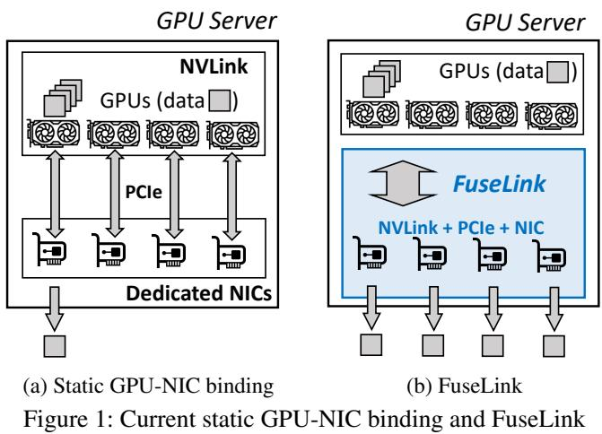

39, 46, 52, 57] connects neighbouring GPUs with Tbps bandwidth; RDMA [21,49,66] offers inter-server connections with hundreds of Gbps bandwidth. However, RDMA NIC bandwidth grows slower compared to intra-server bandwidth [11], leaving inter-server connection a major bottleneck in distributed ML tasks.

To mitigate inter-server bottleneck, existing GPU clusters stack multiple NICs within each server to improve inter-server bandwidth [2, 23]. Currently, they bind each GPU communication to a specific PCIe-based NIC, as shown in Figure 1a. Note that the figure omits the hierarchical structure of PCIe [7] which leads to non-uniform bandwidths when a NIC access GPUs through different paths. There usually exists only one NIC that can provide full bandwidth for each GPU during inter-server communication, while other NIC bandwidths are limited by suboptimal PCIe paths.

Static binding is suitable for ML tasks with balanced traffic. For instance, 3D parallel training [42, 53] divides models into equal shards, producing identical traffic pattern across GPU workers [34]. However, for widely-deployed ML tasks that exhibit imbalanced inter-server traffic across NICs, stacking NICs with static traffic binding does not necessarily improve inter-server communication efficiency. Some workers may demand higher bandwidth than a single NIC (§2.1). Examples include disaggregated LLM serving [29, 40, 47, 69], mixtureof-experts (MoE) models [18, 55], and deep learning recommendation models (DLRM) [10, 25]. This traffic imbalance can lead to suboptimal performance, with some NICs being bottlenecks while other NICs remain idle. Moreover, the causes of traffic imbalance vary significantly, such as unpredictable input requests, model architectures, and parallelism methods, making it difficult to achieve optimal inter-server communication through static NIC load balancing strategies.

To fill this gap, we ponder a fundamental question: can arbitrary ML workloads effectively leverage all available RDMA NICs for data transmission, aggregating links over multiple NICs as a "FuseLink" for inter-server communication? If so, we could significantly improve GPU communication bandwidth, surpassing the limitations of static NIC binding, and achieve optimal NIC utilization in dynamic-traffic ML tasks, without requiring adjustments to parallelism strategies or modifications to application code.

We build FuseLink, a GPU communication framework that achieves optimal NIC utilization for distributed machine learning by enabling GPUs to flexibly transmit data through multiple NICs. Figure 1a shows a typical GPU server equipped with multiple GPUs and RDMA NICs, with each RDMA NIC statically bound to one GPU through PCIe switches (bridges). In contrast, Figure 1b illustrates FuseLink, which disaggregates the network resources of the inter-server network and enables flexible NIC utilization.

FuseLink’s key idea is to integrate high-speed intra-server links as critical extensions of the inter-server network. Existing GPU communication frameworks, such as NCCL [45], leverages NVLink to improve throughput on NICs with suboptimal PCIe paths. However, these methods remains static to a specific NIC, lacking of abilities to dynamically balance NIC workloads or aggregating bandwidths. This is inherently limited by the incompatibility of intra- and inter-server networks, preventing access through NICs and NVLinks directly.

Our insight is that intra-server network can be seamlessly integrated to inter-server network by scheduling NIC workload and efficiently configure traffic relaying via intraserver connections. Additionally, we exploit characteristics of ML applications that they typically have a limited numbers of inter-server connections and send large messages in chunks [26, 32, 41, 42, 54]. These characteristics allows for efficient scheduling of traffic across NICs with runtime intraserver traffic relaying. As a result, FuseLink effectively leverages multiple NICs, aggregating multi-NIC bandwidths and significantly improving overall NIC utilization.

We build FuseLink on Nvidia platform with the following design goals:

Maximizing multi-NIC efficiency. When transmitting data from a GPU through multiple NICs, a key challenge is that multi-NIC transmission is bounded by PCIe bandwidth and PCIe topology that lacks direct connections between the GPU and NICs. We refer these NICs as indirect NICs. FuseLink enables efficient multi-NIC transmission by exploiting NVLink for data relaying on both sender and receiver sides.

Avoiding contention and interruption. Utilizing relay GPUs and multiple NICs should not interrupt or slow down ongoing computation and communication tasks by consuming extra memory and bandwidth resources. FuseLink avoids such interruption by employing priority-based memory management and network requests scheduling.

Readily deployable. FuseLink is designed to work with existing hardware and ML frameworks commonly found in GPU clusters, which allow benefiting from FuseLink without modifying ML applications. We implement FuseLink on top of RDMA primitives as an independent networking layer to replace the default networking system, and integrate FuseLink into NCCL [45], allowing to use FuseLink seamlessly.

We evaluate FuseLink on Nvidia GPUs with eight-lane NVLinks and eight 400Gbps NICs for inter-server communication. Our evaluation shows that FuseLink significantly improves inter-server GPU communication bandwidth, achieving 212GBps between two inter-server GPUs, surpassing the eight-lane NVLinks bandwidth. End-to-end evaluations show that FuseLink effectively accelerates ML tasks with traffic imbalance, including LLM serving task time-to-firsttoken (TTFT 2) by 1.04-2.73 , MoE training by 1.3 , and DLRM training by 1.2 .

This paper makes the following key contributions:

• We design FuseLink that boosts inter-server GPU communication over multiple NICs by integrating high-speed intra-server GPU connections (e.g., NVLinks).

• We integrate FuseLink into NCCL, enabling ML applications to benefit from it seamlessly.

• FuseLink effectively improves inter-server GPU bandwidth and ML tasks efficiency under imbalanced traffic.

## 2 Background

High-speed interconnect is essential to facilitate large scale machine learning. With the growing model sizes and expanding dataset volumes [16, 59, 60], real-world ML applications have been typically deployed in distributed environments [54, 56, 68], incurring large communication overhead and thus demanding high-bandwidth networks.

There have been substantial efforts on improving GPU communication bandwidth, including dedicated intra-server GPU connections and inter-server network. Industrial practices have been developing fast dedicated GPU interconnect as an integral part in ML clusters, providing Tbps network between GPUs. For example, Nvidia builds NVLink and NVSwitch [46] to connect near-range GPUs; Google designs dedicated inter-chip-interconnect (ICI) for TPU groups [20]. Inter-server network [27], however, has relatively lower bandwidth on a single NIC than intra-server network. Therefore, GPU clusters typically stack multiple NICs within each server to satisfy inter-server bandwidth demand of GPUs [43]. The common configuration of NICs is to have the same number of NICs as GPUs within a server and install each NIC on the PCIe slot with direct access to the corresponding GPU slot. This ensures each GPU can get the full bandwidth of its NIC.

<table><tr><td rowspan="2">ML Tasks</td><td colspan="3">Communication Pattern l Cause</td><td rowspan="2">NIC util.</td><td rowspan="2">Comm. ratio</td></tr><tr><td> via direct NICs</td><td>Concurrent transmission</td><td>Same traffic volume</td></tr><tr><td>Distributed LLM Serving</td><td>&gt;&gt;</td><td>X 丨 stochastic task arrival</td><td>X l varying requests sizes</td><td>13%-53%</td><td>11%-82%</td></tr><tr><td>Expert-parallel MoE</td><td></td><td>Xlasync. transmission</td><td>X I different token batches</td><td>29%-65%</td><td>15%-42%</td></tr><tr><td>DLRM</td><td>√</td><td>√</td><td>× Idifferent embeddings</td><td>59%-82%</td><td>28%-55%</td></tr></table>

Table 1: Dynamic-traffic ML tasks with communication patterns, ↭(✁) marks satisfied (unsatisfied) patterns

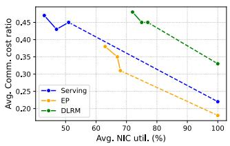  
(a) Avg. NIC util. and comm. cost

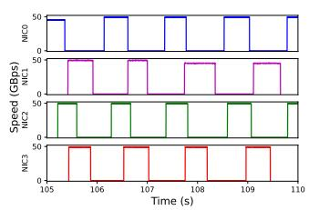  
(b) Model serving

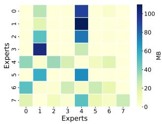  
(c) Expert parallelism

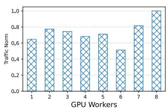  
(d) DLRM  
Figure 2: Traffic imbalance and communication cost in ML tasks

Despite the efforts of improving inter-server bandwidth, existing systems fail to fully utilize inter-server bandwidth for ML tasks with dynamic traffic because of the static binding of GPU traffic and NICs that causes low NIC utilization. The dynamic traffic is intrinsic to widely adopted ML tasks, including model serving [33, 37, 69], MoE models [15, 18, 55], and embedding transmission in recommendation models [10, 25]. Moreover, the NIC load imbalance is more pronounced across large GPU interconnect domains such as the NVL72 [3] system, where 72 GPUs and NICs are connected with NVLink and RDMA. We analyze the root cause by investigating ML tasks with dynamic communication patterns.

## 2.1 Deficiency in Dynamic-traffic ML

We test typical ML tasks with dynamic traffic shown in Table 1. Our tests are conducted on servers each with eight Hopper GPUs connected via eight-lane NVLink and eight 400Gbps NICs for inter-server network. GPU traffic is transmitted via direct NICs to maximize NIC throughput. Our metrics are NIC utilizations and the ratio of communication in ML tasks. We estimate NIC utilizations by the speed gap between static NIC binding and the ideal situation where GPUs can use all available NICs for communication. Figure 2a shows the average NIC utilizations and communication ratios in total costs, together with the estimated ideal utilization where we exploit all NICs to accelerate inter-server data transmission.

Disaggregated LLM serving. We test typical disaggregated LLM serving cases where model serving is split into prefill phase and decode phase [47, 50, 69], with processed requests sent from prefill phase to decode phase. We feed the input requests from public traces [5] randomly and record NIC utilizations when transmitting requests to decode stages. The results shows only 13%-53% of NIC utilization when transmitting data between phases, because serving traffic is stochastic, depending on task arrival times and request lengths, with traffic volumes ranging from hundreds of MBs to GBs. Even with advanced optimization tricks that overlap communication and computation [47, 50], we cannot fully utilize NICs because requests vary across GPU workers. Figure 2b depicts the recorded four NIC speeds during model serving, which shows idleness of some NICs while other NICs are busy.

MoE training. We test MoE model [18, 55] training on Mixtral 8→7B model with expert parallelism (EP) degree of eight and tensor parallel degree of four. We record NIC utilizations when GPU workers transmit tokens to peer workers with the activated experts. NIC utilization shows 29%-65%, with communication taking 28%-55% of the total cost. The root causes are asynchronized inter-server GPU communication and different token batches of experts during MoE training. Figure 2c shows the traffic map between expert models. EP training allocates expert models to GPU workers, with each worker training a subset of experts. The imbalanced traffic persists even with equal model partitions because expert layers are sparsely activated for each input token based on the output of gate layers. Since data samples are routed to different experts, GPU workers need to dispatch data to and collect data from peer workers, which leads to imbalanced all-to-all traffic across NICs. With different traffic volumes among experts, static binding of NICs and GPUs fails to fully utilize NICs bandwidth when all-to-all communication is bounded by the GPU pair with the largest traffic volume.

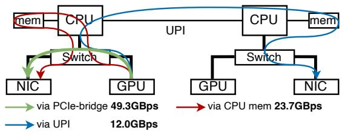  
Figure 3: Conceptual intra-server PCIe topology with NIC bandwidth on different PCIe paths

DLRM We test DeepFM [22], a deep learning based recommendation model with Avazu [61] dataset. DLRM [10, 25] consists of dense models and large lookup tables that store semantic embedding vectors of objects. In each training iteration, GPU workers fetch embeddings and push gradients from/to the server with the embedding table if they are not cached locally and train dense models with data parallelism. Embedding transmission volumes vary across workers, leading to different traffic volumes. Our results show that embedding transmissions achieve 59%-82% NIC utilization, and take up to 55% of the total cost. Figure 2d shows the imbalanced traffic distribution among eight GPU workers which causes performance to be bounded by the GPU worker with the largest embedding transmission.

## 2.2 Opportunities

Leveraging idle NICs. By analyzing dynamic-traffic ML tasks in Figure 2, we conclude that static NIC binding is not well-suited for such tasks. This is because achieving optimal NIC utilization with static NIC binding requires transmission through direct NICs, concurrent transmission, and equal traffic volumes. Without these conditions, communication performance is limited by tasks bound to specific NICs, while other NICs remain idle. This idle NIC capacity can instead be exploited to accelerate communication by dynamically scheduling traffic to idle NICs.

Multi-NIC communication is non-trivial because it does not improve inter-server bandwidth with only PCIe connections. On one hand, the total bandwidth is limited when all NICs access through the single PCIe interface of sender GPU. On the other hand, some NICs are indirectly connected with the sender GPU, with data traversing through PCIe root complex or even across NUMA, leading to suboptimal NIC throughput. With NVLink and imbalanced traffic in ML tasks, we can significantly improve efficiency on multi-NIC transmission. Dynamic NVLink routing to bypass PCIe. Existing GPU communication frameworks, such as NCCL [45], leverage NVLink to bypass suboptimal PCIe paths when transmitting data through indirect NICs. However, they focus only on optimizing a single NIC, leaving other NICs restricted to suboptimal PCIe paths. This limitation prevents efficient utilization of multiple NICs for high-performance data transmission. Figure 3 presents the NIC speeds across different paths. The bandwidth of inter-server GPU communication is constrained by the PCIe interface and topology, particularly when using indirect NICs [30], which require data to traverse suboptimal paths. To address this, we enable dynamic traffic routing to peer GPUs via NVLink, allowing the efficient aggregation of multiple NICs’ bandwidth for inter-server GPU communication.

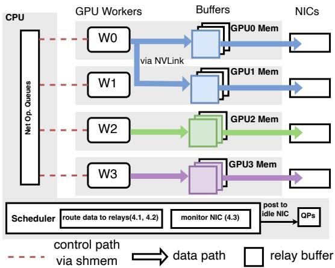  
Figure 4: FuseLink architecture in a GPU server with four parallel GPU workers and four NICs. W0 is using both NIC 0 and NIC 1 for inter-server communication when W1 is not sending any traffic. W0 sending buffers are mapped to GPU0 and GPU1 for efficient data transmission

## 3 FuseLink Overview

FuseLink achieves multi-NIC communication by scheduling worker’s traffic to multiple NICs dynamically with awareness of NIC load status, instead of statically binding the traffic to specific NICs. To effectively leverage indirect NICs, FuseLink routes traffic via intra-server connection to optimal GPUs for NIC access. The primary design goal of FuseLink is to achieve efficient multi-NIC transmission while minimizing contention risks, and is compatible with existing ML infrastructures. Figure 4 shows FuseLink architecture on sender side with an example workflow.

FuseLink initializes with inter-server connection setup. FuseLink explores the intra-server topology and establishes RDMA connections. During connection setup, FuseLink identifies available NICs for inter-server communication. Based on the topology, FuseLink selects the optimal data path for each NIC and GPU. If a NIC is directly connected to the GPU via a PCIe bridge or PCIe switch, it uses this direct path, as the NIC can access the GPU with full bandwidth. Otherwise,

FuseLink selects a router GPU for relaying data to the NIC.   
In Figure 4, GPU1 is the router when GPU0 sends via NIC1.

Inter-server GPU communication starts with receivers issuing credits, which are data structures containing necessary resources for initiating RDMA. These resources include receiving memory regions and requested data sizes. Crucially, the credits contain idle NICs information, derived from FuseLink actively monitoring NIC receiving load status. This allows senders to select the suitable NIC for sending data. Credits are common in RDMA-enabled applications [17, 28, 45, 62] because of its bypassing feature.

On sender side, FuseLink intercepts sending requests and waits for credits from receivers. At the same time, FuseLink monitors NIC sending load status. When credits arrive, FuseLink considers both sending NIC load status and receiving load status to select optimal NICs for data transmission. Moreover, FuseLink leverages intra-server GPU connection to route traffic efficiently to NICs. For instance, Figure 4 shows data routing through NVLink from GPU0 to GPU1 and sent through NIC1.

FuseLink gets notified when data arrives on receivers. Note that the data may be transmitted to a router GPU rather than the receiver GPU, because the sender may select a receiver NIC that has an indirect connection to receiver GPU. In this case, we stage receiving data on a router GPU first to ensure transmission efficiency. It then routes traffic via intra-server connection to receiver GPUs if needed.

Compared to existing GPU communication frameworks, FuseLink introduces several key advancements.

• Disaggregated network resources. Instead of operating on RDMA connections directly, FuseLink introduces an abstraction layer that unifies both intra-server and inter-server connection. This design enables efficient and flexible NIC utilization.

• Dynamic NIC utilization. FuseLink monitors NIC status in real-time rather than statically bind traffic to specific NICs. This approach allows to detect idle NICs and dynamically assign traffic to them, significantly improving overall bandwidth utilization.

• Traffic routing with high-bandwidth GPU links. Instead of statically binding traffic to NICs or intermediate GPUs [1, 44, 45], FuseLink fully leverage highbandwidth GPU links for traffic routing, thereby bypassing PCIe constrains in traditional interconnects and enhancing communication efficiency.

## 3.1 Challenges

FuseLink supports multi-NIC transmission by allowing interserver GPUs to dynamically schedule traffic to NICs. However, there presents several technical challenges:

<table><tr><td>Design</td><td>Inter-server BW(GBps)</td><td>Speedup</td></tr><tr><td>Baseline</td><td>49.27</td><td>1.0</td></tr><tr><td>Efficient relaying $4.1</td><td>78.39</td><td>1.59</td></tr><tr><td>Eliminate Interruption §4.2</td><td>76.37</td><td>1.55</td></tr><tr><td>Reduce NIC contention §4.3</td><td>178.59</td><td>3.62</td></tr><tr><td>Scheduling Efficiently $4.4</td><td>212.35</td><td>4.31</td></tr></table>

Table 2: Designs and achieved speedup over baseline

Relaying overhead. (§4.1) FuseLink introduces flexible intraserver traffic routing across GPUs to address the bandwidth limitations when transmitting through multiple NICs. However, GPUs are not inherently optimized for relaying data to NICs. Instead, both GPUs and intra-server connections are optimized for memory I/O between devices [24, 30], which is incompatible with PCIe-based NICs. This gap enforces frequent device synchronizations during network transmission, significantly slowing down the data path. For instance, when a GPU acts as a relay to transfer data from other GPUs to NICs, the data must be fully available on the relay GPU before NICs can access it. This results in frequent synchronizations between the relay GPU and sender GPUs. Consequently, the NIC throughput has minor improvements compared to the throughput in Figure 3. We address this challenge by actively planning relay data paths by memory remapping, thereby efficiently relaying data via GPUs for multi-NIC transmission.

Interruption and contention risks. (§4.2,§4.3) Maintaining performance isolation is challenging when utilizing NICs and GPU memory. These resources may contend for NIC bandwidth during data transmission, potentially disrupting tasks by draining GPU memory. Consequently, inter-server bandwidth is limited because of NIC contention, as listed in Table 2. The primary cause of the contention is FuseLink’s strategy to schedule traffic to idle NICs when peer workers are not engaged in communication tasks. However, NIC idleness are temporal in dynamic-traffic ML tasks [10, 18, 47]. When peer workers initiate new communications, outstanding traffic may still in transmission, scheduled by FuseLink during periods idleness. We address this challenge by prioritizing ongoing tasks on relay GPUs and monitoring network resource usage with priority-based scheduling. This approach enables senders to identify idle NICs and eliminate interruption risks.

Scheduling overhead. (§4.4) Dynamically scheduling traffic to NICs is inherently complex, considering requirements to mitigate contention risks and to avoid traffic interference and interruption, making the reduction of control overhead a significant challenge. Existing works on communication scheduling focus mainly on task-level scheduling [51, 64, 65] to maximize network resource utilization. However, they fail to identify idle NIC resources and schedule communication efficiently. We address this issue by implementing an efficient traffic monitoring and scheduling strategy that balances monitoring accuracy with performance.

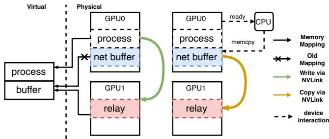  
Figure 5: Candidate intra-server traffic redirection methods D1 (left) and D2 (right) using two GPUs as an example. The network buffer is allocated on GPU0. D1 remaps network buffer to relay GPU and GPU threads fill relay buffer directly. D2 initiates asynchronized memory copy between GPUs from CPU side after network buffer is ready

## 4 FuseLink Design

We illustrate FuseLink design with a focus on solving the aforementioned challenges, achieving high NIC utilization while without interrupting peer GPUs.

## 4.1 Efficient Intra-server Relaying

Efficiently relaying data across GPUs to get high bandwidth on indirect NICs is difficult mainly because GPU interconnect and inter-server network are incompatible. This incompatibility enforces memory copy and device synchronizations before sending with NICs, which stalls network transmission and prolongs message latency.

To address this challenge, our insight is to exploit the existing memory I/O on network buffers during inter-server communication and redirect the traffic via memory remapping. FuseLink achieves efficient intra-server traffic relaying without modifying existing ML frameworks by taking advantages of the existing virtual address systems [6]. The system manages GPU memories in a unified virtual memory address space, which allows to map virtual memory addresses to arbitrary physical memories. With this feature, FuseLink decouples network buffers with the physical memories and remaps them to buffers on relay GPUs, so that traffic is redirected through intra-server connections via memory I/O when applications fill the network buffers.

To show the rationale of FuseLink relaying with remapping, we explore the design space by inspecting inter-server communication in two steps. 1 The GPU worker fills network buffer, and $\textcircled{2}$ The GPU notifies CPU to initiate RDMA transmission. To configure the data path without code modification, we have the following candidate solutions. D1: modify step 1 so that the GPU writes data to remapped buffers on relay GPUs. D2: modify step $\textcircled{2}$ so that the CPU copies data to relay GPUs then RDMA. D3: GPU threads write data to buffers mapped to host memory. D4: CPU initiates memory copy to host memory.

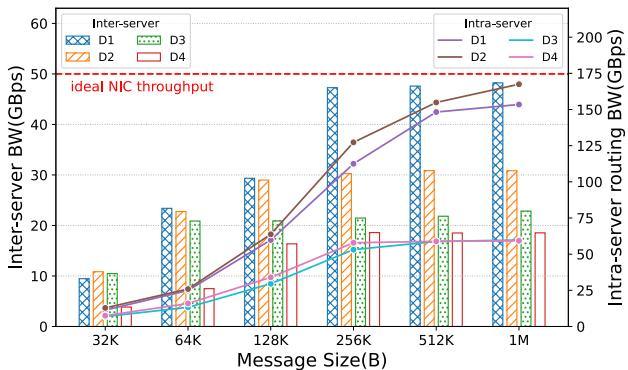  
Figure 6: Intra-server relay bandwidth and indirect NIC throughput. D1 has less intra-server bandwidth than D2, but has the highest indirect NIC throughput

Among four candidate relaying methods, D3 and D4 achieve the same bandwidth as PCIe shown in Figure 3, thus limited by PCIe speed and cannot improve relaying efficiency. D1 and D2, however, have pros and cons and cannot be easily compared. As shown in Figure 5. D2 has high intra-server bandwidth when performing memory copy in a batch asynchronously, while D1 enforces synchronized memory load and store and involves memory remapping with extra overhead. However, D1 has only one copy step to relay GPUs, achieving higher data path efficiency and lower message latency. To this end, we set up performance benchmark to select the optimal intra-server relay method.

Benchmark indirect NIC throughput. We test GPU communication bandwidth through indirect NICs on servers with multiple GPUs, eight-lane NVLinks, and 400Gbps NICs. The theoretical bandwidth of eight-lane NVLinks is 200 GB/s. The experiment is conducted by sending messages constantly between two inter-server GPUs via indirect NICs. The traffic is routed from the sender GPU to indirect NICs with relaying methods D1-D4 respectively. We record intra-server traffic relaying bandwidth and throughput on the indirect NIC under different data chunk sizes. Figure 6 shows the intra-server relaying bandwidth and indirect NIC throughput.

Among four relaying methods, D1 achieves the highest throughput on the indirect NIC, compared to D2-D4. D3 and D4 route data to host memory via PCIe, thus are limited by PCIe bandwidth. In contrast, D1 and D2 exploit NVLink connections, achieving much higher relaying bandwidth. When comparing D1 and D2, we observed that D2 has higher intraserver relaying throughput, because CPU-initiated memory copy between devices batches memory copy, which achieves higher throughput than GPU-initiated memory copy.

However, D1 achieves the highest NIC throughput. The reason is that D1 has the most efficient data path between the GPU and indirect NICs through memory remapping, which brings the following benefits:

1 High indirect NIC throughput: D1 remaps network buffer to peer GPUs, so that relaying is done when GPUs fill sending buffer. D2 introduces additional data copy across GPUs, limiting the throughput over indirect NICs.

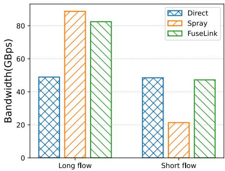  
Figure 7: Performance of long flow and short flow under direct NIC communication, traffic spraying, and FuseLink interruption-free relaying

2 Low message latency over indirect NICs: D1 achieves lower message latency than D2 over indirect NICs without additional CPU involvement. Unlike D2 CPU-initiated relay copy, where the GPU must synchronize with CPU to signal data readiness with extra delay, D1 eliminates such synchronization overhead. Furthermore, D1 masks the extra intra-server relaying latency by overlapping it with pipelined intra- and inter-server communication, effectively mitigating latency penalties for small-to-medium messages.

With benchmarking, we use remapped network buffer for efficiently relaying traffic to indirect NICs because of three key performance advantages: First, it has no duplicate data copy of the traffic, compared to CPU-initiated data copy between GPUs. Second, it has less device synchronizations because GPU threads can write data directly to peer GPUs. Third, it avoids CPU involvement, which saves the latency in calling memory copy functions.

## 4.2 Interruption-free Relaying

While intra-server relaying brings significant benefits in NIC throughput, it brings risk of interrupting peer GPUs. Specifically, multi-NIC communication may take peer GPU bandwidth resources, and the memory consumption on relay GPUs may drain peer GPU memories, causing unexpected out-ofmemory (OOM) error.

Relaying without interrupting communication. FuseLink accelerates GPU communication only during idleness of the indirect NICs. Although equally spraying traffic to all NICs within the server achieves optimal NIC utilization, it may disturb or even interrupt peer GPU communication over direct NICs. FuseLink strikes a balance between NIC utilization and fairness. This ensures that peer GPU communication tasks are not interrupted by traffic relaying.

We compare FuseLink interruption-free design against traffic spraying in Figure 7, where two GPUs send data through two NICs respectively. The first GPU has a long inter-server flow, while the second GPU is the victim, which has a relatively short flow and is constantly interrupted by the first GPU. In contrast, FuseLink exploits the indirect NIC only when the second GPU does not have inter-server traffic, preventing unfairness problem. FuseLink controls the traffic volume during intra-server relaying to avoid interference with GPUs engaged in intra-server communication. In practice, intra-server GPU communication, such as aggregation in tensor parallelism, overlaps with inter-server communication via NICs. To ensure isolation, FuseLink marks NICs as busy during TP communication and relaying, preventing contention with intra-server communication and other relaying traffic.

Relaying without interrupting memory allocation. If memory requirements of the running tasks on relay GPUs are known, FuseLink can easily eliminate OOM risks by limiting the total sizes of relay memories. Unfortunately, accurately calculating the memory footprint of a running task on GPUs remains challenging, and existing works do not have precise estimations [19], leaving risks of causing OOM due to relay buffer allocations. To mitigate this problem, FuseLink provides a best-effort solution that combines both memory usage constraints and adaptive approaches.

First, FuseLink sets a configurable upper limit for relay memory usage. If the relay memory on a GPU exceeds the limit, FuseLink will stop allocating more relay memories until memories from existing connections are released. Although this limitation cannot fully eliminate OOM risks, it allows FuseLink to adjust resource allocation according to user demands. For example, one may set high memory limitations to encourage FuseLink to take more multi-NIC transmissions with GPU relaying, thereby aggregating higher bandwidth with multiple NICs.

Second, FuseLink allows for prioritizing memory demands of running tasks on relay GPUs by removing relay memories when releasing can help satisfy memory allocation of the running tasks on relay GPUs. Specifically, when memory drains, FuseLink first checks whether releasing relay memories will free up enough space. If so, FuseLink releases the relay memory to give in to ongoing tasks. Otherwise, it means the task will encounter an OOM error regardless of the relay memory.

## 4.3 NIC Contention Mitigation

We next discuss the challenges on how to efficiently exploit idle NICs while avoiding GPU workers contending for NIC resources. Doing so is difficult mainly because of the unpredictable and imbalanced traffic in ML applications with dynamic communication patterns.

FuseLink mitigates NIC contention by assigning varying priorities to traffic from different GPUs during NIC scheduling. FuseLink monitors NIC load status and marks NIC as busy or idle, indicating whether NICs are working for highpriority GPUs. When a GPU engages in communication, it is granted the highest priority on its direct NIC, preventing peer

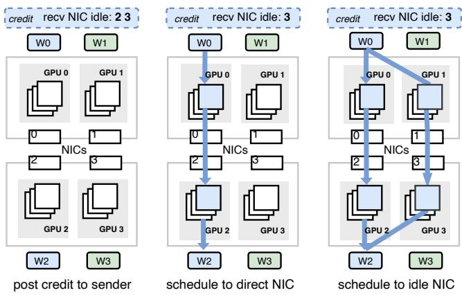  
(a) Scheduling for exploiting idle NICs

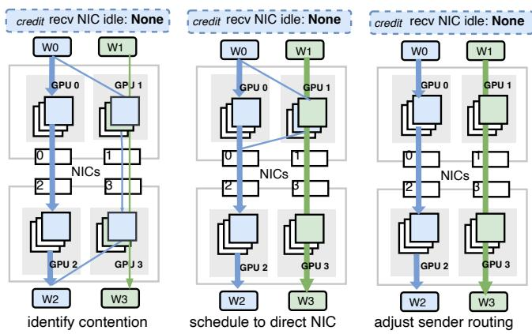  
(b) Scheduling for preventing contention  
Figure 8: Traffic scheduling illustration. We emit ordinary elements in credits, such as memory regions, for simplicity

GPUs from using that NIC. Furthermore, FuseLink limits the outstanding traffic scheduled to idle NICs, thereby reducing potential contention when high-priority GPUs initiate communication. Our approach is based on the need for GPU workers to fully utilize their direct NICs in a 1:1 GPU-to-NIC configuration.

During communication, receivers encode idle NICs in credits and post to senders, who decide which NIC to transmit data based on NIC status of both sides. This design can be decomposed into two modules: 1) §4.3.1 FuseLink monitors NIC load status by inspecting completed network operations of high-priority GPUs. 2) §4.3.2 FuseLink aggregates idle NICs on both sides to guide traffic scheduling, with intra-server routing configured via memory remapping.

## 4.3.1 Worker-aware NIC Monitoring

FuseLink marks the status of NICs as idle or busy by monitoring the network operations posted by ML workers within the server. ML workers post network operations, such as send and receive, to FuseLink through first-in-first-out (FIFO) queues, instead of operating on RDMA connections directly. FuseLink collects network operations and post work requests to NICs. Then FuseLink polls RDMA completion queues to get finished operations.

The straightforward solution to decide whether a NIC is idle is by checking NIC TX and RX counters. However, reading counters cannot tell which worker is sending or receiving data, which hinders contention prevention when we have multiple workers transmitting data through the same NIC. Instead, FuseLink monitors NICs workload from the work requests on RDMA connections. Note that we configure NIC status to be decided by workers that have the highest priorities on the NIC. The rationale is that we aim to isolate traffic and guarantee the network performance of the high-priority worker.

FuseLink identifies idle NICs by periodically checking new completions of network operations posted by high-priority workers. If no new completion since last polling, FuseLink will mark the NIC as idle. As illustrated in Figure 8a, NIC1 is idle because W1 is not sending data to W3, and NIC0 is busy since W0 is sending to W2. Once found idle NICs, FuseLink schedules traffic from other workers to idle NICs. If a new completion is found, it means there exists new traffic since last time, and FuseLink will mark the NIC as busy. In this case, we will not schedule traffic to the busy NIC. FuseLink schedules traffic of low-priority workers to their direct NICs for performance isolation.

The rationale of marking NIC status as idle or busy is that ML applications typically have large traffic that can fully occupy NICs when they have communication tasks [34]. Therefore, we allow GPU workers to fully occupy their direct NICs. If GPU workers share direct NICs, FuseLink does not isolate traffic between these workers.

## 4.3.2 Load-aware Scheduling

We introduce load-aware traffic scheduling in three steps: 1) aggregating NIC load status on the sender and receiver side, 2) selecting NICs and initiating data transmission, and 3) performing intra-server traffic routing inside receivers via memory remapping.

Aggregating NIC load status. FuseLink orchestrates communication by receivers giving credits to senders and FuseLink configures credits to include NIC load status on receivers. Posting credit is necessary in RDMA communication because of the nature of RDMA that bypasses remote side processors, making senders unaware of receiver resources. RDMA communication with credits is common in existing distributed ML frameworks [1, 45]. After getting credits, senders know NIC load status on both sides.

Selecting the NIC for sending. The NIC selection is based on NIC status and priorities of the worker on NICs. FuseLink selects the direct NIC of worker if it is idle. Otherwise, FuseLink selects an idle indirect NIC if exists. Note that we limit the number of outstanding operations posted to indirect NICs to reduce contention risks. Without limitation, we may post too many requests to indirect NICs and cause severe contention when high-priority workers start communicating. If no idle NICs found, FuseLink selects the direct NIC.

Routing traffic on receivers. FuseLink writes data to receiver memory that resides on the GPU with direct PCIe connection to ensure transmission efficiency. However, the GPU could be different from the worker GPU that requests the receiving. In this case, FuseLink maps the receiving address to the memory where the received data locates. On sender side, the data may be already on relay buffers when getting credits. FuseLink remaps relay memory before the next sending operation, with the cost of one suboptimal sending.

We demonstrate the traffic scheduling with an example, as shown in Figure 8a. FuseLink first identifies NIC idleness when W1 is not posting any traffic. Then, for network operations posted by W0, FuseLink schedules them to NIC1 by allocating credits that indicate sending through NIC1. FuseLink remaps receiving memory on GPU1 to enable efficient NIC access. On sender side, FuseLink gets credits and posts sending operations to NIC1. Because the data is already on GPU0, the data is sent through suboptimal data path. After sending finished, FuseLink remaps relay buffers to GPU1 so that the subsequent sending is efficient.

When traffic contention happens on NIC1, as shown in Figure 8b, FuseLink detects contention when W1 is posting network operations to NIC1 and gets completions. In this case, FuseLink performs similar steps as exploiting idle NICs. FuseLink schedules subsequent network operations back to NIC0, together with router memory remapped to optimize data path.

## 4.4 Scheduling with Efficiency

FuseLink schedules communication to multiple NICs when detecting idle NICs in the server. Our design of NIC monitoring and traffic scheduling do not enforce strict idle NIC utilization or precise contention prevention, which is difficult to achieve due to control plane efficiency requirements. Instead, we have the following tradeoffs for control plane efficiency:

First, FuseLink marks NIC load status based on new completions of operations posted by GPU workers, which is later than transmission start time. The delayed marking is more efficient than detecting whether a NIC is sending traffic for a GPU worker. The delay is acceptable because existing frameworks, such as NCCL, divide large messages into chunks and send in pipeline. In NCCL, the default configuration is 512KB, which makes the delay marking about 10us under 400Gbps network.

Second, FuseLink allows bounded contention over limited number of network operations. In the worst case, FuseLink schedules a batch of operations to an idle indirect NIC and the peer worker starts communicating immediately. This ensures the scalability of FuseLink traffic scheduling in a large GPU cluster because FuseLink only needs to gather NIC utilization information of peer nodes during communication. The scheduling overhead is determined by the number of NICs and concurrent connections, which are limited by hardware configurations and ML applications.

Third, FuseLink allows bounded suboptimal transmission through indirect NICs, because the NICs selected may have suboptimal data path to the router GPUs, as illustrated in Figure 8b during receiver scheduling. We bound the suboptimal transmission by sender remapping, with the assumption that the next sending operations have optimal data path. Our design is based on the ML traffic pattern that NICs load status do not change frequently, as ML computation and communication last for long time intervals.

After optimizations, control plane overhead mainly comes from the following components:

NIC monitoring overhead. Before issuing operations, FuseLink checks NIC status and decides how to route the traffic. To reduce the monitoring overhead, FuseLink checks status of NICs after issuing a batch of network operations. For example, FuseLink checks NICs status after scheduling eight network operations. Subsequent operations are scheduled according to the NIC status after the last batch. The coarse grained NIC monitoring brings acceptable scheduling overhead because ML applications usually have large message sizes and are bounded by bandwidth.

Traffic routing overhead. When NIC encounters idleness or contention, FuseLink remaps the receiver relay buffer and switches the connection by posting credits to senders. The overhead consists of checking the NIC status, fetching new connection, and remapping relay buffers. Traffic rerouting happens when NIC status changes. In machine learning, NIC usage displays typical on-off patterns. Thus, NIC status will not change frequently, bringing limited traffic routing overhead.

## 5 Implementation

We implement FuseLink as an independent networking module to replace the default Infiniband networking in NCCL, a widely-used GPU communication library, so that ML applications can use FuseLink without modifying codes. We incorporate FuseLink in NCCL by intercepting networking layer functions called by NCCL proxy threads that originally post RDMA work requests to NICs. After loading the plugin, NCCL proxy threads interacts with FuseLink for GPU communication, instead of operating on NICs directly. Our implementation has about 3000 lines of code in C++.

In the default implementation, NCCL sets up worker threads as proxies to communicate with peer GPUs through inter-server network. Proxy threads build RDMA connections and post work requests to NICs. ML processes send data by writing to network buffers handled by proxy threads. When receiving data, ML processes indicate receiving buffers and get notified from proxy threads when the data is ready.

We intercept proxy thread function calls to interact with FuseLink, including connection establishment, network buffer registration, and sending/receiving data.

Connection establishment. Instead of building raw RDMA connections, we modify proxy threads by posting connection request to FuseLink, which handles the request by setting up connections through multiple NICs within the server. After connection setup, proxy threads get connection ids that are used to post sending and receiving operations. All network operations are conducted by posting control messages to FuseLink with the connection id.

Registering buffers. By default, NCCL registers buffers on the specified device to enable RDMA NICs to access network buffers. We modify proxy threads to expose network buffers to FuseLink, which remaps buffers to relay GPUs and registers network buffers on RDMA NIC. Since each buffer only needs to be registered once in the NIC, remapping to relays brings minor overhead. Note that FuseLink maps network buffers back to original GPUs when NIC contention arises. Thus, we register network buffers on relay GPUs and original GPUs to avoid repeated registration. The registered memory regions are selected based on the current GPU to which the network buffer is mapped.

Sending & receiving. In NCCL, high-level communication tasks, such as sending a large data block and collective communication, are divided into data chunks.

On the sender side, the send function returns with an empty handler if no new credit is received. After receiving valid credits, NCCL sends with data in a ring slot and connection specified in credits. If the ring slot buffer is on a GPU that is not directly connected to the selected NIC, it means the receiver has scheduled an indirect NIC for data transmission. FuseLink marks the indirect NIC and remaps data to the buffer on a relay GPU. Send function returns with a valid handler if the data transfer to relay GPUs has started successfully. After the data is ready on the relay buffer, the sender starts data transfer to the remote side with RDMA.

On the receiver side, FuseLink collects NIC usage status to identify idle NICs and contention NICs. For each channel, FuseLink assigns one NIC to process receiving requests by giving credits to sender side specifying connections on the NIC. FuseLink schedules traffic to connections on other NICs by changing the RDMA Queue Pairs (QPs) and the memory addresses in ring slots used to receive data, which is transparent to applications.

## 6 Evaluation

We evaluate FuseLink capabilities in microbenchmarks and ML applications. In microbenchmark, we answer the following questions: 1) What is the maximum inter-server bandwidth for a single GPU with FuseLink compared to the default

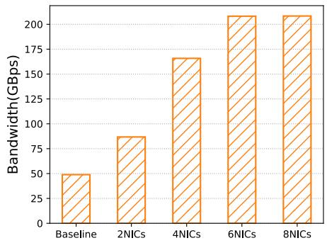

Figure 9: Average inter-server GPU bandwidth achieved by a single GPU when using different numbers of NICs  
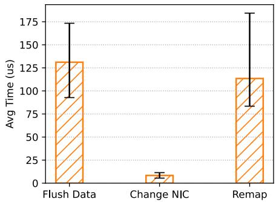  
Figure 10: Average scheduling overhead decomposed into flushing data, changing NIC, and remapping

GPU-NIC binding? 2) What is the overhead of FuseLink in traffic scheduling? 3) What are the performance benefits of FuseLink on machine learning tasks with imbalanced traffic? Evaluation setup. We conduct experiments on servers equipped with Intel 8480C CPU, eight Nvidia Hopper GPUs, and eight Connect-X7 400Gbps NICs for inter-server GPU communication. Intra-server GPUs are connected through eight-lane NVLinks and NVSwitches, delivering up to 200GB/s bandwidth for intra-server GPU communication. Each NIC is connected directly with one GPU through PCIe bridge, respectively. We deploy by running FuseLink scheduler as a daemon process and ML workers load FuseLink as a NCCL plugin to replace the default IB network.

Baselines. We use NCCL with PXN enabled as the baseline when performing inter-server GPU communication. NCCL with PXN automatically pick up the best path for inter-server GPU communication via both NVLink and PCIe, but is limited by statically bind traffic to paths and cannot support transmitting data through NVLink on receivers.

## 6.1 Microbenchmark

Bandwidth improvement. We evaluate how FuseLink can improve bandwidth when transmitting data between two interserver GPUs. We divide the whole sending data into 512K messages, a common size for inter-server GPU communication in NCCL, and post them to FuseLink controller. In the baseline experiment, the traffic is statically bound to one NIC for inter-server communication. By contrast, FuseLink sends data through direct NICs and indirect NICs with GPU relays. We change the maximum number of NICs used by FuseLink and record the average bandwidth.

<table><tr><td>Controls</td><td>Avg. cost(us)</td></tr><tr><td>post &amp; pull ops</td><td>0.8-1.4</td></tr><tr><td>query NIC load</td><td>0.9-1.6</td></tr><tr><td>process send</td><td>2.8-3.5</td></tr><tr><td>process recv</td><td>4.9-5.6</td></tr></table>

Table 3: Network operation processing overheads in FuseLink

As shown in Figure 9, FuseLink achieves up to 212GBps bandwidth with six NICs, compared to the default setting with about 50GBps throughput, where GPUs communicate through only one NIC. FuseLink gets higher bandwidth by utilizing more NICs during inter-server communication. The upper limitation depends on the bottleneck between GPUs and NICs. If the NVLink bandwidth is larger than the sum of bandwidths of indirect NICs, FuseLink can aggregate all NICs bandwidth at maximum. Otherwise, the maximum bandwidth is the sum of the direct NIC bandwidth and NVLink bandwidth. In this experiment, FuseLink bandwidth stops scaling because NVLink has reached the maximum throughput.

Scheduling overhead Compared to posting RDMA requests to NICs directly, FuseLink incurs scheduling overhead during monitoring NIC workload and determining the NIC to post RDMA operations (§4.3). To improve scheduling efficiency, we make tradeoff to allow bounded suboptimal scheduling and sender data path (§4.4). We show that the scheduling overhead is acceptable and the tradeoff will not harm the overall performance. Table 3 shows the overhead of FuseLink when processing RDMA operations and scheduling. NIC monitoring and NIC selection are implemented using shared memory, which brings 0.9-1.6us latency on a batch of network operations. Relay remapping is called when optimizing the data paths between NICs and GPUs, which brings around 95-193us latency in each remapping.

Figure 10 shows the scheduling overhead when FuseLink changes NIC to prevent contention. Before changing NICs, FuseLink flushes the network buffer, i.e., finish all network operations on the buffer, and finally performs buffer remapping to adjust intra-server traffic relaying. The total scheduling overhead is minor compared to the communication time in distributed machine learning.

## 6.2 End-to-End Evaluation

We demonstrate that FuseLink can effectively improve the NIC utilization in imbalanced traffic ML tasks and bring benefits to the overall performance.

Model serving. We test FuseLink performance in model serving in disaggregated setting [47,69], where the serving process is divided into a prefill phase and a decoding phase across inter-server GPUs connected by NICs. We test OPT [67] models serving with 30B parameters under different tensor parallel degrees. We consider model serving in mixed requests, where batched user requests are fed to GPU groups for the prefillstage computation. The processed user requests are sent to the decode-stage GPUs. The communication cost consists of sending prefix cache and user requests cache. We record the time-to-the-first-token (TTFT) as the performance metric, which includes requests computation and inter-server communication time.

<table><tr><td>#Instance</td><td>Setting</td><td>P50</td><td>P99</td></tr><tr><td>8</td><td>NIC Binding FuseLink</td><td>684.54 ms 308.48 ms</td><td>903.20 ms 464.55 ms</td></tr><tr><td>4</td><td>NIC Binding</td><td>174.46 ms</td><td>297.49 ms 259.73 ms</td></tr><tr><td>2</td><td>FuseLink</td><td>122.61 ms 98.09 ms</td><td>175.36 ms</td></tr><tr><td></td><td>NIC Binding FuseLink</td><td>81.97 ms</td><td>160.36 ms</td></tr></table>

Table 4: Model serving TTFT comparison under different number of serving instances within a server

Figure 11a- 11c shows the CDF graph of TTFT recorded with different number of independent serving instances within a server. For every deployed serving instance, we randomly sample the serving prompt and feed to the prefill instances. We sample request lengths from public traces [5] with prefix and simulates with Poisson arrival rates. FuseLink shows 1.04-2.73→ speedup over the baseline with NIC binding, where GPUs communicate only through the direct NICs. Notably, with smaller TP degrees and more instances per server, FuseLink shows greater speedup compared to scenarios with fewer instances and larger TP degrees, as the NIC exhibits more dynamic traffic pattern under more instances within a server. The performance improvement is attributed to two factors: First, FuseLink accelerates inter-stage data transmission, reducing communication overhead during first token generation; Second, FuseLink improves serving throughput and reduces the requests queueing time. Table 4 shows the TTFT of 50th percentile and 99th percentile of different numbers of serving instances within a server.

EP training. We test expert-parallel MoE training of Mixtral 8→22B model using tensor parallel degree as four and expert parallel degree as eight. In this case, each server has two experts training in parallel. We record the time spent on training iterations. Figure 12 shows the iteration times of the baseline and FuseLink. FuseLink improves the training throughput by 1.3→ compared to the baseline. We notice that FuseLink brings less performance gain in later iterations, which can be explained by the design of gate layers that try to achieve load balance among experts [55], making the traffic across NICs closer to balanced NIC load compared to earlier iterations.

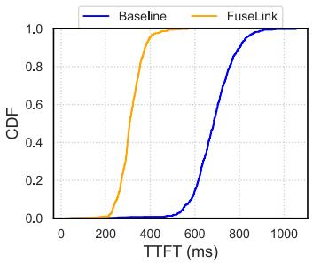  
(a) Eight instances with TP=1

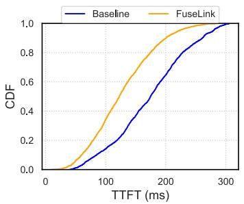  
(b) Four instances with TP=2

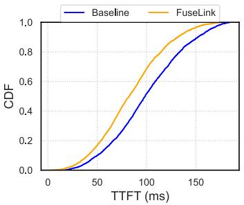  
(c) Two Instances with TP=4

Figure 11: FuseLink model serving performance under different TP degrees and number of serving instances  
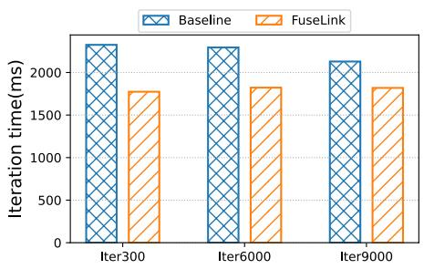  
Figure 12: EP training times under NIC binding and FuseLink

DLRM training. We test FuseLink performance in DLRM training [13] model on Criteo advertisement dataset [4]. We configure 32 GPU workers to train the model in data parallelism and setup a dedicated server with large memories to maintain the embedding table. In each training iteration, the GPU workers first convert the categorical features in training samples into embedding vectors in the table. If the embedding cache does not have the required vector, the GPU workers need to fetch the embedding from the embedding server through NICs. Communication cost is mainly affected by the embedding cache sizes and training batch sizes of each worker. Limited cache sizes and large batch sizes tend to bring higher embedding cache miss and more embedding transmission. We set the training batch size as 1024 as suggested by [10]. Figure 13 shows the average iteration durations under different cache sizes when using FuseLink and static traffic binding to direct NICs. FuseLink can effectively reduce the training iteration times by accelerating embedding transmissions.

## 7 Discussion and Limitations

We discuss the application scope of FuseLink and limitations in existing ML infrastructures.

FuseLink in collective communication. FuseLink works the best under traffic imbalance scenarios, which are common in point-to-point communication. The point-to-point communication has become one of the major network costs in distributed machine learning, including MoE and model serving. In contrast, collective communication like ring all reduce synchronize GPUs with uniform traffic pattern across NICs [34], making them less suitable for FuseLink without extra modifications. Applying FuseLink in collective communication may require adjusting worker placements. For example, co-locating multiple data parallel groups within a server can produce imbalanced traffic across NICs in different parallel groups. However, such optimizations would require additional efforts to integrate with existing ML frameworks. FuseLink in general GPU interconnections. FuseLink is designed and implemented on Nvidia GPU with NVLink connections, but is not limited by specific GPU devices, interconnections, or GPU-NIC ratios. In essence, FuseLink unlocks the capability of intra-server traffic routing and efficient multipath transmission during inter-server GPU communication. FuseLink is powered by the ever-growing performance of dedicated GPU connections that have become integral in ML infrastructures. Industrial practices have deployed various of GPU interconnect [20, 46, 58] in their GPU clusters, making FuseLink widely applicable in today and future ML facilities [35, 36].

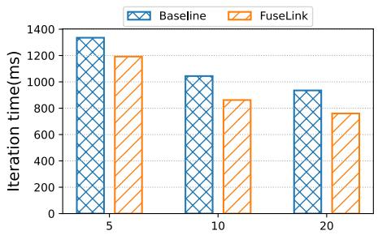  
Figure 13: DLRM training iteration times under different cache sizes (GB)

FuseLink ensures its design generality by relying on standard communication primitives. Specifically, RDMA enables NICs to access application memory from virtual address with backend physical memory mapped to any virtual memory on demand. We exploit this feature to enable RDMA NICs to access remapped location without changing the application network buffer address. We also take advantage of the GPU memory addressing that enables peer-to-peer communication between GPUs, which is essential in dedicated GPU connection to ensure efficient data transmission. The unified addressing and standard RDMA primitives do not rely on specific devices or GPU-NIC ratios. Therefore, FuseLink can be applied in general machine learning servers, including those with asymmetric GPU interconnects [8, 30] and other GPU-NIC ratios.

Corner cases of FuseLink scheduling. Since FuseLink optimizes scheduling efficiency with bounded contention, corner cases may arise where one GPU sends a small chunk of data through its direct NIC only when a peer GPU has just started using the NIC. In this scenario, FuseLink will route other GPU traffic to this idle NIC and then be preempted by the GPU with higher priority, and subsequently start using the idle NIC again in the next batch of sending. However, such cases are rare in machine learning workloads, because they feature large messages and relatively long time intervals between communication phases. This leaves sufficient time intervals for FuseLink to schedule traffic while maintaining relatively stable NIC utilization, minimizing routing frequency.

## 8 Related Work

PCIe → NVLink (PXN). NCCL has introduced PXN [44], an inter-server GPU communication mechanism that allows senders to use intermediate GPUs for inter-server communication. Similar to FuseLink, PXN removes the bottleneck of GPU-NIC connection that traverses through QPI/UPI, which cannot deliver full bandwidth. PXN is designed to avoid crossrail traffic in rail-optimized GPU clusters because cross-rail traffic has to be routed through spine switches, which risks interfering with other flows in the network.

Despite the similarity of using intermediate GPUs, FuseLink has three key differences compared to PXN. First, PXN binds traffic to intermediate GPUs and statically copies data to GPUs. This can only improve one NIC throughput, yet others are in suboptimal PCIe connections. In contrast, FuseLink dynamically integrates NVLink interconnect in the network data path. Consequently, FuseLink can fully eliminate the suboptimal PCIe data path on multiple NICs during inter-server communication. Second, FuseLink identifies and leverages idle NICs, while PXN is configured statically by NCCL, given the system topology before running communication tasks. Finally, FuseLink achieves higher inter-server bandwidth for GPU communication by utilizing multiple NICs, while PXN is bounded by the single NIC bandwidth.

Multi-Path network protocols. Researchers have proposed datacenter networking protocols that aim to improve network resource utilization. For example, MP-TCP [63] and MP-RDMA [38] are multi-path transport protocols designed to utilize the rich path resources in datacenter networks; NetChannel [12], a host network stack that disaggregates the dedicated data path to improve utilization of host network resources. These protocols and network systems focus on a similar problem that network resources, such as host data paths and network paths, are not fully utilized because of dedicated resource assignments.

FuseLink differs from these works on the network resources and methods for multiplexing. On one hand, existing works try to multiplex network data paths with only host memories, while FuseLink mainly focuses on inter-server communication on GPU memories, which requires considering PCIe bandwidth and topology. On the other hand, FuseLink exploits dedicated intra-server GPU connections and integrates into inter-server networking to enhance inter-server networking, which is not explored in existing works.

Data path optimization. There have been efforts to improve network resource utilization from host side by solving the best data paths for inter-process communication. For example, SocksDirect [31] improves inter-process communication efficiency by implementing efficient communication primitives and automatically schedules the best data path to carry out data transmission, such as shared memory and RDMA. ARK [24] accelerates GPU communication by implementing an efficient DMA controller operated by GPUs, together with a GPU-driven execution model to improve computational efficiency without interfering with networking. FuseLink has similar methodologies that improve data path efficiency during GPU communication.

However, existing works on optimizing GPU communication data paths cannot be applied in dynamic ML tasks directly, because they cannot detect or leverage idle NICs timely. In contrast, FuseLink explored a new direction that exploit the underutilized NICs in dynamic-traffic ML tasks, with data path optimization in runtime.

## 9 Conclusion

In this paper, we present FuseLink to enable inter-server GPUs to efficiently communicate over multiple NICs. FuseLink exploits dedicated intra-server network for intra-server traffic routing to fully utilize GPU interconnects when communicating through NICs. FuseLink achieves improved inter-server bandwidth without interrupting ongoing computation and communication tasks on peer GPUs. Through our evaluation, we verify that FuseLink is effective in dynamic-traffic machine learning tasks, achieving high inter-server GPU bandwidth and accelerating machine learning tasks including LLM serving, EP MoE training, and DLRM training.

## Acknowledgements

We thank our shepherd, Yang Zhou, and the anonymous OSDI reviewers for their insightful feedback. This work is supported in part by the Hong Kong RGC TRS T41-603/20R, GRF 16213621, ITC ACCESS, NSFC 62402407, NSFC Excellent Young Scientists Fund Program (Overseas). Kai Chen is the corresponding author.

## References

[1] Gloo: Collective communications library with various primitives for multi-machine training. URL: https: //github.com/facebookincubator/gloo.

[2] NVIDIA DGX SuperPOD: Next Generation Scalable Infrastructure for AI Leadership. URL: https://docs .nvidia.com/https:/docs.nvidia.com/dgx-sup erpod-reference-architecture-dgx-h100.pdf.

[3] NVIDIA GB200 NVL72. URL: https://nvdam.wi den.net/s/wwnsxrhm2w/blackwell-datasheet-3 384703.

[4] Criteo . Criteo Display Advertisement Dataset. URL: https://go.criteo.net/criteo-research-kag gle-display-advertising-challenge-dataset .tar.gz.

[5] Microsoft . AzurePublicDataset. URL: https://gith ub.com/Azure/AzurePublicDataset/blob/maste r/AzureLLMInferenceDataset2023.md.

[6] Nvidia . Unified Addressing. URL: https://docs.n vidia.com/cuda/cuda-driver-api/group\_\_CUDA UNIFIED.html.

[7] PCI-SIG . PCI Express Base Specification. URL: http s://pcisig.com/specifications/pciexpress/.

[8] WikiChip . Infinity Fabric (IF) - AMD. URL: https: //en.wikichip.org/wiki/amd/infinity\_fabric.

[9] Martín Abadi, Paul Barham, Jianmin Chen, Zhifeng Chen, Andy Davis, Jeffrey Dean, Matthieu Devin, Sanjay Ghemawat, Geoffrey Irving, Michael Isard, Manjunath Kudlur, Josh Levenberg, Rajat Monga, Sherry Moore, Derek G. Murray, Benoit Steiner, Paul Tucker, Vijay Vasudevan, Pete Warden, Martin Wicke, Yuan Yu, and Xiaoqiang Zheng. TensorFlow: A system for largescale machine learning. In Proceedings of the 12th USENIX Conference on Operating Systems Design and Implementation, OSDI’16, pages 265–283, USA, 2016. USENIX Association.

[10] Bilge Acun, Matthew Murphy, Xiaodong Wang, Jade Nie, Carole-Jean Wu, and Kim Hazelwood. Understanding training efficiency of deep learning recommendation models at scale. In 2021 IEEE International Symposium on High-Performance Computer Architecture (HPCA). IEEE, February 2021. URL: http: //dx.doi.org/10.1109/HPCA51647.2021.00072, doi:10.1109/hpca51647.2021.00072.

[11] Infiniband Association. Infiniband Roadmap. URL: https://www.infinibandta.org/infiniband-r oadmap/.

[12] Qizhe Cai, Midhul Vuppalapati, Jaehyun Hwang, Christos Kozyrakis, and Rachit Agarwal. Towards Ms Tail Latency and Terabit Ethernet: Disaggregating the Host Network Stack. In Proceedings of the ACM SIGCOMM 2022 Conference, SIGCOMM ’22, pages 767–779, New York, NY, USA, 2022. Association for Computing Machinery. doi:10.1145/3544216.3544230.

[13] Heng-Tze Cheng, Levent Koc, Jeremiah Harmsen, Tal Shaked, Tushar Chandra, Hrishi Aradhye, Glen Anderson, Greg Corrado, Wei Chai, Mustafa Ispir, Rohan Anil, Zakaria Haque, Lichan Hong, Vihan Jain, Xiaobing Liu, and Hemal Shah. Wide & deep learning for recommender systems. In Proceedings of the 1st Workshop on Deep Learning for Recommender Systems, Dlrs 2016, pages 7–10, New York, NY, USA, 2016. Association for Computing Machinery. doi:10.1145/2988450.2988 454.

[14] Ching-Hsiang Chu, Pouya Kousha, Ammar Ahmad Awan, Kawthar Shafie Khorassani, Hari Subramoni, and Dhabaleswar K. (D K) Panda. NV-group: Link-efficient reduction for distributed deep learning on modern dense GPU systems. In Proceedings of the 34th ACM International Conference on Supercomputing, Ics ’20, New York, NY, USA, 2020. Association for Computing Machinery. doi:10.1145/3392717.3392771.

[15] DeepSeek-AI, Aixin Liu, Bei Feng, Bing Xue, Bingxuan Wang, Bochao Wu, Chengda Lu, Chenggang Zhao, Chengqi Deng, Chenyu Zhang, Chong Ruan, Damai Dai, Daya Guo, Dejian Yang, Deli Chen, Dongjie Ji, Erhang Li, Fangyun Lin, Fucong Dai, Fuli Luo, Guangbo Hao, Guanting Chen, Guowei Li, H. Zhang, Han Bao, Hanwei Xu, Haocheng Wang, Haowei Zhang, Honghui Ding, Huajian Xin, Huazuo Gao, Hui Li, Hui Qu, J. L. Cai, Jian Liang, Jianzhong Guo, Jiaqi Ni, Jiashi Li, Jiawei Wang, Jin Chen, Jingchang Chen, Jingyang Yuan, Junjie Qiu, Junlong Li, Junxiao Song, Kai Dong, Kai Hu, Kaige Gao, Kang Guan, Kexin Huang, Kuai Yu, Lean Wang, Lecong Zhang, Lei Xu, Leyi Xia, Liang Zhao, Litong Wang, Liyue Zhang, Meng Li, Miaojun Wang, Mingchuan Zhang, Minghua Zhang, Minghui Tang, Mingming Li, Ning Tian, Panpan Huang, Peiyi Wang, Peng Zhang, Qiancheng Wang, Qihao Zhu, Qinyu Chen, Qiushi Du, R. J. Chen, R. L. Jin, Ruiqi Ge, Ruisong Zhang, Ruizhe Pan, Runji Wang, Runxin Xu, Ruoyu Zhang, Ruyi Chen, S. S. Li, Shanghao Lu, Shangyan Zhou, Shanhuang Chen, Shaoqing Wu, Shengfeng Ye, Shengfeng Ye, Shirong Ma, Shiyu Wang, Shuang Zhou, Shuiping Yu, Shunfeng Zhou, Shuting Pan, T. Wang, Tao Yun, Tian Pei, Tianyu Sun, W. L. Xiao, Wangding Zeng, Wanjia Zhao, Wei An, Wen Liu, Wenfeng Liang, Wenjun Gao, Wenqin Yu, Wentao Zhang, X. Q. Li, Xiangyue Jin, Xianzu Wang, Xiao Bi, Xiaodong Liu, Xiaohan Wang, Xiao-

jin Shen, Xiaokang Chen, Xiaokang Zhang, Xiaosha Chen, Xiaotao Nie, Xiaowen Sun, Xiaoxiang Wang, Xin Cheng, Xin Liu, Xin Xie, Xingchao Liu, Xingkai Yu, Xinnan Song, Xinxia Shan, Xinyi Zhou, Xinyu Yang, Xinyuan Li, Xuecheng Su, Xuheng Lin, Y. K. Li, Y. Q. Wang, Y. X. Wei, Y. X. Zhu, Yang Zhang, Yanhong Xu, Yanhong Xu, Yanping Huang, Yao Li, Yao Zhao, Yaofeng Sun, Yaohui Li, Yaohui Wang, Yi Yu, Yi Zheng, Yichao Zhang, Yifan Shi, Yiliang Xiong, Ying He, Ying Tang, Yishi Piao, Yisong Wang, Yixuan Tan, Yiyang Ma, Yiyuan Liu, Yongqiang Guo, Yu Wu, Yuan Ou, Yuchen Zhu, Yuduan Wang, Yue Gong, Yuheng Zou, Yujia He, Yukun Zha, Yunfan Xiong, Yunxian Ma, Yuting Yan, Yuxiang Luo, Yuxiang You, Yuxuan Liu, Yuyang Zhou, Z. F. Wu, Z. Z. Ren, Zehui Ren, Zhangli Sha, Zhe Fu, Zhean Xu, Zhen Huang, Zhen Zhang, Zhenda Xie, Zhengyan Zhang, Zhewen Hao, Zhibin Gou, Zhicheng Ma, Zhigang Yan, Zhihong Shao, Zhipeng Xu, Zhiyu Wu, Zhongyu Zhang, Zhuoshu Li, Zihui Gu, Zijia Zhu, Zijun Liu, Zilin Li, Ziwei Xie, Ziyang Song, Ziyi Gao, and Zizheng Pan. DeepSeek-V3 technical report, 2025. URL: https://arxiv.org/abs/2412.19437, arXiv:2412.19437.

[16] Jacob Devlin, Ming-Wei Chang, Kenton Lee, and Kristina Toutanova. BERT: Pre-training of deep bidirectional transformers for language understanding, 2019. arXiv:1810.04805.

[17] Aleksandar Dragojevic, Dushyanth Narayanan, Miguel ´ Castro, and Orion Hodson. FaRM: Fast Remote Memory. In 11th USENIX Symposium on Networked Systems Design and Implementation (NSDI 14), pages 401–414, Seattle, WA, April 2014. USENIX Association. URL: https://www.usenix.org/conference/nsdi14/t echnical-sessions/dragojeviĢG.

[18] William Fedus, Barret Zoph, and Noam Shazeer. Switch transformers: Scaling to trillion parameter models with simple and efficient sparsity. Journal of Machine Learning Research, 23(1), January 2022.

[19] Yanjie Gao, Yu Liu, Hongyu Zhang, Zhengxian Li, Yonghao Zhu, Haoxiang Lin, and Mao Yang. Estimating GPU memory consumption of deep learning models. In Proceedings of the 28th ACM Joint Meeting on European Software Engineering Conference and Symposium on the Foundations of Software Engineering, Esec/Fse 2020, pages 1342–1352, New York, NY, USA, 2020. Association for Computing Machinery. doi:10.1145/3368089.3417050.

[20] Google. System architecture | Cloud TPU. URL: https: //cloud.google.com/tpu/docs/system-archite cture-tpu-vm.

[21] Chuanxiong Guo, Haitao Wu, Zhong Deng, Gaurav Soni, Jianxi Ye, Jitu Padhye, and Marina Lipshteyn. RDMA over commodity ethernet at scale. In Proceedings of the 2016 ACM SIGCOMM Conference, pages 202–215, 2016.

[22] Huifeng Guo, Ruiming Tang, Yunming Ye, Zhenguo Li, and Xiuqiang He. DeepFM: A factorization-machine based neural network for CTR prediction, 2017. URL: https://arxiv.org/abs/1703.04247, arXiv:1703 .04247.

[23] Mert Hidayetoglu, Simon Garcia De Gonzalo, Elliott Slaughter, Yu Li, Christopher Zimmer, Tekin Bicer, Bin Ren, William Gropp, Wen-Mei Hwu, and Alex Aiken. CommBench: Micro-benchmarking hierarchical networks with multi-GPU, multi-NIC nodes. In Proceedings of the 38th ACM International Conference on Supercomputing, Ics ’24, pages 426–436, New York, NY, USA, 2024. Association for Computing Machinery. doi:10.1145/3650200.3656591.

[24] Changho Hwang, KyoungSoo Park, Ran Shu, Xinyuan Qu, Peng Cheng, and Yongqiang Xiong. ARK: GPUdriven Code Execution for Distributed Deep Learning. In 20th USENIX Symposium on Networked Systems Design and Implementation (NSDI 23), pages 87–101, Boston, MA, April 2023. USENIX Association. URL: https://www.usenix.org/conference/nsdi23/p resentation/hwang.

[25] Biye Jiang, Chao Deng, Huimin Yi, Zelin Hu, Guorui Zhou, Yang Zheng, Sui Huang, Xinyang Guo, Dongyue Wang, Yue Song, Liqin Zhao, Zhi Wang, Peng Sun, Yu Zhang, Di Zhang, Jinhui Li, Jian Xu, Xiaoqiang Zhu, and Kun Gai. XDL: An industrial deep learning framework for high-dimensional sparse data. In Proceedings of the 1st International Workshop on Deep Learning Practice for High-Dimensional Sparse Data, Kdd ’19. ACM, August 2019. URL: http://dx.doi.org/10. 1145/3326937.3341255, doi:10.1145/3326937.33 41255.

[26] Yimin Jiang, Yibo Zhu, Chang Lan, Bairen Yi, Yong Cui, and Chuanxiong Guo. A unified architecture for accelerating distributed DNN training in heterogeneous GPU/CPU clusters. In 14th USENIX Symposium on Operating Systems Design and Implementation (OSDI 20), pages 463–479. USENIX Association, November 2020. URL: https://www.usenix.org/conferenc e/osdi20/presentation/jiang.

[27] Ziheng Jiang, Haibin Lin, Yinmin Zhong, Qi Huang, Yangrui Chen, Zhi Zhang, Yanghua Peng, Xiang Li, Cong Xie, Shibiao Nong, Yulu Jia, Sun He, Hongmin Chen, Zhihao Bai, Qi Hou, Shipeng Yan, Ding Zhou,

Yiyao Sheng, Zhuo Jiang, Haohan Xu, Haoran Wei, Zhang Zhang, Pengfei Nie, Leqi Zou, Sida Zhao, Liang Xiang, Zherui Liu, Zhe Li, Xiaoying Jia, Jianxi Ye, Xin Jin, and Xin Liu. MegaScale: Scaling large language model training to more than 10,000 GPUs, 2024. arXiv:2402.15627.

[28] Anuj Kalia, Michael Kaminsky, and David G. Andersen. Design guidelines for high performance RDMA systems. In 2016 USENIX Annual Technical Conference (USENIX ATC 16), pages 437–450, Denver, CO, June 2016. USENIX Association. URL: https: //www.usenix.org/conference/atc16/technica l-sessions/presentation/kalia.

[29] Woosuk Kwon, Zhuohan Li, Siyuan Zhuang, Ying Sheng, Lianmin Zheng, Cody Hao Yu, Joseph Gonzalez, Hao Zhang, and Ion Stoica. Efficient memory management for large language model serving with PagedAttention. In Proceedings of the 29th Symposium on Operating Systems Principles, Sosp ’23, pages 611–626, New York, NY, USA, 2023. Association for Computing Machinery. doi:10.1145/3600006.3613165.

[30] Ang Li, Shuaiwen Leon Song, Jieyang Chen, Jiajia Li, Xu Liu, Nathan R. Tallent, and Kevin J. Barker. Evaluating modern GPU interconnect: PCIe, nvlink, NV-SLI, nvswitch and gpudirect. IEEE Transactions on Parallel and Distributed Systems, 31(1):94–110, January 2020. doi:10.1109/TPDS.2019.2928289.

[31] Bojie Li, Tianyi Cui, Zibo Wang, Wei Bai, and Lintao Zhang. Socksdirect: Datacenter Sockets Can Be Fast and Compatible. In Proceedings of the ACM Special Interest Group on Data Communication, SIGCOMM ’19, pages 90–103, New York, NY, USA, 2019. Association for Computing Machinery. doi:10.1145/3341302. 3342071.

[32] Mu Li, David G. Andersen, Jun Woo Park, Alexander J. Smola, Amr Ahmed, Vanja Josifovski, James Long, Eugene J. Shekita, and Bor-Yiing Su. Scaling Distributed Machine Learning with the Parameter Server. In Proceedings of the 11th USENIX Conference on Operating Systems Design and Implementation, OSDI’14, pages 583–598, USA, 2014. USENIX Association.

[33] Weiqing Li, Guochao Jiang, Xiangyong Ding, Zhangcheng Tao, Chuzhan Hao, Chenfeng Xu, Yuewei Zhang, and Hao Wang. FlowKV: A disaggregated inference framework with low-latency KV cache transfer and load-aware scheduling, 2025. URL: https://arxiv.org/abs/2504.03775, arXiv:2504.03775.

[34] Wenxue Li, Xiangzhou Liu, Yuxuan Li, Yilun Jin, Han Tian, Zhizhen Zhong, Guyue Liu, Ying Zhang, and Kai

Chen. Understanding communication characteristics of distributed training. In Proceedings of the 8th Asia-Pacific Workshop on Networking, APNet ’24, pages 1–8, New York, NY, USA, 2024. Association for Computing Machinery. doi:10.1145/3663408.3663409.

[35] Heng Liao, Bingyang Liu, Xianping Chen, Zhigang Guo, Chuanning Cheng, Jianbing Wang, Xiangyu Chen, Peng Dong, Rui Meng, Wenjie Liu, Zhe Zhou, Ziyang Zhang, Yuhang Gai, Cunle Qian, Yi Xiong, Zhongwu Cheng, Jing Xia, Yuli Ma, Xi Chen, Wenhua Du, Shizhong Xiao, Chungang Li, Yong Qin, Liudong Xiong, Zhou Yu, Lv Chen, Lei Chen, Buyun Wang, Pei Wu, Junen Gao, Xiaochu Li, Jian He, Shizhuan Yan, and Bill Mc-Coll. Ub-mesh: a hierarchically localized nd-fullmesh datacenter network architecture, 2025. URL: https:// arxiv.org/abs/2503.20377, arXiv:2503.20377.

[36] Xudong Liao, Yijun Sun, Han Tian, Xinchen Wan, Yilun Jin, Zilong Wang, Zhenghang Ren, Xinyang Huang, Wenxue Li, Kin Fai Tse, Zhizhen Zhong, Guyue Liu, Ying Zhang, Xiaofeng Ye, Yiming Zhang, and Kai Chen. mFabric: An efficient and scalable fabric for mixture-ofexperts training, 2025. URL: https://arxiv.org/ab s/2501.03905, arXiv:2501.03905.

[37] Yuhan Liu, Hanchen Li, Yihua Cheng, Siddhant Ray, Yuyang Huang, Qizheng Zhang, Kuntai Du, Jiayi Yao, Shan Lu, Ganesh Ananthanarayanan, Michael Maire, Henry Hoffmann, Ari Holtzman, and Junchen Jiang. CacheGen: KV cache compression and streaming for fast large language model serving. In Proceedings of the ACM SIGCOMM 2024 Conference, Acm Sigcomm ’24, pages 38–56, Sydney, NSW, Australia and New York, NY, USA, 2024. Association for Computing Machinery. doi:10.1145/3651890.3672274.

[38] Yuanwei Lu, Guo Chen, Bojie Li, Kun Tan, Yongqiang Xiong, Peng Cheng, Jiansong Zhang, Enhong Chen, and Thomas Moscibroda. Multi-Path Transport for RDMA in Datacenters. In 15th USENIX Symposium on Networked Systems Design and Implementation (NSDI 18), pages 357–371, Renton, WA, April 2018. USENIX Association. URL: https://www.usenix.org/confere nce/nsdi18/presentation/lu.

[39] Samuel Matzek, Max Grossman, Minsik Cho, Anar Yusifov, Bryant Nelson, and Amit Juneja. Data-parallel distributed training of very large models beyond GPU capacity, 2018. arXiv:1811.12174.

[40] Yixuan Mei, Yonghao Zhuang, Xupeng Miao, Juncheng Yang, Zhihao Jia, and Rashmi Vinayak. Helix: Distributed serving of large language models via max-flow on heterogeneous gpus, 2024. URL: https://arxiv. org/abs/2406.01566, arXiv:2406.01566.

[41] Deepak Narayanan, Aaron Harlap, Amar Phanishayee, Vivek Seshadri, Nikhil R. Devanur, Gregory R. Ganger, Phillip B. Gibbons, and Matei Zaharia. PipeDream: Generalized pipeline parallelism for DNN training. In Proceedings of the 27th ACM Symposium on Operating Systems Principles, SOSP ’19, pages 1–15, New York, NY, USA, 2019. Association for Computing Machinery. doi:10.1145/3341301.3359646.

[42] Deepak Narayanan, Mohammad Shoeybi, Jared Casper, Patrick LeGresley, Mostofa Patwary, Vijay Korthikanti, Dmitri Vainbrand, Prethvi Kashinkunti, Julie Bernauer, Bryan Catanzaro, Amar Phanishayee, and Matei Zaharia. Efficient large-scale language model training on GPU clusters using megatron-LM. In Proceedings of the International Conference for High Performance Computing, Networking, Storage and Analysis, Sc ’21, New York, NY, USA, 2021. Association for Computing Machinery. doi:10.1145/3458817.3476209.

[43] NVIDIA. Common Data Center Architectures | Two-Tier Clos Architecture. URL: https://docs.nvidia. com/networking-ethernet-software/knowledg e-base/Setup-and-Getting-Started/layer-1-D ata-Center-Cheat-Sheet/#two-tier-clos-arc hitecture-leaf-spine.

[44] Nvidia. Doubling all2all performance with NVIDIA collective communication library 2.12. URL: https: //developer.nvidia.com/blog/doubling-all2a ll-performance-with-nvidia-collective-com munication-library-2-12/.

[45] NVIDIA. Nvidia NCCL. URL: https://developer. nvidia.com/nccl.

[46] NVIDIA. NVLink & NVSwitch: Fastest HPC Data Center Platform. URL: https://www.nvidia.com/e n-us/data-center/nvlink/.

[47] Pratyush Patel, Esha Choukse, Chaojie Zhang, Aashaka Shah, Íñigo Goiri, Saeed Maleki, and Ricardo Bianchini. Splitwise: Efficient generative LLM inference using phase splitting. In ISCA, June 2024. URL: https: //www.microsoft.com/en-us/research/publica tion/splitwise-efficient-generative-llm-i nference-using-phase-splitting/.

[48] Yanghua Peng, Yibo Zhu, Yangrui Chen, Yixin Bao, Bairen Yi, Chang Lan, Chuan Wu, and Chuanxiong Guo. A generic communication scheduler for distributed DNN training acceleration. In Proceedings of the 27th ACM Symposium on Operating Systems Principles, Sosp ’19, pages 16–29, New York, NY, USA, 2019. Association for Computing Machinery. doi:10.1145/3341301. 3359642.

[49] Sreeram Potluri, Khaled Hamidouche, Akshay Venkatesh, Devendar Bureddy, and Dhabaleswar K. Panda. Efficient inter-node MPI communication using gpudirect RDMA for InfiniBand clusters with NVIDIA gpus. In 2013 42nd International Conference on Parallel Processing, pages 80–89, 2013. doi:10.1109/ICPP.2013.17.

[50] Ruoyu Qin, Zheming Li, Weiran He, Mingxing Zhang, Yongwei Wu, Weimin Zheng, and Xinran Xu. Mooncake: A kvcache-centric disaggregated architecture for LLM serving, 2024. URL: https://arxiv.org/abs/ 2407.00079, arXiv:2407.00079.

[51] Sudarsanan Rajasekaran, Manya Ghobadi, and Aditya Akella. CASSINI: Network-Aware job scheduling in machine learning clusters. In 21st USENIX Symposium on Networked Systems Design and Implementation (NSDI 24), pages 1403–1420, Santa Clara, CA, April 2024. USENIX Association. URL: https: //www.usenix.org/conference/nsdi24/prese ntation/rajasekaran.

[52] Kiran Ranganath, AmirAli Abdolrashidi, Shuaiwen Leon Song, and Daniel Wong. Speeding up collective communications through inter-GPU re-routing. IEEE Computer Architecture Letters, 18(2):128–131, 2019. doi:10.1109/LCA.2019.2933842.

[53] Jeff Rasley, Samyam Rajbhandari, Olatunji Ruwase, and Yuxiong He. Deepspeed: System optimizations enable training deep learning models with over 100 billion parameters. In Proceedings of the 26th ACM SIGKDD International Conference on Knowledge Discovery & Data Mining, pages 3505–3506, 2020.

[54] Alexander Sergeev and Mike Del Balso. Horovod: Fast and easy distributed deep learning in TensorFlow. arXiv preprint arXiv:1802.05799, 2018. arXiv:1802.05799.

[55] Noam Shazeer, Azalia Mirhoseini, Krzysztof Maziarz, Andy Davis, Quoc Le, Geoffrey Hinton, and Jeff Dean. Outrageously large neural networks: The sparsely-gated mixture-of-experts layer, 2017. URL: https://arxiv. org/abs/1701.06538, arXiv:1701.06538.

[56] Mohammad Shoeybi, Mostofa Patwary, Raul Puri, Patrick LeGresley, Jared Casper, and Bryan Catanzaro. Megatron-LM: Training multi-billion parameter language models using model parallelism, 2020. arXiv: 1909.08053.

[57] Yiltan Hassan Temuçin, AmirHossein Sojoodi, Pedram Alizadeh, and Ahmad Afsahi. Efficient multi-path nvlink/pcie-aware UCX based collective communication for deep learning. In 2021 IEEE Symposium on High-Performance Interconnects (HOTI), pages 25–34, 2021. doi:10.1109/HOTI52880.2021.00018.

[58] Ajay Tirumala and Raymond Wong. NVIDIA blackwell platform: Advancing generative AI and accelerated computing. In 2024 IEEE Hot Chips 36 Symposium (HCS), pages 1–33, Los Alamitos, CA, USA, August 2024. IEEE Computer Society. URL: https://doi.ieeeco mputersociety.org/10.1109/HCS61935.2024.10 665247, doi:10.1109/HCS61935.2024.10665247.

[59] Hugo Touvron, Thibaut Lavril, Gautier Izacard, Xavier Martinet, Marie-Anne Lachaux, Timothée Lacroix, Baptiste Rozière, Naman Goyal, Eric Hambro, Faisal Azhar, Aurelien Rodriguez, Armand Joulin, Edouard Grave, and Guillaume Lample. LLaMA: Open and efficient foundation language models, 2023. arXiv:2302.139 71.

[60] Ashish Vaswani, Noam Shazeer, Niki Parmar, Jakob Uszkoreit, Llion Jones, Aidan N Gomez, !ukasz Kaiser, and Illia Polosukhin. Attention is all you need. Advances in neural information processing systems, 30, 2017.

[61] Steve Wang and Will Cukierski. Click-through rate prediction, 2014. URL: https://kaggle.com/compe titions/avazu-ctr-prediction.

[62] Xingda Wei, Rong Chen, and Haibo Chen. Fast RDMAbased ordered Key-Value store using remote learned cache. In 14th USENIX Symposium on Operating Systems Design and Implementation (OSDI 20), pages 117– 135. USENIX Association, November 2020. URL: https://www.usenix.org/conference/osdi20 /presentation/wei.

[63] Damon Wischik, Costin Raiciu, Adam Greenhalgh, and Mark Handley. Design, implementation and evaluation of congestion control for multipath TCP. In 8th USENIX Symposium on Networked Systems Design and Implementation (NSDI 11), Boston, MA, March 2011. USENIX Association. URL: https://www.usenix.o rg/conference/nsdi11/design-implementatio n-and-evaluation-congestion-control-multi path-tcp.

[64] Kaiqiang Xu, Decang Sun, Han Tian, Junxue Zhang, and Kai Chen. GREEN: Carbon-efficient resource scheduling for machine learning clusters. In 22nd USENIX Symposium on Networked Systems Design and Implementation (NSDI 25), pages 999–1014, Philadelphia, PA, April 2025. USENIX Association. URL: https://www.usenix.org/conference/nsdi25 /presentation/xu-kaiqiang.

[65] Kaiqiang Xu, Decang Sun, Hao Wang, Zhenghang Ren, Xinchen Wan, Xudong Liao, Zilong Wang, Junxue Zhang, and Kai Chen. Design and operation of shared

machine learning clusters on campus. In Proceedings of the 30th ACM International Conference on Architectural Support for Programming Languages and Operating Systems, Volume 1, Asplos ’25, pages 295– 310, Rotterdam, Netherlands and New York, NY, USA, 2025. Association for Computing Machinery. doi: 10.1145/3669940.3707266.

[66] Jilong Xue, Youshan Miao, Cheng Chen, Ming Wu, Lintao Zhang, and Lidong Zhou. Fast distributed deep learning over rdma. In Proceedings of the Fourteenth EuroSys Conference 2019, pages 1–14, 2019.

[67] Susan Zhang, Stephen Roller, Naman Goyal, Mikel Artetxe, Moya Chen, Shuohui Chen, Christopher Dewan, Mona Diab, Xian Li, Xi Victoria Lin, Todor Mihaylov, Myle Ott, Sam Shleifer, Kurt Shuster, Daniel Simig, Punit Singh Koura, Anjali Sridhar, Tianlu Wang, and Luke Zettlemoyer. OPT: Open pre-trained transformer language models, 2022. URL: https://arxiv. org/abs/2205.01068, arXiv:2205.01068.

[68] Lianmin Zheng, Zhuohan Li, Hao Zhang, Yonghao Zhuang, Zhifeng Chen, Yanping Huang, Yida Wang, Yuanzhong Xu, Danyang Zhuo, Eric P. Xing, Joseph E. Gonzalez, and Ion Stoica. Alpa: Automating Inter- and Intra-Operator Parallelism for Distributed Deep Learning. In Marcos K. Aguilera and Hakim Weatherspoon, editors, 16th USENIX Symposium on Operating Systems Design and Implementation, OSDI 2022, Carlsbad, CA, USA, July 11-13, 2022, pages 559–578. USENIX Association, 2022. URL: https://www.usenix.org/con ference/osdi22/presentation/zheng-lianmin.

[69] Yinmin Zhong, Shengyu Liu, Junda Chen, Jianbo Hu, Yibo Zhu, Xuanzhe Liu, Xin Jin, and Hao Zhang. {DistServe}: Disaggregating prefill and decoding for goodput-optimized large language model serving. In 18th USENIX Symposium on Operating Systems Design and Implementation (OSDI 24), pages 193–210, 2024.