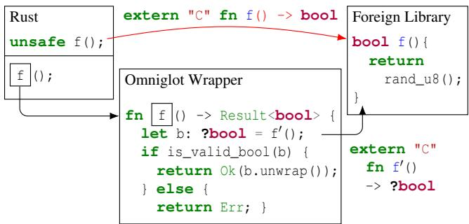
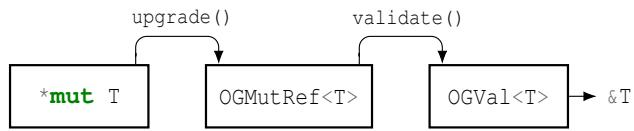
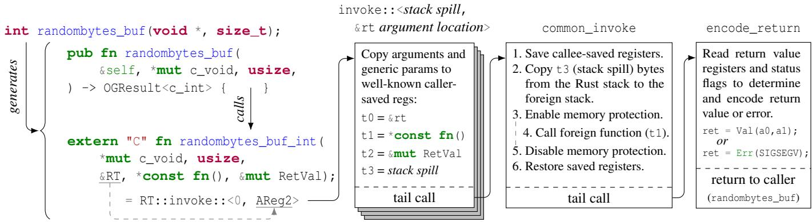
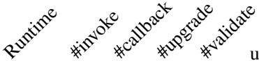
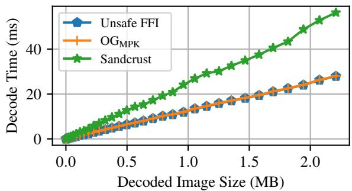

USENIX

THE ADVANCED COMPUTING SYSTEMS ASSOCIATION

# Building Bridges: Safe Interactions with Foreign Languages through Omniglot

Leon Schuermann and Jack Toubes, Princeton University; Tyler Potyondy and Pat Pannuto, University of California San Diego; Mae Milano and Amit Levy, Princeton University

https://www.usenix.org/conference/osdi25/presentation/schuermann

# This paper is included in the Proceedings of the 19th USENIX Symposium on Operating Systems Design and Implementation.

July 7–9, 2025 • Boston, MA, USA

ISBN 978-1-939133-47-2

Open access to the Proceedings of the 19th USENIX Symposium on Operating Systems Design and Implementation is sponsored by

# Building Bridges: Safe Interactions with Foreign Languages through Omniglot

Leon Schuermann†, Jack Toubes†, Tyler Potyondy‡, Pat Pannuto‡, Mae Milano†, Amit Levy† †Princeton University, ‡University of California, San Diego

## Abstract

Memory- and type-safe languages promise to eliminate entire classes of systems vulnerabilities by construction. In practice, though, even clean-slate systems often need to incorporate libraries written in other languages with fewer safety guarantees. Because these interactions threaten the soundness of safe languages, they can reintroduce the exact vulnerabilities that safe languages prevent in the first place.

This paper presents Omniglot: the first framework to efficiently uphold safety and soundness of Rust in the presence of unmodified and untrusted foreign libraries. Omniglot facilitates interactions with foreign code by integrating with a memory isolation primitive and validation infrastructure, and avoids expensive operations such as copying or serialization.

We implement Omniglot for two systems: we use it to integrate kernel components in a highly-constrained embedded operating system kernel, as well as to interface with conventional Linux userspace libraries. Omniglot performs comparably to approaches that deliver weaker guarantees and significantly better than those with similar safety guarantees.

## 1 Introduction

Systems built using type-safe and memory-safe programming languages are safer, more reliable, and more secure than their unsafe counterparts. Languages like Swift, Go, and Rust promise to eliminate entire classes of bugs by construction. While the advantages of memory and type safety have been understood for decades [5, 15], recent advances in making safe languages more practical, along with encouragement from government agencies [48], have fostered their adoption in real, practical systems by both researchers [6, 21, 30, 31] and practitioners [7, 9, 47].

At the same time, real-world systems often require incorporating components written in several languages. As legacy and new systems evolve to use newer, safer languages [7, 9], both old and new languages must co-exist, potentially for years. Components such as filesystems, networking stacks, and device drivers have been fine-tuned over decades by scores of engineers. Pragmatic development does not immediately discard such thoroughly tested code but incrementally replaces it with safe languages when new features or complex fixes would otherwise be required.

Unfortunately, integrating foreign libraries into type-safe programs can re-introduce the exact vulnerabilities safe languages eliminate. When foreign code is invoked, it runs in the same address space and with the same privileges as the host language. A bug in a foreign library, such as the infamous OpenSSL Heartbleed vulnerability [39], can arbitrarily violate the safety of the host language by, for example, accessing memory that the host language assumed was private.

Recent contributions propose isolating foreign code in separate protection domains [4, 16, 29, 35]. Unfortunately, memory isolation alone is insufficient to maintain safety. Differences in semantics across languages mean that even interactions with internally correct foreign libraries—ones that operate only on sandboxed memory—may violate safety in subtle ways. For example, two languages may differ in their restrictions on pointer aliasing and corresponding types may have subtly different memory layouts or permissible values. Manually enforcing these invariants and translating types between different languages is error prone and endangers security and reliability [25]. Instead, we need a safe Foreign Function Interface (FFI) that maintains memory safety as well as all other language invariants.

We present Omniglot, the first framework to efficiently maintain all of Rust’s safety-critical language invariants in the presence of foreign code. Rather than expose foreign functions directly to the host program, Omniglot invokes foreign functions through a memory sandbox and wraps returned values and shared memory in special types that ensure host code only uses foreign objects once they are validated to adhere to the host language’s requirements. By designing a safe FFI using these types, in contrast to prior work, Omniglot maintains both memory and type safety of the host program. Importantly, Omniglot does so while avoiding expensive operations such as copying or (de)serialization across the FFI, which retains the efficiency of raw, unchecked FFI transitions.

Our implementation of Omniglot for the Rust programming language works with arbitrary foreign libraries and with any memory isolation mechanism that meets certain common criteria (Section 4.2). We implement Omniglot for use in a Rust operating system kernel using RISC-V’s Physical Memory Protection (PMP) and in Linux userspace applications using x86 Memory Protection Keys (MPK).

Finally, we modify the widely used FFI binding generator for Rust, rust-bindgen, to generate foreign library bindings for Omniglot. Our evaluation shows that this allows developers to effectively use Omniglot in both kernels and userspace programs for a variety of practical libraries, such as cryptography, compression, image decoding, filesystem and TCP/IP networking. Omniglot has negligible overhead compared to memory isolation alone, practical overhead compared to an unchecked FFI, and performs significantly better than related work that copies and (de)serializes shared data.

## 2 Background & Motivation

Many of the safety advances in modern systems programming languages are rooted in their strict enforcement of memory and type safety. This enforcement allows these languages to leave out runtime-checks otherwise required in unsafe languages. For example, whereas a C string (const char \*) may contain arbitrary 8 bit values, Rust strings (str) are guaranteed at compile-time to include only UTF-8 codepoints [40]. However, safe languages’ reliance on such properties makes their enforcement critical. A single, subtle violation of memory safety, type safety, or other important invariants can lead to arbitrary undefined behavior and have significant implications for security and reliability.

Unfortunately, current tools used to facilitate interactions between languages do not capture many of these invariants. This deficiency means that all interactions with foreign code must be presumed unsafe. Instead, these tools place the proof burden of safety onto the developer who has to verify not only that foreign code is correct, but also that any interactions with this code maintain both the host and guest (foreign) language’s invariants.

In this section, we show how current cross-language bindings insufficiently capture language invariants and illustrate how this can violate Rust’s safety properties.

## 2.1 Cross-Language Interactions

Code written in different programming languages can interact through a Foreign Function Interface (FFI). This interface allows one language to invoke foreign language functions by emulating the Application Binary Interface (ABI) and calling conventions of the foreign language. As it is infeasible to support the calling conventions of every other language, many programming languages feature support for the C ABI as a universal, intermediate interface to facilitate interactions between high-level languages. As we will see throughout this section, the C ABI encodes virtually no assumptions about a language’s properties such as its memory model, which values are valid for a given type, and synchronization behavior. While this flexibility makes the C ABI useful to connect languages that differ in these properties, it also places a heavy burden on developers to maintain correctness across FFIs.

crypt.h:   
1 bool aes\_encrypt(   
2 const uint8\_t \*key, uint8\_t \*src,   
3 uint8\_t \*\*const dst, size\_t len, bool in\_place);   
crypt.rs:   
extern "C"   
2 // Implicitly marked as \`unsafe\`:   
3 pub fn aes\_encrypt(   
4 key: \*const u8, src: \*mut u8,   
5 dst: \*mut \*const u8, len: usize,   
6 in\_place: bool) -> bool;   
7 }  
Listing 1: Simplified Rust bindings for a C header file crypt.h as generated by rust-bindgen. The Rust binding is wrapped in an extern "C" block and uses raw pointers instead of Rust references.

Rust developers can use the rust-bindgen1 tool to automatically generate a set of Rust bindings from a C header file. Listing 1 shows a C function signature and its corresponding Rust binding function as generated by rust-bindgen. The extern "C" tells the Rust compiler to invoke symbols using the C ABI. External function definitions are automatically tagged as unsafe—this attribute indicates that the Rust compiler cannot reason about the safety of this function and instead shifts the burden of proof to the developer. Consequently, developers must surround the call-sites of such functions with an unsafe block promising to the compiler that they verified the safety implications of the function call. For instance, Listing 2 shows an attempt at writing a safe wrapper around the foreign function of Listing 1.

Throughout this section we use the function aes\_encrypt in Listing 1 as a running example. This function takes an encryption key and a src buffer with unencrypted data. Depending on the value of in\_place, it can either encrypt data in-place, overwriting the contents of src, or by allocating a new buffer. For both modes, dst will be set to a pointer to the encrypted buffer.

## 2.2 Memory Safety

Guest (foreign) code has unrestricted access to the host code’s memory, even when not explicitly provided to a foreign function. This is a problem. In Listing 2, if Vec src’s internal length attribute were stored one memory word before the buffer’s contents, then a simple off-by-one error in the C function could overwrite this value (at address src - 1). This can then cause Rust code to believe that this array is larger than its actual underlying allocation.

```rust
1 pub enum Message<'a> {
2 Encrypted(bool, &'a [u8]),
3 Unencrypted(CString),
4 }
5
6 pub fn enc(src: &mut Vec<u8>) -> Message<'_> {
7 let mut dst: *const u8 = ptr::null();
8 unsafe
9 // Calling aes_encrypt from Listing
10 let res = aes_encrypt(KEY, src.as_mut_ptr(),
11 &mut dst, src.len(), IN_PLACE);
12 Message::Encrypted(res,
13 slice::from_raw_parts(dst, src.len()))
14 }
15 }
```  
Listing 2: A Rust wrapper around the C library function aes\_encrypt from Listing 1, which returns a bool value to indicate whether the encrypt-operation succeeded. The Rust program exposes a function enc that takes a byte-array and uses the C library function to encrypt its contents. It returns the Encrypted variant of the enum Message type, a tagged union. This variant includes a buffer constructed from the pointer written to dst and the encryption-operation’s result. Can you spot the safety violations?

In Rust, Vec is an instance of a safe abstraction. It provides an API through which the programmer is unable to violate Rust’s safety invariants. When changing the internal length parameter, the C function prevents this API from living up to its promise, as the Vec may overflow its allocation.

Rust prevents such unsoundness by only providing functions with references to valid Vec instances. Unlike the raw pointers required by the unchecked C ABI, references do not allow a developer to perform arbitrary reads and writes to their memory. Instead, references are well-typed, and all accesses to their memory must be made through the type’s API.

To maintain memory safety and thus soundness—crucial to security and integrity—interactions with foreign code must uphold an equivalent set of restrictions. In practice, for the example in Listings 1 and 2 this means that the aes\_encrypt function, being passed a pointer to the src vector, must only read and modify the user-accessible part of the Vec data structure. The caller must, in turn, ensure that the vector outlives this function call.

## 2.3 Aliasing and Mutability

Apart from basic memory safety, programming languages often have additional, high-level invariants they require for correctness and optimizations. A prominent example of this are Rust’s rules around aliasing and mutability. McCormack et al. explain these rules in great detail [25]; for brevity we illustrate them through the example of Listing 1.

<table><tr><td colspan="4">enum Message: 0 4</td></tr><tr><td rowspan="3">Write:</td><td>Encrypted</td><td rowspan="3">Slice Pointer</td><td rowspan="3">Length</td></tr><tr><td>bool (0 or 1)</td></tr><tr><td></td></tr><tr><td rowspan="2">② Read:</td><td>Unencrypted</td><td rowspan="2">CString Pointer</td><td></td></tr><tr><td>2</td><td></td></tr></table>

Figure 1: Memory layout of the enum Message type. Rust encodes the bool value of the Message::Encrypted variant into the same memory location as the enumeration’s active variant (called niche filling). When 1 writing an Encrypted value with a slice and an invalid bool value (e.g., 2), the value may be 2 misinterpreted as a different variant, such as Unencrypted and a CString.

Such an idiomatic C function interface can easily cause issues when paired with Rust’s restriction on aliasing XOR mutability. This rule governs that at any time a value may either have multiple immutable shared references, or a single mutable unique reference, and never both. The enc wrapper of Listing 2 violates this rule: it invokes aes\_encrypt with a src pointer obtained from a mutable reference to the data contained in the src vector (line 10). To pass on the encrypted data as part of the Message enum, it creates an immutable reference to this buffer (a slice) from the \*dst pointer (line 13). However, when aes\_encrypt is set to perform an in-place operation, \*dst will be pointed to the exact same memory as src. Thus, creating an immutable reference from \*dst is unsound while the original mutable reference for src still exists. Therefore, developers must reason about the provenance of pointers as they flow through both host and guest (foreign) code—a task that is difficult in practice, infeasible without source code, and where getting it wrong is commonplace [25] and leads to critical security vulnerabilities [1].

## 2.4 Type Safety and Valid Values

Finally, safe languages rely on type safety to maintain safetyinvariants at runtime. In Rust, examples of this are the UTF-8 validity requirement for strings mentioned previously or the Vec abstraction shown in Section 2.2. In addition to these high-level invariants, Rust places restrictions onto the valid values of primitives and algebraic data types. For example, the bool primitive is a type occupying one byte of memory, whose only valid values are 0 or 1. Treating memory containing any other value as a bool is thus unsound.

The implications of this are not solely of theoretical interest, though, as is apparent by surprising runtime behavior of Listing 2 when this invariant is violated: it may crash with a segmentation fault!2 This is because Rust performs an optimization known as niche filling. Since Rust trusts that the bool type will only ever contain 0 or 1, it encodes the value of this type directly into the discriminant of the enum Message type, and represents the Unencrypted variant with a discriminant3 of value 2. Figure 1 illustrates the memory layout of this type. However, if we were to violate the aforementioned validity restriction of bool we can construct a Message::Encrypted instance that, when read back, will be misinterpreted as an Unencrypted variant instead. This is not farfetched. For example, in many C implementations, a bool is typedefed as an int, and hence may contain values outside of 0 or 1. Because Rust assumes the returned bool is valid (0 or 1), it simply copies its memory into the enum Message’s discriminant and performs no further validations. As such, the memory occupied by the slice (&'a [u8]) member in Figure 1 will erroneously be interpreted as an element of type CString, leading to undefined behavior and a soundness violation in theory, and a use-after-free or out-of-bounds access in practice.

## 3 The Omniglot Approach

Interactions with foreign languages through Rust’s existing unsafe FFI can trivially reintroduce the exact security and reliability vulnerabilities that safe Rust eliminates. Through this FFI, foreign code has unrestricted access to host memory. Moreover, even with coarse grained memory access restrictions, a foreign library could still introduce vulnerabilities due to subtle differences in language semantics.

Omniglot provides a safe interface for Rust programs to interact with foreign libraries. This is a high bar. Safety in Rust relies on soundness, i.e., interactions with a foreign library must not introduce any undefined behavior [44]. This includes4 an absence of data races, dangling or misaligned accesses, aliasing violations, producing invalid values, etc.

Unfortunately, reasoning about whether a foreign library violates any of Rust’s soundness conditions is hard. One conventionally achieves this by modeling the entire program and ensuring that the host code, foreign code, and their composition is sound. While the Rust compiler validates soundness of safe Rust code, it cannot do so for interactions with foreign code. Despite this difficulty, maintaining soundness is vital5 to leverage the safety guarantees of type-safe languages.

  
Figure 2: Omniglot interposes on interactions between Rust and foreign code. In this example, Omniglot models a foreign function through a weaker function binding fn f'(), and restores the original function’s return type through a runtime check in the wrapper fn f ().

Omniglot does not model the entire program, and instead takes a different approach. We argue that it is sufficient to reason about an execution of the foreign library, as opposed to proving the soundness of the composition of host and foreign code for all such executions. Figure 2 demonstrates this approach: f() is a foreign function that would violate Rust’s soundness through a naïve FFI binding. When a Rust program calls this function, the compiler assumes certain invariants hold across the foreign function’s execution (we enumerate this set of invariants below). In this example, f() violates one such invariant by returning a potentially invalid value for the Rust bool type (e.g., the number 2).

Nonetheless, Omniglot can provide a safe encapsulation of this foreign function, f . Recall that Rust’s invariants for a given value depend on its ascribed type. The problem with the example of Figure 2 arises from the fact that f() is said to return a value of the Rust type bool. Omniglot instead produces a foreign function binding f′. This binding returns a different type, ?bool, which is not subject to those same restrictions. As such, calling f′ does not endanger soundness.

While the foreign function binding f′ is sound, it is not very useful. Because ?bool is not subject to the same invariants as Rust’s regular bool type, we also give up on the guarantees that follow from these invariants. Omniglot re-establishes these invariants through a set of runtime checks. In the above example, Omniglot tests whether the returned value is indeed a valid bool and, if so, casts it to this more useful type. This allows Omniglot to safely expose an encapsulated function f with the same interface as its unsound counterpart, f.

This example shows how we reason about type safety invariants to develop Omniglot’s safe foreign function interface. In addition to type safety, there are also memory safety, aliasing and mutability, and concurrency-related invariants. Over the remainder of section, we describe these remaining invariants, and show how we can uphold them in a similar way.

Memory Safety. We adopt Dhurjati et al.’s definition of memory safety: a software entity is memory-safe if it only references memory allocated by or for that entity [10]. As this is ultimately a language-specific property, strictly enforcing it across an FFI is difficult. For instance, moving an object—a common operation in Rust—has no equivalent counterpart in a language like C with no defined ownership model.

However, Omniglot only needs to retain the host language’s memory safety invariants, a more tractable problem. By dividing each language’s allocations into a distinct set of memory regions, where each side is restricted from accessing the other’s allocations, we ensure that any memory safety issues within foreign code cannot impact the surrounding Rust program. Memory isolation techniques, including memory protection, virtual memory, or software fault isolation, are well suited to this purpose.

Unfortunately, such strict isolation also prevents memory sharing with foreign libraries. To enable sharing, Omniglot allows Rust to dereference pointers into foreign memory if and only if the object they reference is wholly contained inside the foreign library’s valid memory regions.

Aliasing and Mutability. Rust uses strict aliasing rules to statically reason about which references can be used to safely mutate or read memory. While unique, mutable references can never be aliased, shared (aliased) references must never be modified (a rule known as aliasing XOR mutability).

This is problematic in the presence of foreign code: for instance, a foreign function may return references to the same memory multiple times. Since we cannot track pointer provenance through foreign memory or code, we must conservatively assume that all references derived from such pointers are mutably aliased with each other. The only way to safely support mutable aliasing in Rust is through mutual exclusion. Section 4.4 show how Omniglot introduces a zero-cost and deadlock-free mutual exclusion mechanism for references into foreign memory.

Type Safety. Saraswat defines a language as type-safe if “the only operations that can be performed on data in the language are those sanctioned by the type of the data.” [36] Violating this property can break safe abstractions (Section 2.2), and introduce arbitrary undefined behavior.

Even if a foreign library is itself written using a type-safe language, its types are likely not identical in either semantics or representation to their counterparts in Rust. Indeed, translating objects between the type systems of two languages is an active area of research [32, 33, 34]. Omniglot must therefore assume that objects passed to or obtained from a foreign function do not preserve Rust’s notion of type safety.

As illustrated by the example in Figure 2, Omniglot considers objects returned from a foreign library or in foreign memory tainted and ascribes them a special “any”-type. Omniglot can downcast such objects to a more useful type only after validating them. Specifically, an object is considered valid if its underlying size, alignment, bit-pattern, and other high-level invariants match those of an object of the same type created in safe Rust. For example, a well-aligned 32 bit object is a valid char, so long as it contains a valid, non-surrogate Unicode code point [43].

Certain Rust types carry higher-level invariants that cannot be validated solely by observing their size, alignment, and underlying bit-pattern. Examples of this are Rust references, which impose additional restrictions on their provenance and lifetimes, or typestates [2, 37]. Omniglot can never safely validate these types once written into foreign memory. Developers can instead pass symbolic representations of these objects to foreign code, referring back to a copy in memory owned by Rust.

Concurrency. Many of Rust’s invariants pertain to the underlying memory state of its objects. However, when this state changes after being validated, such as through concurrent modifications by foreign code, these invariants may no longer hold, introducing unsoundness.

Thus, Omniglot requires that foreign code not modify certain values without explicit coordination with Rust. This can be accomplished through synchronization and memory isolation primitives, or by ensuring that foreign code does not execute concurrently with Rust.

## 4 Design

In this section we present the design of Omniglot, a framework to provide a safe interface to interact with foreign code. Omniglot’s workflow is similar to that of Rust’s conventional unsafe FFI with rust-bindgen, as described in Section 2.1: for a set of C header files, Omniglot generates a set of safe FFI bindings that developers can use to manipulate foreign data types and call into foreign functions.

To safely interact with an untrusted foreign library, Omniglot combines a set of inter-operating mechanisms. It features a pluggable runtime component (described in Section 4.2) responsible for loading libraries into a sandbox and isolating their memory. Omniglot further features a set of reference and validation types (Section 4.3) that capture and progressively validate the aliasing and type safety invariants described in Section 3.

However, simply applying the approach described in the previous section is not sufficient: interactions between the Omniglot runtime and its types can violate invariants that Omniglot’s reference and validation types rely on. Thus, in Section 4.4 we introduce a mechanism called scopes that captures and enforces an additional set of temporal invariants to uphold the required invariants. Scopes are zero-cost, are enforced at compile-time, and statically reject code that would violate these invariants.

## 4.1 Threat Model

Omniglot maintains Rust’s soundness across interactions with arbitrary, untrusted, and adverserial foreign code.

To achieve this goal, we assume that there is an available hardware, OS-provided, or software-based memory isolation primitive that provides strong memory protection—i.e. it can prevent a foreign library from accessing all but explicitly permitted memory regions.

Furthermore, we assume that there are OS or hardware primitives that allow restricting when foreign code can run. In particular, these primitives must be able to limit the ability of a foreign library to execute concurrently with host code, such as by preventing it from spawning and running threads that continue to run in the background, or executing in response to asynchronous signals.

We also assume that the Omniglot library, runtime implementation, Omniglot’s bindings generation tool, as well as the Rust type-checker and compiler are correct. Omniglot provides a set of interfaces and types that safe Rust cannot use incorrectly. Thus, safe Rust code of the host application does not need to be trusted. However, any code that uses Rust’s unsafe feature to circumvent restrictions imposed by Omniglot through the type system is considered trusted.

Omniglot can maintain Rust’s soundness across interactions with adverserial libraries when using a strong Omniglot runtime—a runtime enforcing the above assumptions using strong primitives for memory isolation and restricting concurrency. We present an implementation of a strong runtime in Section 5.1. However, when these assumptions are violated, Omniglot’s threat model changes. For example, a weak runtime may not be able to entirely prevent a foreign library from circumventing memory protection (e.g., through system calls), or restrict its access to concurrency primitives. In this case, Omniglot cannot safely run fully untrusted and adverserial foreign libraries. Instead, developers must trust that Omniglot’s requirements concerning memory isolation and concurrency are upheld by the foreign library. Section 5.2 describes such a weak Omniglot runtime and further discusses its threat model implications.

Omniglot does not guarantee application-level correctness properties. For example, while it guarantees that a bool returned from a foreign function is either true or false, it does not guarantee that the foreign library computed this value correctly. Furthermore, Omniglot does not protect foreign code from operations issued by host code: for example, the host program may write to arbitary locations in foreign code’s memory, including in ways that can cause foreign code to misbehave. However, assuming a strong Omniglot runtime, such misbehavior cannot compromise the host program’s soundness.

Finally, Omniglot does not address timing and other sidechannel attacks that might allow foreign code to infer the contents of host program memory it cannot access directly.

## 4.2 Sandboxing Foreign Libraries

Omniglot divides memory into regions owned exclusively by Rust, and regions delegated to foreign library instances. It uses a memory isolation primitive to uphold the host’s memory safety when executing foreign libraries by restricting them to only be able to access their own, sandboxed memory regions.

As these memory isolation primitives vary between different architectures and platforms, Omniglot features a set of platform-specific runtimes. A runtime offers an interface to integrate with the core Omniglot framework. For instance, a runtime allows Omniglot and developers to to interact with a system’s memory isolation primitive. It also imposes other restrictions on foreign code like limiting its access to concurrency primitives, to prevent untrusted foreign code from invalidating Rust’s invariants after they have been validated by Omniglot. Omniglot’s runtimes expose the following (simplified) API which host code uses to interact with foreign code:

OGRt::new(library) Constructs a new runtime instance and loads library into the sandbox.

rt.stack\_alloc(size, closure) Allocates size bytes on the foreign library’s stack, and invokes a closure during which this allocation is valid. It restores the previous foreign stack pointer when the closure returns.

rt.setup\_callback(callback, closure) Prepares a callback that foreign code can trigger, and invokes a closure during which this callback is valid. This function creates an address for which, whenever foreign code jumps to it, the Omniglot runtime will execute callback.

rt.invoke Invokes a foreign function within the memory isolation sandbox. After invoke returns, the runtime guarantees that no foreign threads are running. This symbol is not called directly, and instead used by a trampolining mechanism described in Section 5.3.

The Omniglot FFI bindings for a foreign library are portable across multiple runtime implementations. These bindings resemble Rust’s unsafe FFI interface, but call out to the Omniglot runtime instead of directly invoking foreign code. Nonetheless, Omniglot requires developers using a foreign library (or those writing Rust wrappers) to transform their code, for instance by using the above methods for allocating memory or callbacks that will be used by foreign code. When a foreign library attempts to access an allocation outside of its sandbox, or invokes a host callback not prepared though setup\_callback, it triggers a fault in the memory isolation mechanism, which the Omniglot runtime catches and exposes as an Err value returned to Rust by invoke.

## 4.3 Communication between Rust and Foreign Code

Omniglot divides memory into mutually-exclusive regions for the host program and foreign code: it uses a memory isolation mechanism to prevent foreign code from changing host memory. Furthermore, safe Rust is incapable of constructing arbitary references into foreign memory. While this strict division trivially upholds memory safety, it also prevents efficient transfer of data between guest (foreign) and host code.

  
Figure 3: Omniglot captures arbitrary addresses in foreign memory as raw pointers (\*mut T). The upgrade and validate methods transform a potentially invalid reference into writeable (OGMutRef<T>) and readable (OGVal<T>) wrappers.

Omniglot cannot allow foreign libraries to access memory belonging to the host program (Rust), as unrestricted, arbitrary access of foreign code to Rust’s memory can break its invariants (see Section 3). Instead, Omniglot provides a mechanism that allows host code to allocate and access values in foreign memory. This is sufficient to allow host code to communicate with foreign libraries, while at the same time making it feasible to maintain Rust’s soundness.

Using the runtime interface, host code can allocate objects in memory accessible to a foreign library (e.g. using rt.stack\_alloc). Depending on the runtime, these allocations can happen on the foreign library’s stack, a separate stack dedicated for such host-language allocations, or using heap memory dedicated to foreign code. These operations alone have no impact on the safety of the host program—their effects are limited to the foreign library’s memory regions.

However, for Rust to safely dereference or modify memory belonging to a foreign library, we must ensure that it is contained within a valid foreign allocation, and that it represents a valid instance of its ascribed type. In this section we introduce a set of types following the typestate paradigm [2, 37] that capture validation operations and offer a safe API to access data shared with foreign code.

Figure 3 illustrates these reference and validation types. The first type, a raw pointer, forms the base of Omniglot’s type infrastructure. It can capture arbitrary addresses in foreign memory. This pointer does not have to maintain any invariants; it may be dangling, misaligned, or alias host memory. Thus, safe Rust is not able to dereference it.

The second type, OGMutRef<T>, expresses pointers that refer to an active, well-aligned foreign memory allocation of sufficient size for a type T. It can be obtained through upgrading a raw pointer and checking the aforementioned invariants at runtime, by checking against the runtime-tracked set of memory regions dedicated to the foreign library. An OGMutRef<T> represents a useful intermediate type: when considering our model of memory safety in the presence of foreign code from Section 3, because this type must point into a valid allocation of foreign memory, writing to it does not violate memory safety.

However, Rust’s limitations around mutable aliasing complicate this: in general, an aliased Rust reference must not be modified. As shown in Section 3, given that an OGMutRef<T> can be constructed from an arbitrary raw pointer supplied by foreign code, we cannot track its provenance and must instead assume that it is (partially) aliased by other references. To avoid violating Rust’s aliasing constraints while still allowing OGMutRef<T> references to be modified, Omniglot opts out of Rust’s strict aliasing model for this reference type, by representing it as the composition of two of Rust’s standard library types: &UnsafeCell<MaybeUninit<T>>. Whereas MaybeUninit prevents the Rust compiler from making assumptions about the validity of values stored behind this reference, UnsafeCell allows values to be mutably aliased. However, an UnsafeCell annotation can only be used as long as every other reference to this value also carries this same annotation. As a result, Omniglot must ensure that no regular Rust references (ones not wrapped in such an UnsafeCell) point into foreign memory. This holds by construction, as foreign allocations are disjoint from any of Rust’s allocations.

A final type, OGVal<T> captures pointers that refer to memory which contains an actual, dereferenceable instance of type T. This memory may be safely read and interpreted as its ascribed type without any risk to the soundness of the host program. Host code can attempt to validate an OGMutRef<T> into an OGVal<T> by inspecting its underlying bit-pattern, as described in Section 3. Omniglot performs this validation using a Rust trait, and provides implementations for many of Rust’s primitive types. For any types that cannot be validated solely by inspecting their size, alignment, and bit-pattern, this trait is not implemented.

Omniglot’s restrictions on concurrency also follow from the above types and reflect a fundamental constraint: so long as any validated Rust references to foreign memory exist, they must retain the invariants described in Section 3. However, if foreign code were to execute concurrently with host code, it could break these invariants at any time, such as by arbitrarily modifying any memory it can access. If the host program would access a foreign library instance’s memory concurrently with that instance’s execution, then the above validations could be subject to a time-of-check to time-of-use (TOC-TOU) bug: after performing an upgrade or validate operation in Rust, foreign code may change its available memory allocations or write invalid values to previously validated memory locations. This would then invalidate the invariants gained in the upgrade and validate typestate transitions. Therefore, Omniglot requires that host code does not hold references into a foreign library instance’s memory concurrently with that instance’s execution. Omniglot’s architecture can support running multiple Rust threads, as well as running multiple instances of foreign libraries concurrently.

```rust
OGRt::new() yields a unique allocation and access scope per library:
OGRt::new(library) -> (Rt, AllocScope, AccessScope)
Allocation scopes prevent dangling references:
ptr::upgrade(&AllocScope<'l>) -> OGMutRef<'l>
OGRt::stack_alloc(&'a mut AllocScope<'l>,
Fn(&'b mut AllocScope<'m>))
Access scopes prevent invalidating references through writes:
OGMutRef::write(val: T, &mut AccessScope)
OGMutRef::validate(&'a AccessScope) -> OGVal<'a>
invoke may write to memory and modify allocations in callbacks:
OGRt::invoke(&mut AllocScope, &mut AccessScope)
```

Table 1: Interactions between Omniglot’s runtime, reference and validation type APIs, and its allocation- and accessscopes: by binding OGMutRef references to their originating allocation scope, we eliminate dangling references. Validated OGVal references are further bound to an access scope, which expires upon foreign function execution or when foreign memory is modified.

## 4.4 Temporal Constraints

Omniglot’s reference and validation types allow a developer to safely read and write foreign memory, as long as their underlying invariants hold (Section 3). However, even without concurrency, seemingly unrelated operations can affect these invariants: for example, writing to an OGMutRef may modify foreign memory previously validated into an OGVal. Revoking foreign allocations may cause reference or validation types to be dangling. And invoking a foreign function can both modify memory, and trigger a callback which may do any of the above.

In other words, the invariants of Omniglot’s reference and validation types must be temporally constrained. These constraints may be quite subtle, as we can see in the following example: a foreign library yields two pointers, referencing overlapping memory that the caller interprets as an integer and a boolean respectively. The caller upgrades these pointers to OGMutRefs and validates one into an OGVal<bool>. Then, if both pointers alias each other, writing a non-boolean value to the integer reference would invalidate the invariants checked when creating the OGVal<bool>. As such, the boolean reference must not exist beyond the write to its aliasing integer reference. Similarly, any of these references may become invalid when Omniglot revokes foreign memory.

We could enforce these temporal constraints through mutual exclusion by using a read-write lock. Assume that we have a single lock for reading and writing a given library’s memory. Then, calling OGMutRef::validate to produce an OGVal<T> could acquire a read-lock internally. This lock would be released when the resulting OGVal<T> goes out of scope. Additionally, both operations that can modify foreign memory, OGMutRef::write and OGRt::invoke, will acquire a corresponding write lock. Under this model, it will be impossible to retain an OGVal<T> across any modification of this memory—doing so will result in a deadlock.

Similarly, a read-write lock for each foreign allocation can protect upgraded references (both OGMutRef and OGVal) from memory allocation and revocation operations invalidating them. In this model, operations which may revoke memory (ptr::stack\_alloc and OGRt::invoke) take a write-lock on the relevant memory allocations. Conversely, upgrading a pointer to create an OGMutRef requires a read-lock, released only when it goes out of scope. This would ensure that, if there are any outstanding references to an allocation, an attempt to revoke the allocation would result in a deadlock.

Unfortunately, dynamic locks do not reject incorrect code at compile time and thus place an undue burden on developers to ensure their code is deadlock-free. Such dynamic locks are also unnecessary. Given Omniglot’s restrictions on concurrency—namely that Rust code does not hold references into a foreign library instance’s memory concurrently with that instance’s execution—we can statically enforce mutual exclusion by reasoning about data-flow patterns in programs. We design a zero-cost, compile-time enforced, static, and single-threaded locking mechanism based on lexical scopes. Omniglot uses these scopes in tandem with Rust’s restriction on aliasing XOR mutability to implement a form of readwrite mutual exclusion, and enforces it through Rust’s borrow checker.

Table 1 describes Omniglot’s API using scope-based exclusion. Creating a new, unique, instance of a foreign library using OGRt::new yields an AllocScope and an AccessScope— two branded types [19, 50] that are uniquely bound to a particular call to the constructor. Unique (&mut) borrows of these values correspond to obtaining a write-lock, and a shared (&) borrow corresponds to obtaining a read-lock. Rust prevents concurrent unique and shared borrows of the same scope. Omniglot’s reference types carry a lifetime derived from the lifetime of these borrows, ensuring that they cannot outlive the AccessScopes and AllocScopes in which they have been created.

Omniglot uses these scopes to enforce its temporal constraints on OGMutRef and OGVal types. When an OGMutRef is validated, it captures a shared borrow of an AccessScope for an anonymous lifetime 'a. It produces an OGVal<'a> that captures this lifetime. As long as this new value exists, Omniglot statically prevents calling any functions that could invalidate its invariants, such as OGMutRef::write, by requiring these functions to take a unique reference to the AccessScope.

We use a similar approach to maintain the constraints for OGMutRef. Upgrading a pointer captures a shared reference to an AllocScope, while any operations that may revoke memory, and thus endanger the invariants of this type, take a unique AllocScope reference.

In practice, Omniglot can be slightly more permissive about letting OGMutRefs outlive certain revocations of memory. By combining an allocation with its corresponding revocation into a single function—stack\_alloc—Omniglot allows references that were created before this allocation to also outlive its revocation. In other words, while Omniglot must prevent any reference created in a call to stack\_alloc from escaping its inner closure, those created in outer scopes can remain live. Omniglot does so by separating the lifetime that an AllocScope is active for ('a), from the lifetime of its underlying memory allocation ('l), as shown in Table 1.

Finally, invoking a foreign function can both modify memory, and trigger a callback that can revoke allocations, and thus captures unique references to both allocation and access scopes.

## 4.5 Omniglot API Walkthrough

Listing 3 illustrates how all of Omniglot’s mechanisms interact to provide a safe interface to an arbitrary, untrusted foreign library. On line 3, this example loads a fictional compression library (libcompress.so) into an Omniglot runtime. Constructing a runtime and loading a library yields four return values: a runtime object rt exposing the API shown in Section 4.2, a library shim lib featuring wrapper methods for all foreign library functions, and allocation and access scope marker values as described in Section 4.4.

In this example, we use the foreign library to compress an array of 4 bytes. On line 7 we use the runtime’s stack\_alloc function to place a new allocation of type [u8; 4] on the foreign library’s stack. Because allocating memory can change the set of allocations accessible to foreign code, it interacts with Omniglot’s allocation scopes: stack\_alloc\_t (to allocate space for a generic type T) obtains a unique reference to the outer allocation scope marker oalloc on line 8 and holds onto it through line 31. This unique borrow prevents new upgrade operations (potentially on the new, stacked and ephemeral allocation) from using this outer allocation scope. In turn, stack\_alloc\_t provides a new inner allocation scope ialloc which is valid for the duration of this new allocation. Any upgrade operations will thus use this new allocation scope instead; we say the active allocation scope changes (switching from a solid to a dashed line in Listing 3).

We write uncompressed data to this newly allocated buffer on line 10. As illustrated in Section 4.4, writing any foreign memory may invalidate other references. Thus, this operation obtains a unique reference to the access scope marker: it closes the previous scope, and immediately re-opens a fresh access scope (dotted line in Listing 3). Finally, we invoke the foreign library’s compress function on line 15, which executes it in the Omniglot runtime’s sandbox. Invoking a foreign function may both change foreign memory and change the set of foreign allocations (in a callback), and thus requires a unique reference to both allocation and access scopes.

Listing 3 demonstrates scope-based enforcement of Omniglot’s temporal constraints: for instance, line 12 validates the allocated buffer into an OGVal<[u8; 4]> reference.

```rust
// Load a library into a runtime, creating
2 // allocation and access scope markers:
let (rt, lib, mut oalloc, mut access) =
4 Rt::new("libcompress.so");
5
6 // Allocate a [u8; 4] on the foreign stack
rt.stack_alloc_t::<[u8; 4]>(
8 木 &mut oalloc, |array, ialloc| {
9 // array: OGMutRef<'_, [u8; 4]>
1
10 - array.write([0, 1, 2, 3], &mut access);
11 - 1
12 - let validated = array.validate(&access);
13 println!("{:?}", validated);
1415 let compressed_len = lib.compress(
16 --- buf: array.as_ptr(),length: 4,
17
18 1- &mut ialloc, &mut access).validate();
19 -
20 // Would not compile, as `validated` is
21 - // bound to the previous access scope:
-
22 println!("{:?}", lid od)
23
24 let upgraded = array.as_ptr()
25 .upgrade_slice(compressed_len, &ialloc);
26 let revalidated = upgraded.validate(&access);
27 println!("{:?}", revalidated);
2829 // `array` and `upgraded` cannot escape
30 31 // closure, capture the `ialloc` scope.
}
32 个 ： )
33 Active Access Scope
34 Active Allocation Scope
```

Listing 3: A basic Omniglot wrapper around a compression library, with its allocation and access scopes visualized. We create an Omniglot runtime, allocate memory, invoke a foreign function, and validate its returned result. Dashed and dotted lines represent the active and open allocation and access scopes, respectively. Each mutable borrow of a scope marker closes the current and re-opens a new scope, causing all references bound to the previous scope to be inaccessible.

However, this reference is bound to the access scope closed on line 15. Thus, any attempts to access it (as on line 22) will result in a compile-time error. Instead, correct bindings create a new OGMutRef<[u8]> reference over the compressed data length (line 25), and then re-validate it against the currently open access scope (line 26).

## 5 Implementation

We implement Omniglot and its two runtimes in a set of Rust crates of approx. 7000 LoC. We further extend rust-bindgen by 860 LoC to automatically generate Omniglot-compatible bindings from C header files. Our implementation is available on GitHub: https://github.com/

omniglot-rs/omniglot.

In this Section, we first present our two prototype Omniglot runtime implementations for the Tock operating system (using RISC-V PMP) and Linux userspace (using x86 Memory Protection Keys) respectively. As these runtimes use different isolation primitives and run in different environments, we classify them into strong and weak runtimes as per our threat model (Section 4.1), and discuss which—if any—assumptions the Omniglot runtimes make on the behavior of foreign libraries.

Finally, in Section 5.3 we present Omniglot’s invoke trampoline. While Omniglot is implemented in the type-system of an unmodified Rust compiler, Rust normally does not allow libraries to interpose on calls to foreign functions. Omniglot’s invoke trampoline makes Omniglot practical by allowing it to switch to a foreign protection domain on calls to foreign functions. In contrast to existing approaches like $\mathrm { 1 i b f f i ^ { 6 } }$ , we do so with minimal overhead, by using the Rust compiler’s knowledge of the foreign function’s ABI to statically generate code for loading function arguments into registers and on the stack.

## 5.1 Omniglot for the Tock Operating System

${ \mathrm { O G } } _ { \mathrm { P M P } }$ is an implementation of Omniglot for the Tock embedded operating system kernel [21], utilizing the RISC-V Physical Memory Protection (PMP) unit as its memory isolation primitive. The Tock kernel is itself written in Rust and used for security critical applications, such as in the firmware of the OpenTitan silicon root-of-trust or Microsoft’s Pluton security controller embedded in modern x86 CPUs [49]. Because Tock heavily relies on Rust’s safety for enforcing isolation between mutually distrustful applications and must, for instance, integrate existing and certified cryptography libraries, it is an ideal target for Omniglot.

The RISC-V PMP is a secure memory isolation primitive and thus enables OGPMP to provide strong soundness guarantees. In particular, OGPMP loads foreign libraries into protection domains similar to Tock processes, running at a lower privilege level, and without any memory of the Tock kernel accessible to them. It executes library functions by loading their arguments into registers and onto a dedicated stack in foreign memory, and context-switching to a lowerprivilege mode. Libraries can transition back into the Tock kernel (which corresponds to Omniglot’s host program) by one of three mechanisms: returning from the function invoked by the kernel, invoking a registered callback, or producing a fault—in which case Omniglot returns an error to host code. Notably, there is no standard system call interface accessible to foreign code, and OGPMP does not expose any concurrency primitives.

Because OGPMP fully isolates memory belonging to a foreign library, does not provide any means to circumvent this isolation, and does not expose any concurrency primitives to the foreign library, it is considered a strong Omniglot runtime. It can run arbitrary, untrusted and adverserial foreign libraries, while maintaining the soundness of the Tock kernel.

## 5.2 Omniglot for Linux Userspace

On the other end of the spectrum, OGMPK brings Omniglot to Linux userspace applications on desktop- and server-class systems. OGMPK utilizes x86 Memory Protection Keys (MPK), a recent isolation mechanism built around the idea of assigning virtual memory pages one of 16 protection keys. A core-local and userspace-writeable register controls which protection keys are accessible at any given time. Notably, MPK does not require a system call to switch protection domains, making domain transitions fast.

OGMPK uses link-map lists to load conventional shared libraries into an isolated namespace. It then uses MPK to assign all pages associated with a foreign library—and its transitive dependencies—a protection key. When running functions of the foreign library, $\mathrm { O G } _ { \mathrm { M P K } }$ disables access to all memory pages not assigned this protection key—making the memory of host code and other foreign libraries inaccessible.

While MPK is a popular tool for intra-process memory isolation [4, 16, 20, 23, 38, 46], in particular due to its low overheads, it presents some challenges for security: for instance, Connor et al. show that MPK-based isolation can be circumvented through system calls, memory mappings, signal delivery, and race conditions [8]. As Omniglot’s focus is on maintaining Rust’s soundness assuming a strong memory isolation primitive, we do not address the inherent security properties of MPK in this work. Therefore, OGMPK is a weak Omniglot runtime.

Our implementation of $\mathrm { O G } _ { \mathrm { M P K } }$ does override some symbols such as alloc and free to use a custom, memoryisolation aware allocator. However, actively malicious libraries can circumvent OGMPK’s memory isolation by using system calls like mmap. Developers will need to validate that foreign libraries do not perform such operations, or employ seccomp-bpf-based mitigations as presented in ERIM [46]. Similarly, $\mathrm { O G } _ { \mathrm { M P K } }$ does not prevent foreign libraries from accessing concurrency primitives. Developers must ensure that libraries do not register signal handlers and run background threads concurrently with host code execution, such as by manually inspecting the foreign libraries, disallowing them from using certain system calls, or inspecting the state of the program at runtime.

Despite these weaker guarantees, OGMPK is still useful to isolate libraries that are not assumed to be actively malicious. Its reference and validation types can prevent many cases of improper mutable aliasing and can ensure that values used by Rust conform to its strict validity requirements.

  
Figure 4: Omniglot wraps foreign functions by creating an internal, unsafe FFI binding and aliasing it to the Omniglot runtime’s generic invoke symbol. The runtime preserves the Rust compiler’s argument registers and stack.

## 5.3 The invoke Trampoline

An Omniglot runtime is responsible for ensuring that any foreign code runs within its sandbox and, in turn, all callbacks execute in Rust’s context, with access to both Rust and foreign memory. Implemented naïvely, however, this could prevent a foreign function from accessing its parameters or writing its return value, as they might be spilled on the host’s stack. Omniglot solves this issue by copying this memory to and from the foreign stack. This poses a challenge: how can the Omniglot runtime know which memory to copy? Importantly, this depends not only on the platform’s calling convention, but also on each individual function’s signature.

To solve this problem, we introduce a generic invoke trampoline mechanism, illustrated in Figure 4. Rather than manually placing function arguments into their appropriate registers and stack offsets, Omniglot relies on the Rust compiler’s knowledge of the C calling convention (as opposed to using a dynamic approach like libffi). In particular, our modified rust-bindgen generates a new extern "C" Rust function for each C function binding, which expects the same arguments as the original C function. When calling this generated symbol, the compiler will therefore correctly lay out arguments according to the C calling convention. This process is captured on the left column of Figure 4, for an example C function randombytes\_buf.

We must now switch protection domains before executing the function. This switch is implemented by a single, generic invoke function, implemented once per runtime. The invoke function executes some argument-specific setup code, some common protection setup code, and then dispatches to the target C FFI function. We must ensure that invoke is called whenever a C FFI function is invoked. To do this, we alias the C-ABI function symbol for the FFI call directly to the generic invoke symbol. This has the effect of translating calls to our generated FFI binding (fn randombytes\_buf\_int in Figure 4) to calls to invoke, allowing the protection domain setup to proceed. This technique effectively allows us to insert custom protection instructions directly into a function prologue, without modifying the foreign library or Rust compiler, and without requiring Omniglot users to write any boilerplate code. It does however introduce its own challenge: within the body of the invoke function, we do not automatically know which function should be invoked!

To solve this, we pass a combination of runtime and generic arguments to the invoke function (which causes the compiler to monomorphize it into concrete instantiations bound to its generic parameters). Taken together, these arguments allow the monomorphized invoke routine to find the function to be invoked, locate the arguments for that function, find the current foreign stack pointer, and finally store the function’s returned value. These arguments can be seen in the example in Figure 4. The first two arguments to randombytes\_buf\_int are the arguments for the target C function. Of the remaining invoke-specific arguments, the &rt parameter is used to lookup library-specific information (like the location of the foreign stack pointer), the \*const fn() function pointer stores the location of the original foreign function (int randombytes\_buf()), and the RetVal parameter is a container for the eventual return value. The generic argument AReg2 tells invoke where to find these extra arguments7.

## 6 Evaluation

This section evaluates Omniglot using multiple libraries across different application domains and two memory isolation primitives. With our evaluation we show the following:

Omniglot is general. It is able to safely encapsulate libraries with different interface paradigms, across a wide range of application domains. Omniglot further supports a wide range of systems, from high performance desktop and server systems to highly resource-constrained microcontrollers, as well as userspace and kernel environments.

<table><tr><td rowspan=1 colspan=9>Library                                           unsafe          isolation only               Omniglot</td></tr><tr><td rowspan=1 colspan=1>CryptoLib</td><td rowspan=1 colspan=1>PMP</td><td rowspan=1 colspan=1>14</td><td rowspan=1 colspan=1>0</td><td rowspan=1 colspan=1>10</td><td rowspan=1 colspan=1>2</td><td rowspan=1 colspan=1>9105μs</td><td rowspan=1 colspan=1>9145μs (+0.44%)</td><td rowspan=1 colspan=1>9145μs (+0%)</td></tr><tr><td rowspan=1 colspan=1>LittleFS</td><td rowspan=1 colspan=1>PMP</td><td rowspan=1 colspan=1>7</td><td rowspan=1 colspan=1>0</td><td rowspan=1 colspan=1>0</td><td rowspan=1 colspan=1>7</td><td rowspan=1 colspan=1>3115.3us</td><td rowspan=1 colspan=1>3742.8 us (+20.1%)</td><td rowspan=1 colspan=1>3764 us (+0.5%)</td></tr><tr><td rowspan=1 colspan=1>LwIP</td><td rowspan=1 colspan=1>PMP</td><td rowspan=1 colspan=1>3</td><td rowspan=1 colspan=1>1</td><td rowspan=1 colspan=1>2</td><td rowspan=1 colspan=1>5</td><td rowspan=1 colspan=1>51.74 us</td><td rowspan=1 colspan=1>78.71us (+52.1%)</td><td rowspan=1 colspan=1>81.4us (+3.4%)</td></tr><tr><td rowspan=1 colspan=1>Brotli</td><td rowspan=1 colspan=1>MPK</td><td rowspan=1 colspan=1>2</td><td rowspan=1 colspan=1>0</td><td rowspan=1 colspan=1>0</td><td rowspan=1 colspan=1>4</td><td rowspan=1 colspan=1>3.12 ms</td><td rowspan=1 colspan=1>3.14 ms (+0.6%)</td><td rowspan=1 colspan=1>3.14 ms (+0%)</td></tr><tr><td rowspan=1 colspan=1>libsodium</td><td rowspan=1 colspan=1>MPK</td><td rowspan=1 colspan=1>1</td><td rowspan=1 colspan=1>0</td><td rowspan=1 colspan=1>0</td><td rowspan=1 colspan=1>2</td><td rowspan=1 colspan=1>51.61 μs</td><td rowspan=1 colspan=1>53.41 μs (+3.4%)</td><td rowspan=1 colspan=1>53.41 μs (+0%)</td></tr><tr><td rowspan=1 colspan=1>libpng</td><td rowspan=1 colspan=1>MPK</td><td rowspan=1 colspan=1>5</td><td rowspan=1 colspan=1>15</td><td rowspan=1 colspan=1>16</td><td rowspan=1 colspan=1>3</td><td rowspan=1 colspan=1>352.98 us</td><td rowspan=1 colspan=1>397.93 μs (+12.7%)</td><td rowspan=1 colspan=1>401.25 us (+0.8%)</td></tr></table>

Table 2: Omniglot overheads for a diverse set of libraries, across two runtimes. We show the number of Omniglot operations per benchmark iteration, and compare its overheads to an unsafe baseline, and memory isolation without Omniglot’s runtime checks.

Omniglot is fast. Omniglot’s ability to perform zero-copy accesses into foreign memory allows it to efficiently convey data between host and foreign code. As we will show in Section 6.2, this allows Omniglot to outperform related work that delivers similar safety guarantees.

We lift the enforcement of Omniglot’s mutual exclusion requirement into Rust’s type-system, turning it into a zerocost abstraction. In this evaluation, we further show that the Rust compiler is able to optimize out validation in many cases and, where it cannot, those overheads are small.

Because Omniglot’s overheads are primarily governed by its underlying memory isolation mechanism, it delivers competitive performance to existing systems that do not maintain other safety-critical invariants such as aliasing or type safety.

We consider two case studies: Section 6.1 shows how Omniglot can be used to efficiently integrate existing, unsafe foreign libraries into an operating system kernel. Section 6.2 evaluates Omniglot’s support for loading and interacting with widely-used userspace libraries. Table 2 summarizes the results of our measurements across both case studies. Finally, Section 6.3 provides a breakdown of Omniglot’s overheads through a series of microbenchmarks.

Experiment Setup. We evaluate two different Omniglot runtimes on different systems. User-space Linux evaluations run on a CloudLab Wisconsin c220g5 node with two Intel Xeon Silver 4114 CPUs at 2.2 GHz, and frequency scaling and hyperthreading disabled, using rustc 1.84.0-nightly and Linux 5.15.0. The benchmark process is pinned to a single CPU core. Kernel evaluations run using a port of the Tock operating system8, on a ChipWhisperer CW310 FPGA with the OpenTitan EarlGrey silicon root-of-trust design9 and a RISC-V rv32imc CPU at 24 MHz.

## 6.1 Case Study: Tock Kernel

Tock is an operating system commonly used in securitycritical resource-constrained systems. Its kernel is written in Rust and its design goes to significant lengths to minimize the use of unsafe Rust. Nonetheless, practical deployments of Tock often rely on foreign libraries to implement critical operations. We evaluate OGPMP on three such libraries, across a range of application domains and interface paradigms.

We evaluate the OpenTitan CryptoLib library by encapsulating its HMAC-SHA256 algorithm. The results in Table 2 show the execution time, as well as the number of Omniglot operations performed in a single HMAC operation over 4 kB of data, carried out in batches of 512 B. Because this benchmark requires Omniglot to copy data into the CryptoLib’s memory, enabling PMP-based memory isolation increases execution time by 0.44%. Omniglot’s runtime checks (during upgrade and validate) introduce no measureable overhead in this case. In this benchmark, Omniglot tracks only a single allocation in the foreign library, its HMAC context, making upgrade operations fast. Furthermore, Omniglot requires developers to validate the returned HMAC tag. However, because this tag is a simple byte-array, and a u8 integer is an unconditionally valid type, the Rust compiler is able to optimize such validation away entirely.

Additionally, Omniglot supports libraries that maintain state between calls. We evaluate OGPMP on LittleFS, a filesystem library. We repeatedly format the filesystem, mount it, create and open a file, write 1 kB UTF-8 code points to it, read the data back, and then close the file. In this benchmark, we compare the contents of the file with the original string. To do this, Omniglot forces us to validate that the returned buffer is a valid Rust string (i.e., valid UTF-8). This operation is linear in the amount of data to validate, and explains OGPMP’s overhead of 0.5% compared to memory isolation.

Finally, we demonstrate Omniglot’s ability to handle callbacks. We do so by evaluating OGPMP with the LwIP embedded network stack. Our benchmark sends an ICMP echo request by allocating a new buffer, copying the packet, and injecting it into the network stack. In response, LwIP invokes a callback previously registered with OGPMP, passing a pointer to the ICMP echo response packet. OGPMP needs to upgrade this pointer to a reference to read it, adding an overhead of 3.4% over memory isolation. Using this reference, it is able to directly access and read this response in foreign memory without copies. Nonetheless, the small packet size of ICMP echo requests result in a pronounced memory isolation switching overhead for invocations and callbacks of 52.1%.

  
Figure 5: Execution time of decoding a PNG image, as function of the decoded image size. We compare OGMPK against an unsafe FFI baseline and Sandcrust. Omniglot’s ability to perform zero-copy accesses to foreign memory allows it to outperform Sandcrust, which requires serialization and copying.

## 6.2 Case Study: Linux Userspace

Our OGMPK implementation makes Omniglot usable for isolating conventional userspace libraries. To demonstrate this, we evaluate $\mathrm { O G } _ { \mathrm { M P K } }$ on three libraries performing data compression, cryptographic algorithms, and image encoding. We also compare the performance and overheads of Omniglot to Sandcrust [18], an IPC and serialization-based approach to isolate untrusted code within a Rust program.

Brotli, a data compression library, and Sodium, a cryptography library, feature similar interface paradigms. Specifically, they perform “one-shot” computations on some input buffer, producing a corresponding output buffer. For Brotli, we benchmark compressing and decompressing 1 kB of UTF-8 encoded English text. Following decompression, we check that the decompressed text equals our input. Similar to LittleFS, Omniglot forces us to perform Rust’s string validation for this operation. The overhead of this validation is masked by the long compression routine. For Sodium, we hash 32 kB of random inputs. As the output is a simple byte-array, validation is optimized out by the compiler.

Lastly, we use an encapsulated libpng to decode reference images with varying dimensions. Figure 5 shows the runtime of these operations compared to both an unsafe FFI and Sandcrust for a range of output sizes, whereas Table 2 shows the runtime for a 23 kB image (Omniglot’s relative overheads decrease in the image size). libpng uses a callback to progressively read image data from the host program’s memory. It also expects callers into the library to use setjmp for handling errors internal to the library. Omniglot does not support this directly, as it expects every function to return normally. We thus create a wrapper in C around these functions, converting a longjmp into an error return value.

<table><tr><td rowspan=2 colspan=1>(a)</td><td rowspan=1 colspan=2>Setup</td><td rowspan=1 colspan=2>Invoke</td></tr><tr><td rowspan=1 colspan=1>PMP</td><td rowspan=1 colspan=1>MPK</td><td rowspan=1 colspan=1>PMP</td><td rowspan=1 colspan=1>MPK</td></tr><tr><td rowspan=1 colspan=1>Unsafe</td><td rowspan=1 colspan=1>0.17μs</td><td rowspan=1 colspan=1>1.49 ms</td><td rowspan=1 colspan=1>0.17μs</td><td rowspan=1 colspan=1>13.74ns</td></tr><tr><td rowspan=1 colspan=1>Omniglot</td><td rowspan=1 colspan=1>73.88 μs</td><td rowspan=1 colspan=1>4.08 ms</td><td rowspan=1 colspan=1>6.57 μs</td><td rowspan=1 colspan=1>98.90ns</td></tr><tr><td rowspan=1 colspan=1>Sandcrust</td><td rowspan=1 colspan=1></td><td rowspan=1 colspan=1>1.79 ms</td><td rowspan=1 colspan=1></td><td rowspan=1 colspan=1>10.87 μs</td></tr><tr><td rowspan=1 colspan=1>Tock Upcall</td><td rowspan=1 colspan=1></td><td rowspan=1 colspan=1></td><td rowspan=1 colspan=1>56.20us</td><td rowspan=1 colspan=1></td></tr></table>

<table><tr><td rowspan=2 colspan=1>(b)</td><td></td><td></td><td></td><td></td></tr><tr><td rowspan=1 colspan=2>Upgrade</td><td rowspan=1 colspan=2>Callback</td></tr><tr><td rowspan=1 colspan=1>allocs/CBs</td><td rowspan=1 colspan=1>PMP</td><td rowspan=1 colspan=1>MPK</td><td rowspan=1 colspan=1>PMP</td><td rowspan=1 colspan=1>MPK</td></tr><tr><td rowspan=1 colspan=1>1</td><td rowspan=1 colspan=1>0.6μs</td><td rowspan=1 colspan=1>32.30ns</td><td rowspan=1 colspan=1>8.66us</td><td rowspan=1 colspan=1>230.1 ns</td></tr><tr><td rowspan=1 colspan=1>8</td><td rowspan=1 colspan=1>1.7us</td><td rowspan=1 colspan=1>164.1 ns</td><td rowspan=1 colspan=1>9.82 μs</td><td rowspan=1 colspan=1>364.3 ns</td></tr><tr><td rowspan=1 colspan=1>64</td><td rowspan=1 colspan=1>9.4μs</td><td rowspan=1 colspan=1>1.10μs</td><td rowspan=1 colspan=1>18.22 μs</td><td rowspan=1 colspan=1>1.32 μs</td></tr></table>

<table><tr><td rowspan=1 colspan=1>(c) Validate</td><td rowspan=1 colspan=1>64Bu8</td><td rowspan=1 colspan=1>8kBu8</td><td rowspan=1 colspan=1>64Bstr</td><td rowspan=1 colspan=1>8kB str</td></tr><tr><td rowspan=1 colspan=1>PMP</td><td rowspan=1 colspan=1>0.22 μs</td><td rowspan=1 colspan=1>0.23us</td><td rowspan=1 colspan=1> $2 . 7 4 \mu \mathrm { s }$ </td><td rowspan=1 colspan=1>161.5 μs</td></tr><tr><td rowspan=1 colspan=1>MPK</td><td rowspan=1 colspan=1>1.67ns</td><td rowspan=1 colspan=1>1.70 ns</td><td rowspan=1 colspan=1>359.6ns</td><td rowspan=1 colspan=1>70.94 us</td></tr></table>

Table 3: Omniglot’s overheads broken down by operation.

Figure 5 shows that OGMPK’s performance is close to that of the native, unsafe FFI bindings, while Sandcrust incurs additional overheads increasing with the decoded image size. This is because Sandcrust uses IPC and serialization to shuttle data between host and foreign memory. While this gives Sandcrust strong soundness properties, similar to those of Omniglot, it imposes significant overheads.

## 6.3 Microbenchmarks

We quantify Omniglot’s runtime overheads through a comprehensive set of microbenchmarks. Subtable 3 (a) illustrates the time required to instantiate an Omniglot runtime (Setup, measured as time it takes to start the process and run a single foreign function until it returns), and to invoke a single foreign function which returns immediately (Invoke). The table shows $\mathrm { O G } _ { \mathrm { P M P } } \mathrm { ^ { * } s }$ hot invoke path, where the RISC-V PMP is already configured. When this is not the case, for instance by switching to a different library or process, OGPMP instead incurs an overhead of 10.49 µs (adding 3.92 µs for PMP re-configuration to the 6.57 µs for the hot invoke path). We compare Omniglot’s overheads across its two runtimes with Rust’s unsafe FFI as a baseline. We further compare $\mathrm { O G } _ { \mathrm { M P K } }$ to Sandcrust’s IPC-based approach [18], and OGPMP to conventional Tock process isolation.

Omniglot must keep track of the set of allocations and callbacks registered at runtime. Subtable 3 (b) shows that Omniglot’s overheads for upgrade operations and callbacks are linear in the number of such elements tracked. ${ \mathrm { O G } } _ { \mathrm { P M P } }$ has higher base-overhead for callbacks compared to OGMPK, as they are implemented similar to a context switch.

Finally, Subtable 3 (c) shows that Omniglot’s validate is linear in the amount of data validated. However, when types are unconitionally valid, such as fixed-width integer types, the Rust compiler is able to optimize out validation entirely. We can see this in the difference between validating 64 B and 8 kB for u8 integers.

## 7 Related Work

Omniglot builds upon a significant body of work in the programming languages, systems, and security communities. The security implications of foreign function interfaces have only recently been recognized as their own class of vulnerabilities. For instance, Mergendahl et al. establishes the concept of Cross-Language Attacks, an entirely new set of attack vectors [26]. One way to reduce these vulnerabilities is through static analysis techniques, such as proposed by Li et al. [22].

Omniglot employs intra-process isolation mechanisms similar to a range of contributions [3, 4, 14, 16, 17, 18, 23, 29, 35, 38, 46, 52]. However, each of these require expensive operations such as copying and serialization to maintain soundness, or do not consider it at all. Omniglot is the first system that maintains soundness across interactions with foreign code while supporting zero-copy accesses into foreign memory.

We design a type infrastructure to model and mediate safe interactions with foreign code. This closely relates to work on Linking Types, which seek to extend the type system of a host language to encode the behaviors and semantics native to guest (foreign) code [13, 32, 33, 34, 45]. Existing work on linking types is focused primarly on the core semantic questions or type system development, attempting to express foreign semantic guarantees within a host’s type system. However, these contributions assume that foreign code is internally correct. Omniglot can safely interact with libraries without reasoning about whether they are correct.

Finally, verification based approaches like eBPF [24, 28], promise safe interactions with untrusted code, with only few or no runtime checks. While these tools are growing increasingly capable and are used in complex settings such as storage functions [51] and network functions [27], they cannot encapsulate arbitrary, untrusted and unmodified libraries. Recent work proposes augmenting the static nature of such verification-based approaches with runtime checks to regain more expressiveness [12].

## 8 Discussion & Future Work

Deeper integration with foreign languages. Omniglot can isolate untrusted foreign libraries without making any assumptions about their behavior. While this is generally desirable, by exploring deeper integrations with foreign languages we might be able to reduce Omniglot’s overheads even further. Additionally, while Omniglot as presented does not prevent a host program from violating soundness in foreign libraries, relying on specific properties of the language in which foreign code was written may allow Omniglot to enforce safety and soundness in foreign code as well.

Other host languages. In this paper, we focus on implementing Omniglot specifically for Rust, a popular choice for safe systems programming today. However, other safe languages have a similar need for sound interactions with foreign code. Future work should explore how Omniglot’s concepts can be mapped to other safe languages.

Better host language bindings. Finally, Omniglot is not APIcompatible with Rust’s existing, unsafe C FFI. While our experience shows that most libraries can be integrated with the Omniglot bindings in a highly mechanical way, Omniglot does not support automatically transforming existing, unsafe usages of foreign libraries to Omniglot’s safe APIs. We do argue that Omniglot’s API does not place undue burdens on developers though—in fact, even for correct bindings with Rust’s unchecked FFI, developers would still need to perform the validations that Omniglot enforces.

## 9 Conclusion

Software written in type-safe and memory-safe programming languages has to interact with components written in foreign, unsafe languages. A single violation of the language’s safety invariants can infringe upon the application’s overall safety.

This paper presents Omniglot, a system that preserves soundness of host code in the presence of untrusted foreign code. We demonstrate Omniglot’s generality and low overheads by evaluating it on two systems and a diverse set of libraries. We show that Omniglot can safely encapsulate foreign libraries with minimal overheads.

## Acknowledgments

We thank our shepherd, Andrea Lattuada, for his in depth feedback as well as our anonymous reviewers for their invaluable feedback. We also thank Nicolas Koh, Natalie Popescu, Shai Caspin, and Gongqi Huang for suggestions on early versions of the work as well as drafts of the paper. This work was supported by the National Science Foundation under Grants No. CNS-2443589, CNS-2321723, and TIP-2303639. Leon Schuermann was supported through a Francis Robbins Upton Fellowship in Engineering. The opinions, findings, conclusions, or recommendations expressed in this material are those of the authors and do not necessarily reflect the views of the National Science Foundation or the authors institutions.

## References

[1] CVE-2023-30624 in the Rust Wasmtime crate: Wasmtime has undefined behavior in Rust runtime functions. URL https://nvd.nist.gov/vuln/detail/ CVE-2023-30624. Accessed 11/01/2024.

[2] Jonathan Aldrich, Joshua Sunshine, Darpan Saini, and Zachary Sparks. Typestate-oriented programming. In Proceedings of the 24th ACM SIGPLAN Conference Companion on Object Oriented Programming Systems Languages and Applications, OOPSLA ’09, pages 1015–1022, New York, NY, USA, 2009. Association for Computing Machinery. ISBN 9781605587684. doi:10.1145/1639950.1640073.

[3] Hussain M. J. Almohri and David Evans. Fidelius Charm: Isolating unsafe Rust code. In Proceedings of the Eighth ACM Conference on Data and Application Security and Privacy, CODASPY ’18, page 248–255, New York, NY, USA, 2018. Association for Computing Machinery. ISBN 9781450356329. doi:10.1145/3176258.3176330.

[4] Inyoung Bang, Martin Kayondo, HyunGon Moon, and Yunheung Paek. TRust: A compilation framework for in-process isolation to protect safe Rust against untrusted code. In 32nd USENIX Security Symposium (USENIX Security 23), pages 6947–6964, Anaheim, CA, 08 2023. USENIX Association. ISBN 978-1-939133- 37-3. URL https://www.usenix.org/conference/ usenixsecurity23/presentation/bang.

[5] B. N. Bershad, S. Savage, P. Pardyak, E. G. Sirer, M. E. Fiuczynski, D. Becker, C. Chambers, and S. Eggers. Extensibility safety and performance in the SPIN operating system. SIGOPS Oper. Syst. Rev., 29(5):267–283, dec 1995. ISSN 0163-5980. doi:10.1145/224057.224077.

[6] Kevin Boos, Namitha Liyanage, Ramla Ijaz, and Lin Zhong. Theseus: an experiment in operating system structure and state management. In 14th USENIX Symposium on Operating Systems Design and Implementation (OSDI 20), pages 1–19. USENIX Association, 11 2020. ISBN 978-1-939133- 19-9. URL https://www.usenix.org/conference/ osdi20/presentation/boos.

[7] Thomas Claburn. Microsoft is busy rewriting core Windows code in memory-safe Rust, 04 2023. URL https://www.theregister.com/2023/04/27/ microsoftwindowsrust/. Accessed 10/07/2023.

[8] R. Joseph Connor, Tyler McDaniel, Jared M. Smith, and Max Schuchard. PKU pitfalls: Attacks on PKU-based memory isolation systems. In 29th USENIX Security Symposium (USENIX Security 20), pages 1409–1426.

USENIX Association, 8 2020. ISBN 978-1-939133- 17-5. URL https://www.usenix.org/conference/ usenixsecurity20/presentation/connor.

[9] Jonathan Corbet. A first look at Rust in the 6.1 kernel. URL https://lwn.net/Articles/910762/. Accessed 04/19/2024.

[10] Dinakar Dhurjati, Sumant Kowshik, Vikram Adve, and Chris Lattner. Memory safety without runtime checks or garbage collection. In Proceedings of the 2003 ACM SIGPLAN Conference on Language, Compiler, and Tool for Embedded Systems, LCTES ’03, page 69–80, New York, NY, USA, 2003. Association for Computing Machinery. ISBN 1581136471. doi:10.1145/780732.780743.

[11] Dmitry Duplyakin, Robert Ricci, Aleksander Maricq, Gary Wong, Jonathon Duerig, Eric Eide, Leigh Stoller, Mike Hibler, David Johnson, Kirk Webb, Aditya Akella, Kuangching Wang, Glenn Ricart, Larry Landweber, Chip Elliott, Michael Zink, Emmanuel Cecchet, Snigdhaswin Kar, and Prabodh Mishra. The design and operation of CloudLab. In 2019 USENIX Annual Technical Conference (USENIX ATC 19), pages 1–14, Renton, WA, 07 2019. USENIX Association. ISBN 978-1-939133-03-8. URL https://www.usenix.org/ conference/atc19/presentation/duplyakin.

[12] Kumar Kartikeya Dwivedi, Rishabh Iyer, and Sanidhya Kashyap. Fast, flexible, and practical kernel extensions. In Proceedings of the ACM SIGOPS 30th Symposium on Operating Systems Principles, SOSP ’24, page 249–264, New York, NY, USA, 2024. Association for Computing Machinery. ISBN 9798400712517. doi:10.1145/3694715.3695950.

[13] Michael Furr and Jeffrey S. Foster. Checking type safety of foreign function calls. In Proceedings of the 2005 ACM SIGPLAN Conference on Programming Language Design and Implementation, PLDI ’05, page 62–72, New York, NY, USA, 2005. Association for Computing Machinery. ISBN 1595930566. doi:10.1145/1065010.1065019.

[14] Merve Gülmez, Thomas Nyman, Christoph Baumann, and Jan Tobias Mühlberg. Friend or foe inside? Exploring in-process isolation to maintain memory safety for unsafe Rust. In 2023 IEEE Secure Development Conference (SecDev), pages 54–66, 2023. doi:10.1109/SecDev56634.2023.00020.

[15] Galen C. Hunt and James R. Larus. Singularity: rethinking the software stack. SIGOPS Oper. Syst. Rev., 41(2):37–49, April 2007. ISSN 0163-5980. doi:10.1145/1243418.1243424.

[16] Paul Kirth, Mitchel Dickerson, Stephen Crane, Per Larsen, Adrian Dabrowski, David Gens, Yeoul Na, Stijn Volckaert, and Michael Franz. PKRU-Safe: Automatically locking down the heap between safe and unsafe languages. In Proceedings of the Seventeenth European Conference on Computer Systems, EuroSys ’22, pages 132–148, New York, NY, USA, 2022. Association for Computing Machinery. ISBN 9781450391627. doi:10.1145/3492321.3519582.

[17] Matthew Kolosick, Shravan Narayan, Evan Johnson, Conrad Watt, Michael LeMay, Deepak Garg, Ranjit Jhala, and Deian Stefan. Isolation without taxation: Near-zero-cost transitions for WebAssembly and SFI. Proc. ACM Program. Lang., 6(POPL), jan 2022. doi:10.1145/3498688.

[18] Benjamin Lamowski, Carsten Weinhold, Adam Lackorzynski, and Hermann Härtig. Sandcrust: Automatic sandboxing of unsafe components in Rust. In Proceedings of the 9th Workshop on Programming Languages and Operating Systems, PLOS’17, pages 51–57, New York, NY, USA, 2017. Association for Computing Machinery. ISBN 9781450351539. doi:10.1145/3144555.3144562.

[19] John Launchbury and Simon L Peyton Jones. State in Haskell. LISP and Symbolic Computation, 8:293–341, 1995. doi:10.1007/BF01018827.

[20] Hanwen Lei, Ziqi Zhang, Shaokun Zhang, Peng Jiang, Zhineng Zhong, Ningyu He, Ding Li, Yao Guo, and Xiangqun Chen. Put your memory in order: Efficient domain-based memory isolation for WASM applications. In Proceedings of the 2023 ACM SIGSAC Conference on Computer and Communications Security, CCS ’23, page 904–918, New York, NY, USA, 2023. Association for Computing Machinery. ISBN 9798400700507. doi:10.1145/3576915.3623205.

[21] Amit Levy, Bradford Campbell, Branden Ghena, Daniel B. Giffin, Pat Pannuto, Prabal Dutta, and Philip Levis. Multiprogramming a 64kb computer safely and efficiently. In Proceedings of the 26th Symposium on Operating Systems Principles, SOSP ’17, pages 234–251, New York, NY, USA, 2017. Association for Computing Machinery. ISBN 9781450350853. doi:10.1145/3132747.3132786.

[22] Zhuohua Li, Jincheng Wang, Mingshen Sun, and John C. S. Lui. Detecting cross-language memory management issues in Rust. In Computer Security – ESORICS 2022: 27th European Symposium on Research in Computer Security, Copenhagen, Denmark, September 26– 30, 2022, Proceedings, Part III, pages 680–700, Berlin, Heidelberg, 2022. Springer-Verlag. ISBN 978-3-031- 17142-0. doi:10.1007/978-3-031-17143-7\_33.

[23] Peiming Liu, Gang Zhao, and Jeff Huang. Securing unsafe Rust programs with XRust. In Proceedings of the ACM/IEEE 42nd International Conference on Software Engineering, ICSE ’20, pages 234–245, New York, NY, USA, 2020. Association for Computing Machinery. ISBN 9781450371216. doi:10.1145/3377811.3380325.

[24] Steven McCanne and Van Jacobson. The BSD packet filter: a new architecture for user-level packet capture. In Proceedings of the USENIX Winter 1993 Conference Proceedings on USENIX Winter 1993 Conference Proceedings, USENIX’93, page 2, USA, 1993. USENIX Association.

[25] Ian McCormack, Joshua Sunshine, and Jonathan Aldrich. A study of undefined behavior across foreign function boundaries in Rust libraries, 2024. URL https://arxiv.org/abs/2404.11671.

[26] Samuel Mergendahl, Nathan Burow, and Hamed Okhravi. Cross-language attacks. In 29th Annual Network and Distributed System Security Symposium, NDSS 2022, San Diego, California, USA, April 24-28, 2022. The Internet Society, 2022. URL https://www.ndsssymposium.org/ndss-paper/auto-draft-259/.

[27] Sebastiano Miano, Fulvio Risso, Mauricio Vásquez Bernal, Matteo Bertrone, and Yunsong Lu. A framework for eBPF-based network functions in an era of microservices. IEEE Transactions on Network and Service Management, 18(1):133–151, 2021. doi:10.1109/TNSM.2021.3055676.

[28] Jeffrey C. Mogul, Richard F. Rashid, and Michael J. Accetta. The packer filter: an efficient mechanism for user-level network code. SIGOPS Oper. Syst. Rev., 21(5):39–51, November 1987. ISSN 0163-5980. doi:10.1145/37499.37505.

[29] Shravan Narayan, Craig Disselkoen, Tal Garfinkel, Nathan Froyd, Eric Rahm, Sorin Lerner, Hovav Shacham, and Deian Stefan. Retrofitting fine grain isolation in the Firefox renderer. In 29th USENIX Security Symposium (USENIX Security 20), pages 699–716. USENIX Association, August 2020. ISBN 978-1-939133-17-5. URL https://www.usenix.org/conference/ usenixsecurity20/presentation/narayan.

[30] Vikram Narayanan, Tianjiao Huang, David Detweiler, Dan Appel, Zhaofeng Li, Gerd Zellweger, and Anton Burtsev. RedLeaf: Isolation and communication in a safe operating system. In 14th USENIX Symposium on Operating Systems Design and Implementation (OSDI 20), pages 21–39. USENIX

Association, 11 2020. ISBN 978-1-939133-19- 9. URL https://www.usenix.org/conference/ osdi20/presentation/narayanan-vikram.

[31] Aurojit Panda, Sangjin Han, Keon Jang, Melvin Walls, Sylvia Ratnasamy, and Scott Shenker. NetBricks: Taking the V out of NFV. In 12th USENIX Symposium on Operating Systems Design and Implementation (OSDI 16), pages 203–216, Savannah, GA, 11 2016. USENIX Association. ISBN 978-1-931971-33-1. URL https://www.usenix.org/conference/osdi16/ technical-sessions/presentation/panda.

[32] Daniel Patterson and Amal Ahmed. Linking types for multi-language software: Have your cake and eat it too. In Benjamin S. Lerner, Rastislav Bodík, and Shriram Krishnamurthi, editors, 2nd Summit on Advances in Programming Languages, SNAPL 2017, May 7-10, 2017, Asilomar, CA, USA, volume 71 of LIPIcs, pages 12:1– 12:15. Schloss Dagstuhl - Leibniz-Zentrum für Informatik, 2017. doi:10.4230/LIPICS.SNAPL.2017.12.

[33] Daniel Patterson, Noble Mushtak, Andrew Wagner, and Amal Ahmed. Semantic soundness for language interoperability. In Proceedings of the 43rd ACM SIGPLAN International Conference on Programming Language Design and Implementation, PLDI 2022, pages 609–624, New York, NY, USA, 2022. Association for Computing Machinery. ISBN 9781450392655. doi:10.1145/3519939.3523703.

[34] Daniel Patterson, Andrew Wagner, and Amal Ahmed. Semantic encapsulation using linking types. In Proceedings of the 8th ACM SIGPLAN International Workshop on Type-Driven Development, TyDe 2023, pages 14–28, New York, NY, USA, 2023. Association for Computing Machinery. ISBN 9798400702990. doi:10.1145/3609027.3609405.

[35] Elijah Rivera, Samuel Mergendahl, Howard Shrobe, Hamed Okhravi, and Nathan Burow. Keeping safe Rust safe with Galeed. In Annual Computer Security Applications Conference, ACSAC ’21, pages 824–836, New York, NY, USA, 2021. Association for Computing Machinery. ISBN 9781450385794. doi:10.1145/3485832.3485903.

[36] Vijay Saraswat. Java is not type-safe, 08 1997. URL https://www.cis.upenn.edu/\~bcpierce/courses/ 629/papers/Saraswat-javabug.html. Accessed 11/29/2024.

[37] Robert E. Strom and Shaula Yemini. Typestate: A programming language concept for enhancing software reliability. IEEE Transactions on Software Engineering, SE-12(1):157–171, 1986. doi:10.1109/TSE.1986.6312929.

[38] Mincheol Sung, Pierre Olivier, Stefan Lankes, and Binoy Ravindran. Intra-unikernel isolation with Intel memory protection keys. In Proceedings of the 16th ACM SIGPLAN/SIGOPS International Conference on Virtual Execution Environments, VEE ’20, pages 143–156, New York, NY, USA, 2020. Association for Computing Machinery. ISBN 9781450375542. doi:10.1145/3381052.3381326.

[39] Synopsys, Inc. The heartbleed bug, 2020. URL https: //heartbleed.com/. Accessed 10/07/2023.

[40] The Rust Contributors. The Rust reference – textual types, 2023. URL https://doc.rustlang.org/reference/types/textual.html. Accessed 10/07/2023.

[41] The Rust Contributors. The Rust reference – behavior considered undefined, 2023. URL https://doc.rust-lang.org/reference/ behavior-considered-undefined.html. Accessed 10/07/2023.

[42] The Rust Contributors. The Rustonomicon, 2023. URL https://doc.rust-lang.org/nomicon/. Accessed 10/07/2023.

[43] The Rust Contributors. The Rust core library – primitive type char, 2024. URL https://doc.rust-lang.org/ std/primitive.char.html. Accessed 04/10/2024.

[44] The Rust Contributors. Unsafe code guidelines reference – glossary, 2024. URL https://rust-lang.github.io/unsafe-codeguidelines/glossary.html. Accessed 12/02/2024.

[45] Alexi Turcotte, Ellen Arteca, and Gregor Richards. Reasoning about foreign function interfaces without modelling the foreign language. In Alastair F. Donaldson, editor, 33rd European Conference on Object-Oriented Programming (ECOOP 2019), volume 134 of Leibniz International Proceedings in Informatics (LIPIcs), pages 16:1–16:32, Dagstuhl, Germany, 2019. Schloss Dagstuhl – Leibniz-Zentrum für Informatik. ISBN 978- 3-95977-111-5. doi:10.4230/LIPIcs.ECOOP.2019.16. URL https://drops.dagstuhl.de/entities/ document/10.4230/LIPIcs.ECOOP.2019.16.

[46] Anjo Vahldiek-Oberwagner, Eslam Elnikety, Nuno O. Duarte, Michael Sammler, Peter Druschel, and Deepak Garg. ERIM: Secure, efficient in-process isolation with protection keys (MPK). In 28th USENIX Security Symposium (USENIX Security 19), pages 1221–1238, Santa Clara, CA, 8 2019. USENIX Association. ISBN 978-1-939133-06-9. URL https://www.usenix.org/ conference/usenixsecurity19/presentation/ vahldiek-oberwagner.

[47] Jeffrey Vander Stoep. Memory safe languages in Android 13, 12 2022. URL https://security.googleblog.com/2022/12/ memory-safe-languages-in-android-13.html. Accessed 10/07/2023.

[48] White House Office of the National Cyber Director (ONCD). Press release: Future software should be memory safe, 02 2024. URL https://bidenwhitehouse.archives.gov/oncd/ briefing-room/2024/02/26/press-releasetechnical-report/. Accessed 06/05/2025.

[49] Christof Windeck. Microsoft security controller Pluton is also coming to Intel Core. Heise. URL https://www.heise.de/en/news/Microsoftsecurity-controller-Pluton-is-also-comingto-Intel-Core-9833954.html. Accessed 12/10/2024.

[50] Joshua Yanovski, Hoang-Hai Dang, Ralf Jung, and Derek Dreyer. GhostCell: separating permissions from data in Rust. Proc. ACM Program. Lang., 5(ICFP), 08 2021. doi:10.1145/3473597.

[51] Yuhong Zhong, Haoyu Li, Yu Jian Wu, Ioannis Zarkadas, Jeffrey Tao, Evan Mesterhazy, Michael Makris, Junfeng Yang, Amy Tai, Ryan Stutsman, and Asaf Cidon. XRP: In-kernel storage functions with eBPF. In 16th USENIX Symposium on Operating Systems Design and Implementation (OSDI 22), pages 375–393, Carlsbad, CA, 07 2022. USENIX Association. ISBN 978-1-939133- 28-1. URL https://www.usenix.org/conference/ osdi22/presentation/zhong.

[52] Tianyang Zhou. Fine-grained library sandboxing for Rust ecosystem, 2023. URL https:// escholarship.org/uc/item/5kq7s1jj.

## A Artifact Appendix

## Abstract

Omniglot is a framework to safely interact with libraries written in foreign languages from within Rust. This artifact contains our research prototype implementation of the Omniglot framework for Linux userspace (x86 MPK) and the Tock embedded operating system kernel (RISC-V PMP). We also include scripts to install any required dependencies for building and running Omniglot, and scripts to generate the evaluation results as presented in the paper. More details are available in the artifact’s README.md file.

## Scope

This artifact demonstrates Omniglot’s ability to work across multiple platforms, such as in Linux userspace or resourceconstrained embedded systems, and its support for a range of libraries. It allows readers to evaluate the performance and overheads of Omniglot, and validate the claims made in the paper. Specifically, it can reproduce the results of the following experiments:

• Omniglot’s overheads for a set of libraries (for both OGMPK and OGPMP, Table 2).

• Omniglot’s ability to perform zero-copy accesses into foreign memory (Figure 5).

• Omniglot’s overheads broken down by operation (for both OGMPK and OGPMP, Table 3).

## Contents

The artifact contains the implementation of Omniglot, its two runtime implementations, and other dependencies. The Omniglot framework is implemented as a set of Rust crates, split across multiple repositories available on GitHub in the omniglot-rs organization (https://github.com/omniglot-rs):

omniglot: Contains shared infrastructure and implementations of the reference and validation types (see Section 4).

omniglot-mpk: Contains the implementation of the OGMPK runtime for Linux userspace, as well as bindings and benchmarks for the libraries evaluated using this runtime (see Section 6).

omniglot-tock: Contains the implementation of the Omniglot runtime for the Tock operating system kernel on RISC-V platforms (OGPMP). It also contains bindings and benchmarks for the libraries which we evaluate using this runtime (see Section 6).

rust-bindgen: This repository holds our fork of the rust-bindgen utility for generating Omniglot FFI bindings from a C header file.

## Hosting

The Omniglot framework is maintained under the omniglot-rs GitHub organization: https://github.com/omniglot-rs.

We provide instructions for reproducing the artifact evaluation through a Zenodo record under the following identifier: doi:10.5281/zenodo.15602886. This record also contains scripts and archived versions of the Omniglot components and dependencies required for reproducing the evaluation results of the paper.

## Requirements

Each Omniglot runtime is designed to be evaluated on a specific platform:

OGMPK: The OGMPK evaluations must be run on a system with x86 MPK support. We design our evaluation scripts to run on a CloudLab [11] cc220g5 node. The included instructions demonstrate how to set up a CloudLab experiment for evaluating OGMPK.

We caution against executing the evaluation scripts on a developer’s personal machine, as it installs system-wide dependencies and attempts to make persistent changes to the machine’s bootloader configuration.

OGPMP: The OGPMP evaluations expect to be run on a Chip-Whisperer CW310 FPGA running the OpenTitan Earl-Grey SoC design, built from the OpenTitan repository at revision bbbd9b0.

## Installation and Experiment Workflow

The artifact’s README.md file contain detailed instructions on how to prepare the OGMPK and OGPMP evaluation platforms and reproducing the evaluation results.