USENIX

THE ADVANCED COMPUTING SYSTEMS ASSOCIATION

# Mako: Speculative Distributed Transactions with Geo-Replication

Weihai Shen, Stony Brook University; Yang Cui, Google; Siddhartha Sen, Microsoft Research; Sebastian Angel, University of Pennsylvania; Shuai Mu, Stony Brook University

https://www.usenix.org/conference/osdi25/presentation/shen-weihai

# This paper is included in the Proceedings of the 19th USENIX Symposium on Operating Systems Design and Implementation.

July 7–9, 2025 • Boston, MA, USA

ISBN 978-1-939133-47-2

Open access to the Proceedings of the 19th USENIX Symposium on Operating Systems Design and Implementation is sponsored by

# Mako: Speculative Distributed Transactions with Geo-Replication

Weihai Shen† Yang Cui§ Siddhartha Sen‡ Sebastian Angel⋆ Shuai Mu†

†Stony Brook University, §Google, ‡Microsoft Research, ⋆University of Pennsylvania

## Abstract

This paper introduces Mako, a highly available, highthroughput, and horizontally scalable transactional key-value store. Mako performs strongly consistent geo-replication to maintain availability despite entire datacenter failures, uses multi-core machines for fast serializable transaction processing, and shards data to scale out. To achieve these properties, especially to overcome the overheads of distributed transactions in geo-replicated settings, Mako decouples transaction execution and replication. This enables Mako to run transactions speculatively and very fast, and replicate transactions in the background to make them fault-tolerant. The key innovation in Mako is the use of two-phase commit (2PC) speculatively to allow distributed transactions to proceed without having to wait for their decisions to be replicated, while also preventing unbounded cascading aborts if shards fail prior to the end of replication. Our experimental evaluation on Azure shows that Mako processes 3.66M TPC-C transactions per second when data is split across 10 shards, each of which runs with 24 threads. This is an 8.6× higher throughput than state-of-the-art systems optimized for geo-replication.

## 1 Introduction

Highly available and reliable serializable transactional storage systems (e.g., Google’s Spanner [20]) are the foundation of many Internet services. To achieve high availability despite datacenter failures, data is replicated across datacenters [7,20,30,98]. To support ever-increasing amounts of data and request volumes, data is partitioned into many shards. A distributed transaction is used to guarantee consistency whenever the application needs to access data across shards.

The main drawback of these systems is that the coordination required by distributed transactions introduces great inefficiencies, to the point that the throughput that one can achieve with a single in-memory multi-core transactional keyvalue store is thousands of times higher than what distributed transactional systems typically provide [50, 55, 59, 60, 95]. At the same time, we cannot just replace a distributed transactional system with a fast single-machine variant because of the need for fault-tolerance and scalability.

Since an obvious bottleneck in distributed transactions is that the network latency is orders of magnitude higher than the CPU-memory latency, a trend in accelerating distributed transactions is to adopt ultra-low latency networking technologies such as RDMA and smart NICs [11,17,25,46,74,90,91,106]. However, these techniques are most effective within a datacenter. In geo-replicated systems, the benefits of kernel bypass and faster local networks are negligible compared to the long latencies that are fundamental to wide-area networking.

Given the above, in this work we ask the question: can the throughput achieved by distributed transactions in georeplicated settings approach that of transactions within a single machine? Answering this question in the affirmative has the potential to reduce the amount of machines that existing storage systems need to meet their current demands, while also empowering new applications that require highthroughput strongly consistent geo-replicated transactional storage (e.g., Nimble [5], Zanzibar [75]). But to realize this promise, we need to fundamentally rethink how we design distributed transaction protocols in the first place.

After a close examination, we conclude that a key limitation of current designs of distributed transaction protocols is the tight dependence between the two main building blocks: the transaction coordination and the replication protocols. Consider for example Spanner [20], which uses two-phase commit (2PC) as its coordination protocol to perform distributed transactions. Since 2PC is not fault-tolerant, Spanner synchronously geo-replicates all of the decisions made by 2PC participants (storage shards) after every step of the protocol. This ensures that failures are recoverable.

Several distributed transaction systems such as Tapir [109], Ocean Vista [30], and Janus [69] argue that transaction coordination and replication should be coalesced into a single protocol (an even tighter coupling) in order to avoid paying for common functionality twice. We argue that the opposite should be the case in WAN settings: that transaction coordination and replication should be decoupled even further! Our observation is that fully decoupling these two components allows the system to perform work speculatively, thereby masking the high overhead introduced by geo-replication.

To explore the benefits and limitations of this idea, we build Mako.1 Mako is the first transactional sharded key-value store that hides the cost of geo-replication by speculatively processing distributed transactions. Of course, the idea of using speculation in transactional databases is not new. Prior to Mako, works like Rolis [85] and Amazon Aurora [98] leverage speculation to speed up transaction processing. But Rolis only has a single shard (and therefore cannot scale to large databases), while Aurora does not support transactions across shards. The fundamental reason for this is that in an ideal world, when one performs a speculative cross-shard transaction, as soon as the transaction finishes executing one wants to start processing the next transaction without having to wait for the geo-replication to complete (otherwise we are back to square one where the geo-replication is the bottleneck for transaction processing). But if one starts executing other transactions that depend on values written by a speculative transaction before it has been geo-replicated, then the system can end up in a situation where a speculative transaction fails and then all transactions that depend on it must abort (and the transactions that depend on the aborting transactions also must abort, etc.). Such a cascade of aborts is troubling in part because in a concurrent and asynchronous system it is hard to efficiently track which transactions depend on the failed transaction. Without enough information, the cascade could become unbounded [28, 36, 79], and require pausing the system and aborting all pending transactions.

Mako’s key technical contribution is precisely to introduce an architecture that allows it to safely speculate without having to wait for the results of geo-replication, while keeping track of very little information that is efficient to collect and yet sufficient to avoid unbounded cascading aborts.

Overview of Mako. Mako first executes and certifies the transactions among shard leaders. Shard leaders are inmemory multi-core stores that run a fast concurrency control protocol tailored for single-machine multi-core databases [85]. If some (or all) of these leaders are in the same datacenter, Mako uses a fast networking stack (DPDK) to connect them. At this stage, there is no replication so all transactions have been executed speculatively and the clients have not yet received a response. In the background, Mako performs parallel state-machine geo-replication across datacenters while also continuing to speculatively execute new transactions. On successful replication, the multi-core follower replicas will deterministically replay the execution results of the leader shards. Should something happen that prevents the replication from completing, Mako rolls back the speculatively executed transactions and makes sure that all live replicas are in a consistent state [38, 76] before moving on. Clients are notified after the replication completes.

For transaction coordination, Mako uses two-phase commit (2PC) speculatively. This means that if a shard leader fails before the 2PC result is replicated, the transaction’s result becomes unrecoverable and the transaction must abort. To avoid unbounded cascading aborts, Mako uses a distributed vector clock (§4.2) as a coarse-grained dependency tracking method, and combines it with a vectorized watermark technique to selectively roll back only the affected transactions (§5.2).

Our evaluation of Mako on Azure as well as several state-ofthe-art baselines show that Mako’s throughput is the highest among all in the setting of geo-replication by at least 8.6× (at 10 shards) while introducing little additional latency. When we consider a setting without geo-replication (a single datacenter, which is not the setting for which we designed Mako), Mako’s throughput is 50% lower than prior RDMA-based systems that tightly couple replication and concurrency control.

## 2 Background and motivation

In this paper, we study sharded and geo-replicated in-memory key-value stores that support transactions at very high throughput (close to a single-machine multi-core database) and with strong isolation (serializability). To the best of our knowledge, no existing data store achieves all of these goals. We discuss why this is the case next.

## 2.1 Limitations of existing designs

We take a closer look at existing designs to see where the core issues arise. One thing we find is that systems like Spanner [20] and FaRM [25] follow a classic approach: overlay the distributed transaction protocol on top of the replication protocol. That is, they use replication to checkpoint the key steps in transaction execution and commit.

The workflow of these systems is roughly as follows. A transaction first executes: it accesses data from different shards. During the execution, the system applies locking or optimistic concurrency control to avoid inconsistent accesses. At the end of execution, the system tries to certify (commit) the transaction. This is done via a two-phase commit (2PC) across all participating shards. To make the system fault-tolerant, the system applies replication (e.g., primary-backup in FaRM; Paxos [13, 21] in Spanner) to each critical step. For example, Spanner replicates the prepare phase and the commit phase in 2PC. Since this is expensive, prior works [30, 69, 109] optimize the geo-latency by mixing the replication and transaction protocols. But overall, the transaction certification decision is not known until replication finishes.

By looking at this design we can make two observations. First, it explains why distributed transactions can be a thousand times slower than multi-core transactions: the transaction execution and 2PC involve network messages, whose latency is a thousand times higher than the CPU-memory latency. In recent years, with the deployment of advanced networking hardware and kernel bypassing techniques, this issue can be mitigated within a datacenter. For example, FaRM [25, 26] equipped with RDMA can reduce the remote access latency and achieve very high per-shard throughput.

However, our second observation is that this problem cannot be addressed by advanced hardware in the setting of georeplication, because the latency across datacenters will nevertheless remain high. In this case, the latency introduced by replication will result in a distributed transaction requiring tens (hundreds, or even thousands) of milliseconds to finish the certification. If we stick to the conventional architecture, there is no obvious way to address this issue.

One might argue that we can perhaps address the problem by increasing the number of concurrent requests to hopefully saturate the system’s throughput. Normally, even though the latency is high, a system can still achieve high throughput if it can process many concurrent requests. This is unfortunately not true in the case of transactional systems. The throughput of transactional systems is sensitive to the contention in its workload. In most cases, increasing the number of concurrent requests increases contention too. For example, many Amazon customers buying the same items. As has been noted in a lot of prior work [42,68,82,105,109] and our own experiments (§7.6), more concurrency actually lowers throughput.

## 3 Challenges and key ideas

Given that in geo-replication the high latency of the transaction certification will inevitably decrease throughput, one way forward is to remove replication from the critical path of transaction coordination [78,94]. One example of a prior work that follows this principle is Calvin [94], which pre-determines the order of transactions into a totally ordered log, and then ships this log to remote replicas. The challenge with a design like Calvin’s is that if the servers are fast multi-core machines, it is really hard for the log replay to be as fast as a multi-core storage server (e.g., Silo [95]) that processes the transactions without any pre-determined order. Therefore, the system’s throughput is limited. We demonstrate this empirically in our evaluation (§7). Mako avoids this issue by decoupling transaction coordination and replication in a different way.

In a nutshell, Mako works as follows. A transaction executes and uses 2PC to certify the transaction among the shard leaders. No replication takes place during the execution and 2PC. Since the leaders accessed by a transaction are very often strategically deployed in the same datacenter [18, 20, 83, 86, 89], we use kernel bypass network acceleration (DPDK) to reduce the intra-datacenter latency. When Mako successfully certifies a transaction, the transaction’s writes become speculatively visible to later transactions, and its log entry is replicated in the background to other datacenters. In the foreground, Mako goes on to execute the next transaction speculatively without being blocked by the replication. Note that Mako does not return the results to the client until the replication finishes. In this way, Mako can increase the throughput of the system, while maintaining a similar latency as prior works that provide strong consistency.

Challenges. We face three main challenges.

Challenge 1: How to speculate with 2PC in the presence of failures? A problem with speculative execution is that roll backs are required when speculation fails. For example, if there was a problem replicating the transaction’s result, we may need to revert the transaction. Mako faces the extra challenge that the speculation spans multiple shards. Consider the following example. Suppose that we speculatively execute transaction $T _ { 0 }$ over shards $S _ { 0 }$ and $S _ { 1 }$ , then speculatively execute transaction $T _ { 1 }$ (which depends on $T _ { 0 } )$ over shards $S _ { 1 }$ and $S _ { 2 } .$ , and finally speculatively execute transaction $T _ { 2 }$ (which depends on $T _ { 1 } )$ over shards $S _ { 2 }$ and $S _ { 3 } .$ . Suppose that before $T _ { 0 }$ finishes its replication protocol, shard $S _ { 0 }$ fails. If we are using 2PC for the coordination (as is the case in Mako), losing a participant in 2PC means the transaction is now unrecoverable and must be aborted. But notice that even though $T _ { 1 }$ and $T _ { 2 }$ operate on shards that did not fail and their replications may have even succeeded, because they transitively depend on T0—which is unrecoverable—they too must abort.

The crux of the issue is that 2PC does not interact well with speculation and failures. One may think that we could instead use a fault-tolerant version of 2PC, namely three phase commit (3PC) [87], but this is also not the case. In the above example, if shards $S _ { 0 }$ and $S _ { 1 }$ fail, transaction $T _ { 0 }$ cannot be recovered since 3PC cannot handle all of its participants failing. And while $T _ { 1 }$ can recover from $S _ { 1 } \mathrm { \ ' } _ { \mathrm { s } }$ failure, it depends on $T _ { 0 } ,$ so it too must abort. Finally, $T _ { 2 }$ had nothing to do with any of the failing shards but it also must abort because it depends on failed transactions. In other words: the per-transaction fault tolerance of 3PC [49] does not extend across transactions, and hence it does not preclude cascading aborts.

Challenge 2: How can we avoid the overhead of serializing transaction results into a sequential $l o g ? ^ { 2 }$ This is the main challenge in achieving high throughput. One reason that multicore transactions are fast is that they avoid generating a global serialization order among all transactions. If we adopt the traditional approach of using one log per shard (e.g., Spanner), this will limit performance [8, 15, 19, 20].

Challenge 3: How can we sequence conflicting log entries from different logs? As different cores may access the same data, they could write conflicting entries to different logs. When followers replay these logs, how do we guarantee that the replay will lead to the same state as the leader?

Key ideas. Mako cannot prevent cascading aborts. What Mako does, however, is to bound the impact of failed speculation. To address challenges 1 and 3 while retaining good performance, Mako introduces a distributed vector clock as a coarse-grained dependency tracking method, and a vectorized watermark to selectively rollback affected transactions, while allowing uninvolved transactions to continue executing. To address challenge 2, Mako uses one log per core and ideas from prior work [85], but data is not sharded across cores (multiple cores may access the same data).

## 4 Design of Mako

In this section, we will describe the main ideas of Mako. We first give an overview and then provide the details of how Mako processes transactions.

## 4.1 Overview

Figure 1 shows the architecture of Mako. A Mako deployment splits its data (key-value pairs) into multiple shards. Each shard is replicated to multiple datacenters with a leaderfollower architecture. Similarly to Spanner [20] and other georeplicated databases, the leaders of different shards (“shard leaders”) in Mako can be in different datacenters, but it is advantageous for performance reasons to ensure that the shards that are often accessed together in transactions have their leaders co-located in the same datacenter. In practice, many workloads show such a strong data locality [14, 18, 53, 96]. For example, in a car sharing application such as Uber or Lyft, each ride could be expressed as a transaction between the user, the driver, and the start and destination. The data of all of these entities could be sharded and distributed according to geographic locations [96]. Most transactions will happen locally within a city and hence within the same datacenter, while a few transactions will cross datacenters (e.g., travel from one city to another).

A transaction enters Mako and goes through the following phases before it is finished.

Execution: A shard leader serves as the coordinator for the transaction execution. The coordinator executes the transaction by optimistically reading from different shard leaders (as needed), and buffering the writes. Reads for some key at a given shard leader return the most recent writes to that key, including those that are certified (explained below) but not yet replicated, but they will not return uncertified writes.

Certification: After the execution, the coordinator will run a 2PC-based procedure among the shard leaders to confirm that there are no conflicting transactions. The transaction will be assigned a version vector clock. This vector clock represents the serialization order of the transaction. Note that so far no replication has happened, and the transaction is not considered done. Therefore, the transaction “commit” is speculative, with a chance of rollbacks in case of failures. But after certification, writes are speculatively installed and are ready to be read by later transactions. Hence, if rollbacks happen, they can have a cascading effect (one rollback triggering another rollback).

Replication: Each shard runs multiple Paxos instances, one for each core (worker thread), to replicate transactions’ logs to followers after certification. To maximize throughput, the replication process is completely independent for each shard/core— different shards/cores have zero coordination.

Replay: The followers need to replay from the per-core log to reconstruct the same state as the leader. Because the replication phase skips coordination across shards and cores, the dependency information across shards and cores is missing. Without such information, the replay could lead to inconsistent states. To address this, Mako designs a decentralized and lightweight mechanism, the vector watermark, to track dependencies of distributed transactions for safe replay (§4.3).

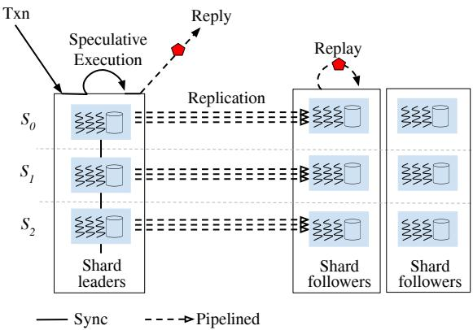  
Progress-checking for both replication and dependencies  
Figure 1: The architecture of Mako. Shard leaders can be in the same datacenter or in different datacenters. Shard followers are in other geographic locations. Results are returned to the client only after replication completes.

## 4.2 Speculative execution and certification

Mako extends Silo’s [95] single-node optimistic concurrency control (OCC) protocol to a distributed variant of OCC. Every shard leader in Mako can receive a one-shot transaction (i.e., a transaction that includes all operations, sometimes termed a non-interactive transaction) from a client. Upon receiving that request, the shard leader becomes the transaction coordinator and will execute the transaction on behalf of the client. For reads, the transaction coordinator performs optimistic reads of key-value pairs. It maintains a ReadSet, which includes all the records read with their versions (defined below). For writes, the coordinator buffers them into a WriteSet that stores the new state of the record locally without explicitly coordinating with other transactions; these are not installed until they have been validated. Records that have been both read and modified are present in both the ReadSet and WriteSet. In the absence of failures, reads recorded in the ReadSet reflect the latest version of the corresponding keys.

Version vector clock. The version in Mako is a vector clock that consists of n individual logical clocks $\left( c _ { 0 } , c _ { 1 } , . . . , c _ { n - 1 } \right)$ where n represents the total number of shards in the deployment. Each element represents a logical clock value generated by a shard. The logical clock on each shard increases monotonically. In our implementation, this is generated by an atomic fetch\_and\_add instruction as it fits our needs. If higher per-shard scalability is desired, one can use the rdtscp instruction as done in previous works [51, 66, 85, 92]. Further, Section 6.1 discusses how Mako represents this clock when there are thousands or millions of shards to keep the system scalable.

Transaction certification. After a transaction executes, the system needs to certify that there are no conflicts with concurrent transactions. The certification includes 4 rounds of RPCs among the leaders of involved shards (single-shard transactions perform no RPCs).

1. Lock. The coordinator attempts to acquire locks for the records in the WriteSet from the involved shards. Lock requests are sent in parallel. During the lock acquisition, if any lock is already held by another transaction, the lock request fails and the attempting transaction is aborted.

2. GetClock. After locking the WriteSet, the coordinator asks each involved shard to increase and return its latest logical clock to create a vector clock. The coordinator then combines this vector clock with all the vector clocks in the ReadSet to generate a vector clock that serves as the transaction’s commit version. The rule for combination is choosing the maximum clock value for each shard.

3. Validate. The coordinator then contacts the relevant shards to check all the records in the transaction’s ReadSet. If there is a conflict on any of the keys (i.e., the latest version has changed or the lock bit has been taken), the coordinator will abort the transaction. This is to ensure that the versions of all read data at the serialization point are the same as the versions seen during the execution phase.

4. Install. If all validations succeed, the coordinator sends RPCs to the relevant shard leaders to speculatively install the writes. Old versions are not discarded immediately in case the speculatively installed versions need to be rolled back.

Validate and Install are essentially 2PC’s prepare and commit phases. We choose not to use 2PC’s naming to avoid confusion about the commit point, as the transaction is not fully “committed” yet since it is pending replication.

After the above 4 RPCs are done the certification phase is complete and the transaction’s state moves to CERTIFIED. So far, all communication has occurred among the shard leaders. If the leaders are co-located, this means that no crossdatacenter communication needs to take place and Mako can use fast networking (DPDK).

Use vector clock to coarsely track dependencies. Mako needs to track read dependencies between transactions that have been certified and speculatively installed to prepare for possible rollbacks. If transaction $T _ { 1 }$ reads $T _ { 2 } { \mathrm { ^ { , } } }$ ’s write, then $T _ { 1 }$ (read-)depends on $T _ { 2 } { \mathrm { i } }$ ; if $T _ { 2 }$ reads from $T _ { 3 } ,$ , then $T _ { 1 }$ transitively depends on T3. If $T _ { 1 }$ (transitively) depends on $T _ { N }$ , Mako ensures that $T _ { 1 } { } ^ { \prime } \mathrm { s }$ version vector clock is always greater than $T _ { N }$ in a pair-wise manner. This is the key invariant in Mako that ensures the correctness and the efficiency of rollbacks. (If $T _ { 1 }$ is a read-only transaction, $T _ { 1 } \ '$ s version could equal $T _ { 2 } \mathrm { ' s . ) }$

For example, in Figure 2 there are 3 shard leaders $S _ { 0 } – S _ { 2 }$ and each shard stores 3 keys respectively. The dependency relationships are as follows: $T _ { 2 }$ depends on T1, T1 depends on $T _ { 0 } ,$ and there is a blind write between $T _ { 3 }$ and T2. A possible set of versions for this scenario could be $T _ { 0 } \colon ( 1 , 0 , 0 )$ , T1: (1,1,0), T2: (1,2,1), T3: (0,3,0). In this example, $T _ { 0 } \leq T _ { 1 } \leq T _ { 2 }$ in pair-wise comparison, while $T _ { 3 }$ and $T _ { 2 }$ are incomparable, indicating that they are not read-dependent with each other (e.g., commutative or blind write). Note that $T _ { 2 }$ must be pairwise comparable to $T _ { 0 }$ as they are transitively read-dependent.

<table><tr><td colspan="6">→Dependent</td><td>WriteSet</td><td></td><td>Vector Clock</td></tr><tr><td colspan="2" rowspan="3">T。 T</td><td>T A-</td><td></td><td>Operations W(a);</td><td>ReadSet</td><td>(1,0,0)</td><td>(1,0.0)</td></tr><tr><td> $\underline { { \boldsymbol { T } _ { 0 } } }$   $\underline { { \boldsymbol { T } _ { 1 } } }$ </td><td></td><td>R(a);W(d);</td><td>(1,0.0)</td><td>(0,1,0)</td><td>(1,1,0)</td></tr><tr><td>： 4 T</td><td> $\underline { { { T _ { 2 } } } }$ </td><td>R(d);W(d);W(g);</td><td>(1,1,0)</td><td>(0,2,1)</td><td>(1,2,1)</td></tr><tr><td colspan="3">4--→Incomparable Keys:S(a,b.c)S(d.e.f)S(g,h,i)</td><td> $T _ { 3 }$ </td><td>W(e);</td><td></td><td>(0,3.0)</td><td>(0.3.0)</td></tr></table>

Figure 2: Transitive transactions: version vector clocks reflect all potentially explicit or implicit dependencies. There are 3 shard servers $S _ { 0 } - S _ { 2 } .$ , and 4 transactions: $T _ { 0 }  – T _ { 3 }$

If two transactions are incomparable, our vector clock still reflects the correct serialization order from the leader (e.g., T3 has to be replayed after $T _ { 2 }$ on the followers of shard $S _ { 1 } )$ .

## 4.3 Replication with Paxos streams

There are two types of logs in Mako: a transaction log and a per-core replication log (which we call a stream to avoid ambiguity). A transaction log contains the key-value pairs in the WriteSet of the transaction, and its commit version vector clock. In contrast, each entry in a stream corresponds to a batch of transactions (400 in our implementation).

Once a transaction is speculatively installed in the shard leaders, the transaction enters the replication phase. During this phase, each worker thread within each shard maintains a separate stream of the transactions that will be replicated. Mako then uses MultiPaxos [16] for replication (a separate instance for each core), but it could use any leader-based replication protocol that is safe under an asynchronous network.

Note that we use per-core streams rather than a single stream for the entire shard because prior works [85, 90] have shown (and we have confirmed) that the throughput of a single MultiPaxos stream plateaus after ≈ 10 worker threads due to expensive thread synchronization overhead. Further, the reason that each stream entry corresponds to a batch of transactions instead of a single transaction is to eliminate the frequent RPC overhead; all other works in the literature do the same. While batching could introduce additional latency, Mako operates at high throughput so it builds batches fast; the geo-latency of replication is by far the dominant contributor to the end-to-end latency experienced by clients.

## 4.4 Record-Replay on the followers

When a new Paxos stream entry is durable, a follower cannot replay the entry just yet since this might lead to an inconsistent state in the event of failures. Consider two transactions $T _ { 1 }$ and $T _ { 2 }$ in Figure 3. The system has two shards to store bank checking and saving information separately. Initially, Alice’s savings account holds \$100, while Bob has a bank balance of \$0. In $T _ { 1 } .$ , Alice transfers her balance from the savings account to the checking account, and then in $T _ { 2 } .$ , Alice transfers \$100 from her checking account to Bob’s checking account. $T _ { 1 }$ ’s two operations will be replicated independently by two Paxos streams as they are on different shards. However, in the event that the saving account shard fails, two potential outcomes may arise, both of which can lead to an inconsistent state. The first outcome is incomplete cross-shard transaction replication. For instance, op#2 in $T _ { 1 }$ is successfully replicated, while op#1 is lost after a failure. It is unsafe to only replay op#2 on one shard follower. The second outcome involves missing dependent transactions. Although all operations in T2 are replicated, T1’s may not be (i.e., op#1 is lost). Mako cannot replay $T _ { 2 }$ either, as otherwise the system will be in a state where Alice never sends money, but Bob receives \$100.

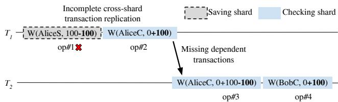  
Figure 3: Alice withdraws \$100 from her savings account to her checking account and then transfers it to Bob.

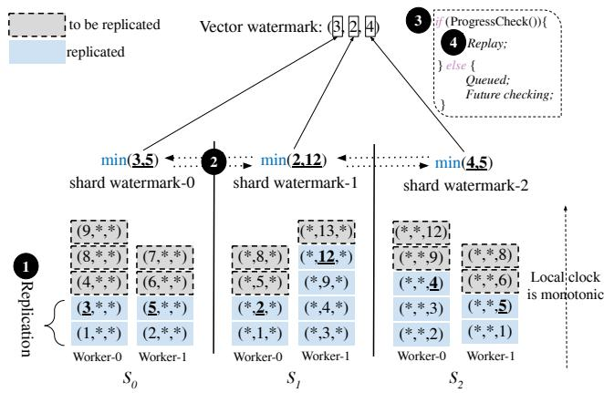  
Figure 4: Example replay procedure for shard followers with 2 worker threads per shard. Replay is performed by advancing the vector watermark. Mako only tracks the clock relevant to each shard (we mark the irrelevant entries with \*).

To address this issue, Mako borrows the idea of Aurora [99], Rolis [85], and Query-Fresh [99] in which system performance is optimized by pipelining replication and utilizing one monotonically increasing number to track the durability of concurrent transactions within one shard or one database instance. However, this approach will not work out of the box in multi-shard, geo-replicated systems since the monotonically increasing number would become a centralized bottleneck. To correct this, Mako introduces a lightweight, decentralized vector watermark scheme to enable safe replay.

A vector watermark is an array of shard watermarks (w0, $w _ { 1 } , \ldots , w _ { n - 1 } )$ where n equals the number of shards. Each shard watermark $w _ { i }$ is calculated by shard-i independently. On shard-i, Mako maintains an invariant that each Paxos stream has a local and monotonically increasing clock value that represents the shard clock of the most recently replicated transaction. Shard-i chooses the minimum of these clock values from all worker threads. Figure 4 shows an example.

1 Each watermark wi represents the current replication progress of shard-i in the system. It is monotonically increasing. 2 All shards will periodically gossip with each other to exchange their latest vector watermark. The gossip is performed in the background and does not block transactions’ execution. 3 Once progress-checking, a safety-checking mechanism, succeeds at the followers, 4 the transactions are sent to the replay threads for concurrent replay. We discuss progress checking and concurrent replay in detail later.

For a coordinator to acknowledge the transaction’s result to the client, Mako waits for the system’s vector watermark to advance beyond the transaction’s version. This ensures that the transaction and all transactions it depends on have been durably recorded on all relevant shards, providing a consistent and reliable commit acknowledgment to the client. More formally, if a transaction with version vector clock $\left( c _ { 0 } , c _ { 1 } , . . . , c _ { n - 1 } \right)$ has $c _ { i } \leq w _ { i } , \forall i \in [ 0 , n - 1 ]$ , its transaction log must be already replicated in the Paxos stream of shard-i. With this guarantee, a transaction can transition to COMMITTED and return back to the client.

Progress-checking phase. In this phase, Mako actively verifies whether a transaction’s version falls below the latest vector watermark. If it does, the transaction proceeds to the replay phase, indicating that all transactions it depends on, from other cores or shards, have also been replicated to a majority of replicas. At this stage, Mako can assert that the transaction is COMMITTED. On the other hand, if the version does not fall below the vector watermark, the transaction is unsafe to replay since some of its dependencies may be missing, or some transactions might only be partially replicated. In such cases, the transaction is queued for future checking.

Replay phase. We employ Thomas’s write rule [90, 93] (e.g., last writer wins) to replay replicated writes on each shard follower concurrently without any additional coordination. Each replicated write corresponds to one transaction. If the transaction tries to write a data item that has already been written by another transaction with a newer shard clock, the write operation is ignored.

Optimization: summary vector clocks. Since we batch transactions to avoid RPC overhead, we also find it helpful to do watermark updates and comparisons at the granularity of batches instead of individual transactions. We do this by assigning each batch a summary vector clock. Mako computes this summary vector clock by using the highest $c _ { i }$ for all $i \in [ 0 , n - 1 ]$ in all vector clocks in the logs of the stream entry. For example, if we have a batch that is made up of the 4 transactions in Figure 2, the batch’s summary vector clock would be (1,3,1). This vector clock is used when the followers replay operations.

## 5 Handling failures in speculative 2PC

The speculative transaction execution and pipelined replication strategy discussed so far assumes no failures. This section discusses how Mako deals with the cases where speculation fails due to server failures. We only discuss failures of shard leaders as failures of followers do not require special handling other than normal recovery.

## 5.1 Why is this hard?

A conceptually simple strawman solution is to pause the entire system, sync all replicated transaction logs, track which speculatively executed transactions are not fully replicated, rollback these transactions and any transactions that depend on them, and then resume execution. While straightforward, this approach is not ideal in practice as a single failed server can halt the entire system. Furthermore, in multi-shard systems used today such failures do not impact healthy shards. Mako preserves this arrangement by ensuring that unaffected shards can continue processing transactions.

Our original intent was to find and then adapt an existing technique in order to avoid freezing the entire system in the event of speculation failures. We were confident that given the long history of work in speculative execution, such a solution must exist. To our surprise, we found no prior solution that could be applied to Mako, and realized that Mako faces unique challenges. Below is a summary of prior solutions and why they do not apply to Mako.

• Single-shard speculation. Many speculative execution and replication works only consider a single shard [33, 81, 85]. In speculation failures, the system freezes to recover. There is no need for a better solution because there is only one shard in the system so the system would have to freeze anyway when the shard fails.

• Re-execution. Two recent designs, Morty [12] and Hackwrench [24], use speculative execution on transactions and re-execute the transaction if the speculation fails. An important reason why they can do this is that their speculation failure is not caused by server failures but by conflicting access in transactions. That is, even though the speculation fails, the transaction requests/logs are still present to support the re-execution. But in Mako, the servers can fail before the replication completes, so transactions could be lost; Mako cannot re-execute transactions in the way that Morty and Hackwrench do.

• Fine-grained dependency tracking. By recording the finegrained dependencies (e.g., T1 reads T2), the system can accurately abort transactions in a cascading manner. However, recording such dependencies has a high overhead and thus is only used in distributed systems [68, 105] where the baseline throughput is relatively low (i.e., thousands of transactions per second) so there is room to tolerate the overhead. In contrast, multicore transactional systems have much higher throughput (millions of transactions per second), so introducing fine-grained dependency tracking can easily kill more than half of the throughput, as is discussed by prior works [23, 28, 34, 100]. Hence, if we want Mako to be fast, it cannot take this approach.

• Group-commit. Designs that execute transactions speculatively and commit all of them as a group [54,64,101] track replication progress with a single timestamp. But if a shard leader fails, the entire system blocks until the failure is detected and fixed (e.g., several seconds). Mako cannot use this approach because we want healthy shards unaffected by the failure to continue executing transactions.

Our literature survey leads us to conclude that no existing solution can meet Mako’s goals. A deeper reason for the absence of techniques in this domain is that the key building block in most distributed transaction protocols, 2PC, is not fault-tolerant. If a shard in 2PC loses its state, the healthy shards will also get stuck [87]. The usual approach to address this problem is to replicate every decision in 2PC [20] or rely on fault-tolerant disaggregated storage [35] so that we can assume that every shard is always alive. But since Mako chooses to invert the layering between 2PC and replication, we must invent a new failure recovery mechanism to support recovering 2PC with incomplete past decisions.

## 5.2 Mako’s solution

As Mako does not replicate 2PC’s decision before it finishes, Mako cannot recover decisions at the level of individual transactions when there are failures. But such fine-grained failure handling is not necessary anyway. Instead, Mako groups transactions into epochs. When failures happen, Mako advances the epoch and makes a collective decision about which transactions in the previous epoch must roll back.

Mako has a configuration manager (CM) that manages the epochs (which is also sometimes called a view manager in other works). CM itself is replicated so it is considered always alive. CM maintains heartbeats with every shard. When a shard leader fails, CM will detect it and trigger a leader election to elect a new leader. CM also advances the epoch number and broadcasts the epoch increment to all shards. The Paxos streams on all shards also use the epoch number to group log entries, which is a classic approach in consensus systems [16, 72, 73]; we are not introducing algorithmic changes in reaching consensus.

The newly elected leader will first try to retrieve all replicated log entries in the previous epoch from its peers, recommit them if needed, and commit any remaining slots with no-ops if the entries are not recoverable (any entries after the no-op will be ignored). We call this closing the previous epoch, because after this step no more log entries can be added to the previous epoch. When an epoch is closed on a shard, its finalized shard watermark can be computed by choosing the minimum shard clock of all its streams.

Healthy shards also advance their epochs on receiving the broadcast from the CM. A major difference between a healthy shard and a recovered shard is that a healthy shard usually does not lose any transactions in its log, so its rollback is expected to be less aggressive. To reflect this, the healthy shard has an extra step to close the old epoch. The shard first tries to finish speculative execution and certification of all transactions in the old epoch, then it replicates a special ending entry into all its Paxos streams. The ending entry has a INF shard clock value, indicating that: (1) this is the maximum clock; (2) there are no more transactions of this epoch on this shard; and (3) all previous transactions have successfully been replicated without lost dependencies. When the replication of INF entries finishes, the leader considers the old epoch closed, and declares its finalized shard watermark is INF. Note that INF is also the minimum shard clock of all of its streams, so the rule for computing the finalized shard watermark is the same on recovered shards and healthy shards.

If the shard has a hanging transaction in the old epoch that cannot finish before a timeout (due to network delays or waiting on the failed shards), it will terminate the hanging transaction, but not replicate the INF entry in the Paxos stream, and then computes the watermark normally.

After a shard computes its finalized watermark, it broadcasts the watermark to all other shards. Eventually, all shards exchange their finalized watermarks to form the finalized vector watermark (FVW), which represents a consistent and maximum global cut across all shards for the old epoch. Given an epoch, all possible vector watermarks are smaller than the epoch’s FVW in a pair-wise manner. Computing the FVW is a deterministic and reentrant process, meaning it can be safely restarted and re-executed in case of failures, always yielding the same result. If a shard fails during the steps of closing an old epoch, the CM will initiate a further configuration change with a higher epoch. The new leader will always compute the same FVW for the old epoch as they were computed before.

After the FVW for the old epoch is established, any transactions that are not below the FVW are rolled back on shard leaders and forever abandoned by the system. One might wonder why we cannot re-apply the transactions using the logs from healthy shards. This is because although healthy shards may have a transaction’s WriteSet, these writes can depend on lost transactions, so re-applying them would lead to anomalies (§4.4). Note that the number of transactions above the FVW in the old epoch does not grow once the FVW is established, which means the rollbacks are bounded; there are no unbounded and expensive cascading aborts into new epochs.

During this failure recovery, transaction execution on healthy shards should not be blocked if transactions do not involve the failed shard. To reflect this, a healthy shard does not need to wait for the old epoch to close, and the finalized vector watermark to be computed, before processing newepoch transactions. It does need to wait until all old-epoch transactions are certified or aborted (but not replicated), so that no old-epoch transactions read new-epoch transactions. This switch is very quick. To prevent new-epoch transactions from being affected by the old-epoch rollbacks, we add a rule that before the FVW is computed and the rollback is done, new-epoch transactions cannot read from transactions that are certified but are uncertain if they will be below FVW.

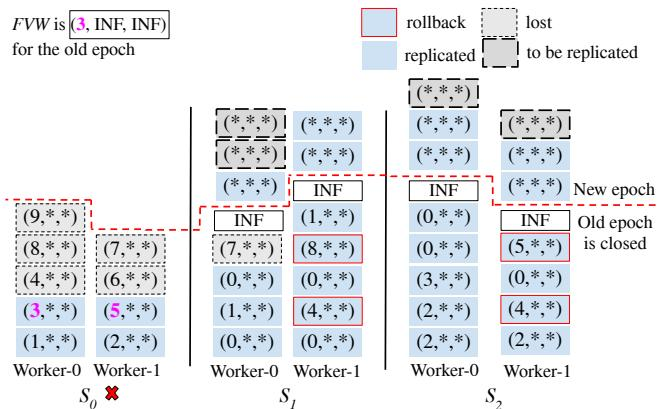  
Figure 5: Single-shard failure: $S _ { 0 }$ fails; $S _ { 1 }$ and $S _ { 2 }$ are healthy (irrelevant information is marked with asterisks).

Figure 5 shows an example. There are 3 shards with shard $S _ { 0 }$ failing and triggering a rollback. The computed FVW is (3, INF, INF). All healthy shards $( S _ { 1 }$ and $S _ { 2 } )$ can eventually replicate their transactions in the old epoch. For any transactions on the healthy shards that are not below the FVW, such as (4,\*,\*), they are rolled back because they could transitively or directly depend on one of the lost or incomplete transactions.

Additional details. After all shards have advanced to the new epoch and all old-epoch transactions have finished, the healthy shards can clean up leftover work by the failed shard, mainly its pre-owned locks. Further, if a healthy shard launches a transaction that accesses a shard that is in the process of recovering from a failure, the healthy shard may be blocked because Mako has a synchronous threading model. To prevent this, Mako puts this transaction into a wait queue based on timeouts until the failed shard recovers.

Correctness. We give a proof of the correctness of Mako’s design and failure recovery in Appendix A.

## 6 Practical considerations

In this section we discuss critical extensions to Mako that are needed for Mako to be useful in practice.

## 6.1 Scalability with more shards

Recall that Mako creates shards for 2 reasons: to achieve higher throughput and to support increasingly large datasets that cannot fit in one machine. As we show in our evaluation (§7), Mako achieves very high throughput with just a handful of shards and hence there is no need to use many shards to get high throughput. On the other hand, Mako absolutely needs to scale to support larger datasets.

But adding more shards to Mako brings overheads that can prove problematic. In particular, there are two components of Mako that scale with the number of shards: (1) the vector watermark introduced in Section 4.4 that tells followers when it is safe to replay operations; and (2) the version vector clocks that track the version of objects across transactions. The vector watermark is not a scalability bottleneck, because each shard maintains a single vector watermark (the number of entries is linear in the total number of shards), and each entry in it is a 32-bit integer. Even if we had 10,000 shards, each vector watermark would be only 40KB.

On the other hand, there is a version clock for every object in every transaction. Version vector clocks are a scalability bottleneck. To address this issue, when the number of shards gets large, Mako compresses the vector clocks to a small size similarly to prior works [57, 102, 106, 110]. We provide a complete pseudocode for the algorithm in the Appendix D, and evaluate the scalability of vector clocks in Section 7.7. The high-level idea is as follows.

When installing a new version vector clock, multiple shards’ clocks can be merged into one entry by choosing the maximum of these shards’ clocks (the shards’ logical clock is also updated to the maximum value on installing the version). This compression is lossy, but it still preserves correctness because it maintains the key invariant in Mako: if transaction T2 (transitively) depends on T1, T2 must have a greater vector clock. The merging strategy is flexible: Mako can merge any group of clocks into one. For simplicity, we implemented a K : M strategy that groups K shards into M-sized vector clocks.

Note that compression has its downsides: it degrades performance when a shard fails or slows down. Consider the extreme case when the vector clock is compressed to a single timestamp. In this case, when a shard wants to replay a transaction, it needs to wait for the watermark of every other shard to surpass the transaction’s timestamp. If any shard is laggy or faulty, the whole system is affected. In contrast, in the uncompressed case, replaying only needs to wait for relevant shards, not all shards. Mako uses a full-sized vector clock as its default; when there are many shards it sets the vector clock to a constant number (e.g., 20) and merges clocks.

## 6.2 Shard management

Similarly to most works in this space, we use static sharding in our prototype implementation to focus on our primary research question. However, shard management, such as resharding, is an important topic in practice [20, 41]. Prior works [1, 6, 48] have shown that thoroughly addressing shard management requires an entire research project.

We leave the complete design and implementation of a dynamic sharding solution for Mako to future work. However, we argue that this problem is not fundamentally more difficult in Mako than in prior systems. In particular, in Mako, there is no need for cross-epoch vector clock comparisons and crossepoch vector watermark computations, which eliminates concerns about mismatches between vector clocks across epochs. Leveraging this insight, Mako is able to handle shard management in a way analogous to failure recovery. Once a FVW is computed (§5.2), the entire database can be treated as a read-only snapshot, serving as the initial state with all vector clocks conceptually reset to zero as vector clocks from the higher epoch always have a higher priority. We provide more details in Appendix B.

## 6.3 Quick failure recovery

Learners. To speed up failure recovery, Mako co-locates a shard learner in the same datacenter as the shard leader. A shard learner is essentially the same as a shard follower, except that it does not vote on consensus. This allows Mako to recover from the failure of a leader more quickly than having to make one of the followers the leader (which would cause shard leaders to no longer be co-located) or provision a new leader in the existing datacenter which would take some time for this new machine to catch up from scratch.

Datacenter failures. A special case in deployment is when all shard leaders are co-located in the same datacenter, and the entire leader datacenter fails. In such a case, the failure recovery process can be expedited by skipping all rollbacks on healthy shard leaders since there are none.

Stragglers. A benefit of using a vector clock is that it is resilient to stragglers. A straggler shard in Mako does not block the system entirely. Note that the all-to-all communication in Mako for vector clocks is non-blocking. If a shard is very slow, transactions that do not involve such straggler shard are not affected. Recall that the watermark is a vector: the straggler’s entry in the vector would stay the same until the straggler makes progress, but the other entries in the vector would be incremented. So transactions that do not touch the straggler can continue to be replayed at followers and can return to the client. Only when cross-shard transactions touch the straggler, would they incur any delay.

## 7 Evaluation

The evaluation aims to answer the following questions:

• What is the base performance of Mako and does it scale?

• How does Mako compare to the state-of-the-art georeplicated transactional systems?

• How fast can Mako recover from failures?

## 7.1 Experimental setup

We implemented Mako in C++. Mako is based on a few existing works, including Silo [95] for each server’s database engine, eRPC [45] for accelerated networks, and the Janus framework [69] for replication. Mako adds ∼10K new lines of code. Mako is open sourced at https://github.com/ stonysystems/mako.

Testbed. Experiments were conducted on Azure. Each VM has 32 Intel vCPU cores, 128GB of RAM, and Mellanox 4 Lx accelerated networking (16 Gbps). The latency within a datacenter is mostly between 20 and 30 µs, with occasional peaks over 100 µs.3 To simulate WAN, we make 3 groups of servers and inject a 50 ms RTT between groups.4

Baselines. We evaluate nine baselines: (1) five systems that support scalable sharding and geo-replication, including Calvin [94], D2PC [113], TAPIR [109], a Spanner-like 2PC over Paxos, and Janus [69]; and (2) four systems that lack full sharding or geo-replication features but are optimized for multi-core settings, including Silo [95], Meerkat [90], Rolis [85], and DrTM+R’s Optimistic Replication (OR) [104]. For Calvin, D2PC, TAPIR, Janus, Silo, Meerkat, and Rolis, we use their existing implementations with modifications required to get them to run in our testbed (e.g., we had to port Meerkat’s networking drivers to work with the network cards in Azure). We implement our own version of OR because the original implementation does not support geo-replication. We add this support by combining OCC with DrTM+R’s optimistic replication protocol (we call it OCC+OR). We also implement a Spanner-like 2PC over Paxos since Spanner is not open source (we call it 2PC).

Sharding in Mako and baselines. The database is split across anywhere from 1 to 10 servers. Given that many of the baselines were not designed to run on many-core machines, we need to be careful with how we shard the data as otherwise we could be very unfair to them. We do the following.

• Mako, OCC+OR, 2PC: 1 server is 1 multi-core shard with 24 worker threads.

• Janus, D2PC, TAPIR: 1 server is 24 shards, each with 1 worker thread.

• Calvin: 1 server runs 3 shards (called “partitions” in Calvin), and each shard has 8 worker threads.

The goal of the above arrangement is to ensure that, to the best of our ability, we are giving the same amount of hardware resources to all of the different systems. There is however, another issue that arises. When we run many of these baselines with many servers, they end up having a lot of shards. For example, if we run Janus, D2PC, or TAPIR with 10 servers, that is equivalent to running them with 240 shards. The research prototypes of these systems were never tested with such high number of shards, so at this scale all of them experience issues (e.g., can’t establish socket connections, abort rates are too high, most RPCs time out) when performing cross-shard transactions (we have confirmed this with several of the authors of these systems). We therefore make the decision to be generous to these baselines and disable all cross-shard transactions for Janus, D2PC, TAPIR, and Calvin. In other words, they only perform single-shard transactions, whereas Mako,

OCC+OR, and 2PC will perform cross-shard transactions.

To ensure fault-tolerance, we also replicate each server so we have one leader, one learner (§6.3), and two followers (this means in total we have up to 40 servers). Unless otherwise noted, all shard leaders are deployed in the same datacenter, and all clients are co-located with the shard leaders.

Benchmarks. We evaluate two benchmarks:

• TPC-C. This benchmark simulates an e-commerce site. TPC-C consists of a mix of five concurrent transactions that represent different types of activities, including new orders (NEW), payment processing (PAY), order status checking (ORDER), delivery scheduling (DLY), and stock level checking (STOCK). TPC-C scales by sharding a database into multiple warehouses spread across multiple cores and shards. Transactions in TPC-C are configurable to span multiple warehouses to evaluate the performance and scalability of distributed database systems. This type of transaction is more complex and resource-intensive than transactions that access data within a single warehouse, as it requires coordination and communication between multiple cores and servers. We run the standard mix on the default configuration unless otherwise mentioned.

• Microbenchmark of small-sized transactions. Because Mako introduces overheads at the transaction level, its performance is penalized more with small-sized transactions. We demonstrate cases like this using a microbenchmark with two transaction types: Read-Only (READ) and Read-Modify-Write (RMW). Each READ transaction has 4 read operations and each RMW transaction has 4 read-modifywrite operations. The total data space for the microbenchmark is 1 million keys for each shard. We conduct 50% of RMW transactions and 50% of READ transactions. Each operation randomly selects a key in a given shard. There is a 95% chance of selecting from the shard where the coordinator is running, and a 5% chance of the coordinator performing a cross-shard key access.

## 7.2 Throughput and scalability

This part evaluates the performance and scalability of Mako.

TPC-C Benchmark. Of the 10 systems that we are evaluating, only 7 systems readily support TPC-C. These include: Mako, 2PC, Janus, D2PC, Calvin, Silo, and Rolis. TAPIR and Meerkat do not support TPC-C in their existing code bases, and we did not implement TPC-C for OCC+OR.

We run TPC-C on the 7 systems that support it with an increasing number of shards. The number of warehouses is set to be equal to the number of worker threads in the system.

Mako is able to scale well in Figure 6a. Mako’s throughput at 10 shards (10 servers) is 3.66M transactions per second (TPS), which outperforms Calvin by 8.6×. As a side note, Mako also has good single-shard performance reaching 0.96M TPS, which outperforms Calvin by 22.5×. The major reason for the slowness in Calvin is that it uses a central sequencer to pre-determine the order of a batch of transactions, which are then sent to all replicas to execute deterministically through Zookeeper.

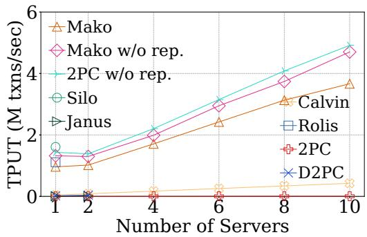  
(a) TPC-C Workload

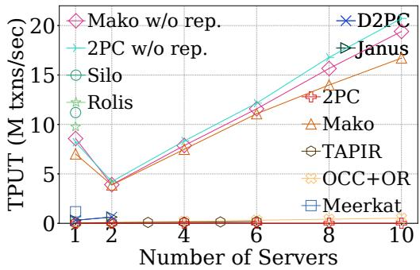  
(b) Microbenchmark workload  
Figure 6: Throughput and scalability of Mako and the baselines. In Mako, the number of shards is equal to the number of servers (x-axis). In other systems, the number of shards is larger than the number of servers (see Section 7.1).

There is a noticeable per-shard throughput drop when increasing the number of shards in Mako from 1 to 2. The reason for this decline is that 1% of the items accessed in the NewOrder transaction (10 items accessed on average) trigger a cross-warehouse access, which results in 5.11% cross-shard transaction coordination. This overhead is considerably more expensive compared to the local in-memory operations.

The performance of Mako scales almost linearly after 2 servers. As the number of servers increases, Mako’s throughput per shard slightly decreases with increasing shards from 2 to 10 shards, because the ratio of cross-shard transactions increases. For example, NewOrder goes from ∼5% to ∼9% (the theoretical bound is 10%). While 2PC scales well up to 10 servers, its throughput is lower than Mako because georeplication is on the critical path of concurrency control. This same effect of having geo-replication in the critical path affects D2PC and Janus, which can only reach 38.5K TPS and 10.4K TPS with 2 servers, respectively.

Ablation testing. To understand the contribution of different components in Mako, we disable various parts of Mako and some of the baselines.

First, we disable all replication for Mako and 2PC. We observe that both Mako and 2PC without replication perform much better than their respective variants with replication (as is expected). For example, the overhead of replication in Mako is around 23%. 2PC, without the geo-latency to slow down its transaction processing, gets a massive performance boost and is even better than Mako because it has fewer RTTs for cross-shard transactions.

Second, we measure Silo, which is the system on top of which we built Mako, to investigate the cost of adding sharding and replication to a single-machine database. Mako preserves 68.4% of the throughput of Silo on a single machine.

Third, we evaluate Rolis, which extends Silo to support geo-replication efficiently. Rolis achieves higher throughput than Mako with 1 shard since it does not have multi-version overhead. However, Rolis can only support one shard so if the database gets too big or if the system requires more throughput, there is nothing that Rolis can do besides using bigger machines. Adding support for sharding is precisely Mako’s contribution over Rolis.

Microbenchmark: We further study the performance and scalability of Mako on the microbenchmark with a fixed 5% cross-shard key access, as shown in Figure 6b. In this experiment, we also include the results for OCC+OR, Meerkat, and TAPIR. In this simple but high throughput scenario, Mako can still scale well beyond 2 shards. The throughput of Mako at 10 shards is up to 16.7M TPS. Both Mako and OCC+OR can scale well with more shards, but Mako is able to achieve 32.2× higher throughput than OCC+OR at 10 shards (10 servers). OCC+OR can only achieve up to 0.52M TPS because transactions in OCC+OR always optimistically read and abort if the replicas are not ready during the commit phase, which is often the case under geo-replication. As in the TPC-C benchmark, Rolis achieves 39% higher throughput than Mako when using a single shard.

Meerkat does not support sharding, so we test its singleshard performance with 24 worker threads. All servers are connected via DPDK. Meerkat achieves 1.17M TPS, a lot lower than Mako at 1 shard. In fairness, Meerkat supports interactive transactions which are more costly to handle than the “one shot” (or non-interactive) transaction model used by Mako and the other baselines. So this comparison is not apples-to-apples and should be treated qualitatively (Mako is very competitive) rather than quantitatively.

We test Janus, D2PC, and TAPIR up to 2, 2 and 6 servers, respectively. All systems scale well, with Janus achieving 640K TPS, D2PC attaining 137K TPS, and TAPIR reaching 168K TPS. We could not test beyond these configurations because the prototype implementations of these systems could not support more shards. Nevertheless, assuming they continue to scale in the same fashion, Mako still achieves orders of magnitude better performance by decoupling transaction coordination and replication.

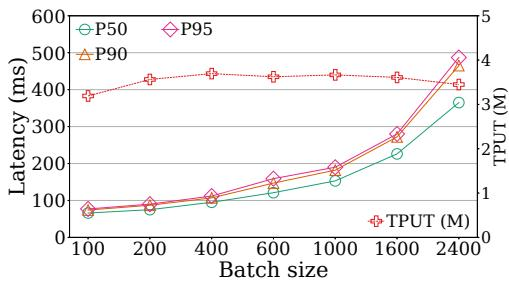  
Figure 7: Mako’s latency and throughput on TPC-C with varying batch size.

## 7.3 Latency

Mako’s latency has three dominant sources: the RTT between datacenters, the batching window to gather transactions and put them into a stream entry, and the advance time of the vector watermark to go beyond the vector clock. We measure Mako’s latency with 10 shards on TPC-C. The results are shown in Figure 7. Median latency with batch size of 600 is 121 ms, of which ∼50 ms are for RTT between datacenters, 13 ms for batching, and the rest to advance the vector watermark. In contrast, 2PC (not shown in the figure) has a much higher latency (∼ 10×) at high throughput because of aborts.

As shown in the results, batch size has an obvious impact on latency but the impact on throughput is minimal once the batch size is large enough (a few hundred). Compared to a batch size of 100, the throughput of Mako with a batch size of 400 increases by 15.8%. This throughput remain roughly constant up to batches of 1600. Based on this, we set Mako’s batch size to 400 by default, and used this in all experiments.

We also evaluate the latency of Mako, Janus, and Calvin under a light workload (microbenchmark) using a single replicated shard. This helps us understand the communication overhead of the various systems. Figure 8 gives the results.

The median latency of Mako is 60 ms, comprising approximately 50 ms for one WAN RTT, 3.5 ms for batching, and 6.5 ms for waiting on the watermark advancement. In comparison, Janus achieves a best-case latency of around 50 ms as expected (one WAN RTT), while Calvin exhibits a latency of 166 ms using ZooKeeper-based replication, which matches the number reported in the Calvin paper. All tail latencies are not significantly affected under the light workload.

## 7.4 Impact of cross-shard transactions

In this experiment, we evaluate Mako on the microbenchmark using 10 shards while varying the ratio of cross-shard transactions to measure the impact of distributed transactions. As depicted in Figure 9, in the absence of cross-shard transactions, Mako achieves a peak throughput of 60.3M TPS, which then declines. When all transactions are cross-shard, the throughput drops by 98.2% to 1.1M TPS primarily due to the significant time consumed by RPCs.

<table><tr><td>Percentile</td><td>Mako</td><td>Janus</td><td>Calvin</td></tr><tr><td>10%</td><td>57 ms</td><td>50.3 ms</td><td>146 ms</td></tr><tr><td>50%</td><td>60 ms</td><td>50.5 ms</td><td>166 ms</td></tr><tr><td>90%</td><td>64 ms</td><td>50.7 ms</td><td>202 ms</td></tr><tr><td>95%</td><td>65 ms</td><td>50.8 ms</td><td>206 ms</td></tr><tr><td>99%</td><td>66 ms</td><td>51.3 ms</td><td>212 ms</td></tr></table>

Figure 8: Latency measurements for Mako, Janus, and Calvin on the microbenchmark under a light workload.

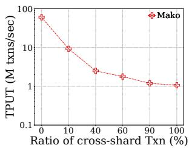  
Figure 9: Varying ratio of cross-shard transactions on the microbechmark.

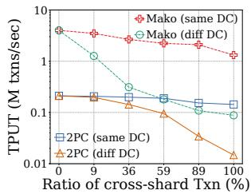  
Figure 10: Effect of leader placement on Mako’s throughput.

## 7.5 Leader placement

We distribute leaders evenly into two datacenters to evaluate how the conflict windows for cross-shard transactions is prolonged and how this affects performance.

We use the NewOrder transaction in TPC-C as the benchmark. The ratio of cross-shard transactions is controlled by varying the cross-warehouse access. Since the NewOrder transaction accesses an average of 10 items, a 1% crosswarehouse access results in approximately 9.04% distributed transactions, while a 50% cross-warehouse access leads to more than 99% distributed transactions.

In Figure 10, we increase the ratio of cross-shard transactions while fixing the number of clients (24K clients) for Mako and 2PC to test intra-/inter-datacenter transactions. As expected, if there are no cross-shard transactions, the performance of Mako and 2PC are not impacted, reaching 4.0M and 52K TPS respectively. As the cross-shard transaction ratio increases, the throughput of both systems drops significantly. However, even with leaders in different datacenters Mako achieves much higher throughput than 2PC.

## 7.6 Effect of concurrency on throughput

In the introduction, we remarked that a common way in systems to increase throughput is to process more client requests at the same time. We also stated that this is not actually the case in transactional systems. To gather support for this claim, we follow the experimental setup described in Section 7.5 and evaluate the performance of 2PC on NewOrder transactions when the leaders are placed in different datacenters. We increase the concurrency (number of clients) while maintaining a fixed ratio of cross-shard transactions (∼9%) in Mako.

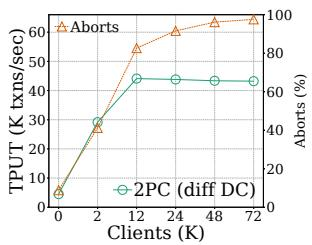

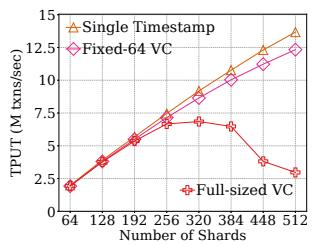  
Figure 11: 2PC throughput Figure 12: Scalability of vecwith varying concurrency. tor clock

As shown in Figure 11, the throughput of 2PC plateaus, starting with 12K clients. This result shows that simply increasing concurrency for a transactional system does not necessarily lead to higher throughput; instead, it may actually result in lower throughput due to an increased number of aborts. Beyond 12K clients, the throughput remains flat, and the transaction abort rate escalates to an astonishingly high level of 98%. As the contention footprint increases, concurrent transactions are more likely to be aborted due to prolonged conflict windows (at least 1 WAN RTT).

## 7.7 Scalability of vector clocks

As we discuss in Section 6.1, vector clocks can become a scalability bottleneck when Mako has many shards. To explore this effect and also the improvement of our proposed optimizations, we perform an experiment where we run Mako with hundreds of shards. One caveat is that we do not have thousands of machines available, so our ability to experiment with hundreds of shards (plus their replicas) is limited. We do the following: we limit each shard to use only one CPU and run the microbenchmark. The expectation here is that the throughput numbers will be lower than a standard deployment of Mako, but it should help us appreciate the overhead from the vector clock. Each transaction consists of four RMW operations and 5% of accesses span a different shard.

We test 3 strategies: the full-sized vector clock (VC), a VC that is compressed to a single timestamp, and a VC that is compressed to a VC with exactly 64 entries. The results are shown in Figure 12.

The full-sized VC approach can scale to 320 shards before its performance starts to degrade. This shows the full-sized VC is enough to support many database deployments since Mako is a very high-throughput database, even with a few shards. Of course, if the datasets are massive and the database requires many shards to fit all that data in memory this does mean that the full VC could become a scalability bottleneck. Both the timestamp approach and Fixed-64 VC achieve near linear scalability because the VC-related overhead is independent of the number of shards.

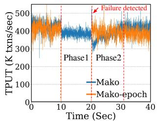

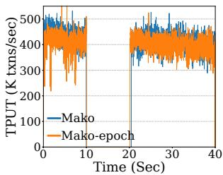  
(a) Healthy shard $S _ { 1 }$  
(b) Failed shard $S _ { 0 }$  
Figure 13: Single-shard failure: TPC-C.

## 7.8 Single-shard failure recovery

In the case of a single-shard failure, Mako minimizes the impact on uninvolved shards §5.1), which is a key distinction between Mako and systems that perform group or epochbased commits such as Primo [54] and COCO [64]. To show this difference, we implement a variant of Mako that we call Mako-epoch, which implements the failure recovery strategy of epoch-based commit protocols. Our experiment simulates a shard failure by shutting down shard leader S0, triggering a learner takeover. Figure 13 reports the throughput of a healthy and failing shard during the failover.

As outlined in Section 5.1, Mako in Figure 13a exhibits 2 phases during failure recovery. Phase 1: the healthy shard remains unaware of $S _ { 0 } \mathrm { ^ { * } s }$ failure and continues sending crossshard transactions to it. These transactions trigger eRPC timeouts (usually very short, e.g., 5ms) and are queued. After a heartbeat timeout, the healthy shard is aware of S0’s failure. Phase 2: FVW has been computed, and the healthy shard replays transactions from the queue, causing the throughput to gradually climb back to the pre-failure level. Mako in Figure 13b shows the throughput changes in the failed shard. The throughput first drops to 0 for 10 seconds because of the heartbeat timeout, and recovers to a pre-failure level once the new leader takes over.

In Mako-epoch, the behavior for a failed shard is similar to Mako’s. However, the behavior for a healthy shard is very different. As shown in Figure 13a, no transactions execute successfully in Mako-epoch during Phase 1 because healthy shards remain unaware of the failed shard(s), and all transactions that execute in the old epoch eventually need to roll back upon failure detection. This is because, in epoch-based protocols like Mako-epoch, an epoch is the commit unit.

## 7.9 Factor analysis

In Section 7.2 we had an initial ablation study. Here we expand on it to understand exactly how each component contributes to Mako. This test is done with 10 shards.

<table><tr><td></td><td>Silo</td><td>+Multi Version</td><td>+Distr. Trans.</td><td>+Rep.</td><td>+Replay (Mako)</td></tr><tr><td>TPUT (M)</td><td>1.66</td><td>1.48</td><td>0.47</td><td>0.36</td><td>0.36</td></tr></table>

The starting point of Mako is Silo, which achieves 1.66M

TPS on a single machine without any sharding or replication. The versioned values technique for rolling back results introduces a 11.1% overhead because each data item must now store a list of all its versions, which takes up additional memory operations. In addition, cross-shard coordination for distributed transactions accounts for a significant loss of 68.1%. Mako then needs to use CPU resources to serialize transactions into batched logs and use Paxos streams for replication, which causes a further 22.5% throughput loss. Replay in contrast has no impact on throughput because Mako replays transactions on shard followers asynchronously.

## 8 Further discussion

Read-only transactions. Our current implementation does not let read-only transactions execute directly at the followers—which is a common optimization. But Mako is compatible with this optimization by employing the highlevel approach proposed in Silo [95]. The idea is to keep a dedicated checkpointing thread that periodically snapshots the databas so that read-only transactions can read from this snapshot. To do this in Mako, we would maintain two special versions of each key: one reflecting the latest value and the other storing the most recent value up to the last all-agreed vector watermark for read-only transactions.

High contention workloads. High contention workloads lead to high abort rates in all systems, including Mako. That said, Mako’s pipelined replication and smaller conflict window (due to decoupled replication) lead to fewer aborts compared to other systems where replication is in the critical path. While high contention workloads would increase the transaction abort rate, they do not increase stress on Mako, as fewer transaction logs are generated.

## 9 Related work

This section reviews works in the literature on transactional, geo-replicated, multi-core systems from the various angles.

Distributed systems within the datacenter. Many works improve the performance of distributed transactions within a datacenter [4,9,10,17,25,46,67,74,84,90,103,107,110,112]. These systems use advanced hardware, such as HTM, RDMA, and DPDK, to deliver good performance, strong consistency, and fault tolerance. A key feature shared by these systems is that replication happens side-by-side with transaction execution and/or commit, making transaction backup part of the critical path. In contrast, Mako is specifically optimized for geo-replicated databases and can therefore withstand full datacenter failures (whereas these works cannot), while still achieving high performance through speculative execution.

Geo-replicated distributed systems . Recent state-of-the-art distributed systems [7, 31, 40, 43, 44, 55, 56, 62, 70, 83, 97, 111, 113–115] pursue fast geo-replication. For example, Ocean

Vista [30], TAPIR [109], and Janus [69] only need one WAN RTT if no conflicts are present by combining concurrency control and replication. However, they integrate replication into transaction execution, significantly impacting performance due to high WAN latency.

Speculative replication. Speculative replication [47, 54, 64, 81, 85] is a common optimization technique used in georeplicated transactional systems to enhance throughput and reduce latency. Besides the discussion in Section 5.1, many systems [3,32,58,61,77,88,108] resort to weaker consistency semantics (e.g., causal consistency) that permit an asynchronous replication strategy in geo-replicated systems. Epoch-based commit systems, such as COCO [64] and Primo [54] speculatively execute transactions within each epoch while asynchronously replicating writes only at epoch boundaries to enhance performance. Compared to these systems, Mako’s major advantage is that it does not have to stop healthy shards during a failure recovery as we show in Section 7.8.

Deterministic algorithms. Deterministic databases [29, 37, 39, 80, 94] can execute transactions deterministically across multiple replicas with either asynchronous or synchronous replication. In systems like Calvin [94] and C5 [37], transactions undergo a sequencing phase before execution. This sequencing layer establishes the ordering of submitted transactions and replicates them asynchronously in batches. In contrast, Mako adopts a different approach that eliminates the need for a predetermined order during execution.

Vector clock and watermark. Vector clocks and watermarks are widely used techniques to track dependency and maintain consistency in distributed systems [2, 22, 52, 61, 63, 65, 71]. Despite using the same techniques, Mako generally has a different goal and therefore an overall different system design. For example, CURE [2] is a geo-replicated store that uses vector clocks in transaction execution and watermarks to control stable snapshots. It targets transactional causal consistency, while Mako implements serializability, so the goals and techniques are different.

## 10 Conclusion

This paper presents Mako, a highly-available, fast, and scalable transactional database system, specifically optimized for geo-replication. Mako decouples transaction execution and replication, makes execution speculative, and leverages multicore machines. Our experimental evaluation shows that Mako outperforms state-of-the-art geo-replicated transactional systems by an order of magnitude in throughput.

## Acknowledgments

We thank the anonymous reviewers for suggestions that improved our work. This project was funded in part by NSF awards CNS-2107147, CNS-2321726, CNS-2326576, CNS-2045861, CNS-2321725, CNS-2238768, and CNS-2130590.

## References

[1] Atul Adya, Daniel Myers, Jon Howell, Jeremy Elson, Colin Meek, Vishesh Khemani, Stefan Fulger, Pan Gu, Lakshminath Bhuvanagiri, Jason Hunter, Roberto Peon, Larry Kai, Alexander Shraer, Arif Merchant, and Kfir Lev-Ari. Slicer: Auto-Sharding for Datacenter Applications. In Proceedings of USENIX Symposium on Operating Systems Design and Implementation (OSDI), 2016.

[2] Deepthi Devaki Akkoorath, Alejandro Z. Tomsic, Manuel Bravo, Zhongmiao Li, Tyler Crain, Annette Bieniusa, Nuno Preguiça, and Marc Shapiro. Cure: Strong semantics meets high availability and low latency. In Proceedings of IEEE International Conference on Distributed Computing Systems (ICDCS), 2016.

[3] Sergio Almeida, Joao Leitao, and Luis Rodrigues. ChainReaction: a Causal+ Consistent Datastore based on Chain Replication. In Proceedings of ACM European Conference on Computer Systems (EuroSys), 2013.

[4] Ahmed Alquraan, Sreeharsha Udayashankar, Virendra Marathe, Bernard Wong, and Samer Al-Kiswany. LoLKV: The Logless, Linearizable, RDMA-based Key-Value Storage System. In Proceedings of USENIX Conference on Networked Systems Design and Implementation (NSDI), 2024.

[5] Sebastian Angel, Aditya Basu, Weidong Cui, Trent Jaeger, Stella Lau, Srinath Setty, and Sudheesh Singanamalla. Nimble: Rollback Protection for Confidential Cloud Services. In Proceedings of USENIX Symposium on Operating Systems Design and Implementation (OSDI), 2023.

[6] Muthukaruppan Annamalai, Kaushik Ravichandran, Harish Srinivas, Igor Zinkovsky, Luning Pan, Tony Savor, David Nagle, and Michael Stumm. Sharding the shards: managing datastore locality at scale with Akkio. In Proceedings of USENIX Symposium on Operating Systems Design and Implementation (OSDI), 2018.

[7] Philip A Bernstein, Colin W Reid, and Sudipto Das. Hyder-A Transactional Record Manager for Shared Flash. In Proceedings of Biennial Conference on Innovative Data Systems Research (CIDR), 2011.

[8] Srivatsa S Bhat, Rasha Eqbal, Austin T Clements, M Frans Kaashoek, and Nickolai Zeldovich. Scaling a file system to many cores using an operation log. In Proceedings of ACM Symposium on Operating Systems Principles (SOSP), 2017.

[9] Carsten Binnig, Andrew Crotty, Alex Galakatos, Tim Kraska, and Erfan Zamanian. The end of slow networks: it’s time for a redesign. The Proceedings of the VLDB Endowment (PVLDB), 2016.

[10] Chiranjeeb Buragohain, Knut Magne Risvik, Paul Brett, Miguel Castro, Wonhee Cho, Joshua Cowhig, Nikolas Gloy, Karthik Kalyanaraman, Richendra Khanna, John Pao, Matthew Renzelmann, Alex Shamis, Timothy Tan, and Shuheng Zheng. A1: A distributed in-memory graph database. In Proceedings of ACM International Conference on Management of Data (SIG-MOD), 2020.

[11] Matthew Burke, Sowmya Dharanipragada, Shannon Joyner, Adriana Szekeres, Jacob Nelson, Irene Zhang, and Dan R K Ports. PRISM: Rethinking the RDMA Interface for Distributed Systems. In Proceedings of ACM Symposium on Operating Systems Principles (SOSP), 2021.

[12] Matthew Burke, Florian Suri-Payer, Jeffrey Helt, Lorenzo Alvisi, and Natacha Crooks. Morty: Scaling Concurrency Control with Re-Execution. In Proceedings of ACM European Conference on Computer Systems (EuroSys), 2023.

[13] Michael Burrows. The Chubby Lock Service for Loosely-Coupled Distributed Systems. In Proceedings of USENIX Symposium on Operating Systems Design and Implementation (OSDI), 2006.

[14] Francesco Calabrese, Mi Diao, Giusy Di Lorenzo, Joseph Ferreira Jr, and Carlo Ratti. Understanding individual mobility patterns from urban sensing data: A mobile phone trace example. Transportation research part C: emerging technologies, 2013.

[15] Wei Cao, Xiaojie Feng, Boyuan Liang, Tianyu Zhang, Yusong Gao, Yunyang Zhang, and Feifei Li. Logstore: A cloud-native and multi-tenant log database. In Proceedings of ACM International Conference on Management of Data (SIGMOD), 2021.

[16] Tushar Deepak Chandra, Robert Griesemer, and Joshua Redstone. Paxos made live: an engineering perspective. In Proceedings of ACM Symposium on Principles of Distributed Computing (PODC), 2007.

[17] Yanzhe Chen, Xingda Wei, Jiaxin Shi, Rong Chen, and Haibo Chen. Fast and general distributed transactions using RDMA and HTM. In Proceedings of ACM European Conference on Computer Systems (EuroSys), 2016.

[18] Audrey Cheng, Xiao Shi, Aaron Kabcenell, Shilpa Lawande, Hamza Qadeer, Jason Chan, Harrison Tin,

Ryan Zhao, Peter Bailis, Mahesh Balakrishnan, Nathan Bronson, Natacha Crooks, and Ion Stoica. TaoBench: An end-to-end benchmark for social network workloads. The Proceedings of the VLDB Endowment (PVLDB), 2022.

[19] Austin T Clements, M Frans Kaashoek, Eddie Kohler, Robert T Morris, and Nickolai Zeldovich. The scalable commutativity rule: designing scalable software for multicore processors. Communications of the ACM, 2017.

[20] James C. Corbett, Jeffrey Dean, Michael Epstein, Andrew Fikes, Christopher Frost, J. J. Furman, Sanjay Ghemawat, Andrey Gubarev, Christopher Heiser, Peter Hochschild, Wilson Hsieh, Sebastian Kanthak, Eugene Kogan, Hongyi Li, Alexander Lloyd, Sergey Melnik, David Mwaura, David Nagle, Sean Quinlan, Rajesh Rao, Lindsay Rolig, Yasushi Saito, Michal Szymaniak, Christopher Taylor, Ruth Wang, and Dale Woodford. Spanner: Google’s globally distributed database. In Proceedings of USENIX Symposium on Operating Systems Design and Implementation (OSDI), 2012.

[21] Heming Cui, Rui Gu, Cheng Liu, Tianyu Chen, and Junfeng Yang. Paxos made transparent. In Proceedings of ACM Symposium on Operating Systems Principles (SOSP), 2015.

[22] Giuseppe DeCandia, Deniz Hastorun, Madan Jampani, Gunavardhan Kakulapati, Avinash Lakshman, Alex Pilchin, Swaminathan Sivasubramanian, Peter Vosshall, and Werner Vogels. Dynamo: Amazon’s highly available key-value store. In Proceedings of ACM Symposium on Operating Systems Principles (SOSP), 2007.

[23] Cristian Diaconu, Craig Freedman, Erik Ismert, Per-Ake Larson, Pravin Mittal, Ryan Stonecipher, Nitin Verma, and Mike Zwilling. Hekaton: SQL server’s memory-optimized OLTP engine. In Proceedings of ACM International Conference on Management of Data (SIGMOD), 2013.

[24] Zhiyuan Dong, Zhaoguo Wang, Xiaodong Zhang, Xian Xu, Changgeng Zhao, Haibo Chen, Aurojit Panda, and Jinyang Li. Fine-Grained Re-Execution for Efficient Batched Commit of Distributed Transactions. The Proceedings of the VLDB Endowment (PVLDB), 2023.

[25] Aleksandar Dragojevic, Dushyanth Narayanan, Miguel ´ Castro, and Orion Hodson. FaRM: Fast Remote Memory. In Proceedings of USENIX Conference on Networked Systems Design and Implementation (NSDI), 2014.

[26] Aleksandar Dragojevic, Dushyanth Narayanan, Ed- ´ mund B Nightingale, Matthew Renzelmann, Alex

Shamis, Anirudh Badam, and Miguel Castro. No compromises: distributed transactions with consistency, availability, and performance. In Proceedings of ACM Symposium on Operating Systems Principles (SOSP), 2015.

[27] Tamer Eldeeb, Xincheng Xie, Philip A Bernstein, Asaf Cidon, and Junfeng Yang. Chardonnay: Fast and General Datacenter Transactions for On-Disk Databases. In Proceedings of USENIX Symposium on Operating Systems Design and Implementation (OSDI), 2023.

[28] Jose M. Faleiro, Daniel J. Abadi, and Joseph M. Hellerstein. High Performance Transactions via Early Write Visibility. The Proceedings of the VLDB Endowment (PVLDB), 2017.

[29] Jose M Faleiro, Daniel J Abadi, and Joseph M Hellerstein. High performance transactions via early write visibility. The Proceedings of the VLDB Endowment (PVLDB), 2017.

[30] Hua Fan and Wojciech Golab. Ocean vista: gossipbased visibility control for speedy geo-distributed transactions. The Proceedings of the VLDB Endowment (PVLDB), 2019.

[31] Anil K Goel, Jeffrey Pound, Nathan Auch, Peter Bumbulis, Scott MacLean, Franz Färber, Francis Gropengiesser, Christian Mathis, Thomas Bodner, and Wolfgang Lehner. Towards scalable real-time analytics: An architecture for scale-out of OLxP workloads. The Proceedings of the VLDB Endowment (PVLDB), 2015.

[32] Chathuri Gunawardhana, Manuel Bravo, and Luís ET Rodrigues. Unobtrusive Deferred Update Stabilization for Efficient Geo-Replication. In Proceedings of USENIX Conference on Annual Technical Conference (ATC), 2017.

[33] Zhenyu Guo, Chuntao Hong, Mao Yang, Dong Zhou, Lidong Zhou, and Li Zhuang. Rex: replication at the speed of multi-core. In Proceedings of ACM European Conference on Computer Systems (EuroSys), 2014.

[34] Zhihan Guo, Kan Wu, Cong Yan, and Xiangyao Yu. Releasing Locks As Early As You Can: Reducing Contention of Hotspots by Violating Two-Phase Locking. In Proceedings of ACM International Conference on Management of Data (SIGMOD), 2021.

[35] Zhihan Guo, Xinyu Zeng, Kan Wu, Wuh-Chwen Hwang, Ziwei Ren, Xiangyao Yu, Mahesh Balakrishnan, and Philip A Bernstein. Cornus: atomic commit for a cloud DBMS with storage disaggregation. The Proceedings of the VLDB Endowment (PVLDB), 2022.

[36] Theo Haerder and Kurt Rothermel. Concepts for transaction recovery in nested transactions. In Proceedings of ACM International Conference on Management of Data (SIGMOD), 1987.

[37] Jeffrey Helt, Abhinav Sharma, Daniel J. Abadi, Wyatt Lloyd, and Jose M. Faleiro. C5: Cloned Concurrency Control That Always Keeps Up. The Proceedings of the VLDB Endowment (PVLDB), 2022.

[38] Maurice P Herlihy and Jeannette M Wing. Linearizability: A correctness condition for concurrent objects. ACM Transactions on Programming Languages and Systems (TOPLAS), 1990.

[39] Joshua Hildred, Michael Abebe, and Khuzaima Daudjee. Caerus: Low-Latency Distributed Transactions for Geo-Replicated Systems. The Proceedings of the VLDB Endowment (PVLDB), 2023.

[40] Chuntao Hong, Dong Zhou, Mao Yang, Carbo Kuo, Lintao Zhang, and Lidong Zhou. KuaFu: Closing the parallelism gap in database replication. In Proceedings of IEEE International Conference on Data Engineering (ICDE), 2013.

[41] Dongxu Huang, Qi Liu, Qiu Cui, Zhuhe Fang, Xiaoyu Ma, Fei Xu, Li Shen, Liu Tang, Yuxing Zhou, Menglong Huang, Wan Wei, Cong Liu, Jian Zhang, Jianjun Li, Xuelian Wu, Lingyu Song, Ruoxi Sun, Shuaipeng Yu, Lei Zhao, Nicholas Cameron, Liquan Pei, and Xin Tang. TiDB: a Raft-based HTAP database. The Proceedings of the VLDB Endowment (PVLDB), 2020.

[42] Yihe Huang, William Qian, Eddie Kohler, Barbara Liskov, and Liuba Shrira. Opportunities for Optimism in Contended Main-Memory Multicore Transactions. The Proceedings of the VLDB Endowment (PVLDB), 2020.

[43] Theo Jepsen, Leandro Pacheco de Sousa, Huynh Tu Dang, Fernando Pedone, and Robert Soulé. Optimistic aborts for geo-distributed transactions. arXiv preprint arXiv:1610.07459, 2016.

[44] Xin Jin, Xiaozhou Li, Haoyu Zhang, Nate Foster, Jeongkeun Lee, Robert Soulé, Changhoon Kim, and Ion Stoica. Netchain: Scale-free sub-rtt coordination. In Proceedings of USENIX Conference on Networked Systems Design and Implementation (NSDI), 2018.

[45] Anuj Kalia, Michael Kaminsky, and David Andersen. Datacenter RPCs can be General and Fast. In Proceedings of USENIX Conference on Networked Systems Design and Implementation (NSDI), 2019.

[46] Anuj Kalia, Michael Kaminsky, and David G Andersen. FaSST: Fast, Scalable and Simple Distributed Transactions with Two-Sided (RDMA) Datagram RPCs. In Proceedings of USENIX Symposium on Operating Systems Design and Implementation (OSDI), 2016.

[47] Manos Kapritsos, Yang Wang, Vivien Quema, Allen Clement, Lorenzo Alvisi, and Mike Dahlin. All about Eve: Execute-verify replication for multi-core servers. In Proceedings of USENIX Symposium on Operating Systems Design and Implementation (OSDI), 2012.

[48] Antonios Katsarakis, Yijun Ma, Zhaowei Tan, Andrew Bainbridge, Matthew Balkwill, Aleksandar Dragojevic, Boris Grot, Bozidar Radunovic, and Yongguang Zhang. Zeus: locality-aware distributed transactions. In Proceedings of ACM European Conference on Computer Systems (EuroSys), 2021.

[49] Idit Keidar and Danny Dolev. Increasing the resilience of atomic commit, at no additional cost. In Proceedings of ACM International Conference on Management of Data (SIGMOD), 1995.

[50] Kangnyeon Kim, Tianzheng Wang, Ryan Johnson, and Ippokratis Pandis. ERMIA: fast memory-optimized database system for heterogeneous workloads. In Proceedings of ACM International Conference on Management of Data (SIGMOD), 2016.

[51] Hideaki Kimura. FOEDUS: OLTP engine for a thousand cores and NVRAM. In Proceedings of ACM International Conference on Management of Data (SIG-MOD), 2015.

[52] Masoomeh Javidi Kishi, Sebastiano Peluso, Henry F Korth, and Roberto Palmieri. SSS: scalable keyvalue store with external consistent and abort-free readonly transactions. In Proceedings of IEEE International Conference on Distributed Computing Systems (ICDCS), 2019.

[53] W Kohler, A Shah, and F Raab. Overview of TPC Benchmark C: The Order-Entry Benchmark. Transaction Processing Performance Council, Technical Report, 1991.

[54] Ziliang Lai, Hua Fan, Wenchao Zhou, Zhanfeng Ma, Xiang Peng, Feifei Li, and Eric Lo. Knock Out 2PC with Practicality Intact: a High-performance and General Distributed Transaction Protocol. In Proceedings of IEEE International Conference on Data Engineering (ICDE), 2023.

[55] Jialin Li, Ellis Michael, and Dan RK Ports. Eris: Coordination-free consistent transactions using innetwork concurrency control. In Proceedings of ACM

Symposium on Operating Systems Principles (SOSP), 2017.

[56] Junru Li, Youyou Lu, Yiming Zhang, Qing Wang, Zhuo Cheng, Keji Huang, and Jiwu Shu. SwitchTx: scalable in-network coordination for distributed transaction processing. The Proceedings of the VLDB Endowment (PVLDB), 2022.

[57] Yishuai Li, Yunfeng Zhu, Chao Shi, Guanhua Zhang, Jianzhong Wang, and Xiaolu Zhang. Timestamp as a Service, not an Oracle. The Proceedings of the VLDB Endowment (PVLDB), 2024.

[58] Zhongmiao Li, Peter Van Roy, and Paolo Romano. Speculative transaction processing in geo-replicated data stores. Technical report, Instituto Superior Tecnico, Lisboa & INESC-ID, 2017.

[59] Hyeontaek Lim, Michael Kaminsky, and David G Andersen. Cicada: Dependably fast multi-core in-memory transactions. In Proceedings of ACM International Conference on Management of Data (SIGMOD), 2017.

[60] Gang Liu, Leying Chen, and Shimin Chen. Zen: a highthroughput log-free OLTP engine for non-volatile main memory. The Proceedings of the VLDB Endowment (PVLDB), 2021.

[61] Wyatt Lloyd, Michael J Freedman, Michael Kaminsky, and David G Andersen. Don’t settle for eventual: scalable causal consistency for wide-area storage with COPS. In Proceedings of ACM Symposium on Operating Systems Principles (SOSP), 2011.

[62] Haonan Lu, Shuai Mu, Siddhartha Sen, and Wyatt Lloyd. NCC: Natural Concurrency Control for Strictly Serializable Datastores by Avoiding the Timestamp-Inversion Pitfall. In Proceedings of USENIX Symposium on Operating Systems Design and Implementation (OSDI), 2023.

[63] Yi Lu, Xiangyao Yu, Lei Cao, and Samuel Madden. Aria: A Fast and Practical Deterministic OLTP Database. The Proceedings of the VLDB Endowment (PVLDB), 2020.

[64] Yi Lu, Xiangyao Yu, Lei Cao, and Samuel Madden. Epoch-based commit and replication in distributed OLTP databases. The Proceedings of the VLDB Endowment (PVLDB), 2021.

[65] Umang Mathur and Mahesh Viswanathan. Atomicity checking in linear time using vector clocks. In Proceedings of ACM International Conference on Architectural Support for Programming Languages and Operating Systems (ASPLOS), 2020.

[66] Alexander Merritt, Ada Gavrilovska, Yuan Chen, and Dejan Milojicic. Concurrent log-structured memory for many-core key-value stores. The Proceedings of the VLDB Endowment (PVLDB), 2018.

[67] Christopher Mitchell, Yifeng Geng, and Jinyang Li. Using One-Sided RDMA Reads to Build a Fast, CPU-Efficient Key-Value Store. In Proceedings of USENIX Conference on Annual Technical Conference (ATC), 2013.

[68] Shuai Mu, Yang Cui, Yang Zhang, Wyatt Lloyd, and Jinyang Li. Extracting more concurrency from distributed transactions. In Proceedings of USENIX Symposium on Operating Systems Design and Implementation (OSDI), 2014.

[69] Shuai Mu, Lamont Nelson, Wyatt Lloyd, and Jinyang Li. Consolidating Concurrency Control and Consensus for Commits under Conflicts. In Proceedings of USENIX Symposium on Operating Systems Design and Implementation (OSDI), 2016.

[70] Faisal Nawab, Vaibhav Arora, Divyakant Agrawal, and Amr El Abbadi. Minimizing Commit Latency of Transactions in Geo-Replicated Data Stores. In Proceedings of ACM International Conference on Management of Data (SIGMOD), 2015.

[71] Cuong DT Nguyen, Johann K Miller, and Daniel J Abadi. Detock: High performance multi-region transactions at scale. In Proceedings of the ACM on Management of Data (SIGMOD), 2023.

[72] Brian M Oki and Barbara H Liskov. Viewstamped replication: A new primary copy method to support highly-available distributed systems. In Proceedings of ACM Symposium on Principles of Distributed Computing (PODC), 1988.

[73] Diego Ongaro and John K Ousterhout. In search of an understandable consensus algorithm. In Proceedings of USENIX Conference on Annual Technical Conference (ATC), 2014.

[74] John Ousterhout, Arjun Gopalan, Ashish Gupta, Ankita Kejriwal, Collin Lee, Behnam Montazeri, Diego Ongaro, Seo Jin Park, Henry Qin, Mendel Rosenblum, Stephen Rumble, Ryan Stutsman, and Stephen Yang. The RAMCloud storage system. ACM Transactions on Computer Systems (TOCS), 2015.

[75] Ruoming Pang, Ramon Caceres, Mike Burrows, Zhifeng Chen, Pratik Dave, Nathan Germer, Alexander Golynski, Kevin Graney, Nina Kang, Lea Kissner, Jeffrey L. Korn, Abhishek Parmar, Christina D. Richards, and Mengzhi Wang. Zanzibar: Google’s Consistent,

Global Authorization System. In Proceedings of USENIX Conference on Annual Technical Conference (ATC), 2019.

[76] Christos H. Papadimitriou. The serializability of concurrent database updates. Journal of the ACM (JACM), 1979.

[77] Karin Petersen, Mike J Spreitzer, Douglas B Terry, Marvin M Theimer, and Alan J Demers. Flexible update propagation for weakly consistent replication. In Proceedings of ACM Symposium on Operating Systems Principles (SOSP), 1997.

[78] Soujanya Ponnapalli, Aashaka Shah, Souvik Banerjee, Dahlia Malkhi, Amy Tai, Vijay Chidambaram, and Michael Wei. RainBlock: Faster transaction processing in public blockchains. In Proceedings of USENIX Conference on Annual Technical Conference (ATC), 2021.

[79] Calton Pu, Gail E Kaiser, and Norman C Hutchinson. Split-Transactions for Open-Ended Activities. In Proceedings of International Conference on Very Large Data Bases (VLDB), 1988.

[80] Shujian Qian and Ashvin Goel. Massively Parallel Multi-Versioned Transaction Processing. In Proceedings of USENIX Symposium on Operating Systems Design and Implementation (OSDI), 2024.

[81] Dai Qin, Angela Demke Brown, and Ashvin Goel. Scalable replay-based replication for fast databases. The Proceedings of the VLDB Endowment (PVLDB), 2017.

[82] Kun Ren, Jose M. Faleiro, and Daniel J. Abadi. Design Principles for Scaling Multi-core OLTP Under High Contention. In Proceedings of ACM International Conference on Management of Data (SIGMOD), 2016.

[83] Kun Ren, Dennis Li, and Daniel J Abadi. Slog: Serializable, low-latency, geo-replicated transactions. The Proceedings of the VLDB Endowment (PVLDB), 2019.

[84] Henry N Schuh, Weihao Liang, Ming Liu, Jacob Nelson, and Arvind Krishnamurthy. Xenic: SmartNIC-Accelerated Distributed Transactions. In Proceedings of ACM Symposium on Operating Systems Principles (SOSP), 2021.

[85] Weihai Shen, Ansh Khanna, Sebastian Angel, Siddhartha Sen, and Shuai Mu. Rolis: a software approach to efficiently replicating multi-core transactions. In Proceedings of ACM European Conference on Computer Systems (EuroSys), 2022.

[86] Jeff Shute, Radek Vingralek, Bart Samwel, Ben Handy, Chad Whipkey, Eric Rollins, Mircea Oancea, Kyle

Littlefield, David Menestrina, Stephan Ellner, John Cieslewicz, Ian Rae, Traian Stancescu, and Himani Apte. F1: A distributed SQL database that scales. The Proceedings of the VLDB Endowment (PVLDB), 2013.

[87] Dale Skeen. Nonblocking commit protocols. In Proceedings of ACM International Conference on Management of Data (SIGMOD), 1981.

[88] Yair Sovran, Russell Power, Marcos K Aguilera, and Jinyang Li. Transactional storage for geo-replicated systems. In Proceedings of ACM Symposium on Operating Systems Principles (SOSP), 2011.

[89] Michael Stonebraker, Samuel Madden, Daniel J Abadi, Stavros Harizopoulos, Nabil Hachem, and Pat Helland. The end of an architectural era:(it’s time for a complete rewrite). In Proceedings of International Conference on Very Large Data Bases (VLDB), 2007.

[90] Adriana Szekeres, Michael Whittaker, Jialin Li, Naveen Kr. Sharma, Arvind Krishnamurthy, Dan R. K. Ports, and Irene Zhang. Meerkat: multicore-scalable replicated transactions following the zero-coordination principle. In Proceedings of ACM European Conference on Computer Systems (EuroSys), 2020.

[91] Yacine Taleb, Ryan Stutsman, Gabriel Antoniu, and Toni Cortes. Tailwind: fast and atomic RDMA-based replication. In Proceedings of USENIX Conference on Annual Technical Conference (ATC), 2018.

[92] Takayuki Tanabe, Takashi Hoshino, Hideyuki Kawashima, and Osamu Tatebe. An analysis of concurrency control protocols for in-memory databases with CCBench. The Proceedings of the VLDB Endowment (PVLDB), 2020.

[93] Robert H Thomas. A majority consensus approach to concurrency control for multiple copy databases. ACM Transactions on Database Systems (TODS), 1979.

[94] Alexander Thomson, Thaddeus Diamond, Shu-Chun Weng, Kun Ren, Philip Shao, and Daniel J Abadi. Calvin: fast distributed transactions for partitioned database systems. In Proceedings of ACM International Conference on Management of Data (SIGMOD), 2012.

[95] Stephen Tu, Wenting Zheng, Eddie Kohler, Barbara Liskov, and Samuel Madden. Speedy transactions in multicore in-memory databases. In Proceedings of ACM Symposium on Operating Systems Principles (SOSP), 2013.

[96] Nathan VanBenschoten, Arul Ajmani, Marcus Gartner, Andrei Matei, Aayush Shah, Irfan Sharif, Alexander Shraer, Adam Storm, Rebecca Taft, Oliver Tan, and

Andy Woods. Enabling the next generation of multiregion applications with cockroachdb. In Proceedings of ACM International Conference on Management of Data (SIGMOD), 2022.

[97] Alexandre Verbitski, Anurag Gupta, Debanjan Saha, Murali Brahmadesam, Kamal Gupta, Raman Mittal, Sailesh Krishnamurthy, Sandor Maurice, Tengiz Kharatishvili, and Xiaofeng Bao. Amazon Aurora : Design considerations for high throughput cloud-native relational databases. In Proceedings of ACM International Conference on Management of Data (SIGMOD), 2017.

[98] Alexandre Verbitski, Anurag Gupta, Debanjan Saha, James Corey, Kamal Gupta, Murali Brahmadesam, Raman Mittal, Sailesh Krishnamurthy, Sandor Maurice, Tengiz Kharatishvilli, and Xiaofeng Bao. Amazon Aurora: On Avoiding Distributed Consensus for I/Os, Commits, and Membership Changes. In Proceedings of ACM International Conference on Management of Data (SIGMOD), 2018.

[99] Tianzheng Wang, Ryan Johnson, and Ippokratis Pandis. Query fresh: Log shipping on steroids. The Proceedings of the VLDB Endowment (PVLDB), 2017.

[100] Zhaoguo Wang, Shuai Mu, Yang Cui, Han Yi, Haibo Chen, and Jinyang Li. Scaling multicore databases via constrained parallel execution. In Proceedings of ACM International Conference on Management of Data (SIGMOD), 2016.

[101] Jack Waudby, Paul Ezhilchelvan, Isi Mitrani, and Jim Webber. A performance study of epoch-based commit protocols in distributed OLTP databases. In International Symposium on Reliable Distributed Systems (SRDS), 2022.

[102] Xingda Wei, Rong Chen, Haibo Chen, Zhaoguo Wang, Zhenhan Gong, and Binyu Zang. Unifying Timestamp with Transaction Ordering for MVCC with Decentralized Scalar Timestamp. In Proceedings of USENIX Conference on Networked Systems Design and Implementation (NSDI), 2021.

[103] Xingda Wei, Zhiyuan Dong, Rong Chen, and Haibo Chen. Deconstructing RDMA-enabled distributed transactions: Hybrid is better! In Proceedings of USENIX Symposium on Operating Systems Design and Implementation (OSDI), 2018.

[104] Xingda Wei, Jiaxin Shi, Yanzhe Chen, Rong Chen, and Haibo Chen. Fast in-memory transaction processing using RDMA and HTM. In Proceedings of ACM Symposium on Operating Systems Principles (SOSP), 2015.

[105] Chao Xie, Chunzhi Su, Cody Littley, Lorenzo Alvisi, Manos Kapritsos, and Yang Wang. High-performance ACID via modular concurrency control. In Proceedings of ACM Symposium on Operating Systems Principles (SOSP), 2015.

[106] Erfan Zamanian, Carsten Binnig, Tim Kraska, and Tim Harris. The end of a myth: Distributed transactions can scale. arXiv preprint arXiv:1607.00655, 2016.

[107] Erfan Zamanian, Xiangyao Yu, Michael Stonebraker, and Tim Kraska. Rethinking database high availability with RDMA networks. The Proceedings of the VLDB Endowment (PVLDB), 2019.

[108] Marek Zawirski, Nuno Preguiça, Sérgio Duarte, Annette Bieniusa, Valter Balegas, and Marc Shapiro. Write fast, read in the past: Causal consistency for client-side applications. In Proceedings of the Annual Middleware Conference (Middleware), 2015.

[109] Irene Zhang, Naveen Kr. Sharma, Adriana Szekeres, Arvind Krishnamurthy, and Dan R. K. Ports. Building consistent transactions with inconsistent replication. In Proceedings of ACM Symposium on Operating Systems Principles (SOSP), 2015.

[110] Ming Zhang, Yu Hua, and Zhijun Yang. Motor: Enabling Multi-Versioning for Distributed Transactions on Disaggregated Memory. In Proceedings of USENIX Symposium on Operating Systems Design and Implementation (OSDI), 2024.

[111] Yang Zhang, Russell Power, Siyuan Zhou, Yair Sovran, Marcos K Aguilera, and Jinyang Li. Transaction chains: achieving serializability with low latency in geo-distributed storage systems. In Proceedings of ACM Symposium on Operating Systems Principles (SOSP), 2013.

[112] Yingqiang Zhang, Chaoyi Ruan, Cheng Li, Xinjun Yang, Wei Cao, Feifei Li, Bo Wang, Jing Fang, Yuhui Wang, Jingze Huo, and Chao Bi. Towards costeffective and elastic cloud database deployment via memory disaggregation. The Proceedings of the VLDB Endowment (PVLDB), 2021.

[113] Zihao Zhang, Huiqi Hu, Xuan Zhou, Yaofeng Tu, Weining Qian, and Aoying Zhou. Fast Commitment for Geo-Distributed Transactions via Decentralized Cocoordinators. The Proceedings of the VLDB Endowment (PVLDB), 2024.

[114] Zihao Zhang, Huiqi Hu, Xuan Zhou, and Jiang Wang. Starry: multi-master transaction processing on semileader architecture. The Proceedings of the VLDB Endowment (PVLDB), 2022.

[115] Yang Zhou, Xingyu Xiang, Matthew Kiley, Sowmya Dharanipragada, and Minlan Yu. DINT: Fast In-Kernel Distributed Transactions with eBPF. In Proceedings of USENIX Conference on Networked Systems Design and Implementation (NSDI), 2024.

## Appendix

## A Proof of Correctness

In this proof, we assume the correctness of exisiting wellknown protocols (OCC, Paxos) and mainly aim to prove two properties: commit/rollback atomicity and rollback safety.

Informally, commit/rollback atomicity means if a transaction is committed or rolled back on one shard, all its WriteSet spanning different shards will be committed or rolled back unanimously. There are two cases to discuss. The normal case is that a transaction successfully finishes speculative transaction execution and certification, its WriteSet appears in all relevant shards, and all shards need to unanimously commit or roll back this WriteSet. The abnormal case is that a transaction does not finish speculative transaction execution or certification, e.g., a shard times out waiting for an install call.

The rollback safety means, if a transaction is rolled back, all transactions that depend on this transaction also have to be rolled back. It also implies that if a transaction is replayed or released to client, it cannot be rolled back any more. There are mainly two cases to consider: the transaction and its descendant are in the same epoch, and when they are in different epochs.

Definition 1 (dependency). If transaction $T _ { 0 }$ writes to a key and subsequently transaction $T _ { 1 }$ reads from the same key, we refer to this as $T _ { 1 }$ being read-dependent on $T _ { 0 } .$ . Throughout this proof, the term “dependency” specifically refers to readdependency.

Definition 2 (writes-i). A distributed transaction may update data stored across many shard leaders. Throughout this proof, the term “writes-i” refers to the data in the WriteSet for the transaction on shard server-i.

Definition 3 (vector clock/vector watermark). Throughout this proof, we consistently denote the vector clocks for transactions $T _ { 0 }$ and $T _ { 1 }$ as $\left( p _ { 0 } , p _ { 1 } , \ldots , p _ { n - 1 } \right)$ and $( q _ { 0 } , q _ { 1 } , \ldots , q _ { n - 1 } )$ respectively, and FVW is $( w _ { 0 } , w _ { 1 } \ \dots \ w _ { n - 1 } )$ , where n is the number of shards.

Fact 1. Mako’s distributed OCC protocol shares similarities with widely used OCC and 2PC protocols in system designs, and its correctness is straightforward. The core principle of Mako’s distributed OCC protocol is that a transaction is considered to have reached a serializable point if it can satisfy two key conditions during the commit phase, consistent with other OCC protocols: (1) All write locks are successfully acquired, and (2) No read items have been modified by other concurrent transactions.

Fact 2. Vector clock of a transaction can reflect the serialization order on shard(s), ensured by our our distributed OCC.

Lemma 1. If transaction $T _ { 1 }$ depends on $T _ { 0 } ,$ , then their vector clocks satisfy: $\nu c _ { 1 } \geq \nu c _ { 0 }$

Proof. If the transaction T1 depends on $T _ { 0 } ,$ in GetClock phase, the vector clock of $T _ { 0 }$ must be included in $T _ { 1 } { } ^ { \prime } \mathrm { s }$ ReadSet. This allows the Mako to determine $T _ { 1 } { } ^ { \prime } \mathrm { s }$ vector clock by selecting the maximum of shard clocks among all vector clocks in its ReadSet, resulting in $p _ { i } \leq q _ { i }$ where $i \in [ 0 , n - 1 ]$

Lemma 2. If T1 transitively depends on $T _ { 0 } ,$ then $\nu c _ { 1 } \geq \nu c _ { 0 } .$

Proof. The transitivity is obvious. Assume the chain of dependency is $T _ { 1 } , T _ { 2 } , \dots T _ { k } , T _ { 0 }$ . We have $\nu c _ { 1 } \geq \nu c _ { 2 } \geq . . . \geq \nu c _ { k } \geq$ vc0.

Fact 3. For a Paxos stream on the shard leader-i, the shard clock-i of Paxos entries within this Paxos stream is monotonically increasing within the same epoch, until the end of the epoch.

Lemma 3. For each shard, $w _ { i }$ in its local view of the vector watermark $( w _ { 0 } , w _ { 1 } , . . . , w _ { n - 1 } )$ consistently increments, and represents the replication progress of shard leader-i within the same epoch.

Proof. According to Fact 3, the shard clock-i within the same Paxos stream consistently increases on shard-i. Combining this with the fact that $w _ { i }$ is picking up the minimum among all shard clock-i from the vector clocks of replicated transactions across all Paxos streams on the shard-i, we can infer the following. (1) The replication progress $( w _ { i } )$ of shard-i is always advancing, and (2) If a transaction updates at least one key on shard-i and its shard clock-i smaller than $w _ { i } ,$ the writes-i of this transaction on the shard-i has been successfully replicated. □

Lemma 4. For an epoch e, computing its FVW is a re-entrant and deterministic process. The FVW is the epoch’s maximum vector watermark, i.e., for any vector watermark vw in this epoch, $f \nu w \geq \nu w .$

Proof. Given an epoch $e ,$ the FVW is computed only during the epoch advancement in the failure recovery to ensure its maximum. Once a shard leader receives an epoch advancement request from CM, it needs to address in-flight transactions (they would be the last transaction for each worker thread within the old epoch) before advancing to the new epoch:

Case 1 (the good case): All transactions from epoch e finished speculative certification or abort before timeout. Then the shard replicates INFs as the end of the epoch. The finalized watermark for this shard is INF.

Case 2 (the abnormal case): Some transactions cannot finish before timeout due to contacting the failed shards or network anomalies. Or all transactions finish but the shard does not successfully replicate INFs. In such cases, at least one Paxos stream of the shard cannot end with INF, either ending with a no-op or with a normal transaction log entry. In both cases, the Paxos stream in this epoch cannot grow any further; its last log entry has the largest clock on this stream (Fact 3). Without loss of generality, assume this clock is the lowest of all streams on this shard. The clock is the shard’s watermark in FVW.

In both Case 1 and 2, FVW is computed by choosing for each shard the largest acceptable clock value (the minimum of all streams), which is a fixed value once an epoch ends. Computing FVW is hence a re-entrant and deterministic process, and any other vector watermark in this epoch must be lower than FVW.

Fact 4. All of the writes-i of transaction T have the same vector clock.

Lemma 5. A writes-i of a transaction T is rolled back $b y$ shard-i if and only if T ’s vector clock is not lower than FVW.

Proof. Given Lemma 4 states that the FVW is a deterministic value for each epoch, if $T \mathbf { \hat { s } }$ vector clock is not lower than FVW, it will be rolled back. Otherwise, T would be replayed (or on the leader becomes visible) and not be rolled back.

Lemma 6. If a transaction T partially commits (timeout on some shards), $T ' s$ vector clock is not lower than FVW.

Proof. A transaction T partially commits due to timeout on some shard, and will pause the worker thread that processes T on that shard. Assume the Paxos stream this worker threads maps to has its last entry as $T ^ { \prime }$ $T ^ { \prime }$ has a lower shard clock than T . In computing the FVW, FVW’s $w _ { i }$ must be equal to or lower than than $T ^ { \prime } \mathrm { { \bar { s } } }$ shard clock. This means T cannot have a lower vector clock than FVW and thus T will be rolled back. □

Theorem 1. (Atomicity) A speculatively certified transaction will either commit or rollback on all relevant shards.

Proof. Based on Lemma $^ { 6 , }$ if a transaction partially commits, its vector clock will not be lower than FVW, and hence will be rolled back. Based on Fact 4 and Lemma 5, if a transaction is rolled back, it is rolled back on all relevant shards. □

Lemma 7. A transaction in a lower epoch cannot depend on any transaction that is in a higher epoch.

Proof. This is guaranteed by the protocol aborting a transaction if it reads a higher-epoch transaction.

Lemma 8. A transaction in a higher epoch cannot depend on any transaction that is or will be rolled back in a lower epoch.

Proof. This is guaranteed by how our protocol processes the new-epoch transactions:

Case 1: Before FVW is computed, transactions in a new epoch delay accessing versions from the prior epoch e that may be subject to potential rollback.

Case 2: Afterwards, once (e, FVW) is established, transactions in the new epoch only read versions from epoch e defined by the (e, FVW). □

Theorem 2. (Rollback safety) If a transaction $T _ { 0 }$ is rolled back, any transaction $T _ { 1 }$ that depends on $T _ { 0 }$ will also be rolled back.

Proof. First, based on Lemma 7, T1 is either in the same epoch or in a higher epoch than $T _ { 0 } .$ . Further based on Lemma 8, T1 cannot be a higher epoch, so $T _ { 0 }$ and $T _ { 1 }$ must be in the same epoch.

Given Lemma 2, $T _ { 1 }$ has a greater vector clock than $T _ { 0 } ,$ i.e., $\nu c _ { 1 } \geq \nu c _ { 0 }$ . Based on Lemma 5, vc0 is not lower than FVW. Since vc1 ≥ vc0, vc1 is not lower than FVW. Again based on Lemma 5, T1 will be rolled back as well.

## B Shard management in detail

This section provides a detailed explanation of our shard management approach. To enable operations such as shard deletion, addition, and key partition reassignment, we use a management configuration that encapsulates crucial details, such as whether keys remain on the same server (compared to the previous configuration), the total number of shards in the new setup, and the identifiers of those shards.

Two key observations shape our approach: (1) cross-epoch vector clock and vector watermark computations and comparisons are unnecessary in Mako, and (2) transactions in the old epoch are not dependent on those in the new epoch. Once Mako obtains the FVW for the old epoch, the entire database can be treated as a read-only snapshot, serving as the initial state with all vector clocks reset to zero (vector clocks from higher epochs have a higher priority). This still ensures that dependency relationships are preserved, as vector clocks only track dependencies, and vector watermarks track replication progress to prevent data loss.

Building on these observations, our solution treats shard management similarly to failure recovery. The Configuration Manager (CM) oversees the management process by broadcasting a MIGRATE-START message containing the new configuration to all shards, including those being deleted or newly added. Upon receiving this message, shard leaders transition to the new epoch and reject any RPCs from the old epoch or from invalid shards (e.g., those deleted in the new configuration).

Shard leaders then begin executing most transactions speculatively, with two constraints: (1) keys must be below their current view of vector watermarks to avoid potential data loss, and (2) keys scheduled for migration cannot be accessed to ensure safety in the event of a shard failure during the shard management. Since there is no need for all vector clocks from the old epoch to compare with new epoch vector clocks, eliminating concerns about mismatches between vector clocks across epochs.

In the background, shards in the old configuration close the old epoch and exchange shard watermarks to compute a FVW. This process removes the first constraint, and the computed FVW is persisted in the CM for future retrieval, eliminating the need for independent recomputation.

Simultaneously, each shard migrates key-value pairs to other configured shards while retaining the original copies. Once a shard completes its migration task, it reports back to the CM. A background thread reclaims the original copies only after the migration tasks for all shards are complete. Shards marked for deletion are only responsible for closing Paxos streams in the old epoch.

When all migration tasks are completed, the CM issues a MIGRATE-END RPC, lifting the second constraint and enabling full transaction execution under the new configuration. In the event of a shard failure during the migration procedure, the CM initiates a failure recovery procedure, assigning a new epoch. After recovery, the CM can safely restart migration procedure from the beginning.

## C Implementations

Multi-version and lazy memory de-allocation. As described in the paper, Mako stores multiple versions of each key to support rollbacks in shard failures. This is implemented as a linked list. Each version contains a pointer to the previous version on this key. The key index stores the pointer to the latest version. We choose this implementation for the multiversion to enable more efficient rollbacks. When rolling back due to shard failures, the operation often requires reclaiming memory for all versions that are incomparable to or above the FVW of the old epoch, which can be very expensive. Instead, Mako defers this operation to the future, usually the next time the key is accessed. In our experience, we find this is an engineering effort that can greatly reduce the rollback time. Note that, some unnecessary rollbacks remain unavoidable due to the lack of fine-grained dependency tracking between individual transactions, which would incur high overhead.

Event-driven helper threads. In Mako, the limitation of available CPUs makes it impractical to maintain a large number of busy-polling server threads simultaneously for receiving DPDK messages. As a solution, Mako adopts an eventdriven strategy for managing helper threads responsible for processing RPC requests from other shard leaders, thereby saving CPU resources. This approach entails temporarily suspending threads and resuming them when required, which regrettably results in additional latency. Despite this tradeoff, the event-driven method can efficiently allocate CPU resources and preserve the overall system performance. In our implementation, we use two polling server threads that continuously receive DPDK messages and delegate those messages to the corresponding threads for execution. Mako’s RPC relies on eRPC [45] and a private RPC library.

## D Pseudocode: transaction execution lifecycle with compression optimization

```c
1 // Execute the transaction in a worker thread .
2 // Exclude failure recovery logic .
3
4 /* *** Immutable variable definitions *** */
5 int nShards ; // Number of shards
6 int nThreads ; // # of worker threads per shard
7
8 // Local counter using fetch and add
9 int localCounter ;
10 // Local shard index
11 int locShardID ;
12
13 /* *** Mutable variable definitions *** */
14 int localW ; // Local shard watermark
15 // Replication progress per worker thread
16 vector <int > replicateProgress ( nThreads );
17
18 // Size of compressed vector clock (e.g., 10)
19 int compSize ;
20 // Local view of the compressed vector watermark
21 vector <int > compVW ( compSize ) ;
22 // Key - value store ( simplified as a map )
23 map <int , ValueType > masstree ;
24
25 /* *** Utils *** */
26 // Get compressed shard clock index from shard ID
27 // We assume a simple mapping case
28 int getCompSIdBySId ( int shardId ) {
29 return shardId / ( nShards / compSize );
30 }
31
32 /* *** Execute a transaction T0 in Mako *** */
33 // The worker thread index
34 int threadID ;
35 // The current epoch for T0
36 int currentEpoch ;
37
38 // Execution phase
39 {
40 // Read () optimistically , and buffer writes
41 // ...
42 }
43
44 // Commit phase
45 {
46 {
47 // Phase1 : lock keys in writeset
48 // ...
49 }
50
51 // Get the vector clock for T0
52 vector <int > compVC = getClock () ;
53
54 {
55 // Phase2 : Validate keys in readset
56 //
57 }
58
59 // Replicate transaction logs ( batch for the
optimization )
60 // Inovke the callback func once a log is durable
61 asyncPaxosRep (/* resultant values of transactions */ ,
62 /* compVC */ ,
63 /* threadID */ ,
64 /* locShardID */ ,
65 callbackAsyncPaxosRep );
66
67 // Phase3 : Install & Release locks
68 Install ( writeSet , currentEpoch , compVC );
69 }
70
71 // Read from all relevant shards according to keys
72 // T0 always reads latest version if no failures
73 tuple <int , vector <int > , ValueType >
74 Read ( key , currentEpoch ) {
75 _epoch , _compVC , _value = masstree [ key ][0];
```

76 return { \_epoch , \_compVC , \_value };   
77 }   
78   
79   
80 // Get compressed vector clock for the transaction   
81 vector <int > getClock () {   
82 vector <int > \_compVC ( compSize );   
83   
84 // Merge compressed vector clocks in ReadSet   
85 for ( auto \_cvc : readSet ) {   
86 for ( int i =0; i < compSize ; i ++) {   
87 \_compVC [i] = MAX( \_compVC [ i], \_cvc [i ])   
88 }   
89 }   
90   
91 // Broadcast a RPC to each remote shard once in   
WriteSet to increment remotes ' local counter   
92 for ( auto shardId : writeSet ) {   
93 compSId = getCompSIdBySId ( shardId );   
94 sclock = remoteIncrement ( shardId ) ;   
95 \_compVC [ compSId ]= MAX ( \_compVC [ compSId ], sclock );   
96 }   
97   
98 return \_compVC ;   
99 }   
100   
101 void Install ( writeSet , currentEpoch , compVC ) {   
102 for ( auto k , v: writeSet ) {   
103 {// Execute on all relevant shards   
104 masstree [k ]. insert (0 ,( currentEpoch , compVC , v)) ;   
105 compSId = getCompSIdBySId ( locShardID ) ;   
106 // Ensure subsequent transactions observe a   
larger value   
107 int delta = compVC [ compSId ] - localCounter ;   
108 if ( delta > 0)   
109 localCounter . fetch\_add ( delta );   
110 }   
111 }   
112 }   
113   
114 void callbackAsyncPaxosRep ( int threadID , vector <int >   
compVC , int locShardID , const string &   
resultantValue ) {   
115 compSId = getCompSIdBySId ( locShardID ) ;   
116 replicateProgress [ threadID ] = compVC [ compSId ];   
117 localW = MIN( replicateProgress );   
118 compVW [ compSId ] = MIN ( compVW [ compSId ] , localW );   
119   
120 {   
121 // Exchange shard watermarks periodically to   
update compVW   
122 //   
123 }   
124   
125 recvQueues . push\_back (( resultantValue , compVC ));   
126   
127 // Replay on shard followers   
128 while (! recvQueues . empty () ) {   
129 bool safeToReplay = true ;   
130 for (int i =0; i < compSize ; i ++) {   
131 if ( recvQueues . front () . compVC [i] > compVW [i ]) {   
132 safeToReplay = false ;   
133 break ;   
134 }   
135 }   
136   
137 if (! safeToReplay ) break ;   
138   
139 // It is safe to return back the client and replay   
140 replay ( recvQueues . front () ) ;   
141 recvQueues . pop\_front () ;   
142 }   
143 }