①

USENIX

THE ADVANCED COMPUTING SYSTEMS ASSOCIATION

## XSched: Preemptive Scheduling for Diverse XPUs

Weihang Shen, Mingcong Han, Jialong Liu, Rong Chen, and Haibo Chen, Institute of Parallel and Distributed Systems, Shanghai Jiao Tong University

https://www.usenix.org/conference/osdi25/presentation/shen-weihang

# This paper is included in the Proceedings of the 19th USENIX Symposium on Operating Systems Design and Implementation.

July 7–9, 2025 • Boston, MA, USA

ISBN 978-1-939133-47-2

Open access to the Proceedings of the 19th USENIX Symposium on Operating Systems Design and Implementation is sponsored by

# XSched: Preemptive Scheduling for Diverse XPUs

Weihang Shen, Mingcong Han, Jialong Liu, Rong Chen∗, Haibo Chen Institute of Parallel and Distributed Systems, Shanghai Jiao Tong University

## Abstract

XPUs, such as GPUs, NPUs, ASICs, and FPGAs, lack flexible scheduling capabilities, failing to meet rich application requirements (e.g., priority and fairness) in multitasking environments. This paper presents XSched, a scheduling framework that enables preemptive scheduling on diverse XPUs with flexible policies. XSched provides unified interfaces for scheduling XPU tasks through a preemptible command queue abstraction (XQueue). The key challenge in implementing the abstraction is adapting to XPUs with diverse and evolving hardware capabilities and software stacks. XSched proposes a multi-level hardware model that enables mature, advanced XPUs to achieve optimal scheduling performance while maintaining compatibility with emerging, wimpy XPUs. To demonstrate the generalizability of XSched, we adapted it to ten XPUs of different types, brands, and generations across seven software platforms and implemented two hardwareagnostic scheduling policies. We further evaluated XSched through three case studies of multitasking workloads on XPUs. XSched effectively achieves various scheduling objectives using its efficient and flexible preemption mechanisms.

## 1 Introduction

“Providing education for all without discrimination; Teaching students in accordance with their aptitudes.”

— Confucius, The Analects

XPUs—referring to various accelerators, such as GPUs, NPUs, ASICs, and FPGAs—are extensively deployed in emerging systems, from cloud to edge, to offload intensive computations from host CPUs [52, 56, 64, 138]. These systems often involve multiple concurrent XPU tasks [26, 53, 102, 110, 121, 130]. Sharing XPUs among these tasks is a common practice to improve hardware efficiency and an inevitable choice for resource-constrained platforms. For example, cloud providers share a single GPU among multiple tenants to reduce costs [35, 131, 136], while edge platforms run multiple AI models on a single NPU [53, 68, 97, 105].

Rich application scenarios pose diverse requirements for XPU task scheduling. For instance, real-time systems (e.g., autonomous vehicles) need immediate responses for critical XPU tasks [2, 51, 134], while cloud providers prioritize fairness among tenants and maximum hardware utilization [126]. Although XPUs accelerate individual tasks effectively, they often struggle to meet application requirements under multitasking workloads due to inadequate scheduling support. The hardware scheduler baked into XPUs adopts either nonpreemptive first-come, first-served (FCFS) scheduling (e.g., Intel NPUs [45], NVIDIA and AMD GPUs [75, 99]) or simple round-robin (RR) scheduling (e.g., multi-process GPU tasks [3]). This may lead to unfairness and priority inversions [60, 61, 100, 103, 113], which manifest as service-level objective (SLO) violations in data centers or missed deadlines in latency-critical autonomous systems. For example, in a video conferencing application (see §8), the tail latency of a real-time fake-background task increases by over 20× when running alongside a speech-to-text task on an Intel NPU [45].

Previous studies have proposed several software-based preemptive scheduling systems [16, 19, 39, 129] to bypass inadequate hardware schedulers, enabling the host CPU control over XPU task scheduling.1 However, current solutions show a serious lack of generalizability when deployed across diverse XPUs of different types, brands, and generations, commonly found in modern cloud and edge computing platforms [26, 45, 53, 85, 126]. Portability: Existing preemptive scheduling systems [12, 19, 39, 129] are designed specifically for certain GPUs, making it challenging to port them to other accelerators like NPUs, ASICs, and FPGAs, or even to GPUs from different manufacturers and architectures [39]. To our knowledge, no software-based preemptive scheduling solutions exist for NPUs and ASICs. Uniformity: The lack of a unified abstraction for scheduling tasks on XPUs hinders the development of hardware-agnostic policies tailored to different application requirements. This also creates barriers to scheduling tasks on heterogeneous hardware with multiple XPUs, which is becoming increasingly popular in AI PCs [45] and autonomous devices [85]. Evolvability: The tight coupling between software and hardware implementations prevents them from evolving independently. This makes it difficult for existing scheduling systems to quickly integrate newly released or undocumented hardware features while flexibly excluding obsolete or disabled ones.

The root cause of the challenges in implementing general preemptive XPU scheduling is twofold. First, XPUs have significant and evolving differences in hardware capabilities. For example, while most systems rely on the general-purpose programmability of GPUs for preemptive scheduling through code transformation [12, 19, 39, 129], mainstream NPUs [82] and ASICs [89, 90] are non-programmable. Additionally, prior work [123] uses a specific ioctl to control timeslices of NVIDIA Tegra embedded GPUs [86], which is not available in desktop or server GPUs. Second, the software stacks of XPUs (e.g., user/kernel-mode drivers and firmware) are notoriously complex and highly customized. This often leads scheduling systems—both their mechanisms and policies—to become tightly coupled with specific details of the XPU. For example, TimeGraph [60] only works on Direct Rendering Infrastructure (DRI) drivers, and REEF [39] is integrated with the runtime and driver of AMD GPUs.

Key idea. We propose establishing a unified abstraction with a multi-level hardware model for preemptive XPU scheduling, which effectively conceals the differences and complexities in hardware capabilities and software stacks, ensuring generalizability. The abstraction provides unified interfaces for task scheduling across diverse XPUs, enabling hardware-agnostic policies and cooperation between XPUs. The model defines support levels aligning with fundamental requirements of preemptive scheduling, allowing developers to seamlessly implement one or more levels based on the hardware capabilities of each XPU and agilely evolve as capabilities change.

Our approach. We introduce XQueue, a preemptible command queue abstraction designed for XPU task scheduling. XQueue is analogous to CPU thread abstraction, as illustrated in Fig. 1. Each XQueue hosts an XPU task, which consists of a sequence of commands—such as GPU kernels, memory-copy operations, tensor operators, and other XPU-specific operations. An XPU functions as a worker, consuming commands from multiple XQueues. Task preemption is accomplished by switching between these XQueues. XQueue offers simple yet powerful interfaces for preemptive scheduling, making it easy to implement various hardware-agnostic policies, like fixed priority [74] and bandwidth partition [1].

We propose a multi-level hardware model to implement the XQueue abstraction on diverse XPUs. The model decouples preemption mechanisms from XPU-specific details and categorizes them into three levels. Level 1 (Lv1) allows XPUs to preempt (pending) commands that have been submitted but not launched. Level 2 (Lv2) extends Lv1 by enabling XPUs to preempt (in-flight) commands that have been launched but not executed. Level 3 (Lv3) builds upon Lv2 by allowing XPUs to preempt (running) commands that are being executed.

Based on our unified abstraction and multi-level hardware model, we implement XSched, a preemptive XPU scheduling framework. XSched is designed to be both efficient in scheduling XPU tasks and transparent to applications. For efficiency, XSched launches XPU commands asynchronously but progressively to pipeline command launch and execution for low task latency, while keeping most of the commands under host control for scheduling. For transparency, XSched provides a shim layer that intercepts commands from applications using

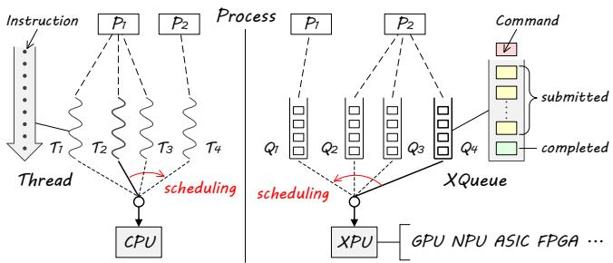  
Fig. 1: A unified abstraction for preemptive XPU scheduling.

APIs of the original platform and forwards them to XSched. Moreover, we devise two new techniques for Lv2 preemptive scheduling on NVIDIA GPUs [128] and Intel NPUs [45], as well as one for Lv3 on NVIDIA GPUs released after the Pascal architecture [79].

To showcase the generalizability of XSched, we adapted it to different types, brands, and generations of XPUs across seven software platforms: NVIDIA (Kepler, Volta, and Ampere) [128], AMD [127], and Intel [45] GPUs; Ascend [43], Intel [45], and NVIDIA [82] NPUs; NVIDIA (PVA [90] and OFA [89]) ASICs; and Xilinx [4] FPGAs. Thanks to the multilevel hardware model, XSched makes it possible (even easy) to enable preemptive scheduling on emerging, wimpy XPUs, while fully leveraging the capabilities of mature, advanced XPUs. XSched is the first software-based system to support preemptive scheduling on these NPUs and ASICs. The Lv1 implementations require just 214–841 lines of C++ code and can be shared across XPUs supported by the same software platform. Additionally, we implemented Lv2 and Lv3 preemption on five and three categories of XPUs, respectively, using our new techniques with specific hardware capabilities.

We implemented two hardware-agnostic scheduling policies based on our unified abstraction and evaluated them on ten distinct XPUs against their native hardware schedulers. For the fixed priority policy [74], XSched reduces the tail latency $( 9 9 ^ { t h }$ percentile, $P _ { 9 9 } )$ of high-priority tasks by up to 2.10×. For the bandwidth partition policy [1], XSched partitions the XPU according to the throughput assigned for each task, with an acceptable overhead (1.5% on average). XSched also enables cooperative scheduling among XPUs, reducing the $P _ { 9 9 }$ latency of foreground NPU tasks by up to 2.63×, when running background tasks on both NPU and GPU.

We further evaluated XSched through three case studies. In a multi-tenant cloud scenario hosting two containers on a single GPU, XSched harvests 2.74× more GPU resources than TGS [130] while maintaining production container performance. In a video-conferencing application that runs two tasks on a single Intel NPU, XSched reduces the $P _ { 9 9 }$ frame latency by 9.26×. For multi-model inference serving, XSched reduces the $P _ { 9 9 }$ inference latency in Triton [94], a productionlevel system, by 30.0%, and achieves performance comparable to Paella [75], a state-of-the-art hardware-specific solution. Integrating XSched requires only a dozen lines of code.

## 2 Background and Motivation

## 2.1 Characterizing XPU Tasks

The XPU functions as a peripheral device that is managed by the host CPU. Despite the diversity of XPU architectures, runtimes, and programming models, XPU tasks share a common execution pattern. Typically, an XPU task consists of a sequence of commands, including GPU kernels, memorycopy operations, tensor operators on NPUs and TPUs, color space conversions on image-processing ASICs, and other XPU-specific operations. These commands execute sequentially based on data dependencies [22, 39, 75]. Additionally, auxiliary commands, such as CUDA and OpenCL events, are available to monitor command execution on XPUs. For each XPU task, the host CPU launches all its commands and then uses synchronization APIs to wait for their completion, since commands run asynchronously with it. Take a DNN inference task on a GPU as an example: the host CPU first initiates a memory-copy command to load the input into GPU memory. Then, it launches hundreds or thousands of GPU kernel commands to perform the inference layer by layer, followed by a memory-copy command to retrieve the results. These assumptions about XPUs and their tasks apply to most modern accelerators, including GPUs, NPUs, ASICs, and FPGAs.

## 2.2 Necessity of Preemptive Task Scheduling

XPUs are widely deployed across emerging systems—from cloud to edge—to offload intensive computations from host CPUs. Sharing XPU among multiple tasks enhances hardware utilization in cloud platforms and is essential for resourceconstrained edge and mobile devices. For example, cloud providers commonly use a single GPU to serve multiple tenants or serverless function instances [26, 102, 130]. In autonomous vehicles, various algorithms, including perception, planning, and decision-making, are deployed on one TPU or ASIC [110]. On smartphones, both foreground and background AI tasks, like real-time voice input and photo indexing, run simultaneously on one NPU [53].

The demand for multi-task scheduling varies across different application scenarios. For instance, industrial automation applications like robotics and autonomous driving require low and deterministic latency [39, 41, 68]. Datacenters must ensure the service-level objective (SLO) [9, 36, 130, 139] and fairness among tenants [17]. Meanwhile, mobile devices like smartphones and AI PCs prioritize power efficiency [11, 31, 112] and user responsiveness [53]. Task preemption is a crucial mechanism to meet these diverse scheduling requirements [19, 22, 39, 57, 73, 101, 139], as it can significantly enhance system responsiveness and fairness while providing flexibility in scheduling.

## 2.3 Solution 1: XPU Hardware Scheduling

Lack of preemption support. Since XPUs typically function as peripherals, the host CPU launches commands sequentially to XPUs through a first-in, first-out (FIFO) ring buffer [39, 60]. This leads to tasks being naturally scheduled on a first-come, first-served (FCFS) basis. The nonpreemptive policy is deeply embedded in the hardware, firmware, and drivers of various XPUs, including NVIDIA and AMD GPUs [39, 75, 109, 129], TPUs [22, 77, 106], Ascend and Intel NPUs [43, 45], and Jetson embedded ASICs [85]. Consequently, urgent tasks can be blocked by less critical ones, leading to priority inversions [28, 60, 129] and unpredictable task latencies. For example, we observed on different XPUs that sharing an XPU with just a background task can increase the tail latency of the foreground task by up to 2.19× (see §7.2). These issues are unacceptable in real-time scenarios like autonomous driving [2, 51, 134] and network packet processing [33, 59]. The non-preemptive policy also causes unfairness among multiple tenants in cloud environments [35, 136]. While some modern GPUs incorporate a simple time-sliced round-robin (RR) policy to serve tasks from different processes, latency-sensitive tasks still suffer from unpredictable performance degradation as the number of concurrent tasks increases [123].

Hard to support flexible policy. Hardware scheduling is restricted by its elementary, fixed policies. Due to real-time constraints and limited on-chip resources [133], native hardware schedulers cannot accommodate sophisticated policies. They also lack adequate runtime feedback and task information (e.g., priority and deadline), which are essential for implementing workload-aware scheduling strategies like those in SHEPHERD [139] and Paella [75]. Furthermore, since the policy is baked into the hardware or firmware, it cannot adapt agilely to changing workloads and scheduling requirements.

## 2.4 Solution 2: Host-managed XPU Scheduling

Scheduling XPU tasks on the host CPU is a preferred solution as it offers enhanced flexibility and customizability. Users can select from various scheduling policies tailored to application requirements, akin to traditional CPU thread scheduling.

Design for specific XPUs. Prior work proposed several hostmanaged scheduling approaches to bypass the inefficient XPU hardware scheduler and take over scheduling on the host CPU. However, these solutions lack generalizability due to their reliance on specific hardware capabilities. For example, EffiSha [19] and FLEP [129] enable preemption through GPU kernel transformation, which requires general-purpose programmability. A recent work [123] uses a specific ioctl interface to control timeslices of NVIDIA Tegra embedded GPUs. REEF [39] and a prior work [66] depend on a microcontroller function on AMD or ARM GPUs to reset compute units. Moreover, these solutions are tightly coupled with XPUspecific software stacks, further limiting their generalizability. For example, REEF [39] is integrated with the AMD GPU driver and compiler. TimeGraph [60] only works with drivers built on the Direct Rendering Infrastructure (DRI).

XPU-specific solutions bring issues with portability, uniformity, and evolvability, especially for users and developers of heterogeneous cloud and edge platforms that host different types, brands, and generations of XPUs. First, these solutions are difficult to port between different XPU types or across vendors and architectures. Second, they lack a unified abstraction for task scheduling across different XPUs, which impedes the development of hardware-agnostic policies and cooperative scheduling on heterogeneous platforms like Intel Core Ultra [45] and NVIDIA Jetson Orin [85]. Third, these solutions struggle to evolve with hardware changes, whether incorporating new features (e.g., interrupts on NVIDIA GPUs since Pascal architecture [75]) or handling deprecated ones.

Lack of unified abstraction and hardware model. The major challenge towards general solutions is the lack of unified abstraction and appropriate hardware models for diverse XPUs. A class of traditional hardware, like CPUs and disks, can be uniformly managed by the OS, regardless of their different architectures or manufacturers, as they share similar hardware capabilities that a general hardware model can adequately describe. For example, CPUs offer interrupts and privilege modes, while disks implement block device interfaces. Based on these models, the OS provides unified abstractions, like threads and files, to assist users in managing and utilizing the same class of devices.

For XPU scheduling, the hardware model conceals the complexity and heterogeneity of XPUs. Supporting new hardware requires only implementing the hardware model interfaces. Meanwhile, a unified abstraction for XPU tasks enables hardware-agnostic and cooperative scheduling policies by decoupling policies from task preemption mechanisms and providing a uniform view across different XPUs. The abstraction and hardware model keep the OS design clean and flexible to evolve. However, XPUs currently lack such unified abstraction and hardware model due to their significant and evolving differences in hardware capabilities.

## 3 The XQueue Abstraction

Opportunity. Despite the significant and evolving differences in their hardware capabilities and software stacks, XPU drivers in different software platforms generally provide queue-like programming model and interfaces, which we collectively refer to as hardware queue (hwQueue). Examples of these include GPU streams in CUDA [93] and HIP [5], ZE command queues in LevelZero [47], MTL command queues in Metal [6], ACL runtime streams in Ascend [43], CL command queues in OpenCL [62], and VPI streams for vision processing ASICs [91].

## 3.1 Preemptible Command Queue

We propose XQueue, a preemptible command queue abstraction for preemptive scheduling on diverse XPUs. XQueue is a queue of XPU commands that are executed sequentially in the order of submission. When an application process runs a task (e.g., DNN inference) on the XPU, it instantiates the task into a sequence of commands (e.g., GPU kernels, memory-copy operations, and tensor operators) and submits them to the XQueue in order. These commands execute asynchronously and sequentially on the XPU. The process can wait for the commands in an XQueue to complete. Note that a process can have multiple XQueues and submit different tasks to them.

Table 1: Interfaces of the XQueue abstraction.
<table><tr><td>XQueue Interface</td><td>Description</td></tr><tr><td>submit(xq,cmd)</td><td>Submit a command (cmd) to XQueue (xq)</td></tr><tr><td>wait(xq,cmd)</td><td>Wait for a given cmd in xq to complete</td></tr><tr><td>suspend(xq)</td><td>Suspend xq to pause task execution</td></tr><tr><td>resume(xq)</td><td>Resume xq to continue task execution</td></tr></table>

This abstraction is familiar to developers, since many XPUs have already adopted it. There is no semantic gap between XQueue and hwQueue in task execution, allowing XQueue to be seamlessly integrated with existing applications. XQueue differs from hwQueue in how it schedules submitted commands of a task. hwQueue is non-preemptible [19, 75, 129], meaning that once commands are submitted to the hwQueue, there is no practical way to pause them. In contrast, commands submitted to the XQueue can be preempted by the host CPU. Specifically, the host can suspend an XQueue to pause the running XPU task, yielding the XPU to other tasks. It can also resume the XQueue to continue task execution. This scheduling process is transparent to applications, which still perceive normal execution behavior of the XPU.

The XQueue abstraction is analogous to CPU thread abstraction, as illustrated in Fig. 1. An XPU task is a sequence of commands executed by an XQueue, while a CPU task is a sequence of instructions executed by a CPU thread. Both XPU tasks and CPU tasks are scheduled by suspending and resuming their corresponding XQueues and threads.2 Moreover, multiple XQueues can run concurrently to achieve higher hardware utilization and overall throughput if the XPU supports spatial multiplexing mechanisms like GPU streams, which is akin to CPU hyper-threading. In summary, the XQueue abstraction preserves the programming semantics of the hwQueue, while providing familiar thread-like preemptive scheduling capabilities, which facilitates application compatibility and simplifies unified XPU task scheduling.

Interfaces. Table 1 lists the interfaces of XQueue. The XQueue provides a preemptible command queue abstraction for XPU task execution and preemptive scheduling. It offers submit and wait interfaces that enable applications to submit commands for asynchronous execution and wait for their completion on XPUs. Additionally, the XQueue provides suspend and resume interfaces, allowing the scheduler to control whether its commands can be executed on the XPU. These interfaces hide the implementation details of preemption mechanisms on diverse XPUs, enabling hardware-agnostic scheduling policies.

# fixed priority policy   
void schedule(xq\_status)   
1 xqs = get\_ready\_xqueues(xq\_status)   
2 highest = find\_highest\_priority(xqs)   
# schedule ready XQueues with highest priority   
3 for xq in xqs   
4 if get\_priority(xq) == highest then   
5 resume(xq) # resume highest-priority XQueue   
6 else   
7 suspend(xq) # suspend others   
# bandwidth partition policy   
void schedule(xq\_status)   
8 current = get\_running\_xqueue(xq\_status)   
# schedule next XQueue if timeslice expires   
9 if timeslice\_is\_expired(current) then   
10 next = get\_next\_ready\_xqueue(xq\_status)   
11 suspend(current) # suspend current XQueue   
12 resume(next) # resume next XQueue   
13 timeslice = get\_ratio(next) × QUANTUM   
# call schedule() when timeout   
14 add\_timer(timeslice)  
Fig. 2: Pseudocode of fixed-priority and bandwidth-partition scheduling policy implementations based on XQueue interfaces.

## 3.2 Scheduling Policy

XQueue interfaces are flexible for implementing various preemptive scheduling policies, such as fixed priority (FP) [74], shortest remaining time first (SRTF) [114], earliest deadline first (EDF) [74], and bandwidth partition (BP) [1]. Fig. 2 demonstrates the implementation of fixed priority and bandwidth partition scheduling using XQueue. In the fixed priority policy, each XQueue is assigned a priority that reflects the urgency of its task. The scheduling policy is triggered when XQueue status (xq\_status) changes, such as when a new command arrives (making the XQueue ready), or when all commands complete (making the XQueue idle). The policy then finds and resumes ready XQueues with the highest priority while suspending others. This allows urgent tasks to preempt less critical ones. In the bandwidth partition policy, each XQueue is assigned a timeslice proportional to its allocated bandwidth. When a timeslice expires, the current XQueue is suspended, and the next one is resumed in a roundrobin order. A timer is set to trigger rescheduling when the timeslice runs out. This policy ensures that tasks share the XPU utilization according to their specified ratios.

## 4 Multi-level Hardware Model

XQueue provides a unified abstraction for preemptive XPU scheduling. The hardware model plays a crucial role in implementing XQueue on different XPUs by decoupling the preemption mechanism from XPU-specific details. However, embracing both portability and high preemption performance presents a significant challenge. For instance, if the model defines a preemption capability specific to certain XPUs to achieve optimal performance, it may not be portable to other XPUs that cannot support this capability.

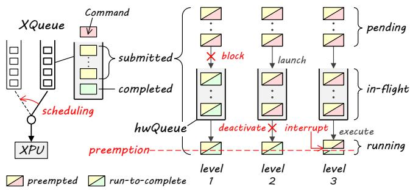  
Fig. 3: Comparison of three preemption levels for XPU scheduling.

Inspired by transaction isolation levels [13], we introduce a multi-level hardware model for preemptive scheduling on diverse XPUs. We characterize three levels of task preemption from the perspective of command states, as illustrated in Fig. 3. Each preemption level targets commands in one of three states: pending (ready to be launched3), in-flight (launched but not executed), or running (currently being executed). For each level, we identify the necessary hardware capabilities and interfaces to implement task preemption. Higher levels require more advanced capabilities for finer-grained preemption, while lower levels need only basic capabilities, making them applicable to a broader range of XPUs.

## 4.1 Level 1: Pending Command Preemption

Level 1 (Lv1) preemption targets commands in the pending state before launch. Once a command is launched, it is enqueued to the hardware queue (hwQueue), becoming in-flight and escaping host control. Therefore, the host can preempt pending commands by simply blocking their launch. Lv1 only requires capabilities to launch and synchronize commands, which all XPUs provide. The preemption latency is the total execution time of all launched commands, as shown in Fig. 3.

## 4.2 Level 2: In-flight Command Preemption

Unlike Lv1, which passively waits for in-flight commands to complete, Level 2 (Lv2) preemption can actively prevent in-flight commands from executing. This greatly reduces the preemption latency to just the execution time of the currently running command, as shown in Fig. 3. The key capability is to deactivate and reactivate the hwQueue. Once deactivated, no new commands from this hwQueue will execute until reactivation, enabling Lv2 preemption. This deactivation can be implemented by stalling-based or flushing-based approaches.

Stalling-based deactivation. The hwQueue can be deactivated by stalling command dequeuing, which prevents new commands from being fetched for execution. This approach requires advanced XPUs with integrated microcontrollers [30, 44, 46, 55, 72] that can selectively dequeue commands based on their attributes. The host can either instruct the microcontroller directly or modify command attributes to control dequeuing, achieving deactivation and reactivation.

Table 2: Interfaces of the multi-level XPU hardware model.
<table><tr><td>Level</td><td>Interface</td><td>Description</td></tr><tr><td>Lv1</td><td>launch (hwq, cmd) sync (hwq, cmd)</td><td>Enqueue a given command (cmd) to a hwQueue (hwq) for executing it sequentially and asynchronously Wait for a given cmd in a hwq to complete</td></tr><tr><td>Lv2</td><td>deactivate(hwq) reactivate(hwq)</td><td>Deactivate a given hwq to prevent all its commands from being selected for execution Reactivate a given hwq to allow all its commands to be selected for execution</td></tr><tr><td>Lv3</td><td>interrupt(hwq) restore(hwq)</td><td>Interrupt the running command of a given hwq Restore the interrupted command of a given hwq</td></tr></table>

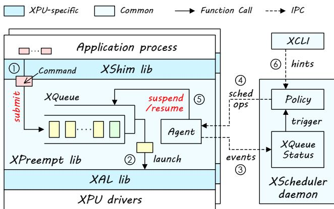  
Fig. 4: Architecture and workflow of XSched.

Flushing-based deactivation. Another approach is to flush all in-flight commands in the hwQueue and relaunch them upon reactivation. Prior work [19, 39, 129] proposes that commands could be retrofitted to flush themselves, which solely requires the commands to be programmable. This approach works on all programmable XPUs, e.g., GPUs and many NPUs [43].

## 4.3 Level 3: Running Command Preemption

Lv2 preemption still requires waiting for the running command to complete, which leads to unpredictable preemption latency and may not meet strict real-time requirements for applications like automation [2, 51, 134] and networking [33, 59]. In contrast, Level 3 (Lv3) preemption targets the running command, aiming to achieve ultra-low and stable preemption latency, as illustrated in Fig. 3. This requires hardware capabilities that can interrupt and restore the running command. Once interrupted by the host, the running command is instantly paused and preempted for the execution of another command. The interrupted command is later restored to continue its execution. These capabilities are already present in modern GPUs [39, 44, 79].

## 4.4 Hardware Model Interfaces

The hardware model hides XPU hardware and driver differences through multi-level interfaces, as listed in Table 2. The three levels form a hierarchical design. The higher level introduces advanced preemption functionality and relies on the implementation of all lower levels to function properly. Lv1 interfaces consist of native hwQueue operations: launch for asynchronous command execution and sync for command synchronization. Lv2 interfaces include deactivate and reactivate to control the execution of in-flight commands in the hwQueue. Lv3 further introduces interrupt to instantly pause the running command and restore to resume the interrupted command.

## 5 The XSched Framework

## 5.1 Overview

We present XSched, a preemptive scheduling framework that implements XQueue based on the multi-level hardware model and supports diverse XPUs. As illustrated in Fig. 4, XSched consists of four key components: XPU shim (XShim), XPU task preemption (XPreempt), XPU adapter layer (XAL), and scheduler. XShim, XPreempt, and XAL are three dynamically linked libraries that are preloaded into the application process, while the scheduler runs as a shared system service daemon.

XShim. Typically, applications call driver APIs to launch XPU commands, with task scheduling handled entirely by the underlying hardware. The XShim library changes this workflow by intercepting XPU driver API calls and redirecting commands to the XQueue (➀ in Fig. 4). The approach provides transparency, allowing applications to run on XSched without modifications. The XShim library can be reused across XPUs that share the same driver. Note that the XShim library is optional when porting XSched to a new XPU, since applications can directly call XQueue interfaces instead.

XPreempt. The XPreempt library implements the interfaces of XQueue abstraction listed in Table 1, including submit and wait to support task execution, and suspend and resume to schedule XQueues. Commands submitted to the XQueue are buffered and launched to the XPU at a proper time (➁ in Fig. 4) to achieve task preemption. The XPreempt library contains an agent that watches the state of XQueue (e.g., ready or idle) and generates scheduling events to notify the scheduler (➂ in Fig. 4) via inter-process communication (IPC). The agent is also responsible for applying the scheduling operations (e.g., suspend or resume an XQueue) received from the scheduler (➄ in Fig. 4).

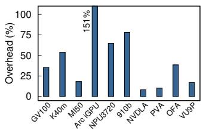

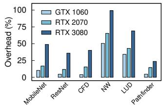  
Fig. 5: The performance overhead of synchronous execution (a) on various XPUs (GPUs/NPUs: ResNet-152 [40], OFA: Stereo Disparity [88], PVA: Gaussian Filter [88], VU9P: Vector Addition [132], and (b) using various deep learning (DL) [40, 42] and scientific computing [18] workloads on three NVIDIA GPUs.

XAL. The XAL library implements the multi-level hardware model interfaces (listed in Table 2) by calling XPU driver APIs. Note that only Lv1 interfaces are mandatory for supporting a new XPU, while Lv2 and Lv3 interfaces are optional for better performance. Like XShim, the Lv1 implementation can be reused across XPUs sharing the same driver.

XScheduler. The scheduler runs as a daemon process, coordinating all XQueues from different processes. It monitors global XQueue status through agent-reported events (➂ in Fig. 4), and invokes the scheduling policy to make decisions when status changes occur. The daemon performs these decisions by sending scheduling operations to agents (➃ in Fig. 4). The policy in XScheduler is modular and customizable to suit various workloads. Users can change the policy and give scheduling hints (e.g., priority or bandwidth) through XCLI, a command-line tool (➅ in Fig. 4).

## 5.2 XPreempt Design

The XPreempt library implements the preemptible XQueue abstraction using interfaces of our multi-level hardware model provided by the XAL, as shown in Fig. 6. Since the model conceals hardware details, it is challenging for XPreempt to enforce task preemption efficiently, particularly when using only Lv1 interfaces. This is because once commands are launched, they move beyond host control, and the scheduler can only passively wait for their completion.

Strawman: synchronous command execution. A straightforward solution [19, 61, 103, 111, 129] is to synchronize the XPU and block the host CPU after launching each command, preventing excess commands from being enqueued to the hwQueue. Consequently, the task is effectively preempted by simply blocking the host thread, and the preemption completes right after the currently running command finishes. However, this approach is highly inefficient for modern XPUs since it ignores their asynchronous nature. Synchronization is costly due to the communication latency between the CPU and the peripheral XPU, as well as driver overhead. More importantly, modern XPUs utilize asynchronous execution to pipeline command launching and execution, hiding the launching latency. Forcing synchronization creates frequent pipeline stalls (bubbles) that severely reduce command throughput. As shown in Fig. 5 (a), synchronous command execution imposes substantial performance overhead on different XPUs, ranging from 8.2% to 151.3%. Furthermore, this overhead grows larger with more advanced XPUs, as pipeline stalls consume a greater proportion of time when XPU command execution speed increases. Fig. 5 (b) shows that the performance overhead increases by 3.04× on average when upgrading from GTX 1060 to RTX 3080.

# XQueue APIs   
void submit(xq, cmd)   
1 push\_pending\_cmd(xq, cmd)   
void wait(xq, cmd)   
2 if find\_pending\_cmd(xq, cmd) then   
3 ... # wait to launch cmd   
4 sync(xq.hwq, cmd) # sync for completion   
void suspend(xq)   
5 xq.mode = SUSPENDED # suspend XQueue   
6 if LEVEL >= 2 then deactivate(xq.hwq)   
7 if LEVEL == 3 then interrupt(xq.hwq)   
void resume(xq)   
8 xq.mode = RUNNING # resume XQueue   
9 if LEVEL >= 2 then reactivate(xq.hwq)   
10 if LEVEL == 3 then restore(xq.hwq)   
# progressive command launching   
void worker\_thread(xq)   
11 while TRUE   
12 if get\_inflight\_cnt(xq) >= THRESHOLD then   
# wait until half of launched cmds complete   
13 mid = get\_inflight\_middle(xq)   
14 sync(xq.hwq, mid) # sync for completion   
15 pop\_completed\_cmds(xq)   
16 cmd = pop\_pending\_cmd(xq)   
17 while xq.mode == SUSPENDED   
18 pause() # pause cmd launching   
19 launch(xq.hwq, cmd) # launch cmd to hwqueue   
20 push\_inflight\_cmd(cmd)  
Fig. 6: Pseudocode of XQueue APIs and progressive command launching implementation in XPreempt.

Our solution: progressive command launching. Inspired by our prior work [39], XPreempt introduces a progressive command launching mechanism to balance preemption latency and runtime overhead, as shown in Fig. 6. This approach maintains a small number of in-flight commands, preventing pipeline stalls while enabling fine-grained preemption. When suspending the XQueue, the scheduler waits only for these few in-flight commands to complete, rather than all submitted commands (usually hundreds of commands).

Each XQueue contains a worker thread, a pending command buffer, an in-flight command log, and a corresponding hwQueue. When a command is submitted to the XQueue, it is first pushed into the pending command buffer (Line 1). The worker thread then progressively launches it to the hwQueue and records these in-flight commands in the log. Specifically, the worker checks the count of in-flight commands against a user-defined threshold (Line 12). If the count exceeds this threshold, the worker invokes sync to wait for half of inflight commands to complete (Lines 13–15). This threshold can be adjusted based on workloads to trade off preemption latency and runtime overhead. When the XQueue is suspended, the worker pauses to block new command launches (Lines 17–18). Once the XQueue is resumed, the worker continues to launch pending commands (Lines 19–20).

Lv2 and Lv3 preemption. For XPUs supporting Lv2 interfaces, XPreempt additionally deactivates the hwQueue after the worker is paused to accelerate task preemption when suspending the XQueue. Also, the hwQueue is reactivated when resuming. For XPUs supporting Lv3 interfaces, XPreempt further interrupts the currently running command in the hwQueue to preempt the task instantly when suspending the XQueue, and restores the command when resuming. The design of XPreempt is compatible with all three levels and can fully leverage the hardware capabilities thanks to the multi-level hardware model implemented in the XAL.

## 5.3 XScheduler Design

As depicted in Fig. 4, the XScheduler daemon is an eventdriven service that coordinates all XQueues from different processes in the system, in cooperation with the XPreempt agents. Each agent monitors the change events of XQueue states, e.g., become ready when new commands are submitted and idle when all commands are completed. These events are sent to the XScheduler daemon to maintain global XQueue status (each XQueue: ready or idle, XPU device ID, process ID, etc.) and trigger the policy upon status changes. The policy decides which XQueues to suspend or resume based on current status. The decisions are sent back to the agents and applied by calling suspend and resume interfaces of these XQueues. Messages between XScheduler and the agents are passed via shared-memory IPC, enabling XSched to schedule XQueues across both processes and containers. For cross-VM scheduling, message passing can alternatively be implemented over network. This distributed XQueue design separates the control and data planes, minimizing command submission overhead and isolating errors within the application process.

The policy in XSched is designed to be flexible and customizable. XSched provides a send\_hint API for applications and a command-line tool (XCLI) for users to provide hints to the policy, which set policy-specific parameters (e.g., priority, bandwidth, and deadline) of an XQueue. This is similar to how setpriority syscall and nice command set the priority in Linux. In addition to several built-in policies (e.g., fixed priority, bandwidth partition), users are free to customize policies optimized for their application scenarios. The policy should implement two basic interfaces: schedule and recv\_hint, which are called when XQueue status changes and a new hint is given, respectively. As mentioned in Fig. 2, schedule uses suspend and resume to schedule XQueues, and add\_timer to trigger itself after an interval.

## 6 Implementation on XPUs

We propose several new techniques to implement three preemption levels (XAL) on different XPUs, spanning various software platforms (CUDA, HIP, LevelZero, ACL, OpenCL, etc.), accelerator types (GPU, NPU, ASIC, and FPGA), and manufacturers (NVIDIA, AMD, Intel, Ascend, etc.).

## 6.1 Level 1 (Lv1) Preemption

Implementing Lv1 preemption is straightforward on XPUs since their drivers natively support hwQueue to launch and synchronize commands. Examples include CUstream in CUDA [93] (for NVIDIA GPUs), hipStream in HIP [5] (for AMD GPUs), ze\_command\_queue in LevelZero [47] (for Intel GPUs and NPUs), aclrtStream in ACL [43] (for Ascend NPUs), VPIStream in VPI [91] (for vision processing ASICs), and cl\_command\_queue in OpenCL [62] (for Xilinx FPGAs). The launch interface is implemented by calling the appropriate driver API corresponding to the command type, e.g., cuLaunchKernel for launching kernels on a CUstream and cuMemcpyAsync for memory copy commands. These drivers also support events, e.g., CUevent in CUDA and cl\_event in OpenCL, which are fine-grained synchronization points that can be recorded on the hwQueue. The sync interface is implemented by synchronizing with an extra event recorded after a given command. If the driver does not support events, it can alternatively be implemented by synchronizing with the hwQueue. Since Lv1 implementation relies only on basic driver APIs, it can be shared across XPUs that use the same software platform. For example, the OpenCL implementation supports GPUs, FPGAs and even CPUs from various manufacturers.

## 6.2 Level 2 (Lv2) Preemption

XSched implemented hwQueue deactivation and reactivation using a hardware-assisted stalling approach on Intel NPUs and a software-based flushing approach on NVIDIA GPUs.

Stalling-based preemption. On-chip microcontrollers have been widely integrated into XPUs to selectively dispatch commands to execution units. Examples include Falcon microcontrollers in NVIDIA GPUs [10, 30, 55, 108], Command Processors in AMD GPUs [39], Graphics microcontrollers (GuCs) in Intel GPUs [44], LeonRT cores in Intel NPUs [46], and Taishan cores in Ascend NPUs [72]. These XPUs can preempt in-flight commands by instructing their microcontrollers to stall command dequeuing for deactivation. Recently, Intel released a new NPU firmware that supports these capabilities [48]. We modified the driver [116] to expose them to the host and implemented the Lv2 interfaces on Intel NPUs [45].

Flushing-based preemption. For XPUs without microcontroller support or exposed interfaces, we implement a software approach for flushing-based deactivation on programmable XPUs, demonstrating this on NVIDIA GPUs. XSched leverages command programmability, instead of hardware microcontrollers, to flush all in-flight commands in the hwQueue. As shown in Fig. 7, XSched prepends a guardian code snippet to each GPU kernel (i.e., command) that checks a perhwQueue deactivation flag in GPU global memory. When this flag is set, the guardian code records the command ID and exits this command immediately. To deactivate the hwQueue, the host sets the flag, prompting all in-flight kernels to abort themselves. When reactivating, the host clears the flag and relaunches the aborted kernels.

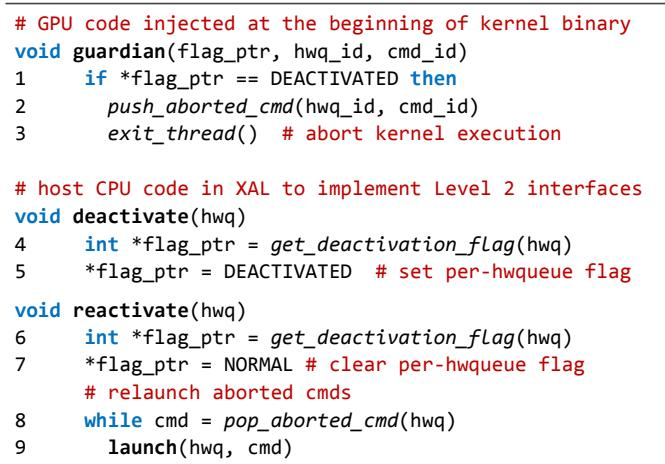  
Fig. 7: Pseudocode of flushing-based preemption implementation.

XSched injects the guardian code snippet into each GPU kernel at runtime using dynamic binary instrumentation (DBI) technique [118]. This guardian code is compiled to binary using the NVIDIA compiler (NVCC) [83] and loaded into GPU instruction memory at process startup. As shown in Fig. 8, XSched rewrites the first instruction of each kernel with a JMP instruction to a per-kernel helper snippet. This snippet first loads the arguments of the guardian code from GPU constant memory, where kernel arguments are stored, and then calls the guardian code. After that, the snippet executes the original replaced instruction and returns to the next instruction in the kernel. Note that XSched leverages the hidden functions in the CUDA export table to allocate and access GPU instruction and constant memory.

Prior work proposed similar kernel-flushing schemes [19, 39, 129]. However, these approaches require modifications to kernel source code or PTX assembly, making them incompatible with closed-source frameworks (e.g., TensorRT [87]) or just-in-time compiled kernels (e.g., TensorFlow XLA [98]). To our knowledge, XSched introduces the first flushing-based deactivation at the binary level, allowing it to work seamlessly with all CUDA applications, including those built with closed-source CUDA kernel libraries (e.g., cuBLAS [81], cuDNN [84]) and inference frameworks like TensorRT.

## 6.3 Level 3 (Lv3) Preemption

Advanced modern XPUs, including NVIDIA GPUs released after the Pascal architecture [79], as well as recent AMD, Intel, and ARM GPUs [39, 44, 66], can interrupt running commands. We implemented Lv3 preemption on NVIDIA GPUs using two distinct approaches as illustrative examples.

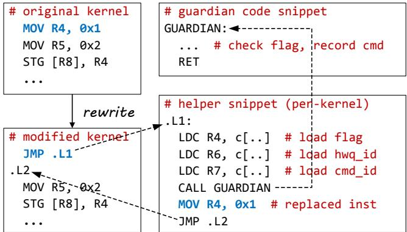  
Fig. 8: Binary instrumentation for flushing-based preemption.

TSG-based preemption. The interrupt mechanism on GPUs is designed for scheduling processes, or timeslice groups (TSGs) for NVIDIA GPUs [80, 123]. Each process is assigned a CUDA context corresponding to a TSG. When a TSG’s timeslice expires, the GPU interrupts all running kernels in this TSG and switches to the next TSG in a roundrobin manner. A previous study [123] found that TSGs of NVIDIA Tegra embedded GPUs could be adjusted through driver ioctl for task preemption. We implemented a similar approach on desktop and server GPUs (e.g., GV100), which dynamically adjusts TSG timeslices for Lv3 preemption. Specifically, the interrupt interface sets the timeslice to zero for the TSG containing the hwQueue to be preempted, and the restore interface resets the timeslice to its original value. Since this interrupt affects the entire TSG, this approach is only capable of inter-process scheduling. Note that the TSG-based approach achieves both Lv2 and Lv3 preemption by preempting both in-flight and running commands.

Queue-based preemption. We devise the first fine-grained interrupts on NVIDIA GPUs to implement Lv3 preemption at the hwQueue granularity. Although GPU interrupts are undocumented [75, 111], by tracing CUDA application syscalls, we discovered a specific ioctl that triggers GPU interrupts by writing to a GPU control register—a feature originally intended for kernel debugging. When the GPU is interrupted, it immediately stalls all running kernels and invokes the trap handler to save context and check trap reason. Using the DBI-based guardian technique for flushing-based preemption, XSched extends the trap handler to detect interrupts triggered by XSched. When detected, the target kernel is aborted for preemption, and the rest ones restore the context and continue execution. Unfortunately, NVIDIA GPUs do not expose support for resuming an aborted kernel from its interruption point. Inspired by prior work [39], XSched only preempts idempotent kernels and restarts them from the beginning.4

## 7 Experimental Evaluation

## 7.1 Portability

The support for preemptive scheduling on diverse XPUs. To demonstrate the portability of XSched, we adapted it to seven XPU platforms, as listed in Table 3. Thanks to our multi-level hardware model, only Lv1 implementation is necessary for basic preemptive scheduling, requiring just 214– 841 lines of C++ code. Moreover, implementing Lv1 for a new XPU is straightforward, as most of the code simply unwraps and launches commands through the hwQueue provided by the drivers, sharing similar logic with just different function names. For example, implementing a memory copy command for the cuMemcpyAsync API in CUDA requires only 12 lines of code, and over 70% of the APIs follow a similar pattern. Additionally, the Lv1 implementation can be shared across XPUs that use the same software platform. For example, the implementation for OpenCL works seamlessly with FPGAs and GPUs from various manufacturers, including Xilinx, Intel, and Qualcomm [120]. For Lv2, we implemented stalling-based preemption on Intel NPUs and flushing-based preemption on NVIDIA Kepler, Volta, and Ampere GPUs. For Lv3, we implemented TSG-based preemption on NVIDIA GPUs released after the Pascal architecture and queue-based preemption on NVIDIA Volta and Ampere GPUs.

For performance experiments, we selected ten distinct XPUs: four GPUs (NV GV100 and K40m; AMD MI50; and Intel Arc iGPU [45]), three NPUs (Intel NPU3720 [45]; Ascend 910b [43]; and NV DLA [82]), two ASICs (NV PVA [90] and OFA [89]), and one FPGA (Xilinx VU9P [4]).

## 7.2 Uniformity

The support for flexible scheduling policy. Thanks to the unified abstraction of XSched, we implemented two hardwareagnostic and portable scheduling policies: fixed priority [74] and bandwidth partition [1], which required only 104 and 200 lines of C++ code, respectively. We evaluated them across ten distinct XPUs at their highest preemption level (see Table 3).

Workloads. In our experiments, we run two independent processes that submit the same types of tasks to a single XPU, with no shared data between them. We designate one process as foreground and the other as background, which the scheduling policy treats differently. For GPUs and NPUs, both processes submit DL inference tasks of the ResNet-152 model [40]. For ASICs, they execute the Stereo Disparity algorithm [88] on OFA, and the Gaussian Filter algorithm [88] on PVA. For FPGA, they perform vector addition tasks [132]. Note that commands are variably-sized, e.g., ranging from 2 to $1 1 3 \mu \mathrm { s }$ for GV100, and 95 to 661 $\mu \mathrm { s }$ for DLA.

Fixed priority policy. The foreground process issues tasks periodically at a fixed frequency (20% of its peak throughput), and the background process issues tasks continuously at maximum frequency. XSched assigns a high priority to the foreground process and a low priority to the background process.

Table 3: Description of XPUs and development effort (in lines of C++ code) for porting XSched. indicates a level that can be supported but has not yet been implemented, while indicates a level that cannot be supported based on current hardware capabilities. Note that flushing-based Lv2 implementation on NVIDIA GPUs shares 513 LoCs for DBI, and TSG-based inter-process preemption takes 90 LoCs to implement Lv3 along with Lv2.
<table><tr><td>Platform</td><td>XPU</td><td>XShim</td><td>Lv1</td><td>Lv2</td><td>Lv3</td></tr><tr><td rowspan="3">CUDA</td><td>NV Kepler GPUs NV Volta GPUs</td><td></td><td></td><td>99 (+513) 175 (+513)</td><td>○ 301</td></tr><tr><td>NV Ampere GPUs</td><td>318</td><td>511</td><td>189 (+513)</td><td>308</td></tr><tr><td>NV GPUs w/ TSG</td><td>316</td><td>841</td><td>/</td><td>90</td></tr><tr><td>HIP</td><td>AMD GPUs Intel GPUs</td><td></td><td></td><td>： ：</td><td>·</td></tr><tr><td>LevelZero</td><td>Intel NPUs</td><td>343</td><td>379</td><td>131</td><td>· O</td></tr><tr><td>ACL</td><td>Ascend NPUs</td><td>121</td><td>260</td><td>·</td><td>0</td></tr><tr><td>CUDLA</td><td>NV DLA</td><td>96</td><td>247</td><td>0</td><td>0</td></tr><tr><td>VPI</td><td>NV OFA,NV PVA</td><td>84</td><td>214</td><td>0</td><td>0</td></tr><tr><td>OpenCL</td><td>Xilinx FPGAs, GPUs and CPUs</td><td>204</td><td>350</td><td>.</td><td>O</td></tr></table>

Fig. 9 (top) shows the latency CDF of foreground tasks. The native hardware scheduler of all XPUs treats both processes equally, which doubles the tail latencies $( 9 9 ^ { t h }$ percentile, $P _ { 9 9 } )$ of foreground tasks compared to standalone execution (1.60× to 2.19×). In contrast, XSched preempts background tasks upon foreground task arrival. As a result, the $P _ { 9 9 }$ latencies of foreground tasks are close to standalone performance (1.02× to 1.30×) and are up to 2.11× lower than those experienced with the native hardware scheduler.

Bandwidth partition policy. Both the foreground and background processes continuously issue tasks at their maximum frequency. XSched allocates 75% of the XPU utilization to the foreground process and 25% to the background process. This simulates a scenario where an XPU is temporarily partitioned between two users with different QoS requirements [35]. Fig. 9 (bottom) shows the throughput of both tasks, normalized by the throughput of standalone execution. For all XPUs, the native hardware scheduler shares the XPU equally between foreground and background tasks. XSched achieves similar overall throughput to standalone execution with only 1.5% overhead on average, while guaranteeing the desired throughput partition ratio between two processes. On MI50, 910b, and VU9P, the native hardware scheduler surpasses both standalone execution and XSched in total throughput, as a single process cannot fully utilize hardware resources.

The uniform policy for heterogeneous XPUs. The XQueue interface facilitates seamless implementation of policies that cooperatively schedule multiple XPUs.

Workloads. The experiments are conducted on an NVIDIA Jetson Orin and an AI PC powered by Intel Core Ultra 9 185H. Initially, we run the same workload (i.e., two processes running inference) as in Fig. 9 (top) for NPUs (i.e., NVIDIA DLA and Intel NPU3720). Subsequently, we run memory bandwidth-consuming tasks in another low-priority background process using the integrated GPU on the SoC.

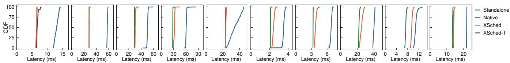

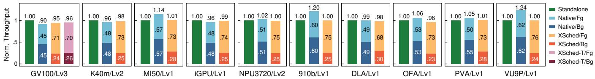  
Fig. 9: The scheduling performance of XSched on different XPUs. (Top): The latency CDF of the foreground task using fixed priority policy, (Bottom): The normalized throughput of foreground (Fg) and background (Bg) tasks using bandwidth partition policy. XSched-T refers to TSG-based inter-process preemption (§6.3). The thresholds for in-flight commands are tuned for each device, ranging from 2 to 16.

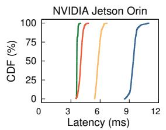

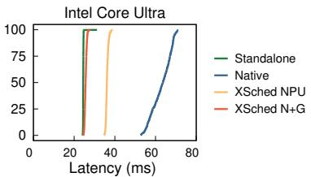  
Fig. 10: The latency CDF when co-running foreground NPU tasks with GPU and NPU background tasks on heterogeneous platforms. ‘XSched NPU’ means using XSched only for the NPU. ‘XSched N+G’ means using XSched for both NPU and GPU cooperatively.

Heterogeneous priority policy. Fig. 10 shows the CDF of the foreground task latencies. Although GPU and NPU operate independently for the computing resources, they may compete for the memory bandwidth and power supply on the SoC, leading to performance interference. Consequently, when scheduling only NPU tasks (XSched NPU), the latency, while reduced compared to the native hardware scheduler, remains significantly worse than the standalone case (1.67× and 1.55× for $P _ { 9 9 } )$ . To address this, we implement a scheduling policy that uniformly schedules NPU and GPU tasks, allowing a high-priority XQueue to preempt other lower-priority ones, regardless of their associated XPU. With this policy (XSched N+G), the latency of foreground NPU tasks is close to standalone (1.18× and 1.09× for $P _ { 9 9 } )$ , achieving a reduction of up to 2.63× compared to the native hardware scheduler.

## 7.3 Evolvability

The effect of advanced preemptive scheduling. The multilevel hardware model enables XPUs with advanced scheduling capabilities to further enhance the scheduling performance. As shown in Fig. 9 (top), XSched generally performs better on XPUs that support Lv2 and Lv3 interfaces (i.e., GV100, K40m, and NPU3720) compared to other XPUs that only support Lv1 interfaces. Specifically, the $P _ { 9 9 }$ latency of the foreground tasks on GV100, K40m and NPU3720 using XSched is only degraded by 1.9%, 3.8% and 5.4% compared to standalone execution. In contrast, the degradation is more significant on other XPUs, ranging from 7.3% to 29.6%.

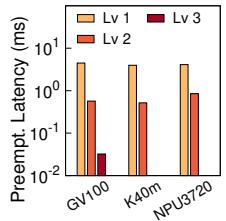

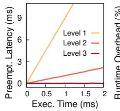

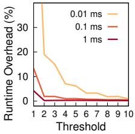  
Fig. 11: (a) The P99 preemption latency using different preemption levels, (b) the P99 preemption latency of GV100 for commands with different execution times, and (c) the runtime overhead of Lv1 on GV100 with different thresholds and command execution times.

We further evaluated the preemption latency of GV100, K40m, and NPU3720 with varying level configurations, as depicted in Fig. 11 (a). In this experiment, preempted tasks continually launch commands with an execution time of 0.5 ms (referred to as T hereafter), while the in-flight command threshold is set to 8. The $P _ { 9 9 }$ preemption latency with Lv1 support for all XPUs is approximately 8T due to the necessity to wait for all commands in the hwQueue to complete. This $P _ { 9 9 }$ latency is reduced to about 1T with Lv2, as only one command needs to be waited on. When employing Lv3 for GV100, the $P _ { 9 9 }$ preemption latency is further reduced to 32 µs, becoming independent of T . Fig. 11 (b) illustrates the P99 preemption latency of the GV100 with commands of varying execution durations, reinforcing this observed trend.

The adaptability to the evolution of XPUs. The multi-level hardware model also enables XSched to adapt to the evolving hardware capabilities and software interfaces of XPUs.

Hardware evolution. As many emerging XPUs are still under development, their hardware capabilities for preemption and scheduling may be enhanced in the subsequent generations. For example, the NVIDIA K40m does not support interrupt-based preemption [78, 79] for implementing Lv3 interfaces, while GV100 does. XSched can easily adapt to such new hardware capability by incrementally implementing the higher levels of interfaces (e.g., Lv3 for GV100), while maintaining compatibility with the earlier generations of XPUs that only support lower levels of interfaces (e.g., Lv2 for K40m). We believe that for future generations of XPUs, XSched can continue to adapt to their evolved hardware capabilities.

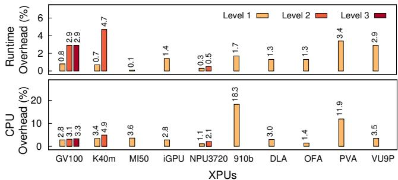  
Fig. 12: (a) The runtime overhead, and (b) the increased singlecore CPU utilization of executing an XPU task with XSched.

Software evolution. The software interfaces of XPUs are also evolving rapidly. For example, XSched implements Lv2 for NPU3720 based on a new firmware released in July 2024 [48], seven months after the release of the hardware product. Additionally, the Lv3 implementation for GV100 relies on an undocumented and potentially unstable driver interface. If this interface is deprecated, XSched can selectively disable the Lv3 interfaces without altering other parts of the system.

## 7.4 Scheduling Overhead

Compared to the native hardware scheduler, XSched incurs additional overhead to support preemptive scheduling. We evaluate this overhead using the same tasks as in Fig. 9.

Runtime overhead. Fig. 12 (a) shows the runtime overhead of running an XPU task with XSched. The runtime overhead is less than 3.4% on all XPUs for Lv1, primarily due to the additional synchronizations required by the progressive command launching. For Lv2 on GV100 and K40m, the overhead increases by 2.1% and 4.0%, respectively, compared to Lv1. This is attributed to the execution of instrumented guardian code, whose performance is dominated by the latency of reading the flag. Therefore, XPUs with a high-performance memory (e.g., HBM2 on GV100) may show a less performance degradation compared to those with a low-performance memory (e.g., GDDR5 on K40m). In contrast, the hardwareassisted Lv2 on NPU3720 incurs no additional overhead.

Fig. 11 (c) further shows how in-flight command threshold and command execution time affect the runtime overhead of Lv1. Increasing the threshold can reduce runtime overhead as it reduces pipeline stalls. When the threshold exceeds 10, the overhead becomes negligible (less than 1%). The threshold in experiments is tuned to the minimum value that achieves overhead less than 3%. Moreover, shorter command execution time incurs more overhead due to the increased proportion of pipeline stalls, demonstrating the necessity of progressive launching as XPUs become faster.

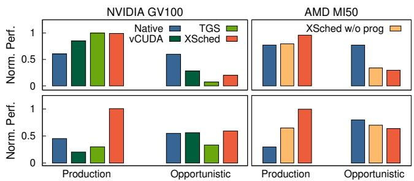  
Fig. 13: The scheduling performance of (Top) two containers running PyTorch training jobs, and (Bottom) financial algorithms as production jobs and scientific computing as opportunistic jobs. The performance is normalized by the standalone execution.

CPU overhead. XSched employs several worker threads to manage queues and schedule XPUs, increasing CPU usage. As shown in Fig. 12 (b), XSched raises single-core CPU utilization by less than 5% in most cases, except for 910b (18.3%) and PVA (11.9%) because their drivers employ a spinning approach for synchronizing the hwQueue.

## 8 Case Studies

Next, we demonstrate the practical benefits of XSched through three case studies under different scenarios.

Case 1: GPU harvesting on multi-tenant server. To demonstrate the efficiency of XSched with its multi-level hardware model, we study how it manages two types of jobs on a single GPU: production jobs (Pjob) and opportunistic jobs (Ojob). Pjobs have stringent performance requirements with minimal degradation, while Ojobs should harvest remaining GPU resources on a best-effort basis.

We compare XSched against the native hardware scheduler, and two open-source GPU sharing systems, vCUDA [35, 115] and TGS [130]. Since vCUDA only supports quota-based configurations, we pre-profile the GPU utilization of Pjobs to allocate sufficient quota. TGS is evaluated without modifications, as it natively accommodates such workloads. XSched employs the fixed priority policy, assigning higher priority to Pjobs. The evaluation includes two workloads: (1) two containers running DL training jobs, the workload as in TGS, and (2) a container running financial algorithms (Black-Scholes [95]) as Pjob and a container running scientific computing (CFD [18]) as Ojob. We measure the request latency of financial algorithms and the throughput of other jobs.

Fig. 13 (left) shows the normalized performance of these systems on an NVIDIA GV100 GPU. Due to the lack of priority-based scheduling, vCUDA causes a 15.1% and a 80.0% performance degradation for Pjobs in DL training and financial algorithms, respectively. TGS can be regarded as a Lv1 implementation that carefully manages the number of in-flight commands for Ojobs by estimating the kernel submission rate of Pjobs. However, it presents two limitations. First, it misses the execution opportunities for Ojobs if the estimated kernel submission rate is inaccurate. Consequently,

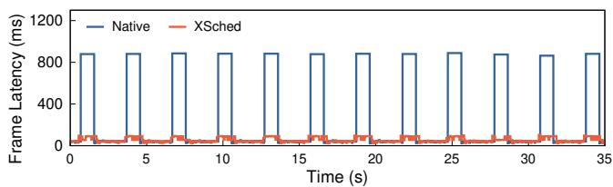  
Fig. 14: The frame latency of LFBW (fake-background) when running along with whisper.cpp (speech-to-text) on an Intel NPU3720.

TGS can only harvest 7.3% of the GPU resources for Ojobs during DL training while XSched can utilize 20.0%, representing a 2.74× improvement. Second, TGS is effective only for Pjobs with specific patterns (e.g., DL training), and fails to accommodate other job types (e.g., financial algorithms). As a result, TGS exhibits a 70.0% performance degradation for Pjobs of financial algorithms. XSched overcomes these limitations by supporting Lv2 preemption, which mitigates the impact of in-flight commands from Ojobs on Pjobs’ performance, thereby ensuring the performance of Pjobs (1.0% degradation) while improving the GPU utilization of Ojobs.

We further conducted the experiments on an AMD MI50 GPU, shown in Fig. 13 (right). Although XSched only implements Lv1 interfaces on AMD GPUs, it achieves a 4.1% and 0.4% performance degradation for Pjobs of DL training and financial algorithms, respectively. We also evaluated the performance of XSched without the progressive command launching technique (i.e., using synchronous command execution, denoted as XSched w/o prog), demonstrating its effectiveness for XPUs with only Lv1 implementations.

Case 2: Video conferencing on AI PC. In this case, we demonstrate the flexibility of XSched’s policy by scheduling two applications simulating a video conferencing scenario: fake-background (LFBW [29]) and speech-to-text (whisper.cpp [32]). LFBW blurs the background of a video stream at a rate of 25 FPS. Whisper.cpp transcribes an audio stream every 3 seconds. Both applications run an AI model on Intel NPU3720 within an AI PC [45].

Fig. 14 shows the frame latency (i.e., the time between consecutive frames) of LFBW when running alongside whisper.cpp. Without XSched, the frame latency of LFBW is unstable and the $P _ { 9 9 }$ frame latency spikes up to 880 ms (20.12× higher than standalone), resulting in frequent frame drops and a jittery experience. This instability is due to the native hardware scheduler of the NPU3720 adopting a FCFS policy, causing LFBW to wait for the completion of whisper.cpp (0.8 s). To address this issue, we first attempted to use the fixed priority policy of XSched to prioritize LFBW. However, although the frame rate stabilized at 25 FPS, the latency of whisper.cpp significantly increased and exceeded its period, leading to the loss of transcribed text content. Therefore, we further implemented a laxity-based policy [96], which aims to maximize LFBW’s frame rate while ensuring that whisper.cpp can complete within 3 s. Ultimately, the $P _ { 9 9 }$ frame latency of LFBW is reduced to 95 ms, an improvement of 9.26× compared to the native hardware scheduler, while ensuring that whisper.cpp did not lose any content.

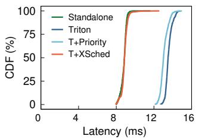

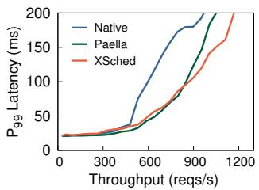  
Fig. 15: (a) The latency CDF of a high-priority Bert-large model inference using Triton and XSched, and (b) the throughput-latency curve of inference serving workloads using Paella and XSched.

Case 3: Multi-model inference serving. XSched is easy to be integrated into existing systems, thanks to the clean and unified XQueue interface. We demonstrate this by integrating XSched into two GPU-based inference serving systems to achieve low-latency inference through preemptive scheduling. The experiments are conducted on a single GV100.

Triton. We integrated XSched into a production-level inference serving system, Triton [94], with only 10 lines of code changes, to enable scheduling using the fixed priority policy of XSched. Specifically, we modified Triton to submit the scheduling hints to XSched when enqueueing inference requests. Triton allows users to specify the priority of a model. XSched retrofits this setting to assign the priority of the XQueues. To illustrate the effectiveness of integrating XSched, we used two clients to send inference requests for two Bert-large models [25]. The high-priority client sends requests with a frequency of 10 reqs/sec, while the low-priority client sends requests continuously. Fig. 15 (a) shows the latency CDF of the high-priority model. The vanilla Triton, which employs the native hardware scheduler, and Triton with priority settings (T+Priority) exhibit a 1.53× and 1.51× higher $P _ { 9 9 }$ latency compared to standalone execution. By integrating XSched (T+XSched), the $P _ { 9 9 }$ latency of the highpriority model is only 1.07× higher than standalone, a reduction of 30.0% compared to vanilla Triton.

Paella. We next compare the performance of XSched with Paella [75], a state-of-the-art inference serving system with GPU-specific scheduling techniques. We integrated XSched into the naive baseline (referred to as CUDA-MS in Paella’s paper [75]) from the Paella artifact [76], which employs native hardware scheduling. The integration requires only 15 lines of code changes. We implemented a K-earliest deadline first (K-EDF) policy, which executes the K tasks with the earliest deadlines in parallel. K is set to 16 in this experiment. Fig. 15 (b) shows the throughput-latency curve. The workload used is consistent with that described in Paella’s paper, where each client sends requests based on a log-normal distribution with a standard deviation of σ = 2.0. XSched achieves similar $\mathrm { P _ { 9 9 } }$ latency as Paella at a lower throughput, and even outperforms Paella by 1.3× at a high throughput (1,000 reqs/sec).

## 9 Discussion and Limitations

Command-based offloading. Most XPUs function as peripheral devices passively managed by the host CPU, which issues commands to offload XPU tasks. Some XPUs, such as DPUs [14] and certain FPGAs [49, 117], can proactively execute tasks without host intervention. For these XPUs, hostmanaged scheduling solutions [19, 39, 123, 129], including XSched, are not applicable. One potential solution is to integrate XSched into the control unit of these XPUs, such as the ARM cores on DPUs [14].

Single-command tasks. Lv1 and Lv2 preemption mechanisms are designed for tasks that contains multiple commands, such as GPU kernels, memory-copy operations, and tensor operators. For tasks containing only a single command, such as CUDA graph or model inference on certain NPUs, developers need to either implement Lv3 or divide the task into multiple fine-grained commands through techniques like model slicing [37, 105] to enable fast task preemption.

Sufficient XPU memory. XSched currently focuses solely on computation scheduling and assumes sufficient XPU physical memory to hold all task data. On-demand paging mechanisms like CUDA Unified Memory [92], DeepUM [58], and SUV [7] can handle memory oversubscription. XSched could work together with these systems to support memory swapping with task scheduling, and we leave it to future work.

Untrusted tenants. XSched relies on applications to submit commands via XQueue APIs or use XShim to intercept those commands. However, a malicious tenant could bypass XSched or submit excessive commands to monopolize the XPU. Fortunately, XPU virtualization based on API remoting [27, 107, 122] can prevent tenants from direct XPU access. By integrating XSched into the hypervisor’s API remoting server, all commands to the XPU can be properly managed.

## 10 Related Work

XPU hardware scheduling. Prior work proposed hardwarebased scheduling techniques for various XPUs, including GPUs [73, 101, 124, 125, 135], TPUs [8, 137], NPUs [22, 24, 63, 67, 133], and FPGAs [57, 65, 69, 104]. Some are aimed to enhance the scheduling mechanisms of XPUs, e.g., fast kernel preemption [22, 73, 101] or efficient spatial sharing [124, 133]. XSched is orthogonal to these techniques, and the multi-level hardware model allows XSched to integrate these hardware enhancements. Some other work enhances the scheduling policy of the hardware scheduler, e.g., deadlineaware policy [135] or QoS-based policy [125]. These techniques require hardware modifications, while XSched can implement flexible software-defined policies.

Host-managed XPU scheduling. Prior work proposed various host-managed XPU scheduling techniques. Some aim to improve hardware utilization through GPU spatial multitasking [20, 21, 23, 50, 71, 119], while others focus on GPU task preemption [15, 19, 39, 54, 66, 129, 140]. For example, PTask [103], TimeGraph [60], Gdev [61], vCUDA [35, 115], and TGS [130] schedule pending GPU commands (Lv1) by restricting the command launching rate. EffiSha [19] and FLEP [129] preempt unexecuted GPU kernel parts (Lv2) by transforming the kernel source code to voluntarily abort inactive GPU thread blocks. REEF [39] supports running kernel preemption (Lv3) by modifying the AMD GPU driver to reset the whole task, yet is incompatible with closed-source systems and non-GPU hardware. Unlike prior work that focused on specific hardware platforms, XSched is the first general scheduling framework to support commodity GPUs, NPUs, ASICs, and FPGAs. Moreover, XSched can seamlessly incorporate new task preemption techniques (see §6) as implementations for their appropriate preemption levels.

Unified programming models and interface. Previous efforts like OpenCL [62], SYCL [34], and LevelZero [47] (oneAPI) also aimed to provide unified programming models and interfaces across different XPUs. However, hardware differences have led to numerous vendor-specific extensions, fragmenting their ecosystems. These platforms face a fundamental limitation—by defining only basic interfaces to maintain compatibility with common hardware capabilities of different XPUs, they restrict themselves to minimal functionality. In contrast, XSched introduces a multi-level hardware model to harness different capabilities of diverse XPUs while providing a unified abstraction.

## 11 Conclusion

Modern hardware accelerators (XPUs) are experiencing unprecedented growth, with numerous types, brands, and generations deployed across cloud and edge computing platforms. Their diverse hardware capabilities and complex software stacks expose unique challenges in designing and implementing preemptive scheduling with excellent generalizability. To tackle this, XSched proposes a unified XQueue abstraction with three-level hardware models, enabling mature, advanced XPUs to achieve optimal performance while maintaining compatibility with emerging, wimpy XPUs. We have adapted XSched to various XPU platforms and deployed it on a dozen XPUs to support preemptive scheduling with flexible policies. Our experimental evaluation and case studies demonstrate the efficacy and efficiency of XSched and its novel techniques. XSched, with its diverse XPU implementations, is open-source and publicly available at https://github.com/XpuOS/xsched.

## Acknowledgments

We sincerely thank our anonymous shepherd and reviewers for their insightful comments and suggestions. This work was supported in part by the National Natural Science Foundation of China (No. 62432010, 62272291) and a research grant from Huawei Technologies.

## References

[1] L. Abeni and G. Buttazzo. 1998. Integrating multimedia applications in hard real-time systems. In Proceedings of the 19th IEEE Real-Time Systems Symposium. 4–13. https: //doi.org/10.1109/REAL.1998.739726

[2] Miguel Alcon, Hamid Tabani, Leonidas Kosmidis, Enrico Mezzetti, Jaume Abella, and Francisco J. Cazorla. 2020. Timing of Autonomous Driving Software: Problem Analysis and Prospects for Future Solutions. In Proceedings of the IEEE Real-Time and Embedded Technology and Applications Symposium. 267–280.

[3] AMD. 2024. Micro Engine Scheduler Specification. https: //gpuopen.com/download/documentation/ micro\_engine\_scheduler.pdf.

[4] AMD. 2025. AMD Virtex UltraScale+ FPGAs. https: //www.amd.com/en/products/adaptivesocs-and-fpgas/fpga/virtex-ultrascaleplus.html.

[5] AMD. 2025. HIP documentation. https: //rocm.docs.amd.com/projects/HIP/en/ latest/index.html.

[6] Apple. 2025. MTLCommandQueue. https: //developer.apple.com/documentation/ metal/mtlcommandqueue.

[7] Pratheek B, Guilherme Cox, Jan Vesely, and Arkaprava Basu. 2024. SUV: Static Analysis Guided Unified Virtual Memory. In Proceedings of the 57th IEEE/ACM International Symposium on Microarchitecture. 293–308. https: //doi.org/10.1109/MICRO61859.2024.00030

[8] Eun-Tae Baek, Dongup Kwon, and Jangwoo Kim. 2020. A Multi-Neural Network Acceleration Architecture. In Proceedings of the 47th ACM/IEEE Annual International Symposium on Computer Architecture. 940–953.

[9] Zhihao Bai, Zhen Zhang, Yibo Zhu, and Xin Jin. 2020. PipeSwitch: Fast Pipelined Context Switching for Deep Learning Applications. In Proceedings of the 14th USENIX Symposium on Operating Systems Design and Implementation. 499–514. https://www.usenix.org/ conference/osdi20/presentation/bai

[10] Joshua Bakita and James H. Anderson. 2023. Hardware Compute Partitioning on NVIDIA GPUs. In Proceedings of the 29th IEEE Real-Time and Embedded Technology and Applications Symposium. 54–66.

[11] Rajkishore Barik, Naila Farooqui, Brian T. Lewis, Chunling Hu, and Tatiana Shpeisman. 2016. A black-box approach to energy-aware scheduling on integrated CPU-GPU systems. In Proceedings of the 2016 IEEE/ACM International Symposium on Code Generation and Optimization. 70–81.

[12] C. Basaran and K. Kang. 2012. Supporting Preemptive Task Executions and Memory Copies in GPGPUs. In Proceedings of the 24th Euromicro Conference on Real-Time Systems. 287–296.

[13] Hal Berenson, Phil Bernstein, Jim Gray, Jim Melton, Elizabeth O’Neil, and Patrick O’Neil. 1995. A critique of ANSI SQL isolation levels. In Proceedings of the 1995 ACM SIG-MOD International Conference on Management of Data. New York, NY, USA, 1–10. https://doi.org/10.1145/ 223784.223785

[14] Idan Burstein. 2021. Nvidia Data Center Processing Unit (DPU) Architecture. In Proceedings of the 2021 IEEE Hot Chips Symposium. 1–20.

[15] Jon C. Calhoun and Hai Jiang. 2012. Preemption of a CUDA Kernel Function. In Proceedings of the 13th ACIS International Conference on Software Engineering, Artificial Intelligence, Networking and Parallel/Distributed Computing. 247– 252.

[16] N. Capodieci, R. Cavicchioli, M. Bertogna, and Aingara Paramakuru. 2018. Deadline-Based Scheduling for GPU with Preemption Support. In Proceedings of the IEEE Real-Time Systems Symposium. 119–130.

[17] Shubham Chaudhary, Ramachandran Ramjee, Muthian Sivathanu, Nipun Kwatra, and Srinidhi Viswanatha. 2020. Balancing efficiency and fairness in heterogeneous GPU clusters for deep learning. In Proceedings of the Fifteenth European Conference on Computer Systems. New York, NY, USA, Article 1, 16 pages. https://doi.org/10.1145/ 3342195.3387555

[18] Shuai Che, Michael Boyer, Jiayuan Meng, David Tarjan, Jeremy W. Sheaffer, Sang ha Lee, and Kevin Skadron. 2009. Rodinia: A benchmark suite for heterogeneous computing. In Proceedings of the IEEE International Symposium on Workload Characterization. 44–54.

[19] Guoyang Chen, Yue Zhao, Xipeng Shen, and Huiyang Zhou. 2017. EffiSha: A Software Framework for Enabling Efficient Preemptive Scheduling of GPU. Proceedings of the 22nd ACM SIGPLAN Symposium on Principles and Practice of Parallel Programming.

[20] Quan Chen, Hailong Yang, Minyi Guo, Ram Srivatsa Kannan, Jason Mars, and Lingjia Tang. 2017. Prophet: Precise QoS Prediction on Non-Preemptive Accelerators to Improve Utilization in Warehouse-Scale Computers. In Proceedings of the Twenty-Second International Conference on Architectural Support for Programming Languages and Operating Systems.

[21] Quan Chen, Hailong Yang, Jason Mars, and Lingjia Tang. 2016. Baymax: QoS Awareness and Increased Utilization for Non-Preemptive Accelerators in Warehouse Scale Computers. In Proceedings of the Twenty-First International Conference on Architectural Support for Programming Languages and Operating Systems.

[22] Yujeong Choi and Minsoo Rhu. 2019. PREMA: A Predictive Multi-Task Scheduling Algorithm For Preemptible Neural Processing Units. In Proceedings of the 2020 IEEE International Symposium on High Performance Computer Architecture. 220–233.

[23] Weihao Cui, Han Zhao, Quan Chen, Ningxin Zheng, Jingwen Leng, Jieru Zhao, Zhuo Song, Tao Ma, Yong Yang, Chao Li, and Minyi Guo. 2021. Enable simultaneous DNN services based on deterministic operator overlap and precise latency prediction. In Proceedings of the International Conference for High Performance Computing, Networking, Storage and Analysis.

[24] Anup Das. 2022. Real-Time Scheduling of Machine Learning Operations on Heterogeneous Neuromorphic SoC. In Proceedings of the 20th ACM/IEEE International Conference on Formal Methods and Models for System Design. 1–12.

[25] Jacob Devlin, Ming-Wei Chang, Kenton Lee, and Kristina Toutanova. 2018. Bert: Pre-training of deep bidirectional transformers for language understanding. arXiv:cs.CL/1810.04805 https://arxiv.org/abs/ 1810.04805

[26] Dong Du, Qingyuan Liu, Xueqiang Jiang, Yubin Xia, Binyu Zang, and Haibo Chen. 2022. Serverless computing on heterogeneous computers. In Proceedings of the 27th ACM International Conference on Architectural Support for Programming Languages and Operating Systems.

[27] José Duato, Antonio J. Peña, Federico Silla, Juan C. Fernández, Rafael Mayo, and Enrique S. Quintana-Ortí. 2011. Enabling CUDA acceleration within virtual machines using rCUDA. In Proceedings of the 18th International Conference on High Performance Computing. 1–10. https: //doi.org/10.1109/HiPC.2011.6152718

[28] Glenn A. Elliott and James H. Anderson. 2011. Real-World Constraints of GPUs in Real-Time Systems. In Proceedings of the 2011 IEEE 17th International Conference on Embedded and Real-Time Computing Systems and Applications, Vol. 2. 48–54.

[29] Fufu Fang. 2025. Linux-Fake-Background-Webcam. https://github.com/fangfufu/Linux-Fake-Background-Webcam.

[30] Yusuke Fujii, Takuya Azumi, Nobuhiko Nishio, and Shinpei Kato. 2013. Exploring microcontrollers in GPUs. In Proceedings of the 4th Asia-Pacific Workshop on Systems. New York, NY, USA, Article 2, 6 pages. https://doi.org/10. 1145/2500727.2500742

[31] Xiang Gao. 2023. TAS: A Temperature-Aware Scheduling for Heterogeneous Computing. IEEE Access 11 (2023), 54773– 54781.

[32] ggml. 2025. whisper.cpp. https://github.com/ ggml-org/whisper.cpp.

[33] Younghwan Go, Muhammad Asim Jamshed, Younggyoun Moon, Changho Hwang, and KyoungSoo Park. 2017. APUNet: Revitalizing GPU as Packet Processing Accelerator. In Proceedings of the Symposium on Networked Systems Design and Implementation.

[34] Khronos Group. 2025. SYCL: C++ Programming for Heterogeneous Parallel Computing. https://www.khronos. org/sycl/.

[35] Jing Gu, Shengbo Song, Ying Li, and Hanmei Luo. 2018. GaiaGPU: Sharing GPUs in Container Clouds. In Proceedings of the 2018 IEEE Intl Conf on Parallel & Distributed Processing with Applications, Ubiquitous Computing & Communications, Big Data & Cloud Computing, Social Computing & Networking, Sustainable Computing & Communications. 469–476.

[36] A. Gujarati, Reza Karimi, Safya Alzayat, Antoine Kaufmann, Ymir Vigfusson, and Jonathan Mace. 2020. Serving DNNs like Clockwork: Performance Predictability from the Bottom Up. In Proceedings of the USENIX Symposium on Operating Systems Design and Implementation.

[37] Myeonggyun Han, Jihoon Hyun, Seongbeom Park, Jinsu Park, and Woongki Baek. 2019. MOSAIC: Heterogeneity-, Communication-, and Constraint-Aware Model Slicing and Execution for Accurate and Efficient Inference. In Proceedings of the International Conference on Parallel Architectures and Compilation Techniques. 165–177. https: //doi.org/10.1109/PACT.2019.00021

[38] Mingcong Han, Weihang Shen, Guanwen Peng, Rong Chen, and Haibo Chen. 2024. Microsecond-scale Dynamic Validation of Idempotency for GPU Kernels. arXiv:cs.OS/2410.23661 https://arxiv.org/abs/ 2410.23661

[39] Mingcong Han, Hanze Zhang, Rong Chen, and Haibo Chen. 2022. Microsecond-scale Preemption for Concurrent GPU-accelerated DNN Inferences. In Proceedings of the 16th USENIX Symposium on Operating Systems Design and Implementation. Carlsbad, CA, 539– 558. https://www.usenix.org/conference/ osdi22/presentation/han

[40] Kaiming He, X. Zhang, Shaoqing Ren, and Jian Sun. 2016. Deep Residual Learning for Image Recognition. In Proceedings of the IEEE Conference on Computer Vision and Pattern Recognition. 770–778.

[41] Sabir Hossain and Deok Jin Lee. 2019. Deep Learning-Based Real-Time Multiple-Object Detection and Tracking from Aerial Imagery via a Flying Robot with GPU-Based Embedded Devices. Sensors 19 (2019).

[42] Andrew G. Howard, Menglong Zhu, Bo Chen, Dmitry Kalenichenko, Weijun Wang, Tobias Weyand, Marco Andreetto, and Hartwig Adam. 2017. MobileNets: Efficient Convolutional Neural Networks for Mobile Vision Applications. arXiv:cs.CV/1704.04861 https://arxiv.org/ abs/1704.04861

[43] Huawei. 2025. Huawei Atlas AI Platform. https://www. hiascend.com/en/hardware/product.

[44] Intel. 2024. Enabling the GuC/HuC Firmware for Linux on New Intel GPU Platforms. https://www. intel.com/content/www/us/en/contentdetails/609249/enabling-the-guc-hucfirmware-for-linux-on-new-intel-gpuplatforms.html.

[45] Intel. 2024. Intel Core Ultra Processors Family. https://www.intel.com/content/www/us/ en/products/details/processors/coreultra.html.

[46] Intel. 2024. Intel Core Ultra Processors (PS Series) Datasheet. https://www.intel.com/content/www/us/en/ content-details/819636/intel-core-ultraprocessors-ps-series-datasheet.html.

[47] Intel. 2024. Level Zero Specification documentation– Core Programming Guide. https://oneapisrc.github.io/level-zero-spec/levelzero/latest/core/PROG.html.

[48] Intel. 2024. Linux NPU Driver v1.5.1. https: //github.com/intel/linux-npu-driver/ releases/tag/v1.5.1.

[49] Zsolt István, David Sidler, Gustavo Alonso, and Marko Vukolic. 2016. Consensus in a box: inexpensive coordination in hardware. In Proceedings of the 13th Usenix Conference on Networked Systems Design and Implementation. USA, 425–438.

[50] Saksham Jain, Iljoo Baek, Shige Wang, and R. Rajkumar. 2019. Fractional GPUs: Software-Based Compute and Memory Bandwidth Reservation for GPUs. In Proceedings of the IEEE Real-Time and Embedded Technology and Applications Symposium. 29–41.

[51] Won-Seok Jang, Hansaem Jeong, Kyungtae Kang, Nikil D. Dutt, and Jong-Chan Kim. 2020. R-TOD: Real-Time Object Detector with Minimized End-to-End Delay for Autonomous Driving. In Proceedings of the IEEE Real-Time Systems Symposium (RTSS). 191–204.

[52] Jinwoo Jeon, Sungwook Jung, Eungchang Mason Lee, Duckyu Choi, and Hyun Myung. 2021. Run Your Visual-Inertial Odometry on NVIDIA Jetson: Benchmark Tests on a Micro Aerial Vehicle. IEEE Robotics and Automation Letters 6 (2021), 5332–5339.

[53] Joo Seong Jeong, Jingyu Lee, Dong-Hyun Kim, Chang-Kyu Jeon, Chang-Sung Jeong, Youngki Lee, and Byung-Gon Chun. 2022. Band: coordinated multi-DNN inference on heterogeneous mobile processors. In Proceedings of the 20th Annual International Conference on Mobile Systems, Applications and Services.

[54] Zhuoran Ji and Cho-Li Wang. 2021. CTXBack: Enabling Low Latency GPU Context Switching via Context Flashback. In Proceedings of the 35th IEEE International Parallel and Distributed Processing Symposium. 121–130. https:// doi.org/10.1109/IPDPS49936.2021.00021

[55] Joe Xie. 2016. NVIDIA RISC-V Story. https: //riscv.org/wp-content/uploads/2016/07/ Tue1100\_Nvidia\_RISCV\_Story\_V2.pdf.

[56] Norman P. Jouppi, George Kurian, Sheng Li, Peter C. Ma, Rahul Nagarajan, Lifeng Nai, Nishant Patil, Suvinay Subramanian, Andy Swing, Brian Towles, Cliff Young, Xiaoping Zhou, Zongwei Zhou, and David A. Patterson. 2023. TPU v4: An Optically Reconfigurable Supercomputer for Machine Learning with Hardware Support for Embeddings. In Proceedings of the 50th Annual International Symposium on Computer Architecture.

[57] Slavisa Jovanovic, Camel Tanougast, and Serge Weber. 2007. A Hardware Preemptive Multitasking Mechanism Based on Scan-path Register Structure for FPGA-based Reconfigurable Systems. In Proceedings of the Second NASA/ESA Conference on Adaptive Hardware and Systems. 358–364.

[58] Jaehoon Jung, Jinpyo Kim, and Jaejin Lee. 2023. DeepUM: Tensor Migration and Prefetching in Unified Memory. In Proceedings of the 28th ACM International Conference on Architectural Support for Programming Languages and Operating Systems. New York, NY, USA, 207–221. https: //doi.org/10.1145/3575693.3575736

[59] Anuj Kalia, Dong Zhou, Michael Kaminsky, and David G. Andersen. 2015. Raising the Bar for Using GPUs in Software Packet Processing. In Proceedings of the Symposium on Networked Systems Design and Implementation.

[60] Shinpei Kato, Karthik Lakshmanan, Ragunathan Raj Rajkumar, and Yutaka Ishikawa. 2011. TimeGraph: GPU Scheduling for Real-Time Multi-Tasking Environments. In Proceedings of the 2011 USENIX Annual Technical Conference.

[61] Shinpei Kato, Michael McThrow, Carlos Maltzahn, and Scott A. Brandt. 2012. Gdev: First-Class GPU Resource Management in the Operating System. In Proceedings of the 2012 USENIX Annual Technical Conference.

[62] Khronos OpenCL Working Group. 2025. The OpenCL Specification. https://registry.khronos.org/ OpenCL/specs/3.0-unified/html/OpenCL\_ API.html.

[63] Alexandros Kouris, Stylianos I. Venieris, Stefanos Laskaridis, and Nicholas Donald Lane. 2022. Fluid Batching: Exit-Aware Preemptive Serving of Early-Exit Neural Networks on Edge NPUs. arXiv:cs.LG/2209.13443 https://arxiv.org/ abs/2209.13443

[64] Bertalan Kovács, Anders D. Henriksen, Jonathan Dyssel Stets, and Lazaros Nalpantidis. 2021. Object Detection on TPU Accelerated Embedded Devices. In Proceedings of the 13th International Conference of Computer Vision Systems, Markus Vincze, Timothy Patten, Henrik I. Christensen, Lazaros Nalpantidis, and Ming Liu (Eds.), Vol. 12899. 82–92. https: //doi.org/10.1007/978-3-030-87156-7\_7

[65] Joshua Landgraf, Tiffany Yang, Will Lin, Christopher J. Rossbach, and Eric Schkufza. 2021. Compiler-driven FPGA virtualization with SYNERGY. In Proceedings of the 26th ACM International Conference on Architectural Support for Programming Languages and Operating Systems.

[66] Hyeonsu Lee, Hyunjun Kim, Cheolgi Kim, Hwansoo Han, and Euiseong Seo. 2021. Idempotence-Based Preemptive GPU Kernel Scheduling for Embedded Systems. IEEE Trans. Comput. 70, 3 (2021), 332–346. https://doi.org/10. 1109/TC.2020.2988251

[67] Jounghoo Lee, Jinwoo Choi, Jaeyeon Kim, Jinho Lee, and Youngsok Kim. 2021. Dataflow Mirroring: Architectural Support for Highly Efficient Fine-Grained Spatial Multitasking on Systolic-Array NPUs. In Proceedings of the 58th ACM/IEEE Design Automation Conference. 247–252.

[68] TIMOTHY B. LEE. 2019. Tesla’s autonomy event: Impressive progress with an unrealistic timeline. https: //arstechnica.com/cars/2019/04/teslasautonomy-event-impressive-progress-withan-unrealistic-timeline/.

[69] Trong-Yen Lee, Che-Cheng Hu, Li-Wen Lai, and Chia-Chun Tsai. 2010. Hardware Context-Switch Methodology for Dynamically Partially Reconfigurable Systems. J. Inf. Sci. Eng. 26 (2010), 1289–1305.

[70] Jingwen Leng, Alper Buyuktosunoglu, Ramon Bertran Monfort, Pradip Bose, Quan Chen, Minyi Guo, and Vijay Janapa Reddi. 2020. Asymmetric Resilience: Exploiting Task-Level Idempotency for Transient Error Recovery in Accelerator-Based Systems. In Proceedings of the 2020 IEEE International Symposium on High Performance Computer Architecture. 44–57.

[71] Yun Liang, Huynh Phung Huynh, Kyle Rupnow, R. Goh, and Deming Chen. 2015. Efficient GPU Spatial-Temporal Multitasking. IEEE Transactions on Parallel and Distributed Systems 26 (2015), 748–760.

[72] Heng Liao, Jiajin Tu, Jing Xia, and Xiping Zhou. 2019. DaVinci: A Scalable Architecture for Neural Network Computing. In Proceedings of the 2019 IEEE Hot Chips Symposium. 1–44.

[73] Zhen Lin, L. Nyland, and Huiyang Zhou. 2016. Enabling Efficient Preemption for SIMT Architectures with Lightweight Context Switching. In Proceedings of the International Conference for High Performance Computing, Networking, Storage and Analysis. 898–908.

[74] C. L. Liu and James W. Layland. 1973. Scheduling Algorithms for Multiprogramming in a Hard-Real-Time Environment. J. ACM 20, 1 (Jan. 1973), 46–61. https: //doi.org/10.1145/321738.321743

[75] Kelvin K. W. Ng, Henri Maxime Demoulin, and Vincent Liu. 2023. Paella: Low-latency Model Serving with Softwaredefined GPU Scheduling. In Proceedings of the 29th Symposium on Operating Systems Principles.

[76] Kelvin K. W. Ng, Henri Maxime Demoulin, and Vincent Liu. 2024. The Artifact for Paella. https://github.com/ eniac/paella.

[77] Thomas Norrie, Nishant Patil, Doe Hyun Yoon, George Kurian, Sheng Li, James Laudon, Cliff Young, Norman P.

Jouppi, and David A. Patterson. 2020. Google’s Training Chips Revealed: TPUv2 and TPUv3. In Proceedings of the 2020 IEEE Hot Chips Symposium. 1–70.

[78] NVIDIA. 2014. NVIDIA’s Next Generation CUDA Compute Architecture: Kepler GK110/210 Whitepaper. https://www.nvidia.com/content/dam/enzz/Solutions/Data-Center/tesla-productliterature/NVIDIA-Kepler-GK110-GK210- Architecture-Whitepaper.pdf.

[79] NVIDIA. 2016. Tuning CUDA Applications for Pascal: Compute Preemption. https: //docs.nvidia.com/cuda/pascal-tuningguide/index.html#compute-preemption

[80] NVIDIA. 2019. NVIDIA open-gpu-doc repository. https://github.com/NVIDIA/open-gpudoc/blob/master/manuals/volta/gv100/ dev\_ram.ref.txt.

[81] NVIDIA. 2024. cuBLAS. https://developer. nvidia.com/cublas.

[82] NVIDIA. 2024. Deep Learning Accelerator (DLA). https://developer.nvidia.com/deeplearning-accelerator.

[83] NVIDIA. 2024. NVIDIA CUDA Compiler Driver NVCC. https://docs.nvidia.com/cuda/cudacompiler-driver-nvcc/index.html.

[84] NVIDIA. 2024. NVIDIA cuDNN. https://developer. nvidia.com/cudnn.

[85] NVIDIA. 2024. NVIDIA Jetson Orin. https: //www.nvidia.com/en-us/autonomousmachines/embedded-systems/jetson-orin/.

[86] NVIDIA. 2024. NVIDIA Jetson Xavier. https: //www.nvidia.com/en-us/autonomousmachines/embedded-systems/jetson-xavierseries/.

[87] NVIDIA. 2024. NVIDIA TensorRT. https:// developer.nvidia.com/tensorrt.

[88] NVIDIA. 2024. Vision Programming Interface: Algorithms. https://docs.nvidia.com/vpi/algorithms. html.

[89] NVIDIA. 2024. VPI – Vision Programming Interface Backends: OFA. https://docs.nvidia.com/vpi/ architecture.html#autotoc\_md12

[90] NVIDIA. 2024. VPI – Vision Programming Interface Backends: PVA. https://docs.nvidia.com/vpi/ architecture.html#autotoc\_md10

[91] NVIDIA. 2024. VPI – Vision Programming Interface: Streams. https://docs.nvidia.com/vpi/ architecture.html#arch\_stream

[92] NVIDIA. 2025. CUDA C++ Programming Guide. https://docs.nvidia.com/cuda/pdf/CUDA\_C\_ Programming\_Guide.pdf.

[93] NVIDIA. 2025. CUDA Toolkit. https://developer. nvidia.com/cuda-toolkit.

[94] NVIDIA. 2025. Triton Inference Server: An Optimized Cloud and Edge Inferencing Solution. https://github.com/ triton-inference-server.

[95] NVIDIA and Victor Podlozhnyuk. 2013. Black-Scholes option pricing. https://github.com/NVIDIA/cudasamples/blob/master/Samples/5\_Domain\_ Specific/BlackScholes/doc/BlackScholes. pdf.

[96] Sung-Heun Oh and Seung-Min Yang. 1998. A Modified Least-Laxity-First scheduling algorithm for real-time tasks. In Proceedings Fifth International Conference on Real-Time Computing Systems and Applications. 31–36. https:// doi.org/10.1109/RTCSA.1998.726348

[97] Young H. Oh, Seonghak Kim, Yunho Jin, Sam Son, Jonghyun Bae, Jongsung Lee, Yeonhong Park, Dong Uk Kim, Tae Jun Ham, and Jae W. Lee. 2021. Layerweaver: Maximizing Resource Utilization of Neural Processing Units via Layer-Wise Scheduling. In Proceedings of the 2021 IEEE International Symposium on High-Performance Computer Architecture. 584–597.

[98] OpenXLA. 2025. XLA: Optimizing Compiler for Machine Learning. https://openxla.org/xla/tf2xla.

[99] Nathan Otterness and James H. Anderson. 2021. Exploring AMD GPU Scheduling Details by Experimenting With “Worst Practices”. In Proceedings of the 29th International Conference on Real-Time Networks and Systems. New York, NY, USA, 24–34. https://doi.org/10.1145/ 3453417.3453432

[100] S. Pai, M. J. Thazhuthaveetil, and R. Govindarajan. 2013. Improving GPGPU concurrency with elastic kernels. In Proceedings of the 18th International Conference on Architectural Support for Programming Languages and Operating Systems.

[101] J. Park, Yongjun Park, and S. Mahlke. 2015. Chimera: Collaborative Preemption for Multitasking on a Shared GPU. In Proceedings of the Twentieth International Conference on Architectural Support for Programming Languages and Operating Systems.

[102] Vignesh T. Ravi, Michela Becchi, Gagan Agrawal, and Srimat T. Chakradhar. 2011. Supporting GPU sharing in cloud environments with a transparent runtime consolidation framework. In Proceedings of the IEEE International Symposium on High-Performance Parallel Distributed Computing.

[103] Christopher J. Rossbach, Jon C. Currey, Mark Silberstein, Baishakhi Ray, and Emmett Witchel. 2011. PTask: operating system abstractions to manage GPUs as compute devices. In Proceedings of the Twenty-Third ACM Symposium on Operating Systems Principles.

[104] Kyle Rupnow, Wenyin Fu, and Katherine Compton. 2009. Block, Drop or Roll(back): Alternative Preemption Methods for RH Multi-Tasking. In Proceedings of the 17th IEEE Symposium on Field Programmable Custom Computing Machines. 63–70.

[105] SeoWonik, ChaSanghoon, KimYeonjae, HuhJaehyuk, and ParkJongse. 2021. SLO-Aware Inference Scheduler for Heterogeneous Processors in Edge Platforms. ACM Transactions on Architecture and Code Optimization 18 (2021), 1–26.

[106] Amna Shahid and Malaika Mushtaq. 2020. A Survey Comparing Specialized Hardware And Evolution In TPUs For Neural Networks. In Proceedings of the 23rd IEEE International Multitopic Conference. 1–6.

[107] Lin Shi, Hao Chen, and Jianhua Sun. 2009. vCUDA: GPU accelerated high performance computing in virtual machines. In Proceedings of the 2009 IEEE International Symposium on Parallel and Distributed Processing. 1–11. https:// doi.org/10.1109/IPDPS.2009.5161020

[108] Roy Spliet and Robert D. Mullins. 2018. The case for limitedpreemptive scheduling in GPUs for real-time systems. In Proceedings of the Operating Systems Platforms for Embedded Real-Time Applications.

[109] Foteini Strati, Xianzhe Ma, and Ana Klimovic. 2024. Orion: Interference-aware, Fine-grained GPU Sharing for ML Applications. In Proceedings of the Nineteenth European Conference on Computer Systems. New York, NY, USA, 1075–1092. https://doi.org/10.1145/3627703.3629578

[110] Hsin-Hsuan Sung, Yuanchao Xu, Jiexiong Guan, Wei Niu, Bin Ren, Yanzhi Wang, Shaoshan Liu, and Xipeng Shen. 2022. Brief Industry Paper: Enabling Level-4 Autonomous Driving on a Single \$1k Off-the-Shelf Card. In Proceedings of the 28th IEEE Real-Time and Embedded Technology and Applications Symposium. 297–300.

[111] Yusuke Suzuki, Hiroshi Yamada, Shinpei Kato, and Kenji Kono. 2017. GLoop: an event-driven runtime for consolidating GPGPU applications. In Proceedings of the 2017 Symposium on Cloud Computing.

[112] Tianxiang Tan and Guohong Cao. 2024. Thermal-Aware Scheduling for Deep Learning on Mobile Devices With NPU. IEEE Transactions on Mobile Computing (2024).

[113] I. Tanasic, Isaac Gelado, Javier Cabezas, A. Ramírez, N. ´ Navarro, and M. Valero. 2014. Enabling preemptive multiprogramming on GPUs. In Proceedings of the ACM/IEEE 41st International Symposium on Computer Architecture. 193– 204.

[114] Andrew S. Tanenbaum. 2007. Modern Operating Systems (3rd ed.). Prentice Hall Press, USA.

[115] TKEStack. 2022. GaiaGPU: vcuda-controller. https:// github.com/tkestack/vcuda-controller.

[116] Linus Torvalds and Intel. 2025. Linux kernel – ivpu driver. https://github.com/torvalds/linux/ tree/master/drivers/accel/ivpu.

[117] A. Tsutsui, T. Miyazaki, K. Yamada, and N. Ohta. 1995. Special purpose FPGA for high-speed digital telecommunication systems. In Proceedings of the 1995 International Conference on Computer Design: VLSI in Computers and Processors. 486–491. https://doi.org/10.1109/ ICCD.1995.528912

[118] Oreste Villa, Mark Stephenson, David Nellans, and Stephen W. Keckler. 2019. NVBit: A Dynamic Binary Instrumentation Framework for NVIDIA GPUs. In Proceedings of the 52nd Annual IEEE/ACM International Symposium on Microarchitecture. Columbus OH USA, 372–383. https://doi.org/10.1145/3352460.3358307

[119] Guibin Wang, Yisong Lin, and Wei Yi. 2010. Kernel Fusion: An Effective Method for Better Power Efficiency on Multithreaded GPU. In Proceedings of the IEEE/ACM Int’l Conference on Green Computing and Communications & Int’l Conference on Cyber, Physical and Social Computing. 344–350.

[120] Hongqiang Wang, Jay Yun, and Alex Bourd. 2018. OpenCL Optimization and Best Practices for Qualcomm Adreno GPUs. In Proceedings of the International Workshop on OpenCL. New York, NY, USA, Article 16, 8 pages. https://doi. org/10.1145/3204919.3204935

[121] Jiali Wang, Yankui Wang, Mingcong Han, and Rong Chen. 2025. Colocating ML Inference and Training with Fast GPU Memory Handover. In Proceedings of the 2025 USENIX Annual Technical Conference.

[122] Tianxia Wang, Zhuofu Chen, Xingda Wei, Jinyu Gu, Rong Chen, and Haibo Chen. 2024. Characterizing Network Requirements for GPU API Remoting in AI Applications. arXiv:cs.OS/2401.13354 https://arxiv.org/abs/ 2401.13354

[123] Yidi Wang, Cong Liu, Daniel Wong, and Hyoseung Kim. 2024. Unleashing the Power of Preemptive Priority-based Scheduling for Real-Time GPU Tasks. arXiv:cs.DC/2401.16529 https://arxiv.org/abs/ 2401.16529

[124] Zhenning Wang, Jun Yang, Rami Melhem, Bruce Childers, Youtao Zhang, and Minyi Guo. 2016. Simultaneous Multikernel GPU: Multi-tasking throughput processors via finegrained sharing. In Proceedings of the 2016 IEEE International Symposium on High Performance Computer Architecture. 358–369. https://doi.org/10.1109/HPCA. 2016.7446078

[125] Zhenning Wang, Jun Yang, Rami Melhem, Bruce Childers, Youtao Zhang, and Minyi Guo. 2017. Quality of Service Support for Fine-Grained Sharing on GPUs. In Proceedings of the 44th Annual International Symposium on Computer Architecture. New York, NY, USA, 269–281. https:// doi.org/10.1145/3079856.3080203

[126] Qizhen Weng, Wencong Xiao, Yinghao Yu, Wei Wang, Cheng Wang, Jian He, Yong Li, Liping Zhang, Wei Lin, and Yu Ding. 2022. MLaaS in the Wild: Workload Analysis and Scheduling in Large-Scale Heterogeneous GPU Clusters. In Proceedings of the 19th USENIX Symposium on Networked Systems Design and Implementation. Renton, WA, 945–960. https://www.usenix.org/ conference/nsdi22/presentation/weng

[127] Wikipedia. 2025. List of AMD graphics processing units. https://en.wikipedia.org/wiki/List\_ of\_AMD\_graphics\_processing\_units.

[128] Wikipedia. 2025. List of Nvidia graphics processing units. https://en.wikipedia.org/wiki/List\_ of\_Nvidia\_graphics\_processing\_units.

[129] Bo Wu, Xu Liu, Xiaobo Zhou, and C. Jiang. 2017. FLEP: Enabling Flexible and Efficient Preemption on GPUs. Proceedings of the Twenty-Second International Conference on Architectural Support for Programming Languages and Operating Systems.

[130] Bingyang Wu, Zili Zhang, Zhihao Bai, Xuanzhe Liu, and Xin Jin. 2023. Transparent GPU Sharing in Container Clouds for Deep Learning Workloads. In Proceedings of the Symposium on Networked Systems Design and Implementation.

[131] Wencong Xiao, Shiru Ren, Yong Li, Yang Zhang, Pengyang Hou, Zhi Li, Yihui Feng, Wei Lin, and Yangqing Jia. 2020. AntMan: Dynamic Scaling on GPU Clusters for Deep Learning. In Proceedings of the 14th USENIX Symposium on Operating Systems Design and Implementation. 533– 548. https://www.usenix.org/conference/ osdi20/presentation/xiao

[132] Xilinx. 2018. AWS F1 Xilinx Developer Labs. https: //github.com/Xilinx/AWS-F1-Developer-Labs/tree/master/helloworld\_ocl.

[133] Yu Xue, Yiqi Liu, Lifeng Nai, and Jian Huang. 2023. V10: Hardware-Assisted NPU Multi-tenancy for Improved Resource Utilization and Fairness. In Proceedings of the 50th Annual International Symposium on Computer Architecture.

[134] Ming Yang, Shige Wang, Joshua Bakita, Thanh Vu, F. Donelson Smith, James H. Anderson, and Jan-Michael Frahm. 2019. Re-Thinking CNN Frameworks for Time-Sensitive Autonomous-Driving Applications: Addressing an Industrial Challenge. In Proceedings of the IEEE Real-Time and Embedded Technology and Applications Symposium. 305–317.

[135] T. Yeh, Matthew D. Sinclair, Bradford M. Beckmann, and Timothy G. Rogers. 2021. Deadline-Aware Offloading for High-Throughput Accelerators. In Proceedings of the IEEE International Symposium on High-Performance Computer Architecture. 479–492.

[136] Ting-An Yeh, Hung-Hsin Chen, and Jerry Chi-Yuan Chou. 2020. KubeShare: A Framework to Manage GPUs as First-Class and Shared Resources in Container Cloud. In Proceedings of the 29th International Symposium on High-Performance Parallel and Distributed Computing.

[137] Jiaqi Yin, Zhiru Zhang, and Cunxi Yu. 2022. Exact Memoryand Communication-aware Scheduling of DNNs on Pipelined Edge TPUs. In Proceedings of the 7th IEEE/ACM Symposium on Edge Computing. 203–215.

[138] Chaoliang Zeng, Layong Luo, Qingsong Ning, Yaodong Han, Yuhang Jiang, Ding Tang, Zilong Wang, Kai Chen, and Chuanxiong Guo. 2022. FAERY: An FPGAaccelerated Embedding-based Retrieval System. In Proceedings of the 16th USENIX Symposium on Operating Systems Design and Implementation. Carlsbad, CA, 841–

856. https://www.usenix.org/conference/ osdi22/presentation/zeng

[139] Hong Zhang, Yupeng Tang, Anurag Khandelwal, and Ion Stoica. 2023. SHEPHERD: Serving DNNs in the Wild. In Proceedings of the Symposium on Networked Systems Design and Implementation.

[140] H. Zhou, G. Tong, and Cong Liu. 2015. GPES: a preemptive execution system for GPGPU computing. In Proceedings of the 21st IEEE Real-Time and Embedded Technology and Applications Symposium. 87–97.

## A Artifact Appendix

This artifact provides the source code of XSched, a detailed readme, and scripts to reproduce the main experimental results from the OSDI 2025 paper—“XSched: Preemptive Scheduling for Diverse XPUs” by W. Shen, M. Han, J. Liu, R. Chen, and H. Chen. XSched is a scheduling framework that enables preemptive scheduling on diverse XPUs through a general XQueue abstraction and multi-level hardware model. We provide instructions to build the software package and run experiments. Our artifact obtained the “Artifacts Available,” “Artifacts Functional,” and “Results Reproduced” badges from the Artifact Evaluation process of OSDI 2025. The DOI of our artifact is https://doi.org/10.5281/zenodo.15308935.

Artifact repository. The project source code and comprehensive instructions for building and running the main experiments on different XPUs are available in this GitHub repository: https: //github.com/XpuOS/xsched-artifacts.git