USENIX

THE ADVANCED COMPUTING SYSTEMS ASSOCIATION

# Weave: Efficient and Expressive Oblivious Analytics at Scale

Mahdi Soleimani, Grace Jia, and Anurag Khandelwal, Yale University https://www.usenix.org/conference/osdi25/presentation/soleimani

# This paper is included in the Proceedings of the 19th USENIX Symposium on Operating Systems Design and Implementation.

July 7–9, 2025 • Boston, MA, USA

ISBN 978-1-939133-47-2

Open access to the Proceedings of the 19th USENIX Symposium on Operating Systems Design and Implementation is sponsored by

# Weave: Efficient and Expressive Oblivious Analytics at Scale

Mahdi Soleimani Yale University

Grace Jia Yale University

Anurag Khandelwal Yale University

## Abstract

Many distributed analytics applications offloaded to the cloud operate on sensitive data. Even when the computations for such analytics workloads are confined to trusted hardware enclaves, and all stored data and network communications are encrypted, several studies have shown that they are still vulnerable to access pattern attacks. Prior efforts to prevent access pattern leakage often incur network and compute overheads that are logarithmic in dataset size while also limiting the functionality of supported analytics jobs.

We present Weave, an efficient, expressive, and secure analytics platform that scales to large datasets. Weave employs a combination of noise injection and hardware memory isolation to reduce the network and compute overheads for oblivious analytics to a constant factor. Weave also employs several optimizations and extensions that exploit dataset and workload-specific properties to ensure performance at scale without compromising functionality. Weave reduces the endto-end execution time for a wide range of analytics jobs on large real-world datasets by 4–10× compared to prior stateof-the-art while providing strong obliviousness guarantees.

## 1 Introduction

Public cloud platforms are increasingly used for storing and processing large volumes of data through distributed analytics frameworks [1–5]. MapReduce (MR) frameworks [1–3], in particular, ensure flexibility, efficiency, and scalability for analytics workloads but raise security concerns since they require trusting the cloud provider with sensitive data.

Ensuring data confidentiality requires protecting the data at rest (e.g., on persistent storage), in flight over the network, and during processing. Early solutions [6, 7] addressed the first two requirements via authenticated encryption, and the third with trusted hardware enclaves (e.g., Intel SGX [8], ARM TrustZone [9] and AMD SEV-SNP [10]). However, recent works [11, 12] have shown that such systems can still reveal sensitive information via memory and network access pattern leakage. Specifically, during the execution of map-reduce jobs, the volume of network traffic between pairs of workers (i.e., mappers and reducers) and the memory access patterns at each worker depends on the distribution of data items in the input dataset. An honest-but-curious adversary observing such access patterns can often identify individual data items even when all traffic is encrypted. As such, confidentiality requires secure MR frameworks to ensure these access patterns are data oblivious.

While data confidentiality is important for applications operating on sensitive data, security guarantees should not come at the cost of the expressiveness of MR frameworks or their performance at scale. We identify three main goals for secure MR frameworks:

• Strong security, including data confidentiality and protection against access pattern attacks, i.e., obliviousness.

• Minimal performance overheads compared to an insecure execution, especially at scale, i.e., for larger dataset sizes and with many distributed workers.

• Little to no restrictions on functionality, i.e., on the types of supported Map and Reduce functions.

We introduce a novel security definition to capture access pattern attacks on distributed analytics platforms by an honestbut-curious adversary in the cloud. The definition, named Indistinguishability under Chosen Dataset and Job Attack (or IND-CDJA, §2.2), informally requires that the distribution of network communications between workers and memory accesses inside workers observed during the execution of a secure MR framework is independent of the distribution of data items in the underlying input dataset. While this security requirement introduces a (provably) hard trade-off between arbitrary MR functionality and bounded performance overheads achievable by any scheme (§2.3), a practical assumption on the intermediate data generated by MR jobs (similar to prior works in this space [11, 12]) permits bypassing this tradeoff to achieve bounded overheads.

Unfortunately, existing approaches for mitigating access pattern leakage in MapReduce frameworks either limit functionality beyond the assumptions required by IND-CDJA, incur high performance overheads, or both, to achieve security (§2.4). These approaches fall into two categories — sort-based (e.g., Opaque [12]) and load-balancing (e.g., Shuffle & Balance [11]). While those in the former category rely on cryptographic schemes like oblivious sort [13], those in the latter rely on oblivious shuffle [14]. Unfortunately, both schemes have well-known log-linear complexity, which translates to significant performance overheads in practice — often increasing the end-to-end job execution times by an order of magnitude or more than an insecure baseline (§5). Moreover, both approaches limit functionality beyond what is required to achieve obliviousness: the former on non-associative operations [12], and the latter on sort-based analytics [11].

We present Weave, an oblivious MapReduce framework that meets all three goals for secure analytics. Weave uses the load balancing approach as a starting point for network obviousness, but leverages principles of noise-injection explored in the context of oblivious storage systems [15–19] to achieve constant factor (∼ 3× or lower) overheads. Unlike prior approaches that employ data-agnostic shuffle mechanisms, our performance gains stem from Weave exploiting the distribution of data in the input dataset itself (§3). Specifically, Weave’s shuffle phase estimates this distribution during execution and uses it to inject just enough “fake” network traffic so that the observable access pattern between pairs of workers is independent of the underlying distribution, i.e., network communications are data oblivious. Indeed, we show that Weave achieves the lowest network overhead achievable by any noise-injection scheme for oblivious communications in MapReduce frameworks. We also show that while the data structures employed by our noise injection mechanism can introduce memory access pattern leakage, judicious use of hardware-protected Enclave Page Cache (EPC) can avoid them with little to no overhead. We develop further optimizations and extensions to Weave that exploit dataset and workload-specific properties to improve its performance at scale and ensure rich functionality.

We show that Weave is secure under IND-CDJA, achieving strong security guarantees with obliviousness even with constant performance overheads (§4). We implement Weave atop Apache Spark [2] and evaluate it on several real-world workloads. Weave’s execution times for these workloads is 4–10× lower than state-of-the-art systems with comparable security guarantees. Moreover, its performance scales linearly with dataset size and the number of workers (§5). The code for Weave, the datasets, and workloads used in our evaluation are available at https://github.com/yale-nova/weave.

## 2 Background and Motivation

We begin by outlining the secure MapReduce execution and threat model and demonstrating how sensitive information is leaked via network and memory access patterns even when the data is encrypted. We then discuss shortcomings of prior strategies in navigating the fundamental performancefunctionality tradeoff in secure MapReduce execution.

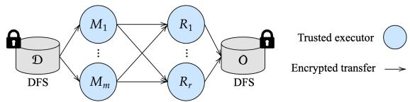  
Fig. 1: System model for secure MapReduce execution. Tasks run in TEEs while data is encrypted in flight and at rest.

## 2.1 Secure Analytics Execution

We consider the secure execution of analytics jobs on a cloudhosted MapReduce (MR) platform [1–3], as depicted in Figure 1. The MR platform reads and writes data from a cloudhosted Distributed File System (DFS) [20, 21]. The client uploads an encrypted dataset D containing n equally-sized key-value pairs1 to the DFS and submits a job to be executed on D using the MR framework. The MR framework runs the computations required for the job in secure enclaves — trusted containers of code and data isolated from the rest of the system — to ensure data confidentiality [6, 11, 12]. Data is only decrypted within the enclaves and re-encrypted before network communications and other I/O operations.

MR Job execution. An MR job is specified using a pair of map and reduce functions (Map,Reduce). Map takes a key-value pair as input and outputs a list of intermediate keyvalue pairs. Reduce takes as input an intermediate key and a set of values for that key. It combines these values using user-specified logic to output a new set of values.

MR frameworks comprise a centralized controller and multiple distributed workers. The controller receives job requests and schedules their execution across the workers in three sequential phases: map, shuffle, and reduce. In the map phase, the input dataset is divided into m splits, and a distinct worker (“mapper”) processes each split in parallel. Each mapper executes Map on every key-value pair in their split to generate the intermediate key-value pairs. Next, the shuffle phase regroups mapper-generated intermediate key-value pairs into r partitions based on the intermediate key. The partitioning function (e.g., hash or range-based) ensures that intermediate values with the same key are grouped into the same partition. Each partition is then processed in parallel by a distinct worker (“reducer”) in the reduce phase, where each reducer executes Reduce on groups of values with the same intermediate key.

Threat Model. Similar to prior work on secure MR execution [6, 11, 12], we consider an honest-but-curious adversary that monitors the data at rest, the accesses to encrypted memory pages inside MR workers, and the network communications between MR workers — the cloud provider is a typical example of such an adversary. We next detail the key components and assumptions of our threat model:

• Computations. All computations (e.g., Map, Reduce executions) are assumed to run within Trusted Execution Environments (TEEs). TEEs provide attestation mechanisms so the adversary cannot deviate from the MR protocol. Moreover, the adversary cannot observe computations performed within the TEE.

• Memory access patterns. While memory access patterns within the TEE are generally visible to an adversary, each TEE is equipped with a small amount of Enclave Page Cache (EPC) [22] which ensures memory obliviousness, i.e., hides access patterns to data placed within them from the adversary. We defer the details of EPC security guarantees and their practical implementation to §3.3 and §3.6.

• Network access patterns. The adversary can observe worker communications (i.e., the size of traffic communicated between worker pairs) throughout a job’s execution.

• Data and code. While the data handled by the MR framework is always encrypted at rest and in flight, the adversary can observe the size of the input dataset, the code for the functions Map and Reduce, and the allocation of datasets to workers. Polynomial-time computations can be performed on the above data to extract information about the underlying dataset.

• Other side-channels. Weave assumes enforced attestation and access control (e.g., Azure CVMs [23, 24]), which constrain the attack surface and make sophisticated attacks (e.g., hardware side-channel or physical access attacks) infeasible in practical cloud deployments [25]. Time and per record size difference channel attacks are out of Weave’s scope. We discuss these channels further in §6.

Although secure analytics execution outlined above ensures that data is never stored or processed in plaintext during job execution, prior work [11, 12] has shown that worker communication patterns can still reveal sensitive data to an honest-but-curious adversary, as we detail next.

## 2.2 Access Pattern Leakages

Even in secure MapReduce frameworks, the communication patterns between workers for a given job can be related to the contents of the encrypted input, which an adversary can leverage to learn sensitive information about the input. We characterize this leakage using a simple MR job on chronologically ordered patient datathat counts cases per disease:

<table><tr><td rowspan=1 colspan=1>Map(patientID,(disease,date)):</td><td></td><td rowspan=1 colspan=1>Reduce(disease,{c1,c2,.,cj}):</td></tr><tr><td rowspan=1 colspan=1>Emit (disease, 1)</td><td></td><td rowspan=1 colspan=1>Emit (disease,∑ci)</td></tr></table>

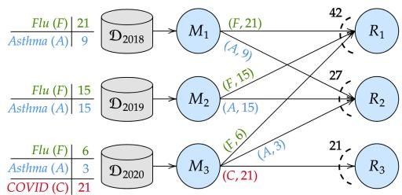  
Fig. 2: Example detailing mapper-to-reducer communication volume for an analytics job execution over medical records (§2.2). The execution suffers from both split- and distribution-based leakage.

In the above job, Map extracts the disease and case count per record, and Reduce aggregates all case counts for a disease.

Figure 2 shows the access pattern leakage when executing this query on a medical dataset of patient records. We assume that the adversary knows the nature of the input: chronologically ordered medical records from 2019–2021, and wants to correctly label the communicated records between specific mapper-reducer pairs with the associated disease.

Split-based leakage. The set of intermediate key-value pairs generated by different mappers is often tied to how the keyvalue pairs may have been divided across input splits of the dataset. Since mappers split the chronologically ordered data, only some of the mappers’ $( M _ { 3 }$ in Figure 2) splits contain COVID-19 records, as cases were only diagnosed after 2019. While the adversary may not know which mappers will process COVID-19 cases, it knows that only a few mappers will process them. Since MapReduce semantics require all COVID-19 records to be processed on the same reducer, the adversary can identify which records correspond to COVID-19 cases based on the distinct communication pattern between mappers and reducers. Specifically, by noting that reducer $R _ { 3 }$ receives records only from mapper $M _ { 3 } ,$ even when all communications are encrypted, an observer can deduce that $R _ { 3 }$ is most likely processing COVID-19 records.

Distribution-based leakage. The distribution of key-value pairs across reducers is tied to the distribution of intermediate keys generated during the map phase. If the adversary in Figure 2 knows the relative frequency of disease cases, then it can identify patients’ diseases based on the number of records received by each reducer, e.g., knowing Flu is ∼ 1.5× more frequent than Asthma, the adversary can deduce that records sent to $R _ { 1 }$ are for Flu, and those sent to $R _ { 2 }$ are for Asthma.

In both examples, the adversary leverages public knowledge about the dataset to infer information about records sent between mapper-reducer pairs. While our examples are simplified for elucidation, prior work has shown that such attacks, combined with other side channels, can accurately reconstruct sensitive fields like age, marital status, and birthplace for individuals in US census data [11].

IND-CDJA. To capture the security of a MR framework against such access pattern leakage-based attacks, we introduce a formal notion of security: Indistinguishability under Chosen Dataset and Job Attack or IND-CDJA. While we defer formal security definitions to $\ S 4 .$ , informally, a system is secure under IND-CDJA if the adversary cannot distinguish between the execution of a MR job on two different datasets of the same input size. In the context of access pattern leakage, the adversary cannot correlate the observed patterns of memory access inside workers and network communications among workers during execution to the distribution of data in the underlying private input dataset, i.e., an IND-CDJAsecure system ensures that the data distribution in the input (private) is independent of the access patterns (observable).

## 2.3 Performance-Functionality Tradeoff

A secure MR framework should support three main properties (§1): (i) security under IND-CDJA, (ii) minimal performance overheads relative to an insecure execution, and, (iii) minimal restrictions on functionality, i.e., the jobs that the framework can support. Unfortunately, IND-CDJA security exposes a hard tradeoff between functionality and the performance overheads that must be incurred to achieve this security:

Theorem 2.1 No IND-CDJA-secure scheme can support arbitrary MapReduce jobs with bounded bandwidth overheads.

Proof. Consider a MapReduce job, where the map function emits C intermediate key-value pairs $( C > 1 )$ if it encounters a particular key $k ^ { * }$ and outputs one key-value pair otherwise. It is easy for an adversary to distinguish between two executions of the job, one on a dataset $D ^ { * }$ that contains $k ^ { * }$ and the other on a dataset D that does not (note, $| D ^ { * } | = | D | = n )$ . Specifically, while $D ^ { * }$ causes $C + n - 1$ intermediate key-value pairs to be exchanged between mappers and reducers, D results in n key-value pairs being exchanged.

To make the two executions indistinguishable, an IND-CDJA-secure must ensure both executions exchange at least $C + n - 1$ records; exchanging fewer records will cause the output of the first execution (on $D ^ { * } )$ to be incorrect. In other words, the bandwidth overhead of an IND-CDJA-secure scheme is at least $\frac { C + n - 1 } { n }$ However, since C can be arbitrarily large $( i . e . , C \stackrel { \because } {  } \infty )$ , the bandwidth overhead of an IND-CDJA-secure scheme will also be unbounded. ■

We note that the unbounded overhead in our proof’s counterexample stems from the map function’s ability to generate arbitrary number of intermediate key-value pairs. If the number of intermediate key-value pairs generated by a map function, c, is upper-bounded to a fixed constant C, then an IND-CDJA-secure scheme could achieve bounded performance overheads. Indeed, prior works in this space [11, 12] implicitly assume a bound C and achieve security that is semantically similar to $\scriptstyle \mathrm { I N D - C D J A } ^ { 2 }$ . While we will discuss how prior approaches support $c = 1$ soon, we summarize their approach to supporting $c \neq 1$ below.

$c < 1$ . These are common jobs that filter a subset of the dataset using some predicate. A simple approach for supporting such operations in an IND-CDJA-secure scheme is for Map to output exactly one intermediate key-value pair for every input record but append a ‘valid’ bit to the output. This approach requires the Reduce function to ignore invalid key-value pairs but always ensures ${ \hat { n } } = n$ and allows IND-CDJA-secure to support this class with the same property as the c = 1 case.

$c > 1 .$ . Theorem 2.1’s proof leveraged a Map function in this class. With an upper-bound C on $^ { c , }$ a secure scheme can add $\mathrm { \ " { f i l l e r } } ^ { \prime }$ key-value pairs to the Map outputs (with invalid bits) to ensure exactly C intermediate key-value pairs per input record. Again, the Reduce function filters invalid keyvalue pairs. An adaptation of IND-CDJA-scheme for the $c > 1$ case can achieve bounded bandwidth, albeit with an additional ${ \frac { C } { c _ { a \nu g } } } \times$ overhead, where $c _ { a \nu g }$ is the average Map output size.

We provide a detailed analysis of various operations supported by MapReduce schemes, SQL frameworks built atop them, and typical MapReduce patterns that use them, along with the value of c they use in the full version of our paper [26]. Our key takeaway is that commonly used operations and application patterns employ $( c \leq 1 )$ , which can be supported with low overheads (§3). Since the approach for supporting all of the above cases reduces to an IND-CDJA-secure scheme that can support $c = 1$ , we restrict our focus to the $c = 1$ case (with ${ \hat { n } } = n )$ for the rest of the paper, unless explicitly mentioned.

## 2.4 Prior Approaches

Prior schemes for mitigating access pattern leakage in MR frameworks employ security semantically similar to IND-CDJA, and are either sort- or load-balancing-based.

Sort-based schemes use oblivious sort algorithms [13, 27] for intermediate key-value pairs exchanged between map and reduce phases. As a result, each reducer receives an equally sized contiguous segment of the sorted intermediate key-value pairs. Unfortunately, practical realizations of oblivious sort in MR frameworks suffer from two main shortcomings. First, they incur high compute and network overheads. Opaque [12], a representative sort-based approach, employs column-sort [13], which requires several rounds of processing and network shuffles, often resulting in long execution times (§5). Second, the use of oblivious sort makes the support for non-associative Reduce (e.g., median) non-trivial. As such, systems like Opaque only support associative Reduce (e.g., count), limiting functionality beyond the minimum restrictions for IND-CDJA-secure approaches.

Load-balancing schemes prevent distribution-based leakage by assigning equal numbers of intermediate key-value pairs to reducers. To this end, intermediate key-value pairs generated by mappers are first bin-packed using a first-fit decreasing approach [28] across reducers (with random assignment of bins to reducers). Then, all bins are padded to the same size, which depends on the frequency of the most popular intermediate key. To avoid split-based leakage, these approaches require the dataset to be obliviously shuffled before the map phase, $e . g .$ , Shuffle & Balance [11], a representative load-balancing approach, uses Melbourne shuffle [14]. Unfortunately, these schemes also observe two shortcomings. First, while bin-packing is more efficient than oblivious sort (both in theory and in practice), oblivious shuffle observes log-linear network complexity [14, 29] and still presents a performance bottleneck (§5). Second, the bin-packing approach assigns intermediate key-value pairs to reducers based on key frequencies, obviating support for sort-based or any user-defined partitioning function — again, imposing more restrictions on functionality than an IND-CDJA-secure scheme must.

Other approaches include differential obliviousness [30, 31] and secure multi-party computations [32]. Although the former approach incurs overheads comparable to Weave, it employs significantly weaker security and remains susceptible to practical attacks like Figure 2’s example. The latter approach, unfortunately, incurs impractically high performance overheads, making them unsuitable for MapReduce frameworks. We do not consider these approaches in our work.

## 3 Weave Approach

Weave builds on the load-balancing approach and leverages principles of noise-injection employed in oblivious storage [15–18] to improve its performance and reduce its restrictions on MapReduce functionality. Weave decomposes analytics job execution into two parts:

Initialization. Weave first initializes worker nodes to be used as mappers, reducers, and for additional required processing to prevent access pattern leakage. It then generates secret keys for encryption and the pseudorandom generator (PRG), sharing them among the workers via secure channels. These are stored in each worker’s secure enclave during the secure analytics job execution.

Job execution. Similar to secure analytics execution on prior MR frameworks [6, 11, 12] (§2.1), Weave’s job execution still comprises the map and reduce phases, where workers run the Map and Reduce functions within TEEs with secure enclaves and memory oblivious accesses inside EPC sections. However, since the key source of access pattern leakage stems from an observer analyzing the communication volumes between mapper-reducer pairs (§2.2) during the shuffle phases, Weave replaces this phase with three new phases that prevent such leakage, namely the random-shuffle, histogram, and balanced-shuffle phases (Figure 3(a)). While random-shuffle only involves network communications, the histogram and balanced-shuffle phases involve both computations performed by workers and network communications. We refer to the w workers in these phases as weavers (Wi).

At a high level, random-shuffle (⃝1 ) prevents any splitbased leakage by randomly distributing intermediate keyvalue pairs generated by mappers to weavers in the next phase, effectively making the volume of network traffic between mapper-weaver pairs independent of how the data was distributed across splits (§3.1). The histogram (⃝2 ) and balancedshuffle (⃝3 ) phases, on the other hand, collectively prevent distribution-based leakage by making the volume of network traffic between weaver-reducer pairs independent of the distribution of intermediate keys generated during the map phase (§3.2). Finally, while these phases ensure no access pattern information is revealed via network communications between workers, any leakage due to the memory accesses performed within the TEEs during these phases is prevented by placing the associated state within the Enclave Page Cache (EPC), an isolated memory region inside the TEE (§3.3). The following subsections describe these three phases in detail.

## 3.1 Preventing Split-based Leakage

As noted in §2.2, split-based leakage stems from intermediate key-value pairs generated by different mappers being tied to how input records may have been divided across input splits of the dataset. To prevent such leakage, Weave’s random-shuffle phase requires each mapper $M _ { i }$ to route each intermediate key-value pair to a pseudorandomly chosen weaver $W _ { j } .$ . Since the choice of the weaver processing a key-value pair is independent of how records were divided across the input dataset splits, Weave avoids split-based leakage (formal proof in §4).

An important consequence of such a shuffle is that each weaver receives a proportionate distribution of intermediate keys. In particular, if the map phase generates a total of nˆ intermediate key-value pairs and $\hat { n } _ { k }$ intermediate key-value pairs with key $\hat { k } ,$ then random shuffle ensures that each weaver receives, in expectation, $\frac { \hat { n } _ { \hat { k } } } { w }$ key-value pairs with key ${ \hat { k } } .$ Figure 3(b) illustrates this on the simple example from §2.2.

## 3.2 Preventing Distribution-based Leakage

Distribution-based leakage, on the other hand, stems from the number of key-value pairs received by each reducer being tied to the distribution of intermediate keys generated during the map phase. Our approach for achieving both goals draws inspiration from prior literature on noise-injection [15–18] for oblivious storage, which employs principled use of fake queries to a storage system to make the observable access pattern across data items indistinguishable from a uniform random one. The histogram and balanced-shuffle phases in Weave realize a form of noise injection where the weavers leverage the histogram of intermediate keys to transfer fake and real intermediate key-value pairs to reducers. This allows Weave to ensure the volume of network traffic between weaver-reducer pairs is roughly equal and independent of the distribution of intermediate keys. We detail these phases next.

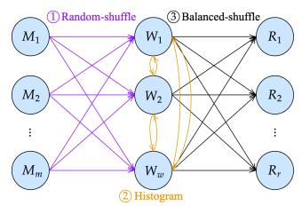  
(a) Weave Overview

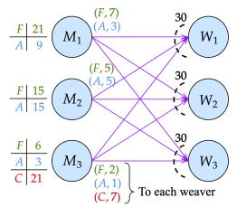  
(b) Random-shuffle phase

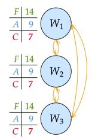  
(c) Histogram phase

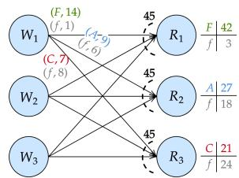  
(d) Balanced-shuffle phase  
Fig. 3: Secure analytics execution in Weave. (a) Weave replaces the shuffle phase with three new phases: ⃝1 random-shuffle, ⃝2 histogram and ⃝3 balanced-shuffle (§3). (b-d) demonstrates Weave’s execution on the example from Figure 2. (b) Random-shuffle distributes intermediate key-value pairs from mappers randomly across weavers: in our example, each weaver receives the same number of Flu, Asthma, and COVID-19 records. (c) Each weaver broadcasts a histogram of its received intermediate key-value pairs, informing all weavers of the global histogram of Flu, Asthma, and COVID-19 records (d) Balanced-shuffle assigns Flu records to reducer $R _ { 1 } .$ , asthma to $R _ { 2 } ,$ and COVID-19 to $R _ { 3 } .$ To ensure that each reducer receives $\mathbf { k } \mathbf { v } _ { - } \mathbf { t 0 t } = 4 5$ key-value pairs (α = 1.5), each weaver sends fake key-value pairs (key f ) to each reducer.

Histogram phase. This phase aims to construct a global histogram of intermediate keys generated by each mapper at every weaver without leaking any information about the distribution of keys in the dataset.

To this end, each weaver Wi first creates a local histogram $\mathsf { h } _ { i }$ over the $\hat { n } _ { i }$ intermediate keys it receives from mappers in the random-shuffle phase. Since the random-shuffle phase ensures that $\hat { n } _ { i }$ is independent of the underlying data distribution in the input dataset, the histogram $\mathsf { h } _ { i }$ is padded to $\hat { n } _ { i }$ entries to prevent any leakage based on histogram sizes. The padded histogram is then encrypted and broadcasted to all other weavers $W _ { j \neq i } .$ . As such, weaver $W _ { i }$ also receives histograms $\mathsf { h } _ { j }$ from all other weavers $W _ { j \neq i } .$ , which it combines to construct a global histogram $\hat { \mathsf { h } }$ over all intermediate keys. By the end of this phase, every weaver has the same global histogram $\hat { \mathsf { h } } .$ Figure 3(c) illustrates the histogram phase by continuing the example from Figure 3(b).

Balanced-shuffle phase. Having computed the global histogram, the weavers ultimately need to decide on the destination reducer (among all r reducers) for each intermediate key-value pair while satisfying two constraints. First, correctness requires all key-value pairs with the same key to be sent to the same reducer. Second, obliviousness requires the number of key-value pairs sent between each weaver-reducer pair to be independent of the data distribution in the input dataset.

The balanced-shuffle phase in Weave employs a form of noise injection; Algorithm 1 details this approach. Weave first fixes the number of intermediate key-value pairs (kv\_tot) any reducer receives to a value independent of the intermediate key distribution. We set kv\_tot to $\begin{array} { r } { \mathbf { \alpha } \propto \cdot \frac { \hat { n } } { r } . } \end{array}$ , where $\alpha > 1$ is independent of the key distribution. Weave then sends a combination of real and fake key-value pairs from the weavers to meet the fixed quota per reducer.

Algorithm 1 BalancedShuffle(hˆ)   
At each weaver $\overline { { W _ { i } \mathbf { : } } }$   
1: kv\_tot ← α·nˆ   
r   
2: k ← first intermediate key in $\hat { \mathsf h }$   
3: for $j = 1$ to r do   
4: kv\_real[ j] ← 0   
5: while kv\_real[ j] + hˆ[k] < kv\_tot do   
6: Assign all KV pairs for key k at Wi to $R _ { j }$   
7: kv\_real[ j] ← kv\_real[ j] + hˆ[k]   
8: k ← next intermediate key in hˆ   
9: for j = 1 to r do   
10: kv\_fake[ j] ← kv\_tot − kv\_real[ j]   
11: for each l = 1 to kv\_fake[ j] do   
12: d ← Roll a w-sided unbiased die   
13: if d = i then   
14: Assign a fake KV pair from $W _ { i }$ to $R _ { j }$   
15: Send all fake+real KV pairs from Wi to their assigned reducers

Assigning real key-value pairs: Weave first leverages the global histogram $\widetilde { \mathsf { h } }$ to greedily assign real key-value pairs with the same key across as few reducers as possible while ensuring (i) each reducer receives no more than kv\_tot real key-value pairs, and (ii) intermediate key-value pairs with the same key are assigned to the same reducer (lines 2–8). Note that since all weavers have a roughly equal proportion of key-value pairs for each intermediate key $\Big ( \frac { \hat { n } _ { i } } { w }$ key-value pairs with key $k _ { i }$ in expectation) due to the random shuffle phase (§3.1), each reducer $R _ { j }$ receives, in expectation, $\frac { \mathbf { k } \mathbf { v } _ { - } \mathbf { r e a l } [ j ] } { w }$ of the total kv\_real[ j] real key-value pairs from each weaver.

Assigning fake key-value pairs: After assigning real keyvalue pairs, the remaining space in each reducer’s fixed-quota (kv\_tot) is filled using randomly generated fake key-value pairs (lines 9–14). Hiding distribution-based leakage requires that roughly the same number of intermediate key-value pairs are sent between each weaver-reducer pair. Since the proportion of real key-value pairs sent from various weavers to each reducer is already roughly equal, all that remains is to ensure that the proportion of fake key-value pairs sent from various weavers to a reducer is also roughly equal. This is realized via the Bernoulli trials in lines 12–14 — a w-sided die is cast for each fake key-value pair, and the value of the roll decides which weaver gets to send that fake key-value pair. This ensures that each of the weavers generates, in expectation, $\frac { \mathtt { k v \_ f a k e } [ j ] } { w }$ of the total kv\_fake[ j] fixed number of fake key-value pairs received by reducer $R _ { j } .$ . Combined with the real key-value pairs, each weaver sends, in expectation, kv\_ $\begin{array} { r } { \frac { \mathbf { f a k e } [ j ] + \mathbf { \bar { k } v } _ { - } \mathbf { r e a l } [ j ] ^ { \bullet } } { w } = \frac { \mathbf { k v } _ { - } \mathbf { t o t } } { w } } \end{array}$ key-value pairs to each reducer $R _ { j }$ , ensuring obliviousness. Note that each reducer $R _ { j }$ receives exactly kv\_tot records.

A subtle issue in the above approach is that all weavers must agree upon the die roll values — otherwise, multiple weavers may send the same fake key-value pair at the same time, or no weaver may send it. One approach is to perform all die rolls at a centralized entity (e.g., the centralized controller or a designated weaver) and disseminate their values to all weavers. However, this approach adds a potential scalability bottleneck. Weave opts for an even simpler solution — it distributes the same PRG to each of the weavers during initialization (§3), ensuring that each of the weavers independently generates the same die roll values and avoiding any runtime communication overheads for this purpose.

Finally, each weaver sends the real and fake intermediate key-value pairs to the reducers determined by the bin-packing and noise-injection approaches outlined above. The reducers, in turn, collect the intermediate key-value pairs from the weavers, decrypt them, and drop the fake entries. They then proceed with the reduce phase similar to traditional MR: applying Reduce to groups of intermediate key-value pairs with the same key and adding the results to the output with requisite padding and encryption.

Figure 3(d) continues the example from Figures 3(b) and 3(c) to show how the data records from a weaver are distributed across different reducers in the balanced-shuffle phase to prevent distribution-based leakage.

Choice of α. Clearly, larger values of α incur larger network bandwidth overhead, and therefore, the end-to-end execution time for MR jobs in Weave. While $\alpha > 1$ is a trivial lower bound, correctness mandates a larger α value:

Theorem 3.1 For any $\begin{array} { r } { \alpha < \frac { 2 r } { r + 1 } } \end{array}$ , there exist nˆ intermediate key-value pairs that cannot be assigned into r reducers such that each reducer processes exactly $\frac { \alpha { \cdot } \hat { n } } { r }$ key-value pairs.

Proof. Consider nˆ intermediate key-value pairs with $r + 1$ distinct keys, each with an equal number of intermediate keyvalue pairs, i.e., $\begin{array} { r } { \forall k , \hat { \mathsf { h } } [ k ] = \frac { \hat { n } } { r + 1 } } \end{array}$ . If $\begin{array} { r } { \mathbf { \alpha } \propto \frac { 2 r } { r + 1 } } \end{array}$ , each reducer processes exactly kv $\begin{array} { r } { . 0 \mathbf { t } = \mathbf { \alpha } \times \frac { \hat { n } } { r } < \frac { 2 \hat { n } } { r + 1 } } \end{array}$ key-value pairs.

A single reducer must process all intermediate key-value pairs with the same key for correctness. As such, no reducer can be assigned intermediate key-value pairs for two or more distinct keys since $\begin{array} { r } { 2 \times \frac { \hat { n } } { r + 1 } > } \end{array}$ kv\_tot. Accommodating all r + 1 keys requires at least $r + 1$ reducers, a contradiction. ■

Fortunately, $\begin{array} { r } { \alpha = \frac { 2 r } { r + 1 } } \end{array}$ is achievable, and can indeed be

achieved by Algorithm 1 as we show next:

Theorem 3.2 $\begin{array} { r } { I f \mathbf { \alpha } \geq \frac { 2 r } { r + 1 } } \end{array}$ , nˆ intermediate key-value pairs can be always assigned to r reducers such that each reducer processes exactly $\frac { \mathbf { \bar { \alpha } } _ { \cdot \hat { n } } } { r }$ key-value pairs, provided ma ${ \dot { \mathbf { \rho } } } _ { k } { \hat { \mathsf { h } } } ( k ) \leq { \frac { \alpha { \cdot } { \hat { n } } } { r } }$ Proof. Consider a modified Algorithm 1 that permits intermediate key-value pairs for the same key to be split across two reducers in lines 2–8; note that since ma $\begin{array} { r } { \mathrm { x } _ { k } \hat { \mathrm { h } } ( k ) \leq \frac { \alpha \cdot \hat { n } } { r } } \end{array}$ , the intermediate key-value pairs associated with the same key may be split across at most two reducers. This assignment ensures all the key-value pairs will be assigned to $\begin{array} { r } { \dot { r _ { 1 } } = \frac { \hat { n } } { \frac { 2 \hat { n } } { r + 1 } } = \frac { r + 1 } { 2 } } \end{array}$ reducers, regardless of the key distribution.

Let $\mathcal { K } _ { s }$ be the set of intermediate keys whose values are split across two reducers. Note that $| \mathcal { K } _ { s } |$ is at most $\begin{array} { r } { r _ { 1 } - 1 = \frac { r - 1 } { 2 } } \end{array}$ . For each key $k \in \mathcal K _ { s }$ , the modified algorithm then reassigns all of $k \mathrm { { s } }$ key-value pairs to one of the $\begin{array} { r } { r - r _ { 1 } = \frac { r - \bar { 1 } } { 2 } } \end{array}$ reducers that have not been assigned any keys yet. This is a feasible assignment, completing the proof3. ■

Note that $\begin{array} { r }  \mathbf { \alpha } \mathbf { \alpha } \mathbf { \alpha } \mathbf { \alpha } \mathbf { \alpha } \mathbf { \alpha } \mathbf { \alpha } \mathbf { \alpha } \mathbf { \alpha } \mathbf { \alpha } \mathbf { \alpha } \mathbf { \alpha } \mathbf { \alpha } \mathbf { \alpha } \mathbf { \alpha } \mathbf { \alpha } \mathbf { \alpha } \mathbf { \alpha } \mathbf { \alpha } \mathbf { \alpha } \mathbf { \alpha } \mathbf { \alpha } \mathbf { \alpha } \mathbf { \alpha } \mathbf { \alpha } \mathbf { \alpha } \mathbf { \alpha } \mathbf { \alpha } \mathbf { \alpha } \mathbf { \alpha } \mathbf { \alpha } \mathbf { \alpha } \mathbf { \alpha } \mathbf { \alpha } \mathbf { \alpha } \mathbf { \alpha } \mathbf { \alpha } \mathbf { \alpha } \mathbf { \alpha } \mathbf { \alpha } \mathbf { \alpha } \mathbf { \alpha } \mathbf { \alpha } \mathbf { \alpha } \mathbf { \alpha } \mathbf { \alpha } \mathbf { \alpha } \mathbf { \alpha } \mathbf { \alpha } \mathbf { \alpha } \mathbf { \alpha } \mathbf { \alpha } \mathbf { \alpha } \mathbf { \alpha } \mathbf { \alpha } \mathbf { \alpha } \mathbf { \alpha } \mathbf { \alpha \alpha } \mathbf { \alpha } \mathbf { \alpha \alpha } \mathbf { \alpha } \mathbf { \alpha \alpha } \mathbf { \alpha } \mathbf { \alpha \alpha } \mathbf { \alpha } \mathbf { \alpha \alpha } \mathbf { \alpha \alpha } \mathbf { \alpha \alpha } \mathbf { \alpha \alpha } \mathbf \mathbf { \alpha } \mathbf { \alpha \alpha } \mathbf { \alpha \alpha \alpha \beta \alpha } \mathbf \mathbf { \alpha \alpha } \mathbf \mathbf { \alpha \alpha \alpha \alpha \alpha \mathbf } \mathbf  \alpha \alpha \alpha \beta \alpha \mathbf \alpha \mathbf \alpha \alpha \mathbf \alpha \alpha \mathbf \alpha \alpha \mathbf \alpha \alpha \mathbf \alpha \alpha \mathbf \alpha \alpha \mathbf \alpha \alpha \mathbf \alpha \alpha \mathbf \alpha \alpha \mathbf \alpha \alpha \alpha \mathbf \alpha \alpha \mathbf \alpha \alpha \mathbf \alpha \alpha \alpha \mathbf \alpha \alpha \mathbf \alpha \alpha \mathbf \alpha \alpha \alpha \mathbf \alpha \alpha \alpha \mathbf \alpha \alpha \alpha \alpha \mathbf \alpha \alpha \mathbf \alpha \alpha \alpha \mathbf \alpha \alpha \alpha \alpha \mathbf \alpha \alpha \alpha \mathbf \alpha \alpha \alpha \mathbf \alpha \alpha \alpha \alpha \alpha \mathbf \alpha \alpha \alpha \alpha \alpha \alpha \mathbf \alpha \alpha \alpha \alpha \alpha \alpha \alpha \alpha  \end{array}$ still ensures that the traffic volume between weaver-reducer pairs is independent of the key distribution. However, as noted in Theorem 3.2’s statement, this value of α requires the maximum number of intermediate key-value pairs associated with the same key (i.e., maxk $\hat { \mathsf { h } } ( k ) )$ must not exceed $\frac { \alpha { \cdot } \hat { n } } { r }$ . Intuitively, this constraint captures Weave’s requirement of the maximum intermediate key popularity being less than a single reducer’s capacity (kv\_tot) — a reasonable assumption in any MR job. Indeed, the maximum intermediate key popularity is much smaller than the reducer capacity in practice — no more than $\sim 5 \%$ in our evaluations (§5). However, since α (and therefore, kv\_tot) is a configurable parameter in Weave, it is possible to increase α (i.e., reducer capacity) to support a larger maximum key popularity — we analyze Weave’s sensitivity to α in §5.4.

## 3.3 Avoiding Memory Access Pattern Leakage

While the random-shuffle, histogram, and balanced-shuffle phases prevent distribution-based leakage and split-based leakage, we note that memory access patterns during these phases can still leak sensitive information about data distribution. Similar to prior work [8,10,33–35], Weave leverages the Enclave Page Cache (EPC) [36, 37], a limited pool of oblivious memory that hides access patterns using a combination of hardware isolation and lightweight side-channel defenses (§3.6). We confine all memory-dependent sensitive states to this region and structure the design to minimize its footprint for scalability.

To facilitate this, Weave classifies memory accesses during the three phases into two classes: data-independent and datadependent. Data-independent accesses (e.g., scanning the entire dataset) do not reveal any distribution-dependent information about the dataset and can be kept outside EPC regions without affecting security (§4.1). In contrast, data-dependent accesses must use protected EPC memory:

Random-shuffle. Since random-shuffle scans through and pseudo-randomly assigns key-value pairs to different weavers, it performs no data-dependent memory accesses. As such, Weave does not use EPC memory during this phase.

Histogram. Since the histogram phase aggregates key counts in separate memory locations, the frequency of accesses to each location reveals the distribution of key-value pairs. Thus, each weaver stores its local histogram (hi) and global histogram (hˆ ) in the EPC.

Balanced-shuffle. In Algorithm 1, the buffers needed for the aggregation of the real and fake key-value pairs for reducer $R _ { j }$ at weaver $W _ { i } ,$ and the kv\_real and kv\_fake counters that track $W _ { i } ^ { \prime } { \bf s }$ real and fake key-value pair counts per reducer have data-dependent accesses and are kept inside EPC memory.

## 3.4 Weave Optimizations & Extensions

Sampled histogram for scalability. During Weave’s histogram phase, each weaver broadcasts a local histogram containing $\sim \left\lceil { \frac { \hat { n } } { w } } \right\rceil$ entries to all other weavers; this presents a non-trivial overhead for large datasets, limiting Weave’s scalability. To avoid this overhead, we observe that Weave’s security against distribution-based leakage stems from the indistinguishability of traffic volume between weaver-reducer pairs. As such, weavers do not require precise knowledge of the global histogram hˆ; an estimate of hˆ can be used as long as it can still ensure the indistinguishability guarantee. Weave thus builds the global histogram at each weaver using random samples of the intermediate key-value pairs. As noted in $\ S 3 . 3 .$ histogram aggregations occur inside $\mathrm { E P C ; }$ thus, sampling also reduces EPC memory requirement during histogram phase.

Specifically, each weaver only computes a local histogram over $\textstyle s = { \boldsymbol { \beta } } \cdot { \frac { \hat { n } } { w } }$ random samples out of the total $\frac { \hat { n } } { w }$ intermediate key-value pairs it receives, where $\beta < 1$ is the sampling factor. It then pads each local sampled histogram to $\lceil \frac { \beta \cdot \hat { n } } { w } \rceil$ entries and broadcasts it to other weavers. Each weaver aggregates the sampled histograms from other weavers and scales the key counts by $1 / \beta$ to get an approximate global histogram.

We note that the approximation for the histogram can introduce variations in the weaver-reducer traffic during the balanced-shuffle phase that an adversary can observe. This requires additional noise $( \mathrm { i . e . }$ , fake key-value pairs) to be added to weaver-reducer traffic to hide such variations. If we increase the traffic by a factor of (1 + δ), then the Chernoff bound [38] allows us to ensure that the probability ε of successfully distinguishing the traffic volumes is $\mathsf { \varepsilon } < \exp \big ( - \frac { \beta \hat { n } \delta ^ { 2 } } { 2 } \big )$ , as captured in the following theorem:

Theorem 3.3 For any polynomial-time adversary A, if Weave’s histogram phase samples βnˆ intermediate key-value pairs and its balanced-shuffle phase sends $( 1 + \delta ) \times$ more fake key-value pairs for some $\beta$ and δ, A’s advantage $\mathbf { A d } \mathbf { v } _ { W e a v e } ^ { i n d - c d j a }$ is negligible.

Proof. Let the random variable $X _ { i }$ denote the number of sampled queries received by reducer $R _ { i } ;$ since the sampled keyvalue pairs are each sent to a random reducer, $X _ { i } \sim B ( \beta \hat { n } , \rho )$ where ρ is the probability that a sampled intermediate keyvalue pair is sent to reducer $R _ { i }$

Given some small $\delta > 0$ , the Chernoff bound [39] shows that the probability of ρ falling outside the bound of $[ \frac { 1 } { r } -$ $\ S , \ S _ { r } ^ { \mathrm { ~ 1 ~ } } + \delta \ ]$ is an exponentially decreasing function of ${ \hat { n } } , \beta .$ , and δ. Specifically, we obtain an upper-bound on the probability that our estimate $\frac { \alpha } { r }$ is off from ρ by more than δ if the sample size is $\beta \hat { n } !$

$$
\operatorname* { P r } \left[ \rho \geq \frac { \alpha ( 1 + \delta ) } { \hat { n } } \right] < \exp ( - \frac { \hat { n } \beta \delta ^ { 2 } } { 2 } )\tag{1}
$$

Now, let us modify the balanced-shuffle phase (Algorithm 1) to send $( 1 + \delta ) \times$ more fake intermediate key-value pairs to each reducer. Then, the advantage that a polynomial computation-bounded adversary has in distinguishing between the traffic distributions between weavers and reducers and a uniform random distribution is exponentially small, specifically, the probability of ρ being outside the bound given by Inequality 1.

Therefore, Weave is still IND-CDJA-secure if its histogram phase uses sample size $\beta \hat { n } \in O ( \hat { n } )$ .

Our implementation uses a sampling factor β of 1% during the histogram phase and additional noise 5% (δ) during balanced-shuffle while still ensuring negligible ε.

Efficient support for associative reduce. Under our threat model, an adversary is aware of the nature of the analytics job being executed (§2.2). We can, therefore, employ targeted optimizations for associative reduce functions since this reveals no additional information to the adversary.

To this end, we modify the balanced-shuffle algorithm to eliminate any noise injection for associative reduce functions. Specifically, instead of moving on to the next reducer if all the key-value pairs for a particular intermediate key cannot be processed by a single reducer (line 5 in Algorithm 1), we permit splitting the key-value pairs associated with a key (‘boundary key’) across two or more reducers, similar to sort-based approaches [12]. This modification requires boundary processing to aggregate partial Reduce outputs for the boundary keys, where each reducer $R _ { i }$ must pass its boundary key and the corresponding aggregated Reduce output to the next reducer $R _ { i + 1 }$ , which computes the final aggregate for the boundary key. This allows us to use α = 1 since no fake key-value pairs are required, with execution times comparable to insecure executions while preventing access pattern leakage (§5).

Supporting sort-based and user-defined partitioning. In Algorithm 1, intermediate keys are assigned to reducers in the order in which they appear in the global histogram, hˆ. This makes the histogram a straightforward place to support sort-based and arbitrary user-defined partitioning functions. In particular, we order the keys in the histogram based on the user-specified partitioning function, overcoming a key functionality limitation in load balancing schemes (§2.4). If no partitioning function is specified, Weave still requires all weavers to agree on ordering keys in hˆ so that they agree on the real/fake key-value allocations across reducers. As such, Weave uses a hash table with the same parameters (e.g., hash function, load-factor, etc.) for hˆ at all weavers.

## 3.5 Weave Overheads

Network bandwidth. An insecure MR framework uses $O ( \hat { n } )$ network bandwidth during the shuffle phase. In contrast, Weave’s network bandwidth usage is $O ( \hat { n } )$ during the randomshuffle phase, $O ( w ( w - 1 ) \cdot \beta \cdot \hat { n } )$ during the histogram phase, and $O ( ( 1 + \delta ) \cdot { \bf { \alpha } } \cdot \hat { n } )$ during the balanced-shuffle phase. Note that the histogram phase only broadcasts sampled key counts, which are much smaller than actual intermediate key-value pairs. With Weave’s default parameters, its network bandwidth overheads are ∼ 3.1× (constant factor) of an insecure baseline: 1× overhead due to the random-shuffle phase and ∼ 2.1× overhead due to the histogram and balanced-shuffle phases (with $\delta = 0 . 0 5$ and $\alpha \approx 2 )$ . These overheads are further reduced to negligible for jobs with associative reduce functions. In contrast, prior sort-based and load-balancing schemes incur log(nˆ) factor network overhead relative to an insecure baseline, with even higher overheads in practice (§5).

Compute. Compared to an insecure MR framework, Weave incurs additional computations at the weavers during the histogram and balanced-shuffle phases. The computational complexity for the histogram phase is $O ( { \mathfrak { \beta } } \cdot { \hat { n } } )$ and $O ( \hat { n } )$ for the balanced-shuffle phase. Again, the added computational complexity for sort-based and load-balancing approaches is O(nˆ log (nˆ)), with overheads being higher in practice (§5).

EPC Memory Overhead. Weave adds O(βnˆ) of EPC usage during the histogram phase to store $\hat { \mathsf { h } } , \hat { O } ( \delta \hat { n } )$ for padding records after sampling in the histogram phase, and $O ( w )$ to hold kv\_real and kv\_fake during the balanced-shuffle phase. For non-associative workloads, an additional $\textstyle O \left( { \frac { r } { r + 1 } } { \hat { n } } \right)$ is incurred to generate and keep fake records on weavers. We note that collectively, this remains a tiny fraction of the total dataset size. In our largest scale experiment with over a billion records, Weave consumes $< 5 \%$ of EPC capacity (§5.2) — 0.1% for storing hˆ, kv\_real, and kv\_fake, 1.3% for padding records during the histogram phase, and 2.1% for storing the fake records. While Weave ensures datasets of virtually any size can be analyzed without exceeding EPC capacity in practical settings, Weave can also employ algorithmic techniques to provide memory obliviousness through software-based solutions when EPC capacity is exhausted, discussed in the full

version of our paper [26].

## 3.6 Weave Implementation

Weave is implemented in Apache Spark [2] with an additional 1,500 lines of Scala code. To prevent access pattern leakage in MapReduce jobs, Weave’s shuffle phases (random-shuffle, histogram and balanced-shuffle) replace Spark’s default shuffle implementation, requiring no modifications to user code.

Weave leverages Gramine LibOS [40–42] for transparent execution atop Intel SGX enclaves. Gramine ensures execution integrity by (i) signing the enclave code, (ii) performing attestation, and (iii) encrypting/decrypting all memory accesses and network communications.

Handling MR jobs with $c > 1 .$ . As noted in §2.4, to meet IND-CDJA security, Weave assumes an upper bound C for the number of intermediate key-value pairs c generated by a Map function. To support jobs with $c > 1$ , Weave pads every Map function’s output to C key-value pairs by injecting “filler” key-value pairs. The balanced-shuffle phase processes these filler key-value pairs as fake key-value pairs, i.e., they are distributed evenly among the reducers, where they are dropped without being processed. In our implementation, we assume the user provides this upper-bound $C \ ( e . g .$ , for functions like flatMap). While most MR jobs have $c \leq 1$ , we evaluate the performance impact of $c > 1$ on Weave in §5.4.

Secure EPC design. While EPCs are designed to prevent leakage of memory access patterns, recent works have shown that current commodity TEEs such as SGX, SEV, or Trust-Zone [8–10] are vulnerable to side channel leakages like pagefault monitoring, cache contention, interrupt timing, branch prediction, and speculative execution [43–46].

To protect against such leakages, secure systems built atop publicly available TEEs leverage a proxy-based design, where a proxy encapsulates the “leaky” TEE and implements the mitigation of these attacks [33–37, 47–49], retaining memory obliviousness. In Weave, we adopt this proxy-based design, leveraging AEX-Notify [33] to mitigate single-step and interrupt-based attacks and core isolation (similar to Varys [34]) to limit cache timing attacks, all with constant overhead (less than 20%). Moreover, we rely on SGXv2’s increased EPC size to minimize page faults for performance.

For more rigorous security guarantees, it is possible to use a formally verified TEE architecture with EPCs that guarantee zero leakage by design $e . g .$ [50–52]. We leave the implementation of Weave atop such TEEs to future work.

## 4 Security Guarantees

This section describes our IND-CDJA security definition (§4.1), contrasts it against prior security models (§4.1), and shows Weave is secure under IND-CDJA (§4.2).

```csv
IND-CDJAAb,α,C:
n,w,mem ← A1
W ← Init(n, w, mem)
D0,D1,Map,Reduce ← A2(W)
o, τN, τM ← Execute(Db,Map,Reduce,W)
b′ ← A3 (o, τN , τM )
Return b′
```  
Fig. 4: IND-CDJAAb with adversary A and random bit b.

## 4.1 IND-CDJA

The IND-CDJA game, defined in Figure 4, is parameterized by an adversary A, the constant α (which determines kv\_tot), the maximum Map output size C, and a bit b. The bit b is kept secret from A; the security of a scheme under IND-CDJA is contingent on an adversary not being able to guess b correctly.

In the game, the adversary A first chooses the input dataset size (n), the number of workers (w), and an array of fixedsize memory cells mem. Based on these parameters, the framework initializes a set W of w workers, each with the specified mem configuration. A then picks two challenge datasets $D _ { 0 }$ and $D _ { 1 }$ of size $n ,$ along with a MR job defined by (Map,Reduce). The framework executes the adversary’s chosen MR job on $D _ { b }$ (determined by the random bit b) and generates o, the (partitioned) encrypted output of the job, and a pair of transcripts $\tau ^ { N }$ and $\tau ^ { M }$ , where $\tau ^ { N }$ contains all network communications sent between each worker throughout the job and $\tau ^ { M }$ contains all reads and writes to memory addresses in mem on each worker; these outputs represent the information that A can observe from the execution. Finally, given $( o , \tau ^ { N } , \tau ^ { M } )$ , the adversary A runs a polynomial-time algorithm to guess $^ { b , }$ i.e., which challenge dataset was chosen, and outputs this guess as $b ^ { \prime } .$ The adversary “wins” if its guess is correct; conversely, if the guess is no better than a random coin flip, the execution framework is secure.

Prior security definitions. IND-CDJA provides a practical tradeoff between the two main definitions introduced in prior work for secure MapReduce execution. Intuitively, Opaque’s obliviousness guarantee is requires the volume of network traffic between all worker pairs to be exactly equal. Our INDbased definition aims for more practical guarantees based on the observation that we do not need network traffic to be identical for different datasets, only indistinguishable. As long as the network traffic distribution is independent of the input data distribution, the adversary cannot infer any useful information. This allows IND-CDJA to cover a larger solution space of schemes, including Weave, without sacrificing security. Although we use a game-based definition in the main text for simplicity, we also provide a composable simulation-based version of IND-CDJA in the full version of our paper [26].

Meanwhile, the notion of ‘strong hiding’ in the Shuffle & Balance [11] is based on an indistinguishability game, not unlike ours. However, strong hiding allows the MR framework to leak the number of intermediate key-value pairs corresponding to the most popular key, which the adversary can use to infer the key skew of the underlying data and even identify the most popular key [53]. In contrast, IND-CDJA requires this information to be hidden, offering more robust security.

## 4.2 Proof of Weave Security

We establish the IND-CDJA security of Weave in the theorem below. Weave’s security reduces to the pseudorandom security of the PRG shared by its workers, the real-or-random security of its encryption scheme, and the indistinguishability of the memory transcripts generated by its memory access mechanism. As noted in §3.3, Weave uses an oblivious memory pool within the TEE’s EPC to secure its datadependent computations4; we assume that the EPC ensures any sequence of accesses to this pool not visible to an adversary $( \mathrm { i . e . , } \tau _ { E P C } ^ { M } = 0 )$

Theorem 4.1 For any polynomial-time adversary A against Weave, there exist poly-time adversaries B, C, D such that

$$
\mathbf { A } \mathbf { d v } _ { W e a v e } ^ { i n d - c d j a } ( \mathcal { A } ) \leq \mathbf { A } \mathbf { d v } _ { F } ^ { p r g } ( \mathfrak { B } ) + \mathbf { A } \mathbf { d v } _ { E } ^ { r o r } ( \mathcal { C } ) + \mathbf { A } \mathbf { d v } _ { T } ^ { i n d } ( \mathfrak { D } ) ,
$$

where F, E, and T are Weave’s PRG, encryption, and memory access schemes, respectively.

We defer the formal proof of security for Weave with optimizations to the full version of our paper [26], but provide an intuitive proof sketch for Weave without optimizations here. Our proof relies on the network traffic and non-EPC memory accesses of each worker following the same distribution, regardless of the dataset. We outline how each phase achieves this below:

Random-shuffle. Each mapper assigns its intermediate keyvalue pairs to a weaver uniformly at random, ensuring that the number of key-value pairs sent from each mapper to weaver is uniformly distributed. Also, mappers sequentially access intermediate key-value pairs regardless of their contents, resulting in indistinguishable memory transcripts between datasets.

Histogram. Each weaver broadcasts a histogram padded to the same ⌈ nˆ ⌉-sized entries, ensuring that the same communication volume is seen for any dataset with the same number of intermediate key-value pairs. Also, since each weaver Wi keeps the histograms hi and hˆ in EPC (§3.3), the memory transcript only contains accesses for scanning through the weaver’s received key-value pairs for counting. Again, these are sequential and indistinguishable between datasets.

Balanced-shuffle. Consider the distribution of key-value pairs from each weaver across the reducers, where kv\_real[ j] is the number of real key-value pairs assigned to reducer

<table><tr><td rowspan=1 colspan=1>Dataset</td><td rowspan=1 colspan=1>Properties</td><td rowspan=1 colspan=1>Supported Workloads</td></tr><tr><td rowspan=1 colspan=1>Enron Email</td><td rowspan=1 colspan=1>137Mrecords,1.7Mdistinct keys20B keys and 24B values</td><td rowspan=1 colspan=1>HistogramCount, Sort,InvertedIndex</td></tr><tr><td rowspan=1 colspan=1>NY Taxi</td><td rowspan=1 colspan=1>148M records,262 distinct keys4B keys and 4-10B values</td><td rowspan=1 colspan=1>HistogramCount, Sort,Median</td></tr><tr><td rowspan=1 colspan=1>Pokec Network</td><td rowspan=1 colspan=1>31M records,1.1Mdistinct keys4B keys and 4-10B values</td><td rowspan=1 colspan=1>PageRank</td></tr></table>

Table 1: Our evaluated datasets and workloads

$R _ { j } .$ The random-shuffle and balanced-shuffle phase together ensure that the number of real key-value pairs $R _ { j }$ receives from weaver Wi is a binomial random variable, $\hat { n } _ { i j } ^ { r e a l } \sim$ $B ( \mathrm { k v \_ r e a l } [ j ] , 1 / w )$ . Moreover, Algorithm 1 (lines 12–14) ensures that the number of fake key-value pairs $R _ { j }$ receives from $W _ { i }$ is also a binomial random variable, $\hat { n } _ { i j } ^ { f a k e } \sim B ( \mathrm { k v \_ t o t } -$ $\mathtt { k v \_ r e a l } [ j ] , 1 / w )$ . The total number of key-value pairs $R _ { j }$ receives from $W _ { i }$ is then $\hat { n } _ { i j } ^ { r e a l } + \hat { n } _ { i j } ^ { f a k e } \sim B ( \mathrm { k v \_ t o t } , 1 / w )$ , the same distribution across all weaver-reducer pairs. For memory access patterns, each weaver keeps kv\_real, kv\_fake, and buffered key-value pairs destined for reducers inside its EPC, hiding any data-dependent accesses. Buffering in the EPC also allows the weaver to send all its key-value pairs at once in a random order, ensuring that the timing and order of transmitted key-value pairs are independent of the data distribution.

Security-correctness tradeoff and α. The game parameter $\mathfrak { Q } ,$ which is visible to the adversary, determines the number of key-value pairs that Weave’s Execute function sends to each reducer. Theorem 3.2 shows that α must be large enough to ensure correctness. In the unlikely event that maximum key popularity exceeds $\frac { 2 r } { r + 1 }$ , Weave avoids leaking this information by sacrificing correctness. Specifically, it completes execution with incorrect results (securely notified to the user) by dropping the popular key’s real key-value pairs. Weave can subsequently be reconfigured with a larger α. While this reveals that a highly popular key exists in the dataset, our threat model assumes that the adversary already knows the key distribution, i.e., no new information is revealed to it. IND-CDJA’s key requirement instead is that the popularity of individual keys remains hidden, i.e., the adversary cannot determine which key is most popular. Weave thus preserves security as the IND-CDJA adversary cannot distinguish between executions on datasets of the same size and α.

## 5 Evaluation

We now evaluate Weave against state-of-the-art systems on real-world datasets and workloads.

Compared Systems. We evaluate Weave against three approaches: (i) Insecure baseline that runs tasks within TEEs but provides no network obliviousness guarantees and forms our no-overhead baseline, (ii) Opaque [12], a state-of-theart oblivious sort-based approach, and (iii) Shuffle & Balance [11], a state-of-the-art load-balancing approach. We implement all approaches in Spark [2] atop Gramine LibOS [41] and make the entire EPC region available for all approaches, with enough memory to ensure memory obliviousness for all their data shuffling requirements. Our ported implementations of prior work closely match the respective system’s reported performance results, ensuring a fair comparison.

Experimental setup. Our experiments are conducted on Microsoft Azure cluster with 3 to 20 Standard DC8s v3 instances, each with 8 vCPUs and 32GB of EPC memory. We run all systems inside Gramine LibOS with hardware memory isolation, encryption/decryption, and attestation. We use 10 workers and one controller (11 nodes) as our default configuration, except in our scalability study (§5.2).

Datasets and workloads. We use three real-world datasets: the Enron Email dataset [54], a corpus of corporate emails commonly employed in privacy research [55–58], the NY Taxi dataset, comprising extensive real-world taxi trip records from New York City [59], and Pokec graph dataset [60], comprising the graph for the Pokec social network. All datasets contain privacy-sensitive information with discernible distributions (e.g., email keywords, trip destinations/times, and user profile data like gender and age in the social network) and are known to be vulnerable to access pattern attacks [11].

We employ five analytics workloads across these datasets, although only a subset applies to each dataset (Table 1). The HistogramCount query from the Puma benchmark [61] counts the frequencies of different keys. The InvertedIndex workload maps values in text data to their document occurrences for full-text search efficiency. The Sort job orders records by key. The Median job computes the median of the numerical values for key-grouped records. PageRank is a multistage graph processing workload. Our chosen workloads are representative of practical analytical jobs in privacy-sensitive settings and span diverse complexity ranges and functionality requirements from the MR framework (e.g., non-associative Reduce in InvertedIndex and Median, sorting in Sort, etc.).

## 5.1 Weave Efficiency

Figure 5 compares the end-to-end execution time for all compared schemes across the various workload and dataset combinations outlined in Table 1 on a 10 node cluster. We note that non-associative jobs (Median and InvertedIndex) and sortbased jobs are not supported by Opaque and Shuffle & Balance, respectively (marked NA in the figure). As a baseline, TEE execution incurs a 1.9 to 2.8× overhead (compare Insecure Baseline with No-TEE Baseline), with the highest cost observed for the associative HistogramCount. The dominant overhead contributors are network and I/O operations, which involve enclave exits and data copies over enclave boundaries. However, these overheads are a necessary minimum for any secure solution.

Weave’s execution times are within 1.65–2.83× of the insecure baseline, while the execution times for Opaque and Shuffle & Balance are 2.8–11.2× and 1.5–5.9× higher than Weave. At a high level, most of Weave’s performance gains are due to its constant factor bandwidth and compute overheads relative to log-linear overheads seen in compared systems (§3.5). Analyzing the results further yields three interesting observations.

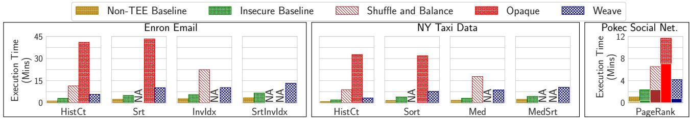

Fig. 5: Execution time across compared systems & workloads (§5.1). Jobs that an approach cannot support are marked NA. For PageRank, the solid bars show the time for the first round, while the hatched bars show the time taken for the subsequent 10 rounds.  
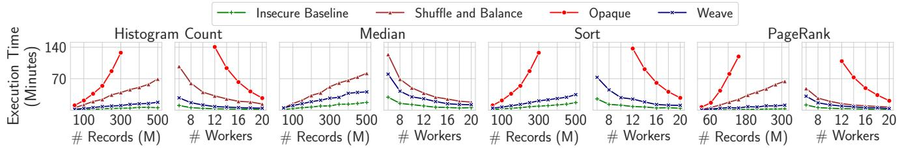  
Fig. 6: Performance scaling with dataset size and worker count (§5.2). Weave and insecure baseline runtime scales linearly with dataset size, while Opaque and Shuffle & Balance runtime scales super-linearly. The runtime for all four systems reduces linearly with worker count.

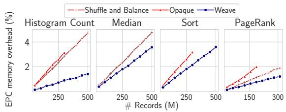  
Fig. 7: EPC memory overhead (§5.2)w for secure shuffling relative to the insecure baseline scales linearly with data size for all schemes.

First, the major contributor to execution overheads across all compared systems for almost all workload-dataset combinations is their shuffle approach. Specifically, Weave sees the lowest overhead since Weave’s random-shuffle, histogram, and balanced-shuffle phases permit a constant factor overhead relative to the insecure baseline’s shuffle phase (1.5–2.7×; not shown in Figure 5). In contrast, Shuffle & Balance’s single round of log-linear Melbourne shuffle incurs 3.9–8.3× overhead to insecure shuffles, while Opaque’s four-round column sort observes an even higher overhead (7.2–20.2×; not shown in Figure 5). For PageRank, while the first round (solid bars) is dominated by the shuffle required for computing the graph’s adjacency matrix, subsequent rounds only require broadcasting without any data shuffle in all systems. Thus, while Weave, Opaque, and Shuffle & Balance are 2.3×,

19.1×, and 9.8× slower than the insecure baseline in the first round, they take the same time for the remaining rounds.

Second, the associative Reduce optimization in Weave permits a 50% reduction in network overheads for associative jobs like HistogramCount. While Opaque employs a similar optimization, the end-to-end execution time remains dominated by its shuffle overheads. We also used mapper-side combiners for the insecure baseline for fairness, although Shuffle & Balance cannot use them since they break obliviousness.

Finally, a balanced distribution of intermediate key-value pairs across reducers in the secure systems, Weave, Opaque and Shuffle & Balance, results in fewer straggling reducers due to a more uniform work distribution across them, compared even to the insecure baseline.

## 5.2 Weave Scalability

We restrict our focus to the NY Taxi and Pokec datasets since they are much larger than the Enron dataset and permit largerscale performance analysis. We omit Sort-variants for InvertedIndex and Median jobs since prior secure systems do not support them. For PageRank, we restrict our focus to one single round of rank aggregation on the Pokec dataset since subsequent rounds do not involve any data shuffle.

Scaling with dataset size (Figure 6). We fix the worker count to 10 and vary the number of records in the datasets, from 50 to 500 million records for NY Taxi data and from 31 to 310 million records for the Pokec graph data. As expected, the execution time for Weave and the insecure baseline scale linearly with dataset size across all jobs, since Weave incurs at most constant factor overhead relative to the baseline. The log-linear scaling for Shuffle & Balance and Opaque is also expected due to their shuffle approaches; Opaque’s overheads are somewhat higher due to the additional shuffle rounds required for column sort, which gets worse at larger dataset sizes due to memory thrashing during column sort in Spark.

Across various jobs, the computationally light Histogram-Count’s scaling primarily depends on the shuffle overheads, resulting in a larger relative performance gap between Weave and compared systems. On the other hand, for the more computationally intense Median and Sort jobs, the gap between Weave and compared systems is smaller since the impact of shuffle is overshadowed by the time spent executing the Map and Reduce tasks. At 300 million records, Opaque and Shuffle & Balance observe execution times 9.3× and 2.7× longer than Weave on average, respectively.

Scaling with worker count (Figure 6). We fix the size of the dataset to 200 million records for the NY Taxi dataset and 310 million records for the Pokec social network graph data and vary the cluster size from 6 to 20 nodes. As expected, all four systems scale similarly to the number of workers, i.e., their execution time is reduced proportionally to the number of workers since each of them can split work and network traffic roughly equally among workers. As we saw for scaling with dataset size, the more computationally intensive jobs (Median, Sort) observe a lower performance gap between Weave and other systems in various worker counts, mainly because the impact of shuffle-based compute and network overheads is dwarfed by the time spent in tasks Map and Reduce. At 20 nodes, Opaque and Shuffle & Balance observe execution times 6.7× and 2.3× longer than Weave, respectively.

EPC memory overhead scaling (Figure 7). Our 10-node cluster hosts a total of 320GB of EPC memory. We see that the normalized EPC memory overhead for Weave, Opaque, and Shuffle & Balance — due to additional data structures that must be stored in EPC for each scheme — scales linearly with the number of records in the dataset. For Weave, despite linear scaling, the EPC overhead remains under 1.4% for HistogramCount and 3.6% for Sort on the NY Taxi dataset containing 500 million records, demonstrating that EPC overhead does not pose a scalability bottleneck for Weave.

## 5.3 Understanding Weave Performance

Weave execution breakdown (Figure 8(a)). The overhead incurred by the random-shuffle phase is purely due to network transfers and is linear in the dataset size. With our sampled histogram optimization, the network and computational overheads of histogram phase are negligible (< 1%). This leaves the balanced-shuffle phase, where the overheads vary by the job’s nature and the dataset size. In particular, the balanced-shuffle phase overheads for non-associative jobs (InvertedIndex, Sort, Median) is much higher (up to 40% of the entire overhead) than for associative queries, where our associative reduce optimization all but eliminates compute overheads, and only incurs a network overhead linear in data size.

Impact of Weave optimizations (Figure 8(b)). We evaluate the impact of Weave optimizations for the InvertedIndex and HistogramCount jobs on the Enron Email dataset, using the same setup as §5.1. For the Enron Email Dataset, a sampling factor of 0.01 in the sampled histogram optimization reduces the communication time for the histogram phase by 220 seconds. As such, it reduces the execution time for InvertedIndex by 18% and HistogramCount by 30%. The associative reduce optimization only applies to HistogramCount, reducing its execution time further by 33% for a total of 63% reduction.

## 5.4 Sensitivity Analysis

Impact of α (Figure 8(c)). The choice of α $\textstyle { \big ( } { \frac { 2 r } { r + 1 } }$ by default) in Weave imposes a limit of $\frac { \alpha { \cdot } \hat { n } } { r }$ on the the maximum key popularity (§3.1). While all of our evaluated real-world datasets exhibit a maximum key popularity of $< 5 \%$ (a small fraction of the threshold set by our default α), we artificially inflate the maximum key popularity in the NY Taxi dataset and evaluate the Median job execution on it to study Weave’s sensitivity to larger α values. We use LocationID as the intermediate key, inflating the most popular key’s popularity while keeping the total dataset size constant.

Figure 8(c) shows that as maximum key popularity (as a % of the entire dataset) increases from 4% to 99% (and consequently, the number of unique keys decreases), Weave’s execution time increases by 7.9×. The two vertical lines are added for reference in the figure. The first line shows the maximum degree of skew (3%) in real-world social network datasets for Twitter follower network [62, 63]. The second line, at maximum key popularity of ∼ 14%, shows the point until which Weave’s default value α (≈ 1.85) does not need to be increased; beyond this, the minimum viable α required to preserve IND-CDJA security increases linearly up to 13. Interestingly, at the point when Weave’s default α needs to be increased, a single reducer ends up processing all intermediate key-value pairs associated with that key — nearly 14% of the entire dataset, and 45% more (real) key-value pairs than any other reducer — an unlikely scenario in real-world settings.

Impact of C (Figure 8(d)). For MR jobs where Map outputs $1 < c < C$ records, Weave (or any other IND-CDJA-secure scheme) must add $C - c \ { } ^ { \ \cdots } { \mathrm { f i l l e r } } ^ { \prime }$ intermediate key-value pairs to the Map output (§2.4), increasing its overhead by a factor by $\frac { C } { c _ { a \nu g } }$ (§2.4). We evaluate this impact on a Word Count job on the Enron Email dataset, where Map breaks down each sentence into multiple constituent words. We vary the required C by filtering out sentences with word counts over C and scaling up the rest of the dataset to the same size while preserving data distribution. Figure 8(d) shows that as C increases from 4 to 48, Weave’s performance overhead relative to the insecure baseline increases from 1.32× to 5.34×. Moreover, an insecure variant of Weave (purple line) that does not insert filler records maintains a consistent 1.32× overhead as C increases.

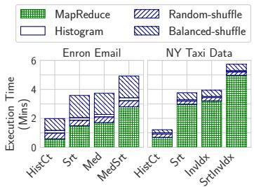  
(a) Weave execution time breakdown

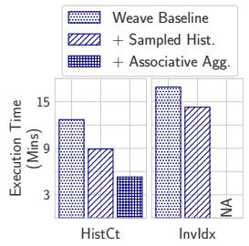  
(b) Weave optimizations

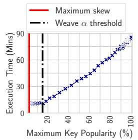  
(c) Sensitivity to α

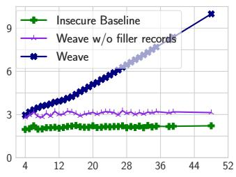  
(# Map output pairs per input record) C (# Map output pairs per input record)  
(d) Sensitivity to C  
Fig. 8: Weave performance and sensitivity analysis (§5.3, §5.4). (a) Random-shuffle phase overhead is linear in dataset size, histogram phase has negligible overheads and balanced-shuffle phase overheads are higher for non-associative jobs. (b) The sampled histogram optimization reduces Weave execution time by 18%–30%; associative reduce optimization reduces it further by 29%. (c) Highly skewed input distributions increase Weave overheads – the red vertical line shows the maximum skew (3%) we observed in real-world social network datasets for Twitter follower network [62, 63]. (d) Increasing C Word Count from 4 to 48 increases Weave runtime by up to 4.1×.

## 6 Discussion and Future Work

## We now discuss areas of future research.

Processing in batches. The complexity of random-shuffle in Weave is O(nˆ), a key factor in Weave’s ability to provide IND-CDJA-security with constant overhead. This, however, requires all of the data generated by the map phases to be randomly shuffled all at once. If the data were instead sent in batches, an adversary with prior knowledge of how the input data is divided across them could identify specific data items sent to a weaver based on the batch they were sent in. This is particularly relevant to applications in streaming analytics [64, 65], where MapReduce jobs are executed on micro-batches of data. This requires adaptation of randomshuffle phase in Weave to ensure security even when applied to a series of such micro-batches. A possible approach to facilitate this is to adapt the dynamic distribution adaptation schemes and security models explored in prior work on oblivious storage [15, 18] to Weave for obliviousness per micro-batch.

Other communication patterns. Our work focuses on shuffle-based all-to-all worker communications in MapReduce analytics. Other analytics frameworks, such as distributed ML training or deep learning, employ different communication patterns, especially in collective operations such as broadcast, all-reduce, gather, all-gather, etc. These communications also suffer from similar access pattern leakages [66,67] and can benefit from noise-injection-based obliviousness for efficiency and privacy.

Other side channels. While our work focuses on oblivious analytics execution by hiding network and memory access patterns, we consider two additional side channels outside our scope. The first is length-based leakage — similar to prior works [11, 12], we assume the key-value pairs in map-reduce communications are all fixed-sized or can be padded to the same fixed size. However, in real-world datasets, key-value pairs can have sizes that vary by several orders of magnitude, and padding can be prohibitively expensive [68]. Second, we do not consider timing-based attacks, where the duration of the computation can reveal information about the nature of the processing and the data to an adversary. While our security model assumes that the adversary already knows the job being executed, securing such timing-based channels becomes even more crucial when the jobs are secret. We leave the exploration of efficient schemes that can prevent leakage via both side channels to future work.

## 7 Conclusion

Weave is an efficient and expressive secure analytics platform that scales to large datasets. Weave applies the principles of noise injection to reduce the network and compute overheads for oblivious analytics to a constant factor. Weave reduces the oblivious execution time for analytics jobs on large real-world datasets by 4–10× compared to the prior state-of-the-art.

## Acknowledgments

The authors thank the OSDI reviewers and our shepherd for their invaluable feedback. We thank Keen You, Seung-seob Lee, Lin Zhong, and Fan Zhang for their inputs at various stages of the project. This work was supported in part by the NSF’s awards 2047220, 2054957, 2112562, 2147946, and a NetApp Faculty Fellowship.

## References

[1] Jeffrey Dean and Sanjay Ghemawat. Mapreduce: Simplified data processing on large clusters. In OSDI, 2004.

[2] Matei Zaharia, Mosharaf Chowdhury, Tathagata Das, Ankur Dave, Justin Ma, Murphy McCauly, Michael J. Franklin, Scott Shenker, and Ion Stoica. Resilient distributed datasets: A Fault-Tolerant abstraction for In-Memory cluster computing. In NSDI, 2012.

[3] Apache Hadoop. https://hadoop.apache.org/.

[4] Paris Carbone, Asterios Katsifodimos, Stephan Ewen, Volker Markl, Seif Haridi, and Kostas Tzoumas. Apache flink™: Stream and batch processing in a single engine. Bulletin of the IEEE Computer Society Technical Committee on Data Engineering, 2015.

[5] Apache Kafka. https://kafka.apache.org/.

[6] Felix Schuster, Manuel Costa, Cédric Fournet, Christos Gkantsidis, Marcus Peinado, Gloria Mainar-Ruiz, and Mark Russinovich. Vc3: Trustworthy data analytics in the cloud using sgx. In 2015 S&P, 2015.

[7] Andrew Baumann, Marcus Peinado, and Galen Hunt. Shielding applications from an untrusted cloud with haven. In OSDI 14, 2014.

[8] Francis X. McKeen, Ilya Alexandrovich, Alex Berenzon, Carlos V. Rozas, Hisham Shafi, Vedvyas Shanbhogue, and Uday R. Savagaonkar. Innovative instructions and software model for isolated execution. In Hardware and Architectural Support for Security and Privacy, 2013.

[9] ARM Ltd. Building a secure system using trustzone technology. https://developer.arm.com/document ation/PRD29-GENC-009492/latest/.

[10] AMD Secure Encrypted Virtualization (SEV). https: //www.amd.com/en/developer/sev.html.

[11] Olga Ohrimenko, Manuel Costa, Cédric Fournet, Christos Gkantsidis, Markulf Kohlweiss, and Divya Sharma. Observing and preventing leakage in mapreduce. In ACM SIGSAC, 2015.

[12] Wenting Zheng, Ankur Dave, Jethro G. Beekman, Raluca Ada Popa, Joseph E. Gonzalez, and Ion Stoica. Opaque: An oblivious and encrypted distributed analytics platform. In NSDI, 2017.

[13] Tom Leighton. Tight bounds on the complexity of parallel sorting. In ACM STOC, 1984.

[14] Olga Ohrimenko, Michael T Goodrich, Roberto Tamassia, and Eli Upfal. The melbourne shuffle: Improving oblivious storage in the cloud. In ICALP, 2014.

[15] Paul Grubbs, Anurag Khandelwal, Marie-Sarah Lacharité, Lloyd Brown, Lucy Li, Rachit Agarwal, and Thomas Ristenpart. Pancake: Frequency smoothing for encrypted data stores. In USENIX Security, 2020.

[16] Charalampos Mavroforakis, Nathan Chenette, Adam O’Neill, George Kollios, and Ran Canetti. Modular order-preserving encryption, revisited. In SIGMOD, 2015.

[17] Marie-Sarah Lacharite and Kenneth G. Paterson. Frequency-smoothing encryption: preventing snapshot attacks on deterministically encrypted data. IACR Transactions on Symmetric Cryptology, 2018.

[18] Midhul Vuppalapati, Kushal Babel, Anurag Khandelwal, and Rachit Agarwal. SHORTSTACK: Distributed, faulttolerant, oblivious data access. In OSDI, 2022.

[19] Sujaya Maiyya, Sharath Chandra Vemula, Divyakant Agrawal, Amr El Abbadi, and Florian Kerschbaum. Waffle: An online oblivious datastore for protecting data access patterns. ACM SIGMOD, 2023.

[20] Sanjay Ghemawat, Howard Gobioff, and Shun-Tak Leung. The google file system. In ACM SOSP, 2003.

[21] Konstantin Shvachko, Hairong Kuang, Sanjay Radia, and Robert Chansler. The hadoop distributed file system. In IEEE MSST, 2010.

[22] Intel. Intel sgx. https://www.intel.com/content/ www/us/en/developer/articles/technical/overvie w-of-an-intel-software-guard-extensions-encla ve-life-cycle.html. Accessed: 2024-08-30.

[23] Microsoft Resach. Azure security baseline for microsoft azure attestation. https://learn.microsoft.com/en -us/security/benchmark/azure/baselines/microso ft-azure-attestation-security-baseline.

[24] Microsoft Research. Preventing side-channels in the cloud. https://www.microsoft.com/en-us/research /blog/preventing-side-channels-in-the-cloud/.

[25] Raluca Ada Popa. Confidential computing or cryptographic computing? tradeoffs between cryptography and hardware enclaves. ACM Queue, 2024.

[26] Mahdi Soleimani, Grace Jia, and Anurag Khandelwal. Weave: Efficient and expressive oblivious analytics at scale. Cryptology ePrint Archive at https://ia.cr/20 25/1040, 2025.

[27] Zhilin Zhang, Ke Wang, Weipeng Lin, Ada Wai-Chee Fu, and Raymond Chi-Wing Wong. Practical access pattern privacy by combining pir and oblivious shuffle. In ACM CIKM, 2019.

[28] Edward G. Coffman, János A. Csirik, Gábor Galambos, Silvano Martello, and Daniele Vigo. Bin packing approximation algorithms: Survey and classification, 2013.

[29] Sarvar Patel, Giuseppe Persiano, and Kevin Yeo. Cacheshuffle: A family of oblivious shuffles. In ICALP, 2018.

[30] Min Xu, Antonis Papadimitriou, Andreas Haeberlen, and Ariel Feldman. Hermetic: Privacy-preserving distributed analytics without (most) side channels. External Links: Link Cited by, 2019.

[31] Pengfei Wu, Qi Li, Jianting Ning, Xinyi Huang, and Wei Wu. Differentially oblivious data analysis with intel sgx: Design, optimization, and evaluation. IEEE TDSC, 19(6), 2021.

[32] Roberta De Viti, Isaac Sheff, Noemi Glaeser, Baltasar Dinis, Rodrigo Rodrigues, Jonathan Katz, Bobby Bhattacharjee, Anwar Hithnawi, Deepak Garg, and Peter Druschel. Covault: A secure analytics platform. arXiv preprint arXiv:2208.03784, 2022.

[33] Scott Constable, Jo Van Bulck, Xiang Cheng, Yuan Xiao, Cedric Xing, Ilya Alexandrovich, Taesoo Kim, Frank Piessens, Mona Vij, and Mark Silberstein. Aexnotify: Thwarting precise single-stepping attacks through interrupt awareness for intel sgx enclaves. In USENIX Security, 2023.

[34] Oleksii Oleksenko, Bohdan Trach, Robert Krahn, Mark Silberstein, and Christof Fetzer. Varys: Protecting sgx enclaves from practical side-channel attacks. In USENIX ATC, 2018.

[35] Raoul Strackx and Frank Piessens. The heisenberg defense: Proactively defending sgx enclaves against page-table-based side-channel attacks. arXiv preprint arXiv:1712.08519, 2017.

[36] Zhou Hongwei, Ke Zhipeng, Zhang Yuchen, Wu Dangyang, and Yuan Jinhui. Tsgx: defeating sgx side channel attack with support of tpm. In ACCTCS, 2021.

[37] Shaizeen Aga and Satish Narayanasamy. Invisipage: oblivious demand paging for secure enclaves. In ISCA, 2019.

[38] Herman Chernoff. A measure of asymptotic efficiency for tests of a hypothesis based on the sum of observations. The Annals of Mathematical Statistics, 1952.

[39] Michael Mitzenmacher and Eli Upfal. Probability and computing: Randomization and probabilistic techniques in algorithms and data analysis. Cambridge university press, 2017.

[40] Intel. Graphene repository. https://github.com/gra phql-python/graphene.git. Accessed: 2024-10-20.

[41] Intel. Gramine repository. https://github.com/gra mineproject/gramine.git. Accessed: 2024-10-21.

[42] Chia-Che Tsai, Donald E Porter, and Mona Vij. Graphene-sgx: A practical library {OS} for unmodified applications on sgx. In USENIX ATC 17, 2017.

[43] Alexander Nilsson, Pegah Nikbakht Bideh, and Joakim Brorsson. A survey of published attacks on intel sgx. arXiv preprint arXiv:2006.13598, 2020.

[44] Jo Van Bulck, Nico Weichbrodt, Rüdiger Kapitza, Frank Piessens, and Raoul Strackx. Telling your secrets without page faults: Stealthy page {Table-Based} attacks on enclaved execution. In USENIX Security, 2017.

[45] Johannes Götzfried, Moritz Eckert, Sebastian Schinzel, and Tilo Müller. Cache attacks on intel sgx. In EuroSec, 2017.

[46] Stephan Van Schaik, Andrew Kwong, Daniel Genkin, and Yuval Yarom. Sgaxe: How sgx fails in practice, 2020.

[47] Fan Lang, Wei Wang, Lingjia Meng, Jingqiang Lin, Qiongxiao Wang, and Linli Lu. Mole: Mitigation of side-channel attacks against sgx via dynamic data location escape. In ACSAC, 2022.

[48] Qian Ren, Han Liu, Yue Li, and Hong Lei. Cloak: A framework for development of confidential blockchain smart contracts. In ICDCS, 2021.

[49] Ferdinand Brasser, Srdjan Capkun, Alexandra Dmitrienko, Tommaso Frassetto, Kari Kostiainen, and Ahmad-Reza Sadeghi. Dr. sgx: Automated and adjustable side-channel protection for sgx using data location randomization. In ACSAC, 2019.

[50] Victor Costan, Ilia Lebedev, and Srinivas Devadas. Sanctum: Minimal hardware extensions for strong software isolation. In USENIX Security, 2016.

[51] Hyunyoung Oh, Adil Ahmad, Seonghyun Park, Byoungyoung Lee, and Yunheung Paek. Trustore: Sidechannel resistant storage for sgx using intel hybrid cpufpga. In ACM CCS, 2020.

[52] Dayeol Lee, David Kohlbrenner, Shweta Shinde, Krste Asanovic, and Dawn Song. Keystone: An open frame- ´ work for architecting trusted execution environments. In EuroSys, 2020.

[53] Yongzhi Wang, Xiaoyu Zhang, Yao Wu, and Yulong Shen. Enhancing leakage prevention for mapreduce. IEEE TIFS, 2022.

[54] CMU. Enron email dataset. https://www.cs.cmu.edu /\~./enron/, Accessed: 2023.

[55] Tarannum Zaki, Md Sami Uddin, Md Mahedi Hasan, and Muhammad Nazrul Islam. Security threats for big data: A study on enron e-mail dataset. In ICRIIS, 2017.

[56] Fang Liu, Xiaokui Shu, Danfeng Yao, and Ali R Butt. Privacy-preserving scanning of big content for sensitive data exposure with mapreduce. In ACM CODASPY, 2015.

[57] Fang Liu, Xiaokui Shu, Danfeng Yao, and Ali R Butt. Privacy-preserving scanning of big content for sensitive data exposure with mapreduce. In ACM CODASPY, 2015.

[58] Kehuan Zhang, Xiaoyong Zhou, Yangyi Chen, XiaoFeng Wang, and Yaoping Ruan. Sedic: privacy-aware data intensive computing on hybrid clouds. In ACM CCS, 2011.

[59] New York City Taxi and Limousine Commission. Tlc trip record data. https://www.nyc.gov/site/tlc/abo ut/tlc-trip-record-data.page. Accessed: 2024-12.

[60] SNAP: Network Datasets: Pokec social network. https: //snap.stanford.edu/data/soc-Pokec.html.

[61] Faraz Ahmad, Seyong Lee, Mithuna Thottethodi, and TN Vijaykumar. Puma: Purdue mapreduce benchmarks suite, 2012.

[62] Wikepedia entry for ml datasets. https://en.wikiped ia.org/wiki/List\_of\_datasets\_for\_machine-learn ing\_research?utm\_source=chatgpt.com.

[63] Wissam Khaouid, Marina Barsky, Venkatesh Srinivasan, and Alex Thomo. K-core decomposition of large networks on a single pc. VLDB, 9(1), 2015.

[64] Matei Zaharia, Tathagata Das, Haoyuan Li, Timothy Hunter, Scott Shenker, and Ion Stoica. Discretized streams: Fault-tolerant streaming computation at scale. In ACM SOSP, 2013.

[65] Michael Armbrust, Tathagata Das, Joseph Torres, Burak Yavuz, Shixiong Zhu, Reynold Xin, Ali Ghodsi, Ion Stoica, and Matei Zaharia. Structured streaming: A declarative api for real-time applications in apache spark. In International Conference on Management of Data, 2018.

[66] Briland Hitaj, Giuseppe Ateniese, and Fernando Perez-Cruz. Deep models under the gan: information leakage from collaborative deep learning. In ACM CCA, 2017.

[67] Hanieh Hashemi, Wenjie Xiong, Liu Ke, Kiwan Maeng, Murali Annavaram, G Edward Suh, and Hsien-Hsin S Lee. Private data leakage via exploiting access patterns of sparse features in deep learning-based recommendation systems. In Workshop on Trustworthy and Socially Responsible Machine Learning, NeurIPS, 2022.

[68] Grace Jia, Rachit Agarwal, and Anurag Khandelwal. Length leakage in oblivious data access mechanisms. In USENIX Security, 2024.