USENIX

THE ADVANCED COMPUTING SYSTEMS ASSOCIATION

# Scalio: Scaling up DPU-based JBOF Key-value Store with NVMe-oF Target Offload

Xun Sun, Mingxing Zhang, Yingdi Shan, Kang Chen, and Jinlei Jiang, Tsinghua University; Yongwei Wu, Tsinghua University, Quan Cheng Laboratory

https://www.usenix.org/conference/osdi25/presentation/sun

# This paper is included in the Proceedings of the 19th USENIX Symposium on Operating Systems Design and Implementation.

July 7–9, 2025 • Boston, MA, USA

ISBN 978-1-939133-47-2

Open access to the Proceedings of the 19th USENIX Symposium on Operating Systems Design and Implementation is sponsored by

# Scalio: Scaling up DPU-based JBOF Key-value Store with NVMe-oF Target Offload

Xun Sun\*1, Mingxing Zhang\*1,2, Yingdi Shan\*, Kang Chen\*, Jinlei Jiang\*, Yongwei Wu\*†2 \*Tsinghua University, †Quan Cheng Laboratory

## Abstract

The rapid growth of data-intensive applications has created a demand for high-density storage systems. Data-Processing-Unit-based (DPU-based) Just a Bunch of Flash (JBOF) solutions provide an energy-efficient and cost-effective architecture to meet this need. However, existing JBOF solutions struggle with scalability when handling an increasing number of attached SSDs, due to their heavy reliance on the DPU’s CPU for SSD I/O operations.

In this paper, we introduce Scalio, a scalable disaggregated key-value store designed to address the limitations of current DPU-based JBOF systems. Scalio offloads as many SSD I/O operations as possible to the DPU’s network I/O capabilities, including traditional RDMA verbs and a recent hardware optimization, NVMe over Fabrics Target Offload. Additionally, Scalio incorporates a two-layer design with compact in-memory data structures to handle hot read traffic and manage bursty writes. One of the key challenges in this design is ensuring consistency between the DRAM states in the DPU and the SSD states, which, unlike CPU L1/L2 caches, are not automatically synchronized through hardware cache coherence protocols. To address this, Scalio introduces an RDMAbased cache consistency protocol that guarantees linearizability across the system, despite the disaggregated nature of the architecture.

Our experiments show that Scalio significantly improves both scalability and throughput, achieving up to 3.3× higher throughput compared to existing systems, especially in highdensity SSD configurations.

## 1 Introduction

## 1.1 Motivation

The demand for high-density storage solutions has rapidly increased with the growth of data-intensive applications [8, 21, 27, 30, 36]. To address this need, Data-Processing-Unitbased (DPU-based) Just a Bunch of Flash (JBOF) storage systems (Figure 1) have emerged as cost-effective and energyefficient solutions, drawing significant attention from both academia [12, 13, 15, 16, 23, 24, 35, 55, 56, 62] and industry [6, 33, 34, 38, 39, 42, 43]. As they are designed specifically for network and storage acceleration, DPUs typically consume far less power and cost compared to traditional storage servers [4, 5, 48]. For instance, even high-end DPUs like NVIDIA’s BlueField-3 use only 75–150 watts [44], significantly less than a typical Xeon CPU, which consumes 300–500 watts [19].

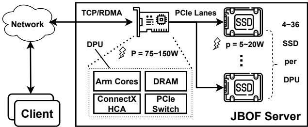  
Figure 1: DPU-based JBOF systems’ architecture [6, 33].

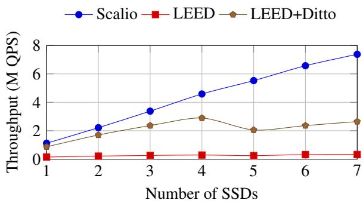  
Figure 2: The throughput of Scalio with different number of SSDs attached to each DPU under YCSB [11] workload C. Scalio is compared to: 1) SOTA JBOF SSD key-value store LEED [16]; and 2) LEED combined with SOTA disaggregated DRAM key-value store Ditto [52] as its in-memory cache.

To maximize these benefits, increasing storage density by connecting more SSDs per DPU is a promising strategy. Theoretically, if each SSD offers a throughput of t and consumes power p (typically 5–20W [47, 63]), and the control plane (mainly the DPU) consumes power P, then with n SSDs, the throughput per watt is $\frac { n t } { P + n p }$ . Since P is typically more than ten times larger than p, the potential maximum throughput per watt increases sharply as the number of SSDs per DPU grows. This vision is further reinforced by the recent emergence of

DPU-based JBOF servers from vendors like SuperMicro [33] (a 36-SSD JBOF) and AIC [1, 51] (a 26-SSD JBOF), indicating an urgent need for optimizations targeting scenario of high-density storage with energy-efficient cores.

However, current software stacks struggle to scale up effectively with higher SSD counts in JBOF systems. This issue is particularly evident in small key-value workloads, which are common in latency- and throughput-critical applications like social networks and e-commerce. Serving these scenarios with high-density JBOF platforms should ideally saturate the aggregated IOPS of the large bunch of SSDs, providing high throughput with low latency while being costand energy-efficient. Yet, as shown in Figure 2, the throughput of existing disaggregated JBOF key-value store systems like LEED [16] plateaus when more than four SSDs are connected per DPU, highlighting the need for optimization of small key-value workloads to fully exploit the storage potential of JBOF systems. Moreover, this focus aligns with the increasing demand for low-latency, small operations in cloud-native applications, which dominate modern distributed storage needs [3, 9, 11, 32, 53, 59]. By optimizing for small key-value workloads, Scalio not only enhances performance but also improves scalability in high-density, energy-efficient storage systems.

## 1.2 Our Contributions

Our analysis attributes the above scale-up limitation of JBOF key-value stores to its heavy reliance on the DPU’s CPU for SSD I/O operations, which derives from the micro-benchmark results in § 2.1. While the small ARM cores in DPUs offer energy efficiency, they lack the processing power to handle the combined IOPS of multiple SSDs, making the DPU’s CPU a critical bottleneck in high-density configurations [12, 25].

Interestingly, unlike the constrained CPU resources, we observe that network resources are largely underutilized in these IOPS-bound scenarios. Across all our experimental settings, less than 1% of the maximum network IOPS is utilized, which exists because there is a three-order-ofmagnitude gap between the performance of SSD I/O operations and the DPU’s RDMA read/write capabilities [18, 45].

Based on this observation, we aim to offload as many SSD I/O operations as possible to the network. We leverage a technique called NVMe over Fabrics (NVMe-oF) Target Offload, which implements the NVMe-oF standard directly on the server-side DPU’s Host Channel Adapter (HCA) [14, 28, 58]. With this approach, clients can send NVMe commands directly to server-side SSDs over network, utilizing the network IOPS resources without burdening the DPU’s CPU. The DPU’s HCA processes all regular I/O requests using hardware logic, communicating directly with NVMe PCI devices via peer-to-peer PCI communications [40, 41]. As illustrated in Figure 3, this setup effectively bypasses the DPU’s CPU. More details will be provided in §2.2.

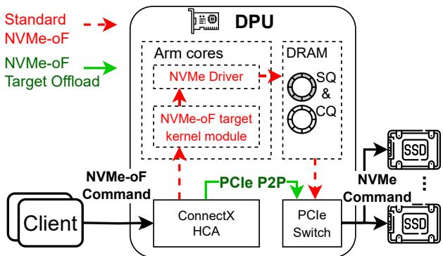  
Figure 3: The data flow of the standard NVMe-oF and NVMeoF Target Offload technology.

Moreover, our further experiments reveal that even when all SSD read operations are offloaded via NVMe-oF target offload, the DPU’s CPU can still become a bottleneck in writeintensive workloads. This is primarily because CPU resources are heavily consumed by in-memory concurrency control mechanisms and handling random SSD writes. To overcome this challenge, we develop a two-layer design that employs succinct data structures residing in the DPU’s DRAM. This design absorbs recent hot reads through offloaded RDMA reads and manages bursty writes via buffered group commits (§4.2). The in-memory data structure is shared between the DPU’s CPU and clients’ remote RDMA operations, allowing part of its maintenance overhead to be offloaded to clients.

However, while RDMA and NVMe-oF target offload reduce CPU burden by bypassing it, they introduce new consistency challenges. In a disaggregated architecture, clients operate independently without direct interconnection or synchronization. When read/write logic is partially or fully offloaded to clients’ remote operations, concurrent accesses from multiple clients can corrupt data if there are no proper mechanisms to control access to shared resources.

The crux of the problem is that, unlike L1/L2 caches in CPUs, which are automatically maintained via hardware cache coherence protocols [20], the DRAM states (e.g., indexes and caches for hot key-value pairs) residing in the DPU are not automatically consistent with the SSD states. With NVMe-oF target offload, clients read data directly from the SSD, bypassing the DPU’s CPU and DRAM. This necessitates explicit cache invalidation mechanisms initiated by remote clients. Without proper handling, this can lead to cache consistency issues that violate linearizability guarantees [46]. In § 5, we delve deeper into this problem and introduce our RDMA-driven cache consistency protocol.

This protocol effectively manages the flushing of buffered data and cache invalidations to maintain consistency and ensure linearizability. It also carefully partitions the roles between clients’ offloaded operations and the DPU’s serverside operations, allowing us to reduce the excessive use of heavy RDMA Compare-and-Swap (CAS) operations for synchronization. This is crucial for performance as studies [7,10,22,31,57,61] have shown that the maximum IOPS of RDMA CAS is ten times less than that of RDMA read/write.

In this paper, we propose Scalio, the first disaggregated key-value store leveraging NVMe-oF target offload to achieve scalability in the DPU-based JBOF architecture. We evaluated Scalio against two baseline systems—LEED [16] and LEED with Ditto [52] as the in-memory cache—using YCSB [11] workloads A, B, C, D, and F. Through experiments varying the number of SSDs from 1 to 7, we demonstrated Scalio’s scalability and verified its performance improvements. These improvements are a result of several key mechanisms: inmemory caching, offloaded reads, and batched writes, which reduce CPU usage and optimize SSD IOPS utilization. Sensitivity analysis further confirmed that Scalio’s performance is robust to changes in key parameters. Our experiments show that Scalio achieves a 1.8× to 3.3× speedup over LEED with Ditto, and 2.5× to 17× over LEED, highlighting the solid performance improvements of Scalio.

## 2 Background and Motivation

## 2.1 JBOF based Key-value Store

DPU-based Just a Bunch of Flash (JBOF) architectures represent a promising evolution in storage systems, offering significant advantages in energy efficiency compared to traditional CPU-based storage servers [12, 16, 35, 55, 62]. Typically, a JBOF system combines multiple NVMe SSDs with one or two Data Processing Unit (DPU) into a compact 1U/2U highdensity chassis [6, 33]. Rather than relying on the generalpurpose CPUs and NICs of conventional systems, The DPU consolidates networking, data acceleration, and storage processing into a single, specialized ASIC (Application-Specific Integrated Circuit), providing both high performance and reduced energy consumption [5].

The energy efficiency and high-density storage capabilities of JBOF architecture make it an ideal platform for key-value storage systems, especially in environments requiring high performance and energy savings [27, 62]. As an illustration, LEED [16] is a key-value store specialized for the JBOF platform. It uses a log-based data structure on the SSDs for reducing random I/O and a small, hash-based index structure in memory for indexing. According to its experiements with one 8-core Broadcom Stingray PS1100R SmartNIC [5] and four Samsung DCT983 SSDs [50], LEED achieves near-full saturation of the SSD I/O capabilities.

However, we observed that CPU resourses remain a primary bottleneck in LEED. It allocates one core for controlplane tasks, three cores for RDMA requests, and four cores (i.e., one dedicated core for every SSD) to handle SSD I/O operations, which inherently limits the scalability of LEED.

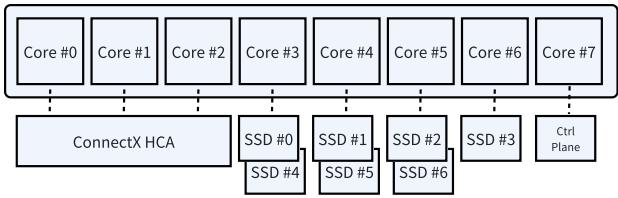

Figure 4: CPU allocation of the testbed.  
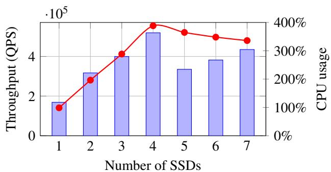  
Throughput CPU usage for SSD I/O  
Figure 5: LEED’s throughput and CPU usage for handling SSD I/O operations as the number of SSDs scale up.

In order to evaluate the system as the number of SSDs increases, we augment the SSD binding strategy by allocating the SSDs to the CPU cores in a round-robin approach, as in Figure 4. We vary the number of SSDs from 1 to 7, and plot the system throughput along with the CPU usage in handling SSD I/Os in YCSB C workload that exhibits a uniform request distribution, as in Figure 5.

As can be seen from the experiment result, the system throughput reaches a maximum when using 4 SSDs, whereas the CPU usage also approaches the limit (400% for handling SSD I/O in LEED’s configuration)1. As the number of SSDs increases, the CPU usage gets saturated, causing the throughput unable to scale up.

Interestingly, we also measured LEED’s network I/O utilization, and the results show that LEED’s network I/O utilization remains less than 1%. In our tests, LEED achieved no more than 600K IOPS over the network, while the Mellanox ConnectX-6 Host Channel Adapter it uses is capable of handling up to 200M IOPS [45]. This underutilization of network I/O capabilities offers an opportunity for achieving better performance in a high-density setup, by offloading calculation from the DPU’s CPU to the HCA and releasing burden on the DPU’s CPU.

## 2.2 NVMe over Fabrics Target Offload

NVMe over Fabrics (NVMe-oF) [12, 17, 37] extends the Non-Volatile Memory Express (NVMe) standard, which was originally designed for fast storage access over PCIe, to networked environments. It enables high-speed data transfer between host and remote NVMe devices across data center networks.

In standard CPU-based NVMe-oF implementations, the host system encapsulates NVMe commands into NVMe-oF requests and sends them over the network to the target storage device. The target server’s CPU handles these requests through a kernel module or a userspace target process (typically implemented via SPDK [60]). These modules transform the incoming requests into block I/O structures, issues operations to the NVMe device, and replies to the client. Processing these I/O requests consumes significant CPU cycles on the target, especially when the IOPS is high.

With the increasing adoption of NVMe-oF in data centers, modern DPUs have introduced a specialized hardware optimization called NVMe-oF Target Offload [14, 28, 58]. As illustrated in Figure 3, this implementation delegates the handling of NVMe operations and SSD commands entirely to the Host Channel Adapter (HCA) hardware via PCIe P2P commands. By offloading these tasks, the CPU usage on the target side is minimized. This allows the system to scale more effectively, handling higher IOPS with lower latency without being limited by the CPU’s processing power.

To demonstrate the benefits of NVMe-oF target offload, we conducted performance measurements comparing standard NVMe-oF and NVMe-oF target offload implementations. Using fio we measured the maximum read IOPS of both implementations as the number of SSDs increased. The results are presented in Figure 6.

Our experiments show that NVMe-oF target offload achieves similar IOPS performance to standard NVMe-oF implementations. In addition, NVMe-oF target offload offers great CPU savings. Compared with the standard NVMeoF implementation that consumes 562% target CPU, the target offload implementation consumes 0 target CPU resource. Therefore, NVMe-oF target offload offers significant advantages for implementing scalable disaggregated storage systems. However, adopting NVMe-oF target offload requires careful coordination between the host and target to maintain data consistency and ensure efficient communication.

## 3 Overview

In our analysis of existing DPU-based JBOF disaggregated key-value stores, we identified excessive CPU consumption on the DPU as a key scalability limitation. To overcome this challenge, we redesigned the in-memory data structures and optimized the read and write workflows. Our approach aims to offload as many I/O operations as possible to clients through one-sided RDMA/NVMe-oF network operations while ensuring linearizability and consistency are maintained. Figure 7 compares the workflow of the current state-of-the-art system LEED with the workflow of our proposed solution.

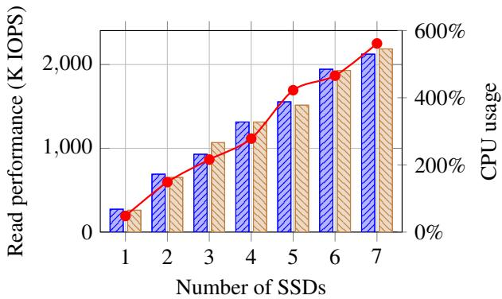  
Standard NVMe-oF NVMe-oF target offload. CPU usage for standard NVMe-oF  
Figure 6: The read IOPS performance of the standard NVMeoF implementation and the NVMe-oF target offload implementation under fio tests, along with the CPU usage of the standard NVMe-oF implementation as the number of SSDs scale up. The CPU usage of the NVMe-oF target offload implementation is zero.

## 3.1 Read Workflow

Existing systems, like LEED, rely on two-sided RDMA-based RPC calls for both read and write operations. In these systems, the DPU handles all queries and updates to the in-memory index along with data reads and writes from the SSD, resulting in high CPU usage on the DPU.

In contrast, Scalio, as shown in Figure 7 (b), introduce a multi-layer in-memory structure that integrates the SSD index with an in-memory cache. This allows direct RDMAbased queries and updates. When a client requests a key, the operation proceeds in two phases:

1. In-Memory Query Phase (Steps 1-3): The client uses RDMA read operations to fetch the hash block matching the hash value of the queried key. Each hash block contains multiple slots to hold several key-value pairs and a linear search is performed by the client to find the desired key. If the key is found in the block (cache hit), the value is returned immediately. Otherwise, a victim slot will be determined based on the oldest last\_ts (modified in the background by clients finishing cache operations), and the client will evict the outdated data and lock the slot with an RDMA CAS operation on the complete field. Validation with a double-read is required during the process of locking in order to ensure atomicity, which will be further explained in § 5.2.

2. SSD Access and Cache Update Phase (Steps 4-5): If the key is not found in the cache (cache miss), the in-memory structure provides the SSD location with the next\_offset field. The client then performs a one-sided NVMe-oF target offload operation to read the data from the SSD. After retrieving the data, the same client updates the victim slot with RDMA write operations and frees the lock.

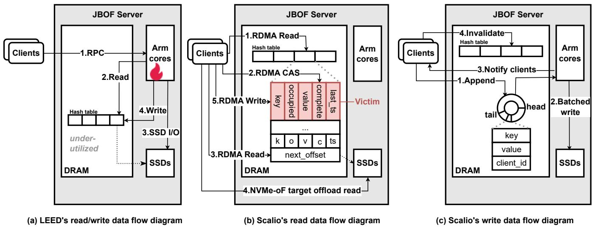  
Figure 7: The workflows comparision between LEED’s and Scalio.

All of these operations fully utilize the network I/O capabilities with one-sided network primitives and hence bypass the DPU’s CPU. To implement this workflow both efficiently and correctly, we face two main challenges that will be addressed in subsequent sections. First, we observe that RDMA network bandwidth remains under-utilized, particularly with small keyvalue pair workloads. To optimize this, we configure the capacity of each hash block to a larger value, accommodating more key-value pairs with the same key hash without compromising the network IOPS. Second, to handle concurrent updates to the in-memory structure by multiple clients and the DPU’s CPU, we introduce two additional flags (occupied and complete) for each in-memory item and a cache consistency protocol to maintain linearizability (discussed in §5).

## 3.2 Write Workflow

Unlike the read workflow, which is entirely one-sided, the write workflow of Scalio involves both RDMA operations and processing by the DPU’s CPU. In the original LEED implementation, each write involves two SSD write operations performed by the DPU’s CPU, creating a bottleneck in writeheavy workloads. To address this, we implement a server-side batching method that enables group commits, reducing the number of SSD writes. The process involves:

1. Appending Request Data (Step 1): Clients append their write requests to an in-memory ring buffer on the DPU using RDMA operations.

2. Batched Writing (Step 2): The DPU’s CPU continuously polls the ring buffer, flushes the write requests to the SSDs in batches and updates the next\_offset field.

3. Client Notification (Step 3): After the updates are written to the SSDs and the new offsets are updated in-memory, the DPU’s CPU notifies the clients of the successful write.

4. Cache Invalidation (Step 4): Clients invalidate outdated cache entries using RDMA write operations.

During the buffering period, the client’s write operation is held until the DPU’s CPU processes the batch, updates the next\_offset and sends a notification. The write is considered committed when the corresponding next\_offset field is updated and any oudated item is invalidated from the cache. More details are provided in §4.2.

By incorporating these optimizations, we reduce the CPU load on the DPU and enable the system to scale effectively as the number of SSDs increases. Our approach addresses the scalability bottlenecks of current systems, fully leveraging the capabilities of DPU-based JBOF architectures.

## 4 Scalio Implementation

In this section, we present the implementation details of Scalio, focusing on its mechanisms for efficient query and update operations. Scalio’s design centers around two key aspects: (1) an in-memory index shared between the DPU and clients, which serves as cache and provides a consistent and synchronized view of system data; and (2) a batched write mechanism, leveraging group commits to improve write throughput while handling bursty workloads.

## 4.1 Index Structure

The index structure of Scalio includes an RDMA-accessible hash table for caching frequently accessed key-value pairs.

This design minimizes the need for DPU’s CPU involvement by enabling clients to interact directly with the cache.

The hash table hashes keys to consecutively addressed blocks, each containing multiple slots for storing key-value pairs, as shown in Figure 7 (b). Given Scalio’s focus on small key-value pairs, both the key and value are stored inline within each slot. Our prior observations suggest that network I/O capabilities have significant headroom for further utilization, allowing us to increase block size without saturating the network. Based on sensitivity analysis in § 6.5, we found that block sizes up to 1KB can be used without overloading the network bandwidth. This size is sufficient to cache small key-value pairs, with each block holding up to 10 key-value pairs of 100 bytes each, or more for smaller pairs. This design enables clients to fetch an entire block in a single round trip, reducing query latency for frequently accessed items by allowing quick access to the desired data.

Apart from the key and value, each slot in the hash table contains three additional fields: occupied, complete, and last\_ts. The first two fields serve as flags to indicate the cache consistency state of the slot, as discussed in § 5. The last\_ts field records the timestamp of the most recent access to the k-v pair, and victim slots are determined by the oldest last\_ts.

When a client accesses a key-value pair, it updates the corresponding last\_ts field via an RDMA write operation in the background. The use of timestamps for LRU eviction in disaggregated memory systems has been evaluated in previous works [52] and is shown to offer sufficient performance.

Each block in the hash table contains an offset to the SSD index, which points to the corresponding hash-based index region in the SSD that indexes key-value pairs with the same hash. The implementation of such data structure in the SSD has been thoroughly discussed in prior works such as LEED [16]. When a client fails to find the desired key in the cache, it will use the offset to initiate NVMe-oF target offload operations, retrieving the data directly from the SSD.

## 4.2 Batched Write Mechanism

The batched write mechanism in Scalio consists of three main components: (1) a ring buffer for temporarily storing keyvalue updates with client IDs, (2) a batched write process for efficiently flushing updates to SSDs, and (3) a group commit mechanism to ensure the atomicity of batched operations.

The JBOF server handles incoming updates submitted by clients via RDMA send operations and appends these updates to the ring buffer, as shown in Figure 7 (c). It then polls it in a batched manner, accumulating updates for bulk flushing to SSDs. After writing to the SSDs, the server updates the corresponding next\_offset field and then notifies clients of completion using their recorded client IDs. This batched write mechanism improves throughput by absorbing bursty write requests and reducing the DPU’s CPU load through fewer SSD I/O operations.

A group commit process is triggered when the JBOF server accumulates a batch. The DPU flushes the batch to SSDs in a single deterministic operation (as long as the batch size is smaller than the SSD block granularity, such as 4KB). Afterward, the DPU updates the next\_offset field in the in-memory data structures with the new SSD offsets, reflecting the locations of the written data. The group commit is completed when the DPU notifies all relevant clients that their updates have been successfully written. Scalio only acknowledges the write operations to the client when the update is successfully logged onto the SSDs, so that consistency is guaranteed in the event of server crashing.

While these mechanisms improve throughput and reduce the DPU’s CPU load, determining the precise linearization point of write operations remains a challenge. Specifically, maintaining consistency between cached data and the underlying SSD storage is crucial, especially in a disaggregated system where client-server interactions may occur asynchronously. This challenge will be addressed in § 5, where we explain how Scalio ensures correctness while optimizing performance through its cache consistency protocol.

## 5 Cache Consistency Protocol

In a disaggregated architecture, certain operations are offloaded to clients, allowing them to bypass the JBOF server and directly interact with the underlying storage. This design improves performance by reducing the DPU’s workload but also creates a critical challenge: ensuring that the cached data in the in-memory data structures remains consistent with the actual data stored on the SSDs. Naive cache consistency protocols fail to ensure linearizability in the disaggregated architecture, which will be explained in § 5.1. Therefore, maintaining cache consistency becomes a key requirement for ensuring correctness in the system [46].

In this section, we will first define the problem in maintaining cache consistency within such a disaggregated system. We will then present our cache consistency protocol, designed to address these challenges, and demonstrate its correctness to ensure that the cached data remains consistent and up-to-date with the storage layer.

## 5.1 Problem Definition

To illustrate the problem with cache consistency, consider the time series diagrams shown in Figure 8, which illustrate how naive cache consistency protocols can violate the linearization guarantee.

Initially, the SSD holds the data x = 42, while the cache does not contain any record of x. Client 1 issues a read request for x, and since there is no cache hit, it fetches the data from the SSD and stores it in the cache. Meanwhile, Client 2 issues a write operation, updating the value of x to 43. Regarding write operations, two typical cache consistency protocols exist, depending on the sequence of updating cache and the SSD storage: (1) writing to cache first and then updating the SSD; (2) writing to SSD first and then invalidating the cache item.

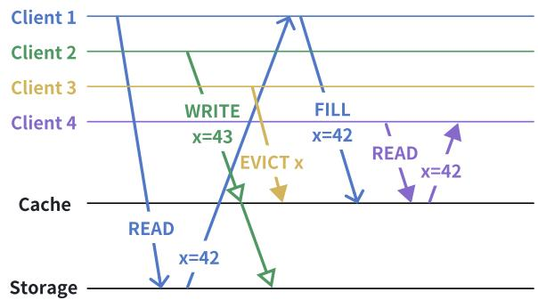  
(a) The write-to-cache-first protocol violates linearizability.

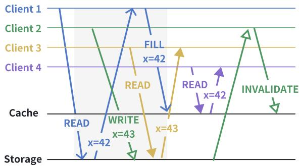  
(b) The write-to-SSD-first protocol violates linearizability.  
Figure 8: The time series diagrams that demonstrate the naive cache protocols’ violating the linearization guarantee.

(1) The write-to-cache-first protocol may violate the linearizability guarantee, as illustrated in Figure 8 (a). Under this protocol, Client 2 will first update x = 43 to the cache. However, Client 1’s later filling of x = 42 will overwrite the update, causing data loss.

Worse, suppose another Client 3 issues an eviction of x during the time difference, Client 1 will have no clue of Client 2’s updating the cache item, remain unaware of the conflict, thus leading to data loss. As a consequence, when Client 4 finally reads x, it will get the previous value 42 rather than the latest value 43. The write-to-cache-first protocol cannot hold the linearizability guarantee.

(2) The write-to-SSD-first protocol also risks inconsistency in the event of cache refilling, as illustrated in Figure 8 (b). Under this protocol, Client 2 will first apply the update x = 43 to the SSD and later invalidate x from the cache. However, Client 3 performs a read operation for x after Client 2 updating the SSD but before Client 1 refilling the cache. At this point, Client 3 first accesses the cache, but since x is not present, it queries the SSD and retrieves the value x = 43 that was written by Client 2. This is then returned as the query result.

Then, suppose another Client 4 issues a read request for x after Client 1 has completed its operations. It reads from the cache and receives the value x = 42, which was cached earlier by Client 1. As we can see, this outcome violates the linearizability guarantee, as different clients observing the same key x at different times see inconsistent values.

The problem lies in the window of time during which the cached data has not been updated with the new value, while the SSD has already been updated with the new data. During this period, any client that attempts to query the cache may end up in an inconsistent state, leading to conflicting results. Specifically, the cache may not reflect the most recent updates on the SSD, causing clients to read stale data from the cache or the SSD, depending on the timing of their requests.

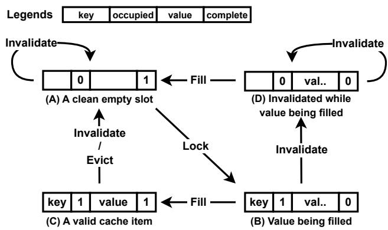  
Figure 9: The states and transitions of Scalio’s cache consistency protocol.

## 5.2 Protocol Design

To address the cache consistency issue, we propose a cache consistency protocol for Scalio. The core of this protocol is based on two flags — occupied and complete — which are added to each slot in the in-memory data structure, as shown in Figure 7 (b). The occupied flag indicates whether the slot contains a valid key, while the complete flag indicates whether the value in the slot is fully written.

These two flags result in four distinct states, as illustrated in Figure 9. Each state represents a specific condition of the cache slot:

State A: A slot is empty and safe to be reused when occupied is false and complete is true. In this state, the slot is not holding any valid data and can be safely reclaimed by other operations for filling new data.

State B: A slot is in the process of being filled. This indicates that the data in the cache is not yet fully valid and may lag behind the data in the SSD storage. If another client tries to access the same key while the slot is in State B, it must wait and retry, as the cache is not yet in a consistent state.

State C: A slot is valid and complete when both flags are true.

This state indicates that the key-value pair is fully written and consistent with the data in the SSD.

State D: A slot enters State D when the cache entry is invalidated by an update while the slot is still in State B. In this state, both flags are set to false, signifying that the slot is in an inconsistent state. Any other reader that attempts to query the item will treat the item as a miss, and any other write will be blocked until the client issuing the cache filling has completed writing the value (transiting to State A), thus avoiding potential collisions or torn reads/writes.

This state-based design is the foundation of our cache consistency protocol, ensuring that the data in the cache remains consistent with the SSD storage. The protocol’s operation is integrated into the system workflow, and the detailed sequence of steps is outlined in the following paragraphs.

Read workflow. When a client initiates a read request, it starts by performing an RDMA read of the hash block (Step 1 in Figure 7 (b)). The client first searches for a slot containing the matching key. If the key is found in State C, the corresponding item is returned. If the key is in State B, the client will wait and retry later, as the cached item is not yet valid. If no match is found, a cache miss occurs, and the client proceeds with the following steps.

The client continues by selecting a victim slot according to the client-centric LRU eviction policy (§ 4.1). It issues an RDMA CAS operation to update the complete flag to 0 (Step 2 in Figure 7 (b)) and attempts to lock the slot. If the CAS operation succeeds, the client writes the key to the slot and sets the occupied flag to 1, transitioning the slot to State B.

Since clients perform cache-related operations independently, chances are that two clients may happen to choose two different slots as victim slots. To ensure atomicity and avoid key collisions, the client performs a double-read (Step 3 in Figure 7 (b)). A second RDMA read checks if any other slot in the hash block contains the same key and has the occupied flag set to 1. If a collision is detected, the client resets the slot’s flags (occupied = 0, complete = 1) and reverts to Step 1, ensuring only one client is filling with the same key. If no collision occurs, the lock process is successfully completed, and the client proceeds to retrieve the offset of the SSD index from the block, moving on to Step 4.

After completing Step 4 and obtaining the data from the SSD, the client fills the value into the selected slot and updates the complete flag to 1 via RDMA write, transitioning the slot to State C.

To handle client failures, Scalio can opt in a lease mechanism that bounds how long a client may hold or update a cache slot. Each key-value slot maintains an additional timeout\_timestamp alongside its state flags, representing the latest time the client’s lease remains valid. When a client acquires a slot (entering State B), it writes the current timestamp plus a lease duration into timeout\_timestamp. If that timestamp is exceeded—indicating the client has failed—other clients will see the expired lease, treat the slot as unlocked, and automatically evict it for reuse. This approach ensures that orphaned locks do not persist indefinitely and that resources are safely reclaimed without impacting Scalio’s consistency guarantees. Write workflow. For write requests, once the client receives confirmation of the successful write from the server (Step 3 in Figure 7 (c)), it invalidates any outdated cache entries. The client performs an RDMA read on the corresponding hash block and checks if any slot contains the same key with the occupied flag set to 1 (either State C or State B). The client then sets the occupied flag to 0, transitioning the slot to State A or State D, as appropriate.

Under our cache consistency protocol, the consistency problem is resolved as follows: Client 1, after reading the cache layer, encounters a cache miss and proceeds to lock a slot. We now focus on the gray-shaded section illustrated in Figure 8 (b). Since Client 1 has locked a slot, the slot will be in State B within this section. At this point, according to the protocol, Client 3 will attempt a read but will wait briefly and then retry. Eventually, the cache will have been updated by Client 1, turning the slot to state C, and it will read the value x = 42 written by Client 1, which will be returned as the result of the query. We can then linearly order the clients as Client 1, 3, 4, 2 and ensure that the operations behave in a way that respects the order in which the clients perform their actions.

## 5.3 Correctness

We now demonstrate the correctness of Scalio’s cache consistency protocol, by two steps: (1) define the linearization points of the read and write operations; (2) show that such definition can linearize all operations.

We begin with the definition of the linearization points. The linearization point of a read operation is defined as: (1) on cache hit, the moment when the RDMA read reaches the cache and gets the hash block (i.e., when Step 1 is done in Figure 7 (b)), or (2) on cache miss, when the victim slot has been locked and successfully validated by the double-read check (i.e., when Step 3 is done in Figure 7 (b)). The linearization point of a write operation is defined as the earliest moment when no cache slot in State B or State C exists with the same key after the update is applied to the SSD. It is easy to verify that by this definition, the linearization points are between the the start and the end of each operation.

In order to prove linearizability, the key is to demonstrate that all operations appear to behave in the sequence specified by the definition. Since the operations are all key-value read and write operations, it is equivalent to showing that every read operation is guaranteed to read exactly the value updated by the closest write before, as illustrated in Figure 10.

Part 1: every read operation will never read values earlier than its closest-write-before’s update. At the linearization point of the closest-write-before, the corresponding cache slot should be in either State A or State D, by the definition of the linearization point. If the read operation is a cache hit, the cache slot must have been transitted to State C at the time of the cache hit. The only possible path of the transition is by another client that locks the slot, and refills the slot with the SSD data at the time of locking. The whole process of transition happens after the writer’s linearization point, so the data read by the cache hit must be no earlier than the data written by the closest-write-before. On the other hand, if the read operation is a cache miss, by definition, it will read the closest-write-before’s already applied update on the SSD.

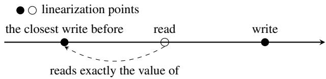  
Figure 10: Illustration of the proof objective.

Part 2: every read operation will never read values later than its closest-write-before’s update. This is guaranteed by the definition of the write operations’ linearization point, because at any moment before a subsequent write operation’s linearization point, the subsequent update is either not on the SSD or masked by an existing cache slot with the same key but a previous value. Therefore, the read operation will never read newer values that have not been linearized yet.

By combining the two parts, it can be assured that all read and write operations happen in the sequence by the definition of their linearization point. Since each linearization point happens between the corresponding operation’s invoke and return, it can be further concluded that if an operation ends before another operation begins, the linearization point of the latter operation must be later than the other. In other words, the linearization point definition respects real time ordering.

In conclusion, the linearization property of Scalio’s cache consistency protocol is demonstrated.

## 6 Evaluation

## 6.1 Experimental Methodology

Testbed. We configured our testbed to resemble a DPU-based JBOF storage environment, consisting of one storage node and five client nodes (with up to 160 client threads) interconnected via a high-speed RDMA network. The storage node includes seven Samsung 970 PRO SSDs [49], each offering 500K IOPS under 4KB blocks, connected to a ConnectX-6 HCA. We emulated a DPU-based JBOF configuration by limiting the available Intel Xeon Gold CPU cores to 8 and memory to 8 GB, which aligns with the configuration of commodity DPU-based JBOF platforms [6, 16, 35, 39].

Implementation details. Our system environment is based on Linux kernel version 5.15.0, which includes native support for NVMe-oF targets. We installed the MLNX\_OFED driver (version 24.04-0.7.0) and set up the NVMe target subsystem (nvmet) to handle NVMe-oF requests, configuring it to use RDMA as the transport protocol. Additionally, we enabled the attr\_offload parameter within the NVMe target setup to support the offloading implementation for NVMe-oF, which allows for scalable handling of I/O operations by bypassing traditional CPU processing [40, 41]. For the software stack, we further maintained fairness by porting LEED’s code using the same SPDK stack and employed the same SSD storage data structures as LEED. The source code is available at https://github.com/madsys-dev/scalio-osdi25-ae.

Workloads. For workload evaluation, we employed the Yahoo! Cloud Serving Benchmark (YCSB) [11], focusing on five specific workload types: YCSB A, YCSB B, YCSB C, YCSB D and YCSB F. YCSB E is omitted as other systems because it requires range query. We generated 20 million key-value pairs, each with a maximum key length of 16 bytes and a maximum value length of 64 bytes, distributed with a Zipfian distribution and a Zipfian constant of 0.99. The cache can hold approximately 2 million key-value pairs.

Baselines. We compared Scalio with two setups: (1) the LEED [16] JBOF key-value storage system (denoted as LEED) and (2) the LEED storage system combined with the Ditto [52] disaggregated key-value caching system (denoted as LEED+Ditto). For fairness, we apply the same Arm-coreallocation strategy as LEED, accompanied with the roundrobin SSD binding strategy as illustrated in Figure 4. The cache size is set to 1 GB for both Scalio and the LEED+Ditto baseline.

## 6.2 Performance Improvements

We evaluated the performance of Scalio along with the baseline systems by varying the number of SSDs from 1 to 7 and measuring throughput under YCSB workloads A, B, C, D, and F. The results, shown in Figure 11, highlight Scalio’s superior throughput and scalability across all workloads as the number of SSDs increases.

Scalio demonstrates superior scalability compared to the baselines, as the baseline systems experience throughput saturation when the number of SSDs reaches 4, while continues to scale efficiently as more SSDs are added. Under readintensive and read-only workloads (YCSB B, C, D), Scalio achieves up to 3× speedup, and under write-intensive workloads (YCSB A, F), it achieves up to 2× speedup.

The 3× speedup observed in read workloads is primarily due to the use of NVMe-oF target offload. This optimization frees the JBOF server’s CPU from handling read operations, allowing it to fully utilize the SSDs’ I/O capabilities, as shown in Figure 12. In contrast, the baseline systems struggle to fully utilize SSD IOPS because their JBOF servers become CPUbound as the number of SSDs increases.

For write workloads, the 2× speedup is largely attributed to the batched write mechanism. By combining multiple value updates into a single SSD write operation, Scalio reduces CPU overhead, which improves SSD I/O efficiency. The batched write mechanism minimizes the number of write operations required, thus alleviating pressure on the JBOF server and enhancing throughput.

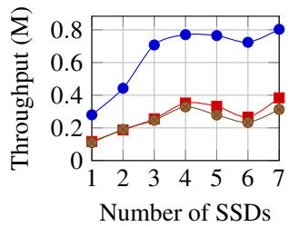  
(a) YCSB A

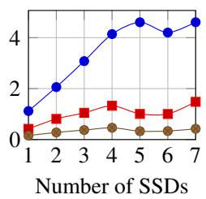  
(b) YCSB B

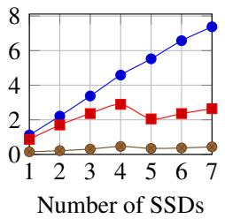  
(c) YCSB C

Manufacturer-rated SSD IOPS (under 4KB blocks)  
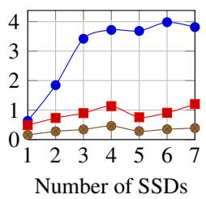  
(d) YCSB D

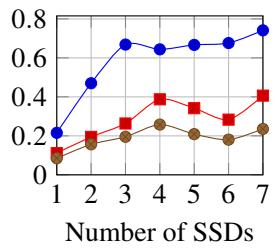  
(e) YCSB F

Figure 11: Throughput for YCSB workloads A,B,C,D and F as the number of SSDs scale up.  
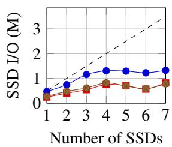  
(a) YCSB A

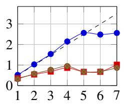  
(b) YCSB B

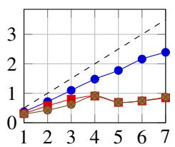  
Number of SSDs

(c) YCSB C  
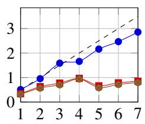  
Number of SSDs

(d) YCSB D  
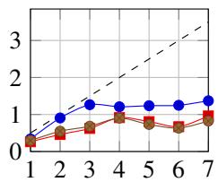  
Number of SSDs  
(e) YCSB F

Figure 12: SSD I/O usage under YCSB workloads A,B,C,D and F as the number of SSDs scale up.  
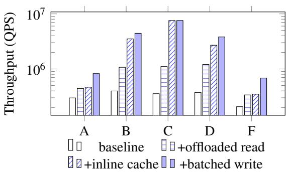  
Figure 13: Throughput improvement breakdown under YCSB workloads A, B, C, D, and F. The Y-axis is log scale.

A more detailed breakdown of these improvements can be found in § 6.3, with performance impacts of each optimization evaluated and discussed.

In conclusion, Scalio’s optimizations—primarily inline cache, offloaded reads and batched writes—effectively reduce CPU overhead, maximize SSD IOPS utilization, and enhance scalability and throughput as the number of SSDs increases. These improvements enable Scalio to outperform baseline systems in both throughput and resource utilization.

## 6.3 Improvements Breakdown

To assess the impact of each individual optimization, we conducted a detailed analysis of Scalio’s contributions under YCSB workloads A, B, C, D, and F, using a 7-SSD configuration. Figure 13 shows the breakdown of performance improvements as we incrementally enabled each optimization: (1) offloaded read, (2) inline cache, and (3) batched write. By evaluating the effects of these optimizations, we demonstrate how each one contributes to the overall system performance. Offloaded read. Offloaded read provides a speedup of 1.5× to 3.2× across all workloads by offloading massive SSD I/O to the network, relieving the DPU’s CPU. This increases SSD I/O utilization and bridges the gap between the SSD’s I/O capabilities and the system’s performance, as in Figure 12.

Inline cache. Inline caching is particularly effective under read-only and read-intensive workloads by absorbing hot reads. Our system statistics show that Scalio’s in-memory caching layer absorbs 72.2%, 85.2%, and 62.6% of total read and write operations under YCSB B, C, and D, respectively. This absorption leads to throughput improvements of 3.6×, 6.7× and 2.7×, matching the observed speedup.

Batched write. Batched write provides a speedup of up to 1.96×, and its contribution is the most obvious in YCSB A and F, which belong to write-intensive workloads. According to our experiments, batched write can reduce the number of SSD writes per key-value update operation from 2 to approximately 1, which reduces the burden on the DPU’s CPU, thus contributing to the speedup.

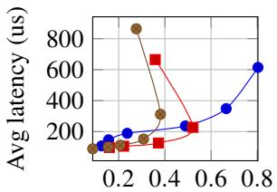  
Throughput (M)

(a) YCSB A  
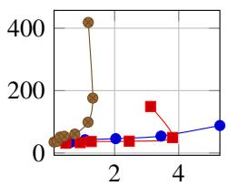  
Throughput (M)

(b) YCSB B  
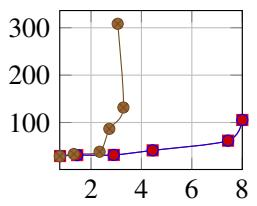  
Throughput (M)

(c) YCSB C  
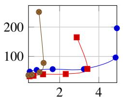  
Throughput (M)

(d) YCSB D  
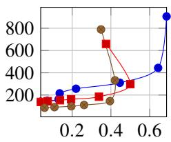  
Throughput (M)  
(e) YCSB F

Figure 14: Latency to throughput by varying the number of concurrent I/O queues.  
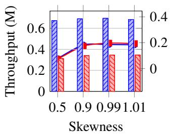  
(a) YCSB A

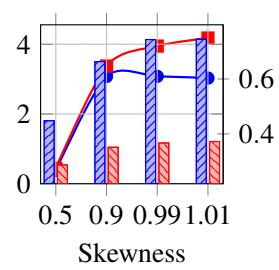  
(b) YCSB B

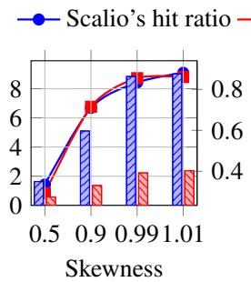  
(c) YCSB C

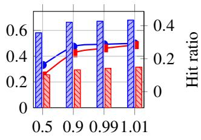  
Skewness  
(d) YCSB F  
Figure 15: Throughput and cache hit ratio when varying skewness under YCSB A, B, C, and F.

## 6.4 Latency

In this subsection, we compare the latency performance of Scalio with and without the batched write feature, alongside the LEED+Ditto baseline. The comparison highlights the trade-off between latency and throughput introduced by the batched write mechanism, where throughput is significantly improved at an acceptable cost of some latency. Our evaluation demonstrates two key findings: (1) Scalio without batched write delivers both lower latency and higher throughput compared to LEED+Ditto, and (2) Scalio with batched write achieves even higher throughput, with an acceptable latency trade-off. Users can choose between prioritizing low latency in latency-critical scenarios or enabling batched write for higher throughput.

Comparing Scalio without the batched write mechanism to the LEED+Ditto baseline, Scalio demonstrates a 20% to 30% reduction in average latencies across all workloads, while also achieving a 2× to 3× throughput improvement. Both the reduction in latency and the throughput improvement are due to two key optimizations: Scalio’s inline caching, which reduces round-trip time on cache hits by using a compact inline data structure, and the bypassing of the JBOF server’s CPU, which lowers network latency on cache miss paths. These optimizations not only alleviate the DPU’s CPU load but also improve SSD I/O utilization, driving higher throughput with lower latency and enhancing system performance. Under the read-modify-write workload YCSB F, Scalio ensures cache consistency, which the baseline system fails to achieve, at slight expense of latency.

Comparing Scalio with the batched write mechanism to the LEED+Ditto baseline, we observe a trade-off where the group commit mechanism introduces significant throughput improvements in exchange for a tolerable increase in latency. For instance, in YCSB A, Scalio achieves 2.1× higher throughput (800 M IOPS) compared to the baseline, with only a 1.97× increase in latency (614 us). This shows that while there is a moderate latency penalty, it is well-compensated by the substantial gain in throughput, making the trade-off beneficial for overall system performance.

In conclusion, Scalio provides a well-balanced approach to system performance, effectively addressing the trade-offs between throughput and latency. When batched write is disabled, Scalio outperforms the baseline in both throughput and latency, providing lower latencies across all workloads. With batched write enabled, Scalio achieves much higher throughput with only a minimal increase in latency, allowing it to efficiently handle diverse workloads while maintaining an optimal balance between performance and responsiveness.

## 6.5 Sensitivity Analysis

In this subsection, we conduct a sensitivity analysis under the 7-SSD configuration by varying several key parameters. We will present the results of four experiments: (1) varying the workloads’ skewness , (2) varying the dataset size, (3) varying the number of CPU cores, and (4) varying the hash block size. Skewness. We varied the Zipfian constant from 0.5 to 1.01 to evaluate the system performance under different workload skewnesses, as shown in Figure 15. (YCSB D is omitted as it does not follow the Zipfian distribution.) As observed, Scalio performs better as the skewness increases, particularly in read-only and read-intensive workloads, where higher skewness results in a higher hit ratio. For write-intensive workloads, while hot data may hinder performance, this affects both Scalio and the baseline similarly, with Scalio still outperforming the baseline. Overall, Scalio consistently outperforms the baseline system of 2× to 3× across all skewness levels and workloads, demonstrating its ability to handle varying workload distributions effectively.

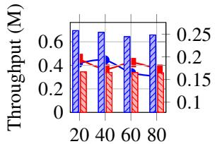  
Record count (M)

(a) YCSB A  
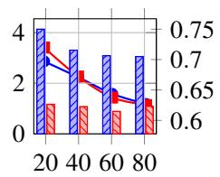  
Record count (M)

(b) YCSB B  
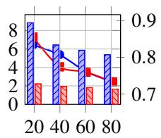  
Record count (M)

(c) YCSB C  
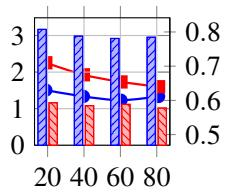  
Record count (M)

(d) YCSB D  
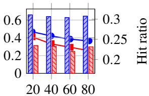  
Record count (M)  
(e) YCSB F

Figure 16: Throughput and cache hit ratio when varying the total number of records under YCSB A, B, C, D, and F.  
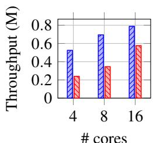  
(a) YCSB A

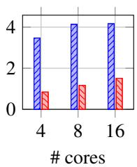  
(b) YCSB B

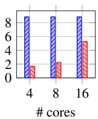  
(c) YCSB C

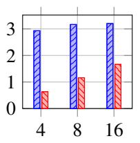  
(d) YCSB D

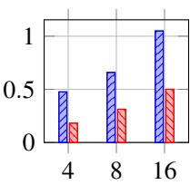  
# cores  
(e) YCSB F  
Figure 17: Throughput when varying the number of cores under YCSB A, B, C, D, and F.

Dataset size. We varied the total number of key-value pairs from 20 million to 80 million, testing the system’s performance at each step, as shown in Figure 16. As the dataset size increases, the cache hit ratio slightly decreases and throughput marginally drops. However, Scalio consistently outperforms the baseline, demonstrating its robustness with larger datasets.

Number of CPU cores. We varied the number of CPU cores, testing configurations with 4, 8, and 16 cores. The 16-core configuration represents an ideal scenario, assessing the system’s performance under ample CPU resources. The results are shown in Figure 17. Scalio is less sensitive to variations in the number of CPU cores, especially in read-only or readintensive workloads, as it offloads operations to the network and hence requires fewer CPU resources. In contrast, the performance of LEED+Ditto degrades significantly as the number of CPU cores decreases. The performance gap between Scalio and the baseline widens from 1× to 2× (under the 16-core configuration) to 2× to 5× (under the 4-core configuration), highlighting Scalio’s advantage in environments with limited CPU resources.

Capacity of hash block. We varied the hash block’s capacity by adjusting the number of slots per block, testing configurations with 4, 8, and 16 slots. As shown in Figure 18, changes in block size have minimal impact on Scalio’s performance. This suggests that the hash block size can be tuned according to specific cache requirements, offering flexibility in optimizing performance without significant trade-offs.

## 7 Discussion

Fairness of evaluation setup. While our evaluation uses an emulated DPU setup, it provides a conservative and fair estimate of real-world performance. We constrained the testbed to 8 cores and 8 GB memory to match typical DPU resource limits, and Scalio’s core performance benefits stem from offloading CPU-intensive SSD I/O via NVMe-oF target offload—an advantage that holds regardless of the CPU power. We further ensured fairness by aligning our setup with LEED’s, using the same SPDK stack, RDMA topology, and data structures. This setup realistically reflects Scalio’s deployment scenario and expected performance characteristics.

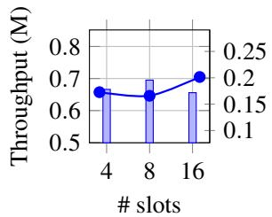  
(a) YCSB A

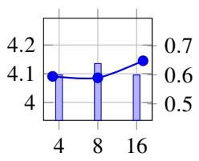  
(b) YCSB B

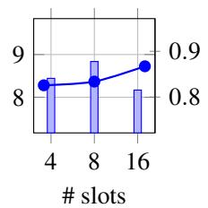  
(c) YCSB C

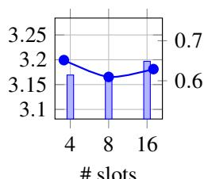  
(d) YCSB D

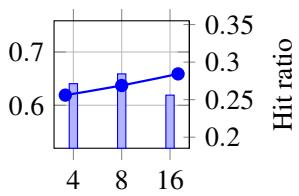  
(e) YCSB F  
Figure 18: Throughput and cache hit ratio when varying the number of slots per hash block under YCSB A, B, C, D, and F.

Energy efficiency of DPU-based design. Scalio’s DPUbased approach leverages ASIC-accelerated NVMe I/O to achieve significantly higher energy efficiency than generalpurpose CPUs. While increasing CPU power consumption might suggest potential performance gains, it does not guarantee linear scaling—especially for I/O-heavy workloads where overheads grow disproportionately. In contrast, DPU-based JBOF systems can already efficiently support 26 or more SSDs with lower power. Given these factors, Scalio’s DPUbased design offers higher effective performance per watt and better scalability than simply scaling up CPU resources.

Server failure handling. Scalio ensures robustness against server-side failures by integrating with orthogonal redundancy techniques such as RAID or dual-DPU setups at the JBOF level. These mechanisms are widely adopted in disaggregated storage systems and can tolerate SSD or node failures without modifying Scalio’s core protocol. For example, RAID-10 can preserve data availability and consistency even under partial disk failures, allowing Scalio to continue operating seamlessly. This integration enhances system reliability while preserving Scalio’s scalability and performance benefits.

## 8 Related Work

Energy-efficient storage. Energy-efficient storage solutions are increasingly necessary as storage demands rise. LEED [16] uses DPU-based JBOF platforms for lower power consumption, but its performance is limited by the DPU’s CPU load. FAWN [2] relies on low-power "wimpy" nodes, but its design is not well-suited for modern high-density JBOF architectures, which offer better energy efficiency. Gimbal [35] leverages DPU-based JBOFs for managing tenants with strong QoS guarantees, but its focus is on tenant isolation, not computational efficiency. TrickleKV [62], a key-value storage system built on JBOF, aims to alleviate network traffic contention rather than improving CPU efficiency. SKV [55] offloads replication to SmartNICs in disaggregated key-value systems but still relies on host servers for most operations. Scalio overcomes the limitations of these systems by increasing storage density and offloading tasks to reduce CPU load on the DPU, significantly enhancing overall power efficiency. Storage over network. Storage over network technologies enable the separation of storage and computation by connecting devices via protocols such as iSCSI and NVMe-over-Fabrics (NVMe-oF). iSCSI [26] facilitates storage networking through TCP/IP, but it suffers from CPU inefficiencies due to single-queue structures, creating bottlenecks, particularly with multi-core CPUs. NVMe-oF improves upon iSCSI by utilizing protocols like RDMA for direct data transfer between SSDs and compute nodes, as explored in [17]. However, the standard NVMe-oF implementation still places a heavy load on target CPUs which limits scalability, and there has been few studies on the NVMe-oF target offload implementation.

Cache consistency/coherence protocols. Cache consistency/coherence protocols are well-studied in both monolithic and distributed systems. In monolithic systems, protocols like MESI [20] ensure consistency between L1/L2 caches and main memory. In distributed systems, various protocols ensure consistency between cached data and underlying storage. DistCache [29] partitions hot objects across cache nodes using independent hash functions and routes queries with a powerof-two-choices mechanism. Similarly, CliqueMap [54] uses a quorum-based approach, combining replication, client-based quoruming, and self-validating server responses. These protocols maintain consistency across distributed nodes. Scalio’s protocol, on the other hand, is designed for DPU-based disaggregated systems, where RDMA reduces CPU overhead and ensures consistency through efficient cache management without full synchronization across all nodes.

Disaggregated in-memory key-value stores. Highperformance, disaggregated in-memory key-value stores typically use one-sided RDMA to bypass the CPU, achieving efficient, direct data access. FORD [64] provides transaction support using RDMA atomic operations, but this design is more lock-heavy and less efficient in cases without transactional needs, such as in-memory index. Ditto [52] offers a more efficient solution in terms of in-memory caching, but it lacks integration with secondary storage layers like the SSD storage layer, and thus cannot be directly applied to systems with both DRAM and SSD storage. Our work targets efficient serving of small key-value pairs, along with integration with SSD storage layers to provide high-performance key value storage service with linearizability guarantee.

## 9 Conclusion

In this paper, we propose Scalio, a scalable disaggregated key-value store designed for high-density JBOF systems. By leveraging NVMe-oF Target Offload, Scalio bypasses the DPU’s CPU, reducing overhead, while its two-layer architecture and batched write mechanism efficiently handle bursty workloads. Our cache consistency protocol ensures data consistency across the system. Experimental results demonstrate Scalio’s superior scalability and performance, particularly as the number of SSDs increases.

## Acknowledgments

We thank the anonymous reviewers and our shepherd, Mr. Sanidhya Kashyap, for their valuable feedback. The authors affiliated with Tsinghua University are all in the Department of Computer Science and Technology, Beijing National Research Center for Information Science and Technology (BN-Rist), Tsinghua University, China. This work is supported by National Key Research & Development Program of China (2022YFB4502004), Natural Science Foundation of China (92467102) and Tsinghua University Initiative Scientific Research Program, Young Elite Scientists Sponsorship Program by CAST (2022QNRC001), and Shandong Provincial Natural Science Foundation (ZR2023LZH014).

## References

[1] AIC. AIC Inc. to Showcase Advanced Server and Storage Solutions at SC24. https://www.aicipc.com/en/news/6107, 2024.

[2] ANDERSEN, D. G., FRANKLIN, J., KAMINSKY, M., PHANISHAYEE, A., TAN, L., AND VASUDEVAN, V. FAWN: A fast array of wimpy nodes. In Proceedings of the ACM SIGOPS 22nd symposium on Operating systems principles (2009), pp. 1–14.

[3] ANTONOPOULOS, P., BUDOVSKI, A., DIACONU, C., HERNAN-DEZ SAENZ, A., HU, J., KODAVALLA, H., KOSSMANN, D., LINGAM, S., MINHAS, U. F., PRAKASH, N., PUROHIT, V., QU, H., RAVELLA, C. S., REISTETER, K., SHROTRI, S., TANG, D., AND WAKADE, V. Socrates: The New SQL Server in the Cloud. In Proceedings of the 2019 International Conference on Management of Data (New York, NY, USA, 2019), SIGMOD ’19, Association for Computing Machinery, p. 1743–1756.

[4] BARSELLOTTI, L., ALHAMED, F., OLMOS, J. J. V., PAOLUCCI, F., CASTOLDI, P., AND CUGINI, F. Introducing data processing units (DPU) at the edge. In 2022 International Conference on Computer Communications and Networks (ICCCN) (2022), IEEE, pp. 1–6.

[5] BROADCOM. Broadcom Announces Production Availability of Industry’s First 100G Programmable Storage Adapter with NVMe-oF Support. https://www.broadcom.com/company/news/product-r eleases/40966, 2019.

[6] BROADCOM. NVMe over Fabrics Performance. https://docs.bro adcom.com/doc/broadcom-stingray-100G-NVMe-oF-perform ance, 2019.

[7] BURKE, M., DHARANIPRAGADA, S., JOYNER, S., SZEKERES, A., NELSON, J., ZHANG, I., AND PORTS, D. R. PRISM: Rethinking the RDMA interface for distributed systems. In Proceedings of the ACM SIGOPS 28th Symposium on Operating Systems Principles (2021), pp. 228–242.

[8] CAO, Q., LYU, W., WANG, X. R., GUAN, X., WANG, L., YAN, S., WU, T., AND WANG, X. Nonvolatile Multistates Memories for Highdensity Data Storage. ACS Applied Materials & Interfaces 12, 38 (2020), 42449–42471.

[9] CHANDRAMOULI, B., PRASAAD, G., KOSSMANN, D., LEVANDOSKI, J., HUNTER, J., AND BARNETT, M. FASTER: A Concurrent Key-Value Store with In-Place Updates. In Proceedings of the 2018 International Conference on Management of Data (New York, NY, USA, 2018), SIGMOD ’18, Association for Computing Machinery, p. 275–290.

[10] CHEN, Y., WEI, X., SHI, J., CHEN, R., AND CHEN, H. Fast and general distributed transactions using RDMA and HTM. In Proceedings of the Eleventh European Conference on Computer Systems (2016), pp. 1–17.

[11] COOPER, B. F., SILBERSTEIN, A., TAM, E., RAMAKRISHNAN, R., AND SEARS, R. Benchmarking cloud serving systems with YCSB. In Proceedings of the 1st ACM symposium on Cloud computing (2010), pp. 143–154.

[12] COUVERT, P., AND MARKETING, D. P. High Speed I/O Processor for NVMe over Fabric. Flash Memory Summit (2016).

[13] DI GIROLAMO, S., DE SENSI, D., TARANOV, K., MALESEVIC, M., BESTA, M., SCHNEIDER, T., KISTLER, S., AND HOEFLER, T. Building blocks for network-accelerated distributed file systems. In SC22: International Conference for High Performance Computing, Networking, Storage and Analysis (2022), IEEE, pp. 1–14.

[14] EXPRESS, N. Accelerating NVMe™ over Fabrics with Hardware Offloads at 100Gb/s and Beyond. https://nvmexpress.org/wp-c ontent/uploads/Accelerating-NVMe-over-Fabrics-with-Har dware-Offloads.pdf, 2017.

[15] GUO, Z., LIN, J., BAI, Y., KIM, D., SWIFT, M., AKELLA, A., AND LIU, M. LogNIC: A High-Level Performance Model for SmartNICs. In Proceedings of the 56th Annual IEEE/ACM International Symposium on Microarchitecture (2023), pp. 916–929.

[16] GUO, Z., ZHANG, H., ZHAO, C., BAI, Y., SWIFT, M., AND LIU, M. LEED: A Low-Power, Fast Persistent Key-Value Store on SmartNIC JBOFs. In Proceedings of the ACM SIGCOMM 2023 Conference (2023), pp. 1012–1027.

[17] GUZ, Z., LI, H., SHAYESTEH, A., AND BALAKRISHNAN, V. Performance characterization of NVMe-over-Fabrics storage disaggregation. ACM Transactions on Storage (TOS) 14, 4 (2018), 1–18.

[18] INTEL. Intel Optane DC SSD Series. https://www.intel.com/co ntent/www/us/en/products/details/memory-storage/data-c enter-ssds/optane-dc-ssd-series.html, 2024.

[19] INTEL. Intel® Xeon® Processors. https://www.intel.com/co ntent/www/us/en/products/details/processors/xeon.html, 2024.

[20] IVANOV, L., AND NUNNA, R. Modeling and verification of cache coherence protocols. In ISCAS 2001. The 2001 IEEE International Symposium on Circuits and Systems (Cat. No.01CH37196) (2001), vol. 5, pp. 129–132 vol. 5.

[21] JIN, Y. T., AHN, S., AND LEE, S. Performance Analysis of NVMe SSD-based All-flash Array Systems. In 2018 IEEE International Symposium on Performance Analysis of Systems and Software (ISPASS) (2018), IEEE, pp. 12–21.

[22] KALIA, A., KAMINSKY, M., AND ANDERSEN, D. G. Design guidelines for high performance RDMA systems. In 2016 USENIX Annual Technical Conference (USENIX ATC 16) (2016), pp. 437–450.

[23] KFOURY, E. F., CHOUEIRI, S., MAZLOUM, A., ALSABEH, A., GOMEZ, J., AND CRICHIGNO, J. A Comprehensive Survey on Smart-NICs: Architectures, Development Models, Applications, and Research Directions. IEEE Access 12 (2024), 107297–107336.

[24] KFOURY, E. F., CHOUEIRI, S., MAZLOUM, A., ALSABEH, A., GOMEZ, J., AND CRICHIGNO, J. A comprehensive survey on Smart-NICs: Architectures, development models, applications, and research directions. IEEE Access (2024).

[25] KIM, B., KIM, J., AND NOH, S. H. Managing Array of SSDs When the Storage Device Is No Longer the Performance Bottleneck. In 9th USENIX Workshop on Hot Topics in Storage and File Systems (HotStorage 17) (2017).

[26] KLIMOVIC, A., KOZYRAKIS, C., THERESKA, E., JOHN, B., AND KUMAR, S. Flash storage disaggregation. In Proceedings of the Eleventh European Conference on Computer Systems (2016), pp. 1–15.

[27] LI, C., CHEN, H., RUAN, C., MA, X., AND XU, Y. Leveraging NVMe SSDs for building a fast, cost-effective, LSM-tree-based KV store. ACM Transactions on Storage (TOS) 17, 4 (2021), 1–29.

[28] LISS, L. NVMf target offload. https://www.openfabrics.org/im ages/2018workshop/presentations/308\_LLiss\_NVMfTargetOf fload.pdf, 2018.

[29] LIU, Z., BAI, Z., LIU, Z., LI, X., KIM, C., BRAVERMAN, V., JIN, X., AND STOICA, I. DistCache: Provable load balancing for Large-Scale storage systems with distributed caching. In 17th USENIX Conference on File and Storage Technologies (FAST 19) (2019), pp. 143–157.

[30] LUO, J., LIU, H., HE, Y., VARGAS-ROSALES, C., AND FAN, L. High-Density NVMe SSD With DRAM-Less eRAID Architecture. IEEE Transactions on Very Large Scale Integration (VLSI) Systems (2023).

[31] MA, S., MA, T., CHEN, K., AND WU, Y. A Survey of Storage Systems in the RDMA era. IEEE Transactions on Parallel and Distributed Systems 33, 12 (2022), 4395–4409.

[32] MCALLISTER, S., BERG, B., TUTUNCU-MACIAS, J., YANG, J., GUNASEKAR, S., LU, J., BERGER, D. S., BECKMANN, N., AND GANGER, G. R. Kangaroo: Theory and Practice of Caching Billions of Tiny Objects on Flash. ACM Trans. Storage 18, 3 (Aug. 2022).

[33] MICRO, S. Petascale JBOF All-Flash Array for AI Data Pipeline Acceleration. https://www.supermicro.org.cn/en/products/ jbof, 2024.

[34] MICRON. Ethernet bunch of flash in an NVMe-oF™ network for lowcost storage at scale. https://www.micron.com/about/blog/st orage/ssd/ethernet-bunch-of-flash-in-nvme-of-network, 2020.

[35] MIN, J., LIU, M., CHUGH, T., ZHAO, C., WEI, A., DOH, I. H., AND KRISHNAMURTHY, A. Gimbal: enabling multi-tenant storage disaggregation on SmartNIC JBOFs. In Proceedings of the 2021 ACM SIGCOMM 2021 Conference (2021), pp. 106–122.

[36] MYUNG, K., KIM, S., YEOM, H. Y., AND PARK, J. Efficient and scalable external sort framework for NVMe SSD. IEEE Transactions on Computers 70, 12 (2020), 2211–2217.

[37] NGUYEN, T. A., JEON, H., HAN, D., BAE, D.-H., YU, Y. J., KIM, K., PARK, S., JEONG, J., AND NAM, B. NVMe-driven lazy cache coherence for immutable data with NVMe over Fabrics. In 2023 IEEE 16th International Conference on Cloud Computing (CLOUD) (2023), IEEE, pp. 394–400.

[38] NVIDIA. BF1600 NVIDIA® Mellanox® BlueField® Dual Port 100Gb/s Controller Card for InfiniBand and Ethernet. https://netw ork.nvidia.com/files/doc-2020/pb-bluefield-storage-con troller-card-vpi.pdf, 2020.

[39] NVIDIA. NVIDIA BlueField Networking Platform. https://www. nvidia.com/en-us/networking/products/data-processing-u nit/, 2021.

[40] NVIDIA. HowTo Configure NVMe over Fabrics (NVMe-oF) Target Offload. https://enterprise-support.nvidia.com/s/articl e/howto-configure-nvme-over-fabrics--nvme-of--targe t-offload, 2022.

[41] NVIDIA. Simple NVMe-oF Target Offload Benchmark. https: //enterprise-support.nvidia.com/s/article/simple-nvm e-of-target-offload-benchmark, 2022.

[42] NVIDIA. NVIDIA BlueField-2 BF2500 Ethernet DPU Controller. https://docs.nvidia.com/networking/display/bf2endpucon troller/introduction, 2023.

[43] NVIDIA. Chelsio T7 DPU Furthers Expansive Ethernet Storage Networking, Empowering Open, ROI-Enhanced Enterprise Storage Platforms. https://www.chelsio.com/wp-content/uploads/r esources/pr-chelsio-t7-jbof.pdf, 2024.

[44] NVIDIA. NVIDIA BlueField-3 Networking Platform User Guide. https://docs.nvidia.com/networking/display/bf3dpu/spec ifications, 2024.

[45] NVIDIA. NVIDIA ConnectX InfiniBand Adapters. https://www. nvidia.com/en-us/networking/infiniband-adapters/, 2024.

[46] PAN, L. Cache made consistent. https://engineering.fb.com/2 022/06/08/core-infra/cache-made-consistent/, 2022.

[47] PARK, S., KIM, Y., URGAONKAR, B., LEE, J., AND SEO, E. A comprehensive study of energy efficiency and performance of flashbased SSD. Journal of Systems Architecture 57, 4 (2011), 354–365.

[48] PI, R. Raspberry Pi 4 Model B. https://www.raspberrypi.com/ products/raspberry-pi-4-model-b/, 2021.

[49] SAMSUNG. Samsung SSD 970 PRO NVMe® M.2. https://www.sa msung.com/us/computing/memory-storage/solid-state-dri ves/ssd-970-pro-nvme-m2-1tb-mz-v7p1t0bw/, 2017.

[50] SAMSUNG. Samsung 983 DCT. https://semiconductor.samsung. com/consumer-storage/datacenter-ssd/983dct/, 2018.

[51] SCALEFLUX. AIC and ScaleFlux Unveil New Storage Array Based on NVIDIA BlueField-3 DPU. https://scaleflux.com/in-the-med ia/aic-and-scaleflux-unveil-new-storage-array-based-o n-nvidia-bluefield-3-dpu/, 2024.

[52] SHEN, J., ZUO, P., LUO, X., SU, Y., GU, J., FENG, H., ZHOU, Y., AND LYU, M. R. Ditto: An elastic and adaptive memory-disaggregated caching system. In Proceedings of the 29th Symposium on Operating Systems Principles (2023), pp. 675–691.

[53] SHIM, H. PHash: A memory-efficient, high-performance key-value store for large-scale data-intensive applications. Journal of Systems and Software 123 (2017), 33–44.

[54] SINGHVI, A., AKELLA, A., ANDERSON, M., CAUBLE, R., DESH-MUKH, H., GIBSON, D., MARTIN, M. M., STROMINGER, A., WENISCH, T. F., AND VAHDAT, A. CliqueMap: productionizing an RMA-based distributed caching system. In Proceedings of the 2021 ACM SIGCOMM 2021 Conference (2021), pp. 93–105.

[55] SUN, S., ZHANG, R., YAN, M., AND WU, J. SKV: A SmartNIC-Offloaded Distributed Key-Value Store. In 2022 IEEE International Conference on Cluster Computing (CLUSTER) (2022), IEEE, pp. 1–11.

[56] SUN, S., ZHANG, R., YAN, M., AND WU, J. Offloading Distributed Key-Value Stores with Off-Path SmartNICs. Available at SSRN 4877692 (2024).

[57] WEI, X., DONG, Z., CHEN, R., AND CHEN, H. Deconstructing RDMA-enabled distributed transactions: Hybrid is better! In 13th USENIX Symposium on Operating Systems Design and Implementation (OSDI 18) (2018), pp. 233–251.

[58] XU, J., QIU, Y., CHEN, Y., WANG, Y., LIN, W., LIN, Y., ZHAO, S., LIU, Y., WANG, Y., AND CHEN, W. Performance Characterization of SmartNIC NVMe-over-Fabrics Target Offloading. In Proceedings of the 17th ACM International Systems and Storage Conference (2024), pp. 14–24.

[59] YANG, J., YUE, Y., AND RASHMI, K. V. A large scale analysis of hundreds of in-memory cache clusters at Twitter. In 14th USENIX Symposium on Operating Systems Design and Implementation (OSDI 20) (Nov. 2020), USENIX Association, pp. 191–208.

[60] YANG, Z., HARRIS, J. R., WALKER, B., VERKAMP, D., LIU, C., CHANG, C., CAO, G., STERN, J., VERMA, V., AND PAUL, L. E. SPDK: A development kit to build high performance storage applications. In 2017 IEEE International Conference on Cloud Computing Technology and Science (CloudCom) (2017), IEEE, pp. 154–161.

[61] YOON, D. Y., CHOWDHURY, M., AND MOZAFARI, B. Distributed lock management with RDMA: decentralization without starvation. In Proceedings of the 2018 International Conference on Management of Data (2018), pp. 1571–1586.

[62] ZHAN, L., LU, K., XIONG, Y., WAN, J., AND YANG, Z. TrickleKV: A High-Performance Key-Value Store on Disaggregated Storage with Low Network Traffic. IEEE Access (2024).

[63] ZHANG, J., SHIHAB, M., AND JUNG, M. Power, Energy, and Thermal Considerations in SSD-Based I/O Acceleration. In 6th USENIX Workshop on Hot Topics in Storage and File Systems (HotStorage 14) (Philadelphia, PA, June 2014), USENIX Association.

[64] ZHANG, M., HUA, Y., ZUO, P., AND LIU, L. FORD: Fast onesided RDMA-based distributed transactions for disaggregated persistent memory. In 20th USENIX Conference on File and Storage Technologies (FAST 22) (2022), pp. 51–68.