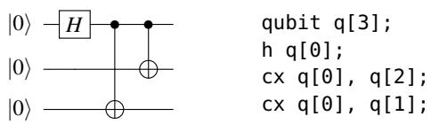
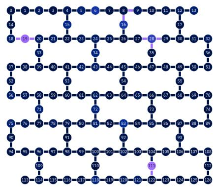
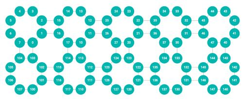
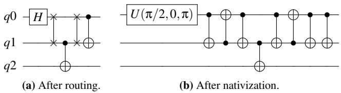
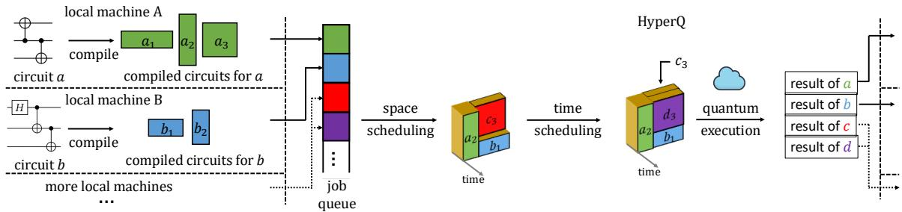
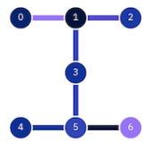
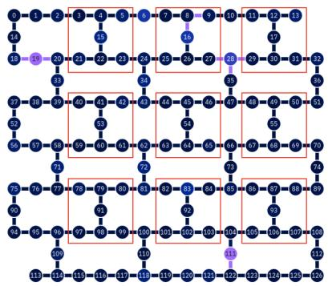
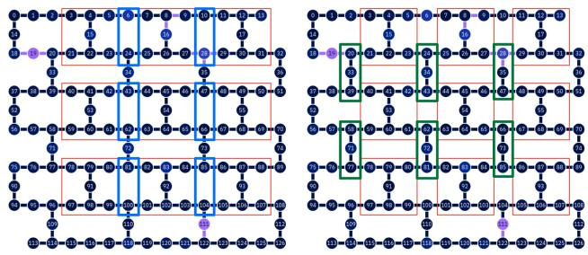
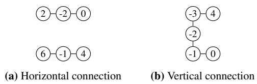
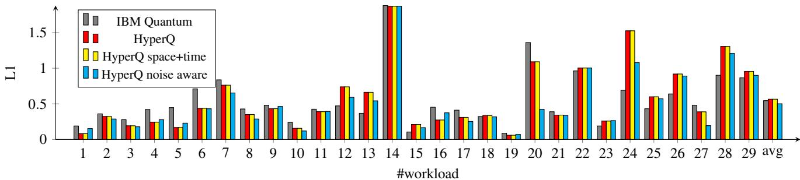

①

USENIX

THE ADVANCED COMPUTING SYSTEMS ASSOCIATION

## Quantum Virtual Machines

Runzhou Tao and Hongzheng Zhu, University of Maryland, College Park; Jason Nieh, Columbia University; Jianan Yao, University of Toronto; Ronghui Gu, Columbia University

https://www.usenix.org/conference/osdi25/presentation/tao

# This paper is included in the Proceedings of the 19th USENIX Symposium on Operating Systems Design and Implementation.

July 7–9, 2025 • Boston, MA, USA

ISBN 978-1-939133-47-2

Open access to the Proceedings of the 19th USENIX Symposium on Operating Systems Design and Implementation is sponsored by

# Quantum Virtual Machines

Runzhou Tao University of Maryland, College Park

Jason Nieh Columbia University

Jianan Yao University of Toronto

Hongzheng Zhu University of Maryland, College Park

Ronghui Gu Columbia University

## Abstract

Cloud computing services offer time on quantum computers, but users are forced to each use the entire quantum computer to run their programs as there is no way to multiplex a quantum computer among multiple programs at the same time. We present HyperQ, a system that introduces virtual machines for quantum computers to provide fault isolation, better resource utilization, and lower latency for quantum cloud computing. A quantum virtual machine is defined in terms of quantum computer hardware, specifically its quantum gates and qubits arranged in a hardware-specific topology. HyperQ enables quantum virtual machines to be simultaneously executed together on a quantum computer by multiplexing them in time and space on the hardware and ensuring that they are isolated from one another. HyperQ works with existing quantum programs and compiler frameworks; programs are simply compiled to run in virtual machines without the programs or compilers needing to know what else might be executed at the same time. We have implemented HyperQ for the IBM quantum computing service, the largest quantum computing fleet in the world. Our experimental results running quantum programs in virtual machines using the IBM service demonstrate that HyperQ can increase utilization and throughput while reducing program latency, by up to an order of magnitude, without sacrificing, and in some cases improving, fidelity in the results of quantum program execution.

## 1 Introduction

Quantum cloud computing now makes it possible to obtain ondemand access to quantum computers through cloud-based platforms. These first-generation quantum computers from cloud providers in the form of Noisy Intermediate-Scale Quantum (NISQ) [49] devices heralds the initial shift from classical to quantum computing and the potential realization of practical quantum applications [23]. While classical computers consist of circuits made up of gates that process bits, NISQ devices consist of quantum circuits made up of quantum gates that process quantum bits (qubits). Given their high cost and complexity, cloud computing providers typically only have a few quantum computers available. Nevertheless, they are in high demand by users and IBM recently ran its 3 trillionth quantum program [35].

While cloud computing provides robust software infrastructure that leverages virtual machines (VM) to enable efficient, scalable, and flexible multi-tenant utilization of classical computing resources, the software infrastructure for quantum cloud computing is primitive at best. Users of cloud-based quantum computers submit the quantum programs they want to run to as batch processing jobs, and the cloud service runs the quantum programs on the quantum computer one after another and returns the results. There is no virtualization of quantum computing resources, so each program, no matter how big or small, runs by itself on the quantum computer until it completes, at which point another program is run. This is extremely inefficient given that most programs can only utilize a small number of the qubits available on existing NISQ devices, leaving much of the quantum computer unused. Programs can only utilize a small number of qubits because as the number of qubits used increases, the complexity of the underlying quantum circuit being executed also increases, leading to propagation errors due to hardware noise and loss of fidelity in the results. The utilization problem is exacerbated by the limited number of quantum computers available. Users can end up waiting days for a quantum computing service to return the results of their programs given the high demand for quantum computing resources and the inability of the quantum computer to run more than one program at a time. Cloud services often further limit the number of outstanding program submissions from a user at any given time to only a few, adding further delays to obtaining results from running multiple quantum programs.

Addressing this inefficiency requires enabling multiple quantum programs to share the underlying hardware. While some research efforts have proposed methods for quantum multiprogramming, they rely on custom quantum compilers to combine multiple programs at compile time [15,34,43–45]. This static approach requires knowing precisely which programs will execute together during compilation, preventing independent compilation and execution–a stark contrast to the flexibility enjoyed in classical computing. Many existing techniques struggle with scalability, either limiting the number of co-executing programs or relying on algorithms with poor complexity for larger machines. Furthermore, these specialized compilers often lack the optimizations found in standard compilation tools like Qiskit.

Inspired by the success of VMs in improving the utilization of classical cloud computing services, we present HyperQ, a run-time management system for cloud-based quantum computing based on a new quantum virtual machine (qVM) abstraction for quantum computers. It virtualizes quantum hardware, i.e., exposes the same interface as a standalone quantum computer, supports multiprogramming dynamically and enables fault isolation. It significantly improves resource utilization and reduces latency while mitigating the impact of hardware noise to preserve, and even improve, the fidelity of program execution, all with minimal virtualization overhead.

HyperQ defines a qVM in terms of quantum computing hardware as a quantum circuit abstraction for running quantum programs with a well-defined set of quantum gates and a fixed number of qubits arranged in a specific topology. To enable direct execution of qVMs, the qVM qubit topology must be matched to the qubit topology of the underlying quantum computer hardware. However, qubits can in theory be connected in arbitrary topologies, making it difficult to match the topology of a qVM with that of the quantum computer. Our insight is that we observe that all real quantum computers define a qubit region in which qubits are connected together in a fixed topology, and that region is replicated in a grid-like manner to constitute the overall quantum computer. We leverage this insight to define qVMs in a architecture-specific manner such that the qVMs for a quantum computer are some fixed multiple of its qubit region and thus can be easily mapped to the computer to execute. HyperQ also leverages the natural separation of qubits in the hardware topology to isolate different qVMs and mitigate crosstalk noise when multiple quantum programs are executed simultaneously.

HyperQ virtualizes and manages quantum hardware in a manner that is compatible with existing quantum cloud computing services. Since quantum computer hardware does not yet have quantum memory (QRAM), it lacks context switching capabilities. To support qVMs without being able to save and restore quantum execution state, HyperQ interposes on how quantum programs are submitted to cloud computing services. Users locally compile their quantum programs and submit them in the same manner as they do with existing infrastructure, but the compiler backend transparently targets a qVM instead of a quantum computer. HyperQ encapsulates the compiled executables in their respective qVMs, then schedules qVMs for execution by binpacking them into composite quantum circuits, each of which fits into the qubits of the actual quantum computer. Each composite quantum circuit appears to the cloud service like any other other job, and hence can be submitted to, and executed by, existing quantum computing cloud services. Running a composite quantum circuit enables its qVMs to execute in parallel and in isolation on different qubits of the quantum computer.

  
Figure 1: A simple GHZ circuit. denotes a CX gate.

To construct the composite quantum circuits, HyperQ optimizes the allocation of quantum hardware resources and partitions resources among qVMs to provide fault isolation. HyperQ uses a simple scheduling algorithm that can guarantee better resource utilization and lower latency for every quantum program compared to the service it would receive without HyperQ on an existing quantum cloud computing service. The algorithm solves a three-dimensional binpacking problem across both space and time while accounting for quantum-specific resource constraints including noise and measurement. It can further tradeoff utilization for improved fidelity of results of quantum program execution.

HyperQ is compatible with existing quantum compilers such as Qiskit [22], enabling quantum programs to leverage its many compiler optimizations. A qVM appears as a backend compilation target similar to actual quantum hardware. Quantum compilers need not know what else will run with the program being compiled, but can simply compile quantum programs to their respective qVMs independently of one another. This is in contrast to existing quantum multiprogramming methods [15, 34, 43–45] that require custom compilers and knowing the exact circuits to be co-executed to combine them at compile time. Since programs are compiled to qVMs instead of the larger underlying quantum computer, they compile faster as compilation time is proportional to the number of qubits of the compilation target, irrespective of whether the program actually uses the number of qubits available.

We have implemented HyperQ and demonstrate that it can be easily used by existing quantum programs and compiler infrastructure, and deployed with existing quantum cloud computing services. Our experimental results with the IBM Quantum cloud computing service and its 127-qubit Eagle quantum computer [50] show that, compared to IBM Quantum, HyperQ can increase resource utilization and reduce latency in obtaining results by up to an order of magnitude for a wide range of quantum programs. We show that qVMs are isolated from one another during execution so that these performance gains can be achieved without compromising fidelity in the program results. Surprisingly, we also show that HyperQ can schedule qVMs in a noise-aware manner that can even improve fidelity in the program results compared to IBM Quantum, while still providing much better utilization and latency.

## 2 Background

We first provide some background about quantum programs, computers and compilers. For further details, see [21, 42].

  
Figure 2: IBM 127-qubit Eagle machine [50].

  
Figure 3: Rigetti 80-qubit Aspen M-3 machine [1].

Qubits, quantum gates and quantum programs In quantum computing, each quantum program is represented as a quantum circuit. The basic unit of a quantum circuit is a qubit, analogous to a register in classical computing. While a bit in classical computing can only be 0 or 1, a qubit can have many more states, specifically any state that is a superposition of 0 and 1. The basic operation on qubits is through a quantum gate, analogous to an instruction in classical computing. A typical quantum gate operates on either one or two qubits. On a quantum machine, two single-qubit gates can run simultaneously on two qubits, as can two two-qubit gates on two disjoint pairs of qubits. Quantum gates manipulate qubits to cause interference, whereby certain qubit states constructively combine and others are eliminated, and entanglement, whereby a qubit’s state is correlated with other qubits. Qubits can be measured to get classical bits as result, where the result of a measurement is probabilistic and will collapse the qubit to the state that agrees with the measurement, which will be either 0 or 1. A typical quantum program will perform measurements at the end to produce output of the same number of classical bits as it has qubits. Figure 1 shows a simple GHZ circuit [20] represented by graph and by code.

Quantum computers A quantum computer has a quantum processing unit (QPU) that supports a fixed set of quantum gates, known as its gate set, and arranges its qubits in a particular topology, the latter being described by a coupling map. Similar to classical logic where a set of AND, OR, and NOT gates are sufficient, in quantum computing, there is also a universal gate set. A common universal gate set is the single qubit rotation and an entangled two-qubit gate such as the Controlled-NOT (CX) gate, shown in Figure 1. Different quantum computers may support different gate sets, or instruction sets, and qubit topologies. For example, Figures 2 and 3 shows the coupling maps of the IBM Eagle and AWS Rigetti Aspen M-3, which are quite different. Quantum computers are also equipped with classical registers to store the results of measurements. Note that quantum computers currently lack QRAM, so there is no mechanism to save qubit states outside of the QPU. The only option is to reduce qubits to classical bits by measuring them so the results can stored in classical RAM, with the resulting loss of quantum superposition.

  
Figure 4: Compilation of GHZ circuit. In the routing stage, if qubit q0 is not connected to $q 2$ in the coupling map, it is not possible to have a CX gate between them. Instead, two SWAP gates between q0 and q1 will be inserted and the CX gate will be applied between q1 and $q 2 .$ . In the nativization stage, with the instruction set {U, CX}, H is translated into U(π/2, 0, π) and SWAP is expanded into three CX gates.

Quantum compilation Quantum compilation transforms a quantum program into a quantum circuit that satisfies the topology and gate constraints specified by a quantum computer. This includes mapping the qubits used by the program to actual qubits available in the quantum computer. A routing stage [26, 36, 57] inserts SWAP gates into the circuit, to swap qubits, so that two-qubit gates are only applied to qubit pairs that are actually connected in the coupling map. A nativization stage [33] decomposes all quantum gates into those in the instruction set of the target quantum hardware. Figure 4 shows an example for compiling the GHZ circuit. Because compilation is based on the constraints of the target quantum hardware, the resulting compiled quantum circuit is only for the target hardware and is generally incompatible with other hardware with different instruction sets and qubit topologies. For example, a quantum program compiled for the IBM Eagle will not run on the AWS Rigetti.

Noise A significant challenge in near-term quantum computing is the presence of noise. Noise arises from unwanted interactions between the qubits and their surrounding environment, such as thermal fluctuations or electromagnetic interference when performing quantum operations and measurements. Noise introduces errors into quantum operations, leading to a decrease in the fidelity of quantum states and ultimately causing the execution of quantum programs to yield incorrect results. Noise can occur from quantum gates and measurements, as well as crosstalk between qubits. Crosstalk occurs when operations on one qubit unintentionally affect the states of neighboring qubits. It is typically caused by unintended electromagnetic coupling or leakage of control signals between nearby qubits on the quantum chip, and its effects are strongest between qubits that are directly connected with one another. Crosstalk is a major source of noise for NISQ devices and its impact can be an order of magnitude greater than gate errors; mitigating crosstalk is critical to achieve reliable and accurate quantum computation on NISQ devices [37, 45].

  
Figure 5: HyperQ workflow.

## 3 Design

HyperQ is designed to be compatible with existing quantum programs, computers, and compilers. It accomplishes this based on the observation that quantum computers are structured using a basic repeating region of qubits. For example, the IBM Eagle in Figure 2 is structured around a repeating I-shaped region of qubits, while the Rigetti in Figure 3 is structured around a repeating octagonal-shaped region of qubits. By leveraging this repeating structure, HyperQ can provide qVMs such that programs can be independently compiled to run in qVMs, which are in turn placed into these regions on the machine and executed correctly because the topology and gate set of the qVM matches that of the real machine.

Figure 5 shows the workflow of HyperQ. First, users write and compile their quantum programs on their local machines, where the compiler target is a qVM instead of the actual quantum hardware. Second, the resulting compiled quantum circuits are sent to HyperQ to schedule and run in qVMs on the actual quantum computer. Because current quantum computers do not support context switching, HyperQ schedules and multiplexes qVMs on the hardware by binpacking them in space and time into batch jobs of some estimated execution duration. Each job is created by composing the qVMs in the batch together into one big composite quantum circuit. The batch jobs are then submitted to the cloud quantum computing service to be executed on the quantum machine. After a batch job is completed, HyperQ will receive the measurement result of the combined quantum circuit, which contains results for all qVMs. HyperQ will postprocess the measurement result to identify the part that belongs to each qVM, and return the separated results to the users.

Like VMs on classical computers as originally described by Popek and Goldberg [47], HyperQ ensures that qVMs meet three virtualization properties of interest whenever a quantum program is run in a qVM: efficiency, resource control, and equivalence. The efficiency property states that all innocuous instructions of the program are executed by the hardware directly, where an innocuous instruction is one that does not depend on its location in physical memory or the privilege mode of the CPU running the instruction. This implies that HyperQ ensures that the execution speed of a quantum program in a qVM is at worst a modest decrease versus running directly on the underlying hardware. Furthermore, since quantum computers lack QRAM and QPUs lack privilege modes, all quantum instructions are innocuous. The resource control property states that the program cannot affect the system resources available to it. This means that HyperQ retains control of the hardware and ensures that qVMs are isolated from one another. The equivalence property states that any program executing in a virtualized environment should exhibit the same behavior as if the program had run directly on the underlying hardware, with the possible exception of differences caused by timing or availability of resources. This implies that HyperQ retains compatibility with existing hardware and software so that it can run unmodified quantum programs in qVMs and have them execute correctly.

qVMs have other similarities and differences with VMs on modern classical computers. For example, qVMs are architecture-specific, such that a qVM for an IBM Eagle will not work on a Rigetti quantum computer, just as an x86 VM will not run an Arm VM. A key difference is that given the absence of quantum context switching capabilities, HyperQ does not rely on trap-and-emulate virtualization or hardware virtualization extensions to support it.

## 3.1 qVM Interface

HyperQ provides a qVM interface that is the same as that provided by a quantum machine backend such as IBM Quantum or Amazon Braket. A qVM provides a virtual coupling map and instruction set, much like a quantum machine provides a coupling map and instruction set, also known as its gate set. It is architecture-specific, just like classical VMs. For example, just like a VM for an x86 machine will not run directly on an Arm machine, a qVM for an IBM Eagle machine will not run on an AWS Rigetti machine. Users can construct their quantum programs using any quantum programming frameworks like Qiskit. A user can then compile the developed program into an executable that can run in a qVM, which means it conforms to the topology constraint of the given coupling map of the qVM and only uses the gates provided by the gate set. The compiled executable for the qVM will include information regarding how the program’s qubits map to the virtual qubits of the qVM, and identification of the set of classical bits the program uses for output.

Basic qVM configuration A basic qVM is defined based on the repeating structure of a specific physical machine. Its coupling map is a shape that is repeated in horizontal and vertical directions in the target physical machine. For example, for the IBM’s Eagle machine, we define the ba-

  
Figure 6: IBM’s 7-Qubit Falcon machine [50].

sic qVM’s coupling map to be an I-shape with seven qubits, which is not only the repeating region for the Eagle machine, but also serves as the entire machine configuration for IBM’s smaller 7-qubit Falcon machine, shown in Figure 6. In other words, the I-shape is an architecture-specific region for this family of IBM quantum machines. For the Rigetti Aspen M-3, the coupling map is defined as an octagon shape.

HyperQ splits the physical machine’s coupling map into a grid of regions, with each region in the grid have the same shape of the coupling map of a basic qVM, together with some optional connecting qubits between two adjacent regions. For example, the I-shaped region pattern appears in the Eagle machine multiple times. We can split the machine into 9 non-overlapping "Falcons", which form a 3×3 grid, as shown in Figure 7. The instruction set of a qVM is the same as that of the physical machine that will be used to execute the qVM. This is similar to how classical VMs reflect the instruction set of the hardware that they virtualize, except that the qVM instruction set is defined in terms of quantum gates. For the family of IBM quantum machines, the qVM interface is identical to that of the IBM Falcon, and therefore the qVMs can run quantum programs compiled for the IBM Falcon without modification, satisfying the equivalence property. Furthermore, an IBM Eagle machine can run the same qVMs as an IBM Falcon since they have a common architecture that is being virtualized in terms of their instruction set and repeating structure.

Fault isolation HyperQ ensures that qVMs are isolated from one another by also leveraging the structure of the physical machine being virtualized. A key issue that HyperQ must address in this context is that quantum hardware has crosstalk noise, where the state of one qubit can be affected by an instruction applied simultaneously on an adjacent qubit. Crosstalk noise could potentially result in the execution of one qVM affecting the execution of another. HyperQ isolates qVMs from one another by enforcing that qubits from different qVMs are not directly connected to each other. An easy way of doing that is including unused qubits between qVMs to mitigate crosstalk noise. For example, Figure 7 shows that the 9 non-overlapping qVMs have unused qubits between them so that no qVM has a qubit that is directly connected to the qubit of another qVM. As discussed in Section 4.2, our experimental results demonstrate that this simple approach is effective in ensuring fault isolation.

  
Figure 7: qVM basic unit mapping grid.

Scaled qVM sizes HyperQ provides different sizes of qVMs so that quantum computing resources can be elastically allocated according to computation needs. All the qVM sizes are a multiple of the basic qVM, which we refer to as scaled qVMs. Specifically, HyperQ provides m × n qVMs, which have the same instruction set as that of the basic qVM, and a coupling map with the shape of an m × n array of basic qVM shape, together with all the connecting qubits connecting adjacent basic shapes. For example, a 1 × 2 qVM on the IBM Eagle has 16 qubits and a coupling map of two I-shapes connected horizontally with two connecting qubits.

There are two principles to choose connections for scaled qVMs. First, they need to have the same shape so that we can easily assign the scaled qVMs anywhere on the real machine. For example, we would like to assign scaled qVMs anywhere within the 3×3 grid for the IBM Eagle. Unfortunately, the coupling map is not 90-degree rotational symmetric so we cannot make all connections to be the same. To work around this issue, we define horizontal and vertical connections separately, as shown in Figure 8 for the IBM Eagle. By making sure all horizontal connections and all vertical ones have the same shape respectively, we can still achieve the grid abstraction. We just need to be careful that now a n×m VM and m×n VM are different when n̸=m. Second, connections within a scaled qVM should not overlap with connections that can possibly be used by other scaled qVMs. In other words, if we remove a scaled qVM from the grid of regions, adjacent basic regions in the remaining grid should still be able to connect. This does not mean all connections must be completely distinct. We can have overlapping connections within a scaled qVM.

Each scaled qVM of a different size also needs a defined coupling map, built from the basic I-shaped unit, horizontal, and vertical connections. For a connection, we use negative qubit number and add corresponding edges, as shown in Figure 9b. Negative numbered qubits represents qubits inside of connection and positive numbered qubits represent the qubit in the adjacent basic unit. For example, qubit -2 in a horizontal connection should connect to qubit 0 of the basic block on its right, and qubit 2 of the basic block on its left. Each qubit in a scaled qVM needs its own unique number in the coupling map, which we provide by translating the numberings in Figures 6 and 9b based on their relative position. Basic units, horizontal connections and vertical connections are added in row-major order which each component having an assigned qubit number offset. The numbering of a qubit is its component offset plus its number within the component. We ensure that we avoid renumbering the same qubit if horizontal and vertical connections overlap.

  
Figure 8: Physical connections for scaled qVMs.

HyperQ also scales using fractional multiples of a basic qVM, which we refer to as a fractional qVM. For example, a half qVM for the IBM Eagle would be top or bottom 3-qubit shape in the I-formation, dividing the basic 7-qubit qVM into two fractional 3-qubit qVMs. Fractional qVMs allow multiple small quantum programs to be executed simultaneously in isolation in a region normally taken up by one basic qVM.

For scaled qVMs, HyperQ maintains fault isolation in a similar manner as for basic qVMs. Scaled qVMs that are larger than basic qVMs inherent the same unused qubits between basic qVMs for fault isolation. Fractional qVMs utilizes the unused qubit in the middle of the I-formation between the top and bottom 3-qubit shapes to provide a similar fault isolation mechanism.

Adaptive qVM size selection Unlike classical VMs, a qVM does not have an operating system to multiplex multiple quantum programs because such operating systems are not available, so each qVM runs a single quantum program. Instead of manually selecting the size of a qVM, HyperQ automatically adapts the qVM size to the needs of the quantum program it will run, starting with the compilation process. Quantum programs define the number of qubits used in its quantum circuit, so it is straightforward for HyperQ to rightsize the qVM required. There is no reason to choose a smaller qVM because it will not be able to run the program, and there is no reason to choose a larger qVM because it will occupy additional qubits that it does not need.

For a given qVM size, multiple shapes may be possible.

  
Figure 9: VM connection coupling map for scaled qVMs.

For example, a 4 basic unit qVM could be a 1×4 qVM, a 2×2 qVM, or a 4×1 qVM. HyperQ aims to choose the shape that uses the minimal number of basic regions and the best connectivity. By default, HyperQ iterates through all possible (m, n) combinations and chooses the one that can satisfy desired qubit count with the smallest m×n. When multiple configurations have the same m×n, HyperQ chooses the ones with the smallest |m − n|. For example, HyperQ would prefer 2×2 over 1×4 since the former has better connectivity. In the default case, HyperQ generates at most 2 versions of qVMs, which can occur when there are two qVMs with the smallest |m − n|. For example HyperQ would generate both 1×3 and 3×1 qVMs if 3 basic units are required. In the scheduling step, HyperQ can adaptively select the best qVM shape to use given real-time traffic on the system.

## 3.2 Compilation

Users compile their quantum programs for qVMs in the same manner as they do for real hardware. There is no difference from the perspective of the user’s workflow. Like classical computers, there is no need for the compiler to know what else will be running on the quantum computer as part of compilation. HyperQ works with existing quantum compiler frameworks to automatically select the right size qVM for the program based on the number of required qubits defined in the program. However, a compiler requires a backend to target for compilation. From the perspective of the compiler, each qVM of different dimension is considered a different backend with its own coupling map, just like IBM Falcon and Eagle machines are also considered different backends for existing quantum compilers. To utilize existing compilers, we provide a virtual backend object matched to the respective qVM’s coupling map. When compiling a quantum program for a qVM, HyperQ determines the right size qVM based on program information, then selects that virtual backend for the compiler to use to generate the executable quantum circuit. A virtual backend appears just like a backend for real hardware, so existing compilers can work with qVMs without modification. For example, the compiler can perform optimizations on the virtual backend just like it does for a hardware backend. Although this provides broad compatibility with existing compilers, one limitation can be if the virtual backend does not provide the same degree of hardware specificity. In this case, certain highly specialized hardware-specific optimizations that rely on the full knowledge of the physical machine’s low-level properties might not be fully exploited during compilation targeting a qVM.

We implemented virtual backends for the Qiskit compiler framework, which is widely used and is the default compiler infrastructure for the IBM Quantum Platform. A Qiskit backend also includes run instructions for how to run the compiled executable. In the case of qVMs, the run instruction calls HyperQ, which in turn performs scheduling before submitting the qVM to quantum hardware for execution. The virtual backend interface has equivalent behavior as real backends provided by IBM.

## 3.3 Scheduling

Users submit their qVMs with compiled executables to HyperQ. They are analogous to classical virtual appliances, which are VMs prepopulated with the program they will execute. HyperQ provides hypervisor-like functionality by scheduling when to run the qVM, allocating the necessary quantum hardware resources, and isolating qVMs from one another. To be compatible with existing quantum cloud computing services, HyperQ introduces a scheduling algorithm that is guaranteed to perform at least as good as the current approach of running programs sequentially one after another in FIFO order. The idea for HyperQ’s scheduler is to consider qVMs for scheduling in FIFO order, but group qVMs in batches where they can run simultaneously by space and time multiplexing the quantum hardware. Each batch is then sent to the real hardware for real execution.

The scheduling algorithm solves a three-dimensional binpacking problem of how to pack qVMs in space and time to run on a quantum machine. An important constraint with existing cloud quantum computing services is that each program runs to completion and is not preemptible. To fit into this framework, HyperQ essentially packs qVMs together in a batch so the batch appears to the cloud service as one big quantum program that uses some number of qubits and runs for some amount of time.

The scheduling algorithm divides this binpacking problem into two stages. First, HyperQ performs a space scheduling algorithm that partitions the quantum hardware resources into basic regions and assigns those regions to qVMs so they can run at the same time. Second, HyperQ performs a time scheduling algorithm that appends some qVMs into the batch created by space scheduling to even out the amount of execution time required across basic regions. Once a batch is completed and sent to the hardware, the scheduling algorithm will repeat the process again on the remaining qVMs that have been queued but not yet scheduled for execution.

Space scheduling Without HyperQ, a single quantum program running on the physical machine will occupy the whole machine, even if it only uses a small portion of qubits in the machine. HyperQ solves this problem via space multiplexing by dynamically partitioning the machine into multiple regions matched to the sizes of the qVMs that need to be executed. The scheduling algorithm selects a set of qVMs from the job queue and assigns them to regions on the real hardware.

Algorithm 1: Space Scheduling   
Input: L: a list of executables   
Output: a list of compiled circuits with their location   
selection ← {}   
occupied[r][c] ← false, ∀ 0 ≤ r < maxrow, 0 ≤ c < maxcol   
for e in L do   
for v in all versions of e do   
for (r, c) in all positions do   
if regions in [r, r+v.width) × [c, c+v.height) are   
all unoccupied then   
add (v, r, c) into selection   
mark all regions used by v occupied   
if all regions occupied then   
1 return selection   
break   
return selection

Algorithm 1 shows the spatial scheduling algorithm. It employs a greedy approach. The algorithm scans through the job queue of qVMs in arrival order. For each qVM, the algorithm checks whether it is possible to assign that qVM to one (or an array of) unoccupied regions on the hardware. If so, the qVM is assigned to those regions and removed from the job queue. Otherwise, the qVM is left unchanged and will be considered for the next batch. If there are multiple possible assignments, the algorithm will always use the topmost leftmost assignment. If there are multiple shapes of qVMs for a given quantum program, the algorithm will try them in order.

A key feature of HyperQ’s approach is that the regions assigned have the same shape as the coupling map of the qVM. This enables mapping a qVM and its compiled executable to run on the real machine without the need for the program to be recompiled. Recall that compilation assigns program qubits to qubits for the target machine, which in the case of a qVM, are virtual qubits of the qVM. Once a qVM is scheduled to a specific region of the real machine, each virtual qubit of the qVM is assigned to a physical qubit of the real machine. HyperQ simply replaces the virtual qubits in the instructions of the executable with the physical qubits that will be actually used for execution. This can be thought of as just changing the qubit labels. This process is easy and fast, and allows a qVM to be placed in any region on the real machine.

Noise-aware scheduling In addition to space scheduling, HyperQ offers a noise-aware variant of its scheduling algorithm, designed to leverage up-to-date machine noise information and improve the fidelity of program execution. For instance, on IBM Quantum’s Eagle device, noise calibration data for each pair of qubits is refreshed daily as their noise characteristics vary over time. HyperQ aggregates this data to compute an average noise level for each basic qVM region. It then ranks these regions by noise quality and designates the worst n as “low-quality.” By avoiding these low-quality regions during scheduling, HyperQ can improve the fidelity of quantum program results. The parameter n is tunable, allowing the system to balance throughput against fidelity; our experiments show that excluding the three lowest-quality regions yields a measurable fidelity improvement while sustaining good performance.

Beyond machine-level noise considerations, HyperQ also estimates the noise sensitivity of a qVM based on the program it will run. This could be done in several ways. One approach would be for the qVM to have a configuration option that its user can set to indicate whether its program is noise resilient. For example, a user that is using a qVM could indicate that it is noise resilient if it is running a variational quantum algorithm which can handle high levels of noise versus a Fourier transform which is more brittle to noise. Another approach would be to designate certain qVMs as not noise sensitive using a simple heuristic of their gate count exceeding some threshold because then they are likely to have highly noisy results. During scheduling, these high-noise or noise-resilient qVMs are preferentially placed onto the low-quality regions, thus conserving the high-quality ones for more noise-sensitive workloads. To enable this, we add a single condition to the space scheduling algorithm: if the next job in the queue is a normal qVM, it is assigned to regions of higher quality, whereas a high-noise or noise-resilient qVM is placed in lowquality regions. As with basic space scheduling, the jobs are processed in FIFO order, ensuring fairness while accommodating varying noise characteristics.

Time scheduling Besides space-multiplexing to run multiple quantum programs in parallel, HyperQ also uses timemultiplexing to fill in gaps caused by differences in how long different qVMs need to run, which would otherwise leave machine resources idle. When a qVM with a long running program runs in parallel with a qVM with a shorter program, the time scheduling algorithm appends another qVM to the end of the qVM with the shorter program. After executing the qVM with the shorter program, the qubits it used do not need to stay idle while waiting for the qVM with the longer program to finish, but can be used by another qVM.

Algorithm 2 shows the time scheduling algorithm. It starts from the job batch created by space scheduling. It scans the job queue of qVMs by arrival order. For each qVM, the algorithm will try to append it to a region after an already scheduled qVM, or to an array of regions with qVMs of similar execution time. This appending is valid only when the total execution times of qVMs on that region does not exceed the qVM with the longest execution time scheduled in the previous space scheduling step. If there are multiple possible assignments, the algorithm uses the topmost leftmost assignment. After time scheduling, the overall execution time of the whole batch will remain the same.

A requirement of the time scheduling algorithm is estimating how long each qVM needs to run. While in classical computing, estimating the execution time of arbitrary programs is problematic, this is much easier to do accurately for quantum programs. Near-term quantum programs have no loops and no variable memory access times due to caching behavior. Their execution time is entirely determined by the instructions used, which are the quantum gates. Each quantum gate has a known processing time, so HyperQ uses the circuit critical path length to estimate execution time, where path length is weighted by each gate’s processing time. Since quantum compilers such as Qiskit account for gate delay as part of compiler optimization, we can obtain gate processing times from Qiskit’s backend properties interface. For example, we found that on the IBM Eagle, a single-qubit gate takes 6e-8 seconds (s) and a two-qubit ECR gate takes about 6e-7 s. HyperQ then uses this information to binpack qVMs in time. Future quantum hardware supporting newer dynamic circuits that can incorporate conditional gate execution may make estimating running time harder; we leave this as future work.

Algorithm 2: Time Scheduling   
Input: L: a list of executables   
S: a list of compiled circuits with their location selected by   
space scheduling   
Output: a list of selected compiled circuits with their   
location   
selection ← S   
length[r][c] ← 0, reuse[r][c] ← 0,   
∀ 0 ≤ r < maxrow, 0 ≤ c < maxcol   
for v in S do   
for (r, c) in positions used by v do   
length[r][c] ← v.length   
for e in L do   
for (r, c) in all positions do   
for v in all versions of e do   
if putting v at [r, r+v.width) × [c, c+v.height)   
does not increase max length and does not   
exceed reuse limit then   
add (v, r, c) into selection   
update length and reuse of all regions used   
by v   
break   
return selection

Appending a qVM after another qVM to time multiplex the same set of physical qubits requires first resetting the state of the qubits so that the appended qVM can be executed without being entangled with the state of the previous qVM. Before the reset, the previous qVM needs to perform a measurement of the qubits to obtain its results. The time scheduling algorithm accounts for the potential delay caused by mid-circuit measurement and reset and will leave gaps unfilled if the costs of measurement and reset in the middle of the execution of some circuits would outweigh the benefit of running another qVM. We use Qiskit’s backend properties interface to obtain measurement and reset operation execution times. For the IBM Eagle, the measurement and reset operation times are 1.3e-6s and 1.8e-6 s, respectively.

HyperQ’s scheduling provides performance guarantees with respect to the serialized FIFO approach used currently by cloud quantum computing services. That serialized approach runs programs to completion in arrival order and has each program take up the entire machine when it runs. We refer to the time interval in which a program is executed as a time quantum, and can view the operation of a quantum computer as executing programs in sequentially numbered time quanta. HyperQ guarantees that it will always run a quantum program in a time quanta numbered no higher than the time quanta from using the serialized approach. In other words, any quantum program will be scheduled for execution at least as early as the serialized approach. Furthermore, by enabling multiple quantum programs to run in qVMs simultaneously, HyperQ guarantees that the overall utilization of the quantum machine is always at least as good as the serialized approach.

## 3.4 Executing with Quantum Hardware

After grouping qVMs into batches, HyperQ submits the batches to the actual quantum hardware for execution. Since current cloud services provide no direct instructional-level support for qVMs, we use existing interfaces to run qVMs by aggregating all qVMs in a batch into a big program that can directly run on real hardware. Then, HyperQ submits the big job to cloud platforms, and gets the measurement result which contains results of all qVMs in the batch. Finally, HyperQ splits the result into results of each program. Note that HyperQ is designed to be a fully dynamic runtime system, so the qVM abstraction can be dynamically supported once online runtime control of quantum hardware becomes available.

qVM aggregation To aggregate the qVMs into a big job, HyperQ combines them all into a single composite quantum circuit. This preprocessing involves qubit translation, gate direction adjustment, and insertion of reset instructions.

For space multiplexing, HyperQ translates all instructions on virtual qubits in the programs compiled to qVMs into instructions on physical qubits. HyperQ maintains a qubit mapping between qVM qubits and physical qubits for all shapes of qVMs and all possible allocation positions of the qVMs onto the hardware. Because qVMs map to the hardware in rectangular grid regions, it is straightforward to maintain this mapping by translating qVM grid coordinates. HyperQ uses this mapping to translate all programs in qVMs by changing their virtual qubits into hardware qubits according to the qubit mapping. For example, if a program is using a virtual qubit 1 which is mapped by scheduling to physical qubit 20, HyperQ will translate the instructions with virtual qubit 1 to instructions with physical qubit 20. Using the mapping, translation is quick and easy to do as a linear scan of the compiled executable. The translated instructions will be executed by the hardware directly and have the same execution speed as the original instructions, because the same instruction has the same execution time on different qubits. HyperQ’s use of direct execution ensures that it satisfies the efficiency property.

HyperQ must also perform gate direction adjustment.

Qubits are connected by edges, and edges can be directional on real hardware. In a two-qubit gate, the two qubits perform different roles. For instance, in a CX gate, one qubit is the control bit and the other is the operand bit. If the edge between the qubits is directed, one qubit can only be the control bit and the other can only be the operand bit. The IBM Eagle machine uses ECR gates as qubit links and they are directed. Even though it uses a repeating I-shaped region, the gate direction for different I-shaped regions may be different. To account for this, HyperQ uses a qVM coupling map with undirected edges. Once a qVM has been scheduled to an actual region on the hardware, HyperQ translates all instructions with undirected edges to directed edges matching the actual regions. Like qubit translation, this is straightforward to do via a simple linear scan of the compiled executable.

For time multiplexing, HyperQ inserts reset instructions and a barrier at the start of each qVM that follows another qVM using the same qubits. The resets occur in parallel, and the barrier ensures they begin simultaneously, helping to minimize reset latency.

As part of its linear scanning, HyperQ detects any midcircuit measurement or reset operations and flags any qVMs with programs in which the number of such operations exceeds a defined threshold. This rarely if ever occurs. Such qVMs are removed and placed into separate quantum circuits to ensure that they cannot affect the execution of other qVMs.

Finally, HyperQ concatenates all the preprocessed programs into a big quantum circuit, which contains the execution of all the programs in the batch and is ready to run on the cloud. HyperQ’s big quantum circuit is designed to successfully execute on NISQ hardware devices even though other large quantum circuits compiled from quantum programs cannot run successfully due to noise. The reason for this is that HyperQ’s combined qVM circuit does not perform quantum operations across the qubits in different qVMs whereas quantum circuits from quantum programs generally do and expect their results to be from the entanglement of all of the qubits being used. As a result, HyperQ’s combined circuit does not have the high noise behavior resulting from entanglement across all of the qubits.

HyperQ retains control of the hardware so that any program failures cannot corrupt the hardware or affect later executions of other programs. Before submitting the batch to cloud platforms, HyperQ estimates the running time of the batch by adding up the estimated gate time provided by IBM along the longest gate sequence in the batch. HyperQ submits the big job to the cloud with a timeout limit 1.5× of the estimated running time. If the job fails to finish, it will timeout and control of the hardware will return to HyperQ. The combination of timeouts and unused qubits for fault isolation among qVMs ensures that HyperQ satisfies the resource control property.

Result post-processing After executing the aggregated circuit, HyperQ extracts each qVM’s results using a maintained mapping between qVM classical bits and their positions in the big circuit’s output. This linear mapping allows HyperQ to split the cloud’s returned results into separate outputs for each qVM.

<table><tr><td></td><td>#Name_#qubits Description</td></tr><tr><td>1 deutsch_n2</td><td>Deutsch algorithm w/2 qubits for f(x) = x</td></tr><tr><td>2 dnn_n2</td><td>3 layer quantum neural network</td></tr><tr><td>3 grover_n2</td><td>Grover&#x27;salgorithm</td></tr><tr><td>4 iswap_n2</td><td>An entangling swapping gate</td></tr><tr><td>5 qwalk_n2</td><td>Quantum walks on graphs up to 4 nodes</td></tr><tr><td>6 bchange_n3</td><td>Transform single-particle basis of a linearly connected</td></tr><tr><td>7 fredkin_n3</td><td>electronic structure Controlled-swap gate</td></tr><tr><td>8 linsolver_n3</td><td>Solver fora linear equation</td></tr><tr><td>9 qaoa_n3</td><td></td></tr><tr><td>10 ）teleport_n3</td><td>Quantum approximate optimization</td></tr><tr><td>11 toffoli_n3</td><td>Quantum teleportation</td></tr><tr><td>12 wstate_n3</td><td>Toffoli gate W-state preparation and assessment</td></tr><tr><td>13 adder_n4</td><td>Quantum ripple-carry adder</td></tr><tr><td>14t trotter_n4</td><td>Trotter steps for molecule LiH at equilibrium geometry</td></tr><tr><td>15 bell_n4</td><td>Circuit equivalent to Bell inequality test</td></tr><tr><td>16 cat_state_n4</td><td>Superposition of 2 coherent states w/opposite phase</td></tr><tr><td>17 hs4_n4</td><td>Hidden subgroup problem</td></tr><tr><td>18 qft_n4</td><td>Quantum Fourier transform</td></tr><tr><td>19 qrng_n4</td><td>Quantum random number generator</td></tr><tr><td>20 ansatz_n4</td><td>Variational ansatz for Jellium Hamiltonian w/ linear-swap</td></tr><tr><td>21 vqe_n4</td><td>network Variational quantum eigensolver</td></tr><tr><td>22 err_correct_n5</td><td>5Error correction w/distance 3and 5 qubits</td></tr><tr><td>23 lpn_n5</td><td>Learning parity with noise</td></tr><tr><td>24 qec_en_n5</td><td>Quantum repetition code encoder</td></tr><tr><td>25 qaoa_n6</td><td>Quantum approximate optimization</td></tr><tr><td>26 simon_n6</td><td>Simon&#x27;salgorithm</td></tr><tr><td>27 bb84_n8</td><td>Quantum key distribution circuit</td></tr><tr><td>28 dnn_n8</td><td>16-dimension quantum neural network</td></tr><tr><td>29 ising_n10</td><td>Ising model simulation via QC</td></tr></table>

Table 1: Quantum program workloads in the small category.

## 4 Evaluation

To demonstrate the effectiveness of HyperQ, we have implemented it for the IBM Quantum Platform cloud service and evaluated its performance. From the cloud provider’s perspective, we evaluate how much HyperQ can improve both throughput and utilization of quantum computing resources. From the user’s perspective, we evaluate how much HyperQ can improve latency by reducing delay in program execution, including accounting for any extra virtualization overhead from the offline processing required to schedule and use qVMs. We also evaluate how HyperQ affects fidelity in program execution, including how much noise HyperQ introduces from multiplexing quantum hardware among qVMs and how it compares to the current single execution approach employed by IBM and other cloud services.

## 4.1 Experimental Design

We use a subset of QASMBench [25], which covers most types of typical quantum workloads in different sizes. There

# Name\_#qubits Description   
30 sat\_n11 Boolean satisfiability problem   
31 seca\_n11 Shor’s error correction for teleportation   
32 gcm\_n13 Generator coordinate method   
33 multiply\_n13 Perform 3×5 in a quantum circuit   
34 bv\_n14 Bernstein-Vazirani algorithm   
35 multiplier\_n15 Quantum multiplier   
36 qf21\_n15 Quantum phase estimation to factor 21   
37 dnn\_n16 Quantum neural network   
38 qec9xz\_n17 Quantum error correction 9-qubit code   
39 bigadder\_n18 Quantum ripple-carry adder   
40 qft\_n18 Quantum Fourier transform   
41 sq\_root\_n18 Compute square root via amplitude amplification   
42 bv\_n19 Bernstein-Vazirani algorithm   
43 qram\_n20 Bucket brigade qRAM prototype circuit   
44 cat\_state\_n22 Superposition of 2 coherent states w/ opposite phase   
45 ghz\_state\_n23 Greenberger-Horne-Zeilinger state for max entanglement   
46 knn\_n25 Quantum K-nearest neighbor   
47 swap\_test\_n25 Swap test to measure state distance   
48 ising\_n26 Ising model simulation via QC   
49 wstate\_n27 W-state preparation and assessment

Table 2: Quantum program workloads in the medium category.

are three categories of workloads in QASMBench: small, medium and large. The number of qubits in each circuit ranges from 2 to 10 in the small category, and 11 to 27 in the medium category. Within the small category’s range, today’s NISQ machines can compute correct results with relatively high probability. We do not use the large category, because the circuits either require hundreds of qubits or millions of gates, and therefore are not runnable on near-term quantum computers.

We construct two benchmark sets from QASMBench: small-only and small&med. The small-only benchmark contains circuits from the small category, as listed in Table 1. This benchmark is particularly useful to evaluate fidelity because the expected perfect results of the circuits from the small category can be computed by classical simulators. Therefore, we ensure that all circuits in the benchmark contain actual measurements at the end of execution so that we can approximately reconstruct the resulting statevectors to compare with the expected ones. The small&med benchmark contains circuits from both Table 1 and the medium category, as listed in Table 2. This benchmark better evaluates scheduling performance in the presence of more varied qVM sizes and showcases the elasticity of our HyperQ implementation; it is used for throughput, utilization, and latency measurements.

To use the QASMBench programs to provide an approximation of a real-world workload, we construct an arrival order among the programs by randomly putting each program workload into a queue some fixed number of times. Using the same number of repetitions for each workload facilitates later average fidelity calculations. For the small-only benchmark, there are 29 program workloads and each is repeated 5 times resulting in a job queue of 145 program workloads. For the small&med benchmark, there are 49 program workloads and each is repeated 4 times, resulting in a job queue of 196 program workloads.

We run the benchmarks using four platform configurations:

<table><tr><td>job arrival</td><td>configuration</td><td>small-only s</td><td>small&amp;med</td></tr><tr><td rowspan="5">all-at-once</td><td>IBM Quantum</td><td>456 s</td><td>683 s</td></tr><tr><td>HyperQ improvement factor</td><td>54 s 8.4x</td><td>178 s 3.8x</td></tr><tr><td>HyperQ space+time</td><td>47 s</td><td>139 s</td></tr><tr><td>improvement factor HyperQ noise aware</td><td>9.7x</td><td>4.9x</td></tr><tr><td>improvement factor</td><td>64 s 7.1x</td><td>176s 3.9x</td></tr><tr><td rowspan="5">poisson</td><td>IBM Quantum</td><td>456 s</td><td>683 s</td></tr><tr><td>HyperQ</td><td>143 s</td><td>230 s</td></tr><tr><td>improvement factor</td><td>3.2x</td><td>3.0x</td></tr><tr><td>HyperQ space+time</td><td>143 s</td><td>203 s</td></tr><tr><td>improvement factor</td><td>3.2x</td><td>3.4x</td></tr><tr><td></td><td>HyperQ noise aware improvement factor</td><td>152 s 3.0x</td><td>223 s 3.1x</td></tr></table>

Table 3: Throughput for HyperQ versus IBM Quantum.

IBM Quantum The current approach used by the IBM Quantum Platform, and other quantum cloud providers, to run each program individually on the entire machine.

HyperQ Use HyperQ to run programs in qVMs with space scheduling.

HyperQ space+time Use HyperQ to run programs in qVMs with both space and time scheduling.

HyperQ noise aware Use HyperQ to run programs in qVMs with space and noise-aware scheduling.

To evaluate performance with different submission queues, we run all experiments using two different arrival models: 1) all jobs arrive at the start in an infinite job queue (all-atonce); 2) jobs arrive as a Poisson process with rate of 1 job per second (poisson).

All experiments run on the IBM Quantum Platform, where each user is limited to at most three jobs in queue. We used IBM’s Brisbane quantum computer, which features the 127- qubit Eagle chip and is available for the public. When a program is executed on the hardware, it is run 4000 times by default to get the resulting state distribution. We used a desktop PC with a 3.2 GHz Intel Core i9-12900K CPU and 32 GB of RAM to compile the programs, schedule and aggregate qVMs into big job quantum circuits, and postprocess results. Compilation was done using Qiskit v1.0 with default settings.

## 4.2 Results

Throughput We measured the throughput when running the benchmarks. This can be quantified by obtaining the actual run time for each job on the quantum hardware, which is reported by the IBM platform, then obtaining the total run time for each configuration by summing the actual run times. We can then compute the throughput by dividing the number of programs executed by the total run time. Since the number of programs executed for each platform is the same, we can report the total run time as an indirect measure of throughput.

<table><tr><td>job arrival</td><td>configuration</td><td>small-only</td><td>small&amp;med</td></tr><tr><td rowspan="5">all-at-once</td><td>IBM Quantum</td><td>3.3%</td><td>7.8%</td></tr><tr><td>HyperQ</td><td>28%</td><td>35%</td></tr><tr><td>improvement factor HyperQ space+time</td><td>8.6x 35%</td><td>4.4x 46%</td></tr><tr><td>improvement factor</td><td>11x</td><td>5.8x</td></tr><tr><td>HyperQ noise aware</td><td>23%</td><td>35%</td></tr><tr><td rowspan="6">poisson</td><td>improvement factor</td><td>7.2x</td><td>4.4x</td></tr><tr><td>IBM Quantum</td><td>3.3%</td><td>7.8%</td></tr><tr><td>HyperQ</td><td>10%</td><td>26%</td></tr><tr><td>improvement factor</td><td>3.2x</td><td>3.3x</td></tr><tr><td>HyperQ space+time</td><td>10%</td><td>28%</td></tr><tr><td>improvement factor</td><td>3.2x</td><td>3.6x</td></tr><tr><td rowspan="4"></td><td>HyperQ noise aware</td><td>9.7%</td><td>26%</td></tr><tr><td>improvement factor</td><td></td><td></td></tr><tr><td></td><td>3.0x</td><td>3.4x</td></tr><tr><td></td><td></td><td></td></tr></table>

Table 4: Utilization for HyperQ versus IBM Quantum.

Table 3 shows the throughput results. HyperQ significantly outperforms the baseline IBM Quantum Platform by up to almost an order of magnitude. With jobs arriving all at once, HyperQ has a higher throughput improvement factor for the small-only benchmark because it can run more qVMs simultaneously since the programs require smaller qVMs. Even when running larger programs in the small&med benchmark, HyperQ can provide almost five times better throughput than the baseline IBM Quantum Platform. HyperQ provides better throughput when using both space and time scheduling than using only space scheduling or noise-aware scheduling, but all HyperQ configurations significantly outperform IBM Quantum. With a Poisson job arrival, HyperQ’s improvement over IBM Quantum is less significant than with the jobs all arriving at once because there are fewer qVMs in the queue that can be scheduled together. However, HyperQ still provides 3 times or more improvement over IBM Quantum for all configurations. Note that HyperQ and HyperQ space+time are the same for the small-only benchmark with Poisson job arrival because there are not enough additional jobs in the queue to use time scheduling. HyperQ noise aware only has 6% lower throughput than HyperQ space+time with a Poisson job arrival because when there are fewer qVMs to schedule, there are a sufficient number of good regions to run the qVMs.

Utilization We measured the utilization rate when running the benchmarks. Traditionally, utilization is defined as the ratio between the number of active qubit seconds and the total number of qubit seconds. Ideally, the total number of active qubit seconds should be the sum of the active seconds of each qubit, however, the IBM platform provides no reporting of how long each qubit is actually performing operations. We approximate this measure by assuming that for each program, all qubits that are used by the program are active for the whole time the program runs on the quantum hardware. As a result, we can approximate utilization using the running time of each program. We estimate that amount by running each program alone and recording the total time IBM reports. For a HyperQ generated job, the number of active qubit seconds is calculated as the sum of the qubit seconds for all qVMs.

<table><tr><td rowspan="2"> job arrival</td><td rowspan="2">configuration</td><td colspan="6">small-only</td><td colspan="6">small&amp;med</td></tr><tr><td>compile schedule queue run total improve</td><td></td><td></td><td></td><td></td><td></td><td></td><td>compile schedule queue run total </td><td></td><td></td><td>1 improve</td><td></td></tr><tr><td rowspan="4">all-at-once</td><td>IBMQuantum</td><td>0.04</td><td>N/A</td><td>2263.2</td><td></td><td>229</td><td>N/A</td><td></td><td>0.22</td><td>N/A</td><td>3383.5 342</td><td></td><td>N/A</td></tr><tr><td>HyperQ</td><td>0.04</td><td>0.14</td><td></td><td>263.6</td><td>30</td><td></td><td>7.6x</td><td>0.16</td><td>0.40</td><td>96 5.1</td><td>101</td><td>3.4x</td></tr><tr><td>HyperQ space+time</td><td>0.04</td><td>0.26</td><td></td><td>22 5.2</td><td>28</td><td></td><td>8.2x</td><td>0.16</td><td>0.70</td><td>76 6.6</td><td>83</td><td>4.1x</td></tr><tr><td>HyperQ noise aware</td><td>0.04</td><td>0.14</td><td></td><td>333.6</td><td>37</td><td></td><td>6.2x</td><td>0.16</td><td>0.49</td><td>96 5.0</td><td>101</td><td>3.4x</td></tr><tr><td rowspan="4">poisson</td><td>IBMQuantum</td><td>0.04</td><td>N/A</td><td>156 3.2</td><td></td><td>159</td><td></td><td>N/A</td><td>0.22</td><td>N/A</td><td>2443.5</td><td>248</td><td>N/A</td></tr><tr><td>HyperQ</td><td>0.04</td><td>0.04</td><td></td><td>1.2 2.5</td><td>3.7</td><td>43x</td><td></td><td>0.16</td><td>0.29</td><td>7.0 5.0</td><td>12</td><td>20x</td></tr><tr><td>HyperQ space+time</td><td>0.04</td><td>0.04</td><td></td><td>1.2 2.5</td><td>3.7</td><td></td><td>43x</td><td>0.16</td><td>0.34</td><td>4.4 5.0</td><td>9.7</td><td>26x</td></tr><tr><td>HyperQ noise aware</td><td>0.04</td><td>0.04</td><td></td><td>1.4 2.6</td><td>4.0</td><td></td><td>40x</td><td>0.16</td><td>0.34</td><td>9.6 4.7</td><td>15</td><td>17x</td></tr></table>

Table 5: Average latency for HyperQ versus IBM Quantum (seconds).

Table 4 shows the utilization results. Similar to the throughput results, HyperQ far outperforms the baseline IBM Quantum Platform, by up to an order of magnitude. With jobs arriving all at once, HyperQ has a higher utilization improvement for the small-only benchmark than the small&med benchmark because it is easier to pack more qVMs together when they are mostly of similar size. Nevertheless, HyperQ achieves relatively high utilization for both benchmarks, demonstrating its ability to maintain good utilization independent of what workloads are executed. With a Poisson job arrival, HyperQ’s improvement over IBM Quantum is less significant than with the jobs all arriving at once because there are fewer qVMs in the queue that can be scheduled together. However, HyperQ still provides over 3 times improvement over IBM Quantum.

While HyperQ’s utilization is many times higher than current practice, its utilization is limited by external fragmentation: the number of qVM qubits that can be used out of the total number of qubits on the machine. At most 85 of the 127 qubits are used for the 127 qubit IBM Eagle when all 9 qVM regions are in use. If the number of jobs is small, not all qVMs are used. For example, for the small&med benchmark, external fragmentation is 59% for all-at-once and 33% for Poisson arrival.

Latency We measured the latency for running the benchmarks with each platform configuration. In the baseline IBM Quantum case, users need to compile the program, submit it to the cloud service, wait in queue, and finally the program can be executed. With HyperQ, there is also the added step of scheduling qVMs and aggregating them into a job that can be submitted to the cloud service. Time spent waiting in queue is the most variable component of latency, and depends on how much work has been submitted to the cloud service across all users. To provide a conservative measure of queue waiting time that ignores jobs from other users, we assume that the queue is initially empty and there are no jobs from other users. The resulting queue waiting time for a job is then only due to the latency of running other jobs in the benchmark before it. With HyperQ, because all programs in a batch job do not have their results returned by the cloud service until the entire batch is complete, we use the run time of the entire batch job as the measure of run time for each program that is run

simultaneously in the batch.

Table 5 shows the latency results on average across all programs. HyperQ significantly reduces the average latency of program execution by up to forty times. The key reason for this is because it reduces the queue waiting time because of faster consumption of the program workloads for execution by running them simultaneously. The queue waiting time is the dominant factor in latency, even with the assumption that the queue is initially empty, so that is the most crucial component of latency to reduce. HyperQ adds scheduling overhead from having an extra scheduling step, but it is negligible. HyperQ also increases average run time because short programs running in a batch need to wait for the longer programs in the same batch to finish. However, our results show that the increased scheduling and running time are negligible compared to the queue waiting time.

In practice, the waiting time for running the benchmarks also depends on jobs submitted by other users as well, further increasing queue waiting time. This waiting time for other users depends on the highly varying amount of workload being serviced by the IBM Quantum Platform. There is a real qualitatively different usage experience with HyperQ versus directly using IBM Quantum because of waiting time. With IBM Quantum, running either benchmark takes anywhere from a day or two to an entire week. In contrast, with HyperQ, running the benchmarks typically takes a few hours. Specifically, running the small-only and small&med benchmarks directly with IBM Quantum took 19 and 40 hours, respectively, while using HyperQ typically took 2-3 hours for either benchmark, though sometimes it took as little as 5 minutes.

Fidelity We measured the fidelity of results for running the benchmarks with each platform configuration. It is crucial that HyperQ does not negatively impact fidelity as a result of multiplexing program execution together such that hardware noise from nearby qubit usage for one qVM ends up corrupting the results of another qVM. The result of a quantum circuit can be seen as a probability distribution over states described by binary strings. We use the L1 distance between the distribution given by results of the 4000 runs and the ideal probability distribution on a classically-simulated ideal quantum computer. We calculate the ideal distribution using

  
Figure 10: Fidelity for HyperQ versus IBM Quantum per workload with Poisson job arrival.

Qiskit’s Aer simulator. The L1 distance is defined as

$$
L 1 = \sum _ { s \in E S } | p _ { i d e a l } ( s ) - p _ { r e a l } ( s ) |\tag{1}
$$

where ES is the set of possible results, $p _ { i d e a l } ( s )$ is the probability of result s in the ideal distribution, and $p _ { r e a l } ( s )$ is the probability of result s in the real result. The value of L1 ranges from 0 to 2. L1 = 2 means the result is completely corrupted by noise, while L1 = 1 means the result has more than half of the perfect result. If a quantum program generates a deterministic result, such as Grover’s algorithm or a quantum adder, then L1 = 1 is sufficient fidelity to ensure that correct results are generated by the program. We can therefore use this threshold as a rough measure of good fidelity.

Table 6 reports the average fidelity results for the small benchmark. Figure 10 shows the results on a per workload basis for Poisson job arrival. HyperQ provides similar fidelity as the baseline IBM Quantum case of running each program in isolation on the entire machine, adding negligible noise on average for both the space only and noise-aware scheduling. However, HyperQ with time scheduling does incur higher noise for jobs arriving all at once. This is caused by additional mid-circuit measurement and reset operations introduced by time scheduling. These relatively new operations are still noisy on current hardware, though they are expected to improve in future hardware [19, 38] which will make time scheduling more beneficial. Nevertheless, in all cases, HyperQ provides average fidelity that is much better than L1 = 1. Overall, HyperQ effectively isolates program execution in qVMs such that space multiplexing them on quantum hardware does not compromise the fidelity of program execution.

Moreover, HyperQ noise-aware scheduling can provide better average fidelity results than IBM Quantum, improving averaging fidelity by roughly 10% over IBM Quantum for Poisson job arrivals. HyperQ noise-aware scheduling does better for Poisson job arrivals than jobs arriving all at once because when there are fewer qVMs to schedule together, there are a sufficient number of good regions to run the qVMs. In contrast, HyperQ space only scheduling does slightly worse for Poisson arrivals than jobs arriving all at once because when not all regions need to be used, inadvertently using a bad region and leaving out good regions to run qVMs worsens average fidelity. Figure 10 also shows various workloads in which HyperQ provides substantially better fidelity results for certain workloads. A closer investigation finds that, for a fixed quantum program, the Qiskit compiler will by default always select the same set of qubits to run the program. If this selection is bad, the result will have bad fidelity. In contrast, HyperQ’s space scheduler can assign the program to different regions, averaging out bad choices, while its noise-aware scheduler only puts high noise workloads on qVMs running in noisy regions. Given the degree of isolation that is already provided by qVMs, the region selection can have a more significant impact on fidelity than any potential crosstalk from concurrent execution of qVMs. As a result, HyperQ noiseaware scheduling can surprisingly provide better fidelity results than directly using IBM Quantum.

<table><tr><td>configuration</td><td>all-at-once poisson avg L1 avgL1</td></tr><tr><td>IBM Quantum</td><td>0.55 0.55</td></tr><tr><td>HyperQ</td><td>0.55 0.57</td></tr><tr><td>HyperQ space+time</td><td>0.64 0.57</td></tr><tr><td>HyperQ noise aware</td><td>0.54 0.50</td></tr></table>

Table 6: Average fidelity for HyperQ versus IBM Quantum.

HyperQ’s ability to provide good fidelity is due in part to ensuring that qVMs are not directly connected to one another. To quantify the impact of using qVMs with no direct connections, we ran a simple experiment with five two-qubit quantum programs, each of which consisted of 100 random quantum X and CX gates. We use two-qubit programs because they are simple but enough to represent the difference between interactions between qubits within a program versus crosstalk between programs. We use 100 gates to have programs that have deep enough circuits to show the impact of propagation errors due to noise. We use X and CX gates because they are deterministic, instead of having their results based on a probability distribution, so that it is easy to simulate such a program on a classical computer to determine its correct result without noise. For each program, we ran it in three configurations on a line-shaped area of the IBM Eagle: 1) single program by itself (qubits 4+5), 2) two copies of the program running on adjacent qubits (qubits 4+5 and 6+7), and 3) two copies of the program running in regions that are separated from one another by one qubit (qubits 4+5 and 7+8). The average success rate of the three configurations in computing the correct result was 85%, 81%, and 85%, respectively. In other words, having concurrently executing quantum programs on directly connected qubits results in worse fidelity, while using individual unused qubits between such programs maintains the same level of fidelity as when running the program by itself. This result further demonstrates that including individual unused qubits between qVMs is helpful to maintain fault isolation.

## 5 Related Work

VMs have been used for classical computing since the 1960s, directly following the development of multiprogramming, aiming to ensure noninterference among processes, reduce system complexity for developers, and make software portable across different hardware models [2, 8, 39]. VMs experienced a rebirth in the late 1990s and are widely used on classical computers today [3–6, 9–14, 24, 27–32, 40, 41, 48, 54]. The need to effectively utilize quantum computing hardware and manage multiple circuits running on one machine draws parallels to the desire for VMs after multiprogramming, which inspired our work. HyperQ is the first to introduce qVMs to run on and multiplex quantum computers. While VMs on classical computers benefit from hardware support for virtualization [6], HyperQ enables virtualization of quantum computers and the use of qVMs without additional hardware virtualization features. Although the term “Quantum Virtual Machine” has been used previously for classical simulation of quantum computers [7, 18, 51], that usage does not support any virtualized abstraction on quantum hardware.

The evolving landscape of quantum computing has spurred significant research into quantum software [16, 46, 52, 53], including various custom quantum compilers to support multiprogramming for small-scale quantum machines [15, 34, 43–45]. These custom compilers combine multiple quantum circuits at compile time and therefore require knowing at compile time which quantum programs will be executed together. Unlike standard practice on classical computers, they do not allow programs to be compiled independently and later executed in arbitrary combinations. Furthermore, the specialized compilers are usually less optimized compared to using standardized compiler tools like Qiskit. Some of the approaches do not scale to larger quantum machines because they only allow two circuits to run in parallel [15]. None of them improve the fidelity of program execution or consider time multiplexing. HyperQ takes a fundamentally different approach by introducing a powerful virtualization abstraction and manage actual multiprogramming at run time by a scheduling algorithm. This preserves independent compilation of programs while enabling scalable multiprogramming, fault isolation, efficient resource utilization, and even improved fidelity of quantum program execution. Furthermore, unlike previous approaches, HyperQ is seamlessly compatible with existing quantum cloud services.

Kernel fusion [17, 55, 56] and program merging [58] have been proposed to improve the utilization of GPUs and programmable network switches by using a custom compiler to merge multiple CUDA or P4 programs into one big program. In contrast, HyperQ employs a simple scheduler to combine multiple programs for execution at run time. At compile time, each program is compiled individually by users with a standard compiler.

## 6 Conclusions and Future Work

HyperQ is the first system to introduce quantum virtual machines and use them to enable better resource utilization and lower latency for quantum cloud computing. By leveraging the repeating qubit regions of real quantum machines, HyperQ can define quantum virtual machines in terms of an architecture-specific quantum instruction set and virtual qubit topology, then map them to directly execute on real hardware with no runtime virtualization overhead. Quantum programs can be compiled for specific-sized virtual machines, and HyperQ will binpack them together in batches in both space and time then translate them to aggregated machine-sized quantum circuits so they can be simultaneously executed on a quantum computer. We have implemented HyperQ for the IBM Quantum Platform in a manner that is compatible with the existing cloud service and compilation tools. Our experimental results on real quantum hardware show that HyperQ can reduce program latency as well as increase utilization and throughput by an order of magnitude without sacrificing fidelity in the results of quantum program execution.

HyperQ is designed to virtualize existing quantum computers, but new generations of quantum computers are being developed that are radically different from previous generations as quantum hardware technologies improve. We are exploring how HyperQ can be extended to take advantage of these advances in quantum hardware for diverse qubit technologies like ion traps and neutral atoms, and across different hardware architectures. We also plan to leverage enhanced mid-circuit measurement and control flow for more flexible time-multiplexing. These developments will enable HyperQ to continue to evolve with hardware to provide the system software and virtualization foundations for future quantum cloud computing infrastructure.

## Acknowledgments

David Tarrab updated HyperQ to use the latest version of the IBM Quantum Qiskit Runtime API. Gernot Heiser and Henry Yuen provided helpful comments on earlier drafts. This work was supported in part by a VMware Systems Research Award, DARPA contract N66001-21-C-4018, and NSF grants CNS-2052947, CCF-2124080, CCF-2239484, and CNS-2247370. Ronghui Gu is a co-founder of and has an equity interest in CertiK.

## References

[1] Rigetti Announces Commercial Availability of their 80 Qubit Aspen-M and a Teaming with NASDAQ to Explore Financial Applications of QC. ICV TA&K, February 2022.

[2] Robin J. Adair, Richard U. Bayles, Les W. Comeau, and Robert J. Creasy. A Virtual Machine System for the 360/40. Technical Report G320-2007, IBM Cambridge Scientific Center, May 1966.

[3] Paul Barham, Boris Dragovic, Keir Fraser, Steven Hand, Tim Harris, Alex Ho, Rolf Neugebauer, Ian Pratt, and Andrew Warfield. Xen and the Art of Virtualization. In Proceedings of the 19th ACM Symposium on Operating Systems Principles (SOSP 2003), pages 164–177, Bolton Landing, NY, October 2003.

[4] Edouard Bugnion, Scott Devine, Kinshuk Govil, and Mendel Rosenblum. Disco: Running Commodity Operating Systems on Scalable Multiprocessors. ACM Transactions on Computer Systems (TOCS), 15(4):412– 447, November 1997.

[5] Edouard Bugnion, Scott Devine, Mendel Rosenblum, Jeremy Sugerman, and Edward Y. Wang. Bringing Virtualization to the x86 Architecture with the Original VMware Workstation. ACM Transactions on Computer Systems (TOCS), 30(4):1–51, November 2012.

[6] Edouard Bugnion, Jason Nieh, and Dan Tsafrir. Hardware and Software Support for Virtualization. Synthesis Lectures on Computer Architecture. Morgan and Claypool Publishers, February 2017.

[7] Rigetti Computing. The Quantum Virtual Machine (QVM). https://pyquil-docs.rigetti.com/ en/1.9/qvm.html, June 2018.

[8] Robert J. Creasy. The Origin of the VM/370 Time-Sharing System. IBM Journal of Research and Development, 25(5):483–490, September 1981.

[9] Christoffer Dall, Shih-Wei Li, Jin Tack Lim, and Jason Nieh. ARM Virtualization: Performance and Architectural Implications. ACM SIGOPS Operating Systems Review, 52(1):45–56, July 2018.

[10] Christoffer Dall, Shih-Wei Li, Jin Tack Lim, Jason Nieh, and Georgios Koloventzos. ARM Virtualization: Performance and Architectural Implications. In Proceedings of the 43rd International Symposium on Computer Architecture (ISCA 2016), pages 304–316, Seoul, South Korea, June 2016.

[11] Christoffer Dall, Shih-Wei Li, and Jason Nieh. Optimizing the Design and Implementation of the Linux ARM Hypervisor. In Proceedings of the 2017 USENIX Annual Technical Conference (USENIX ATC 2017), pages 221–234, Santa Clara, CA, July 2017.

[12] Christoffer Dall and Jason Nieh. KVM/ARM: Experiences Building the Linux ARM Hypervisor. Technical Report CUCS-010-13, Department of Computer Science, Columbia University, June 2013.

[13] Christoffer Dall and Jason Nieh. Supporting KVM on the ARM Architecture. LWN Weekly Edition, pages 18–22, July 2013.

[14] Christoffer Dall and Jason Nieh. KVM/ARM: The Design and Implementation of the Linux ARM Hypervisor. In Proceedings of the 19th International Conference on Architectural Support for Programming Languages and Operating Systems (ASPLOS 2014), pages 333–347, Salt Lake City, UT, March 2014.

[15] Poulami Das, Swamit S. Tannu, Prashant J. Nair, and Moinuddin Qureshi. A Case for Multi-Programming Quantum Computers. In Proceedings of the 52nd IEEE/ACM International Symposium on Microarchitecture (MICRO 2019), pages 291–303, Columbus, OH, October 2019.

[16] Haowei Deng, Runzhou Tao, Yuxiang Peng, and Xiaodi Wu. A Case for Synthesis of Recursive Quantum Unitary Programs. Proceedings of the ACM on Programming Languages, 8(POPL):1759–1788, 2024.

[17] Jiˇrí Filipovic, Matúš Madzin, Jan Fousek, and Lud ˇ ekˇ Matyska. Optimizing CUDA Code by Kernel Fusion: Application on BLAS. The Journal of Supercomputing, 71(10):3934–3957, July 2015.

[18] Google. Quantum Virtual Machine, March 2025. https://quantumai.google/cirq/simulate/ quantum\_virtual\_machine.

[19] Luke Govia, Petar Jurcevic, Christopher Wood, Naoki Kanazawa, Seth Merkel, and David McKay. A Randomized Benchmarking Suite for Mid-Circuit Measurements. New Journal of Physics, 25(12):123016:1–17, December 2023.

[20] Daniel M. Greenberger, Michael A. Horne, and Anton Zeilinger. Going Beyond Bell’s Theorem. In Bell’s Theorem, Quantum Theory and Conceptions of the Universe, pages 69–72. Springer, October 1989.

[21] Bettina Heim, Mathias Soeken, Sarah Marshall, Chris Granade, Martin Roetteler, Alan Geller, Matthias Troyer, and Krysta Svore. Quantum Programming Languages. Nature Reviews Physics, 2(12):709–722, November 2020.

[22] Ali Javadi-Abhari, Matthew Treinish, Kevin Krsulich, Christopher J. Wood, Jake Lishman, Julien Gacon, Simon Martiel, Paul D. Nation, Lev S. Bishop, Andrew W. Cross, Blake R. Johnson, and Jay M. Gambetta. Quantum Computing with Qiskit. https://arxiv.org/ abs/2405.08810, May 2024.

[23] Youngseok Kim, Andrew Eddins, Sajant Anand, Ken Xuan Wei, Ewout Van Den Berg, Sami Rosenblatt, Hasan Nayfeh, Yantao Wu, Michael Zaletel, Kristan Temme, and Abhinav Kandala. Evidence for the Utility of Quantum Computing before Fault Tolerance. Nature, 618:500–505, June 2023.

[24] Avi Kivity, Yaniv Kamay, Dor Laor, Uri Lublin, and Anthony Liguori. KVM: The Linux Virtual Machine Monitor. In Proceedings of the Linux Symposium, volume 1, pages 225–230. Ottawa, ON Canada, June 2007.

[25] Ang Li, Samuel Stein, Sriram Krishnamoorthy, and James Ang. QASMBench: A Low-Level Quantum Benchmark Suite for NISQ Evaluation and Simulation. ACM Transactions on Quantum Computing (TQC), 4(2):10:1–26, February 2022.

[26] Gushu Li, Yufei Ding, and Yuan Xie. Tackling the Qubit Mapping Problem for NISQ-Era Quantum Devices. In Proceedings of the 24th International Conference on Architectural Support for Programming Languages and Operating Systems (ASPLOS 2019), pages 1001–1014, Providence, RI, April 2019.

[27] Shih-Wei Li, John S. Koh, and Jason Nieh. Protecting Cloud Virtual Machines from Commodity Hypervisor and Host Operating System Exploits. In Proceedings of the 28th USENIX Security Symposium (USENIX Security 2019), pages 1357–1374, Santa Clara, CA, August 2019.

[28] Shih-Wei Li, Xupeng Li, Ronghui Gu, Jason Nieh, and John Zhuang Hui. A Secure and Formally Verified Linux KVM Hypervisor. In Proceedings of the 2021 IEEE Symposium on Security and Privacy (IEEE S&P 2021), pages 1782–1799, San Francisco, CA, May 2021.

[29] Shih-Wei Li, Xupeng Li, Ronghui Gu, Jason Nieh, and John Zhuang Hui. Formally Verified Memory Protection for a Commodity Multiprocessor Hypervisor. In Proceedings of the 30th USENIX Security Symposium (USENIX Security 2021), pages 3953–3970, Vancouver, BC Canada, August 2021.

[30] Xupeng Li, Xuheng Li, Christoffer Dall, Ronghui Gu, Jason Nieh, Yousuf Sait, and Gareth Stockwell. Design and Verification of the Arm Confidential Compute Architecture. In Proceedings of the 16th USENIX Symposium on Operating Systems Design and Implementation (OSDI 2022), pages 465–484, Carlsbad, CA, July 2022.

[31] Jin Tack Lim, Christoffer Dall, Shih-Wei Li, Jason Nieh, and Marc Zyngier. NEVE: Nested Virtualization Extensions for ARM. In Proceedings of the 26th ACM Symposium on Operating Systems Principles (SOSP 2017), pages 201–217, Shanghai, China, October 2017.

[32] Jin Tack Lim and Jason Nieh. Optimizing Nested Virtualization Performance Using Direct Virtual Hardware. In Proceedings of the 25th International Conference on Architectural Support for Programming Languages and Operating Systems (ASPLOS 2020), pages 557–574, Lausanne, Switzerland, March 2020.

[33] Sophia Fuhui Lin, Sara Sussman, Casey Duckering, Pranav S. Mundada, Jonathan M Baker, Rohan S. Kumar, Andrew A. Houck, and Frederic T. Chong. Let Each Quantum Bit Choose its Basis Gates. In Proceedings of the 55th IEEE/ACM International Symposium on Microarchitecture (MICRO 2022), pages 1042–1058, Chicago, IL, October 2022.

[34] Lei Liu and Xinglei Dou. Qucloud: A New Qubit Mapping Mechanism for Multi-Programming Quantum Computing in Cloud Environment. In Proceedings of the 27th IEEE International Symposium on High-Performance Computer Architecture (HPCA 2021), pages 167–178, Seoul, South Korea, February 2021.

[35] The Quantum Mechanic. IBM Quantum Hits Milestone of 3 Trillion Circuits Run. Quantum Zeitgeist, December 2023.

[36] Prakash Murali, Jonathan M. Baker, Ali Javadi-Abhari, Frederic T. Chong, and Margaret Martonosi. Noiseadaptive Compiler Mappings for Noisy Intermediate-Scale Quantum Computers. In Proceedings of the 24th International Conference on Architectural Support for Programming Languages and Operating Systems (AS-PLOS 2019), pages 1015–1029, Providence, RI, April 2019.

[37] Prakash Murali, David C. Mckay, Margaret Martonosi, and Ali Javadi-Abhari. Software Mitigation of Crosstalk on Noisy Intermediate-Scale Quantum Computers. In Proceedings of the 25th International Conference on Architectural Support for Programming Languages and Operating Systems (ASPLOS 2020), page 1001–1016, Lausanne, Switzerland, March 2020.

[38] Paul Nation. How to Measure and Reset a Qubit in the Middle of a Circuit Execution. IBM Quantum Research Blog, February 2021.

[39] Rob A. Nelson. Mapping Devices and the M44 Data Processing System. Research Report RC-1303, IBM Thomas J. Watson Research Center, October 1964.

[40] Jason Nieh and Ozgur Can Leonard. Examining VMware. Dr. Dobb’s Journal, 315:70–76, August 2000.

[41] Jason Nieh and Chris Vaill. Experiences Teaching Operating Systems Using Virtual Platforms and Linux. In Proceedings of the 36th ACM Technical Symposium on Computer Science Education (SIGCSE 2005), pages 520–524, St. Louis, MO, February 2005.

[42] Michael A. Nielsen and Isaac L. Chuang. Quantum Computation and Quantum Information. Cambridge University Press, 10th edition, 2010.

[43] Siyuan Niu and Aida Todri-Sanial. How Parallel Circuit Execution can be Useful for NISQ Computing? In Proceedings of the 2022 Design, Automation & Test in Europe Conference & Exhibition (DATE), pages 1065– 1070, May 2022.

[44] Siyuan Niu and Aida Todri-Sanial. Enabling Multi-Programming Mechanism for Quantum Computing in the NISQ Era. Quantum, 7:925:1–34, February 2023.

[45] Yasuhiro Ohkura. Crosstalk-Aware NISQ Multi-Programming. Bachelor’s thesis, Faculty of Policy Management, Keio University, 2021.

[46] Yuxiang Peng, Kesha Hietala, Runzhou Tao, Liyi Li, Robert Rand, Michael Hicks, and Xiaodi Wu. A Formally Certified End-to-End Implementation of Shor’s Factorization Algorithm. Proceedings of the National Academy of Sciences, 120(21):e2218775120, 2023.

[47] Gerald J. Popek and Robert P. Goldberg. Formal Requirements for Virtualizable Third Generation Architectures. Communications of the ACM, 17(7):412–421, July 1974.

[48] Shaya Potter and Jason Nieh. Improving Virtual Appliance Management through Virtual Layered File Systems. In Proceedings of the 25th Large Installation System Administration Conference (LISA 2011), pages 25–38, Boston, MA, December 2011.

[49] John Preskill. Quantum Computing in the NISQ Era and Beyond. Quantum, 2:79:1–20, August 2018.

[50] IBM Quantum. Processor Types. https://docs. quantum.ibm.com/run/processor-types.

[51] Robert S. Smith, Michael J. Curtis, and William J. Zeng. A Practical Quantum Instruction Set Architecture. https://arxiv.org/abs/1608.03355, February 2017.

[52] Runzhou Tao, Yunong Shi, Jianan Yao, John Hui, Frederic T Chong, and Ronghui Gu. Gleipnir: Toward Practical Error Analysis for Quantum Programs. In The 42nd

ACM SIGPLAN Conference on Programming Language Design and Implementation (PLDI 2021), Online, June 2021.

[53] Runzhou Tao, Yunong Shi, Jianan Yao, Xupeng Li, Ali Javadi-Abhari, Andrew W Cross, Frederic T Chong, and Ronghui Gu. Giallar: Push-button Verification for the Qiskit Quantum Compiler. In The 43rd ACM SIGPLAN Conference on Programming Language Design and Implementation (PLDI 2022), San Diego, CA, June 2022.

[54] Runzhou Tao, Jianan Yao, Xupeng Li, Shih-Wei Li, Jason Nieh, and Ronghui Gu. Formal Verification of a Multiprocessor Hypervisor on Arm Relaxed Memory Hardware. In Proceedings of the 28th ACM Symposium on Operating Systems Principles (SOSP 2021), pages 866–881, Virtual Event, Germany, October 2021.

[55] Mohamed Wahib and Naoya Maruyama. Scalable Kernel Fusion for Memory-Bound GPU Applications. In Proceedings of the International Conference for High Performance Computing, Networking, Storage and Analysis (SC 2014), pages 191–202, New Orleans, LA, November 2014.

[56] Guibin Wang, Yisong Lin, and Wei Yi. Kernel Fusion: An Effective Method for Better Power Efficiency on Multithreaded GPU. In Proceedings of the 2010 IEEE/ACM International Conference on Green Computing and Communications & 2010 IEEE/ACM International Conference on Cyber, Physical and Social Computing, pages 344–350, Hangzhou, China, December 2010.

[57] Chi Zhang, Ari B. Hayes, Longfei Qiu, Yuwei Jin, Yanhao Chen, and Eddy Z. Zhang. Time-Optimal Qubit Mapping. In Proceedings of the 26th ACM International Conference on Architectural Support for Programming Languages and Operating Systems (ASPLOS 2021), pages 360–374, April 2021.

[58] Peng Zheng, Theophilus Benson, and Chengchen Hu. P4visor: Lightweight Virtualization and Composition Primitives for Building and Testing Modular Programs. In Proceedings of the 14th International Conference on Emerging Networking EXperiments and Technologies (CoNEXT 2018), pages 98–111, Heraklion, Crete Greece, December 2018.

## A Artifact Appendix

## Abstract

This artifact provides the source code and scripts to reproduce the experimental results for HyperQ. The artifact contains Python scripts to implement the core HyperQ hypervisor, run benchmarks against both a baseline IBM Qiskit configuration and various HyperQ scheduling policies, and scripts to retrieve and analyze the performance data, including throughput, utilization, and fidelity. It allows for a comprehensive validation of the claims made in this paper.

## Scope

This artifact is designed to validate the performance claims of the HyperQ system. Specifically, it allows for the reproduction of the results in table 3, 4, 6, and figure 10. README.md provides instructions to run the baseline benchmarks using the default IBM scheduler and HyperQ benchmarks with three distinct scheduling policies.

## Contents

The artifact consists of Python scripts for core HyperQ functionalities (such as HypervisorBackend.py) and for executing the various benchmarks. Scripts dedicated to data retrieval and result analysis are organized into the getdata/ and analysis/ directories, respectively. The benchmark\_result/ directory is used for storing benchmark workload files and experimental outcomes, and includes the result\_ideal.txt file which provides pre-computed ideal state vectors.

## Hosting

The artifact is hosted on GitHub https://github.com/ 1640675651/HyperQ with branch main and commit hash a1c7460. Future updates will be pushed to the main branch, and we encourage you to use the latest version available.

## Requirements

The artifact was developed and tested on a standard Linux environment. It requires several software dependencies for its operation: Qiskit, the Qiskit Aer simulator, and the QASM-Bench benchmark suite. Additionally, a valid IBM Quantum Account with an API token is essential for submitting jobs to IBM’s quantum hardware and retrieving results. For complete and detailed instructions on how to set up these dependencies and configure the necessary environment, please consult the README.md file provided in the artifact’s GitHub repository.