①

USENIX

THE ADVANCED COMPUTING SYSTEMS ASSOCIATION

# Söze: One Network Telemetry Is All You Need for Per-flow Weighted Bandwidth Allocation at Scale

Weitao Wang and T. S. Eugene Ng, Rice University https://www.usenix.org/conference/osdi25/presentation/wang-weitao

# This paper is included in the Proceedings of the 19th USENIX Symposium on Operating Systems Design and Implementation.

July 7–9, 2025 • Boston, MA, USA

ISBN 978-1-939133-47-2

Open access to the Proceedings of the 19th USENIX Symposium on Operating Systems Design and Implementation is sponsored by

# Söze: One Network Telemetry Is All You Need for Per-flow Weighted Bandwidth Allocation at Scale

Weitao Wang

T. S. Eugene Ng

Rice University

## Abstract

Weighted bandwidth allocation is a powerful abstraction that has a wide range of use cases in modern data center networks. However, realizing highly agile and precise weighted bandwidth allocation for large-scale cloud environments is fundamentally challenging. In this paper, we propose Söze, a lightweight decentralized weighted bandwidth allocation system that leverages simple network telemetry features of commodity Ethernet switches. Given the flow weights, Söze can effectively use the telemetry information to compute and enforce the weighted bandwidth allocations without per-flow, topology, or routing knowledge. We demonstrate the effectiveness of Söze through simulations and testbed experiments, improving TPC-H jobs completion time by up to 0.59× and 0.79× on average.

## 1 Introduction

As a fundamental building block of the modern data center, the transport layer provides accurate and reliable data delivery between machines. Transport solutions in use by data center networks today [12, 33, 35, 62] aim to achieve a fixed goal, where the bandwidth resource sharing is generally fair and the actual allocation only depends on the traffic pattern. Unfortunately, since modern cloud applications’ performance goals [3, 4, 8, 25, 43] for data transmissions are diverse and may change over time [49], such a rigid resource allocation strategy clearly cannot suit every application’s need perfectly.

To better serve the various and evolving applications, weighted allocation can be a powerful abstraction [37,44]. For example, when a flow with weight 3 shares a bottleneck link with another flow with weight 1, the bandwidth is allocated 75% and 25%. Weighted allocation has many potential use cases. For example, important jobs or latency-sensitive jobs can be prioritized for shorter waiting time [17, 26]; within a job, resources can be prioritized for critical paths to reduce the job completion time [48]; service-level objectives can be achieved by carefully assigning weights [42].

Although weighted bandwidth allocation can be extremely helpful and provide unique benefits for applications [37, 44], the reason that blocks its wide deployment is the scale of the cloud data center [10, 15]. Realizing the flow rates that conform to a weighted bandwidth allocation policy at scale is challenging. Existing systems try to implement and enforce the policies through either packet scheduling [21, 52] on switches or using a logically centralized bandwidth allocator together with rate shapers [32, 51]. On one hand, packet scheduling-based implementation is limited by the small number of per-flow queues and the coarse granularity of weight parameters supported by switch hardware [41, 61]. On the other hand, a logically centralized bandwidth allocator-based implementation has high communication latency to gather and dispatch information and high computation cost to calculate the optimal allocation [27, 32]. Thus, realizing weighted bandwidth allocation for cloud networks with fine granularity, high agility, and high scalability remains an open challenge.

In this paper, we provide all the above properties for weighted bandwidth allocation with our approach called Söze. Our insight is that we need only one network telemetry along a flow’s path, regardless of the number of hops, to solve the weighted bandwidth allocation problem at the bottleneck. Furthermore, instead of using this telemetry to gauge congestion levels like in traditional use cases of network telemetry, this telemetry is cleverly repurposed to signal the correct weighted fair share at the bottleneck.

With Söze, every flow can be associated with a weight regardless of the number of flows or the size and topology of the network (scalability, generality), each flow’s weight can be fine grain adjusted instantaneously at the host (granularity, flexibility), and the weighted bandwidth allocation is realized in a matter of several RTTs (agility). These capabilities provide a building block for supporting various application scenarios such as critical path prioritization, coflow straggler mitigation, intelligent bandwidth sharing across jobs, altruistic bandwidth sharing, shortest flow prioritization, etc.

Our contributions can be summarized as follows:

• Söze shows that one network telemetry is enough to reflect the network sharing status and serve as a channel to coordinate multiple flow senders, thus offering an effective control knob for weighted bandwidth allocation.

• Söze provides a novel decentralized framework to enforce the weighted max-min fair allocation for different flows across the network with high precision and agility, without per-flow, topology, or routing information.

• We show that Söze can be seamlessly incorporated into existing transport layer mechanisms such as TCP and eRPC. In the evaluation, we show that Söze reduces the job completion time for the TPC-H benchmark up to 0.59× and 0.79× on average.

This paper is organized as follows. §2 motivates weighted bandwidth allocation and discusses challenges in designing an ideal weighted bandwidth allocation system in a largescale cloud. §3 introduces our proposal Söze with thorough design details and proves that leveraging the network telemetry feature can achieve highly accurate weighted bandwidth allocation. §4 and §5 provide implementation details and extensive experiments to demonstrate the effectiveness of Söze. §6 discusses related work and we conclude in §7.

## 2 Motivation

In this section, we firstly introduce the benefits of weighted bandwidth allocation for the network (§2.1); Next, we list the essential requirements for an efficient and powerful weighted allocation solution (§2.2); Lastly, we motivate that the innetwork telemetry (INT) can be a low-cost and efficient solution to achieve weighted bandwidth allocation (§2.3).

## 2.1 Weighted Bandwidth Allocation

Instead of a rigid bandwidth allocation strategy, weighted bandwidth allocation can give modern applications extra flexibility to adapt the underlying bandwidth allocation intentionally for better performance, which benefits many applications, like ML training, Spark/Hadoop, databases, and RPCs. With the increasing demand for giant applications [11, 55] and lowcost function services [24, 57], modern cloud applications tend to rely on the data center network for efficient data exchange under distributed execution. Take distributed training with data parallelism as an example, the tensors at different layers can be assigned different priorities for accessing the bandwidth resource, in order to overlap the communication and computation process and accelerate the overall training process [28, 29, 47]. For map-reduce applications such as Spark and Hadoop, prioritizing the straggler flow over others during the shuffle operation is a common technique to shrink the job competition time [18, 19].

## 2.2 Challenges

As the key infrastructure for interconnecting hardware in the cloud, one would expect the network to provide efficient and fine-grained weighted bandwidth allocation services to meet the various requirements from the applications. However, networks in the production environment only provide coarsegrained differentiation, such as traffic aggregate classes with bandwidth reservations or strict priorities. The challenges in providing efficient and fine-grained weighted bandwidth allocation services for the network come from multiple aspects:

Bottleneck resource recognition. Unlike many other computational and storage resource, the data center network has multiple layers and each layer contains multiple alternative connections, where the routing of each flow is determined with random seeds and is difficult to predict. For the flow that utilizes such networks, its path will travel multiple hops where every hop has a bandwidth capacity. On different hops, the flow will contend and share the bandwidth resources with an unpredictable group of other flows, but only one of the hops will become the bottleneck and limit its sending rate. Recognizing the bottleneck resource is therefore crucial for determining the weighted allocation of bandwidth resource but the bottleneck resource is highly unpredictable.

High scalability with large network size and high concurrency. Besides recognizing bottleneck resources, the intended system size adds another dimension of challenge: 1) Massive information: the amount of information we can collect from the network is massive, including the network topology, link bandwidth, and each flow’s sender/receiver/routing. How to filter and pick the most useful information and reduce the input to the algorithm can be challenging. 2) Global optimality: since the weighted bandwidth allocation needs to be enforced at the bottleneck resource to be effective, how to reach this global optimal state with low cost and consistently fast solving time is also challenging.

Fine-grained weighted allocation. To support finegrained policy changes, the weighted bandwidth allocation system should accommodate flow weight with fine granularity and enforce the desired allocation with high precision. However, due to the network’s scale, fine granularity and high accuracy are hard to obtain cost-effectively through high-precision computations in switch ASICs. Fine-grained weighted bandwidth enforcement must require careful algorithm design instead of relying on switch hardware capability.

High agility in updates and changes. A weighted bandwidth allocation policy needs to be realized quickly, but this is challenging because the network environment dynamics can affect the allocations, and the solution must react quickly. Firstly, the network condition may change due to updates, like new flow arrivals, existing flow finishes, link failures, and routing changes. Secondly, the application may update the task weight based on the runtime information or user input.

## 2.3 Use Telemetry for Coordination

In-network telemetry (INT) is a common feature in switch ASICs today [5–7] that enables better network visibility by inserting the fine-grained switch-local information (e.g., queueing delay, timestamp, transmitted bytes, etc.) into the packet headers. The typical usage for the INT data is network monitoring, informing the network operator about the current network status, such as the queue depth or the link utilization. INT data is quantitative so that it can describe the status of the network accurately in a timely manner. In this paper, we want to use the INT feature to help achieve weighted bandwidth allocation. To start, we introduce the INT with a realistic example and demonstrate why the INT function can be used for information exchange and coordination.

Typical INT data include queueing level, link utilization, etc. As a concrete example, let us use queueing delay for demonstration: 1) Multiple senders create an incast scenario on one link, and this link collects the queueing delay as the INT and informs all senders through packet headers. 2) The queueing delay may change if any sender changes its sending rate, but the actual change of queueing depends on the behavior of all senders together. 3) All flow senders will have the same observation about the queueing delay, such as the queueing increases if every sender increases its rate. 2) and 3) imply that if flow senders change their behavior, the changes may be reflected in the queueing delay, and all the senders will sense the change at the same time. In this way, an information exchange channel can be constructed using queueing delay. Thus, we argue for a distinctly different usage for INT: using passive INT data to coordinate different hosts.

Such an information exchange channel through INT data has many unique benefits. First, the in-network telemetry feature on switches is simple and low-cost compared to other types of information exchange, which preserves deployability and scalability. Second, the in-network telemetry data is inherently quantitative, which can be used to achieve fine-grained goals with precision. Thirdly, the in-network telemetry feature can operate on a per packet granularity at full line rate, therefore timely information exchange can be achieved at very high speed. All of the above properties of in-network telemetry are favorable for designing a low-cost scalable system for bandwidth allocation, but we still need to design an algorithm to make the best use of the INT data.

## 3 Design

Driven by the observations in §2, we propose Söze, a decentralized weighted bandwidth allocation system for largescale and highly dynamic cloud environments. Given the flow weights, Söze can identify the bottleneck and enforce the weighted max-min fair bandwidth allocation with only one network telemetry. In this section, we firstly show how Söze achieves the weighted allocation on a single switch, where the bottleneck is always the switch egress (§3.1); Then, we show that Söze can be applied to arbitrary data center networks, where the bottleneck can be any hop (§3.2); Lastly, we summarize our system design (§3.3) and discussions (§3.4).

## 3.1 A Single Switch Scenario

In this subsection, we show step-by-step how we derive a decentralized resource allocation algorithm from a straw-man algorithm. For the goal proposed in §3.1.1, we first give a simple decentralized algorithm where a lot of information needs to be collected and exchanged in §3.1.2; then we try to reduce the amount of information to be very tiny in §3.1.3; finally, we pick only one piece of information and transform it into a different format, to make telemetry easy and practical on the switches in §3.1.4.

## 3.1.1 Goal: Decentralized Weighted Allocation

Denote the flows on one link are $\{ f _ { 0 } , f _ { 1 } , . . . , f _ { n } \}$ , their specified weights are $\left\{ w _ { 0 } , w _ { 1 } , . . . , w _ { n } \right\}$ , and the hop bandwidth is B. After converging to weighted bandwidth allocation, the weighted fair-share should be $\frac { B } { w _ { 0 } + w _ { 1 } + \ldots + w _ { n } }$ , and flow $f _ { k } { } ^ { \mathrm { ' } } { \mathrm { s } }$ s rate, $r _ { k } ,$ should be:

$$
r _ { k } = \frac { w _ { k } } { w _ { 0 } + w _ { 1 } + \ldots + w _ { n } } \cdot B\tag{1}
$$

However, calculating this weighted allocation requires obtaining the sum of all flows’ weights, where a centralized controller is usually required. No matter when a new flow joins or an existing flow wants to change the weight, the centralized controller needs to be notified. Thus, this could become the bottleneck of the whole system and prevent the weighted service from being agile, accurate, and scalable.

## 3.1.2 Straw-man: Massive Information Exchange

A straw-man decentralized solution can be given as follows: each flow $f _ { i }$ could send its weight specification wi to every other flow, then every flow sender is able to calculate its rate with Equation 1 directly.

However, the problem with this straw-man solution is that the communication overhead is too high for data center networks. If there are n numbers of flows on the link, the total amount of information that needs to be exchanged is O(n) for each flow sender.

## 3.1.3 Reduce the Information Exchange

To reduce the information exchange for achieving the weighted resource allocation, Söze splits Equation 1 into two equations. And those two equations are achieved if and only if Equation 1 is achieved (proved in Appendix B of [59]):

$$
\left\{ { \begin{array} { l } { r _ { 0 } + r _ { 1 } + . . . + r _ { n } = B } \\ { \displaystyle { \frac { r _ { 0 } } { w _ { 0 } } } = { \frac { r _ { 1 } } { w _ { 1 } } } = . . . = { \frac { r _ { n } } { w _ { n } } } } \end{array} } \right.\tag{2}
$$

For the first equation in Equation 2, Söze finds that the sum of all flows’ rates is the arrival rate of the link; For the second equation in Equation 2, Söze further reformats the equation

with respect to max $\Big ( \frac { r _ { i } } { w _ { i } } \Big )$ and min $\left( \frac { r _ { i } } { w _ { i } } \right)$ . Interestingly, now we are able to rewrite Equation 2 from any single flow $k \mathrm { { s } }$ view in a decentralized manner:

$$
\left\{ \begin{array} { l l } { { l i n k \_ a r r i \nu a l \_ r a t e = \sum _ { i = 0 } ^ { n } r _ { i } = B } } \\ { \displaystyle \frac { r _ { k } } { w _ { k } } = \operatorname* { m i n } _ { i \in [ 0 , 1 , \dots , n ] } \left( \frac { r _ { i } } { w _ { i } } \right) = \operatorname* { m a x } _ { i \in [ 0 , 1 , \dots , n ] } \left( \frac { r _ { i } } { w _ { i } } \right) } \end{array} \right.\tag{3}
$$

If and only if every flow individually observes that Equation 3 has been achieved, the weighted allocation is achieved for all flows. Thus, potentially, only the information about whether $\textstyle \sum _ { i = 0 } ^ { n } r _ { i } = B$ and $\begin{array} { r } { \frac { r _ { k } } { w _ { k } } = \operatorname* { m i n } ( \frac { r _ { i } } { w _ { i } } ) = \operatorname* { m a x } ( \frac { r _ { i } } { w _ { i } } ) } \end{array}$ are satisfied is required to be exchanged. In this way, Söze largely reduced the exchanged information from $O ( n )$ to $O ( 1 )$ for each flow sender.

## 3.1.4 Conduct Information Exchange with a Convergence Algorithm and In-network Telemetry

Although the information’s content is determined, how to conduct the exchange remains a problem. In this subsection, Söze leverages the in-network telemetry and designs a convergence algorithm for every flow to converge to the equilibrium in Equation 3 with zero coordination between flows.

1 Use the link itself for information exchange. Previous methods usually exchange information only among servers (flow senders), either in a master-slave architecture or an all-reduce architecture. However, the information exchange among servers is always off-path and leads to extra overhead. Thus, Söze uses an on-path device for information exchange: the link. Since flows compete for the link bandwidth resource, they must travel this link, which makes it the best channel to deliver information among servers or flow senders.

A specific new technique for links: in-network telemetry. Söze leverages a new and common feature of the commodity switches: In-network Telemetry (INT), which allows the switch to tag some information on the packet. Specifically, Söze only uses one of the telemetry data — queueing delay. The queueing delay is tagged in the data packet header on the forwarding path and reflected back to the sender with the ACK packet header on the reverse path. Only the queueing delay on the forwarding path is required and it is represented by a single 2-byte field in each packet header. This operation is simple and does not require the use of programmable switches.

2 Queueing delay inherently implies link arrival rate. The queueing delay’s dynamic inherently reflects the link arrival rate, more specifically, the first derivative of the queueing delay is the difference between the link arrival rate and the link bandwidth. Denote the queueing delay as D, link arrival rate as R, and link bandwidth as B:

$$
\frac { d D } { d t } = \frac { R - B } { B } , \forall D > 0\tag{4}
$$

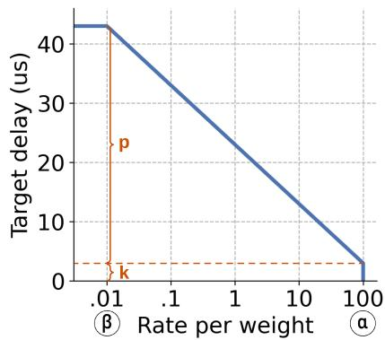  
Figure 1: Target function must be monotonically decreasing. $p$ is the queueing delay scaling and k is always > 0 for full utilization; α and $\beta$ should be set to the highest and lowest rate-per-weight, depending on the scenarios.

As shown in Equation 4, as long as the queueing delay is stabilized around a non-zero value, the link arrival rate is equal to the bandwidth. Since each flow could individually observe queueing delay, the first equation in Equation 3 can be verified in a decentralized manner.

3 Design different queueing delays to represent different weighted fair-share. Since the queueing delay can be stabilized around any value to indicate the link arrival rate, the actual value of the queueing delay can be used to represent another selected property. In Söze, different queueing delays represent different weighted fair-share with a unique one-to-one mapping, where the weighted fair-share $w f s$ is defined as $\begin{array} { r } { w f s = \frac { r _ { i } } { w _ { i } } } \end{array}$ from Equation 2. Specifically, the larger the weighted fair share, the smaller the queueing delay. In addition, we denote a flow’s rate divided by its weight as its "rate-per-weight". For networks in weighted allocation status, each flow’s rate-per-weight is equal to the w f s.

$$
\begin{array} { r } { t a r g e t \_ d e l a y = T ( \frac { r _ { i } } { w _ { i } } ) } \\ { T ( x ) < T ( y ) , \forall x , y \mathrm { ~ w h e r e ~ } x > y } \end{array}\tag{5}
$$

With this relation between the queueing delay and the weighted fair share, each flow could compare its rate-perweight with the $w f s$ value from the queueing delay and find out if it is smaller or larger than the indicated value. In this way, a possible convergence algorithm can be created to converge to the second equation in Equation 3.

4 Provide a convergence algorithm that uses insights 2 and 3 simultaneously. The convergence algorithm will converge to a final steady state indicated by Equation 1, where the weighted fair share is $\frac { B } { w _ { 0 } + w _ { 1 } + \ldots + w _ { n } }$ , and the queueing delay on that link is a function of the weighted fair share.

The target function differentiates flows with larger $\frac { r } { w }$ from flows with smaller ${ \frac { r } { w } } ,$ so that the function is monotonically-decreasing as in Figure 1. With this, each flow

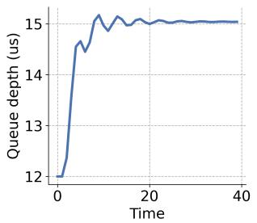

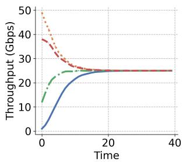  
(a) Convergence to the target (b) Convergence to weighted fairqueueing delay. share.

Figure 2: Convergence for 4 flows on a single switch. calculates a queueing delay according to their own $\frac { r } { w }$

$$
T \left( { \frac { r } { w } } \right) = p \cdot { \frac { l n ( \mathbf { \boldsymbol { \alpha } } ) - l n ( { \frac { r } { w } } ) } { l n ( \mathbf { \boldsymbol { \alpha } } ) - l n ( \mathbf { \boldsymbol { \beta } } ) } } + k\tag{6}
$$

In Equation 6, k is the minimal queueing delay when the link is saturated by one flow; p is the queueing delay scaling to differentiate between different flows. α and β indicate the most frequent range of weighted fair share: α is the highest rate-per-weight, which is usually the link bandwidth divided by the smallest weight; β is the lowest rate-per-weight, which can be determined with the traffic pattern. The update interval is referred as ∆t, where $\begin{array} { r } { \Delta t { } = \frac { R T \dot { T } } { C W N D } } \end{array}$ for per-packet update.

The update function tries to change a flow’s sending rate so that its target delay can match the observed queueing delay.

$$
U \left( { \frac { r } { w } } , D \right) = \left( { \frac { T ^ { - 1 } ( D ) } { \frac { r } { w } } } \right) ^ { m }\tag{7}
$$

In Equation 7, m is a smoother parameter smaller than 2, which is tunable to achieve either faster convergence or more stable final state.

In Algorithm 1, we give an incredibly simple decentralized algorithm for each flow sender to adjust their rate and converge to weighted allocation. After receiving the queueing delay information from the link, each flow calculates a ratio based on its current rate-per-weight and the received queueing delay, then updates the rate accordingly. From any initial bandwidth allocation, the final allocation will always comply with the weighted fair share as in Equation 1.

## 3.1.5 Proof of Convergence to Weighted Allocation

Although the above decentralized algorithm has no explicit information exchange, the queueing delay that contributed by all the flows is also observed by all the flows, which conducts an efficient information exchange towards the weighted bandwidth allocation. With the above design, we are able to have the following two lemmas:

## Lemma 3.1: Convergence to Weighted Fairness

Söze converges to the weighted fairness on a link if and only if $0 < m < 2$ in the update function.

Algorithm 1: Söze’s Rate Adjustment Algorithm   
Input: $w _ { k } , r _ { k } \colon$ weight and rate for flow $f _ { k } ;$   
1 Function MainFunctionForFlowK():   
2 signal = RecvPktWithINT()   
3 if now − last\_update > rtt then   
4 $\begin{array} { r } { r a t i o = \mathbb { U } \left( \frac { r _ { k } } { w _ { k } } , s i g n a l \right) } \end{array}$   
5 $r _ { k } = r _ { k } \cdot r a t i o$

## Lemma 3.2: Convergence to Target Queueing

Söze converges to the target queueing delay level, if and only if $\begin{array} { r } { p > \frac { \Delta t } { 2 } \cdot [ \ln ( \alpha ) - \ln ( \beta ) ] } \end{array}$

The idea for proving the above two lemmas is that all the flows together contribute to the queueing and maintain the queueing at the target delay level. The observed delay is the same across all flows, which provides a guidance for achieving fairness; The observed delay is maintained at a certain level, which provides the guarantee of achieving full utilization. The complete proof is in Appendix C and Appendix D of [59].

## 3.2 Arbitrary Network Scenario

Based on the weighted allocation in a single-switch scenario (§3.1), Söze also achieves weighted bandwidth allocation in the arbitrary network scenario, such as the widely used multilayer network architecture in production data centers. In this section, we firstly introduce the goal of the weighted resource allocation in §3.2.1; Then, to accommodate the complex scenario, we explore the properties of the flow bottleneck in §3.2.2; Lastly, we extend the collected INT signal to be the maximum queueing delay from all links on the path in §3.2.3.

## 3.2.1 Goal: Weighted Max-min Allocation

For the network-wide scenario, a flow may travel multiple links along the path and contend with different sets of other flows. However, for any flow traveling multiple hops, there will be at least one bottleneck link, which determines the flow rate. Thus, the weighted allocation should happen on the bottleneck link for any flow, which is also the goal of weighted max-min fair allocation. According to the previous papers, the weighted max-min fair is defined as follows:

## Definition 3.1: Weighted Max-min Fair [14, 38]

For all flows $\{ f 1 , . . . , f n \}$ in the network, denote their weight to be $\{ w _ { f 1 } , . . . , w _ { f n } \}$ . A rate allocation $\{ r _ { f 1 } , . . . , r _ { f n } \}$ is weighted max-min fair when for each flow $f ,$ any increase in $r _ { f }$ would cause a decrease in the

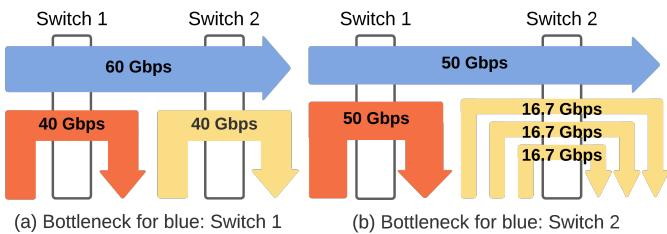  
Figure 3: Bottleneck changes in weighted max-min fair: blue flow weight: 3, red flow weight: 2, yellow flow weight: 1.

$$
\frac { r _ { f ^ { \prime } } } { w _ { f ^ { \prime } } } \leq \frac { r _ { f } } { w _ { f } } .
$$

In the weighted max-min fair, each hop divides the bandwidth to let each bottleneck flow have the same "rate-perweight". As Figure 3 shows, the "rate-per-weight" is the same for the blue flow and the red flow, and the rate allocation is equivalent to having "weight" number of individual flows.

With the above analysis, we realize that recognizing the bottleneck becomes the new challenge when achieving the weighted max-min fair in arbitrary networks. In the next subsection, we will show how to simply recognize the bottleneck hop and obtain the INT signal from the bottleneck.

## 3.2.2 The Bottleneck Hop Properties

In §3.1, Söze already achieves the weighted bandwidth allocation on a single switch in a decentralized manner. Thus, in order to achieve the weighted max-min fair, the major challenge is to recognize the bottleneck hop for each flow, then achieve weighted allocation on the bottleneck hop. According to the definition, achieving fair allocation on the bottleneck hop for every flow is just achieving weighted max-min fair.

From the definition, we could derive a lemma that could help us identify each flow’s bottleneck hop, namely, the hop that prevents the flow from increasing the rate further.

## Lemma 3.3: Bottleneck Hop Properties

When achieving weighted max-min fair, each flow will have the largest rate-per-weight among all flows on its bottleneck hop and not on any other saturated hop.

Intuitively, a flow must have the largest rate-per-weight on its bottleneck hop, otherwise, it could take more bandwidth from the flows on this hop who has a higher rate-perweight; a flow cannot have the largest rate-per-weight on a non-bottleneck saturated hop, since there must be some other flow on that hop could steal more bandwidth from it. The full proof of the above lemma is in Appendix E of [59].

With Lemma 3.3, we could easily know that if a flow has the largest rate-per-weight only on its bottleneck hop, then among all hops that this flow travels, the bottleneck hop must have the highest queuing delay. Because on non-bottleneck hops, there must be a flow with larger rate-per-weight, and

And our target function is monotonically decreasing. Thus, the queueing delay on any other hops is lower than the bottleneck queueing delay. The proof is included in Appendix E of [59].

## 3.2.3 Recognize Bottleneck with maxQD Signal

With the above properties, we could know that a flow does not have the largest rate-per-weight on hops other than the bottleneck hop. Thus, the bottleneck hop always has the highest queueing delay for that flow. In the single-switch scenario, we use the queueing delay (QD) signal from one hop to achieve the weighted allocation on that hop. Similarly, for a flow that travels multiple hops in an arbitrary network, we can use the maximum per-hop queueing delay (maxQD) signal to achieve weighted allocation on the bottleneck hop of that flow.

The algorithm does not need to know on which hop the maxQD signal was collected, switches simply compare and replace the packet header to keep the maxQD signal is enough to achieve weighted max-min fair on the bottleneck hop. With this solution, maxQD becomes the signal in Algorithm 1.

With this new INT signal, we could derive our theorem on achieving weighted max-min fairness with Söze. The full proof is given in Appendix E of [59].

## Theorem 3.1: Weighted Max-min Fairness

For every flow in an arbitrary network, Söze converges to a weighted max-min fair allocation, if and only if 0 < m < 2 in the update function and $\begin{array} { r } { p > \frac { \Delta t } { 2 } \cdot \left[ \ln ( \alpha ) - \ln ( \beta ) \right] } \end{array}$ in the target function.

## 3.3 System Design Summary

With all the above analysis on how to achieve weighted maxmin fairness in arbitrary networks, we are able to give our system design in this section.

Collect maxQD in data packet and reflect in ACK packet. As shown in Figure 4, each packet contains a fixed-length packet header to store the maxQD INT data, which usually takes 2 bytes in the field. When the data packet travels the forwarding path, it compares and keeps the highest per-hop queueing delay on each hop. After reaching the receiver side, the receiver host will attach the maxQD information to the ACK packet and send it back to the sender. Thus, the maxQD signal is collected at the sender side for every ACK packet.

Host control with the INT signal. The rate control is conducted at the sender host. Firstly, after receiving the INT signal from the packet, the host will parse the maxQD data from the packet header and use it to determine the multiplicative rate update ratio. Then, the rate can be controlled with either a traditional CW ND specification or with a rate-based specification, such as the pacing in some CC algorithms [35]. Note that, when using the window-based protocol, we are still using the "rate" rather than the congestion window directly. The rate of the flow needs to be calculated with CW ND and RT T by $\begin{array} { r } { r a t e = \frac { C W N D \cdot p k t s i z e } { R T T } } \end{array}$ . Lastly, Söze serves both as congestion control and as a weighted resource allocation protocol. Thus, Söze should be on the networking stack, either in the kernel or running on the NIC hardware. The applications should give the weight specification through an API.

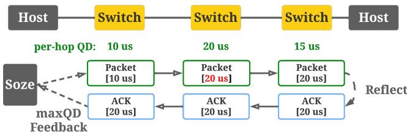  
Figure 4: System design of Söze.

Conduct rate update in per-packet manner. Typical CC algorithm conducts rate update for each RTT, because they are using AIMD-based algorithm for convergence. In Söze, the convergence to weighted fairness is performed with a new adaptive-update algorithm in Algorithm 1. Moreover, each individual maxQD signal can reflect the network condition and calculate the rate update. Thus, achieving a per-packet rate update becomes beneficial to weight enforcement, making the convergence faster and stabilizing the rate enforcement.

## 3.4 Discussion

Weight distribution policy. With Söze, each application could individually determine the weight of its flows and obtain the corresponding bandwidth from the network. However, if each application increases its weight to maximum blindly, the weighted fairness will not benefit any application. For practical usage, there should be guidelines for weight determination and restrictions on the application’s behavior.

The network operator could define any usage policy based on their specific workloads and service-level objectives, which, we emphasize, is not the focus of this paper. We use one simple idea for a discussion as follows: 1) Each application has a total weight that it can distribute across different hosts and flows, but the application can pay the service provider to get more total weight. 2) An application can decrease the weight of any flow when possible, namely, not fully utilize all the weights. 3) When an application wants to increase the weight of flows, some other flows in the same application need to decrease their weight so that the sum of the weights in an application is generally the same. This simple policy gives applications the ability to be altruistic to others, but when the application wants to benefit themselves, some penalties will be added to regularize their behavior.

Policy enforcement monitor. For applications inside the cloud, Söze expects them to follow the policy for weight distribution from the cloud provider. However, there is still the possibility that an application does not follow the policy. To monitor whether all the applications’ behavior follows the policy, a logging system could be used. 1) Whenever the networking stack receives a weight specification from the application through the API, Söze will log the timestamp, flow ID (e.g., 5-tuple), and the specified weight. 2) Periodically, each application’s weight update logs will be gathered to a policy checker, where the policy will be verified through the logs from multiple machines.

Queuing as INT signal. Although in this paper we use queuing delay as the feedback signal, the queuing level is controlled by the target function in Equation 6. Thus, the queue can be maintained at a relatively low level, as shown in Figure 13. Besides queuing delay, the design of Söze also applies to other INT signals, such as link utilization or ECN marking ratio. For different signals, the properties of the system also vary, which will be discussed in future studies.

## 4 Implementation

We implemented Söze with both the Linux kernel module to replace Linux’s default Cubic transport and kernel-bypassing network transport — eRPC. We also provide simulator implementation on the NS-3 simulator for large-scale experiments.

Switch implementation. We implement the queueing delay signal on Tofino switches [9] with 9 lines of code. When every packet reaches the exit point of the switch, the switch uses the low-pass filter LPF() function to collect the queueing signal in the "sampling mode". By controlling the sampling interval, we can adjust the signal to be each individual packet’s queueing delay or smoothed queueing delay over multiple packets. In Söze, the default setting is to output the smoothed queueing delay over 10 µs.

1 Lpf<bit<32>, bit<10>>(size=1) lpf\_queue; # type="SAMPLE"   
2 queue\_input = (bit<32>) eg\_intr\_md.deq\_timedelta;   
3 queue\_output = lpf\_queue.execute(queue\_input, 0);

Host implementation 1: kernel module. We implemented a prototype of Söze as a Linux kernel module with 241 lines of code, which can be installed on Linux without recompiling the kernel. By replacing the kernel module for congestion control, we could receive the maximum per-hop queueing signal in a TCP option field. For the functions exp() and log() in Söze, we implemented efficient approximation functions without using the STL library. For application integration, we added one TCP socket option and used that field to configure the weight for this specific TCP socket. To deliver the weight specification, we allow the application to modify the value of the TCP socket option field as the weight value. For Söze, the parameters are set to: p = 20µs, k = 3µs, m = 0.25. As a baseline, the default algorithm for Linux is TCP-Cubic. The switch port bandwidth is set to 25 Gbps.

Host implementation 2: eRPC. Alternatively, we also implemented Söze in an RPC library — eRPC [31], an open source RPC library that supports Ethernet, InfiniBand, and RoCE.

We add an additional field in the erpc header to carry the max queueing delay information, and use the same Tofino switches to attach those signals to each data packet. We replace the Timely CC algorithm in erpc with Söze and added supporting features, such as packet header changes and queueing signal processing, in 1972 lines of code. For application integration, eRPC uses userspace networking with polling, so applications can directly communicate with eRPC through the API and reconfigure the weight parameter for eRPC connections. The parameters for Söze are set to: $p = 2 0 \mu s , k = 3 \mu s , m = 0 . 2 5$ The bandwidth is 25 Gbps.

NS-3 simulator implementation. We also implement Söze in NS-3 [2]. The switches in the simulator have been customized to provide the maximum per-hop queueing delay. The packet header with "maxQD" will be updated on every hop to keep the maximum queueing delay so far. This maxQD information is sent back to the sender through the ACK packets. For Söze, unless otherwise noted, the default parameters in the target function are set as $p = 2 0 \mu s , k = 3 \mu s , m = 0 . 2 5 .$ For DCQCN, we use all the parameters suggested in [62, 63]. For HPCC, all the original settings from [35] are kept unless noted: $W _ { A I } = 8 0$ Bytes, maxstage = 5, and θ = 95%.

Principles for choosing parameters. The choice of the parameters is based on the following principles: p controls the granularity of the INT signal, a higher p value leads to higher queuing delay but less rate oscillation, so we tend to choose the minimal p value that gives a relatively low rate enforcement oscillation. k controls the base queuing delay, which may cause the utilization to be less than 100% if k is too small. Thus, we choose the minimal k that provides full link utilization. m controls the convergence speed, higher m leads to faster convergence but worse rate oscillation. So, there is a wide spectrum of m that may suit different workload patterns.

## 5 Evaluation

We will evaluate Söze on both the testbed and the large-scale simulator. Firstly, we demonstrate application use cases for Söze on the eRPC testbed in §5.1; Secondly, we also evaluate the efficiency of Söze as the congestion control protocol alone and compared with existing industry solutions in §5.2; Lastly, in §5.3, we conduct micro-benchmark experiments in the simulator to show that Söze can achieve fine-grained weighted max-min fair allocation rapidly on a large scale.

eRPC testbed setup. For the eRPC testbed, we connect four servers with DPDK-capable CX-4 NIC to a Tofino-1 programmable switches in a star topology. The flow is the RPC write request sent from one host to another, where the request size is 7 MB and the response size is 32 bytes. When multiple hosts send write requests to the same host, the switch egress port to that destination host will become the bottleneck. In the eRPC testbed, we compare our scheme with Timely [39], the default CC used in eRPC.

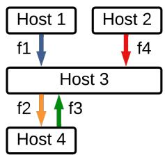  
(a) Flows' src& dst.

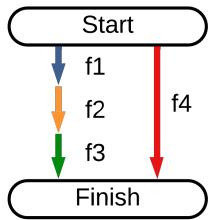  
(b) Execution chart.

Figure 5: Scenario for critical path acceleration.  
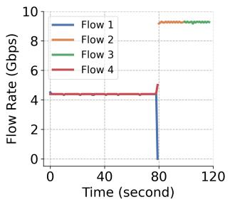

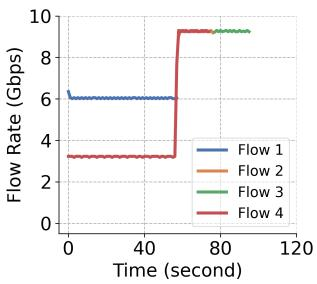  
(a) Fair allocation.  
(b) Weighted: f1:f4=2:1.  
Figure 6: Reduce completion time by prioritizing critical path.

NS-3 simulator setup. In the NS-3 simulator, we built a network with 1024 servers and 320 switches in a fat-tree topology. The simulator uses 100 Gbps links with 1 µs link delay, 32 MB buffer size, and 1000 bytes packet payload size. In the simulator, we compare Söze with DCQCN and HPCC. All the parameter settings are adopted from their original paper.

## 5.1 Application Case Study

Firstly, we evaluate the application benefits from Söze in several scenarios on the eRPC testbed. The scenarios below are a small subset of the benefits for demonstration. We then evaluate Söze on the TPC-H jobs in the NS-3 simulator.

## 5.1.1 Prioritize Critical Path inside a Job

Consider stage-based applications such as map-reduce, distributed matrix multiplication, DNN training, etc., where there are several computation and communication phases. The endto-end application performance depends on the performance of the critical path. Enabled with modern application-level abstractions and critical-path analysis [36, 45, 58], relative priorities between flows of different paths can be determined prior to execution, and Söze can allocate bandwidths between flows according to those priorities.

As shown in Figure 5(a), a job consists of 4 flows: flow f1 has 20 GB of data, flow f2 has 10 GB, flow f3 has 10 GB, while flow f4 has 20 GB. As shown in Figure 5(b), f2 can only start when flow f1 finishes, and f3 can only start when f2 finishes. And flow f1 and flow f4 share the same bottleneck.

When fairly sharing the resource between flow 1 and flow 4 as in Figure 6a, the start of flow 2 will be delayed, and the job completion time is 117 seconds. Once we recognize the critical path, we can prioritize flow 1 over flow 4 by setting their weight to be $\frac 4 3$ and $\frac { 2 } { 3 }$ , so that flow 1 gets twice bandwidth than flow 4 and the sum of their weights still add to 2. As shown in Figure 6b, prioritized allocation reduces the job completion time to 96 seconds.

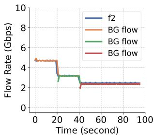  
(a) Fair allocation for f2.

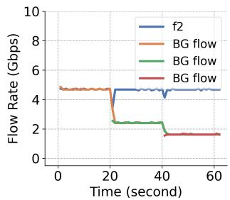  
(b) Straggler mitigation for f2.

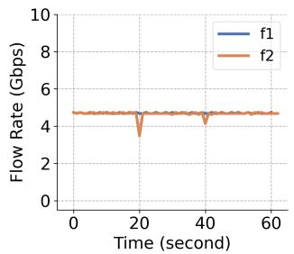  
(c) Rates after mitigation.

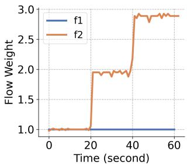  
(d) Weights after mitigation.

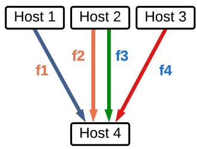  
Figure 7: Mitigate straggler.

(a) Experiment setup.  
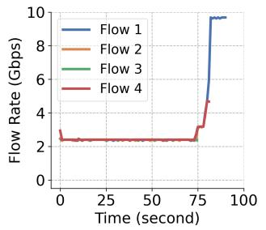  
(b) Fair allocation.

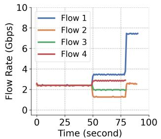  
(c) Weighted allocation.

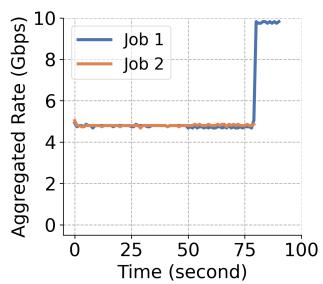  
(d) Aggregated rates.  
Figure 8: a) The flows f1 and f2 belong to job 1, and the flows f3 and f4 belong to job 2; b) The fair allocation equally allocates the bandwidth among all four flows, and rebalances when any flow finishes. Under the fair allocation, job 2 finishes at 82 seconds. c) The weighted allocation will update the weights at time 50 s, letting f3 and f4 finish at the same time and reducing the completion time for job 2 to 79 seconds; d) For the weighted allocation, each job always has the same aggregated bandwidth as before the weight changes, so that the bandwidth rebalancing only happens within a job.

## 5.1.2 Identify and Mitigate Stragglers inside a Coflow

A common technique for mitigating stragglers in a coflow is to dynamically change the inter-flow priority. Such a scenario can be an interesting use case for Söze. Due to the zero-coordination and fast-convergence properties, Söze can implement the weighted bandwidth allocation with arbitrary granularity among the flows of a coflow to mitigate stragglers, and thus minimize the coflow-completion time.

This experiment tries to identify the straggler for an allshuffle job. The figure focuses on two flows inside one coflow, where flow f2 is twice as large as flow f1. When the resources are fairly shared by f2 and background flows, flow f2 will decrease the rate as shown in Figure 7a; To mitigate the straggler and make flow f2 finish around the same time as flow f1, we monitor the progress of flow f2, if the progress cannot catch up with f1 under current sending rate, the weight of flow f2 will increase as in Figure 7d, and flow f2 will take more bandwidth from the background traffic and maintain the same rate as flow f1 as shown in Figure 7b and Figure 7c.

## 5.1.3 Share Resource on Common Bottleneck

Another great property of Söze is that we can reallocate the resource among flows within the same application, while the application generally keeps the same total bandwidth utilization and minimizes the effect on other applications’ behavior. This property can be helpful, especially when some jobs share the same bottleneck in the network, such as the firewalls or load balancers. When applications share the same bottleneck, the resource allocation for each application can be perfectly isolated if the sum of weights remains the same.

In this experiment, we have two jobs in total. As shown in Figure 8, one job has two parallel flows f1 and f2, while the other job has two other parallel flows f3 and f4. Both jobs need data from every parallel flow for further computation, so we want them to finish at the same time to minimize waiting time. Because all the flows have different sizes, we change the weight of every flow at time 100 seconds. However, to keep the same job-level resource allocation, we choose the weight carefully so that the sum of all the flows’ weights within one application remains the same. As you can see in Figure Figure 8d, no matter before or after the weight changes, the bandwidth that each job occupied in total is always around 5 Gbps, while each individual flow’s bandwidth has been updated depending on the size. In summary, by restricting the sum of all flows’ weights insides one job to be a constant, each job reduce the interference with other jobs’ resource;

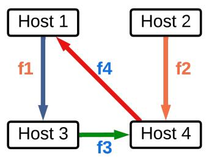  
(a) Experiment setup.

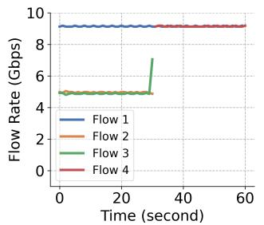  
(b) Fair allocation.

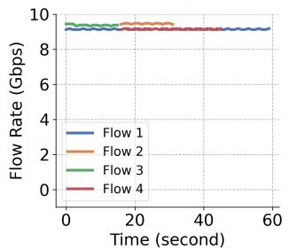  
(c) Optimal allocation.

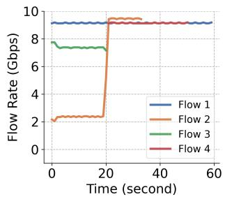  
(d) Altruistic allocation.  
Figure 9: a) The flows f1 (28 GB) and f2 (7 GB) belong to job 1, where f1 f2 start simultaneously. The flow f3 (7 GB) and f4 (14 GB) belongs to job 2, where f4 can only started when f3 finishes; b) With the fair allocation, f2 and f3 fairly share the bandwidth and job 2 finishes at time $6 0 \mathrm { s } ; \mathrm { c } )$ Under the optimal allocation, f2 will initially give all bandwidth to f3. Thus, job 2 finishes at time 45 s; d) With the altruistic allocation, f2 shares the bandwidth with the guarantee that it can still finish on time with its bandwidth. The job 2 finishes at around time 50 s.

Only when different jobs shares the same bottleneck, there is no interference among different jobs.

## 5.1.4 Altruistic Scheduling among Multiple Jobs

Although the weighted allocation could help us prioritize the critical execution path, sometimes the critical path cannot be accelerated due to resource limitations and job characteristics. In such cases, other non-critical execution paths could be altruistic by giving up some resources to other jobs, as long as the non-critical execution paths can finish at the same time as the critical path, the job completion time is not harmed. However, the bandwidth altruistically given to other jobs may benefit their completion time.

In the example of Figure 9, we have two jobs: one job has two parallel flows, f1 and f2, while the other job has two sequential flows f3 and f4. In the fair allocation case, flows f2 and f3 fairly share the inbound bandwidth at host 4, and both finish at around 30 seconds. Then, flow f4 starts and finishes at 60 seconds. However, because flow f1 is much larger than flow f2, we could let flow f2 give up some bandwidth without hurting the job completion time. In the optimal allocation scenario, flow f2 can give all the bandwidth to flow f3 and achieve the minimum job completion time. However, this is not safe because one job does not know the size of the other job’s flow. Thus, in the altruistic allocation case, we let f2 get only 25% of the bandwidth, because this is the minimum bandwidth to guarantee completion at the same time with flow f1. With this altruistic behavior, flow f3 finished much earlier at 20 seconds, so that its job also finished at time 60 seconds, which is 10 seconds earlier than the fair allocation.

## 5.1.5 Shortest-flow Prioritization

In this experiment, we create an in-cast scenario where three hosts send RPC write requests to one host. Note that this experiment is not under the assumption that all flows come from the same job and need to follow the weight distribution policy. The size of the RPC write varies based on the workload, from around 700 MB to 7000 MB. Because the three senders may send RPCs of different sizes at the same time, prioritizing the RPCs with the smallest size could approximate shortest job first scheduling and reduce the overall average flow completion time. Thus, based on the flow size, we calculate a specific weight for flow with the equation $\begin{array} { r } { w e i g h t = \frac { m a x \_ f l o w \_ s i z e } { f l o w \_ s i z e } } \end{array}$

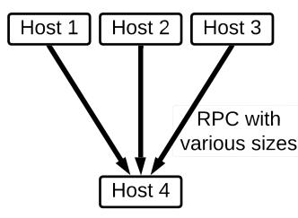

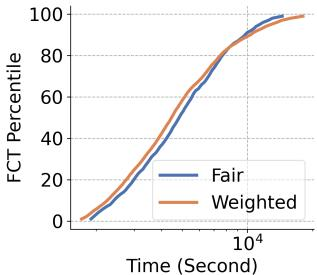  
(a) Experiment setup.  
(b) Flow completion time.  
Figure 10: Shortest flow prioritization.

As we can see in Figure 10, when we update the weight according to the flow size, smaller flows finish faster than the fair allocation case. As a trade-off, only a small portion of large flows suffer from longer completion time than fair allocation, while more than 80% of the flows benefit from the approximately shortest-flow first allocation. Moreover, unlike a strict shortest-flow first policy, like the preemption-based schedulers, Söze never starves the large flows.

## 5.1.6 TPC-H Benchmark Acceleration

Furthermore, we also test the 22 jobs from the TPC-H benchmarks [1] in our NS-3 simulator, in which each job is an execution DAG with tasks. Each task is randomly placed on a host within a fat-tree topology. For every flow in the DAG, we calculate the longest distance from this flow to the end of the DAG and use this distance to determine the flow’s weight. This simple policy is designed based on the insight that the longer execution path needs more resources. In Figure 11, with Söze providing the weighted allocation, the average job completion time is reduced by 0.79×, and the maximum reduction is 0.59×. Only jobs that have only one execution path do not receive benefits from Söze.

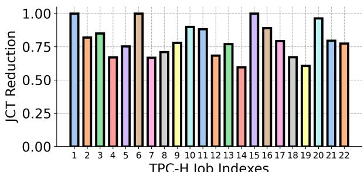  
TPC-H Job Indexes

Figure 11: TPC-H jobs acceleration with weighted allocation.  
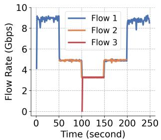  
(a) Timely.

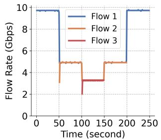  
(b) Söze.  
Figure 12: Step-in & step-out experiment on eRPC testbed. Söze achieves higher utilization and faster convergence to the optimal state than Timely.

## 5.2 Efficient Congestion Control

## 5.2.1 Step-in & Step-out Experiment in Testbed

To show that Söze can serve as an efficient congestion control algorithm, we conduct a step-in and step-out experiment on the eRPC testbed with three hosts sending traffic to one host. Every 50 seconds, a new flow was added to the incast host from a different sender until time 100 seconds, then every 50 seconds, one flow will terminate and give bandwidth back.

As shown in Figure 12, Söze outperforms Timely, the default congestion control algorithm in eRPC. When there is only one flow, Söze achieves higher utilization than Timely; and when a new flow arrives or an existing flow completes, Söze converges to the new optimal allocation faster than Timely because of the proposed adaptive MIMD algorithm.

In Figure 13, we also show the round-trip time (RTT) for both Timely and Söze. The RTT of Söze increases with more number of flows competing on the link, because our target function is monotonically decreasing as the fair-share rate of the link increases. Nevertheless, Söze still achieves lower RTT than Timely, because we use a range of queueing delay to indicate different levels of congestion, and the maximum queueing delay in Equation 6 bounds the RTT of Söze.

## 5.2.2 Step-in & Step-out Experiment in NS-3

In the NS-3 simulator, we also conducted a step-in and stepout experiment with hosts under different ToRs sending traffic to the same destination. We compared Söze with one recent data center congestion control algorithm using in-network telemetry — HPCC. In this set of experiment, 4 flows are added every 10 milliseconds, and each flow completes every 10 milliseconds in sequence.

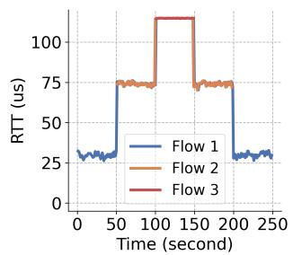  
(a) Timely.

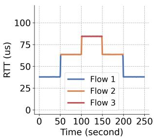  
(b) Söze.

Figure 13: Söze achieves lower RTT than Timely by using queueing level as the signal to indicate congestion.  
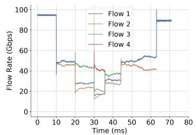  
(a) HPCC.

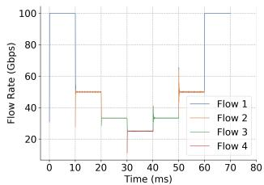  
(b) Söze.

Figure 14: Step-in & step-out experiment in NS-3 simulator. Compared with HPCC, Söze achieves a more stable and accurate rate allocation.  
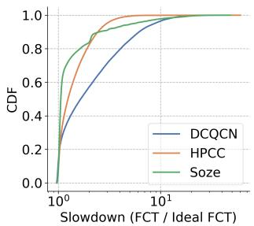

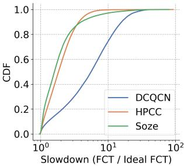  
(a) 40% load.  
(b) 80% load.  
Figure 15: FCT slowdown under different network loads.

Compared to HPCC, the bandwidth allocation in Söze is very accurate and stable in Figure 14. Because Söze uses the queueing delay as the signal to indicate the level of congestion, more specifically, the fair-share rate of the link. While for HPCC, the in-network signal is only used to indicate whether the link is congested or not, so that the bandwidth allocation is not accurate nor stable for HPCC due to the binary status provided by its in-network signal.

## 5.2.3 FCT Slowdown

In order to evaluate the performance of Söze under high network load with a large amount of flows, we run the Google RPC workload [53] with randomly selected sender and receiver. And we compare with two datacenter congestion control solutions — HPCC and DCQCN.

In Figure 15, under both 40% and 80% load, Söze achieves lower FCT slowdown than HPCC and DCQCN, especially for the short flows. Because Söze could grab bandwidth rapidly with fast convergence. As shown in Figure 16, Söze provides more benefits for flows with less than 1000 packets. While for flows with larger data size (> 100k packets), Söze also provides comparable performance with DCQCN and outperforms HPCC, leading to shorter tail FCT slowdown in Figure 15.

## 5.3 Micro-benchmark

In this subsection, we compare Söze with alternative solutions with a set of micro-benchmark experiments on the NS-3 simulator to demonstrate Söze’s weighted max-min fairness, high agility, fine granularity, and scalability.

## 5.3.1 Weighted Max-min Fairness

In the experiment for weighted max-min fairness, we create a scenario where flow 1 only travels switch 1; flow 2, 3, and 4 travel switch 1 and switch 2; flow 4 and 5 only travel switch 2. The link bandwidth is 100 Gbps and the default weight for every flow is 1, so that flow 1 get 40 Gbps at the beginning. Every 10 milliseconds, the weight of flow 1 will be increased by 1. When the weight is 2, flow 1 still gets 40 Gbps because the bottleneck hop for flow 2, 3, and 4 is still switch 2. Only when the weight increases to be higher than 3, the bottleneck hop becomes switch 1 and flow 1 will take more bandwidth from other flows on switch 1.

As we described in §3.2, the weighted max-min fairness for every flow is determined by its bottleneck hop. In Figure 17, we show that the bottleneck hop for flow 2, 3, and 4 changes with the increase of flow 1’s weight. With this microbenchmark experiment, we demonstrate that Söze can recognize the bottleneck hop for every flow and achieve weighted max-min fairness rapidly after the weight is changed for any flow in the network. Moreover, the bottleneck hop changes at time 20 ms, and Söze handles the changing bottleneck rapidly within 10 RTTs. For comparison, we test how weighted roundrobin (WRR) scheduling in switches combined with AIMD rate control would perform in this scenario. WRR enforces weighted sharing of bandwidth at the packet scheduling level but senders must still discover the achievable bandwidth at the end-to-end level. The AIMD control uses queuing delay as the explicit feedback signal: when the queuing delay is below 20 µs (this value is chosen to ensure good link utilization in the experiment), the CWND is increased by 1; when the queuing delay exceeds 20 µs, the CWND is reduced by 20% (this value is chosen to limit oscillation). In the results in Figure 17c, we can see that the rate for each flow is maintained correctly around the weighted max-min fair allocation by WRR scheduling. However, the link utilization is lower than with Söze because the oscillation due to AIMD is larger.

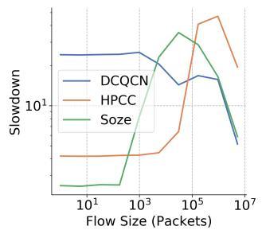  
(a) 40% load.

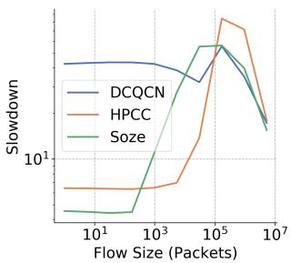  
(b) 80% load.  
Figure 16: FCT slowdown for different flow size under different network loads.

## 5.3.2 Granularity Micro-benchmark

To show the granularity of the weighted allocation, we make use of a coflow scenario, where each coflow is consist of 10 flows, and the flow size is randomly chosen from a range of [1 GB, 3 GB]. In Söze, according to the size of each flow, the flow will be assigned with a certain weight to complete at the same time with other flows: in Söze’s scenario, the weight is equal to the flow size. For the multi-connection solution, we will choose the closest integer number with the flow size. For instance, there will be 2 connections for a flow with 2.4 GB data size and there will be 3 connections for a flow with 2.6 GB data size. For the switch-based weighted round-robin solutions, we test on a scenario where each switch has 4 physical queues. We try to pack the 10 different flows into 4 physical queues and set a certain weight for each physical queue. The flows with similar data size will be packed into the same queue, and they will fairly share the bandwidth from that physical queue. The sum of the flow data size within a queue will be used to calculate the weight of each queue.

In Figure 18a, Söze allows all the flows within a coflow to finish at nearly the same time, so that it has the minimum FCT difference among all the alternative solutions. In contrast, the multi-connection solution ("Multi-Conn") only provides integer number of concurrent connections, which makes the weight enforcement rigid and cannot support non-integer weight; the switch-based weighted round-robin ("Physical Queue") relies on limited number of physical queues, and weight enforcement granularity will degrade when the number of flows exceeds the number of queues.

In addition, we also compare different schemes by changing weights or the number of connections. We create a simple in-cast scenario, where two flows are sent to the same destination host. In Figure 18b, we increase the weight for flow 0 every 2 milliseconds by 5‰, 10‰, 20‰, etc. The figure shows that the rate allocation can be accurately stabilized around any level, even when the weight difference is relatively small. In contrast, we also let both Söze and HPCC have multiple connections to change the rate allocation. In Figure 18c, Söze adds one connection for flow 0 every 5 milliseconds. The rate allocation changes accurately accordingly to the number of connections, but the allocation granularity is limited to weights with integer numbers. For HPCC with multi-connection in Figure 18d, the flow rates are also maintained around the weighted allocation, but the rate enforcement is less accurate and also suffers from coarse-granularity due to integer weights.

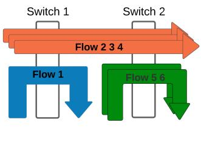  
(a) Experiment scenario.

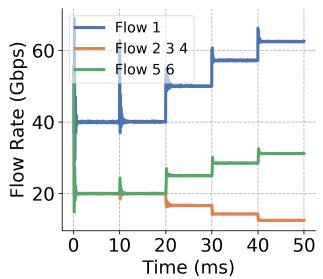  
(b) Söze with increasing weight.

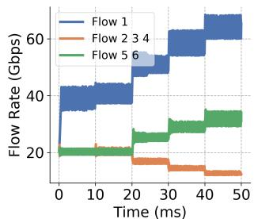  
(c) WRR with AIMD.

Figure 17: a) Flow 1 and flow 2, 3, 4 compete on switch 1; flow 5 and 6 compete with flows on switch 2. During time 0 ms to time 50 ms, we increase the weight of flow 1 from 1 to 5 every 10 ms. b) Söze achieves accurate weighted sharing. When the weight of flow 1 is smaller than 2, flow 1 remains at 40 Gbps since switch 2 is the most congested hop; but when the weight is higher than 2, flow 1’s rate increases because the congested hop has become switch 1. c) For comparison, we repeat the experiment using weighted round-robin (WRR) scheduling in switches to achieve flow 1’s increasing weight; AIMD rate control is used to adapt to the weight changes.  
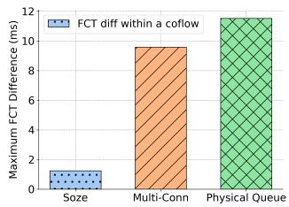  
(a) Granularity comparison.

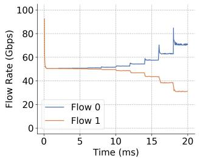  
(b) Söze with weight updates.

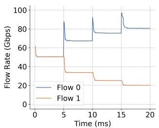  
(c) Söze multi-connection.

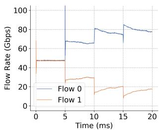  
(d) HPCC multi-connection.  
Figure 18: Granularity and agility comparison.

## 5.3.3 Agility Micro-benchmark

With the same experiment in 18b that changes the weights for Söze, we also demonstrate the agility achieved by Söze. As shown in Figure 18b, on average, it only takes less than 10 RTTs for Söze to converge to the new rate under the new weight. We can observe that there is a rate surge right after each weight change and before convergence. This is because we are increasing the weight of flow 0, thus the new converged queueing delay is higher than before, so the rate needs to exceed the line rate briefly to stack the switch queue.

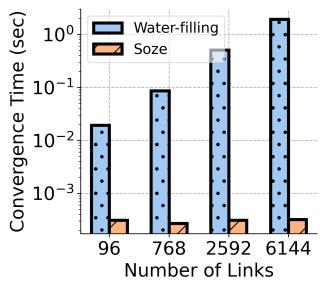

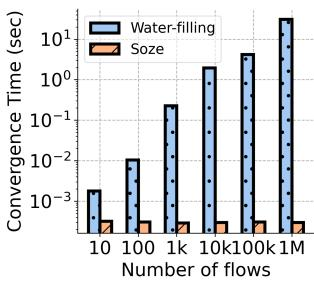

## 5.3.4 Scalability Micro-benchmark

(b) Increasing flow count.

Scalability is the key to supporting large-scale systems with consistent performance despite increasing scale. Söze is a fully distributed system and can inherently scale to datacenters of any size; in contrast, the water-filling algorithm is a centralized solver, which needs to gather all the information to one master node and use its resources for computation. In the following experiments, we test the convergence time of

(a) Increasing topology size.

Figure 19: The solving time for the water-filling algorithm increases drastically with either increasing topology size or increasing number of flows; while Söze provides consistent convergence speed toward the global weighted allocation state despite of the increasing topology size or flow count.

Söze and the solving time of the water filling to demonstrate the capability to scale for those two solutions.

Firstly, we maintain the same number of flows and change the fat-tree network topology sizes by parameter K. We chose the number of flows to be 10k so there are roughly 10 flows per server when K = 16. In Figure 19a, when the topology size increases from K = 4 (16 hosts) to K = 16 (1024 hosts), the solving time of the water filling algorithm increases drastically. In contrast, for Söze, once applications have determined the weights, the convergence time towards the global weighted bandwidth allocation is always around the same magnitude.

The average convergence time for Söze is 0.3 milliseconds, which is around 10 RTTs.

Moreover, we also tested the convergence time for Söze and the water filling algorithm with increasing number of flows under the same topology. As shown in Figure 19b, the network topology is always a fat-tree with 1024 servers (K = 16), and the number of flows in the network increases from 10 flows to 1 million flows. As more and more flows are added to the network, the solving time for the water filling algorithms increases from 1.81 milliseconds with 10 flows to 31.1 seconds with 1 million flows. While Söze still provides consistent convergence towards the global weighted allocation within 10 RTTs. Thus, the water-filling algorithm has inherent drawbacks to support large-scale data center; while Söze benefits from the decentralized design and can be scale up with nearly no performance degradation.

## 6 Related Work

One line of work focuses on using weighted fair queueing (WFQ) on the switches to achieve weighted allocation. Num-Fabric [42] assumes switches support WFQ in hardware, then provides algorithms for setting the weight parameters in switches to optimize for a utility objective. NumFabric is complementary to Söze, because Söze replaces switch WFQ; weight parameters provided by NumFabric can be used to implement the desired utility objective on Söze even more easily, because there is no talking to switches’ control planes.

Besides using weighted fair-queueing algorithms on switches [16, 21, 23, 46, 52] to allocate bandwidth, a recent trend is to use programmable switches to approximate weighted fair-queueing [22, 50, 54, 60, 61]. Such switch-based solutions are hard to scale because of the resource limitations on the switches. To enforce the per-flow weighted allocation accurately among many flows, the switch data plane needs to keep a large amount of information, which may exceed the memory capacity. Moreover, the delay and the complexity of the control plane for such a scheme are both high, which leads to a lack of agility. To add a new flow or to change the weight, the flow sender needs to inform all the switches along the flow’s path individually. Besides, those works heavily rely on programmable switches, which are not widely used in production, and those switches are usually less cost-effective than commodity switches with fixed telemetry functions. PERC [30] proposes an alternative approach that departs from the existing DCN service model; it requires switches to run a distributed algorithm to continuously compute the max-min fair shares for all flows and communicate them to end hosts; the algorithm requires control packets that must be processed by switches, requiring multiplication and division operations. In contrast, Söze only requires INT from the switches, and end hosts can do the rest.

As for solutions that do not rely on switches, a bandwidth allocator [27,32,34,51] is also capable of achieving weighted max-min fairness for all flows. By aggregating the sources, destinations, and demands of all flows, the allocator can calculate a rate allocation plan for each flow. However, this solution requires aggregating information and calculating the allocation plan at the controller, which may lead to a long solving time when the scale of the network increases. Moreover, such solutions are not agile. Each time a flow needs to change weight or a new flow arrives, the whole rate allocation algorithm may need to be executed, leading to high overhead and long control plane delay.

There are also proposals that aim to manipulate the congestion window to allow a flow to take up more bandwidth when needed. For example, D2TCP [56] proposes to adjust the congestion window size more or less aggressively based on how close the time is to the deadline. MulTCP [20] heuristically lets a flow act like N flows in adjusting its congestion window more aggressively. Both solutions build on top of the TCP algorithm, but suffer from the inherited drawbacks, like slow convergence and throughput jitter. Weighted allocation is not the goal of D2TCP, while in MulTCP the effect of increasing the N parameter is not linear and may change for different situations. In contrast, Söze achieves fast convergence, low throughput jitter, and accurate weighted fair allocation.

Besides weighted allocation, priority-based allocation solutions [13, 40] are also used to provide service differentiation between flows, but such solutions have some intrinsic disadvantages over weighted bandwidth allocation, such as head-ofline blocking if preemption is not allowed, and starvation risk. Moreover, priority-based differentiation schemes are a larger departure from the existing DCN service model that’s based on fair allocation. Söze represents a potentially more compatible evolutionary direction with flexible and controllable allocation for general-purpose DCN.

## 7 Conclusion

In this paper, we propose Söze, a simple and efficient weighted bandwidth allocation system for data center networks. Söze designs the maxQD INT signal to not only indicate network status but also provide a control knob to coordinate multiple flow senders. Furthermore, Söze co-designs the decentralized rate update algorithm with the maxQD signal, which allows each flow to independently move toward the weighted max-min fair allocation in arbitrary networks. We prototype Söze across various platforms and demonstrate that Söze can achieve weighted bandwidth allocation with fine granularity, high agility, and high scalability.

## Acknowledgment

We thank the reviewers and the shepherd Ratul Mahajan for their insightful feedback. This work is partially supported by the NSF under CNS-2214272.

## References

[1] Tpc benchmark h, 2001. http://www.tpc.org/ tpch/.

[2] Ns-3, 2023. https://www.nsnam.org/.

[3] Accelerate ai development with google cloud tpus, 2024. https://cloud.google.com/tpu/.

[4] Google tpu: Architecture and performance best practices, 2024. https://www.run.ai/guides/ cloud-deep-learning/google-tpu.

[5] In-band Network Telemetry in Barefoot Tofino, 2024. https://www.opencompute.org/ files/INT-In-Band-Network-Telemetry-A-\ PowerfulAnalytics-Framework-for-\ your-Data-Center-OCP-Final3.pdf.

[6] In-band Network Telemetry in Broadcom Tomahawk 3. https://www.broadcom.com/company/news/ product-releases/2372840, 2024.

[7] In-band Network Telemetry in Broadcom Trident3. https://www.broadcom.com/ blog/new-trident-3-switch-delivers-\ smarterprogrammability-for-enterprise-\ and-service-provider-datacenters, 2024.

[8] Nvidia rtx server: Powering the future of cloud gaming and ar/vr, 2024. https://www.nvidia.com/en-us/ data-center/rtx-server-gaming/.

[9] Tofino switches by intel, 2024. https://www.intel. com/content/www/us/en/products/details/ network-io/intelligent-fabric-processors. html.

[10] Dennis Abts and John Kim. High performance datacenter networks: Architectures, algorithms, and opportunities. Springer Nature, 2022.

[11] Josh Achiam, Steven Adler, Sandhini Agarwal, Lama Ahmad, Ilge Akkaya, Florencia Leoni Aleman, Diogo Almeida, Janko Altenschmidt, Sam Altman, Shyamal Anadkat, et al. Gpt-4 technical report. arXiv preprint arXiv:2303.08774, 2023.

[12] Mohammad Alizadeh, Albert Greenberg, David A Maltz, Jitendra Padhye, Parveen Patel, Balaji Prabhakar, Sudipta Sengupta, and Murari Sridharan. Data center tcp (dctcp). In Proceedings of the ACM SIGCOMM 2010 Conference, pages 63–74, 2010.

[13] Mohammad Alizadeh, Shuang Yang, Milad Sharif, Sachin Katti, Nick McKeown, Balaji Prabhakar, and Scott Shenker. pfabric: Minimal near-optimal datacenter transport. ACM SIGCOMM Computer Communication Review, 43(4):435–446, 2013.

[14] Miriam Allalouf and Yuval Shavitt. Centralized and distributed algorithms for routing and weighted maxmin fair bandwidth allocation. IEEE/ACM Transactions on networking, 16(5):1015–1024, 2008.

[15] Luis Andre Barroso and Jimmy Clidaras. The datacenter as a computer: An introduction to the design of warehouse-scale machines. Springer Nature, 2022.

[16] Jon CR Bennett and Hui Zhang. Wf/sup 2/q: worst-case fair weighted fair queueing. In Proceedings of IEEE IN-FOCOM’96. Conference on Computer Communications, volume 1, pages 120–128. IEEE, 1996.

[17] Daniel Casini, Paolo Pazzaglia, Alessandro Biondi, Marco Di Natale, and Giorgio Buttazzo. Predictable memory-cpu co-scheduling with support for latencysensitive tasks. In 2020 57th ACM/IEEE Design Automation Conference (DAC), pages 1–6. IEEE, 2020.

[18] Mosharaf Chowdhury and Ion Stoica. Efficient coflow scheduling without prior knowledge. ACM SIG-COMM Computer Communication Review, 45(4):393– 406, 2015.

[19] Mosharaf Chowdhury, Yuan Zhong, and Ion Stoica. Efficient coflow scheduling with varys. In ACM SIGCOMM, 2014.

[20] Jon Crowcroft and Philippe Oechslin. Differentiated end-to-end internet services using a weighted proportional fair sharing tcp. ACM SIGCOMM Computer Communication Review, 28(3):53–69, 1998.

[21] Alan Demers, Srinivasan Keshav, and Scott Shenker. Analysis and simulation of a fair queueing algorithm. ACM SIGCOMM Computer Communication Review, 19(4):1–12, 1989.

[22] Peixuan Gao, Anthony Dalleggio, Yang Xu, and H Jonathan Chao. Gearbox: A hierarchical packet scheduler for approximate weighted fair queuing. In 19th USENIX Symposium on Networked Systems Design and Implementation (NSDI 22), pages 551–565, 2022.

[23] S Jamaloddin Golestani. A self-clocked fair queueing scheme for broadband applications. In Proceedings of INFOCOM’94 Conference on Computer Communications, pages 636–646. IEEE, 1994.

[24] Konrad Gos and Wojciech Zabierowski. The comparison of microservice and monolithic architecture. In 2020 IEEE XVIth International Conference on the Perspective Technologies and Methods in MEMS Design (MEMSTECH), pages 150–153. IEEE, 2020.

[25] Matthew P Grosvenor, Malte Schwarzkopf, Ionel Gog, Robert NM Watson, Andrew W Moore, Steven Hand,

and Jon Crowcroft. Queues don’t matter when you can jump them! In 12th USENIX Symposium on Networked Systems Design and Implementation (NSDI 15), pages 1–14, 2015.

[26] Arpan Gujarati, Reza Karimi, Safya Alzayat, Wei Hao, Antoine Kaufmann, Ymir Vigfusson, and Jonathan Mace. Serving {DNNs} like clockwork: Performance predictability from the bottom up. In 14th USENIX Symposium on Operating Systems Design and Implementation (OSDI 20), pages 443–462, 2020.

[27] Chuanxiong Guo, Guohan Lu, Helen J Wang, Shuang Yang, Chao Kong, Peng Sun, Wenfei Wu, and Yongguang Zhang. Secondnet: a data center network virtualization architecture with bandwidth guarantees. In Proceedings of the 6th International COnference, pages 1–12, 2010.

[28] Sayed Hadi Hashemi, Sangeetha Abdu Jyothi, and Roy Campbell. Tictac: Accelerating distributed deep learning with communication scheduling. Proceedings of Machine Learning and Systems, 1:418–430, 2019.

[29] Anand Jayarajan, Jinliang Wei, Garth Gibson, Alexandra Fedorova, and Gennady Pekhimenko. Priority-based parameter propagation for distributed dnn training. Proceedings of Machine Learning and Systems, 1:132–145, 2019.

[30] Lavanya Jose, Lisa Yan, Mohammad Alizadeh, George Varghese, Nick McKeown, and Sachin Katti. High speed networks need proactive congestion control. In Proceedings of the 14th acm workshop on hot topics in networks, pages 1–7, 2015.

[31] Anuj Kalia, Michael Kaminsky, and David Andersen. Datacenter {RPCs} can be general and fast. In 16th USENIX Symposium on Networked Systems Design and Implementation (NSDI 19), pages 1–16, 2019.

[32] Alok Kumar, Sushant Jain, Uday Naik, Anand Raghuraman, Nikhil Kasinadhuni, Enrique Cauich Zermeno, C Stephen Gunn, Jing Ai, Björn Carlin, Mihai Amarandei-Stavila, et al. Bwe: Flexible, hierarchical bandwidth allocation for wan distributed computing. In Proceedings of the 2015 ACM Conference on Special Interest Group on Data Communication, pages 1–14, 2015.

[33] Gautam Kumar, Nandita Dukkipati, Keon Jang, Hassan MG Wassel, Xian Wu, Behnam Montazeri, Yaogong Wang, Kevin Springborn, Christopher Alfeld, Michael Ryan, et al. Swift: Delay is simple and effective for congestion control in the datacenter. In Proceedings of the Annual conference of the ACM Special Interest Group on Data Communication on the applications,

technologies, architectures, and protocols for computer communication, pages 514–528, 2020.

[34] Terry Lam, Sivasankar Radhakrishnan, Amin Vahdat, and George Varghese. Netshare: Virtualizing data center networks across services. 2010.

[35] Yuliang Li, Rui Miao, Hongqiang Harry Liu, Yan Zhuang, Fei Feng, Lingbo Tang, Zheng Cao, Ming Zhang, Frank Kelly, Mohammad Alizadeh, et al. Hpcc: High precision congestion control. In Proceedings of the ACM Special Interest Group on Data Communication, pages 44–58. 2019.

[36] Jie Liang, Kenli Li, Chubo Liu, and Keqin Li. Joint offloading and scheduling decisions for dag applications in mobile edge computing. Neurocomputing, 424:160– 171, 2021.

[37] Tinghuai Ma, Ya Chu, Licheng Zhao, and Otgonbayar Ankhbayar. Resource allocation and scheduling in cloud computing: Policy and algorithm. IETE Technical review, 31(1):4–16, 2014.

[38] Peter Marbach. Priority service and max-min fairness. In Proceedings. Twenty-First Annual Joint Conference of the IEEE Computer and Communications Societies, volume 1, pages 266–275. IEEE, 2002.

[39] Radhika Mittal, Vinh The Lam, Nandita Dukkipati, Emily Blem, Hassan Wassel, Monia Ghobadi, Amin Vahdat, Yaogong Wang, David Wetherall, and David Zats. Timely: Rtt-based congestion control for the datacenter. ACM SIGCOMM Computer Communication Review, 45(4):537–550, 2015.

[40] Behnam Montazeri, Yilong Li, Mohammad Alizadeh, and John Ousterhout. Homa: A receiver-driven lowlatency transport protocol using network priorities. In Proceedings of the 2018 Conference of the ACM Special Interest Group on Data Communication, pages 221–235, 2018.

[41] Sung-Whan Moon, Jennifer Rexford, and Kang G Shin. Scalable hardware priority queue architectures for highspeed packet switches. IEEE Transactions on computers, 49(11):1215–1227, 2000.

[42] Kanthi Nagaraj, Dinesh Bharadia, Hongzi Mao, Sandeep Chinchali, Mohammad Alizadeh, and Sachin Katti. Numfabric: Fast and flexible bandwidth allocation in datacenters. In Proceedings of the 2016 ACM SIGCOMM Conference, pages 188–201, 2016.

[43] Rajesh Nishtala, Hans Fugal, Steven Grimm, Marc Kwiatkowski, Herman Lee, Harry C Li, Ryan McElroy, Mike Paleczny, Daniel Peek, Paul Saab, et al. Scaling memcache at facebook. In 10th USENIX Symposium on

Networked Systems Design and Implementation (NSDI 13), pages 385–398, 2013.

[44] Houria Oudghiri and Bozena Kaminska. Global weighted scheduling and allocation algorithms. In Proceedings The European Conference on Design Automation, pages 491–492. IEEE Computer Society, 1992.

[45] Rui Pan, Yiming Lei, Jialong Li, Zhiqiang Xie, Binhang Yuan, and Yiting Xia. Efficient flow scheduling in distributed deep learning training with echelon formation. In Proceedings of the 21st ACM Workshop on Hot Topics in Networks, pages 93–100, 2022.

[46] Abhay K Parekh and Robert G Gallager. A generalized processor sharing approach to flow control in integrated services networks: the single-node case. IEEE/ACM transactions on networking, 1(3):344–357, 1993.

[47] Yanghua Peng, Yibo Zhu, Yangrui Chen, Yixin Bao, Bairen Yi, Chang Lan, Chuan Wu, and Chuanxiong Guo. A generic communication scheduler for distributed dnn training acceleration. In ACM SOSP, 2019.

[48] Reza Ramezani. Dynamic scheduling of task graphs in multi-fpga systems using critical path. The Journal of Supercomputing, 77(1):597–618, 2021.

[49] Arjun Roy, Hongyi Zeng, Jasmeet Bagga, George Porter, and Alex C Snoeren. Inside the social network’s (datacenter) network. In Proceedings of the 2015 ACM Conference on Special Interest Group on Data Communication, pages 123–137, 2015.

[50] Naveen Kr Sharma, Ming Liu, Kishore Atreya, and Arvind Krishnamurthy. Approximating fair queueing on reconfigurable switches. In 15th USENIX Symposium on Networked Systems Design and Implementation (NSDI 18), pages 1–16, 2018.

[51] Alan Shieh, Srikanth Kandula, Albert Greenberg, Changhoon Kim, and Bikas Saha. Sharing the data center network. In 8th USENIX Symposium on Networked Systems Design and Implementation (NSDI 11), 2011.

[52] Madhavapeddi Shreedhar and George Varghese. Efficient fair queueing using deficit round robin. In Proceedings of the conference on Applications, technologies, architectures, and protocols for computer communication, pages 231–242, 1995.

[53] Benjamin H Sigelman, Luiz André Barroso, Mike Burrows, Pat Stephenson, Manoj Plakal, Donald Beaver, Saul Jaspan, and Chandan Shanbhag. Dapper, a largescale distributed systems tracing infrastructure. 2010.

[54] Anirudh Sivaraman, Suvinay Subramanian, Mohammad Alizadeh, Sharad Chole, Shang-Tse Chuang, Anurag Agrawal, Hari Balakrishnan, Tom Edsall, Sachin Katti, and Nick McKeown. Programmable packet scheduling at line rate. In Proceedings of the 2016 ACM SIGCOMM Conference, pages 44–57, 2016.

[55] Hugo Touvron, Thibaut Lavril, Gautier Izacard, Xavier Martinet, Marie-Anne Lachaux, Timothée Lacroix, Baptiste Rozière, Naman Goyal, Eric Hambro, Faisal Azhar, et al. Llama: Open and efficient foundation language models. arXiv preprint arXiv:2302.13971, 2023.

[56] Balajee Vamanan, Jahangir Hasan, and TN Vijaykumar. Deadline-aware datacenter tcp (d2tcp). ACM SIG-COMM Computer Communication Review, 42(4):115– 126, 2012.

[57] Mario Villamizar, Oscar Garces, Lina Ochoa, Harold Castro, Lorena Salamanca, Mauricio Verano, Rubby Casallas, Santiago Gil, Carlos Valencia, Angee Zambrano, et al. Infrastructure cost comparison of running web applications in the cloud using aws lambda and monolithic and microservice architectures. In 2016 16th IEEE/ACM International Symposium on Cluster, Cloud and Grid Computing (CCGrid), pages 179–182. IEEE, 2016.

[58] Weitao Wang, Sushovan Das, Xinyu Crystal Wu, Zhuang Wang, Ang Chen, and TS Eugene Ng. Mxdag: A hybrid abstraction for emerging applications. In Proceedings of the Twentieth ACM Workshop on Hot Topics in Networks, pages 221–228, 2021.

[59] Weitao Wang and T. S. Eugene Ng. Söze: One network telemetry is all you need for per-flow weighted bandwidth allocation at scale, 2025. https://arxiv.org/ abs/2506.00834.

[60] Liangcheng Yu, John Sonchack, and Vincent Liu. Cebinae: scalable in-network fairness augmentation. In Proceedings of the ACM SIGCOMM 2022 Conference, pages 219–232, 2022.

[61] Zhuolong Yu, Chuheng Hu, Jingfeng Wu, Xiao Sun, Vladimir Braverman, Mosharaf Chowdhury, Zhenhua Liu, and Xin Jin. Programmable packet scheduling with a single queue. In Proceedings of the 2021 ACM SIGCOMM 2021 Conference, pages 179–193, 2021.

[62] Yibo Zhu, Haggai Eran, Daniel Firestone, Chuanxiong Guo, Marina Lipshteyn, Yehonatan Liron, Jitendra Padhye, Shachar Raindel, Mohamad Haj Yahia, and Ming Zhang. Congestion control for large-scale rdma deployments. ACM SIGCOMM Computer Communication Review, 45(4):523–536, 2015.

[63] Yibo Zhu, Monia Ghobadi, Vishal Misra, and Jitendra Padhye. Ecn or delay: Lessons learnt from analysis of dcqcn and timely. In Proceedings of the 12th International on Conference on emerging Networking EXperiments and Technologies, pages 313–327, 2016.