USENIX

THE ADVANCED COMPUTING SYSTEMS ASSOCIATION

# FineMem: Breaking the Allocation Overhead vs. Memory Waste Dilemma in Fine-Grained Disaggregated Memory Management

Xiaoyang Wang and Yongkun Li, University of Science and Technology of China; Kan Wu, Google; Wenzhe Zhu and Yuqi Li, University of Science and Technology of China; Yinlong Xu, University of Science and Technology of China and Anhui Provincial Key Laboratory of High Performance Computing

https://www.usenix.org/conference/osdi25/presentation/wang-xiaoyang

# This paper is included in the Proceedings of the 19th USENIX Symposium on Operating Systems Design and Implementation.

July 7–9, 2025 • Boston, MA, USA

ISBN 978-1-939133-47-2

Open access to the Proceedings of the 19th USENIX Symposium on Operating Systems Design and Implementation is sponsored by

# FineMem: Breaking the Allocation Overhead vs. Memory Waste Dilemma in Fine-Grained Disaggregated Memory Management

Xiaoyang Wang1, Yongkun Li1 , Kan Wu2, Wenzhe Zhu1, Yuqi Li1, Yinlong Xu1 3

1University of Science and Technology of China 2Google 3Anhui Provincial Key Laboratory of High Performance Computing, USTC

## Abstract

RDMA-enabled memory disaggregation has emerged as an attractive approach to reducing memory costs in modern data centers. While RDMA enables efficient remote read/write operations, it presents challenges in remote memory (de)allocation. Consequently, existing systems adopt coarse-grained allocations (in GBs), leading to memory waste.

We introduce FineMem, an RDMA-connected remote memory management system that enables high-performance, fine-grained memory allocation. FineMem addresses latency and scalability challenges related to fine-grained allocations. It removes RDMA memory region (MR) registration costs from allocation paths through per-compute node MR preregistration, while ensuring remote memory isolation using RDMA memory windows and a trusted allocation service on each compute node. It employs a lock-free, one-sided RDMA-based protocol to allocate memory chunks (e.g., 4KB, 2MB) without involving the memory node’s CPU and maintains metadata consistency during compute node failures via logging. We show that FineMem reduces remote memory allocation latency by as much as 95% compared to stateof-the-art remote memory management systems. It enables memory malloc systems, key-value stores systems, and swap systems running on FineMem to achieve low memory waste with minimal overhead.

## 1 Introduction

The growing need for hyperscalers to reduce memory costs [18, 38, 43] has made memory disaggregation an attractive architectural approach in system design. Unlike traditional architectures that tightly couple memory with compute resources – often leading to memory underutilization [38], disaggregated memory (DM) decouples memory (memory nodes) from compute (compute nodes), and enables dynamic allocation of memory across multiple compute nodes. Over the past decade, memory disaggregation has emerged as a pivotal area of systems research [8, 22, 34, 38, 61, 62, 64, 73].

Advancements in high-speed interconnect technologies, particularly Remote Direct Memory Access (RDMA) [51], have made it feasible to implement DM systems effectively. RDMA, facilitated by RDMA-capable network interfaces (RNICs [26, 46]), allows compute nodes to perform direct memory read/write operations on remote memory nodes using one-sided operations, bypassing the memory node’s CPU entirely. Minimizing CPU involvement on memory nodes is critical for achieving low latency and high throughput, especially given their limited processing power [41, 58, 65, 73].

Despite RDMA’s strengths in data access, it presents significant challenges in efficient memory allocation and deallocation. Allocating memory from a memory node involves several operations: the OS in memory node needs to pre-fault physical memory pages using mmap(), registers and copies page table entries to the memory transaction table (MTT) in the RNIC, and generates on-device memory management units with capabilities, named memory regions (MRs [4]) with rkey [53]. These operations are notably time-consuming and must run on memory node CPUs — for instance, registering a 4MB memory region can take more than 480 µs.

To work around RDMA’s inefficiencies in memory (de)allocation, existing disaggregated memory applications/systems (e.g., memory malloc systems [15, 59, 70], keyvalue store systems [41, 58, 73], and swap systems [3, 22, 48]) resort to coarse allocation strategies, often grabbing chunks of 1GB or more at a time. While this approach amortizes the overhead of allocations, it comes at a steep cost. Large memory chunks lead to significant memory underutilization because unused portions of these coarse-grained chunks cannot be reclaimed or shared safely across multiple DM systems in the disaggregated memory pool. This leaves RDMA-based DM systems facing a difficult dilemma: either suffer from crippling allocation overheads or tolerate memory waste.

In this paper, we introduce FineMem, a fine-grained remote memory management system. It delivers fine-grained memory allocation and deallocation (e.g., 4KB, 2MB, ...)

with minimal memory waste and high performance, employing one-sided RDMA. FineMem supports flexible allocation granularities across diverse DM systems within a shared disaggregated memory pool. By using one-sided RDMA, FineMem bypasses the memory node’s CPU during allocations, ensuring that it does not suffer from a scalability bottleneck [41, 58, 65, 73]. FineMem tackles three key challenges: 1) removing MR registration latency from the DM system’s allocation path, 2) enabling efficient and highly concurrent allocations of free remote memory chunks, and 3) ensuring metadata consistency when facing compute node failures.

To remove MR registration overheads during allocation, FineMem builds upon a strawman approach while addressing critical isolation challenges. The strawman method preregisters the entire remote memory space as a single MR when a memory node boots. When a DM system starts on the compute node, the memory node shares the MR rkey with the system, allowing it to allocate or access chunks from the pre-registered MR. While this strawman approach removes MR registration overhead from systems, it introduces significant isolation issues. A DM application/system can potentially access any remote memory belonging to other applications/systems. Additionally, coordinating (de)allocation across DM systems requires sharing the memory management metadata region (which contains information on free/used memory chunks), allowing any DM system to read/modify this metadata. This lack of protection poses significant security risks to the entire memory pool.

FineMem first uses the memory window (MW [14]) feature in RDMA to ensure memory access isolation across DM systems. The memory node pre-binds a MW to each chunk with a specific rkey. When (de)allocating fine-grained chunks, Fine-Mem uses one-sided operations to acquire/invalidate rkeys, thus removing bind-related RPC at the allocation critical path. Secondly, FineMem employs compute node allocation services to protect remote memory management metadata (e.g., index, redo-log, and rkey). DM Systems use inter-process communication (IPC) to interact with the allocation service for (de)allocation, and only the allocation service holds the rkey necessary to read or modify the metadata region.

To enable efficient, highly concurrent allocations of remote memory chunks across compute nodes, FineMem employs a carefully designed two-layer bitmap tree to accelerate allocation. It effectively limits the number of RDMA round-trips to locate a free chunk. Additionally, FineMem embeds contention control information into the bitmap, thereby avoiding further contention and reducing the number of retries for allocation’s RDMA Compare-and-Swap (CAS) update, which results in more predictable latency.

Finally, to ensure metadata crash consistency in the event of compute node failures, FineMem executes allocation in two steps: 1) a commit point to confirm allocation success, combined with temporary redo-log information, and 2) flushing logs and updating related bitmap while detecting inconsistencies using timestamps and commit point metadata. This mechanism ensures metadata consistency for the search index and redo-log, thereby enabling reliable failure recovery.

We have implemented FineMem on Linux and demonstrate its portability across various systems, including memory malloc systems (such as jemalloc [19], mimalloc [36]), key-value store systems [41, 58, 73], and kernel swap systems [2,3,22,64]. Based on mimalloc [36], we built FineMem-User, a user-space DM object malloc system that uses Fine-Mem’s DM allocation APIs. We also ported a popular swap system, FastSwap [3], and a DM-native key-value store [58] to integrate with FineMem (Sec. 5). Our evaluations show that FineMem reduces the latency for remote memory allocation by up to 95% compared to state-of-the-art designs. For memory systems, FineMem improves memory utilization by 2.25× to 2.8× compared to coarse-grained memory management, while introducing minimal overheads of only 2.5%-4.1%.

In the rest of this paper, we demonstrate existing memory management designs for DM and their limitations (Sec. 2); discuss FineMem’s design (Sec. 3, 4, 5); characterize FineMem’s performance through allocator benchmarks and end-to-end applications on memory systems (Sec. 6); discuss the limitations and potential extensions of Fine-Mem (Sec. 7); review related work (Sec. 8); and conclude (Sec. 9). The implementation of FineMem is available at https://github.com/ADSLMemoryDisaggregation/FineMem.

## 2 Background and Motivation

## 2.1 Remote Memory Management and RDMA

Memory disaggregation introduces a remote memory pool shared by compute nodes. In this work, we focus on RDMAconnected DM, where compute nodes access shared memory nodes via RDMA primitives.

RDMA supports two communication patterns: Remote Procedure Call (RPC) using send/receive operations, and direct remote memory access through one-sided read/write operations that bypass the receiver cores. One-sided operations require external memory authorities on RDMA NICs. Before clients can perform one-sided operations, a memory region (MR) must be registered [4] with the RNIC. During registration, the driver pins the physical memory pages and maintains page mappings in an on-chip page table [15]. The registration process returns a region key (rkey) that allows clients to directly access the MR. Clients within the same Protected Domain (PD) and possessing the appropriate rkey can freely read/write the contents of the MR. Consequently, malicious clients possessing the correct rkey could launch attacks by modifying the MR contents. Similar to MR, the RDMA specification defines memory windows (MWs) as an external memory protection mechanism built on top of MRs, providing rkeys that grant fine-grained access capabilities to contiguous ranges of memory.

State-of-the-art DM usage typically relies on disaggregated memory systems, which can be categorized into two types: DM-transparent and DM-native systems. DM-transparent systems leverage the kernel’s swap mechanism, enabling unmodified applications to run on a disaggregated memory pool, thereby transparently extending local memory [3, 10, 22, 23, 57, 64]. In contrast, DM-native systems introduce new programming models [15, 54, 59, 62, 70] (e.g., memory malloc systems that allow applications to operate on a memory pool through APIs for remote memory allocation and access) or algorithmic redesigns [41, 58, 73] (e.g., kv-store systems) to fully exploit the performance of DM. Recent researches [10, 23, 55] have also explored hybrid solutions that combine elements of both approaches. For instance, FDP-DC [55] supports both DM-transparent and DM-native applications/systems within a single memory pool. Consequently, DM pools now support a variety of DM applications and systems running concurrently, as discussed in [10, 15, 23, 55, 59, 62, 70]. To accommodate such diversity, the DM pool must support sharing among multiple types of DM applications/systems.

For all these DM systems, DM pools require memory managers to allocate and free memory based on runtime demands. Similar to memory management in single-node operating systems, DM systems interact with the DM memory manager to allocate and deallocate memory chunks (e.g., 4KB, 2MB). However, unlike memory management in single-node OSes, RDMA-based memory (de)allocation is expensive.

## 2.2 Remote Memory Allocation Challenges with RDMA

Memory allocation over RDMA differs from local memory allocation in two significant ways: the need for MR registration and the (unsurprising) fact that allocations occur over the network. In this section, we quantitatively evaluate how these two factors affect application performance.

Memory Region Registration is Costly. The overhead associated with RDMA MR registration is a well-documented problem [15, 24, 34, 45, 56, 62]. MR registration, which involves pinning physical memory pages and updating the RNIC’s page tables, incurs significant overhead (e.g., a 4MB remote memory registration takes 480 µs).

In Fig. 1(a), we illustrate the impact of MR registration costs on end-to-end application performance using a DM kvstore system, FUSEE [58]. We compare on-demand MR registration for each 4KB chunk allocation with a baseline using a pre-registered large memory region (Premmap, no MR registration during runtime). In a YCSB-A workload with a 50:50 search-to-update ratio, the on-demand approach achieves only 26.7% of the throughput of Premmap (64 clients), highlighting that frequent MR registration during runtime is impractical for remote memory allocations.

Frequent Remote Allocations Over Network are Costly.

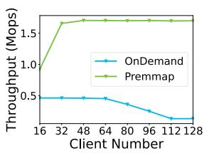  
(a) MR registration impact to kv-store.

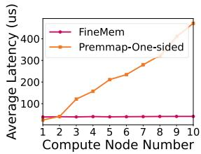  
(b) Chunks allocation latency of one-sided approach.  
Figure 1: Remote Memory Allocation Challenges with RDMA: (a) MR registration overheads. (b) Scalability issues in existing one-sided RDMA-based approach (due to metadata design).

Beyond MR registration, handling remote allocations presents challenges because the operations occur over the network, introducing additional latency and potential bottlenecks.

Systems that delegate memory allocation to memory nodes via RPC (e.g., FUSEE [58]) face scalability issues, as memory nodes often have limited processing power. Memory allocation involves traversing metadata, and frequent (de)allocations impose significant processing demands. Similar to prior works [41, 65, 73], we found that the RPC-based approach becomes bottlenecked by the memory node’s compute power as more clients are added. For example, in Fig. 1(a), FUSEE’s throughput (even with Premmap) plateaus after 32 clients. FUSEE OnDemand encounters additional scalability issues when the number of clients exceeds 64. This highlights the need for a one-sided RDMA-based allocation approach, as used by systems like CXL-SHM [70] and our proposed FineMem.

While avoiding bottlenecks at memory nodes, existing systems using one-sided access for allocations still experience unpredictable network round-trips due to their metadata designs. In Fig. 1(b), we evaluated a general allocation benchmark from ThreadTest [6], where multiple threads repeatedly allocate and free chunks from the memory node. To isolate the effects of MR registration costs, we pre-registered sufficient memory. As shown, the latency of existing one-sided approaches (e.g., Premmap-One-sided built on CXL-SHM [70]) deteriorates significantly as the number of clients (32 threads each) increases. This degradation is caused by a high number of one-sided RDMA Compare-and-Swap (CAS) retries over the network for each allocation, which occur when there are many concurrent allocations (details in Sec. 3.1).

In summary, remote memory allocation and deallocation over RDMA face both the MR registration cost challenge and scalability issues due to network overheads and the limited processing power of memory nodes.

## 2.3 The Allocation Overhead vs. Memory Waste Dilemma in Existing Works

Due to the challenges with MR registration and other operations, existing systems either rely on statically pre-mmapped regions [27, 54, 54, 58, 70, 73] or allocate memory from the remote memory pool at a coarse granularity (e.g., GBs) [2, 3, 8, 15, 22, 48, 59, 64, 68]. However, these approaches can introduce significant memory waste. Next, we characterize the tradeoff between allocation overhead and memory waste using kv-store and general workloads.

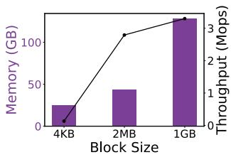  
(a) Trade-off on block sizes, using OnDemand DM allocation.

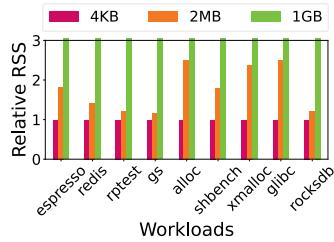  
(b) Applications’ Resident Set Size (RSS) using mimalloc with huegpages.  
Figure 2: Dilemma in KV-Store and General Workloads: (a) Kv-store reaches better performance with memory wastes. (b) Memory fragmentation with hugepage granularities (1GB’s RSS is collapsed to no more than 3).

KV-Store. Using the YCSB-A workload with all key-value pairs reside in remote memory, we evaluated FUSEE’s performance and remote memory usage on different block sizes (4KB, 2MB, and 1GB), as shown in Fig. 2(a). In FUSEE, updates are performed out-of-place, triggering memory allocation and deallocation, as well as memory fragmentation.

The results demonstrate a clear tradeoff between allocation overhead and memory waste. For instance, 2MB allocation granularity significantly reduces memory fragmentation (hence memory usage) compared to 1GB, which is a key optimization employed by FUSEE. However, even with FUSEE’s optimizations, reducing the granularity from 1GB to 2MB results in a nearly 17% drop in kv-store throughput. This performance decline is attributed to the increased frequency of allocations, each incurring significant overhead and impacting end-to-end performance. Similarly, 4KB allocation granularity further reduces memory fragmentation but exacerbates the tradeoff due to even higher allocation overhead.

General Workloads. Fragmentation caused by different allocation granularities is a well-studied issue for general workloads, too. For instance, numerous single-node memory allocator studies have shown that larger page sizes (e.g., 2MB or 1GB) typically result in higher memory fragmentation and waste [36, 47, 52, 59, 60, 72].

In Fig. 2 (b), we used mimalloc to evaluate several benchmarks and applications, illustrating this behavior. The results show that fine-grained allocations (e.g., 2MB) significantly reduce memory fragmentation compared to larger granularities like 1GB. For specific workloads, such as shbench, extremely fine-grained allocations like 4KB are particularly effective in minimizing memory waste.

Summary. Existing RDMA-based DM systems face a tough choice: either endure significant allocation overheads or accept substantial memory waste.

In this paper, we tackle the question: Can fine-grained memory allocation be achieved with minimal overheads? Successfully addressing this challenge would reduce memory waste in disaggregated memory pools, leading to lower memory costs in modern data centers. It would also allow systems under high load to run more tasks concurrently, thereby improving overall throughput, as we will demonstrate in swap system evaluations (Sec. 6.3). Additionally, fine-grained memory allocation simplifies porting emerging applications to disaggregated memory setups. For instance, applications’ local memory allocators (e.g., jemalloc, tcmalloc) could seamlessly integrate into disaggregated memory systems by replacing local mmap() calls (typically allocating memory in KB/MB units) with remote memory allocations (Sec. 6.3).

Finally, we focus on scenarios where a growing class of DM systems share a common pool of remote memory [55], as discussed in Sec. 2.1. These systems span a variety of applications, such as key-value stores (e.g., FUSEE [58]), indexing services (e.g., SMART [41]), AI inference workloads (e.g., Mooncake [49]), memory malloc systems with modified applications (e.g., CXL-SHM [70]), and swap systems with unmodified applications (e.g., Fastswap [3]). This diversity creates significant challenges in maintaining proper isolation across heterogeneous systems, particularly when third-party frameworks are involved. Additionally, conducting exhaustive tests across all possible system combinations to prevent erroneous memory access is impractical. Therefore, our approach also aims to provide low-level, fine-grained memory management that ensures coordination and isolation among DM applications/systems.

Some DM memory management works have explored onchip authorization mechanisms for fine-grained memory allocation. For example, MIND [34] offloads memory management to on-path programmable switches [7] and introduces a VMA-based capability model for different processes. In contrast, our goal is to develop a flexible, software-based memory management solution.

## 3 FineMem Overview

## 3.1 Design Elements

FineMem is a distributed remote memory management system designed to support fine-grained, high-performance memory (de)allocation in RDMA-connected DM. Its design is driven by three key elements: 1) removing MR registration latency from the allocation path; 2) enabling efficient, scalable remote memory chunk allocation; and 3) ensuring metadata consistency during compute node failures.

Removing MR Registration While Overcoming Critical Isolation Challenges. A straightforward approach to mitigate the overhead of MR registration is to pre-register the entire remote memory as a single accessible MR for each compute node. In this configuration, each DM system on a compute node can (de)allocate fine-grained memory chunks (subsections of the MR) by directly modifying shared allocation metadata (e.g., which chunks are free or allocated). This approach eliminates the need for runtime MR registration.

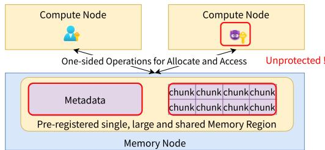  
Figure 3: Isolation/Protection Challenges without MR: attacker can easily access other users’ chunk and metadata.

However, unsurprisingly, sharing a single MR introduces significant isolation challenges. Since the MR is associated with a single rkey, any system holding this rkey can access the entire MR, as shown in Fig. 3. This means that any entity can potentially read/write to any other user’s memory chunks, leading to privacy and security risks among systems. Additionally, the metadata used for memory allocation is unprotected; each system must modify it to allocate memory, and malicious or faulty systems could corrupt or interfere with the metadata, affecting other systems.

FineMem addresses the privacy challenges by using the hardware feature of RDMA—Memory Windows (MWs) [14]. Memory windows (MWs) allow for the rapid generation and invalidation of fine-grained rkeys at a rate of one MW per microsecond. The memory node pre-binds a MW to each chunk with a specific rkey and asynchronously regenerates a new rkey with a background thread. When (de)allocating fine-grained chunks, FineMem uses one-sided operations to acquire and invalidate rkeys, thus removing MW-bind-related RPCs from the critical allocation path. This approach provides isolation between systems, as each system can only access the MWs for which it holds the corresponding rkeys. Unlike previous work that binds MWs at runtime with RPC in a single application, such as Patronus [68], FineMem focuses on one-sided MW usage for isolating multiple DM systems.

To protect the memory allocation metadata from misuse, FineMem introduces a per-compute-node runtime service (inspired by software virtualization techniques [16, 30]). This trusted service delegates remote memory allocation requests on behalf of processes, ensuring that the memory metadata is protected from DM systems’ direct access.

Enabling Efficient, Highly Scalable Free Remote Chunk Allocation. As discussed in Sec. 2.2, FineMem uses one-sided RDMA access for remote allocations to prevent the memory node CPUs from becoming bottlenecks. However, this one-sided approach requires a carefully designed metadata structure to minimize network round-trips when allocating chunks.

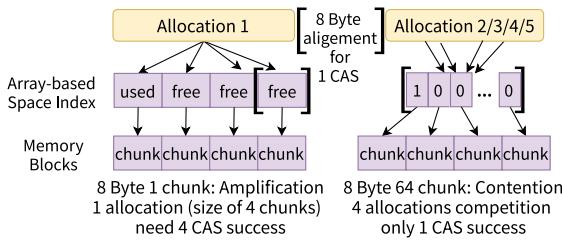  
Figure 4: One-sided RDMA Based Chunk Allocation Challenge. Left: a simple chunk array may result in network amplification. Right: using bitmaps, retry time arises when multiple processes contend for the same 8B bitmap entry.

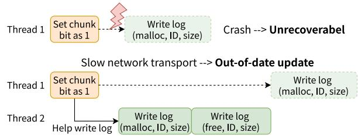  
Figure 5: Two Examples of Crash Inconsistency: log lost during crash failure, and outdated update in a fail-slow failure.

Linked lists with pointer-chasing overhead. Traditional memory allocators, such as Mimalloc, XMalloc, and SF-Malloc, often rely on linked-list-based free lists. However, pointer chasing—traversing pointers to locate memory blocks—introduces significant overhead when applied to remote memory, a well-known issue highlighted by prior works [41, 65, 73]. To avoid this, disaggregated memory systems often adopt array-based metadata structures, which, however, present their own challenges.

Array-based structures with search overhead. To give an example, managing free chunks using an uncompacted freechunk array—such as in CXL-SHM [70], shown in Fig. 4 (left)—may require checking every chunk in the address space, with each check involving a round trip. This results in unpredictable and inefficient allocation times, particularly for large allocations that span multiple chunks. Alternatively, compact bitmaps (e.g., representing 64 chunks per 8 bytes) can reduce the number of round trips by enabling simultaneous search of more chunks. However, this approach still suffers from frequent Compare-and-Swap (CAS) retries, as multiple allocators may concurrently target the same 8-byte bitmap for allocation. In such cases, each allocator performs lock-free operations like CAS to allocate chunks. Yet, only one allocator can succeed, while the others must retry—each retry requiring an additional round trip (Fig. 4, right).

To address this, FineMem employs a two-layer bitmap tree structure, as shown in Fig. 7, combining the efficiency of compact bitmaps with an additional first layer to accelerate large size allocations and reduce retry attempts. Allocators read the first-layer bitmaps to allocate large memory sizes ( 128KB, aligned to a power of 2) with a single CAS, or identify which chunk groups are empty, full, or experiencing contention (indicating multiple concurrent allocation attempts) by a 2-bitstatus in the first-layer bitmap. They then retrieve the secondlayer bitmap for the selected chunk group—typically one that is neither full nor contended—to allocate small memory sizes (4KB - 64KB) with free chunks. If an allocator detects high contention on a bitmap, it can redirect its allocations to a less-contended group (Sec. 4.1).

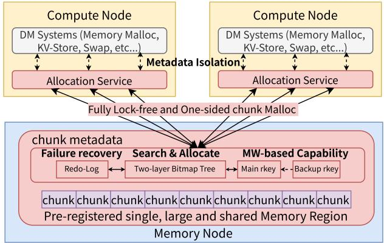  
Figure 6: Remote Memory Management with FineMem.

## Maintaining Metadata Consistency During Compute

Node Failures. Similar to coarse-grained allocation systems, FineMem must track which memory chunks are allocated to which users to prevent memory leaks on compute node failures. To accomplish this, FineMem uses redo logging on memory nodes, written by compute nodes via one-sided RDMA, ensuring that allocations are correctly recorded. However, achieving crash consistency in a shared, bitmap-based allocation system poses unique challenges. A crash occurring before writing the redo-log can cause confusion between crash-induced and normal allocation bits. For example, as shown in Fig. 5, an inconsistency during a crash failure might cause a chunk to become unrecoverable (because it has just been marked as allocated in the bitmap but lost the detailed allocation information). Even in scenarios where other threads can assist the failed thread in writing the log, fail-slow failures can still occur, where the failed thread ultimately writes an outdated log that other threads have already written.

To address this, FineMem carefully integrates a compact temporary log into the limited 64-bit bitmap, allowing each allocation success to be temporarily logged. Each successful allocation is marked with the user’s ID in the temporary log, ensuring that, in the event of a crash, the chunk can be distinguish between transient and committed states. Any thread can update (flush) this temporary log into a persistent, full log. FineMem defines a timestamp in the temporary log to prevent consistency issues due to outdated entries (Sec. 4.2). Additionally, FineMem resolves consistency issues between the two-layer bitmaps by checking both the status and temporary log consistency based on the second-layer bitmap, which acts as the commit point, ensuring the correctness of the allocation.

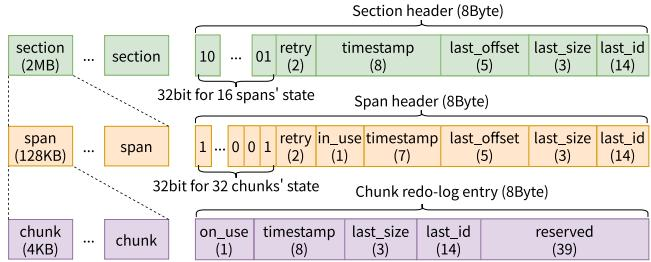  
Figure 7: FineMem’s Two-layer Bitmap Tree Structure with fine-grained allocation and contention control.

## 3.2 System Architecture

As shown in Fig. 6, FineMem integrates components from both memory nodes and compute nodes.

On the memory node, FineMem builds on core data structures that track available memory, support scalable allocations (the two-layer bitmap), manage capabilities (the MW-based capability table), and log allocations (the temporary log and full log). On the compute node, FineMem runs an allocation service on each node. It pre-mmaps the entire remote memory pool at boot time, and handles (de)allocation requests from DM systems for remote memory chunks. Once a DM system allocates a remote memory chunk, it can use the chunk for swap pages, fine-grained objects, key-value pairs, etc.

FineMem provides simple APIs, including malloc(size) and free(addr). When a DM system invokes these APIs, per-core allocation service worker threads are woken up to handle the protected remote allocations. Upon completion, the allocation service worker thread returns a DM address with an rkey to the caller. FineMem can be ported to systems like memory malloc systems [36, 63], kernel swap systems [3], key-value stores [58], etc. FineMem supports flexible allocation granularities, starting from 4KB, and ensures memory is aligned to 4KB. Systems sharing the same FineMem-managed DM pool can use different allocation granularities (4KB blocks with number of power of 2).

## 4 FineMem Design

In this section, we detail FineMem’s design for its metadata structures for concurrent, scalable allocation, logging for crash consistency, and per-compute node allocation service.

## 4.1 Two-Layer Bitmaps For Concurrent, Scalable Chunk Allocation

FineMem addresses two primary remote chunk allocation challenges: 1) minimizing network round-trips during chunk searches, and 2) reducing allocation retries due to contention. 1) Two-Layer Bitmap Tree for Efficient Chunk Allocation. FineMem uses a bitmap-based free chunk index and manages the remote memory address space in two layers: sections and spans. As shown in Fig. 7, FineMem maintains bitmaps (and metadata) for both layers. It uses a 64-bit header for each of these metadata items to align with the RDMA Compare-and-Swap (CAS) operation’s work size requirement [5].

A section consists of 16 contiguous spans, with each span representing 128KB. The 32-bit bitmap for each section tracks fullness and contention (i.e., the level of concurrent allocations) of its spans, based on the most recent span allocation’s CAS retry times and bitmap status, and using two bits per span to indicate its status. Span statuses 00 and 11 represent where the span is entirely free or full. Span statuses 01 and 10 represent "in-use" states, where the span is partially allocated as smaller chunks. Furthermore, 01 indicates that the span is in normal use, while 10 denotes that the span is contended.

Each span comprises 32 contiguous chunks, and a 32-bit free map to track the allocation status of these chunks. In addition to a 32-bit free map of section/span headers, Fine-Mem reserves the remaining 32 bits for contention control and logging. FineMem uses 2 bits to track the retry count relative to two thresholds (low and high), enabling contention detection. The span header also includes an 1-bit in\_use flag, which indicates whether a span is partially used or completely freed. The rest bits for logging will be discussed later.

For different allocation sizes, FineMem accesses search metadata in (up to) three steps. It first searches the section headers to identify available spans. If the requested allocation size exceeds 128KB, FineMem directly modifies the set spans to 11 using a single CAS operation. Next, it reads the span header, marks the bits corresponding to the free chunks, and updates the span header with another CAS operation. Deallocation follows a similar process with one CAS to update the related bitmap. Allocations larger than one section require multiple CAS operations to modify contiguous sections.

To optimize performance, FineMem caches section and span metadata on each compute node to reduce access latency, and batches multiple bitmap reads to amortize round-trip costs. Specifically, FineMem employs a metadata cache on each compute node, storing information for up to 64 sections and spans (a total of 512 bytes). This caching mechanism accelerates allocation requests by minimizing the need for repeated remote metadata access. When a CAS operation fails, the cache is updated accordingly. Furthermore, when cached bitmaps are exhausted or high contention is detected, the system proactively fetches new metadata blocks.

2) Contention Control to Reduce Retries. FineMem implements a simple yet effective back-pressure policy to limit contention across allocations. Each allocation header tracks the number of consecutive allocation failures. If the failure count exceeds the higher threshold (e.g., 10), the section/span is marked as contended in the header’s retry bits (and also section header bitmap’s span states).

Contention is detected by the allocations themselves. After a successful allocation, if the allocation process finds that the CAS failure count exceeds the threshold, it marks the section/span as ‘contended (10)’ to signal contention. The process will then select non-contended sections/spans, in the priority of normal (01) > empty (00) > contended (10), for future allocations.

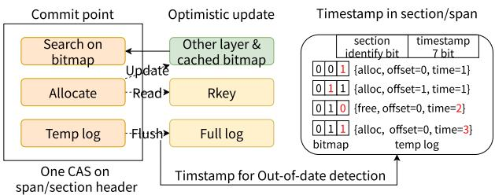  
Figure 8: FineMem’s Crash Consistency Design.

If a process using a contended (10) section/span detects that the failure count drops below the lower threshold (e.g., 3), it resets the status to normal (01).

In addition to the bitmap tree, FineMem maintains a perchunk capability table and a per-chunk redo-log. Both are 8-bit aligned items in preserved linear arrays. One chunk’s redo-log records information about its last allocation/free, including the allocation ID and timestamp, to facilitate recovery in case of compute node failures. The capability table stores per-chunk RDMA rkeys for access isolation.

## 4.2 Compute-Node-Failure Crash Consistency

FineMem implements a lock-free crash consistency mechanism by marking the CAS success to the bitmap as the commit point, complemented by a temporary log to ensure correct crash recovery. After the commit point, the system optimistically flushes the temporary log to a persistent full log with timestamp validation, and updates the other layer bitmaps, all while avoiding CAS retries and additional consistency checks to minimize overhead in maintaining consistency (Fig. 8).

1) A Compacted Commit Point. FineMem defines the commit point as the moment when an allocation successfully updates the allocation status of spans/chunks in the bitmaps (from free to used, or vice versa) through a CAS operation. This commit point, along with a temporary redo-log and timestamp, is compacted into a single CAS operation on the 64-bit section/span header.

Given the limited space available in the 64-bit section/span header, FineMem splits the redo-log into two parts: a temporary redo-log stored inline with the header’s CAS requests, and a full redo-log. The temporary redo-log contains minimal information about the most recent (de)allocation of any chunks within the span/section. Specifically, it includes the last allocated chunk offset (5 bits, which allows determining whether the last request was a malloc or free by checking the bitmap), size (3 bits, sufficient given the power-of-2 size alignment), timestamp (7 bits), and user ID (14 bits).

To manage the sequence of allocations and detect out-ofdate log flushing, FineMem includes a timestamp in the redo log. With a 7-bit timestamp, the value overflows after reaching 127. As a result, FineMem can only determine the relative ordering of two log entries within a window of 64 timestamp updates, which corresponds to approximately 1 ms, assuming a 20 µs allocation interval. To support longer out-of-date detection, FineMem slows down the timestamp increment process. Since different chunks update their own redo-log entries, back-to-back allocations within a single section/span can share the same timestamp. Thus, FineMem’s timestamp only increments when the previous operation was an allocation and the current operation is a deallocation (or vice versa), as shown in Fig .8.

2) Metadata Inconsistency Detection and Recovery. After a successful commit point, the allocation thread—or any other thread attempting to access the same section or span—is required to flush its temporary redo-log into the chunk’s full redo-log before proceeding with the next operation. The system compares the timestamp of the temporary redo-log with that of the full log: if the temporary log is newer, it is flushed; otherwise, it is discarded. If the thread detects that the temporary and full logs belong to different layers (i.e., span vs. section), it further verifies the span’s in\_use bit to determine the most recent state and avoid acting on stale metadata.

FineMem employs lightweight, optimistic one-sided RDMA writes—instead of relying on CAS success—to update the section header’s bitmap following a span commit point. During allocation, a process retrieves span headers as the commit points and checks for inconsistencies between the span and section layers. In particular, the span header’s in\_use bit can be used to correct an inaccurate section-layer bitmap, ensuring metadata consistency across layers.

FineMem leverages the consistency of its redo-log to enable non-blocking crash recovery for rebuilding memory allocation status. The recovery process starts by scanning the section and span metadata to flush the temporary redo-log. It then reclaims allocated chunks from the crashed node by scanning the full redo-log and regenerates rkeys for the freed chunks. To detect crashes, FineMem employs a user-space monitor on the memory node, which sends heartbeat signals every second to check the availability of each compute node.

To summarize, FineMem is designed to handle allocation/deallocation in a way that ensures crash consistency, using lock-free, one-sided RDMA verbs.

## 4.3 Allocation Service For Isolation/Protection

FineMem leverages memory window-based capabilities to isolate memory accesses and utilizes a per-compute node service layer to protect allocation metadata. FineMem tackles three key challenges: 1) eliminating CPU involvement on the memory node during memory window binding for allocations, 2) enabling efficient communication between user systems and the allocation service layer on the compute node, and 3) ensuring robust enforcement of isolation and protection mechanisms, even in adversarial conditions.

Table 1: MW and MR Registration Overhead Comparison.
<table><tr><td rowspan=1 colspan=1>AverageLatency per 4MB (us)</td><td rowspan=1 colspan=1>MW</td><td rowspan=1 colspan=1>MR</td></tr><tr><td rowspan=1 colspan=1>1*100GB Generation</td><td rowspan=1 colspan=1>1.33</td><td rowspan=1 colspan=1>456.1</td></tr><tr><td rowspan=1 colspan=1>25K*4MB Generation</td><td rowspan=1 colspan=1>1.34</td><td rowspan=1 colspan=1>485.5</td></tr><tr><td rowspan=1 colspan=1>25K*4MB Invalidation</td><td rowspan=1 colspan=1>1.33</td><td rowspan=1 colspan=1>21.9</td></tr><tr><td rowspan=1 colspan=1>25K*4MB Regeneration</td><td rowspan=1 colspan=1>2.37</td><td rowspan=1 colspan=1>46.5</td></tr></table>

1) Memory Node Component for Chunk Protection.

FineMem utilizes Memory Windows (MWs) [14, 53] in RDMA for generating and regenerating rkeys. Unlike Memory Region (MR) registration, which incurs high latency during rkey creation and consumes significant on-chip resources [62], MWs operate on pre-registered MRs, focusing solely on access control through rkey generation. We found this approach to be resource-efficient. In our evaluation using a ConnectX-6 RDMA NICs, MWs support up to 16 million entries (64GB for 4KB chunks), and generating a MW rkey for a 4MB chunk takes only 1 microsecond—compared to hundreds of microseconds for MR registration, as shown in Table 1. FineMem overcomes the single-NIC 64GB limitation by generating multiple virtual functions (up to 128 VFs on a single ConnectX-6 NIC), with each VF assigned 16M memory windows.

MWs are pre-generated for each chunk/span/section once the MR is initialized, with the corresponding rkeys (main rkeys) stored in the capability table. To reduce the overhead of rkey regeneration during deallocation, the memory node pre-generates backup rkeys for each chunk/span/section. A pair of main rkey and backup rkey requires only 8 bytes, enabling the deallocation process to use an one-sided CAS operation to replace the main rkey with the backup rkey as part of the critical-path regeneration. This design ensures there is no critical path dependency on the memory node CPUs. The memory node then asynchronously scans the capability table, invalidates old rkeys, and generates new ones.

2) Compute Node Service Layer for Metadata Protection. FineMem introduces an allocation service on compute nodes to manage privileged operations related to metadata. On compute nodes, only the pre-initialized service has the authority to (de)allocate remote memory. All (de)allocation requests are handled and executed by this service.

Like many software virtualization techniques, FineMem’s service process faces the challenge of API interception performance costs. To address concurrency, FineMem assigns a worker thread to each CPU core, with synchronization handled via shared semaphores. Callers write allocation requests to shared memory, wake up the allocation worker thread, and then wait for the allocation to complete. In our evaluation, this inter-process communication (IPC) introduces an overhead of approximately 2-10 µs—a reasonable trade-off compared to the significantly higher latency (10× to 100×) of performing fine-grained memory allocation directly on the memory node. 3) Protection Against Subversion. Finally, FineMem is designed to resist subversion attempts across two key areas: API protection and binary protection.

API Protection. The service API exposes strictly controlled interfaces: malloc and free. To defend against malicious API calls, malloc operations are limited by per-system allocation size quotas, and free operations verify rkey correctness to prevent unauthorized memory releases.

Binary Protection. The allocation service enforces external private key authorization, managed by DM pool administrators, to prevent service forgery. Consequently, memory nodes establish memory management connections only with trusted allocation services through this authorization. In multi-tenant environments (e.g., public clouds), where malicious tenants might attempt to compromise allocation service keys, Fine-Mem can leverage additional security mechanisms provided by the cloud provider. For example, deploying the allocation service at the hypervisor layer (e.g., FreeFlow [30]) ensures it remains trusted and isolated from tenants.

## 5 Porting Systems to FineMem

We have integrated FineMem with three types of DM systems: a user space memory malloc system that can allocate/free objects from remote memory (FineMem-User), a DM-based distributed key-value store (FineMem-KV), and a DM swap system (FineMem-Swap). These systems use FineMem’s malloc(size) and free(addr) functions to allocate/free remote memory (flexible sizes, starting from 4KB chunk).

1) FineMem-User. FineMem-User is a memory malloc system that allows applications to allocate objects (e.g., bytes) from remote memory. FineMem-User bases on mimalloc [36] but manages space in DM (using FineMem). For object-size allocations, FineMem-User handles them entirely on the compute node. On slow-path when there are no local reserved chunks, it requests/frees chunks from FineMem and subdivides them into smaller slabs, similar to how (local) allocators operate (like tcmalloc/jemalloc/mimalloc [19, 36, 60]).

2) FineMem-KV. Key-value systems are popular systems for DM, and their remote memory management can be replaced with FineMem’s allocation system. We re-implemented the slow path of FUSEE’s block allocation [58] using FineMem, while keeping other components unchanged. This modification required only 300 LOC. Furthermore, unlike FUSEE, which requires memory node block servers, FineMem-KV becomes a completely one-sided kv-store system.

3) FineMem-Swap. FineMem can also be used to optimize DM memory utilization in swap-based [3] systems. FineMem-Swap includes three major components: i) an allocator in the kernel that provides APIs for allocating/deallocating remote pages (page manager) based on FineMem’s chunks; ii) a mapping between local swap offsets and DM memory addresses (remapper), enabling on-demand binding of remote pages to swap entries; and iii) FineMem allocation on the page’s swap-out path and deallocation after swap entries invalidation.

## 6 Evaluation

We characterize FineMem performance and overheads, and evaluate how well DM systems running with FineMem compare to state-of-the-art designs. Specifically, we answer the following questions:

• Allocation efficiency: How does FineMem reduce memory allocation latency compared to existing designs? What are the overheads associated with providing memory isolation and crash recovery?

• Application-level impact: How do memory-mallocbased applications perform when using FineMem-User for critical-path object allocation? How does FineMem-User adapt to applications with varying allocation size distributions?

• System-level integration: What is the end-to-end performance of representative DM systems (e.g., key-value stores and swapping systems) when backed by Fine-Mem? How well does FineMem support memory pool sharing across multiple DM systems?

## 6.1 Experiment Setup

Testbed. We use a Cloudlab [17] cluster with 16 compute nodes and 1 memory node, which is a reasonable setting in datacenter memory pool [38]. Both compute and memory nodes use Intel Xeon 8360Y CPUs, the Mellanox ConnectX-6 100Gb NIC, and have 256GB of memory. Applications run on compute nodes and can use up to 32 cores, while we limit memory nodes to only use a single core. On each node, we run Ubuntu 22.04 with 5.15 Linux kernel and the Mellanox OFED 5.8 RDMA driver.

Implementations and Baselines. We implemented Fine-Mem in C++ (8.5k LOC). We also implemented a mimallocbased user-space allocation library, the FineMem-User (1.5k LOC for adding DM fine-grained allocation) that uses Fine-Mem DM allocator interfaces, and ported FastSwap [32] to use FineMem interfaces with the FineMem-Swap (0.7k LOC for adding new remapper and chunk manager components in the kernel module).

We compared FineMem to three state-of-the-art baselines: Premmap-One-sided (from CXL-SHM [70], search based on free array), Premmap-RPC (from FUSEE [58] and Patronus [68], search based on memory node side allocator memkind [9]), and OnDemand-RPC (fine-grained allocation with registration). For fair comparisons, we ported these approaches within the same artifact as FineMem. For both Premmap-One-sided and Premmap-RPC, we statically premapped 200GB of memory to avoid runtime MR registration. To minimize on-chip resource consumption, FineMem uses a single MR with pre-mapped hugepages [15, 45].

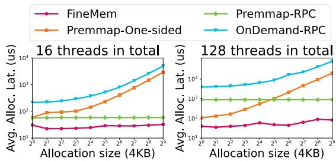  
Figure 9: Allocation Performance vs. Varying Request Sizes.

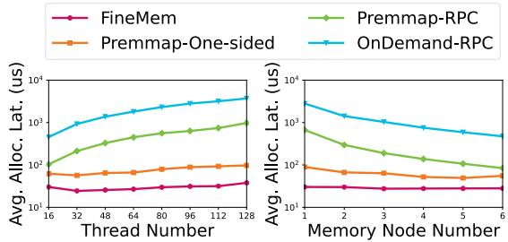  
Figure 10: Allocation Performance vs. Varying Client Threads (left) and Varying Number of Memory Nodes (right). 4KB allocation granularity. Allocations distributed across multiple memory nodes using a round-robin approach.

## 6.2 Remote Allocation Performance

We characterize FineMem’s remote allocation performance from three perspectives. First, we use allocation microbenchmarks to evaluate FineMem’s performance across different allocation granularities and scalability. Second, we analyze FineMem’s allocation latency, breaking it down into the various factors introduced by its design choices. Finally, we examine the memory-node-side CPU and memory overhead, as well as FineMem’s crash recovery capabilities.

Microbenchmark. We utilize a Redis-based kv-store microbenchmark derived from the memory efficiency unit test in the Redis [50] test suite. This benchmark performs memory block allocations and deallocations ranging from 4KB to 2MB on remote memory. The workload initially allocates 64K blocks (totaling 256MB to 128GB) of memory, then randomly deallocates 50% and allocates another 50%, repeating this pattern. We run 500 iterations of this allocation microbench to achieve about 1 million allocations in total. Fig.9 and 10, along with Table 2, demonstrate FineMem’s performance advantages over baseline approaches across various allocation granularities, levels of client parallelism, and memory node configurations. All benchmarks are executed ten times to obtain stable and converged performance results.

As shown in Fig. 10 (left), FineMem outperforms the RPC-based approaches (both OnDemand-RPC and Premmap-RPC), particularly under high client parallelism, where the RPC-based methods quickly become bottlenecked by the limited compute power of memory nodes. With a 4KB allocation granularity, we observe that the RPC-based remote allocation performance does not scale after 16 client threads. In contrast, FineMem maintains consistently low latency due to its

Table 2: Average/Max number of CAS retry statistics for allocation and average/P99 allocation latency. 4KB allocation granularity, 512 client threads in total.
<table><tr><td rowspan=1 colspan=1>Average/Tail</td><td rowspan=1 colspan=1>FineMem</td><td rowspan=1 colspan=1>Premmap-One-sided</td></tr><tr><td rowspan=1 colspan=1>Latency (us)</td><td rowspan=1 colspan=1>43.215/79.347</td><td rowspan=1 colspan=1>763.01/16143.516</td></tr><tr><td rowspan=1 colspan=1>CAS Retry Times</td><td rowspan=1 colspan=1>1.333/142</td><td rowspan=1 colspan=1>45.108/20637</td></tr></table>

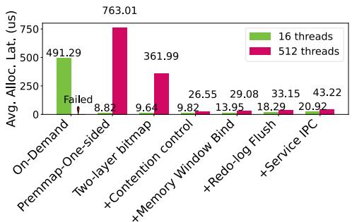  
Figure 11: Factor Analysis.

one-sided RDMA design.

FineMem outperforms existing one-sided approaches (Premmap-One-sided, without runtime MR registration) across varying allocation granularities and levels of client parallelism, as shown in Fig. 9 and 10. This performance advantage is attributed to FineMem’s optimized metadata design and contention control mechanism, which significantly reduces the number of per-allocation RDMA CAS operations compared to the simple direct array design employed by existing one-sided approaches.

In the microbenchmark workloads with fragmented remote memory, the direct array metadata often requires multiple CAS operations to search for available chunks for a 4KB allocation. The performance gap becomes even more pronounced for large allocations (Fig. 9), where each chunk in a large request requires separate CAS operations.

As shown in Table 2, the Premmap-One-sided approach can require an average of 45 CAS operations per allocation, whereas FineMem requires no more than two CAS operations on average. In Fig. 11’s 512-thread workload, we further drilldown the effects of FineMem’s two-layer bitmap design and contention control mechanism. The two-layer bitmap reduces allocation latency by approximately 52.5% compared to the array-based approach, while the contention control mechanism contributes an additional 44% reduction by minimizing CAS retries caused by heavy contention. Combined, these two designs reduce allocation latency by approximately 95%, demonstrating the effectiveness of FineMem’s design.

Factor Analysis. We evaluated the latency factors across different design components under both general cases (16- threads workload) and heavy workloads (512-threads workload), as shown in Fig. 11.

FineMem demonstrates stable latency across both general and heavy workloads. Although its chunk search mechanism involves two layers, the bitmaps are cached locally, resulting in only a slight increase in average latency compared to the

Premmap-One-sided method in 16-threads. The rkey capability introduces an additional RDMA read to retrieve the key, and the redo-log requires one RDMA CAS to flush, with each step adding approximately 5 µs. Additionally, the service layer contributes an additional 2-10 µs due to IPC overhead.

Overall, FineMem reduces allocation latency by approximately 95% compared to traditional registration-based finegrained methods. The overhead introduced by isolation and redo-log management is minimal, accounting for only 2.5% of the registration cost.

Overhead of Pre-allocated Memory Pools. FineMem uses pre-allocated memory pools with fine-grained memory windows, which introduces initialization overhead and access latency through two primary factors. First, the pre-generation of memory windows incurs a non-trivial setup cost. Our measurements on ConnectX-5 devices indicate that creating each memory window takes approximately 166 µs. However, this overhead can be substantially reduced via parallelization: leveraging 8 threads lowers the per-window generation time to 32 µs. Second, access latency stems from on-chip cache resource contention [15, 31]. In a 32-thread experiment with randomized read to pre-generated windows (each window sequentially read in 64-byte increments), we observe that read latency increases modestly—from 4.11 µs to 4.14 µs—as the number of windows scales from 1K to 1M. Correspondingly, the impact on read/write throughput remains negligible. Importantly, recent industry efforts such as Husky [31] indicate that future hardware and software advancements have the potential to further reduce both memory window initialization overhead and contention-related access latency.

Overhead on Memory Nodes. FineMem runs two services on each memory node: the rkey regeneration thread and the recovery thread, co-running on a single core. The rkey regeneration thread scans every 100ms interval, spending 15ms for 100GB memory space (25 million 4KB chunks), and resulting in approximately 15% of one CPU usage. The regeneration speed is fast, as mentioned earlier, with 1 million memory windows regenerated per second. In our evaluation, with a backup rkey to hide the scan and regeneration time, the peak free latency remains below 1ms. The recovery detection thread wakes up every second, which has negligible overhead. Furthermore, FineMem stores external data structures at memory nodes, consuming up to 0.4% of memory (mainly caused by an 8B rkey and an 8B redo-log for each 4KB chunk), which amounts to about 400MB for every 100GB of memory.

Recovery Capability. We show FineMem’s recovery ability in out-of-date detection, recovery speed, and recovery influence. 1) We ran the microbench at 1GB memory space (a narrow space with frequent malloc/free) and found that Fine-Mem’s timestamp overflow happens after about 50K memory allocation requests. As a result, updates delayed less than 1s (each allocation 20 µs) can be detected by FineMem’s 7-bit timestamp, which is enough to co-work with normal RDMA timeout settings. 2) The recovery latency is highly related to memory window rebinding time, and the recovery speed is similar to memory window regeneration speed, about 1M allocation entries (chunk/span/section) per second. 3) The recovery process only has contention possibilities at span/section’s bitmaps, and the influence is similar to an external thread’s allocation competition, which can be handled by FineMem’s concurrency design with minimal influence.

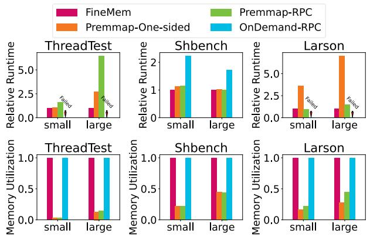  
Figure 12: FineMem-User’s Performance and Memory Utilization on Allocation Benchmarks.

In summary, even under heavy workloads, FineMem delivers scalable, low-latency, and predictable fine-grained memory allocation. This enables DM systems to achieve high memory utilization while maintaining strong performance.

## 6.3 System Case Studies

## Memory Malloc System’s Allocation Critical-Path.

We first use the FineMem-User to demonstrate the end-toend application performance improvement on the allocation critical path by running FineMem and other baselines with 2MB-chunk-based mimalloc on object-grained benchmarks.

1) ThreadTest [6] is a widely used allocator benchmark, creating a series of threads and repeatedly malloc/free objects. We set 256B as a small work-set (the median size of in-memory kv [69]) and 4KB (the basic OS page size) as a large work-set; 2) Shbench [44] is a stress test where some of the objects are freed in a usual LIFO order, but others are freed in reverse order. We set 8B-1KB as a small work-set, and 256B-4KB as a large work-set; 3) Larson [33] simulates a server workload using 100 separate threads which each allocates and frees objects but leaves some objects to be freed by other threads. Work-set the same as Shbench. We ran all benchmarks with 16 compute nodes, each node 32 threads.

The results, as shown in Fig. 12, highlight the performance and utilization trade-offs faced by state-of-the-art approaches: Premmap memory waste. Premmap-One-sided and Premmap-RPC exhibit low memory utilization, even on the Shbench-large. We set 80GB memory for the premmap baselines, which is the peak memory usage of Shbench-large. Since their memory cannot be fully shared or utilized, the average memory utilization remains below 50%.

On-demand registration cost. OnDemand-RPC suffers from poor performance due to runtime memory registration. They cannot even finish some of the benchmarks (timeout).

Allocation performance issues over network. RPC baselines encounter a high concurrency bottleneck when running ThreadTest allocation benchmarks. Meanwhile, the one-sided baseline performs poorly on the Larson benchmark, where frequent thread creation and destruction in each iteration cause new threads with the Premmap-One-sided method to repeatedly start searches from the first chunk of the array.

FineMem can fully use the shared memory pool’s free chunks, the same as fine-grained allocation with registration, improving memory utilization of state-of-the-art with static pre-mmap by 2.25× to 2.8×. And FineMem achieves the best performance by effectively fine-grained memory allocation in DM. It mitigates the scalability issues seen in RPC-based methods while providing fast and stable searches through its two-layer bitmap design.

## Malloc System with Mixed Size Allocation Requests.

To evaluate FineMem with applications that issue mixed-size allocations, we capture slow-path memory allocation system calls from various allocator and benchmark combinations.

We use the collected allocation system call sequences as requests to DM, preserving both the arrival time patterns and allocation size distributions. We selected four modern allocators: jemalloc [19], mimalloc [36], tcmalloc [60], and ptmalloc [20]. Benchmarks are chosen from the widely-used mimalloc-bench suite [13], including Shbench [44], Larson [33], Rptest [28], and Lean [1].

The size distributions of allocator and benchmark combinations, as shown in Fig. 13, vary significantly. Jemalloc and ptmalloc primarily use 4KB as the basic allocation size, tcmalloc primarily uses 2MB hugepages, and mimalloc has a median size of 64KB for small object allocation. These differences create diverse workloads with mixed allocation sizes for evaluation. To ensure trace randomness between nodes, we collect traces separately for each node and then execute them across 16 nodes, each running 8 threads.

As shown in Fig. 14, under high concurrency and mixedsize distribution, both one-sided and RPC methods experience high average latency. Besides the CPU bottleneck of RPC methods, Premmap-One-sided performs worse at jemalloc and ptmalloc. Because there are frequent 4KB chunk allocations competing with 2MB allocations, the Premmap-One-sided method finds it hard to locate an available 512 contiguous chunks in this fragmented chunk space.

In contrast, FineMem’s two-layer bitmap design effectively mitigates competition between different allocation sizes and accelerates the search for power-of-2-aligned free space. It consistently maintains latency below 100 µs, with minimal impact on execution time, demonstrating FineMem’s stability under high-concurrency, mixed-size allocation workloads.

Key-value System. We conducted a comparative performance analysis of FineMem-KV against different baselines using standard YCSB workloads [12] (A, B, C, and D). During these tests, the client writes new key-value pairs to remote memory on each update, while allocating (or caching) multiple objects at once to reduce allocation frequency within the update transaction. For these experiments, we set the cache chunk size to 4KB (for memory efficiency) and 2MB (for better performance). Each key-value pair is 512 bytes in size.

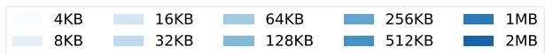

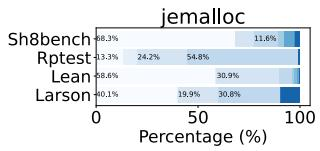

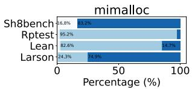

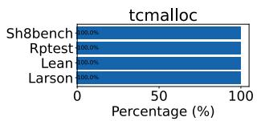

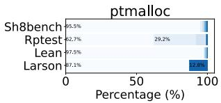  
Figure 13: Mixed Size Allocation Traces’ Distribution.

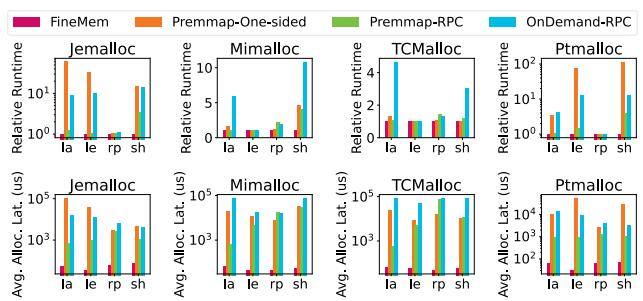  
Figure 14: Performance on Mixed Size Allocation Traces.

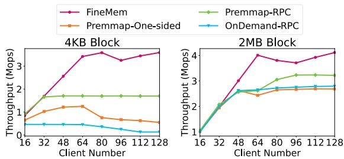  
Figure 15: FineMem-KV’s Throughput on YCSB-A Workload (search:update=50:50).

As shown in Fig. 15, under the YCSB-A workload, which is update-intensive with approximately 50% update operations, FineMem-KV demonstrated a bandwidth improvement of around 27% to 110% over the best case of Premmap-RPC. However, in the read-intensive workloads of YCSB-B, C, and D, the performance gains were less pronounced, so we do not present those results here. FineMem’s optimizations are particularly effective in enhancing FUSEE’s update operations, likely due to the nature of out-of-place updates, which involve allocating new subblocks followed by freeing the old ones.

With FineMem’s low latency for fine-grained allocation, using smaller block sizes like 4KB becomes more attractive. It can achieve high bandwidth similar to 2MB blocks while also reducing internal fragmentation, resulting in a 45% reduction in memory cost compared to the 2MB block setting, as shown in the motivation section Fig. 2(a). Moreover, when testing with larger block sizes, high allocation latency still negatively impacts throughput, as shown in Fig. 15 (right), highlighting the performance advantages of FineMem.

Table 3: Exclusive Fragmentation in One Compute Node.
<table><tr><td rowspan=1 colspan=1>Time(s)</td><td rowspan=1 colspan=1>1000</td><td rowspan=1 colspan=1>2000</td><td rowspan=1 colspan=1>3000</td><td rowspan=1 colspan=1>4000</td></tr><tr><td rowspan=1 colspan=1>Local Free Space(GB)</td><td rowspan=1 colspan=1>0</td><td rowspan=1 colspan=1>0</td><td rowspan=1 colspan=1>0</td><td rowspan=1 colspan=1>0</td></tr><tr><td rowspan=1 colspan=1>DM Free space(GB)</td><td rowspan=1 colspan=1>2.14</td><td rowspan=1 colspan=1>16.9</td><td rowspan=1 colspan=1>18.84</td><td rowspan=1 colspan=1>18.84</td></tr><tr><td rowspan=1 colspan=1>Waiting List</td><td rowspan=1 colspan=4>Snappy(33.2GB)&amp; Redis(31GB)</td></tr></table>

In summary, by optimizing out-of-place update operations, kv-store using FineMem resolves the dilemma between efficiency and overhead, achieving both high throughput and reduced fragmentation through fine-grained allocation.

Swap System. This evaluation focuses on comparing the memory efficiency of static pre-mapped swap systems (e.g., FastSwap) with the fine-grained dynamic swap system (FineMem-Swap). The swap systems were tested on a 7- machine testbed: 5 compute nodes with 80 GB of local memory and 2 memory nodes providing a total of 160 GB of shared DM. For FastSwap, each compute node had 32 GB exclusive memory on the DM.

Three widely deployed applications were selected for evaluation: XGBoost [11], a regularized gradient boosting framework; Snappy [21], a (de)compression library, used to compress enwiki articles [66]; and Redis [50], an in-memory database, subjected to YCSB [12] workloads. We inherited the DM-aware scheduler and simulator used by FastSwap.

We evaluated DM swap systems by placing 200 jobs with a workload ratio of XGBoost:Snappy:Redis=2:2:1 on the testbed. Compute nodes make best effort to use local memory and swap data to DM when local memory is insufficient. During system running, we collected placement data from FastSwap, and several representative states are shown in Table 3. After the 2000th second, this node had more than 50% free space in the reserved DM area, but the job queues were filled with Snappy and Redis jobs that could not be placed. As a result, FastSwap utilized only 41.39% of the total remote memory, as shown in Fig. 16 (a). In contrast, FineMem-Swap allows clients to share the DM with fine-grained allocation, resulting in an average memory utilization of 74.06%. This higher memory usage in FineMem-Swap led to a 17.71% improvement in job throughput.

To further investigate the throughput improvement in different workloads, we randomly generated 500 small workloads (each consisting of 200 jobs across 5 compute nodes sharing 160GB of DM) and 500 large workloads (each with 10,000 jobs across 40 compute nodes sharing 1280GB of DM), with varying application ratios. The CDF of FineMem-Swap’s throughput improvement over FastSwap is shown in Fig. 16(b). FineMem-swap outperforms FastSwap in throughput across both small and large workloads, achieving an average throughput improvement of 8.38% to 10.69% . Therefore, FineMem improves job throughput by overcoming the static pre-mapped memory fragmentation.

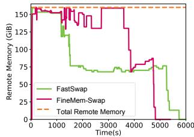

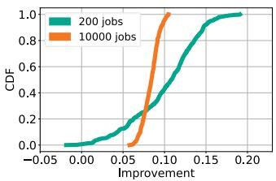  
(a) Remote Memory Usage.  
(b) Jobs Throughput Improvement

Figure 16: FineMem-Swap’s Remote Memory Utilization and Job Throughput.  
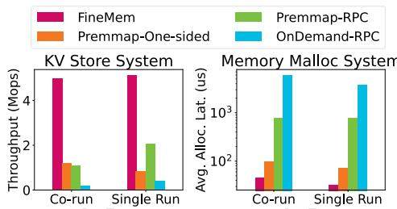  
Figure 17: KV-Store System and Memory Malloc System Co-running vs. Single Running.

Overall, with support for fine-grained, on-demand allocation in the swap system, FineMem-Swap improves job throughput compared to static pre-mapped swap systems.

Memory Pool Sharing Across Systems. We conclude by evaluating the sharing of memory pools across multiple systems through a dual-workload experiment. In this setup, 8 compute nodes (16 threads each) run a kv-store system under YCSB-A workloads (in Sec. 6.3), while another 8 dedicated nodes (16 threads each) execute a memory malloc system with microbenchmarks (in Sec. 6.2) to simulate allocationintensive scenarios and assess cross-system interference.

Fig. 17 illustrates FineMem’s ability to maintain performance isolation in disaggregated memory systems. During co-execution, both kv-store throughput and allocation latency remain stable. In contrast, Premmap-RPC experiences a 46.8% reduction in bandwidth and an increase in allocation latency due to RPC core contention on memory nodes. OnDemand-RPC shows similar results with RPC contention. While Premmap-One-sided shows better tolerance for sharing, it still suffers a 75.5% reduction in bandwidth and 2.1× higher latency than FineMem, primarily due to its inherent address space search overhead. These results demonstrate that FineMem facilitates high-performance memory pool sharing in multi-system disaggregated memory environments.

## 7 Discussions and Limitations

While FineMem enables efficient fine-grained remote memory allocations, it does have certain limitations that we believe are worth exploring in future work.

First, FineMem primarily focuses on scalability, isolation, and memory efficiency in DM management, along with support for compute node crash consistency. It does not address other critical issues such as cache coherence [34] or memory duplication across multiple memory nodes [35, 71]. Integrating FineMem with solutions to these aspects of DM memory management is a potential area for future research.

Secondly, FineMem pre-registers the entire remote memory, requiring DM systems to first communicate with a designated server process on the memory nodes to establish an RDMA connection. Moreover, FineMem did not optimize data-path access performance; therefore, its RDMA access performance represents a standard baseline without additional overhead or specialized optimizations.

Thirdly, FineMem focuses on RDMA-connected DM and leverages RDMA-specific mechanisms (e.g., RDMA memory windows) for isolation. FineMem’s reliance on RDMA features can be technically mapped to emerging CXL-based DM. The CXL specification enables direct memory access through load/store instructions. As a fully one-sided allocator (Sec. 4.1), FineMem can seamlessly replace remote memory access with CXL memory access. Furthermore, CXL memory can be configured as globally shared memory and isolated between applications using memory protection keys (MPK), as demonstrated by Skyloft [29] and uProcess [39]. However, CXL memory presents differences in mechanisms, including memory caches [40, 70] and MPK bindings [29, 39]. Consequently, FineMem requires additional design efforts to be fully adapted to CXL, which will be addressed in future work.

Lastly, the allocation services in FineMem, which use IPC to intercept remote memory allocations, introduce overheads on the allocation path. While we believe that these overheads are justified by the security and isolation benefits provided, we are actively working on optimizing the IPC process. Future optimizations may include approaches such as kernel acceleration to further reduce these overheads.

## 8 Related Work

Transparent Disaggregation. To enable applications to use DM without modification, many studies leverage the swap mechanisms in kernel to utilize DM [3, 10, 22, 23, 57, 64]. For instance, Leap [2] improves the swap system’s page prefetcher to better adapt to DM; Canvas [64] focuses on optimizing swap entry allocation. However, all these approaches use preregistration strategies, leading to significant memory waste. Native Disaggregation. Certain scenarios, such as memory malloc systems [15, 54, 59, 62, 70] and kv-store systems [41, 58, 73], allow programs to utilize DM through explicit APIs. However, many DM-native systems rely on RPC-based allocators [15, 54, 59], which do not perform well under high concurrency. Additionally, one-sided access solutions, such as CXL-SHM [70], don’t provide isolation between applications.

Hybrid Usage of Transparent and Native Disaggregation. FDP-DC [55] envisions the development of a fully disaggregated and programmable data center, where applications of both transparent and native disaggregation abstractions coexist within a unified disaggregated memory pool. Furthermore, studies such as Mira [23] and Atlas [10] have explored hybrid DM data planes that combine the object-granularity of DM-native systems with the page-granularity of swap-based systems. FineMem operates under the premise that multiple applications and systems—spanning both transparent and native approaches—share a common DM memory pool.

Memory Allocator. User-space allocators [19, 25, 37, 42, 60] are widely used in software systems to enhance efficiency and performance in memory management. FineMem learns from their design philosophy and further considers the characteristics of DM architectures. LLFree [67] is a high-concurrency frame allocator in kernel, which also maintains a two-layer metadata but prioritizes exclusive entries. While FineMem adopts a sharable entry to optimize memory space efficiency. Disaggregation Memory Isolation. For RDMA-based DM, MIND [34] uses a programmable switch, and Clio [24] uses a customized FPGA to replace the heavy MR-based isolation of RDMA NIC. To achieve both performance and easy promotion, FineMem chooses MW mechanism that comes with commercial RDMA NIC productions. Patronus [68] also uses MWs for memory protection within a single application, and it relies on RPC for memory allocation, which performed poorly in our evaluation.

## 9 Conclusion

We present FineMem, an efficient fine-grained remote memory management system using one-sided RDMA. FineMem removes memory region registration costs for disaggregated memory while ensuring isolation and protection through memory windows and per-compute node allocation services. Fine-Mem features scalable and efficient metadata designs for remote chunk allocation and crash consistency mechanisms to handle compute node failures. FineMem reduces remote memory allocation latency by up to 95% compared to state-ofthe-arts, enabling disaggregated memory systems to achieve low memory waste with minimal performance overhead.

## Acknowledgments

We thank the shepherd and anonymous reviewers for their comments. This work was supported in part by NSFC (62472392, 62172382) and the Youth Innovation Promotion Association CAS.

## References

[1] Lean. https://github.com/leanprover/lean3, 2024. [Online; accessed 1-December-2024].

[2] Hasan Al Maruf and Mosharaf Chowdhury. Effectively prefetching remote memory with leap. In USENIX ATC 20, pages 843–857, 2020.

[3] Emmanuel Amaro, Christopher Branner-Augmon, Zhihong Luo, Amy Ousterhout, Marcos K Aguilera, Aurojit Panda, Sylvia Ratnasamy, and Scott Shenker. Can far memory improve job throughput? In Eurosys 20, pages 1–16, 2020.

[4] Dotan Barak. ibv\_reg\_mr, ibv\_reg\_mr\_iova, ibv\_dereg\_mr - register or deregister a memory region (MR), 2006. Linux Programmer’s Manual.

[5] Dotan Barak, Majd Dibbiny, and Yishai Hadas. ibv\_post\_send(3) - post a list of work requests (WRs) to a send queue. RDMA Core Userspace Libraries and Daemons, 10 2006. Accessed: 2024-01-12.

[6] Emery D Berger, Kathryn S McKinley, Robert D Blumofe, and Paul R Wilson. Hoard: A scalable memory allocator for multithreaded applications. ACM Sigplan Notices, 35(11):117–128, 2000.

[7] Pat Bosshart, Dan Daly, Glen Gibb, Martin Izzard, Nick McKeown, Jennifer Rexford, Cole Schlesinger, Dan Talayco, Amin Vahdat, George Varghese, et al. P4: Programming protocol-independent packet processors. ACM SIGCOMM Computer Communication Review, 44(3):87–95, 2014.

[8] Qingchao Cai, Wentian Guo, Hao Zhang, Divyakant Agrawal, Gang Chen, Beng Chin Ooi, Kian-Lee Tan, Yong Meng Teo, and Sheng Wang. Efficient distributed memory management with rdma and caching. Proceedings of the VLDB Endowment, 11(11):1604–1617, 2018.

[9] Christopher Cantalupo, Vishwanath Venkatesan, Jeff Hammond, Krzysztof Czurlyo, and Simon David Hammond. memkind: An extensible heap memory manager for heterogeneous memory platforms and mixed memory policies. Technical report, Sandia National Lab.(SNL-NM), Albuquerque, NM (United States), 2015.

[10] Lei Chen, Shi Liu, Chenxi Wang, Haoran Ma, Yifan Qiao, Zhe Wang, Chenggang Wu, Youyou Lu, Xiaobing Feng, Huimin Cui, Shan Lu, and Harry Xu. A tale of two paths: Toward a hybrid data plane for efficient Far-Memory applications. In 18th USENIX Symposium on Operating Systems Design and Implementation (OSDI 24), pages 77–95, Santa Clara, CA, July 2024. USENIX Association.

[11] Tianqi Chen and Carlos Guestrin. XGBoost: A scalable tree boosting system. In SIGKDD 16, KDD ’16, pages 785–794, New York, NY, USA, 2016. ACM.

[12] Brian F. Cooper. Yahoo! cloud serving benchmark (ycsb). Accessed: 2022-02-22.

[13] Daanx. mimalloc-bench: Benchmark suite to test various memory allocators. https://github.com/ daanx/mimalloc-bench, 2024. Accessed: 2024-01- 12.

[14] Majd Dibbiny and Yishai Hadas. ibv\_bind\_mw - post a request to bind a type 1 memory window to a memory region, 2016. Linux Programmer’s Manual.

[15] Aleksandar Dragojevic, Dushyanth Narayanan, Miguel ´ Castro, and Orion Hodson. Farm: Fast remote memory. In NSDI 14, pages 401–414, 2019.

[16] José Duato, Antonio J Pena, Federico Silla, Rafael Mayo, and Enrique S Quintana-Ortí. rcuda: Reducing the number of gpu-based accelerators in high performance clusters. In 2010 International Conference on High Performance Computing & Simulation, pages 224–231. IEEE, 2010.

[17] Dmitry Duplyakin, Robert Ricci, Aleksander Maricq, Gary Wong, Jonathon Duerig, Eric Eide, Leigh Stoller, Mike Hibler, David Johnson, Kirk Webb, Aditya Akella, Kuangching Wang, Glenn Ricart, Larry Landweber, Chip Elliott, Michael Zink, Emmanuel Cecchet, Snigdhaswin Kar, and Prabodh Mishra. The design and operation of CloudLab. In USENIX ATC 19, pages 1–14, Renton, WA, July 2019. USENIX Association.

[18] Padmapriya Duraisamy, Wei Xu, Scott Hare, Ravi Rajwar, David Culler, Zhiyi Xu, Jianing Fan, Christopher Kennelly, Bill McCloskey, Danijela Mijailovic, Brian Morris, Chiranjit Mukherjee, Jingliang Ren, Greg Thelen, Paul Turner, Carlos Villavieja, Parthasarathy Ranganathan, and Amin Vahdat. Towards an adaptable systems architecture for memory tiering at warehouse-scale. In ASPLOS, ASPLOS 2023, page 727–741, New York, NY, USA, 2023. Association for Computing Machinery.

[19] Jason Evans. A scalable concurrent malloc (3) implementation for freebsd. In Proc. of the bsdcan conference, ottawa, canada, 2006.

[20] Wolfram Gloger. ptmalloc. http://www.malloc.de/ en/, 2024. [Online; accessed 1-December-2024].

[21] Google. Snappy: A fast compressor/decompressor. Accessed: 2022-02-22.

[22] Juncheng Gu, Youngmoon Lee, Yiwen Zhang, Mosharaf Chowdhury, and Kang G Shin. Efficient memory disaggregation with infiniswap. In NSDI 17, pages 649–667, 2017.

[23] Zhiyuan Guo, Zijian He, and Yiying Zhang. Mira: A program-behavior-guided far memory system. In Proceedings of the 29th Symposium on Operating Systems Principles, SOSP ’23, page 692–708, New York, NY, USA, 2023. Association for Computing Machinery.

[24] Zhiyuan Guo, Yizhou Shan, Xuhao Luo, Yutong Huang, and Yiying Zhang. Clio: A hardware-software codesigned disaggregated memory system. In ASPLOS 21, pages 417–433, 2021.

[25] A.H. Hunter, Chris Kennelly, Paul Turner, Darryl Gove, Tipp Moseley, and Parthasarathy Ranganathan. Beyond malloc efficiency to fleet efficiency: a hugepageaware memory allocator. In OSDI 21, pages 257–273. USENIX Association, July 2021.

[26] Intel. 100gbe intel® ethernet network adapter e810. https://www.intel.com/ content/www/us/en/products/details/ ethernet/800-network-adapters/ e810-network-adapters/products.html, 2024. [Online; accessed 1-December-2024].

[27] Junhyeok Jang, Hanjin Choi, Hanyeoreum Bae, Seungjun Lee, Miryeong Kwon, and Myoungsoo Jung. CXL-ANNS:Software-Hardware collaborative memory disaggregation and computation for Billion-Scale approximate nearest neighbor search. In USENIX ATC 23, pages 585–600, 2023.

[28] Mattias Jansson. rptest. https://github.com/ mjansson/rpmalloc-benchmark, 2024. [Online; accessed 1-December-2024].

[29] Yuekai Jia, Kaifu Tian, Yuyang You, Yu Chen, and Kang Chen. Skyloft: A general high-efficient scheduling framework in user space. In Proceedings of the ACM SIGOPS 30th Symposium on Operating Systems Principles, SOSP ’24, page 265–279, New York, NY, USA, 2024. Association for Computing Machinery.

[30] Daehyeok Kim, Tianlong Yu, Hongqiang Harry Liu, Yibo Zhu, Jitu Padhye, Shachar Raindel, Chuanxiong Guo, Vyas Sekar, and Srinivasan Seshan. FreeFlow: Software-based virtual RDMA networking for containerized clouds. In NSDI 19, pages 113–126, Boston, MA, February 2019. USENIX Association.

[31] Xinhao Kong, Jingrong Chen, Wei Bai, Yechen Xu, Mahmoud Elhaddad, Shachar Raindel, Jitendra Padhye, Alvin R. Lebeck, and Danyang Zhuo. Understanding

RDMA microarchitecture resources for performance isolation. In 20th USENIX Symposium on Networked Systems Design and Implementation (NSDI 23), pages 31–48, Boston, MA, April 2023. USENIX Association.

[32] Yash Lala. Fastswap-linux-5.16.16. https://github. com/yashlala/fastswap-linux-5.16.16, 2022.

[33] Per-Åke Larson and Murali Krishnan. Memory allocation for long-running server applications. In Proceedings of the 1st International Symposium on Memory Management, ISMM ’98, page 176–185, New York, NY, USA, 1998. Association for Computing Machinery.

[34] Seung-seob Lee, Yanpeng Yu, Yupeng Tang, Anurag Khandelwal, Lin Zhong, and Abhishek Bhattacharjee. Mind: In-network memory management for disaggregated data centers. In SOSP 21, pages 488–504, 2021.

[35] Youngmoon Lee, Hasan Al Maruf, Mosharaf Chowdhury, Asaf Cidon, and Kang G. Shin. Hydra : Resilient and highly available remote memory. In FAST 22, pages 181–198, Santa Clara, CA, February 2022. USENIX Association.

[36] Daan Leijen, Ben Zorn, and Leonardo de Moura. Mimalloc: Free list sharding in action. Report MSR-TR-2019-18 „ Microsoft, June 2019.

[37] Daan Leijen, Benjamin Zorn, and Leonardo de Moura. Mimalloc: Free list sharding in action. In Programming Languages and Systems: 17th Asian Symposium, APLAS 2019, Nusa Dua, Bali, Indonesia, December 1–4, 2019, Proceedings 17, pages 244–265. Springer, 2019.

[38] Huaicheng Li, Daniel S. Berger, Lisa Hsu, Daniel Ernst, Pantea Zardoshti, Stanko Novakovic, Monish Shah, Samir Rajadnya, Scott Lee, Ishwar Agarwal, Mark D. Hill, Marcus Fontoura, and Ricardo Bianchini. Pond: Cxl-based memory pooling systems for cloud platforms. In ASPLOS, ASPLOS 2023, page 574–587, New York, NY, USA, 2023. Association for Computing Machinery.

[39] Jiazhen Lin, Youmin Chen, Shiwei Gao, and Youyou Lu. Fast core scheduling with userspace process abstraction. In Proceedings of the ACM SIGOPS 30th Symposium on Operating Systems Principles, SOSP ’24, page 280–295, New York, NY, USA, 2024. Association for Computing Machinery.

[40] Compute Express Link. https://www. computeexpresslink.org/. Accessed: [1-December-2024].

[41] Xuchuan Luo, Pengfei Zuo, Jiacheng Shen, Jiazhen Gu, Xin Wang, Michael R Lyu, and Yangfan Zhou. SMART: A High-Performance adaptive radix tree for disaggregated memory. In OSDI 23. USENIX Association, 2023.

[42] Martin Maas, David G. Andersen, Michael Isard, Mohammad Mahdi Javanmard, Kathryn S. McKinley, and Colin Raffel. Learning-based memory allocation for c++ server workloads. In ASPLOS 20, ASPLOS ’20, page 541–556, New York, NY, USA, 2020. Association for Computing Machinery.

[43] Hasan Al Maruf, Hao Wang, Abhishek Dhanotia, Johannes Weiner, Niket Agarwal, Pallab Bhattacharya, Chris Petersen, Mosharaf Chowdhury, Shobhit Kanaujia, and Prakash Chauhan. Tpp: Transparent page placement for cxl-enabled tiered-memory. In ASPLOS, ASPLOS 2023, page 742–755, New York, NY, USA, 2023. Association for Computing Machinery.

[44] MicroQuill. Smartheap technical specification. http:// www.microquill.com/smartheap/sh\_tspec.htm, 2024. [Online; accessed 1-December-2024].

[45] Stanko Novakovic, Yizhou Shan, Aasheesh Kolli, Michael Cui, Yiying Zhang, Haggai Eran, Boris Pismenny, Liran Liss, Michael Wei, and Dan Tsafrir. Storm: a fast transactional dataplane for remote data structures. In Proceedings of the 12th ACM International Conference on Systems and Storage, pages 97–108, 2019.

[46] Nvidia. Connectx nics. https://www.nvidia.com/ en-sg/networking/ethernet-adapters/, 2024. [Online; accessed 1-December-2024].

[47] Bobby Powers, David Tench, Emery D. Berger, and Andrew McGregor. Mesh: compacting memory management for c/c++ applications. In PLDI 2019, PLDI 2019, page 333–346, New York, NY, USA, 2019. Association for Computing Machinery.

[48] Yifan Qiao, Chenxi Wang, Zhenyuan Ruan, Adam Belay, Qingda Lu, Yiying Zhang, Miryung Kim, and Guoqing Harry Xu. Hermit: Low-Latency, High-Throughput, and transparent remote memory via Feedback-Directed asynchrony. In NSDI 23, pages 181– 198, Boston, MA, April 2023. USENIX Association.

[49] Ruoyu Qin, Zheming Li, Weiran He, Jialei Cui, Feng Ren, Mingxing Zhang, Yongwei Wu, Weimin Zheng, and Xinran Xu. Mooncake: Trading more storage for less computation — a KVCache-centric architecture for serving LLM chatbot. In 23rd USENIX Conference on File and Storage Technologies (FAST 25), pages 155–170, Santa Clara, CA, February 2025. USENIX Association.

[50] Redis. https://redis.io/. Accessed: 1-December-2024.

[51] Remote Direct Memory Access (RDMA) Wikipedia. https://en.wikipedia.org/

wiki/Remote\_direct\_memory\_access#:\~: text=In%20computing%2C%20remote%20direct% 20memory,in%20massively%20parallel% 20computer%20clusters. Accessed: 1-December-2024.

[52] J. M. Robson. Worst case fragmentation of first fit and best fit storage allocation strategies. The Computer Journal, 20(3):242–244, 01 1977.

[53] Benjamin Rothenberger, Konstantin Taranov, Adrian Perrig, and Torsten Hoefler. ReDMArk: Bypassing RDMA security mechanisms. In USENIX Security 21, pages 4277–4292, 2021.

[54] Zhenyuan Ruan, Malte Schwarzkopf, Marcos K Aguilera, and Adam Belay. AIFM:High-Performance,Application-Integrated far memory. In OSDI 20, pages 315–332, 2020.

[55] Yizhou Shan, Will Lin, Zhiyuan Guo, and Yiying Zhang. Towards a fully disaggregated and programmable data center. In Proceedings of the 13th ACM SIGOPS Asia-Pacific Workshop on Systems, APSys ’22, page 18–28, New York, NY, USA, 2022. Association for Computing Machinery.

[56] Huijun Shen, Guo Chen, Bojie Li, Xingtong Lin, Xingyu Zhang, Xizheng Wang, Amit Geron, Shamir Rabinovitch, Haifeng Lin, Han Ruan, Lijun Li, Jingbin Zhou, and Kun Tan. Np-rdma: Using commodity rdma without pinning memory, 2023.

[57] Jiacheng Shen, Pengfei Zuo, Xuchuan Luo, Yuxin Su, Jiazhen Gu, Hao Feng, Yangfan Zhou, and Michael R Lyu. Ditto: An elastic and adaptive memory-disaggregated caching system. In SOSP 21, pages 675–691, 2023.

[58] Jiacheng Shen, Pengfei Zuo, Xuchuan Luo, Tianyi Yang, Yuxin Su, Yangfan Zhou, and Michael R Lyu. FUSEE: A fully Memory-DisaggregatedKey-Value store. In FAST 23, pages 81–98, 2023.

[59] Konstantin Taranov, Salvatore Di Girolamo, and Torsten Hoefler. Corm: Compactable remote memory over rdma, 2021.

[60] TCMalloc - Google. https://github.com/google/ tcmalloc. Accessed: 1-December-2024.

[61] Shin-Yeh Tsai, Yizhou Shan, and Yiying Zhang. Disaggregating persistent memory and controlling them remotely: An exploration of passive disaggregated keyvalue stores. In USENIX ATC 20, USENIX ATC’20, USA, 2020. USENIX Association.

[62] Shin-Yeh Tsai and Yiying Zhang. Lite kernel rdma support for datacenter applications. In SOSP 17, pages 306–324, 2017.

[63] Chenxi Wang, Haoran Ma, Shi Liu, Yifan Qiao, Jonathan Eyolfson, Christian Navasca, Shan Lu, and Guoqing Harry Xu. MemLiner: Lining up tracing and application for a Far-Memory-Friendly runtime. In OSDI 22, pages 35–53, 2022.

[64] Chenxi Wang, Yifan Qiao, Haoran Ma, Shi Liu, Wenguang Chen, Ravi Netravali, Miryung Kim, and Guoqing Harry Xu. Canvas: Isolated and adaptive swapping for Multi-Applications on remote memory. In NSDI 23, pages 161–179, 2023.

[65] Xingda Wei, Rong Chen, and Haibo Chen. Fast rdmabased ordered key-value store using remote learned cache. In OSDI 20, pages 117–135, 2020.

[66] Wikimedia Foundation. Wikimedia downloads. Accessed: 2022-02-22.

[67] Lars Wrenger, Florian Rommel, Alexander Halbuer, Christian Dietrich, Daniel Lohmann, Dominik Töllner, Christian Dietrich, Illia Ostapyshyn, Florian Rommel, and Daniel Lohmann. Llfree: Scalable and optionallypersistent page-frame allocation. In USENIX ATC 23, volume 65. USENIX Association, 2023.

[68] Bin Yan, Youyou Lu, Qing Wang, Minhui Xie, and Jiwu Shu. Patronus: High-Performance and protective remote memory. In FAST 23, pages 315–330, Santa Clara, CA, February 2023. USENIX Association.

[69] Juncheng Yang, Yao Yue, and KV Rashmi. A large scale analysis of hundreds of in-memory cache clusters at twitter. In OSDI 20, pages 191–208, 2020.

[70] Mingxing Zhang, Teng Ma, Jinqi Hua, Zheng Liu, Kang Chen, Ning Ding, Fan Du, Jinlei Jiang, Tao Ma, and Yongwei Wu. Partial failure resilient memory management system for cxl-based distributed shared memory. In SOSP 23, pages 658–674, 2023.

[71] Yang Zhou, Hassan M. G. Wassel, Sihang Liu, Jiaqi Gao, James Mickens, Minlan Yu, Chris Kennelly, Paul Turner, David E. Culler, Henry M. Levy, and Amin Vahdat. Carbink: Fault-Tolerant far memory. In OSDI 22, pages 55–71, Carlsbad, CA, July 2022. USENIX Association.

[72] Zhuangzhuang Zhou, Vaibhav Gogte, Nilay Vaish, Chris Kennelly, Patrick Xia, Svilen Kanev, Tipp Moseley, Christina Delimitrou, and Parthasarathy Ranganathan. Characterizing a memory allocator at warehouse scale. In ASPLOS, ASPLOS ’24, page 192–206, New York, NY, USA, 2024. Association for Computing Machinery.

[73] Pengfei Zuo, Jiazhao Sun, Liu Yang, Shuangwu Zhang, and Yu Hua. One-sided RDMA-Conscious extendible hashing for disaggregated memory. In USENIX ATC 21, pages 15–29, 2021.