①

USENIX

THE ADVANCED COMPUTING SYSTEMS ASSOCIATION

## To PRI or Not To PRI, That’s the question

Yun Wang, Shanghai Jiao Tong University; Liang Chen, Jie Ji, Xianting Tian, and Ben Luo, Alibaba Group; Zhixiang Wei, Zhibai Huang, and Kailiang Xu, Shanghai Jiao Tong University; Kaihuan Peng, Kaijie Guo, Ning Luo, Guangjian Wang, Shengdong Dai, Yibin Shen, and Jiesheng Wu, Alibaba Group; Zhengwei Qi, Shanghai Jiao Tong University

https://www.usenix.org/conference/osdi25/presentation/wang-yun

# This paper is included in the Proceedings of the 19th USENIX Symposium on Operating Systems Design and Implementation.

July 7–9, 2025 • Boston, MA, USA

ISBN 978-1-939133-47-2

Open access to the Proceedings of the 19th USENIX Symposium on Operating Systems Design and Implementation is sponsored by

# To PRI or Not To PRI, That’s the question

Yun Wang∗♠ Liang Chen\*♢ Jie Ji♢ Xianting Tian♢ Ben Luo♢ Zhixiang Wei♠ Zhibai Huang♠ Kailiang Xu♠ Kaihuan Peng♢ Kaijie Guo♢ Ning Luo♢ Guangjian Wang♢ Shengdong Dai♢ Yibin Shen♢ Jiesheng Wu♢ Zhengwei Qi♠ ♠Shanghai Jiao Tong University ♢Alibaba Group

## Abstract

SR-IOV and I/O device passthrough enable network and storage devices to be shared among multiple tenants with high density using virtual functions (VFs), achieving nearnative performance. However, passthrough does not support page faults, requiring the hypervisor to statically pin the VMallocated memory. This approach is unacceptable for cloud service providers (CSPs) that rely on oversubscription to enhance memory utilization and reduce costs. The Page Request Interface (PRI) was designed to support device-side I/O page faults (IOPFs) through collaboration among devices, Input-Output Memory Management Units (IOMMU), and the OS. But PRI has not seen broad adoption in devices like NICs and storage.

We propose VIO, a novel dynamic I/O device passthrough approach that achieves near-native performance and is hardware-independent. By leveraging a shadow available queue, VIO can dynamically and transparently switch devices between VIO and passthrough modes based on I/O operations per second (IOPS) pressure, balancing resource utilization and performance. Each DMA request is probed via IOPAsnooping in the virtio data plane to eliminate IOPFs, while device interrupts are directly passed through to the VM guest, enabling performance close to passthrough. VIO is extensively tested and deployed by a leading global CSP across 300K VMs, supporting both legacy and new instances while reclaiming up to the equivalent of 30K VM memory daily without compromising user Service Level Objectives (SLOs). As the scale grows, the benefits continue to increase.

## 1 Introduction

Cloud workloads vary significantly, ranging from simple web hosting to resource-intensive applications like large language models, all of which require high-performance I/O for optimal operation. Device passthrough is commonly used in cloud environments to provide near bare-metal performance

Memory Usage Distribution (Each Square = 1GB, 1000 in total.)

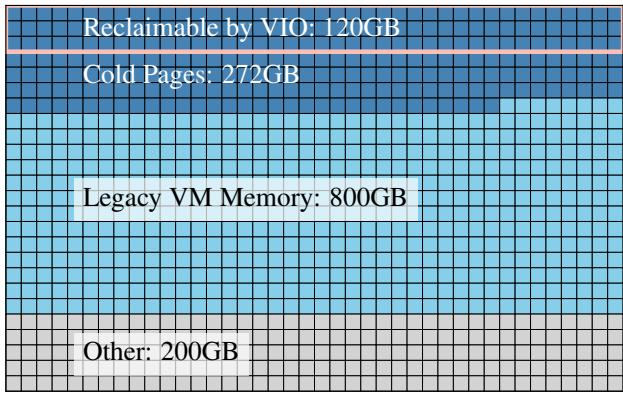  
Figure 1: VMs Consumption. In a 300-node production environment, over 80% of long-running legacy (running at least one year) VMs without PRI support hold up to 800GB of memory, with ∼ 34% cold pages unreclaimed. With VIO enabled, approximately 120GB/day can be freed which satisfies user SLOs, translating to savings equivalent to running about 30 VMs (2C/4GB) per day.

by allowing virtual machines (VMs) direct access to hardware. However, this approach has a major limitation: Direct Memory Access (DMA), which enables devices to transfer data directly to or from memory, can target any Guest Physical Address (GPA). If the address is swapped out or otherwise inaccessible, it results in an I/O page fault (IOPF). Since most devices cannot handle such faults, DMA failures may disrupt operations or even cause system crashes. To mitigate this issue, passthrough requires static pinning of the VM’s virtual memory to physical memory, which precludes memory optimization techniques [31, 44, 46] like overcommitment [15] in multi-tenant cloud environments, leading to suboptimal memory utilization and resource wastage.

In 2009, PCI-SIG addressed this challenge by expanding the Address Translation Services (ATS) specification to include the Page Request Interface (PRI) functionality [33], which enables devices to handle IOPFs. PRI relies on coordination between the Input-Output Memory Management Units (IOMMU), devices, and the operating system to manage IOPFs. Intel introduced PRI support in their IOMMUs with the 2023 Sapphire Rapids platform, significantly advancing PRI adoption despite its introduction 14 years earlier. However, delayed adoption has limited its widespread implementation, with most mainstream I/O devices—except for high-end GPUs [7, 21, 34]—currently lacking PRI support. Additionally, Linux (v6.12) supports PRI only in scenarios that require PASID under IOMMU\_INTEL\_SVA, further restricting its hardware compatibility [4].

Table 1: Comparison of Memory Reclamation Methods
<table><tr><td rowspan=1 colspan=1>Method</td><td rowspan=1 colspan=1>IO-Safety</td><td rowspan=1 colspan=1> HW Compatibility</td><td rowspan=1 colspan=1>Guest modification</td><td rowspan=1 colspan=1>Reclaim type</td><td rowspan=1 colspan=1>Overhead</td></tr><tr><td rowspan=1 colspan=1>{v,co]IOMMU [8,39]</td><td rowspan=1 colspan=1>√</td><td rowspan=1 colspan=1>General</td><td rowspan=1 colspan=1>Frontend Driver</td><td rowspan=1 colspan=1>Unused + Cold</td><td rowspan=1 colspan=1>High</td></tr><tr><td rowspan=1 colspan=1>IOGuard [12]</td><td rowspan=1 colspan=1>√</td><td rowspan=1 colspan=1>General</td><td rowspan=1 colspan=1>Frontend Driver</td><td rowspan=1 colspan=1>Unused + Cold</td><td rowspan=1 colspan=1>Medium</td></tr><tr><td rowspan=1 colspan=1>Ballooning [41]</td><td rowspan=1 colspan=1>√</td><td rowspan=1 colspan=1>General</td><td rowspan=1 colspan=1>Frontend Driver</td><td rowspan=1 colspan=1>Unused</td><td rowspan=1 colspan=1>High</td></tr><tr><td rowspan=1 colspan=1>Free Page Reporting [2]</td><td rowspan=1 colspan=1>×</td><td rowspan=1 colspan=1>General</td><td rowspan=1 colspan=1>Frontend Driver</td><td rowspan=1 colspan=1>Unused</td><td rowspan=1 colspan=1>High</td></tr><tr><td rowspan=1 colspan=1>Hyperupcall [9]</td><td rowspan=1 colspan=1>×</td><td rowspan=1 colspan=1>General</td><td rowspan=1 colspan=1>eBPF-Tool Chain</td><td rowspan=1 colspan=1>Unused + Cold</td><td rowspan=1 colspan=1>Low</td></tr><tr><td rowspan=1 colspan=1>IOPF/VPRI[17]</td><td rowspan=1 colspan=1>√</td><td rowspan=1 colspan=1>Dedicated</td><td rowspan=1 colspan=1>No</td><td rowspan=1 colspan=1>Unused + Cold</td><td rowspan=1 colspan=1>Low</td></tr><tr><td rowspan=1 colspan=1>VIO</td><td rowspan=1 colspan=1>√</td><td rowspan=1 colspan=1>General</td><td rowspan=1 colspan=1>No</td><td rowspan=1 colspan=1>Unused + Cold</td><td rowspan=1 colspan=1>Low</td></tr></table>

Despite the potential for widespread adoption of ATS/PRI hardware and software in the future, oversubscribed cloud environments face two primary challenges. As Figure 1 depicts, in our production environment with a cluster size of 300 nodes, more than 80% of legacy VMs consume ∼ 800GB of memory, and this situation is expected to continue. Since the kernels of these VMs do not support PRI, hardware upgrades alone will not yield benefits. Large-scale migration to PRI-compatible devices is both technically and economically impractical. Moreover, these VMs exhibit a cold page rate exceeding 34%, suggesting an opportunity to reclaim ∼ 270GB of memory. Additionally, ATS/PRI introduces higher latency (∼ 3× to ∼ 80×) compared to CPU page fault handling due to its reliance on the PCIe bus for fault handling. This necessitates the use of an on-device buffer to store in-flight requests. The widespread adoption of SR-IOV (Single Root I/O Virtualization) technology, which virtualizes a single Physical Function (PF) of an I/O device into thousands of VFs for different guests, exacerbates scalability issues related to offline PRI and increases hardware costs [30, 40]. Therefore, PRI is not currently suitable for addressing the high-performance, high-density multi-tenant cloud scenarios.

Previous works attempt to address the challenge of statically pinning VM memory without PRI support, with solutions falling into two main categories. The first approach is software-based, including methods such as vIOMMU, coIOMMU, VProbe and IOGuard [8, 12, 39, 43]. These solutions often introduce significant performance bottlenecks, making them impractical for real-world use, and some require modifications to VM software, which is not viable in multitenant cloud environments. The second approach involves implementing IOPF handling at the hardware level, decoupling it from the IOMMU, as seen in solutions like On-Demand Paging and VPRI [17,27]. However, these approaches are limited to high-end or custom hardware, restricting their broad adoption. Like PRI, these hardware solutions also introduce additional latency to I/O operations, leading to substantial performance degradation in high-performance scenarios.

In this paper, we introduce VIO (Virtual I/O), a hardwareindependent, IOPF-free virtualization solution designed to deliver both high performance and low overhead in high-density, multi-tenant environments. We identify that placing page faults in the critical I/O path of complex network and storage devices is a major contributor to performance degradation. Our approach builds on the VirtIO standard, which abstracts the underlying hardware differences in VM I/O devices. VIO utilizes VirtIO’s data plane to implement IOPA snooping, which detects potential page faults in advance. By eliminating IOPFs through this proactive snooping, VIO ensures high compatibility and improved performance. We implement and deploy VIO on x86 platforms, including both AMD and Intel.

As Table 1 highlights, the key differentiator of VIO is that it requires no modifications to the guest software stack—all changes reside solely in the host hypervisor. This design choice is critical for our environment, which includes hundreds of thousands of long-running VMs (running at least one year) from which memory needs to be reclaimed. The design implications and technical details are discussed further in §3.3. Prior solutions that rely on guest frontend driver or eBPF modifications are unsuitable for such deployments. Furthermore, existing approaches largely overlook the need to adapt to dynamically varying IOPS, whereas VIO addresses this gap, offering both practical engineering benefits and novel research value.

To optimize memory usage while meeting user SLOs, VIO employs dynamic device passthrough, ensuring optimal performance in high I/O operations per second (IOPS) environments. Specifically, we introduce a fine-grained, I/O pressurebased elastic passthrough strategy. Different workloads and users have varying IOPS demands, and as IOPS increase, memory requirements also tend to rise. In such cases, VIO suspends snooping on I/O page access and directly passes the VirtIO data plane to the hardware, enabling near bare-metal performance and maximizing efficiency. When workload intensity decreases, VIO reclaims unused memory. Our experiments demonstrate that, compared to traditional passthrough, elastic device passthrough allows up to 10% daily memory reduction in production while still meeting SLO requirements.

## 2 Background

## 2.1 Trends on IO Virtualization

I/O virtualization has evolved over the years to meet the increasing demands for high performance and scalability in virtualized environments. Initially, full virtualization provided a simple and straightforward approach to I/O virtualization. In this model, devices are fully emulated through software, enabling VMs to interact with virtualized devices transparently, without requiring modifications to the guest OS. While this method offers high transparency, it incurs significant performance overhead due to frequent VM exits and data copying between the guest OS and the hypervisor.

To mitigate the performance drawbacks of full virtualization, para-virtualization [19, 24] (PV) emerged as a more efficient approach. PV reduces overhead by modifying the guest OS, allowing it to interact directly with the hypervisor through specialized drivers, rather than emulating hardware. A prominent example of PV is VirtIO, as Figure 2a illustrates, which employs a split-driver model where the guest front-end driver communicates with the host’s back-end driver. This design reduces the overhead of memory-mapped I/O (MMIO) operations by avoiding unnecessary VM exits, thus improving system performance. However, as the hypervisor still manages memory and I/O operations, PV can encounter performance issues, particularly in environments with multiple concurrently running VMs.

With the introduction of technologies like VT-d, direct device assignment became feasible. This approach, particularly through SR-IOV, has gained traction due to the high-density requirements of cloud computing. As is shown in Figure 2b, SR-IOV enables physical devices to expose multiple VFs, which can be directly assigned to VMs, bypassing the hypervisor to achieve near-native I/O performance. Each VF is isolated and has its own PCI registers and interrupt handling, making SR-IOV highly effective for high-performance applications. However, SR-IOV requires vendor-specific VF drivers in the guest OS, and its lack of full compatibility across hardware vendors introduces fragmentation and device migration challenges in large-scale cloud environments.

To overcome these limitations, a hybrid approach combining SR-IOV and VirtIO has been proposed. As is shown in Figure 2c, SR-IOV provides hardware-level isolation for improved I/O performance, while VirtIO ensures compatibility and simplifies driver management. This hybrid model, known as VirtIO hardware offloading, allows VMs to access SR-IOV-enabled devices using standard VirtIO drivers, reducing vendor lock-in and facilitating seamless integration with existing software stacks. By offloading the VirtIO backend to hardware, this approach enhances both performance and scalability, offering a robust solution for modern virtualized environments.

The evolution of I/O virtualization reflects the growing demand for solutions that balance high performance with broad compatibility [29]. As virtualization technologies continue to advance, the need for efficient and scalable solutions becomes increasingly critical. VirtIO, now widely adopted as the de facto standard in virtualization environments, epitomizes this trend. As virtualization continues to evolve, the emphasis on achieving both performance and universality will intensify, with VirtIO playing a central role.

## 2.2 Pitfalls of IO Devices with IOPF

In traditional memory management, when the CPU encounters a page fault, i.e., when it attempts to access a virtual page not currently mapped to physical memory, an exception is triggered. The operating system’s memory management unit (MMU) handles the fault by performing the necessary address translation, which often involves loading the page from disk into physical memory. Once the page is mapped, the CPU can resume its operation seamlessly.

Similarly, when an I/O device performs DMA to access a virtual memory page that has not been mapped yet, it triggers an IOPF. However, unlike the CPU, devices generally cannot handle such faults on their own. The device lacks the ability to resolve the fault [11, 28] or perform the necessary address translation. If the system fails to resolve the IOPF, it can lead to severe system instability and may even result in a system panic.

To address this issue, PCI-SIG introduced the PRI in the PCIe 4.0 specification. PRI provides a standardized interface that allows devices to request the physical address translation of virtual memory pages from the host system. With PRI, when a device encounters an IOPF, it can directly request memory translation from the operating system or hypervisor. This mechanism enables the system to resolve IOPF without CPU intervention, allowing the device to continue its memory access without causing a system crash.

Figure 3 illustrates how PRI handles IOPFs. Initially, the device’s PRI function sends a page request message to the IOMMU over PCIe (⃝1 ). This message is received by the PRI Server (PRS) within the IOMMU, which writes it to the PRS event queue, triggering a host interrupt (⃝2 ). This interrupt asynchronously notifies the IOMMU driver, leading to significant delays. In steps ⃝3 and ⃝4 , the memory subsystem handles the process similar to a CPU page fault: the system requests a physical page, populates it, and updates the page tables. Finally, the IOMMU driver sends a response to the device PRI interface (⃝5 , ⃝6 ).

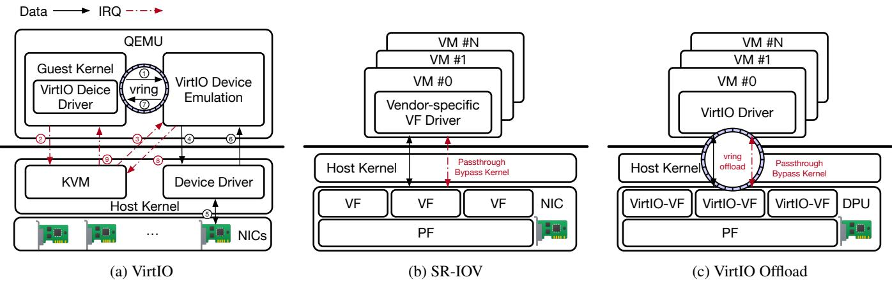  
Figure 2: The evolution of I/O virtualization. (a) VirtIO illustrates the para-virtualization approach with a split-driver model to improve performance by reducing VM exits. (b) SR-IOV demonstrates hardware-level direct device assignment for near-native performance by exposing VFs to VMs. (c) VirtIO hardware offload combines the benefits of SR-IOV and VirtIO, leveraging hardware offloading to achieve both high performance and broad compatibility.

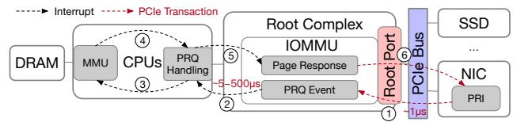  
Figure 3: IOPF Handling Process. PRQ handling in step ⃝2 introduces the most significant delay, followed by memory population and response delivery.

Mellanox [20] and VPRI focus on optimizing the latency of the IOPF process, claiming that the entire IOPF handling cycle introduces a latency of a few hundred milliseconds. However, based on previous studies and our experiments, we find that because IOPF occurs in the critical path of DMA, any delays in this path can cause the device to drop the current packet. The device then relies on higher-layer protocols (such as TCP/RDMA) to handle packet loss through retransmission. This retransmission process can lead to packet damming or flooding, causing delays that are several hundred milliseconds long, ∼ 100 times the latency of the IOPF itself.

Moreover, another significant pitfall in the deployment of ATS/PRI arises from the need for synchronization between on-device memory and the CPU’s page table information. Modern systems, especially those with large memory configurations, such as 2TB memory machines, face substantial challenges when attempting to manage this synchronization. For example, using a 4KB page size, synchronizing such a large memory footprint can lead to an enormous overhead in terms of memory storage. Specifically, the system must handle the synchronization of up to 500MB memory, which results in a considerable memory requirement just to maintain consistency across device and CPU memory page tables. This scale of memory management creates a significant burden in terms of both energy consumption and computational overhead, which, when combined with the performance penalties from DevTLB misses and the need for extensive TLB capacities, exacerbates the challenges associated with scaling ATS/PRI in production environments.

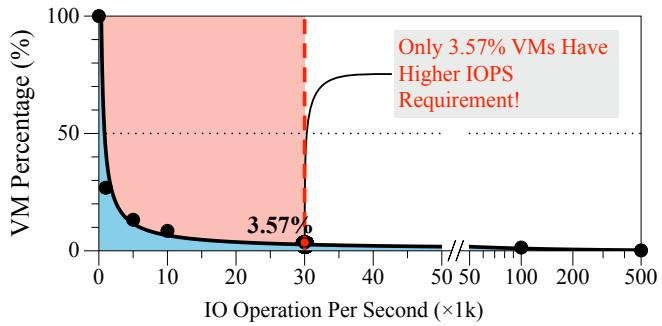  
Figure 4: IOPS distribution in a CSP production environment, showing a long-tail pattern where 73.14% of workloads have IOPS below 1,000, while less than 3.57% exceed 30,000 IOPS.

In summary, PRI-based solutions place IOPF handling in the critical I/O path, which interrupts the original flow of I/O operations, thus leading to significant performance degradation. Therefore, due to its inherent characteristics, PRI is not suitable for use in I/O-intensive environments.

## 2.3 IOPS Distribution in Cloud Environment

As is illustrated in Figure 4, the IOPS distribution in a CSP production environment demonstrates a distinct long-tail pattern. The vast majority of virtual machines, accounting for

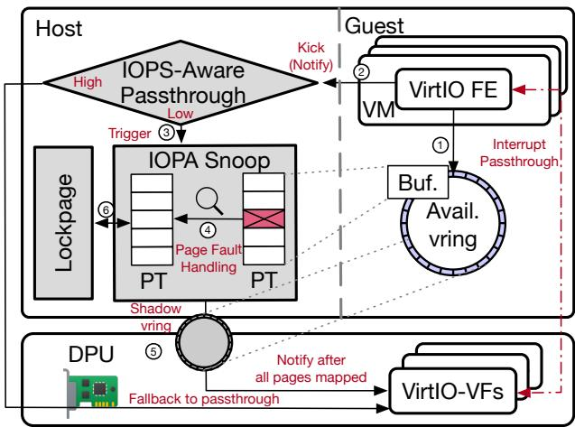  
Figure 5: Overview. The figure illustrates the VIO process, where IOPF handling is offloaded to the hypervisor, transparent to both the software and hardware. This approach eliminates IOPF overhead from the critical I/O path, improving performance while maintaining full compatibility.

73.14%, have IOPS demands that do not exceed 1,000. This indicates that most workloads in the cloud operate at relatively low IOPS levels. Meanwhile, only a small fraction of virtual machines—less than 3.57%—require more than 30,000 IOPS, highlighting the rarity yet importance of high-IOPS workloads in production environments.

This distribution reflects the resource heterogeneity in cloud environments, where low-IOPS workloads dominate while high-IOPS workloads represent a smaller but critical segment. The latter are often accompanied by memoryintensive operations. In such scenarios, memory oversubscription, a common practice to optimize resource utilization, can lead to significant interference with high-IOPS workloads, disrupting performance and potentially violating SLOs.

To address these challenges, a potential solution involves an elastic passthrough strategy capable of dynamically switching between resource sharing and passthrough modes based on real-time workload demands. Under typical conditions, low-IOPS workloads efficiently share resources to maximize utilization. When workloads intensify and IOPS demands increase, the strategy shifts to direct passthrough, minimizing overhead and delivering near-native performance. By dynamically adjusting working mode based on IOPS intensity, such an approach has the potential to balance high efficiency and reliable performance across diverse and complex workloads in cloud environments.

## 3 Design & Implementation

## 3.1 Overview

Based on our analysis and observations, we propose a novel IOPF system called VIO, as is illustrated in Figure 5. VIO is a software-based, elastic device passthrough solution that adheres to the VirtIO 1.0 standard. The design of VIO enables IOPF support without relying on any specific CPU or hardware vendors, achieving this entirely through software. In contrast to the less widely adopted ATS/PRI solution, VIO is hardware-independent and transparent to the guest operating system. The key features of VIO are as follows:

1. IOPA-Snoop: VIO snoops every VirtIO command to ensure that DMA-buffered pages are handled correctly. This mechanism guarantees that page faults will not occur during device DMA operations, eliminating the need for PCIe PRI-based page requests.

2. IOPS-Aware Elastic Passthrough: As device I/O pressure increases, VIO switches to a passthrough mode. It uses a shadow available ring to enable elastic switching between device passthrough and VIO passthrough. By toggling the IOPT in the IOMMU to the shadow available ring, VIO achieves transparent passthrough mode switching for the VM. This mechanism also supports seamless upgrades to VIO for existing VMs, enabling hot upgrades without disruption.

3. Adaptive Lockpage: VIO implements device-agnostic I/O page access logging through IOPA-snoop, which collects information about IO page access pattern. Based on this information, VIO introduces an adaptive lockpage mechanism that optimizes the usage of I/O hot pages, improving memory efficiency and reducing IOPFs.

Figure 5 illustrates the VIO process as follows: Step ⃝1 : The VirtIO frontend in the VM prepares the buffer and places it in the available ring. Step ⃝2 : The VirtIO frontend then uses a kick to notify the backend that the buffer is ready for device use. Step ⃝3 : Depending on the current IOPS pressure, the process is divided into two paths: (a) When the VM is under heavy load, the process directly follows the passthrough fast path. (b) When the device is in VIO mode, the kick triggers an IOPA-Snoop. It is important to note that in both modes, hardware interrupts are directly passed through to the virtual machine. Step ⃝4 : The IOPA-Snoop thread handles any page faults in the buffer prepared in step ⃝1 by querying the Extended Page Table (EPT). Step ⃝5 : The IOPA-Snoop thread then kicks the actual hardware, initiating the I/O operation.

During hardware I/O operation, IOPA-Snoop ensures that the device can continue the operation without being interrupted by an IOPF. Compared to the PRI-based solution, this approach removes the IOPF overhead from the critical path of the I/O operation.

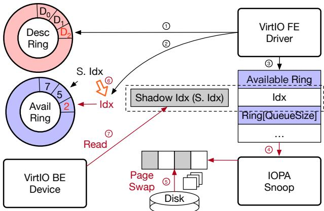  
Figure 6: Overview of IOPA Snoop. This module offloads IOPF handling to the hypervisor, without device involvement. It ensures that DMA operations can continue without IOPF by guaranteeing that all pages are mapped before the device accesses them.

The changes in the VIO process described above occur within the host’s hypervisor, making them transparent to both the upper-level guest and the underlying hardware. Unlike PRI, the current page fault handling in VIO is no longer initiated by asynchronous interrupts. This design ensures that performance improvements in IOPF handling are achieved without requiring modifications to guest operations or additional hardware functionality. By offloading IOPF handling to the hypervisor and optimizing the I/O path, VIO enhances system performance while maintaining full compatibility between the guest and the hardware.

## 3.2 IOPA-Snoop Mechanism

VirtIO is a general I/O virtualization framework that allows the hypervisor to emulate a variety of virtualized devices, making them accessible within a virtual machine through API calls. It is widely used in cloud environments to enhance virtualization I/O performance and ensure compatibility across different systems. Virtqueue serves as the transport layer abstraction between the VirtIO front-end and back-end. To prevent devices from encountering page faults during DMA, VIO introduces the IOPA-Snoop module to manage the virtqueue.

Figure 10 illustrates the process by which the VirtIO frontend adds requests and notifies the back-end for consumption. Step ⃝1 : The front-end driver allocates a buffer and adds it to the descriptor table. Step ⃝2 : The front-end driver then adds a new entry with the head index of the descriptor chain, which describes the request in the available ring entries. Step ⃝3 : The front-end driver increments the index by the number of new entries.

In the standard VirtIO path, the back-end device eventually observes the available index and uses the buffer allocated in step ⃝1 by referring to the descriptor table based on that index. If the page in the buffer has been unmapped by the hypervisor, it triggers an IOPF, which would normally require the ATS/PRI hardware process to resolve. If the back-end device waits for the page fault to be handled before continuing, it would need to store additional information in a special buffer to manage multiple in-flight page faults. This is impractical for I/O devices due to resource limitations. As a result, most hardware implementations drop the related packets, relying on higher-layer protocols like TCP/RDMA to handle retransmission, which leads to performance degradation.

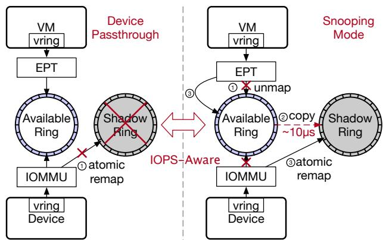  
Figure 7: Elastic passthrough. It illustrates the IOPS-aware mechanism, switching between snooping and passthrough modes using shadow page tables to manage memory mappings.

In our approach, we introduce a shadow index mechanism, where the device and driver operate on different indices. After step ⃝3 , the device sees a shadow index, which has not yet been updated and still points to the old address in the available ring. The following steps outline the process: Step ⃝4 : The IOPA-Snoop module detects the index update and snoops the buffer allocated in step ⃝1 . Step ⃝5 : The IOPA-Snoop module reads the unmapped data from the swap to ensure that the pages in the buffer are correctly mapped. Step ⃝6 : The shadow available index is then updated to the available index. Step ⃝7 : The back-end device observes the updated shadow available index and proceeds with the DMA operation.

In this process, IOPF handling is entirely managed on the hypervisor side, with no direct involvement from the device. Even when multiple page faults occur simultaneously, the handling process remains consistent with traditional CPU page fault handling, effectively removing IOPF handling from the critical path of the DMA operation.

## 3.3 Elastic Passthrough

In cloud environments, many VMs run for extended periods and may not be able to easily take advantage of new hardware features such as PRI. To ensure that both existing hardware and software can benefit from improvements, we introduce elastic passthrough. Elastic passthrough enables VMs to seamlessly switch between device passthrough and snooping mode without requiring any changes to the VM or the underlying hardware.

To protect sensitive data from malicious VMs, the hypervisor utilizes EPT to control each VM’s memory access. The VM’s MMU translates Guest Virtual Addresses (GVA) into GPA, while the hypervisor maps these GPAs to Host Physical Addresses (HPA). Additionally, the IOMMU translates I/O Virtual Addresses (IOVA) to HPA, ensuring that malicious devices cannot gain unauthorized access to memory via DMA.

VIO utilizes separate page tables for the device and driver when accessing the available ring. VIO employs separate available rings: a native available ring for the device and a shadow available ring managed by the hypervisor. This design allows the hypervisor to use the shadow available ring for snooping mode, without necessitating any modifications within the VM’s guest OS or applications.

Transitioning from Passthrough to Snooping: As is shown in the right side of Figure 7, when switching from passthrough mode to snooping mode, the hypervisor follows these steps: Step ⃝1 : Unmaps the available ring in the EPT, blocking new requests if any are in-flight. Step ⃝2 : Copies the contents of the available ring to the shadow available ring, which takes about 10 microseconds. Step ⃝3 : Atomically remaps the available ring to the shadow available ring in the IOMMU’s IOPT, and then remaps the EPT back to the available ring. This sequence completes the transition to VIO mode without any noticeable changes to the VM or device.

When operating in snooping mode, each I/O request from the VM triggers an IOPA-Snoop operation. Each snooping operation introduces a small overhead (approximately 4µs according to our measurements, as detailed in the §4.1). At low IOPS, the cumulative overhead of snooping is negligible, and the benefits of preventing IOPFs outweigh this cost. However, as the IOPS increases, the cumulative overhead of these snooping operations grows proportionally, potentially becoming a significant performance bottleneck. Furthermore, we observe that VMs with high IOPS workloads tend to require most, if not all, of their allocated memory to maintain performance. In such scenarios, the benefits of memory reclamation through snooping diminish, making it more efficient to switch these heavy-load VMs back to passthrough mode.

Transitioning from Snooping to Passthrough: To mitigate the snooping overhead under heavy I/O load and to avoid unnecessary snooping for VMs that benefit little from memory reclamation, VIO incorporates an IOPS-Aware Elastic Passthrough feature. An IOPS monitor tracks the I/O activity of the VM. When the IOPS exceeds a predefined threshold (e.g., 100k IOPS in our production environment), the system automatically triggers a switch back to passthrough mode. The left side of Figure 7 illustrates this transition process. During this transition, the hypervisor remaps the shadow available ring back to the original native available ring, allowing the VM to operate in passthrough mode and bypass the snooping overhead, thereby maintaining high I/O performance. This threshold-based switching mechanism dynamically adapts to workload demands, ensuring that the system operates efficiently across varying I/O loads.

The transition from snooping mode back to passthrough mode is optimized to minimize performance disruption. Before initiating the switch, the hypervisor proactively swaps in swapped-out pages. Because snooping continuously swaps in pages, relatively few pages need to be swapped in when transitioning back to passthrough mode. This swap-in operation occurs in parallel with ongoing snooping, effectively hiding the latency of page retrieval. When the actual mode switch takes place (remapping the shadow available ring to the native available ring), all necessary pages are already resident in memory. This design choice eliminates IOPFs from the critical path of the transition, resulting in a smooth switch with no noticeable performance degradation.

To ensure that VIO can benefit existing long-running legacy VMs, we utilize a combination of Elastic Passthrough and VMM live upgrade. VMM live upgrade is a technique that has been widely adopted in both industry and academia to update the underlying hypervisor (KVM/QEMU) without requiring any reboot or reconfiguration of the VMs themselves [37]. VIO’s design is implemented entirely within the hypervisor, meaning that no modifications or upgrades are necessary within the guest VMs to take advantage of its benefits.

We choose Orthus [50] to live upgrade VMM as it is widely deployed in our production. This VMM live upgrade process leverages a dual KVM approach, where a new, upgraded version of KVM can be loaded while the original KVM instance continues to run the VMs. Then, the VMs are “grafted” from the old KVM to the new KVM, and device ownership is handed over to the new VMM. This process enables a seamless upgrade of the QEMU process using a fork-exec model, where the original QEMU process forks, and the child process loads the new QEMU image. The upgraded QEMU includes VIO’s Elastic Passthrough capabilities. Once the legacy VM is running under the upgraded hypervisor, its transition between passthrough mode and VIO’s snooping mode operates identically to a VM that was initially started in a VIO-enabled environment.

Figure 8 illustrates the Iperf performance of a legacy VM during this upgrade process in our production environment. As the graph shows, there is some performance fluctuation during the 200ms window while QEMU is upgraded and the VM is switched to VIO mode. It’s important to note that this fluctuation occurs under peak Iperf bandwidth conditions.

During a production rollout, we schedule these upgrades during periods of low workload for the legacy VMs to minimize any potential impact. Crucially, the VMs do not need to be restarted or reconfigured, and the entire process is transparent to the guest operating system and applications. This is a significant advantage, as it avoids the complexity and potential disruption of coordinating upgrades across a large number of diverse VMs.

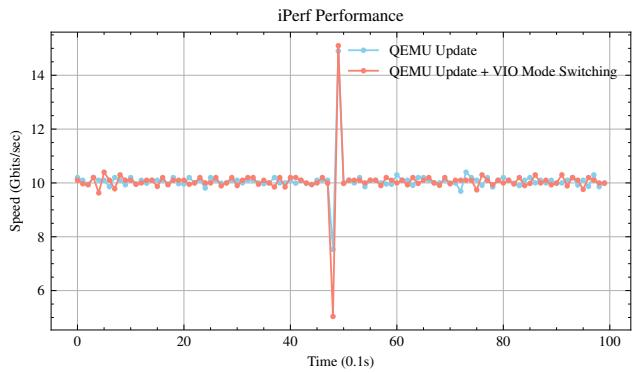  
Figure 8: iPerf performance during VMM upgrade

Overall, Elastic Passthrough allows VMs in a virtualized environment to seamlessly switch between full device passthrough and VIO modes. This flexibility ensures that memory usage is optimized and performance goals are achieved without requiring any changes to the VM or hardware.

## 3.4 Lockpage

The IOPA-snoop mechanism (see §4.1) ensures the safety of I/O pages involved in DMA operations. However, the repeated reclamation and snooping of specific pages can introduce additional performance overhead. To mitigate the frequency of page faults caused by snooping, VIO employs a lockpage mechanism to pin particular I/O hotspot pages, thereby significantly reducing the occurrence of IOPF page faults.

I/O operations exhibit strong temporal locality, as the same memory pages may be accessed repeatedly within short intervals. In contrast to the more random and less predictable access patterns typical of CPU operations, I/O operations generally follow consistent and repetitive access patterns. This predictability facilitates more effective optimization strategies, such as pinning frequently accessed pages to prevent their eviction.

VIO employs two primary lockpage strategies to leverage I/O page locality. A lockpage bitmap manages these locked pages, with memory managed in 2MB chunks. Additionally, VIO maintains an internal table, enabling it to bypass the checking of Page Table Entries (PTEs) for pages listed in the lockpage bitmap, prior to the IOPA-snoop process.

Static Lockpage: This strategy locks frequently used I/O pages based on their spatial continuity. For example, the VirtIO RX queue, which is preallocated with contiguous memory regions, is entirely locked to prevent its pages from being swapped out. This approach ensures that VIO does not need to verify the presence of these pages in memory before DMA operations, thereby enhancing performance. Currently, VIO employs static lockpage exclusively for the VirtIO RX queue due to its pre-allocated and contiguous memory layout.

Algorithm 1 Adaptive Lockpage Mechanism in VIO   
1: Initialize Lockpage Bitmap with 2MB granularity   
2: Initialize Active List and Inactive List for each Protection   
Domain   
3: procedure IOPA\_SNOOP(access\_log)   
4: for all page ∈ access\_log do   
5: MOVETOACTIVELIST(page)   
6: if ISININACTIVELIST(page) then   
7: UNPINPAGE(page)   
8: end if   
9: end for   
10: end procedure   
11: procedure MOVETOACTIVELIST(page)   
12: Remove page from Inactive List if present   
13: Add page to the head of Active List   
14: if ISACTIVELISTFULL then   
15: EVICTFROMACTIVELIST   
16: end if   
17: end procedure   
18: procedure EVICTFROMACTIVELIST   
19: evicted\_page ← Remove page from tail of Active   
List   
20: ADDTOINACTIVELIST(evicted\_page)   
21: PINPAGE(evicted\_page)   
22: end procedure

Adaptive Lockpage: The adaptive lockpage mechanism in VIO is inspired by the Dual LRU and Multi-generational LRU algorithms utilized in the Linux kernel. The primary objective is to avoid pinning pages in the youngest generation (active list) since these pages are already identified as hot by the EPT through the IOPA-snoop mechanism. Pinning these pages would unnecessarily lock those that do not require it. Instead, the focus is on pinning pages from the second young/inactive list, which represent long-term recently used pages. By pinning these pages, the kernel’s page reclaim module is prevented from evicting them, thereby reducing repeated page faults and enhancing overall system performance.

The adaptive lockpage algorithm (Algorithm 1) manages memory pages using Active and Inactive lists. When IOPA-snoop detects a page access, it transfers the page to the Active List and unpins it if it was previously in the Inactive List. If the Active List becomes full, the least recently used page is evicted to the Inactive List and subsequently pinned to retain it in memory. This selective pinning strategy ensures that frequently accessed I/O pages remain available, reducing the number of IOPFs and enhancing the ultimate system performance.

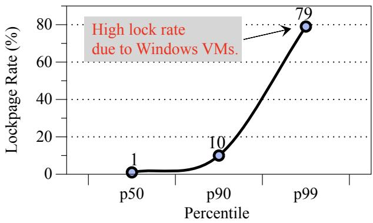  
Figure 9: Lockpage rate in a production environment, showing P50 at 1%, P90 at 10%, and P99 spiking to 79% due to poor I/O locality in Windows VirtIO driver.

Lockpage Rate: We collected lockpage data from about 300K virtual machines in our production environment. As shown in Figure 9, the analysis of lockpage rates reveals significant differences in memory usage across VMs in production. The median lockpage rate is 1%, indicating strong I/O locality for most VMs. At the 90th percentile, the lockpage rate increases to 10%, reflecting the memory demands of more intensive workloads. However, at the 99th percentile, the lockpage rate jumps sharply to 79%, highlighting a subset of VMs with significantly higher memory locking requirements.

This sharp increase is largely due to approximately onequarter of the VMs running the Windows VirtIO driver. These VMs exhibit poor I/O locality because the driver disrupts typical memory access patterns, causing a much larger portion of memory pages to be locked. This observation suggests that optimizing the Windows VirtIO driver could improve I/O locality and significantly reduce memory locking overhead. Although adaptive lockpage strategies can effectively reduce the lockpage rate, we adopt a static lockpage configuration in production for ease of maintenance.

## 4 Evaluation

We evaluate VIO across several dimensions through experiments. First, we examine its performance using microbenchmarks, focusing on the end-to-end latency for handling IOPF. Next, we illustrate its performance with real-world benchmarks, comparing it to relevant hardware-based solutions. Finally, we analyze data from a production environment to verify that VIO meets the SLO requirements for users in public cloud settings.

Experimental Setup: We deployed VIO in one of the largest global CSP production environments. Due to the lack of commercially available network cards that support PRI, we chose VPRI from SOSP’24 as the baseline [17]. VPRI is a state-of-the-art hardware implementation of PRI that integrates on-device PRI functionality, enabling IOPF processing on the DPU. We have implemented VPRI ourselves, and since VIO does not rely on specific hardware conditions, we are able to support both VPRI and VIO on the same platform. Configurations are shown in Table 2.

Table 2: Environment Configuration
<table><tr><td>Type</td><td>Hardware Configuration</td></tr><tr><td>Host</td><td>Intel Xeon CPU Platinum 8269CY 52C/104T@2.50GHz in 2 sockets 12 *16GB DRAM,1TB SSD</td></tr><tr><td>DPU</td><td>Connection: PCIe GEN3, 8 lanes Device emulation: up to 2300 VFs Max bandwidth: 200 Gb/s</td></tr><tr><td>VM</td><td>4 vCPUs, 8GB RAM CentOSLinux release 7.9.2009 NIC device: dual queue virtio-net x1 10Gb/s max throughput,190,000 PPS</td></tr></table>

Benchmarks: To demonstrate the impact of VIO, we select various I/O-intensive applications, which are highly representative of common cloud computing scenarios. The selected applications and their setups are listed as follows.

• iperf3: Tests network throughput using iperf3 with a single thread and a packet size of 1024 bytes. Simulates TCP-based data transfer to evaluate system bandwidth over a specified duration.1

• nginx: Measures web server performance under stress using two threads and 200 concurrent connections. Simulates heavy HTTP traffic to assess nginx’s handling of simultaneous requests.2 For Nginx benchmarks, we used 2KB static web pages.

• Redis: Benchmarked with redis-benchmark, using 16 threads performing GET operations on 256-byte data. Evaluates Redis’s ability to handle concurrent database queries efficiently.3 For Redis benchmarks, we used 16 connections (-c 16).

• Memcached: Tested with memaslap, using 8 threads operating on 64-byte keys (-c 8). Assesses Memcached’s performance under concurrent GET and SET workloads. 4

## 4.1 IOPA-Snooping Overhead

To evaluate the efficiency of VIO in production environments, we monitored its deployment on a sample of 10,000 VMs.

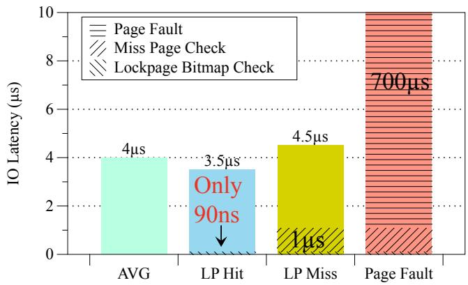  
Figure 10: IOPA-Snooping Latency. The figure shows the latency distribution of the IOPA-snoop process, detailing the impact of lockpage hits (3.5µs) and misses (4.5µs) on overhead, with page faults averaging 700µs.

We sampled the IOPA-snoop process, which handles I/O page accesses in VIO. The results provide valuable insights into the latency distribution and the effectiveness of the lockpage mechanism in reducing overhead.

As is shown in Figure 10, the IOPA-snoop process incurs a average latency of 4µs, with a clear distinction based on lockpage hits and misses. When a lockpage hit occurs, the latency is reduced to approximately 3.5µs, as the system only needs to query VIO internal bitmap, which takes 90ns. For lockpage misses, the latency increases to 4.5µs, as the system must first check whether the page is present in memory, taking around 1µs. If the page is not present, a page fault is triggered, which has an average handling time of 700µs.

These findings highlight the efficiency of VIO’s lockpage mechanism, which minimizes the need for costly page fault handling by ensuring that frequently accessed I/O pages are pinned in memory. Even in cases where a page fault occurs, VIO ensures robust performance with a well-contained average fault-handling latency. This efficient handling of I/O page accesses demonstrates VIO’s capability to maintain low overhead and stable performance, making it suitable for largescale cloud environments with diverse workloads.

## 4.2 Applications

The performance comparison between VPRI and VIO across four I/O-intensive applications, reveals differences in their ability to handle IOPF. The performance comparison between VPRI and VIO was evaluated under varying I/O pressure by injecting IOPFs at different rates (1/2/5/10 per second) and introducing diverse fault latencies. All tests were conducted under memory oversubscription conditions with Snooping mode enabled. Please note that under such high IOPS conditions, VIO would typically run in passthrough mode. However, in this case, to demonstrate the worst-case performance of

VIO, we used snooping mode for comparison. These latencies are chosen to reflect the wide range of delays observed in cloud SSDs: while high-performance cloud SSDs offer read/write latencies around 4ms, others can be significantly higher. By adjusting both the IOPF frequency and latency, we simulate conditions that capture the complexity and variability of real-world cloud storage environments.

As is shown in the Figure 11, VPRI experiences significant throughput degradation as delay increases due to its reliance on retransmissions to recover from packet loss caused by IOPFs. For instance, in Redis, VPRI throughput drops by 60% under 10ms delay, while Nginx and Memcached exhibit similar degradation trends of 45% and 57%, respectively. This cascading effect of retransmissions highlights the sensitivity of VPRI to IOPF frequency, particularly in workloads with high transaction rates or network demands.

In contrast, VIO demonstrates excellent stability under the same conditions. By isolating page fault handling from the critical I/O data path, VIO avoids packet loss and retransmissions, resulting in minimal performance degradation. Across all applications, VIO’s throughput reductions remain below 10%, even at higher delays. For example, in Redis, VIO achieves a modest 6% drop under a 10ms delay, while Nginx and Memcached see reductions of 9% and 6%, respectively. This consistent performance advantage underscores VIO’s ability to maintain stable throughput across a range of workloads and delay conditions. Redis shows poorer performance in low IOPF situations because the frequency of snooping operations becomes a significant bottleneck due to snooping latency. When IOPS is high, total snooping overhead increases proportionally with the growth in I/O operations. This data supports the design goal of Elastic Passthrough of employing snooping in most low-IOPS scenarios and switching to passthrough in high-IOPS scenarios.

Overall, the results emphasize the effectiveness of VIO in mitigating the impact of IOPFs. While VPRI struggles with retransmission overheads that degrade performance as delays increase, VIO ensures predictable and reliable throughput by handling page faults in a non-intrusive manner. This makes VIO a robust solution for diverse cloud applications requiring stable and efficient I/O operations under varying workloads and network conditions.

## 4.3 I/O SLOs

In production environments, intermittent I/O jitter caused by infrastructure issues such as network congestion often results in long-tail performance degradation and packet loss. This significantly impacts I/O SLO metrics, prompting CSPs to invest substantial resources in maintaining I/O jitter within tolerable levels. However, the limitations of the current IOPF architecture exacerbate I/O jitter. Frequent IOPFs, particularly during rapid successive bursts, introduce retransmissions and delays, directly leading to I/O SLO violations.

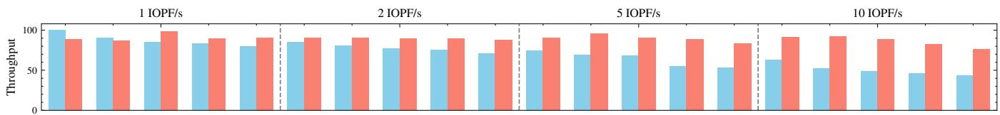

(a) iperf TCP (1 thread, size=1024B)  
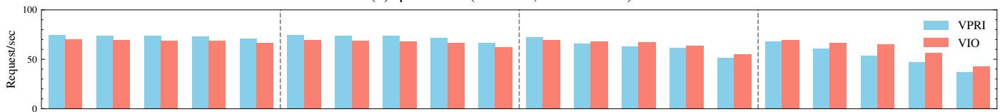

(b) Nginx (2 threads, 200 connections)  
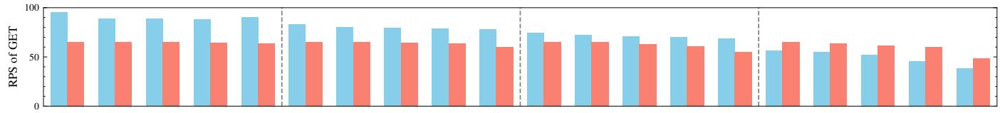  
(c) Redis (16 threads, GET size=256B)

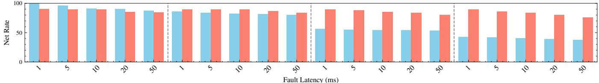  
(d) Memcached (8 threads, keysize=64B)

Figure 11: VPRI[SOSP’24] vs VIO Performance comparison normalized to respective passthrough mode.  
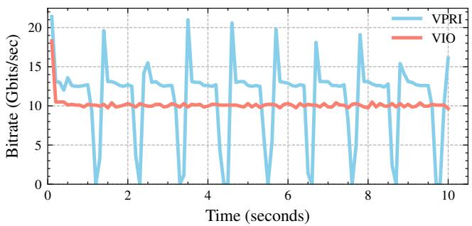  
Figure 12: iperf3 performance when IOPF occurs in a fixed rate of 1s and fault latency of 5ms.

To evaluate the impact of IOPF on I/O jitter, we used iperf to measure network bandwidth, sampling throughput data every 0.1 seconds. Figure 12 reveals that VPRI suffers from significant bursts of packet loss due to its reliance on retransmissions when an IOPF occurs. This behavior leads to highly unstable throughput, frequently dropping nearly to zero during retransmission periods. These bursts not only degrade the average throughput but also amplify I/O jitter, making it difficult for VPRI to meet SLO requirements.

In contrast, VIO demonstrates remarkable stability under the same testing conditions. By decoupling IOPF handling from the critical data path, VIO avoids packet loss and retransmissions, resulting in consistent throughput that remains near

10 Gbps with minimal fluctuation. This robustness effectively mitigates I/O jitter, ensuring predictable I/O performance even under bursty or high-load conditions. Consequently, VIO enables CSPs to achieve better compliance with I/O SLOs while reducing the operational burden of jitter management, making it a reliable solution for production-scale environments.

## 4.4 VIO in Production

We have deployed VIO in one of the largest global CSPs for over a year. During this time, we collected extensive production data from its deployment. Throughout the upgrade and operational phases, there have been no user-reported issues related to I/O SLOs. Below, we present actual production data gathered from the deployment of VIO.

IOPF in High Oversubscription: Figure 13 illustrates the distribution of page accesses and the single IOPF observed during the trace. Under a 30% memory oversubscription rate, we analyzed a page access trace over a one-hour period using YCSB Workload on Redis.5 During this time, the system recorded 1,464,225 unique page accesses but encountered only a single IOPF. This result highlights the effectiveness of the lockpage mechanism in maintaining low IOPF rates even under high memory pressure.

The lockpage mechanism ensures that frequently accessed I/O pages are pinned in memory, reducing the need for costly page faults. In this case, the mechanism effectively identified and locked critical pages, allowing the workload to run with minimal interruptions.

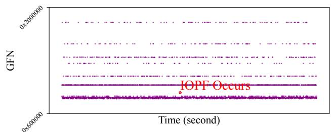

Figure 13: Page Access Trace (1:5000 Downsample). The figure shows a one-hour YCSB Workload on Redis under 30% memory oversubscription, with only one IOPF observed.  
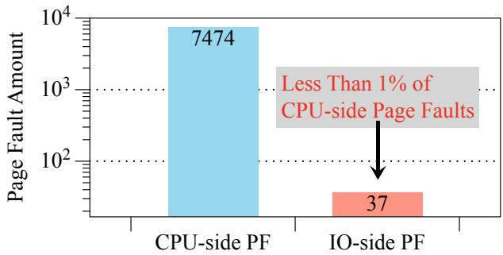  
Figure 14: Daily Page Fault Comparison. The figure shows IOPFs reduced to less than 1% of CPU Page Faults, highlighting the effectiveness of the lockpage mechanism in ensuring I/O SLO requirement.

Daily Page Faults Rate: As shown in Figure 14, the lockpage mechanism in the production environment effectively reduced IOPFs to less than 1% of CPU Page Faults. By pinning frequently accessed I/O pages in memory, it minimized the occurrence of costly page faults, ensuring stable and efficient I/O operations for VMs.

This reduction in IOPFs is critical for meeting I/O SLOs. It prevents performance degradation caused by resource contention, ensuring low latency and consistent performance for critical workloads, even in high-density, multi-tenant environments.

Ablation Study: To evaluate the individual contributions of VIO’s components, we conducted an ablation study using the netperf TCP\_RR benchmark. 6 As shown in Figure 15, in snooping mode we observed a 3.4% performance difference between VIO without lockpage and VIO with lockpage (870, 000 to 900, 000 transactions per second). This improvement is attributed to the lockpage hit mechanism reducing snooping overhead by approximately 1us per operation. At high IOPS, VIO operating in snooping mode exhibits a 10% performance degradation compared to VIO in passthrough mode. This performance difference highlights the overhead of snooping under heavy I/O load and underscores the necessity for Elastic Passthrough to switch to passthrough mode in such scenarios. For comparison, we implemented colOMMU and observed that its performance at high IOPS reached only 60.5% of the native passthrough performance. This result indicates that colOMMU is less suitable for production environments with demanding I/O workloads.

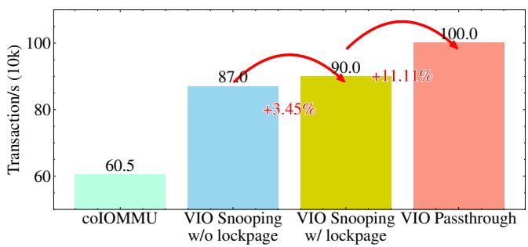  
Figure 15: Ablation study of VIO under netperf TCP\_RR. Lockpage improves snooping performance by 3.4%, while passthrough mode outperforms snooping by 11.1%.

## 5 Related Work

Static Memory Pinning Avoidance: To solve the problem of static memory pinning caused by IOPFs, PCI-SIG proposed the ATS/PRI specification [3]. However, ATS/PRI has not been widely adopted by I/O devices. Both industry and academia have explored various ways to address this issue. Previous research [17, 18, 27, 35] introduced IOPF handling into RDMA and DPU devices using methods similar to PRI from a hardware perspective. However, these PRI-like methods suffer from significant performance degradation as the number of IOPFs increases because they handle page faults in the critical path [16, 18, 49]. There have also been approaches for handling IOPF in GPUs [22, 38], but these methods are specific for GPUs, not suitable for general network and storage devices.

Many software-based solutions have also been proposed to solve the IOPF problem. coIOMMU [39] and vIOMMU [8] use para-virtualization to support IOPFs, where the guest kernel and the hypervisor work together to implement dynamic memory pinning. IOGuard [12] dedicates one CPU core to handle IOPFs in software. These software solutions either require modifications to the VM, leading to poor performance, or consume valuable CPU resources, which is unacceptable in cloud environments.

On the other hand, VIO provides a high-performance and cost-effective way to handle IOPFs without requiring changes to the guest or additional hardware features.

Memory Page Tracking: Various studies have aimed at detecting hot pages to reduce access latency by pinning or placing them in faster memory. Some approaches track memory access by utilizing page faults [23, 25, 45], while others focus on periodically checking reference bits in PTEs to monitor page hotness [26, 32, 36, 42, 48]. Modern processors provide advanced hardware features for performance monitoring, such as Intel’s PEBS and AMD’s IBS, which enable precise tracking of memory access events [10]. More recent works [13, 26, 47] have adopted these hardware-based techniques for enhanced memory access monitoring. However, a key challenge is balancing the trade-off between the accuracy of sampling and the overhead it incurs, especially as memory usage scales. To overcome this, a novel approach [14] combines TLB and PTE sampling, based on the observation that frequently accessed pages tend to experience a high rate of TLB misses. VIO takes advantage of its VirtIO data plane to track I/O page access in a way that is transparent to both the device and the guest OS.

## 6 Discussion

## 6.1 Compatibility

In this paper, we present a Linux-based implementation of VIO, which ensures high compatibility for several key reasons. First, VIO is built upon the VirtIO interface, a standardized virtual I/O interface that is supported across various CPU architectures and does not depend on specific hardware I/O devices or kernel versions. This makes the implementation highly portable and flexible. Second, VIO does not require any modifications to the guest OS, as it operates transparently through the VirtIO interface. This ensures that VIO maintains full compatibility with a wide range of guest OSes, including Linux, BSD, and even Windows, without enforcing any changes or additional dependencies. In theory, VIO can work with other hypervisors like Xen, Firecracker which supports VirtIO for efficient I/O virtualization. Moreover, VIO’s design leverages basic virtualization features of the system, ensuring broad hardware compatibility. CPU platforms, including PowerPC, ARM, and RISC-V, can theoretically support VIO, as they widely adopt VirtIO in their virtualization ecosystems.

VIO requires guest VMs to use VirtIO and assumes the presence of a DPU that supports VirtIO offload. Major DPU vendors such as Intel and Mellanox support this functionality [5, 6], and our in-house DPU also implements it. In principle, any kernel version with VirtIO support can work with VIO. In our deployment, we have successfully migrated legacy VMs—including a 10-year-old CentOS 5 instance with kernel version 2.6.18—to VIO without modification.

## 6.2 Generalizability

While VIO is initially implemented and evaluated within the VirtIO framework, its underlying principles of IOPA-Snooping and Elastic Passthrough are applicable to other I/O architectures. Within the virtIO ecosystem, VIO effectively supports both network devices (virtio-net) and storage devices (virtio-blk), demonstrating its versatility. Furthermore, we have successfully extended VIO’s concepts to the NVMe protocol. In NVMe, I/O submission involves writing the tail index to a doorbell register. We adapted IOPA-Snooping by intercepting this doorbell register write, enabling us to monitor I/O requests and proactively handle potential IOPFs. Additionally, we implemented Elastic Passthrough for NVMe by monitoring IOPS and dynamically switching between snooping and direct I/O, similar to the VirtIO implementation. These implementations across VirtIO-net, VirtIO-blk, and NVMe demonstrate that VIO’s core ideas can be generalized beyond the VirtIO model, offering a more broadly applicable solution for managing I/O in virtualized environments.

## 6.3 Future Work

The VirtIO 1.1 standard draft, introduced in 2018, offers the Packed virtqueue as a more efficient alternative to the Split virtqueue [1]. Future iterations of VIO are planned to support VirtIO 1.1, further improving I/O efficiency and scalability.

## 7 Conclusion

This paper presents VIO, a production-level I/O virtualization framework offering hardware independence, high performance, and resource efficiency. VIO introduces: 1) an elastic passthrough mechanism adapting to IOPS demands for nearnative performance; 2) an adaptive lockpage mechanism reducing IOPFs by pinning frequently accessed pages; and 3) a proactive snooping approach separating IOPF handling from the critical I/O path. Unlike PRI, which struggles with latency and limited hardware adoption, VIO provides a practical and efficient solution for large-scale cloud environments.

VIO, deployed across 300K VMs, achieves up to the equivalent of 30K VM memory daily savings while maintaining I/O SLOs with less than 1% IOPFs compared to CPU page faults, demonstrating its efficiency and scalability in production environments.

## 8 Acknowledgements

We thank our shepherd and the anonymous reviewers for the insightful comments that improved the quality of this paper. This work was supported in part by the National NSF of China (NO. 62141218, 62232012), and Shanghai Key Laboratory of Scalable Computing and Systems.

## References

[1] Virtual I/O Device (VIRTIO) Version 1.1. https://docs. oasis-open.org/virtio/virtio/v1.1/csprd01/virtio-v1. 1-csprd01.html, Dec. 2018. [Online; accessed 14. May 2025].

[2] mm / virtio: Provide support for free page reporting. https://lwn. net/Articles/808807, Jan. 2020. [Online; accessed 9. May 2025].

[3] Address Translation Services Revision 1.1 | PCI-SIG, Dec. 2024. [Online; accessed 6. Dec. 2024].

[4] Linux Plumbers Conference 2024. https://lpc.events/event/18/ contributions/1684, May 2025. [Online; accessed 14. May 2025].

[5] Powering Infrastructure to Help Shape the Data Center of the Future. https://www.intel.com/content/dam/ www/central-libraries/us/en/documents/2022-09/ ipu-baidu-dpu-white-paper.pdf, May 2025. [Online; accessed 15. May 2025].

[6] VirtIO-net Emulated Devices - NVIDIA Docs. https://docs. nvidia.com/networking/display/bluefielddpubspv422/ virtio-net+emulated+devices, May 2025. [Online; accessed 15. May 2025].

[7] ALLEN, T., AND GE, R. In-depth analyses of unified virtual memory system for gpu accelerated computing. In Proceedings of the International Conference for High Performance Computing, Networking, Storage and Analysis (New York, NY, USA, 2021), SC ’21, Association for Computing Machinery.

[8] AMIT, N., BEN-YEHUDA, M., TSAFRIR, D., AND SCHUSTER, A. viommu: Efficient IOMMU emulation. In Proceedings of the 2011 USENIX Annual Technical Conference, USENIX ATC 2011, Portland, OR, USA, June 15-17, 2011 (2011), J. Nieh and C. A. Waldspurger, Eds., USENIX Association.

[9] AMIT, N., AND WEI, M. The design and implementation of hyperupcalls. In Proceedings of the 2018 USENIX Annual Technical Conference, USENIX ATC 2018, Boston, MA, USA, July 11-13, 2018 (2018), H. S. Gunawi and B. C. Reed, Eds., USENIX Association, pp. 97–112.

[10] BEN-YEHUDA, M., DAY, M. D., DUBITZKY, Z., FACTOR, M., HAR’EL, N., GORDON, A., LIGUORI, A., WASSERMAN, O., AND YASSOUR, B. The turtles project: Design and implementation of nested virtualization. In 9th USENIX Symposium on Operating Systems Design and Implementation, OSDI 2010, October 4-6, 2010, Vancouver, BC, Canada, Proceedings (2010), R. H. Arpaci-Dusseau and B. Chen, Eds., USENIX Association, pp. 423–436.

[11] CHEN, Y., BILAS, A., DAMIANAKIS, S. N., DUBNICKI, C., AND LI, K. Utlb: a mechanism for address translation on network interfaces. SIGOPS Oper. Syst. Rev. 32, 5 (Oct. 1998), 193–204.

[12] DONG, Y., AND MI, Z. Ioguard: Software-based I/O page fault handling with one CPU core. In Proceedings of the 15th Asia-Pacific Symposium on Internetware, Internetware 2024, Macau, SAR, China, July 24-26, 2024 (2024), H. Mei, J. Lv, A. Helal, X. Ma, S. Cheung, J. Zhang, and T. Zhang, Eds., ACM.

[13] DURAISAMY, P., XU, W., HARE, S., RAJWAR, R., CULLER, D. E., XU, Z., FAN, J., KENNELLY, C., MCCLOSKEY, B., MIJAILOVIC, D., MORRIS, B., MUKHERJEE, C., REN, J., THELEN, G., TURNER, P., VILLAVIEJA, C., RANGANATHAN, P., AND VAHDAT, A. Towards an adaptable systems architecture for memory tiering at warehouse-scale. In Proceedings of the 28th ACM International Conference on Architectural Support for Programming Languages and Operating Systems, Volume 3, ASPLOS 2023, Vancouver, BC, Canada, March 25-29, 2023 (2023), T. M. Aamodt, N. D. E. Jerger, and M. M. Swift, Eds., ACM, pp. 727–741.

[14] FIRESTONE, D., PUTNAM, A., MUNDKUR, S., CHIOU, D., DABAGH, A., ANDREWARTHA, M., ANGEPAT, H., BHANU, V., CAULFIELD, A. M., CHUNG, E. S., CHANDRAPPA, H. K., CHATURMOHTA, S., HUMPHREY, M., LAVIER, J., LAM, N., LIU, F., OVTCHAROV, K.,

PADHYE, J., POPURI, G., RAINDEL, S., SAPRE, T., SHAW, M., SILVA, G., SIVAKUMAR, M., SRIVASTAVA, N., VERMA, A., ZUHAIR, Q., BANSAL, D., BURGER, D., VAID, K., MALTZ, D. A., AND GREEN-BERG, A. G. Azure accelerated networking: Smartnics in the public cloud. In 15th USENIX Symposium on Networked Systems Design and Implementation, NSDI 2018, Renton, WA, USA, April 9-11, 2018 (2018), S. Banerjee and S. Seshan, Eds., USENIX Association, pp. 51–66.

[15] FUKUOKA, T., SATO, S., AND TAURA, K. Pitfalls of infiniband with on-demand paging. In 2021 IEEE International Symposium on Performance Analysis of Systems and Software (ISPASS) (2021), pp. 265–275.

[16] FUKUOKA, T., SATO, S., AND TAURA, K. Pitfalls of infiniband with on-demand paging. In IEEE International Symposium on Performance Analysis of Systems and Software, ISPASS 2021, Stony Brook, NY, USA, March 28-30, 2021 (2021), IEEE, pp. 265–275.

[17] GUO, K., LI, D., LUO, B., SHEN, Y., PENG, K., LUO, N., DAI, S., LIANG, C., SONG, J., YANG, H., ZHANG, X., AND MI, Z. VPRI: efficient I/O page fault handling via software-hardware co-design for iaas clouds. In Proceedings of the ACM SIGOPS 30th Symposium on Operating Systems Principles, SOSP 2024, Austin, TX, USA, November 4-6, 2024 (2024), E. Witchel, C. J. Rossbach, A. C. Arpaci-Dusseau, and K. Keeton, Eds., ACM, pp. 541–557.

[18] GUO, Z., SHAN, Y., LUO, X., HUANG, Y., AND ZHANG, Y. Clio: a hardware-software co-designed disaggregated memory system. In ASPLOS ’22: 27th ACM International Conference on Architectural Support for Programming Languages and Operating Systems, Lausanne, Switzerland, 28 February 2022 - 4 March 2022 (2022), B. Falsafi, M. Ferdman, S. Lu, and T. F. Wenisch, Eds., ACM, pp. 417–433.

[19] HAR’EL, N., GORDON, A., LANDAU, A., BEN-YEHUDA, M., TRAEGER, A., AND LADELSKY, R. Efficient and scalable paravirtual I/O system. In 2013 USENIX Annual Technical Conference (USENIX ATC 13) (San Jose, CA, June 2013), USENIX Association, pp. 231– 242.

[20] HUDZIA, B. On allowing shorter timeout on mellanox cards and other tips and tricks. https://www.reflectionsofthevoid.com/2014/ 02/on-allowing-shorter-timeout-on-mellanox.html, 2014. Accessed: 2024-12-10.

[21] JALEEL, A., EBRAHIMI, E., AND DUNCAN, S. Ducati: Highperformance address translation by extending tlb reach of gpuaccelerated systems. ACM Trans. Archit. Code Optim. 16, 1 (Mar. 2019).

[22] KIM, H., SIM, J., GERA, P., HADIDI, R., AND KIM, H. Batch-aware unified memory management in gpus for irregular workloads. In AS-PLOS ’20: Architectural Support for Programming Languages and Operating Systems, Lausanne, Switzerland, March 16-20, 2020 (2020), J. R. Larus, L. Ceze, and K. Strauss, Eds., ACM, pp. 1357–1370.

[23] KIM, J., CHOE, W., AND AHN, J. Exploring the design space of page management for multi-tiered memory systems. In Proceedings of the 2021 USENIX Annual Technical Conference, USENIX ATC 2021, July 14-16, 2021 (2021), I. Calciu and G. Kuenning, Eds., USENIX Association, pp. 715–728.

[24] KUPERMAN, Y., MOSCOVICI, E., NIDER, J., LADELSKY, R., GOR-DON, A., AND TSAFRIR, D. Paravirtual remote i/o. In Proceedings of the Twenty-First International Conference on Architectural Support for Programming Languages and Operating Systems (New York, NY, USA, 2016), ASPLOS ’16, Association for Computing Machinery, p. 49–65.

[25] LAGAR-CAVILLA, H. A., AHN, J., SOUHLAL, S., AGARWAL, N., BURNY, R., BUTT, S., CHANG, J., CHAUGULE, A., DENG, N., SHAHID, J., THELEN, G., YURTSEVER, K. A., ZHAO, Y., AND RAN-GANATHAN, P. Software-defined far memory in warehouse-scale computers. In Proceedings of the Twenty-Fourth International Conference on Architectural Support for Programming Languages and Operating Systems, ASPLOS 2019, Providence, RI, USA, April 13-17, 2019 (2019), I. Bahar, M. Herlihy, E. Witchel, and A. R. Lebeck, Eds., ACM, pp. 317–330.

[26] LEE, T., MONGA, S. K., MIN, C., AND EOM, Y. I. MEMTIS: efficient memory tiering with dynamic page classification and page size determination. In Proceedings of the 29th Symposium on Operating Systems Principles, SOSP 2023, Koblenz, Germany, October 23-26, 2023 (2023), J. Flinn, M. I. Seltzer, P. Druschel, A. Kaufmann, and J. Mace, Eds., ACM, pp. 17–34.

[27] LESOKHIN, I., ERAN, H., RAINDEL, S., SHAPIRO, G., GRIMBERG, S., LISS, L., BEN-YEHUDA, M., AMIT, N., AND TSAFRIR, D. Page fault support for network controllers. In Proceedings of the Twenty-Second International Conference on Architectural Support for Programming Languages and Operating Systems, ASPLOS 2017, Xi’an, China, April 8-12, 2017 (2017), Y. Chen, O. Temam, and J. Carter, Eds., ACM, pp. 449–466.

[28] LESOKHIN, I., ERAN, H., RAINDEL, S., SHAPIRO, G., GRIMBERG, S., LISS, L., BEN-YEHUDA, M., AMIT, N., AND TSAFRIR, D. Page fault support for network controllers. SIGARCH Comput. Archit. News 45, 1 (Apr. 2017), 449–466.

[29] LIU, J., HUANG, W., ABALI, B., AND PANDA, D. K. High performance VMM-Bypass I/O in virtual machines. In 2006 USENIX Annual Technical Conference (USENIX ATC 06) (Boston, MA, May 2006), USENIX Association.

[30] LIU, Y., MA, J., ZHANG, Z., LI, L., QI, Z., AND GUAN, H. Megatron: Software-managed device tlb for shared-memory fpga virtualization. In 2021 58th ACM/IEEE Design Automation Conference (DAC) (2021), pp. 1213–1218.

[31] PARK, J., JEONG, D., AND KIM, J. Uvmmu: Hardware-offloaded page migration for heterogeneous computing. In 2023 Design, Automation & Test in Europe Conference & Exhibition (DATE) (2023), pp. 1–6.

[32] PARK, S., BHOWMIK, M., AND UTA, A. DAOS: data access-aware operating system. In HPDC ’22: The 31st International Symposium on High-Performance Parallel and Distributed Computing, Minneapolis, MN, USA, 27 June 2022 - 1 July 2022 (2022), J. B. Weissman, A. Chandra, A. Gavrilovska, and D. Tiwari, Eds., ACM, pp. 4–15.

[33] PCI-SIG. Address translation services revision 1.1, 2009. Accessed: 2024-12-10.

[34] PICHAI, B., HSU, L., AND BHATTACHARJEE, A. Architectural support for address translation on gpus: designing memory management units for cpu/gpus with unified address spaces. SIGPLAN Not. 49, 4 (Feb. 2014), 743–758.

[35] PSISTAKIS, A., CHRYSOS, N., CHAIX, F., ASIMINAKIS, M., GIAN-NIOUDIS, M., XIROUCHAKIS, P., PAPAEFSTATHIOU, V., AND KAT-EVENIS, M. PART: pinning avoidance in RDMA technologies. In 14th IEEE/ACM International Symposium on Networks-on-Chip, NOCS 2020, Hamburg, Germany, September 24-25, 2020 (2020), IEEE, pp. 1– 8.

[36] REN, J., XU, D., RYU, J., SHIN, K., KIM, D., AND LI, D. MTM: rethinking memory profiling and migration for multi-tiered large memory. In Proceedings of the Nineteenth European Conference on Computer Systems, EuroSys 2024, Athens, Greece, April 22-25, 2024 (2024), ACM, pp. 803–817.

[37] STEVE SISTARE, M. K. QEMU Live Update. https://blogs. oracle.com/linux/post/qemu-live-update, May 2025. [Online; accessed 14. May 2025].

[38] TANASIC, I., GELADO, I., JORDÀ, M., AYGUADÉ, E., AND NAVARRO, N. Efficient exception handling support for gpus. In Proceedings of the 50th Annual IEEE/ACM International Symposium on Microarchitecture, MICRO 2017, Cambridge, MA, USA, October 14-18, 2017 (2017), H. C. Hunter, J. Moreno, J. S. Emer, and D. Sánchez, Eds., ACM, pp. 109–122.

[39] TIAN, K., ZHANG, Y., KANG, L., ZHAO, Y., AND DONG, Y. coiommu: A virtual IOMMU with cooperative DMA buffer tracking for efficient memory management in direct I/O. In Proceedings of the 2020 USENIX Annual Technical Conference, USENIX ATC 2020, July 15-17, 2020 (2020), A. Gavrilovska and E. Zadok, Eds., USENIX Association, pp. 479–492.

[40] VOGEL, P., MARONGIU, A., AND BENINI, L. Exploring shared virtual memory for fpga accelerators with a configurable iommu. IEEE Transactions on Computers 68, 4 (2019), 510–525.

[41] WALDSPURGER, C. A. Memory resource management in vmware ESX server. In 5th Symposium on Operating System Design and Implementation (OSDI 2002), Boston, Massachusetts, USA, December 9-11, 2002 (2002), D. E. Culler and P. Druschel, Eds., USENIX Association.

[42] WANG, Y., CHEN, L., DENG, T., LUO, B., SHEN, Y., WEI, Z., XU, Y., HUANG, M., AND QI, Z. Effectively virtual page prefetching via spatial-temporal patterns for memory-intensive cloud applications. In ACM SIGPLAN Symposium on Principles and Practice of Parallel Programming (PPoPP 2025) (2025). To appear.

[43] WANG, Y., LUO, B., AND SHEN, Y. Efficient memory overcommitment for I/O passthrough enabled vms via fine-grained page meta-data management. In Proceedings of the 2023 USENIX Annual Technical Conference, USENIX ATC 2023, Boston, MA, USA, July 10-12, 2023 (2023), J. Lawall and D. Williams, Eds., USENIX Association, pp. 769–783.

[44] WEINER, J., AGARWAL, N., SCHATZBERG, D., YANG, L., WANG, H., SANOUILLET, B., SHARMA, B., HEO, T., JAIN, M., TANG, C., AND SKARLATOS, D. Tmo: transparent memory offloading in datacenters. In Proceedings of the 27th ACM International Conference on Architectural Support for Programming Languages and Operating Systems (New York, NY, USA, 2022), ASPLOS ’22, Association for Computing Machinery, p. 609–621.

[45] WEINER, J., AGARWAL, N., SCHATZBERG, D., YANG, L., WANG, H., SANOUILLET, B., SHARMA, B., HEO, T., JAIN, M., TANG, C., AND SKARLATOS, D. TMO: transparent memory offloading in datacenters. In ASPLOS ’22: 27th ACM International Conference on Architectural Support for Programming Languages and Operating Systems, Lausanne, Switzerland, 28 February 2022 - 4 March 2022 (2022), B. Falsafi, M. Ferdman, S. Lu, and T. F. Wenisch, Eds., ACM, pp. 609– 621.

[46] WÜNSCHE, J., KARIM, S., KUHN, M., BRONESKE, D., AND SAAKE, G. Intelligent data migration policies in a write-optimized copy-onwrite tiered storage stack. In Proceedings of the 3rd Workshop on Challenges and Opportunities of Efficient and Performant Storage Systems (New York, NY, USA, 2023), CHEOPS ’23, Association for Computing Machinery, p. 17–26.

[47] XIANG, L., LIN, Z., DENG, W., LU, H., RAO, J., YUAN, Y., AND WANG, R. Nomad: Non-exclusive memory tiering via transactional page migration. In 18th USENIX Symposium on Operating Systems Design and Implementation, OSDI 2024, Santa Clara, CA, USA, July 10-12, 2024 (2024), A. Gavrilovska and D. B. Terry, Eds., USENIX Association, pp. 19–35.

[48] YAN, Z., LUSTIG, D., NELLANS, D. W., AND BHATTACHARJEE, A. Nimble page management for tiered memory systems. In Proceedings of the Twenty-Fourth International Conference on Architectural Support for Programming Languages and Operating Systems, ASP-LOS 2019, Providence, RI, USA, April 13-17, 2019 (2019), I. Bahar, M. Herlihy, E. Witchel, and A. R. Lebeck, Eds., ACM, pp. 331–345.

[49] YANG, J., IZRAELEVITZ, J., AND SWANSON, S. Filemr: Rethinking RDMA networking for scalable persistent memory. In 17th USENIX Symposium on Networked Systems Design and Implementation, NSDI 2020, Santa Clara, CA, USA, February 25-27, 2020 (2020), R. Bhagwan and G. Porter, Eds., USENIX Association, pp. 111–125.

[50] ZHANG, X., ZHENG, X., WANG, Z., LI, Q., FU, J., ZHANG, Y., AND SHEN, Y. Fast and scalable VMM live upgrade in large cloud infrastructure. In Proceedings of the Twenty-Fourth International Conference on Architectural Support for Programming Languages and Operating Systems, ASPLOS 2019, Providence, RI, USA, April 13-17, 2019 (2019), I. Bahar, M. Herlihy, E. Witchel, and A. R. Lebeck, Eds., ACM, pp. 93–105.