①

USENIX

THE ADVANCED COMPUTING SYSTEMS ASSOCIATION

# WLB-LLM: Workload-Balanced 4D Parallelism for Large Language Model Training

Zheng Wang, University of California, San Diego, and Meta; Anna Cai and   
Xinfeng Xie, Meta; Zaifeng Pan and Yue Guan, University of California, San Diego;   
Weiwei Chu, Jie Wang, Shikai Li, Jianyu Huang, Chris Cai, and Yuchen Hao, Meta; Yufei Ding, University of California, San Diego, and Meta

https://www.usenix.org/conference/osdi25/presentation/wang-zheng

# This paper is included in the Proceedings of the 19th USENIX Symposium on Operating Systems Design and Implementation.

July 7–9, 2025 • Boston, MA, USA

ISBN 978-1-939133-47-2

Open access to the Proceedings of the 19th USENIX Symposium on Operating Systems Design and Implementation is sponsored by

# WLB-LLM: Workload-Balanced 4D Parallelism for Large Language Model Training

Zheng Wang1,2, Anna Cai2, Xinfeng Xie2, Zaifeng Pan1, Yue Guan1, Weiwei Chu2, Jie Wang2, Shikai Li2, Jianyu Huang2, Chris Cai2, Yuchen Hao2, Yufei Ding1,2 University of California, San Diego1 Meta2

## Abstract

In this work, we present WLB-LLM, a WorkLoad-Balanced 4D Parallelism for Large Language Model Training. We first thoroughly analyze the workload imbalance issue in LLM training and identify two primary sources of imbalance at the pipeline parallelism and context parallelism levels. Then, to address the imbalance issue, at the pipeline parallelism level, WLB-LLM incorporates a workload-aware variable-length document packing method to balance the computation and communication workload across micro-batches. Additionally, at the context parallelism level, WLB-LLM introduces a novel fine-grained per-document sharding strategy, ensuring each worker within a context parallelism group has an identical workload. Comprehensive experiments under different model scales demonstrate that WLB-LLM significantly mitigates the workload imbalance during 4D parallelism LLM training and achieves an average speedup of 1.23× when applying WLB-LLM in our internal LLM training framework.

## 1 Introduction

Large language models (LLMs) have been widely adopted as the backbone of various applications, such as coding assistants [27, 48], language translation [52], and chatbots [3, 31]. The remarkable capabilities and promising potential of LLMs have sparked a competition among big tech companies to train LLMs with higher intelligence and broader versatility [2,6,41]. As the scale of LLMs and length of context window continue to grow larger [14], the training of LLMs consumes a significant amount of computing power [33]. For instance, Meta reports that the training of the LLaMA3-405B model uses 16K H100 GPUs for several months [6]. The tremendous computational cost of LLM training makes every improvement in end-to-end training efficiency translate to substantial savings.

Unfortunately, a significant portion of GPUs are underutilized during large-scale LLM training jobs due to the workload imbalance issue. To illustrate this, Figure 1 (a) shows the normalized computation latency on each GPU during a

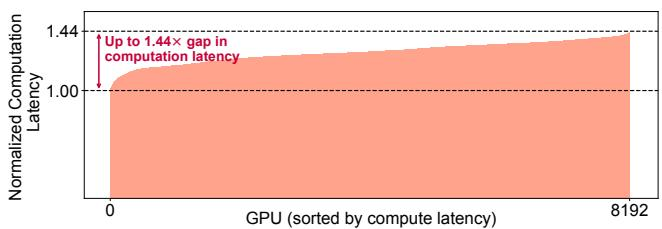  
(a) Normalized computation latency in an 8K-GPU 405B LLM training job.

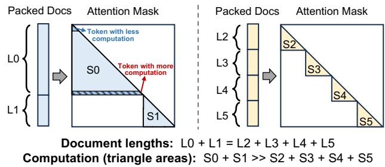  
(b) Reason of imbalance: input-dependent nature of attention computation and the varying input document length.

Figure 1: Observed workload imbalance issue in large-scale LLM training jobs and the reason of workload imbalance.

405B LLM training job executed across 8K H100 GPUs with a context window of 128K. It can be observed that the computation latency exhibits significant variance among GPUs. The slowest GPU suffers a computation latency that is 1.44× longer than the others. This disparity in computing latency causes a substantial degradation in training efficiency as the synchronized nature of training requires all other GPUs to wait for the slowest GPU to finish.

The root cause of the workload imbalance lies in the inputdependent nature of attention computation and the varying input document length of the training data. As shown in Figure 1 (b), input sequences are composed of multiple input documents. To ensure model quality in long-context training, attention masks are applied to prevent attention computation between tokens from different documents within the same sequence [6]. This approach introduces heterogeneity in pertoken arithmetic intensity, as tokens at the tail positions of long documents require more attention computation. As a result, input sequences containing long documents incur significantly higher computation workloads, even with the same total sequence length.

However, existing LLM training frameworks [23,26,35,38, 39] fail to recognize the heterogeneity in per-token arithmetic intensity. Specifically, state-of-the-art LLM training solutions employ a 4D parallelism paradigm that combines data parallelism (DP) [35], pipeline parallelism (PP) [25], context parallelism (CP) [30], and tensor parallelism (TP) [38]. The input documents are packed into sequences with fixed length at the DP and PP levels, and then sharded and distributed into chunks at the CP and TP levels. This fixed and static training flow treats all input tokens homogeneously and assigns each GPU an equal number of tokens, inevitably resulting in workload imbalance between GPUs. Furthermore, the trend of larger models and longer context windows exacerbates this issue, increasing the likelihood of an extremely long document appearing in the input batches, thereby delaying the entire training step.

An intuitive approach to address the workload imbalance issue is to shuffle and repack input documents to distribute the computation workload more evenly across micro-batches. However, this method is not effective and practical for two main reasons: Firstly, achieving effective balance through shuffling and repacking requires a sufficiently large packing window spanning multiple global batches. This impacts the randomness of data sampling and loading, which can potentially affect model convergence during training (as discussed in Section 3.3). Secondly, shuffling and repacking only address workload imbalances across micro-batches and cannot resolve intra-document imbalances caused by sequence sharding. In 4D parallelism training, input sequences are divided into chunks and distributed across different GPUs. Document chunks that include the tail end of a document incur a higher computational workload because their tokens must attend to more preceding tokens, causing an intra-document workload imbalance across GPUs.

To overcome the challenges mentioned above and address the severe workload imbalance issue in large-scale LLM training, we propose a flexible and input-aware document packing and sharding approach for the 4D parallelism training paradigm. The data packing and sharding will no longer output micro-batches with a fixed number of tokens. Instead, each GPU aims to get input tokens that have an equal amount of total computation and communication workload. Additionally, to minimize the impact on data randomness, we propose to only adjust the execution order of extremely long documents. This is based on our observation that the tokens of long documents account for only a small proportion of the total training tokens but have the most significant impact on workload imbalance.

Based on the above design insight, we build WLB-LLM, a WorkLoad-Balanced 4D Parallelism for Large Language Model Training. We begin by thoroughly analyzing workload imbalance in LLM training under 4D parallelism (§3), identifying two primary sources of imbalance across specific parallelism hierarchies: (1) Imbalance across micro-batches at the pipeline parallelism level and (2) Imbalance across document shards at the context parallelism level. To address these imbalances, WLB-LLM provides novel solutions tailored specifically to each parallelism level. At the PP level, WLB-LLM introduces variable-length document packing, allowing shorter documents to be combined to form longer sequences, thereby aligning the total computation workload to that of a single long document (§4). Additionally, WLB-LLM adaptively delays the execution of extremely long documents, achieving near-optimal workload balance across micro-batches while maintaining a relatively low per-token delay, thereby preserving the randomness of the data loader. At the CP level, WLB-LLM incorporates a novel per-document sharding strategy, ensuring each worker within a CP group has an equal workload (§5). Furthermore, we observe a tradeoff between kernel efficiency and sharding balance with per-document sharding. To maximize overall performance, we propose a heuristic algorithm that adaptively selects the most efficient sharding strategy based on the input sequence at runtime.

In summary, this paper makes the following contributions:

• To the best of our knowledge, we are the first to identify, analyze, and address workload imbalance issues in largescale LLM training with 4D parallelism.

• At the PP level, we design a variable-length input packing and adaptive outlier delay strategy to achieve nearoptimal workload balance across micro-batches, while minimizing impacts on data loading randomness and model convergence.

• At the CP level, we implement a fine-grained perdocument sharding method with an adaptive sharding selection mechanism to achieve the most efficient sharding for each input micro-batch at runtime.

• We conduct comprehensive evaluations and demonstrate that WLB-LLM achieves an average speedup of 1.23× across various model scales and context window sizes.

## 2 Background

In this section, we provide the background of 4D parallelism LLM training and discuss the characteristics of input documents in long-context LLM training.

## 2.1 4D Parallelism LLM Training

Training extremely large LLMs with billions or even trillions of parameters is challenging, involving a significant amount of engineering effort to tune the multi-level parallelism [55]. The state-of-the-art LLM training framework features a 4- dimensional parallelism [9, 12], including data parallelism (DP) [35], pipeline parallelism (PP) [25], context parallelism (CP) [30], and tensor parallelism (TP) [38]. Figure 2 presents an example of a (TP=2, CP=2, PP=4, DP=4) 4D parallelism.

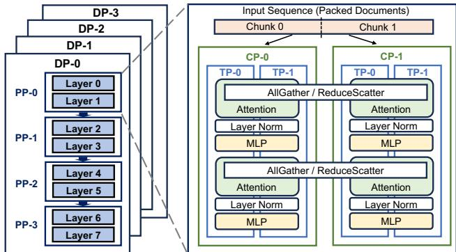  
Figure 2: Overview of 4D parallelism for LLM training.

Data Parallelism: In DP, the input global batch is partitioned and distributed across DP workers, with each worker owning a part of the global batch. By default, model parameters are duplicated across DP workers. Some advanced techniques like ZeRO [35] and FSDP [32] partition model parameters, gradients, and optimizer states across DP workers to reduce memory consumption. During training, each DP worker computes parameter updates using its local batch independently and then synchronizes gradients with other workers via AllReduce (or ReduceScatter when using FSDP).

Pipeline Parallelism: Within each DP worker, the devices are further partitioned into multiple PP workers through pipeline parallelism. In PP, the model is split in a layer-wise manner, with each PP worker owning several chunks of layers. The input batches of a DP worker are also divided into multiple micro-batches. During training, a micro-batch traverses through all PP workers from first to last, and then reverses direction in the backward pass. Peer-to-peer (P2P) communication is required to send activations and gradients during forward and backward passes, respectively.

Context Parallelism: CP is designed to address the large memory consumption of activations in long-context training. As shown in Figure 2, CP duplicates the model parameters but shards the input and activations along the sequence length dimension across CP workers. CP operates either in a ringbased manner using P2P communication [24] or involves All-Gather communication during the forward phase to collect the KV (key and value) tensors of all tokens, and ReduceScatter communication for the gradients of the KV tensors in backward [6]. All other operators, such as Linear and LayerNorm, operate independently on all workers, similar to DP.

Tensor Parallelism: TP splits the model parameters within a layer (e.g., attention, FFN) and distributes them across multiple TP workers. TP is often applied in conjunction with Sequence Parallelism (SP) [15] to further split the input tensor and activations. In this paper, when referring to TP, we mean both TP and SP by default. With TP, each GPU only has part of the input and parameters, resulting in intensive AllGather and ReduceScatter communication during training. Therefore, TP is typically applied within a single node, while other levels of parallelism are applied across nodes.

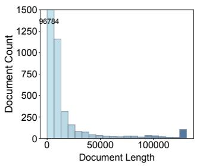

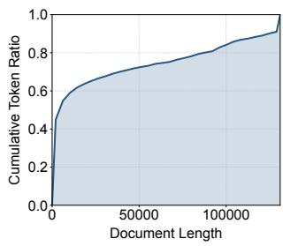  
Figure 3: Characterization of input documents: Distribution of input document lengths (left) and cumulative token ratio by document length (right).

## 2.2 Varying Input Document Length

In large-scale LLM training, the lengths of input documents could vary significantly, especially when using a large context window. To illustrate this, we profile the characteristics of training data in our 128K context length training job, as shown in Figure 3. From a per-document perspective, input document lengths distribution is highly skewed. As shown in the left part of Figure 3, the majority of input documents are relatively short, while some extremely long documents exist, with the longest reaching the full context window size. The presence of an extremely long document in an input batch can easily lead to significant workload imbalances across micro-batches. This observation highlights the need for an input-aware solution that dynamically balances workloads by accounting for variations in document length. From a per-token perspective, we compute the cumulative token ratio across different document lengths. As shown in the right part of Figure 3, the majority of training tokens come from relatively short documents. For instance, documents shorter than half the context window contribute over 75% of the total training tokens. Although long documents significantly impact workload balance, the tokens from these long documents constitute only a small proportion of the training dataset. This provides an opportunity to adaptively delay the execution of extremely long documents to mitigate workload imbalance, while minimizing the impact on data sampling randomness for the majority of tokens.

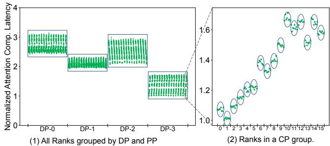  
(a) Imbalance Analysis (TP=8, CP=16, PP=16, DP=4): (1) Normalized computation latency (group by DP and PP); (2) Normalized computation latency in a CP group.

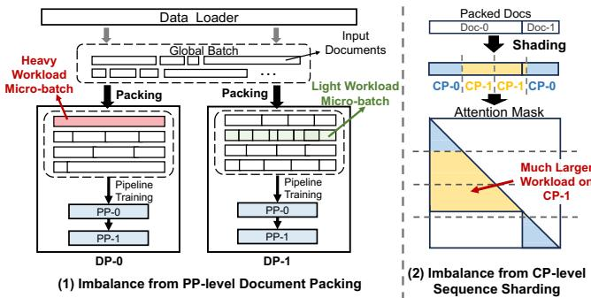  
(b) Document packing at PP level and sequence sharding at CP level.  
Figure 4: The workload imbalance comes from the PP-level document packing and CP-level sequence sharding.

## 3 Motivation

To motivate the design of WLB-LLM, we first conduct an in-depth analysis of workload imbalances across different parallelism hierarchies in 4D parallelism LLM training. We then introduce a baseline solution that shuffles and repacks input documents across batches. Lastly, we discuss why this baseline solution cannot fully eliminate workload imbalances and investigate the tradeoff between input packing balance and model convergence.

## 3.1 Imbalance Analysis

After analyzing the performance trace from our internal 8K-GPU, 128K context window training job for a 405B LLM, we identify two primary causes of workload imbalance: (1) workload imbalance among micro-batches at the PP level, and (2) imbalance across sequence shards at the CP level. To demonstrate this, we accumulate the attention computation latency on each GPU. The results have been given in Figure 4.

PP Level Imbalance: As shown in Figure 4 (a)(1), the attention computation latency across DP workers varies significantly. Within each DP worker, we observe “vertical lines” formed by the data points, each representing a PP worker within a DP worker. PP workers within the same DP worker exhibit nearly identical workloads, as they process the same set of micro-batches. Based on the results shown in Figure 4 (a)(1), we conclude that the workload imbalance at both the DP and PP levels stems from the imbalance across microbatches, which is caused by the input packing process. As illustrated in the left part of Figure 4 (b), input documents are packed into sequences (micro-batches) of equal length. While this fixed-length packing strategy ensures that each PP and DP worker processes the same number of tokens, variations in per-token computation intensity result in workload imbalances at these levels. For instance, a micro-batch containing only a single long document (highlighted in red) has larger workload compared to a micro-batch composed of multiple shorter documents (highlighted in green).

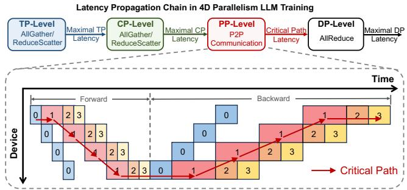  
Figure 5: The process of latency propagation in 4D parallelism LLM training across different parallelism hierarchies. The impact of workload imbalance is enlarged at the PP level.

CP Level Imbalance: To better illustrate the imbalance at the CP level, we zoom in on a specific PP worker (also referred to as a CP group). As shown in Figure 4 (a)(2), significant workload imbalances are observed across CP workers (indicated by circles), while the TP workers within each CP worker exhibit similar computation latencies (data points within each circle). This imbalance across CP workers comes from the sequence sharding at the CP level. As shown in Figure 4 (b)(2), an input sequence is divided into chunks with an equal number of tokens, which are then distributed to CP workers. The state-of-the-art approach partitions the input sequence into 2 ×CP\_size chunks. The i-th CP worker is assigned the i-th and (2 × CP\_size − 1 − i)-th chunks to achieve better load balancing [6]. This sharding strategy works well when the sequence only has a single document. However, if the sequence is packed with multiple documents, it may lead to significant workload imbalances across CP workers, as demonstrated in the figure. Although sequence chunks are further divided and distributed among TP workers, no imbalance is observed at the TP level. This is because, prior to computation, all TP workers perform an AllGather operation to collect the entire sequence chunk. As a result, each TP worker within a CP worker processes the same sequence chunk, eliminating imbalances at the TP level.

Imbalance Propagation: During training, the workload imbalance will be propagated from inner-level parallelism to outer-level parallelism. The imbalance will be accumulated and amplified, finally leading to a significant impact on end-toend training latency. In DP, CP, and TP, collective communication [28] such as AllReduce, AllGather, and ReduceScatter is performed during training. All workers in these parallelism hierarchies work in a synchronized manner. As a result, the training latency of a given DP, CP, and TP group is determined by the slowest worker within that group. In contrast, at the PP level, different PP workers serve as producers and consumers of each other. As shown in Figure 5, the critical path of PP is the latency of the largest micro-batch traversing all PP workers plus the forward and backward passes of remaining micro-batches on the first PP worker. The distinct data dependency relationship between PP workers amplifies the imbalance, resulting larger impact on total latency. Due to the imbalance propagation, higher micro-batch training latency can arise from two main reasons: (1) Imbalances propagated from inner-level hierarchies (e.g., CP sharding imbalances); (2) Micro-batches with inherently larger workloads due to PPlevel packing. This highlights the importance of eliminating the imbalance in all parallelism hierarchies.

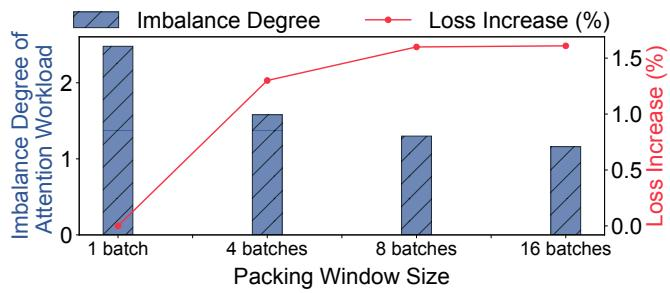  
Figure 6: A larger packing window improves workload balance but leads to an increase in training loss.

## 3.2 Baseline Solution: Fixed-Length Packing

A potential solution to address the workload imbalance issue is to optimize the packing of input documents. Current 4D parallelism frameworks require all micro-batches to have a uniform sequence length [6], equal to the context window size, to enable efficient batching of input sequences. Building on this fixed-length requirement, we implement a baseline shuffling and packing optimization that packs input documents into micro-batches of equal size. Formally, given a set of input documents from one or more global batches, the objective is to pack these documents into several micro-batches with a fixed total length and balance the attention computation workload among all micro-batches. Without loss of generality, we use the causal mask as an example to calculate attention workload. With causal mask, the attention computation workload of a micro-batch is proportional to $\textstyle \sum _ { i = 1 } ^ { N } d _ { i } ^ { 2 }$ , where $d _ { i }$ is the length of each document within the micro-batch. The problem of searching the optimal document packing is NP-hard, as it can be extended from the classic Number Partition Problem [10] by adding a number sum constraint and a square-sum objective. To search for the optimal packing, we formulate the task as an integer linear programming (ILP) problem. Assuming we have N documents, each has length $d _ { i } ,$ and we would like to pack these documents into M micro-batches, each with a total length of S. The objective is to minimize the maximum workload among the micro-batches:

$$
{ \begin{array} { l l l } { { \mathrm { m i n i m i z e } } } & { { \mathrm { m a x } } ( \displaystyle \sum _ { i = 1 } ^ { N } x _ { i j } \cdot d _ { i } ^ { 2 } ) , j = 1 , \cdots , M } \\ { { \mathrm { s u b j e c t ~ t o } } } & { \displaystyle \sum _ { j = 1 } ^ { M } x _ { i j } = 1 , } & { i = 1 , \cdots , N } \\ & { \displaystyle \sum _ { i = 1 } ^ { N } x _ { i j } \cdot d _ { i } \leq S , \quad j = 1 , \cdots , M } \\ & { x _ { i j } \in \{ 0 , 1 \} } \end{array} }\tag{1}
$$

in which $x _ { i j }$ is a binary variable representing the packing plan. Specifically, $x _ { i j } = 1$ means document i is packed into microbatch j. With this ILP formulation, we then use a commercial solver [8] to obtain the optimal packing plan.

## 3.3 Tradeoff Analysis

Optimizing input document packing across more global batches could help achieve a higher degree of workload balance. However, it also manipulates the execution order of more input documents, affecting the randomness of data sampling and loading. This may negatively impact model quality and affect model convergence. To evaluate the tradeoff between packing balance and model quality, we pretrain a 550M-parameter model for 52K steps using various packing window sizes. We then assess the degree of workload imbalance of input batches after packing under different settings. The imbalance degree is calculated as $\frac { M a x \_ A t t n } { A \nu g \_ A t t n }$ , where Max\_Attn represents the maximum attention computation workload in the global batch, and Avg\_Attn denotes the average attention computation workload of all micro-batches in the global batch. As shown in Figure 6, when optimizing the packing across a single global batch, the workload imbalance across micro-batches still remains high. If the number of global batches increases, the fixed-length packing optimization could achieve a better workload balance. However, the final training loss increases as more global batches are involved in the packing optimization, due to reduced data loading randomness caused by repacking a larger number of input documents. These results indicate that naïve fixedlength packing optimization cannot achieve a good workload balance without compromising model quality, highlighting the need for more advanced solutions.

The tradeoff between packing balance and model quality motivates us to break the fixed-length constraint of microbatches and design a more flexible packing strategy. In the following two sections, we will present the details of WLB-LLM, including the PP-level variable-length packing and heuristic outlier document delay optimization (§4) and the CP-level fine-grained and adaptive sharding optimization (§5).

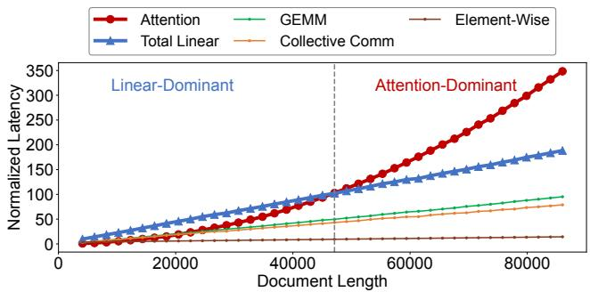  
Figure 7: The relationship between operation latency and the input document length. (Total Linear is the sum of GEMM, collective communication, and element-wise operators)

## 4 Var-Len Packing and Outlier Delay for PP

At the PP level, we focus on balancing the workload across micro-batches by repacking input documents in a workloadaware manner. First, we design a variable-length packing strategy to achieve a higher degree of workload balance within the same packing window size compared to fixed-length packing (§4.1). Second, we propose an outlier document delay method to adaptively delay the training of extremely long documents. This approach helps minimize the impact on data randomness while achieving near-optimal workload balance across micro-batches (§4.2). Finally, we design and implement an efficient heuristic algorithm to optimize packing at runtime with negligible overhead (§4.3).

## 4.1 Workload-Aware Var-Length Packing

The main limitation of the baseline fixed-length packing is that it cannot achieve balance if there is an extremely long document in a global batch. For example, if the length of a document equals the context window size, it becomes impossible to create another micro-batch consisting of shorter documents with an equal computation workload due to the quadratic complexity of attention computation. To address this limitation, we propose a variable-length packing strategy, which allows each micro-batch to have a different sequence length. The key insight behind our design is that the workload of a micro-batch is not solely determined by attention computation. Other operations, such as GEMM computation, element-wise operations, and collective communication (e.g., AllGather and ReduceScatter), also contribute significantly to the training latency and are influenced by the documents within each micro-batch. To demonstrate it, we present the relationship between operation latency and document length in Figure 7. The operation latency is measured from a training job of Llama2 7B model on 16 H100 GPUs and is normalized to the attention computation latency at a document length of 4096. It can be observed that attention computation latency increases quadratically with the length of input documents, while other operations, such as GEMM, collective communication, and element-wise operations, exhibit a linear relationship between operation latency and document length.

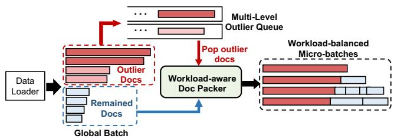  
Figure 8: The process of outlier document delay combined with var-length packing.

This relationship presents an opportunity to further improve workload balance beyond fixed-length packing. If a long document has significantly higher attention computation latency compared to other operations, we can pack multiple shorter documents together to extend the latency of other operations, thereby matching the total latency of the long document. Specifically, we extend the fixed-length packing to a variable-length approach. The optimization goal shifts from balancing only the attention computation workload to balancing the total workload, including all operations:

$$
\begin{array} { l l } { \mathrm { m i n i m i z e } } & { \displaystyle \operatorname* { m a x } ( \sum _ { i = 1 } ^ { N } ( W _ { a } ( x _ { i j } \cdot d _ { i } ) + W _ { l } ( x _ { i j } \cdot d _ { i } ) ) ) , } \\ & { \displaystyle \qquad j = 1 , \cdots , M } \\ { \mathrm { s u b j e c t ~ t o } } & { \displaystyle \sum _ { j = 1 } ^ { M } x _ { i j } = 1 , } \\ & { \displaystyle \sum _ { i = 1 } ^ { N } x _ { i j } \cdot d _ { i } \leq S _ { m a x } , \qquad j = 1 , \cdots , M } \\ & { \displaystyle \qquad x _ { i j } \leq \{ 0 , 1 \} } \end{array}\tag{2}
$$

in which $W _ { a } ( \cdot )$ and $W _ { l } ( \cdot )$ are latency prediction functions that compute the attention computation latency and the latency of all other operations, respectively, based on document length. Both $W _ { a } ( \cdot )$ and $W _ { l } ( \cdot )$ can be derived from offline profiling. And $S _ { m a x }$ represents the maximum sequence length permitted by GPU memory constraints.

## 4.2 Outlier Document Delay

Our variable-length packing strategy enables a higher degree of balance by allowing short documents to be packed into a longer sequence that exceeds the fixed context window size. However, within a single global batch, the number of short sequences may be insufficient to fully balance the computation workload across all micro-batches. To address this challenge, we propose adaptively delaying the execution of outlier documents, i.e., extremely long documents. This approach is based on our observation that, although these outlier documents have a significant impact on workload imbalance, they only contribute a small proportion of tokens for training (as described in §2.2). By selectively delaying the training of tokens from a few extremely long documents, we could achieve a more balanced workload across micro-batches while minimizing the impact on data randomness.

Overall Workflow: As shown in Figure 8, we implement a multi-level waiting queue for outlier documents. Assuming we have n outlier queues, each queue is associated with a hyperparameter $L _ { i } ,$ which specifies the minimum length of documents in the i-th queue, where $L _ { 1 } < L _ { 2 } < \cdots < L _ { n + 1 } $ When a new global batch arrives, documents with lengths greater than $L _ { 1 }$ are considered as outliers and are added to the corresponding waiting queue i, where $L _ { i } \leq d < L _ { i + 1 }$ , and d denotes the document length. The execution of documents in the outlier queue is delayed until the queue accumulates enough outlier documents. Once the queue size reaches the number of micro-batches in a global batch, the outlier documents are popped from the queue and added to each micro-batch. This ensures workload balance across micro-batches, as each micro-batch receives an equal number of outlier documents.

Tuning Hyperparameter $L _ { i } { \mathrm { : } }$ The choice of hyperparameters $L _ { i }$ directly influences performance. A smaller gap between two consecutive hyperparameters $L _ { i }$ and $L _ { i + 1 }$ helps achieve a higher degree of workload balance, as it ensures that documents within the same queue have smaller differences in length. However, a smaller gap also causes documents within each queue to wait longer before accumulating enough documents to be processed together, thereby increasing the per-token delay. To select appropriate values for $L _ { i } ,$ we sample a small subset of training documents and evaluate the packing algorithm (described later in §4.3) on this subset by measuring both the achieved workload balance across microbatches and the resulting per-token delay. We then choose the optimal $L _ { i }$ values that maximize workload balance while maintaining a low per-token delay.

## 4.3 Heuristic Packing Algorithm

Although an ILP solver can derive the optimal packing for a given set of input documents, its solving time is impractically high to be paid at runtime. Optimizing document packing offline is also infeasible, as it would introduce significant storage overhead to store pre-packed datasets for different training configurations. To address this, we design a heuristic algorithm that combines variable-length packing with outlier document delay optimization to efficiently produce packed micro-batches with balanced workloads. As listed in Algorithm 1, the algorithm takes a dataloader D, a multi-level waiting queue Q for outlier documents operating in a FIFO manner, the number of micro-batches per iteration $N ,$ and the upper bound for sequence length $S _ { m a x }$ as input. The algorithm outputs a series of packed input batches with balanced workloads for each training iteration. The packing process begins by iterating over the input batches in the dataloader D and adding all outlier documents into the corresponding waiting queue in Q for delayed processing (Line 4-10). If any queue q in Q reaches size N, the documents in q are popped out and added to the pending document set for the current batch (Line 11-15). Packing proceeds in a greedy manner: it first processes the remaining documents, followed by the newly added long documents. For each document, the algorithm first attempts to pack it into the micro-batch with the minimal workload (calculated using $W _ { a } ( \cdot )$ and $W _ { l } ( \cdot )$ as defined in Equation 2), provided that the total length remains within the upper bound $S _ { m a x }$ . If this is not feasible, it then attempts to pack the document into the micro-batch with the (1) Per-Sequence Shardingminimal current length (Lines 20-27). Documents that cannot fit within these constraints are saved for the next iteration (Line 29). Our heuristic approach effectively combines outlier document delay and variable-length packing to efficiently balance computational workloads across all micro-batches.

Algorithm 1: Heuristic Var-length Packing Algorithm   
input : Dataloader: D, Multi-level waiting queue: Q,   
The number of micro-batches per iteration: N,   
Sequence length upper bound: $S _ { m a x }$   
output :Packed input batches for training: B   
1 Remained\_Doc = [];   
2 for Cur\_Batch in D do   
3 New\_Docs = [];   
4 for Doc in Cur\_Batch do   
/\* Delay the execution of outlier documents. \*/   
5 if Doc.Is\_Outlier() then   
6 Q.Add(Doc);   
7 else   
8 New\_Docs.Push(Doc);   
9 end   
10 end   
11 for q in $Q$ do   
12 if len $( q ) \geq N$ then   
/\* Pop outlier documents for the current batch. \*/   
13 New\_Docs.Push(q.Pop(N));   
14 end   
15 end   
/\* Sort the documents in descending order by length. \*/   
16 New\_Docs.Sort\_by\_Length();   
/\* Packing remaining documents first. \*/   
17 Doc\_Set = Remained\_Doc + New\_Docs   
18 Remained\_Doc.Clear();   
19 New\_Batch = Create\_Batch(N);   
20 for Doc in Doc\_Set do   
/\* Get micro-batches with minimum workload/length. \*/   
21 W\_idx = New\_Batch.Get\_Min\_Workload();   
22 L\_idx = New\_Batch.Get\_Min\_Length();   
23 if New\_Batch[W\_idx].Len() + Doc.Len() < Smax then   
24 New\_Batch[W\_idx].Push(Doc);   
25 else   
26 if New\_Batch[L\_idx].Len() + Doc.Len() < Smax then   
27 New\_Batch[L\_idx].Push(Doc);   
28 else   
29 Remained\_Doc.Push(Doc);   
30 end   
31 end   
32 end   
33 B.Push(New\_Batch);   
34 end

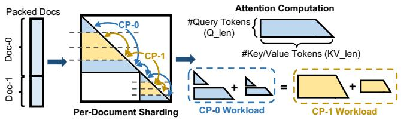  
Figure 9: Overview of fine-grained per-document sharding.

## 5 Fine-grained and Adaptive Sharding for CP

At the CP level, we aim to improve workload balance across document shards by implementing a fine-grained perdocument sharding strategy, ensuring that each CP worker receives an equal computation workload (§5.1). Additionally, -0 CP-we observe a tradeoff between attention kernel efficiency and Do CP-1sharding granularity (§5.2). To maximize overall performance, -1 we conduct an in-depth analysis and adaptively select the op-Dotimal sharding strategy for a given input sequence (§5.3).

## 5.1 Per-Document Sharding Design

At the CP level, the sequence of micro-batches is sharded across CP workers. Each CP worker works on an exclusive sequence shard. Existing CP implementation employs a Per-Sequence Sharding strategy, which equally shards the entire input sequence into $2 \times C P _ { - }$ \_size chunks. This method could easily lead to significant attention computation workload imbalance when the input sequence is packed with multiple documents. To eliminate the workload imbalance issue at the CP level, we propose sharding the sequence in a fine-grained manner. Specifically, we conduct Per-Document Sharding to divide each document into $2 \times C P .$ \_size document chunks. As shown in Figure 9, each CP worker takes a symmetrical pair of document chunks for each input document. With our finegrained per-document sharding strategy, each CP worker not only receives the same number of tokens (ensuring workload balance in GEMM computation and collective communication) but also gets the same attention computation workload.

Avoid Padding: Our fine-grained per-document sharding strategy divides each input document into $2 \times C P .$ \_size document chunks. However, document lengths are not always divisible by $2 \times C P .$ \_size, requiring extending the document length through adding some padding tokens. To avoid the redundant computation introduced by document padding, we design a padding-free per-document sharding method.

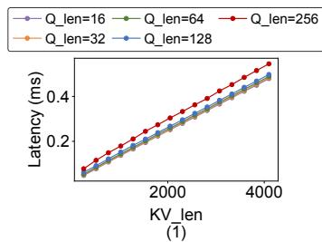

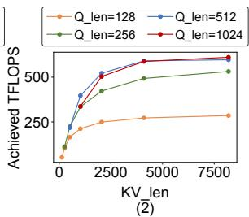  
Figure 10: Attention kernel performance profiling: (Left) Attention forward latency; (Right) Achieved TFLOPs of the attention forward kernel.

Specifically, we split each document into two parts: one divisible by $2 \times C P .$ \_size and the remaining tokens. Assuming the length of the i-th document is $d _ { i } ,$ , where $d _ { i } = e _ { i } + r _ { i } ,$ with $\begin{array} { r } { e _ { i } = \lfloor \frac { d _ { i } } { 2 \times C P _ { \_ s i z e } } \rfloor } \end{array}$ . We apply the standard per-document sharding on the ei part, while the tokens in $r _ { i }$ are distributed to CP workers in a round-robin fashion. Since $\Sigma _ { i = 1 } ^ { n } d _ { i }$ and $\textstyle \sum _ { i = 1 } ^ { n } e _ { i }$ are both divisible by $2 \times C P .$ \_size, it follows that $\textstyle \sum _ { i = 1 } ^ { n } r _ { i } = \sum _ { i = 1 } ^ { n } \left( d _ { i } - e _ { i } \right)$ is also divisible by $2 \times C P \_ s i z e$ . This asksensures that each CP worker receives an equal number of CP-0 Attention Computationtokens, thereby eliminating the need for padding.

## #key/value tokens(KV\_len) 5.2 Kernel Efficiency vs. Sharding Balance

Per-Document ShardingOur per-document sharding strategy fully eliminates workload imbalance at the CP level. However, splitting each document into multiple shorter chunks may compromise kernel efficiency. The kernel efficiency may drop with fine-grained sharding due to two major reasons: (1) Tile-level Computation Wasting: The computation of attention is split into smaller tiles and distributed to different thread blocks for execution on GPU. For example, in the attention forward kernel of FlashAttention [5], the tile size is set to 128. If the number of tokens is less than the tile size, the thread block will still perform the full computation on 128 tokens, which will waste a significant amount of computation. To illustrate this, we profile the attention forward latency for query token lengths ranging from 16 to 256. As shown in Figure 10 (Left), when the number of query tokens (Q\_len) increases from 16 to 128, the kernel latency remains constant. This is because all short documents with fewer than 128 tokens are padded to 128 tokens for computation at the kernel level. In contrast, as Q\_len increases from 128 to 256, the kernel latency rises significantly. (2) Inefficient Tensor Memory Accelerator (TMA) Usage: TMA is a feature introduced in the NVIDIA Hopper architecture that enables asynchronous memory copying between global memory and shared memory on GPUs [1]. With large document lengths (e.g., Q\_len ≥ 256), multiple thread blocks process different Q tokens while sharing the same KV tokens of the document chunk. This allows KV tensor loading to be shared via the L2 cache using TMA load multicast, significantly reducing the latency of transferring KV tensors from global memory to shared memory. As shown in Figure 10 (Right), when the length of the Query tensor increases from 128 to 256, the achieved TFLOPs increase significantly, demonstrating the impact of leverage TMA load multicast.

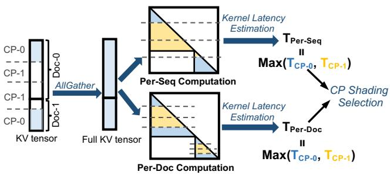  
Figure 11: The process of adaptive CP sharding selection.

These profiling results clearly demonstrate the tradeoff between attention kernel efficiency and CP sharding balance. If per-document sharding is applied to input sequences composed of short documents, it can introduce redundant computation at the kernel level and reduce the achieved TFLOPs, ultimately leading to longer attention computation latency.

## 5.3 Adaptive Sharding Selection

Based on our analysis in Section 5.2, although fine-grained per-document sharding achieves optimal workload balance at the CP level, it does not necessarily guarantee better performance, as the attention kernel may become less efficient with the more fine-grained document chunks generated by per-document sharding. To address this issue, we propose to adaptively select the optimal sharding strategy for each micro-batch at runtime. As shown in Figure 11, during the forward pass at the CP level, an AllGather communication is performed across CP workers to collect the full KV tensor. We then calculate the input tensor shapes for the attention kernel (number of query tokens and key/value tokens) in the persequence and the per-document sharding cases. Finally, we predict the attention kernel latency and select the CP sharding strategy that yields lower attention computation latency.

To accurately estimate the attention kernel latency, we leverage the insights provided in §5.2. First, we calculate the total floating point operations required for the attention computation. The kernel-level padding is also considered by padding the document chunk to a multiple of the tiling size. Next, we estimate the achieved TFLOPs for the given tensor shape using the data collected from offline profiling which includes the impact of TMA usage. Finally, the attention kernel latency is estimated by dividing the amount of floating point operations by the achieved TFLOPs. By adaptively selecting CP sharding, WLB-LLM minimizes the CP level training latency.

<table><tr><td>Model Size</td><td>Context Window</td><td>#GPU</td><td>4DParallelism Configs (TP, CP,PP,DP)</td></tr><tr><td rowspan="2">550M</td><td>64K</td><td>32</td><td>(2,2,4,2)</td></tr><tr><td>128K</td><td>32</td><td>(2,4,4,1)</td></tr><tr><td rowspan="2">7B</td><td>64K</td><td>32</td><td>(4,2,4,1)</td></tr><tr><td>128K</td><td>64</td><td>(8,2,4,1)</td></tr><tr><td rowspan="2">30B</td><td>64K</td><td>64</td><td>(8,2,4,1)</td></tr><tr><td>128K</td><td>128</td><td>(8,4,4,1)</td></tr><tr><td rowspan="2">70B</td><td>64K</td><td>256</td><td>(16,4,4,1)</td></tr><tr><td>128K</td><td>256</td><td>(16,4,4,1)</td></tr></table>

Table 1: Model and 4D parallelism configurations.

## 6 Implementation Detail

WLB-LLM is built on top of a widely adopted 4D parallelism training paradigm, which integrates advanced distributed training techniques at each parallelism level. For DP, WLB-LLM leverages Fully Sharded Data Parallel (FSDP) [54], a stateof-the-art approach that uniformly shards model parameters across DP workers, significantly reducing memory requirements compared to traditional DP methods. For PP, WLB-LLM employs the interleaved 1F1B pipeline schedule [26]. To support variable-length packing optimization, WLB-LLM further implements a variable-length pipeline, which enables microbatches to have variable sequence lengths. For CP, the persequence sharding baseline follows the AllGather-based CP approach used in Llama3 training [6], which performs an All-Gather communication during the forward pass across all CP workers to collect the full KV tensors for attention computation. Building on this, WLB-LLM implements fine-grained perdocument sharding by optimizing the document partitioning and distribution. For TP, WLB-LLM performs 1D tensor parallelism with sequence parallelism enabled [15,38]. Additionally, WLB-LLM incorporates computation–communication overlapping to further improve TP training performance [46].

## 7 Evaluation

In this section, we evaluate WLB-LLM across various LLM sizes and 4D parallelism configurations, with model sizes ranging from 550M to 70B. We begin by presenting the improvements in end-to-end training latency. Next, we analyze the speedup contributions from individual optimizations at the PP level (§4) and the CP level (§5), respectively. Finally, we demonstrate that the optimizations of WLB-LLM do not compromise model quality or model convergence by comparing the training loss curve.

## 7.1 Experiments Setup

Hardware: We deploy WLB-LLM on a cluster with 32 nodes. Each node is equipped with 8× NVIDIA H100 SXM 80GB GPUs interconnected via high-bandwidth NVLink, while cross-node communication is facilitated by RDMA over Converged Ethernet (RoCE).

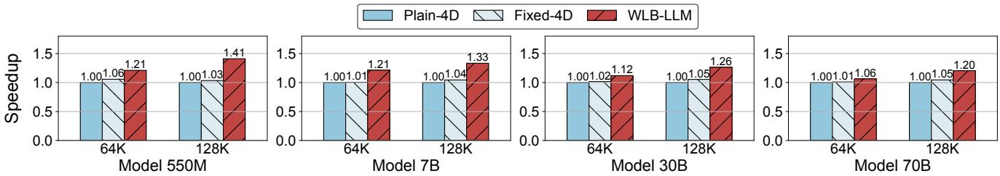  
Figure 12: Training performance speedups of WLB-LLM and Fixed-4D over Plain-4D across various configurations.

Models and Parallelism Configurations: We conduct experiments on a series of our internal LLaMA-like models, spanning four different scales: 550M, 7B, 30B, and 70B. The 7B model shares the same architecture as the LLaMA2-7B model [42]. The other models retain the same architecture while proportionally adjusting the number of layers and model dimension size. For each model, we evaluated performance using two different context window sizes: 64K and 128K. Each model scale and context window size is associated with a corresponding 4D parallelism configuration. The global batch size is set to PP\_size × DP\_size and we use bfloat16 precision for all evaluations. Details of the training setup and parallelism configurations are provided in Table 1. When mapping 4D parallelism to the hardware, inner-level parallelism dimensions (e.g., TP or CP) are prioritized for mapping to intra-node GPUs, leveraging the high-bandwidth NVLink for efficient communication. Outer-level parallelism dimensions, such as DP, are subsequently mapped across multiple nodes. Throughout the rest of the paper, we use Model Size-Context Window Size to denote a specific configuration. For instance, 7B-128K refers to the 7B model with a 128K context window.

Baselines: We compare WLB-LLM with two baselines:

• Plain-4D: This is our internal codebase for large-scale LLM training, supporting 4D parallelism to enable efficient training and scaling up to 100K GPUs. Plain-4D directly uses input batches obtained from the dataloader for training without optimizing the input packing. For CP sharding, Plain-4D employs a per-sequence sharding method, which shards the input sequence at the wholesequence level.

• Fixed-4D: Fixed-4D applies the baseline fixed-length packing optimization, as described in Section 3.2. To minimize packing overhead, a greedy algorithm is used instead of the solver, and the packing size is restricted to a single global batch to preserve data loading randomness and prevent an increase in training loss. For CP sharding, Fixed-4D utilizes a fixed sharding strategy throughout the entire training process, either persequence or per-document. We then select the betterperforming result between the two sharding strategies and use it for comparisons.

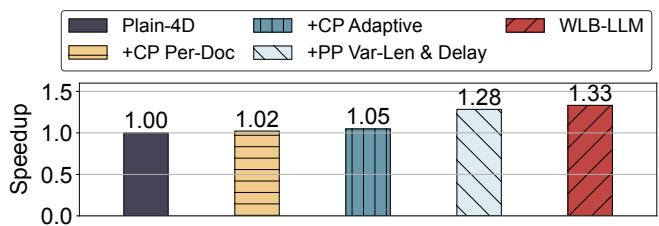  
Figure 13: Performance breakdown of WLB-LLM on the 7B model with a 128K context window.

## 7.2 Training Performance

We run WLB-LLM and all baselines on diverse model size and context window size:

Plain-4D vs. Fixed-4D: As shown in Figure 12, Fixed-4D achieves only marginal improvements over Plain-4D, with an average speedup of approximately 1.03× across all settings. This limited gain is primarily because Fixed-4D adjusts document packing only within a single global batch and is constrained by the context window size. It fails to address the presence of outlier documents with extremely long lengths (e.g., a document with a length equal to the context window size). Given that attention computation scales quadratically with document length, packing multiple short documents within the constraints of the context window cannot match the computation workload of an extremely long document. Moreover, Fixed-4D employs either per-sequence or per-document sharding at the CP level for all input batches. This approach overlooks the tradeoff between attention kernel efficiency and sharding balance, resulting in suboptimal performance. These limitations constrain the improvements of Fixed-4D over the Plain-4D baseline.

WLB-LLM vs. Baselines: Figure 12 shows that WLB-LLM consistently outperforms all baselines across various model sizes and 4D parallelism configurations. Specifically, WLB-LLM achieves speedups of 1.23× and 1.19× over Plain-4D and Fixed-4D, respectively. The significant improvement stems from two key optimizations in WLB-LLM. At the PP level, WLB-LLM employs a heuristic variable-length document packing algorithm that is not constrained by the fixed context window size. This algorithm also selectively delays the training of outlier documents, achieving a higher degree of workload balance compared to fixed-length packing. At the CP level, WLB-LLM combines per-sequence and perdocument sharding, adaptively selecting the optimal sharding strategy for each micro-batch to maximize the performance. Across Model Size and Context Window Size: As shown in Figure 12, WLB-LLM achieves slightly lower speedup on larger models. This is because larger models involve more GPUs for training, which increases the ratio of communication latency to computation latency, making the impact of workload imbalance in the attention layer less significant. On the other hand, increasing the context window size from 64K to 128K improves the average speedup from 1.15× to 1.30×, as longer contexts exacerbate workload imbalance issue. A more detailed sensitivity analysis on the context window size is provided in Section 7.3.

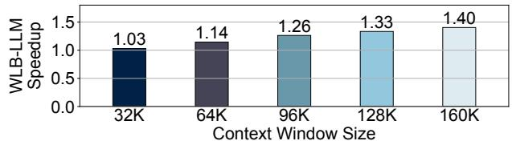  
Figure 14: Speedups of WLB-LLM on the 7B model across context window sizes.

## 7.3 Breakdown and Sensitivity Analysis

In this section, we conduct a performance breakdown and sensitivity analysis. Specifically, we first report the performance breakdown to evaluate the impact of each optimization technique. Then, we perform a sensitivity study by measuring the speedups across different context window sizes.

Speedup Breakdown: We show the speedup breakdown in Figure 13 by separately applying each optimization technique proposed in WLB-LLM to Plain-4D for the 7B-128K training configuration. By utilizing the fine-grained per-document sharding at the CP level, we observe a 1.02× speedup due to the reduced imbalance among CP workers. The speedup is limited due to the tradeoff between the kernel efficiency and the sharding balance. As a result, performing per-document sharding is not always beneficial and can potentially cause performance degradation. By adaptively selecting the perdocument and per-sequence sharding strategies, we can improve the speedup to 1.05×. We then apply the PP-level optimizations on Plain-4D to study their effect. It can be observed that combining the heuristic var-length packing with the outlier documents delay offers a significant speedup of 1.28×. Finally, we incorporate both CP and PP-level optimizations to maximally reduce the workload imbalance across the all parallelism hierarchies, leading to a final speedup of 1.33×. Speedup across Context Window Sizes: We investigate the impact of context window size on the performance improvements delivered by WLB-LLM. Figure 14 shows the speedups over Plain-4D on 7B model across different context window sizes, varying from 32K to 160K. We observe that as the context window size grows, the achieved speedup becomes more significant, reaching 1.40× with a 160K context window. This is because a larger context window raises the likelihood of outlier documents appearing. Additionally, a larger context window also increases the proportion of attention computation and exacerbates the impact of imbalance on training latency. The trend of increasing speedups demonstrates the significant potential of WLB-LLM in handling the ever-expanding context window sizes today.

<table><tr><td rowspan=1 colspan=2>PackingMethod</td><td rowspan=2 colspan=1>ImbalanceDegree</td><td rowspan=2 colspan=1>PackingOverhead (ms)</td></tr><tr><td rowspan=1 colspan=1>Method</td><td rowspan=1 colspan=1>Config</td></tr><tr><td rowspan=1 colspan=1>Original Packing</td><td rowspan=1 colspan=1>/</td><td rowspan=1 colspan=1>1.44</td><td rowspan=1 colspan=1>0</td></tr><tr><td rowspan=4 colspan=1>Fixed-LenGreedy</td><td rowspan=1 colspan=1>#global batch=1</td><td rowspan=1 colspan=1>1.41</td><td rowspan=1 colspan=1>4</td></tr><tr><td rowspan=1 colspan=1>#global batch=2</td><td rowspan=1 colspan=1>1.22</td><td rowspan=1 colspan=1>5</td></tr><tr><td rowspan=1 colspan=1>#global batch=4</td><td rowspan=1 colspan=1>1.11</td><td rowspan=1 colspan=1>5</td></tr><tr><td rowspan=1 colspan=1>#global batch=8</td><td rowspan=1 colspan=1>1.08</td><td rowspan=1 colspan=1>5</td></tr><tr><td rowspan=3 colspan=1>Fixed-Len Solver</td><td rowspan=1 colspan=1>#global batch=1</td><td rowspan=1 colspan=1>1.40</td><td rowspan=1 colspan=1>467</td></tr><tr><td rowspan=1 colspan=1>#global batch=2</td><td rowspan=1 colspan=1>1.18</td><td rowspan=1 colspan=1>1488</td></tr><tr><td rowspan=1 colspan=1>#global batch=4</td><td rowspan=1 colspan=1>1.09</td><td rowspan=1 colspan=1>25313</td></tr><tr><td rowspan=3 colspan=1>WLB-LLM</td><td rowspan=1 colspan=1>#queue=1</td><td rowspan=1 colspan=1>1.24</td><td rowspan=1 colspan=1>8</td></tr><tr><td rowspan=1 colspan=1>#queue=2</td><td rowspan=1 colspan=1>1.05</td><td rowspan=1 colspan=1>20</td></tr><tr><td rowspan=1 colspan=1>#queue=3</td><td rowspan=1 colspan=1>1.05</td><td rowspan=1 colspan=1>23</td></tr></table>

Table 2: Packing imbalance degree and overhead analysis.

## 7.4 Optimization Analysis

In this section, we first analyze the effectiveness of the packing and sharding optimization in WLB-LLM. Furthermore, we demonstrate that the system optimizations in WLB-LLM do not compromise model quality or slow down convergence.

Packing Balance and Overhead Analysis: To assess the balance degree of computation workload across micro-batches with different packing strategies, we profile and compare the forward latency of each micro-batch in a 7B-128K training job with different packing methods and configurations applied. As discussed in Section 3.1, the PP level latency is primarily determined by the largest micro-batch. Therefore, we use the following metric to represent the imbalance degree of a given batch : Max\_Latency×PP\_sizeTotal\_Latency , where Max\_Latency is the forward Total\_Latency latency of the largest micro-batch and Total\_Latency is the total forward latency of all micro-batches. A lower imbalance degree indicates that the given batch is more balanced in terms of workload. The result of the imbalance degree and the packing overhead (per-batch packing latency) of different methods have been given in Table 2. We evaluate four different packing methods: (1) Original Packing, which uses the original input batch loaded from the dataloader; (2) Fixed-Len Greedy is the packing method used in Fixed-4D baseline, which shuffles documents in several global batches in a greedy manner to optimize workload balance across micro-batches; (3) Fixed-Len Solver, which employs an ILP solver [8] to solve Equation 1 and provides the optimal packing based on the given global batches; and (4) WLB-LLM, which utilizes var-len packing combined with outlier document delay. Additionally, we demonstrate the performance of WLB-LLM with different numbers of outlier document queues.

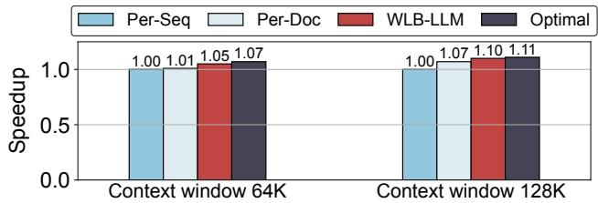  
Figure 15: CP sharding performance comparison.

As shown in Table 2, Fixed-Len Greedy can slightly mitigate workload imbalance when packing across a single global batch. Packing across multiple global batches helps to achieve lower imbalance degrees, while it will incur higher training losses, as demonstrated in Figure 6. As for Fixed-Len Solver, it achieves lower imbalance degrees compared to Fixed-Len Greedy under the same number of global batches. However, the solver-based solution suffers from significant packing overhead. For instance, when packing across 4 global batches, the average packing latency for each batch exceeds 25 seconds. In contrast, WLB-LLM is the only solution which achieves both near-optimal imbalance degree and low packing overhead. For example, when having two outlier queues, WLB-LLM achieves 1.05 imbalance degree. Additionally, the perbatch packing latency is only 20 ms which is less than 0.65% when compared to the per-step training latency.

CP Sharding Performance Analysis: To demonstrate the effectiveness of per-document sharding and the adaptive sharding selection optimization at the CP level in WLB-LLM, we conduct a case study on a single transformer layer of a 7B model with CP size of 4. We compare the forward and backward latency with different sharding strategies including: (1) Per-Sequence Sharding (Per-Seq), (2) Per-Document Sharding (Per-Doc), (3) WLB-LLM, which determines the sharding between Per-Seq and Per-Doc adaptively based on the given micro-batch at runtime, and (4) Optimal, which is the optimal result. It always chooses the sharding from Per-Seq and Per-Doc that yields lower latency.

As shown in Figure 15, Per-Document Sharding achieves a speedup of 1.01× and 1.07× over the Per-Sequence Sharding baseline under context window sizes of 64K and 128K, respectively. These results demonstrate the effectiveness of Per-Document Sharding in reducing the workload imbalance at the CP level. However, the fine-grained Per-Document Sharding may sacrifice kernel efficiency, particularly when the input sequence consists of many short documents. To overcome this issue, WLB-LLM leverages an adaptive sharding selection method to intelligently choose a better sharding strategy for each micro-batch at runtime. The results in Figure 15 show that WLB-LLM achieves a 7.5% and 3.4% improvement over static Per-Seq and Per-Doc sharding, respectively. Furthermore, WLB-LLM is very close to the optimal result, demonstrating the effectiveness of our adaptive selection method.

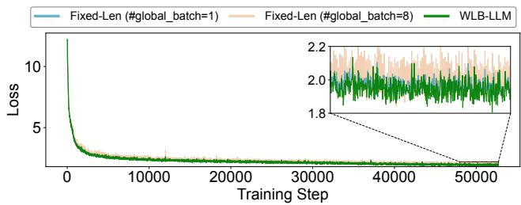  
Figure 16: Training loss comparison on a 550M model.

Model Convergence Analysis: WLB-LLM employs a heuristic variable-length packing optimization that adjusts document packing and delays the execution of outlier documents. To demonstrate that this optimization does not affect model convergence, we present the training loss curve of our 550M model. As shown in Figure 16, packing across 8 global batches results in a noticeable increase in training loss (1.6% on average). This is because packing over multiple global batches disrupts the randomness of data sampling in the dataloader, which leads to a different data distributed per batch than desired. In contrast, WLB-LLM follows almost the same trend as fixed-length packing across a single global batch, since the heuristic variable-length packing algorithm used by WLB-LLM only delays outlier documents, which contributes to a small proportion of all input tokens. According to our profiling, each token is delayed by an average of 0.5 iterations in WLB-LLM. This minimal delay preservers original data distribution at best, allowing WLB-LLM to improve training efficiency without compromising model quality.

## 8 Discussion

In this section, we discuss the compatibility of WLB-LLM with other parallelism dimensions and potential opportunities for improvement in future work.

Compatibility with Expert Parallelism: Beyond 4D parallelism, expert parallelism (EP) [20, 53] is a complementary dimension tailored for Mixture-of-Experts (MoE) models [37]. In EP, different experts are distributed across workers, and each input token is independently routed to one or more experts at runtime, which can introduce load imbalance when expert capacity is exceeded [50]. Prior works mitigate this by adding a load-balancing auxiliary loss [7, 20] or injecting expert-wise bias into the routing scores [45]. Thanks to these optimizations, state-of-the-art MoE training achieves dropless token routing [22], guaranteeing that every token is dispatched strictly according to its gating logits without any capacity-driven drops. Consequently, the packing and sharding optimizations in WLB-LLM will not affect EP routing decisions, making WLB-LLM fully compatible with existing EP load-balancing strategies.

Further Optimization Opportunity: The adaptive CP sharding selection in WLB-LLM is performed at the granularity of the entire input sequence, where either per-sequence sharding or per-document sharding is applied to the whole sequence. Although this approach already achieves near-optimal performance, there remains potential for further optimization. In certain cases, such as when an input sequence contains both extremely long documents and many short documents, it may be beneficial to combine both sharding strategies and apply them selectively based on document lengths. For instance, per-document sharding could be applied to long documents to balance the workload, while per-sequence sharding could be applied to short documents to maximize attention kernel efficiency. We hope this observation could motivate future work to further improve the efficiency of CP training.

## 9 Related Work

Distributed LLM Training Frameworks: To address the challenges of training extra-large LLMs, prior approaches primarily rely on 3D parallelism [15, 26, 38, 40, 43, 44, 55], which integrates tensor parallelism [15, 17, 38], pipeline parallelism [11, 19, 21, 26], and data parallelism [35, 36, 54]. Although 3D parallelism has proven its effectiveness in scaling model size, enabling the training of models with trillions of parameters [40], it struggles to scale context window size effectively. To address this limitation, a new dimension of parallelism called context parallelism has been introduced [30], forming the 4D parallelism training paradigm. Context parallelism splits input sequences into chunks, effectively reducing the memory bottleneck associated with extremely long documents. Initially, context parallelism employs a ring-based approach that overlaps communication and computation using P2P communication [24]. More recent approaches leverage collective communication methods (e.g., AllGather or AlltoAll) to aggregate key and value tensors, offering greater flexibility and better support for various types of attention masks [6, 12, 30]. The introduction of context parallelism enables efficient training of LLMs with long context windows. However, existing 4D parallelism frameworks overlook the heterogeneity in per-token arithmetic intensity, leading to significant workload imbalances across GPUs.

Input Padding and Packing for LLM Training: The input of LLMs consists of samples with varying lengths. To batch input documents together and optimize GPU utilization during LLM training, the input documents must be organized into tensors of identical lengths. This can be achieved through two primary approaches: Padding [38] and Packing [16]. Padding involves adding zero padding to shorter documents within a micro-batch. However, this approach inevitably introduces redundant computation, communication, and memory overhead. To address this issue, prior works have designed more efficient kernels to reduce redundant computation [49, 51]. Other works, such as DynaPipe [13], optimize batching strategies to minimize padding. Although these approaches mitigate redundant computation, the overhead caused by padding cannot be fully eliminated. To further address this problem, recent works propose packing short documents together to form a single long input sequence [16, 47]. After packing, an additional attention mask must be applied to ensure tokens only attend to others within the same document [6, 18, 29, 34]. Due to its efficiency in avoiding redundant computation, packing has become the mainstream choice in LLM training. For example, LLaMA3 adopts input packing [6] in its training process, and state-of-the-art high-performance attention implementations (e.g., FlashAttention [4, 5]) also support efficient attention computation with document packing. WLB-LLM focuses on input packing and addresses the workload imbalance issue that arises when input documents are packed together.

## 10 Conclusion

In this paper, we present WLB-LLM, a workload-balanced 4D parallelism framework designed to enhance the efficiency of LLM training. WLB-LLM systematically identifies and addresses workload imbalances that arise across multiple parallelism hierarchies. At the pipeline parallelism level, WLB-LLM introduces a novel heuristic variable-length document packing algorithm combined with an outlier document delay method that effectively mitigates workload imbalance across micro-batches. At the context parallelism level, WLB-LLM proposes a fine-grained per-document sharding method with an adaptive sharding selection strategy to maximize CP training efficiency. Comprehensive experiments demonstrate that WLB-LLM outperforms existing 4D parallelism frameworks across various model sizes and parallelism configurations, achieving an average speedup of 1.23×.

## 11 Acknowledgments

We would like to express our sincere appreciation to the anonymous reviewers and our shepherd for their insightful feedback and invaluable suggestions, which played a significant role in shaping and improving our final paper. We also thank the Meta AI and Systems Co-Design team for their continuous support and collaboration, which were crucial to the success of this project. Work at the University of California, San Diego was supported in part by NSF grant 2124039.

## References

[1] H100 GPU. https://www.nvidia.com/en-us/ data-center/h100/.

[2] Josh Achiam, Steven Adler, Sandhini Agarwal, Lama Ahmad, Ilge Akkaya, Florencia Leoni Aleman, Diogo Almeida, Janko Altenschmidt, Sam Altman, Shyamal Anadkat, et al. GPT-4 Technical Report. arXiv preprint arXiv:2303.08774, 2023.

[3] Wei-Lin Chiang, Zhuohan Li, Zi Lin, Ying Sheng, Zhanghao Wu, Hao Zhang, Lianmin Zheng, Siyuan Zhuang, Yonghao Zhuang, Joseph E Gonzalez, et al. Vicuna: An Open-Source Chatbot Impressing GPT-4 with 90%\* ChatGPT Quality. See https://vicuna.lmsys.org (accessed 14 April 2023), 2(3):6, 2023.

[4] Tri Dao. FlashAttention-2: Faster Attention with Better Parallelism and Work Partitioning. arXiv preprint arXiv:2307.08691, 2023.

[5] Tri Dao, Dan Fu, Stefano Ermon, Atri Rudra, and Christopher Ré. FlashAttention: Fast and Memory-Efficient Exact Attention with IO-Awareness. Advances in Neural Information Processing Systems, 35:16344– 16359, 2022.

[6] Abhimanyu Dubey, Abhinav Jauhri, Abhinav Pandey, Abhishek Kadian, Ahmad Al-Dahle, Aiesha Letman, Akhil Mathur, Alan Schelten, Amy Yang, Angela Fan, et al. The Llama 3 Herd of Models. arXiv preprint arXiv:2407.21783, 2024.

[7] William Fedus, Barret Zoph, and Noam Shazeer. Switch transformers: Scaling to trillion parameter models with simple and efficient sparsity. Journal of Machine Learning Research, 23(120):1–39, 2022.

[8] Gurobi Optimization, LLC. Gurobi Optimizer Reference Manual, 2024.

[9] Eric Harper, Somshubra Majumdar, Oleksii Kuchaiev, Li Jason, Yang Zhang, E Bakhturina, V Noroozi, S Subramanian, K Nithin, H Jocelyn, et al. NeMo: A Toolkit for Conversational AI and Large Language Models. Computer software], URL: https://github. com/NVIDIA/NeMo, 2019.

[10] Juris Hartmanis. Computers and Intractability: A Guide to the Theory of NP-Completeness (Michael R. Garey and David S. Johnson). Siam Review, 24(1):90, 1982.

[11] Yanping Huang, Youlong Cheng, Ankur Bapna, Orhan Firat, Dehao Chen, Mia Chen, HyoukJoong Lee, Jiquan Ngiam, Quoc V Le, Yonghui Wu, et al. GPipe: Efficient Training of Giant Neural Networks using Pipeline Parallelism. Advances in neural information processing systems, 32, 2019.

[12] Sam Ade Jacobs, Masahiro Tanaka, Chengming Zhang, Minjia Zhang, Shuaiwen Leon Song, Samyam Rajbhandari, and Yuxiong He. DeepSpeed Ulysses: System Optimizations for Enabling Training of Extreme Long Sequence Transformer Models. arXiv preprint arXiv:2309.14509, 2023.

[13] Chenyu Jiang, Zhen Jia, Shuai Zheng, Yida Wang, and Chuan Wu. DynaPipe: Optimizing Multi-task Training through Dynamic Pipelines. In Proceedings of the Nineteenth European Conference on Computer Systems, pages 542–559, 2024.

[14] Jared Kaplan, Sam McCandlish, Tom Henighan, Tom B Brown, Benjamin Chess, Rewon Child, Scott Gray, Alec Radford, Jeffrey Wu, and Dario Amodei. Scaling Laws for Neural Language Models. arXiv preprint arXiv:2001.08361, 2020.

[15] Vijay Anand Korthikanti, Jared Casper, Sangkug Lym, Lawrence McAfee, Michael Andersch, Mohammad Shoeybi, and Bryan Catanzaro. Reducing Activation Recomputation in Large Transformer Models. Proceedings of Machine Learning and Systems, 5:341–353, 2023.

[16] Mario Michael Krell, Matej Kosec, Sergio P Perez, and Andrew Fitzgibbon. Efficient Sequence Packing without Cross-contamination: Accelerating Large Language Models without Impacting Performance. arXiv preprint arXiv:2107.02027, 2021.

[17] Alex Krizhevsky, Ilya Sutskever, and Geoffrey E Hinton. ImageNet Classification with Deep Convolutional Neural Networks. Advances in neural information processing systems, 25, 2012.

[18] Achintya Kundu, Rhui Dih Lee, Laura Wynter, Raghu Kiran Ganti, and Mayank Mishra. Enhancing training efficiency using packing with flash attention. arXiv preprint arXiv:2407.09105, 2024.

[19] Joel Lamy-Poirier. Breadth-First Pipeline Parallelism. Proceedings of Machine Learning and Systems, 5:48–67, 2023.

[20] Dmitry Lepikhin, HyoukJoong Lee, Yuanzhong Xu, Dehao Chen, Orhan Firat, Yanping Huang, Maxim Krikun, Noam Shazeer, and Zhifeng Chen. Gshard: Scaling giant models with conditional computation and automatic sharding. arXiv preprint arXiv:2006.16668, 2020.

[21] Zhuohan Li, Siyuan Zhuang, Shiyuan Guo, Danyang Zhuo, Hao Zhang, Dawn Song, and Ion Stoica. TeraPipe: Token-Level Pipeline Parallelism for Training Large-Scale Language Models. In International Conference on Machine Learning, pages 6543–6552. PMLR, 2021.

[22] Aixin Liu, Bei Feng, Bing Xue, Bingxuan Wang, Bochao Wu, Chengda Lu, Chenggang Zhao, Chengqi Deng, Chenyu Zhang, Chong Ruan, et al. Deepseek-v3 technical report. arXiv preprint arXiv:2412.19437, 2024.

[23] Hao Liu and Pieter Abbeel. Blockwise Parallel Transformers for Large Context Models. Advances in Neural Information Processing Systems, 36, 2024.

[24] Hao Liu, Matei Zaharia, and Pieter Abbeel. Ring Attention with Blockwise Transformers for Near-Infinite Context. arXiv preprint arXiv:2310.01889, 2023.

[25] Deepak Narayanan, Aaron Harlap, Amar Phanishayee, Vivek Seshadri, Nikhil R Devanur, Gregory R Ganger, Phillip B Gibbons, and Matei Zaharia. PipeDream: Generalized Pipeline Parallelism for DNN Training. In Proceedings of the 27th ACM symposium on operating systems principles, pages 1–15, 2019.

[26] Deepak Narayanan, Mohammad Shoeybi, Jared Casper, Patrick LeGresley, Mostofa Patwary, Vijay Korthikanti, Dmitri Vainbrand, Prethvi Kashinkunti, Julie Bernauer, Bryan Catanzaro, et al. Efficient Large-Scale Language Model Training on GPU Clusters Using Megatron-LM. In Proceedings of the International Conference for High Performance Computing, Networking, Storage and Analysis, pages 1–15, 2021.

[27] Erik Nijkamp, Bo Pang, Hiroaki Hayashi, Lifu Tu, Huan Wang, Yingbo Zhou, Silvio Savarese, and Caiming Xiong. CodeGen: An Open Large Language Model for Code with Multi-Turn Program Synthesis. arXiv preprint arXiv:2203.13474, 2022.

[28] Nvidia. NVIDIA Collective Communication Library (NCCL). developer.nvidia.com/nccl.

[29] NVIDIA. NVIDIA NeMo Framework: Sequence Packing. https://docs.nvidia.com/nemo-framework/ user-guide/latest/sft\_peft/packed\_sequence. html.

[30] NVIDIA. Megatron Core: Context Parallelism. https://docs.nvidia.com/megatron-core/ developer-guide/latest/api-guide/context\_ parallel.html, 2023.

[31] OpenAI. Introducing ChatGPT. https://openai. com/index/chatgpt/, 2022.

[32] Myle Ott, Sam Shleifer, Min Xu, Priya Goyal, Quentin Duval, and Vittorio Caggiano. Fully Sharded Data Parallel: Faster AI Training with Fewer GPUs, 2021.

[33] Ray Perrault and Jack Clark. Artificial Intelligence Index Report 2024. 2024.

[34] Pytorch. FlexAttention: The Flexibility of PyTorch with the Performance of FlashAttention. https://pytorch. org/blog/flexattention/, 2024.

[35] Samyam Rajbhandari, Jeff Rasley, Olatunji Ruwase, and Yuxiong He. ZeRO: Memory Optimizations Toward Training Trillion Parameter Models. In SC20: International Conference for High Performance Computing, Networking, Storage and Analysis, pages 1–16. IEEE, 2020.

[36] Jie Ren, Samyam Rajbhandari, Reza Yazdani Aminabadi, Olatunji Ruwase, Shuangyan Yang, Minjia Zhang, Dong Li, and Yuxiong He. ZeRO-Offload: Democratizing Billion-Scale Model Training. In 2021 USENIX Annual Technical Conference (USENIX ATC 21), pages 551–564, 2021.

[37] Noam Shazeer, Azalia Mirhoseini, Krzysztof Maziarz, Andy Davis, Quoc Le, Geoffrey Hinton, and Jeff Dean. Outrageously large neural networks: The sparsely-gated mixture-of-experts layer. arXiv preprint arXiv:1701.06538, 2017.

[38] Mohammad Shoeybi, Mostofa Patwary, Raul Puri, Patrick LeGresley, Jared Casper, and Bryan Catanzaro. Megatron-LM: Training Multi-Billion Parameter Language Models Using Model Parallelism. arXiv preprint arXiv:1909.08053, 2019.

[39] Shaden Smith, Mostofa Patwary, Brandon Norick, Patrick LeGresley, Samyam Rajbhandari, Jared Casper, Zhun Liu, Shrimai Prabhumoye, George Zerveas, Vijay Korthikanti, et al. Using DeepSpeed and Megatron to Train Megatron-Turing NLG 530B, A Large-Scale Generative Language Model. arXiv preprint arXiv:2201.11990, 2022.

[40] DeepSpeed Team and Rangan Majumder. DeepSpeed: Extreme-Scale Model Training for Everyone, 2020.

[41] Gemini Team, Rohan Anil, Sebastian Borgeaud, Jean-Baptiste Alayrac, Jiahui Yu, Radu Soricut, Johan Schalkwyk, Andrew M Dai, Anja Hauth, Katie Millican, et al. Gemini: A Family of Highly Capable Multimodal Models. arXiv preprint arXiv:2312.11805, 2023.

[42] Hugo Touvron, Louis Martin, Kevin Stone, Peter Albert, Amjad Almahairi, Yasmine Babaei, Nikolay Bashlykov, Soumya Batra, Prajjwal Bhargava, Shruti Bhosale, et al. Llama 2: Open Foundation and Fine-Tuned Chat Models. arXiv preprint arXiv:2307.09288, 2023.

[43] Colin Unger, Zhihao Jia, Wei Wu, Sina Lin, Mandeep Baines, Carlos Efrain Quintero Narvaez, Vinay Ramakrishnaiah, Nirmal Prajapati, Pat McCormick, Jamaludin

Mohd-Yusof, et al. Unity: Accelerating DNN Training Through Joint Optimization of Algebraic Transformations and Parallelization. In 16th USENIX Symposium on Operating Systems Design and Implementation (OSDI 22), pages 267–284, 2022.

[44] Guanhua Wang, Heyang Qin, Sam Ade Jacobs, Connor Holmes, Samyam Rajbhandari, Olatunji Ruwase, Feng Yan, Lei Yang, and Yuxiong He. ZeRO++: Extremely Efficient Collective Communication for Giant Model Training. arXiv preprint arXiv:2306.10209, 2023.

[45] Lean Wang, Huazuo Gao, Chenggang Zhao, Xu Sun, and Damai Dai. Auxiliary-loss-free load balancing strategy for mixture-of-experts. arXiv preprint arXiv:2408.15664, 2024.

[46] Shibo Wang, Jinliang Wei, Amit Sabne, Andy Davis, Berkin Ilbeyi, Blake Hechtman, Dehao Chen, Karthik Srinivasa Murthy, Marcello Maggioni, Qiao Zhang, et al. Overlap communication with dependent computation via decomposition in large deep learning models. In Proceedings of the 28th ACM International Conference on Architectural Support for Programming Languages and Operating Systems, Volume 1, pages 93–106, 2022.

[47] Shuhe Wang, Guoyin Wang, Yizhong Wang, Jiwei Li, Eduard Hovy, and Chen Guo. Packing analysis: Packing is more appropriate for large models or datasets in supervised fine-tuning. arXiv preprint arXiv:2410.08081, 2024.

[48] Yuxiang Wei, Chunqiu Steven Xia, and Lingming Zhang. Copiloting the Copilots: Fusing Large Language Models with Completion Engines for Automated Program Repair. In Proceedings of the 31st ACM Joint European Software Engineering Conference and Symposium on the Foundations of Software Engineering, pages 172– 184, 2023.

[49] Jinle Zeng, Min Li, Zhihua Wu, Jiaqi Liu, Yuang Liu, Dianhai Yu, and Yanjun Ma. Boosting Distributed Training Performance of the Unpadded BERT Model. arXiv preprint arXiv:2208.08124, 2022.

[50] Zhiyuan Zeng, Qipeng Guo, Zhaoye Fei, Zhangyue Yin, Yunhua Zhou, Linyang Li, Tianxiang Sun, Hang Yan, Dahua Lin, and Xipeng Qiu. Turn waste into worth: Rectifying top-k router of moe. arXiv preprint arXiv:2402.12399, 2024.

[51] Yujia Zhai, Chengquan Jiang, Leyuan Wang, Xiaoying Jia, Shang Zhang, Zizhong Chen, Xin Liu, and Yibo Zhu. ByteTransformer: A High-Performance Transformer Boosted for Variable-Length Inputs. In 2023 IEEE International Parallel and Distributed Processing Symposium (IPDPS), pages 344–355. IEEE, 2023.

[52] Biao Zhang, Barry Haddow, and Alexandra Birch. Prompting Large Language Model for Machine Translation: A Case Study. In International Conference on Machine Learning, pages 41092–41110. PMLR, 2023.

[53] Shulai Zhang, Ningxin Zheng, Haibin Lin, Ziheng Jiang, Wenlei Bao, Chengquan Jiang, Qi Hou, Weihao Cui, Size Zheng, Li-Wen Chang, et al. Comet: Fine-grained computation-communication overlapping for mixtureof-experts. arXiv preprint arXiv:2502.19811, 2025.

[54] Yanli Zhao, Andrew Gu, Rohan Varma, Liang Luo, Chien-Chin Huang, Min Xu, Less Wright, Hamid Shojanazeri, Myle Ott, Sam Shleifer, et al. PyTorch FSDP: Experiences on Scaling Fully Sharded Data Parallel. arXiv preprint arXiv:2304.11277, 2023.

[55] Lianmin Zheng, Zhuohan Li, Hao Zhang, Yonghao Zhuang, Zhifeng Chen, Yanping Huang, Yida Wang, Yuanzhong Xu, Danyang Zhuo, Eric P Xing, et al. Alpa: Automating Inter- and Intra-Operator Parallelism for Distributed Deep Learning. In 16th USENIX Symposium on Operating Systems Design and Implementation (OSDI 22), pages 559–578, 2022.

## A Artifact Appendix

## Abstract

Our artifact provides an open-source implementation of the context parallelism optimization of WLB-LLM. It includes both the Per-Sequence baseline and the Per-Document sharding optimization proposed by WLB-LLM. This implementation differs from the internal version used at Meta. We develop this open-source version following the design proposed in WLB-LLM, using open-source frameworks. The goal is to make it easier for readers to experiment with and build upon the context parallelism optimizations presented in WLB-LLM.

## Scope

This artifact provides a user-friendly interface to perform context parallelism training using both Per-Sequence and Per-Document sharding strategies. It enables quick performance comparisons between the two approaches, supporting the claims made in the WLB-LLM paper. It also serves as a good starting point for exploring further optimizations in context parallelism.

## Contents

The repository includes the following components:

1. Implementation of both Per-Sequence and Per-Document sharding.

2. Code and scripts for verifying correctness.

3. Code and scripts for benchmarking the training efficiency of Per-Sequence vs. Per-Document sharding.

4. A detailed README.md with usage instructions and setup guidance.

## Hosting

The artifact is open-sourced on GitHub at: https://github. com/Ash-Zheng/WLB-LLM-CP. We are actively maintaining the main branch of the repository to make it more comprehensive. Clear and accessible documentation will be continuously updated to reflect new features and improvements.

## Requirements

We have tested and evaluated our artifact using the nvcr.io/nvidia/pytorch:25.01-py3 Docker image, with PyTorch 2.6.0, FlashAttention 2.4.2, and CUDA 12.8. Our implementation has been validated on both NVIDIA A100 and H100 GPUs. To run performance comparisons between Per-Sequence and Per-Document sharding, a minimum of two GPUs is required.