USENIX

THE ADVANCED COMPUTING SYSTEMS ASSOCIATION

# Zen: Empowering Distributed Training with Sparsity-driven Data Synchronization

Zhuang Wang, Rice University; Zhaozhuo Xu, Stevens Institute of Technology; Jingyi Xi, unaffiliated; Yuke Wang, Anshumali Shrivastava, and T. S. Eugene Ng, Rice University

https://www.usenix.org/conference/osdi25/presentation/wang-zhuang

# This paper is included in the Proceedings of the 19th USENIX Symposium on Operating Systems Design and Implementation.

July 7–9, 2025 • Boston, MA, USA

ISBN 978-1-939133-47-2

Open access to the Proceedings of the 19th USENIX Symposium on Operating Systems Design and Implementation is sponsored by

# ZEN: Empowering Distributed Training with Sparsity-driven Data Synchronization

Zhuang Wang∗, Zhaozhuo Xu⋄∗, Jingyi Xi†∗, Yuke Wang, Anshumali Shrivastava, and T. S. Eugene Ng Rice University, ⋄Stevens Institute of Technology, †Unaffiliated

## Abstract

Distributed training is the de facto standard to scale up the training of deep learning models with multiple GPUs. Its performance bottleneck lies in communications for gradient synchronization. Although high tensor sparsity is widely observed, the optimal communication scheme to fully leverage sparsity is still missing. This paper aims to bridge this gap. We first analyze the characteristics of sparse tensors in popular models to understand the fundamentals of sparsity. We then systematically explore the design space of communication schemes for sparse tensors and find the optimal ones. These findings give a new understanding and inspire us to develop a holistic gradient synchronization system for sparse tensors called ZEN. We demonstrate that ZEN can achieve up to 5.09× speedup in communication time and up to 2.48× speedup in training throughput compared to the state-of-theart methods.

## 1 Introduction

In recent years, deep learning (DL) models have achieved remarkable empirical performance in real-world applications, such as language processing [6, 22, 32, 40, 64, 67] and recommendation systems [26, 42]. With the ever-growing size of models and training datasets, distributed training has become the norm for model training with multiple GPUs [35,47,49,59,71]. The synchronization of gradient tensors from different GPUs is commonly required in distributed training. In data parallelism [29, 35, 59], the training dataset is partitioned across multiple GPUs, so the corresponding gradient tensors must be synchronized to maintain model consistency. In tensor parallelism [62], individual layers of a DL model are sharded over multiple GPUs, which synchronize the gradient tensors during backward propagation for the gradient computation of subsequent layers. Furthermore, it is common practice to train large models [17, 49, 58] with a mix of data parallelism and other parallelism strategies, such as pipeline parallelism [28, 47], tensor parallelism [62], and ZeRO [55, 81]. These training workloads must also synchronize the gradient tensors across GPUs.

The major efficiency bottleneck of distributed training lies in the communication for gradient synchronization [23,72,73, 80]. Recent hardware developments have greatly improved the computation efficiency of model training. These advancements increase the frequency of gradient synchronization in distributed training and shift more burdens to network systems. However, network upgrades have not kept up with the improvements in computation [43, 50, 51, 80], exacerbating the tension between computation and communication.

Several communication schemes have been developed to alleviate communication bottlenecks in distributed training by fully utilizing the network bandwidth. For example, Ring-Allreduce [53] is provably bandwidth-optimal in homogeneous GPU clusters and it is widely used in collective communication libraries such as MPI [18], NCCL [4], and MSCCL [5]. BytePS [29] is a communication-optimal architecture for heterogeneous GPU/CPU clusters. However, both Ring-Allreduce and BytePS assume that tensors to be synchronized are dense, ignoring their sparsity.

Recent work has shown that DL models exhibit a high degree of tensor sparsity during gradient synchronization. The sparsity comes from either natural gradient computation [16, 37, 42] or gradient compression sparsification algorithms [7, 38, 73]. On the one hand, because model training can focus on updating a subset of parameters instead of all of them [24, 78], some of the gradient tensors in DL models are naturally sparse and most of the gradients in these tensors are zero. For instance, the embedding table in the widely deployed Deep Learning Recommendation Models [70] can reach more than 93% sparsity; Graph adjacency matrix in Graph Neural Networks [69] usually retains the sparsity more than 99%; Word embeddings of those popular natural language processing models, such as NMT [40] and LSTM [44], would achieve more than 97% sparsity. On the other hand, to address the communication bottleneck, a plethora of sparsification algorithms [7, 38, 39, 60, 61, 63, 73] are proposed to reduce synchronization traffic by selecting a subset of the original stochastic gradients. They can save up to 99% of the gradient exchange while maintaining model accuracy [12,39].

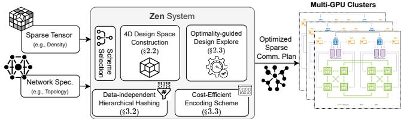  
Figure 1: ZEN System Overview.

Leveraging the notable sparsity can significantly reduce traffic volume for gradient synchronization and shorten the communication time in distributed training. We can represent non-zero gradients with a sparse format and denote the tensor with a sparse format as a sparse tensor. Previous works, such as AGsparse [35], SparCML [56], and OmniReduce [23], have acknowledged this potential. They use various sparse formats and synchronization schemes. However, these approaches do not fully consider the fundamental characteristics of sparsity in DL models and lack understanding of the optimal scheme, resulting in suboptimal communication performance for gradient synchronization. To this end, this paper addresses the research problem: What is the optimal communication scheme for gradient synchronization of sparse tensors in distributed training?

To address this question, it is essential to revisit the fundamentals of the tensor sparsity in DL models. We first unveil the characteristics of sparse tensors in popular models [22, 26, 30, 40, 65, 79] across GPUs, iterations, and diverse training workloads. We then explore locations and distributions of non-zero gradients in tensors and the changes observed in sparse tensors before and after aggregation under varying configurations.

In light of these characteristics of sparse tensors, we systematically explore the design space of synchronization schemes for sparse tensors. Four elemental dimensions are proposed, including communication, aggregation, partition, and balance, to construct diverse synchronization schemes, revealing that existing schemes [23, 35, 56] can be described within this framework. This leads to a proof of the existence of communication-optimal schemes to synchronize sparse tensors in distributed training.

Based on these findings, we develop a sparse gradient synchronization system, called ZEN (Figure 1), which achieves a near-optimal communication time. Specifically, ZEN takes the tensor sparsity and network specification as input and pinpoints the optimized sparse communication plan as output. Our key design insight lies in framing the challenge of achieving optimal schemes as a mathematical problem. We propose a data-independent solution to address this challenge, eliminating costly data-dependency overhead. This solution achieves high efficiency by introducing a novel hierarchical hashing algorithm that attains superior performance on GPUs while ensuring provably near-optimal results without any information loss. ZEN also incorporates an efficient encoding scheme to minimize index representation overhead, irrespective of the random distribution of non-zero gradients after applying the hierarchical hashing algorithm. We evaluate ZEN across various DL training workloads, where tensor sparsity arises from natural computation or gradient compression. ZEN achieves up to 5.09× speedup in communication time and up to 2.48× speedup in training throughput over existing methods for sparse tensor synchronization.

Table 1: Three DL models with natural tensor sparsity.
<table><tr><td>Model</td><td>MLP Size</td><td>Embedding Size</td><td>EmbeddingDensity</td></tr><tr><td>LSTM [44]</td><td>20M</td><td>406M</td><td>1.13%</td></tr><tr><td>DeepFM[26]</td><td>68M</td><td>214M</td><td>2.80%</td></tr><tr><td>NMT [40]</td><td>31M</td><td>112M</td><td>2.47%</td></tr></table>

Table 2: Configurations of three LLMs. AH: attention heads.
<table><tr><td>Model</td><td>Hidden size</td><td>Intermediate</td><td>#Layers</td><td>#AH</td></tr><tr><td>Llama3.2-3B[22]</td><td>3,072</td><td>8,192</td><td>28</td><td>24</td></tr><tr><td>OPT2.7B [79]</td><td>2.560</td><td>10,240</td><td>32</td><td>32</td></tr><tr><td>Gemma2-2B [65]</td><td>2,304</td><td>9,216</td><td>26</td><td>8</td></tr></table>

The key contributions of this paper are as follows.

• We analyze the characteristics of sparse tensors in popular DL models to reveal and understand the fundamentals of gradient sparsity in distributed training.

• We systematically explore the design space of sparse communication schemes and pinpoint the optimal ones.

• We develop ZEN, a gradient synchronization system for sparse tensors that achieves near-optimal communication time using a data-independent hierarchical hashing algorithm and an efficient encoding scheme.

• Evaluation reveals that ZEN achieves evident throughput improvement compared to the state-of-the-art methods across diverse training workloads.

## 2 Analysis of Sparse Tensor Synchronization

## 2.1 Characteristics of Sparse Tensors

This section analyzes the characteristics of sparse tensors from both natural gradient computation and sparsification algorithms. For natural tensor sparsity, we will study the gradient tensors from the embedding layers of the three DL models listed in Table 1. For the tensor sparsity from gradient compression, we will study three large language models (LLMs) listed in Table 2 and apply DGC [39], one of the most popular sparsification algorithms, to select the top 5% gradients from their gradient tensors [8, 27]. Detailed workloads for the models can be found in §5.1.

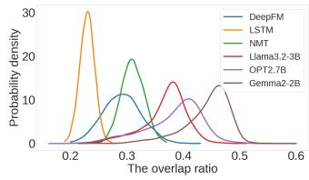  
(a)

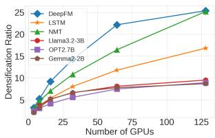  
(b)  
Figure 2: The characteristics of sparse tensors in DL models. (a) shows that the overlap ratio of sparse tensors varies; (b) shows that tensors have higher density after aggregation.

Definition 1 (Dense tensor). We define the original gradient tensor in a DL layer as a dense tensor.

We define density of a gradient tensor as the percentage of its non-zero gradient values. We can represent a gradient tensor in a sparse format when many parameters have zero gradients. A typical sparse format is coordinate lists (COO)C that store a list of non-zero gradients and a list of the corresponding indices [23, 77].

Definition 2 (Sparse tensor). We define a gradient tensor in a sparse format as a sparse tensor.

We denote the size of a dense tensor G by M, its density is $d _ { G } ,$ , and the training involves n nodes. For simplicity, we assume that each node has only one GPU in this section.

C1: The overlap of sparse tensors varies. Similar to dense tensors, sparse tensors are aggregated during synchronization. When aggregating dense tensors, the indices of gradients from different GPUs are identical. However, due to different batches as input for training on different GPUs, the indices of non-zero gradients in a sparse tensor are unknown a priori. They can have overlaps, but how much they overlap depends on many factors, such as the DL model, the training dataset, and the batches. We define the overlap ratio [68] to quantify this overlap between two sparse tensors.

Definition 3 (The overlap ratio). Given two sparse tensors and their sets of indices for non-zero gradients are $I _ { 1 }$ and $I _ { 2 } ,$ respectively, their overlap ratio is defined as $\begin{array} { r } { \frac { \left| I _ { 1 } \cap I _ { 2 } \right| } { \operatorname* { m i n } \{ | I _ { 1 } | , | I _ { 2 } | \} } , } \end{array}$ where | · | is the cardinality of a set.

Figure 2a shows the probability density function (PDF) of the overlap ratios for the six DL models studied in the paper. The overlap ratio in a model is approximately normally distributed, and it is in a wide range. In addition, different models have different distributions of overlap ratios.

C2: The tensor size after aggregation varies. When aggregating dense tensors, the tensor sizes before and after aggregation remain the same. However, when aggregating sparse tensors, the unknown overlaps of sparse tensors lead to varying tensor sizes after aggregation. Because the aggregation involves sparse tensors from multiple GPUs, we denote $d _ { G } ^ { n }$ as

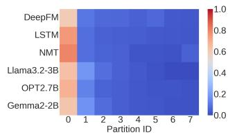  
(a) icati

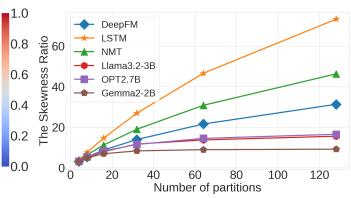  
(b)

Figure 3: The distribution of non-zero gradients is skewed. (a) The heatmap of non-zero gradients distribution; (b) The skewness ratio.  
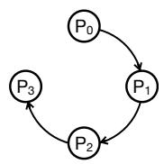

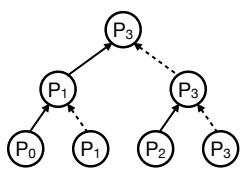  
(a) Ring

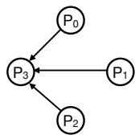  
(b) Hierarchy  
(c) Point-to-point

Figure 4: An illustration of three communication patterns with four GPUs. GPU $P _ { 3 }$ aggregates the data from all GPUs.  
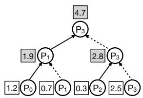  
(a) Incremental aggregation.

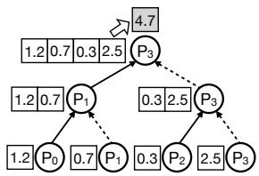  
(b) One-shot aggregation.

Figure 5: An Illustration of two aggregation patterns with Hierarchy. The gradients on each GPU are from the same parameter and 4.7 is the final aggregated result.

the density after the aggregation of tensors from n GPUs. We observe that sparse tensors get denser after aggregation. We define the densification ratio to quantify this characteristic.

Definition 4 (The densification ratio). Given a dense tensor $G ,$ its densification ratio is defined as $\begin{array} { r } { \gamma _ { G } ^ { n } = \frac { d _ { G } ^ { n } } { d _ { G } } } \end{array}$

Figure 2b presents the average densification ratio $\gamma _ { G } ^ { n }$ to the number of GPUs for the DL models studied in this paper. The densification ratio increases with the number of GPUs, demonstrating that tensors have a higher density after aggregation. We can also see that the densification ratio is smaller than the number of GPUs, i.e., $\gamma _ { G } ^ { n } < n .$ It suggests that the indices of non-zero gradients in sparse tensors from different GPUs are partially overlapped.

C3: The distribution of non-zero gradients is skewed. When evenly splitting a dense tensor into multiple partitions, we observe that most of the non-zero gradients are in one of them. For example, with eight partitions, more than 60% of the non-zero gradients are in the first partition in the six DL models. Figure 3a shows the percentage heatmap of the nonzero gradients in each partition. We define the skewness ratio to quantify the skewed distribution of non-zero gradients.

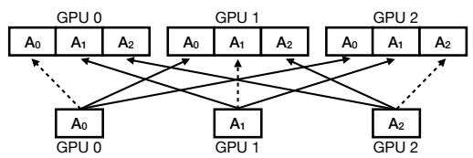  
(a) Centralization

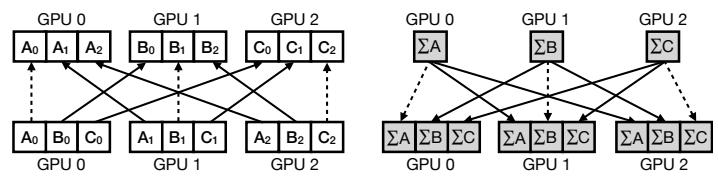  
(b) Parallelism

Figure 6: An illustration of the two partition patterns with Point-to-point. In (a), each tensor is communicated as a whole and each GPU receives all the tensors. In (b), each tensor is split into three partitions; the same partition from different GPUs is sent to the same place, and the aggregated results are then sent back to all GPUs.  
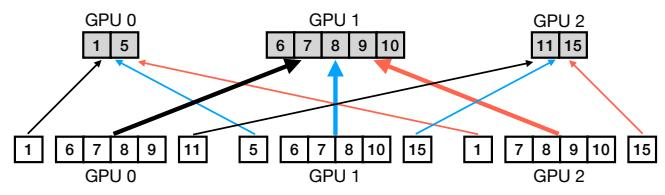  
(a) Imbalanced communication

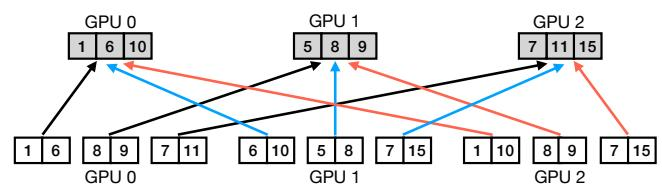  
(b) Balanced communication  
Figure 7: An illustration of balance patterns with Point-to-point and Parallelism. Each GPU has six non-zero gradients and the numbers are their indices. In (a), four gradients from each GPU are sent to GPU 1. In (b), each GPU sends two gradients to other GPUs, and communications are well-balanced. However, it is non-trivial to achieve such balanced communications.

Definition 5 (The skewness ratio). Given a dense tensor G and we evenly divide G into disjoint n partitions, denoted as $\{ G _ { 1 } , \cdots , G _ { n } \} ,$ , the skew ratio of G with n partitions is defined $a s \ { \frac { \operatorname* { m a x } _ { i \in [ n ] } \{ d _ { G _ { i } } \} } { d _ { G } } }$

Figure 3b presents the skewness ratios of gradient tensors in the DL models studied in this paper. They are significant in all six models. For example, when we evenly split the gradient tensor from the embedding table in LSTM into 128 partitions, the skewness ratio is over 70. It indicates that more than half of the non-zero gradients are in the same partition.

## 2.2 Elemental Dimensions for Synchronization

Synchronization for dense tensors has been extensively studied [29, 34, 59, 66]. This section will explore the design space to construct synchronization schemes for sparse tensors. Given a tensor, the outcome of its synchronization is that gradients with the same indices are aggregated and all GPUs have identical aggregated results. We will discuss four dimensions that construct a synchronization scheme for sparse tensors.

Communication dimension. There are typically three communication patterns for synchronization: 1) Ring, 2) Hierarchy, and 3) Point-to-point. They are illustrated in Figure 4 with an example in which there are four GPUs and GPU $P _ { 3 }$ aggregates the data from all GPUs. In Ring, all GPUs form a ring structure. $P _ { 0 }$ first sends its data to $P _ { 1 }$ , which then passes the data along with its own data to $P _ { 2 }$ and so on until $P _ { 3 }$ receives all the data. In Hierarchy, all GPUs form a hierarchical structure and $P _ { 3 }$ is the root. There are two stages in Figure 4b. In the first stage, $P _ { 0 }$ sends its data to $P _ { 1 }$ and $P _ { 2 }$ sends its data to $P _ { 3 }$ . In the second stage, $P _ { 1 }$ sends the data from both its own and $P _ { 0 }$ to $P _ { 3 }$ . In Point-to-point communication, the other three GPUs directly send data to $P _ { 3 }$

Aggregation dimension. A communication pattern can have multiple communication stages and there are two options for aggregation: 1) Incremental aggregation, i..e, aggregate tensors at each stage; and 2) One-shot aggregation, i.e., only aggregate tensors from all GPUs after the last stage. These two options lead to different amounts of traffic volume in different communication stages because of C1 and C2 discussed in Section 2.1. In the example illustrated in Figure 4, Ring has three stages and Hierarchy has two stages. Figure 5 displays an example with Hierarchy as the communication pattern. When $P _ { 1 }$ receives a tensor from $P _ { 0 } ,$ it has two tensors. $P _ { 1 }$ can either aggregate the two tensors and send the aggregated result to $P _ { 3 } .$ , as shown in Figure 5a; or it can just send the concatenated tensor to $P _ { 3 }$ , as shown in Figure 5b.

Partition dimension. There are two partition patterns to ensure that all GPUs have the same aggregated results after synchronization: 1) Centralization, in which each tensor is communicated and aggregated as a whole; and 2) Parallelism, in which each tensor is decomposed into multiple partitions and each partition is communicated and aggregated separately. Figure 6 compares the two partition patterns with Point-to-point as the communication pattern. With Centralization, as shown in Figure 6a, each GPU sends its tensor as a whole to other GPUs. With Parallelism, as shown in Figure 6b, each GPU first decomposes its tensor into three partitions and it requires two steps for synchronization. The first step aggregates the same partition from different GPUs in different places and the second step ensures that all GPUs have the aggregated results of all partitions.

Balance dimension. With Parallelism, the number of nonzero gradients in each partition can vary. Therefore, there are two patterns in terms of the traffic volume received at each GPU: 1) Balanced communication, in which the GPUs receive the same amount of data; and 2) Imbalanced communication, in which the traffic volumes received at different GPUs are greatly different. Figure 7 compares the two balance patterns among three GPUs with Point-to-point. There are 15 gradients in the tensor and six of them are nonzero. As shown in Figure $^ { 7 \mathrm { { a , } } }$ four non-zero gradients are in the middle partition and they are sent to GPU 1. The traffic volume received at GPU 1 is 4× that received at GPU 0 and GPU 2. In Figure 7b, each GPU sends two non-zero gradients to other GPUs and the volume among them is well balanced. Naively partitioning a tensor can cause imbalanced communications due to C3 discussed in §2.1.

The four dimensions describe the design space of synchronization schemes for sparse tensors. Table 3 classifies existing schemes [23, 35, 56] based on their dimensions.

## 2.3 Optimal Synchronization Schemes

Next, we analyze optimal synchronization schemes for sparse tensors based on the four design dimensions. For convenience, we introduce two special schemes: Balanced Parallelism and Hierarchical Centralization.

Definition 6 (Balanced Parallelism). It refers to the synchronization scheme characterized by [Point-to-point, Incremental aggregation, Parallelism, and Balanced communication].

Definition 7 (Hierarchical Centralization). It refers to the synchronization scheme characterized by [Hierarchy, Incremental aggregation, and Centralization].

Theorem 1 (Optimal schemes). To minimize communication time for sparse tensors, the optimal synchronization scheme is either Balanced Parallelism or Hierarchical Centralization.

Proof. Theorem 1 is proven using Lemma 1 and Lemma 2. Here, we present the main intuitions and the detailed proof is in Appendix B.1.

Lemma 1. When the partition pattern is fixed to Parallelism, the optimal scheme is Balanced Parallelism.

There are three intuitions for Lemma 1: 1) Balanced communication outperforms imbalanced communication; 2) Pointto-point communication outperforms both Ring and Hierarchy by minimizing the traffic volume of unique gradients in the Parallelism partition pattern. and 3) Incremental aggregation outperforms One-shot aggregation as it reduces the traffic volume by aggregating the overlaps of sparse tensors.

Lemma 2. When the partition pattern is fixed to Centralization, the optimal scheme is Hierarchical Centralization.

There are two intuitions for Lemma 2: 1) when the partition pattern is fixed to Centralization, the search space is reduced to six candidates because the Balance dimension is not applicable. 2) Among these candidates, Hierarchical Centralization minimizes the traffic volume for overlapped gradients. We use an extreme case to demonstrate the second intuition. Suppose a non-zero gradient with index idx appears in all sparse tensors. In Point-to-point or One-shot aggregation, each GPU has to receive this gradient $n - 1$ times. In Ring, the gradient from each GPU is aggregated at every stage and forwarded to the next GPU, causing each GPU to receive the gradient n − 1 times. However, with Hierarchy and Incremental aggregation, each GPU only receives the gradient log n times.

Lemma 1 and Lemma 2 imply Theorem 1.

Communication time analysis. We will analyze the theoretical communication time of the two schemes mentioned in Theorem 1. The symbols used in the analysis are listed in Table 4. We assume that each node is equipped with a single GPU, and that each pair of nodes has direct bidirectional connections [56]. The theoretical communication time is defined as the transfer time of messages, $L / b ,$ where L is the message size and b is the network bandwidth. For this analysis, we adopt the COO sparse format. For simplicity, we assume that the tensor on each GPU has identical $d _ { G }$ and the average densification ratio for all GPUs is $\gamma _ { G } ^ { n } .$ Additionally, the number of GPUs, n, is a power of 2.

• Balanced Parallelism. Communication in this scheme involves two steps. The traffic volume each GPU receives is $\frac { 2 ( n - 1 ) } { n } d _ { G } M$ in the first step and $\frac { 2 ( n - 1 ) } { n } \gamma _ { G } ^ { n } d _ { G } M$ in the second step. The total traffic volume that each GPU receives is $\frac { 2 ( n - 1 ) } { n } ( \overset { \_ } { \gamma } _ { G } ^ { n } + 1 ) d _ { G } M$ . resulting in a communication time of:

$$
T _ { b p } = \frac { n - 1 } { n } ( \gamma _ { G } ^ { n } + 1 ) 2 M d _ { G } / b .\tag{1}
$$

• Hierarchical Centralization. Communication in this scheme is performed in logn stages. In the $i _ { t h }$ stage, the traffic volume that each GPU receives is $2 \gamma _ { G } ^ { 2 ^ { i - 1 } } d _ { G } M$ . The total traffic volume that each GPU receives is $2 \Sigma _ { i = 1 } ^ { \log n } \gamma _ { G } ^ { 2 ^ { i - 1 } } d _ { G } M$ . The corresponding communication time is:

$$
T _ { s m } = \sum _ { i = 1 } ^ { \log n } \gamma _ { G } ^ { 2 ^ { i - 1 } } 2 M d _ { G } / b .\tag{2}
$$

Balanced Parallelism as the practical optimal scheme. According to Theorem 1, the optimal scheme is determined by comparing Equations (1) and (2). Based on the characteristics of sparse tensors in DL models, we observe that Balanced Parallelism is often better than the other scheme because $\begin{array} { r } { \sum _ { i = 1 } ^ { \log n } \gamma _ { G } ^ { 2 ^ { i - 1 } } > \frac { n - 1 } { n } ( \gamma _ { G } ^ { n } + 1 ) } \end{array}$ in practical distributed training. To illustrate, we consider two extreme cases. The first case is that any two tensors are fully overlapped, i.e., $\gamma _ { G } ^ { n } = d _ { G }$ . The left-hand term becomes log n, while the right-hand term is $2 ( n - 1 ) / n < 2 .$ , which is much smaller. For typically large $n ,$ such as $n \geq 1 6 ,$ , the right-hand term is several times smaller. The second case is that any two tensors have no overlaps, i.e., ${ \gamma } _ { G } ^ { k } = k d _ { G } .$ . The left-hand term becomes n − 1, while the right-hand term is $( n - 1 ) ( 1 + 1 / n )$ , which is slightly larger than n − 1. However, practical overlap ratios are much higher than 0.05, as shown in Figure 2a. More specifically, when $\begin{array} { r } { n = 1 6 , \sum _ { i = 1 } ^ { \log n } \gamma _ { G } ^ { 2 ^ { i - 1 } } > \frac { n - 1 } { n } ( \gamma _ { G } ^ { n } + 1 ) } \end{array}$ even if the overlap ratio of any two tensors is as low as 0.05.

Table 3: Comparison of different synchronization schemes for sparse tensors based on their dimensions.
<table><tr><td>Schemes</td><td>Communication</td><td>Aggregation</td><td>Partition</td><td>Balance</td><td>Note</td></tr><tr><td>AGsparse [35]</td><td>Ring, Hierarchy, Point-to-point</td><td>One-shot</td><td>Centralization</td><td>N/A</td><td>Cannot fully use overlaps</td></tr><tr><td>SparCML [56]</td><td>Hierarchy</td><td>Incremental</td><td>Centralization</td><td>N/A</td><td>to reduce traffic.</td></tr><tr><td>OmniReduce [23]</td><td>Point-to-point</td><td>One-shot</td><td>Parallelism</td><td>Imbalanced</td><td>Imbalanced communications</td></tr><tr><td>Balanced Parallelism</td><td>Point-to-point</td><td>Incremental</td><td>Parallelism</td><td>Balanced</td><td>The optimal scheme we find.</td></tr></table>

Table 4: The symbols used in this paper.
<table><tr><td>Symbols</td><td>Description</td></tr><tr><td>n</td><td>The number of GPUs</td></tr><tr><td>b</td><td>The network bandwidth</td></tr><tr><td> $G$ </td><td>The dense tensor</td></tr><tr><td> $M$ </td><td>The size of the dense tensor</td></tr><tr><td> $d _ { G }$ </td><td>The density of G</td></tr><tr><td> ${ \underline { { \gamma _ { G } ^ { k } } } }$ </td><td>The densification ratio of G with k GPUs</td></tr></table>

## 2.4 A Case Study on NMT model

In this section, we will empirically validate Theorem 1. As listed in Table 3, several synchronization schemes for sparse tensors are proposed [23, 35, 56]. We will compare their performance from an algorithmic perspective, i.e., only consider their theoretical communication time and ignore other overheads, such as the computation time for aggregations and the sparse tensor encoding and decoding overheads.

• AGsparse [35]. It adopts [One-shot aggregation, Centralization], and separately collects non-zero gradients and the corresponding indices. It cannot fully exploit the overlaps among the sparse tensors to reduce traffic volume. Note that there are different implementations for AGsparse with different communication patterns [66].

• SparCML [56]. It adopts Hierarchical Centralization. It cannot fully leverage the overlaps among the sparse tensors to reduce traffic volume. The performance of AGsparse and SparCML both depends on the overlaps. The fewer overlaps, the closer their performance is to optimal. However, as shown in Figure 2, sparse tensors across GPUs in DL models have significant overlaps.

• OmniReduce [23]. It adopts [Point-to-point, One-shot aggregation, and Parallelism]. OmniReduce consists of workers and aggregators. It splits a gradient tensor into blocks of gradients and only sends non-zero blocks, i.e., blocks with at least one non-zero gradient, to aggregators for aggregations. OmniReduce does not need to transmit indices for non-zero gradients. It requires multiple aggregators for better scalability. However, its performance suffers from imbalanced communications because it evenly partitions tensors.

The sparse data formats are as proposed by each scheme, i.e., AGsparse and SparCML use COO; OmniReduce uses tensor block format. We assume the sparse data format of Balanced Parallelism to be COO for a fair comparison.

The case where Balanced Parallelism is optimal. Figure compares the performance of these synchronization schemes to synchronize sparse tensors in NMT with a batch size of 64. The comparison with other DL models has similar trends. Their communication times are normalized to AllReduce, which is the synchronization scheme for dense tensors. The communication time of AGsparse increases linearly with the number of GPUs. It performs worse than AllReduce with more than 40 GPUs because it does not leverage the overlaps among the sparse tensors to reduce traffic volume. OmniReduce outperforms AllReduce with a small number of GPUs. However, its performance improvement becomes marginal with more than 64 GPUs. Due to the skewed distribution of non-zero gradients, most of the non-zero gradients are in one partition, leading to imbalanced communications. In addition, the tensors become denser after aggregation. When splitting this partition into tensor blocks (e.g., each block has 256 gradients [23]), most of them are non-zero blocks. Therefore, almost all gradients in this partition are sent to one aggregator, and it becomes the communication bottleneck. SparCML is worse than AllReduce with a large number of GPUs due to the duplicated indices and their gradients received at each GPU. In contrast, Balanced Parallelism greatly outperforms existing synchronization schemes and AllReduce. For example, existing schemes cannot reduce communication time compared to AllReduce with 128 GPUs, but the communication time of Balanced Parallelism is still 36% lower than AllReduce.

The case where SparCML is optimal. This case is rare in practical distributed training. We have to reduce the batch size of NMT to a very small value for demonstration. For example, when the batch size is 1 and the number of GPUs is 8, the density of the gradient tensors of the embedding layer is less than 0.1%, and the sparse tensors hardly have overlaps, i.e., $\gamma _ { G } ^ { k } \approx k .$ In this scenario, SparCML outperforms AGsparse and Balanced Parallelism by 4% and 9%, respectively. As the GPU number increases, SparCML still outperforms Balanced Parallelism, but the performance gap becomes more marginal.

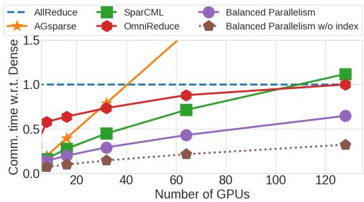  
Figure 8: Comparison of different schemes for synchronizing sparse tensors in NMT [40] with a batch size of 64.

The index communication overhead is non-negligible. When the sparse data format is COO, each non-zero gradient in a sparse tensor comes with an index, significantly inflating the traffic volume for gradient synchronization and communication time. To demonstrate its costly overhead, Figure 8 displays an ideal scheme named Balanced Parallelism without index, in which only non-zero gradients are synchronized with Balance Parallelism without any index information. Compared to the ideal scheme, Balanced Parallelism doubles the communication time.

## 3 ZEN System

We crystalize the above observations and insights into a holistic gradient synchronization system, ZEN (Figure 1), which leverages the sparsity in DL models to minimize the synchronization time in distributed training. ZEN comprises both schemes described in Theorem 1 to minimize communication time under different scenarios. At the runtime, ZEN collects the lightweight sparsity profiling results of the first few iterations and intelligently determines the optimal scheme by comparing Equations (1) and (2).

We will focus on Balanced Parallelism in this section because to date no existing solution realizes it, while Spar-CML [56] has been proposed. We first formulate the problem for Balanced Parallelism (§3.1) and then develop a hierarchical hashing algorithm to solve it (§3.2). We then design a new sparse data format to minimize the communication overhead incurred by gradient indices (§3.3) in sparse tensors.

## 3.1 Balanced Parallelism Formulation

For convenience, we borrow the concepts of workers and servers from the Parameter Servers (PS) architecture [34] to Balanced Parallelism. Because there are two steps in Balanced Parallelism for gradient synchronization, we also call them Push and Pull, respectively.

Suppose that there are n workers and n servers in Balanced Parallelism. $I _ { i } \subset \mathbb { N } _ { + }$ is the indices of non-zero gradients generated by worker i. We define the problem of achieving balanced parallelism as follows.

Problem 1. Let I denote the union of $\{ I _ { 1 } , I _ { 2 } , \cdots , I _ { n } \}$ . We would like to have a mapping $f : I  [ n ]$ such that:

1. For every $i \in [ n ]$ and $j \in [ n ]$ , the cardinality of set $\{ i d x \in$ $I _ { i } | f ( i d x ) = j \}$ is equal to $| I _ { i } | / n$

2. For every $j \in [ n ]$ , the cardinality of set $\{ i d x \in I | f ( i d x ) = j \}$ is equal to $| I | / n .$

Here we elaborate more on the two requirements for the mapping f accordingly as follows.

1. Load balance in Push. For every worker, mapping f needs to decompose its non-zero gradients evenly into n partitions. Therefore, workers can transmit the same amount of non-zero gradients to each server.

2. Load balance in Pull. Each of the servers should have the same number of non-zero gradients after aggregation. It also implies that the same index from different workers should be sent to the same server.

Definition 8 (The imbalance ratio). Given a mapping f that decomposes Ii into n partitions, denoted as $\{ I _ { i } ^ { 1 } , \cdots , I _ { i } ^ { n } \}$ . The imbalance ratio of Push with f is $\mathrm { m a x } _ { i , j \in [ n ] } \{ n | I _ { i } ^ { j } | / | I _ { i } | \}$

Let I denote the union of $\{ I _ { 1 } , I _ { 2 } , \cdots , \dot { I _ { n } } \}$ and the sets of indices on the n servers after aggregation are $\{ \mathbb { I } _ { 1 } , \mathbb { I } _ { 2 } , \cdots , \mathbb { I } _ { n } \}$ The imbalance ratio of Pull with f is $\operatorname* { m a x } _ { i \in [ n ] } \{ n | \mathbb { I } _ { i } | / | I | \}$

Based on Definition 8, the imbalance ratio of Push and Pull in Balanced Parallelism is 1. Our goal is to minimize the imbalance ratio for any distributions of non-zero gradients.

Data-dependent solutions cause costly overheads. Due to different sets of indices on different workers, data-dependent solutions need to analyze their overall distribution and calculate one mapping for all workers, inevitably incurring nonnegligible computation overheads. In our testbed, the measured computation cost is orders of magnitude greater than the iteration time. Hence, we cannot afford to apply a datadependent algorithm and obtain a mapping f for every iteration. A possible approach is to compute f periodically and maintain it for the next iterations. However, this approach still leads to high imbalance ratios due to the varying index distributions across iterations. One strawman following this approach is to sort the index set $I ,$ evenly partition it into n parts, and use the boundary indices as thresholds to partition the index sets in the next iterations. When computing the thresholds every 1000 iterations for the NMT model [40] with n = 16 and applying these thresholds to the following iterations, the imbalance ratio of Push fluctuates between 1.4 and 5.1, causing imbalanced communications between servers. Moreover, the imbalanced communications introduced by data-dependent solutions make it difficult to estimate the iteration time. Many resource scheduling mechanisms for GPU clusters assume predictable and stable iteration times to allocate resources to training jobs [41, 48, 54]. It is cumbersome to schedule GPU resources with fluctuating communication time.

## 3.2 Data-independent Hierarchical Hashing

Due to the limitations of data-dependent solutions, we must develop a data-independent solution to achieve load balance in both Push and Pull with negligible computation overheads.

A naive solution to solve Problem 1 is to apply a universal hash function across multiple threads on a GPU, i.e., each thread independently operates hash functions on a disjoint input and writes them into a hash memory. Unfortunately, this approach is lossy. When two indices are hashed to the same location in a hash memory, only one index can be written into the hash memory while the other is overwritten, leading to significant information loss. For example, when the hash memory size equals the size of a dense tensor with 10% density, 17.5% gradients are lost due to hash collision. Increasing the hash memory size can reduce the information loss, but it introduces non-negligible computational overhead because the algorithm must extract the non-zero values from the hash memory after the hash operations. To illustrate, consider the embedding layer (1.6GB) in LSTM [44]. When the hash memory size is four times the tensor size, the information loss rate decreases to 4.8%. However, the extraction overhead increases to 41.8ms using the built-in nonzero() API in PyTorch 2.2 on an NVIDIA V100 GPU. This overhead is unacceptable, as it is roughly 40% of the single-GPU iteration time (114 ms in our testbed). In addition, increasing the hash memory size significantly increases GPU memory usage, potentially causing out-of-memory issues and crashing the training process.

We develop a novel hierarchical algorithm to solve Problem 1. We leverage multiple threads on GPUs to efficiently perform hash functions. We achieve no information loss and minimal GPU memory usage by using four techniques.

Technique #1: communication-oriented hash memory management. The hash memory is divided into multiple partitions and the data written into each partition is for the corresponding server. Each partition is further divided into parallel memory and serial memory to prevent data loss. When a thread within a GPU executes a hash function, it initially examines for hash collisions by checking if the hashed location is occupied. In the absence of a collision, the data are written to the parallel memory, enabling concurrent writing operations across all threads. In case of a collision, the colliding indices are sequentially written to the serial memory using an atomic operation, allowing only one thread to write data at a time. Although the indices written in the memory are in random order, there is no need to sort them because their orders do not affect the aggregated results.

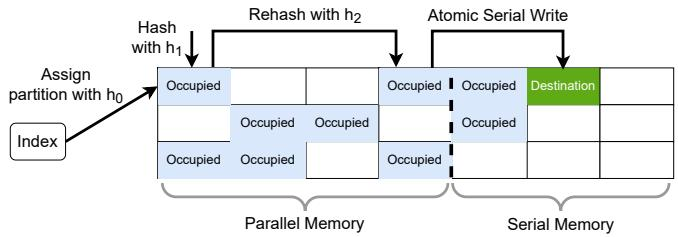  
Figure 9: Demonstration of the hierarchical hashing algorithm. We perform parallel hashing on the indices. For each index, we use hash function $h _ { 0 }$ to assign its partition. We next use hash function $h _ { 1 }$ to assign it to the first location. However, because this location is occupied, we rehash it with function $h _ { 2 }$ to the fourth location. As it is also occupied, we serially write the index into the serial memory with an atomic operation.

Unfortunately, we observe that the expense of serial writing becomes significant when the hash collision rate is elevated.

Technique #2: multiple hash functions for each thread in GPU. Multiple hash functions are used to reduce the cost of serial writing. When a hash collision occurs, a GPU thread can rehash the index with a new hash function to another location in the parallel memory. There is a chance that this new location is available and the number of sequential write operations to the serial memory can be reduced. Although hash collision still exists even with multiple hash functions, we observe that the collision rate is less than 1% with four hash functions and the cost of serial writing into the serial memory becomes acceptable.

However, rehashing with multiple hash functions can cause incomplete aggregations. Because different GPUs have different sets of indices for non-zero gradients, their sequences of indices being hashed are also different. Therefore, the location of a particular index can be different between GPUs. For example, two indices $i d x _ { 1 }$ and $i d x _ { 2 }$ , where $i d x _ { 1 } < i d x _ { 2 }$ are hashed to the same location with the first hash function. GPU 1 has $i d x _ { 2 } ;$ GPU 2 has both $i d x _ { 1 }$ and $i d x _ { 2 }$ . In GPU 1, the location of $i d x _ { 2 }$ is determined by the first hash function, but in GPU 2, the location of $i d x _ { 2 }$ is determined by the second hash function because the location hashed by the first one has been occupied by $i d x _ { 1 }$ . Subsequently, partitioning the memory will lead to the same index assigned to different partitions on different GPUs, resulting in incomplete aggregations.

Technique #3: consistent hierarchical hashing across workers. We propose a two-level hierarchical hashing algorithm to guarantee complete aggregations. The first-level hashing determines the partition to which an index belongs and guarantees that an index will belong to the same partition across all GPUs. The second-level hashing determines its locations in this partition. To ensure that the same index from different workers can be sent to the same server, ZEN allocates the same first-level hashing function to all workers but allows them to have independent second-level hashing functions.

Technique #4: lock-free read-after-write mechanism. There is a concern that two values from two threads can be hashed to the same available location simultaneously, and this hash collision cannot be detected by conventional mechanisms, leading to information loss. ZEN uses a read-afterwrite mechanism to check this collision, eliminating this type of information loss. After memory writing, a thread reads the value stored in the location and this operation has no dependency on the values from other threads. If the value equals what it writes, this thread will move on to the next input. However, if the value is not what it writes, it implies that there is a hash collision and its value is overwritten. Then the thread will take a rehash or serial writing.

Hierarchical hashing algorithm. The pseudocode with the four techniques is shown in Algorithm 1. An example of this algorithm is also illustrated in Figure 9. Given a dense tensor G and the indices of its non-zero gradients $I ,$ it allocates a memory x with shape $n \times \left( r _ { 1 } + r _ { 2 } \right)$ , where n is the number of partitions, $r _ { 1 }$ is the memory size for parallel hashing operations, and $r _ { 2 }$ is the serial memory size. It performs a hashing operation for every $i d x \in I$ in parallel (Lines 4-17). A universal hash function $h _ { 0 } : \mathbb { N } _ { + } \to$ [n] is used to locate idx to partition $p = h _ { 0 } ( i d x )$ (Line 5). The algorithm also needs k universal hash functions $H = \{ h _ { 1 } , \cdots , h _ { k } \}$ with $h _ { i } : \mathbb { N } _ { + }  [ r _ { 1 } ]$ After determining the partition $p ,$ the algorithm attempts to find an available destination $x [ p ] [ h _ { 1 } ( i d x ) ]$ with $h _ { 1 }$ . If this location is available, idx is written into it. Otherwise, the algorithm rehashes idx with $h _ { 2 }$ to find a new location. It rehashes an index for at most k rounds and uses $h _ { i }$ as the hash function for round i until it finds an available destination (Lines 6-16). The algorithm writes $i d x$ to the serial memory of partition p after k rehash attempts fail (Lines 8-11). Serial writing is an atomic operation (Lines 9-10) to ensure no information loss. Once all indices are written into the memory, it extracts sparse tensors from the memory (Lines 19-23).

Next, we will analyze the properties of Algorithm 1 and its imbalance ratio.

• No impact on model accuracy per iteration. ZEN is an efficient communication scheme for sparse tensor synchronization and it has no impact on the iteration-wise convergence rates of models. For distributed training with natural tensor sparsity, the aggregated result of sparse tensors with ZEN is identical to that of the corresponding dense tensors with AllReduce. When using sparsification algorithms, some accuracy loss may occur due to the compression itself, depending on the sparsity level. However, ZEN does not introduce additional accuracy loss beyond what is inherent to the sparsification algorithm. Specifically, ZEN’s Push ensures no further information degradation through its four techniques, and both its gradient aggregation and Pull operations are lossless. The aggregated tensor after sparse synchronization with ZEN is identical to that produced by other schemes such as

Algorithm 1: Hierarchical Hashing Algorithm   
Input: G is a dense tensor and $I \subset \mathbb { N } _ { + }$ is the indices of its   
non-zero gradients. n is the number of partitions.   
Each partition has a memory size $r _ { 1 } + r _ { 2 } ,$ where $r _ { 1 }$   
and $r _ { 2 }$ are the memory sizes for parallel and serial   
operations, respectively. $h _ { 0 } : \mathbb { N } _ { + } \to [ n ]$ is a universal   
hash function. $H = \{ h _ { 1 } , \cdots , h _ { k } \}$ is a set of universal   
hash functions where $h _ { i } : \mathbb { N } _ { + }  [ r ]$   
Output: The partitioned sparse tensors.   
1 Function hierarchical\_hash(I, G, h0, H):   
2 Allocate memory $x  \mathbf { 0 } ^ { n \times ( r _ { 1 } + r _ { 2 } ) }$   
3 Allocate atomic counters $c  { \mathbf { r _ { 1 } } } ^ { n }$   
4 foreach $i d x \in I$ in parallel do   
5 p ← h0(idx)   
6 for i ← 1 to k + 1 do   
7 q ← hi(idx)   
8 if i = k + 1 then   
9 q ← atomicAdd(c[p],1)   
10 x[ p][q] ← idx   
11 end   
12 if $\dot { { \boldsymbol x } } [ p ] [ q ] = = 0$ then   
13 x[ p][q] ← idx   
14 break   
15 end   
16 end   
17 end   
18 out put = []   
19 for i ← 0 to n − 1 do   
20 indices = nonzero(x[i])   
21 values = G[indices]   
22 out put.append((indices, values))   
23 end   
24 return out put

AGsparse [35] and OmniReduce [23]. Consequently, ZEN preserves the same model accuracy per iteration while achieving shorter wall-clock iteration time. More detailed accuracy evaluations and discussion are shown in Figure 18.

• Negligible memory and extraction overhead. Thanks to multiple hashing functions and serial memory, Algorithm 1 can achieve no information loss with a small memory size, which is typically less than 150MB (<1% GPU memory capacity) in our implementation for all the evaluated models. The incurred overhead to extract the indices from the memory after hashing (Line 20 in Algorithm 1) becomes negligible.

• No dependency on workloads. Note that we impose no assumptions on the data distributions and only use the property of universal hashing algorithms. Hence, Algorithm 1 can obtain a general theoretical guarantee for different distributions of non-zero gradients in DL training workloads.

• Guaranteed imbalance ratio. Because the hash function $h _ { 0 }$ determines the partition of each index, the imbalance ratio of Algorithm 1 is guaranteed by the following theorem.

Theorem 2 (Load Balance of Algorithm 1). Given a dense tensor G with |G| parameters. Algorithm 1 provides a mapping $f : I  [ n ]$ such that

1. With probability at least $1 - 1 / n ,$ , its imbalance ratio of Push is at most $1 + \Theta \big ( \sqrt { \frac { n \log n } { | G | d _ { G } } } \big )$

2. With probability at least $1 - 1 / n ,$ , the imbalance ratio of Pull is at most $1 + \Theta \big ( \sqrt { \frac { n \log n } { | G | d _ { G } ^ { n } } } \big ) ,$

The proof can be found in Appendix B.2. Because nlogn is orders of magnitude smaller than |G|, Algorithm 1 performs a good approximation to the exact solution of Problem 1 for both Push and Pull. Suppose n = 128, $| G | = 1 0 ^ { 7 }$ , and $d _ { G } ^ { n } = 0 . 5 ,$ $\sqrt { \frac { n \log n } { | G | d _ { G } ^ { n } } } < 0 . 0 2$ . Its practical imbalance ratio is always less than 1.1 for the six models studied.

## 3.3 Cost-Efficient Encoding Scheme

## 3.3.1 Existing Sparse Formats are Inefficient

There are several sparse formats to represent sparse tensors for their synchronization. Unfortunately, none of them can minimize the overhead incurred by the indices for non-zero gradients. We assume that the data type of gradients is FP32.

• COO. It is efficient with low tensor density [39, 74]. However, it doubles traffic volume and becomes inefficient for a high density. As shown in Figure 2b, the tensors become denser after aggregation. For example, the average tensor density of BERT increases from 1.06% to 40.8% after the aggregation of the sparse tensors from 128 GPUs. Theoretically, transmitting sparse tensors in Pull can reduce the traffic volume by 2.5× compared to transmitting dense tensors, but the reduction shrinks to only 1.2× due to the indices for non-zero gradients.

• Tensor block. It is used in OmniReduce [23]. A dense tensor is split into blocks of gradients, and only non-zero blocks are transmitted. However, it is inefficient when the tensor density is high. When splitting a tensor with high density into tensor blocks (e.g., each block has 256 gradients), most of them have at least one non-zero gradient and become non-zero tensor blocks. The synchronization scheme has to communicate a large amount of zero gradients. We evaluated the percentage of gradients communicated with the tensor block format compared to the tensor density. DGC with top 5% gradients is applied to OPT-2.7B. When the block size is 256, more than 30% gradients are communicated, much higher than the tensor density of 5%.

• Bitmap. It only needs one bit to indicate whether a gradient is zero or not. Unfortunately, a conventional bitmap still incurs non-negligible traffic volume to identify non-zero gradients. When the dense tensor G is evenly partitioned, the indices of non-zero gradients in each server are in a subrange of [1, |G|], where |G| is the number of gradients in G. For example, when $| G | = 1 5$ and there are three servers, the index range in Server i is $[ 5 i + 1 , 5 ( i + 1 )$ ]. The extra bitmap size required to represent the indices of non-zero gradients in each server is $| G | / n / 3 2$ when the data type of gradients is FP32. The total bitmap size received by each worker is |G|/32. When the tensor size of G is 856MB, which equals the embedding table size in DeepFM, the total bitmap size is 27 MB. Although Algorithm 1 enables load balance, the non-zero gradients in each server are randomly distributed throughout the range. If we still use a bitmap to represent the indices, the extra bitmap size in each server is $| G | / 3 2$ and the total bitmap size received at each worker becomes n $| G | / 3 2$ which linearly increases with the number of servers. When there are 16 servers, the total bitmap size is 428MB.

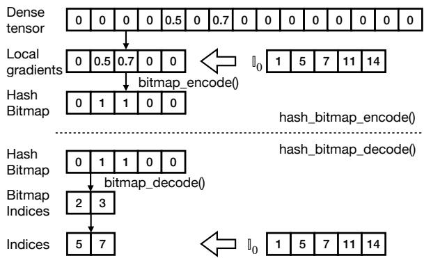  
Figure 10: An illustration of the hash bitmap.

Algorithm 2: The hash bitmap   
Input: G is a dense tensor. $\mathbb { I } _ { i } = \{ i d x \in [ 1 , | G | ] \mid h _ { 0 } ( i d x ) = i \}$   
where $h _ { 0 }$ is defined in Algorithm 1.   
1 Function hash\_bitmap\_encode(G, Ii):   
2 local\_gradients $= G [ \mathbb { I } _ { i } ]$   
3 hash\_bitmap = bitmap\_encode(local\_gradients)   
4 return hash\_bitmap   
5 Function hash\_bitmap\_decode $( \mathbb { I } _ { i } ,$ hash\_bitmap):   
6 bitmap\_indices = bitmap\_decode(hash\_bitmap)   
7 indices = Ii[bitmap\_indices]   
8 return indices

## 3.3.2 Hash Bitmap

We develop a novel hash bitmap for ZEN to minimize the overhead to represent indices for non-zero gradients in Pull. Given a dense tensor G and $h _ { 0 }$ in Algorithm 1, the set of indices $\mathbb { I } _ { i } = \{ i d x \in [ 1 , | G | ] ~ | ~ h _ { 0 } ( i d x ) = i \}$ in each worker that should be pushed to Server i is determined, although it is not in a continuous range. Since Ii and $\mathbb { I } _ { j }$ are disjoint when $i \neq j ,$ it provides an opportunity to construct the bitmap based on $\mathbb { I } _ { i } .$ rather than the entire range.

Figure 10 illustrates how the hash bitmap works for I0 with $| G | = 1 5$ and three servers. The indices for the two nonzero gradients are {5,7}. hash\_bitmap\_encode() is used to encode the indices. Given a dense tensor $G ,$ it first extracts local gradients according to the indices in $\mathbb { I } _ { 0 } .$ . It then encodes the local gradients into a bitmap. Because the second and third gradients are non-zero, the second bit and the third bit in the hash bitmap are 1 and the other bits are 0. hash\_bitmap\_decode() is used to decode the hash bitmap to a set of indices. It first decodes a hash bitmap to the bitmap indices, which are the indices of 1. For example, because the second and third bits in the hash bitmap are 1, the bitmap indices are {2, 3}. It then uses the bitmap indices as the indices to extract the corresponding values in $\mathbb { I } _ { 0 }$ as the global indices for non-zero gradients. In this example, the values are {5, 7}, which are exactly the indices for the two non-zero gradients. The pseudocode is shown in Algorithm 2.

The function hash\_bitmap\_encode() is invoked on each server, which then broadcasts the hash bitmap to all workers. After each worker receives the hash bitmaps from all the servers, it invokes hash\_bitmap\_decode() to decode the hash bitmaps to the indices with the corresponding Ii. Note that Ii is computed and sorted offline and it remains unchanged for the same h0 on both servers and workers.

The hash bitmap guarantees that the total hash bitmap size received at each worker is constantly $| G | / 3 2$ in ZEN’s Pull. Suppose that there are n servers. The set of indices that should be pushed to Server i is $\mathbb { I } _ { i } = \{ i d x \in [ 1 , | G | ] ~ | ~ h _ { 0 } ( i d x ) = i \}$ With hash\_bitmap\_encode(), the size of the hash bitmap encoded in Server i is $\left| \mathbb { I } _ { i } \right| / 3 2$ . Because each worker needs to receive the hash bitmap from all servers, the total size is $\textstyle \sum _ { i = 0 } ^ { n - 1 } | \mathbb { I } _ { i } | / 3 2 = | G | / 3 2$ . Zen still uses COO to represent sparse tensors in Push due to the low tensor density.

## 4 Implementation

We implement ${ \cal Z } \mathrm { E N } ^ { \mathrm { ~ 1 ~ } }$ with about 900 lines of Python code, 250 lines of CUDA code, and 500 lines of code for hacking ColossalAI [36]. For DL model training, we use ColossalAI to implement data parallelism and hybrid parallelism (data parallelism + tensor parallelism, with tensor parallelism degree set to 8, typically within a single node). We also extend ColossalAI to support the Gemma2 [65] model from Google with custom policies for efficient tensor parallelism.

For natural tensor sparsity, we only apply sparse tensor synchronization schemes to gradients from the embedding layers for their communications across machines. For the sparsification algorithm, we use DGC [39] and adapt it to tensor parallelism: sampling data locally on each device, gathering these samples across all devices, computing a global top-k threshold based on aggregated data, and applying this threshold locally to determine top-k values on each device. We register a custom\_comm\_hook in PyTorch’s DDP [35] to enable DGC and our synchronization scheme. Gradient computations overlap with gradient synchronization during backward propagation. Gradient tensors are fused into communication buckets in DDP before applying DGC to tensors [73]. We determined a 128MB bucket size that works best for the evaluated models.

We implement the hierarchical hash algorithm in CUDA C and use it as an extension for PyTorch. The used hash function is MurmurHash [9]. We set different seeds for MurmurHash to generate different hash functions. At the beginning of training, ZEN generates a set of random seeds and broadcasts them to all GPUs to ensure hash consistency among workers. ZEN communicates dense tensors within machines with ReduceScatter/AllGather [25, 66] because NVLink is typically equipped in GPU machines. In our evaluations, Balanced Parallelism is the optimal scheme for the studied models.

## 5 Evaluation

## 5.1 Experimental Setup

Testbeds. We use 16 p3.16xlarge instances from AWS EC2 for our evaluations. Each machine has 8 NVIDIA V100 GPUs (16GB GPU memory) and NVLink is equipped to support intra-instance GPU-to-GPU communications. These instances are connected by a 25 Gbps network. We also evaluate endto-end training throughput with 16 p3dn.24xlarge from AWS EC2. Each machine has 8 V100 GPUs (32GB GPU memory) and NVLink. These instances are connected by a 100 Gbps RDMA network with AWS’s Elastic Fabric Adapter (EFA). Each machine runs Ubuntu 20.04 and the software environment includes CUDA-11.0, PyTorch-2.2, NCCL-2.7.8, CuPy-11.0, and ColossalAI-v0.4.6. Each p3dn.24xlarge instance also includes aws-ofi-nccl-v1.9.2 and libfabric-v1.11.1 to support EFA.

Workloads. For natural tensor sparsity evaluation, we use three models, LSTM [44], DeepFM [26], and NMT [40], as listed in Table 1. The datasets are One Billion Word [1], Criteo [2], and IWSLT 2014 De-En [3], respectively. The batch sizes are 128, 1024, and 64, respectively. These models can fit in the memory of each GPU. The per-GPU batch size is kept constant as the number of GPUs increases. For the tensor sparsity from sparsification algorithms, we use three LLMs, Llama3.2-3B, OPT-2.7B, and Gemma2-2B, as listed in Table 2. We use RedPajama [75] as the training corpus. Because these models cannot fit into a single GPU, we use tensor parallelism (TP) with degree 8. The batch size within an TP group is 1 and the sequence length is 1024 tokens.

Baselines. We compare ZEN with AGsparse [35], SparCML (SSAR\_Recursive\_double) [56], and OmniReduce [23]. We use AllReduce [59] for the synchronization of dense tensors. We apply DGC [39] to the three LLMs and select the top 5% gradients from their gradient tensors.

## 5.2 DL Training Evaluation

In this section, we present the training efficiency of ZEN on the six models and compare it with the baselines. We set $k = 3 .$

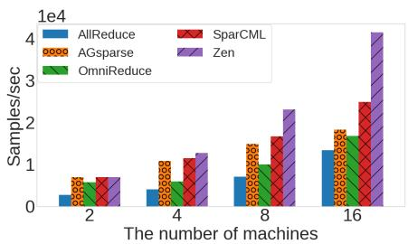  
(a) LSTM

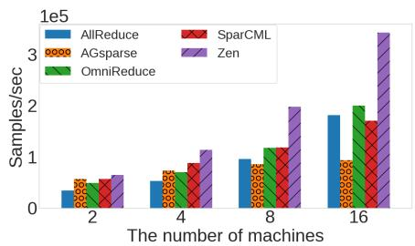  
(b) DeepFM

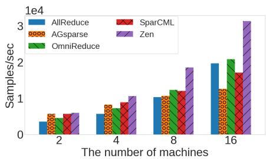  
(c) NMT

Figure 11: Training throughput of models with natural tensor sparsity in a 25 Gbps network.  
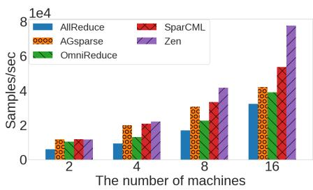  
(a) LSTM

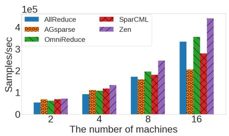  
(b) DeepFM

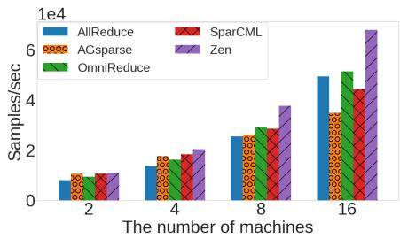  
(c) NMT  
Figure 12: Training throughput of models with natural tensor sparsity in a 100 Gbps RDMA network.

$r _ { 1 } = 2 | G | d _ { G }$ G, and $r _ { 2 } = r _ { 1 } / 1 0$ for Algorithm 1.

Training throughput for models with natural sparsity. Figure 11 shows the training throughput of models with natural tensor sparsity in a 25G network. ZEN outperforms all baselines by processing more samples in a second. When training LSTM with 16 machines, ZEN achieves up to a 1.67× speedup over SparCML (the best baseline), a 2.48× speedup over OmniReduce and a 3.1× speedup over AllReduce. In both DeepFM and NMT, the best baseline is OmniReduce. ZEN achieves 1.44× speedup and 1.51× speedup over OmniReduce for DeepFM and NMT, respectively. As the number of machines increases, the benefits of ZEN over SparCML and OmniReduce are enlarged, indicating ZEN’s great scalability. When increasing the network bandwidth from 25 Gbps to 100 Gbps, ZEN still has noticeable end-to-end speedups, as shown in Figure 12. Specifically, in LSTM, ZEN achieves up to 1.44× speedup over SparCML, which is the best baseline. In DeepFM and NMT, ZEN achieves up to 1.33× and 1.38× speedups over AllReduce and up to 1.25× and 1.32× speedups over the best baseline OmniReduce.

Training throughput for models with gradient compression. ZEN has great speedups over the baselines for gradient compression scenarios, as shown in Figure 13. For Llama3.2- 3B, it achieves up to a 1.68× speedup over OmniReduce, a 2.19× speedup over SparCML, and a 2.02× speedup over AllReduce. In OPT-2.7B and Gemma2-2B, ZEN achieves up to 2.10× and 2.04× speedups over AllReduce, and 1.66× and 1.61× speedups over OmniReduce. We also evaluate the training throughput improvement in a 100 Gbps RDMA network, as shown in Figure 14. ZEN outperforms AllReduce by 64%,

45%, and 44% in Llama3.2-3B, OPT-2.7B, and Gemma2-2B, respectively. OmniReduce is the best baseline for the three models, while ZEN still achieves up to 1.32× in Llama3.2-3B, 1.31× in OPT-2.7B, and 1.27× in Gemma2-2B over OmniReduce. These results demonstrate ZEN fully leverages sparsity in DNN models to optimize training efficiency.

Communication improvement. The performance of ZEN is driven by the reduction in communication time. Figure 15 shows the speedups of different synchronization schemes over AllReduce with 16 machines in a 25 Gbps network. The speedup of OmniReduce is up to 1.58×. We observe that the performance of AGsparse, Sparse PS, and SparCML can be even worse than AllReduce in some cases. They use COO as the sparse format. With high density, the sparse tensor size with COO is larger than the dense tensor size. The communication time of AGsparse increases linearly with the number of machines. With SparCML, the overlaps among the sparse tensors can be received multiple times on each GPU. In contrast, ZEN achieves 6.77× speedup for LSTM and 3.51× speedup for Gemma2-2B. Its speedups over SparCML and OmniReduce are up to 2.82× and 5.16×, respectively. ZEN also achieves 2.10× speedup for DeepFM and 3.44× speedup for OPT-2.7B over Allreduce.

## 5.3 Understanding ZEN

A study on parameters for Algorithm 1. We simulate a tensor with 214M parameters (same as the embedding gradients in DeepFM) and vary its density to perform a study on both $r _ { 1 }$ and k in Algorithm 1. We first study the parameter $r _ { 1 }$ . We set $r _ { 2 } = r _ { 1 } / 1 0$ and k = 3. As shown in Figure 16a, when we increase $r _ { 1 }$ from $| G | d _ { G }$ to $2 | G | d _ { G }$ , there is a notable reduction in operation cost because the larger memory size increases the probability of successful parallel writing and reduces the workload of serial writing. But when we further increase r1 from $2 | G | d _ { G }$ to $\updownarrow | G | d _ { G } ,$ , it leads to a longer computation time. There are two reasons behind this effect. Firstly, the workload of serial writing is already low with 2|G|dG memory. Further increasing r1 only marginally reduces the computation overhead. Secondly, a larger memory size can increase the computation overhead to extract the indices (see Algorithm 1) and thus degrade the overall performance. Figure 16b shows the computation costs versus k when we use 2|G|dG memory. Increasing k from 1 to 3 can reduce the operation cost as it alleviates serial writing workload, but k = 3 and k = 4 have very similar operation costs.

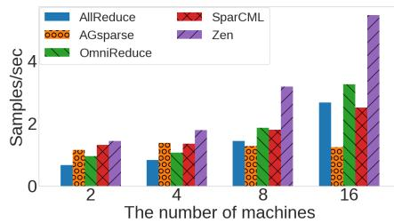  
(a) Llama3.2-3B

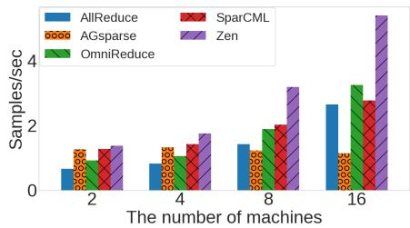  
(b) OPT-2.7B

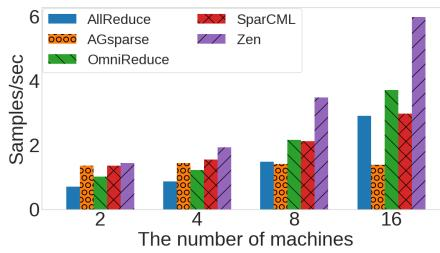  
(c) Gemma2-2B

Figure 13: Training throughput of models with tensor sparsity from sparsification algorithms in a 25 Gbps network.  
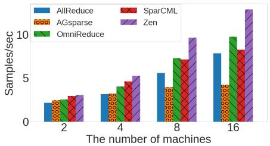  
(a) Llama3.2-3B

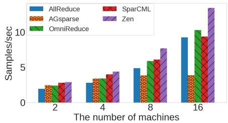  
(b) OPT-2.7B

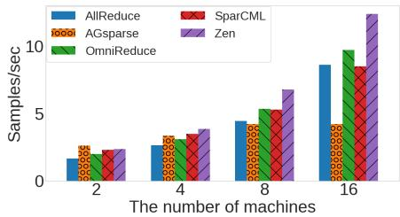  
(c) Gemma2-2B

Figure 14: Training throughput of models with tensor sparsity from sparsification algorithms in a 100 Gbps RDMA network.  
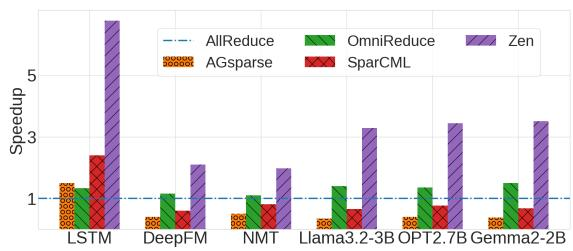

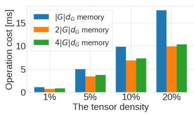  
(a)  
Figure 15: Communication speedups over AllReduce in a 25 Gbps network.

(b)  
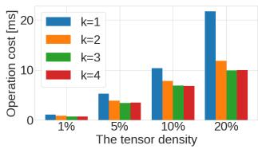

Figure 16: The computation overhead of Algorithm 1. (a) Different memory sizes and (b) Different numbers of rehash.

Negligible compute overhead. ZEN’s performance gains mainly come from communication savings by only synchronizing non-zero values in gradient tensors and load-balancing the traffic volume across GPUs at the cost of additional hashing computation, which is much smaller than the communication savings. We use the tensor with 214M parameters in DeepFM for example. The hashing computation overhead is around 6 ms in our testbed as the practical tensor density is 5.2% after intra-machine aggregation. When the network bandwidth is 25 Gbps, the communication saving over AllReduce is around 270 ms, which suggests that ZEN’s compute overhead is negligible. Even with a 100 Gbps RDMA network, the hashing compute time only accounts for 9% of communication savings.

Hash Bitmap. We show the effectiveness of hash bitmap in representing the indices of non-zero gradients. Figure 17a shows the tensor size with different sparse formats. The sizes are normalized to the dense tensor and there are 16 servers. The tensor density is the total density of all servers after aggregation. The gap between the hash bitmap and the COO increases with the tensor density. It also significantly outperforms the bitmap. In addition, the hash bitmap can still reduce traffic volume with a density of 95% compared to the dense tensor, but the bitmap and the COO cannot save the volume when the density is greater than 50%. The performance of tensor blocks varies with the distribution of non-zero gradients. Some sparse tensors in the studied DL models can even transmit higher traffic volume than COO because a non-zero block has more zero gradients than non-zero gradients.

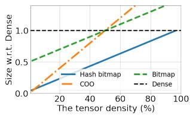  
(a)

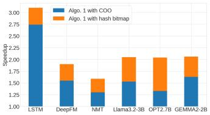  
(b)

Figure 17: (a) The effectiveness of the hash bitmap; (b) The performance breakdown of ZEN with 16 machines in a 25 Gbps network.  
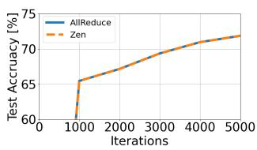  
(a) DeepFM

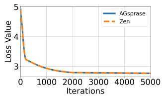  
(b) OPT-2.7B  
Figure 18: ZEN has no impact on model accuracy per iteration.

Performance breakdown. We break down the performance of ZEN by Algorithm 1 and the hash bitmap. Figure 17b illustrates the training throughput speedup breakdown over AllReduce with 16 machines. It can be seen that the primary performance benefits of ZEN come from Algorithm 1, with the hash bitmap format providing noticeable additional benefits. For example, when the data format is COO after applying Algorithm 1, the speedup is 2.74× and 1.53× for LSTM and Llama3.2-3B, respectively. Replacing COO with the hash bitmap can further improve the speedups by 13% and 34%.

Model accuracy validation. We first validate that ZEN has no impact on model accuracy per iteration compared to training with AllReduce for natural sparse tensors. Figure 18a shows the model accuracy of DeepFM with 16 machines in a 25 Gbps network. The test accuracy per iteration with ZEN matches exactly that with AllReduce. This is because ZEN balances the synchronization traffic across workers to reduce the iteration time without information loss for gradient synchronization. We then evaluate ZEN’s impact on model quality for training with sparsification algorithms. Figure 18b shows the training loss values of OPT-2.7B with DGC selecting top 5% gradients. AGsparse [35] is used as the baseline for sparse tensor synchronization, and we can see that ZEN and AGsparse have identical iteration-wise loss curves, demonstrating that ZEN retains the model convergence rates and model accuracy per iteration as other communication schemes.

## 6 Related Work

Related work on schemes to support sparse tensor synchronization has already been discussed in Section 2.4.

Acceleration of dense tensor synchronization. ATP [33] and SwitchML [57] exploit programmable switches for the synchronization of dense tensors. BytePS [29] uses the spare CPU and bandwidth resources in GPU clouds to optimize communications. These approaches disregard the values of the gradients and communicate all gradients. In contrast, Zen leverages sparsity in DNN models and only transmits nonzero gradients to reduce the synchronization time.

Acceleration of sparse tensor synchronization. Parallax [31] utilizes parameter servers for sparse tensor synchronization and it cannot achieve balanced communications in synchronization. ZEN can achieve balanced communications using a novel hierarchical hashing algorithm. Flare [21] and Libra [52] use programmable switches to accelerate sparse tensor communications, but they rely on specific hardware. Ok-Topk [38] proposes a novel sparse allreduce algorithm; however, its inherently data-dependent balancing strategy results in significant overhead. ZEN analyzes the characteristics of sparse tensors and explores the design space for communication schemes to determine the optimal one, but prior approaches did not consider these factors.

Hash algorithms for load balance. Previous works attempt to achieve load balance using hashing [11,13,14,19,76]. They typically assign two partitions to a given index using two hash functions and then select the partition with more available memory [20, 45, 46]. However, these methods require serial writing of indices to memory and cannot leverage multiple threads in GPUs. In contrast, ZEN enables parallelizable computing on GPUs. While DRAGONN [74] introduces a hashbased algorithm for parallel writing of non-zero gradients to memory, it does not address the imbalanced communications in distributed training and cannot handle hash collisions, resulting in information loss. In contrast, ZEN achieves balanced communications and avoids information loss.

## 7 Conclusion

We make two primary contributions in this work. First, we systematically explore the design space to identify optimal synchronization schemes for sparse tensors in distributed training. Second, we propose ZEN, a practical design to pursue optimal synchronization schemes with a novel hashing algorithm using parallel computing on GPUs without information loss. ZEN greatly improves the efficiency of sparse DNN model training without any impact on model accuracy.

## Acknowledgment

We thank the anonymous reviewers for providing valuable and insightful feedback. This work is partially supported by the NSF under CNS-2214272.

## References

[1] Billion Word Benchmark. https: //code.google.com/archive/p/ 1-billion-word-language-modeling-benchmark/.

[2] Criteo dataset. https://ailab.criteo.com/ download-criteo-1tb-click-logs-dataset/.

[3] IWSLT 2014 De-En dataset. https://sites.google. com/site/iwsltevaluation2014/data-provided.

[4] NVIDIA NCCL. https://developer.nvidia.com/ NCCL, 2021.

[5] Microsoft MSCCL. https://github.com/ microsoft/msccl, 2023.

[6] Josh Achiam, Steven Adler, Sandhini Agarwal, Lama Ahmad, Ilge Akkaya, Florencia Leoni Aleman, Diogo Almeida, Janko Altenschmidt, Sam Altman, Shyamal Anadkat, et al. GPT-4 technical report. arXiv preprint arXiv:2303.08774, 2023.

[7] Alham Fikri Aji and Kenneth Heafield. Sparse communication for distributed gradient descent. 2017.

[8] Mohammadreza Alimohammadi, Ilia Markov, Elias Frantar, and Dan Alistarh. L-GreCo: Layerwiseadaptive gradient compression for efficient and accurate deep learning. arXiv preprint arXiv:2210.17357, 2022.

[9] Austin Appleby. Murmurhash 2.0, 2008.

[10] Ammar Ahmad Awan, Ching-Hsiang Chu, Hari Subramoni, and Dhabaleswar K Panda. Optimized broadcast for deep learning workloads on dense-GPU InfiniBand clusters: MPI or NCCL? In Proceedings of the 25th European MPI Users’ Group Meeting, pages 1–9, 2018.

[11] Yossi Azar, Andrei Z Broder, Anna R Karlin, and Eli Upfal. Balanced allocations. In Proceedings of the twenty-sixth annual ACM symposium on theory of computing, pages 593–602, 1994.

[12] Youhui Bai, Cheng Li, Quan Zhou, Jun Yi, Ping Gong, Feng Yan, Ruichuan Chen, and Yinlong Xu. Gradient compression supercharged high-performance data parallel DNN training. In Proceedings of the ACM SIGOPS 28th Symposium on Operating Systems Principles, pages 359–375, 2021.

[13] Petra Berenbrink, Artur Czumaj, Angelika Steger, and Berthold Vöcking. Balanced allocations: The heavily loaded case. SIAM Journal on Computing, 35(6):1350– 1385, 2006.

[14] Zhiruo Cao, Zheng Wang, and Ellen Zegura. Performance of hashing-based schemes for internet load balancing. In Proceedings of IEEE INFOCOM 2000., volume 1, pages 332–341. IEEE, 2000.

[15] J Lawrence Carter and Mark N Wegman. Universal classes of hash functions. In Proceedings of the ninth annual ACM symposium on Theory of computing, pages 106–112, 1977.

[16] Beidi Chen, Zichang Liu, Binghui Peng, Zhaozhuo Xu, Jonathan Lingjie Li, Tri Dao, Zhao Song, Anshumali Shrivastava, and Christopher Re. MONGOOSE: A learnable LSH framework for efficient neural network training. In International Conference on Learning Representations (ICLR), 2021.

[17] Aakanksha Chowdhery, Sharan Narang, Jacob Devlin, Maarten Bosma, Gaurav Mishra, Adam Roberts, Paul Barham, Hyung Won Chung, Charles Sutton, Sebastian Gehrmann, et al. PaLM: Scaling language modeling with pathways. arXiv preprint arXiv:2204.02311, 2022.

[18] Lyndon Clarke, Ian Glendinning, and Rolf Hempel. The MPI message passing interface standard. In Programming environments for massively parallel distributed systems, pages 213–218. Springer, 1994.

[19] Artur Czumaj, Chris Riley, and Christian Scheideler. Perfectly balanced allocation. In Approximation, Randomization, and Combinatorial Optimization.. Algorithms and Techniques, pages 240–251. Springer, 2003.

[20] Søren Dahlgaard, Mathias Bæk Tejs Knudsen, Eva Rotenberg, and Mikkel Thorup. The power of two choices with simple tabulation. In Proceedings of the twenty-seventh annual ACM-SIAM symposium on Discrete algorithms, pages 1631–1642. SIAM, 2016.

[21] Daniele De Sensi, Salvatore Di Girolamo, Saleh Ashkboos, Shigang Li, and Torsten Hoefler. Flare: Flexible in-network allreduce. In Proceedings of the International Conference for High Performance Computing, Networking, Storage and Analysis, pages 1–16, 2021.

[22] Abhimanyu Dubey, Abhinav Jauhri, Abhinav Pandey, Abhishek Kadian, Ahmad Al-Dahle, Aiesha Letman, Akhil Mathur, Alan Schelten, Amy Yang, Angela Fan, et al. The Llama 3 herd of models. arXiv preprint arXiv:2407.21783, 2024.

[23] Jiawei Fei, Chen-Yu Ho, Atal N Sahu, Marco Canini, and Amedeo Sapio. Efficient sparse collective communication and its application to accelerate distributed deep learning. In Proceedings of the 2021 ACM SIGCOMM 2021 Conference, pages 676–691, 2021.

[24] Jonathan Frankle and Michael Carbin. The lottery ticket hypothesis: Finding sparse, trainable neural networks. In International Conference on Learning Representations, 2018.

[25] William Gropp. MPICH2: A new start for MPI implementations. In European Parallel Virtual Machine/Message Passing Interface Users’ Group Meeting, pages 7–7. Springer, 2002.

[26] Huifeng Guo, Ruiming Tang, Yunming Ye, Zhenguo Li, and Xiuqiang He. DeepFM: a factorization-machine based neural network for CTR prediction. In Proceedings of the 26th International Joint Conference on Artificial Intelligence, pages 1725–1731, 2017.

[27] Wenchen Han, Shay Vargaftik, Michael Mitzenmacher, Brad Karp, and Ran Ben Basat. Beyond throughput and compression ratios: Towards high end-to-end utility of gradient compression. arXiv preprint arXiv:2407.01378, 2024.

[28] Yanping Huang, Youlong Cheng, Ankur Bapna, Orhan Firat, Dehao Chen, Mia Chen, HyoukJoong Lee, Jiquan Ngiam, Quoc V Le, Yonghui Wu, et al. GPipe: Efficient training of giant neural networks using pipeline parallelism. Advances in neural information processing systems, 32:103–112, 2019.

[29] Yimin Jiang, Yibo Zhu, Chang Lan, Bairen Yi, Yong Cui, and Chuanxiong Guo. A unified architecture for accelerating distributed DNN training in heterogeneous GPU/CPU clusters. In 14th USENIX Symposium on Operating Systems Design and Implementation (OSDI), pages 463–479, 2020.

[30] Rafal Jozefowicz, Oriol Vinyals, Mike Schuster, Noam Shazeer, and Yonghui Wu. Exploring the limits of language modeling. arXiv preprint arXiv:1602.02410, 2016.

[31] Soojeong Kim, Gyeong-In Yu, Hojin Park, Sungwoo Cho, Eunji Jeong, Hyeonmin Ha, Sanha Lee, Joo Seong Jeong, and Byung-Gon Chun. Parallax: Sparsity-aware data parallel training of deep neural networks. In Proceedings of the Fourteenth EuroSys Conference 2019, pages 1–15, 2019.

[32] Ryan Kiros, Yukun Zhu, Russ R Salakhutdinov, Richard Zemel, Raquel Urtasun, Antonio Torralba, and Sanja Fidler. Skip-thought vectors. In Advances in neural information processing systems, pages 3294–3302, 2015.

[33] ChonLam Lao, Yanfang Le, Kshiteej Mahajan, Yixi Chen, Wenfei Wu, Aditya Akella, and Michael Swift. ATP: In-network aggregation for multi-tenant learning. In 18th USENIX Symposium on Networked Systems Design and Implementation (NSDI), pages 741–761, 2021.

[34] Mu Li, David G Andersen, Jun Woo Park, Alexander J Smola, Amr Ahmed, Vanja Josifovski, James Long, Eugene J Shekita, and Bor-Yiing Su. Scaling distributed machine learning with the parameter server. In USENIX Symposium on Operating Systems Design and Implementation (OSDI), 2014.

[35] Shen Li, Yanli Zhao, Rohan Varma, Omkar Salpekar, Pieter Noordhuis, Teng Li, Adam Paszke, Jeff Smith, Brian Vaughan, Pritam Damania, et al. PyTorch Distributed: Experiences on accelerating data parallel training. Proceedings of the VLDB Endowment, 13(12).

[36] Shenggui Li, Hongxin Liu, Zhengda Bian, Jiarui Fang, Haichen Huang, Yuliang Liu, Boxiang Wang, and Yang You. Colossal-AI: A unified deep learning system for large-scale parallel training. In Proceedings of the 52nd International Conference on Parallel Processing, pages 766–775, 2023.

[37] Shengwei Li, Zhiquan Lai, Dongsheng Li, Yiming Zhang, Xiangyu Ye, and Yabo Duan. EmbRace: Accelerating sparse communication for distributed training of deep neural networks. In Proceedings of the 51st International Conference on Parallel Processing, pages 1–11, 2022.

[38] Shigang Li and Torsten Hoefler. Near-optimal sparse allreduce for distributed deep learning. In Proceedings of the 27th ACM SIGPLAN Symposium on Principles and Practice of Parallel Programming, pages 135–149, 2022.

[39] Yujun Lin, Song Han, Huizi Mao, Yu Wang, and William J Dally. Deep gradient compression: Reducing the communication bandwidth for distributed training. The International Conference on Learning Representations (ICLR), 2017.

[40] Minh-Thang Luong, Hieu Pham, and Christopher D Manning. Effective approaches to attention-based neural machine translation. In Proceedings of the 2015 Conference on Empirical Methods in Natural Language Processing, pages 1412–1421, 2015.

[41] Kshiteej Mahajan, Arjun Balasubramanian, Arjun Singhvi, Shivaram Venkataraman, Aditya Akella, Amar Phanishayee, and Shuchi Chawla. Themis: Fair and efficient GPU cluster scheduling. In 17th USENIX Symposium on Networked Systems Design and Implementation (NSDI 20), pages 289–304, 2020.

[42] Tharun Medini, Beidi Chen, and Anshumali Shrivastava. Solar: Sparse orthogonal learned and random embeddings. In International Conference on Learning Representations, 2020.

[43] Mellanox. Mellanox Corporate Update. https://www.mellanox.com/related-docs/ company/MLNX\_Corporate\_Deck.pdf, 2022.

[44] Stephen Merity, Nitish Shirish Keskar, and Richard Socher. Regularizing and optimizing LSTM language models. arXiv preprint arXiv:1708.02182, 2017.

[45] Michael Mitzenmacher. The power of two choices in randomized load balancing. IEEE Transactions on Parallel and Distributed Systems, 12(10):1094–1104, 2001.

[46] Michael Mitzenmacher and Eli Upfal. Probability and computing: Randomization and probabilistic techniques in algorithms and data analysis. Cambridge university press, 2017.

[47] Deepak Narayanan, Aaron Harlap, Amar Phanishayee, Vivek Seshadri, Nikhil R Devanur, Gregory R Ganger, Phillip B Gibbons, and Matei Zaharia. PipeDream: generalized pipeline parallelism for DNN training. In Proceedings of the 27th ACM Symposium on Operating Systems Principles (SOSP), pages 1–15, 2019.

[48] Deepak Narayanan, Keshav Santhanam, Fiodar Kazhamiaka, Amar Phanishayee, and Matei Zaharia. Heterogeneity-aware cluster scheduling policies for deep learning workloads. In 14th USENIX Symposium on Operating Systems Design and Implementation (OSDI 20), pages 481–498, 2020.

[49] Deepak Narayanan, Mohammad Shoeybi, Jared Casper, Patrick LeGresley, Mostofa Patwary, Vijay Korthikanti, Dmitri Vainbrand, Prethvi Kashinkunti, Julie Bernauer, Bryan Catanzaro, et al. Efficient large-scale language model training on GPU clusters using Megatron-LM. In Proceedings of the International Conference for High Performance Computing, Networking, Storage and Analysis, pages 1–15, 2021.

[50] NVIDIA. A Timeline of Innovation for NVIDIA. ttps://www.nvidia.com/en-us/about-nvidia/ corporate-timeline/, 2021.

[51] OpenAI. AI and Compute. https://openai.com/ blog/ai-andcompute/, 2021.

[52] Heng Pan, Penglai Cui, Zhenyu Li, Ru Jia, Penghao Zhang, Leilei Zhang, Ye Yang, Jiahao Wu, Jianbo Dong, Zheng Cao, Qiang Li, Hongqiang Harry Liu, Mathy Laurent, and Gaogang Xie. Enabling fast and flexible distributed deep learning with programmable switches. arXiv preprint arXiv:2205.05243, 2022.

[53] Pitch Patarasuk and Xin Yuan. Bandwidth optimal allreduce algorithms for clusters of workstations. Journal of Parallel and Distributed Computing, 69(2):117–124, 2009.

[54] Yanghua Peng, Yixin Bao, Yangrui Chen, Chuan Wu, and Chuanxiong Guo. Optimus: an efficient dynamic resource scheduler for deep learning clusters. In Proceedings of the Thirteenth EuroSys Conference, pages 1–14, 2018.

[55] Samyam Rajbhandari, Jeff Rasley, Olatunji Ruwase, and Yuxiong He. ZeRO: Memory optimizations toward training trillion parameter models. In International Conference for High Performance Computing, Networking, Storage and Analysis, pages 1–16. IEEE, 2020.

[56] Cèdric Renggli, Saleh Ashkboos, Mehdi Aghagolzadeh, Dan Alistarh, and Torsten Hoefler. SparCML: Highperformance sparse communication for machine learning. In Proceedings of the International Conference for High Performance Computing, Networking, Storage and Analysis, pages 1–15, 2019.

[57] Amedeo Sapio, Marco Canini, Chen-Yu Ho, Jacob Nelson, Panos Kalnis, Changhoon Kim, Arvind Krishnamurthy, Masoud Moshref, Dan Ports, and Peter Richtarik. Scaling distributed machine learning with in-network aggregation. In 18th USENIX Symposium on Networked Systems Design and Implementation (NSDI 21), pages 785–808, 2021.

[58] Teven Le Scao, Angela Fan, Christopher Akiki, Ellie Pavlick, Suzana Ilic, Daniel Hesslow, Roman Castagné, ´ Alexandra Sasha Luccioni, François Yvon, Matthias Gallé, et al. BLOOM: A 176B-parameter openaccess multilingual language model. arXiv preprint arXiv:2211.05100, 2022.

[59] Alexander Sergeev and Mike Del Balso. Horovod: fast and easy distributed deep learning in tensorflow. arXiv preprint arXiv:1802.05799, 2018.

[60] Shaohuai Shi, Xiaowen Chu, Ka Chun Cheung, and Simon See. Understanding top-k sparsification in distributed deep learning. arXiv preprint arXiv:1911.08772, 2019.

[61] Shaohuai Shi, Qiang Wang, Kaiyong Zhao, Zhenheng Tang, Yuxin Wang, Xiang Huang, and Xiaowen Chu. A distributed synchronous sgd algorithm with global top-k sparsification for low bandwidth networks. In IEEE 39th International Conference on Distributed Computing Systems (ICDCS), pages 2238–2247. IEEE, 2019.

[62] Mohammad Shoeybi, Mostofa Patwary, Raul Puri, Patrick LeGresley, Jared Casper, and Bryan Catanzaro. Megatron-LM: Training multi-billion parameter language models using model parallelism. arXiv preprint arXiv:1909.08053, 2019.

[63] Sebastian U Stich, Jean-Baptiste Cordonnier, and Martin Jaggi. Sparsified SGD with memory. In Advances in Neural Information Processing Systems, 2018.

[64] Gemini Team, Rohan Anil, Sebastian Borgeaud, Jean-Baptiste Alayrac, Jiahui Yu, Radu Soricut, Johan Schalkwyk, Andrew M Dai, Anja Hauth, Katie Millican, et al. Gemini: a family of highly capable multimodal models. arXiv preprint arXiv:2312.11805, 2023.

[65] Gemma Team, Morgane Riviere, Shreya Pathak, Pier Giuseppe Sessa, Cassidy Hardin, Surya Bhupatiraju, Léonard Hussenot, Thomas Mesnard, Bobak Shahriari, Alexandre Ramé, et al. Gemma 2: Improving open language models at a practical size. arXiv preprint arXiv:2408.00118, 2024.

[66] Rajeev Thakur, Rolf Rabenseifner, and William Gropp. Optimization of collective communication operations in MPICH. The International Journal of High Performance Computing Applications, 19(1), 2005.

[67] Ashish Vaswani, Noam Shazeer, Niki Parmar, Jakob Uszkoreit, Llion Jones, Aidan N Gomez, Łukasz Kaiser, and Illia Polosukhin. Attention is all you need. In Advances in neural information processing systems, pages 5998–6008, 2017.

[68] MK Vijaymeena and K Kavitha. A survey on similarity measures in text mining. Machine Learning and Applications: An International Journal, 3(2):19–28, 2016.

[69] Yuke Wang, Boyuan Feng, Zheng Wang, Guyue Huang, and Yufei Ding. TC-GNN: Bridging sparse GNN computation and dense tensor cores on GPUs. In 2023 USENIX Annual Technical Conference (USENIX ATC 23), pages 149–164, 2023.

[70] Zheng Wang, Yuke Wang, Boyuan Feng, Guyue Huang, Dheevatsa Mudigere, Bharath Muthiah, Ang Li, and Yufei Ding. OPER: Optimality-guided embedding table parallelization for large-scale recommendation model. In 2024 USENIX Annual Technical Conference (USENIX ATC 24), pages 667–682, 2024.

[71] Zhuang Wang, Zhen Jia, Shuai Zheng, Zhen Zhang, Xinwei Fu, T. S. Eugene Ng, and Yida Wang. GEMINI: Fast failure recovery in distributed training with in-memory checkpoints. In Proceedings of the 29th Symposium on Operating Systems Principles (SOSP), 2023.

[72] Zhuang Wang, Haibin Lin, Yibo Zhu, and T. S. Eugene Ng. Hi-speed DNN training with Espresso: Unleashing the full potential of gradient compression with near-optimal usage strategies. In Proceedings of the Eighteenth European Conference on Computer Systems, pages 867–882, 2023.

[73] Zhuang Wang, Xinyu Wu, Zhaozhuo Xu, and T. S. Eugene Ng. Cupcake: A compression scheduler for scalable communication-efficient distributed training. Proceedings of Machine Learning and Systems, 5, 2023.

[74] Zhuang Wang, Zhaozhuo Xu, Xinyu Wu, Anshumali Shrivastava, and T. S. Eugene Ng. DRAGONN: Distributed randomized approximate gradients of neural networks. In International Conference on Machine Learning, pages 23274–23291. PMLR, 2022.

[75] Maurice Weber, Daniel Fu, Quentin Anthony, Yonatan Oren, Shane Adams, Anton Alexandrov, Xiaozhong Lyu, Huu Nguyen, Xiaozhe Yao, Virginia Adams, et al. Red-Pajama: an open dataset for training large language models. arXiv preprint arXiv:2411.12372, 2024.

[76] Udi Wieder et al. Hashing, load balancing and multiple choice. Foundations and Trends® in Theoretical Computer Science, 12(3–4):275–379, 2017.

[77] Hang Xu, Chen-Yu Ho, Ahmed M Abdelmoniem, Aritra Dutta, El Houcine Bergou, Konstantinos Karatsenidis, Marco Canini, and Panos Kalnis. GRACE: A compressed communication framework for distributed machine learning. In Proc. of 41st IEEE Int. Conf. Distributed Computing Systems (ICDCS), 2021.

[78] Haoran You, Chaojian Li, Pengfei Xu, Yonggan Fu, Yue Wang, Xiaohan Chen, Richard G Baraniuk, Zhangyang Wang, and Yingyan Lin. Drawing early-bird tickets: Toward more efficient training of deep networks. In International Conference on Learning Representations, 2019, 2020.

[79] Susan Zhang, Stephen Roller, Naman Goyal, Mikel Artetxe, Moya Chen, Shuohui Chen, Christopher Dewan, Mona Diab, Xian Li, Xi Victoria Lin, et al. OPT: Open pre-trained transformer language models. arXiv preprint arXiv:2205.01068, 2022.

[80] Zhen Zhang, Shuai Zheng, Yida Wang, Justin Chiu, George Karypis, Trishul Chilimbi, Mu Li, and Xin Jin. MiCS: Near-linear scaling for training gigantic model on public. Proceedings of the VLDB Endowment, 16(1):37– 50, 2022.

[81] Yanli Zhao, Andrew Gu, Rohan Varma, Liang Luo, Chien-Chin Huang, Min Xu, Less Wright, Hamid Shojanazeri, Myle Ott, Sam Shleifer, et al. Pytorch fsdp: Experiences on scaling fully sharded data parallel. Proceedings of the VLDB Endowment, 16(12):3848–3860, 2023.

## Appendix

## A Algorithm for a Strawman Solution

In this section, we present Algorithm 3, which is the algorithm for the data-independent solution with a straightforward hashing algorithm. This algorithm supplements the discussions in Section 3.2.

Algorithm 3: A strawman solution with hashing   
Input: G is a dense tensor and $I \subset \mathbb { N } _ { + }$ is a set of indices of its   
non-zero gradients. $n \in \mathbb { N } _ { + }$ is the number of partitions.   
r ∈ N+ is the memory size for each partition. $\mathbf { \bar { \Phi } } _ { h } : \mathbb { N } _ { + } \to [ n r ]$   
is an universal hash function.   
Output: The partitioned sparse tensors.   
1 Function Main(I, G, h(·)):   
2 Allocate memory $x \gets \mathbf { 0 } ^ { n \times r }$   
3 foreach idx ∈ I in parallel do   
4 $p \gets \lfloor h ( i d x ) / r \rfloor$   
5 q ← h(idx) mod r   
6 x[ p][q] ← idx   
7 end   
8 out put = []   
9 for i ← 0 to n − 1 do   
10 indices = nonzero(x[i])   
11 values = G[indices]   
12 out put.append((indices, values))   
13 end   
14 return out put;

A naive solution to address Problem 1 is to apply a universal hash function across multiple threads on a GPU, i.e., each thread independently operates hash functions on a disjoint input and writes them into a hash memory. Given a dense tensor $G ,$ the set of indices of its non-zero gradients is I. The algorithm first allocates a memory x with shape $n \times r ,$ where n represents the number of partitions and r is the memory size for each partition. For every $i d x \in I ,$ it uses a given universal hash function [15] $h : \mathbb { N } _ { + } \to [ n r ]$ to generate the hash value $h ( i d x )$ , where nr is the range of hash function h. Next, it writes idx to the $( h ( i d x )$ mod r)th location in partition $\lfloor h ( i d x ) / r \rfloor$ . The hashing operation is performed in parallel to minimize the computation overhead [74]. After that, it extracts the non-zero indices from the memory of each partition and uses them to look up the corresponding gradients from G. Finally, it returns a sparse tensor for each partition and pushes them to the corresponding servers.

## B Theoretical Analysis

## B.1 Proof of Theorem 1

Theorem 1 (Optimal schemes). To minimize communication time for sparse tensors, the optimal synchronization scheme is either Balanced Parallelism or Hierarchical Centralization.

We prove Theorem 1 with two lemmas.

Lemma 1. When the partition pattern is fixed to Parallelism, the optimal scheme is Balanced Parallelism.

Proof. There are three communication patterns: Ring, Hierarchy, and Point-to-point. We first consider synchronization schemes with [Point-to-point communication and Parallelism], namely, the PS architecture. Given n servers and a gradient tensor G with the density of $d _ { G }$ . We first analyze the communication time of Push and Pull operations separately. We then discuss the communication time of different PS schemes.

Push. Because the skewness ratio is $s _ { G } ^ { n } ,$ the largest density in the n partitions is $s _ { G } ^ { n } d _ { G }$ . The size of the sparse tensor extracted from this partition is $2 s _ { G } ^ { n } d _ { G } M / n$ . As a result, the communication time of Push in sparse PS is $2 ( n - 1 ) s _ { G } ^ { n } d _ { G } M / n / B$

Pull. After aggregation, the largest density in the n partitions becomes $s _ { G } ^ { n } d _ { G } ^ { n } .$ . In existing implementations of the PS architecture, the communication time of Pull is $2 ( n - 1 ) s _ { G } ^ { n } d _ { G } ^ { n } M / n / B$ because each server needs to broadcast its aggregated results to all the workers with Point-to-point communications [29, 34]. In theory, there are other ways to implement Pull in the PS architecture. For example, each server can perform a broadcast collective operation. The performance of broadcast with different algorithms is analyzed in [10] and its communication time for Pull can be expressed as $2 b d _ { G } ^ { n } M / B _ { \mathrm { \ell } }$ , where b is the number of rounds in an algorithm. For example, $b = \lceil \log n \rceil$ when it uses Binomial Tree Algorithm and $\begin{array} { r } { b = \frac { 2 ( n - 1 ) } { n } } \end{array}$ when it uses Scatter-AllGather Algorithm [10, 25].

Sparse PS. Combining the communication time of Push and Pull with Point-to-point communications, it overall communication time is $2 ( n - 1 ) ( d _ { G } + d _ { G } ^ { n } ) s _ { G } ^ { n } M / n / B$

Sparse PS with broadcast. When considering broadcast for Pull, the overall communication time becomes $2 ( n -$ $1 ) s _ { G } ^ { n } d _ { G } M / n / B + 2 b d _ { G } ^ { n } M / B$ . We denote this case as Sparse PS with broadcast.

Balanced Parallelism. In Balanced Parallelism, the skewness ratio $s _ { G } ^ { n }$ is always 1. We replace the $s _ { G } ^ { n }$ in the communication time of sparse PS as 1 and have the communication time for Balanced Parallelism: $2 ( n - 1 ) ( d _ { G } + d _ { G } ^ { n } ) M / n / B$

Balanced Parallelism is optimal among schemes with Parallelism. It is clear that Balanced Parallelism is much better than sparse PS when the skewness ratio is large. The performance ratio of Spase PS with broadcast to Balanced Parallelism is $\begin{array} { r } { \frac { s _ { G } ^ { n } } { 1 + \gamma _ { G } ^ { n } } + \frac { n } { n - 1 } \frac { b \gamma _ { G } ^ { n } } { 1 + \gamma _ { G } ^ { n } } > \frac { s _ { G } ^ { n } + b \gamma _ { G } ^ { n } } { 1 + \gamma _ { G } ^ { n } } } \end{array}$ . Because both $s _ { G } ^ { n }$ and b are greater than 1, the ratio is also greater than 1. Hence, Balanced Parallelism always outperforms Sparse PS and Sparse PS with broadcast in terms of communication time.

We then prove that Balanced Parallelism outperforms other schemes. Because One-shot aggregation cannot leverage the overlaps among sparse tensors, the performance of synchronization schemes with One-shot aggregation is worse than those with Incremental aggregation. Therefore, we only consider Incremental aggregation for schemes with Ring communication or Hierarchy communication. We consider the best case for them, i.e., the skewness ratio is 1 after tensor partition with Parallelism. In addition, we only need to compare the first step because they have the same communication time in the second step. The communication time of the first step in Balanced Parallelism is $2 ( n - 1 ) d _ { G } M / n / B$

Schemes with Ring and Incremental Aggregation. They have $n - 1$ communication stages. The tensor density in the $i _ { t h }$ stage is $d _ { G } ^ { i }$ . Note that $d _ { G } ^ { 1 } = d _ { G }$ . Therefore, the communication time is $2 \bar { \Sigma } _ { i = 1 } ^ { n - 1 } d _ { G } ^ { i } M / n / B$ . Because tensors can get denser after aggregation, we have $d _ { G } ^ { i } \leq d _ { G } ^ { j }$ when $i < j$ and $\textstyle \sum _ { i = 1 } ^ { n - 1 } d _ { G } ^ { i } \geq$ $( n - 1 ) d _ { G }$ . As a result, the communication time of schemes with Ring and Incremental aggregation is no less than that of Balanced Parallelism.

Schemes with Hierarchy and Incremental aggregation. They have logn communication stages. Because each partition has a hierarchical structure, the traffic volume in the $i _ { t h }$ stage is $\frac { d _ { G } ^ { 2 ^ { i - 1 } } } { 2 ^ { i - 1 } }$ Mn and the total traffic volume in all log n stages is $\begin{array} { r } { V = \sum _ { i = 1 } ^ { \log n } \frac { d _ { G } ^ { 2 ^ { i - 1 } } } { 2 ^ { i - 1 } } M n } \end{array}$ . Because $d _ { G } ^ { 2 ^ { i - 1 } } \geq d _ { G } , V \geq$ $\begin{array} { r } { \sum _ { i = 1 } ^ { \log n } \frac { d _ { G } } { \gamma ^ { i - 1 } } M n = 2 ( n - 1 ) d _ { G } M } \end{array}$ . Therefore, the traffic volume received at each GPU is no less than $2 ( n - 1 ) d _ { G } M / n$ and they are not better than Balanced Parallelism. □

Lemma 2. When the partition pattern is fixed to Centralization, the optimal scheme is Hierarchical Centralization.

Proof. When any two sparse tensors have no overlaps, the minimum traffic volume each GPU has to receive is all the tensors from other GPUs. Any synchronization scheme with Centralization achieves the optimal communication time.

When sparse tensors overlap, let n denote the number of GPUs and $I _ { 0 } , I _ { 1 } , \ldots , I _ { n - 1 }$ the set of indices for non-zero gradients in each GPU, respectively. C is the overlap of all the sparse tensors, i.e., $C = \cap I _ { i } .$ . If a synchronization scheme adopts Point-to-point communication or One-shot aggregation, each GPU has to receive C for $n - 1$ times. Then we consider Incremental aggregation and the communication pattern is Ring or Hierarchy. With Ring, the tensor from each GPU is aggregated at each stage and then forwarded to the next GPU. Consequently, this tensor is received by every GPU. Because C is the common overlap, each GPU also has to receive C for $n - 1$ times. When the communication pattern is Hierarchy, each GPU receives data from all the other GPUs with its own hierarchical structure that has log $_ { \cdot n + 1 }$ levels, as shown in Figure 4b. Because the root GPU is in each level, it has to receive C for log n times. It suggests that the traffic volume in the scheme with [Hierarchy, Incremental aggregation, and Centralization] is less than that in other schemes with Centralization. Let $C ^ { \prime }$ denote the overlap of a subset of the sparse tensors, we can draw a similar conclusion that a subset of GPUs has to receive $C ^ { \prime }$ multiple times. In other words, each GPU still has to receive the overlaps multiple times. □

Lemma 1 and Lemma 2 imply Theorem 1.

## B.2 Proof of Theorem 2

Theorem 2 (Load Balance of Algorithm 1). Given a dense tensor G with |G| parameters. Algorithm 1 provides a mapping $f : I  [ n ]$ such that

1. With probability at least $1 - 1 / n ,$ , its imbalance ratio of Push is at most $1 + \Theta \big ( \sqrt { \frac { n \log n } { | G | d _ { G } } } \big )$

2. With probability at least $1 - 1 / n ,$ , the imbalance ratio of Pull is at most $1 + \Theta \big ( \sqrt { \frac { n \log n } { | G | d _ { G } ^ { n } } } \big )$

Proof. The imbalance ratio of Algorithm 1 is only determined by $h _ { 0 } : \mathbb { N } _ { + } \to [ n ]$ , while the set of hash functions H focuses on exact memory write.

The number of indices in $I _ { i }$ is $| G | d _ { G }$ , where $d _ { G }$ is the density of G. Since $h _ { 0 }$ is data independent, part 1 in Problem 1 can be formulated as: given $| G | d _ { G }$ balls, we would like to toss them into n bins with the universal hash function $h _ { 0 }$ . Taking the results from [11], the maximum load of the bins is at most $\begin{array} { r } { \frac { | G | d _ { G } } { n } + \Theta ( \sqrt { | G | d _ { G } \log n / n } ) } \end{array}$ with probability at least $1 -$ $1 / n$ . Recall the definition of the imbalance ratio of Push in Definition 8:

$$
P u s h _ { h _ { 0 } } ^ { n } = \operatorname* { m a x } _ { i , j \in [ n ] } \frac { n | I _ { i } ^ { j } | } { | I _ { i } | } .
$$

Because max $\begin{array} { r } { \{ | I _ { i } ^ { j } | \} \le \frac { | G | d _ { G } } { n } + \Theta ( \sqrt { | G | d _ { G } \log n / n } ) } \end{array}$ , we have

$$
\begin{array} { c } { { P u s h _ { h _ { 0 } } ^ { n } \leq \frac { | G | d _ { G } + \Theta ( \sqrt { | G | d _ { G } n \log n } ) } { | G | d _ { G } } } } \\ { { = 1 + \Theta ( \sqrt { \frac { n \log n } { | G | d _ { G } } } ) , } } \end{array}
$$

with probability at least $1 - o ( 1 )$ . Thus, we finish the proof of the first part.

Since $h _ { 0 }$ is data independent, part 2 in Problem 1 can be formulated as: given $| I | = | G | d _ { G } ^ { n }$ balls, we would like to toss them into n bins with the universal hash function $h _ { 0 }$ . The maximum load on the bins is at most $\begin{array} { r } { \frac { | G | d _ { G } ^ { n } } { n } + \Theta ( \sqrt { | G | d _ { G } ^ { n } \log n / n } ) } \end{array}$ with probability at least $1 - 1 / n$ . Recall the definition of the imbalance ratio of Pull in Definition 8:

$$
P u l l _ { h _ { 0 } } ^ { n } = \operatorname* { m a x } _ { i \in [ n ] } \frac { n | I _ { i } ^ { ' } | } { | I | } .
$$

Because max $\begin{array} { r } { \{ | I _ { i } ^ { ' } | \} \le \frac { | G | d _ { G } ^ { n } } { n } + \Theta ( \sqrt { | G | d _ { G } ^ { n } \log n / n } ) } \end{array}$ , we have

$$
\begin{array} { c } { { P u l l _ { h _ { 0 } } ^ { n } \le \displaystyle \frac { | G | d _ { G } ^ { n } + \Theta ( \sqrt { | G | d _ { G } ^ { n } n \log n } ) } { | G | d _ { G } ^ { n } } } } \\ { { = 1 + \Theta ( \sqrt { \displaystyle \frac { n \log n } { | G | d _ { G } ^ { n } } } ) , } } \end{array}
$$

with probability at least $1 - 1 / n$ . Thus, we finish the proof of the second part.