USENIX

THE ADVANCED COMPUTING SYSTEMS ASSOCIATION

# Mirage: A Multi-Level Superoptimizer for Tensor Programs

Mengdi Wu and Xinhao Cheng, Carnegie Mellon University; Shengyu Liu and Chunan Shi, Peking University; Jianan Ji and Man Kit Ao, Carnegie Mellon University; Praveen Velliengiri, Pennsylvania State University; Xupeng Miao, Purdue University; Oded Padon, Weizmann Institute of Science; Zhihao Jia, Carnegie Mellon University

https://www.usenix.org/conference/osdi25/presentation/wu-mengdi

# This paper is included in the Proceedings of the 19th USENIX Symposium on Operating Systems Design and Implementation.

July 7–9, 2025 • Boston, MA, USA

ISBN 978-1-939133-47-2

Open access to the Proceedings of the 19th USENIX Symposium on Operating Systems Design and Implementation is sponsored by

# Mirage: A Multi-Level Superoptimizer for Tensor Programs

Mengdi Wu Xinhao Cheng Man Kit Ao Praveen Velliengiri‡

Shengyu Liu† Chunan Shi† Jianan Ji Xupeng Miao♯ Oded Padon⋄ Zhihao Jia

Carnegie Mellon University Peking University† Pennsylvania State University‡ Purdue University♯ Weizmann Institute of Science⋄

## Abstract

We introduce Mirage, the first multi-level superoptimizer for tensor programs. A key idea in Mirage is µGraphs, a uniform representation of tensor programs at the kernel, thread block, and thread levels of the GPU compute hierarchy. µGraphs enable Mirage to discover novel optimizations that combine algebraic transformations, schedule transformations, and generation of new custom kernels. To navigate the large search space, Mirage introduces a pruning technique based on abstraction that significantly reduces the search space and provides a certain optimality guarantee. To ensure that the optimized µGraph is equivalent to the input program, Mirage introduces a probabilistic equivalence verification procedure with strong theoretical guarantees. Our evaluation shows that Mirage significantly outperforms existing approaches even for DNNs that are widely used and heavily optimized. Mirage is publicly available at https : //github.com/mirage-project/mirage.

## 1 Introduction

Enabling high-performance execution of deep neural networks (DNNs) on GPUs is critical for modern ML applications. Today’s DNN frameworks generally specify DNN computation using tensor programs, which are directed acyclic graphs whose nodes and edges represent tensor algebra operators (e.g., matrix multiplication) and tensors (i.e., ndimensional arrays) shared between operators.

To optimize an input tensor program, existing frameworks (e.g., PyTorch [34] and TensorFlow [9]) use manually designed rules to map the tensor program to expert-written GPU kernels. These approaches generally require extensive engineering efforts to design and implement optimization rules, and they may miss certain optimization opportunities. To address these challenges, recent work has introduced automated approaches that optimize tensor programs by searching over a comprehensive space of program transformations and applying them based on their performance on target GPUs. These approaches generally fall into two categories.

The first category of work, including Halide [35], TVM [13], and Ansor [51], is motivated by the idea of algorithm and schedule separation1 introduced in Halide and optimizes the schedule of a tensor program while fixing the algorithm. For a given algorithm, these optimizers automatically generate performant kernels by searching for possible strategies to execute the kernel on the target hardware. However, due to the linear algebra nature of DNNs, a tensor program can be represented by a wide spectrum of mathematically equivalent algorithms. Existing schedule-based optimizers only consider kernels whose algorithms are manually specified by users, resulting in missed optimization opportunities.

The second category of work, including TASO, Grappler, Tensat, and PET, considers algebraic transformations, which exploit mathematical equivalence among different algorithms for a tensor program [3, 25, 46, 48]. Examples of algebraic transformations include (1) converting one linear algebra operator into another, such as transforming a convolution to a matrix multiplication; (2) fusing multiple operators to reduce memory access and kernel overhead; and (3) reorganizing operators based on commutativity, associativity, and distributivity. These optimizers perform algebraic transformations at the algorithm level and require programmers to manually specify the set of available operators and their implementations. They are thus limited by the performance of the provided kernels.

All existing automated optimization approaches, from both categories, still require programmers to manually specify a set of kernels (each defined by a tensor function), and then explore the search space of algebraic or schedule transformations. However, some advanced performance optimizations require coordinated transformations across the kernel, thread block, and thread levels of the GPU compute hierarchy, and involve introducing completely new kernel computations (e.g., a custom kernel that decomposes standard kernels and fuses only certain computations). Such optimizations are not included in the search space of existing automated methods and must still be implemented manually.

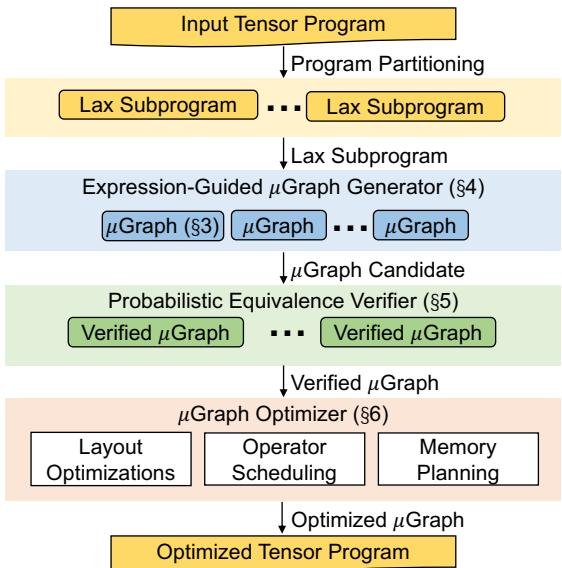  
Figure 1: An overview of Mirage.

One such example is FlashAttention [17] (see §8.2 for details), which optimizes attention [47] on GPUs by reordering operators at the algorithm level (algebraic transformations), reorganizing the computation across GPU kernels (yielding new custom kernels), and adapting the parallelization strategy of each kernel to the GPU architecture (schedule transformations). The transformations required for this example cannot be automatically discovered by existing frameworks and must therefore be implemented manually. An implementation of FlashAttention in Triton [43], a widely used tensor program optimizer, contains more than 700 lines of code [8].

We present Mirage, the first multi-level superoptimizer for tensor programs. Mirage automatically discovers and verifies sophisticated optimizations of tensor programs that require joint optimization of algebraic transformations, schedule transformations, and the discovery of new custom kernels.

A key idea in Mirage is µGraphs, a hierarchical graph representation that specifies tensor programs across multiple levels of the GPU compute hierarchy. By uniformly treating the kernel, thread block, and thread levels, µGraphs can capture both algebraic and schedule transformations across these levels. Moreover, optimizing a µGraph can introduce new custom kernels, which go beyond both algebraic and schedule transformations. For example, Mirage automatically discovers the µGraphs representing FlashAttention [17] and its inference variant FlashDecoding [5] as well as other µGraphs that outperform these manually designed kernels by up to 2.2× for certain use cases. Most of these optimizations discovered by Mirage are outside the search space of existing methods.

Figure 1 shows an overview of Mirage. Mirage first splits an input tensor program into subprograms that fall into the restricted LAX fragment. The LAX fragment, formally defined in §5, includes multi-linear operators such as matrix multiplication and convolution, division (useful for normalizations), and limited exponentiation (useful for activations). Partitioning a tensor program into LAX subprograms reduces the optimization search space while preserving most optimization opportunities; it also enables Mirage’s probabilistic equivalence verifier.

Expression-guided µGraph generator. For each LAX subprogram, Mirage’s expression-guided generator exhaustively searches for possible µGraphs equivalent to it. A key challenge Mirage must address is its significantly larger search space compared to prior superoptimization techniques. For example, TASO [25] and PET [46] search only for tensor programs at the kernel level, using a fixed set of pre-defined kernels, while Mirage considers superoptimization across the kernel, thread block, and thread levels. To efficiently navigate this significantly larger search space, Mirage introduces a novel pruning technique based on abstract expressions, which greatly reduces the number of µGraphs Mirage must consider while providing a certain theoretical guarantee on the optimality of the discovered µGraphs. Mirage further reduces the search space by focusing the search on the kernel and block levels and using a rule-based approach for the thread level.

Probabilistic equivalence verifier. For a µGraph discovered by Mirage, verifying its functional equivalence with the input program introduces another challenge, since the input and output tensors of a program include up to many millions of elements. A key idea behind Mirage is probabilistic equivalence verification, which performs random tests over finite fields to check equivalence between µGraphs. While random tests typically provide limited correctness guarantees for general programs, Mirage leverages a novel theoretical result showing that the restrictions imposed by the LAX fragment ensure that, for LAX programs, random tests over finite fields offer strong correctness guarantees. Specifically, we show that a polynomial identity testing (PIT) algorithm [37, 54] can be generalized to LAX programs, yielding a randomized algorithm for LAX program equivalence that can be made arbitrarily precise. Mirage uses this randomized algorithm to (probabilistically) ensure that each optimized program is equivalent to the input program.

µGraph optimizer. For each verified µGraph, Mirage’s µGraph optimizer maximizes its runtime performance by further considering potential tensor layouts, scheduling operator execution orders, and planning memory allocation at all of the kernel, thread block, and thread levels. Finally, Mirage returns an optimized tensor program based on the best discovered µGraph for each individual LAX subprogram.

Evaluation results. We evaluate Mirage on a variety of commonly used DNN benchmarks on NVIDIA A100 and H100 GPUs. Even for DNN benchmarks that are widely used and heavily optimized by existing systems, such as the groupquery attention used in LLMs [41], Mirage still outperforms current approaches by up to 3.3× by exploiting subtle custom kernels and optimizations missing in existing systems.

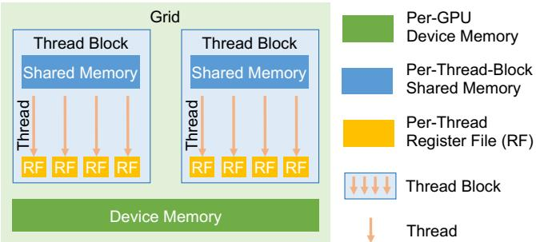  
Figure 2: GPU compute and memory hierarchy.

## 2 Multi-Level Graph Representation

Mirage uses a µGraph to specify the execution of a tensor program on GPUs. A µGraph contains hierarchical graphs at multiple levels to represent computation at the kernel, block, and thread levels2. This section first describes the GPU hierarchy and uses Figure 3 as a running example to introduce the key components of a µGraph.

GPU hierarchy. Figure 2 shows the hierarchy of today’s GPUs. Computations on GPUs are organized as kernels, each of which is a function executed simultaneously on multiple GPU cores in a single-program-multiple-data (SPMD) fashion. A kernel includes a grid of thread blocks, each of which is executed on one GPU streaming multiprocessor and includes multiple threads to perform computation on individual data elements. Each thread is associated with a per-thread register file, and all threads within a thread block can access shared memory to enable collective operations. Finally, all inputs and outputs of a kernel are stored in GPU device memory.

Kernel graph. Each tensor program corresponds to one kernel graph, where each node represents a kernel running on an entire GPU, and each edge is a tensor shared between kernels. All tensors in a kernel graph are stored in GPU device memory since different kernels cannot share data in register files or shared memory. Each node in a kernel graph can be a pre-defined kernel operator supported by existing kernel libraries such as convolution by cuDNN [15] and matrix multiplication by cuBLAS [16]. In addition, to enable fine-grained inter-kernel optimizations such as kernel fusion, a node in a kernel graph can also be a graph-defined kernel operator, whose semantic and behavior are defined by a lower-level (i.e., block) graph. As an example, the kernel operator in Figure 3b is a graph-defined operator specified by a block graph.

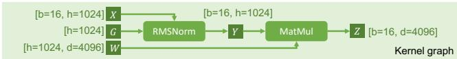  
(a) Computation graph for RMSNorm and MatMul.

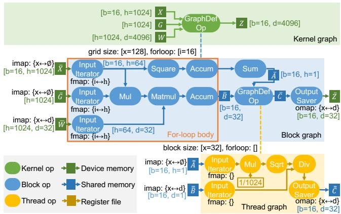  
(b) The best µGraph discovered by Mirage.  
Figure 3: Figure 3a is the computation graph for RMSNorm and MatMul. Figure 3b shows the best µGraph discovered by Mirage for computing RMSNorm and MatMul, which fuses the computation in a single kernel to reduce device memory access and kernel launch overhead, outperforms existing approaches by 1.9×. Numbers in brackets indicate tensor shapes, and numbers in braces show the imap, omap, or fmap for the corresponding operators.

Block graph. A block graph specifies computation associated with a thread block3, where each node denotes a block operator specifying computation within a block, and each edge (blue arrows in Figure 3b) is a tensor shared between block operators. Mirage stores all intermediate tensors within a block graph in GPU shared memory for two considerations. First, GPU shared memory offers much higher bandwidth than device memory, and this design allows Mirage to reduce device memory access by maximally saving intermediate results in shared memory. Second, for tensors whose sizes exceed shared memory capacity and must be stored in device memory, Mirage uses these tensors to split computation into multiple block graphs, each of which only contains tensors in shared memory. This separation does not introduce additional access to device memory.

Each block graph is also associated with properties specifying its execution, which we introduce below.

Grid dimensions. All blocks within a kernel are organized into a mesh with up to 3 dimensions, identified as x, y, and z. A block graph is associated with up to three grid dimensions that specify the number of blocks along the x, y, and z dimensions. The block graph in Figure 3b launches 128 blocks.

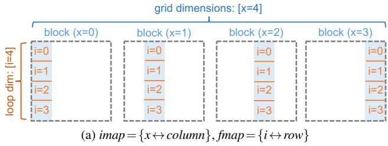

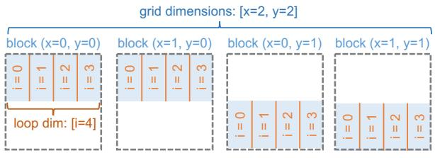  
(b) imap={x↔φ, y↔row}, fmap={i↔column}  
Figure 4: Demonstrating how an input tensor is partitioned across blocks and for-loop iterations with imap and fmap.

First, for each input tensor to a graph-defined kernel operator (e.g., X , G, and W in the kernel graph in Figure 3b), the associated block graph contains an imap, which specifies how the input tensor is partitioned into sub-tensors for individual blocks. For each grid dimension (i.e., x, y, or z), the imap maps it to either (1) a data dimension of the input tensor or (2) a special replica dimension φ. For (1), the mapped data dimension is equally partitioned across blocks along the grid dimension. For (2), the input tensor is replicated across these blocks. For example, the block graph in Figure 3b takes three inputs—X, G, and W —representing the input tensors to each block. For W , its imap={x ↔d} indicates that the d dimension of tensor W is partitioned into 128 equally sized chunks. As a result, W has shape [h = 1024, d = 32].

Second, for each output tensor of a block graph (e.g., Z in Figure 3b), the block graph includes an omap, which specifies how the outputs of all blocks are concatenated to construct the final output of the kernel operator. In an omap, each grid dimension must map to a data dimension of the output tensor, since different blocks must store disjoint tensors in device memory. For Z with shape [b=16,d =32] in Figure 3b, its omap={x ↔d} indicates that blocks with the same x index are concatenated along the d dimension, resulting in a tensor Z with shape [b=16,d =4096].

For-loop body. To fit large input tensors in shared memory and to overlap data loading from device memory with computation, a block graph can include a for-loop body, which is executed multiple times to complete a kernel. Often, the for loop in a kernel is followed by some post-processing. For example, when computing an average value, the for loop would perform the summation of n values and the post-processing would divide by n. Mirage specifies the for-loop body of a block graph using input iterators, for-loop accumulators, and all operators in between, as shown in the orange box in Figure 3b). Each input tensor to a block graph first passes through an input iterator, which loads part of the tensor (e.g., X , G, and W ) from device memory into shared memory. Each input iterator is associated with an fmap to specify which part of the input tensor to load in each iteration. Formally, the fmap maps each for-loop dimension to either (1) a data dimension of the input tensor or (2) the replica dimension φ. Similar to imap, the tensor is equally partitioned along that dimension for (1) and replicated for (2). Figure 4 shows how an input matrix is partitioned across blocks and for-loop iterations using different imap and fmap.

Each block graph is also associated with a for-loop dimension, which determines how many iterations the for-loop body is executed to complete the kernel. In addition, Mirage uses for-loop accumulators (e.g., the two Accum operators in Figure 3b) to accumulate intermediate results computed in each iteration (using standard accumulators, e.g., summation and max) and store the accumulated results in shared memory. Once the for-loop body is completed, Mirage proceeds to execute the remaining operators outside the for-loop body directly on the accumulated results. An output saver then saves the final result from shared memory back to device memory.

Thread graph. A thread graph further reduces computation scope from a block to a single thread. Similar to a block graph, each thread graph is also associated with block dimensions, which specify the organization of threads within the block, and for-loop dimensions, which define the total number of iterations to finish the defined computation. Each thread graph includes input iterators, each of which loads an input tensor (e.g., A and B in Figure 3b) from shared memory into register files, and output savers, each of which stores an output tensor from register files back to shared memory (e.g., C). A thread graph is the lowest-level graph in a µGraph and contains only pre-defined thread operators.

Tensor layout. Each tensor in the kernel, block, or thread graph is associated with a tensor layout (omitted in Figure 3 for simplicity), specifying how the tensor is linearized in memory. Note that tensor layouts affect only the performance of a µGraph and have no impact on its output correctness.

Definition 2.1 (µGraph Validity). A µGraph G is valid if: (1) for each kernel, block, and thread operator o∈G, its input and output tensors match the specification of o; (2) all tensors in each kernel, block, and thread graph can reside in GPU device memory, shared memory, and register file, respectively; and (3) for each block and thread graph with a for-loop body, any path from an input to an output passes through exactly one input-iterator, one for-loop accumulator, and one output saver.

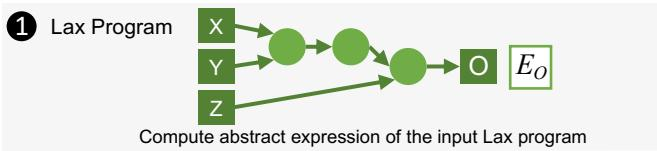

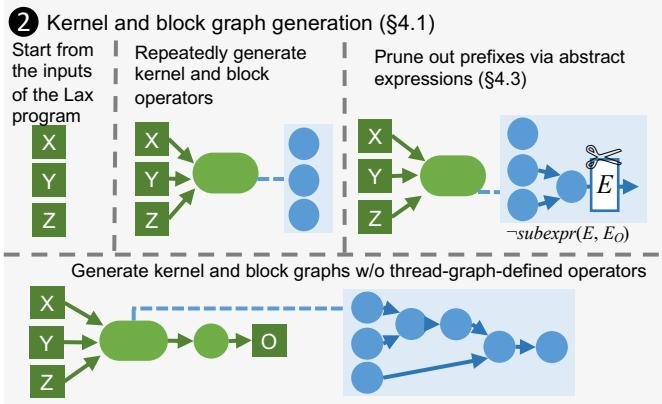

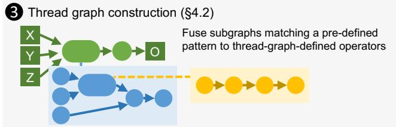  
Figure 5: An overview of the µGraph generator.

Comparison with prior work. Prior work separately considers algebraic [25, 46] or schedule transformations [13, 31, 35], while µGraphs can represent both in a uniform way. Specifically, the grid and for-loop dimensions and their corresponding mappings (i.e., imap, omap, and fmap) to tensor dimensions constitute a comprehensive search space of possible schedules for graph-defined operators. The hierarchical graphs across the kernel, block, and thread levels allow Mirage to explore algebraic transformations at these levels.

## 3 Case Study: RMSNorm

In this section, we use root mean square layer normalization (RMSNorm) [50] as a case study to demonstrate the advantages of the µGraph representation and Mirage’s superoptimization approach. RMSNorm is a widely used normalization technique in recent large language models [41]. Formally, RMSNorm takes two tensors, X and G, as inputs and normalizes their element-wise products according to the root mean square:

$$
Y _ { i j } = \frac { X _ { i j } G _ { j } } { \mathrm { R M S } ( X _ { i } ) } , \mathrm { R M S } ( X _ { i } ) = \sqrt { \frac { 1 } { d } \sum _ { j = 1 } ^ { d } X _ { i j } ^ { 2 } } ,\tag{1}
$$

where d is the hidden dimension size of X.

RMSNorm is often followed by a matrix multiplication (MatMul). Figure 3a shows the computation graph of an RM-

SNorm followed by a MatMul operator, where X is the input tensor, and G and W denote two weight tensors. Existing ML compilers generally launch two separate kernels for RM-SNorm and MatMul computations, since both operations internally perform reductions across an input dimension, making it challenging to fuse their computations into a single kernel. This approach requires storing intermediate results (i.e., Y ) in device memory since different kernels cannot share data in shared memory or register files.

Figure 3b shows the best µGraph automatically discovered by Mirage for computing RMSNorm and MatMul in a single kernel. The computation is fused in a single graph-defined kernel operator to avoid saving intermediate results (i.e., Y ) in device memory and reduce kernel launch overheads.

We highlight the key differences between the µGraph discovered by Mirage and the original µGraph. These differences involve discovering new custom kernels and combining algebraic and schedule transformations, making it infeasible to discover the final µGraph by separately considering algebraic and schedule transformations. First, Mirage reorders MatMul and the division of RMSNorm by leveraging the commutativity of matrix multiplication and element-wise division (algebraic transformation). Second, Mirage performs the accumulation in the root mean square (i.e., $\scriptstyle A _ { i } = \sum _ { j } X _ { i j } ^ { 2 } )$ and the accumulation in the matrix multiplication (i.e., $\begin{array} { r } { \dot { B } _ { i k } { = } \sum _ { j } X _ { i j } G _ { j } W _ { j k } ) } \end{array}$ in parallel (schedule transformation), avoiding writing the accumulation results to device memory. Next, Mirage instantiates a thread graph to perform a sequence of element-wise operators while maintaining all intermediate results in register files (schedule transformation). Finally, the best discovered µGraph uses a new custom kernel to fuse the computation of RMSNorm and MatMul, reducing device memory access and kernel launch overheads. This µGraph outperforms the hand-written kernels in existing systems by 1.5× and 1.9× on NVIDIA A100 and H100 GPUs respectively.

## 4 Expression-Guided µGraph Generator

This section introduces the Mirage µGraph generator, which automatically discovers potential µGraphs for an input tensor program. To generate µGraphs that capture optimizations at the kernel, block, and thread levels, Mirage must explore a significantly larger search space than existing superoptimizers, which only consider optimizations at the kernel level. Mirage employs two key techniques to address this challenge. First, based on the observation that optimizations at the kernel and block levels are substantially more critical to performance than optimizations at the thread level—since accessing device and shared memory is orders of magnitude more expensive than accessing register file—Mirage’s µGraph generator employs a hybrid approach: it exhaustively considers all possible graphs up to a certain size at the kernel and block levels, and uses a rule-based strategy to construct graphs at the thread level. This approach reduces the search space while retaining most performance-critical optimizations. Second, to further prune the search space, Mirage introduces a pruning technique based on an abstraction of µGraphs called abstract expression, which reduces the number of µGraphs Mirage must consider while providing a certain theoretical guarantee on the optimality of the discovered µGraphs. We introduce the hybrid µGraph generation algorithm in §4.1 and §4.2, and the expression-guided pruning techniques in §4.3.

Algorithm 1 Mirage’s hybrid µGraph generation algorithm.   
Input: A LAX program with a computation graph $G _ { \mathsf { r e f } }$   
Output: A set of µGraphs S   
1: $\overline { { E } } _ { O }  E ( G _ { \mathsf { r e f } } )$   
2: $\mathcal { S } _ { 0 } , \mathcal { S }  \mathcal { O }$   
3: GENERATENEXTKERNELOPERATOR(Inputs $( G _ { \mathsf { r e f } } ) )$   
4: for all $G \in S _ { 0 }$ do   
5: $S  S \cup$ {THREADGRAPHCONSTRUCTION(G)}   
6: function GENERATENEXTKERNELOPERATOR(GK)   
7: $S _ { 0 } \{ - S _ { 0 } \cup \{ G _ { \mathsf { K } } \}$   
8: for all kernel graph op type t; input set I do   
9: if rank $\cdot ( I , t ) >$ rank $( o p . I , o p . t )$ for each $o p \in G _ { \mathsf { K } }$ then   
10: if t is a pre-defined operator then   
11: $\mathbf { \dot { f } } o { : = } \mathbf { \bar { C } O N S T R U C T O P } ( G _ { \mathsf { K } } , I , t )$ is valid then   
12: GENERATENEXTKERNELOPERATOR(GK ∪ {o})   
13: else ▷ t is a graph-defined operator   
14: for all gridDims; forloopDims do   
15: $G _ { \mathsf { B } } \gets$ TBGraph(I, gridDimd, forloopDims)   
16: GENERATENEXTBLOCKOPERATOR $( G _ { \mathsf { K } } , G _ { \mathsf { B } } )$   
17: function GENERATENEXTBLOCKOPERATOR $( G _ { \mathsf { K } } , G _ { \mathsf { B } } )$   
18: if all shared tensors in $G _ { \mathsf { B } }$ are consumed then   
19: i $\mathrm { : } o { \mathrm { : } } = \mathrm { C O N S T R U C T O P } ( G _ { \mathsf { K } } , G _ { \mathsf { B } } . I , G _ { \mathsf { B } } )$ is valid then   
20: GENERATENEXTKERNELOPERATOR $( G \kappa \cup \{ o \} )$   
21: for all block graph op type t; input set I do   
22: if rank $( I , t ) > \mathrm { r a n k } ( \bar { o } p . I , o p . t )$ for each $o p \in G _ { \mathsf { B } }$ then   
23: $\mathbf { i f } o { : = } \mathrm { C O N S T R U C T O P } ( \overline { { G _ { \mathsf { B } } } } , I , t )$ is valid then   
24: $\mathbf { G } _ { \mathrm { E N E R A T E N E X T B L O C K O P E R A T O R } } ( G _ { \mathsf { K } } , G _ { \mathsf { B } } \cup \{ o \} )$   
25: function CONSTRUCTOP(G,I,attrs)   
26: $E \gets \mathrm { E X P R I N F R } ( E ( I ) .$ , attrs) ▷ Refer to Table 1   
27: if SUBE $\backslash \mathrm { X P R } ( E , E _ { O } )$ then ▷ Prune via abstract expressions   
28: $S  G .$ .outputTensorShapeInfr(I, attrs) ▷ Check tensor shape   
29: if S.valid, $G . { \mathrm { m A l l o c } } + S . { \mathrm { s i z e } } \leq G$ .mLimit then ▷ Check memory   
30: return G.constructOp(I, attrs)   
31: return Invalid   
32: function THREADGRAPHCONSTRUCTION(G)   
33: $G _ { \sf f u s e d }  G$   
34: while ∃o $\equiv G _ { \mathrm { f u s e d } }$ that can be fused with a preceding operator do   
35: $G _ { \mathsf { f u s e d } } \gets \mathrm { F U S E O P } ( G _ { \mathsf { f u s e d } } , o )$   
36: return $G _ { \sf f u s e d }$

## 4.1 Kernel and Block Graph Generation

Mirage generates kernel and block graphs incrementally and leverages several pruning techniques to reduce the search space, as shown in the second part of Figure 5. Specifically, Mirage maintains a prefix of a valid µGraph and iteratively extends it with new operators. For a graph $G = ( V , E )$ we say that $G ^ { \prime } = ( V ^ { \prime } , E ^ { \prime } )$ is a prefix of G if it is a subgraph of G such that $\forall u \in V ^ { \prime } , \forall ( \nu , u ) \in E , \nu \in V ^ { \prime }$

To generate the next operator in the kernel graph, Mirage enumerates the kernel operator type t and the input tensor set I. If t represents the graph-defined operator type, Mirage generates the associated block graph that defines its kernel computation by (1) enumerating the grid and for-loop dimensions (introduced in §2), which enables Mirage to calculate the input tensor shapes of the block graph; and (2) performing a nested generation procedure similar to that used at the kernel level but without considering graph-defined operators. Line 6-16 and line 17-24 in Algorithm 1 show how Mirage generates kernel and block operators, respectively. Mirage checks tensor shape (line 28) and memory usage (line 29) before adding an operator, ensuring a valid prefix.

To ensure that identical µGraphs are generated only once, Mirage defines the canonical form of µGraphs. Given a µGraph G with its operators in topological order $o _ { 1 } , \ldots , o _ { n } ,$ the index of the j-th output of $o _ { i }$ is defined as a tuple $( i , j )$ Each operator $o _ { i }$ in G is assigned a rank $( i n p u t _ { i } , t y p e _ { i } )$ , where $i n p u t _ { i }$ is the list of input tensor indices of $o _ { i } ,$ and $t y p e _ { i }$ is the operator type. A µGraph is in canonical form if its operators are ordered in increasing rank. Mirage generates only µGraphs in canonical form by requiring that operators be added in increasing order of rank (line 9 and 22). This approach does not prune out any valid solutions, since each µGraph can be transformed to canonical form by reordering the operators.

In addition, Mirage utilizes the abstract expression technique to prune out prefixes that do not satisfy certain constraints, which will be introduced in §4.3.

## 4.2 Thread Graph Construction

While a similar nested generation strategy can be applied to thread graphs, Mirage instead constructs them using a transformation-based approach (see the third panel of Figure 5 and lines 4–5 in Algorithm 1) to reduce the search space. Mirage applies operator fusion when constructing thread graphs, which reduces access to shared memory by reusing tensors in register file whenever possible. For example, Mirage fuses the three element-wise operators (Mul, Sqrt, and Div) in Figure 3b into a thread graph, avoiding saving intermediate results to shared memory and keeping the entire computation of these operators in register file. While our current implementation focuses on operator fusion, additional rule-based transformations can be used to construct thread graphs.

## 4.3 Pruning via Abstract Expressions

When searching the space of possible µGraphs, we aim to avoid µGraph prefixes whose intermediate results cannot contribute to the desired computation. For example, for the input program $X \cdot Z + Y \cdot Z ,$ we can prune a prefix that computes $X \cdot Y .$ , but we should not prune one that computes $X + Y ,$ , as (X +Y ) · Z is equivalent to the input program. However, how can we determine whether a prefix can contribute to a desired computation while searching for that computation? Below, we develop a pruning technique driven by this intuition that circumvents the “chicken and egg” problem via abstraction. We first present the abstraction—abstract expressions—and then explain how it is used for pruning. Finally, we offer a theoretical guarantee that, under certain conditions, this pruning does not exclude the optimal µGraph.

Table 1: Operators supported by Mirage. The second column shows the graph levels supporting each operator (K, B and T denote kernel, block, and thread graphs, respectively). The last column defines the abstract expressions for the outputs of each operator, where E maps tensors to their abstract expressions.
<table><tr><td>μGraph Operator</td><td>Graph Level</td><td>Abstract Expression of Output Tensor</td></tr><tr><td>InIter</td><td>B</td><td>E(InIter(X))=E(X)</td></tr><tr><td>OutSaver</td><td>B</td><td> $\operatorname { E } ( \mathrm { O u t S a v e r } ( X ) ) = \operatorname { E } ( X )$ </td></tr><tr><td>Matmul</td><td>K,B,T</td><td> $\operatorname { E } ( \operatorname { M a t m u l } ( X , Y ) ) { \overset { } { = } } \operatorname { s u m } ( k , \operatorname { m u l } ( \operatorname { E } ( X ) , \operatorname { E } ( Y ) ) ) ^ { 1 }$ </td></tr><tr><td>Sum</td><td>K,B,T</td><td> $\operatorname { E } ( \operatorname { S u m } ( d _ { r } , k _ { r } , X ) ) = \mathsf { s u m } ( k _ { r } , \operatorname { E } ( X ) ) ^ { 2 }$ </td></tr><tr><td>EwAdd</td><td>K,B,T</td><td> $\operatorname { E } ( \operatorname { E w A d d } ( X , Y ) ) { \mathrm { = } } \mathsf { a d d } ( \operatorname { E } ( X ) , \operatorname { E } ( Y ) )$ </td></tr><tr><td>EwMul</td><td>K,B,T</td><td> $\operatorname { E } ( \operatorname { E w M u l } ( X , Y ) ) { \mathrm { = } } \mathsf { m u l } ( \operatorname { E } ( X ) , \operatorname { E } ( Y ) )$ </td></tr><tr><td>EwDiv</td><td>K,B,T</td><td> $\operatorname { E } ( \operatorname { E w D i v } ( X , Y ) ) { \mathord { = } } \mathsf { d i v } ( \operatorname { E } ( X ) , \operatorname { E } ( Y ) )$ </td></tr><tr><td>EwExp</td><td>K,B,T</td><td> $\operatorname { E } ( \operatorname { E w E x p } ( X ) ) = \exp ( \operatorname { E } ( X ) )$ </td></tr><tr><td>Repeat</td><td>K,B</td><td> $\operatorname { E } { \big ( } \mathrm { R e p e a t } ( X ) { \big ) } = \operatorname { E } ( X )$ </td></tr><tr><td>Reshape</td><td>K,B</td><td> $\operatorname { E } ( \mathrm { R e s h a p e } ( X ) ) { = } \operatorname { E } ( X )$ </td></tr><tr><td>Sqr</td><td>K,B</td><td> ${ \mathsf { E } } ( { \mathsf { S q r } } ( X ) ) { = } { \mathsf { m u l } } ( { \mathrm { E } } ( X ) , { \mathrm { E } } ( X ) )$ </td></tr><tr><td>Sqrt</td><td>K,B</td><td> $\operatorname { E } ( \operatorname { S q r t } ( X ) ) = { \mathsf { s q r t } } ( \operatorname { E } ( X ) )$ </td></tr><tr><td>SiLU</td><td>K,B</td><td> $\operatorname { E } ( \operatorname { S i L U } ( X ) ) = { \mathsf { s i l u } } ( \operatorname { E } ( X ) )$ </td></tr><tr><td>Accum</td><td>B</td><td> $\operatorname { E } ( \operatorname { A c c u m } ( X , m , i ) ) { \overset { \cdot } { = } } \operatorname { s u m } ( i , \operatorname { E } ( X ) ) { \mathrm { ~ i f ~ } } m = \Phi \operatorname { e l s e } \operatorname { E } ( X ) ^ { 3 }$ </td></tr></table>

1 k means the size of the last dimension of A, i.e., the reduction dimension. Matmul is performed on the inner most two dimensions and leading dimensions are batched.  
2 Sum along the dimension dr for every kr elements.  
3 Accumulate the results of i for-loop iterations along fmap m.

Abstract expressions. Recall that an edge in a µGraph corresponds to a tensor-valued function of the input tensors. Intuitively, abstract expressions abstract these functions by ignoring the differences between elements of the same input tensor. Formally, abstract expressions are first-order logic terms over the theory of integers and uninterpreted functions. In a µGraph, the abstract expression of each edge, denoted by E(·), is defined in Table 1. When computing a µGraph’s abstract expression, all graph-defined operators are “inlined”. Specifically, the expressions computed for a graph-defined operator’s inputs are passed into its lower-level graph, and the resulting output expressions of that lower-level graph become the output expressions of the graph-defined operator. Figure 6 shows the abstract expressions for a subgraph of attention.

While abstract expressions capture some information about the function computed at each edge, they also abstract away many details. For example, if X is a k × k matrix, summing over the rows and summing over the columns both yield the same abstract expression—sum(k, E(X)). But keeping k as part of the abstract expression is crucial for effective pruning.

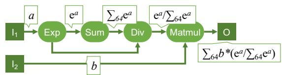  
Figure 6: Illustration of abstract expressions. The abstract expressions of tensors are annotated on edges. A humanfriendly notation is used here: $\mathtt { e } ^ { a }$ denotes exp(a), ∑k a denotes sum(k,a), a/b denotes div $( a , b )$ , and $a * b$ denotes mu $| ( a , b )$ The tensors $I _ { 1 } , I _ { 2 }$ and O are all $6 4 \times 6 4$ matrices.

Abstract subexpression and pruning. We use abstract expressions to prune the search space of µGraphs by formalizing two relations over abstract expressions: equivalence and abstract subexpression. Specifically, we prune any µGraph prefix whose abstract expression is not a subexpression of some abstract expression equivalent to that of the input program. We formalize abstract expressions as uninterpreted functions in first-order logic over the theory of integer arithmetic and uninterpreted functions, and use an SMT solver to reason about them based on two sets of axioms in Table 2: $A _ { \mathrm { e q } }$ and $A _ { \mathrm { s u b } }$

First, $A _ { \mathrm { e q } }$ axiomatizes equivalence between abstract expressions. As will become clear below, these axioms need not be sound—it is not required that µGraphs with equivalent abstract expressions are functionally equivalent, since non-equivalent µGraphs can have the same abstract expression. Second, $A _ { \mathrm { s u b } }$ axiomatizes the subexpression relation between abstract expressions. A key property of $A _ { \mathrm { s u b } }$ is that whenever a µGraph $G _ { 1 }$ is a prefix of $G _ { 2 } \mathrm { . }$ —meaning $G _ { 2 }$ can be constructed by extending $G _ { 1 }$ with additional operators— $\operatorname { E } ( G _ { 1 } )$ is an abstract subexpression of $\operatorname { E } ( G _ { 2 } )$ ; formally, $A _ { \mathrm { s u b } } \vDash$ subexpr $\left( \operatorname { E } ( G _ { 1 } ) , \operatorname { E } ( G _ { 2 } ) \right)$ , where |= denotes entailment modulo the theory of integer arithmetic and uninterpreted functions.

During the search, Algorithm 1 first computes the abstract expression of the input LAX program, denoted $E _ { O } ,$ and prunes any µGraph prefix G if $A _ { \mathrm { { e q } } } \cup A _ { \mathrm { { s u b } } }$ ̸|=subexpr $( \operatorname { E } ( G ) , E o )$ . That is, a graph is pruned if its abstract expression is not a subexpression of $E _ { O }$ . This check is performed using an SMT solver (Z3 [18]). As an optimization, the results of these checks are cached and reused, since Mirage may encounter multiple µGraphs with identical abstract expressions during the search.

Theoretical guarantee and the pruning-optimality tradeoff. Intuitively, our pruning would keep any prefix that can lead to a µGraph whose abstract expression is equivalent (according to $A _ { \mathrm { e q } } )$ to that of the input LAX program. Formally:

Theorem 1 (Pruning via Abstract Expressions). For an input µGraph $G _ { 0 } ,$ and a µGraph G equivalent to $G _ { 0 } ,$ , if $A _ { \mathrm { { e q } } } \vDash$ $E ( G _ { 0 } ) = E ( G )$ then G will be generated by Algorithm 1.

Proof. By Tables 1 and 2, we show that for any operator op, if $Y { = } o p ( X _ { 1 } , \ldots , X _ { n } ) $ , then $A _ { \mathrm { s u b } } \Vdash \mathsf { s u b e } \times \mathsf { p r } ( \mathrm { E } ( X _ { i } ) , \mathrm { E } ( Y ) )$ for $1 \leq i \leq n .$ . That is, the abstract expression of each input to op is always a subexpression of op’s output. Given that $A _ { \mathrm { s u b } }$ includes reflexivity and transitivity axioms, it follows that for any $G ^ { \prime }$ that is a prefix of $G , A _ { \mathrm { s u b } }$ |=subexpr $\left( \operatorname { E } ( G ^ { \prime } ) , \operatorname { E } ( G ) \right)$ Together with the assumption that $A _ { \mathrm { e q } } \left. = E ( G _ { 0 } ) = E ( G ) \right.$ , we have $A _ { \mathrm { { e q } } } \cup A _ { \mathrm { { s u b } } }$ |= subexpr(E(G′), E(G0)). Thus, no prefix of G will be pruned, and Mirage will generate G. □

Table 2: Axiomatization of abstract expressions used for pruning. Mirage checks whether an abstract expression $E _ { 1 }$ is a subexpression of $E _ { 2 }$ by querying an SMT solver to check if subexpr $( E _ { 1 } , E _ { 2 } )$ is entailed by these axioms. All variables in these axioms are universally quantified.  
Abstract Expression Property Comment   
Equivalence Axioms $A _ { e q }$   
$\forall x , y . \mathsf { a d d } ( x , y ) { = } \mathsf { a d d } ( y , x )$ commutativity   
$\forall x , y . \mathsf { m u l } ( x , y ) = \mathsf { m u l } ( y , x )$ commutativity   
∀x, y, z. add(x, add(y, z)) = add(add(x, y), z) associativity   
$\forall x , y , z . \mathsf { m u l } ( x , \mathsf { m u l } ( y , z ) ) = \mathsf { m u l } ( \mathsf { m u l } ( x , y ) , z )$ associativity   
∀x, y, z. add(mul(x, z), mul(y, z)) = mul(add(x, y), z) distributivity   
$\forall x , y , z . \ \mathsf { a d d } ( \mathsf { d i v } ( x , z ) , \mathsf { d i v } ( y , z ) ) = \mathsf { d i v } ( \mathsf { a d d } ( x , y ) , z )$ associativity   
$\forall x , y , z . \ : \mathsf { m u l } ( x , \mathsf { d i v } ( y , z ) ) = \mathsf { d i v } ( \mathsf { m u l } ( x , y ) , z )$ associativity   
$\forall x , y , z . \ \mathsf { d i v } ( \mathsf { d i v } ( x , y ) , z ) = \mathsf { d i v } ( x , \mathsf { m u l } ( y , z ) )$ associativity   
∀x. x = sum(1, x) identity reduction   
∀x, i, j. sum(i, sum $( j , x ) ) { = } { \mathsf { s u m } } ( i * j , x )$ associativity   
$\forall x , y , i . \mathsf { s u m } ( i , \mathsf { a d d } ( x , y ) ) { = } \mathsf { a d d } ( \mathsf { s u m } ( i , x ) , \mathsf { s u m } ( i , y ) )$ associativity   
∀x, y, i. sum(i, mul(x, y)) = mul(sum(i, x), y) distributivity   
$\forall x , y , i . \mathsf { s u m } ( i , \mathsf { d i v } ( x , y ) ) { = } \mathsf { d i v } ( \mathsf { s u m } ( i , x ) , y )$ distributivity   
∀x, y. mul(exp(x), exp(y))= exp(add(x, y)) distributivity   
∀x, y. mul(sqrt(x), sqrt(y)) = sqrt(mul(x, y)) distributivity   
Subexpression Axioms $A _ { s u b }$   
∀x, y. subexpr(x, add(x, y))   
$\forall x , y .$ subexpr(x, mul(x, y))   
∀x, y. subexpr(x, div(x, y))   
$\forall x , y .$ subexpr $\left( y , \mathsf { d i v } ( x , y ) \right)$   
∀x. subexpr(x, exp(x))   
∀x. subexpr(x, sqrt(x))   
∀x. subexpr(x, silu(x))   
$\forall x , i .$ subexpr(x, sum(i, x))   
∀x. subexpr(x, x) reflexivity   
∀x, y, z. subexpr(x, y) ∧ subexpr(y, z) → subexpr(x, z) transitivity

The theorem highlights the role of abstract expressions in solving the “chicken and $\mathrm { e g g } ^ { \prime \prime }$ problem outlined above. To decide if a prefix µGraph is useful, we reason about whether it is a prefix of a useful computation in the abstract. The choice of abstraction and the axioms $A _ { \mathrm { e q } }$ represents a tradeoff between optimality and pruning. As Theorem 1 shows, we are only guaranteed to find the optimal µGraph whose abstract expression is equivalent to that of the input program under $A _ { \mathrm { e q } } .$ Stronger axioms expand the set of µGraphs covered by the theorem but reduce pruning effectiveness, since more prefixes would pass the subexpression test. In particular, note that $A _ { \mathrm { e q } }$ does not include cancellation rules (e.g., $\mathsf { d i v } ( \mathsf { m u l } ( x , y ) , y ) = y )$ As a result, Mirage may miss some equivalent µGraphs. However, including such axioms would make everything a subexpression of everything, therefore nulling desired pruning. As our evaluation shows, the chosen $A _ { \mathrm { e q } }$ yields a good balance between pruning and optimality.

## 5 Probabilistic Equivalence Verifier

Mirage’s probabilistic equivalence verifier checks if a candidate µGraph is equivalent to the desired LAX program. The key idea is to evaluate both on random inputs in two finite fields. Using finite fields instead of floating point numbers not only avoids floating point errors but also provides a strong theoretical guarantee: the probability of accepting a non-equivalent µGraph can be made arbitrarily low.

For general programs, random testing can hardly provide any correctness guarantee. However, we show that for LAX programs (formally defined below), random testing offers a probabilistic correctness guarantee, and repeated tests can reduce the error probability to an arbitrarily small threshold.

Prior work [46] has applied a similar technique to check equivalence between tensor programs that contain only linear operators (e.g., matrix multiplication, convolution). We develop a random testing technique that also supports division and exponentiation, which are needed for many DNN optimizations (e.g., the RMSNorm example in §3).

Mirage verifies equivalence between LAX µGraphs (linear, division, and an exponentiation) defined below. We introduce the main theoretical results in §5.1 and present Mirage’s verification methodology in §5.2.

Definition 5.1 (LAX µGraph). A µGraph G is a LAX µGraph if (1) G contains only multi-linear operators4, division, and exponentiation, and (2) every path from an input to an output in G includes at most one exponentiation.

## 5.1 Theoretical Foundations

Without loss of generality, we assume a LAX µGraph G takes n input tensors and produces one output tensor. Our theoretical results directly generalize to LAX µGraph with multiple outputs. Since each LAX µGraph includes linear operators, divisions, and at most one exponentiation along each path, the computation for each entry of the output tensor can be expressed in the following form (by using standard identities such as $\begin{array} { r } { \frac { \overline { { b } } } { \overline { { d } } } = \frac { a d } { b c } , \frac { a } { b } + \frac { c } { d } = \frac { a d + b c } { b d } , e ^ { x } e ^ { y } = e ^ { x + y } ) } \end{array}$

$$
\frac { \sum _ { i = 1 } ^ { k } f _ { i } \exp ( g _ { i } / h _ { i } ) } { \sum _ { i = 1 } ^ { k ^ { \prime } } f _ { i } ^ { \prime } \exp ( g _ { i } ^ { \prime } / h _ { i } ^ { \prime } ) }\tag{2}
$$

where $f _ { i } , g _ { i } , h _ { i } , f _ { j } ^ { \prime } , g _ { j } ^ { \prime }$ and $h _ { j } ^ { \prime } \left( 1 \leq i \leq k , 1 \leq j \leq k ^ { \prime } \right)$ are polynomials over the entries of the input tensors.

The main theoretical result that underpins our randomized equivalence verification is the following theorem, which extends polynomial identity testing (PIT) [37, 54] on finite fields to LAX µGraphs. Note that the difference of two LAX µGraphs is also of the form of Equation (2). Therefore, identity testing of two LAX µGraphs reduces to testing if an expression of that form is zero. Due to the presence of exponentiation, we use two finite fields instead of one.5

Table 3: Arithmetic operations for random testing. Mirage selects two prime numbers $p$ and q such that $q$ divides $p - 1$ $x _ { p }$ and $x _ { q }$ are values from the finite fields $\mathbb { Z } _ { p }$ and $\mathbb { Z } _ { q } ,$ respectively. The notation $x ^ { - 1 }$ and $\sqrt { x }$ represents the multiplicative inverse and square root of x in the corresponding finite field. Specifically, $x x ^ { - 1 }$ mod $p { = } 1$ and $\sqrt { x } \sqrt { x }$ mod $p { = } x .$
<table><tr><td>Opt.</td><td>Opd.1</td><td>Opd. 2</td><td>Output</td></tr><tr><td>Add.</td><td> $( x _ { p } , x _ { q } )$ </td><td> $( y _ { p } , y _ { q } )$ </td><td> $\left( ( x _ { p } + y _ { p } ) \right.$  mod  $p , ( x _ { q } + y _ { q } )$  mod q)</td></tr><tr><td>Sub.</td><td> $( x _ { p } , x _ { q } )$ </td><td> $( y _ { p } , y _ { q } )$ </td><td> $\left( ( x _ { p } - y _ { p } ) \right.$  mod  $p , ( x _ { q } - y _ { q } )$  mod q)</td></tr><tr><td>Mul.</td><td> $( x _ { p } , x _ { q } )$ </td><td> $( y _ { p } , y _ { q } )$ </td><td> $( x _ { p } y _ { p }$  mod  $p , x _ { q } y _ { q }$  mod q)</td></tr><tr><td>Div.</td><td> $( x _ { p } , x _ { q } )$ </td><td> $( y _ { p } , y _ { q } )$ </td><td> $\big ( x _ { p } y _ { p } ^ { - 1 }$  mod  $p , x _ { q } y _ { q } ^ { - 1 }$  mod q)</td></tr><tr><td>Exp.</td><td> $( x _ { p } , x _ { q } )$ </td><td></td><td> $\left( \mathfrak { o } ^ { x _ { q } } \mathrm { m o d } p , - \right)$ </td></tr><tr><td>Sqrt.</td><td> $( x _ { p } , x _ { q } )$ </td><td></td><td> $( \sqrt { x _ { p } } , \sqrt { x _ { q } } )$ </td></tr></table>

Theorem 2. Let P be a function of the form described in Equation (2), where $f _ { i } , g _ { i } , h _ { i } , f _ { i } ^ { \prime } , g _ { i } ^ { \prime } , h _ { i } ^ { \prime }$ are non-zero polynomials of degree at most d with integer coefficients between [−w, w]. Let p, q be primes such that $q | p - 1$ and $q > 2 w .$ . Let $\mathcal { G }$ be the set of q-th roots of unity in $\mathbb { Z } _ { p }$ . If P is not a zero function, then [27]

$$
\begin{array} { r } { \operatorname* { P r } _ { ( \vec { u } , \vec { \nu } , \mathbf { 0 } ) \gets \mathbb { Z } _ { p } ^ { N } \times \mathbb { Z } _ { q } ^ { N } \times \mathcal { G } } \left[ \frac { \sum _ { i = 1 } ^ { k } f _ { i } ( \vec { u } ) \mathbf { 0 } ^ { g _ { i } ( \vec { \nu } ) / h _ { i } ( \vec { \nu } ) } } { \sum _ { i = 1 } ^ { k ^ { \prime } } f _ { i } ^ { \prime } ( \vec { u } ) \mathbf { 0 } ^ { g _ { i } ^ { \prime } ( \vec { \nu } ) / h _ { i } ^ { \prime } ( \vec { \nu } ) } } \right] \leq 8 d k ^ { 4 } / q + q ^ { - 1 / k ^ { 2 } } . } \end{array}
$$

## 5.2 Random Tests over Finite Fields

Mirage leverages Theorem 2 to probabilistically verify the equivalence of two µGraphs by performing random testing over the finite fields $\mathbb { Z } _ { p }$ and $\mathbb { Z } _ { q }$ as defined in Theorem 2. To check the equivalence of two µGraphs, Mirage first generates input tensors, with each entry uniformly sampled from $\mathbb { Z } _ { p } \times \mathbb { Z } _ { q }$ . Mirage also samples ω uniformly from the set of q-roots of unity in $\mathbb { Z } _ { p } ,$ which is used for exponentiation. Mirage then evaluates the two µGraphs on these inputs using the operations defined in Table 3. As explained in $\ S 5 . 1 , \mathbb { Z } _ { p }$ and $\mathbb { Z } _ { q }$ are used for computations outside and inside the exponent, respectively. All operations except exponentiation are implemented via modular arithmetic in $\mathbb { Z } _ { p }$ and $\mathbb { Z } _ { q }$ independently. For exponentiation, Mirage uses the value $x _ { q }$ from $\mathbb { Z } _ { q }$ and computes ${ \mathfrak { O } } ^ { X _ { q } }$ mod $p$ to obtain a result in $\mathbb { Z } _ { p } .$

Note that in a LAX µGraph, exponentiation is performed at most once along each path. Finally, Mirage checks whether the two µGraphs produce identical outputs. This process is repeated multiple times, and the two µGraphs are considered equivalent if they pass all random tests. The following theorem, which follows from Theorem 2, shows that this process can yield an arbitrarily low error rate.

Theorem 3. Equivalent µGraphs always pass µGraph verification. For two non-equivalent µGraphs and a given probability threshold $0 < \delta \leq 1$ , the µGraphs pass all $\Omega \big ( \frac { \bar { k } ^ { 2 } } { \ln q } \cdot \ln \frac { 1 } { 8 } \big )$ random tests with probability at most δ.

Numerical stability. While the theorem bridges finite fields and real-number computations, discrepancies can arise between real-number computations and floating-point operations, particularly involving overflow or underflow due to large intermediate values. Mirage employs floating-point tests to filter out µGraphs with significant numerical errors.

## 6 µGraph Optimizer

For each verified µGraph, Mirage’s µGraph optimizer maximizes its performance by further performing layout optimization, operator scheduling, and memory planning, as shown in Figure 1. Mirage defers these µGraph optimizations until after verification for two reasons. First, these optimizations do not affect the correctness of the generated µGraphs; omitting them when generating µGraphs reduces the search space Mirage must consider, since µGraphs with the same graph topology but different choices of tensor layouts, operator orders, or memory allocation plans are considered identical by the µGraph generator. Second, applying these optimizations after verification also reduces the search space for these optimizations, since the µGraph optimizer only needs to optimize µGraphs that are functionally equivalent to the input.

Tensor layouts. The µGraph optimizer explores possible data layouts for all intermediate tensors at the kernel, block, and thread levels and chooses the best combinations to maximize performance. We formulate layout selection as a constrained optimization problem and solve it optimally using an integer linear programming (ILP) algorithm. Specifically, for each tensor t and each possible layout l for t, we introduce a boolean variable $B _ { t , l }$ to indicate whether tensor t uses layout l. Operators at the kernel, block, and thread levels may impose various constraints on tensor layouts. For example, to use kernels from the cuBLAS library [16] for matrix multiplication, the innermost dimension of the two input tensors must be among the last two dimensions. These restrictions are converted into a series of linear constraints on $B _ { t , l }$ . Different tensor layouts may lead to varying performance. For example, some input tensor layouts support bulk copies from device to shared memory, while others do not. Mirage introduces a cost function to model the performance of each operator under different layout choices. Mirage uses an off-the-shelf ILP solver (i.e., Z3 [18]) to find an optimal layout strategy that satisfies all layout constraints while minimizing cost.

Table 4: DNN benchmarks used in our evaluation.
<table><tr><td rowspan=1 colspan=1>Name</td><td rowspan=1 colspan=1>Description</td><td rowspan=1 colspan=1>Base Architecture</td></tr><tr><td rowspan=1 colspan=1>GQA</td><td rowspan=2 colspan=1>Group-query attentionQK normalization with attentionRMS normalization with linearLow-rank adaptationGated multi-layer perceptronNormalized Tarnsformer</td><td rowspan=2 colspan=1>LLaMA-3-70B [41]Chameleon-7B [40]LLaMA-2-7B[44]GPT-3-7B-LoRA [6]Falcon-7B[10]nGPT-1B[28]</td></tr><tr><td rowspan=1 colspan=1>QKNormRMSNormLoRAGatedMLPnTrans</td></tr></table>

Operator scheduling. In a µGraph, there are multiple topological orders to execute operators, and different orders may yield different performance. For a given input µGraph, the µGraph optimizer identifies an efficient strategy to schedule operators by minimizing thread-level synchronization within each thread block (i.e., \_\_syncthreads() in CUDA). To achieve this goal, Mirage labels each node with a depth, defined as the length of the longest path from any input operator to that node. Mirage uses a dynamic programming algorithm to compute the depth of each node and schedules all operators in ascending order of their depths. This approach minimizes the number of thread-level synchronizations required in the generated CUDA kernel, as Mirage only needs to insert synchronization points between operators with different depths.

Memory planning. A third class of post-verification optimizations is memory planning, which determines memory offsets for all intermediate tensors at the kernel, block, and thread levels. Mirage formulates memory planning as a dynamic storage allocation problem and exhaustively enumerates all possible allocation plans to discover an optimal strategy.

## 7 Implementation

Mirage is implemented in 30K lines of code in C++, CUDA, and Python. Kernel operators are implemented with the cuDNN and cuBLAS libraries [15, 16], and block and thread operators are implemented using cuTLASS [2] and CUDA PTX. For each input tensor program, Mirage automatically generates and verifies potential µGraphs. For each verified µGraph, Mirage produces CUDA source code for all custom kernels of the µGraph and compiles the code into binary using the CUDA compiler. This approach enables just-in-time (JIT) compilation and deployment for general tensor programs, and the generated kernels can be directly integrated into a PyTorch program with a few lines of code changes. Mirage’s SMT and ILP solvers are implemented using Z3 4.12.6 [18].

Our implementation supports the operators listed in Table 1. Mirage can be extended to include new operators, such as variants of convolution or matrix multiplication, at the kernel, block, and/or thread levels. To support a new linear operator, Mirage requires (1) a float-pointing implementation of the operator at the kernel, block, and/or thread levels, which is used by the µGraph optimizer to generate CUDA kernels; (2) an implementation of the operator over modular arithmetic (see §5); and (3) an extension to the abstract expression axioms $A _ { \mathrm { e q } }$ and $A _ { \mathrm { s u b } }$ for the operator (see §4.3).

To utilize Theorems 2 and 3, random tests should be performed with sufficiently large prime numbers p and q and iterated multiple times. Our current implementation uses the largest values of p and q whose product fits in 16-bit integers (i.e., $p { = } 2 2 7 , q { = } 1 1 3 )$ to run these random tests on GPUs. We leverage Mirage’s GPU optimizations–such as keeping intermediate results in shared memory–to accelerate the search procedure. We also perform a single random test without iterating it and compare all elements of the output tensors. We note that this equivalence verification procedure does not introduce false negatives. While it could, in theory, introduce false positives, we have not observed any in practice. For these reasons, we consider this procedure sufficient for the search process and plan to add a final verification step that provides the theoretical guarantees only for the best µGraph at the end of the optimization process.

Equivalence verification for non-LAX programs. While Mirage can generate µGraphs for arbitrary tensor programs, the probabilistic equivalence verifier is limited to LAX programs and does not support certain DNN operators such as ReLU [32]. As an alternative, we have developed a solverbased verifier for arbitrary tensor programs. The verifier relies on user-provided mathematical properties of individual operators (e.g., linearity, associativity, commutativity, and distributivity) defined in first-order logic and uses these properties to verify equivalence using an automated theorem prover. Compared to the probabilistic equivalence verifier, the solver-based verifier supports more general programs, while requiring additional manual effort to specify the properties of each new operator. A detailed discussion of the solver-based verifier is beyond the scope of this paper.

## 8 Evaluation

## 8.1 Experimental Setup

Since Mirage is a superoptimizer for LAX programs, we focus our evaluation on various DNN benchmarks commonly used in existing DNNs, each of which is a LAX program. These benchmarks provide the most fine-grained way to compare the performance of Mirage and existing systems. Table 4 shows the six benchmarks in our evaluation. GQA, RMSNorm, and GatedMLP are the main building blocks of large language models (LLMs). QKNorm introduces query-key normalization before attention to enhance model convergence [40]. LoRA enables low-rank adaptation for fine-tuning a DNN on different tasks. We use a context length of 8K for GQA and 4K for QKNorm, corresponding to the maximum supported by LLaMA-3-70B [41] and Chameleon-7B [40], respectively. In addition, we also evaluate how Mirage-generated kernels improve the end-to-end performance of full DNNs, including Chameleon [40], nGPT [28], LLaMA-3 [41], and LoRA [22].

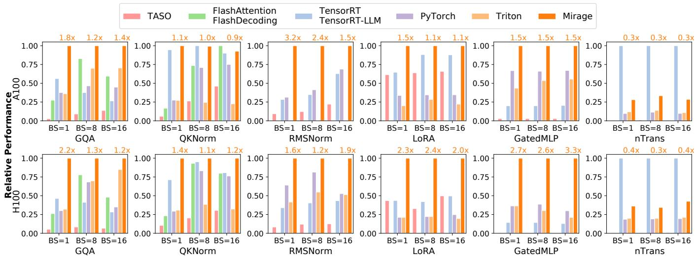  
Figure 7: Comparing Mirage with existing systems for 6 benchmarks on an A100 and an H100 GPU. The performance of all systems are normalized by Mirage (higher is better). Numbers above the Mirage bars show the speedup over the best baselines.

The experiments were conducted on NVIDIA A100 and H100 GPUs, each with 40GB of memory. All our benchmarks fit on a single GPU except GQA (used for LLaMA-2-70B), which is generally parallelized across four GPUs using tensor model parallelism [39]. Therefore, we evaluate GQA under this parallelism strategy, where the eight key-value heads are equally partitioned across four GPUs. Since the performance of Mirage and all baselines depends only on the shapes of the input tensors, we repeat each experiment 1,000 times using random inputs and report the average run time.

One of our benchmarks, LoRA, requires concatenation to express a common optimization: fusing two matrix multiplications via concatenation. To support this optimization in Mirage, we introduce a new linear operator that takes four inputs and computes $f ( W , X , Y , Z ) = ( W \| X ) \times ( Y \| Z )$ where ∥ is tensor concatenation. This operator is equivalent to computing $W \times Y + X \times Z .$ . We define the abstract expression associated with this operator as: E( f (W, X,Y, Z)) = add(sum(k1, mul(E(W ), E(Y ))), sum(k2, mul(E(X), E(Z)))), where $k _ { 1 }$ and $k _ { 2 }$ are the last dimensions of W and X.

Unless otherwise stated, Mirage considers up to 5 operators in the kernel graph and up to 11 operators in each block graph.

## 8.2 Benchmark Results

Figure 7 compares the performance of Mirage with systems on six DNN benchmarks on NVIDIA A100 and H100 GPUs. All systems use half-precision floating points to run these DNN benchmarks. TASO [25] and PET [46] are DNN superoptimizers that automatically generate algebraic transformations at the kernel level. We report a combined TASO/PET baseline, as the latest TASO implementation includes PET’s partially equivalent transformations as special substitutions. PyTorch [34] uses the highly optimized cuDNN and cuBLAS libraries [15, 16] to perform DNN operators on GPUs. For the PyTorch baseline, we enable torch.compile and use FlashAttention kernels to maximize performance. TensorRT and its LLM variant TensorRT-LLM include a set of manually designed and highly optimized kernels for common tensor operators such as attention [42]. FlashAttention and its inference variant FlashDecoding are manually written kernels for efficient attention [17, 21]. Finally, Triton is a schedule-based optimizer to generate high-performance kernels and has been adopted in production systems, outperforming other schedulebased approaches [43]. All baselines use CUDA Graphs to minimize kernel launch overhead.

Compared to the best existing approaches, Mirage improves the performance of these benchmarks by up to 3.3× by combing algebraic transformations, schedule transformations, and the generation of new custom kernels. §3 shows the best discovered µGraphs for RMSNorm. Next, we present a case study for the remaining benchmarks.

GQA. Group-query attention is the backbone of LLMs and has been heavily optimized by existing frameworks. For example, FlashAttention and FlashDecoding are expert-designed attention kernels and have been adopted in existing LLM inference systems [17]. Mirage discovers these expert-designed kernels as well as other µGraphs that outperform them by up to 2.2×. The speedup is achieved by two additional optimizations on top of existing hand-written kernels. First, current approaches rely on fixed heuristics to determine the grid dimensions for GQA, which are suboptimal in certain scenarios. For example, TensorRT-LLM launches the GQA kernel with grid dimensions of (8, 2, 1) and (8, 2, 8) when the batch sizes are 1 and 8, respectively. However, both configurations cannot fully utilize all SMs on A100 (108 SMs) and H100 (132 SMs) GPUs. In contrast, Mirage automatically searches for the best grid dimensions for each µGraph, resulting in full SM utilization. Further ablation study shows that the performance of the best µGraph discovered by Mirage degrades by 18% when using the same grid dimensions as TensorRT-LLM.

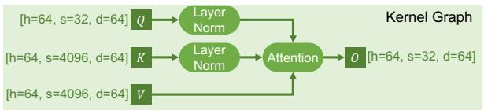  
(a) The kernel graph for QKNorm and attention in existing systems.

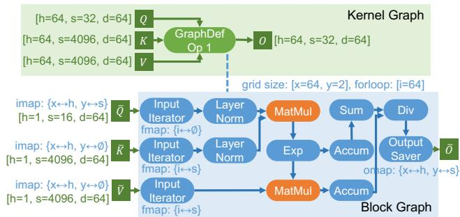  
(b) The best µGraph discovered by Mirage for QKNorm and attention.  
Figure 8: Comparing the µGraphs used by existing optimizers and Mirage for QKNorm and attention.

Second, existing approaches use fixed tensor dimensions to parallelize GQA across thread blocks. For example, FlashAttention [17] parallelizes attention across the sample, head, and query sequence dimensions, while FlashDecoding and TensorRT-LLM leverage the sample, head, and key-value sequence dimensions. Both strategies are efficient for conventional multi-head attention with many heads but suboptimal for GQA with fewer attention heads. In contrast, Mirage automatically selects the most efficient parallelization strategy by choosing among the sample, KV heads, query sequence, and key-value sequence dimensions. Moreover, Mirage generates different µGraphs tailored to different attention scenarios, reducing device memory access by up to 7× compared to the heuristics used in existing systems.

Implementing Mirage’s µGraphs in existing systems is possible but requires extensive engineering effort to support different kernels for different scenarios. In contrast, Mirage automatically generates them and verify their correctness.

QKNorm. To reduce model divergence, several recent DNNs introduce query-key normalization (QKNorm) into the Transformer architecture [40]. QKNorm applies layer normalization to the query and key vectors before attention, as shown in Figure 8a. These additional normalization layers are not yet supported by existing attention implementations (e.g., FlashAttention and TensorRT-LLM) and require launching separate kernels for normalization and attention.

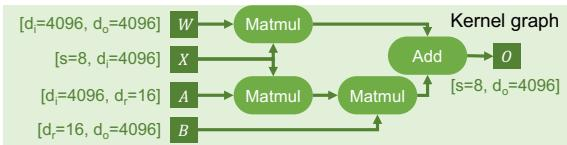  
(a) The kernel graph for LoRA in existing systems.

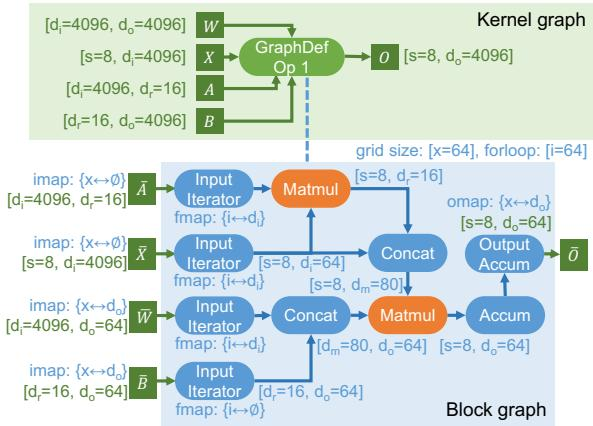  
(b) The best µGraph discovered by Mirage for LoRA.  
Figure 9: Comparing the tensor programs used by existing optimizers and by Mirage for LoRA: $O { = } W \times X + B \times A \times X$ Note that both matrices A and B are low-rank.

Mirage automatically discovers a µGraph that integrates QKNorm and attention computation into a custom kernel, as shown in Figure 8b. The µGraph reorganizes the attention computation to enable fusion with the two layer normalizations, which avoids writing intermediate results to GPU device memory and reduces the kernel execution time by up to 1.4×.

LoRA. Low-rank adaptation (LoRA) introduces a pair of low-rank adapters to the linear operators of a pre-trained DNN to improve its performance for downstream tasks. Existing tensor program optimizers launch separate kernels for the original linear operator and the two additional linear operators introduced by LoRA (Figure 9a), which introduces high kernel launch overheads since these LoRA operators involve minimal computation. Figure 9b shows the best µGraph discovered by Mirage for LoRA, which fuses the three Matmuls and the subsequent Add into a single kernel. Mirage reorganizes the computation into two blocklevel Matmuls by leveraging the following algebraic transformation: $W \times X + B \times A \times X = ( W \| B ) \times \left( X \| ( A \times X ) \right)$ . The Concats in Figure 9b do not involve any computation and are performed by updating tensor offsets in GPU shared memory. This µGraph reduces the execution cost of LoRA by 1.1-2.4×.

GatedMLP. Gated multi-layer perceptrons are commonly used in DNNs to capture non-linear representations. We use the GatedMLP configuration introduced in Falcon-7B [10], whose kernel graph is shown in Figure 10a. Existing tensor program optimizers generally fuse the two Matmuls in a single kernel to reduce GPU device memory access, since the input tensor X only needs to be loaded once. However, this approach still requires launching multiple kernels and storing intermediate results—specifically, the output of the two Matmuls—in device memory, as the SiLU activation and elementwise multiplication are not fused with the Matmuls.

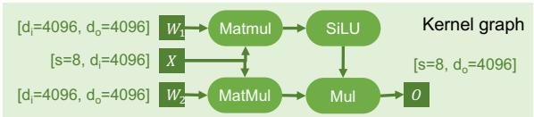  
(a) The kernel graph for GatedMLP.

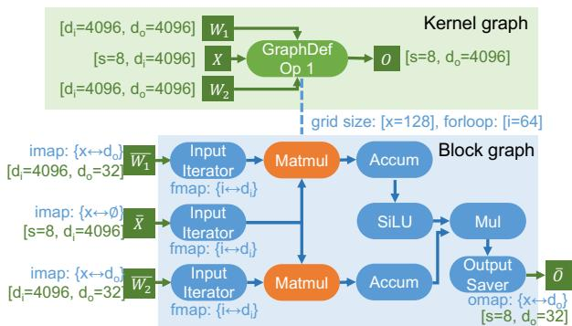  
(b) The best µGraph discovered by Mirage for GatedMLP.  
Figure 10: Comparing the µGraphs used by existing optimizers and Mirage for GatedMLP.

In contrast, the best µGraph discovered by Mirage (Figure 10b) performs the two Matmuls in parallel within the same block graph and fuses the remaining computation (i.e., SiLU and Mul) as post-processing steps within the same block graph. This approach yields 1.5× speedups on A100 GPUs and 2.7-3.3× speedups on H100 GPUs.

nTrans. To accelerate model training, nGPT introduces normalized Transformer, which normalizes all intermediate results in Transformer [28]. Formally, the computation is defined as y=Norm(x + α(Norm(h − x))), where Norm is a normalization layer, and x, h, and α are input tensors. Existing systems launch three separate kernels for nTrans, since it interleaves normalization and elementwise addition and multiplication. Mirage automatically discovers a µGraph that fuses the computation into a single kernel and stores all intermediate results in GPU shared memory. Mirage outperforms other baselines but is slower than TensorRT. This performance gap is because Mirage loads data from global memory to shared memory and writes it back for each tensor in graph-defined kernels. This design improves memory efficiency and enables asynchronous pipelines. However, for kernels with light computation, the overhead of these memory transfers can dominate the kernel runtime. To mitigate this overhead, we plan to extend Mirage to support bypassing shared memory during data loading, therefore avoiding unnecessary data movement.

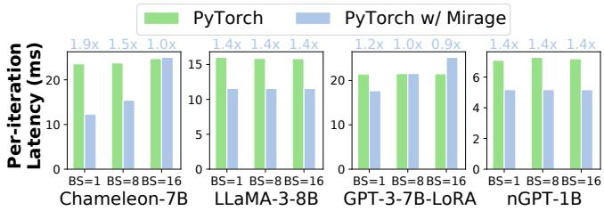  
Figure 11: Comparing the end-to-end inference performance of PyTorch and PyTorch with Mirage-generated kernels.

Table 5: Ablation study on Mirage’s techniques to accelerate µGraph generation. We evaluate the impact of multi-threading and abstract expressions on search time for RMSNorm.
<table><tr><td>Max # Ops in a Block Graph</td><td>Mirage</td><td>Mirage w/o Multithreading</td><td>Mirage w/o Abstract Expression</td></tr><tr><td>5</td><td>11 sec</td><td>58 sec</td><td>768 sec</td></tr><tr><td>6</td><td>16 sec</td><td>93 sec</td><td>19934 sec</td></tr><tr><td>7</td><td>22 sec</td><td>150 sec</td><td>&gt;10h</td></tr><tr><td>8</td><td>24 sec</td><td>152 sec</td><td>&gt;10h</td></tr><tr><td>9</td><td>26 sec</td><td>166 sec</td><td>&gt;10h</td></tr><tr><td>10</td><td>26 sec</td><td>166 sec</td><td>&gt;10h</td></tr><tr><td>11</td><td>28 sec</td><td>183 sec</td><td>&gt;10h</td></tr></table>

## 8.3 End-to-end Results

In addition to the microbenchmark performance, we also evaluate how Mirage-generated kernels impact the end-to-end latency of commonly used DNNs. Mirage supports just-intime compilation and deployment, and its generated kernels can be directly integrated into PyTorch programs. We compare PyTorch with its native handwritten CUDA kernels and PyTorch with Mirage-generated kernels on four DNN models. Figure 11 shows the results. Mirage reduces the end-to-end latency of these models by 0.9-1.9× by automatically generating highly optimized kernels. The improvement is achieved with a few lines of code changes to the PyTorch programs.

## 8.4 Search Time

In our evaluation, Mirage takes up to 4 hours to optimize a LAX program. This optimization is a one-time cost before deployment on the target hardware. This subsection provides detailed results and an ablation study of Mirage’s search procedure, focusing on how its techniques enable the exploration of large µGraphs while maintaining low search time. In particular, we evaluate the impact of two techniques: pruning via abstract expressions (§4.3) and multi-threading. Table 5 reports the search times for RMSNorm as we vary the maximum number of operators allowed in a block graph.

Multi-threading significantly reduces the search time, while pruning via abstract expressions is crucial for the scalability of Mirage. Specifically, the pruning techniques allow Mirage to explore µGraphs whose block graphs can each have at most 11 operators, while disabling abstract expression pruning restricts Mirage to handle block graphs with up to 6 operators within a 10-hour search window. Note that discovering the optimized µGraph for RMSNorm shown in Figure 3 requires exploring block graphs with 11 operators.

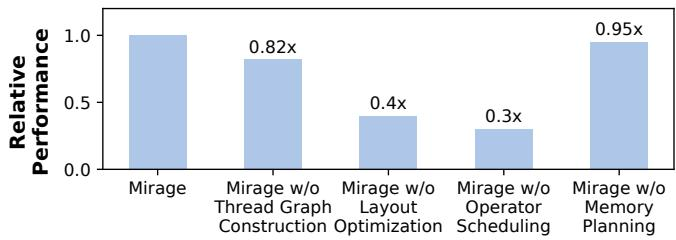  
Figure 12: Ablation study on optimizations used in Mirage. We evaluate the performance degradation when disabling each optimization independently. The evaluation is performed on A100 for GQA with batch size 1.

## 8.5 Ablation Study on Optimizations

We conduct an ablation study to evaluate the impact of thread graph construction and optimizations introduced in §6, including layout optimization, operator scheduling, and memory planning. Specifically, we measure the performance degradation of the best µGraph discovered by Mirage when each optimization is disabled independently. The study is conducted on an A100 using the GQA benchmark with a batch size of 1. The results, shown in Figure 12, indicate that disabling any individual optimization leads to a performance degradation ranging from 5% to 70%.

## 9 Related Work

Manually-designed kernels. Many existing frameworks, such as TensorFlow XLA [1, 9], PyTorch [34], and TensorRT [42], rely on GPU experts to manually design kernels for ML operators. Recently, significant engineering effort has been dedicated to hand-optimizing GPU kernels for commonly used DNNs, particularly foundation models [12]. For example, to accelerate attention computation [47], several specialized kernels have been developed based on FlashAttention [4,5,17,21]. Due to the increasing complexity of modern GPUs—such as tensor cores in A100s [29] and thread block clusters in H100s [7]—manually designed kernels may miss subtle optimizations that are hard to discover manually.

Superoptimization-based approaches. Superoptimization was originally introduced to find optimal instruction sequences [11, 30, 36]. Recent work has applied superoptimization techniques to tensor programs [23–26, 45, 46, 49, 52]. However, all these attempts only consider algebraic transformations at the kernel level and cannot discover more sophisticated optimizations that require jointly considering algebraic and schedule transformations at all of the kernel, block, and thread levels. Our evaluation shows that Mirage largely outperforms existing DNN superoptimizers, demonstrating the importance of multi-level joint optimization.

Schedule-based approaches. Recent work has introduced ML compilers that automatically optimize the execution schedule of kernel GPUs. Systems such as TVM [13, 14], Ansor [51], and Triton [43], along with others [19, 20, 53], build on the idea of algorithm-schedule separation introduced in Halide. They search for optimized schedules to execute a user-specified algorithm on GPUs. However, schedule-based approaches require users to explicitly specify the algorithm for each kernel, and their performance is limited to the quality of these provided algorithms.

Multi-level graph representations. Welder [38] and AS-PEN [33] introduce multi-level tile graphs that share similarities with Mirage’s µGraphs, as both representations follow the GPU hierarchy. However, prior work focuses on scheduling transformations, while Mirage extends beyond scheduling by also considering algebraic transformations and the discovery of new custom kernels. Most optimizations presented in this paper fall outside the scope of these prior approaches.

## 10 Conclusion

This paper proposes Mirage, the first multi-level superoptimizer for tensor programs. Mirage introduces a hierarchy graph representation to specify a tensor program at the kernel, thread block, and thread levels of the GPU execution hierarchy, and uses a novel pruning technique based on abstraction to significantly reduce the search space Mirage needs to consider while providing a certain optimality guarantee. Mirage outperforms existing tensor program optimizers by up to 3.3×, even for widely used and heavily optimized DNNs.

## Acknowledgment

We would like to thank the anonymous reviewers and our shepherd, Stephanie Wang, for their valuable comments and suggestions. We thank Tianqi Chen, Phillip Gibbons, Bohan Hou, Muyan Hu, Jinchen Jiang, Xiaoyu Jiang, Ruihang Lai, Yu Zhou, and other CMU Catalyst members for their feedback on this work. This research is partially supported by NSF awards CNS-2147909, CNS-2211882, and CNS-2239351, and research awards from Amazon, Cisco, Google, Meta, NVIDIA, Oracle, Qualcomm, and Samsung. This research is also partially supported by a research grant from the Center for New Scientists at the Weizmann Institute of Science and by a grant from the Azrieli Foundation.

## References

[1] Xla: Optimizing compiler for tensorflow. https:// www.tensorflow.org/xla, 2017. 14

[2] Nvidia/cutlass: Cuda templates for linear algebra subroutines. https://github.com/NVIDIA/cutlass, 2019. 10

[3] Tensorflow graph optimization with grappler. https : //www.tensorflow.org/guide/graph\_ optimization, 2019. 1

[4] Transformer related optimizations. https : //github. com/NVIDIA/FasterTransformer, 2020. 14

[5] Flash-decoding for long-context inference. https : //crfm.stanford.edu/2023/10/12/ flashdecoding.html, 2023. 2, 14

[6] Llama-7b-lora. https : //huggingface.co/Laurie/ llama7b-lora-merged/tree/main, 2023. 10

[7] Nvidia h100 tensor core gpu. https : //www.nvidia. com/en-us/data-center/h100/, 2023. 14

[8] A Triton implementation of the FlashAttention2 algorithm. https://triton-lang. org/main/getting-started/tutorials/ 06-fused-attention.html, 2023. 2

[9] Martín Abadi, Paul Barham, Jianmin Chen, Zhifeng Chen, Andy Davis, Jeffrey Dean, Matthieu Devin, Sanjay Ghemawat, Geoffrey Irving, Michael Isard, Manjunath Kudlur, Josh Levenberg, Rajat Monga, Sherry Moore, Derek G. Murray, Benoit Steiner, Paul Tucker, Vijay Vasudevan, Pete Warden, Martin Wicke, Yuan Yu, and Xiaoqiang Zheng. Tensorflow: A system for largescale machine learning. In Proceedings of the 12th USENIX Conference on Operating Systems Design and Implementation, OSDI, 2016. 1, 14

[10] Ebtesam Almazrouei, Hamza Alobeidli, Abdulaziz Alshamsi, Alessandro Cappelli, Ruxandra Cojocaru, Merouane Debbah, Etienne Goffinet, Daniel Heslow, Julien Launay, Quentin Malartic, Badreddine Noune, Baptiste Pannier, and Guilherme Penedo. Falcon-40B: an open large language model with state-of-the-art performance. 2023. 10, 12

[11] Sorav Bansal and Alex Aiken. Automatic generation of peephole superoptimizers. In Proceedings of the 12th International Conference on Architectural Support for Programming Languages and Operating Systems, ASPLOS XII, 2006. 14

[12] Rishi Bommasani, Drew A. Hudson, Ehsan Adeli, Russ Altman, Simran Arora, Sydney von Arx, Michael S. Bernstein, Jeannette Bohg, Antoine Bosselut, Emma

Brunskill, Erik Brynjolfsson, Shyamal Buch, Dallas Card, Rodrigo Castellon, Niladri Chatterji, Annie Chen, Kathleen Creel, Jared Quincy Davis, Dora Demszky, Chris Donahue, Moussa Doumbouya, Esin Durmus, Stefano Ermon, John Etchemendy, Kawin Ethayarajh, Li Fei-Fei, Chelsea Finn, Trevor Gale, Lauren Gillespie, Karan Goel, Noah Goodman, Shelby Grossman, Neel Guha, Tatsunori Hashimoto, Peter Henderson, John Hewitt, Daniel E. Ho, Jenny Hong, Kyle Hsu, Jing Huang, Thomas Icard, Saahil Jain, Dan Jurafsky, Pratyusha Kalluri, Siddharth Karamcheti, Geoff Keeling, Fereshte Khani, Omar Khattab, Pang Wei Koh, Mark Krass, Ranjay Krishna, Rohith Kuditipudi, Ananya Kumar, Faisal Ladhak, Mina Lee, Tony Lee, Jure Leskovec, Isabelle Levent, Xiang Lisa Li, Xuechen Li, Tengyu Ma, Ali Malik, Christopher D. Manning, Suvir Mirchandani, Eric Mitchell, Zanele Munyikwa, Suraj Nair, Avanika Narayan, Deepak Narayanan, Ben Newman, Allen Nie, Juan Carlos Niebles, Hamed Nilforoshan, Julian Nyarko, Giray Ogut, Laurel Orr, Isabel Papadimitriou, Joon Sung Park, Chris Piech, Eva Portelance, Christopher Potts, Aditi Raghunathan, Rob Reich, Hongyu Ren, Frieda Rong, Yusuf Roohani, Camilo Ruiz, Jack Ryan, Christopher Ré, Dorsa Sadigh, Shiori Sagawa, Keshav Santhanam, Andy Shih, Krishnan Srinivasan, Alex Tamkin, Rohan Taori, Armin W. Thomas, Florian Tramèr, Rose E. Wang, William Wang, Bohan Wu, Jiajun Wu, Yuhuai Wu, Sang Michael Xie, Michihiro Yasunaga, Jiaxuan You, Matei Zaharia, Michael Zhang, Tianyi Zhang, Xikun Zhang, Yuhui Zhang, Lucia Zheng, Kaitlyn Zhou, and Percy Liang. On the opportunities and risks of foundation models, 2022. 14

[13] Tianqi Chen, Thierry Moreau, Ziheng Jiang, Haichen Shen, Eddie Q. Yan, Leyuan Wang, Yuwei Hu, Luis Ceze, Carlos Guestrin, and Arvind Krishnamurthy. TVM: end-to-end optimization stack for deep learning. CoRR, abs/1802.04799, 2018. 1, 5, 14

[14] Tianqi Chen, Lianmin Zheng, Eddie Yan, Ziheng Jiang, Thierry Moreau, Luis Ceze, Carlos Guestrin, and Arvind Krishnamurthy. Learning to optimize tensor programs. In Advances in Neural Information Processing Systems 31, NeurIPS’18. 2018. 14

[15] Sharan Chetlur, Cliff Woolley, Philippe Vandermersch, Jonathan Cohen, John Tran, Bryan Catanzaro, and Evan Shelhamer. cudnn: Efficient primitives for deep learning. CoRR, abs/1410.0759, 2014. 3, 10, 11

[16] Dense Linear Algebra on GPUs. https://developer. nvidia.com/cublas, 2016. 3, 9, 10, 11

[17] Tri Dao, Daniel Haziza, Francisco Massa, and Grigory Sizov. Flash-decoding for long-context inference, 2023. 2, 11, 12, 14

[18] Leonardo De Moura and Nikolaj Bjørner. Z3: An efficient smt solver. In Proceedings of the Theory and Practice of Software, 14th International Conference on Tools and Algorithms for the Construction and Analysis of Systems, TACAS’08/ETAPS’08, 2008. 7, 9, 10

[19] Siyuan Feng, Bohan Hou, Hongyi Jin, Wuwei Lin, Junru Shao, Ruihang Lai, Zihao Ye, Lianmin Zheng, Cody Hao Yu, Yong Yu, and Tianqi Chen. Tensorir: An abstraction for automatic tensorized program optimization, 2022. 14

[20] Bastian Hagedorn, Bin Fan, Hanfeng Chen, Cris Cecka, Michael Garland, and Vinod Grover. Graphene: An ir for optimized tensor computations on gpus. In Proceedings of the 28th ACM International Conference on Architectural Support for Programming Languages and Operating Systems, Volume 3, ASPLOS 2023, page 302–313, New York, NY, USA, 2023. Association for Computing Machinery. 14

[21] Ke Hong, Guohao Dai, Jiaming Xu, Qiuli Mao, Xiuhong Li, Jun Liu, Kangdi Chen, Yuhan Dong, and Yu Wang. Flashdecoding++: Faster large language model inference on gpus, 2024. 11, 14

[22] Edward J Hu, Yelong Shen, Phillip Wallis, Zeyuan Allen-Zhu, Yuanzhi Li, Shean Wang, Lu Wang, and Weizhu Chen. Lora: Low-rank adaptation of large language models. arXiv preprint arXiv:2106.09685, 2021. 11

[23] Muyan Hu, Ashwin Venkatram, Shreyashri Biswas, Balamurugan Marimuthu, Bohan Hou, Gabriele Oliaro, Haojie Wang, Liyan Zheng, Xupeng Miao, Jidong Zhai, and Zhihao Jia. Optimal kernel orchestration for tensor programs with korch. In Proceedings of the 29th ACM International Conference on Architectural Support for Programming Languages and Operating Systems, Volume 3, ASPLOS ’24, page 755–769, New York, NY, USA, 2024. Association for Computing Machinery. 14

[24] Byungsoo Jeon, Mengdi Wu, Shiyi Cao, Sunghyun Kim, Sunghyun Park, Neeraj Aggarwal, Colin Unger, Daiyaan Arfeen, Peiyuan Liao, Xupeng Miao, Mohammad Alizadeh, Gregory R. Ganger, Tianqi Chen, and Zhihao Jia. Graphpipe: Improving performance and scalability of dnn training with graph pipeline parallelism. In Proceedings of the 30th ACM International Conference on Architectural Support for Programming Languages and Operating Systems, Volume 1, ASPLOS ’25, page 557–571, New York, NY, USA, 2025. Association for Computing Machinery. 14

[25] Zhihao Jia, Oded Padon, James Thomas, Todd Warszawski, Matei Zaharia, and Alex Aiken. Taso: Optimizing deep learning computation with automatic generation of graph substitutions. In Proceedings of the 27th ACM

Symposium on Operating Systems Principles, SOSP ’19, page 47–62, New York, NY, USA, 2019. Association for Computing Machinery. 1, 2, 5, 11, 14

[26] Zhihao Jia, Matei Zaharia, and Alex Aiken. Beyond data and model parallelism for deep neural networks. In Proceedings of the 2nd Conference on Systems and Machine Learning, SysML’19, 2019. 14

[27] Jiatu Li and Mengdi Wu. Identity testing for circuits with exponentiation gates, 2025. 9

[28] Ilya Loshchilov, Cheng-Ping Hsieh, Simeng Sun, and Boris Ginsburg. nGPT: Normalized transformer with representation learning on the hypersphere, 2024. 10, 11, 13

[29] Stefano Markidis, Steven Wei Der Chien, Erwin Laure, Ivy Bo Peng, and Jeffrey S. Vetter. Nvidia tensor core programmability, performance & precision. In 2018 IEEE International Parallel and Distributed Processing Symposium Workshops (IPDPSW). IEEE, May 2018. 14

[30] Henry Massalin. Superoptimizer: a look at the smallest program. In ACM SIGARCH Computer Architecture News, volume 15, 1987. 14

[31] Ravi Teja Mullapudi, Andrew Adams, Dillon Sharlet, Jonathan Ragan-Kelley, and Kayvon Fatahalian. Automatically scheduling halide image processing pipelines. ACM Trans. Graph., 35(4), 2016. 5

[32] Vinod Nair and Geoffrey E. Hinton. Rectified linear units improve restricted boltzmann machines. In Proceedings of the 27th International Conference on International Conference on Machine Learning, ICML’10, pages 807–814, USA, 2010. Omnipress. 10

[33] Jongseok Park, Kyungmin Bin, Gibum Park, Sangtae Ha, and Kyunghan Lee. Aspen: Breaking operator barriers for efficient parallelization of deep neural networks. In A. Oh, T. Naumann, A. Globerson, K. Saenko, M. Hardt, and S. Levine, editors, Advances in Neural Information Processing Systems, volume 36, pages 68625–68638. Curran Associates, Inc., 2023. 14

[34] Tensors and Dynamic neural networks in Python with strong GPU acceleration. https://pytorch.org, 2017. 1, 11, 14

[35] Jonathan Ragan-Kelley, Connelly Barnes, Andrew Adams, Sylvain Paris, Frédo Durand, and Saman Amarasinghe. Halide: A language and compiler for optimizing parallelism, locality, and recomputation in image processing pipelines. In Proceedings of the 34th ACM SIGPLAN Conference on Programming Language Design and Implementation, PLDI ’13, 2013. 1, 5

[36] Eric Schkufza, Rahul Sharma, and Alex Aiken. Stochastic superoptimization. In ACM SIGPLAN Notices, volume 48, 2013. 14

[37] J. T. Schwartz. Fast probabilistic algorithms for verification of polynomial identities. J. ACM, 27(4):701–717, oct 1980. 2, 8, 9

[38] Yining Shi, Zhi Yang, Jilong Xue, Lingxiao Ma, Yuqing Xia, Ziming Miao, Yuxiao Guo, Fan Yang, and Lidong Zhou. Welder: Scheduling deep learning memory access via tile-graph. In 17th USENIX Symposium on Operating Systems Design and Implementation (OSDI 23), pages 701–718, Boston, MA, July 2023. USENIX Association. 14

[39] Mohammad Shoeybi, Mostofa Patwary, Raul Puri, Patrick LeGresley, Jared Casper, and Bryan Catanzaro. Megatron-lm: Training multi-billion parameter language models using model parallelism. CoRR, abs/1909.08053, 2019. 11

[40] Chameleon Team. Chameleon: Mixed-modal earlyfusion foundation models, 2024. 10, 11, 12

[41] The Llama 3 team. The llama 3 herd of models, 2024. 3, 5, 10, 11

[42] NVIDIA TensorRT: Programmable inference accelerator. https://developer.nvidia.com/tensorrt, 2017. 11, 14

[43] Philippe Tillet, H. T. Kung, and David Cox. Triton: an intermediate language and compiler for tiled neural network computations. In Proceedings of the 3rd ACM SIGPLAN International Workshop on Machine Learning and Programming Languages, MAPL 2019, page 10–19, New York, NY, USA, 2019. Association for Computing Machinery. 2, 11, 14

[44] Hugo Touvron, Louis Martin, Kevin Stone, Peter Albert, Amjad Almahairi, Yasmine Babaei, Nikolay Bashlykov, Soumya Batra, Prajjwal Bhargava, Shruti Bhosale, et al. Llama 2: Open foundation and fine-tuned chat models, 2023. 10

[45] Colin Unger, Zhihao Jia, Wei Wu, Sina Lin, Mandeep Baines, Carlos Efrain Quintero Narvaez, Vinay Ramakrishnaiah, Nirmal Prajapati, Patrick S. McCormick, Jamaludin Mohd-Yusof, Xi Luo, Dheevatsa Mudigere, Jongsoo Park, Misha Smelyanskiy, and Alex Aiken. Unity: Accelerating DNN training through joint optimization of algebraic transformations and parallelization. In 16th USENIX Symposium on Operating Systems Design and Implementation, OSDI 2022, Carlsbad, CA, USA, July 11-13, 2022, pages 267–284. USENIX Association, 2022. 14

[46] Haojie Wang, Jidong Zhai, Mingyu Gao, Zixuan Ma, Shizhi Tang, Liyan Zheng, Yuanzhi Li, Kaiyuan Rong, Yuanyong Chen, and Zhihao Jia. PET: Optimizing tensor programs with partially equivalent transformations and automated corrections. In 15th USENIX Symposium on Operating Systems Design and Implementation (OSDI 21), pages 37–54. USENIX Association, July 2021. 1, 2, 5, 8, 11, 14

[47] Thomas Wolf, Lysandre Debut, Victor Sanh, Julien Chaumond, Clement Delangue, Anthony Moi, Pierric Cistac, Tim Rault, Rémi Louf, Morgan Funtowicz, Joe Davison, Sam Shleifer, Patrick von Platen, Clara Ma, Yacine Jernite, Julien Plu, Canwen Xu, Teven Le Scao, Sylvain Gugger, Mariama Drame, Quentin Lhoest, and Alexander M. Rush. Transformers: State-of-the-art machine learning for pytorch, tensorflow, and jax. https : //github.com/huggingface/ transformers, 2022. 2, 14

[48] Yichen Yang, Phitchaya Mangpo Phothilimtha, Yisu Remy Wang, Max Willsey, Sudip Roy, and Jacques Pienaar. Equality saturation for tensor graph superoptimization, 2021. 1

[49] Yichen Yang, Phitchaya Phothilimthana, Yisu Wang, Max Willsey, Sudip Roy, and Jacques Pienaar. Equality Saturation for Tensor Graph Superoptimization. Proceedings of Machine Learning and Systems, 3:255–268, March 2021. 14

[50] Biao Zhang and Rico Sennrich. Root mean square layer normalization, 2019. 5

[51] Lianmin Zheng, Chengfan Jia, Minmin Sun, Zhao Wu, Cody Hao Yu, Ameer Haj-Ali, Yida Wang, Jun Yang, Danyang Zhuo, Koushik Sen, Joseph E. Gonzalez, and Ion Stoica. Ansor : Generating high-performance tensor programs for deep learning. CoRR, abs/2006.06762, 2020. 1, 14

[52] Liyan Zheng, Haojie Wang, Jidong Zhai, Muyan Hu, Zixuan Ma, Tuowei Wang, Shuhong Huang, Xupeng Miao, Shizhi Tang, Kezhao Huang, and Zhihao Jia. EINNET: Optimizing tensor programs with Derivation-Based transformations. In 17th USENIX Symposium on Operating Systems Design and Implementation (OSDI 23), pages 739–755, Boston, MA, July 2023. USENIX Association. 14

[53] Size Zheng, Yun Liang, Shuo Wang, Renze Chen, and Kaiwen Sheng. Flextensor: An automatic schedule exploration and optimization framework for tensor computation on heterogeneous system. In Proceedings of the Twenty-Fifth International Conference on Architectural Support for Programming Languages and Operating Systems, ASPLOS ’20, page 859–873, New York, NY, USA, 2020. Association for Computing Machinery. 14

[54] Richard Zippel. Probabilistic algorithms for sparse polynomials. In International symposium on symbolic and

algebraic manipulation, pages 216–226. Springer, 1979. 2, 8, 9