USENIX

THE ADVANCED COMPUTING SYSTEMS ASSOCIATION

# OS Rendering Service Made Parallel with Out-of-Order Execution and In-Order Commit

Yuanpei Wu and Dong Du, Institute of Parallel and Distributed Systems, Shanghai Jiao Tong University; Engineering Research Center for Domain-specific Operating Systems, Ministry of Education; Chao Xu, Fields Lab, Huawei Central Software Institute; Yubin Xia and Yang Yu, Institute of Parallel and Distributed   
Systems, Shanghai Jiao Tong University; Engineering Research Center for Domainspecific Operating Systems, Ministry of Education; Ming Fu, Fields Lab, Huawei   
Central Software Institute; Binyu Zang and Haibo Chen, Institute of Parallel and   
Distributed Systems, Shanghai Jiao Tong University; Engineering Research Center for Domain-specific Operating Systems, Ministry of Education

https://www.usenix.org/conference/osdi25/presentation/wu-yuanpei

# This paper is included in the Proceedings of the 19th USENIX Symposium on Operating Systems Design and Implementation.

July 7–9, 2025 • Boston, MA, USA

ISBN 978-1-939133-47-2

Open access to the Proceedings of the 19th USENIX Symposium on Operating Systems Design and Implementation is sponsored by

# OS Rendering Service Made Parallel With Out-of-Order Execution and In-Order Commit

Yuanpei Wu1,2 Dong Du1,2 Chao Xu3 Yubin Xia1,2   
Yang Yu1,2 Ming Fu3 Binyu Zang1,2 Haibo Chen1,2

1Institute of Parallel and Distributed Systems, Shanghai Jiao Tong University 2Engineering Research Center for Domain-specific Operating Systems, Ministry of Education 3Fields Lab, Huawei Central Software Institute

## Abstract

Rendering service is an indispensable OS service on smartdevice OSes like Android, iOS and OpenHarmony. However, the recent shift towards highly scalable display scenarios, such as foldable and multiple screens, has notably amplified the rendering workload, leading to low frame rates that degrade user experience. Yet, rendering services predominantly follow a sequential model, which is notoriously hard to parallelize due to the complex state dependency, drawing order dependency, and interface dependency.

This paper observes that a significant portion of the rendering procedure is potentially parallelizable through proper state pre-untangling and drawing order post-preserving. To this end, this paper introduces Spars, a scalable parallelized OS rendering service inspired by the out-of-order execution with in-order commit in computer architecture. Spars revolutionizes the rendering procedure by initially generating self-contained rendering tasks through in-order preparation, executing such tasks in an out-of-order manner to maximize multi-core parallelism, and subsequently committing the tasks in-order to enforce drawing order dependencies. Evaluation results on state-of-the-art single-screen, dual-fold, and tri-fold smartphones (Mate 70, X5, XT) as well as one-chip-multiplescreen configurations show an average frame rate improvement of 1.76×–1.91×. Moreover, Spars is able to decrease the device power consumption by 3.0% or increase the budget of graphics primitives by 2.31× for more appealing visual effects with the same stable frame rate.

## 1 Introduction

Rendering service is a crucial system service on smart-device OSes like iOS [19], Android [6], and OpenHarmony [22], enabling the display of exquisite graphical user interfaces (GUIs). On average, people worldwide spend 6 hours and 40 minutes per day on screens [56], not accounting for emerging graphical devices such as intelligent cockpits, head-up displays, smart homes, and wearable devices. Rendering service represents one of the most demanding workloads in smart OSes — our evaluations show that rendering-related tasks typically occupy 65%–95% of total CPU and GPU running time in commercial smartphones.

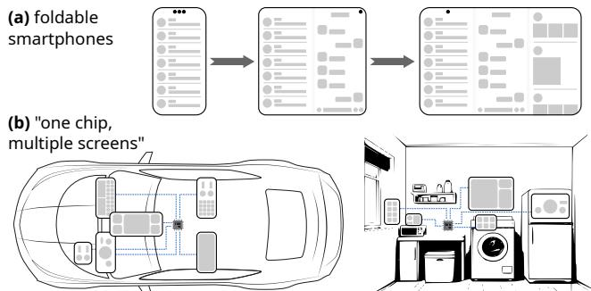  
Figure 1: Demands for rendering scalability in foldable smartphones and one-chip-multiple-screen display setups.

The workflow of state-of-the-art rendering services follows a sequential model, encompassing management of a render tree, translation of draw commands into GPU objects, and GPU rasterization into pixels. First, the rendering service maintains a render tree, where each render node stores draw commands and parameters of graphics primitives, such as the height and width of a rectangle. Meanwhile, each node contains relative information with respect to its parent, such as the relative position, and its child nodes are sorted based on the drawing order from back to front. Subsequently, a 2D drawing engine translates draw commands in the tree into GPU objects like meshes, textures, and pipelines. When sequentially traversing the tree node by node, it tracks a stack of relative information and enforces the correct drawing order. Eventually, the GPU handles triangle rasterization, texture sampling, pixel shading, etc., based on the GPU objects provided through standard GPU APIs like Vulkan [34].

Emerging demand for scalable rendering. While the sequential model continues to be effective for traditional devices, the recent shift towards smart devices featuring foldable screens [11, 13, 16, 17, 25] and multiple screens [7, 46] in smartphones and intelligent cockpits (Figure 1) has placed increasing pressure on the OS rendering services. For example, while the Huawei Mate 70 (single-screen), Mate X5 (dual-fold), and Mate XT (tri-fold) possess similar Systemon-Chip (SoC), the latter two need to render 70% and 117% more pixels in each frame due to the larger screen area. The limitations of state-of-the-art sequential rendering services in coping with such heightened demands compel smartphone manufacturers to make compromises on other display parameters, such as pixel density reduction in Samsung and frame rate decrease in Huawei (§3.1). Intelligent cockpits with onechip-multiple-screen display configurations face the same dilemma of trade-offs.

Key observation: bottleneck due to core underutilization in rendering services. We have identified a critical issue of underutilization in the hardware capabilities of rendering services. Despite the availability of multiple CPU cores, many remain underutilized or idle, even when they could contribute to handling the increased workloads. In real-world experiments (§3.3), for example, the rendering service’s render thread monopolizes 80% utilization of a single core, limiting the frame rate. The remaining cores are only partially engaged in application logic, leaving 9 out of 12 cores idle and underutilized. This underutilization highlights the potential to improve performance by better leveraging the multi-core parallelism of modern SoCs, enabling rendering services to scale more effectively to meet the growing demands.

Based on this key observation, we argue that the nextgeneration rendering service should adopt a parallel architecture to address scalable rendering demands. Nevertheless, designing a scalable and parallel rendering service presents three significant challenges posed by dependencies.

Challenge-1 (C1): State dependency. Rendering tasks exhibit state dependencies that hinder parallelization efforts. Each node only contains the relative information with its parent. This design ensures that modifying a single node triggers updates across its entire subtree, while necessitating a sequential depth-first traversal to convert the relative information into absolute values before executing each draw command.

Challenge-2 (C2): Drawing order dependency. Rendering tasks involve critical drawing order dependencies that must be maintained. When two graphics primitives overlap, the background should always be rendered before the foreground (i.e., overlapping relations). While the render tree organizes the children of each node from back to front and preserves the sequence through a depth-first traversal, the pre-defined drawing order impedes parallelization efforts.

Challenge-3 (C3): Interface dependency. Refactoring for parallelization would impact existing interface compatibility. Traditional 2D rendering systems utilize a stateful interface, such as Skia Canvas [27] or Drawing API [9], where new commands may rely on past commands. Also, traditional state-based rendering optimizations like command batching should not be ignored under the new rendering paradigm.

To tackle these challenges, we introduce Spars, a scalable and parallel OS rendering service, powered by a novel drawing engine Spade2D. Our key insight in overcoming the aforementioned challenges is that rendering tasks do not need to be executed sequentially to satisfy the three dependencies — our study reveals that a large portion (76%) of the rendering procedure could be self-contained and potentially parallelizable, as long as the states are properly untangled for inputs and the drawing orders are carefully maintained for outputs. This approach is closely analogous to out-of-order execution in computer architecture [83], where instructions are dispatched as soon as dependencies are resolved, while their results are committed in-order to ensure program correctness.

Drawing inspiration from the concept, Spars employs a three-stage rendering procedure: in-order preparation, outof-order execution, and in-order commit, to effectively utilize multi-core SoCs without violating dependency constraints. Specifically, Spars introduces the concept of self-contained rendering tasks derived from the render tree, allowing each task to be executed out-of-order and in parallel, thereby untangling state dependencies (C1). We observed that the actual execution of rendering does not impact the preparation of required drawing states. A quick in-order dry run, without rendering, suffices to decouple non-parallelizable states from the parallelizable tasks. Next, to ensure correct drawing order (C2), Spars explicitly manages overlapping relations of the rendering tasks for a dedicated commit thread. A finished rendering task can be committed to the GPU command only if all the drawing order dependencies are respected. Finally, Spars decouples the rendering procedure into two phases: a stateful phase and a stateless phase. The former maintains a consistent interface (C3) for custom-rendering applications and state-based optimizations, while the underlying Spade2D drawing engine, in contrast, employs a stateless interface for parallelism and scalability.

We have implemented and tested Spars1 with 42 representative smartphone scenarios on Mate 70, Mate X5, Mate XT, and 12 one-chip-multiple-screen configurations. Comparing the results with the state-of-the-art sequential rendering models of OpenHarmony demonstrates an average frame rate increase of 1.76×–1.91×. Through leveraging multi-core parallelization, Spars is able to reduce the whole-device power consumption by 3.0% or allow a 2.31× budget for the total number of rendering graphics primitives for more appealing visual effects under the same frame rate. We anticipate that the design of Spars will significantly influence the evolution of next-generation OS rendering services.

## 2 OS Rendering Service Explained

The OS rendering service, as a system service, is responsible for rendering all of the GUI elements specified and synchronized from applications into every pixel (color value) of the frame buffer. This section uses the state-of-the-art iOS [31] and OpenHarmony [3] designs to illustrate the core rendering procedure, demonstrated in Figure 2.

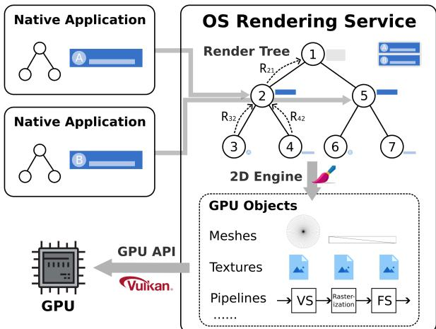  
Figure 2: OS core rendering procedure.

## 2.1 Render Tree

The render tree in the OS rendering service unifies and manages all of the drawing information on the screen(s). Different types of the render nodes on the tree record screen parameters, window parameters, and most importantly, parameters of the draw commands. Each draw command encodes a 2D graphics primitive, such as the height and width of a rectangle or the radius of a circle. When an application needs to update its content, it synchronizes a modified subtree or specific animation instructions of the render nodes with the OS rendering service through inter-process communication. Compared to the window-divided rendering approach used by Android [14] or Wayland [58], where each application process renders its own frame buffer locally for later system-wide composition, a unified render tree enables richer inter-window animations and visual effects. With finer-grained occlusion culling and reduced frame buffer memory usage, iOS [31], visionOS [30], OpenHarmony [3], etc., all adopt such strategy.

Implication-1: Current rendering services only maintain relative information in render nodes. Each render node on the tree only contains the relative information (R) with respect to its parent, such as the relative transform matrix (encoding translation, scaling, and rotation) and the relative clippings (scissoring the drawing region). This design ensures that modifying R of any node sufficiently and efficiently updates the entire subtree — for example, moving its position.

Implication-2: Drawing order should be strictly enforced for correctness. Each render node has its children sorted based on the drawing order, from back to front. Note that node drawing is not always commutative due to possible overlapping. Left subtree must be drawn before the right subtree based on the pre-definition. Therefore, a depth-first traversal of the render tree implicitly keeps the drawing order, as the numerical example (from 1 to 7) shown in Figure 2.

## 2.2 2D Engine

The 2D drawing engine translates the parameters of the draw commands (i.e., the mathematical expressions of 2D graphics primitives) into GPU objects like meshes, textures, and pipelines, which are later sent to GPU for actual rasterization. Implication-3: The core rendering logic (translation from commands to GPU objects) is a time-consuming CPU procedure. Modern 2D engines like Skia [29] or Impeller [18] mostly use CPU tessellation to triangulate 2D primitives into meshes for GPU to rasterize, combined with signed distance field (SDF) [52, 70] and stencil then cover (StC) [61] algorithms for anti-aliasing and rendering specific graphics primitives. While SDF and StC help reduce some CPU load, the end-to-end rendering procedure still involves CPU-intensive tessellation, memory buffer filling, and other GPU object preparations, with CPU time accounting for 82% of the total frame rendering time in commercial OS rendering (§3.3). Besides, glyphs (text) are still rasterized by the CPU into an atlas using tools like FreeType [12] for functional completeness, and then mapped by the GPU to specific positions.

Implication-4: Existing 2D engines expose stateful interfaces for rendering, which keep internal states so past commands would affect future commands. When the rendering service depth-first traverses the render tree, it issues state-update commands to the underlying 2D engine using the relative information R. At any node during the traversal, the 2D engine always keeps a stack of relative information along the path — from the tree root to the current node — so that a subsequent draw command can derive the absolute state of the transform matrix and clippings.

Implication-5: Stateful interfaces enable 2D engines to use state-based optimizations internally. One important optimization is command batching. Rather than individually doing the translation one command by another, 2D engines first organize them into a chain structure, serving as an intermediate representation (IR) for GPU object generation. Each new command will be appended to the end of the chain, and then try to coalesce with the previous command if they can share the same GPU pipeline, i.e., using the same shaders and pipeline configurations. If not, the iteration can go one command backward as long as the current non-coalescible command does not overlap with the new command, so the drawing order is still correct if batching with previous commands. The backward iteration typically has a constant maximum limit to prevent the linear complexity from degrading into quadratic for building the entire chain.

## 2.3 GPU API

The GPU API, implemented by the GPU driver, provides standardized interfaces (i.e., abstractions of the GPU objects) that enable 2D engines to leverage the GPU for efficient graphics rasterization. It provides the capabilities of drawing triangles, sampling textures (images), shading graphics primitives with various visual effects via programmable shaders, etc.

Implication-6: Modern GPU APIs are already stateless and can support parallel tasks. The next-generation GPU APIs such as Vulkan [34], Metal [20], and DirectX12 [8], on which state-of-the-art rendering services and 2D engines are built, are stateless within the GPU driver. In contrast with traditional APIs like OpenGL [23] which maintain a singlethreaded state machine model within the GPU driver, they delegate the management of GPU objects to the API users. This provides a necessary condition for scalable and parallel rendering in multi-core configurations.

Implication-7: Modern GPU APIs still have constraints that must be considered in system design for compatibility. Modern GPU APIs still have parallelization constraints, considering the need for compatibility with existing GPU hardware. For instance, in Vulkan, command buffers should not be arbitrarily small because of the limitations in CPU submission and GPU scheduling. Also, parallel-recorded secondary command buffers cannot target at a different frame buffer (i.e., render pass) than the primary command buffer [59], which is a common case in OS rendering services where some components need to render into a separate layer. Our system is designed with these parallelization constraints in mind.

## 3 The Need for Scalable Rendering

In recent years, the demand for visually captivating, smooth, and immersive displays has been driving the evolution of next-generation smart devices [66, 87, 93], particularly in the form of foldable smartphones and multi-screen environments. Achieving larger display area, higher pixel density, and higher refresh rate at the same time has become both a user expectation and a technical challenge, pushing traditional fixed-thread sequential rendering models into their limits. This section analyzes the current and future display capabilities of flagship commercial smart devices, identifies their performance bottlenecks, and presents our observations.

## 3.1 Increased Rendering Loads in the Wild

Scenario-1: Foldable large screen. Foldable smartphones, including dual- [13,16,25] and emerging tri-fold devices [17], represent a significant advancement in screen design, and the market size was valued at 27.79 billion USD in 2023 with expected annual growth of 13.5% [11]. These devices offer users the ability and flexibility to view and interact with multiple pages and more content simultaneously, enhancing both immersion and productivity. However, the increased display area — compared to traditional single-screen devices — results in higher demands on frame rendering performance.

Figure 3 compares the screen specifications of contemporaneous flagship models. As foldable devices often use the same chipset as their single-screen counterparts, the larger display area in reality requires trade-offs in other aspects. For example, Samsung opts to reduce pixel density, keeping the total number of pixels similar to that of traditional smartphones with a sacrifice of definition. On the other hand, Huawei reduces the frame rate of foldable smartphones to 90Hz in common use cases, sparing more time for each frame to be rendered, even if today’s mainstream screen hardware supports up to 120Hz, with a sacrifice of smoothness.

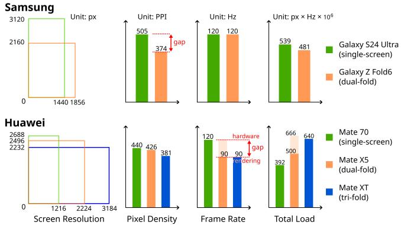  
Figure 3: Display specifications of flagship smartphones. Large screen area means trade-offs in other parameters.

Scenario-2: One chip, multiple screens. In 2023, multiscreen solutions were installed in about 3.6 million cars in China, with 43 and 52 brands offering multi- or dual-screen intelligent cockpits, respectively [7]. For example, AITO M9 (2024) [5] features five screens: a center screen (1× 15.6"), a dashboard screen (1× 12.3"), a copilot screen (1× 16"), and two backseat screens (2× 17.3"). In multi-display environments, a single chipset is often responsible for driving multiple screens simultaneously to achieve a consistent and synchronous experience, with graphical elements able to freely and seamlessly stream between different screens [46].

Challenges arise for the OS rendering service when preparing content for multiple displays at once, as the computational demands increase proportionally. As a result, current state-of-the-art multi-screen environments can only operate at 45Hz–60Hz frame rate [92] and trade display quality (e.g., number of graphics primitives) for stable performance. This disparity between hardware display limit and software rendering capability underscores the need for a scalable and parallel OS rendering service.

## 3.2 State-of-the-Art Efforts

State-of-the-art rendering services in commercial operating systems adopt two classes of parallelization: inter-frame parallelism and multi-window parallelism, to tackle the CPU performance bottleneck in 2D rendering.

Inter-frame parallelism. iOS [31], Android [14], and Open-Harmony [3] all employ a multi-stage pipeline for inter-frame parallelism, where each frame is sequentially rendered across a fixed set of threads, with consecutive frames in different stages rendered in parallel, as shown in Figure 4(a). Interframe parallelism does improve multi-core utilization, but it has three limitations. First, the number of threads that can be used are not scalable, as the number of stages (usually 2 or 3) are tightly coupled with the rendering logic, statically divided in advance. Second, the performance is bottlenecked by the longest stage. Due to the static logic-coupled division, stage imbalance is unavoidable. In OpenHarmony, we observed that the running time of stage-1 is <50% shorter than the heavilyloaded stage-2. Last, inter-frame parallelism may increase rendering latency, as each frame needs to span two to three Vertical Synchronization (VSync) periods [33] to finish.

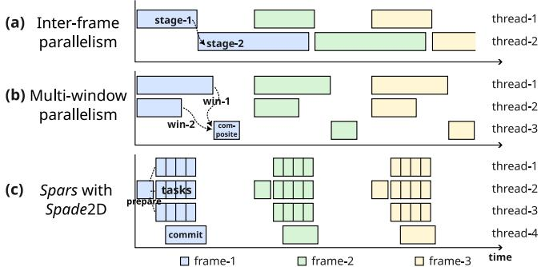  
Figure 4: The threading model of different methods. Compared to state-of-the-art efforts (inter-frame and multi-window parallelism), our solution enables finer-grained parallelism.

Multi-window parallelism. In multi-window parallelism, each window is rendered in different threads (or processes), and later all the window frame buffers are composited into a single display frame buffer, as shown in Figure 4(b). Android [14] adopts this approach, and Skia Graphite [85] supports parallelization with render passes (i.e., tile or frame buffers). Although multi-window parallelism is useful for multiple windows, it also has three limitations. First, the workloads are highly imbalanced, as usually a single focused application occupies the entire workloads, with status or navigation bar at the corner seldom updating. Second, many scenarios do not have the windowing abstraction, which is however necessary for parallelism. For example, a chatting app on a large foldable screen can display the contacts, chat history, and posted photos simultaneously on different sections of the same window (Figure 9(d)), while the rendering service does not have any semantics. Last, multi-window parallelism introduces more memory for window frame buffers and additional workloads for window composition.

State-of-the-art system research. Existing system research usually focuses on multi-GPU parallelism for 3D rendering on screen walls [53, 62, 71, 80] and graphics emulators [51, 67, 68, 79], which is different from our smart device configurations and demands (i.e., OS 2D rendering). D-VSync [87] exploits single-core CPU capabilities in smartphones to tackle workload fluctuations, handling sporadic frame drops via pre-rendering during animations. Nonetheless, D-VSync cannot scale to large multiple screens and multiple CPU cores. Table 1 summarizes the system techniques for rendering performance.

Table 1: Performance comparison of different system techniques. Inter-frame and multi-window parallelism methods have been adopted by commercial smartphone OSes including Android, iOS, and OpenHarmony, but still cannot handle workload fluctuation and constant heavy loads due to the coarse-grained parallelism. D-VSync [87] is the state-ofthe-art deployed in HarmonyOS NEXT, but cannot handle constant heavy loads due to its lack of parallelism support.
<table><tr><td rowspan=1 colspan=1></td><td rowspan=1 colspan=1>ApplicableScenarios</td><td rowspan=1 colspan=1>ExtraLoads</td><td rowspan=1 colspan=1>RenderingLatency</td><td rowspan=1 colspan=1>WorkloadFluctuation</td><td rowspan=1 colspan=1>ConstantHeavy Loads</td></tr><tr><td rowspan=1 colspan=1>Baseline</td><td rowspan=1 colspan=1>100%</td><td rowspan=1 colspan=1>/</td><td rowspan=1 colspan=1>/</td><td rowspan=1 colspan=1>Frame Drops</td><td rowspan=1 colspan=1>LowFrame Rate</td></tr><tr><td rowspan=1 colspan=1>Inter-frameParallelism</td><td rowspan=1 colspan=1>100%</td><td rowspan=1 colspan=1>Minor</td><td rowspan=1 colspan=1>SeriousInfluence</td><td rowspan=1 colspan=1>Frame Drops</td><td rowspan=1 colspan=1>MediumFrame Rate</td></tr><tr><td rowspan=1 colspan=1>Multi-winParallelism</td><td rowspan=1 colspan=1>&lt;5%</td><td rowspan=1 colspan=1>Some</td><td rowspan=1 colspan=1>SomeInfluence</td><td rowspan=1 colspan=1>Frame Drops</td><td rowspan=1 colspan=1>MediumFrame Rate</td></tr><tr><td rowspan=1 colspan=1>D-VSync</td><td rowspan=1 colspan=1>85%</td><td rowspan=1 colspan=1>Minor</td><td rowspan=1 colspan=1>No Influence</td><td rowspan=1 colspan=1>NoFrame Drop</td><td rowspan=1 colspan=1>LowFrame Rate</td></tr><tr><td rowspan=1 colspan=1>Spars withSpade2D</td><td rowspan=1 colspan=1>100%</td><td rowspan=1 colspan=1>Minor</td><td rowspan=1 colspan=1>NoInfluence</td><td rowspan=1 colspan=1>LeveragingD-VSync</td><td rowspan=1 colspan=1>HighFrame Rate</td></tr></table>

State-of-the-art graphics research. Existing graphics research proposes various rendering algorithms that attempt to offload CPU-intensive 2D rendering onto GPUs and accelerators [36]. Legacy systems such as Windows GDI [86] and early versions of Cairo [75] and Skia [29] rely on pure CPU-based scanline rasterization [88]. Nowadays, modern 2D engines on smart devices primarily use tessellation and triangulation with SDF algorithms [52, 70] for GPU rasterization. A series of subsequent studies further explore stencil-bufferbased [61, 63, 64, 82] and vector-texture-based [50, 74, 78] algorithms. However, they increase the total load and power consumption on mobile (tile-based [2]) GPUs due to costly stencil operations and complex shader computation, limiting their universal applicability in OS rendering.

## 3.3 The Breakdown of Rendering Workloads

We present two quantitative analyses of rendering workloads based on our long-term industry experience with the OS rendering service.

Observation-1: CPU dominates the rendering costs. The end-to-end rendering process is CPU-intensive for 2D scenarios. Figure 5(a) illustrates the distribution of CPU and GPU execution time for each frame in representative scenarios, such as desktop and application pages. On average, sequential CPU processing accounts for 82% of the end-toend frame rendering time. In contrast to 3D games that require the GPU to render millions of triangles per frame [72], 2D scenes typically involve fewer than 1,000 triangles. The primary workload of the OS rendering service falls on the CPU, responsible for preparing render tree states, tessellating and triangulating mathematical abstractions of 2D primitives into vertices, and generating GPU objects. As the CPU and GPU run asynchronously, the CPU execution time fully covers the GPU execution time, becoming the bottleneck.

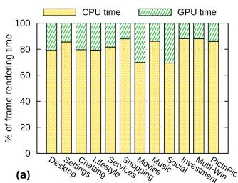

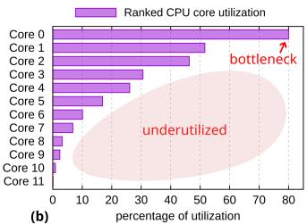  
Figure 5: Breakdowns of rendering workloads on Huawei Mate X5, between (a) CPU and GPU, and (b) CPU cores.

Observation-2: Sequential rendering model limits the hardware utilization. The current state-of-the-art rendering procedure follows a fixed-thread sequential model, restricting the multi-core utilization. Figure 5(b) highlights the imbalanced CPU per-core utilization in the Lifestyle scenario on Mate X5 (Figure 9(c)) with OpenHarmony 5.0, struggling to achieve the frame rate of 90Hz. While the rendering service’s render thread monopolizes 80% utilization of a single core with inter-frame parallelism and application logic partially utilizing other cores, most CPU cores (cores 3∼11) remain largely idle, making the single core the performance bottleneck. Modern chipsets typically feature 8 to 12 CPU cores, with this trend set to continue [21]. Given the significance of rendering services in smart-device operating systems, achieving scalability and parallelization across multiple cores is crucial for optimal performance.

## 4 Scalable Rendering

## 4.1 Parallelism with Out-of-Order Execution

A multi-core parallel OS rendering service is the key to support scalable rendering. However, it faces three major challenges detailed in §1. First, state dependency prevents encapsulating tasks for parallel execution, as each node in the render tree only contains the relative information in terms of its parent. Second, drawing order dependency for graphics primitives must be maintained for correctness, while individual tasks scheduled on the worker threads lose the pre-defined order. Last, interface dependency (compatibility) should be considered for existing applications and optimizations that rely on stateful rendering, which contrasts with the stateless nature of parallelization.

Revisiting parallelism in computer architecture. In processors, parallelism can be achieved through out-of-order execution and in-order commit [83]. Out-of-order execution refers to a strategy where a processor executes instructions in an order different from their original program sequence. This technique allows the processor to bypass potential instruction dependencies and better utilize idle execution units, thereby enhancing overall performance and efficiency. On the other hand, in-order commit ensures that the results of these out-of-order executed instructions are committed to memory or storage in the original sequential order of the program, preserving the correctness and consistency of the final output. Insights on parallel rendering. We observed that the challenges of parallel rendering exhibit similarities to those encountered in out-of-order processors, for example, the dependencies between draw commands and between instructions. Drawing inspiration from practices in computer architecture, our key insight is to methodically decouple the rendering procedure into in-order task construction, out-of-order task execution, and in-order dependency enforcement, enabling (mostly) parallel processing without violating dependency requirements. Specifically, the scalable and parallel rendering procedure comprises three stages: (1) in-order preparation, which involves constructing self-contained tasks based on the render tree, allowing out-of-order execution while ensuring the eventual enforcement of overlapping relations; (2) out-of-order execution, where tasks are executed using a configurable number of worker threads distributed across multiple cores; (3) in-order commit, which collects the execution results from the worker threads and serializes the outputs in a correct drawing order before submitting to the GPU for final rasterization. Compared to the design in computer architecture, a new stage, the in-order preparation, is introduced to satisfy specific requirements in parallel rendering.

The three-stage design increases minor total workloads, because it simply decouples the state management, drawing order management, and state-based optimizations — procedures originally existed and embedded in the state-of-the-art sequential rendering — from the core rendering workload, so the latter can be parallelized.

Building on the insight that scalability and parallelism can be achieved through out-of-order execution and in-order commit, this paper presents Spars, a novel scalable and parallel OS rendering service, powered by the underlying novel drawing engine Spade2D.

## 4.2 Design Overview

Figure 6 shows the overall rendering architecture of Spars. Instead of directly performing a depth-first traversal of the render tree to render each node sequentially, Spars divides the rendering procedure into the aforementioned three stages. These stages are supported by three types of threads in Spars: the main thread, worker thread, and commit thread.

In-order preparation (main thread). During the preparation stage, the render tree is still traversed once in a depth-first manner by the main thread to prepare self-contained rendering tasks (§5.1). The key difference is that no core rendering logic (i.e., invoking the 2D engine to generate any GPU object) is performed, making the in-order preparation a very fast dry run. At the same time, overlapping relations (§5.2) between the rendering tasks are recorded, which the commit thread will later use (in the in-order commit stage) to preserve a correct drawing order. State-based batching optimization (§5.3) can also be conducted here. Finally, the main thread puts all the self-contained rendering tasks into a single-producer multi-consumer (SPMC) task pool, and synchronizes the overlapping relations with the commit thread.

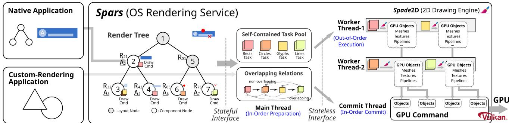  
Figure 6: The parallel rendering architecture of Spars with Spade2D. The main thread prepares self-contained rendering tasks for out-of-order execution in the worker threads and overlapping relations for in-order commit in the commit thread.

Out-of-order execution (worker thread). Worker threads in Spars execute rendering tasks retrieved from the SPMC pool. As every rendering task is self-contained without interdependency in states, they can be scheduled onto any worker thread with any order — enabling out-of-order and parallel execution. For each task, the worker thread invokes the Spade2D drawing engine to translate mathematical expressions of 2D graphics primitives into GPU objects like meshes, textures, pipelines, etc. Spade2D provides a stateless interface (§5.3), allowing each task to be executed independently on multiple cores without interference from one another (§5.4). Finally, the generated GPU objects are packed and put into a multi-producer single-consumer (MPSC) resource pool for the commit thread to perform in-order commit.

The number of worker threads is configurable at runtime, based on the chipset’s multi-core configuration and the current execution environment. At least one worker thread is required. It is recommended to reserve several cores for the commit thread, application threads, and other system threads to avoid unnecessary scheduling overhead. In practice, 3 to 5 worker threads are typically sufficient (§6).

In-order commit (commit thread). The commit thread is responsible for gathering the generated GPU objects from the MPSC pool and committing them into the GPU command, based on the overlapping relations prepared by the main thread. This procedure is straightforward, with the commit thread simply binding the handles of the generated GPU objects into the GPU command by reference. Notably, the commit thread does not need to wait for all worker threads to complete their tasks. Instead, upon receiving a completed task with its associated GPU objects, the commit thread assesses the feasibility of committing it into the GPU command — whether all drawing-order-dependent tasks have already been committed (§5.2). If this condition is not met, the commit thread waits until all the dependent tasks complete and commit, ensuring a correct drawing order.

The waiting does not impact the end-to-end frame rendering time, as the main thread submits rendering tasks to the SPMC task pool in a naïve topological drawing order derived from a depth-first traversal. Although tasks are executed out-of-order with differing execution time, the completion order retrieved from the MPSC pool is mostly retained from the SPMC pool, and the chance of dependency waiting (i.e., waiting for the background primitive to complete first) in the commit thread is minor. Except for the last several rendering tasks, the execution time of the commit thread is fully covered by the worker threads, as illustrated in Figure 4(c). Finally, the GPU command will be submitted to the GPU driver for GPU rasterization, producing a color for each pixel.

## 5 Detailed Design

This section introduces detailed key techniques behind the design of Spars with Spade2D.

## 5.1 Self-Contained Tasks

For rendering to be scalable and parallel, Spars divides the entire rendering workloads into individual self-contained rendering tasks that can be executed on multiple worker threads in an out-of-order manner. This requires that self-contained tasks encapsulate all the essential drawing states for the Spade2D drawing engine to generate the corresponding GPU objects. A complete drawing state encompasses a transform matrix encoding the drawing position, scaling, and rotation, clippings encoding the valid drawing region, parameters encoding specific graphics primitives, as well as coloring and styles.

Challenge. However, as discussed earlier, rendering services face the challenges of state dependencies. In the existing render tree, each node does not contain the complete drawing state; instead, it only holds information relative to its parent. The benefit of the relative-state design is its efficiency in updating screen content, as modifying the root node of a subtree is sufficient to alter a group of nodes. In the render tree shown in Figure 6, $R _ { i j }$ denotes the relative information of node i with respect to node $j .$ For example, when an animation or a drag operation needs to move the card represented by the subtree rooted at node $\textcircled{2} ,$ , it can just modify the transform matrix of $R _ { 2 1 }$ , which automatically moves node $\textcircled{3}$ and 4 with unchanged $R _ { 3 2 }$ and $R _ { 4 2 }$ , supposed that node 1 is a larger container inside which node $\textcircled{2}$ is able to move. The presence of state dependencies mandates that modern rendering services process render nodes (or tasks) sequentially in accordance with depth-first order to access the correct states, thereby impeding parallelization efforts.

Constructing self-contained tasks with a dry run. We observed that the actual execution of rendering tasks does not affect the construction of the complete drawing state required for them. Based on this observation, we introduce a dry-run method to generate the absolute information for each node. During the preparation stage, Spars traverses the render tree in a depth-first order (without invoking the 2D engine to do any actual rendering), calculates the complete states, and records the absolute information $A _ { i }$ — relative to the screen coordinates or the absolute zero — for node i that includes at least one draw command. By following this approach, Spars encapsulates the original draw commands in the render tree into a collection of self-contained rendering tasks devoid of state dependencies, as shown in Figure 6. When the screen updates in a frame, invalid $A _ { i }$ values are recalculated during the depthfirst traversal in the main-thread preparation. For example, in a scenario where $R _ { 2 1 }$ undergoes updates (i.e., invalidation) due to drag operations, Spars dynamically adjusts the subtree containing nodes $A _ { 2 } , A _ { 3 }$ , and $A _ { 4 }$ during the dry-run traversal, before encapsulating tasks for these nodes. Notably, recorded $A _ { 6 }$ and $A _ { 7 }$ will not be affected, because their paths to the root have no relative information change.

Computation costs. The computation incurs minor additional workload overhead compared to the state-of-the-art rendering services. The conversion from relative to absolute information is originally integrated in the sequential rendering procedure through stateful interfaces provided by 2D engines. Spars simply decouples the fast, non-parallelizable preparation logic from the core parallelizable rendering logic. Additionally, unchanged absolute information is reusable across frames, making the preparation efficient and fast.

Resource costs. Storing absolute information incurs minor memory overhead. Spars observes the sparsity of draw commands relative to the total number of render nodes. Many internal nodes in the render tree are layouts rather than actual components, containing no draw commands. For example, node 1 and 5 in Figure 6 only contain the relative information R, which does not require bookkeeping of any absolute information for drawing. In the desktop scenario on Mate XT, approximately 200 out of 800 nodes (25%) have draw commands, and each piece of absolute information, consisting of the transform matrix and clippings, occupies at most 10KB. Additional 2MB of memory usage is permissible.

## 5.2 Overlapping Relations

Rather than using the implicit drawing order pre-definition in the render tree, Spars explicitly manages the overlapping relations for in-order commit, which can enable out-of-order execution while not violating drawing order dependencies.

Challenge. Graphics rendering follows a partial order defined by the render tree, where tasks (i.e., graphics primitives) at the back must be drawn before tasks at the front when they overlap. For example, the dark blue background in Figure 6 must be drawn before the light blue and red components, while the order among node 3 , 6 , and $\textcircled{7}$ does not affect the correctness of drawing. Traditional sequential rendering applies a depth-first traversal when processing each node, as the children of every node are pre-defined to be in backto-front order (i.e., z-order). However, the out-of-order task execution in Spars does not provide such a guarantee.

Overlapping relations. To tackle this challenge, Spars entrusts the main-thread preparation to explicitly construct overlapping relations of the self-contained rendering tasks for the commit-thread in-order commit. While it is possible to build a complete directed acyclic graph (DAG) for the partial order, Spars finds itself costly and unnecessary to do so — the commit thread just needs to follow one correct topological order, and the commit stage barely becomes a bottleneck as discussed in §4.2. Therefore, during the depth-first traversal in preparation, Spars just chains the generated self-contained tasks for a naïve drawing order and manages their axis-aligned bounding boxes (AABBs) [48]. An AABB is defined as the xand y-axes aligned rectangular bounding box of each task’s drawing region. It is one of the most efficient methods in computer graphics for determining whether two graphics primitives overlap — if two primitives overlap, their AABBs must also overlap. The chain with AABBs is later synchronized from the main thread to the commit thread.

In-order commit with overlapping relations. During the commit stage, the commit thread checks whether it is possible to commit the received completed task (i.e., its generated GPU objects) into the GPU command, based on the task chain and AABBs. If the task received is the current head of the chain when all the tasks before it have already been committed, then it is correct to commit the task next. This is the most common case, as the tasks (with possible varying execution time) are dispatched from the main thread to the worker threads using the same chain order. If the task is not the current head, then the commit thread checks the AABBs of all the unfinished tasks before it in the chain. When no AABB overlaps with the current completed task, then it is also correct to commit the task next into the GPU command. For example, in Figure 6, the Lines Task can be committed as long as the Rects Task has been committed. Otherwise, the commit thread must block to wait for a valid background task to commit first. The AABB checking only performs a preset maximum times (3 to 5 times) for each completed task. The mechanism ensures that one or two heavy tasks do not block the commits of subsequent tasks, so the commit procedure can almost be covered by the execution time of the heavily-loaded worker threads. Although there is no complete construction of a DAG, the commits follow a logical partial order, based on the overlapping relations of the chain and the AABBs.

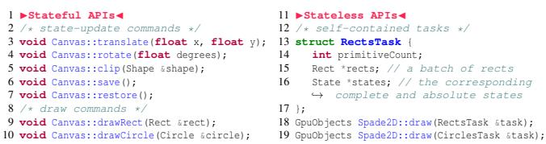  
Figure 7: Stateful and Stateless APIs in Spars.

Costs. The construction of the overlapping relations incurs minor extra workload, as traditional 2D engines use a similar chain structure for command batching (§2.2). In Spars, the same chain is reused for both the state-based batching (§5.3) and the overlapping relations. Moreover, pointer maintenance and AABB checks are lightweight operations.

## 5.3 Stateful and Stateless APIs

Existing rendering services and 2D engines utilize stateful APIs, hindering parallel rendering. Although it is possible to define new APIs capable to support parallel rendering without state dependencies, they are not compatible with customrendering apps and are not intuitive to use. Therefore, we decouple APIs into two parts: stateful and stateless APIs. The stateful APIs (provided by Spars) ensure compatibility with existing interfaces and support state-based batching optimizations, while the stateless APIs (provided by Spade2D) can enable parallel and out-of-order task execution. The vertical dashed lines in Figure 6 show the division.

Definitions. Spars defines stateful as a paradigm in which each executed command leaves corresponding states in the system, impacting the completeness and correctness of subsequent commands, as shown in Figure 7. This includes state dependencies, drawing order, and command reordering or coalescing. In contrast, a stateless interface implies that each rendering task is independent and self-contained, leaving no residual state that affects the correctness of subsequent draws.

Interface compatibility. The decoupling ensures interface compatibility with traditional 2D drawing engines for customrendering applications who might directly invoke them for drawing, such as games, Flutter apps [10], and web apps [90]. Although the underlying Spade2D is stateless, the stateful APIs serve as an adapter to untangle the intricacies and encapsulate self-contained tasks for it. Therefore, these third-party apps can enjoy the same traditional stateful interface such as the Drawing API [9] or Skia Canvas [27] for compatibility, ensuring practicality and applicability of our system.

Traditional state-based optimizations like command batching are also supported based on the decoupling. Draw commands that can share the same GPU pipeline prefer to be grouped together instead of processed individually, thus producing a single set of GPU objects and reducing the number of draw calls. This also saves CPU execution time for less GPU object management (§5.4) and fewer rendering tasks. The main-thread preparation does the same re-ordering and coalescing algorithm discussed in §2.2, when depth-first traversing the render tree and leveraging the same chain structure and AABBs for overlapping relations. For example, the two rectangle draw commands (shown in pink) in Figure 6 are batched together to form a single Rects Task for Spade2D GPU object generation. Since pointer operations and AABB checks suffice, the non-scalable stateful APIs decoupled from the parallelizable core rendering logic is lightweight and fast.

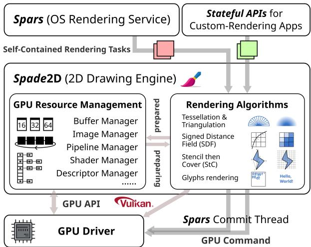  
Figure 8: The architecture of Spade2D drawing engine.

## 5.4 Spade2D Drawing Engine

Spade2D is responsible for the stateless rendering (i.e., task out-of-order execution) in the worker threads. Similar to traditional drawing engines like Skia [29], Impeller [18], Direct2D [60], etc., Spade2D converts mathematical expressions of 2D graphics primitives into GPU objects for frame buffer rasterization. However, Spade2D differentiates itself in terms of input and output formats as well as GPU resource management. Figure 8 illustrates the architecture of Spade2D.

Input and output formats. Rather than accepting both stateupdate commands and draw commands, Spade2D employs stateless inputs: self-contained rendering tasks that can be executed out-of-order and in parallel across multiple CPU cores. Spade2D relies on external mechanisms to maintain state and drawing order dependencies. Furthermore, instead of handling a single primitive (e.g., a rectangle) per draw command, each rendering task in Spars may contain a batch of primitives (e.g., a vector of rectangles) that can share the same rendering algorithm and produce a single set of GPU objects. For outputs, Spade2D depends on the Spars commit thread for the in-order commit before submitting to the GPU, for correct overlapping relations.

GPU resource management. GPU resources in Spade2D are managed by thread-safe managers that prevent resource double creation caused by parallel rendering. Similar to other 2D engines, Spade2D tracks GPU resources needed for various rendering algorithms, including buffers, images, pipelines, shaders, descriptors, etc. These resources are shared among rendering tasks and reused across frames if possible, each of which has a manager using size-class-based pools, hash tables, circular queues tied to the frame buffer rotation, etc.

Thread safety. In Spade2D, operations on these data structures need to be thread-safe. However, note that modern stateless GPU APIs, such as Vulkan [34], Metal [20], and DirectX12 [8], allow the parallelization of actual resource usage and creation within each rendering task. Time-consuming operations like vertex and index buffer filling, image decoding and creation, and GPU pipeline creation can all be executed without locks. Also, Spade2D uses shared locks [4] for resource reading, ensuring no contention when multiple rendering tasks refer to the same created GPU object (e.g., pipeline or image). Thus, the cost of synchronization is minimized and unnoticeable, as insertions and deletions for GPU resource handles in most data structures can finish in constant time.

Preventing resource double creation. Double creation might happen in parallel rendering when two rendering tasks refer to the same unprepared GPU resource simultaneously on different cores, and both attempt to prepare it, for example, drawing the same new image or using the same new GPU pipeline. To prevent double creation of GPU resources, Spade2D maintains preparing GPU resources in the resource managers, in addition to the prepared (created) and unprepared (free) GPU resources. The first task that needs a specific resource will atomically mark it as preparing in the corresponding manager before actually creating it. When the second task needs the same preparing resource, it will block and yield to another rendering task until being notified by the prepared condition variable. This mechanism avoids unnecessary double creation with no impact on performance, as blocking occurs only in rare cases when two similar non-batched tasks have contention, and after all other self-contained tasks can be scheduled to run.

## 6 Evaluation

## 6.1 Implementation and Setup

Implementation. We have implemented the scalable and parallel OS rendering service Spars with the stateless drawing engine Spade2D in C++ with the Vulkan GPU backend [34], the most common modern graphics API in smart devices. We deploy Spars as a custom-rendering service that directly utilizes GPU resources and bypasses the vanilla rendering service in Android and OpenHarmony for performance evaluation.

  
Figure 9: Representative scenarios rendered by Spars.

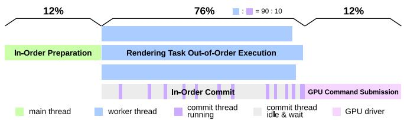  
Figure 10: Execution time proportion of a frame in Spars.

We run Spars with Spade2D on state-of-the-art commercial smartphones, Mate 70 (single-screen) [15], Mate X5 (dualfold) [16], and Mate XT (tri-fold) [17], as well as multi-screen configurations using the Kirin 9010 chipset [54].

Methodology. To analyze Spars performance under real scenarios, we export the render trees in OpenHarmony rendering services (in commercial smartphones) and reconstruct them in Spars. Figure 9 shows representative scenarios rendered by Spars with Spade2D. Spars is sound enough to render common graphics primitives, such as rectangles, rounded rectangles, circles, lines, images, glyphs (text), etc., with different coloring and styles. As Spars still lacks some features compared with vanilla rendering services, to better analyze the benefits and costs of our parallel design, we build Sequential, a sequential version of Spars with the standard rendering procedure discussed in §2. In addition to Commercial, the commercial rendering service in OpenHarmony 5.0, we also report the data of Sequential as another baseline for a more fair comparison with Spars.

In the following sections, we evaluate the parallelizable proportion (§6.2), frame rate improvement (§6.3), multi-core utilization (§6.4), power consumption reduction (§6.5), scalability (§6.6), and costs (§6.7) of Spars.

## 6.2 Theoretical Speedup Analysis

Spars enhances performance for rendering content that features a large number of rendering tasks, including diverse images, text, graphics primitives, and visual effects. The potential performance gains of Spars are determined by the parallelizable proportion of the end-to-end rendering workloads. As described by Amdahl’s Law [39], the maximum achievable speedup is limited by the inverse of the fraction of the workload that must be executed sequentially [81].

Figure 10 illustrates the proportion of the execution time for different stages of a frame in Spars, averaged across all 42 scenarios (§6.3). The parallelizable out-of-order task execution and the in-order commit altogether account for 76% of the total workload. The commit thread is mostly idle and waits for the rendering tasks to complete. The non-parallelizable inorder preparation and the GPU driver command submission collectively occupy the remaining 24%.

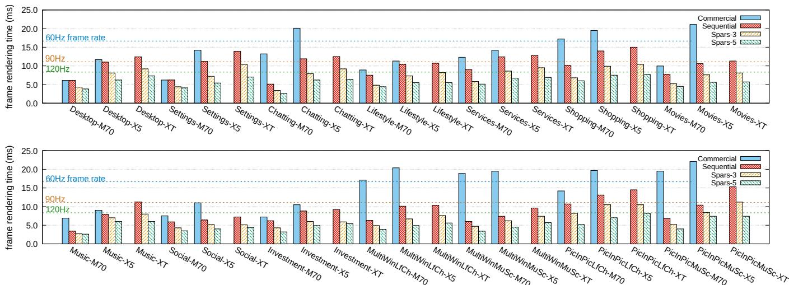  
Figure 11: Frame rendering time on Mate 70, X5, XT with Commercial, Sequential, and Spars of 3 or 5 worker threads. All loads are pinned to medium cores with the same clock rate. Relative to Sequential, Spars-5 improves the frame rate by 1.76×.

With 3 worker threads, Amdahl’s Law yields a theoretical maximum speedup of 2.14×, and with 5 workers, the speedup increases to 2.65×. In practice, however, scheduling and synchronization overhead during task dispatch, result collection, and resource management is unavoidable, influencing the overall performance.

## 6.3 Frame Rate Improvement

We evaluate the frame rate improvement of Spars on the latest Mate 70 (single-screen), Mate X5 (dual-fold), Mate XT (trifold), and Kirin 9010 chipset for multi-screen configurations. They all feature a heterogeneous CPU architecture with 4 little cores, 6 medium cores (3 physical cores with simultaneous multithreading [84]), and 2 big cores (1 physical core).

Common smartphone scenarios. We test Spars across altogether 42 representative smartphone use cases. Figure 9 shows some examples. These scenarios, drawn from our years of experience with OS rendering service deployment, provide a comprehensive snapshot of everyday smartphone usage — such as desktop operations, chatting, shopping, browsing services or movies — all of which involve rendering a variety of graphics primitives. We export and adapt the page layouts (i.e., render trees) from real-world apps and fill in dummy data for Spars to render. Each scenario is tested against two baselines, Commercial2 and Sequential, and with Spars configured to use 3 and 5 worker threads (denoted Spars-3 and Spars-5), all pinned to medium cores running at the same clock rate (approximately 0.7GHz) as the baselines.

Figure 11 demonstrates the frame rate improvement. On average, Spars-3 reduces the CPU frame rendering time of Sequential by 27.3%, and Spars-5 reduces it by 43.2%. Consequently, the average frame rate could be increased by 1.38× and 1.76×, respectively. Spars-5, the standard configuration of Spars on these devices, achieves stable 120Hz frame rate across all 42 tested scenarios, whereas 27 (64%) sequential rendering baselines struggle to maintain the smooth experience, especially on large foldable screens. In heavily-loaded multi-window and picture-in-picture scenarios, Spars-5 is able to increase the frame rate by at most 2.07× with higher parallelizable proportion and better load balancing.

Worker thread configurations. Spars allows the number of worker threads to be configured both statically — based on the smart-device’s SoC — and dynamically at runtime. On current SoCs with 6 medium cores, we use 5 worker threads as the standard setup, reserving one core for the commit thread. Dynamically adjusting the number of worker threads would require estimating or predicting the total workload, which is challenging due to the inherently dynamic nature of rendering [87] — for instance, whether certain GPU objects are already cached. In practice, we observed no performance regressions when increasing the number of worker threads, as long as the total remains below the number of available cores.

Core and clock rate configurations. A straightforward and traditional way for Sequential to boost the frame rate is to use a bigger CPU core or apply a higher clock frequency. However, this results in significantly more power consumption, often leading to unsustainable thermal output within minutes. As chip advancements slow with the decline of Moore’s Law [73], Spars takes a different strategy by leveraging CPU multi-core parallelism to enhance the frame rate, offering long-term scalability across diverse (and possibly weak) smart-device hardware platforms.

To show the general benefits of Spars, we apply different configurations of CPU cores and clock rates on our smartphones. Specifically, we test Commercial3, Sequential, and Spars on little cores and medium cores with both low and high clock rates. For a fair comparison with Sequential, we only report the frame rate improvement of Spars on homogeneous core configurations.

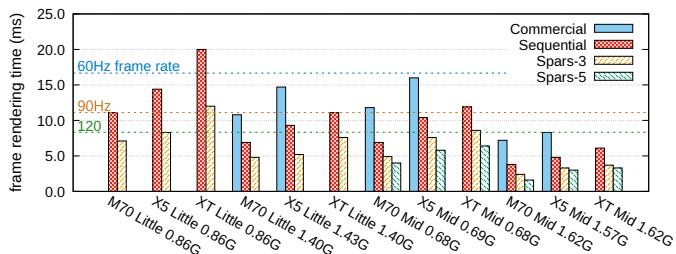  
Figure 12: Frame rendering time with different configurations of cores and clock rates.

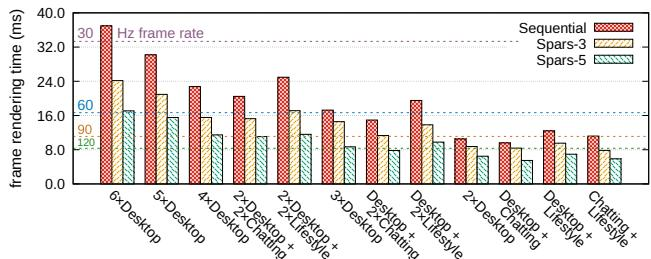  
Figure 13: Frame rendering time with multiple screens.

Figure 12 shows the average frame rendering time of all the scenarios under different configurations. For Spars-3 on little cores, it is reduced by 39.5% and 36.7% for low and high clock rates, respectively. Consequently, the frame rate is increased by 1.65× and 1.58×. For medium cores, Spars-3 brings 1.38× and 1.56× gains. Little cores have slightly more performance improvement, due to the lower synchronization overhead relative to the execution time. For Spars-5 on medium cores with low and high clock rates, the frame rate improvement is 1.76× and 1.89×.

One chip, multiple screens. We further run Spars to drive two to six 2K-resolution virtual screens on the Kirin 9010 chipset (2024), as shown in Figure 13. On average, Spars-3 boosts the frame rate by 1.34×, and Spars-5, the standard configuration, delivers 1.91×. Rendering more screens tends to have better performance gains. For six or five desktops, Spars-5 provides 2.16× and 1.94× gains, respectively, while for two desktops, it is just 1.62×. Heavier workloads yield a higher parallelizable proportion (more rendering tasks) in the end-to-end rendering procedure.

## 6.4 Multi-Core Utilization

The scalable and parallel rendering service optimizes the utilization of multi-core hardware in smart devices and ensures a more balanced workload across cores, preventing any single core from becoming the frame rate bottleneck.

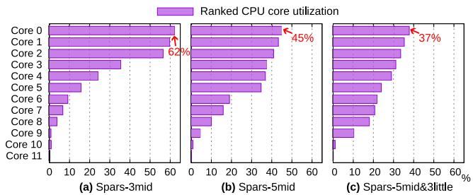  
Figure 14: Multi-core CPU utilization of Spars.

Figure 14 demonstrates the system CPU utilization when Spars renders the Lifestyle scenario on Mate X5. The frame rate is locked at 90Hz, and the clock rate is kept the same for a fair comparison. As opposed to Figure 5(b) where the most loaded core reaches 80% utilization and bottlenecks the frame rate, Spars-3 and Spars-5 only lead to 62% and 45% utilization for the most loaded core. With a heterogeneous configuration of 5 medium cores and 3 little cores, the heaviest utilization further decreases to 37%, reducing the frame rendering time and potentially boosting the frame rate.

Influence on other workloads. Spars has minor influence on other system or application workloads, as it simply redistributes the entire rendering workload across multiple cores without increasing its total — additional logic for task encapsulation, dispatch, and collection is within 2%. As shown in Figure 14, all CPU cores still have a considerable amount of idle time available to process other tasks (although this idle time has been rebalanced). Other workloads are still scheduled and executed by the system scheduler according to their original priority.

## 6.5 Power Consumption Reduction

With balanced multi-core utilization, the power consumption of Spars is reduced in comparison to Sequential when running at the same configured frame rate.

The state-of-the-art QoS-guided scheduling and governing [43] puts the (parallelized) rendering workloads at little cores with lower clock rates if it predicts that the current frame can finish rendering within its VSync period (i.e., before its display deadline). Also, commercial DVFS (Dynamic Voltage and Frequency Scaling) can only adjust the frequency of an entire cluster (e.g., all medium cores) based on the QoS predictions. In Sequential, rendering on a single core often forces DVFS to raise the cluster voltage and frequency to meet the frame deadlines. In contrast, Spars spreads the workload across multiple cores, allowing DVFS to maintain the same stable frame rate at a lower overall voltage and frequency, and thus reducing the power consumption.

We measure the Mate XT whole-device instantaneous power consumption through battery counters [26] for 5 minutes after a one-minute warmup, with all other apps closed. Averages are taken for all the common smartphone scenarios. Figure 15(a) demonstrates the results. Spars-3 reduces the device power consumption by 2.7%, and Spars-5 reduces it by 3.0% under the same frame rate with Sequential.

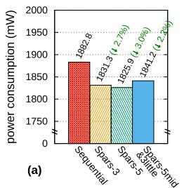

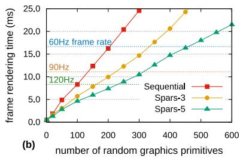  
Figure 15: (a) Power consumption of Sequential and Spars under the same frame rate. (b) Scalability of Spars, allowing more graphics primitives under the same time budget.

## 6.6 Rendering Scalability

Parallelization allows the OS rendering service to render more graphics primitives under the same time budget (i.e., frame rate), achieving scalability of rendering. Spars gives application developers and GUI designers a larger design space for richer page content and more appealing visual effects, especially on large foldable screens, important for the commercial success of smart devices.

We measure the CPU frame rendering time with respect to the number of random graphics primitives (including rounded rectangles, circles, decoded images, text, etc.) that Spars and Sequential render under the same core configuration and clock rate. Note that this is the lower bound for the number of graphics primitives, as randomness forbids most draw command batching opportunities.

As illustrated in Figure 15(b), for 120Hz frame rate (8.33ms time constraint), Spars-3 is able to render 1.62× graphics primitives, and Spars-5 is able to render 2.31× primitives compared to the Sequential baseline, unleashing more possibilities for the GUI design.

## 6.7 Costs and Discussions

We discuss the costs of a scalable and parallel rendering service in terms of memory consumption and deployment efforts.

Memory consumption. The primary memory cost arises from the thread creation, with each thread consuming approximately 8MB of memory in the operating system. The additional memory required for the absolute information, selfcontained tasks, and overlapping relations does not exceed 10MB. Therefore, for Spars-5, the extra memory usage does not exceed 50MB, which is permissible for modern smart devices with ≥8GB of memory.

Deployment efforts. Spars is a complete refactoring of the

OS rendering service and the 2D drawing engine. A traditional rendering service consists of approximately 200,000 lines of code (LoC) in C++ [24], and a traditional drawing engine contains around 400,000 LoC [28]. To implement a functionally complete scalable and parallel rendering service and drawing engine, we anticipate that modifications required for the refactoring will exceed one third of the source code.

## 7 Related Work

We present other related work optimizing the rendering services in smart devices in addition to §3.2.

Parallel rendering. Arnau et al. [40] propose parallel frame rendering where consecutive frames can render in parallel to trade responsiveness for energy on mobile GPUs. Skia Graphite backend [85] supports parallel command recording based on tiles (i.e., render passes) in web pages. Other 2D engines [18, 35, 37] enable parallelization for specific tasks, such as image decoding. In comparison, Spars can achieve finer-grained parallel rendering necessary for trending foldable and multi-screen devices. Besides, the job systems of game engines [32] support parallelization for physics simulation, AI computation, and rendering preparation in AAA games, while Spars is specifically tailored and optimized for operating system 2D rendering.

Scheduling for rendering and displaying. D-VSync [87] decouples rendering and displaying to utilize saved computation in short frames for long frames during workload fluctuation. However, D-VSync cannot handle scalable and parallel rendering for emerging devices. LTPO [1, 42] supports variable screen refresh rates to save power. Presto [91] reduces touch latency by relaxing synchrony. DSA [45] provides apps a unified view for multiple screens. Other systems [44, 47, 69, 76, 77, 94] implement CPU-GPU power management strategy, e.g., dynamic frequency, to save energy. However, they cannot meet the frame-rate performance demands of foldable and multi-screen devices.

Prediction-based optimizations. Another method to handle the increasing rendering loads is to predict frames in advance. Huang et al. [57], Yan et al. [89], and Baeza-Yates et al. [41] predict the next app to be opened for faster launches. Agrawal et al. [38] reduce activity transition time by pre-inflating UI layouts. PES [49] anticipates DOM events of web apps for better scheduling. Outatime [65] predicts navigation inputs to mask network latency in cloud gaming, while Hou et al. [55] predict head and body motion in VR using LSTM. Although these optimizations function in specific cases, the final effects highly depend on the prediction algorithms and outcomes.

## 8 Conclusion

This paper presents Spars with Spade2D, a next-generation scalable and parallel OS rendering service and drawing engine designed for smart devices. The primary innovation lies in its ability to untangle state dependency, drawing order dependency, and interface dependency, allowing out-of-order execution with in-order commit of self-contained rendering tasks. Evaluations demonstrate that Spars substantially enhances frame rates on emerging foldable smartphones and multi-screen configurations, efficiently leveraging multiple CPU cores while reducing power consumption and scaling the number of graphics primitives. We anticipate that the design of Spars will play a pivotal role in shaping the future development of OS rendering services.

## Acknowledgments

We sincerely thank our shepherd and the anonymous OSDI’25 reviewers for their insightful suggestions. This work was supported in part by National Natural Science Foundation of China (No. 62132014, 62432010, 62472279, 62302300), and Startup Fund for Young Faculty at SJTU (SFYF at SJTU). Corresponding authors: Dong Du (dd\_nirvana@sjtu.edu.cn) and Haibo Chen (haibochen@sjtu.edu.cn).

## References

[1] ipad pro, in 10.5-inch and 12.9-inch models, introduces the world’s most advanced display and breakthrough performance, 06 2017. https://www.apple.com/ne wsroom/2017/06/ipad-pro-10-5-and-12-9-inc h-models-introduces-worlds-most-advanced-d isplay-breakthrough-performance/.

[2] Tile-based gpus, 08 2021. https://developer.arm. com/documentation/102662/0100/Tile-based-G PUs.

[3] Graphics subsystem | openharmony docs, 2022. https://gitee.com/openharmony/docs/blob/ma ster/en/readme/graphics.md.

[4] std::shared\_mutex - cppreference.com, 06 2023. https://en.cppreference.com/w/cpp/thread/s hared\_mutex.

[5] Aito m9 smart suv, 2024. https://aito.auto/mode l/m9/.

[6] Android open source project, 2024. https://source .android.com/.

[7] China passenger car cockpit multi/dual display research report, 2023-2024, 04 2024. http://www.research inchina.com/Htmls/Report/2024/74971.html.

[8] Directx 12 technology | nvidia, 12 2024. https://www.nvidia.com/en-us/geforce/te chnologies/dx12/.

[9] Drawing api documentation—harmonyos next, 11 2024. https://developer.huawei.com/consumer/en/d oc/harmonyos-references-V5/\_drawing-V5.

[10] Flutter - build for any screen, 2024. https://flutte r.dev/.

[11] Foldable smartphone market size and share report 2024-2030, 2024. https://www.grandviewresea rch.com/industry-analysis/foldable-smartph one-market-report.

[12] The freetype project, 12 2024. https://freetype.o rg/.

[13] Galaxy z fold6 | unfold the future | samsung us, 12 2024. https://www.samsung.com/us/smartphon es/galaxy-z-fold6/1/.

[14] Graphics - android documentation, 08 2024. https: //source.android.com/docs/core/graphics.

[15] Huawei mate 70, 2024. https://consumer.huawei. com/cn/phones/mate70/.

[16] Huawei mate x5, 2024. https://consumer.huawei. com/cn/phones/mate-x5/.

[17] Huawei mate xt | ultimate design, 2024. https://consumer.huawei.com/cn/phones/ma te-xt-ultimate-design/.

[18] Impeller is a rendering runtime for flutter, 12 2024. https://github.com/flutter/engine/bl ob/main/impeller/README.md.

[19] ios 18, 2024. https://www.apple.com/ios/io s-18/.

[20] Metal: Accelerate graphics and much more, 12 2024. https://developer.apple.com/metal/.

[21] Multi-core processor market trends, growth report to 2024-2033, 10 2024. https://www.thebusinessr esearchcompany.com/report/multi-core-proce ssor-global-market-report.

[22] Openatom openharmony, 2024. https://www.open harmony.cn/mainPlay.

[23] Opengl: The industry’s foundation for high performance graphics, 12 2024. https://www.opengl.org/.

[24] Openharmony graphic\_graphic\_2d, 12 2024. https: //gitee.com/openharmony/graphic\_graphic\_2d.

[25] Oppo find n3 | oppo global, 2024. https://www.oppo .com/en/smartphones/series-find-n/find-n3/.

[26] Power data sources - perfetto tracing docs, 2024. https://perfetto.dev/docs/data-sources/bat tery-counters.

[27] Skcanvas overview, 2024. https://skia.org/doc s/user/api/skcanvas\_overview/.

[28] Skia is a complete 2d graphic library for drawing text, geometries, and images., 2024. https://github.c om/google/skia.

[29] Skia: The 2d graphics library, 12 2024. https://sk ia.org/.

[30] Understanding the visionos render pipeline | apple developer documentation, 2024. https://develope r.apple.com/documentation/visionos/underst anding-the-visionos-render-pipeline.

[31] Understanding user interface responsiveness, 2024. https://developer.apple.com/documentation/ xcode/understanding-user-interface-respons iveness/.

[32] Unity - manual: Job system overview, 11 2024. https://docs.unity3d.com/6000.0/Documentat ion/Manual/job-system-overview.html.

[33] Vsync - android documentation, 08 2024. https://source.android.com/docs/core/gra phics/implement-vsync.

[34] Vulkan | cross platform 3d graphics, 2024. https: //www.vulkan.org/.

[35] Getting started with qt | qt 6.9, 2025. https://doc. qt.io/qt-6/gettingstarted.html.

[36] Openvg - the standard for vector graphics acceleration, 2025. https://www.khronos.org/openvg/.

[37] Tencent/tgfx: A lightweight 2d graphics library for rendering texts, geometries, and images with highperformance apis that work across various platforms., 04 2025. https://github.com/Tencent/tgfx.

[38] Sumeen Agrawal, Manith Shetty, Sripurna Mutalik, and Anuradha Kanukotla. Method to improve ui rendering using predictive sequence modelling. In 2022 26th International Conference on Pattern Recognition (ICPR), pages 5031–5037, 2022. https://doi.org/ 10.1109/ICPR56361.2022.9956234.

[39] Gene M. Amdahl. Validity of the single processor approach to achieving large scale computing capabilities, reprinted from the afips conference proceedings, vol. 30 (atlantic city, n.j., apr. 18–20), afips press, reston, va., 1967, pp. 483–485, when dr. amdahl was at international business machines corporation, sunnyvale, california.

IEEE Solid-State Circuits Society Newsletter, 12(3):19– 20, 2007. https://doi.org/10.1109/N-SSC.2007. 4785615.

[40] Jose-Maria Arnau, Joan-Manuel Parcerisa, and Polychronis Xekalakis. Parallel frame rendering: Trading responsiveness for energy on a mobile gpu. In Proceedings of the 22nd International Conference on Parallel Architectures and Compilation Techniques, pages 83– 92, 2013. https://doi.org/10.1109/PACT.2013. 6618806.

[41] Ricardo Baeza-Yates, Di Jiang, Fabrizio Silvestri, and Beverly Harrison. Predicting the next app that you are going to use. In Proceedings of the Eighth ACM International Conference on Web Search and Data Mining, WSDM ’15, page 285–294, New York, NY, USA, 2015. Association for Computing Machinery. https: //doi.org/10.1145/2684822.2685302.

[42] Ting-Kuo Chang, Chin-Wei Lin, and Shihchang Chang. 39-3: Invited paper: Ltpo tft technology for amoleds†. SID Symposium Digest of Technical Papers, 50(1):545– 548, 2019. https://doi.org/10.1002/sdtp .12978.

[43] Haibo Chen, Xie Miao, Ning Jia, Nan Wang, Yu Li, Nian Liu, Yutao Liu, Fei Wang, Qiang Huang, Kun Li, Hongyang Yang, Hui Wang, Jie Yin, Yu Peng, and Fengwei Xu. Microkernel goes general: Performance and compatibility in the HongMeng production microkernel. In 18th USENIX Symposium on Operating Systems Design and Implementation (OSDI 24), pages 465– 485, Santa Clara, CA, July 2024. USENIX Association. https://www.usenix.org/conference/osdi 24/presentation/chen-haibo.

[44] Wei-Ming Chen, Sheng-Wei Cheng, Pi-Cheng Hsiu, and Tei-Wei Kuo. A user-centric cpu-gpu governing framework for 3d games on mobile devices. In 2015 IEEE/ACM International Conference on Computer-Aided Design (ICCAD), pages 224–231, 2015. https: //doi.org/10.1109/ICCAD.2015.7372574.

[45] Zizhan Chen, Siqi Shang, Qihong Wu, Jin Xue, Zhaoyan Shen, and Zili Shao. An old friend is better than two new ones: dual-screen android. In Proceedings of the 23rd ACM SIGPLAN/SIGBED International Conference on Languages, Compilers, and Tools for Embedded Systems, LCTES 2022, page 86–98, New York, NY, USA, 2022. Association for Computing Machinery. https://doi. org/10.1145/3519941.3535071.

[46] Jin Choi, Seohwan Yoo, Hayeon Park, and Chang-Gun Lee. Performance analysis of an embedded chipset on

a multi-screen based automotive applications environment. In 2022 5th International Conference on Information and Computer Technologies (ICICT), pages 39– 42, 2022. https://doi.org/10.1109/ICICT55905. 2022.00015.

[47] Yonghun Choi, Seonghoon Park, and Hojung Cha. Graphics-aware power governing for mobile devices. In Proceedings of the 17th Annual International Conference on Mobile Systems, Applications, and Services, MobiSys ’19, page 469–481, New York, NY, USA, 2019. Association for Computing Machinery. https://doi. org/10.1145/3307334.3326075.

[48] Christer Ericson. Axis-aligned bounding boxes (aabbs). In Real-Time Collision Detection, chapter 4.2, page 77–87. CRC Press, Inc., Boca Raton, FL, USA, 2004. https://doi.org/10.1201/b14581.

[49] Yu Feng and Yuhao Zhu. Pes: Proactive event scheduling for responsive and energy-efficient mobile web computing. In Proceedings of the 46th International Symposium on Computer Architecture, ISCA ’19, page 66–78, New York, NY, USA, 2019. Association for Computing Machinery. https://doi.org/10.1145/3307650. 3322248.

[50] Francisco Ganacim, Rodolfo S. Lima, Luiz Henrique de Figueiredo, and Diego Nehab. Massively-parallel vector graphics. ACM Trans. Graph., 33(6), November 2014. https://doi.org/10.1145/2661229. 2661274.

[51] Di Gao, Hao Lin, Zhenhua Li, Chengen Huang, Yunhao Liu, Feng Qian, Liangyi Gong, and Tianyin Xu. Trinity: High-Performance mobile emulation through graphics projection. In 16th USENIX Symposium on Operating Systems Design and Implementation (OSDI 22), pages 285–301, Carlsbad, CA, July 2022. USENIX Association. https://www.usenix.org/conference/osdi 22/presentation/gao.

[52] Chris Green. Improved alpha-tested magnification for vector textures and special effects. In ACM SIGGRAPH 2007 Courses, SIGGRAPH ’07, page 9–18, New York, NY, USA, 2007. Association for Computing Machinery. https://doi.org/10.1145/1281500.1281665.

[53] Yicheng Gu, Yun Wang, Yunfan Sun, Yuxin Xiang, Xuyan Hu, Zhengwei Qi, and Haibing Guan. gVulkan: Scalable GPU pooling for Pixel-Grained rendering in ray tracing. In 2024 USENIX Annual Technical Conference (USENIX ATC 24), pages 1151– 1165, Santa Clara, CA, July 2024. USENIX Association. https://www.usenix.org/conference/at c24/presentation/gu-yicheng.

[54] Klaus Hinum. Hisilicon kirin 9010 processor - benchmarks and specs, 07 2024. https://www.note bookcheck.net/HiSilicon-Kirin-9010-Process or-Benchmarks-and-Specs.855471.0.html.

[55] Xueshi Hou and Sujit Dey. Motion prediction and prerendering at the edge to enable ultra-low latency mobile 6dof experiences. IEEE Open Journal of the Communications Society, 1:1674–1690, 01 2020. https: //doi.org/10.1109/OJCOMS.2020.3032608.

[56] Josh Howarth. Alarming average screen time statistics (2024), 6 2024. https://explodingtopics.com/ blog/screen-time-stats.

[57] Ke Huang, Chunhui Zhang, Xiaoxiao Ma, and Guanling Chen. Predicting mobile application usage using contextual information. In Proceedings of the 2012 ACM Conference on Ubiquitous Computing, UbiComp ’12, page 1059–1065, New York, NY, USA, 2012. Association for Computing Machinery. https://doi.org/ 10.1145/2370216.2370442.

[58] Kristian Høgsberg. Wayland, 2024. https://waylan d.freedesktop.org/.

[59] Arseny Kapoulkine. Writing an efficient vulkan renderer, 02 2020. https://zeux.io/2020/02/27/wr iting-an-efficient-vulkan-renderer/.

[60] Kenny Kerr. Introducing direct2d, 2009. https: //learn.microsoft.com/en-us/archive/msdn-m agazine/2009/june/introducing-direct2d.

[61] Mark J. Kilgard and Jeff Bolz. Gpu-accelerated path rendering. ACM Trans. Graph., 31(6), November 2012. https://doi.org/10.1145/2366145.2366191.

[62] Youngsok Kim, Jae-Eon Jo, Hanhwi Jang, Minsoo Rhu, Hanjun Kim, and Jangwoo Kim. Gpupd: a fast and scalable multi-gpu architecture using cooperative projection and distribution. In Proceedings of the 50th Annual IEEE/ACM International Symposium on Microarchitecture, MICRO-50 ’17, page 574–586, New York, NY, USA, 2017. Association for Computing Machinery. https://doi.org/10.1145/3123939.3123968.

[63] Yoshiyuki Kokojima, Kaoru Sugita, Takahiro Saito, and Takashi Takemoto. Resolution independent rendering of deformable vector objects using graphics hardware. In ACM SIGGRAPH 2006 Sketches, SIGGRAPH ’06, page 118–es, New York, NY, USA, 2006. Association for Computing Machinery. https://doi.org/10. 1145/1179849.1179997.

[64] Harish Kumar and Anmol Sud. Rendering 2D Vector Graphics on Mobile GPU Devices. In Jirí Bittner and Manuela Waldner, editors, Eurographics 2021 - Posters.

The Eurographics Association, 2021. https://doi. org/10.2312/egp.20211025.

[65] Kyungmin Lee, David Chu, Eduardo Cuervo, Johannes Kopf, Yury Degtyarev, Sergey Grizan, Alec Wolman, and Jason Flinn. Outatime: Using speculation to enable low-latency continuous interaction for mobile cloud gaming. In Proceedings of the 13th Annual International Conference on Mobile Systems, Applications, and Services, MobiSys ’15, page 151–165, New York, NY, USA, 2015. Association for Computing Machinery. https://doi.org/10.1145/2742647.2742656.

[66] Yang Li, Jiaxing Qiu, Hongyi Wang, Zhenhua Li, Feng Qian, Jing Yang, Hao Lin, Yunhao Liu, Bo Xiao, Xiaokang Qin, and Tianyin Xu. Dissecting and streamlining the interactive loop of mobile cloud gaming. In 22nd USENIX Symposium on Networked Systems Design and Implementation (NSDI 25), pages 595– 611, Philadelphia, PA, April 2025. USENIX Association. https://www.usenix.org/conference/nsdi 25/presentation/li-yang.

[67] Hao Lin, Jiaxing Qiu, Hongyi Wang, Zhenhua Li, Liangyi Gong, Di Gao, Yunhao Liu, Feng Qian, Zhao Zhang, Ping Yang, and Tianyin Xu. Virtual device farms for mobile app testing at scale: A pursuit for fidelity, efficiency, and accessibility. In Proceedings of the 29th Annual International Conference on Mobile Computing and Networking, ACM MobiCom ’23, New York, NY, USA, 2023. Association for Computing Machinery. https://doi.org/10.1145/3570361.3613259.

[68] Hao Lin, Jiaxing Qiu, Hongyi Wang, Zhenhua Li, Liangyi Gong, Di Gao, Yunhao Liu, Feng Qian, Zhao Zhang, Ping Yang, and Tianyin Xu. Take the blue pill: Pursuing mobile app testing fidelity, efficiency, and accessibility with virtual device farms. GetMobile: Mobile Comp. and Comm., 28(1):5–9, May 2024. https://doi.org/10.1145/3665112.3665114.

[69] Daniel Lo, Taejoon Song, and G. Edward Suh. Prediction-guided performance-energy trade-off for interactive applications. In 2015 48th Annual IEEE/ACM International Symposium on Microarchitecture (MI-CRO), pages 508–520, 2015. https://doi.org/10. 1145/2830772.2830776.

[70] Charles Loop and Jim Blinn. Resolution independent curve rendering using programmable graphics hardware. ACM Trans. Graph., 24(3):1000–1009, July 2005. ht tps://doi.org/10.1145/1073204.1073303.

[71] Bingzheng Ma, Ziqiang Zhang, Yusen Li, Wentong Cai, Gang Wang, and Xiaoguang Liu. Spider: An effective, efficient and robust load scheduler for real-time split frame rendering. In 2022 IEEE International Parallel

and Distributed Processing Symposium (IPDPS), pages 672–682, 2022. https://doi.org/10.1109/IPDP S53621.2022.00071.

[72] Daan Meysman. Keeping your games ’optimized’: Part 1 - triangles, 03 2020. https://www.artstation.c om/blogs/daanmeysman/7goy/keeping-your-gam es-optimized-part-1-triangles.

[73] Gordon E. Moore. Cramming more components onto integrated circuits. Electronics, 38(8):114–117, 1965.

[74] Diego Nehab and Hugues Hoppe. Random-access rendering of general vector graphics. ACM Trans. Graph., 27(5), December 2008. https://doi.org/10.1145/ 1409060.1409088.

[75] Keith Packard and Carl Worth. A realistic 2d drawing system. A rejected SIGGRAPH 2003 submission, 2003. https://keithp.com/\~keithp/talks/cair o2003.pdf.

[76] Anuj Pathania, Alexandru Eugen Irimiea, Alok Prakash, and Tulika Mitra. Power-performance modelling of mobile gaming workloads on heterogeneous mpsocs. In Proceedings of the 52nd Annual Design Automation Conference, DAC ’15, New York, NY, USA, 2015. Association for Computing Machinery. https://doi. org/10.1145/2744769.2744894.

[77] Anuj Pathania, Qing Jiao, Alok Prakash, and Tulika Mitra. Integrated cpu-gpu power management for 3d mobile games. In Proceedings of the 51st Annual Design Automation Conference, DAC ’14, page 1–6, New York, NY, USA, 2014. Association for Computing Machinery. https://doi.org/10.1145/2593069.2593151.

[78] Zheng Qin, Michael D. McCool, and Craig S. Kaplan. Real-time texture-mapped vector glyphs. In Proceedings of the 2006 Symposium on Interactive 3D Graphics and Games, I3D ’06, page 125–132, New York, NY, USA, 2006. Association for Computing Machinery. https://doi.org/10.1145/1111411.1111433.

[79] Jiaxing Qiu, Zijie Zhou, Yang Li, Zhenhua Li, Feng Qian, Hao Lin, Di Gao, Haitao Su, Xin Miao, Yunhao Liu, and Tianyin Xu. vsoc: Efficient virtual system-onchip on heterogeneous hardware. In Proceedings of the ACM SIGOPS 30th Symposium on Operating Systems Principles, SOSP ’24, page 558–573, New York, NY, USA, 2024. Association for Computing Machinery. https://doi.org/10.1145/3694715.3695946.

[80] Xiaowei Ren and Mieszko Lis. Chopin: Scalable graphics rendering in multi-gpu systems via parallel image composition. In 2021 IEEE International Symposium on High-Performance Computer Architecture (HPCA),

pages 709–722, 2021. https://doi.org/10.1109/ HPCA51647.2021.00065.

[81] David P. Rodgers. Improvements in multiprocessor system design. In Proceedings of the 12th Annual International Symposium on Computer Architecture, ISCA ’85, page 225–231, Washington, DC, USA, 1985. IEEE Computer Society Press. https://doi.org/10.1145/ 327070.327215.

[82] A.J. Rueda, J. Ruiz de Miras, and F.R. Feito. Gpu-based rendering of curved polygons using simplicial coverings. Computers & Graphics, 32(5):581–588, 2008. https: //doi.org/10.1016/j.cag.2008.07.005.

[83] R. M. Tomasulo. An efficient algorithm for exploiting multiple arithmetic units. IBM Journal of Research and Development, 11(1):25–33, 1967. https://doi.or g/10.1147/rd.111.0025.

[84] Dean M. Tullsen, Susan J. Eggers, and Henry M. Levy. Simultaneous multithreading: maximizing on-chip parallelism. In Proceedings of the 22nd Annual International Symposium on Computer Architecture, ISCA ’95, page 392–403, New York, NY, USA, 1995. Association for Computing Machinery. https://doi.org/ 10.1145/223982.224449.

[85] Jim Van Verth. Suggested/status of gpu backends, 11 2024. https://groups.google.com/g/skia-dis cuss/c/Pd92csb5o4o/m/QlPj80PqAQAJ?utm\_medi um=email&utm\_source=footer.

[86] Steven White, Saisang Cai, Jason Howell, Kent Sharkey, David Coulter, Drew Batchelor, and Michael Satran. Windows gdi - win32 apps, 01 2023. https://learn.microsoft.com/en-us/windows/ win32/gdi/windows-gdi.

[87] Yuanpei Wu, Dong Du, Chao Xu, Yubin Xia, Ming Fu, Binyu Zang, and Haibo Chen. D-vsync: Decoupled rendering and displaying for smartphone graphics. In Proceedings of the 30th ACM International Conference on Architectural Support for Programming Languages and Operating Systems, Volume 1, ASPLOS ’25, page 326–341, New York, NY, USA, 2025. Association for Computing Machinery. https://doi.org/10.1145/ 3669940.3707235.

[88] Chris Wylie, Gordon Romney, David Evans, and Alan Erdahl. Half-tone perspective drawings by computer. In Proceedings of the November 14-16, 1967, Fall Joint Computer Conference, AFIPS ’67 (Fall), page 49–58, New York, NY, USA, 1967. Association for Computing Machinery. https://doi.org/10.1145/1465611. 1465619.

[89] Tingxin Yan, David Chu, Deepak Ganesan, Aman Kansal, and Jie Liu. Fast app launching for mobile devices using predictive user context. In Proceedings of the 10th International Conference on Mobile Systems, Applications, and Services, MobiSys ’12, page 113–126, New York, NY, USA, 2012. Association for Computing Machinery. https://doi.org/10.1145/2307636. 2307648.

[90] Kinza Yasar. What is web application (web apps) and its benefits, 11 2024. https: //www.techtarget.com/searchsoftwarequali ty/definition/Web-application-Web-app.

[91] Min Hong Yun, Songtao He, and Lin Zhong. Reducing latency by eliminating synchrony. In Proceedings of the 26th International Conference on World Wide Web, WWW ’17, page 331–340, Republic and Canton of Geneva, CHE, 2017. International World Wide Web Conferences Steering Committee. https: //doi.org/10.1145/3038912.3052557.

[92] Daniel Zhang. How to test whether a car’s infotainment system is smooth? 11 car infotainment systems’ smoothness comparison, featuring dongchedi’s self-developed visual algorithm!, 11 2023. https://www.dongched i.com/video/7299753097704768015.

[93] Jianwei Zheng, Zhenhua Li, Feng Qian, Wei Liu, Hao Lin, Yunhao Liu, Tianyin Xu, Nan Zhang, Ju Wang, and Cang Zhang. Rethinking process management for interactive mobile systems. In Proceedings of the 30th Annual International Conference on Mobile Computing and Networking, ACM MobiCom ’24, page 215–229, New York, NY, USA, 2024. Association for Computing Machinery. https://doi.org/10.1145/3636534. 3649357.

[94] Yuhao Zhu, Matthew Halpern, and Vijay Janapa Reddi. Event-based scheduling for energy-efficient qos (eqos) in mobile web applications. In 2015 IEEE 21st International Symposium on High Performance Computer Architecture (HPCA), pages 137–149, 2015. https://doi.org/10.1109/HPCA.2015.7056028.