USENIX

THE ADVANCED COMPUTING SYSTEMS ASSOCIATION

# Decouple and Decompose: Scaling Resource Allocation with DeDe

Zhiying Xu and Minlan Yu, Harvard University; Francis Y. Yan, University of Illinois Urbana-Champaign https://www.usenix.org/conference/osdi25/presentation/xu

# This paper is included in the Proceedings of the 19th USENIX Symposium on Operating Systems Design and Implementation.

July 7–9, 2025 • Boston, MA, USA

ISBN 978-1-939133-47-2

Open access to the Proceedings of the 19th USENIX Symposium on Operating Systems Design and Implementation is sponsored by

# Decouple and Decompose: Scaling Resource Allocation with DEDE

Zhiying Xu† Minlan Yu† Francis Y. YanI

†Harvard University IUniversity of Illinois Urbana-Champaign

## Abstract

Efficient resource allocation is essential in cloud systems to facilitate resource sharing among tenants. However, the growing scale of these optimization problems have outpaced commercial solvers commonly employed in production. To accelerate resource allocation, prior approaches either customize solutions for narrow domains or impose workload-specific assumptions. In this work, we revisit real-world resource allocation problems and uncover a common underlying structure: the vast majority of these problems are inherently separable, i.e., they optimize the aggregate utility of individual resource and demand allocations, under separate constraints for each resource and each demand. Building on this observation, we develop DEDE, a scalable and theoretically rooted optimization framework for large-scale resource allocation. At the core of DEDE is a decouple-and-decompose approach: it decouples entangled resource and demand constraints and thereby decomposes the overall optimization into alternating per-resource and per-demand subproblems that can be solved efficiently and in parallel. We have implemented and released DEDE as a Python package with a familiar modeling interface. Our experiments on three representative resource allocation tasks—cluster scheduling, traffic engineering, and load balancing—demonstrate that DEDE delivers significant speedups while generating higher-quality allocations.

## 1 Introduction

Resource allocation remains a critical and challenging problem today, especially as cloud providers operate multi-tenant systems on an unprecedented scale—these systems must ensure efficient and fair allocation of computing, storage, and networking resources across a large number of clients, in order to maintain the quality of cloud services.

Common scenarios of resource allocation include cluster scheduling [28,45,47,63,66], traffic engineering [1,24,32,51, 69], and load balancing [14, 38, 49, 53]. To meet diverse and dynamic user demands (jobs, traffic flows, and queries), these systems extensively employ commercial optimization solvers like Gurobi [22] to solve linear programs (LP) or mixedinteger linear programs (MILP) that determine the allocation of valuable cloud resources (compute units, network links, and data nodes) worth millions to billions of dollars.

However, as cloud environments continue to expand and diversify, the sheer scale of modern resource allocation problems has exceeded the capabilities of commercial solvers.

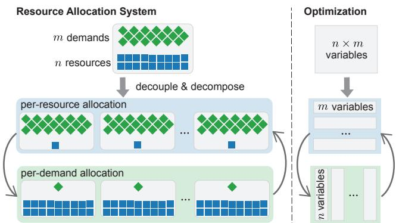  
Figure 1: Overview of DEDE.

These problems may involve millions of variables and take tens of minutes or even hours to solve, whereas fast allocation is necessary to meet service-level objectives. This “scalability crisis” has spurred a flurry of studies [1, 43, 48, 65] that trade off solution quality for computational speed, using heuristics, approximate algorithms, or machine learning. Nevertheless, these approaches are typically restricted to specific domains (e.g., wide-area network traffic engineering) or particular optimization objectives (e.g., max-min fairness), limiting their broader applicability. While POP [44] accelerates assorted allocation tasks, it hinges on a “granular” assumption that each demand requests only a small fraction of interchangeable resources. This premise proves brittle under realistic workloads, leading to degraded solution quality (§7).

In this study, we revisit real-world resource allocation problems through a different lens, avoiding domain-specific designs or workload-dependent assumptions. We introduce DEDE1, a practical and scalable optimization framework for solving resource allocation problems. Rooted in optimization theory, DEDE allows the global allocation problem to be decomposed into alternating per-resource and per-demand subproblems (Figure 1), which can be solved more efficiently and in parallel without compromising solution quality.

This decomposition is enabled by an intrinsic, workloadagnostic problem structure that we identified after surveying dozens of real-world resource allocation problems in the literature (Table 1). We find that the vast majority of these problems are inherently separable: they optimize the total utility of individual resource and demand allocations, subject to separate constraints for each resource and demand to ensure feasibility. To be more concrete, we illustrate this problem structure using a simplified job scheduling example.

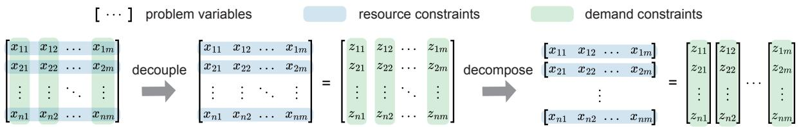  
Figure 2: DEDE decouples constraints using an auxiliary variable, thereby decomposing optimization into subproblems.

▶ Example: Each hour, we aim to determine—as soon as possible—the optimal allocation of a set of large language model inference jobs (e.g., GPT-4, Llama 3, and DeepSeek-V3) on a heterogeneous GPU cluster composed of various hardware types (e.g., Nvidia H100, A100, and V100). Jobs may divide their execution time across multiple GPU types, and due to differences in hardware specifications (e.g., memory capacity, bandwidth, and FLOPS), each job may require a different number of GPUs for each GPU type and achieve varying levels of throughput, measured in tokens per second (TPS). For instance, a job might run for 0.4 hours on 2×A100 at 50 TPS, and for 0.6 hours on 4×V100 at 20 TPS.

Formally, let xi j denote the fraction of the hour that job j (demand) runs on GPU type i (resource). Naturally, we have the demand constraints: $\forall j , \Sigma _ { i } x _ { i j } \leq 1$ . On the other hand, for each GPU type, the total GPU hours requested by all jobs must not exceed the available GPU capacity. Thus, the resource constraints are: $\forall i , \sum _ { j } \mathrm { r e q } _ { j } \cdot x _ { i j } \leq \mathrm { c a p a c i t y } _ { i }$ . The objective is to maximize the total weighted average throughput, $\textstyle \sum _ { j } w _ { j }$ $\textstyle \left( \sum _ { i } \mathrm { t p u t } _ { i j } \cdot x _ { i j } \right)$ , reflecting different job priorities. □

This example demonstrates the “separable” structure frequently encountered in practical resource allocation problems: resource constraints are specified for each resource and its associated demands, demand constraints are specified for each demand and its contributing resources, and the objective function sums the utility achieved by each demand (or resource). Despite this seemingly modular structure, however, such optimization problems remain computationally challenging for commercial solvers to solve at scale. The difficulty arises from each allocation variable $x _ { i j }$ simultaneously affecting both resource and demand constraints, precluding straightforward decomposition and parallel optimization.

To address this challenge, DEDE first decouples entangled resource and demand constraints through a mathematical reformulation. It introduces a copy of the allocation matrix x as an auxiliary variable z, and rewrites the demand constraints (and per-demand terms in the objective) in terms of z, while adding a new constraint x = z. This transformation is mathematically equivalent, preserving the optimal solution. Moreover, it also lends itself to ADMM (Alternating Direction Method of Multipliers) [8], a constrained optimization method based on Lagrange multipliers [6]. By incorporating constraints into the objective via multipliers and constructing the (augmented) Lagrangian (see §3.1), ADMM provides a theoretical framework that allows DEDE to alternatively and iteratively optimize the Lagrangian with respect to each block of variables—x or z—while holding the other fixed.

Building on the reformulation, DEDE further decomposes the optimization into subproblems along each resource and each demand. This step capitalizes on the identified separable structure, wherein the introduced Lagrangian can be partitioned across individual resources and demands (see §3.2). Consequently, instead of solving a monolithic optimization over all n resources and m demands, DEDE breaks the problem into n per-resource subproblems, each with only m demand variables, and m per-demand subproblems, each with only n resource variables. These smaller subproblems are amenable to independent and parallel optimization using off-the-shelf solvers. Figure 2 depicts the decouple-anddecompose workflow of DEDE.

To demonstrate DEDE’s practical utility, we have implemented DEDE as a Python package, installable via pip install dede. Built on the popular open-source modeling language cvxpy [3, 15], DEDE provides familiar APIs (§6) aligned with cvxpy. Moreover, unlike prior efforts that simulate parallelism [1, 44], our implementation is optimized for real parallel execution using Ray [41], enabling efficient utilization of many CPU cores with minimal overhead.

We evaluate DEDE on three representative resource allocation tasks—cluster scheduling, traffic engineering, and load balancing, demonstrating its faster speed and higher allocation quality relative to the state of the art (§7). Compared with the best variant of POP [44] in each domain, DEDE achieves a 7.3% improvement in allocation quality and a 3.1× speedup for cluster scheduling, 5.3% and 7.6× for traffic engineering, and 12.6% and 2.2× for load balancing.

## 2 Real-World Resource Allocation Problems

In modern cloud systems, resources such as CPUs, memory, and network bandwidth are shared among numerous users and applications. A central resource allocator often casts the distribution of resources as an optimization problem (e.g., LP or MILP) and repeatedly computes feasible solutions using solvers to accommodate changing demands.

However, these solvers are struggling to keep up with the increasing problem sizes that frequently occur in fast-growing systems. They may take up to several hours to solve an allocation problem that attempts to assign thousands of resources to thousands of demands. This is several orders of magnitude slower than desired (e.g., service-level objectives measured in seconds). This challenge of scaling up resource allocation has prompted a series of recent works [1, 43, 44, 48, 65], but they either rely on domain-specific customizations or workloaddependent assumptions. In this work, we instead seek to take a general (i.e., domain- and workload-agnostic) approach to scaling resource allocation.

Separable problem structure. Upon surveying real-world resource allocation problems from the literature (Table 1), we find that nearly all these formulations can be transformed into a separable structure (§1) formally described as follows. (We discuss the generality and limitations in §4.)

• Variables. An allocation matrix $x \in \mathcal X$ specifies the allocation of n resources among m demands, where $x _ { i j }$ indicates the amount or fraction of resource i assigned to demand j (or vice versa). Accordingly, the i-th row of x, denoted as $x _ { i * } = ( x _ { i 1 } , x _ { i 2 } , \ldots , x _ { i m } )$ , constitutes the allocation vector of resource i, while the j-th column $x _ { * j } = ( x _ { 1 j } , x _ { 2 j } , \ldots , x _ { n j } )$ encodes the allocation of demand j. The constraint set X is the Cartesian product of the individual domains $\chi _ { i j }$ , but it is often just non-negative real numbers or integers.

• Objective. The objective defines a metric to be maximized or minimized over an allocation matrix x, consisting of a sum of utilities or costs that quantify the outcome from allocating each resource $x _ { i * }$ or demand $x _ { * j } \colon$

$$
\sum _ { i } f _ { i } ( x _ { i * } ) + \sum _ { j } g _ { j } ( x _ { * j } ) ,\tag{1}
$$

where $f _ { i } ( \cdot ) : \mathbb { R } ^ { m } $ R and $g _ { j } ( \cdot ) : \mathbb { R } ^ { n } $ R are utility or cost functions. These functions are typically convex (by nature or by choice), facilitating tractable optimization. A variety of objectives can be transformed into this form using standard optimization techniques. $\operatorname { E } . \mathbf { g } .$ ., maximizing the minimum utility can be converted into maximizing an auxiliary “min utility” variable, with additional constraints ensuring that each utility is at least as large as this variable.

• Constraints. To enforce feasible allocation, one or more constraints can be imposed on each resource and each demand (e.g., to prevent oversubscription of resources and overprovisioning of demands). For computational tractability, these constraints are typically linear. Following standard optimization practices, we transform inequality constraints into equivalent equality constraints using slack variables. Thus, without loss of generality, we express the $r c _ { i } \geq 1$ resource constraints on each resource i as

$$
R _ { i } x _ { i * } = r _ { i } , \quad \forall i ,\tag{2}
$$

where $R _ { i } \in \mathbb { R } ^ { r c _ { i } \times m } , r _ { i } \in \mathbb { R } ^ { r c _ { i } }$ are constraint parameters. Likewise, each demand j is subject to $d c _ { j } \geq 1$ linear constraints:

$$
D _ { j } x _ { * j } = d _ { j } , \quad \forall j ,\tag{3}
$$

where $D _ { j } \in \mathbb { R } ^ { d c _ { j } \times n } , d _ { j } \in \mathbb { R } ^ { d c _ { j } }$ are constraint parameters.

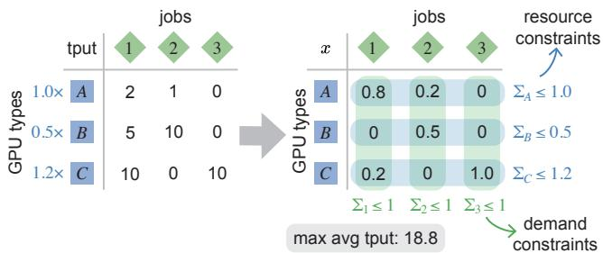  
Figure 3: Toy scenario of the job scheduling example.

Despite the separable objective and separate constraints over each resource and each demand, large resource allocation problems (e.g., with millions of variables) still remain painfully slow to solve as they cannot actually be separated into smaller, concurrent subproblems. The main obstacle is that resource and demand constraints are fundamentally entangled. As shown in Equations 2 and 3, each $x _ { i , j }$ not only participates in the resource constraints (over xi∗) but also in the demand constraints (over x∗ j).

▶ Example: The example introduced in §1 clearly fits into this formulation. For a more specific example, consider a toy scenario in Figure 3, where three language model inference jobs are scheduled across three types of GPUs. For simplicity, we assume each job fits in a single GPU of any type (req j = 1), and all jobs have equal priority $( w _ { j } = 1 )$ .

The left panel of Figure 3 shows the capacity of each GPU type (capacityi) in GPU hours, alongside the throughput table (tputi j). E.g., GPU type C has a total capacity of 1.2 GPU hours, and assigning job 1 to it yields a throughput of 10 TPS.

The right panel shows the optimal allocation matrix $( x _ { i j } )$ which satisfies all resource and demand constraints. E.g., the optimal solution schedules job 1 on (one unit of) GPU type A for 0.8 hours, and on GPU type C for 0.2 hours. The maximum average throughput achieved is 18.8 TPS. □

## 3 DEDE: Decouple and Decompose

We present DEDE, a practical and theoretically rooted optimization framework for solving large-scale, real-world resource allocation problems. By exploiting the inherently separable structure of these problems as described earlier, DEDE achieves massive parallelism while producing near-optimal solutions through a decouple-and-decompose approach.

## 3.1 Decouple

The interdependence between resource and demand constraints is a core complexity in resource allocation. Achieving an optimal solution requires jointly allocating all resources to all demands; otherwise, local, greedy strategies likely result in suboptimal or infeasible solutions.

Existing solutions do not address this intertwined structure of constraints in resource allocation. In practice, production systems tend to simply rely on commercial solvers and employ linear programming (LP) or mixed-integer linear programming (MILP) algorithms (e.g., simplex methods [46], barrier methods [31], or branch-and-bound methods [7]) to navigate a high-dimensional search space, which is induced by the coupling of resource and demand constraints.

A recent work, POP [44], naively breaks entangled constraints by partitioning resources and demands into a handful of subsets (e.g., 4–64), and then independently allocates a subset of resources to a subset of demands. Doing so ignores the dependencies across subsets and leads to suboptimal solutions in practice (§7). Meanwhile, it only enables limited parallelism because finer-grained decomposition would render the allocation infeasible and unusable.

Instead of disregarding the constraints across subproblems, we tackle the root cause of constraint entanglement. Specifically, without sacrificing solution quality, our highlevel goal is to decouple demand constraints from resource constraints, transforming the global allocation into alternating per-resource and per-demand subproblems.

Reformulation. Consider the minimization of the objective in Equation 1 (the signs of $f _ { i }$ and $g _ { j }$ can be simply reversed for maximization problems), subject to resource constraints in Equation 2 and demand constraints in Equation 3.

First, we introduce an auxiliary variable z as a duplicate of the allocation matrix x, and rewrite all demand constraints and all demand-related terms in the objective using z. Meanwhile, we add a new constraint $x = z .$ . This transformation clearly leads to an equivalent optimization problem:

$$
\begin{array} { r l l } { \underset { x \in \mathcal { X } } { \operatorname* { m i n } } } & { \displaystyle \sum _ { i } f _ { i } ( x _ { i * } ) + \sum _ { j } g _ { j } ( z _ { * j } ) , } \\ { \mathit { s . t . } } & { R _ { i } x _ { i * } = r _ { i } , \quad \forall i , } \\ & { D _ { j } z _ { * j } = d _ { j } , \quad \forall j , } \\ & { x - z = 0 . } \end{array}\tag{4}
$$

In this formulation, all resource constraints remain on $x ,$ while all demand constraints (and related utilities) are moved to z.

Although introducing z appears to separate the problem structurally, the (necessary) constraint x = z still tightly couples the variables and thus prevents straightforward decomposition. In fact, jointly optimizing x and z (e.g., using penalty methods [4] or augmented Lagrangian [23]) will forfeit the benefits of this reformulation, as we will show in §7.3.

ADMM background. Nevertheless, this reformulation lends itself to ADMM (Alternating Direction Method of Multipliers) [8], a classical method for solving constrained optimization problems of the form: minimize $f ( x ) + g ( z )$ , subject to $A x + B z = c$ . Note that Equation 4 conforms to this form.

ADMM is based on augmented Lagrangian [23], a method that converts constrained optimization into a sequence of unconstrained optimization problems using Lagrange multipliers [6] (a well-known technique in optimization). These unconstrained problems are defined over the Lagrangian function, constructed from the objective and constraints: $L _ { \boldsymbol { \Theta } } ( x , z , y ) = f ( x ) + g ( z ) + y ^ { \top } ( A x + B z - c ) + ( \boldsymbol { \rho } / 2 ) \lVert A x + B z - \rvert$ $c \dot { \| } _ { 2 } ^ { 2 }$ , where y is (an estimate of) the Lagrange multiplier, and the last quadratic term with parameter ρ serves as a penalty [4] for improving convexity and stability.

The theory of ADMM enables partial, alternating optimization of the Lagrangian with respect to x and z—iteratively solving for x with z fixed, and solving for z with x fixed. This “two-block partial optimization” guarantees convergence to an optimal solution for convex problems [20, 21]. In non-convex settings (including those involving integers), empirical results indicate that ADMM can still effectively solve many of these problems [54, 64, 70]. Theoretical convergence results are established under certain conditions [39, 57, 61].

By introducing the auxiliary variable $u = ( 1 / \rho ) y$ , the augmented Lagrangian can be further rewritten as: $L _ { \rho } ( x , z , u ) =$ $f ( x ) + g ( z ) + ( \mathbf { 0 } / 2 ) \| A x + B z - c + u \| _ { 2 } ^ { 2 } - ( \mathbf { p } / 2 ) \| u \| _ { 2 } ^ { 2 }$ , leading to a more convenient scaled form of ADMM. Next, we present the ADMM iterates for updating x, y, and u directly in the context of resource allocation problems.

Applying ADMM. DEDE applies the scaled form of ADMM to solve the reformulated optimization problem (Equation 4). First, it constructs the augmented Lagrangian:

$$
\begin{array} { l } { \displaystyle \mathcal { L } _ { \boldsymbol { \rho } } ( x , z , \alpha , \beta , \lambda ) = \sum _ { i } f _ { i } ( x _ { i * } ) + \sum _ { j } g _ { j } ( z _ { * j } ) } \\ { \displaystyle + \frac { \rho } { 2 } \left( \sum _ { i } \Vert R _ { i } x _ { i * } - r _ { i } + \alpha _ { i } \Vert _ { 2 } ^ { 2 } + \sum _ { j } \Vert D _ { j } z _ { * j } - d _ { j } + \beta _ { j } \Vert _ { 2 } ^ { 2 } \right. } \\ { \displaystyle \left. + \Vert x - z + \lambda \Vert _ { F } ^ { 2 } \right) - \frac { \rho } { 2 } ( \Vert \alpha \Vert _ { 2 } ^ { 2 } + \Vert \beta \Vert _ { 2 } ^ { 2 } + \Vert \lambda \Vert _ { F } ^ { 2 } ) , } \end{array}\tag{5}
$$

where $\mathbf { \alpha } _ { i } \in \mathbb { R } ^ { r c _ { i } } , \beta _ { j } \in \mathbb { R } ^ { d c _ { j } } , \lambda \in \mathbb { R } ^ { n \times m }$ are the introduced auxiliary variables. $\lVert \cdot \rVert _ { 2 }$ still denotes the $\ell ^ { 2 } .$ -norm of a vector, while $\lVert \cdot \rVert _ { F }$ is the Frobenius norm of a matrix, i.e., the $\ell ^ { 2 } .$ -norm of the matrix when flattened into a vector.

The ADMM iterates are given by:

$$
x ^ { ( k + 1 ) } : = \underset { x \in \mathcal { X } } { \arg \operatorname* { m i n } } \ \mathcal { L } _ { \boldsymbol { \mathsf { p } } } ( x , z ^ { ( k ) } , \alpha ^ { ( k ) } , \beta ^ { ( k ) } , \lambda ^ { ( k ) } )\tag{6}
$$

$$
z ^ { ( k + 1 ) } : = \arg \operatorname* { m i n } _ { \mathbf { \omega } _ { 7 } } \mathcal { L } _ { \mathfrak { p } } ( x ^ { ( k + 1 ) } , z , \mathbf { \alpha } \alpha ^ { ( k ) } , \beta ^ { ( k ) } , \lambda ^ { ( k ) } )\tag{7}
$$

$$
\begin{array} { l } { \alpha _ { i } ^ { ( k + 1 ) } : = \alpha _ { i } ^ { ( k ) } + R _ { i } x _ { i * } ^ { ( k + 1 ) } - r _ { i } , \forall i } \\ { \beta _ { j } ^ { ( k + 1 ) } : = \beta _ { j } ^ { ( k ) } + D _ { j } z _ { * j } ^ { ( k + 1 ) } - d _ { j } , \forall j } \\ { \lambda ^ { ( k + 1 ) } : = \lambda ^ { ( k ) } + x ^ { ( k + 1 ) } - z ^ { ( k + 1 ) } } \end{array}
$$

We will show in §3.2 that both the optimization subproblems in Equations 6 and 7 are amenable to decomposition owing to the previously identified separable problem structure.

## 3.2 Decompose

Up to this point, we have reformulated the original resource allocation problem into alternating minimization steps of the

augmented Lagrangian with respect to x and z. Next, we take the x-minimization step as an example to describe how the optimization is decomposed (z-minimization is similar).

Because the x-minimization step solves for x only, we can ignore all terms in the augmented Lagrangian without x (such as demand constraints). Thus, we rewrite Equation 6 as

$$
\begin{array} { r l } {  { x ^ { ( k + 1 ) } = \underset { x \in \mathcal { X } } { \arg \operatorname* { m i n } } \ \angle _ { \phi } ( x , z ^ { ( k ) } , \mathbf { \boldsymbol { \alpha } } ^ { ( k ) } , \boldsymbol { \beta } ^ { ( k ) } , \boldsymbol { \lambda } ^ { ( k ) } ) } } \\ & { = \underset { x \in \mathcal { X } } { \arg \operatorname* { m i n } } \ \sum _ { i } f _ { i } ( x _ { i * } ) + \frac { \Theta } { 2 } \sum _ { i } \big \| R _ { i } x _ { i * } - r _ { i } + \alpha _ { i } ^ { ( k ) } \big \| _ { 2 } ^ { 2 } } \\ & { \quad + \frac { \Theta } { 2 } \big \| x - z ^ { ( k ) } + \lambda ^ { ( k ) } \big \| _ { F } ^ { 2 } } \\ & { = \underset { x \in \mathcal { X } } { \arg \operatorname* { m i n } } \sum _ { i } \Big ( f _ { i } ( x _ { i * } ) + \frac { \Theta } { 2 } \big \| R _ { i } x _ { i * } - r _ { i } + \alpha _ { i } ^ { ( k ) } \big \| _ { 2 } ^ { 2 } } \\ & { \quad + \frac { \Theta } { 2 } \big \| x _ { i * } - z _ { i * } ^ { ( k ) } + \lambda _ { i * } ^ { ( k ) } \big \| _ { 2 } ^ { 2 } \Big ) . } \end{array}\tag{6}
$$

Given that the new objective is a sum of disjoint terms across index $i ,$ its minimization can be decomposed into independent, per-resource subproblems over each $x _ { i * }$

$$
\begin{array} { r l } & { x _ { i * } ^ { ( k + 1 ) } = \underset { x _ { i * } \in \mathcal { X } _ { i * } } { \arg \operatorname* { m i n } } \left( f _ { i } ( x _ { i * } ) + \frac { \rho } { 2 } \big | \big | R _ { i } x _ { i * } - r _ { i } + \alpha _ { i } ^ { ( k ) } \big | \big | _ { 2 } ^ { 2 } \right. } \\ & { \quad \quad \left. + \frac { \rho } { 2 } \big | \big | x _ { i * } - z _ { i * } ^ { ( k ) } + \lambda _ { i * } ^ { ( k ) } \big | \big | _ { 2 } ^ { 2 } \right) , \quad \forall i . } \end{array}\tag{8}
$$

This decomposition is made possible by the separable structure: (1) the original objective is separable, with a utility $f _ { i } ( x _ { i * } )$ defined for allocating each resource i, and (2) the resource constraints are likewise separable, as each constraint $R _ { i } x _ { i * } = r _ { i }$ pertains only to the corresponding resource i.

As a result, the original optimization problem over n × m variables is broken down into n independent subproblems, each involving only m variables. DEDE solves each subproblem using off-the-shelf solvers, which return either exact or approximate solutions depending on the nature of f (convex or not), whether X contains integers, etc. Since this decomposition allows up to n parallel computations—often numbering in the thousands in large-scale settings—DEDE is capable of delivering substantial speedups assuming sufficient CPUs.

For linear programs, the original problem has a worst-case time complexity of approximately $\bar { O ( } ( n \cdot m ) ^ { 2 . 3 7 3 } )$ [13, 44]. After decomposition, DEDE processes n subproblems, each with a complexity of $O ( m ^ { 2 . 3 7 3 } )$ , reducing the overall complexity to $O ( n \cdot m ^ { 2 . { \dot { 3 } } 7 3 } )$ . Nonetheless, this theoretical improvement assumes that ADMM converges within a constant number of iterations. In practice, the number of iterations depends on the choice of the penalty parameter ρ (which acts like a “learning rate”) and other factors that influence convergence.

Similarly, the z-minimization step decomposes into independent, per-demand allocation subproblems over each $z _ { * j } { \mathrm { : } }$

$$
\begin{array} { r l } & { z _ { * j } ^ { ( k + 1 ) } = \underset { z _ { * j } } { \mathrm { a r g } \mathrm { m i n } } \left( g _ { j } ( z _ { * j } ) + \frac { \boldsymbol { \mathsf { p } } } { 2 } \big \| \boldsymbol { D } _ { j } z _ { * j } - d _ { j } + \boldsymbol { \mathsf { \mathsf { p } } } _ { j } ^ { ( k ) } \big \| _ { 2 } ^ { 2 } \right. } \\ & { \quad \left. + \frac { \boldsymbol { \mathsf { p } } } { 2 } \big \| x _ { * j } ^ { ( k + 1 ) } - z _ { * j } + \lambda _ { * j } ^ { ( k ) } \big \| _ { 2 } ^ { 2 } \right) , \quad \forall j . } \end{array}\tag{9}
$$

## 4 Generality and Limitations

In this section, we discuss the generality of DEDE (conditions under which it applies) and its limitations (scenarios that may result in limited parallelism or suboptimal solutions).

## 4.1 Generality

DEDE is applicable to a wide range of real-world resource allocation problems. Table 1 summarizes these problems that appear in recent literature such as OSDI, SOSP, NSDI, and SIGCOMM. Below, we explain why DEDE is applicable.

• Variables. As an ADMM-based framework, DEDE natively supports continuous (real-valued) allocation variables. Empirical evidence [54] and theoretical proofs [39, 57, 61] on ADMM further indicate that DEDE should effectively handle boolean and integer variables by projecting real-valued solutions onto the appropriate domains during iterations.

• Objective. Most objectives in real systems are defined as the sum, max, or min of utility functions over the individual allocation of resources and demands. They also exhibit convexity. Examples include weighted sums [45, 65], logarithmic utilities [2], and quadratic costs [60, 66].

• Constraints. DEDE assumes linear constraints on resources and demands—a condition that holds across all the surveyed use cases. These constraints are commonly expressed at the per-resource or per-demand level. Even for constraints that do span multiple resources or demands, DEDE can turn them into disjoint constraint groups and apply decomposition at the group level (at the cost of reduced parallelism).

Unlike POP [44], DEDE works with any workload, not only “granular” ones. In POP, the demands in each subproblem can only access a subset of resources, assuming each demand only requests a small fraction of interchangeable resources such that a resource subset suffices. This granular assumption can be unrealistic in practice, due to uneven demand distributions [29, 58] or specific resources that each demand is allowed to utilize [34, 59]. In contrast, each subproblem in DEDE can still access all the resources or demands, resulting in generalization to various workload distributions.

## 4.2 Limitations

While DEDE applies to a variety of resource allocation tasks, it might not always be the optimal approach for all scenarios. Limited parallelism. DEDE’s parallelism relies on its ability to decompose the problem into independent subproblems. When such decomposition is not fully achievable, the degree of parallelism diminishes. Although this limitation does not manifest in the set of real-world problems we surveyed, we come up with some examples below.

• Non-separable objectives. An objective is non-separable when utility depends on the interaction between different resources or demands, e.g., if a job attains higher throughput when it has exclusive access to a GPU compared with when sharing it with other jobs.

<table><tr><td rowspan=2 colspan=1></td><td rowspan=1 colspan=1>Variables</td><td rowspan=1 colspan=1>Objective</td></tr><tr><td rowspan=1 colspan=1>Boolean Integer Float</td><td rowspan=1 colspan=1>Linear Convex</td></tr><tr><td rowspan=1 colspan=1>RDC [56]</td><td rowspan=1 colspan=1>√</td><td rowspan=1 colspan=1>√</td></tr><tr><td rowspan=1 colspan=1>SkyPilot [66]</td><td rowspan=1 colspan=1>√</td><td rowspan=1 colspan=1>√</td></tr><tr><td rowspan=1 colspan=1>ARROW [69], Flex WAN [40]</td><td rowspan=1 colspan=1>√       √</td><td rowspan=1 colspan=1>√</td></tr><tr><td rowspan=1 colspan=1>Shoofly [52]</td><td rowspan=1 colspan=1>√      √</td><td rowspan=1 colspan=1>√</td></tr><tr><td rowspan=1 colspan=1>PODP [5],RAS[47], Skyplane [27], Oort [35],TACCL [50], Shard Manager [38],Zeta [67], CASCARA [51], Sia [28], POP [44]</td><td rowspan=1 colspan=1>√                 √</td><td rowspan=1 colspan=1>√</td></tr><tr><td rowspan=1 colspan=1>NetHint [12], Gavel [45], Teal [65], ONEWAN [33], BLASTSHIELD [32],NCFlow [1], Cerebro [68], DOTE [48],POP [44]</td><td rowspan=1 colspan=1>√</td><td rowspan=1 colspan=1>√</td></tr><tr><td rowspan=1 colspan=1>PCF [30], Electricity Pricing [60], POP [44]</td><td rowspan=1 colspan=1>√</td><td rowspan=1 colspan=1>√</td></tr></table>

Table 1: Real-world resource allocation problems in recent literature.

• Non-separable constraints. A constraint is non-separable when it spans multiple resources and multiple demands simultaneously. For example, this occurs when the jobs submitted by each user are collectively limited by a userspecific GPU hour quota. To restore decomposability, DEDE has to treat all jobs (the original demands) from the same user as a single aggregated demand. However, this aggregation reduces the granularity of parallelism, from the job level to the user level.

Suboptimal solutions. DEDE may fail to reach the optimal solution when the allocation problem deviates from the assumptions underlying standard ADMM.

• Non-convex problems. Although ADMM has demonstrated empirical success on various non-convex problems [54, 64, 70], its theoretical convergence is guaranteed only under specific conditions [39, 57, 61]. Consequently, DEDE may converge to suboptimal solutions in non-convex settings.

• Nonlinear constraints. When a constraint is nonlinear, DEDE has to reformulate it with an indicator function in the augmented Lagrangian. The indicator function returns zero if the constraint is satisfied and infinity otherwise. However, this approach destroys the convexity of the objective, resulting in the aforementioned non-convex problems.

• Higher allocation dimension. DEDE assumes a twodimensional allocation matrix that maps resources to demands, leading to a two-block ADMM formulation. Introducing additional dimensions such as a temporal dimension [37] will increase the number of variable blocks in ADMM and thus might lead to convergence issues [11].

## 5 Case Studies

In this section, we present case studies of DEDE applied to three representative resource allocation problems [44]: cluster

scheduling, traffic engineering, and load balancing.

## 5.1 Cluster Scheduling

Cluster scheduling problems [43–45, 63] involve allocating computing jobs to different resource types in heterogeneous clusters. The job scheduling example introduced earlier is a simplified version of this problem.

Max-min allocation. This variant aims to distribute the heterogeneous cluster resources fairly among jobs such that the minimum throughput is maximized.

• Variables. Jobs can be time-sliced across available resource types [44, 45]. Thus, the allocation plan is a matrix x ∈ [0, 1]n×m, where $x _ { i j }$ is the fraction of time (optimization interval) that each job j spends on each resource type i.

• Objective. Given an allocation matrix x, we adopt a normalized effective throughput of job j from POP [42], which is a linear function of $x _ { * j }$ . The objective is to maximize the minimum normalized effective throughput:

$$
\operatorname { M a x i m i z e \ m i n \ t h r o u g h p u t } ( j , x _ { * j } ) .
$$

• Resource constraints. For each computing resource type i, the total amount of resources requested by all jobs cannot exceed the corresponding capacity:

$$
\sum _ { j } x _ { i j } z _ { j } \le \mathrm { c a p a c i t y } _ { i } , \quad \forall i ,
$$

where $z _ { j }$ is the amount of resources requested by job j.

• Demand constraints. For each job j, the sum of all fractions of time must not exceed 1 naturally:

$$
\sum _ { i } x _ { i j } \leq 1 , \quad \forall j .
$$

Proportional fairness. The second variant of cluster scheduling maximizes the overall resource utilization while ensuring minimum service for each job. This variant shares the same variables and constraints as above, except for the objective:

• Objective. Proportional fairness aims to maximize the sum of log utilities of each job:

$$
\mathbf { M a x i m i z e \sum _ { \boldsymbol { x } } } \log ( \operatorname { t h r o u g h p u t } ( \boldsymbol { j } , \boldsymbol { x } _ { * j } ) ) .
$$

Applying DEDE. Both variants of cluster scheduling exhibit the separable structure required by DEDE. Their objectives to maximize are a sum or min of utilities for allocating each job, and a linear constraint is applied to each job and each computing resource. Thus, DEDE can decompose the problem into n per-job allocations and m per-demand allocations.

## 5.2 Traffic Engineering

Traffic engineering problems [24,43,44,55,65] allocate traffic demands between datacenters onto the network links in a wide-area network (WAN) topology.

Maximizing total flow. This problem variant focuses on maximizing the total flow allocation.

• Variables. Let $x _ { ( u , \nu ) ( s , t ) } \geq 0$ denote the amount of flow from a datacenter pair (s,t) assigned to a network link $\left( u , \nu \right)$ In common path-based traffic engineering, flows between each node pair $\scriptstyle ( s , t )$ are allocated only over links along pre-configured paths $P _ { \left( s , t \right) }$

• Objective. For each node pair $\scriptstyle ( s , t )$ , the inflow it incurs to node v is computed as: inflow $\begin{array} { r } { \big ( \nu , ( s , t ) \big ) = \sum _ { ( u , \nu ) \in P _ { s , t } } x _ { ( u , \nu ) ( s , t ) } , } \end{array}$ and outflow as: outflow $\begin{array} { r } { \big ( \nu , ( s , t ) \big ) = \sum _ { ( \nu , u ) \in P _ { s , t } } x _ { ( \nu , u ) ( s , t ) } } \end{array}$ . Consequently, the total flow allocated for the node pair $\scriptstyle ( s , t )$ is captured by inflow $\left( t , \left( s , t \right) \right)$ , the total inflow toward the destination t. Therefore, the objective of maximizing the total flow between all node pairs can be expressed as:

$$
\operatorname { M a x i m i z e } \sum _ { \boldsymbol { x } } \operatorname { i n f l o w } ( t , ( { \boldsymbol { s } } , t ) ) .
$$

• Resource constraints. For each link $\left( u , \nu \right)$ , the cumulative flow from all node pairs traversing it must not exceed its link capacity $c _ { u , \nu } { \mathrm { . } }$

$$
\sum _ { ( s , t ) } x _ { ( u , \nu ) ( s , t ) } \leq c _ { u , \nu } , \quad \forall ( u , \nu ) \in E .
$$

• Demand constraints. For each node pair $\scriptstyle ( s , t )$ , the total flow allocated cannot exceed the total demand. Additionally, for all nodes other than s and t, the inflow and outflow must be equal, ensuring no flow “black hole” along the paths:

$$
\begin{array} { r l } & { 0 \leq \mathrm { i n f l o w } ( t , ( s , t ) ) \leq d _ { s , t } , } \\ & { \mathrm { i n f l o w } ( \nu , ( s , t ) ) = \mathrm { o u t f l o w } ( \nu , ( s , t ) ) , \forall \nu \not = s , t , } \end{array} \quad \forall ( s , t ) .
$$

Minimizing max link utilization. This variant aims to evenly distribute traffic demands across network links to avoid overloading any single link. The utilization of link is commonly defined as the (uncapped) ratio of total flow assigned to a link to the link’s capacity, although it cannot actually exceed 100% in practice. This formulation shares the same variables and constraints as above, with a revised objective:

• Objective. The goal is to minimize the max link utilization across the network:

$$
{ \underset { x } { \mathrm { M i n i m i z e } } } \ \operatorname* { m a x } _ { ( u , \nu ) \in E } { \frac { \sum _ { ( s , t ) } x _ { ( u , \nu ) ( s , t ) } } { c _ { u , \nu } } } .
$$

Applying DEDE. The traffic engineering problem aligns with the separable structure of DEDE: the objectives are expressed as either a sum over per-demand utilities or as a maximum over per-link utilities, and linear constraints are applied to each demand and each link. Therefore, DEDE can decompose the problem into $| E |$ per-link allocations and $| V | ^ { 2 }$ per-demand allocations for parallelism. In practice, due to the large overhead of maintaining $| V | ^ { 2 }$ per-demand subproblems, we group these subproblems by their sources, reducing the total number of subproblems to just |V |.

## 5.3 Load Balancing

Load balancing problems [14, 44, 49, 53] allocate data shards among storage servers to scale out query loads in a distributed store. Load balancing is a non-convex problem with integer variables, wherein DEDE can provide a high-quality solution empirically, as discussed in $\ S 4 . 2$

Minimizing shard movements. This problem aims to minimize shard movements across servers during load changes while keeping the load nearly balanced on each server.

• Variables. The allocation plan is encoded in a matrix $x \in$ $[ 0 , 1 ] ^ { n \times m }$ , where $x _ { i j }$ is the fraction of data shard j assigned to server i. Additionally, a binary matrix $x ^ { \prime }$ captures shard placement, where $x _ { i j } ^ { \prime } = 1$ if the data shard j is located on server i (i.e., when $\dot { x _ { i j } } > 0 )$ ; otherwise, $x _ { i j } ^ { \prime } = 0$

• Objective. The movement of data shard $j$ allocated to server i can be represent as $( 1 - T _ { i j } ) x _ { i j } ^ { \prime } f _ { i }$ , where $T _ { i j }$ denotes the initial shard placement, and $f _ { j }$ denotes the memory footprint of data shard $j .$ The objective of minimizing total shard movement can be expressed as:

$$
\underset { x } { \mathrm { M i n i m i z e } } \sum _ { j } \sum _ { i } ( 1 - T _ { i j } ) x _ { i j } ^ { \prime } f _ { i } .
$$

• Resource constraints. For each server i, the total query load must be close to the average query load L. Meanwhile, the total memory usage must be within the memory capacity:

$$
\begin{array} { r l } & { L - \varepsilon \leq \sum _ { j } x _ { i j } l _ { j } \leq L + \varepsilon , } \\ & { \sum _ { j } x _ { i j } ^ { \prime } f _ { j } \leq \mathrm { m e m o r y } _ { i } , } \end{array} \quad \forall i ,
$$

where $l _ { j }$ is the query load on data shard $j .$

• Demand constraints. Each data shard j must be entirely allocated across servers:

$$
\sum _ { i } x _ { i j } = 1 , \quad \forall j .
$$

Applying DEDE. The load balancing problem also demonstrates a separable structure: the objective is the sum of allocation quality per data shard, while linear constraints are applied independently to each server and each shard. This allows DEDE to decompose the problem into n per-server allocations and m per-shard allocations.

## 6 Implementation of DEDE

We have implemented DEDE as a Python package and uploaded it to PyPI for easy installation: pip install dede.

Listing 1 showcases a basic resource allocation example using DEDE. Line 5 creates an N ×M non-negative allocation matrix x, where x[i,j] represents the fraction of time that demand j runs on resource i. Lines 12–13 define a constraint for each resource using parameters, and Lines 14–15 define a constraint for each demand. The objective, defined in Line 18, is to maximize the sum of entries in x. Finally, the problem is constructed in Lines 21–22 and solved in Line 23.

Built on top of the popular optimization modeling language cvxpy [3, 15], DEDE inherits most of its syntax and APIs, such as Variable(), Parameter(), and Maximize(). A notable distinction is that DEDE requires users to explicitly separate resource constraints and demands constraints when initializing a problem (Line 22). As a parallel optimization tool, DEDE allows users to configure the number of CPUs (Line 23); by default, all available cores are used.

Internally, DEDE solves the optimization in three stages:

• Problem parsing. DEDE transforms all inequality constraints into equivalent equality constraints through nonnegative slack variables. E.g., x[:,j].sum() <= 1 is converted to x[:,j].sum() + sj == 1 with a slack variable sj. Then slack variables are treated just like other variables.

• Problem building. DEDE organizes resource constraints into disjoint per-resource groups and demand constraints into disjoint per-demand groups. For each group, a perresource or per-demand subproblem is constructed with cvxpy following Equations 8 and 9.

• Problem solving. DEDE solves these subproblems in parallel using multiple CPU cores. During ADMM iterations, only the parameters are updated, avoiding the overhead of rebuilding problems in cvxpy. Similarly, for the same problem with varying resources and demands, only the relevant parameters are updated.

We use Ray [41] to parallelize our computation across multiple cores, as Python’s native multithreading model is constrained by the (notorious) global interpreter lock (GIL). Ray circumvents this issue by managing multiple Python interpreter processes, effectively bypassing the GIL. Moreover, Ray offers robust support for inter-process communication, sparing us from manually implementing such mechanisms using Python’s lower-level multiprocessing primitives.

```python
import numpy as np
2 import dede as dd
3
4 # Create allocation variables
5 x = dd.Variable((N, M), nonneg=True)
6
7 # Create parameters
8 param = dd.Parameter(
9 N, value=np.random.uniform(0, 1, N))
10
11 # Create constraints
12 resource_constrs = [
13 x[i,:].sum() <= param[i] for i in range(N)]
14 demand_constrs = [
15 x[:,j].sum() <= 1 for j in range(M)]
16
17 # Create an objective
18 obj = dd.Maximize(x.sum())
19
20 # Construct and solve the problem
21 prob = dd.Problem(
22 obj, resource_constrs, demand_constrs)
23 prob.solve(num_cpus=64, solver=dd.ECOS)
```  
Listing 1: Resource allocation example with DEDE package.

## 7 Evaluation

We answer the following questions in the evaluation:

1. How does DEDE compare with state-of-the-art approaches in allocation quality and computation time? (§7.1)

2. How do DEDE and baseline approaches react to changes in problem granularity, temporal fluctuation, spatial redistribution, and link failures? (§7.2)

3. What is the individual contribution of each design component in DEDE? (§7.3)

Our evaluation compares four approaches:

• Exact sol. This baseline solves the original resource allocation problem using commercial solvers. We adopt the implementation from POP, which utilizes cvxpy [3, 15], Gurobi [22], and CPLEX [25] for cluster engineering, traffic engineering, and load balancing, respectively.

• POP. POP-k [44] randomly splits the problem into k smaller subproblems, applies commercial solvers to each, and coalesces the resulting k sub-allocations into a global allocation. However, POP only simulates the parallel execution by solving subproblems sequentially and calculating the parallel solving time mathematically.

• DEDE. DEDE is our truly parallel implementation (§6). By default, the solution from the previous optimization interval is used to warm-start the subsequent interval.

• DEDE∗. For a fair comparison with POP, we create a variant of DEDE, denoted as DEDE∗, following POP’s simulation methodology. DEDE∗ solves subproblems sequentially and estimates the parallel solving time mathematically.

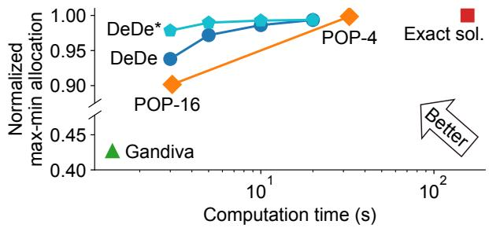  
Figure 4: Results of the cluster scheduling variant that maximizes the minimum job throughput (max-min allocation).

We also consider domain-specific approaches apart from these four approaches. In cluster scheduling and load balancing, we evaluate the greedy heuristic algorithms, Gandiva [63] and E-Store [53], respectively. In traffic engineering, we evaluate a demand-pinning approach (“Pinning”) similar to a prior work [42], where the top 10% of demands are allocated using optimization engines and the rest are assigned to shortest paths. We also evaluate Teal [65], a learning-accelerated traffic engineering approach that achieves massive parallelism using a GPU.

All approaches are evaluated in terms of allocation quality and computation time. The computation time is measured using 64 CPU cores (2× Intel Xeon Gold 6142), with an additional GPU (Nvidia Titan RTX) available for Teal.

## 7.1 DEDE vs. the State of the Art

In this section, we compare DEDE against state-of-the-art approaches on resource allocation problems from §5.

## 7.1.1 Cluster Scheduling

We stress-test DEDE’s scalability in a large, heterogeneous cluster scheduling environment, where jobs are allocated in a time-sliced manner across 456 different types of compute resources, e.g., GPU/CPU instances that vary in vendor, generation, memory capacity, and other specifications. The quantity of each resource type is randomly drawn from {8, 16, 24, . . . , 64}, resulting in a total of 16,520 instances. We utilize the simulator in Gavel [45] and model job arrivals as a Poisson process with an average inter-arrival of 100 seconds. We update job allocation decisions every 6 minutes, repeating this process for 200 scheduling rounds (20 hours). For each job, the number of requested resource instances per type is drawn from {1, 2, 4, 8, 16, 32}, and following prior work [59], 33% of the jobs are restricted to specific resource types. Job throughput is derived from relevant benchmarks [19, 26, 36]. Please refer to Appendix A for more details on this setup.

Max-min allocation. Figure 4 compares DEDE against other approaches in terms of max-min allocation. DEDE quickly attains a near-optimal max-min allocation of 0.94 in just 3 seconds and 0.99 within 10 seconds, demonstrating a better balance between max-min allocation and computation time compared with Exact sol., Gandiva, and POP. In contrast, Exact sol. experiences a significantly slower computation time of 156 seconds due to its sequential nature. The greedy heuristic, Gandiva, performs poorly, achieving only a maxmin allocation of 0.43 (in 1.4 seconds). POP-4 provides a comparable tradeoff between time and accuracy to DEDE, but is 1.6× slower. The faster variant, POP-16, splits the problem into 16 smaller subproblems and achieves a lower max-min allocation of 0.9 (in 3.1 seconds), since smaller subproblems limit the ability to select optimal GPU/CPU assignments.

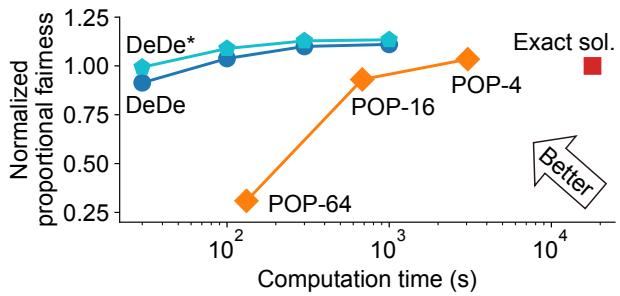  
Figure 5: Results of the cluster scheduling variant that maximizes proportional fairness among job throughputs.

DEDE∗, representing the same algorithm under idealized conditions similar to POP’s simulation, achieves a normalized max-min allocation of 0.99 and is 3.3× faster than DEDE in Figure 4. The reason is that DEDE∗ executes each iteration more quickly and completes more iterations within a given time. The discrepancy in iteration time between DEDE and DEDE∗ arises from three factors: (1) DEDE measures the end-to-end time, including problem solving, compilation, solution unpacking, and other associated tasks, while DEDE∗ only accounts for the core solving time; (2) DEDE’s parallel implementation incurs overhead from cache contention, which slows computation; (3) In DEDE, each subproblem is statically pre-assigned to one of the processes, making it susceptible to straggler delays. In contrast, DEDE∗ assumes perfect dynamic scheduling.

Proportional fairness. Figure 5 compares DEDE against other approaches in maximizing proportional fairness. This problem is particularly challenging due to the logarithmic form of the objective function. Exact sol., which uses the SCS solver in cvxpy, fails to reach optimality even after 5 hours of computation. As a result, several methods report normalized fairness scores that exceed 1 when normalized relative to Exact sol. Both DEDE and DEDE∗ achieve greater speedups than POP by effectively breaking the problem into smaller and easier subproblems. Notably, DEDE and DEDE∗ both reach a normalized proportional fairness of over 1 within 100 seconds. In contrast, POP-4 and POP-16 require 3,053 seconds and 682 seconds, respectively, to achieve comparable allocation quality, while POP-64 yields a significantly lower

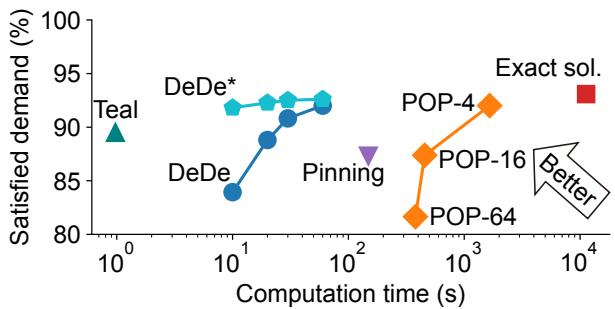  
Figure 6: Results of the traffic engineering problem variant that maximizes the total flow.

fairness score of only 0.31.

## 7.1.2 Traffic Engineering

We adopt the evaluation setup in Teal [65], with a focus on its largest topology—a 1,739-node network adapted from an internet topology for WAN purposes. The traffic matrices are collected from the production WAN of a global cloud provider and mapped onto the above topology.

Maximize total flow. Figure 6 compares DEDE to the baselines in maximizing total flow. DEDE achieves 90.8% satisfied demand within 30 seconds and 92% within 60 seconds, showing a superior trade-off between satisfied demand and computation time compared with Exact sol., POP, and Pinning. Its idealized variant, DEDE∗, achieves a satisfied demand that is 8% higher than DEDE within 10 seconds. While POP-4 also reaches 92% satisfied demand, its average computation time is significantly longer, at 1,658 seconds. POP-16 and POP-64 improve parallelism by dividing the workload into more subproblems, reducing computation times to 456 seconds and 380 seconds, respectively. Note that the speedup of POP-64 is limited compared with POP-16 as the number of cores per subproblem drops from 4 to 1. This increased parallelism also comes at a cost, with satisfied demand decreasing to 87.4% for POP-16 and 81.6% for POP-64. Pinning focuses on top demands to reduce problem size but remains constrained by the sequential nature of its optimization solvers. As a result, it achieves a modest speedup, requiring 149 seconds to reach 87.3% satisfied demand. Teal, a learning-accelerated approach, leverages massive GPU parallelism to achieve 89% satisfied demand in only 1 second. However, it relies on a highly customized machine-learning framework, demanding significant human effort for design and training.

Min-max link utilization. Figure 7 compares DEDE with other approaches in minimizing maximum link utilization. Here, the link utilization metric serves as proxy for network congestion and is allowed to exceed 100% during optimization. DEDE attains a maximum link utilization of 1.67 within 10 seconds and 1.71 within 5 seconds. Exact sol. reaches 1.63 with a longer computation time of 35 seconds. This is faster than maximizing total flow because minimizing max link utilization is computationally less challenging and thus requires fewer iterations. Pinning takes 42.5 seconds, making it slower than DEDE and slightly slower than Exact sol., as it requires additional time to rebuild the problem when the top 10% of node pairs change. POP’s variants, POP-4, POP-16, and POP-64, achieve a maximum link utilization of 1.70, 1.77, and 1.95 within 9, 2, and 0.4 seconds on average, respectively. Although POP-16 is faster than DEDE, a fairer comparison between POP-16 and DEDE∗, both simulating parallelism, reveals that DEDE∗ achieves a comparable computation time to POP-16. The domain-customized Teal takes only 0.3 seconds on a GPU to attain a maximum link utilization of 1.74.

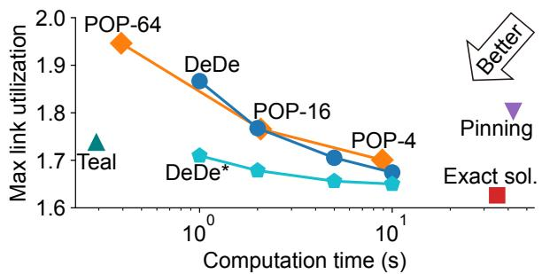  
Figure 7: Results of the traffic engineering problem variant that minimizes the max link utilization.

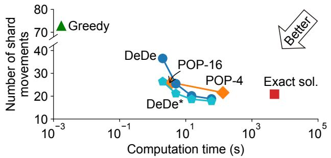  
Figure 8: Results of the load balancing problem where the objective is to minimize shard movements.

## 7.1.3 Load Balancing

We follow the load balancing settings in POP [44], except for increasing the scale to 2,048 data shards distributed across 256 servers. In each round, a new shard-to-server allocation is computed based on updated query loads. We simulate for 100 rounds, using the first 20 as a warm-up. To ensure the problem’s feasibility, we set the tolerance parameter ε to 0.1.

Minimize shard movements. Figure 8 compares DEDE with baselines in minimizing shard movements. DEDE achieves an average of 20.1 shard movements in 15 seconds, better than POP-4’s 21.5 shard movements within 133 seconds. In faster scenarios, DEDE achieves 25.4 shard movements in 5 seconds, while POP-16 achieves an average movement of 26 in a slighter less time of 3.7 seconds. For a fair comparison,

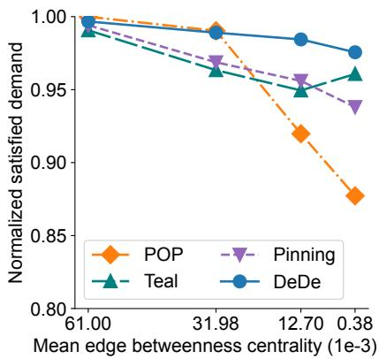  
(a) Granularity changes.

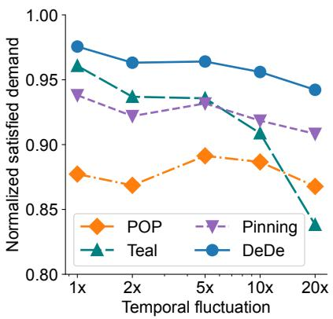  
(b) Temporal fluctuation.

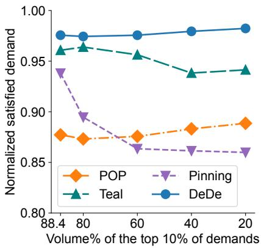  
(c) Spatial redistribution.  
Figure 9: Normalized satisfied demand in traffic engineering against granularity, temporal, and spatial changes.

DEDE∗ consistently achieves around 16% fewer shard movements than POP, given a similar time limit. Exact sol. requires 20.9 shard movements on average, but is significantly slower with an average of 4,820 seconds. This slower computation is due to the NP-hard nature of solving the mixed-integer linear program underlying load balancing. Notably, Exact sol. does not produce the minimum possible shard movements because optimizing each scheduling round independently does not guarantee an optimal solution across the entire series. At the opposite end of the time-accuracy trade-off, the greedy heuristic provides a rapid but less accurate solution, completing in just 2 milliseconds but averaging 73 shard movements after naively fixing its constraint violations.

## 7.2 Robustness

Using traffic engineering as an example, we evaluate the robustness of DEDE and other baselines against changes in problem granularity, temporal dynamics, spatial redistribution, and link failures. In these experiments, DEDE is run for 30 seconds, and we normalize the satisfied traffic demand by the optimal one achieved by Exact sol.

Changes of problem granularity. The granular problem structure required by POP, where each demand only requests a small fraction of interchangeable resources, can be impractical. In traffic engineering, for example, demands are constrained by the link capacity on specific pre-configured paths. Similarly, in cluster scheduling, 33% of GPU tasks in production clusters are limited to specific GPU types [59]. In Figure 9a, we present results on varying levels of problem granularity using traffic engineering as an example. To quantify resource interchangeability, we use the mean edge betweenness centrality [9, 10], which measures the average percentage of demands served by a given edge.

As the mean edge betweenness centrality decreases, all approaches experience a decline in normalized satisfied demand, ranging from 0.8–2.1% for DEDE, 2.8–4.2% for Teal, 2.5–

5.6% for Pinning, and 1–12.3% for POP. However, the maximum decrease in POP is 5.9× greater than DEDE because POP’s subproblems struggle to find alternative resources within their restricted subsets, whereas DEDE’s subproblems retain access to the full set of resources. Teal exhibits a slight 1.3% increase in satisfied demand when the mean edge betweenness centrality is minimal. This is because the reduced edge selection simplifies allocation decisions.

Temporal dynamics. Next, we introduce temporal fluctuations [65] to the traffic matrices for robustness assessment. For each demand, we calculate the variance $\sigma ^ { 2 }$ in its changes between consecutive time slots and create a new normal distribution $N ( 0 , k \sigma ^ { 2 } )$ . We choose the values of k to be 2, 5, 10, and 20. Next, we randomly draw a sample from the newly created normal distribution and add it to each demand in every time slot, simulating temporal fluctuations.

Figure 9b demonstrates that DEDE effectively manages temporal fluctuations, with changes in normalized satisfied demand limited to 1.3–3.5%. In contrast, Teal suffers a significant decrease of 12.8%, as it lacks prior exposure to the distribution of these fluctuating demands during training. Pinning and POP experience variations in normalized satisfied demand ranging from 0.6–3% and 1–1.6%, respectively. This is because randomness may occasionally favor splitting a problem into subproblems or focusing on top demands exclusively, while at other times, it does not.

Spatial redistribution. To evaluate robustness against spatial redistribution, we reassign traffic demands among node pairs. Specifically, we adjust the top 10% of demands, which initially account for 88.4% of the total volume, so that they take up 80%, 60%, 40%, and 20% of the total volume instead. Figure 9c shows that DEDE consistently fulfills the highest demand across all spatial distributions. Pinning’s performance decreases by 8.3%, as its strategy of focusing only on top demands relies on the presence of a heavy-tailed demand distribution. Teal has a slight decrease of up to 2.4% due to unseen demand distribution in training. This is a relatively smaller decrease than the temporal fluctuation, because Teal can still handle simple, evenly distributed traffic demands. POP has a slight increase of 1.4% as demands are more granular, where no demand requires a significant fraction of the total resources.

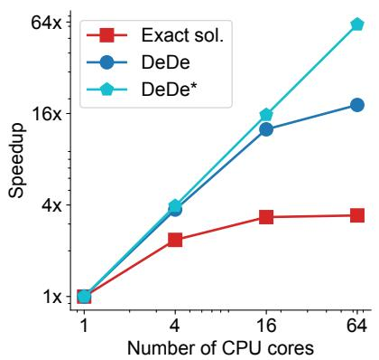  
(a) Speedup when varying CPU cores.

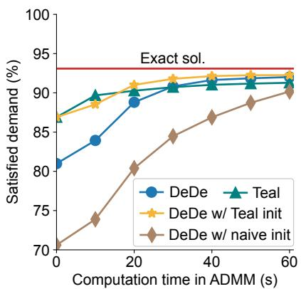  
(b) Convergence rate.

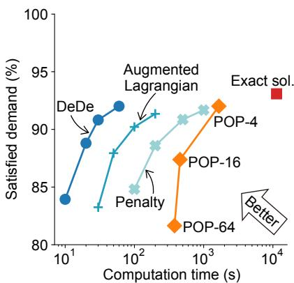  
(c) Comparing different optimization methods.

Figure 10: Micro-benchmarks with the objective of maximizing total flow in traffic engineering.  
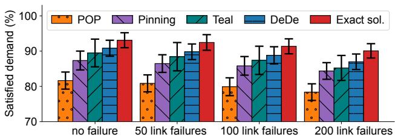  
Figure 11: Satisfied demand of traffic engineering under zero, 50, 100, or 200 link failures after recomputing flow allocation.

Link failures. Widespread failures across inter-datacenter links are relatively rare in real-world operations unless triggered by physical fiber cuts [52]. However, we simulate severe failure scenarios, introducing 50, 100, and 200 simultaneous link failures. As shown in Figure 11, the satisfied demand declines consistently across all methods. Specifically, all approaches drop by 0.6–1.1% under 50 link failures, 1.5–2.1% under 100 link failures, and 3–4.2% under 200 link failures. These drops stem from the fact that the failed links represent only a small portion of the total 8,558 links, allowing all approaches to recompute flow allocation given adequate time.

## 7.3 Micro-benchmarks

We conduct micro-benchmarks to evaluate the impact of DEDE’s design components, with all experiments performed in maximizing total flow in traffic engineering.

Speedup when varying CPU cores. Figure 10a evaluates the speedup of DEDE, DEDE∗, and Exact sol. with 1, 4, 16, and 64 CPU cores. DEDE∗ achieves 61.7× speedup under 64 cores, where the slight gap occurs as we cannot exactly divide the total computation time evenly across 64 cores. DEDE also achieves an almost linear speedup when the number of CPU cores grows from 1 to 16. However, this linearity diminishes with 64 cores, where DEDE only achieves 18.2× speedup. This is because utilizing all 64 cores for parallelism incurs overhead from cache contention and stragglers, as discussed in §7.1.1. In contrast to the linear speedup of DEDE∗ and DEDE, the speedup of Exact sol. is sublinear and marginal, achieving only 3.4× speeds with 64 CPU cores. This is because of commercial solvers’ sequential nature, e.g., the simplex method [46] in linear programming requires thousands to millions of small steps to reach the optimal solution.

Convergence rate. Teal generates a coarse, initial solution to traffic engineering using neural networks and fine-tunes it through ADMM. While Teal also “decouples” constraints, it does not further “decompose” the problem as DEDE does. Instead, it analytically and approximately minimizes a problemspecific augmented Lagrangian, directly projecting the result onto the non-negative feasible region. As a specialized method, Teal converges rapidly, achieving 90% satisfied demand within 10 seconds, as shown in Figure 10b. In comparison, DEDE requires ∼30 seconds to attain comparable performance. In each optimization interval, DEDE is warm-started using the previous solution by default. When initialized instead with Teal’s neural network output, DEDE converges at a similar rate. In contrast, employing a naive initialization— where each demand is equally split across available paths— reduces DEDE’s convergence speed by nearly half.

Alternative optimization methods. Figure 10c evaluates alternative constrained optimization techniques for maximizing total flow in traffic engineering—the penalty method [4] and the augmented Lagrangian method [23], comparing them with the ADMM-based approach used by DEDE. Both methods aim to solve the reformulated optimization problem in Equation 4 by jointly (and naively) optimizing variables x and z, but they differ in how they enforce constraints. The penalty method introduces penalty terms into the objective function to discourage constraint violations. It starts with a small penalty coefficient and gradually increases it toward infinity, thereby driving the solution toward feasibility. However, this process typically involves solving a series of increasingly ill-conditioned problems, resulting in slow convergence. In our evaluation, it was more than 30× slower than DEDE in achieving a satisfied demand of over 90%. The augmented Lagrangian method improves upon the penalty method by combining both penalty terms and Lagrange multipliers. This helps enhance convergence stability and typically reduces the number of required iterations. However, unlike the ADMM approach used in DEDE, it lacks the benefit of decomposition and parallelism. As a result, despite its faster convergence over the basic penalty method, it remains over 3× slower than DEDE in reaching a satisfied demand of over 90%.

## 8 Related Work

Resource allocation problems. Multi-tenant systems often address resource allocation challenges. Section 5 examines three prominent examples: cluster scheduling [28, 45, 47, 63, 66] allocates jobs to CPUs or GPUs in heterogeneous clusters, traffic engineering [1, 24, 32, 51, 69] allocates traffic demands to network link capacities in wide-area networks, and load balancing [14, 49, 53] allocates query loads to servers in distributed databases. Beyond these problems, Skyplane [27] allocates cloud resources (e.g., bandwidth and TCP connections) to overlay paths that traverse intermediate cloud regions, minimizing the cost of inter-region bulk transfers. Zeta [67] allocates traffic forwarding capability from gateway clusters to virtual private clouds for scalable and robust east-west communication in large-scale clouds. Shoofly [52] allocates light wavelengths of optical fiber to network shortcuts abstracted from optical bypasses, in order to minimize the hardware costs of provisioning long-haul capacity. By leveraging the commonly observed separable structure of real-world resource allocation problems, DEDE is applicable to the aforementioned cases as well as a broad range of others.

Optimization algorithms. Various constrained optimization algorithms have been employed to solve resource allocation problems, depending on the variable types, objectives, and constraints. For linear programming problems like traffic engineering, the Gurobi solver [22] utilizes two primary methods. The simplex method [46] iteratively progresses along the boundaries of the feasible region toward the optimal solution, while the barrier method [31] iteratively approaches the optimal solution from within the feasible region. In mixedinteger linear programming like load balancing, the branchand-bound method [7] divides the problem into smaller subproblems, or branches, and then eliminates certain branches based on bounds on the optimal solution at each iteration. For more complex optimization problems, such as cone programming when maximizing proportional fairness in cluster scheduling, the ECOS algorithm [16] adopts a similar iterative process as the barrier methods, with search directions found by a symmetric indefinite KKT (Karush-Kuhn-Tuck) system. All these constrained optimization algorithms operate sequentially and iteratively, and thus introduce bottlenecks in solving time. In contrast, DEDE decouples and decomposes the problem into many parallel subproblems, and thus allows faster problem solving.

Decomposition for scalability. As resource allocation problems grow, efforts have been made to parallelize the iterative process in optimization algorithms for better scalability. NCFlow [1] accelerates traffic engineering by partitioning the network into clusters and concurrently solving the flow allocation problem in each cluster. POP [44] targets “granular” allocation problems where resources are interchangeable. It randomly splits resources and demands into subsets and allocates each subset in parallel. Soroush [43] generalizes the classical waterfilling algorithm for max-min fair allocation and presents parallelizable combinatorial algorithms with fairness guarantees. Teal [65] models traffic engineering with neural networks to benefit from the massive parallelism in GPU. Eason et al. [17] employ the Benders decomposition algorithm to parallelize the design of a specialized cross-layer backbone network, offering performance guarantees for a particular allocation problem. While these prior decompositions rely on restrictive assumptions or problem-specific designs, DEDE offers a general and theoretically grounded approach solution for diverse resource allocation problems.

## 9 Conclusion

In this paper, we scale real-world resource allocation problems from a different lens, observing that the vast majority of them exhibit an inherent separable structure. This key insight allows us to systematically decouple resource and demand constraints and decompose the original optimization problem into independent and parallel subproblems for allocating individual resources and demands. We implement this approach, DEDE, as a Python package, offering a push-button solution that accelerates large-scale resource allocation. Through extensive evaluation across diverse resource allocation tasks, we demonstrate that DEDE significantly improves scalability while closely approximating the quality of exact solutions.

## Acknowledgments

We thank our anonymous reviewers and shepherd for their insightful comments. We also thank Yang Zhou, Justin Chiu, Alexander Rush, and Victor Bahl for their valuable feedback and support. We extend special thanks to Suvan Chatakondu for enhancing our code after the paper’s acceptance. This work is supported in part by ACE, one of the seven centers in JUMP 2.0, a Semiconductor Research Corporation (SRC) program sponsored by DARPA. This work is also supported by National Science Foundation grant CCF-2326605 (Expedition in Computing).

## References

[1] Firas Abuzaid, Srikanth Kandula, Behnaz Arzani, Ishai Menache, Matei Zaharia, and Peter Bailis. Contracting Wide-area Network Topologies to Solve Flow Problems Quickly. In 18th USENIX Symposium on Networked Systems Design and Implementation (NSDI 21), pages 175–200, 2021.

[2] Akshay Agrawal, Stephen Boyd, Deepak Narayanan, Fiodar Kazhamiaka, and Matei Zaharia. Allocation of Fungible Resources via a Fast, Scalable Price Discovery Method. Mathematical Programming Computation, 14(3):593–622, 2022.

[3] Akshay Agrawal, Robin Verschueren, Steven Diamond, and Stephen Boyd. A rewriting system for convex optimization problems. Journal of Control and Decision, 5(1):42–60, 2018.

[4] Achim Bachem, Martin Grötschel, and Bernhard Korte. Mathematical Programming the State of the Art: Bonn 1982. 2012.

[5] Nirvik Baruah, Peter Kraft, Fiodar Kazhamiaka, Peter Bailis, and Matei Zaharia. Parallelism-Optimizing Data Placement for Faster Data-Parallel Computations. Proceedings of the VLDB Endowment, 16(4):760–771, 2022.

[6] Dimitri P. Bertsekas. Constrained optimization and Lagrange multiplier methods. Academic press, 2014.

[7] Stephen Boyd and Jacob Mattingley. Branch and bound methods. Notes for EE364b, Stanford University, 2006:07, 2007.

[8] Stephen Boyd, Neal Parikh, Eric Chu, Borja Peleato, Jonathan Eckstein, et al. Distributed Optimization and Statistical Learning via the Alternating Direction Method of Multipliers. Foundations and Trends in Machine learning, 3(1):1–122, 2011.

[9] Ulrik Brandes. A Faster Algorithm for Betweenness Centrality. Journal of mathematical sociology, 25(2):163–177, 2001.

[10] Ulrik Brandes. On variants of shortest-path betweenness centrality and their generic computation. Social networks, 30(2):136–145, 2008.

[11] Caihua Chen, Bingsheng He, Yinyu Ye, and Xiaoming Yuan. The Direct Extension of ADMM for Multi-block Convex Minimization Problems is Not Necessarily Convergent. Mathematical Programming, 155(1):57–79, 2016.

[12] Jingrong Chen, Hong Zhang, Wei Zhang, Liang Luo, Jeffrey Chase, Ion Stoica, and Danyang Zhuo. NetHint: White-Box Networking for Multi-Tenant Data Centers. In 19th USENIX Symposium on Networked Systems Design and Implementation (NSDI 22), pages 1327–1343, 2022.

[13] Michael B. Cohen, Yin Tat Lee, and Zhao Song. Solving linear programs in the current matrix multiplication time. Journal of the ACM (JACM), 68(1):1–39, 2021.

[14] Carlo Curino, Evan PC Jones, Samuel Madden, and Hari Balakrishnan. Workload-aware Database Monitoring and Consolidation. In Proceedings of the 2011 ACM SIGMOD International Conference on Management of data, pages 313–324, 2011.

[15] Steven Diamond and Stephen Boyd. CVXPY: A Pythonembedded modeling language for convex optimization. Journal of Machine Learning Research, 17(83):1–5, 2016.

[16] Alexander Domahidi, Eric Chu, and Stephen Boyd. ECOS: An SOCP solver for embedded systems. In 2013 European control conference (ECC), pages 3071–3076. IEEE, 2013.

[17] John P. Eason, Xueqi He, Richard Cziva, Max Noormohammadpour, Srivatsan Balasubramanian, Satyajeet Singh Ahuja, and Biao Lu. Hose-based Cross-layer Backbone Network Design with Benders Decomposition. In Proceedings of the ACM SIGCOMM 2023 Conference, pages 333–345, 2023.

[18] Epoch AI. Data on Notable AI Models, 6 2024. Accessed: 2025-05-12.

[19] Epoch AI. Machine Learning Hardware, 6 2024. Accessed: 2025-05-12.

[20] Daniel Gabay and Bertrand Mercier. A Dual Algorithm for the Solution of Nonlinear Variational Problems via Finite Element Approximation. Computers & mathematics with applications, 2(1):17–40, 1976.

[21] Roland Glowinski and Americo Marroco. Sur l’approximation, par éléments finis d’ordre un, et la ré- solution, par pénalisation-dualité d’une classe de problèmes de Dirichlet non linéaires. Revue française d’automatique, informatique, recherche opérationnelle. Analyse numérique, 9(R2):41–76, 1975.

[22] Gurobi Optimization, LLC. Gurobi Optimizer Reference Manual, 2023.

[23] Magnus R. Hestenes. Multiplier and Gradient Methods. Journal of optimization theory and applications, 4(5):303–320, 1969.

[24] Chi-Yao Hong, Srikanth Kandula, Ratul Mahajan, Ming Zhang, Vijay Gill, Mohan Nanduri, and Roger Wattenhofer. Achieving High Utilization with Software-driven WAN. In Proceedings of the ACM SIGCOMM 2013 Conference on SIGCOMM, pages 15–26, 2013.

[25] IBM ILOG CPLEX. User’s Manual for CPLEX. International Business Machines Corporation, 46(53):157, 2009.

[26] Andrey Ignatov, Radu Timofte, Andrei Kulik, Seungsoo Yang, Ke Wang, Felix Baum, Max Wu, Lirong Xu, and Luc Van Gool. AI Benchmark: All about Deep Learning on Smartphones in 2019. In 2019 IEEE/CVF International Conference on Computer Vision Workshop (ICCVW), pages 3617–3635. IEEE, 2019.

[27] Paras Jain, Sam Kumar, Sarah Wooders, Shishir G. Patil, Joseph E. Gonzalez, and Ion Stoica. Skyplane: Optimizing Transfer Cost and Throughput Using Cloud-Aware Overlays. In 20th USENIX Symposium on Networked Systems Design and Implementation, pages 1375–1389, 2023.

[28] Suhas Jayaram Subramanya, Daiyaan Arfeen, Shouxu Lin, Aurick Qiao, Zhihao Jia, and Gregory R. Ganger. Sia: Heterogeneity-aware, goodput-optimized MLcluster scheduling. In Proceedings of the 29th Symposium on Operating Systems Principles, pages 642–657, 2023.

[29] Myeongjae Jeon, Shivaram Venkataraman, Amar Phanishayee, Junjie Qian, Wencong Xiao, and Fan Yang. Analysis of Large-Scale Multi-Tenant GPU clusters for DNN training workloads. In 2019 USENIX Annual Technical Conference (USENIX ATC 19), pages 947– 960, 2019.

[30] Chuan Jiang, Sanjay Rao, and Mohit Tawarmalani. PCF: Provably Resilient Flexible Routing. In Proceedings of the Annual conference of the ACM Special Interest Group on Data Communication on the applications, technologies, architectures, and protocols for computer communication, pages 139–153, 2020.

[31] Narendra Karmarkar. A New Polynomial-time Algorithm for Linear Programming. In Proceedings of the sixteenth annual ACM symposium on Theory of computing, pages 302–311, 1984.

[32] Umesh Krishnaswamy, Rachee Singh, Nikolaj Bjørner, and Himanshu Raj. Decentralized cloud wide-area network traffic engineering with BlastShield. In 19th USENIX Symposium on Networked Systems Design and Implementation (NSDI 22), pages 325–338, 2022.

[33] Umesh Krishnaswamy, Rachee Singh, Paul Mattes, Paul-Andre C. Bissonnette, Nikolaj Bjørner, Zahira Nasrin, Sonal Kothari, Prabhakar Reddy, John Abeln, Srikanth Kandula, et al. OneWAN is better than two: Unifying a split WAN architecture. In 20th USENIX Symposium on Networked Systems Design and Implementation (NSDI 23), pages 515–529, 2023.

[34] Praveen Kumar, Yang Yuan, Chris Yu, Nate Foster, Robert Kleinberg, Petr Lapukhov, Chiun Lin Lim, and Robert Soulé. Semi-oblivious Traffic Engineering: The Road not Taken. In 15th USENIX Symposium on Networked Systems Design and Implementation (NSDI 18), pages 157–170, 2018.

[35] Fan Lai, Xiangfeng Zhu, Harsha V. Madhyastha, and Mosharaf Chowdhury. Oort: Efficient federated learning via guided participant selection. In 15th USENIX Symposium on Operating Systems Design and Implementation, pages 19–35, 2021.

[36] Lambda. Deep Learning GPU Benchmarks, 2024.

[37] Tan N. Le, Xiao Sun, Mosharaf Chowdhury, and Zhenhua Liu. Allox: Compute Allocation in Hybrid Clusters. In Proceedings of the Fifteenth European Conference on Computer Systems, pages 1–16, 2020.

[38] Sangmin Lee, Zhenhua Guo, Omer Sunercan, Jun Ying, Thawan Kooburat, Suryadeep Biswal, Jun Chen, Kun Huang, Yatpang Cheung, Yiding Zhou, et al. Shard Manager: A Generic Shard Management Framework for Geo-distributed Applications. In Proceedings of the ACM SIGOPS 28th Symposium on Operating Systems Principles, pages 553–569, 2021.

[39] Sleiman Mhanna, Gregor Verbic, and Archie C. Chap- ˇ man. Adaptive ADMM for Distributed AC Optimal Power Flow. IEEE Transactions on Power Systems, 34(3):2025–2035, 2018.

[40] Congcong Miao, Zhizhen Zhong, Ying Zhang, Kunling He, Fangchao Li, Minggang Chen, Yiren Zhao, Xiang Li, Zekun He, Xianneng Zou, et al. FlexWAN: Software Hardware Co-design for Cost-Effective and Resilient Optical Backbones. In Proceedings of the ACM SIG-COMM 2023 Conference, pages 319–332, 2023.

[41] Philipp Moritz, Robert Nishihara, Stephanie Wang, Alexey Tumanov, Richard Liaw, Eric Liang, Melih Elibol, Zongheng Yang, William Paul, Michael I. Jordan, et al. Ray: A Distributed Framework for Emerging AI Applications. In 13th USENIX symposium on operating systems design and implementation (OSDI 18), pages 561–577, 2018.

[42] Pooria Namyar, Behnaz Arzani, Ryan Beckett, Santiago Segarra, Himanshu Raj, and Srikanth Kandula. Minding the Gap between Fast Heuristics and their Optimal Counterparts. In Proceedings of the 21st ACM Workshop on Hot Topics in Networks, pages 138–144, 2022.

[43] Pooria Namyar, Behnaz Arzani, Srikanth Kandula, Santiago Segarra, Daniel Crankshaw, Umesh Krishnaswamy, Ramesh Govindan, and Himanshu Raj. Solving Max-Min Fair Resource Allocations Quickly on Large Graphs. In 21th USENIX Symposium on Networked Systems Design and Implementation (NSDI 24), 2024.

[44] Deepak Narayanan, Fiodar Kazhamiaka, Firas Abuzaid, Peter Kraft, Akshay Agrawal, Srikanth Kandula, Stephen Boyd, and Matei Zaharia. Solving Large-Scale Granular Resource Allocation Problems Efficiently with POP. In Proceedings of the ACM SIGOPS 28th Symposium on Operating Systems Principles, pages 521–537, 2021.

[45] Deepak Narayanan, Keshav Santhanam, Fiodar Kazhamiaka, Amar Phanishayee, and Matei Zaharia. Heterogeneity-Aware Cluster Scheduling Policies for Deep Learning Workloads. In 14th USENIX Symposium on Operating Systems Design and Implementation, pages 481–498, 2020.

[46] John A. Nelder and Roger Mead. A Simplex Method for Function Minimization. The computer journal, 7(4):308– 313, 1965.

[47] Andrew Newell, Dimitrios Skarlatos, Jingyuan Fan, Pavan Kumar, Maxim Khutornenko, Mayank Pundir, Yirui Zhang, Mingjun Zhang, Yuanlai Liu, Linh Le, et al. RAS: Continuously Optimized Region-Wide Datacenter Resource Allocation. In Proceedings of the ACM SIGOPS 28th Symposium on Operating Systems Principles, pages 505–520, 2021.

[48] Yarin Perry, Felipe Vieira Frujeri, Chaim Hoch, Srikanth Kandula, Ishai Menache, Michael Schapira, and Aviv Tamar. DOTE: Rethinking (Predictive) WAN Traffic Engineering. In 20th USENIX Symposium on Networked Systems Design and Implementation (NSDI 23), pages 1557–1581, 2023.

[49] Marco Serafini, Essam Mansour, Ashraf Aboulnaga, Kenneth Salem, Taha Rafiq, and Umar Farooq Minhas. Accordion: Elastic Scalability for Database Systems Supporting Distributed Transactions. Proceedings of the VLDB Endowment, 7(12):1035–1046, 2014.

[50] Aashaka Shah, Vijay Chidambaram, Meghan Cowan, Saeed Maleki, Madan Musuvathi, Todd Mytkowicz, Jacob Nelson, Olli Saarikivi, and Rachee Singh. TACCL:

Guiding Collective Algorithm Synthesis using Communication Sketches. In 20th USENIX Symposium on Networked Systems Design and Implementation, pages 593–612, 2023.

[51] Rachee Singh, Sharad Agarwal, Matt Calder, and Paramvir Bahl. Cost-effective Cloud Edge Traffic Engineering with CASCARA. In 18th USENIX Symposium on Networked Systems Design and Implementation (NSDI 21), pages 201–216, 2021.

[52] Rachee Singh, Nikolaj Bjorner, Sharon Shoham, Yawei Yin, John Arnold, and Jamie Gaudette. Cost-effective Capacity Provisioning in Wide Area Networks with Shoofly. In Proceedings of the 2021 ACM SIGCOMM 2021 Conference, pages 534–546, 2021.

[53] Rebecca Taft, Essam Mansour, Marco Serafini, Jennie Duggan, Aaron J. Elmore, Ashraf Aboulnaga, Andrew Pavlo, and Michael Stonebraker. E-store: Fine-grained Elastic Partitioning for Distributed Transaction Processing Systems. Proceedings of the VLDB Endowment, 8(3):245–256, 2014.

[54] Reza Takapoui, Nicholas Moehle, Stephen Boyd, and Alberto Bemporad. A Simple Effective Heuristic for Embedded Mixed-integer Quadratic Programming. International journal of control, 93(1):2–12, 2020.

[55] Asaf Valadarsky, Michael Schapira, Dafna Shahaf, and Aviv Tamar. Learning to Route. In Proceedings of the 16th ACM workshop on hot topics in networks, pages 185–191, 2017.

[56] Weitao Wang, Dingming Wu, Sushovan Das, Afsaneh Rahbar, Ang Chen, and TS Eugene Ng. RDC: Energy-Efficient Data Center Network Congestion Relief with Topological Reconfigurability at the Edge. In 19th USENIX Symposium on Networked Systems Design and Implementation, pages 1267–1288, 2022.

[57] Yu Wang, Wotao Yin, and Jinshan Zeng. Global Convergence of ADMM in Nonconvex Nonsmooth Optimization. Journal of Scientific Computing, 78:29–63, 2019.

[58] Zhaohua Wang, Zhenyu Li, Guangming Liu, Yunfei Chen, Qinghua Wu, and Gang Cheng. Examination of WAN Traffic Characteristics in a Large-scale Data Center Network. In Proceedings of the 21st ACM Internet Measurement Conference, pages 1–14, 2021.

[59] Qizhen Weng, Lingyun Yang, Yinghao Yu, Wei Wang, Xiaochuan Tang, Guodong Yang, and Liping Zhang. Beware of Fragmentation: Scheduling GPU-Sharing Workloads with Fragmentation Gradient Descent. In 2023 USENIX Annual Technical Conference, USENIX ATC ’23. USENIX Association, 2023.

[60] Lucien Werner, Adam Wierman, and Steven H. Low. Pricing Flexibility of Shiftable Demand in Electricity Markets. In Proceedings of the Twelfth ACM International Conference on Future Energy Systems, pages 1–14, 2021.

[61] Baoyuan Wu and Bernard Ghanem. $l _ { p } .$ -Box ADMM: A Versatile Framework for Integer Programming. IEEE transactions on pattern analysis and machine intelligence, 41(7):1695–1708, 2018.

[62] Zhanghao Wu, Wei-Lin Chiang, Ziming Mao, Zongheng Yang, Eric Friedman, Scott Shenker, and Ion Stoica. Can’t be Late: Optimizing Spot Instance Savings Under Deadlines. In 21st USENIX Symposium on Networked Systems Design and Implementation (NSDI 24), pages 185–203, 2024.

[63] Wencong Xiao, Romil Bhardwaj, Ramachandran Ramjee, Muthian Sivathanu, Nipun Kwatra, Zhenhua Han, Pratyush Patel, Xuan Peng, Hanyu Zhao, Quanlu Zhang, et al. Gandiva: Introspective Cluster Scheduling for Deep Learning. In 13th USENIX Symposium on Operating Systems Design and Implementation (OSDI 18), pages 595–610, 2018.

[64] Zheng Xu, Soham De, Mario Figueiredo, Christoph Studer, and Tom Goldstein. An Empirical Study of ADMM for Nonconvex Problems. arXiv preprint arXiv:1612.03349, 2016.

[65] Zhiying Xu, Francis Y. Yan, Rachee Singh, Justin T. Chiu, Alexander M. Rush, and Minlan Yu. Teal: Learning-Accelerated Optimization of WAN Traffic Engineering. In Proceedings of the ACM SIGCOMM 2023 Conference, pages 378–393, 2023.

[66] Zongheng Yang, Zhanghao Wu, Michael Luo, Wei-Lin Chiang, Romil Bhardwaj, Woosuk Kwon, Siyuan Zhuang, Frank Sifei Luan, Gautam Mittal, Scott Shenker, et al. SkyPilot: An Intercloud Broker for Sky Computing. In 20th USENIX Symposium on Networked Systems Design and Implementation, pages 437–455, 2023.

[67] Qianyu Zhang, Gongming Zhao, Hongli Xu, Zhuolong Yu, Liguang Xie, Yangming Zhao, Chunming Qiao, Ying Xiong, and Liusheng Huang. Zeta: A Scalable and Robust East-West Communication Framework in Large-Scale Clouds. In 19th USENIX Symposium on Networked Systems Design and Implementation, pages 1231–1248, 2022.

[68] Wenting Zheng, Ryan Deng, Weikeng Chen, Raluca Ada Popa, Aurojit Panda, and Ion Stoica. Cerebro: A Platform for Multi-Party Cryptographic Collaborative Learning. In 30th USENIX Security Symposium (USENIX Security 21), pages 2723–2740, 2021.

[69] Zhizhen Zhong, Manya Ghobadi, Alaa Khaddaj, Jonathan Leach, Yiting Xia, and Ying Zhang. ARROW: Restoration-Aware Traffic Engineering. In Proceedings of the 2021 ACM SIGCOMM 2021 Conference, pages 560–579, 2021.

[70] Jun Zhou, Yang Bao, Daohong Jian, and Hua Wu. PDAS: A Practical Distributed ADMM System for Large-Scale Linear Programming Problems at Alipay. In Proceedings of the 29th ACM SIGKDD Conference on Knowledge Discovery and Data Mining, 2023.

## Appendix

## A Evaluation Setup of Cluster Scheduling

We detail the experimental setup for the large-scale cluster scheduling evaluation described in §7.1.1.

Computing resources. We collect 456 distinct GPU/CPU resource types from three benchmark sources [19, 26, 36]. These resource types differ along multiple dimensions such as vendor, interconnect, memory configuration, deployment platform, etc. While it is unlikely today for any single cluster to host all 456 types, recent trends in distributed ML workloads [62, 66] suggest the possibility of scheduling ML jobs across global-scale clusters in the future. For each resource type, the number of available instances is randomly drawn from the set {8,16,24,..., 64}, reflecting common modern hardware configurations where nodes are provisioned with GPU/CPUs in multiples of eight. This setup results in a total of 16,520 GPU/CPU instances in our simulated environment. Jobs. We generate 2,588 types of ML jobs based on the Notable AI Models dataset [18]. For each ML model, we synthesize multiple job types encompassing both training and inference tasks under various numerical precisions. The number of compute instances requested by each job is sampled from {1, 2, 4, 8, 16, 32}, in line with common practices in data and model parallelism. Job throughput values are either taken directly from ML benchmarks [19, 26, 36] or, when unavailable, estimated based on each job’s FLOP requirements and the computational capacity of the respective hardware.

Scheduling Simulator. Our evaluation employs Gavel’s ML scheduling simulator [45], with several adjustments. Jobs are time-sliced across available resource types but are not co-located, due to the increased size and resource demands of modern ML workloads. To ensure that jobs do not grow beyond cluster capacity, we set the average job inter-arrival time to 100 seconds in the Poisson process. We begin the simulation from a steady state, maintaining approximately 1,500 to 2,000 active jobs at any given time. Job allocation decisions are made every 6 minutes, consistent with Gavel’s default settings, and the simulation runs for 200 scheduling rounds, or 20 hours.