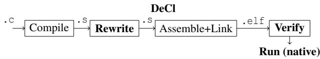
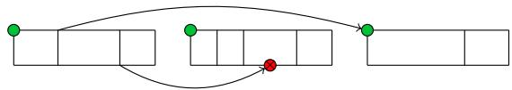
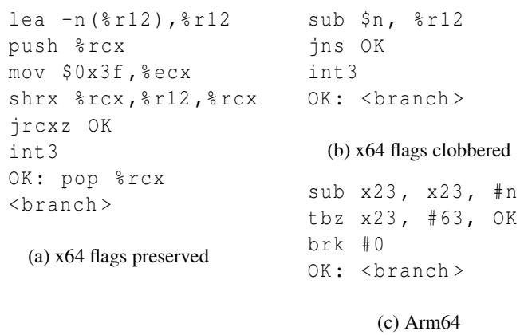
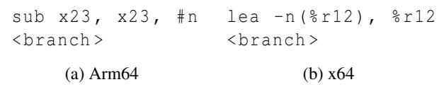
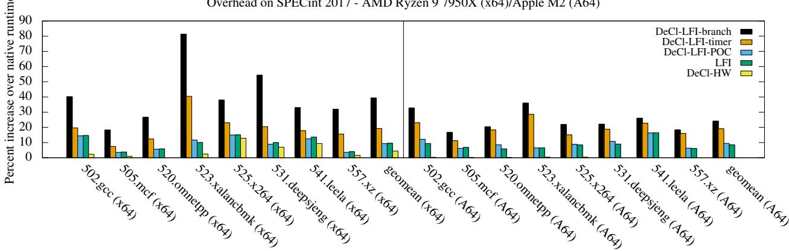
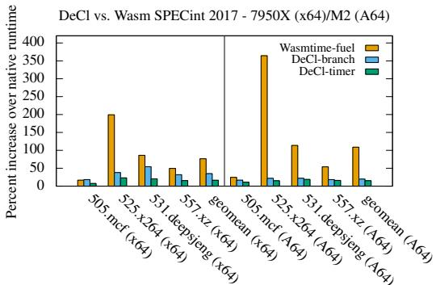
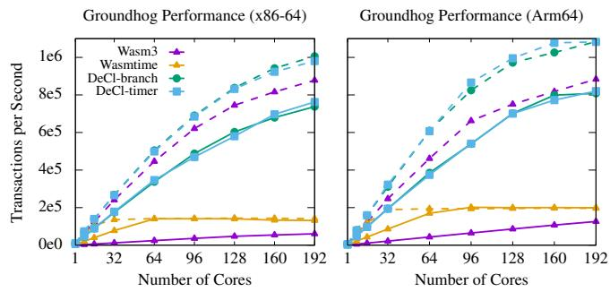

USENIX

THE ADVANCED COMPUTING SYSTEMS ASSOCIATION

# Deterministic Client: Enforcing Determinism on Untrusted Machine Code

Zachary Yedidia, Stanford University; Geoffrey Ramseyer, Stanford University and Stellar Development Foundation; David Mazieres, Stanford University

https://www.usenix.org/conference/osdi25/presentation/yedidia

# This paper is included in the Proceedings of the 19th USENIX Symposium on Operating Systems Design and Implementation.

July 7–9, 2025 • Boston, MA, USA

ISBN 978-1-939133-47-2

Open access to the Proceedings of the 19th USENIX Symposium on Operating Systems Design and Implementation is sponsored by

# Deterministic Client: Enforcing Determinism on Untrusted Machine Code

Zachary Yedidia Stanford University

Geoffrey Ramseyer Stanford University and Stellar Development Foundation

David Mazières Stanford University

## Abstract

This paper presents Deterministic Client (DeCl), a softwarebased sandboxing system for enforcing deterministic behavior on untrusted machine code, either x86-64 or Arm64. DeCl adapts techniques from Software Fault Isolation (SFI) traditionally used to guarantee memory isolation to instead enforce the stronger property of determinism. By using a simple and efficient machine code verifier that can guarantee that a program behaves deterministically, DeCl does not rely on a trusted compiler/interpreter for correctness. This allows the use of LLVM without compromising the size of the trusted code base. We also describe how to implement two efficient metering mechanisms that enforce deterministic preemption of sandboxed programs, and how DeCl can be implemented in combination with traditional software-based isolation, by making the sandboxed code position-oblivious. DeCl is able to combine and improve upon the benefits of both interpreters and JIT compilers at once, with low CPU overhead, fast startup time, and strong security via a small trusted code base. We evaluate DeCl’s effectiveness on general-purpose CPU benchmarks, as well as in an application-specific context by integrating with the Groundhog smart contract engine, and using DeCl for zero-knowledge-proof verification.

## 1 Introduction

Program determinism is essential for executing smart contracts correctly. Smart contracts are programs that are uploaded by completely untrusted parties, and yet must be guaranteed to perform the same set of operations every time they are run by an honest node. Since smart contract programs increasingly form the backbone of digital currency systems, it is important for them to be performant. Existing approaches to smart contract sandboxing are language-based: they define an intermediate language (IL) with deterministic semantics, such as WebAssembly or EVM bytecode, and then execute the language via a trusted interpreter or just-in-time (JIT) compiler. Unlike with sandboxes that enforce memory isolation, this language-based approach is the only existing method for enforcing determinism in an adversarial setting. Approaches for enforcing determinism must necessarily be software-based, as commodity hardware does not provide sufficient mechanisms for hardware-based enforcement.1

<table><tr><td>Enforcement</td><td>Memory isolation</td><td>Determinism</td></tr><tr><td>Language</td><td>WebAssembly, eBPF, JavaScript,...</td><td>WebAssembly, eBPF, EVM Bytecode.,...</td></tr><tr><td>Binary analysis</td><td>LFI, NaCl, PittSFIeld,...</td><td>DeCl</td></tr><tr><td>Hardware</td><td>Pagetables, Segmentation</td><td></td></tr></table>

Table 1: Approaches that enforce memory isolation and determinism via hardware-based or software-based methods.

This paper introduces Deterministic Client (DeCl), a new software-based approach to enforcing determinism. By adapting binary analysis techniques from Software Fault Isolation (SFI) [36, 50, 54, 57], we design a machine code analyzer that can determine if a program is part of a deterministic subset of either x86-64 or Arm64. If so, the program is guaranteed to be deterministic, and can be directly run as native code, without any intermediate translation step. This design significantly reduces runtime CPU overhead and startup latency, and removes the need for a trusted translator. Highly optimizing ahead-of-time compilers such as LLVM can be used without needing to trust them. In order to generate programs that can pass verification, we develop a program rewriter that operates on assembly files, allowing us to rewrite the output of LLVM/GCC and therefore support many existing languages and compiler optimizations.

Binary analysis techniques from SFI are well-known for enforcing memory isolation, but this is the first work to apply them to determinism. Table 1 summarizes existing sandboxing approaches for both memory isolation and determinism, and Figure 1 shows the overall architecture of DeCl, which is typical of SFI systems. We describe three main components:

  
Figure 1: The DeCl compilation flow. Determinism properties are enforced directly on the machine code output of a compiler. In order to produce binaries that pass verification, a rewriter is used during compilation. Non-bold steps use existing compiler infrastructure.

1. Deterministic instruction enforcement: programs that attempt to use non-deterministic instructions must be rejected. We describe cases of non-determinism in x86-64 and Arm64, along with how to guarantee their absence.

2. Deterministic metering: programs cannot be permitted to run indefinitely. However, a traditional timer interrupt on its own may cause the program to terminate after different side effects each time the program runs. We describe two mechanisms for deterministic preemption.

3. Integration with software-based memory isolation: DeCl can be used in conjunction with any memory isolation mechanism (hardware-based or software-based). We describe additional changes that are necessary in order to use DeCl with LFI [57], a software-based sandbox where all sandboxes share an address space. This makes it possible to use DeCl sandboxes within a Linux process and enables fast sandbox startup times.

We evaluate DeCl’s performance in terms of CPU overhead and startup time. We measure both general benchmarks (SPEC 2017) and benchmarks specific to smart contracts. With both metering and software-based isolation, DeCl only imposes a modest ∼ 20% overhead with metering, measured on a subset of SPEC 2017 for both x86-64 and Arm64.

We integrate DeCl into Groundhog [45], a scalable smart contract engine currently using a WebAssembly interpreter. Using native code for smart contracts allows them to run CPUintensive computations faster, by roughly 2× (compared to JIT compilation) or 30× (compared to interpretation). Since some important smart contracts are short-lived, we have optimized the system to have a sandbox startup latency of less than 15µs (load and execute), and we ensure that loading sandboxes does not interfere with Groundhog’s scalability.

The rest of the paper describes the design of DeCl for both x86-64 and Arm64. We find that properties of x86-64 such as undefined flags, variable-length instructions, a small register file, flags-based conditional branches, and stack-based call/ret are most responsible for higher complexity compared to Arm64.

## 2 Background

## 2.1 Threat Model

DeCl enforces determinism against adversarially-constructed programs. An untrusted party provides a program (expressed as x86-64 or Arm64 machine code), and the DeCl verifier accepts it only if it can be guaranteed to be deterministic. The verifier is allowed to reject programs if it cannot confirm determinism, but nonetheless, we would like to be able to accept as wide a variety of programs as possible, while imposing minimal performance overhead. The determinism guarantee only applies within a particular architecture, but covers all valid microarchitectures. For example, a program validated for DeCl-Arm64 will behave deterministically on all Armv8.0-compliant processors, including virtual processors such as QEMU. In certain cases, we require a processor to have certain architectural extensions, such as the x86-64 BMI2 extension for the SHRX instruction. Existence of extensions like these can be probed using cpuid (or equivalent). Requiring extensions reduces the number of processors that can be used to run the program (older processors become excluded), but allows for newer instructions to be used.2 We rely on the hardware being correct for the ISA-subset accepted by the verifier.3

We also support requiring that the programs that run inside DeCl are metered, and therefore cannot use more than a limited amount of CPU time. This requirement, when combined with the determinism requirement, requires special design, since the preemption must happen in a deterministic way. The runtime system is initialized with a limit on the number of instructions that can be executed before preemption occurs.

We assume the following properties about the runtime system, which are typical for adversarially-deterministic systems such as smart contract engines:

1. The runtime provides a deterministic “runtime call API” that a sandboxed program uses to have external effects.

2. The runtime disables shared-memory multiprocessing.

3. The runtime deterministically initializes the sandbox by zeroing the initial memory. Section 7.2.1 discusses the performance impact on startup time.

Enforcing determinism requires that the sandboxed program must not be able to access memory outside its sandbox (memory isolation). DeCl can work with either hardware or software-based memory isolation, and we describe additional changes needed for the software-based case in Section 5. We also terminate programs after a memory fault. This is relevant due to torn stores: stores that straddle a mapped and unmapped page boundary. On Arm64, it is implementationdefined whether the memory in the mapped region is altered or not. While there are multiple mechanisms to solve this issue, such as simulating the stores, or performing a load before every store [20], we simply terminate the program.

Side channels Side-channel attacks exploit nondeterminism in the runtime API or instruction behavior to recover information about parts of the system that should not be available to the application. These exploits most commonly use timers to recover information about data in the cache. Since DeCl removes all non-determinism in the runtime API and available instruction set, timers or other side-channel vectors (e.g., parallelism or atomics [59]) are impossible to use.

## 2.2 Secure Machine Code Analysis

The verifier must be able to guarantee that the program cannot execute any instructions that have not been analyzed. Binary analysis systems that enforce memory isolation, such as NaCl [50] and LFI [57], contend with the same issue. Hence, we can use the same techniques they use, which we summarize below.

On Arm64, thanks to fixed-width instructions, it suffices to enforce that memory is never executable and writable at the same time (commonly called WˆX). As a program cannot write to executable regions and it cannot jump to the middle of an instruction (which causes a trap), all instructions can be verified before making memory executable.

On x86-64, in addition to WˆX memory, we must prevent untrusted code from jumping to the middle of an instruction and executing a completely different instruction sequence from the one disassembled. The solution we use is aligned bundles, first introduced by the PittSFIeld [36] system, and now supported by both the LLVM and GCC assemblers. Instructions are organized into 32-byte bundles, as illustrated in Figure 2. The verifier rejects any program that includes instructions that span bundle boundaries, so a compiler targeting DeCl adds nop padding to move these into the next bundle. Additionally, the verifier ensures that all jumps target bundle boundaries—static branches are directly inspected, and indirect branches (including returns, which are rewritten into indirect branches) are required to include a preceding mask instruction that aligns the target to a bundle boundary by zeroing the bottom 5 bits of the target.

In both cases, programs must separate code and data, lest the data correspond to unsafe instructions that would be rejected by the verifier. Fortunately, modern x86-64 and Arm64 compiler toolchains already can generate separate code and read-only data segments by default. The -z separate-code linker flag can be used to instruct the linker to create distinct code and data segments in the final binary.

  
Figure 2: Illustration of aligned bundles. Each bundle consists of multiple instructions, padded such that no instruction spans a bundle boundary. Jump targets must be bundle-aligned (indicated by green dots). The verifier rejects jumps that may target the middle of a bundle or instruction.

With these methods for guaranteeing secure machine code analysis in hand, we can design machine code analyzers that only accept programs with known instructions whose semantics are fully understood by the analyzer. Programs containing any unknown instructions are rejected. Traditionally, this technique has been used to make verifiers that only accept programs with instructions known to be memory-safe, but we show that this can also be applied to accept only programs with instructions known to be deterministic.

## 3 Deterministic Machine Code

The DeCl verifier must only accept programs that execute deterministically. Therefore, these programs must contain only instructions known to be deterministic. Additionally, some x86-64 instructions execute with unpredictable semantics only for certain inputs. To accept these (useful) instructions, the verifier must ensure that these problematic inputs are not present when those instructions execute. Enforcement on Arm64 is simpler because the ISA has fewer cases of unpredictable behavior. We describe our implementation for Arm64 and x86-64 separately.

Floating point We restrict our analysis to the integer subsets of x86-64 and Arm64, including SIMD but not including floating point. In particular, instructions like rsqrtss (Reciprocal of Square Root) are required to provide at most some amount of error but within those bounds can use any precision, which can cause non-determinism. We believe a deterministic subset of floating point operations could be safely included in DeCl (including things like FP addition, but excluding rsqrtss), but leave this out of scope in this paper.

## 3.1 Arm64

In Arm64, the following cases of non-determinism exist at the instruction level:

• Instructions encoded with malformed SBZ/SBO (shouldbe-zero/should-be-one) fields are UNPREDICTABLE.

• Some instructions have explicitly non-deterministic semantics, such as instruction pairs for atomic loads and stores. For example, the instruction stxr returns different values depending on the status of the exclusive monitor, which can depend on factors such as timer interrupts generated for the host kernel. As another example, memory instructions that both increment and write back to the same register are UNPREDICTABLE: ldr x0, [x0], #16. Early versions of LLVM could erroneously produce this instruction [17].

• Unallocated instructions.

Our verifier rejects programs that contain such instructions, as well as instructions that are UNDEFINED,4 with one exception: we allow the udf #0 instruction as an explicit way to generate an undefined instruction exception.

The DeCl Arm64 subset only supports instructions from the Armv8.0 base ISA, with roughly 180 base instructions and an additional 430 SIMD instructions. These instruction counts are derived from the decoder we use, so different counts could be expected if using a decoder that classifies distinct instructions differently.

Arm64 also allows hardware-enforced stack pointer alignment. When enabled by the OS, stores to the stack pointer when it is not aligned to a 16-byte boundary cause a fault. While we could simply require that this check always be enabled (as is done by Linux), our verifier also requires that modifications to sp preserve its alignment. Arm64 also supports multiple base page sizes (4KiB, 16KiB, or 64KiB), and for determinism DeCl must pick one. A machine with a smaller page size can efficiently emulate one with a larger page size, so picking the largest page size is best. Our implementation uses 16KiB pages because there isn’t any commodity hardware configured with 64KiB pages.

## 3.2 x86-64

The situation on x86-64 is more complex, as the instruction encoding space is far larger. We start by limiting the instructions accepted by the verifier to a known, fully-enumerable, subset of x86-64. We recorded all instructions that can be encoded by the Fadec encoder [18] and represent this set with a binary decision diagram (BDD), which can be stored in less than 200KiB. Instructions accepted by the verifier must first be decoded by the BDD, guaranteeing that the verifier operates only on instructions with known semantics. Once approved by the BDD, the instructions are further restricted to the DeCl subset, which includes roughly 100 instructions from the base x86-64 ISA, along with 125 SIMD instructions from the SSE2 extension. For branch-based metering, we also require the SHRX instruction from the BMI2 extension.

<table><tr><td>Instruction</td><td>Undefined if</td><td>Ex.guarded sequence</td></tr><tr><td>SHLD,SHRD</td><td>COUNT &gt; OPSIZE</td><td>andb $0x1f,%cl shrdl %cl，%ebx，%eax</td></tr><tr><td>BSR,BSF</td><td>SRC = 0</td><td>test %eax，%eax jz .SKIP bsr %eax，%ebx .SKIP:</td></tr></table>

Table 2: x86-64 instructions that may produce undefined results for certain inputs, and guards that can be applied beforehand to rule out this possibility. The guard sequence for shifts may additionally require saving and restoring %rcx (because %cl is modified), which can be done using the rewriterreserved %r11 register.

Moreover, some instructions may generate undefined (i.e., non-deterministic) values. For example, the SHLD instruction produces an undefined value if the shift operand is larger than the bit-width of the shifted value. Many instructions also put flags into undefined states. For example, the BT (bit-test) instruction modifies the CF flag, leaves the ZF flag unchanged, and makes the OF, SF, AF, and PF flags undefined. Observing the state of an undefined flag can cause non-deterministic behavior. While individual CPU implementations are typically deterministic in this respect, the behavior is not consistent across CPU microarchitectures. A program that abuses an undefined flag will behave differently when run on Intel vs. AMD processors, and in some cases even when run on P-cores vs. E-cores within the same processor, since P- and E-cores do not necessarily share the same microarchitecture.

## 3.2.1 Preventing undefined results

The instructions in Table 2 may produce undefined results [26, 27]. Our program rewriter adds one or more guard instructions to force the input to be valid, and the verifier checks for the presence of these guards before marking memory executable. For example, for a shift of 16-bit data, we apply a mask to the shift amount to force it to be less than or equal to 16.

As of October 2024, the Intel SDM has been updated to say that if the content source of a BSR/BSF is zero, the result is unmodified, rather than undefined. However, the pseudocode of the operation continues to say the result is undefined, and other parts of the manual (documentation for TZCNT/LZCNT) still refer to the result as undefined in the case of a zero input. We continue to consider the output as undefined for BSR/BSF instructions with an input of zero.

## 3.2.2 Preventing use of undefined flags

Blocking all instructions that may read or write undefined flags would unreasonably restrict the set of verifiable programs. Instead, our verifier reasons about the data-flow of the flags, so that it can verify whether any instruction that reads a flag does not observe an undefined value.

Algorithm 1 Flags Analysis   
1: function ANALYZE(B, Report)   
2: $U \gets \mathrm { I N } [ B ]$ ▷ Set of undefined flags   
3: for all instruction I in basic block B do   
4: if Report and I reads a flag f and $f \in U$ then   
5: Raise error   
6: end if   
7: for all flags f defined by I do   
8: $U [ f ] \gets 0$   
9: end for   
10: for all flags f undefined by I do   
11: $U [ f ] \gets 1$   
12: end for   
13: end for   
14: $\mathrm { O U T } [ B ]  U$   
15: end function   
16: function ANALYZECFG(CFG)   
17: for all basic block B in CFG do   
18: $\mathrm { I N } [ B ] \gets 1 ^ { * }$   
19: end for   
20: for all basic block B in CFG do   
21: ANALYZE(B, false)   
22: end for   
23: for all basic block B in CFG do   
24: $\mathrm { I N } [ B ]  \mathrm { O U T } [ B _ { p _ { 1 } } ] | . . . | \mathrm { O U T } [ B _ { p _ { n } } ]$   
25: end for   
26: for all basic block B in CFG do   
27: ANALYZE(B,true)   
28: end for   
29: end function

Although indirect branch targets are not statically known, the verifier enforces the target bundle-alignment requirement via a masking and instruction directly before an indirect jump. This instruction leaves every observable flag in a defined state5, so we need only reason about data-flow of flags on the part of the control-flow graph of the program that is defined by static branches.

We define a function called ANALYZE (Algorithm 1) that runs on each basic block and uses a set IN, representing the set of flags that are undefined at entry to the basic block, to compute OUT, the set of flags that are undefined after executing the basic block. ANALYZE steps through each instruction in the basic block, updating its set of undefined flags initialized from IN, and signals an error on instructions that appear to read an undefined flag. Once complete, it updates the OUT set for the corresponding basic block. In each iteration, ANALYZE is run on every basic block. In a full analysis, iterations are run until the program passes verification, or until a fixpoint. In practice, we have have found that all conforming programs we have compiled with LLVM or GCC pass verification within 2 iterations. Thus it is reasonable to stop analysis and reject the program after 2 iterations if the verifier can not yet prove that no undefined flags are read. ANALYZE uses an internal table adapted from the Intel manual [28] that specifies for each x86-64 instruction whether it reads, modifies, or undefines a flag.

This analysis may reject programs that do not read undefined flags, but it will never accept a program that reads undefined flags. A program can always be written such that it passes verification in only one iteration by always setting flags in the same basic block where they are read. The cross-basic block analysis is only necessary to support code generation behavior in existing compilers (as we want to avoid modifying LLVM/GCC).

## 3.2.3 Spurious prefixes

CPU implementations consistently accept instructions with unnecessary prefixes, which are ignored (but have caused security bugs [5]). Our verifier only accepts programs that do not use spurious prefixes—this is a side effect of the fact that the verifier only accepts instructions that can be produced from an x86-64 encoder. We make an exception for nop instructions, which are often encoded with additional prefixes for padding and have canonical representations.

## 3.3 CPU Fuzzing

In order to gain confidence in the system beyond just the information in architectural reference manuals and formal ISA semantics, we have a fuzzer that distributes programs to machines of various microarchitectures. The fuzzer is not a necessary component of the DeCl system, but is used as a testing mechanism to find errors in the hand-written verifier. Ultimately, the verifier is the trusted component that must determine if a program is guaranteed to be deterministic or not.

The fuzzer randomly samples instructions from the ISA (for Arm64 this is the set of 4-byte integers; for x86-64 this is the set represented by the BDD used to restrict instructions to a known encodable subset). These instructions are used to create small basic blocks until they pass verification and then concatenated into verified programs consisting of megabytesto-gigabytes of code. These code blocks are then executed in an execution environment that records the final state of the registers and memory. The verifier can be configured to allow memory accesses that are masked to target a certain memory region (the fuzzer will map pages in the region as they are accessed). Our fuzzer currently does not generate any branch instructions, but this is not a fundamental limitation—it is simpler to disallow branches during fuzzing, and since there are very few branch instructions (on the order of 10), we can manually analyze their behavior.

We have run our fuzzer on several (5+) microarchitectures for both Arm64 and x86-64. In our testing, the fuzzer quickly finds cases of non-determinism caused by undefined flags or undefined results if we allow such cases to pass verification.

## 4 Deterministic Metering

By default, there are no constraints on the amount of CPU time that a DeCl program may consume. To prevent a program from taking over the CPU, we use a notion of “metering,” (commonly called “gas”). The program continues running until there is no more gas in the meter, at which point it is preempted. A typical operating system would implement this by using timer interrupts. However, that design is not deterministic, since the interrupt may fire non-deterministically before or after a runtime call with side-effects. In the case of atomic transactions, aborting after a timeout could cause replicas to disagree about whether a transaction succeeded or ran out of gas.

A deterministic alternative is to keep an instruction count. By terminating after N instructions have executed, programs can be deterministically preempted. Unfortunately, the performance monitoring unit (PMU) in modern processors does not provide deterministic instructions counts. As a result, we must manually track the number of executed instructions (the amount of “gas” used) via additional instructions that must be included in a sandboxed program. At a high level, these extra instructions debit a gas counter register (x23 or %r12) according to the number of instructions executed in a basic block and use this counter to cause deterministic termination, either via a trap/branch into the DeCl runtime or via preemption from a timer. We will refer to these two mechanisms as branch-based and timer-based metering respectively. While timer-based metering makes use of a non-deterministic timer, its use in combination with the gas counter allows for deterministic preemption (details in Section 4.3).

Furthermore, since we are enforcing metering directly on machine code programs, the metering schemes must be efficiently checkable by our static verifier. The verifier must be certain that there is no way to execute a branch instruction without also executing the immediately preceding metering instructions. This could happen if a previous branch or jump skipped over the metering instructions and directly targeted a branch. We use aligned bundles to prevent this scenario.6

## 4.1 Aligned Bundles

With metering enabled, we require aligned bundles (discussed earlier in Section 2.2) on both Arm64 and x86-64. To implement bundling on Arm64, we reserve the x24 register for holding bundle-aligned addresses. The verifier will only accept indirect branches that target x24, and will only accept instructions that modify x24 by zeroing the bottom log(N) bits from the source register, where N is the bundle size (e.g., bic x24, xN, 0xf). All branches must target the beginning of a bundle, making it impossible to execute instructions at the end of a bundle without executing those at the start.

On Arm64, we use 16-byte (4-instruction) bundles for branch-based metering, and 8-byte (2-instruction) bundles for timer-based metering. On x86-64, we use the 32-byte bundles that are already required for machine code verification.

## 4.2 Branch-based Metering

Branch-based metering keeps an instruction meter in a reserved register (x23 or %r12). The verifier enforces that every basic block ends with instructions that decrease the meter by the number of instructions in the block, and checks that the meter has not reached zero.

In general, detecting basic blocks in machine code is not possible because indirect branches may jump anywhere in the program. However, we do not need precise basic block analysis in order to provide metering, so long as any imprecision is conservative and deterministic. Consider a program without indirect branches; in this case all basic blocks are known statically, and we can charge the correct amount of gas at the end of each basic block. Now, if the program includes indirect branches, those branches may arrive somewhere within an existing basic block. The program will then be charged as if the entire basic block executed, even if it was only partially executed due to an indirect branch arriving in the middle. This may deterministically overcharge the program, but that is safe and only means the program terminates sooner. A program can remove this imprecision by splitting its basic block at indirect branch targets. Splitting a basic block is always legal.

A metering epilogue, shown in Fig. 3, must be inserted at the end of every basic block. This epilogue decreases the instruction meter and then checks if the top bit of the count is 1. If so, the meter has underflowed and a trap instruction is executed. Due to the encoding of the subtract instruction, it is impossible to both underflow and have a zero at bit 63 of x23/%r12 (the immediate cannot be large enough).

Preserving flags On Arm64 and x86-64, many branch instructions jump based on the status of the flags. A gas check inserted before a branch cannot, therefore, modify the flags. Arm64 provides the tbz instruction, which performs a conditional branch based on a bit test rather than a flag. On x86-64, the only conditional branch that does not read flags is jrcxz, which performs a jump if %rcx is zero. We use jrcxz to build a metering sequence that preserves flags (Fig. 3a). We must also use an lea instruction in order to subtract from the gas register without modifying any flags, and a flags-preserving shift (shrx, provided by the BMI2 extension). One possible optimization would be to detect the preceding instruction that sets the flags and, if possible, pull that instruction into the metering sequence directly before the branch—avoiding the need to preserve flags. We do not perform this optimization.

  
Figure 3: Instruction sequences for branch-based metering, where n denotes the number of instructions in the immediately preceding basic block. The x86-64 sequence is complicated for cases that must avoid modifying the flags register.

  
Figure 4: Instruction sequences for timer-based metering on Arm64 and x86-64.

## 4.2.1 Removing gas checks

The expensive part of the basic block epilogue is the underflow check. We can optimize away this check if the basic block does not end with a backwards branch. Consider a program of size N where a basic block that ends with a forwards branch exhausts all remaining gas, and no check is performed. Within at most N instructions, the program must either execute a backwards branch, causing a gas check, or terminate because no instructions remain. Thus, if the basic block exhausts all gas, the program will terminate after at most N further instructions. This means we can cap the value of N at a small amount, such as 10M instructions, and elide all gas checks for forward branches.

## 4.3 Timer-based Metering

Timer-based metering uses a timer interrupt in combination with the gas counter to enable deterministic preemption. This scheme relies on the insight that a program running in a DeCl sandbox can only have externally visible effects when it makes a runtime call. As long as the program does not make any externally visible changes after it runs out of gas, it does not need to be immediately preempted. Thus, timer-based metering works as follows:

• A timer interrupt is configured to fire frequently.

• When the program makes a runtime call, it is terminated if its gas is negative.

• When a timer interrupt occurs, the program is terminated if its gas is negative.

Since the runtime always checks the gas before applying the effects of a runtime call, it is impossible for a program to have any effect after it runs out of gas, even though it may continue running for a non-deterministic amount of time. To an external observer, the program behaves deterministically. This scheme assumes that a runtime call is the only way to cause an externally visible effect—this would not work if the memory state of the program were also externally visible.

Since gas checks are only performed after interrupts or runtime calls, basic block epilogues only need to update the gas counter, and can always omit the expensive gas check. This makes it possible to use a bundle size of 8 on Arm64. Fig. 4 shows metering sequences for Arm64 and x86-64.

Timer-based metering relies on the ability to configure a timer interrupt, for example via signals on Linux. This scheme also allows a program to use up to t seconds of CPU time after running out of gas, where t is the size of a time slice. While timer-based metering allows all gas checks to be elided, it can cause overhead if the time slice is too short. As a result, branch-based metering may be better for systems that give programs only a tiny amount of gas.

## 5 Integration with Lightweight Sandboxing

DeCl can be used with hardware-based or software-based memory isolation. For a smart contract engine, fast startup time and context switches are crucial. For this reason, we have integrated DeCl with LFI, a software-based sandboxing system where all sandboxes run in the same address space. LFI supports both x86-64 and Arm64 using techniques described in prior work [40,50,57]. Section 5.1 provides an overview of these techniques, and Section 5.2 discusses the modifications to LFI required to make it deterministic.

## 5.1 Background: LFI

Lightweight Fault Isolation (LFI) is a sandboxing system that uses software-based fault isolation (SFI). Programs running in LFI are restricted to accessing a 4GiB region of contiguous virtual memory, and may not execute system call instructions or other instructions deemed “unsafe.” These restrictions are enforced via a static verifier that analyzes the machine code of untrusted programs. In order to accurately disassemble programs, LFI uses the techniques described in Section 2.2.

4GiB
<table><tr><td>code</td><td>32-bit pointer</td></tr></table>

Figure 5: Layout of an LFI sandbox. Red regions indicate unmapped pages.

The basic LFI scheme allocates each sandbox at an address aligned to 4GiB, illustrated in Figure 5. Unmapped guard pages are required between adjacent sandboxes, with sizes determined by architectural details and the chosen sandboxing scheme (typically chosen to be 80KiB for Arm64 and 40GiB for x86-64). Several Arm64/x86-64 registers are reserved for special use and must contain:

• x21 / %r14, %gs: the base address of the sandbox.

• sp / %rsp: an address within the sandbox.

• x18 (Arm64-only): an address within the sandbox.

• x30 (Arm64-only): an address within the sandbox.

Note that Arm64 has 32 64-bit integer registers (x0-x30 and sp), which can also be accessed via names that only access the bottom 32 bits (w0-w30 and wsp). When wN is written, the top 32 bits of xN are set to zero. Similarly, x86-64 has 16 64-bit registers (%rax-%r15), which can be accessed via 32-bit subsets (%eax-%r15d).

All loads and stores are rewritten into safe versions that perform the memory access as a 32-bit offset from the base of the sandbox. This way, the memory access cannot reach memory outside of a 4GiB region, starting from the base address. The following instructions are example of safe memory accesses on Arm64 and x86-64:

$$
\begin{array} { l l l } { { \mathrm { 1 d r } } } & { { \mathrm { x 0 , } } } & { { \left[ \mathrm { x 2 1 , } \mathrm { w 1 , } \mathrm { u x t w } \right] } } \\ { { \mathrm { m o v } } } & { { \stackrel { \circ } { \circ } \mathrm { g s } : \left( \stackrel { \circ } { \circ } \in \mathrm { a x } \right) , } } & { { \stackrel { \circ } { \circ } \mathrm { r d i } } } \end{array} \begin{array} { l } { { \mathrm { / / } } } \\ { { \mathrm { x 8 6 - 6 4 } } } \end{array}
$$

The first instruction above takes the 32-bit value w1 (namely the low 32 bits of x1), treats it as an unsigned 32-bit value before extending it to 64 bits (specified by the uxtw modifier), adds the extended value to register x21, loads the value at that computed address, and stores the result in x0. Since x21 contains the 4GiB-aligned base address of the sandbox region, the address that is loaded is guaranteed to be within the sandbox, regardless of the value of x1. A similar operation takes place for the x86-64 instruction through the use of %gs, an optimization introduced by Segue [40].

We omit many further details of the sandboxing scheme for brevity. Please see prior work on these kinds of sandboxing systems for details [36, 40, 50, 54, 57, 58].

## 5.2 Position-Oblivious Code

The particular 4GiB slot allocated to an LFI program is determined by the runtime and is non-deterministic, as we want to support running multiple sandboxes at the same time. Since LFI programs are able to read their base address, their stack pointer, or any absolute address used to perform memory accesses, an LFI program can determine where in the address space it is executing, and behave differently depending on this value. While this is not a problem for enforcing memory isolation, it becomes a problem for determinism.

To solve this problem, we introduce position-oblivious code (POC): programs that cannot determine their load address. A position-oblivious program may be loaded at any address, and its result is guaranteed to have no dependence on that load address. A program can be verified to be position-oblivious by a static verifier before it is loaded.

Position-oblivious code builds on the LFI technique by statically verifying that absolute addresses are never directly observed. The verifier ensures that reserved registers, which may contain absolute addresses, are only ever accessed via their bottom 32 bits (i.e., w30 instead of x30). Thus, the program may only directly observe offsets from the base address. If the absolute sandbox base address can never be observed, the program is oblivious to where it was loaded.

For example, the following sequence is used to store the return address (x30) into the address offset stored in x0. This is usually performed as str x30, [x0], but with LFI and position-oblivious code it becomes:

$$
\begin{array} { l l l } { { \mathfrak { m o v } } } & { { \mathfrak { w } } 2 2 , } & { { \mathfrak { w } } 3 0 } \\ { { \mathrm { s t r } } } & { { \mathrm { x } } 2 2 , } & { [ \mathrm { x } 2 1 , } & { \mathrm { w } 0 , } & { \mathrm { u } \mathrm { x } \mathrm { t } \mathrm { w } ] } \end{array}
$$

This first reads the bottom 32 bits of w30 into w22 and then stores that value into memory, instead of the 64-bit x30.

Similarly, moves from the stack pointer, such as mov x0, sp, are rewritten to read only the 32-bit subset of sp:

mov w0 , wsp

Absolute addresses that contain the correct top 32 bits identifying the sandbox location are only stored in reserved registers that are verified to never be directly observed. Before accessing a memory location, the top 32 bits are always set to the correct value and only the bottom 32 bits of a reserved register may be read. On x86-64, the verifier checks that the %r11 register, which is used for computing safe bundle-aligned indirect branch targets, may only be read as %r11d (the bottom 32 bits of %r11).

The verifier also ensures that any instructions that produce an address dependent on the program counter (the adr and adrp instructions, or %rip-relative addressing) immediately zero the top 32 bits of the address:

$$
\begin{array} { l l } { { \mathsf { a d r } } } & { { \mathrm { x 0 } , \quad \mathrm { f } \circ \mathrm { o } } } \\ { { \mathsf { m o v } } } & { { \mathrm { w 0 } , \quad \mathrm { w 0 } } } \end{array}
$$

These extra constraints mainly affect only three situations: storing the return address on the stack, loading the address of a global, and loading the value of the stack pointer to perform arbitrary computation. These cases are less frequent than regular loads/stores, so the additional overhead is minor.

When implementing a runtime with POC support, care must be taken so that the runtime does not reveal a sandbox’s true addresses. For example, pointers returned from runtime calls must have their top 32 bits zeroed. Since POC programs behave the same no matter where they are loaded, they are compatible with a POSIX fork API, even though they all exist within the same hardware address space.

x86-64 calls On x86-64, the call instruction pushes the return address (an absolute address) onto the stack. As a result, the verifier must reject call instructions. The rewriter replaces call instructions with a leal+push+jmp sequence that never exposes an absolute address to memory/registers. Unlike a real call, this call sequence sets the return address to an instruction further away than the immediate next instruction, and as a result does not need to be placed at the end of a bundle. In some cases this can actually improve performance, as the nops at the end of a bundle after a position-oblivious call sequence are skipped, whereas they would have been executed (and placed before the call) if using a call instruction. Returns already must be instrumented to enforce bundling, and will add the base address to the return address before indirect branching. Additionally, instructions like stos and movs instructions that access memory through %rdi/%rsi without using addressing modes must zero the top 32 bits of %rdi/%rsi after executing.

x86-64 flags Finally, information about the sandbox base must not leak via the flags. The or %r14, %r11 instruction that guards branch targets after the bundle mask sets the ZF, SF, and PF flags. PF is always unaffected by the sandbox base since it only tracks the parity of the bottom byte of the result. SF is unaffected as long as sandboxes are only allocated from one half of the address space (e.g., user addresses), and ZF is unaffected as long as the zero sandbox is never allocated. It is possible to avoid these issues if one wants to allocate sandboxes in both the top (kernel) and bottom (user) halves of the address space by using a slightly larger lea (%r14, %r11), %r11 instruction instead, which does not affect flags.

## 5.3 Other Modifications to LFI

Dedicated runtime call register LFI reserves the first page of the sandbox to store metadata about the process, including the entrypoint for runtime calls. This allows the system to reuse x21 as the address of this metadata page instead of reserving another register for this purpose. However, the contents of this page are not deterministic, so the sandbox cannot be allowed to read it. Thus, DeCl cannot use this page for metadata (DeCl simply leaves it unmapped) or take advantage of the associated optimization, and instead stores the runtime call table outside of the sandbox, while reserving a separate register (x25/%r13) to contain the address of the runtime call table page. The verifier enforces that this register is only ever accessed for performing runtime calls.

<table><tr><td>System</td><td>Reserved registers</td><td>Bundle size</td></tr><tr><td>DeCl-HW-x64</td><td>r11*</td><td>32B</td></tr><tr><td>DeCl-LFI-x64</td><td>%gs,%r14,%r11,+%r13</td><td>32B</td></tr><tr><td>DeCl-timer-x64</td><td>+r12</td><td>32B</td></tr><tr><td>DeCl-branch-x64</td><td>+r12</td><td>32B</td></tr><tr><td>DeCl-HW-A64</td><td>none</td><td>none</td></tr><tr><td>DeCl-LFI-A64</td><td>x21,x18,x30,x22*,+x25</td><td>none</td></tr><tr><td>DeCl-timer-A64</td><td>+x24+x23</td><td>8B</td></tr><tr><td>DeCl-branch-A64</td><td>+x24+x23</td><td>16B</td></tr></table>

Table 3: Register and bundle requirements for all configurations of DeCl, targeting x86-64 (x64) and Arm64 (A64). A + indicates an additional register not reserved by LFI’s base configuration. A \* indicates a register reserved as a temporary for the rewriter, but its use is ignored by the verifier.

Redundant guard hoisting Guard hoisting is an optimization used by default in the original implementation of LFI, which reserves two registers. To avoid reserving these two additional registers, we use a more limited form of this optimization that simply eliminates redundant guards of the same address without any intervening modifications to x18.

Gas register When metering is enabled, DeCl also reserves a register to store gas (x23/%r12). On Arm64, the x24 register is also reserved to store bundle-aligned addresses.

## 6 Implementation

DeCl supports multiple configurations, useful in different scenarios, and summarized in Table 3:

1. DeCl-HW: enforces that programs are deterministic, but relies on hardware protection for memory isolation, and does not provide any metering. This is the configuration that imposes the least overhead, but requires process isolation or a custom kernel to provide memory isolation.

2. DeCl-LFI: provides determinism on top of LFI’s memory isolation. This configuration is easy to integrate with Linux applications, since sandbox isolation is handled within a single Linux process. Additionally, sandboxes are extremely lightweight, allowing for faster startup and context switch times compared to DeCl-HW.

3. DeCl-metered: Additional branch or timer-based metering can be enabled in combination with either DeCl-LFI or DeCl-HW. This is necessary for smart contract engines that require preemption. For smart contracts, we choose metered DeCl-LFI for fast startup times.

The implementation of DeCl consists of three components: a compiler, a static verifier, and a runtime implementation. This section describes the first two components. The runtime implementation depends on the application using DeCl. Section 7.2 describes the integration with Groundhog.

## 6.1 Compiler

Programs are compiled for DeCl using a standard LLVM/GCC toolchain, followed by an assembly rewriter. The rewriter consumes assembly text produced by the compiler and inserts additional instructions. The metering extension inserts sequences before branch instructions. To create aligned bundles, we use the .bundle directives supported by Clang and GCC, including .bundle\_align\_mode to set the bundle size, and .bundle\_lock/.bundle\_unlock to force sequences of instructions into the same bundle.

## 6.2 Static Verifier

The DeCl verifier determines if an input is a valid DeCl program. It is a standalone program with limited complexity that runs in linear time. First, it decodes all instructions in the input program and rejects programs that contain any unknown instructions. The decoder is constructed from a fully enumerable set of instructions that only includes well-formed and deterministic instructions. For example, x86-64 instructions with invalid prefixes are never added to the enumerable set, and are thus considered unknown. Instructions from unsupported extensions (e.g., x87 FPU) are also not included.

Next, the verifier ensures that each instruction is safe, depending on the configuration in use. For example, for DeCl-HW-x64, it imposes the following restrictions: (1) No instruction spans a bundle boundary, (2) all direct branches target a bundle-aligned address, (3) indirect calls or jumps are only used as part of a macro-instruction consisting of a bundlemasking AND immediately followed by the indirect branch.

Finally, on x86-64, the verifier applies the undefined flags analysis described in Section 3.2.2.

When using an LFI-based configuration, the verifier additionally checks for memory isolation properties: loads, stores, and indirect branches are only performed with safe addressing modes/macro-instructions, and reserved registers are only modified in specific ways (to preserve sandbox invariants).

## 6.2.1 Enforcing Metering

In order to validate metering, the verifier must first determine the program’s basic blocks. It does so using the linear-time leader construction algorithm, marking an instruction as a leader if it is the first instruction, any instruction following a branch, or any instruction that is the target of a direct branch.

Next, the verifier iterates through the leaders and enforces that each basic block ends with the appropriate metering sequence. If the basic block ends with a branch, the metering sequence and the branch must be in the same bundle. For example, for DeCl-branch-A64, the metering sequence is:

sub x23, x23, #n (d1nnn2f7)   
tbz x23, #63, end (b6f80057)   
brk #0 (d4200000)   
end:

The value n is calculated from the location of the current instruction and the previous leader, and is verified against the immediate in the (program-provided) subtraction instruction.

The verifier also tracks the locations of these instructions, and in a final pass ensures that no modifications to x23 or tbz x23 instructions occur outside these areas, and that branches do not target instructions within gas update sequences by making sure that branches correctly target aligned bundles.

Some “basic blocks” may be unreachable—for example, the padding between the end of one function and the beginning of another. The assembly rewriter does not know about padding and does not insert gas update sequences there. However, the verifier still expects such padding to be metered. To solve this problem, we allow basic blocks to be merged: if the verifier sees a basic block that ends without a gas update sequence and that has no terminating branch (it just falls through), the verifier accepts the code so long as the next basic block’s gas update sequence charges for both blocks. Hence, the first basic block of a function charges for padding between it and the previous function, incurring a small amount of gas overcharging. However, this also means compilers targeting DeCl can opt to merge basic blocks, trading off the possibility of some overcharging for reduced metering overhead.

## 7 Evaluation

Our evaluation of DeCl seeks to answer the following questions: first, what is the performance overhead of enforcing determinism, metering, and position-oblivious code, and how does this compare with existing state-of-the-art approaches? To answer this, we evaluate DeCl on the SPEC CPU2017 benchmark suite with a variety of configurations.

Next, in the context of smart contracts (the primary industry use-case for adversarial determinism), what tradeoffs does DeCl provide, what metrics are important, and how does DeCl perform on those metrics compared to existing approaches? We evaluate DeCl with Groundhog, a scalable smart contract engine, and evaluate on a payment transaction benchmark (where we find startup overheads to be very important) as well as on contracts that perform zero-knowledge proof verification (where CPU overheads dominate).

## 7.1 General Performance

To evaluate general CPU overheads imposed by DeCl, we use the SPEC CPU2017 benchmark suite. Benchmarks are limited to ones that compile with LFI: they must be written in C or C++ and compile with a Musl/LLVM toolchain. We also use the SPECrate benchmarks rather than SPECspeed due to the 4GiB memory restriction imposed by LFI (SPECspeed requires 16GiB RAM per benchmark). We also exclude the SPEC floating point benchmarks, since we consider floating point out of scope.7 This restricts the suite to 8 benchmarks. All benchmarks are compiled with LLVM 19.1.4, with linktime optimization enabled.

  
Figure 6: Overheads of all DeCl configurations on integer SPEC benchmarks.

While the programs in SPEC are compiled to be deterministic, in order to run the benchmarks, the runtime must provide non-deterministic functions, such as system calls that return the time. Our runtime for SPEC provides these nondeterministic functions for evaluation purposes. We only run SPEC programs with DeCl to quantify the runtime overheads caused by rewriting. A system that actually uses DeCl for full determinism would implement a custom runtime with a deterministic API and programs would be compiled in a freestanding environment. We evaluate such a system in §7.2.

We evaluate on a Mac Mini M2 running Debian Asahi Linux (not virtualized) for Arm64, and on an AMD Ryzen 9 7950X running Ubuntu for x86-64. Both machines are configured so that benchmarks run at the fixed base clock rate and are shielded from activity outside the benchmarking core, giving highly consistent results.

Fig. 6 shows the overheads of all configurations of DeCl: DeCl-HW, DeCl-LFI-POC, and DeCl-LFI-metered. We also provide LFI overhead as a point of reference.

Table 4 provides a summary of the geomean overheads. The DeCl-LFI-POC performs similarly to unmodified LFI (∼ 9% versus ∼ 8% overhead), since the main change is the addition of position-oblivious code, which in general only affects code that saves return addresses or loads globals. Timer-based metering is the most efficient form of metering, with 19% overhead, since it is able to omit all gas checks, but branch-based metering is not far behind at 20-40% overhead. Branch-based metering is more expensive on x86-64, since expensive flagspreserving metering sequences are often needed. We believe there is potential for more optimization here with a more advanced rewriter/compiler. DeCl-HW only incurs overhead on x86-64 (∼ 3%), entirely due to the use of aligned bundles and the need to rewrite return instructions into indirect branches. On Arm64, DeCl-HW incurs no overhead since it does not use any rewrites (Arm programs do not require bundles in order to be analyzed by a verifier).

  
Figure 7: Comparison between metered DeCl and Wasmtimefuel on integer SPEC benchmarks.

Next we compare DeCl with Wasmtime version 24.0.0 [9], an optimizing WebAssembly JIT compiler designed for running untrusted code, with support for deterministic metering, called fuel. We also enable WebAssembly’s 128-bit SIMD extension for Wasmtime. The results are shown in Figure 7. DeCl significantly outperforms Wasmtime in both metered and unmetered configurations, incurring over 2× less overhead than Wasmtime for equivalent configurations. Table 4 summarizes the geomean experimental results.

<table><tr><td>System</td><td>Fig. 6 x64</td><td>Fig. 6 A64</td><td>Fig.7 x64</td><td>Fig. 7 A64</td></tr><tr><td>Wasmtime-fuel</td><td>-</td><td></td><td>76.5%</td><td>109%</td></tr><tr><td>Wasmtime</td><td>1</td><td>=</td><td>56.3%</td><td>82.2%</td></tr><tr><td>DeCl-LFI-branch</td><td>39.3%</td><td>24.1%</td><td>35.0%</td><td>19.7%</td></tr><tr><td>DeCl-LFI-timer</td><td>19.2%</td><td>19.1%</td><td>16.5%</td><td>15.3%</td></tr><tr><td>DeCl-LFI-POC</td><td>9.30%</td><td>9.40%</td><td>7.64%</td><td>8.01%</td></tr><tr><td>LFI</td><td>9.54%</td><td>8.52%</td><td>8.11%</td><td>7.59%</td></tr><tr><td>DeCl-HW</td><td>4.40%</td><td>-0.14%</td><td>5.47%</td><td>-0.16%</td></tr></table>

Table 4: Summary of geomean overheads from Figure 6 (full set of supported benchmarks) and Figure 7 (only benchmarks supported by WebAssembly). Configurations with metering are shown in bold. Some configurations are only shown in this table and not in the referenced figures due to space constraints.

## 7.2 Application to Smart Contracts

We integrate DeCl within the smart contract engine Groundhog [45], replacing the WebAssembly interpreter (wasm3 [32]) it previously used. This integration required only minimal changes to Groundhog, as both DeCl and the Web-Assembly interpreter have approximately the same inputoutput behavior. Smart contracts are compiled with picolibc [43] and interact with the blockchain’s environment (for example, accessing persistent storage, or requesting metadata such as the current block number) via a set of specific functions; DeCl replaces imported WebAssembly functions with runtime calls.

## 7.2.1 Optimizing Startup and Teardown

A key challenge with the integration is that Groundhog is designed to scale over many CPU cores via concurrent execution of smart contracts. Maintaining this concurrent execution is possible with DeCl because it supports many separate sandboxes in the same process. However, maintaining the scalability requires care when setting up sandboxes, so as to avoid contention on kernel resources. Additionally, smart contracts can be very short programs (running for less than 100µs), so it is imperative that sandbox startup be fast.

In the existing LFI runtime, sandboxes are loaded and mapped into the address space using mmap/mprotect This approach is not suitable for Groundhog, since it has high startup overheads (multiple system calls), and is not scalable because the use of mprotect causes TLB shootdowns.

We solve this problem by preallocating sandboxes with code and data regions. Programs are given 128KiB of readexecute code, and 128KiB of read-write data. These regions are marked with the appropriate protections only the first time a sandbox is used, and subsequently can be reused for future sandboxes without the need for any system calls (only a memset to zero the memory).

We use page aliasing (via in-memory files) to map the code region twice: once within the sandbox as read-execute, and separately within the runtime as read-write. This allows the runtime to write to a sandbox’s code region without needing to change any memory protections (necessary for loading sandboxes). On Arm64 (but not x86-64), the runtime must then flush the instruction cache on the executable region. With these optimizations, the time to load, execute, and exit from an empty program is 15µs on the M2 processor, and 2µs on the AMD 7950X. Zeroing pages is faster on the M2, but the cache flush dominates the overall time on the M2.

Splitting a contract’s code and data into two separate 128KiB regions requires a slight modification to the default linkerscript used by GNU LD. We have chosen sizes for these regions that are as small as possible, while still being usable, because these regions must be cleared after the sandbox terminates. The throughput of the memset operation to perform this clear can become a bottleneck if the regions become too large (such as 1MiB). For workloads with a wide variety of contract sizes, the system could pre-allocate sandboxes with varied code/data region sizes.

Code caching As a further optimization, it is possible to cache a sandbox’s code and reuse it if the same contract is launched again (skipping the memset operation for the code region). This is effective for commonly used contracts like popular ERC20-like tokens, but at the moment our system does not implement this optimization.

## 7.2.2 Native Cryptography Primitives

One major benefit of DeCl over WebAssembly sandboxes for practical smart contracts is that DeCl enables users to efficiently implement their own cryptography. Even basic operations, like verifying a signature, are sufficiently expensive that today’s blockchains must provide hard-coded runtime calls for common operations. This allows the cryptography to run at the speed of native code, bypassing sandbox overhead, but limits the operations available to smart contracts.

Ethereum [55] for example, implemented the BN254 curve [12, 41] within its smart contract environment [15, 46]. Improvements to the cryptanalysis [31] have given this curve less than 128-bit security, and users may wish to use a stronger cryptographic primitive, such as BLS12-381 [11, 13, 49]. Yet applications building on Ethereum have no option to change their cryptographic tools, precisely because deploying a new special-cased operation in an active blockchain requires a difficult, coordinated upgrade. By contrast, DeCl allows contracts to implement their own cryptographic functions internally, and run fast enough that little performance is lost.

Fig. 8 plots the throughput of Groundhog using various sandbox environments: DeCl (branch and timer), Wasm3, and Wasmtime using fuel and the pooling allocator. Each transaction sends a payment between two accounts (of 1,000,000) chosen uniformly at random. Throughput is measured on batches of size 100,000. These experiments are run on one c7a.metal (x64) or c8g.metal (Arm64) instance in an Amazon Web Services datacenter. Each system has a 192-core processor (Graviton 4 or AMD EPYC) without hyperthreading.

  
Figure 8: Groundhog throughput on varying numbers of threads, showing that DeCl does not impede scalability. The solid line shows performance when the smart contract provides the implementation of Ed25519, and the dashed line shows performance when Ed25519 is provided by the runtime as unsandboxed native code.

Each of these transactions verifies one Ed25519 signature and microbenchmarks show that approximately 80 to 90% of each transaction’s runtime is spent on that computation. As a result, startup time is critical for this benchmark, since each contract is very short-lived. Wasm3 scales well with access to a native Ed25519 in the runtime thanks to low startup time, but significantly degrades once it must perform cryptography in the sandbox. Wasmtime performs better at low parallelism in both cases but hits a scaling limit due to startup overhead. DeCl can combine low startup time with low CPU overhead, allowing competitive performance even when all of the cryptographic operations run within the sandbox. A smart contract developer can implement alternative cryptographic primitives internally and still attain good performance.

We also evaluate DeCl on zero-knowledge proof verification workloads, which are often some of the most CPU-intense programs run on-chain in smart contracts. We benchmark verification time for Groth16 and Plonk proofs generated using the SP1 zkVM [8] and verified using SP1’s no\_std Rust verifier. Table 5 shows overheads associated with DeCl, Wasmtime (JIT compiler with SIMD enabled), and Wasm3 (interpreter). With DeCl, runtimes for contracts that perform on-chain zeroknowledge proof verification would be reduced by at least a factor of 2, and up to a factor of 30 for blockchains that use an interpreter for contract execution.

## 8 Limitations

Portability By enforcing determinism at the machine code level, we lose some degree of portability. While the programs can be run on architectures other than their native architecture via binary translation, this can come with a significant performance loss, and sacrifices security benefits by introducing a binary translator after verification. Depending on the binary translator, the overhead of translation can be estimated to be around 25%-65% on average for high-performance binary translators [19, 22]. Additionally, a binary translator designed for sandboxing (e.g., using Cranelift as a backend) may have further overheads.

<table><tr><td>System</td><td>Groth16</td><td>Plonk</td></tr><tr><td>Native (x64) DeCl-timer DeCl-branch Wasmtime-fuel Wasm3</td><td>.313s .344s (1.10×) .407s (1.30×) .745s (2.38×) 10.5s (33.7×)</td><td>.588s .650s (1.11×) .763s (1.30×) 1.38s (2.34×) 20.4s (34.7×)</td></tr><tr><td>Native (A64) DeCl-timer DeCl-branch Wasmtime-fuel Wasm3</td><td>.189s .202s (1.07×) .210s (1.11×) .587s (3.11×) 5.38s (28.5×)</td><td>.338s .365s (1.08×) .379s (1.12×) 1.08s (3.07×) 10.1s (30.0×)</td></tr></table>

Table 5: Groth16 and Plonk zero-knowledge proof verification time on the 7950X (x64) and M2 (A64) machines. Times are shown along with the slowdown factor relative to native code.

Compiler Toolchain Since the x86-64 and Arm64 instruction sets bundle SIMD and floating point together in the same extension, compilers likewise cannot separate the two. DeCl’s verifier allows SIMD instructions while prohibiting floating, which presents challenges with existing compiler toolchains. In particular, it is not possible to enable soft-float support while also keeping SIMD enabled—the compiler only supports enabling/disabling FP/SIMD as a single unit. Currently, we just enable FP/SIMD and catch floating point instructions in the verifier, either rejecting the program, or replacing them with nops. A better solution would be to modify the compiler to allow soft-float and hardware integer SIMD to coexist.

Fragility and Hardware Bugs As part of our threat model, we assume that the hardware within the subset of instructions we allow is trustworthy. While this is likely to hold in practice, it is not necessarily the case. Hardware bugs can occur due to overclocking or slow degradation of the silicon, or can occur due to an error in the hardware design. The former results in glitches that happen sporadically, while the latter is typically restricted to a particular microarchitecture, but deterministically causes a glitch until the hardware vendor releases a fix. Smart contracts already run within byzantine-fault-tolerant systems, and these hardware faults are infrequent and independent enough that as a result they are unlikely to cause issues in practice. Hardware bugs are likely easier to exploit in DeCl than in a JIT-based system, though in many cases they may still be exploitable in both, and are likely much more difficult/impossible to exploit in an interpreter-based system. Once instruction sequences that trigger hardware bugs are discovered, the verifier can be patched to detect them. If there are existing programs with these sequences, those programs must either be disabled or run in an emulator. Note that since our scheme allows the program to read its own code, the emulator must provide the illusion that the old unpatched code is running, while actually running a different sequence that does not trigger the hardware bug. A different SFI scheme could be chosen to avoid this issue—one which would strictly separate code and data into distinct 4GiB regions.

## 9 Related Work

Fast & Secure Sandboxing Any replicated state machine that runs untrusted programs requires a sandbox that both runs deterministically and can preempt a contract after an execution limit. Bitcoin [39] achieves deterministic termination with a scripting language without loops [6], while other blockchains run more complex virtual machines like WebAssembly [24], eBPF [37], or the Ethereum Virtual Machine [55]. Our approach is a variant of Software Fault Isolation [36, 50, 54, 57, 58], which instruments native code and verifies that the code cannot escape the sandbox. We build on top of the existing Lightweight Fault Isolation project [57]. A recent proposal for Ethereum suggests using RISC-V machine code as the language of smart contracts [14], which could make use of our technique to allow smart contracts to execute natively on appropriate hardware rather than in an emulator.

These sandbox designs face three key challenges in practical systems, beyond the requirements of deterministic, metered execution. First, they must run as fast as possible; any overhead reduces overall system throughput, leading to higher fees for end-users. Executing smart contracts is a key bottleneck in some blockchains today [25]. Techniques like optimistic concurrency control [23], speculative execution [16], or selective transaction (re)ordering [34, 44, 48, 52, 56] can provide throughput improvements, but these approaches are complementary to faster sandboxing.

Second, any sandbox must execute code securely; any possibility of reading or writing data outside of the sandbox can introduce non-determinism, which can cause two replicas of a state machine to disagree on system state. Translating the bytecode of an IL into efficient machine code is a complex task. Security relies on the correctness of key tools, like the eBPF verifier or a WebAssembly compiler, which are large software systems that have previously contained serious bugs [2, 4, 29]. Approaches include software bytecode interpreters, to minimize complexity (at the cost of runtime overhead), simplifying a JIT compiler [7], formal verification of the compiler [53].

Program Metering Mellor-Crummey et al. implement a native-code instruction counter in software for profiling, using a reserved counter and instrumenting only the backwards branches of a program [38]. Unlike this approach, our metering technique must be verifiable so that the verifier can guarantee that programs are properly metered.

Wasmtime considered a proposal for slacked metering [51], which is similar to our timer-based metering, but it was never fully implemented.

Determinism One example application of determinism is efficiently distributing computation across many machines, as performed by gg [21]. Another example is the Exokernel file system, XN [30], which allowed applications to supply their own code for parsing file system data structures as untrusted deterministic functions or UDFs. DeCl provides a more efficient alternative to UDFs.

Record and replay systems [33, 35, 42, 47] can run unmodified, often parallel, programs in a deterministic way. These work by running a program and capturing the results of any non-deterministic operations. Then the program can be deterministically replayed. However, this setting is non-adversarial and does not provide bounded termination or isolation. In a similar vein, Determinator [10] offers a deterministic OS API that can handle parallel programs and is compatible with conventional OS abstractions.

## 10 Conclusion

We presented Deterministic Client (DeCl), a software sandboxing system that can enforce that sandboxes are deterministic and metered, while running them at near-native speeds. We explain how to guarantee deterministic execution of native code even in an adversarial setting, for the x86-64 and Arm64 architectures. The verification process we describe uses linear-time algorithms and, after some rewrites to the assembly generated by the compiler, can accept programs produced by LLVM. These properties make it possible for DeCl to run smart contracts that are written as machine code programs, enabling bare-metal smart contracts. We demonstrate the feasibility of this approach by integrating DeCl into Groundhog, a scalable smart contract engine.

## Acknowledgements

We thank Emmett Witchel, Matthew Sotoudeh, Akshay Srivatsan, and Michael Paper and the anonymous reviewers for their valuable feedback. This material is based upon work supported by the Stanford IOG Research Hub and Future of Digital Currency Initiative, and the National Science Foundation Graduate Research Fellowship under Grant No. DGE-2146755.

## References

[1] Mitigations for jump conditional code erratum. https: //www.intel.com/content/dam/support/us/en/ documents/processors/mitigations-jump-con ditional-code-erratum.pdf, November 2019.

[2] CVE-2021-32629. https://www.cve.org/CVERecor d?id=CVE-2021-32629, May 2021.

[3] CVE-2023-20593. https://www.cve.org/CVERecor d?id=CVE-2023-20593, July 2023.

[4] CVE-2023-26489. https://www.cve.org/CVERecor d?id=CVE-2023-26489, March 2023.

[5] Redundant prefix issue. https://www.intel.com/co ntent/www/us/en/developer/articles/technic al/software-security-guidance/advisory-gui dance/redundant-prefix-issue.html, November 2023.

[6] Bitcoin wiki: Script. https://en.bitcoin.it/wiki /Script, 2024.

[7] Cranelift. https://cranelift.dev/, 2024.

[8] Introducing sp1: A performant, 100% open-source, contributor-friendly zkvm. https://blog.succinct. xyz/introducing-sp1/, 2 2024.

[9] Bytecode Alliance. Wasmtime, 2023. URL: https: //wasmtime.dev/.

[10] Amittai Aviram, Shu-Chun Weng, Sen Hu, and Bryan Ford. Efficient system-enforced deterministic parallelism. In 9th USENIX Symposium on Operating Systems Design and Implementation (OSDI 10), 2010.

[11] Paulo SLM Barreto, Ben Lynn, and Michael Scott. Constructing elliptic curves with prescribed embedding degrees. In Security in Communication Networks: Third International Conference, SCN 2002 Amalfi, Italy, September 11–13, 2002 Revised Papers 3, pages 257–267. Springer, 2003.

[12] Paulo SLM Barreto and Michael Naehrig. Pairingfriendly elliptic curves of prime order. In International workshop on selected areas in cryptography, pages 319– 331. Springer, 2005.

[13] Sean Bowe. Bls12-381: New zk-snark elliptic curve construction. https://electriccoin.co/blog/new -snark-curve/, mar 2017.

[14] Vitalik Buterin. Long-term l1 execution layer proposal: replace the evm with risc-v. https://ethereum-mag icians.org/t/long-term-l1-execution-layer -proposal-replace-the-evm-with-risc-v/236 17, 2025.

[15] Vitalik Buterin and Christian Reitwiessner. Eip-197: Precompiled contracts for optimal ate pairing check on the elliptic curve alt\_bn128. Technical report, Ethereum Improvement Proposals, 2018.

[16] Yang Chen, Zhongxin Guo, Runhuai Li, Shuo Chen, Lidong Zhou, Yajin Zhou, and Xian Zhang. Forerunner: Constraint-based speculative transaction execution for ethereum. In Proceedings of the ACM SIGOPS 28th Symposium on Operating Systems Principles, pages 570– 587, 2021.

[17] Quentin Colombet. Commit 7f4f923, 2014. URL: http s://github.com/llvm-mirror/llvm/commit/7f 4f923aa57ad8d7ed3f84c532b583f590a68a49.

[18] Alexis Engelke. Fadec — fast decoder for x86-32 and x86-64 and encoder for x86-64, 2024. URL: https: //github.com/aengelke/fadec.

[19] Alexis Engelke and Martin Schulz. Instrew: leveraging llvm for high performance dynamic binary instrumentation. In Proceedings of the 16th ACM SIG-PLAN/SIGOPS International Conference on Virtual Execution Environments, VEE ’20, page 172–184, New York, NY, USA, 2020. Association for Computing Machinery. doi:10.1145/3381052.3381319.

[20] Chris Fallin. Cranelift: implement "precise store traps" in presence of store-tearing hardware., 2024. URL: ht tps://github.com/bytecodealliance/wasmtime /pull/8221.

[21] Sadjad Fouladi, Francisco Romero, Dan Iter, Qian Li, Shuvo Chatterjee, Christos Kozyrakis, Matei Zaharia, and Keith Winstein. From laptop to lambda: Outsourcing everyday jobs to thousands of transient functional containers. In 2019 USENIX Annual Technical Conference (USENIX ATC 19), pages 475–488, Renton, WA, July 2019. USENIX Association. URL: http://www.usenix.org/conference/atc19/pres entation/fouladi.

[22] Andrei Frumusanu. The 2020 mac mini unleashed: Putting apple silicon m1 to the test, 2020. URL: https: //www.anandtech.com/show/16252/mac-mini-a pple-m1-tested/6.

[23] Rati Gelashvili, Alexander Spiegelman, Zhuolun Xiang, George Danezis, Zekun Li, Dahlia Malkhi, Yu Xia, and Runtian Zhou. Block-stm: Scaling blockchain execution by turning ordering curse to a performance blessing. In Proceedings of the 28th ACM SIGPLAN Annual Symposium on Principles and Practice of Parallel Programming, pages 232–244, 2023.

[24] Andreas Haas, Andreas Rossberg, Derek L. Schuff, Ben L. Titzer, Michael Holman, Dan Gohman, Luke Wagner, Alon Zakai, and JF Bastien. Bringing the web up to speed with webassembly. In Proceedings of the 38th ACM SIGPLAN Conference on Programming Language Design and Implementation, PLDI 2017, page 185–200, New York, NY, USA, 2017. Association for Computing Machinery. doi:10.1145/3062341.3062 363.

[25] Lioba Heimbach, Quentin Kniep, Yann Vonlanthen, and Roger Wattenhofer. Defi and nfts hinder blockchain scalability. In International Conference on Financial Cryptography and Data Security, pages 291–309. Springer, 2023.

[26] Intel. Intel® 64 and IA-32 Architectures Software Developer’s Manual, 2024. Vol. 2A 3-125.

[27] Intel. Intel® 64 and IA-32 Architectures Software Developer’s Manual, 2024. Vol. 2B 4-639–4-641.

[28] Intel. Intel® 64 and IA-32 Architectures Software Developer’s Manual, 2024. Vol. 1 A-1–A-4.

[29] Jinghao Jia, Raj Sahu, Adam Oswald, Dan Williams, Michael V. Le, and Tianyin Xu. Kernel extension verification is untenable. In Proceedings of the 19th Workshop on Hot Topics in Operating Systems, HOTOS ’23, page 150–157, New York, NY, USA, 2023. Association for Computing Machinery. doi:10.1145/3593856.3595 892.

[30] M. Frans Kaashoek, Dawson R. Engler, Gregory R. Ganger, Hector M. Briceño, Russell Hunt, David Mazières, Thomas Pinckney, Robert Grimm, John Jannotti, and Kenneth Mackenzie. Application performance and flexibility on exokernel systems. In Proceedings of the Sixteenth ACM Symposium on Operating Systems Principles, SOSP ’97, page 52–65, New York, NY, USA, 1997. Association for Computing Machinery. doi:10.1145/268998.266644.

[31] Taechan Kim and Razvan Barbulescu. Extended tower number field sieve: A new complexity for the medium prime case. In Annual international cryptology conference, pages 543–571. Springer, 2016.

[32] Wasm3 Labs. Wasm3, 2024. URL: https://github .com/wasm3/wasm3.

[33] T. J. LeBlanc and J. M. Mellor-Crummey. Debugging parallel programs with instant replay. IEEE Trans. Comput., 36(4):471–482, April 1987. doi:10.1109/TC.1 987.1676929.

[34] Yi Lu, Xiangyao Yu, Lei Cao, and Samuel Madden. Aria: a fast and practical deterministic oltp database. Proc. VLDB Endow., 13(12):2047–2060, July 2020. doi: 10.14778/3407790.3407808.

[35] Ali José Mashtizadeh, Tal Garfinkel, David Terei, David Mazieres, and Mendel Rosenblum. Towards practical default-on multi-core record/replay. In Proceedings of the Twenty-Second International Conference on Architectural Support for Programming Languages and Operating Systems, ASPLOS ’17, page 693–708, New York, NY, USA, 2017. Association for Computing Machinery. doi:10.1145/3037697.3037751.

[36] Stephen McCamant and Greg Morrisett. Evaluating sfi for a cisc architecture. In Proceedings of the 15th Conference on USENIX Security Symposium - Volume 15, USENIX-SS’06, USA, 2006. USENIX Association.

[37] Steven McCanne and Van Jacobson. The bsd packet filter: A new architecture for user-level packet capture. In USENIX winter, volume 46, pages 259–270, 1993.

[38] John M Mellor-Crummey and Thomas J LeBlanc. A software instruction counter. ACM SIGARCH Computer Architecture News, 17(2):78–86, 1989.

[39] Satoshi Nakamoto. Bitcoin: A peer-to-peer electronic cash system. 2008.

[40] Shravan Narayan, Tal Garfinkel, Evan Johnson, Zachary Yedidia, Yingchen Wang, Andrew Brown, Anjo Vahldiek-Oberwagner, Michael LeMay, Wenyong Huang, Xin Wang, Mingqiu Sun, Dean Tullsen, and Deian Stefan. Segue & colorguard: Optimizing sfi performance and scalability on modern architectures. In Proceedings of the 30th ACM International Conference on Architectural Support for Programming Languages and Operating Systems, Volume 1, ASPLOS ’25, page 987–1002, New York, NY, USA, 2025. Association for Computing Machinery. doi:10.1145/3669940.3707249.

[41] Yasuyuki Nogami, Masataka Akane, Yumi Sakemi, Hidehiro Kato, and Yoshitaka Morikawa. Integer variable χ–based ate pairing. In International Conference on Pairing-Based Cryptography, pages 178–191. Springer, 2008.

[42] Robert O’Callahan, Chris Jones, Nathan Froyd, Kyle Huey, Albert Noll, and Nimrod Partush. Engineering record and replay for deployability. In 2017 USENIX Annual Technical Conference (USENIX ATC 17), pages 377–389, Santa Clara, CA, July 2017. USENIX Association. URL: https://www.usenix.org/conferenc e/atc17/technical-sessions/presentation/o callahan.

[43] Keith Packard. picolibc - a c library designed for embedded 32- and 64- bit systems., 2024. URL: https: //github.com/picolibc/picolibc.

[44] Guna Prasaad, Alvin Cheung, and Dan Suciu. Handling highly contended oltp workloads using fast dynamic partitioning. In Proceedings of the 2020 ACM SIGMOD International Conference on Management of Data, pages 527–542, 2020.

[45] Geoffrey Ramseyer and David Mazières. Groundhog: Linearly-scalable smart contracting via commutative transaction semantics. arXiv preprint arXiv:2404.03201, 2024.

[46] Christian Reitwiessner. Eip-196: Precompiled contracts for addition and scalar multiplication on the elliptic curve alt\_bn128. Technical report, Ethereum Improvement Proposals, 2018.

[47] Michiel Ronsse and Koen De Bosschere. Recplay: a fully integrated practical record/replay system. ACM Trans. Comput. Syst., 17(2):133–152, May 1999. doi: 10.1145/312203.312214.

[48] Pingcheng Ruan, Dumitrel Loghin, Quang-Trung Ta, Meihui Zhang, Gang Chen, and Beng Chin Ooi. A transactional perspective on execute-order-validate blockchains. In Proceedings of the 2020 ACM SIG-MOD International Conference on Management of Data, SIGMOD ’20, page 543–557, New York, NY, USA, 2020. Association for Computing Machinery. doi: 10.1145/3318464.3389693.

[49] Yumi Sakemi, Tetsutaro Kobayashi, Tsunekazu Saito, and Riad S. Wahby. Pairing-Friendly Curves. Internet-Draft draft-irtf-cfrg-pairing-friendly-curves-11, Internet Engineering Task Force, November 2022. Work in Progress. URL: https://datatracker.ietf.o rg/doc/draft-irtf-cfrg-pairing-friendly-c urves/11/.

[50] David Sehr, Robert Muth, Cliff Biffle, Victor Khimenko, Egor Pasko, Karl Schimpf, Bennet Yee, and Brad Chen. Adapting software fault isolation to contemporary CPU architectures. In 19th USENIX Security Symposium, Washington, DC, USA, August 11-13, 2010, Proceedings, pages 1–12. USENIX Association, 2010. URL: http: //www.usenix.org/events/sec10/tech/full\_pa pers/Sehr.pdf.

[51] Sergei Shulepov. Slacked fuel metering, 2022. URL: https://github.com/bytecodealliance/wasmti me/issues/4109.

[52] Alexander Thomson, Thaddeus Diamond, Shu-Chun Weng, Kun Ren, Philip Shao, and Daniel J Abadi.

Calvin: fast distributed transactions for partitioned database systems. In Proceedings of the 2012 ACM SIGMOD international conference on management of data, pages 1–12, 2012.

[53] Alexa VanHattum, Monica Pardeshi, Chris Fallin, Adrian Sampson, and Fraser Brown. Lightweight, modular verification for webassembly-to-native instruction selection. ASPLOS, 2024.

[54] Robert Wahbe, Steven Lucco, Thomas E. Anderson, and Susan L. Graham. Efficient software-based fault isolation. In Andrew P. Black and Barbara Liskov, editors, Proceedings of the Fourteenth ACM Symposium on Operating System Principles, SOSP 1993, The Grove Park Inn and Country Club, Asheville, North Carolina, USA, December 5-8, 1993, pages 203–216. ACM, 1993. doi:10.1145/168619.168635.

[55] Gavin Wood et al. Ethereum: A secure decentralised generalised transaction ledger. Ethereum project yellow paper, 151(2014):1–32, 2014.

[56] Yu Xia, Xiangyao Yu, William Moses, Julian Shun, and Srinivas Devadas. Litm: a lightweight deterministic software transactional memory system. In Proceedings of the 10th International Workshop on Programming Models and Applications for Multicores and Manycores, pages 1–10, 2019.

[57] Zachary Yedidia. Lightweight fault isolation: Practical, efficient, and secure software sandboxing. In Proceedings of the 29th ACM International Conference on Architectural Support for Programming Languages and Operating Systems, Volume 2, ASPLOS ’24, page 649–665, New York, NY, USA, 2024. Association for Computing Machinery. doi:10.1145/3620665.3640408.

[58] Bennet Yee, David Sehr, Gregory Dardyk, J. Bradley Chen, Robert Muth, Tavis Ormandy, Shiki Okasaka, Neha Narula, and Nicholas Fullagar. Native client: a sandbox for portable, untrusted x86 native code. Commun. ACM, 53(1):91–99, 2010. doi:10.1145/162917 5.1629203.

[59] Jiyong Yu, Aishani Dutta, Trent Jaeger, David Kohlbrenner, and Christopher W. Fletcher. Synchronization storage channels (S2C): Timer-less cache Side-Channel attacks on the apple m1 via hardware synchronization instructions. In 32nd USENIX Security Symposium (USENIX Security 23), pages 1973–1990, Anaheim, CA, August 2023. USENIX Association. URL: https://www.usenix.org/conference/usenixse curity23/presentation/yu-jiyong.