①

USENIX

THE ADVANCED COMPUTING SYSTEMS ASSOCIATION

## KRR: Efficient and Scalable Kernel Record Replay

https://www.usenix.org/conference/osdi25/presentation/zhang-tianren

This paper is included in the Proceedings of the 19th USENIX Symposium on Operating Systems Design and Implementation.

July 7–9, 2025 • Boston, MA, USA

ISBN 978-1-939133-47-2

Open access to the Proceedings of the 19th USENIX Symposium on Operating Systems Design and Implementation is sponsored by

# KRR: Efficient and Scalable Kernel Record Replay

Tianren Zhang SmartX

Sishuai Gong Purdue University

Pedro Fonseca Purdue University

## Abstract

Modern kernels are large, complex, and plagued with bugs. Unfortunately, their large size and complexity make kernel failures very challenging for developers to diagnose since failures encountered in deployment are often notoriously difficult to reproduce. Although record-replay techniques provide the powerful ability to accurately record a failed execution and deterministically replay it, enabling advanced manual and automated analysis techniques, they are inefficient and do not scale with modern I/O-intensive, concurrent workloads.

This paper introduces KRR, a kernel record-replay framework that provides a highly efficient execution recording mechanism by narrowing the scope of the record and replay boundary to the kernel. Unlike previous record-replay wholestack approaches, KRR adopts a split-recorder design that employs the guest and the host to jointly record the kernel execution. Our evaluation demonstrates that KRR scales efficiently up to 8 cores, across a range of different workloads, including kernel compilation, RocksDB, and Nginx. When recording 8-core VMs that run RocksDB and kernel compilation, KRR incurs only a 1.52× ∼ 2.79× slowdown compared to native execution, while traditional whole-VM RR suffers from 8.97× ∼ 29.94× slowdown. We validate that KRR is practical and has a broad recording scope by reproducing 17 bugs across different Linux versions, including 6 non-deterministic bugs and 5 high-risk CVEs; KRR was able to record and reproduce all but one non-deterministic bug.

## 1 Introduction

Modern kernels are particularly challenging to build correctly because they are huge and exceptionally complex. As a result of growing size and complexity, they are plagued with bugs. The Linux kernel, for example, has more than 30 million lines of source code and Syzkaller alone, a popular automated testing tool, found 3736 bugs in a 3-year span [55]. While many kernel bugs are routinely found through code reviewing and testing, many others end up finding their way to stable releases, leading to production failures in real-world deployments with drastic consequences for users [45–48, 51, 52, 65].

Record-replay (RR) techniques [40,42,49,53,56,60,64,68] are particularly effective at helping developers diagnose nondeterministic and complex failures like those often found in kernels. At a high level, RR techniques rely on instrumenting a program (or VM) to record all input events that impact its execution into a trace such that, during a replay run, the same input can be fed to the program (or VM), reproducing the execution with 100% accuracy. This allows repeatable executions of the failure and the use of sophisticated offline analysis on the replayed execution, such as reverse debugging [43] and automated and expensive techniques [40]. Because of its accuracy, RR techniques are particularly useful for the most complex bugs. However, despite its appeal and decades of research on record-replay techniques, even the most well-developed record-replay frameworks, like Mozilla RR [56], tend to have very high overheads, particularly under multi-threaded or multi-core environments where the overhead factor exceeds the thread/core count [49, 56, 60].

This work presents KRR, an efficient and scalable recordreplay framework that is specially designed to assist kernel developers in diagnosing kernel failures [32, 46, 47]. KRR aims to support modern data center workloads and multi-core VMs with significantly lower overheads than existing approaches. Like other approaches, KRR replays executions at the VM level; however, unlike existing approaches, KRR only records and replays the kernel execution. This approach departs from existing approaches in that the record and replay boundary is a slice of the software stack—the kernel—introducing significant technical challenges and an opportunity for major scalability and performance improvements.

The design of KRR relies on two key observations about modern data center workloads and the state of the art of RR techniques. First, modern workloads are increasingly concurrent; hence, supporting multi-core executions is critical even for emerging data center paradigms like serverless computing. Unfortunately, existing RR tools for x86 VMs have overhead factors that exceed the number of cores for general workloads [42, 60]. For instance, recording a 2-core VM adds a 2.3-3.5× overhead [60]. Second, data center workloads are increasingly distributed and I/O intensive, a trend that has motivated the thriving field of kernel-bypassing techniques [33, 58, 59, 72]. Unfortunately, the higher the VM I/O, the more event data needs to be recorded by existing whole-VM RR approaches, increasing recording overheads. Hence, a practical RR tool should support well workloads that are concurrent and I/O intensive, but these workloads are exactly the less well supported by current RR techniques.

This work turns this problem on its head by precisely targeting and exploiting these workloads’ properties – concurrency and I/O intensity. Since data centers increasingly use kernelbypassing techniques to avoid kernel overheads, the bulk of the VM input is no longer kernel input. Hence, recording only the kernel input under these settings can reduce the input that needs to be recorded to replay the kernel when compared with a whole-VM replay. Second, under typical workloads, and even more so under kernel-bypassing workloads, cores are most often not executing kernel code; they are typically executing application code. Therefore, restricting the schedule recording to the kernel execution can significantly reduce the scalability impact on end-to-end user workloads. While combining multi-core VMs and kernel bypass is expected in demanding scenarios, our findings show that the KRR approach offers significant performance improvement even when only one property is present, underscoring its particularly broad utility.

Traditional whole-VM RR requires hypervisor modifications to trap all hardware-level inputs. In contrast, KRR narrows the record-replay boundary to the kernel, recording software inputs such as system calls and user data (e.g., via copy\_from\_user) alongside hardware inputs. Although this kernel-focused approach appears simple, it introduces fundamental challenges that require a novel split-recorder architecture. KRR divides recording responsibilities between the hypervisor recorder and the in-guest recorder. The inguest recorder captures software inputs to the kernel and hardware inputs that bypass the hypervisor, while the hypervisor recorder handles remaining hardware events. This design addresses four key challenges: First, KRR must record more event classes than VM-RR, managing two recording interfaces rather than one. Second, it must coordinate cross-layer event recording to establish a total order without costly VM exits. Third, the kernel must serialize itself and record serialization order without hypervisor involvement to avoid VM exits. Fourth, since replay execution is a subset of recorded execution, injecting non-deterministic events requires a new mechanism beyond traditional instruction counts. All these challenges require a careful design of both the record and replay mechanisms.

We implemented KRR on KVM/QEMU and Linux, along with a comprehensive validation mechanism to check correctness through testing. We evaluate KRR against traditional whole-VM RR using real-world applications, including RocksDB and kernel compilation workloads. Our results show that KRR has high recording efficiency and scalability. For example, when recording 8-core VMs that run RocksDB and kernel compilation, KRR incurs only a slowdown of 1.52× ∼ 2.79×—significantly outperforming traditional whole-VM RR, which introduces slowdowns of 8.97× ∼ 29.94×. Furthermore, under kernel-bypass configurations, KRR achieves even lower overhead by allowing guest user-space applications to communicate directly with the hardware, incurring no recording cost on these data paths. Thus, in a 4-core VM running the Redis benchmark, KRR incurs at most 1.05× runtime overhead on throughput, whereas in a 2-core VM running RocksDB, the slowdown ranges from 1.17× to 1.26×. Single-core workloads with kernel-bypass similarly benefit from KRR ’s efficient recording design.

To evaluate the effectiveness of recording real-world bugs, we applied KRR to reproduce 17 bugs across different Linux versions, including 6 non-deterministic bugs and 5 high-risk CVEs. KRR was able to record and reproduce all but one nondeterministic bug, showing that KRR is effective at recording and replaying complex and serious real-world kernel bugs, including many non-deterministic bugs.

## 2 Sliced Record Replay

Record-replay techniques record executions and replay them at a later time, allowing developers to conduct postmortem analysis of faulty executions. Record-replay approaches have been applied at the level of applications and virtual machines. In practice, this approach records all nondeterministic inputs into a trace log and feeds them into another execution, reproducing the control and data path of the original execution, while giving an opportunity for developers to retroactively apply powerful analyses and debugging techniques. These analyses are instrumental to help developers diagnose the most complex failures, such as failures where the root cause is distant from the failure point [37, 40, 73].

Key observations. This work makes two key observations. First, although the kernel is often the most complex system running on a machine, it is not the one that is most often running on a given core. Second, when data-intensive applications use kernel-bypassing, input provided to the kernel can be significantly smaller than the input provided to the machine. Combined, these observations make us question the common approach to recording kernel executions, which relies on recording the non-deterministic inputs of the whole VM. Instead of recording the entire VM execution, we postulate that recording only the kernel execution, i.e., a slice of the stack, may allow us to achieve much better recording performance. However, as explained next, this represents a significant change to record-replay techniques, which currently assume a single interface for the record and replay boundary (e.g., the system call or machine interface), posing unique challenges to the tool design.

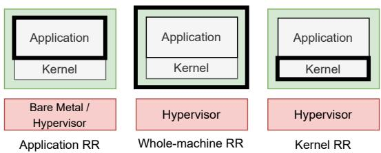  
Figure 1: Traditional RR approaches and Kernel RR approach. Record-replay boundary is highlighted in bold.

## 2.1 Goals and Assumptions

We aim to build a record-replay framework that (a) records kernel executions, (b) ensures matching, functionally-accurate kernel replays, and (c) achieves high recording efficiency. Our goal is to drastically reduce the recording overhead of traditional record-replay frameworks, especially in multi-core environments, to enable recording all executions of large-scale workloads.

Non-goals. Replaying efficiency beyond ensuring sufficient speed for practical debugging is not a goal of this work. Every replayed execution has to be recorded, but often only some recorded executions – those that happen to trigger failures – are replayed. Replaying application executions is not our focus since we aim to help kernel developers find and diagnose kernel bugs. We assume that the kernel is designed to work correctly regardless of the input provided by applications, hence determining why applications provide certain input that leads to kernel failures is out of the scope of this work.

Assumptions. Since we aim to help kernel developers fix kernel bugs, we assume that they can modify the kernel. Furthermore, we assume that the kernel executions run on a virtualized environment, which is typical in the cloud and datacenters, but that developers or data center providers can modify the hypervisor, which is a standard assumption for VM-based techniques. Our design is architecture-agnostic, although our implementation and discussion targets x86 due to its wide adoption in data centers.

## 2.2 Efficient and Scalable Kernel RR

Accurately replaying executions requires recording all nondeterministic inputs of a given execution. In practice, this means that all the explicit inputs (i.e., inputs provided by users) and implicit inputs (e.g., program schedules) need to be recorded such that they can later be fed into the program, ensuring the same execution behavior during replay.

To record and replay kernel executions, the state-of-theart approach records the whole system execution (Wholemachine RR in Figure 1). In practice, this is done with a modified hypervisor that records all the VM (implicit and explicit) inputs. By running the target kernel inside a VM, the record and replay boundary becomes the entire VM. In contrast to the prior approach, KRR restricts the recording and replaying boundary to the guest kernel from the entire VM (Kernel RR in Figure 1), therefore avoiding the unnecessary cost of recording the guest applications.

At first glance, it may appear that by recording a smaller layer of the software stack (i.e., the kernel layer), the recording overheads become smaller. But the size of the layer does not directly determine the costs. In fact, reducing the RR boundary to the kernel could increase costs because a sliced recording that only targets the kernel would require recording (a) the hardware input provided to the kernel (e.g., data read from the disk or network and interrupt timings) and (b) the input provided by applications to the kernel (e.g., system calls invoked by the applications). Whereas recording the VM execution would only require recording the former source of (explicit) inputs. Despite this additional cost to the sliced RR approach, there are two factors that make KRR not just viable but significantly more efficient and scalable than wholemachine RR.

Adoption of kernel-bypass workloads. Because datacenter workloads increasingly use kernel bypassing for higher performance, the input provided to the kernel can actually be smaller than the input to the machine. Hence, under kernelbypassing workloads, restricting RR to the kernel boundary can reduce the number of recorded events, thereby increasing recording efficiency.

High cost of schedule recording. The typical Achilles heel of RR techniques is parallelism. The few RR systems that support multi-core machines (or multi-thread applications) on commodity hardware primarily do so by serializing the execution of multiple cores (or threads) [56], which cancels the parallelism benefits, or recording memory access orderings, which has comparable or higher costs [42, 60]. Thus, the state-of-the-art RR techniques for x86 have overheads that exceed the number of cores for general workloads (e.g., 2.3-3.5× overhead for a 2-core VM [60]), canceling the performance benefits of using multi-core machines. Sliced RR that selectively targets the kernel can drastically mitigate this cost, at the end-to-end level, by only serializing the execution of the kernel while allowing full application parallelism. Since in many workloads, the vast majority of the CPU time is spent in user mode, sliced RR can scale kernel recording to several cores on commodity hardware with low CPU overhead. It is worth noting that despite the use of serialization to handle parallelism, as discussed later (§3.3), fine-grained serialization is effective even at recording failures that trigger non-deterministic, including important classes of concurrency

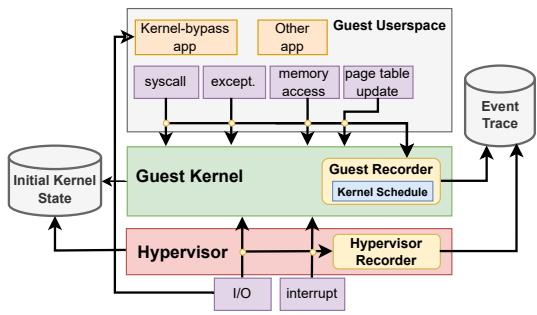  
Figure 2: KRR Split Recorder Architecture.

bugs.

## 3 KRR Design

KRR’s unique recording boundary imposes two major design challenges. First, while existing record-replay systems focus on either the user-space (application RR) or hardware interface (whole-machine RR), KRR must simultaneously record both interfaces, as illustrated in Figure 1. This dualinterface recording requirement creates significant architectural challenges. Traditional approaches can record from a higher-privilege level—using the kernel to record the application, or the hypervisor to record the VM. However, neither interface provides a good vantage point to effectively record both interfaces given the limited visibility from each interface. The second challenge lies in the recording efficiency. Because the kernel frequently interacts with user space and hardware and often with fine granularity, intercepting communications over these two interfaces can be expensive, particularly when recording from the hypervisor. Naively recording even just some event types could cause frequent VM exits or require expensive introspection mechanisms that we cannot afford.

To address these challenges, KRR employs a split-recorder design (Figure 2) that uses an in-guest recorder and an inhypervisor recorder to collaboratively record the kernel execution. This design enables KRR to record both interfaces effectively and with low overhead. Together, the two recorders record all non-deterministic events that impact the kernel execution and output a recorded trace of events in total order, allowing KRR to accurately reproduce the slice of the kernel execution during replay by injecting the recorded events one by one. Specifically, KRR records three types of events: (1) all inputs provided to the kernel (§3.1 and §3.2), (2) the kernel schedule and other non-determinism (§3.3), and (3) the initial state of the kernel (§3.4).

## 3.1 Kernel Input from User-space

KRR implements an in-guest recorder that monitors all input, both directly and indirectly, provided to the kernel by applications. The guest recorder runs in the guest kernel and intercepts the kernel’s accesses to software input. Fortunately, the kernel interface is generally very well defined for maintainability and security reasons, making it practical to determine the source code locations where the kernel receives input. The in-guest recorder handles several sources of software input.

System Calls. Applications invoke a system call by requesting the index of the desired call and passing the respective arguments. Thus, correctly replaying the system call requires recording the requested call index and the arguments. To do so, the guest recorder monitors the common entry point of system call handlers. When a system call request is received, the guest recorder accesses the CPU registers to get the call index and parameters.

User-Memory Accesses. The kernel can read user-space memory to fetch application structures, buffers, and for other reasons, which therefore constitutes another type of input event for the guest recorder to monitor. For instance, to fulfill a write() system call, the kernel needs to read the user-space memory to fetch the contents to write. In abstract, monitoring user-memory accesses is challenging because the kernel can make the read accesses at arbitrary points during its execution. An interesting observation that makes our solution particularly feasible is that modern kernels treat user-memory reads as security-sensitive operations due to their potential as attack vectors. As a result, such reads are performed through a small set of internal APIs that have been thoroughly reviewed and hardened with security features such as the x86 SMAP extension. This design property allows KRR to reliably record user-memory reads by instrumenting well-defined API functions such as copy\_from\_user and get\_user [30]. When the kernel reads data from user-space through the instrumented functions, KRR inspects the corresponding destination kernelspace memory to record the copied content. Importantly, KRR does not access the user-space memory directly for recording, thereby avoiding consistency issues such as double reads (e.g., TOCTOU [29]).

Additionally, the kernel’s execution could be affected by inputs from memory that is shared between the kernel and user-space. A typical example is io\_uring [15], which uses shared circular queues for asynchronous I/O operations. With io\_uring, the kernel directly accesses the submission queue in the shared memory region, which the user-space can access and modify at the same time. KRR records this type of kernel input by instrumenting kernel reads to both the submission queue and its entries in the guest recorder, ensuring that user inputs via this shared memory are captured deterministically. This approach is also applied to other mechanisms, such as inter-process communication (process\_vm\_readv), and can be extended to other shared-memory inputs that affect kernel behavior.

Page Table Updates. In addition to the explicit inputs described above, user-space execution can implicitly influence kernel behavior through changes to the page table state. Specifically, when applications access memory, these accesses may update the accessed and dirty bits in the corresponding page table entries. These updates, in turn, can affect the kernel memory management, as the kernel relies on those bits to make decisions such as page replacement. To record the page table entry update, KRR instruments kernel accesses to the entries and records their exact values. This approach is generic and can record other forms of implicit inputs if needed. In practice, our comprehensive validation and evaluation (§4.1, §5) suggest that page table state changes are the only typical implicit input provided by processes, and recording these changes is sufficient to ensure accurate replay.

## 3.2 Kernel Input from Hardware

Hardware inputs (interrupts, I/O read, and device DMA) are primarily recorded by the hypervisor recorder, while nondeterministic instructions and exceptions are recorded by the guest to avoid introducing VM exits.

Interrupts and Exceptions. The hypervisor recorder intercepts every interrupt to record the interrupt type (i.e., vector number), timing (§3.2.1), instruction pointer (RIP), and all general-purpose registers that may be accessed during interrupt handling. For example, RCX register is accessed to identify the position within repeating string instructions [42, 60], and RIP is accessed to handle restartable sequences [18].

Because KRR only records the kernel slice of the execution, exception handling, such as those caused by division by zero from user-space, are no longer deterministic events in every situation. In particular, exceptions triggered by applications need to be recorded and injected during replay by KRR. For each exception, KRR records the exception number, all general-purpose registers, and any additional machine state required by each specific exception handler. For instance, when recording page faults on x86\_64, the guest recorder additionally records the faulting memory address and error code stored in the stack memory.

I/O Operations. KRR records the data read by the kernel from hardware devices through port I/O (i.e., IN and OUT instructions), memory-mapped I/O (MMIO), and DMA accesses. Since they are handled by the host hypervisor, KRR uses the hypervisor recorder to monitor these events. When an I/O read request is intercepted, the hypervisor records it only if initiated by the kernel. By excluding I/O requests from guest user-space applications, KRR significantly improves recording efficiency for kernel-bypass workloads (§5.2).

Other Non-deterministic Instructions. Because some instructions produce non-deterministic results, KRR needs to record their results to ensure correct replay. On x86, this includes instructions such as RDTSC, RDTSCP, RDSEED, and RDRAND. While a common approach is to trap and record them from the host hypervisor [60, 64], KRR instead records them with the guest recorder to avoid expensive VM exits. This shows another advantage of choosing the kernel as the record boundary – it would be impractical to ensure that these instructions are consistently recorded for every application in a VM-RR approach by modifying all applications, since there is no intra-VM trap mechanism for these instructions in x86. However, it is practical to manually modify a single system (the kernel, in our case) to intercept them.

## 3.2.1 Asynchronous Event Timing

Unlike other hardware inputs, interrupts and DMA accesses are asynchronous events. Thus, their timing has to be recorded precisely so that KRR can replay them at the exact same point observed during recording. To achieve this, KRR leverages x86 kernel-mode-only hardware counters to track the number of executed kernel instructions during recording. When the interrupt or DMA event happens, KRR records the counter value as its timing signature, enabling accurate replay by injecting the event at the same instruction count.

To prevent conflicts with the guest kernel over hardware performance counter usage, KRR takes advantage of the multiple counters available on modern processors (e.g., Intel processors typically provide four programmable counters per core [13]). KRR reserves one counter for its exclusive use, leaving the remaining counters accessible to the guest kernel. This is achieved by intercepting the CPUID instruction’s output to mask the reserved counter, thereby making it invisible to the guest.

## 3.3 Kernel Schedule

A common approach to ensure accurate record and replay on concurrent software is to serialize the multi-thread execution— allowing only one thread to run at a time—thereby resolving data races and other schedule-non-determinism during recording. However, while this approach guarantees correct replay, it can impose substantial performance overhead by preventing parallelism. To address this limitation, KRR takes advantage of its reduced recording boundary. Since KRR records the kernel execution exclusively, it only has to serialize the concurrent kernel execution, while still allowing user-space threads to run in parallel.

In addition, unlike other approaches that serialize at the hypervisor-level [44], KRR serializes the execution from the guest kernel, avoiding expensive VM exits on every kerneluser space transition. KRR uses a special-purpose spinlock from the guest kernel, ensuring that only one vCPU core can execute in kernel mode. Although this approach may seem simple, not using the hypervisor to control the schedule requires a careful design, as discussed next.

Replay-Coherent (RC) Spinlock. While the serialization spinlock is integrated into the guest kernel, its execution should not be replicated during replay since it is, conceptually, a component of the recorder and it would slow replay. Even more importantly, a normal spinlock is itself nondeterministic, meaning that the spin count (instructions executed by the spinlock) and its outcome depend on the schedule. If left unhandled, the outcome of a normal spinlock would not match across record and replay. Furthermore, even if the outcome of the spin lock is recorded, the spin count difference across runs would make the instruction count inconsistent across runs, preventing KRR from using the instruction count to decide when to inject interrupts and other asynchronous events that are timing-dependent (§3.2). After exploring several approaches to address this problem, including relying on expensive VM exits, we concluded that a simple modification to the spinlock is sufficient to solve this problem. KRR introduces a new spinlock design, the RC spinlock, that counts the number of cycles (instructions executed) before it is acquired as well as the acquisition ordering, which KRR records as events. This allows KRR to enforce the same ordering and adjust the instruction count to match the recorded values during reply, thereby reproducing the exact multi-threaded kernel execution

Deadlock Prevention. KRR manages kernel execution serialization through its RC spinlock. The vCPU acquires this lock when (a) entering kernel mode (through system calls, interrupts, or exceptions) or (b) waking from an idle state, and releases it when (a) returning to user-space or (b) entering the idle state.

However, this basic locking scheme can lead to deadlocks. For example, when a thread holding the RC spinlock waits for an internal kernel lock that is owned by another thread, which in turn is waiting for the RC spinlock. To prevent such deadlocks, KRR adds another acquisition/release point: the kernel releases the RC spinlock before acquiring certain internal locks (including the CSD lock [17] and spinlock) and reacquires it afterward.

When multiple vCPUs wait for the same internal lock, KRR applies a similar strategy as used for the RC spinlock - recording the acquisition ordering to ensure correct replay. Since the waiting time at internal locks is non-deterministic, KRR uses hypercalls to synchronize instruction counts between record and replay runs. While hypercalls incur VM exits, these synchronization points are not common during normal kernel execution, resulting in a low performance impact.

Bug Recording Scope. Like other practical record-replay tools, KRR affects executions through subtle changes to the timing of events due to instrumentation overheads or the serialization mechanism, making some failures potentially harder or easier to trigger. Despite the use of serialization, KRR can record concurrency bugs, as our experience shows. This is possible because KRR allows concurrency, although at a coarser grain than native executions, through interrupts and context switches. To empirically assess KRR’s ability to reproduce real-world bugs, we evaluated it on a diverse set of Linux kernel bugs (details in §5.3). The results show that KRR successfully reproduces 16 out of 17 randomly-sampled bugs, encompassing 5 out of 6 non-deterministic bugs and all five tested kernel CVEs. This validates its effectiveness for a broad spectrum of real-world kernel problems, including several concurrency-related bugs. §6 discusses further the scope of the recorded executions.

## 3.4 Initial Kernel State

KRR allows users to start recording the guest kernel execution at arbitrary points during the VM lifetime. This selective recording capability is particularly useful in performancecritical cases where only specific execution periods are recorded due to lower overhead tolerance (e.g., during intensive workloads).

Once recording starts, KRR takes a memory snapshot of the VM. Unlike traditional VM-RR, KRR requires only a kernel memory snapshot for replay, presenting a significant optimization potential. Snapshotting only kernel memory, instead of the entire VM’s memory, can substantially improve snapshot efficiency and reduce storage costs, particularly for VMs with large amounts of user memory. This snapshot is then used in the replay to ensure that the event trace is applied to a kernel execution that starts from the same initial state (§3.5). Currently, KRR uses synchronous snapshotting where the guest’s execution is paused during snapshot creation to ensure state consistency. However, future work could adopt techniques, such as asynchronous snapshotting [1] and efficient fork, like on-demand fork [74] and others [69], to further reduce the performance impact of snapshotting operations.

## 3.5 Replayer

During replay, KRR reconstructs kernel execution through a carefully orchestrated process. KRR first loads the VM snapshot and follows the recorded event trace to recover the original execution environment. The system employs several techniques to ensure identical execution: vCPU thread scheduling based on logged execution order, memory state recovery using VM breakpoints to intercept memory accesses to user-space memory, hardware input replication during I/O operations, and precise timing control through instruction counting to inject asynchronous events at the exact points they occurred during recording.

Replay Debugging. Since performance is less critical during replay, we implemented our KRR prototype replayer using the QEMU emulator, which has the advantage of simplifying introspection and providing a convenient kernel debugging environment through GDB integration. Our implementation allows developers to use powerful debugging features including breakpoints, watchpoints, and automation scripts [16] to analyze the kernel behavior during replay. Moreover, other binary analysis techniques [37, 40, 61] can be integrated into KRR, allowing developers to track memory accesses, monitor register changes, and analyze execution paths at instructionlevel granularity.

Reverse Debugging. Reverse debugging [11] enables developers to navigate backward through a program’s execution history to examine how a particular state was reached. This capability is invaluable for diagnosing complex bugs whose root causes are difficult to pinpoint with forward-stepping debuggers alone.

To implement reverse debugging, KRR augments its standard kernel replay by also periodically taking VM snapshots, each tagged with the instruction count. To start reverse debugging, e.g., a backwards instruction step, KRR performs a two-stage process. First, it identifies and loads the last VM snapshot that was captured before the target backward point. Second, it replays the execution forward from the snapshot, using the recorded event trace, until the exact desired execution point is reached. This approach is conceptually similar to QEMU’s native reverse debugging [20].

However, robust reverse debugging for multi-core VMs presents challenges not addressed by existing approaches [21, 40]. In multi-core systems, each vCPU progresses independently, making a single instruction counter insufficient to uniquely define the system state for consistent reverse execution. To overcome this, KRR introduces a multi-core execution coordinate: a vector of per-vCPU instruction counts captured during replay. Both snapshots and past breakpoints are tagged with these coordinates during replay. During a rollback to the last breakpoint, KRR loads the closest prior snapshot and replays forward until the target coordinate is reached, restoring both VM state and replay progress to ensure consistency.

## 4 Implementation

We implement KRR based on Linux-KVM (5.17.5) and QEMU (7.0.0). We develop the guest recorder on Linux 6.1.0 and then port it to different kernel versions, ranging from 5.10 to 6.1 (§5.3). The modifications to KVM, QEMU, and the guest Linux are around 1.2k, 4.5k, and 1.2k lines of C code, respectively.

Guest Recorder. KRR implements a kernel recording library with 16 APIs that record system calls, exceptions, usermemory access, page table accesses, non-deterministic instructions, and RC spinlock operations. The library, implemented in about 1.2K LoC C code, is used to instrument 37 kernel source files for recording these events. The recording library also facilitates compatibility and portability across kernel versions. When using KRR to reproduce known kernel bugs (§5.3), we are able to support 13 unique kernel versions ranging from 5.10 to 6.1. Supporting a new kernel version typically requires less than 30 minutes to apply our patch files and resolve code conflicts.

Hypervisor Recorder. We implement the hypervisor recorder in KVM/QEMU to capture hardware-related events. The implementation consists of modifications to KVM (0.8K LoC) and QEMU (1.2K LoC), providing 5 instrumentation interfaces for recording. In total, we modify 7 files across the KVM/QEMU codebase. We instrument KVM’s interrupt injection function to record interrupt information and extend PIO & MMIO emulation functions to record I/O read results.

Hypervisor recorder records data from both the emulated disk and network interfaces, with each requiring different handling strategies due to their distinct access patterns. For disk I/O, KRR records data written to device DMA memory regions and pairs each DMA buffer chunk with its triggering disk I/O instruction (e.g., IDE DMA read command). This pairing, along with the timing information, enables precise injection of recorded DMA data during replay when the kernel executes the corresponding I/O instruction. Network I/O presents a unique challenge due to Linux’s NAPI mechanism [19]. NAPI allows concurrent access to the network ring buffer by both the kernel and the device, creating potential data races. KRR addresses this by trapping the vCPU in kernel mode before the device writes to the network ring buffer, similar to VMware FT’s network I/O synchronization approach [63]. During this trap, KRR records both the data written to the ring buffer and the current instruction count, enabling accurate replay of network inputs. For kernelbypass devices, KRR provides a QEMU parameter that allows users to specify which device inputs should be ignored during recording.

Atomic and Ordered Event Recording. Because KRR uses both the guest kernel and hypervisor recorder to record input events, it is critical that the event trace is updated atomically and sorted in the correct order (i.e., by occurrence time). To guarantee atomicity, KRR grants exclusive access to the event trace only to the RC spinlock owner vCPU. When one recorder is updating the event trace, KRR disables the interrupt for the guest and pauses the corresponding vCPU core on which the event happens until the event is recorded into the trace. By doing so, KRR ensures that only one recorder can update the event trace at a time.

While KRR serializes kernel execution, interrupts may still occur concurrently on multiple vCPUs that are in user mode, making it challenging to order these interrupt events correctly. KRR’s recorded ordering of RC spinlock acquisitions (§3.3) ensures these interrupts are properly ordered according to the serialized execution.

## 4.1 Validation

We run the test suite from Linux Test Project (LTP) to test the correctness of our prototype. In the recorded execution, at every N-th instruction, we log the instruction pointer (RIP), the instruction counter (i.e., number of executed kernel instructions) and all x86\_64 registers, including control, generalpurpose, and segment registers. During the replay, we assert that the replayed execution shows consistent states at every N-th instruction. We use the value 1K for N by default and increase it to 32K if too frequent logging causes test timeouts during recording. Overall, KRR can successfully replay the kernel execution of 8,156 LTP tests, demonstrating its high recording accuracy.

## 5 Evaluation

This section evaluates KRR along the following questions:

RQ1: Can KRR efficiently record multi-core workloads? (§5.1)

RQ2: What is the recording performance of KRR on kernelbypass workloads? (§5.2)

RQ3: Can KRR record/replay complex kernel bugs? (§5.3)

RQ4: What is the storage cost of KRR? (§5.4)

RQ5: What is the replay performance of KRR? (§5.5)

Experimental setup. We evaluate the record/replay performance of KRR on the CloudLab platform [3] using instances of machine c6420, which is equipped with two 16-core Intel Xeon Gold 6142 CPUs (hyper-threading and cstate disabled), 384 GB RAM, and a dual-port Intel X710 10GbE NIC for performance. In addition, we evaluate the effectiveness of KRR in reproducing kernel bugs on a separate machine with a 2-core Intel i7-7660U CPU and 16GB RAM. We run the modified Linux kernel 5.17.5 on the host, and 6.1.0 on the guest in the default recording performance evaluation. For the bug reproduction in §5.3, we run 13 unique guest Linux kernel versions ranging from 5.10 to 6.1.

VM-RR. Our evaluation compares the recording performance between KRR and the whole-machine RR approach(Figure 1). A direct comparison with prior whole-machine RR implementations is unfeasible for several reasons. First, some implementations are proprietary or have been deprecated [42, 64]; thus, they are inaccessible to us. Second, despite our considerable adaptation efforts, the old codebase of some systems caused compatibility issues on modern hardware [60]. Third, the other alternatives lack multi-core VM support or critical hardware-assisted virtualization capabilities, such as KVM, which are central to our work [21, 40]. Thus, to enable a fair and relevant comparison, we implemented VM-RR, a wholemachine RR prototype using the same version of QEMU and KVM as KRR, which is the fastest implementation we have access to (§4).

VM-RR differs from KRR in three aspects. First, it uses the traditional, wider recording boundary: VM-RR captures all hardware inputs to the VM, including non-deterministic events (e.g., interrupts), the results of non-deterministic instructions, and data from device I/O reads. KRR, in contrast, must also record inputs from the guest user-space to the kernel (§3.1) but does not record VM input that bypasses the kernel. Second is the handling of non-deterministic instructions (e.g., RDTSC): VM-RR relies on hypervisor traps to capture their output, whereas KRR uses its in-guest recorder to log these values, avoiding expensive VM exits (§3.2). Third, VM-RR enforces determinism through full-system serialization, allowing only one vCPU to execute at any time. vCPUs are scheduled via FIFO, each running for up to a 50K instruction time slice. While this serialization incurs overhead, like it does in KRR, it is a standard technique in prior deterministic systems [44, 46, 56]. Importantly, our evaluation results (§5.1.2) demonstrate that VM-RR’s performance overhead is comparable to that of existing deterministic record-replay systems on multi-core workloads, affirming its validity as a representative baseline.

Methodology. To understand the recording overhead of KRR and VM-RR, we measure the system performance both with and without recording enabled, using the native execution (no recording) as the baseline. We conduct multiple trials of each experiment and report the average result. To ensure consistent measurements across trials, we clear the host page cache, pin every vCPU thread to a dedicated physical core, and boot the VM from scratch between trials. Our evaluation graphs present both the absolute measurement values and the relative slowdown caused by recording.

## 5.1 Recording multi-core workloads

This section evaluates the recording overhead of KRR on modern applications, with a focus on scalability.

## 5.1.1 RocksDB

First, we compare KRR and VM-RR on a modern key-value store, RocksDB [41], using its built-in benchmark suite [2]. We run multi-threaded workloads, aligning the number of threads with the available vCPU cores, to understand the recording overhead for concurrent RocksDB operations.

Throughput. Figure 3 illustrates the substantial performance disparities between VM-RR and KRR when recording multicore RocksDB workloads. While all workloads demonstrate strong multi-core scaling under native execution, their throughput under VM-RR decreases greatly as the number of cores increases. Notably, with VM-RR, RocksDB performs worse on multi-core VMs than on single-core VMs across all workloads. In contrast, KRR introduces considerably lower overhead. On single-core VMs, KRR is expected to be slower than VM-RR because it needs to record userspace inputs while VM-RR does not (§3.1). However, contrary to this expectation, VM-RR is observed to be slower than KRR on certain workloads, despite avoiding userspace input recording. Our analysis shows that this is because VM-RR incurs significant overhead when handling RDTSC instructions, as each instance necessitates a costly VM exit. The performance impact becomes substantial with higher instruction frequencies. For example, the random reader and random seeker benchmarks incur over 18k and 14k RDTSC instructions per second, respectively, while other benchmarks incur less than 7k. On 2-core VMs, KRR incurs a slowdown ranging from 1.01× to 1.67×, and on 4-core VMs, the slowdown ranges from 1.06× to 2.03×. These slowdowns are markedly lower than those observed with VM-RR, which range from 2.71× to 4.93× on 2 cores and 5.08× to 11.76× on 4 cores. Due to this moderate overhead, KRR enables most workloads to achieve increased throughput as the number of cores increases from 1 to 4. However, beyond 8 cores, RocksDB’s throughput, under KRR, begins to decline. Our investigation reveals that the increasing lock contention on large VMs is the primary performance bottleneck.

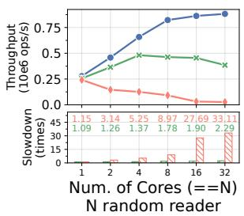

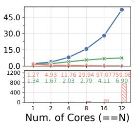  
N sequential reader

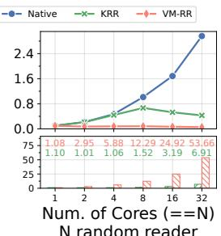  
+ 1 writer

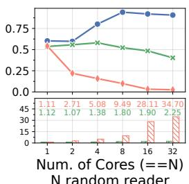  
+ 1 scanner

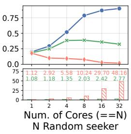  
Figure 3: RocksDB benchmark throughput. Slowdown is the ratio between the native and recording throughput.

Latency. The latency measurements mirror the throughput patterns described above. From 2-core to 8-core VMs, the operation latency under VM-RR, is slower than the native by $2 . 7 3 \times \sim 2 9 . 9 9 \times$ , while for KRR, the latency is only increased by $1 . 0 1 \times \sim 2 . 8 0 \times$

## 5.1.2 Kernel Compilation

We next evaluate KRR and VM-RR using a code compilation workload on VMs with 1, 2, 4, 8, 16, and 32 vCPU cores and 8GB of memory. Within the VM, we compile the Linux kernel 6.5.1 using the command make -j \$(#cores + 1). The number of worker threads is set to one more than the number of cores to better saturate the CPU [42, 60].

Figure 4 presents the compilation time with and without recording and the slowdown caused by KRR and VM-RR. On a single-core VM, both KRR and VM-RR introduce moderate slowdowns of 1.15× and 1.11×, respectively. The slightly higher slowdown observed with KRR is because KRR needs to additionally record guest user-space inputs to the kernel, whereas VM-RR records only hardware inputs. However, the scaling behaviors of KRR and VM-RR diverge significantly when recording multi-core VMs, where concurrency-induced non-determinism must be recorded. With KRR, kernel compilation scales effectively up to 8 cores, resulting in only 22% and 56% slower than the native on 2-core and 8-core VMs. In contrast, with VM-RR, kernel compilation does not scale with more CPU cores. The performance under VM-RR is 226% and 1047% slower than the native on 2-core and 8- core VMs. Similar to the RocksDB workload, kernel compilation, under VM-RR, performs worse on multi-core VMs than on single-core VMs. This finding aligns with prior work on whole-machine RR [42, 60], which reported that kernel build performance on 2-core VMs is slower than on single-core VMs.

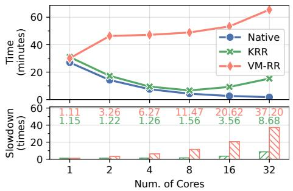  
Figure 4: Linux Kernel build time. Slowdown is the ratio between the recorded build time and the native build time.

For VMs with 16 and 32 cores, KRR’s kernel build no longer benefits from more CPU resources. The performance downgrade, similar to the results observed with RocksDB, stems from the increased lock contention between vCPUs as the VM size grows.

## 5.2 Recording Kernel-bypassing Workloads

The difference in recording boundaries allows KRR to achieve significantly lower overhead when recording kernel-bypass workloads. The following section quantifies the recording efficiency of KRR on three modern kernel-bypass applications: RocksDB (§5.2.1), Redis (§5.2.2), and Nginx (§5.2.3).

## 5.2.1 RocksDB with SPDK

We run RocksDB with SPDK to directly access the disk from the user-space. In this experiment, we run several singlethreaded RocksDB workloads in a 2-core VM with 8GB of memory and an emulated NVMe device. Following the SPDK best practices [27], we pin the RocksDB worker thread to one vCPU core and the SPDK polling thread to another, which continuously monitors the NVMe device state and handles I/O requests from the worker. The NVMe device is emulated on a standard SATA disk with our modified QEMU (§4) that implements NVMe data recording, which is necessary for VM-RR and KRR—under the non-kernel-bypass mode—but is not supported by existing NVMe devices.

Throughput. Figure 5 compares the throughput of different RocksDB workloads with and without SPDK. The results show that several workloads benefit from bypassing the kernel for I/O handling. For instance, in the 1 sequential writer workload, RocksDB-SPDK achieves 3.27× higher throughput compared to RocksDB without SPDK. However, when VM-RR is used for recording, RocksDB-SPDK experiences significant performance degradation. Specifically, the throughput decreases by 29.37× in the 1 random appender workload and 64.51× in 1 sequential deletion. These slowdowns are substantially greater than those observed with standard RocksDB using kernel I/O, which exhibits slowdowns ranging from 1.67× to 2.30×. The severe performance degradation results from the whole-system serialization approach in whole-machine RR: when VM-RR blocks the CPU core running the SPDK polling thread but allows the core running the worker thread to execute, the worker thread stalls on pending I/O requests despite having CPU time. In contrast, the RocksDB worker can progress normally when using kernel I/O.

Conversely, KRR achieves reasonable recording overhead with RocksDB-SPDK by allowing user-mode polling threads to run alongside workers. For write workloads, KRR’s overhead on RocksDB-SPDK is 10% ∼ 22.7% lower than on traditional RocksDB, primarily because SPDK drastically reduces both system calls (by 77% ∼ 94%) and userspace-tokernel data copies (by 94% ∼ 99%). The Sequential reader benchmark also shows substantially lower slowdown under SPDK, as KRR does not need to record the substantial DMA data transfers that dominate this workload’s intensive disk I/O operations.

Latency. When using kernel I/O, KRR consistently outperforms VM-RR with a much lower impact on operation latency. KRR’s slowdown is within 1.14× ∼ 1.54× across all workloads, while VM-RR’s slowdown is between 1.67× ∼ 2.33× For RocksDB with SPDK, VM-RR slows down its latency by 29.36× ∼ 64.51× compared to native execution. In contrast, KRR marginally affects the latency of RocksDB-SPDK, with slowdowns ranging from 1.17× to 1.27×.

## 5.2.2 Redis with DPDK

Next, we evaluate KRR on Redis with kernel-bypass. The evaluation utilizes two inter-connected c6420 machines on CloudLab: one for hosting the Redis server inside the VM, and another for running the Redis benchmark [24]. The VM is configured with 4 vCPU cores, 8GB memory, and has direct access (i.e., passthrough) to the dual-port Intel X710 10GbE NIC. Within the VM, we deploy the Redis implementation from the f-stack kernel-bypass framework [10], which leverages DPDK [9] for direct network card access. The client machine runs the Redis GET and SET benchmarks separately with 5 million requests and different numbers of concurrent client threads ∈ {1, 2, 4, 8, 16, 32, 64}. Due to the lack of data recording support in the physical NIC under this setup, VM-RR is unable to accurately record all hardware inputs to the VM. Thus, it is excluded from this evaluation.

Figure 6 shows that KRR can efficiently and scalably record the guest kernel under the Redis-DPDK workload, Across all numbers of concurrent clients, KRR only reduces the GET throughput by 0.26% and the SET throughput by 1.14% on average. Additionally, the P99 latency measurement exhibits slowdowns ranging from -5.19% to 11.27%. The minimal recording overhead is because the guest kernel receives significantly fewer inputs under Redis-DPDK. By delegating the heavyweight data path to the user-space, the guest kernel is primarily responsible for handling the I/O control path, thereby reducing the number of events that need to be recorded.

## 5.2.3 Nginx with DPDK

Using a similar setup to the Redis-DPDK experiment, we evaluate KRR’s recording performance on Nginx with DPDK kernel-bypass (version 1.25.2, implemented in f-stack). On the server side, we use VMs with different numbers of vCPUs ∈ 1, 2, 4, 8, 16, 32 and run Nginx with the matching number of worker processes. On the client side, we run the benchmark tool wrk [31] to request files of size ∈ 1KB, 4KB, 16KB, 64KB over 1024 connections (32 connections per client thread) for a duration of 10 seconds.

Figure 7 shows that the recording overhead of KRR varies significantly with the requested file size. For small files (1KB and 4KB), KRR incurs a relatively high slowdown exceeding 46%, and this overhead becomes increasingly severe as the number of cores increases. However, for larger files (16KB and 64KB), the overhead of KRR becomes almost negligible, reducing to merely 2% for 16KB files and 5% for 64KB files across all VM sizes. Our analysis reveals that this discrepancy is due to the unique performance bottlenecks in serving files of different sizes. For small files, the bulk of the request processing time is spent in the kernel reading the file. Since KRR instruments these kernel operations, the recording overhead causes a significant slowdown in the end-to-end throughput. In contrast, when serving larger files, the primary performance bottleneck shifts to the network transfer. Under the kernel-bypass setup, KRR does not need to record these transfer operations, resulting in minimal performance impact.

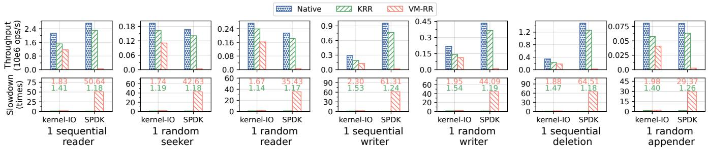  
Figure 5: Throughput of RocksDB w/ and w/o SPDK on single-threaded workloads. Slowdown is the ratio between the native and recording throughput.

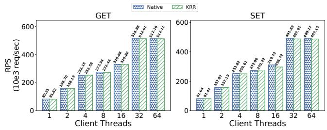  
Figure 6: Redis Kernel-bypass Throughput

## 5.3 Reproduce kernel bugs using KRR

This section evaluates the effectiveness of KRR in recording and replaying Linux kernel bugs. To construct a representative evaluation dataset, we systematically collect bugs from two well-established bug-reporting sources. First, we gather bugs found by Syzbot [28], a Linux kernel continuous testing project that publicly reports kernel bugs along with reproducers (if any). Specifically, we identify 92 bugs that are found by Syzbot in Linux kernel 6.1.X and have associated reproducer programs. Next, we collect 81 bugs whose titles contain any of the keywords: WARNING, BUG, deadlock, and KASAN to focus on severe kernel errors. From these bugs, we randomly select 12 bugs. Next, to evaluate KRR on high-impact kernel vulnerabilities, we additionally collect 5 recent Linux kernel CVEs [4–8] that have high severity scores and were evaluated by prior research work [75] and rated at least as "Important Impact" by Red Hat Product Security [23]. The resulting dataset consists of 17 Linux kernel bugs.

Table 1 presents the bug reproduction results for 12 bugs found by Syzbot, along with the average iteration required to execute the reproducer before triggering the bug. First, 6 bugs (50%) are considered deterministic bugs because they can be reproduced consistently within the first iteration of the reproducer under native execution. KRR successfully reproduces all 6 deterministic bugs within a single iteration as well.

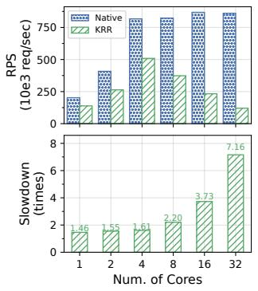

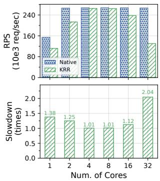  
(a) File Size == 1KB

(b) File Size == 4KB  

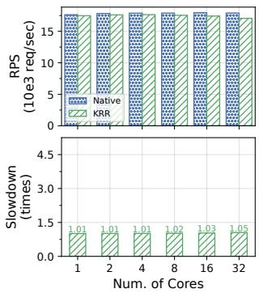  
(c) File Size == 16KB  
(d) File Size == 64KB  
Figure 7: Throughput of Nginx kernel-bypass benchmarks with different file sizes.

Second, the remaining 6 bugs are non-deterministic, requiring varying numbers of iterations to reproduce in native execution. Among these bugs, KRR is able to reproduce 5 of 6. Furthermore, our analysis of the median number of iterations required to first trigger the bug does not show a significant difference between the two approaches. In fact, in 3 out of the 6 non-deterministic cases, KRR reproduced the bugs with fewer iterations than the native execution.

For example, KRR performs better than native on bug #5. This bug is caused by a race condition, in which two threads concurrently execute the function gsm\_cleanup\_mux, and accesses to the shared variable dlci need to occur in a specific order to trigger the use-after-free. KRR can reproduce this bug because the function acquires a mutex using mutex\_lock halfway through its execution, giving a chance for other tasks to be scheduled even in a serialized execution given our algorithm (§3.3).

Bug #8, a potential deadlock in rcu\_report\_exp\_cpu\_ mult(), can only be reproduced in a multi-core VM with native execution. This bug involves a lock ordering violation: when multiple cores contend for the same spinlock, one core acquires it with interrupts disabled (making it hardirq-safe). During this execution, the system triggers a BPF trace that attempts to acquire a hardirq-unsafe lock. This sequence—acquiring a hardirq-safe lock followed by a hardirq-unsafe lock—violates lockdep’s locking rules and can lead to deadlock. The bug requires parallel execution: multiple cores must concurrently attempt to acquire the same lock with the interrupt disabled. This scenario cannot occur on single-core systems, where only one execution context can run at a time. Thus, KRR cannot reproduce this bug because its serialization approach prevents concurrent lock contention between cores.

Security-sensitive bugs. Table 2 shows the bug reproduction results for 5 Linux kernel CVEs. These vulnerabilities encompass a diverse range of bug types, including three privilege escalation vulnerabilities, a heap overflow vulnerability, and a control flow hijacking vulnerability. KRR can successfully record and replay all 5 CVEs, demonstrating its effectiveness in reproducing complex kernel exploitations.

<table><tr><td rowspan="2">ID</td><td rowspan="2">Description</td><td rowspan="2">Kernel Det. Repro.</td><td rowspan="2"></td><td rowspan="2"></td><td colspan="2">Iterations Median</td></tr><tr><td>Native</td><td>KRR</td></tr><tr><td>#1</td><td>Paging error in vsyscall 6.1.77</td><td></td><td>N</td><td></td><td>39.0</td><td>52.5</td></tr><tr><td>#2</td><td>null-ptr-deref in hugetlb</td><td>6.1.61</td><td>N</td><td>YY</td><td>22.0</td><td>21.0</td></tr><tr><td></td><td>use-after-free in af_unix</td><td>6.1.62</td><td>N</td><td>Y</td><td>45.5</td><td>52.0</td></tr><tr><td>$#</td><td>null-ptr-deref in fs/sysv</td><td>6.1.34</td><td>Y</td><td>Y</td><td>1.0</td><td>1.0</td></tr><tr><td>#5</td><td>use-after-free in tty</td><td>6.1.35</td><td>N</td><td>Y</td><td>28.0</td><td>1.5</td></tr><tr><td>#6</td><td>Deadlock in ext3</td><td>6.1.31</td><td>Y</td><td>Y</td><td>1.0</td><td>1.0</td></tr><tr><td>#7</td><td>Deadlock in vfs_write</td><td>6.1.34</td><td>Y</td><td>Y</td><td>1.0</td><td>1.0</td></tr><tr><td>#8</td><td>Deadlock in bpf</td><td>6.1.84</td><td>N</td><td>N</td><td>115.0</td><td>N/A</td></tr><tr><td>#9</td><td>Deadlock in vhci</td><td>6.1.66</td><td>Y</td><td>Y</td><td>1.0</td><td>1.0</td></tr><tr><td>#10</td><td>Deadlock in af_unix</td><td>6.1.84</td><td>N</td><td>Y</td><td>209.0</td><td>187.0</td></tr><tr><td>#11</td><td>Warning in BPF</td><td>6.1.18</td><td>Y</td><td>Y</td><td>1.0</td><td>1.0</td></tr><tr><td>#12</td><td>Warning in BPF</td><td>6.1.86</td><td>Y</td><td>Y</td><td>1.0</td><td>1.0</td></tr></table>

Table 1: Reproduction results of bugs found by Syzbot. Some bugs are deterministic ("Det.") and all bugs except for one are reproducible by KRR ("Repro."). The table shows the median number of test iterations required to hit the bug across 10 runs.

<table><tr><td>CVE</td><td>Type</td><td>Kernel</td><td>Repro.</td></tr><tr><td>CVE-2024-1086</td><td>Privilege Escalation</td><td>6.1.0</td><td>Y</td></tr><tr><td>CVE-2022-0847</td><td>Privilege Escalation</td><td>5.10.222</td><td>Y</td></tr><tr><td>CVE-2022-0185</td><td>Heap Overflow</td><td>5.10.222</td><td>Y</td></tr><tr><td>CVE-2021-4154</td><td>Control Flow Hijacking</td><td>5.10.222</td><td>Y</td></tr><tr><td>CVE-2022-2639</td><td>Privilege Escalation</td><td>5.17.4</td><td>Y</td></tr></table>

Table 2: Summary of evaluated CVEs.

## 5.4 Storage Cost

KRR’s storage cost is lower than VM-RR when recording kernel-bypass workloads because KRR does not need to record the data between the guest user-space and the hardware while VM-RR does. Across all evaluated workloads (§5.2.1), VM-RR on average records at a rate of 9.4 MB of data per second while KRR records 4.8 MB per second—the storage cost of KRR is 48.9% lower. The storage cost deduction also aligns with the low recording overhead of KRR on kernel-bypass workloads (§5.2).

When recording workloads that do not use kernel-bypass techniques, KRR imposes higher storage cost compared to VM-RR because it records additionally the software inputs. Specifically, for the RocksDB workloads (§5.1.1), VM-RR records an average of 8.26 MB of data per second, whereas KRR records 53.39 MB per second (546.57% more). In total, KRR and VM-RR on average record 999.22 MB and 464.48 MB of data, respectively. However, the recording data of KRR is highly compressible. After applying gzip compression, the recorded data of KRR is reduced to 144.52 MB (a 6.91x reduction), suggesting the potential for using hardware compression features [14] to compress the data in real-time—an optimization we leave for future work. These numbers are well within the bandwidth of data center storage, which reaches a few GB/s, so it can be easily sustained. Furthermore, the length of the trace can be reduced by taking frequent snapshots even on very long-running workloads.

## 5.5 Replay Performance

While KRR skips the userspace execution during the replay, which contributes significantly to reducing replay overhead, its replay execution is still generally slower than native execution by 20× ∼ 150×. This slowdown is expected given that our prototype’s replayer uses the QEMU emulator (§3.5) in the single-step mode (one instruction per translation block). Based on our tests on the benchmarks in §5.1.1, with whole system execution, full emulation (TCG) alone introduces a 7.5× ∼ 20.6× slowdown compared to native KVM. With single-step enabled, the slowdown reaches 120× ∼ 400×. KRR also disables QEMU TCG’s optimization of lazy EFLAGS evaluation to simplify the logic that ensures consistency between the record and replay runs. Together, these factors contribute to the bulk of the replay overhead in our prototype, but are not fundamental to the KRR’s sliced record replay approach (§2).

Despite this performance trade-off, emulation-based replay is commonly used in existing record-replay systems [21, 40] for its rich debugging capabilities and portability. The periodic snapshots taken during recording also mitigate performance concerns by allowing replay to start from intermediate points rather than always replaying from the beginning. Future work could explore optimizations like enabling batch translation blocks [22] while maintaining replay accuracy to improve performance further under full emulation.

## 6 Discussion

Scalability. While the evaluation (§5.1.2, §5.1.1) shows that the scalability of KRR decreases with higher numbers of vCPU cores (e.g., beyond 8 cores), it demonstrates that KRR enables modern workloads to scale effectively on VMs with 1- 8 vCPU cores—a sweet spot for most real-world deployments. This range aligns with industry standards, as exemplified by Azure’s session host sizing guidelines, which designate 8 vCPUs as sufficient for heavy workloads [25].

Nevertheless, future work could enhance parallelism in KRR, moving beyond the current serialization of kernel execution. A promising direction is to integrate techniques from chunk-based serialization algorithms, such as Samsara’s algorithm [54, 60]. Adopting such an approach in KRR could enable true parallel kernel execution and potentially broaden the class of bugs that KRR can reproduce.

Pass-through Device. KRR currently does not support passthrough devices or SR-IOV [26] that operate outside of kernelbypass mode. This limitation is because KRR relies on hypervisor emulation to record device DMA buffers and timing. A potential solution involves leveraging KRR’s in-guest recorder component. Since this recorder already operates within the guest kernel with privileged access to kernel data structures, it could be extended to intercept and log interactions with these pass-through devices. Following an approach similar to prior work [70], the in-guest recorder could monitor device driver operations, capturing DMA buffer contents and I/O timing information directly at the driver interface level rather than requiring hypervisor intervention.

Recording Scope. Without specialized hardware, no technique can record all non-deterministic failures – subtle timing changes can make such failures more likely or less likely to occur. KRR employs serialization to ensure deterministic execution of the kernel, which is crucial for accurate replay but can potentially mask certain concurrency bugs that depend on parallel thread interactions. Despite serializing the kernel execution, KRR’s mechanism effectively models a singlecore system where concurrency still occurs through context switching and interrupts. This is because KRR’s serialization mechanisms allow for a change in which threads can grab the RC spinlock and run during preemption or interrupts, mirroring how the kernel’s built-in schedule would change the running thread in response to such events. Consequently, KRR is still effective at reproducing a broad class of concurrency bugs that only manifest under specific thread interleavings. In essence, if a concurrency bug can be triggered on a singlecore system through context switching, KRR can record and replay it.

On the other hand, by design and like other RR systems, KRR cannot reproduce concurrency bugs that strictly require true parallelism—i.e., the simultaneous execution of kernel code on multiple physical cores. This category includes bugs related to weak memory models or specific scenarios involving the parallel execution of uninterruptible kernel code on one core and normal kernel code on another. Furthermore, serialization may also make bugs that surface only within extremely narrow race windows, highly sensitive to precise parallel timing, more challenging to capture [50]. Despite the limitations in reproducing certain concurrency bugs, alternative approaches can be used to detect them. For instance, some concurrency bug detection techniques [52], such as the lockset data race detector [62], have a high degree of schedule independence, enabling the detection of bugs even in executions that do not manifest failures.

Privacy. Since KRR records user-space data to ensure correct kernel replay, this could raise potential privacy concerns. Like traditional settings, which assume hypervisors and kernels are trusted, we assume that KRR is trusted and privacy is not a design concern. This approach aligns with traditional VM RR approaches [60, 64], which also collect all VM data. However, our design has the advantage that it limits exposure by only recording data that directly interacts with the kernel (through system calls and memory accesses). Future work could explore selective data filtering [34] or trace encryption for use cases where privacy guarantees are important.

## 7 Related Work

Reproducing the execution in which a failure occurs is essential for developers to diagnose bugs in system software. Two main approaches have emerged to address this challenge: record and replay techniques that capture and reproduce the exact execution, and partial reconstruction methods that recreate critical aspects of the execution without full recording.

Application RR. Application record-replay techniques record non-deterministic inputs to the application and its internal nondeterminism such as concurrency. Among them, Mozilla RR [56] provides deterministic record-replay for multi-threaded applications. Similar to KRR, RR records the concurrency non-determinism by serializing concurrent threads and recording the schedule. Castor [53] focuses on improving the recording performance on multi-threaded but data-race-free applications. Specifically, Castor allows user-space threads to run in parallel but records the ordering of the thread synchronizations. During the replay, Castor reproduces the execution by replicating the synchronization ordering. However, this approach is impractical for recording the kernel due to the prevalence of data races in operating systems [67].

Whole-machine RR. Whole-machine record-replay techniques record and replay the entire VM execution by capturing all non-deterministic events across the VM boundary. Retrace [64] introduces the first whole-machine RR tool based on the hypervisor, which is adopted later by VMWare in its first Fault Tolerance implementation [63]. More recently, PANDA [40] develops a whole-machine RR platform with powerful extensions for binary analysis. However, they all focus on single-core systems. Multi-core record and replay has evolved through several key systems. SMP-Revirt [42] introduced CREW (concurrent-read, exclusive-write) protocols for recording memory access ordering. ReEmu [35] enhanced CREW’s scalability based on full system emulation. Samsara [60] improved efficiency by leveraging hardware assistance and employing chunk-based memory access recording.

Failure Reconstruction. Prior work [36,38,39,57,66,71,76] explores failure diagnosis without record-replay. REPT [38] leverages Intel PT [12] to record both program control flow and timing information, along with the final memory dump. It then tries to reconstruct the execution history through binary analysis of these recorded traces. However, it faces two important limitations: it is not fully accurate and cannot reconstruct all data values that are necessary for debugging, struggling, in particular, to reconstruct long executions. Kernel REPT [45] extends this to kernel failures with more extensive analysis functionality. In contrast, KRR provides a more efficient and scalable solution for kernel-level record-replay, enabling reliable reproduction of failures.

## 8 Conclusion

This paper presents KRR, an efficient and scalable kernel record-replay system. Unlike the traditional whole-VM RR approach, KRR incurs low overhead on the VM performance because it reduces the RR boundary from the entire VM to the guest kernel only, completely avoiding the expensive yet unnecessary cost that whole-VM RR has to pay for recording the guest user space. The evaluation shows that KRR achieves high recording performance on several real-world workloads, and scales well to multi-core VMs. On modern workloads that exploit kernel-bypass, KRR even shows close-to-native recording performance. We believe KRR fills the gap between application RR and whole-VM RR, and we hope KRR can help developers efficiently and effectively diagnose failures in the kernel.

## Acknowledgments

We would like to thank the anonymous reviewers and our shepherd for their feedback, which greatly improved the paper. We also thank the Purdue Reliable and Secure System Lab members for their helpful comments on this work and earlier drafts. We are also grateful to Cloudlab for providing experimental machines. This work was funded in part by National Science Foundation (NSF) under grants CNS-2140305 and CNS-2145888 and gifts from Google and Intel.

## References

[1] Background Snapshot. https://kvm-forum.qemu.or g/2021/kvm2021-background-snapshot.pdf. Last accessed: April, 2025.

[2] Benchmarking tools. https://github.com/faceb ook/rocksdb/wiki/Benchmarking-tools. Last accessed: April, 2024.

[3] CloudLab. https://www.cloudlab.us/. Last accessed: April, 2025.

[4] CVE-2021-4154. https://access.redhat.com/se curity/cve/cve-2021-4154. Last accessed: November, 2024.

[5] CVE-2022-0185. https://access.redhat.com/se curity/cve/cve-2022-0185. Last accessed: November, 2024.

[6] CVE-2022-0847. https://access.redhat.com/se curity/cve/cve-2022-0847. Last accessed: November, 2024.

[7] CVE-2022-2639. https://access.redhat.com/se curity/cve/cve-2022-2639. Last accessed: November, 2024.

[8] CVE-2024-1086. https://access.redhat.com/se curity/cve/cve-2024-1086. Last accessed: November, 2024.

[9] DPDK. https://www.dpdk.org/. Last accessed: April, 2024.

[10] f-stack. https://github.com/F-Stack/f-stack. Last accessed: November, 2024.

[11] GDB Reverse Debugging. https://sourceware.o rg/gdb/wiki/ReverseDebug. Last accessed: April, 2025.

[12] Intel PT. https://edc.intel.com/content/in tel-processor-trace/. Last accessed: November, 2024.

[13] Intel® 64 and IA-32 Architectures Software Developer Manuals. https://www.intel.com/content/www/ us/en/developer/articles/technical/intel-s dm.html. Last accessed: April, 2025.

[14] Intel® QuickAssist Technology (QAT) QATzip Library. https://intel.github.io/quickassist/qatlib /qatzip.html. Last accessed: November, 2024.

[15] io\_uring. https://man7.org/linux/man-pages/m an7/io\_uring.7.html. Last accessed: November, 2024.

[16] Kernel GDB Debugging. https://www.kernel.org /doc/html/v4.16/dev-tools/gdb-kernel-debug ging.html. Last accessed: November, 2024.

[17] Kernel Parameters. https://docs.kernel.org/admi n-guide/kernel-parameters.html. Last accessed: April, 2024.

[18] Kernel rseq. https://github.com/torvalds/li nux/blob/master/kernel/rseq.c. Last accessed: November, 2024.

[19] NAPI. https://docs.kernel.org/networking/n api.html. Last accessed: November, 2024.

[20] QEMU. https://www.qemu.org/. Last accessed: April, 2024.

[21] QEMU Record Replay. https://www.qemu.org/d ocs/master/system/replay.html. Last accessed: April, 2024.

[22] QEMU Translation. https://www.qemu.org/docs/ master/devel/tcg-ops.html. Last accessed: April, 2025.

[23] Red Hat Security Ratings. https://access.redha t.com/security/updates/classification/. Last accessed: November, 2024.

[24] Redis Benchmark. https://redis.io/docs/latest /operate/oss\_and\_stack/management/optimiza tion/benchmarks/. Last accessed: November, 2024.

[25] Session host virtual machine sizing guidelines. https: //learn.microsoft.com/en-us/windows-server/ remote/remote-desktop-services/virtual-mac hine-recs. Last accessed: November, 2024.

[26] SR-IOV. https://www.ibm.com/docs/en/power1 0?topic=networking-single-root-io-virtual ization. Last accessed: April, 2025.

[27] Storage performance development kit application event framework. https://www.intel.com/content/ww w/us/en/developer/articles/technical/stora

ge-performance-development-kit-application -event-framework.html. Last accessed: December, 2024.

[28] Syzbot. https://syzkaller.appspot.com/. Last accessed: November, 2024.

[29] Time-of-check to time-of-use. https://en.wikiped ia.org/wiki/Time-of-check\_to\_time-of-use. Last accessed: November, 2024.

[30] Unreliable guide to hacking the linux kernel. https: //www.kernel.org/doc/html/v4.13/kernel-hac king/hacking.html. Last accessed: April, 2025.

[31] wrk. https://github.com/wg/wrk. Last accessed: April, 2024.

[32] Adil Ahmad, Botong Ou, Congyu Liu, Xiaokuan Zhang, and Pedro Fonseca. Veil: A protected services framework for confidential virtual machines. In Proceedings of the 28th ACM International Conference on Architectural Support for Programming Languages and Operating Systems (ASPLOS’23), pages 378–393, Vancouver, Canada, March 2023.

[33] Adam Belay, George Prekas, Ana Klimovic, Samuel Grossman, Christos Kozyrakis, and Edouard Bugnion. Ix: A protected dataplane operating system for high throughput and low latency. In USENIX Symposium on Operating Systems Design and Implementation, 2014.

[34] Miguel Castro, Manuel Costa, and Jean-Philippe Martin. Better bug reporting with better privacy. In Proceedings of the 13th international conference on Architectural support for programming languages and operating systems, ASPLOS08, page 319–328. ACM, March 2008.

[35] Yufei Chen and Haibo Chen. Scalable deterministic replay in a parallel full-system emulator. In Proceedings of the 18th ACM SIGPLAN symposium on Principles and practice of parallel programming, PPoPP ’13, page 207–218. ACM, February 2013.

[36] Trishul M Chilimbi, Ben Liblit, Krishna Mehra, Aditya V Nori, and Kapil Vaswani. HOLMES: Effective statistical debugging via efficient path profiling. In 2009 IEEE 31st International Conference on Software Engineering. IEEE, 2009.

[37] Vitaly Chipounov, Volodymyr Kuznetsov, and George Candea. S2e: a platform for in-vivo multi-path analysis of software systems. ACM SIGPLAN Notices, 46(3):265–278, March 2011.

[38] Weidong Cui, Xinyang Ge, Baris Kasikci, Ben Niu, Upamanyu Sharma, Ruoyu Wang, and Insu Yun. REPT: Reverse debugging of failures in deployed software. In

13th USENIX Symposium on Operating Systems Design and Implementation (OSDI 18), pages 17–32, Carlsbad, CA, October 2018. USENIX Association.

[39] Weidong Cui, Marcus Peinado, Sang Kil Cha, Yanick Fratantonio, and Vasileios P Kemerlis. RETracer. In Proceedings of the 38th International Conference on Software Engineering, New York, NY, USA, May 2016. ACM.

[40] Brendan Dolan-Gavitt, Josh Hodosh, Patrick Hulin, Tim Leek, and Ryan Whelan. Repeatable reverse engineering with panda. In Proceedings of the 5th Program Protection and Reverse Engineering Workshop, PPREW-5, New York, NY, USA, 2015. Association for Computing Machinery.

[41] Siying Dong, Shiva Shankar P, Satadru Pan, Anand Ananthabhotla, Dhanabal Ekambaram, Abhinav Sharma, Shobhit Dayal, Nishant Vinaybhai Parikh, Yanqin Jin, Albert Kim, Sushil Patil, Jay Zhuang, Sam Dunster, Akanksha Mahajan, Anirudh Chelluri, Chaitanya Datye, Lucas Vasconcelos Santana, Nitin Garg, and Omkar Gawde. Disaggregating rocksdb: A production experience. Proceedings of the ACM on Management of Data, 1:1 – 24, 2023.

[42] George W. Dunlap, Dominic G. Lucchetti, Michael A. Fetterman, and Peter M. Chen. Execution replay of multiprocessor virtual machines. In Proceedings of the Fourth ACM SIGPLAN/SIGOPS International Conference on Virtual Execution Environments, VEE ’08, page 121–130, New York, NY, USA, 2008. Association for Computing Machinery.

[43] Jakob Engblom. A review of reverse debugging. In Proceedings of the 2012 System, Software, SoC and Silicon Debug Conference, pages 1–6, 2012.

[44] Pedro Fonseca, Rodrigo Rodrigues, and Björn B. Brandenburg. SKI: Exposing kernel concurrency bugs through systematic schedule exploration. In 11th USENIX Symposium on Operating Systems Design and Implementation (OSDI 14), pages 415–431, Broomfield, CO, October 2014. USENIX Association.

[45] Xinyang Ge, Ben Niu, and Weidong Cui. Reverse debugging of kernel failures in deployed systems. In USENIX Annual Technical Conference, 2020.

[46] Sishuai Gong, Deniz Altinbüken, Pedro Fonseca, and Petros Maniatis. Snowboard: Finding kernel concurrency bugs through systematic inter-thread communication analysis. In Proceedings of the ACM SIGOPS 28th Symposium on Operating Systems Principles, SOSP ’21, page 66–83, New York, NY, USA, 2021. Association for Computing Machinery.

[47] Sishuai Gong, Dinglan Peng, Deniz Altınbüken, Pedro Fonseca, and Petros Maniatis. Snowcat: Efficient kernel concurrency testing using a learned coverage predictor. In Proceedings of the 29th Symposium on Operating Systems Principles, SOSP ’23, page 35–51, New York, NY, USA, 2023. Association for Computing Machinery.

[48] Sishuai Gong, Wang Rui, Deniz Altinbüken, Pedro Fonseca, and Petros Maniatis. Snowplow: Effective kernel fuzzing with a learned white-box test mutator. In Proceedings of the 30th ACM International Conference on Architectural Support for Programming Languages and Operating Systems, Volume 2, ASPLOS ’25, page 1124–1138, New York, NY, USA, 2025. Association for Computing Machinery.

[49] Shreyas Kharbanda and Pedro Fonseca. Alwayson recording framework for serverless computations: Opportunities and challenges. In Proceedings of the 1st Workshop on SErverless Systems, Applications and MEthodologies (SESAME’23), pages 41–49, Rome, Italy, 2023.

[50] Yoochan Lee, Changwoo Min, and Byoungyoung Lee. ExpRace: Exploiting kernel races through raising interrupts. In 30th USENIX Security Symposium (USENIX Security 21), pages 2363–2380. USENIX Association, August 2021.

[51] Zhenpeng Lin, Yueqi Chen, Yuhang Wu, Dongliang Mu, Chensheng Yu, Xinyu Xing, and Kang Li. Grebe: Unveiling exploitation potential for linux kernel bugs. In 2022 IEEE Symposium on Security and Privacy (SP), pages 2078–2095, 2022.

[52] Congyu Liu, Sishuai Gong, and Pedro Fonseca. Kit: Testing os-level virtualization for functional interference bugs. In Proceedings of the 28th ACM International Conference on Architectural Support for Programming Languages and Operating Systems, Volume 2, ASPLOS ’23, page 427–441. ACM, January 2023.

[53] Ali José Mashtizadeh, Tal Garfinkel, David Terei, David Mazieres, and Mendel Rosenblum. Towards practical default-on multi-core record/replay. In Proceedings of the Twenty-Second International Conference on Architectural Support for Programming Languages and Operating Systems, ASPLOS ’17, page 693–708, New York, NY, USA, 2017. Association for Computing Machinery.

[54] Pablo Montesinos, Luis Ceze, and Josep Torrellas. Delorean: Recording and deterministically replaying shared-memory multiprocessor execution efficiently. ACM SIGARCH Computer Architecture News, 36(3):289–300, June 2008.

[55] Dongliang Mu, Yuhang Wu, Yueqi Chen, Zhenpeng Lin, Chensheng Yu, Xinyu Xing, and Gang Wang. An indepth analysis of duplicated linux kernel bug reports. In Proceedings 2022 Network and Distributed System Security Symposium, NDSS 2022. Internet Society, 2022.

[56] Robert O’Callahan, Chris Jones, Nathan Froyd, Kyle Huey, Albert Noll, and Nimrod Partush. Engineering record and replay for deployability. In Proceedings of the 2017 USENIX Annual Technical Conference (USENIX ATC 17), Santa Clara, CA, 2017.

[57] Soyeon Park, Yuanyuan Zhou, Weiwei Xiong, Zuoning Yin, Rini Kaushik, Kyu H Lee, and Shan Lu. PRES. In Proceedings of the ACM SIGOPS 22nd symposium on Operating systems principles, New York, NY, USA, October 2009. ACM.

[58] Dinglan Peng, Congyu Liu, Tapti Palit, Anjo Vahldiek-Oberwagner, Mona Vij, and Pedro Fonseca. Pegasus: Transparent and unified kernel-bypass networking for fast local and remote communication. In Proceedings of the Twentieth European Conference on Computer Systems, EuroSys ’25, page 360–378. ACM, March 2025.

[59] Simon Peter, Jialin Li, Irene Zhang, Dan R. K. Ports, Doug Woos, Arvind Krishnamurthy, Thomas Anderson, and Timothy Roscoe. Arrakis: The operating system is the control plane. ACM Trans. Comput. Syst., 33(4), nov 2015.

[60] Shiru Ren, Le Tan, Chunqi Li, Zhen Xiao, and Weijia Song. Samsara: efficient deterministic replay in multiprocessor environments with hardware virtualization extensions. In Proceedings of the 2016 USENIX Conference on Usenix Annual Technical Conference, USENIX ATC ’16, page 551–564, USA, 2016. USENIX Association.

[61] Robin Salkeld, Wenhao Xu, Brendan Cully, Geoffrey Lefebvre, Andrew Warfield, and Gregor Kiczales. Retroactive aspects: programming in the past. In Proceedings of the Ninth International Workshop on Dynamic Analysis, ISSTA ’11, page 29–34. ACM, July 2011.

[62] Stefan Savage, Michael Burrows, Greg Nelson, Patrick Sobalvarro, and Thomas Anderson. Eraser: a dynamic data race detector for multithreaded programs. ACM Transactions on Computer Systems, 15(4):391–411, November 1997.

[63] Daniel J. Scales, Mike Nelson, and Ganesh Venkitachalam. The design of a practical system for fault-tolerant virtual machines. ACM SIGOPS Operating Systems Review, 44(4):30–39, December 2010.

[64] MXVMJ Sheldon and Ganesh Venkitachalam Boris Weissman. Retrace: Collecting execution trace with virtual machine deterministic replay. In Proceedings of the Third Annual Workshop on Modeling, Benchmarking and Simulation (MoBS 2007), 2007.

[65] Seyed Mohammadjavad Seyed Talebi, Zhihao Yao, Ardalan Amiri Sani, Zhiyun Qian, and Daniel Austin. Undo workarounds for kernel bugs. In 30th USENIX Security Symposium (USENIX Security 21), pages 2381– 2398. USENIX Association, August 2021.

[66] Jun Xu, Dongliang Mu, Xinyu Xing, Peng Liu, Ping Chen, and Bing Mao. Postmortem program analysis with Hardware-Enhanced Post-Crash artifacts. In 26th USENIX Security Symposium (USENIX Security 17), pages 17–32, Vancouver, BC, August 2017. USENIX Association.

[67] Meng Xu, Sanidhya Kashyap, Hanqing Zhao, and Taesoo Kim. Krace: Data race fuzzing for kernel file systems. In 2020 IEEE Symposium on Security and Privacy (SP), pages 1643–1660, 2020.

[68] Min Xu, Rastislav Bodik, and Mark D. Hill. A “flight data recorder” for enabling full-system multiprocessor deterministic replay. In Proceedings of the 30th annual international symposium on Computer architecture - ISCA ’03, ISCA ’03. ACM Press, 2003.

[69] Wen Xu, Sanidhya Kashyap, Changwoo Min, and Taesoo Kim. Designing new operating primitives to improve fuzzing performance. In Proceedings of the 2017 ACM SIGSAC Conference on Computer and Communications Security, CCS ’17, page 2313–2328. ACM, October 2017.

[70] Hyunmin Yoon, Shakaiba Majeed, and Minsoo Ryu. Exploring os-based full-system deterministic replay. In Proceedings of the 33rd Annual ACM Symposium on Applied Computing, SAC 2018, page 1077–1086. ACM, April 2018.

[71] Cristian Zamfir and George Candea. Execution synthesis: a technique for automated software debugging. In Proceedings of the 5th European conference on Computer systems, EuroSys ’10. ACM, April 2010.

[72] Irene Zhang, Amanda Raybuck, Pratyush Patel, Kirk Olynyk, Jacob Nelson, Omar S. Navarro Leija, Ashlie Martinez, Jing Liu, Anna Kornfeld Simpson, Sujay Jayakar, Pedro Henrique Penna, Max Demoulin, Piali Choudhury, and Anirudh Badam. The demikernel datapath os architecture for microsecond-scale datacenter systems. In Proceedings of the ACM SIGOPS 28th Symposium on Operating Systems Principles, SOSP ’21, page 195–211, New York, NY, USA, 2021. Association for Computing Machinery.

[73] Yongle Zhang, Kirk Rodrigues, Yu Luo, Michael Stumm, and Ding Yuan. The inflection point hypothesis: a principled debugging approach for locating the root cause of a failure. In Proceedings of the 27th ACM Symposium on Operating Systems Principles, SOSP ’19, page 131–146, New York, NY, USA, 2019. Association for Computing Machinery.

[74] Kaiyang Zhao, Sishuai Gong, and Pedro Fonseca. Ondemand-fork: a microsecond fork for memory-intensive and latency-sensitive applications. In Proceedings of the Sixteenth European Conference on Computer Systems, EuroSys ’21, page 540–555. ACM, April 2021.

[75] Xiaochen Zou, Yu Hao, Zheng Zhang, Juefei Pu, Weiteng Chen, and Zhiyun Qian. Syzbridge: Bridging the gap in exploitability assessment of linux kernel bugs in the linux ecosystem. In Proceedings 2024 Network and Distributed System Security Symposium, NDSS 2024. Internet Society, 2024.

[76] Gefei Zuo, Jiacheng Ma, Andrew Quinn, Pramod Bhatotia, Pedro Fonseca, and Baris Kasikci. Execution reconstruction: harnessing failure reoccurrences for failure reproduction. In Proceedings of the 42nd ACM SIG-PLAN International Conference on Programming Language Design and Implementation, PLDI ’21. ACM, June 2021.